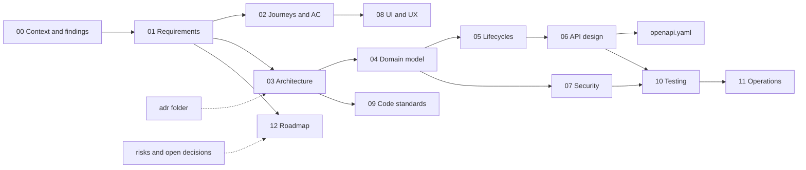
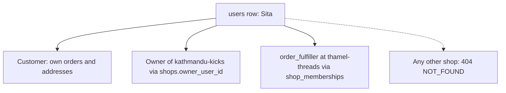
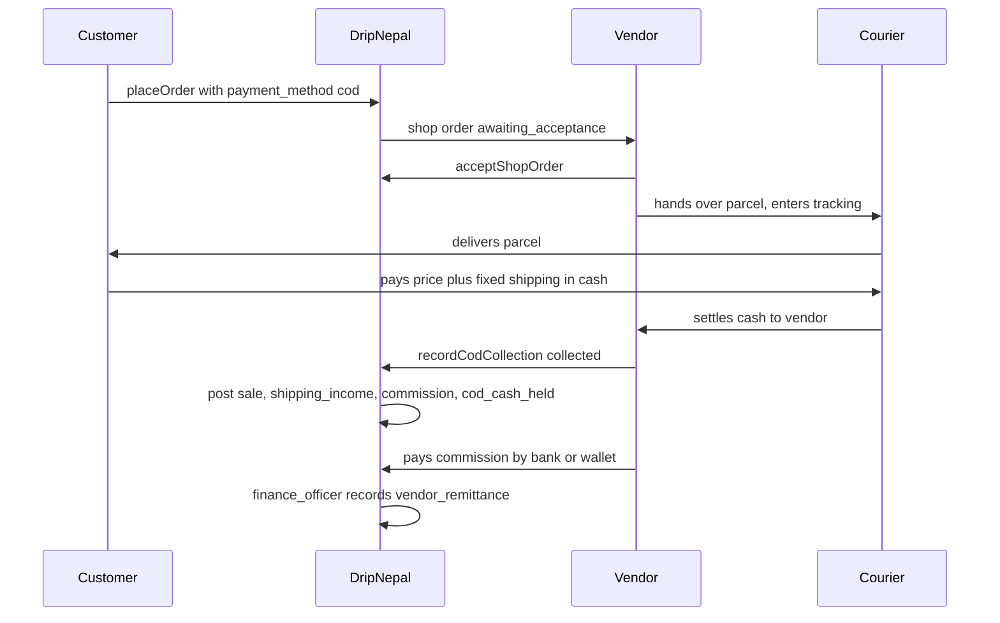

# DripNepal: Context, Assumptions and Open Questions

Status: Draft v1 (2026-09-25)

Reviewed: 2026-09-25 · consistency review 2026-09-30 to 2026-10-01

This is the entry document of the DripNepal documentation set. It records what we know and how we know it: the product owner's answers, what the repository actually contains (with file and line evidence), what was checked against official sources, and which parts are still assumptions or open decisions. The other documents build on it. When a statement elsewhere cites a repository finding (RF-xx), an assumption (A-xx) or the research log, the definition is here.

---

## 1. Purpose of the documentation set and how to read it

### 1.1 What the set is for

DripNepal is a multi-vendor fashion marketplace for Nepal, built on an existing AdonisJS 7 + Lucid + PostgreSQL 18 + Inertia React SSR repository (this one). The set is written for a team of one or two developers who build, operate and support the platform themselves. It has three jobs:

1. **Decide before building.** Money, stock, tenant isolation and legal duties are expensive to fix after real orders exist. The set fixes names, invariants and state machines before the M0 schema re-baseline ([ADR-0011](adr/0011-schema-rebaseline-before-production.md)).
2. **Separate evidence from opinion.** Each claim carries a label (section 1.2). A developer can tell a verified repository fact from a legal question an accountant still has to answer.
3. **Keep one owner per rule.** Each rule lives in exactly one document (section 1.4). Other documents link to it and do not restate it, so a change is made in one place.

### 1.2 Evidence labels

| Label                 | Meaning                                                                                                                             | What the reader should do                                              |
| --------------------- | ----------------------------------------------------------------------------------------------------------------------------------- | ---------------------------------------------------------------------- |
| **[Confirmed]**       | Stated by the product owner in the planning session of 2026-09-25 (Q1–Q8, section 3.2)                                              | Treat as a requirement. Changing it needs the product owner.           |
| **[Verified-repo]**   | Checked in the repository, with a `file:line` pointer                                                                               | Re-check if the file has changed since 2026-09-25 (HEAD `0282605`).    |
| **[Verified-doc]**    | Checked in official documentation or the installed package source. The source URL is given and all sources were accessed 2026-09-25 | Re-check version-sensitive items (section 9.8) before relying on them. |
| **[Assumption]**      | A proposed default that can be reversed, with an ID (A-xx, section 6), an owner and a revisit trigger                               | Build to it and keep the value configurable.                           |
| **[Open]**            | An open decision (OD-xx) with a named owner, tracked in [risks-and-open-decisions.md](risks-and-open-decisions.md)                  | Do not hard-code it. Section 7 says whether it blocks work.            |
| **[Verify-external]** | An external fact (law, tax, provider capability, price, SLA) that needs authoritative confirmation (VX-xx)                          | Do not state it as fact to users or vendors until confirmed.           |

The docs never state a tax rate, legal duty, gateway capability, courier contract, price or SLA as fact unless it is [Verified-doc] with a source. Where the words "secure", "scalable", "robust" or "best practice" appear, the text also names the mechanism, the tradeoff and the test ID that verifies it.

### 1.3 ID schemes

| ID              | Format and example                                     | Defined in                                                                                                   | Used for                                                                                                                  |
| --------------- | ------------------------------------------------------ | ------------------------------------------------------------------------------------------------------------ | ------------------------------------------------------------------------------------------------------------------------- |
| Q               | Q1–Q8                                                  | this doc, section 3.2                                                                                        | Planning questions answered by the product owner                                                                          |
| RF              | RF-01 … RF-47                                          | this doc, section 4.6                                                                                        | Consolidated repository findings (from audit IDs such as IAM-01, F8, A3-01, A5-03)                                        |
| A               | A-01 … A-52                                            | this doc, section 6                                                                                          | Assumptions and proposed defaults                                                                                         |
| FR / NFR        | `FR-CHK-005`, `NFR-SEC-001`                            | [01-product-requirements.md](01-product-requirements.md)                                                     | Functional and non-functional requirements                                                                                |
| J / AC          | `J-05` (Checkout COD); acceptance criteria per journey | [02-user-journeys-and-acceptance-criteria.md](02-user-journeys-and-acceptance-criteria.md)                   | Journeys J-01…J-20 and their acceptance criteria                                                                          |
| TM              | `TM-01`                                                | [07-security-threat-model-and-permissions.md](07-security-threat-model-and-permissions.md)                   | Threat register                                                                                                           |
| AS              | `AS-01` … `AS-12`                                      | [07 §1.2](07-security-threat-model-and-permissions.md#12-assets)                                             | Security assets of the threat model (the TM "Asset, boundary" rows); a separate prefix from the assumptions A-xx          |
| T               | `T-SEC-001`, `T-INV-003`                               | [10-testing-and-quality-gates.md](10-testing-and-quality-gates.md)                                           | Tests (areas ARCH, IAM, SEC, SHOP, CAT, MED, INV, CART, CHK, ORD, FUL, PAY, RET, LED, NOT, ADM, API, A11Y, PERF, OPS, UI) |
| M               | M0 … M9                                                | [12-roadmap-and-backlog.md](12-roadmap-and-backlog.md)                                                       | Milestones                                                                                                                |
| R               | R0, R1, R1.1, R2, R3                                   | [01](01-product-requirements.md) (scope), [12](12-roadmap-and-backlog.md) (schedule)                         | Release phases                                                                                                            |
| ADR             | ADR-0001 … ADR-0018                                    | [adr/](adr/)                                                                                                 | Architecture decision records (MADR style)                                                                                |
| OD / VX         | `OD-03`, `VX-09`                                       | [risks-and-open-decisions.md](risks-and-open-decisions.md)                                                   | Open decisions and external verifications                                                                                 |
| operationId     | `placeOrder`, `acceptShopOrder`                        | [06-api-design.md](06-api-design.md), [openapi.yaml](openapi.yaml)                                           | API operations                                                                                                            |
| Permission slug | `platform.refunds.approve`, `shop.orders.process`      | [07](07-security-threat-model-and-permissions.md)                                                            | Authorization                                                                                                             |
| Setting key     | `platform_settings.return_window_days`                 | [04a-data-dictionary-tables.md](04a-data-dictionary-tables.md) §15.1 (keys, seeded defaults, allowed ranges) | Tunable business parameters                                                                                               |

### 1.4 Document ownership map

| Doc                                                                                              | Source of truth for                                                                                                                                                                                  |
| ------------------------------------------------------------------------------------------------ | ---------------------------------------------------------------------------------------------------------------------------------------------------------------------------------------------------- |
| [00-context-assumptions-and-questions.md](00-context-assumptions-and-questions.md) (this doc)    | Context, confirmed answers, repository findings RF-xx, assumptions A-xx, research log, changes to repository direction                                                                               |
| [01-product-requirements.md](01-product-requirements.md)                                         | FR/NFR texts, release scope, non-goals, success metrics                                                                                                                                              |
| [02-user-journeys-and-acceptance-criteria.md](02-user-journeys-and-acceptance-criteria.md)       | Journeys J-01…J-20, acceptance criteria                                                                                                                                                              |
| [03-system-architecture.md](03-system-architecture.md)                                           | Modules and their dependency rules, process types (`web`, `worker`), jobs, integrations                                                                                                              |
| [04-domain-model-and-data-dictionary.md](04-domain-model-and-data-dictionary.md)                 | Conventions, key modelling decisions, ER diagrams (§1–§4); invariants, index summary, money, classification and retention, migration, reference data (§16–§21)                                       |
| [04a-data-dictionary-tables.md](04a-data-dictionary-tables.md)                                   | Table-by-table data dictionary: columns, keys, constraints, indexes, lifecycle, sensitivity (§5–§15; shares 04's numbering). §15.1 `platform_settings` owns every setting key and its seeded default |
| [05-order-payment-and-inventory-lifecycles.md](05-order-payment-and-inventory-lifecycles.md)     | State machines, the `placeOrder` algorithm, ledger posting rules                                                                                                                                     |
| [06-api-design.md](06-api-design.md)                                                             | API conventions (errors, idempotency, pagination, versioning), endpoint catalogue                                                                                                                    |
| [openapi.yaml](openapi.yaml)                                                                     | Request and response schemas (linted by T-API-009; responses checked by T-API-001)                                                                                                                   |
| [07-security-threat-model-and-permissions.md](07-security-threat-model-and-permissions.md)       | Threats TM-xx, permission matrix, session and privacy controls                                                                                                                                       |
| [08-ui-ux-and-design-system.md](08-ui-ux-and-design-system.md)                                   | Page inventory, components, accessibility target, UI kit usage                                                                                                                                       |
| [09-code-structure-and-engineering-standards.md](09-code-structure-and-engineering-standards.md) | Folder layout, coding and review standards                                                                                                                                                           |
| [10-testing-and-quality-gates.md](10-testing-and-quality-gates.md)                               | Test IDs, CI gates, test environments                                                                                                                                                                |
| [11-deployment-and-operations.md](11-deployment-and-operations.md)                               | Environments, deployment, backups, monitoring, runbooks                                                                                                                                              |
| [12-roadmap-and-backlog.md](12-roadmap-and-backlog.md)                                           | Milestones M0–M9, backlog, traceability matrix (FR → J → entities → operationIds → permissions → tests → M)                                                                                          |
| [adr/](adr/)                                                                                     | ADR-0001…ADR-0018 (the reason behind each structural decision)                                                                                                                                       |
| [risks-and-open-decisions.md](risks-and-open-decisions.md)                                       | OD-xx, VX-xx and risk registers, with owners and deadlines                                                                                                                                           |
| [README.md](README.md)                                                                           | Index, progress status, reading order per role                                                                                                                                                       |

### 1.5 How a decision changes

1. Update the owning document (section 1.4). If the change is structural, add or supersede an ADR.
2. Close or update the OD/VX entry in [risks-and-open-decisions.md](risks-and-open-decisions.md), and the matching A-xx row here if a decision replaces an assumption.
3. Update the traceability matrix in [12](12-roadmap-and-backlog.md) if FRs, tests or milestones move.

---

## 2. Summary of understanding

### 2.1 Product

DripNepal is a marketplace where independent Nepali fashion shops (clothing, footwear, bags, accessories, traditional wear) list products and customers buy from several shops in one checkout. The platform onboards and moderates shops, runs first-line customer support and returns, and takes a commission. At launch (R1) payment is cash on delivery only, and shops ship with couriers they choose themselves. [Confirmed] (Q2, Q4, Q5)

### 2.2 Surfaces

| Surface          | Routes (canonical)                                                                                                                                                                                                                        | Rendering                                          | Primary users                                              |
| ---------------- | ----------------------------------------------------------------------------------------------------------------------------------------------------------------------------------------------------------------------------------------- | -------------------------------------------------- | ---------------------------------------------------------- |
| Storefront       | `/`, `/men`, `/women` and other navigation entries such as `/men/t-shirts` (FR-SRCH-007), `/c/{categorySlug}`, `/search?q=`, `/p/{productSlug}-{publicId}`, `/shops/{shopSlug}`, `/cart`, `/checkout`, `/checkout/complete/{orderNumber}` | Inertia SSR (SEO and first paint on slow networks) | Guests, customers                                          |
| Auth             | `/login`, `/signup`, `/verify-email`, `/forgot-password`, `/reset-password`, `/mfa`                                                                                                                                                       | Inertia                                            | Everyone                                                   |
| Customer account | `/account`, `/account/orders`, `/account/orders/{orderNumber}`, `/account/addresses`, `/account/security`, `/account/shops`, `/sell`, `/invitations/{token}`                                                                              | Inertia                                            | Customers, would-be sellers                                |
| Seller dashboard | `/seller/{shopSlug}/…` (overview, products, inventory, orders, shipping, staff, finance, settings)                                                                                                                                        | Inertia, client-rendered                           | Shop owners and staff                                      |
| Platform admin   | `/admin/…`                                                                                                                                                                                                                                | Inertia, client-rendered, MFA required             | Platform staff                                             |
| JSON API         | `/api/v1/…`                                                                                                                                                                                                                               | JSON (`application/problem+json` errors)           | The three surfaces (mutations), and later external clients |

Page reads use Inertia props, and mutations use the versioned JSON API ([ADR-0004](adr/0004-inertia-reads-json-api-writes.md)). Details are in [03](03-system-architecture.md) and [06](06-api-design.md).

### 2.3 Actors and roles

| Actor                   | Identity                                                   | Authority comes from                                                                                                                      |
| ----------------------- | ---------------------------------------------------------- | ----------------------------------------------------------------------------------------------------------------------------------------- |
| Guest                   | none (guest cart token)                                    | Can browse and build a cart. Cannot check out. [Confirmed] Q6                                                                             |
| Customer                | `users` row, `status` = `pending_verification` or `active` | Own orders (`orders.customer_user_id`), own addresses                                                                                     |
| Shop owner              | same `users` row                                           | `shops.owner_user_id` (legal and payout party)                                                                                            |
| Shop staff              | same `users` row                                           | Active `shop_memberships` row with role `manager`, `catalog_editor`, `order_fulfiller` or `viewer`                                        |
| Platform staff          | same `users` row + `platform_staff` row                    | Role `platform_admin`, `support_agent`, `catalog_moderator` or `finance_officer`, with TOTP MFA                                           |
| Courier                 | not a user                                                 | The vendor enters tracking and delivery outcomes on the courier's behalf (no courier API until R3)                                        |
| Payment provider (R1.1) | not a user                                                 | Callbacks and returns, always verified by a server-to-server lookup ([ADR-0012](adr/0012-payment-provider-isolation-verify-by-lookup.md)) |
| System                  | worker process                                             | Jobs (acceptance timeout, reconciliation, auto-complete)                                                                                  |

**One person, several hats.** A single account can be a customer, the owner of one shop and staff at another shop at the same time. Example: Sita buys a kurta as a customer, owns "Kathmandu Kicks" and works as `order_fulfiller` at her friend's shop "Thamel Threads". She has one `users` row, one login and one session. Her authority is resolved on every request:

- On `/account/orders` the query filters by `orders.customer_user_id = Sita`.
- On `/seller/kathmandu-kicks/…` she is the owner because `shops.owner_user_id = Sita`.
- On `/seller/thamel-threads/…` she has only the `order_fulfiller` permissions from her membership.
- On `/seller/any-other-shop/…` she gets 404 `NOT_FOUND`, never 403, so the response does not reveal that the shop exists.

The shop always comes from the URL slug, which is resolved server-side. A "current shop" is never kept in the session, and shop IDs in request bodies are never trusted (canonical algorithm in [07](07-security-threat-model-and-permissions.md); verified by T-SEC-001). The current code cannot support this model: a vendor account is created by a guest-only form (RF-21), and the global `shop-owner` role carries no shop identity (RF-20).

### 2.4 Regional context

- **Payments.** Cash on delivery is expected to dominate at launch, but no primary source gives its share (only blog figures of 70–90%, recorded as "could not verify" in section 9.4). The wallets eSewa and Khalti are NRB-licensed Payment Service Providers [Verified-doc: NRB licensed PSO/PSP list, https://www.nrb.org.np/psd/licensed-list-of-payment-system-operator-pso-and-payment-service-provider-psp-9/]. No provider documents a marketplace split-payment feature (VX-01).
- **Networks and devices.** Customers are mostly on mid-range Android phones with slow or congested mobile data. This drives SSR for the storefront, small bundles and edge-resized images (NFR targets in [01](01-product-requirements.md)). The current home page loads about 5 MB of images (RF-30).
- **Addresses.** 7 provinces, 77 districts and 753 local levels, with 6,743 wards and up to 33 wards in one local level [Verified-doc: MoFAGA, Nepal Post, section 9.6]. Addresses are captured as Province → District → Local level → Ward → tole/street → landmark, not free text (RF-29).
- **Phones.** 10-digit mobile numbers starting 96/97/98, stored in E.164 (`+977…`) [Verified-doc: NTA numbering plan].
- **Money and time.** NPR (ISO 4217 minor unit 2), shown with lakh grouping. Asia/Kathmandu is UTC+05:45 with no DST. Legal and fiscal dates use Bikram Sambat (BS), and the fiscal year runs from Shrawan 1 to the end of Ashad.
- **Language.** The UI is English at launch and i18n-ready. Product text may be in Nepali. The Nepali UI comes in R2. [Confirmed] Q8
- **Regulation.** The Electronic Commerce Act 2081 is in force. DoCSCP Notice 06/083-84 says portal listing is mandatory and warns of legal action against unlisted platforms [Verified-doc: https://doc.gov.np/content/470/urgent-notice-regarding-mandatory-listing-e-commerce-2083-05-01/, accessed 2026-09-25]. How the Act applies to DripNepal is VX-02. The Act and Directive 2082 drive R1 requirements: platform disclosures, seller agreements, listing disclosures, a 15-day complaint SLA, refunds within 7 days for non-conforming goods, encrypted storage of phones and addresses, and a checkout kill switch for breaches.

Release phases (R0 Foundation, R1 MVP launch, R1.1, R2 Growth, R3 Scale) are scoped in [01](01-product-requirements.md) and scheduled with milestones M0–M9 in [12](12-roadmap-and-backlog.md).

---

## 3. Confirmed requirements

### 3.1 Fixed directions from the original brief

These came with the product owner's original brief for the project and are treated as constraints, not options. [Confirmed]

1. **Keep the stack.** AdonisJS 7, Lucid, PostgreSQL 18 and Inertia React with SSR, as a modular monolith with no microservices ([ADR-0002](adr/0002-modular-monolith-adonisjs.md), [ADR-0003](adr/0003-inertia-ssr-storefront-csr-dashboards.md)).
2. **Multi-vendor marketplace for Nepal.** Many independent shops, one storefront, one customer account system.
3. **Three surfaces on one codebase:** storefront, seller dashboard and platform admin.
4. **One identity, many roles.** A user can be customer, shop owner and shop staff at the same time (section 2.3).
5. **Fashion catalog** with categories, attributes and variants, where vendors pick from platform-approved values (critiqued in section 5).
6. **shadcn/ui-based UI** with the repository's `radix-nova` style.
7. **Mobile-first for Nepali networks**, localized for Nepal (NPR, addresses, phone numbers, time zone).
8. **Documentation before feature work,** sized for a small team.

### 3.2 Product-owner answers (Q1–Q8) and their consequences

| #   | Question                   | Answer [Confirmed]                                                                                                                                                                           | Consequences in this doc set                                                                                                                                                                                                                                                                                                                                                                                                                                         |
| --- | -------------------------- | -------------------------------------------------------------------------------------------------------------------------------------------------------------------------------------------- | -------------------------------------------------------------------------------------------------------------------------------------------------------------------------------------------------------------------------------------------------------------------------------------------------------------------------------------------------------------------------------------------------------------------------------------------------------------------- |
| Q1  | Team, budget, scale        | 1–2 developers, small budget, fewer than about 50 shops and about 1–2k orders/month at launch                                                                                                | Modular monolith, one VPS plus managed Postgres ([ADR-0016](adr/0016-hosting-single-region-portable.md)). PostgreSQL does jobs, sessions and rate limits, so Redis is not needed in R1 ([ADR-0010](adr/0010-postgres-jobs-pg-boss-transactional-send.md)). PostgreSQL FTS instead of a search engine ([ADR-0014](adr/0014-postgres-search-and-listing-read-model.md)). Fixed roles in code instead of a role editor (custom roles are R3). Capacity assumption A-02. |
| Q2  | Checkout scope             | Multi-shop cart, **one** payment, split into per-shop suborders (`shop_orders`)                                                                                                              | `orders` → `shop_orders` → `order_items` ([ADR-0009](adr/0009-multi-shop-orders-and-vendor-ledger.md)). Shipping, acceptance, fulfilment, cancellation, commission and ledger are all per shop order. The parent status is derived ([05](05-order-payment-and-inventory-lifecycles.md)). Fixes RF-07.                                                                                                                                                                |
| Q3  | Money flow                 | DripNepal is the payee for gateway payments and pays vendors out. Needs legal and NRB licensing confirmation                                                                                 | Internal vendor ledger ([ADR-0009](adr/0009-multi-shop-orders-and-vendor-ledger.md)), payouts module. Collect-and-pay-out may be regulated activity (VX-01, OD-02), which blocks M8. No customer wallet or stored value (possible e-money, section 9.4).                                                                                                                                                                                                             |
| Q4  | Payment methods            | COD at launch (R1). One wallet gateway (eSewa or Khalti, OD-03) in R1.1                                                                                                                      | `payments.method` ∈ `cod`/`esewa`/`khalti`. COD payment records per shop order. `PaymentProvider` adapter port ([ADR-0012](adr/0012-payment-provider-isolation-verify-by-lookup.md)). COD risk limits (A-08, OD-18). Gateway reconciliation job is required (section 9.4).                                                                                                                                                                                           |
| Q5  | Delivery, returns, support | Vendors pack and ship with their own courier and enter tracking and status. The platform runs first-line support, the return and refund policy, and dispute decisions. No courier API at MVP | `shipments` with vendor-entered `recordFulfillmentEvent`. Support cases with a 15-day due date. Support-mediated returns in R1 (FR-RET-006). Platform-initiated refunds (FR-RET-001). Courier APIs are R3.                                                                                                                                                                                                                                                           |
| Q6  | Guest checkout             | Guests can browse and build a cart. Checkout requires sign-in with a verified email and a Nepal mobile number (format-validated; OTP in R2)                                                  | Server-side guest cart with merge on login (FR-CART-001). `placeOrder` requires `users.status = active`, `email_verified_at` and a phone (FR-CHK-001). Phone OTP is R2 (FR-IAM-010).                                                                                                                                                                                                                                                                                 |
| Q7  | UI kit                     | Remove the `@commercn` registry. Use shadcn/ui core plus only the **free** components of Shadcn UI Kit. Premium blocks are visual reference only (the repo is public with an MIT LICENSE)    | [ADR-0015](adr/0015-ui-foundation-shadcn-and-kit-policy.md). Storefront commerce blocks (product card, gallery, variant picker, cart, checkout, filters, order timeline) are DripNepal-owned components. Committing free kit items waits for written licence clarification (VX-13). Repo visibility and tier are OD-22.                                                                                                                                              |
| Q8  | Localization               | English UI at launch, i18n-ready (message catalogs, locale formatters, NPR, Asia/Kathmandu). Product text may contain Nepali. Nepali UI in R2                                                | `<html lang>` set. Message catalogs in `resources/lang/en`. One shared NPR formatter (`en-IN` grouping, Latin digits, VX-12). Noto Sans already covers Devanagari. BS dates via a library in R2.                                                                                                                                                                                                                                                                     |

### 3.3 The COD consequence: vendors hold the cash, so the ledger must go negative

Q3, Q4 and Q5 together mean that **in R1 the platform never touches customer money.** The customer pays cash to the vendor's courier, and the courier passes it to the vendor. DripNepal is still owed its commission, so in R1 **vendors owe the platform** rather than the other way round. "Platform collects" only becomes literally true in R1.1, when gateway payments land in DripNepal's merchant account. This is by design, not a contradiction. It has three consequences:

1. **The ledger allows negative balances.** `ledger_entries.amount_minor` is signed (positive means the platform owes the vendor), and a shop's balance is `SUM(amount_minor)`. For a COD order, the entry `cod_cash_held` records that the vendor already holds the cash ([ADR-0009](adr/0009-multi-shop-orders-and-vendor-ledger.md); posting rules owned by [05](05-order-payment-and-inventory-lifecycles.md)).
2. **Vendors remit commission.** Finance staff record vendor payments with `recordVendorRemittance`, which creates `vendor_remittances` rows and `vendor_remittance` ledger entries. The terms (frequency, method, what happens to a vendor who does not pay) are a business agreement with vendors, **OD-05, which blocks launch**.
3. **R1.1 nets automatically.** Once gateway orders exist, what the platform owes on gateway orders is netted against a vendor's outstanding COD commission before any payout.

Worked example. The 10% commission is the seeded placeholder `default_commission_rate_bp = 1000` ([04a §15.1](04a-data-dictionary-tables.md)), not a decided rate (OD-04); the basis follows A-04. A COD shop order has one item at Rs 3,000 and shipping of Rs 150, and is delivered and collected:

| Entry type                  | amount_minor (paisa) | Meaning                                          |
| --------------------------- | -------------------- | ------------------------------------------------ |
| `sale`                      | +300000              | Vendor earned the item price                     |
| `shipping_income`           | +15000               | Vendor earned the shipping fee                   |
| `commission`                | −30000               | Platform commission, 10% of items (illustrative) |
| `cod_cash_held`             | −315000              | The vendor already holds the Rs 3,150 cash       |
| **Balance**                 | **−30000**           | Vendor owes the platform Rs 300                  |
| `vendor_remittance` (later) | +30000               | Vendor pays Rs 300. Balance is 0                 |

If the same vendor then has an R1.1 gateway order worth Rs 2,000 + Rs 100 shipping, and has not yet paid the Rs 300, the entries add +190000. The balance becomes +160000, and the payout is Rs 1,600, not Rs 1,900.

Related legal points that need confirmation. E-Commerce Act 2081 s8(1) treats payment to a delivery provider as payment received by the business, which gives COD an express legal basis [Verified-doc: https://giwmscdnone.gov.np/media/files/E-Commerce%20Act,%202081_yr7k9o5.pdf]. Which "business entity" is deemed paid, DripNepal or the vendor, is not settled (VX-02). Directive 2082 s9(2) requires an electronic invoice for cash payments, which may require IRD e-invoice permission (OD-26, VX-05). Directive s8(3) bars collecting anything at the door beyond the pre-agreed price and transport cost, so there is no COD fee at the door and shipping is fixed at checkout.

### 3.4 What the confirmed answers rule out in R1

- Vendor-collected gateway payments. The prototype vendor settings screen that "connects" Stripe, PayPal or COD per shop is dropped (RF-46).
- A customer wallet, store credit or refund-to-balance. This could count as e-money under NRB Unified Directive 2082 (section 9.4). Refunds go to the original method, or by bank or wallet transfer for COD.
- Guest checkout.
- Courier API integrations (R3) and automated payouts (R3).
- Premium Shadcn UI Kit code in the public repository (Q7, OD-22).
- Staff impersonation of users (FR-ADM-008 non-goal).

---

## 4. Existing implementation, verified from evidence

### 4.1 Method and limits

The repository was audited at HEAD `0282605` ("change url from /vendors/dashboard to /shops/:shopSlug/dashboard (#18)") in four areas: identity and authorization, schema integrity, frontend, and tooling and operations. An adversarial reviewer then re-checked every finding and corrected severities where the original was overstated. The audit IDs (IAM-xx, F-xx, A1/A3/A5-xx) are merged into RF-01…RF-47 below; the audit itself, with every original finding, is [research: repository-audit](research/repository-audit.md). The two later commits (`821149d`, `7338796`) touch only `docs/`, so every pointer still holds at the current branch head; the critic pass A3.1 re-read each RF pointer against the source on 2026-09-25. **Limit:** `node_modules` was not installed at audit time, so runtime behaviour (for example that the production SSR bundle is missing, or that the `shop_staff_assignments` model fails on insert) was inferred from source and from the exact package versions' published code, not executed. Section 9.9 lists these items.

### 4.2 Stack and exact versions

The resolved versions below come from `pnpm-lock.yaml` [Verified-repo]. The package sources were read from npm tarballs of these exact versions [Verified-doc, https://registry.npmjs.org/].

| Area                    | Package                    | Resolved version                                 | Note                                                                                            |
| ----------------------- | -------------------------- | ------------------------------------------------ | ----------------------------------------------------------------------------------------------- |
| Runtime                 | Node                       | engines `>=24.0.0` (package.json:7-9)            | pnpm 11.9.0 enforced via `packageManager` and `only-allow`                                      |
| Framework               | @adonisjs/core             | 7.3.4                                            | Re-exports health checks and transformers                                                       |
| ORM                     | @adonisjs/lucid            | 22.4.2                                           | Knex 3. Schema classes generated into `database/schema.ts`                                      |
| Auth                    | @adonisjs/auth             | 10.1.0                                           | Session guard `web`, `useRememberMeTokens: false` (config/auth.ts:9-24)                         |
| Session                 | @adonisjs/session          | 8.1.0                                            | `SESSION_DRIVER=cookie` (.env.example:13). Supports tagging with the database store             |
| Security                | @adonisjs/shield           | 9.0.0                                            | CSRF on (config/shield.ts:33), CSP off (:12)                                                    |
| Inertia (server)        | @adonisjs/inertia          | 4.2.0                                            | SSR enabled (config/inertia.ts:11). Adapter 5.0.1 is current upstream (M0 upgrade spike, OD-25) |
| Vite integration        | @adonisjs/vite             | 5.1.1                                            | Adapter 5 needs @adonisjs/vite 6                                                                |
| Build                   | @adonisjs/assembler        | 8.4.0                                            | Build copies only package.json and the lockfile                                                 |
| Inertia (client)        | @inertiajs/react           | 2.3.27                                           | Now the npm `legacy` line; v3 is current                                                        |
| UI runtime              | react / react-dom          | 19.2.7                                           |                                                                                                 |
| Bundler                 | vite                       | 7.3.6                                            |                                                                                                 |
| CSS                     | tailwindcss                | 4.3.1                                            | Tokens in `inertia/css/app.css` via `@theme inline`                                             |
| Components              | shadcn (CLI)               | 4.11.0 (latest 4.21.0)                           | Style `radix-nova`, baseColor zinc, lucide (components.json:3-13)                               |
| Primitives              | radix-ui                   | 1.6.0                                            | Unified package                                                                                 |
| Icons                   | lucide-react               | 1.21.0                                           |                                                                                                 |
| Validation              | @vinejs/vine               | 4.4.0                                            | `vine.create`                                                                                   |
| Typed routes            | @tuyau/core                | 1.2.2                                            | Registry generated to `.adonisjs/client/registry`                                               |
| Forms / schema (client) | @tanstack/react-form / zod | 1.33.0 / 4.4.3                                   |                                                                                                 |
| Dates                   | luxon                      | 3.7.2                                            | Not used under `inertia/` yet                                                                   |
| DB driver               | pg                         | 8.22.0                                           |                                                                                                 |
| Language                | typescript                 | 6.0.3                                            | `pnpm typecheck` exists but no hook or CI runs it                                               |
| Tests                   | @japa/runner               | 5.3.0                                            | Suites unit/functional/browser configured, **zero spec files**                                  |
| Local services          | docker-compose             | postgres 18.4, redis 8.6, axllent/mailpit:latest | Redis and Mailpit are not used by the app                                                       |
| Unwanted                | D / better-sqlite3         | 1.0.0 / 12.11.1                                  | npm-withdrawn placeholder, and an unused native SQLite driver (RF-39)                           |

Absent packages that the plan needs: @adonisjs/bouncer 4.0.1, @adonisjs/limiter 3.0.1, @adonisjs/mail 10.4.0, @adonisjs/drive 4.0.0, @adonisjs/i18n 3.0.1, @adonisjs/lock 2.1.0, @japa/api-client, pg-boss 12.x and sharp ≥ 0.35.4 (versions verified on npm, section 9.2).

### 4.3 What exists

**Migrations** [Verified-repo, `database/migrations/`]. There are 26 files: 25 create tables and one enables `pgcrypto` (`1780064033094_create_enable_pgcryptos_table.ts`). The tables are users, global_roles, permissions, global_user_roles, global_role_permissions, shops, shop_roles, shop_role_permissions, shop_staff_assignments, categories, products, product_variants, attributes, attribute_values, product_variant_attribute_values, product_media, user_addresses, carts, cart_items, orders, order_items, payments, shop_addresses, shop_categories and shop_categories_shop. Primary keys are UUID `gen_random_uuid()`, except `shop_categories`, which uses string slugs, and the pivots and `shop_staff_assignments`, which have no PK. Every FK except `shops.owner_id` (RESTRICT) is `ON DELETE CASCADE`.

**Controllers** [Verified-repo, `app/controllers/`]. There are five: `new_account_controller.ts` (signup), `session_controller.ts` (login/logout), `shops/auth/shop_registrations_controller.ts` (guest vendor onboarding), `shops/dashboard/shop_dashboard_controller.ts` (renders a placeholder) and `shops/dashboard/shop_settings_controller.ts` (13 settings actions, all routes commented out at start/routes/shops.ts:18-24). No catalog, cart, order or payment controller exists.

**Routes** [Verified-repo, start/routes.ts:15-77, start/routes/shops.ts:5-28]:

- Public: `GET /`.
- Behind `guest()`: signup, login, `/men`, `/women`, `/categories/:slug` and `/:attributeValue/:productSlug`, plus `/cart`, `/checkout` and `/design-system`.
- Behind `auth()`: `POST /logout`.
- Vendor: guest-only `GET/POST /shops/register`, and `GET /shop/:shopSlug/dashboard` behind auth only.

**Pages** [Verified-repo, `inertia/pages/`]:

- Storefront: `customers/home`, `commerce/men`, `commerce/women` (a placeholder `<h1>`), `commerce/categories/show`, `commerce/product_detail`, `commerce/cart`, `commerce/checkout`. All run on client mock data.
- Auth: `auth/login` and `auth/signup`.
- Seller: `shops/register` (two-step TanStack Form) and `shops/dashboard/index` (renders `<h1>hello</h1>`).
- Other: `design_system` and `errors/not_found`, `errors/server_error`.
- Unrouted: 50 files under `shops/dashboard/shop-management/**` (settings, payment settings, policy editor) and 17 components under `pages/landing/**` (the audit's "~60" and "18" were recounted with `find`).

**Shared code worth keeping.** `shared/constants/provinces_with_districts.ts` has all 7 provinces and 77 districts (not imported anywhere). The Nepal-customised cart and checkout components under `inertia/components/commerce` (multi-store grouping in `cart_store_group.tsx`) are the starting point for DripNepal-owned commerce components ([ADR-0015](adr/0015-ui-foundation-shadcn-and-kit-policy.md)). The radix-nova primitives in `inertia/components/ui` match the official registry.

### 4.4 What works, what is broken, what is mock

| Status         | Items                                                                                                                                                                                                                     |
| -------------- | ------------------------------------------------------------------------------------------------------------------------------------------------------------------------------------------------------------------------- |
| Works          | Signup (creates the user and logs them in; the email is never verified). Login and logout (gaps in RF-12). Home page render. Design-system page. Named-route generation (Tuyau registry). CSRF via the XSRF-TOKEN cookie. |
| Broken at HEAD | Vendor registration (RF-03). `/cart` and `/checkout` crash on render (RF-10). Signed-in users cannot browse (RF-02). Production SSR build (RF-08). Every RBAC relation (RF-20). Dashboard sidebar links (RF-01).          |
| Mock only      | Category listing, product detail, search, cart and checkout totals (RF-27; totals also wrong, RF-16). Shop-management settings (RF-47).                                                                                   |
| Absent         | Email sending, email verification, password reset, product authoring, inventory, orders, payments, media storage, rate limiting, health checks, tests, CI, Dockerfile, deployment definition.                             |

### 4.5 Key verified framework facts

These facts change how the code is written. Sources are in section 9.2.

1. **`database/schema.ts` is generated.** Lucid 22.4.2 regenerates it after `migration:run` and `migration:rollback`, but not in production. Models extend the generated classes (`class User extends compose(UserSchema, AuthFinder)`). Never hand-edit it, and commit the regenerated file. `database/schema_rules.ts` is **not loaded**, because `config/database.ts` has no `schemaGeneration.rulesPaths`. Decimal columns map to `string` and bigint to `bigint | number`, so money in `bigint` paisa needs a guarded parser ([ADR-0007](adr/0007-money-integer-minor-units.md)). [Verified-doc]
2. **The SSR flags disagree.** `config/inertia.ts:11` enables SSR, while `vite.config.ts:11` disables it in the Vite plugin. In adapter 4.2.0 the SSR bundle is built only when the plugin flag is on, and production imports `ssr.bundle`. So every full page load after `node ace build` is expected to fail, including the 500 page. [Verified-repo + Verified-doc; runtime not executed]
3. **`createRoot`, not `hydrateRoot`.** `inertia/app.tsx:30` throws away the server HTML and re-renders, which costs mid-range phones twice the work. The theme is applied in `useEffect`, so dark-mode users see a flash of the light theme. [Verified-repo]
4. **Per-page SSR is possible.** Adapter 4.2.0 supports `ssr.pages` (an array, or `(ctx, page) => boolean`), so the storefront can be SSR while the seller and admin surfaces render client-side ([ADR-0003](adr/0003-inertia-ssr-storefront-csr-dashboards.md)). [Verified-doc]
5. **Auth re-reads the user on every request** (`SessionLucidUserProvider.findById`), but never checks `status`. Suspension enforcement must be added as middleware or a custom provider. `login()` regenerates the session ID, which protects against session fixation. `logout()` does not regenerate or clear the session. [Verified-doc]
6. **Revoking all of a user's sessions needs a server-side store.** Session tagging (`session.tag(userId)`, `SessionCollection.tagged()`) works only with the database, redis or memory stores, not with the current cookie store. [Verified-doc]
7. **Inertia history encryption** is configured with the `encryptHistory` key in 4.2.0. The `history.encrypt` key shown in some examples is dead in this version. [Verified-doc] History is cleared by the client: `logOut` answers a JSON 204, where a server-side `inertia.clearHistory()` has no effect, so the client's `logOut` success handler calls `router.clearHistory()`, and `/login`, `/mfa` and every page rendered without a signed-in user render with `inertia.clearHistory()` as a backstop ([07 §3.11](07-security-threat-model-and-permissions.md#311-logout-and-inertia-history)).
8. **`db:seed` has no production guard.** Seeders are filtered only by `static environment` (Lucid runner.js:57), and no seeder declares one (RF-05). [Verified-doc]
9. **There is no OpenAPI generator for AdonisJS v7.** Tuyau 1.2.2 generates TypeScript types only. `docs/openapi.yaml` is hand-maintained: T-API-009 lints it and T-API-001 checks every response against it. [Verified-doc]
10. **Current AdonisJS docs describe adapter 5 / Inertia 3 APIs** (such as `once()` and `useHttp`), and these do not compile against the installed 4.2.0 [Verified-doc]. OD-25, decided 2026-09-30, upgrades in a 2–3 day spike at the start of M0; all code examples in these docs target 4.2.0 until the spike passes, and stay on 4.2.0 if it fails.

### 4.6 Consolidated repository findings (RF-01 … RF-47)

Severity is after adversarial verification. "Fix" is the resolving milestone ([12](12-roadmap-and-backlog.md)). Paths are relative to the repo root, with a leading `app/`, `inertia/`, `inertia/components/` or `inertia/pages/` dropped where the rest is unambiguous. Migrations are named by their timestamp prefix. Every pointer was re-checked against the source on 2026-09-25. Totals: **11 high, 22 medium, 12 low, 2 info.**

| RF    | Sev    | Finding                                                                                                                                    | Evidence (file:line)                                                                                                                | Impact                                                                                                                                                                                                                                                                         | Audit IDs                       | Fix                         |
| ----- | ------ | ------------------------------------------------------------------------------------------------------------------------------------------ | ----------------------------------------------------------------------------------------------------------------------------------- | ------------------------------------------------------------------------------------------------------------------------------------------------------------------------------------------------------------------------------------------------------------------------------ | ------------------------------- | --------------------------- |
| RF-01 | high   | Seller dashboard checks authentication only (no membership, permission or status). Sidebar links are slug-less                             | start/routes/shops.ts:14-28; shops/dashboard/shop_dashboard_controller.ts:4-6; shop_dashboard_layout/components/navigation.ts:34-44 | Any signed-in user reaches any shop's dashboard. The first data page added would leak other vendors' orders and payouts                                                                                                                                                        | IAM-01, A3-05, MISSED           | M0 guard / M2 full          |
| RF-02 | high   | Storefront, cart and checkout behind `guest()`. Two-segment catch-all shadows later routes                                                 | start/routes.ts:17-49, 52-64; middleware/guest_middleware.ts:23-27                                                                  | Signed-in users bounced to `/`. Unknown URLs return a 200 mock page                                                                                                                                                                                                            | IAM-03, F1, F25                 | M0                          |
| RF-03 | high   | Vendor registration broken: stale route names after #18, guest-only redirect, server errors dropped, logo discarded                        | start/routes/shops.ts:11; shop_registrations_controller.ts:65; pages/shops/register/index.tsx:38-50                                 | The only onboarding path returns a 500 after committing the user and shop                                                                                                                                                                                                      | IAM-02, A3-04, A5-02, MISSED    | M0 hotfix / M2              |
| RF-04 | high   | Cookie sessions: no revocation. Suspended or soft-deleted users can log in. Remember-me ignored                                            | .env.example:13; session_controller.ts:15-16; pages/auth/login.tsx:129-132                                                          | Bans have no effect. No "log out everywhere"                                                                                                                                                                                                                                   | IAM-04, A5-11, MISSED           | M0                          |
| RF-05 | high   | Demo seeder creates an active vendor `demo@dripnepal.com` / `dripnepal` and has no environment guard                                       | database/seeders/shop_seeder.ts:14-26                                                                                               | Seeding reference data in production creates a publicly known vendor login                                                                                                                                                                                                     | IAM-06, A1-08, A5-01            | M0                          |
| RF-06 | high   | CASCADE into orders, order_items and payments. No address snapshot, and the order address is not tied to the customer                      | migrations 1780074257570:11,14; 1780074567760:11-20; 1780074815800:11                                                               | Deleting an address, user or category erases orders and payment evidence                                                                                                                                                                                                       | F8, IAM-07, MISSED              | M0 baseline                 |
| RF-07 | high   | One order row spans shops. No shop orders                                                                                                  | migration 1780074257570:18-34                                                                                                       | No per-shop fulfilment, shipping, commission or payout                                                                                                                                                                                                                         | A1-01                           | M0 baseline / M5            |
| RF-08 | high   | SSR on in the server config, off in Vite. `createRoot` instead of hydration. Theme applied after JS                                        | config/inertia.ts:11; vite.config.ts:11; inertia/app.tsx:30                                                                         | Production full page loads fail. Double render and flicker on phones                                                                                                                                                                                                           | A5-03, A3-09                    | M0                          |
| RF-09 | high   | No tests, no CI. Typecheck not gated                                                                                                       | tests/ (bootstrap.ts only); .husky/pre-push:1                                                                                       | Drift such as RF-03 reaches main                                                                                                                                                                                                                                               | A5-04, IAM-29                   | M0                          |
| RF-10 | high   | `/cart` and `/checkout` crash (no CartProvider). Cart lost between layouts                                                                 | hooks/use_cart.tsx:269-271; layouts/customers_layout.tsx:15                                                                         | The cart → checkout flow cannot run                                                                                                                                                                                                                                            | A3-01                           | M0 hotfix / M5              |
| RF-11 | high   | `user_addresses.recipient_phone` globally unique                                                                                           | migration 1780073825111:17                                                                                                          | A second address with the same phone fails. The error leaks other users' data                                                                                                                                                                                                  | F14, IAM-15                     | M0 baseline                 |
| RF-12 | medium | Login: no rate limit, non-credential errors swallowed, 32-char password cap, no auth audit, "Email or Phone" label accepts email only      | session_controller.ts:11-24; validators/shared.ts:7; pages/auth/login.tsx:89                                                        | Credential stuffing. Blank responses on DB errors                                                                                                                                                                                                                              | IAM-05, MISSED                  | M0 / M1                     |
| RF-13 | medium | No composite tenant FKs                                                                                                                    | migrations 1780071101792:8-17; 1780074567760:13-20                                                                                  | One bug can link shop B's role or product into shop A                                                                                                                                                                                                                          | A1-02, MISSED                   | M0 baseline                 |
| RF-14 | medium | Stock is one unconstrained integer. Global SKU. Duplicate variant combinations possible                                                    | migrations 1780072881100:13,19; 1780073178369:14                                                                                    | Oversell. SKU clashes between shops. Stock changes untraceable                                                                                                                                                                                                                 | F11                             | M0 baseline / M3            |
| RF-15 | medium | Payments table has no idempotency or refund model. Orders have no idempotency key                                                          | migrations 1780074815800:13-21; 1780074257570:8-44                                                                                  | A double tap on a slow network creates two COD orders                                                                                                                                                                                                                          | F17, A1-07                      | M0 baseline / M5 / M8       |
| RF-16 | medium | `decimal(10,2)` money (a string in the ORM, a float in the UI). Savings subtracted twice. The client sets price and order number           | database/schema.ts:367; hooks/use_cart.tsx:170-189; checkout/checkout_page.tsx:227-268                                              | The same mock cart shows Rs 20,796 in the cart and Rs 29,093 at checkout                                                                                                                                                                                                       | F9, A3-02, A3-03                | M0 baseline / M5            |
| RF-17 | medium | Product names globally unique, default status `active`, string `published_at`. Attribute values globally unique. `parent_id` has no FK     | migrations 1780072672679:14-28; 1780073119466:13; 1780072545096:10                                                                  | Two shops cannot both sell "Black Hoodie". Shoe size 40 and waist 40 collide                                                                                                                                                                                                   | F10, F12, F13                   | M0 baseline / M3            |
| RF-18 | medium | Media: text sort order, 255-char URL, no storage key. Upload accepts any image/\* as unbounded base64                                      | migration 1780073399897:23-31; shop-management/components/image-upload.tsx:28-36                                                    | Wrong gallery order. SVG stored XSS. Orphaned files                                                                                                                                                                                                                            | F15, A3-14                      | M3                          |
| RF-19 | medium | Carts: unlimited per user, no status or expiry, keyed by raw session ID                                                                    | migration 1780074042695:10-13                                                                                                       | Duplicate carts. A session ID stored in business data                                                                                                                                                                                                                          | F16, IAM-19                     | M5                          |
| RF-20 | medium | RBAC miswired: wrong pivot names, staff table without PK, global `shop-owner` role                                                         | models/user.ts:33-36; migration 1780071101792:7-20; constants/global_roles.ts:7-11                                                  | The first role query returns a 500. A global vendor role invites a cross-shop guard                                                                                                                                                                                            | F3, IAM-09..13, A1-03, F24      | M0 baseline / M2            |
| RF-21 | medium | Existing customers cannot open a shop. Owner contact copied into unique shop columns                                                       | start/routes/shops.ts:5-12; shop_registrations_controller.ts:19-36                                                                  | Breaks the one-identity model (section 2.3). Blocks a second shop                                                                                                                                                                                                              | IAM-08, MISSED                  | M2                          |
| RF-22 | medium | No email or slug normalisation. Validators do not mirror DB limits                                                                         | validators/shared.ts:6; validators/auth/shop.ts:15-20                                                                               | Duplicate accounts by letter case. 500 instead of 422. Reserved slugs such as `admin`                                                                                                                                                                                          | IAM-14..16, A1-04, A1-05, A3-15 | M1 / M2                     |
| RF-23 | medium | Free-text statuses that disagree with the constants. No CHECKs                                                                             | migration 1761885935168:25; constants/user_status.ts:1-6                                                                            | Every new user is in a state the TypeScript type does not know                                                                                                                                                                                                                 | F23, IAM-25, A5-14              | M0 baseline                 |
| RF-24 | medium | Soft-delete columns unenforced. Unique constraints ignore them                                                                             | migrations 1761885935168:33; 1780072672679:34                                                                                       | Deleted users can log in. Their slugs and emails stay reserved forever                                                                                                                                                                                                         | A1-06                           | M0 baseline                 |
| RF-25 | medium | Mixed money and date formats, no i18n layer, `<html>` without `lang`                                                                       | cart/order_summary.tsx:26; drip_product_card.tsx:30; views/inertia_layout.edge:2                                                    | Customers see "Rs. २०,७९६". SSR and client output differ                                                                                                                                                                                                                       | A3-07, A3-08, ui fact 52        | M0 (lang) / M4              |
| RF-26 | medium | Page props (emails, phones) logged to console and SSR logs. Dev SQL logs bindings                                                          | layouts/root_layout.tsx:28; config/database.ts:10,60                                                                                | Personal data in logs                                                                                                                                                                                                                                                          | A3-10, MISSED                   | M0                          |
| RF-27 | medium | Catalog, PDP, search and cart run on mocks. Filters not in the URL. Add-to-cart does nothing                                               | product_detail/index.tsx:14; categories/show.tsx:35-45                                                                              | No storefront data flow exists                                                                                                                                                                                                                                                 | A3-12                           | M4 / M5                     |
| RF-28 | medium | Accessibility defects. No cart entry point on phones                                                                                       | pages/auth/login.tsx:88-97; navbar/index.tsx:126                                                                                    | Keyboard, screen-reader and phone users are blocked                                                                                                                                                                                                                            | A3-13, A3-17                    | M1 / M4 / M5                |
| RF-29 | medium | 75 of 77 districts. Phone regex rejects valid numbers. Shop form offers Bagmati only                                                       | lib/mock-data/checkout.ts:87-110; checkout/address_form.tsx:52; register/components/step_shop_info.tsx:25-30                        | Customers in Eastern and Western Rukum cannot order                                                                                                                                                                                                                            | A3-16, A1-12, MISSED            | M1 / M2                     |
| RF-30 | medium | Devtools in the production bundle, a 2.8 MB image, duplicate CSS imports                                                                   | inertia/app.tsx:12-13; home/components/featured/featured_products.tsx:13-16                                                         | About 5 MB on a first visit over mobile data                                                                                                                                                                                                                                   | A5-13, A3-19, MISSED            | M0 / M4                     |
| RF-31 | medium | No trustProxy, health checks, DB TLS or pool config, monitoring or deploy definition. Fragile production install                           | config/app.ts:15-84; config/database.ts:47-61; package.json:20                                                                      | The first deploy fails or logs proxy IPs                                                                                                                                                                                                                                       | A5-12, A5-07                    | M0 / M7                     |
| RF-32 | medium | Tests would use the development database                                                                                                   | .env.test:1; tests/bootstrap.ts:35-38                                                                                               | The first test `truncate()` wipes local data                                                                                                                                                                                                                                   | A5-05                           | M0                          |
| RF-33 | medium | Env gaps: `APP_NAME` not in the env schema, `.env.example` lacks the required `DB_*` keys, env variants not ignored, tsbuildinfo committed | config/logger.ts:21; start/env.ts:29-33; .env.example:1-13; .gitignore:8-11                                                         | A fresh clone fails. Risk of committing `.env.production`                                                                                                                                                                                                                      | A5-08, A5-15, A5-10             | M0                          |
| RF-34 | low    | CSP off. Inertia history encryption off (the key is `encryptHistory`)                                                                      | config/shield.ts:12; config/inertia.ts:3-18 (no `encryptHistory` key)                                                               | No XSS backstop. The back button shows the previous user's pages on a shared phone                                                                                                                                                                                             | IAM-28, A5-09                   | M0 report-only / M7 enforce |
| RF-35 | low    | Multipart up to 20 MB processed on every route before auth                                                                                 | config/bodyparser.ts:54-69; start/kernel.ts:38                                                                                      | Anonymous large uploads                                                                                                                                                                                                                                                        | IAM-20                          | M0                          |
| RF-36 | low    | Spread-payload mass assignment. Transformer exposes `ownerId` and owner contact. Raw 5xx messages in JSON                                  | new_account_controller.ts:11-12; transformers/shop_transformer.ts:6-19; exceptions/handler.ts:10                                    | Future privilege escalation. Schema names leak                                                                                                                                                                                                                                 | IAM-24, IAM-18, A5-16           | M0 / M1                     |
| RF-37 | low    | Redirects forward the query string. No validated return URL                                                                                | config/app.ts:45                                                                                                                    | Reset tokens leak into redirects and Referer headers                                                                                                                                                                                                                           | IAM-26                          | M1                          |
| RF-38 | low    | Signup reveals registered emails and is unthrottled                                                                                        | validators/auth/user.ts:9; validators/auth/shop.ts:7                                                                                | Account enumeration                                                                                                                                                                                                                                                            | IAM-27                          | M1                          |
| RF-39 | low    | `D@1.0.0` placeholder, unused better-sqlite3 and sqlite connection, `@commercn` registry                                                   | package.json:92-93; pnpm-workspace.yaml:3; config/database.ts:15-41; components.json:25                                             | Supply-chain noise, and an allowed install script that downloads a prebuilt native binary outside the lockfile integrity check (compiling only when no prebuild matches; [07 TM-26](07-security-threat-model-and-permissions.md#tm-26-dependency-and-supply-chain-compromise)) | IAM-30, A5-06, A3-18            | M0                          |
| RF-40 | low    | Debug, mock and design-system pages routed in production                                                                                   | start/routes.ts:51-71                                                                                                               | A fake checkout is reachable                                                                                                                                                                                                                                                   | A5-17                           | M0                          |
| RF-41 | low    | Migrations edited in place and importing constants. No timestamp defaults                                                                  | migrations 1780070540447:1,31; 1780070389008:16                                                                                     | Environments drift. `attach()` fails                                                                                                                                                                                                                                           | A1-09, A1-10                    | M0 baseline                 |
| RF-42 | low    | README contradicts the code. LICENSE MIT vs package.json UNLICENSED. AI skill bundles committed                                            | LICENSE:1; package.json:6; README.md:285                                                                                            | Licence ambiguity (OD-23, decided 2026-09-30: MIT)                                                                                                                                                                                                                             | A5-18, A5-21                    | M0                          |
| RF-43 | low    | docker-compose: weak password, binds on all interfaces, unpinned image. Dev CORS reflects any origin                                       | docker-compose.yml:8-23; config/cors.ts:21                                                                                          | Developer databases reachable on shared Wi-Fi                                                                                                                                                                                                                                  | A5-19, A5-20, IAM-23            | M0                          |
| RF-44 | low    | Shops shared prop queried on every render, owned shops only                                                                                | middleware/inertia_middleware.ts:29-41                                                                                              | An extra query per page. Staff do not see their shops                                                                                                                                                                                                                          | IAM-22, IAM-11                  | M2                          |
| RF-45 | low    | Indexes do not match query patterns                                                                                                        | migrations 1780074042695:13; 1780074257570:13                                                                                       | Sequential scans as data grows                                                                                                                                                                                                                                                 | A1-11                           | M0 baseline                 |
| RF-46 | info   | Checkout UI and vendor settings imply different payment models                                                                             | lib/mock-data/checkout.ts:206-245; \_components/payment-settings.tsx:22-29                                                          | Two incompatible money models. Resolved by Q3                                                                                                                                                                                                                                  | A3-20                           | M5                          |
| RF-47 | info   | Large amounts of unrouted or dead UI. No frontend checks                                                                                   | `pages/landing/**` (17 files); `pages/shops/dashboard/shop-management/**` (50 files); start/routes/shops.ts:18-24                   | Mock screens mistaken for features                                                                                                                                                                                                                                             | A3-21                           | M0 (CI) / M4                |

### 4.7 Findings by milestone

M0 resolves or contains all 11 high findings. RF-01, RF-03 and RF-10 get a guard or hotfix in M0, and the full fix follows in M2 or M5. The schema findings are fixed together by the re-baseline, not by incremental ALTERs ([ADR-0011](adr/0011-schema-rebaseline-before-production.md), A-01). Identity and onboarding findings close in M1–M2, catalog and storefront findings in M3–M5, and CSP enforcement and operations (RF-34, RF-31) in M7.

---

## 5. Critique of the earlier catalog direction

### 5.1 What the earlier direction proposed

The catalog direction in the repository [Verified-repo] and in the original brief (section 3.1, item 5) is:

- **A flat product category list** (`app/constants/categories.ts`, seeded by `category_seeder.ts:7`): Streetwear (:4), T-Shirts (:13), Hoodies (:21), Sneakers (:29), Jackets (:37), Cargo Pants (:45), Watches (:53), Bags (:61), Accessories (:69), Traditional Wear (:77), Kurtas (:85), Sarees (:93), **Women Fashion (:101)** and **Men Fashion (:109)**.
- **A tree with the audience at the root**, as described in `database/README.md`: "Men └── Hoodies / Women └── Dresses".
- **A second, separate shop taxonomy** (`shared/constants/shop_categories.ts`): `mens-fashion`, `womens-fashion`, `kids-and-baby`, `footwear`, `watches`, and so on.
- **Generic attributes** "size, color, material" with values "S, M, L, Black, Neon" in `attribute_values`, which is globally unique on `value` (migration 1780073119466:13). The variant pivot has no `attribute_id` (1780073178369:14).
- **Audience in the product URL**: `/:attributeValue/:productSlug` (start/routes.ts:44).
- **Vendors pick from platform-approved values**, with no path to request a missing one.

### 5.2 What holds

1. **Products versus variants.** The product is the marketing entity (title, description, media) and the variant is the purchasable entity (SKU, price, stock). The data model in [04](04-domain-model-and-data-dictionary.md) keeps this split (`products`, `product_variants`).
2. **Platform-controlled attributes and values.** Letting vendors type free-text values fragments filters ("40 ", "40-eu"). Platform control is kept (FR-CAT-002), with values seeded in R1 and an admin UI in R2.
3. **Nested categories.** Kept, with a real FK, `ON DELETE RESTRICT` and a materialised `path` for subtree queries (fixes RF-17).
4. **Images per colour.** Kept, and made precise: `product_media.color_value_id` ties images to a colour value, not to an individual variant.
5. **Room for new product types** (shoes, watches, bags, sarees). Kept, through `category_attributes`, which declares for each category which attributes apply and which may be variant axes.

### 5.3 What is weak or contradictory

**(a) Audience conflated with category.** "Men Fashion" and "Women Fashion" sit in the same list as "Hoodies", and the README puts Men and Women at the root of the tree. Three problems follow:

- A unisex hoodie must be listed twice or forced into one side, which breaks the rule that each product has exactly one category.
- Every garment subtree is duplicated (Men › T-Shirts, Women › T-Shirts). With globally unique category names (RF-17), even that is impossible.
- Filters such as "hoodies for everyone under Rs 2,000" need queries across both subtrees.

Audience describes who a product is for, not what the product is.

**(b) Several classification axes in one list.** The list mixes garment type (T-Shirts, Kurtas, Sarees), style (Streetwear), occasion or culture (Traditional Wear), product class (Watches, Bags) and audience. A streetwear hoodie then has no single correct category. Style and occasion belong to curated collections (R2) or attributes, and the category tree should classify only what the product is.

**(c) One generic "size".** Apparel sizes (XS–3XL, Free Size), EU shoe sizes (35–47), waist inches (26–40) and kids' ages would share one value list. The size filter on a sneakers page would then offer "M", and a size-40 shoe value would collide with a 40-inch waist (global uniqueness, RF-17). A size chart cannot be tied to a size system either.

**(d) Material as one product-level value.** Fashion sets often combine materials: a kurta set with a cotton kurta and a silk dupatta, or a sneaker with a leather upper and a rubber sole. A single-valued material either misstates the product or collapses to "mixed", which is useless for filtering. E-Commerce Act s6 also requires the substance of goods to be disclosed (FR-CAT-012; VX-02).

**(e) "Vendors select approved values" with no request path.** A vendor with a new brand, or a colour such as "rani pink" that is not in the list, is stuck. In practice they pick a wrong value or stop listing. Every approved-values design needs a request-and-approve loop with an owner.

**(f) Audience in the URL.** `/:attributeValue/:productSlug` gives a unisex product two URLs (duplicate content for SEO). It also shadows every other two-segment route (RF-02) and breaks when a slug changes.

**(g) Two unrelated taxonomies with overlapping names.** `categories` and `shop_categories` both contain "watches" and audience-style entries. Nothing says which one drives navigation.

### 5.4 Definitions the docs use

| Term                      | Definition                                                                                                             | Cardinality and control                                                                                                                          | Example                                           |
| ------------------------- | ---------------------------------------------------------------------------------------------------------------------- | ------------------------------------------------------------------------------------------------------------------------------------------------ | ------------------------------------------------- |
| **Category**              | The garment-type node that says what the product is. It decides which attributes apply                                 | Exactly one **leaf** category per product. Platform tree, seeded in R1                                                                           | Clothing › Tops › T-Shirts                        |
| **Audience**              | Who the product is for                                                                                                 | Product-scope, **multi-valued** attribute. Values set by OD-15 (recommended men, women, kids; "unisex" is shown when both men and women are set) | A hoodie tagged men + women                       |
| **Attribute**             | A platform-defined property with `scope` (product or variant), `input` (single or multi) and an `is_filterable` flag   | Values platform-controlled, unique per attribute (`UNIQUE(attribute_id, code)`)                                                                  | `material`, `apparel_size`, `color`               |
| **Option axis**           | A variant attribute a given product varies by                                                                          | 0–2 axes per product in R1 (`product_option_axes`)                                                                                               | T-shirt varies by `apparel_size` × `color`        |
| **Size system**           | A separate size attribute per measuring system                                                                         | `apparel_size`, `shoe_size_eu`, `waist_size_in`, and `kids_age` in R2. `category_attributes` selects which apply                                 | Sneakers use `shoe_size_eu`                       |
| **Brand**                 | The trademark under which goods are sold (E-Commerce Act s6 trademark disclosure)                                      | Optional per product. `brands.status` is active, pending or rejected                                                                             | "Goldstar"                                        |
| **Collection** (R2)       | A curated or rule-based set of products for merchandising                                                              | Many-to-many, no effect on attributes or category                                                                                                | "Dashain edit", "Streetwear"                      |
| **Navigation entry** (R1) | A menu item that maps to a filter (audience + category subtree + optional attribute values). It has no data of its own | Defined in code config in R1 (FR-SRCH-007)                                                                                                       | `/men/t-shirts` = audience men + T-Shirts subtree |
| **Shop category**         | A classification of the **shop** for shop directories and onboarding                                                   | Many per shop. Never used for product navigation                                                                                                 | A shop tagged "footwear"                          |

### 5.5 What the docs decide

These are owned by [04](04-domain-model-and-data-dictionary.md). Seed values come from OD-15.

1. `audience` is a multi-valued product attribute. `/men` and `/women` survive as **navigation entries**, not categories. "Men Fashion" and "Women Fashion" are dropped from the category seed.
2. The category tree classifies garment type only. Style and occasion move to collections (R2) or attributes.
3. Size is split into one attribute per size system, and each category declares its variant axes through `category_attributes`.
4. `material` is a **multi-valued** product-scope attribute used for filtering. For sets, the description states which component is made of what in R1. Colour is an attribute with `swatch_hex`, and colour families for filtering come in R2.
5. **Request path for missing values.** A vendor opens a support case (category `other`) asking for a brand or attribute value. A `catalog_moderator` decides. In R1 an approved value ships through the reference seeder. The admin reference-data UI comes in R2 (FR-ADM-006). While a brand request is pending, the product can be saved as a draft with no brand (FR-CAT-008).
6. Product URLs are `/p/{slug}-{publicId}` ([ADR-0017](adr/0017-product-urls-public-id.md)), so a unisex product has one canonical URL.
7. `shop_categories` stay as shop classification (`shop_category_assignments`) and never drive product navigation.

---

## 6. Proposed defaults and assumptions register

Every row is **[Assumption]**, except A-01 and A-14, which decisions of 2026-09-30 confirmed (OD-01, OD-13): build to it and keep it configurable. Most values live in `platform_settings`, whose keys, seeded defaults and allowed ranges are owned by [04a §15.1](04a-data-dictionary-tables.md). The rows below were checked against 04a §15.1, [01](01-product-requirements.md), [05](05-order-payment-and-inventory-lifecycles.md), [ADR-0005](adr/0005-session-auth-server-side-revocation.md) and [ADR-0013](adr/0013-media-direct-upload-async-processing.md) on 2026-09-25 and agree with them. A-37 to A-45 register the retention and seed-data assumptions of [04 §19.2](04-domain-model-and-data-dictionary.md#192-account-deletion-and-anonymisation), [§19.3](04-domain-model-and-data-dictionary.md#193-retention-schedule) and [§21](04-domain-model-and-data-dictionary.md#21-reference-data-proposals); they were checked against those sections and the 04a table entries in the consistency review, 2026-09-30. A-46 to A-52 register the stock, delivery, refund, ledger and provider assumptions of [05](05-order-payment-and-inventory-lifecycles.md) that the risk register's rows rely on (R-02, R-03, R-11, OD-06, OD-07, OD-14); they were checked against the 05 sections they cite in the same review. Reversibility is the cost of changing course later: **cheap** is a setting or copy change, **moderate** is code in one module, **expensive** is a data migration or a changed external agreement.

| ID   | Statement                                                                                                                                                                                                                                                                                                                                                                                                                                                                                                                                                                                                            | Rationale                                                                                                                                                                                                                                            | Reversibility                                                                                                          | Owner                                    | Revisit trigger                                                                                      | Related                                                                                                                                                                                                                  |
| ---- | -------------------------------------------------------------------------------------------------------------------------------------------------------------------------------------------------------------------------------------------------------------------------------------------------------------------------------------------------------------------------------------------------------------------------------------------------------------------------------------------------------------------------------------------------------------------------------------------------------------------- | ---------------------------------------------------------------------------------------------------------------------------------------------------------------------------------------------------------------------------------------------------- | ---------------------------------------------------------------------------------------------------------------------- | ---------------------------------------- | ---------------------------------------------------------------------------------------------------- | ------------------------------------------------------------------------------------------------------------------------------------------------------------------------------------------------------------------------ |
| A-01 | No production data exists. The 26 migration files are replaced by a reviewed baseline. Confirmed by OD-01, decided 2026-09-30                                                                                                                                                                                                                                                                                                                                                                                                                                                                                        | No shared DB or deployment config exists                                                                                                                                                                                                             | Expensive if wrong                                                                                                     | Product owner                            | Any shared DB with real users; at the latest the first production deploy                             | OD-01 (decided 2026-09-30), [ADR-0011](adr/0011-schema-rebaseline-before-production.md)                                                                                                                                  |
| A-02 | Launch load is ≤ 50 shops and ≤ 2,000 orders/month (Q1). Design and load-test target is 10×: 20,000 orders/month, 100 orders in the peak hour, bursts of 10 `placeOrder`/min, about 20 storefront req/s                                                                                                                                                                                                                                                                                                                                                                                                              | Headroom for Dashain/Tihar campaigns. Verified by T-PERF-001                                                                                                                                                                                         | Cheap                                                                                                                  | Tech lead                                | A week above 50% of the 10× target, > 5,000 orders/month or > 150 shops                              | NFR-PERF                                                                                                                                                                                                                 |
| A-03 | Catalog at launch: ≤ 5,000 published products and ≤ 30,000 variants                                                                                                                                                                                                                                                                                                                                                                                                                                                                                                                                                  | About 50 shops × 100 products × 6 variants                                                                                                                                                                                                           | Moderate                                                                                                               | Tech lead                                | > 50,000 products or search p95 > 300 ms                                                             | [ADR-0014](adr/0014-postgres-search-and-listing-read-model.md)                                                                                                                                                           |
| A-04 | Commission = % of item line totals after shop-funded discounts, VAT-inclusive, **excluding shipping**, snapshotted per `order_item`. Rate placeholder `default_commission_rate_bp = 1000` (10%), not a decision                                                                                                                                                                                                                                                                                                                                                                                                      | Shipping pays the vendor's courier. Easy to state in the seller agreement                                                                                                                                                                            | Cheap before launch, moderate after                                                                                    | Product owner                            | OD-04: basis before the first M5 `placeOrder` PR, rate at M2 exit                                    | OD-04, FR-LED-001, [04a §15.1](04a-data-dictionary-tables.md)                                                                                                                                                            |
| A-05 | Return window: 7 days after delivery (`return_window_days = 7`)                                                                                                                                                                                                                                                                                                                                                                                                                                                                                                                                                      | Mirrors CPA s14 [Verify-external VX-04]                                                                                                                                                                                                              | Cheap                                                                                                                  | Product owner + legal                    | Legal opinion on CPA s14 vs ECA s10                                                                  | OD-06, OD-07                                                                                                                                                                                                             |
| A-06 | Ledger hold: 7 days after delivery (`ledger_hold_days = 7`), never below `return_window_days`                                                                                                                                                                                                                                                                                                                                                                                                                                                                                                                        | At least the return window, so refunds post before payout                                                                                                                                                                                            | Cheap                                                                                                                  | Product owner                            | First R1.1 payout cycle or any change to A-05 (register advises return window + 7 days before M8)    | OD-06                                                                                                                                                                                                                    |
| A-07 | Acceptance SLA 48 h (`vendor_acceptance_sla_hours = 48`), then auto-cancel with `acceptance_timeout`                                                                                                                                                                                                                                                                                                                                                                                                                                                                                                                 | Small shops check their dashboard about daily                                                                                                                                                                                                        | Cheap                                                                                                                  | Product owner                            | Auto-cancels > 5% of shop orders in a month                                                          | OD-19, FR-ORD-004                                                                                                                                                                                                        |
| A-08 | COD caps: Rs 20,000 per order (`cod_max_order_value_minor = 2000000`), 3 open COD orders per customer. A seeded repeat-refuser rule (2 refusals in 90 days) applies only if OD-18 adopts it                                                                                                                                                                                                                                                                                                                                                                                                                          | Limits losses from fake and refused orders. Below the Rs 25,000 cash-transaction limit in IRD's Finance Act 2083 booklet [Verify-external VX-05]                                                                                                     | Cheap                                                                                                                  | Product owner                            | Refusal and RTO data after month 1                                                                   | OD-18, FR-CHK-007                                                                                                                                                                                                        |
| A-09 | COD reservations are `committed` at placement (no timer). Gateway (R1.1) holds last until provider expiry + 10 min; `reservation_ttl_minutes = 30` is the fallback session length and sets the initial hold. Cap `placed_at + 90 min`                                                                                                                                                                                                                                                                                                                                                                                | eSewa: 5 min after login, no published expiry. Khalti returns `expires_at` but documents both 30 and 60 min                                                                                                                                          | Cheap                                                                                                                  | Tech lead                                | M8 sandbox measurements                                                                              | OD-28, VX-06, VX-07, [ADR-0008](adr/0008-inventory-reservations-and-ledger.md), [05 §5.3](05-order-payment-and-inventory-lifecycles.md)                                                                                  |
| A-10 | English UI at launch, with all copy in message catalogs (`resources/lang/en`) from M0. Nepali UI in R2                                                                                                                                                                                                                                                                                                                                                                                                                                                                                                               | Q8. Retrofitting catalogs touches every component (RF-25)                                                                                                                                                                                            | Cheap from M0, expensive later                                                                                         | Product owner                            | R2 planning                                                                                          | NFR-I18N                                                                                                                                                                                                                 |
| A-11 | NPR shown with `en-IN` grouping, Latin digits and "Rs" (for example "Rs 12,34,567"). Paisa only when non-zero. [08 §5.11](08-ui-ux-and-design-system.md#511-money-and-numeral-display-vx-12) owns the prefix and recommends "Rs" with no period (VX-12)                                                                                                                                                                                                                                                                                                                                                              | Verified on Node 24 ICU. `en-NP` is not a CLDR locale                                                                                                                                                                                                | Cheap                                                                                                                  | Product owner                            | Brand guideline                                                                                      | VX-12                                                                                                                                                                                                                    |
| A-12 | Transactional email over SMTP via @adonisjs/mail (Mailpit in development). Provider not chosen                                                                                                                                                                                                                                                                                                                                                                                                                                                                                                                       | A provider-neutral transport keeps OD-08 cheap                                                                                                                                                                                                       | Cheap                                                                                                                  | Tech lead                                | Start of M1                                                                                          | OD-08, VX-14                                                                                                                                                                                                             |
| A-13 | Hosting: DO BLR1 Droplet + DO Managed PostgreSQL 18 + Cloudflare + R2, in Docker so it can move to a DoIT-listed Nepal provider                                                                                                                                                                                                                                                                                                                                                                                                                                                                                      | Cheapest managed PG 18 near Nepal among those researched. Portability hedges VX-09                                                                                                                                                                   | Moderate                                                                                                               | Tech lead + legal                        | VX-09 answer, or measured ISP latency                                                                | OD-09, [ADR-0016](adr/0016-hosting-single-region-portable.md)                                                                                                                                                            |
| A-14 | JSON field names are snake_case. Confirmed by OD-13, decided 2026-09-30                                                                                                                                                                                                                                                                                                                                                                                                                                                                                                                                              | Matches DB columns                                                                                                                                                                                                                                   | Cheap before M1                                                                                                        | Tech lead                                | Before M1                                                                                            | OD-13 (decided 2026-09-30)                                                                                                                                                                                               |
| A-15 | One currency, NPR, stored as `bigint` paisa with `currency` CHECK = 'NPR'                                                                                                                                                                                                                                                                                                                                                                                                                                                                                                                                            | ISO 4217 minor unit 2. Khalti uses paisa                                                                                                                                                                                                             | Moderate                                                                                                               | Tech lead                                | Any cross-border decision                                                                            | [ADR-0007](adr/0007-money-integer-minor-units.md)                                                                                                                                                                        |
| A-16 | No VAT computation in R1. Vendor prices are VAT-inclusive, vendors invoice, and the tax columns stay nullable                                                                                                                                                                                                                                                                                                                                                                                                                                                                                                        | ECA and CPA require tax-inclusive prices. VAT Act s15                                                                                                                                                                                                | Moderate                                                                                                               | Accountant                               | Accountant's opinion                                                                                 | OD-11, OD-26                                                                                                                                                                                                             |
| A-17 | No Redis in R1. Sessions, limits, jobs and locks run on PostgreSQL                                                                                                                                                                                                                                                                                                                                                                                                                                                                                                                                                   | One stateful service. 22-connection budget                                                                                                                                                                                                           | Moderate                                                                                                               | Tech lead                                | Job latency p95 > 5 s, or DB CPU > 60% sustained                                                     | [ADR-0010](adr/0010-postgres-jobs-pg-boss-transactional-send.md)                                                                                                                                                         |
| A-18 | Vendors see the recipient's name, phone and address until 30 days after the shop order is terminal, then masked                                                                                                                                                                                                                                                                                                                                                                                                                                                                                                      | Delivery need vs Privacy Act s12                                                                                                                                                                                                                     | Cheap                                                                                                                  | Legal                                    | Legal opinion                                                                                        | OD-17, VX-03                                                                                                                                                                                                             |
| A-19 | New shops start on pre-moderation (`product_review_mode = pre`)                                                                                                                                                                                                                                                                                                                                                                                                                                                                                                                                                      | Misleading listings are offences (CPA s16)                                                                                                                                                                                                           | Cheap                                                                                                                  | Product owner                            | Moderation backlog > 48 h                                                                            | OD-20, OD-21                                                                                                                                                                                                             |
| A-20 | Maker-checker for refunds and payouts (`single_operator_mode = false`). Turning it on allows self-approval after TOTP re-entry, flagged in the audit log                                                                                                                                                                                                                                                                                                                                                                                                                                                             | A 1–2 person team                                                                                                                                                                                                                                    | Cheap                                                                                                                  | Product owner                            | A second finance person joins                                                                        | OD-14                                                                                                                                                                                                                    |
| A-21 | Up to 3 shops per owner (`max_shops_per_owner = 3`)                                                                                                                                                                                                                                                                                                                                                                                                                                                                                                                                                                  | Multi-brand owners, abuse limit                                                                                                                                                                                                                      | Cheap                                                                                                                  | Product owner                            | Support requests                                                                                     | FR-SHOP-001                                                                                                                                                                                                              |
| A-22 | Passwords 10–128 characters, no composition rules. Breached-password check in R2                                                                                                                                                                                                                                                                                                                                                                                                                                                                                                                                     | Replaces the 32-character cap (RF-12). NIST SP 800-63B direction [Verify-external]                                                                                                                                                                   | Cheap                                                                                                                  | Tech lead                                | Security review                                                                                      | NFR-SEC                                                                                                                                                                                                                  |
| A-23 | Sessions: customers idle 7 days, absolute 30 days. Sellers idle 12 h. Admins idle 2 h, with MFA re-verification every 12 h. Proposed, not yet adopted: a staff absolute limit of 7 days from `authenticated_at`, checked on admin routes and ending in a full logout (401 `UNAUTHENTICATED`; sign in again with password, then TOTP), separate from admin idle (401 `MFA_REQUIRED`, session kept) ([07 §3.4](07-security-threat-model-and-permissions.md#34-idle-and-absolute-timeouts-per-surface))                                                                                                                 | Shared phones vs convenience                                                                                                                                                                                                                         | Cheap                                                                                                                  | Tech lead                                | Incidents or complaints                                                                              | [ADR-0005](adr/0005-session-auth-server-side-revocation.md)                                                                                                                                                              |
| A-24 | Initial rate limits as in [06](06-api-design.md) (for example login 5/min per account and IP)                                                                                                                                                                                                                                                                                                                                                                                                                                                                                                                        | Starting values                                                                                                                                                                                                                                      | Cheap                                                                                                                  | Tech lead                                | Limit-hit rate in logs                                                                               | [06](06-api-design.md)                                                                                                                                                                                                   |
| A-25 | LCP p75 ≤ 2.5 s, INP ≤ 200 ms, CLS ≤ 0.1 on mid-range Android. ≤ 250 KB gzip JS per storefront route. API p95 ≤ 300 ms reads, ≤ 800 ms `placeOrder` at 10× load. 99.5% availability. RPO ≤ 15 min. RTO ≤ 4 h                                                                                                                                                                                                                                                                                                                                                                                                         | Small team, single region                                                                                                                                                                                                                            | Moderate                                                                                                               | Tech lead                                | M7 readiness review                                                                                  | T-PERF-001, T-OPS-001                                                                                                                                                                                                    |
| A-26 | Customers confirm 18+ at signup (`age_confirmed_at`). No guardian flow in R1                                                                                                                                                                                                                                                                                                                                                                                                                                                                                                                                         | Privacy Act s33                                                                                                                                                                                                                                      | Cheap                                                                                                                  | Legal                                    | Legal opinion                                                                                        | OD-24                                                                                                                                                                                                                    |
| A-27 | Two delivery zones (`ktm_valley`, `outside_valley`) with a flat fee per shop per zone. Fee fixed at checkout, nothing charged at the door                                                                                                                                                                                                                                                                                                                                                                                                                                                                            | Directive s8(3)                                                                                                                                                                                                                                      | Moderate                                                                                                               | Product owner                            | Vendor feedback                                                                                      | FR-SHOP-004                                                                                                                                                                                                              |
| A-28 | One shipment per shop order in R1. Partial shipments in R2                                                                                                                                                                                                                                                                                                                                                                                                                                                                                                                                                           | Small fulfilment state machine                                                                                                                                                                                                                       | Moderate                                                                                                               | Product owner                            | Vendor requests                                                                                      | FR-FUL-005                                                                                                                                                                                                               |
| A-29 | Support via account support cases and email during Kathmandu business hours. 15-day SLA monitored                                                                                                                                                                                                                                                                                                                                                                                                                                                                                                                    | ECA s33 [Verify-external VX-02]                                                                                                                                                                                                                      | Cheap                                                                                                                  | Product owner                            | Case volume above capacity                                                                           | FR-ADM-009                                                                                                                                                                                                               |
| A-30 | No 24/7 on-call. Out-of-hours alerts only for site down, checkout error spikes or suspected breach (kill switch)                                                                                                                                                                                                                                                                                                                                                                                                                                                                                                     | Q1 team size                                                                                                                                                                                                                                         | Cheap                                                                                                                  | Tech lead                                | Orders above the A-02 launch figure                                                                  | [11](11-deployment-and-operations.md)                                                                                                                                                                                    |
| A-31 | Uploads: JPEG, PNG and WebP only (no SVG or HEIC), ≤ 10 MB, ≤ 40 MP, processed in the worker. PDF is accepted only for KYC documents (AC-FR-SHOP-014-3)                                                                                                                                                                                                                                                                                                                                                                                                                                                              | libvips and libheif CVEs. SVG XSS (RF-18)                                                                                                                                                                                                            | Cheap                                                                                                                  | Tech lead                                | Vendors need HEIC                                                                                    | [ADR-0013](adr/0013-media-direct-upload-async-processing.md)                                                                                                                                                             |
| A-32 | Idempotency keys kept 24 h (checkout 72 h)                                                                                                                                                                                                                                                                                                                                                                                                                                                                                                                                                                           | Covers retries over flaky networks                                                                                                                                                                                                                   | Cheap                                                                                                                  | Tech lead                                | Duplicate-order incidents                                                                            | T-CHK-004                                                                                                                                                                                                                |
| A-33 | Shop applications that are never approved: 1 year after the last rejection, the daily `platform.retention_purge` job (proposed) deletes the application's addresses, category assignments, delivery coverage and rates and its KYC files, and redacts the `shops` row (grievance contact, and an individual applicant's business identifiers); its seller agreements and review decisions are kept as records, and the application can no longer be resubmitted                                                                                                                                                      | Applicants who never sold need no longer retention; same period as the KYC files. The purge must be live before the first rejection is a year old                                                                                                    | Cheap before the first purge, then data is gone                                                                        | Product owner + legal                    | Legal opinion on the Privacy Act (VX-03)                                                             | OD-16, VX-03, [04 §19.3](04-domain-model-and-data-dictionary.md#193-retention-schedule)                                                                                                                                  |
| A-34 | Audit rows of access and administration actions (`shop.kyc_view`, the staff reveals, `audit_log.view`, `user.disclosure`, staff and setting changes) are kept 7 years, like financial actions (proposed)                                                                                                                                                                                                                                                                                                                                                                                                             | They are neither financial and order actions (7 years) nor `auth.*` events (2 years), and the retention command needs a rule for them                                                                                                                | Cheap                                                                                                                  | Product owner                            | Legal opinion on record retention (VX-08)                                                            | OD-53, VX-08, [04 §19.3](04-domain-model-and-data-dictionary.md#193-retention-schedule), [07 §5.4](07-security-threat-model-and-permissions.md#54-retention-deletion-and-anonymisation)                                  |
| A-35 | The retention command deletes, and on `support_case_messages` redacts, rows of append-only tables through a retention exemption in `forbid_mutation()` (only `dripnepal_migrator` with `dripnepal.retention_purge` set to `on`), never with `DISABLE TRIGGER` (proposed; needs the product owner's approval)                                                                                                                                                                                                                                                                                                         | `DISABLE TRIGGER` would block every insert into the table for the whole purge                                                                                                                                                                        | Moderate                                                                                                               | Product owner + tech lead                | Before the retention command ships                                                                   | OD-51, [04 §2.12](04-domain-model-and-data-dictionary.md#212-append-only-tables), [07 §4.10](07-security-threat-model-and-permissions.md#410-database-roles-and-grants)                                                  |
| A-36 | The platform bears the payment gateway fees (merchant discount rate, MDR) from R1.1. They are not charged to vendors and never enter the vendor ledger: no `ledger_entries` entry type records them, and they are booked in the accountant's books ([05 §7.1](05-order-payment-and-inventory-lifecycles.md#71-principles)); the gateway case of [05 §7.11](05-order-payment-and-inventory-lifecycles.md#711-worked-example-a-two-shop-cod-order-with-a-partial-rejection-and-a-return) posts no fee. The seller-agreement text states this beside the commission (OD-04) and remittance (OD-05) terms at the M2 exit | Commission (A-04) stays the only fee the platform charges vendors, which keeps statements and the seller agreement simple; the vendor ledger records only what the platform and each vendor owe each other                                           | Cheap before the first vendor accepts the seller agreement, expensive after (a changed agreement and a new entry type) | Product owner (accountant advises)       | The seller-agreement text at the M2 exit, or the fee schedule of the gateway chosen under OD-03 (M8) | OD-04, OD-05, OD-11, [05 §7.1](05-order-payment-and-inventory-lifecycles.md#71-principles)                                                                                                                               |
| A-37 | Retention periods given as 7 years are counted from the closing event (`closed_at < now() - interval '7 years'`), as an approximation of "6 years after the end of the fiscal year in which the record closed" (VAT Rules r23(7))                                                                                                                                                                                                                                                                                                                                                                                    | Node 24 has no Bikram Sambat calendar, and 7 years after the closing event is always at least as long. Records are kept up to one year longer than required                                                                                          | Cheap (a rule of the retention command)                                                                                | Tech lead (legal counsel on the periods) | Legal opinion on record retention (VX-08)                                                            | VX-08, [04 §19.3](04-domain-model-and-data-dictionary.md#193-retention-schedule)                                                                                                                                         |
| A-38 | Shop staff invitations (`shop_invitations`) are deleted 1 year after acceptance, revocation or expiry by the daily `platform.retention_purge` job (proposed); the audit row keeps the fact                                                                                                                                                                                                                                                                                                                                                                                                                           | An invitation holds an email address and is not needed once it is used or dead                                                                                                                                                                       | Cheap before the first purge, then data is gone                                                                        | Product owner                            | Legal opinion on the Privacy Act (VX-03)                                                             | VX-03, [04 §19.3](04-domain-model-and-data-dictionary.md#193-retention-schedule), [04a §6.3](04a-data-dictionary-tables.md#63-shop_invitations)                                                                          |
| A-39 | A guest cart expires after 30 days without activity (AC-FR-CART-001-1) and a signed-in customer's cart after 90 idle days; the daily `cart.expire_abandoned` job marks it `abandoned`. `converted`, `merged` and `abandoned` carts are deleted 30 days after leaving `active` by `platform.retention_purge` (proposed)                                                                                                                                                                                                                                                                                               | A signed-in customer may come back later than a guest. No order references a cart, so the purge never touches history                                                                                                                                | Cheap                                                                                                                  | Product owner                            | Complaints about lost carts                                                                          | FR-CART-001, [04 §19.3](04-domain-model-and-data-dictionary.md#193-retention-schedule), [04a §10.1](04a-data-dictionary-tables.md#101-carts)                                                                             |
| A-40 | The notification log (`notification_deliveries`) is kept 12 months, then deleted by `platform.retention_purge` (proposed)                                                                                                                                                                                                                                                                                                                                                                                                                                                                                            | Long enough to answer questions about a missing email. The records the law requires (complaint acknowledgements and answers) are kept with the support cases, not here                                                                               | Cheap before the first purge, then data is gone                                                                        | Product owner                            | Legal opinion on the Privacy Act (VX-03)                                                             | VX-03, [04 §19.3](04-domain-model-and-data-dictionary.md#193-retention-schedule), [04a §14.3](04a-data-dictionary-tables.md#143-notification_deliveries)                                                                 |
| A-41 | Authentication audit events (`auth.*` rows of `audit_logs`) are kept 2 years, then deleted by the retention command (`node ace data:retention`), which ships with this rule before the second anniversary of launch                                                                                                                                                                                                                                                                                                                                                                                                  | They are the bulk of the audit rows and are not financial or order records, which are kept 7 years                                                                                                                                                   | Cheap before the first purge, then data is gone                                                                        | Product owner                            | Legal opinion on record retention (VX-08)                                                            | VX-08, A-35, [04 §19.3](04-domain-model-and-data-dictionary.md#193-retention-schedule), [04a §15.3](04a-data-dictionary-tables.md#153-audit_logs)                                                                        |
| A-42 | No automatic deletion of inactive accounts in R1: a `users` row is kept while the account exists and is anonymised only on request (`anonymizeUser`, FR-IAM-009)                                                                                                                                                                                                                                                                                                                                                                                                                                                     | The Privacy Act 2075 sets no retention period (VX-03); customers close their account on request                                                                                                                                                      | Moderate (a new job and its notices)                                                                                   | Product owner + legal                    | Legal opinion on the Privacy Act (VX-03)                                                             | VX-03, FR-IAM-009, [04 §19.2](04-domain-model-and-data-dictionary.md#192-account-deletion-and-anonymisation)                                                                                                             |
| A-43 | Anonymising an account leaves the order `shipping_address` snapshots in place until the order's retention period ends; the retention command then redacts their personal members (recipient name, phone, area, street) and keeps the location codes                                                                                                                                                                                                                                                                                                                                                                  | The address is the delivery evidence for disputes and part of the transaction record that Directive 2082 s14 requires                                                                                                                                | Moderate                                                                                                               | Product owner + legal                    | Legal opinion on the Privacy Act and record retention (VX-03, VX-08)                                 | VX-03, VX-08, [04 §19.2](04-domain-model-and-data-dictionary.md#192-account-deletion-and-anonymisation)                                                                                                                  |
| A-44 | Product images (`media_assets` of kind `product_image`) and their derived public files are not deleted in R1                                                                                                                                                                                                                                                                                                                                                                                                                                                                                                         | Order snapshots may point at them, and derived images are never overwritten                                                                                                                                                                          | Cheap (a later cleanup job)                                                                                            | Tech lead                                | Object storage cost, or a request to remove an image                                                 | [04 §19.3](04-domain-model-and-data-dictionary.md#193-retention-schedule), [04a §7.13](04a-data-dictionary-tables.md#713-media_assets), [ADR-0013](adr/0013-media-direct-upload-async-processing.md)                     |
| A-45 | The seeded category tree, attribute values, colour list and category attribute rules are the merchandising proposal of 04 §21.1–§21.3, checked against the launch vendors' catalogues before the M3 seeders are written                                                                                                                                                                                                                                                                                                                                                                                              | The M3 seeders need values before vendors list products. Until the admin UI (FR-ADM-006, R2), a reviewed seeder change is the only way to edit them                                                                                                  | Cheap before products use the values; moderate after (values are deactivated, never deleted)                           | Product owner (merchandising)            | OD-15, before the M3 seeders                                                                         | OD-15, section 5.5, [04 §21](04-domain-model-and-data-dictionary.md#21-reference-data-proposals)                                                                                                                         |
| A-46 | Stock held for a gateway payment (R1.1) that is in `needs_review` is released 24 h after the holds' `expires_at` (reason `needs_review_timeout`; code constant `NEEDS_REVIEW_STOCK_HOLD_HOURS`). The payment stays `needs_review` and its shop orders stay `awaiting_payment`; if the payment is later captured, the late-capture path re-reserves the stock or refunds                                                                                                                                                                                                                                              | Holding stock forever for a payment that may never resolve blocks other buyers                                                                                                                                                                       | Cheap (a code constant)                                                                                                | Tech lead                                | M8 sandbox measurements, or a `needs_review` payment captured after its stock was released           | R-11, FR-PAY-004, [05 §5.4](05-order-payment-and-inventory-lifecycles.md#54-expiration-job), [05 §8.4](05-order-payment-and-inventory-lifecycles.md#84-payment-success-after-reservation-expiry-r11)                     |
| A-47 | A shipment has at most 3 delivery attempts: the vendor records a `reattempt` after `delivery_failed` only while `attempt_count < 3`; after the third failed attempt the only way on is `returning` (the parcel goes back to the shop)                                                                                                                                                                                                                                                                                                                                                                                | Bounds the courier fees and the time stock is tied up in a parcel that keeps failing (R-02)                                                                                                                                                          | Moderate (a code constant and the `shipments_attempt_count_check` CHECK)                                               | Product owner                            | Failed-delivery and RTO data after month 1                                                           | R-02, FR-FUL-002, [05 §6.3](05-order-payment-and-inventory-lifecycles.md#63-shipment-fulfillment), [04a §11.5](04a-data-dictionary-tables.md#115-shipments)                                                              |
| A-48 | The platform pays a COD refund to the customer by `manual_transfer` and recovers it from the vendor through the ledger (`refund` and `commission_reversal` entries when the refund affects the vendor ledger). The vendor never refunds the customer directly in R1                                                                                                                                                                                                                                                                                                                                                  | The E-Commerce Act makes the intermediary accept return, exchange or refund (s14(f)) [Verify-external VX-02], and the 7-day refund deadline cannot depend on a vendor answering. The cost is credit risk: the vendor's balance becomes more negative | Moderate before launch (a vendor-paid option needs `refunds.paid_by`, a per-shop setting and new posting rules)        | Product owner + legal counsel            | OD-35 with OD-07, before M7 code                                                                     | OD-35, OD-07, OD-05, R-03, FR-RET-001, [05 §7.4](05-order-payment-and-inventory-lifecycles.md#74-refund-postings-and-commission-reversal)                                                                                |
| A-49 | Ledger availability is decided per delivery-posting group by its net: a group that nets positive (the platform owes the vendor) becomes available `ledger_hold_days` after delivery; a group that nets zero or negative (typical for COD) and every other entry type are available at once. Debts to the platform are never deferred, and credits to the vendor wait out the return window                                                                                                                                                                                                                           | Conservative in the platform's favour: a refund after delivery posts before the credit can be paid out. Tested by T-LED-003                                                                                                                          | Moderate (posting rules in one module; existing entries keep their `available_at`)                                     | Product owner (accountant advises)       | OD-06 (values at the M6 exit, hold revision at the M8 exit)                                          | OD-06, A-06, FR-LED-002, [05 §7.2](05-order-payment-and-inventory-lifecycles.md#72-entry-types-and-posting-rules), [05 §7.10](05-order-payment-and-inventory-lifecycles.md#710-balances-availability-and-payable-amount) |
| A-50 | A ledger adjustment above Rs 10,000 in either direction (an absolute `amount_minor` above `1000000`) is posted only when a second finance officer approves it (`approveLedgerAdjustment`, proposed); one up to Rs 10,000 is posted by the call itself. The threshold applies to each adjustment on its own                                                                                                                                                                                                                                                                                                           | Large manual changes get the same maker-checker as refunds, while small corrections stay quick for a team of one or two                                                                                                                              | Cheap (a code constant)                                                                                                | Product owner (accountant advises)       | OD-14 (M7) and OD-46 (M7, M8 exit), or a second finance person joins                                 | OD-14, OD-46, A-20, FR-LED-005, [05 §7.8](05-order-payment-and-inventory-lifecycles.md#78-adjustments), [04a §13.5](04a-data-dictionary-tables.md#135-ledger_adjustment_requests-proposed)                               |
| A-51 | Every payment-provider call (initiate, lookup, refund) has a 10 s total timeout and a 3 s connect timeout, with no database transaction open during the call. A lookup or refund timeout is an unknown outcome, resolved by a later lookup, never a failure                                                                                                                                                                                                                                                                                                                                                          | A hung provider call cannot hold a worker or a connection of the small pool, and a slow answer is never mistaken for a failed payment or refund                                                                                                      | Cheap (a code constant)                                                                                                | Tech lead                                | M8 sandbox measurements, or provider timeouts in the logs                                            | R-11, [05 §9.1](05-order-payment-and-inventory-lifecycles.md#91-never-hold-a-database-transaction-open-while-calling-a-gateway), [03 §11.4](03-system-architecture.md#114-timeouts-and-simple-circuit-breaking)          |
| A-52 | A gateway payment in `needs_review` is still looked up every 30 min until 48 h after the redirect. Then `next_verification_at` is cleared, and only `payments.daily_reconciliation` and the staff action "Check with provider now" look it up                                                                                                                                                                                                                                                                                                                                                                        | Staff already review the payment; the daily reconciliation still catches a late provider outcome                                                                                                                                                     | Cheap (a code constant)                                                                                                | Tech lead                                | M8 sandbox measurements                                                                              | R-11, A-46, FR-PAY-003, [05 §9.4](05-order-payment-and-inventory-lifecycles.md#94-reconciliation-schedule)                                                                                                               |

---

## 7. Open questions

### 7.1 The eight planning questions (all answered)

All eight questions asked on 2026-09-25 are answered and **[Confirmed]**. Section 3.2 has the answers and their consequences. The owning documents are: Q1 → [03](03-system-architecture.md) and [11](11-deployment-and-operations.md); Q2 → [04](04-domain-model-and-data-dictionary.md) and [05](05-order-payment-and-inventory-lifecycles.md); Q3 → [05](05-order-payment-and-inventory-lifecycles.md) (ledger) and OD-02; Q4 → [01](01-product-requirements.md) (scope) and OD-03; Q5 → [02](02-user-journeys-and-acceptance-criteria.md) (J-12, J-13, J-14); Q6 → [07](07-security-threat-model-and-permissions.md) and FR-CHK-001; Q7 → [08](08-ui-ux-and-design-system.md) and [ADR-0015](adr/0015-ui-foundation-shadcn-and-kit-policy.md); Q8 → [08](08-ui-ux-and-design-system.md) and NFR-I18N.

### 7.2 Remaining open decisions

The full entries (options, recommendation, latest responsible moment) are in [risks-and-open-decisions.md](risks-and-open-decisions.md) §2.2, and its §5 is the source of truth for what blocks which milestone. This summary follows that register. OD-28 to OD-54 are the owner decisions that the deep audits of 05, 07 and 04 left open; their register rows name the audit findings. OD-47 among them was decided on 2026-10-01. **Blocks code** means developers would build the wrong thing without the decision, so it is needed before the named work starts. **Blocks exit** means code proceeds on the working default, and only the value, the milestone exit or go-live waits.

| OD    | Decision needed                                                                                                     | Owner                                         | Blocks                                                                                                     | Nature                                                                                                                                                                                                                                                              | Working default                                                                                                                                                                                       |
| ----- | ------------------------------------------------------------------------------------------------------------------- | --------------------------------------------- | ---------------------------------------------------------------------------------------------------------- | ------------------------------------------------------------------------------------------------------------------------------------------------------------------------------------------------------------------------------------------------------------------- | ----------------------------------------------------------------------------------------------------------------------------------------------------------------------------------------------------- |
| OD-01 | Confirm no production data, so migrations can be re-baselined                                                       | Product owner                                 | M0                                                                                                         | **Decided 2026-09-30:** (a) re-baseline; the product owner confirmed that no hosted instance holds real users, shops or orders                                                                                                                                      | — (A-01 confirmed)                                                                                                                                                                                    |
| OD-02 | Legal entity, and whether collecting for vendors needs NRB licensing                                                | Product owner + legal counsel                 | M8                                                                                                         | **Blocks code** (with VX-01)                                                                                                                                                                                                                                        | No gateway until answered                                                                                                                                                                             |
| OD-03 | First gateway: eSewa or Khalti                                                                                      | Product owner (tech lead advises)             | M8                                                                                                         | **Blocks code**                                                                                                                                                                                                                                                     | Khalti recommended (documented initiate, lookup and refund APIs) unless customer-reach data favours eSewa                                                                                             |
| OD-04 | Commission default rate and basis                                                                                   | Product owner                                 | M2 exit (rate, in the seller-agreement text); M5 code (basis: `placeOrder` writes the commission snapshot) | **Blocks code** for the basis (M5); blocks M2 exit for the rate                                                                                                                                                                                                     | A-04; rate placeholder `default_commission_rate_bp = 1000`                                                                                                                                            |
| OD-05 | COD commission remittance process and terms with vendors                                                            | Product owner (accountant on invoice and TDS) | R1 launch; agreement text at M2                                                                            | **Blocks code** (M7 remittance flow); no vendor signs before it is decided                                                                                                                                                                                          | Section 3.3                                                                                                                                                                                           |
| OD-06 | Ledger hold days and return window days                                                                             | Product owner + legal counsel                 | M6 exit (values); M8 exit (hold revision before the first payout)                                          | Blocks exit (M6 values; M8 hold revision)                                                                                                                                                                                                                           | A-05, A-06                                                                                                                                                                                            |
| OD-07 | Return and refund policy (who pays return shipping, excluded categories such as innerwear)                          | Product owner + legal counsel                 | M6, M7                                                                                                     | Blocks exit (M6); the policy is published before launch                                                                                                                                                                                                             | 7-day window (A-05)                                                                                                                                                                                   |
| OD-08 | Email provider                                                                                                      | Tech lead                                     | M1 exit                                                                                                    | Blocks exit                                                                                                                                                                                                                                                         | A-12 (SMTP)                                                                                                                                                                                           |
| OD-09 | Hosting provider and region                                                                                         | Tech lead + legal counsel                     | M7 launch readiness                                                                                        | Blocks exit (launch gate), not development                                                                                                                                                                                                                          | A-13                                                                                                                                                                                                  |
| OD-10 | Rate limiter store                                                                                                  | Tech lead                                     | M0                                                                                                         | **Resolved 2026-09-25:** database store                                                                                                                                                                                                                             | —                                                                                                                                                                                                     |
| OD-11 | Tax treatment: VAT-inclusive display, who invoices, TDS on commission                                               | Accountant                                    | R1 launch (M7); the M2 seller agreement states who invoices                                                | Blocks exit (launch gate)                                                                                                                                                                                                                                           | A-16                                                                                                                                                                                                  |
| OD-12 | Seller URL prefix `/seller/{shopSlug}` vs the current `/shop/:shopSlug`                                             | Tech lead (product owner informed)            | M0 (RF-01 guard)                                                                                           | **Decided 2026-09-30:** (a) `/seller/{shopSlug}/…`; the current `/shop/:shopSlug` routes move in M0                                                                                                                                                                 | —                                                                                                                                                                                                     |
| OD-13 | JSON casing                                                                                                         | Tech lead                                     | M0 (before the first `/api/v1` endpoint)                                                                   | **Decided 2026-09-30:** (a) snake_case in JSON bodies, Inertia props and `openapi.yaml`, enforced by T-API-001                                                                                                                                                      | — (A-14 confirmed)                                                                                                                                                                                    |
| OD-14 | Maker-checker vs single-operator mode                                                                               | Product owner                                 | M7 (approval rule); revisited at M8 exit if staff grew                                                     | **Blocks code** (approval rule)                                                                                                                                                                                                                                     | A-20                                                                                                                                                                                                  |
| OD-15 | Audience values, size systems, colour list                                                                          | Product owner (merchandising)                 | M3 seeders, M4 navigation                                                                                  | **Blocks code** (seed data)                                                                                                                                                                                                                                         | Section 5.5                                                                                                                                                                                           |
| OD-16 | KYC documents required from vendors                                                                                 | Legal counsel (product owner approves)        | M2                                                                                                         | **Blocks code** (application form); KYC files are generic `kyc_document` media                                                                                                                                                                                      | Registration certificate + PAN/VAT certificate                                                                                                                                                        |
| OD-17 | Vendor access to customer contact after delivery                                                                    | Legal counsel (privacy)                       | M6                                                                                                         | **Blocks code** (masking in `getShopOrder`)                                                                                                                                                                                                                         | A-18                                                                                                                                                                                                  |
| OD-18 | COD limit values                                                                                                    | Product owner                                 | M5 exit                                                                                                    | Blocks exit (values are settings)                                                                                                                                                                                                                                   | A-08                                                                                                                                                                                                  |
| OD-19 | Acceptance SLA hours                                                                                                | Product owner                                 | M6                                                                                                         | **Blocks code** (acceptance-timeout job)                                                                                                                                                                                                                            | A-07                                                                                                                                                                                                  |
| OD-20 | Pre-moderation policy for new shops                                                                                 | Product owner                                 | M3                                                                                                         | **Blocks code** (moderation queue)                                                                                                                                                                                                                                  | A-19                                                                                                                                                                                                  |
| OD-21 | Brand authenticity policy (counterfeit sneakers, watches)                                                           | Product owner + legal counsel                 | M3                                                                                                         | **Blocks code** (brand statuses and guidelines)                                                                                                                                                                                                                     | Block on report; brands `pending` until approved                                                                                                                                                      |
| OD-22 | Repo visibility and UI kit tier (public + free items, or private + paid plan)                                       | Product owner                                 | M2 dashboard UI (if kit blocks are wanted); M4 storefront UI                                               | **Blocks code** for component sourcing                                                                                                                                                                                                                              | Public, free items only, pending VX-13                                                                                                                                                                |
| OD-23 | LICENSE (MIT) vs package.json (UNLICENSED)                                                                          | Product owner                                 | M0 (RF-42)                                                                                                 | **Decided 2026-09-30:** (a) keep MIT; M0 sets `"license"` in `package.json` to `"MIT"` and keeps `"private": true`                                                                                                                                                  | —                                                                                                                                                                                                     |
| OD-24 | Minimum customer age / minors policy                                                                                | Legal counsel                                 | M1                                                                                                         | **Blocks code** (signup form)                                                                                                                                                                                                                                       | A-26                                                                                                                                                                                                  |
| OD-25 | Upgrade to @adonisjs/inertia 5 + @inertiajs/react 3 + @adonisjs/vite 6 during M0                                    | Tech lead                                     | M0                                                                                                         | **Decided 2026-09-30:** (a) upgrade, as a 2–3 day time-boxed spike at the start of M0, before the RF-08 fix; if the spike fails, (b)                                                                                                                                | Examples target 4.2.0 until the spike passes                                                                                                                                                          |
| OD-26 | Vendor tax invoicing and e-invoicing (COD cash needs an e-invoice; IRD-listed software, Nepal-hosted server)        | Accountant + legal counsel                    | R1 launch (M7); receipts or invoices issued at M6 `delivered` / `collected`                                | Blocks exit (M6 and launch gate)                                                                                                                                                                                                                                    | A-16; order receipt only                                                                                                                                                                              |
| OD-27 | 1% advance tax on payouts to platform sellers (base, timing, whether it applies to COD)                             | Accountant                                    | M8 exit (payout computation); R1 launch gate (COD question)                                                | Blocks exit (M8 payout computation; COD question at the launch gate)                                                                                                                                                                                                | `tax_withholding` entry type reserved                                                                                                                                                                 |
| OD-28 | Hold cap: is `placed_at + 90 min` a hard cap on held stock across gateway payment retries                           | Product owner (tech lead advises)             | M8                                                                                                         | **Blocks code** (held reservations, `startOrderPayment` retries)                                                                                                                                                                                                    | Hard cap, as proposed (A-09, 05 §4.8)                                                                                                                                                                 |
| OD-29 | How a shop order ends when a delivered COD parcel was never paid                                                    | Product owner                                 | M6 exit                                                                                                    | Blocks exit (COD outcomes)                                                                                                                                                                                                                                          | None: the shop order stays `accepted` for support (05 §8.9)                                                                                                                                           |
| OD-30 | A parcel lost by the courier: its state and cancel reason, and who pays a gateway customer's refund                 | Product owner                                 | M6 exit (state and reason); M8 exit (refund payer)                                                         | Blocks exit                                                                                                                                                                                                                                                         | None: the shop order stays open for support (05 §8.15)                                                                                                                                                |
| OD-31 | Settling a `needs_review` payment whose received amount differs from the order total                                | Product owner (tech lead advises)             | M8                                                                                                         | **Blocks code** (`needs_review` queue, `resolvePaymentReview`)                                                                                                                                                                                                      | None (05 §6.4)                                                                                                                                                                                        |
| OD-32 | Approved returns with no exit: hand-over deadline, withdrawal, a return lost on the way back                        | Product owner                                 | M6 exit                                                                                                    | Blocks exit (returns up to receipt)                                                                                                                                                                                                                                 | None: the return stays `approved` or `in_transit` (05 §6.6)                                                                                                                                           |
| OD-33 | Goodwill and non-whole-unit refunds: who bears them, commission, how they are recorded                              | Product owner (accountant on commission)      | M7; M8 (provider-side partial reversals)                                                                   | **Blocks code** (refunds and postings)                                                                                                                                                                                                                              | Only whole units plus shipping can be refunded (05 §6.7)                                                                                                                                              |
| OD-34 | A manual refund transfer that bounces after it was recorded                                                         | Product owner (tech lead advises)             | M7                                                                                                         | **Blocks code** (manual refunds)                                                                                                                                                                                                                                    | None: a `succeeded` refund cannot be reopened (05 §8.8)                                                                                                                                               |
| OD-35 | Vendor-paid COD refunds                                                                                             | Product owner + legal counsel (with OD-07)    | M7                                                                                                         | **Blocks code** (COD refunds and their postings)                                                                                                                                                                                                                    | The platform pays and recovers through the ledger, as proposed (05 §7.4)                                                                                                                              |
| OD-36 | Whether a failed or returned payout's `tax_withholding` entry is reversed too                                       | Accountant                                    | M8 exit (with OD-27)                                                                                       | Blocks exit (payout computation)                                                                                                                                                                                                                                    | `tax_withholding` entry type reserved (05 §7.9)                                                                                                                                                       |
| OD-37 | Recipient contact on admin order pages: unmasked, or an audited reveal                                              | Product owner                                 | M7                                                                                                         | **Blocks code** (`adminGetOrder`)                                                                                                                                                                                                                                   | Unmasked for staff with `platform.orders.view` (07 §5.5)                                                                                                                                              |
| OD-38 | Where `manual_transfer` refund recipient details come from, and whether an approver may reveal them before approval | Product owner (tech lead advises)             | M7                                                                                                         | **Blocks code** (`createRefund` for `manual_transfer`)                                                                                                                                                                                                              | The staff maker enters them (07 TM-19)                                                                                                                                                                |
| OD-39 | An account-keyed `logIn` limiter and a per-process cap on password checks                                           | Product owner (tech lead advises)             | M1 exit                                                                                                    | Blocks exit (login limiters)                                                                                                                                                                                                                                        | The existing login limiters (07 §3.6)                                                                                                                                                                 |
| OD-40 | Coupon redemptions per customer, and whether a cancelled or expired order gives one back (R2)                       | Product owner                                 | M9                                                                                                         | **Blocks code** (FR-PROMO-002)                                                                                                                                                                                                                                      | None: decided at M9 planning                                                                                                                                                                          |
| OD-41 | How many unpaid gateway orders one customer may hold at once (R1.1)                                                 | Product owner                                 | M8                                                                                                         | **Blocks code** (`placeOrder` for gateway payments)                                                                                                                                                                                                                 | No limit yet (07 TM-22)                                                                                                                                                                               |
| OD-42 | What finance checks before verifying a replaced payout account, and how long it waits                               | Product owner (finance officer role)          | M8 (before the first payout)                                                                               | **Blocks code**                                                                                                                                                                                                                                                     | The verifier is never the submitter (07 TM-28)                                                                                                                                                        |
| OD-43 | Whether staff may deactivate a suspended account on the user's verified written request                             | Product owner                                 | M7 exit                                                                                                    | Blocks exit (`anonymizeUser`)                                                                                                                                                                                                                                       | No: the account stays suspended (07 §3.12)                                                                                                                                                            |
| OD-44 | Whether platform staff may own or work in a shop, and which actions on their own shop are refused or flagged        | Product owner                                 | M7 exit; ideally before M2                                                                                 | Blocks exit (launch gate)                                                                                                                                                                                                                                           | No rule yet (07 §4.1)                                                                                                                                                                                 |
| OD-45 | Operations and permissions for the R1 reports, the CSV export and staff-opened support cases                        | Product owner (tech lead advises)             | M6 (support cases); M7 (reports and export)                                                                | **Blocks code**                                                                                                                                                                                                                                                     | No staff-opened cases until decided                                                                                                                                                                   |
| OD-46 | A second check on vendor remittances and on ledger adjustments below Rs 10,000                                      | Product owner (accountant advises)            | M7 (with OD-05); M8 exit                                                                                   | **Blocks code** (M7 remittance flow); blocks M8 exit                                                                                                                                                                                                                | One finance officer records them (07 §4.7)                                                                                                                                                            |
| OD-47 | Approve shipping setup by the owner of a `pending_review` or `rejected` shop                                        | Product owner                                 | M2                                                                                                         | **Decided 2026-10-01:** (a) approve; that owner uses `getShopShipping` and `replaceShopShipping` before review, and may also upload the shop logo and banner (product owner, the same day; [07 §4.4](07-security-threat-model-and-permissions.md#44-status-gating)) | —                                                                                                                                                                                                     |
| OD-48 | Approve the wider suspended-shop allowlist and the `shop.member` and `shop.owner` route gate                        | Product owner                                 | M2                                                                                                         | **Blocks code** (status gates)                                                                                                                                                                                                                                      | 07 §4.4, as proposed                                                                                                                                                                                  |
| OD-49 | Approve the audited staff reveals of payout accounts and refund recipients                                          | Product owner                                 | M2 (verification reveal); M7 and M8 (the other reveals)                                                    | **Blocks code**                                                                                                                                                                                                                                                     | 07 §5.5, as proposed; if approved, `T-SHOP-005` covers both payout-account reveals: `revealPayoutAccountForVerification` at M2 and `revealPayoutAccount` at M8 (cross-doc check decision, 2026-10-01) |
| OD-50 | Approve the per-account MFA lock (`mfa_user`)                                                                       | Product owner                                 | M1                                                                                                         | **Blocks code** (staff TOTP)                                                                                                                                                                                                                                        | 07 §3.9, as proposed                                                                                                                                                                                  |
| OD-51 | Approve the `forbid_mutation()` retention exemption                                                                 | Product owner                                 | M9                                                                                                         | **Blocks code** (the first `data:retention` rules)                                                                                                                                                                                                                  | A-35, as proposed; the M0 baseline already builds it                                                                                                                                                  |
| OD-52 | Approve `style-src-attr 'unsafe-inline'` in the CSP                                                                 | Product owner (tech lead advises)             | M7 exit                                                                                                    | Blocks exit (CSP enforced)                                                                                                                                                                                                                                          | 07 §7.3, as proposed                                                                                                                                                                                  |
| OD-53 | Approve 7-year retention for the other audit rows                                                                   | Product owner                                 | M9                                                                                                         | **Blocks code** (`data:retention` rules)                                                                                                                                                                                                                            | A-34, as proposed                                                                                                                                                                                     |
| OD-54 | Whether a platform coupon may bring a shop order, or the whole order, to Rs 0 (R2)                                  | Product owner (accountant on posting)         | M9                                                                                                         | **Blocks code** (FR-PROMO-002)                                                                                                                                                                                                                                      | None: decided at M9 planning                                                                                                                                                                          |

### 7.3 What blocks which milestone

Summary of [risks-and-open-decisions.md](risks-and-open-decisions.md) §5, with milestone names from [12](12-roadmap-and-backlog.md). An OD or VX not listed for a milestone does not block it.

| Milestone                                                | Blocks code (decide before start)                                                                                                                                                                   | Blocks exit (decide before the milestone closes)                                                                                                                                                                                                 |
| -------------------------------------------------------- | --------------------------------------------------------------------------------------------------------------------------------------------------------------------------------------------------- | ------------------------------------------------------------------------------------------------------------------------------------------------------------------------------------------------------------------------------------------------ |
| M0 Foundation hardening (R0)                             | None open: OD-01, OD-12, OD-13 and OD-25 were decided on 2026-09-30 (the OD-25 spike runs first, before RF-08)                                                                                      | None open: OD-23 was decided on 2026-09-30 (the `package.json` licence fix is M0 work)                                                                                                                                                           |
| M1 Identity & accounts                                   | OD-24, OD-50 (MFA lock scope)                                                                                                                                                                       | OD-08 and VX-14 (email), VX-10 (address seeds), VX-03 (consent and encryption wording), OD-39 (login limiter)                                                                                                                                    |
| M2 Shop onboarding & membership                          | OD-16; OD-48, OD-49 (07 §4.4 and §5.5 as proposed); OD-22 only if kit dashboard blocks are wanted. OD-47 (shipping before approval) was decided on 2026-10-01                                       | OD-04 rate, OD-05 and OD-11 (all go into the seller-agreement text), VX-02, VX-10 (delivery coverage), VX-13 before any kit file is committed                                                                                                    |
| M3 Catalog authoring & media                             | OD-15, OD-20, OD-21                                                                                                                                                                                 | VX-02 (s6 listing fields)                                                                                                                                                                                                                        |
| M4 Storefront discovery                                  | OD-22 if storefront kit blocks are wanted; VX-12 (formatter)                                                                                                                                        | VX-13 if any kit file is used                                                                                                                                                                                                                    |
| M5 Cart & COD checkout                                   | OD-04 basis                                                                                                                                                                                         | OD-18, VX-15 FX route (before the staging server, the first paid plan, [11 §1.8](11-deployment-and-operations.md#18-paying-for-it-from-nepal-r-32-vx-15))                                                                                        |
| M6 Order processing & fulfillment                        | OD-17, OD-19, OD-45 (staff-opened support cases)                                                                                                                                                    | OD-06, OD-07, OD-26, OD-29, OD-30 (state and reason), OD-32, VX-03 (vendor visibility, with OD-17), VX-04 (return rules)                                                                                                                         |
| M7 Ledger, admin ops & launch readiness (R1 launch gate) | OD-05, OD-14; OD-33, OD-34, OD-35 and OD-38 (refunds); OD-49 (`revealRefundRecipient`, with OD-38); OD-37 (admin order view); OD-45 (reports and export); OD-46 (remittances and small adjustments) | OD-09, OD-11, OD-26, OD-27 (COD question), OD-43, OD-44, OD-52 (before the CSP is enforced), published policies (OD-07), VX-02 (DoCSCP listing number), VX-04, VX-05, VX-08, VX-09, VX-15 (prices, limits and latency; the FX route by M5, R-32) |
| M8 Gateway payments (R1.1)                               | OD-02, OD-03, VX-01, and VX-06 or VX-07 for the chosen gateway; OD-28, OD-31, OD-33 (provider-side partial reversals), OD-41, OD-42, OD-49 (`revealPayoutAccount`)                                  | OD-27 (payout computation) with VX-05, and OD-36 with it; OD-06 hold revision; OD-14 revisited if staff grew; OD-30 (refund payer); OD-46                                                                                                        |
| M9 Returns, reviews, wishlist, coupons, SMS (R2)         | OD-40 and OD-54 (coupons); OD-51 and OD-53 (`data:retention` rules)                                                                                                                                 | VX-14 (SMS) and VX-11 re-checked before phone OTP; Nepali UI legal texts reviewed by counsel (R-23)                                                                                                                                              |

Nothing in the M7 exit column can be worked around: launch waits, and the `checkout_enabled` kill switch stays off in production until the gate passes.

---

## 8. External facts requiring verification (VX-01 … VX-15)

This is a summary. The full register, with owners and the exact questions for counsel, the accountant or providers, is in [risks-and-open-decisions.md](risks-and-open-decisions.md). Source URLs are in section 9, and all were accessed 2026-09-25.

| VX    | Topic                                                   | Current evidence                                                                                                                                                                                                    | Status                                                                                                                           | Blocks                                                               |
| ----- | ------------------------------------------------------- | ------------------------------------------------------------------------------------------------------------------------------------------------------------------------------------------------------------------- | -------------------------------------------------------------------------------------------------------------------------------- | -------------------------------------------------------------------- |
| VX-01 | NRB licensing when the marketplace collects for vendors | PSA 2075 s5 requires a licence. NRB says aggregators are "not yet provided for". No split payments documented by any provider                                                                                       | Open (legal)                                                                                                                     | M8 (OD-02)                                                           |
| VX-02 | E-Commerce Act 2081 / Directive 2082 duties             | In force. s4 disclosures, s5 listing (enforcement notice 06/083-84), s6 listing disclosures, s14, s16, s33 15 days. Directive s8, s9(3), s14                                                                        | Official translations read. Applicability needs counsel                                                                          | M2 (agreement, KYC), M3 (listing fields), R1 launch (listing number) |
| VX-03 | Privacy Act 2075                                        | s12 consent, s26 disclosure, s33 guardian consent. No retention or breach clause                                                                                                                                    | Official text read. s23 interpretation open                                                                                      | M1, M6                                                               |
| VX-04 | Consumer Protection Act 2075                            | s14 7-day return with no deductions. s6(2)(j) MRP includes taxes. Interaction with ECA s10 unclear                                                                                                                  | Secondary copy                                                                                                                   | M6, M7 (OD-07)                                                       |
| VX-05 | VAT, PAN, e-billing, TDS                                | 13% (multi-rate ≤ 13%). Thresholds 50/30 lakh. s15 unregistered sellers may not show tax. E-invoice servers in Nepal. ITA s95A(6e) 1%. s88 TDS                                                                      | Official texts read. Accountant needed                                                                                           | Launch, M8                                                           |
| VX-06 | eSewa capabilities                                      | ePay: signed redirect + status API, no webhook, no refund API, 5-minute window                                                                                                                                      | Official docs. Production hosts to confirm                                                                                       | M8                                                                   |
| VX-07 | Khalti capabilities                                     | Initiate/lookup, unsigned redirect, refund API (details unclear), > Rs 10, NPR 200 cap before KYC, expiry documented as both 30 and 60 min                                                                          | Official docs, contradictory                                                                                                     | M8                                                                   |
| VX-08 | Record retention                                        | VAT Rules 6 years. ITA s81 5 years after the income year. Directive s14 ≥ 5 years                                                                                                                                   | Official texts. Policy needs counsel                                                                                             | M7                                                                   |
| VX-09 | Data localisation and hosting                           | DCCS cl. 8(1) requires DoIT-listed providers ("client" undefined). E-invoice servers must be in Nepal. No explicit offshore ban found                                                                               | Applicability needs counsel                                                                                                      | Launch (OD-09)                                                       |
| VX-10 | Location dataset                                        | MoFAGA 7/77. Nepal Post 753 local levels, 6,743 wards, max 33 per local level                                                                                                                                       | Official. Reuse licence not checked                                                                                              | M1 (addresses), M2 (delivery coverage)                               |
| VX-11 | Mobile numbering                                        | NTA: 10 digits `9[678]X…`. Validate the structure, not operator lists                                                                                                                                               | Official. Resolved 2026-09-25 for R1 pattern validation; reopen before R2 phone OTP (M9)                                         | M1                                                                   |
| VX-12 | NPR display                                             | `en-IN` narrowSymbol gives "Rs 12,34,567.50" on Node 24. `en-NP` is not in CLDR. IRD invoices use "रु."                                                                                                             | Node only. Firefox and Safari untested                                                                                           | M4                                                                   |
| VX-13 | Shadcn UI Kit free-tier licence                         | FAQ bars premium code in public repos. Free items have no licence file                                                                                                                                              | Open. No written answer is on file; the product owner asks contact@shadcnuikit.com in writing and stores the reply with ADR-0015 | First commit of any kit file (M2 or M4); OD-22                       |
| VX-14 | Email and SMS deliverability                            | Sparrow and Aakash SMS publish APIs (Sparrow allowlists IPs). Email to Nepali mailboxes not researched                                                                                                              | Not verified                                                                                                                     | M1 exit (email), M9 (SMS)                                            |
| VX-15 | Hosting prices, regions and paying from Nepal           | DO BLR1 has the full stack. Managed PG listed at both $15.00 and $15.15. R2 egress free. Kathmandu PoP. Latency unmeasured. All providers bill in USD or EUR by card; the FX route from Nepal is unconfirmed (R-32) | Prices as published 2026-09-25. Latency and the FX route open                                                                    | M5 exit (FX route, before the staging server), M7 (OD-09)            |

---

## 9. Research log

### 9.1 Method

The research ran on 2026-09-25 in six topics (sections 9.2–9.7). Each claim was checked against a primary source where one exists (official docs, package source of the exact installed versions, gazetted or ministry-published law) and then re-checked by a second reviewer. Status values:

- **verified-official**: a primary source was read.
- **secondary**: only a reputable secondary source was available (law-firm summary, mirror copy).
- **contradicted**: sources disagree, or the source disagrees with the installed code.

A qualifier after the status (for example "partially verified", "possibly out of date" or "translation") records what the source did not settle. A review on 2026-09-25 re-checked 25 rows of sections 9.2–9.7 against the [research files](research/README.md) on 2026-09-25; it added three missing or imprecise source URLs (Unified Directive 2082, E-Invoice Procedure 2082, Lightsail) and qualified two statuses (Tuyau, Lightsail).

Where a status is not stated, the fact is verified-official. English texts of Nepali laws are translations, and the Nepali text prevails. Prices are "as published on 2026-09-25" and must not be extrapolated. The full research, with every source and fact-check, is in [research/](research/README.md) as a dated snapshot of 2026-09-25. Only the decision-relevant facts are repeated here.

### 9.2 Framework versions and APIs

| Fact                                                                                                                                                                                                                           | Source                                                                                                                                              | Accessed   | Status                                                                                  | Decision affected                                                                                                                                   |
| ------------------------------------------------------------------------------------------------------------------------------------------------------------------------------------------------------------------------------ | --------------------------------------------------------------------------------------------------------------------------------------------------- | ---------- | --------------------------------------------------------------------------------------- | --------------------------------------------------------------------------------------------------------------------------------------------------- |
| Installed @adonisjs/inertia 4.2.0 needs @inertiajs/react ^2.3.8. Adapter 5.0.1 needs Inertia 3.4+ and @adonisjs/vite 6. Inertia v3 is now the npm default (v2 is `legacy`). Current AdonisJS docs show 5.x APIs                | https://registry.npmjs.org/@adonisjs/inertia ; https://www.npmjs.com/package/@inertiajs/react ; https://docs.adonisjs.com/guides/frontend/inertia   | 2026-09-25 | contradicted (docs vs installed)                                                        | OD-25 (decided 2026-09-30: upgrade spike at the start of M0). Examples target 4.2.0 until the spike passes                                          |
| Adapter 4.2.0 has `ssr.pages`, `encryptHistory`, `clearHistory()` and `defer/optional/always/merge`, but no `once()` or `scroll()`                                                                                             | https://registry.npmjs.org/@adonisjs/inertia/-/inertia-4.2.0.tgz                                                                                    | 2026-09-25 | verified-official                                                                       | [ADR-0003](adr/0003-inertia-ssr-storefront-csr-dashboards.md), RF-34                                                                                |
| Session 8.1.0 has a database store and tagging (`tagged(userId)` for revoke-all). The cookie store cannot be tagged                                                                                                            | https://registry.npmjs.org/@adonisjs/session/-/session-8.1.0.tgz ; https://github.com/adonisjs/session/releases                                     | 2026-09-25 | verified-official                                                                       | [ADR-0005](adr/0005-session-auth-server-side-revocation.md), RF-04                                                                                  |
| Auth 10.1.0 regenerates the session on login and re-reads the user every request, with no status check                                                                                                                         | https://registry.npmjs.org/@adonisjs/auth/-/auth-10.1.0.tgz                                                                                         | 2026-09-25 | verified-official                                                                       | T-SEC-010                                                                                                                                           |
| Lucid 22.4.2: managed transactions, `forUpdate().skipLocked()`, `trx.after('commit')`, decimal read as string, generated `database/schema.ts`                                                                                  | https://lucid.adonisjs.com/docs/transactions ; https://registry.npmjs.org/@adonisjs/lucid/-/lucid-22.4.2.tgz                                        | 2026-09-25 | verified-official                                                                       | [ADR-0007](adr/0007-money-integer-minor-units.md), [ADR-0008](adr/0008-inventory-reservations-and-ledger.md)                                        |
| Limiter 3.0.1 `stores.database`. Bouncer 4.0.1 `deny(message, 404)`. Drive 4.0.0 `getSignedUploadUrl`. Mail 10.4.0 SMTP transport                                                                                              | https://registry.npmjs.org/@adonisjs/limiter ; https://registry.npmjs.org/@adonisjs/bouncer ; https://docs.adonisjs.com/guides/digging-deeper/drive | 2026-09-25 | verified-official                                                                       | OD-10 resolved; [ADR-0006](adr/0006-authorization-platform-roles-shop-memberships.md), [ADR-0013](adr/0013-media-direct-upload-async-processing.md) |
| pg-boss 12.34.0 (Node ≥ 22.12, PG ≥ 13). The `db` option joins a transaction ("If the transaction rolls back, so does the job"). Jobs may run twice. One maintainer. The alternative, @adonisjs/queue 0.6.2, is "experimental" | https://github.com/timgit/pg-boss/blob/master/docs/api/adapters.md ; https://docs.adonisjs.com/guides/digging-deeper/queues                         | 2026-09-25 | verified-official (the Lucid → Knex handoff is unproven: M0 spike)                      | [ADR-0010](adr/0010-postgres-jobs-pg-boss-transactional-send.md)                                                                                    |
| Tuyau 1.2.2 generates TS types only (no OpenAPI) and sends `X-XSRF-TOKEN` automatically                                                                                                                                        | https://registry.npmjs.org/@tuyau/core/-/core-1.2.2.tgz                                                                                             | 2026-09-25 | verified-official (package exports); absence of an OpenAPI tool only partially verified | openapi.yaml hand-maintained; T-API-009 (lint), T-API-001 (responses)                                                                               |
| Shield 9 CSP has a per-request nonce. Vite 5.1.1 tags accept `{ nonce }`. `@viteHmrUrl` is documented but absent in 5.1.1                                                                                                      | https://docs.adonisjs.com/guides/security/securing-ssr-applications ; https://registry.npmjs.org/@adonisjs/vite/-/vite-5.1.1.tgz                    | 2026-09-25 | contradicted (docs vs installed)                                                        | RF-34, [07](07-security-threat-model-and-permissions.md)                                                                                            |

### 9.3 UI kit and component sources

| Fact                                                                                                                                                        | Source                                                                                                                                | Accessed   | Status                    | Decision affected                                               |
| ----------------------------------------------------------------------------------------------------------------------------------------------------------- | ------------------------------------------------------------------------------------------------------------------------------------- | ---------- | ------------------------- | --------------------------------------------------------------- |
| Shadcn UI Kit (Bundui) is not affiliated with shadcn/ui. One-time sale prices: Starter $0, Pro $79 (1 user), Team $199 (10), Enterprise $499                | https://shadcnuikit.com/pricing ; https://shadcnuikit.com/llms.txt                                                                    | 2026-09-25 | verified-official         | OD-22                                                           |
| The FAQ bars premium components in public or open-source repos. The DripNepal repo is public with an MIT LICENSE                                            | https://shadcnuikit.com/pricing ; https://github.com/harublank0-0/drip-nepal                                                          | 2026-09-25 | verified-official         | Q7, [ADR-0015](adr/0015-ui-foundation-shadcn-and-kit-policy.md) |
| All 59 ecommerce blocks are Pro. Free dashboard blocks: Sign In Form 1, Stat Card 1, Table 1, Modal Dialog 16. 527 of 532 component variants are free       | https://shadcnuikit.com/blocks ; https://shadcnuikit.com/components                                                                   | 2026-09-25 | verified-official         | Storefront blocks are DripNepal-owned                           |
| No licence agreement exists (/license returns 404). The free repo has no LICENSE                                                                            | https://shadcnuikit.com/license ; https://github.com/bundui/shadcn-admin-dashboard-free                                               | 2026-09-25 | secondary (absence)       | VX-13                                                           |
| Registry items declare no dependencies and target repo-root `components/`. The directory marks the registry "degraded". Admin templates are Next.js 16 apps | https://ui.shadcn.com/r/registries.json ; https://shadcnuikit.com/admin-dashboard                                                     | 2026-09-25 | verified-official         | Port, not install ([08](08-ui-ux-and-design-system.md))         |
| CommerCN: README says MIT but there is no LICENSE file. Its "WAI-ARIA compliant" claim is contradicted (0 aria-labels in 17 blocks)                         | https://github.com/Logging-Studio/Commercn ; https://www.commercn.com/                                                                | 2026-09-25 | contradicted (a11y claim) | Removal (RF-39)                                                 |
| shadcn CLI has no upgrade command (use `add --diff`). Base UI is the default since 2026-07-02, and Radix is not deprecated                                  | https://ui.shadcn.com/docs/cli ; https://github.com/shadcn-ui/ui/blob/main/apps/v4/content/docs/changelog/2026-07-base-ui-default.mdx | 2026-09-25 | verified-official         | Stay on radix-nova                                              |
| WCAG 2.2 (12 Dec 2024): 2.5.8 target size 24×24 px, 3.3.8 paste allowed in authentication, 3.3.7 redundant entry                                            | https://www.w3.org/TR/WCAG22/                                                                                                         | 2026-09-25 | verified-official         | NFR-A11Y, T-A11Y-001                                            |

### 9.4 Nepal payments

| Fact                                                                                                                                                                                     | Source                                                                                                                                                                                                                                       | Accessed   | Status                         | Decision affected                                                                                               |
| ---------------------------------------------------------------------------------------------------------------------------------------------------------------------------------------- | -------------------------------------------------------------------------------------------------------------------------------------------------------------------------------------------------------------------------------------------- | ---------- | ------------------------------ | --------------------------------------------------------------------------------------------------------------- |
| eSewa ePay v2: form POST, HMAC-signed Base64 redirect, status API, **no webhook, no refund API**, 5-minute window. Intent has a signed callback, but only development URLs are published | https://developer.esewa.com.np/pages/Epay ; https://developer.esewa.com.np/pages/Intent                                                                                                                                                      | 2026-09-25 | verified-official              | [ADR-0012](adr/0012-payment-provider-isolation-verify-by-lookup.md): reconciliation job required                |
| eSewa's published test passwords disagree (`Nepal@123` vs `Test@123`)                                                                                                                    | https://developer.esewa.com.np/pages/Test-credentials                                                                                                                                                                                        | 2026-09-25 | contradicted                   | No hard-coded test credentials                                                                                  |
| Khalti KPG-2: server initiate returns `pidx` and `expires_at`. The return redirect is **unsigned**. The lookup decides, and "only Completed" is success                                  | https://docs.khalti.com/khalti-epayment/                                                                                                                                                                                                     | 2026-09-25 | verified-official              | Redirects never trusted; verify by lookup ([ADR-0012](adr/0012-payment-provider-isolation-verify-by-lookup.md)) |
| Khalti link expiry is stated as 60 min in the text but 1800 s in the sample response                                                                                                     | https://github.com/khalti/docs.khalti.com/blob/master/content/khalti-epayment.md                                                                                                                                                             | 2026-09-25 | contradicted                   | A-09 uses `expires_at`                                                                                          |
| Khalti refund API is documented (method, auth and unit unclear). NPR 200 per-transaction cap until KYC. Amount must be > Rs 10                                                           | https://docs.khalti.com/api/refund/ ; https://docs.khalti.com/getting-started/                                                                                                                                                               | 2026-09-25 | verified-official (incomplete) | T-PAY-008, M8 checklist                                                                                         |
| connectIPS documents no webhook or refund API. Fonepay has no public developer docs                                                                                                      | https://doc.connectips.com/docs/connectIPS-Gateway/introduction ; https://fonepay.com/customers/checkout-by-fonepay                                                                                                                          | 2026-09-25 | verified-official / secondary  | Outside R1.1                                                                                                    |
| Payment and Settlement Act 2075 s5 requires a licence. Aggregators are "not yet provided for". No provider documents split payments                                                      | https://www.nrb.org.np/contents/uploads/2025/10/National-Payment-Switch-NPS-and-the-National-Payment-Ecosystem-Master-Reference-Document-2025.pdf                                                                                            | 2026-09-25 | verified-official              | VX-01, OD-02                                                                                                    |
| eSewa and Khalti are NRB-licensed PSPs (list as of 2083/03/32)                                                                                                                           | https://www.nrb.org.np/psd/licensed-list-of-payment-system-operator-pso-and-payment-service-provider-psp-9/                                                                                                                                  | 2026-09-25 | verified-official              | Directive s9(1)                                                                                                 |
| Unified Directive 2082: e-money only against a settlement account. Wallet balance ≤ NPR 50,000                                                                                           | https://www.nrb.org.np/psd/%e0%a4%a8%e0%a5%87%e0%a4%aa%e0%a4%be%e0%a4%b2-%e0%a4%b0%e0%a4%be%e0%a4%b7%e0%a5%8d%e0%a4%9f%e0%a5%8d%e0%a4%b0-%e0%a4%ac%e0%a5%88%e0%a4%82%e0%a4%95%e0%a4%ac%e0%a4%be%e0%a4%9f-%e0%a4%ad%e0%a5%81-3/ (Nepali text) | 2026-09-25 | verified-official              | No store credit (section 3.4)                                                                                   |

### 9.5 Nepal legal, tax and privacy

| Fact                                                                                                                                                                                                                  | Source                                                                                                                                                                                        | Accessed   | Status                                     | Decision affected                                             |
| --------------------------------------------------------------------------------------------------------------------------------------------------------------------------------------------------------------------- | --------------------------------------------------------------------------------------------------------------------------------------------------------------------------------------------- | ---------- | ------------------------------------------ | ------------------------------------------------------------- |
| E-Commerce Act 2081 (Act No. 13) is in force. s4 platform disclosures (with listing number, updated within 48 h), s6 listing disclosures, s14 intermediary duties, s16 seller contract, s33 15-day complaint decision | https://lawcommission.gov.np/content/13517/electricity-trade--e-workers--act--2081/ ; https://giwmscdnone.gov.np/media/files/E-Commerce%20Act,%202081_yr7k9o5.pdf                             | 2026-09-25 | verified-official (translation)            | FR-ADM-011, FR-CAT-012, FR-SHOP-013, FR-ADM-009               |
| DoCSCP Notice 06/083-84: listing is mandatory, with an enforcement warning                                                                                                                                            | https://doc.gov.np/content/470/urgent-notice-regarding-mandatory-listing-e-commerce-2083-05-01/                                                                                               | 2026-09-25 | verified-official                          | Launch checklist ([11](11-deployment-and-operations.md))      |
| Directive 2082: s8(1) encrypt phones and addresses, s8(2) halt and inform the public on breach, s8(3) nothing extra at the door, s9(3) refund within 7 days, s14 records ≥ 5 years                                    | https://giwmscdnone.gov.np/media/pdf_upload/ecommerce-directives_8errkt4.pdf                                                                                                                  | 2026-09-25 | verified-official (scanned)                | `phone_enc`, `checkout_enabled`, FR-RET-007                   |
| Privacy Act 2075: s12 consent and purpose, s26 disclosure, s33 guardian consent under 18. No retention or breach clause                                                                                               | http://giwmscdnone.gov.np/media/app/public/275/posts/1721034328_44.pdf ; https://www.dlapiperdataprotection.com/?t=law&c=NP                                                                   | 2026-09-25 | verified-official + secondary              | A-18, A-26                                                    |
| Advertisement (Regulation) Act 2076 s10: marketing email and SMS only with consent                                                                                                                                    | https://lawcommission.gov.np/content/13398/ad--regulation--act-act--2076/                                                                                                                     | 2026-09-25 | verified-official                          | FR-IAM-013                                                    |
| CPA 2075 s14: 7-day return with no deductions. s6(2)(j): MRP includes taxes                                                                                                                                           | https://faolex.fao.org/docs/pdf/NEP225788.pdf                                                                                                                                                 | 2026-09-25 | secondary (mirror)                         | A-05, VX-04                                                   |
| VAT 13%, with multiple rates ≤ 13% allowed from Finance Act 2083. Thresholds Rs 50 lakh / 30 lakh. VAT Rules r23(7): records 6 years                                                                                  | https://ird.gov.np/content/13632/economic-act--2083---information-booklet-on/ ; https://ird.gov.np/content/13407/value-added-tax-act--2052--as-amended/                                       | 2026-09-25 | verified-official                          | A-16, VX-08                                                   |
| E-Invoice Procedure 2082 s7 requires invoice servers in Nepal. Mandatory above Rs 20 crore turnover (IRD notice, 4 Baishakh 2083). Income Tax Act s95A(6e): 1% advance tax on payouts by e-commerce operators         | https://ird.gov.np/category/electronic-invoice/ (Procedure PDF) ; https://ird.gov.np/content/13488/cbms-notice-01-04/ ; https://ird.gov.np/content/13405/income-tax-act--2058--as-amended-by/ | 2026-09-25 | verified-official                          | OD-26, OD-27                                                  |
| DCCS Directive 2081 cl. 8(1): clients use only DoIT-listed providers ("client" undefined)                                                                                                                             | https://giwmscdnone.gov.np/media/pdf_upload/data%20center%20translation_bhnhhri.pdf                                                                                                           | 2026-09-25 | verified-official (unofficial translation) | VX-09, [ADR-0016](adr/0016-hosting-single-region-portable.md) |
| ETA s48 penalty: Rs 10,000 in the TEPC translation, Rs 100,000 in the official Nepali text                                                                                                                            | https://lawcommission.gov.np/content/13397/                                                                                                                                                   | 2026-09-25 | contradicted                               | Cite Law Commission texts only                                |

### 9.6 Locale

| Fact                                                                                                                                                                             | Source                                                                                                                                                                                                                  | Accessed   | Status                                           | Decision affected                                                         |
| -------------------------------------------------------------------------------------------------------------------------------------------------------------------------------- | ----------------------------------------------------------------------------------------------------------------------------------------------------------------------------------------------------------------------- | ---------- | ------------------------------------------------ | ------------------------------------------------------------------------- |
| 7 provinces and 77 districts (Nawalparasi and Rukum each split in two)                                                                                                           | https://mofaga.gov.np/local-contact/dcc-prov-1                                                                                                                                                                          | 2026-09-25 | verified-official                                | Location seeds (VX-10)                                                    |
| 753 local levels and 6,743 wards, up to 33 per local level (a "5–19" claim was wrong). 5-digit local-level and 7-digit ward postal codes                                         | https://giwmscdnone.gov.np/media/pdf_upload/Postal%20Code_wteggid.pdf ; https://morang.nepalpost.gov.np/content/13086/in-relation-to-the-new-postal-code/                                                               | 2026-09-25 | verified-official                                | `ward_no` checked against `ward_count`. Postal code derived, not asked    |
| Mobile numbers are 10 digits `9[678]X…`. Third-party operator prefix lists are outdated                                                                                          | https://www.nta.gov.np/uploads/contents/National%20Numbering%20Allocation%20Plan.pdf                                                                                                                                    | 2026-09-25 | verified-official; contradicted (operator lists) | `^9[678]\d{8}$`, E.164                                                    |
| Asia/Kathmandu is UTC+05:45 since 1986, with no DST                                                                                                                              | https://raw.githubusercontent.com/eggert/tz/main/asia                                                                                                                                                                   | 2026-09-25 | verified-official                                | SLA timers, day boundaries                                                |
| Node 24 (ICU 78.3): no Bikram Sambat calendar. `en-IN` + NPR narrowSymbol gives "Rs 12,34,567.50". `en-NP` falls back to Western grouping. NPR is ISO 4217 524 with minor unit 2 | https://nodejs.org/api/intl.html ; https://www.six-group.com/dam/download/financial-information/data-center/iso-currrency/lists/list-one.xml ; [research: nepal-regulatory-locale](research/nepal-regulatory-locale.md) | 2026-09-25 | verified-official (local run)                    | A-11, [ADR-0007](adr/0007-money-integer-minor-units.md), BS library in R2 |
| Noto Sans Variable already ships Devanagari with Nepali `locl` forms. Lora and Geist have no Devanagari                                                                          | https://api.fontsource.org/v1/fonts/noto-sans ; https://api.fontsource.org/v1/fonts/lora                                                                                                                                | 2026-09-25 | verified-official                                | [08](08-ui-ux-and-design-system.md) fonts                                 |
| The fiscal year runs from Shrawan 1 to the end of Ashad (BS)                                                                                                                     | https://ird.gov.np/content/7792/theincometaxact20022058/                                                                                                                                                                | 2026-09-25 | verified-official                                | Finance reports                                                           |

### 9.7 Infrastructure

| Fact                                                                                                                                                                        | Source                                                                                                                                              | Accessed   | Status                                                                    | Decision affected                                                                      |
| --------------------------------------------------------------------------------------------------------------------------------------------------------------------------- | --------------------------------------------------------------------------------------------------------------------------------------------------- | ---------- | ------------------------------------------------------------------------- | -------------------------------------------------------------------------------------- |
| DO BLR1 has Droplets, Managed PostgreSQL 18 and Spaces. Backups are kept 7 days, with 7-day PITR, and a restore creates a new cluster. The 1 GiB plan allows 22 connections | https://docs.digitalocean.com/platform/regional-availability/ ; https://docs.digitalocean.com/products/databases/postgresql/details/limits/         | 2026-09-25 | verified-official                                                         | A-13, pool budget, independent backups (T-OPS-001)                                     |
| DO PgBouncer defaults to transaction mode. LISTEN/NOTIFY needs session mode or a direct connection                                                                          | https://docs.digitalocean.com/products/databases/postgresql/how-to/manage-connection-pools/                                                         | 2026-09-25 | verified-official                                                         | pg-boss connects directly                                                              |
| DO Managed PG 1 GiB costs $15.15/mo on the pricing page but "from $15.00" in the docs                                                                                       | https://www.digitalocean.com/pricing/managed-databases                                                                                              | 2026-09-25 | contradicted                                                              | VX-15                                                                                  |
| R2 egress is free. r2.dev is rate-limited, so use a custom domain. Cloudflare lists a Kathmandu data centre. Images free plan: 5,000 unique transformations/month           | https://developers.cloudflare.com/r2/pricing/ ; https://www.cloudflare.com/network/ ; https://developers.cloudflare.com/images/pricing/             | 2026-09-25 | verified-official (ISP routing unverified)                                | [ADR-0013](adr/0013-media-direct-upload-async-processing.md), fixed image variant list |
| sharp < 0.35.4 has high-severity libvips and libheif advisories. Set `limitInputPixels` and keep `failOn: 'warning'`                                                        | https://github.com/lovell/sharp/security/advisories                                                                                                 | 2026-09-25 | verified-official                                                         | A-31                                                                                   |
| Fly MPG supports only PG 16/17. Lightsail docs list PG ≤ 16                                                                                                                 | https://docs.fly.io/flyctl/cmd/fly_mpg_create.md ; https://docs.aws.amazon.com/lightsail/latest/userguide/amazon-lightsail-choosing-a-database.html | 2026-09-25 | verified-official (Fly); Lightsail page official but possibly out of date | Both excluded                                                                          |
| Sentry free plan: 1 user, 5k errors (Node 24 supported). @adonisjs/otel 1.2.3 exports OTLP. Grafana Cloud free: 3 users, 14 days                                            | https://sentry.io/pricing/ ; https://docs.adonisjs.com/guides/digging-deeper/opentelemetry ; https://grafana.com/pricing/                           | 2026-09-25 | verified-official                                                         | [11](11-deployment-and-operations.md) monitoring                                       |

### 9.8 Version-sensitive decisions

| Decision                                                                                  | Depends on                                  | Verified               | Re-verify when                              |
| ----------------------------------------------------------------------------------------- | ------------------------------------------- | ---------------------- | ------------------------------------------- |
| Code examples target @adonisjs/inertia 4.2.0 and @inertiajs/react 2.3.27                  | OD-25 (decided 2026-09-30)                  | 2026-09-25             | The OD-25 spike ends (start of M0)          |
| Transactional job send ([ADR-0010](adr/0010-postgres-jobs-pg-boss-transactional-send.md)) | pg-boss 12.34 `db` option + Lucid's Knex    | 2026-09-25 (docs only) | M0 spike. Any pg-boss major release         |
| Sessions and rate limits on PostgreSQL                                                    | session 8.1.0, limiter 3.0.1                | 2026-09-25             | Package upgrades                            |
| Pin @adonisjs/redis ^10 if Redis is added                                                 | redis 11.0.0 peer break                     | 2026-09-25             | Before adopting Redis                       |
| Components added with shadcn CLI                                                          | 4.11.0 locked, 4.21.0 latest (`migrate cn`) | 2026-09-25             | Start of M4                                 |
| sharp ≥ 0.35.4                                                                            | GitHub advisories                           | 2026-09-25             | Monthly dependency review                   |
| Gateway contracts (eSewa, Khalti)                                                         | Public docs                                 | 2026-09-25             | Start of M8, in the sandbox                 |
| Tax rates and thresholds                                                                  | Finance Act 2083                            | 2026-09-25             | Every Shrawan (new Finance Act). Accountant |
| Hosting and SaaS prices                                                                   | Pricing pages                               | 2026-09-25             | When OD-09 is decided                       |
| Shadcn UI Kit terms                                                                       | Pricing FAQ                                 | 2026-09-25             | VX-13 answer, or before any purchase        |

### 9.9 Could not verify

- **Repository runtime.** `node_modules` was not installed, so the missing production SSR bundle (RF-08), the failing `ShopStaffAssignment` insert (RF-20) and the effect of `prepare: husky` on production installs (RF-31) were inferred, not executed.
- **Framework.** Whether a Lucid transaction client works with pg-boss `fromKnex` (M0 spike). Session tag-after-login ordering. Whether Tuyau's old `@tuyau/openapi` works with v7.
- **Payments.** eSewa's success-redirect parameter name, production status host and Intent production URLs. Khalti refund method, auth and unit, real link expiry, and handling of duplicate `purchase_order_id`. Official Fonepay docs. connectIPS base URLs. Any marketplace or split settlement support. Settlement timing and merchant fees. The COD share of Nepali e-commerce (only unsourced blog figures of 70–90%).
- **Legal and tax.** Full text of the Privacy Regulation 2077. Whether invoices must show BS dates. The official IRD PAN format. An official IRD notice for the reported Rs 10 crore CBMS threshold. Consumer Protection Rules 2076. Whether the E-Commerce Directive 2082 was gazetted.
- **Locale and UI.** NPR and `ne-NP` formatting in Firefox and Safari (only Node was tested). Byte-identical ICU output between SSR and browsers. Everyday use of the new postal codes.
- **Infrastructure.** Latency from Nepal Telecom, Ncell, WorldLink, Vianet and Subisu to BLR1, SGP1 or other regions, and whether users actually reach Cloudflare's Kathmandu PoP. Whether DigitalOcean prices differ between BLR1 and SGP1.
- **Components.** Pro block source (possible `next/*` imports). A CommerCN licence beyond its README. Email deliverability to Nepali mailboxes (VX-14).

---

## 10. Changes this plan makes to recent repository direction

Some recent commits point in a direction the plan reverses. Each reversal is listed here so it is not mistaken for an oversight. The "Current" column is [Verified-repo].

| #   | Current direction (evidence)                                                                                                  | Planned direction                                                                                                                                  | Why                                                                                                                                   | Decision                                                                                | When    |
| --- | ----------------------------------------------------------------------------------------------------------------------------- | -------------------------------------------------------------------------------------------------------------------------------------------------- | ------------------------------------------------------------------------------------------------------------------------------------- | --------------------------------------------------------------------------------------- | ------- |
| 1   | Seller dashboard at `/shop/:shopSlug/dashboard` after #18 (`0282605`), whose title says `/shops/…` (start/routes/shops.ts:27) | Private `/seller/{shopSlug}/…`. Public shop page at `/shops/{shopSlug}`                                                                            | `/shop` and `/shops` differ by one letter. A separate namespace makes the auth middleware group unambiguous (T-SEC-001). Reverses #18 | OD-12, decided 2026-09-30                                                               | M0      |
| 2   | `@commercn` registry (components.json:25)                                                                                     | Removed. shadcn/ui core + DripNepal-owned commerce components + free kit items after VX-13                                                         | Q7. No imports. Unclear licence and accessibility gaps                                                                                | [ADR-0015](adr/0015-ui-foundation-shadcn-and-kit-policy.md)                             | M0      |
| 3   | `SESSION_DRIVER=cookie` (.env.example:13)                                                                                     | Database session store (sessions table), `session.tag(userId)`, `security_stamp` checked on each request, remember-me checkbox removed             | Revocation and suspension (RF-04). T-SEC-010                                                                                          | [ADR-0005](adr/0005-session-auth-server-side-revocation.md)                             | M0      |
| 4   | 26 exploratory migrations edited in place                                                                                     | One reviewed baseline, then forward-only expand/contract migrations. CI diffs `database/schema.ts`                                                 | No production data (A-01, confirmed by OD-01). Cheaper than dozens of corrective ALTERs                                               | [ADR-0011](adr/0011-schema-rebaseline-before-production.md), OD-01 (decided 2026-09-30) | M0      |
| 5   | Global roles and permissions tables, per-shop `shop_roles`, global `shop-owner` role                                          | `platform_staff` and `shop_memberships` with fixed roles in code. `shops.owner_user_id` is the single owner                                        | RF-20. Shop authority always carries the shop's identity                                                                              | [ADR-0006](adr/0006-authorization-platform-roles-shop-memberships.md)                   | M0 / M2 |
| 6   | Guest-only `/shops/register` that creates a new user                                                                          | Authenticated `/sell` application, then review, seller agreement and KYC                                                                           | One identity, many roles. ECA s16 seller contract (VX-02)                                                                             | FR-SHOP-001, FR-SHOP-013                                                                | M2      |
| 7   | `/:attributeValue/:productSlug` and `/categories/:slug`                                                                       | `/p/{slug}-{publicId}` and `/c/{categorySlug}`. `/men` and `/women` become navigation entries                                                      | Shadowing and guest-only routes (RF-02). One canonical URL per product                                                                | [ADR-0017](adr/0017-product-urls-public-id.md)                                          | M0 / M4 |
| 8   | `decimal(10,2)` money, JS float rupees                                                                                        | `bigint` paisa + `currency` = 'NPR', one shared formatter                                                                                          | RF-16, RF-25                                                                                                                          | [ADR-0007](adr/0007-money-integer-minor-units.md)                                       | M0      |
| 9   | One `orders` row for all shops                                                                                                | `orders` → `shop_orders` → `order_items`, plus shipments, allocations and ledger                                                                   | Q2. RF-07                                                                                                                             | [ADR-0009](adr/0009-multi-shop-orders-and-vendor-ledger.md)                             | M0 / M5 |
| 10  | Client cart reducer and totals, with 13% tax added on top                                                                     | Server cart and server quote. VAT-inclusive prices, no tax added at checkout                                                                       | RF-10, RF-16. CPA s6 and ECA s6                                                                                                       | FR-CART-001, A-16                                                                       | M5      |
| 11  | Per-shop Stripe, PayPal or COD "connect" settings                                                                             | Platform-level payment methods only                                                                                                                | Q3. RF-46                                                                                                                             | [ADR-0012](adr/0012-payment-provider-isolation-verify-by-lookup.md)                     | M5      |
| 12  | SSR on in the server, off in Vite, `createRoot`, every page SSR                                                               | Storefront-only SSR (`ssr.pages`), `hydrateRoot`, CI smoke test of the production build                                                            | RF-08. Saves Node CPU on dashboards                                                                                                   | [ADR-0003](adr/0003-inertia-ssr-storefront-csr-dashboards.md)                           | M0      |
| 13  | Redis in docker-compose, and the README claims Redis sessions                                                                 | Redis optional and unused in R1. PostgreSQL for jobs, sessions and limits                                                                          | A-17                                                                                                                                  | [ADR-0010](adr/0010-postgres-jobs-pg-boss-transactional-send.md)                        | M0      |
| 14  | `D@1.0.0`, better-sqlite3, and the "SQLite for tests" claim                                                                   | Removed. Tests run on PostgreSQL `dripnepal_test`                                                                                                  | RF-39, RF-32                                                                                                                          | —                                                                                       | M0      |
| 15  | `db:seed` runs demo and reference seeders together                                                                            | `seeders/reference` (production-safe) and `seeders/dev` (refuse to run in production). `node ace platform:create-admin`                            | RF-05                                                                                                                                 | FR-ADM-005                                                                              | M0      |
| 16  | Debug and design-system routes in every environment                                                                           | Development-only                                                                                                                                   | RF-40                                                                                                                                 | —                                                                                       | M0      |
| 17  | LICENSE MIT vs package.json UNLICENSED                                                                                        | MIT: `"license"` in `package.json` becomes `"MIT"`, matching `LICENSE`                                                                             | RF-42. Also affects UI kit terms (OD-22)                                                                                              | OD-23, decided 2026-09-30                                                               | M0      |
| 18  | @adonisjs/inertia 4.2.0 + Inertia 2 (legacy)                                                                                  | Upgrade to adapter 5 / Inertia 3 / @adonisjs/vite 6 while the UI is small, as a 2–3 day spike at the start of M0; stay on 4.2.0 if the spike fails | Current AdonisJS docs no longer match the installed version                                                                           | OD-25, decided 2026-09-30                                                               | M0      |

---

## Consistency notes for editor

Resolved inside this document in the review of 2026-09-25: RF evidence pointers re-checked against the source, A-xx values matched to [04a §15.1](04a-data-dictionary-tables.md), [01](01-product-requirements.md) and [05](05-order-payment-and-inventory-lifecycles.md), section 7 aligned with [risks-and-open-decisions.md](risks-and-open-decisions.md) §2.2 and §5, and the unrouted-UI counts corrected (50 and 17 files). The items below need a change in another document.

1. **Migration count (risks OD-01, ADR-0011).** The repository has 26 migration files: 25 create tables and `1780064033094_create_enable_pgcryptos_table.ts` enables `pgcrypto` (this doc §4.3, A-01; [04](04-domain-model-and-data-dictionary.md) agrees). [risks-and-open-decisions.md](risks-and-open-decisions.md) OD-01 said "the 25 exploratory migrations" and [ADR-0011](adr/0011-schema-rebaseline-before-production.md) Decision 1 said "replace the 25 migrations". Both should say "26 migration files (25 tables plus `pgcrypto`)". Done in the consistency review, 2026-09-30: OD-01 and ADR-0011 (context and Decision 1) both say 26 files, 25 tables plus `pgcrypto`.
2. **Settings pages are prototypes ([08](08-ui-ux-and-design-system.md)).** The shop dashboard shell and settings pages are not existing pages. They are unrouted components (`inertia/pages/shops/dashboard/shop-management/**`, routes commented out at start/routes/shops.ts:18-24), and the dashboard page renders `<h1>hello</h1>` (RF-47). 08's page inventory should list them as reference prototypes, not as existing pages. Done in the consistency review, 2026-09-30: [08 §3.4](08-ui-ux-and-design-system.md#34-existing-repository-screens-and-what-happens-to-them) lists them as unrouted reference prototypes for the `seller/*` pages.
3. **Navigation-entry routes ([03](03-system-architecture.md) §6.1, [06](06-api-design.md), [08](08-ui-ux-and-design-system.md)).** [01](01-product-requirements.md) AC-FR-SRCH-007-1, [04](04-domain-model-and-data-dictionary.md) §3.12 and [ADR-0014](adr/0014-postgres-search-and-listing-read-model.md) define navigation entries such as `/men/t-shirts` in code configuration. The storefront route list in 03 §6.1 had only `/men`, `/women` and `/c/{categorySlug}`. 03 §6.1 should add the navigation-entry pattern, and 06 and 08 should fix its registration order relative to `/c/…`, `/p/…` and `/shops/…` so it cannot shadow them (the RF-02 failure mode). Done in the consistency review, 2026-09-30: [03 §6.1](03-system-architecture.md#61-surfaces-and-rendering-modes) lists navigation entries such as `/men/t-shirts` as fixed paths from `app/modules/catalog/navigation.ts`, with 404 for any other path and no catch-all route, and [06 §2.3](06-api-design.md#23-page-routes-this-document-adds) lists `/men/{navSlug}` and `/women/{navSlug}` the same way (proposed). A fixed list under `/men` and `/women` cannot shadow `/c/…`, `/p/…` or `/shops/…`.
4. **NPR prefix "Rs" or "Rs." ([08](08-ui-ux-and-design-system.md), [09](09-code-structure-and-engineering-standards.md)).** A-11, [02](02-user-journeys-and-acceptance-criteria.md) AC-J00-05, [04](04-domain-model-and-data-dictionary.md) §18.1 and [ADR-0007](adr/0007-money-integer-minor-units.md) show the Intl `narrowSymbol` output "Rs 12,34,567.50". The risk register's M4 safe default (§5) said "Rs.". 08 decides the form under VX-12, and the losing documents are then updated. Done in the consistency review, 2026-09-30: [08 §5.11](08-ui-ux-and-design-system.md#511-money-and-numeral-display-vx-12) recommends "Rs" with no period, the risk register's M4 safe default follows A-11 ("Rs"), and 09 sets `NPR_DISPLAY_PREFIX` to `'Rs'`. The prefix itself stays [Verify-external VX-12].
5. **ADR-0003 "verify" (resolved).** [ADR-0003](adr/0003-inertia-ssr-storefront-csr-dashboards.md) already states that @adonisjs/inertia 4.2.0 supports `ssr.pages`. No action.
6. **Milestone blocking ([12](12-roadmap-and-backlog.md)).** The risk register ([§2.2](risks-and-open-decisions.md#22-decision-table), [§5](risks-and-open-decisions.md#5-decisions-that-block-implementation-by-milestone)) gates OD-04 and OD-27 where each is first needed: the OD-04 basis before the first M5 `placeOrder` PR, the OD-04 rate at M2 exit, and the OD-27 COD question at the R1 launch gate as well as the M8 payout computation. Section 7 here follows the register; 12 should use the same milestone gates. Done in the consistency review, 2026-09-30: 12 §3 and each milestone follow risks §5 (12 notes 8 and 9); §7.3 here now also lists the VX-03, VX-04, VX-05, VX-10, OD-14 and R-23 items of risks §5, and the §7.2 rows of OD-04, OD-06, OD-14 and OD-27 give the register's gates.
7. **Values for documents not yet written ([11](11-deployment-and-operations.md), [06](06-api-design.md)).** 11 must reuse A-25 (RPO ≤ 15 min, RTO ≤ 4 h, 99.5% availability), A-29 (support coverage) and A-30 (no 24/7 on-call) rather than restate them. 06 owns the rate-limit table behind A-24 and must keep login at 5/min per account and IP, as in [ADR-0005](adr/0005-session-auth-server-side-revocation.md). Done in the consistency review, 2026-09-30: [11 §2.7](11-deployment-and-operations.md#27-time-conventions-and-kathmandu-business-hours-a-29) uses A-29 and A-30 and fixes the business hours, [11 §12](11-deployment-and-operations.md#12-availability-recovery-and-performance-targets) takes its targets from A-25 through [01 NFR-AVAIL](01-product-requirements.md#83-availability-and-recovery-nfr-avail) and NFR-PERF and sets no new values, and [06 §9.1](06-api-design.md#91-rate-limits) keeps `logIn` at 5 per minute per account and IP (`login_acct_ip`).
8. **Dangling section reference ([risks-and-open-decisions.md](risks-and-open-decisions.md) §1.5).** Step 3 of "Recording a decision" links to "00 §1.6", which does not exist. The intended targets are §1.4 (document ownership map) and §1.5 (how a decision changes). Change the reference to "00 §1.4–§1.5". Done in the consistency review, 2026-09-30: risks §1.5 step 3 now links [00 §1.4](#14-document-ownership-map) and [00 §1.5](#15-how-a-decision-changes).
9. **Assumptions other documents ask section 6 to register (done).** [risks-and-open-decisions.md](risks-and-open-decisions.md#consistency-notes-for-editor) note 11 lists assumptions from 05: the 24 h needs-review stock hold, the delivery reattempt limit of 3, the platform paying COD refunds and recovering them from the vendor, the ledger availability group rule, the second approval for ledger adjustments above Rs 10,000 and the 10 s provider timeout. [04](04-domain-model-and-data-dictionary.md#for-other-documents) "For other documents" item 4 lists retention and seed-data assumptions besides A-33 to A-35. Until the consistency review, section 6 had not registered them; each needed an A-xx row checked against its owner (05, [04 §19.3](04-domain-model-and-data-dictionary.md#193-retention-schedule), [04a §15.1](04a-data-dictionary-tables.md), OD-15). A-36 (gateway fees, from 05's own follow-up list) was added in the consistency review, 2026-09-30. Partly done in the consistency review, 2026-09-30: A-37 to A-45 register the 04 assumptions (the 7-years-after-closing approximation, invitations, carts, the notification log, `auth.*` audit events, no automatic deletion of inactive accounts, the order `shipping_address` after anonymisation, product images and the OD-15 reference data), so 04 "For other documents" item 4 is done. Done in the consistency review, 2026-09-30: A-46 to A-52 register the six 05 assumptions of risks note 11 (the 24 h needs-review stock hold, the reattempt limit of 3, the platform paying COD refunds and recovering them from the vendor, the ledger availability group rule, the second approval above Rs 10,000 and the 10 s provider timeout) and the 48 h end of `needs_review` polling that [05](05-order-payment-and-inventory-lifecycles.md#consistency-notes-for-editor) note 10 also lists, each checked against the 05 section it cites; the §6 introduction and the §1.3 range (A-01 … A-52) follow. Risks note 11 and 05 note 10 can be marked done. Checked in the final review of the consistency review: both are marked done, and §6 holds A-37 to A-52, matching 04 §19 and 05.
10. **Cross-doc check (2026-10-01).** Applied here, following the owners and the decisions of the cross-doc check: §1.3 registers the asset IDs `AS-01` … `AS-12` of [07 §1.2](07-security-threat-model-and-permissions.md#12-assets), which 07 uses so they no longer clash with the assumptions A-xx; §6 adds A-46 to A-52 (note 9); the §7.2 OD-49 working default says that, if OD-49 is approved, `T-SHOP-005` covers both payout-account reveals, `revealPayoutAccountForVerification` at M2 and `revealPayoutAccount` at M8 (decision of 2026-10-01; [10 §6](10-testing-and-quality-gates.md#6-test-id-registry) widens the test, and 12 adds it to the M8 exit); §7.3 lists OD-49 under the M7 code column (`revealRefundRecipient`, with OD-38) and the M8 code column (`revealPayoutAccount`), as the §7.2 row and [risks §2.2](risks-and-open-decisions.md#22-decision-table) already gave it. [risks §5](risks-and-open-decisions.md#5-decisions-that-block-implementation-by-milestone) gets the same two entries in the cross-doc check.
