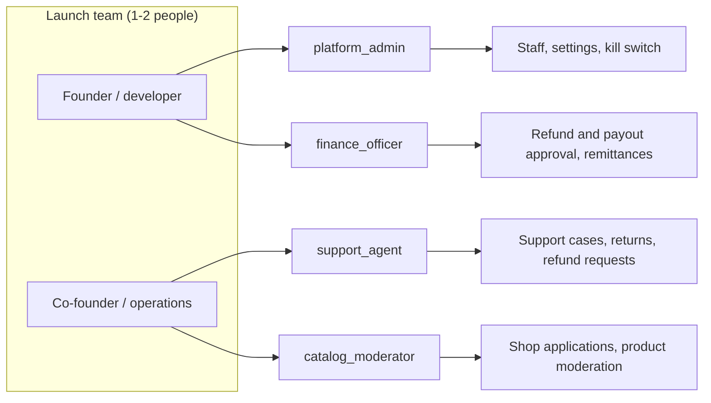
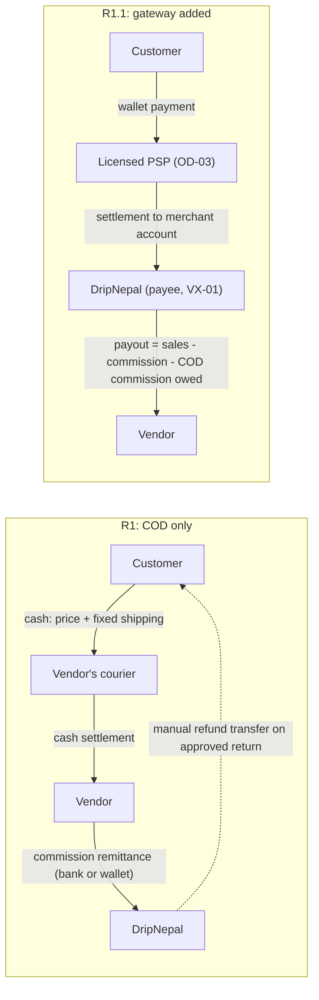
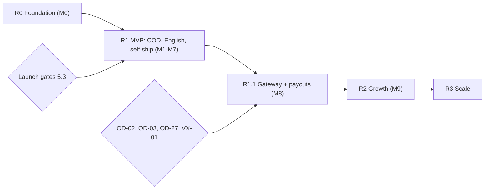

# DripNepal Product Requirements (PRD)

Status: Draft v1 (2026-09-25)

| Item                | Value                                                                                                                                                                                                                                                                                                                                                                                                                                                                                                                                                                                                                          |
| ------------------- | ------------------------------------------------------------------------------------------------------------------------------------------------------------------------------------------------------------------------------------------------------------------------------------------------------------------------------------------------------------------------------------------------------------------------------------------------------------------------------------------------------------------------------------------------------------------------------------------------------------------------------ |
| Owner               | Product owner (DripNepal)                                                                                                                                                                                                                                                                                                                                                                                                                                                                                                                                                                                                      |
| Reviewers           | Lead developer, legal counsel (sections 4 and 9), accountant (sections 4.2, 4.3 and 9)                                                                                                                                                                                                                                                                                                                                                                                                                                                                                                                                         |
| Source of truth for | Product vision, personas, business model, release scope and non-goals, functional requirements (FR-_), non-functional requirements (NFR-_), regulatory requirement statements, success metrics                                                                                                                                                                                                                                                                                                                                                                                                                                 |
| Not the owner of    | Journeys and journey acceptance criteria ([02](02-user-journeys-and-acceptance-criteria.md)), tables and retention ([04](04-domain-model-and-data-dictionary.md)), state machines and ledger postings ([05](05-order-payment-and-inventory-lifecycles.md)), endpoint catalogue ([06](06-api-design.md), [openapi.yaml](openapi.yaml)), permission matrix and threats ([07](07-security-threat-model-and-permissions.md)), test definitions ([10](10-testing-and-quality-gates.md)), milestones and traceability ([12](12-roadmap-and-backlog.md)), open decisions ([risks-and-open-decisions.md](risks-and-open-decisions.md)) |

---

## 1. About this document

### 1.1 What this document decides

This PRD states **what** DripNepal must do in each release and how we will know it works. It does not say how the code is built. A requirement here is written so that a developer can build it and a tester can check it without asking the product owner again. Where a number is a proposal and not a decision, it carries a label and an owner.

The PRD reads the repository as it is on 2026-09-25 (HEAD `0282605`). Repository defects are listed once, as RF-01…RF-47, in [00 section 4.6](00-context-assumptions-and-questions.md). This document refers to them by ID where a requirement fixes one.

### 1.2 Labels

Labels follow [00 section 1.2](00-context-assumptions-and-questions.md):

- **[Confirmed]**: stated by the product owner on 2026-09-25 (Q1–Q8).
- **[Verified-repo]**: checked in the repository.
- **[Verified-doc]**: checked in official documentation (URL given, accessed 2026-09-25).
- **[Assumption]**: a proposed default. It is reversible and configurable. Assumption IDs (A-xx) live in [00 section 6](00-context-assumptions-and-questions.md).
- **[Open OD-xx]**: an open decision with an owner, tracked in [risks-and-open-decisions.md](risks-and-open-decisions.md).
- **[Verify-external VX-xx]**: an external fact (law, tax, provider capability, price) that must be confirmed by an authority before we rely on it.

This PRD never states that DripNepal **is compliant** with any law. It states what the product must do so that counsel and the accountant can confirm compliance.

### 1.3 Requirement conventions

- **IDs.** `FR-<AREA>-NNN` for functional requirements and `NFR-<AREA>-NNN` for non-functional requirements. The areas and numbers are fixed by the canonical brief. No new FR IDs are introduced in this document.
- **Release.** The first release in which the requirement must work in production: R0, R1, R1.1, R2 or R3 (section 5).
- **Priority.** Relative to that release:
  - **Must**: the release does not ship without it.
  - **Should**: expected in the release. It may slip to the next point release only with the product owner's written sign-off and a dated plan.
  - **Could**: include if capacity allows. Nothing depends on it.
  - Non-goals ("Won't") are listed in section 5.4, and one is recorded as a constraint requirement (FR-ADM-008).
- **Acceptance criteria.** Numbered `AC-FR-<AREA>-NNN-n`, for example `AC-FR-CHK-003-2`. Each criterion is observable through the UI, the API, the database or a log. Journey-level criteria (the end-to-end walk-through) live in [02](02-user-journeys-and-acceptance-criteria.md). The criteria here test one requirement in isolation.
- **Tests.** Test IDs named in the canonical brief (for example T-SEC-001, T-INV-003, T-CHK-004) are cited directly. For other requirements, the test lives in the named test area (for example "T-IAM area") and gets its number in [10](10-testing-and-quality-gates.md).
- **Settings.** Tunable values are read from `platform_settings` (keys owned by [04](04-domain-model-and-data-dictionary.md)), not hard-coded. When an acceptance criterion says "48 h", read it as "the value of `vendor_acceptance_sla_hours`, default 48".
- **Money** is always integer paisa (`*_minor`) in NPR ([ADR-0007](adr/)). "Rs 25,000" in this document means `2500000` minor units.
- **Time.** All deadlines are computed in Asia/Kathmandu (UTC+05:45, no DST) and stored in UTC [Verified-doc: IANA tz `asia` file, https://raw.githubusercontent.com/eggert/tz/main/asia, accessed 2026-09-25]. "Days" are calendar days unless a criterion says "business days" (Sunday–Friday, excluding public holidays in a configurable list [Assumption]).

---

## 2. Product vision

### 2.1 Vision statement

> **DripNepal is where Nepal's independent fashion shops sell to the whole country, and where shoppers can buy from them with the same confidence they have in a shop they can walk into.**

Three years out, a buyer in Dhangadhi can find a Thamel sneaker reseller, a Pokhara streetwear label and a Patan tailor of daura-suruwal in one search. They can order from all three in one checkout, pay cash at the door, and get their money back if the item is not as described. The shops never have to answer the same "price?" DM fifty times.

### 2.2 The problem we are solving

The points below are the product owner's working hypotheses. They are not measured facts, so they are labelled and have a validation step before launch.

| #   | Observation                                                                                                                                                                                 | Label                                                                             | How we validate before R1                                     |
| --- | ------------------------------------------------------------------------------------------------------------------------------------------------------------------------------------------- | --------------------------------------------------------------------------------- | ------------------------------------------------------------- |
| P1  | Independent streetwear, sneaker and traditional-wear shops sell mainly through Instagram, Facebook and TikTok pages, taking orders by DM and phone. Every order is a manual conversation.   | [Assumption]                                                                      | Interview at least 10 target shops during M2 onboarding       |
| P2  | Buyers outside Kathmandu Valley distrust prepayment to unknown sellers, so cash on delivery dominates. No primary source gives the COD share; blog figures of 70–90% could not be verified. | [Assumption] (see [00 section 2.4](00-context-assumptions-and-questions.md))      | Track the COD share once R1.1 offers a choice (section 10)    |
| P3  | Buyers cannot compare sizes, prices and stock across shops. Stock shown on social posts is often stale, so orders fail after the buyer has committed.                                       | [Assumption]                                                                      | Measure vendor rejection rate for "out of stock" (FR-ORD-003) |
| P4  | Most buyers shop on mid-range Android phones over congested mobile data. Heavy pages lose them.                                                                                             | [Assumption]                                                                      | Real-user Web Vitals from the storefront (NFR-PERF-001)       |
| P5  | Counterfeit sneakers and watches erode trust in online fashion.                                                                                                                             | [Assumption]                                                                      | Moderation reject reasons (FR-CAT-006), OD-21                 |
| P6  | Nepal now has a specific e-commerce law (Electronic Commerce Act 2081) with platform duties on disclosures, complaints and refunds. Small shops cannot run those processes alone.           | [Verified-doc] for the Act; applicability to DripNepal is [Verify-external VX-02] | Counsel review before launch (section 9)                      |

### 2.3 Customer value

1. **Trust without prepayment.** Every R1 order is cash on delivery. The customer pays the courier exactly the price and shipping shown at checkout, and nothing else (FR-CHK-005). The platform, not the vendor, answers complaints within 15 days and decides returns and refunds (FR-ADM-009, FR-RET-006).
2. **One cart across many shops.** Build one cart, check out once, and see each shop's package, fee and delivery estimate separately (FR-CHK-004).
3. **Honest listings.** Every listing shows the final tax-inclusive price, delivery fee, delivery estimate, brand or own label, material, origin for imports, warranty and care information (FR-CAT-012). Out-of-stock sizes are visible but not buyable (FR-SRCH-004).
4. **Fast on a slow phone.** Storefront pages render on the server and show products before JavaScript loads. Images are small and resized per device (NFR-PERF-001, NFR-NET-001).
5. **Addresses that couriers can find.** Nepal's Province → District → Local level → Ward structure plus tole and landmark, instead of free text (FR-IAM-012).

### 2.4 Vendor value

1. **A storefront without building one.** A shop page, product pages with variants and size charts, and search traffic (FR-SRCH-003, FR-SRCH-005).
2. **Orders without DMs.** Orders arrive with a verified buyer, a structured address and a fixed price. The shop accepts or rejects in one click (FR-ORD-003).
3. **Stock that cannot be oversold.** Reservations stop two buyers taking the last pair (FR-INV-002, T-INV-003).
4. **Keep your courier.** The shop keeps using its own courier or riders and records tracking in the dashboard (FR-FUL-001). No new logistics contract is needed in R1.
5. **Team access without password sharing.** Staff get their own logins with fixed roles, such as `order_fulfiller` for the person packing parcels (FR-SHOP-005).
6. **A clear account with the platform.** A running statement shows what the shop owes the platform in commission (COD) and, from R1.1, what the platform owes the shop (FR-LED-003).
7. **Compliance help.** The platform runs the complaint register, the refund clock and the legal disclosures that the E-Commerce Act asks of intermediaries (section 9).

### 2.5 Product principles

These principles settle arguments during build. Each names the flow it governs.

| Principle                                        | What it means in practice                                                                                                             | Governs                           |
| ------------------------------------------------ | ------------------------------------------------------------------------------------------------------------------------------------- | --------------------------------- |
| **The server decides money and stock**           | Prices, totals, commission and availability are computed on the server at the moment of commit. The browser only displays them.       | FR-CHK-002, FR-LED-001, T-SEC-003 |
| **Every retry is safe**                          | On a flaky connection a customer will tap "Place order" twice. Unsafe operations take an idempotency key and return the first result. | FR-CHK-003, NFR-NET-002           |
| **The platform owns the customer relationship**  | Complaints, returns and refunds go through DripNepal staff. The vendor participates but does not decide.                              | FR-RET-006, FR-ADM-009            |
| **Tenant boundaries are enforced by the server** | Seller URLs carry the shop slug. The server resolves it and checks membership on every request, and returns 404 for anyone else.      | FR-SHOP-006, NFR-SEC-001          |
| **Small team, few moving parts**                 | PostgreSQL does jobs, sessions and rate limits. No courier API, no search engine and no mobile app in R1.                             | Section 5.4                       |
| **Disclose, don't promise**                      | The UI shows estimates and policies that are true and can be enforced. It never promises a delivery date the platform cannot control. | FR-CAT-012, FR-SHOP-004           |

---

## 3. Personas and jobs-to-be-done

One `users` row can carry several personas at once: a customer who owns one shop and works as staff at another. Authority is resolved per request from the URL and the database, as described in [00 section 2.3](00-context-assumptions-and-questions.md). The permission matrix is owned by [07](07-security-threat-model-and-permissions.md). This section describes **what each persona is trying to get done**.

### 3.1 Customer-side personas

**Guest visitor: "Aarav, 19, Butwal, browsing on a Redmi over 4G"**

- _Jobs:_ When I see a shop's reel, I want to open its products and check my size and the price including delivery to Butwal, so I can decide whether it is worth ordering.
- _Needs:_ fast first paint, a visible total price, delivery estimate for his district, no sign-up wall before the cart.
- _Can do:_ browse, search, view products and shops, build a cart (server-side guest cart, FR-CART-001).
- _Cannot do:_ check out. He is sent to sign in at checkout, and his cart survives sign-in [Confirmed] Q6.
- _Journeys:_ J-01, J-02, J-03, J-04.

**Registered customer: "Sunita, 27, Lalitpur, office worker"**

- _Jobs:_ When I find a kurta and sneakers from two different shops, I want to pay for both at the door in one order and track each parcel, so I don't have to message two sellers.
- _Needs:_ verified account, saved addresses, one checkout, per-shop tracking, easy cancellation before the shop accepts, a way to complain and get a refund.
- _Journeys:_ J-04, J-05, J-07, J-14, J-18. From R1.1, J-06.

**Shop owner: "Bikash, 31, owner of a sneaker resale shop in Thamel, also shops on DripNepal"**

- _Jobs:_ When I restock, I want to list new pairs with sizes and photos in minutes and have orders arrive with a verified address, so I spend my time sourcing, not answering DMs. When a second shop idea comes up, I want to open it under the same login.
- _Needs:_ shop application that uses his existing customer account (RF-21 fixes the current guest-only form), several shops under one login (default limit 3, `max_shops_per_owner` [Assumption A-21]), a clear statement of commission owed, and staff access for his packer.
- _Legal position:_ the owner is the legal and payout party for the shop (`shops.owner_user_id`). The seller agreement is accepted in his name (FR-SHOP-013).
- _Journeys:_ J-08, J-09, J-10, J-11, J-12, J-13, J-15, and all customer journeys.

**Shop staff: four fixed roles, no custom roles until R3**

| Role              | Typical person                                    | Job to be done                                                      | Permissions (summary; matrix in [07](07-security-threat-model-and-permissions.md))            |
| ----------------- | ------------------------------------------------- | ------------------------------------------------------------------- | --------------------------------------------------------------------------------------------- |
| `manager`         | Owner's sibling who runs the shop day to day      | "Run everything except who works here and where the money goes."    | All shop permissions except `shop.staff.manage` and `shop.payout_account.manage`              |
| `catalog_editor`  | Photographer or content person                    | "Get new drops listed and keep stock counts right."                 | `shop.products.view`, `shop.products.edit`, `shop.products.publish`, `shop.inventory.adjust`  |
| `order_fulfiller` | Person who packs and hands parcels to the courier | "See today's orders, the address and phone, and mark them shipped." | `shop.orders.view`, `shop.orders.process`, `shop.customer_contact.view`, `shop.products.view` |
| `viewer`          | Accountant or investor                            | "See how the shop is doing without being able to change anything."  | `shop.products.view`, `shop.orders.view` (customer contact masked)                            |

Journeys: J-09 (joining), J-10, J-11, J-12, J-13, depending on role.

### 3.2 Platform-side roles

| Role                | Job to be done                                                                                                | Key permissions                                                                                                                                                   | Journeys                           |
| ------------------- | ------------------------------------------------------------------------------------------------------------- | ----------------------------------------------------------------------------------------------------------------------------------------------------------------- | ---------------------------------- |
| `platform_admin`    | "Keep the platform running: staff, settings, kill switch, anything the other roles cannot do."                | All `platform.*` permissions                                                                                                                                      | J-16, J-17, and all admin journeys |
| `support_agent`     | "Answer every complaint within 15 days, cancel or return orders on the customer's behalf, and start refunds." | `platform.users.view`, `platform.orders.view`, `platform.orders.intervene`, `platform.refunds.create`, `platform.support_cases.manage`, `platform.returns.manage` | J-07, J-14, J-17                   |
| `catalog_moderator` | "Approve shops and products that follow the rules, and take down counterfeits and illegal content quickly."   | `platform.shops.review`, `platform.products.moderate`, `platform.catalog.manage` (R2 UI), `platform.users.view`                                                   | J-08, J-16                         |
| `finance_officer`   | "Approve refunds and payouts, record vendor remittances, and keep the ledger right."                          | `platform.orders.view`, `platform.refunds.approve`, `platform.ledger.view`, `platform.ledger.adjust`, `platform.payouts.manage`, `platform.payouts.approve`       | J-14, J-15                         |

All platform staff must enrol TOTP MFA, and admin routes require an MFA verification from the last 12 hours (FR-IAM-007).

### 3.3 Why four platform roles when the team is one or two people

At launch the same one or two people will hold every platform role. The roles still exist in R1, for five reasons tied to DripNepal's flows:

1. **Legal duties map to roles.** The E-Commerce Act asks the platform to decide complaints within 15 days (s33), accept returns for non-conforming goods (s10) and refund within 7 days (Directive 2082 s9(3)) [Verify-external VX-02]. Each duty needs a named queue and a named permission, so that a part-time support hire in R2 can take one queue without getting access to the ledger.
2. **Money needs two keys when two people exist.** Refunds and payouts use maker-checker: the approver must differ from the creator (`approved_by <> created_by`, DB CHECK). With one operator, `platform_settings.single_operator_mode = true` allows self-approval only after re-entering a TOTP code, and each such approval is flagged in the audit log [Assumption A-20; Open OD-14]. The mode switch is a setting, not a code change.
3. **Least privilege limits personal liability.** Unauthorised disclosure of personal data is an offence under the Privacy Act 2075 (s26, s29), and unauthorised access to computer material is an offence under the Electronic Transactions Act 2063 (s45) [Verify-external VX-03]. A moderator has no reason to see customer phone numbers, so the role does not grant it.
4. **The audit log names the hat, not only the person.** `audit_logs.actor_role` records `platform:finance_officer` or `platform:support_agent`. An inspection under Directive 2082 s11 can see which duty an action was taken under.
5. **Hiring is additive.** Granting `support_agent` to a new hire is one call (`setPlatformStaffRole`), with no code change and no risk to finance.

Holding all roles at once is allowed. The cost is one extra TOTP prompt per self-approved refund or payout, which is acceptable at 1–2k orders per month.

---

## 4. Launch assumptions and business model

### 4.1 Launch assumptions

| Assumption                                                                                                      | Label                                                      | Owner         | Revisit when                                             |
| --------------------------------------------------------------------------------------------------------------- | ---------------------------------------------------------- | ------------- | -------------------------------------------------------- |
| Fewer than about 50 shops and about 1–2k orders per month at launch. Design and load-test target is 10× (A-02). | [Confirmed] Q1, [Assumption A-02]                          | Product owner | Monthly orders exceed 5k, or shops exceed 150            |
| No production data exists, so the schema can be re-baselined ([ADR-0011](adr/))                                 | [Assumption] A-01, [Open OD-01]                            | Product owner | Before the first production deploy                       |
| Commission is the only revenue in R1. There are no listing fees, subscriptions or paid placements.              | [Assumption]                                               | Product owner | R2 planning                                              |
| Commission is charged on item value net of shop-funded discounts, excluding shipping. The rate is undecided.    | [Assumption A-04] for the basis, [Open OD-04] for the rate | Business      | Blocks M7                                                |
| R1 accepts only COD. The first wallet gateway arrives in R1.1.                                                  | [Confirmed] Q4                                             | Product owner | —                                                        |
| Vendors pack and ship with their own courier or riders. There is no courier API before R3.                      | [Confirmed] Q5                                             | Product owner | A courier offers a documented API and vendors ask for it |
| All listed goods are new. No pre-owned, refurbished or thrift listings in R1.                                   | [Assumption] (see CPA s16(2) in section 9)                 | Product owner | Demand from vendors                                      |
| Customers confirm at signup that they are 18 or older                                                           | [Assumption A-26], [Open OD-24]                            | Legal         | Blocks M1 signup copy                                    |
| English UI only, with every string in message catalogs. Product text may be in Nepali.                          | [Confirmed] Q8, [Assumption A-10]                          | Product owner | R2                                                       |

### 4.2 Revenue model

DripNepal earns a **commission per order item**. It is snapshotted when the order is placed (`order_items.commission_rate_bp`, `commission_minor`), so later rate changes never alter past orders (FR-LED-001).

- **Rate:** a platform default (`default_commission_rate_bp`) with an optional per-shop override (`shops.commission_rate_bp`). Category rates come in R2 (FR-LED-006). The value is [Open OD-04].
- **Basis:** item line totals net of shop-funded discounts, on tax-inclusive prices, excluding the shipping fee [Assumption A-04]. Whether shipping should be included is also part of [Open OD-04].
- **Rounding:** half-up at line level ([ADR-0007](adr/)).
- **Tax on commission:** whether DripNepal charges VAT on its commission, and whether vendors must withhold TDS on it under Income Tax Act s88, needs the accountant [Open OD-11, Verify-external VX-05].

### 4.3 COD-first money flow and its ledger consequence

Q3, Q4 and Q5 together mean that **in R1 the platform never holds customer money**. The customer pays cash to the vendor's courier, and the vendor keeps it. The platform is owed commission, so a vendor's ledger balance is normally **negative** in R1: the vendor owes DripNepal. The worked example and the sequence diagram are in [00 section 3.3](00-context-assumptions-and-questions.md), and the posting rules are owned by [05](05-order-payment-and-inventory-lifecycles.md). This section states the product requirements that follow from it.

Product consequences:

1. **The ledger must allow negative balances.** A balance is the sum of signed entries per shop (positive means the platform owes the vendor). The seller finance page shows a negative balance as "You owe DripNepal Rs X" (FR-LED-003).
2. **Vendors remit commission, and finance records it.** Remittance terms (frequency, method, grace period, and what happens when a vendor does not pay) are a business agreement written into the seller agreement. **[Open OD-05], blocks launch.** Proposed default: monthly remittance by the 10th of the following month, by bank transfer or wallet, recorded by `finance_officer` (FR-LED-004) [Assumption].
3. **Refunds on COD orders create vendor debt.** The platform refunds the customer (manual bank or wallet transfer, FR-RET-001), but the vendor holds the cash. Example, with commission at an illustrative 10% (OD-04): a pair of sneakers sold for Rs 6,500 plus Rs 250 shipping is returned as "not as described". DripNepal transfers Rs 6,750 to the customer. The vendor ledger records `refund` −Rs 6,750 and `commission_reversal` +Rs 650, so the vendor's debt grows by Rs 6,100. Whether shipping is refunded depends on the return reason and [Open OD-07].
4. **Collection risk must be visible and limited.** Proposed controls [Assumption; Open OD-05]:
   - The admin overview lists shops whose balance has been below −Rs 5,000 for more than 30 days (FR-ADM-001).
   - Such a shop can be suspended with `suspension_mode = fulfill_existing` (FR-SHOP-007). Suspension is a staff decision and is never automatic.
   - The ledger hold (`ledger_hold_days`, default 7 [Assumption A-06; Open OD-06]) delays when R1.1 gateway earnings become available, so refunds are netted before payout.
5. **R1.1 nets automatically.** When a vendor has both COD debt and gateway earnings, the payout amount is the available balance after netting. The vendor never receives a payout while it owes more than it has earned (FR-LED-004).
6. **No money at the door beyond price plus shipping.** Directive 2082 s8(3) bars collecting any amount at or after handover other than the price and transport cost fixed before the sale [Verify-external VX-02]. There is therefore no COD fee, and a failed-delivery or return-to-origin fee is never charged to the customer at the door (FR-CHK-005, FR-FUL-003).

### 4.4 R1.1 gateway: the platform as payee

From R1.1, a customer can pay with one wallet gateway (eSewa or Khalti, [Open OD-03]). Payments settle into **DripNepal's** merchant account, and DripNepal pays vendors by manual bank transfer with approval (FR-LED-004) [Confirmed] Q3. This model has two unresolved external questions, both of which block M8:

- **Licensing (VX-01, OD-02).** The Payment and Settlement Act 2075 s5 requires an NRB licence to act as a payment service provider or operator. NRB describes "third-party payment aggregators" that pool clients' transactions into one merchant account as not yet provided for [Verified-doc: NRB NPS Master Reference Document, Oct 2025, https://www.nrb.org.np/contents/uploads/2025/10/National-Payment-Switch-NPS-and-the-National-Payment-Ecosystem-Master-Reference-Document-2025.pdf, accessed 2026-09-25]. Whether a marketplace collecting for its vendors falls under this is a legal question. Counsel may instead recommend a merchant-of-record model or per-vendor merchant accounts, either of which changes the payout design.
- **Provider capability (VX-06, VX-07).** Neither eSewa nor Khalti documents a split-payment, sub-merchant or marketplace settlement feature. eSewa ePay v2 documents no server-to-server webhook and no refund API. Khalti KPG-2 documents a lookup API and a refund API, but no webhook [Verified-doc: https://developer.esewa.com.np/pages/Epay; https://docs.khalti.com/khalti-epayment/; https://docs.khalti.com/api/refund/, accessed 2026-09-25]. The product therefore treats **server-to-server status lookup plus a reconciliation job** as the only confirmation path (FR-PAY-002, FR-PAY-003). Details are in [05](05-order-payment-and-inventory-lifecycles.md) and [ADR-0012](adr/).

No customer wallet, store credit or refund-to-balance is offered in any release covered here. Holding customer value could count as e-money issuance under NRB Unified Directive on Payment Systems 2082 [Verify-external VX-01].

### 4.5 Fulfilment: vendors self-ship

- Each shop sets the districts it delivers to and a fee and delivery estimate for two zones, Kathmandu Valley and outside the valley (FR-SHOP-004). Checkout blocks addresses outside a shop's coverage (FR-CHK-001).
- The shop records `packed`, `shipped` (courier name, tracking number, optional HTTPS tracking URL), `delivered`, `delivery_failed`, `reattempt`, `returning` and `returned_to_origin` itself (FR-FUL-001…003). There is one shipment per shop order in R1. Partial shipments come in R2 (FR-FUL-005).
- The platform does not contract couriers, does not see courier APIs and does not guarantee delivery dates. It shows the shop's estimate and records when the shop says it shipped.
- The E-Commerce Act makes late delivery a ground for cancellation or return with refund (s16(d), s16(g)) [Verify-external VX-02]. Support handles such cases through the complaint and return flows (FR-ADM-009, FR-RET-006).

### 4.6 Support, returns and refunds are platform-run

[Confirmed] Q5. In R1:

- Customers open a support case from the order page. The platform answers within 15 days (FR-ADM-009).
- Returns are **support-mediated**. A support agent creates the return request on the customer's behalf, the shop records receipt, and the platform decides the refund (FR-RET-006). Self-serve return requests come in R2 (FR-RET-002).
- Refunds are created by support and approved by finance. For COD orders they are paid by manual transfer (FR-RET-001), with a 7-day refund clock for accepted returns (FR-RET-007).
- The platform return policy sets the default window (`return_window_days`, default 7 days after delivery [Assumption A-05]), eligible reasons and excluded categories (for example innerwear). Who pays return shipping is [Open OD-07]. A shop may offer a more generous policy in `return_policy_text`, but never a stricter one than the platform policy [Assumption].

### 4.7 Account-required checkout

[Confirmed] Q6. A guest can browse and build a cart. To check out, the customer signs in with a **verified email** and a **Nepal mobile number** that passes format validation (`^9[678]\d{8}$` after removing `+977`, from the NTA numbering plan [Verified-doc: https://www.nta.gov.np/uploads/contents/National%20Numbering%20Allocation%20Plan.pdf, accessed 2026-09-25]). OTP verification of the phone comes in R2 (FR-IAM-010). The reasons are to cut fake COD orders (a courier trip to an unreachable number costs the vendor money), to give support a verified contact, and to link orders to an account for returns and complaints.

---

## 5. Release phases, MVP scope and non-goals

### 5.1 Release phases

Release names are fixed. Milestones M0–M9 and their dates are owned by [12](12-roadmap-and-backlog.md).

| Release  | Name          | Audience      | Theme                                                                                                                                                                                                                                                                    | Milestones | Exit condition                                                                                                                                        |
| -------- | ------------- | ------------- | ------------------------------------------------------------------------------------------------------------------------------------------------------------------------------------------------------------------------------------------------------------------------ | ---------- | ----------------------------------------------------------------------------------------------------------------------------------------------------- |
| **R0**   | Foundation    | Internal only | Fix critical repository defects before any feature work: CI, test harness, error contract, request IDs, log redaction, session revocation, auth rate limits, audit log, schema re-baseline plan, removal of `D`, sqlite and `@commercn`, and a safe production bootstrap | M0         | All high-severity RF items closed or guarded. CI runs lint, typecheck, unit and functional tests on every PR ([10](10-testing-and-quality-gates.md)). |
| **R1**   | MVP launch    | Public        | COD only, English UI, vendors self-ship, platform support, returns and refunds                                                                                                                                                                                           | M1–M7      | Every R1 "Must" FR passes its acceptance criteria. The launch gates in section 5.3 are signed off.                                                    |
| **R1.1** | First gateway | Public        | One wallet gateway, gateway refunds, reconciliation, vendor payouts                                                                                                                                                                                                      | M8         | OD-02, OD-03 and OD-27 decided. Provider UAT signed off. T-PAY-005 and T-PAY-008 green.                                                               |
| **R2**   | Growth        | Public        | Self-serve returns, reviews, wishlist, platform coupons, SMS and phone OTP, Nepali UI, collections, facet counts, autocomplete, partial shipments, owner MFA, category commission rates, disputes workflow, admin reference-data UI                                      | M9         | Decided at R1 + 3 months, based on the metrics in section 10                                                                                          |
| **R3**   | Scale         | Public        | Custom shop roles, bulk CSV import and export, shop coupons, courier API integrations, a dedicated search engine, mobile app API tokens, automated payouts, multi-location inventory, social login, video media                                                          | Later      | Triggered by the thresholds in section 5.4                                                                                                            |

### 5.2 R1 MVP scope

R1 is the smallest product that lets about 50 independent shops sell to verified customers with cash on delivery, while meeting the platform duties we have identified in the E-Commerce Act. It contains:

| Area              | In R1                                                                                                                                                                                                                                                                                                                               |
| ----------------- | ----------------------------------------------------------------------------------------------------------------------------------------------------------------------------------------------------------------------------------------------------------------------------------------------------------------------------------- |
| Identity          | Signup, email verification, login and logout, password reset, change password, revoke all sessions, address book with the Nepal location hierarchy, marketing consent, deletion request and anonymization (admin-executed), suspension, TOTP MFA for platform staff                                                                 |
| Shops             | Application from an existing account, several shops per owner, seller agreement acceptance, business and KYC data, admin review, profile and policies, delivery coverage and zone rates, staff invitations with four fixed roles, shop switcher, suspension with two modes, payout account capture, admin slug change with redirect |
| Catalog           | Seeded categories, attributes and brands, product drafts, 0–2 variant axes, legal listing disclosures, pre- or post-moderation, publish, unpublish, archive and restore, optimistic concurrency, media upload pipeline                                                                                                              |
| Inventory         | Per-variant stock, adjustments with reason, stocktake, reservations, nightly drift detection                                                                                                                                                                                                                                        |
| Discovery         | Category and navigation listings, filters, sort, pagination, keyword search, product detail with variant availability, shop page, SEO                                                                                                                                                                                               |
| Cart and checkout | Server cart with guest merge, revalidation, per-shop grouping, quote, idempotent COD order placement with a multi-shop split and COD limits                                                                                                                                                                                         |
| Orders            | Customer tracking and cancellation, vendor accept and reject (including item-level), acceptance SLA auto-cancel, shipment events, COD collection outcome, return to origin with restock, auto-complete, admin intervention and notes                                                                                                |
| Money             | Commission snapshots, vendor ledger and statements, vendor remittance recording, manual refunds with maker-checker, ledger adjustments by reversal, refund SLA monitoring                                                                                                                                                           |
| Platform          | Support case (grievance) register with a 15-day clock, support-mediated returns, admin queues and overview, audit log viewer, platform staff roles, safe bootstrap, basic GMV and order reports, checkout kill switch, legal disclosures page, order and account emails, seller new-order indicator                                 |

### 5.3 R1 launch gates

R1 does not go live until every gate below is closed. The engineering gates are tested. The business and legal gates are signed off by the named owner and recorded in [risks-and-open-decisions.md](risks-and-open-decisions.md).

| #   | Gate                                                                                                                                                                                          | Owner                          | Evidence                                                                                    |
| --- | --------------------------------------------------------------------------------------------------------------------------------------------------------------------------------------------- | ------------------------------ | ------------------------------------------------------------------------------------------- |
| G1  | All R1 "Must" FRs pass their acceptance criteria. The adversarial tests T-SEC-001, T-SEC-002, T-SEC-003, T-SEC-004, T-SEC-010, T-INV-003 and T-CHK-004 pass in CI.                            | Lead developer                 | CI run linked in the release notes                                                          |
| G2  | NFR targets met: T-PERF-001 load test at 10× launch load, T-A11Y-001 with no serious or critical violations, T-OPS-001 restore drill completed within the RTO                                 | Lead developer                 | Test reports ([10](10-testing-and-quality-gates.md), [11](11-deployment-and-operations.md)) |
| G3  | DripNepal is listed on the DoCSCP e-commerce portal, and its listing number is shown on the legal disclosures page (FR-ADM-011). E-Commerce Act s5 and DoCSCP notice 06/083-84.               | Product owner                  | Listing number in `platform_settings`                                                       |
| G4  | Privacy notice, terms of use, platform return and refund policy, and grievance officer are published. Directive 2082 s4(3) lists the privacy and return policies among the listing documents. | Product owner + counsel        | Published pages                                                                             |
| G5  | Seller agreement text approved by counsel and loaded as version 1 (FR-SHOP-013). OD-16 KYC list decided.                                                                                      | Counsel                        | `getCurrentSellerAgreement` returns v1                                                      |
| G6  | COD commission remittance terms agreed (OD-05). Commission rate decided (OD-04). Hold and return days decided (OD-06, OD-07). COD limits decided (OD-18). Acceptance SLA decided (OD-19).     | Product owner                  | Settings values recorded with decision date                                                 |
| G7  | Tax treatment decided: tax-inclusive display, who invoices, TDS on commission (OD-11), and the invoicing and e-invoice model for COD sales (OD-26)                                            | Accountant                     | Written advice on file                                                                      |
| G8  | Hosting decision confirmed against the Data Center and Cloud Service Directive 2081 (VX-09, OD-09)                                                                                            | Counsel + lead developer       | ADR-0016 status "accepted"                                                                  |
| G9  | Email provider chosen and domain authenticated (OD-08, VX-14)                                                                                                                                 | Lead developer                 | Test mail delivered to Gmail and a Nepali ISP mailbox                                       |
| G10 | Incident runbook for Directive 2082 s8(2) (halt transactions and inform the public) rehearsed with the kill switch (FR-ADM-010)                                                               | Product owner + lead developer | Rehearsal log in [11](11-deployment-and-operations.md)                                      |

### 5.4 Explicit non-goals

These are deliberate. Each has a reason and a trigger for revisiting it. Adding any of them to R1 needs a product-owner decision recorded as an ADR or OD.

| Non-goal                                               | Why not now                                                                                                                                                                                                                                                      | Revisit trigger                                                                        | Earliest        |
| ------------------------------------------------------ | ---------------------------------------------------------------------------------------------------------------------------------------------------------------------------------------------------------------------------------------------------------------- | -------------------------------------------------------------------------------------- | --------------- |
| **Staff impersonation of users**                       | Impersonation lets staff act as a customer or vendor, which breaks the audit trail and increases privacy exposure (Privacy Act s26). Support uses read-only admin views plus explicit admin actions instead (FR-ADM-008).                                        | Never planned                                                                          | —               |
| **Courier API integrations**                           | Couriers such as Upaya, Nepal Can Move and Pathao share API documentation only after merchant onboarding. Their contracts are with vendors, not DripNepal [Verified-doc, per gt research: https://upaya.com.np/service/upaya-fulfillment/, accessed 2026-09-25]. | Two or more couriers offer documented APIs, and more than 30% of shops use one courier | R3              |
| **Automated payouts**                                  | Payout rails and the licensing model are unconfirmed (VX-01). Manual approved transfers are enough at 50 shops.                                                                                                                                                  | More than 150 active shops, or payout ops take more than 4 hours a week                | R3              |
| **Custom shop roles**                                  | Four fixed roles cover the shops we expect. A role editor adds permission-escalation risk.                                                                                                                                                                       | Three or more shops ask for a role the fixed set cannot express                        | R3              |
| **Nepali UI**                                          | Translation and review cost, plus BS-calendar display, which needs a library because Node's ICU has no Nepali calendar [Verified-doc: Node 24 / ICU 78.3 behaviour, https://nodejs.org/api/intl.html]. R1 is i18n-ready (NFR-I18N-001).                          | R2                                                                                     | R2              |
| **Master catalog / shared product pages**              | Several shops selling the same sneaker model would need product matching and a buy-box. That is complex, and it is a seller-neutrality question under E-Commerce Act s14(d).                                                                                     | More than 20% of listings are duplicates of the same model                             | Not planned     |
| **Marketplace-wide promotions and coupons**            | Promotions touch pricing, the ledger (who funds the discount) and consumer-law reference-price rules (VX-04). R1 shows only the compare-at price (FR-PROMO-001).                                                                                                 | R2 (platform coupons), R3 (shop coupons)                                               | R2              |
| **Native mobile app**                                  | A server-rendered web storefront covers mobile. An app doubles the surfaces the team maintains.                                                                                                                                                                  | Repeat-purchase share above 40% and team of 4+                                         | R3 (API tokens) |
| **Sponsored or boosted listings**                      | Paid placement must be disclosed and ranking must stay seller-neutral (E-Commerce Act s14(d)) [Verify-external VX-02].                                                                                                                                           | Revenue diversification in R2+, after counsel review                                   | R2+             |
| **Customer wallet, store credit or refund-to-balance** | Could count as e-money issuance under NRB Unified Directive 2082 [Verify-external VX-01].                                                                                                                                                                        | Only after legal clearance                                                             | Not planned     |
| **Pre-owned or refurbished goods**                     | CPA 2075 s16(2) treats selling old goods as new as an unfair practice. A condition model and moderation rules are needed first [Verify-external VX-04].                                                                                                          | Vendor demand plus counsel review                                                      | R2+             |
| **Guest checkout**                                     | [Confirmed] Q6                                                                                                                                                                                                                                                   | —                                                                                      | —               |
| **Phone OTP and SMS**                                  | Needs an SMS provider, sender ID and a budget. Email covers R1 notifications.                                                                                                                                                                                    | R2                                                                                     | R2              |
| **Dedicated search engine**                            | PostgreSQL full-text search plus `pg_trgm` covers about 50 shops ([ADR-0014](adr/)).                                                                                                                                                                             | Search p95 above 300 ms at the load in NFR-PERF-003, or more than 200k listings        | R3              |
| **Multi-currency and cross-border selling**            | NPR only (`currency` CHECK = 'NPR').                                                                                                                                                                                                                             | Not planned                                                                            | —               |
| **DripNepal-owned stock**                              | Selling its own stock would make DripNepal a "list-based" entity with extra duties under E-Commerce Act s15 [Verify-external VX-02].                                                                                                                             | Not planned                                                                            | —               |

---

## 6. Capability-to-phase evaluation

This table evaluates each marketplace capability and places it in a release. "First" is the release where the capability first reaches production. Detailed requirements are in section 7.

| #   | Capability                                         | First                | Scope by release                                                                                                                                                                                                                                                             | Rationale                                                                                                                                                                                                                                        | FRs                                            |
| --- | -------------------------------------------------- | -------------------- | ---------------------------------------------------------------------------------------------------------------------------------------------------------------------------------------------------------------------------------------------------------------------------- | ------------------------------------------------------------------------------------------------------------------------------------------------------------------------------------------------------------------------------------------------ | ---------------------------------------------- |
| 1   | Signup, login, verification, recovery              | R1 (hardening in R0) | R0: session revocation, auth rate limits, error handling. R1: signup, email verification, login, reset, change password, revoke sessions, staff TOTP. R2: phone OTP, owner MFA. R3: social login.                                                                            | Checkout needs a verified account [Confirmed] Q6. The current cookie store cannot revoke sessions (RF-04), and login has no rate limit (RF-12). Social login adds OAuth surface for little gain at launch.                                       | FR-IAM-001…011                                 |
| 2   | Shop application, approval, suspension, ownership  | R1                   | R1: apply from an existing account, several shops, admin review with reasons, suspension with two modes, admin slug change. R2: owner closes shop, ownership transfer.                                                                                                       | The current onboarding is broken (RF-03) and creates a new user (RF-21). The E-Commerce Act requires a seller agreement before listing (s14, s16). Closure and transfer are rare at 50 shops and can be done by admin with SQL plus audit in R1. | FR-SHOP-001…003, 007…009, 012                  |
| 3   | Shop memberships and staff permissions             | R1                   | R1: invitations, four fixed roles, shop switcher, status gating. R3: custom roles.                                                                                                                                                                                           | The existing RBAC is miswired (RF-20) and the dashboard has no membership check (RF-01). Fixed roles are simple to test (T-SEC-001).                                                                                                             | FR-SHOP-005, 006, 011                          |
| 4   | Product drafts, moderation, publication, archiving | R1                   | R1: drafts, pre and post review modes, approve, reject and block, unpublish, archive and restore, optimistic concurrency. R3: bulk CSV.                                                                                                                                      | Moderation is how the platform keeps counterfeits and misleading listings off the site (CPA s16(2), Directive 2082 s10(1)). Pre-moderation for new shops is [Open OD-20].                                                                        | FR-CAT-003, 005, 006, 007, 010, 011            |
| 5   | Categories, collections, attributes, variants      | R1                   | R1: seeded taxonomy and attributes, 0–2 variant axes, SKU unique per shop. R2: admin UI for reference data, curated collections.                                                                                                                                             | Controlled attribute values make filters work across shops. Seeding in R1 avoids building admin UI before the taxonomy has settled. Value sets are [Open OD-15].                                                                                 | FR-CAT-001, 002, 004, 008, 009, FR-ADM-006     |
| 6   | Product media                                      | R1                   | R1: direct upload to object storage, validation, EXIF strip, WebP derivatives, ordering, alt text, colour mapping, shop logo and banner. R3: video.                                                                                                                          | The current upload accepts unbounded base64 of any `image/*` (RF-18). Slow networks need small derivatives.                                                                                                                                      | FR-MED-001…004                                 |
| 7   | Search, sorting, filtering, pagination             | R1                   | R1: listings with URL state, keyword search (FTS + trigram), shop page, product detail, SEO. R2: autocomplete, facet counts. R3: search engine.                                                                                                                              | Discovery is the vendor's reason to join. PostgreSQL is enough at launch scale ([ADR-0014](adr/)). Facet counts cost extra queries on every listing, so they wait for R2.                                                                        | FR-SRCH-001…008                                |
| 8   | Cart and checkout                                  | R1                   | R1: server cart with guest merge, revalidation, quote, idempotent COD placement, multi-shop split, COD limits. R1.1: gateway payment.                                                                                                                                        | Multi-shop cart, one payment, per-shop suborders [Confirmed] Q2. Cart and checkout currently crash (RF-10) and trust client prices (RF-16).                                                                                                      | FR-CART-001…003, FR-CHK-001…007                |
| 9   | Inventory and reservations                         | R1                   | R1: per-variant stock, adjustments, stocktake, committed reservations for COD, drift detection. R1.1: held reservations with expiry. R2: low-stock indicator. R3: multi-location.                                                                                            | Overselling the last pair is the most visible failure in a small-stock fashion marketplace. Current stock is one unconstrained integer (RF-14).                                                                                                  | FR-INV-001…006                                 |
| 10  | Orders, payments, delivery, tracking               | R1                   | R1: COD payment records, accept and reject, acceptance SLA, shipment events, COD outcome, return to origin, customer tracking, auto-complete, admin intervention. R1.1: gateway initiate, verify, reconciliation, expiry. R2: partial shipments, receipts. R3: courier APIs. | Vendors self-ship [Confirmed] Q5, so tracking is vendor-entered. Gateway confirmation must use server lookup because no provider documents webhooks for web checkout (section 4.4).                                                              | FR-ORD-001…007, FR-FUL-001…005, FR-PAY-001…005 |
| 11  | Cancellation, returns, refunds, disputes           | R1                   | R1: customer cancel before acceptance, admin cancel, support-mediated returns, admin refunds with maker-checker, refund SLA. R1.1: gateway refunds. R2: self-serve returns, disputes workflow.                                                                               | Platform-run returns [Confirmed] Q5. CPA s14 and E-Commerce Act s10 require returns and refunds [Verify-external VX-02, VX-04], so returns cannot wait for R2 self-service.                                                                      | FR-ORD-002, FR-RET-001…007                     |
| 12  | Vendor commissions, settlements, payouts           | R1                   | R1: commission snapshot, ledger, statements, vendor remittance recording, adjustments. R1.1: manual payouts with approval. R2: category rates. R3: automated payouts.                                                                                                        | COD means vendors owe commission in R1 (section 4.3). Payouts need the gateway and the licensing answer (VX-01).                                                                                                                                 | FR-LED-001…007                                 |
| 13  | Notifications                                      | R1                   | R1: account and order emails, seller new-order indicator by polling. R2: SMS, preferences, in-app notifications.                                                                                                                                                             | Email is cheap and needs no sender-ID registration. Polling every 60 s is enough for about 70 orders a day across all shops.                                                                                                                     | FR-NOT-001…005                                 |
| 14  | Reviews and wishlists                              | R2                   | R2: verified-purchase reviews with moderation, wishlist.                                                                                                                                                                                                                     | Fake reviews are prohibited (E-Commerce Act s16(f)). Reviews need a delivered-order history to be meaningful, which does not exist at launch.                                                                                                    | FR-REV-001, FR-WISH-001                        |
| 15  | Promotions and coupons                             | R1 (compare-at only) | R1: compare-at price display with validation. R2: platform coupons. R3: shop coupons.                                                                                                                                                                                        | Discounts change who funds what in the ledger and raise reference-price questions (VX-04). Compare-at is enough for launch sales.                                                                                                                | FR-PROMO-001…003                               |
| 16  | Administration and audit history                   | R1 (audit in R0)     | R0: audit log. R1: queues, overview, suspension, audit viewer, staff roles, bootstrap, reports. R2: reference-data UI.                                                                                                                                                       | Every privileged action must be attributable (Privacy Act s26, ETA s45). The demo seeder with a known password must go before launch (RF-05).                                                                                                    | FR-ADM-001…008                                 |
| L1  | Grievance cases (support register)                 | R1                   | R1: case register, 15-day due date, customer-visible replies, grievance officer page. R2: disputes workflow on top.                                                                                                                                                          | E-Commerce Act s33: register, decide and answer complaints within 15 days, with online redressal [Verify-external VX-02].                                                                                                                        | FR-ADM-009, FR-RET-005                         |
| L2  | Seller agreement and KYC                           | R1                   | R1: versioned agreement acceptance, business registration, PAN/VAT and grievance contact, KYC documents in private storage.                                                                                                                                                  | E-Commerce Act s14 and s16: agreement and seller documents before listing [Verify-external VX-02]. KYC list is [Open OD-16].                                                                                                                     | FR-SHOP-013, FR-SHOP-014                       |
| L3  | Listing disclosures                                | R1                   | R1: required product fields and their display on the product page.                                                                                                                                                                                                           | E-Commerce Act s6 lists the information each listing must show [Verify-external VX-02].                                                                                                                                                          | FR-CAT-012                                     |
| L4  | Kill switch and legal disclosures page             | R1                   | R1: `checkout_enabled` switch with banner, platform disclosures page.                                                                                                                                                                                                        | Directive 2082 s8(2) (stop transactions after a breach) and E-Commerce Act s4 (platform identity) [Verify-external VX-02].                                                                                                                       | FR-ADM-010, FR-ADM-011                         |

---

## 7. Functional requirements

Each block gives: release · priority · journeys · main operationIds ([06](06-api-design.md)) · tests · RF items fixed. Permission slugs are listed only where they decide the behaviour. The full matrix is in [07](07-security-threat-model-and-permissions.md). State names follow [05](05-order-payment-and-inventory-lifecycles.md). Rate limits are the initial values of A-24, tuned from metrics.

### 7.1 Identity and accounts (FR-IAM)

#### FR-IAM-001 Customer signup

R1 · **Must** · J-04 · `signUp` · T-IAM area, T-SEC-003 · Fixes RF-36, RF-38

A visitor creates an account with full name, email and password, and optionally a mobile number. The account starts as `pending_verification`.

- AC-FR-IAM-001-1: A valid request (email ≤ 254 chars, trimmed and lower-cased; password 10–128 chars [A-22]; full name 1–100 chars; age confirmation ticked [A-26, OD-24]) creates one `users` row with `status = pending_verification` and queues a verification email in the same transaction.
- AC-FR-IAM-001-2: Signing up with an email that already exists returns the same response and the same page as a new signup. The existing address receives an "account already exists" email instead of a verification email. No response reveals whether the email is registered.
- AC-FR-IAM-001-3: The 6th signup from one IP within an hour returns 429 `RATE_LIMITED` with `Retry-After`.
- AC-FR-IAM-001-4: `status`, `email_verified_at`, `security_stamp` or role fields in the body are ignored. The created row has default values (T-SEC-003).
- AC-FR-IAM-001-5: A mobile number, if given, is accepted with or without `+977`, must match `^9[678]\d{8}$`, and is stored as E.164 in `phone_enc` with `phone_hash` and `phone_last4`. Other users may use the same number.
- AC-FR-IAM-001-6: The page links the terms of use and privacy notice. The versions shown are recorded with the signup in the audit log.

#### FR-IAM-002 Email verification required for checkout and shop application

R1 · **Must** · J-04, J-05, J-08 · `confirmEmail`, `resendEmailVerification` · T-IAM area

- AC-FR-IAM-002-1: A verification link is single-use, stored only as a hash in `user_tokens`, and expires after 24 hours [Assumption]. Opening a valid link sets `email_verified_at` and `status = active`.
- AC-FR-IAM-002-2: A `pending_verification` user can browse, keep a cart, and edit profile and addresses. `placeOrder` and `applyForShop` return 403 `EMAIL_NOT_VERIFIED`, and the UI offers "Resend verification email".
- AC-FR-IAM-002-3: Resend is limited to 3 per hour per user. Each resend invalidates earlier unconsumed tokens.
- AC-FR-IAM-002-4: An expired or consumed link shows a page with a resend button and no account details.

#### FR-IAM-003 Login and logout, rate-limited

R1 · **Must** · J-04 · `logIn`, `logOut` · T-IAM area, T-SEC-010 · Fixes RF-04, RF-12

- AC-FR-IAM-003-1: Valid credentials for an `active` or `pending_verification` user regenerate the session ID, store the user's `security_stamp` in the session, update `last_login_at`, and write an `auth.login` audit row with the request ID.
- AC-FR-IAM-003-2: A wrong password and an unknown email return the same error message and status, so the response does not reveal whether the account exists.
- AC-FR-IAM-003-3: The 6th failed attempt within 1 minute for the same account and IP, or the 21st from one IP, returns 429 `RATE_LIMITED` with `Retry-After`.
- AC-FR-IAM-003-4: A `suspended`, `deactivated` or `anonymized` user with the correct password gets 403 `ACCOUNT_SUSPENDED` (or a generic failure for anonymized accounts) and no session is created.
- AC-FR-IAM-003-5: An unexpected failure (for example the database is down) returns a 500 problem+json body with `request_id` and is logged. It never returns an empty response (RF-12).
- AC-FR-IAM-003-6: Logout deletes the server-side session row, clears the cookie and clears Inertia history. The old cookie is rejected afterwards.
- AC-FR-IAM-003-7: Password fields accept paste and password managers, and accept up to 128 characters (WCAG 2.2 SC 3.3.8).

#### FR-IAM-004 Password reset

R1 · **Must** · J-18 · `requestPasswordReset`, `resetPassword` · T-IAM area

- AC-FR-IAM-004-1: A reset request returns the same 202 response whether or not the email exists.
- AC-FR-IAM-004-2: The reset token is single-use, stored hashed, and expires after 60 minutes [Assumption].
- AC-FR-IAM-004-3: Requests are limited to 3 per hour per email and 10 per hour per IP.
- AC-FR-IAM-004-4: A successful reset sets the new password (10–128 chars), rotates `security_stamp` so every existing session is rejected on its next request, emails "your password was changed", and sends the user to the login page rather than signing them in.

#### FR-IAM-005 Change password and revoke all sessions

R1 · **Must** · J-18 · `changePassword`, `revokeAllSessions` · T-IAM area, T-SEC-010

- AC-FR-IAM-005-1: Changing the password requires the current password. A wrong current password returns 422 with a field error and counts towards the login rate limit.
- AC-FR-IAM-005-2: After a change, the current session continues and every other session of the user is rejected on its next request.
- AC-FR-IAM-005-3: "Sign out of all other devices" deletes all the user's session rows except the current one and writes an audit row.
- AC-FR-IAM-005-4: The user receives an email for each change.

#### FR-IAM-006 Suspension effective on the next request

R1 · **Must** · J-17 · `suspendUser`, `reinstateUser` · T-SEC-010 · Fixes RF-04

- AC-FR-IAM-006-1: A staff member with `platform.users.suspend` suspends a user with a reason of at least 10 characters. This sets `status = suspended`, rotates `security_stamp` and deletes the user's sessions.
- AC-FR-IAM-006-2: The suspended user's next API request returns 403 `ACCOUNT_SUSPENDED`, and the next page request redirects to `/login` with a notice (T-SEC-010).
- AC-FR-IAM-006-3: Suspending a user does not suspend shops they own and does not cancel their open orders. The admin user page lists owned shops and open orders so staff can act separately (FR-SHOP-007, FR-ORD-005) [Assumption].
- AC-FR-IAM-006-4: Reinstatement sets `status = active`. Both actions are audited with actor, reason and request ID.

#### FR-IAM-007 TOTP MFA mandatory for platform staff

R1 · **Must** · J-16, J-17 · `startTotpEnrollment`, `confirmTotpEnrollment`, `verifyMfaChallenge` · T-SEC area

- AC-FR-IAM-007-1: A user with a `platform_staff` row who has not enrolled TOTP is sent to enrolment after login and cannot open any `/admin` page or `/api/v1/admin` endpoint until a valid code confirms enrolment.
- AC-FR-IAM-007-2: An admin request without `mfa_verified_at` in the last 12 hours returns 401 `MFA_REQUIRED` (API) or redirects to `/mfa` (page).
- AC-FR-IAM-007-3: Codes follow RFC 6238 (6 digits, 30-second step, ±1 step tolerance). The secret is stored encrypted (`mfa_totp_secret_enc`). A code cannot be used twice.
- AC-FR-IAM-007-4: More than 5 failed MFA attempts in 5 minutes locks MFA for that session for 15 minutes and alerts the platform admin [Assumption].
- AC-FR-IAM-007-5: A lost authenticator is reset only by another `platform_admin` (audited) or, in single-operator mode, through the server-side procedure in [11](11-deployment-and-operations.md).

#### FR-IAM-008 Optional MFA for shop owners and staff

R2 · **Should** · J-09 · `startTotpEnrollment` · T-IAM area

- AC-FR-IAM-008-1: A shop owner or member can enable TOTP. Once enabled, `/seller/*` requires MFA verification within the seller session lifetime.
- AC-FR-IAM-008-2: Replacing a payout account requires a fresh MFA verification (within 10 minutes) when the owner has MFA enabled.

#### FR-IAM-009 Account deletion request and anonymization

R1 · **Must** · J-17 · `requestAccountDeletion`, `anonymizeUser` · T-IAM area

Customers can ask for their account to be closed (E-Commerce Act s12(3) [Verify-external VX-02]). Staff execute the anonymization after checking what must be retained.

- AC-FR-IAM-009-1: A request sets `status = deactivated` and `deletion_requested_at`, revokes all sessions, sends a confirmation email, and appears in the admin users queue.
- AC-FR-IAM-009-2: The admin screen shows blockers: shops owned that are not `closed`, non-terminal shop orders, open refunds, open support cases, and a non-zero ledger balance on an owned shop. `anonymizeUser` returns 409 `CONFLICT` while any blocker remains.
- AC-FR-IAM-009-3: Anonymization clears name, phone, TOTP secret, marketing consents and saved addresses, replaces the email with a non-routable placeholder, and sets `status = anonymized` and `anonymized_at`. Order snapshots are kept for the record-retention period ([04](04-domain-model-and-data-dictionary.md), VX-08).
- AC-FR-IAM-009-4: Staff complete or reject a request within 30 days of it being made [Assumption; no statutory period found].

#### FR-IAM-010 Phone OTP verification

R2 · **Should** · J-04 · T-IAM area

- AC-FR-IAM-010-1: A 6-digit SMS code expires after 5 minutes, allows 3 attempts, and at most 3 sends per hour per number. Success sets `phone_verified_at`.
- AC-FR-IAM-010-2: Numbers in the `90` IoT range are rejected for OTP.

#### FR-IAM-011 Social login

R3 · **Could** · J-04

- AC-FR-IAM-011-1: A social identity links only to an account whose email the provider reports as verified. Accounts with a `platform_staff` row cannot use social login.

#### FR-IAM-012 Address book with the Nepal location hierarchy

R1 · **Must** · J-05 · `listAddresses`, `createAddress`, `updateAddress`, `deleteAddress`, `listProvinces`, `listDistricts`, `listLocalLevels` · T-IAM area · Fixes RF-11, RF-29

- AC-FR-IAM-012-1: The address form asks Province → District → Local level → Ward → Area or tole → Street or landmark. Options come from the seeded reference tables (7 provinces, 77 districts, 753 local levels [Verify-external VX-10]). Free-text district or local level is rejected with 422.
- AC-FR-IAM-012-2: The ward must be between 1 and that local level's `ward_count` (the largest is 33).
- AC-FR-IAM-012-3: The recipient phone must be a Nepal mobile number (`^9[678]\d{8}$`). The same phone may appear on addresses of different users.
- AC-FR-IAM-012-4: A user has at most 10 active addresses [Assumption] and exactly one default. Deleting an address archives it, and past orders keep their snapshot.
- AC-FR-IAM-012-5: Recipient name, phone, area and landmark are stored with application-level encryption (Directive 2082 s8(1) [Verify-external VX-03]). Only the last four digits of the phone appear in lists.

#### FR-IAM-013 Marketing consent capture and withdrawal

R1 · **Must** · J-04 · `updateMe` · T-IAM area

- AC-FR-IAM-013-1: Signup and the account page show two separate, unticked checkboxes: marketing email and marketing SMS. Ticking one sets `marketing_email_consent_at` or `marketing_sms_consent_at`.
- AC-FR-IAM-013-2: Every marketing email has a one-click unsubscribe link that clears the consent without requiring login, and shows the sender's name and address (Advertisement (Regulation) Act 2076 s9–s10 [Verify-external VX-03]).
- AC-FR-IAM-013-3: The send job checks consent at send time. A message to a user whose consent is null is skipped and logged. Transactional messages (FR-NOT-001, FR-NOT-002) do not depend on consent.
- AC-FR-IAM-013-4: Each grant or withdrawal writes an audit row with the source (signup, account page, unsubscribe link).

### 7.2 Shops and membership (FR-SHOP)

#### FR-SHOP-001 Apply to open a shop; several shops per user

R1 · **Must** · J-08 · `applyForShop`, `listMyShopApplications` · T-SHOP area · Fixes RF-03, RF-21

- AC-FR-SHOP-001-1: Only a signed-in, email-verified, active user can apply, from `/sell`. No new user account is created.
- AC-FR-SHOP-001-2: A user can own at most `max_shops_per_owner` (3 [A-21]) shops in states `pending_review`, `active` or `suspended`. A further application returns 409 `CONFLICT` with an explanation.
- AC-FR-SHOP-001-3: Required fields: shop name (2–60 chars, not unique), slug (3–40 chars, `[a-z0-9-]`, unique case-insensitively, not on the reserved list such as `admin`, `seller`, `api`, `p`, `c`), shop contact email, shop contact phone (mobile or landline, normalised to E.164), pickup address from the location hierarchy, business type, and the FR-SHOP-013 fields.
- AC-FR-SHOP-001-4: Shop contact details are entered separately and are not copied from the owner's personal email and phone.
- AC-FR-SHOP-001-5: A successful application creates the shop with `status = pending_review` and `product_review_mode = pre` [A-19], shows it on `/account/shops`, emails the applicant, and appears in the admin application queue.

#### FR-SHOP-002 Admin approves or rejects with a reason; applicant resubmits

R1 · **Must** · J-08, J-16 · `approveShopApplication`, `rejectShopApplication`, `resubmitShopApplication` · T-SHOP area

- AC-FR-SHOP-002-1: Only staff with `platform.shops.review` and an MFA-verified session can decide.
- AC-FR-SHOP-002-2: Approval is refused (422) unless the shop has an agreement row for the current version, the KYC documents required by OD-16, a pickup address, and delivery coverage with rates (FR-SHOP-004).
- AC-FR-SHOP-002-3: Rejection needs a reason of at least 20 characters, which the applicant sees. The applicant can edit and resubmit, which returns the shop to `pending_review`.
- AC-FR-SHOP-002-4: Each decision creates a `shop_review_decisions` row and an audit row, and emails the applicant.
- AC-FR-SHOP-002-5: If two reviewers decide at the same time, one succeeds and the other gets 409 `INVALID_STATE_TRANSITION`.
- AC-FR-SHOP-002-6: The applicant sees an expected decision time of 3 business days [Assumption]. The admin queue highlights applications older than that.

#### FR-SHOP-003 Shop profile, branding and policies

R1 · **Must** · J-08 · `getSellerShop`, `updateShopProfile` · T-SHOP area, T-SEC-001

- AC-FR-SHOP-003-1: Members with `shop.profile.manage` can edit description (≤ 2,000 chars), logo, banner, contact email and phone, return policy text (≤ 5,000 chars) and grievance contact.
- AC-FR-SHOP-003-2: Updates require `If-Match`. A stale version returns 412 `VERSION_CONFLICT` with the current data.
- AC-FR-SHOP-003-3: The public shop page and API never expose the owner's user ID, personal email or personal phone (RF-36).

#### FR-SHOP-004 Delivery coverage and zone shipping rates

R1 · **Must** · J-05, J-08 · `getShopShipping`, `replaceShopShipping` · T-SHOP area

- AC-FR-SHOP-004-1: A shop selects at least one covered district from the 77, and sets a fee (≥ Rs 0) and an estimate (`est_min_days` ≤ `est_max_days`, 1–30 days) for each of the zones `ktm_valley` and `outside_valley` that it covers [A-27].
- AC-FR-SHOP-004-2: Changes apply to new quotes only. Placed orders keep the fee they were placed with.
- AC-FR-SHOP-004-3: A shop cannot be approved, and its products cannot be published, until coverage and rates exist.
- AC-FR-SHOP-004-4: Only members with `shop.shipping.manage` can change it, with `If-Match`.

#### FR-SHOP-005 Staff invitations with fixed roles

R1 · **Must** · J-09 · `inviteMember`, `revokeInvitation`, `acceptShopInvitation`, `listMembers`, `changeMemberRole`, `removeMember` · T-SHOP area, T-SEC-001

- AC-FR-SHOP-005-1: Only the owner (`shop.staff.manage`) can invite, by email, with a role of `manager`, `catalog_editor`, `order_fulfiller` or `viewer`. The token is stored hashed and expires after 7 days.
- AC-FR-SHOP-005-2: Accepting requires a signed-in, verified user whose email matches the invitation (case-insensitive). It creates one active membership. A second membership for the same user and shop is impossible (UNIQUE), and the owner cannot be invited.
- AC-FR-SHOP-005-3: A revoked invitation, a removed member or a changed role takes effect on the member's next request. A removed member gets 404 on every `/seller/{shopSlug}` route.
- AC-FR-SHOP-005-4: A shop has at most 20 active members and 20 pending invitations [Assumption].
- AC-FR-SHOP-005-5: Every invitation, acceptance, role change and removal is audited with actor and shop.

#### FR-SHOP-006 Shop switcher

R1 · **Must** · J-09 · `listMyShops` · T-SEC-001 · Fixes RF-01, RF-44

- AC-FR-SHOP-006-1: The switcher lists every shop where the user is owner or active member, with role and status.
- AC-FR-SHOP-006-2: The selected shop is carried only in the URL (`/seller/{shopSlug}/…`, [Open OD-12]). No "current shop" is stored in the session.
- AC-FR-SHOP-006-3: A slug for a shop where the user has no role returns 404, the same as a non-existent slug.

#### FR-SHOP-007 Admin suspends and reinstates, with a mode

R1 · **Must** · J-16, J-17 · `suspendShop`, `reinstateShop` · T-SHOP area

- AC-FR-SHOP-007-1: Staff with `platform.shops.suspend` suspend with a reason and a mode: `fulfill_existing` or `frozen`.
- AC-FR-SHOP-007-2: Within 60 seconds of suspension, the shop page and its product pages return 404, its products leave listings and search, and cart lines from the shop are flagged unavailable.
- AC-FR-SHOP-007-3: In `fulfill_existing` mode, members keep order viewing and processing, customer contact and finance views, but cannot edit or publish. In `frozen` mode, members are read-only, and the shop's open orders appear in the admin orders queue for staff to handle.
- AC-FR-SHOP-007-4: Reinstatement returns the shop to `active`. Previously published products return to listings within 60 seconds.
- AC-FR-SHOP-007-5: The owner is emailed the reason. Both actions are audited.

#### FR-SHOP-008 Owner closes a shop

R2 · **Should** · J-17

- AC-FR-SHOP-008-1: The owner can close a shop only when it has no non-terminal shop orders, no open returns or refunds, and a ledger balance of zero. After closing, the shop keeps `shop.finance.view` only.

#### FR-SHOP-009 Admin-assisted ownership transfer

R2 · **Could** · J-08

- AC-FR-SHOP-009-1: The new owner must be a verified user who accepts the current seller agreement. The payout account is reset to unverified. The transfer is audited with both parties.

#### FR-SHOP-010 Payout account capture, masked and verified

R1 · **Must** · J-15 · `getPayoutAccount`, `replacePayoutAccount` · T-SEC-001

- AC-FR-SHOP-010-1: Only the owner (`shop.payout_account.manage`) can view or replace the account, and replacing requires re-entering the password [Assumption].
- AC-FR-SHOP-010-2: The method is `bank_transfer` or `wallet`. The account number is stored encrypted, and every response shows only the last 4 digits.
- AC-FR-SHOP-010-3: A new account is unverified until a `finance_officer` verifies it. The verifier cannot be the person who submitted it. Payouts (R1.1) go only to a verified account.
- AC-FR-SHOP-010-4: Replacing an account emails the owner and the shop contact address, and sets `replaced_at` on the old row. Only one account is active per shop.

#### FR-SHOP-011 Custom shop roles

R3 · **Could** · J-09

- AC-FR-SHOP-011-1: An owner can define a role as a subset of the shop permission slugs. It can never include `shop.payout_account.manage` or `shop.staff.manage`.

#### FR-SHOP-012 Slug change by admin, with redirect

R1 · **Should** · J-16 · `adminUpdateShop` · T-SHOP area

- AC-FR-SHOP-012-1: Only staff with `platform.shops.update` can change a slug, subject to the FR-SHOP-001 slug rules.
- AC-FR-SHOP-012-2: The change inserts a `slug_redirects` row. The old `/shops/{old}` and `/seller/{old}/…` URLs return 301 to the new slug.
- AC-FR-SHOP-012-3: Another shop cannot take a slug that is held by a redirect.

#### FR-SHOP-013 Seller agreement and business details before any listing goes live

R1 · **Must** · J-08 · `getCurrentSellerAgreement`, `applyForShop` · T-SHOP area

E-Commerce Act s14 and s16 require a contract with each seller before selling, and seller documents including registration, PAN or VAT details, a grievance mechanism and return terms [Verify-external VX-02].

- AC-FR-SHOP-013-1: The application shows the current agreement version. `applyForShop` must carry `accepted_agreement_version` equal to the current version, and creates a `shop_agreements` row (version, user, time, IP hash).
- AC-FR-SHOP-013-2: Required: business type. For `registered_business`: registration number and registering authority, PAN/VAT number, VAT-registered flag. For `individual`: PAN, if OD-16 and VX-05 confirm that it is required. For both: grievance contact name and phone, and return policy text.
- AC-FR-SHOP-013-3: A product can reach `published` only if its shop is `active` and has an agreement row for a version the platform still accepts. When a new version is issued, owners are asked to accept it within 30 days [Assumption]. After that, new publications are blocked until they accept.
- AC-FR-SHOP-013-4: These fields are visible only to the owner and to staff with `platform.shops.review`. They never appear on public pages.

#### FR-SHOP-014 KYC document upload to private storage

R1 · **Must** · J-08 · `createMediaUpload` (kind `kyc_document`), `completeMediaUpload` · T-MED area

- AC-FR-SHOP-014-1: The owner can upload KYC documents while the shop is `pending_review` or `rejected`. The required list is set by [Open OD-16]. The proposed default is business registration certificate, PAN/VAT certificate, and the owner's citizenship or national ID.
- AC-FR-SHOP-014-2: Documents go to the private bucket only and are never served by the CDN. Staff with `platform.shops.review` open them through signed URLs valid for at most 5 minutes, and every view is audited.
- AC-FR-SHOP-014-3: Accepted formats are JPEG, PNG, WebP and PDF [Assumption for PDF; A-31 covers images], at most 10 MB each, and at most 5 documents per shop.
- AC-FR-SHOP-014-4: Document contents and URLs never appear in logs or error reports.

### 7.3 Catalog (FR-CAT)

#### FR-CAT-001 Category tree

R1 (seeded; admin UI R2) · **Must** · J-01, J-10 · `listCategories` · T-CAT area · Fixes RF-17

- AC-FR-CAT-001-1: Production reference seeders create the category tree idempotently (running twice changes nothing) and are separate from the development seeders (RF-05).
- AC-FR-CAT-001-2: A product belongs to exactly one leaf category. Choosing a non-leaf category returns 422.
- AC-FR-CAT-001-3: Category slugs are unique. Renaming a slug creates a redirect (301).
- AC-FR-CAT-001-4: Audience (men, women, kids) is an attribute, not a category (value set [Open OD-15]).

#### FR-CAT-002 Attributes, values and category rules

R1 (seeded; admin UI R2) · **Must** · J-10 · `listAttributes` · T-CAT area

- AC-FR-CAT-002-1: Each category inherits the attributes of its ancestors, each marked as product-level or variant axis, and required or optional.
- AC-FR-CAT-002-2: Saving a product that lacks a required product attribute returns 422 `VALIDATION_FAILED` with a field error. Saving as a draft is still allowed.
- AC-FR-CAT-002-3: Vendors choose from platform values only (for example `apparel_size` XS…3XL and Free Size, `shoe_size_eu` 35–47, `color` with swatches). New values are requested through support in R1.

#### FR-CAT-003 Product draft

R1 · **Must** · J-10 · `createProduct`, `updateProduct`, `getShopProduct`, `listShopProducts` · T-CAT area, T-SEC-001, T-SEC-003

- AC-FR-CAT-003-1: A member with `shop.products.edit` creates a draft with title (3–120 chars), description (≤ 5,000 chars [Assumption]), leaf category, optional brand, disclosures (FR-CAT-012) and at least one variant.
- AC-FR-CAT-003-2: The product gets an immutable 8-character `public_id` at creation. Drafts are never visible on the storefront or in the public API.
- AC-FR-CAT-003-3: `createProduct` requires an `Idempotency-Key`. A double submit returns the same product.
- AC-FR-CAT-003-4: Titles are not unique across the platform. The shop comes from the URL, and a `shop_id` in the body is rejected (T-SEC-003).

#### FR-CAT-004 Variants, option axes, default variant, SKU per shop, compare-at price

R1 · **Must** · J-02, J-10 · `replaceProductVariants` · T-CAT area

- AC-FR-CAT-004-1: A product has 0, 1 or 2 option axes. With 0 axes it has exactly one default variant. With axes, each offered combination is one variant, and a duplicate combination returns 422.
- AC-FR-CAT-004-2: A SKU (1–64 chars) is unique within the shop among active variants. Two shops can use the same SKU.
- AC-FR-CAT-004-3: Every active variant of a published product has `price_minor` > 0 and ≤ Rs 10,00,000 [Assumption]. `compare_at_price_minor` is either empty or greater than the price.
- AC-FR-CAT-004-4: Variants that have been ordered are archived, not deleted, when removed. A product has at most 100 variants [Assumption].

#### FR-CAT-005 Submit or publish according to the review mode

R1 · **Must** · J-10, J-16 · `submitProductForReview`, `publishProduct` · T-CAT area

- AC-FR-CAT-005-1: In `pre` mode, submit moves the product to `pending_review` and into the moderation queue. In `post` mode, a member with `shop.products.publish` publishes directly.
- AC-FR-CAT-005-2: Submit and publish return 422 listing every missing item unless: the shop is active with a current agreement; there is at least one `ready` image; all required attributes and disclosures are set; there is at least one active variant with a price; and shipping is configured.
- AC-FR-CAT-005-3: A published product appears in listings and search within 60 seconds (read-model refresh).
- AC-FR-CAT-005-4: New shops start in `pre` mode [A-19, Open OD-20]. Only staff can switch a shop to `post`.

#### FR-CAT-006 Moderation: approve, reject, block

R1 · **Must** · J-16 · `listModerationQueue`, `approveProduct`, `rejectProduct`, `blockProduct` · T-CAT area

- AC-FR-CAT-006-1: Staff with `platform.products.moderate` see the queue oldest first, with the age of each item.
- AC-FR-CAT-006-2: Rejecting needs a reason code (for example `counterfeit_suspected`, `misleading_claim`, `prohibited_item`, `missing_disclosure`, `poor_images`) and a note. The shop sees both, and can edit (back to `draft`) and resubmit.
- AC-FR-CAT-006-3: Blocking removes the product from the storefront within 60 seconds and flags cart lines. The shop cannot unpublish, restore or edit a blocked product. Only a moderator can unblock it, and it then becomes `unpublished`.
- AC-FR-CAT-006-4: The target is a moderation decision within 2 business days, and a block within 24 hours of a credible notice of illegal or counterfeit content [Assumption; ETA s47, CPA s16(2), Verify-external VX-02, VX-04].
- AC-FR-CAT-006-5: Every decision writes a `product_review_decisions` row and an audit row.

#### FR-CAT-007 Unpublish, archive, restore

R1 · **Must** · J-10 · `unpublishProduct`, `archiveProduct`, `restoreProduct` · T-CAT area

- AC-FR-CAT-007-1: A member with `shop.products.publish` can move a product between `published` and `unpublished`. An unpublished product's URL returns 404, and past orders show their snapshot.
- AC-FR-CAT-007-2: Published or unpublished products can be archived. Archived products are hidden from the default seller list and can be restored to `draft`.
- AC-FR-CAT-007-3: There is no hard-delete operation for products.

#### FR-CAT-008 Brand selection; brand requests through support

R1 · **Should** · J-10 · T-CAT area

- AC-FR-CAT-008-1: A product's brand is chosen from active brands, or left empty to mean the shop's own label. The product page then shows "Brand: {shop name} (own label)".
- AC-FR-CAT-008-2: A vendor requests a new brand through a support case. Staff add it through the reference seeders in R1.
- AC-FR-CAT-008-3: Products of brands on a watch list (for example international sneaker brands) always need moderator approval, even in `post` mode, until OD-21 sets the authenticity policy [Assumption].

#### FR-CAT-009 Curated collections

R2 · **Could** · J-01

- AC-FR-CAT-009-1: Staff create a collection with a slug, title and ordered products. Only published products are shown, and unavailable products drop out within 60 seconds.

#### FR-CAT-010 Bulk CSV import and export

R3 · **Could** · J-10

- AC-FR-CAT-010-1: A CSV import validates every row before writing anything and reports errors per row. A valid file of up to 1,000 rows is applied in one transaction.

#### FR-CAT-011 Optimistic concurrency on catalog edits

R1 · **Must** · J-10 · `updateProduct`, `replaceProductVariants`, `replaceProductMedia` · T-CAT area, T-API-001

- AC-FR-CAT-011-1: Reads return `ETag: W/"<version>"`. PATCH and PUT without `If-Match` return 428 `PRECONDITION_REQUIRED`, and a stale version returns 412 `VERSION_CONFLICT` with the current representation.
- AC-FR-CAT-011-2: The seller UI shows a conflict dialog with "reload" and never overwrites silently.

#### FR-CAT-012 Legally required listing disclosures, captured and displayed

R1 · **Must** · J-02, J-10 · `createProduct`, `updateProduct`, `getProduct` · T-CAT area, T-UI area

E-Commerce Act s6 lists what each listing must disclose [Verify-external VX-02]. Sellers supply it (s16(c)) and the platform must display it accurately (s14(a)).

- AC-FR-CAT-012-1: The product form captures brand or own label, material or substance (`material` attribute), weight (`weight_grams`), producer (`manufacturer_name`), whether imported and, if so, the country of origin (ISO 3166-1 alpha-2), warranty text (or "No warranty"), and care and usage precautions.
- AC-FR-CAT-012-2: The product page shows all of these plus: the final price labelled "inclusive of all taxes", the delivery fee and estimate for the customer's zone (or both zones for guests), accepted payment methods (COD in R1), the return summary (platform policy plus the shop's text), and that the order can be cancelled until the shop accepts it.
- AC-FR-CAT-012-3: Submit and publish return 422 if any required disclosure is missing (FR-CAT-005).
- AC-FR-CAT-012-4: Cart and checkout show the same tax-inclusive prices and delivery fees as the product page. No fee appears for the first time after the review step.

### 7.4 Media (FR-MED)

#### FR-MED-001 Direct upload, validation, EXIF stripping and derivatives

R1 · **Must** · J-10 · `createMediaUpload`, `completeMediaUpload` · T-MED area · Fixes RF-18

- AC-FR-MED-001-1: `createMediaUpload` returns a presigned upload URL to the private bucket, valid for 15 minutes [Assumption], for JPEG, PNG or WebP files of at most 10 MB [A-31]. The file never passes through the web process.
- AC-FR-MED-001-2: The worker checks the magic bytes, rejects images over 40 megapixels, strips all metadata including GPS, and writes WebP derivatives at 320, 640, 1024 and 1600 px wide [Assumption] to the public bucket behind the CDN. Failures set `status = rejected` with a reason the vendor can read.
- AC-FR-MED-001-3: 95% of uploads reach `ready` within 60 seconds of `completeMediaUpload` [Assumption].
- AC-FR-MED-001-4: Upload creation is limited to 120 per hour per shop. Originals are never publicly readable.

#### FR-MED-002 Image order, alt text and colour assignment

R1 · **Must** · J-02, J-10 · `replaceProductMedia` · T-MED area, T-A11Y-001

- AC-FR-MED-002-1: A product has 1–12 images [Assumption]. Positions are unique, and position 1 is the primary image.
- AC-FR-MED-002-2: Alt text is up to 150 characters. If empty, the storefront uses "{title}, {colour}" and the seller UI shows a warning.
- AC-FR-MED-002-3: An image can be linked to one of the product's colour values. Choosing that colour on the product page shows its images first.
- AC-FR-MED-002-4: Images can be reordered with "move up" and "move down" buttons, without dragging (WCAG 2.2 SC 2.5.7).

#### FR-MED-003 Shop logo and banner

R1 · **Should** · J-08 · `createMediaUpload`, `updateShopProfile`

- AC-FR-MED-003-1: The logo is at least 256×256 px and is shown square. The banner is at least 1200 px wide and is cropped to 3:1 [Assumption]. Both use the FR-MED-001 pipeline.

#### FR-MED-004 Video and social embeds

R3 · **Could** · J-02

- AC-FR-MED-004-1: A product can have one video, which does not load until the customer taps play, so it adds no bytes to the initial page load.

### 7.5 Inventory (FR-INV)

#### FR-INV-001 Per-variant stock and adjustments with a reason

R1 · **Must** · J-11 · `listInventory`, `adjustInventory` · T-INV area, T-SEC-001 · Fixes RF-14

- AC-FR-INV-001-1: Every active variant has one `inventory_items` row. The database rejects `on_hand` < 0, `reserved` < 0 and `reserved` > `on_hand`.
- AC-FR-INV-001-2: An adjustment carries a signed quantity, a reason code (`received_stock`, `damaged`, `lost`, `found`, `correction`, `other` [Assumption]) and an optional note. An adjustment that would take `on_hand` below `reserved` returns 409 `CONFLICT`.
- AC-FR-INV-001-3: Each adjustment writes exactly one `inventory_movements` row with the actor and request ID. Movement rows cannot be updated or deleted.
- AC-FR-INV-001-4: `adjustInventory` requires an `Idempotency-Key`. Replaying the key does not apply the change twice.

#### FR-INV-002 Reservation lifecycle

R1 · **Must** · J-05, J-12, J-13 · `placeOrder`, `rejectShopOrder`, `recordFulfillmentEvent` · T-INV-003

- AC-FR-INV-002-1: Placing a COD order reserves every line atomically with `committed` reservations. When two customers race for the last unit, exactly one order succeeds and `reserved` never exceeds `on_hand` (T-INV-003).
- AC-FR-INV-002-2: Rejection or cancellation before shipment releases the reserved quantity and writes a `release` movement.
- AC-FR-INV-002-3: `shipped` consumes the reservation: `on_hand` and `reserved` both fall by the quantity, with a `ship` movement.
- AC-FR-INV-002-4: From R1.1, gateway orders hold stock with `held` reservations. A job releases expired holds within 2 minutes of `expires_at`.
- AC-FR-INV-002-5: The storefront shows availability as `on_hand − reserved`.

#### FR-INV-003 Stocktake with an expected value

R1 · **Should** · J-11 · `stocktakeInventory` · T-INV area

- AC-FR-INV-003-1: A stocktake sends the counted quantity and the `on_hand` value the counter saw. If `on_hand` has changed since then, it returns 409 and nothing is written. Otherwise it sets `on_hand` to the count with one `stocktake` movement.
- AC-FR-INV-003-2: A count below `reserved` returns 409 and lists the open orders that hold the units.

#### FR-INV-004 Low-stock indicator

R2 · **Could** · J-11

- AC-FR-INV-004-1: Variants with available stock at or below a per-shop threshold (default 2) are flagged in the inventory list and on the seller overview.

#### FR-INV-005 Stock drift detection job

R1 · **Must** · J-11 · T-INV area, T-OPS area

- AC-FR-INV-005-1: A job runs nightly at 02:00 Asia/Kathmandu. For each variant it compares `on_hand` with the sum of movement `on_hand_delta`, and `reserved` with the sum of open reservations.
- AC-FR-INV-005-2: A mismatch creates an alert and an audit row. The job never corrects stock itself. Staff or the shop correct it with an adjustment coded `correction`.
- AC-FR-INV-005-3: The job finishes in under 5 minutes for 30,000 variants [A-03] and is safe to run twice.

#### FR-INV-006 Multi-location inventory

R3 · **Could** · J-11

- AC-FR-INV-006-1: A shop can hold stock in more than one location. Checkout reserves from one location per shop order and shows the estimate for that location.

### 7.6 Discovery and search (FR-SRCH)

#### FR-SRCH-001 Listings with filters, sort, pagination and state in the URL

R1 · **Must** · J-01 · `listProducts` · T-UI area, T-PERF-001 · Fixes RF-27

- AC-FR-SRCH-001-1: `/men`, `/women`, `/c/{categorySlug}`, `/search` and `/shops/{shopSlug}` support these filters: category subtree, audience, size (per size system), colour, price range, brand, shop, in stock only.
- AC-FR-SRCH-001-2: Sort options are newest, price low to high, price high to low, and relevance (search only). Ties are broken by product ID, so paging never repeats or skips a product.
- AC-FR-SRCH-001-3: Page-number pagination with `per_page` ≤ 48 (default 24) and `page` ≤ 100. Unknown or invalid parameters return 400 `INVALID_QUERY_PARAMETER` (API) or are dropped with a canonical redirect (pages).
- AC-FR-SRCH-001-4: All filter, sort and page state is in the URL. Reloading, sharing a link or using Back shows the same results, and the server-rendered HTML matches the client.
- AC-FR-SRCH-001-5: Only published products of active shops with at least one active variant are listed. Ranking contains no paid placement (E-Commerce Act s14(d)).
- AC-FR-SRCH-001-6: The price filter can be set with number inputs, not only a slider (WCAG 2.2 SC 2.5.7).

#### FR-SRCH-002 Keyword search

R1 · **Must** · J-01 · `listProducts` (`q`) · T-CAT area

- AC-FR-SRCH-002-1: Queries of 2–100 characters match title, brand, category names and attribute labels (PostgreSQL full-text search, `simple` configuration, [ADR-0014](adr/)).
- AC-FR-SRCH-002-2: Trigram similarity catches common typos. The fixture query "snekers" returns products titled "sneakers".
- AC-FR-SRCH-002-3: Devanagari words in titles are found by an exact-word query.
- AC-FR-SRCH-002-4: A query with no results shows suggested categories, not an error.

#### FR-SRCH-003 Shop storefront page

R1 · **Must** · J-01 · `getPublicShop` · T-UI area

- AC-FR-SRCH-003-1: `/shops/{shopSlug}` shows shop name, logo, banner, description, district, return policy and the shop's products with the FR-SRCH-001 filters.
- AC-FR-SRCH-003-2: A shop that is not `active` returns 404. An old slug returns 301 to the current one.

#### FR-SRCH-004 Product detail with variant availability

R1 · **Must** · J-02 · `getProduct` · T-UI area, T-A11Y-001

- AC-FR-SRCH-004-1: `/p/{slug}-{publicId}` finds the product by `public_id`. A wrong or old slug returns 301 to the canonical URL, and an unknown ID returns 404.
- AC-FR-SRCH-004-2: The variant picker shows every option. Options with no available stock are shown as "sold out" and cannot be selected, without relying on colour alone.
- AC-FR-SRCH-004-3: "Add to cart" is enabled only when a full combination is chosen. Quantity is 1 to min(10, available).
- AC-FR-SRCH-004-4: The page shows the disclosures of FR-CAT-012 and the price and compare-at price of the chosen variant.

#### FR-SRCH-005 SEO: server rendering, canonical URLs, sitemap, structured data

R1 · **Must** · J-01, J-02 · T-UI area · Fixes RF-08

- AC-FR-SRCH-005-1: Storefront HTML from the server contains the title, price and availability before any JavaScript runs.
- AC-FR-SRCH-005-2: Every storefront page has a canonical link. Filtered and sorted listing URLs point their canonical to the unfiltered page, and `/search` is `noindex` [Assumption].
- AC-FR-SRCH-005-3: `sitemap.xml` is regenerated daily with published products, active categories and active shops, at most 50,000 URLs per file.
- AC-FR-SRCH-005-4: Product pages carry JSON-LD `Product` with `offers` (price, `priceCurrency` NPR, availability). A test validates the markup.

#### FR-SRCH-006 Autocomplete

R2 · **Could** · J-01

- AC-FR-SRCH-006-1: After 2 characters, suggestions for categories, brands and product titles appear within 300 ms p95 at the A-02 load.

#### FR-SRCH-007 Navigation entries

R1 · **Must** · J-01 · T-UI area

- AC-FR-SRCH-007-1: Navigation URLs such as `/men/t-shirts` are defined in a code configuration that maps them to filters (audience = men, category subtree = t-shirts). URLs outside the configuration return 404, and no catch-all route exists (RF-02).

#### FR-SRCH-008 Facet counts

R2 · **Could** · J-01

- AC-FR-SRCH-008-1: Each filter option shows the number of matching products, and options with zero matches are disabled. Listing p95 stays within NFR-PERF-003.

### 7.7 Cart (FR-CART)

#### FR-CART-001 Server cart for guests and users, merged on login

R1 · **Must** · J-03, J-04 · `getCart`, `addCartItem`, `updateCartItem`, `removeCartItem` · T-CART area · Fixes RF-02, RF-10, RF-19

- AC-FR-CART-001-1: A guest cart is identified by a random token cookie, stored only as a hash, and expires after 30 days without activity [Assumption].
- AC-FR-CART-001-2: Quantity per line is 1–10 and a cart has at most 50 lines. Going over either limit returns 422.
- AC-FR-CART-001-3: On login, guest lines merge into the user's active cart: quantities of the same variant are added up to 10, and the guest cart is marked `merged`. Logging in twice does not merge twice.
- AC-FR-CART-001-4: The cart works on every storefront route whether signed in or not. Adding items is limited to 60 per minute.

#### FR-CART-002 Revalidation notices

R1 · **Must** · J-03 · `getCart`, `quoteCheckout` · T-CART area, T-A11Y-001

- AC-FR-CART-002-1: Each cart view and quote re-checks every line. A changed price (old and new shown), insufficient stock, an unpublished or blocked product, or a suspended shop flags the line.
- AC-FR-CART-002-2: Flagged lines cannot be checked out until the customer removes or adjusts them. Notices are announced to screen readers (polite live region).

#### FR-CART-003 Grouped by shop with a shipping estimate

R1 · **Must** · J-03 · `getCart` · T-CART area

- AC-FR-CART-003-1: Lines are grouped by shop, with a subtotal and a shipping estimate per shop for the customer's default address zone, or both zones if there is no address.
- AC-FR-CART-003-2: The cart total equals the item subtotals plus the shipping estimates. Compare-at savings are shown as information and never subtracted again (RF-16).

### 7.8 Checkout (FR-CHK)

The `placeOrder` algorithm is owned by [05](05-order-payment-and-inventory-lifecycles.md). These requirements state the observable behaviour.

#### FR-CHK-001 Checkout requires a verified account and a covered address

R1 · **Must** · J-05 · `quoteCheckout`, `placeOrder` · T-CHK area · Fixes RF-37

- AC-FR-CHK-001-1: A guest who opens `/checkout` is sent to `/login` with a validated relative return URL, and comes back to checkout with the merged cart after signing in.
- AC-FR-CHK-001-2: A user without a verified email gets 403 `EMAIL_NOT_VERIFIED`. A user without a mobile number is asked to add one before the review step.
- AC-FR-CHK-001-3: The address must be one of the user's own non-archived addresses. If a shop does not cover its district, the response is 422 `DELIVERY_NOT_AVAILABLE` naming the shop.
- AC-FR-CHK-001-4: When `checkout_enabled` is false, the checkout page shows the maintenance banner and `quoteCheckout`, `placeOrder` and `startOrderPayment` are refused (FR-ADM-010).

#### FR-CHK-002 Server-authoritative pricing and PRICE_CHANGED

R1 · **Must** · J-05 · `quoteCheckout`, `placeOrder` · T-SEC-003, T-CHK area · Fixes RF-16

- AC-FR-CHK-002-1: The quote returns items subtotal, shipping and total per shop, and the grand total, in integer paisa, all computed on the server.
- AC-FR-CHK-002-2: `placeOrder` carries `expected_grand_total_minor`. If the server total differs, it returns 409 `PRICE_CHANGED` with the new quote, and no order is created.
- AC-FR-CHK-002-3: Prices, totals, `shop_id` or commission values sent by the client are ignored or rejected (T-SEC-003).
- AC-FR-CHK-002-4: A review step shows each shop's items, shipping, delivery estimate and amount payable before the final "Place order" (WCAG 2.2 SC 3.3.4).

#### FR-CHK-003 Idempotent order placement

R1 · **Must** · J-05 · `placeOrder` · T-CHK-004 · Fixes RF-15

- AC-FR-CHK-003-1: `placeOrder` without an `Idempotency-Key` is rejected with 400 `IDEMPOTENCY_KEY_REQUIRED`.
- AC-FR-CHK-003-2: Repeating the same key with the same body within 72 hours [A-32] returns the original status and body. Concurrent duplicates create exactly one order (T-CHK-004).
- AC-FR-CHK-003-3: The same key with a different body returns 422 `IDEMPOTENCY_KEY_REUSED`.
- AC-FR-CHK-003-4: The client generates the key when the review step opens and reuses it on every retry, including after a network timeout.

#### FR-CHK-004 Multi-shop split with one payment

R1 · **Must** · J-05 · `placeOrder`, `getMyOrder` · T-CHK area

- AC-FR-CHK-004-1: A cart with items from N shops creates one `orders` row (`DN-XXXXXXX`) and N `shop_orders` (`DN-XXXXXXX-1` … `-N`). Each item belongs to exactly one shop order.
- AC-FR-CHK-004-2: The order's grand total equals the sum of its shop order totals, and the database enforces the order's total arithmetic.
- AC-FR-CHK-004-3: If any line is out of stock, no order is created. The response is 409 `OUT_OF_STOCK` with the available quantity for each affected line.
- AC-FR-CHK-004-4: The confirmation page `/checkout/complete/{orderNumber}` lists each shop's package, amount payable, estimate, and a note that each shop ships separately.

#### FR-CHK-005 Cash on delivery

R1 · **Must** · J-05, J-13 · `placeOrder` · T-CHK area

- AC-FR-CHK-005-1: COD creates one payment per shop order (`awaiting_collection`) and moves each shop order to `awaiting_acceptance`, with `acceptance_due_at` = placement time + 48 h [A-07, Open OD-19].
- AC-FR-CHK-005-2: The amount due at the door equals the shop order total. No COD fee or other charge is added (Directive 2082 s8(3) [Verify-external VX-02]).
- AC-FR-CHK-005-3: The customer and each shop receive their emails, 95% within 2 minutes of placement (FR-NOT-002).

#### FR-CHK-006 Gateway payment

R1.1 · **Must** · J-06 · `startOrderPayment`, `receivePaymentWebhook` · T-PAY-005, T-PAY area

- AC-FR-CHK-006-1: With the gateway chosen in OD-03, placing an order creates shop orders in `awaiting_payment`, one `initiated` payment for the grand total with per-shop allocations, and `held` reservations with TTL = provider expiry + 10 minutes [A-09].
- AC-FR-CHK-006-2: The order becomes paid only after a server-to-server status lookup confirms success and the amount matches. The browser redirect alone never marks a payment captured ([ADR-0012](adr/)).
- AC-FR-CHK-006-3: While a payment is not captured and not expired, the customer can retry from the order page. At most one live gateway attempt exists per order.
- AC-FR-CHK-006-4: Capture moves each shop order to `awaiting_acceptance`. If Khalti is chosen, orders of Rs 10 or less cannot use it [Verified-doc: https://docs.khalti.com/khalti-epayment/, accessed 2026-09-25].

#### FR-CHK-007 COD risk limits

R1 · **Must** · J-05 · `placeOrder` · T-CHK area

- AC-FR-CHK-007-1: A COD order with a grand total above `cod_max_order_value_minor` (Rs 20,000 [A-08, Open OD-18]) returns 422 `COD_LIMIT_EXCEEDED`.
- AC-FR-CHK-007-2: A customer with 3 open COD orders (any shop order not yet terminal) cannot place another COD order and gets 422 `COD_LIMIT_EXCEEDED`.
- AC-FR-CHK-007-3: Limits are read from `platform_settings`. Changes are audited and take effect within 60 seconds.

### 7.9 Orders (FR-ORD)

#### FR-ORD-001 Customer order list and detail with per-shop status and tracking

R1 · **Must** · J-07 · `listMyOrders`, `getMyOrder` · T-SEC-002, T-ORD area

- AC-FR-ORD-001-1: `/account/orders` lists the user's orders newest first with cursor pagination, showing number, date (Asia/Kathmandu), total and the status of each shop order.
- AC-FR-ORD-001-2: The order page shows, for each shop order: a status timeline of customer-visible events, courier name, tracking number and link (HTTPS only), estimate, items from their snapshots, payment status, a cancel button while allowed, and "Get help" (FR-ADM-009).
- AC-FR-ORD-001-3: Another customer's order number returns 404 (T-SEC-002).

#### FR-ORD-002 Customer cancels before the shop accepts

R1 · **Must** · J-07 · `cancelMyShopOrder` · T-ORD area

- AC-FR-ORD-002-1: A customer can cancel a shop order only while it is `awaiting_acceptance` (or `awaiting_payment` in R1.1). Otherwise the response is 409 `INVALID_STATE_TRANSITION` and the UI offers "Get help".
- AC-FR-ORD-002-2: Cancelling needs a reason (changed mind, ordered by mistake, found cheaper, delivery too slow, other). It releases stock, cancels the COD payment record and emails the shop.
- AC-FR-ORD-002-3: If the customer cancels at the same moment the shop accepts, exactly one of the two succeeds.

#### FR-ORD-003 Vendor accepts or rejects, including item-level rejection

R1 · **Must** · J-12 · `acceptShopOrder`, `rejectShopOrder` · T-ORD area, T-SEC-001

- AC-FR-ORD-003-1: Members with `shop.orders.process` can accept or reject a shop order only while it is `awaiting_acceptance`. Both calls need an `Idempotency-Key`.
- AC-FR-ORD-003-2: Accepting moves the shop order to `accepted`, creates a `pending` shipment and emails the customer.
- AC-FR-ORD-003-3: Rejecting the whole order needs a reason (`out_of_stock`, `cannot_deliver`, `pricing_error`, `other`) and moves it to `rejected`. Rejecting some items sets their `rejected_quantity`, reduces the amount payable at the door, and accepts the rest. Rejected stock is released in both cases.
- AC-FR-ORD-003-4: The admin overview flags shops that reject more than 10% of shop orders in 30 days [Assumption].

#### FR-ORD-004 Auto-cancel after the acceptance SLA

R1 · **Must** · J-12 · T-ORD area

- AC-FR-ORD-004-1: Every 5 minutes, a job cancels shop orders still `awaiting_acceptance` after `acceptance_due_at`, with reason `acceptance_timeout`, releases their stock and emails both parties.
- AC-FR-ORD-004-2: The shop gets a reminder email when half the SLA has passed.

#### FR-ORD-005 Admin order search, intervention and notes

R1 · **Must** · J-14, J-19 · `adminListOrders`, `adminGetOrder`, `adminCancelShopOrder`, `addOrderNote` · T-ADM area

- AC-FR-ORD-005-1: Staff with `platform.orders.view` search by order or shop order number, exact customer email, shop, status and date range.
- AC-FR-ORD-005-2: Staff with `platform.orders.intervene` can cancel any shop order that has not shipped, with a reason code. After shipment, only the return or return-to-origin flows apply.
- AC-FR-ORD-005-3: Every intervention is audited with a reason. Internal notes are never shown to customers or shops.

#### FR-ORD-006 Auto-complete after the return window

R1 · **Must** · J-13 · T-ORD area

- AC-FR-ORD-006-1: A daily job moves an `accepted` shop order to `completed` when its shipment is `delivered`, `return_window_days` (7 [A-05]) have passed since delivery, and no return, refund or return-related support case is open.
- AC-FR-ORD-006-2: The parent order status is recomputed in the same transaction.

#### FR-ORD-007 Receipts and invoices

R2 · **Should** · J-07 · T-ORD area

- AC-FR-ORD-007-1: The customer can download a receipt for each shop order. Who issues tax invoices, and how e-invoicing is handled, follows OD-26 and the IRD Electronic Invoice Procedure 2082 [Verify-external VX-05]. (See section 9 for why this may be needed earlier.)

### 7.10 Fulfilment (FR-FUL)

#### FR-FUL-001 Packed and shipped, with courier and tracking

R1 · **Must** · J-12 · `recordFulfillmentEvent` · T-FUL area

- AC-FR-FUL-001-1: `packed` is optional. `shipped` requires a courier name (from a list, or "own delivery", or "other" with text). A tracking number is required unless the courier is "own delivery" [Assumption].
- AC-FR-FUL-001-2: A tracking URL, if given, must be HTTPS. Otherwise the response is 422.
- AC-FR-FUL-001-3: `shipped` consumes the reservation (FR-INV-002) and emails the customer the tracking details.
- AC-FR-FUL-001-4: An event that the shipment state machine does not allow returns 409 `INVALID_STATE_TRANSITION`.

#### FR-FUL-002 Delivered or failed; COD collected or not collected

R1 · **Must** · J-13 · `recordFulfillmentEvent`, `recordCodCollection` · T-FUL area, T-LED area

- AC-FR-FUL-002-1: For a COD shop order, `delivered` is recorded together with `recordCodCollection = collected`. This moves the payment to `collected` and posts the ledger entries exactly once (FR-LED-002).
- AC-FR-FUL-002-2: `delivery_failed` needs a reason. `reattempt` returns it to `shipped` and increments `attempt_count`. After 3 failed attempts [Assumption], the only next step is `returning`.
- AC-FR-FUL-002-3: `not_collected` (the customer refused or could not be reached) moves the shipment to `returning`. No sale is posted to the ledger.
- AC-FR-FUL-002-4: The customer is emailed on `delivered` and `delivery_failed`.

#### FR-FUL-003 Return to origin and restock

R1 · **Must** · J-13 · `recordFulfillmentEvent` · T-FUL area, T-INV area

- AC-FR-FUL-003-1: `returned_to_origin` cancels the shop order with reason `undeliverable`.
- AC-FR-FUL-003-2: For each returned unit, the shop marks it resaleable (movement `rto_restock`, `on_hand` increases) or damaged (no restock, reason recorded).
- AC-FR-FUL-003-3: The customer is not charged for the failed delivery or return. Who bears that cost between shop and platform follows [Open OD-07].

#### FR-FUL-004 Courier API integration

R3 · **Could** · J-12

- AC-FR-FUL-004-1: For an integrated courier, creating a shipment returns a waybill number and courier status updates arrive through a verified callback or polling, behind a courier adapter interface.

#### FR-FUL-005 Partial shipments

R2 · **Could** · J-12

- AC-FR-FUL-005-1: A shop order can have more than one shipment. Each item quantity is in at most one shipment, and COD collection is recorded per shipment.

### 7.11 Payments (FR-PAY)

#### FR-PAY-001 COD payment records and collection status

R1 · **Must** · J-13 · `recordCodCollection`, `adminGetOrder` · T-PAY area

- AC-FR-PAY-001-1: Each COD shop order has one payment, in the states `awaiting_collection` → `collected` | `not_collected`, or `cancelled` if the shop order is cancelled before delivery.
- AC-FR-PAY-001-2: The collected amount equals the shop order total after item rejections. Partial collection is not recorded in R1. Disputes go to support.
- AC-FR-PAY-001-3: Admin can list COD shop orders delivered but not yet reported as collected for more than 3 days [Assumption].

#### FR-PAY-002 Gateway initiate, verify and callback, idempotent

R1.1 · **Must** · J-06 · `startOrderPayment`, `receivePaymentWebhook` · T-PAY-005

- AC-FR-PAY-002-1: Every provider return or callback is stored in `provider_events` with a unique (provider, event key). A duplicate is acknowledged with 200 and changes nothing.
- AC-FR-PAY-002-2: The same event delivered N times, including concurrently, produces one state change and one set of ledger postings (T-PAY-005).
- AC-FR-PAY-002-3: A lookup amount that differs from the stored amount moves the payment to `needs_review` and raises an alert.
- AC-FR-PAY-002-4: The return page shows "Confirming your payment" and polls the order status. It never trusts status or amount values in the URL.

#### FR-PAY-003 Reconciliation job for pending payments

R1.1 · **Must** · J-06 · T-PAY area

- AC-FR-PAY-003-1: Every non-terminal gateway payment is looked up every minute for the first 30 minutes, then with exponential back-off (at most hourly). After 24 hours without a terminal status it moves to `needs_review`.
- AC-FR-PAY-003-2: Any payment in `needs_review` raises an alert and appears in the admin overview.

#### FR-PAY-004 Expiry and late capture

R1.1 · **Must** · J-06 · T-PAY area

- AC-FR-PAY-004-1: A payment not captured by its expiry moves to `expired`. Its shop orders are cancelled with `payment_expired` and their holds are released.
- AC-FR-PAY-004-2: If the provider later reports success for an expired payment, the system tries to reserve the stock again. If that succeeds, the shop orders move to `awaiting_acceptance`. If not, they are cancelled with `stock_unavailable_after_payment`, a refund is created in `requested`, and the customer is emailed.

#### FR-PAY-005 Additional gateways

R2 · **Could** · J-06

- AC-FR-PAY-005-1: A second provider is added as a new adapter behind the same interface, with no change to order, ledger or refund code, and passes T-PAY-005 and T-PAY-008.

### 7.12 Returns, refunds and disputes (FR-RET)

#### FR-RET-001 Admin-initiated refunds with invariants; manual transfer for COD

R1 · **Must** · J-14, J-20 · `createRefund`, `approveRefund`, `markRefundSucceeded` · T-SEC-004, T-RET area

- AC-FR-RET-001-1: Staff with `platform.refunds.create` create a refund for one shop order, with amount, reason code and the items concerned. An amount above what is refundable (collected or captured, minus already refunded) returns 422 `REFUND_EXCEEDS_REFUNDABLE`, and a database CHECK backs this up (T-SEC-004).
- AC-FR-RET-001-2: Staff with `platform.refunds.approve` approve it. The approver must differ from the creator, unless `single_operator_mode` is on, in which case approval needs a fresh TOTP code and is flagged in the audit log [A-20, Open OD-14].
- AC-FR-RET-001-3: COD refunds use `manual_transfer`. The customer's bank or wallet details are stored encrypted, and `markRefundSucceeded` requires the transfer reference.
- AC-FR-RET-001-4: When the refund succeeds, the ledger receives `refund` and `commission_reversal` entries (FR-LED-002), and the customer is emailed and sees the refund on the order page.

#### FR-RET-002 Self-serve return requests

R2 · **Should** · J-20

- AC-FR-RET-002-1: From the order page, a customer can request a return for delivered items within the return window, choosing items, quantities and a reason. The request enters the same `requested` state and queue as a support-created one.

#### FR-RET-003 Gateway refunds with retry and unknown-outcome handling

R1.1 · **Must** · J-14 · `retryRefund` · T-PAY-008

- AC-FR-RET-003-1: For a provider with a refund API (`gateway_api`, for example Khalti), the refund call carries a provider idempotency key. A timeout moves the refund to `needs_review`, and a status lookup resolves it.
- AC-FR-RET-003-2: If the request times out after the provider processed it, the refund ends `succeeded` after the lookup, and no second refund is sent (T-PAY-008).
- AC-FR-RET-003-3: For a provider without a refund API (`gateway_manual`, for example eSewa), staff refund in the merchant portal and record the provider reference. Reconciliation then confirms it.
- AC-FR-RET-003-4: A failed refund can be retried up to 3 times [Assumption], then cancelled and replaced by a `manual_transfer`.

#### FR-RET-004 Disputes workflow

R2 · **Could** · J-19

- AC-FR-RET-004-1: A shop can contest a refund or return decision within 7 days with evidence. A `platform_admin` decides, and any money consequence is posted as a ledger adjustment with the case number.

#### FR-RET-005 Support notes on orders

R1 · **Must** · J-19 · `addOrderNote` · T-ADM area

- AC-FR-RET-005-1: Staff add internal notes to an order or shop order. Notes are append-only, record author and time, and are never shown to customers or shops.

#### FR-RET-006 Support-mediated returns

R1 · **Must** · J-20 · `createReturnRequest`, `approveReturnRequest`, `rejectReturnRequest`, `recordReturnReceived`, `adminRecordReturnReceived` · T-RET area

CPA 2075 s14 gives a 7-day return right, and E-Commerce Act s10 requires non-conforming goods to be taken back [Verify-external VX-04, VX-02]. Customers therefore need a return path at launch, even though self-service comes in R2.

- AC-FR-RET-006-1: Staff with `platform.returns.manage` create a return for delivered items within `return_window_days` of delivery [A-05], with a reason (`not_as_described`, `damaged`, `wrong_item`, `size_issue`, `changed_mind`, `other`). The quantity cannot exceed delivered minus already returned.
- AC-FR-RET-006-2: Approving notifies the customer and the shop with return instructions. Rejecting needs a reason that the customer sees.
- AC-FR-RET-006-3: The shop (or staff) records receipt. After inspection the return becomes `received`, or `rejected_after_inspection` with a note.
- AC-FR-RET-006-4: On `received`, a refund is created in `requested` for the returned items (including tax, since prices are tax-inclusive). Shipping is included for `not_as_described`, `damaged` and `wrong_item` [Assumption; Open OD-07]. Resaleable units are restocked with a `return_restock` movement.
- AC-FR-RET-006-5: No restocking fee or other deduction is taken from the refund (CPA s14(2) [Verify-external VX-04]).

#### FR-RET-007 Refund SLA monitoring

R1 · **Must** · J-14, J-20 · T-RET area, T-OPS area

- AC-FR-RET-007-1: A refund linked to an accepted return is due 7 days after the return is `received`. Any other refund is due 7 days after creation [Assumption on the start point; Directive 2082 s9(3), Verify-external VX-02].
- AC-FR-RET-007-2: The admin refunds queue sorts by due date, highlights refunds with 2 days or less left, and raises an alert for each overdue refund.
- AC-FR-RET-007-3: The share of refunds completed on time is reported monthly (section 10).

### 7.13 Ledger, commission and payouts (FR-LED)

Posting rules are owned by [05](05-order-payment-and-inventory-lifecycles.md).

#### FR-LED-001 Commission snapshot per item

R1 · **Must** · J-15 · `placeOrder` · T-SEC-003, T-LED area

- AC-FR-LED-001-1: At placement each order item stores `commission_rate_bp` (shop override, else platform default) and `commission_minor` = line total × rate / 10,000, rounded half-up, on the basis in A-04.
- AC-FR-LED-001-2: Changing a rate later never changes existing order items.

#### FR-LED-002 Ledger postings

R1 · **Must** · J-13, J-15 · T-LED area, T-PAY-005

- AC-FR-LED-002-1: A COD shop order recorded as delivered and collected produces `sale`, `shipping_income`, `commission` and `cod_cash_held` entries exactly once, even if the event is processed twice (unique `dedupe_key`). Their sum equals minus the commission.
- AC-FR-LED-002-2: Entries become available at delivery time + `ledger_hold_days` (7 [A-06, Open OD-06]).
- AC-FR-LED-002-3: Ledger rows cannot be updated or deleted, by application or database role. Corrections are new entries.

#### FR-LED-003 Vendor balance and statement

R1 · **Must** · J-15 · `getShopBalance`, `listShopLedgerEntries` · T-SEC-001, T-LED area

- AC-FR-LED-003-1: Members with `shop.finance.view` see the total balance and the available balance. A negative balance reads "You owe DripNepal Rs X".
- AC-FR-LED-003-2: The statement lists entries by date range with the order or remittance they relate to, and prints as a monthly statement [Assumption].
- AC-FR-LED-003-3: The seller's balance equals the admin view of the same shop to the paisa.

#### FR-LED-004 Vendor remittances (R1) and manual payouts with approval (R1.1)

R1.1 · **Must** (R1: remittance recording is **Must**) · J-15 · `recordVendorRemittance`, `createPayout`, `approvePayout`, `markPayoutPaid`, `markPayoutFailed`, `listShopPayouts` · T-LED area

- AC-FR-LED-004-1 (R1): Staff with `platform.ledger.adjust` record a vendor remittance (amount > 0, method, reference, date received). This adds a `vendor_remittance` entry and emails the owner a receipt.
- AC-FR-LED-004-2 (R1.1): Staff create a payout draft for at most the shop's available balance, and only if the shop has a verified payout account. A second person (or TOTP in single-operator mode) approves it.
- AC-FR-LED-004-3 (R1.1): `markPayoutPaid` needs the bank reference. `markPayoutFailed` reverses the payout entry with `payout_reversal`, and a new payout must be created.
- AC-FR-LED-004-4 (R1.1): Advance tax withholding on payouts is posted as `tax_withholding` once [Open OD-27] defines the base and timing. No payout is released before OD-27 is decided.

#### FR-LED-005 Adjustments by reversal entries, with a reason

R1 · **Must** · J-15 · `createLedgerAdjustment` · T-LED area

- AC-FR-LED-005-1: Staff with `platform.ledger.adjust` post a signed `adjustment` with a reason of at least 20 characters, optionally reversing a named entry. It is audited, and existing entries are never edited.

#### FR-LED-006 Category commission rates

R2 · **Could** · J-15

- AC-FR-LED-006-1: A rate can be set per category. The precedence is shop override, then category, then platform default, and the resolved rate is snapshotted per item.

#### FR-LED-007 Automated payouts

R3 · **Could** · J-15

- AC-FR-LED-007-1: Approved payouts are sent through a bank or PSP API with an idempotency key, and the result is reconciled automatically. Manual approval stays in place above a set amount.

### 7.14 Notifications (FR-NOT)

#### FR-NOT-001 Account emails

R1 · **Must** · J-04, J-08, J-09, J-17, J-18 · T-NOT area

- AC-FR-NOT-001-1: Templates exist for: verify email, account already exists, password reset, password changed, sessions revoked, account suspended or reinstated, deletion request received, staff invitation, shop application received, approved or rejected, payout account changed.
- AC-FR-NOT-001-2: Emails are sent by a job after the transaction commits, once per event and recipient (`dedupe_key`), with up to 5 retries [Assumption]. 95% are handed to the provider within 2 minutes.
- AC-FR-NOT-001-3: Each email has a plain-text part and works with images blocked. Logs hold a hash of the address, not the address.

#### FR-NOT-002 Order event emails to customers and shops

R1 · **Must** · J-05, J-07, J-12, J-13, J-14, J-19, J-20 · T-NOT area

- AC-FR-NOT-002-1: The customer is emailed on: order placed (one email, grouped by shop), accepted, fully or partly rejected, shipped (with tracking), delivered, cancelled (with reason), return approved or rejected, refund succeeded, and support case opened or replied to.
- AC-FR-NOT-002-2: The shop owner and shop contact address are emailed on: new order, customer cancellation, SLA reminder, return approved, and refund affecting the shop.
- AC-FR-NOT-002-3: No email is sent for a transaction that rolls back, and no event produces two emails to the same recipient.

#### FR-NOT-003 Seller new-order indicator by polling

R1 · **Should** · J-12 · `listShopOrders` · T-NOT area

- AC-FR-NOT-003-1: While a seller dashboard tab is visible, it polls every 60 seconds and shows the number of orders awaiting acceptance. It stops polling while the tab is hidden.

#### FR-NOT-004 SMS

R2 · **Should** · J-05, J-07

- AC-FR-NOT-004-1: Order placed, shipped and delivery-failed messages go by SMS through a provider adapter with a fallback provider. Delivery reports are stored, and marketing SMS needs consent (FR-IAM-013).

#### FR-NOT-005 Notification preferences

R2 · **Could** · J-07

- AC-FR-NOT-005-1: Users can turn off non-essential notification types per channel. Security and legally required messages cannot be turned off.

### 7.15 Reviews, wishlist and promotions (FR-REV, FR-WISH, FR-PROMO)

#### FR-REV-001 Verified-purchase reviews with moderation

R2 · **Should** · J-02

- AC-FR-REV-001-1: Only a customer with a delivered order item can review it, once per item. Shop owners and members cannot review their own shop's products, and every review is moderated before it appears (E-Commerce Act s16(f) prohibits fake reviews [Verify-external VX-02]).

#### FR-WISH-001 Wishlist

R2 · **Could** · J-01, J-02

- AC-FR-WISH-001-1: A signed-in customer can save up to 200 products and sees each one's current price and availability.

#### FR-PROMO-001 Compare-at price display with validation

R1 · **Should** · J-02 · `replaceProductVariants` · T-CAT area

- AC-FR-PROMO-001-1: A compare-at price is shown struck through only if it is greater than the price. The discount percentage is rounded down.
- AC-FR-PROMO-001-2: The seller agreement requires that a compare-at price is a genuine earlier selling price. Moderators can remove a compare-at price, and that removal is audited (CPA s16(2) on misleading prices [Verify-external VX-04]).

#### FR-PROMO-002 Platform coupons

R2 · **Could** · J-05

- AC-FR-PROMO-002-1: A platform-funded coupon has a code, validity dates, a minimum order value and a usage cap. The discount is allocated to lines by largest remainder, and the platform funds it in the ledger, so vendor income is unchanged.

#### FR-PROMO-003 Shop coupons

R3 · **Could** · J-05

- AC-FR-PROMO-003-1: A shop-funded coupon applies only to that shop's lines and reduces the commission base.

### 7.16 Administration (FR-ADM)

#### FR-ADM-001 Admin queues and overview

R1 · **Must** · J-16 · several admin list operations · T-ADM area

- AC-FR-ADM-001-1: `/admin` shows counts with links for: shop applications waiting, moderation queue, shop orders past their acceptance SLA, refunds due within 2 days or overdue, support cases due within 3 days or overdue, payments in `needs_review` (R1.1), dead-letter jobs, stock drift alerts, and shops with a negative balance older than 30 days.
- AC-FR-ADM-001-2: Each count matches its list page exactly and loads within the NFR-PERF-003 read target.

#### FR-ADM-002 User suspension (admin side)

R1 · **Must** · J-17 · `listUsers`, `getUser`, `suspendUser`, `reinstateUser` · T-SEC-010

- AC-FR-ADM-002-1: Staff with `platform.users.view` search users by exact email or name. The user page shows status, owned shops, memberships and order count. Phone numbers and addresses are masked on this page. Which roles may unmask them is set by the permission matrix in [07](07-security-threat-model-and-permissions.md).
- AC-FR-ADM-002-2: Suspension behaves as FR-IAM-006.

#### FR-ADM-003 Audit log and viewer

R1 · **Must** · J-16, J-17 · `listAuditLogs` · T-ADM area

- AC-FR-ADM-003-1: Every privileged action (the admin API, seller membership and finance changes, auth events, settings changes) writes one `audit_logs` row with actor, role, action, subject, shop, request ID, hashed IP, redacted before and after values, and reason.
- AC-FR-ADM-003-2: Audit rows cannot be updated or deleted by the application's database role.
- AC-FR-ADM-003-3: Staff with `platform.audit.view` filter by actor, action, subject, shop and date range, with cursor pagination.

#### FR-ADM-004 Platform staff roles

R1 · **Must** · J-16 · `listPlatformStaff`, `setPlatformStaffRole`, `revokePlatformStaff` · T-ADM area

- AC-FR-ADM-004-1: Only `platform_admin` grants or revokes the four fixed roles. Changes take effect on the staff member's next request.
- AC-FR-ADM-004-2: The last active `platform_admin` cannot be revoked (409).

#### FR-ADM-005 Safe production bootstrap

R1 · **Must** · — (operations) · T-OPS area · Fixes RF-05

- AC-FR-ADM-005-1: `node ace platform:create-admin --email <email>` creates the first admin without any password in shell history, and requires TOTP enrolment at first login.
- AC-FR-ADM-005-2: Development seeders refuse to run when `NODE_ENV=production`. Reference seeders are idempotent and create no users.

#### FR-ADM-006 Reference data admin UI

R2 · **Should** · J-16

- AC-FR-ADM-006-1: Staff with `platform.catalog.manage` create and edit categories, attributes, values and brands in the UI. Values in use cannot be deleted, only deactivated.

#### FR-ADM-007 Basic reports: GMV and orders

R1 · **Should** · J-16 · T-ADM area

- AC-FR-ADM-007-1: A report shows, per day, week and month (Asia/Kathmandu) and per shop: orders placed, GMV (grand totals of placed orders, excluding fully cancelled or rejected ones), average order value, COD collection rate and return rate.
- AC-FR-ADM-007-2: Finance can export orders, refunds, remittances and support cases as CSV for a date range, to answer an inspection under Directive 2082 s11 [Verify-external VX-02].

#### FR-ADM-008 No impersonation (non-goal, enforced as a constraint)

R1 · **Must** (constraint) · — · T-ADM area

- AC-FR-ADM-008-1: No route, command or UI lets staff sign in as, or act as, another user. A route-inventory test fails the build if an operation with "impersonat" in its name or path appears.

#### FR-ADM-009 Grievance and support case register

R1 · **Must** · J-19 · `openSupportCase`, `listMySupportCases`, `getMySupportCase`, `replyToMySupportCase`, `listShopSupportCases`, `replyToShopSupportCase`, `listSupportCases`, `adminGetSupportCase`, `updateSupportCase`, `addSupportCaseMessage` · T-ADM area

E-Commerce Act s33 requires complaints to be registered, acknowledged immediately, decided within 15 days and answered in writing, through an online mechanism [Verify-external VX-02].

- AC-FR-ADM-009-1: A signed-in customer opens a case from the order page or `/account` with a category and description. The case number is shown at once, and an acknowledgement email is sent (95% within 2 minutes). Staff can open a case for someone who contacted them by phone or email.
- AC-FR-ADM-009-2: `due_at` = creation time + 15 days. The queue sorts by due date, warns at 3 days left, and alerts on overdue cases.
- AC-FR-ADM-009-3: Resolving requires a written `resolution_summary` that the customer sees. If the complaint cannot be resolved, the summary gives the reasons and names the escalation route (DoCSCP).
- AC-FR-ADM-009-4: Messages have a visibility of customer, shop or internal. Shop members see only shop-visible messages for their own shop's cases.
- AC-FR-ADM-009-5: A public page `/grievance` shows the grievance officer's name, email, phone and postal address, and how to escalate.

#### FR-ADM-010 Checkout kill switch and maintenance banner

R1 · **Must** · — (incident) · `updatePlatformSetting` · T-OPS area

Directive 2082 s8(2) requires the platform to stop transactions after unauthorised access or a data leak, resume only after recovery, and inform the public [Verify-external VX-02].

- AC-FR-ADM-010-1: A `platform_admin` with a fresh MFA verification sets `checkout_enabled = false`. Within 60 seconds, checkout operations are refused (FR-CHK-001) and every storefront page shows a banner with admin-supplied text.
- AC-FR-ADM-010-2: While the switch is off, payout approval and payment (R1.1) are also blocked [Assumption]. Browsing and shops' processing of existing orders continue unless the incident runbook says otherwise.
- AC-FR-ADM-010-3: Each change is audited with a reason. The switch has been tested in a rehearsal before launch (gate G10).

#### FR-ADM-011 Platform legal disclosures page

R1 · **Must** · — · `listPlatformSettings`, `updatePlatformSetting` · T-UI area

E-Commerce Act s4(2) lists the platform identity details to display, and s4(3) requires changes within 48 hours [Verify-external VX-02].

- AC-FR-ADM-011-1: A page linked from every storefront footer shows: platform name; business name, address, registering authority and registration number; registered and head office; any special licence; that DripNepal is an intermediary platform; PAN/VAT number; contact details; grievance officer details; and the DoCSCP listing number.
- AC-FR-ADM-011-2: Values come from `platform_settings`, edited by `platform_admin`. Each change is audited with a timestamp, so a 48-hour update can be evidenced.

---

## 8. Non-functional requirements

Targets are proposals [Assumption A-25 and others as marked], sized for the launch load of 50 shops and 1–2k orders per month and tested at 10× that load [A-02]: 20,000 orders per month, 100 orders in the peak hour, bursts of 10 `placeOrder` per minute, and about 20 storefront requests per second. Where a row claims a protection, it names the mechanism, the cost we accept, and the test. Controls are designed in [07](07-security-threat-model-and-permissions.md) and [11](11-deployment-and-operations.md). Tests are defined in [10](10-testing-and-quality-gates.md).

### 8.1 Security (NFR-SEC)

| ID          | Requirement                                                                                                                                                                                                                          | Mechanism and accepted cost                                                                                                                                                                                                                                                                                                                           | Verified by                                                                                           |
| ----------- | ------------------------------------------------------------------------------------------------------------------------------------------------------------------------------------------------------------------------------------ | ----------------------------------------------------------------------------------------------------------------------------------------------------------------------------------------------------------------------------------------------------------------------------------------------------------------------------------------------------- | ----------------------------------------------------------------------------------------------------- |
| NFR-SEC-001 | **Tenant isolation.** A shop member can never read or change another shop's products, orders, inventory, members, returns, cases or ledger.                                                                                          | Every seller request resolves `{shopSlug}` on the server, checks ownership or active membership, then the permission, then the shop status. Every query is filtered by the resolved `shop_id`. Composite `(id, shop_id)` foreign keys stop cross-shop links in the database. Resources of other shops return 404. Cost: one extra lookup per request. | T-SEC-001 (every seller endpoint), T-ARCH-001                                                         |
| NFR-SEC-002 | **Customer isolation.** A customer can never read or act on another customer's orders, addresses or support cases.                                                                                                                   | The owner filter (`customer_user_id = current user`) is part of the query, not a check after loading. Others' resources return 404.                                                                                                                                                                                                                   | T-SEC-002                                                                                             |
| NFR-SEC-003 | **Server-authoritative values.** Prices, totals, commission, shop IDs, statuses and roles never come from the client.                                                                                                                | Validators accept only allowlisted fields. Transformers emit only allowlisted fields. Totals are recomputed at commit time, and refund limits are backed by DB CHECKs.                                                                                                                                                                                | T-SEC-003, T-SEC-004                                                                                  |
| NFR-SEC-004 | **Revocable sessions.** Suspension, password change and "sign out everywhere" take effect on the next request.                                                                                                                       | Database session store. Cookie `httpOnly; Secure; SameSite=Lax`. The session ID is regenerated at login and on privilege change. `security_stamp` is compared on every request. Lifetimes per A-23 (customer idle 7 d and absolute 30 d; seller 12 h idle; admin 2 h idle with MFA every 12 h). Cost: one indexed read per request.                   | T-SEC-010                                                                                             |
| NFR-SEC-005 | **Authentication abuse resistance.**                                                                                                                                                                                                 | scrypt password hashing. Passwords of 10–128 characters with no composition rules [A-22]. Rate limits on login, signup, reset and verification [A-24]. Identical responses for known and unknown emails. Cost: users locked out briefly after repeated mistakes.                                                                                      | T-IAM area, T-SEC area                                                                                |
| NFR-SEC-006 | **Privileged access.**                                                                                                                                                                                                               | TOTP for all platform staff, re-verified every 12 h. Four least-privilege roles. Maker-checker for refunds and payouts [A-20]. Admin API only for MFA-verified sessions.                                                                                                                                                                              | T-SEC area, T-ADM area                                                                                |
| NFR-SEC-007 | **Browser protections.**                                                                                                                                                                                                             | CSRF token on every unsafe method (webhooks exempt by exact route). Content-Security-Policy with per-request nonces, report-only from M0 and enforced from M7 (RF-34). HSTS. `frame-ancestors 'none'`. Only relative return URLs are accepted (RF-37). Cost: inline scripts must carry the nonce.                                                     | T-SEC area (header and CSRF tests), CSP violation reports reviewed weekly                             |
| NFR-SEC-008 | **Encryption of sensitive personal fields.** Phone numbers, address lines, payout account numbers, refund recipient details and TOTP secrets are stored encrypted by the application (Directive 2082 s8(1) [Verify-external VX-03]). | AES-256-GCM with a key from the host secret store. HMAC blind index where lookup is needed (for example `phone_hash`). Last-4 columns for display. Cost: these fields cannot be searched by substring or sorted in SQL, and key rotation needs a re-encryption job.                                                                                   | T-SEC area: a test reads raw columns and asserts no plaintext mobile number (`9[678]\d{8}`) is stored |
| NFR-SEC-009 | **Upload safety.**                                                                                                                                                                                                                   | Presigned direct upload to a private bucket. The worker checks magic bytes and the 40-megapixel limit, strips metadata, and writes derivatives with a patched image library (sharp ≥ 0.35.4). SVG and HEIC are rejected [A-31]. Cost: iPhone HEIC photos must be converted by the vendor.                                                             | T-MED area with oversized, polyglot and mislabelled fixtures                                          |
| NFR-SEC-010 | **Secrets, logs and dependencies.**                                                                                                                                                                                                  | No secrets in the repository (secret scanning in CI). Log redaction of passwords, tokens, cookies, phone numbers, emails, addresses and account numbers. Dependency audit in CI blocks known high-severity advisories [Assumption].                                                                                                                   | CI gates ([10](10-testing-and-quality-gates.md)), log-redaction unit test                             |

### 8.2 Performance (NFR-PERF)

| ID           | Requirement                                                        | Target                                                                                                                                                | Verified by                                                                       |
| ------------ | ------------------------------------------------------------------ | ----------------------------------------------------------------------------------------------------------------------------------------------------- | --------------------------------------------------------------------------------- |
| NFR-PERF-001 | Storefront loading and responsiveness on a mid-range Android phone | LCP p75 ≤ 2.5 s, INP p75 ≤ 200 ms, CLS ≤ 0.1, on home, listing, product and cart pages, under "Fast 3G/4G" throttling [A-25]                          | Lighthouse CI on each PR (throttled). After launch, real-user p75 reported weekly |
| NFR-PERF-002 | JavaScript weight                                                  | Initial storefront JavaScript ≤ 250 KB gzip per route [A-25]. Dashboard routes ≤ 500 KB gzip [Assumption]. No devtools in production bundles (RF-30). | CI bundle-size check fails the build over budget                                  |
| NFR-PERF-003 | Read latency                                                       | Server time p95 ≤ 300 ms for catalog, product, cart, order and dashboard reads at 20 requests/s [A-25, A-02]                                          | T-PERF-001 (k6)                                                                   |
| NFR-PERF-004 | Order placement latency                                            | `placeOrder` p95 ≤ 800 ms at bursts of 10 per minute with contention on popular variants, with zero oversells                                         | T-PERF-001, T-INV-003                                                             |
| NFR-PERF-005 | Background work latency                                            | Job pickup p95 ≤ 5 s. Email handed to provider within 2 min for 95% of messages. Listing read model stale for at most 60 s at p95.                    | Job metrics (NFR-OBS-003), T-PERF area                                            |

### 8.3 Availability and recovery (NFR-AVAIL)

| ID            | Requirement                          | Target                                                                                                                                                                                                                                                                                                                                                                     | Verified by                                                   |
| ------------- | ------------------------------------ | -------------------------------------------------------------------------------------------------------------------------------------------------------------------------------------------------------------------------------------------------------------------------------------------------------------------------------------------------------------------------- | ------------------------------------------------------------- |
| NFR-AVAIL-001 | Storefront and checkout availability | 99.5% per calendar month (about 3.6 h of downtime), including maintenance [A-25]. Measured by an external check every minute on `/health/ready` and one listing page.                                                                                                                                                                                                      | Monthly uptime report ([11](11-deployment-and-operations.md)) |
| NFR-AVAIL-002 | Data recovery                        | RPO ≤ 15 min, RTO ≤ 4 h [A-25]. The provisional managed PostgreSQL takes daily backups and offers 7 days of point-in-time recovery, and a restore creates a new cluster [Verified-doc: https://docs.digitalocean.com/products/databases/postgresql/how-to/restore-from-backups/, accessed 2026-09-25]. An independent daily copy is kept at another provider [Assumption]. | T-OPS-001 restore drill before launch and every quarter       |
| NFR-AVAIL-003 | Graceful degradation                 | An email provider outage never blocks order placement (jobs retry, then dead-letter). A gateway outage never blocks COD. The kill switch stops checkout without taking the site down.                                                                                                                                                                                      | T-OPS area fault-injection tests                              |

### 8.4 Accessibility (NFR-A11Y)

Target: WCAG 2.2 Level AA [Verified-doc: https://www.w3.org/TR/WCAG22/, accessed 2026-09-25]. The component-level checklist is in [08](08-ui-ux-and-design-system.md).

| ID           | Requirement                                                                                                                                           | Target                                                                                                                                                                                                                                                                                                                  | Verified by                          |
| ------------ | ----------------------------------------------------------------------------------------------------------------------------------------------------- | ----------------------------------------------------------------------------------------------------------------------------------------------------------------------------------------------------------------------------------------------------------------------------------------------------------------------- | ------------------------------------ |
| NFR-A11Y-001 | Core flows conform to WCAG 2.2 AA: browse, product, cart, sign-up and sign-in, checkout, order tracking, support case, seller product and order pages | No serious or critical automated violations. A manual keyboard and screen-reader pass on each release                                                                                                                                                                                                                   | T-A11Y-001 (axe), manual checklist   |
| NFR-A11Y-002 | Pointer and focus                                                                                                                                     | Targets at least 24×24 CSS px (SC 2.5.8). No action that needs dragging (SC 2.5.7). Focus never hidden by the sticky header or the mobile cart bar (SC 2.4.11). Visible focus everywhere. Fixes RF-28.                                                                                                                  | T-A11Y-001, T-A11Y area layout tests |
| NFR-A11Y-003 | Forms and authentication                                                                                                                              | Every input labelled, with `autocomplete` tokens for name, email, phone and address (SC 1.3.5). Errors identified in text. A review step before placing an order (SC 3.3.4). Saved addresses reused, not re-typed (SC 3.3.7). Paste allowed and no puzzle CAPTCHA at sign-in (SC 3.3.8). `<html lang="en">` (SC 3.1.1). | T-A11Y area                          |

### 8.5 Internationalisation and locale (NFR-I18N)

| ID           | Requirement                                                                                                                                                                                                          | Target                                                                                                                                                                                                                                    | Verified by                                           |
| ------------ | -------------------------------------------------------------------------------------------------------------------------------------------------------------------------------------------------------------------- | ----------------------------------------------------------------------------------------------------------------------------------------------------------------------------------------------------------------------------------------- | ----------------------------------------------------- |
| NFR-I18N-001 | Every UI string comes from message catalogs (`resources/lang/en`) from M0 [A-10]. Adding Nepali in R2 needs catalogs, not code changes.                                                                              | A lint rule rejects raw text in page and component JSX [Assumption]. A pseudo-locale renders every core page with 30% longer strings without clipping.                                                                                    | CI lint, T-UI area                                    |
| NFR-I18N-002 | Money is integer paisa end to end. One shared formatter shows NPR with lakh grouping, Latin digits and "Rs" [A-11; Verify-external VX-12]. Fixes RF-25.                                                              | Server and client render identical strings, with no hydration mismatch.                                                                                                                                                                   | Unit tests of the formatter, SSR/client snapshot test |
| NFR-I18N-003 | Time is stored in UTC and shown in Asia/Kathmandu (UTC+05:45). SLA deadlines (48 h acceptance, 15-day grievance, 7-day refund) are computed in Kathmandu time. Bikram Sambat display comes with the Nepali UI in R2. | No deadline is off by the 45-minute offset.                                                                                                                                                                                               | Unit tests at day boundaries                          |
| NFR-I18N-004 | Nepali text in product content works everywhere                                                                                                                                                                      | Devanagari titles and descriptions are stored, searched (FR-SRCH-002), rendered with a Devanagari-capable font, and appear in emails. Slugs stay ASCII, and a product with an all-Devanagari title is still reachable by its `public_id`. | T-UI area fixture with Devanagari content             |

### 8.6 Observability (NFR-OBS)

| ID          | Requirement                       | Target                                                                                                                                                                                                                                                                                                                                                    | Verified by                                                                     |
| ----------- | --------------------------------- | --------------------------------------------------------------------------------------------------------------------------------------------------------------------------------------------------------------------------------------------------------------------------------------------------------------------------------------------------------- | ------------------------------------------------------------------------------- |
| NFR-OBS-001 | Structured logs with a request ID | Every log line, audit row, problem response and outbound provider call carries the request ID. Sensitive fields are redacted (NFR-SEC-010).                                                                                                                                                                                                               | Log-redaction unit test, T-API-001 (problem bodies)                             |
| NFR-OBS-002 | Error monitoring                  | Unhandled errors from `web` and `worker` reach an error tracker within 1 minute, tagged with release and request ID. User identifiers are hashed. The provisional tool's free tier allows 5k errors per month as published on 2026-09-25 [Verified-doc: https://sentry.io/pricing/]. The tool choice belongs to [11](11-deployment-and-operations.md).    | Deliberate error in staging after each deploy                                   |
| NFR-OBS-003 | Operational and business alerts   | Alerts for: 5xx above 1% for 5 min, job dead-letter queue above 0, job pickup p95 above 5 s, email failures above 5% per hour, payments in `needs_review`, overdue refunds and support cases, acceptance SLA breaches, stock drift. Alerts go to the developers, with out-of-hours paging only for site down, checkout errors or suspected breach [A-30]. | T-OPS area: each alert fires in staging                                         |
| NFR-OBS-004 | Complete audit trail              | 100% of admin mutations, seller membership, payout-account and finance changes, auth events and settings changes write an audit row.                                                                                                                                                                                                                      | T-ADM area: a route-inventory test asserts an audit row for each mutating route |

### 8.7 Data (NFR-DATA)

| ID           | Requirement                                     | Target                                                                                                                                                                                                                                                                                                                                                                | Verified by                                                                          |
| ------------ | ----------------------------------------------- | --------------------------------------------------------------------------------------------------------------------------------------------------------------------------------------------------------------------------------------------------------------------------------------------------------------------------------------------------------------------- | ------------------------------------------------------------------------------------ |
| NFR-DATA-001 | Money integrity                                 | `bigint` paisa with a currency CHECK. Order total arithmetic enforced by CHECK. Refunded never exceeds captured or collected. Ledger append-only, and balances always derived by summing.                                                                                                                                                                             | T-SEC-004, T-LED area                                                                |
| NFR-DATA-002 | Referential integrity and tenancy in the schema | No `ON DELETE CASCADE` into orders, order items, payments, ledger or audit. Composite shop foreign keys. Every status column has a CHECK list. Fixes RF-06, RF-13, RF-23.                                                                                                                                                                                             | T-ARCH area schema tests                                                             |
| NFR-DATA-003 | Retention and minimisation                      | Orders, payments, refunds, ledger, invoice-related records and support cases are kept at least 6 years (VAT Rules 2053 r23(7); Directive 2082 s14 requires at least 5) [Verify-external VX-08]. Personal data not needed for those records is removed on anonymization (FR-IAM-009). The retention schedule is owned by [04](04-domain-model-and-data-dictionary.md). | Retention job tests                                                                  |
| NFR-DATA-004 | Backups                                         | Encrypted backups, the managed provider's point-in-time recovery, plus an independent daily copy (NFR-AVAIL-002)                                                                                                                                                                                                                                                      | T-OPS-001                                                                            |
| NFR-DATA-005 | Portability                                     | The system runs from one Docker image on vanilla PostgreSQL 18 (standard extensions only) and S3-compatible storage, so it can move to a DoIT-listed Nepal provider if VX-09 requires it ([ADR-0016](adr/))                                                                                                                                                           | A quarterly from-scratch staging deploy using only the documented steps (T-OPS area) |

### 8.8 Network resilience (NFR-NET)

| ID          | Requirement                             | Target                                                                                                                                                                                                                                                                             | Verified by                                        |
| ----------- | --------------------------------------- | ---------------------------------------------------------------------------------------------------------------------------------------------------------------------------------------------------------------------------------------------------------------------------------- | -------------------------------------------------- |
| NFR-NET-001 | Usable on slow, lossy mobile data       | Server-rendered storefront pages show products and prices without JavaScript. Images below the fold lazy-load, and responsive WebP derivatives are served from the CDN. First-load transfer of a listing page ≤ 1 MB [Assumption] (the current home page loads about 5 MB, RF-30). | Lighthouse CI transfer budget, T-UI area           |
| NFR-NET-002 | Every retry is safe                     | Every operation that creates or moves orders, stock or money takes an `Idempotency-Key`. Clients reuse the key after a timeout. Disabling the button is a courtesy, not the protection.                                                                                            | T-CHK-004, T-API area                              |
| NFR-NET-003 | Small payloads and recoverable failures | Inertia props for storefront pages ≤ 100 KB uncompressed [Assumption]. Filters use partial reloads. Forms keep the user's input after a failed submit. Timeouts show a retry action. The gateway return page (R1.1) recovers by polling.                                           | T-UI area, prop-size assertion in functional tests |

---

## 9. Regulatory and compliance requirements

### 9.1 How to read this section

This section turns the laws researched for DripNepal into requirement statements, REG-01 to REG-32. Each statement gives the instrument and section, the external check it depends on, the evidence we read, the FRs and NFRs that implement it, and the owner who must confirm it.

- **No compliance claim.** This section states what the product must do so that counsel and the accountant can confirm in writing whether it is enough. It does not say that DripNepal complies with any law. Every statement stays [Verify-external] until its owner closes the named VX item.
- **Translations.** Several sources are English translations, some official and some secondary copies. The Nepali text governs, and counsel reads it before sign-off.
- **Owners.** _Legal_ means counsel. _Accountant_ means DripNepal's appointed accountant. _Tech_ means the lead developer. The _product owner_ signs off business processes.
- **Abbreviations.** ECA: Electronic Commerce Act 2081 (Act No. 13 of 2081, assented 2081.12.03 / 16 March 2025, in force from the 31st day after assent). ECD: E-Commerce Directive 2082. CPA: Consumer Protection Act 2075. PA: Privacy Act 2075. ARA: Advertisement (Regulation) Act 2076. PSA: Payment and Settlement Act 2075. ITA: Income Tax Act 2058. EIP: IRD Electronic Invoice Procedure 2082. DCCS: Data Center and Cloud Service (Operation and Management) Directives 2081.
- **Why these block launch.** DoCSCP notice 06/083-84 says the ECA and ECD are in force and warns unlisted platforms of strict legal action. ECA s22 sets fines for missing listing details and some s14 and s16 duties. ECA s23 sets higher fines or imprisonment for others, including s14(c), (d) and (f) [Verified-doc: ECA English translation, https://giwmscdnone.gov.np/media/files/E-Commerce%20Act%2C%202081_yr7k9o5.pdf, accessed 2026-09-25].

### 9.2 Electronic Commerce Act 2081 and E-Commerce Directive 2082

#### REG-01 Operate as an intermediary, not a list-based seller

ECA s2(g), s14, s15 · [Verify-external VX-02] · Owner: legal · Implemented by: FR-ADM-011 (AC-1), section 5.4 non-goal "DripNepal-owned stock"

DripNepal must operate only as an intermediary business entity, meaning a platform through which sellers sell their goods to buyers. It must not sell its own stock. The s14 intermediary duties apply (REG-04 to REG-13). Selling its own listed goods would make it a "list-based" entity and add the s15 duties. The legal disclosures page states that DripNepal is an intermediary.

Evidence: [Verified-doc: ECA English translation, https://giwmscdnone.gov.np/media/files/E-Commerce%20Act%2C%202081_yr7k9o5.pdf; Nepali text, https://lawcommission.gov.np/content/13517/electricity-trade--e-workers--act--2081/; accessed 2026-09-25]

#### REG-02 Publish the platform's identity details and update them within 48 hours

ECA s4(2)–(4) · [Verify-external VX-02] · Owner: legal, product owner · Implemented by: FR-ADM-011, gate G3

Every storefront page must link to a page that shows at least the following:

- the platform name;
- the business name and address, and the registering authority and registration number;
- the registered office, the head office and any branches;
- any special licence;
- whether DripNepal is an intermediary or list-based entity;
- the VAT or PAN number;
- contact and customer-service details;
- the grievance officer or unit, with an address;
- the DoCSCP portal listing number.

These details must be complete, clear and easy to reach (s4(4)). Any change must appear within 48 hours (s4(3)). Each change is audited with a timestamp.

Evidence: [Verified-doc: ECA English translation, https://giwmscdnone.gov.np/media/files/E-Commerce%20Act%2C%202081_yr7k9o5.pdf, accessed 2026-09-25]

#### REG-03 Be listed on the DoCSCP portal before taking orders, and keep the listing current

ECA s5; ECD s3(2)–(3), s4(3), s5, s7(2); DoCSCP notice 06/083-84 · [Verify-external VX-02] · Owner: product owner, legal · Implemented by: FR-ADM-011; gates G3, G4

Once the platform is set up, DripNepal must apply electronically for listing. It must not take orders until the listing number is issued. The Department issues the number within 7 days of a complete application.

The application must include:

- the firm registration certificate and proof that it is current;
- proof of e-invoice permission, if DripNepal issues electronic bills;
- proof of domain ownership;
- a published privacy policy and a published return policy;
- a system test report, if the Government has issued a cyber-security standard.

Changes to name, address, ownership, share structure, nature of business or outlets must be re-filed within 7 days (ECD s3(3); ECA s5(4)). Listing is free.

Evidence: [Verified-doc: ECA English translation, https://giwmscdnone.gov.np/media/files/E-Commerce%20Act%2C%202081_yr7k9o5.pdf; ECD signed scan, https://giwmscdnone.gov.np/media/pdf_upload/ecommerce-directives_8errkt4.pdf; DoCSCP notice, https://doc.gov.np/content/470/urgent-notice-regarding-mandatory-listing-e-commerce-2083-05-01/; accessed 2026-09-25]

#### REG-04 Sign a seller agreement before any listing goes live

ECA s14(e), s16(a) · [Verify-external VX-02] · Owner: legal · Implemented by: FR-SHOP-013, FR-SHOP-002, FR-CAT-005; gate G5

Each shop must accept the current version of a written or electronic seller agreement before any of its products can be published. The acceptance record keeps the version, the user who accepted it and the time (`shop_agreements`). When a new version is issued, the shop must accept it before it can publish more products. The agreement also carries the COD commission remittance terms [Open OD-05] and the ban on charging extra at the door (REG-16).

Evidence: [Verified-doc: ECA English translation, https://giwmscdnone.gov.np/media/files/E-Commerce%20Act%2C%202081_yr7k9o5.pdf, accessed 2026-09-25]

#### REG-05 Collect seller documents before a shop becomes active

ECA s16(b) · [Verify-external VX-02] · Owner: legal · Implemented by: FR-SHOP-001, FR-SHOP-013, FR-SHOP-014; [Open OD-16]

Before approval, a shop must provide:

- evidence of business registration and the related documents;
- its full name and address;
- its grievance mechanism;
- its return and refund details;
- its PAN or VAT details.

Documents are kept in private storage. Only the owner and staff who review shops can see them. OD-16 decides the exact list for individuals and for registered businesses.

Evidence: [Verified-doc: ECA English translation, https://giwmscdnone.gov.np/media/files/E-Commerce%20Act%2C%202081_yr7k9o5.pdf, accessed 2026-09-25]

#### REG-06 Show the legally required details on every listing

ECA s6, s14(a), s16(c) · [Verify-external VX-02] · Owner: legal, product owner · Implemented by: FR-CAT-012, FR-CAT-005, FR-SRCH-004, FR-CART-003, FR-CHK-002

Each product page must show:

- the name, nature, design, trademark or brand, image, and weight or substance;
- the final selling price including tax, and any extra delivery charges;
- usage precautions;
- the delivery date or time estimate;
- the accepted payment methods;
- the warranty or guarantee terms;
- the producer, and the country of origin for imported goods;
- the post-purchase conditions;
- whether the item can be returned, and on what terms;
- whether the order can be cancelled before dispatch;
- how to review, rate, complain and give feedback.

Sellers supply these details. The platform shows them accurately and refuses to publish a listing that is missing a required field. Manufacture and expiry dates (also in s6) are treated as not applicable to R1 fashion goods [Assumption; counsel to confirm].

Evidence: [Verified-doc: ECA English translation, https://giwmscdnone.gov.np/media/files/E-Commerce%20Act%2C%202081_yr7k9o5.pdf, accessed 2026-09-25]

#### REG-07 Keep the order's terms, and give an invoice and receipt after payment

ECA s7, s8(1), s8(3); ECD s9(2) · [Verify-external VX-02, VX-05] · Owner: legal, accountant · Implemented by: FR-ORD-001, FR-ORD-007, FR-PAY-001, FR-FUL-002; [Open OD-26]

The terms that applied at checkout must be kept with the order and linked from the order page: delivery, cancellation, return, exchange, warranty and refund. Paying the delivery provider counts as paying the business (s8(1)), so a COD collection is a payment. An invoice (electronic or paper) and a payment receipt must be given immediately after payment, and a record kept (s8(3)). ECD s9(2) requires an electronic invoice for cash payments.

In R1, vendors issue their own bills [A-16]. If OD-26 decides that the platform must issue the receipt or invoice, FR-ORD-007 moves from R2 to R1.

Evidence: [Verified-doc: ECA English translation, https://giwmscdnone.gov.np/media/files/E-Commerce%20Act%2C%202081_yr7k9o5.pdf; ECD, https://giwmscdnone.gov.np/media/pdf_upload/ecommerce-directives_8errkt4.pdf; accessed 2026-09-25]

#### REG-08 Deliver within the promised window, and allow cancellation and a refund when late

ECA s9(1), s14(f), s16(d), s16(g) · [Verify-external VX-02] · Owner: legal · Implemented by: FR-SHOP-004, FR-CAT-012, FR-ORD-001, FR-ORD-005, FR-RET-001

Every shop order must carry the delivery estimate shown at checkout, which comes from the shop's zone rates, and the customer sees it on the order page. The seller must deliver on time, except in force majeure (s16(d)). If delivery is late, the seller must accept cancellation or return and refund the customer (s16(g)). In R1, support staff cancel the late shop order, or create the return and refund, when the customer asks. We found no fixed statutory delivery period.

Evidence: [Verified-doc: ECA English translation, https://giwmscdnone.gov.np/media/files/E-Commerce%20Act%2C%202081_yr7k9o5.pdf, accessed 2026-09-25]

#### REG-09 Take back nonconforming goods and refund within 7 days

ECA s10(1)–(4), s14(f); ECD s9(3) · [Verify-external VX-02] · Owner: legal, tech · Implemented by: FR-RET-006, FR-RET-007, FR-RET-001, FR-RET-003

If goods do not match their listing, the customer may return them unused and undamaged, and the business must accept them unconditionally. It must exchange the goods if the customer asks, or otherwise refund the amount paid including taxes. The refund must be made within 7 days (ECD s9(3)). The platform tracks a due date for each refund, alerts before and after that date, and reports the share completed on time (SM-13). When the 7 days start is an [Assumption] in FR-RET-007.

Evidence: [Verified-doc: ECA English translation, https://giwmscdnone.gov.np/media/files/E-Commerce%20Act%2C%202081_yr7k9o5.pdf; ECD, https://giwmscdnone.gov.np/media/pdf_upload/ecommerce-directives_8errkt4.pdf; accessed 2026-09-25]

#### REG-10 Register every complaint and decide it within 15 days

ECA s20, s33; ECD s12, s13 · [Verify-external VX-02] · Owner: product owner (support), legal · Implemented by: FR-ADM-009, FR-RET-005, FR-NOT-001

The platform must run an online complaint mechanism. Each complaint is registered and acknowledged immediately. It is investigated and decided within 15 days, and answered in writing within 15 days, with reasons if it cannot be resolved. The platform may not refuse a complaint because it did not make or supply the goods (s20).

The written answer names the escalation routes: the Department, which must resolve a complaint within 15 days (ECD s12), and the mediation committee (ECD s13). Case history is kept for the retention period (REG-18).

Evidence: [Verified-doc: ECA English translation, https://giwmscdnone.gov.np/media/files/E-Commerce%20Act%2C%202081_yr7k9o5.pdf; ECD, https://giwmscdnone.gov.np/media/pdf_upload/ecommerce-directives_8errkt4.pdf; accessed 2026-09-25]

#### REG-11 Keep search and ranking seller-neutral

ECA s14(d) · [Verify-external VX-02] · Owner: legal · Implemented by: FR-SRCH-001 (AC-5), FR-SRCH-002, section 5.4 non-goal "Sponsored or boosted listings"

The platform must not treat sellers of the same category differently. Any special preference given to a seller must be shown clearly to buyers. R1 ranking has no paid placement. Counsel must review any future sponsored placement first, and it must be labelled. Breaching s14(d) is one of the offences under s23.

Evidence: [Verified-doc: ECA English translation, https://giwmscdnone.gov.np/media/files/E-Commerce%20Act%2C%202081_yr7k9o5.pdf, accessed 2026-09-25]

#### REG-12 Prevent fake reviews and misleading claims

ECA s15(c)–(d), s16(f), s19; ECD s10(1) · [Verify-external VX-02] · Owner: legal, product owner · Implemented by: FR-REV-001, FR-CAT-005, FR-CAT-006, FR-PROMO-001

Sellers must not post reviews, ratings or feedback while posing as fictitious consumers (s16(f)). The platform must not publish misleading or exaggerated information or advertisements (ECD s10(1)). R1 has no reviews. From R2, the following rules apply:

- Only customers with a verified purchase can post reviews.
- Shop members cannot review their own products.
- Reviews are moderated.

New shops start with product pre-moderation [A-19], and compare-at prices are validated (FR-PROMO-001). The s15 prohibitions bind list-based entities and s16 binds sellers. The ECD s10(1) ban covers the platform.

Evidence: [Verified-doc: ECA English translation, https://giwmscdnone.gov.np/media/files/E-Commerce%20Act%2C%202081_yr7k9o5.pdf; ECD, https://giwmscdnone.gov.np/media/pdf_upload/ecommerce-directives_8errkt4.pdf; accessed 2026-09-25]

#### REG-13 Keep personal information confidential and let users control it

ECA s12(1)–(3) · [Verify-external VX-02, VX-03] · Owner: legal · Implemented by: FR-IAM-009, FR-IAM-012, FR-SHOP-013 (AC-4), NFR-SEC-001, NFR-SEC-002; [Open OD-17]

Personal information must not be disclosed or used except as the law allows. The buyer, the business and the delivery provider may exchange transaction information. Shops therefore see the recipient details they need for delivery, masked after the period in A-18. Users must be able to use the platform, enter and change their personal information, and deactivate their account (s12(3)). Closing an account anonymizes data that is not part of a transaction. The records required by REG-18 are kept.

Evidence: [Verified-doc: ECA English translation, https://giwmscdnone.gov.np/media/files/E-Commerce%20Act%2C%202081_yr7k9o5.pdf, accessed 2026-09-25]

#### REG-14 Store authentication-related personal details in encrypted form

ECD s8(1) · [Verify-external VX-02] · Owner: tech · Implemented by: NFR-SEC-008, NFR-SEC-005, FR-IAM-001, FR-IAM-012, FR-SHOP-010

Passwords, phone numbers, addresses, dates of birth and other sensitive details used for authentication must be stored in encrypted form. Other personal details must be protected against unauthorised access, misuse and leakage.

- **Mechanism.** Passwords are stored as one-way scrypt hashes, not reversible encryption. The application encrypts phone numbers, address lines and payout account numbers before they reach the database. A keyed hash (for example `phone_hash`) supports lookups.
- **Tradeoff.** SQL cannot search or sort encrypted columns, and losing the key loses the data. Keys are therefore kept outside the database and backed up separately.
- **Verification.** T-SEC area tests in [10](10-testing-and-quality-gates.md).

R1 collects no date of birth, only an 18+ confirmation [A-26]. Counsel confirms that a one-way hash meets "encrypted form" for passwords.

Evidence: [Verified-doc: ECD, https://giwmscdnone.gov.np/media/pdf_upload/ecommerce-directives_8errkt4.pdf, accessed 2026-09-25]

#### REG-15 After a breach, stop transactions, recover, then inform the public

ECD s8(2); DCCS cl. 8(3) · [Verify-external VX-02, VX-09] · Owner: tech, legal · Implemented by: FR-ADM-010, FR-ADM-003, NFR-AVAIL-003; gate G10

After unauthorised access, a leak of user information or a platform fault, the business must stop transactions immediately, resume only after recovery, and inform the public. Setting `checkout_enabled = false` stops checkout within 60 seconds, blocks payouts and shows a banner. The incident runbook in [11](11-deployment-and-operations.md) adds a public-notice template. Where a forensic investigation is needed, it also adds written notice to the hosting provider and to the National Cyber Security Center (DCCS cl. 8(3)). Counsel decides whether halting only part of the platform is acceptable.

Evidence: [Verified-doc: ECD, https://giwmscdnone.gov.np/media/pdf_upload/ecommerce-directives_8errkt4.pdf; DCCS unofficial translation, https://giwmscdnone.gov.np/media/pdf_upload/data%20center%20translation_bhnhhri.pdf; accessed 2026-09-25]

#### REG-16 Collect nothing at handover beyond the agreed price and delivery fee

ECD s8(3) · [Verify-external VX-02] · Owner: product owner, legal · Implemented by: FR-CHK-002, FR-CHK-005, FR-SHOP-004, FR-FUL-002, FR-CAT-012 (AC-4)

After handover, the only payment-related amounts that may be collected are the price and the transport cost fixed before the sale. The delivery fee is fixed at checkout [A-27]. There is no COD fee, gateway surcharge or failed-delivery fee. The COD amount recorded as collected must equal the shop order total. The seller agreement forbids shops and their couriers from charging extra at the door.

Evidence: [Verified-doc: ECD, https://giwmscdnone.gov.np/media/pdf_upload/ecommerce-directives_8errkt4.pdf, accessed 2026-09-25]

#### REG-17 Take digital payments only through NRB-approved gateways

ECD s9(1); ECA s8(2) · [Verify-external VX-01, VX-06, VX-07] · Owner: tech, legal · Implemented by: FR-CHK-006, FR-PAY-002, FR-PAY-005; [Open OD-03]

Only digital payment gateways approved by Nepal Rastra Bank may be used. Before signing with a gateway, and again before adding any further gateway (FR-PAY-005), staff check the provider's licence against NRB's current PSO/PSP list. The list dated Asar 32, 2083 names eSewa and Khalti as licensed PSPs.

Evidence: [Verified-doc: ECD, https://giwmscdnone.gov.np/media/pdf_upload/ecommerce-directives_8errkt4.pdf; NRB licensed PSO/PSP list, https://www.nrb.org.np/psd/licensed-list-of-payment-system-operator-pso-and-payment-service-provider-psp-9/; accessed 2026-09-25]

#### REG-18 Keep transaction, invoice and complaint records for at least 5 years

ECD s14; ECA s14(b) · [Verify-external VX-02, VX-08] · Owner: legal, tech · Implemented by: NFR-DATA-003, NFR-DATA-002, FR-IAM-009, FR-ADM-003, FR-ADM-009

Records must be kept for at least five years. They cover transactions, bills and invoices, consumer complaints and how they were heard, and Department inspections and supervision. The intermediary must also keep transaction records for as long as tax law requires (ECA s14(b)). That period is longer: 6 years (REG-31). So the default for orders, payments, refunds, ledger entries, invoice-related records and support cases is 6 years. None of them is hard-deleted, and anonymization never removes them. Inspection and supervision records are kept as documents outside the application [Assumption].

Evidence: [Verified-doc: ECD, https://giwmscdnone.gov.np/media/pdf_upload/ecommerce-directives_8errkt4.pdf, accessed 2026-09-25]

#### REG-19 Be able to answer an inspection

ECD s11(3)–(4) · [Verify-external VX-02] · Owner: product owner · Implemented by: FR-ADM-001, FR-ADM-003, FR-ADM-007

Inspection officers may check:

- compliance with the ECA and ECD;
- whether goods match their labels;
- delivery and return arrangements;
- cyber-security practices;
- protection of personal information;
- payment arrangements.

The business must provide the documents and records they ask for. For any date range, staff must be able to produce orders, returns, refunds, support cases and the audit log. In R1 this means admin reports plus database extracts run by the lead developer [Assumption]. Self-serve exports come in R2.

Evidence: [Verified-doc: ECD, https://giwmscdnone.gov.np/media/pdf_upload/ecommerce-directives_8errkt4.pdf, accessed 2026-09-25]

### 9.3 Consumer Protection Act 2075

#### REG-20 Accept returns within 7 days without deductions

CPA s14(1)–(5); ECA s10(5), s31 · [Verify-external VX-04] · Owner: legal · Implemented by: FR-RET-006, FR-RET-001, FR-ORD-006; [Open OD-07]; A-05

A buyer who is unhappy with goods may return them within seven days, for similar goods of the same price or for a refund. The seller may not deduct anything or charge extra, and the buyer must produce the bill.

The seller may refuse a return if the buyer altered the goods, a use-by date has passed, the goods are perishable or used, or a seal is broken. Sealed goods with the seal intact may be returned within 15 days.

ECA s31 applies consumer protection law to online sales, but counsel must say how CPA s14 works alongside ECA s10. The R1 defaults are a 7-day window after delivery [A-05], returns handled by support staff, and no restocking fee. OD-07 decides who pays return shipping.

Evidence: [Verified-doc (secondary copy): CPA English translation, https://faolex.fao.org/docs/pdf/NEP225788.pdf; official text, https://lawcommission.gov.np/content/12167/12167-the-consumer-protection-act-2/; accessed 2026-09-25]

#### REG-21 Show tax-inclusive prices and give a bill

CPA s6(2)(j), s11, s16(2)(j); ECA s6(b) · [Verify-external VX-04, VX-05] · Owner: legal, accountant · Implemented by: FR-CAT-012, FR-SRCH-004, FR-CART-003, FR-CHK-002, FR-PROMO-001, FR-ORD-007

Prices must be clearly visible and easy to understand, and the buyer must get a bill or receipt. Refusing a bill, or charging for one, is an unfair practice. Product labels show the maximum retail price including all taxes. So every price on the product, cart and checkout pages is the final, tax-inclusive price, labelled as such. A compare-at price must be higher than the price, and reference-price rules are checked under VX-04.

Evidence: [Verified-doc (secondary copy): https://faolex.fao.org/docs/pdf/NEP225788.pdf; ECA, https://giwmscdnone.gov.np/media/files/E-Commerce%20Act%2C%202081_yr7k9o5.pdf; accessed 2026-09-25]

#### REG-22 Avoid unfair trade practices in listings

CPA s16(2) · [Verify-external VX-04] · Owner: legal, product owner · Implemented by: FR-CAT-005, FR-CAT-006, FR-PROMO-001, FR-ADM-009; section 4.1 (new goods only); [Open OD-21]

The following are unfair trade practices:

- misrepresenting quality, quantity, price or composition;
- false or misleading advertising;
- selling old or reproduced goods as new;
- selling fake goods;
- refusing to give a bill.

In R1, DripNepal lists only new goods and moderates listings. Customers and staff can report a suspected counterfeit through a support case, and listings found to be fake are blocked. OD-21 sets the brand-authenticity policy for sneakers and watches.

Evidence: [Verified-doc (secondary copy): https://faolex.fao.org/docs/pdf/NEP225788.pdf, accessed 2026-09-25]

### 9.4 Privacy and marketing

#### REG-23 Collect personal data with consent, and use it only for the stated purpose

PA s12(2)–(3), s23 · [Verify-external VX-03] · Owner: legal · Implemented by: FR-IAM-001 (AC-6), FR-SHOP-001, FR-IAM-013; gate G4

Collecting personal data needs consent, and data collected with consent may be used only for its stated purpose. The privacy notice covers the s23(4) points: what is collected, why and when, how it is processed, and how it is protected. Signup and the shop application record which notice version was accepted. Order data is not reused for marketing, or shared with third parties, without separate consent.

Counsel decides whether s23(1) restricts private companies. The Act sets no retention period and no duty to notify a breach. Retention therefore follows REG-18 and REG-31, and breach handling follows REG-15.

Evidence: [Verified-doc: PA English translation, http://giwmscdnone.gov.np/media/app/public/275/posts/1721034328_44.pdf, accessed 2026-09-25]

#### REG-24 Disclose personal data only with consent or on a written legal demand

PA s26(1), s12(4) · [Verify-external VX-03] · Owner: legal · Implemented by: FR-ORD-003, FR-FUL-001, FR-ADM-003, FR-ADM-008, NFR-SEC-010; [Open OD-17]; A-18

Personal information may not be used or given to anyone without consent, except in the narrow cases the Act lists, such as a written demand in a criminal investigation or a court order. A person's transaction details are protected information (s12(4)). The platform therefore:

- keeps a register of processors that receive personal data (the email provider, the host and the error tracker);
- shares with shops only what delivery needs, masked after the period in A-18;
- keeps personal data out of metrics (section 10.1);
- acts on law-enforcement requests only when they are in writing, and records each one in the audit log.

Evidence: [Verified-doc: PA English translation, http://giwmscdnone.gov.np/media/app/public/275/posts/1721034328_44.pdf, accessed 2026-09-25]

#### REG-25 Do not rely on consent from minors

PA s33 · [Verify-external VX-03] · Owner: legal · Implemented by: FR-IAM-001 (AC-1); [Open OD-24]; A-26

Where the Act allows disclosure with consent and the person is under 18, only a guardian's consent counts, and only if the disclosure benefits the minor. In R1, customers confirm at signup that they are 18 or older [A-26], and there is no guardian flow. OD-24 decides whether minors may buy on DripNepal, and it blocks M1.

Evidence: [Verified-doc: PA English translation, http://giwmscdnone.gov.np/media/app/public/275/posts/1721034328_44.pdf, accessed 2026-09-25]

#### REG-26 Send marketing email and SMS only with consent

ARA s9, s10(1) · [Verify-external VX-03] · Owner: legal, product owner · Implemented by: FR-IAM-013, FR-NOT-004, FR-NOT-005

Advertising messages must not be sent by email or SMS without the recipient's consent, and ads must state the advertiser's name and address. Consent is captured separately for each channel, through unticked boxes. It is stored with a timestamp and its source, checked at send time, and can be withdrawn with one click. Transactional messages are kept separate from marketing. Counsel decides whether push, Viber or WhatsApp messages count as advertising by SMS or email.

Evidence: [Verified-doc: ARA Nepali consolidated text, https://lawcommission.gov.np/content/13398/ad--regulation--act-act--2076/, accessed 2026-09-25]

### 9.5 Payments

#### REG-27 Do not collect money on vendors' behalf until NRB licensing is confirmed

PSA s5; NRB National Payment Switch reference document (third-party payment aggregators) · [Verify-external VX-01] · Owner: legal · Implemented by: FR-CHK-006, FR-PAY-002, FR-LED-004, FR-LED-007, FR-RET-003; [Open OD-02]; blocks M8

No one may act as a payment system operator or payment service provider without an NRB licence. NRB defines third-party payment aggregators as institutions that pool their clients' transactions into one merchant account, and says it "may" make provision for them later. A marketplace that collects all vendors' sales and pays the vendors later looks similar.

So the R1.1 model in which the platform collects payment (section 4.4) does not go live without counsel's written opinion (OD-02). Until then:

- COD is the only payment method, and vendors collect the cash [Confirmed Q3–Q5].
- There is no customer wallet, store credit or refund-to-balance (section 5.4).

If counsel rules out platform collection, the alternatives are a merchant account per vendor, or a merchant-of-record model reviewed by counsel. We have not read the official English text of PSA s5. The wording comes from NRB's reference document.

Evidence: [Verified-doc: NRB NPS reference document, https://www.nrb.org.np/contents/uploads/2025/10/National-Payment-Switch-NPS-and-the-National-Payment-Ecosystem-Master-Reference-Document-2025.pdf, accessed 2026-09-25]

### 9.6 Tax

#### REG-28 Record each vendor's tax status, and never show VAT a vendor may not charge

VAT Act s7, s15; VAT Rules r6–r7; ECA s6(b) · [Verify-external VX-05] · Owner: accountant · Implemented by: FR-SHOP-013 (AC-2), FR-CAT-012, FR-ORD-007; [Open OD-11]; A-16

The VAT Act sets a 13% rate. After Finance Act 2083, it allows multiple rates of up to 13%. Registration is required above Rs 50 lakh of turnover in 12 months for goods, or Rs 30 lakh for services or mixed supplies. An unregistered person may not issue a document that shows tax collected. The product must therefore:

- record each shop's VAT-registered flag and its PAN or VAT number;
- display prices tax-inclusive;
- never print a VAT line for a vendor with PAN only;
- never hard-code a rate (tax columns stay nullable in R1 [A-16]).

OD-11 decides who issues tax invoices, the VAT on DripNepal's commission, and ITA s88 TDS on that commission.

Evidence: [Verified-doc: VAT Act, https://ird.gov.np/content/7798/thevalueaddedtaxact19962052/; as amended, https://ird.gov.np/content/13407/value-added-tax-act--2052--as-amended/; VAT Rules, https://lawcommission.gov.np/content/12816/price-increment-tax-rules--2053/; accessed 2026-09-25]

#### REG-29 Decide the invoicing model before launch, and host any e-invoicing in Nepal

VAT Act s14A; EIP s4, s6, s7, s8; IRD notice of 4 Baishakh 2083; ECD s9(2) · [Verify-external VX-05, VX-09] · Owner: accountant, legal, tech · Implemented by: FR-ORD-007; [Open OD-26]; gate G7

E-invoices need IRD permission and IRD-listed software. A taxpayer with e-invoice permission may not also issue manual invoices (EIP s4, s8(c)). IRD requires taxpayers with annual turnover above Rs 20 crore to issue e-invoices linked to CBMS at the time of issue. Secondary reports say the FY 2083/84 budget lowers this threshold to Rs 10 crore.

If DripNepal issues e-invoices, the system must:

- make invoices unmodifiable, with cancellations only by reverse entry and returns in a separate sales-return register;
- number invoices sequentially from 1 in each fiscal year;
- keep an audit trail;
- print a QR code on each invoice;
- run on a server located in Nepal: either on DripNepal's own premises, or with a Nepal-registered cloud provider under a tripartite agreement (EIP s6, s7).

ECD s9(2) requires an electronic invoice for cash payments, so COD may need e-invoicing before turnover alone would require it. OD-26 decides whether vendors, DripNepal or an IRD-listed provider issues the invoices.

Evidence: [Verified-doc: EIP 2082, https://giwmscdntwo.gov.np/media/pdf_upload/%E0%A4%B5%E0%A4%BF%E0%A4%A6%E0%A5%8D%E0%A4%AF%E0%A5%81%E0%A4%A4%E0%A5%80%E0%A4%AF%20%E0%A4%AC%E0%A5%80%E0%A4%9C%E0%A4%95%20%E0%A4%B8%E0%A4%AE%E0%A5%8D%E0%A4%AC%E0%A4%A8%E0%A5%8D%E0%A4%A7%E0%A5%80%20%E0%A4%95%E0%A4%BE%E0%A4%B0%E0%A5%8D%E0%A4%AF%E0%A4%B5%E0%A4%BF%E0%A4%A7%E0%A4%BF,%20%E0%A5%A8%E0%A5%A6%E0%A5%AE%E0%A5%A8_ab3ktjz.pdf; IRD notice, https://ird.gov.np/content/13488/cbms-notice-01-04/; secondary report, https://english.clickmandu.com/2026/05/9187/; accessed 2026-09-25]

#### REG-30 Withhold advance tax on vendor payouts once the accountant defines it

ITA s95A(6e), s95A(8)–(11), s88 · [Verify-external VX-05] · Owner: accountant · Implemented by: FR-LED-004 (AC-4), FR-LED-002, FR-LED-003; [Open OD-27]; blocks M8 payouts

A resident e-commerce operator must collect 1% advance tax when it pays the sellers on its platform. It is treated as having collected the tax even if it did not. It must file and pay within 25 days after the end of each month, and it is jointly liable with the payee.

The ledger reserves the `tax_withholding` entry type. No payout is released until OD-27 settles:

- the base: gross or net of commission, and with or without VAT;
- the timing;
- how COD sales are treated, since they involve no payout.

Monthly withholding reports and vendor certificates follow OD-27.

Evidence: [Verified-doc: ITA as amended, https://ird.gov.np/content/13405/income-tax-act--2058--as-amended-by/, accessed 2026-09-25]

#### REG-31 Keep tax records for 6 years

VAT Rules r23(7); ITA s81(2) · [Verify-external VX-05, VX-08] · Owner: accountant, tech · Implemented by: NFR-DATA-003, NFR-DATA-004, FR-LED-002, FR-LED-005

VAT-registered persons must keep records for 6 years. ITA s81(2) requires tax documents to be kept for 5 years after the end of the income year. The platform keeps orders, payments, refunds, ledger entries, remittances, payouts and invoice records for at least 6 years. These records are append-only, and corrections are made by reversal entries. Fiscal-year keys follow the Bikram Sambat income year, from Shrawan 1 to the end of Ashad.

Evidence: [Verified-doc: VAT Rules, https://lawcommission.gov.np/content/12816/price-increment-tax-rules--2053/; ITA (English), https://ird.gov.np/content/7792/theincometaxact20022058/; accessed 2026-09-25]

### 9.7 Hosting and data location

#### REG-32 Host with a provider that meets the DCCS Directive, or be ready to move

DCCS cl. 3(1), 8(1)–(2) · [Verify-external VX-09] · Owner: legal, tech · Implemented by: NFR-DATA-005, NFR-AVAIL-002; [ADR-0016](adr/); [Open OD-09]; gate G8

Under the Directive, any client must obtain data-centre and cloud services only from providers listed by the Department of Information Technology, and must move if its provider is delisted. "Client" is not defined, and we found no explicit ban on storing private-sector data offshore. The provisional hosting [A-13] is offshore, so counsel confirms before launch whether it is acceptable.

- **Mechanism.** The system runs from one Docker image on standard PostgreSQL 18 and S3-compatible storage.
- **Tradeoff.** We give up provider-specific features.
- **Verification.** A restore drill into a new environment (T-OPS-001).

Invoice data has its own firm requirement to be stored in Nepal (REG-29).

Evidence: [Verified-doc: DCCS unofficial translation, https://giwmscdnone.gov.np/media/pdf_upload/data%20center%20translation_bhnhhri.pdf; DoIT page, https://doit.gov.np/content/12100/data-center-and-cloud-service--operation-and/; accessed 2026-09-25]

### 9.8 Sign-off summary

| Owner                 | Statements to confirm                                                                | Needed by                                                          |
| --------------------- | ------------------------------------------------------------------------------------ | ------------------------------------------------------------------ |
| Legal (counsel)       | REG-01 to REG-06, REG-08, REG-11 to REG-13, REG-15, REG-20, REG-22 to REG-27, REG-32 | Launch (gates G3, G4, G5, G8, G10); M1 for REG-25; M8 for REG-27   |
| Accountant            | REG-07, REG-21, REG-28 to REG-31                                                     | Launch (gate G7); M8 for REG-30                                    |
| Tech (lead developer) | REG-14, REG-15, REG-17, REG-18, REG-29, REG-31, REG-32                               | M0 (encryption, audit log), M7 (retention, runbook, restore drill) |
| Product owner         | REG-02, REG-03, REG-10, REG-16, REG-19                                               | Launch (gates G3, G4, G10)                                         |

---

## 10. Success metrics

### 10.1 Measurement principles

- **First-party data, aggregates only.** Metrics are computed with SQL over DripNepal's own tables and from its own request logs, and stored as daily counts per platform, shop and category. R1 uses no third-party analytics, ad pixels, session replay or cross-site identifiers [Assumption].
  - _Why:_ sharing browsing or transaction data with a third party needs consent (REG-23, REG-24), and third-party scripts add page weight (NFR-PERF-002).
  - _Tradeoff:_ there are no per-person funnels and no marketing attribution. Ratios of daily totals are approximate, but good enough for trend decisions at launch scale.
- **No personal data in metrics.** Metric stores and dashboards hold counts, sums, durations, and shop, product and category IDs only. Log counts are taken after redaction (NFR-SEC-010), without IP addresses or user IDs. Bots are excluded by user agent [Assumption].
- **Access follows tenancy.** A shop sees only its own metrics (NFR-SEC-001). Reports shared outside the team show "–" for any cell with fewer than 5 orders [Assumption].
- **Baselines are unknown.** No production data exists [A-01]. The first 8 weeks after R1 launch set the baselines. Every target below is a proposal [Assumption]. At the week-8 review, the product owner confirms or replaces each one.
- **Where metrics appear.** Business metrics extend FR-ADM-001 and FR-ADM-007. Operational metrics come from NFR-OBS-003 monitoring. Each shop's metrics appear on its dashboard.

### 10.2 Product and business metrics

| ID    | Metric                            | Definition and how measured                                                                                                                                    | Baseline | Proposed target [Assumption]                                        | Cadence | Owner                   |
| ----- | --------------------------------- | -------------------------------------------------------------------------------------------------------------------------------------------------------------- | -------- | ------------------------------------------------------------------- | ------- | ----------------------- |
| SM-01 | Customer activation               | Accounts created in a week that verify their email within 7 days                                                                                               | Unknown  | ≥ 70%                                                               | Weekly  | Product owner           |
| SM-02 | Shop activation                   | Shops approved in a month that publish at least one product within 14 days, and that receive a shop order within 30 days                                       | Unknown  | ≥ 80%; ≥ 50%                                                        | Monthly | Product owner           |
| SM-03 | Browse to cart                    | Carts that get their first item on a day ÷ product-page views that day (successful responses, bots excluded). A ratio of daily totals, not a per-person funnel | Unknown  | ≥ 5%                                                                | Weekly  | Product owner           |
| SM-04 | Cart to order                     | Parent orders placed in a week ÷ distinct carts that held at least one item that week                                                                          | Unknown  | ≥ 15%                                                               | Weekly  | Product owner           |
| SM-05 | Checkout completion               | Orders placed ÷ checkout review pages shown. Also the share of `placeOrder` attempts refused with `PRICE_CHANGED` or out-of-stock                              | Unknown  | ≥ 60%; refusals ≤ 5%                                                | Weekly  | Product owner           |
| SM-06 | Delivered GMV and orders          | Item and shipping totals, and the count, of shop orders with a delivered shipment, per month and per shop (FR-ADM-007)                                         | Unknown  | Tracked only until the week-8 review                                | Monthly | Product owner           |
| SM-07 | COD refusal rate                  | COD shop orders whose payment ends `not_collected` ÷ COD shop orders that reached `shipped`, by zone and shop                                                  | Unknown  | ≤ 10%; above that, revisit the A-08 caps                            | Weekly  | Product owner           |
| SM-08 | Vendor acceptance time            | Median and p90 time from `awaiting_acceptance` to `accepted` or `rejected`, plus the share cancelled with `acceptance_timeout`                                 | Unknown  | Median ≤ 12 h, p90 ≤ 36 h, timeouts ≤ 5% (A-07 trigger)             | Weekly  | Product owner           |
| SM-09 | Time to ship                      | Median and p90 days from `accepted` to `shipped`. The data is entered by vendors, so outliers are spot-checked                                                 | Unknown  | Median ≤ 2 days, p90 ≤ 4 days                                       | Weekly  | Product owner           |
| SM-10 | Delivery promise kept             | Shop orders delivered on or before the latest estimate shown at checkout ÷ all delivered shop orders (REG-08)                                                  | Unknown  | ≥ 90%                                                               | Weekly  | Product owner           |
| SM-11 | Return rate                       | Units in returns that reach `received` ÷ units delivered, over a rolling 30 days, by category and shop, with reason codes                                      | Unknown  | No platform target. Investigate any shop above 2× its category rate | Monthly | Product owner           |
| SM-12 | Complaints decided within 15 days | Support cases resolved on or before `due_at` ÷ cases due in the period. Also the median time to first reply                                                    | Unknown  | 100% (REG-10); first reply within 1 business day                    | Weekly  | Product owner (support) |
| SM-13 | Refunds within 7 days             | Refunds `succeeded` by their due date ÷ refunds due in the period (FR-RET-007)                                                                                 | Unknown  | 100% (REG-09)                                                       | Weekly  | Product owner (finance) |
| SM-14 | COD commission remitted on time   | Shops whose negative balance is older than the remittance terms (OD-05) ÷ all shops with a negative balance                                                    | Unknown  | 0 at month end                                                      | Monthly | Product owner (finance) |

### 10.3 Operational metrics

| ID    | Metric                  | Definition and how measured                                                                                                                   | Baseline | Proposed target [Assumption]                                             | Cadence          | Owner                         |
| ----- | ----------------------- | --------------------------------------------------------------------------------------------------------------------------------------------- | -------- | ------------------------------------------------------------------------ | ---------------- | ----------------------------- |
| SM-15 | Server latency          | p95 server time for catalog, product, cart, order and dashboard reads, and for `placeOrder`, taken from request logs                          | Unknown  | ≤ 300 ms reads; ≤ 800 ms `placeOrder` (NFR-PERF-003, NFR-PERF-004)       | Weekly           | Lead developer                |
| SM-16 | Availability            | Successful 1-minute external checks of `/health/ready` and one listing page, per calendar month. The checker receives no personal data        | Unknown  | ≥ 99.5% (NFR-AVAIL-001)                                                  | Monthly          | Lead developer                |
| SM-17 | Dead-letter queue size  | Jobs in the dead-letter queue                                                                                                                 | Unknown  | 0 at every daily check; each job fixed or redriven within 1 business day | Daily            | Lead developer                |
| SM-18 | Stock-drift incidents   | Variants where the FR-INV-005 job finds the stock projection differs from the sum of movements; oversells counted too                         | Unknown  | 0 and 0; root cause of each incident found within 2 business days        | Weekly           | Lead developer                |
| SM-19 | Reservation expiries    | `held` reservations released on expiry ÷ `held` reservations created. COD reservations are `committed` at once, so this metric starts in R1.1 | Unknown  | ≤ 20%; above that, review gateway failures and the A-09 TTL              | Weekly from R1.1 | Lead developer                |
| SM-20 | Email hand-off          | Transactional emails handed to the provider within 2 minutes; provider bounce rate                                                            | Unknown  | ≥ 95% (NFR-PERF-005); bounces ≤ 2%                                       | Weekly           | Lead developer                |
| SM-21 | Payments needing review | Payments and refunds in `needs_review` for more than 24 h                                                                                     | Unknown  | 0                                                                        | Daily from R1.1  | Lead developer, product owner |

### 10.4 Review cadence

- **Launch period.** Weekly for 12 weeks after the R1 launch, then fortnightly. The product owner and lead developer review SM-07 to SM-10, SM-12 to SM-14 and all operational metrics.
- **Monthly.** All metrics, plus the revisit triggers in [00 section 6](00-context-assumptions-and-questions.md): A-07, A-08, A-19 and A-29.
- **Quarterly.** Targets are reset. A metric that has not informed any decision for two quarters is dropped.
- **Compliance misses.** If SM-12 or SM-13 falls below 100% in any month, a written cause and fix is recorded in [risks-and-open-decisions.md](risks-and-open-decisions.md).

---

## 11. Dependencies and constraints

### 11.1 External dependencies

| Dependency                       | Tracked as                                             | What is needed                                                                                                                                                                                                                                                                                                                                                  | Blocks                                                              | Fallback while open                                                                                 | Owner                   |
| -------------------------------- | ------------------------------------------------------ | --------------------------------------------------------------------------------------------------------------------------------------------------------------------------------------------------------------------------------------------------------------------------------------------------------------------------------------------------------------- | ------------------------------------------------------------------- | --------------------------------------------------------------------------------------------------- | ----------------------- |
| Transactional email provider     | OD-08, VX-14, A-12                                     | Authenticated sending domain; test mail delivered to Gmail and to a Nepali ISP mailbox                                                                                                                                                                                                                                                                          | M1 (FR-IAM-002, FR-IAM-004, FR-NOT-001); gate G9                    | SMTP through @adonisjs/mail, with Mailpit in development; the transport is swapped by config        | Lead developer          |
| Hosting provider and region      | OD-09, VX-09, VX-15, A-13, [ADR-0016](adr/)            | Provider confirmed by counsel against REG-32; prices only as published on 2026-09-25                                                                                                                                                                                                                                                                            | M7 launch readiness; gate G8 (does not block development)           | Portability (NFR-DATA-005)                                                                          | Lead developer, counsel |
| NRB licensing opinion            | OD-02, VX-01                                           | Written opinion on whether the platform may collect payments (REG-27)                                                                                                                                                                                                                                                                                           | M8                                                                  | COD only; per-vendor merchant accounts                                                              | Counsel                 |
| Payment gateway and merchant KYC | OD-03, VX-06, VX-07                                    | Gateway choice, contract and credentials. Khalti caps a merchant at NPR 200 per transaction until KYC is complete [Verified-doc: https://docs.khalti.com/getting-started/, accessed 2026-09-25]. eSewa lists required documents by entity type [Verified-doc: https://blog.esewa.com.np/documents-required-esewa-merchant-api-integration, accessed 2026-09-25] | M8 go-live                                                          | COD only. Start KYC as soon as OD-03 is decided                                                     | Product owner           |
| DoCSCP listing                   | REG-03                                                 | Listing number. The application needs the privacy and return policies, proof of domain ownership and, if DripNepal issues e-invoices, IRD permission                                                                                                                                                                                                            | Launch (gate G3)                                                    | None: no orders before listing                                                                      | Product owner           |
| Legal confirmations              | VX-02, VX-03, VX-04, OD-07, OD-16, OD-17, OD-21, OD-24 | Written opinions; seller agreement v1; privacy notice; terms of use; return and refund policy                                                                                                                                                                                                                                                                   | M1 (OD-24), M2 (OD-16), M3 (OD-21), M6 (OD-07, OD-17); gates G4, G5 | Conservative defaults A-05, A-18, A-19, A-26                                                        | Counsel                 |
| Accountant confirmations         | OD-11, OD-26, OD-27, VX-05, VX-08                      | Written advice on price display, invoicing, e-invoicing, withholding and retention                                                                                                                                                                                                                                                                              | Launch (gate G7); M7 (retention); M8 payouts (OD-27)                | A-16: no VAT computation, and vendors issue invoices                                                | Accountant              |
| Location dataset                 | VX-10                                                  | 7 provinces, 77 districts, 753 local levels and ward counts (Nepal Post, MoFAGA); the reuse licence has not been checked                                                                                                                                                                                                                                        | M1 (FR-IAM-012), M2 (FR-SHOP-004)                                   | Seed from the published list. Store the ward as a number, checked against the local level's maximum | Lead developer          |
| Mobile numbering plan            | VX-11                                                  | NTA structure `^9[678]\d{8}$`                                                                                                                                                                                                                                                                                                                                   | M1                                                                  | Validate the pattern, not operator lists                                                            | Lead developer          |
| UI kit licence                   | OD-22, VX-13                                           | Written answer on the free-tier terms for a public repository                                                                                                                                                                                                                                                                                                   | M4 UI work                                                          | shadcn/ui core plus free kit items only [Confirmed Q7]                                              | Product owner           |
| SMS provider                     | VX-14                                                  | Provider, sender ID and budget                                                                                                                                                                                                                                                                                                                                  | M9 (FR-NOT-004, FR-IAM-010)                                         | Email only                                                                                          | Product owner           |

Couriers depend on vendors, not on the platform, until the courier API arrives in R3 (FR-FUL-004).

### 11.2 Constraints

| Constraint                     | Source                                                                 | Effect on requirements                                                                                                                                                                                                                                         |
| ------------------------------ | ---------------------------------------------------------------------- | -------------------------------------------------------------------------------------------------------------------------------------------------------------------------------------------------------------------------------------------------------------- |
| Team of 1–2 developers         | [Confirmed Q1]                                                         | Scope is cut by release (section 5), never by skipping quality gates. PostgreSQL is the only stateful service [A-17]. There is no 24/7 on-call [A-30]. `single_operator_mode` is used for approvals [A-20]. "Could" items slip first                           |
| Small budget                   | [Confirmed Q1]                                                         | Entry-tier managed services, using prices only as published on 2026-09-25 [VX-15]. No paid service where PostgreSQL can do the job: search, jobs, sessions and rate limits                                                                                     |
| Launch scale                   | [Confirmed Q1]                                                         | Fewer than about 50 shops and 1–2k orders a month. Load targets are 10× that [A-02]                                                                                                                                                                            |
| Public repository and licences | [Confirmed Q7]; OD-22, OD-23, VX-13                                    | Premium kit code never enters the repository. `LICENSE` says MIT while `package.json` says UNLICENSED (OD-23). Every control must hold with the source public: no secrets in the repository (NFR-SEC-010), and no protection that depends on hidden code       |
| Nepal mobile networks          | Section 2.2; NFR-NET                                                   | Slow, lossy mobile data. Pages are server-rendered and usable without JavaScript, payloads are small and retries are safe (NFR-NET-001 to NFR-NET-003, NFR-PERF-001, NFR-PERF-002). Latency from Nepal to the provisional region has not been measured [VX-15] |
| COD-first money flow           | [Confirmed Q3–Q5]                                                      | In R1, vendors hold the cash and DripNepal holds no customer funds. Vendors owe commission, so shop balances can be negative and remittances are recorded (OD-05)                                                                                              |
| English UI at launch           | [Confirmed Q8]                                                         | Message catalogs from M0; Nepali UI in R2 (NFR-I18N-001)                                                                                                                                                                                                       |
| Framework baseline             | [Verified-repo] ([00](00-context-assumptions-and-questions.md)); OD-25 | AdonisJS 7 with `@adonisjs/inertia` 4.2.0 installed; OD-25 decides whether to upgrade. There is no OpenAPI generator, so `openapi.yaml` is maintained by hand and checked by contract tests (T-API-001)                                                        |
| Legal limits on the design     | REG-16, REG-17, REG-27, REG-29                                         | No fees at the door. NRB-approved gateways only. No platform collection before OD-02 is decided. If DripNepal issues e-invoices, invoice data is held in Nepal                                                                                                 |

---

## 12. Glossary

| Term                    | Meaning in DripNepal                                                                                                                                                                                                                                                                                                                                                                                   |
| ----------------------- | ------------------------------------------------------------------------------------------------------------------------------------------------------------------------------------------------------------------------------------------------------------------------------------------------------------------------------------------------------------------------------------------------------ |
| Acceptance SLA          | The time a shop has to accept or reject a new shop order: `vendor_acceptance_sla_hours`, default 48 [A-07]. After it, the order is cancelled with `acceptance_timeout` (FR-ORD-004)                                                                                                                                                                                                                    |
| Advance tax             | The 1% that an e-commerce operator collects when paying sellers (ITA s95A(6e)). Posted as a `tax_withholding` ledger entry once OD-27 is decided (REG-30)                                                                                                                                                                                                                                              |
| CBMS                    | IRD's Central Billing Monitoring System, which e-invoices are linked to (REG-29)                                                                                                                                                                                                                                                                                                                       |
| COD (cash on delivery)  | The customer pays cash to the shop's courier at delivery. The only R1 payment method. The payment goes `awaiting_collection` → `collected` or `not_collected`. In R1 the vendor holds the cash, not DripNepal                                                                                                                                                                                          |
| Commission basis        | The amount the commission rate applies to: item totals after shop-funded discounts, VAT-inclusive, excluding shipping [A-04; Open OD-04]. The rate and amount are snapshotted on each order item (FR-LED-001)                                                                                                                                                                                          |
| Compare-at price        | An optional higher "was" price, shown struck through. It must be above the price (FR-PROMO-001)                                                                                                                                                                                                                                                                                                        |
| Dead-letter queue (DLQ) | Where a background job goes after its last retry fails. Any entry raises an alert (NFR-OBS-003)                                                                                                                                                                                                                                                                                                        |
| Default variant         | The single variant of a product that has no option axes. Its option signature is empty                                                                                                                                                                                                                                                                                                                 |
| DoCSCP                  | Department of Commerce, Supplies and Consumer Protection. It runs the e-commerce listing portal (REG-03)                                                                                                                                                                                                                                                                                               |
| Grievance case          | A `support_cases` row for a complaint. `due_at` is set to 15 days after the case is opened, and the case closes with a written `resolution_summary` that the customer sees (FR-ADM-009)                                                                                                                                                                                                                |
| Idempotency key         | A client-generated key sent in the `Idempotency-Key` header of every request that creates or moves orders, stock or money. It is stored in `idempotency_keys` (unique per actor scope, operation and key), together with a fingerprint of the request. Repeating the request returns the first result; the same key with a different body is rejected. Keys are kept 24 h, or 72 h for checkout [A-32] |
| Intermediary            | ECA s2(g): a platform through which other businesses sell. This is DripNepal's role (REG-01)                                                                                                                                                                                                                                                                                                           |
| Kill switch             | The `checkout_enabled` platform setting. Setting it to false stops checkout and payouts and shows a banner (FR-ADM-010)                                                                                                                                                                                                                                                                                |
| Ledger entry            | An append-only `ledger_entries` row for one shop, with a signed `amount_minor` (positive means the platform owes the vendor). Balances are sums of entries, and errors are fixed with reversal entries (FR-LED-002, FR-LED-005)                                                                                                                                                                        |
| Ledger hold             | The number of days after delivery before a sale becomes payable: `ledger_hold_days`, default 7 [A-06]                                                                                                                                                                                                                                                                                                  |
| Listing read model      | `product_listings`: a denormalised table that storefront listings and search read from. Jobs rebuild it and it may lag by up to 60 s at p95 (NFR-PERF-005)                                                                                                                                                                                                                                             |
| Maker-checker           | A refund or payout is approved by a different staff member from the one who created it. `single_operator_mode` allows self-approval with TOTP re-entry, and flags it in the audit log [A-20; Open OD-14]                                                                                                                                                                                               |
| Minor units (paisa)     | NPR 1 = 100 paisa. Every money column is an integer `*_minor` in paisa, so Rs 250 is stored as 25000 ([ADR-0007](adr/))                                                                                                                                                                                                                                                                                |
| MRP                     | Maximum retail price, including all taxes (CPA s6(2)(j))                                                                                                                                                                                                                                                                                                                                               |
| Option axis             | An attribute a product's variants differ by, such as `apparel_size` or colour (`product_option_axes`). A product has 0–2 axes in R1                                                                                                                                                                                                                                                                    |
| Option signature        | The variant's option values as sorted `attribute_code:value_code` pairs joined by `\|`, empty for the default variant. It is unique among a product's active variants, so no two variants can have the same size and colour                                                                                                                                                                            |
| Order number            | `DN-XXXXXXX` for a parent order. Its shop orders are `DN-XXXXXXX-1`, `-2` and so on                                                                                                                                                                                                                                                                                                                    |
| Parent order            | An `orders` row: one checkout, by one customer, with one payment. Its status is derived from its shop orders                                                                                                                                                                                                                                                                                           |
| Payout                  | From R1.1: an approved transfer of a shop's positive balance to its verified payout account (`payouts`, `payout_entries`). Status goes `draft` → `approved` → `paid` or `failed`, or `draft` → `cancelled`                                                                                                                                                                                             |
| Platform settings       | `platform_settings`: tunable values such as SLAs, limits, rates and legal disclosures. Admins change them, and every change is audited                                                                                                                                                                                                                                                                 |
| Public ID               | An 8-character Crockford base32 product ID used in URLs (`/p/{slug}-{public_id}`), so a slug can change without breaking links                                                                                                                                                                                                                                                                         |
| Reservation             | Stock held for an order line (`inventory_reservations`). `held`: temporary during a gateway payment, and expires after the TTL [A-09]. `committed`: belongs to a placed order (COD commits at once) and is consumed at shipment. `released`: returned to available stock on expiry, cancellation or rejection                                                                                          |
| RTO (return to origin)  | An undelivered shipment going back to the shop: `delivery_failed` → `returning` → `returned_to_origin`. Resaleable units are restocked (FR-FUL-003)                                                                                                                                                                                                                                                    |
| Return window           | The number of days after delivery during which a return can be opened: `return_window_days`, default 7 [A-05]. The shop order completes after the window closes (FR-ORD-006)                                                                                                                                                                                                                           |
| Seller agreement        | The versioned contract between DripNepal and a shop. Acceptance is recorded in `shop_agreements` and is required before publishing (FR-SHOP-013)                                                                                                                                                                                                                                                       |
| Shop, vendor, seller    | A _shop_ is the storefront and tenant (`shops`). The _vendor_ is the business behind it. A _seller_ is an owner or staff member working in the shop's dashboard                                                                                                                                                                                                                                        |
| Shop order              | A `shop_orders` row: one shop's part of a parent order. It has its own status, shipment, commission and ledger entries, and shops see only their own                                                                                                                                                                                                                                                   |
| Stock drift             | A difference between the stock projection in `inventory_items` and the sum of `inventory_movements`. The FR-INV-005 job detects it                                                                                                                                                                                                                                                                     |
| Tax-inclusive price     | The final price the customer pays, including any VAT. It is the only price shown (REG-21)                                                                                                                                                                                                                                                                                                              |
| Vendor remittance       | A payment from a shop to DripNepal of the commission owed on COD sales, recorded in `vendor_remittances` with a `vendor_remittance` ledger entry (FR-LED-004; OD-05)                                                                                                                                                                                                                                   |
| BS fiscal year          | Bikram Sambat calendar. Nepal's income year runs from Shrawan 1 to the end of Ashad (REG-31)                                                                                                                                                                                                                                                                                                           |

---

## Consistency notes for editor

1. **FR-ORD-007 is R2, but REG-07 may need it in R1.** ECA s8(3) and ECD s9(2) call for an invoice and receipt right after payment, including COD. The canon keeps vendor-issued bills in R1 [A-16]. If OD-26 makes the platform the issuer, FR-ORD-007 must move to R1 and its milestone must change in [12](12-roadmap-and-backlog.md).
2. **The Advertisement (Regulation) Act has no VX item of its own.** REG-26 cites VX-03, as FR-IAM-013 does. The editor may want a separate VX item.
3. **ECD s8(1) says "encrypted" for passwords.** The design uses one-way scrypt hashing. REG-14 asks counsel to confirm this.
4. **CPA s14(5) allows 15 days for sealed goods,** but only `return_window_days` (7) exists. OD-07 should decide whether a second window is needed.
5. **ECA s16(g) lets customers cancel when delivery is late,** but no FR is dedicated to this. It relies on FR-ORD-005 and FR-RET-001 (REG-08). [02](02-user-journeys-and-acceptance-criteria.md) may need a journey step for it.
6. **ECD s14 inspection and supervision records** are assumed to be documents outside the application. No table exists for them in [04](04-domain-model-and-data-dictionary.md).
7. **New ID series.** REG-01 to REG-32 and SM-01 to SM-21 are introduced here and are not FR IDs. The traceability matrix in [12](12-roadmap-and-backlog.md) and the threat model in [07](07-security-threat-model-and-permissions.md) should cite the REG IDs.
8. **Browse-to-cart counting has no event table in the canon.** SM-03 and SM-05 count page views from redacted request logs. If [11](11-deployment-and-operations.md) prefers a daily aggregate table, [04](04-domain-model-and-data-dictionary.md) should add it.
