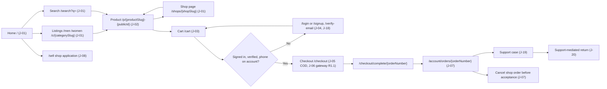
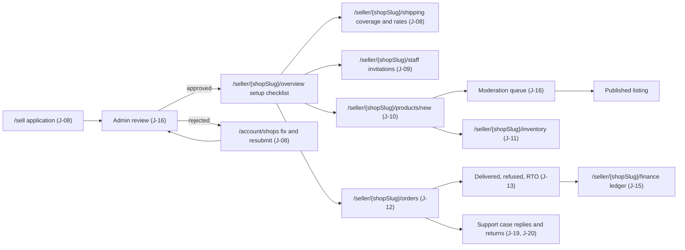
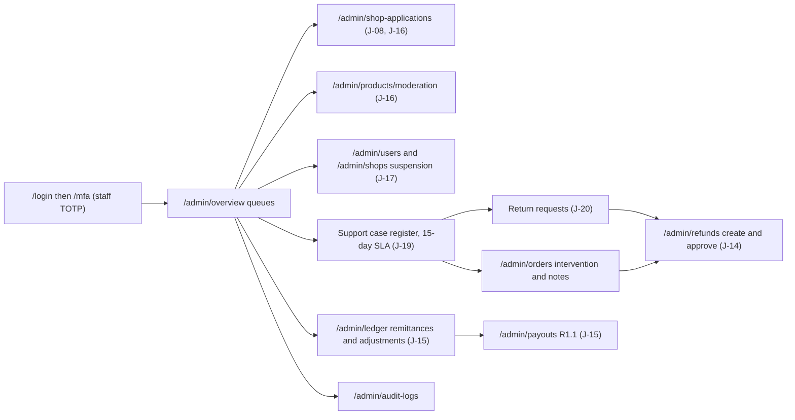
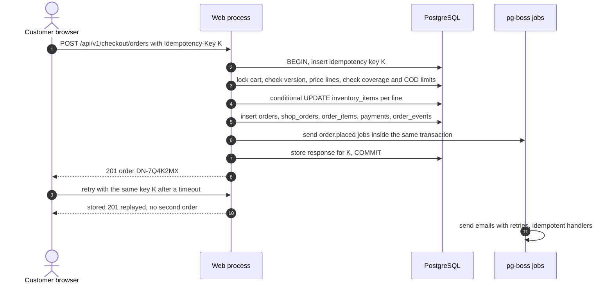
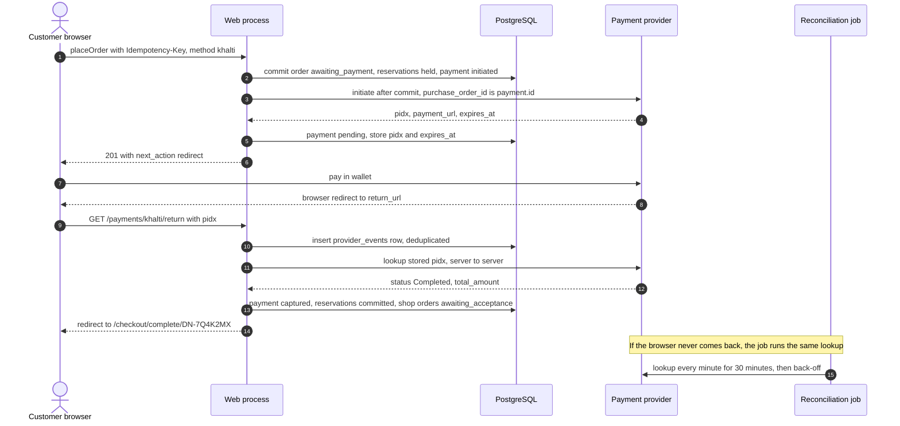
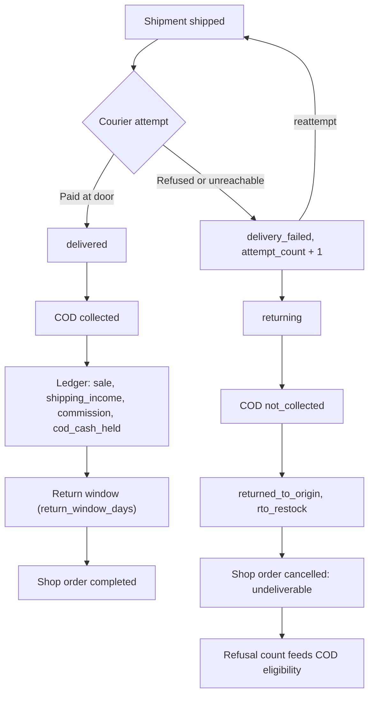

# DripNepal — User Journeys and Acceptance Criteria

Status: Draft v1 (2026-09-25)

## 1. Purpose and scope

This document describes the end-to-end journeys that DripNepal must support for customers, sellers and platform staff, and states the acceptance criteria (ACs) that decide whether each journey is done. It covers journeys J-01 to J-18 as named in the canonical brief, plus two R1 journeys added so that every R1 legal obligation has a journey:

- **J-19 Support case / grievance (R1)**: the complaint register with a 15-day decision SLA (FR-ADM-009; E-Commerce Act 2081 s33).
- **J-20 Support-mediated return (R1)**: returns created by support on the customer's behalf (FR-RET-006; Consumer Protection Act 2075 s14, E-Commerce Act s10).

This document owns journeys, state coverage and acceptance criteria only. It does not repeat rules owned elsewhere. It links to them instead:

| Topic                                                   | Owner document                                                         |
| ------------------------------------------------------- | ---------------------------------------------------------------------- |
| Context, repository findings (RF-xx), assumptions       | [00 context and findings](00-context-assumptions-and-questions.md)     |
| Requirement text (FR/NFR), scope, metrics               | [01 requirements](01-product-requirements.md)                          |
| Modules, jobs, process layout                           | [03 architecture](03-system-architecture.md)                           |
| Tables, columns, invariants, retention                  | [04 domain model](04-domain-model-and-data-dictionary.md)              |
| Transition tables, checkout algorithm, ledger postings  | [05 state machines](05-order-payment-and-inventory-lifecycles.md)      |
| API conventions and endpoint catalogue                  | [06 API](06-api-design.md) and [openapi.yaml](openapi.yaml)            |
| Threats, permission maps, privacy                       | [07 security and privacy](07-security-threat-model-and-permissions.md) |
| Screens, components, copy, accessibility                | [08 UI/UX](08-ui-ux-and-design-system.md)                              |
| Test catalogue and CI gates                             | [10 testing](10-testing-and-quality-gates.md)                          |
| Runbooks, alerts, jobs in operation                     | [11 operations](11-deployment-and-operations.md)                       |
| Milestones, backlog, master traceability matrix         | [12 milestones and traceability](12-roadmap-and-backlog.md)            |
| Open decisions (OD), external verifications (VX), risks | [risks and open decisions](risks-and-open-decisions.md)                |

Architecture decisions are cited by number (for example ADR-0009). They live in [docs/adr](adr/).

### 1.1 Labels

Every factual claim uses the canonical labels: **[Confirmed]** (product owner, 2026-09-25), **[Verified-repo]** (file:line in this repository), **[Verified-doc]** (official documentation, accessed 2026-09-25), **[Assumption]** (proposed default, reversible), **[Open]** with an OD-xx, and **[Verify-external]** with a VX-xx. Durations, limits and thresholds in this document that do not name a platform setting or a source are **[Assumption]**. They are starting values, tuned in docs/12 and docs/11.

### 1.2 How each journey is written

Each journey has:

1. **A summary table**: actors, release, related FRs, entry points (routes from canon §6.4), preconditions and permissions.
2. **Main success flow**: numbered steps. Each step names the page route and the API `operationId` it calls. Page reads come from Inertia props, which run the same query as the named read operation (ADR-0004). Mutations always go through `/api/v1`.
3. **State coverage**: one row per state class (see §1.3).
4. **Acceptance criteria**: IDs `AC-Jxx-nn`, in Given/When/Then form. Error codes come from canon §6.6 and are written `CODE (status)`. State names come from canon §9 and are written in code font.
5. **Links**: FRs, operationIds, permissions, tests, milestone.

Test references use the fixed canonical IDs (for example T-INV-003, T-CHK-004, T-SEC-010) where they exist. Otherwise they say "docs/10 test catalogue, area X". This document does not create new numbered test IDs.

### 1.3 State-coverage classes

| Class                     | What the row must answer                                                                                                           |
| ------------------------- | ---------------------------------------------------------------------------------------------------------------------------------- |
| Success                   | What the actor sees and what the system has stored when everything works.                                                          |
| Empty                     | What happens when there is nothing to show or act on (first use, no results, all filtered out).                                    |
| Validation                | Which inputs are rejected, with which code, and how the error reaches the field.                                                   |
| Permission                | Who is refused, with which code. Other tenants' resources return `NOT_FOUND (404)`, never 403 (canon §6.6).                        |
| Concurrency               | What happens with two tabs, two staff members, a job racing a human, or a retried request.                                         |
| External-provider failure | Behaviour when email, object storage, the payment gateway or the courier (off-platform) is slow, down or ambiguous.                |
| Recovery                  | How the actor gets back to a good state after a timeout, closed tab, expired link or partial failure, without creating duplicates. |

## 2. Journey index

| ID   | Journey                                | Surface                | Primary actors                                            | Release                    | Milestone | Primary FRs                                                     |
| ---- | -------------------------------------- | ---------------------- | --------------------------------------------------------- | -------------------------- | --------- | --------------------------------------------------------------- |
| J-01 | Browse & discover                      | Storefront             | Guest, customer                                           | R1                         | M4        | FR-SRCH-001, 002, 003, 005, 007; FR-CAT-001                     |
| J-02 | Product detail & variant selection     | Storefront             | Guest, customer                                           | R1                         | M4        | FR-SRCH-004; FR-CAT-004, 012; FR-PROMO-001                      |
| J-03 | Cart                                   | Storefront             | Guest, customer                                           | R1                         | M5        | FR-CART-001, 002, 003                                           |
| J-04 | Sign up & verify                       | Auth                   | Guest                                                     | R1                         | M1        | FR-IAM-001, 002, 003, 013                                       |
| J-05 | Checkout COD                           | Storefront             | Customer                                                  | R1                         | M5        | FR-CHK-001, 002, 003, 004, 005, 007; FR-IAM-012; FR-NOT-002     |
| J-06 | Checkout gateway                       | Storefront             | Customer, system, gateway                                 | R1.1                       | M8        | FR-CHK-006; FR-PAY-002, 003, 004                                |
| J-07 | Customer order tracking & cancellation | Account                | Customer                                                  | R1                         | M6        | FR-ORD-001, 002                                                 |
| J-08 | Shop application & approval            | Account, admin, seller | Applicant, catalog moderator                              | R1                         | M2        | FR-SHOP-001, 002, 003, 004, 010, 013, 014                       |
| J-09 | Staff invitation                       | Seller                 | Owner, invitee                                            | R1                         | M2        | FR-SHOP-005, 006                                                |
| J-10 | Product creation & publication         | Seller                 | Owner, manager, catalog editor                            | R1                         | M3        | FR-CAT-003 to 008, 011, 012; FR-MED-001, 002                    |
| J-11 | Inventory management                   | Seller                 | Owner, manager, catalog editor, system                    | R1                         | M3        | FR-INV-001, 002, 003, 005                                       |
| J-12 | Vendor order processing & fulfillment  | Seller                 | Order fulfiller, manager, owner, system                   | R1                         | M6        | FR-ORD-003, 004; FR-FUL-001; FR-NOT-002, 003                    |
| J-13 | COD delivery outcome & RTO             | Seller                 | Order fulfiller, system                                   | R1                         | M6, M7    | FR-FUL-002, 003; FR-PAY-001; FR-LED-002; FR-CHK-007; FR-ORD-006 |
| J-14 | Refund (admin-initiated)               | Admin                  | Support agent, finance officer                            | R1 manual; R1.1 gateway    | M7, M8    | FR-RET-001, 003, 007                                            |
| J-15 | Vendor ledger & remittance/payout      | Seller, admin          | Owner, manager, finance officer                           | R1 remittance; R1.1 payout | M7, M8    | FR-LED-001 to 005                                               |
| J-16 | Admin moderation (shops/products)      | Admin                  | Catalog moderator, platform admin                         | R1                         | M2, M3    | FR-SHOP-002; FR-CAT-005, 006; FR-ADM-001                        |
| J-17 | Account suspension & recovery          | Admin, all             | Platform admin, affected user or shop                     | R1                         | M1, M2    | FR-IAM-006; FR-ADM-002; FR-SHOP-007                             |
| J-18 | Password reset                         | Auth, account          | Any user                                                  | R1                         | M1        | FR-IAM-004, 005                                                 |
| J-19 | Support case / grievance               | Account, admin, seller | Customer, support agent, shop members                     | R1                         | M7        | FR-ADM-009, 011; FR-RET-005                                     |
| J-20 | Support-mediated return                | Admin, seller          | Customer, support agent, order fulfiller, finance officer | R1                         | M6, M7    | FR-RET-006, 001, 007                                            |

docs/12 holds the master traceability matrix (FR → journey → entities → operationIds → permissions → tests → milestone). The milestone column above follows canon §4. J-19 and J-20 are placed in M7 and M6/M7 as an [Assumption] until docs/12 assigns them.

## 3. Actors

| Actor              | Identity and state                                                   | Can do (summary; permission maps are owned by docs/07)                                                                   |
| ------------------ | -------------------------------------------------------------------- | ------------------------------------------------------------------------------------------------------------------------ |
| Guest              | No session user; guest cart token cookie                             | Browse, search, view products, keep a server-side cart. Cannot check out [Confirmed Q6].                                 |
| Customer (pending) | `users.status = pending_verification`                                | Browse, cart, account pages, resend verification. Checkout and shop application refused with `EMAIL_NOT_VERIFIED (403)`. |
| Customer           | `users.status = active`, verified email, Nepal mobile on the account | Check out, track and cancel orders, open support cases, apply to open a shop.                                            |
| Shop owner         | `shops.owner_user_id` (not a membership row)                         | All shop permissions, including `shop.staff.manage` and `shop.payout_account.manage`.                                    |
| Shop manager       | `shop_memberships.role = manager`                                    | All shop permissions except staff and payout account.                                                                    |
| Catalog editor     | `role = catalog_editor`                                              | `shop.products.view`, `shop.products.edit`, `shop.products.publish`, `shop.inventory.adjust`.                            |
| Order fulfiller    | `role = order_fulfiller`                                             | `shop.orders.view`, `shop.orders.process`, `shop.customer_contact.view`, `shop.products.view`.                           |
| Shop viewer        | `role = viewer`                                                      | `shop.products.view`, `shop.orders.view` with customer contact masked.                                                   |
| Platform admin     | `platform_staff.role = platform_admin`, TOTP enrolled                | All platform permissions. Admin routes need `mfa_verified_at` within 12 h.                                               |
| Support agent      | `support_agent`                                                      | Users view, orders view and intervene, refunds create, support cases, returns.                                           |
| Catalog moderator  | `catalog_moderator`                                                  | Shop review, product moderation, users view.                                                                             |
| Finance officer    | `finance_officer`                                                    | Orders view, refunds approve, ledger view and adjust, payouts manage and approve.                                        |
| System             | pg-boss jobs in the `worker` process (ADR-0010)                      | Timeouts, reconciliation, completion, SLA alerts, emails, listing refresh. Acts with `actor_type = system`.              |
| Payment provider   | eSewa or Khalti (OD-03), R1.1                                        | Browser redirects and server-to-server lookups. Never trusted without lookup (ADR-0012).                                 |
| Courier            | Off-platform, contracted by the vendor [Confirmed Q5]                | Delivers and collects COD cash. Has no DripNepal account in R1. The vendor records outcomes.                             |

## 4. Cross-cutting rules for every journey

### 4.1 Current repository UX defects these journeys replace

The storefront and dashboards at HEAD (commit 0282605) are mostly mock-driven. The journeys below are written for the target system. These defects must not be copied forward, and the named ACs prove they are gone. Evidence is from `gt/audit.md` (accessed 2026-09-25) and was re-checked in the repository.

| RF           | Current behaviour [Verified-repo]                                                                                                                                                                        | Fixed by                        |
| ------------ | -------------------------------------------------------------------------------------------------------------------------------------------------------------------------------------------------------- | ------------------------------- |
| RF-02        | Catalog, product, cart and checkout routes sit behind `middleware.guest()`, so signed-in users are redirected to `/` (start/routes.ts:49, 57, 64).                                                       | AC-J01-01, AC-J05-01            |
| RF-10        | `/cart` and `/checkout` throw during render: `useCart must be used within a CartProvider` (inertia/hooks/use_cart.tsx:270).                                                                              | AC-J03-01                       |
| RF-16        | Cart total subtracts compare-at savings twice; client computes order totals and generates the order number `DN-${Date.now().toString(36)}` (inertia/components/commerce/checkout/checkout_page.tsx:242). | AC-J03-06, AC-J05-02            |
| RF-27        | Listings, PDP and search run on client mocks; filter state is not in the URL; add-to-cart does nothing.                                                                                                  | AC-J01-02, AC-J02-05            |
| RF-28        | Cart button is `hidden sm:block` (inertia/components/navbar/index.tsx:126), so phones have no cart entry; unlabeled inputs and 24–28 px targets.                                                         | AC-J00-06, AC-J03-07            |
| RF-29        | Checkout phone rule `^(98\|97)\d{8}$` rejects valid 96x numbers (inertia/components/commerce/checkout/address_form.tsx:52); district list from mocks misses Eastern and Western Rukum.                   | AC-J04-04, AC-J05-10            |
| RF-01        | `/shop/:shopSlug/*` checks only that someone is logged in (start/routes/shops.ts:27-28).                                                                                                                 | AC-J09-06, AC-J12-01            |
| RF-03, RF-21 | Shop registration is guest-only, always creates a new user, and is broken at HEAD.                                                                                                                       | AC-J08-11                       |
| RF-04        | Cookie session store; suspended users keep their sessions.                                                                                                                                               | AC-J17-01                       |
| RF-12, RF-38 | Login has no rate limit and a 32-character password cap; signup reveals existing emails.                                                                                                                 | AC-J04-02, AC-J04-03, AC-J04-08 |
| RF-15        | No idempotency key on orders, so double submits on slow networks create duplicates.                                                                                                                      | AC-J05-03                       |
| RF-25        | Money formatted with Devanagari digits after a Latin "Rs.", `$` in places, UTC dates.                                                                                                                    | AC-J00-05                       |
| RF-37        | Redirects forward the incoming query string; there is no validated return URL.                                                                                                                           | AC-J00-02                       |

### 4.2 Cross-cutting acceptance criteria (AC-J00)

These apply to every journey. They are tested once per mechanism and sampled per journey (docs/10 test catalogue, areas API, UI, A11Y, SEC).

- **AC-J00-01 Error display.** Given any `/api/v1` call fails, when the response is `application/problem+json`, then the UI shows `detail` in plain language and the `request_id` as "Reference: …", binds each `errors[].field` message to its input via `aria-describedby`, and never shows a stack trace or raw SQL. Test: T-API-001 plus docs/10 area UI.
- **AC-J00-02 Session expiry.** Given a session that expired mid-journey, when the next mutation returns `UNAUTHENTICATED (401)`, then the page redirects to `/login?return_to=<path>`. `return_to` is accepted only if it is a same-origin relative path starting with `/` and not `//` (fixes RF-37). After login the user returns to that path, and any unsaved form input for checkout, product edit and support case forms is restored from `sessionStorage`.
- **AC-J00-03 Suspension.** Given a user suspended while signed in, when any request arrives, then API calls return `ACCOUNT_SUSPENDED (403)` and page requests redirect to `/login` with a suspension notice. Test: T-SEC-010.
- **AC-J00-04 Rate limits.** Given a rate limit is hit, when the API returns `RATE_LIMITED (429)` with `Retry-After`, then the UI disables the action and shows the wait time. It never retries automatically faster than `Retry-After`. Limits are those in canon §6.6 [Assumption].
- **AC-J00-05 Formatting.** Given any money or time shown in the English UI, then money uses `Intl.NumberFormat('en-IN', { style: 'currency', currency: 'NPR', currencyDisplay: 'narrowSymbol' })` with Latin digits and lakh grouping (for example "Rs 7,250" or "Rs 12,34,567.50"), and times render in `Asia/Kathmandu` (UTC+05:45) on both the SSR and client passes with identical output. The exact symbol form is [Verify-external VX-12]. The API only ever carries `{amount_minor, currency}` and RFC 3339 UTC timestamps.
- **AC-J00-06 Mobile reach.** Given a 360 × 640 CSS px viewport, then every primary action of every journey is reachable without horizontal scrolling, interactive targets are at least 24 × 24 CSS px (WCAG 2.2 SC 2.5.8), and the header shows a cart entry with the item count. Test: T-A11Y-001 plus docs/10 area UI.
- **AC-J00-07 Double submit.** Given a mutation marked ⚷ in canon §6.5, when the user taps the button twice or the network retries, then the client sends the same `Idempotency-Key` for the same logical action, disables the button while the request is in flight, and the server executes the action once (canon §6.6).
- **AC-J00-08 Tenant isolation.** Given a customer or seller requests a resource that belongs to another customer or shop, then the response is `NOT_FOUND (404)` with a body identical to a truly missing resource. Tests: T-SEC-001, T-SEC-002.
- **AC-J00-09 Traceability of changes.** Given any state change by a shop member or platform staff member, then exactly one `audit_logs` row is written in the same transaction with `actor_role`, `action`, `subject`, `request_id` and a redacted before/after. Order-visible changes also write an `order_events` row with the right `visibility`.
- **AC-J00-10 No personal data in the client log.** Given any page render, then page props are never written to the browser console or SSR stdout (fixes RF-26), and seller pages receive customer contact only through the transformer allowed for that permission.
- **AC-J00-11 Kill switch.** Given `platform_settings.checkout_enabled = false` (breach response, E-Commerce Directive 2082 s8(2)), then every page shows a maintenance banner and `placeOrder` and `startOrderPayment` are refused, while browsing, account pages and seller order processing keep working. The error code is covered in the Consistency notes.

## 5. Journey maps

These maps show how journeys connect on each surface. Each box names the journey and its main route.

### 5.1 Storefront and customer account

### 5.2 Seller dashboard

### 5.3 Platform administration and support

## 6. Journeys

### J-01 Browse & discover

| Field         | Value                                                                                                                                                                |
| ------------- | -------------------------------------------------------------------------------------------------------------------------------------------------------------------- |
| Actors        | Guest, customer (any status except suspended)                                                                                                                        |
| Release       | R1 (M4). Facet counts and autocomplete are R2 (FR-SRCH-008, 006).                                                                                                    |
| Related FRs   | FR-SRCH-001, 002, 003, 005, 007; FR-CAT-001                                                                                                                          |
| Entry points  | `/`, `/men`, `/women`, `/c/{categorySlug}`, `/search?q=`, `/shops/{shopSlug}`, external links and search engines                                                     |
| Preconditions | Reference categories and attributes seeded; `product_listings` read model populated by the listing refresh job; at least one `published` product in an `active` shop |
| Permissions   | None (public). Listing queries always filter to `products.status = published` and `shops.status = active`.                                                           |

#### Main success flow

1. The visitor opens `/`. The page is server-rendered (ADR-0003) with navigation entries from code config (FR-SRCH-007), for example "Men › T-shirts".
2. The visitor opens `/men`. The navigation entry maps to filters `audience=men`. The server reads `product_listings` with the same query as `listProducts` (page 1, `per_page` 24 [Assumption], default sort `newest`) and renders product cards with price, compare-at price when valid, shop name and an out-of-stock badge.
3. The visitor narrows the list with category subtree, size, colour and price range, and changes sort. Each change is an Inertia visit that rewrites the query string (for example `/men?category=t-shirts&size=m&sort=price_asc&page=2`). The server validates every parameter against the endpoint allowlist.
4. The visitor searches from the header: `/search?q=kurta`. The server uses PostgreSQL full-text search (`simple` configuration) plus trigram similarity on titles (ADR-0014) and renders paginated results.
5. The visitor opens a shop from a card: `/shops/{shopSlug}` renders the public profile (`getPublicShop`) and that shop's listings (`listProducts` with the shop filter).
6. The visitor opens a product card and continues in J-02.

#### State coverage

| Class                     | Behaviour                                                                                                                                                                                                                                                                                                                                                                  |
| ------------------------- | -------------------------------------------------------------------------------------------------------------------------------------------------------------------------------------------------------------------------------------------------------------------------------------------------------------------------------------------------------------------------- |
| Success                   | SSR HTML contains product names, prices, links, `<link rel="canonical">`, `<html lang="en">` and pagination links. Filters and sort reflect the URL.                                                                                                                                                                                                                       |
| Empty                     | Category with no products: "No products in T-shirts yet" with links to the parent category and "Clear filters". Search with no results: the query is echoed, spelling tips and top categories are shown, and the page carries `noindex`. A filter combination with zero results keeps the chips visible so the user can remove one.                                        |
| Validation                | Pages: unknown or malformed parameters are dropped, and the canonical URL omits them. API: unknown parameter → `INVALID_QUERY_PARAMETER (400)` naming the parameter; `per_page` > 48 or `page` > 100 → `INVALID_QUERY_PARAMETER (400)`. Price `min` > `max` shows an inline error and the filter is not applied. `q` is trimmed and capped at 100 characters [Assumption]. |
| Permission                | None required. Products in `draft`, `pending_review`, `rejected`, `unpublished`, `archived` or `blocked`, and all products of `pending_review`, `suspended`, `rejected` or `closed` shops, never appear. The shop page of a non-active shop returns 404.                                                                                                                   |
| Concurrency               | The read model can be seconds stale (canon §8). A product unpublished a moment ago can still be listed; opening it gives the "no longer available" page (J-02). Stock badges can be stale; the cart and checkout are authoritative.                                                                                                                                        |
| External-provider failure | CDN or image derivative missing: fixed-ratio placeholder with the alt text, so there is no layout shift. Listing refresh job lagging: stale data is served, and an alert fires when lag exceeds 5 minutes [Assumption; docs/11]. Database down: 503 error page; `/health/ready` fails.                                                                                     |
| Recovery                  | Back, forward and refresh restore filters, page and scroll because the URL is the only filter state (fixes RF-27). An old category or shop slug returns 301 to the current slug via `slug_redirects`, keeping the query string.                                                                                                                                            |

#### Acceptance criteria

- **AC-J01-01** Given a signed-in customer, when they open `/men`, `/women`, `/c/{categorySlug}`, `/search?q=shirt` or a product URL, then the response is 200 with the page, not a redirect to `/` (fixes RF-02).
- **AC-J01-02** Given filters `category=t-shirts`, `size=m` and `sort=price_asc` are applied, when the page is reloaded or the URL is opened in another browser, then the same products appear in the same order and the same filter controls are selected.
- **AC-J01-03** Given a call to `listProducts?colour=red`, when the server validates it, then it returns `INVALID_QUERY_PARAMETER (400)` with `errors[0].field = "colour"`. Given the page route `/men?colour=red`, then it renders 200 and the canonical link omits `colour`.
- **AC-J01-04** Given a product whose shop is moved to `suspended`, when the listing refresh job has run (at most 60 s after the event [Assumption]), then the product appears in no listing, search result or sitemap, and `/shops/{shopSlug}` returns 404.
- **AC-J01-05** Given a listing of 130 products sorted by `price_asc` with price ties, when a user walks pages 1 to 6 at `per_page=24`, then every product appears exactly once, because ordering is by the sort key and then `id` (canon §6.6).
- **AC-J01-06** Given JavaScript is disabled, when a listing is requested, then product names, prices, product links, `<link rel="canonical">` and `<html lang="en">` are present in the HTML (FR-SRCH-005, RF-08).
- **AC-J01-07** Given category slug `tshirts` was renamed to `t-shirts`, when `/c/tshirts?size=m` is requested, then the response is 301 to `/c/t-shirts?size=m`.
- **AC-J01-08** Given the launch catalogue and a throttled mid-range Android profile, when `/men` is loaded, then LCP p75 is at most 2.5 s and CLS at most 0.1 (proposed NFR targets [Assumption], docs/01). Test: T-PERF-001.

**Links:** operationIds `listProducts`, `listCategories`, `listAttributes`, `getPublicShop`. Permissions: none. Tests: T-API-001, T-A11Y-001, T-PERF-001; docs/10 test catalogue, areas CAT and UI. ADR-0014, ADR-0017. Milestone M4.

### J-02 Product detail & variant selection

| Field         | Value                                                                                                                         |
| ------------- | ----------------------------------------------------------------------------------------------------------------------------- |
| Actors        | Guest, customer                                                                                                               |
| Release       | R1 (M4)                                                                                                                       |
| Related FRs   | FR-SRCH-004, 005; FR-CAT-004, 012; FR-PROMO-001; FR-CART-001                                                                  |
| Entry points  | `/p/{productSlug}-{publicId}` from listings, search, shop page, shared links                                                  |
| Preconditions | Product `published`; shop `active`; at least one `active` variant; at least one `ready` image; shop shipping rates configured |
| Permissions   | None to view. `addCartItem` works for guests and signed-in users.                                                             |

#### Main success flow

1. The server resolves `{publicId}` (8-character Crockford base32) to the product. If the slug part does not match the current slug, it returns 301 to the canonical URL (ADR-0017).
2. Page props (same data as `getProduct`) include: title, description, images grouped by colour, option axes (0 to 2, for example `apparel_size` and `color`), variants with `option_signature`, price, compare-at price, and availability per variant; the shop summary; the delivery estimate per zone (`est_min_days`–`est_max_days` from `shop_shipping_rates`); accepted payment methods (COD in R1); and the listing disclosures required by E-Commerce Act s6 (FR-CAT-012).
3. The customer picks a colour. The gallery switches to that colour's images. Sizes that have no available variant in that colour are shown disabled with the text "Out of stock", not colour alone.
4. The customer picks a size. The client resolves the variant from the option signature and shows its price and "Only 2 left" when available stock is 3 or less [Assumption].
5. The customer picks a quantity from 1 to 10, capped at the available quantity shown.
6. The customer taps "Add to cart". The client calls `addCartItem` with `{variant_id, quantity}`. For a guest, the server creates a guest cart and sets its token cookie. A live region announces "Added to cart", and the header count updates.

#### State coverage

| Class                     | Behaviour                                                                                                                                                                                                                                                                                                                                                               |
| ------------------------- | ----------------------------------------------------------------------------------------------------------------------------------------------------------------------------------------------------------------------------------------------------------------------------------------------------------------------------------------------------------------------- |
| Success                   | Variant selected, price shown tax-inclusive ("Price includes all taxes" [Assumption pending OD-11]), item added and cart count updated.                                                                                                                                                                                                                                 |
| Empty                     | Product with no option axes: no pickers, the default variant is used. Colour with no dedicated images: the product's first images are shown. Delivery estimate missing (should not happen for a published product): "Delivery estimate unavailable" and a support link.                                                                                                 |
| Validation                | Add without choosing every axis: inline "Select a size", no API call. `quantity` > 10 or < 1 → `VALIDATION_FAILED (422)` with `errors[0].field = "quantity"`. Variant not `active` → `NOT_FOUND (404)`.                                                                                                                                                                 |
| Permission                | Non-published product or non-active shop → 404 page "This product is no longer available", with links to the category and similar products. Shop members preview drafts only inside the seller dashboard, never through the public URL [Assumption].                                                                                                                    |
| Concurrency               | Variant sells out between page load and add → `OUT_OF_STOCK (409)` with the available quantity, and the picker refreshes. Price changes between load and add → the cart stores the current server price in `unit_price_minor_at_add`, and the cart notice shows the new price. Product unpublished meanwhile → `NOT_FOUND (404)` and the "no longer available" message. |
| External-provider failure | Slow CDN: a low-quality placeholder in a fixed aspect-ratio box. Image derivative failed: placeholder plus alt text.                                                                                                                                                                                                                                                    |
| Recovery                  | The selected variant is kept in the URL (`?variant={variantId}` [Assumption]), so reload and share keep the selection. If add-to-cart fails on the network, the button re-enables and the retry uses the same payload. `addCartItem` is not ⚷, so a repeated add increments the quantity, capped at 10.                                                                 |

#### Acceptance criteria

- **AC-J02-01** Given product `8K3M9QZT` with slug `linen-shirt`, when `/p/old-name-8K3M9QZT` is requested, then the response is 301 to `/p/linen-shirt-8K3M9QZT`. Given an unknown public ID, then the response is 404.
- **AC-J02-02** Given a published product, when the PDP renders, then it shows brand or trademark, material, weight, producer (`manufacturer_name`), country of origin when `is_imported = true`, warranty text, care and precautions, the delivery estimate for the default zone, accepted payment methods, and the final tax-inclusive price (FR-CAT-012; E-Commerce Act 2081 s6, <https://giwmscdnone.gov.np/media/files/E-Commerce%20Act%2C%202081_yr7k9o5.pdf>, accessed 2026-09-25; legal confirmation VX-02).
- **AC-J02-03** Given a variant with `compare_at_price_minor = 250000` and `price_minor = 199900`, then the PDP shows both prices and "20% off" (rounded down). Given `compare_at_price_minor` is null, then no strike-through or percentage is shown (FR-PROMO-001; reference-price rules VX-04).
- **AC-J02-04** Given colour "Black" has no stock in size "XL", when Black is selected, then XL is disabled, its accessible name includes "out of stock", and "Add to cart" stays disabled until every axis has a selectable value.
- **AC-J02-05** Given a variant with `on_hand - reserved = 0` at request time, when `addCartItem` is called, then it returns `OUT_OF_STOCK (409)` and the cart is unchanged. Given stock is available, then the header cart count increases by the quantity (fixes RF-27's no-op add).
- **AC-J02-06** Given a product moved to `blocked`, when its URL is requested, then the response is 404, and the product is absent from the sitemap after the next sitemap build.
- **AC-J02-07** Given a published product, then the page embeds JSON-LD `Product` whose `offers.price` equals the default variant price in NPR and whose `availability` matches the variant's stock state at render time (FR-SRCH-005).
- **AC-J02-08** Given a keyboard-only user, when they tab through the variant pickers, then each axis is a radio group operable with arrow keys, focus is visible and not obscured by the sticky add-to-cart bar (WCAG 2.2 SC 2.4.11). Test: T-A11Y-001.

**Links:** operationIds `getProduct`, `addCartItem`. Permissions: none. Tests: T-API-001, T-A11Y-001; docs/10 test catalogue, areas CAT, CART and UI. ADR-0017. Milestone M4.

### J-03 Cart

| Field         | Value                                                                                                                   |
| ------------- | ----------------------------------------------------------------------------------------------------------------------- |
| Actors        | Guest, customer                                                                                                         |
| Release       | R1 (M5)                                                                                                                 |
| Related FRs   | FR-CART-001, 002, 003; FR-PROMO-001                                                                                     |
| Entry points  | Header cart icon (visible at all widths), "Added to cart" notice, `/cart`                                               |
| Preconditions | None. A guest cart is created on first add.                                                                             |
| Permissions   | The cart is resolved only from the session user or the guest token cookie. No cart ID is ever accepted from the client. |

#### Main success flow

1. The customer opens `/cart`. Page props (same data as `getCart`) group lines by shop: shop name, lines (image, title, variant label, unit price, quantity, line total), shop subtotal, and a shipping estimate. The estimate uses the default address's district for signed-in customers; otherwise it says "Calculated at checkout".
2. The server revalidates every line on each load (FR-CART-002) and attaches notices: price changed since added (old and new price), only N left, out of stock, or no longer available (product not `published`, variant archived, shop not `active`).
3. The customer changes a quantity with the stepper (`updateCartItem`) or removes a line (`removeCartItem`). Totals are recomputed server-side in integer paisa and returned with the new `cart.version`.
4. A guest signs in or signs up (J-04). The guest cart merges into the user's active cart: lines for the same variant add their quantities, capped at 10; distinct lines are added up to 50 lines; the guest cart becomes `merged`. A notice lists any lines that could not be merged.
5. The customer taps "Checkout" and continues in J-05. If any line is unavailable, a dialog asks them to remove unavailable items first. One tap removes them all.

#### State coverage

| Class                     | Behaviour                                                                                                                                                                                                                                              |
| ------------------------- | ------------------------------------------------------------------------------------------------------------------------------------------------------------------------------------------------------------------------------------------------------ |
| Success                   | Lines grouped by shop, totals match the server, notices shown for changed lines.                                                                                                                                                                       |
| Empty                     | "Your cart is empty" with links to Men, Women and recently viewed items. After an order the old cart is `converted`, and the next add creates a new cart.                                                                                              |
| Validation                | `quantity` outside 1–10 → `VALIDATION_FAILED (422)` on `quantity`. A 51st line → `VALIDATION_FAILED (422)` with code `max_lines` [Assumption: code value owned by docs/06]. More than 60 adds per minute → `RATE_LIMITED (429)`.                       |
| Permission                | A `cartItemId` that is not in the caller's cart → `NOT_FOUND (404)`. Suspended user → `ACCOUNT_SUSPENDED (403)`.                                                                                                                                       |
| Concurrency               | Two tabs: tab A removes a line while tab B changes its quantity → B gets `NOT_FOUND (404)` and reloads the cart. Every change increments `carts.version`, and checkout compares it (`CART_CHANGED (409)`, J-05). Quantity updates are last-write-wins. |
| External-provider failure | No external dependency. A database error returns 503. The optimistic UI rolls back and shows "Couldn't update your cart. Try again."                                                                                                                   |
| Recovery                  | The guest token is a random value in an httpOnly cookie; only its hash is stored (fixes RF-19). The guest cart survives browser restarts until `expires_at` (30 days [Assumption]). After login the merged cart is shown with the merge notice.        |

#### Acceptance criteria

- **AC-J03-01** Given a signed-in customer or a guest with items, when `/cart` is requested (SSR and client navigation), then it renders 200 with the server cart and no client exception (fixes RF-10).
- **AC-J03-02** Given a guest cart with variant V × 3 and a user cart with V × 8 and W × 1, when the guest signs in, then the user cart holds V × 10 and W × 1, the guest cart status is `merged`, and the notice says V was capped at 10.
- **AC-J03-03** Given a line added at Rs 1,500 whose variant is now Rs 1,650, when the cart loads, then the line shows "Price changed from Rs 1,500 to Rs 1,650", and the totals use Rs 1,650. Given a request that includes a `price` or `unit_price_minor` field, then the field is rejected or ignored and has no effect (T-SEC-003).
- **AC-J03-04** Given a line whose shop is `suspended`, when the cart loads, then the line is flagged "No longer available", excluded from totals, and "Checkout" first asks the user to remove it.
- **AC-J03-05** Given the stepper, when the user tries to go above 10, then the plus control is disabled. Given a direct API call with `quantity = 11`, then the response is `VALIDATION_FAILED (422)`.
- **AC-J03-06** Given lines with compare-at prices, then the cart total equals the sum of `unit price × quantity` plus shipping estimates, with savings shown for information only and never subtracted again (fixes RF-16).
- **AC-J03-07** Given a 360 px wide viewport, then the header cart control is visible, is at least 24 × 24 CSS px, and its accessible name includes the item count, for example "Cart, 3 items" (fixes RF-28).
- **AC-J03-08** Given a guest cart cookie, when the browser is reopened 29 days later, then the cart and its lines are intact. After 30 days the cart is `abandoned` and a new empty cart is created on the next add.

**Links:** operationIds `getCart`, `addCartItem`, `updateCartItem`, `removeCartItem`. Permissions: none (owner of cart). Tests: T-SEC-003, T-API-001, T-A11Y-001; docs/10 test catalogue, area CART. Milestone M5.

### J-04 Sign up & verify

| Field         | Value                                                                                               |
| ------------- | --------------------------------------------------------------------------------------------------- |
| Actors        | Guest; system (email job)                                                                           |
| Release       | R1 (M1). Phone OTP is R2 (FR-IAM-010). Social login is R3.                                          |
| Related FRs   | FR-IAM-001, 002, 003, 013; FR-CART-001 (merge on login)                                             |
| Entry points  | `/signup`, `/login`, checkout gate (`/login?return_to=/checkout`), `/sell` gate, `/verify-email`    |
| Preconditions | Email provider configured (OD-08). Rate limiter uses the database store (OD-10 resolved).           |
| Permissions   | Guest only for `/signup` and `/login`. A signed-in user who opens them is redirected to `/account`. |

#### Main success flow

1. The guest opens `/signup` and enters full name, email, password (10–128 characters), and optionally a Nepal mobile number. The marketing-email checkbox is unchecked by default (FR-IAM-013; Advertisement (Regulation) Act 2076 s10). An age confirmation is shown if OD-24 requires it.
2. Submit calls `signUp`. The server normalises the email (trimmed, lower-cased, `citext`) and returns **202** with the same body whether or not the email already exists [Assumption: enumeration defence for RF-38, owned by docs/07]. For a new email it creates the user with status `pending_verification`, a fresh `security_stamp`, and a `user_tokens` row (`purpose = email_verification`, stored as a hash, expiring in 24 h [Assumption]). It then queues the verification email in the same transaction (ADR-0010). For an existing email it queues an "Someone tried to sign up with your email" notice instead.
3. The page moves to `/verify-email`: "We sent a link to r•••@gmail.com". A resend button calls `resendEmailVerification` (limit 3 per hour).
4. The user opens the link. `/verify-email?token=…` calls `confirmEmail`. The token is consumed, `email_verified_at` is set and the status becomes `active`.
5. The page redirects to `/login` with the email prefilled and the original `return_to` kept. Login calls `logIn`: the session ID is regenerated, the session is tagged with the user ID (canon §17.9), the `security_stamp` is stored in the session, and the guest cart merges (J-03 step 4).
6. Platform staff are sent to `/mfa` next (`verifyMfaChallenge`), because TOTP is mandatory for staff (FR-IAM-007).
7. If the account has no phone, the checkout page asks for one before placing an order (J-05). It is saved with `updateMe`.

#### State coverage

| Class                     | Behaviour                                                                                                                                                                                                                                                                                                        |
| ------------------------- | ---------------------------------------------------------------------------------------------------------------------------------------------------------------------------------------------------------------------------------------------------------------------------------------------------------------- |
| Success                   | Account active after verification; login lands on `return_to` or `/account`.                                                                                                                                                                                                                                     |
| Empty                     | A new account has no orders or addresses: `/account` shows "No orders yet" and an "Add address" call to action.                                                                                                                                                                                                  |
| Validation                | Invalid email format, password shorter than 10 or longer than 128, or a mobile not matching `^9[678]\d{8}$` after stripping `+977`, `977`, spaces and hyphens → `VALIDATION_FAILED (422)` with field errors. A landline is rejected for a customer mobile.                                                       |
| Permission                | Login by a `suspended` user with the correct password → `ACCOUNT_SUSPENDED (403)`. With a wrong password, the generic "Invalid email or password" is shown (no status leak). `anonymized` accounts cannot log in.                                                                                                |
| Concurrency               | Two signups with the same email at once: the unique index on `users.email` lets one insert win; both callers get the same 202. Double-clicking the verification link: the second call finds the token consumed and the user already verified, and shows "Your email is already verified" (idempotent, no error). |
| External-provider failure | Email provider down: the `notification_deliveries` row stays `queued` and the job retries with backoff; after the final attempt the row is `failed` and an alert fires (docs/11). The page says delivery can take a few minutes and offers resend. Deliverability to Nepali mailboxes is VX-14.                  |
| Recovery                  | Expired token: "This link has expired" with an email field and resend. A user who logs in before verifying gets a session with a "Verify your email" banner; checkout and `/sell` are refused with `EMAIL_NOT_VERIFIED (403)` and link to resend.                                                                |

#### Acceptance criteria

- **AC-J04-01** Given a new email, when `signUp` succeeds, then the response is 202, a user exists with `status = pending_verification`, and exactly one verification email is recorded in `notification_deliveries` (dedupe key), with status `sent` within 2 minutes when the provider is healthy [Assumption].
- **AC-J04-02** Given an email that already exists, when `signUp` is called, then the status code and body are identical to AC-J04-01, no second user is created, and the existing owner receives a notice email. The per-IP signup limit (5 per hour) returns `RATE_LIMITED (429)` on the 6th attempt.
- **AC-J04-03** Given a 9-character password, then `signUp` returns `VALIDATION_FAILED (422)` with `errors[0].field = "password"`. Given 128 characters, then it is accepted. Given 129, then it is rejected (fixes the 32-character cap in RF-12).
- **AC-J04-04** Given mobile inputs `9841234567`, `+977 984-123-4567` and `9612345678`, then each is accepted and stored as E.164 in `phone_enc`, with `phone_last4` set and `phone_hash` computed. Given `9012345678` (IoT range), `984123456` or `014123456`, then `VALIDATION_FAILED (422)` on `phone`. Numbering plan: NTA National Numbering Allocation Plan, <https://www.nta.gov.np/uploads/contents/National%20Numbering%20Allocation%20Plan.pdf>, accessed 2026-09-25 [Verified-doc]; ongoing prefix changes VX-11.
- **AC-J04-05** Given the signup form, then the marketing checkbox is unchecked on render. Given it is left unchecked, then `marketing_email_consent_at` is null. Given it is checked, then the timestamp is stored and can be withdrawn from `/account` (FR-IAM-013).
- **AC-J04-06** Given a valid token, when `confirmEmail` is called, then `email_verified_at` is set, `status = active` and the token's `consumed_at` is set. Given the same token again, then the page reports "already verified" with 200. Given a token older than 24 h, then the page offers resend and the status is unchanged.
- **AC-J04-07** Given a `pending_verification` user, when they call `placeOrder` or `applyForShop`, then the response is `EMAIL_NOT_VERIFIED (403)`.
- **AC-J04-08** Given 5 failed logins for one account from one IP within a minute, when a 6th is attempted, then `RATE_LIMITED (429)` is returned with `Retry-After`. Unknown email and wrong password produce the same message and status. Unexpected server errors return `INTERNAL (500)` problem details, never an empty body (fixes RF-12).
- **AC-J04-09** Given a successful login, then the session ID differs from the pre-login ID, the session is tagged with the user ID, and `last_login_at` is updated. Test: docs/10 test catalogue, area IAM.
- **AC-J04-10** Given 3 resend requests in an hour, when a 4th is made, then `RATE_LIMITED (429)` is returned and no email is queued.

**Links:** operationIds `signUp`, `resendEmailVerification`, `confirmEmail`, `logIn`, `logOut`, `verifyMfaChallenge`, `getMe`, `updateMe`. Permissions: none (self). Tests: T-SEC-010; docs/10 test catalogue, areas IAM and SEC. ADR-0005. Milestone M1.

### J-05 Checkout COD

| Field         | Value                                                                                                                                                        |
| ------------- | ------------------------------------------------------------------------------------------------------------------------------------------------------------ |
| Actors        | Customer; system (jobs); shop members (receive the new order)                                                                                                |
| Release       | R1 (M5)                                                                                                                                                      |
| Related FRs   | FR-CHK-001, 002, 003, 004, 005, 007; FR-CART-002, 003; FR-IAM-012; FR-INV-002; FR-NOT-002                                                                    |
| Entry points  | "Checkout" on `/cart`; direct `/checkout`; retry after timeout                                                                                               |
| Preconditions | `checkout_enabled = true`; user `active`, email verified, mobile on account; cart has at least one available line; every shop in the cart has shipping rates |
| Permissions   | Authenticated customer acting on their own cart and addresses. No staff or shop permission applies.                                                          |

The worked example used below: a customer in Lalitpur (zone `ktm_valley`) buys 2 × T-shirt at Rs 1,200 from shop A (shipping Rs 100) and 1 × sneakers at Rs 4,500 from shop B (shipping Rs 250). The grand total is Rs 7,250 (`725000` paisa), split into shop orders `DN-7Q4K2MX-1` (Rs 2,500) and `DN-7Q4K2MX-2` (Rs 4,750). Amounts are illustrative.

#### Main success flow

1. `/checkout` requires authentication. Unauthenticated → `/login?return_to=/checkout`. Page props carry the cart with its `version`, saved addresses (`listAddresses`) and an initial quote for the default address.
2. **Address.** The customer picks a saved address or adds one (`createAddress`): recipient name, recipient mobile, then Province → District → Local level → Ward → Area/tole → Landmark. The cascading selects use `listProvinces`, `listDistricts` and `listLocalLevels`. The ward must be between 1 and the local level's `ward_count` (up to 33, for example Pokhara). Nepal Post data, <https://giwmscdnone.gov.np/media/pdf_upload/Postal%20Code_wteggid.pdf>, accessed 2026-09-25; seeding source VX-10.
3. **Quote.** `quoteCheckout {address_id, payment_method: "cod", cart_version}` returns per-shop groups (lines, shipping fee for the address zone, delivery window, shop total), the grand total, COD eligibility and any per-line issues.
4. **Review** (WCAG 2.2 SC 3.3.4 error prevention for financial transactions). The page shows each shop group, the address, and "Cash on delivery: you will pay each shop's courier separately: Rs 2,500 to shop A and Rs 4,750 to shop B. No extra charge at the door." (E-Commerce Directive 2082 s8(3), canon §17.3). It also links the return and refund policy. When the review renders, the client creates an `Idempotency-Key` (UUIDv4) and stores it in `sessionStorage` keyed by cart version and expected total.
5. **Place order.** `placeOrder` is sent with `Idempotency-Key` and `X-XSRF-TOKEN`, body `{address_id, payment_method: "cod", expected_grand_total_minor: 725000, cart_version, customer_note?}`. The server runs the canonical algorithm (canon §10; transition details in docs/05): key row first, cart lock, availability, coverage, pricing, COD limits, reservations sorted by `variant_id`, then orders, shop orders, items with snapshots, payments, events and outbox jobs, all in one transaction.
6. Response **201** `{order_number: "DN-7Q4K2MX", status: "placed", shop_orders: [...]}`. The parent order is `placed`. Each shop order is `awaiting_acceptance` with `acceptance_due_at = placed_at + vendor_acceptance_sla_hours` (48 [Assumption; OD-19]). Each shop order has a COD payment `awaiting_collection` for its total. Reservations are `committed`. The cart is `converted`.
7. The client navigates to `/checkout/complete/DN-7Q4K2MX` and shows both shop order numbers, the amount to pay each courier, delivery windows and a link to `/account/orders/DN-7Q4K2MX`.
8. After commit, jobs send the customer "Order placed" email and a "New order" email to each shop's owner and order fulfillers. The seller dashboard badge updates by polling (FR-NOT-003).

#### State coverage

| Class                     | Behaviour                                                                                                                                                                                                                                                                                                                                                                                                                                                                                                                                                                                                                                                                                                                                                                                                                                                                                                                                                                                                                                                                                                                                                                                  |
| ------------------------- | ------------------------------------------------------------------------------------------------------------------------------------------------------------------------------------------------------------------------------------------------------------------------------------------------------------------------------------------------------------------------------------------------------------------------------------------------------------------------------------------------------------------------------------------------------------------------------------------------------------------------------------------------------------------------------------------------------------------------------------------------------------------------------------------------------------------------------------------------------------------------------------------------------------------------------------------------------------------------------------------------------------------------------------------------------------------------------------------------------------------------------------------------------------------------------------------ |
| Success                   | As steps 6–8. One order, one shop order per shop, reservations committed, emails queued in the same transaction.                                                                                                                                                                                                                                                                                                                                                                                                                                                                                                                                                                                                                                                                                                                                                                                                                                                                                                                                                                                                                                                                           |
| Empty                     | Cart empty or every line unavailable → `/checkout` redirects to `/cart` with a notice. No saved address → the address form opens first.                                                                                                                                                                                                                                                                                                                                                                                                                                                                                                                                                                                                                                                                                                                                                                                                                                                                                                                                                                                                                                                    |
| Validation                | Address: missing field, ward above `ward_count`, recipient mobile not `^9[678]\d{8}$` → `VALIDATION_FAILED (422)`. Missing `expected_grand_total_minor` or `cart_version` → `VALIDATION_FAILED (422)`. Missing key → `IDEMPOTENCY_KEY_REQUIRED (400)`. No mobile on the account → `VALIDATION_FAILED (422)` with field `phone`, and the page shows an inline "Add your mobile number" form (`updateMe`).                                                                                                                                                                                                                                                                                                                                                                                                                                                                                                                                                                                                                                                                                                                                                                                   |
| Permission                | Not signed in → `UNAUTHENTICATED (401)`. Unverified → `EMAIL_NOT_VERIFIED (403)`. Suspended → `ACCOUNT_SUSPENDED (403)`. `address_id` of another user → `NOT_FOUND (404)`. District not covered by a shop → `DELIVERY_NOT_AVAILABLE (422)` naming the shop(s), with "Remove these items" or "Change address". COD over `cod_max_order_value_minor`, open COD orders at `cod_max_open_orders_per_customer` (3), or COD disabled for repeated refusals (J-13) → `COD_LIMIT_EXCEEDED (422)` (values OD-18). Kill switch → refused (AC-J00-11).                                                                                                                                                                                                                                                                                                                                                                                                                                                                                                                                                                                                                                                |
| Concurrency               | **Two tabs place the same cart.** Tab 1 commits. Tab 2 (different key) waits on the cart row lock, then sees the cart `converted` with a new version → `CART_CHANGED (409)`, and the UI shows "This cart was already ordered as DN-7Q4K2MX". **Last unit race:** both requests reach the conditional `UPDATE … WHERE on_hand - reserved >= :q`; one wins, the other gets `OUT_OF_STOCK (409)` with per-line available quantities (T-INV-003). **Price change:** a vendor edits a price after the quote → `PRICE_CHANGED (409)` with a new quote in the body; the customer must confirm the new total, and the client creates a new key for the new body. **Repeated submit with the same key:** the stored response is replayed with the same order (T-CHK-004). **Concurrent duplicates with the same key** block on the unique index and then replay; if the first holds the key beyond the lock timeout, the duplicate gets `IDEMPOTENCY_IN_PROGRESS (409)` with `Retry-After`. **Cart edited in another tab after the quote** → `CART_CHANGED (409)`. **Shop suspended or product unpublished after the quote** → `CART_CHANGED (409)` with `errors[]` per line (`code: unavailable`). |
| External-provider failure | Email provider down: the order is placed regardless; email jobs retry with backoff and alert on final failure. The confirmation page and `/account/orders` do not depend on email. Database failover during commit: the client times out and retries with the same key; the server either replays the committed response or re-executes a rolled-back attempt. It never creates two orders.                                                                                                                                                                                                                                                                                                                                                                                                                                                                                                                                                                                                                                                                                                                                                                                                |
| Recovery                  | The customer returns to `/checkout` after a timeout or closed tab. If their cart was converted in the last 72 h (checkout key retention), the page shows "Your order DN-7Q4K2MX was placed" with a link, instead of an empty checkout. A pending retry in `sessionStorage` resends the same key and gets the replay. A 409 never loses the address or note the customer entered.                                                                                                                                                                                                                                                                                                                                                                                                                                                                                                                                                                                                                                                                                                                                                                                                           |

#### Acceptance criteria

- **AC-J05-01** Given the worked example, when `placeOrder` succeeds, then: one `orders` row with `status = placed` and `grand_total_minor = 725000`; two `shop_orders` in `awaiting_acceptance` with `acceptance_due_at = placed_at + 48 h`; two COD `payments` in `awaiting_collection` with amounts 250000 and 475000; `inventory_reservations` `committed` for every line; `carts.status = converted`; and exactly one `order.placed` event. The page is reachable while signed in (fixes RF-02).
- **AC-J05-02** Given any placed order, then `grand_total_minor = items_subtotal_minor + shipping_total_minor - discount_total_minor` and equals the sum of shop order `total_minor`. Given a request body that contains `unit_price_minor`, `shop_id` or `commission_rate_bp`, then those fields are rejected or ignored and the stored values come from the server (T-SEC-003; fixes RF-16).
- **AC-J05-03** Given a 201 for key K, when the identical request with K is sent again within 72 h, then the response is byte-identical apart from `X-Request-Id`, and the order count is unchanged. Given 5 concurrent requests with K, then exactly one order exists and all 5 responses carry the same `order_number` (T-CHK-004).
- **AC-J05-04** Given key K was used with body B1, when body B2 (different expected total) is sent with K after B1 committed, then `IDEMPOTENCY_KEY_REUSED (422)`. Given no key header, then `IDEMPOTENCY_KEY_REQUIRED (400)`.
- **AC-J05-05** Given a variant with `on_hand = 1, reserved = 0` in two carts, when both customers place orders concurrently, then exactly one succeeds, the other gets `OUT_OF_STOCK (409)` listing that variant with `available_quantity = 0`, and at no time is `reserved > on_hand` (T-INV-003).
- **AC-J05-06** Given the vendor raised the sneakers from Rs 4,500 to Rs 4,700 after the quote, when the customer places the order with `expected_grand_total_minor = 725000`, then `PRICE_CHANGED (409)` is returned with a new quote of `745000`, no rows are written, and the review step highlights the changed line and requires a new confirmation.
- **AC-J05-07** Given the cart version changed after the quote (another tab added an item), then `placeOrder` returns `CART_CHANGED (409)` and the review step reloads the quote.
- **AC-J05-08** Given shop B does not cover the district, then `quoteCheckout` marks shop B's group "Not deliverable to Lalitpur", and `placeOrder` returns `DELIVERY_NOT_AVAILABLE (422)` naming shop B. Removing shop B's lines lets the order proceed for shop A only.
- **AC-J05-09** Given `cod_max_order_value_minor = 1500000` [Assumption; OD-18] and a Rs 16,000 cart, then COD is shown as unavailable with the limit stated, and `placeOrder` returns `COD_LIMIT_EXCEEDED (422)`. Given the customer already has 3 open COD orders, then the same code is returned with a detail naming the open-orders limit. No reservation is written in either case.
- **AC-J05-10** Given a new address with district Eastern Rukum and a recipient mobile `9621234567`, then the address is accepted (fixes RF-29). Given ward 34 for a local level with `ward_count = 33`, then `VALIDATION_FAILED (422)` on `ward_no`.
- **AC-J05-11** Given the email provider fails for 30 minutes, when an order is placed, then the order commits, the confirmation page renders, `notification_deliveries` rows are `queued`, and they reach `sent` after the provider recovers, with no duplicate emails.
- **AC-J05-12** Given the network drops after the server committed, when the customer reopens `/checkout`, then the page shows the existing order and no second order can be created from the converted cart.
- **AC-J05-13** Given 10× launch load (canon Q1 volumes), then `placeOrder` p95 latency is at most 800 ms [Assumption, docs/01 NFR]. Test: T-PERF-001.
- **AC-J05-14** Given `checkout_enabled = false`, then `/checkout` shows the maintenance banner with the place-order button disabled, `placeOrder` is refused, and the cart is kept.
- **AC-J05-15** Given the review step, then every amount is listed, the submit button label includes the total ("Place order, Rs 7,250"), and 409/422 errors are announced through a polite live region and move focus to the first affected group (T-A11Y-001).
- **AC-J05-16** Given 10 `placeOrder` calls by one user within a minute, when an 11th is made, then `RATE_LIMITED (429)` is returned.

**Links:** operationIds `listAddresses`, `createAddress`, `updateAddress`, `listProvinces`, `listDistricts`, `listLocalLevels`, `quoteCheckout`, `placeOrder`, `updateMe`, `getMyOrder`. Permissions: customer self. Tests: T-CHK-004, T-INV-003, T-SEC-003, T-PERF-001, T-A11Y-001; docs/10 test catalogue, areas CHK and NOT. ADR-0004, ADR-0007, ADR-0008, ADR-0009, ADR-0010. Milestone M5.

### J-06 Checkout gateway (R1.1)

| Field         | Value                                                                                                                                                              |
| ------------- | ------------------------------------------------------------------------------------------------------------------------------------------------------------------ |
| Actors        | Customer; system (reconciliation and expiry jobs); payment provider; finance officer (needs-review queue)                                                          |
| Release       | R1.1 (M8). The provider is chosen in OD-03 (canon recommends Khalti first). The legal model for collecting on behalf of vendors is VX-01 and OD-02, and blocks M8. |
| Related FRs   | FR-CHK-006; FR-PAY-002, 003, 004; FR-RET-003 (late-capture refunds)                                                                                                |
| Entry points  | `/checkout` with a wallet method; `/payments/{provider}/return`; `/account/orders/{orderNumber}` "Pay now"                                                         |
| Preconditions | As J-05, plus: provider live credentials issued after UAT sign-off; Khalti merchant KYC complete (otherwise NPR 200 per transaction cap)                           |
| Permissions   | Customer self. Finance officer (`platform.orders.view`, `platform.refunds.approve`) for `needs_review` payments.                                                   |

**Provider facts that shape this journey** [Verified-doc, `gt/nepal_payments.md`, accessed 2026-09-25]:

- Khalti KPG-2: server-side initiate returns `pidx`, `payment_url` and `expires_at`. The return redirect is **unsigned** and must be confirmed with the lookup API; only `Completed` is success. There is no server-to-server webhook. The amount must be above Rs 10. Before KYC, merchants cannot take more than NPR 200 per transaction. The docs contradict themselves on link expiry (60 vs 30 minutes), so `expires_at` from each response is used. <https://docs.khalti.com/khalti-epayment/>, <https://docs.khalti.com/getting-started/>.
- eSewa ePay v2: a signed browser form POST. The success redirect carries a signed Base64 payload. `failure_url` is used for both FAILURE **and PENDING**. The status-check API is the source of truth. There is no server-to-server webhook and no refund API. Payment must be completed within about 5 minutes. <https://developer.esewa.com.np/pages/Epay>.
- The NRB Unified Directive on Payment Systems 2082 caps wallet balances at NPR 50,000, so large carts can fail on wallet balance (canon §17.1; gt/nepal_payments.md).

Design consequence (canon §17.1, ADR-0012): the return handler plus a server-to-server lookup is the primary confirmation path. A reconciliation job that polls every non-terminal payment is **required**. Redirect data is never trusted alone. The webhook endpoint exists only for providers that notify server-to-server (for example eSewa Intent) and follows the same verify-by-lookup rule.

#### Main success flow

1. Steps 1–4 of J-05, with payment method `khalti` (or `esewa`). The quote hides Khalti when the total is Rs 10 or less and shows a hint for carts above Rs 50,000.
2. `placeOrder` ⚷ → 201 `{order_number, status: "awaiting_payment", payment: {id, status: "initiated"}, next_action}`. In the transaction: shop orders are `awaiting_payment`; reservations are `held` with `expires_at` = provider session expiry + 10 min (fallback `reservation_ttl_minutes` = 30); and one `initiated` payment for the grand total has per-shop `payment_allocations`.
3. After commit, outside the transaction, the server calls the provider. For Khalti: initiate with `purchase_order_id = payment.id`, the amount in paisa, and `return_url = https://<host>/payments/khalti/return`; it stores `pidx` and `expires_at`, and the payment becomes `pending`. For eSewa: the server builds and signs the form fields (`transaction_uuid` unique per attempt, HMAC-SHA256 over `total_amount,transaction_uuid,product_code`), and the payment becomes `pending` when the auto-submitting form page is served. `next_action` is `{type: "redirect", url}` or `{type: "form_post", ...}`.
4. The customer pays in the wallet.
5. The browser returns to `GET /payments/{provider}/return`. The handler records a `provider_events` row (`kind = return`, unique on `(provider, provider_event_key)`), finds the payment **by the identifier DripNepal stored** (`pidx` or `transaction_uuid`), and calls the provider lookup server-to-server. It ignores the `status` and `amount` in the URL.
6. Lookup says `Completed` (Khalti) or `COMPLETE` (eSewa) and the amount equals `payments.amount_minor`. In one transaction: the payment becomes `captured`; `captured_minor` and allocations are set; reservations become `committed`; shop orders become `awaiting_acceptance` with `acceptance_due_at`; the parent becomes `placed`; `order_events` are written and emails queued. The browser is redirected to `/checkout/complete/{orderNumber}`.
7. The reconciliation job runs the same lookup for every `initiated` or `pending` payment: every minute for the first 30 minutes, then with back-off (5, 15 and 60 minutes up to 24 h [Assumption]). After the last attempt the payment goes to `needs_review` and finance is alerted.

#### State coverage

| Class                     | Behaviour                                                                                                                                                                                                                                                                                                                                                                                                                                                                                                                                                                                                                                                                                                                                                                                                                                                                                                                                                                                                                                                                                                                                                                                                                                                                                                       |
| ------------------------- | --------------------------------------------------------------------------------------------------------------------------------------------------------------------------------------------------------------------------------------------------------------------------------------------------------------------------------------------------------------------------------------------------------------------------------------------------------------------------------------------------------------------------------------------------------------------------------------------------------------------------------------------------------------------------------------------------------------------------------------------------------------------------------------------------------------------------------------------------------------------------------------------------------------------------------------------------------------------------------------------------------------------------------------------------------------------------------------------------------------------------------------------------------------------------------------------------------------------------------------------------------------------------------------------------------------- |
| Success                   | Captured through the return handler or the job, whichever is first. The other finds the payment already `captured` and does nothing.                                                                                                                                                                                                                                                                                                                                                                                                                                                                                                                                                                                                                                                                                                                                                                                                                                                                                                                                                                                                                                                                                                                                                                            |
| Empty                     | No enabled gateway (before R1.1, or the provider disabled by a platform setting): only COD is offered.                                                                                                                                                                                                                                                                                                                                                                                                                                                                                                                                                                                                                                                                                                                                                                                                                                                                                                                                                                                                                                                                                                                                                                                                          |
| Validation                | Total at or below Rs 10 with Khalti → `VALIDATION_FAILED (422)` on `payment_method`. Unknown provider in the return route → 404.                                                                                                                                                                                                                                                                                                                                                                                                                                                                                                                                                                                                                                                                                                                                                                                                                                                                                                                                                                                                                                                                                                                                                                                |
| Permission                | Return handler: works without a session because the payment is found by the stored identifier. The page shows order details only to the signed-in owner; others see a neutral "Payment received, check your account". `startOrderPayment` on another customer's order → `NOT_FOUND (404)`.                                                                                                                                                                                                                                                                                                                                                                                                                                                                                                                                                                                                                                                                                                                                                                                                                                                                                                                                                                                                                      |
| Concurrency               | Return handler, page refresh and job racing on one payment: the `provider_events` unique key and the compare-and-set `UPDATE … WHERE status = 'pending'` allow one capture, one ledger-relevant event and one email (T-PAY-005). `startOrderPayment` while an attempt is still `pending` → the server looks it up first; if still pending → `CONFLICT (409)` with the resume URL until `expires_at`. The partial unique index allows only one live gateway attempt per order.                                                                                                                                                                                                                                                                                                                                                                                                                                                                                                                                                                                                                                                                                                                                                                                                                                   |
| External-provider failure | **Customer closes the browser mid-payment:** there is no return; the job captures on its next run after the provider completes. **Provider timeout with unknown outcome:** a lookup timeout or 5xx keeps the payment `pending`, increments `verification_attempts` and schedules `next_verification_at`; the customer sees "We're confirming your payment" (the page polls `getMyOrder` every 5 s for 2 minutes, then offers a manual refresh). After the maximum attempts → `needs_review` plus an alert; stock stays reserved only until the reservation expiry. **Initiate fails** (timeout or 5xx): the order stays `awaiting_payment` with the payment `initiated`; the 201 carries `next_action = retry_payment`; "Try again" calls `startOrderPayment`, which returns `PROVIDER_UNAVAILABLE (503)` while the provider is still down. An attempt whose initiate response never arrived has no `pidx` the customer could pay against, so it is marked failed and a new attempt uses a new provider identifier. **eSewa `failure_url`:** treated as a hint only; the status check decides, and `PENDING` keeps polling. **Signature mismatch or amount mismatch:** no capture; the event is recorded with `signature_valid = false` or the mismatch; the payment goes to `needs_review` and an alert fires. |
| Recovery                  | **Payment captured after reservation expiry (late capture):** at expiry the job does a final lookup and releases the held stock. If the provider says expired or cancelled, the shop orders are `cancelled` with reason `payment_expired`. If the outcome is still unknown, the shop orders stay `awaiting_payment` without stock. If a later lookup says `Completed`, the system tries to re-reserve each line with the same conditional update. Lines that succeed proceed to `awaiting_acceptance`. Shop orders whose lines cannot be re-reserved are `cancelled` with reason `stock_unavailable_after_payment`, and a refund is `requested` for their allocation (J-14; 7-day SLA). A capture that arrives for a fully cancelled order records the capture and opens a full refund. Money is never kept silently. The customer can also reopen `/account/orders/{orderNumber}` and use "Pay now" (`startOrderPayment`) while the order is `awaiting_payment` and its reservation is live.                                                                                                                                                                                                                                                                                                                   |

#### Acceptance criteria

- **AC-J06-01** Given a Khalti return URL with `status=Completed` and a `pidx` DripNepal never issued, then no payment changes state and a `provider_events` row is stored with `processing_status = ignored`. Given a valid stored `pidx` whose lookup says `Pending`, then the payment stays `pending` whatever the URL says.
- **AC-J06-02** Given the customer paid and closed the browser before the redirect, then the reconciliation job captures the payment within 2 minutes of provider completion during the first 30 minutes, the order becomes `placed`, and the confirmation email is sent once.
- **AC-J06-03** Given the return handler, a page refresh and the job process the same completed payment concurrently, then there is exactly one `pending → captured` transition, one `order.placed` event, one email, and one set of reservation commits (T-PAY-005).
- **AC-J06-04** Given the lookup times out 3 times, then the payment stays `pending` with `verification_attempts = 3` and a later `next_verification_at`. Given the attempts are exhausted, then the status is `needs_review`, finance is alerted within 5 minutes, and the customer page says the payment is being confirmed and gives a support-case link.
- **AC-J06-05** Given no capture by the reservation's `expires_at` and a final lookup of `Expired` or `User canceled` (Khalti), or `NOT_FOUND` or `CANCELED` (eSewa), then held reservations are `released` with `release` movements, shop orders are `cancelled` with reason `payment_expired`, the parent is `cancelled`, and the customer gets a "Payment not completed" email.
- **AC-J06-06** Given a lookup returns `Completed` after the reservation was released and one of two shops' variants has since sold out, then the other shop's order proceeds to `awaiting_acceptance`, the sold-out shop's order is `cancelled` with reason `stock_unavailable_after_payment`, and a `refunds` row in `requested` equals that shop's allocation.
- **AC-J06-07** Given the initiate call fails, then `placeOrder` still returns 201 with `status = awaiting_payment` and `next_action.type = retry_payment`, and `startOrderPayment` returns `PROVIDER_UNAVAILABLE (503)` until the provider responds.
- **AC-J06-08** Given a `pending` attempt, when `startOrderPayment` is called, then it looks up the existing attempt first and returns `CONFLICT (409)` with the resume URL if it is still pending. It creates attempt `attempt_no + 1` with a new provider identifier only after the previous attempt is confirmed not completed.
- **AC-J06-09** Given eSewa redirects to `failure_url` and the status check returns `PENDING`, then the order is not cancelled, stock is not released before `expires_at`, and polling continues.
- **AC-J06-10** Given an eSewa success payload whose signature does not match (constant-time comparison), then no capture happens from that payload, the event is stored with `signature_valid = false`, and the status check by the stored `transaction_uuid` still runs.
- **AC-J06-11** Given a lookup `total_amount` that differs from `amount_minor`, then the payment goes to `needs_review` and is not captured.
- **AC-J06-12** Given a cart total of Rs 10 or less, then Khalti is not offered, and `placeOrder` with `payment_method = khalti` returns `VALIDATION_FAILED (422)`.
- **AC-J06-13** Given a provider that notifies server-to-server (eSewa Intent, if chosen), when `receivePaymentWebhook` is called, then the raw event is stored, 200 is returned after the durable insert, and the state changes only after a lookup in the job. Duplicate deliveries are deduplicated by `(provider, provider_event_key)`.
- **AC-J06-14** Given an order `awaiting_payment` with a `pending` attempt, when the customer tries `cancelMyShopOrder`, then `CONFLICT (409)` "Payment in progress" is returned. Given the attempt is terminal and not captured, then cancellation succeeds with reason `customer_cancelled`.
- **AC-J06-15** Given any page or log line, then provider secret keys, the eSewa signing secret and full provider payloads with customer mobile numbers never appear in Inertia props or logs (redaction list in docs/07).

**Links:** operationIds `placeOrder`, `startOrderPayment`, `getMyOrder`, `cancelMyShopOrder`, `receivePaymentWebhook`; page route `/payments/{provider}/return`. Permissions: customer self; `platform.orders.view` and `platform.refunds.approve` for needs-review handling. Tests: T-PAY-005, T-CHK-004, T-INV-003; docs/10 test catalogue, area PAY (contract tests against recorded sandbox responses). ADR-0012, ADR-0010. OD-02, OD-03, VX-01, VX-06, VX-07. Milestone M8.

### J-07 Customer order tracking & cancellation

| Field         | Value                                                                                               |
| ------------- | --------------------------------------------------------------------------------------------------- |
| Actors        | Customer; shop members (see cancellations); system                                                  |
| Release       | R1 (M6)                                                                                             |
| Related FRs   | FR-ORD-001, 002; FR-FUL-001 (tracking shown); FR-NOT-002                                            |
| Entry points  | `/account/orders`, `/account/orders/{orderNumber}`, email links, `/checkout/complete/{orderNumber}` |
| Preconditions | Signed in. The order's `customer_user_id` equals the user.                                          |
| Permissions   | Customer self. Every query filters by `orders.customer_user_id = auth.user.id` (canon §7).          |

#### Main success flow

1. `/account/orders` lists orders newest first (`listMyOrders`, cursor pagination): number, date (Asia/Kathmandu), derived parent status, grand total and shop count.
2. `/account/orders/{orderNumber}` (`getMyOrder`) shows one card per shop order: shop name snapshot, item snapshots, shop order status, shipment status, courier name, tracking number, a "Track with {courier}" link (https only), expected delivery window, the COD amount to pay, and the customer-visible `order_events` timeline.
3. While a shop order is `awaiting_acceptance`, the card shows "Cancel". The dialog asks for an optional reason. Confirm calls `cancelMyShopOrder` ⚷. The shop order becomes `cancelled` (`customer_cancelled`); its reservations are `released` with `release` movements; its COD payment goes from `awaiting_collection` to `cancelled`; the parent status is recomputed in the same transaction. The customer and the shop get emails.
4. After acceptance, "Cancel" is replaced by "Need help with this order?", which opens a support case (J-19).

#### State coverage

| Class                     | Behaviour                                                                                                                                                                                                                                                                                                                                         |
| ------------------------- | ------------------------------------------------------------------------------------------------------------------------------------------------------------------------------------------------------------------------------------------------------------------------------------------------------------------------------------------------- |
| Success                   | Accurate per-shop status and tracking; cancellation effective immediately.                                                                                                                                                                                                                                                                        |
| Empty                     | No orders: "You haven't ordered anything yet" and a shop link. A shop order without a shipment yet: "The shop will add tracking when it ships".                                                                                                                                                                                                   |
| Validation                | Cancel reason longer than 500 characters → `VALIDATION_FAILED (422)`. Missing key → `IDEMPOTENCY_KEY_REQUIRED (400)`.                                                                                                                                                                                                                             |
| Permission                | Another customer's order number → `NOT_FOUND (404)` (T-SEC-002). Suspended user → `ACCOUNT_SUSPENDED (403)`.                                                                                                                                                                                                                                      |
| Concurrency               | The customer cancels while the vendor accepts: both use compare-and-set on `status = 'awaiting_acceptance'`, so exactly one wins. The loser gets `INVALID_STATE_TRANSITION (409)`, and the UI reloads the order. The acceptance-timeout job racing a cancel behaves the same way. A repeated cancel with the same key replays the first response. |
| External-provider failure | Courier tracking site down: DripNepal still shows the status recorded by the vendor. Email down: cancellation is committed and the emails retry.                                                                                                                                                                                                  |
| Recovery                  | A cancelled shop order cannot be reopened; the customer reorders from the product links on the order page. A mistaken cancel after acceptance is impossible by design and goes through support.                                                                                                                                                   |

#### Acceptance criteria

- **AC-J07-01** Given customer X, when they call `getMyOrder` for customer Y's order number, then `NOT_FOUND (404)`, and `listMyOrders` never includes Y's orders (T-SEC-002).
- **AC-J07-02** Given a shop order in `accepted`, when `cancelMyShopOrder` is called, then `INVALID_STATE_TRANSITION (409)` and the UI shows the support-case link.
- **AC-J07-03** Given a two-shop order where shop order 1 is cancelled, then shop order 2 is unaffected and the parent stays `placed` or `in_progress`. Given both are cancelled, then the parent is `cancelled`.
- **AC-J07-04** Given a cancelled shop order with 2 units reserved, then `inventory_items.reserved` decreases by 2 and one `release` movement per line references the shop order.
- **AC-J07-05** Given concurrent `cancelMyShopOrder` and `acceptShopOrder` on one shop order, run 50 times, then each run ends with exactly one of `cancelled` or `accepted` and never both side effects.
- **AC-J07-06** Given a shipment with a tracking URL, then the link opens in a new tab with `rel="noopener noreferrer"`, and dates show in Asia/Kathmandu.

**Links:** operationIds `listMyOrders`, `getMyOrder`, `cancelMyShopOrder`, `openSupportCase`. Permissions: customer self. Tests: T-SEC-002; docs/10 test catalogue, areas ORD and CHK. Milestone M6.

### J-08 Shop application & approval

| Field         | Value                                                                                                                                                     |
| ------------- | --------------------------------------------------------------------------------------------------------------------------------------------------------- |
| Actors        | Applicant (an existing customer who becomes the owner); catalog moderator or platform admin; system (emails)                                              |
| Release       | R1 (M2)                                                                                                                                                   |
| Related FRs   | FR-SHOP-001, 002, 003, 004, 010, 012, 013, 014                                                                                                            |
| Entry points  | "Sell on DripNepal" in the header and footer → `/sell`; `/account/shops` for status, documents and resubmission; `/admin/shop-applications` for reviewers |
| Preconditions | Applicant `active` with verified email; owns fewer than `max_shops_per_owner` (3) shops; a current seller agreement exists (`getCurrentSellerAgreement`)  |
| Permissions   | Applicant becomes `shops.owner_user_id`. Reviewers need `platform.shops.review` and an MFA-verified session.                                              |

E-Commerce Act 2081 s16 requires each seller to sign a written or electronic contract with the intermediary before selling, and to provide business registration evidence, full name and address, a grievance mechanism, return and refund details, and PAN or VAT details. Section 14 requires the intermediary to have that agreement before listing (<https://giwmscdnone.gov.np/media/files/E-Commerce%20Act%2C%202081_yr7k9o5.pdf>, accessed 2026-09-25; legal confirmation VX-02). This journey captures all of it before the shop can list.

#### Main success flow

1. `/sell` requires sign-in (`/login?return_to=/sell`). Unverified users see the verify prompt. An existing customer applies with their current account; no new user is created (fixes RF-21).
2. **Shop basics:** name (not globally unique), slug (lowercase `a-z0-9` and hyphens, 3–40 characters, not reserved [Assumption; list in docs/07]), description, and shop contact email and phone. The contact can differ from the owner's personal contact and accepts a mobile or a landline normalised to E.164.
3. **Business and tax:** `business_type` (`individual` or `registered_business`); `business_registration_number` and `business_registration_authority` (required for `registered_business`; whether individuals need them is VX-02); `pan_vat_number` and `is_vat_registered` (whether PAN is mandatory for individuals is [Verify-external VX-05]); `grievance_contact_name` and grievance contact phone; `return_policy_text`.
4. **Pickup address:** Province → District → Local level → Ward → Area/tole, stored as `shop_addresses` with `purpose = pickup`.
5. **Agreement:** the page shows the current seller agreement version and text. An unchecked checkbox "I accept the DripNepal Seller Agreement v{version}" must be ticked.
6. Submit calls `applyForShop` with `accepted_agreement_version`. The result is 201: the shop is `pending_review`, and a `shop_agreements` row records the version, `accepted_by_user_id`, `accepted_at` and `ip_hash`.
7. `/account/shops` shows "Under review" and a document checklist. The owner uploads KYC documents (list per OD-16) with `createMediaUpload` (`kind = kyc_document`, private bucket) and `completeMediaUpload`, which is allowed while the shop is `pending_review` or `rejected`.
8. A reviewer opens `/admin/shop-applications` (`listShopApplications`, oldest first, flagged "documents missing" where relevant) and checks the s16 fields, documents (short-lived signed URLs) and slug. Then either:
   - `approveShopApplication` → `active`, `approved_at` and `approved_by` set, a `shop_review_decisions` row (`approved`), audit, and an email; or
   - `rejectShopApplication` with a reason → `rejected`, a decision row, and an email that includes the reason.
9. If rejected: the owner edits the application on `/account/shops` and calls `resubmitShopApplication` (`rejected → pending_review`).
10. If approved: `/seller/{shopSlug}/overview` shows a setup checklist: shipping coverage and zone rates (`replaceShopShipping` ⟳), payout account (`replacePayoutAccount`, owner only, stored masked, verified later by finance), and logo and banner (FR-MED-003). Products cannot be submitted or published until shipping is configured (J-10).

#### State coverage

| Class                     | Behaviour                                                                                                                                                                                                                                                                                                                                                                                                                                                                               |
| ------------------------- | --------------------------------------------------------------------------------------------------------------------------------------------------------------------------------------------------------------------------------------------------------------------------------------------------------------------------------------------------------------------------------------------------------------------------------------------------------------------------------------- |
| Success                   | Shop `active` with an agreement row and all s16 fields, and the owner lands in the seller dashboard.                                                                                                                                                                                                                                                                                                                                                                                    |
| Empty                     | No shops: `/account/shops` shows "You don't have a shop yet" and a link to `/sell`. Empty admin queue: "No applications waiting".                                                                                                                                                                                                                                                                                                                                                       |
| Validation                | Missing registration fields for `registered_business`, missing grievance contact, `pan_vat_number` not 9 digits [Verify-external VX-05], return policy shorter than 50 characters [Assumption], reserved or malformed slug → `VALIDATION_FAILED (422)` with field errors. Missing or stale `accepted_agreement_version` → `VALIDATION_FAILED (422)` or `CONFLICT (409)` with the current version. A fourth shop → `VALIDATION_FAILED (422)` with code `max_shops_reached` [Assumption]. |
| Permission                | Unverified → `EMAIL_NOT_VERIFIED (403)`. While `pending_review` or `rejected`, seller routes other than the application and documents → `SHOP_NOT_ACTIVE (403)`, and the public `/shops/{shopSlug}` → 404. Reviewer without MFA in the last 12 h → `MFA_REQUIRED (401)`. Support agent (no `platform.shops.review`) → `FORBIDDEN (403)`.                                                                                                                                                |
| Concurrency               | Slug taken between the availability hint and submit → `CONFLICT (409)` on `slug`, and the form keeps all other input. Two reviewers decide at once → the second gets `INVALID_STATE_TRANSITION (409)`. Resubmit while already `pending_review` → `INVALID_STATE_TRANSITION (409)`.                                                                                                                                                                                                      |
| External-provider failure | Object storage down during KYC upload → `PROVIDER_UNAVAILABLE (503)` and retry. Email down → the decision is stored and the email retries; `/account/shops` always shows the current status and reason.                                                                                                                                                                                                                                                                                 |
| Recovery                  | Rejected applicants fix and resubmit without losing data. An abandoned form keeps its draft in `sessionStorage` for the session only (no KYC data is stored client-side).                                                                                                                                                                                                                                                                                                               |

#### Acceptance criteria

- **AC-J08-01** Given a `pending_verification` user, when `applyForShop` is called, then `EMAIL_NOT_VERIFIED (403)`.
- **AC-J08-02** Given the current agreement is v3 and the request says v2, then `CONFLICT (409)` with the current version, and no shop is created. Given v3 is accepted, then exactly one `shop_agreements` row exists with version 3, the user ID, a timestamp and `ip_hash`.
- **AC-J08-03** Given `business_type = registered_business` without `business_registration_number`, or any application without `grievance_contact_name` or grievance phone, then `VALIDATION_FAILED (422)` names each missing field.
- **AC-J08-04** Given slug `cart`, `admin`, `Men` or `a/b`, then `VALIDATION_FAILED (422)`. Given slug `kathmandu-threads` exists (case-insensitive) or is an old slug in `slug_redirects`, then `CONFLICT (409)`.
- **AC-J08-05** Given an owner with 3 shops, when they apply for a fourth, then `VALIDATION_FAILED (422)` with code `max_shops_reached`.
- **AC-J08-06** Given a `pending_review` shop, then `/shops/{shopSlug}` returns 404, and `createProduct` returns `SHOP_NOT_ACTIVE (403)`.
- **AC-J08-07** Given a catalog moderator with a fresh MFA session, when they approve, then the status is `active`, `approved_by` is their user ID, one `shop_review_decisions` row and one `audit_logs` row (`shop.approve`) exist, and the owner is emailed. Given a rejection without a reason of at least 10 characters, then `VALIDATION_FAILED (422)`.
- **AC-J08-08** Given two concurrent approve or reject calls, then exactly one decision is stored and the other gets `INVALID_STATE_TRANSITION (409)`.
- **AC-J08-09** Given a rejected shop, when `resubmitShopApplication` is called with fixes, then the status is `pending_review` and the shop is back in the queue. Given the shop is `pending_review`, then the same call returns `INVALID_STATE_TRANSITION (409)`.
- **AC-J08-10** Given a KYC document, then it is stored only in the private bucket, reviewers open it through a signed URL that expires within 5 minutes [Assumption], and its object URL is not reachable anonymously.
- **AC-J08-11** Given a signed-in customer, when they apply, then no new `users` row is created, the owner's personal email and phone are not copied into the shop contact fields, and the shop appears in their shop switcher after approval (fixes RF-21, RF-03).

**Links:** operationIds `getCurrentSellerAgreement`, `applyForShop`, `listMyShopApplications`, `resubmitShopApplication`, `createMediaUpload`, `completeMediaUpload`, `listShopApplications`, `approveShopApplication`, `rejectShopApplication`, `replaceShopShipping`, `replacePayoutAccount`, `getShopShipping`. Permissions: owner; `platform.shops.review`. Tests: T-SEC-001; docs/10 test catalogue, areas SHOP and MED. ADR-0006. Milestone M2.

### J-09 Staff invitation

| Field         | Value                                                                                    |
| ------------- | ---------------------------------------------------------------------------------------- |
| Actors        | Shop owner; invitee; existing members                                                    |
| Release       | R1 (M2). Custom roles are R3.                                                            |
| Related FRs   | FR-SHOP-005, 006                                                                         |
| Entry points  | `/seller/{shopSlug}/staff`; email link `/invitations/{token}`                            |
| Preconditions | Shop `active` (or `suspended` in `fulfill_existing` mode for removals only [Assumption]) |
| Permissions   | `shop.staff.manage` (owner only; managers do not have it)                                |

#### Main success flow

1. The owner opens `/seller/{shopSlug}/staff` (`listMembers`): members with role and status, plus pending invitations.
2. "Invite" takes an email and a role (`manager`, `catalog_editor`, `order_fulfiller`, `viewer`) and calls `inviteMember`. The server stores `shop_invitations` with a token hash and `expires_at` 7 days out, and emails the link.
3. The invitee opens `/invitations/{token}`. The page shows the shop, role and inviter. If they are not signed in → `/login` or `/signup` with `return_to` set to the invitation.
4. Signed in and verified, with the account email equal to the invitation email, "Accept" calls `acceptShopInvitation`. This creates a `shop_memberships` row (`active`), sets `accepted_at`, and redirects to `/seller/{shopSlug}/overview`. The shop appears in the switcher (`listMyShops`).
5. The owner can revoke a pending invitation (`revokeInvitation`), change a role (`changeMemberRole`) or remove a member (`removeMember` → `status = removed`, `removed_at`).

#### State coverage

| Class                     | Behaviour                                                                                                                                                                                                                                                                                                |
| ------------------------- | -------------------------------------------------------------------------------------------------------------------------------------------------------------------------------------------------------------------------------------------------------------------------------------------------------- |
| Success                   | The member has exactly the permissions of their role on the next request.                                                                                                                                                                                                                                |
| Empty                     | Only the owner: "Invite people to help run your shop", with role descriptions.                                                                                                                                                                                                                           |
| Validation                | Invalid email, `role = owner` or an unknown role → `VALIDATION_FAILED (422)`.                                                                                                                                                                                                                            |
| Permission                | Manager tries to invite → `FORBIDDEN (403)`. A non-member calls any staff endpoint → `NOT_FOUND (404)` (T-SEC-001). Account email differs from the invitation email → `FORBIDDEN (403)` naming the masked invited address.                                                                               |
| Concurrency               | Invitation accepted and revoked at once: compare-and-set on `accepted_at IS NULL AND revoked_at IS NULL`, so one wins. A second accept by the same user returns the existing membership (UNIQUE `(shop_id, user_id)`). Inviting someone who is already an active member or the owner → `CONFLICT (409)`. |
| External-provider failure | Email down: the invitation exists and the owner can copy the link from the staff page [Assumption] or resend.                                                                                                                                                                                            |
| Recovery                  | Expired, revoked or unknown token → `NOT_FOUND (404)` page "This invitation is no longer valid. Ask the shop owner to send a new one." A removed member who is re-invited gets a fresh membership row status `active` again.                                                                             |

#### Acceptance criteria

- **AC-J09-01** Given a manager, when they call `inviteMember`, then `FORBIDDEN (403)`. Given the owner, then an invitation with a hashed token and a 7-day expiry is stored, and the raw token appears only in the email.
- **AC-J09-02** Given an invitation older than 7 days, when accepted, then `NOT_FOUND (404)` and no membership is created.
- **AC-J09-03** Given an invitation for `a@x.com`, when `b@x.com` accepts, then `FORBIDDEN (403)`.
- **AC-J09-04** Given a member whose role changes from `order_fulfiller` to `viewer`, when they next open an order, then the customer phone is masked (last 4 digits) and `acceptShopOrder` returns `FORBIDDEN (403)`.
- **AC-J09-05** Given a member of shops A and B, then the switcher lists both, and each dashboard shows only that shop's data (fixes RF-44).
- **AC-J09-06** Given a removed member with a live session, when they request any `/seller/{shopSlug}` page or API, then `NOT_FOUND (404)` (fixes RF-01). Their customer features keep working.
- **AC-J09-07** Given invite, revoke, role change and removal, then each writes one `audit_logs` row with the owner as actor.

**Links:** operationIds `listMembers`, `inviteMember`, `revokeInvitation`, `changeMemberRole`, `removeMember`, `acceptShopInvitation`, `listMyShops`. Permission `shop.staff.manage`. Tests: T-SEC-001; docs/10 test catalogue, area SHOP. ADR-0006. Milestone M2.

### J-10 Product creation & publication

| Field         | Value                                                                                                                                |
| ------------- | ------------------------------------------------------------------------------------------------------------------------------------ |
| Actors        | Owner, manager, catalog editor; catalog moderator (J-16); system (media worker, listing refresh)                                     |
| Release       | R1 (M3). Bulk CSV import is R3.                                                                                                      |
| Related FRs   | FR-CAT-003, 004, 005, 007, 008, 011, 012; FR-MED-001, 002; FR-PROMO-001                                                              |
| Entry points  | `/seller/{shopSlug}/products` → "Add product" → `/seller/{shopSlug}/products/new`; edit at `/seller/{shopSlug}/products/{productId}` |
| Preconditions | Shop `active` with agreement and s16 fields (J-08); shipping configured before submit or publish; categories and attributes seeded   |
| Permissions   | `shop.products.edit` (create, edit, variants, media); `shop.products.publish` (submit, publish, unpublish, archive, restore)         |

#### Main success flow

1. `/products/new`: choose a leaf category (`listCategories`). The form shows the category's effective attributes (union over ancestors of `category_attributes`).
2. Enter title, description, brand (select only; missing brands are requested via support, FR-CAT-008), product attributes (audience, material), and the s6 disclosures: `manufacturer_name`, `is_imported` (then `country_of_origin` is required), `warranty_text`, `care_and_precautions`.
3. "Save draft" calls `createProduct` ⚷ → `draft`, with a `public_id` assigned. The editor opens.
4. **Variants:** choose 0–2 option axes (for example `apparel_size`, `color`) and fill the combination grid: price, optional compare-at price, SKU and weight. Save with `replaceProductVariants` ⟳ (`If-Match: W/"<version>"`).
5. **Media:** `createMediaUpload` returns a presigned PUT URL (JPEG, PNG or WebP; at most 10 MB and 40 megapixels). The browser uploads straight to storage, then calls `completeMediaUpload`. The worker checks magic bytes, strips EXIF and builds WebP derivatives (`processing → ready`). Order, alt text (required) and colour are saved with `replaceProductMedia` ⟳.
6. Stock is entered in J-11. A product may be published with zero stock and then shows "Out of stock".
7. **Submit.** In `pre` review mode, `submitProductForReview` → `pending_review` (locked for edits). In `post` mode, `publishProduct` → `published`. Completeness is checked at submit: at least one active variant, at least one `ready` image with alt text, required category attributes, the s6 disclosures and shop shipping configured.
8. After approval (J-16) the product is `published`, and the listing refresh job adds it to listings within 60 s [Assumption].
9. Later: `unpublishProduct` and `publishProduct` (`published ↔ unpublished`), `archiveProduct`, `restoreProduct` (`archived → draft`).

#### State coverage

| Class                     | Behaviour                                                                                                                                                                                                                                                                                                                                                                                                           |
| ------------------------- | ------------------------------------------------------------------------------------------------------------------------------------------------------------------------------------------------------------------------------------------------------------------------------------------------------------------------------------------------------------------------------------------------------------------- |
| Success                   | Product live with correct disclosures, variants and images.                                                                                                                                                                                                                                                                                                                                                         |
| Empty                     | No products: "Add your first product" plus a completeness checklist.                                                                                                                                                                                                                                                                                                                                                |
| Validation                | Non-leaf category; compare-at not greater than price; duplicate option combination; SKU already used by an active variant in this shop; missing disclosures → `VALIDATION_FAILED (422)` with indexed fields (for example `variants[2].sku`, code `sku_taken`). Declared upload size over 10 MB → `PAYLOAD_TOO_LARGE (413)`. SVG, HEIC [Assumption] or bad magic bytes → the asset becomes `rejected` with a reason. |
| Permission                | Order fulfiller or viewer editing → `FORBIDDEN (403)`. Another shop's `productId` → `NOT_FOUND (404)` (T-SEC-001). Shop `suspended` → `SHOP_NOT_ACTIVE (403)`. Vendor trying to publish a `blocked` product → `INVALID_STATE_TRANSITION (409)`.                                                                                                                                                                     |
| Concurrency               | Two editors save the same product: the second gets `VERSION_CONFLICT (412)` with the current representation, and the UI shows what changed and lets them reapply. Missing `If-Match` → `PRECONDITION_REQUIRED (428)`. Edit while `pending_review` → `INVALID_STATE_TRANSITION (409)` ("under review").                                                                                                              |
| External-provider failure | Storage presign fails → `PROVIDER_UNAVAILABLE (503)`. Upload interrupted → the asset stays `pending_upload` and a cleanup job deletes it after 24 h [Assumption]. Worker down → assets stay `processing`, and submit is refused with "Images are still processing".                                                                                                                                                 |
| Recovery                  | Drafts are stored server-side from the first save. Unsaved edits are kept in `sessionStorage` and offered back after a 412 or a session expiry. A rejected product returns to `draft` for fixes and resubmission.                                                                                                                                                                                                   |

#### Acceptance criteria

- **AC-J10-01** Given `compare_at_price_minor = 150000` and `price_minor = 150000`, then `VALIDATION_FAILED (422)` on `variants[i].compare_at_price_minor`.
- **AC-J10-02** Given SKU `TS-BLK-M` on an active variant in shop A, when shop A reuses it, then `VALIDATION_FAILED (422)` code `sku_taken`. Given shop B uses the same SKU, then it is accepted (SKU unique per shop).
- **AC-J10-03** Given `is_imported = true` and no `country_of_origin`, when the product is submitted, then `VALIDATION_FAILED (422)`, and the PDP after publication shows the country (FR-CAT-012).
- **AC-J10-04** Given two editors load version 7, when both save, then the first gets 200 with version 8 and the second gets `VERSION_CONFLICT (412)` with version 8's body.
- **AC-J10-05** Given a product in `pending_review`, then `updateProduct` and `replaceProductVariants` return `INVALID_STATE_TRANSITION (409)`.
- **AC-J10-06** Given a JPEG with GPS EXIF, when processed, then public derivatives contain no EXIF, and the original stays in the private bucket.
- **AC-J10-07** Given a shop in `pre` mode, then `publishProduct` on a draft returns `INVALID_STATE_TRANSITION (409)`, and `submitProductForReview` succeeds. Given `post` mode, then `publishProduct` publishes directly.
- **AC-J10-08** Given a catalog editor of shop A, when they call any product endpoint with shop B's product ID under shop A's slug or shop B's slug, then `NOT_FOUND (404)` (T-SEC-001).
- **AC-J10-09** Given approval, then the product appears in its category listing within 60 s, and archived products disappear within 60 s.

**Links:** operationIds `listShopProducts`, `createProduct`, `getShopProduct`, `updateProduct`, `replaceProductVariants`, `createMediaUpload`, `completeMediaUpload`, `replaceProductMedia`, `submitProductForReview`, `publishProduct`, `unpublishProduct`, `archiveProduct`, `restoreProduct`, `listCategories`, `listAttributes`. Permissions: `shop.products.edit`, `shop.products.publish`. Tests: T-SEC-001, T-SEC-003; docs/10 test catalogue, areas CAT and MED. ADR-0013, ADR-0017. Milestone M3.

### J-11 Inventory management

| Field         | Value                                                                                  |
| ------------- | -------------------------------------------------------------------------------------- |
| Actors        | Owner, manager, catalog editor; system (drift detection job)                           |
| Release       | R1 (M3). Low-stock alerts R2; multi-location R3.                                       |
| Related FRs   | FR-INV-001, 002, 003, 005                                                              |
| Entry points  | `/seller/{shopSlug}/inventory`; "Stock" tab on the product editor                      |
| Preconditions | Product has variants. `inventory_items` exists per variant (created with the variant). |
| Permissions   | `shop.inventory.adjust` to change; `shop.products.view` to view                        |

#### Main success flow

1. `listInventory` shows each variant: SKU, option label, `on_hand`, `reserved`, available (`on_hand − reserved`), and last movement.
2. **Adjust:** pick a variant, enter a signed delta and a reason code (`received_stock`, `damaged`, `lost`, `correction`, `other` with a note [Assumption: reason list owned by docs/04]) and call `adjustInventory` ⚷. One conditional update changes `inventory_items`, and one `adjustment` movement is appended.
3. **Stocktake:** enter the counted quantity; the client sends `{counted, expected_on_hand}` to `stocktakeInventory` ⚷. If `on_hand` still equals `expected_on_hand`, `on_hand` is set to `counted` and a `stocktake` movement records the delta.
4. The variant's movement history (page props from the inventory module's queries) shows who changed what, why, and with which request ID.
5. The daily drift job compares each projection with the sum of its movements and alerts on any mismatch (FR-INV-005; docs/11).

#### State coverage

| Class                     | Behaviour                                                                                                                                                                                                                                                                                                                                                 |
| ------------------------- | --------------------------------------------------------------------------------------------------------------------------------------------------------------------------------------------------------------------------------------------------------------------------------------------------------------------------------------------------------- |
| Success                   | Stock reflects the change; listings update `in_stock` within 60 s.                                                                                                                                                                                                                                                                                        |
| Empty                     | No variants: "Add variants to this product to track stock".                                                                                                                                                                                                                                                                                               |
| Validation                | Delta 0, non-integer, or missing reason → `VALIDATION_FAILED (422)`.                                                                                                                                                                                                                                                                                      |
| Permission                | Order fulfiller or viewer adjusting → `FORBIDDEN (403)`. Another shop's variant → `NOT_FOUND (404)`. Suspended shop → `SHOP_NOT_ACTIVE (403)`.                                                                                                                                                                                                            |
| Concurrency               | An adjustment that would make `on_hand < reserved` (for example a checkout reserved the last units a moment ago) → `CONFLICT (409)` with the current `reserved`; the CHECK constraint is the backstop. Stocktake with a stale `expected_on_hand` → `CONFLICT (409)` with current values. Adjustments and checkout reservations serialise on the row lock. |
| External-provider failure | None.                                                                                                                                                                                                                                                                                                                                                     |
| Recovery                  | Mistakes are corrected with a new `correction` adjustment. Movements are never edited or deleted.                                                                                                                                                                                                                                                         |

#### Acceptance criteria

- **AC-J11-01** Given `on_hand = 5, reserved = 3`, when an adjustment of −3 is sent, then `CONFLICT (409)` and no change. Given −2, then `on_hand = 3` and one movement.
- **AC-J11-02** Given any stock change, then exactly one `inventory_movements` row exists with `actor_user_id`, `reason_code` and `request_id`. An `UPDATE` or `DELETE` on the table fails for the application role.
- **AC-J11-03** Given the counter saw 12 but a sale changed `on_hand` to 11 meanwhile, when the stocktake is sent with `expected_on_hand = 12`, then `CONFLICT (409)`.
- **AC-J11-04** Given 20 concurrent checkouts and adjustments on one variant, then `reserved ≤ on_hand` always holds, and the projection equals the movement sum (T-INV-003 family).
- **AC-J11-05** Given an adjustment retried with the same key, then one movement is stored and the replay returns the original response.
- **AC-J11-06** Given a projection manually corrupted in a test database, when the drift job runs, then an alert names the variant and the difference.

**Links:** operationIds `listInventory`, `adjustInventory`, `stocktakeInventory`. Permissions: `shop.inventory.adjust`, `shop.products.view`. Tests: T-INV-003, T-SEC-001; docs/10 test catalogue, area INV. ADR-0008. Milestone M3.

### J-12 Vendor order processing & fulfillment

| Field         | Value                                                                                                                                      |
| ------------- | ------------------------------------------------------------------------------------------------------------------------------------------ |
| Actors        | Order fulfiller, manager, owner; viewer (read-only); system (acceptance-timeout job, emails); customer                                     |
| Release       | R1 (M6). Partial shipments R2; courier APIs R3.                                                                                            |
| Related FRs   | FR-ORD-003, 004; FR-FUL-001; FR-NOT-002, 003; FR-INV-002                                                                                   |
| Entry points  | "New order" email; dashboard badge (polling); `/seller/{shopSlug}/orders`; `/seller/{shopSlug}/orders/{shopOrderNumber}`                   |
| Preconditions | Shop order exists in `awaiting_acceptance` (COD at placement; gateway after capture)                                                       |
| Permissions   | `shop.orders.view`; `shop.orders.process` to accept, reject and record events; `shop.customer_contact.view` for the full recipient contact |

#### Main success flow

1. The dashboard polls the count of `awaiting_acceptance` orders every 60 s [Assumption] (FR-NOT-003) and shows a badge.
2. `/orders` (`listShopOrders`) defaults to `awaiting_acceptance`, sorted by `acceptance_due_at` ascending, with a countdown ("Accept within 7 h").
3. The detail page (`getShopOrder`) shows items, quantities, the COD amount to collect, the customer note, and the recipient name, phone and address when the actor has `shop.customer_contact.view`.
4. **Accept:** `acceptShopOrder` ⚷ → `accepted`, `accepted_at` set, a `shipments` row in `pending`, and the parent moves to `in_progress`. The customer is emailed.
5. **Reject all:** `rejectShopOrder` ⚷ with `reason_code` (`out_of_stock`, `cannot_deliver`, `pricing_error`, `other` [Assumption: list owned by docs/05]) → `rejected`. Reservations are released, the COD payment is `cancelled`, the parent is recomputed and the customer is emailed. For a paid gateway order, a refund is `requested` (J-14).
6. **Reject some items:** `rejectShopOrder` with `items: [{order_item_id, quantity}]` sets `rejected_quantity` on those lines, releases their reservations, and accepts the rest (status `accepted`). The COD amount to collect goes down by the rejected lines' `line_total_minor`, and the shipping fee is unchanged [Assumption; recalculation owned by docs/05].
7. **Pack (optional):** `recordFulfillmentEvent {type: "packed"}`.
8. **Ship:** `recordFulfillmentEvent {type: "shipped", courier_name, tracking_number, tracking_url?}` → shipment `shipped`. Reservations go from `committed` to `consumed`, and a `ship` movement lowers both `on_hand` and `reserved`. The customer gets a tracking email.
9. Delivery outcomes continue in J-13.
10. **Acceptance SLA:** a job runs every 5 minutes [Assumption] and cancels shop orders still `awaiting_acceptance` after `acceptance_due_at`, with reason `acceptance_timeout`. It releases stock and emails both sides (FR-ORD-004).

#### State coverage

| Class                     | Behaviour                                                                                                                                                                                                                                                                                                                                         |
| ------------------------- | ------------------------------------------------------------------------------------------------------------------------------------------------------------------------------------------------------------------------------------------------------------------------------------------------------------------------------------------------- |
| Success                   | Accepted and shipped within the SLA; the customer sees tracking.                                                                                                                                                                                                                                                                                  |
| Empty                     | No orders: "No orders yet. Orders appear here as soon as customers check out." No orders awaiting acceptance: the default filter says so and offers "All orders".                                                                                                                                                                                 |
| Validation                | `shipped` without `courier_name` or `tracking_number`, or a `tracking_url` that is not `https://` → `VALIDATION_FAILED (422)`. Rejecting more than a line's remaining quantity → `VALIDATION_FAILED (422)`.                                                                                                                                       |
| Permission                | Other shop's order → `NOT_FOUND (404)` (T-SEC-001). Viewer or catalog editor processing → `FORBIDDEN (403)`. Shop `suspended` + `frozen` → `SHOP_NOT_ACTIVE (403)`; `fulfill_existing` → allowed (J-17).                                                                                                                                          |
| Concurrency               | Accept races the customer's cancel or the timeout job: compare-and-set on the source status means one wins, and the loser gets `INVALID_STATE_TRANSITION (409)`. Two fulfillers accept with different keys → the second gets `INVALID_STATE_TRANSITION (409)`. The same key replays. `packed` after `shipped` → `INVALID_STATE_TRANSITION (409)`. |
| External-provider failure | Courier systems are off-platform in R1; the vendor records what the courier reports. Email failures retry without blocking state changes.                                                                                                                                                                                                         |
| Recovery                  | A tracking typo is fixed by sending `shipped` again with corrected details while the shipment is `shipped`. This writes a `shipment_events` row and does not change the status [Assumption; docs/05 confirms]. Wrong acceptance cannot be undone by the vendor; they ask support, who can use `adminCancelShopOrder`.                             |

#### Acceptance criteria

- **AC-J12-01** Given a member of shop A, when they request shop B's order number under either slug, then `NOT_FOUND (404)`. Given a non-member with a valid session, then every `/seller/{shopSlug}/orders*` route returns 404 (T-SEC-001; fixes RF-01).
- **AC-J12-02** Given a viewer, then the recipient phone is shown as `•••• 4567` and the address only to district level. Given an order fulfiller, then the full name, phone and address are shown while the shop order is non-terminal and for 30 days after delivery or cancellation, then masked (canon §7 [Assumption; OD-17]).
- **AC-J12-03** Given `awaiting_acceptance`, when `acceptShopOrder` succeeds, then the status is `accepted`, one `pending` shipment exists, the parent is `in_progress`, and one customer email is queued.
- **AC-J12-04** Given `acceptance_due_at` has passed, when the job runs, then the status is `cancelled` with reason `acceptance_timeout`, stock is released, and a later `acceptShopOrder` returns `INVALID_STATE_TRANSITION (409)`.
- **AC-J12-05** Given a whole rejection, then the status is `rejected`, every line's reservation is `released`, the COD payment is `cancelled`, and the parent is `cancelled` if no other shop order is live.
- **AC-J12-06** Given 3 units on a line and a rejection of 1, then `rejected_quantity = 1`, the shop order is `accepted`, the COD amount to collect drops by that unit's line total, and `rejected_quantity + cancelled_quantity + returned_quantity ≤ quantity` holds.
- **AC-J12-07** Given `tracking_url = http://…`, then `VALIDATION_FAILED (422)`.
- **AC-J12-08** Given `shipped` is recorded for a shop order with 2 units reserved, then `on_hand` and `reserved` each drop by 2, the reservations are `consumed`, and one `ship` movement per line exists.
- **AC-J12-09** Given a shipment in `pending`, then `shipped` is accepted without `packed`. Given `shipped`, then `packed` returns `INVALID_STATE_TRANSITION (409)`.
- **AC-J12-10** Given `acceptShopOrder` retried with the same key after success, then 200 replays the stored body. Given a new key, then `INVALID_STATE_TRANSITION (409)`.
- **AC-J12-11** Given a new order, then the badge updates within 60 s and the owner and all active order fulfillers get one email each.
- **AC-J12-12** Given a shop `suspended` with `fulfill_existing`, then accepting, shipping and recording outcomes work. Given `frozen`, then they return `SHOP_NOT_ACTIVE (403)`.

**Links:** operationIds `listShopOrders`, `getShopOrder`, `acceptShopOrder`, `rejectShopOrder`, `recordFulfillmentEvent`, `adminCancelShopOrder`. Permissions: `shop.orders.view`, `shop.orders.process`, `shop.customer_contact.view`. Tests: T-SEC-001; docs/10 test catalogue, areas ORD, FUL and INV. ADR-0006, ADR-0008, ADR-0009. Milestone M6.

### J-13 COD delivery outcome & RTO

| Field         | Value                                                                                                                         |
| ------------- | ----------------------------------------------------------------------------------------------------------------------------- |
| Actors        | Order fulfiller (records what the courier reports); courier (off-platform); customer; system (ledger posting, completion job) |
| Release       | R1 (M6 for outcomes, M7 for ledger)                                                                                           |
| Related FRs   | FR-FUL-002, 003; FR-PAY-001; FR-LED-001, 002; FR-CHK-007; FR-ORD-006                                                          |
| Entry points  | `/seller/{shopSlug}/orders/{shopOrderNumber}` for a `shipped` shop order                                                      |
| Preconditions | Shipment `shipped`; COD payment `awaiting_collection`                                                                         |
| Permissions   | `shop.orders.process`                                                                                                         |

In R1 the vendor's courier collects the cash, so the platform holds no customer money and the vendor ends up owing commission (canon §1). E-Commerce Act 2081 s8(1) deems payment to the delivery service provider to be payment received by the business entity; which entity that is for a marketplace is VX-01 and VX-02 (gt/nepal_payments.md, accessed 2026-09-25).

#### Main success flow (delivered and collected)

1. The courier delivers and collects the COD amount. No extra charge at the door is allowed (canon §17.3).
2. The fulfiller records `recordFulfillmentEvent {type: "delivered", delivered_at}` → shipment `delivered`.
3. The fulfiller records `recordCodCollection {outcome: "collected", amount_minor}` → payment `collected`. The amount must equal the expected COD amount.
4. When both are recorded (in the transaction of whichever comes second), the ledger posts, with `available_at = delivered_at + ledger_hold_days` (7 [Assumption; OD-06]). For shop order `DN-7Q4K2MX-1` (items Rs 2,400, shipping Rs 100, commission 10% of items [Assumption; OD-04]):

| Entry type        | Amount      | Meaning                       |
| ----------------- | ----------- | ----------------------------- |
| `sale`            | +Rs 2,400   | Items sold                    |
| `shipping_income` | +Rs 100     | Shipping charged              |
| `commission`      | −Rs 240     | Platform commission           |
| `cod_cash_held`   | −Rs 2,500   | Vendor already holds the cash |
| **Net**           | **−Rs 240** | Vendor owes commission (J-15) |

5. The return window (`return_window_days`, 7 [Assumption; OD-06, OD-07]) starts at `delivered_at`. The completion job marks the shop order `completed` when the window has elapsed and no return or refund is open (FR-ORD-006).

#### Alternate flow (customer refuses or cannot be reached)

1. The fulfiller records `delivery_failed` with a reason (`customer_refused`, `not_reachable`, `address_issue`, `other` [Assumption; stored on the shipment event]) → shipment `delivery_failed`, `attempt_count + 1`. The customer's order page shows "Delivery attempt failed", and the customer is emailed with a support link.
2. For another attempt: `reattempt` → shipment back to `shipped`.
3. To give up: `returning`, then `recordCodCollection {outcome: "not_collected"}` → payment `not_collected`.
4. When the parcel is back: `returned_to_origin` → shipment `returned_to_origin`. `rto_restock` movements add the units back to `on_hand`. The shop order is `cancelled` with reason `undeliverable`, and the parent is recomputed. **No ledger entries** are posted, because nothing was posted before delivery. Who bears the courier's return cost is between the vendor and its courier in R1 (OD-05, OD-07).
5. Damaged returned goods are written down with a `damaged` adjustment (J-11).
6. **Repeat-refuser COD limit:** when a customer has 2 or more shop orders `cancelled` as `undeliverable` after a `customer_refused` attempt in the last 90 days [Assumption; OD-18], COD is unavailable to them at checkout (`COD_LIMIT_EXCEEDED (422)` with a detail naming the refusal rule). Eligibility comes back automatically when the window passes. A manual override is R2 [Assumption].

#### State coverage

| Class                     | Behaviour                                                                                                                                                                                                                                                                                      |
| ------------------------- | ---------------------------------------------------------------------------------------------------------------------------------------------------------------------------------------------------------------------------------------------------------------------------------------------- |
| Success                   | Delivered and collected, ledger posted once, completion after the return window.                                                                                                                                                                                                               |
| Empty                     | No shipped orders: the outcome actions are hidden.                                                                                                                                                                                                                                             |
| Validation                | `collected` with an amount different from the expected COD amount → `VALIDATION_FAILED (422)`; shortfalls go through support and a finance ledger adjustment. `delivered_at` in the future or before `shipped_at` → `VALIDATION_FAILED (422)`.                                                 |
| Permission                | As J-12. `frozen` shops cannot record outcomes (J-17).                                                                                                                                                                                                                                         |
| Concurrency               | `not_collected` when the shipment is `delivered` → `INVALID_STATE_TRANSITION (409)`. `collected` twice with different keys → the second gets `INVALID_STATE_TRANSITION (409)`. Ledger posting uses a `dedupe_key` per shop order and entry type, so replays and job retries cannot post twice. |
| External-provider failure | The courier is off-platform. When the vendor has not recorded an outcome 10 days after `shipped_at`, or has recorded `delivered` without a COD collection for 48 h, the vendor gets a reminder and the order appears in an admin exception list [Assumption; docs/11].                         |
| Recovery                  | A wrongly recorded `delivery_failed` is followed by `reattempt` and then `delivered`. A wrongly recorded `delivered` is corrected by support: an order note plus a finance `adjustment` or reversal entry. Ledger rows are never edited.                                                       |

#### Acceptance criteria

- **AC-J13-01** Given `delivered` and `collected` are recorded, then exactly 4 ledger entries exist for the shop order with the signs above, summing to `−commission_total_minor`, each with `available_at = delivered_at + 7 days`.
- **AC-J13-02** Given `collected` is recorded before `delivered`, then no entries exist until `delivered` is recorded, after which the same 4 entries exist.
- **AC-J13-03** Given the posting job runs twice for the same shop order, then no additional entries are created (unique `dedupe_key`).
- **AC-J13-04** Given `collected` with `amount_minor = 240000` when 250000 is expected, then `VALIDATION_FAILED (422)`.
- **AC-J13-05** Given a shipment in `delivery_failed`, when `reattempt` is recorded, then the status is `shipped` and `attempt_count` is kept.
- **AC-J13-06** Given `returned_to_origin` for 2 units, then `on_hand` increases by 2 with `rto_restock` movements, the shop order is `cancelled` with reason `undeliverable`, the payment is `not_collected`, and no ledger entry exists for the shop order.
- **AC-J13-07** Given a delivered shipment, when `not_collected` is sent, then `INVALID_STATE_TRANSITION (409)`.
- **AC-J13-08** Given a customer with 2 `customer_refused` RTOs in 90 days, when they quote a COD checkout, then COD is marked unavailable, `placeOrder` with COD returns `COD_LIMIT_EXCEEDED (422)`, and other methods (R1.1) remain available.
- **AC-J13-09** Given 7 days after delivery with no open return or refund, when the completion job runs, then the shop order is `completed`. Given an open return request (J-20), then it stays `accepted`.
- **AC-J13-10** Given the customer's order page, then each failed attempt appears as a customer-visible event with a support link, and the RTO shows as "Returned to seller, order cancelled".
- **AC-J13-11** Given `delivered` without a COD collection for 48 h, then the reminder is sent once and the order is listed in the admin exception view.

**Links:** operationIds `recordFulfillmentEvent`, `recordCodCollection`, `getShopOrder`, `getMyOrder`, `quoteCheckout`, `placeOrder`. Permissions: `shop.orders.process`. Tests: T-SEC-001; docs/10 test catalogue, areas FUL, LED and CHK. ADR-0009. OD-05, OD-06, OD-18. Milestones M6, M7.

### J-14 Refund (admin-initiated)

| Field         | Value                                                                                                                                                                              |
| ------------- | ---------------------------------------------------------------------------------------------------------------------------------------------------------------------------------- |
| Actors        | Support agent (creates); finance officer (approves, records); system (gateway refund job, SLA job); customer                                                                       |
| Release       | R1: manual transfer for COD and bank or wallet (M7). R1.1: gateway refunds with unknown-outcome handling (M8). Self-serve is R2.                                                   |
| Related FRs   | FR-RET-001, 003, 005, 007; FR-LED-002                                                                                                                                              |
| Entry points  | Support case (J-19); return received (J-20); `/admin/orders` order detail; `/admin/refunds` queue; system-created refunds (J-06 late capture, gateway order cancelled or rejected) |
| Preconditions | Money was collected or captured for the shop order. MFA-verified staff session.                                                                                                    |
| Permissions   | `platform.refunds.create`; `platform.refunds.approve`; approver differs from creator (maker-checker; `single_operator_mode` exception, OD-14)                                      |

Refund methods (canon §17.1 overrides the §8 list): `manual_transfer` (COD, bank or wallet transfer by finance), `gateway_api` (Khalti refund API), and `gateway_manual` (eSewa has no documented refund API; the operator refunds in the merchant portal or through eSewa support and records the reference). Sources: <https://docs.khalti.com/api/refund/>, <https://developer.esewa.com.np/pages/Epay>, accessed 2026-09-25. The Khalti refund method, auth header and amount unit are unconfirmed (VX-07).

#### Main success flow (COD, manual transfer)

1. The support agent opens the order (`adminGetOrder`) and chooses "Create refund". They pick the shop order, items and quantities (`refund_items`), the reason code, a note, method `manual_transfer`, and the recipient's bank or wallet details (stored encrypted). `createRefund` ⚷ → `requested`.
2. The server checks the refundable amount: collected or captured minus refunded, per shop order and per item. The payments CHECK `refunded_minor <= captured_minor` is the backstop.
3. The finance officer opens `/admin/refunds` and calls `approveRefund` ⚷ → `approved`. In `single_operator_mode` the approver re-enters a TOTP code and the audit row is flagged.
4. Finance makes the transfer outside DripNepal, then records it with `markRefundSucceeded` ⚷ and `paid_reference` → `processing`, then `succeeded` (see Consistency notes for the missing explicit `processing` step).
5. The ledger posts, deduplicated per refund. Example: 1 T-shirt (Rs 1,200) refunded from `DN-7Q4K2MX-1`: `refund` −Rs 1,200 and `commission_reversal` +Rs 120. The vendor now owes Rs 1,080 more, because the vendor kept the cash (J-15).
6. The customer is emailed the amount and reference. The order page shows the refund status.
7. SLA: a refund for an accepted return must reach `succeeded` within 7 days of acceptance (E-Commerce Directive 2082 s9(3); FR-RET-007). The SLA job alerts on day 5 and flags a breach on day 8 [Assumption for alert timing].

#### Gateway variant (R1.1)

- `gateway_api` (Khalti): approval queues a job. It moves to `processing` and calls the refund API. Success → `succeeded`. A definitive error → `failed` (`retryRefund` → `processing`). A timeout or unknown response → `needs_review`; the job then uses the lookup (which reports `refunded`) to decide `succeeded` or `failed`. It never calls the refund API a second time before the lookup (T-PAY-008).
- `gateway_manual` (eSewa): after approval, the operator refunds in the eSewa merchant portal and records the reference with `markRefundSucceeded`. Reconciliation confirms it when the status API reports `FULL_REFUND` or `PARTIAL_REFUND`.

#### State coverage

| Class                     | Behaviour                                                                                                                                                                                                                                                                      |
| ------------------------- | ------------------------------------------------------------------------------------------------------------------------------------------------------------------------------------------------------------------------------------------------------------------------------ |
| Success                   | Refund `succeeded`, ledger posted once, customer informed.                                                                                                                                                                                                                     |
| Empty                     | `/admin/refunds` with no pending items: "Nothing to approve". COD order not yet collected: "Nothing has been paid, so there is nothing to refund. Cancel the shop order instead."                                                                                              |
| Validation                | Amount above refundable → `REFUND_EXCEEDS_REFUNDABLE (422)` (T-SEC-004). Missing recipient details for `manual_transfer`, or a missing `paid_reference` when marking success → `VALIDATION_FAILED (422)`.                                                                      |
| Permission                | Support agent approving → `FORBIDDEN (403)`. Approver equal to creator outside single-operator mode → `FORBIDDEN (403)`, with the DB CHECK as backstop. No MFA → `MFA_REQUIRED (401)`.                                                                                         |
| Concurrency               | Two finance officers approve → one `approved`, the other `INVALID_STATE_TRANSITION (409)`. Two refunds for the same items created in parallel → the refundable check runs under a row lock on the payment, so the second exceeding one gets `REFUND_EXCEEDS_REFUNDABLE (422)`. |
| External-provider failure | Khalti timeout after the provider processed the refund → `needs_review`, then lookup → `succeeded`, with no double refund (T-PAY-008). Provider down → `failed` with `attempts` incremented; finance retries later.                                                            |
| Recovery                  | `failed` → `retryRefund` or `cancelled`. `needs_review` is resolved by lookup or manual confirmation. A refund `succeeded` by mistake is corrected with a ledger `adjustment` and a support note; the refund row is never edited.                                              |

#### Acceptance criteria

- **AC-J14-01** Given Rs 2,500 collected and Rs 1,200 already refunded on a shop order, when a refund of Rs 1,400 is created, then `REFUND_EXCEEDS_REFUNDABLE (422)`. A direct SQL update that breaks `refunded_minor <= captured_minor` fails (T-SEC-004).
- **AC-J14-02** Given the creator tries to approve their own refund, then `FORBIDDEN (403)`. Given `single_operator_mode = true`, then approval requires a fresh TOTP code and writes an audit row flagged `single_operator`.
- **AC-J14-03** Given a support agent, when they call `approveRefund`, then `FORBIDDEN (403)`.
- **AC-J14-04** Given `markRefundSucceeded` without `paid_reference`, then `VALIDATION_FAILED (422)`. With it, then the status is `succeeded` and exactly one `refund` and one `commission_reversal` entry exist for the refund.
- **AC-J14-05** Given the example above, then the entries are −120000 (`refund`) and +12000 (`commission_reversal`), and the shop balance falls by 108000.
- **AC-J14-06** Given a Khalti refund call that times out after Khalti processed it, then the refund ends `succeeded` after the lookup, and the refund API was called exactly once (T-PAY-008).
- **AC-J14-07** Given a `failed` gateway refund, when `retryRefund` is called, then a lookup runs first. The API is called again only if the lookup shows no refund.
- **AC-J14-08** Given a refund for an accepted return still not `succeeded` 5 days after acceptance, then an alert is raised. At day 8 it is flagged as an SLA breach on the finance dashboard.
- **AC-J14-09** Given two concurrent approvals, then one returns 200 and the other `INVALID_STATE_TRANSITION (409)`.
- **AC-J14-10** Given recipient bank details, then they are stored encrypted, shown as last 4 digits, and absent from logs and audit `changes`.
- **AC-J14-11** Given an open refund on a delivered shop order, then the completion job does not mark it `completed` until the refund is terminal.
- **AC-J14-12** Given create, approve and mark-succeeded, then each writes one audit row with the actor's platform role.

**Links:** operationIds `adminGetOrder`, `createRefund`, `approveRefund`, `markRefundSucceeded`, `retryRefund`, `addOrderNote`. Permissions: `platform.refunds.create`, `platform.refunds.approve`, `platform.orders.view`. Tests: T-SEC-004, T-PAY-008; docs/10 test catalogue, areas RET and LED. ADR-0009, ADR-0012. OD-07, OD-14, VX-06, VX-07. Milestones M7, M8.

### J-15 Vendor ledger & remittance/payout

| Field         | Value                                                                                                                                                                                  |
| ------------- | -------------------------------------------------------------------------------------------------------------------------------------------------------------------------------------- |
| Actors        | Owner and manager (view); finance officer (record, create and approve); system (posting and availability)                                                                              |
| Release       | R1: ledger, statements, vendor remittances for COD commission (M7). R1.1: payouts by manual bank transfer with approval (M8). Automated payouts R3.                                    |
| Related FRs   | FR-LED-001, 002, 003, 004, 005                                                                                                                                                         |
| Entry points  | `/seller/{shopSlug}/finance`; `/admin/ledger`; `/admin/payouts`                                                                                                                        |
| Preconditions | Ledger entries exist (J-13, J-14). For payouts: a verified payout account (`shop_payout_accounts.verified_at`).                                                                        |
| Permissions   | `shop.finance.view` (owner, manager; still allowed while suspended or closed); `platform.ledger.view`, `platform.ledger.adjust`, `platform.payouts.manage`, `platform.payouts.approve` |

#### Main success flow A: COD commission owed and remitted (R1)

1. The owner opens `/seller/{shopSlug}/finance`. `getShopBalance` returns the balance, available and pending amounts. A negative balance reads "You owe DripNepal Rs 240 in commission on cash-on-delivery orders", with remittance instructions and a reference format agreed under OD-05.
2. `listShopLedgerEntries` (cursor) lists each entry: type, shop order, signed amount and `available_at`. A monthly statement (Asia/Kathmandu calendar month) shows opening balance, entries and closing balance, and can be printed. CSV export is left to R3 bulk export [Assumption].
3. The vendor pays the platform outside DripNepal.
4. The finance officer records it in `/admin/ledger`: `recordVendorRemittance` ⚷ with `{shop_id, amount_minor, method, reference, received_at}` → one `vendor_remittances` row and one `vendor_remittance` entry of +amount. The balance moves to Rs 0.
5. If the balance stays below −Rs 5,000 for more than 30 days [Assumption; OD-05], finance is alerted, and suspension with `fulfill_existing` becomes an option (J-17).

#### Main success flow B: payouts after the gateway launch (R1.1)

1. A delivered gateway order posts `sale` +Rs 3,000, `shipping_income` +Rs 100 and `commission` −Rs 300. There is no `cod_cash_held`, because the platform collected the money.
2. Netting: the available balance is the sum of all available entries. With Rs 240 of COD commission still owed, the payable amount is Rs 2,560.
3. The finance officer calls `createPayout` ⚷ (`draft`), which selects available entries into `payout_entries` (each ledger entry at most once).
4. A second finance user calls `approvePayout` ⚷ → `approved`, and the `payout` entry of −amount is posted [Assumption: posting at approval; docs/05 owns]. `tax_withholding` stays reserved until OD-27 is decided.
5. The bank transfer is made outside DripNepal. `markPayoutPaid` ⚷ with `bank_reference` → `paid`, and the vendor is emailed.
6. If the bank rejects it: `markPayoutFailed` ⚷ with a reason → `failed`, a `payout_reversal` +amount entry is posted, and a new payout is created later.

#### State coverage

| Class                     | Behaviour                                                                                                                                                                                                                                                                                                                                                                         |
| ------------------------- | --------------------------------------------------------------------------------------------------------------------------------------------------------------------------------------------------------------------------------------------------------------------------------------------------------------------------------------------------------------------------------- |
| Success                   | Balances match the sum of entries; remittances and payouts are visible to the vendor with references.                                                                                                                                                                                                                                                                             |
| Empty                     | New shop: "No transactions yet. Entries appear when orders are delivered." No payable balance: "Create payout" is disabled with the reason.                                                                                                                                                                                                                                       |
| Validation                | Remittance or payout amount ≤ 0; `received_at` in the future; payout above the available balance → `VALIDATION_FAILED (422)`. Payout without a verified payout account → `VALIDATION_FAILED (422)` naming the account.                                                                                                                                                            |
| Permission                | Order fulfiller or viewer opening finance → `FORBIDDEN (403)`. Other shop → `NOT_FOUND (404)` (T-SEC-001). The approver of a payout must differ from its creator (outside single-operator mode) → `FORBIDDEN (403)`.                                                                                                                                                              |
| Concurrency               | Two payouts selecting the same entries → the unique `payout_entries.ledger_entry_id` makes the second fail with `CONFLICT (409)`. The same remittance recorded twice with different keys → the UI warns when the same shop, amount and reference exist within 7 days [Assumption]. A mistake is reversed with an `adjustment` via `createLedgerAdjustment`, which needs a reason. |
| External-provider failure | Bank transfer failures are reported by finance (`markPayoutFailed`). There is no bank API in R1/R1.1.                                                                                                                                                                                                                                                                             |
| Recovery                  | Every correction is a new entry (`adjustment` or reversal with `reverses_entry_id`), never an update. A failed payout returns its entries' value through `payout_reversal`, so the next payout can include it again.                                                                                                                                                              |

#### Acceptance criteria

- **AC-J15-01** Given the J-13 example, then `getShopBalance` returns −24000 and the finance page shows "You owe DripNepal Rs 240".
- **AC-J15-02** Given `recordVendorRemittance` of 24000, then one `vendor_remittances` row and one `vendor_remittance` entry of +24000 exist, and the balance is 0.
- **AC-J15-03** Given the remittance request is retried with the same key, then exactly one remittance exists.
- **AC-J15-04** Given entries with `available_at` in the future, then they count in the balance but not in the available amount, and they cannot be selected for a payout.
- **AC-J15-05** Given an available balance of +256000 after netting, when a payout of 300000 is requested, then `VALIDATION_FAILED (422)`.
- **AC-J15-06** Given a payout, then approval by its creator returns `FORBIDDEN (403)`. Approval by another finance officer posts one `payout` entry of −256000.
- **AC-J15-07** Given `markPayoutFailed`, then the status is `failed` (terminal) and one `payout_reversal` entry of +256000 exists, restoring the balance.
- **AC-J15-08** Given two concurrent `createPayout` calls over the same entries, then one succeeds and the other returns `CONFLICT (409)`.
- **AC-J15-09** Given any ledger table, then `UPDATE` and `DELETE` fail for the application role, and the sum of entries per shop equals the reported balance.
- **AC-J15-10** Given an order fulfiller, then `/seller/{shopSlug}/finance` and `getShopBalance` return `FORBIDDEN (403)`.
- **AC-J15-11** Given a shop in `closed` status, then the owner can still view finance and statements.
- **AC-J15-12** Given `createLedgerAdjustment` without a reason, then `VALIDATION_FAILED (422)`. With a reason, then the entry type is `adjustment` and the audit row carries the reason.

**Links:** operationIds `getShopBalance`, `listShopLedgerEntries`, `listShopPayouts`, `adminListLedgerEntries`, `recordVendorRemittance`, `createLedgerAdjustment`, `listPayouts`, `createPayout`, `approvePayout`, `markPayoutPaid`, `markPayoutFailed`, `getPayoutAccount`, `replacePayoutAccount`. Permissions: `shop.finance.view`, `shop.payout_account.manage`, `platform.ledger.view`, `platform.ledger.adjust`, `platform.payouts.manage`, `platform.payouts.approve`. Tests: T-SEC-001, T-PAY-005; docs/10 test catalogue, area LED. ADR-0009. OD-04, OD-05, OD-06, OD-14, OD-27, VX-01. Milestones M7, M8.

### J-16 Admin moderation (shops/products)

| Field         | Value                                                                                                    |
| ------------- | -------------------------------------------------------------------------------------------------------- |
| Actors        | Catalog moderator, platform admin; vendors (notified)                                                    |
| Release       | R1 (M2 shop review, M3 product moderation). Brand and reference-data admin UI is R2.                     |
| Related FRs   | FR-SHOP-002; FR-CAT-005, 006, 008; FR-ADM-001                                                            |
| Entry points  | `/admin/overview` queue counts; `/admin/shop-applications`; `/admin/products/moderation`; `/admin/shops` |
| Preconditions | MFA-verified staff session (`mfa_verified_at` within 12 h)                                               |
| Permissions   | `platform.shops.review`; `platform.products.moderate`; `platform.shops.update` for review mode           |

Shop review is described in J-08 steps 8–9. This journey adds product moderation and review-mode control.

#### Main success flow

1. `/admin/products/moderation` (`listModerationQueue`) lists `pending_review` products, oldest first, with shop, category and submission time.
2. The moderator checks the s6 disclosures, images, price sanity and brand claims (authenticity policy OD-21).
3. `approveProduct` → `published` (`published_at`, `first_published_at` set; a `product_review_decisions` row). Or `rejectProduct` with a reason → `rejected` (the vendor edits → `draft` → resubmits). Either way the vendor is emailed.
4. At any status, `blockProduct` with a reason → `blocked`. The product leaves listings, carts flag it unavailable, and open orders are unaffected. Unblocking goes `blocked → unpublished` (moderator only).
5. `adminUpdateShop` sets `product_review_mode` (`pre` or `post`). New shops start in `pre` [Assumption; OD-20]. Edits to already-published products stay live and are not re-reviewed in R1 [Assumption; OD-20].

#### State coverage

| Class                     | Behaviour                                                                                                                                                                                        |
| ------------------------- | ------------------------------------------------------------------------------------------------------------------------------------------------------------------------------------------------ |
| Success                   | Decision stored with a reason, vendor notified, listings updated within 60 s.                                                                                                                    |
| Empty                     | Empty queue: "No products waiting for review" with the oldest decision time today.                                                                                                               |
| Validation                | Reject or block without a reason of at least 10 characters → `VALIDATION_FAILED (422)`.                                                                                                          |
| Permission                | Support agent or finance officer → `FORBIDDEN (403)`. No recent MFA → `MFA_REQUIRED (401)`.                                                                                                      |
| Concurrency               | Two moderators decide the same product → the second gets `INVALID_STATE_TRANSITION (409)`. Vendor edits during review are blocked (J-10), so the moderator always approves the version they saw. |
| External-provider failure | Email down: the decision stands and emails retry. Image derivatives missing: the moderator opens the original through a signed URL.                                                              |
| Recovery                  | A wrong approval is followed by `blockProduct` with a reason. A wrong block is undone by unblocking to `unpublished`, after which the vendor republishes.                                        |

#### Acceptance criteria

- **AC-J16-01** Given a `pending_review` product, when approved, then it is `published`, one decision row and one audit row (`product.approve`) exist, and it appears in listings within 60 s.
- **AC-J16-02** Given a rejection, then the reason is stored, emailed, and shown on the vendor's product page, and the product can move to `draft` for editing.
- **AC-J16-03** Given a `published` product in 3 carts, when blocked, then it leaves listings within 60 s, every cart flags the line unavailable, and `placeOrder` with that line returns `CART_CHANGED (409)`.
- **AC-J16-04** Given two concurrent approvals, then exactly one decision row exists.
- **AC-J16-05** Given a support agent, then `approveProduct` returns `FORBIDDEN (403)`.
- **AC-J16-06** Given a vendor calls `publishProduct` on a `blocked` product, then `INVALID_STATE_TRANSITION (409)`.

**Links:** operationIds `listModerationQueue`, `approveProduct`, `rejectProduct`, `blockProduct`, `listShopApplications`, `approveShopApplication`, `rejectShopApplication`, `listShops`, `adminUpdateShop`, `listAuditLogs`. Permissions: `platform.products.moderate`, `platform.shops.review`, `platform.shops.update`, `platform.audit.view`. Tests: docs/10 test catalogue, areas ADM and CAT. Milestones M2, M3.

### J-17 Account suspension & recovery

| Field         | Value                                                                                |
| ------------- | ------------------------------------------------------------------------------------ |
| Actors        | Platform admin; suspended user; suspended shop's members; customers with open orders |
| Release       | R1 (M1 user suspension, M2 shop suspension)                                          |
| Related FRs   | FR-IAM-006; FR-ADM-002; FR-SHOP-007; FR-ADM-011 (public grievance contact)           |
| Entry points  | `/admin/users` → user detail; `/admin/shops` → shop detail                           |
| Preconditions | MFA-verified platform admin                                                          |
| Permissions   | `platform.users.suspend`, `platform.shops.suspend`, `platform.orders.intervene`      |

#### Main success flow: user suspension

1. The admin opens the user (`getUser`) and calls `suspendUser` with a reason. The status becomes `suspended`, `security_stamp` rotates, and every session tagged with the user ID is deleted (canon §17.9). Audit is written.
2. On the user's next request, API calls return `ACCOUNT_SUSPENDED (403)` and pages redirect to `/login` with "Your account is suspended", plus the grievance officer contact from the legal disclosures page (FR-ADM-011).
3. Open orders continue. Vendors may still process them, and support can cancel them (`adminCancelShopOrder`). A suspended shop owner loses dashboard access. The shop itself is suspended only by a separate decision [Assumption].
4. Recovery: the user contacts the grievance officer by email or phone. The admin calls `reinstateUser` → `active`. The user signs in again, because the old sessions are gone.

#### Main success flow: shop suspension

1. The admin calls `suspendShop` with `{suspension_mode, reason}`. The shop becomes `suspended`, the listing job removes its products, `/shops/{shopSlug}` returns 404, and carts flag its lines unavailable.
2. **`fulfill_existing`:** members keep `shop.orders.view`, `shop.orders.process`, `shop.customer_contact.view`, `shop.finance.view` and `shop.products.view`. Editing, publishing and inventory changes return `SHOP_NOT_ACTIVE (403)`. Open orders are processed normally (J-12, J-13).
3. **`frozen`:** the dashboard is read-only. Open shop orders are handled by the admin. Those in `awaiting_acceptance` or in `accepted` but not yet shipped are cancelled with `adminCancelShopOrder`, reason `shop_frozen`, which releases stock, cancels the COD payments and emails customers. Before freezing, the suspend dialog lists shipped orders and recommends `fulfill_existing` until they are delivered or returned, because R1 has no admin operation to record fulfillment events for a shop (see Consistency notes).
4. `reinstateShop` → `active`. Products return to listings within 60 s.

#### State coverage

| Class                     | Behaviour                                                                                                                                                                     |
| ------------------------- | ----------------------------------------------------------------------------------------------------------------------------------------------------------------------------- |
| Success                   | Suspension effective on the next request; reinstatement restores access with no data loss.                                                                                    |
| Empty                     | A shop with no open orders is frozen with no follow-up list.                                                                                                                  |
| Validation                | Missing reason or missing `suspension_mode` → `VALIDATION_FAILED (422)`.                                                                                                      |
| Permission                | Support agent → `FORBIDDEN (403)`. An admin cannot suspend themselves or the last active `platform_admin` → `CONFLICT (409)` [Assumption].                                    |
| Concurrency               | Suspension during a checkout in progress: the transaction that commits first decides. The next request is refused. An order that committed just before the suspension stands. |
| External-provider failure | Email to the suspended party fails → retried. Suspension does not depend on email.                                                                                            |
| Recovery                  | Reinstatement is a single action. Data is never deleted by suspension.                                                                                                        |

#### Acceptance criteria

- **AC-J17-01** Given a user with 2 live sessions, when suspended, then the next API request from each returns `ACCOUNT_SUSPENDED (403)` and the next page request redirects to `/login` (T-SEC-010; fixes RF-04).
- **AC-J17-02** Given a suspended user with the correct password, when they log in, then `ACCOUNT_SUSPENDED (403)`. With a wrong password, then the generic invalid-credentials message.
- **AC-J17-03** Given a shop suspended with `fulfill_existing` and an `accepted` order, then fulfillers can record `shipped` and `delivered`, and `updateProduct` returns `SHOP_NOT_ACTIVE (403)`.
- **AC-J17-04** Given a `frozen` shop with 2 `awaiting_acceptance` orders, when the admin cancels them, then both are `cancelled` with reason `shop_frozen`, stock is released, and customers are emailed.
- **AC-J17-05** Given a suspended shop, then within 60 s its products appear in no listing and its shop page returns 404. After `reinstateShop`, they reappear within 60 s.
- **AC-J17-06** Given a reinstated user, then previous sessions stay invalid and a fresh login works.
- **AC-J17-07** Given each suspend and reinstate, then an audit row with the reason and a `shop_review_decisions` row (for shops) exist.

**Links:** operationIds `listUsers`, `getUser`, `suspendUser`, `reinstateUser`, `listShops`, `suspendShop`, `reinstateShop`, `adminCancelShopOrder`. Permissions: `platform.users.suspend`, `platform.shops.suspend`, `platform.orders.intervene`. Tests: T-SEC-010, T-SEC-001; docs/10 test catalogue, areas IAM and ADM. ADR-0005, ADR-0006. Milestones M1, M2.

### J-18 Password reset

| Field         | Value                                                                                                                                                |
| ------------- | ---------------------------------------------------------------------------------------------------------------------------------------------------- |
| Actors        | Any user (customer, seller, staff); system (email)                                                                                                   |
| Release       | R1 (M1)                                                                                                                                              |
| Related FRs   | FR-IAM-004, 005                                                                                                                                      |
| Entry points  | "Forgot password?" on `/login` → `/forgot-password`; email link → `/reset-password`; `/account/security` for change password and sign-out-everywhere |
| Preconditions | Email provider configured                                                                                                                            |
| Permissions   | None for reset (token-based); self for change password                                                                                               |

#### Main success flow

1. `/forgot-password`: enter the email and call `requestPasswordReset`. It always returns 202 with "If an account exists, we've sent a link". Limits: 3 per hour per email and 10 per hour per IP.
2. For an existing account in `active` or `pending_verification`, the server invalidates earlier unconsumed reset tokens, stores a new hashed `user_tokens` row (`purpose = password_reset`, expires in 60 minutes [Assumption]) and queues the email. Suspended and anonymized accounts get no email, and the response is identical.
3. The link opens `/reset-password?token=…`. The user enters a new password (10–128 characters) and calls `resetPassword`. The password hash is updated, the token consumed, `security_stamp` rotated and all sessions revoked. A "Your password was changed" email is sent. Because the link proves control of the inbox, a `pending_verification` account is also marked verified [Assumption].
4. The page redirects to `/login` with a success notice. There is no automatic login [Assumption]. Staff still need TOTP.
5. **Change password (signed in):** `/account/security` → `changePassword` with the current and new password. The current session is regenerated and kept; other sessions are revoked. "Sign out of all devices" calls `revokeAllSessions` (FR-IAM-005).

#### State coverage

| Class                     | Behaviour                                                                                                                                                                                 |
| ------------------------- | ----------------------------------------------------------------------------------------------------------------------------------------------------------------------------------------- |
| Success                   | New password works, old sessions end.                                                                                                                                                     |
| Empty                     | Not applicable (single form).                                                                                                                                                             |
| Validation                | Password out of range → `VALIDATION_FAILED (422)`. Wrong current password on change → `VALIDATION_FAILED (422)` on `current_password`.                                                    |
| Permission                | Suspended user: reset gives no email, and login still returns `ACCOUNT_SUSPENDED (403)`.                                                                                                  |
| Concurrency               | Two reset emails requested: only the newest token works. The same token used in two tabs: compare-and-set on `consumed_at IS NULL` lets one succeed; the other shows "link already used". |
| External-provider failure | Email down: job retries, and the page tells the user delivery may take minutes.                                                                                                           |
| Recovery                  | Expired or used token → "This link has expired" with a new request form.                                                                                                                  |

#### Acceptance criteria

- **AC-J18-01** Given known and unknown emails, then `requestPasswordReset` returns the same status and body. The 4th request per email within an hour returns `RATE_LIMITED (429)`.
- **AC-J18-02** Given a token older than 60 minutes or already consumed, then `resetPassword` fails with `VALIDATION_FAILED (422)` on `token`, and the password is unchanged.
- **AC-J18-03** Given a successful reset, then every session of that user is rejected on its next request and the old password no longer logs in.
- **AC-J18-04** Given two tokens issued in sequence, then only the second works.
- **AC-J18-05** Given `changePassword` from device A while device B is signed in, then A stays signed in (new session ID) and B's next request gets `UNAUTHENTICATED (401)`.
- **AC-J18-06** Given a reset or change, then the "password changed" email is sent, and no token or password appears in logs (redaction, docs/07).

**Links:** operationIds `requestPasswordReset`, `resetPassword`, `changePassword`, `revokeAllSessions`, `logIn`. Permissions: self. Tests: T-SEC-010; docs/10 test catalogue, areas IAM and SEC. ADR-0005. Milestone M1.

### J-19 Support case / grievance

| Field         | Value                                                                                                                                                                                                                                                                                                                                                 |
| ------------- | ----------------------------------------------------------------------------------------------------------------------------------------------------------------------------------------------------------------------------------------------------------------------------------------------------------------------------------------------------- |
| Actors        | Customer; support agent; shop members (on cases about their orders); platform admin (SLA oversight)                                                                                                                                                                                                                                                   |
| Release       | R1 (M7 [Assumption])                                                                                                                                                                                                                                                                                                                                  |
| Related FRs   | FR-ADM-009, 011; FR-RET-005; FR-NOT-002                                                                                                                                                                                                                                                                                                               |
| Entry points  | "Need help?" on `/account/orders/{orderNumber}`; the account support area; the grievance officer contact on the legal disclosures page; for staff, the admin support-case register; for shops, the case panel on `/seller/{shopSlug}/orders/{shopOrderNumber}` (routes for the account and admin support pages are proposed in the Consistency notes) |
| Preconditions | Customer signed in and `active`. Suspended users use the published grievance contact.                                                                                                                                                                                                                                                                 |
| Permissions   | Customer self; `platform.support_cases.manage`; shop members with `shop.orders.view` for cases on their shop orders                                                                                                                                                                                                                                   |

E-Commerce Act 2081 s33 requires complaints to be registered and acknowledged immediately, investigated and decided within 15 days, answered in writing with reasons, and handled through an online mechanism. Directive 2082 s12 lets an unresolved complaint go to the Department (<https://giwmscdnone.gov.np/media/files/E-Commerce%20Act%2C%202081_yr7k9o5.pdf>, <https://giwmscdnone.gov.np/media/pdf_upload/ecommerce-directives_8errkt4.pdf>, accessed 2026-09-25; legal confirmation VX-02).

#### Main success flow

1. The customer opens a case: category (`order_issue`, `return_request`, `refund`, `delivery`, `product_complaint`, `account`, `other`), an optional order or shop order (own only), and a description of up to 5,000 characters [Assumption]. `openSupportCase` → `open`, with `due_at = created_at + 15 days`.
2. **Acknowledgement:** the response shows the case number and the decision due date (Asia/Kathmandu). An acknowledgement email with the same data is queued in the same transaction.
3. The support agent works the register, sorted by `due_at` (`listSupportCases`, `adminGetSupportCase`). They assign it (`updateSupportCase`), write messages (`addSupportCaseMessage`) with `visibility` `customer`, `shop` or `internal`, and set `awaiting_shop` or `awaiting_customer`.
4. The shop sees the case on the shop order (`listShopSupportCases`) and replies (`replyToShopSupportCase`). Shop replies are visible to support, and support relays what the customer needs to see [Assumption].
5. The customer replies (`replyToMySupportCase`). A reply to an `awaiting_customer` case moves it back to `open`.
6. **Decision:** the agent records `resolution_summary`, the written decision with reasons, and sets `resolved` (`resolved_at ≤ due_at`). The customer is emailed the decision and how to escalate to the Department if unsatisfied. Follow-up actions run through their own journeys: refund (J-14), return (J-20), cancellation (`adminCancelShopOrder`), and an order note (`addOrderNote`).
7. A `resolved` case with no customer reply for 7 days becomes `closed` [Assumption].
8. **SLA monitoring:** an hourly job flags cases 3 days before `due_at` (amber) and overdue cases (red), and sends a daily digest to platform admins (docs/11). The 15 days are counted as calendar days in Asia/Kathmandu. Pausing the clock while `awaiting_customer` is not allowed without legal confirmation (VX-02).

#### State coverage

| Class                     | Behaviour                                                                                                                                                                     |
| ------------------------- | ----------------------------------------------------------------------------------------------------------------------------------------------------------------------------- |
| Success                   | Acknowledged immediately; decided within 15 days with a written reason.                                                                                                       |
| Empty                     | No cases: "No support requests. Start one from any order."                                                                                                                    |
| Validation                | Missing category or description, or an order not owned by the customer → `VALIDATION_FAILED (422)` or `NOT_FOUND (404)`.                                                      |
| Permission                | Another customer's case number → `NOT_FOUND (404)`. Shop members never see `internal` messages or cases about other shops. Customers never see `internal` or `shop` messages. |
| Concurrency               | Two agents update the same case: last write wins on assignment, and every change is audited. Resolving an already `closed` case → `INVALID_STATE_TRANSITION (409)`.           |
| External-provider failure | Acknowledgement email fails: the case and its number are shown in the account area, and the email retries. The due date does not depend on email.                             |
| Recovery                  | A customer who lost the email finds the case in their account. A suspended user writes to the grievance officer, and support opens the case on their behalf [Assumption].     |

#### Acceptance criteria

- **AC-J19-01** Given a case opened at 2026-10-01T10:00+05:45, then `due_at` is 2026-10-16T10:00+05:45, stored as UTC, and shown as "Decision due by 16 Oct 2026".
- **AC-J19-02** Given `openSupportCase` succeeds, then the case number is in the response, and an acknowledgement `notification_deliveries` row exists in the same transaction.
- **AC-J19-03** Given a case 3 days before `due_at` and not `resolved`, then it is flagged amber in the register. Given `due_at` has passed, then it is flagged red and listed in the next daily digest.
- **AC-J19-04** Given `resolved` without `resolution_summary`, then `VALIDATION_FAILED (422)`. With it, then the customer receives the decision text by email and in the account area.
- **AC-J19-05** Given an `internal` message, then it is absent from the customer and shop APIs (`getMySupportCase`, `listShopSupportCases`).
- **AC-J19-06** Given customer X, then `getMySupportCase` for Y's case returns `NOT_FOUND (404)`.
- **AC-J19-07** Given the legal disclosures page, then the grievance officer's name, email and phone are shown without sign-in (FR-ADM-011).
- **AC-J19-08** Given monthly reporting, then the share of cases resolved within 15 days is computable from `created_at`, `due_at` and `resolved_at`.

**Links:** operationIds `openSupportCase`, `listMySupportCases`, `getMySupportCase`, `replyToMySupportCase`, `listShopSupportCases`, `replyToShopSupportCase`, `listSupportCases`, `adminGetSupportCase`, `updateSupportCase`, `addSupportCaseMessage`, `addOrderNote`. Permissions: `platform.support_cases.manage`, `shop.orders.view`. Tests: T-SEC-002; docs/10 test catalogue, areas ADM and NOT. Milestone M7 [Assumption].

### J-20 Support-mediated return

| Field         | Value                                                                                                                                        |
| ------------- | -------------------------------------------------------------------------------------------------------------------------------------------- |
| Actors        | Customer; support agent; order fulfiller (receives the parcel); finance officer (refund)                                                     |
| Release       | R1 (M6 and M7). Customer self-serve returns are R2 (FR-RET-002).                                                                             |
| Related FRs   | FR-RET-006, 001, 007; FR-INV-001                                                                                                             |
| Entry points  | A support case with category `return_request` (J-19); the admin order detail                                                                 |
| Preconditions | Shipment `delivered` and within `return_window_days` (7 [Assumption; OD-06, OD-07]); item category not excluded by the return policy (OD-07) |
| Permissions   | `platform.returns.manage`; `shop.orders.process` for receipt; the J-14 refund permissions                                                    |

The Consumer Protection Act 2075 s14 gives a 7-day return right for dissatisfaction, without deductions (secondary source <https://faolex.fao.org/docs/pdf/NEP225788.pdf>, accessed 2026-09-25). E-Commerce Act s10 requires non-conforming goods to be taken back and refunded including taxes. How the two interact, and whether return shipping may be charged, is VX-04 and OD-07.

#### Main success flow

1. The customer opens a `return_request` case naming items and a reason (J-19).
2. The agent checks eligibility: `delivered_at` + window, excluded categories, and returnable quantity (`quantity − rejected − cancelled − returned`).
3. `createReturnRequest` ⚷ with `{shop_order_number, items: [{order_item_id, quantity, condition_note}], reason_code, customer_note}` → `requested`, with `created_by_staff_id`. The shop is notified.
4. `approveReturnRequest` → `approved`, with return instructions to the customer. Who pays return shipping follows OD-07. The platform default is that the vendor pays for `not_as_described`, `damaged` and `wrong_item` [Assumption]. Or `rejectReturnRequest` with `resolution_note` → `rejected`, and the case is resolved with reasons.
5. When the customer hands over the parcel, the agent records `in_transit` with any tracking reference (see Consistency notes for the missing operation).
6. The vendor receives the parcel and calls `recordReturnReceived` ⚷ with a condition per item → `received`. Resalable items get `return_restock` movements. Support can record receipt instead (`adminRecordReturnReceived`).
7. If inspection passes, a refund is created for the returned items (J-14, `manual_transfer` for COD), `order_items.returned_quantity` increases, and the return becomes `closed` when the refund exists and the restock is done. If inspection fails → `rejected_after_inspection` with a note. The item goes back to the customer [Assumption], and the case records the reason.
8. The refund must reach `succeeded` within 7 days of the return being accepted (Directive 2082 s9(3); FR-RET-007). Ledger effects follow J-14: `refund` −vendor share and `commission_reversal` +commission. For COD, that increases what the vendor owes (J-15).

#### State coverage

| Class                     | Behaviour                                                                                                                                                                                                                                     |
| ------------------------- | --------------------------------------------------------------------------------------------------------------------------------------------------------------------------------------------------------------------------------------------- |
| Success                   | Item back in stock, customer refunded within 7 days, case resolved.                                                                                                                                                                           |
| Empty                     | No eligible items (all returned or outside the window): the agent sees "Nothing eligible to return" with the reason.                                                                                                                          |
| Validation                | Quantity above returnable, window elapsed, excluded category → `VALIDATION_FAILED (422)` naming the rule. A second return for the same units → `VALIDATION_FAILED (422)`.                                                                     |
| Permission                | Shop members cannot create or approve returns → `FORBIDDEN (403)`. Other shop's return → `NOT_FOUND (404)`.                                                                                                                                   |
| Concurrency               | Vendor and support both record receipt → one succeeds, the other `INVALID_STATE_TRANSITION (409)`. The completion job does not complete a shop order with an open return (J-13).                                                              |
| External-provider failure | The courier for the return is off-platform. A parcel lost in transit is handled in the case: the refund is still made if the platform decides so, and the vendor is compensated or charged through a ledger `adjustment` [Assumption; OD-07]. |
| Recovery                  | A wrong rejection is reversed by creating a new return request with a support note. A refund failure follows J-14 recovery.                                                                                                                   |

#### Acceptance criteria

- **AC-J20-01** Given delivery 8 days ago and `return_window_days = 7`, when `createReturnRequest` is called, then `VALIDATION_FAILED (422)` names the window.
- **AC-J20-02** Given a line of 2 with 1 already returned, when a return of 2 is created, then `VALIDATION_FAILED (422)`. A return of 1 is accepted.
- **AC-J20-03** Given `recordReturnReceived` with condition `resalable` for 1 unit, then one `return_restock` movement adds 1 to `on_hand`.
- **AC-J20-04** Given a received return that passes inspection, then a refund linked to the return exists, `returned_quantity` increases, and the return is `closed` only after both happen.
- **AC-J20-05** Given the refund is not `succeeded` 5 days after acceptance, then the SLA alert fires (shared with AC-J14-08).
- **AC-J20-06** Given a shop member, then `createReturnRequest` returns `FORBIDDEN (403)`, and `recordReturnReceived` for another shop's return returns `NOT_FOUND (404)`.
- **AC-J20-07** Given an open return on a delivered shop order, then the shop order stays `accepted` past the return window until the return and its refund are terminal.

**Links:** operationIds `createReturnRequest`, `approveReturnRequest`, `rejectReturnRequest`, `adminRecordReturnReceived`, `listShopReturns`, `recordReturnReceived`, `createRefund`, `approveRefund`, `markRefundSucceeded`. Permissions: `platform.returns.manage`, `shop.orders.process`, `platform.refunds.create`, `platform.refunds.approve`. Tests: T-SEC-001, T-SEC-004; docs/10 test catalogue, areas RET, INV and LED. OD-06, OD-07, VX-04. Milestones M6, M7.

## 7. Journey completion checklist

A journey is done for its release when:

1. Every AC for it is automated at the lowest reliable level (unit, functional, concurrency or browser), and the test names cite the AC ID (docs/10 owns the mapping).
2. Every endpoint it uses validates against [openapi.yaml](openapi.yaml) (T-API-001), and every seller or customer endpoint has a cross-tenant 404 test (T-SEC-001, T-SEC-002).
3. Every page in it passes automated axe checks (T-A11Y-001) and the AC-J00-06 mobile check at 360 px.
4. Every job it relies on is idempotent, retried with back-off, dead-lettered, and has an alert (docs/11).
5. Every [Assumption] value it uses is either confirmed or recorded against its OD in the risk register.

## 8. Consistency notes for editor

1. **J-19 and J-20 are new journey IDs.** Canon §15 lists J-01 to J-18. They were added by this document's specification and should be added to canon §15 and the docs/12 matrix.
2. **Routes missing from canon §6.4.** There are no routes for customer support cases, the admin support-case register, admin returns, or the public legal disclosures and grievance page (FR-ADM-011). This document refers to them generically. Proposed routes: `/account/support`, `/account/support/{caseNumber}`, `/admin/support-cases`, `/admin/support-cases/{caseNumber}`, `/admin/returns`, `/legal`.
3. **Kill-switch error code.** Canon §6.6 has no code for `checkout_enabled = false`. Proposed: `CHECKOUT_DISABLED (503)` for `placeOrder` and `startOrderPayment`.
4. **Refund methods.** Canon §8 lists `refunds.method ∈ gateway|manual_transfer`, while §17.1 uses `gateway_api|gateway_manual|manual_transfer`. This document follows §17.1 because §17 overrides; docs/04 should align.
5. **Manual refund `processing` step.** Canon §9 has manual refunds going `approved → processing → succeeded`, but §6.5 has no operation for `approved → processing`. This document lets `markRefundSucceeded` pass through `processing` in one call. Alternatively, add an operation such as `startRefundTransfer`.
6. **Return `in_transit`.** Canon §9 has `approved → in_transit → received`, but §6.5 has no operation that sets `in_transit`. Either add one (for example `markReturnInTransit`) or allow `approved → received` directly.
7. **Repeat-refuser COD rule.** The specification asks for a repeat-refuser COD limit, but canon has only `cod_max_order_value_minor` and `cod_max_open_orders_per_customer`. Proposed: platform settings `cod_max_refusals` (2) and `cod_refusal_window_days` (90) under OD-18. Also proposed: store the refusal reason code on `shipment_events` so it can be counted.
8. **Frozen shops with shipped orders.** Canon §7 says open orders of a `frozen` shop are "handled by admin", but there is no admin operation to record fulfillment events or COD outcomes for a shop. This document recommends `fulfill_existing` until shipped orders resolve. Consider adding admin variants of `recordFulfillmentEvent` and `recordCodCollection`.
9. **Signup response.** Returning an identical 202 for new and existing emails (enumeration defence for RF-38) means signup does not create a session. The user signs in after verifying. docs/07 should confirm this trade-off (more friction, no account enumeration).
10. **Late-capture handling.** J-06 keeps shop orders `awaiting_payment` without stock while the payment outcome is unknown after the reservation expires, and cancels with `payment_expired` only on a terminal provider answer. docs/05 should confirm this matches its transition table and the `stock_unavailable_after_payment` reason.
11. **Links to sibling documents.** File names other than `04-domain-model-and-data-dictionary.md`, `risks-and-open-decisions.md` and `openapi.yaml` were not given to this writer. The links in §1 use the names listed there and must be checked when the set is assembled.
