# DripNepal System Architecture

Status: Draft v1 (2026-09-25)

Owner: tech lead (one of the 1–2 developers). Reviewers: product owner (for drivers and trade-offs), whoever operates production (for sections 3, 5, 9–12).

This document describes how DripNepal is built: the architecture drivers, the system context, the runtime containers, the module boundaries and their dependency rules, the deployment topology, the frontend architecture, the key cross-module flows, where transactions start and end, how background work is delivered reliably, how external providers are isolated, the cross-cutting mechanisms, and how the system can grow without a rewrite.

It deliberately does **not** restate rules that other documents own. When a flow below touches a table, a state transition or an endpoint, it names it and links to the owner:

| Topic                                                         | Owner document                                                      |
| ------------------------------------------------------------- | ------------------------------------------------------------------- |
| Context, repository findings (RF-xx), assumptions             | [00 Context](00-context-assumptions-and-questions.md)               |
| FR/NFR IDs, scope, metrics                                    | [01 Requirements](01-product-requirements.md)                       |
| Journeys (J-xx) and acceptance criteria                       | [02 Journeys](02-user-journeys-and-acceptance-criteria.md)          |
| Tables, columns, invariants, data classification, retention   | [04 Domain model](04-domain-model-and-data-dictionary.md)           |
| State machines, checkout algorithm, ledger posting rules      | [05 Lifecycles](05-order-payment-and-inventory-lifecycles.md)       |
| API conventions and endpoint catalogue                        | [06 API design](06-api-design.md) and [openapi.yaml](openapi.yaml)  |
| Threats, permission matrix, privacy                           | [07 Security](07-security-threat-model-and-permissions.md)          |
| UI/UX and design system                                       | [08 UI/UX](08-ui-ux-and-design-system.md)                           |
| Code layout and engineering standards                         | [09 Code structure](09-code-structure-and-engineering-standards.md) |
| Tests and CI gates                                            | [10 Testing](10-testing-and-quality-gates.md)                       |
| Deployment, operations, runbooks                              | [11 Deployment and operations](11-deployment-and-operations.md)     |
| Milestones M0–M9, backlog, traceability                       | [12 Roadmap](12-roadmap-and-backlog.md)                             |
| Decisions                                                     | [ADRs](adr/)                                                        |
| Open decisions (OD-xx), external verifications (VX-xx), risks | [Risks and open decisions](risks-and-open-decisions.md)             |

Evidence labels follow the documentation set: **[Confirmed]** (product owner, 2026-09-25), **[Verified-repo]** (file:line), **[Verified-doc]** (official source, accessed 2026-09-25), **[Assumption]**, **[Open]** (OD-xx), **[Verify-external]** (VX-xx). Code blocks marked "design sketch" show intended shapes; they are not final code and have not been compiled against the installed packages.

---

## 1. Architecture drivers and constraints

### 1.1 Business and team drivers

| #   | Driver                                                                               | Label                 | Architectural consequence                                                                                                                                                                                                                                                                                        |
| --- | ------------------------------------------------------------------------------------ | --------------------- | ---------------------------------------------------------------------------------------------------------------------------------------------------------------------------------------------------------------------------------------------------------------------------------------------------------------- |
| D1  | Team of 1–2 developers, small budget                                                 | [Confirmed Q1]        | One codebase, one Docker image, one database. No component that needs its own operator: no Kafka, no Kubernetes, no Redis in R1. Every moving part must be explainable in a runbook one person can follow at 2 a.m.                                                                                              |
| D2  | Launch scale under ~50 shops and ~1–2k orders/month                                  | [Confirmed Q1]        | About 70 orders/day on average, which is less than one order per minute. Throughput is not the design problem; correctness under concurrency (last unit of stock, double submits, duplicate provider callbacks) is. Performance targets are set at 10× launch load ([01](01-product-requirements.md), NFR-PERF). |
| D3  | Cash on delivery at launch (R1); one wallet gateway in R1.1 (eSewa or Khalti, OD-03) | [Confirmed Q4]        | COD payments are recorded per shop order. The `PaymentProvider` port exists from R1 but has no production adapter until M8. The ledger must allow negative vendor balances, because in R1 the vendor collects the cash and owes the platform its commission (ADR-0009).                                          |
| D4  | Multi-shop cart, one payment, split into per-shop suborders                          | [Confirmed Q2]        | `orders` → `shop_orders` → `order_items`. Placing an order is one database transaction spanning the cart, inventory, orders, payments and job modules (section 7.1).                                                                                                                                             |
| D5  | Vendors ship with their own couriers and enter tracking; no courier API              | [Confirmed Q5]        | Couriers are outside the system boundary. Shipment state is vendor-entered; there are no inbound courier webhooks to secure or reconcile in R1.                                                                                                                                                                  |
| D6  | Platform runs first-line support, returns, refunds and disputes                      | [Confirmed Q5]        | An admin surface with support cases, return requests, refunds with maker-checker, and an append-only audit log is part of R1, not an afterthought.                                                                                                                                                               |
| D7  | Guests browse and cart; checkout needs a verified email and a Nepal mobile number    | [Confirmed Q6]        | Storefront pages must work for anonymous and signed-in users alike (the current `guest` middleware on storefront routes is defect RF-02). Guest carts are keyed by a hashed guest token and merged at login.                                                                                                     |
| D8  | English UI at launch, i18n-ready, NPR, Asia/Kathmandu                                | [Confirmed Q8]        | Message catalogs and a formatter layer from M0; timestamps stored in UTC and displayed in Asia/Kathmandu; money as integer paisa (ADR-0007).                                                                                                                                                                     |
| D9  | Customers on Nepali mobile networks with variable bandwidth and paid data            | [Assumption, NFR-NET] | Server-side rendering for the storefront, a JavaScript budget per route, CDN-served WebP images, uploads that go straight to object storage and never through the app server, and no hover prefetching.                                                                                                          |

### 1.2 Constraints

| Constraint                                                                                                                                  | Label and source                                                                                                                                                                                                                                                                                                                                                                                                                                                                                                                           | Consequence                                                                                                                                                                                                                                                                                                                                                       |
| ------------------------------------------------------------------------------------------------------------------------------------------- | ------------------------------------------------------------------------------------------------------------------------------------------------------------------------------------------------------------------------------------------------------------------------------------------------------------------------------------------------------------------------------------------------------------------------------------------------------------------------------------------------------------------------------------------ | ----------------------------------------------------------------------------------------------------------------------------------------------------------------------------------------------------------------------------------------------------------------------------------------------------------------------------------------------------------------- |
| Existing stack: AdonisJS 7.3.4, Lucid 22.4.2, @adonisjs/inertia 4.2.0 with @inertiajs/react 2.3.27 and React 19.2, PostgreSQL 18.4, Node 24 | [Verified-repo] `pnpm-lock.yaml`, `docker-compose.yml:3`                                                                                                                                                                                                                                                                                                                                                                                                                                                                                   | Keep the stack (ADR-0002, ADR-0003). Whether to move to @adonisjs/inertia 5 + Inertia 3 + @adonisjs/vite 6 during M0 is [Open OD-25]; all sketches here target the installed 4.2.0 APIs.                                                                                                                                                                          |
| Hosting location                                                                                                                            | [Verify-external VX-09] The Data Center and Cloud Service (Operation and Management) Directives 2081, cl. 8(1), say a client "shall only obtain data-centre and cloud services from providers listed by the Department"; whether that reaches a private company using offshore cloud is unclear. Source: DoIT, <https://doit.gov.np/content/12100/data-center-and-cloud-service--operation-and/> and the unofficial translation <https://giwmscdnone.gov.np/media/pdf_upload/data%20center%20translation_bhnhhri.pdf>, accessed 2026-09-25 | ADR-0016 picks a provisional region (DigitalOcean BLR1) but requires **portability**: a plain Docker image, vanilla PostgreSQL (no provider-only extensions), S3-compatible storage behind `@adonisjs/drive`, SMTP or HTTP email behind a port. Moving to a Nepal DoIT-listed provider must be a redeploy plus a data migration, not a code change (section 5.3). |
| Tax invoices from software may need IRD-listed software and a server located in Nepal                                                       | [Open OD-26], [Verify-external VX-05]                                                                                                                                                                                                                                                                                                                                                                                                                                                                                                      | DripNepal does not issue tax invoices in R1 [Assumption pending OD-26]. If it must, invoicing becomes a separately hosted component behind an adapter, not a reason to move the whole application (section 13).                                                                                                                                                   |
| Passwords, phone numbers, addresses stored encrypted (E-Commerce Directive 2082 s8(1))                                                      | [Verify-external VX-03 interpretation]                                                                                                                                                                                                                                                                                                                                                                                                                                                                                                     | Application-level AES-256-GCM encryption of phone and address fields plus an HMAC blind index for lookups ([04](04-domain-model-and-data-dictionary.md), [07](07-security-threat-model-and-permissions.md)). Consequence here: those columns cannot be filtered in SQL, so admin search uses the blind index or order numbers.                                    |
| Stop transactions after a breach (Directive s8(2))                                                                                          | [Verify-external VX-02]                                                                                                                                                                                                                                                                                                                                                                                                                                                                                                                    | The `checkout_enabled` platform setting is read inside every `placeOrder` transaction, so flipping it takes effect on the next request without a deploy.                                                                                                                                                                                                          |
| Record retention of 5–6 years for order and financial records                                                                               | [Verify-external VX-08]                                                                                                                                                                                                                                                                                                                                                                                                                                                                                                                    | Append-only tables, no `ON DELETE CASCADE` into orders, payments, ledger or audit, and backups kept longer than the managed database's 7-day window ([11](11-deployment-and-operations.md)).                                                                                                                                                                      |
| Payment providers do not push server-to-server notifications for web checkout                                                               | [Verified-doc] eSewa ePay v2 documents no webhook and no refund API (<https://developer.esewa.com.np/pages/Epay>); Khalti KPG-2 documents no webhook but has lookup and refund APIs (<https://docs.khalti.com/khalti-epayment/>, <https://docs.khalti.com/api/refund/>), accessed 2026-09-25                                                                                                                                                                                                                                               | The primary confirmation path is the return handler plus a server-to-server lookup, backed by a **required** reconciliation job (section 7.2, section 9).                                                                                                                                                                                                         |
| Whether a marketplace may collect for vendors                                                                                               | [Verify-external VX-01], [Open OD-02]                                                                                                                                                                                                                                                                                                                                                                                                                                                                                                      | The gateway flow (R1.1) is gated on legal clearance. The ledger model works for both "platform collects" and "vendor collects" (COD).                                                                                                                                                                                                                             |
| Connection budget of the smallest managed PostgreSQL                                                                                        | [Verified-doc] the DigitalOcean 1 GiB plan allows 22 backend connections (<https://docs.digitalocean.com/products/databases/postgresql/details/limits/>, accessed 2026-09-25)                                                                                                                                                                                                                                                                                                                                                              | Explicit pool sizes per process (section 3.4).                                                                                                                                                                                                                                                                                                                    |

### 1.3 Quality attribute priorities

When two qualities conflict, the higher row wins. Each row names the mechanism and the test that proves it; test IDs are defined in [10](10-testing-and-quality-gates.md).

| Rank | Quality                                 | Scenario                                                                                                              | Target                                                                                                  | Mechanism                                                                                                                                                                                               | Verified by                                                                  |
| ---- | --------------------------------------- | --------------------------------------------------------------------------------------------------------------------- | ------------------------------------------------------------------------------------------------------- | ------------------------------------------------------------------------------------------------------------------------------------------------------------------------------------------------------- | ---------------------------------------------------------------------------- |
| 1    | Integrity of money, stock and orders    | Two customers buy the last unit at once; a provider callback arrives five times; a customer double-taps "Place order" | Exactly one order, one reservation, one ledger posting                                                  | Conditional `UPDATE … WHERE on_hand - reserved >= :q`, compare-and-set status updates, unique dedupe keys, idempotency keys inserted inside the business transaction, jobs sent in the same transaction | T-INV-003, T-CHK-004, T-PAY-005, T-PAY-008                                   |
| 2    | Security and tenant isolation           | Staff of shop A guesses an order number of shop B; a suspended user keeps using an old tab                            | 404 for foreign resources; suspension effective on the next request                                     | Shop resolved server-side from `{shopSlug}` and `shop_id` added to every query; composite foreign keys; database session store plus `security_stamp` check each request                                 | T-SEC-001, T-SEC-002, T-SEC-003, T-SEC-010                                   |
| 3    | Operability for 1–2 developers          | A job fails at night; a deploy goes wrong                                                                             | Failure visible within minutes; recovery by runbook                                                     | One database to back up; dead-letter queues with redrive; request IDs everywhere; health endpoints; heartbeat monitor                                                                                   | T-OPS-001 (restore drill), runbooks in [11](11-deployment-and-operations.md) |
| 4    | Storefront performance on slow networks | First visit to a product page on a mid-range Android phone over throttled 3G/4G                                       | LCP p75 ≤ 2.5 s, INP p75 ≤ 200 ms, CLS ≤ 0.1, initial JS ≤ 250 KB gzip per route [Assumption, NFR-PERF] | SSR with hydration, CDN images, per-page code splitting, no hover prefetch                                                                                                                              | T-PERF-001 plus the CI bundle budget ([10](10-testing-and-quality-gates.md)) |
| 5    | Availability                            | Web container crashes; database fails over                                                                            | 99.5 % monthly; RPO ≤ 15 min; RTO ≤ 4 h [Assumption]                                                    | Managed PostgreSQL with PITR; stateless web and worker restarted by Docker; nothing on local disk                                                                                                       | T-OPS-001                                                                    |
| 6    | Portability and evolvability            | VX-09 forces hosting in Nepal; a mobile app arrives in R3                                                             | Move without code changes; add clients without a second API                                             | Docker + vanilla PostgreSQL + S3 API; versioned `/api/v1` as the only mutation path (ADR-0004)                                                                                                          | T-API-001 (contract), T-ARCH-001 (module rules)                              |
| 7    | Scalability                             | Traffic grows 10×                                                                                                     | Vertical scaling first, then a second web container                                                     | Stateless processes; sessions, rate limits and jobs in PostgreSQL                                                                                                                                       | T-PERF-001 at 10× launch load                                                |

Scalability is last on purpose. At D2 volumes a single virtual machine is enough, and the evolution path (section 13) says what to add when measured thresholds are crossed.

### 1.4 Architectural rules that follow from the drivers

These rules are referenced by number throughout the document.

- **P1. PostgreSQL is the single source of truth.** Business data, jobs (pg-boss schema), sessions, rate-limit counters and idempotency keys all live in the one PostgreSQL 18 database. Mechanism: `@adonisjs/session` database store, `@adonisjs/limiter` database store, pg-boss. Trade-off: the database is a single point of failure and the hot spot for load; mitigated by a managed cluster with point-in-time recovery and an explicit connection budget. Verified by T-OPS-001.
- **P2. Never hold a database transaction open across a network call** (payment gateway, email, object storage, SMS). Section 8 lists the transactions and the split pattern; the guard is T-ARCH-003 (proposed, section 8.3).
- **P3. The server computes money.** Clients send intents (variant, quantity, address, `expected_grand_total_minor`); prices, shipping, commission and totals are computed server-side in integer paisa. Verified by T-SEC-003.
- **P4. Tenant scope is part of the query, not a check after it.** Seller requests resolve `{shopSlug}` to a shop and actor first, then every query carries `shop_id = :resolvedShopId`. Verified by T-SEC-001.
- **P5. Redirects and client payloads are hints; provider lookups are the truth.** No payment changes state from query parameters alone. Verified by T-PAY-005.
- **P6. Every side effect after commit is a job, and every job handler is idempotent.** Verified by T-PAY-005 and the handler template in section 10.3.
- **P7. One way to change data: the versioned JSON API `/api/v1`** (ADR-0004). Inertia is used for reading page props only. Verified by T-API-001.
- **P8. External providers sit behind ports** (section 11) so sandbox, production and test fakes are configuration, not code branches.

---

## 2. System context

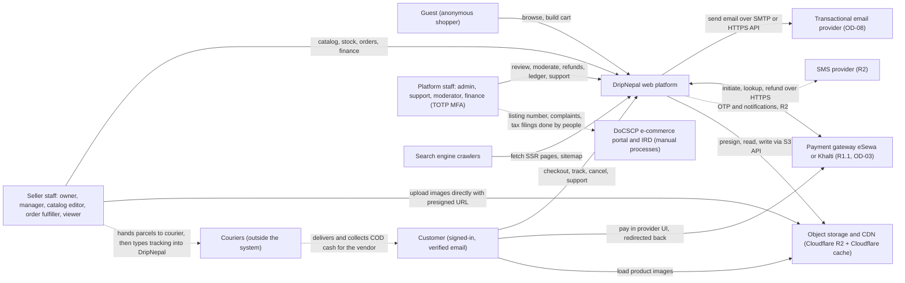

Dashed arrows are interactions that happen outside the software: DripNepal has no courier API (R3, FR-FUL-004) and no government integration. The system boundary is the DripNepal web platform box; everything else is an external party.

| External party               | Direction and protocol                                                                                                                                             | Data exchanged                                                            | Release     | Trust and failure handling                                                                                                                                                                                                                                          |
| ---------------------------- | ------------------------------------------------------------------------------------------------------------------------------------------------------------------ | ------------------------------------------------------------------------- | ----------- | ------------------------------------------------------------------------------------------------------------------------------------------------------------------------------------------------------------------------------------------------------------------- |
| Transactional email provider | Outbound SMTP submission or provider HTTPS API through `@adonisjs/mail` 10.4.0 transports [Verified-doc npm metadata, <https://registry.npmjs.org/@adonisjs/mail>] | Recipient address, rendered template, message tags                        | R1          | Provider choice is [Open OD-08]; deliverability in Nepal is [Verify-external VX-14]. Sends run in the worker, deduplicated by `notification_deliveries.dedupe_key`; a provider outage delays email but never blocks an order.                                       |
| Payment gateway              | Browser redirect or form POST to the provider; server-to-server HTTPS for initiate (Khalti), lookup and refund (Khalti only)                                       | Amount in paisa, attempt identifiers, provider status                     | R1.1        | Untrusted redirects; truth is the server-side lookup (P5). Sandbox and production are separate configurations (section 11.6).                                                                                                                                       |
| SMS provider                 | Outbound HTTPS                                                                                                                                                     | Phone number (E.164), OTP or notification text                            | R2          | Behind `SmsSender`; marketing messages only with consent (Advertisement (Regulation) Act 2076 s10 [Verify-external VX-03]).                                                                                                                                         |
| Object storage and CDN       | S3 API over HTTPS (server), presigned PUT from the browser, public HTTPS GET of derived images through the CDN                                                     | Image originals and KYC documents (private), derived WebP images (public) | R1          | Private bucket never public; derived images are content-addressed and cacheable forever. `r2.dev` URLs are rate-limited and for development only [Verified-doc <https://developers.cloudflare.com/r2/buckets/public-buckets/>], so production uses a custom domain. |
| Couriers                     | None (no integration)                                                                                                                                              | Tracking number and courier name typed in by seller staff                 | R3 for APIs | Tracking URLs must be `https` ([04](04-domain-model-and-data-dictionary.md)); the platform never fetches them.                                                                                                                                                      |
| DoCSCP and IRD               | None (manual)                                                                                                                                                      | Platform listing number shown on the legal page (FR-ADM-011); tax filings | n/a         | Changes to legal disclosures are admin settings, not code deploys.                                                                                                                                                                                                  |
| Search engine crawlers       | Inbound HTTPS                                                                                                                                                      | SSR HTML, `sitemap.xml`, `robots.txt`                                     | R1          | Storefront pages must render complete HTML without JavaScript (FR-SRCH-005).                                                                                                                                                                                        |

---

## 3. Containers

### 3.1 Container diagram


### 3.2 Container responsibilities

| Container              | Technology                                                                                                                                                 | Responsibilities                                                                                                                                                                                                                                                         | State                                                   | Scaling unit                                                                                                                                                                           | Failure behaviour                                                                                                                                                                                             |
| ---------------------- | ---------------------------------------------------------------------------------------------------------------------------------------------------------- | ------------------------------------------------------------------------------------------------------------------------------------------------------------------------------------------------------------------------------------------------------------------------ | ------------------------------------------------------- | -------------------------------------------------------------------------------------------------------------------------------------------------------------------------------------- | ------------------------------------------------------------------------------------------------------------------------------------------------------------------------------------------------------------- |
| Cloudflare edge        | Cloudflare DNS, proxy, cache, WAF                                                                                                                          | TLS for visitors, caching of hashed Vite assets and public media, coarse WAF and rate rules, DDoS absorption. Cloudflare lists a Kathmandu data centre [Verified-doc <https://www.cloudflare.com/network/>]; whether a given Nepali ISP is served from it is unmeasured. | None that matters (cache only)                          | Managed                                                                                                                                                                                | If the origin is down, cached images and assets still load; pages do not. Plan-dependent features (rate rules) are [Verify-external VX-15].                                                                   |
| `web` process          | Node 24, AdonisJS 7 HTTP server, Inertia SSR bundle imported in-process                                                                                    | Inertia page rendering (SSR for storefront and auth pages, client-side for dashboards), `/api/v1` mutations and public reads, provider return pages, webhook intake, `/health/live` and `/health/ready`                                                                  | None on local disk; sessions and counters in PostgreSQL | Container; a second one can run behind the reverse proxy without code changes                                                                                                          | Docker restarts it; `/health/ready` fails when the database is unreachable so the proxy stops routing.                                                                                                        |
| `worker` process       | Same image, started with a different command (name fixed in [09](09-code-structure-and-engineering-standards.md))                                          | pg-boss consumers, cron schedules in Asia/Kathmandu, provider lookups and refunds, email sends, image processing with sharp, read-model refresh, SLA alerts                                                                                                              | None                                                    | One container in R1 (the scheduler needs at least one running instance [Verified-doc pg-boss scheduling docs, <https://github.com/timgit/pg-boss/blob/master/docs/api/scheduling.md>]) | Jobs stay queued while it is down and run when it returns; the heartbeat job (section 9) alerts if it stops.                                                                                                  |
| PostgreSQL 18          | Managed PostgreSQL (DigitalOcean in the provisional ADR-0016), TLS required                                                                                | All durable state (P1)                                                                                                                                                                                                                                                   | Everything                                              | Vertical plan upgrade; read replica later (section 13)                                                                                                                                 | Managed failover depends on plan; restore creates a new cluster [Verified-doc <https://docs.digitalocean.com/products/databases/postgresql/how-to/restore-from-backups/>], so the runbook repoints `DB_HOST`. |
| Object storage         | Cloudflare R2 (provisional), accessed through `@adonisjs/drive` 4.0.0 `services.s3` [Verified-doc <https://docs.adonisjs.com/guides/digging-deeper/drive>] | Private originals and KYC files; public derived images                                                                                                                                                                                                                   | Files                                                   | Managed                                                                                                                                                                                | Uploads fail and show a retry; already-derived images keep serving from the CDN cache.                                                                                                                        |
| Email provider         | Via `@adonisjs/mail`                                                                                                                                       | Transactional email                                                                                                                                                                                                                                                      | Provider side                                           | Managed                                                                                                                                                                                | Retries with backoff; dead-letter after the limit (section 10).                                                                                                                                               |
| Payment gateway (R1.1) | Provider HTTPS APIs                                                                                                                                        | Payment and refund processing                                                                                                                                                                                                                                            | Provider side                                           | Managed                                                                                                                                                                                | Circuit breaker; reconciliation job; `PROVIDER_UNAVAILABLE` for new payment starts (section 11).                                                                                                              |

### 3.3 Inside the web process

The request pipeline today is [Verified-repo `start/kernel.ts:25-43`]: server middleware `container_bindings`, `static`, `cors`, `vite`, `inertia`; router middleware `bodyparser`, `session`, `shield`, `initialize_auth`, `silent_auth`. The target pipeline adds, in this order after `silent_auth`:

1. **Request context and access log**: accepts or generates the request ID, binds it to the logger, records one access-log line on finish (section 12.1).
2. **Account status guard**: if a user is authenticated, rejects `suspended`, `deactivated` or `anonymized` users and sessions whose stored `security_stamp` no longer matches the user row (section 7.7). `@adonisjs/auth` 10.1.0 has no built-in check for suspended users [Verified-doc, `@adonisjs/auth` 10.1.0 `SessionUserProviderContract` in the package tarball, <https://registry.npmjs.org/@adonisjs/auth/-/auth-10.1.0.tgz>], so this middleware is ours.
3. **Named middleware per route group**: `auth`, `verified_email`, `seller_context` (resolves `{shopSlug}` to shop, actor and permission set, then applies the status gate from [07](07-security-threat-model-and-permissions.md)), `platform_staff` with the MFA freshness check, and `throttle` (limiter).

Inertia SSR runs inside the web process: in production the Inertia manager imports the SSR bundle named by `ssr.bundle` and renders each SSR-enabled page in the same Node process [Verified-doc, `@adonisjs/inertia` 4.2.0 `build/inertia_manager-*.js`, <https://registry.npmjs.org/@adonisjs/inertia/-/inertia-4.2.0.tgz>]. There is no separate SSR server to deploy. The cost is CPU on the web process, which is why dashboards opt out of SSR (section 6.3).

Today the SSR flags disagree: `config/inertia.ts:11` enables SSR while `vite.config.ts:11` builds without it, and `inertia/app.tsx:30` uses `createRoot` instead of `hydrateRoot` [Verified-repo]. In a production build every full page load would try to import an SSR bundle that was never built (RF-08). M0 fixes this and adds a production-build smoke test, T-ARCH-002 (proposed): build the image, start it, request `/` without the `X-Inertia` header, and assert a 200 with server-rendered markup.

### 3.4 PostgreSQL layout and connection budget

One database per environment, two schemas:

- `public`: every business table from [04](04-domain-model-and-data-dictionary.md), plus the `sessions` table created by `node ace make:session-table` (columns `id`, `data`, `user_id`, `expires_at` [Verified-doc, `@adonisjs/session` 8.1.0 migration stub]), the limiter table for `stores.database`, and `idempotency_keys`.
- `pgboss`: created and migrated by pg-boss itself. Its job table is DripNepal's transactional outbox (ADR-0010, section 10).

Two database roles [Assumption; exact grants in [07](07-security-threat-model-and-permissions.md)]: a migrator role that owns the schema and runs migrations, and a runtime role with DML rights only, with `UPDATE` and `DELETE` revoked on append-only tables (`audit_logs`, `inventory_movements`, `ledger_entries`, `order_events`). The revocation turns "append-only" from a convention into a database guarantee.

Connection budget for the 1 GiB managed plan (22 connections [Verified-doc]):

| Consumer                        | Pool max | Notes                                                                                                                                                                                                                                                                                                                         |
| ------------------------------- | -------- | ----------------------------------------------------------------------------------------------------------------------------------------------------------------------------------------------------------------------------------------------------------------------------------------------------------------------------- |
| web: Lucid pool                 | 8        | Request transactions, including the pg-boss sends made inside them (they reuse the transaction's connection, section 10.1)                                                                                                                                                                                                    |
| worker: Lucid pool              | 4        | Job handlers' own transactions                                                                                                                                                                                                                                                                                                |
| worker: pg-boss pool            | 4        | Fetching, completing, scheduling, maintenance. Connects directly, not through a PgBouncer transaction-mode pool; DigitalOcean recommends session mode or direct connections for advisory locks and LISTEN/NOTIFY [Verified-doc <https://docs.digitalocean.com/products/databases/postgresql/how-to/manage-connection-pools/>] |
| migrations and admin sessions   | 2        | Release step, `psql` during incidents                                                                                                                                                                                                                                                                                         |
| web: send-only pg-boss instance | 1        | Taken from headroom; used only for the rare send that is not inside a transaction                                                                                                                                                                                                                                             |
| headroom                        | 3        | Monitoring, a second web container during a rolling restart                                                                                                                                                                                                                                                                   |

Every pool sets `statement_timeout` and `lock_timeout` for request work (section 8.2). If the budget runs out, the next step is a larger plan (more connections), not PgBouncer, because pg-boss needs session semantics.

### 3.5 Object storage layout

| Bucket [Assumption on names] | Access                                                                                                  | Contents                                                               | Key scheme                                                                               | Cache policy                                         |
| ---------------------------- | ------------------------------------------------------------------------------------------------------- | ---------------------------------------------------------------------- | ---------------------------------------------------------------------------------------- | ---------------------------------------------------- |
| `dripnepal-<env>-private`    | No public access. Presigned PUT (10 min) for uploads; presigned GET (5 min) for staff viewing KYC files | Product image originals, shop logo and banner originals, KYC documents | `originals/<shop_id>/<media_asset_id>`                                                   | Not cached                                           |
| `dripnepal-<env>-public`     | Public read through the custom domain `media.<domain>` behind Cloudflare                                | Derived WebP images only                                               | `p/<media_asset_id>/<sha256-prefix>-<width>.webp` (content-addressed, never overwritten) | `Cache-Control: public, max-age=31536000, immutable` |

R2 is the provisional choice because egress is free [Verified-doc <https://developers.cloudflare.com/r2/pricing/>, prices as published 2026-09-25]. The `apac` location hint is best-effort only [Verified-doc <https://developers.cloudflare.com/r2/reference/data-location/>], so no data-residency claim is made from it (VX-09). Because Drive abstracts the S3 API, DigitalOcean Spaces or a Nepal-hosted S3-compatible store is a configuration change.

For development and CI a MinIO container in docker-compose gives an S3-compatible endpoint, so presigned uploads are exercised locally [Assumption; M0 decides]. Behaviour that differs between MinIO and R2 is tested in staging.

---

## 4. Modules and dependency rules

DripNepal is a modular monolith (ADR-0002): one deployable, with business code split into modules under `app/modules/<module>/`, each owning a set of tables. Adonis-conventional folders (`app/controllers`, `app/models`, `app/validators`, `app/policies`, `app/transformers`) are kept so generators and the `#generated/controllers` index keep working; the exact layout is owned by [09](09-code-structure-and-engineering-standards.md).

### 4.1 Dependency diagram

An arrow means "may import from". A module may also use anything its dependencies may use (transitively allowed). Dotted arrows are domain events delivered as jobs after commit; they are the only way information flows against the arrows.

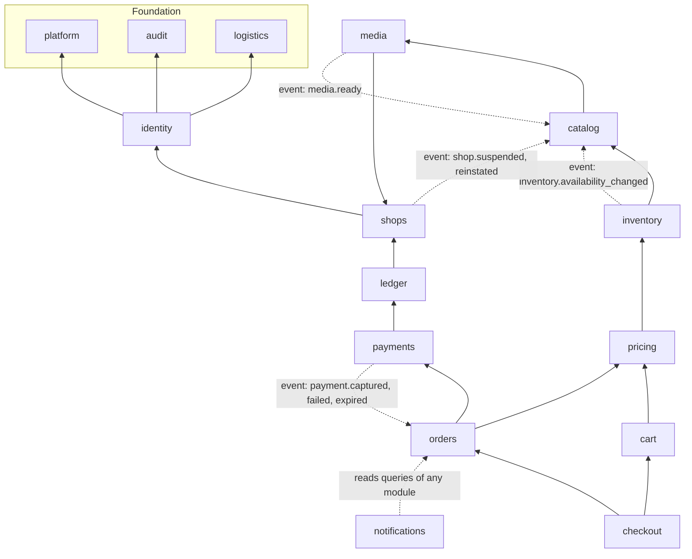

How this relates to the canonical chain (platform/audit ← identity ← shops ← catalog/media ← inventory ← pricing ← cart ← checkout → orders → payments → ledger; notifications subscribes to events only):

- `orders`, `payments` and `ledger` sit to the right of `checkout`. They may use every module up to and including `pricing` (orders releases stock through `inventory`, allocates refunds through `pricing`; ledger reads shop facts through `shops`), but never `cart` or `checkout`.
- Within the canonical `catalog/media` pair, `catalog` depends on `media` and not the reverse. `product_media` (owned by media) references products through a composite foreign key, so media never needs to read catalog; catalog calls media's actions when a product's image list changes.
- `logistics` is not in the canonical chain; it is placed in the foundation because `identity` (address codes) and `pricing` (zone shipping fees) need it and it needs nothing above it. Seller authorization for `replaceShopShipping` happens in the controller through the `shops` seller context before logistics is called.
- `notifications` is at the top: nothing imports it; it consumes events and renders emails from other modules' public queries.

### 4.2 How modules talk to each other

| Mechanism                                                                  | Direction                       | Transaction                                            | Example                                                                                                             |
| -------------------------------------------------------------------------- | ------------------------------- | ------------------------------------------------------ | ------------------------------------------------------------------------------------------------------------------- |
| Public query (`app/modules/<m>/queries.ts`)                                | Downward                        | Caller's transaction if one is passed, else autocommit | `checkout` reads `catalog.getVariantsForCheckout(variantIds, { client: trx })`                                      |
| Public action (`app/modules/<m>/actions/*`) called with the caller's `trx` | Downward only                   | Same transaction; the callee never commits             | `orders.recordCodCollection` calls `payments.markCodCollected(trx, …)` and `ledger.postShopOrderSettlement(trx, …)` |
| Domain event sent as a pg-boss job in the same transaction                 | Any direction, after commit     | Separate transaction in the worker                     | `payments` emits `payment.captured`; `orders` consumes it (section 7.2)                                             |
| Controller composition                                                     | Controllers may call any module | Controller opens no transaction; actions do            | `SellerOrdersController.accept` → `shops` seller context → `orders.acceptShopOrder`                                 |

Upward calls are forbidden even inside a transaction. Where atomicity across an upward boundary would be convenient (payment capture → shop orders), the design accepts a short, bounded delay instead and makes the consumer idempotent and order-safe. Section 7.2 shows why that is safe for stock.

### 4.3 Enforcement (T-ARCH-001)

The rules run in CI with dependency-cruiser [Assumption: tool choice over the eslint `no-restricted-imports` fallback allowed by the canon; decided in M0]:

```js
// .dependency-cruiser.cjs — design sketch
const order = [
  'platform',
  'audit',
  'logistics',
  'identity',
  'shops',
  'media',
  'catalog',
  'inventory',
  'pricing',
  'cart',
  'checkout',
]
module.exports = {
  forbidden: [
    { name: 'no-cycles', severity: 'error', from: {}, to: { circular: true } },
    // other modules may only use a module's public surface
    {
      name: 'public-surface-only',
      severity: 'error',
      from: { path: '^app/modules/([^/]+)/' },
      to: {
        path: '^app/modules/([^/]+)/(domain|jobs|providers|internal)/',
        pathNot: '^app/modules/$1/',
      },
    },
    // generated per module from the allowed-dependency map: no upward imports
    ...generateLayerRules(order, {
      orders: ['payments', 'ledger', 'pricing'],
      payments: ['ledger'],
    }),
    // a module may import only the Lucid models of tables it owns (map generated from docs/04)
    ...generateModelOwnershipRules(require('./architecture/model-ownership.json')),
    // controllers use actions, queries and transformers, and models for types only
    {
      name: 'controllers-no-model-writes',
      severity: 'error',
      from: { path: '^app/controllers/' },
      to: { path: '^app/models/', dependencyTypesNot: ['type-only'] },
    },
  ],
}
```

T-ARCH-001 fails the build on any violation. Trade-off: the rules need a small generator and a model-ownership map that must be updated when a table is added; the map is checked against [04](04-domain-model-and-data-dictionary.md) in review. There is no database-level enforcement (one runtime role for all modules); per-module schemas or roles are not worth the migration and grant overhead at this size.

### 4.4 Module responsibilities

Owned tables follow the canon and are defined in [04](04-domain-model-and-data-dictionary.md). Actions and queries are representative, not exhaustive; job queue names are detailed in section 9.

| Module        | Owns                                                                                                                                                                                                                                                            | Public actions (examples)                                                                                                                                                                                         | Public queries (examples)                                                                 | Emits                                                                                                                                                                      | Consumes (jobs)                                                                                                                                |
| ------------- | --------------------------------------------------------------------------------------------------------------------------------------------------------------------------------------------------------------------------------------------------------------- | ----------------------------------------------------------------------------------------------------------------------------------------------------------------------------------------------------------------- | ----------------------------------------------------------------------------------------- | -------------------------------------------------------------------------------------------------------------------------------------------------------------------------- | ---------------------------------------------------------------------------------------------------------------------------------------------- |
| platform      | platform_settings, idempotency_keys, support_cases, support_case_messages, pgboss schema                                                                                                                                                                        | updatePlatformSetting, idempotency helper, openSupportCase, replyToSupportCase, updateSupportCase                                                                                                                 | getSetting, isCheckoutEnabled, listSupportCases                                           | support_case.opened, support_case.replied                                                                                                                                  | platform.purge-idempotency-keys, platform.support-case-sla, platform.heartbeat                                                                 |
| audit         | audit_logs                                                                                                                                                                                                                                                      | recordAudit(trx, entry)                                                                                                                                                                                           | listAuditLogs                                                                             | none                                                                                                                                                                       | none                                                                                                                                           |
| logistics     | provinces, districts, local_levels, delivery_zones, delivery_zone_districts, shop_shipping_rates, shop_delivery_coverage                                                                                                                                        | replaceShopShipping                                                                                                                                                                                               | resolveLocation, zoneForDistrict, shippingRatesFor(shopIds, district)                     | shop_shipping.changed                                                                                                                                                      | none                                                                                                                                           |
| identity      | users, user_tokens, sessions store, platform_staff, user_addresses                                                                                                                                                                                              | signUp, confirmEmail, requestPasswordReset, resetPassword, changePassword, revokeAllSessions, suspendUser, reinstateUser, anonymizeUser, address CRUD, setPlatformStaffRole                                       | getAccountStatus, addressSnapshotForCheckout, staffRoleOf                                 | user.signed_up, user.email_verification_requested, user.password_reset_requested, user.suspended, user.password_changed, user.anonymized                                   | identity.revoke-sessions                                                                                                                       |
| shops         | shops, shop_memberships, shop_invitations, shop_addresses, shop_payout_accounts, shop_review_decisions, shop_agreements, shop_categories, shop_category_assignments, slug_redirects                                                                             | applyForShop, approve/rejectShopApplication, suspendShop, reinstateShop, updateShopProfile, inviteMember, acceptShopInvitation, changeMemberRole, removeMember, replacePayoutAccount                              | resolveSellerContext(slug, userId), getPublicShop, listMyShops                            | shop.applied, shop.approved, shop.rejected, shop.suspended, shop.reinstated, shop_invitation.created, shop_membership.changed                                              | none                                                                                                                                           |
| media         | media_assets, product_media                                                                                                                                                                                                                                     | createMediaUpload, completeMediaUpload, setProductMedia(trx, …)                                                                                                                                                   | mediaUrlsFor(assetIds)                                                                    | media.ready, media.rejected                                                                                                                                                | media.process-upload, media.cleanup-abandoned                                                                                                  |
| catalog       | categories, attributes, attribute_values, category_attributes, brands, products, product_attribute_values, product_option_axes, product_variants, variant_option_values, product_review_decisions, product_listings, collections (R2), collection_products (R2) | createProduct, updateProduct, replaceProductVariants, submitProductForReview, publish/unpublish/archive/restoreProduct, approve/reject/blockProduct                                                               | getProductForPdp(publicId), searchListings(filters), getVariantsForCheckout, categoryTree | product.published, product.unpublished, product.updated, product.blocked                                                                                                   | catalog.refresh-listing, catalog.rebuild-listings, catalog.generate-sitemap                                                                    |
| inventory     | inventory_items, inventory_reservations, inventory_movements                                                                                                                                                                                                    | adjustInventory, stocktakeInventory, reserve(trx, lines, mode), commit, release, consume, restock                                                                                                                 | availabilityFor(variantIds), listInventory(shopId)                                        | inventory.availability_changed                                                                                                                                             | inventory.drift-check                                                                                                                          |
| pricing       | none in R1 (coupons in R2)                                                                                                                                                                                                                                      | none: pure functions `lineTotals`, `shippingFee`, `allocateLargestRemainder`, `commission`                                                                                                                        | same functions                                                                            | none                                                                                                                                                                       | none                                                                                                                                           |
| cart          | carts, cart_items                                                                                                                                                                                                                                               | addCartItem, updateCartItem, removeCartItem, mergeGuestCart, markConverted(trx)                                                                                                                                   | cartWithRevalidation                                                                      | none                                                                                                                                                                       | cart.expire-abandoned                                                                                                                          |
| checkout      | none (orchestrates; uses platform idempotency)                                                                                                                                                                                                                  | quoteCheckout, placeOrder                                                                                                                                                                                         | none                                                                                      | order.placed (via orders)                                                                                                                                                  | none                                                                                                                                           |
| orders        | orders, shop_orders, order_items, order_events, shipments, shipment_events, return_requests, return_items                                                                                                                                                       | createOrderGraph(trx), acceptShopOrder, rejectShopOrder, recordFulfillmentEvent, recordCodCollection, cancelMyShopOrder, adminCancelShopOrder, return request actions, requestRefund (orchestrates with payments) | listMyOrders, getMyOrder, listShopOrders, adminSearchOrders                               | order.placed, shop_order.accepted, shop_order.rejected, shop_order.cancelled, shipment.shipped, shipment.delivered, cod.collected, shop_order.completed, return_request.\* | orders.acceptance-timeout, orders.auto-complete, orders.apply-payment-outcome (R1.1), orders.expire-awaiting-payment (R1.1), orders.refund-sla |
| payments      | payments, payment_allocations, provider_events, refunds, refund_items                                                                                                                                                                                           | createCodPayments(trx), createGatewayPayment(trx), initiateGatewayPayment, applyProviderResult, recordProviderEvent, markCodCollected, createRefund(trx), approveRefund, markRefundSucceeded, retryRefund         | paymentStatusFor(orderId), refundableFor(shopOrderId)                                     | payment.captured, payment.failed, payment.expired, payment.needs_review, refund.succeeded, refund.failed, refund.needs_review                                              | payments.reconcile, payments.verify-payment, payments.process-provider-event (all R1.1), payments.execute-refund, payments.verify-refund       |
| ledger        | ledger_entries, payouts, payout_entries, vendor_remittances                                                                                                                                                                                                     | postShopOrderSettlement(trx), postRefund(trx), recordVendorRemittance, createLedgerAdjustment, payout actions (R1.1)                                                                                              | shopBalance(shopId), listShopLedgerEntries                                                | payout.paid, payout.failed                                                                                                                                                 | ledger.availability-digest                                                                                                                     |
| notifications | notification_deliveries (R1), user_notifications (R2)                                                                                                                                                                                                           | none (event-driven only)                                                                                                                                                                                          | none                                                                                      | none                                                                                                                                                                       | notifications.dispatch, notifications.send-email                                                                                               |

Two orchestrations cross module lines and are worth naming:

- **Refund requests** are orchestrated by `orders` (which owns return requests and order items) and recorded by `payments` (which owns refunds). `orders.requestRefund` checks refundable quantities and amounts, then calls `payments.createRefund(trx, …)` in the same transaction.
- **COD settlement** is triggered by `orders.recordCodCollection`, which calls `payments.markCodCollected` and `ledger.postShopOrderSettlement` in one transaction (section 7.3).

---

## 5. Deployment

### 5.1 Topology (ADR-0016, provisional)

ADR-0016 selects, provisionally and blocked on VX-09: one DigitalOcean BLR1 (Bangalore) Droplet running Docker, DigitalOcean Managed PostgreSQL 18 (daily backups kept 7 days, 7-day point-in-time recovery [Verified-doc <https://docs.digitalocean.com/products/databases/postgresql/details/limits/>]), Cloudflare in front, and Cloudflare R2 for objects. BLR1 offers Droplets, Managed PostgreSQL and Spaces [Verified-doc <https://docs.digitalocean.com/platform/regional-availability/>]. Latency from Nepali ISPs to BLR1 has not been measured; it is geographic proximity only until benchmarked ([11](11-deployment-and-operations.md)).

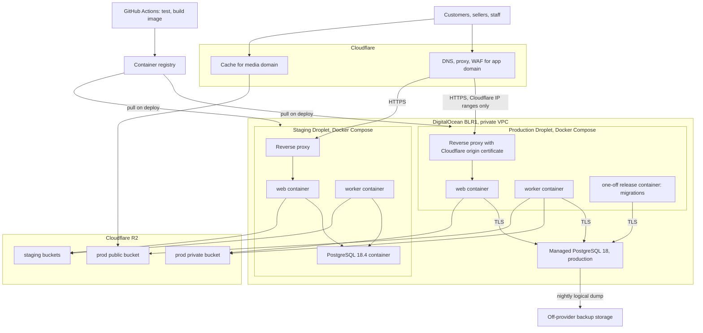

Choices that are [Assumption] and owned by [11](11-deployment-and-operations.md): the reverse proxy (Caddy or nginx), restricting inbound 443 to Cloudflare's published IP ranges through the DigitalOcean cloud firewall, staging running PostgreSQL in a container to save the cost of a second managed cluster, and the off-provider nightly dump. The last is needed because managed backups last 7 days and are destroyed with the cluster [Verified-doc].

### 5.2 Environments

| Environment | Web and worker                                                                          | Database                                                              | Objects                      | Email                                | Payments                                     |
| ----------- | --------------------------------------------------------------------------------------- | --------------------------------------------------------------------- | ---------------------------- | ------------------------------------ | -------------------------------------------- |
| Development | `node ace serve --hmr` and the worker command, locally                                  | docker-compose `postgres:18.4` [Verified-repo `docker-compose.yml:3`] | MinIO container [Assumption] | Mailpit (`docker-compose.yml:22-28`) | Fake provider adapter                        |
| CI          | Test runner against a PostgreSQL 18.4 service container, separate test database (RF-32) | Service container                                                     | MinIO service                | JSON/fake transport                  | Fake adapter plus recorded provider fixtures |
| Staging     | Same image as production                                                                | PostgreSQL container on the staging Droplet                           | Staging R2 buckets           | Provider sandbox or a capture inbox  | Provider sandbox (R1.1)                      |
| Production  | Same image                                                                              | Managed PostgreSQL 18                                                 | Production R2 buckets        | Production provider (OD-08)          | Live keys (R1.1)                             |

### 5.3 Portability requirement (VX-09)

| Component | Provisional choice                     | What makes it portable                                                                                           | Nepal-hosted equivalent if VX-09 requires it                                                                                                                          |
| --------- | -------------------------------------- | ---------------------------------------------------------------------------------------------------------------- | --------------------------------------------------------------------------------------------------------------------------------------------------------------------- |
| Compute   | DigitalOcean Droplet + Docker Compose  | OCI image, no platform-specific runtime                                                                          | Any DoIT-listed VM provider running Docker                                                                                                                            |
| Database  | DigitalOcean Managed PostgreSQL 18     | Only core extensions that ship with PostgreSQL (`citext`, `pg_trgm`, `pgcrypto`); logical dumps restore anywhere | Managed or self-managed PostgreSQL 18 on a listed provider, with pgBackRest (supports PostgreSQL 18 since v2.55 [Verified-doc <https://pgbackrest.org/release.html>]) |
| Objects   | Cloudflare R2                          | `@adonisjs/drive` S3 service; keys are provider-neutral                                                          | S3-compatible storage on a listed provider; CDN stays in front                                                                                                        |
| Email     | Provider transport in `@adonisjs/mail` | `EmailSender` port                                                                                               | Any SMTP relay                                                                                                                                                        |
| Edge      | Cloudflare                             | DNS-level; origin can move behind it                                                                             | Unchanged, unless counsel decides CDN caching of pages is itself in scope of VX-09                                                                                    |

### 5.4 Release sequence

CI builds one image per commit on `main`, tagged with the commit SHA. A release pulls the image, runs migrations in a one-off container, restarts the worker, then the web container, and waits for `/health/ready`. Migrations are expand/contract after the ADR-0011 re-baseline, so the old web container keeps working against the new schema during the swap. Rollback means deploying the previous image; schema rollback is avoided by design. The step-by-step runbook is in [11](11-deployment-and-operations.md).

---

## 6. Frontend architecture

### 6.1 Surfaces and rendering modes

All three surfaces (storefront, seller dashboard, admin) are Inertia React pages served by the same web process (ADR-0003). They have different needs, so they are assessed separately.

| Surface                 | Route prefixes (canon)                                                                                                                                              | Rendering                    | Why                                                                |
| ----------------------- | ------------------------------------------------------------------------------------------------------------------------------------------------------------------- | ---------------------------- | ------------------------------------------------------------------ |
| Storefront              | `/`, `/men`, `/women`, `/c/{categorySlug}`, `/search`, `/p/{productSlug}-{publicId}`, `/shops/{shopSlug}`, `/cart`, `/checkout`, `/checkout/complete/{orderNumber}` | SSR + hydration              | SEO, first paint on slow networks                                  |
| Auth and payment return | `/login`, `/signup`, `/verify-email`, `/forgot-password`, `/reset-password`, `/mfa`, `/payments/{provider}/return`                                                  | SSR + hydration [Assumption] | Entry points from checkout and email on slow networks; light pages |
| Account                 | `/account/*`, `/sell`, `/invitations/{token}`                                                                                                                       | Client-side                  | Authenticated, no SEO                                              |
| Seller dashboard        | `/seller/{shopSlug}/…` ([Open OD-12]; the repo uses `/shop/:shopSlug` at `start/routes/shops.ts:27` [Verified-repo])                                                | Client-side                  | Authenticated, dense, no SEO                                       |
| Admin                   | `/admin/…`                                                                                                                                                          | Client-side                  | Authenticated, no SEO                                              |

`@adonisjs/inertia` 4.2.0 supports `ssr.pages` as a string array or a `(ctx, page) => boolean` function [Verified-doc, package types <https://cdn.jsdelivr.net/npm/@adonisjs/inertia@4.2.0/build/src/types.d.ts>], which settles the "verify" note in ADR-0003:

```ts
// config/inertia.ts — design sketch for @adonisjs/inertia 4.2.0
ssr: {
  enabled: true,                       // and inertia({ ssr: { enabled: true } }) in vite.config.ts
  entrypoint: 'inertia/ssr.tsx',
  pages: (_ctx, page) =>
    page.startsWith('storefront/') || page.startsWith('auth/') || page.startsWith('payments/'),
}

// inertia/app.tsx — hydrate SSR pages, render CSR pages
setup({ el, App, props }) {
  const tree = <StrictMode><TuyauProvider client={client}><App {...props} /></TuyauProvider></StrictMode>
  if (el.hasChildNodes()) hydrateRoot(el, tree)
  else createRoot(el).render(tree)
}
```

The `hasChildNodes` switch is [Assumption] and is checked by T-ARCH-002 on one SSR page and one CSR page. The TanStack devtools imports in `inertia/app.tsx:12-13` move behind a dev-only dynamic import so they leave the production bundle (RF-30).

### 6.2 Storefront assessment

| Concern                      | Requirement                                                                   | Decision and mechanism                                                                                                                                                                                                                                                                                                                                                                      | Verified by                                                     |
| ---------------------------- | ----------------------------------------------------------------------------- | ------------------------------------------------------------------------------------------------------------------------------------------------------------------------------------------------------------------------------------------------------------------------------------------------------------------------------------------------------------------------------------------- | --------------------------------------------------------------- |
| SEO                          | FR-SRCH-005: SSR, canonical URLs, sitemap, JSON-LD                            | SSR pages carry title, description, canonical link and Product JSON-LD in the server HTML. SEO-critical data (title, price, availability, main image) is never a deferred prop. Sitemap generated by a job (section 9). Product URLs by immutable public ID with 301 on slug mismatch (ADR-0017).                                                                                           | T-ARCH-002, SEO checks in [10](10-testing-and-quality-gates.md) |
| First paint on slow networks | LCP p75 ≤ 2.5 s [Assumption]                                                  | HTML arrives with content; `hydrateRoot` reuses it instead of re-rendering (the current `createRoot` discards it). The LCP image gets `fetchpriority="high"` and explicit dimensions.                                                                                                                                                                                                       | T-PERF-001                                                      |
| JavaScript budget            | ≤ 250 KB gzip initial JS per storefront route [Assumption]                    | Pages are already lazy chunks through `import.meta.glob('./pages/**/*.tsx')` without `eager` (`inertia/app.tsx:25` [Verified-repo]). Dashboard-only libraries (tables, charts, rich editors) are imported only from dashboard pages. Devtools removed from production. CI bundle-size check per storefront entry.                                                                           | Bundle budget gate in [10](10-testing-and-quality-gates.md)     |
| Images                       | Mobile data is paid; the current home page ships about 5 MB of images (RF-30) | Derived WebP widths from the worker (ADR-0013), `srcset`/`sizes`, lazy loading below the fold, served from `media.<domain>` with immutable caching. Cloudflare Images transformations are a later option (Free plan: 5,000 unique transformations/month [Verified-doc <https://developers.cloudflare.com/images/pricing/>]); not needed while sharp derivatives are free and deterministic. | T-PERF-001, T-MED-001 (proposed)                                |
| Navigation                   | Mobile has no hover                                                           | `<Link prefetch="click">` on product cards only; no mount prefetch on listing pages; Inertia's default prefetch cache is 30 s [Verified-doc <https://inertiajs.com/docs/v2/data-props/prefetching>]. Honour the `Save-Data` request header by disabling prefetch and choosing smaller image widths [Assumption].                                                                            | Manual check plus T-PERF-001                                    |
| Listing filters              | FR-SRCH-001: filter state in the URL                                          | `router.get(url, query, { preserveState: true, preserveScroll: true, replace: true, only: ['products', 'facets'] })`, debounced; partial reloads send only the named props [Verified-doc <https://inertiajs.com/docs/v2/the-basics/manual-visits>]. "Load more" with `merge` and `reset` on filter change.                                                                                  | Functional tests in [10](10-testing-and-quality-gates.md)       |
| Freshness of price and stock | Listings may be seconds stale; checkout is authoritative                      | Listings read `product_listings` (read model); PDP reads live variant and inventory data; `placeOrder` re-prices and re-checks stock (section 7.1).                                                                                                                                                                                                                                         | T-CHK-004, T-INV-003                                            |
| Caching                      | Anonymous HTML is not edge-cached in R1                                       | Section 12.5 explains why and what would have to change.                                                                                                                                                                                                                                                                                                                                    | n/a                                                             |
| Locale                       | NPR with lakh grouping, Latin digits                                          | `Intl.NumberFormat('en-IN', { style: 'currency', currency: 'NPR', currencyDisplay: 'narrowSymbol' })`; `<html lang="en">` (RF-25)                                                                                                                                                                                                                                                           | Unit tests on formatters                                        |

### 6.3 Dashboards assessment (seller and admin)

| Concern                          | Decision and mechanism                                                                                                                                                                                                                                                               |
| -------------------------------- | ------------------------------------------------------------------------------------------------------------------------------------------------------------------------------------------------------------------------------------------------------------------------------------ |
| No SEO, authenticated only       | Client-side rendering through the `ssr.pages` filter; the server returns the layout plus the page object, and React renders. Saves web-process CPU; the first dashboard load shows a skeleton, later navigations are Inertia XHR visits with cached JS.                              |
| Dense tables                     | Server-side cursor pagination and allow-listed filters ([06](06-api-design.md)); a table component with column visibility and sticky headers ([08](08-ui-ux-and-design-system.md)). At under 50 shops and a few thousand orders per month, no virtualization is needed in R1.        |
| Heavy panels                     | `inertia.optional()` props for panels loaded on demand through partial reloads, and `inertia.defer()` for charts and counts [Verified-doc, `@adonisjs/inertia` 4.2.0 `build/src/props.d.ts`]. Few deferred groups, because each group is one more request.                           |
| Forms                            | TanStack Form (repo standard) with client validation mirroring the Vine validators; submission through the API (section 6.5).                                                                                                                                                        |
| New-order indicator (FR-NOT-003) | `usePoll(60000, { only: ['newOrderCount'] })` [Assumption on interval]; Inertia throttles polling by 90 % in background tabs unless `keepAlive` is set [Verified-doc <https://inertiajs.com/docs/v2/data-props/polling>], which saves data.                                          |
| Shared devices                   | `encryptHistory` for account, seller and admin pages and `inertia.clearHistory()` on logout, so the back button cannot show another person's orders; needs HTTPS in every environment where it is tested [Verified-doc <https://inertiajs.com/docs/v2/security/history-encryption>]. |
| Shared props                     | The current shared-props query of owned shops on every render (RF-44) becomes a small `seller_shops` prop (owned plus member shops, id, slug, name, role), loaded only for authenticated users.                                                                                      |

### 6.4 Why Inertia, and when to revisit

| Criterion               | A. Keep Inertia (chosen)                                                                                 | B. Next.js storefront + Adonis API                                        | C. SPA + API for everything             |
| ----------------------- | -------------------------------------------------------------------------------------------------------- | ------------------------------------------------------------------------- | --------------------------------------- |
| SEO and first paint     | SSR in-process                                                                                           | SSR, static generation, incremental regeneration                          | Poor without prerendering               |
| Deployables             | One image, two processes                                                                                 | Two applications, two build pipelines                                     | One API + static hosting                |
| Auth and CSRF           | One session cookie, one origin                                                                           | Cookie shared across two apps on one registrable domain, CSRF across apps | Cookie or token auth for every read     |
| Typed contracts         | Transformers → `Data.*` page-prop types, Tuyau registry for API calls [Verified-doc `@tuyau/core` 1.2.2] | Must generate a client from `openapi.yaml` or share types manually        | Same as B                               |
| Edge caching of pages   | Needs care (section 12.5)                                                                                | Native static and ISR patterns                                            | Static shell only                       |
| Cost for 1–2 developers | Lowest; already in the repo                                                                              | Highest: a second framework, deploy and on-call surface                   | Medium; every page needs read endpoints |

**Migration cost if B is chosen later** [Assumption]: the public read endpoints already exist in the canonical API (`listProducts`, `getProduct`, `listCategories`, `getPublicShop`), so a Next.js storefront could be built against `/api/v1` without backend rewrites. The work is re-implementing about ten storefront pages and the cart/checkout flow, sharing the session cookie and CSRF token across two apps, and a second deployment pipeline: roughly 6–10 developer-weeks, plus ongoing duplicated UI code.

**Revisit triggers:**

1. A native mobile app (R3) needs **API tokens**, not a new frontend: add an access-token guard for `/api/v1`, add read endpoints the app needs, keep Inertia for the web.
2. **Heavy storefront caching needs**: SSR CPU above 70 % at peak on the web container, or storefront TTFB p75 above 800 ms from Nepal [Assumption thresholds]. Try edge caching of anonymous HTML first (section 12.5); consider B only if that is not enough.
3. The team grows to include dedicated frontend developers who want an independent release cycle.

The Inertia 3 upgrade (OD-25) is independent of this choice: it keeps option A and costs a coordinated upgrade of three packages.

### 6.5 Reads through Inertia props, writes through `/api/v1` (ADR-0004)

Pages receive their data as Inertia props produced by controllers through transformers. Every mutation, including login and signup, goes through the documented JSON API: `application/problem+json` errors, `Idempotency-Key` where marked, `If-Match` on versioned resources. After a successful mutation the page asks Inertia to reload only the props that changed.

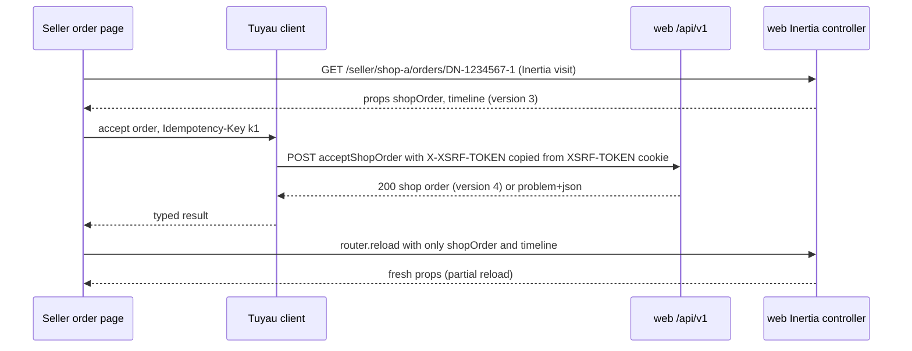

```ts
// design sketch — Tuyau 1.2.2 + @inertiajs/react 2.3.27; exact call shape checked in M0
const tuyau = useTuyau()
const idempotencyKey = useRef(crypto.randomUUID()) // one key per user intent, reused on retry

async function accept() {
  const res = await tuyau.request('acceptShopOrder', {
    params: { shopSlug, shopOrderNumber },
    headers: { 'Idempotency-Key': idempotencyKey.current },
  })
  // on 422: map problem.errors[] to form fields; on 409 INVALID_STATE_TRANSITION or 412: reload and explain
  router.reload({ only: ['shopOrder', 'timeline'] })
  idempotencyKey.current = crypto.randomUUID() // new intent after success
}
```

Facts this relies on: Tuyau's client copies the `XSRF-TOKEN` cookie into an `X-XSRF-TOKEN` header automatically [Verified-doc, `@tuyau/core` 1.2.2 `build/client/index.js`], and Shield accepts that header when `enableXsrfCookie` is on (it is, `config/shield.ts:44` [Verified-repo]). Naming routes after their OpenAPI `operationId` keeps Tuyau route names, OpenAPI and tests aligned [Assumption; naming owned by [09](09-code-structure-and-engineering-standards.md)].

Why not Inertia's own form posts: the Inertia validation flow redirects back with a flashed error bag and keeps only the first message per field [Verified-doc, `@adonisjs/inertia` 4.2.0 `getValidationErrors`], which does not carry idempotency keys, `If-Match` preconditions or stable error codes, and cannot be reused by a future mobile client. The trade-off is a small `useApiMutation` hook for error mapping, loading state and idempotency keys, instead of `useForm`'s built-ins. One mutation contract is testable against `openapi.yaml` (T-API-001).

---

## 7. Key flows

The diagrams show which process, transaction and module does what. The exact state transitions, validation order and ledger formulas are owned by [05](05-order-payment-and-inventory-lifecycles.md); endpoint contracts by [06](06-api-design.md). "Send job" always means a pg-boss send inside the same database transaction (section 10.1).

### 7.1 COD `placeOrder` (J-05, FR-CHK-003/004/005)

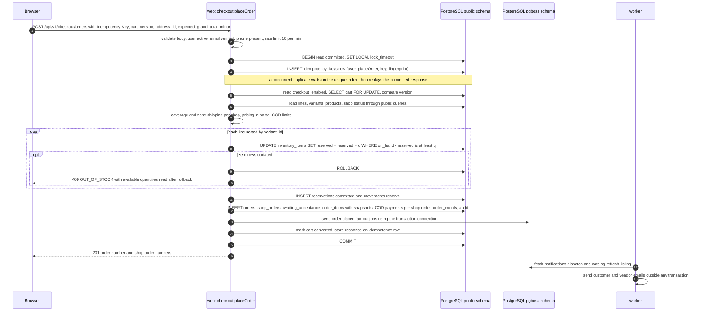

- Everything from the idempotency insert to the job send is one transaction. If any step fails, the order, the reservations and the jobs disappear together; nothing needs compensation.
- Reservation order is sorted by `variant_id` so two carts sharing variants lock rows in the same order and cannot deadlock each other.
- The last-unit race resolves inside PostgreSQL: the second `UPDATE` waits for the first transaction's row lock, re-evaluates its `WHERE` against the committed row and updates zero rows (T-INV-003). A double tap on "Place order" returns the same order (T-CHK-004).
- The response carries IDs, not recomputed totals from the client; the server's numbers win (T-SEC-003).

### 7.2 Gateway payment (R1.1, J-06, FR-PAY-002/003/004)

Khalti is shown because its initiate call is server-side [Verified-doc <https://docs.khalti.com/khalti-epayment/>]. For eSewa ePay the "initiate" step builds a signed form that the browser posts to eSewa [Verified-doc <https://developer.esewa.com.np/pages/Epay>]; everything after the redirect is the same. The gateway choice is [Open OD-03].

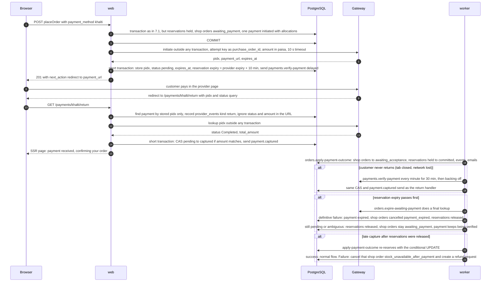

- If the initiate call fails or times out, the payment stays `initiated` and has no provider reference, so no money can move on it. The customer retries through `startOrderPayment`, which starts a new attempt with a new attempt key (a unique `purchase_order_id` or `transaction_uuid` per attempt, because eSewa requires unique `transaction_uuid` values [Verified-doc]).
- Idempotent replay of `placeOrder` returns the stored pre-initiate response, whose next action is "call `startOrderPayment`".
- The return handler, the verification job and the webhook endpoint (when a provider has one, such as the eSewa Intent callback) all end in the same `applyProviderResult` action. It records `provider_events` with a unique `(provider, provider_event_key)` and moves the payment only forward with a compare-and-set, so any number of duplicate or concurrent deliveries produce one transition and one ledger effect (T-PAY-005).
- Why the upward hop through a job is safe: the orders job and the reservation-expiry job both run in the worker and both lock the shop order row first. The expiry job checks the payment status after taking the lock, so it never releases stock for a payment that has already been captured. Late capture is handled explicitly.
- Status mapping from provider vocabulary to DripNepal statuses is in section 11.3.

### 7.3 Vendor fulfilment to delivery with COD collected (J-12, J-13, FR-FUL-001/002, FR-LED-002)

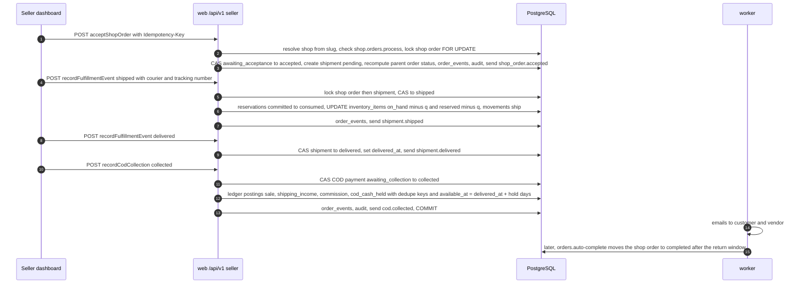

Illustrative postings for one shop order (amounts in paisa; the commission basis and rate are [Open OD-04], hold days [Open OD-06]): items 300000, shipping 15000, commission 30000.

| entry_type         | amount_minor | Meaning                                                                                                                             |
| ------------------ | ------------ | ----------------------------------------------------------------------------------------------------------------------------------- |
| sale               | +300000      | Vendor earned the item total                                                                                                        |
| shipping_income    | +15000       | Vendor earned the shipping fee                                                                                                      |
| commission         | −30000       | Platform's commission                                                                                                               |
| cod_cash_held      | −315000      | Vendor already holds the customer's cash                                                                                            |
| **balance effect** | **−30000**   | Vendor owes the platform Rs 300; settled by a recorded vendor remittance or netted against later gateway receipts (ADR-0009, OD-05) |

Each posting's `dedupe_key` is derived from the shop order and entry type, so a retried request or replayed job cannot post twice. `recordCodCollection` with `not_collected` posts nothing and starts the refused-delivery or return-to-origin path ([05](05-order-payment-and-inventory-lifecycles.md)).

### 7.4 Refund with provider timeout and unknown outcome (R1.1, J-14, FR-RET-003)

Khalti documents a refund API [Verified-doc <https://docs.khalti.com/api/refund/>] whose HTTP method, auth header and amount unit are not stated consistently [Verify-external VX-07], and no idempotency header. eSewa documents no refund API at all [Verified-doc], so eSewa refunds use method `gateway_manual` (operator refunds in the merchant portal and records the reference). COD refunds use `manual_transfer`. The diagram shows `gateway_api`.

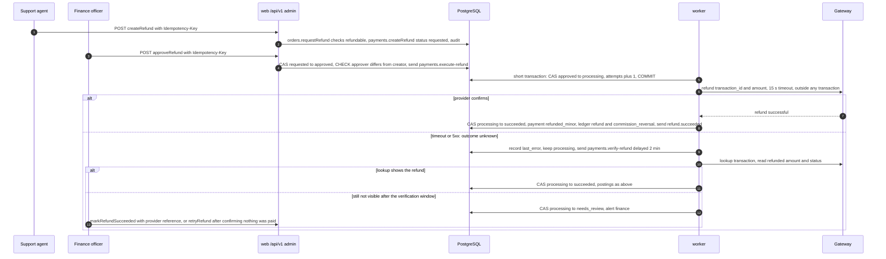

- The refund call is never blindly retried after a timeout: an unknown outcome is resolved by lookup, not by sending money twice (T-PAY-008).
- `refunded_minor <= captured_minor` is a database CHECK, so even a logic bug cannot over-refund (T-SEC-004).
- The refund-SLA job (section 9) watches every refund tied to an accepted return against the 7-day rule (FR-RET-007; Directive 2082 s9(3) [Verify-external VX-02]).

### 7.5 Media upload pipeline (J-10, FR-MED-001, ADR-0013)

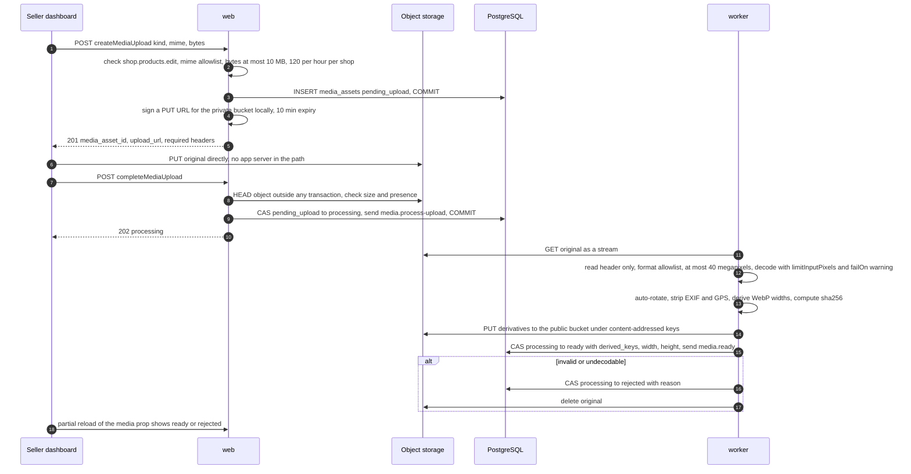

- Uploads never pass through the app server, which keeps web memory flat and suits slow uplinks. Presigning is local signing, not a network call.
- Whether a presigned PUT through Drive can bind `Content-Length` is unverified; the `HEAD` check in `completeMediaUpload` enforces the 10 MB limit either way, and `media.cleanup-abandoned` deletes objects never completed [Assumption, checked in M3].
- sharp must be ≥ 0.35.4 because of high-severity libvips and libheif advisories [Verified-doc <https://github.com/lovell/sharp/security/advisories>]. Its default `limitInputPixels` of about 268 megapixels is far too large for a small VM, so the pipeline sets 40 megapixels [Verified-doc <https://sharp.pixelplumbing.com/api-constructor>]. The worker sets `VIPS_BLOCK_UNTRUSTED=1` and runs one image job at a time (sharp's concurrency defaults to 1 on glibc Linux [Verified-doc <https://sharp.pixelplumbing.com/api-utility>]). HEIC is not accepted, which removes the libheif attack surface.
- KYC documents (`kind = kyc_document`) follow the same upload path but get no derivatives, stay in the private bucket, and are viewed by staff with `platform.shops.review` through a 5-minute presigned GET that is written to the audit log.
- Verified by T-MED-001 (proposed): oversized, wrong-type, decompression-bomb and EXIF-GPS fixtures.

### 7.6 Staff invitation acceptance (J-09, FR-SHOP-005)

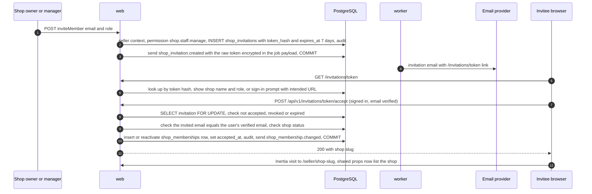

- Only the SHA-256 hash of the token is stored in `shop_invitations`. The raw token travels to the email job encrypted with the application's AES-256-GCM encryption, and completed jobs on that queue are deleted after one day [Assumption; token handling owned by [07](07-security-threat-model-and-permissions.md)]. The same pattern applies to email-verification and password-reset tokens.
- Unknown, expired and revoked tokens all return `404 NOT_FOUND` so tokens cannot be probed; an existing active membership returns `409 CONFLICT` ([06](06-api-design.md) owns codes).
- `UNIQUE (shop_id, user_id)` on `shop_memberships` makes a double accept harmless.

### 7.7 Suspension taking effect on an existing session (J-17, FR-IAM-006, T-SEC-010)

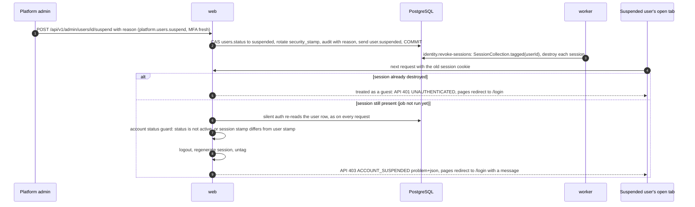

- Two independent layers: session destruction (fast, but a job that could be delayed) and the per-request stamp and status check (always on). The second is the guarantee; it works because `@adonisjs/auth` 10.1.0 re-queries the user on every authenticated request [Verified-doc, session guard source in <https://registry.npmjs.org/@adonisjs/auth/-/auth-10.1.0.tgz>], and session tagging with `tagged(userId)` is supported by the database store in `@adonisjs/session` 8.1.0 [Verified-doc <https://github.com/adonisjs/session/releases>].
- The login action also rejects suspended users, because credential verification does not look at status.
- Shop suspension works the same way without touching sessions: the `seller_context` middleware applies the shop status gate on every seller request ([07](07-security-threat-model-and-permissions.md)).

---

## 8. Transactions

### 8.1 The rule

**Never hold a database transaction open across a gateway, email, storage or SMS call** (P2). A slow provider would otherwise hold row locks on shop orders or inventory for seconds, exhaust the 8-connection web pool, and turn a provider outage into a DripNepal outage. It would also mix two failure domains: a commit can fail after the provider has already acted. Every flow that needs an external call is split into _record intent → commit → call → record outcome in a short transaction with compare-and-set_.

### 8.2 Operations that must be one transaction

Isolation is PostgreSQL's default READ COMMITTED everywhere in R1. Correctness comes from row locks, compare-and-set updates (`UPDATE … SET status = :to WHERE id = :id AND status = :from`), CHECK constraints and unique keys, not from SERIALIZABLE. SERIALIZABLE (with a retry wrapper for SQLSTATE 40001) is reserved for a future flow whose invariant cannot be expressed as a constraint; none exists in R1.

| Operation                                                                         | What changes together                                                                                                                                  | Locking                                                                        |
| --------------------------------------------------------------------------------- | ------------------------------------------------------------------------------------------------------------------------------------------------------ | ------------------------------------------------------------------------------ |
| `placeOrder` (7.1)                                                                | idempotency key, cart, inventory items, reservations, movements, orders, shop orders, order items, payments and allocations, order events, audit, jobs | Cart `FOR UPDATE`; conditional updates on inventory rows in `variant_id` order |
| `acceptShopOrder`, `rejectShopOrder` (whole or item-level)                        | shop order status, rejected quantities, shipment creation, reservation release for rejected quantities, parent order status, events, jobs              | Shop order `FOR UPDATE`, then inventory rows in `variant_id` order             |
| `recordFulfillmentEvent` shipped                                                  | shipment status, reservations consumed, `on_hand` and `reserved` decremented, movements, events                                                        | Shop order → shipment → inventory rows                                         |
| `recordCodCollection` collected                                                   | COD payment status, ledger postings, events, jobs                                                                                                      | Shop order → payment; ledger `dedupe_key` unique                               |
| Any shop order cancellation (customer, admin, acceptance timeout, payment expiry) | shop order status and reason, reservations released, stock restored, payment cancelled, parent order status, events                                    | One transaction per shop order, shop order row first                           |
| `applyProviderResult` (payments)                                                  | payment status (forward only), `provider_events` row, allocation captured amounts, jobs                                                                | Payment `FOR UPDATE`; `provider_events` unique key                             |
| `apply-payment-outcome` (orders)                                                  | shop orders to `awaiting_acceptance` or cancelled, reservations committed or re-reserved, refund request on late-capture shortfall                     | Shop orders in id order, then inventory rows                                   |
| Refund success                                                                    | refund status, refund items, payment and allocation `refunded_minor`, ledger postings, jobs                                                            | Refund `FOR UPDATE`, then payment                                              |
| `adjustInventory`, `stocktakeInventory`                                           | item counts and version, movement, audit                                                                                                               | Item `FOR UPDATE`; stocktake compares the expected count                       |
| Product publish and moderation                                                    | product status and version, review decision, listing refresh job                                                                                       | Compare-and-set on status and version                                          |
| Shop approve, suspend, reinstate                                                  | shop status, review decision, audit, jobs                                                                                                              | Compare-and-set on status                                                      |
| Invitation acceptance (7.6)                                                       | invitation `accepted_at`, membership row, audit, job                                                                                                   | Invitation `FOR UPDATE`                                                        |
| `suspendUser`, `changePassword`, `revokeAllSessions`                              | user status or hash, `security_stamp`, audit, session-revocation job                                                                                   | User `FOR UPDATE`                                                              |
| Media complete and ready                                                          | asset status, job                                                                                                                                      | Compare-and-set on status                                                      |
| Vendor remittance, ledger adjustment, payout mark-paid                            | ledger entries, remittance or payout row, audit                                                                                                        | Payout `FOR UPDATE`; `payout_entries.ledger_entry_id` unique                   |
| Guest cart merge at login                                                         | both carts and their items                                                                                                                             | Both carts `FOR UPDATE` in id order                                            |

**Lock order** (to prevent deadlocks between flows): cart → shop orders by id → shipment → payment → refund → inventory items by `variant_id` → append-only inserts. Checkout locks the cart and inventory only, because its shop orders do not exist yet.

**Timeouts** [Assumption, tuned from metrics]: request transactions run with `SET LOCAL lock_timeout = '3s'` and `statement_timeout = '10s'`; worker transactions with 10 s and 30 s. A deadlock (40P01) or serialization failure (40001) is retried at most twice with jitter by the transaction helper; this is safe because the idempotency key row is inside the rolled-back transaction.

### 8.3 Operations that must not hold a transaction

| Operation                                                                                   | External call                     | Pattern                                                                                                                                        |
| ------------------------------------------------------------------------------------------- | --------------------------------- | ---------------------------------------------------------------------------------------------------------------------------------------------- |
| Gateway initiate (`placeOrder` after commit, `startOrderPayment`)                           | Provider HTTPS                    | Commit order and payment attempt → call → short transaction stores reference and expiry                                                        |
| Provider lookup (return handler, `payments.verify-payment`, expiry job, webhook processing) | Provider HTTPS                    | Call → short transaction applies the result with compare-and-set                                                                               |
| Refund execution (7.4)                                                                      | Provider HTTPS                    | Transaction 1 moves to `processing` and commits → call → transaction 2 records the outcome                                                     |
| Email sending                                                                               | SMTP or HTTPS                     | Short transaction claims the `notification_deliveries` row (attempts + 1) → send → short transaction marks `sent` with the provider message ID |
| Object storage HEAD, GET, PUT, DELETE                                                       | S3 HTTPS                          | Before or after short transactions; content-addressed keys make repeats harmless                                                               |
| Image processing                                                                            | Seconds of CPU plus storage calls | Entirely outside a transaction; result applied in one short transaction                                                                        |
| Sitemap generation                                                                          | Long read plus storage PUT        | Chunked reads with no open write transaction                                                                                                   |
| SMS (R2)                                                                                    | Provider HTTPS                    | Same as email                                                                                                                                  |

**Guard (T-ARCH-003, proposed):** all actions open transactions through one helper, `inTransaction(fn)`, which marks the async context with its own `AsyncLocalStorage` instance. Port adapters (section 11) check the mark and throw `ExternalCallInTransactionError` in development and test, and log an error in production. An ESLint `no-restricted-syntax` rule forbids calling `db.transaction(` outside the helper. The test suite runs each action with fake adapters and fails if any adapter is invoked while the mark is set. Trade-off: one more helper everyone must use, and a small async-context overhead.

---

## 9. Asynchronous work

All background work runs in the worker process on pg-boss 12 (ADR-0010). Cron schedules are registered at worker start with `tz: 'Asia/Kathmandu'`; Nepal is UTC+05:45 with no daylight saving, so there are no skipped or repeated local hours. pg-boss checks schedules every 30 seconds and sends at most one job per minute per schedule [Verified-doc <https://github.com/timgit/pg-boss/blob/master/docs/api/scheduling.md>], so "every minute" is the finest schedule. Sweeper crons find due rows and fan out one job per entity with a `singletonKey`, which keeps each job small and retryable on its own.

Queue names are proposals registered in [09](09-code-structure-and-engineering-standards.md); dead-letter queues are named `dlq.<queue>` [Assumption]. "Backoff" means pg-boss `retryBackoff: true` (roughly `retryDelay × 2^retryCount` with jitter [Verified-doc <https://github.com/timgit/pg-boss/blob/master/docs/api/queues.md>]) capped by `retryDelayMax`.

| Queue                                                 | Owner         | Trigger or schedule (Asia/Kathmandu)                                                              | Idempotency and dedupe                                                                                                                                                                   | Retries, then DLQ                                                         | Release                                                |
| ----------------------------------------------------- | ------------- | ------------------------------------------------------------------------------------------------- | ---------------------------------------------------------------------------------------------------------------------------------------------------------------------------------------- | ------------------------------------------------------------------------- | ------------------------------------------------------ |
| `orders.expire-awaiting-payment` (reservation expiry) | orders        | Cron every minute finds held reservations past `expires_at`; one job per order                    | `singletonKey` order ID; compare-and-set on `held` and `awaiting_payment`                                                                                                                | 5, backoff from 30 s                                                      | R1.1 (COD reservations are committed and never expire) |
| `payments.reconcile`                                  | payments      | Cron every minute; selects gateway payments with `next_verification_at` due                       | Sweeper only                                                                                                                                                                             | 2                                                                         | R1.1                                                   |
| `payments.verify-payment`                             | payments      | From the sweeper, delayed send after initiate                                                     | `singletonKey` payment ID so one verification runs at a time; forward-only compare-and-set. Cadence every 1 min for 30 min, then backing off; unknown after the maximum → `needs_review` | 5, backoff from 60 s                                                      | R1.1                                                   |
| `payments.process-provider-event`                     | payments      | Webhook body stored durably                                                                       | Unique `(provider, provider_event_key)`; `processing_status`                                                                                                                             | 5, backoff                                                                | R1.1                                                   |
| `orders.apply-payment-outcome`                        | orders        | `payment.captured`, `payment.failed`, `payment.expired`                                           | `singletonKey` payment ID plus outcome; compare-and-set on shop order status                                                                                                             | 8, backoff from 30 s                                                      | R1.1                                                   |
| `orders.acceptance-timeout`                           | orders        | Cron every 5 min; SLA from `vendor_acceptance_sla_hours` (48 [Assumption], OD-19)                 | Compare-and-set `awaiting_acceptance` → `cancelled` (`acceptance_timeout`)                                                                                                               | 5, backoff                                                                | R1                                                     |
| `orders.auto-complete`                                | orders        | Cron hourly at :15                                                                                | Compare-and-set with predicate: delivered, return window elapsed, no open return or refund                                                                                               | 5, backoff                                                                | R1                                                     |
| `ledger.availability-digest`                          | ledger        | Cron daily 06:00                                                                                  | Read-only; `singletonKey` date. Alerts finance about shops whose available balance is below the owed-commission threshold (OD-05) and, from R1.1, balances eligible for payout           | 3                                                                         | R1                                                     |
| `inventory.drift-check`                               | inventory     | Cron daily 03:00                                                                                  | Read-only comparison of `inventory_items` against summed movements and open reservations; alert deduped per variant per day; never auto-corrects (FR-INV-005)                            | 3                                                                         | R1                                                     |
| `catalog.refresh-listing`                             | catalog       | `product.*`, `inventory.availability_changed`, `media.ready`, `shop.suspended`, `shop.reinstated` | `singletonKey` product ID so bursts coalesce; recomputes the row from source tables, so replays are harmless                                                                             | 5, backoff                                                                | R1                                                     |
| `catalog.rebuild-listings`                            | catalog       | Cron daily 03:30                                                                                  | Full recompute                                                                                                                                                                           | 2                                                                         | R1                                                     |
| `catalog.generate-sitemap`                            | catalog       | Cron daily 04:00                                                                                  | Overwrites the same object keys                                                                                                                                                          | 3                                                                         | R1                                                     |
| `notifications.dispatch`                              | notifications | Every domain event that has an email template                                                     | One delivery row per recipient; `notification_deliveries.dedupe_key` (event ID + template + recipient) is unique                                                                         | 5, backoff                                                                | R1                                                     |
| `notifications.send-email`                            | notifications | From dispatch                                                                                     | Compare-and-set `queued` → `sent`; provider idempotency key where the transport supports one                                                                                             | 8, backoff from 60 s, max 1 h                                             | R1                                                     |
| `media.process-upload`                                | media         | `completeMediaUpload`                                                                             | Compare-and-set `processing` → `ready` or `rejected`; content-addressed keys                                                                                                             | 3, backoff from 30 s; `expireInSeconds` 300                               | R1                                                     |
| `media.cleanup-abandoned`                             | media         | Cron daily 02:30                                                                                  | Deletes `pending_upload` assets older than 24 h and originals of rejected assets; deleting twice is harmless                                                                             | 3                                                                         | R1                                                     |
| `platform.purge-idempotency-keys`                     | platform      | Cron hourly at :05                                                                                | `DELETE … WHERE expires_at < now()` in batches of 1,000                                                                                                                                  | 3                                                                         | R1                                                     |
| `orders.refund-sla`                                   | orders        | Cron hourly at :20                                                                                | Refunds for accepted returns: warn at day 5, breach at day 7 (FR-RET-007, Directive 2082 s9(3) [Verify-external VX-02]); alert deduped per refund per threshold                          | 3                                                                         | R1                                                     |
| `platform.support-case-sla`                           | platform      | Cron hourly at :25                                                                                | Warn at `due_at` minus 3 days, breach at `due_at` (15 days, E-Commerce Act s33, FR-ADM-009); deduped per case per threshold                                                              | 3                                                                         | R1                                                     |
| `payments.execute-refund`                             | payments      | `approveRefund`, `retryRefund`                                                                    | Compare-and-set `approved` → `processing`; the provider call is never repeated by retry after an unknown outcome                                                                         | Provider call not retried; job-level errors before the call retry 3 times | R1.1 for `gateway_api`                                 |
| `payments.verify-refund`                              | payments      | After a refund timeout                                                                            | Compare-and-set `processing` → `succeeded` or `needs_review`                                                                                                                             | 6, backoff from 120 s                                                     | R1.1                                                   |
| `identity.revoke-sessions`                            | identity      | `user.suspended`, password change, `revokeAllSessions`                                            | Destroying a missing session is a no-op                                                                                                                                                  | 5, backoff                                                                | R1                                                     |
| `cart.expire-abandoned`                               | cart          | Cron daily 02:00                                                                                  | Compare-and-set `active` → `abandoned` past `expires_at`                                                                                                                                 | 3                                                                         | R1                                                     |
| `platform.heartbeat`                                  | platform      | Cron every 5 min                                                                                  | Pings an external heartbeat monitor; a missed ping means the worker or scheduler is down                                                                                                 | None                                                                      | R1                                                     |

Queue defaults unless a row says otherwise [Assumption]: `retryBackoff: true`, `retryDelayMax: 3600`, `expireInSeconds: 120` (pg-boss's default of 15 minutes [Verified-doc] is far longer than any DripNepal job except image processing), dead-letter queue configured, and pg-boss's default retention (queued jobs kept 14 days, completed jobs deleted after 7 days [Verified-doc <https://github.com/timgit/pg-boss/blob/master/docs/api/jobs.md>]). Queues whose payloads carry encrypted tokens delete completed jobs after one day.

Heartbeat target: the Sentry Developer plan includes one cron monitor [Verified-doc <https://sentry.io/pricing/>] and the Better Stack free tier includes heartbeats [Verified-doc <https://betterstack.com/pricing>], both as published on 2026-09-25; the choice is made in [11](11-deployment-and-operations.md).

---

## 10. Reliable job delivery

### 10.1 Transactional send: the job table is the outbox

The dual-write problem is real: an order commit followed by a separate "enqueue email" can lose the email if the process dies between the two, and an enqueue before commit can send an email for an order that rolled back. `trx.after('commit')` [Verified-doc Lucid 22.4.2 `TransactionClientContract.after`] does not solve it, because a crash after commit still loses the job.

Because pg-boss stores jobs in PostgreSQL, a job can be inserted **in the same transaction** as the state change. pg-boss's `send` accepts a `db` option with a built-in Knex adapter, and its documentation states: "If the transaction rolls back, so does the job" [Verified-doc <https://github.com/timgit/pg-boss/blob/master/docs/api/adapters.md>]. Lucid's transaction client exposes the underlying Knex transaction as `knexClient: Knex.Transaction` [Verified-doc, `@adonisjs/lucid` 22.4.2 `build/src/types/database.d.ts` line 220, <https://registry.npmjs.org/@adonisjs/lucid/-/lucid-22.4.2.tgz>].

```ts
// design sketch — adapter import path and option names are confirmed by the M0 spike
export async function sendJob<Q extends QueueName>(
  trx: TransactionClientContract,
  queue: Q,
  data: JobPayload<Q>, // always carries request_id and causation_id
  opts: { singletonKey?: string; startAfter?: number | Date } = {}
) {
  return boss.send(queue, data, { ...opts, db: fromKnex(trx.knexClient) })
}
```

**M0 spike (T-ARCH-004, proposed)** must prove, against PostgreSQL 18.4:

1. a job sent inside a Lucid transaction that rolls back is never visible to workers;
2. after commit the job is fetched and completed normally;
3. the send uses the transaction's own connection (no extra pool connection, no self-deadlock at pool size 1);
4. a send inside a nested Lucid savepoint behaves as expected when the savepoint rolls back.

**Fallback if the spike fails:** an `outbox_events` table (id, queue, payload, created_at, dispatched_at) written in the business transaction, plus a relay loop in the worker that claims rows with `FOR UPDATE SKIP LOCKED LIMIT 100`, sends them to pg-boss and marks them dispatched. The relay is also at-least-once, so the handler rules below do not change.

### 10.2 Is a separate outbox warranted?

Not while jobs live in the same PostgreSQL database: the pg-boss job row is written atomically with the business rows, which is exactly what an outbox guarantees, without a relay process, polling delay or second table to monitor. A separate outbox becomes necessary if the queue ever moves out of PostgreSQL (for example to Redis-backed BullMQ), or if events must be published to an external broker. The fallback above is the same design, ready for that day.

### 10.3 At-least-once delivery and idempotent handlers

pg-boss documents that a job whose worker only looked dead "can run twice and handlers should be idempotent" [Verified-doc <https://github.com/timgit/pg-boss/blob/master/docs/api/queues.md>]. Every handler is therefore written to be safe when run twice, concurrently or after a later event:

| Technique                                                                                        | Where                                                                                                                                                                     |
| ------------------------------------------------------------------------------------------------ | ------------------------------------------------------------------------------------------------------------------------------------------------------------------------- |
| Compare-and-set status updates; zero rows updated means "already done", complete the job quietly | Every state-machine job                                                                                                                                                   |
| Unique dedupe keys                                                                               | `notification_deliveries.dedupe_key`, `ledger_entries.dedupe_key`, `provider_events (provider, provider_event_key)`, `payout_entries.ledger_entry_id`, `idempotency_keys` |
| Recompute from source instead of applying deltas                                                 | `catalog.refresh-listing`, `catalog.rebuild-listings`, digests and drift checks                                                                                           |
| Content-addressed object keys                                                                    | Media derivatives, sitemap files                                                                                                                                          |
| Look up before retrying an external side effect                                                  | Refunds (7.4), payment initiation after a timeout                                                                                                                         |

```ts
// design sketch — handler template
export default async function handle(job: Job<ApplyPaymentOutcome>) {
  await inTransaction(async (trx) => {
    const shopOrders = await ordersForPayment(job.data.paymentId, { client: trx, lock: true })
    for (const so of shopOrders) {
      const moved = await casShopOrderStatus(trx, so.id, 'awaiting_payment', 'awaiting_acceptance')
      if (!moved) continue // already applied by an earlier run
      await inventory.commitOrReserve(trx, so.id) // re-reserves if a late capture found released stock
      await sendJob(trx, 'notifications.dispatch', {
        event: 'shop_order.payment_confirmed',
        shopOrderId: so.id,
        request_id: job.data.request_id,
      })
    }
  })
}
```

### 10.4 Retries, backoff and error classes

Handlers classify failures before choosing what to do:

| Class                 | Examples                                                       | Action                                                                               |
| --------------------- | -------------------------------------------------------------- | ------------------------------------------------------------------------------------ |
| Transient             | Network error, provider 5xx, lock timeout, deadlock            | Throw; pg-boss retries with backoff                                                  |
| Permanent             | Entity missing, transition no longer allowed, validation error | Complete the job, log a warning with the reason; no retry                            |
| Unknown outcome       | Provider timeout after the request was sent                    | Do not retry the side effect; send a verification job (7.4)                          |
| Provider circuit open | Breaker open (section 11.4)                                    | Reschedule with `startAfter` instead of failing, so the retry budget is not consumed |

### 10.5 Dead letters and redrive

Each queue has a dead-letter queue. When a job exhausts its retries, pg-boss copies its payload into the dead-letter queue, where it runs under that queue's configuration [Verified-doc queues docs]. DripNepal's dead-letter queues have no workers: they are parking lots. An alert fires when any dead-letter queue is non-empty. After the cause is fixed, an operator previews and moves jobs back with pg-boss `previewRedrive` and `redrive` [Verified-doc <https://github.com/timgit/pg-boss/blob/master/docs/api/jobs.md>], wrapped in an ace command (for example `jobs:redrive dlq.notifications.send-email --limit 500` [Assumption]). Because handlers are idempotent, redriving a job that partly succeeded is safe. The step-by-step runbook is in [11](11-deployment-and-operations.md).

### 10.6 Scheduling

Schedules are declared in code and registered idempotently at worker boot, so the set of crons is versioned with the application. At least one worker must be running for schedules to fire [Verified-doc]; the heartbeat job detects when none is. A schedule missed during downtime is not a correctness problem, because every sweeper selects by timestamps (`expires_at`, `acceptance_due_at`, `due_at`, `next_verification_at`) and catches up on its next run.

### 10.7 Graceful shutdown

On SIGTERM the worker stops fetching new jobs, waits up to 30 seconds for active handlers to finish, then stops pg-boss and closes the Lucid pools [Assumption on exact pg-boss `stop()` options, confirmed in M0]. Docker's stop grace period is set longer than that (60 s). A handler cut off mid-way leaves its transaction uncommitted, and the job is retried after `expireInSeconds`, which is safe because handlers are idempotent. The web process stops accepting connections, finishes in-flight requests and fails `/health/ready` during shutdown so the proxy drains it. Verified by T-OPS-002 (proposed): send SIGTERM during a long fake job and assert one completion and no duplicate side effect.

### 10.8 Observability of jobs

Every job payload carries `request_id` (the request that caused it) and `causation_id` (the event or parent job). The worker logs one line per attempt with queue, job ID, attempt number, outcome and duration, under the same request ID as the originating HTTP request. Metrics and alerts (queue depth, age of oldest queued job per queue, failures per queue, dead-letter size) are defined in [11](11-deployment-and-operations.md).

---

## 11. Provider isolation

### 11.1 Ports

| Port                         | Implementations                                                                                   | Used by                       | Test double                                                             |
| ---------------------------- | ------------------------------------------------------------------------------------------------- | ----------------------------- | ----------------------------------------------------------------------- |
| `PaymentProvider` (ADR-0012) | `payments/providers/khalti.ts`, `payments/providers/esewa.ts` (R1.1, one of them first per OD-03) | payments                      | Scripted fake: returns any status sequence, timeouts, amount mismatches |
| `EmailSender`                | `@adonisjs/mail` transport chosen by OD-08; SMTP to Mailpit in development                        | notifications                 | Capturing fake with assertions on recipients and templates              |
| `ObjectStorage`              | `@adonisjs/drive` 4.0.0 `services.s3` for R2 or any S3-compatible store                           | media, catalog (sitemap)      | MinIO in CI, in-memory fake in unit tests                               |
| `SmsSender`                  | Provider TBD in R2 (VX-14)                                                                        | notifications, identity (OTP) | Capturing fake                                                          |

Rules: adapters never accept a transaction; they receive a `CallContext` with request ID, timeout and abort signal; they return DripNepal types, never provider response objects; they are bound in the container from configuration, so tests swap them without code branches.

### 11.2 `PaymentProvider` (design sketch)

```ts
// design sketch — not final code
export type NormalizedStatus =
  | 'initiated'
  | 'pending'
  | 'captured'
  | 'failed'
  | 'expired'
  | 'cancelled'
  | 'refunded'
  | 'partially_refunded'
  | 'unknown'

export interface CallContext {
  requestId: string
  timeoutMs: number
  signal?: AbortSignal
}

export type InitiateResult =
  | { kind: 'redirect'; url: string; providerReference: string; expiresAt: Date | null } // Khalti
  | {
      kind: 'form_post'
      action: string
      fields: Record<string, string>
      providerReference: string
      expiresAt: Date | null
    } // eSewa

export interface LookupResult {
  status: NormalizedStatus
  rawStatus: string // stored in payments.last_provider_status
  amountMinor: bigint | null // compared with the stored amount before capture
  refundedMinor: bigint | null
  providerPaymentId: string | null // e.g. Khalti transaction_id, eSewa ref_id
}

export interface PaymentProvider {
  readonly name: 'esewa' | 'khalti'
  readonly capabilities: {
    refundApi: boolean
    serverNotifications: boolean
    partialRefund: boolean
  }
  initiate(
    req: {
      paymentId: string
      attemptKey: string
      amountMinor: bigint
      orderNumber: string
      returnUrl: string
      failureUrl: string
    },
    ctx: CallContext
  ): Promise<InitiateResult>
  referenceFromReturn(query: Record<string, string>): {
    providerReference: string | null
    signatureValid: boolean | null
  }
  lookup(
    ref: { providerReference: string; attemptKey: string; amountMinor: bigint },
    ctx: CallContext
  ): Promise<LookupResult>
  refund?(
    req: { providerPaymentId: string; amountMinor: bigint; idempotencyKey: string },
    ctx: CallContext
  ): Promise<{ outcome: 'succeeded' | 'rejected' }> // throws ProviderTimeoutError when the outcome is unknown
  verifyNotification?(raw: {
    headers: Record<string, string>
    body: string
  }): Promise<{ eventKey: string; providerReference: string; signatureValid: boolean }>
}
```

`referenceFromReturn` only extracts the reference so the handler can find the stored attempt; eSewa's Base64 redirect payload is signed and its signature is checked [Verified-doc], while Khalti's return query is unsigned [Verified-doc], and in both cases the status comes from `lookup`. Errors are typed: `ProviderTimeoutError` (outcome unknown), `ProviderUnavailableError` (retry later), `ProviderRejectedError` (definitive).

### 11.3 Anti-corruption mapping of provider statuses

Only `payments.applyProviderResult` translates provider vocabulary. Transitions move forward only; anything that would move a captured payment backwards goes to `needs_review` with an alert, never automatically. The DripNepal payment state machine is owned by [05](05-order-payment-and-inventory-lifecycles.md).

eSewa ePay status check [Verified-doc <https://developer.esewa.com.np/pages/Epay>]:

| eSewa status                                                          | Condition                               | Normalized                   | DripNepal effect                                                               |
| --------------------------------------------------------------------- | --------------------------------------- | ---------------------------- | ------------------------------------------------------------------------------ |
| `COMPLETE`                                                            | `total_amount` equals the stored amount | captured                     | `pending` → `captured`, send `payment.captured`                                |
| `COMPLETE`                                                            | amount differs                          | unknown                      | `needs_review`, alert; never captured                                          |
| `PENDING`                                                             |                                         | pending                      | Keep verifying                                                                 |
| `AMBIGUOUS` ("Payment is at hult state")                              |                                         | pending                      | Keep verifying with backoff; `needs_review` after the maximum                  |
| `NOT_FOUND` ("Session expired")                                       | before the attempt's expiry             | pending                      | The customer may not have paid yet; keep verifying                             |
| `NOT_FOUND`                                                           | after expiry                            | expired                      | `expired`, expiry flow (7.2)                                                   |
| `CANCELED` ("Canceled/Reversed from eSewa side")                      | payment not captured                    | cancelled                    | `cancelled`, shop orders cancelled                                             |
| `CANCELED`                                                            | payment already captured                | unknown                      | `needs_review`, alert (a reversal)                                             |
| `FULL_REFUND`, `PARTIAL_REFUND`                                       |                                         | refunded, partially_refunded | Confirms a `gateway_manual` refund in `processing`; unmatched → `needs_review` |
| Error `{"code":0,"error_message":"Service is currently unavailable"}` |                                         | none                         | `ProviderUnavailableError`, retry                                              |

Khalti lookup [Verified-doc <https://docs.khalti.com/khalti-epayment/>]; "Only the status with Completed must be treated as success":

| Khalti status                              | Condition                               | Normalized                   | DripNepal effect                                                                  |
| ------------------------------------------ | --------------------------------------- | ---------------------------- | --------------------------------------------------------------------------------- |
| `Completed`                                | `total_amount` equals the stored amount | captured                     | `pending` → `captured`                                                            |
| `Completed`                                | amount differs                          | unknown                      | `needs_review`, alert                                                             |
| `Pending` ("Hold, do not provide service") |                                         | pending                      | Keep verifying; alert ops; `needs_review` after the maximum                       |
| `Initiated`                                |                                         | pending                      | Customer has not paid yet; keep verifying until `expires_at`                      |
| `Expired`                                  |                                         | expired                      | `expired`, expiry flow                                                            |
| `User canceled`                            |                                         | cancelled                    | `cancelled`                                                                       |
| `Refunded`, `Partially refunded`           |                                         | refunded, partially_refunded | Confirms a `gateway_api` refund in `processing` (7.4); unmatched → `needs_review` |

The mapping is a pure function with a table-driven test covering every row, T-PAY-010 (proposed). Khalti's own documentation contradicts itself on link expiry (60 minutes stated, 1800 seconds in the sample), so the adapter uses `expires_at` from each initiate response, never a constant [Verified-doc].

### 11.4 Timeouts and simple circuit breaking

- Timeouts [Assumption]: 3 s to connect; 10 s total for initiate and lookup; 15 s for refunds. Implemented with `AbortSignal.timeout` on `fetch`.
- Breaker: one in-memory breaker per provider per process. It opens after 5 consecutive timeouts, connection errors or 5xx responses within 60 s, stays open for 30 s, then lets one probe through. While open, `quoteCheckout` marks the gateway method unavailable, `placeOrder` and `startOrderPayment` with that method return `503 PROVIDER_UNAVAILABLE` **before** creating anything, and verification jobs reschedule themselves without consuming retries (section 10.4). COD stays available.
- State is per process on purpose: with one web and one worker container, a shared breaker in the database is not worth its writes. With more web containers, each learns independently within seconds.
- An environment flag disables the gateway method entirely during a provider incident [Assumption]. The existing `checkout_enabled` setting remains the kill switch for all checkout.

### 11.5 Email, storage and SMS ports (design sketches)

```ts
// design sketch — not final code
export interface EmailSender {
  send(
    msg: {
      to: string
      subject: string
      html: string
      text: string
      template: string
      idempotencyKey: string
    },
    ctx: CallContext
  ): Promise<{ providerMessageId: string }>
}

export interface ObjectStorage {
  // wraps @adonisjs/drive disks 'private' and 'public'
  presignUpload(
    key: string,
    o: { contentType: string; expiresInSeconds: number }
  ): Promise<{ url: string; headers: Record<string, string> }>
  presignDownload(key: string, o: { expiresInSeconds: number }): Promise<string>
  head(key: string, ctx: CallContext): Promise<{ bytes: number; contentType: string } | null>
  getStream(key: string, ctx: CallContext): Promise<NodeJS.ReadableStream>
  put(
    key: string,
    body: Buffer | NodeJS.ReadableStream,
    o: { contentType: string; cacheControl: string },
    ctx: CallContext
  ): Promise<void>
  delete(key: string, ctx: CallContext): Promise<void>
}

export interface SmsSender {
  // R2
  send(
    msg: {
      toE164: string
      template: 'otp' | 'order_update'
      params: Record<string, string>
      purpose: 'transactional' | 'marketing'
    },
    ctx: CallContext
  ): Promise<{ providerMessageId: string }>
}
```

`@adonisjs/mail` has its own `sendLater` queueing; DripNepal does not use it, because the notification job plus `notification_deliveries` gives dedupe and audit that an in-memory or mail-specific queue would not. `SmsSender` refuses `purpose: 'marketing'` unless the caller passes a recorded consent timestamp.

### 11.6 Sandbox and production configuration

| Setting                     | Development and CI | Staging                                   | Production                                                                                                                     |
| --------------------------- | ------------------ | ----------------------------------------- | ------------------------------------------------------------------------------------------------------------------------------ |
| `PAYMENT_PROVIDER`          | `fake`             | `khalti` or `esewa` sandbox               | Same provider, live                                                                                                            |
| Khalti base URL             | n/a                | `https://dev.khalti.com/api/v2/`          | `https://khalti.com/api/v2/` [Verified-doc]                                                                                    |
| eSewa form and status hosts | n/a                | `rc-epay.esewa.com.np`, `rc.esewa.com.np` | `epay.esewa.com.np`; production status host to be confirmed with eSewa (the docs and third-party code disagree [Verified-doc]) |
| Secrets                     | none               | Sandbox keys in the host secret store     | Live keys in the host secret store; never in the repository or Inertia props                                                   |
| Return URLs                 | n/a                | `${APP_URL}/payments/{provider}/return`   | Same pattern                                                                                                                   |

Boot-time validation refuses to start production with a sandbox host or with eSewa's publicly documented UAT product code and secret, and refuses to start non-production with live hosts unless an explicit override is set. Launch dependencies recorded in [11](11-deployment-and-operations.md): eSewa issues live credentials only after successful test transactions [Verified-doc <https://developer.esewa.com.np/pages/Test-credentials>]; Khalti caps merchants at NPR 200 per transaction until KYC is complete [Verified-doc <https://docs.khalti.com/getting-started/>].

---

## 12. Cross-cutting concerns

### 12.1 Request IDs and logging

- Request IDs are already generated (`generateRequestId: true` in `config/app.ts` [Verified-repo, audit summary]). The request-context middleware accepts an incoming `X-Request-Id` only if it matches `^[A-Za-z0-9-]{8,64}$`, otherwise generates a UUID, and echoes it in the response. The same ID goes into every log line, `audit_logs.request_id`, problem+json bodies, job payloads (section 10.8), `inventory_movements.request_id`, and the metadata of outbound provider calls. Cloudflare's `CF-Ray` header is logged too, for edge correlation.
- Logs are pino JSON on stdout with redaction paths for passwords, tokens, authorization and cookie headers, account numbers, phone numbers, emails and addresses (list owned by [07](07-security-threat-model-and-permissions.md)). Access-log lines record the **route pattern**, not the raw URL, so tokens in paths (`/invitations/{token}`, password-reset links) never reach logs. The RootLayout console logging of all page props and the development SQL logging with bindings are removed in M0 (RF-26).

### 12.2 Authentication and sessions (ADR-0005)

- Session guard `web` with the **database** session store (`stores.database`, table from `make:session-table`) instead of today's cookie store (`SESSION_DRIVER=cookie`, RF-04), because only the database, Redis and memory stores support tagging and therefore "log out all devices" and forced logout [Verified-doc <https://github.com/adonisjs/session/releases>].
- Cookie `dripnepal_session` (currently `adonis-session`, `config/session.ts:14` [Verified-repo]), `HttpOnly; Secure; SameSite=Lax; Path=/`. Idle and absolute timeouts per actor type are owned by [07](07-security-threat-model-and-permissions.md).
- Login regenerates the session ID (built in [Verified-doc]); the session is then tagged with the user ID and stores the `security_stamp`. Logout calls the guard's logout **and** regenerates and untags the session, because the guard's logout does not regenerate it [Verified-doc], and calls `inertia.clearHistory()`.
- Platform staff sessions carry `mfa_verified_at`; admin routes require it within 12 hours.
- `trustProxy` is set to the reverse proxy and Cloudflare's published ranges so `request.ip()` is the client's address, not the proxy's (RF-31). Rate limits and `audit_logs.ip_hash` depend on it.

### 12.3 CSRF

Shield CSRF protects POST, PUT, PATCH and DELETE (`config/shield.ts:29-50` [Verified-repo]). The encrypted `XSRF-TOKEN` cookie is readable by JavaScript, and both Inertia's HTTP client and Tuyau send it back as `X-XSRF-TOKEN` [Verified-doc]. Only `POST /api/v1/webhooks/payments/{provider}` is exempted, by exact route through the function form of `exceptRoutes`; it is verified by the provider's signature scheme and the lookup rule instead. Provider return pages are GET requests with no side effect beyond a lookup-driven, idempotent status application, so forging one achieves nothing (P5). They resolve the payment from the stored provider reference, not from the session, because the customer may return on another device or with an expired session.

### 12.4 Rate limiting

`@adonisjs/limiter` 3.0.1 with `stores.database` [Verified-doc npm metadata and package source] (OD-10 resolved: database store). Limits are keyed by user ID, or by client IP for anonymous endpoints; the values are owned by [06](06-api-design.md). Login and OTP use `penalize()` so failures cost more than successes. Each check is a database upsert: at launch volumes that is negligible, and moving the limiter to Redis is a configuration change (section 13). Cloudflare WAF rate rules are an outer layer for login and signup floods; which rules the chosen plan includes is [Verify-external VX-15].

### 12.5 Caching

| What                                            | Where                                                   | Policy                                                                       |
| ----------------------------------------------- | ------------------------------------------------------- | ---------------------------------------------------------------------------- |
| Hashed Vite assets under `/assets`              | Browser and Cloudflare                                  | `public, max-age=31536000, immutable`                                        |
| Derived images on `media.<domain>`              | Browser and Cloudflare                                  | `public, max-age=31536000, immutable`; content-addressed keys mean no purges |
| Private originals and KYC                       | Nowhere                                                 | Presigned, short-lived, `no-store`                                           |
| Authenticated pages and all `/api/v1` responses | Nowhere                                                 | `private, no-store`                                                          |
| Anonymous storefront HTML                       | Not at the edge in R1                                   | Rendered at the origin on every request                                      |
| Category tree and navigation config             | Optional in-process memory cache, 60 s TTL [Assumption] | Invalidated by TTL only                                                      |

Why anonymous HTML is not edge-cached in R1: every page response goes through the session and Shield middleware, which set the session cookie and the `XSRF-TOKEN` cookie, and the page object embeds per-visitor shared props (user, cart count, flash messages, validation errors). A cached copy could hand one visitor's cookies or state to another. Inertia XHR visits return JSON for the same URL as the HTML page, distinguished only by the `X-Inertia` request header, so a cache key that ignores that header would serve JSON to a browser or HTML to the Inertia client.

Making it safe later (evolution trigger in section 13) needs all of: storefront GET routes that set no cookies for visitors without a session (guest cart token and CSRF cookie issued on the first mutation instead); anonymous page props with no per-visitor data (cart count fetched client-side); cache rules that bypass the cache whenever a session cookie or the `X-Inertia` header is present; short TTLs (for example 60 s) with stale-while-revalidate so price and stock changes appear quickly; and purge-on-publish for product pages. Until then, origin rendering at launch volumes is cheaper than that complexity.

### 12.6 Configuration and secrets

- Infrastructure configuration comes from environment variables validated at boot in `start/env.ts` (the schema gains `APP_NAME`, storage, mail, provider and pool settings; RF-33). A missing or malformed variable stops the process at start, not at first use.
- Secrets live in the host's secret store and are injected at container start; nothing secret is baked into the image or committed. `APP_KEY` signs and encrypts cookies and the encrypted token payloads, so its rotation procedure is in [11](11-deployment-and-operations.md).
- Business configuration that operators change at runtime lives in `platform_settings` (for example `checkout_enabled`, `vendor_acceptance_sla_hours`, `reservation_ttl_minutes`) and is read inside the transaction that uses it, so changes apply on the next request.
- Infrastructure toggles (the gateway disable flag, telemetry sampling) are environment variables and change with a restart.

### 12.7 Time, money and locale

- Server time zone UTC (`TZ=UTC` in `.env.example` [Verified-repo, audit summary]); all columns `timestamptz`; RFC 3339 UTC in JSON; display and cron schedules in Asia/Kathmandu.
- Money is `bigint` paisa with `currency = 'NPR'` (ADR-0007). Lucid maps `bigint` to `bigint | number` [Verified-doc Lucid 22.4.2 schema generator], so one guarded parser normalizes it at the model boundary; floats never carry money.
- Display formatting uses `en-IN` number formatting with `Rs` and Latin digits; `ne-NP` (Devanagari digits) is reserved for the R2 Nepali UI (RF-25, VX-12).

### 12.8 Errors, health and telemetry

- Errors: domain errors carry stable codes and are rendered as RFC 9457 `application/problem+json` for `/api/*` (ADR-0018); Inertia pages render error pages. Production 5xx responses never echo internal messages (RF-36).
- Health: `GET /health/live` has no dependencies; `GET /health/ready` runs Lucid's `DbCheck` [Verified-doc <https://docs.adonisjs.com/guides/digging-deeper/health-checks>]. Neither is cacheable. The worker's liveness is proven by the heartbeat job rather than an HTTP port.
- Error tracking and traces: an error tracker in the exception handler's `report()`, and optionally `@adonisjs/otel` 1.2.3 for OTLP traces with trace IDs injected into pino logs [Verified-doc <https://docs.adonisjs.com/guides/digging-deeper/opentelemetry>]. Vendor choice, sampling and PII scrubbing are owned by [11](11-deployment-and-operations.md).

---

## 13. Evolution path without a rewrite

The modular monolith, the ports, the read model and the versioned API are the seams that let DripNepal grow by adding, not rewriting. Thresholds are [Assumption] starting points, to be checked against the metrics in [11](11-deployment-and-operations.md).

| Capability                         | Trigger (measured)                                                                                                                                                                            | Next step                                                                                                                                                                                                                                | What stays the same                                                                              |
| ---------------------------------- | --------------------------------------------------------------------------------------------------------------------------------------------------------------------------------------------- | ---------------------------------------------------------------------------------------------------------------------------------------------------------------------------------------------------------------------------------------- | ------------------------------------------------------------------------------------------------ |
| Bigger database                    | DB CPU above 60 % at peak for a week, or connections near the 22-connection limit                                                                                                             | Move to the next managed plan (more memory and connections)                                                                                                                                                                              | Everything                                                                                       |
| Second web container               | Web CPU above 70 % at peak, or storefront TTFB p75 above 800 ms from Nepal                                                                                                                    | Run two web containers behind the reverse proxy, then a second Droplet behind a load balancer                                                                                                                                            | Sessions, rate limits and jobs are already in PostgreSQL; uploads bypass the app; no local state |
| Edge caching of anonymous HTML     | The same TTFB or CPU trigger after scaling web once                                                                                                                                           | Apply the conditions in section 12.5                                                                                                                                                                                                     | Pages, API, data model                                                                           |
| Dedicated search engine (ADR-0014) | More than about 50,000 published listings, keyword search p95 above 300 ms in PostgreSQL, or a need for typo tolerance or facet counts that PostgreSQL cannot serve fast                      | Index `product_listings` into a search engine through a sync job                                                                                                                                                                         | The read model already exists; only the query side of `searchListings` changes                   |
| Redis or Valkey                    | Session and limiter writes become a measurable share of database load, or a cross-process cache is needed                                                                                     | `@adonisjs/redis` pinned to `^10` (version 11 is outside the peer ranges of session, limiter, lock, cache and queue [Verified-doc <https://github.com/adonisjs/redis/releases>]); switch the session and limiter stores by configuration | Jobs stay on pg-boss to keep transactional send                                                  |
| Read replica                       | Read-heavy storefront and report queries dominate database CPU                                                                                                                                | Route catalog listing and reports to a replica                                                                                                                                                                                           | Checkout, orders, payments and ledger always read the primary (they need their own writes)       |
| Table partitioning                 | `audit_logs`, `inventory_movements`, `provider_events` or pg-boss archives pass tens of millions of rows                                                                                      | Time-range partitions                                                                                                                                                                                                                    | Append-only semantics                                                                            |
| API tokens for a mobile app (R3)   | A native app is approved                                                                                                                                                                      | Add an access-token guard to `/api/v1`, token-scoped rate limits, read endpoints the app needs; bearer requests need no CSRF                                                                                                             | The same endpoints, error contract and idempotency                                               |
| Extract a service                  | A legal or scaling reason, not taste: a payment component that must be hosted in Nepal (VX-01, VX-09), e-invoicing on a Nepal-located server (OD-26), or image processing starving the worker | Move the adapter behind its port into a small separately deployed service                                                                                                                                                                | Callers keep using the port                                                                      |
| Hosting move (VX-09)               | Counsel decides offshore hosting is not allowed                                                                                                                                               | Redeploy the same image to a Nepal DoIT-listed provider and migrate the database and objects (section 5.3)                                                                                                                               | Code                                                                                             |
| Multi-region                       | Not foreseen; the market is Nepal and a CDN covers static delivery                                                                                                                            | None                                                                                                                                                                                                                                     | n/a                                                                                              |

**What not to do now, and why:**

- **Microservices.** Checkout must change the cart, inventory, orders, payments and jobs atomically (section 7.1). Across services that becomes sagas and compensation for a 1–2 person team, with more deployables than developers.
- **Kafka or another broker.** pg-boss handles launch volumes with transactional send and one fewer stateful system to run and back up.
- **CQRS or event sourcing.** The ledger is append-only but not event-sourced; the only read model is `product_listings`, justified by search. Rebuilding state from event streams would add replay and versioning burdens without a business need.
- **Kubernetes.** One VM with Docker Compose meets the availability target; Kubernetes adds cluster upgrades, ingress and secret tooling that nobody on the team would have time to run.
- **Redis in R1.** A second stateful service with its own durability settings (BullMQ, for example, requires `noeviction` and AOF persistence [Verified-doc <https://docs.bullmq.io/guide/going-to-production>]) for no correctness gain at this scale.
- **A separate SSR server or serverless rendering.** In-process SSR is enough, and the `ssr.pages` filter keeps its CPU cost to the storefront.
- **GraphQL.** One REST-style contract with OpenAPI and contract tests is simpler to secure per shop and to rate-limit.

---

## 14. Related ADRs

ADR files live in [docs/adr](adr/).

| ADR      | Decision                                                 | Where it shapes this document                              |
| -------- | -------------------------------------------------------- | ---------------------------------------------------------- |
| ADR-0001 | Record architecture decisions in MADR                    | Decisions here are summaries; the ADRs are authoritative   |
| ADR-0002 | Modular monolith on AdonisJS 7 + Lucid + PostgreSQL      | Sections 3, 4, 13                                          |
| ADR-0003 | Inertia for all surfaces; SSR storefront, CSR dashboards | Section 6.1–6.4 (`ssr.pages` verified)                     |
| ADR-0004 | Reads via Inertia props, writes via `/api/v1`            | Section 6.5, P7                                            |
| ADR-0005 | Session cookie auth with server-side revocation          | Sections 7.7, 12.2                                         |
| ADR-0006 | Platform roles plus per-shop memberships                 | Sections 3.3, 4.4, 7.6                                     |
| ADR-0007 | Money as integer paisa                                   | Sections 7.3, 12.7                                         |
| ADR-0008 | Conditional-update reservations and movement ledger      | Sections 7.1, 7.3, 8.2                                     |
| ADR-0009 | Parent order + shop orders; signed vendor ledger         | Sections 1.1, 7.3                                          |
| ADR-0010 | pg-boss with transactional send                          | Sections 9, 10                                             |
| ADR-0011 | Re-baseline the schema before first deploy               | Section 5.4                                                |
| ADR-0012 | Payment provider isolation; never trust redirects        | Sections 7.2, 7.4, 11                                      |
| ADR-0013 | Direct uploads, async processing, CDN delivery           | Sections 3.5, 7.5                                          |
| ADR-0014 | Search on PostgreSQL with a listing read model           | Sections 4.4, 13                                           |
| ADR-0015 | UI foundation (shadcn/ui core, owned blocks)             | Section 6 (details in [08](08-ui-ux-and-design-system.md)) |
| ADR-0016 | Hosting: single region near Nepal, portable              | Section 5                                                  |
| ADR-0017 | Product URLs by immutable public ID                      | Section 6.2                                                |
| ADR-0018 | RFC 9457 problem details                                 | Sections 6.5, 12.8                                         |

---

## Consistency notes for editor

1. **Module chain gaps.** The canonical dependency chain (canon §6.2) omits `logistics`. This document places it in the foundation rank because `identity` and `pricing` depend on it. It also makes `catalog` depend on `media` within the canonical "catalog/media" pair, and lets `orders`, `payments` and `ledger` use modules up to `pricing`. The dependency-cruiser map in [09](09-code-structure-and-engineering-standards.md) should match section 4.1.
2. **Payment capture is applied to shop orders asynchronously.** Because `orders → payments` is the allowed direction, `payments` cannot update shop orders in its own transaction. Capture is recorded by `payments`, and `orders.apply-payment-outcome` moves shop orders forward. [05](05-order-payment-and-inventory-lifecycles.md) should allow a shop order to remain `awaiting_payment` after its held reservations are released while the payment is still `pending` or `needs_review`, and should define re-reservation on late capture, with `stock_unavailable_after_payment` cancellation and a refund request when it fails.
3. **Refund methods.** Canon §8 lists `method ∈ gateway | manual_transfer`; canon §17 (which overrides) uses `gateway_api | gateway_manual | manual_transfer`. This document uses the §17 values; [04](04-domain-model-and-data-dictionary.md) should too.
4. **Connection budget.** A one-connection pool for a send-only pg-boss instance in the web process is taken from the canon's headroom of 4 (leaving 3).
5. **Proposed test IDs** used here and not in canon §12: T-ARCH-002 (production-build SSR smoke), T-ARCH-003 (no external call inside a transaction), T-ARCH-004 (pg-boss transactional-send spike), T-OPS-002 (graceful worker shutdown), T-PAY-010 (provider status mapping), T-MED-001 (media pipeline validation). They need registering in [10](10-testing-and-quality-gates.md) or renaming to whatever that document assigns.
6. **Queue names and the `dlq.<queue>` convention** are proposals; [09](09-code-structure-and-engineering-standards.md) or [11](11-deployment-and-operations.md) should register the final list.
7. **Refund-SLA job ownership.** The job sits in `orders`, not `payments`, because it measures from return acceptance (an `orders` table) and `payments` may not read `orders`.
8. **Invitation acceptance requires an email match** between the invited address and the accepting account's verified email. This is an assumption here; [07](07-security-threat-model-and-permissions.md) should confirm or change it.
