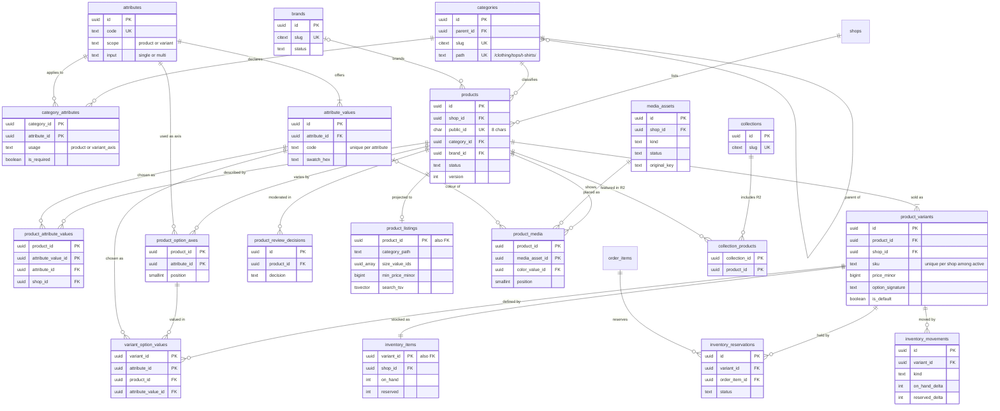
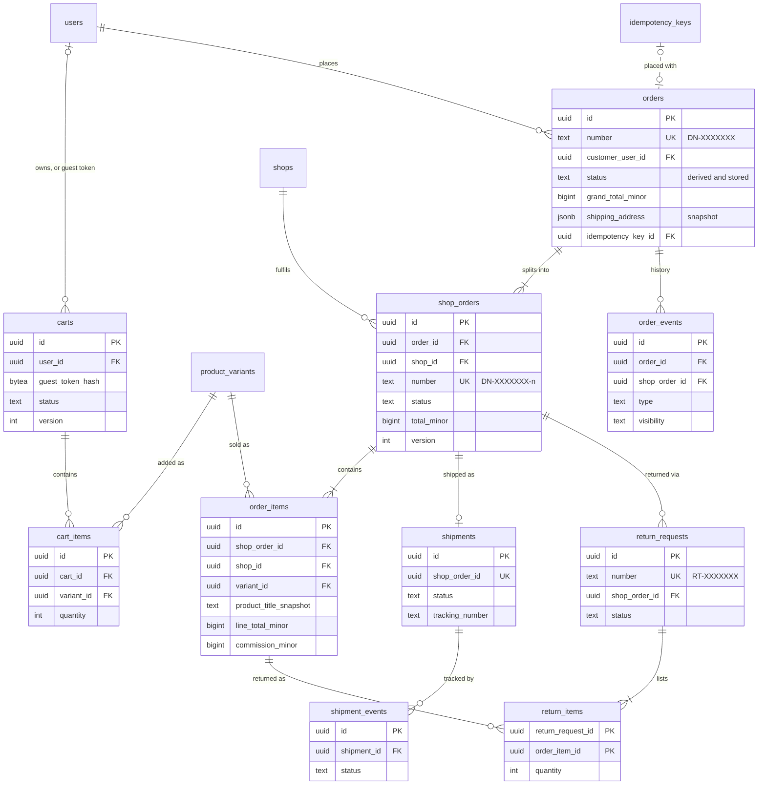
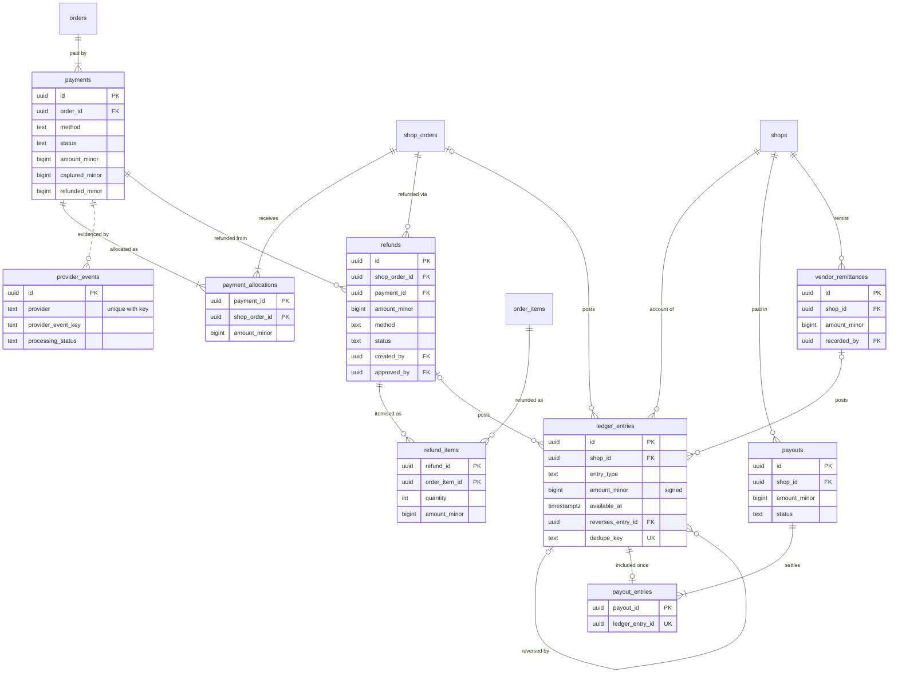
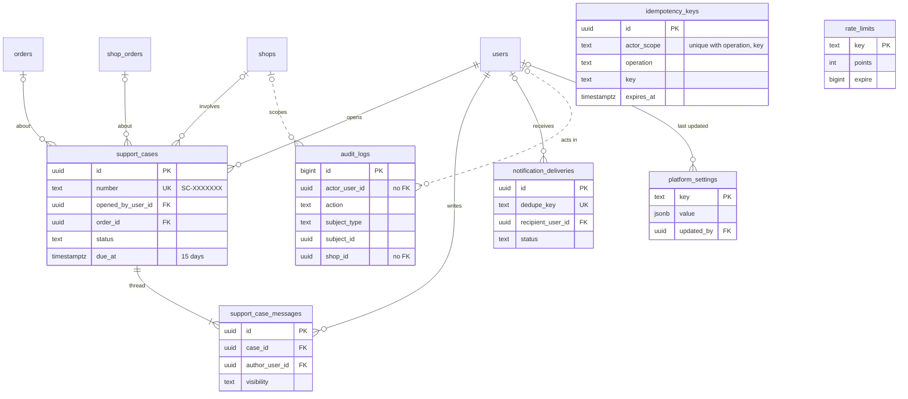
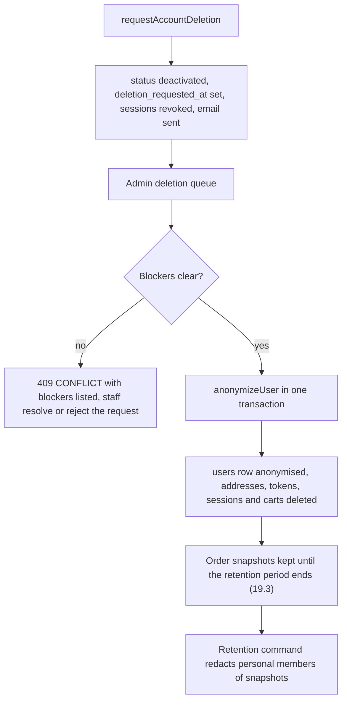
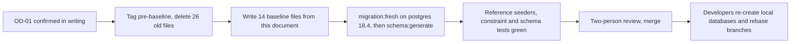

# Domain Model and Data Dictionary

Status: Draft v1 (2026-09-25)

This document is the source of truth for DripNepal's persistent data: every table, column, key, constraint and index, the invariants the database enforces, how money is represented and rounded, how personal data is classified and how long it is kept, and how the current exploratory schema is replaced by a reviewed baseline. It is written for the 1–2 developers who will write the migrations, and for the product owner, reviewer and accountant who need to know what the system remembers and why.

Related documents: [00 Context and assumptions](00-context-assumptions-and-questions.md) (repository findings RF-xx, assumptions A-xx), [01 Product requirements](01-product-requirements.md) (FR/NFR IDs), [03 System architecture](03-system-architecture.md) (modules, jobs, database roles), [05 Order, payment and inventory lifecycles](05-order-payment-and-inventory-lifecycles.md) (state machines, checkout algorithm, ledger postings), [06 API design](06-api-design.md) and [openapi.yaml](openapi.yaml) (wire shapes), [07 Security, threat model and permissions](07-security-threat-model-and-permissions.md) (permissions, key management), [09 Code structure](09-code-structure-and-engineering-standards.md), [10 Testing](10-testing-and-quality-gates.md), [11 Deployment and operations](11-deployment-and-operations.md), [12 Roadmap and backlog](12-roadmap-and-backlog.md), [ADRs](adr/) and the [risk and open-decision register](risks-and-open-decisions.md).

**File layout.** This document is split in two files that share one section numbering, so references stay stable: this file holds §1–§4 (scope, conventions, key decisions, ER diagrams) and §16–§21 (invariants, index summary, money, retention, migration, reference data); the table-by-table data dictionary, [04a §5](04a-data-dictionary-tables.md)–[04a §15](04a-data-dictionary-tables.md), is in [04a Data dictionary: tables](04a-data-dictionary-tables.md).

---

## 1. Scope and reading guide

### 1.1 What this document owns and what it does not

| This document owns | Owned elsewhere (referenced, not repeated) |
|---|---|
| Table and column definitions, types, nullability, defaults | Allowed state transitions and who may trigger them: [05](05-order-payment-and-inventory-lifecycles.md) |
| Primary keys, foreign keys and their `ON DELETE` behaviour, unique and CHECK constraints, triggers that enforce invariants | The checkout algorithm (`placeOrder`) and ledger posting rules: [05](05-order-payment-and-inventory-lifecycles.md) |
| Indexes, each tied to the query it serves | Endpoint paths, request and response shapes, error codes: [06](06-api-design.md), [openapi.yaml](openapi.yaml) |
| Invariants and the layers that enforce them | Permission slugs, role maps, encryption key management, threat analysis: [07](07-security-threat-model-and-permissions.md) |
| Money representation, rounding and allocation arithmetic | Screens and formatting components: [08](08-ui-ux-and-design-system.md) |
| Data classification and the retention schedule | Migration file style, lint rules, module boundaries in code: [09](09-code-structure-and-engineering-standards.md) |
| Mapping from the current schema to the new one, and the re-baseline procedure | Test definitions and CI gates: [10](10-testing-and-quality-gates.md); backups and restore: [11](11-deployment-and-operations.md) |
| Reference data proposals (categories, attributes, locations) | Milestone scheduling: [12](12-roadmap-and-backlog.md) |

### 1.2 Evidence labels

The labels are those of the documentation set ([00 §1.2](00-context-assumptions-and-questions.md)):

- **[Confirmed]**: stated by the product owner on 2026-09-25.
- **[Verified-repo]**: checked in the repository, with file and line.
- **[Verified-doc]**: checked in official documentation or package source; the URL is given and was accessed 2026-09-25.
- **[Assumption]**: a proposed default that can be reversed; the assumption register in [00 §6](00-context-assumptions-and-questions.md) records its owner and trigger (A-xx).
- **[Open]**: an open decision (OD-xx) in the [register](risks-and-open-decisions.md).
- **[Verify-external]**: a legal, tax or provider fact that needs authoritative confirmation (VX-xx).

Release tags on every table: **R1** (MVP launch, COD), **R1.1** (first wallet gateway, payouts), **R2**, **R3**. A table tagged R1.1 or R2 is still created in the R0 baseline when its absence would force a disruptive migration later (for example `provider_events`); otherwise it is created in the milestone that needs it.

### 1.3 Sensitivity classes

Every table and every notable column carries one class. Handling rules are in §19.1.

| Class | Meaning | Examples |
|---|---|---|
| **Public** | Intended for anyone, including crawlers | Published product titles, shop names, category names |
| **Internal** | Not personal and not public; harmless if leaked but not published | Moderation notes, platform settings, reference codes |
| **Personal** | Identifies or relates to a person (Privacy Act 2075 s2(c) lists address, telephone and email as personal information [Verified-doc <http://giwmscdnone.gov.np/media/app/public/275/posts/1721034328_44.pdf>]) | Email, full name, order history |
| **Sensitive-personal** | Personal data that E-Commerce Directive 2082 s8(1) requires to be stored encrypted (passwords, phone numbers, addresses, dates of birth) [Verified-doc <https://giwmscdnone.gov.np/media/pdf_upload/ecommerce-directives_8errkt4.pdf>; interpretation VX-03], and identity documents | Phone numbers, street and tole, KYC documents |
| **Financial** | Money amounts, balances, payout and bank data, tax identifiers | Ledger entries, payout accounts, PAN |
| **Secret** | Credentials or material that grants access | Password hashes, token hashes, session data, TOTP secrets |

### 1.4 How to read a table entry

Each table in [04a §5](04a-data-dictionary-tables.md)–[04a §15](04a-data-dictionary-tables.md) has the same parts:

1. **Header line**: owning module, release, shop scope, lifecycle class, sensitivity.
2. **Columns**: name, type, nullability, default, notes. `now()` and `uuidv7()` are database defaults. "App" in the default column means the value is always supplied by the owning action and has no database default on purpose (for example amounts, which must be computed by the server).
3. **Keys and constraints**: primary key, foreign keys with `ON DELETE` behaviour, unique constraints (partial ones show their predicate), CHECK constraints. Constraint names follow §2.14 so that the error handler can map them to API fields.
4. **Indexes**: each index with the query it serves. An index with no named query does not get created.
5. **Lifecycle and retention**: how rows are created, changed and removed, with the retention rule from §19.3.

Lifecycle classes used in the headers:

| Class | Meaning | Deletion |
|---|---|---|
| Reference | Seeded platform data (locations, categories, attributes) | Never deleted; deactivated with `is_active = false` |
| Entity | Has a lifecycle status (users, shops, products) | Never hard-deleted; ends in a terminal status |
| Configuration | Replaceable settings of an entity (shipping rates, category assignments) | Hard delete allowed; the change is audited |
| Record | Statutory or financial history (orders, ledger, audit) | Never deleted inside the retention period; many are append-only |
| Ephemeral | Short-lived technical state (sessions, tokens, idempotency keys, carts) | Purged by job after expiry |
| Derived | Rebuildable projection (listing read model) | Rebuilt at will |

---

## 2. Modelling conventions

These conventions implement canon §8 and ADR-0007, ADR-0008, ADR-0009 and ADR-0011. Every table in this document follows them unless its entry says otherwise and why.

### 2.1 Identifiers

**Primary keys.** `id uuid PRIMARY KEY DEFAULT uuidv7()`. PostgreSQL 18 ships `uuidv7([shift interval]) → uuid`, which "generates a version 7 (time-ordered) UUID. The timestamp is computed using UNIX timestamp with millisecond precision + sub-millisecond timestamp + random" [Verified-doc <https://www.postgresql.org/docs/18/functions-uuid.html>]. Time-ordered keys insert at the right-hand edge of the B-tree, which keeps the high-insert tables (`orders`, `order_items`, `ledger_entries`, `inventory_movements`, `order_events`) compact, and they make `id` a natural tie-breaker for cursor pagination (sort key, then `id`, per [06](06-api-design.md)).

- M0 verification: run `SELECT uuidv7();` on the provisioned managed cluster and in CI's `postgres:18.4` image. The function is built in, so no extension is needed. If the managed provider ever runs an older major version, the fallback is `gen_random_uuid()`, built into PostgreSQL since version 13 (the repository's `pgcrypto` migration is therefore unnecessary, audit verified facts [Verified-repo `database/migrations/1780064033094_create_enable_pgcryptos_table.ts:7`]). Because only the baseline exists at that point, the fallback is a search-and-replace in the baseline files.
- Tradeoff: a v7 UUID reveals its creation time to the millisecond (`uuid_extract_timestamp()` returns it [Verified-doc same page]). Internal IDs appear in API URLs for seller and admin resources, where creation times are shown anyway, so this is accepted. Identifiers whose creation time or sequence would leak business volume use separate random values (below). Secrets never use UUIDs of any version: tokens are 32 random bytes, and `users.security_stamp` uses `gen_random_uuid()` (random v4).
- Exceptions: reference tables keyed by a stable code (`provinces`, `districts`, `local_levels`, `delivery_zones`, `shop_categories`, `platform_settings`) use the code as the primary key, because the code is what seeders, URLs and snapshots refer to and it never changes. `audit_logs.id` is `bigint GENERATED ALWAYS AS IDENTITY` because the table is append-only, high-volume and read in insertion order. The session and limiter tables keep the primary keys their packages generate ([04a §5.3](04a-data-dictionary-tables.md), [04a §15.4](04a-data-dictionary-tables.md)).

**Human-facing identifiers.** Customers, vendors and support staff quote these on the phone, so they are short, unambiguous and not sequential:

| Identifier | Format | Space | Generation |
|---|---|---|---|
| `orders.number` | `DN-` + 7 Crockford base32 characters (alphabet `0-9 A-H J K M N P-T V-Z`, no I, L, O, U) | 32^7 ≈ 3.4 × 10^10 | Random; insert; on unique violation (SQLSTATE 23505 on `orders_number_key`) retry up to 3 times |
| `shop_orders.number` | order number + `-` + position (1, 2, …) | — | Position = rank of the shop within the order by cart grouping order |
| `products.public_id` | 8 Crockford base32 characters | 32^8 ≈ 1.1 × 10^12 | Random, retry on collision |
| `return_requests.number` | `RT-` + 7 Crockford base32 | as orders | as orders |
| `support_cases.number` | `SC-` + 7 Crockford base32 | as orders | as orders |

Why random: a sequential order number lets anyone who places two orders a week apart compute the platform's order volume, and invites guessing of `/account/orders/{orderNumber}` (still authorized, but noisy). At the 10× design load of A-02 (20,000 orders a month) five years produce about 1.2 million orders; the expected number of collision events over that period is about n²/2N ≈ 21, each absorbed by one retry. Crockford base32 avoids the I/1, L/1 and O/0 confusions that cause support mistakes when numbers are read aloud.

### 2.2 Time

- Every timestamp is `timestamptz`, stored in UTC. The server runs with `TZ=UTC` [Verified-repo `.env.example:2`]. Knex's `table.timestamp()` already creates `timestamptz` on PostgreSQL (audit verified facts), but the baseline writes the type explicitly.
- Display, business-day boundaries and SLA clocks use `Asia/Kathmandu`, UTC+05:45 since 1986 with no daylight saving [Verified-doc <https://raw.githubusercontent.com/eggert/tz/main/asia>]. "Orders placed today" in an admin report is `placed_at >= :start_of_day_kathmandu AND placed_at < :next_day_kathmandu`, computed in Luxon with `zone: 'Asia/Kathmandu'`, never with a whole-hour offset.
- `created_at timestamptz NOT NULL DEFAULT now()` on every table. Where rows change, `updated_at timestamptz NOT NULL DEFAULT now()` is maintained by a trigger, because the conditional updates that protect stock and state (`UPDATE … WHERE status = :from`) are written with the query builder and bypass Lucid's `autoUpdate`. Audit finding A1-10 showed the opposite problem today: `created_at` has no database default, so any insert that bypasses Lucid fails [Verified-repo `database/migrations/1761885935168_create_users_table.ts:35`].

```sql
CREATE FUNCTION set_updated_at() RETURNS trigger LANGUAGE plpgsql AS $$
BEGIN
  NEW.updated_at := now();
  RETURN NEW;
END $$;

-- one per table that has updated_at, for example:
CREATE TRIGGER products_set_updated_at BEFORE UPDATE ON products
  FOR EACH ROW EXECUTE FUNCTION set_updated_at();
```

- Bikram Sambat dates are a display concern (R2) and a fiscal-year key for future invoicing (OD-26). No BS date is stored as a column in R1; Node 24's ICU has no Nepali calendar [Verified-doc per [00 §4.5](00-context-assumptions-and-questions.md)], so a lookup-table library is needed when BS display arrives.
- Periods are half-open `timestamptz` ranges (`period_start` inclusive, `period_end` exclusive), never `date` pairs, so that a Kathmandu midnight boundary is exact.

### 2.3 Money

Summary of ADR-0007; the full rules and worked examples are in §18.

- Every amount is `<name>_minor bigint` in paisa, next to `currency char(3) NOT NULL DEFAULT 'NPR' CHECK (currency = 'NPR')`. Tables whose amounts all share one currency carry one `currency` column.
- Non-negativity is a CHECK on every amount except signed ledger amounts. Rates are integer basis points (`*_bp int`, 10000 = 100%).
- No `decimal`, `numeric`, `real` or `double precision` column exists anywhere. Lucid's schema generator maps `decimal` to a TypeScript `string` [Verified-doc Lucid 22.4.2 `build/src/orm/schema_generator/rules.js`], and the current UI multiplies such values as floats (RF-16).

### 2.4 Status columns and other enumerations

- Status and other closed vocabularies are `text NOT NULL` with a named CHECK listing the allowed values, for example `CONSTRAINT products_status_check CHECK (status IN ('draft','pending_review','published','unpublished','rejected','archived','blocked'))`.
- Why not PostgreSQL enum types: a value can be added to an enum but not removed without swapping the type, and changes interact badly with transactions. A CHECK can be replaced in expand/contract fashion: add the new constraint `NOT VALID`, `VALIDATE CONSTRAINT`, then drop the old one (§20.2.4).
- The TypeScript source of each vocabulary is one `as const` array in the owning module's `domain/` folder (for example `app/modules/catalog/domain/product_status.ts`). Migrations inline the literal values and never import application constants, which fixes RF-41 (A1-09: migrations importing `#constants/shop_status` change meaning when the constant changes).
- Test T-ARCH-011 (proposed) reads `pg_constraint` and fails if a CHECK value list differs from the TypeScript array, so the two cannot drift again as they have today (RF-23: `pending_verification` is the users default but absent from `UserStatus` [Verified-repo `app/constants/user_status.ts:1-6`]).
- Which transitions are allowed between values is owned by [05](05-order-payment-and-inventory-lifecycles.md). This document only fixes the value sets and the columns that must be set in each state (for example `cancelled_at` when a shop order is cancelled).

### 2.5 Tenant isolation with composite foreign keys

The most expensive class of marketplace bug is a row of shop A that points at a row of shop B: an order line attributed to the wrong vendor, a staff assignment that grants another shop's role (audit MISSED-identity-authz), or media from one shop shown on another's product (A1-02). Authorization code prevents most of these, but one missed `where('shop_id', …)` in a new action would be enough. DripNepal therefore makes such rows impossible to store.

**The pattern.**

1. Every shop-scoped table has `shop_id uuid NOT NULL`.
2. Every shop-scoped parent that other shop-scoped rows reference declares `UNIQUE (id, shop_id)`. This looks redundant next to the primary key, but PostgreSQL requires it: "A foreign key must reference columns that either are a primary key or form a unique constraint, or are columns from a non-partial unique index" [Verified-doc <https://www.postgresql.org/docs/18/ddl-constraints.html>].
3. Every reference from one shop-scoped row to another is a composite foreign key `(child_ref_id, shop_id) REFERENCES parent (id, shop_id)`.
4. The child's `shop_id` is never taken from request input. The action reads it from the parent row it has just loaded and locked (the same rule appears in [05 §3.1](05-order-payment-and-inventory-lifecycles.md)).

**Worked example: product → variant → stock → order line.**

```sql
CREATE TABLE products (
  id        uuid PRIMARY KEY DEFAULT uuidv7(),
  shop_id   uuid NOT NULL REFERENCES shops (id) ON DELETE RESTRICT,
  -- other columns in 04a §7.6
  CONSTRAINT products_id_shop_id_key UNIQUE (id, shop_id)
);

CREATE TABLE product_variants (
  id         uuid PRIMARY KEY DEFAULT uuidv7(),
  shop_id    uuid NOT NULL,
  product_id uuid NOT NULL,
  -- other columns in 04a §7.9
  CONSTRAINT product_variants_id_shop_id_key    UNIQUE (id, shop_id),
  CONSTRAINT product_variants_id_product_id_key UNIQUE (id, product_id),
  CONSTRAINT product_variants_product_fkey FOREIGN KEY (product_id, shop_id)
    REFERENCES products (id, shop_id) ON DELETE RESTRICT
);

CREATE TABLE inventory_items (
  variant_id uuid PRIMARY KEY,
  shop_id    uuid NOT NULL,
  -- other columns in 04a §8.1
  CONSTRAINT inventory_items_variant_id_shop_id_key UNIQUE (variant_id, shop_id),
  CONSTRAINT inventory_items_variant_fkey FOREIGN KEY (variant_id, shop_id)
    REFERENCES product_variants (id, shop_id) ON DELETE RESTRICT
);

CREATE TABLE order_items (
  id            uuid PRIMARY KEY DEFAULT uuidv7(),
  order_id      uuid NOT NULL,
  shop_order_id uuid NOT NULL,
  shop_id       uuid NOT NULL,
  product_id    uuid NOT NULL,
  variant_id    uuid NOT NULL,
  -- other columns in 04a §11.3
  CONSTRAINT order_items_shop_order_fkey FOREIGN KEY (shop_order_id, shop_id)
    REFERENCES shop_orders (id, shop_id) ON DELETE RESTRICT,
  CONSTRAINT order_items_shop_order_order_fkey FOREIGN KEY (shop_order_id, order_id)
    REFERENCES shop_orders (id, order_id) ON DELETE RESTRICT,
  CONSTRAINT order_items_variant_fkey FOREIGN KEY (variant_id, shop_id)
    REFERENCES product_variants (id, shop_id) ON DELETE RESTRICT,
  CONSTRAINT order_items_variant_product_fkey FOREIGN KEY (variant_id, product_id)
    REFERENCES product_variants (id, product_id) ON DELETE RESTRICT
);
```

What the database now refuses, with no application code involved:

```sql
-- Shop order SO_A belongs to shop A. Variant V_B belongs to shop B.
INSERT INTO order_items (order_id, shop_order_id, shop_id, product_id, variant_id /* … */)
VALUES (:order, :so_a, :shop_a, :product_b, :v_b /* … */);
-- ERROR:  insert or update on table "order_items" violates foreign key constraint "order_items_variant_fkey"
-- DETAIL: Key (variant_id, shop_id)=(<v_b>, <shop_a>) is not present in table "product_variants".
```

If the bug instead copies shop B's id into `shop_id`, `order_items_shop_order_fkey` fails, because `(SO_A, shop B)` does not exist in `shop_orders`. Either way the line cannot be stored against the wrong vendor.

**The same technique for other ownership chains.** The pattern is "carry the owner key and reference the pair", not only for shops:

| Chain | Constraint |
|---|---|
| Order line and shop order in the same order | `(shop_order_id, order_id) → shop_orders (id, order_id)` |
| Variant belongs to the product named on the line | `(variant_id, product_id) → product_variants (id, product_id)` |
| Attribute value belongs to the attribute | `(attribute_value_id, attribute_id) → attribute_values (id, attribute_id)` |
| Option value is one of the product's axes | `(product_id, attribute_id) → product_option_axes (product_id, attribute_id)` |
| District lies in the stated province | `(district_code, province_code) → districts (code, province_code)` |
| Local level lies in the stated district | `(local_level_code, district_code) → local_levels (code, district_code)` |
| Payment allocation targets a shop order of the paid order | `(shop_order_id, order_id) → shop_orders (id, order_id)` and `(payment_id, order_id) → payments (id, order_id)` |
| Payout includes only its own shop's ledger entries | `(ledger_entry_id, shop_id) → ledger_entries (id, shop_id)` |

**Nullable composite references.** A nullable reference such as `shops.logo_media_id` is declared `FOREIGN KEY (logo_media_id, id) REFERENCES media_assets (id, shop_id)`. With the default `MATCH SIMPLE`, "a referencing row need not satisfy the foreign key constraint if any of its referencing columns are null" [Verified-doc same page], so a shop without a logo is valid while a logo from another shop is rejected. `MATCH FULL` is never used for these, because it would reject exactly that valid case.

**Cost and tradeoff.** One extra unique index per parent table and a wider child row (one more uuid). Composite FK checks cost the same index probe as simple ones. `ON DELETE SET NULL` on a composite key would null the `shop_id` too, unless the column list form `SET NULL (col)` is used [Verified-doc same page]; DripNepal never needs it because shop-scoped rows are not deleted.

**Verification.** T-SEC-001 proves the API returns 404 across shops; T-ORD-104 and T-MED-101 (proposed) insert crafted cross-shop rows directly with the runtime role and assert SQLSTATE 23503.

### 2.6 Referential actions and what may be deleted

- Every foreign key states its action explicitly. The default is `ON DELETE RESTRICT`: deleting a referenced row fails immediately. Primary keys are never updated, so `ON UPDATE` is always the default `NO ACTION`.
- **No `ON DELETE CASCADE` from anything into orders, order items, payments, refunds, ledger, audit or any other Record table.** Today every foreign key except `shops.owner_id` cascades, so deleting a saved address would delete the orders shipped to it (RF-06, IAM-07, F8 [Verified-repo `database/migrations/1780074257570_create_orders_table.ts:11,14`]).
- `ON DELETE CASCADE` is allowed only for pure children that carry no history, listed exhaustively:

| Child → parent | Why cascade is safe |
|---|---|
| `cart_items → carts` | A cart is ephemeral; its lines mean nothing without it |
| `variant_option_values → product_variants` | Only draft variants that were never stocked or ordered can be deleted at all (their other references are RESTRICT) |
| `product_listings → products` | Derived read model |

- `ON DELETE SET NULL` is used once: `orders.idempotency_key_id → idempotency_keys`, because keys are purged after 72 hours while orders live for years.
- Hard deletes are allowed only for Ephemeral and Configuration rows: `carts`, `cart_items`, `sessions`, `user_tokens`, `idempotency_keys`, `rate_limits`, archived `user_addresses` and `shop_addresses` after their grace period, never-stocked draft `product_variants`, `product_media`, `product_attribute_values`, `product_option_axes`, `shop_category_assignments`, `shop_delivery_coverage`, `shop_shipping_rates`, and pg-boss jobs (removed by pg-boss). Every other table is never hard-deleted by application code.
- Test T-ARCH-011 (proposed) reads `pg_constraint.confdeltype` and fails if the set of cascading foreign keys differs from the table above.

### 2.7 Soft delete, archive and lifecycle columns

The repository has `deleted_at` columns on users, shops and products that nothing enforces, and unique constraints that ignore them (RF-24, A1-06). The baseline removes generic `deleted_at` and uses explicit lifecycle state instead:

| Situation | Mechanism | Example |
|---|---|---|
| The entity has a lifecycle | A terminal or hidden status value | `products.status = 'archived'`, `shops.status = 'closed'`, `users.status = 'anonymized'`, `product_variants.status = 'archived'` |
| A configuration row is withdrawn but history must remain | A dated column named for what happened | `user_addresses.archived_at`, `shop_payout_accounts.replaced_at`, `shop_memberships.removed_at`, `platform_staff.revoked_at`, `shop_invitations.revoked_at` |
| A natural key must be reusable after withdrawal | Partial unique index whose predicate excludes withdrawn rows | `UNIQUE (shop_id, sku) WHERE status = 'active'` |
| Default filtering in code | A named query function in the module's `queries.ts` (`activeProductsForShop`) or a Lucid query scope | Dashboards show archived rows only behind an explicit filter |

A status value participates in CHECK constraints and partial indexes and says why a row is hidden; a bare `deleted_at` does neither.

### 2.8 Text, normalisation and lengths

- Strings are `text` with a named length CHECK (`CHECK (char_length(title) BETWEEN 3 AND 150)`) rather than `varchar(n)`. Knex's `table.string()` silently creates `varchar(255)`, and the length rules then disagree with validators (RF-22, A1-04: a 101-character email passes Vine and fails the 100-character column with a 500). The rule lives once in the database and is mirrored by the Vine validator; constraint violations that still reach the database (23505, 23514, 22001) are mapped to 422 field errors by constraint name (§2.14).
- **Case-insensitive identifiers** (`users.email`, `shops.slug`, `categories.slug`, `brands.slug`, `slug_redirects.old_slug`, `shop_invitations.email`) use `citext`. It is a trusted extension that non-superusers with `CREATE` privilege can install, and it compares "by converting each string to lower case (as though lower were called)" [Verified-doc <https://www.postgresql.org/docs/18/citext.html>]. DigitalOcean Managed PostgreSQL 18 lists `citext` and `pg_trgm` as supported extensions [Verified-doc <https://docs.digitalocean.com/products/databases/postgresql/details/supported-extensions/>]. The PostgreSQL manual suggests nondeterministic collations as a more Unicode-correct alternative; that advantage does not apply here because the CHECKs below restrict these columns to ASCII, and `citext` keeps `LIKE` and ordinary indexes simple. The values are also stored already lower-cased and trimmed, so `citext` is a second guard, not the only one.
- **Slugs.** Shop slugs match `^[a-z0-9](?:[a-z0-9-]{1,48}[a-z0-9])$` (3–50 characters, no leading or trailing hyphen) and are checked against a reserved-word list in code (`admin`, `api`, `seller`, `shops`, `account`, `login`, `signup`, `checkout`, `cart`, `p`, `c`, `search`, `sell`, `health`, …), which closes IAM-16. Category and brand slugs use the same pattern. Product slugs are cosmetic, generated with `slugify` from the title, `^[a-z0-9]+(?:-[a-z0-9]+)*$`, at most 80 characters.
- **Names and free text** are trimmed and normalised to Unicode NFC in the validator (`value.normalize('NFC')`). Devanagari text typed on different keyboards can arrive in different code-point sequences; without NFC, two identical-looking product titles or shop names compare unequal.
- **Phone numbers** are stored in E.164. Consumer mobiles must match `^\+9779[678]\d{8}$`, the structure of the NTA National Numbering Allocation Plan (system code 96/97/98, one operator digit, seven subscriber digits) [Verified-doc <https://www.nta.gov.np/uploads/contents/National%20Numbering%20Allocation%20Plan.pdf>]. Validation is by structure, not by operator prefix list, because allocations change (VX-11). Shop contact numbers may also be landlines (eight-digit national numbers), so they match `^\+977(9[678]\d{8}|\d{8})$`. Input is accepted with or without `+977` and a leading `0` and normalised before storage (fixes RF-29, whose rule rejects valid numbers).

### 2.9 Sensitive-column encryption and blind indexes

**What is encrypted.** Columns ending in `_enc` hold ciphertext produced by the application:

| Table | Encrypted columns |
|---|---|
| `users` | `phone_enc`, `mfa_totp_secret_enc` |
| `user_addresses` | `recipient_name_enc`, `recipient_phone_enc`, `area_tole_enc`, `street_landmark_enc` |
| `shop_addresses` | `contact_phone_enc`, `area_tole_enc`, `street_landmark_enc` |
| `shops` | `grievance_contact_phone_enc` |
| `shop_payout_accounts` | `account_number_enc` |
| `orders` | the `*_enc` members of the `shipping_address` snapshot ([04a §11.1](04a-data-dictionary-tables.md)) |
| `refunds` | `recipient_details_enc` |

**Why at application level.** E-Commerce Directive 2082 s8(1) requires platforms to store users' passwords, phone numbers, addresses, dates of birth and other sensitive details used for authentication "in encrypted form" [Verified-doc Directive PDF above; how strictly this applies to delivery addresses is VX-03]. Disk encryption by the managed provider protects only against stolen disks. The threats that matter for a small team are SQL-level: a leaked `pg_dump` or backup (the 7-day PITR plus the independent backups of [11](11-deployment-and-operations.md)), an analytics copy, an injection that reads rows, and anyone with `psql` access during an incident. With application-level encryption, all of these see ciphertext; only the running application, which holds the key, sees plaintext. `pgcrypto` was rejected because the key would travel inside SQL statements and could land in server logs and `pg_stat_statements`.

**Format.** AES-256-GCM with a random 12-byte IV per value, stored as text:
`v1.<key_id>.<base64url(iv)>.<base64url(ciphertext)>.<base64url(tag)>`. The additional authenticated data is `<table>.<column>`, so a ciphertext copied into a different column fails to decrypt. Keys come from `DATA_ENCRYPTION_KEYS` (a JSON map of key id to 32-byte base64 key) and `DATA_ENCRYPTION_ACTIVE_KEY_ID`; they are never `APP_KEY`, which signs cookies and must be rotatable independently. Rotation adds a new key id, makes it active, and runs a batched, idempotent `node ace data:reencrypt` command; the old key is removed only after a verification query finds no rows using it. Key custody and rotation cadence are owned by [07](07-security-threat-model-and-permissions.md).

**Blind indexes.** Encrypted values cannot be compared in SQL, so equality lookups use a keyed hash: `phone_hash = HMAC-SHA256(BLIND_INDEX_KEY, 'phone:' || e164)` stored as `bytea` of 32 bytes. It supports "which accounts use this phone" for COD fraud review and R2 OTP login, without decrypting any row. Tradeoffs, stated plainly: blind indexes support only exact equality (no prefix search); and because Nepali mobile numbers are only about 3 × 10^8 possibilities, anyone holding both a dump and `BLIND_INDEX_KEY` could brute-force them. That is why the key is separate from the encryption keys, lives only in the application environment and is never stored in the database.

**Masking columns.** `*_last4` columns (`phone_last4`, `recipient_phone_last4`, `account_number_last4`) hold the last four digits in plaintext so that lists and support conversations can show "•••• 4567" without decrypting.

**What is not encrypted and why.** `users.email` is the login identifier and must be unique and indexable; it is protected by access control and log redaction (whether e-mail addresses fall under s8(1) is part of VX-03). `full_name` is shown on most screens and is Personal, not Sensitive-personal. Province, district, local level and ward codes stay plaintext because delivery-zone lookup, coverage checks and reports need them, and on their own they do not identify a household. Shop contact email and phone are public business contacts.

**How code uses it.** Models hold ciphertext strings. Decryption is an explicit call (`fieldCrypto.decrypt(row.phoneEnc, 'users.phone_enc')`) made only in transformers that are allowed to reveal the value (for example the vendor packing view within the visibility window of A-18). A Lucid `consume` hook was rejected because it would decrypt on every load and let plaintext reach logs and generic serializers by accident.

**Verification.** T-IAM-103 (proposed): after signup, the raw `users` row contains no substring of the phone number; lookup by blind index finds the user; after key rotation, old and new rows decrypt.

### 2.10 Optimistic concurrency

`version int NOT NULL DEFAULT 1` exists on `shops`, `products`, `product_variants`, `inventory_items`, `carts`, `shop_orders`, `shipments`, `payments`, `refunds`, `payouts`, `return_requests` and `support_cases`. Writers use `UPDATE … SET version = version + 1 WHERE id = :id AND version = :expected`; zero rows means someone else changed the row, and the API answers 412 `VERSION_CONFLICT` for `If-Match` requests ([06](06-api-design.md)). State transitions additionally compare-and-set the status (`WHERE status = :from`), as specified in [05](05-order-payment-and-inventory-lifecycles.md).

### 2.11 JSONB

`jsonb` is used only for: immutable snapshots (`orders.shipping_address`), redacted provider payloads (`provider_events.payload`), media derivative keys, event and audit detail (`order_events.data`, `audit_logs.changes`), stored API responses (`idempotency_keys.response_body`) and setting values (`platform_settings.value`). It is never used for anything that is filtered, joined, constrained or summed (prices, statuses, quantities, shop ids). Each `jsonb` column has `CHECK (jsonb_typeof(col) = 'object')` and a documented shape (a TypeScript type plus a Vine schema in the owning module). Lucid generates `any` for `jsonb` [Verified-doc Lucid rules.js], so code reads these columns through a typed parser, never directly.

### 2.12 Append-only tables

These tables only ever receive inserts: `audit_logs`, `ledger_entries`, `inventory_movements`, `order_events`, `shipment_events`, `shop_review_decisions`, `product_review_decisions`, `shop_agreements`, `support_case_messages`. [03 §3.4](03-system-architecture.md) names the first four; this document adds the other five because they are decision or consent records whose value depends on never changing.

Two layers make "append-only" a database guarantee rather than a convention:

```sql
-- Layer 1: the runtime role cannot change rows (roles are defined in 03 §3.4 and 07)
REVOKE UPDATE, DELETE, TRUNCATE ON ledger_entries FROM dripnepal_app;

-- Layer 2: even the owner role is stopped by a trigger (catches psql mistakes and migrations)
CREATE FUNCTION forbid_mutation() RETURNS trigger LANGUAGE plpgsql AS $$
BEGIN
  RAISE EXCEPTION 'table % is append-only', TG_TABLE_NAME USING ERRCODE = 'P0001';
END $$;

CREATE TRIGGER ledger_entries_no_update_delete BEFORE UPDATE OR DELETE ON ledger_entries
  FOR EACH ROW EXECUTE FUNCTION forbid_mutation();
CREATE TRIGGER ledger_entries_no_truncate BEFORE TRUNCATE ON ledger_entries
  FOR EACH STATEMENT EXECUTE FUNCTION forbid_mutation();
```

Corrections are new rows (a reversal ledger entry, a new review decision). The only deletion is the retention purge after the statutory period (§19.3), run by a maintenance command under the migrator role that disables the trigger inside one transaction and writes an `audit_logs` row describing what it removed. Test T-ARCH-012 (proposed) attempts `UPDATE` and `DELETE` on each table with both roles and expects failure.

### 2.13 Snapshot versus reference

A row that records a past fact copies the facts it depends on instead of joining to mutable rows at read time: order lines copy title, variant label, SKU, image, category path, prices and commission; shop orders copy the shop name; orders copy the delivery address and customer email. The reference (`product_id`, `variant_id`, `shop_id`) is kept alongside for navigation and reporting, with `ON DELETE RESTRICT`. The snapshot is what receipts, disputes and the ledger use. This is how "history stays understandable after catalog changes" (INV-09) is met.

### 2.14 Naming

| Item | Rule | Example |
|---|---|---|
| Tables | Plural `snake_case` | `shop_orders` |
| Foreign key columns | `<entity>_id`; user references named by role | `shop_id`, `approved_by`, `actor_user_id` |
| Money | `<name>_minor` + `currency` | `grand_total_minor` |
| Rates | `<name>_bp` (basis points) | `commission_rate_bp` |
| Encrypted | `<name>_enc`; blind index `<name>_hash`; masking `<name>_last4` | `phone_enc`, `phone_hash`, `phone_last4` |
| Snapshots | `<name>_snapshot` | `sku_snapshot` |
| Booleans | `is_<adjective>` or `has_<noun>` | `is_default` |
| Timestamps | `<event>_at` | `accepted_at` |
| Constraints | `<table>_<purpose>_{pkey,key,fkey,check}` | `orders_totals_check` |
| Indexes | `<table>_<purpose>_idx` | `shop_orders_seller_list_idx` |

Constraint names are part of the API contract internally: `app/exceptions/constraint_map.ts` maps names such as `shops_slug_key` to a field (`slug`) and code (`VALIDATION_FAILED`), so a race that slips past the validator still returns a 422 with the right field instead of a 500.

### 2.15 Lucid mapping rules

- `database/schema.ts` is generated by `node ace schema:generate`, which `migration:run` and `migration:rollback` invoke unless `--no-schema-generate` is passed or the app runs in production; output defaults to `./database/schema.ts`, and only the connection's search path (default `public`) is scanned [Verified-doc Lucid 22.4.2 `build/commands/schema_generate.js`, `migration/run.js`]. It is committed and never hand-edited (its header says so [Verified-repo `database/schema.ts:1-5`]). Test T-ARCH-010 (proposed) runs `migration:fresh` in CI and fails on any diff.
- `database/schema_rules.ts` is loaded only when the connection sets `schemaGeneration.rulesPaths`; there is no default path [Verified-doc Lucid `build/src/orm/schema_generator/generator.js`]. The repository has no such block, so today's empty rules file has no effect [Verified-repo `config/database.ts`]. §20.3 gives the configuration.
- Models extend the generated classes and add relations only (`class Product extends ProductSchema`), per [09](09-code-structure-and-engineering-standards.md).
- **Composite primary keys.** A Lucid model's `primaryKey` is a single string [Verified-doc Lucid `build/src/types/model.d.ts:584`], and the generator's default rule marks only the first primary-key column. Tables with composite primary keys (`category_attributes`, `product_attribute_values`, `product_option_axes`, `variant_option_values`, `product_media`, `payment_allocations`, `payout_entries`, `refund_items`, `return_items`, `shop_category_assignments`, `shop_delivery_coverage`, `shop_shipping_rates`, `delivery_zone_districts`, `collection_products`) are therefore written only by the owning module's actions with the query builder inside the action's transaction (`trx.insertQuery().table('product_media').multiInsert(rows)`), or through `manyToMany` pivot helpers. They may have read-only models, but `save()` and `delete()` are never called on them. This avoids the failure mode of A1-03, where a model without an `id` column issues `WHERE id = ?`.
- **bigint.** The generator types `bigint` columns as `bigint | number` [Verified-doc rules.js], but node-postgres returns `int8` values as strings by default because JavaScript cannot represent all 64-bit integers [Verified-doc <https://github.com/brianc/node-pg-types>]. The generated type is therefore wrong at runtime unless a type parser is installed; §18.4 installs one and maps the TypeScript type to `number`.
- `decimal` is never used; `jsonb` maps to `any` and is read through typed parsers (§2.11).

---

## 3. Key modelling decisions

Each decision below states what the schema does, why, what was rejected, when to revisit it, and which constraint or test enforces it. The tables they refer to are defined in [04a §5](04a-data-dictionary-tables.md)–[04a §7](04a-data-dictionary-tables.md). Glossary terms (category, audience, option axis, size system) are defined in [00 §5.4](00-context-assumptions-and-questions.md).

### 3.1 One user can own several shops, up to a limit

- **Decision.** Ownership is one column, `shops.owner_user_id NOT NULL REFERENCES users ON DELETE RESTRICT` ([04a §6.1](04a-data-dictionary-tables.md)). The owner is the legal and payout party and is not a `shop_memberships` row. Any active, email-verified user can apply from `/sell` with their existing account (FR-SHOP-001). A user may hold at most `max_shops_per_owner` shops (default 3 [Assumption A-21]; [04a §15.1](04a-data-dictionary-tables.md)) in states `pending_review`, `active` or `suspended`.
- **Why.** Today shop registration is guest-only and always creates a new user, so a customer cannot become a seller (RF-21, IAM-08). One column cannot drift from itself. With an owner membership row as well, every permission check has to agree with `owner_id` (IAM-11). The seller resolution algorithm checks ownership first, then membership ([07](07-security-threat-model-and-permissions.md)), so a stray membership row can never reduce an owner's rights.
- **Rejected.** (a) A separate vendor identity or account type: two logins for one person, and no way to buy and sell with one account. (b) An `owner` role inside `shop_memberships`: "exactly one owner" would need a partial unique index, and a transfer would touch two tables that must agree. The payout party still has to sit on `shops`. (c) A global `shop-owner` role (RF-20, IAM-10): it carries no shop identity and invites a guard that opens every shop.
- **Enforcement.** `applyForShop` locks the applicant's `users` row (`SELECT … FOR UPDATE`) before counting their shops, so two parallel applications cannot both pass the limit. T-SHOP-101 (proposed) runs two concurrent applications at limit − 1 and expects one 409 `CONFLICT`.
- **Revisit when** an owning company needs several directors with equal rights (ownership transfer is FR-SHOP-009, R2), or support sees legitimate owners with more than three brands.

### 3.2 Staff work in several shops through memberships

- **Decision.** `shop_memberships` has one row per (shop, user), `UNIQUE (shop_id, user_id)`, with one role from the fixed set `manager`, `catalog_editor`, `order_fulfiller`, `viewer`. Role permissions are maps in code (ADR-0006). A user may be a member of any number of shops and owner of others. Invitations go by email with a hashed, expiring token ([04a §6.3](04a-data-dictionary-tables.md)). The shop being acted on comes only from the URL, never from a "current shop" in the session (AC-FR-SHOP-006-2).
- **Why.** The current schema allows several roles per user per shop with undefined union semantics (IAM-13). It also stores shop roles in a table whose permissions share the global permission table, which opens an escalation path (F24). Fixed roles in code need no role-management UI and no permission scoping in the database.
- **Rejected.** Per-shop `shop_roles` with a permission pivot (the current design): needs an editor, scoping and a composite FK to stop cross-shop role assignment (MISSED-identity-authz). Several roles per member: one lookup becomes a union. A session-held current shop: one missed re-check leaks another shop's data.
- **Revisit when** custom roles arrive (FR-SHOP-011, R3). Then add `shop_roles (id, shop_id, name, permissions text[])` with `UNIQUE (id, shop_id)` and a composite FK `(shop_role_id, shop_id)` from `shop_memberships`, following §2.5.

### 3.3 Listings are owned by shops; there is no master catalog

- **Decision.** Every product belongs to exactly one shop (`products.shop_id`). Two shops selling the same sneaker model create two products, each with their own title, photos, price and disclosures.
- **Why.** Launch inventory is expected to be mostly own-label, unbranded or from small local brands [Assumption], so there is little to match. The seller must supply the s6 listing details (E-Commerce Act 2081 s16(c)) and the platform must display them accurately (s14(a)) [Verified-doc <https://giwmscdnone.gov.np/media/files/E-Commerce%20Act%2C%202081_yr7k9o5.pdf>; obligations under VX-02]. That is simplest when each listing has one author. A shared catalog product also needs a "which seller wins" rule. Section 14(d) forbids discriminating among sellers of the same category and requires any preference to be shown to buyers [same source], so a buy-box ranking would be a legal design problem as well as an engineering one.
- **Rejected.** A master catalog with seller offers (one product page, many sellers): needs product matching, ownership rules for shared content, and a curation team the 1–2 person team does not have.
- **Revisit when** the same branded model (brand plus model code) is listed by five or more shops [Assumption], or the authenticity policy for sneakers and watches (OD-21) requires verified model references. The path is additive: a `catalog_models (id, brand_id, model_code, title)` table and a nullable `products.catalog_model_id`. No existing row changes.

### 3.4 Every product has at least one variant; an option-less product has one default variant

- **Decision.** Price, SKU, weight and stock live only on `product_variants`. A product with no option axes has exactly one variant with `is_default = true` and `option_signature = ''`. A product with one or two axes has one variant per combination the vendor offers, and no default variant. `CHECK (is_default = (option_signature = ''))` ties the two columns together ([04a §7.9](04a-data-dictionary-tables.md)).
- **Why.** Cart lines, reservations, order lines, inventory and the ledger reference `variant_id` only. With a default variant there is no "product without variants" branch anywhere downstream, and a product can gain axes later without changing its references.
- **Rejected.** (a) Price and stock on the product for simple items: a second code path in pricing, cart, checkout and inventory. (b) Generating the full matrix of axis values automatically: vendors do not stock every combination (no black XXL), and phantom variants with zero stock clutter the size picker.
- **Enforcement.** `createProduct` inserts the product and its default variant in one transaction. Submit and publish require at least one active variant, and every active variant must have `price_minor > 0` (AC-FR-CAT-005-2, AC-FR-CAT-004-3). The partial unique index `product_variants_default_key` allows at most one active default per product. T-CAT-106 (proposed).
- **Revisit when** bundles or kits (R3) need a variant made of other variants.

### 3.5 Duplicate variant combinations are impossible

- **Decision.** Three database rules together:
  1. `variant_option_values` has `PRIMARY KEY (variant_id, attribute_id)`, so a variant has at most one value per axis (it cannot be both Black and White).
  2. Composite FKs make the value belong to the attribute, `(attribute_value_id, attribute_id) → attribute_values (id, attribute_id)`, and the attribute be one of the product's axes, `(product_id, attribute_id) → product_option_axes (product_id, attribute_id)`.
  3. `product_variants.option_signature` is the canonical text of the combination: `attribute_code:value_code` pairs sorted by attribute code and joined with `|`, for example `apparel_size:m|color:black`. The partial unique index `product_variants_product_signature_key ON (product_id, option_signature) WHERE status = 'active'` rejects a second active Black / M.
- **Why a signature.** SQL cannot declare "no two variants of a product have the same set of rows in a child table". That would need a trigger that aggregates on every write. The signature turns set equality into string equality, which a unique index can enforce. It is sorted by attribute code, not axis position, so reordering axes does not change it.
- **Tradeoff.** The signature duplicates the child rows and could disagree with them. It is computed by one domain function (`catalog/domain/option_signature.ts`) from the same validated input that produces the `variant_option_values` rows, in the same transaction. T-CAT-102 (proposed) submits a duplicate combination and expects 422 on field `variants[n].options`. The 23505 backstop carries the index name, which PostgreSQL reports as the constraint name, and `constraint_map.ts` maps it to that field (§2.14). T-CAT-103 (proposed) inserts a value of an attribute the product does not vary by and expects SQLSTATE 23503.
- **Revisit when** a product needs more than two axes (R3). The signature format already allows more pairs; only the `product_option_axes.position` CHECK changes.

### 3.6 Audience is a multi-valued product attribute; each product has exactly one leaf category

- **Decision.** The category tree classifies garment type only (Clothing › Tops › T-Shirts). Who a product is for is the product-scope attribute `audience`, which is multi-valued (values set by OD-15; recommended men, women, kids, with "unisex" displayed when both men and women are set). `products.category_id` is `NOT NULL` and must be a leaf.
- **Why.** Men and Women root categories duplicate every subtree and force a unisex hoodie to be listed twice or misfiled ([00 §5.3(a)](00-context-assumptions-and-questions.md)). One category per product gives one attribute rule set, one breadcrumb and, from R2, one category commission rate (FR-LED-006).
- **Rejected.** Audience roots (above). Several categories per product: conflicting attribute rules and commission rates. Audience in the product URL (`/:attributeValue/:productSlug`): two URLs for one product and a catch-all route (RF-02).
- **Enforcement.** A CHECK cannot look at other rows [Verified-doc <https://www.postgresql.org/docs/18/sql-createtable.html>: "CHECK expressions cannot contain subqueries nor refer to variables other than columns of the current row"]. The leaf rule is therefore checked by the product actions: the category is active and `NOT EXISTS (SELECT 1 FROM categories WHERE parent_id = :category_id)`. The reference seeder refuses to add a child under a category that still has products ([04a §7.1](04a-data-dictionary-tables.md)), so a leaf cannot silently become a parent. T-CAT-101 (proposed) expects 422 for a non-leaf category.
- **Revisit when** OD-15 settles the audience values, or kids' sizing arrives (`kids_age`, R2).

### 3.7 Category attribute rules are inherited down the tree

- **Decision.** A `category_attributes` row attaches an attribute to a category with `usage` (`product` or `variant_axis`) and `is_required`. A leaf's effective rules are the union of the rows on its path, and where an attribute appears more than once the deepest row wins, so a subtree can make an inherited attribute required. For example, `audience` and `material` are attached once to each top-level category and inherited by every leaf below it; the proposed rule set is in §21.3.
- **How it is validated.** One query loads the effective rules ([04a §7.4](04a-data-dictionary-tables.md)), then a pure domain function (`catalog/domain/attribute_rules.ts`) checks:
  1. Every product attribute value belongs to an attribute whose effective usage is `product`, and the value belongs to that attribute (the composite FK is the backstop).
  2. A `single` attribute has at most one value.
  3. Every option axis is an effective `variant_axis` rule, and there are at most two axes.
  4. At submit and publish, and on any update of a product in `pending_review`, `published` or `unpublished`: every required product attribute has a value and every required axis is present. Drafts may be incomplete (AC-FR-CAT-002-2).
- **Rejected.** A JSON schema per category (not queryable, duplicated down the tree). Repeating the rules on every leaf (dozens of leaves, so one change is edited in many places). Free-text attributes (fragmented filters, [00 §5.2](00-context-assumptions-and-questions.md)).
- **Revisit when** the reference-data admin UI arrives (FR-ADM-006, R2). A rule change then needs a report of the published products that no longer comply. They stay published and are flagged, because silently unpublishing products would hurt vendors for a platform change.
- **Verified by** T-CAT-104 (proposed): unit tests of the rule function, plus the SQL against the seeded tree.

### 3.8 One attribute per size system

- **Decision.** `apparel_size` (XS–3XL, Free Size), `shoe_size_eu` (35–47), `waist_size_in` (26–40), and `kids_age` in R2 are separate variant-scope attributes. Each category declares which one is its axis through `category_attributes`.
- **Why.** One generic `size` puts "M" in the sneaker size filter, makes shoe size 40 collide with a 40-inch waist, and leaves no place to hang a size chart ([00 §5.3(c)](00-context-assumptions-and-questions.md)).
- **Rejected.** One mixed `size` attribute. Vendor-typed sizes ("40 ", "40-eu").
- **Revisit when** vendors ask for UK or US shoe sizes. Add `shoe_size_uk` as another attribute, or conversions in a size-chart table (R2). Existing variants are unaffected.

### 3.9 Colour is a platform-controlled attribute with swatches

- **Decision.** `color` is a variant-scope attribute. Its values have a `label` and an optional `swatch_hex` (`#rrggbb`). A value without a hex, such as `multicolor` or `printed`, is drawn as a pattern chip. Images are tied to a colour value, not to a variant (`product_media.color_value_id`, [04a §7.14](04a-data-dictionary-tables.md)), so one set of photos serves every size of that colour.
- **Why.** A fixed colour list keeps the colour filter usable and lets swatches render the same everywhere. Vendors ask for missing shades ("rani pink") through a support case ([00 §5.5](00-context-assumptions-and-questions.md)).
- **Rejected.** A free-text colour name with a hex picker: every vendor invents names and the filter fragments. Images per variant: the same photo stored once per size.
- **Revisit when** the value list passes about 60 entries [Assumption]. Then add colour families for filtering (`attribute_values.family_code`, R2), so "rani pink" filters under pink.

### 3.10 Brands are platform reference data; empty means own label

- **Decision.** `brands (slug, name, status ∈ active|pending|rejected, requires_moderation)`, [04a §7.5](04a-data-dictionary-tables.md). `products.brand_id` is nullable. Null means the shop's own label, shown as "Brand: {shop name} (own label)" (AC-FR-CAT-008-1). New brands are requested through a support case and, in R1, added by the reference seeder. Brands with `requires_moderation = true` (for example international sneaker and watch brands) always go through moderation, even for shops in `post` review mode, until OD-21 sets the authenticity policy (AC-FR-CAT-008-3).
- **Why.** E-Commerce Act s6 requires the trademark to be disclosed (VX-02). One spelling per brand is what makes counterfeit screening and brand filters possible.
- **Rejected.** Free-text brand on the product: "Nike", "NIKE", "nike original". Vendors creating brands without review: the counterfeit risk goes straight onto the storefront.
- **Revisit when** OD-21 is decided. It may add `brand_authorizations (shop_id, brand_id, document_media_id, verified_by, verified_at)`. Brand pages would add `brand` to `slug_redirects.entity_type`.

### 3.11 Collections are R2 and additive

- **Decision.** Curated sets such as "Dashain edit" and "Streetwear" are `collections` and `collection_products` ([04a §7.15](04a-data-dictionary-tables.md)). They are platform-curated, span shops, and never affect category, attributes or commission. The tables are created in M9, not in the R0 baseline, because adding them later is purely additive.
- **Rejected.** Style or occasion categories: they break the single-category rule (§3.6). Shop-level collections: nothing asks for them before R3.

### 3.12 Navigation entries are code configuration in R1

- **Decision.** `/men`, `/women`, `/men/t-shirts` and similar URLs are entries in `app/modules/catalog/navigation.ts`. Each entry maps a path to a filter: audience values, a category path prefix, and optional attribute values. There is no table and no catch-all route. Paths outside the configuration return 404 (AC-FR-SRCH-007-1).
- **Why.** The menu changes a few times a year. A reviewed code change is cheaper than an admin UI, and a boot-time check can validate it.
- **Enforcement.** T-CAT-107 (proposed) loads the configuration against the seeded reference data and fails if an entry names a missing category path or attribute value code.
- **Rejected.** A `navigation_entries` table: needs an admin UI and adds a query to every storefront page. Audience categories (§3.6).
- **Revisit when** marketing needs menu changes more than monthly, or the reference-data UI (R2) exists. Then move the same shape into a table.

### 3.13 Slugs and redirects

- **Decision.** Product URLs are `/p/{slug}-{publicId}` (ADR-0017). `public_id` is 8 immutable Crockford base32 characters (§2.1). The slug is cosmetic: the router takes the last 8 characters as the ID, loads by `public_id`, and answers 301 to the canonical URL if the slug differs. Product slugs are therefore not unique and need no redirects. Shop and category slugs are the URL key: unique, changed only by staff (FR-SHOP-012), and every change inserts a `slug_redirects` row so the old URL answers 301 ([04a §6.10](04a-data-dictionary-tables.md)). An old slug stays reserved for its entity and cannot be taken by another shop or category.
- **Why.** Globally unique product names and slugs made two shops unable to sell "Black Hoodie" (F10). Changing a slug without a redirect breaks every link already shared on social media and in chat apps.
- **Rejected.** Unique product slugs with numeric suffixes (`black-hoodie-7`): leaks how many shops sell the item and still breaks on rename. Shop UUIDs in public URLs: unreadable. No redirects: broken links and lost search ranking.
- **Revisit when** brand or collection pages get their own URLs. Add the entity type to the `slug_redirects_entity_type_check` value list.

---

## 4. Entity-relationship diagrams

The diagrams show primary keys, foreign keys, unique business keys and the columns that explain a relationship. Every other column is in the table's section. A column marked PK on several lines of one entity is a composite primary key. A dotted line is a logical reference with no foreign key, such as the session store's `user_id`, which the package writes as text, or a polymorphic `entity_id`. Tables drawn without attributes are defined in another diagram. The composite tenant keys of §2.5 (`UNIQUE (id, shop_id)` and the paired foreign keys) are listed in each table's "Keys and constraints"; the diagrams show only the single-column reference.

### 4.1 Identity, shops and logistics

```mermaid
erDiagram
  users ||--o{ user_tokens : "proves email or resets password"
  users ||..o{ sessions : "tagged by user_id, no FK"
  users ||--o| platform_staff : "may be"
  users ||--o{ user_addresses : "keeps"
  users ||--o{ shops : "owns"
  users ||--o{ shop_memberships : "works in"
  shops ||--o{ shop_memberships : "staffed by"
  shops ||--o{ shop_invitations : "invites"
  shops ||--|{ shop_agreements : "accepts"
  shops ||--o{ shop_review_decisions : "reviewed in"
  shops ||--o{ shop_addresses : "ships from"
  shops ||--o{ shop_payout_accounts : "paid to"
  shops ||--o{ shop_category_assignments : "classified by"
  shop_categories ||--o{ shop_category_assignments : "groups"
  shops ||--o{ media_assets : "uploads logo, banner, KYC"
  shops ||..o{ slug_redirects : "old slugs, entity_id"
  users {
    uuid id PK
    citext email UK
    text status
    uuid security_stamp
    bytea phone_hash "blind index"
  }
  user_tokens {
    uuid id PK
    uuid user_id FK
    text purpose
    bytea token_hash UK
    timestamptz expires_at
  }
  sessions {
    text id PK "session id"
    text user_id "text, no FK"
    timestamptz expires_at
  }
  platform_staff {
    uuid user_id PK "also FK to users"
    text role
    timestamptz revoked_at
  }
  user_addresses {
    uuid id PK
    uuid user_id FK
    text local_level_code FK
    smallint ward_no
    boolean is_default
    timestamptz archived_at
  }
  shops {
    uuid id PK
    uuid owner_user_id FK
    citext slug UK
    text status
    text suspension_mode
    uuid logo_media_id FK
    int version
  }
  shop_memberships {
    uuid id PK
    uuid shop_id FK
    uuid user_id FK
    text role
    text status
  }
  shop_invitations {
    uuid id PK
    uuid shop_id FK
    citext email
    bytea token_hash UK
    timestamptz expires_at
  }
  shop_agreements {
    uuid id PK
    uuid shop_id FK
    text agreement_version
    uuid accepted_by_user_id FK
  }
  shop_review_decisions {
    uuid id PK
    uuid shop_id FK
    text decision
    uuid decided_by FK
  }
  shop_addresses {
    uuid id PK
    uuid shop_id FK
    text purpose
    text local_level_code FK
    boolean is_default
  }
  shop_payout_accounts {
    uuid id PK
    uuid shop_id FK
    text method
    text account_number_enc
    timestamptz replaced_at
  }
  shop_categories {
    text code PK
    text label
  }
  shop_category_assignments {
    uuid shop_id PK
    text shop_category_code PK
  }
  slug_redirects {
    text entity_type PK
    citext old_slug PK
    uuid entity_id "shop or category"
  }
```



Logistics reference data and shop shipping configuration (defined in [04a §9](04a-data-dictionary-tables.md)):


### 4.2 Catalog, media and inventory



### 4.3 Cart, orders, fulfillment and returns



### 4.4 Payments, refunds, ledger and payouts



### 4.5 Platform, support, notifications and audit



`idempotency_keys` and `rate_limits` have no foreign keys: `actor_scope` holds a user ID, `provider:<name>` or `system` ([04a §15.2](04a-data-dictionary-tables.md)), and limiter keys are strings built by `@adonisjs/limiter` ([04a §15.4](04a-data-dictionary-tables.md)). `audit_logs` stores IDs without foreign keys so that the audit trail survives any change to the rows it describes ([04a §15.3](04a-data-dictionary-tables.md)). The pg-boss tables live in their own `pgboss` schema, are created and migrated by pg-boss, and are not drawn ([04a §15.5](04a-data-dictionary-tables.md)).

---

## 16. Invariants and their enforcement

This section lists the rules that must hold for every committed row, whoever writes it: a request action, a pg-boss handler, a seeder, a migration or an operator in `psql`. Each invariant has an ID (INV-xx) that other documents cite; §2.13 already cites INV-09. The state machines that move rows between states are owned by [05](05-order-payment-and-inventory-lifecycles.md); this section owns what the database and the actions guarantee about the data at rest.

### 16.1 Enforcement layers, and why TypeScript types are not one

An invariant is enforced by up to five layers. The table in §16.2 names each layer per invariant.

| Layer | What it is | What it guarantees |
|---|---|---|
| DB constraint | CHECK, FK, UNIQUE or partial unique index, trigger, column privilege | Holds for every writer, including jobs, seeders and `psql`. The last line of defence |
| Transaction and locking | The atomic step: conditional `UPDATE … WHERE`, `SELECT … FOR UPDATE`, compare-and-set on status, global lock order ([05 §4.4](05-order-payment-and-inventory-lifecycles.md)) | Concurrent requests cannot both pass a check that the constraint alone would only catch as an error |
| Authorization | Who may trigger the change: permission slugs and shop resolution ([07](07-security-threat-model-and-permissions.md)) | The actor is entitled to the row being changed |
| Application validation | Vine validators and pure domain functions | A clear 4xx with a field-level error before the database backstop fires |
| Test | The test ID that proves the invariant, including the adversarial ones in canon §12 | The layers above keep working as code changes |

**TypeScript types are not enforcement.** A type is erased at compile time and checks nothing at run time. Concretely, for DripNepal:

- A JSON body `{"quantity": 1.5}` satisfies a `quantity: number` type. Only `vine.number().withoutDecimals()` or `CHECK (quantity BETWEEN 1 AND 10)` rejects it.
- Generated model types can be wrong at run time. Lucid types a `bigint` column as `bigint | number`, while node-postgres returns it as a string unless a type parser is installed (§2.15, §18.4).
- Many writes bypass models: the compare-and-set updates in [05 §9.2](05-order-payment-and-inventory-lifecycles.md) use the query builder, jobs run outside HTTP validation, and an operator fixing data during an incident uses `psql`.
- `jsonb` columns are typed `any` by the generator (§2.11), and one `as` cast silences the compiler.

Therefore every invariant below has at least one run-time layer, and every invariant about money, stock, tenancy or history has a database layer. A pull request that relies on a type to protect one of these rules is rejected in review ([09](09-code-structure-and-engineering-standards.md)).

### 16.2 Invariant register

"SQL 16.3" means the exact statement is in §16.3 under the same ID. Constraint names follow §2.14. Test IDs other than the canonical ones of canon §12 are proposed here and registered by [10](10-testing-and-quality-gates.md).

| ID | Invariant | DB constraint | Transaction and locking | Authorization | Application validation | Tests |
|---|---|---|---|---|---|---|
| INV-01 | Every shop has exactly one owner, an existing user; an owner holds at most `max_shops_per_owner` shops in `pending_review`, `active` or `suspended` (A-21) | `owner_user_id uuid NOT NULL CONSTRAINT shops_owner_user_fkey REFERENCES users (id) ON DELETE RESTRICT` | `applyForShop` locks the applicant's `users` row `FOR UPDATE`, then counts `shops WHERE owner_user_id = :u AND status IN ('pending_review','active','suspended')`, so parallel applications serialize (§3.1) | The applicant acts for themselves; ownership transfer is an admin action (FR-SHOP-009, R2) | Applicant `status = 'active'` and `email_verified_at IS NOT NULL` (FR-IAM-002); over the limit → 409 `CONFLICT`; anonymization is blocked while the user owns a shop that is not `closed` (§19.2) | T-SHOP-101, T-IAM-111 |
| INV-02 | No row of one shop references a row of another shop | Composite FKs of §2.5, for example `FOREIGN KEY (variant_id, shop_id) REFERENCES product_variants (id, shop_id)`; parents carry `UNIQUE (id, shop_id)`. The full list of chains is in §2.5 | A child's `shop_id` is copied from the parent row loaded in the same transaction, never from input | Seller routes resolve `{shopSlug}` to a shop and a membership; every query adds `shop_id = :resolved` (canon §7) | Validators reject `shop_id` in bodies; lookups are `WHERE id = :id AND shop_id = :resolved`, else 404 | T-SEC-001, T-ORD-104, T-MED-101 |
| INV-03 | Customer data stays with its customer: an order, its support cases and its returns belong to one customer | `orders.customer_user_id uuid NOT NULL REFERENCES users (id) ON DELETE RESTRICT`; `orders_id_customer_user_id_key UNIQUE (id, customer_user_id)` with `support_cases_order_customer_fkey FOREIGN KEY (order_id, customer_user_id) REFERENCES orders (id, customer_user_id)`; `(shop_order_id, order_id) → shop_orders (id, order_id)` on `return_requests`, `refunds` and `support_cases` | `placeOrder` reads the address `WHERE id = :address_id AND user_id = :auth_user AND archived_at IS NULL` inside the transaction and copies it into the snapshot; orders keep no FK to `user_addresses` (fixes the IDOR in audit MISSED-schema-integrity) | Customer queries include `customer_user_id = auth.user.id` in the `WHERE` (canon §7) | Another user's `address_id` → 422 `VALIDATION_FAILED` on `address_id`, never a hint that it exists | T-SEC-002, T-ORD-103 |
| INV-04 | No oversell: units reserved for orders never exceed units on hand | Backstop `inventory_items_reserved_le_on_hand_check CHECK (reserved <= on_hand)` (INV-05) | Per line, in `variant_id` order: `UPDATE inventory_items SET reserved = reserved + :q, version = version + 1 WHERE variant_id = :v AND on_hand - reserved >= :q RETURNING …`; zero rows → rollback → 409 `OUT_OF_STOCK` ([05 §4.5](05-order-payment-and-inventory-lifecycles.md)) | Only the inventory module writes stock (T-ARCH-001) | `cart_items` quantity 1–10; availability shown on the storefront is advisory | T-INV-003, T-CHK-009 |
| INV-05 | Stock stays within bounds, `0 ≤ reserved ≤ on_hand`, and every change has a journal row | `inventory_items_on_hand_check CHECK (on_hand >= 0)`, `inventory_items_reserved_check CHECK (reserved >= 0)`, `inventory_items_reserved_le_on_hand_check CHECK (reserved <= on_hand)`; `inventory_movements` is append-only (INV-13) | The projection update and its `inventory_movements` insert share one transaction; stocktake compares the expected `on_hand` ([05 §5.9](05-order-payment-and-inventory-lifecycles.md)) | `shop.inventory.adjust` | Adjustment below `reserved` → 409 `CONFLICT` (FR-INV-001) | T-INV-001, T-INV-002, T-INV-005, T-INV-006 |
| INV-06 | Money is exact: integer paisa, one currency, one rounding rule | Every amount is `*_minor bigint` with `CHECK (currency = 'NPR')` and a non-negativity CHECK (signed only in `ledger_entries`); no `numeric`, `real` or `double precision` column exists (schema lint, SQL 16.3) | Amounts are computed inside the transaction from locked rows by the pure functions of `pricing/domain` (§18.2) | — | Amount inputs are `vine.number().withoutDecimals()` within `[0, Number.MAX_SAFE_INTEGER]`; rupee text is parsed as a string (§18.1); int8 values go through the guarded parser (§18.4) | T-ARCH-014, T-ARCH-013, T-ORD-008, T-ORD-106 |
| INV-07 | Client-supplied totals, prices, rates, statuses and shop IDs are never authoritative | Amount columns have no database default; the arithmetic CHECKs of INV-10 reject any inconsistent set | `placeOrder` re-prices from locked rows; `expected_grand_total_minor` is compared and never stored (mismatch → 409 `PRICE_CHANGED`) | Money is accepted from a person only where an operator must enter it (refund amount, ledger adjustment, remittance), and those need platform permissions | Validators reject `price`, `total`, `commission_rate_bp`, `shop_id` and `status` fields on every endpoint that does not own them | T-SEC-003, T-CHK-001, T-CHK-002 |
| INV-08 | Each order line carries an immutable snapshot of what was sold and for how much: title, variant label, SKU, image, category path, unit and compare-at price, discount, tax, commission | `NOT NULL` on the snapshot columns ([04a §11.3](04a-data-dictionary-tables.md)); column-level privileges let the runtime role update only the quantity counters (SQL 16.3) | Snapshot values are read from rows locked in the placement transaction ([05 §4.3](05-order-payment-and-inventory-lifecycles.md)) | No endpoint edits an order line; corrections are refunds or ledger adjustments (INV-12) | — | T-ORD-101, T-ORD-102 |
| INV-09 | History stays understandable after catalog, shop, user or address changes | `ON DELETE RESTRICT` from Record tables to catalog, shops and users; no `CASCADE` into any Record table (§2.6); catalog rows are archived, not deleted (§2.7) | Snapshots are written at placement (§2.13): lines copy product data, shop orders copy the shop name, orders copy the address and email | No hard-delete endpoint exists for products, variants, categories, shops or users | Order pages, receipts and statements render from snapshots only; a transformer never joins the current title or price | T-ORD-105, T-ARCH-011 |
| INV-10 | Order arithmetic holds in every row | `orders_totals_check`, `shop_orders_totals_check`, `order_items_amounts_check`, `order_items_quantities_check` (SQL 16.3) | Cross-row sums (a shop order equals the sum of its lines; an order equals the sum of its shop orders) are asserted by `placeOrder` before `COMMIT` and nightly by `ledger.integrity_check` item 5 ([05 §7.12](05-order-payment-and-inventory-lifecycles.md)) | — | One pricing function computes every figure ([05 §3.2](05-order-payment-and-inventory-lifecycles.md)) | T-ORD-102, T-ORD-008 |
| INV-11 | Refunds never exceed what was captured or collected | `payments_amounts_check` and `payment_allocations_amounts_check` (`refunded_minor ≤ captured_minor ≤ amount_minor`, SQL 16.3); `refunds_amount_check CHECK (amount_minor > 0)` | `createRefund` locks the `payment_allocations` row `FOR UPDATE` and computes the refundable amount including in-flight refunds; `refunded_minor` grows only in the success transaction ([05 §6.7](05-order-payment-and-inventory-lifecycles.md)) | `platform.refunds.create`; approval is a separate step (INV-23) | Amount above refundable → 422 `REFUND_EXCEEDS_REFUNDABLE` | T-SEC-004, T-PAY-008 |
| INV-12 | Financial corrections are new rows with an actor and a reason, never edits | `ledger_entries_adjustment_check` (SQL 16.3); `ledger_entries_reverses_fkey FOREIGN KEY (reverses_entry_id, shop_id) REFERENCES ledger_entries (id, shop_id)`; append-only (INV-13) | The adjustment and its `audit_logs` row (`ledger.adjust`, balance before and after) are inserted in one transaction | `platform.ledger.adjust`; above Rs 10,000 a second approver ([05 §7.8](05-order-payment-and-inventory-lifecycles.md), OD-14) | Reason required, 10–500 characters | T-LED-002, T-LED-103 |
| INV-13 | Ledger, stock journal, order and shipment events, decision and consent records, case messages and the audit log are append-only | `REVOKE UPDATE, DELETE, TRUNCATE … FROM dripnepal_app` and `forbid_mutation()` triggers on the nine tables of §2.12 | — | Only the retention command, under the migrator role, removes rows after the retention period (§19.3) | — | T-ARCH-012, T-LED-002, T-INV-006 |
| INV-14 | Each ledger posting, provider event and notification is recorded exactly once | `ledger_entries_dedupe_key_key UNIQUE (dedupe_key)`; `provider_events_provider_event_key_key UNIQUE (provider, provider_event_key)`; `notification_deliveries_dedupe_key_key UNIQUE (dedupe_key)` | `INSERT … ON CONFLICT (dedupe_key) DO NOTHING` inside the transaction of the causing transition ([05 §7.1](05-order-payment-and-inventory-lifecycles.md)) | — | Deterministic key formats ([05 §7.2](05-order-payment-and-inventory-lifecycles.md)) | T-LED-005, T-PAY-005 |
| INV-15 | A parent order's status equals `deriveOrderStatus` of its shop orders' statuses | `orders_status_check` (value list only; the cross-row rule is not a constraint, §16.4) | Every shop-order transition locks the parent `orders` row `FOR UPDATE` first, compare-and-sets the shop order, then writes the derived parent status in the same transaction | Only orders-module actions write `orders.status` (T-ARCH-001) | Pure function ([05 §3.8](05-order-payment-and-inventory-lifecycles.md)) | T-ORD-001, T-ORD-009 |
| INV-16 | At most one live gateway payment attempt per order | `payments_live_attempt_key`, a partial unique index (SQL 16.3) | `startOrderPayment` cancels the previous `initiated` attempt and inserts the new one in one transaction; a concurrent retry gets SQLSTATE 23505 → 409 `CONFLICT` ([05 §4.8](05-order-payment-and-inventory-lifecycles.md)) | The customer owns the order | — | T-PAY-101, T-PAY-007 |
| INV-17 | At most one default address per user | `user_addresses_one_default_key` partial unique index (SQL 16.3) | "Make default" is one transaction that clears the old default before setting the new one; the statement order matters because a partial unique index cannot be `DEFERRABLE` | Customer, own addresses only | Archiving the default leaves no default; checkout needs an explicit choice | T-IAM-107 |
| INV-18 | A shop is `active` only with an accepted seller agreement and its legal details; only active shops have listings | Trigger `shops_require_agreement` and `shops_active_details_check` (SQL 16.3) | `approveShopApplication` locks the shop row and compare-and-sets `pending_review → active`; publishing reads the shop status in its own transaction; the listing builder skips shops that are not `active` | `platform.shops.review` | FR-SHOP-013 fields are required by the application validator | T-SHOP-102 |
| INV-19 | Variants: a submitted or published product has at least one active variant and at most one default; no two active variants share a combination; SKUs are unique per shop among active variants | `product_variants_default_key` partial unique; `product_variants_product_signature_key UNIQUE (product_id, option_signature) WHERE status = 'active'`; `product_variants_sku_key UNIQUE (shop_id, sku) WHERE status = 'active'`; `variant_option_values_pkey PRIMARY KEY (variant_id, attribute_id)`; `CHECK (is_default = (option_signature = ''))` (§3.4, §3.5) | `replaceProductVariants` runs in one transaction with the product row locked and its `version` checked (`If-Match`); the signature is computed on the server | `shop.products.edit` | One domain function builds the signature; submit and publish require an active variant with `price_minor > 0` | T-CAT-102, T-CAT-103, T-CAT-106 |
| INV-20 | Every product has exactly one category, and it is a leaf | `products.category_id uuid NOT NULL REFERENCES categories (id) ON DELETE RESTRICT` gives "exactly one"; "leaf" cannot be a CHECK (§3.6) | Tree changes that would turn a leaf into a parent are reference-data changes that move the products first (§21.1) | `platform.catalog.manage` for the tree | `NOT EXISTS (SELECT 1 FROM categories WHERE parent_id = :category_id AND is_active)` | T-CAT-101 |
| INV-21 | Status values stay within their vocabulary and change only along allowed transitions | `<table>_status_check CHECK (status IN (…))` on every status column (§2.4) | Compare-and-set `UPDATE … WHERE id = :id AND status = :from` ([05 §9.2](05-order-payment-and-inventory-lifecycles.md)) | Per-transition initiators ([05 §6](05-order-payment-and-inventory-lifecycles.md)) | `assertTransition(machine, from, to)` | T-ARCH-011, T-ORD-002 |
| INV-22 | One order per idempotency key | `idempotency_keys_actor_scope_operation_key_key UNIQUE (actor_scope, operation, key)`; `orders_idempotency_key_id_key UNIQUE (idempotency_key_id)` | The key row is the first insert of the placement transaction; a duplicate blocks on the index, then replays (canon §6.6) | Keys are scoped to the actor | Key format 16–64 characters `[A-Za-z0-9_-]`; a different fingerprint → 422 `IDEMPOTENCY_KEY_REUSED` | T-CHK-004, T-CHK-005 |
| INV-23 | A refund or payout is approved by someone other than its creator, or by a flagged single-operator approval | `refunds_maker_checker_check` and `payouts_maker_checker_check` (SQL 16.3) | Approval compare-and-sets `requested → approved` (refunds) or `draft → approved` (payouts) | `platform.refunds.approve`, `platform.payouts.approve` | `single_operator_mode` approval requires TOTP re-entry and flags the audit row (OD-14, A-20) | T-LED-101 |
| INV-24 | A ledger entry is settled by at most one payout, and only by a payout of its own shop | `payout_entries_ledger_entry_id_key UNIQUE (ledger_entry_id)`; `payout_entries_ledger_entry_fkey FOREIGN KEY (ledger_entry_id, shop_id) REFERENCES ledger_entries (id, shop_id)`; `payout_entries_payout_fkey FOREIGN KEY (payout_id, shop_id) REFERENCES payouts (id, shop_id)` | `createPayout` locks the eligible entries `FOR UPDATE` in `id` order ([05 §7.6](05-order-payment-and-inventory-lifecycles.md)) | `platform.payouts.manage` | Payout amount = Σ linked entries and must be > 0 | T-LED-004, T-LED-102 |
| INV-25 | Sensitive personal columns hold ciphertext, never plaintext | A format CHECK on every `*_enc` column and a length CHECK on every `*_hash` column (SQL 16.3) | — | Decryption only in allowlisted transformers (§2.9); vendor visibility window (A-18) | The owning action encrypts before insert | T-IAM-103 |
| INV-26 | One active cart per signed-in user and per guest token | `carts_user_active_key UNIQUE (user_id) WHERE status = 'active'`; `carts_guest_token_active_key UNIQUE (guest_token_hash) WHERE status = 'active'`; `carts_owner_check CHECK (user_id IS NOT NULL OR guest_token_hash IS NOT NULL)` | Get-or-create is `INSERT … ON CONFLICT (user_id) WHERE status = 'active' DO NOTHING` followed by a select; the merge at login locks both carts in `id` order | — | — | T-CART-101 |
| INV-27 | Shop staff: one membership per user per shop, a role from the fixed set, and the owner is never a member | `shop_memberships_shop_id_user_id_key UNIQUE (shop_id, user_id)`; `shop_memberships_role_check CHECK (role IN ('manager','catalog_editor','order_fulfiller','viewer'))`; `shop_memberships_removed_check CHECK ((status = 'removed') = (removed_at IS NOT NULL))` | `acceptShopInvitation` locks the invitation row and requires `accepted_at IS NULL AND revoked_at IS NULL AND expires_at > now()` | `shop.staff.manage` | Inviting the owner's own email → 422 | T-SHOP-103 |

### 16.3 Constraint SQL

The statements below are the exact baseline text for the constraints that §16.2 marks "SQL 16.3". Column definitions are in the table entries ([04a §5](04a-data-dictionary-tables.md)–[04a §15](04a-data-dictionary-tables.md)).

**INV-06: schema lint (run by T-ARCH-014 against the migrated CI database).**

```sql
-- must return zero rows: no inexact numeric types anywhere in public
SELECT table_name, column_name, data_type
  FROM information_schema.columns
 WHERE table_schema = 'public'
   AND data_type IN ('numeric', 'real', 'double precision', 'money');

-- must return zero rows: every money column (*_minor, *_minor_*) is bigint
SELECT table_name, column_name, data_type
  FROM information_schema.columns
 WHERE table_schema = 'public' AND column_name LIKE '%\_minor%' AND data_type <> 'bigint';
```

**INV-08: snapshots cannot be changed by the application role.** Column privileges are standard SQL: "GRANT UPDATE (col, …)" limits which columns an `UPDATE` may name [Verified-doc <https://www.postgresql.org/docs/18/sql-grant.html>]. The `set_updated_at` trigger of §2.2 changes `NEW.updated_at` inside the row, which is not a column named in the statement; T-ORD-101 confirms this on PostgreSQL 18.4 in M0.

```sql
REVOKE UPDATE ON order_items FROM dripnepal_app;
GRANT UPDATE (rejected_quantity, cancelled_quantity, returned_quantity, updated_at)
  ON order_items TO dripnepal_app;

REVOKE UPDATE ON orders FROM dripnepal_app;
GRANT UPDATE (status, idempotency_key_id, updated_at) ON orders TO dripnepal_app;
-- Redaction of order snapshots after the retention period (§19.3) runs under the migrator role.
```

**INV-10: order arithmetic.**

```sql
ALTER TABLE order_items
  ADD CONSTRAINT order_items_quantities_check CHECK (
        quantity > 0
    AND rejected_quantity >= 0 AND cancelled_quantity >= 0 AND returned_quantity >= 0
    AND rejected_quantity + cancelled_quantity + returned_quantity <= quantity),
  ADD CONSTRAINT order_items_amounts_check CHECK (
        unit_price_minor >= 0
    AND (compare_at_price_minor_snapshot IS NULL OR compare_at_price_minor_snapshot > unit_price_minor)
    AND line_subtotal_minor = unit_price_minor * quantity
    AND discount_minor BETWEEN 0 AND line_subtotal_minor
    AND tax_minor >= 0
    AND line_total_minor = line_subtotal_minor - discount_minor
                           + CASE WHEN tax_inclusive THEN 0 ELSE tax_minor END
    AND commission_rate_bp BETWEEN 0 AND 10000
    AND commission_minor BETWEEN 0 AND line_subtotal_minor);

ALTER TABLE shop_orders
  ADD CONSTRAINT shop_orders_totals_check CHECK (
        items_subtotal_minor >= 0 AND shipping_fee_minor >= 0
    AND discount_minor BETWEEN 0 AND items_subtotal_minor
    AND commission_total_minor >= 0
    AND total_minor = items_subtotal_minor + shipping_fee_minor - discount_minor);

ALTER TABLE orders
  ADD CONSTRAINT orders_totals_check CHECK (
        items_subtotal_minor >= 0 AND shipping_total_minor >= 0
    AND discount_total_minor BETWEEN 0 AND items_subtotal_minor
    AND grand_total_minor = items_subtotal_minor + shipping_total_minor - discount_total_minor);
```

`commission_minor` is bounded by the gross `line_subtotal_minor`, not the net line total, because a platform-funded discount leaves the commission base gross (§18.3.3).

**INV-11: refunds bounded by captures.**

```sql
ALTER TABLE payments ADD CONSTRAINT payments_amounts_check CHECK (
      amount_minor >= 0
  AND captured_minor BETWEEN 0 AND amount_minor
  AND refunded_minor BETWEEN 0 AND captured_minor);

ALTER TABLE payment_allocations ADD CONSTRAINT payment_allocations_amounts_check CHECK (
      amount_minor >= 0
  AND captured_minor BETWEEN 0 AND amount_minor
  AND refunded_minor BETWEEN 0 AND captured_minor);
```

The CHECK bounds refunds that have succeeded. Refunds still in flight are bounded by the lock and computation in `createRefund`, because they have not yet changed `refunded_minor`.

**INV-12: adjustments carry an actor and a reason.**

```sql
ALTER TABLE ledger_entries ADD CONSTRAINT ledger_entries_adjustment_check CHECK (
  entry_type <> 'adjustment'
  OR (created_by IS NOT NULL AND char_length(description) BETWEEN 10 AND 500));
```

**INV-16: one live gateway attempt.**

```sql
CREATE UNIQUE INDEX payments_live_attempt_key ON payments (order_id)
  WHERE method <> 'cod' AND status IN ('initiated', 'pending', 'captured');
```

**INV-17: one default address.**

```sql
CREATE UNIQUE INDEX user_addresses_one_default_key ON user_addresses (user_id)
  WHERE is_default AND archived_at IS NULL;

-- "make default" inside one transaction, in this order:
UPDATE user_addresses SET is_default = false
 WHERE user_id = :user_id AND is_default AND archived_at IS NULL;
UPDATE user_addresses SET is_default = true
 WHERE id = :address_id AND user_id = :user_id AND archived_at IS NULL;
```

**INV-18: agreement and legal details before activation.** A CHECK cannot look at `shop_agreements`, so a trigger does it. `RAISE … USING CONSTRAINT` sets the constraint name in the error [Verified-doc <https://www.postgresql.org/docs/18/plpgsql-errors-and-messages.html>], so `constraint_map.ts` can map it like any other constraint.

```sql
CREATE FUNCTION shops_require_agreement() RETURNS trigger LANGUAGE plpgsql AS $$
BEGIN
  IF NOT EXISTS (SELECT 1 FROM shop_agreements a WHERE a.shop_id = NEW.id) THEN
    RAISE EXCEPTION 'shop % cannot be active without an accepted seller agreement', NEW.id
      USING ERRCODE = '23514', CONSTRAINT = 'shops_agreement_required';
  END IF;
  RETURN NEW;
END $$;

CREATE TRIGGER shops_require_agreement
  BEFORE INSERT OR UPDATE OF status ON shops
  FOR EACH ROW WHEN (NEW.status = 'active')
  EXECUTE FUNCTION shops_require_agreement();

ALTER TABLE shops ADD CONSTRAINT shops_active_details_check CHECK (
  status IN ('pending_review', 'rejected')
  OR (    approved_at IS NOT NULL AND approved_by IS NOT NULL
      AND grievance_contact_name IS NOT NULL AND grievance_contact_phone_enc IS NOT NULL
      AND return_policy_text IS NOT NULL));
```

Whether PAN or business registration must also be `NOT NULL` for active shops depends on OD-16 (may unregistered individuals sell?) and VX-05. When decided, the column joins this CHECK through an expand/contract change (§20.2.4).

**INV-23: maker-checker.** System-created refunds (rejections, cancellations) have `created_by` and `approved_by` null and are attributed to the `system` actor in `audit_logs`.

```sql
ALTER TABLE refunds ADD CONSTRAINT refunds_maker_checker_check CHECK (
  approved_by IS NULL OR created_by IS NULL
  OR approved_by <> created_by OR is_single_operator_approval);

ALTER TABLE payouts ADD CONSTRAINT payouts_maker_checker_check CHECK (
  approved_by IS NULL OR approved_by <> created_by OR is_single_operator_approval);
```

**INV-25: ciphertext only.** The pattern is the format of §2.9: version, key id, 12-byte IV (16 base64url characters), ciphertext, 16-byte tag (22 characters). A plaintext phone number or address cannot match it.

```sql
ALTER TABLE users
  ADD CONSTRAINT users_phone_enc_check CHECK (
    phone_enc IS NULL
    OR phone_enc ~ '^v[0-9]+\.[A-Za-z0-9_-]{1,32}\.[A-Za-z0-9_-]{16}\.[A-Za-z0-9_-]+\.[A-Za-z0-9_-]{22}$'),
  ADD CONSTRAINT users_mfa_totp_secret_enc_check CHECK (
    mfa_totp_secret_enc IS NULL
    OR mfa_totp_secret_enc ~ '^v[0-9]+\.[A-Za-z0-9_-]{1,32}\.[A-Za-z0-9_-]{16}\.[A-Za-z0-9_-]+\.[A-Za-z0-9_-]{22}$');
-- The same format CHECK is repeated for every *_enc column listed in §2.9.
-- users_phone_hash_check and users_phone_parts_check (ciphertext, blind index and mask
-- written together) are defined with the table in 04a §5.1.
```

### 16.4 Rules that cannot be constraints

Some invariants span rows. PostgreSQL CHECKs see only the current row, so these are enforced by the transaction layer and re-verified by jobs and tests.

| Rule | Enforced at write time by | Re-verified by |
|---|---|---|
| A shop order's figures equal the sums of its lines; an order's equal the sums of its shop orders | `placeOrder` assertions before `COMMIT`; order amounts are then immutable (INV-08) | `ledger.integrity_check` item 5, daily ([05 §7.12](05-order-payment-and-inventory-lifecycles.md)); T-ORD-102 |
| Parent status is derived (INV-15) | Parent row lock plus recomputation in every shop-order transition | T-ORD-009 |
| `inventory_items` equals the sum of its movements and open reservations | Projection and movement written together | `inventory.drift_check`, daily ([05 §5.10](05-order-payment-and-inventory-lifecycles.md)); T-INV-005 |
| A payout equals the sum of its linked entries | `createPayout` computes the amount from the rows it locks | `ledger.integrity_check` item 3; T-LED-004 |
| A submitted or published product has at least one active variant; its category is a leaf; its required attributes are present | Product actions and the rule function of §3.7 | T-CAT-101, T-CAT-104, T-CAT-106 |
| The owner of a shop has no membership row in it | `inviteMember` and `acceptShopInvitation` | T-SHOP-103 |

Deferred constraint triggers (`CREATE CONSTRAINT TRIGGER … DEFERRABLE INITIALLY DEFERRED`) could check the sums at `COMMIT`. They are rejected for R1: they would re-implement the pricing function in PL/pgSQL, so there would be two sources of truth for the same arithmetic, and every order write would pay for a hidden recomputation. Revisit if an integrity job ever reports a violation in production.

### 16.5 When a backstop fires

A constraint violation that validation should have prevented is either a race or a bug. `app/exceptions/constraint_map.ts` (§2.14) decides which, by constraint name:

| Constraint | SQLSTATE | API response | Meaning and follow-up |
|---|---|---|---|
| `users_email_key`, `shops_slug_key`, `product_variants_sku_key`, `product_variants_product_signature_key` | 23505 | 422 `VALIDATION_FAILED` on the mapped field (signup follows the enumeration rule of [07](07-security-threat-model-and-permissions.md)) | A race between two requests; expected occasionally |
| `payments_live_attempt_key`, `carts_user_active_key` | 23505 | 409 `CONFLICT` | Concurrent retry; the client re-reads |
| `idempotency_keys_actor_scope_operation_key_key` | 23505 | Never surfaced; the idempotency layer replays the stored response | Normal duplicate submit |
| `payments_amounts_check`, `payment_allocations_amounts_check` | 23514 | 422 `REFUND_EXCEEDS_REFUNDABLE` and an alert | The lock in `createRefund` was bypassed; investigate |
| `shops_agreement_required` | 23514 | 409 `INVALID_STATE_TRANSITION` | Approval attempted without an agreement |
| `inventory_items_*_check`, `orders_totals_check`, `shop_orders_totals_check`, `order_items_*_check`, `ledger_entries_adjustment_check`, `users_phone_enc_check` and other format CHECKs | 23514 | 500 `INTERNAL` and an error alert | A code path skipped its guard or its computation is wrong. Never map these to a friendly 4xx, which would hide the bug |
| Any composite tenant FK (`*_fkey` on `(…, shop_id)`) | 23503 | 500 `INTERNAL`; logged as a security event with the request ID | The action should already have answered 404. A hit means a missing `shop_id` filter or a crafted ID |
| `forbid_mutation` (P0001), permission denied (42501) | P0001, 42501 | 500 `INTERNAL` and an alert | An attempt to change an append-only table or a snapshot column |

---

## 17. Query patterns and index summary

This section is the cross-reference of every baseline index, organised by the query it serves, so a reviewer can check coverage per surface in one place. The table entries in [04a §5](04a-data-dictionary-tables.md)–[04a §15](04a-data-dictionary-tables.md) define the indexes; if an entry and this list disagree, the entry is authoritative and this list is corrected in the same pull request.

### 17.1 Rules

1. **No index without a named query** (§1.4). Every row in §17.2 names the query shape it serves.
2. **Column order.** Equality columns first, then the range or sort column, then `id` as the tie-breaker, because cursor pagination sorts by the sort key and then `id` (canon §6.6).
3. **Queues use partial indexes.** A job or admin queue reads the small "open" subset (`WHERE status = 'held'`, `WHERE status = 'pending_review'`). A partial index on that subset stays small while history grows, and the planner uses it only when the query repeats the predicate, so the queue queries in `queries.ts` state the predicate literally.
4. **Foreign keys are not indexed by default.** PostgreSQL does not create indexes on referencing columns, and an FK index only helps joins and deletes of the parent ([04a §5](04a-data-dictionary-tables.md) note). Parents referenced by Record rows are never deleted (§2.6), so an FK column gets an index only when a query in this list needs it.
5. **Hot rows stay HOT.** `inventory_items` is updated by every checkout. None of `on_hand`, `reserved`, `version` or `updated_at` is indexed, so these updates can be heap-only-tuple (HOT) updates. PostgreSQL skips index maintenance for an update that changes no column referenced by the table's (non-summarizing) indexes, provided the page has room for the new row version [Verified-doc <https://www.postgresql.org/docs/18/storage-hot.html>]. `inventory_items` and `carts` are created `WITH (fillfactor = 80)` to leave that space. Cost: about 25% more pages on two small tables.
6. **Text search lives only on the read model.** Full-text and trigram indexes exist only on `product_listings` (ADR-0014).
7. **Verification.** T-PERF-001 runs listing, search, cart and `placeOrder` at the 10× load of A-02 against the catalog size of A-03. A pull request that adds or changes a query in `queries.ts` includes `EXPLAIN (ANALYZE, BUFFERS)` output on seeded data ([10](10-testing-and-quality-gates.md)). In production, the top statements in `pg_stat_statements` are reviewed monthly, and indexes with `pg_stat_user_indexes.idx_scan = 0` after 90 days are candidates for removal ([11](11-deployment-and-operations.md)).

### 17.2 Pattern catalogue

**Identity and shops**

| Pattern | Query shape | Index | § |
|---|---|---|---|
| Login and signup email match | `users WHERE email = ?` | `users_email_key` | 5.1 |
| Accounts sharing a phone (COD fraud review) | `users WHERE phone_hash = ?` | `users_phone_hash_idx` (partial) | 5.1 |
| Account deletion queue | `users WHERE status = 'deactivated' ORDER BY deletion_requested_at, id` | `users_deletion_queue_idx` (partial) | 5.1 |
| Token redemption | `UPDATE user_tokens … WHERE token_hash = ? AND consumed_at IS NULL AND expires_at > now()` | `user_tokens_token_hash_key` | 5.2 |
| Token purge | `DELETE FROM user_tokens WHERE expires_at < now() - interval '7 days'` | `user_tokens_expires_at_idx` | 5.2 |
| Log out everywhere | `sessions WHERE user_id = ? AND expires_at > now()` | stub index on `user_id` | 5.3 |
| Session garbage collection | `DELETE FROM sessions WHERE expires_at <= now()` | stub index on `expires_at` | 5.3 |
| Staff check on every admin request | `platform_staff WHERE user_id = ? AND revoked_at IS NULL` | `platform_staff_pkey` | 5.4 |
| Address book and checkout picker | `user_addresses WHERE user_id = ? AND archived_at IS NULL ORDER BY is_default DESC, created_at` | `user_addresses_user_active_idx` (partial) | 5.5 |
| Resolve shop from URL (every seller and shop-page request) | `shops WHERE slug = ?` | `shops_slug_key` | 6.1 |
| Old shop or category slug | `slug_redirects WHERE entity_type = ? AND old_slug = ?` | `slug_redirects_entity_type_old_slug_key` | 6.10 |
| My shops, owned (and the owner limit count) | `shops WHERE owner_user_id = ?` | `shops_owner_user_id_idx` | 6.1 |
| My shops, as staff (shop switcher) | `shop_memberships WHERE user_id = ? AND status = 'active'` | `shop_memberships_user_active_idx` (partial) | 6.2 |
| Membership check on every seller request; staff list | `shop_memberships WHERE shop_id = ? AND user_id = ?`; `WHERE shop_id = ?` | `shop_memberships_shop_id_user_id_key` | 6.2 |
| Shop application queue | `shops WHERE status = 'pending_review' ORDER BY created_at, id` | `shops_review_queue_idx` (partial) | 6.1 |
| Accept an invitation | `shop_invitations WHERE token_hash = ?` | `shop_invitations_token_hash_key` | 6.3 |
| Current payout account | `shop_payout_accounts WHERE shop_id = ? AND replaced_at IS NULL` | `shop_payout_accounts_active_key` (partial unique) | 6.7 |
| Agreement present before activation (INV-18) | `shop_agreements WHERE shop_id = ?` | `shop_agreements_shop_idx` on `(shop_id, accepted_at DESC)` | 6.4 |

**Catalog, media and storefront**

| Pattern | Query shape | Index | § |
|---|---|---|---|
| Seller product list | `products WHERE shop_id = ? AND status = ? ORDER BY updated_at DESC, id DESC` | `products_seller_list_idx` on `(shop_id, status, updated_at DESC, id DESC)` | 7.6 |
| Product detail page and API | `products WHERE public_id = ?` | `products_public_id_key` | 7.6 |
| Moderation queue | `products WHERE status = 'pending_review' ORDER BY updated_at, id` | `products_moderation_queue_idx` (partial) | 7.6 |
| Active variants of a product (PDP, cart revalidation) | `product_variants WHERE product_id = ? AND status = 'active'` | `product_variants_product_signature_key` (partial unique, `product_id` prefix) | 7.9 |
| All variants in the seller editor | `product_variants WHERE product_id = ?` | `product_variants_product_idx` | 7.9 |
| SKU availability in a shop | `product_variants WHERE shop_id = ? AND sku = ? AND status = 'active'` | `product_variants_sku_key` (partial unique) | 7.9 |
| Category subtree | `categories WHERE path LIKE '/clothing/tops/%'` | `categories_path_idx` on `(path text_pattern_ops)` | 7.1 |
| Category children, menu order | `categories WHERE parent_id = ? ORDER BY position` | `categories_parent_idx` on `(parent_id, position)` | 7.1 |
| Effective attribute rules of a leaf | `category_attributes WHERE category_id = ANY(:ancestor_ids)` | `category_attributes_pkey` | 7.4 |
| Values of an attribute, in order | `attribute_values WHERE attribute_id = ? ORDER BY position` | `attribute_values_attribute_id_code_key` (prefix) | 7.3 |
| Storefront listing by category | `product_listings WHERE category_path LIKE ? [AND facet filters] ORDER BY published_at DESC, product_id` | `product_listings_category_path_idx` on `(category_path text_pattern_ops)`; the sort runs in memory over at most a few thousand rows (A-03) | 7.12 |
| Newest across the catalog; sitemap | `product_listings ORDER BY published_at DESC, product_id DESC` | `product_listings_published_idx` | 7.12 |
| Price sort | `… ORDER BY min_price_minor, product_id` | `product_listings_min_price_idx` | 7.12 |
| Facet filters (audience, size, colour) | `audience_value_ids && ?`, `size_value_ids && ?`, `color_value_ids && ?` | GIN `product_listings_audience_gin`, `product_listings_size_gin`, `product_listings_color_gin` | 7.12 |
| Keyword search | `search_tsv @@ websearch_to_tsquery('simple', ?)` | GIN `product_listings_search_tsv_idx` | 7.12 |
| Fuzzy title match and typo tolerance | `title % ?` or `title ILIKE ?` | GIN `product_listings_title_trgm_idx` on `(title gin_trgm_ops)` | 7.12 |
| Shop storefront page | `product_listings WHERE shop_id = ? ORDER BY published_at DESC, product_id DESC` | `product_listings_shop_published_idx` | 7.12 |
| Product gallery | `product_media WHERE product_id = ? ORDER BY position` (at most 12 rows) | `product_media_pkey` (prefix) | 7.14 |
| Abandoned upload cleanup | `media_assets WHERE status IN ('pending_upload','processing') AND created_at < now() - interval '24 hours'` | `media_assets_pending_idx` (partial) | 7.13 |
| KYC documents of a shop | `media_assets WHERE shop_id = ? AND kind = 'kyc_document' AND status <> 'deleted'` | `media_assets_shop_kind_idx` | 7.13 |

**Inventory, logistics and cart**

| Pattern | Query shape | Index | § |
|---|---|---|---|
| Checkout reservation (INV-04) | `UPDATE inventory_items … WHERE variant_id = ? AND on_hand - reserved >= ?` | `inventory_items_pkey` | 8.1 |
| Seller inventory list | `inventory_items WHERE shop_id = ?` | `inventory_items_shop_idx` | 8.1 |
| Reservation expiry job | `inventory_reservations WHERE status = 'held' AND expires_at <= now() ORDER BY expires_at LIMIT 100 FOR UPDATE SKIP LOCKED` | `inventory_reservations_held_expiry_idx` (partial) | 8.2 |
| Reservations of an order (release, commit, consume) | `inventory_reservations WHERE order_id = ?` | `inventory_reservations_order_idx` | 8.2 |
| Open reservations of a variant (drift check) | `SUM(quantity) … WHERE variant_id = ? AND status IN ('held','committed')` | `inventory_reservations_variant_open_idx` (partial) | 8.2 |
| Stock history and drift sum | `inventory_movements WHERE variant_id = ? ORDER BY created_at DESC, id DESC` | `inventory_movements_variant_idx` | 8.3 |
| Location dropdowns, zone of a district | Whole-table reads of tables under 800 rows, cached for 60 s ([03 §12.5](03-system-architecture.md)) | Primary keys and the `UNIQUE (code, parent_code)` pairs that composite FKs need; no other index | 9.1–9.5 |
| One zone per district | `delivery_zone_districts WHERE district_code = ?` | `delivery_zone_districts_district_code_key` (unique) | 9.5 |
| Coverage check at quote and checkout | `shop_delivery_coverage WHERE shop_id = ? AND district_code = ?` | `shop_delivery_coverage_pkey` | 9.6 |
| Shipping fee | `shop_shipping_rates WHERE shop_id = ? AND zone_code = ?` | `shop_shipping_rates_pkey` | 9.7 |
| Active cart | `carts WHERE user_id = ? AND status = 'active'`; guest: `WHERE guest_token_hash = ? AND status = 'active'` | `carts_user_active_key`, `carts_guest_token_active_key` (partial unique) | 10.1 |
| Cart purge | `carts WHERE expires_at < now()` | `carts_expires_at_idx` | 10.1 |
| Cart lines | `cart_items WHERE cart_id = ?` | `cart_items_cart_id_variant_id_key` (prefix) | 10.2 |

**Orders, fulfilment and returns**

| Pattern | Query shape | Index | § |
|---|---|---|---|
| Customer order list | `orders WHERE customer_user_id = ? ORDER BY placed_at DESC, id DESC` | `orders_customer_list_idx` | 11.1 |
| Order and shop order by number | `orders WHERE number = ?`; `shop_orders WHERE number = ?` | `orders_number_key`, `shop_orders_number_key` | 11.1, 11.2 |
| Admin order list by status and date | `orders WHERE status = ? ORDER BY placed_at DESC, id DESC` | `orders_admin_list_idx` on `(status, placed_at DESC, id DESC)` | 11.1 |
| Seller order list; new-order indicator (polling count) | `shop_orders WHERE shop_id = ? AND status = ? ORDER BY created_at DESC, id DESC` | `shop_orders_seller_list_idx` | 11.2 |
| Shop orders of an order | `shop_orders WHERE order_id = ?` | `shop_orders_order_idx` | 11.2 |
| Acceptance timeout sweeper | `shop_orders WHERE status = 'awaiting_acceptance' AND acceptance_due_at <= now()` | `shop_orders_acceptance_due_idx` (partial) | 11.2 |
| Lines of a shop order | `order_items WHERE shop_order_id = ?` | `order_items_shop_order_idx` | 11.3 |
| Order timeline | `order_events WHERE order_id = ? ORDER BY created_at` | `order_events_order_idx` | 11.4 |
| Auto-complete and COD outcome reminders | `shipments WHERE status = 'delivered' AND delivered_at <= ?` | `shipments_delivered_idx` (partial) | 11.5 |
| Shipment timeline | `shipment_events WHERE shipment_id = ? ORDER BY created_at` | `shipment_events_shipment_idx` | 11.6 |
| Seller returns list | `return_requests WHERE shop_id = ? AND status = ? ORDER BY created_at DESC, id DESC` | `return_requests_shop_list_idx` | 11.7 |
| Open returns of a shop order (completion guard, payout hold) | `return_requests WHERE shop_order_id = ? AND status IN (…open…)` | `return_requests_shop_order_idx` | 11.7 |
| Admin returns queue | `return_requests WHERE status IN ('requested','approved','in_transit','received') ORDER BY created_at` | `return_requests_open_idx` (partial) | 11.7 |

**Payments, refunds, ledger and payouts**

| Pattern | Query shape | Index | § |
|---|---|---|---|
| Payments of an order | `payments WHERE order_id = ?` | `payments_order_idx` | 12.1 |
| Live attempt (INV-16) | `payments WHERE order_id = ? AND method <> 'cod' AND status IN (…)` | `payments_live_attempt_key` (partial unique) | 12.1 |
| Return handler and lookup by provider reference | `payments WHERE method = ? AND provider_payment_id = ?` | `payments_provider_payment_id_key` | 12.1 |
| Verification sweeper | `payments WHERE status IN ('initiated','pending') AND next_verification_at <= now()` | `payments_verification_due_idx` (partial) | 12.1 |
| Allocation of a shop order (refundable amount) | `payment_allocations WHERE shop_order_id = ?` | `payment_allocations_shop_order_idx` | 12.2 |
| Provider event dedupe | `INSERT … ON CONFLICT (provider, provider_event_key)` | `provider_events_provider_event_key_key` | 12.3 |
| Unprocessed provider events | `provider_events WHERE processing_status = 'pending' ORDER BY received_at` | `provider_events_pending_idx` (partial) | 12.3 |
| Refunds of a shop order | `refunds WHERE shop_order_id = ?` | `refunds_shop_order_idx` | 12.4 |
| Refund queue, SLA monitor, verify job | `refunds WHERE status IN ('requested','approved','processing','failed','needs_review') ORDER BY created_at` | `refunds_open_idx` (partial) | 12.4 |
| Shop balance and available balance | `SUM(amount_minor)::bigint … WHERE shop_id = ?` (with `FILTER (WHERE available_at <= now())`) | `ledger_entries_shop_available_idx` on `(shop_id, available_at) INCLUDE (amount_minor)`, index-only scan | 13.1 |
| Entry list and monthly statement | `ledger_entries WHERE shop_id = ? ORDER BY created_at DESC, id DESC` | `ledger_entries_shop_created_idx` | 13.1 |
| Exactly-once posting; "delivery already posted?" | `ON CONFLICT (dedupe_key)`; `WHERE dedupe_key = 'delivery:<so>:sale'` | `ledger_entries_dedupe_key_key` | 13.1 |
| Entries of a shop order (integrity job, refund posting) | `ledger_entries WHERE shop_order_id = ?` | `ledger_entries_shop_order_idx` (partial, not null) | 13.1 |
| Payout eligibility ([05 §7.6](05-order-payment-and-inventory-lifecycles.md)) | `ledger_entries WHERE shop_id = ? AND available_at <= now() AND NOT EXISTS (payout_entries …)` | `ledger_entries_shop_available_idx` + `payout_entries_ledger_entry_id_key` for the anti-join | 13.1, 13.3 |
| Payouts of a shop; admin payout queue | `payouts WHERE shop_id = ? ORDER BY created_at DESC, id DESC`; `WHERE status IN ('draft','approved')` | `payouts_shop_created_idx`; `payouts_open_idx` (partial) | 13.2 |
| Remittances of a shop | `vendor_remittances WHERE shop_id = ? ORDER BY received_at DESC` | `vendor_remittances_shop_idx` | 13.4 |

**Support, notifications, platform and audit**

| Pattern | Query shape | Index | § |
|---|---|---|---|
| Admin case queue by 15-day deadline | `support_cases WHERE status IN ('open','awaiting_customer','awaiting_shop') ORDER BY due_at, id` | `support_cases_open_due_idx` (partial) | 14.1 |
| My cases | `support_cases WHERE opened_by_user_id = ? ORDER BY created_at DESC` | `support_cases_opener_idx` | 14.1 |
| Shop cases | `support_cases WHERE shop_id = ? AND status = ? ORDER BY created_at DESC` | `support_cases_shop_idx` (partial, not null) | 14.1 |
| Open disputes on a shop order (payout hold) | `support_cases WHERE shop_order_id = ? AND category = 'order_issue' AND status IN (…)` | `support_cases_shop_order_idx` (partial, not null) | 14.1 |
| Case thread | `support_case_messages WHERE case_id = ? ORDER BY created_at` | `support_case_messages_case_idx` | 14.2 |
| Notification dedupe | `ON CONFLICT (dedupe_key)` | `notification_deliveries_dedupe_key_key` | 14.3 |
| Failed notifications list | `notification_deliveries WHERE status = 'failed' ORDER BY created_at` | `notification_deliveries_failed_idx` (partial) | 14.3 |
| Setting read in a transaction | `platform_settings WHERE key = ?` | `platform_settings_pkey` | 15.1 |
| Idempotency lookup and purge | `WHERE actor_scope = ? AND operation = ? AND key = ?`; `DELETE … WHERE expires_at < now()` | `idempotency_keys_actor_scope_operation_key_key`; `idempotency_keys_expires_at_idx` | 15.2 |
| Audit viewer by subject | `audit_logs WHERE subject_type = ? AND subject_id = ? ORDER BY id DESC` | `audit_logs_subject_idx` | 15.3 |
| Audit viewer by actor or by shop | `WHERE actor_user_id = ? ORDER BY id DESC`; `WHERE shop_id = ? ORDER BY id DESC` | `audit_logs_actor_idx`, `audit_logs_shop_idx` (partial, not null) | 15.3 |
| Audit time range; retention purge | `audit_logs WHERE occurred_at >= ? AND occurred_at < ?` | BRIN `audit_logs_occurred_at_brin`. BRIN stores block-range summaries and suits columns that follow the physical row order [Verified-doc <https://www.postgresql.org/docs/18/brin.html>], which holds for an append-only log | 15.3 |
| Rate-limit counter | `rate_limits WHERE key = ?` (upsert) | `rate_limits_pkey` | 15.4 |

pg-boss creates and maintains the indexes of its own schema ([04a §15.5](04a-data-dictionary-tables.md)); none are added by DripNepal migrations.

### 17.3 Indexes deliberately not created

| Candidate | Why not now | Add when |
|---|---|---|
| `order_items (product_id)`, `order_items (variant_id)` | "Which orders contain product X" is an occasional admin investigation; a sequential scan over under a million lines is acceptable | A recurring report or screen needs it |
| `created_by`, `approved_by`, `actor_user_id` columns outside `audit_logs` | No query filters on them; the audit log answers "what did this person do" | A staff-activity report outside the audit viewer |
| Trigram on `users.full_name` | The admin user list is small ([04a §5.1](04a-data-dictionary-tables.md)) | More than about 100,000 users [Assumption] |
| `orders (customer_email_snapshot)` | Admin search by email resolves `users.email` first, then `customer_user_id` | Never: the snapshot is not a search key |
| `product_variants (price_minor)` | Price sorting and filtering read `product_listings` | Never on the write model |
| Secondary indexes on location tables | Under 800 rows each, cached | A location table exceeds 10,000 rows (for example ward-level zones) |

---

## 18. Money: representation, rounding and allocation

This section implements ADR-0007. [05](05-order-payment-and-inventory-lifecycles.md) owns where money moves (order amounts, cumulative allocation for partial quantities, ledger postings); this section owns how amounts are stored, computed and rounded.

### 18.1 Representation

| Layer | Form | Example |
|---|---|---|
| Database | `*_minor bigint` in paisa, beside `currency char(3) CHECK (currency = 'NPR')` (§2.3). ISO 4217 gives NPR two minor units [Verified-doc <https://www.six-group.com/dam/download/financial-information/data-center/iso-currrency/lists/list-one.xml>] | `grand_total_minor = 976083` |
| TypeScript | `number` holding a safe integer, type alias `Minor`; produced only by the int8 parser (§18.4) or by `pricing/domain` functions | `const total: Minor = 976083` |
| JSON API | `{ "amount_minor": 976083, "currency": "NPR" }` (canon §6.6) | |
| Display | Formatted at the edge only ([08](08-ui-ux-and-design-system.md), VX-12). `Intl.NumberFormat('en-IN', { style: 'currency', currency: 'NPR', currencyDisplay: 'narrowSymbol' })` produces "Rs 12,34,567.50" on Node 24 (canon §17.8) | "Rs 9,760.83" |
| Rates | `*_bp int`, 10000 = 100% | `commission_rate_bp = 1250` (12.5%) |

**Why `bigint`, not `integer`.** `integer` stops at 2,147,483,647 paisa, about Rs 2.15 crore. No single order reaches that, but ledger balances, payout totals and GMV reports are sums, and changing a column type on `ledger_entries` after launch is a table rewrite. The cost is four bytes per amount. The upper bound in application code is `Number.MAX_SAFE_INTEGER` = 9,007,199,254,740,991 paisa, about Rs 90 trillion.

**Parsing what people type.** Vendors enter rupees ("1,299.50"). `parseRupeesToMinor` strips grouping commas, matches `^\d{1,9}(\.\d{1,2})?$`, and joins the integer and fraction parts as strings: `"1299.50" → 129950`. It never computes `Math.round(parseFloat(x) * 100)`: in IEEE-754 doubles `1.15 * 100` is `114.99999999999999` and `Math.round(1.005 * 100)` is `100`, so float conversion silently loses paisa. Validators accept an amount in minor units as `vine.number().withoutDecimals().min(0).max(Number.MAX_SAFE_INTEGER)`.

**Provider formats.** Khalti takes `amount` in paisa [Verified-doc <https://docs.khalti.com/khalti-epayment/>]. eSewa's form takes rupee values such as `total_amount` [Verified-doc <https://developer.esewa.com.np/pages/Epay>], produced by one formatter from paisa using integer division and `padStart` (`129950 → "1299.50"`), never by float division ([05 §9.6](05-order-payment-and-inventory-lifecycles.md)).

### 18.2 Rounding and allocation rules

1. **Integer arithmetic only.** Addition, subtraction and multiplication of integers are exact. The only divisions are rate applications and allocations, and each has one rounding rule below.
2. **Rate application rounds half up, per line.** `mulDivHalfUp(a, b, c) = floor((2·a·b + c) / (2·c))` for `a, b ≥ 0`, `c > 0`. Commission is `mulDivHalfUp(commission_base, commission_rate_bp, 10000)` for each order line ([05 §3.5](05-order-payment-and-inventory-lifecycles.md)). Per line, not per order, because the commission is snapshotted per line, reversed per unit on returns ([05 §3.2](05-order-payment-and-inventory-lifecycles.md)) and shown per line on statements. The cost is that the sum of rounded lines can differ from the rounded total by up to half a paisa per line (§18.3.2).
3. **Signs are applied after rounding.** Every rounded quantity is computed as a non-negative magnitude; ledger debits are negations of those magnitudes. Half up on a magnitude is "half away from zero" for the signed amount, so a reversal is always the exact negation of what it reverses.
4. **Allocation uses the largest-remainder method.** To split a total `T` across parts with weights `wᵢ` (sum `W`): each part gets `floor(T·wᵢ / W)`; the leftover `T − Σ floor(…)` paisa go one each to the parts with the largest remainders `(T·wᵢ) mod W`; ties go to the lower `order_items.id`, which for `uuidv7` ids is the line inserted first ([05 §3.4](05-order-payment-and-inventory-lifecycles.md)). Properties: the shares sum to `T` exactly, each share is within one paisa of its exact proportional value, and the result does not depend on the input order.
5. **Partial quantities** (rejected, cancelled, returned units) use the cumulative rule `A(c) = mulDivHalfUp(line_total_minor, c, quantity)` owned by [05 §3.2](05-order-payment-and-inventory-lifecycles.md), so partial operations always add up to the line amount.
6. **Tax.** R1 computes no VAT: prices are tax-inclusive, `tax_minor = 0` and `tax_rate_bp` is null (A-16, OD-11). If the accountant later requires the VAT portion of an inclusive price, it would be `mulDivHalfUp(line_total_minor, 13, 113)` per line, using the 13/113 tax fraction for 13% VAT [Verify-external VX-05; rounding rule to be confirmed under OD-26].

The functions live in `app/modules/pricing/domain/money.ts` and are the only place these rules are written:

```ts
export type Minor = number // a safe integer number of paisa

export function toSafeMinor(v: bigint): Minor {
  if (v > BigInt(Number.MAX_SAFE_INTEGER) || v < BigInt(Number.MIN_SAFE_INTEGER)) {
    throw new RangeError(`amount ${v} is outside the safe integer range`)
  }
  return Number(v)
}

/** round(a × b / c), half up; a ≥ 0, b ≥ 0, c > 0. BigInt inside, so a × b cannot lose precision. */
export function mulDivHalfUp(a: Minor, b: number, c: number): Minor {
  const [A, B, C] = [BigInt(a), BigInt(b), BigInt(c)]
  return toSafeMinor((2n * A * B + C) / (2n * C))
}

/** Largest-remainder split of `total` by `weight`; ties to the lower id. Sum of result === total. */
export function allocate(total: Minor, parts: { id: string; weight: Minor }[]): Map<string, Minor> {
  const T = BigInt(total)
  const W = parts.reduce((s, p) => s + BigInt(p.weight), 0n)
  if (W <= 0n) throw new RangeError('allocation weights must sum to more than zero')
  const rows = parts.map((p) => ({ id: p.id, share: (T * BigInt(p.weight)) / W, rem: (T * BigInt(p.weight)) % W }))
  let left = T - rows.reduce((s, r) => s + r.share, 0n)
  const byRemainder = [...rows].sort((x, y) => (x.rem === y.rem ? (x.id < y.id ? -1 : 1) : x.rem > y.rem ? -1 : 1))
  for (const r of byRemainder) {
    if (left === 0n) break
    r.share += 1n
    left -= 1n
  }
  return new Map(rows.map((r) => [r.id, toSafeMinor(r.share)]))
}
```

BigInt is used inside because products such as `T·wᵢ` can exceed 2^53 (a Rs 10 lakh total times a Rs 10 lakh weight is 10^16 paisa²), while every result fits in a safe integer. Tests: T-ORD-106 (proposed) is a property test of `allocate`: the sum equals the total, every share is within one paisa of `T·wᵢ/W`, and permuting the input gives the same result. T-ORD-008 ([05](05-order-payment-and-inventory-lifecycles.md)) covers the cumulative rule.

### 18.3 Worked examples (paisa)

All figures are illustrative; commission rates are placeholders until OD-04 is decided.

#### 18.3.1 A two-shop COD order with shipping (R1)

A customer in Kathmandu (district `306`, zone `ktm_valley`, §21.5) buys from two shops. Each shop charges its own `ktm_valley` rate ([04a §9.7](04a-data-dictionary-tables.md)); there is no discount in R1.

| Line | Shop | Item | `unit_price_minor` | Qty | `line_subtotal_minor` | `discount_minor` | `line_total_minor` |
|---|---|---|---|---|---|---|---|
| A1 | A | T-shirt | 129950 | 3 | 389850 | 0 | 389850 |
| A2 | A | Cap | 65000 | 1 | 65000 | 0 | 65000 |
| B1 | B | Sneakers | 459900 | 1 | 459900 | 0 | 459900 |
| B2 | B | Socks, 3-pack | 33333 | 1 | 33333 | 0 | 33333 |

| Row | `items_subtotal_minor` | shipping | discount | total | CHECK |
|---|---|---|---|---|---|
| Shop order A | 454850 | 10000 | 0 | 464850 | `464850 = 454850 + 10000 − 0` |
| Shop order B | 493233 | 18000 | 0 | 511233 | `511233 = 493233 + 18000 − 0` |
| Order | 948083 | 28000 | 0 | **976083** (Rs 9,760.83) | `orders_totals_check`: `976083 = 948083 + 28000 − 0` |

Two COD payments are created, one per shop order: `amount_minor` 464850 and 511233. Each courier collects exactly its parcel's amount. The API returns `{ "grand_total": { "amount_minor": 976083, "currency": "NPR" } }`.

#### 18.3.2 Commission per line, half up

Shop A's rate is 1000 bp (10%), shop B's 1250 bp (12.5%).

| Line | Base | Exact `base × rate / 10000` | `mulDivHalfUp` | Note |
|---|---|---|---|---|
| A1 | 389850 | 38985.0 | 38985 | exact |
| A2 | 65000 | 6500.0 | 6500 | exact |
| B1 | 459900 | 57487.5 | **57488** | `floor((2·459900·1250 + 10000) / 20000) = floor(1149760000 / 20000) = 57488`: the half rounds up |
| B2 | 33333 | 4166.625 | 4167 | |

`commission_total_minor` is 45485 for A and 61655 for B. Rounding B's items total once would give `493233 × 0.125 = 61654.125 → 61654`, one paisa less. The per-line figure is the canonical one: if B2 is later returned, exactly 4167 is reversed, and the remaining line still carries its own 57488.

#### 18.3.3 R2: a platform-funded coupon allocated across shops

In R2 (FR-PROMO-002) the same cart uses a platform-funded coupon of Rs 500, `D = 50000`, eligible on all four lines. Weights are the line subtotals, `W = 948083`.

| Line | Weight `wᵢ` | Exact `D·wᵢ/W` | Floor | Remainder `(D·wᵢ) mod W` | +1? | `discount_minor` | `line_total_minor` |
|---|---|---|---|---|---|---|---|
| A1 | 389850 | 20559.91 | 20559 | 861603 | yes (3rd largest) | 20560 | 369290 |
| A2 | 65000 | 3427.97 | 3427 | 919559 | yes (largest) | 3428 | 61572 |
| B1 | 459900 | 24254.21 | 24254 | 194918 | no | 24254 | 435646 |
| B2 | 33333 | 1757.92 | 1757 | 868169 | yes (2nd largest) | 1758 | 31575 |
| Sum | 948083 | | 49997 | | 3 paisa left | **50000** | 898083 |

| Row | Items | Shipping | Discount | Total |
|---|---|---|---|---|
| Shop order A | 454850 | 10000 | 23988 | 440862 |
| Shop order B | 493233 | 18000 | 26012 | 485221 |
| Order | 948083 | 28000 | 50000 | **926083** (`= 948083 + 28000 − 50000`) |

Consequences, following [05 §3.4](05-order-payment-and-inventory-lifecycles.md):

- The COD amounts become 440862 and 485221, the net totals.
- The coupon is platform-funded, so the commission base stays the gross line subtotal and commissions are unchanged (45485 and 61655). This is why `order_items_amounts_check` bounds `commission_minor` by `line_subtotal_minor` (§16.3).
- Shop A's delivery posting: `sale +454850` (gross), `shipping_income +10000`, `commission −45485`, `cod_cash_held −440862`. Net −21497: A owes the commission less the 23988 the platform funded. The platform's marketing cost is netted against the commission automatically.
- Tie-break example: a Rs 1 discount (`D = 100`) over three lines of equal weight 1000 gives floors of 33 each, equal remainders of 1000, and one leftover paisa, which goes to the line with the lowest `id`: 34, 33, 33.

### 18.4 Lucid and node-postgres bigint handling

**Facts.**

- node-postgres returns `int8` (OID 20) values as strings by default, because JavaScript numbers cannot represent every 64-bit integer; the documented override is `types.setTypeParser(20, …)` [Verified-doc <https://github.com/brianc/node-pg-types>]. The repository resolves `pg` 8.22.0 with `pg-types` 2.2.0 [Verified-repo `pnpm-lock.yaml:7087,7094`].
- The Lucid 22.4.2 schema generator types `bigint` columns as `bigint | number` [Verified-doc Lucid 22.4.2 `build/src/orm/schema_generator/rules.js`]. Without a parser, that type is wrong at run time: the value is a string, and `a + b` concatenates.
- `sum(bigint)` returns `numeric`, not `bigint` [Verified-doc <https://www.postgresql.org/docs/18/functions-aggregate.html>], and node-postgres has no default parser for `numeric`, so an unparsed `SUM(amount_minor)` arrives as a string even after the int8 parser is installed (asserted by T-ARCH-013 in M0).
- `JSON.stringify` throws a `TypeError` on a `BigInt` [Verified-doc <https://developer.mozilla.org/en-US/docs/Web/JavaScript/Reference/Global_Objects/BigInt>], so BigInt values cannot pass through transformers, Inertia props or job payloads unchanged.

**Decision.** Parse `int8` into a guarded `number`, map the generated type to `number`, and cast every money aggregate back to `bigint`.

```ts
// start/database_types.ts, registered as a preload in adonisrc.ts for web, console and test
import pg from 'pg'

const INT8_OID = 20

export function parseInt8(text: string): number {
  const n = Number(text)
  if (!Number.isSafeInteger(n)) {
    throw new RangeError(`int8 value ${text} is outside Number.MAX_SAFE_INTEGER`)
  }
  return n
}

pg.types.setTypeParser(INT8_OID, parseInt8)
```

```ts
// database/schema_rules.ts, loaded through schemaGeneration.rulesPaths (§20.3)
import { type SchemaRules } from '@adonisjs/lucid/types/schema_generator'

const column = [{ name: '@column' }]

export default {
  types: {
    bigint: { tsType: 'number', decorators: column },
    jsonb: { tsType: 'unknown', decorators: column },
  },
  // citext has no built-in mapping (§20.3)
  columns: {
    email: { tsType: 'string', decorators: column },
    slug: { tsType: 'string', decorators: column },
    old_slug: { tsType: 'string', decorators: column },
  },
  // uuid[] facet columns of the read model
  tables: {
    product_listings: { types: { ARRAY: { tsType: 'string[]', decorators: column } } },
  },
} satisfies SchemaRules
```

- **Aggregates.** Every sum of money is written `SUM(amount_minor)::bigint` through one helper, `sumMinor(query, column)`, in `app/modules/platform/`. The cast makes PostgreSQL raise an error if a sum ever leaves the int8 range, and the int8 parser then returns a guarded number. The balance query in [05 §7.10](05-order-payment-and-inventory-lifecycles.md) is written this way (see Consistency notes).
- **Other entry points.** Values that do not come from the parser (a JSON body, a CSV import in R3, a provider response) pass through `toMinor(value: unknown): Minor`, which accepts only a safe integer `number`, a `bigint` within range, or a string matching `^-?\d{1,16}$` that converts to a safe integer, and throws otherwise.
- **Side effects of a global parser.** `count(*)` also returns `bigint`, so counts become numbers everywhere, which is convenient. The limiter's `rate_limits.expire` column is `bigint` (epoch milliseconds, far below 2^53) [Verified-doc `@adonisjs/limiter` 3.0.1 `build/make/migration/rate_limits.stub`]; T-ARCH-013 includes a limiter smoke test. pg-boss uses its own `pg` dependency; if pnpm resolves a separate copy, its type registry is separate and unaffected.
- **`jsonb` typed as `unknown`** forces a parse through the owning module's Vine schema before use (§2.11). This is a developer guard, not enforcement (§16.1).

**Rejected alternatives.** (a) Keep strings and use a decimal library: every sum becomes a library call, and one missed conversion concatenates silently. (b) `BigInt` end to end: breaks JSON serialization of every model and job payload, and mixing `BigInt` with `number` in arithmetic throws a `TypeError`, all to protect values that never approach 2^53. (c) `integer` columns: overflow risk on aggregates (§18.1).

**Test T-ARCH-013 (proposed):** inserting 9007199254740991 into a `bigint` column reads back as that `number`; 9007199254740992 raises `RangeError` on read; `sumMinor` returns a `number`; a raw `SUM(bigint)` without the cast returns a string, which documents why the helper exists.

---

## 19. Data classification, deletion and retention

### 19.1 Handling rules per sensitivity class

The classes are defined in §1.3; each table entry states its class. Where a table mixes classes, each column follows its own class. Free text typed by people (customer notes, case messages, moderation reasons, adjustment descriptions) is handled as Personal, because people type phone numbers and addresses into any text box.

| Class | Storage | Who may read | Logs, errors, jobs, analytics | Copies and exports | Removal |
|---|---|---|---|---|---|
| Public | Plaintext | Anyone; cacheable on the CDN | May be logged | May be exported | By lifecycle status (§2.7) |
| Internal | Plaintext | Staff; the owning shop's roles where shop-scoped | May be logged, except free text | Admin exports allowed | By lifecycle status |
| Personal | Plaintext in PostgreSQL (email, name, order history); protected by access control, TLS to the database and provider disk encryption | The person; the shop that fulfils the order, within the visibility window of A-18; staff with `platform.users.view` or `platform.orders.view` | Redacted by pino paths; emails appear only as a hash; job payloads carry IDs, never values; analytics only aggregated | No customer export in R1 (canon §7). Development, CI and staging never receive production copies: they use factories and seeders | Anonymisation (§19.2), then the retention schedule (§19.3) |
| Sensitive-personal | `*_enc` columns, AES-256-GCM (§2.9), plus `*_hash` blind index and `*_last4` mask; KYC files in the private bucket ([03 §3.5](03-system-architecture.md)) | Decrypted only in allowlisted transformers for the purposes above; KYC files through 5-minute presigned GETs for staff with `platform.shops.review`, each view audited (`shop.kyc_view`) | Never logged, not even hashed (the blind index stays in the database) | Never exported in plaintext | As Personal; KYC objects deleted from storage per §19.3 |
| Financial | Plaintext amounts; account numbers encrypted (`account_number_enc`, `recipient_details_enc`) | The shop with `shop.finance.view` for its own rows; `finance_officer`; `platform_admin` | Amounts may be logged; account numbers never | Monthly exports to the accountant ([11](11-deployment-and-operations.md)) | Never inside the retention period; append-only tables per §2.12 |
| Secret | Hashes only (scrypt passwords, SHA-256 token hashes); TOTP secrets encrypted; session rows in `sessions` | Nobody through the API or admin screens | Never logged; pino redacts `password`, `token`, `authorization`, `cookie`, `set-cookie` (canon §11) | Never exported | Purged at expiry (§19.3); rotated on incident ([11](11-deployment-and-operations.md)) |

Backups contain every class. They are encrypted by the provider, restorable only by the tech lead, and never restored into a shared non-production environment ([11](11-deployment-and-operations.md)).

### 19.2 Account deletion and anonymisation

Customers can ask for their account to be closed; staff execute it after checking what must be kept (FR-IAM-009; E-Commerce Act 2081 s12(3) lets users deactivate their identity [Verified-doc <https://giwmscdnone.gov.np/media/files/E-Commerce%20Act%2C%202081_yr7k9o5.pdf>; scope under VX-02]). The Privacy Act 2075 sets no retention period [Verified-doc, secondary sources in VX-03], so personal data is kept only as long as the records that need it (§19.3).

**Principle.** Order history must stay complete and understandable (INV-09) while the person stops being identifiable wherever a record does not need them. The `users` row is therefore never deleted: orders, cases, audit rows and ledger rows keep pointing at it with `RESTRICT`. Its personal fields are removed instead, and `users_anonymized_check` ([04a §5.1](04a-data-dictionary-tables.md)) makes an anonymised row with personal data impossible to store.



**Step 1: request.** `requestAccountDeletion` compare-and-sets `active` or `pending_verification` to `deactivated`, sets `deletion_requested_at`, rotates `security_stamp`, destroys the user's tagged sessions and sends a confirmation email (AC-FR-IAM-009-1). A deactivated user cannot sign in; staff may reinstate them on request before anonymisation.

**Step 2: blockers** (AC-FR-IAM-009-2). `anonymizeUser` (`platform.users.anonymize`) returns 409 `CONFLICT` with the list while any of these exists:

- a shop owned by the user whose status is not `closed`;
- a shop order of the user that is not terminal, or whose return window has not ended;
- a refund on the user's orders in `requested`, `approved`, `processing`, `failed` or `needs_review`;
- a support case opened by the user that is not `resolved` or `closed`;
- a non-zero ledger balance on a shop the user owns;
- an active `platform_staff` row (revoke it first, keeping at least one admin, [04a §5.4](04a-data-dictionary-tables.md)).

**Step 3: anonymise in one transaction**, with the `users` row locked `FOR UPDATE`:

| Table | Change |
|---|---|
| `users` | `email` → `deleted-<id>@anonymized.invalid` (the `.invalid` top-level domain is reserved and never resolves [Verified-doc <https://www.rfc-editor.org/rfc/rfc2606>]; the email becomes free for a new signup); `full_name`, `password_hash`, `phone_enc`, `phone_hash`, `phone_last4`, `mfa_totp_secret_enc`, `mfa_enabled_at`, `marketing_email_consent_at`, `marketing_sms_consent_at`, `age_confirmed_at` → null; `security_stamp` → new random value; `status = 'anonymized'`, `anonymized_at = now()`. Clearing `phone_hash` frees the phone number |
| `user_addresses` | All rows hard-deleted. Orders hold snapshots and never reference this table ([04a §5.5](04a-data-dictionary-tables.md)) |
| `user_tokens`, `sessions` | Deleted |
| `carts`, `cart_items` | The user's carts deleted (`cart_items` cascade) |
| `shop_memberships` | `status = 'removed'`, `removed_at = now()` |
| `shop_invitations` | Pending invitations to the old email revoked |
| `notification_deliveries` | `to_address_hash` → null |
| `orders` | `customer_email_snapshot` and `customer_note` → null (run under the migrator role through a `SECURITY DEFINER` function owned by it, because the runtime role cannot update those columns, INV-08). `shipping_address` is kept until the retention period ends: it is the delivery evidence for disputes and part of the transaction record that Directive 2082 s14 requires [Assumption; VX-03, VX-08] |
| `support_cases`, `support_case_messages` | Kept: complaint records must be retained (Directive 2082 s14, §19.3). Screens show "Deleted user" as the author |
| `refunds.recipient_details_enc` | Kept until the retention period ends as proof of payment |
| `audit_logs` | Kept. One row `user.anonymize` with the staff actor, the reason and counts of what changed, and no personal values |

A shop the user owned stays in its `closed` state with its own retention (§19.3); its KYC documents follow the shop, not the user.

**Step 4: after the retention period.** The retention command (§19.3) redacts the personal members of each old order's `shipping_address` snapshot (recipient name, phone, area, street) and keeps the location codes, so regional statistics survive.

**Backups.** Anonymised values remain in backups until those age out (7-day provider PITR plus the independent copies of [11](11-deployment-and-operations.md)). A restore can resurrect them, so the restore runbook replays anonymisations. The daily backup job also uploads the current list of anonymised user IDs (IDs only, no personal data) to the backup bucket, and `anonymizeUser` writes a non-personal log line `user.anonymize user_id=<id>`. After any restore, `node ace data:replay-anonymizations` re-applies every ID in the newest list plus any logged since that list was written. The list is always newer than the restored backup, so no anonymisation is lost.

Tests: T-IAM-106 (history readable after anonymisation), T-IAM-111 (each blocker returns 409; proposed here).

### 19.3 Retention schedule

**Basis.** VAT Rules 2053 r23(7) require VAT records to be kept 6 years; Income Tax Act s81(2) requires tax documents to be kept 5 years from the end of the income year; E-Commerce Directive 2082 s14 requires transaction records, bills and complaint records for at least 5 years [Verified-doc: VAT Rules <https://giwmscdnone.gov.np/media/pdf_upload/6.%20%E0%A4%AE%E0%A5%82%E0%A4%B2%E0%A5%8D%E0%A4%AF%20%E0%A4%85%E0%A4%AD%E0%A4%BF%E0%A4%B5%E0%A5%83%E0%A4%A6%E0%A5%8D%E0%A4%A7%E0%A4%BF%20%E0%A4%95%E0%A4%B0%20%E0%A4%A8%E0%A4%BF%E0%A4%AF%E0%A4%AE%E0%A4%BE%E0%A4%B5%E0%A4%B2%E0%A5%80,%20%E0%A5%A8%E0%A5%A6%E0%A5%AB%E0%A5%A9_he8d94n.pdf>, Income Tax Act <https://ird.gov.np/content/7792/theincometaxact20022058/>, Directive <https://giwmscdnone.gov.np/media/pdf_upload/ecommerce-directives_8errkt4.pdf>; which periods bind DripNepal, and from when, is **[Verify-external VX-08]**].

**The "7 years after closing" rule.** Nepal's fiscal year runs from Shrawan 1 to the end of Ashad (mid-July). "Six years after the end of the fiscal year in which the record closed" needs a Bikram Sambat calendar, which Node 24 does not have (§2.2). Seven years after the closing event is always at least that long, so the schedule uses `closed_at < now() - interval '7 years'`. Cost: records are kept up to one year longer than required.

| Data | Tables or store | Class | Kept for | Clock starts | At the end | Mechanism |
|---|---|---|---|---|---|---|
| Orders, fulfilment, returns | `orders`, `shop_orders`, `order_items`, `order_events`, `shipments`, `shipment_events`, `return_requests`, `return_items` | Record; Personal snapshots | 7 years [Verify-external VX-08] | Shop order terminal (`completed_at`, `cancelled_at`) | Redact personal members of `shipping_address`; null `customer_email_snapshot` and `customer_note`; keep amounts and codes | Retention command |
| Payments and refunds | `payments`, `payment_allocations`, `refunds`, `refund_items`, `provider_events` | Financial | 7 years [VX-08] | Terminal status | Null `refunds.recipient_details_enc`; delete `provider_events.payload` | Retention command |
| Vendor ledger and settlements | `ledger_entries`, `payouts`, `payout_entries`, `vendor_remittances` | Financial, no personal data | Life of the business; never less than 7 years | — | None in R1–R3 | — |
| Stock journal | `inventory_movements`, `inventory_reservations` | Record | 7 years | `created_at` / `resolved_at` | Compaction into a checkpoint movement per variant, designed when the table passes 10 million rows [Assumption] | Not built in R1 |
| Complaints | `support_cases`, `support_case_messages` | Personal | 7 years (Directive s14: at least 5) [VX-08] | `resolved_at` | Redact message bodies; keep category, dates and resolution | Retention command |
| Audit log | `audit_logs` | Internal; no personal values | 7 years [VX-08] | `occurred_at` | Delete | Retention command (trigger disabled inside it, §2.12) |
| Seller agreements and review decisions | `shop_agreements`, `shop_review_decisions`, `product_review_decisions` | Record | 7 years | Shop `closed` (agreements); `created_at` (decisions) | Delete | Retention command |
| KYC documents | `media_assets` with `kind = 'kyc_document'` and private objects | Sensitive-personal | Approved shops: 7 years after the shop is closed. Applications never approved: 1 year after the last rejection [Assumption; OD-16, VX-03] | As stated | Delete objects; `status = 'deleted'` | Retention command |
| Replaced payout accounts | `shop_payout_accounts` | Financial | 7 years | `replaced_at` | Null `account_number_enc`; keep last 4 digits | Retention command |
| User accounts | `users` | Personal | While the account exists; no automatic deletion of inactive accounts in R1 [Assumption] | — | Anonymised on request (§19.2) | `anonymizeUser` |
| Archived addresses | `user_addresses` | Sensitive-personal | 30 days [Assumption] ([04a §5.5](04a-data-dictionary-tables.md)) | `archived_at` | Hard delete | Daily job |
| Sessions | `sessions` | Secret | Until expiry: 7 days idle for customers, shorter for sellers and staff (A-23) | Last write | Delete | Session store garbage collection ([04a §5.3](04a-data-dictionary-tables.md)) |
| Email and reset tokens | `user_tokens` | Secret | 7 days after expiry ([04a §5.2](04a-data-dictionary-tables.md)) | `expires_at` | Delete | `identity.purge-expired-tokens`, daily |
| Staff invitations | `shop_invitations` | Personal (email) | 90 days after acceptance, revocation or expiry [Assumption] | Terminal event | Delete; the audit row keeps the fact | Daily job |
| Idempotency keys | `idempotency_keys` | Internal | 24 h; checkout 72 h (A-32) | `created_at` | Delete | `platform.purge_idempotency_keys`, hourly |
| Carts | `carts`, `cart_items` | Personal | Guest carts expire 30 days after last change; user carts become `abandoned` after 90 idle days; `converted`, `merged` and `abandoned` carts deleted 30 days later [Assumption] | `updated_at` | Delete | Daily job |
| Rate-limit counters | `rate_limits` | Internal | Until the window expires | Window start | Delete | Limiter store (`clearExpiredByTimeout`) [Verified-doc `@adonisjs/limiter` 3.0.1 `build/src/define_config.d.ts`] |
| Jobs | `pgboss.*` | Internal; payloads carry IDs only | Completed jobs 7 days; unprocessed jobs 14 days (pg-boss defaults `deleteAfterSeconds`, `retentionSeconds`) [Verified-doc <https://github.com/timgit/pg-boss/blob/master/docs/api/jobs.md>] | Completion or creation | Delete | pg-boss maintenance |
| Notification log | `notification_deliveries` | Internal | 1 year [Assumption] | `created_at` | Delete | Monthly job |
| Unused and rejected uploads | `media_assets` (`pending_upload`, `processing`, `rejected`) and objects | Internal | 7 days | `created_at` | Delete objects; `status = 'deleted'` | Daily job |
| Product images | `media_assets` (`product_image`) | Public | While any product or order snapshot may show them; not deleted in R1 | — | — | — |
| Listing read model | `product_listings` | Derived | Rebuilt at will | — | — | — |
| Application logs | Log provider | Internal (redacted) | 30 days [Assumption; owned by [11](11-deployment-and-operations.md)] | Emission | Provider deletes | Provider setting |
| Backups | Provider PITR and independent copies | All classes | 7-day PITR plus independent copies ([11](11-deployment-and-operations.md)) | Backup time | Provider deletes | Provider setting |

**What to build now.** Every Record-class clock above starts at the first real order in 2026, so no record reaches seven years before 2033. R1 builds only the Ephemeral purges (tokens, sessions, idempotency keys, carts, addresses, invitations, uploads, notifications). The retention command, `node ace data:retention --dry-run|--apply` under the migrator role, is scheduled as a backlog item well before its first use ([12](12-roadmap-and-backlog.md)); until then nothing in the Record tables is deleted, which is the conservative failure mode.

---

## 20. Migration from the current schema

The repository has 26 migration files: 25 `create_*_table` migrations and one that enables `pgcrypto` [Verified-repo `database/migrations/`]. No production data is believed to exist [Assumption A-01; Open OD-01], so ADR-0011 replaces them with a reviewed baseline instead of converting them with ALTER migrations.

### 20.1 Mapping from current tables to the baseline

"Dropped" means the concept moves elsewhere; nothing is converted, because the baseline starts empty.

| Current table [Verified-repo migration file] | Baseline table(s) | Changes | Fixes |
|---|---|---|---|
| `users` (`1761885935168`) | `users` ([04a §5.1](04a-data-dictionary-tables.md)), `user_tokens` ([04a §5.2](04a-data-dictionary-tables.md)), `sessions` ([04a §5.3](04a-data-dictionary-tables.md)) | `email varchar(100)` becomes `citext`, 3–254 characters, stored lower-cased; `password` becomes `password_hash`; `phone varchar(15) UNIQUE` becomes `phone_enc`, `phone_hash`, `phone_last4`, not unique; `username` and `avatar` dropped (no server code reads them); `deleted_at` dropped in favour of `status = 'anonymized'`; status CHECK including `pending_verification`; adds `security_stamp`, MFA, consent, `age_confirmed_at` and deletion columns; `created_at DEFAULT now()`. Verification and reset tokens and server-side sessions are new tables | RF-04, RF-12, RF-22, RF-23, RF-24, RF-41 |
| `global_roles`, `permissions`, `global_user_roles`, `global_role_permissions` (`1780070131947`, `1780070239073`, `1780070389001`, `1780070389008`) | `platform_staff` ([04a §5.4](04a-data-dictionary-tables.md)) | One row per staff member with a fixed role; permissions become maps in code (ADR-0006). The global `shop-owner` role disappears: ownership is `shops.owner_user_id` | RF-20 |
| `shops` (`1780070540447`) | `shops` ([04a §6.1](04a-data-dictionary-tables.md)), `shop_review_decisions` ([04a §6.5](04a-data-dictionary-tables.md)), `shop_agreements` ([04a §6.4](04a-data-dictionary-tables.md)) | `owner_id` becomes `owner_user_id` (still `RESTRICT`); `name` no longer unique; `slug varchar(100)` becomes `citext` with a format CHECK and reserved words; `email`, `phone` (both `UNIQUE`, copied from the owner) become non-unique `contact_email`, `contact_phone_e164`; `logo`, `banner` strings become `logo_media_id`, `banner_media_id` with composite FKs to `media_assets`; statuses `pending`, `deleted` become `pending_review`, `closed`; `verified_at` becomes `approved_at` + `approved_by`; `deleted_at` dropped; adds legal and KYC fields, `commission_rate_bp`, `product_review_mode`, `suspension_mode`, `version` | RF-21, RF-22, RF-23, RF-24, RF-41 |
| `shop_roles`, `shop_role_permissions` (`1780070912722`, `1780071008418`) | Dropped | Fixed shop roles in code; custom roles return in R3 with a composite FK (§3.2) | RF-20 |
| `shop_staff_assignments` (`1780071101792`) | `shop_memberships` ([04a §6.2](04a-data-dictionary-tables.md)), `shop_invitations` ([04a §6.3](04a-data-dictionary-tables.md)) | Gains a primary key; one `role` text column instead of a role row per assignment; `UNIQUE (shop_id, user_id)`; `status` and `removed_at` lifecycle; invitations with hashed tokens | RF-20 |
| `categories` (`1780072545096`) | `categories` ([04a §7.1](04a-data-dictionary-tables.md)) | `parent_id varchar` without FK becomes `uuid` FK `RESTRICT`; `name` no longer globally unique; adds `path` and `position`; seed data replaced by the tree of §21.1 | RF-17 |
| `products` (`1780072672679`) | `products` ([04a §7.6](04a-data-dictionary-tables.md)), `product_review_decisions` ([04a §7.11](04a-data-dictionary-tables.md)), `product_listings` ([04a §7.12](04a-data-dictionary-tables.md)) | Adds `public_id`; `name` (globally `UNIQUE`) becomes non-unique `title`; `slug` no longer unique; `description varchar(255)` becomes `text`; `status DEFAULT 'active'` becomes `DEFAULT 'draft'` with CHECK; `brand` text becomes `brand_id`; `is_featured` dropped (collections, R2); `published_at varchar` becomes `timestamptz`; `category_id` and `shop_id` `CASCADE` become `RESTRICT`; `deleted_at` becomes `status = 'archived'`; adds disclosure fields (FR-CAT-012) and `version` | RF-17, RF-24 |
| `product_variants` (`1780072881100`) | `product_variants` ([04a §7.9](04a-data-dictionary-tables.md)), `inventory_items` ([04a §8.1](04a-data-dictionary-tables.md)), `inventory_reservations` ([04a §8.2](04a-data-dictionary-tables.md)), `inventory_movements` ([04a §8.3](04a-data-dictionary-tables.md)) | Adds `shop_id` and composite FKs; global `sku UNIQUE` becomes unique per shop among active variants; `price`, `compare_price decimal(10,2)` become `price_minor`, `compare_at_price_minor bigint`; `quantity` moves to `inventory_items.on_hand` with CHECKs; `weight decimal` becomes `weight_grams int`; adds `option_signature`, `is_default`, `version` | RF-13, RF-14, RF-16 |
| `attributes` (`1780073059275`) | `attributes` ([04a §7.2](04a-data-dictionary-tables.md)), `category_attributes` ([04a §7.4](04a-data-dictionary-tables.md)) | `slug` becomes `code`; `filterable` becomes `is_filterable`; adds `scope` and `input`; category rules are new | RF-17 |
| `attribute_values` (`1780073119466`) | `attribute_values` ([04a §7.3](04a-data-dictionary-tables.md)) | Global `value UNIQUE`, `slug UNIQUE` become `UNIQUE (attribute_id, code)`; adds `label`, `position`, `swatch_hex`; `CASCADE` from attributes becomes `RESTRICT` | RF-17 |
| `product_variant_attribute_values` (`1780073178369`) | `variant_option_values` ([04a §7.10](04a-data-dictionary-tables.md)), `product_option_axes` ([04a §7.8](04a-data-dictionary-tables.md)), `product_attribute_values` ([04a §7.7](04a-data-dictionary-tables.md)) | Adds `attribute_id`; primary key `(variant_id, attribute_id)`; composite FKs tie values to their attribute and to the product's axes; product-level attributes get their own table | RF-14, RF-17 |
| `product_media` (`1780073399897`) | `media_assets` ([04a §7.13](04a-data-dictionary-tables.md)), `product_media` ([04a §7.14](04a-data-dictionary-tables.md)) | URL columns (`varchar(255)`) replaced by storage keys and derived keys; `sort_order varchar` becomes `position smallint`; `variant_id` becomes `color_value_id`; social `type`/`provider` values dropped (video and embeds are R3); ownership through `shop_id` composite FKs | RF-18 |
| `user_addresses` (`1780073825111`) | `user_addresses` ([04a §5.5](04a-data-dictionary-tables.md)) | Global `recipient_phone UNIQUE` removed; name, phone, area and street encrypted; free-text `province`, `district`, `city`, `municipality` become location codes with FKs, plus `ward_no` and a generated `postal_code`; partial unique default; `archived_at`; `user_id CASCADE` becomes `RESTRICT` | RF-06, RF-11, RF-29 |
| `carts` (`1780074042695`) | `carts` ([04a §10.1](04a-data-dictionary-tables.md)) | Raw `session_id` becomes `guest_token_hash`; adds `status`, `expires_at`, `version`; partial unique active cart | RF-19 |
| `cart_items` (`1780074124171`) | `cart_items` ([04a §10.2](04a-data-dictionary-tables.md)) | `product_variant_id` becomes `variant_id` with `RESTRICT`; quantity CHECK 1–10; adds `unit_price_minor_at_add` | RF-16, RF-19 |
| `orders` (`1780074257570`) | `orders` ([04a §11.1](04a-data-dictionary-tables.md)), `shop_orders` ([04a §11.2](04a-data-dictionary-tables.md)), `order_events` ([04a §11.4](04a-data-dictionary-tables.md)), `shipments` ([04a §11.5](04a-data-dictionary-tables.md)), `shipment_events` ([04a §11.6](04a-data-dictionary-tables.md)) | `user_id CASCADE` becomes `customer_user_id RESTRICT`; `user_address_id CASCADE` removed in favour of the `shipping_address` snapshot; `order_number varchar(100)` becomes `number` (`DN-` + 7 characters); one `status` + `payment_status` pair becomes derived `orders.status` plus per-shop `shop_orders.status`; `decimal` totals become `*_minor` with `orders_totals_check`; `notes` becomes `customer_note`; adds `idempotency_key_id`, `request_id`, customer email snapshot | RF-06, RF-07, RF-15, RF-16 |
| `order_items` (`1780074567760`) | `order_items` ([04a §11.3](04a-data-dictionary-tables.md)) | Adds `shop_order_id` and composite FKs; `shop_id`, `product_id`, `product_variant_id` `CASCADE` become `RESTRICT`; snapshots extended (variant label, image, category path, compare-at, commission, tax); quantity counters; `decimal` becomes `*_minor` with CHECKs | RF-06, RF-13, RF-16 |
| `payments` (`1780074815800`) | `payments` ([04a §12.1](04a-data-dictionary-tables.md)), `payment_allocations` ([04a §12.2](04a-data-dictionary-tables.md)), `provider_events` ([04a §12.3](04a-data-dictionary-tables.md)), `refunds` ([04a §12.4](04a-data-dictionary-tables.md)), `refund_items` ([04a §12.5](04a-data-dictionary-tables.md)) | `provider` text becomes `method` with CHECK; global `transaction_reference UNIQUE` becomes `UNIQUE (method, provider_payment_id)`; raw `gateway_response jsonb` becomes redacted `provider_events.payload`; adds captured and refunded amounts, attempts, verification schedule; `order_id CASCADE` becomes `RESTRICT` | RF-15 |
| `shop_addresses` (`1780080000000`) | `shop_addresses` ([04a §6.6](04a-data-dictionary-tables.md)) | `type` (default imported from `#constants`) becomes `purpose` CHECK (`pickup`, `return`); free-text geography becomes location codes; contact phone and street encrypted; one default per purpose | RF-29, RF-41 |
| `shop_categories` (`1782639046448`) | `shop_categories` ([04a §6.8](04a-data-dictionary-tables.md)) | Kept as reference data keyed by its existing string code; values unchanged | — |
| `shop_categories_shop` (`1782639445849`) | `shop_category_assignments` ([04a §6.9](04a-data-dictionary-tables.md)) | Renamed; composite primary key; `CASCADE` from `shops` removed | RF-41 |
| `pgcrypto` extension (`1780064033094`) | Dropped | `gen_random_uuid()` and `uuidv7()` are built in (§2.1); the baseline enables `citext` and `pg_trgm` instead | — |

**Tables with no predecessor**: `user_tokens`, `sessions`, `platform_staff`, `shop_invitations`, `shop_agreements`, `shop_review_decisions`, `shop_payout_accounts`, `slug_redirects`, `brands`, `category_attributes`, `product_option_axes`, `product_attribute_values`, `product_review_decisions`, `product_listings`, `media_assets`, `inventory_items`, `inventory_reservations`, `inventory_movements`, all logistics tables ([04a §9](04a-data-dictionary-tables.md)), `shop_orders`, `order_events`, `shipments`, `shipment_events`, `return_requests`, `return_items`, `payment_allocations`, `provider_events`, `refunds`, `refund_items`, all ledger tables ([04a §13](04a-data-dictionary-tables.md)), `support_cases`, `support_case_messages`, `notification_deliveries`, `platform_settings`, `idempotency_keys`, `audit_logs`, `rate_limits`.

### 20.2 Re-baseline procedure (ADR-0011, OD-01)

#### 20.2.1 Preconditions

1. The product owner confirms in writing that no hosted database holds real sign-ups, shops or orders (OD-01). If one does, its rows are exported with a one-off script and treated as test data; they are not migrated.
2. This document is reviewed. The baseline implements it table by table, and any deviation is fixed here first.
3. The M0 spikes that could change the schema are done: `uuidv7()` on the managed cluster and on `postgres:18.4` (§2.1), and the pg-boss transactional send (T-ARCH-004, ADR-0010), whose failure would add an `outbox_events` table.

#### 20.2.2 Baseline files and their order

One migration per module, generated with `node ace make:migration` so timestamps are never hand-picked (RF-41). The order in ADR-0011 is adjusted here so that every foreign key points at a table created earlier:

| # | File (suffix after the generated timestamp) | Creates |
|---|---|---|
| 1 | `baseline_extensions_and_functions` | `CREATE EXTENSION citext`, `pg_trgm`; `set_updated_at()`, `forbid_mutation()` (§2.2, §2.12) |
| 2 | `baseline_logistics_reference` | `provinces`, `districts`, `local_levels`, `delivery_zones`, `delivery_zone_districts`. Before identity, because `user_addresses` references them |
| 3 | `baseline_platform` | `platform_settings`, `idempotency_keys`, `audit_logs`, `rate_limits` (from the limiter stub) |
| 4 | `baseline_identity` | `users`, `user_tokens`, `sessions` (from `make:session-table`), `platform_staff`, `user_addresses` |
| 5 | `baseline_shops` | `shops` (without the logo and banner FKs), memberships, invitations, agreements with the activation trigger (§16.3), review decisions, addresses, payout accounts, shop categories, `slug_redirects`; also the logistics-owned `shop_delivery_coverage` and `shop_shipping_rates`, which need `shops` to exist |
| 6 | `baseline_media_assets` | `media_assets`; then `ALTER TABLE shops ADD CONSTRAINT` for `logo_media_id` and `banner_media_id` |
| 7 | `baseline_catalog` | categories, attributes, values, category rules, brands, products, option axes, variants, option values, product attribute values, review decisions, `product_media`, `product_listings` |
| 8 | `baseline_inventory` | `inventory_items`, `inventory_reservations`, `inventory_movements` |
| 9 | `baseline_cart` | `carts`, `cart_items` |
| 10 | `baseline_orders` | `orders`, `shop_orders`, `order_items`, `order_events`, `shipments`, `shipment_events`, `return_requests`, `return_items` |
| 11 | `baseline_payments` | `payments`, `payment_allocations`, `provider_events`, `refunds`, `refund_items` |
| 12 | `baseline_ledger` | `ledger_entries`, `payouts`, `payout_entries`, `vendor_remittances` |
| 13 | `baseline_support_notifications` | `support_cases`, `support_case_messages` (after orders, which they reference), `notification_deliveries` |
| 14 | `baseline_grants` | Runtime-role grants, the append-only `REVOKE`s and triggers (§2.12) and the column grants (§16.3). Guarded with `IF EXISTS (SELECT 1 FROM pg_roles WHERE rolname = 'dripnepal_app')`, so a developer database without the role still migrates |

Each file writes its DDL as SQL through `this.schema.raw(…)`, because composite FKs, partial unique indexes, CHECKs and triggers are clearer as the SQL in this document than as Knex builder calls. Migrations never import from `#constants`, `#models` or `#modules`; value lists are literals (§2.4, RF-41).

#### 20.2.3 Steps



1. Tag the last commit before the baseline `pre-baseline`. Delete the 26 files in `database/migrations`, the models and constants that exist only for dropped tables (`GlobalRole`, `Permission`, `ShopRole`, `ShopStaffAssignment`, `#constants/global_roles`, `#constants/permissions/*`), and the demo seeder (§20.3).
2. Add the `schemaGeneration` block to `config/database.ts` (§20.3) before the first run, so the first generated `database/schema.ts` already uses the rules.
3. Write the 14 files. Run `node ace migration:fresh` locally against `postgres:18.4`; `migration:run` regenerates `database/schema.ts` outside production [Verified-doc Lucid 22.4.2 `build/commands/migration/run.js`]. Commit the generated file unedited.
4. Run the reference seeders (§20.3) and the schema tests: T-ARCH-010 (fresh migration plus `git diff --exit-code database/schema.ts`), T-ARCH-011 (CHECK lists match the TypeScript arrays; the cascading-FK set equals §2.6), T-ARCH-012 (append-only), T-ARCH-013 (int8 parser), T-ARCH-014 (money column lint), plus the constraint tests of §16.2.
5. Review with two people, or a product-owner walkthrough when only one developer exists (ADR-0011). Merge.
6. Every developer runs `node ace migration:fresh --seed` and rebases open branches. `migration:fresh` drops only the tables in the connection's search path; a local `pgboss` schema is reset with `DROP SCHEMA pgboss CASCADE` if needed, and pg-boss recreates it at start.

Lucid 22.4.2 also has `schema:dump --prune`, which writes the current schema to `database/schema/<connection>-schema.sql` with `pg_dump`, deletes the migration files, and lets later runs load the dump [Verified-doc Lucid 22.4.2 `build/commands/schema_dump.js`, `build/src/migration/schema_dump/`]. It is rejected for this re-baseline because it would snapshot the defective schema instead of replacing it. It is the right tool for squashing years of post-launch migrations later, and it needs the `pg_dump` and `psql` binaries in CI.

#### 20.2.4 After the first production deploy: forward only, expand and contract

From the first production deploy, ADR-0011's forward-only rule applies:

- An applied migration is never edited. CI compares checksums of `database/migrations/*` with `database/migrations.lock` and fails on a change (ADR-0011).
- Each migration starts with `SET lock_timeout = '5s'` so a blocked DDL statement fails fast instead of queueing checkout traffic behind it.
- `CREATE INDEX CONCURRENTLY` cannot run in a transaction; such a migration sets `static disableTransactions = true` [Verified-doc Lucid 22.4.2 `build/src/schema/main.d.ts:25`] and contains nothing else.
- Changing a CHECK value list (for example adding a status) is expand and contract, never an in-place edit:

```sql
-- release N: expand
ALTER TABLE products ADD CONSTRAINT products_status_check_v2
  CHECK (status IN ('draft','pending_review','published','unpublished','rejected','archived','blocked','scheduled'))
  NOT VALID;                                  -- enforced for new writes, no table scan
ALTER TABLE products VALIDATE CONSTRAINT products_status_check_v2;  -- scans without blocking writes
ALTER TABLE products DROP CONSTRAINT products_status_check;
ALTER TABLE products RENAME CONSTRAINT products_status_check_v2 TO products_status_check;
-- the TypeScript array gains 'scheduled' in the same release (T-ARCH-011 keeps both in step)
```

  Removing a value is the reverse: stop writing it in release N, migrate existing rows in batches by job, then replace the CHECK in release N+1.
- A new `NOT NULL` column is added nullable, backfilled in batches, guarded with `CHECK (col IS NOT NULL) NOT VALID`, validated, and only then set `NOT NULL`, so no step holds a long exclusive lock.

### 20.3 Seeders, factories and schema generation

**Seeders.** Lucid runs a seeder only when `static environment` includes the current Node environment [Verified-doc Lucid 22.4.2 `build/src/seeders/runner.js`]. The dev seeders also check `app.inProduction` and exit non-zero, so a misconfigured `NODE_ENV` still cannot run them (RF-05).

| Current seeder [Verified-repo `database/seeders/`] | Baseline | Notes |
|---|---|---|
| `category_seeder.ts` (14 flat categories from `app/constants/categories.ts`) | `reference/categories_seeder.ts` | The tree of §21.1, upserted by `slug`. Never deletes: a removed category is set `is_active = false`. Refuses to add a child under a category that has products (§3.6) |
| `global_role_seeder.ts`, `permission_seeder.ts` | Deleted | Roles and permissions are code (ADR-0006) |
| `shop_category_seeder.ts` | `reference/shop_categories_seeder.ts` | Same 13 values from `shared/constants/shop_categories.ts` |
| `shop_seeder.ts` (active vendor `demo@dripnepal.com`, password `dripnepal`, no guard) | `dev/demo_marketplace_seeder.ts` | `static environment = ['development', 'test']`; random password printed to the console; creates shops through the real actions so every invariant holds |
| `customer_seeder.ts` (commented out) | Deleted | Replaced by factories |
| — | `reference/locations_seeder.ts` | 7 provinces, 77 districts, 753 local levels from a committed CSV (§21.4) |
| — | `reference/delivery_zones_seeder.ts` | §21.5; asserts that all 77 districts map to exactly one zone |
| — | `reference/attributes_seeder.ts`, `reference/category_attributes_seeder.ts`, `reference/brands_seeder.ts` | §21.2, §21.3; brands start with the launch vendors' own list |
| — | `reference/platform_settings_seeder.ts` | Inserts missing keys with defaults ([04a §15.1](04a-data-dictionary-tables.md)); never overwrites a value an operator changed |

Reference seeders are idempotent upserts keyed by code or slug, run in dependency order from `database/seeders/reference/index_seeder.ts`, and run in every environment, including production. The first platform admin is created by `node ace platform:create-admin`, never by a seeder (FR-ADM-005).

**Factories.** `user_factory.ts` today sets `password` to `'dripnepal'` or null at random and draws statuses from a stale list; `product_factory.ts` draws product statuses from `ShopStatusValues` and creates no variants; `shop_factory.ts` uses the old shop statuses [Verified-repo `database/factories/*.ts`]. The baseline factories:

- write only values that satisfy the CHECKs of the baseline, importing the `as const` vocabularies from each module's `domain/` folder (factories are application code, so the import is allowed there, unlike in migrations);
- encrypt phone and address fields through the same `fieldCrypto` service as production code, with a test key;
- create aggregates whole: `ProductFactory` always creates the default variant and its `inventory_items` row, and a shop factory state `active` also inserts a `shop_agreements` row, because the trigger of INV-18 would otherwise reject it;
- never produce a null `password_hash` for a non-anonymised user (`users_identity_required_check`, [04a §5.1](04a-data-dictionary-tables.md)).

**Schema generation.** Today `database/schema_rules.ts` exports an empty object and has no effect, because `config/database.ts` sets no `schemaGeneration.rulesPaths` [Verified-repo `config/database.ts`, `database/schema_rules.ts`; Verified-doc Lucid 22.4.2 `build/src/orm/schema_generator/generator.js`]. The baseline adds to the `pg` connection:

```ts
schemaGeneration: {
  enabled: true,
  outputPath: 'database/schema.ts',
  rulesPaths: ['database/schema_rules.ts'],
  excludeTables: ['sessions', 'rate_limits'],
},
```

- `rulesPaths` loads the rules of §18.4 (`bigint` as `number`, `jsonb` as `unknown`). Rules are looked up by table column first, then table type, then global column name, then global type [Verified-doc Lucid 22.4.2 `build/src/orm/schema_generator/builder.js`]. Types without a built-in mapping fall back to `any`. Knex reports the `information_schema` data type, which is `USER-DEFINED` for `citext` and `ARRAY` for the `uuid[]` columns of `product_listings`, so the rules file maps the `citext` columns by name (`email`, `slug`, `old_slug`) and the arrays by table (§18.4). T-ARCH-010 fails if `database/schema.ts` contains `any`, which catches any column the rules miss.
- `excludeTables` leaves out the two package-owned tables, which no model reads. The migrations bookkeeping tables are always excluded by the command [Verified-doc Lucid 22.4.2 `build/commands/schema_generate.js`].
- `schema:generate` does not run in production (`app.inProduction`), so the committed `database/schema.ts` must always match the migrations; T-ARCH-010 enforces this in CI.

---

## 21. Reference data proposals

Reference data is seeded by the idempotent reference seeders of §20.3 in every environment and is edited only through reviewed seeder changes until the admin UI arrives (FR-ADM-006, R2). Everything in §21.1–§21.3 is a merchandising proposal **[Assumption; Open OD-15]** to be checked against the launch vendors' current catalogues before the M3 seeders are written.

### 21.1 Category tree for fashion

The tree classifies garment type only; who a product is for is the `audience` attribute (§3.6). Products attach to leaves only (INV-20). Six top-level categories, two grouping categories and 42 leaves:

| Top level (slug) | Group | Leaf categories (slug) |
|---|---|---|
| Clothing (`clothing`) | Tops (`tops`) | T-Shirts (`t-shirts`), Shirts (`shirts`), Polo Shirts (`polo-shirts`), Hoodies & Sweatshirts (`hoodies-sweatshirts`), Sweaters & Cardigans (`sweaters-cardigans`), Jackets (`jackets`), Tops & Blouses (`tops-blouses`) |
| | Bottoms (`bottoms`) | Cargo Pants (`cargo-pants`), Jeans (`jeans`), Trousers & Chinos (`trousers-chinos`), Joggers & Track Pants (`joggers`), Shorts (`shorts`), Skirts (`skirts`) |
| | (leaves directly under Clothing) | Dresses & Jumpsuits (`dresses-jumpsuits`), Activewear (`activewear`), Innerwear & Sleepwear (`innerwear-sleepwear`) |
| Traditional Wear (`traditional-wear`) | — | Kurtas (`kurtas`), Kurta Suruwal (`kurta-suruwal`), Sarees (`sarees`), Daura Suruwal (`daura-suruwal`), Lehengas (`lehengas`), Dhaka Topi (`dhaka-topi`), Shawls & Pashmina (`shawls-pashmina`) |
| Footwear (`footwear`) | — | Sneakers (`sneakers`), Casual Shoes (`casual-shoes`), Formal Shoes (`formal-shoes`), Boots (`boots`), Sandals & Slippers (`sandals-slippers`), Heels & Flats (`heels-flats`), Sports Shoes (`sports-shoes`) |
| Bags (`bags`) | — | Backpacks (`backpacks`), Handbags & Totes (`handbags-totes`), Crossbody & Sling Bags (`crossbody-bags`), Wallets (`wallets`) |
| Watches (`watches`) | — | Analog Watches (`analog-watches`), Digital Watches (`digital-watches`) |
| Accessories (`accessories`) | — | Caps & Hats (`caps-hats`), Sunglasses (`sunglasses`), Belts (`belts`), Jewellery (`jewellery`), Scarves & Stoles (`scarves-stoles`), Socks (`socks`) |

- `path` is materialised from slugs, for example `/clothing/tops/t-shirts/`, which serves subtree listing with a prefix match (§17.2).
- Watches get two leaves from the start because a leaf that later gains children needs its products moved first (§3.6); splitting now is free.
- `innerwear-sleepwear` is a separate leaf so that the return policy can exclude it by category if OD-07 decides hygiene exclusions.
- Beauty and personal care, which appears in `shop_categories`, is outside the product taxonomy: DripNepal lists fashion only [Assumption].

Mapping from today's 14 flat categories [Verified-repo `app/constants/categories.ts`]: T-Shirts, Sneakers, Jackets, Cargo Pants, Bags, Accessories, Traditional Wear, Kurtas and Sarees keep their slugs; Hoodies becomes `hoodies-sweatshirts`; Watches becomes a parent; Men Fashion and Women Fashion become the `audience` values behind the `/men` and `/women` navigation entries (§3.12); Streetwear is a style and becomes a collection in R2 (§3.11).

### 21.2 Attribute catalogue and values

| Code | Name | Scope | Input | Filterable | Values (code → label) |
|---|---|---|---|---|---|
| `audience` | Audience | product | multi | yes | `men` → Men, `women` → Women, `kids` → Kids. Shown as "Unisex" when both men and women are set |
| `material` | Material | product | multi | yes | `cotton`, `polyester`, `nylon`, `wool`, `linen`, `silk`, `denim`, `viscose`, `leather`, `synthetic_leather` → Synthetic leather (PU), `canvas`, `rubber`, `metal`, `dhaka` → Dhaka, `pashmina` → Pashmina, `allo` → Allo (Himalayan nettle), `hemp`, `other` |
| `fit` | Fit | product | single | yes | `regular`, `slim`, `relaxed`, `oversized` |
| `sleeve_length` | Sleeve length | product | single | yes | `sleeveless`, `short`, `three_quarter` → Three-quarter, `long` |
| `apparel_size` | Size | variant | single | yes | `xs` → XS, `s` → S, `m` → M, `l` → L, `xl` → XL, `xxl` → 2XL, `3xl` → 3XL, `free_size` → Free Size |
| `shoe_size_eu` | Shoe size (EU) | variant | single | yes | `35` … `47` → EU 35 … EU 47 |
| `waist_size_in` | Waist (inches) | variant | single | yes | `26` … `34` in steps of 1, then `36`, `38`, `40` → 26 in … 40 in |
| `color` | Colour | variant | single | yes | See below |
| `kids_age` | Age | variant | single | yes | R2, not seeded (§3.8) |

The `material` attribute is the filterable form of the "substance" disclosure of E-Commerce Act s6 (FR-CAT-012); the exact composition ("60% cotton, 40% polyester") goes in the description [Assumption; VX-02].

Colour values (`swatch_hex` in `#rrggbb`; values without a hex render as a pattern chip, §3.9): `black` #111111, `white` #FFFFFF, `off_white` Off-white #F5F1E6, `grey` #8E8E93, `charcoal` #36454F, `navy` #1F2A44, `blue` #2563EB, `sky_blue` Sky blue #87CEEB, `green` #15803D, `olive` #6B7A2A, `maroon` #7F1D1D, `red` #DC2626, `pink` #EC4899, `purple` #7C3AED, `yellow` #FACC15, `mustard` #D4A017, `orange` #F97316, `brown` #78350F, `beige` #E8D8B8, `gold` #C9A227, `silver` #C0C0C0, `multicolor` Multicolour (no hex), `printed` Printed (no hex).

A product sold in one colour still declares the `color` axis with a single variant (`option_signature = 'color:black'`), so it appears in the colour filter; only products with no axis at all use the default variant (§3.4).

### 21.3 Category attribute rules

Rules attached to a category apply to every leaf below it; the deepest row wins for the same attribute (§3.7). R1 allows at most two variant axes per product.

| Category | Attribute | Usage | Required | Reason |
|---|---|---|---|---|
| Each top level (`clothing`, `traditional-wear`, `footwear`, `bags`, `watches`, `accessories`) | `audience` | product | yes | Drives `/men`, `/women` and the audience filter everywhere |
| Each top level | `material` | product | yes | Substance disclosure (FR-CAT-012) |
| Each top level | `color` | variant_axis | no | Colour filter and swatches |
| `clothing` | `fit` | product | no | |
| `tops` | `apparel_size` | variant_axis | yes | All tops use letter sizes |
| `tops` | `sleeve_length` | product | no | |
| `jeans`, `trousers-chinos` | `waist_size_in` | variant_axis | yes | Sold by waist |
| `cargo-pants`, `joggers`, `shorts`, `skirts`, `dresses-jumpsuits`, `activewear`, `innerwear-sleepwear` | `apparel_size` | variant_axis | yes | Attached per leaf, because a parent rule on `bottoms` could not be removed for jeans |
| `kurtas`, `kurta-suruwal`, `daura-suruwal`, `lehengas` | `apparel_size` | variant_axis | yes | |
| `footwear` | `shoe_size_eu` | variant_axis | yes | |
| `caps-hats` | `apparel_size` | variant_axis | no | Most are Free Size |

Resolved examples:

| Leaf (path) | Effective rules |
|---|---|
| `/clothing/tops/t-shirts/` | `audience` (product, required), `material` (product, required), `fit` (product), `sleeve_length` (product), `apparel_size` (axis, required), `color` (axis). Two axes at most: size and colour |
| `/clothing/bottoms/jeans/` | `audience`, `material` (required), `fit`, `waist_size_in` (axis, required), `color` (axis) |
| `/footwear/sneakers/` | `audience`, `material` (required), `shoe_size_eu` (axis, required), `color` (axis) |
| `/bags/backpacks/` | `audience`, `material` (required), `color` (axis). A backpack in one colour has one variant `color:<value>`; with no colour axis it has the default variant |

### 21.4 Locations dataset (VX-10)

**Sources.** Nepal Post's federal postal-code list, issued after the Ministry of Communication and IT decision of 2082/01/21 [Verified-doc <https://giwmscdnone.gov.np/media/pdf_upload/Postal%20Code_wteggid.pdf>; notice <https://morang.nepalpost.gov.np/content/13086/in-relation-to-the-new-postal-code/>], and MoFAGA's local-government directory for names and counts [Verified-doc <https://mofaga.gov.np/local-contact/dcc-prov-1>].

**What the list contains** [Verified-doc, parsed from the PDF text on 2026-09-25]: 753 distinct 5-digit local-level codes; the first digit is the province (1–7) and the first three digits the district, giving 77 district prefixes. Local levels per province are 137, 136, 119, 85, 109, 79 and 88, and districts per province 14, 8, 13, 11, 12, 10 and 9, which match MoFAGA's 7 provinces and 77 districts. Ward ranges run from 5 to 33 wards per local level and sum to 6,743 wards.

**Code scheme used by [04a §9](04a-data-dictionary-tables.md):**

| Level | Code | Examples |
|---|---|---|
| Province | 1 digit, Nepal Post numbering | `1` Koshi, `2` Madhesh, `3` Bagmati, `4` Gandaki, `5` Lumbini, `6` Karnali, `7` Sudurpashchim |
| District | 3 digits (province digit + 2) | `306` Kathmandu, `307` Bhaktapur, `308` Lalitpur, `405` Kaski; split districts `408` Nawalparasi (East, Gandaki), `507` Nawalparasi (West, Lumbini), `501` Rukum (East, Lumbini), `608` Rukum (West, Karnali) |
| Local level | 5 digits (district + 2) | `30608` Kathmandu Metropolitan City (32 wards), `40504` Pokhara Metropolitan City (33 wards), `10101` Phaktanglung Rural Municipality (7 wards) |
| Ward postal code | 7 digits (local level + 2-digit ward) | `3060801` … `3060832`; generated on `user_addresses.postal_code` ([04a §5.5](04a-data-dictionary-tables.md)), never typed by users |

Because each code embeds its parent, the seeder asserts `left(local_level.code, 3) = district_code` and `left(district.code, 1) = province_code` for every row, in addition to the composite FKs of §2.5.

**Import procedure.**

1. A one-off script extracts code, English name, district and ward range from the PDF into `database/seeders/reference/data/locations.csv`, which is committed with the source URL and extraction date in its header.
2. English names come from the "Name of Office in English" column with the "Post Office," prefix removed; the suffixes "R.Mun." and "Mun." give `rural_municipality` and `municipality`. The 6 metropolitan and 11 sub-metropolitan cities are marked from MoFAGA's list, and the total is checked against 6 + 11 + 276 + 460 = 753.
3. Nepali names are taken from MoFAGA's Unicode pages, not from the PDF: the PDF's Devanagari text layer extracts with broken conjuncts (for example "ताप्लेिुङ" for ताप्लेजुङ), so copying it would store misspelt names.
4. The seeder asserts the counts above and `ward_count BETWEEN 1 AND 40`. Special counter codes in the notice (for example `1121415`) are not wards and are not imported.

**Still open under VX-10:** confirmation that Nepal Post's list is the authoritative code set for addresses, a name-by-name cross-check against MoFAGA, and a process for boundary changes. Codes are never reused; a changed unit gets a new code and the old one is set `is_active = false`.

### 21.5 Delivery zones

| Zone code | Name | Districts |
|---|---|---|
| `ktm_valley` | Kathmandu Valley | `306` Kathmandu, `307` Bhaktapur, `308` Lalitpur |
| `outside_valley` | Outside Kathmandu Valley | The other 74 districts |

This is the two-zone model of A-27: one flat fee per shop per zone, fixed at checkout, with nothing collected at the door (Directive 2082 s8(3), [05 §3.3](05-order-payment-and-inventory-lifecycles.md)). The seeder asserts that all 77 districts map to exactly one zone (`delivery_zone_districts_district_code_key`).

Known limitation: zones are per district, so the rural municipalities at the edges of the valley districts, such as Lalitpur's Bagmati (`30806`), Mahankal (`30805`) and Konjyosom (`30804`), are priced as `ktm_valley` although couriers may treat them as outside the valley. If vendors report losses on such deliveries, a local-level override table (`delivery_zone_local_levels`, checked before the district mapping) can be added without changing existing rows [Assumption A-27; revisit trigger: vendor feedback].

---

## Consistency notes for editor

Consolidated at the A1b merge (2026-09-25). Items are addressed to the critic/editor pass (step A4); they are not yet resolved.

### From the A1b merge

1. The three parts (§3–[04a §7](04a-data-dictionary-tables.md), [04a §8](04a-data-dictionary-tables.md)–[04a §15](04a-data-dictionary-tables.md), §16–§21) were written in parallel and merged mechanically. Not yet reconciled: index and constraint names cited in §16–§17 against the final table entries in 04a; the ER diagrams in §4.3–§4.5 against columns added in [04a §8](04a-data-dictionary-tables.md)–[04a §15](04a-data-dictionary-tables.md) (for example `payments.shop_order_id`, `refunds.shop_id`, `return_requests.support_case_id`, `audit_logs.subject_id` as text); overlapping proposed test IDs (T-IAM-1xx, T-CAT-1xx, T-ORD-1xx, T-PAY-1xx, T-LED-1xx, T-CART-1xx …) that doc 10 must register and de-duplicate.
2. Stale references fixed in §2: [04a §14.8](04a-data-dictionary-tables.md)/[04a §14.9](04a-data-dictionary-tables.md) → [04a §5.3](04a-data-dictionary-tables.md)/[04a §15.4](04a-data-dictionary-tables.md), §20.8 → §20.2.4, §20.6 → §20.3.
3. Bare references between this file and 04a were converted to links; references inside SQL code blocks became plain text ("04a §7.6").

### From the §3–[04a §7](04a-data-dictionary-tables.md) writer

Notes from the writer of §3–[04a §7](04a-data-dictionary-tables.md). The merge step should move them to the end of the document.

1. **Stale section numbers in §2.** §2.1 says the session and limiter tables are in "[04a §14.8](04a-data-dictionary-tables.md), [04a §14.9](04a-data-dictionary-tables.md)"; the fixed outline puts them in [04a §5.3](04a-data-dictionary-tables.md) and [04a §15.4](04a-data-dictionary-tables.md). §2.4 cites §20.8 and §2.15 cites §20.6, but §20 has only 20.1–20.3 (the expand/contract procedure and the schema-generation configuration belong in §20.2 and §20.3).
2. **Shop slug length.** §2.8's pattern allows 3–50 characters; [01](01-product-requirements.md) AC-FR-SHOP-001-3 says 3–40. [04a §6.1](04a-data-dictionary-tables.md), [04a §6.10](04a-data-dictionary-tables.md) and [04a §7.1](04a-data-dictionary-tables.md) use the §2.8 pattern. Align one of the two; for 40, the quantifier becomes `{1,38}`.
3. **Product title length.** §2.8 gives `char_length(title) BETWEEN 3 AND 150` as an example; AC-FR-CAT-003-1 says 3–120. [04a §7.6](04a-data-dictionary-tables.md) uses 120.
4. **`pan_number` and `pan_vat_number`.** Canon [04a §8](04a-data-dictionary-tables.md) lists both on `shops`. [04a §6.1](04a-data-dictionary-tables.md) keeps only `pan_vat_number` (in Nepal the PAN is also the VAT number once VAT-registered) plus `is_vat_registered`.
5. **KYC documents.** Canon's `kyc_document_media_ids` is modelled as `media_assets` rows with `kind = 'kyc_document'` and a new `document_type` column ([04a §7.13](04a-data-dictionary-tables.md)), not as an array on `shops`, so a foreign key protects each document.
6. **Columns added beyond canon §8**, each needed by a stated rule: `users.mfa_last_used_step`; `platform_staff.revoked_by`, `created_at`, `updated_at`; `shops.submitted_at`, `closed_at`; `shop_memberships.removed_by`; `shop_invitations.accepted_by_user_id`; `shop_agreements.request_id`; `shop_review_decisions.suspension_mode`; `shop_addresses.contact_name`, `label`, `archived_at`; `shop_payout_accounts.branch_name`, `created_by`; `shop_categories.icon`, `position`, `is_active`; `slug_redirects.created_by`; `categories.depth`, `description`; `attributes.position`; `attribute_values.is_active`; `category_attributes.position`; `brands.requires_moderation`; `products.submitted_at`; `variant_option_values.product_id` (required by §2.5's axis key); `media_assets.document_type`, `rejection_reason`, `processed_at`; `product_media.media_kind`; and the card columns of `product_listings` (`public_id`, `slug`, `shop_slug`, `shop_name`, `category_id`, `category_names`, `brand_name`, `compare_at_price_minor`, `currency`, `primary_image_keys`, `refreshed_at`). openapi.yaml and §20.1 should reflect them.
7. **`user_addresses.postal_code`.** Canon says "null, optional". [04a §5.5](04a-data-dictionary-tables.md) makes it a stored generated column derived from `local_level_code` and `ward_no`, following the locale research that it is derivable. This depends on `local_levels.code` being the Nepal Post 5-digit code ([04a §9.3](04a-data-dictionary-tables.md), VX-10). If [04a §9](04a-data-dictionary-tables.md) uses another code system, revert to a nullable column.
8. **Location code types.** [04a §5.5](04a-data-dictionary-tables.md) and [04a §6.6](04a-data-dictionary-tables.md) declare `province_code`, `district_code` and `local_level_code` as `text`. [04a §9.1](04a-data-dictionary-tables.md)–[04a §9.3](04a-data-dictionary-tables.md) must use the same types, or the composite foreign keys will not be created.
9. **Jobs missing from [03 §9](03-system-architecture.md).** [04a §5.2](04a-data-dictionary-tables.md) needs a daily `identity.purge-expired-tokens`. [04a §5.5](04a-data-dictionary-tables.md) and [04a §6.6](04a-data-dictionary-tables.md) need a purge of archived addresses, and [04a §6.3](04a-data-dictionary-tables.md) needs a retention purge of old invitations. A single `platform.retention-purge` job driven by the §19.3 schedule would cover all of them.
10. **§2.6 hard-delete list.** It says no other table is hard-deleted "by application code". [04a §6.3](04a-data-dictionary-tables.md) relies on the §19.3 retention purge (a maintenance command, like the one §2.12 describes) to remove old `shop_invitations`. §2.6 could say explicitly that retention purges are the exception.
11. **Retention values assumed here, for §19.3 to confirm or change:** `user_tokens` 7 days after expiry; archived `user_addresses` and `shop_addresses` 30 days; `shop_invitations` 1 year after acceptance, revocation or expiry; `shop_agreements`, `shop_review_decisions` and `shops` business fields at least 6 years after closure; `shop_payout_accounts` at least 6 years after replacement or the last payout to them; KYC originals for the life of the shop plus the §19.3 period, or 1 year after a rejection that was not resubmitted.
12. **Seller agreement versions** live in versioned files and a code list ([04a §6.4](04a-data-dictionary-tables.md)), not in `platform_settings`. [04a §15.1](04a-data-dictionary-tables.md) should not also define a current-version key, or the two will disagree.
13. **Who owns the product and shop state machines.** Canon [04a §9](04a-data-dictionary-tables.md) makes [05](05-order-payment-and-inventory-lifecycles.md) the source of truth for state machines, while 05 §6.10 says the product and shop machines are owned by 04 and 07. This part links to 05 §6.10 for transitions and defines only value sets and state-dependent columns.
14. **Incident runbook.** [04a §5.3](04a-data-dictionary-tables.md) relies on `TRUNCATE sessions` as the forced global logout after a suspected database leak; [11](11-deployment-and-operations.md) should include that step.
15. **Length of this part.** About 14,000 words excluding diagrams, against a target of 5,000–8,000. The excess comes from giving all 31 tables the full §1.4 entry.

### From the [04a §8](04a-data-dictionary-tables.md)–[04a §15](04a-data-dictionary-tables.md) writer

**Deviations from canon**
- CANON CONCERN (canonical version written): shipments.status has no `cancelled` value, so a shop order cancelled after acceptance leaves its shipment in pending/packed (05 consistency note 5 recommends adding `cancelled`).
- CANON CONCERN (canonical version written): payments_one_live_gateway_attempt_key predicate is status IN ('initiated','pending','captured'); it excludes `needs_review`, so a retry while an attempt is in needs_review could create a second attempt that may also capture. Recommend adding 'needs_review' to the predicate.
- EDITOR FIX in §2.1 (written by the earlier writer): it says the session and limiter tables are described in '[04a §14.8](04a-data-dictionary-tables.md), [04a §14.9](04a-data-dictionary-tables.md)'; the fixed outline puts them at [04a §5.3](04a-data-dictionary-tables.md) (sessions) and [04a §15.4](04a-data-dictionary-tables.md) (rate_limits). §2.6's name `rate_limits` matches [04a §15.4](04a-data-dictionary-tables.md).
- Refund methods use canon §17.1 values gateway_api|gateway_manual|manual_transfer (canon §8 lists gateway|manual_transfer); §17 overrides [04a §8](04a-data-dictionary-tables.md) and doc 05 uses the same values.
- inventory_reservations.order_item_id is NOT NULL (canon §8 marks it nullable) because every R1/R1.1 reservation comes from an order item. A four-column FK (order_item_id, order_id, shop_id, variant_id) -> order_items needs UNIQUE order_items_reservation_ref_key.
- inventory_movements.reference_id is text NOT NULL (it holds UUIDs or an audit_logs bigint id for `correction`; for adjust/stocktake it holds the idempotency_keys.id). Added kind/reference_type CHECK and partial unique inventory_movements_reference_once_key for exactly-once order-driven stock effects.
- Added payments.shop_order_id (set for COD, null for gateway; CHECK (method='cod') = (shop_order_id IS NOT NULL)) with partial unique payments_cod_shop_order_key, plus payments.captured_at, partial unique (order_id, attempt_no) for gateway attempts, and trigger payments_amount_guard (amount may only decrease on an uncollected COD payment, per Directive s8(3)). The ERD in §4.4 does not show payments.shop_order_id.
- Added shop_orders.rejection_reason, rejected_at, delivery_zone_code_snapshot, est_min_days_snapshot, est_max_days_snapshot (delivery promise evidence, E-Commerce Act s9(1)), and UNIQUE (order_id, shop_id).
- Added order_items.brand_name_snapshot, currency, updated_at; unique keys (shop_order_id, variant_id), (id, shop_id), (id, shop_order_id), (id, order_id, shop_id, variant_id).
- Added orders UNIQUE (id, customer_user_id) so return_requests and support_cases can prove the customer owns the order through composite FKs.
- Guard triggers: allow_only_columns() on orders, shop_orders and order_items (amounts and snapshots immutable), order_items_counters_only_grow(), payout_entries_guard(). orders allows shipping_address, customer_email_snapshot and customer_note to change only for §19.2 redaction; idempotency_key_id is allowed because ON DELETE SET NULL fires the trigger.
- return_requests: added support_case_id, approved_at, refund_due_at (approval + 7 days per doc 05), closed_at, version, updated_at (05 note 8 asked for approved_at/closed_at). return_items: added shop_order_id (composite FK carrier), restock, created_at/updated_at.
- refunds: added shop_id (for the ledger composite FK), return_request_id, due_at (AC-FR-RET-007-1), is_single_operator_approval, approved_at, succeeded_at, version; composite FK (payment_id, shop_order_id) -> payment_allocations PK. Reason_code vocabulary defined (order_cancelled, items_rejected, undeliverable, return_accepted, late_capture, stock_unavailable_after_payment, goodwill, other). refund_items: added shop_order_id, currency, created_at.
- provider_events.kind extended to initiate|return|webhook|lookup|refund|refund_lookup (canon: webhook|return|lookup; doc 05 already writes an initiate row). Added payment_id, refund_id, raw_body_sha256, request_id. Canon [04a §6.6](04a-data-dictionary-tables.md) 'record raw body + headers hash' is implemented as a SHA-256 of the raw body plus a redacted payload (no raw body stored). Lookup events are keyed by provider status so repeated identical lookups collapse to one row.
- shipment_events: added event (canon has only status), reason_code (delivery_failed reasons, which 02 proposes to store), shop_id (composite FK), actor_type.
- payment_allocations: added order_id (composite FK carrier), currency, timestamps.
- payouts: added payout_account_id (composite FK to shop_payout_accounts (id, shop_id), so [04a §6.7](04a-data-dictionary-tables.md) must declare that UNIQUE), is_single_operator_approval, approved_at/failed_at/cancelled_at, version, and partial unique payouts_one_open_per_shop_key [Assumption]. payout_entries: added shop_id. Rows can be inserted or deleted only while the payout is a draft (05 note 11), so §2.6's hard-delete list must also include payout_entries of draft payouts and the (0,0) inventory_items row of a never-stocked draft variant.
- vendor_remittances: added currency, note, created_at, UNIQUE (shop_id, method, reference), and the method vocabulary bank_transfer|wallet|cash|other.
- support_cases: opened_by_user_id is nullable (null for system-opened cases, which doc 05 requires); added subject, closed_at, version, updated_at; due_at DEFAULT now() + 15 days with CHECK due_at <= created_at + 15 days. support_case_messages: added author_type; author_user_id is nullable for system messages.
- notification_deliveries: added shop_id (a shop contact address as recipient) and updated_at.
- platform_settings.value holds JSON scalars, an exception to §2.11's object-only jsonb rule, enforced by a typed per-key CHECK (helper jsonb_int_between). Added keys maintenance_banner (FR-ADM-010), platform_legal_disclosures (FR-ADM-011), and cod_max_refusals and cod_refusal_window_days (proposed under OD-18 by 02 and 05). default_commission_rate_bp is seeded with a placeholder of 1000 [OD-04]; single_operator_mode defaults to false.
- audit_logs.subject_id is text, not uuid as the §4.5 ERD shows, because subjects include platform_settings keys. audit_logs has no FKs, matching §4.5.
- rate_limits keeps the @adonisjs/limiter stub shape (key varchar(255) PK, points integer, expire bigint), an exception to §2.8. Limiter keys must be HMAC-hashed so they hold no email or IP and never exceed 255 characters.
- Data conflict resolved: cod_max_order_value_minor is seeded at 2000000 (Rs 20,000) per 00 A-08 and 01 AC-FR-CHK-007-1, but 02 AC-J05-09 uses 1500000. 02 should be aligned.
- Data conflict: the refund due-date start differs. 01 AC-FR-RET-007-1 says 7 days after the return is received; 05 says approval + 7 days. This part stores return_requests.refund_due_at at approval (05, the earlier deadline) and refunds.due_at per 01 for non-return refunds.
- Retention statements that §19.3 must match: carts hard-deleted 30 days after leaving active [Assumption]; notification_deliveries kept 12 months [Assumption]; auth.* audit events kept 2 years [Assumption]; ledger_entries never purged per entry (a shop's balance is the sum of all its entries), only whole closed shops with a zero balance after 6+ years.
**Unresolved items**
- VX-10: whether the Nepal Post federal postal-code list is the authoritative location dataset. Province (1-digit) and district (3-digit) codes are derived from its 5-digit local-level codes (for example Kathmandu 306, KMC 30608).
- OD-04: default_commission_rate_bp is seeded with a placeholder of 1000 (10%) that must be confirmed before M7.
- OD-18: whether the repeat-refuser keys (cod_max_refusals, cod_refusal_window_days) and the conditional index shipment_events_refused_idx are adopted.
- OD-14: single_operator_mode default (false in this part) and the maker-checker CHECKs on refunds and payouts.
- M0 spike: confirm how pg-boss installs and migrates the `pgboss` schema under the migrator role with runtime DML-only privileges (the option to disable automatic migration was not verified), and the Lucid-to-Knex transactional send (fallback: an outbox_events table).
- Proposed test IDs used here need registration and deduplication in doc 10, and may collide with part a's proposals: T-INV-101/102, T-CART-101/102, T-ORD-101/102/103, T-FUL-101, T-RET-101, T-PAY-101/102, T-LED-101/102, T-ADM-101/102/103, T-NOT-101, T-SEC-101, T-SHOP-102/103 (part b already uses T-SHOP-101).
- [04a §6.7](04a-data-dictionary-tables.md) (another part) must declare UNIQUE (id, shop_id) on shop_payout_accounts for payouts_account_fkey. [04a §7.9](04a-data-dictionary-tables.md) and [04a §7.13](04a-data-dictionary-tables.md) must allow and describe the never-stocked draft variant delete, and media retention for derived images referenced by order_items.image_url_snapshot.
- The ERDs in §4.3–§4.5 (part b) may need updating for columns added here (payments.shop_order_id, refunds.shop_id, return_requests.support_case_id, audit_logs.subject_id as text, cart_items.quantity int).
- Word count: the part is about 19.8k words by wc, of which about 7.2k is prose, 8.3k is column/index tables and 4.3k is SQL. That is above the 5–8k target because every table needs the full §1.4 entry.
- No '## Consistency notes for editor' section is in c.md: this part ends mid-document at [04a §15](04a-data-dictionary-tables.md), so its notes are returned in deviations_from_canon for the merge step to place at the end of the document.

### From the §16–§21 writer

1. **Forward references in §1–§2.** §2.1 places the session and limiter tables in "[04a §14.8](04a-data-dictionary-tables.md), [04a §14.9](04a-data-dictionary-tables.md)", but the fixed outline puts them in [04a §5.3](04a-data-dictionary-tables.md) and [04a §15.4](04a-data-dictionary-tables.md). §2.15 refers to "§20.6" for the `schemaGeneration` configuration; it is in §20.3. §2.4 refers to "§20.8" for expand/contract; it is in §20.2.4. Please update those references.
2. **ADR-0011 migration order.** ADR-0011 lists the baseline order "extensions and platform/audit → identity → shops → logistics → catalog → media → …". That order breaks foreign keys: `user_addresses` (identity) and `shop_addresses` reference logistics tables, `shops.logo_media_id` references `media_assets`, and `support_cases` references orders. §20.2.2 gives a dependency-safe order; ADR-0011 should be aligned. ADR-0011 also says "25 migrations"; the repository has 26 files (25 tables plus `pgcrypto`), and it lists four append-only tables where §2.12 lists nine.
3. **`SUM(bigint)` returns `numeric`.** The balance query in [05 §7.10](05-order-payment-and-inventory-lifecycles.md) (`COALESCE(SUM(amount_minor), 0)`) returns a string through node-postgres. It should be `COALESCE(SUM(amount_minor), 0)::bigint` (or use `sumMinor`, §18.4). The same applies to every money aggregate in other documents.
4. **One live gateway attempt.** Canon's partial unique index covers `initiated`, `pending` and `captured`. A payment in `needs_review` may still have been captured by the provider, so a new attempt beside it risks a double charge. Recommend adding `'needs_review'` to the predicate of `payments_live_attempt_key`; this document keeps the canonical list.
5. **Column names assumed here** that [04a §11](04a-data-dictionary-tables.md)–[04a §13](04a-data-dictionary-tables.md) must use or the editor must reconcile: `refunds.is_single_operator_approval` and `payouts.is_single_operator_approval` (maker-checker flag, INV-23); `payout_entries.shop_id` (needed by the composite FKs of §2.5 and INV-24); `orders_id_customer_user_id_key UNIQUE (id, customer_user_id)` on `orders` (INV-03); database role names `dripnepal_app` (from §2.12) and a migrator role, whose exact names [07](07-security-threat-model-and-permissions.md) owns.
6. **Column-level grants (INV-08)** are a new database layer not mentioned in [03 §3.4](03-system-architecture.md) or ADR-0011. [07](07-security-threat-model-and-permissions.md) should list them with the other grants.
7. **New assumptions to register in [00 §6](00-context-assumptions-and-questions.md):** the 7-years-after-closing retention approximation; KYC files of never-approved applications kept 1 year; invitations kept 90 days; carts expiring after 30 days (guest) or 90 idle days (user); notification log kept 1 year; no automatic deletion of inactive accounts; order `shipping_address` kept for the retention period after anonymisation; product images never deleted in R1; the proposed category tree, attribute values and colour list (OD-15).
8. **Proposed test IDs** introduced here for [10](10-testing-and-quality-gates.md) to register: T-ARCH-013 (int8 parser and aggregates), T-ARCH-014 (money column lint), T-SHOP-102 (activation requires agreement), T-SHOP-103 (owner is never a member), T-IAM-111 (anonymisation blockers), T-ORD-101 (snapshot column grants), T-ORD-102 (order arithmetic CHECKs), T-ORD-103 (address ownership at checkout), T-ORD-105 (history unchanged after catalog edits), T-ORD-106 (allocation property test), T-PAY-101 (one live attempt), T-LED-101 (maker-checker CHECK), T-LED-102 (entry settled once), T-LED-103 (adjustment requires reason and actor), T-CART-101 (one active cart).
