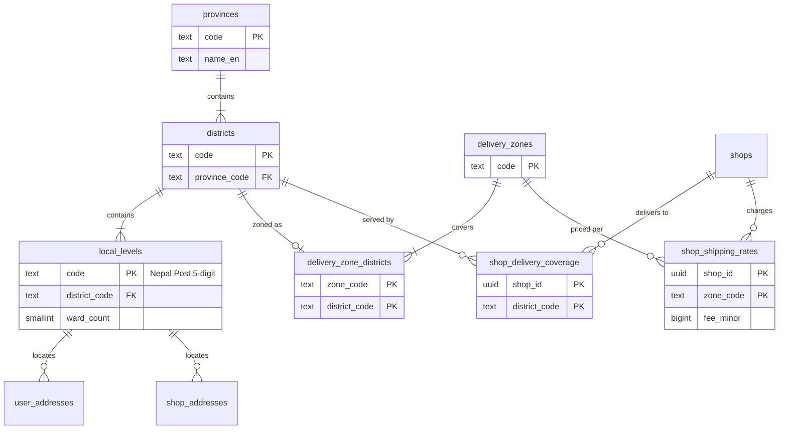
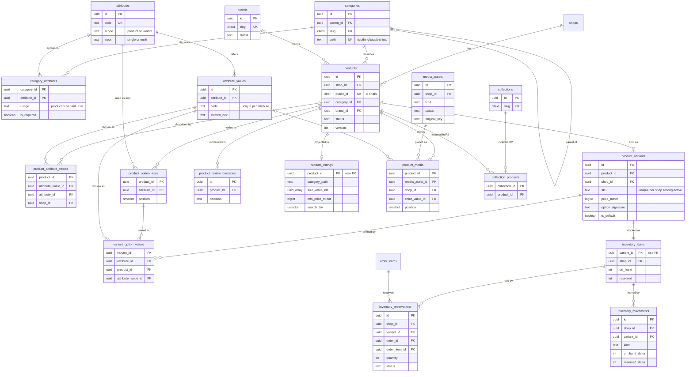
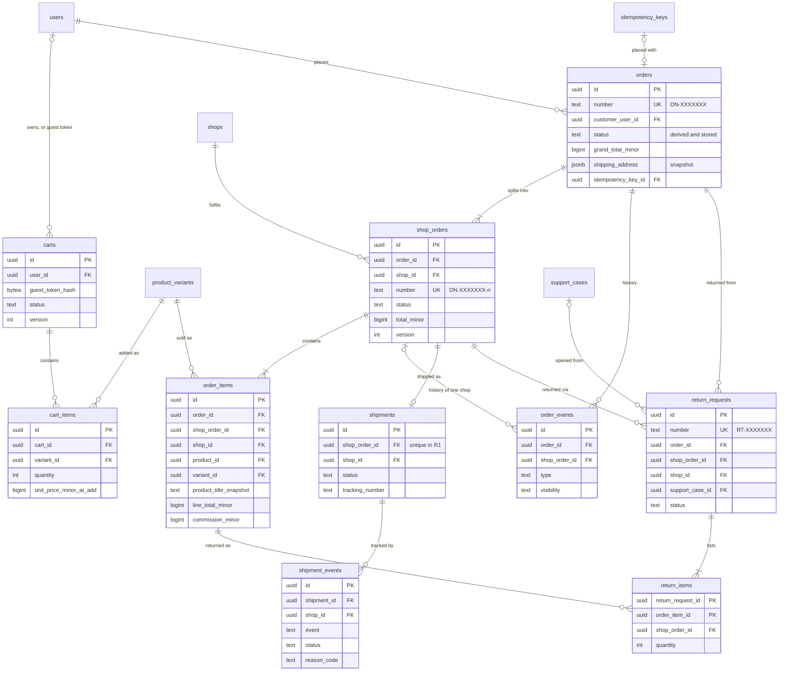
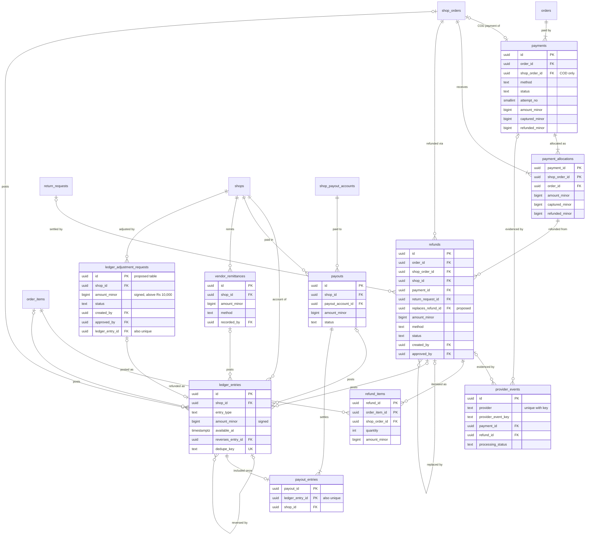
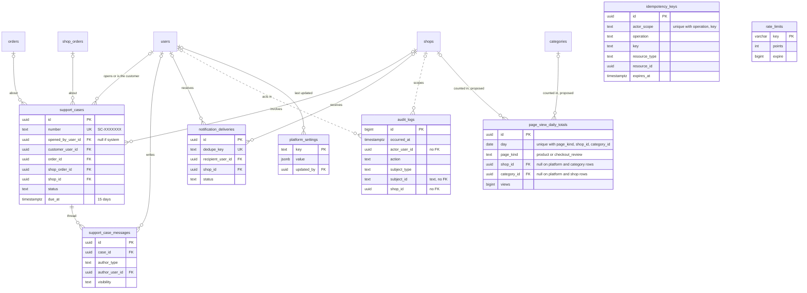
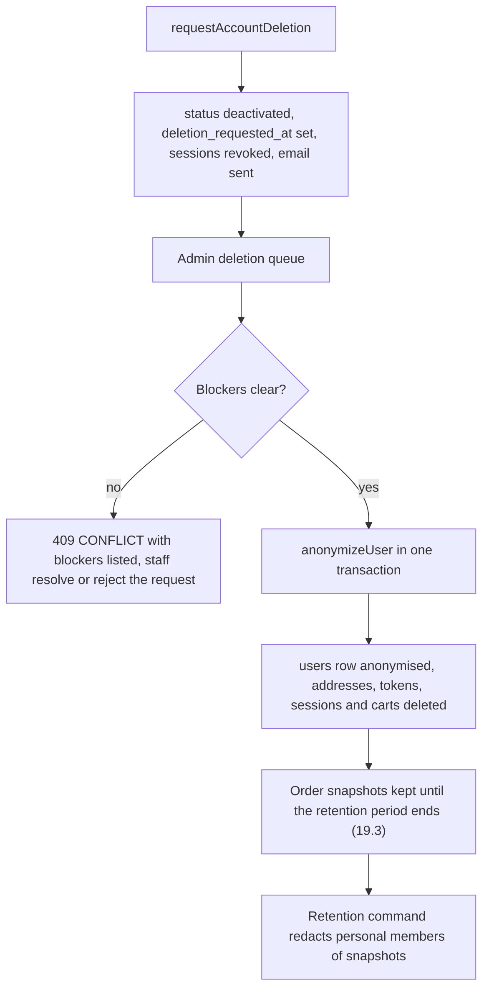
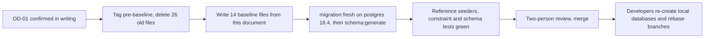

# Domain Model and Data Dictionary

Status: Draft v1 (2026-09-25)

Reviewed: 2026-09-25 · audited 2026-09-30 (audit 2) · consistency review 2026-09-30 to 2026-10-01

This document is the source of truth for DripNepal's persistent data: every table, column, key, constraint and index, the invariants the database enforces, how money is represented and rounded, how personal data is classified and how long it is kept, and how the current exploratory schema is replaced by a reviewed baseline. It is written for the 1–2 developers who will write the migrations, and for the product owner, reviewer and accountant who need to know what the system remembers and why.

Related documents: [00 Context and assumptions](00-context-assumptions-and-questions.md) (repository findings RF-xx, assumptions A-xx), [01 Product requirements](01-product-requirements.md) (FR/NFR IDs), [03 System architecture](03-system-architecture.md) (modules, jobs, database roles), [05 Order, payment and inventory lifecycles](05-order-payment-and-inventory-lifecycles.md) (state machines, checkout algorithm, ledger postings), [06 API design](06-api-design.md) and [openapi.yaml](openapi.yaml) (wire shapes), [07 Security, threat model and permissions](07-security-threat-model-and-permissions.md) (permissions, key management), [09 Code structure](09-code-structure-and-engineering-standards.md), [10 Testing](10-testing-and-quality-gates.md), [11 Deployment and operations](11-deployment-and-operations.md), [12 Roadmap and backlog](12-roadmap-and-backlog.md), [ADRs](adr/README.md) and the [risk and open-decision register](risks-and-open-decisions.md).

**File layout.** This document is split in two files that share one section numbering, so references stay stable: this file holds §1–§4 (scope, conventions, key decisions, ER diagrams) and §16–§21 (invariants, index summary, money, retention, migration, reference data); the table-by-table data dictionary, [04a §5](04a-data-dictionary-tables.md)–[04a §15](04a-data-dictionary-tables.md), is in [04a Data dictionary: tables](04a-data-dictionary-tables.md).

---

## 1. Scope and reading guide

### 1.1 What this document owns and what it does not

| This document owns                                                                                                         | Owned elsewhere (referenced, not repeated)                                                                                       |
| -------------------------------------------------------------------------------------------------------------------------- | -------------------------------------------------------------------------------------------------------------------------------- |
| Table and column definitions, types, nullability, defaults                                                                 | Allowed state transitions and who may trigger them: [05](05-order-payment-and-inventory-lifecycles.md)                           |
| Primary keys, foreign keys and their `ON DELETE` behaviour, unique and CHECK constraints, triggers that enforce invariants | The checkout algorithm (`placeOrder`) and ledger posting rules: [05](05-order-payment-and-inventory-lifecycles.md)               |
| Indexes, each tied to the query it serves                                                                                  | Endpoint paths, request and response shapes, error codes: [06](06-api-design.md), [openapi.yaml](openapi.yaml)                   |
| Invariants and the layers that enforce them                                                                                | Permission slugs, role maps, encryption key management, threat analysis: [07](07-security-threat-model-and-permissions.md)       |
| Money representation, rounding and allocation arithmetic                                                                   | Screens and formatting components: [08](08-ui-ux-and-design-system.md)                                                           |
| Data classification and the retention schedule                                                                             | Migration file style, lint rules, module boundaries in code: [09](09-code-structure-and-engineering-standards.md)                |
| Mapping from the current schema to the new one, and the re-baseline procedure                                              | Test definitions and CI gates: [10](10-testing-and-quality-gates.md); backups and restore: [11](11-deployment-and-operations.md) |
| Reference data proposals (categories, attributes, locations)                                                               | Milestone scheduling: [12](12-roadmap-and-backlog.md)                                                                            |

### 1.2 Evidence labels

The labels are those of the documentation set ([00 §1.2](00-context-assumptions-and-questions.md)):

- **[Confirmed]**: stated by the product owner on 2026-09-25.
- **[Verified-repo]**: checked in the repository, with file and line.
- **[Verified-doc]**: checked in official documentation or package source; the URL is given and was accessed 2026-09-25.
- **[Assumption]**: a proposed default that can be reversed; the assumption register in [00 §6](00-context-assumptions-and-questions.md) records its owner and trigger (A-xx).
- **[Open]**: an open decision (OD-xx) in the [register](risks-and-open-decisions.md).
- **[Verify-external]**: a legal, tax or provider fact that needs authoritative confirmation (VX-xx).

Release tags on every table: **R1** (MVP launch, COD), **R1.1** (first wallet gateway, payouts), **R2**, **R3**. A table tagged R1.1 or R2 is still created in the R0 baseline when its absence would force a disruptive migration later (for example `provider_events`); otherwise it is created in the milestone that needs it.

### 1.3 Sensitivity classes

Every table and every notable column carries one class. Handling rules are in §19.1.

| Class                  | Meaning                                                                                                                                                                                                                                                                              | Examples                                                  |
| ---------------------- | ------------------------------------------------------------------------------------------------------------------------------------------------------------------------------------------------------------------------------------------------------------------------------------ | --------------------------------------------------------- |
| **Public**             | Intended for anyone, including crawlers                                                                                                                                                                                                                                              | Published product titles, shop names, category names      |
| **Internal**           | Not personal and not public; harmless if leaked but not published                                                                                                                                                                                                                    | Moderation notes, platform settings, reference codes      |
| **Personal**           | Identifies or relates to a person (Privacy Act 2075 s2(c) lists address, telephone and email as personal information [Verified-doc <http://giwmscdnone.gov.np/media/app/public/275/posts/1721034328_44.pdf>])                                                                        | Email, full name, order history                           |
| **Sensitive-personal** | Personal data that E-Commerce Directive 2082 s8(1) requires to be stored encrypted (passwords, phone numbers, addresses, dates of birth) [Verified-doc <https://giwmscdnone.gov.np/media/pdf_upload/ecommerce-directives_8errkt4.pdf>; interpretation VX-03], and identity documents | Phone numbers, street and tole, KYC documents             |
| **Financial**          | Money amounts, balances, payout and bank data, tax identifiers                                                                                                                                                                                                                       | Ledger entries, payout accounts, PAN                      |
| **Secret**             | Credentials or material that grants access                                                                                                                                                                                                                                           | Password hashes, token hashes, session data, TOTP secrets |

### 1.4 How to read a table entry

Each table in [04a §5](04a-data-dictionary-tables.md)–[04a §15](04a-data-dictionary-tables.md) has the same parts:

1. **Header line**: owning module, release, shop scope, lifecycle class, sensitivity.
2. **Columns**: name, type, nullability, default, notes. `now()` and `uuidv7()` are database defaults; a Lucid model insert still sends its own `created_at` and `updated_at` and reads back only the primary key (§2.15). "App" in the default column means the value is always supplied by the owning action and has no database default on purpose (for example amounts, which must be computed by the server).
3. **Keys and constraints**: primary key, foreign keys with `ON DELETE` behaviour, unique constraints (partial ones show their predicate), CHECK constraints. Constraint names follow §2.14 so that the error handler can map them to API fields.
4. **Indexes**: each index with the query it serves. An index with no named query does not get created.
5. **Lifecycle and retention**: how rows are created, changed and removed, with the retention rule from §19.3.

Lifecycle classes used in the headers:

| Class         | Meaning                                                                  | Deletion                                                        |
| ------------- | ------------------------------------------------------------------------ | --------------------------------------------------------------- |
| Reference     | Seeded platform data (locations, categories, attributes)                 | Never deleted; deactivated with `is_active = false`             |
| Entity        | Has a lifecycle status (users, shops, products)                          | Never hard-deleted; ends in a terminal status                   |
| Configuration | Replaceable settings of an entity (shipping rates, category assignments) | Hard delete allowed; the change is audited                      |
| Record        | Statutory or financial history (orders, ledger, audit)                   | Never deleted inside the retention period; many are append-only |
| Ephemeral     | Short-lived technical state (sessions, tokens, idempotency keys, carts)  | Purged by job after expiry                                      |
| Derived       | Rebuildable projection (listing read model)                              | Rebuilt at will                                                 |

---

## 2. Modelling conventions

These conventions implement [ADR-0007](adr/0007-money-integer-minor-units.md), [ADR-0008](adr/0008-inventory-reservations-and-ledger.md), [ADR-0009](adr/0009-multi-shop-orders-and-vendor-ledger.md) and [ADR-0011](adr/0011-schema-rebaseline-before-production.md). Every table in this document follows them unless its entry says otherwise and why.

### 2.1 Identifiers

**Primary keys.** `id uuid PRIMARY KEY DEFAULT uuidv7()`. PostgreSQL 18 ships `uuidv7([shift interval]) → uuid`, which "generates a version 7 (time-ordered) UUID. The timestamp is computed using UNIX timestamp with millisecond precision + sub-millisecond timestamp + random" [Verified-doc <https://www.postgresql.org/docs/18/functions-uuid.html>]. Time-ordered keys insert at the right-hand edge of the B-tree, which keeps the high-insert tables (`orders`, `order_items`, `ledger_entries`, `inventory_movements`, `order_events`) compact, and they make `id` a natural tie-breaker for cursor pagination (sort key, then `id`, per [06](06-api-design.md)).

- M0 verification: run `SELECT uuidv7();` on the provisioned managed cluster and in CI's `postgres:18.4` image. The result is recorded with the M0 spike T-ARCH-004 (proposed) ([10 §6.2](10-testing-and-quality-gates.md#62-architecture-schema-and-repository-t-arch), [12 §4.3](12-roadmap-and-backlog.md#43-exit-criteria) item 7). The function is built in, so no extension is needed. If the managed provider ever runs an older major version, the fallback is `gen_random_uuid()`, built into PostgreSQL since version 13 (the repository's `pgcrypto` migration is therefore unnecessary, verified facts of [research: repository-audit](research/repository-audit.md) [Verified-repo `database/migrations/1780064033094_create_enable_pgcryptos_table.ts:7`]). Because only the baseline exists at that point, the fallback is a search-and-replace in the baseline files.
- Tradeoff: a v7 UUID reveals its creation time to the millisecond (`uuid_extract_timestamp()` returns it [Verified-doc same page]). Internal IDs appear in API URLs for seller and admin resources, where creation times are shown anyway, so this is accepted. Identifiers whose creation time or sequence would leak business volume use separate random values (below). Secrets never use UUIDs of any version: tokens are 32 random bytes, and `users.security_stamp` uses `gen_random_uuid()` (random v4).
- Exceptions: reference tables keyed by a stable code (`provinces`, `districts`, `local_levels`, `delivery_zones`, `shop_categories`, `platform_settings`) use the code as the primary key, because the code is what seeders, URLs and snapshots refer to and it never changes. `audit_logs.id` is `bigint GENERATED ALWAYS AS IDENTITY` because the table is append-only, high-volume and read in insertion order. The join tables listed in §2.15 have composite primary keys, among them `slug_redirects`, keyed by its natural key `(entity_type, old_slug)`. The 1:1 extension tables are keyed by their parent's id: `inventory_items.variant_id`, `platform_staff.user_id` and `product_listings.product_id`. The session and limiter tables keep the primary keys their packages generate ([04a §5.3](04a-data-dictionary-tables.md), [04a §15.4](04a-data-dictionary-tables.md)).

**Human-facing identifiers.** Customers, vendors and support staff quote these on the phone, so they are short, unambiguous and not sequential:

| Identifier               | Format                                                                                    | Space              | Generation                                                                                      |
| ------------------------ | ----------------------------------------------------------------------------------------- | ------------------ | ----------------------------------------------------------------------------------------------- |
| `orders.number`          | `DN-` + 7 Crockford base32 characters (alphabet `0-9 A-H J K M N P-T V-Z`, no I, L, O, U) | 32^7 ≈ 3.4 × 10^10 | Random; insert; on unique violation (SQLSTATE 23505 on `orders_number_key`) retry up to 3 times |
| `shop_orders.number`     | order number + `-` + position (1, 2, …)                                                   | —                  | Position = rank of the shop within the order by cart grouping order                             |
| `products.public_id`     | 8 Crockford base32 characters                                                             | 32^8 ≈ 1.1 × 10^12 | Random, retry on collision                                                                      |
| `return_requests.number` | `RT-` + 7 Crockford base32                                                                | as orders          | as orders                                                                                       |
| `support_cases.number`   | `SC-` + 7 Crockford base32                                                                | as orders          | as orders                                                                                       |

Why random: a sequential order number lets anyone who places two orders a week apart compute the platform's order volume, and invites guessing of `/account/orders/{orderNumber}` (still authorized, but noisy). At the 10× design load of A-02 (20,000 orders a month) five years produce about 1.2 million orders; the expected number of collision events over that period is about n²/2N ≈ 21, each absorbed by one retry. Crockford base32 avoids the I/1, L/1 and O/0 confusions that cause support mistakes when numbers are read aloud.

### 2.2 Time

- Every timestamp is `timestamptz`, stored in UTC. The server runs with `TZ=UTC` [Verified-repo `.env.example:2`]. Knex's `table.timestamp()` already creates `timestamptz` on PostgreSQL (verified facts of [research: repository-audit](research/repository-audit.md)), but the baseline writes the type explicitly.
- Display, business-day boundaries and SLA clocks use `Asia/Kathmandu`, UTC+05:45 since 1986 with no daylight saving [Verified-doc <https://raw.githubusercontent.com/eggert/tz/main/asia>]. "Orders placed today" in an admin report is `placed_at >= :start_of_day_kathmandu AND placed_at < :next_day_kathmandu`, computed in Luxon with `zone: 'Asia/Kathmandu'`, never with a whole-hour offset.
- `created_at timestamptz NOT NULL DEFAULT now()` on every table. Where rows change, `updated_at timestamptz NOT NULL DEFAULT now()` is maintained by a trigger, because the conditional updates that protect stock and state (`UPDATE … WHERE status = :from`) are written with the query builder and bypass Lucid's `autoUpdate`. Audit finding A1-10 showed the opposite problem today: `created_at` has no database default, so any insert that bypasses Lucid fails [Verified-repo `database/migrations/1761885935168_create_users_table.ts:35`]. A Lucid model insert still sends `created_at` and `updated_at` from the application clock, so the default serves query-builder inserts; no CHECK may compare such a column with a database-clock default (§2.15).

```sql
CREATE OR REPLACE FUNCTION set_updated_at() RETURNS trigger LANGUAGE plpgsql AS $$
BEGIN
  NEW.updated_at := now();
  RETURN NEW;
END $$;

-- one per table that has updated_at, for example:
CREATE TRIGGER products_set_updated_at BEFORE UPDATE ON products
  FOR EACH ROW EXECUTE FUNCTION set_updated_at();
```

- Bikram Sambat dates are a display concern (R2) and a fiscal-year key for future invoicing (OD-26). No BS date is stored as a column in R1; Node 24's ICU has no Nepali calendar [Verified-doc per [00 §4.5](00-context-assumptions-and-questions.md)], so a lookup-table library is needed when BS display arrives.
- Periods are half-open `timestamptz` ranges (`period_start` inclusive, `period_end` exclusive), never `date` pairs, so that a Kathmandu midnight boundary is exact.

### 2.3 Money

Summary of [ADR-0007](adr/0007-money-integer-minor-units.md); the full rules and worked examples are in §18.

- Every amount is `<name>_minor bigint` in paisa, next to `currency char(3) NOT NULL DEFAULT 'NPR' CHECK (currency = 'NPR')`. Tables whose amounts all share one currency carry one `currency` column.
- Non-negativity is a CHECK on every amount except signed ledger amounts. Rates are integer basis points (`*_bp int`, 10000 = 100%).
- No `decimal`, `numeric`, `real` or `double precision` column exists anywhere. Lucid's schema generator maps `decimal` to a TypeScript `string` [Verified-doc Lucid 22.4.2 `build/src/orm/schema_generator/rules.js`], and the current UI multiplies such values as floats (RF-16).

### 2.4 Status columns and other enumerations

- Status and other closed vocabularies are `text NOT NULL` with a named CHECK listing the allowed values, for example `CONSTRAINT products_status_check CHECK (status IN ('draft','pending_review','published','unpublished','rejected','archived','blocked'))`.
- Why not PostgreSQL enum types: a value can be added to an enum but not removed without swapping the type, and changes interact badly with transactions. A CHECK can be replaced in expand/contract fashion: add the new constraint `NOT VALID` and drop the old one in one migration, then `VALIDATE CONSTRAINT` in a separate migration. A `NOT VALID` constraint and its `VALIDATE` are never in the same migration file (§20.2.4).
- The TypeScript source of each vocabulary is one `as const` array in the owning module's `domain/` folder (for example `app/modules/catalog/domain/product_status.ts`). Migrations inline the literal values and never import application constants, which fixes RF-41 (A1-09: migrations importing `#constants/shop_status` change meaning when the constant changes).
- Test T-ARCH-011 (proposed) reads `pg_constraint` and fails if a CHECK value list differs from the TypeScript array, so the two cannot drift again as they have today (RF-23: `pending_verification` is the users default but absent from `UserStatus` [Verified-repo `app/constants/user_status.ts:1-6`]).
- Which transitions are allowed between values is owned by [05](05-order-payment-and-inventory-lifecycles.md). This document only fixes the value sets and the columns that must be set in each state (for example `cancelled_at` when a shop order is cancelled).

### 2.5 Tenant isolation with composite foreign keys

The most expensive class of marketplace bug is a row of shop A that points at a row of shop B: an order line attributed to the wrong vendor, a staff assignment that grants another shop's role (MISSED-identity-authz in [research: repository-audit](research/repository-audit.md)), or media from one shop shown on another's product (A1-02). Authorization code prevents most of these, but one missed `where('shop_id', …)` in a new action would be enough. DripNepal therefore makes such rows impossible to store.

**The pattern.**

1. Every shop-scoped table has `shop_id uuid NOT NULL`.
2. Every shop-scoped parent that other shop-scoped rows reference declares `UNIQUE (id, shop_id)`. This looks redundant next to the primary key, but PostgreSQL requires it: "A foreign key must reference columns that either are a primary key or form a unique constraint, or are columns from a non-partial unique index" [Verified-doc <https://www.postgresql.org/docs/18/ddl-constraints.html>].
3. Every reference from one shop-scoped row to another is a composite foreign key `(child_ref_id, shop_id) REFERENCES parent (id, shop_id)`.
4. The child's `shop_id` is never taken from request input. The action reads it from the parent row it has just loaded and locked (the same rule appears in [05 §3.1](05-order-payment-and-inventory-lifecycles.md)).

**Worked example: product → variant → stock → order line.**

```sql
CREATE TABLE products (
  id        uuid PRIMARY KEY DEFAULT uuidv7(),
  shop_id   uuid NOT NULL REFERENCES shops (id) ON DELETE RESTRICT,
  -- other columns in 04a §7.6
  CONSTRAINT products_id_shop_id_key UNIQUE (id, shop_id)
);

CREATE TABLE product_variants (
  id         uuid PRIMARY KEY DEFAULT uuidv7(),
  shop_id    uuid NOT NULL,
  product_id uuid NOT NULL,
  -- other columns in 04a §7.9
  CONSTRAINT product_variants_id_shop_id_key    UNIQUE (id, shop_id),
  CONSTRAINT product_variants_id_product_id_key UNIQUE (id, product_id),
  CONSTRAINT product_variants_product_fkey FOREIGN KEY (product_id, shop_id)
    REFERENCES products (id, shop_id) ON DELETE RESTRICT
);

CREATE TABLE inventory_items (
  variant_id uuid PRIMARY KEY,
  shop_id    uuid NOT NULL,
  -- other columns in 04a §8.1
  CONSTRAINT inventory_items_variant_id_shop_id_key UNIQUE (variant_id, shop_id),
  CONSTRAINT inventory_items_variant_fkey FOREIGN KEY (variant_id, shop_id)
    REFERENCES product_variants (id, shop_id) ON DELETE RESTRICT
);

CREATE TABLE order_items (
  id            uuid PRIMARY KEY DEFAULT uuidv7(),
  order_id      uuid NOT NULL,
  shop_order_id uuid NOT NULL,
  shop_id       uuid NOT NULL,
  product_id    uuid NOT NULL,
  variant_id    uuid NOT NULL,
  -- other columns in 04a §11.3
  CONSTRAINT order_items_shop_order_fkey FOREIGN KEY (shop_order_id, shop_id)
    REFERENCES shop_orders (id, shop_id) ON DELETE RESTRICT,
  CONSTRAINT order_items_shop_order_order_fkey FOREIGN KEY (shop_order_id, order_id)
    REFERENCES shop_orders (id, order_id) ON DELETE RESTRICT,
  CONSTRAINT order_items_variant_fkey FOREIGN KEY (variant_id, shop_id)
    REFERENCES product_variants (id, shop_id) ON DELETE RESTRICT,
  CONSTRAINT order_items_variant_product_fkey FOREIGN KEY (variant_id, product_id)
    REFERENCES product_variants (id, product_id) ON DELETE RESTRICT
);
```

What the database now refuses, with no application code involved:

```sql
-- Shop order SO_A belongs to shop A. Variant V_B belongs to shop B.
INSERT INTO order_items (order_id, shop_order_id, shop_id, product_id, variant_id /* … */)
VALUES (:order, :so_a, :shop_a, :product_b, :v_b /* … */);
-- ERROR:  insert or update on table "order_items" violates foreign key constraint "order_items_variant_fkey"
-- DETAIL: Key (variant_id, shop_id)=(<v_b>, <shop_a>) is not present in table "product_variants".
```

If the bug instead copies shop B's id into `shop_id`, `order_items_shop_order_fkey` fails, because `(SO_A, shop B)` does not exist in `shop_orders`. Either way the line cannot be stored against the wrong vendor.

**The same technique for other ownership chains.** The pattern is "carry the owner key and reference the pair", not only for shops:

| Chain                                                                | Constraint                                                                                                                                              |
| -------------------------------------------------------------------- | ------------------------------------------------------------------------------------------------------------------------------------------------------- |
| Order line and shop order in the same order                          | `(shop_order_id, order_id) → shop_orders (id, order_id)`                                                                                                |
| Variant belongs to the product named on the line                     | `(variant_id, product_id) → product_variants (id, product_id)`                                                                                          |
| Attribute value belongs to the attribute                             | `(attribute_value_id, attribute_id) → attribute_values (id, attribute_id)`                                                                              |
| Option value is one of the product's axes                            | `(product_id, attribute_id) → product_option_axes (product_id, attribute_id)`                                                                           |
| District lies in the stated province                                 | `(district_code, province_code) → districts (code, province_code)`                                                                                      |
| Local level lies in the stated district                              | `(local_level_code, district_code) → local_levels (code, district_code)`                                                                                |
| Payment allocation targets a shop order of the paid order            | `(shop_order_id, order_id) → shop_orders (id, order_id)` and `(payment_id, order_id) → payments (id, order_id)`                                         |
| Payout includes only its own shop's ledger entries                   | `(ledger_entry_id, shop_id) → ledger_entries (id, shop_id)`                                                                                             |
| A return, its order and its support case share one customer (INV-03) | `(order_id, requested_by_user_id) → orders (id, customer_user_id)` and `(support_case_id, requested_by_user_id) → support_cases (id, customer_user_id)` |

**Nullable composite references.** A nullable reference such as `shops.logo_media_id` is declared `FOREIGN KEY (logo_media_id, id) REFERENCES media_assets (id, shop_id)`. With the default `MATCH SIMPLE`, "a referencing row need not satisfy the foreign key constraint if any of its referencing columns are null" [Verified-doc same page], so a shop without a logo is valid while a logo from another shop is rejected. `MATCH FULL` is never used for these, because it would reject exactly that valid case.

**Cost and tradeoff.** One extra unique index per parent table and a wider child row (one more uuid). Composite FK checks cost the same index probe as simple ones. `ON DELETE SET NULL` on a composite key would null the `shop_id` too, unless the column list form `SET NULL (col)` is used [Verified-doc same page]; DripNepal never needs it because shop-scoped rows are not deleted.

**Verification.** T-SEC-001 proves the API returns 404 across shops; T-ORD-104 and T-MED-101 (proposed) insert crafted cross-shop rows directly with the runtime role and assert SQLSTATE 23503.

### 2.6 Referential actions and what may be deleted

- Every foreign key states its action explicitly. The default is `ON DELETE RESTRICT`: deleting a referenced row fails immediately. Primary keys are never updated, so `ON UPDATE` is always the default `NO ACTION`.
- **No `ON DELETE CASCADE` from anything into orders, order items, payments, refunds, ledger, audit or any other Record table.** Today every foreign key except `shops.owner_id` cascades, so deleting a saved address would delete the orders shipped to it (RF-06, IAM-07, F8 [Verified-repo `database/migrations/1780074257570_create_orders_table.ts:11,14`]).
- `ON DELETE CASCADE` is allowed only for pure children that carry no history, listed exhaustively:

| Child → parent                             | Why cascade is safe                                                                                                                                                                   |
| ------------------------------------------ | ------------------------------------------------------------------------------------------------------------------------------------------------------------------------------------- |
| `cart_items → carts`                       | A cart is ephemeral; its lines mean nothing without it                                                                                                                                |
| `variant_option_values → product_variants` | Only variants that were never stocked or ordered (no inventory movement, no order line; the product may be in any status) can be deleted at all (their other references are RESTRICT) |
| `product_listings → products`              | Derived read model                                                                                                                                                                    |

- `ON DELETE SET NULL` is used once: `orders.idempotency_key_id → idempotency_keys`, because keys are purged after 72 hours while orders live for years.
- Hard deletes are allowed only for Ephemeral, Configuration and Derived rows, plus one `slug_redirects` case: `carts`, `cart_items`, `sessions`, `user_tokens`, `idempotency_keys`, `rate_limits`, archived `user_addresses` and `shop_addresses` after their grace period and all of a user's `user_addresses` at anonymisation (`anonymizeUser`, §19.2), `product_variants` with no inventory movement and no order line (of a product in any status) with their `(0, 0)` `inventory_items` row ([04a §7.9](04a-data-dictionary-tables.md)), `payout_entries` of a payout still in `draft` (guarded by `payout_entries_guard`, [04a §13.3](04a-data-dictionary-tables.md)), `product_media`, `product_attribute_values`, `product_option_axes`, `shop_category_assignments`, `shop_delivery_coverage`, `shop_shipping_rates`, `product_listings` rows (Derived; deleted by `catalog.refresh_listing` when a product stops being visible, and by the cascade above), a `slug_redirects` row when its entity is renamed back to that slug ([04a §6.10](04a-data-dictionary-tables.md)), and pg-boss jobs (removed by pg-boss). Every other table is never hard-deleted by application code. The one exception is the retention purge of §19.3 (the `platform.retention_purge` job and the `data:retention` maintenance command), which removes rows only after their retention period, for example old `shop_invitations`, or the addresses and configuration rows of an application that was never approved.
- Test T-ARCH-011 (proposed) reads `pg_constraint.confdeltype` and fails if the set of cascading foreign keys differs from the table above.

### 2.7 Soft delete, archive and lifecycle columns

The repository has `deleted_at` columns on users, shops and products that nothing enforces, and unique constraints that ignore them (RF-24, A1-06). The baseline removes generic `deleted_at` and uses explicit lifecycle state instead:

| Situation                                                | Mechanism                                                                                            | Example                                                                                                                                                     |
| -------------------------------------------------------- | ---------------------------------------------------------------------------------------------------- | ----------------------------------------------------------------------------------------------------------------------------------------------------------- |
| The entity has a lifecycle                               | A terminal or hidden status value                                                                    | `products.status = 'archived'`, `shops.status = 'closed'`, `users.status = 'anonymized'`, `product_variants.status = 'archived'`                            |
| A configuration row is withdrawn but history must remain | A dated column named for what happened                                                               | `user_addresses.archived_at`, `shop_payout_accounts.replaced_at`, `shop_memberships.removed_at`, `platform_staff.revoked_at`, `shop_invitations.revoked_at` |
| A natural key must be reusable after withdrawal          | Partial unique index whose predicate excludes withdrawn rows                                         | `UNIQUE (shop_id, sku) WHERE status = 'active'`                                                                                                             |
| Default filtering in code                                | A named query function in the module's `queries.ts` (`activeProductsForShop`) or a Lucid query scope | Dashboards show archived rows only behind an explicit filter                                                                                                |

A status value participates in CHECK constraints and partial indexes and says why a row is hidden; a bare `deleted_at` does neither.

### 2.8 Text, normalisation and lengths

- Strings are `text` with a named length CHECK rather than `varchar(n)`, for example `products_title_check CHECK (char_length(title) BETWEEN 3 AND 120)` (AC-FR-CAT-003-1). Knex's `table.string()` silently creates `varchar(255)`, and the length rules then disagree with validators (RF-22, A1-04: a 101-character email passes Vine and fails the 100-character column with a 500). The rule lives once in the database and is mirrored by the Vine validator; constraint violations that still reach the database (23505, 23514) are mapped to 422 field errors by constraint name when the constraint is on the allowlist (§2.14, §16.5). A 22001 (value too long) names no constraint, so every 22001 maps to 422 `VALIDATION_FAILED` with one `errors[]` item whose `field` is null, logged as validator drift (tech lead decision, 2026-10-01; [09 §5.4](09-code-structure-and-engineering-standards.md#54-the-exception-handler), [06 §5.3](06-api-design.md#53-domain-errors-to-http)).
- **Case-insensitive identifiers** (`users.email`, `shops.slug`, `categories.slug`, `brands.slug`, `slug_redirects.old_slug`, `shop_invitations.email`, and the copies `product_listings.shop_slug` and `product_listings.brand_slug`) use `citext`. It is a trusted extension that non-superusers with `CREATE` privilege on the database can install, and it compares "by converting each string to lower case (as though lower were called)" [Verified-doc <https://www.postgresql.org/docs/18/citext.html>]. DigitalOcean Managed PostgreSQL 18 lists `citext` and `pg_trgm` as supported extensions [Verified-doc <https://docs.digitalocean.com/products/databases/postgresql/details/supported-extensions/>]. The PostgreSQL manual suggests nondeterministic collations as a more Unicode-correct alternative; that advantage does not apply here because the CHECKs below restrict these columns to ASCII, and `citext` keeps `LIKE` and ordinary indexes simple. The values are also stored already lower-cased and trimmed, so `citext` is a second guard, not the only one.
- **Slugs.** Shop slugs match `^[a-z0-9](?:[a-z0-9-]{1,38}[a-z0-9])$` (3–40 characters, no leading or trailing hyphen, per AC-FR-SHOP-001-3 of [01](01-product-requirements.md)) and are checked against a reserved-word list in code (`admin`, `api`, `seller`, `shops`, `account`, `login`, `signup`, `checkout`, `cart`, `p`, `c`, `search`, `sell`, `health`, …), which closes IAM-16. Category and brand slugs use the same pattern. Product slugs are cosmetic, generated with `slugify` from the title, `^[a-z0-9]+(?:-[a-z0-9]+)*$`, at most 80 characters.
- **Names and free text** are trimmed and normalised to Unicode NFC in the validator (`value.normalize('NFC')`). Devanagari text typed on different keyboards can arrive in different code-point sequences; without NFC, two identical-looking product titles or shop names compare unequal.
- **Phone numbers** are stored in E.164. Consumer mobiles must match `^\+9779[678]\d{8}$`, the structure of the NTA National Numbering Allocation Plan (system code 96/97/98, one operator digit, seven subscriber digits) [Verified-doc <https://www.nta.gov.np/uploads/contents/National%20Numbering%20Allocation%20Plan.pdf>]. Validation is by structure, not by operator prefix list, because allocations change (VX-11). Shop contact numbers may also be landlines (eight-digit national numbers), so they match `^\+977(9[678]\d{8}|\d{8})$`. Input is accepted with or without `+977` and a leading `0` and normalised before storage (fixes RF-29, whose rule rejects valid numbers).

### 2.9 Sensitive-column encryption and blind indexes

**What is encrypted.** Columns ending in `_enc` hold ciphertext produced by the application:

| Table                  | Encrypted columns                                                                                   |
| ---------------------- | --------------------------------------------------------------------------------------------------- |
| `users`                | `phone_enc`, `mfa_totp_secret_enc`                                                                  |
| `user_addresses`       | `recipient_name_enc`, `recipient_phone_enc`, `area_tole_enc`, `street_landmark_enc`                 |
| `shop_addresses`       | `contact_phone_enc`, `area_tole_enc`, `street_landmark_enc`                                         |
| `shops`                | `grievance_contact_phone_enc`                                                                       |
| `shop_payout_accounts` | `account_number_enc`                                                                                |
| `orders`               | the `*_enc` members of the `shipping_address` snapshot ([04a §11.1](04a-data-dictionary-tables.md)) |
| `refunds`              | `recipient_details_enc`                                                                             |

**Why at application level.** E-Commerce Directive 2082 s8(1) requires platforms to store users' passwords, phone numbers, addresses, dates of birth and other sensitive details used for authentication "in encrypted form" [Verified-doc Directive PDF above; how strictly this applies to delivery addresses is VX-03]. Disk encryption by the managed provider protects only against stolen disks. The threats that matter for a small team are SQL-level: a leaked `pg_dump` or backup (the 7-day PITR plus the independent backups of [11](11-deployment-and-operations.md)), an analytics copy, an injection that reads rows, and anyone with `psql` access during an incident. With application-level encryption, all of these see ciphertext; only the running application, which holds the key, sees plaintext. `pgcrypto` was rejected because the key would travel inside SQL statements and could land in server logs and `pg_stat_statements`.

**Format.** AES-256-GCM with a random 12-byte IV per value, stored as text:
`v1.<key_id>.<base64url(iv)>.<base64url(ciphertext)>.<base64url(tag)>`. The additional authenticated data is `<table>.<column>`, so a ciphertext copied into a different column fails to decrypt. Keys come from `DATA_ENCRYPTION_KEYS`, a ring of key ID → 32-byte key whose environment format is set by [09 §6.1](09-code-structure-and-engineering-standards.md#61-variable-catalogue) (proposed there as `<id>:<base64 of 32 bytes>[,…]`), and `DATA_ENCRYPTION_ACTIVE_KEY_ID`; they are never `APP_KEY`, which signs cookies and must be rotatable independently. Key IDs match `[A-Za-z0-9_-]{1,32}`, the key-ID part of the ciphertext CHECK (INV-25), so they never contain `:` or `,`. Rotation adds a new key ID, makes it active, and runs a batched, idempotent `node ace data:reencrypt` command. The retired key leaves the hosts once a verification query finds no rows using it, and stays in the vault until the backup window has passed (35 days for the dumps, [11 §14.4](11-deployment-and-operations.md#144-secret-rotation-calendar)), because older dumps still hold ciphertext under it. Key custody and rotation cadence are owned by [07 §5.5](07-security-threat-model-and-permissions.md#55-encryption).

**Blind indexes.** Encrypted values cannot be compared in SQL, so equality lookups use a keyed hash: `phone_hash = HMAC-SHA256(BLIND_INDEX_KEY, 'phone:' || e164)` stored as `bytea` of 32 bytes. It supports "which accounts use this phone" for COD fraud review and R2 OTP login, without decrypting any row. Tradeoffs, stated plainly: blind indexes support only exact equality (no prefix search); and because Nepali mobile numbers are only about 3 × 10^8 possibilities, anyone holding both a dump and `BLIND_INDEX_KEY` could brute-force them. That is why the key is separate from the encryption keys, lives only in the application environment and is never stored in the database.

**Masking columns.** `*_last4` columns (`phone_last4`, `recipient_phone_last4`, `account_number_last4`) hold the last four digits in plaintext so that lists and support conversations can show "•••• 4567" without decrypting.

**What is not encrypted and why.** `users.email` is the login identifier and must be unique and indexable; it is protected by access control and log redaction (whether e-mail addresses fall under s8(1) is part of VX-03). `full_name` is shown on most screens and is Personal, not Sensitive-personal. Province, district, local level and ward codes stay plaintext because delivery-zone lookup, coverage checks and reports need them, and on their own they do not identify a household. Shop contact email and phone are public business contacts.

**How code uses it.** Models hold ciphertext strings. Decryption is an explicit call (`fieldCrypto.decrypt(row.phoneEnc, 'users.phone_enc')`) made only in transformers that are allowed to reveal the value (for example the vendor packing view within the visibility window of A-18). A Lucid `consume` hook was rejected because it would decrypt on every load and let plaintext reach logs and generic serializers by accident.

**Verification.** T-IAM-103 (proposed): after signup, the raw `users` row contains no substring of the phone number; lookup by blind index finds the user; after key rotation, old and new rows decrypt.

### 2.10 Optimistic concurrency

`version int NOT NULL DEFAULT 1` exists on `shops`, `products`, `product_variants`, `inventory_items`, `carts`, `shop_orders`, `shipments`, `payments`, `refunds`, `payouts`, `return_requests`, `support_cases` and the proposed `ledger_adjustment_requests` ([04a §13.5](04a-data-dictionary-tables.md#135-ledger_adjustment_requests-proposed)). Writers use `UPDATE … SET version = version + 1 WHERE id = :id AND version = :expected`; zero rows means someone else changed the row, and the API answers 412 `VERSION_CONFLICT` for `If-Match` requests ([06](06-api-design.md)). State transitions additionally compare-and-set the status (`WHERE status = :from`), as specified in [05](05-order-payment-and-inventory-lifecycles.md).

### 2.11 JSONB

`jsonb` is used only for: immutable snapshots (`orders.shipping_address`), redacted provider payloads (`provider_events.payload`), media derivative keys, event and audit detail (`order_events.data`, `audit_logs.changes`), stored API responses (`idempotency_keys.response_body`) and setting values (`platform_settings.value`). It is never used for anything that is filtered, joined, constrained or summed (prices, statuses, quantities, shop ids). Each `jsonb` column has `CHECK (jsonb_typeof(col) = 'object')` and a documented shape (a TypeScript type plus a Vine schema in the owning module). Lucid generates `any` for `jsonb` [Verified-doc Lucid rules.js], so code reads these columns through a typed parser, never directly.

### 2.12 Append-only tables

These tables only ever receive inserts: `audit_logs`, `ledger_entries`, `inventory_movements`, `order_events`, `shipment_events`, `shop_review_decisions`, `product_review_decisions`, `shop_agreements`, `support_case_messages`. [03 §3.4](03-system-architecture.md) names the first four; this document adds the other five because they are decision or consent records whose value depends on never changing.

Two layers make "append-only" a database guarantee rather than a convention:

```sql
-- Layer 1: the runtime role cannot change rows (roles are defined in 03 §3.4 and 07)
REVOKE UPDATE, DELETE, TRUNCATE ON ledger_entries FROM dripnepal_app;

-- Layer 2: even the owner role is stopped by a trigger (catches psql mistakes and migrations)
CREATE OR REPLACE FUNCTION forbid_mutation() RETURNS trigger LANGUAGE plpgsql AS $$
BEGIN
  -- Retention exemption (proposed, 07 §4.10): only the migrator, only inside a data:retention batch
  IF TG_LEVEL = 'ROW' AND current_user = 'dripnepal_migrator'
     AND current_setting('dripnepal.retention_purge', true) = 'on' THEN
    IF TG_OP = 'DELETE' THEN
      RETURN OLD;
    ELSIF TG_OP = 'UPDATE' AND TG_TABLE_NAME = 'support_case_messages'
          AND (to_jsonb(NEW) - 'body') = (to_jsonb(OLD) - 'body') THEN
      RETURN NEW;   -- the complaint redaction of §19.3 changes only body
    END IF;
  END IF;
  RAISE EXCEPTION 'table % is append-only', TG_TABLE_NAME USING ERRCODE = 'P0001';
END $$;

CREATE TRIGGER ledger_entries_no_update_delete BEFORE UPDATE OR DELETE ON ledger_entries
  FOR EACH ROW EXECUTE FUNCTION forbid_mutation();
CREATE TRIGGER ledger_entries_no_truncate BEFORE TRUNCATE ON ledger_entries
  FOR EACH STATEMENT EXECUTE FUNCTION forbid_mutation();
```

Corrections are new rows (a reversal ledger entry, a new review decision). The only changes after insert are made by the retention command after the statutory period (§19.3): `node ace data:retention` under the migrator role deletes rows, and on `support_case_messages` it redacts `body` (the Complaints row of §19.3). It never runs `ALTER TABLE … DISABLE TRIGGER`, which takes a `SHARE ROW EXCLUSIVE` lock and would block every insert into the table, for example `audit_logs` or `ledger_entries`, until the purge ends [Verified-doc <https://www.postgresql.org/docs/18/sql-altertable.html>]. Instead it passes through the retention exemption of `forbid_mutation()` above (proposed, per [07 §4.10](07-security-threat-model-and-permissions.md#410-database-roles-and-grants), in place of disabling the trigger; it still needs the product owner's approval, OD-51): a row `DELETE`, and on `support_case_messages` an `UPDATE` that changes only `body`, pass only when `current_user = 'dripnepal_migrator'` and `current_setting('dripnepal.retention_purge', true) = 'on'`, which the command sets with `SET LOCAL` in each short batch transaction. Every other `UPDATE` and every `TRUNCATE` stay forbidden for every role, and `dripnepal_app` is still refused by its missing `UPDATE` and `DELETE` privileges when it sets the value (tried on PostgreSQL 18.6 with the function above). The command writes an `audit_logs` row describing what it removed. Test T-ARCH-012 (proposed) attempts `UPDATE` and `DELETE` on each table with both roles and expects failure, except a migrator `DELETE`, or the `support_case_messages.body` redaction, while `dripnepal.retention_purge` is `on`; any other `UPDATE` fails even with the setting on, and `dripnepal_app` can neither delete nor redact with it on.

### 2.13 Snapshot versus reference

A row that records a past fact copies the facts it depends on instead of joining to mutable rows at read time: order lines copy title, variant label, SKU, image, category path, prices and commission; shop orders copy the shop name; orders copy the delivery address and customer email. The reference (`product_id`, `variant_id`, `shop_id`) is kept alongside for navigation and reporting, with `ON DELETE RESTRICT`. The snapshot is what receipts, disputes and the ledger use. This is how "history stays understandable after catalog changes" (INV-09) is met.

### 2.14 Naming

| Item                | Rule                                                            | Example                                   |
| ------------------- | --------------------------------------------------------------- | ----------------------------------------- |
| Tables              | Plural `snake_case`                                             | `shop_orders`                             |
| Foreign key columns | `<entity>_id`; user references named by role                    | `shop_id`, `approved_by`, `actor_user_id` |
| Money               | `<name>_minor` + `currency`                                     | `grand_total_minor`                       |
| Rates               | `<name>_bp` (basis points)                                      | `commission_rate_bp`                      |
| Encrypted           | `<name>_enc`; blind index `<name>_hash`; masking `<name>_last4` | `phone_enc`, `phone_hash`, `phone_last4`  |
| Snapshots           | `<name>_snapshot`                                               | `sku_snapshot`                            |
| Booleans            | `is_<adjective>` or `has_<noun>`                                | `is_default`                              |
| Timestamps          | `<event>_at`                                                    | `accepted_at`                             |
| Constraints         | `<table>_<purpose>_{pkey,key,fkey,check}`                       | `orders_totals_check`                     |
| Indexes             | `<table>_<purpose>_idx`                                         | `shop_orders_seller_list_idx`             |

Constraint names are part of the API contract internally: `app/exceptions/constraint_map.ts` maps names such as `shops_slug_key` to a field (`slug`) and code (`VALIDATION_FAILED`), so a race that slips past the validator still returns a 422 with the right field instead of a 500.

### 2.15 Lucid mapping rules

- `database/schema.ts` is generated by `node ace schema:generate`, which `migration:run` and `migration:rollback` invoke unless `--no-schema-generate` is passed or the app runs in production; output defaults to `./database/schema.ts`, and only the connection's search path (default `public`) is scanned [Verified-doc Lucid 22.4.2 `build/commands/schema_generate.js`, `migration/run.js`]. It is committed and never hand-edited (its header says so [Verified-repo `database/schema.ts:1-5`]). Test T-ARCH-010 (proposed) runs `migration:fresh` in CI and fails on any diff.
- `database/schema_rules.ts` is loaded only when the connection sets `schemaGeneration.rulesPaths`; there is no default path [Verified-doc Lucid `build/src/orm/schema_generator/generator.js`]. The repository has no such block, so today's empty rules file has no effect [Verified-repo `config/database.ts`]. §20.3 gives the configuration.
- Models extend the generated classes and add relations only (`class Product extends ProductSchema`), per [09](09-code-structure-and-engineering-standards.md).
- **Timestamps and database defaults.** Model inserts set `created_at` and `updated_at` from the application clock: the generator's default rule decorates them `@column.dateTime({ autoCreate: true })` and `({ autoCreate: true, autoUpdate: true })`, which §18.4 keeps, and Lucid then assigns `DateTime.local()` on insert [Verified-doc Lucid 22.4.2 `build/src/orm/schema_generator/rules.js`, `build/src/orm/base_model/index.js`]. `DEFAULT now()` serves query-builder inserts, and `set_updated_at` overwrites `updated_at` on every `UPDATE` (§2.2). A model insert reads back only the primary key (`insertQuery().returning(pk)`, same file), so an action that returns or uses a defaulted or generated column (`status`, `version`, `submitted_at`, `granted_at`, `security_stamp`, `postal_code`) sets a defaulted column explicitly, or calls `await model.refresh()` inside the transaction; a generated column such as `postal_code` cannot be written ([04a §5.5](04a-data-dictionary-tables.md)), so it is always read back with `refresh()`. No CHECK compares an application-clock column with a database-clock default: a deadline derived from `created_at`, such as `support_cases.due_at`, is set by the action from the same `DateTime` ([04a §14.1](04a-data-dictionary-tables.md)).
- **Composite primary keys.** A Lucid model's `primaryKey` is a single string [Verified-doc Lucid `build/src/types/model.d.ts:584`], and the generator's default rule marks only the first primary-key column. Tables with composite primary keys (`category_attributes`, `product_attribute_values`, `product_option_axes`, `variant_option_values`, `product_media`, `payment_allocations`, `payout_entries`, `refund_items`, `return_items`, `shop_category_assignments`, `shop_delivery_coverage`, `shop_shipping_rates`, `delivery_zone_districts`, `slug_redirects`, `collection_products`) are therefore written only by the owning module's actions with the query builder inside the action's transaction (`trx.insertQuery().table('product_media').multiInsert(rows)`), or through `manyToMany` pivot helpers. They may have read-only models, but `save()` and `delete()` are never called on them. This avoids the failure mode of A1-03, where a model without an `id` column issues `WHERE id = ?`; for `slug_redirects` a model `delete()` would issue `DELETE … WHERE entity_type = 'shop'` and remove every shop redirect. Its rename-back delete is `trx.from('slug_redirects').where({ entity_type, old_slug, entity_id }).delete()`.
- **bigint.** The generator types `bigint` columns as `bigint | number` [Verified-doc rules.js], but node-postgres returns `int8` values as strings by default because JavaScript cannot represent all 64-bit integers [Verified-doc <https://github.com/brianc/node-pg-types>]. The generated type is therefore wrong at runtime unless a type parser is installed; §18.4 installs one and maps the TypeScript type to `number`.
- `decimal` is never used; `jsonb` maps to `any` and is read through typed parsers (§2.11).

---

## 3. Key modelling decisions

Each decision below states what the schema does, why, what was rejected, when to revisit it, and which constraint or test enforces it. The tables they refer to are defined in [04a §5](04a-data-dictionary-tables.md)–[04a §7](04a-data-dictionary-tables.md). Glossary terms (category, audience, option axis, size system) are defined in [00 §5.4](00-context-assumptions-and-questions.md).

### 3.1 One user can own several shops, up to a limit

- **Decision.** Ownership is one column, `shops.owner_user_id NOT NULL REFERENCES users ON DELETE RESTRICT` ([04a §6.1](04a-data-dictionary-tables.md)). The owner is the legal and payout party and is not a `shop_memberships` row. Any active, email-verified user can apply from `/sell` with their existing account (FR-SHOP-001). A user may hold at most `max_shops_per_owner` shops (default 3 [Assumption A-21]; [04a §15.1](04a-data-dictionary-tables.md)) in states `pending_review`, `active` or `suspended`.
- **Why.** Today shop registration is guest-only and always creates a new user, so a customer cannot become a seller (RF-21, IAM-08). One column cannot drift from itself. With an owner membership row as well, every permission check has to agree with `owner_id` (IAM-11). The seller resolution algorithm checks ownership first, then membership ([07](07-security-threat-model-and-permissions.md)), so a stray membership row can never reduce an owner's rights.
- **Rejected.** (a) A separate vendor identity or account type: two logins for one person, and no way to buy and sell with one account. (b) An `owner` role inside `shop_memberships`: "exactly one owner" would need a partial unique index, and a transfer would touch two tables that must agree. The payout party still has to sit on `shops`. (c) A global `shop-owner` role (RF-20, IAM-10): it carries no shop identity and invites a guard that opens every shop.
- **Enforcement.** `applyForShop` and `resubmitShopApplication` lock the owner's `users` row. Resubmission accepts only a `rejected` shop, which it moves back into the counted states (`rejected → pending_review`); a `pending_review` shop answers 409 `INVALID_STATE_TRANSITION` ([05 §6.10](05-order-payment-and-inventory-lifecycles.md#610-product-and-shop-lifecycles-summary); cross-document check decision, 2026-10-01). Both take the lock (`SELECT … FOR UPDATE`, level 0 of [05 §4.4](05-order-payment-and-inventory-lifecycles.md#44-global-lock-ordering)) before counting their shops, and both answer 409 `CONFLICT` at the limit. Resubmission takes the `users` lock before its compare-and-set on the `shops` row. So neither two parallel applications nor a resubmission racing an application can pass the limit. T-SHOP-101 (proposed) runs two concurrent applications at limit − 1 and expects one 409 `CONFLICT`, and resubmits a rejected shop of an owner already at the limit and expects 409 `CONFLICT`.
- **Revisit when** an owning company needs several directors with equal rights (ownership transfer is FR-SHOP-009, R2), or support sees legitimate owners with more than three brands.

### 3.2 Staff work in several shops through memberships

- **Decision.** `shop_memberships` has one row per (shop, user), `UNIQUE (shop_id, user_id)`, with one role from the fixed set `manager`, `catalog_editor`, `order_fulfiller`, `viewer`. Role permissions are maps in code ([ADR-0006](adr/0006-authorization-platform-roles-shop-memberships.md)). A user may be a member of any number of shops and owner of others. Invitations go by email with a hashed, expiring token ([04a §6.3](04a-data-dictionary-tables.md)). The shop being acted on comes only from the URL, never from a "current shop" in the session (AC-FR-SHOP-006-2).
- **Why.** The current schema allows several roles per user per shop with undefined union semantics (IAM-13). It also stores shop roles in a table whose permissions share the global permission table, which opens an escalation path (F24). Fixed roles in code need no role-management UI and no permission scoping in the database.
- **Rejected.** Per-shop `shop_roles` with a permission pivot (the current design): needs an editor, scoping and a composite FK to stop cross-shop role assignment (MISSED-identity-authz). Several roles per member: one lookup becomes a union. A session-held current shop: one missed re-check leaks another shop's data.
- **Revisit when** custom roles arrive (FR-SHOP-011, R3). Then add `shop_roles (id, shop_id, name, permissions text[])` with `UNIQUE (id, shop_id)` and a composite FK `(shop_role_id, shop_id)` from `shop_memberships`, following §2.5.

### 3.3 Listings are owned by shops; there is no master catalog

- **Decision.** Every product belongs to exactly one shop (`products.shop_id`). Two shops selling the same sneaker model create two products, each with their own title, photos, price and disclosures.
- **Why.** Launch inventory is expected to be mostly own-label, unbranded or from small local brands [Assumption], so there is little to match. The seller must supply the s6 listing details (E-Commerce Act 2081 s16(c)) and the platform must display them accurately (s14(a)) [Verified-doc <https://giwmscdnone.gov.np/media/files/E-Commerce%20Act%2C%202081_yr7k9o5.pdf>; obligations under VX-02]. That is simplest when each listing has one author. A shared catalog product also needs a "which seller wins" rule. Section 14(d) forbids discriminating among sellers of the same category and requires any preference to be shown to buyers [same source], so a buy-box ranking would be a legal design problem as well as an engineering one.
- **Rejected.** A master catalog with seller offers (one product page, many sellers): needs product matching, ownership rules for shared content, and a curation team the 1–2 person team does not have.
- **Revisit when** the same branded model (brand plus model code) is listed by five or more shops [Assumption], or the authenticity policy for sneakers and watches (OD-21) requires verified model references. The path is additive: a `catalog_models (id, brand_id, model_code, title)` table and a nullable `products.catalog_model_id`. No existing row changes.

### 3.4 Every product has at least one variant; an option-less product has one default variant

- **Decision.** Price, SKU, weight and stock live only on `product_variants`. A product with no option axes has exactly one variant with `is_default = true` and `option_signature = ''`. A product with one or two axes has one variant per combination the vendor offers, and no default variant. `CHECK (is_default = (option_signature = ''))` ties the two columns together ([04a §7.9](04a-data-dictionary-tables.md)).
- **Why.** Cart lines, reservations, order lines, inventory and the ledger reference `variant_id` only. With a default variant there is no "product without variants" branch anywhere downstream, and a product can gain axes later without changing its references.
- **Rejected.** (a) Price and stock on the product for simple items: a second code path in pricing, cart, checkout and inventory. (b) Generating the full matrix of axis values automatically: vendors do not stock every combination (no black XXL), and phantom variants with zero stock clutter the size picker.
- **Enforcement.** `createProduct` inserts the product, its default variant (price 0 and the SKU `DN-<public_id>`, [04a §7.9](04a-data-dictionary-tables.md#79-product_variants)) and the variant's `inventory_items` row in one transaction. Submit and publish, and every `replaceProductVariants` of a product in `published` or `unpublished`, require at least one active variant, and every active variant must have `price_minor > 0` (AC-FR-CAT-005-2, AC-FR-CAT-004-3); otherwise 422. So a live product can neither drop to Rs 0 nor lose its last active variant. `replaceProductVariants` and `replaceProductMedia` are refused while the product is `pending_review`, `archived` or `blocked` (409 `INVALID_STATE_TRANSITION`, as `updateProduct`; [05 §6.10](05-order-payment-and-inventory-lifecycles.md#610-product-and-shop-lifecycles-summary)), so a submitted product keeps the variants it was submitted with. On a `rejected` product, each of the three edits also returns it to `draft` in its transaction, so a fix of the variants or images alone can be resubmitted (05 §6.10). `archiveProduct` archives the product's variants with it, and after `restoreProduct` the draft has no active variant until the vendor re-activates or adds one ([04a §7.6](04a-data-dictionary-tables.md), [04a §7.9](04a-data-dictionary-tables.md)). The partial unique index `product_variants_default_key` allows at most one active default per product. T-CAT-106 (proposed), which also covers a zero price and an empty active set on a published product.
- **Revisit when** bundles or kits (R3) need a variant made of other variants.

### 3.5 Duplicate variant combinations are impossible

- **Decision.** Three database rules together:
  1. `variant_option_values` has `PRIMARY KEY (variant_id, attribute_id)`, so a variant has at most one value per axis (it cannot be both Black and White).
  2. Composite FKs make the value belong to the attribute, `(attribute_value_id, attribute_id) → attribute_values (id, attribute_id)`, and the attribute be one of the product's axes, `(product_id, attribute_id) → product_option_axes (product_id, attribute_id)`.
  3. `product_variants.option_signature` is the canonical text of the combination: `attribute_code:value_code` pairs sorted by attribute code and joined with `|`, for example `apparel_size:m|color:black`. The partial unique index `product_variants_product_signature_key ON (product_id, option_signature) WHERE status = 'active'` rejects a second active Black / M.
- **Why a signature.** SQL cannot declare "no two variants of a product have the same set of rows in a child table". That would need a trigger that aggregates on every write. The signature turns set equality into string equality, which a unique index can enforce. It is sorted by attribute code, not axis position, so reordering axes does not change it.
- **Tradeoff.** The signature duplicates the child rows and could disagree with them. It is computed by one domain function (`catalog/domain/option_signature.ts`) from the same validated input that produces the `variant_option_values` rows, in the same transaction. T-CAT-102 (proposed) submits a duplicate combination and expects 422 `VALIDATION_FAILED` from the action's pre-check, on field `variants.N.option_value_codes` with item code `unique` (a SKU repeated in the request or already used by another active variant of the shop is answered the same way on `variants.N.sku`; [06 §5.1](06-api-design.md#51-shape) dotted paths). The 23505 backstop carries the index name, which PostgreSQL reports as the constraint name, but no row index, so `constraint_map.ts` maps it to field `variants` with item code `unique` (§2.14, §16.5). T-CAT-103 (proposed) inserts a value of an attribute the product does not vary by and expects SQLSTATE 23503.
- **Revisit when** a product needs more than two axes (R3). The signature format already allows more pairs; only the `product_option_axes.position` CHECK changes.

### 3.6 Audience is a multi-valued product attribute; each product has exactly one leaf category

- **Decision.** The category tree classifies garment type only (Clothing › Tops › T-Shirts). Who a product is for is the product-scope attribute `audience`, which is multi-valued (values set by OD-15; recommended men, women, kids, with "unisex" displayed when both men and women are set). `products.category_id` is `NOT NULL` and must be a leaf.
- **Why.** Men and Women root categories duplicate every subtree and force a unisex hoodie to be listed twice or misfiled ([00 §5.3(a)](00-context-assumptions-and-questions.md)). One category per product gives one attribute rule set, one breadcrumb and, from R2, one category commission rate (FR-LED-006).
- **Rejected.** Audience roots (above). Several categories per product: conflicting attribute rules and commission rates. Audience in the product URL (`/:attributeValue/:productSlug`): two URLs for one product and a catch-all route (RF-02).
- **Enforcement.** A CHECK cannot look at other rows [Verified-doc <https://www.postgresql.org/docs/18/sql-createtable.html>: "CHECK expressions cannot contain subqueries nor refer to variables other than columns of the current row"]. The leaf rule is therefore checked by the product actions: the category is active and `NOT EXISTS (SELECT 1 FROM categories WHERE parent_id = :category_id)`. The reference seeder refuses to add a child under a category that still has products, so a leaf cannot silently become a parent, and refuses to deactivate a category that has non-archived products, because product actions accept only an active category ([04a §7.1](04a-data-dictionary-tables.md)). T-CAT-101 (proposed) expects 422 for a non-leaf category.
- **Revisit when** OD-15 settles the audience values, or kids' sizing arrives (`kids_age`, R2).

### 3.7 Category attribute rules are inherited down the tree

- **Decision.** A `category_attributes` row attaches an attribute to a category with `usage` (`product` or `variant_axis`) and `is_required`. A leaf's effective rules are the union of the rows on its path, and where an attribute appears more than once the deepest row wins, so a subtree can make an inherited attribute required. For example, `audience` and `material` are attached once to each top-level category and inherited by every leaf below it; the proposed rule set is in §21.3.
- **How it is validated.** One query loads the effective rules ([04a §7.4](04a-data-dictionary-tables.md)), then a pure domain function (`catalog/domain/attribute_rules.ts`) checks:
  1. Every product attribute value belongs to an attribute whose effective usage is `product`, and the value belongs to that attribute (the composite FK is the backstop).
  2. A `single` attribute has at most one value.
  3. Every option axis is an effective `variant_axis` rule, and there are at most two axes.
  4. At submit and publish, and on any update of a product in `published` or `unpublished` (a product in `pending_review` cannot be edited, §3.4): every required product attribute has a value and every required axis is present. Drafts may be incomplete (AC-FR-CAT-002-2).
- **Rejected.** A JSON schema per category (not queryable, duplicated down the tree). Repeating the rules on every leaf (dozens of leaves, so one change is edited in many places). Free-text attributes (fragmented filters, [00 §5.2](00-context-assumptions-and-questions.md)).
- **Revisit when** the reference-data admin UI arrives (FR-ADM-006, R2). A rule change then needs a report of the published products that no longer comply. They stay published and are flagged, because silently unpublishing products would hurt vendors for a platform change.
- **Verified by** T-CAT-104 (proposed): unit tests of the rule function, plus the SQL against the seeded tree.

### 3.8 One attribute per size system

- **Decision.** `apparel_size` (XS–3XL, Free Size), `shoe_size_eu` (35–47), `waist_size_in` (26–40), and `kids_age` in R2 are separate variant-scope attributes. Each category declares which one is its axis through `category_attributes`.
- **Why.** One generic `size` puts "M" in the sneaker size filter, makes shoe size 40 collide with a 40-inch waist, and leaves no place to hang a size chart ([00 §5.3(c)](00-context-assumptions-and-questions.md)).
- **Rejected.** One mixed `size` attribute. Vendor-typed sizes ("40 ", "40-eu").
- **Revisit when** vendors ask for UK or US shoe sizes. Add `shoe_size_uk` as another attribute, or conversions in a size-chart table (R2). Existing variants are unaffected.

### 3.9 Colour is a platform-controlled attribute with swatches

- **Decision.** `color` is a variant-scope attribute. Its values have a `label` and an optional `swatch_hex`, stored as lower-case `#rrggbb` (`attribute_values_swatch_check`, [04a §7.3](04a-data-dictionary-tables.md)). A value without a hex, such as `multicolor` or `printed`, is drawn as a pattern chip. Images are tied to a colour value, not to a variant (`product_media.color_value_id`, [04a §7.14](04a-data-dictionary-tables.md)), so one set of photos serves every size of that colour.
- **Why.** A fixed colour list keeps the colour filter usable and lets swatches render the same everywhere. Vendors ask for missing shades ("rani pink") through a support case ([00 §5.5](00-context-assumptions-and-questions.md)).
- **Rejected.** A free-text colour name with a hex picker: every vendor invents names and the filter fragments. Images per variant: the same photo stored once per size.
- **Revisit when** the value list passes about 60 entries [Assumption]. Then add colour families for filtering (`attribute_values.family_code`, R2), so "rani pink" filters under pink.

### 3.10 Brands are platform reference data; empty means own label

- **Decision.** `brands (slug, name, status ∈ active|pending|rejected, requires_moderation)`, [04a §7.5](04a-data-dictionary-tables.md). `products.brand_id` is nullable. Null means the shop's own label, shown as "Brand: {shop name} (own label)" (AC-FR-CAT-008-1). New brands are requested through a support case and, in R1, added by the reference seeder. Brands with `requires_moderation = true` (for example international sneaker and watch brands) always go through moderation, even for shops in `post` review mode, until OD-21 sets the authenticity policy (AC-FR-CAT-008-3).
- **Why.** E-Commerce Act s6 requires the trademark to be disclosed (VX-02). One spelling per brand is what makes counterfeit screening and brand filters possible.
- **Rejected.** Free-text brand on the product: "Nike", "NIKE", "nike original". Vendors creating brands without review: the counterfeit risk goes straight onto the storefront.
- **Revisit when** OD-21 is decided. It may add `brand_authorizations (shop_id, brand_id, document_media_id, verified_by, verified_at)`. Brand pages would add `brand` to `slug_redirects.entity_type`.

### 3.11 Collections are R2 and additive

- **Decision.** Curated sets such as "Dashain edit" and "Streetwear" are `collections` and `collection_products` ([04a §7.15](04a-data-dictionary-tables.md)). They are platform-curated, span shops, and never affect category, attributes or commission. The tables are created in M9, not in the R0 baseline, because adding them later is purely additive.
- **Rejected.** Style or occasion categories: they break the single-category rule (§3.6). Shop-level collections: nothing asks for them before R3.

### 3.12 Navigation entries are code configuration in R1

- **Decision.** `/men`, `/women`, `/men/t-shirts` and similar URLs are entries in `app/modules/catalog/navigation.ts`. Each entry maps a path to a filter: audience values, a category path prefix, and optional attribute values. There is no table and no catch-all route. Paths outside the configuration return 404 (AC-FR-SRCH-007-1).
- **Why.** The menu changes a few times a year. A reviewed code change is cheaper than an admin UI, and a boot-time check can validate it.
- **Enforcement.** T-CAT-107 (proposed) loads the configuration against the seeded reference data and fails if an entry names a missing category path or attribute value code.
- **Rejected.** A `navigation_entries` table: needs an admin UI and adds a query to every storefront page. Audience categories (§3.6).
- **Revisit when** marketing needs menu changes more than monthly, or the reference-data UI (R2) exists. Then move the same shape into a table.

### 3.13 Slugs and redirects

- **Decision.** Product URLs are `/p/{slug}-{publicId}` ([ADR-0017](adr/0017-product-urls-public-id.md)). `public_id` is 8 immutable Crockford base32 characters (§2.1). The slug is cosmetic: the router takes the last 8 characters as the ID, loads by `public_id`, and answers 301 to the canonical URL if the slug differs. Product slugs are therefore not unique and need no redirects. Shop and category slugs are the URL key: unique, changed only by staff (FR-SHOP-012), and every change inserts a `slug_redirects` row so the old URL answers 301 ([04a §6.10](04a-data-dictionary-tables.md)). An old slug stays reserved for its entity for good, within its entity type: another shop can never take an old shop slug, even long after that shop closed, and another category can never take an old category slug. The key is `(entity_type, old_slug)`, and shop and category URLs are separate namespaces, so a category may reuse a retired shop slug. Redirect rows are kept as long as their entity row and no retention rule deletes them (§19.3).
- **Why.** Globally unique product names and slugs made two shops unable to sell "Black Hoodie" (F10). Changing a slug without a redirect breaks every link already shared on social media and in chat apps.
- **Rejected.** Unique product slugs with numeric suffixes (`black-hoodie-7`): leaks how many shops sell the item and still breaks on rename. Shop UUIDs in public URLs: unreadable. No redirects: broken links and lost search ranking.
- **Revisit when** brand or collection pages get their own URLs. Add the entity type to the `slug_redirects_entity_type_check` value list.

---

## 4. Entity-relationship diagrams

The diagrams show primary keys, foreign keys, unique business keys and the columns that explain a relationship. Every other column is in the table's section. A column marked PK on several lines of one entity is a composite primary key. A dotted line is a logical reference with no foreign key, such as the session store's `user_id`, which the package writes as text, or a polymorphic `entity_id`. Tables drawn without attributes are defined in another diagram. The composite tenant keys of §2.5 (`UNIQUE (id, shop_id)` and the paired foreign keys) are listed in each table's "Keys and constraints"; the diagrams show only the single-column reference.

### 4.1 Identity, shops and logistics

```mermaid
erDiagram
  users ||--o{ user_tokens : "proves email, resets password or opens MFA enrolment"
  users ||..o{ sessions : "tagged by user_id, no FK"
  users ||--o| platform_staff : "may be"
  users ||--o{ user_addresses : "keeps"
  users ||--o{ shops : "owns"
  users ||--o{ shop_memberships : "works in"
  shops ||--o{ shop_memberships : "staffed by"
  shops ||--o{ shop_invitations : "invites"
  shops ||--|{ shop_agreements : "accepts"
  shops ||--o{ shop_review_decisions : "reviewed in"
  shops ||--o{ shop_addresses : "ships from"
  shops ||--o{ shop_payout_accounts : "paid to"
  shops ||--o{ shop_category_assignments : "classified by"
  shop_categories ||--o{ shop_category_assignments : "groups"
  shops ||--o{ media_assets : "uploads logo, banner, KYC"
  shops ||..o{ slug_redirects : "old slugs, entity_id"
  users {
    uuid id PK
    citext email UK
    text status
    uuid security_stamp
    bytea phone_hash "blind index"
  }
  user_tokens {
    uuid id PK
    uuid user_id FK
    text purpose
    bytea token_hash UK
    timestamptz expires_at
  }
  sessions {
    varchar id PK "session id"
    varchar user_id "text, no FK"
    timestamptz expires_at
  }
  platform_staff {
    uuid user_id PK "also FK to users"
    text role
    timestamptz revoked_at
  }
  user_addresses {
    uuid id PK
    uuid user_id FK
    text local_level_code FK
    smallint ward_no
    boolean is_default
    timestamptz archived_at
  }
  shops {
    uuid id PK
    uuid owner_user_id FK
    citext slug UK
    text status
    text suspension_mode
    uuid logo_media_id FK
    int version
  }
  shop_memberships {
    uuid id PK
    uuid shop_id FK
    uuid user_id FK
    text role
    text status
  }
  shop_invitations {
    uuid id PK
    uuid shop_id FK
    citext email
    bytea token_hash UK
    timestamptz expires_at
  }
  shop_agreements {
    uuid id PK
    uuid shop_id FK
    text agreement_version
    uuid accepted_by_user_id FK
  }
  shop_review_decisions {
    uuid id PK
    uuid shop_id FK
    text decision
    uuid decided_by FK
  }
  shop_addresses {
    uuid id PK
    uuid shop_id FK
    text purpose
    text local_level_code FK
    boolean is_default
  }
  shop_payout_accounts {
    uuid id PK
    uuid shop_id FK
    text method
    text account_number_enc
    timestamptz replaced_at
  }
  shop_categories {
    text code PK
    text label
  }
  shop_category_assignments {
    uuid shop_id PK
    text shop_category_code PK
  }
  slug_redirects {
    text entity_type PK
    citext old_slug PK
    uuid entity_id "shop or category"
  }
```



Logistics reference data and shop shipping configuration (defined in [04a §9](04a-data-dictionary-tables.md)):



### 4.2 Catalog, media and inventory



### 4.3 Cart, orders, fulfillment and returns



### 4.4 Payments, refunds, ledger and payouts



### 4.5 Platform, support, notifications and audit



`idempotency_keys` and `rate_limits` have no foreign keys: `actor_scope` holds a user ID, `provider:<name>` or `system` ([04a §15.2](04a-data-dictionary-tables.md)), and limiter keys are strings built by `@adonisjs/limiter` ([04a §15.4](04a-data-dictionary-tables.md)). `audit_logs` stores IDs without foreign keys so that the audit trail survives any change to the rows it describes ([04a §15.3](04a-data-dictionary-tables.md)). The pg-boss tables live in their own `pgboss` schema, are created and migrated by pg-boss, and are not drawn ([04a §15.5](04a-data-dictionary-tables.md)).

`page_view_daily_totals` (proposed, [11 §9.4](11-deployment-and-operations.md#94-where-sm-03-and-sm-05-page-view-totals-live)) keeps the daily SM-03 and SM-05 page-view counts that the `web` process adds every 60 seconds ([01 §10.1](01-product-requirements.md#101-measurement-principles)). It holds counts only, never personal data. Its unique key on `(day, page_kind, shop_id, category_id)` uses `NULLS NOT DISTINCT`, so the platform total, with both IDs null, is one row per day and page kind; a shop row and a category row each have one ID set. [04a §15.6](04a-data-dictionary-tables.md#156-page_view_daily_totals-proposed) defines its columns and keys.

---

## 16. Invariants and their enforcement

This section lists the rules that must hold for every committed row, whoever writes it: a request action, a pg-boss handler, a seeder, a migration or an operator in `psql`. Each invariant has an ID (INV-xx) that other documents cite; §2.13 already cites INV-09. The state machines that move rows between states are owned by [05](05-order-payment-and-inventory-lifecycles.md); this section owns what the database and the actions guarantee about the data at rest.

### 16.1 Enforcement layers, and why TypeScript types are not one

An invariant is enforced by up to five layers. The table in §16.2 names each layer per invariant.

| Layer                   | What it is                                                                                                                                                                   | What it guarantees                                                                                  |
| ----------------------- | ---------------------------------------------------------------------------------------------------------------------------------------------------------------------------- | --------------------------------------------------------------------------------------------------- |
| DB constraint           | CHECK, FK, UNIQUE or partial unique index, trigger, column privilege                                                                                                         | Holds for every writer, including jobs, seeders and `psql`. The last line of defence                |
| Transaction and locking | The atomic step: conditional `UPDATE … WHERE`, `SELECT … FOR UPDATE`, compare-and-set on status, global lock order ([05 §4.4](05-order-payment-and-inventory-lifecycles.md)) | Concurrent requests cannot both pass a check that the constraint alone would only catch as an error |
| Authorization           | Who may trigger the change: permission slugs and shop resolution ([07](07-security-threat-model-and-permissions.md))                                                         | The actor is entitled to the row being changed                                                      |
| Application validation  | Vine validators and pure domain functions                                                                                                                                    | A clear 4xx with a field-level error before the database backstop fires                             |
| Test                    | The test ID that proves the invariant, including the adversarial base IDs of [10 §6](10-testing-and-quality-gates.md#6-test-id-registry)                                     | The layers above keep working as code changes                                                       |

**TypeScript types are not enforcement.** A type is erased at compile time and checks nothing at run time. Concretely, for DripNepal:

- A JSON body `{"quantity": 1.5}` satisfies a `quantity: number` type. Only `vine.number().withoutDecimals()` or `CHECK (quantity BETWEEN 1 AND 10)` rejects it.
- Generated model types can be wrong at run time. Lucid types a `bigint` column as `bigint | number`, while node-postgres returns it as a string unless a type parser is installed (§2.15, §18.4).
- Many writes bypass models: the compare-and-set updates in [05 §9.2](05-order-payment-and-inventory-lifecycles.md) use the query builder, jobs run outside HTTP validation, and an operator fixing data during an incident uses `psql`.
- `jsonb` columns are typed `any` by the generator (§2.11), and one `as` cast silences the compiler.

Therefore every invariant below has at least one run-time layer, and every invariant about money, stock, tenancy or history has a database layer. A pull request that relies on a type to protect one of these rules is rejected in review ([09](09-code-structure-and-engineering-standards.md)).

### 16.2 Invariant register

"SQL 16.3" means the exact statement is in §16.3 under the same ID. Constraint and index names are those of the table entries in [04a](04a-data-dictionary-tables.md) and follow §2.14. In the Tests column, the base IDs of [10 §6](10-testing-and-quality-gates.md#6-test-id-registry) are marked "base (10 §6)"; every other ID is marked "(proposed)". All of them are registered in 10 §6, which names the document that first proposed each one.

| ID     | Invariant                                                                                                                                                                                                                                                                                  | DB constraint                                                                                                                                                                                                                                                                                                                                                                                                                                                                                                                                                   | Transaction and locking                                                                                                                                                                                                                                                                                                                                                                                                                                                                                                                                                           | Authorization                                                                                                                                                                                                                                                                | Application validation                                                                                                                                                                                                                                                                                                                                                            | Tests                                                                                                                                                              |
| ------ | ------------------------------------------------------------------------------------------------------------------------------------------------------------------------------------------------------------------------------------------------------------------------------------------ | --------------------------------------------------------------------------------------------------------------------------------------------------------------------------------------------------------------------------------------------------------------------------------------------------------------------------------------------------------------------------------------------------------------------------------------------------------------------------------------------------------------------------------------------------------------- | --------------------------------------------------------------------------------------------------------------------------------------------------------------------------------------------------------------------------------------------------------------------------------------------------------------------------------------------------------------------------------------------------------------------------------------------------------------------------------------------------------------------------------------------------------------------------------- | ---------------------------------------------------------------------------------------------------------------------------------------------------------------------------------------------------------------------------------------------------------------------------- | --------------------------------------------------------------------------------------------------------------------------------------------------------------------------------------------------------------------------------------------------------------------------------------------------------------------------------------------------------------------------------- | ------------------------------------------------------------------------------------------------------------------------------------------------------------------ |
| INV-01 | Every shop has exactly one owner, an existing user; an owner holds at most `max_shops_per_owner` shops in `pending_review`, `active` or `suspended` (A-21)                                                                                                                                 | `shops_owner_user_fkey FOREIGN KEY (owner_user_id) REFERENCES users (id) ON DELETE RESTRICT` on `owner_user_id uuid NOT NULL` ([04a §6.1](04a-data-dictionary-tables.md))                                                                                                                                                                                                                                                                                                                                                                                       | `applyForShop`, and `resubmitShopApplication` (only from `rejected`, moving the shop to `pending_review`), lock the owner's `users` row `FOR UPDATE` (level 0 of [05 §4.4](05-order-payment-and-inventory-lifecycles.md#44-global-lock-ordering)), then count `shops WHERE owner_user_id = :u AND status IN ('pending_review','active','suspended')` (served by `shops_owner_idx`), so parallel applications and resubmissions serialize (§3.1)                                                                                                                                   | The applicant acts for themselves; ownership transfer is an admin action (FR-SHOP-009, R2)                                                                                                                                                                                   | Applicant `status = 'active'` and `email_verified_at IS NOT NULL` (FR-IAM-002); over the limit, an application or the resubmission of a `rejected` shop → 409 `CONFLICT`; a resubmission of a `pending_review` shop → 409 `INVALID_STATE_TRANSITION`; anonymization is blocked while the user owns a shop in `pending_review`, `active` or `suspended` (§19.2)                    | T-SHOP-101, T-IAM-111 (proposed)                                                                                                                                   |
| INV-02 | No row of one shop references a row of another shop                                                                                                                                                                                                                                        | Composite FKs of §2.5, for example `order_items_variant_fkey FOREIGN KEY (variant_id, shop_id) REFERENCES product_variants (id, shop_id)`; parents carry `UNIQUE (id, shop_id)`. The full list of chains is in §2.5                                                                                                                                                                                                                                                                                                                                             | A child's `shop_id` is copied from the parent row loaded in the same transaction, never from input                                                                                                                                                                                                                                                                                                                                                                                                                                                                                | Seller routes resolve `{shopSlug}` to a shop and a membership; every query adds `shop_id = :resolved` ([06 §4.4](06-api-design.md#44-seller-authorization-algorithm), [07 TM-01](07-security-threat-model-and-permissions.md#tm-01-cross-shop-data-access-bola-by-a-vendor)) | Validators reject `shop_id` in bodies; lookups are `WHERE id = :id AND shop_id = :resolved`, else 404                                                                                                                                                                                                                                                                             | T-SEC-001, base (10 §6); T-ORD-104, T-MED-101 (proposed)                                                                                                           |
| INV-03 | Customer data stays with its customer: an order, its support cases and its returns belong to one customer                                                                                                                                                                                  | `orders_customer_fkey` on `orders.customer_user_id uuid NOT NULL`; `orders_id_customer_user_id_key UNIQUE (id, customer_user_id)`, the target of `support_cases_order_customer_fkey FOREIGN KEY (order_id, customer_user_id)` and `return_requests_customer_fkey FOREIGN KEY (order_id, requested_by_user_id)`; `return_requests_case_fkey FOREIGN KEY (support_case_id, requested_by_user_id) REFERENCES support_cases (id, customer_user_id)`; `(shop_order_id, order_id) → shop_orders (id, order_id)` on `return_requests`, `refunds` and `support_cases`   | `placeOrder` reads the address `WHERE id = :address_id AND user_id = :auth_user AND archived_at IS NULL` inside the transaction and copies it into the snapshot; orders keep no FK to `user_addresses` (fixes the IDOR of MISSED-schema-integrity in [research: repository-audit](research/repository-audit.md))                                                                                                                                                                                                                                                                  | Customer queries include `customer_user_id = auth.user.id` in the `WHERE` ([07 §4.6](07-security-threat-model-and-permissions.md#46-resource-ownership-rules-customers))                                                                                                     | Another user's or an archived `address_id` → 404 `NOT_FOUND` ([06 §4.5](06-api-design.md#45-customer-ownership), [07 TM-02](07-security-threat-model-and-permissions.md#tm-02-customer-reads-or-acts-on-another-customers-resources)), never a hint that it exists                                                                                                                | T-SEC-002, base (10 §6); T-SEC-006 (proposed, [07](07-security-threat-model-and-permissions.md)); T-RET-101 (proposed, [04a §11.7](04a-data-dictionary-tables.md)) |
| INV-04 | No oversell: units reserved for orders never exceed units on hand                                                                                                                                                                                                                          | Backstop `inventory_items_reserved_check CHECK (reserved >= 0 AND reserved <= on_hand)` (INV-05)                                                                                                                                                                                                                                                                                                                                                                                                                                                                | Per line, in `variant_id` order: `UPDATE inventory_items SET reserved = reserved + :q, version = version + 1 WHERE variant_id = :v AND shop_id = :s AND on_hand - reserved >= :q RETURNING …`; zero rows → rollback → 409 `OUT_OF_STOCK` ([05 §4.5](05-order-payment-and-inventory-lifecycles.md))                                                                                                                                                                                                                                                                                | Only the inventory module writes stock (T-ARCH-001)                                                                                                                                                                                                                          | `cart_items` quantity 1–10; availability shown on the storefront is advisory                                                                                                                                                                                                                                                                                                      | T-INV-003, base (10 §6); T-CHK-009 (proposed)                                                                                                                      |
| INV-05 | Stock stays within bounds, `0 ≤ reserved ≤ on_hand`, and every change has a journal row                                                                                                                                                                                                    | `inventory_items_on_hand_check CHECK (on_hand >= 0)`, `inventory_items_reserved_check CHECK (reserved >= 0 AND reserved <= on_hand)`; `inventory_movements` is append-only (INV-13)                                                                                                                                                                                                                                                                                                                                                                             | The projection update and its `inventory_movements` insert share one transaction; stocktake compares the expected `on_hand` ([05 §5.9](05-order-payment-and-inventory-lifecycles.md))                                                                                                                                                                                                                                                                                                                                                                                             | `shop.inventory.adjust`                                                                                                                                                                                                                                                      | Adjustment below `reserved` → 409 `CONFLICT` (FR-INV-001)                                                                                                                                                                                                                                                                                                                         | T-INV-001, T-INV-002, T-INV-005, T-INV-006 (proposed)                                                                                                              |
| INV-06 | Money is exact: integer paisa, one currency, one rounding rule                                                                                                                                                                                                                             | Every amount is `*_minor bigint` with a `<table>_currency_check CHECK (currency = 'NPR')` and a non-negativity CHECK (signed only in `ledger_entries`, bounded per type by `ledger_entries_sign_check`, and in the proposed `ledger_adjustment_requests`, with a magnitude above Rs 10,000 (`ledger_adjustment_requests_amount_check`: `amount_minor` above `1000000` or below `-1000000`)); no `numeric`, `real` or `double precision` column exists (schema lint, SQL 16.3)                                                                                   | Amounts are computed inside the placement transaction by the pure functions of `pricing/domain` (§18.2) from the rows read in that transaction (plain `READ COMMITTED` reads, [05 §4.3](05-order-payment-and-inventory-lifecycles.md#43-step-by-step) step 4)                                                                                                                                                                                                                                                                                                                     | —                                                                                                                                                                                                                                                                            | Amount inputs are `vine.number().withoutDecimals()` within `[0, Number.MAX_SAFE_INTEGER]`, except the signed, non-zero ledger adjustment amount, within `[Number.MIN_SAFE_INTEGER, Number.MAX_SAFE_INTEGER]` (§18.1); rupee text is parsed as a string (§18.1); int8 values go through the guarded parser (§18.4)                                                                 | T-ARCH-013, T-ARCH-014, T-ORD-008, T-ORD-106 (proposed)                                                                                                            |
| INV-07 | Client-supplied totals, prices, rates, statuses and shop IDs are never authoritative                                                                                                                                                                                                       | Computed amount columns (prices, subtotals, totals, commission) have no database default; only the counters that start at zero (`captured_minor` and `refunded_minor` on `payments` and `payment_allocations`) and the discount and tax columns that are zero in R1 (`orders.discount_total_minor`, `shop_orders.discount_minor`, `order_items.discount_minor`, `order_items.tax_minor`) default to `0`; the arithmetic CHECKs of INV-10 reject any inconsistent set                                                                                            | `placeOrder` re-prices from the catalog rows it reads in the transaction ([05 §4.3](05-order-payment-and-inventory-lifecycles.md#43-step-by-step) steps 4 to 6); `expected_grand_total_minor` is compared and never stored (mismatch → 409 `PRICE_CHANGED`)                                                                                                                                                                                                                                                                                                                       | Money is accepted from a person only where an operator must enter it (refund amount, ledger adjustment, remittance), and those need platform permissions                                                                                                                     | Validators reject `price`, `total`, `commission_rate_bp`, `shop_id` and `status` fields on every endpoint that does not own them                                                                                                                                                                                                                                                  | T-SEC-003, base (10 §6); T-CHK-001, T-CHK-002 (proposed)                                                                                                           |
| INV-08 | Each order line carries an immutable snapshot of what was sold and for how much: title, variant label, SKU, image, category path, unit and compare-at price, discount, tax, commission                                                                                                     | `NOT NULL` on the snapshot columns and `order_items_snapshot_check` ([04a §11.3](04a-data-dictionary-tables.md)); guard triggers `order_items_guard`, `shop_orders_guard` and `orders_guard` built on `allow_only_columns()`, plus `order_items_counters`, reject any other column change for every role (SQL 16.3)                                                                                                                                                                                                                                             | Snapshot values are read in the placement transaction ([05 §4.3](05-order-payment-and-inventory-lifecycles.md#43-step-by-step) step 4), unlocked by design; only the cart and `inventory_items` rows are locked ([05 §4.4](05-order-payment-and-inventory-lifecycles.md#44-global-lock-ordering))                                                                                                                                                                                                                                                                                 | No endpoint edits an order line; corrections are refunds or ledger adjustments (INV-12)                                                                                                                                                                                      | —                                                                                                                                                                                                                                                                                                                                                                                 | T-ORD-101, T-ORD-108 (proposed)                                                                                                                                    |
| INV-09 | History stays understandable after catalog, shop, user or address changes                                                                                                                                                                                                                  | `ON DELETE RESTRICT` from Record tables to catalog, shops and users; no `CASCADE` into any Record table (§2.6); catalog rows are archived, not deleted (§2.7)                                                                                                                                                                                                                                                                                                                                                                                                   | Snapshots are written at placement (§2.13): lines copy product data, shop orders copy the shop name, orders copy the address and email                                                                                                                                                                                                                                                                                                                                                                                                                                            | No hard-delete endpoint exists for products, variants, categories, shops or users                                                                                                                                                                                            | Order pages, receipts and statements render from snapshots only; a transformer never joins the current title or price                                                                                                                                                                                                                                                             | T-ORD-105, T-ARCH-011 (proposed)                                                                                                                                   |
| INV-10 | Order arithmetic holds in every row, including the grand total                                                                                                                                                                                                                             | `orders_amounts_check`, `orders_totals_check`, `shop_orders_amounts_check`, `shop_orders_totals_check` and the `order_items_*_check` set (SQL 16.3)                                                                                                                                                                                                                                                                                                                                                                                                             | Cross-row sums (a shop order equals the sum of its lines; an order equals the sum of its shop orders) are asserted by `placeOrder` before `COMMIT` and nightly by `ledger.integrity_check` item 5 ([05 §7.12](05-order-payment-and-inventory-lifecycles.md))                                                                                                                                                                                                                                                                                                                      | —                                                                                                                                                                                                                                                                            | One pricing function computes every figure ([05 §3.2](05-order-payment-and-inventory-lifecycles.md))                                                                                                                                                                                                                                                                              | T-ORD-102, T-ORD-108, T-ORD-008 (proposed)                                                                                                                         |
| INV-11 | Refunds never exceed what was captured or collected on the payment allocation they draw on, and shipping is refunded at most once per shop order and allocation                                                                                                                            | `payments_captured_le_amount_check`, `payments_refunded_le_captured_check` and `payment_allocations_amounts_check` (`refunded_minor ≤ captured_minor ≤ amount_minor`, SQL 16.3); `refunds_amount_check CHECK (amount_minor > 0)`; in-flight refunds and the shipping cap span rows (§16.4)                                                                                                                                                                                                                                                                      | The refund-create transaction locks the `payments` and `payment_allocations` rows `FOR UPDATE` (level 6 of [05 §4.4](05-order-payment-and-inventory-lifecycles.md#44-global-lock-ordering)) and computes, on that allocation, the refundable amount including in-flight refunds and the shipping parts of its refunds not in `cancelled`; `refunded_minor` grows only in the success transaction ([05 §3.3](05-order-payment-and-inventory-lifecycles.md#33-shipping-fee-per-shop-order), [§6.7](05-order-payment-and-inventory-lifecycles.md#67-refund))                         | `platform.refunds.create`; approval is a separate step (INV-23)                                                                                                                                                                                                              | Amount above refundable, or shipping parts above `shipping_fee_minor` on the allocation → 422 `REFUND_EXCEEDS_REFUNDABLE`                                                                                                                                                                                                                                                         | T-SEC-004, T-PAY-008, base (10 §6)                                                                                                                                 |
| INV-12 | Financial corrections are new rows with an actor and a reason, never edits                                                                                                                                                                                                                 | `ledger_entries_reference_check` (an `adjustment` needs `created_by` and a description of at least 20 characters) and `ledger_entries_description_check` (3–500 characters), SQL 16.3; `ledger_entries_reverses_fkey FOREIGN KEY (reverses_entry_id, shop_id) REFERENCES ledger_entries (id, shop_id)`; append-only (INV-13). Above Rs 10,000 the proposed `ledger_adjustment_requests` row carries `ledger_adjustment_requests_maker_checker_check` and its status CHECKs ([04a §13.5](04a-data-dictionary-tables.md#135-ledger_adjustment_requests-proposed)) | The adjustment and its `audit_logs` row (`ledger.adjust`, balance before and after) are inserted in one transaction; above Rs 10,000 that is the approval transaction, which locks the request row `FOR UPDATE` and posts the entry with `dedupe_key = adjustment:<request id>`, so no pending adjustment is ever in `ledger_entries`                                                                                                                                                                                                                                             | `platform.ledger.adjust`; above Rs 10,000 `createLedgerAdjustment` only records a request, and a second finance officer approves it with the proposed `approveLedgerAdjustment` ([05 §7.8](05-order-payment-and-inventory-lifecycles.md#78-adjustments), OD-14)              | Reason required, 20–500 characters                                                                                                                                                                                                                                                                                                                                                | T-LED-002, T-LED-101, T-LED-103 (proposed)                                                                                                                         |
| INV-13 | Ledger, stock journal, order and shipment events, decision and consent records, case messages and the audit log are append-only                                                                                                                                                            | `REVOKE UPDATE, DELETE, TRUNCATE … FROM dripnepal_app` and `forbid_mutation()` triggers on the nine tables of §2.12                                                                                                                                                                                                                                                                                                                                                                                                                                             | —                                                                                                                                                                                                                                                                                                                                                                                                                                                                                                                                                                                 | Only the retention command, under the migrator role, removes rows after the retention period (§19.3), through the retention exemption of `forbid_mutation()` (proposed, §2.12), which also lets it redact `support_case_messages.body`                                       | —                                                                                                                                                                                                                                                                                                                                                                                 | T-ARCH-012, T-LED-002, T-INV-006 (proposed)                                                                                                                        |
| INV-14 | Each ledger posting, provider event and notification is recorded exactly once                                                                                                                                                                                                              | `ledger_entries_dedupe_key_key UNIQUE (dedupe_key)`; `provider_events_key UNIQUE (provider, provider_event_key)`; `notification_deliveries_dedupe_key_key UNIQUE (dedupe_key)`                                                                                                                                                                                                                                                                                                                                                                                  | `INSERT … ON CONFLICT (dedupe_key) DO NOTHING` inside the transaction of the causing transition ([05 §7.1](05-order-payment-and-inventory-lifecycles.md))                                                                                                                                                                                                                                                                                                                                                                                                                         | —                                                                                                                                                                                                                                                                            | Deterministic key formats ([05 §7.2](05-order-payment-and-inventory-lifecycles.md)); `ledger_entries_dedupe_key_check` fixes the format in the database                                                                                                                                                                                                                           | T-PAY-005, base (10 §6); T-LED-005 (proposed)                                                                                                                      |
| INV-15 | A parent order's status equals `deriveOrderStatus` of its shop orders' statuses                                                                                                                                                                                                            | `orders_status_check` (value list only; the cross-row rule is not a constraint, §16.4)                                                                                                                                                                                                                                                                                                                                                                                                                                                                          | Every shop-order transition locks the parent `orders` row `FOR UPDATE` first, compare-and-sets the shop order, then writes the derived parent status in the same transaction                                                                                                                                                                                                                                                                                                                                                                                                      | Only orders-module actions write `orders.status` (T-ARCH-001)                                                                                                                                                                                                                | Pure function ([05 §3.8](05-order-payment-and-inventory-lifecycles.md))                                                                                                                                                                                                                                                                                                           | T-ORD-001, T-ORD-009 (proposed)                                                                                                                                    |
| INV-16 | At most one live gateway payment attempt per order, and no new attempt while an earlier one may still capture                                                                                                                                                                              | `payments_one_live_gateway_attempt_key`, a partial unique index over `initiated`, `pending` and `captured` rows, `AND NOT is_late_capture` (proposed, [05 §6.4](05-order-payment-and-inventory-lifecycles.md#64-payment-gateway-r11)) so a superseded attempt captured late stays outside it (SQL 16.3); `payments_gateway_attempt_no_key UNIQUE (order_id, attempt_no) WHERE method <> 'cod'`                                                                                                                                                                  | `startOrderPayment` cancels the previous `initiated` attempt and inserts the new one in one transaction under the parent `orders` lock, so a concurrent retry waits and gets 409 `CONFLICT` ([05 §4.8](05-order-payment-and-inventory-lifecycles.md)); the index is the backstop, and SQLSTATE 23505 on it means a code path skipped that lock (500, §16.5). While an attempt is `pending` or `needs_review` it refuses a new attempt with 409 ([05 §8.5](05-order-payment-and-inventory-lifecycles.md)); `needs_review` is covered by this action rule, not by the index (§16.3) | The customer owns the order                                                                                                                                                                                                                                                  | —                                                                                                                                                                                                                                                                                                                                                                                 | T-PAY-101, T-PAY-007 (proposed)                                                                                                                                    |
| INV-17 | At most one default address per user; a user with at least one active address has exactly one (AC-FR-IAM-012-4)                                                                                                                                                                            | `user_addresses_one_default_key` partial unique index (SQL 16.3)                                                                                                                                                                                                                                                                                                                                                                                                                                                                                                | Every address write (`createAddress`, `updateAddress`, `deleteAddress`) first locks the user's row `FOR NO KEY UPDATE` (SQL 16.3; level 0 of [05 §4.4](05-order-payment-and-inventory-lifecycles.md#44-global-lock-ordering)), so one user's address writes queue; "make default" then clears the old default before setting the new one; the statement order matters because a partial unique index cannot be `DEFERRABLE`                                                                                                                                                       | Customer, own addresses only                                                                                                                                                                                                                                                 | The first active address becomes the default; archiving the default promotes the newest remaining active address; with no active address there is no default, and checkout asks for a new address; `is_default = false` on the current default → 422 `VALIDATION_FAILED` on `is_default`; more than 10 active addresses → 422                                                     | T-IAM-107 (proposed)                                                                                                                                               |
| INV-18 | A shop is `active` only after approval, with an accepted seller agreement and its legal details; only active shops have listings                                                                                                                                                           | `shops_approval_check` ([04a §6.1](04a-data-dictionary-tables.md)); `NOT NULL` on `return_policy_text`; `shops_grievance_contact_check`, which requires `grievance_contact_name` and `grievance_contact_phone_enc` except after the retention redaction of a `closed` or `rejected` shop (§19.3); trigger `shops_require_agreement` (SQL 16.3; [04a §6.1](04a-data-dictionary-tables.md))                                                                                                                                                                       | `approveShopApplication` locks the shop row and compare-and-sets `pending_review → active`; publishing reads the shop status in its own transaction; the listing builder skips shops that are not `active`                                                                                                                                                                                                                                                                                                                                                                        | `platform.shops.review`                                                                                                                                                                                                                                                      | FR-SHOP-013 fields are required by the application validator; approval also checks the agreement version, KYC documents, pickup address and coverage (AC-FR-SHOP-002-2)                                                                                                                                                                                                           | T-SHOP-102 (proposed)                                                                                                                                              |
| INV-19 | Variants: a product in `pending_review`, `published` or `unpublished` has at least one active variant, and every active variant is priced above zero; a product has at most one active default; no two active variants share a combination; SKUs are unique per shop among active variants | `product_variants_default_key UNIQUE (product_id) WHERE is_default AND status = 'active'`; `product_variants_product_signature_key UNIQUE (product_id, option_signature) WHERE status = 'active'`; `product_variants_shop_sku_key UNIQUE (shop_id, sku) WHERE status = 'active'`; `variant_option_values_pkey PRIMARY KEY (variant_id, attribute_id)`; `product_variants_default_signature_check CHECK (is_default = (option_signature = ''))` (§3.4, §3.5)                                                                                                     | `replaceProductVariants` runs in one transaction with the product row locked and its `version` checked (`If-Match`); the signature is computed on the server                                                                                                                                                                                                                                                                                                                                                                                                                      | `shop.products.edit`                                                                                                                                                                                                                                                         | One domain function builds the signature; submit, publish and every `replaceProductVariants` on a product in `published` or `unpublished` require at least one active variant and `price_minor > 0` on every active variant (AC-FR-CAT-004-3), otherwise 422; `replaceProductVariants` on a product in `pending_review`, `archived` or `blocked` → 409 `INVALID_STATE_TRANSITION` | T-CAT-102, T-CAT-103, T-CAT-106 (proposed)                                                                                                                         |
| INV-20 | Every product has exactly one category, and it is a leaf                                                                                                                                                                                                                                   | `products.category_id uuid NOT NULL REFERENCES categories (id) ON DELETE RESTRICT` gives "exactly one"; "leaf" cannot be a CHECK (§3.6)                                                                                                                                                                                                                                                                                                                                                                                                                         | Tree changes that would turn a leaf into a parent are reference-data changes that move the products first (§21.1)                                                                                                                                                                                                                                                                                                                                                                                                                                                                 | `platform.catalog.manage` for the tree                                                                                                                                                                                                                                       | `NOT EXISTS (SELECT 1 FROM categories WHERE parent_id = :category_id AND is_active)`                                                                                                                                                                                                                                                                                              | T-CAT-101 (proposed)                                                                                                                                               |
| INV-21 | Status values stay within their vocabulary and change only along allowed transitions                                                                                                                                                                                                       | `<table>_status_check CHECK (status IN (…))` on every status column (§2.4)                                                                                                                                                                                                                                                                                                                                                                                                                                                                                      | Compare-and-set `UPDATE … WHERE id = :id AND status = :from` ([05 §9.2](05-order-payment-and-inventory-lifecycles.md))                                                                                                                                                                                                                                                                                                                                                                                                                                                            | Per-transition initiators ([05 §6](05-order-payment-and-inventory-lifecycles.md))                                                                                                                                                                                            | `assertTransition(machine, from, to)`                                                                                                                                                                                                                                                                                                                                             | T-ARCH-011, T-ORD-002 (proposed)                                                                                                                                   |
| INV-22 | One order per idempotency key                                                                                                                                                                                                                                                              | `idempotency_keys_scope_key UNIQUE (actor_scope, operation, key)`; `orders_idempotency_key_fkey … ON DELETE SET NULL`. `orders_idempotency_key_key UNIQUE (idempotency_key_id) WHERE idempotency_key_id IS NOT NULL` ([04a §11.1](04a-data-dictionary-tables.md)) is the database backstop; the transaction layer returns the stored response first                                                                                                                                                                                                             | The key row is the first insert of the placement transaction; a duplicate blocks on the index, then replays ([06 §7.3](06-api-design.md#73-persistence-and-transaction-placement))                                                                                                                                                                                                                                                                                                                                                                                                | Keys are scoped to the actor                                                                                                                                                                                                                                                 | Key format 16–64 characters `[A-Za-z0-9_-]`; a different fingerprint → 422 `IDEMPOTENCY_KEY_REUSED`                                                                                                                                                                                                                                                                               | T-CHK-004, base (10 §6); T-CHK-005 (proposed)                                                                                                                      |
| INV-23 | A refund, a payout or a ledger adjustment request (proposed) is approved by someone other than its creator, or by a flagged single-operator approval; only a system refund of a cancellation, rejection, RTO or failed re-reserve is approved without a named approver                     | `refunds_maker_checker_check`, `refunds_approver_check` and `payouts_maker_checker_check` (SQL 16.3); `ledger_adjustment_requests_maker_checker_check` (proposed, [04a §13.5](04a-data-dictionary-tables.md#135-ledger_adjustment_requests-proposed))                                                                                                                                                                                                                                                                                                           | Approval compare-and-sets `requested → approved` (refunds; adjustment requests, posting the entry in the same transaction) or `draft → approved` (payouts)                                                                                                                                                                                                                                                                                                                                                                                                                        | `platform.refunds.approve`, `platform.payouts.approve`, `platform.ledger.adjust` (`approveLedgerAdjustment`, proposed)                                                                                                                                                       | `single_operator_mode` approval requires TOTP re-entry and flags the audit row (OD-14, A-20)                                                                                                                                                                                                                                                                                      | T-LED-101 (proposed)                                                                                                                                               |
| INV-24 | A ledger entry is settled by at most one payout, and only by a payout of its own shop                                                                                                                                                                                                      | `payout_entries_ledger_entry_key UNIQUE (ledger_entry_id)`; `payout_entries_entry_fkey FOREIGN KEY (ledger_entry_id, shop_id) REFERENCES ledger_entries (id, shop_id)`; `payout_entries_payout_fkey FOREIGN KEY (payout_id, shop_id) REFERENCES payouts (id, shop_id)`; `payout_entries_guard` allows inserts and deletes only while the payout is a draft                                                                                                                                                                                                      | `createPayout` locks the `shops` row `FOR UPDATE` and reads the eligible entries without a row lock (`dripnepal_app` has no `UPDATE` on `ledger_entries`, and PostgreSQL requires it for any row-locking clause); `approvePayout` re-runs the eligibility query ([05 §7.6](05-order-payment-and-inventory-lifecycles.md#76-payouts-and-netting-r11))                                                                                                                                                                                                                              | `platform.payouts.manage`                                                                                                                                                                                                                                                    | Payout amount = Σ linked entries and must be > 0                                                                                                                                                                                                                                                                                                                                  | T-LED-004, T-LED-102 (proposed)                                                                                                                                    |
| INV-25 | Sensitive personal columns hold ciphertext, never plaintext                                                                                                                                                                                                                                | A format CHECK on every `*_enc` column (SQL 16.3; 04a §5.1 and every table with an `*_enc` column) and a length CHECK on every `*_hash` column (for example `users_phone_hash_check`, `carts_guest_token_hash_check` in 04a)                                                                                                                                                                                                                                                                                                                                    | —                                                                                                                                                                                                                                                                                                                                                                                                                                                                                                                                                                                 | Decryption only in allowlisted transformers (§2.9); vendor visibility window (A-18)                                                                                                                                                                                          | The owning action encrypts before insert                                                                                                                                                                                                                                                                                                                                          | T-IAM-103 (proposed)                                                                                                                                               |
| INV-26 | One active cart per signed-in user and per guest token                                                                                                                                                                                                                                     | `carts_active_user_key UNIQUE (user_id) WHERE status = 'active'`; `carts_active_guest_key UNIQUE (guest_token_hash) WHERE status = 'active'`; `carts_owner_check CHECK (user_id IS NOT NULL OR guest_token_hash IS NOT NULL)`                                                                                                                                                                                                                                                                                                                                   | Get-or-create is `INSERT … ON CONFLICT (user_id) WHERE status = 'active' DO NOTHING` followed by a select; the merge at login locks both carts in `id` order                                                                                                                                                                                                                                                                                                                                                                                                                      | —                                                                                                                                                                                                                                                                            | —                                                                                                                                                                                                                                                                                                                                                                                 | T-CART-101 (proposed)                                                                                                                                              |
| INV-27 | Shop staff: one membership per user per shop, a role from the fixed set, and the owner is never a member                                                                                                                                                                                   | `shop_memberships_shop_user_key UNIQUE (shop_id, user_id)`; `shop_memberships_role_check CHECK (role IN ('manager','catalog_editor','order_fulfiller','viewer'))`; `shop_memberships_removal_check CHECK ((status = 'removed') = (removed_at IS NOT NULL))`                                                                                                                                                                                                                                                                                                     | `acceptShopInvitation` locks the shop row `FOR UPDATE` first (level 0 of [05 §4.4](05-order-payment-and-inventory-lifecycles.md#44-global-lock-ordering)), then the invitation row, and requires `accepted_at IS NULL AND revoked_at IS NULL AND expires_at > now()` and `shops.status = 'active'` ([04a §6.3](04a-data-dictionary-tables.md))                                                                                                                                                                                                                                    | `shop.staff.manage`                                                                                                                                                                                                                                                          | Inviting the owner's own email → 409 `CONFLICT`, as for an existing member ([06 §13.5](06-api-design.md#135-seller) `inviteMember`; 02 J-09)                                                                                                                                                                                                                                      | T-SHOP-103 (proposed)                                                                                                                                              |

### 16.3 Constraint SQL

The statements below are the constraint text of the baseline for the rows that §16.2 marks "SQL 16.3". They are copied from the table entries in [04a §5](04a-data-dictionary-tables.md)–[04a §15](04a-data-dictionary-tables.md), which remain authoritative for everything else about each table. INV-18's trigger and INV-25's format CHECKs were first proposed here and are now in 04a as well.

**INV-06: schema lint (run by T-ARCH-014 against the migrated CI database).**

```sql
-- must return zero rows: no inexact numeric types anywhere in public
SELECT table_name, column_name, data_type
  FROM information_schema.columns
 WHERE table_schema = 'public'
   AND data_type IN ('numeric', 'real', 'double precision', 'money');

-- must return zero rows: every money column (*_minor, *_minor_*) is bigint
SELECT table_name, column_name, data_type
  FROM information_schema.columns
 WHERE table_schema = 'public' AND column_name LIKE '%\_minor%' AND data_type <> 'bigint';
```

**INV-08: snapshots cannot be changed.** A guard trigger compares the old and new row with the allowed columns removed, so it holds for every role, including the owner role in `psql`, unlike column privileges. The function and triggers are those of [04a §11](04a-data-dictionary-tables.md) (introduction), [04a §11.1](04a-data-dictionary-tables.md), [04a §11.2](04a-data-dictionary-tables.md) and [04a §11.3](04a-data-dictionary-tables.md):

```sql
-- Rejects an UPDATE that changes any column not named in the trigger arguments
CREATE OR REPLACE FUNCTION allow_only_columns() RETURNS trigger LANGUAGE plpgsql AS $$
BEGIN
  IF (to_jsonb(NEW) - TG_ARGV) IS DISTINCT FROM (to_jsonb(OLD) - TG_ARGV) THEN
    RAISE EXCEPTION 'on % only % may change', TG_TABLE_NAME, TG_ARGV USING ERRCODE = 'P0001';
  END IF;
  RETURN NEW;
END $$;

CREATE TRIGGER order_items_guard BEFORE UPDATE ON order_items FOR EACH ROW
  EXECUTE FUNCTION allow_only_columns('rejected_quantity', 'cancelled_quantity', 'returned_quantity', 'updated_at');

CREATE TRIGGER shop_orders_guard BEFORE UPDATE ON shop_orders FOR EACH ROW
  EXECUTE FUNCTION allow_only_columns('status', 'cancel_reason', 'rejection_reason', 'acceptance_due_at',
    'accepted_at', 'completed_at', 'cancelled_at', 'rejected_at', 'version', 'updated_at');

CREATE TRIGGER orders_guard BEFORE UPDATE ON orders FOR EACH ROW
  EXECUTE FUNCTION allow_only_columns('status', 'updated_at', 'idempotency_key_id',
    'shipping_address', 'customer_email_snapshot', 'customer_note');   -- the last three for §19.2 and key rotation (§2.9)
```

`idempotency_key_id` is allowed because the `ON DELETE SET NULL` action of the key purge fires the trigger. `order_items_counters_only_grow()` ([04a §11.3](04a-data-dictionary-tables.md)) additionally stops the three removal counters from decreasing. The `set_updated_at` trigger of §2.2 changes `updated_at`, which every guard allows. T-ORD-101 (proposed) runs an `UPDATE` of each snapshot column as the runtime and the migrator role and expects SQLSTATE P0001.

**INV-10: order arithmetic** ([04a §11.1](04a-data-dictionary-tables.md)–[04a §11.3](04a-data-dictionary-tables.md)).

```sql
-- Written inside CREATE TABLE in the baseline; shown here as the equivalent ALTER TABLE.
ALTER TABLE order_items
  ADD CONSTRAINT order_items_quantity_check CHECK (quantity > 0),
  ADD CONSTRAINT order_items_removed_check CHECK (rejected_quantity >= 0 AND cancelled_quantity >= 0
    AND returned_quantity >= 0
    AND rejected_quantity + cancelled_quantity + returned_quantity <= quantity),
  ADD CONSTRAINT order_items_prices_check CHECK (unit_price_minor >= 0
    AND (compare_at_price_minor_snapshot IS NULL OR compare_at_price_minor_snapshot > unit_price_minor)),
  ADD CONSTRAINT order_items_subtotal_check CHECK (line_subtotal_minor = unit_price_minor * quantity),
  ADD CONSTRAINT order_items_discount_check CHECK (discount_minor >= 0 AND discount_minor <= line_subtotal_minor),
  ADD CONSTRAINT order_items_tax_check CHECK (tax_minor >= 0
    AND (tax_rate_bp IS NULL OR tax_rate_bp BETWEEN 0 AND 10000)
    AND (NOT tax_inclusive OR tax_minor <= line_total_minor)),
  ADD CONSTRAINT order_items_total_check CHECK (line_total_minor = line_subtotal_minor - discount_minor
    + CASE WHEN tax_inclusive THEN 0 ELSE tax_minor END),
  ADD CONSTRAINT order_items_commission_check CHECK (commission_rate_bp BETWEEN 0 AND 10000
    AND commission_minor >= 0 AND commission_minor <= line_subtotal_minor);

ALTER TABLE shop_orders
  ADD CONSTRAINT shop_orders_amounts_check CHECK (items_subtotal_minor >= 0 AND shipping_fee_minor >= 0
    AND discount_minor >= 0 AND discount_minor <= items_subtotal_minor
    AND commission_total_minor >= 0 AND commission_total_minor <= items_subtotal_minor),
  ADD CONSTRAINT shop_orders_totals_check
    CHECK (total_minor = items_subtotal_minor + shipping_fee_minor - discount_minor);

-- the grand-total arithmetic invariant
ALTER TABLE orders
  ADD CONSTRAINT orders_amounts_check CHECK (items_subtotal_minor >= 0 AND shipping_total_minor >= 0
    AND discount_total_minor >= 0 AND discount_total_minor <= items_subtotal_minor),
  ADD CONSTRAINT orders_totals_check
    CHECK (grand_total_minor = items_subtotal_minor + shipping_total_minor - discount_total_minor);
```

`commission_minor` is bounded by the gross `line_subtotal_minor`, not the net line total, because a platform-funded discount leaves the commission base gross (§18.3.3).

**INV-11: refunds bounded by captures** ([04a §12.1](04a-data-dictionary-tables.md), [04a §12.2](04a-data-dictionary-tables.md)).

```sql
ALTER TABLE payments
  ADD CONSTRAINT payments_amount_check CHECK (amount_minor > 0),
  ADD CONSTRAINT payments_captured_le_amount_check CHECK (captured_minor >= 0 AND captured_minor <= amount_minor),
  ADD CONSTRAINT payments_refunded_le_captured_check CHECK (refunded_minor >= 0 AND refunded_minor <= captured_minor);

ALTER TABLE payment_allocations
  ADD CONSTRAINT payment_allocations_amounts_check CHECK (amount_minor > 0 AND captured_minor >= 0
    AND captured_minor <= amount_minor AND refunded_minor >= 0 AND refunded_minor <= captured_minor);
```

The CHECKs bound refunds that have succeeded. Refunds still in flight, and the shipping cap, are bounded per allocation by the lock and computation in the refund-create transaction (§16.4), because they have not yet changed `refunded_minor`.

**INV-12: adjustments carry an actor and a reason** ([04a §13.1](04a-data-dictionary-tables.md)). The reference CHECK turns the posting table of [05 §7.2](05-order-payment-and-inventory-lifecycles.md) into a constraint; its last branch is the adjustment rule.

```sql
ALTER TABLE ledger_entries
  ADD CONSTRAINT ledger_entries_reference_check CHECK (CASE entry_type
    WHEN 'sale'                THEN shop_order_id IS NOT NULL
    WHEN 'shipping_income'     THEN shop_order_id IS NOT NULL
    WHEN 'commission'          THEN shop_order_id IS NOT NULL
    WHEN 'cod_cash_held'       THEN shop_order_id IS NOT NULL
    WHEN 'refund'              THEN shop_order_id IS NOT NULL AND refund_id IS NOT NULL
    WHEN 'commission_reversal' THEN shop_order_id IS NOT NULL AND refund_id IS NOT NULL
    WHEN 'vendor_remittance'   THEN remittance_id IS NOT NULL AND created_by IS NOT NULL
    WHEN 'payout'              THEN payout_id IS NOT NULL
    WHEN 'payout_reversal'     THEN payout_id IS NOT NULL AND reverses_entry_id IS NOT NULL
    WHEN 'tax_withholding'     THEN payout_id IS NOT NULL
    WHEN 'adjustment'          THEN created_by IS NOT NULL AND char_length(description) >= 20 END),
  ADD CONSTRAINT ledger_entries_description_check CHECK (char_length(description) BETWEEN 3 AND 500);
```

**INV-16: one live gateway attempt** ([04a §12.1](04a-data-dictionary-tables.md#121-payments); `AND NOT is_late_capture` and its column are proposed in [05 §6.4](05-order-payment-and-inventory-lifecycles.md#64-payment-gateway-r11)).

```sql
CREATE UNIQUE INDEX payments_one_live_gateway_attempt_key ON payments (order_id)
  WHERE method <> 'cod' AND status IN ('initiated', 'pending', 'captured') AND NOT is_late_capture;
CREATE UNIQUE INDEX payments_gateway_attempt_no_key ON payments (order_id, attempt_no) WHERE method <> 'cod';
```

**Decision on `needs_review`.** The index does not cover `needs_review`, although a payment in that state may already have been captured by the provider. This document does not add `needs_review` to the predicate, for two reasons. First, [05 §8.5](05-order-payment-and-inventory-lifecycles.md) already has `startOrderPayment` refuse a new attempt while any attempt is `pending` or `needs_review`, and a new attempt can be created only by that action. Second, `needs_review` resolves to `captured`, `failed` or `expired` ([05 §6.4](05-order-payment-and-inventory-lifecycles.md)). An older attempt that the provider reports paid after a newer attempt exists, or once its shop orders are terminal, is a superseded late capture: the capture UPDATE also sets `is_late_capture = true` (proposed), so the row stays outside the index, never counts as the order's captured attempt and is refunded per allocation ([05 §6.4](05-order-payment-and-inventory-lifecycles.md#64-payment-gateway-r11)). Without that flag the capture would violate the index on every run. That column and its predicate term are the only data-model change. [05 §4.8](05-order-payment-and-inventory-lifecycles.md#48-gateway-initiation-after-commit-r11) and §8.5 both state the refusal. T-PAY-101 (proposed) covers both the index and the refusal.

**INV-17: one default address** ([04a §5.5](04a-data-dictionary-tables.md#55-user_addresses)).

```sql
CREATE UNIQUE INDEX user_addresses_one_default_key ON user_addresses (user_id)
  WHERE is_default AND archived_at IS NULL;

-- every address write (createAddress, updateAddress, deleteAddress) starts with:
SELECT id FROM users WHERE id = :user_id FOR NO KEY UPDATE;

-- "make default", in the same transaction, after loading the target
-- (WHERE id = :address_id AND user_id = :user_id AND archived_at IS NULL, else 404), in this order:
UPDATE user_addresses SET is_default = false
 WHERE user_id = :user_id AND is_default AND archived_at IS NULL;
UPDATE user_addresses SET is_default = true
 WHERE id = :address_id AND user_id = :user_id AND archived_at IS NULL;
```

The user-row lock is needed at `READ COMMITTED`. Without it, the second of two concurrent "make default" requests waits on the row the first one clears, re-checks it after the first commits, finds it no longer the default and skips it; its statement snapshot does not show the first one's new default, so it clears nothing, and its second `UPDATE` fails with 23505 on `user_addresses_one_default_key` [Verified-doc <https://www.postgresql.org/docs/18/transaction-iso.html>]. A single-statement swap fails the same way, because a unique index that is not deferrable is checked row by row. The lock also serialises the 10-address count and the first-address rule of `createAddress`, and the promotion of a new default when `deleteAddress` archives the default ([04a §5.5](04a-data-dictionary-tables.md#55-user_addresses)). `FOR NO KEY UPDATE` conflicts with itself and with `FOR UPDATE` but not with the `FOR KEY SHARE` lock of foreign-key checks, so a concurrent checkout inserting an order for the same user does not wait on it [Verified-doc <https://www.postgresql.org/docs/18/explicit-locking.html>]; the action takes no level 1–8 lock of [05 §4.4](05-order-payment-and-inventory-lifecycles.md#44-global-lock-ordering) after it. Under the lock, a hit on the index means a code path skipped it: a backstop (§16.5). T-IAM-107 (proposed) runs the concurrent cases.

**INV-18: approval, agreement and legal details before activation.** `shops_approval_check` is defined in [04a §6.1](04a-data-dictionary-tables.md), where `return_policy_text` is `NOT NULL` and `shops_grievance_contact_check` requires `grievance_contact_name` and `grievance_contact_phone_enc` until the retention redaction of a `closed` or `rejected` shop (§19.3). A CHECK cannot look at `shop_agreements`, so this document proposes a trigger for the agreement. `RAISE … USING CONSTRAINT` sets the constraint name in the error [Verified-doc <https://www.postgresql.org/docs/18/plpgsql-errors-and-messages.html>], so logs and alerts name it like any other constraint. `approveShopApplication` refuses a shop without an agreement first (422, AC-FR-SHOP-002-2), so the trigger is a backstop and stays off the constraint allowlist (§16.5). Which agreement versions are still accepted is checked by the approval action, because the version list lives in code ([04a §6.4](04a-data-dictionary-tables.md)).

```sql
-- 04a §6.1
ALTER TABLE shops ADD CONSTRAINT shops_approval_check CHECK (status IN ('pending_review','rejected')
  OR (approved_at IS NOT NULL AND approved_by IS NOT NULL));

-- as in 04a §6.1
CREATE OR REPLACE FUNCTION shops_require_agreement() RETURNS trigger LANGUAGE plpgsql AS $$
BEGIN
  IF NOT EXISTS (SELECT 1 FROM shop_agreements a WHERE a.shop_id = NEW.id) THEN
    RAISE EXCEPTION 'shop % cannot be active without an accepted seller agreement', NEW.id
      USING ERRCODE = '23514', CONSTRAINT = 'shops_agreement_required';
  END IF;
  RETURN NEW;
END $$;

CREATE TRIGGER shops_require_agreement
  BEFORE INSERT OR UPDATE OF status ON shops
  FOR EACH ROW WHEN (NEW.status = 'active')
  EXECUTE FUNCTION shops_require_agreement();
```

Whether PAN or business registration must also be present for active shops depends on OD-16 (may unregistered individuals sell?) and VX-05. When decided, the column joins a CHECK through an expand/contract change (§20.2.4).

**INV-23: maker-checker** ([04a §12.4](04a-data-dictionary-tables.md), [04a §13.2](04a-data-dictionary-tables.md)). System refunds of a cancellation, rejection, RTO or failed re-reserve after payment have `created_by` and `approved_by` null and are attributed to the `system` actor in `audit_logs`. A system `late_capture` refund also has `created_by` null but waits for a finance approver ([05 §6.4](05-order-payment-and-inventory-lifecycles.md#64-payment-gateway-r11)), and every refund a person creates names its approver: `refunds_approver_check` rejects any other refund outside `requested` and `cancelled` whose `approved_by` is null. T-LED-101 (proposed) covers both refund CHECKs.

```sql
ALTER TABLE refunds ADD CONSTRAINT refunds_maker_checker_check CHECK (approved_by IS NULL OR created_by IS NULL
  OR approved_by <> created_by OR is_single_operator_approval);

ALTER TABLE refunds ADD CONSTRAINT refunds_approver_check CHECK (status IN ('requested', 'cancelled')
  OR approved_by IS NOT NULL
  OR (created_by IS NULL AND reason_code IN ('order_cancelled', 'items_rejected', 'undeliverable',
                                             'stock_unavailable_after_payment')));

ALTER TABLE payouts ADD CONSTRAINT payouts_maker_checker_check
  CHECK (approved_by IS NULL OR approved_by <> created_by OR is_single_operator_approval);
```

**INV-25: ciphertext only.** The pattern is the format of §2.9: version, key id, 12-byte IV (16 base64url characters), ciphertext, 16-byte tag (22 characters). A plaintext phone number or address cannot match it.

```sql
ALTER TABLE users
  ADD CONSTRAINT users_phone_enc_check CHECK (
    phone_enc IS NULL
    OR phone_enc ~ '^v[0-9]+\.[A-Za-z0-9_-]{1,32}\.[A-Za-z0-9_-]{16}\.[A-Za-z0-9_-]+\.[A-Za-z0-9_-]{22}$'),
  ADD CONSTRAINT users_mfa_totp_secret_enc_check CHECK (
    mfa_totp_secret_enc IS NULL
    OR mfa_totp_secret_enc ~ '^v[0-9]+\.[A-Za-z0-9_-]{1,32}\.[A-Za-z0-9_-]{16}\.[A-Za-z0-9_-]+\.[A-Za-z0-9_-]{22}$');
-- The same format CHECK is repeated for every *_enc column listed in §2.9.
-- users_phone_hash_check and users_phone_parts_check (ciphertext, blind index and mask
-- written together) are defined with the table in 04a §5.1.
```

### 16.4 Rules that cannot be constraints

Some invariants span rows. PostgreSQL CHECKs see only the current row, so these are enforced by the transaction layer and re-verified by jobs and tests.

| Rule                                                                                                                                                                                                                                                                                                                                                                                                                  | Enforced at write time by                                                                                                                                                                                                                                                                                                                                                                                                                                                                                                  | Re-verified by                                                                                                                                                                                                                                                                                                                                                                            |
| --------------------------------------------------------------------------------------------------------------------------------------------------------------------------------------------------------------------------------------------------------------------------------------------------------------------------------------------------------------------------------------------------------------------- | -------------------------------------------------------------------------------------------------------------------------------------------------------------------------------------------------------------------------------------------------------------------------------------------------------------------------------------------------------------------------------------------------------------------------------------------------------------------------------------------------------------------------- | ----------------------------------------------------------------------------------------------------------------------------------------------------------------------------------------------------------------------------------------------------------------------------------------------------------------------------------------------------------------------------------------- |
| A shop order's figures equal the sums of its lines; an order's equal the sums of its shop orders                                                                                                                                                                                                                                                                                                                      | `placeOrder` assertions before `COMMIT`; order amounts are then immutable (INV-08)                                                                                                                                                                                                                                                                                                                                                                                                                                         | `ledger.integrity_check` item 5, daily ([05 §7.12](05-order-payment-and-inventory-lifecycles.md)); T-ORD-102 (proposed)                                                                                                                                                                                                                                                                   |
| Parent status is derived (INV-15)                                                                                                                                                                                                                                                                                                                                                                                     | Parent row lock plus recomputation in every shop-order transition                                                                                                                                                                                                                                                                                                                                                                                                                                                          | T-ORD-009 (proposed)                                                                                                                                                                                                                                                                                                                                                                      |
| `inventory_items` equals the sum of its movements and open reservations                                                                                                                                                                                                                                                                                                                                               | Projection and movement written together                                                                                                                                                                                                                                                                                                                                                                                                                                                                                   | `inventory.drift_check`, daily ([05 §5.10](05-order-payment-and-inventory-lifecycles.md)); T-INV-005 (proposed)                                                                                                                                                                                                                                                                           |
| An open (`held` or `committed`) reservation belongs to a shop order that is not terminal and whose shipment is absent, `pending` or `packed`, and its `quantity` is at most the line's kept quantity (`quantity − rejected_quantity − cancelled_quantity`)                                                                                                                                                            | Every transition that ends a line's claim on stock (cancellation, rejection, shipment) releases or consumes its reservations in the same transaction, under the parent `orders` lock ([05 §5.5](05-order-payment-and-inventory-lifecycles.md#55-release), [§5.6](05-order-payment-and-inventory-lifecycles.md#56-commit-and-conversion-to-a-sale))                                                                                                                                                                         | The reservation query of `inventory.drift_check`, daily ([05 §5.10](05-order-payment-and-inventory-lifecycles.md#510-drift-detection-and-repair)); T-INV-005 (proposed)                                                                                                                                                                                                                   |
| Refunds drawn from one payment allocation, in flight or succeeded, never exceed its captured or collected amount, and their shipping parts (`amount_minor − Σ refund_items.amount_minor`, each at least 0) add up to at most the shop order's `shipping_fee_minor`, so shipping is refunded at most once per shop order and allocation (INV-11). A paying allocation and a late-captured one are never added together | The refund-create transaction (`createRefund`, `closeReturnRequest` and the system refunds), with the `payments` and `payment_allocations` rows locked `FOR UPDATE` (level 6 of [05 §4.4](05-order-payment-and-inventory-lifecycles.md#44-global-lock-ordering)), counting the allocation's refunds not in `cancelled`; otherwise 422 `REFUND_EXCEEDS_REFUNDABLE` ([05 §3.3](05-order-payment-and-inventory-lifecycles.md#33-shipping-fee-per-shop-order), [§6.7](05-order-payment-and-inventory-lifecycles.md#67-refund)) | `ledger.integrity_check` items 6 (shipping parts) and 7 (per-payment allocation sums, and per allocation `refunded_minor` equals its `succeeded` refunds, [04a §12.2](04a-data-dictionary-tables.md#122-payment_allocations)), daily ([05 §7.12](05-order-payment-and-inventory-lifecycles.md#712-statements-and-integrity-checks)); T-SEC-004, including the shipping cap per allocation |
| A payout equals the sum of its linked entries                                                                                                                                                                                                                                                                                                                                                                         | `createPayout` computes the amount from the eligible rows it reads under the `shops` row lock, and `approvePayout` re-runs the query (INV-24)                                                                                                                                                                                                                                                                                                                                                                              | `ledger.integrity_check` item 3; T-LED-004 (proposed)                                                                                                                                                                                                                                                                                                                                     |
| A product in `pending_review`, `published` or `unpublished` has at least one active variant, every active variant priced above zero, and its required attributes (INV-19, §3.7); every product's category is a leaf                                                                                                                                                                                                   | Product actions (submit, publish, `updateProduct`, `replaceProductVariants`) and the rule function of §3.7                                                                                                                                                                                                                                                                                                                                                                                                                 | T-CAT-101, T-CAT-104, T-CAT-106 (proposed)                                                                                                                                                                                                                                                                                                                                                |
| The owner of a shop has no membership row in it                                                                                                                                                                                                                                                                                                                                                                       | `inviteMember` and `acceptShopInvitation`; the role CHECK already excludes `owner` ([04a §6.2](04a-data-dictionary-tables.md))                                                                                                                                                                                                                                                                                                                                                                                             | T-SHOP-103 (proposed)                                                                                                                                                                                                                                                                                                                                                                     |

Deferred constraint triggers (`CREATE CONSTRAINT TRIGGER … DEFERRABLE INITIALLY DEFERRED`) could check the sums at `COMMIT`. They are rejected for R1: they would re-implement the pricing function in PL/pgSQL, so there would be two sources of truth for the same arithmetic, and every order write would pay for a hidden recomputation. Revisit if an integrity job ever reports a violation in production.

### 16.5 When a backstop fires

A constraint violation that validation should have prevented is either a race or a bug. `app/exceptions/constraint_map.ts` (§2.14) decides which, by constraint name. Its allowlist and the responses are owned by [06 §5.3](06-api-design.md#53-domain-errors-to-http), which this table mirrors: a constraint that is not on the allowlist answers 500 `INTERNAL`.

| Constraint                                                                                                                                                                                                                                                                                                                                                                                                                                                                                                                                                                                                                                                                                                                                                                                                                                       | SQLSTATE     | API response                                                                                                                                                                                                                                                                                                                                                                                             | Meaning and follow-up                                                                                                                                                                                                                                                                                                                                                                                                                                                                                                                                                                                                                                                                                                                                                                                                                                                                                                                                                               |
| ------------------------------------------------------------------------------------------------------------------------------------------------------------------------------------------------------------------------------------------------------------------------------------------------------------------------------------------------------------------------------------------------------------------------------------------------------------------------------------------------------------------------------------------------------------------------------------------------------------------------------------------------------------------------------------------------------------------------------------------------------------------------------------------------------------------------------------------------ | ------------ | -------------------------------------------------------------------------------------------------------------------------------------------------------------------------------------------------------------------------------------------------------------------------------------------------------------------------------------------------------------------------------------------------------- | ----------------------------------------------------------------------------------------------------------------------------------------------------------------------------------------------------------------------------------------------------------------------------------------------------------------------------------------------------------------------------------------------------------------------------------------------------------------------------------------------------------------------------------------------------------------------------------------------------------------------------------------------------------------------------------------------------------------------------------------------------------------------------------------------------------------------------------------------------------------------------------------------------------------------------------------------------------------------------------- |
| `shops_slug_key`, `product_variants_shop_sku_key`, `product_variants_product_signature_key`, `vendor_remittances_reference_key`                                                                                                                                                                                                                                                                                                                                                                                                                                                                                                                                                                                                                                                                                                                  | 23505        | 422 `VALIDATION_FAILED` on the mapped field, item code `unique`: `slug` for `shops_slug_key`; `variants` for the two `product_variants_*` keys, whose error carries no row index (the action's pre-check answers `variants.N.sku` or `variants.N.option_value_codes` first, §3.5); `reference` for `vendor_remittances_reference_key`                                                                    | A race between two requests, for example two finance officers recording one transfer ([04a §13.4](04a-data-dictionary-tables.md)); expected occasionally                                                                                                                                                                                                                                                                                                                                                                                                                                                                                                                                                                                                                                                                                                                                                                                                                            |
| `users_email_key`                                                                                                                                                                                                                                                                                                                                                                                                                                                                                                                                                                                                                                                                                                                                                                                                                                | 23505        | Never mapped by `constraint_map.ts`: `signUp` catches the violation itself and answers the same 202 as a new signup, and the holder receives the "account already exists" email ([07 TM-09](07-security-threat-model-and-permissions.md#tm-09-account-recovery-abuse-and-enumeration), [09 §5.4](09-code-structure-and-engineering-standards.md#54-the-exception-handler)); anywhere else 500 `INTERNAL` | The concurrent-signup race. A 422 on `email` would tell the caller that the address is registered (RF-38)                                                                                                                                                                                                                                                                                                                                                                                                                                                                                                                                                                                                                                                                                                                                                                                                                                                                           |
| `idempotency_keys_scope_key`                                                                                                                                                                                                                                                                                                                                                                                                                                                                                                                                                                                                                                                                                                                                                                                                                     | 23505        | Never surfaced; the idempotency layer replays the stored response                                                                                                                                                                                                                                                                                                                                        | Normal duplicate submit                                                                                                                                                                                                                                                                                                                                                                                                                                                                                                                                                                                                                                                                                                                                                                                                                                                                                                                                                             |
| `refunds_gateway_api_in_flight_key` (proposed)                                                                                                                                                                                                                                                                                                                                                                                                                                                                                                                                                                                                                                                                                                                                                                                                   | 23505        | Never mapped by `constraint_map.ts`: `refunds.execute` catches it, leaves its refund unchanged and re-sends itself with a 15-min delay; `retryRefund` catches it and answers 409 `CONFLICT` ([05 §8.8](05-order-payment-and-inventory-lifecycles.md#88-refund-failure-and-retry-including-esewa-without-a-refund-api))                                                                                   | A second `gateway_api` refund of one payment reached `processing` while another was in flight, which the payment-row lock of that transition should already prevent; the waiting refund stays watched by `refunds.sla_monitor` ([04a §12.4](04a-data-dictionary-tables.md#124-refunds))                                                                                                                                                                                                                                                                                                                                                                                                                                                                                                                                                                                                                                                                                             |
| `platform_settings_value_check`, `refunds_amount_check`, `products_title_check`, `products_country_check`, `products_description_check`, `products_manufacturer_name_check`, `products_warranty_text_check`, `products_care_and_precautions_check`                                                                                                                                                                                                                                                                                                                                                                                                                                                                                                                                                                                               | 23514        | 422 `VALIDATION_FAILED` (on the column for the six `products_*` CHECKs: `title`, `country_of_origin` and the four disclosure texts)                                                                                                                                                                                                                                                                      | An out-of-range setting value, a refund amount that is not positive, or a blank or over-long product disclosure, which slipped past the validator (T-ADM-102, [04a §15.1](04a-data-dictionary-tables.md), [04a §7.6](04a-data-dictionary-tables.md))                                                                                                                                                                                                                                                                                                                                                                                                                                                                                                                                                                                                                                                                                                                                |
| `payments_refunded_le_captured_check`                                                                                                                                                                                                                                                                                                                                                                                                                                                                                                                                                                                                                                                                                                                                                                                                            | 23514        | 422 `REFUND_EXCEEDS_REFUNDABLE` and an alert                                                                                                                                                                                                                                                                                                                                                             | The lock in `createRefund` was bypassed; investigate (T-SEC-004)                                                                                                                                                                                                                                                                                                                                                                                                                                                                                                                                                                                                                                                                                                                                                                                                                                                                                                                    |
| `payments_one_live_gateway_attempt_key`, `payments_gateway_attempt_no_key`, `carts_active_user_key`, `carts_active_guest_key`, `user_addresses_one_default_key`, `user_tokens_live_key`, `shop_invitations_pending_key`, `shop_payout_accounts_active_key`                                                                                                                                                                                                                                                                                                                                                                                                                                                                                                                                                                                       | 23505        | 500 `INTERNAL` and an alert                                                                                                                                                                                                                                                                                                                                                                              | A skipped guard, not a race. The parent `orders` lock of [05 §4.8](05-order-payment-and-inventory-lifecycles.md) already answers a concurrent payment retry with 409 `CONFLICT` and `Retry-After: 2`, and cart get-or-create inserts with `ON CONFLICT … DO NOTHING` (INV-26). Address writes and token issuing lock the user's row, and `inviteMember` and `replacePayoutAccount` the shop row, before they invalidate and insert ([04a §5.2](04a-data-dictionary-tables.md#52-user_tokens), [§5.5](04a-data-dictionary-tables.md#55-user_addresses), [§6.3](04a-data-dictionary-tables.md#63-shop_invitations), [§6.7](04a-data-dictionary-tables.md#67-shop_payout_accounts)), so concurrent requests queue instead of meeting these partial unique indexes. The login merge that adopts a guest cart ([04a §10.1](04a-data-dictionary-tables.md)) can meet a user cart created at the same moment: it retries once and merges into that cart instead of surfacing the violation |
| `inventory_items_*_check`, `orders_amounts_check`, `orders_totals_check`, `shop_orders_*_check`, `order_items_*_check`, `payment_allocations_amounts_check`, `ledger_entries_sign_check`, `ledger_entries_reference_check`, `refunds_*_check` other than `refunds_amount_check` (for example `refunds_maker_checker_check`, `refunds_approver_check` and `refunds_recipient_check`) and `refund_items_*_check`, `payouts_maker_checker_check`, the `ledger_adjustment_requests_*_check` set (proposed, [04a §13.5](04a-data-dictionary-tables.md#135-ledger_adjustment_requests-proposed): maker-checker, amount, status and timestamp coherence), `users_phone_enc_check` and other format CHECKs; `shops_agreement_required` (the activation trigger, which `approveShopApplication` pre-empts with its own agreement check, AC-FR-SHOP-002-2) | 23514        | 500 `INTERNAL` and an error alert                                                                                                                                                                                                                                                                                                                                                                        | A code path skipped its guard or its computation is wrong. Never map these to a friendly 4xx, which would hide the bug                                                                                                                                                                                                                                                                                                                                                                                                                                                                                                                                                                                                                                                                                                                                                                                                                                                              |
| Any composite tenant FK (`*_fkey` on `(…, shop_id)`)                                                                                                                                                                                                                                                                                                                                                                                                                                                                                                                                                                                                                                                                                                                                                                                             | 23503        | 500 `INTERNAL`; logged as a security event with the request ID                                                                                                                                                                                                                                                                                                                                           | The action should already have answered 404. A hit means a missing `shop_id` filter or a crafted ID                                                                                                                                                                                                                                                                                                                                                                                                                                                                                                                                                                                                                                                                                                                                                                                                                                                                                 |
| `forbid_mutation()`, `allow_only_columns()`, `order_items_counters_only_grow()`, `payments_amount_guard()`, `payout_entries_guard()` (P0001); permission denied (42501)                                                                                                                                                                                                                                                                                                                                                                                                                                                                                                                                                                                                                                                                          | P0001, 42501 | 500 `INTERNAL` and an alert                                                                                                                                                                                                                                                                                                                                                                              | An attempt to change an append-only table or a snapshot column                                                                                                                                                                                                                                                                                                                                                                                                                                                                                                                                                                                                                                                                                                                                                                                                                                                                                                                      |

---

## 17. Query patterns and index summary

This section is the cross-reference of every baseline index, organised by the query it serves, so a reviewer can check coverage per surface in one place. The table entries in [04a §5](04a-data-dictionary-tables.md)–[04a §15](04a-data-dictionary-tables.md) define the indexes; if an entry and this list disagree, the entry is authoritative and this list is corrected in the same pull request.

### 17.1 Rules

1. **No index without a named query** (§1.4). Every row in §17.2 names the query shape it serves.
2. **Column order.** Equality columns first, then the range or sort column, then `id` as the tie-breaker, because cursor pagination sorts by the sort key and then `id` ([06 §6.2](06-api-design.md#62-cursors-everything-else)). In an index for a cursor-paged list, `id` sorts in the same direction as the sort key, so the row-comparison seek `(k, id) < (:k0, :k1)` matches the index order and rows with equal keys are neither repeated nor skipped.
3. **Queues use partial indexes.** A job or admin queue reads the small "open" subset (`WHERE status = 'held'`, `WHERE status = 'needs_review'`). A partial index on that subset stays small while history grows, and the planner uses it only when the query repeats the predicate, so the queue queries in `queries.ts` state the predicate literally. The same holds for every lookup on a partial unique index, for example the `kind` of an `inventory_movements_reference_once_key` lookup ([04a §8.3](04a-data-dictionary-tables.md)).
4. **Foreign keys are not indexed by default.** PostgreSQL does not create indexes on referencing columns, and an FK index only helps joins and deletes of the parent (for example `orders_idempotency_key_key`, which serves the `SET NULL` action of the key purge, [04a §11.1](04a-data-dictionary-tables.md)). PostgreSQL runs the RESTRICT check of every referencing foreign key on each delete from a parent table, whichever row is deleted [Verified-doc <https://www.postgresql.org/docs/18/ddl-constraints.html#DDL-CONSTRAINTS-FK>]. Parents referenced by Record rows are never deleted (§2.6), with one exception: a never-stocked variant and its `(0, 0)` `inventory_items` row are hard-deleted. So every foreign key to `product_variants` and `inventory_items` is indexed (`order_items_variant_idx`, `inventory_reservations_variant_idx`, the leading `variant_id` of `inventory_movements_variant_history_idx` and of the primary keys of `inventory_items` and `variant_option_values`), except `cart_items.variant_id`, an Ephemeral table small enough to scan ([04a §10.2](04a-data-dictionary-tables.md)). Any other FK column gets an index only when a query in this list needs it.
5. **Hot rows stay HOT.** `inventory_items` is updated by every checkout. None of `on_hand`, `reserved`, `version` or `updated_at` is indexed, so these updates can be heap-only-tuple (HOT) updates. PostgreSQL skips index maintenance for an update that changes no column referenced by the table's (non-summarizing) indexes, provided the page has room for the new row version [Verified-doc <https://www.postgresql.org/docs/18/storage-hot.html>]. `inventory_items` is created `WITH (fillfactor = 80)` to leave that space ([04a §8.1](04a-data-dictionary-tables.md)). Cost: about 25% more pages on one small table. `carts` is not: every cart write changes indexed columns (`expires_at`, `updated_at`), so its updates can never be HOT ([04a §10.1](04a-data-dictionary-tables.md)).
6. **Text search lives only on the read model.** Full-text and trigram indexes exist only on `product_listings` ([ADR-0014](adr/0014-postgres-search-and-listing-read-model.md)).
7. **Verification.** T-PERF-001 runs listing, search, cart and `placeOrder` at the 10× load of A-02 against the catalog size of A-03. A pull request that adds or changes a query in `queries.ts` includes `EXPLAIN (ANALYZE, BUFFERS)` output on seeded data ([10](10-testing-and-quality-gates.md)). In production, the top statements in `pg_stat_statements` are reviewed monthly, and indexes with `pg_stat_user_indexes.idx_scan = 0` after 90 days are candidates for removal ([11](11-deployment-and-operations.md)).

### 17.2 Pattern catalogue

Index names and column lists are those of the table entries; "PK" is the table's primary key. "(partial)" marks a partial index whose predicate the query repeats literally (rule 3).

**Identity and shops**

| Pattern                                                                 | Query shape                                                                                                     | Index                                                                                                        | §    |
| ----------------------------------------------------------------------- | --------------------------------------------------------------------------------------------------------------- | ------------------------------------------------------------------------------------------------------------ | ---- |
| Login and signup email match                                            | `users WHERE email = ?`                                                                                         | `users_email_key`                                                                                            | 5.1  |
| Accounts sharing a phone (COD fraud review)                             | `users WHERE phone_hash = ?`                                                                                    | `users_phone_hash_idx ON (phone_hash)` (partial, not null)                                                   | 5.1  |
| Account deletion queue                                                  | `users WHERE status = 'deactivated' ORDER BY deletion_requested_at, id`                                         | `users_deletion_queue_idx ON (deletion_requested_at, id)` (partial)                                          | 5.1  |
| Token redemption                                                        | `UPDATE user_tokens … WHERE token_hash = ? AND purpose = ? AND consumed_at IS NULL AND expires_at > now()`      | `user_tokens_token_hash_key`                                                                                 | 5.2  |
| Invalidate live tokens before issuing                                   | `UPDATE user_tokens … WHERE user_id = ? AND purpose = ? AND consumed_at IS NULL`                                | `user_tokens_live_key`                                                                                       | 5.2  |
| Token purge                                                             | `DELETE FROM user_tokens WHERE expires_at < now() - interval '7 days'`                                          | `user_tokens_expires_at_idx ON (expires_at)`                                                                 | 5.2  |
| Log out everywhere                                                      | `sessions WHERE user_id = ? AND expires_at > now()`                                                             | stub index on `user_id`                                                                                      | 5.3  |
| Session garbage collection and the hourly `identity.purge_sessions` job | `DELETE FROM sessions WHERE expires_at <= now()`                                                                | stub index on `expires_at`                                                                                   | 5.3  |
| Staff check on every admin request                                      | `platform_staff WHERE user_id = ? AND revoked_at IS NULL`                                                       | `platform_staff_pkey`                                                                                        | 5.4  |
| Address book and checkout picker                                        | `user_addresses WHERE user_id = ? AND archived_at IS NULL ORDER BY is_default DESC, created_at`                 | `user_addresses_user_active_idx ON (user_id, created_at)` (partial)                                          | 5.5  |
| Default address for the checkout quote                                  | `user_addresses WHERE user_id = ? AND is_default AND archived_at IS NULL`                                       | `user_addresses_one_default_key` (partial unique)                                                            | 5.5  |
| Purge of archived addresses                                             | `user_addresses WHERE archived_at < now() - interval '30 days'`                                                 | `user_addresses_archived_idx ON (archived_at)` (partial, not null)                                           | 5.5  |
| Resolve shop from URL (every seller and shop-page request)              | `shops WHERE slug = ?`                                                                                          | `shops_slug_key`                                                                                             | 6.1  |
| My shops, owned; the owner limit count; anonymisation blocker           | `shops WHERE owner_user_id = ? [AND status IN (…)]`                                                             | `shops_owner_idx ON (owner_user_id, status)`                                                                 | 6.1  |
| My shops, as staff (shop switcher)                                      | `shop_memberships WHERE user_id = ? AND status = 'active'`                                                      | `shop_memberships_user_active_idx ON (user_id)` (partial)                                                    | 6.2  |
| Membership check on every seller request; staff list                    | `shop_memberships WHERE shop_id = ? AND user_id = ? AND status = 'active'`; `WHERE shop_id = ?`                 | `shop_memberships_shop_user_key`                                                                             | 6.2  |
| Accept an invitation                                                    | `shop_invitations WHERE token_hash = ?` without a lock, then the same `… FOR UPDATE` after the `shops` row lock | `shop_invitations_token_hash_key`                                                                            | 6.3  |
| Pending invitations and their limit                                     | `shop_invitations WHERE shop_id = ? AND accepted_at IS NULL AND revoked_at IS NULL`                             | `shop_invitations_pending_key` (partial unique)                                                              | 6.3  |
| Agreement present before approval and publish (INV-18)                  | `shop_agreements WHERE shop_id = ? AND agreement_version = ANY(?)`                                              | `shop_agreements_shop_version_key`                                                                           | 6.4  |
| Latest review decision; shop history                                    | `shop_review_decisions WHERE shop_id = ? ORDER BY created_at DESC`                                              | `shop_review_decisions_shop_idx ON (shop_id, created_at DESC)`                                               | 6.5  |
| Shop addresses; default pickup address                                  | `shop_addresses WHERE shop_id = ? AND purpose = ? AND archived_at IS NULL`                                      | `shop_addresses_shop_idx ON (shop_id, purpose)` (partial); `shop_addresses_one_default_key` (partial unique) | 6.6  |
| Current payout account                                                  | `shop_payout_accounts WHERE shop_id = ? AND replaced_at IS NULL AND retired_at IS NULL`                         | `shop_payout_accounts_active_key` (partial unique)                                                           | 6.7  |
| Categories of a shop                                                    | `shop_category_assignments WHERE shop_id = ?`                                                                   | PK `(shop_id, shop_category_code)`                                                                           | 6.9  |
| Old shop or category slug                                               | `slug_redirects WHERE entity_type = ? AND old_slug = ?`                                                         | `slug_redirects_pkey`                                                                                        | 6.10 |

**Catalog, media and storefront**

| Pattern                                                                                                                    | Query shape                                                                                                                                                                                                            | Index                                                                                              | §       |
| -------------------------------------------------------------------------------------------------------------------------- | ---------------------------------------------------------------------------------------------------------------------------------------------------------------------------------------------------------------------- | -------------------------------------------------------------------------------------------------- | ------- |
| Category tree, subtree, children, effective attribute rules                                                                | Whole-table reads of `categories`, `attributes`, `attribute_values` and `category_attributes` (about 100, 10, a few hundred rows), cached per process                                                                  | Unique keys only (`categories_slug_key`, `categories_path_key`, `attributes_code_key`, PKs)        | 7.1–7.4 |
| Filter URL value to ID; seeder upsert                                                                                      | `attribute_values WHERE attribute_id = ? AND code = ?`                                                                                                                                                                 | `attribute_values_attribute_code_key`                                                              | 7.3     |
| Brand filter URL; one spelling per brand                                                                                   | `brands WHERE slug = ?`; uniqueness of `lower(name)`                                                                                                                                                                   | `brands_slug_key`, `brands_name_lower_key`                                                         | 7.5     |
| Seller product list                                                                                                        | `products WHERE shop_id = ? AND status = ? AND (updated_at, id) < (?, ?) ORDER BY updated_at DESC, id DESC`; the default list (`status <> 'archived'`) sorts one shop's rows read through the `shop_id` prefix (§17.3) | `products_seller_list_idx ON (shop_id, status, updated_at DESC, id DESC)`                          | 7.6     |
| Product detail page and API                                                                                                | `products WHERE public_id = ?`                                                                                                                                                                                         | `products_public_id_key`                                                                           | 7.6     |
| Moderation queue, oldest first                                                                                             | `products WHERE status = 'pending_review' ORDER BY submitted_at, id`                                                                                                                                                   | `products_moderation_queue_idx ON (submitted_at, id)` (partial)                                    | 7.6     |
| "Does this category have products?" (seeder guard)                                                                         | `products WHERE category_id = ?`                                                                                                                                                                                       | `products_category_idx ON (category_id)`                                                           | 7.6     |
| Products of a brand (live products listed for moderator review when `requires_moderation` is switched on; rejection check) | `products WHERE brand_id = ?`                                                                                                                                                                                          | `products_brand_idx ON (brand_id)` (partial, not null)                                             | 7.6     |
| Attributes of a product                                                                                                    | `product_attribute_values WHERE product_id = ?`                                                                                                                                                                        | PK `(product_id, attribute_value_id)`                                                              | 7.7     |
| Products using a value (listing refresh after relabel)                                                                     | `product_attribute_values WHERE attribute_value_id = ?`                                                                                                                                                                | `product_attribute_values_value_idx ON (attribute_value_id)`                                       | 7.7     |
| Option axes of a product                                                                                                   | `product_option_axes WHERE product_id = ?`                                                                                                                                                                             | PK `(product_id, attribute_id)`                                                                    | 7.8     |
| Variants of a product (PDP, editor, listing refresh)                                                                       | `product_variants WHERE product_id = ? [AND status = 'active']`                                                                                                                                                        | `product_variants_product_idx ON (product_id, status)`                                             | 7.9     |
| SKU search in a shop                                                                                                       | `product_variants WHERE shop_id = ? AND sku = ? AND status = 'active'`                                                                                                                                                 | `product_variants_shop_sku_key` (partial unique)                                                   | 7.9     |
| Options of these variants (cart and order snapshots)                                                                       | `variant_option_values WHERE variant_id = ANY(?)`                                                                                                                                                                      | `variant_option_values_pkey`                                                                       | 7.10    |
| Availability matrix; axis `RESTRICT` check                                                                                 | `variant_option_values WHERE product_id = ?`                                                                                                                                                                           | `variant_option_values_product_idx ON (product_id, attribute_id, attribute_value_id)`              | 7.10    |
| Moderation history of a product                                                                                            | `product_review_decisions WHERE product_id = ? ORDER BY created_at DESC`                                                                                                                                               | `product_review_decisions_product_idx ON (product_id, created_at DESC)`                            | 7.11    |
| Storefront listing by category, newest first                                                                               | `product_listings WHERE category_path LIKE '/clothing/tops/%' ORDER BY published_at DESC, product_id` [+ facet filters]                                                                                                | `product_listings_category_idx ON (category_path text_pattern_ops, published_at DESC, product_id)` | 7.12    |
| Shop storefront page                                                                                                       | `product_listings WHERE shop_id = ? ORDER BY published_at DESC, product_id`                                                                                                                                            | `product_listings_shop_idx ON (shop_id, published_at DESC, product_id)`                            | 7.12    |
| Keyword search                                                                                                             | `search_tsv @@ websearch_to_tsquery('simple', ?)`                                                                                                                                                                      | GIN `product_listings_search_idx ON (search_tsv)`                                                  | 7.12    |
| Typo-tolerant fallback                                                                                                     | `title % ? ORDER BY similarity(title, ?) DESC`                                                                                                                                                                         | GIN `product_listings_title_trgm_idx ON (title gin_trgm_ops)`                                      | 7.12    |
| Facet filters (audience, size, colour, brand, price)                                                                       | `audience_value_ids && ?` and similar, applied to the rows chosen by the category or shop index                                                                                                                        | None in R1 (§17.3)                                                                                 | 7.12    |
| Seller media picker; KYC documents of a shop                                                                               | `media_assets WHERE shop_id = ? AND kind = ? ORDER BY created_at DESC`                                                                                                                                                 | `media_assets_shop_kind_idx ON (shop_id, kind, created_at DESC)`                                   | 7.13    |
| Abandoned and rejected upload cleanup                                                                                      | `media_assets WHERE status IN ('pending_upload','rejected') AND created_at < now() - interval '24 hours'`                                                                                                              | `media_assets_cleanup_idx ON (created_at)` (partial)                                               | 7.13    |
| Product gallery                                                                                                            | `product_media WHERE product_id = ? ORDER BY position` (at most 12 rows)                                                                                                                                               | `product_media_position_key`                                                                       | 7.14    |
| Collections a product is in (R2)                                                                                           | `collection_products WHERE product_id = ?`                                                                                                                                                                             | `collection_products_product_idx ON (product_id)`                                                  | 7.15    |

**Inventory, logistics and cart**

| Pattern                                                                                                          | Query shape                                                                                                                                                                                            | Index                                                                                                                       | §       |
| ---------------------------------------------------------------------------------------------------------------- | ------------------------------------------------------------------------------------------------------------------------------------------------------------------------------------------------------ | --------------------------------------------------------------------------------------------------------------------------- | ------- |
| Checkout reservation (INV-04); PDP availability                                                                  | `UPDATE inventory_items … WHERE variant_id = ? AND shop_id = ? AND on_hand - reserved >= ?`; `WHERE variant_id = ANY(?)`                                                                               | `inventory_items_pkey`                                                                                                      | 8.1     |
| Seller inventory list                                                                                            | pages by product through `products_seller_list_idx` (cursor: the product's `(updated_at, id)`); each row carries that product's active variants, joined by primary key                                 | `inventory_items_pkey` (no `shop_id` index, [04a §8.1](04a-data-dictionary-tables.md))                                      | 8.1     |
| Reservation of an order item (consume, item rejection)                                                           | `inventory_reservations WHERE order_item_id = ANY(?) AND status IN ('held','committed')`                                                                                                               | `inventory_reservations_open_item_key` (partial unique)                                                                     | 8.2     |
| Reservations of an order (release, commit)                                                                       | `inventory_reservations WHERE order_id = ? AND status IN ('held','committed')`                                                                                                                         | `inventory_reservations_open_order_idx ON (order_id)` (partial)                                                             | 8.2     |
| Reservation expiry job                                                                                           | `inventory_reservations WHERE status = 'held' AND expires_at <= ?`                                                                                                                                     | `inventory_reservations_held_expiry_idx ON (expires_at)` (partial)                                                          | 8.2     |
| Open reservations per variant (drift check)                                                                      | `SUM(quantity) … WHERE status IN ('held','committed') GROUP BY variant_id`                                                                                                                             | `inventory_reservations_open_variant_idx ON (variant_id) INCLUDE (quantity)` (partial), index-only                          | 8.2     |
| RESTRICT check when a never-stocked variant's `(0, 0)` stock row is deleted (rule 4)                             | `inventory_reservations WHERE variant_id = ? AND shop_id = ?` (no status condition)                                                                                                                    | `inventory_reservations_variant_idx ON (variant_id)`                                                                        | 8.2     |
| Stock history; drift sums; "was this variant ever stocked?" (archive or delete) and the RESTRICT check of rule 4 | `inventory_movements WHERE variant_id = ? AND shop_id = ? ORDER BY created_at DESC, id DESC`; `EXISTS (… WHERE variant_id = ?)`                                                                        | `inventory_movements_variant_history_idx ON (variant_id, created_at DESC, id DESC) INCLUDE (on_hand_delta, reserved_delta)` | 8.3     |
| Exactly-once stock effect; "already restocked?"                                                                  | `inventory_movements WHERE reference_type = 'return_request' AND reference_id = ? AND kind = 'return_restock'`; for a shipment `kind IN ('ship','rto_restock')`: the kind is always a literal (rule 3) | `inventory_movements_reference_once_key` (partial unique)                                                                   | 8.3     |
| Location dropdowns                                                                                               | Whole-table reads of tables under 800 rows, cached for 60 s ([03 §12.5](03-system-architecture.md))                                                                                                    | PKs and the `UNIQUE (code, parent_code)` pairs that composite FKs need; no other index                                      | 9.1–9.4 |
| Zone of a district                                                                                               | `delivery_zone_districts WHERE district_code = ?`                                                                                                                                                      | `delivery_zone_districts_district_key`                                                                                      | 9.5     |
| Coverage check at quote and checkout                                                                             | `shop_delivery_coverage WHERE shop_id = ANY(?) AND district_code = ?`                                                                                                                                  | `shop_delivery_coverage_pkey`                                                                                               | 9.6     |
| Shipping fee                                                                                                     | `shop_shipping_rates WHERE shop_id = ANY(?) AND zone_code = ?`                                                                                                                                         | `shop_shipping_rates_pkey`                                                                                                  | 9.7     |
| Active cart                                                                                                      | `carts WHERE user_id = ? AND status = 'active'`; guest: `WHERE guest_token_hash = ? AND status = 'active'`                                                                                             | `carts_active_user_key`, `carts_active_guest_key` (partial unique)                                                          | 10.1    |
| Cart expiry (`cart.expire_abandoned`)                                                                            | `UPDATE carts SET status = 'abandoned' WHERE status = 'active' AND expires_at < now()`                                                                                                                 | `carts_expiry_idx ON (expires_at)` (partial)                                                                                | 10.1    |
| Cart purge                                                                                                       | `DELETE FROM carts WHERE status <> 'active' AND updated_at < now() - interval '30 days'`                                                                                                               | `carts_purge_idx ON (updated_at)` (partial)                                                                                 | 10.1    |
| Cart lines; line upsert                                                                                          | `cart_items WHERE cart_id = ?`                                                                                                                                                                         | `cart_items_cart_variant_key` (prefix)                                                                                      | 10.2    |

**Orders, fulfilment and returns**

| Pattern                                                                  | Query shape                                                                                                                                                                                                                                                                                             | Index                                                                                                                                                                 | §          |
| ------------------------------------------------------------------------ | ------------------------------------------------------------------------------------------------------------------------------------------------------------------------------------------------------------------------------------------------------------------------------------------------------- | --------------------------------------------------------------------------------------------------------------------------------------------------------------------- | ---------- |
| Customer order list                                                      | `orders WHERE customer_user_id = ? ORDER BY placed_at DESC, id DESC`                                                                                                                                                                                                                                    | `orders_customer_list_idx`                                                                                                                                            | 11.1       |
| Order and shop order by number                                           | `orders WHERE number = ?`; seller `getShopOrder`: `shop_orders WHERE number = ? AND shop_id = ? AND acceptance_due_at IS NOT NULL` ([07 §5.2](07-security-threat-model-and-permissions.md#52-vendor-visibility-of-customer-contact-data) rule 0)                                                        | `orders_number_key`, `shop_orders_number_key`                                                                                                                         | 11.1, 11.2 |
| Admin order list by status                                               | `orders WHERE status = ? ORDER BY placed_at DESC, id DESC`                                                                                                                                                                                                                                              | `orders_admin_status_idx ON (status, placed_at DESC, id DESC)`                                                                                                        | 11.1       |
| Admin order list, all; "orders placed today"                             | `orders ORDER BY placed_at DESC, id DESC`; `WHERE placed_at >= ? AND placed_at < ?`                                                                                                                                                                                                                     | `orders_admin_recent_idx ON (placed_at DESC, id DESC)`                                                                                                                | 11.1       |
| COD open-order limit at checkout                                         | `count(*) FROM orders WHERE customer_user_id = ? AND payment_method = 'cod' AND status IN ('placed','in_progress')`                                                                                                                                                                                     | `orders_cod_open_idx ON (customer_user_id)` (partial)                                                                                                                 | 11.1       |
| Key purge `SET NULL`                                                     | `UPDATE orders SET idempotency_key_id = NULL WHERE idempotency_key_id = ?` (referential action)                                                                                                                                                                                                         | `orders_idempotency_key_key` (partial unique, not null)                                                                                                               | 11.1       |
| Shop orders of an order; parent recompute                                | `shop_orders WHERE order_id = ?`                                                                                                                                                                                                                                                                        | `shop_orders_order_shop_key` (prefix)                                                                                                                                 | 11.2       |
| Seller order list by tab; new-order count                                | `shop_orders WHERE shop_id = ? AND status = ? AND acceptance_due_at IS NOT NULL ORDER BY created_at DESC, id DESC`                                                                                                                                                                                      | `shop_orders_seller_list_idx ON (shop_id, status, created_at DESC, id DESC)` (partial)                                                                                | 11.2       |
| Seller new-orders tab by deadline                                        | `shop_orders WHERE shop_id = ? AND status = 'awaiting_acceptance' AND acceptance_due_at IS NOT NULL ORDER BY acceptance_due_at, id`                                                                                                                                                                     | rows from the `(shop_id, status)` prefix of `shop_orders_seller_list_idx` (partial), sorted in memory: a shop has at most a few dozen shop orders awaiting acceptance | 11.2       |
| Seller order list, "All" tab                                             | `shop_orders WHERE shop_id = ? AND acceptance_due_at IS NOT NULL ORDER BY created_at DESC, id DESC` (the predicate is a filter; the admin view of one shop reads the index without it)                                                                                                                  | `shop_orders_seller_all_idx`                                                                                                                                          | 11.2       |
| Acceptance-timeout sweeper                                               | `shop_orders WHERE status = 'awaiting_acceptance' AND acceptance_due_at <= now()`                                                                                                                                                                                                                       | `shop_orders_acceptance_due_idx` (partial)                                                                                                                            | 11.2       |
| Auto-complete sweep                                                      | accepted shop orders joined to delivered shipments past the return window                                                                                                                                                                                                                               | `shop_orders_accepted_idx ON (id)` (partial)                                                                                                                          | 11.2       |
| Lines of a shop order                                                    | `order_items WHERE shop_order_id = ?`                                                                                                                                                                                                                                                                   | `order_items_shop_order_variant_key` (prefix)                                                                                                                         | 11.3       |
| "Was this variant ever ordered?" (archive or delete)                     | `EXISTS (SELECT 1 FROM order_items WHERE variant_id = ?)`                                                                                                                                                                                                                                               | `order_items_variant_idx ON (variant_id)`                                                                                                                             | 11.3       |
| Order timeline (customer, admin)                                         | `order_events WHERE order_id = ? ORDER BY created_at, id`                                                                                                                                                                                                                                               | `order_events_order_idx ON (order_id, created_at, id)`                                                                                                                | 11.4       |
| Shop-order timeline (seller)                                             | `order_events WHERE shop_order_id = ? AND visibility IN ('customer','shop')`                                                                                                                                                                                                                            | `order_events_shop_order_idx` (partial, not null)                                                                                                                     | 11.4       |
| Shipment of a shop order                                                 | `shipments WHERE shop_order_id = ?`                                                                                                                                                                                                                                                                     | `shipments_shop_order_key`                                                                                                                                            | 11.5       |
| Seller "ready to ship" list                                              | `shipments s JOIN shop_orders so ON so.id = s.shop_order_id AND so.shop_id = s.shop_id WHERE s.shop_id = ? AND s.status IN ('pending','packed') AND so.status = 'accepted' ORDER BY s.created_at, s.id` (a shop order cancelled or rejected after acceptance leaves its shipment `pending` or `packed`) | `shipments_to_ship_idx ON (shop_id, created_at, id)` (partial)                                                                                                        | 11.5       |
| Admin "no outcome" and "collected but not delivered" lists (05 §8.9)     | `shipments WHERE status IN ('shipped','delivery_failed') AND updated_at < now() - interval '10 days'`; the same rows joined to a `collected` COD payment with `captured_at` older than 3 days                                                                                                           | `shipments_in_transit_idx ON (updated_at)` (partial), `payments_cod_shop_order_key`                                                                                   | 11.5, 12.1 |
| Admin "COD outcome missing" list (delivered, not collected after 3 days) | `payments WHERE method = 'cod' AND status = 'awaiting_collection'` joined to `shipments` with `status = 'delivered' AND delivered_at < now() - interval '3 days'`                                                                                                                                       | `payments_cod_uncollected_idx ON (shop_order_id)` (partial), `shipments_shop_order_key`                                                                               | 12.1, 11.5 |
| Auto-complete                                                            | `shop_orders WHERE status = 'accepted'` joined to `shipments` with `return_window_ends_at <= now()`                                                                                                                                                                                                     | `shop_orders_accepted_idx ON (id)` (partial), `shipments_shop_order_key`                                                                                              | 11.2, 11.5 |
| Shipment timeline                                                        | `shipment_events WHERE shipment_id = ? ORDER BY created_at, id`                                                                                                                                                                                                                                         | `shipment_events_shipment_idx`                                                                                                                                        | 11.6       |
| Return by number                                                         | `return_requests WHERE number = ?`                                                                                                                                                                                                                                                                      | `return_requests_number_key`                                                                                                                                          | 11.7       |
| Seller returns list                                                      | `return_requests WHERE shop_id = ? ORDER BY created_at DESC, id DESC`                                                                                                                                                                                                                                   | `return_requests_seller_list_idx`                                                                                                                                     | 11.7       |
| Open returns of a shop order (completion guard, payout hold)             | `return_requests WHERE shop_order_id = ? AND status IN ('requested','approved','in_transit','received')`                                                                                                                                                                                                | `return_requests_open_shop_order_idx` (partial)                                                                                                                       | 11.7       |
| Admin returns queue by status                                            | `return_requests WHERE status IN (…open…) ORDER BY created_at`                                                                                                                                                                                                                                          | `return_requests_admin_queue_idx ON (status, created_at)` (partial)                                                                                                   | 11.7       |
| Refund SLA before the refund exists                                      | `return_requests WHERE status IN ('approved','in_transit','received') AND refund_due_at < now() + interval '2 days'`                                                                                                                                                                                    | `return_requests_refund_due_idx` (partial)                                                                                                                            | 11.7       |
| Units of a line in open returns (closed ones are in `returned_quantity`) | `SUM(ri.quantity) FROM return_items ri JOIN return_requests rr ON rr.id = ri.return_request_id WHERE ri.order_item_id = ? AND rr.status IN ('requested','approved','in_transit','received')`                                                                                                            | `return_items_order_item_idx`                                                                                                                                         | 11.8       |

**Payments, refunds, ledger and payouts**

| Pattern                                                                                                                                                            | Query shape                                                                                                                                                                                                                                                                                                                                                                                                                                                                                                                                                                                               | Index                                                                                                                                   | §          |
| ------------------------------------------------------------------------------------------------------------------------------------------------------------------ | --------------------------------------------------------------------------------------------------------------------------------------------------------------------------------------------------------------------------------------------------------------------------------------------------------------------------------------------------------------------------------------------------------------------------------------------------------------------------------------------------------------------------------------------------------------------------------------------------------- | --------------------------------------------------------------------------------------------------------------------------------------- | ---------- |
| Payments of an order                                                                                                                                               | `payments WHERE order_id = ?`                                                                                                                                                                                                                                                                                                                                                                                                                                                                                                                                                                             | `payments_order_idx`                                                                                                                    | 12.1       |
| Live attempt (INV-16)                                                                                                                                              | `payments WHERE order_id = ? AND method <> 'cod' AND status IN ('initiated','pending','captured') AND NOT is_late_capture`                                                                                                                                                                                                                                                                                                                                                                                                                                                                                | `payments_one_live_gateway_attempt_key` (partial unique)                                                                                | 12.1       |
| Return handler and webhook: find the attempt                                                                                                                       | `payments WHERE method = ? AND provider_payment_id = ?`                                                                                                                                                                                                                                                                                                                                                                                                                                                                                                                                                   | `payments_provider_payment_key`                                                                                                         | 12.1       |
| COD payment of a shop order                                                                                                                                        | `payments WHERE shop_order_id = ? AND method = 'cod'`                                                                                                                                                                                                                                                                                                                                                                                                                                                                                                                                                     | `payments_cod_shop_order_key` (partial unique)                                                                                          | 12.1       |
| Verify sweeper and expiry lease                                                                                                                                    | Sweeper: `payments WHERE method <> 'cod' AND status IN ('initiated','pending','needs_review') AND next_verification_at <= now() - interval '5 minutes'`; expiry lease: the same with `status IN ('initiated','pending')` and `next_verification_at <= now() … FOR UPDATE SKIP LOCKED`, a subset of the index predicate                                                                                                                                                                                                                                                                                    | `payments_verify_due_idx` (partial)                                                                                                     | 12.1       |
| Payment review queue                                                                                                                                               | `payments WHERE status = 'needs_review' ORDER BY created_at`                                                                                                                                                                                                                                                                                                                                                                                                                                                                                                                                              | `payments_needs_review_idx` (partial)                                                                                                   | 12.1       |
| Allocation of a shop order (refundable amount, payout hold)                                                                                                        | `payment_allocations WHERE shop_order_id = ?`                                                                                                                                                                                                                                                                                                                                                                                                                                                                                                                                                             | `payment_allocations_shop_order_idx`                                                                                                    | 12.2       |
| Provider event dedupe                                                                                                                                              | `INSERT … ON CONFLICT (provider, provider_event_key)`                                                                                                                                                                                                                                                                                                                                                                                                                                                                                                                                                     | `provider_events_key`                                                                                                                   | 12.3       |
| Events whose job was lost                                                                                                                                          | `provider_events WHERE processing_status IN ('pending','failed') ORDER BY received_at`                                                                                                                                                                                                                                                                                                                                                                                                                                                                                                                    | `provider_events_pending_idx` (partial)                                                                                                 | 12.3       |
| Lookup history of a payment or refund                                                                                                                              | `provider_events WHERE payment_id = ?`; `WHERE refund_id = ?`                                                                                                                                                                                                                                                                                                                                                                                                                                                                                                                                             | `provider_events_payment_idx`, `provider_events_refund_idx` (partial, not null)                                                         | 12.3       |
| Refunds of a shop order; refundable amount and shipping cap per allocation                                                                                         | `refunds WHERE shop_order_id = ?`; the refund-create check adds `AND payment_id = ? AND status <> 'cancelled'`                                                                                                                                                                                                                                                                                                                                                                                                                                                                                            | `refunds_shop_order_idx`                                                                                                                | 12.4       |
| Refund queue and SLA monitor, by due date                                                                                                                          | `refunds WHERE status IN ('requested','approved','processing','failed','needs_review') ORDER BY due_at`                                                                                                                                                                                                                                                                                                                                                                                                                                                                                                   | `refunds_queue_idx ON (due_at)` (partial)                                                                                               | 12.4       |
| Refund of a return                                                                                                                                                 | `refunds WHERE return_request_id = ?`                                                                                                                                                                                                                                                                                                                                                                                                                                                                                                                                                                     | `refunds_return_idx` (partial, not null)                                                                                                | 12.4       |
| Match a provider refund                                                                                                                                            | `refunds WHERE method = ? AND provider_refund_id = ?`                                                                                                                                                                                                                                                                                                                                                                                                                                                                                                                                                     | `refunds_provider_refund_key` (partial unique)                                                                                          | 12.4       |
| Refund verify sweeper                                                                                                                                              | `refunds WHERE status = 'processing' AND method IN ('gateway_api','gateway_manual') AND next_verification_at <= now() - interval '5 minutes'`                                                                                                                                                                                                                                                                                                                                                                                                                                                             | `refunds_verify_due_idx` (partial)                                                                                                      | 12.4       |
| One Khalti refund in flight per payment ([05 §8.8](05-order-payment-and-inventory-lifecycles.md#88-refund-failure-and-retry-including-esewa-without-a-refund-api)) | `refunds WHERE payment_id = ? AND method = 'gateway_api' AND status IN ('processing','needs_review')`                                                                                                                                                                                                                                                                                                                                                                                                                                                                                                     | `refunds_gateway_api_in_flight_key` (partial unique, proposed)                                                                          | 12.4       |
| Units of a line already refunded: the refund part of `k` ([05 §3.2](05-order-payment-and-inventory-lifecycles.md#32-amounts-as-placed-versus-effective))           | `SUM(ri.quantity) FROM refund_items ri JOIN refunds r ON r.id = ri.refund_id WHERE ri.order_item_id = ? AND r.status <> 'cancelled' AND r.reason_code IN ('return_accepted','goodwill','other')`; `k` adds the line's `rejected_quantity + cancelled_quantity` as they stood before the create transaction, is fixed at refund creation, and the per-line `amount_minor`, `vendor_amount_minor` and `commission_reversal_minor` computed from it are stored on `refund_items` (the last two proposed, [05 §7.4](05-order-payment-and-inventory-lifecycles.md#74-refund-postings-and-commission-reversal)) | `refund_items_order_item_idx`, then `refunds_pkey`                                                                                      | 12.5       |
| Shop balance and available balance; statement                                                                                                                      | `SUM(amount_minor)::bigint … WHERE shop_id = ?` (with `FILTER (WHERE available_at <= now())`); `WHERE shop_id = ? ORDER BY created_at DESC, id DESC`                                                                                                                                                                                                                                                                                                                                                                                                                                                      | `ledger_entries_shop_statement_idx ON (shop_id, created_at DESC, id DESC) INCLUDE (amount_minor, available_at, entry_type)`, index-only | 13.1       |
| Payout eligibility ([05 §7.6](05-order-payment-and-inventory-lifecycles.md))                                                                                       | `ledger_entries WHERE shop_id = ? AND entry_type <> 'payout' AND available_at <= now() AND NOT EXISTS (payout_entries …)`                                                                                                                                                                                                                                                                                                                                                                                                                                                                                 | `ledger_entries_shop_available_idx ON (shop_id, available_at)` + `payout_entries_ledger_entry_key` for the anti-join                    | 13.1, 13.3 |
| Exactly-once posting; "delivery already posted?"                                                                                                                   | `ON CONFLICT (dedupe_key)`; `WHERE dedupe_key = 'delivery:<so>:sale'`                                                                                                                                                                                                                                                                                                                                                                                                                                                                                                                                     | `ledger_entries_dedupe_key_key`                                                                                                         | 13.1       |
| Entries of a shop order (integrity job, admin page)                                                                                                                | `ledger_entries WHERE shop_order_id = ?`                                                                                                                                                                                                                                                                                                                                                                                                                                                                                                                                                                  | `ledger_entries_shop_order_idx` (partial, not null)                                                                                     | 13.1       |
| Admin ledger list without a shop (`adminListLedgerEntries`, `/admin/ledger`)                                                                                       | `ledger_entries [WHERE created_at >= ? AND created_at < ?] [AND entry_type = ?] ORDER BY created_at DESC, id DESC LIMIT ?`; with `shop`, the statement index above serves it                                                                                                                                                                                                                                                                                                                                                                                                                              | `ledger_entries_recent_idx ON (created_at DESC, id DESC)`                                                                               | 13.1       |
| Payouts of a shop                                                                                                                                                  | `payouts WHERE shop_id = ? ORDER BY created_at DESC, id DESC`                                                                                                                                                                                                                                                                                                                                                                                                                                                                                                                                             | `payouts_shop_idx`                                                                                                                      | 13.2       |
| Admin payout list by status                                                                                                                                        | `payouts WHERE status = ? ORDER BY created_at DESC, id DESC`                                                                                                                                                                                                                                                                                                                                                                                                                                                                                                                                              | `payouts_admin_status_idx`                                                                                                              | 13.2       |
| Payout already in flight for a shop                                                                                                                                | `payouts WHERE shop_id = ? AND status IN ('draft','approved')`                                                                                                                                                                                                                                                                                                                                                                                                                                                                                                                                            | `payouts_one_open_per_shop_key` (partial unique)                                                                                        | 13.2       |
| Entries of a payout                                                                                                                                                | `payout_entries WHERE payout_id = ?`                                                                                                                                                                                                                                                                                                                                                                                                                                                                                                                                                                      | `payout_entries_pkey` (prefix)                                                                                                          | 13.3       |
| Remittances of a shop                                                                                                                                              | `vendor_remittances WHERE shop_id = ? ORDER BY received_at DESC`                                                                                                                                                                                                                                                                                                                                                                                                                                                                                                                                          | `vendor_remittances_shop_idx`                                                                                                           | 13.4       |
| Adjustment requests awaiting a second approval (proposed)                                                                                                          | `ledger_adjustment_requests WHERE status = 'requested' ORDER BY created_at`                                                                                                                                                                                                                                                                                                                                                                                                                                                                                                                               | `ledger_adjustment_requests_open_idx` (partial)                                                                                         | 13.5       |
| Request behind a posted adjustment (proposed)                                                                                                                      | `ledger_adjustment_requests WHERE ledger_entry_id = ?`                                                                                                                                                                                                                                                                                                                                                                                                                                                                                                                                                    | `ledger_adjustment_requests_ledger_entry_key`                                                                                           | 13.5       |

**Support, notifications, platform and audit**

| Pattern                                                                                                                                                         | Query shape                                                                                                                                                                                                                                                                   | Index                                                                                                                                                                                                                                                                                                                                    | §    |
| --------------------------------------------------------------------------------------------------------------------------------------------------------------- | ----------------------------------------------------------------------------------------------------------------------------------------------------------------------------------------------------------------------------------------------------------------------------- | ---------------------------------------------------------------------------------------------------------------------------------------------------------------------------------------------------------------------------------------------------------------------------------------------------------------------------------------- | ---- |
| Case by number                                                                                                                                                  | `support_cases WHERE number = ?`                                                                                                                                                                                                                                              | `support_cases_number_key`                                                                                                                                                                                                                                                                                                               | 14.1 |
| Admin case register by 15-day deadline; SLA job                                                                                                                 | `support_cases WHERE status IN ('open','awaiting_customer','awaiting_shop') ORDER BY due_at`                                                                                                                                                                                  | `support_cases_open_due_idx` (partial)                                                                                                                                                                                                                                                                                                   | 14.1 |
| My cases                                                                                                                                                        | `support_cases WHERE customer_user_id = ? ORDER BY created_at DESC, id DESC`                                                                                                                                                                                                  | `support_cases_customer_idx` (partial, not null)                                                                                                                                                                                                                                                                                         | 14.1 |
| Shop cases                                                                                                                                                      | `support_cases WHERE shop_id = ? ORDER BY created_at DESC, id DESC`                                                                                                                                                                                                           | `support_cases_shop_idx` (partial, not null)                                                                                                                                                                                                                                                                                             | 14.1 |
| Open cases on a shop order (payout hold)                                                                                                                        | `support_cases WHERE shop_order_id = ? AND status IN (…open…)`                                                                                                                                                                                                                | `support_cases_open_shop_order_idx` (partial)                                                                                                                                                                                                                                                                                            | 14.1 |
| Case thread                                                                                                                                                     | `support_case_messages WHERE case_id = ? AND visibility = ANY(?) ORDER BY created_at, id`                                                                                                                                                                                     | `support_case_messages_case_idx`                                                                                                                                                                                                                                                                                                         | 14.2 |
| Notification dedupe                                                                                                                                             | `INSERT … ON CONFLICT (dedupe_key) DO NOTHING`                                                                                                                                                                                                                                | `notification_deliveries_dedupe_key_key`                                                                                                                                                                                                                                                                                                 | 14.3 |
| "Did the customer get the email?"                                                                                                                               | `notification_deliveries WHERE recipient_user_id = ? ORDER BY created_at DESC`                                                                                                                                                                                                | `notification_deliveries_recipient_idx` (partial, not null)                                                                                                                                                                                                                                                                              | 14.3 |
| Email monitoring: queued backlog, permanent failures                                                                                                            | `notification_deliveries WHERE status IN ('queued','failed') ORDER BY created_at`                                                                                                                                                                                             | `notification_deliveries_unsent_idx` (partial)                                                                                                                                                                                                                                                                                           | 14.3 |
| Setting read in a transaction; cross-key lock                                                                                                                   | `platform_settings WHERE key = ?`; `WHERE key IN ('ledger_hold_days','return_window_days') ORDER BY key FOR UPDATE` in `updatePlatformSetting`                                                                                                                                | `platform_settings_pkey`                                                                                                                                                                                                                                                                                                                 | 15.1 |
| Idempotency insert-or-replay; purge                                                                                                                             | `WHERE actor_scope = ? AND operation = ? AND key = ?`; `DELETE … WHERE expires_at < now()`                                                                                                                                                                                    | `idempotency_keys_scope_key`; `idempotency_keys_expiry_idx`                                                                                                                                                                                                                                                                              | 15.2 |
| Audit viewer by subject                                                                                                                                         | `audit_logs WHERE subject_type = ? AND subject_id = ? ORDER BY id DESC`                                                                                                                                                                                                       | `audit_logs_subject_idx`                                                                                                                                                                                                                                                                                                                 | 15.3 |
| Audit viewer by actor, shop or action                                                                                                                           | `WHERE actor_user_id = ? ORDER BY id DESC`; `WHERE shop_id = ? …`; `WHERE action = ? …`                                                                                                                                                                                       | `audit_logs_actor_idx`, `audit_logs_shop_idx` (partial, not null), `audit_logs_action_idx`                                                                                                                                                                                                                                               | 15.3 |
| Audit time range; retention purge                                                                                                                               | `audit_logs WHERE occurred_at >= ? AND occurred_at < ?`; retention deletes in batches `WHERE occurred_at < ?` with the action class as a filter                                                                                                                               | `audit_logs_occurred_at_idx` (B-tree). Not BRIN: BRIN suits columns that follow the physical row order [Verified-doc <https://www.postgresql.org/docs/18/brin.html>], which stops holding from year 2, when the `auth.*` purge frees space on old pages and new rows fill it ([04a §15.3](04a-data-dictionary-tables.md#153-audit_logs)) | 15.3 |
| Rate-limit counter                                                                                                                                              | `rate_limits WHERE key = ?` (upsert)                                                                                                                                                                                                                                          | `rate_limits_pkey`                                                                                                                                                                                                                                                                                                                       | 15.4 |
| Page-view flush every 60 s; SM-03 and SM-05 totals by day (proposed, [11 §9.4](11-deployment-and-operations.md#94-where-sm-03-and-sm-05-page-view-totals-live)) | `INSERT … ON CONFLICT (day, page_kind, shop_id, category_id) DO UPDATE SET views = page_view_daily_totals.views + EXCLUDED.views`; dashboards read `WHERE day >= ? AND day < ? AND page_kind = ?` with `shop_id IS NULL AND category_id IS NULL`, or `shop_id = ?` for a shop | `page_view_daily_totals_scope_key` (unique, `NULLS NOT DISTINCT`)                                                                                                                                                                                                                                                                        | 15.6 |

pg-boss creates and maintains the indexes of its own schema ([04a §15.5](04a-data-dictionary-tables.md)); none are added by DripNepal migrations.

### 17.3 Indexes deliberately not created

| Candidate                                                                                             | Why not now                                                                                                                                                                                        | Add when                                                                               |
| ----------------------------------------------------------------------------------------------------- | -------------------------------------------------------------------------------------------------------------------------------------------------------------------------------------------------- | -------------------------------------------------------------------------------------- |
| GIN on `product_listings.audience_value_ids`, `size_value_ids`, `color_value_ids`                     | At the launch catalog size (at most 5,000 products, A-03), filtering the rows chosen by the category or shop index costs a few milliseconds ([04a §7.12](04a-data-dictionary-tables.md))           | T-PERF-001 shows listing p95 above 300 ms, which is also a trigger to revisit ADR-0014 |
| `shops (status, submitted_at)` for the application queue                                              | The queue and the shop list read fewer than 50 rows at launch ([04a §6.1](04a-data-dictionary-tables.md))                                                                                          | More than 5,000 shops                                                                  |
| `inventory_items (shop_id)`                                                                           | The seller inventory page is driven by the products index and joins by primary key ([04a §8.1](04a-data-dictionary-tables.md))                                                                     | An inventory report that is not driven by products                                     |
| `products (shop_id, updated_at DESC, id DESC) WHERE status <> 'archived'` for the default seller list | The default list reads one shop's products through the `shop_id` prefix of `products_seller_list_idx` and sorts them: a few hundred rows at A-03 scale ([04a §7.6](04a-data-dictionary-tables.md)) | A shop has more than about 5,000 products                                              |
| `cart_items (variant_id)`                                                                             | Serves only the RESTRICT check when a never-stocked variant is deleted, which scans a small Ephemeral table (§17.1 rule 4, [04a §10.2](04a-data-dictionary-tables.md))                             | `cart_items` grows past about 100,000 rows [Assumption]                                |
| `shipment_events_refused_idx ON (created_at) WHERE reason_code = 'refused'`                           | Needed only for the repeat-refuser COD rule ([04a §11.6](04a-data-dictionary-tables.md))                                                                                                           | OD-18 adopts `cod_max_refusals`                                                        |
| `order_items (product_id)`                                                                            | "Which orders contain product X" is an occasional admin investigation; a sequential scan over under a million lines is acceptable                                                                  | A recurring report or screen needs it                                                  |
| `created_by`, `approved_by`, `actor_user_id` columns outside `audit_logs`                             | No query filters on them; the audit log answers "what did this person do"                                                                                                                          | A staff-activity report outside the audit viewer                                       |
| Trigram on `users.full_name`                                                                          | The admin user list is small ([04a §5.1](04a-data-dictionary-tables.md))                                                                                                                           | More than about 100,000 users [Assumption]                                             |
| `orders (customer_email_snapshot)`                                                                    | Admin search by email resolves `users.email` first, then `customer_user_id`                                                                                                                        | Never: the snapshot is not a search key                                                |
| `product_variants (price_minor)`                                                                      | Price sorting and filtering read `product_listings`                                                                                                                                                | Never on the write model                                                               |
| Secondary indexes on location tables                                                                  | Under 800 rows each, cached                                                                                                                                                                        | A location table exceeds 10,000 rows (for example ward-level zones)                    |

---

## 18. Money: representation, rounding and allocation

This section implements [ADR-0007](adr/0007-money-integer-minor-units.md). [05](05-order-payment-and-inventory-lifecycles.md) owns where money moves (order amounts, cumulative allocation for partial quantities, ledger postings); this section owns how amounts are stored, computed and rounded.

### 18.1 Representation

| Layer      | Form                                                                                                                                                                                                                                                                                                                                                                                                                                                                                  | Example                             |
| ---------- | ------------------------------------------------------------------------------------------------------------------------------------------------------------------------------------------------------------------------------------------------------------------------------------------------------------------------------------------------------------------------------------------------------------------------------------------------------------------------------------- | ----------------------------------- |
| Database   | `*_minor bigint` in paisa, beside `currency char(3) CHECK (currency = 'NPR')` (§2.3). ISO 4217 gives NPR two minor units [Verified-doc <https://www.six-group.com/dam/download/financial-information/data-center/iso-currrency/lists/list-one.xml>]                                                                                                                                                                                                                                   | `grand_total_minor = 976083`        |
| TypeScript | `number` holding a safe integer, type alias `Minor`; produced only by the int8 parser (§18.4) or by `pricing/domain` functions                                                                                                                                                                                                                                                                                                                                                        | `const total: Minor = 976083`       |
| JSON API   | `{ "amount_minor": 976083, "currency": "NPR" }` ([06 §3.3](06-api-design.md#33-money-time-identifiers-enums))                                                                                                                                                                                                                                                                                                                                                                         |                                     |
| Display    | Formatted at the edge only ([08](08-ui-ux-and-design-system.md), VX-12). `Intl.NumberFormat('en-IN', { style: 'currency', currency: 'NPR', currencyDisplay: 'narrowSymbol' })` produces "Rs 12,34,567.50" on Node 24 ([research: ui-frontend](research/ui-frontend.md)). [08 §5.11](08-ui-ux-and-design-system.md#511-money-and-numeral-display-vx-12) recommends this "Rs" without a period; "Rs." is still possible until [Verify-external VX-12] is settled; storage is unaffected | "Rs 9,760.83"                       |
| Rates      | `*_bp int`, 10000 = 100%                                                                                                                                                                                                                                                                                                                                                                                                                                                              | `commission_rate_bp = 1250` (12.5%) |

**Why `bigint`, not `integer`.** `integer` stops at 2,147,483,647 paisa, about Rs 2.15 crore. No single order reaches that, but ledger balances, payout totals and GMV reports are sums, and changing a column type on `ledger_entries` after launch is a table rewrite. The cost is four bytes per amount. The upper bound in application code is `Number.MAX_SAFE_INTEGER` = 9,007,199,254,740,991 paisa, about Rs 90 trillion.

**Parsing what people type.** Vendors enter rupees ("1,299.50"). `parseRupeesToMinor` strips grouping commas, matches `^\d{1,9}(\.\d{1,2})?$`, right-pads the fraction to exactly two digits (none → `"00"`, one digit → that digit + `"0"`) and joins the integer and fraction parts as strings: `"1299.50"` and `"1299.5"` → 129950; `"1299"` → 129900; `"0.05"` → 5. Without the padding, `"1299.5"` would become 12995 and `"1299"` 1299, prices ten and a hundred times too low that still pass `product_variants_price_check`. It rejects `"1299."`, `"1.005"` and `"-1"` (T-ARCH-013, §18.4). It never computes `Math.round(parseFloat(x) * 100)`: in IEEE-754 doubles `1.15 * 100` is `114.99999999999999` and `Math.round(1.005 * 100)` is `100`, so float conversion silently loses paisa. Validators accept a non-negative amount in minor units as `vine.number().withoutDecimals().min(0).max(Number.MAX_SAFE_INTEGER)`. The only signed money input is the `amount_minor` of `createLedgerAdjustment` (kept on the proposed `ledger_adjustment_requests` above Rs 10,000, [05 §7.8](05-order-payment-and-inventory-lifecycles.md#78-adjustments)): it validates as `vine.number().withoutDecimals().min(Number.MIN_SAFE_INTEGER).max(Number.MAX_SAFE_INTEGER)` plus a non-zero rule, because the corrections of [05 §7.8](05-order-payment-and-inventory-lifecycles.md#78-adjustments) include debits and `ledger_entries_sign_check` requires `amount_minor <> 0` for an `adjustment`. The form takes the sign from a separate credit or debit control and parses the magnitude with `parseRupeesToMinor`, which stays unsigned.

**Provider formats.** Khalti takes `amount` in paisa [Verified-doc <https://docs.khalti.com/khalti-epayment/>]. eSewa's form takes rupee values such as `total_amount` [Verified-doc <https://developer.esewa.com.np/pages/Epay>], produced by one formatter from paisa using integer division and `padStart` (`129950 → "1299.50"`), never by float division ([05 §9.6](05-order-payment-and-inventory-lifecycles.md)). Inbound, Khalti's `amount` and `total_amount` are paisa and go through `toMinor` (§18.4). eSewa reports rupees: its status check returns `total_amount` as a JSON number, `6348.0` for 634800 paisa [Verified-doc <https://developer.esewa.com.np/pages/Epay>] (number or string stays [Verify-external VX-06]), and its signed return payload carries a string such as `"6348.00"` ([06 §14.7](06-api-design.md#147-payment-return-processing-r11)). An eSewa rupee amount never goes through `toMinor`, which would read `6348` as paisa. The adapter converts it with `parseRupeesToMinor`: the string as received, or `String(n)` for a number (the shortest round-trip form, so `6348.0` → `"6348"` and `1299.5` → `"1299.5"`). A value that fails the pattern, such as an exponent form, counts as an amount that differs (`needs_review`, [03 §11.3](03-system-architecture.md#113-anti-corruption-mapping-of-provider-statuses)). No inbound conversion computes `x * 100`. T-PAY-010 (proposed in [03 §11.3](03-system-architecture.md#113-anti-corruption-mapping-of-provider-statuses)) includes the case: eSewa `total_amount` `6348.0` for `amount_minor` 634800 captures, and `6348.01` goes to `needs_review`.

### 18.2 Rounding and allocation rules

1. **Integer arithmetic only.** Addition, subtraction and multiplication of integers are exact. The only divisions are rate applications and allocations, and each has one rounding rule below.
2. **Rate application rounds half up, per line.** `mulDivHalfUp(a, b, c) = floor((2·a·b + c) / (2·c))` for `a, b ≥ 0`, `c > 0`. Commission is `mulDivHalfUp(commission_base, commission_rate_bp, 10000)` for each order line ([05 §3.5](05-order-payment-and-inventory-lifecycles.md)). Per line, not per order, because the commission is snapshotted per line, reversed per unit on returns ([05 §3.2](05-order-payment-and-inventory-lifecycles.md)) and shown per line on statements. The cost is that the sum of rounded lines can differ from the rounded total by up to half a paisa per line (§18.3.2).
3. **Signs are applied after rounding.** Every rounded quantity is computed as a non-negative magnitude; ledger debits are negations of those magnitudes. Half up on a magnitude is "half away from zero" for the signed amount, so a reversal is always the exact negation of what it reverses.
4. **Allocation uses the largest-remainder method.** To split a total `T` across parts with weights `wᵢ` (sum `W`): each part gets `floor(T·wᵢ / W)`; the leftover `T − Σ floor(…)` paisa go one each to the parts with the largest remainders `(T·wᵢ) mod W`; ties go to the lower `variant_id`, which is unique within an order and already known when `quoteCheckout` runs, so the quote and `placeOrder` give each leftover paisa to the same line ([05 §3.4](05-order-payment-and-inventory-lifecycles.md#34-discount-allocation)). Properties: the shares sum to `T` exactly, each share is within one paisa of its exact proportional value, and the result does not depend on the input order.
5. **Partial quantities** (rejected, cancelled, returned units) use the cumulative rule `A(c) = mulDivHalfUp(line_total_minor, c, quantity)` owned by [05 §3.2](05-order-payment-and-inventory-lifecycles.md), so partial operations always add up to the line amount.
6. **Tax.** R1 computes no VAT: prices are tax-inclusive, `tax_minor = 0` and `tax_rate_bp` is null (A-16, OD-11). If the accountant later requires the VAT portion of an inclusive price, it would be `mulDivHalfUp(line_total_minor, 13, 113)` per line, using the 13/113 tax fraction for 13% VAT [Verify-external VX-05; rounding rule to be confirmed under OD-26].

The functions live in `app/modules/pricing/domain/money.ts` and are the only place these rules are written:

```ts
export type Minor = number // a safe integer number of paisa

export function toSafeMinor(v: bigint): Minor {
  if (v > BigInt(Number.MAX_SAFE_INTEGER) || v < BigInt(Number.MIN_SAFE_INTEGER)) {
    throw new RangeError(`amount ${v} is outside the safe integer range`)
  }
  return Number(v)
}

/** round(a × b / c), half up; a ≥ 0, b ≥ 0, c > 0. BigInt inside, so a × b cannot lose precision. */
export function mulDivHalfUp(a: Minor, b: number, c: number): Minor {
  const [A, B, C] = [BigInt(a), BigInt(b), BigInt(c)]
  return toSafeMinor((2n * A * B + C) / (2n * C))
}

/** Largest-remainder split of `total` by `weight`; ties to the lower id (a line's `variant_id`, rule 4). Sum of result === total. */
export function allocate(total: Minor, parts: { id: string; weight: Minor }[]): Map<string, Minor> {
  const T = BigInt(total)
  const W = parts.reduce((s, p) => s + BigInt(p.weight), 0n)
  if (W <= 0n) throw new RangeError('allocation weights must sum to more than zero')
  const rows = parts.map((p) => ({
    id: p.id,
    share: (T * BigInt(p.weight)) / W,
    rem: (T * BigInt(p.weight)) % W,
  }))
  let left = T - rows.reduce((s, r) => s + r.share, 0n)
  const byRemainder = [...rows].sort((x, y) =>
    x.rem === y.rem ? (x.id < y.id ? -1 : 1) : x.rem > y.rem ? -1 : 1
  )
  for (const r of byRemainder) {
    if (left === 0n) break
    r.share += 1n
    left -= 1n
  }
  return new Map(rows.map((r) => [r.id, toSafeMinor(r.share)]))
}
```

BigInt is used inside because products such as `T·wᵢ` can exceed 2^53 (a Rs 10 lakh total times a Rs 10 lakh weight is 10^16 paisa²), while every result fits in a safe integer. Tests: T-ORD-106 (proposed) is a property test of `allocate`: the sum equals the total, every share is within one paisa of `T·wᵢ/W`, and permuting the input gives the same result. T-ORD-008 (proposed in [05](05-order-payment-and-inventory-lifecycles.md)) covers the cumulative rule.

### 18.3 Worked examples (paisa)

All figures are illustrative; commission rates are placeholders until OD-04 is decided.

#### 18.3.1 A two-shop COD order with shipping (R1)

A customer in Kathmandu (district `306`, zone `ktm_valley`, §21.5) buys from two shops. Each shop charges its own `ktm_valley` rate ([04a §9.7](04a-data-dictionary-tables.md)); there is no discount in R1.

| Line | Shop | Item          | `unit_price_minor` | Qty | `line_subtotal_minor` | `discount_minor` | `line_total_minor` |
| ---- | ---- | ------------- | ------------------ | --- | --------------------- | ---------------- | ------------------ |
| A1   | A    | T-shirt       | 129950             | 3   | 389850                | 0                | 389850             |
| A2   | A    | Cap           | 65000              | 1   | 65000                 | 0                | 65000              |
| B1   | B    | Sneakers      | 459900             | 1   | 459900                | 0                | 459900             |
| B2   | B    | Socks, 3-pack | 33333              | 1   | 33333                 | 0                | 33333              |

| Row          | `items_subtotal_minor` | shipping | discount | total                    | CHECK                                                |
| ------------ | ---------------------- | -------- | -------- | ------------------------ | ---------------------------------------------------- |
| Shop order A | 454850                 | 10000    | 0        | 464850                   | `464850 = 454850 + 10000 − 0`                        |
| Shop order B | 493233                 | 18000    | 0        | 511233                   | `511233 = 493233 + 18000 − 0`                        |
| Order        | 948083                 | 28000    | 0        | **976083** (Rs 9,760.83) | `orders_totals_check`: `976083 = 948083 + 28000 − 0` |

Two COD payments are created, one per shop order: `amount_minor` 464850 and 511233. Each courier collects exactly its parcel's amount. The API returns `{ "grand_total": { "amount_minor": 976083, "currency": "NPR" } }`.

#### 18.3.2 Commission per line, half up

Shop A's rate is 1000 bp (10%), shop B's 1250 bp (12.5%).

| Line | Base   | Exact `base × rate / 10000` | `mulDivHalfUp` | Note                                                                                             |
| ---- | ------ | --------------------------- | -------------- | ------------------------------------------------------------------------------------------------ |
| A1   | 389850 | 38985.0                     | 38985          | exact                                                                                            |
| A2   | 65000  | 6500.0                      | 6500           | exact                                                                                            |
| B1   | 459900 | 57487.5                     | **57488**      | `floor((2·459900·1250 + 10000) / 20000) = floor(1149760000 / 20000) = 57488`: the half rounds up |
| B2   | 33333  | 4166.625                    | 4167           |                                                                                                  |

`commission_total_minor` is 45485 for A and 61655 for B. Rounding B's items total once would give `493233 × 0.125 = 61654.125 → 61654`, one paisa less. The per-line figure is the canonical one: if B2 is later returned, exactly 4167 is reversed, and the remaining line still carries its own 57488.

#### 18.3.3 R2: a platform-funded coupon allocated across shops

In R2 (FR-PROMO-002) the same cart uses a platform-funded coupon of Rs 500, eligible on all four lines. Weights are the line subtotals, `W = 948083`, and the discount is capped at them: `D = min(coupon amount, W) = 50000` ([05 §3.4](05-order-payment-and-inventory-lifecycles.md#34-discount-allocation) rule 1).

| Line | Weight `wᵢ` | Exact `D·wᵢ/W` | Floor | Remainder `(D·wᵢ) mod W` | +1?               | `discount_minor` | `line_total_minor` |
| ---- | ----------- | -------------- | ----- | ------------------------ | ----------------- | ---------------- | ------------------ |
| A1   | 389850      | 20559.91       | 20559 | 861603                   | yes (3rd largest) | 20560            | 369290             |
| A2   | 65000       | 3427.97        | 3427  | 919559                   | yes (largest)     | 3428             | 61572              |
| B1   | 459900      | 24254.21       | 24254 | 194918                   | no                | 24254            | 435646             |
| B2   | 33333       | 1757.92        | 1757  | 868169                   | yes (2nd largest) | 1758             | 31575              |
| Sum  | 948083      |                | 49997 |                          | 3 paisa left      | **50000**        | 898083             |

| Row          | Items  | Shipping | Discount | Total                                   |
| ------------ | ------ | -------- | -------- | --------------------------------------- |
| Shop order A | 454850 | 10000    | 23988    | 440862                                  |
| Shop order B | 493233 | 18000    | 26012    | 485221                                  |
| Order        | 948083 | 28000    | 50000    | **926083** (`= 948083 + 28000 − 50000`) |

Consequences, following [05 §3.4](05-order-payment-and-inventory-lifecycles.md):

- The COD amounts become 440862 and 485221, the net totals.
- The coupon is platform-funded, so the commission base stays the gross line subtotal and commissions are unchanged (45485 and 61655). This is why `order_items_commission_check` bounds `commission_minor` by `line_subtotal_minor` (§16.3).
- Shop A's delivery posting: `sale +454850` (gross), `shipping_income +10000`, `commission −45485`, `cod_cash_held −440862`. Net −21497: A owes the commission less the 23988 the platform funded. The platform's marketing cost is netted against the commission automatically.
- Tie-break example: a Rs 1 discount (`D = 100`) over three lines of equal weight 1000 gives floors of 33 each, equal remainders of 1000, and one leftover paisa, which goes to the line with the lowest `variant_id`: 34, 33, 33.

### 18.4 Lucid and node-postgres bigint handling

**Facts.**

- node-postgres returns `int8` (OID 20) values as strings by default, because JavaScript numbers cannot represent every 64-bit integer; the documented override is `types.setTypeParser(20, …)` [Verified-doc <https://github.com/brianc/node-pg-types>]. The repository resolves `pg` 8.22.0 with `pg-types` 2.2.0 [Verified-repo `pnpm-lock.yaml:7087,7094`].
- The Lucid 22.4.2 schema generator types `bigint` columns as `bigint | number` [Verified-doc Lucid 22.4.2 `build/src/orm/schema_generator/rules.js`]. Without a parser, that type is wrong at run time: the value is a string, and `a + b` concatenates.
- `sum(bigint)` returns `numeric`, not `bigint` [Verified-doc <https://www.postgresql.org/docs/18/functions-aggregate.html>], and node-postgres has no default parser for `numeric`, so an unparsed `SUM(amount_minor)` arrives as a string even after the int8 parser is installed (asserted by T-ARCH-013 in M0).
- `JSON.stringify` throws a `TypeError` on a `BigInt` [Verified-doc <https://developer.mozilla.org/en-US/docs/Web/JavaScript/Reference/Global_Objects/BigInt>], so BigInt values cannot pass through transformers, Inertia props or job payloads unchanged.

**Decision.** Parse `int8` into a guarded `number`, map the generated type to `number`, and cast every money aggregate back to `bigint`.

```ts
// start/database_types.ts, registered as a preload in adonisrc.ts for web, console and test
import pg from 'pg'

const INT8_OID = 20

export function parseInt8(text: string): number {
  const n = Number(text)
  if (!Number.isSafeInteger(n)) {
    throw new RangeError(`int8 value ${text} is outside Number.MAX_SAFE_INTEGER`)
  }
  return n
}

pg.types.setTypeParser(INT8_OID, parseInt8)
```

```ts
// database/schema_rules.ts, loaded through schemaGeneration.rulesPaths (§20.3)
import { type SchemaRules } from '@adonisjs/lucid/types/schema_generator'

const column = [{ name: '@column' }]
// Secret columns never serialize (Lucid's built-in rule covers only a column named `password`)
const secret = [{ name: '@column', args: { serializeAs: null } }]

export default {
  types: {
    bigint: { tsType: 'number', decorators: column },
    jsonb: { tsType: 'unknown', decorators: column },
  },
  columns: {
    // citext has no built-in mapping (§20.3)
    email: { tsType: 'string', decorators: column },
    slug: { tsType: 'string', decorators: column },
    old_slug: { tsType: 'string', decorators: column },
    shop_slug: { tsType: 'string', decorators: column },
    // Secret columns (§19.1)
    password_hash: { tsType: 'string', decorators: secret },
    security_stamp: { tsType: 'string', decorators: secret },
    mfa_totp_secret_enc: { tsType: 'string', decorators: secret },
    token_hash: { tsType: 'Buffer', decorators: secret },
    guest_token_hash: { tsType: 'Buffer', decorators: secret },
  },
  tables: {
    // uuid[] facet columns of the read model
    product_listings: { types: { ARRAY: { tsType: 'string[]', decorators: column } } },
    // the primary-key rule would type this bigint key as `bigint | number` (§20.3)
    audit_logs: {
      columns: {
        id: { tsType: 'number', decorators: [{ name: '@column', args: { isPrimary: true } }] },
      },
    },
  },
} satisfies SchemaRules
```

- **Aggregates.** Every sum of money is written `SUM(amount_minor)::bigint` through one helper, `sumMinor(query, column)`, in `app/modules/platform/`. The cast makes PostgreSQL raise an error if a sum ever leaves the int8 range, and the int8 parser then returns a guarded number. The balance query in [05 §7.10](05-order-payment-and-inventory-lifecycles.md#710-balances-availability-and-payable-amount) uses the cast, and [05 §9.6](05-order-payment-and-inventory-lifecycles.md#96-other-rules-that-keep-these-lifecycles-correct) makes it the rule for every money aggregate.
- **Other entry points.** Values already in paisa that do not come from the parser (a JSON body, a CSV import in R3, a provider field documented in paisa such as Khalti's `amount` and `total_amount`) pass through `toMinor(value: unknown): Minor`, which accepts only a safe integer `number`, a `bigint` within range, or a string matching `^-?\d{1,16}$` that converts to a safe integer, and throws otherwise. Rupee amounts, typed by people or reported by eSewa, go through `parseRupeesToMinor` instead (§18.1).
- **Side effects of a global parser.** `count(*)` also returns `bigint`, so counts become numbers everywhere, which is convenient. The limiter's `rate_limits.expire` column is `bigint` (epoch milliseconds, far below 2^53) [Verified-doc `@adonisjs/limiter` 3.0.1 `build/make/migration/rate_limits.stub`]; T-ARCH-013 (proposed) includes a limiter smoke test. pg-boss uses its own `pg` dependency; if pnpm resolves a separate copy, its type registry is separate and unaffected.
- **`jsonb` typed as `unknown`** forces a parse through the owning module's Vine schema before use (§2.11). This is a developer guard, not enforcement (§16.1).
- **Secret columns** (`password_hash`, `security_stamp`, `mfa_totp_secret_enc`, `token_hash`, `guest_token_hash`) are generated with `serializeAs: null`, so `serialize()`, `toJSON()` and a logged model never carry them. Lucid's default rules give that decorator only to a column named `password` [Verified-doc Lucid 22.4.2 `build/src/orm/schema_generator/rules.js`], and the rename to `password_hash` (§20.1) falls outside it. This is defence in depth: responses already go through allowlisting transformers ([09](09-code-structure-and-engineering-standards.md)).

**Rejected alternatives.** (a) Keep strings and use a decimal library: every sum becomes a library call, and one missed conversion concatenates silently. (b) `BigInt` end to end: breaks JSON serialization of every model and job payload, and mixing `BigInt` with `number` in arithmetic throws a `TypeError`, all to protect values that never approach 2^53. (c) `integer` columns: overflow risk on aggregates (§18.1).

**Test T-ARCH-013 (proposed):** inserting 9007199254740991 into a `bigint` column reads back as that `number`; 9007199254740992 raises `RangeError` on read; `sumMinor` returns a `number`; a raw `SUM(bigint)` without the cast returns a string, which documents why the helper exists; `parseRupeesToMinor` maps `"1299"`, `"1299.5"`, `"1299.50"` and `"12,99,999.99"` to 129900, 129950, 129950 and 129999999, and rejects `"1299."`, `"1.005"` and `"-1"`; the eSewa conversion of §18.1 maps the number `6348.0` and the string `"6348.0"` to 634800.

---

## 19. Data classification, deletion and retention

### 19.1 Handling rules per sensitivity class

The classes are defined in §1.3; each table entry states its class. Where a table mixes classes, each column follows its own class. Free text typed by people (customer notes, case messages, moderation reasons, adjustment descriptions) is handled as Personal, because people type phone numbers and addresses into any text box. Where such text sits in a record that is kept for its whole life and is never redacted, it must never contain contact data (a phone number, email or postal address): `shipment_events.note`, the free-text members of `order_events.data` (the `order.note` text of `addOrderNote` and the vendor's rejection `note`), `ledger_entries.description`, `ledger_adjustment_requests.reason` and `cancel_reason` (proposed), `vendor_remittances.note`, `inventory_movements.note`, `shop_review_decisions.reason`, `product_review_decisions.note`, `products.rejection_reason`, `payouts.failure_reason` and `support_cases.resolution_summary`. The form states the rule next to the field ([08](08-ui-ux-and-design-system.md)), and the weekly redaction check of [11 §9.2](11-deployment-and-operations.md#92-logs) also runs a saved query over these columns for phone-number and email patterns. They are kept rather than redacted because the append-only tables allow no redaction of them (§2.12), a ledger row is kept for the life of the shop, and the others belong to records that §19.3 keeps whole (a product's or payout's history, a complaint's resolution).

| Class              | Storage                                                                                                                                                   | Who may read                                                                                                                                                                                                                                                                                                                                                                                                                                                                                        | Logs, errors, jobs, analytics                                                                                                                                                                                            | Copies and exports                                                                                                                                                                                                           | Removal                                                                               |
| ------------------ | --------------------------------------------------------------------------------------------------------------------------------------------------------- | --------------------------------------------------------------------------------------------------------------------------------------------------------------------------------------------------------------------------------------------------------------------------------------------------------------------------------------------------------------------------------------------------------------------------------------------------------------------------------------------------- | ------------------------------------------------------------------------------------------------------------------------------------------------------------------------------------------------------------------------ | ---------------------------------------------------------------------------------------------------------------------------------------------------------------------------------------------------------------------------- | ------------------------------------------------------------------------------------- |
| Public             | Plaintext                                                                                                                                                 | Anyone; cacheable on the CDN                                                                                                                                                                                                                                                                                                                                                                                                                                                                        | May be logged                                                                                                                                                                                                            | May be exported                                                                                                                                                                                                              | By lifecycle status (§2.7)                                                            |
| Internal           | Plaintext                                                                                                                                                 | Staff; the owning shop's roles where shop-scoped                                                                                                                                                                                                                                                                                                                                                                                                                                                    | May be logged, except free text                                                                                                                                                                                          | Admin exports allowed                                                                                                                                                                                                        | By lifecycle status                                                                   |
| Personal           | Plaintext in PostgreSQL (email, name, order history); protected by access control, TLS to the database and provider disk encryption                       | The person; the shop that fulfils the order, within the visibility window of A-18; staff with `platform.users.view` or `platform.orders.view`                                                                                                                                                                                                                                                                                                                                                       | Redacted by pino paths; emails appear only as a hash; job payloads carry IDs, never values; analytics only aggregated                                                                                                    | No customer export in R1 ([07 §5.2](07-security-threat-model-and-permissions.md#52-vendor-visibility-of-customer-contact-data)). Development, CI and staging never receive production copies: they use factories and seeders | Anonymisation (§19.2), then the retention schedule (§19.3)                            |
| Sensitive-personal | `*_enc` columns, AES-256-GCM (§2.9), plus `*_hash` blind index and `*_last4` mask; KYC files in the private bucket ([03 §3.5](03-system-architecture.md)) | Decrypted only in allowlisted transformers for the purposes above; KYC files through 5-minute presigned GETs for staff with `platform.shops.review`, each view audited (`shop.kyc_view`)                                                                                                                                                                                                                                                                                                            | Never logged, not even hashed (the blind index stays in the database)                                                                                                                                                    | Never exported in plaintext                                                                                                                                                                                                  | As Personal; KYC objects deleted from storage per §19.3                               |
| Financial          | Plaintext amounts; account numbers encrypted (`account_number_enc`, `recipient_details_enc`)                                                              | The shop's ledger rows with `shop.finance.view`; its payout account, last 4 digits only, with `shop.payout_account.manage` (the owner); `finance_officer` and `platform_admin`, who also see account numbers as the last 4 digits only; full account numbers and refund recipient details only through the audited staff reveals of [07 §5.5](07-security-threat-model-and-permissions.md#55-encryption) (`platform.payouts.manage`, `platform.payouts.approve`, `platform.refunds.approve`; OD-49) | Amounts may be logged; account numbers never                                                                                                                                                                             | Monthly exports to the accountant ([11](11-deployment-and-operations.md))                                                                                                                                                    | Never inside the retention period; append-only tables per §2.12                       |
| Secret             | Hashes only (scrypt passwords, SHA-256 token hashes); TOTP secrets encrypted; session rows in `sessions`                                                  | Nobody through the API or admin screens                                                                                                                                                                                                                                                                                                                                                                                                                                                             | Never logged; pino redacts `password`, `token`, `authorization`, `cookie`, `set-cookie` and the other paths of [07 TM-27](07-security-threat-model-and-permissions.md#tm-27-sensitive-data-in-logs-analytics-and-errors) | Never exported                                                                                                                                                                                                               | Purged at expiry (§19.3); rotated on incident ([11](11-deployment-and-operations.md)) |

Backups contain every class. They are encrypted by the provider, restorable only by the tech lead, and never restored into a shared non-production environment ([11](11-deployment-and-operations.md)).

### 19.2 Account deletion and anonymisation

Customers can ask for their account to be closed; staff execute it after checking what must be kept (FR-IAM-009; E-Commerce Act 2081 s12(3) lets users deactivate their identity [Verified-doc <https://giwmscdnone.gov.np/media/files/E-Commerce%20Act%2C%202081_yr7k9o5.pdf>; scope under VX-02]). The Privacy Act 2075 sets no retention period [Verified-doc, secondary sources in VX-03], so personal data is kept only as long as the records that need it (§19.3).

**Principle.** Order history must stay complete and understandable (INV-09) while the person stops being identifiable wherever a record does not need them. The `users` row is therefore never deleted: orders, cases, audit rows and ledger rows keep pointing at it with `RESTRICT`. Its personal fields are removed instead, and `users_anonymized_check` ([04a §5.1](04a-data-dictionary-tables.md)) makes an anonymised row with personal data impossible to store.



**Step 1: request.** `requestAccountDeletion` compare-and-sets `active` or `pending_verification` to `deactivated`, sets `deletion_requested_at`, rotates `security_stamp`, destroys the user's tagged sessions and sends a confirmation email (AC-FR-IAM-009-1). It answers 409 `CONFLICT` when the requester is the last `platform_admin` whose account is `active`, checked under the same lock on the active admin rows as `revokePlatformStaff`, because a deactivated admin cannot sign in ([07 §3.12](07-security-threat-model-and-permissions.md#312-user-status-transitions), [04a §5.4](04a-data-dictionary-tables.md)). A deactivated user cannot sign in; staff may reinstate them on request before anonymisation.

**Step 2: blockers** (AC-FR-IAM-009-2). `anonymizeUser` (`platform.users.anonymize`) returns 409 `CONFLICT` with the list while any of these exists:

- a shop owned by the user in `pending_review`, `active` or `suspended` (staff reject a pending application first; in R1 only staff close a shop, with `closeShop`, proposed, [04a §6.1](04a-data-dictionary-tables.md)); a `rejected` shop does not block (below);
- a shop order of the user that is not terminal, or whose return window has not ended;
- a return request on the user's orders (`return_requests.requested_by_user_id` is the user) in `requested`, `approved`, `in_transit` or `received`, which also covers a return created after the window by admin override on a `completed` shop order;
- a refund on the user's orders in `requested`, `approved`, `processing`, `failed` or `needs_review`;
- a support case whose `customer_user_id` or `opened_by_user_id` is the user and whose status is `open`, `awaiting_customer` or `awaiting_shop`, so a case that staff recorded for the user or that the system opened also blocks;
- a non-zero ledger balance on a shop the user owns;
- an active `platform_staff` row (revoke it first, keeping at least one admin, [04a §5.4](04a-data-dictionary-tables.md)).

**Step 3: anonymise in one transaction**, with the `users` row locked `FOR UPDATE`:

| Table                                                                       | Change                                                                                                                                                                                                                                                                                                                                                                                                                                                                                                                                                                                                                                                                                                                                                                                                                                                                                                                                                                                                                                                                                                                                                                                                                                                                |
| --------------------------------------------------------------------------- | --------------------------------------------------------------------------------------------------------------------------------------------------------------------------------------------------------------------------------------------------------------------------------------------------------------------------------------------------------------------------------------------------------------------------------------------------------------------------------------------------------------------------------------------------------------------------------------------------------------------------------------------------------------------------------------------------------------------------------------------------------------------------------------------------------------------------------------------------------------------------------------------------------------------------------------------------------------------------------------------------------------------------------------------------------------------------------------------------------------------------------------------------------------------------------------------------------------------------------------------------------------------- |
| `users`                                                                     | `email` → `deleted-<id>@anonymized.invalid` (the `.invalid` top-level domain is reserved and never resolves [Verified-doc <https://www.rfc-editor.org/rfc/rfc2606>]; the email becomes free for a new signup); `full_name`, `password_hash`, `phone_enc`, `phone_hash`, `phone_last4`, `mfa_totp_secret_enc`, `mfa_enabled_at`, `marketing_email_consent_at`, `marketing_sms_consent_at`, `age_confirmed_at` → null; `security_stamp` → new random value; `status = 'anonymized'`, `anonymized_at = now()`. `users_anonymized_check` rejects the row unless `email` is exactly this placeholder and the personal columns are null, and signup and email change refuse the reserved `anonymized.invalid` domain, so no live account can hold a placeholder ([04a §5.1](04a-data-dictionary-tables.md)). Clearing `phone_hash` frees the phone number. The row is written with a query-builder `UPDATE` inside the transaction (`trx.from('users').where('id', id).update({ password_hash: null, … })`), which runs no model hooks, never with `user.save()`: the `withAuthFinder` `beforeSave` hook hashes a dirty password column and would pass the null to scrypt, which throws ([04a §5.1](04a-data-dictionary-tables.md)). T-IAM-106 runs through the real action |
| `user_addresses`                                                            | All rows hard-deleted. Orders hold snapshots and never reference this table ([04a §5.5](04a-data-dictionary-tables.md))                                                                                                                                                                                                                                                                                                                                                                                                                                                                                                                                                                                                                                                                                                                                                                                                                                                                                                                                                                                                                                                                                                                                               |
| `user_tokens`, `sessions`                                                   | Deleted                                                                                                                                                                                                                                                                                                                                                                                                                                                                                                                                                                                                                                                                                                                                                                                                                                                                                                                                                                                                                                                                                                                                                                                                                                                               |
| `carts`, `cart_items`                                                       | The user's carts deleted (`cart_items` cascade)                                                                                                                                                                                                                                                                                                                                                                                                                                                                                                                                                                                                                                                                                                                                                                                                                                                                                                                                                                                                                                                                                                                                                                                                                       |
| `shop_memberships`                                                          | `status = 'removed'`, `removed_at = now()`                                                                                                                                                                                                                                                                                                                                                                                                                                                                                                                                                                                                                                                                                                                                                                                                                                                                                                                                                                                                                                                                                                                                                                                                                            |
| `shop_invitations`                                                          | Pending invitations to the old email revoked; then, in every row whose `email` is the old email or whose `accepted_by_user_id` is the user, `email` → the user's placeholder `deleted-<id>@anonymized.invalid`, which passes `shop_invitations_email_check`. `shop_invitations_pending_key` covers only open rows, and the pending ones were revoked first, so rows sharing the placeholder never conflict. Attribution stays in `accepted_by_user_id` and the audit rows ([04a §6.3](04a-data-dictionary-tables.md))                                                                                                                                                                                                                                                                                                                                                                                                                                                                                                                                                                                                                                                                                                                                                 |
| `notification_deliveries`                                                   | `to_address_hash` → null                                                                                                                                                                                                                                                                                                                                                                                                                                                                                                                                                                                                                                                                                                                                                                                                                                                                                                                                                                                                                                                                                                                                                                                                                                              |
| `orders`                                                                    | `customer_email_snapshot` and `customer_note` → null. `orders_guard` allows these columns to change only for this redaction and for key rotation (INV-08, §16.3); `anonymizeUser`, the retention command and `data:reencrypt` (key rotation, §2.9, which rewrites the `*_enc` members of `shipping_address`) are the only code that writes them; the trigger cannot tell the purpose, so this rests on code review ([09](09-code-structure-and-engineering-standards.md)). `shipping_address` is kept until the retention period ends: it is the delivery evidence for disputes and part of the transaction record that Directive 2082 s14 requires [Assumption; VX-03, VX-08]                                                                                                                                                                                                                                                                                                                                                                                                                                                                                                                                                                                        |
| `support_cases`, `support_case_messages`, `return_requests`, `return_items` | Kept: complaint records must be retained (Directive 2082 s14, §19.3; returns are consumer complaints, [04a §11.7](04a-data-dictionary-tables.md)); message bodies, case subjects and return notes are redacted when the retention period ends (§19.3). Screens show "Deleted user" as the author                                                                                                                                                                                                                                                                                                                                                                                                                                                                                                                                                                                                                                                                                                                                                                                                                                                                                                                                                                      |
| `refunds.recipient_details_enc`                                             | Kept until the retention period ends as proof of payment                                                                                                                                                                                                                                                                                                                                                                                                                                                                                                                                                                                                                                                                                                                                                                                                                                                                                                                                                                                                                                                                                                                                                                                                              |
| `audit_logs`                                                                | Kept. One row `user.anonymize` with the staff actor, the reason and counts of what changed, and no personal values                                                                                                                                                                                                                                                                                                                                                                                                                                                                                                                                                                                                                                                                                                                                                                                                                                                                                                                                                                                                                                                                                                                                                    |

A shop the user owned stays as it is, with its own retention (§19.3): a `closed` shop keeps its row and records, and a `rejected` shop keeps its row for good, with `owner_user_id` pointing at the anonymised user; the 1-year purge of never-approved applications, not anonymisation, redacts its grievance contact and, for an individual applicant, its business identifiers (§19.3). Its KYC documents follow the shop, not the user.

**Step 4: after the retention period.** The retention command (§19.3) redacts the personal members of each old order's `shipping_address` snapshot (recipient name, phone, area, street) and keeps the location codes, so regional statistics survive; it also redacts the return, refund and complaint free text that §19.3 names.

**Backups.** Anonymised values remain in backups until those age out (7-day provider PITR plus the independent copies of [11](11-deployment-and-operations.md)). A restore can resurrect them, so the restore runbook replays anonymisations. The daily backup job also uploads the current list of anonymised user IDs (IDs only, no personal data) to the backup bucket, and `anonymizeUser` writes a non-personal log line `user.anonymize user_id=<id>`. After any restore, `node ace data:replay-anonymizations` re-applies every ID in the newest list plus any logged since that list was written. The list is always newer than the restored backup, so no anonymisation is lost.

Tests (proposed): T-IAM-106 (history readable after anonymisation; accepted and expired invitations to the user carry the placeholder), T-IAM-111 (each blocker returns 409, including a case staff recorded for the user, a system-opened case and an admin-override return on a `completed` shop order; a `rejected` shop does not block).

### 19.3 Retention schedule

**Basis.** VAT Rules 2053 r23(7) require VAT records to be kept 6 years; Income Tax Act s81(2) requires tax documents to be kept 5 years from the end of the income year; E-Commerce Directive 2082 s14 requires transaction records, bills and complaint records for at least 5 years [Verified-doc: VAT Rules <https://giwmscdnone.gov.np/media/pdf_upload/6.%20%E0%A4%AE%E0%A5%82%E0%A4%B2%E0%A5%8D%E0%A4%AF%20%E0%A4%85%E0%A4%AD%E0%A4%BF%E0%A4%B5%E0%A5%83%E0%A4%A6%E0%A5%8D%E0%A4%A7%E0%A4%BF%20%E0%A4%95%E0%A4%B0%20%E0%A4%A8%E0%A4%BF%E0%A4%AF%E0%A4%AE%E0%A4%BE%E0%A4%B5%E0%A4%B2%E0%A5%80,%20%E0%A5%A8%E0%A5%A6%E0%A5%AB%E0%A5%A9_he8d94n.pdf>, Income Tax Act <https://ird.gov.np/content/7792/theincometaxact20022058/>, Directive <https://giwmscdnone.gov.np/media/pdf_upload/ecommerce-directives_8errkt4.pdf>; which periods bind DripNepal, and from when, is **[Verify-external VX-08]**].

**The "7 years after closing" rule.** Nepal's fiscal year runs from Shrawan 1 to the end of Ashad (mid-July). "Six years after the end of the fiscal year in which the record closed" needs a Bikram Sambat calendar, which Node 24 does not have (§2.2). Seven years after the closing event is always at least that long, so the schedule uses `closed_at < now() - interval '7 years'`. Cost: records are kept up to one year longer than required.

| Data                                                               | Tables or store                                                                                                                                                                                                                          | Class                                                                                                                                                                                                                                                               | Kept for                                                                                                                                                                                                                                                                                                                                                                                                                                                                          | Clock starts                                                                                                                                            | At the end                                                                                                                                                                                                                                                                                                                                                                                                                                                                                                                  | Mechanism                                                                                                                                                                                                                                                                                      |
| ------------------------------------------------------------------ | ---------------------------------------------------------------------------------------------------------------------------------------------------------------------------------------------------------------------------------------- | ------------------------------------------------------------------------------------------------------------------------------------------------------------------------------------------------------------------------------------------------------------------- | --------------------------------------------------------------------------------------------------------------------------------------------------------------------------------------------------------------------------------------------------------------------------------------------------------------------------------------------------------------------------------------------------------------------------------------------------------------------------------- | ------------------------------------------------------------------------------------------------------------------------------------------------------- | --------------------------------------------------------------------------------------------------------------------------------------------------------------------------------------------------------------------------------------------------------------------------------------------------------------------------------------------------------------------------------------------------------------------------------------------------------------------------------------------------------------------------- | ---------------------------------------------------------------------------------------------------------------------------------------------------------------------------------------------------------------------------------------------------------------------------------------------- |
| Orders, fulfilment, returns                                        | `orders`, `shop_orders`, `order_items`, `order_events`, `shipments`, `shipment_events`, `return_requests`, `return_items`                                                                                                                | Record; Personal snapshots                                                                                                                                                                                                                                          | 7 years [Verify-external VX-08]                                                                                                                                                                                                                                                                                                                                                                                                                                                   | Last shop order terminal (`completed_at`, `cancelled_at`, `rejected_at`)                                                                                | Redact personal members of `shipping_address`; null `customer_email_snapshot` and `customer_note`; null `return_requests.customer_note` and `return_items.condition_note`, and `return_requests.resolution_note` (the fixed placeholder `'Redacted'` on a return in `rejected` or `rejected_after_inspection`, where `return_requests_resolution_check` requires a value); keep amounts and codes. `shipment_events.note` and the free-text members of `order_events.data` are kept under the no-contact-data rule of §19.1 | Retention command                                                                                                                                                                                                                                                                              |
| Payments and refunds                                               | `payments`, `payment_allocations`, `refunds`, `refund_items`, `provider_events`                                                                                                                                                          | Financial                                                                                                                                                                                                                                                           | 7 years [VX-08]                                                                                                                                                                                                                                                                                                                                                                                                                                                                   | Terminal status                                                                                                                                         | Null `refunds.recipient_details_enc` and `refunds.note`; delete `provider_events.payload`                                                                                                                                                                                                                                                                                                                                                                                                                                   | Retention command                                                                                                                                                                                                                                                                              |
| Vendor ledger and settlements                                      | `ledger_entries`, `payouts`, `payout_entries`, `vendor_remittances`, `ledger_adjustment_requests` (proposed)                                                                                                                             | Financial; the free-text descriptions, reasons and notes are Personal and kept under the no-contact-data rule of §19.1                                                                                                                                              | Life of the shop. A shop's balance is the sum of all its entries, so entries are never purged one by one; only a closed shop with a zero balance may be purged, 7 years after its last entry [VX-08] ([04a §13.1](04a-data-dictionary-tables.md))                                                                                                                                                                                                                                 | Last entry of a closed shop                                                                                                                             | None in R1–R3                                                                                                                                                                                                                                                                                                                                                                                                                                                                                                               | —                                                                                                                                                                                                                                                                                              |
| Stock journal and reservations                                     | `inventory_movements`, `inventory_reservations`                                                                                                                                                                                          | Record                                                                                                                                                                                                                                                              | 7 years, with the orders they explain                                                                                                                                                                                                                                                                                                                                                                                                                                             | The explained order's last shop order terminal, as for orders; `created_at` for a movement that references no order (adjustment, stocktake, correction) | Never deleted row by row, because `on_hand = Σ on_hand_delta` and the drift check need every movement: old movements are compacted into one checkpoint movement per variant, designed when the table passes 10 million rows [Assumption] (it adds a kind and a reference rule to the CHECKs); what happens to the reservations then is decided in that design                                                                                                                                                               | Not built in R1                                                                                                                                                                                                                                                                                |
| Complaints                                                         | `support_cases`, `support_case_messages`                                                                                                                                                                                                 | Personal                                                                                                                                                                                                                                                            | 7 years (Directive s14: at least 5) [VX-08]                                                                                                                                                                                                                                                                                                                                                                                                                                       | `resolved_at`                                                                                                                                           | Redact message bodies (the `support_case_messages.body` redaction of the retention exemption, proposed, §2.12); `support_cases.subject` → the fixed placeholder `'Redacted'`; keep category, dates and resolution                                                                                                                                                                                                                                                                                                           | Retention command                                                                                                                                                                                                                                                                              |
| Audit log, financial and order actions                             | `audit_logs`                                                                                                                                                                                                                             | Personal, Internal ([04a §15.3](04a-data-dictionary-tables.md)); no personal values in `changes`                                                                                                                                                                    | 7 years [VX-08]                                                                                                                                                                                                                                                                                                                                                                                                                                                                   | `occurred_at`                                                                                                                                           | Delete                                                                                                                                                                                                                                                                                                                                                                                                                                                                                                                      | Retention command (retention exemption, proposed, §2.12)                                                                                                                                                                                                                                       |
| Audit log, authentication events (`auth.*`)                        | `audit_logs`                                                                                                                                                                                                                             | Personal, Internal ([04a §15.3](04a-data-dictionary-tables.md))                                                                                                                                                                                                     | 2 years [Assumption] ([04a §15.3](04a-data-dictionary-tables.md))                                                                                                                                                                                                                                                                                                                                                                                                                 | `occurred_at`                                                                                                                                           | Delete                                                                                                                                                                                                                                                                                                                                                                                                                                                                                                                      | Retention command (retention exemption, proposed, §2.12)                                                                                                                                                                                                                                       |
| Audit log, access and administration actions                       | `audit_logs`: `shop.kyc_view`, `payout.account_reveal`, `shop_payout_account.reveal`, `refund.recipient_reveal`, `user.contact_reveal`, `audit_log.view`, `user.disclosure`, and staff and setting changes                               | Personal, Internal ([04a §15.3](04a-data-dictionary-tables.md)); no personal values in `changes`                                                                                                                                                                    | 7 years, like financial actions [Assumption; OD-53] (proposed, [07 §5.4](07-security-threat-model-and-permissions.md#54-retention-deletion-and-anonymisation))                                                                                                                                                                                                                                                                                                                    | `occurred_at`                                                                                                                                           | Delete                                                                                                                                                                                                                                                                                                                                                                                                                                                                                                                      | Retention command (retention exemption, proposed, §2.12)                                                                                                                                                                                                                                       |
| Shops and their configuration                                      | `shops`, `shop_memberships`, `shop_category_assignments`, `shop_addresses`, `shop_delivery_coverage`, `shop_shipping_rates`                                                                                                              | Entity and Configuration; Personal contact fields                                                                                                                                                                                                                   | Life of the shop; after closure, configuration rows and the grievance contact until 7 years after `closed_at`, while the `shops` row and its business identifiers stay as long as any Record row references it; configuration rows may be replaced at any time (audited, §2.6)                                                                                                                                                                                                    | `closed_at`                                                                                                                                             | Delete configuration rows; redact the kept `shops` row: `grievance_contact_name` and `grievance_contact_phone_enc` → null and `personal_data_redacted_at = now()` (`shops_grievance_contact_check`, [04a §6.1](04a-data-dictionary-tables.md)); the business identifiers stay with the financial records, and the row is kept while any Record row references it                                                                                                                                                            | Retention command                                                                                                                                                                                                                                                                              |
| Applications never approved                                        | `shops` in `rejected`, with their `shop_addresses`, `shop_category_assignments`, `shop_delivery_coverage` and `shop_shipping_rates`                                                                                                      | Entity and Configuration; Personal and Sensitive-personal contact fields                                                                                                                                                                                            | 1 year [Assumption, as the KYC row; OD-16, VX-03]                                                                                                                                                                                                                                                                                                                                                                                                                                 | The last rejection in `shop_review_decisions`                                                                                                           | Delete the address and configuration rows; redact the `shops` row: grievance contact → null and `personal_data_redacted_at = now()`, and for an individual applicant (`business_type = 'individual'`) `pan_vat_number`, `business_registration_number` and `business_registration_authority` → null with `is_vat_registered = false`; keep `shop_agreements` and `shop_review_decisions` as records; the application can no longer be resubmitted ([04a §6.1](04a-data-dictionary-tables.md))                               | `platform.retention_purge` (proposed, [03 §9](03-system-architecture.md)), daily, with the KYC purge of never-approved applications; one transaction per application under its `shops` row lock, so a concurrent resubmission is never half-purged ([04a §6.1](04a-data-dictionary-tables.md)) |
| Seller agreements                                                  | `shop_agreements`                                                                                                                                                                                                                        | Record                                                                                                                                                                                                                                                              | Life of the shop plus 7 years after closure [VX-08] ([04a §6.4](04a-data-dictionary-tables.md)); an application that was never approved keeps them with its `shops` row, which is never deleted in R1–R3                                                                                                                                                                                                                                                                          | Shop `closed_at`                                                                                                                                        | Delete                                                                                                                                                                                                                                                                                                                                                                                                                                                                                                                      | Retention command (retention exemption, proposed, §2.12)                                                                                                                                                                                                                                       |
| Review decisions                                                   | `shop_review_decisions`, `product_review_decisions`                                                                                                                                                                                      | Record                                                                                                                                                                                                                                                              | As long as the shop or product row, which is never deleted in R1–R3 ([04a §6.5](04a-data-dictionary-tables.md), [04a §7.11](04a-data-dictionary-tables.md))                                                                                                                                                                                                                                                                                                                       | —                                                                                                                                                       | —                                                                                                                                                                                                                                                                                                                                                                                                                                                                                                                           | —                                                                                                                                                                                                                                                                                              |
| Old slugs                                                          | `slug_redirects`                                                                                                                                                                                                                         | Public                                                                                                                                                                                                                                                              | As long as the shop or category row, which is never deleted in R1–R3, so an old slug stays reserved for good (§3.13, [04a §6.10](04a-data-dictionary-tables.md)); a row is removed only when its entity is renamed back to that slug (§2.6)                                                                                                                                                                                                                                       | —                                                                                                                                                       | —                                                                                                                                                                                                                                                                                                                                                                                                                                                                                                                           | —                                                                                                                                                                                                                                                                                              |
| Catalog                                                            | `products`, `product_variants`, `product_attribute_values`, `product_option_axes`, `variant_option_values`, `product_media`, `inventory_items`; `collections` and `collection_products` (R2, [04a §7.15](04a-data-dictionary-tables.md)) | Public (published) or Internal                                                                                                                                                                                                                                      | Never deleted; archived (§2.7). Only variants with no inventory movement and no order line (of a product in any status) and configuration rows are hard-deleted (§2.6)                                                                                                                                                                                                                                                                                                            | —                                                                                                                                                       | —                                                                                                                                                                                                                                                                                                                                                                                                                                                                                                                           | —                                                                                                                                                                                                                                                                                              |
| Reference data                                                     | `categories`, `attributes`, `attribute_values`, `category_attributes`, `brands`, `shop_categories`, location and zone tables, `platform_settings`                                                                                        | Public or Internal                                                                                                                                                                                                                                                  | Never deleted; deactivated with `is_active = false` (§1.4)                                                                                                                                                                                                                                                                                                                                                                                                                        | —                                                                                                                                                       | —                                                                                                                                                                                                                                                                                                                                                                                                                                                                                                                           | —                                                                                                                                                                                                                                                                                              |
| KYC documents                                                      | `media_assets` with `kind = 'kyc_document'` and private objects                                                                                                                                                                          | Sensitive-personal                                                                                                                                                                                                                                                  | Approved shops: 7 years after the shop is closed. Applications never approved: 1 year after the last rejection [Assumption; OD-16, VX-03]                                                                                                                                                                                                                                                                                                                                         | As stated                                                                                                                                               | Delete objects; `status = 'deleted'`                                                                                                                                                                                                                                                                                                                                                                                                                                                                                        | Never approved: `platform.retention_purge` (proposed, [03 §9](03-system-architecture.md)), daily, from R1 (`media_assets` is not append-only, so `dripnepal_app` deletes the objects and sets `status = 'deleted'`); approved shops: retention command                                         |
| Payout accounts (replaced, or the active account of a closed shop) | `shop_payout_accounts`                                                                                                                                                                                                                   | Financial                                                                                                                                                                                                                                                           | 7 years after the later of `replaced_at` (for an account of a closed shop that was never replaced, `shops.closed_at`) and the last payout to the account ([04a §6.7](04a-data-dictionary-tables.md))                                                                                                                                                                                                                                                                              | As stated                                                                                                                                               | In one `UPDATE`: `retired_at = now()` on a row never replaced, and `account_number_enc` → null; keep the last 4 digits                                                                                                                                                                                                                                                                                                                                                                                                      | Retention command                                                                                                                                                                                                                                                                              |
| User accounts                                                      | `users`                                                                                                                                                                                                                                  | Personal                                                                                                                                                                                                                                                            | While the account exists; no automatic deletion of inactive accounts in R1 [Assumption]                                                                                                                                                                                                                                                                                                                                                                                           | —                                                                                                                                                       | Anonymised on request (§19.2)                                                                                                                                                                                                                                                                                                                                                                                                                                                                                               | `anonymizeUser`                                                                                                                                                                                                                                                                                |
| Staff roles                                                        | `platform_staff`                                                                                                                                                                                                                         | Internal                                                                                                                                                                                                                                                            | While the user row exists; revoked rows are kept, and role history is in `audit_logs` ([04a §5.4](04a-data-dictionary-tables.md))                                                                                                                                                                                                                                                                                                                                                 | —                                                                                                                                                       | —                                                                                                                                                                                                                                                                                                                                                                                                                                                                                                                           | —                                                                                                                                                                                                                                                                                              |
| Archived addresses                                                 | `user_addresses`, `shop_addresses`                                                                                                                                                                                                       | Sensitive-personal                                                                                                                                                                                                                                                  | 30 days [Assumption] ([04a §5.5](04a-data-dictionary-tables.md))                                                                                                                                                                                                                                                                                                                                                                                                                  | `archived_at`                                                                                                                                           | Hard delete                                                                                                                                                                                                                                                                                                                                                                                                                                                                                                                 | `platform.retention_purge` (proposed, [03 §9](03-system-architecture.md)), daily                                                                                                                                                                                                               |
| Sessions                                                           | `sessions`                                                                                                                                                                                                                               | Secret                                                                                                                                                                                                                                                              | Until expiry: 7 days idle for a signed-in session (customers; sellers and staff end sooner through middleware, A-23), 2 h for a session without a signed-in user                                                                                                                                                                                                                                                                                                                  | Last write or touch                                                                                                                                     | Delete                                                                                                                                                                                                                                                                                                                                                                                                                                                                                                                      | Session store garbage collection and the hourly `identity.purge_sessions` job ([03 §9](03-system-architecture.md#9-asynchronous-work), [07 §3.1](07-security-threat-model-and-permissions.md#31-guard-store-and-cookie)) ([04a §5.3](04a-data-dictionary-tables.md))                           |
| Email, reset and MFA enrolment tokens                              | `user_tokens`                                                                                                                                                                                                                            | Secret                                                                                                                                                                                                                                                              | 7 days after expiry ([04a §5.2](04a-data-dictionary-tables.md))                                                                                                                                                                                                                                                                                                                                                                                                                   | `expires_at`                                                                                                                                            | Delete                                                                                                                                                                                                                                                                                                                                                                                                                                                                                                                      | `platform.retention_purge` (proposed, [03 §9](03-system-architecture.md)), daily                                                                                                                                                                                                               |
| Staff invitations                                                  | `shop_invitations`                                                                                                                                                                                                                       | Personal (email)                                                                                                                                                                                                                                                    | 1 year after acceptance, revocation or expiry [Assumption] ([04a §6.3](04a-data-dictionary-tables.md))                                                                                                                                                                                                                                                                                                                                                                            | Terminal event                                                                                                                                          | Delete; the audit row keeps the fact                                                                                                                                                                                                                                                                                                                                                                                                                                                                                        | `platform.retention_purge` (proposed, [03 §9](03-system-architecture.md)), daily                                                                                                                                                                                                               |
| Idempotency keys                                                   | `idempotency_keys`                                                                                                                                                                                                                       | Personal (stored responses contain order data)                                                                                                                                                                                                                      | 24 h; checkout 72 h (A-32)                                                                                                                                                                                                                                                                                                                                                                                                                                                        | `created_at`                                                                                                                                            | Delete                                                                                                                                                                                                                                                                                                                                                                                                                                                                                                                      | `platform.purge_idempotency_keys`, hourly ([03 §9](03-system-architecture.md))                                                                                                                                                                                                                 |
| Carts                                                              | `carts`, `cart_items`                                                                                                                                                                                                                    | Personal                                                                                                                                                                                                                                                            | Guest carts expire 30 days after last change; user carts become `abandoned` after 90 idle days; `converted`, `merged` and `abandoned` carts deleted 30 days after leaving `active` [Assumption] ([04a §10.1](04a-data-dictionary-tables.md))                                                                                                                                                                                                                                      | `updated_at`                                                                                                                                            | `abandoned`, then delete                                                                                                                                                                                                                                                                                                                                                                                                                                                                                                    | `cart.expire_abandoned`, daily; deletion by `platform.retention_purge`                                                                                                                                                                                                                         |
| Rate-limit counters                                                | `rate_limits`                                                                                                                                                                                                                            | Personal (pseudonymised keys)                                                                                                                                                                                                                                       | Until the window expires                                                                                                                                                                                                                                                                                                                                                                                                                                                          | Window start                                                                                                                                            | Delete                                                                                                                                                                                                                                                                                                                                                                                                                                                                                                                      | Limiter store (`clearExpiredByTimeout`) [Verified-doc `@adonisjs/limiter` 3.0.1 `build/src/define_config.d.ts`]                                                                                                                                                                                |
| Jobs                                                               | `pgboss.*`                                                                                                                                                                                                                               | Internal; payloads carry IDs only, except `token_enc` (Secret, the raw token encrypted with the `encryption` service) on the token-carrying email queues ([07 §3.8](07-security-threat-model-and-permissions.md#38-email-verification-reset-and-invitation-tokens)) | Completed jobs 7 days and queued jobs 14 days (pg-boss defaults `deleteAfterSeconds` 604800 and `retentionSeconds` 1209600) [Verified-doc <https://github.com/timgit/pg-boss/blob/master/docs/api/jobs.md>]. `notifications.dispatch`, `notifications.send_email` and their `dlq.*` queues: completed jobs 1 day (`deleteAfterSeconds: 86400`), queued or dead-lettered jobs 7 days (`retentionSeconds: 604800`), per 07 §3.8 rule 2 ([04a §15.5](04a-data-dictionary-tables.md)) | Completion or creation                                                                                                                                  | Delete                                                                                                                                                                                                                                                                                                                                                                                                                                                                                                                      | pg-boss maintenance                                                                                                                                                                                                                                                                            |
| Notification log                                                   | `notification_deliveries`                                                                                                                                                                                                                | Personal                                                                                                                                                                                                                                                            | 12 months [Assumption] ([04a §14.3](04a-data-dictionary-tables.md))                                                                                                                                                                                                                                                                                                                                                                                                               | `created_at`                                                                                                                                            | Delete                                                                                                                                                                                                                                                                                                                                                                                                                                                                                                                      | `platform.retention_purge`                                                                                                                                                                                                                                                                     |
| Abandoned and rejected uploads                                     | `media_assets` (`pending_upload`, `rejected`) and objects                                                                                                                                                                                | Internal                                                                                                                                                                                                                                                            | 24 hours ([04a §7.13](04a-data-dictionary-tables.md))                                                                                                                                                                                                                                                                                                                                                                                                                             | `created_at`                                                                                                                                            | Delete objects; `status = 'deleted'`                                                                                                                                                                                                                                                                                                                                                                                                                                                                                        | `media.cleanup_abandoned`, daily ([03 §9](03-system-architecture.md))                                                                                                                                                                                                                          |
| Product images                                                     | `media_assets` (`product_image`)                                                                                                                                                                                                         | Public                                                                                                                                                                                                                                                              | While any product or order snapshot may show them; not deleted in R1                                                                                                                                                                                                                                                                                                                                                                                                              | —                                                                                                                                                       | —                                                                                                                                                                                                                                                                                                                                                                                                                                                                                                                           | —                                                                                                                                                                                                                                                                                              |
| Listing read model                                                 | `product_listings`                                                                                                                                                                                                                       | Derived                                                                                                                                                                                                                                                             | Rebuilt at will                                                                                                                                                                                                                                                                                                                                                                                                                                                                   | —                                                                                                                                                       | —                                                                                                                                                                                                                                                                                                                                                                                                                                                                                                                           | —                                                                                                                                                                                                                                                                                              |
| Page-view totals (SM-03, SM-05)                                    | `page_view_daily_totals` (proposed, [11 §9.4](11-deployment-and-operations.md#94-where-sm-03-and-sm-05-page-view-totals-live))                                                                                                           | Internal; counts only, no personal data                                                                                                                                                                                                                             | Life of the platform ([11 §9.4](11-deployment-and-operations.md#94-where-sm-03-and-sm-05-page-view-totals-live))                                                                                                                                                                                                                                                                                                                                                                  | —                                                                                                                                                       | —                                                                                                                                                                                                                                                                                                                                                                                                                                                                                                                           | —                                                                                                                                                                                                                                                                                              |
| Application logs                                                   | Log provider                                                                                                                                                                                                                             | Internal (redacted)                                                                                                                                                                                                                                                 | 30 days [Assumption; owned by [11](11-deployment-and-operations.md)]                                                                                                                                                                                                                                                                                                                                                                                                              | Emission                                                                                                                                                | Provider deletes                                                                                                                                                                                                                                                                                                                                                                                                                                                                                                            | Provider setting                                                                                                                                                                                                                                                                               |
| Backups                                                            | Provider PITR and independent copies                                                                                                                                                                                                     | All classes                                                                                                                                                                                                                                                         | 7-day PITR plus independent copies ([11](11-deployment-and-operations.md))                                                                                                                                                                                                                                                                                                                                                                                                        | Backup time                                                                                                                                             | Provider deletes                                                                                                                                                                                                                                                                                                                                                                                                                                                                                                            | Provider setting                                                                                                                                                                                                                                                                               |

**What to build now.** Every 7-year clock above starts at the first real order in 2026, so none ends before 2033. Two rows end much earlier: applications never approved, with their KYC files (1 year after the last rejection, and a rejection can come before the first order), and `auth.*` audit rows (2 years). R1 therefore builds the Ephemeral purges (tokens, sessions, idempotency keys, carts, addresses, invitations, uploads, notifications) and the purge of never-approved applications, through the jobs named above; none of them touches an append-only table, so they run under `dripnepal_app`. The purge of never-approved applications must be live before the first rejection is a year old. The retention command, `node ace data:retention --dry-run|--apply` under the migrator role, ships with at least its `auth.*` rule before the second anniversary of launch, and with the 7-year rules well before 2033 ([12](12-roadmap-and-backlog.md)). Until each purge exists, its rows are kept longer than the schedule allows. That is a tracked deviation, not a safe default: the short periods exist to limit personal data.

---

## 20. Migration from the current schema

The repository has 26 migration files: 25 `create_*_table` migrations and one that enables `pgcrypto` [Verified-repo `database/migrations/`]. The product owner confirmed that no hosted instance holds real users, shops or orders (A-01; OD-01, decided 2026-09-30), so ADR-0011 replaces them with a reviewed baseline instead of converting them with ALTER migrations.

### 20.1 Mapping from current tables to the baseline

"Dropped" means the concept moves elsewhere; nothing is converted, because the baseline starts empty.

| Current table [Verified-repo migration file]                                                                                                       | Baseline table(s)                                                                                                                                                                                                                                                                                                | Changes                                                                                                                                                                                                                                                                                                                                                                                                                                                                                                                                                                                                                                                                                                                                                            | Fixes                                    |
| -------------------------------------------------------------------------------------------------------------------------------------------------- | ---------------------------------------------------------------------------------------------------------------------------------------------------------------------------------------------------------------------------------------------------------------------------------------------------------------- | ------------------------------------------------------------------------------------------------------------------------------------------------------------------------------------------------------------------------------------------------------------------------------------------------------------------------------------------------------------------------------------------------------------------------------------------------------------------------------------------------------------------------------------------------------------------------------------------------------------------------------------------------------------------------------------------------------------------------------------------------------------------ | ---------------------------------------- |
| `users` (`1761885935168`)                                                                                                                          | `users` ([04a §5.1](04a-data-dictionary-tables.md)), `user_tokens` ([04a §5.2](04a-data-dictionary-tables.md)), `sessions` ([04a §5.3](04a-data-dictionary-tables.md))                                                                                                                                           | `email varchar(100)` becomes `citext`, 3–254 characters, stored lower-cased; `password` becomes `password_hash` (the model sets `passwordColumnName: 'passwordHash'`, and the rename loses Lucid's built-in `serializeAs: null` rule for `password`, which the §18.4 rules file restores for every Secret column); `phone varchar(15) UNIQUE` becomes `phone_enc`, `phone_hash`, `phone_last4`, not unique; `username` and `avatar` dropped (no server code reads them); `deleted_at` dropped in favour of `status = 'anonymized'`; status CHECK including `pending_verification`; adds `security_stamp`, MFA, consent, `age_confirmed_at` and deletion columns; `created_at DEFAULT now()`. Verification and reset tokens and server-side sessions are new tables | RF-04, RF-12, RF-22, RF-23, RF-24, RF-41 |
| `global_roles`, `permissions`, `global_user_roles`, `global_role_permissions` (`1780070131947`, `1780070239073`, `1780070389001`, `1780070389008`) | `platform_staff` ([04a §5.4](04a-data-dictionary-tables.md))                                                                                                                                                                                                                                                     | One row per staff member with a fixed role; permissions become maps in code (ADR-0006). The global `shop-owner` role disappears: ownership is `shops.owner_user_id`                                                                                                                                                                                                                                                                                                                                                                                                                                                                                                                                                                                                | RF-20                                    |
| `shops` (`1780070540447`)                                                                                                                          | `shops` ([04a §6.1](04a-data-dictionary-tables.md)), `shop_review_decisions` ([04a §6.5](04a-data-dictionary-tables.md)), `shop_agreements` ([04a §6.4](04a-data-dictionary-tables.md))                                                                                                                          | `owner_id` becomes `owner_user_id` (still `RESTRICT`); `name` no longer unique; `slug varchar(100)` becomes `citext` with a format CHECK and reserved words; `email`, `phone` (both `UNIQUE`, copied from the owner) become non-unique `contact_email`, `contact_phone_e164`; `logo`, `banner` strings become `logo_media_id`, `banner_media_id` with composite FKs to `media_assets`; statuses `pending`, `deleted` become `pending_review`, `closed`; `verified_at` becomes `approved_at` + `approved_by`; `deleted_at` dropped; adds legal and KYC fields, `commission_rate_bp`, `product_review_mode`, `suspension_mode`, `version`                                                                                                                            | RF-21, RF-22, RF-23, RF-24, RF-41        |
| `shop_roles`, `shop_role_permissions` (`1780070912722`, `1780071008418`)                                                                           | Dropped                                                                                                                                                                                                                                                                                                          | Fixed shop roles in code; custom roles return in R3 with a composite FK (§3.2)                                                                                                                                                                                                                                                                                                                                                                                                                                                                                                                                                                                                                                                                                     | RF-20                                    |
| `shop_staff_assignments` (`1780071101792`)                                                                                                         | `shop_memberships` ([04a §6.2](04a-data-dictionary-tables.md)), `shop_invitations` ([04a §6.3](04a-data-dictionary-tables.md))                                                                                                                                                                                   | Gains a primary key; one `role` text column instead of a role row per assignment; `UNIQUE (shop_id, user_id)`; `status` and `removed_at` lifecycle; invitations with hashed tokens                                                                                                                                                                                                                                                                                                                                                                                                                                                                                                                                                                                 | RF-20                                    |
| `categories` (`1780072545096`)                                                                                                                     | `categories` ([04a §7.1](04a-data-dictionary-tables.md))                                                                                                                                                                                                                                                         | `parent_id varchar` without FK becomes `uuid` FK `RESTRICT`; `name` no longer globally unique; adds `path` and `position`; seed data replaced by the tree of §21.1                                                                                                                                                                                                                                                                                                                                                                                                                                                                                                                                                                                                 | RF-17                                    |
| `products` (`1780072672679`)                                                                                                                       | `products` ([04a §7.6](04a-data-dictionary-tables.md)), `product_review_decisions` ([04a §7.11](04a-data-dictionary-tables.md)), `product_listings` ([04a §7.12](04a-data-dictionary-tables.md))                                                                                                                 | Adds `public_id`; `name` (globally `UNIQUE`) becomes non-unique `title`; `slug` no longer unique; `description varchar(255)` becomes `text`; `status DEFAULT 'active'` becomes `DEFAULT 'draft'` with CHECK; `brand` text becomes `brand_id`; `is_featured` dropped (collections, R2); `published_at varchar` becomes `timestamptz`; `category_id` and `shop_id` `CASCADE` become `RESTRICT`; `deleted_at` becomes `status = 'archived'`; adds disclosure fields (FR-CAT-012) and `version`                                                                                                                                                                                                                                                                        | RF-17, RF-24                             |
| `product_variants` (`1780072881100`)                                                                                                               | `product_variants` ([04a §7.9](04a-data-dictionary-tables.md)), `inventory_items` ([04a §8.1](04a-data-dictionary-tables.md)), `inventory_reservations` ([04a §8.2](04a-data-dictionary-tables.md)), `inventory_movements` ([04a §8.3](04a-data-dictionary-tables.md))                                           | Adds `shop_id` and composite FKs; global `sku UNIQUE` becomes unique per shop among active variants; `price`, `compare_price decimal(10,2)` become `price_minor`, `compare_at_price_minor bigint`; `quantity` moves to `inventory_items.on_hand` with CHECKs; `weight decimal` becomes `weight_grams int`; adds `option_signature`, `is_default`, `version`                                                                                                                                                                                                                                                                                                                                                                                                        | RF-13, RF-14, RF-16                      |
| `attributes` (`1780073059275`)                                                                                                                     | `attributes` ([04a §7.2](04a-data-dictionary-tables.md)), `category_attributes` ([04a §7.4](04a-data-dictionary-tables.md))                                                                                                                                                                                      | `slug` becomes `code`; `filterable` becomes `is_filterable`; adds `scope` and `input`; category rules are new                                                                                                                                                                                                                                                                                                                                                                                                                                                                                                                                                                                                                                                      | RF-17                                    |
| `attribute_values` (`1780073119466`)                                                                                                               | `attribute_values` ([04a §7.3](04a-data-dictionary-tables.md))                                                                                                                                                                                                                                                   | Global `value UNIQUE`, `slug UNIQUE` become `UNIQUE (attribute_id, code)`; adds `label`, `position`, `swatch_hex`; `CASCADE` from attributes becomes `RESTRICT`                                                                                                                                                                                                                                                                                                                                                                                                                                                                                                                                                                                                    | RF-17                                    |
| `product_variant_attribute_values` (`1780073178369`)                                                                                               | `variant_option_values` ([04a §7.10](04a-data-dictionary-tables.md)), `product_option_axes` ([04a §7.8](04a-data-dictionary-tables.md)), `product_attribute_values` ([04a §7.7](04a-data-dictionary-tables.md))                                                                                                  | Adds `attribute_id`; primary key `(variant_id, attribute_id)`; composite FKs tie values to their attribute and to the product's axes; product-level attributes get their own table                                                                                                                                                                                                                                                                                                                                                                                                                                                                                                                                                                                 | RF-14, RF-17                             |
| `product_media` (`1780073399897`)                                                                                                                  | `media_assets` ([04a §7.13](04a-data-dictionary-tables.md)), `product_media` ([04a §7.14](04a-data-dictionary-tables.md))                                                                                                                                                                                        | URL columns (`varchar(255)`) replaced by storage keys and derived keys; `sort_order varchar` becomes `position smallint`; `variant_id` becomes `color_value_id`; social `type`/`provider` values dropped (video and embeds are R3); ownership through `shop_id` composite FKs                                                                                                                                                                                                                                                                                                                                                                                                                                                                                      | RF-18                                    |
| `user_addresses` (`1780073825111`)                                                                                                                 | `user_addresses` ([04a §5.5](04a-data-dictionary-tables.md))                                                                                                                                                                                                                                                     | Global `recipient_phone UNIQUE` removed; name, phone, area and street encrypted; free-text `province`, `district`, `city`, `municipality` become location codes with FKs, plus `ward_no` and a generated `postal_code`; partial unique default; `archived_at`; `user_id CASCADE` becomes `RESTRICT`                                                                                                                                                                                                                                                                                                                                                                                                                                                                | RF-06, RF-11, RF-29                      |
| `carts` (`1780074042695`)                                                                                                                          | `carts` ([04a §10.1](04a-data-dictionary-tables.md))                                                                                                                                                                                                                                                             | Raw `session_id` becomes `guest_token_hash`; adds `status`, `expires_at`, `version`; partial unique active cart                                                                                                                                                                                                                                                                                                                                                                                                                                                                                                                                                                                                                                                    | RF-19                                    |
| `cart_items` (`1780074124171`)                                                                                                                     | `cart_items` ([04a §10.2](04a-data-dictionary-tables.md))                                                                                                                                                                                                                                                        | `product_variant_id` becomes `variant_id` with `RESTRICT`; quantity CHECK 1–10; adds `unit_price_minor_at_add`                                                                                                                                                                                                                                                                                                                                                                                                                                                                                                                                                                                                                                                     | RF-16, RF-19                             |
| `orders` (`1780074257570`)                                                                                                                         | `orders` ([04a §11.1](04a-data-dictionary-tables.md)), `shop_orders` ([04a §11.2](04a-data-dictionary-tables.md)), `order_events` ([04a §11.4](04a-data-dictionary-tables.md)), `shipments` ([04a §11.5](04a-data-dictionary-tables.md)), `shipment_events` ([04a §11.6](04a-data-dictionary-tables.md))         | `user_id CASCADE` becomes `customer_user_id RESTRICT`; `user_address_id CASCADE` removed in favour of the `shipping_address` snapshot; `order_number varchar(100)` becomes `number` (`DN-` + 7 characters); one `status` + `payment_status` pair becomes derived `orders.status` plus per-shop `shop_orders.status`; `decimal` totals become `*_minor` with `orders_totals_check`; `notes` becomes `customer_note`; adds `idempotency_key_id`, `request_id`, customer email snapshot                                                                                                                                                                                                                                                                               | RF-06, RF-07, RF-15, RF-16               |
| `order_items` (`1780074567760`)                                                                                                                    | `order_items` ([04a §11.3](04a-data-dictionary-tables.md))                                                                                                                                                                                                                                                       | Adds `shop_order_id` and composite FKs; `shop_id`, `product_id`, `product_variant_id` `CASCADE` become `RESTRICT`; snapshots extended (variant label, image, category path, compare-at, commission, tax); quantity counters; `decimal` becomes `*_minor` with CHECKs                                                                                                                                                                                                                                                                                                                                                                                                                                                                                               | RF-06, RF-13, RF-16                      |
| `payments` (`1780074815800`)                                                                                                                       | `payments` ([04a §12.1](04a-data-dictionary-tables.md)), `payment_allocations` ([04a §12.2](04a-data-dictionary-tables.md)), `provider_events` ([04a §12.3](04a-data-dictionary-tables.md)), `refunds` ([04a §12.4](04a-data-dictionary-tables.md)), `refund_items` ([04a §12.5](04a-data-dictionary-tables.md)) | `provider` text becomes `method` with CHECK; global `transaction_reference UNIQUE` becomes `UNIQUE (method, provider_payment_id)`; raw `gateway_response jsonb` becomes redacted `provider_events.payload`; adds captured and refunded amounts, attempts, verification schedule; `order_id CASCADE` becomes `RESTRICT`                                                                                                                                                                                                                                                                                                                                                                                                                                             | RF-15                                    |
| `shop_addresses` (`1780080000000`)                                                                                                                 | `shop_addresses` ([04a §6.6](04a-data-dictionary-tables.md))                                                                                                                                                                                                                                                     | `type` (default imported from `#constants`) becomes `purpose` CHECK (`pickup`, `return`); free-text geography becomes location codes; contact phone and street encrypted; one default per purpose                                                                                                                                                                                                                                                                                                                                                                                                                                                                                                                                                                  | RF-29, RF-41                             |
| `shop_categories` (`1782639046448`)                                                                                                                | `shop_categories` ([04a §6.8](04a-data-dictionary-tables.md))                                                                                                                                                                                                                                                    | Kept as reference data keyed by its existing string code; values unchanged                                                                                                                                                                                                                                                                                                                                                                                                                                                                                                                                                                                                                                                                                         | —                                        |
| `shop_categories_shop` (`1782639445849`)                                                                                                           | `shop_category_assignments` ([04a §6.9](04a-data-dictionary-tables.md))                                                                                                                                                                                                                                          | Renamed; composite primary key; `CASCADE` from `shops` removed                                                                                                                                                                                                                                                                                                                                                                                                                                                                                                                                                                                                                                                                                                     | RF-41                                    |
| `pgcrypto` extension (`1780064033094`)                                                                                                             | Dropped                                                                                                                                                                                                                                                                                                          | `gen_random_uuid()` and `uuidv7()` are built in (§2.1); the baseline enables `citext` and `pg_trgm` instead                                                                                                                                                                                                                                                                                                                                                                                                                                                                                                                                                                                                                                                        | —                                        |

**Tables with no predecessor**: `user_tokens`, `sessions`, `platform_staff`, `shop_invitations`, `shop_agreements`, `shop_review_decisions`, `shop_payout_accounts`, `slug_redirects`, `brands`, `category_attributes`, `product_option_axes`, `product_attribute_values`, `product_review_decisions`, `product_listings`, `media_assets`, `inventory_items`, `inventory_reservations`, `inventory_movements`, all logistics tables ([04a §9](04a-data-dictionary-tables.md)), `shop_orders`, `order_events`, `shipments`, `shipment_events`, `return_requests`, `return_items`, `payment_allocations`, `provider_events`, `refunds`, `refund_items`, all ledger tables ([04a §13](04a-data-dictionary-tables.md)), `support_cases`, `support_case_messages`, `notification_deliveries`, `platform_settings`, `idempotency_keys`, `audit_logs`, `rate_limits`, and the proposed `page_view_daily_totals` ([11 §9.4](11-deployment-and-operations.md#94-where-sm-03-and-sm-05-page-view-totals-live)).

### 20.2 Re-baseline procedure (ADR-0011, OD-01)

#### 20.2.1 Preconditions

1. The product owner confirmed that no hosted instance holds real users, shops or orders (OD-01, decided 2026-09-30). Only test data may be discarded: a hosted database that holds only test data has its rows exported with a one-off script, and they are not migrated. If one is found to hold real orders (kept 7 years, §19.3), or real accounts and shops the product owner decides to keep, the re-baseline does not proceed: ADR-0011 is superseded by an incremental plan for the affected tables ([ADR-0011, When to revisit](adr/0011-schema-rebaseline-before-production.md#when-to-revisit)).
2. This document is reviewed. The baseline implements it table by table, and any deviation is fixed here first.
3. The M0 spikes that could change the schema are done: `uuidv7()` on the managed cluster and on `postgres:18.4` (§2.1), and the pg-boss transactional send (T-ARCH-004, proposed in [03](03-system-architecture.md); [ADR-0010](adr/0010-postgres-jobs-pg-boss-transactional-send.md)), whose failure would add an `outbox_events` table.

#### 20.2.2 Baseline files and their order

One migration per module, generated with `node ace make:migration` so timestamps are never hand-picked (RF-41). [ADR-0011](adr/0011-schema-rebaseline-before-production.md) adopts the order below, in which every foreign key points at a table created earlier. (An earlier module order in that ADR broke foreign keys and was replaced in A4.3.) It was checked against every `REFERENCES` clause in [04a](04a-data-dictionary-tables.md); the two reference cycles are closed with a later `ALTER TABLE`:

| #   | File (suffix after the generated timestamp) | Creates                                                                                                                                                                                                                                                                                                                                                                                                                                                                                                                                                                                                                                                                                                                                                                                                                                                                                                                                                                                                |
| --- | ------------------------------------------- | ------------------------------------------------------------------------------------------------------------------------------------------------------------------------------------------------------------------------------------------------------------------------------------------------------------------------------------------------------------------------------------------------------------------------------------------------------------------------------------------------------------------------------------------------------------------------------------------------------------------------------------------------------------------------------------------------------------------------------------------------------------------------------------------------------------------------------------------------------------------------------------------------------------------------------------------------------------------------------------------------------ |
| 1   | `baseline_extensions_and_functions`         | `CREATE EXTENSION IF NOT EXISTS citext`, `CREATE EXTENSION IF NOT EXISTS pg_trgm`; `CREATE OR REPLACE FUNCTION` `set_updated_at()`, `forbid_mutation()`, `allow_only_columns()` (§2.2, §2.12, §16.3). `CREATE EXTENSION` needs the `CREATE` privilege on the database [Verified-doc <https://www.postgresql.org/docs/18/sql-createextension.html>]; the migrator role's rights are set by [07 §4.10](07-security-threat-model-and-permissions.md#410-database-roles-and-grants)                                                                                                                                                                                                                                                                                                                                                                                                                                                                                                                        |
| 2   | `baseline_logistics_reference`              | `provinces`, `districts`, `local_levels`, `delivery_zones`, `delivery_zone_districts`. Before identity, because `user_addresses` references them                                                                                                                                                                                                                                                                                                                                                                                                                                                                                                                                                                                                                                                                                                                                                                                                                                                       |
| 3   | `baseline_identity`                         | `users`, `user_tokens`, `sessions` (from `make:session-table`), `platform_staff`, `user_addresses`                                                                                                                                                                                                                                                                                                                                                                                                                                                                                                                                                                                                                                                                                                                                                                                                                                                                                                     |
| 4   | `baseline_platform`                         | `platform_settings` (its `updated_by` references `users`), `idempotency_keys`, `audit_logs`, `rate_limits` (from the limiter stub)                                                                                                                                                                                                                                                                                                                                                                                                                                                                                                                                                                                                                                                                                                                                                                                                                                                                     |
| 5   | `baseline_shops`                            | `shops` (without the logo and banner FKs), memberships, invitations, agreements with the activation trigger (§16.3), review decisions, addresses, payout accounts, shop categories, `slug_redirects`; also the logistics-owned `shop_delivery_coverage` and `shop_shipping_rates`, which need `shops` to exist                                                                                                                                                                                                                                                                                                                                                                                                                                                                                                                                                                                                                                                                                         |
| 6   | `baseline_media_assets`                     | `media_assets`; then `ALTER TABLE shops ADD CONSTRAINT` for `logo_media_id` and `banner_media_id` (cycle 1: `shops` ↔ `media_assets`)                                                                                                                                                                                                                                                                                                                                                                                                                                                                                                                                                                                                                                                                                                                                                                                                                                                                  |
| 7   | `baseline_catalog`                          | categories, attributes, values, category rules, brands, products, option axes, variants, option values, product attribute values, review decisions, `product_media`, `product_listings`                                                                                                                                                                                                                                                                                                                                                                                                                                                                                                                                                                                                                                                                                                                                                                                                                |
| 8   | `baseline_cart`                             | `carts`, `cart_items` (they reference only `users` and `product_variants`)                                                                                                                                                                                                                                                                                                                                                                                                                                                                                                                                                                                                                                                                                                                                                                                                                                                                                                                             |
| 9   | `baseline_orders`                           | `orders`, `shop_orders`, `order_items`, `order_events`, `shipments`, `shipment_events`, `return_requests` (without `return_requests_case_fkey`), `return_items`, and the guard triggers of §16.3                                                                                                                                                                                                                                                                                                                                                                                                                                                                                                                                                                                                                                                                                                                                                                                                       |
| 10  | `baseline_inventory`                        | `inventory_items`, `inventory_reservations`, `inventory_movements`. After orders, because `inventory_reservations` references `order_items (id, order_id, shop_id, variant_id)`                                                                                                                                                                                                                                                                                                                                                                                                                                                                                                                                                                                                                                                                                                                                                                                                                        |
| 11  | `baseline_payments`                         | `payments`, `payment_allocations`, `refunds`, `refund_items`, `provider_events` (it references `refunds`)                                                                                                                                                                                                                                                                                                                                                                                                                                                                                                                                                                                                                                                                                                                                                                                                                                                                                              |
| 12  | `baseline_ledger`                           | `payouts`, `vendor_remittances`, `ledger_entries`, `payout_entries` (in that order, because `ledger_entries` references payouts and remittances), and, once adopted, the proposed `ledger_adjustment_requests` last, because it references `ledger_entries`                                                                                                                                                                                                                                                                                                                                                                                                                                                                                                                                                                                                                                                                                                                                            |
| 13  | `baseline_support_notifications`            | `support_cases`, `support_case_messages`, `notification_deliveries`; then `ALTER TABLE return_requests ADD CONSTRAINT return_requests_case_fkey` (cycle 2: `return_requests` → `support_cases` → `orders`); and, once adopted, the proposed `page_view_daily_totals` ([11 §9.4](11-deployment-and-operations.md#94-where-sm-03-and-sm-05-page-view-totals-live)), here rather than in file 4 because it references `shops` and `categories`                                                                                                                                                                                                                                                                                                                                                                                                                                                                                                                                                            |
| 14  | `baseline_grants`                           | Runtime-role grants, the append-only triggers (§2.12) and the `REVOKE`s. After its blanket grant to `dripnepal_app` it issues the append-only `REVOKE`s and the `payout_entries` `REVOKE UPDATE, TRUNCATE` ([04a §13.3](04a-data-dictionary-tables.md)), so the grant does not undo the `REVOKE` placed in the ledger file. It grants `USAGE` on schema `public` to `dripnepal_app` and to `dripnepal_readonly` (proposed in [07 §4.10](07-security-threat-model-and-permissions.md#410-database-roles-and-grants)) explicitly, and gives `dripnepal_readonly` the `SELECT` grants of 07 §4.10, on `users` column-level without `password_hash` and `security_stamp` instead of a table-level grant. Each role's statements have their own guard, `DO $$ BEGIN IF EXISTS (SELECT 1 FROM pg_roles WHERE rolname = 'dripnepal_app') THEN … END IF; IF EXISTS (SELECT 1 FROM pg_roles WHERE rolname = 'dripnepal_readonly') THEN … END IF; END $$`, so a database without one of the roles still migrates |

Each file writes its DDL as SQL through `this.schema.raw(…)`, because composite FKs, partial unique indexes, CHECKs and triggers are clearer as the SQL in this document than as Knex builder calls. Migrations never import from `#constants`, `#models` or `#modules`; value lists are literals (§2.4, RF-41).

Every baseline file can run again on a database that `migration:fresh` has wiped, because `migration:fresh` drops the tables of the search path but not functions or extensions (§20.2.3 step 6). Extensions are therefore created with `IF NOT EXISTS`, and every function with `CREATE OR REPLACE`: the three of file 1, and `jsonb_int_between` (file 4), `shops_require_agreement` (file 5), `order_items_counters_only_grow` (file 9), `payments_amount_guard` (file 11) and `payout_entries_guard` (file 12). Triggers need nothing extra, because dropping a table drops its triggers.

Two traps sit between the SQL in this document and what PostgreSQL receives. First, Knex replaces every unescaped `?` in the text of `this.schema.raw()` with a `$n` placeholder when the statement runs, even inside a string literal, and `migration:run --dry-run` prints the text before that replacement [Verified-doc Knex 3.2.10, as resolved by Lucid 22.4.2, `lib/execution/internal/query-executioner.js`, `lib/dialects/postgres/index.js`]. A regex such as `^[a-z0-9](?:[a-z0-9-]{1,38}[a-z0-9])$` would be stored as `($1:…)` and reject every value, and the jsonb operator `?&` in `orders_shipping_address_check` would be a syntax error. Second, a JavaScript string or template literal drops the backslash of `\.`, `\+` and `\|`, so `'^\+977…'` would become `'^+977…'`. Every migration therefore passes its SQL as ``this.schema.raw(String.raw`…`)``, with no `${…}`, and writes each literal question mark as `\?` (for example `(\?:` and `\?&`); Knex turns `\?` back into `?`. A regex that needs a literal question mark writes `[\?]`, because Knex removes every backslash in front of a `?`. The SQL in this document and in 04a stays plain; the escaping is a migration-code rule ([09 §8.6](09-code-structure-and-engineering-standards.md#86-raw-sql-for-what-the-knex-builder-cannot-say)). A schema test (T-ARCH-022, proposed) inserts one documented valid example for every regular-expression CHECK, which catches both traps.

#### 20.2.3 Steps



1. Tag the last commit before the baseline `pre-baseline`. Delete the 26 files in `database/migrations`, the models and constants that exist only for dropped tables (`GlobalRole`, `Permission`, `ShopRole`, `ShopStaffAssignment`, `#constants/global_roles`, `#constants/permissions/*`), and the demo seeder (§20.3).
2. Add the `schemaGeneration` block to `config/database.ts` (§20.3) before the first run, so the first generated `database/schema.ts` already uses the rules.
3. Write the 14 files. Run `node ace migration:fresh` locally against `postgres:18.4`; `migration:run` regenerates `database/schema.ts` outside production [Verified-doc Lucid 22.4.2 `build/commands/migration/run.js`]. Commit the generated file unedited.
4. Run the reference seeders (§20.3) and the schema tests (all proposed): T-ARCH-010 (fresh migration plus `git diff --exit-code database/schema.ts`), T-ARCH-011 (CHECK lists match the TypeScript arrays; the cascading-FK set equals §2.6), T-ARCH-012 (append-only), T-ARCH-013 (int8 parser), T-ARCH-014 (money column lint), plus the constraint tests of §16.2.
5. Review with two people, or a product-owner walkthrough when only one developer exists (ADR-0011). Merge.
6. Every developer runs `node ace migration:fresh`, then the pg-boss schema step, then `node ace db:seed` (the seeders send jobs through the real actions, so they need the `pgboss` schema; [11 §4.4](11-deployment-and-operations.md#44-local-setup-in-five-commands)), and rebases open branches. `migration:fresh` drops only the tables in the connection's search path, not functions or extensions, which is why the baseline uses `IF NOT EXISTS` and `CREATE OR REPLACE` (§20.2.2) [Verified-doc Lucid 22.4.2 `build/commands/migration/fresh.js`, `build/commands/db_wipe.js`]; a local `pgboss` schema is reset with `DROP SCHEMA pgboss CASCADE` if needed, and the pg-boss schema step recreates it, because pg-boss starts with its migration disabled (tech lead decision 2026-10-01; development and test databases run the step after their migrations, [09 §2.3](09-code-structure-and-engineering-standards.md#23-how-modules-cooperate), [11 §6.1](11-deployment-and-operations.md#61-where-and-how-migrations-run)).

Lucid 22.4.2 also has `schema:dump --prune`, which writes the current schema to `database/schema/<connection>-schema.sql` with `pg_dump`, deletes the migration files, and lets later runs load the dump [Verified-doc Lucid 22.4.2 `build/commands/schema_dump.js`, `build/src/migration/schema_dump/`]. It is rejected for this re-baseline because it would snapshot the defective schema instead of replacing it. It is the right tool for squashing years of post-launch migrations later, and it needs the `pg_dump` and `psql` binaries in CI.

#### 20.2.4 After the first production deploy: forward only, expand and contract

From the first production deploy, ADR-0011's forward-only rule applies:

- An applied migration is never edited. CI compares checksums of `database/migrations/*` with `database/migrations.lock` and fails on a change (ADR-0011).
- Each migration except a concurrent-index file (next bullet) starts by setting `lock_timeout = '5s'` ([09 §8.2](09-code-structure-and-engineering-standards.md#82-file-naming-and-the-file-template)), so a blocked DDL statement fails fast instead of queueing checkout traffic behind it. Lucid runs each migration file in one transaction [Verified-doc Lucid 22.4.2 `build/src/migration/runner.js`], so every lock a file takes is held until the file commits.
- `CREATE INDEX CONCURRENTLY` cannot run in a transaction. Such a migration sets `static disableTransactions = true` [Verified-doc Lucid 22.4.2 `build/src/schema/main.d.ts:25`] and contains exactly two statements, each in its own `this.schema.raw()` call (one string with both statements would run as one implicit transaction and fail): `DROP INDEX CONCURRENTLY IF EXISTS <name>`, then `CREATE INDEX CONCURRENTLY <name> …`. It sets no `lock_timeout`: the build holds only a `SHARE UPDATE EXCLUSIVE` lock, which blocks no reads or writes, while its waits for older transactions would be cancelled by a timeout and leave an `INVALID` index [Verified-doc <https://www.postgresql.org/docs/18/sql-createindex.html>]. `CREATE INDEX CONCURRENTLY IF NOT EXISTS` is never used, because it keeps an `INVALID` index from an earlier failed run.
- A `NOT VALID` constraint and its `VALIDATE CONSTRAINT` are never in the same migration file. `ADD CONSTRAINT` takes an `ACCESS EXCLUSIVE` lock, and in one file that lock would still be held while `VALIDATE` scans the table, blocking every read and write of it. In a file of its own, `VALIDATE` takes only a `SHARE UPDATE EXCLUSIVE` lock and writes continue [Verified-doc <https://www.postgresql.org/docs/18/sql-altertable.html>].
- Changing a CHECK value list (for example adding a status) is expand and contract, never an in-place edit. Release N has two migration files:

```sql
-- release N, file 1: expand (brief ACCESS EXCLUSIVE lock, no table scan)
ALTER TABLE products ADD CONSTRAINT products_status_check_v2
  CHECK (status IN ('draft','pending_review','published','unpublished','rejected','archived','blocked','scheduled'))
  NOT VALID;                                  -- enforced for new writes, no table scan
ALTER TABLE products DROP CONSTRAINT products_status_check;
ALTER TABLE products RENAME CONSTRAINT products_status_check_v2 TO products_status_check;
-- the TypeScript array gains 'scheduled' in the same release (T-ARCH-011 keeps both in step)

-- release N, file 2: its own transaction (SHARE UPDATE EXCLUSIVE lock; writes continue during the scan)
ALTER TABLE products VALIDATE CONSTRAINT products_status_check;
```

Dropping the old CHECK before the validation is safe when a value is added, because the new CHECK accepts every existing row. Removing a value is the reverse: stop writing it in release N, migrate existing rows in batches by job, then replace the CHECK in release N+1 with the same two files. If file 2 finds a stray row, the renamed constraint stays `NOT VALID` but is enforced for new writes, so fixing the rows and re-running the deploy is enough.

- A new `NOT NULL` column is added nullable (or with a constant `DEFAULT`) in release N, and code writes it; a job backfills old rows. Release N+1 then uses separate files, so no step holds a long exclusive lock: (1) `ALTER TABLE t ADD CONSTRAINT t_col_not_null NOT NULL col NOT VALID` (PostgreSQL 18), or `ADD CONSTRAINT t_col_not_null CHECK (col IS NOT NULL) NOT VALID`, which takes a brief exclusive lock and no scan; (2) `ALTER TABLE t VALIDATE CONSTRAINT t_col_not_null`, which scans under `SHARE UPDATE EXCLUSIVE` while writes continue; (3) for the CHECK variant only, `ALTER TABLE t ALTER COLUMN col SET NOT NULL`, which skips its scan because the validated CHECK proves there is no null, then `DROP CONSTRAINT t_col_not_null` [Verified-doc same page].
- `orders`, `shop_orders` and `order_items` are guarded by `allow_only_columns()` (§16.3), so a row `UPDATE` of a column outside the trigger's list fails with P0001, and the backfill of the previous bullet and the batched migration of "Removing a value" above fail on them as written. A new column with a constant value is added with `ADD COLUMN … DEFAULT <constant> [NOT NULL]`, which updates no row and fires no trigger. A computed backfill, or a value migration on a guarded column, takes three steps, never one migration file: (1) release N migration A contains only `CREATE OR REPLACE TRIGGER <table>_guard … EXECUTE FUNCTION allow_only_columns(<current list>, '<col>')`, which takes a `SHARE ROW EXCLUSIVE` lock, as `DISABLE TRIGGER` would, but only for that statement and under the file's `lock_timeout` [Verified-doc <https://www.postgresql.org/docs/18/explicit-locking.html>]; (2) a batched job or ace command backfills in short transactions that set only `<col>`; (3) once it reports no remaining rows, migration B of the next deploy restores the original list, followed by the `NOT VALID` and `VALIDATE` files of the previous bullet if the column becomes `NOT NULL`. Between A and B the guard also lets `<col>` change. The swap and the backfill are never in one file: Lucid would hold the trigger lock for the whole backfill and block every checkout insert. T-ORD-101 runs again after B.

### 20.3 Seeders, factories and schema generation

**Seeders.** Lucid runs a seeder only when `static environment` includes the current Node environment [Verified-doc Lucid 22.4.2 `build/src/seeders/runner.js`]. The dev seeders also check `app.inProduction` and exit non-zero, so a misconfigured `NODE_ENV` still cannot run them (RF-05).

| Current seeder [Verified-repo `database/seeders/`]                                    | Baseline                                                                                                  | Notes                                                                                                                                                                                                                      |
| ------------------------------------------------------------------------------------- | --------------------------------------------------------------------------------------------------------- | -------------------------------------------------------------------------------------------------------------------------------------------------------------------------------------------------------------------------- |
| `category_seeder.ts` (14 flat categories from `app/constants/categories.ts`)          | `reference/categories_seeder.ts`                                                                          | The tree of §21.1, upserted by `slug`. Never deletes: a removed category is set `is_active = false`. Refuses to add a child under a category that has products, or to deactivate one that has non-archived products (§3.6) |
| `global_role_seeder.ts`, `permission_seeder.ts`                                       | Deleted                                                                                                   | Roles and permissions are code (ADR-0006)                                                                                                                                                                                  |
| `shop_category_seeder.ts`                                                             | `reference/shop_categories_seeder.ts`                                                                     | Same 13 values from `shared/constants/shop_categories.ts`; `beauty-and-personal-care` is seeded with `is_active = false` while DripNepal lists fashion only (§21.1)                                                        |
| `shop_seeder.ts` (active vendor `demo@dripnepal.com`, password `dripnepal`, no guard) | `dev/demo_marketplace_seeder.ts`                                                                          | `static environment = ['development', 'test']`; random password printed to the console; creates shops through the real actions so every invariant holds                                                                    |
| `customer_seeder.ts` (commented out)                                                  | Deleted                                                                                                   | Replaced by factories                                                                                                                                                                                                      |
| —                                                                                     | `reference/locations_seeder.ts`                                                                           | 7 provinces, 77 districts, 753 local levels from a committed CSV (§21.4)                                                                                                                                                   |
| —                                                                                     | `reference/delivery_zones_seeder.ts`                                                                      | §21.5; asserts that all 77 districts map to exactly one zone                                                                                                                                                               |
| —                                                                                     | `reference/attributes_seeder.ts`, `reference/category_attributes_seeder.ts`, `reference/brands_seeder.ts` | §21.2, §21.3; brands start with the launch vendors' own list                                                                                                                                                               |
| —                                                                                     | `reference/platform_settings_seeder.ts`                                                                   | Inserts missing keys with defaults ([04a §15.1](04a-data-dictionary-tables.md)); never overwrites a value an operator changed                                                                                              |

Reference seeders are idempotent upserts keyed by code or slug, run in dependency order from `database/seeders/reference/index_seeder.ts`, and run in every environment, including production. The first platform admin is created by `node ace platform:create-admin`, never by a seeder (FR-ADM-005).

**Factories.** `user_factory.ts` today sets `password` to `'dripnepal'` or null at random and draws statuses from a stale list; `product_factory.ts` draws product statuses from `ShopStatusValues` and creates no variants; `shop_factory.ts` uses the old shop statuses [Verified-repo `database/factories/*.ts`]. The baseline factories:

- write only values that satisfy the CHECKs of the baseline, importing the `as const` vocabularies from each module's `domain/` folder (factories are application code, so the import is allowed there, unlike in migrations);
- encrypt phone and address fields through the same `fieldCrypto` service as production code, with a test key;
- create aggregates whole: `ProductFactory` always creates the default variant and its `inventory_items` row, and a shop factory state `active` also inserts a `shop_agreements` row, because the trigger of INV-18 would otherwise reject it;
- never produce a null `password_hash` for a non-anonymised user (`users_identity_required_check`, [04a §5.1](04a-data-dictionary-tables.md)).

**Schema generation.** Today `database/schema_rules.ts` exports an empty object and has no effect, because `config/database.ts` sets no `schemaGeneration.rulesPaths` [Verified-repo `config/database.ts`, `database/schema_rules.ts`; Verified-doc Lucid 22.4.2 `build/src/orm/schema_generator/generator.js`]. The baseline adds to the `pg` connection:

```ts
schemaGeneration: {
  enabled: true,
  outputPath: 'database/schema.ts',
  rulesPaths: ['#database/schema_rules'],
  excludeTables: ['sessions', 'rate_limits'],
},
```

- `rulesPaths` loads the rules of §18.4 (`bigint` as `number`, `jsonb` as `unknown`, Secret columns with `serializeAs: null`). Each entry is passed unchanged to the application importer, which resolves only `./` and `../` paths against the application root and hands anything else to `import()` [Verified-doc Lucid 22.4.2 `build/src/orm/schema_generator/generator.js`; Verified-repo `bin/console.ts`]. The entry therefore uses the `#database/*` import alias of `package.json`, as the models' `#database/schema` import does; a bare `database/schema_rules.ts` would be looked up as a package named `database`, and `schema:generate`, and with it `migration:run` and `migration:fresh`, would exit non-zero.
- Rules are looked up by table column first, then table type, then global column name, then the primary-key rule, then global type [Verified-doc Lucid 22.4.2 `build/src/orm/schema_generator/builder.js`]. Types without a built-in mapping fall back to `any`. Knex reports the `information_schema` data type, which is `USER-DEFINED` for `citext` and `ARRAY` for the `uuid[]` columns of `product_listings`, so the rules file maps the `citext` columns by name (`email`, `slug`, `old_slug`, `shop_slug`) and the arrays by table (§18.4). The default primary-key rule takes its type from Lucid's built-in rules, not from the loaded ones, and it comes before global types, so the one `bigint` primary key (`audit_logs.id`) needs a table-column rule to be typed `number` instead of `bigint | number`. T-ARCH-010 fails if `database/schema.ts` contains `any`, which catches any column the rules miss, but not a `bigint | number`.
- `excludeTables` leaves out the two package-owned tables, which no model reads. The migrations bookkeeping tables are always excluded by the command [Verified-doc Lucid 22.4.2 `build/commands/schema_generate.js`].
- `schema:generate` does not run in production (`app.inProduction`), so the committed `database/schema.ts` must always match the migrations; T-ARCH-010 enforces this in CI.

---

## 21. Reference data proposals

Reference data is seeded by the idempotent reference seeders of §20.3 in every environment and is edited only through reviewed seeder changes until the admin UI arrives (FR-ADM-006, R2). Everything in §21.1–§21.3 is a merchandising proposal **[Assumption; Open OD-15]** to be checked against the launch vendors' current catalogues before the M3 seeders are written.

### 21.1 Category tree for fashion

The tree classifies garment type only; who a product is for is the `audience` attribute (§3.6). Products attach to leaves only (INV-20). Six top-level categories, two grouping categories and 42 leaves:

| Top level (slug)                      | Group                            | Leaf categories (slug)                                                                                                                                                                                                  |
| ------------------------------------- | -------------------------------- | ----------------------------------------------------------------------------------------------------------------------------------------------------------------------------------------------------------------------- |
| Clothing (`clothing`)                 | Tops (`tops`)                    | T-Shirts (`t-shirts`), Shirts (`shirts`), Polo Shirts (`polo-shirts`), Hoodies & Sweatshirts (`hoodies-sweatshirts`), Sweaters & Cardigans (`sweaters-cardigans`), Jackets (`jackets`), Tops & Blouses (`tops-blouses`) |
|                                       | Bottoms (`bottoms`)              | Cargo Pants (`cargo-pants`), Jeans (`jeans`), Trousers & Chinos (`trousers-chinos`), Joggers & Track Pants (`joggers`), Shorts (`shorts`), Skirts (`skirts`)                                                            |
|                                       | (leaves directly under Clothing) | Dresses & Jumpsuits (`dresses-jumpsuits`), Activewear (`activewear`), Innerwear & Sleepwear (`innerwear-sleepwear`)                                                                                                     |
| Traditional Wear (`traditional-wear`) | —                                | Kurtas (`kurtas`), Kurta Suruwal (`kurta-suruwal`), Sarees (`sarees`), Daura Suruwal (`daura-suruwal`), Lehengas (`lehengas`), Dhaka Topi (`dhaka-topi`), Shawls & Pashmina (`shawls-pashmina`)                         |
| Footwear (`footwear`)                 | —                                | Sneakers (`sneakers`), Casual Shoes (`casual-shoes`), Formal Shoes (`formal-shoes`), Boots (`boots`), Sandals & Slippers (`sandals-slippers`), Heels & Flats (`heels-flats`), Sports Shoes (`sports-shoes`)             |
| Bags (`bags`)                         | —                                | Backpacks (`backpacks`), Handbags & Totes (`handbags-totes`), Crossbody & Sling Bags (`crossbody-bags`), Wallets (`wallets`)                                                                                            |
| Watches (`watches`)                   | —                                | Analog Watches (`analog-watches`), Digital Watches (`digital-watches`)                                                                                                                                                  |
| Accessories (`accessories`)           | —                                | Caps & Hats (`caps-hats`), Sunglasses (`sunglasses`), Belts (`belts`), Jewellery (`jewellery`), Scarves & Stoles (`scarves-stoles`), Socks (`socks`)                                                                    |

- `path` is materialised from slugs, for example `/clothing/tops/t-shirts/`, which serves subtree listing with a prefix match (§17.2).
- Watches get two leaves from the start because a leaf that later gains children needs its products moved first (§3.6); splitting now is free.
- `innerwear-sleepwear` is a separate leaf so that the return policy can exclude it by category if OD-07 decides hygiene exclusions.
- Beauty and personal care, which appears in `shop_categories`, is outside the product taxonomy: DripNepal lists fashion only [Assumption]. The reference seeder therefore keeps `beauty-and-personal-care` in `shop_categories` with `is_active = false` (§20.3), so onboarding does not offer a shop category whose products no product category could hold.

Mapping from today's 14 flat categories [Verified-repo `app/constants/categories.ts`]: T-Shirts, Sneakers, Jackets, Cargo Pants, Bags, Accessories, Traditional Wear, Kurtas and Sarees keep their slugs; Hoodies becomes `hoodies-sweatshirts`; Watches becomes a parent; Men Fashion and Women Fashion become the `audience` values behind the `/men` and `/women` navigation entries (§3.12); Streetwear is a style and becomes a collection in R2 (§3.11).

### 21.2 Attribute catalogue and values

| Code            | Name           | Scope   | Input  | Filterable | Values (code → label)                                                                                                                                                                                                                                        |
| --------------- | -------------- | ------- | ------ | ---------- | ------------------------------------------------------------------------------------------------------------------------------------------------------------------------------------------------------------------------------------------------------------ |
| `audience`      | Audience       | product | multi  | yes        | `men` → Men, `women` → Women, `kids` → Kids. Shown as "Unisex" when both men and women are set                                                                                                                                                               |
| `material`      | Material       | product | multi  | no         | `cotton`, `polyester`, `nylon`, `wool`, `linen`, `silk`, `denim`, `viscose`, `leather`, `synthetic_leather` → Synthetic leather (PU), `canvas`, `rubber`, `metal`, `dhaka` → Dhaka, `pashmina` → Pashmina, `allo` → Allo (Himalayan nettle), `hemp`, `other` |
| `fit`           | Fit            | product | single | no         | `regular`, `slim`, `relaxed`, `oversized`                                                                                                                                                                                                                    |
| `sleeve_length` | Sleeve length  | product | single | no         | `sleeveless`, `short`, `three_quarter` → Three-quarter, `long`                                                                                                                                                                                               |
| `apparel_size`  | Size           | variant | single | yes        | `xs` → XS, `s` → S, `m` → M, `l` → L, `xl` → XL, `xxl` → 2XL, `3xl` → 3XL, `free_size` → Free Size                                                                                                                                                           |
| `shoe_size_eu`  | Shoe size (EU) | variant | single | yes        | `35` … `47` → EU 35 … EU 47                                                                                                                                                                                                                                  |
| `waist_size_in` | Waist (inches) | variant | single | yes        | `26` … `34` in steps of 1, then `36`, `38`, `40` → 26 in … 40 in                                                                                                                                                                                             |
| `color`         | Colour         | variant | single | yes        | See below                                                                                                                                                                                                                                                    |
| `kids_age`      | Age            | variant | single | yes        | R2, not seeded (§3.8)                                                                                                                                                                                                                                        |

An attribute is filterable (`attributes.is_filterable`, [04a §7.2](04a-data-dictionary-tables.md)) only if the `listProducts` allowlist of [06 §6.3](06-api-design.md#63-filter-and-sort-allowlists) names its code and `product_listings` ([04a §7.12](04a-data-dictionary-tables.md)) carries its values. In R1 these are `audience`, the three size systems and `color` (AC-FR-SRCH-001-1); `kids_age` (R2) meets the same test when it is seeded. Making `material`, `fit` or `sleeve_length` filterable later adds a `product_listings` `uuid[]` column, the 06 §6.3 parameter and the [08 §11.1](08-ui-ux-and-design-system.md#111-search-and-filter-url-state-and-back-navigation) filter together.

The `material` attribute is the structured form of the "substance" disclosure of E-Commerce Act s6 (FR-CAT-012), shown on the product page; it is not a storefront filter in R1 (AC-FR-SRCH-001-1). The exact composition ("60% cotton, 40% polyester") goes in the description [Assumption; VX-02].

Colour values (`swatch_hex` stored as lower-case `#rrggbb`, as `attribute_values_swatch_check` requires, [04a §7.3](04a-data-dictionary-tables.md); values without a hex render as a pattern chip, §3.9): `black` #111111, `white` #ffffff, `off_white` Off-white #f5f1e6, `grey` #8e8e93, `charcoal` #36454f, `navy` #1f2a44, `blue` #2563eb, `sky_blue` Sky blue #87ceeb, `green` #15803d, `olive` #6b7a2a, `maroon` #7f1d1d, `red` #dc2626, `pink` #ec4899, `purple` #7c3aed, `yellow` #facc15, `mustard` #d4a017, `orange` #f97316, `brown` #78350f, `beige` #e8d8b8, `gold` #c9a227, `silver` #c0c0c0, `multicolor` Multicolour (no hex), `printed` Printed (no hex).

A product sold in one colour still declares the `color` axis with a single variant (`option_signature = 'color:black'`), so it appears in the colour filter; only products with no axis at all use the default variant (§3.4).

### 21.3 Category attribute rules

Rules attached to a category apply to every leaf below it; the deepest row wins for the same attribute (§3.7). R1 allows at most two variant axes per product.

| Category                                                                                               | Attribute       | Usage        | Required | Reason                                                                               |
| ------------------------------------------------------------------------------------------------------ | --------------- | ------------ | -------- | ------------------------------------------------------------------------------------ |
| Each top level (`clothing`, `traditional-wear`, `footwear`, `bags`, `watches`, `accessories`)          | `audience`      | product      | yes      | Drives `/men`, `/women` and the audience filter everywhere                           |
| Each top level                                                                                         | `material`      | product      | yes      | Substance disclosure (FR-CAT-012)                                                    |
| Each top level                                                                                         | `color`         | variant_axis | no       | Colour filter and swatches                                                           |
| `clothing`                                                                                             | `fit`           | product      | no       |                                                                                      |
| `tops`                                                                                                 | `apparel_size`  | variant_axis | yes      | All tops use letter sizes                                                            |
| `tops`                                                                                                 | `sleeve_length` | product      | no       |                                                                                      |
| `jeans`, `trousers-chinos`                                                                             | `waist_size_in` | variant_axis | yes      | Sold by waist                                                                        |
| `cargo-pants`, `joggers`, `shorts`, `skirts`, `dresses-jumpsuits`, `activewear`, `innerwear-sleepwear` | `apparel_size`  | variant_axis | yes      | Attached per leaf, because a parent rule on `bottoms` could not be removed for jeans |
| `kurtas`, `kurta-suruwal`, `daura-suruwal`, `lehengas`                                                 | `apparel_size`  | variant_axis | yes      |                                                                                      |
| `footwear`                                                                                             | `shoe_size_eu`  | variant_axis | yes      |                                                                                      |
| `caps-hats`                                                                                            | `apparel_size`  | variant_axis | no       | Most are Free Size                                                                   |

Resolved examples:

| Leaf (path)                | Effective rules                                                                                                                                                                                |
| -------------------------- | ---------------------------------------------------------------------------------------------------------------------------------------------------------------------------------------------- |
| `/clothing/tops/t-shirts/` | `audience` (product, required), `material` (product, required), `fit` (product), `sleeve_length` (product), `apparel_size` (axis, required), `color` (axis). Two axes at most: size and colour |
| `/clothing/bottoms/jeans/` | `audience`, `material` (required), `fit`, `waist_size_in` (axis, required), `color` (axis)                                                                                                     |
| `/footwear/sneakers/`      | `audience`, `material` (required), `shoe_size_eu` (axis, required), `color` (axis)                                                                                                             |
| `/bags/backpacks/`         | `audience`, `material` (required), `color` (axis). A backpack in one colour has one variant `color:<value>`; with no colour axis it has the default variant                                    |

### 21.4 Locations dataset (VX-10)

**Sources.** Nepal Post's federal postal-code list, issued after the Ministry of Communication and IT decision of 2082/01/21 [Verified-doc <https://giwmscdnone.gov.np/media/pdf_upload/Postal%20Code_wteggid.pdf>; notice <https://morang.nepalpost.gov.np/content/13086/in-relation-to-the-new-postal-code/>], and MoFAGA's local-government directory for names and counts [Verified-doc <https://mofaga.gov.np/local-contact/dcc-prov-1>].

**What the list contains** [Verified-doc, parsed from the PDF text on 2026-09-25]: 753 distinct 5-digit local-level codes; the first digit is the province (1–7) and the first three digits the district, giving 77 district prefixes. Local levels per province are 137, 136, 119, 85, 109, 79 and 88, and districts per province 14, 8, 13, 11, 12, 10 and 9, which match MoFAGA's 7 provinces and 77 districts. Ward ranges run from 5 to 33 wards per local level and sum to 6,743 wards.

**Code scheme used by [04a §9](04a-data-dictionary-tables.md):**

| Level            | Code                                  | Examples                                                                                                                                                                                                      |
| ---------------- | ------------------------------------- | ------------------------------------------------------------------------------------------------------------------------------------------------------------------------------------------------------------- |
| Province         | 1 digit, Nepal Post numbering         | `1` Koshi, `2` Madhesh, `3` Bagmati, `4` Gandaki, `5` Lumbini, `6` Karnali, `7` Sudurpashchim                                                                                                                 |
| District         | 3 digits (province digit + 2)         | `306` Kathmandu, `307` Bhaktapur, `308` Lalitpur, `405` Kaski; split districts `408` Nawalparasi (East, Gandaki), `507` Nawalparasi (West, Lumbini), `501` Rukum (East, Lumbini), `608` Rukum (West, Karnali) |
| Local level      | 5 digits (district + 2)               | `30608` Kathmandu Metropolitan City (32 wards), `40504` Pokhara Metropolitan City (33 wards), `10101` Phaktanglung Rural Municipality (7 wards)                                                               |
| Ward postal code | 7 digits (local level + 2-digit ward) | `3060801` … `3060832`; generated on `user_addresses.postal_code` ([04a §5.5](04a-data-dictionary-tables.md)), never typed by users                                                                            |

Because each code embeds its parent, `local_levels_code_prefix_check` (`left(code, 3) = district_code`) and `districts_code_prefix_check` (`left(code, 1) = province_code`) enforce the prefix on every row ([04a §9.2](04a-data-dictionary-tables.md), [04a §9.3](04a-data-dictionary-tables.md)), in addition to the composite FKs of §2.5; the seeder checks the same before it inserts.

**Import procedure.**

1. A one-off script extracts code, English name, district and ward range from the PDF into `database/seeders/reference/data/locations.csv`, which is committed with the source URL and extraction date in its header.
2. `code`, the district prefix and `ward_count` come from the office and ward postal-code columns. `type` comes from the last word of the PDF's Nepali local-level name column (गाउँपालिका → `rural_municipality`, नगरपालिका → `municipality`, उपमहानगरपालिका → `sub_metropolitan`, महानगरपालिका → `metropolitan`), matched on the text layer's broken spellings (for example नगिपाललका for नगरपालिका, step 3) and cross-checked against MoFAGA's list of each type. The "Name of Office in English" column names the post office, not the local level: 676 rows read "Post Office, <name> R.Mun., <District>" (or "Mun.", "Sub-Metro."), and 77 rows carry no local-level name and no type, namely 70 "District Post Office, <district>", 6 "Postal Directorate, <district>" and "General Post Office, Kathmandu" (for example `10106` is Phungling Municipality, `30608` Kathmandu Metropolitan City, `40504` Pokhara Metropolitan City) [Verified-doc, same PDF, parsed 2026-09-29]. `name_en` is the place name with the "Post Office, " prefix, the " R.Mun.", " Mun." or " Sub-Metro." abbreviation and the ", <District>" suffix removed, followed by the English label of `type` (Rural Municipality, Municipality, Sub-Metropolitan City, Metropolitan City), for example "Phaktanglung Rural Municipality". The 77 office rows take `name_en` from a hand-checked list committed next to `locations.csv`. The seeder asserts 6 + 11 + 276 + 460 = 753 rows by `type`, and that no `name_en` contains "Post Office" or "Directorate".
3. Nepali names are taken from MoFAGA's Unicode pages, not from the PDF: the PDF's Devanagari text layer extracts with broken conjuncts (for example "ताप्लेिुङ" for ताप्लेजुङ), so copying it would store misspelt names.
4. The seeder asserts the counts above and `ward_count BETWEEN 1 AND 40`. Special counter codes in the notice (for example `1121415`) are not wards and are not imported.

**Still open under VX-10:** confirmation that Nepal Post's list is the authoritative code set for addresses, a name-by-name cross-check against MoFAGA, and a process for boundary changes. Codes are never reused; a changed unit gets a new code and the old one is set `is_active = false`.

### 21.5 Delivery zones

| Zone code        | Name                     | Districts                                        |
| ---------------- | ------------------------ | ------------------------------------------------ |
| `ktm_valley`     | Kathmandu Valley         | `306` Kathmandu, `307` Bhaktapur, `308` Lalitpur |
| `outside_valley` | Outside Kathmandu Valley | The other 74 districts                           |

This is the two-zone model of A-27: one flat fee per shop per zone, fixed at checkout, with nothing collected at the door (Directive 2082 s8(3), [05 §3.3](05-order-payment-and-inventory-lifecycles.md)). The seeder asserts that all 77 districts map to exactly one zone (`delivery_zone_districts_district_key`, [04a §9.5](04a-data-dictionary-tables.md)).

Known limitation: zones are per district, so the rural municipalities at the edges of the valley districts, such as Lalitpur's Bagmati (`30806`), Mahankal (`30805`) and Konjyosom (`30804`), are priced as `ktm_valley` although couriers may treat them as outside the valley. If vendors report losses on such deliveries, a local-level override table (`delivery_zone_local_levels`, checked before the district mapping) can be added without changing existing rows [Assumption A-27; revisit trigger: vendor feedback].

---

## Consistency notes for editor

Rewritten by critic pass A4.2a (2026-09-25). It replaces the notes of the A1b merge and of the three original writers; every open item from them is kept below.

### Resolved in this pass

1. **Stale section numbers in §2** (session and limiter tables, expand/contract, schema generation): fixed at the A1b merge to [04a §5.3](04a-data-dictionary-tables.md), [04a §15.4](04a-data-dictionary-tables.md), §20.2.4 and §20.3; checked again in this pass. Links into 04a were checked against its headings.
2. **Constraint and index names in §16–§17** now match 04a: for example `payments_one_live_gateway_attempt_key`, `product_variants_shop_sku_key`, `carts_active_user_key`, `idempotency_keys_scope_key`, `provider_events_key`, `payout_entries_ledger_entry_key`, `shop_memberships_shop_user_key`, `inventory_items_reserved_check` and the split `order_items_*_check`, `payments_*_check` and `ledger_entries_reference_check` constraints. The §16.3 SQL is copied from 04a, and §17.2 was rebuilt from the 04a index tables (every 04a index appears there or in §17.3).
3. **INV-08 mechanism.** The column-level grants of the §16–§21 writer (note 6) are replaced by the 04a guard triggers (`allow_only_columns()`, `order_items_counters_only_grow()`). §19.2 and §20.2.2 follow, so no grant list is needed in [03](03-system-architecture.md) or [07](07-security-threat-model-and-permissions.md) for it.
4. **INV-12 reason length**: 20–500 characters, per `ledger_entries_reference_check` and `ledger_entries_description_check` in 04a (was 10–500).
5. **ER diagrams** now show the columns added in 04a: `payments.shop_order_id`, `refunds.shop_id` and `return_request_id`, `return_requests.support_case_id`, `order_id` and `shop_id`, `audit_logs.subject_id` as text, `cart_items.quantity int`, `shipment_events.event` and `reason_code`, `payouts.payout_account_id`, `support_cases.customer_user_id`, and the real FK from `provider_events` to `payments` and `refunds`.
6. **One live gateway attempt** (04a deviation note and §16–§21 note 4). Decided in §16.3: the predicate does not add `needs_review`, which is covered by `startOrderPayment` refusing a new attempt ([05 §8.5](05-order-payment-and-inventory-lifecycles.md)). The only data-model change is the proposed `payments.is_late_capture` column with `AND NOT is_late_capture` in the predicate ([05 §6.4](05-order-payment-and-inventory-lifecycles.md#64-payment-gateway-r11)).
7. **Shop slug and product title lengths** (§3–§7 writer notes 2–3): §2.8 now follows [01](01-product-requirements.md) AC-FR-SHOP-001-3 (3–40) and AC-FR-CAT-003-1 (3–120). The 04a follow-up is listed below.
8. **Job names**: `identity.purge-expired-tokens` and `platform.retention-purge` are replaced by the proposed `platform.retention_purge` of [03 §9](03-system-architecture.md), which covers tokens, archived addresses and invitations (§3–§7 writer note 9, closed on the 03 side). Done in the consistency review, 2026-09-30: 09 §2.3 adopts the name, so the note is closed here too (Consistency review note 3).
9. **§2.6 hard-delete list** (§3–§7 writer note 10 and the 04a writer): now names the retention purge as the exception, `payout_entries` of draft payouts and the `(0, 0)` `inventory_items` row of a never-stocked variant.
10. **Retention values** (§3–§7 writer note 11 and the 04a retention statements): §19.3 now matches 04a: invitations 1 year (was 90 days), abandoned uploads 24 hours (was 7 days), `auth.*` audit events 2 years, notification log 12 months, carts deleted 30 days after leaving `active`, ledger entries never purged one by one, review decisions kept with their shop or product. §19.3 also gained rows for shops, catalog and reference data, so every table has a rule.
11. **Migration order** (§16–§21 writer note 2): §20.2.2 now puts `platform` after `identity` (`platform_settings.updated_by`), `inventory` after `orders` (`inventory_reservations` → `order_items`), and adds `return_requests_case_fkey` after `support_cases`. The ADR-0011 item is below.
12. **Column names assumed by §16** (§16–§21 writer note 5): `refunds.is_single_operator_approval`, `payouts.is_single_operator_approval`, `payout_entries.shop_id` and `orders_id_customer_user_id_key` all exist in 04a.
13. **Location codes** (§3–§7 writer notes 7–8): [04a §9.1](04a-data-dictionary-tables.md)–[04a §9.3](04a-data-dictionary-tables.md) use `text` codes and the Nepal Post 5-digit local-level code, so the generated `user_addresses.postal_code` and the composite FKs hold.
14. **Seller agreement versions** (§3–§7 writer note 12): they live in code and files ([04a §6.4](04a-data-dictionary-tables.md)); [04a §15.1](04a-data-dictionary-tables.md) defines no current-version key.
15. **Refund methods** `gateway_api | gateway_manual | manual_transfer`: 04a and [05](05-order-payment-and-inventory-lifecycles.md) agree, following the provider facts in [research: nepal-payments](research/nepal-payments.md); no document uses a shorter value set.
16. **Shipment states**: seven, with no `cancelled`; decided by [05](05-order-payment-and-inventory-lifecycles.md) §6.3, which keeps the shipment of a cancelled shop order in its last state.
17. **`cod_max_order_value_minor` = 2000000 (Rs 20,000)**: [02](02-user-journeys-and-acceptance-criteria.md) now uses this value (was 1500000).
18. **Refund due-date start**: approval + 7 days in [05 §11](05-order-payment-and-inventory-lifecycles.md), 04a and now [01](01-product-requirements.md) AC-FR-RET-007-1. The legal start point stays [Verify-external VX-02].
19. **platform_settings owner**: [01](01-product-requirements.md) now points at [04a §15.1](04a-data-dictionary-tables.md).
20. **Recorded modelling choices**, no action needed: `shops.pan_vat_number` plus `is_vat_registered` (one PAN or VAT number column and a VAT flag, with no separate `pan_number` column); KYC documents as `media_assets` rows with `document_type`, not an array on `shops`.
21. **Links**: generic ADR links now point at the specific `adr/NNNN-*.md` files.

22. **Slug length (A4.2b).** `shops_slug_check`, `categories_slug_check`, `brands_slug_check`, the R2 `collections` slug and `slug_redirects_old_slug_check` in 04a now use `{1,38}` (3–40 characters), per 01 AC-FR-SHOP-001-3 and §2.8.
23. **Hyphenated job names (A4.2b).** 04a now uses the [03 §9](03-system-architecture.md) names: `platform.retention_purge` (tokens, archived addresses, invitations, carts, notification log), `identity.revoke_sessions`, `catalog.refresh_listing`, `catalog.rebuild_listings`, `media.cleanup_abandoned`, `cart.expire_abandoned`, `notifications.send_email`, `platform.purge_idempotency_keys` and `platform.support_case_sla`.
24. **`shop_payout_accounts_id_shop_id_key UNIQUE (id, shop_id)` (A4.2b)** added to [04a §6.7](04a-data-dictionary-tables.md), so `payouts_account_fkey` has its target. A systematic check of every `REFERENCES` in 04a also found 23 tables whose entries named no primary key (for example `orders`, `payments`, `ledger_entries`, `districts`); each now states `<table>_pkey`.
25. **Activation trigger `shops_require_agreement` (A4.2b)** added to [04a §6.1](04a-data-dictionary-tables.md) with the §16.3 SQL unchanged (INV-18, T-SHOP-102). The §20.3 factory note already matches: the factory inserts `pending_review`, then the agreement, then activates.
26. **Ciphertext format CHECKs (A4.2b)** added for every `*_enc` column of §2.9 with the §16.3 pattern, named `<table>_<column>_check` (for example `users_phone_enc_check`, `refunds_recipient_details_enc_check`), plus `orders_shipping_address_enc_check` for the four `*_enc` members of the snapshot (JSON `null` allowed after redaction).
27. **`fillfactor = 80` (A4.2b)** added to `inventory_items` ([04a §8.1](04a-data-dictionary-tables.md)). Rejected for `carts` ([04a §10.1](04a-data-dictionary-tables.md)): every cart write changes `expires_at` and `updated_at`, which `carts_expiry_idx` and `carts_purge_idx` index, so no cart update can be HOT. §17.1 rule 5 must drop `carts` (see "For other documents").
28. **One order per idempotency key (A4.2b).** `orders_idempotency_key_idx` became the partial unique index `orders_idempotency_key_key ON orders (idempotency_key_id) WHERE idempotency_key_id IS NOT NULL` (INV-22 backstop; it still serves the `SET NULL` purge).
29. **`shipments.return_window_ends_at` (A4.2b)** added to [04a §11.5](04a-data-dictionary-tables.md), set in the `delivered` transaction, with `shipments_return_window_check` (set exactly when `delivered_at` is, and at least 7 days after it). Auto-complete and return creation read it, not the live setting.
30. **Test ID collisions (A4.2b).** 04a renumbered its own IDs, all proposed: member limit T-SHOP-102 → T-SHOP-107; zone seeding T-SHOP-102 → T-SHOP-108; coverage-rate rule T-SHOP-103 → T-SHOP-109; approval checks T-SHOP-103 → T-SHOP-110; one shop order per shop T-ORD-103 → T-ORD-107; ledger sign and reference CHECKs T-LED-101 → T-LED-104; NULL-passes-CHECK test T-ARCH-013 → T-ARCH-015 (04 uses T-ARCH-013 for the int8 parser). 04a's maker-checker test T-ADM-101 is now T-LED-101, the ID 04 uses for INV-23, and 04a cites T-SHOP-102 for the agreement trigger and T-SHOP-103 for the owner rule as 04 does. Every ID in 04a other than a base ID of [10 §6](10-testing-and-quality-gates.md#6-test-id-registry) is marked "(proposed)".
31. **Inventory adjustment reasons (A4.2b).** `inventory_movements_reason_code_check` now enforces the [05 §5.2](05-order-payment-and-inventory-lifecycles.md) vocabulary for the kinds a person chooses: `adjustment` ∈ `received_stock`, `damaged`, `lost`, `found`, `sold_offline`, `data_entry_error`; `stocktake` = `stocktake`; `correction` = `drift_repair`. System kinds keep the format check, because 05 lists their reasons as examples.
32. **Never-stocked variants and derived images (A4.2b).** Confirmed: [04a §7.9](04a-data-dictionary-tables.md) describes the hard delete with its `(0, 0)` `inventory_items` row (and why no cart line can block it); [04a §7.13](04a-data-dictionary-tables.md) never deletes derived images in R1 because `order_items.image_url_snapshot` may point at them.
33. **Category deactivation (A4.2b).** 04a §7.1 keeps both seeder guards and now gives the reason for the second: a category with non-archived products is not deactivated, because product actions accept only an active category (§3.6). §3.6 and §20.3 state only the child rule; the wording item is under "For other documents".
34. **Retention statements (A4.2b).** Every 04a "at least 6 years" now reads 7 years (the §19.3 approximation) with [Verify-external VX-08]. Making the §19.3 end-of-retention steps possible needed three column changes: `shop_payout_accounts.account_number_enc` is nullable once `replaced_at` or `retired_at` is set (`retired_at` added in audit 2), `orders.customer_email_snapshot` is nullable for §19.2, and `refunds_recipient_check` requires the details only while a manual transfer is pending.
35. **Advertisement (Regulation) Act 2076 (A4.2b).** 04a §5.1 and §14.3 now cite s10(1) as Verified-doc for the text and [Verify-external VX-03] for the obligation, with REG-26, as 01 does. The register still needs to widen VX-03 or add a VX (For other documents, item 2); done: VX-03 now covers the Act.
36. **Links and formatting (A4.2b).** The generic `[ADR-0005](adr/)` link in 04a now points at `adr/0005-session-auth-server-side-revocation.md`; two tables whose `||` operators had split the rows (`user_addresses.postal_code`, `product_listings.search_tsv`) were repaired with escaped pipes; table names in 04a headings and the overview table are in backticks.

### For 04a (A4.2b critic)

The twelve items of this list were resolved in pass A4.2b and moved to "Resolved in this pass" (items 22–33, suffix "(A4.2b)"). None remain open.

### For other documents

1. **ADR-0011: done in A4.3.** The ADR now uses the §20.2.2 order and says 26 migration files (25 tables plus `pgcrypto`) and the nine append-only tables of §2.12. Audit 2 also aligned its Decision 5 with the concurrent-index `lock_timeout` rule of §20.2.4.
2. **risks-and-open-decisions.md**: OD-01 says "the 25 exploratory migrations" (26 files). Register the assumptions made here (see item 4). The Advertisement (Regulation) Act 2076 cited by [04a §5.1](04a-data-dictionary-tables.md) for `marketing_email_consent_at` needs a VX entry (raised in critic pass A3.2b of 01). Open decisions still behind 04 values: OD-04 (`default_commission_rate_bp` placeholder 1000, to be confirmed before the M2 exit for the seller-agreement text, risks §5; [04a §15.1](04a-data-dictionary-tables.md#151-platform_settings)), OD-14 (`single_operator_mode` default false and the maker-checker CHECKs), OD-15 (§21 reference data), OD-16 and VX-05 (PAN or registration for active shops), OD-18 (`cod_max_refusals`, `cod_refusal_window_days`, `shipment_events_refused_idx`), VX-08 (retention periods), VX-10 (Nepal Post list as the authoritative location dataset), VX-12 ("Rs" or "Rs." prefix). Partly done: OD-01 says 26 files and VX-03 covers the Advertisement Act (both before audit 2), and audit 2 recorded 00 A-33 to A-35 against OD-16, VX-03 and VX-08. Done in the consistency review, 2026-09-30: the assumptions of item 4 are registered as 00 A-37 to A-45 (item 4). The list of open decisions stays as a reminder.
3. **05** ([05-order-payment-and-inventory-lifecycles.md](05-order-payment-and-inventory-lifecycles.md)): (a) §7.10's balance query `COALESCE(SUM(amount_minor), 0)` returns `numeric`, which node-postgres delivers as a string; write `COALESCE(SUM(amount_minor), 0)::bigint` or use `sumMinor` (§18.4), and apply the same rule to every money aggregate; (b) done: §4.8's `startOrderPayment` rules state the `needs_review` refusal that §8.5 gives (§16.3 decision); (c) §6.10 names 04 and 07 as owners of the product and shop state machines, while §1.1 and §2.4 of this document make 05 the source of the transitions and give 04 only the value sets. 05 should own the full transition tables. Checked in audit 2: (a) and (c) remain open; audit 2 changed the §6.10 transitions (unblock to `draft`, `closeShop`, no resubmission after the 1-year purge) but not its ownership sentence. Done in the consistency review, 2026-09-30: (a) 05 §7.10 casts both sums to `::bigint` and §9.6 makes `sumMinor` the rule for every money aggregate; (c) 05 §6.10 now owns the full product and shop transition tables.
4. **00** ([00-context-assumptions-and-questions.md](00-context-assumptions-and-questions.md) §6): register the assumptions made here: the 7-years-after-closing retention approximation; KYC files of never-approved applications kept 1 year; invitations kept 1 year; carts expiring after 30 days (guest) or 90 idle days (user) and deleted 30 days later; notification log 12 months; `auth.*` audit events 2 years; no automatic deletion of inactive accounts; order `shipping_address` kept for the retention period after anonymisation; product images never deleted in R1; the proposed category tree, attribute values and colour list (OD-15). Partly done in audit 2: A-33 (the 1-year purge of never-approved applications, KYC files included), A-34 and A-35; the other assumptions of this list remain. Done in the consistency review, 2026-09-30: [00 §6](00-context-assumptions-and-questions.md#6-proposed-defaults-and-assumptions-register) registers A-37 to A-45: the 7-years-after-closing approximation, invitations kept 1 year, carts (30 days guest, 90 idle days user, deleted 30 days later), the notification log kept 12 months, `auth.*` audit events kept 2 years, no automatic deletion of inactive accounts, the order `shipping_address` kept after anonymisation, product images not deleted in R1, and the OD-15 reference data.
5. **03** ([03-system-architecture.md](03-system-architecture.md) §9): done in audit 2. `platform.retention_purge` (proposed) now lists every purge §19.3 assigns to it, including cart deletion 30 days after leaving `active`, the 12-month `notification_deliveries` purge and the 1-year purge of never-approved applications, and [09](09-code-structure-and-engineering-standards.md) §2.3 registers it. Confirmed in the consistency review, 2026-09-30: [09 §2.3](09-code-structure-and-engineering-standards.md#23-how-modules-cooperate) item 5 adopts the queue name with the §19.3 scope and item 6 hosts the handler in `start/jobs.ts`, and 03 note 11 is done, so this item (the "04 note 9" of 03 note 11) and "Resolved in this pass" item 8 are closed. The job stays "(proposed)" here, as in [03 §9](03-system-architecture.md#9-asynchronous-work).
6. **07** ([07](07-security-threat-model-and-permissions.md)): the database role names `dripnepal_app` (§2.12) and the migrator role are placeholders that 07 owns, along with key custody for `DATA_ENCRYPTION_KEYS` and `BLIND_INDEX_KEY` (§2.9). Done before audit 2: 07 §4.10 defines the roles and 07 §5.5 the key custody; checked in audit 2.
7. **10** ([10](10-testing-and-quality-gates.md)): register and de-duplicate the proposed test IDs of 04, 04a and 05. Those introduced in 04: T-ARCH-010 to T-ARCH-014, T-CAT-101 to T-CAT-107, T-SHOP-101 to T-SHOP-103, T-IAM-103, T-IAM-106, T-IAM-107, T-IAM-111, T-ORD-101, T-ORD-102, T-ORD-104 to T-ORD-106 (the address case of INV-03 is covered by T-SEC-006 of [07](07-security-threat-model-and-permissions.md)), T-MED-101, T-PAY-101, T-LED-101 to T-LED-103, T-CART-101. Proposed in 04a and possibly colliding: T-INV-101/102, T-CART-101/102, T-ORD-101/102/103, T-FUL-101, T-RET-101, T-PAY-101/102, T-LED-101/102, T-ADM-101/102/103, T-NOT-101, T-SEC-101, T-SHOP-102/103, T-ORD-108, T-SEC-102 (see "Resolved in this pass", item 30). Still open, because doc 10 is not written; audit 2 adds the cases listed under "Pending follow-ups" in the deep audit 2 note below. Done in the consistency review, 2026-09-30: [10 §6](10-testing-and-quality-gates.md#6-test-id-registry) registers every ID this document cites; T-ORD-103 is retired (its cases are T-ORD-107 and T-SEC-006) and T-ADM-101 is retired (now T-LED-101).
8. **11** ([11](11-deployment-and-operations.md)): the incident runbook should include `TRUNCATE sessions` as the forced global logout after a suspected database leak ([04a §5.3](04a-data-dictionary-tables.md)); the restore runbook must run `node ace data:replay-anonymizations` (§19.2); M0 spike on how pg-boss installs and migrates the `pgboss` schema under the migrator role while the runtime role has DML only, and the Lucid-to-Knex transactional send (fallback: an `outbox_events` table, §20.2.1). Done before audit 2: 11 §10.9 has the forced logout, 11 §11.5 the replay, 11 §6.1 the `pgboss` schema step, and [03 §10.1](03-system-architecture.md) the transactional-send spike with the `outbox_events` fallback; checked in audit 2.
9. **Recorded table choices, for the final consistency review**: the 04a table entries make recorded modelling choices that other documents must reflect (for example `inventory_reservations.order_item_id NOT NULL`; `provider_events.kind` extended to `initiate`, `refund` and `refund_lookup`; added columns on `payments`, `shop_orders`, `order_items`, `return_requests`, `refunds`, `shipment_events`, `payouts`, `support_cases` and `notification_deliveries`; `platform_settings.value` holds JSON scalars checked per key; `rate_limits` keeps the limiter stub shape). The full list is in the 04a table entries; [openapi.yaml](openapi.yaml) and [06](06-api-design.md) must reflect the added columns. Partly done in audit 2: 06 now carries the inputs audit 2 added (for example `closeShop`, `restock_quantity`, `recipient_details` and `replaces_refund_id`), and openapi.yaml gets the request schemas of pending operations in their own PRs. The final review remains: the consistency review of 2026-09-30 leaves it to the cross-document check, which compares [06](06-api-design.md) and [openapi.yaml](openapi.yaml) with the 04a entries. Done in the consistency review, 2026-09-30: the cross-document check (2026-10-01) compared 06 and openapi.yaml with the 04a entries, and its second stage fixes the differences it found (Consistency review note 8, which lists what 06 and openapi.yaml still need): the `createProduct` default variant, the `provider_events` keys, server-computed refund line amounts, `return_requests.resolution_note`, `support_cases.subject`, `refunds.note`, the listing card's `brand_slug` and `primary_image_alt`, and the variant error fields. Internal columns such as `payments.is_late_capture` and `inventory_reservations.order_item_id`, and the `rate_limits` stub, need no API field.
10. **04 body, mechanical follow-ups of A4.2b: done** (applied by hand after the A4.2b pass): the 50-character slug remark removed from §2.8; INV-18 and INV-25 no longer marked "not yet in 04a"; `orders_idempotency_key_key` (unique) named in §16.2 INV-22, §17.1 rule 4 and §17.2; §17.1 rule 5 names only `inventory_items` for `fillfactor = 80`; §17.2 auto-complete row credits `shop_orders_accepted_idx` and `shipments.return_window_ends_at`; §3.6 and §20.3 state the category deactivation guard; §19.3 sensitivity classes for `audit_logs`, `idempotency_keys`, `rate_limits` and `notification_deliveries` follow 04a. The §2.6 hard-delete list names the `slug_redirects` rename-back delete and the `product_listings` refresh delete. In item 7, 04a's own proposed IDs are now T-SHOP-104 to T-SHOP-110, T-ORD-107, T-ORD-108, T-LED-104, T-SEC-102 and T-ARCH-015 (T-ADM-101 is no longer used).
11. **05** ([05-order-payment-and-inventory-lifecycles.md](05-order-payment-and-inventory-lifecycles.md)): §9.6 and consistency note 18 can close: `shipments.return_window_ends_at` now exists in [04a §11.5](04a-data-dictionary-tables.md), set in the `delivered` TX. §6.1 auto-complete and §6.6 return creation should read it instead of `delivered_at + return_window_days`, and the operating rule "only ever raise `return_window_days`" is no longer needed. Done before audit 2: 05 §6.1 and §6.6 read the stored column and 05 note 18 is resolved; checked in audit 2.

### Deep audit 2 (2026-09-30)

A deep audit covered this document and [04a](04a-data-dictionary-tables.md) together. A2-001 to A2-184 are its findings. IN-01 to IN-64 are the follow-ups for 04 and 04a that audit 1 (of [05](05-order-payment-and-inventory-lifecycles.md)) and audit 4 (of [07](07-security-threat-model-and-permissions.md)) had queued; they were handled in the same parts.

- **Scope.**
  - 184 findings after merging (3 high, 74 medium, 107 low). All 77 high and medium findings were verified: 77 confirmed, 20 of them partly, with corrected descriptions.
  - Fixed in parts F1–F9 (04 and 04a) and F10a–F10e (the other documents). One split review with six reviewers raised 68 issues (0 high, 9 medium, 59 low): 51 applied after merging duplicates, 4 skipped with reasons.
- **What was fixed, by theme.**
  - Conventions, tooling and migration (F1): app-clock timestamps and an app-set `support_cases.due_at` (A2-006); composite keys and hard deletes (A2-007); `NOT VALID` and `VALIDATE` in separate files (A2-009); the key ring and the 35-day retired-key rule (A2-013); extensions in file 1 (A2-015); §16.5 mirrors the 06 §5.3 allowlist and never maps `users_email_key` (A2-044, A2-045); Lucid `secret` columns, `#database/schema_rules` and bigint typing (A2-071, A2-083, A2-084); a query-builder `UPDATE` in `anonymizeUser` (A2-124); re-runnable functions, per-role grant guards and the `payout_entries` `REVOKE` (A2-074, A2-075, IN-52); `String.raw` for raw SQL (A2-077); concurrent-index files (A2-080); T-IAM-104 (IN-33).
  - Identity (F2): address writes lock the user row and keep one default (A2-037, A2-103); issuing a token locks the user row (A2-126); redemption by purpose and by the signed-in user, and `mfa_enrollment` (IN-41, IN-42, IN-59); the session store: re-tag after every regenerate, 2 h anonymous rows, allowed keys, no intended URL, the staff absolute limit, `id` only with `APP_KEY` (IN-26, IN-29 to IN-31, IN-40, IN-46); stamp rotation events and revoke-all (IN-34, IN-35); the last-admin guard (IN-36); a foreign `address_id` is 404 (IN-06).
  - Shops (F3): the owner-row lock for a resubmission at the shop limit (A2-008); `closeShop` (A2-101); one address per purpose and the address inputs (A2-127); shop-then-invitation lock order (A2-129); invitation revocation and 404s (IN-27, IN-28, IN-45); payout-account checks at `createPayout` and `approvePayout` (IN-49); the repeat-seller match (IN-50).
  - Catalog and inventory (F4): one variant hard-delete rule (A2-010); restock lookups (A2-011); lower-case swatch hex (A2-012); every active variant priced above zero (A2-038); filterable attributes (A2-087); the locations import (A2-088); `inventory_reservations_variant_idx` (A2-094); the seller product list index (A2-095); the `catalog.refresh_listing` queue (A2-102); per-column product text CHECKs (A2-136); deferrable axis positions (A2-139); archiving archives the variants, and re-activation (A2-140); the third reservation creator, the open-reservation invariant, upload ETag and size (IN-07, IN-09, IN-39). A2-097 needed no 04a change (06 fixed it, FU-043).
  - Cart, orders and returns (F5): the seller deadline query (A2-014); unlocked placement reads (A2-036); the return case FK by customer (A2-093); typed `order_events.data` (A2-098); backfills on guarded tables (A2-104); seller visibility rule 0 (A2-148, IN-57); state-aware shop order CHECKs and T-ORD-108 (A2-150, IN-04); shipment indexes (A2-152, A2-153); return window and quantity (A2-154); `return_items.restock_quantity` (A2-155, IN-08); the R2 `recipient_phone_hash` (IN-44).
  - Payments (F6): rupee parsing pads the fraction (A2-047); eSewa inbound amounts (A2-048); allocation sums re-checked by integrity check 7 (A2-157); ties by `variant_id` (IN-03); `is_late_capture` and the live-attempt predicate (IN-05, IN-10, IN-11, IN-24, IN-25); the verify sweeper predicate (IN-19, IN-20); provider event storage and keys (IN-43, IN-58).
  - Refunds (F7): `refunds_approver_check` and `created_by` (A2-040, IN-48); `verification_attempts` and `next_verification_at` (A2-159); recipient details at both create paths (A2-161); per-allocation caps with the cumulative shipping cap (A2-162, IN-01, IN-02); the in-flight key (IN-13); `affects_vendor_ledger` (IN-16); stored vendor and commission amounts (IN-17, IN-18); `replaces_refund_id` (IN-21); `attempts` (IN-23).
  - Ledger, payouts, support, platform settings and audit (F8): the signed adjustment input (A2-046); the B-tree `audit_logs_occurred_at_idx` (A2-099); `ledger_entries_recent_idx` (A2-100); `ledger_hold_days` ≥ `return_window_days` under a two-key lock (A2-172); REG-02 legal disclosures (A2-173); email-hash subjects for authentication events (A2-175); audit reasons up to 2,000 characters (A2-176); `createPayout` locks the shop (IN-12); `ledger_adjustment_requests` (IN-14, IN-15, IN-60); transport errors never fail a delivery (IN-22); normalised IPs (IN-32); `auth.reauth_failed` (IN-38); approver ≠ verifier (IN-47); `pgboss` grants (IN-53); T-SEC-006 (IN-55); `HMAC_KEY_NOTIFY_ADDRESS` (IN-56).
  - Retention, deletion and anonymisation (F9): `users_anonymized_check` and the `anonymized.invalid` domain (A2-055); more deletion blockers (A2-057); invitations to the old email (A2-059); `data:reencrypt` as a snapshot writer (A2-060); no personal values in audit `changes` (A2-063); the nullable grievance contact with `personal_data_redacted_at` (A2-064); `shop_payout_accounts.retired_at` (A2-066); job payload retention (A2-069); "What to build now" (A2-070); the last active admin (IN-37); the retention exemption (IN-51, IN-62, IN-63); lifecycle labels (IN-54); the other audit rows (IN-64).
  - Leftovers applied by hand: the stale "not yet in 06", "departs from 05" and "not yet in its 03 §9 scope" remarks are gone, and 04a §12.2 cites integrity check 7 (FU-023, FU-028, FU-039, FU-048, FU-063, FU-069, FU-082, FU-099).
  - Review: the INV-18 text matches the nullable grievance contact (A2-064); §19.3 rows for `platform_staff` and the R2 collection tables; the complete §19.1 list of kept free-text columns (A2-054); the purge is safe against a concurrent resubmission (A2-065); `refunds_verification_check` allows only `processing` (A2-159); the `closeShop` preconditions add open returns and refunds, and the 05 §8.11 sweeper cancels orders of a closed shop (A2-101, R6-03); the `platform_staff` lock order (IN-36); `identity.purge_sessions` cited as proposed in 07 §3.1 (accepted by the product owner on 2026-09-30). Skipped: an Open marker for the placeholder (logged as a decision), the ADR-0011 edit (applied by hand), adding the job to 03 §9 (pending below) and one 05 cell that was not needed.
- **Owner decisions of 2026-09-29.**
  - A2-016: old shop slugs stay reserved for good, per entity type; `slug_redirects` rows are kept as long as their entity (§3.13, §19.3).
  - A2-035: shops in `pending_review`, `active` or `suspended` block anonymisation; a `rejected` shop does not (§19.2).
  - A2-054: free-text notes of mutable tables are nulled, or set to `'Redacted'`, at the end of retention; notes in append-only tables and ledger descriptions are kept under the no-contact-data rule (§19.1, §19.3).
  - A2-065: a never-approved application is purged 1 year after its last rejection, keeps its agreements and review decisions, and can no longer be resubmitted (§19.3, [04a §6.1](04a-data-dictionary-tables.md)).
  - A2-072: only test data may be discarded at the re-baseline; real orders, or accounts and shops the product owner keeps, stop it (§20.2.1).
  - A2-086: "Beauty & Personal Care" is seeded inactive while DripNepal lists fashion only (§20.3, §21.1).
  - A2-096: unblocking always returns a product to `draft` ([04a §7.6](04a-data-dictionary-tables.md)).
  - A2-123: tracking numbers are optional in R1, and the courier stays free text ([04a §11.5](04a-data-dictionary-tables.md)).
  - A2-138: a watch-listed brand's live products stay live and are reviewed; `products_brand_idx` lists them (§17.2).
  - A2-147: `addCartItem` caps an existing line at 10 and says so ([04a §10.2](04a-data-dictionary-tables.md)).
  - A2-166: R1 support cases are for account holders only; people without an account go to the grievance officer by email [Assumption: needs a legal check] ([04a §14.1](04a-data-dictionary-tables.md)).
- **Still open.** Seven items were open at the finalize; the product owner decided four of them on 2026-09-30 (marked below), so three stay open: A2-113, IN-61 and the optional hardening. The risks register tracks A2-113 as OD-54 and IN-61 as part of OD-49 ([risks §2.2](risks-and-open-decisions.md#22-decision-table)).
  - A2-113, now OD-54 in the register (stays Open until coupons are built, R2): may a platform coupon bring a shop order, or the whole order, to Rs 0? If yes, how is it settled and posted without a payment row; if no, is the coupon capped to leave at least 1 paisa per shop order?
  - A2-054 placeholder, **decided by the product owner on 2026-09-30**: at the end of retention, `return_requests.resolution_note` of `rejected` and `rejected_after_inspection` returns is set to the fixed placeholder `'Redacted'` and is nulled on every other return (§19.3, [04a §11.7](04a-data-dictionary-tables.md)); `return_requests_resolution_check` is not relaxed.
  - `closeShop` (A2-101, R6-03), **decided by the product owner on 2026-09-30**: the extra preconditions (no open return request or refund, in addition to the existing ones) and the closed-shop case of the [05 §8.11](05-order-payment-and-inventory-lifecycles.md#811-vendor-acceptance-timeout) sweeper are accepted, and their [Assumption] labels are removed (05 §6.10, 04a §6.1, 10 `T-SHOP-002`, 12).
  - Business identifiers (A2-035, A2-065), **decided by the product owner on 2026-09-30**: at the 1-year purge they are redacted only when `business_type = 'individual'`; a registered company's identifiers are kept as non-personal data (§19.3, [04a §6.1](04a-data-dictionary-tables.md)).
  - `identity.purge_sessions`, **decided by the product owner on 2026-09-30**: the hourly job is accepted (owner module `identity`; `DELETE FROM sessions WHERE expires_at <= now()` in batches). [03 §9](03-system-architecture.md#9-asynchronous-work) lists it, and §19.3, 04a §5.3, [07 §3.1](07-security-threat-model-and-permissions.md#31-guard-store-and-cookie) and [11 §8.7](11-deployment-and-operations.md#87-platformretention_purge-scope) no longer call it proposed.
  - IN-61, now part of OD-49 in the register (left out of the fixes): if the product owner approves the staff reveals of 07 §5.5, 04a §6.7 and §12.4 (with 01, 02 and openapi.yaml) should say that members and lists see only the last 4 digits and the full value comes only from the audited reveals. Approved? Update (consistency review, 2026-09-30): 04a §6.7 and §12.4 now carry the OD-49 wording, as 01 AC-FR-SHOP-010-1/-2, AC-FR-RET-001-3 and 02 AC-J14-10 do: members and every list or detail response see the last 4 digits only (no recipient details for refunds), and the full value comes only from the audited staff reveals of 07 §5.5. OD-49 itself stays open in the register.
  - Optional hardening left out, to take up only if wanted: the `orders_snapshot_guard` shape trigger (A2-060), splitting `payment_allocations_amounts_check` (A2-045) and a stored `refunds.shipping_minor` (IN-01, which 05 §6.7 lists as a proposal). §17.3 records when to add the two optional indexes of A2-094 and A2-095.
- **Proposed in audit 2, needing the product owner's approval before they are built.**
  - `closeShop`, with `shops.closed_at`, the `shop.close` audit action and invitation revocation by `suspendShop` and `closeShop` ([04a §6.1, §6.3](04a-data-dictionary-tables.md)).
  - `ledger_adjustment_requests`, with `approveLedgerAdjustment`, `cancelLedgerAdjustment` and the audit actions `ledger.adjust_request` and `ledger.adjust_cancel` ([04a §13.5](04a-data-dictionary-tables.md#135-ledger_adjustment_requests-proposed)).
  - The `forbid_mutation()` retention exemption (§2.12; 07 §4.10; now OD-51 in the register) and the 7-year period for the other audit rows (§19.3; 07 §5.4; now OD-53).
  - `identity.purge_sessions` (§19.3, 04a §5.3; approved by the product owner on 2026-09-30, see Still open) and the never-approved application purge in `platform.retention_purge` (§19.3, 04a §6.1; 03 §9).
  - `payments.is_late_capture` with the `AND NOT is_late_capture` term (04a §12.1).
  - `refunds.affects_vendor_ledger` with `refunds_vendor_ledger_check`, `refunds.replaces_refund_id` with `refunds_replaces_fkey`, and `refunds_gateway_api_in_flight_key` (04a §12.4); `refund_items.vendor_amount_minor` and `commission_reversal_minor` (04a §12.5).
  - The `mfa_enrollment` token purpose (04a §5.2), the 7-day staff absolute session limit (04a §5.3) and the `auth.reauth_failed` audit action (04a §15.3).
  - The unsigned-provider webhook key `webhook:<payment id>:<provider status>` (04a §12.3) and `payout_stale` on `approvePayout` (04a §6.7).
  - The shop inputs `shop_category_codes`, `pickup_address` and `return_address`, and the `approveShopApplication` note on a repeat-seller match (04a §6.1, §6.6, §6.9).
  - The R2 `recipient_phone_hash` in the order address snapshot (04a §11.1).
  - `USAGE` on schema `public` (§20.2.2; 07 §4.10), the `DATA_ENCRYPTION_KEYS` environment format (§2.9; 09 §6.1) and the `HMAC_KEY_NOTIFY_ADDRESS` name (04a §14.3).
  - Tests: the schema test for regular-expression CHECKs (§20.2.2), T-ORD-108 (04a §11.1) and T-SEC-102 (04a §15.3).
- **Applied in other documents.**
  - [00](00-context-assumptions-and-questions.md): A-23 notes the proposed staff absolute limit (FU-018); A-33 to A-35 (FU-103).
  - [01](01-product-requirements.md): the shop limit on resubmission and shop categories (FU-022, FU-029); unblock to `draft` (FU-040); cancel reason codes (FU-058); optional tracking (FU-064); the cap at 10 (FU-065); account-holder support cases (FU-077); AC-FR-IAM-009-2 deletion blockers and AC-FR-SHOP-002-3 no resubmission after the purge (A2-035, A2-065, R6-16).
  - [02](02-user-journeys-and-acceptance-criteria.md): shop limit, categories and resubmission after the purge (FU-021, FU-030, FU-092, review); unblock to `draft` and the J-16 validation row (FU-041, review); J-07 reason codes, the J-13 COD reminder, J-20 quantities, `restock_quantity` and recipient details (FU-058, FU-061 to FU-063, FU-073); the contact window (FU-066); T-SEC-006 (FU-088); the AC-J19-02 acknowledgement (A2-004).
  - [03](03-system-architecture.md): `closeShop` and `ledger_adjustment_requests` in §4.4 (FU-027, R6-07); the invitation sequence (FU-032); §8.2 level-0 locks (review); §9 COD reminder, refund jobs with `refunds.reconcile_sweeper`, transport errors and the full `platform.retention_purge` scope (FU-060, FU-070, FU-076, FU-083, FU-099, R6-05); the T-PAY-010 eSewa case (FU-053).
  - [05](05-order-payment-and-inventory-lifecycles.md): level-0 locks (FU-014, FU-020, FU-033, IN-36); the checkout price filter (FU-035); §4.8 23505 → 500 and `is_late_capture` (FU-006, IN-10); `restock_quantity` (FU-063); refunds in §6.6, §6.7 and §9.4 (FU-068, FU-069, FU-072, A2-159); §6.10 `closeShop`, unblock to `draft`, archived variants and no resubmission after the purge (FU-026, FU-038, FU-039, FU-092, A2-101, R6-03); §7.8 adjustment requests and §7.12 check 7 (FU-089, FU-048); §10 tests (FU-059, FU-086); notes 2 and 20 (R6-11, R6-12).
  - [06](06-api-design.md): the constraint allowlist (FU-004, FU-045, R6-02); address, shop application, cart and signup rows (FU-015, FU-019, FU-028, FU-065, FU-093, FU-094); variants and archiving (FU-034, FU-036, FU-037, A2-139); reason codes and bounds (FU-043, FU-090); returns and refunds (FU-057, FU-063, FU-071, FU-074, FU-075); `closeShop`, `unblockProduct` and `adminMarkReturnInTransit` (FU-023, FU-042, R6-04); lists (FU-044, FU-056, FU-079, FU-080); webhook keys (FU-055); the contact window (FU-066); T-SEC-006 (FU-087); settings (FU-081); `startOrderPayment` (FU-006).
  - [openapi.yaml](openapi.yaml): `closeShop` and `adminMarkReturnInTransit` as pending operations (FU-024, R6-04); product text lengths, at most 2 axes and media positions (FU-047, A2-183, A2-184); the price rule and the axis-freeze 409 (FU-034, A2-139); optional tracking (FU-064); `replaces_refund_id` (FU-075); `note` and `items[]` on `FulfillmentEventRequest` (review). Request schemas of pending operations follow in their own PRs (FU-028, FU-058, FU-063, FU-071, FU-093, FU-094).
  - [07](07-security-threat-model-and-permissions.md): the migrator owns the database (FU-001); key rotation and HMAC uses (FU-003, FU-082); stamp events and TM-09 (FU-016, FU-017); `closeShop` and the invitation lock order (FU-025, FU-031); TM-18 (FU-054); `refunds_approver_check` (FU-067); the retention exemption as proposed, audit `changes`, the 7-year audit rows and retired accounts (FU-095 to FU-098); the §5.2 window remark (FU-066); TM-17, TM-28 and note 17 (review).
  - [08](08-ui-ux-and-design-system.md): `MoneyInput` (FU-049, FU-078); `/legal` fields (FU-085); permanent-notes helper text (FU-102); the `quantity_capped` notice (FU-065); the `closeShop` entry point and `adminMarkReturnInTransit` (R6-06, R6-04).
  - [09](09-code-structure-and-engineering-standards.md): the allowlist (FU-005); migration rules (FU-008, FU-010 to FU-013); the product validator (FU-046); the legal disclosures check (FU-084); the `anonymized.invalid` email (FU-094); the retention purge scope (FU-099); no BRIN (R6-15).
  - [11](11-deployment-and-operations.md): role and database setup (FU-002); the concurrent-index lock exception (FU-009); §8.7 purge rows and the sessions row (FU-100, review); the §9.2 weekly notes query (FU-101); §10.5 unblock to `draft` (A2-096); `refunds.reconcile_sweeper` (R6-05); notes 12, 41 and 42.
  - ADRs: [ADR-0007](adr/0007-money-integer-minor-units.md) decisions 5–7 (FU-050 to FU-052); [ADR-0008](adr/0008-inventory-reservations-and-ledger.md) `return_restock` by `restock_quantity` (FU-063); [ADR-0011](adr/0011-schema-rebaseline-before-production.md) Decision 5, the concurrent-index `lock_timeout` exception (review).
  - [Risks register](risks-and-open-decisions.md): OD-01 discards test data only (FU-007); A-33 to A-35 under OD-16, VX-03 and VX-08 (FU-103); the VX-08 wording (review).
- **Pending follow-ups.**
  - [03](03-system-architecture.md): once `identity.purge_sessions` is accepted, add it to §9 (hourly, batches of 1,000, R1), to the 11 §8.2 Discard group and §8.4 cron list (queue count 30 → 31), and cite 03 §9 again in §19.3 and 04a §5.3 (IN-29, review). Done on 2026-09-30, after the product owner accepted the job.
  - [05](05-order-payment-and-inventory-lifecycles.md): after the owner answers, drop the [Assumption] marks of the `closeShop` preconditions and the closed-shop sweeper case in §6.10 and §8.11, or narrow `closeShop` to `suspended → closed` (A2-101, R6-03). Done on 2026-09-30: the owner accepted the preconditions and the sweeper case, and the marks are gone.
  - [openapi.yaml](openapi.yaml): re-run Redocly and update note 32, because `FulfillmentEventRequest` now has a third if/then block (review).
  - [10](10-testing-and-quality-gates.md), not yet written: register T-ORD-108, T-SEC-102, T-SEC-006 for the checkout `address_id` and the regular-expression CHECK schema test (A2-077, A2-150, A2-063, FU-086). Done (checked in the consistency review, 2026-09-30): 10 §6 registers them, the schema test as T-ARCH-022, which §20.2.2 now cites.
  - 10: record the widened scopes of T-IAM-104, T-IAM-105, T-IAM-106, T-IAM-107, T-IAM-109, T-IAM-110, T-IAM-111, T-SHOP-101, T-CAT-105, T-CAT-106, T-ADM-102, T-ADM-103, T-LED-101, T-LED-103, T-SEC-004, T-SEC-101, T-ARCH-012, T-FUL-001 and T-ORD-005 (A2-008, A2-037, A2-038, A2-040, A2-096, A2-139, A2-140, IN-02, F8, F9, FU-059, review). Done (checked in the consistency review, 2026-09-30): each is marked "widened (§7)" in 10 §6.
  - 10: add cases for the `anonymized.invalid` email, resubmission after the purge, the purge itself and its race with a resubmission, `revealPayoutAccount` on a retired account, `next_verification_at` left set (23514) and `closeShop` refused with open returns or refunds (FU-094, review). Done (checked in the consistency review, 2026-09-30): T-IAM-112, T-SHOP-003, T-SHOP-004 (the purge and the race), T-SHOP-005, T-RET-102 and T-SHOP-002 in 10 §6.
  - [12](12-roadmap-and-backlog.md), not yet written: schedule the never-approved application purge with its KYC files from R1, live before the first rejection is a year old; `node ace data:retention` with its `auth.*` rule before the second anniversary of launch and its 7-year rules before 2033; the weekly saved query over permanent notes with the M7 operations work (A2-070, FU-100). Done (checked in the consistency review, 2026-09-30): [12 §7](12-roadmap-and-backlog.md#7-items-scheduled-from-the-audits-and-other-documents) schedules the purge in M7, the `auth.*` rule in M9, the 7-year rules in the R3 backlog and the saved query with the M7 operations work.
  - FU-091 (the 02 J-17 blocker list) is not applicable: 02 has no account-deletion journey (J-17 is suspension and recovery), and 01 AC-FR-IAM-009-2 and §19.2 carry the list.
- **Low findings.** By plan the 107 low findings were not verified. The six with an owner decision (A2-016, A2-086, A2-123, A2-138, A2-147, A2-166) were fixed; the other 101, A2-113 among them, were listed in [reviews/audit-2-low-findings.md](reviews/audit-2-low-findings.md), which deletes an entry once it is fixed (A2-067 was deleted in the consistency review).

### Consistency review (2026-09-30)

1. **References inside the repository.** Every source this document cites is now a repository document, a research note or a public page. §2 cites only the ADRs it implements. In §16.1 and §16.2 the base test IDs are labelled "base (10 §6)" (T-SEC-001, T-SEC-002, T-SEC-003, T-SEC-004, T-INV-003, T-CHK-004, T-PAY-005, T-PAY-008), INV-02 links [06 §4.4](06-api-design.md#44-seller-authorization-algorithm) and [07 TM-01](07-security-threat-model-and-permissions.md#tm-01-cross-shop-data-access-bola-by-a-vendor), INV-03 links [07 §4.6](07-security-threat-model-and-permissions.md#46-resource-ownership-rules-customers) and INV-22 links [06 §7.3](06-api-design.md#73-persistence-and-transaction-placement). §18.1 links [06 §3.3](06-api-design.md#33-money-time-identifiers-enums), [research: ui-frontend](research/ui-frontend.md) and the "Rs" recommendation of [08 §5.11](08-ui-ux-and-design-system.md#511-money-and-numeral-display-vx-12) (still VX-12). §19.1 links [07 §5.2](07-security-threat-model-and-permissions.md#52-vendor-visibility-of-customer-contact-data) (no customer export) and [07 TM-27](07-security-threat-model-and-permissions.md#tm-27-sensitive-data-in-logs-analytics-and-errors) (log redaction). Notes 15, 20 and 30 and "For other documents" items 2, 3 and 9 were reworded to cite repository documents. The repository-audit citations of §2.1, §2.2, §2.5 and INV-03 link [research: repository-audit](research/repository-audit.md). This document therefore passes the docs portability check `T-ARCH-030` of [10 §6.2](10-testing-and-quality-gates.md#62-architecture-schema-and-repository-t-arch), which can block once every document has had its pass.
2. **Test IDs.** Every test ID in this document is in the [10 §6](10-testing-and-quality-gates.md#6-test-id-registry) registry. The retired T-ORD-103 and T-ADM-101 appear only in the history of note 30 and "For other documents" item 7, which now names their successors. §20.2.2 cites `T-ARCH-022` for the regular-expression CHECK test.
3. **Retention purge job.** [09 §2.3](09-code-structure-and-engineering-standards.md#23-how-modules-cooperate) item 5 adopts `platform.retention_purge` and 03 note 11 is done, so "For other documents" item 5 and "Resolved in this pass" item 8 are closed.
4. **Page-view totals.** The proposed `page_view_daily_totals` of [11 §9.4](11-deployment-and-operations.md#94-where-sm-03-and-sm-05-page-view-totals-live), which the in-memory counters of [01 §10.1](01-product-requirements.md#101-measurement-principles) fill, is now in the §4.5 diagram and the paragraph below it, in §17.2, in §19.3 (Internal, kept for the life of the platform), in the §20.1 list of new tables and in §20.2.2 file 13, after `shops` and `categories`. [04a §15.6](04a-data-dictionary-tables.md#156-page_view_daily_totals-proposed) defines the table, and this document follows it: a surrogate `id`, nullable `shop_id` and `category_id` with `RESTRICT` foreign keys, and the unique key `page_view_daily_totals_scope_key`. §17.2 copies the 04a upsert, which qualifies the existing value (`SET views = page_view_daily_totals.views + EXCLUDED.views`); the unqualified `views + excluded.views` in 11 §9.4 fails as an ambiguous column reference (04a §15.6), so 11 should take the qualified form. 04a §15.6 proposes the owning module `platform`, which [03 §4.4](03-system-architecture.md#44-module-responsibilities) does not list yet. Done in the consistency review, 2026-09-30: 11 §9.4 now uses the qualified upsert, and 03 §4.4 lists `page_view_daily_totals` (proposed) in the `platform` row (note 7).
5. **04a in this pass.** 04a has no notes section of its own, so its pass is recorded here. Its 11 brief mentions are replaced with links to 04 §21.4, 01 §9.3, 03 §1.4, §3.4, §4.4 and §10.1, 06 §7, 07 §4.7 and the research notes [nepal-regulatory-locale](research/nepal-regulatory-locale.md) and [nepal-payments](research/nepal-payments.md). Applied there: `T-SHOP-106` stated in §6.1, `T-SEC-006` in §5.5 and §14.1, the 06 §13.8 paths in §13.5, `If-Match` and the exclusion of `totp_code` in the §15.2 fingerprint, OD-04 before the M2 exit in §15.1, `acceptSellerAgreement` (proposed) in §6.4, the OD-49 wording in §6.7 and §12.4, and the new §15.6 `page_view_daily_totals` (proposed). 04a §15.6 rests the ambiguity of the unqualified upsert on the PostgreSQL 18 `INSERT` reference, and notes that the first flush after midnight still adds to the previous day's rows.
6. **Still open.** "For other documents" item 3 is done (05 pass). Item 9 waits for the cross-document check. Items 2 and 4 keep their open parts. Done in the consistency review, 2026-09-30: item 4 is done (00 A-37 to A-45), and item 2 keeps only its reminder list of open decisions (note 7); item 9 is closed by the cross-document check (note 8).
7. **Last follow-ups and the decisions of 2026-10-01.** §2.1 cites T-ARCH-004 (proposed) for the M0 `uuidv7()` check, whose result is recorded with that spike ([10 §6.2](10-testing-and-quality-gates.md#62-architecture-schema-and-repository-t-arch), [12 §4.3](12-roadmap-and-backlog.md#43-exit-criteria) item 7). §20.2.3 step 6 follows the tech lead decision of 2026-10-01 on the `pgboss` schema: pg-boss starts with its migration disabled, so a local reset re-runs the pg-boss schema step instead of relying on pg-boss at start ([09 §2.3](09-code-structure-and-engineering-standards.md#23-how-modules-cooperate), [11 §6.1](11-deployment-and-operations.md#61-where-and-how-migrations-run)). "For other documents" item 4 is done: [00 §6](00-context-assumptions-and-questions.md#6-proposed-defaults-and-assumptions-register) registers A-37 to A-45. 04a in this pass (it has no notes section, note 5): §7.3 uses the filter URL `?apparel_size=m`, as [06 §6.3](06-api-design.md#63-filter-and-sort-allowlists) and 02 J-01 name attribute filters by attribute code; §15.5 records the same `pgboss` decision (`dripnepal_migrator` owns the schema, pg-boss's schema migration runs in the release container as the migrator, and both pg-boss instances that run as `dripnepal_app`, the worker's and the `web` send-only one, start with migration disabled; only the pg-boss 12 option and call wait for the M0 spike); §15.6 cites T-ADM-104 (proposed) for its constraint cases and T-ADM-012 (proposed) for the counters and the flush, and its module line follows 03 §4.4.
8. **Cross-document check, 2026-10-01.** The decisions of the cross-document check are applied here and in 04a (which has no notes section, note 5):
   - **Catalog.** §3.4, INV-19 and 04a §7.6, §7.9 and §7.14: `createProduct` inserts the default variant (`is_default` true, `price_minor` 0, the SKU `DN-<public_id>`, shown with the label `Default`; 04a §7.9 now owns that convention) with its `inventory_items` row, and a `replaceProductVariants` whose new set leaves it out hard-deletes it while it was never stocked or ordered. `replaceProductVariants` and `replaceProductMedia` are refused while the product is `pending_review`, `archived` or `blocked` (409 `INVALID_STATE_TRANSITION`, like `updateProduct`), so the variant gate of `replaceProductVariants`, and the update check of §3.7 item 4, now name `published` and `unpublished` only. §3.5 and §16.5: the action's pre-check answers a duplicate on `variants.N.sku` or `variants.N.option_value_codes` with item code `unique`, and the 23505 backstop, which carries no row index, answers field `variants`. 04a §7.12 adds the derived `brand_slug` and `primary_image_alt`, so the listing card still needs no join, and §2.8 lists the new `citext` copy.
   - **Shops and staff.** §3.1, INV-01 and 04a §6.1: `resubmitShopApplication` accepts only a `rejected` shop; a `pending_review` shop answers 409 `INVALID_STATE_TRANSITION`. INV-27 and 04a §6.2: inviting the owner's own email is 409 `CONFLICT`, as 02 J-09 says and as 06 answers for an existing member. §19.1: the Financial row names who reads what (ledger rows with `shop.finance.view`, the payout account's last 4 digits with `shop.payout_account.manage`, full numbers only through the staff reveals of 07 §5.5, OD-49).
   - **Cart, checkout, returns and support (04a).** §10.2: `addCartItem` answers 409 `OUT_OF_STOCK` with `available` for a variant with no available stock and 404 `NOT_FOUND` for an unknown, unpublished or archived one; `updateCartItem` reads the price again. §9.6: `quoteCheckout` reports an uncovered district as the per-shop problem `delivery_not_available` in a 200 quote; only `placeOrder` answers 422 `DELIVERY_NOT_AVAILABLE`. §11.7: `rejectReturnRequest` and `rejectReturnAfterInspection` (proposed) set `resolution_note`. §14.1: the server derives `support_cases.subject`; no client sends it.
   - **Money (04a).** §12.4: `createRefund` writes the internal `refunds.note`; the `refunds.execute` job sent by `retryRefund` carries the new `attempts` value. §12.5: the three per-line refund amounts are computed by the server, never taken from the request.
   - **Identity, inventory and errors (04a).** §5.2 follows the per-purpose token list of 07 §3.8: a password change does not consume an `email_verification` token. §5.5: the address validator answers 422 before the insert, and a 23503 from the location chain stays a backstop 500 (not on the allowlist). §15.4: a too-long limiter key's 22001 answers 422 `VALIDATION_FAILED`, as every 22001 does. §8.2, §8.3 and §19.3: one clock for the stock journal (the explained order's clock, or `created_at` for a movement with no order), and movements are never deleted row by row: they are compacted into checkpoints later, which R1 does not build.
   - **Diagram.** The §4.1 diagram draws a district in at most one zone (`delivery_zone_districts_district_key`).
   - "For other documents" item 9 is closed. Changes needed elsewhere, not part of this document's pass: [06 §5.3](06-api-design.md#53-domain-errors-to-http) should list `product_variants_product_signature_key` and map both variant keys to `variants`, and the [06 §14.2](06-api-design.md#142-vendor-product-creation-createproduct-then-replaceproductvariants) sentence on a duplicate SKU and the `openapi.yaml` `replaceProductVariants` text should say that `variants.N.sku` comes from the pre-check; [06 §13.5](06-api-design.md#135-seller) `inviteMember` should name the owner's email in its `CONFLICT` causes. Done in the consistency review, 2026-09-30: 06 §5.3, §14.2, §13.5 and `openapi.yaml` follow (06 note 38).
9. **Final review (consistency review, 2026-09-30).** Applied here and in 04a (which has no notes section, note 5):
   - **Shop review.** 04a §6.1: `approveShopApplication` and `rejectShopApplication` are ⟳ on `shops.version` (product owner and tech lead decision, 2026-10-04). The `:v` of their compare-and-set comes from `If-Match`, and every owner edit while `pending_review` (`updateShopProfile`, `replaceShopShipping`) bumps `version`. On zero rows the re-read answers 409 `INVALID_STATE_TRANSITION` for a changed status and 412 `VERSION_CONFLICT` with `current` for a changed version, so AC-FR-SHOP-002-5 keeps its one success and one 409.
   - **Rejected products.** §3.4 and 04a §7.6: `updateProduct`, `replaceProductVariants` and `replaceProductMedia` each return a `rejected` product to `draft` in their transaction ([05 §6.10](05-order-payment-and-inventory-lifecycles.md#610-product-and-shop-lifecycles-summary)).
   - **Staff grants.** 04a §5.4: every `platform_staff` change raises `staff_privilege_change` ([11 §9.7](11-deployment-and-operations.md#97-alert-rules)), and a grant to an account without `mfa_enabled_at` inserts the `mfa_enrollment` token of 04a §5.2 ([07 §3.9](07-security-threat-model-and-permissions.md#39-mfa-totp-for-platform-staff)).
   - **Local reset.** §20.2.3 step 6 runs `migration:fresh`, then the pg-boss schema step, then `db:seed`, in the order of [11 §4.4](11-deployment-and-operations.md#44-local-setup-in-five-commands).
   - Note 8's last bullet is done (06 note 38).
   - **Open, for [06](06-api-design.md) and [07](07-security-threat-model-and-permissions.md).** A KYC document completed while the shop is `pending_review` (`completeMediaUpload` with `kind = kyc_document`) does not change `shops.version`, so the 412 of the shop review does not cover it. 06 §13.6 and 07 §4.4 should decide whether that upload bumps `shops.version` or the review page re-reads the KYC list before the decision. Done in the consistency review, 2026-09-30 (final review): the upload bumps `shops.version` ([04a §6.1](04a-data-dictionary-tables.md#61-shops), 06 §13.5 `completeMediaUpload`), so the 412 covers it.
