# Order, Payment and Inventory Lifecycles

Status: Draft v1 (2026-09-25)

Reviewed: critic pass A4.1 (2026-09-25)

Audited: deep audit 1 (2026-09-27)

This document owns the rules for how money, stock and orders change state in DripNepal: the multi-shop order model, the `placeOrder` checkout algorithm, inventory reservations, every order-related state machine with its transition table, the vendor ledger posting rules, and the operational playbook for the scenarios that go wrong in production. The entities and invariants it uses are defined in [04 Domain model and data dictionary](04-domain-model-and-data-dictionary.md), and the columns, CHECK value lists and `platform_settings` keys in [04a Data dictionary tables](04a-data-dictionary-tables.md). The endpoints are catalogued in [06 API design](06-api-design.md) and [openapi.yaml](openapi.yaml). Job infrastructure is in [03 System architecture](03-system-architecture.md), and test registration is in [10 Testing and quality gates](10-testing-and-quality-gates.md).

| Item             | Value                                                                                                                                                                                                                                                                                                                                                                                  |
| ---------------- | -------------------------------------------------------------------------------------------------------------------------------------------------------------------------------------------------------------------------------------------------------------------------------------------------------------------------------------------------------------------------------------- |
| Owner            | Engineering lead (state machines, algorithms). Product owner approves the business rules. The accountant reviews §7 and §11. Legal counsel reviews §11                                                                                                                                                                                                                                 |
| Releases covered | R1 (COD), R1.1 (gateway, refunds, payouts), R2 (coupons, self-serve returns) where it changes a rule here                                                                                                                                                                                                                                                                              |
| Milestones       | M5 Cart & COD checkout, M6 Order processing & fulfillment, M7 Ledger & admin ops, M8 Gateway payments ([12 Roadmap](12-roadmap-and-backlog.md))                                                                                                                                                                                                                                        |
| ADRs applied     | [ADR-0007](adr/0007-money-integer-minor-units.md) money, [ADR-0008](adr/0008-inventory-reservations-and-ledger.md) inventory, [ADR-0009](adr/0009-multi-shop-orders-and-vendor-ledger.md) multi-shop checkout and ledger, [ADR-0010](adr/0010-postgres-jobs-pg-boss-transactional-send.md) jobs, [ADR-0012](adr/0012-payment-provider-isolation-verify-by-lookup.md) payment providers |
| Requirements     | FR-CHK-001…007, FR-ORD-001…006, FR-FUL-001…003, FR-PAY-001…004, FR-RET-001, 003, 005, 006, 007, FR-LED-001…005, FR-INV-001…003, 005 ([01 Product requirements](01-product-requirements.md))                                                                                                                                                                                            |
| Journeys         | J-05, J-06, J-07, J-11, J-12, J-13, J-14, J-15 ([02 User journeys](02-user-journeys-and-acceptance-criteria.md))                                                                                                                                                                                                                                                                       |

## 1. How to read this document

### 1.1 Labels and notation

Labels follow the canonical vocabulary in [00 Context](00-context-assumptions-and-questions.md): **[Confirmed]** (product owner, 2026-09-25), **[Verified-repo]** (file:line evidence), **[Verified-doc]** (official documentation, URL, accessed 2026-09-25), **[Assumption]** (a reversible default with an owner), **[Open]** (an open decision OD-xx) and **[Verify-external]** (a legal, tax or provider fact that needs authoritative confirmation, VX-xx). Open decisions and external verifications are tracked in [risks-and-open-decisions.md](risks-and-open-decisions.md).

Notation used throughout:

- **Money** is integer paisa in `bigint` columns named `*_minor`, with `currency = 'NPR'` (ADR-0007). `Rs 1,299` is written as `129900` in SQL and JSON. NPR amounts in prose follow the `formatNPR` display of [08 §5.11](08-ui-ux-and-design-system.md#511-money-and-numeral-display-vx-12): the "Rs" prefix, `en-IN` lakh grouping and Latin digits.
- **Rounding** is half-up at line level. `roundHalfUp(x)` for a non-negative rational `x = n / d` is `floor((2n + d) / (2d))` in integer arithmetic. No float ever touches money.
- **Time** is stored as `timestamptz` in UTC. Every due time (`acceptance_due_at`, `expires_at`, `available_at`, `due_at`) is computed from UTC `now()` plus a duration. Schedules and statement periods are expressed in Asia/Kathmandu (UTC+05:45, no DST).
- **TX** means one PostgreSQL transaction at READ COMMITTED, the PostgreSQL default [Verified-doc: https://www.postgresql.org/docs/18/transaction-iso.html, accessed 2026-09-25].
- **CAS** means compare-and-set: `UPDATE … SET status = :to WHERE id = :id AND status = :from`. Zero affected rows means another actor won (§9.2).
- **Job names** such as `orders.acceptance_timeout` are the queue names used by the `worker` process on pg-boss (ADR-0010). 03 and 05 share one convention, `<subject>.<snake_case_name>`, and the same names. The prefix names the subject, not necessarily the module that hosts the handler: `refunds.execute` runs in `payments` and `refunds.sla_monitor` in `orders`. [03 System architecture §9](03-system-architecture.md#9-asynchronous-work) lists every queue (`refunds.reconcile_sweeper`, §9.4, is still to be added there, Consistency note 12) with its owner module, retry policy and dead-letter configuration. This document says when each job is sent and what it must do.
- **Settings** are keys in `platform_settings`. [04a §15.1](04a-data-dictionary-tables.md#151-platform_settings) owns the keys, seeded defaults and allowed ranges. The keys this document uses, with their defaults:

| Key                                | Default               | Used in                                                                                               | Decision                     |
| ---------------------------------- | --------------------- | ----------------------------------------------------------------------------------------------------- | ---------------------------- |
| `checkout_enabled`                 | `true`                | §4.1 kill switch                                                                                      | FR-ADM-010                   |
| `default_commission_rate_bp`       | `1000` (10%)          | §3.5 commission snapshot                                                                              | [Open OD-04], placeholder    |
| `cod_max_order_value_minor`        | `2000000` (Rs 20,000) | §4.3 step 7                                                                                           | [Assumption A-08; OD-18]     |
| `cod_max_open_orders_per_customer` | `3`                   | §4.3 step 7                                                                                           | [Assumption A-08; OD-18]     |
| `cod_max_refusals`                 | `2`                   | §8.9 repeat-refuser rule                                                                              | Used only if OD-18 adopts it |
| `cod_refusal_window_days`          | `90`                  | §8.9 repeat-refuser rule                                                                              | Used only if OD-18 adopts it |
| `vendor_acceptance_sla_hours`      | `48`                  | `acceptance_due_at` (§6.1, §8.11) and the acceptance reminder (§4.7)                                  | [Assumption A-07; OD-19]     |
| `return_window_days`               | `7`                   | Return window end, set at delivery in `shipments.return_window_ends_at` (§6.3); read by §6.1 and §6.6 | [Assumption A-05; OD-06]     |
| `ledger_hold_days`                 | `7`                   | `available_at` group rule (§7.2)                                                                      | [Assumption A-06; OD-06]     |
| `reservation_ttl_minutes`          | `30`                  | Gateway holds (§5.3)                                                                                  | [Assumption A-09]            |
| `single_operator_mode`             | `false`               | Maker-checker (§6.7, §6.8, §7.8)                                                                      | [Assumption A-20; OD-14]     |

Every other number in this document (the 10-minute hold buffer, the 90-minute hold cap, the 24-hour needs-review stock hold, the reminder and sweeper intervals, the reattempt limit) is a code constant marked [Assumption] where it appears. A setting that moves a deadline or an amount is read inside the transaction that uses it and copied onto the row it affects, so a later change never moves an existing deadline (§9.6).

### 1.2 What the repository has today

The current schema cannot run any of the lifecycles below, which is why ADR-0011 re-baselines it before the first production deploy:

- `orders` holds one free-text `status` ("pending, confirmed, processing, shipped, delivered, cancelled"), one `payment_status` and one `shipping_total` for the whole checkout, with money as `decimal(10,2)` [Verified-repo: database/migrations/1780074257570_create_orders_table.ts:18-36]. One status cannot describe two shops that ship independently (RF-07).
- `payments` has a free-text `provider` ("cod, eSewa, khalti") and `status` ("pending, paid, failed, refunded"), no currency, and `ON DELETE CASCADE` from orders [Verified-repo: database/migrations/1780074815800_create_payments_table.ts:11-19] (RF-06, RF-15).
- Stock is one unconstrained `integer('quantity')` on `product_variants` with no reservation or movement ledger [Verified-repo: database/migrations/1780072881100_create_product_variants_table.ts:19] (RF-14).
- The checkout page builds totals and the order number on the client, `DN-${Date.now().toString(36).toUpperCase()}`, inside a `setTimeout` with no server call [Verified-repo: inertia/components/commerce/checkout/checkout_page.tsx:227-268, order number at :242] (RF-16).

No production data exists [Assumption A-01, OD-01], so the tables in this document are created by the re-baselined schema rather than by ALTER migrations.

### 1.3 What this document does not own

| Topic                                                                              | Owner                                                                                                                                                                                                   |
| ---------------------------------------------------------------------------------- | ------------------------------------------------------------------------------------------------------------------------------------------------------------------------------------------------------- |
| Column types, indexes, CHECK and FK definitions, data classification and retention | [04 Domain model](04-domain-model-and-data-dictionary.md) (entities, invariants, retention) and [04a Data dictionary tables](04a-data-dictionary-tables.md) (columns, CHECK lists, `platform_settings`) |
| Endpoint shapes, problem+json bodies, idempotency header mechanics, pagination     | [06 API design](06-api-design.md), [openapi.yaml](openapi.yaml)                                                                                                                                         |
| Who may call what (permission slugs, policies), threats and abuse cases            | [07 Security, threat model and permissions](07-security-threat-model-and-permissions.md)                                                                                                                |
| Screens, copy and states the customer and vendor see                               | [08 UI/UX and design system](08-ui-ux-and-design-system.md)                                                                                                                                             |
| Module folders, action/query conventions, lint rules                               | [09 Code structure](09-code-structure-and-engineering-standards.md)                                                                                                                                     |
| Test catalogue and CI gates                                                        | [10 Testing and quality gates](10-testing-and-quality-gates.md)                                                                                                                                         |
| Alert routing, runbook steps, backups                                              | [11 Deployment and operations](11-deployment-and-operations.md)                                                                                                                                         |

## 2. Recommendation: multi-shop checkout with one payment

### 2.1 Decision

**A customer checks out a cart containing items from several shops in one step, with one payment method and (for gateways) one payment. The server splits the order into one `shop_orders` row per shop, and each shop order is accepted, shipped, delivered, cancelled, returned and settled independently.** [Confirmed Q2] This is recorded as ADR-0009.

The parent `orders` row is what the customer sees as "my order DN-4K7Q2M9". Each `shop_orders` row (`DN-4K7Q2M9-1`, `DN-4K7Q2M9-2`) is what a vendor sees and works on. The parent's status is never set directly. It is derived from its shop orders by a pure function (§3.8).

### 2.2 Why this model

1. **It matches how customers shop a marketplace.** A fashion cart commonly mixes a T-shirt from one shop and shoes from another. Forcing one checkout per shop would mean several address and payment entries on a slow mobile connection, which is where abandonment happens.
2. **It matches how the goods physically move.** Vendors self-ship with their own couriers [Confirmed Q5], so a two-shop cart becomes two parcels and two deliveries no matter how checkout is modelled. The shop order is the unit of fulfillment, so it has to be the unit of status.
3. **One gateway payment is simpler for the customer (R1.1).** One eSewa or Khalti session per checkout means one wallet login and one 5-minute eSewa window, not one per shop. eSewa states that a payment not completed within 5 minutes of login fails and must be restarted [Verified-doc: https://developer.esewa.com.np/pages/Epay, accessed 2026-09-25].
4. **Settlement is per shop anyway.** Commission, ledger entries, payouts and COD cash are all per shop (ADR-0009), so the split is needed even if checkout were per shop.

### 2.3 What it costs

| Cost                                                                                                       | Where it shows up                         | How this document contains it                                                                                                                                             |
| ---------------------------------------------------------------------------------------------------------- | ----------------------------------------- | ------------------------------------------------------------------------------------------------------------------------------------------------------------------------- |
| Two status levels (parent and shop order) that can disagree                                                | Customer order page, emails, admin search | The parent is derived and stored in the same TX as every shop order change (§3.8). No code writes `orders.status` except `recomputeOrderStatus`                           |
| One gateway payment must be allocated across shops and partially refunded when one shop rejects or cancels | Payments, refunds                         | `payment_allocations` per shop order. Refunds are always per shop order, capped at what is still refundable on that shop order's allocation (§6.7)                        |
| COD is collected per parcel, so one "order" means several cash handovers                                   | Customer expectations, COD limits         | One COD `payments` row per shop order with its own `amount_minor`. The checkout review screen shows the amount due per parcel ([08 UI/UX](08-ui-ux-and-design-system.md)) |
| Partial outcomes are normal (shop A delivered, shop B rejected)                                            | Notifications, support                    | Every event is per shop order. The parent only summarises                                                                                                                 |
| Shipping fees and coverage must be validated per shop                                                      | Checkout                                  | Step 5 of the checkout algorithm checks every shop's coverage of the address district (§4.3)                                                                              |
| More rows per order (1 + N shop orders + N shipments + N COD payments)                                     | Storage, queries                          | Negligible at ~1–2k orders/month [Confirmed Q1]                                                                                                                           |

Alternatives considered:

| Alternative                                                 | Why rejected                                                                                                                        |
| ----------------------------------------------------------- | ----------------------------------------------------------------------------------------------------------------------------------- |
| One shop per cart (force separate carts)                    | Worst customer experience (one full checkout per shop on a mobile connection) and still needs a per-shop fulfillment model          |
| Multi-shop cart, one checkout, one payment per shop         | Several gateway sessions in a row on mobile. Each can fail independently, leaving a half-paid checkout. No benefit over allocations |
| One order row with per-item status (the current repo shape) | Cannot hold per-shop shipping, acceptance, shipment, COD collection or commission. This is RF-07                                    |

### 2.4 Single-shop checkout is the degenerate case

A cart with items from one shop produces one `orders` row, one `shop_orders` row, one shipment and (for COD) one payment, or (for a gateway) one payment with one allocation. **There is no single-shop code path.** Rules that follow from this:

- Code never branches on `shopOrders.length === 1`. Loops over shop orders run once.
- The parent status function (§3.8) maps a single shop order's status one-to-one: `awaiting_payment → awaiting_payment`, `awaiting_acceptance → placed`, `accepted → in_progress`, `completed → completed`, `cancelled|rejected → cancelled`.
- The customer UI may collapse the per-shop grouping when there is one shop, but the data and API shape are identical ([08 UI/UX](08-ui-ux-and-design-system.md)).
- Test T-CHK-010 runs the whole checkout-to-settlement flow once with one shop and once with three shops and asserts the same invariants.

## 3. The multi-shop order model

### 3.1 Entities that carry a lifecycle

The diagram shows only the columns that drive lifecycles. Full definitions are in [04 Domain model](04-domain-model-and-data-dictionary.md).

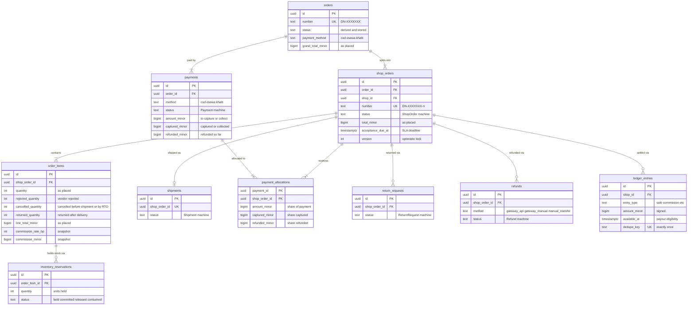

Two structural rules make cross-shop mistakes impossible in the database rather than merely unlikely. First, `order_items (shop_order_id, shop_id)` references `shop_orders (id, shop_id)`, so an item can never sit in another shop's shop order. Second, `ledger_entries.shop_id` must equal the shop order's `shop_id`, which the posting function reads from the shop order row it has locked and never from input (T-SEC-003).

### 3.2 Amounts: "as placed" versus "effective"

Order amounts are stored **as placed** and never rewritten. Everything that happens afterwards (rejection, cancellation, return) is recorded as quantities on `order_items` and as rows in `refunds`, `payments` and `ledger_entries`. Effective amounts are computed by one pure function in `app/modules/pricing/domain/`, and the same function is used by the API, the ledger poster and the refund validator.

As-placed invariants (DB CHECKs from [04](04-domain-model-and-data-dictionary.md), restated because every lifecycle relies on them):

```text
order_items.line_subtotal_minor = unit_price_minor × quantity
order_items.line_total_minor    = line_subtotal_minor − discount_minor              (tax_minor is 0 in R1, prices are tax-inclusive)
order_items.commission_minor    = roundHalfUp(commission_base × commission_rate_bp / 10000)
shop_orders.items_subtotal_minor = Σ line_subtotal_minor of its items
shop_orders.discount_minor       = Σ discount_minor of its items
shop_orders.total_minor          = items_subtotal_minor + shipping_fee_minor − discount_minor
shop_orders.commission_total_minor = Σ commission_minor of its items
orders.items_subtotal_minor  = Σ shop_orders.items_subtotal_minor
orders.shipping_total_minor  = Σ shop_orders.shipping_fee_minor
orders.discount_total_minor  = Σ shop_orders.discount_minor
orders.grand_total_minor     = items_subtotal_minor + shipping_total_minor − discount_total_minor   (DB CHECK)
0 ≤ rejected_quantity + cancelled_quantity + returned_quantity ≤ quantity                            (DB CHECK)
```

The cross-row sums (shop order equals the sum of its items, parent equals the sum of its shop orders) cannot be CHECK constraints. They are asserted by the checkout action before commit and by the nightly `ledger.integrity_check` job (§7.12 item 5; schedule in §9.4), and tested by T-ORD-102, the cross-row-sum test that [04 §16.4](04-domain-model-and-data-dictionary.md#164-rules-that-cannot-be-constraints) names.

**Cumulative allocation rule.** When part of a line is rejected, cancelled or returned, the amount attributed to those units is computed cumulatively so that partial operations always add up exactly to the as-placed line amount:

```text
A(c) = roundHalfUp(line_total_minor × c / quantity)          amount for the first c units of the line
C(c) = roundHalfUp(commission_minor × c / quantity)          commission for the first c units
amount for an operation that takes the count from c1 to c2 = A(c2) − A(c1)
```

Units are consumed in a fixed order: rejected units first, then cancelled, then returned. So the refund for returning `r` units when `k` units of the line are already consumed is `A(k + r) − A(k)`. `k` is fixed once, in the TX that creates the refund, under the locks of the refundable check (§3.3): `rejected_quantity + cancelled_quantity` as they stood before that TX changed them, plus `Σ refund_items.quantity` on that line over the shop order's existing refunds not in `cancelled` whose `reason_code` is `return_accepted`, `goodwill` or `other`. Refunds for rejected, cancelled or undeliverable units are left out of the sum because the two counters already cover those units. `returned_quantity` is not read, so it makes no difference that the return close increments it in the TX that creates the refund (§6.6). A replacement refund (one that names a `cancelled` refund in the proposed `replaces_refund_id`, §8.8) copies that refund's `refund_items` and `affects_vendor_ledger` (§7.4) instead of recomputing them. The per-line amounts computed with this `k` are stored on `refund_items` and never recomputed (§7.4). Because `A(quantity) = line_total_minor` exactly, rounding never leaks a paisa between operations. In R1 without discounts `A(c) = unit_price_minor × c` exactly. The rule matters from R2, when allocated discounts make `line_total_minor` indivisible. Property test T-ORD-008 checks `Σ operations = line_total_minor` for random splits.

Effective amounts for a shop order:

```text
kept_quantity(item)   = quantity − rejected_quantity − cancelled_quantity
effective_items(so)   = Σ over items [ line_total_minor − (A(rejected + cancelled) − A(0)) ]
effective_shipping(so)= 0 if every item has kept_quantity = 0, else shipping_fee_minor
effective_total(so)   = effective_items(so) + effective_shipping(so)
effective_commission(so) = Σ over items [ commission_minor − C(rejected + cancelled) ]
```

Returned units are not subtracted from `effective_total`: they were delivered and paid for, and their money comes back through a refund (§6.7) with ledger entries (§7).

### 3.3 Shipping fee per shop order

Each shop order carries its own `shipping_fee_minor`, computed at checkout from the shop's zone rate and fixed from then on.

1. The address district comes from the selected `user_addresses.district_code` (snapshotted into `orders.shipping_district_code`).
2. Coverage: a row must exist in `shop_delivery_coverage (shop_id, district_code)`. If any shop in the cart does not cover the district, checkout fails with `422 DELIVERY_NOT_AVAILABLE`, listing the shops and cart lines affected so the customer can remove them or pick another address.
3. Zone: `delivery_zone_districts` maps the district to exactly one zone (for example `ktm_valley` or `outside_valley`). The fee is `shop_shipping_rates.fee_minor` for `(shop_id, zone_code)`. A missing rate for a covered district is a shop configuration error. The shipping editor prevents it (`replaceShopShipping` validates that every covered district's zone has a rate), and checkout treats it as `DELIVERY_NOT_AVAILABLE` for that shop rather than a free delivery.
4. One fee per shop order, regardless of item count or weight [Assumption; owner product owner; revisit if vendors ask for weight-based rates]. There is no free-shipping threshold in R1. The mock threshold of Rs 2,500 in the prototype UI is dropped (audit A3-02).
5. Shipping is outside the commission base [Assumption OD-04]. It is posted to the vendor in full as `shipping_income` (§7).
6. The fee shown at checkout is the only transport charge the customer ever pays for that parcel. Directive 2082 s8(3) bars collecting anything after handover beyond the pre-agreed price and transport cost, so there is no COD fee and no fee change at the door [Verify-external VX-02] (§11).

Refund of shipping: when a whole shop order is cancelled or rejected before shipment, `effective_shipping` becomes 0, so a gateway customer gets the shipping fee back and a COD customer is never asked for it. A parcel returned to origin (RTO) is treated the same way: every line's `kept_quantity` becomes 0, so `effective_shipping` is 0, and a gateway customer is refunded `refundable(so)` (§6.7) in full, shipping included (01 AC-FR-FUL-003-3: "The customer is not charged for the failed delivery or return"). Who bears the courier cost between the shop and the platform follows [Open OD-07] and never changes the customer refund. For returns after delivery, shipping is refunded only when the return reason is `not_as_described`, `damaged` or `wrong_item` [Assumption OD-07]. E-Commerce Act s10 requires a refund of "the amount paid including taxes" for non-conforming goods, which counsel may read as including transport [Verify-external VX-02].

Shipping is refunded at most once per shop order and payment allocation. The shipping part of a refund is `amount_minor − Σ refund_items.amount_minor` (§6.7). It must be at least 0, and the shipping parts of the shop order's refunds not in `cancelled` on the same allocation, this one included, must add up to at most `shipping_fee_minor`. The refund-create TX checks both with the payment and allocation rows locked (§4.4 level 6) and otherwise answers 422 `REFUND_EXCEEDS_REFUNDABLE`. So a second qualifying return, or a qualifying return after a goodwill refund that already covered shipping, refunds items only. "Shipping not yet refunded" in this document means `shipping_fee_minor` minus the shipping parts of the shop order's refunds not in `cancelled` on the allocation that paid it. The scope is per allocation, as for `refundable(so)` (§6.7), because a superseded late capture (§6.4) refunds a second allocation of the same shop order in full, shipping included, without using up the paying allocation's shipping.

### 3.4 Discount allocation

**R1: no discounts.** `discount_minor` is 0 on every line, `orders.discount_total_minor` is 0, and the checkout action asserts it. Compare-at prices (FR-PROMO-001) are display-only reference prices and are not discounts in the order maths: `unit_price_minor` is already the selling price. The prototype's double subtraction of compare-at savings (audit A3-02, RF-16) must not be ported.

**R2: one platform coupon per order (FR-PROMO-002).** Rules to implement then, recorded now so the R1 schema already fits:

1. Eligibility is decided per line (coupon scope such as category, shop list or minimum order). The discount amount `D` is computed on the eligible lines' `line_subtotal_minor` and capped at their sum: `D = min(coupon amount, W)`, with `W` as in rule 2. A fixed-amount coupon larger than the eligible subtotal therefore discounts it to zero and no further, and no line's `discount_minor` can exceed its `line_subtotal_minor` (`order_items_discount_check`).
2. `D` is allocated across **all eligible lines of all shops** by the largest-remainder method, weighted by `line_subtotal_minor`:
   - `share_i = floor(D × w_i / W)` where `w_i` is the line subtotal and `W = Σ w_i`.
   - The leftover `D − Σ share_i` paisa goes one each to the lines with the largest fractional remainders `(D × w_i) mod W`. Ties go to the lower `variant_id` so the result is deterministic. `variant_id` is unique within an order (one line per variant per shop order, one shop order per shop) and is already known when `quoteCheckout` runs, unlike `order_items.id`, which `placeOrder` generates only in step 9. So the quote and the placement give each leftover paisa to the same line, and the per-parcel COD amounts the customer confirmed are the ones placed.
   - `discount_minor_i = share_i (+1 if chosen)`, and `Σ discount_minor_i = D` exactly.
3. The coupon records `funded_by ∈ platform | shop` in `coupon_redemptions` (pricing module, R2). R3 shop coupons may only discount their own shop's lines. If R3 allows a platform and a shop coupon on the same order, per-line `discount_platform_minor` and `discount_shop_minor` columns are needed; that is an R3 schema change and does not affect R1.
4. Effect on the vendor and commission:

| `funded_by` | Customer pays            | `sale` posted to vendor                                        | Commission base             | Who bears the discount        |
| ----------- | ------------------------ | -------------------------------------------------------------- | --------------------------- | ----------------------------- |
| `platform`  | `line_total_minor` (net) | `line_subtotal_minor` (gross). The platform tops the vendor up | gross `line_subtotal_minor` | Platform, as a marketing cost |
| `shop`      | `line_total_minor` (net) | `line_total_minor` (net)                                       | net `line_total_minor`      | Vendor                        |

For a COD order with a platform-funded coupon the vendor holds only the net cash, so `cod_cash_held` is the net amount, while `sale` is gross. The difference (gross − net, the platform-funded discount) is credited to the vendor through `sale` and offsets the commission, so the delivery group nets to `discount − commission` and may still be negative, as in [04 §18.3.3](04-domain-model-and-data-dictionary.md#1833-r2-a-platform-funded-coupon-allocated-across-shops). In the worked example below, shop A's lines carry 17777 of discount against 34480 of commission, so A's delivery group nets to −16703 and A still owes commission, reduced by the discount the platform funded. This is the canonical rule "`sale` + line_total (items net of shop-funded discount)" applied to both funding sources.

**Worked example (R2, illustrative).** The cart of §7.11 with a Rs 500 platform coupon (`D = 50000`) whose scope excludes socks, so the eligible lines are A1, A2, B1 and B2 across both shops. `W = 259800 + 85000 + 249900 + 375100 = 969800`.

| Line | `w_i` (paisa) | `D × w_i`   | `share_i = floor(D × w_i / W)` | Remainder `(D × w_i) mod W` | Leftover paisa | `discount_minor_i` | Net `line_total_minor` |
| ---- | ------------- | ----------- | ------------------------------ | --------------------------- | -------------- | ------------------ | ---------------------- |
| A1   | 259800        | 12990000000 | 13394                          | 498800 (largest)            | +1             | 13395              | 246405                 |
| A2   | 85000         | 4250000000  | 4382                           | 336400                      | 0              | 4382               | 80618                  |
| B1   | 249900        | 12495000000 | 12884                          | 96800                       | 0              | 12884              | 237016                 |
| B2   | 375100        | 18755000000 | 19339                          | 37800                       | 0              | 19339              | 355761                 |
| Σ    | 969800        |             | 49999                          |                             | 1              | **50000**          |                        |

`D − Σ share_i = 50000 − 49999 = 1` paisa goes to A1, the line with the largest remainder. Shop A's lines carry 17777 of the discount and shop B's 32223, which sum to `D`. Commission per line at the §7.11 rates (A 10%, B 12%); the `funded_by = shop` column only compares the two commission bases of rule 4 on the same per-line discounts, since a real shop coupon discounts its own shop's lines only (rule 3):

| Line | `funded_by = platform` (base gross `line_subtotal_minor`) | `funded_by = shop` (base net `line_total_minor`)                       |
| ---- | --------------------------------------------------------- | ---------------------------------------------------------------------- |
| A1   | `roundHalfUp(259800 × 1000 / 10000)` = 25980              | `roundHalfUp(246405 × 1000 / 10000)` = 24641 (24640.5 rounded half-up) |
| A2   | 8500                                                      | 8062 (8061.8)                                                          |
| B1   | `roundHalfUp(249900 × 1200 / 10000)` = 29988              | 28442 (28441.92)                                                       |
| B2   | 45012                                                     | 42691 (42691.32)                                                       |

Test T-CHK-011 (proposed, R2) checks `Σ discount_minor_i = D`, the cap `D ≤ W` and the tie rule for random carts.

### 3.5 Commission allocation per item

Commission is computed and snapshotted **per order item at placement**. It is never recomputed from the shop's current rate.

- `commission_rate_bp` = `shops.commission_rate_bp` if not null, else `platform_settings.default_commission_rate_bp`, read inside the checkout TX. R2 adds category rates (FR-LED-006) with the precedence shop override > category > default.
- `commission_base` = the line's items amount net of shop-funded discount, **excluding shipping** [Assumption OD-04; A-04]. In R1 this is `line_total_minor`.
- `commission_minor = roundHalfUp(commission_base × commission_rate_bp / 10000)`, per line (ADR-0007 line-level rounding).
- For partial quantities the cumulative rule `C(c)` applies (§3.2), so commission removed by rejection or reversed by a return is always proportional to the snapshot and sums exactly.
- The client never sends a rate or a commission. Any such field in a request body is rejected by the validator (T-SEC-003).
- Commission is posted to the ledger only when the shop order is delivered and paid (§7.3), and only on kept units. Rejected and cancelled units never generate commission.

If the business decides that commission applies to shipping as well (OD-04 basis (b)), shipping must not be folded into each line's `commission_base`. Adding a share of the fee to line commission would break three things: `order_items_commission_check` (`commission_minor ≤ line_subtotal_minor`; a 1000-paisa line alone in a shop order with a 15000-paisa fee at 10% gives 1600), item-level rejection (`effective_commission` would drop the shipping part pro rata through `C(rejected + cancelled)` while `effective_shipping` stays at the full fee, §3.2), and returns (`C(k + r) − C(k)` would reverse the shipping part even when shipping is not refunded, §7.4). Commission on shipping would instead be its own shop-order snapshot, for example `shop_orders.shipping_commission_minor = roundHalfUp(shipping_fee_minor × commission_rate_bp / 10000)` at the shop override or default rate and bounded by `shipping_fee_minor`, posted as a separate `commission` entry of the delivery group (`dedupe_key` `delivery:<shop_order_id>:shipping_commission`, §7.3) and reversed only by a refund that includes a shipping part. That needs a new column and CHECK in [04a](04a-data-dictionary-tables.md) and new posting rules, so it is designed together with the OD-04 decision.

### 3.6 Partial cancellation and item-level rejection

"Partial" happens at two levels. At the **parent** level, one shop order of several is cancelled or rejected while others continue. At the **shop-order** level, the vendor rejects some units (item-level rejection, FR-ORD-003) and ships the rest. R1 has no customer-initiated item-level cancellation: a customer cancels a whole shop order before acceptance (FR-ORD-002). `cancelled_quantity` is written when a whole shop order is cancelled, set to each line's remaining units, so the per-line accounting is uniform.

Effects of each event (gateway effects apply from R1.1):

| Event                                                                                                                                                              | order_items                                                         | Shop order status                                                                          | Effective totals                                     | COD payment                                                                                                                            | Gateway money                                                                    | Reservations                                                                                                                                                                                 | Ledger                                                                                                     | Parent status                                                        |
| ------------------------------------------------------------------------------------------------------------------------------------------------------------------ | ------------------------------------------------------------------- | ------------------------------------------------------------------------------------------ | ---------------------------------------------------- | -------------------------------------------------------------------------------------------------------------------------------------- | -------------------------------------------------------------------------------- | -------------------------------------------------------------------------------------------------------------------------------------------------------------------------------------------- | ---------------------------------------------------------------------------------------------------------- | -------------------------------------------------------------------- |
| Vendor rejects `r` of the `q` units a line still keeps (`q` = the quantity of its open reservation, not `order_items.quantity`; `r = q` allowed), accepts the rest | `rejected_quantity += r`                                            | `awaiting_acceptance → accepted` (or stays `accepted` if already accepted and not shipped) | items reduced by `A(k+r) − A(k)`. Shipping unchanged | `amount_minor` and its allocation's `amount_minor` reduced by the same amount in the same TX (CAS on `status = 'awaiting_collection'`) | System refund of that amount on the shop order's allocation (§6.7)               | The line's open reservation is released; only if `q − r > 0`, a new `committed` reservation for the remaining units is inserted (§5.5). A line rejected in full has no open reservation left | None, then or later: the delivery posting leaves these units out, and a refund for them never posts (§7.4) | Recomputed                                                           |
| Vendor rejects all remaining units                                                                                                                                 | all lines `rejected_quantity` = remaining                           | → `rejected`                                                                               | 0 (shipping dropped)                                 | → `cancelled`                                                                                                                          | System refund of `refundable(so)` (rule below)                                   | All released                                                                                                                                                                                 | None                                                                                                       | Recomputed; `cancelled` if all others are terminal and not completed |
| Customer cancels a shop order before acceptance                                                                                                                    | `cancelled_quantity` = remaining                                    | → `cancelled` (`customer_cancelled`)                                                       | 0                                                    | → `cancelled`                                                                                                                          | System refund of `refundable(so)` (rule below)                                   | All released                                                                                                                                                                                 | None                                                                                                       | Recomputed                                                           |
| Admin cancels before shipment                                                                                                                                      | as above                                                            | → `cancelled` (`admin_cancelled`, `shop_frozen`)                                           | 0                                                    | → `cancelled`                                                                                                                          | System refund of `refundable(so)` (rule below)                                   | All released                                                                                                                                                                                 | None                                                                                                       | Recomputed                                                           |
| Acceptance SLA passes                                                                                                                                              | as above                                                            | → `cancelled` (`acceptance_timeout`)                                                       | 0                                                    | → `cancelled`                                                                                                                          | System refund of `refundable(so)` (rule below)                                   | All released                                                                                                                                                                                 | None                                                                                                       | Recomputed                                                           |
| Parcel returned to origin (RTO)                                                                                                                                    | `cancelled_quantity` = remaining                                    | → `cancelled` (`undeliverable`)                                                            | 0                                                    | `awaiting_collection` → `not_collected` (unchanged if already `not_collected`). RTO is refused while `collected` (§6.3)                | System refund of `refundable(so)` in full, shipping included (§3.3)              | Already consumed at shipment; units the vendor marks resaleable are restocked by `rto_restock` movement, damaged units are not (§5.8)                                                        | None                                                                                                       | Recomputed                                                           |
| Return of `r` delivered units                                                                                                                                      | `returned_quantity += r` when the return is closed after inspection | unchanged (`accepted`; completion waits for the return to close)                           | unchanged                                            | unchanged (`collected`)                                                                                                                | Refund `A(k+r) − A(k)` (+ shipping per OD-07, at most once per shop order, §3.3) | Restock per item decision (§5.7)                                                                                                                                                             | `refund` − and `commission_reversal` + (§7.4)                                                              | Recomputed                                                           |

Rules that make this safe:

- Item-level rejection is allowed while the shipment is `pending` or `packed`, never after `shipped`. After shipment the only paths are delivery, RTO or return.
- A vendor may reject every unit of one line while keeping units on other lines. That line then has `kept_quantity = 0` and no open reservation, the shop order stays `accepted`, and the other lines ship (§6.3). Only a rejection that leaves no kept unit on any line makes the shop order `rejected`.
- The COD `amount_minor` is the only amount the vendor's courier may collect. It is shown on the vendor's packing view and recomputed only by the rejection and cancellation actions, never edited by hand.
- A gateway refund for a rejection, cancellation or RTO is created and auto-approved by the system in the same TX as the state change, with `reason_code = 'order_cancelled'`, `'items_rejected'` or `'undeliverable'`. The provider call happens after commit (§9.1).
- A system refund created by a transition that ends the shop order (rejection of all remaining units, any cancellation, RTO) is for `refundable(so)` (§6.7) at that moment, computed in the same TX with the payment and allocation rows locked (§4.4 level 6). Its `refund_items` are `A(quantity) − A(k)` for each line's remaining units, with `k` the units already consumed on that line (§3.2), and its shipping part is the shipping not yet refunded (§3.3). The action asserts that these parts add up to `refundable(so)` and aborts rather than post a negative shipping part. The amount is never derived from `refunded_minor`, which rises only when a refund succeeds, or from the full allocation: an earlier item-rejection refund may still be in flight (an eSewa `gateway_manual` refund can take days) or already paid. A partial item rejection refunds `Σ [A(k + r) − A(k)]` over the rejected lines, with no shipping part.

### 3.7 Independent fulfillment per shop order

Each shop order has its own acceptance deadline (`acceptance_due_at`), its own shipment (exactly one in R1; partial shipments are R2, FR-FUL-005), its own COD payment, its own return window (starting at its own `delivered_at`) and its own ledger postings. Nothing that happens to one shop order locks or changes another, except the parent status recompute, which locks the parent `orders` row (§4.4), and, from R1.1, the one gateway payment that all shop orders of an order share: a customer cancellation while `awaiting_payment`, the payment-expiry cancellation (`payment_expired`, §5.4 Case A) and a verified capture move every shop order of the order together (§6.1). Consequences:

- Vendor B's rejection never delays vendor A's shipment.
- A customer with a two-shop COD order pays two couriers, each the amount on that parcel's COD payment.
- Emails are per shop order event. The customer's order page shows one card per shop order with its own timeline ([08 UI/UX](08-ui-ux-and-design-system.md)).
- Completion is per shop order: `accepted → completed` when the shipment is `delivered`, `now() ≥ shipments.return_window_ends_at` (set in the `delivered` TX, [04a §11.5](04a-data-dictionary-tables.md#115-shipments)), the payment is settled (COD `collected` or gateway `captured`), and no return request or refund on that shop order is open (§6.1).

### 3.8 Parent status derivation

`orders.status` is derived from the multiset of its shop orders' statuses by one pure function, and stored so that lists and filters do not recompute it. It is recomputed and written **in the same TX as any shop order status change**, after locking the parent row (lock order in §4.4). Nothing else writes it.

```ts
// app/modules/orders/domain/derive_order_status.ts (pure, no I/O)
type ShopOrderStatus =
  | 'awaiting_payment'
  | 'awaiting_acceptance'
  | 'accepted'
  | 'completed'
  | 'cancelled'
  | 'rejected'
type OrderStatus = 'awaiting_payment' | 'placed' | 'in_progress' | 'completed' | 'cancelled'

export function deriveOrderStatus(s: ShopOrderStatus[]): OrderStatus {
  if (s.length === 0) throw new Error('order without shop orders')
  const dead = (x: ShopOrderStatus) => x === 'cancelled' || x === 'rejected'
  const terminal = (x: ShopOrderStatus) => dead(x) || x === 'completed'
  const live = s.filter((x) => !dead(x))

  if (s.some((x) => x === 'awaiting_payment')) return 'awaiting_payment' // rule 1
  if (live.length === 0) return 'cancelled' // rule 2
  if (s.every(terminal)) return 'completed' // rule 3 (≥1 completed, since live is non-empty)
  if (live.every((x) => x === 'awaiting_acceptance')) return 'placed' // rule 4
  return 'in_progress' // rule 5
}
```

Rules are evaluated in order; the first match wins.

| Rule | Condition on shop order statuses                                                                                         | Parent status      | Customer-facing meaning                    |
| ---- | ------------------------------------------------------------------------------------------------------------------------ | ------------------ | ------------------------------------------ |
| 1    | Any `awaiting_payment` (gateway only; all shop orders of an order share the payment, so they are in this state together) | `awaiting_payment` | "Waiting for your payment"                 |
| 2    | All are `cancelled` or `rejected`                                                                                        | `cancelled`        | "Order cancelled", with a per-shop reason  |
| 3    | All terminal and at least one `completed`                                                                                | `completed`        | "Completed"                                |
| 4    | Every live one is `awaiting_acceptance`                                                                                  | `placed`           | "Placed, waiting for the shops to confirm" |
| 5    | Otherwise (at least one `accepted`, or a mix of `awaiting_acceptance` and `completed`)                                   | `in_progress`      | "In progress"                              |

Examples:

| Shop orders                            | Parent             |
| -------------------------------------- | ------------------ |
| `[awaiting_payment, awaiting_payment]` | `awaiting_payment` |
| `[awaiting_acceptance]`                | `placed`           |
| `[awaiting_acceptance, cancelled]`     | `placed`           |
| `[accepted, awaiting_acceptance]`      | `in_progress`      |
| `[completed, accepted]`                | `in_progress`      |
| `[completed, awaiting_acceptance]`     | `in_progress`      |
| `[completed, rejected]`                | `completed`        |
| `[cancelled, rejected]`                | `cancelled`        |
| `[completed]`                          | `completed`        |

Test T-ORD-001 enumerates every sequence of one to three shop order statuses (6 + 36 + 216 cases) and checks the rules and examples above. Test T-ORD-009 checks that every action that changes a shop order also leaves `orders.status = deriveOrderStatus(...)` after commit, by running each action and re-deriving from the database.

## 4. Checkout: the `placeOrder` algorithm

This section expands the canonical algorithm (canon §10) into implementable steps. It is the core of M5 (R1, COD) and is reused unchanged by M8 (R1.1, gateway), which only adds step 11.

### 4.1 Inputs, preconditions and the quote

The customer's browser first calls `POST /api/v1/checkout/quote` [quoteCheckout]. The quote is read-only: it takes no locks and writes nothing. It returns the per-shop breakdown (lines, `shipping_fee_minor`, shop total, amount due per parcel for COD), `grand_total_minor`, `cart_version`, and any line or shop problems. The review screen shows this quote, which satisfies WCAG 3.3.4 error prevention for a financial commitment ([08 UI/UX](08-ui-ux-and-design-system.md)).

`POST /api/v1/checkout/orders` [placeOrder] then carries:

| Input                                   | Source                                                                                                       | Purpose                      |
| --------------------------------------- | ------------------------------------------------------------------------------------------------------------ | ---------------------------- |
| `Idempotency-Key` header (required, ⚷)  | Client-generated UUIDv4, created when the review screen mounts and reused for every retry of that submission | Duplicate suppression (§4.6) |
| `address_id`                            | The customer's saved address                                                                                 | Delivery district, snapshot  |
| `payment_method`                        | `cod` in R1; `esewa` or `khalti` in R1.1 (whichever OD-03 selects)                                           | Branches steps 7, 9 and 11   |
| `expected_grand_total_minor`            | From the quote the customer saw                                                                              | Price-change guard (step 6)  |
| `cart_version`                          | From the quote                                                                                               | Cart-change guard (step 3)   |
| `customer_note` (optional, ≤ 500 chars) | Customer                                                                                                     | Stored on the order          |

The body never contains prices, totals, shop IDs, commission or quantities. The server reads all of those from the cart and catalog. Unknown fields are rejected by the Vine validator (T-SEC-003).

Preconditions checked before the TX starts (cheap reads, no locks):

- `users.status = 'active'` and `email_verified_at IS NOT NULL` (FR-IAM-002, FR-CHK-001). A `pending_verification` user gets `403 EMAIL_NOT_VERIFIED`, a suspended user `403 ACCOUNT_SUSPENDED` (T-SEC-010).
- A Nepal mobile number is on the account, format-validated against `^9[678]\d{8}$` and stored as E.164 [Confirmed Q6; OTP verification is R2]. Otherwise `422 VALIDATION_FAILED` on field `phone`.
- `platform_settings.checkout_enabled = true` (FR-ADM-010 kill switch). Otherwise `503 PROVIDER_UNAVAILABLE` with a maintenance message [Assumption: reuse of that code; [06](06-api-design.md) may define a dedicated one].
- The address belongs to the caller and is not archived: `user_addresses.user_id = auth.user.id AND archived_at IS NULL`. Otherwise `404 NOT_FOUND`, for another customer's address and for the caller's own archived one alike (T-SEC-006, proposed in [07 §4.6](07-security-threat-model-and-permissions.md#46-resource-ownership-rules-customers); T-SEC-002 covers orders only).
- Rate limit `placeOrder` 10/min per user [Assumption, canon §6.6].

### 4.2 Transaction boundaries

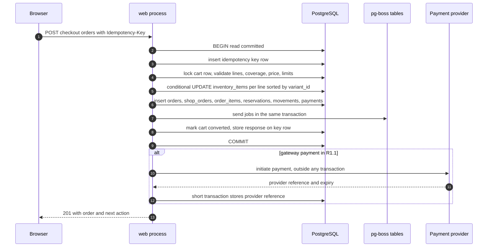

There is exactly **one** business TX (steps 2–10). It contains no network calls to anything other than PostgreSQL. The provider call in step 11 happens after commit, and its result is stored in a second, short TX (§9.1).

### 4.3 Step by step

| Step | What happens                                                                                                                                                                                                                                                                                                                                           | Locks taken                                            | Failure → response (TX outcome)                                                                                          |
| ---- | ------------------------------------------------------------------------------------------------------------------------------------------------------------------------------------------------------------------------------------------------------------------------------------------------------------------------------------------------------ | ------------------------------------------------------ | ------------------------------------------------------------------------------------------------------------------------ |
| 1    | Validate body (Vine), preconditions (§4.1), compute fingerprint                                                                                                                                                                                                                                                                                        | none                                                   | 422 `VALIDATION_FAILED`, 403, 404 (no TX)                                                                                |
| 2    | `BEGIN`; `SET LOCAL lock_timeout = '5s'`, `SET LOCAL statement_timeout = '10s'` [Assumption]; insert idempotency key row (§4.6)                                                                                                                                                                                                                        | unique-index entry for `(actor_scope, operation, key)` | Replay stored response, 422 `IDEMPOTENCY_KEY_REUSED`, or 409 `IDEMPOTENCY_IN_PROGRESS` (ROLLBACK)                        |
| 3    | `SELECT … FROM carts WHERE user_id = :uid AND status = 'active' FOR UPDATE`; compare `version` with `cart_version`                                                                                                                                                                                                                                     | cart row                                               | 409 `CART_CHANGED`, also when there is no active cart (already converted) (ROLLBACK)                                     |
| 4    | Load cart lines joined to `product_variants` (`status = 'active'` and `price_minor > 0`, a backstop for the price rule of [04a §7.9](04a-data-dictionary-tables.md#79-product_variants)), `products` (`status = 'published'`), `shops` (`status = 'active'`); quantity 1..10                                                                           | none (plain reads)                                     | 409 `CART_CHANGED` with `errors[]` per line: `variant_unavailable`, `product_unavailable`, `shop_unavailable` (ROLLBACK) |
| 5    | Coverage and shipping per shop (§3.3)                                                                                                                                                                                                                                                                                                                  | none                                                   | 422 `DELIVERY_NOT_AVAILABLE` with the shops and lines affected (ROLLBACK)                                                |
| 6    | Price server-side with the `pricing` module: line subtotals, shipping, discounts (0 in R1), commission snapshot; compare `grand_total_minor` with `expected_grand_total_minor`                                                                                                                                                                         | none                                                   | 409 `PRICE_CHANGED` with the new quote in the problem body. Any difference, up or down, triggers it (§8.2) (ROLLBACK)    |
| 7    | Payment-method rules. COD: `grand_total_minor ≤ cod_max_order_value_minor` and the customer's open COD orders `< cod_max_open_orders_per_customer` [Assumption OD-18]. Gateway: amount above the provider minimum (Khalti requires more than Rs 10, i.e. `> 1000` paisa [Verified-doc: https://docs.khalti.com/khalti-epayment/, accessed 2026-09-25]) | none                                                   | 422 `COD_LIMIT_EXCEEDED` or 422 `VALIDATION_FAILED` (ROLLBACK)                                                           |
| 8    | For each line **sorted by `variant_id` ascending**: conditional stock update (§4.5)                                                                                                                                                                                                                                                                    | row lock on each `inventory_items` row, held to COMMIT | Zero rows → ROLLBACK → 409 `OUT_OF_STOCK`, with availability re-read after rollback                                      |
| 9    | Insert `orders`, `shop_orders`, `order_items` (snapshots and commission), then `inventory_reservations` and `inventory_movements` (kind `reserve`), `payments` (+ `payment_allocations`), `order_events`, `audit_logs`; send jobs through pg-boss in the same TX (§4.7)                                                                                | new rows; `FOR KEY SHARE` on referenced rows (§4.4)    | Any constraint violation → ROLLBACK → 500 `INTERNAL` (a bug; alert)                                                      |
| 10   | `UPDATE carts SET status = 'converted'`; update the idempotency row with the response; `COMMIT`                                                                                                                                                                                                                                                        | none new                                               | Commit failure → ROLLBACK → client retries with the same key                                                             |
| 11   | Gateway only (R1.1): initiate with the provider after commit (§4.8)                                                                                                                                                                                                                                                                                    | none                                                   | Provider failure does not undo the order. Payment stays `initiated`; the customer retries with `startOrderPayment`       |

Step 4 detail: the reads in steps 4 to 7 are deliberately unlocked. A vendor who unpublishes a product, or an admin who suspends a shop, in the few milliseconds between step 4 and commit does not block, and is not blocked by, checkout. The order that slips through is handled by the normal paths: vendor rejection, or the suspension playbook in §8.10. A `frozen` vendor is read-only and cannot reject, and a checkout can commit after `orders.handle_shop_suspension` has run its batches, so the 15-minute acceptance sweeper also cancels open shop orders of frozen shops with `shop_frozen` (§8.11). Taking `FOR SHARE` locks on products and shops would make every vendor edit wait on every in-flight checkout for no real gain at this scale.

Step 9 detail: rows are inserted in this order so every foreign key already exists: `orders` → `shop_orders` → `order_items` → `inventory_reservations` (references `order_items.id` and `orders.id`) → `inventory_movements` → `payments` → `payment_allocations` → `order_events` → `audit_logs`. Each table's rows are written with one multi-row `INSERT` (Lucid `multiInsert`), so the statement count does not grow with the number of lines. IDs are generated in the application (UUIDv7, or `gen_random_uuid()` fallback per [04](04-domain-model-and-data-dictionary.md)) so the step-8 updates can be issued before the rows that reference them exist.

What step 9 writes, by payment method:

| Row                      | COD (R1)                                                                                                                                                                                                                                                    | Gateway (R1.1)                                                                                                                                                                                                     |
| ------------------------ | ----------------------------------------------------------------------------------------------------------------------------------------------------------------------------------------------------------------------------------------------------------- | ------------------------------------------------------------------------------------------------------------------------------------------------------------------------------------------------------------------ |
| `orders.status`          | `placed`                                                                                                                                                                                                                                                    | `awaiting_payment`                                                                                                                                                                                                 |
| `shop_orders.status`     | `awaiting_acceptance`, `acceptance_due_at = now() + vendor_acceptance_sla_hours`                                                                                                                                                                            | `awaiting_payment`, `acceptance_due_at` null (set on capture)                                                                                                                                                      |
| `inventory_reservations` | one per order item, `status = 'committed'`, `expires_at` null                                                                                                                                                                                               | one per order item, `status = 'held'`, `expires_at = now() + reservation_ttl_minutes + 10 min` (refined in §5.3 once the provider expiry is known)                                                                 |
| `inventory_movements`    | `reserve` (`reserved_delta = +q`) per line                                                                                                                                                                                                                  | same                                                                                                                                                                                                               |
| `payments`               | one per shop order: `method = 'cod'`, `status = 'awaiting_collection'`, `amount_minor = shop_orders.total_minor`, one allocation row to that shop order                                                                                                     | one for the whole order: `method = 'esewa' or 'khalti'`, `status = 'initiated'`, `amount_minor = grand_total_minor`, `attempt_no = 1`, one allocation per shop order with `amount_minor = shop_orders.total_minor` |
| `order_events`           | `order.placed` (customer), `shop_order.placed` per shop order (shop)                                                                                                                                                                                        | `order.awaiting_payment` (customer)                                                                                                                                                                                |
| `audit_logs`             | `order.place`, actor customer                                                                                                                                                                                                                               | same                                                                                                                                                                                                               |
| Jobs sent in TX          | `notifications.dispatch` per domain event (`order.placed` for the customer, `shop_order.placed` per shop order for the vendor), `orders.acceptance_timeout` and `orders.acceptance_reminder` per shop order, `catalog.refresh_listing` per affected product | `payments.verify` delayed 1 minute; `catalog.refresh_listing`                                                                                                                                                      |

### 4.4 Global lock ordering

Deadlocks come from two transactions taking the same locks in different orders. Every action in the `orders`, `payments`, `inventory` and `ledger` modules, and every action that locks a `shops` or `users` row `FOR UPDATE` or `FOR NO KEY UPDATE`, takes row locks in this global order, skipping levels it does not need:

0. `shops` or `users` rows locked `FOR UPDATE` (or `FOR NO KEY UPDATE`, which conflicts with itself and with `FOR UPDATE` but not with the `FOR KEY SHARE` of foreign-key checks): `recordVendorRemittance` ([04a §13.4](04a-data-dictionary-tables.md#134-vendor_remittances)) and every payout action (`createPayout`, `approvePayout`, `markPayoutPaid`, `markPayoutFailed`, `cancelPayout`; §6.8, §7.6) lock the shop. `inviteMember`, `acceptShopInvitation`, `replacePayoutAccount`, `suspendShop` and `closeShop` (proposed) also lock the shop row `FOR UPDATE` first; their invitation, membership and payout-account rows come after it and are outside levels 1–8 ([04a §6.1](04a-data-dictionary-tables.md#61-shops), [§6.3](04a-data-dictionary-tables.md#63-shop_invitations), [§6.7](04a-data-dictionary-tables.md#67-shop_payout_accounts)). `acceptShopInvitation` reads the invitation's `shop_id` by `token_hash` without a lock before it takes the shop lock, and `suspendShop` and `closeShop` revoke the shop's open invitations after it. `applyForShop`, and `resubmitShopApplication` when it moves a shop `rejected → pending_review` ([04 §3.1](04-domain-model-and-data-dictionary.md#31-one-user-can-own-several-shops-up-to-a-limit)), and `anonymizeUser`, lock the user; resubmission then compare-and-sets the `shops` row. Every address write (`createAddress`, `updateAddress`, `deleteAddress`) and every transaction that writes a user's `user_tokens` (issue, redeem, invalidate) locks the user's row first, with `SELECT id FROM users WHERE id = :user_id FOR NO KEY UPDATE` or by updating that row (as a password change does); a redemption first reads the token's `user_id` by `token_hash` without a lock ([04 §16.3](04-domain-model-and-data-dictionary.md#163-constraint-sql) INV-17, [04a §5.2](04a-data-dictionary-tables.md#52-user_tokens), [§5.5](04a-data-dictionary-tables.md#55-user_addresses)). Remittance, the payout actions, the shop, invitation and payout-account actions, shop application and resubmission, the address writes and the token writes take no level 1–8 lock after it. `anonymizeUser` also deletes carts and updates orders, but it runs only for a user who is already `deactivated` and whose sessions were destroyed ([04 §19.2](04-domain-model-and-data-dictionary.md#192-account-deletion-and-anonymisation)), so no checkout by that user can be in flight. The action's own idempotency key (level 1, the first statement per §4.6) comes before level 0; only a retry of the same request waits on that key, so this cannot form a cycle. A new action that locks `shops` or `users` `FOR UPDATE` or `FOR NO KEY UPDATE` must not take level 1–8 locks after it
1. `idempotency_keys` (unique-index entry, by insert)
2. `carts` (checkout and cart mutations only)
3. `orders` (the parent row, `FOR UPDATE`)
4. `shop_orders` of that order, in `id` order
5. `shipments`, then `return_requests`
6. `payments`, then `payment_allocations`, then `refunds`
7. `inventory_items`, in `variant_id` order
8. `inventory_reservations`, in `id` order
9. Inserts only: `inventory_movements`, `order_events`, `ledger_entries`, `audit_logs` (append-only tables; no action updates their rows, so an insert never waits on another insert here). No action locks `ledger_entries` rows: a row-locking clause needs `UPDATE` privilege on the table [Verified-doc: https://www.postgresql.org/docs/18/sql-select.html, accessed 2026-09-27], which `dripnepal_app` does not have on append-only tables ([04 §2.12](04-domain-model-and-data-dictionary.md#212-append-only-tables)). Every payout action serialises on its `shops` row at level 0 instead, before it locks its `payouts` row, and `approveLedgerAdjustment` and `cancelLedgerAdjustment` (§7.8) lock only their own `ledger_adjustment_requests` row before writing, so none of them can join a cycle. The shop lock matters for the actions after creation too: `approvePayout` and `markPayoutFailed` change a `payouts` row covered by `payouts_one_open_per_shop_key` and then insert a ledger entry, whose foreign-key check needs the shop row; without the shop lock first, a concurrent `createPayout` holding that row and waiting on the payout's index entry would close a cycle

Inserts are not free of locks: the foreign-key check of every insert locks the referenced row (`shops`, `users`, `product_variants`, …) `FOR KEY SHARE` [Verified-doc: https://www.postgresql.org/docs/release/9.3.0/, accessed 2026-09-27], and `FOR KEY SHARE` conflicts only with `FOR UPDATE` [Verified-doc: https://www.postgresql.org/docs/18/explicit-locking.html, accessed 2026-09-27]. A step-9 insert can therefore wait briefly behind a level-0 `FOR UPDATE` lock (never behind `FOR NO KEY UPDATE`), and a level-0 action can wait for a checkout to commit. Neither wait can close a cycle: a level-0 action takes no level 1–8 lock after its level-0 lock, and the `anonymizeUser` exception never overlaps a checkout by the same user.

Job sends are inserts into the pg-boss job table. A send carrying a `singletonKey` on a queue policy that enforces it goes through a unique index, and PostgreSQL makes such an insert wait for another transaction's uncommitted row with the same key [Verified-doc: https://www.postgresql.org/docs/18/index-unique-checks.html, accessed 2026-09-27]. So a send inside a business TX never carries a `singletonKey` on a shared entity such as a product (§4.7). Checkout's only keyed send is `payments.verify` for the payment it has just created, whose ID no other transaction can hold yet. The other keyed sends (`payments.verify` and `refunds.verify` from their own short TXs and jobs, and `refunds.verify` also from the TX that moves a `gateway_api` or `gateway_manual` refund to `processing`, for `gateway_api` after locking the payment row at level 6, §8.8) name one payment or refund, so they can only wait on another transaction working on the same payment or refund.

Checkout takes levels 1, 2 and 7 and then only inserts new rows, whose only waits are the brief foreign-key waits above. Fulfillment actions take 3 → 4 → 5 (→ 6 when a COD payment or refund changes) → 7 → 8. The capture path and the reservation expiry job take 3 → 4 → 6 → 7 → 8. Level 7 is one ascending `variant_id` pass across the whole TX, never one pass per shop order: a TX that changes stock for several shop orders sorts all their variants together (§5.5), and the late-capture re-reserve locks them all in one statement before its savepoints (§8.4). The expiry job's lease step (§5.4) locks only `payments` rows, with `SKIP LOCKED`, in its own short TX. Vendor stock adjustments take level 7 only. No cycle is possible, so no deadlock is possible among these flows. If PostgreSQL still reports `40P01 deadlock_detected` (for example from a new code path that broke the rule), the action is retried once with jitter by the TX helper and the event is logged as an error for investigation. T-CHK-009 runs two checkouts whose carts contain variants X and Y in opposite insertion order 200 times concurrently and asserts zero deadlocks and correct stock. A second case uses two carts holding different variants of the same two products P and Q, added in opposite product order, so both checkouts pass level 7 at once and then send their `catalog.refresh_listing` jobs for P and Q in opposite order; it also asserts zero deadlocks, which proves that job sends take no shared key.

`app/modules/platform/tx.ts` exposes `withTx(fn, { lockTimeoutMs })` which sets `SET LOCAL lock_timeout` and wraps Lucid's managed `db.transaction(callback)`, which commits when the callback resolves and rolls back when it throws [Verified-doc: https://lucid.adonisjs.com/docs/transactions, accessed 2026-09-25]. Locks are taken through the query builder's `forUpdate()`, available on Lucid 22.4.2 query builders along with `skipLocked()` and `noWait()` [Verified-doc: https://lucid.adonisjs.com/docs/select-query-builder, accessed 2026-09-25].

### 4.5 The conditional stock update

The single statement that prevents overselling (ADR-0008):

```sql
-- step 8, once per cart line, lines sorted by variant_id ascending
UPDATE inventory_items
   SET reserved   = reserved + :qty,
       version    = version + 1,
       updated_at = now()
 WHERE variant_id = :variant_id
   AND shop_id    = :shop_id              -- tenant guard; the variant's shop from step 4
   AND on_hand - reserved >= :qty
RETURNING variant_id, on_hand, reserved;
```

- One row returned: the units are reserved and the row stays locked until COMMIT.
- Zero rows: either the variant has no inventory row (a data error, treated as out of stock) or `available < qty`. The action throws `OutOfStockError`, the TX rolls back (releasing every reservation already made for earlier lines), and **after** the rollback the handler reads current availability for all cart lines without locks to build the response:

```json
{
  "type": "https://dripnepal.com/problems/out-of-stock",
  "title": "Out of stock",
  "status": 409,
  "detail": "1 item in your cart is no longer available in the quantity you chose.",
  "code": "OUT_OF_STOCK",
  "request_id": "01929a4e-7c1b-7d3e-9f10-5b2c8e4a1d20",
  "errors": [
    {
      "field": "lines.0",
      "code": "insufficient_stock",
      "message": "Only 1 left.",
      "cart_item_id": "01929a71-0000-7000-8000-000000000011",
      "available": 1
    }
  ]
}
```

The shape is owned by [06 §5.1](06-api-design.md#51-shape): `title` is fixed per code, `field` is a dotted path into the cart's lines with `cart_item_id` as a member, and `request_id` equals the `X-Request-Id` header.

The backstop is in the schema: `CHECK (reserved >= 0)`, `CHECK (on_hand >= 0)` and `CHECK (reserved <= on_hand)` on `inventory_items`. If a future code path forgets the `WHERE` guard, the CHECK aborts the TX instead of overselling (T-INV-001).

Why this is correct at READ COMMITTED without SERIALIZABLE: PostgreSQL documents that when an `UPDATE` finds its target row already updated by a concurrent transaction, it waits for that transaction to commit or roll back. If the other one commits, "the search condition of the command (the `WHERE` clause) is re-evaluated to see if the updated version of the row still matches the search condition"; if it rolled back, the updater proceeds with the original row [Verified-doc: https://www.postgresql.org/docs/18/transaction-iso.html, accessed 2026-09-25]. The guard `on_hand - reserved >= :qty` is therefore evaluated against the latest committed stock, which is exactly the check we need, with no retry loop and no serialization failures. The tradeoff is that the row lock is held from step 8 to COMMIT, so steps 9 and 10 must stay short: they insert new rows and update only the cart and key rows the TX already holds, their only possible waits are the brief foreign-key waits behind a level-0 lock (§4.4), and the jobs are sent into the same database with no shared `singletonKey` (§4.7).

The reservation and movement rows for each line (inserted in step 9 after the order items; shown for one line, while step 9 writes every line's rows in one multi-row `INSERT` per table):

```sql
INSERT INTO inventory_reservations
  (id, shop_id, variant_id, order_id, order_item_id, quantity, status, expires_at, created_at)
VALUES
  (:rid, :shop_id, :variant_id, :order_id, :order_item_id, :qty,
   :status,                     -- 'committed' for COD, 'held' for gateway
   :expires_at,                 -- null for COD
   now());

INSERT INTO inventory_movements
  (id, shop_id, variant_id, kind, on_hand_delta, reserved_delta,
   reason_code, reference_type, reference_id, actor_user_id, request_id, created_at)
VALUES
  (:mid, :shop_id, :variant_id, 'reserve', 0, :qty,
   'checkout', 'inventory_reservation', :rid, :customer_user_id, :request_id, now());
```

### 4.6 Idempotency handling

`placeOrder` follows the platform idempotency contract (canon §6.6, mechanics owned by [06 API design](06-api-design.md)): scope `actor_scope = <user id>`, `operation = 'placeOrder'`, retention 72 hours, fingerprint = SHA-256 of method, route pattern, resolved path parameters and canonical JSON body.

The key row is the **first** statement of the business TX:

```sql
INSERT INTO idempotency_keys
  (id, actor_scope, operation, key, fingerprint, status,
   response_status, response_body,              -- placeholder; step 10 overwrites both before COMMIT
   created_at, expires_at)
VALUES
  (:id, :user_id, 'placeOrder', :key, :fingerprint, 'completed',
   500, '{}'::jsonb,
   now(), now() + interval '72 hours')
ON CONFLICT (actor_scope, operation, key) DO NOTHING
RETURNING id;
```

Columns follow [04a §15.2](04a-data-dictionary-tables.md#152-idempotency_keys), where `response_status` and `response_body` are NOT NULL; the placeholder is replaced by the real response in step 10. The row only becomes visible to others at COMMIT, so its `status = 'completed'` and its stored response are true for anyone who can see it. Cases:

| Situation                                 | What PostgreSQL does                                                                                                                                                                                                                                                                                                                           | What the handler does                                                                                                                                                                                                                                                                                         |
| ----------------------------------------- | ---------------------------------------------------------------------------------------------------------------------------------------------------------------------------------------------------------------------------------------------------------------------------------------------------------------------------------------------- | ------------------------------------------------------------------------------------------------------------------------------------------------------------------------------------------------------------------------------------------------------------------------------------------------------------- |
| New key                                   | Inserts; one row returned                                                                                                                                                                                                                                                                                                                      | Continue with step 3                                                                                                                                                                                                                                                                                          |
| Same key, first request already committed | Conflict with a visible row; `DO NOTHING`; zero rows                                                                                                                                                                                                                                                                                           | ROLLBACK the (empty) TX; `SELECT` the stored row. Same fingerprint → return the stored status and body (the same order). Different fingerprint → 422 `IDEMPOTENCY_KEY_REUSED`                                                                                                                                 |
| Same key, first request still running     | The insert waits for the other TX. PostgreSQL documents that `ON CONFLICT DO NOTHING` "may have insertion not proceed for a row due to the outcome of another transaction whose effects are not visible to the INSERT snapshot" in Read Committed [Verified-doc: https://www.postgresql.org/docs/18/transaction-iso.html, accessed 2026-09-25] | If the first commits: zero rows → replay as above. If it rolls back (for example `OUT_OF_STOCK`): our insert proceeds and we execute from scratch, which is correct because nothing was stored. If the wait exceeds `lock_timeout` (5 s): error `55P03` → 409 `IDEMPOTENCY_IN_PROGRESS` with `Retry-After: 2` |
| Missing header                            | none                                                                                                                                                                                                                                                                                                                                           | 400 `IDEMPOTENCY_KEY_REQUIRED` (no TX)                                                                                                                                                                                                                                                                        |

A second layer stops duplicate orders when the client does not reuse its key (two browser tabs, or a reload that generated a fresh key): the cart row lock and `cart_version` check (step 3). The second checkout waits for the first, then finds the cart `converted` and gets 409 `CART_CHANGED`, and the client sends the customer to `/account/orders`. Because the idempotency row and the order are written in one TX, a stored response always refers to an order that exists, and every order has its key row.

For gateway orders the stored body contains the order and `payment.id` but **not** the provider redirect (`next_action`), because step 11 runs after the response was stored. A replayed response has no `next_action`, and the client then calls `POST /api/v1/me/orders/{orderNumber}/payments` [startOrderPayment], which is itself idempotent (§4.8). While the first request's initiate call may still be in flight, that call answers 409 `CONFLICT` with `Retry-After: 2`; after that it resumes or replaces the attempt (§4.8). Test T-CHK-004 covers sequential and concurrent duplicates; T-CHK-005 covers key reuse with a different body.

### 4.7 What runs after commit

Side effects outside PostgreSQL are never performed inside the business TX. They are **jobs sent inside the TX** with pg-boss's `db` option, so the job rows commit or roll back with the order: pg-boss documents "If the transaction rolls back, so does the job" [Verified-doc: https://github.com/timgit/pg-boss/blob/master/docs/api/adapters.md, accessed 2026-09-25]. The pg-boss job table is the transactional outbox (ADR-0010). Whether a Lucid transaction client can be handed to pg-boss's Knex adapter is unproven and is the M0 spike; if it fails, the fallback is an `outbox_events` table written in the TX plus a relay job, with identical semantics for this document.

| Job                                          | Sent when                               | Delay                                                                                                                                                          | Idempotency guard                                                                                                                                                                                                                | Effect                                                                                                                                                                                          |
| -------------------------------------------- | --------------------------------------- | -------------------------------------------------------------------------------------------------------------------------------------------------------------- | -------------------------------------------------------------------------------------------------------------------------------------------------------------------------------------------------------------------------------- | ----------------------------------------------------------------------------------------------------------------------------------------------------------------------------------------------- |
| `notifications.dispatch` × (1 + shop orders) | COD placement, or gateway capture       | none                                                                                                                                                           | Inserts one `notification_deliveries` row per recipient with `ON CONFLICT (dedupe_key) DO NOTHING`, `dedupe_key = <event id>:<template>:<recipient id>` ([04a §14.3](04a-data-dictionary-tables.md#143-notification_deliveries)) | Creates the delivery rows for the customer confirmation and the vendor "new order" email, then sends one `notifications.send_email` job per new row, which moves the row `queued → sent` by CAS |
| `orders.acceptance_timeout`                  | Shop order enters `awaiting_acceptance` | until `acceptance_due_at`                                                                                                                                      | Handler CAS on `status = 'awaiting_acceptance'`; no `singletonKey`                                                                                                                                                               | Cancels with `acceptance_timeout` (§8.11), or with `shop_frozen` when the shop is frozen (§8.10)                                                                                                |
| `orders.acceptance_reminder`                 | same                                    | until `acceptance_due_at − least(24 h, vendor_acceptance_sla_hours / 2)` (24 h at the 48 h default; never at placement, even at the 12 h minimum) [Assumption] | CAS read of status                                                                                                                                                                                                               | Reminder email to the shop                                                                                                                                                                      |
| `catalog.refresh_listing`                    | any reservation change on a product     | none                                                                                                                                                           | Handler recomputes the listing row from the source tables, so a duplicate run is harmless; no `singletonKey`                                                                                                                     | Updates `product_listings.in_stock` (seconds of staleness is acceptable; checkout is authoritative)                                                                                             |
| `payments.verify`                            | gateway attempt created or redirected   | 1 min, then the schedule in §9.4                                                                                                                               | Handler CAS on the payment status (§6.4); `singletonKey = payment_id` on a `stately` queue only reduces duplicate lookups                                                                                                        | Status lookup and capture/fail (§6.4)                                                                                                                                                           |

Every email in this document follows the same path as the first row: the transition sends `notifications.dispatch` for its domain event inside its TX, and dispatch fans out to `notifications.send_email` ([03 §9](03-system-architecture.md#9-asynchronous-work)). "Email" in the transition tables of §6 means this path.

pg-boss may run a job twice ("the job can run twice and handlers should be idempotent" [Verified-doc: https://github.com/timgit/pg-boss/blob/master/docs/api/queues.md, accessed 2026-09-25]), so every handler above starts with a CAS or a dedupe-key insert, or recomputes from source, and does nothing more if the work is already done. That guard, not a pg-boss `singletonKey`, is the idempotency guarantee. A `singletonKey` only reduces duplicate work, and only on a queue whose policy enforces it: the default `standard` policy uses it only for throttling with `singletonSeconds`, while `short`, `singleton`, `stately` and `exclusive` enforce it per key [Verified-doc: https://github.com/timgit/pg-boss/blob/master/docs/api/queues.md and https://github.com/timgit/pg-boss/blob/master/docs/api/jobs.md, accessed 2026-09-27]. Queue policies are owned by [03 §9](03-system-architecture.md#9-asynchronous-work) and confirmed in the M0 pg-boss spike [Assumption]. `notifications.dispatch`, `orders.acceptance_timeout`, `orders.acceptance_reminder` and `catalog.refresh_listing`, which business TXs send for shared or existing rows, use `standard` with no `singletonKey`, because a keyed send would add a lock to those TXs (§4.4). `payments.verify` and `refunds.verify` use `stately` keyed by the payment or refund ID, which allows at most one job per key in each state, so a running lookup can send its own successor and a `payments.reconcile_sweeper` or `refunds.reconcile_sweeper` re-send does not start a second chain. They never use `exclusive`, which allows one queued or active job per key and would refuse a running job's successor. Test T-CHK-008 forces a rollback after the job send and asserts that no job row and no email exist.

In R1, `trx.after('commit')` from Lucid is used only for in-process, loss-tolerant work such as clearing a cache entry. It is not used for anything that must happen, because a crash between commit and the hook loses it.

### 4.8 Gateway initiation after commit (R1.1)

Step 11, for the one gateway chosen in OD-03 [Open OD-03]. Canon recommends Khalti first unless customer-reach data favours eSewa.

| Provider      | What "initiate" means                                                                                                                                                                                                                                                                                                                                       | Provider key                                                                                        | What we store in the short TX                                                                                                                                                                                                                                                                 |
| ------------- | ----------------------------------------------------------------------------------------------------------------------------------------------------------------------------------------------------------------------------------------------------------------------------------------------------------------------------------------------------------- | --------------------------------------------------------------------------------------------------- | --------------------------------------------------------------------------------------------------------------------------------------------------------------------------------------------------------------------------------------------------------------------------------------------- |
| Khalti KPG-2  | Server-to-server `POST …/epayment/initiate/` with `amount` (paisa), `purchase_order_id`, `purchase_order_name` (required; the order number `orders.number`, for example `DN-7QX4M2P`), `return_url`, `website_url`; returns `pidx`, `payment_url`, `expires_at`, `expires_in` [Verified-doc: https://docs.khalti.com/khalti-epayment/, accessed 2026-09-25] | `purchase_order_id = payments.id`                                                                   | `provider_payment_id = pidx`, `expires_at` from the response (parsed with its offset and stored in UTC), `status: initiated → pending` when the redirect is issued                                                                                                                            |
| eSewa ePay v2 | No server call. The server builds an auto-submitting HTML form with `total_amount`, `transaction_uuid`, `product_code`, signed HMAC-SHA256 over `total_amount,transaction_uuid,product_code` [Verified-doc: https://developer.esewa.com.np/pages/Epay, accessed 2026-09-25]                                                                                 | `transaction_uuid = payments.id` (UUIDs contain only alphanumerics and hyphens, which eSewa allows) | The exact field values sent (including the zero tax, service and delivery charges eSewa requires), `status: initiated → pending` when the form is rendered, `expires_at = now() + reservation_ttl_minutes` [Assumption, eSewa publishes no session expiry beyond the 5-minute payment window] |

Rules:

- The provider call has a 10-second timeout [Assumption] and runs with no TX open (§9.1, T-PAY-006).
- Khalti initiate failure (timeout, 5xx, network): the payment stays `initiated` with no `pidx`. The customer cannot have paid, because `payment_url` never reached them. The response is 201 with the order and `next_action: { type: "retry_payment" }`. The customer retries with `startOrderPayment`.
- The short TX after a successful initiate moves the attempt `initiated → pending` with a CAS. If the CAS changes 0 rows (the attempt was superseded, cancelled or expired while the call ran), the handler never returns the `payment_url` or the form fields. It records the orphan `pidx` in `provider_events` and answers with the current order state, with `next_action: { type: "retry_payment" }` while the order is still `awaiting_payment`.
- An `initiated` attempt with no provider reference is **in flight** until `payments.created_at + 15 s` (the 10-second provider timeout plus a margin) [Assumption]: its initiate call may still return a payment URL. Neither a retry nor the expiry job treats it as unpaid while it is in flight: a retry gets 409 (below) and the expiry job skips it (§5.4). For the checkout's first attempt, `created_at` is set inside the checkout TX, before its commit and possibly before its lock waits, so the window can end while that attempt's initiate call is still running. If a retry or the expiry job closes the attempt in that gap, the `initiated → pending` CAS above changes 0 rows and the late payment URL is withheld.
- A definitive non-success of one attempt (Khalti `Expired` or `User canceled`, eSewa `NOT_FOUND` or `CANCELED`, or an `initiated` attempt with no provider reference that is no longer in flight) changes only that attempt (§6.4). While the order's holds are before `expires_at`, the shop orders stay `awaiting_payment`, the reservations stay `held`, and the customer may pay again. Only once the holds are past `expires_at` and no attempt is open (`initiated`, `pending` or `needs_review`) are the shop orders cancelled with `payment_expired` and the stock released (§5.4 Case A, §6.1). For an attempt without a provider expiry (`payments.expires_at` is null when the initiate failed), "past expiry" means that the order's reservations are past `expires_at`.
- `startOrderPayment` [startOrderPayment] (⚷) for an order in `awaiting_payment` locks the parent `orders` row first (§4.4), so two retries of one order run one after the other. When the latest attempt, read without a lock, is `pending` or `needs_review`, the provider lookup runs first with no TX open (§9.1). The Req-TX then locks the parent row, re-reads the latest attempt and applies the lookup result by CAS on the status read before the lookup. If the latest attempt is no longer the one looked up, or its status changed, the TX rolls back and the request starts again from the top of the list below (for example, 409 `CONFLICT` while another retry's attempt is in flight). Every other case starts directly with the locked Req-TX. It then acts on the order's latest attempt (highest `attempt_no`):
  - `initiated` with no provider reference and still in flight: 409 `CONFLICT` with `Retry-After: 2` and detail "Your payment is being prepared". Nothing changes.
  - `initiated` with no provider reference and no longer in flight: it is marked `cancelled` and a new attempt (`attempt_no + 1`, new `payments.id`, new allocations) is created in one TX.
  - `pending` or `needs_review` (§8.5): the server first performs a provider lookup **outside** any TX, before the Req-TX (above). A definitive non-success moves only that attempt to its terminal state (§6.4), and a new attempt is created. `Completed`/`COMPLETE` captures it (§6.4). Anything else returns 409 `CONFLICT` with detail "Your previous payment is still being processed" and the customer is asked to wait. When the lookup says Khalti `Initiated` and the attempt's `expires_at` has not passed, the 409 body also carries the attempt's redirect as `next_action` (the `payment_url` from its initiate response, kept in `provider_events`), so a customer who lost the payment page resumes the same attempt ([02](02-user-journeys-and-acceptance-criteria.md) AC-J06-08).
  - `failed`, `cancelled` or `expired` (no attempt is open): a new attempt is created directly.
  - Before creating a new attempt, the TX checks the order's holds. If they are already past `expires_at`, no attempt is created and the request TX rolls back, so the idempotency key is not stored ([06 §7.4](06-api-design.md#74-outcomes)). The handler then runs a separate TX under the parent lock that does not include the key row: it re-checks the holds, applies the lookup result if there was one, closes any attempt still open without a provider reference (`expired`) and applies the Case A effects (§5.4). It then answers 409 `INVALID_STATE_TRANSITION` with `current_status` `cancelled`. A retry with the same key executes again and gets the same 409. Otherwise the request TX extends the held reservations to `least(now() + reservation_ttl_minutes + 10 min, orders.placed_at + 90 min)`, never shortening them, so that the expiry job cannot release them while the new initiate call runs.
  - What stops a parallel retry is the parent lock, taken again after any lookup, with the re-check above: the second retry waits, then finds the first retry's attempt in flight and gets 409 `CONFLICT`. The partial unique index "at most one live gateway attempt per order" (`status IN ('initiated','pending','captured') AND method <> 'cod'`) is the backstop: a code path that skipped the lock and inserted a second live attempt gets `23505`, which is not on the constraint allowlist and answers 500 `INTERNAL` with an alert ([06 §5.3](06-api-design.md#53-domain-errors-to-http), [04 §16.5](04-domain-model-and-data-dictionary.md#165-when-a-backstop-fires)). A superseded attempt that the provider later reports paid is kept out of the index by the proposed `is_late_capture` flag and refunded (§6.4).
  - After the new attempt's initiate, the short TX extends the held reservations to its `expires_at + 10 min` (§5.3), but never beyond `orders.placed_at + 90 min` [Assumption]. After that limit, the order expires and the customer must check out again [Open: owner decision, see Consistency note 20].

### 4.9 Concurrency walk-through: two customers, the last unit

Setup: variant V (black hoodie, size M) of shop S has `on_hand = 1`, `reserved = 0`. Asha (T1) and Bikash (T2) both press "Place order" (COD) within the same second. Isolation is READ COMMITTED.

| Time | T1 (Asha)                                                                                               | T2 (Bikash)                                                                                    | Committed row V (`on_hand`, `reserved`) | Notes                                                          |
| ---- | ------------------------------------------------------------------------------------------------------- | ---------------------------------------------------------------------------------------------- | --------------------------------------- | -------------------------------------------------------------- |
| t0   | `BEGIN`; insert key row K1                                                                              | `BEGIN`; insert key row K2                                                                     | (1, 0)                                  | Different users and keys, no conflict                          |
| t1   | Lock Asha's cart; steps 4–7 pass                                                                        | Lock Bikash's cart; steps 4–7 pass                                                             | (1, 0)                                  | Carts are different rows. Both quotes say "1 available"        |
| t2   | `UPDATE inventory_items … WHERE variant_id = V AND on_hand - reserved >= 1` → 1 row; row V locked by T1 |                                                                                                | (1, 0); T1's uncommitted version (1, 1) | T1 now holds the row lock                                      |
| t3   | Inserts order, shop order, items, reservation, movement, payment, jobs                                  | Same `UPDATE` on V → **waits** for T1's row lock                                               | (1, 0)                                  | T2 is blocked, not failed                                      |
| t4   | Cart converted; key row response stored; `COMMIT`                                                       | (still waiting)                                                                                | (1, 1)                                  | Lock released                                                  |
| t5   | Response 201, order DN-…-1                                                                              | PostgreSQL re-evaluates T2's `WHERE` on the new version: `1 − 1 = 0 ≥ 1` is false → **0 rows** | (1, 1)                                  | Documented READ COMMITTED behaviour (§4.5)                     |
| t6   |                                                                                                         | `OutOfStockError` → `ROLLBACK`                                                                 | (1, 1)                                  | K2 was never committed, so a retry of Bikash's key re-executes |
| t7   |                                                                                                         | After rollback: read availability of V → 0; respond 409 `OUT_OF_STOCK` with `available: 0`     | (1, 1)                                  | Bikash's cart shows the line as sold out                       |

Invariant after every step: `0 ≤ reserved ≤ on_hand`. Exactly one order exists for the last unit.

Variant, T1 rolls back instead: if T1 fails after t2 (for example a step-9 insert hits a constraint because of a bug), T1 rolls back, V returns to (1, 0), and at t5 T2's `UPDATE` proceeds against the original row version and reserves the unit. Bikash gets the order.

Variant, T2 hits the lock timeout: if T1 held the lock for more than 5 seconds (which should never happen, because steps 9 and 10 only insert rows and update rows T1 already holds, §4.5), T2's `UPDATE` fails with `55P03 lock_not_available`. The handler rolls back and returns 409 `CONFLICT` with `Retry-After: 2` ([06 §5.3](06-api-design.md#53-domain-errors-to-http)). The client retries with the **same** idempotency key, which re-executes because nothing was stored. The event is logged at warn level and counted on the operations dashboard so a slow checkout path is noticed.

Test T-INV-003 runs this scenario with 20 concurrent customers and `on_hand = 1`, 100 times, and asserts exactly one order per run and `reserved ≤ on_hand` throughout. It runs in the `tests/concurrency` suite against a real PostgreSQL 18, never mocks.

### 4.10 Timeouts and performance budget

Target: `placeOrder` p95 ≤ 800 ms at 10× launch load [Assumption, canon §13]. Row locks on `inventory_items` are held only from step 8 to COMMIT (for a 2-shop, 4-line COD cart: 23 rows in 9 tables, written as one multi-row `INSERT` per table, plus up to 11 pg-boss job rows and 2 updates), `statement_timeout` bounds a runaway query and `lock_timeout` bounds waiting behind another checkout. Load test T-PERF-001 (k6) includes a "limited drop" profile: 50 virtual users buying 5 units of one variant, asserting exactly 5 orders and p95 within budget.

## 5. Inventory reservations and movements

The `inventory` module is the only writer of `inventory_items`, `inventory_reservations` and `inventory_movements` (canon §6.2). Other modules call its exported actions (`reserveForOrder`, `commitHeld`, `releaseForOrderItems`, `consumeForShipment`, `restock`, `adjust`, `stocktake`, `correct`), always passing their own TX client.

### 5.1 Model and invariants

| Object                     | Meaning                                                                                                                    | Invariant                                                                  |
| -------------------------- | -------------------------------------------------------------------------------------------------------------------------- | -------------------------------------------------------------------------- |
| `inventory_items.on_hand`  | Units physically in the shop's stock and not yet shipped                                                                   | `on_hand ≥ 0` (CHECK)                                                      |
| `inventory_items.reserved` | Units promised to open orders (held or committed reservations)                                                             | `0 ≤ reserved ≤ on_hand` (CHECK)                                           |
| available                  | `on_hand − reserved`, what the storefront and checkout may sell                                                            | Never stored; computed                                                     |
| `inventory_reservations`   | One row per order item (or per split after a partial release), with `status` ∈ `held`, `committed`, `released`, `consumed` | `reserved = Σ quantity of held + committed reservations` for the variant   |
| `inventory_movements`      | Append-only journal of every change to `on_hand` or `reserved`                                                             | `on_hand = Σ on_hand_delta`, `reserved = Σ reserved_delta` for the variant |

The projection (`inventory_items`) is what checkout locks and updates, because one row per variant is cheap to lock and read. The journal (`inventory_movements`) is what explains every number to a vendor who disputes their stock, and what the drift job (§5.10) checks the projection against. Every change to the projection writes its movement **in the same TX**, so a crash can never leave one without the other.

New variants get an `inventory_items` row with `on_hand = 0` in the same TX that creates the variant. Initial stock is entered as an `adjustment` movement with reason `received_stock`, so the journal sums are complete from the first unit.

### 5.2 Movement kinds

| `kind`           | `on_hand_delta`   | `reserved_delta` | Written by                                                      | `reason_code` examples                                                                                                                                                                | Reference      |
| ---------------- | ----------------- | ---------------- | --------------------------------------------------------------- | ------------------------------------------------------------------------------------------------------------------------------------------------------------------------------------- | -------------- |
| `reserve`        | 0                 | +q               | Checkout step 9; re-reserve after late capture (§8.4)           | `checkout`, `late_capture`                                                                                                                                                            | reservation    |
| `release`        | 0                 | −q               | Cancellation, rejection, expiry                                 | `customer_cancelled`, `rejected_by_shop`, `acceptance_timeout`, `admin_cancelled`, `shop_frozen`, `payment_expired`, `payment_failed`, `needs_review_timeout`, `drift_repair` (§5.10) | reservation    |
| `commit`         | 0                 | 0                | Gateway capture: `held → committed`                             | `payment_captured`                                                                                                                                                                    | reservation    |
| `ship`           | −q                | −q               | Shipment `shipped`: `committed → consumed`                      | `shipped`; `drift_repair` (§5.10)                                                                                                                                                     | shipment       |
| `return_restock` | +q                | 0                | Return closed after inspection, units marked for restock (§5.7) | `return_accepted`                                                                                                                                                                     | return request |
| `rto_restock`    | +q                | 0                | Shipment `returned_to_origin`, units marked resaleable (§5.8)   | `returned_to_origin`                                                                                                                                                                  | shipment       |
| `adjustment`     | ±d                | 0                | Vendor `adjustInventory`                                        | `received_stock`, `damaged`, `lost`, `found`, `sold_offline`, `data_entry_error`                                                                                                      | request        |
| `stocktake`      | counted − on_hand | 0                | Vendor `stocktakeInventory`                                     | `stocktake`                                                                                                                                                                           | request        |
| `correction`     | any               | any              | Admin drift repair only (§5.10)                                 | `drift_repair`                                                                                                                                                                        | audit log row  |

`commit` has zero deltas on purpose: the units were already counted in `reserved` when the reservation was `held`. The movement exists so the journal shows when a hold became firm.

### 5.3 Creating reservations

Reservations are created by checkout step 8–9, by the late-capture re-reserve (§8.4) and, as the remainder row of a partial release, by §5.5. Checkout and late capture create one reservation per order item, with the item's full quantity, and write a `reserve` movement. The remainder row is a split of an existing hold: its units are already counted in `reserved`, so it writes no `reserve` movement (a `reserve` movement for it would be drift, §5.11).

| Payment method | Initial status | `expires_at`                                                                                           | Why                                                                                                                                                                |
| -------------- | -------------- | ------------------------------------------------------------------------------------------------------ | ------------------------------------------------------------------------------------------------------------------------------------------------------------------ |
| COD (R1)       | `committed`    | null                                                                                                   | A COD order is a firm sale as soon as it is placed. It waits for vendor acceptance, which has its own SLA and timeout (§8.11), so there is no separate stock timer |
| Gateway (R1.1) | `held`         | at placement: `now() + reservation_ttl_minutes + 10 min`. After initiation: `provider expiry + 10 min` | The customer may abandon the wallet page. The hold must outlive the provider's payment session so a customer who pays in the last second still has their stock     |

Gateway TTL rule (canon §17.1): **reservation `expires_at` = provider session expiry + 10-minute buffer.**

- Khalti returns `expires_at` in the initiate response. Its documentation contradicts itself on the default (60 minutes in the text, `expires_in: 1800` in the sample) [Verified-doc: https://github.com/khalti/docs.khalti.com/blob/master/content/khalti-epayment.md, accessed 2026-09-25], so DripNepal always uses the returned value, never a constant [Verify-external VX-07].
- eSewa ePay publishes no session expiry for the form, only that a payment not completed within 5 minutes of the customer's login fails [Verified-doc: https://developer.esewa.com.np/pages/Epay, accessed 2026-09-25]. DripNepal sets `payments.expires_at = form rendered + reservation_ttl_minutes` (30) [Assumption] and the reservation to that plus 10 minutes [Verify-external VX-06].
- The short TX that stores the provider reference also updates `expires_at` on the order's held reservations with a CAS on `status = 'held'`, and never shortens an existing expiry.
- The TX that creates a retry attempt (§4.8) first extends the held reservations to `least(now() + reservation_ttl_minutes + 10 min, orders.placed_at + 90 min)`, so the hold cannot lapse while the new initiate call runs. The short TX after that initiate then applies the rule above.
- The hard cap is `orders.placed_at + 90 min` across all retries (§4.8) [Assumption] [Open: owner decision, see Consistency note 20].

### 5.4 Expiration job

`inventory.expire_reservations` runs every minute on the worker (pg-boss cron, `tz: 'Asia/Kathmandu'`; pg-boss checks schedules every 30 seconds and sends at most one job per minute per schedule [Verified-doc: https://github.com/timgit/pg-boss/blob/master/docs/api/scheduling.md, accessed 2026-09-25]). It never releases stock for a payment whose outcome is unknown, except under Case C (holds of a `needs_review` payment, 24 h after `expires_at`). It handles three cases in batches of 50 until no candidates remain or 50 seconds have passed.

**Case A: holds past `expires_at`, no attempt open.** The order has `held` reservations past `expires_at`, and none of its payments is `initiated`, `pending`, `needs_review` or `captured` (a `captured` row with `is_late_capture` does not count, §6.4): its latest attempt is `failed`, `cancelled` or `expired`, and the customer did not pay again in time. This is how an order ends after a failed or abandoned attempt. Before `expires_at`, Case A does nothing, because the customer may still pay again (§4.8), and a superseded attempt alone never triggers it: the rule looks at all of the order's attempts, so while the newer attempt is open the order does not match. No provider call is needed: candidates are selected without locks, and each order gets one Job-TX that locks `orders` → `shop_orders` (§4.4), re-checks the condition, releases the held reservations (reason `payment_expired`), cancels every `awaiting_payment` shop order with `payment_expired`, recomputes the parent and sends the "payment not completed, nothing was charged" email (§6.1).

A `captured` payment whose reservations are still `held` is a bug, because the capture TX commits them. The job never releases them: it commits them through the capture path (§5.6, or §8.4 if some were already released) and raises an ops alert.

**Case B: hold past `expires_at`, payment still `initiated` or `pending`.** The outcome is not known yet, so the job resolves the payment first. It must not hold a TX open during the provider call (§9.1), so it uses a lease, and it skips an attempt whose initiate call may still be in flight (§4.8):

```sql
-- B1: claim a batch (own short TX). SKIP LOCKED lets two worker instances split the work
WITH due AS (
  SELECT p.id
    FROM payments p
   WHERE p.method <> 'cod'
     AND p.status IN ('initiated', 'pending')
     AND (p.next_verification_at IS NULL OR p.next_verification_at <= now())
     AND p.created_at <= now() - interval '15 seconds'   -- skip an initiate still in flight (§4.8)
     AND EXISTS (SELECT 1 FROM inventory_reservations r
                  WHERE r.order_id = p.order_id
                    AND r.status = 'held'
                    AND r.expires_at <= now())
   ORDER BY p.expires_at
   LIMIT 50
   FOR UPDATE OF p SKIP LOCKED
)
UPDATE payments p
   SET next_verification_at = now() + interval '2 minutes'   -- lease: nobody else picks it for 2 minutes
  FROM due
 WHERE p.id = due.id
RETURNING p.id, p.order_id, p.method, p.status, p.provider_payment_id;
```

PostgreSQL documents that `SKIP LOCKED` skips rows that cannot be locked immediately and "can be used to avoid lock contention with multiple consumers accessing a queue-like table" [Verified-doc: https://www.postgresql.org/docs/18/sql-select.html, accessed 2026-09-25].

For each claimed payment, B2 and B3 below are the same steps that `payments.verify` runs: B2 is `payments.lookupPayment` (no TX), and B3 is the `orders.applyPaymentOutcome` transaction ([03 §4.4](03-system-architecture.md#44-module-responsibilities), [09 §2.3](09-code-structure-and-engineering-standards.md#23-how-modules-cooperate)), which calls `payments.applyProviderResult` and, on capture, `inventory.commitHeld`. The expiry job only guarantees that they run promptly for every expired hold.

1. **B2, no TX:** if the payment is `initiated` with no provider reference, skip the lookup: the customer never received a payment URL or form, so the outcome is definitively "not paid". This shortcut holds only for a claimed payment, whose order's holds are past `expires_at` and whose initiate is no longer in flight. When `payments.verify` finds such an attempt earlier, it changes nothing and schedules no further lookup; `startOrderPayment` or the expiry job resolves it. Otherwise call the provider lookup (Khalti `lookup` by `pidx`; eSewa status check by `transaction_uuid` and `total_amount`), record the response in `provider_events` (`kind = 'lookup'`).
2. **B3, short TX:** lock `orders` → `shop_orders` → `payments` (§4.4), then apply the outcome with CAS on the payment status read in B1:

| Provider result                                                                                                                  | Payment                                                                                                            | Reservations                                                                                                                                                                               | Shop orders                                                                                                                                                |
| -------------------------------------------------------------------------------------------------------------------------------- | ------------------------------------------------------------------------------------------------------------------ | ------------------------------------------------------------------------------------------------------------------------------------------------------------------------------------------ | ---------------------------------------------------------------------------------------------------------------------------------------------------------- |
| Success (`Completed` / `COMPLETE`) and amount equals `amount_minor`                                                              | → `captured`                                                                                                       | `held → committed` (movement `commit`), except a frozen shop's holds, released with reason `shop_frozen` (§5.6)                                                                            | → `awaiting_acceptance` (§6.4), except a frozen shop's → `cancelled` (`shop_frozen`) with a system refund of its allocation (§6.1)                         |
| Definitive non-success (Khalti `Expired`, `User canceled`; eSewa `NOT_FOUND`, `CANCELED`), or `initiated` with no reference (B2) | → `expired` / `cancelled` / `failed`                                                                               | Holds past `expires_at` (always so for a claimed payment): `held → released` (movement `release`, `payment_expired`). Before that (a `payments.verify` or return-handler run): stay `held` | Holds past `expires_at`: → `cancelled` (`payment_expired`), parent recomputed, email (§6.1). Before that: unchanged, and the customer may pay again (§4.8) |
| Unknown (Khalti `Initiated` or `Pending`; eSewa `PENDING` or `AMBIGUOUS`; provider error or timeout)                             | stays; `verification_attempts + 1`; `next_verification_at` per §9.4; Khalti `Pending` → `needs_review` immediately | stay `held`                                                                                                                                                                                | unchanged                                                                                                                                                  |

**Budget.** The 50-second budget is checked before each B2 lookup, not only between batches, because one lookup can take up to the 10-second provider timeout. When the job stops early, it hands back the payments it claimed but did not look up by setting `next_verification_at = now()`, so the next run takes them. Lookups go through the provider breaker of [03 §11.4](03-system-architecture.md#114-timeouts-and-simple-circuit-breaking): while it is open, a lookup fails at once and is treated as unknown, so a provider outage costs only the few timeouts that open the breaker.

**Case C: payment in `needs_review`, holds older than `expires_at + 24 h`** [Assumption; constant `NEEDS_REVIEW_STOCK_HOLD_HOURS` in `app/modules/payments/domain/policy.ts`]. Holding stock forever for a payment that may never resolve blocks other buyers. The job releases the reservations (reason `needs_review_timeout`) but leaves the payment in `needs_review` and the shop orders in `awaiting_payment`. Candidates are selected without locks, so a finance resolution or a lookup can capture the payment in between. Each order's release is therefore its own Job-TX, which re-checks under the parent lock that the payment is still `needs_review` and the holds are still past `expires_at + 24 h`. If the payment later turns out to be captured, the late-capture path re-reserves or refunds (§8.4).

Every release made by the expiry job (Cases A, B3 and C) runs under the parent lock, re-reads the order's payments after taking it, and goes ahead only if its triggering condition still holds; otherwise the TX changes nothing. It releases only `held` reservations: it calls `releaseForOrderItems` with `expectedStatus = 'held'` (§5.5), so it can never release stock that a concurrent capture has just committed.

Idempotency: B3 is a CAS on the payment status read in B1, and Cases A and C re-check their condition under the parent lock, so a second worker or a re-run of the job finds the state already changed and does nothing. Test T-INV-004 runs two job instances against 200 expired holds and asserts each reservation is released exactly once and each payment looked up at most once per lease. It also covers a superseded attempt (its holds stay `held` for the new attempt), a failed attempt before `expires_at` (nothing released), a captured order whose reservations are still `held` (committed, never released) and a Case C release racing a capture (committed stock untouched).

### 5.5 Release

`releaseForOrderItems(trx, items, reason, expectedStatus?)` is called by the cancellation, rejection and expiry transitions and by the reservation mode of the drift repair (§5.10 step 3), always inside the caller's TX and after the caller has locked the parent `orders` row. All reservation changes for an order happen under that lock, so the action first reads the order's `held`/`committed` reservations without `FOR UPDATE` (nobody else can change them), then per variant updates the projection and CASes the reservation. The expiry job passes `expectedStatus = 'held'` (§5.4): the action then reads and CASes only `held` reservations, so committed stock of a paid order is never released by it. A TX that releases stock for several shop orders (for example the expiry of a multi-shop gateway order, or a definitive payment failure) calls the action once, with the items of all those shop orders, so the variants are sorted across shop orders and level 7 stays one ascending pass (§4.4). Calling it once per shop order would lock variant 9 of the first shop order before variant 3 of the second.

```sql
-- per affected variant, variants in ascending order (lock level 7)
UPDATE inventory_items
   SET reserved = reserved - :q, version = version + 1, updated_at = now()
 WHERE variant_id = :variant_id
   AND shop_id = :shop_id
   AND reserved >= :q
RETURNING on_hand, reserved;
-- zero rows here means the projection disagrees with the reservations: throw, roll back, alert (drift)

UPDATE inventory_reservations
   SET status = 'released', resolved_at = now()
 WHERE id = :reservation_id
   AND status IN ('held', 'committed');     -- CAS (status = 'held' when expectedStatus = 'held'); zero rows cannot happen under the parent lock, so it throws and rolls back

INSERT INTO inventory_movements (…, kind, on_hand_delta, reserved_delta, reason_code, reference_type, reference_id, …)
VALUES (…, 'release', 0, -:q, :reason, 'inventory_reservation', :reservation_id, …);
```

**Partial release (item-level rejection of `r` of the `q` units the line's open reservation holds).** `q` is the line's kept units before this rejection, not `order_items.quantity`: a line may be rejected in several steps while the shipment is `pending` or `packed`. Reservation rows never change their `quantity`. The existing reservation is marked `released`. Only if `q − r > 0`, a new reservation for the remaining `q − r` units is inserted with the same `order_item_id` and the old status (`committed`, or `held` with the same `expires_at`). When `r = q` (the whole line is rejected while other lines keep units), nothing is inserted, because `quantity > 0` is a CHECK on [`inventory_reservations`](04a-data-dictionary-tables.md#82-inventory_reservations), and the line has no open reservation from then on. Only `r` units leave the projection, so exactly one `release` movement with `reserved_delta = −r` is written. The rows show the history, and `Σ quantity` of open reservations still equals `reserved`.

### 5.6 Commit and conversion to a sale

- **Commit (gateway only).** In the capture TX (§6.4), every `held` reservation of the order becomes `committed` with CAS `WHERE status = 'held'`, and `expires_at` is cleared, except those of a shop order cancelled with `shop_frozen` in the same TX, which are released with reason `shop_frozen` (§6.1, §6.9). A `commit` movement (zero deltas) is written. If any reservation is no longer `held` (released by Case C), capture takes the late-capture path instead (§8.4).
- **Consume at shipment.** When the vendor records `shipped` (§6.3), each `committed` reservation of the shop order's items becomes `consumed`, and stock leaves the shelf. A line rejected in full has no open reservation and is skipped:

```sql
UPDATE inventory_items
   SET on_hand = on_hand - :q, reserved = reserved - :q, version = version + 1, updated_at = now()
 WHERE variant_id = :variant_id AND shop_id = :shop_id
   AND reserved >= :q AND on_hand >= :q
RETURNING on_hand, reserved;
```

followed by the reservation CAS `committed → consumed` and a `ship` movement (`on_hand_delta = −q`, `reserved_delta = −q`). A `held` reservation can never be consumed: an unpaid gateway order cannot be accepted, so it cannot be shipped (T-FUL-002).

### 5.7 Return restock

A return is first recorded as received (`recordReturnReceived` by the shop or `adminRecordReturnReceived` by support, §6.6). When support closes it after inspection (`received → closed`), the close carries `items[]` with `order_item_id` and `restock_quantity` for every line of the return, with `restock_quantity` between 0 and the line's returned quantity (`return_items.quantity`), as in §5.8; a missing line, or a value out of that range, answers 422 `VALIDATION_FAILED`. The value is stored in `return_items.restock_quantity` ([04a §11.8](04a-data-dictionary-tables.md#118-return_items)), and the stock change happens in that closing TX:

- `restock_quantity > 0`: one `UPDATE inventory_items SET on_hand = on_hand + :restock_quantity …` and one `return_restock` movement for that quantity, referencing the return request. Those units are immediately sellable again (available rises by `restock_quantity`).
- The other units of the line (damaged, used, hygiene item): no stock change and no movement. They are written off outside the inventory system, and `return_items.condition_note` must say why.

So a damaged unit is never put back on sale with the good ones of the same line, as for RTO (§5.8).

Restocking works even if the variant has since been archived: the row still exists, and the stock becomes sellable again if the vendor re-activates the variant through `replaceProductVariants` ([04a §7.9](04a-data-dictionary-tables.md#79-product_variants)).

### 5.8 RTO restock

When a shipment reaches `returned_to_origin` (the vendor confirms the parcel came back), the vendor marks each returned unit resaleable or damaged ([01 AC-FR-FUL-003-2](01-product-requirements.md#fr-ful-003-return-to-origin-and-restock)), as support does for a return (§5.7). The `returned_to_origin` event carries `items[]` with `order_item_id` and `restock_quantity` for every line consumed at shipment, with `restock_quantity` between 0 and the units of that line consumed at shipment. A missing line, or a value out of that range, answers 422 `VALIDATION_FAILED`. In the same TX that cancels the shop order with reason `undeliverable` (§6.3):

- `restock_quantity > 0`: `UPDATE inventory_items SET on_hand = on_hand + :restock_quantity …` and one `rto_restock` movement for that quantity, referencing the shipment. Those units are sellable again at once.
- The other units of the line (damaged): no stock change and no movement. When any unit is not restocked, the event must carry a `note` with the reason (otherwise 422 `VALIDATION_FAILED`), stored on the `returned_to_origin` row of [`shipment_events`](04a-data-dictionary-tables.md#116-shipment_events). The units are written off outside the inventory system, as in §5.7.

So a damaged unit is never sellable, even briefly. Restocking it and correcting it later with an `adjustment` would let a checkout reserve it in between, and the adjustment would then be refused as `below_reserved` (§8.13).

### 5.9 Adjustments and stocktake

Vendors with `shop.inventory.adjust` change stock through two endpoints, both ⚷ idempotent and both writing an `audit_logs` row (`inventory.adjust`, `inventory.stocktake`) as well as the movement.

`POST …/inventory/{variantId}/adjustments` [adjustInventory], body `{ delta, reason_code, note? }`, `delta ≠ 0`:

```sql
UPDATE inventory_items
   SET on_hand = on_hand + :delta, version = version + 1, updated_at = now()
 WHERE variant_id = :variant_id AND shop_id = :resolved_shop_id
   AND on_hand + :delta >= reserved          -- can never cut below units promised to customers
RETURNING on_hand, reserved;
```

`POST …/inventory/{variantId}/stocktake` [stocktakeInventory], body `{ counted_quantity, expected_on_hand }`. `expected_on_hand` is the value the vendor's screen showed when they started counting (FR-INV-003):

```sql
UPDATE inventory_items
   SET on_hand = :counted, version = version + 1, updated_at = now()
 WHERE variant_id = :variant_id AND shop_id = :resolved_shop_id
   AND on_hand = :expected_on_hand          -- nothing shipped or restocked while counting
   AND :counted >= reserved
RETURNING on_hand, reserved;
```

Zero rows: the handler re-reads the row with `WHERE variant_id = :variant_id AND shop_id = :resolved_shop_id`, never by `variant_id` alone. No row (the variant is missing or belongs to another shop) answers 404 `NOT_FOUND`, so another shop's `on_hand` and `reserved` never reach the response (T-SEC-001). Otherwise it answers 409 `CONFLICT` with `errors[0].code` = `stock_changed` (with the new `on_hand`, so the screen can ask the vendor to confirm again) or `below_reserved` (with `reserved`, split into `reserved_committed` with links to the shop orders holding it and `reserved_held` as a count only, §8.13). The vendor's options for `below_reserved` are in §8.13. The movement for a stocktake records `on_hand_delta = counted − expected_on_hand`, which may be 0 (a count that confirmed the number is still journaled).

`shop_id` always comes from the resolved `{shopSlug}`, never from the body (T-SEC-001, T-SEC-003).

### 5.10 Drift detection and repair

`inventory.drift_check` runs daily at 02:30 Asia/Kathmandu (FR-INV-005). It runs two queries, the sums query and the reservation query below, in one read-only TX at `REPEATABLE READ`, so both read one snapshot. The sums query alone would not need that level: it is one statement, and at READ COMMITTED a `SELECT` "sees only data committed before the query began" [Verified-doc: https://www.postgresql.org/docs/18/transaction-iso.html, accessed 2026-09-27]. The level matters for the reservation query, which is a second statement, and for the multi-statement watermark variant described below. It must be set when the TX opens: PostgreSQL rejects a change of isolation level after the TX's first query [Verified-doc: https://www.postgresql.org/docs/18/sql-set-transaction.html, accessed 2026-09-27], and `withTx` starts with its `set_config` call. So the job passes `isolationLevel: 'repeatable read'` through `withTx` to `db.transaction` (Lucid accepts it there [Verified-doc: https://lucid.adonisjs.com/docs/transactions, accessed 2026-09-25]), an option that `TxOptions` in [09 §3.8](09-code-structure-and-engineering-standards.md#38-actions-transactions-and-the-helpers-platform-owns) does not have yet.

The sums query compares the projection with the journal and with the open reservations:

```sql
WITH mv AS (
  SELECT variant_id,
         SUM(on_hand_delta)  AS on_hand_sum,
         SUM(reserved_delta) AS reserved_sum
    FROM inventory_movements
   GROUP BY variant_id
), rs AS (
  SELECT variant_id, SUM(quantity) AS open_reserved
    FROM inventory_reservations
   WHERE status IN ('held', 'committed')
   GROUP BY variant_id
)
SELECT i.shop_id, i.variant_id,
       i.on_hand,  COALESCE(mv.on_hand_sum, 0)  AS journal_on_hand,
       i.reserved, COALESCE(mv.reserved_sum, 0) AS journal_reserved,
       COALESCE(rs.open_reserved, 0)            AS reservations_open
  FROM inventory_items i
  LEFT JOIN mv ON mv.variant_id = i.variant_id
  LEFT JOIN rs ON rs.variant_id = i.variant_id
 WHERE i.on_hand  <> COALESCE(mv.on_hand_sum, 0)
    OR i.reserved <> COALESCE(mv.reserved_sum, 0)
    OR i.reserved <> COALESCE(rs.open_reserved, 0);
```

The sums query cannot see an orphan reservation: an open reservation that a bug forgot to release or consume, for example a `committed` reservation of a cancelled shop order. The projection, the journal and the reservations still agree, and the units stay unsellable. The reservation query lists open reservations that no open order line still needs:

```sql
SELECT r.id AS reservation_id, r.shop_id, r.variant_id, r.status, r.quantity,
       so.id AS shop_order_id, so.status AS shop_order_status,
       s.status AS shipment_status,
       oi.quantity - oi.rejected_quantity - oi.cancelled_quantity AS kept_quantity
  FROM inventory_reservations r
  JOIN order_items oi ON oi.id = r.order_item_id
  JOIN shop_orders so ON so.id = oi.shop_order_id
  LEFT JOIN shipments s ON s.shop_order_id = so.id
 WHERE r.status IN ('held', 'committed')
   AND (so.status IN ('cancelled', 'rejected', 'completed')   -- a terminal shop order holds no stock
        OR s.status NOT IN ('pending', 'packed')              -- shipped units should be consumed (§5.6)
        OR r.quantity > oi.quantity - oi.rejected_quantity - oi.cancelled_quantity);  -- more than the kept units (§3.2)
```

At launch scale (thousands of variants, tens of thousands of movements) the full scan of the sums query takes well under a second, and the reservation query reads only open reservations. When `inventory_movements` exceeds a few million rows, the sums query switches to a per-variant watermark (sum since the last verified checkpoint), which is an optimisation, not a rule change.

Any row from either query is a bug. Every write path is transactional, and every transition that ends a line's claim on stock (cancellation, rejection, shipment) releases or consumes its reservations in the same TX. The job does not repair automatically. It raises an ops alert (Sentry event plus email to the platform admin, routing in [11](11-deployment-and-operations.md)) with the rows of both queries, and records them in the job output.

Repair procedure (runbook "Stock drift", [11 §10.5](11-deployment-and-operations.md#105-stock-drift); only `platform_admin`; `platform.catalog.manage` is not enough):

1. Identify which source is right. Reservations are the truth for `reserved` (each one points at an order item whose state can be checked), except those the reservation query lists, which step 3 closes. Movements plus a physical count by the vendor are the truth for `on_hand`.
2. Find the cause first (a missing movement usually means a write path outside the `inventory` module; fix the code before the data). T-ARCH-001 forbids writes to these tables from other modules, and a DB role for the `web` and `worker` processes without `UPDATE`/`DELETE` on `inventory_movements` makes the journal tamper-evident.
3. **Close wrong reservations first.** A reservation that the reservation query lists cannot be closed through its owning transition: that transition already ran (the shipment is past `packed`), or the shop order is terminal and `assertTransition` (§6.0) rejects the move. The `correct` action therefore has a reservation mode. Under the parent `orders` lock (§4.4) it releases the reservation through `releaseForOrderItems` while its units are still on the shelf (shipment absent, `pending` or `packed`), or consumes it as a shipment would (§5.6) once they left with the parcel (shipment past `packed`). A terminal shop order's reservation is closed in full. A reservation above its item's kept quantity in an open shop order releases only the excess, as a partial release (§5.5). If the reservation's stock effect is already journaled (a `release` movement referencing this reservation, or a `ship` movement for its shipment and variant, exists), only its status is stale: releasing or consuming it again would move the projection twice and hit `inventory_movements_reference_once_key` ([04a §8.3](04a-data-dictionary-tables.md#83-inventory_movements)). The mode then CASes the reservation to `released` or `consumed` without changing the projection or writing a movement, and the `inventory.correct` audit row records it. Otherwise the `release` or `ship` movement carries reason `drift_repair`, and an `audit_logs` row `inventory.correct` records the reservation, its old and new status and the incident reference. The projection and the journal move together as in any release or consume, so this mode writes no `correction` movement; the vendor's count settles `on_hand` in step 5.
4. **If the true `on_hand` is below the true `reserved`, remove the excess promises first.** A projection with `reserved > on_hand` violates `inventory_items_reserved_check` ([04a §8.1](04a-data-dictionary-tables.md#81-inventory_items)), so the correction would roll back. The vendor rejects the units it cannot supply (`rejectShopOrder`, §8.7), or support cancels shop orders whose shipment is absent, `pending` or `packed` (`adminCancelShopOrder`, §6.1). Their reservations are released by `releaseForOrderItems` with normal `release` movements, as in §8.13. Run the correction only after that.
5. **Correct the projection** with one admin `correction` per variant, through the `correct` action. It never writes absolute values worked out before its TX: checkouts, cancellations, shipments and restocks on the variant go on while the repair is prepared and reviewed (blocking the product stops only new checkouts), and a stale value would overwrite them and could oversell. The action takes the variant, the incident reference, the `version` its dry run showed ([11 §10.5](11-deployment-and-operations.md#105-stock-drift)) and, when `on_hand` is wrong, the vendor's count with the `expected_on_hand` the vendor's screen showed when counting (as in the §5.9 stocktake). It runs one TX at READ COMMITTED, the `withTx` default, so each read after the lock sees every TX that committed before it (a `REPEATABLE READ` snapshot would predate the lock). In that TX it:
   - locks the `inventory_items` row `FOR UPDATE`;
   - stops with a stale-values error and asks for a new dry run if `version` changed since the dry run, or if `on_hand` no longer equals `expected_on_hand` (stock moved since the count, so the vendor counts again);
   - reads, after the lock, `reserved` as Σ open reservations of the variant and the two journal sums. No other TX can change them while the row is locked, because every path that changes them updates this row in the same TX;
   - sets `on_hand` to the count (or keeps it) and `reserved` to that Σ, and stops if the count is below it (step 4);
   - writes one `correction` movement whose deltas, computed from the values read under the lock, make the journal sums equal the corrected projection (the only movement whose deltas may differ from the projection change, because it repairs the journal), plus an `audit_logs` row `inventory.correct` with the before and after values and the incident reference.
6. Re-run both drift queries for that variant; they must return no rows.

Test T-INV-005 injects drift (a projection update without a movement), runs the job, asserts the alert, applies the correction action and asserts a clean re-run. It also covers an open `committed` reservation of a cancelled shop order (listed by the reservation query and closed by the reservation mode), a count below the open reservations (refused until units are rejected or cancelled) and a checkout between the dry run and the correction (stale-values stop, nothing overwritten). The procedure is rehearsed in the operations drill T-OPS-002 before launch.

### 5.11 Rules for `inventory_movements`

1. Append-only. The migration revokes `UPDATE` and `DELETE` from the application role and adds a trigger that raises on either, so even a mistaken `DELETE FROM` fails (T-INV-006).
2. Exactly one movement per change to the projection, in the same TX, with deltas equal to the change (the only exception is `correction`, §5.10). A change without a movement is drift by definition.
3. Every movement carries `shop_id`, `variant_id`, `kind`, `reason_code`, `reference_type` + `reference_id` (reservation, shipment, return request, request, or audit log), `request_id` (from the HTTP request or the job's correlation id), and `actor_user_id` when a person caused it (null for system jobs).
4. Vendors see their own movements on the inventory page with a human label per `reason_code`. Other shops' movements are never visible (T-SEC-001).
5. Movements are retained with the order records they reference: at least 6 years, the longest of the record-keeping periods that apply [Verify-external VX-08; retention owned by [04](04-domain-model-and-data-dictionary.md)].

## 6. State machines

State names are exactly those of canon §9. This section is the source of truth for the transition tables.

### 6.0 Conventions used in every table

Every transition is implemented as one action in the owning module (`app/modules/<module>/actions/*`). Each action:

1. calls `assertTransition(machine, from, to)` from `app/modules/<module>/domain/*_machine.ts`, a pure table lookup that throws `InvalidStateTransition` for any pair not listed below;
2. performs the CAS `UPDATE … SET status = :to WHERE id = :id AND status = :from` inside its TX, also bumping `version` on tables that have one (§9.2);
3. writes an `order_events` row (for order-related machines) and, where the table says so, an `audit_logs` row;
4. sends its jobs inside the same TX (§4.7).

The status column additionally has a CHECK constraint listing its allowed values ([04](04-domain-model-and-data-dictionary.md)), so no code path can write an unknown state.

Abbreviations used in the tables:

| Code               | Meaning                                                                                                                                                                                                                            |
| ------------------ | ---------------------------------------------------------------------------------------------------------------------------------------------------------------------------------------------------------------------------------- |
| **Req-TX**         | One TX inside the HTTP request, with the lock order of §4.4                                                                                                                                                                        |
| **Job-TX**         | One TX inside a pg-boss job handler                                                                                                                                                                                                |
| **Lookup + TX**    | Provider call with no TX open, then a short TX that applies the result with CAS (§9.1)                                                                                                                                             |
| **⚷ replay**       | Endpoint requires `Idempotency-Key`; a duplicate returns the stored response                                                                                                                                                       |
| **CAS no-op**      | A duplicate job or provider event finds the target state already set and does nothing (logged as `ignored`)                                                                                                                        |
| **CAS 409**        | A request that lost a race finds a different state and gets 409 `INVALID_STATE_TRANSITION` with the current representation                                                                                                         |
| **Rollback-retry** | TX failed, so nothing changed. The client retries with the same key, or pg-boss retries the job with backoff and dead-letters it after its retry limit, which alerts                                                               |
| **Job retry**      | The state change committed and a post-commit job failed. The job is retried (idempotent handler). After the retry limit it goes to the dead-letter queue and alerts; the state is already correct, so only the side effect is late |

Audit actions are named `<subject>.<verb>` (canon example `shop.suspend`). `actor_type` is `customer`, `shop_member`, `platform_staff`, `system` or `provider`. Inventory reservation transitions write `inventory_movements` rather than `audit_logs`: the movement row is their audit record, and writing both for every checkout line would double the write volume for no benefit.

### 6.1 ShopOrder

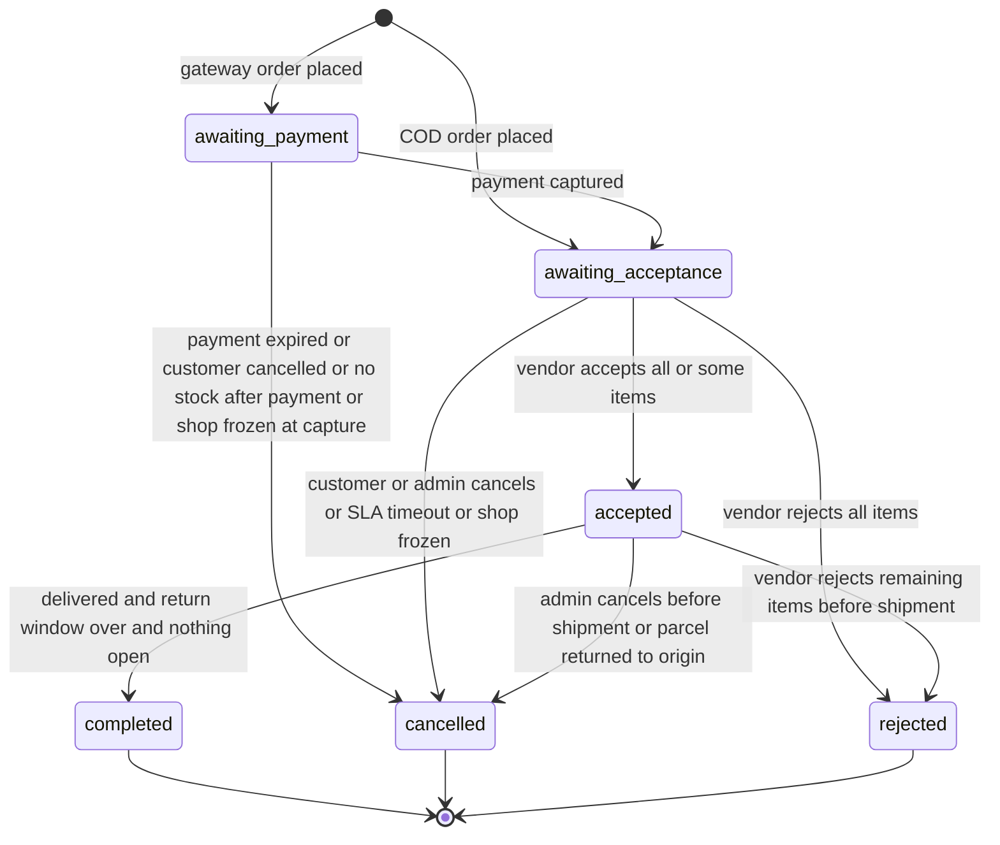

`cancel_reason` ∈ `customer_cancelled`, `payment_expired`, `acceptance_timeout`, `admin_cancelled`, `shop_frozen`, `undeliverable`, `stock_unavailable_after_payment`. `payment_expired` covers every unpaid gateway outcome (expired, failed or cancelled at the provider); the payment row keeps the precise status.

`accepted → rejected` (the vendor rejects every remaining unit after accepting, while the shipment is still `pending` or `packed`) is **decided here**. 01 AC-FR-ORD-003-1 and 02 J-12 rely on it. Canon §9 names no source state for `rejected`, so the addition is listed for the consistency review (Consistency note 6).

| From → To                                                                            | Initiator                                                                                                                                                                                               | Preconditions                                                                                                                                                                                                                                                                                                                                                                                                                                                                                                                                                                             | Transaction boundary                                                                                                                                                                                                                                                                                         | Side effects                                                                                                                                                                                                                                                                                                                                                                                     | Idempotency behaviour                                         | Audit entry                                                                             | Recovery when part fails                                                                     |
| ------------------------------------------------------------------------------------ | ------------------------------------------------------------------------------------------------------------------------------------------------------------------------------------------------------- | ----------------------------------------------------------------------------------------------------------------------------------------------------------------------------------------------------------------------------------------------------------------------------------------------------------------------------------------------------------------------------------------------------------------------------------------------------------------------------------------------------------------------------------------------------------------------------------------- | ------------------------------------------------------------------------------------------------------------------------------------------------------------------------------------------------------------------------------------------------------------------------------------------------------------ | ------------------------------------------------------------------------------------------------------------------------------------------------------------------------------------------------------------------------------------------------------------------------------------------------------------------------------------------------------------------------------------------------ | ------------------------------------------------------------- | --------------------------------------------------------------------------------------- | -------------------------------------------------------------------------------------------- |
| (new) → `awaiting_acceptance`                                                        | Customer, `placeOrder` with COD                                                                                                                                                                         | §4.1 and §4.3 checks pass                                                                                                                                                                                                                                                                                                                                                                                                                                                                                                                                                                 | Req-TX (checkout)                                                                                                                                                                                                                                                                                            | Committed reservations; COD payment `awaiting_collection`; jobs: customer and vendor emails, `orders.acceptance_timeout`, `orders.acceptance_reminder`, `catalog.refresh_listing`                                                                                                                                                                                                                | ⚷ replay (T-CHK-004)                                          | `order.place`                                                                           | Rollback-retry                                                                               |
| (new) → `awaiting_payment`                                                           | Customer, `placeOrder` with gateway                                                                                                                                                                     | same                                                                                                                                                                                                                                                                                                                                                                                                                                                                                                                                                                                      | Req-TX, then provider initiate after commit (§4.8)                                                                                                                                                                                                                                                           | Held reservations; payment `initiated`; job `payments.verify`                                                                                                                                                                                                                                                                                                                                    | ⚷ replay                                                      | `order.place`                                                                           | Initiate failure leaves payment `initiated`; customer uses `startOrderPayment`               |
| `awaiting_payment` → `awaiting_acceptance`                                           | System, on verified capture (return handler, `payments.verify`, reconciliation, webhook)                                                                                                                | Payment `captured` with amount match; all reservations still `held` (otherwise §8.4); the shop is not `suspended` with `suspension_mode = 'frozen'` (a frozen shop's shop order takes the `shop_frozen` row below in the same TX)                                                                                                                                                                                                                                                                                                                                                         | Lookup + TX, locks order → shop orders → payment                                                                                                                                                                                                                                                             | Reservations `held → committed`; `acceptance_due_at = now() + SLA`; jobs as for COD placement; parent → `placed` (or `cancelled` when every shop order was cancelled in this TX)                                                                                                                                                                                                                 | CAS no-op (T-PAY-005)                                         | `payment.capture` (one row for the payment; each shop order gets an `order_events` row) | Job retry for emails; TX failure is retried by the next verify run                           |
| `awaiting_payment` → `cancelled` (`payment_expired`)                                 | System: `inventory.expire_reservations` (§5.4 Case A or B3), or the path that closes the last open attempt after the holds passed `expires_at` (return handler, `payments.verify`, `startOrderPayment`) | The order's reservations are past `expires_at`, and no attempt other than the one this TX closes is `initiated`, `pending`, `needs_review` or `captured` (a `captured` row with `is_late_capture` does not count, §6.4). The latest attempt ended in a definitive non-success, or is `initiated` with no provider reference and no longer in flight (§4.8), which counts as not paid only past this expiry, because `payments.expires_at` is null when the initiate failed. Before `expires_at`, a definitive non-success changes only the attempt, and the customer may pay again (§4.8) | Job-TX (Case A), Lookup + TX, or a separate TX run by `startOrderPayment` (§4.8); each is one TX per order, never one per shop order: it cancels every `awaiting_payment` shop order of the order, closes the shared payment if it is still open and releases all held reservations in one pass (§4.4, §5.4) | Payment → `expired`/`failed`/`cancelled` when this TX closes it; held reservations released; parent recomputed; email "payment not completed, nothing was charged"                                                                                                                                                                                                                               | CAS no-op                                                     | `shop_order.cancel` (reason)                                                            | Job retry; unknown outcomes never reach this row (they go to `needs_review`)                 |
| `awaiting_payment` → `cancelled` (`customer_cancelled`)                              | Customer, `cancelMyShopOrder` (cancels every shop order of the order, because they share one payment)                                                                                                   | Latest attempt `initiated` without reference, a lookup returned definitive non-success, or the latest attempt is already `failed`, `cancelled` or `expired` (02 AC-J06-14)                                                                                                                                                                                                                                                                                                                                                                                                                | Lookup (if `pending`) + Req-TX                                                                                                                                                                                                                                                                               | Payment → `cancelled` if still open; reservations released                                                                                                                                                                                                                                                                                                                                       | ⚷ replay; CAS 409 if the payment was captured in the meantime | `shop_order.cancel`                                                                     | Rollback-retry; if the lookup is inconclusive the request returns 409 and nothing changes    |
| `awaiting_payment` → `cancelled` (`stock_unavailable_after_payment`)                 | System, late-capture path (§8.4)                                                                                                                                                                        | Payment captured but re-reserving stock failed for this shop order                                                                                                                                                                                                                                                                                                                                                                                                                                                                                                                        | The capture TX (Lookup + TX, or the Req-TX of a manual `needs_review` resolution; §8.4)                                                                                                                                                                                                                      | System refund (full allocation) created and auto-approved; job `refunds.execute`; customer email with apology and refund timeline                                                                                                                                                                                                                                                                | CAS no-op                                                     | `shop_order.cancel`, `refund.create`                                                    | Refund job retry; refund failure follows §8.8                                                |
| `awaiting_payment` → `cancelled` (`shop_frozen`)                                     | System, inside the capture TX (every capture path of the `awaiting_acceptance` row above, including the late-capture path of §8.4)                                                                      | Payment `captured` in the same TX; the shop is `suspended` with `suspension_mode = 'frozen'` (§8.10)                                                                                                                                                                                                                                                                                                                                                                                                                                                                                      | The capture TX (Lookup + TX, or the Req-TX of a manual `needs_review` resolution)                                                                                                                                                                                                                            | Allocation captured with the payment; this shop order's reservations still `held` are released (reason `shop_frozen`), and the late-capture path attempts no re-reserve for it; system refund of `refundable(so)`, the full allocation (reason `order_cancelled`, §3.6), created and auto-approved; job `refunds.execute`; no acceptance jobs or vendor email; customer email; parent recomputed | CAS no-op (T-PAY-005)                                         | `shop_order.cancel`, `refund.create`                                                    | Refund job retry; refund failure follows §8.8; a failed TX is retried by the next verify run |
| `awaiting_acceptance` → `accepted`                                                   | Vendor with `shop.orders.process`, `acceptShopOrder`, or `rejectShopOrder` for a subset of items                                                                                                        | Shop `active` or `suspended` with `fulfill_existing`; at least one unit kept                                                                                                                                                                                                                                                                                                                                                                                                                                                                                                              | Req-TX                                                                                                                                                                                                                                                                                                       | Shipment row `pending`; `accepted_at`; item-level rejection effects (§3.6); customer email; the timeout job later no-ops                                                                                                                                                                                                                                                                         | ⚷ replay; CAS 409 if the customer cancelled first (§8.12)     | `shop_order.accept` (+ `shop_order.reject_items`)                                       | Rollback-retry                                                                               |
| `awaiting_acceptance` → `rejected`                                                   | Vendor, `rejectShopOrder` with all items and a reason (`out_of_stock`, `cannot_fulfil`, `pricing_error`, `other`)                                                                                       | as above                                                                                                                                                                                                                                                                                                                                                                                                                                                                                                                                                                                  | Req-TX                                                                                                                                                                                                                                                                                                       | All reservations released; COD payment `cancelled`; gateway system refund of `refundable(so)` (§3.6); customer email; counts in shop rejection metric                                                                                                                                                                                                                                            | ⚷ replay; CAS 409                                             | `shop_order.reject`                                                                     | Rollback-retry                                                                               |
| `awaiting_acceptance` → `cancelled` (`customer_cancelled`)                           | Customer, `cancelMyShopOrder`                                                                                                                                                                           | Caller owns the order (404 otherwise, T-SEC-002)                                                                                                                                                                                                                                                                                                                                                                                                                                                                                                                                          | Req-TX                                                                                                                                                                                                                                                                                                       | Reservations released; COD `cancelled`; gateway system refund of `refundable(so)` (§3.6); vendor and customer emails                                                                                                                                                                                                                                                                             | ⚷ replay; CAS 409 if accepted first                           | `shop_order.cancel`                                                                     | Rollback-retry                                                                               |
| `awaiting_acceptance` → `cancelled` (`acceptance_timeout`)                           | System, `orders.acceptance_timeout` at `acceptance_due_at` (sweeper every 15 min as a safety net)                                                                                                       | `now() ≥ acceptance_due_at`; the shop is not `frozen` (for a frozen shop the handler takes the `shop_frozen` row below instead, and the timeout metric is not counted, §8.11)                                                                                                                                                                                                                                                                                                                                                                                                             | Job-TX                                                                                                                                                                                                                                                                                                       | as customer cancel; shop timeout metric                                                                                                                                                                                                                                                                                                                                                          | CAS no-op                                                     | `shop_order.cancel` (actor system)                                                      | Job retry; the sweeper catches a lost delayed job                                            |
| `awaiting_acceptance` or `accepted` → `cancelled` (`admin_cancelled`, `shop_frozen`) | Admin with `platform.orders.intervene` (`adminCancelShopOrder`), or `orders.handle_shop_suspension`; for a frozen shop also the acceptance sweeper and `orders.acceptance_timeout` (§8.11)              | Shipment absent, `pending` or `packed`                                                                                                                                                                                                                                                                                                                                                                                                                                                                                                                                                    | Req-TX or Job-TX                                                                                                                                                                                                                                                                                             | as customer cancel; `cancel_reason` note required                                                                                                                                                                                                                                                                                                                                                | ⚷ replay (admin); CAS no-op (job)                             | `shop_order.cancel` with reason                                                         | Rollback-retry                                                                               |
| `accepted` → `rejected`                                                              | Vendor, `rejectShopOrder` for all remaining units                                                                                                                                                       | Shipment `pending` or `packed`                                                                                                                                                                                                                                                                                                                                                                                                                                                                                                                                                            | Req-TX                                                                                                                                                                                                                                                                                                       | as rejection above; counts as a late rejection in shop metrics                                                                                                                                                                                                                                                                                                                                   | ⚷ replay; CAS 409                                             | `shop_order.reject`                                                                     | Rollback-retry                                                                               |
| `accepted` → `cancelled` (`undeliverable`)                                           | Vendor, `recordFulfillmentEvent` `returned_to_origin` (or admin for a frozen shop)                                                                                                                      | Shipment `returning`; COD payment not `collected` (§6.3)                                                                                                                                                                                                                                                                                                                                                                                                                                                                                                                                  | Req-TX (same TX as the shipment transition)                                                                                                                                                                                                                                                                  | `rto_restock` movements for the units marked resaleable (§5.8); COD `awaiting_collection → not_collected` (unchanged if already `not_collected`); gateway system refund of `refundable(so)` in full, shipping included, reason `undeliverable`, auto-approved (§3.3, §3.6); customer email                                                                                                       | ⚷ replay                                                      | `shipment.return_to_origin`, `shop_order.cancel`                                        | Rollback-retry                                                                               |
| `accepted` → `completed`                                                             | System, `orders.auto_complete` (hourly)                                                                                                                                                                 | Shipment `delivered`; `now() ≥ shipments.return_window_ends_at` (set in the `delivered` TX, §6.3); no return request in `requested`, `approved`, `in_transit`, `received`; no refund in `requested`, `approved`, `processing`, `failed`, `needs_review`; COD `collected` or gateway `captured`                                                                                                                                                                                                                                                                                            | Job-TX, per shop order                                                                                                                                                                                                                                                                                       | `completed_at`; parent recompute. No ledger change (posted at delivery, §7.3)                                                                                                                                                                                                                                                                                                                    | CAS no-op                                                     | `shop_order.complete` (actor system)                                                    | Job retry                                                                                    |

**Late delivery is a flag, not a transition (decided here).** This follows 01 AC-FR-ORD-005-4 and 02 J-07 and J-19. A shop order is **late** when it is `awaiting_acceptance` or `accepted`, its shipment (if any) is not `delivered`, and `now() ≥ entered_awaiting_acceptance_at + greatest(est_max_days_snapshot, 1) × 24 h`. A same-day promise (`est_max_days_snapshot = 0`, allowed by 01 AC-FR-SHOP-004-1) is treated as one 24-hour period, so it is not late the moment it is placed. `entered_awaiting_acceptance_at` is `orders.placed_at` for COD, and `payments.captured_at` of the captured attempt without `is_late_capture` (the attempt that paid the order) for gateway orders, including a late capture that paid it (§8.4). This is the moment the vendor could start work. `est_max_days_snapshot` is the promise shown at checkout ([04a §11.2](04a-data-dictionary-tables.md#112-shop_orders)). Days are 24-hour periods, with no business-day calendar in R1. The flag is computed on read, so no job, status or column exists for it. While it is set, the customer's order page shows "Get help: delivery is late", which opens a support case with category `delivery` and the shop order linked (`due_at = created_at + 15 days`). Support then resolves it with the existing transitions (§8.15). The legal ground (E-Commerce Act s16(d), s16(g)) stays [Verify-external VX-02]. The start point is a product decision, not a reading of the Act. Test T-ORD-010 (proposed).

### 6.2 Order (parent, derived)

The parent machine has no initiators of its own. Every transition is a side effect of a ShopOrder transition, computed by `deriveOrderStatus` (§3.8) and written in the same TX after the parent row lock.

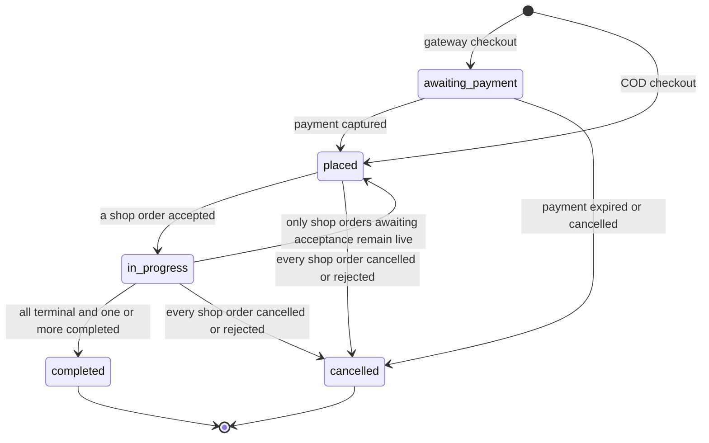

| From → To                              | Initiator                              | Preconditions                                           | Transaction boundary                | Side effects                                                                                                                                                                   | Idempotency behaviour                                                     | Audit entry                     | Recovery when part fails                                                                                           |
| -------------------------------------- | -------------------------------------- | ------------------------------------------------------- | ----------------------------------- | ------------------------------------------------------------------------------------------------------------------------------------------------------------------------------ | ------------------------------------------------------------------------- | ------------------------------- | ------------------------------------------------------------------------------------------------------------------ |
| (new) → `placed` or `awaiting_payment` | Derived at checkout                    | §3.8 rules 1 and 4                                      | Checkout Req-TX                     | none beyond checkout                                                                                                                                                           | ⚷ replay                                                                  | none (covered by `order.place`) | Rollback-retry                                                                                                     |
| any → any listed in the diagram        | Derived after any ShopOrder transition | Result of `deriveOrderStatus` differs from stored value | Same TX as the ShopOrder transition | `order_events` row `order.status_changed` (customer-visible); customer email only for `cancelled` and `completed` when that event is not already covered by a shop order email | Recompute is idempotent: same input, same output; no write when unchanged | none (derived)                  | Cannot partially fail: it commits or rolls back with the ShopOrder change. T-ORD-009 re-derives after every action |

`in_progress → placed` happens when, for example, an admin cancels the only accepted shop order while another is still `awaiting_acceptance` (rule 4 applies again). `placed → completed` cannot happen directly, because a shop order must be accepted, which moves the parent to `in_progress`, before it can complete.

### 6.3 Shipment (fulfillment)

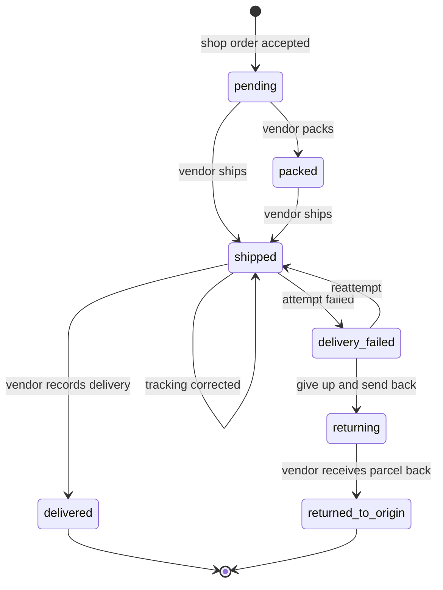

R1 has one shipment per shop order (`shipments.shop_order_id` UNIQUE) and no courier API, so every transition is a vendor entry through `recordFulfillmentEvent` [Confirmed Q5], except for a shop `suspended` in `frozen` mode, whose events an admin records (§8.10, Consistency note 4). The vendor needs `shop.orders.process`; staff with `order_fulfiller` have it.

| From → To                               | Initiator                                                                                                                                                                                                                                        | Preconditions                                                                                                                                                                                                            | Transaction boundary | Side effects                                                                                                                                                                                                                                                                                                                                                                                                                                                             | Idempotency behaviour                                                                    | Audit entry                 | Recovery when part fails        |
| --------------------------------------- | ------------------------------------------------------------------------------------------------------------------------------------------------------------------------------------------------------------------------------------------------ | ------------------------------------------------------------------------------------------------------------------------------------------------------------------------------------------------------------------------ | -------------------- | ------------------------------------------------------------------------------------------------------------------------------------------------------------------------------------------------------------------------------------------------------------------------------------------------------------------------------------------------------------------------------------------------------------------------------------------------------------------------ | ---------------------------------------------------------------------------------------- | --------------------------- | ------------------------------- |
| (new) → `pending`                       | System, inside the accept TX                                                                                                                                                                                                                     | ShopOrder → `accepted`                                                                                                                                                                                                   | Accept Req-TX        | none                                                                                                                                                                                                                                                                                                                                                                                                                                                                     | with accept                                                                              | none                        | with accept                     |
| `pending` → `packed`                    | Vendor, event `packed`                                                                                                                                                                                                                           | ShopOrder `accepted`                                                                                                                                                                                                     | Req-TX               | Customer timeline event only (no email)                                                                                                                                                                                                                                                                                                                                                                                                                                  | ⚷ replay; CAS no-op if already `packed`                                                  | `shipment.pack`             | Rollback-retry                  |
| `pending` or `packed` → `shipped`       | Vendor, event `shipped` with `courier_name` (required), `tracking_number` and `tracking_url` (optional, https only)                                                                                                                              | ShopOrder `accepted` (so at least one item has kept units); every item with kept units has exactly one `committed` reservation for its kept quantity, and exactly those are consumed. Lines rejected in full are skipped | Req-TX               | Reservations `committed → consumed`, `ship` movements (§5.6); `shipped_at`; `attempt_count = 1`; customer email with tracking                                                                                                                                                                                                                                                                                                                                            | ⚷ replay; CAS 409 if cancelled meanwhile                                                 | `shipment.ship`             | Rollback-retry; email Job retry |
| `shipped` → `shipped` (tracking update) | Vendor, event `shipped` sent again with a changed `courier_name`, `tracking_number` or `tracking_url` (02 J-12)                                                                                                                                  | Shipment `shipped`; at least one field differs                                                                                                                                                                           | Req-TX               | Updates only the three tracking fields; `shipment_events` row (`event = 'shipped'`, `status = 'shipped'`, note "tracking corrected"); customer email with the corrected tracking. No stock, reservation, `shipped_at` or `attempt_count` change                                                                                                                                                                                                                          | ⚷ replay; CAS `WHERE status = 'shipped'`; identical values → no-op 200 with no event row | `shipment.update_tracking`  | Rollback-retry                  |
| `shipped` → `delivered`                 | Vendor, event `delivered`; admin for a frozen shop (proposed `adminRecordFulfillmentEvent`, Consistency note 4)                                                                                                                                  | none beyond state                                                                                                                                                                                                        | Req-TX               | `delivered_at`; `return_window_ends_at = delivered_at + return_window_days`, with the setting read in this TX ([04a §11.5](04a-data-dictionary-tables.md#115-shipments)); if the payment is already `collected` (COD) or `captured` (gateway) the delivery ledger posting runs in this TX (§7.3); job `orders.cod_outcome_reminder` after 24 h if COD outcome not recorded; customer email "delivered", with the last day for returns taken from `return_window_ends_at` | ⚷ replay; ledger `dedupe_key` prevents double posting                                    | `shipment.deliver`          | Rollback-retry                  |
| `shipped` → `delivery_failed`           | Vendor, event `delivery_failed` with reason (`customer_unreachable`, `refused`, `address_problem`, `other`); admin for a frozen shop (proposed `adminRecordFulfillmentEvent`, Consistency note 4)                                                | For COD, the payment is not `collected`; otherwise 409 `INVALID_STATE_TRANSITION` (detail: cash is recorded as collected, so record `delivered`, or contact support if the collection was recorded by mistake)           | Req-TX               | Customer email asking them to contact the shop or support; after the second failure a support case is opened automatically (category `delivery`)                                                                                                                                                                                                                                                                                                                         | ⚷ replay                                                                                 | `shipment.delivery_fail`    | Rollback-retry                  |
| `delivery_failed` → `shipped`           | Vendor, event `reattempt`; admin for a frozen shop (proposed `adminRecordFulfillmentEvent`, Consistency note 4)                                                                                                                                  | `attempt_count < 3` [Assumption]                                                                                                                                                                                         | Req-TX               | `attempt_count + 1`; customer email                                                                                                                                                                                                                                                                                                                                                                                                                                      | ⚷ replay                                                                                 | `shipment.reattempt`        | Rollback-retry                  |
| `delivery_failed` → `returning`         | Vendor, event `returning`; admin for a frozen shop (proposed `adminRecordFulfillmentEvent`, Consistency note 4)                                                                                                                                  | For COD, the payment is not `collected` (409 `INVALID_STATE_TRANSITION` otherwise)                                                                                                                                       | Req-TX               | Customer email "your parcel is being returned to the shop"                                                                                                                                                                                                                                                                                                                                                                                                               | ⚷ replay                                                                                 | `shipment.return_start`     | Rollback-retry                  |
| `returning` → `returned_to_origin`      | Vendor, event `returned_to_origin` with `items[]` (`order_item_id`, `restock_quantity`) for every line consumed at shipment, and a `note` with the reason when any unit is not restocked (§5.8); admin for a frozen shop (see Consistency notes) | For COD, the payment is not `collected` (409 `INVALID_STATE_TRANSITION` otherwise)                                                                                                                                       | Req-TX               | `rto_restock` movements for the units marked resaleable only; damaged units get no movement (§5.8); ShopOrder → `cancelled` (`undeliverable`); COD `awaiting_collection` → `not_collected` (unchanged if already `not_collected`); gateway system refund of `refundable(so)` in full, shipping included (§3.3); parent recompute                                                                                                                                         | ⚷ replay                                                                                 | `shipment.return_to_origin` | Rollback-retry                  |

A vendor who marks `delivered` by mistake cannot undo it: the admin handles it through a support case and, if money was posted, a ledger `adjustment` with reason (§7.8). The UI asks for confirmation before `delivered` ([08](08-ui-ux-and-design-system.md)).

**COD collected before delivery is recorded.** §6.5 lets the vendor record `collected` while the shipment is still `shipped`, and the COD machine has no transition out of `collected`. Cash recorded at the door means the parcel was handed over, so while the COD payment is `collected` the shipment can only move to `delivered`: `delivery_failed`, `returning` and `returned_to_origin` answer 409 `INVALID_STATE_TRANSITION`. Without this guard the RTO TX could not move the payment to `not_collected` and would roll back on every attempt. A collection recorded by mistake is handled like a mistaken `delivered`, through a support case. The RTO TX moves a COD payment that is `awaiting_collection` to `not_collected` and leaves one the vendor already marked `not_collected` during `returning` unchanged (no CAS failure). The vendor cannot mark `not_collected` while the shipment is `delivery_failed`, because a `reattempt` could still deliver the parcel (§6.5).

If a shop order is cancelled after acceptance but before shipment, its shipment row keeps its last state (`pending` or `packed`) and is displayed as cancelled because its shop order is terminal. There is no `cancelled` shipment state; the CHECK list in [04a §11.5](04a-data-dictionary-tables.md#115-shipments) has the seven states of the diagram.

The tracking update is an explicit self-transition, not a silent field edit, so that every change the customer sees on the tracking page has an event row and an audit entry. It is allowed only while the shipment is `shipped`; after `delivered` or `delivery_failed` the tracking fields are frozen.

A shipment that is not `delivered` by the promised date makes the shop order late (§6.1, §8.15). Lateness is never a shipment state.

### 6.4 Payment (gateway, R1.1)

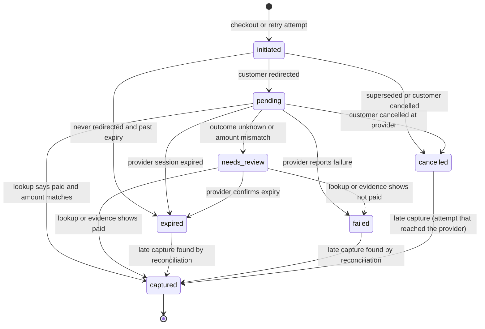

Provider status mapping (only the lookup response is trusted, never redirect parameters):

| Khalti lookup `status`                                               | Internal outcome                                                                                                            | eSewa status API `status`                                                  | Internal outcome                                                                                   |
| -------------------------------------------------------------------- | --------------------------------------------------------------------------------------------------------------------------- | -------------------------------------------------------------------------- | -------------------------------------------------------------------------------------------------- |
| `Completed` with `total_amount = amount_minor`                       | capture                                                                                                                     | `COMPLETE` with `total_amount` equal to the sent value                     | capture                                                                                            |
| `Completed` with a different amount                                  | `needs_review`                                                                                                              | `COMPLETE` with a different amount                                         | `needs_review`                                                                                     |
| `Initiated`                                                          | unknown: keep polling until `expires_at`                                                                                    | `PENDING`                                                                  | unknown: keep polling                                                                              |
| `Pending` ("Hold, do not provide service. And contact Khalti team.") | `needs_review` immediately, keep polling                                                                                    | `AMBIGUOUS` ("Payment is at hult state")                                   | unknown: keep polling, then `needs_review`                                                         |
| `Expired`                                                            | `expired`                                                                                                                   | `NOT_FOUND` ("Session expired")                                            | `expired`                                                                                          |
| `User canceled`                                                      | `cancelled`; from `needs_review`, `failed` (below)                                                                          | `CANCELED` ("Canceled/Reversed from eSewa side")                           | `failed`; on a `captured` payment, a reversal (below)                                              |
| `Refunded`, `Partially refunded`                                     | refund confirmation for a refund in `processing` (§6.7), no payment state change; an unmatched refund is a reversal (below) | `FULL_REFUND`, `PARTIAL_REFUND`                                            | refund confirmation for a refund in `processing` (§6.7); an unmatched refund is a reversal (below) |
| HTTP error or timeout                                                | unknown, retry                                                                                                              | `{"code":0,"error_message":"Service is currently unavailable"}` or timeout | unknown, retry                                                                                     |

Sources: Khalti statuses and "Only the status with Completed must be treated as success" [Verified-doc: https://docs.khalti.com/khalti-epayment/, accessed 2026-09-25]; eSewa statuses and error body [Verified-doc: https://developer.esewa.com.np/pages/Epay, accessed 2026-09-25]. Both are [Verify-external VX-06, VX-07] until confirmed in each provider's sandbox during M8.

The outcome also depends on the attempt's current state. From `needs_review`, Khalti `User canceled` resolves the attempt to `failed` (the same effects as `pending → cancelled`), because `needs_review` has no `cancelled` exit. On a `captured` payment, no status in the table changes the payment: `captured` has no outgoing transition, and [04a §12.1](04a-data-dictionary-tables.md#121-payments) `payments_captured_state_check` ties `captured_minor = amount_minor` to that status.

**Reversal or refund that DripNepal did not start.** A lookup or a merchant-statement line (§9.4) can show a reversal or refund on a `captured` payment (eSewa `CANCELED`, `FULL_REFUND` or `PARTIAL_REFUND`; Khalti `Refunded` or `Partially refunded`) that is larger than the sum of the payment's `succeeded` refunds while no DripNepal refund of that payment is `processing` or `needs_review`, and no `gateway_manual` refund of it is `approved` (the operator may refund in the portal before `markRefundSucceeded` records it, §8.8), for example a refund made in the Khalti merchant portal or a reversal from eSewa's side. A lookup returns a status but no refunded amount (§8.8), so it can flag this only when no DripNepal refund of the payment is `succeeded`, `processing` or `needs_review`, or when the status says fully refunded while the `succeeded` refunds are below `captured_minor` and no refund of the payment is in one of those states; otherwise only a merchant-statement line shows it. The payment stays `captured` and `captured_minor` does not change. The lookup's `provider_events` row records `error = 'reversal_after_capture'`, finance and ops are alerted, and a support case with category `order_issue` is opened for each shop order the payment paid (not a second one while one is open). The case puts the item on finance's list and holds that shop order from payout (§7.6). Finance resolves it by recording a refund of the reversed amount on each affected allocation, with method `gateway_manual` (for either provider, because the refund was made outside the API, §6.7), reason `other` and the provider evidence as its reference, so the §6.7 and §7.4 effects run, or by a ledger adjustment (§7.8) when the platform bears the loss, and then closes the cases. A reversed amount that is not whole units plus shipping, or that cannot be attributed to allocations, cannot be recorded as a refund yet (§6.7) [Open: owner decision, see Consistency note 20]. Provider behaviour stays [Verify-external VX-06, VX-07].

| From → To                                                      | Initiator                                                                                                                                                    | Preconditions                                                                                                                                                                                                                                            | Transaction boundary                                       | Side effects                                                                                                                                                                                                                                                                                                                                                                                                                                                                                                                                                                                                                                                                                           | Idempotency behaviour                                                                                                                                    | Audit entry                                                     | Recovery when part fails                                                                                                                                                                              |
| -------------------------------------------------------------- | ------------------------------------------------------------------------------------------------------------------------------------------------------------ | -------------------------------------------------------------------------------------------------------------------------------------------------------------------------------------------------------------------------------------------------------- | ---------------------------------------------------------- | ------------------------------------------------------------------------------------------------------------------------------------------------------------------------------------------------------------------------------------------------------------------------------------------------------------------------------------------------------------------------------------------------------------------------------------------------------------------------------------------------------------------------------------------------------------------------------------------------------------------------------------------------------------------------------------------------------ | -------------------------------------------------------------------------------------------------------------------------------------------------------- | --------------------------------------------------------------- | ----------------------------------------------------------------------------------------------------------------------------------------------------------------------------------------------------- |
| (new) → `initiated`                                            | Customer, `placeOrder` or `startOrderPayment`                                                                                                                | Order `awaiting_payment` with its holds not past `expires_at`; no other live attempt (parent lock, §4.8; partial unique index as the backstop)                                                                                                           | Req-TX                                                     | Allocations per shop order; `payments.verify` scheduled; for a retry, held reservations extended (§4.8, §5.3)                                                                                                                                                                                                                                                                                                                                                                                                                                                                                                                                                                                          | ⚷ replay; a parallel retry waits on the parent lock and gets 409 `CONFLICT` while this attempt's initiate is in flight (§4.8)                            | `payment.initiate`                                              | Rollback-retry                                                                                                                                                                                        |
| `initiated` → `pending`                                        | System, after Khalti initiate returns `pidx` or when the eSewa form is rendered                                                                              | Provider reference known (Khalti) or form fields stored (eSewa)                                                                                                                                                                                          | Provider call, then short TX                               | Reservation `expires_at` extended (§5.3); `provider_events` row for the initiate response                                                                                                                                                                                                                                                                                                                                                                                                                                                                                                                                                                                                              | CAS no-op for a duplicate; if the CAS finds the attempt superseded, cancelled or expired, the redirect is withheld and the orphan `pidx` recorded (§4.8) | `payment.redirect`                                              | If the short TX fails after Khalti returned a `pidx`, the attempt stays `initiated` and is superseded on retry; the orphan `pidx` expires at Khalti unpaid because its URL never reached the customer |
| `initiated` → `cancelled`                                      | Customer retry (`startOrderPayment`) or customer cancel                                                                                                      | No provider reference; for a retry, the initiate is no longer in flight (§4.8)                                                                                                                                                                           | Req-TX                                                     | New attempt (retry) or order cancellation (§6.1)                                                                                                                                                                                                                                                                                                                                                                                                                                                                                                                                                                                                                                                       | ⚷ replay                                                                                                                                                 | `payment.cancel`                                                | Rollback-retry                                                                                                                                                                                        |
| `initiated` → `expired`                                        | System, expiry job (§5.4 B2), or `startOrderPayment` past expiry (§4.8)                                                                                      | No provider reference, initiate no longer in flight, and the order's reservations past `expires_at` (`payments.expires_at` is null when the initiate failed). Before that, `payments.verify` leaves it unchanged                                         | Job-TX, or a separate TX run by `startOrderPayment` (§4.8) | ShopOrders → `cancelled` (`payment_expired`); reservations released (§6.1)                                                                                                                                                                                                                                                                                                                                                                                                                                                                                                                                                                                                                             | CAS no-op                                                                                                                                                | `payment.expire`                                                | Job retry                                                                                                                                                                                             |
| `pending` → `captured`                                         | System: return handler, `payments.verify`, reconciliation sweeper, or webhook, always after a successful lookup                                              | Lookup success and amount match                                                                                                                                                                                                                          | Lookup + TX (order → shop orders → payment → allocations)  | `captured_minor = amount_minor`; allocations captured; each ShopOrder → `awaiting_acceptance`, except a frozen shop's (→ `cancelled`, `shop_frozen`, §6.1: holds released and allocation refunded) and failed re-reserves (§8.4); reservations committed; emails; acceptance timeout jobs                                                                                                                                                                                                                                                                                                                                                                                                              | CAS no-op: the second event, return or job finds `captured` and stops (T-PAY-005)                                                                        | `payment.capture` (actor `provider`, with `provider_events.id`) | If the TX fails, the next verify run repeats the lookup and capture                                                                                                                                   |
| `pending` → `failed` / `cancelled` / `expired`                 | System, same paths, or `startOrderPayment` after its lookup (§4.8)                                                                                           | Definitive non-success from the lookup (table above)                                                                                                                                                                                                     | Lookup + TX                                                | Holds before `expires_at`: only the attempt is closed; shop orders stay `awaiting_payment`, reservations stay `held`, and the return page offers "Nothing was charged" with "Pay again" (§4.8). Holds past `expires_at`: in the same TX, ShopOrders → `cancelled` (`payment_expired`), reservations released, customer email (§6.1)                                                                                                                                                                                                                                                                                                                                                                    | CAS no-op                                                                                                                                                | `payment.fail` / `payment.cancel` / `payment.expire`            | Job retry                                                                                                                                                                                             |
| `pending` → `needs_review`                                     | System, `payments.verify`                                                                                                                                    | Khalti `Pending`; amount mismatch; or still unknown after the last scheduled attempt (§9.4)                                                                                                                                                              | Lookup + TX                                                | Row appears in the admin review queue (§9.5); ops alert; polling continues every 30 min until 48 h after redirect, then only the daily reconciliation and "Check with provider now" look it up (§9.4)                                                                                                                                                                                                                                                                                                                                                                                                                                                                                                  | CAS no-op                                                                                                                                                | `payment.flag_review`                                           | Job retry                                                                                                                                                                                             |
| `needs_review` → `captured` / `failed` / `expired`             | System lookup, or finance officer with evidence (provider portal screenshot reference, `provider_reference`); or `startOrderPayment` after its lookup (§4.8) | For a manual resolution to `captured`, a provider transaction reference is mandatory. A Khalti `User canceled` lookup resolves to `failed` (above). How an amount mismatch is settled is not decided yet [Open: owner decision, see Consistency note 20] | Lookup + TX, or Req-TX for the manual resolution           | as the corresponding `pending` transition; if reservations were released by Case C, capture follows §8.4                                                                                                                                                                                                                                                                                                                                                                                                                                                                                                                                                                                               | ⚷ replay (manual); CAS no-op (job)                                                                                                                       | `payment.resolve_review`                                        | Rollback-retry                                                                                                                                                                                        |
| `expired`, `failed` or `cancelled` → `captured` (late capture) | System, daily reconciliation against the provider statement or a lookup on an old attempt                                                                    | Provider shows success for an attempt recorded as a definitive non-success (a provider anomaly). The attempt reached the provider (it was `pending`); an attempt closed from `initiated` never did                                                       | Lookup + TX (order → shop orders → payment → allocations)  | `captured_minor = amount_minor`; allocations captured. If the attempt is the order's latest (highest `attempt_no`) and its shop orders are still `awaiting_payment`, it pays the order: the `pending → captured` effects follow, through §8.4 if its holds were released. Otherwise (a newer attempt exists in any status, or the shop orders are terminal) it is a superseded late capture: the same UPDATE sets `is_late_capture = true` (below); the shop orders and the newer attempt are not touched; one system refund per allocation of this attempt, each for that allocation's `captured_minor` (reason `late_capture`), is created and routed to finance approval; customer email; ops alert | CAS no-op                                                                                                                                                | `payment.capture_late`                                          | Refund follows §6.7                                                                                                                                                                                   |

**Superseded late capture.** `payments.is_late_capture` (boolean, default false) is proposed for [04a §12.1](04a-data-dictionary-tables.md#121-payments), with `AND NOT is_late_capture` added to the predicate of `payments_one_live_gateway_attempt_key`. Without it, setting a superseded attempt to `captured` while a newer attempt is `initiated`, `pending` or `captured` violates that index (`23505`) on every run, and the customer's second charge can be neither recorded nor refunded. A row with `is_late_capture = true` never counts as the order's captured attempt: the live-attempt checks (§4.8), Case A of the expiry job (§5.4), the gateway start point of §6.1, refund method selection and the order pages ignore it. Its money only goes back to the customer, so its `late_capture` refunds never post ledger entries (§7.4). A `late_capture` refund's `refund_items` are each line's full `A(quantity)` (§3.2), and its shipping part is `shipping_fee_minor`. It is checked against its own allocation only, so it never uses up the paying allocation's shipping (§3.3).

### 6.5 Payment (COD)

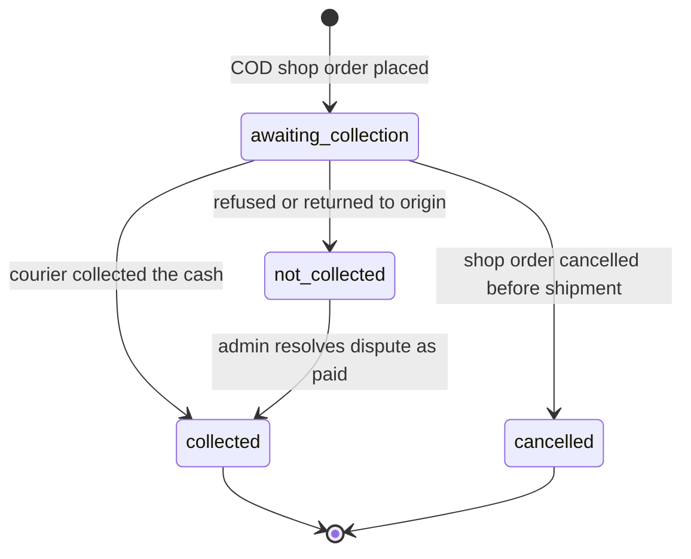

One COD payment per shop order, with `amount_minor` = the effective total of that shop order. While `awaiting_collection`, the amount is reduced (never increased) by item-level rejection in the rejection TX; this is an amount change, not a state change. `collected` has no outgoing transition, so once it is recorded, even while the shipment is still `shipped`, §6.3 refuses `delivery_failed`, `returning` and `returned_to_origin` for that shipment.

| From → To                               | Initiator                                                                                                                                                                                                                                   | Preconditions                                                                                                                                                                                                                                                                                                                                                             | Transaction boundary                | Side effects                                                                                                                                                                                                                                     | Idempotency behaviour                                                                                | Audit entry                                                                   | Recovery when part fails      |
| --------------------------------------- | ------------------------------------------------------------------------------------------------------------------------------------------------------------------------------------------------------------------------------------------- | ------------------------------------------------------------------------------------------------------------------------------------------------------------------------------------------------------------------------------------------------------------------------------------------------------------------------------------------------------------------------- | ----------------------------------- | ------------------------------------------------------------------------------------------------------------------------------------------------------------------------------------------------------------------------------------------------ | ---------------------------------------------------------------------------------------------------- | ----------------------------------------------------------------------------- | ----------------------------- |
| (new) → `awaiting_collection`           | Customer, `placeOrder` COD                                                                                                                                                                                                                  | §4                                                                                                                                                                                                                                                                                                                                                                        | Checkout Req-TX                     | none                                                                                                                                                                                                                                             | ⚷ replay                                                                                             | with `order.place`                                                            | Rollback-retry                |
| `awaiting_collection` → `collected`     | Vendor, `recordCodCollection` `collected`; for a shop `suspended` in `frozen` mode, admin with `platform.orders.intervene` (proposed `adminRecordCodCollection`, evidence reference mandatory, §8.9)                                        | Shipment `shipped` or `delivered`; collected amount equals `amount_minor` (partial collection is not allowed: a customer who wants only part of a parcel refuses it or returns items later) [Assumption OD-07]                                                                                                                                                            | Req-TX                              | `captured_minor = amount_minor`; if the shipment is `delivered`, the ledger delivery posting runs in this TX (§7.3), otherwise job `orders.cod_outcome_reminder` after 24 h asking the shop to record delivery (§8.9); receipt email to customer | ⚷ replay; CAS no-op if already `collected`                                                           | `payment.cod_collect` (actor `platform_staff` when an admin records it)       | Rollback-retry                |
| `awaiting_collection` → `not_collected` | Vendor, `recordCodCollection` `not_collected`, or system at `returned_to_origin`; for a shop `suspended` in `frozen` mode, admin with `platform.orders.intervene` (proposed `adminRecordCodCollection`, evidence reference mandatory, §8.9) | Shipment `returning`, `returned_to_origin` or `delivered` (dispute). Not while `delivery_failed` (409 `INVALID_STATE_TRANSITION`): a `reattempt` can still deliver, and the vendor could then no longer record `collected`. A refusal is recorded as `delivery_failed` (`refused`), and the payment becomes `not_collected` at `returning` or `returned_to_origin` (§8.9) | Req-TX                              | If the shipment is `delivered`: a support case is opened automatically (category `order_issue`) and completion is blocked (§8.9). No refusal counter is stored; the repeat-refuser rule counts `refused` delivery events (§8.9)                  | ⚷ replay; at `returned_to_origin` the system step leaves a payment already `not_collected` unchanged | `payment.cod_not_collected` (actor `platform_staff` when an admin records it) | Rollback-retry                |
| `awaiting_collection` → `cancelled`     | System, inside any cancellation or full rejection before shipment                                                                                                                                                                           | ShopOrder → `cancelled` or `rejected`                                                                                                                                                                                                                                                                                                                                     | same TX as the ShopOrder transition | none                                                                                                                                                                                                                                             | with the ShopOrder transition                                                                        | with `shop_order.cancel`                                                      | with the ShopOrder transition |
| `not_collected` → `collected`           | Admin with `platform.orders.intervene`, resolving a dispute (§8.9)                                                                                                                                                                          | Shipment `delivered`; support case resolution references evidence                                                                                                                                                                                                                                                                                                         | Req-TX                              | Ledger delivery posting (§7.3); case note                                                                                                                                                                                                        | ⚷ replay                                                                                             | `payment.cod_correct` with reason                                             | Rollback-retry                |

### 6.6 ReturnRequest (R1 support-created; R2 self-serve)

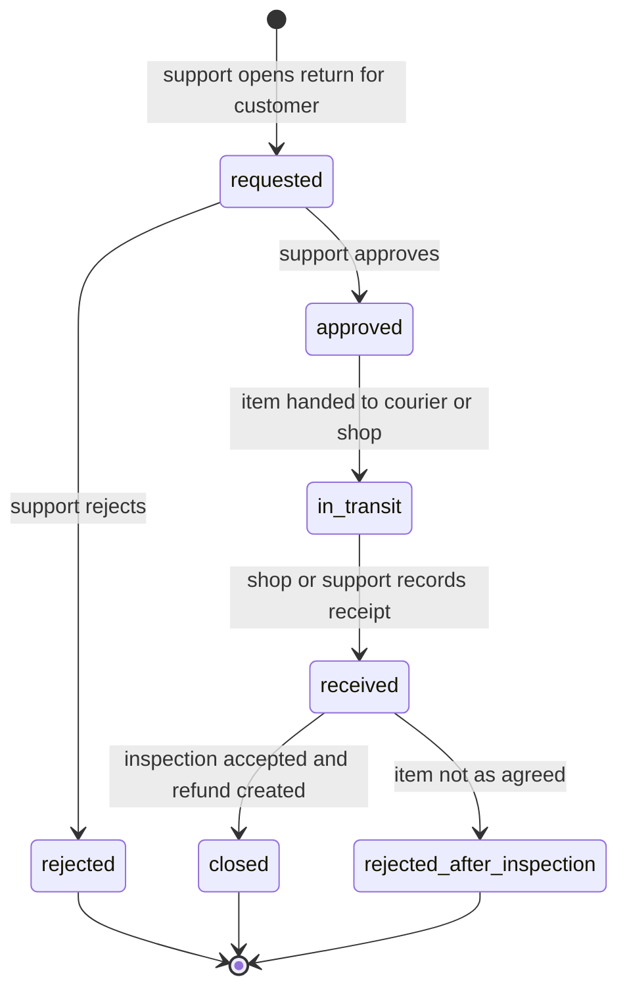

`reason_code` ∈ `not_as_described`, `damaged`, `wrong_item`, `size_issue`, `changed_mind`, `other`. In R1 a return is created by support staff on the customer's behalf through `createReturnRequest` (FR-RET-006), usually from a support case.

A return that the customer never sends back, or that the courier loses on its way back, has no exit yet: it stays `approved` or `in_transit`, so its shop order cannot complete (§6.1), its ledger entries stay held from payouts while they net positive (§6.8) and `refunds.sla_monitor` keeps escalating it (§9.4) [Open: owner decision, see Consistency note 20].

| From → To                                | Initiator                                                                                                                                                                                           | Preconditions                                                                                                                                                                                                                                                                                                                                                                                                 | Transaction boundary | Side effects                                                                                                                                                                                                                                                                                                                                                                                                                                                                                                                                                                                                                                                                        | Idempotency behaviour | Audit entry                              | Recovery when part fails |
| ---------------------------------------- | --------------------------------------------------------------------------------------------------------------------------------------------------------------------------------------------------- | ------------------------------------------------------------------------------------------------------------------------------------------------------------------------------------------------------------------------------------------------------------------------------------------------------------------------------------------------------------------------------------------------------------- | -------------------- | ----------------------------------------------------------------------------------------------------------------------------------------------------------------------------------------------------------------------------------------------------------------------------------------------------------------------------------------------------------------------------------------------------------------------------------------------------------------------------------------------------------------------------------------------------------------------------------------------------------------------------------------------------------------------------------- | --------------------- | ---------------------------------------- | ------------------------ |
| (new) → `requested`                      | Support agent with `platform.returns.manage` (`createReturnRequest`); customer in R2                                                                                                                | Shipment `delivered`; `now() ≤ shipments.return_window_ends_at` (set in the `delivered` TX, §6.3), or an admin override with reason for non-conforming goods; per item `quantity` ≤ kept − returned − the line's units on the shop order's `goodwill` or `other` refunds not in `cancelled` (counted in `k`, §3.2) − quantities in open returns, so no unit is refunded twice; category not excluded by OD-07 | Req-TX               | Blocks auto-completion of the shop order; shop timeline event; email to customer and shop                                                                                                                                                                                                                                                                                                                                                                                                                                                                                                                                                                                           | ⚷ replay              | `return_request.create`                  | Rollback-retry           |
| `requested` → `approved`                 | Support, `approveReturnRequest`                                                                                                                                                                     | none                                                                                                                                                                                                                                                                                                                                                                                                          | Req-TX               | `refund_due_at = approved_at + 7 days` is shown on the admin queue (§11; the start of the legal clock is an [Assumption] pending [Verify-external VX-02]); return instructions emailed                                                                                                                                                                                                                                                                                                                                                                                                                                                                                              | CAS 409               | `return_request.approve`                 | Rollback-retry           |
| `requested` → `rejected`                 | Support, `rejectReturnRequest` with reason                                                                                                                                                          | none                                                                                                                                                                                                                                                                                                                                                                                                          | Req-TX               | Customer email with reason and the grievance route (support case stays open until the customer is answered)                                                                                                                                                                                                                                                                                                                                                                                                                                                                                                                                                                         | CAS 409               | `return_request.reject`                  | Rollback-retry           |
| `approved` → `in_transit`                | Support or shop, recorded with courier details (proposed operation `markReturnInTransit`, for [06](06-api-design.md)), or implicitly in the receive TX when the customer drops the item at the shop | none                                                                                                                                                                                                                                                                                                                                                                                                          | Req-TX               | Timeline event                                                                                                                                                                                                                                                                                                                                                                                                                                                                                                                                                                                                                                                                      | CAS no-op             | `return_request.ship`                    | Rollback-retry           |
| `in_transit` → `received`                | Shop (`recordReturnReceived`, `shop.orders.process`) or support (`adminRecordReturnReceived`)                                                                                                       | none                                                                                                                                                                                                                                                                                                                                                                                                          | Req-TX               | `received_at`; condition notes per item; support is notified to inspect                                                                                                                                                                                                                                                                                                                                                                                                                                                                                                                                                                                                             | ⚷ replay              | `return_request.receive`                 | Rollback-retry           |
| `received` → `closed`                    | Support, after inspection (with the shop's condition notes)                                                                                                                                         | Inspection accepted                                                                                                                                                                                                                                                                                                                                                                                           | Req-TX               | `order_items.returned_quantity += q` per item; per-item `restock_quantity` → `return_restock` movements (§5.7); refund created in `requested` for `A(k + r) − A(k)` per item (§3.2) plus shipping per OD-07 if not yet refunded (§3.3), method by payment method (§6.7); for `manual_transfer` (COD) the close takes the customer's bank or wallet details and stores them in `recipient_details_enc`, which approval requires ([04a §12.4](04a-data-dictionary-tables.md#124-refunds)); email. On a COD shop order still `not_collected` (§8.9 outcome (b)) nothing was paid, so this refund cannot be created and the close fails [Open: owner decision, see Consistency note 20] | CAS no-op             | `return_request.close`, `refund.create`  | Rollback-retry           |
| `received` → `rejected_after_inspection` | Support                                                                                                                                                                                             | Item not as agreed (used, damaged by customer, wrong item returned), with a case note                                                                                                                                                                                                                                                                                                                         | Req-TX               | No quantity, stock or money change; how the item goes back to the customer is agreed in the support case; customer email with reason and grievance route                                                                                                                                                                                                                                                                                                                                                                                                                                                                                                                            | CAS 409               | `return_request.reject_after_inspection` | Rollback-retry           |

### 6.7 Refund

Methods (canon §17.1): `gateway_api` (Khalti refund API), `gateway_manual` (a refund made by an operator in the provider's merchant portal or through its support: always for eSewa, because eSewa documents no refund API, and for Khalti when the refund was made outside the API, such as one recorded after a reversal DripNepal did not start, §6.4), `manual_transfer` (COD refunds by bank or wallet transfer, and fallback for any gateway failure).

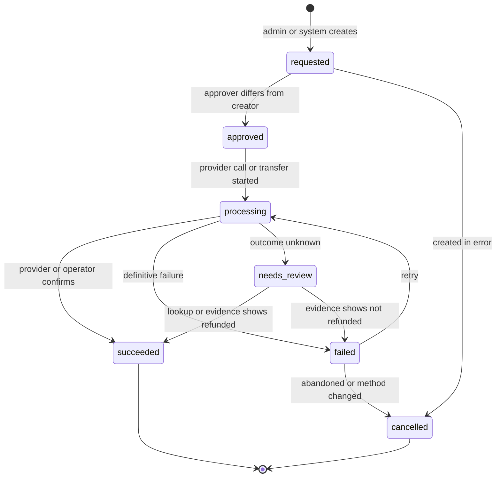

Refundable amount per shop order, computed on one allocation because each refund draws on one allocation (checked in the create TX with the allocation and payment rows locked; DB CHECK `refunded_minor ≤ captured_minor` is the backstop, T-SEC-004):

```text
refundable(so) = captured_or_collected(so) − Σ amount of that shop order's refunds on the same allocation in requested, approved, processing, succeeded, needs_review, failed
```

`captured_or_collected(so)` is the captured or collected amount of the shop order's allocation on the payment that paid it: its COD payment, or its captured gateway attempt without `is_late_capture` (§6.4). A `late_capture` refund draws on the allocation of the late-captured attempt instead, computed the same way, so the two amounts never mix.

A failed refund still counts until it is cancelled, so a retry and a new refund can never both pay. Every refund has a deadline `refunds.due_at` ([04a §12.4](04a-data-dictionary-tables.md#124-refunds)): the return's `refund_due_at` (approval + 7 days) for a refund that closes a return, otherwise `created_at + 7 days` (01 AC-FR-RET-007-1). A refund created to replace a cancelled one (a method switch, with the proposed `replaces_refund_id`, §8.8) takes the replaced refund's `due_at` instead, because the obligation started with the first refund, and copies its `refund_items` and `affects_vendor_ledger` (§3.2, §7.4). Both start points are [Assumption] pending [Verify-external VX-02], because Directive 2082 s9(3) states a 7-day limit without a start. `refund.amount_minor = Σ refund_items.amount_minor + shipping part`; the shipping part is the difference. It is at least 0, and its sum with the shipping parts of the shop order's other refunds not in `cancelled` on the same allocation is at most the shop order's `shipping_fee_minor`, so shipping is refunded at most once per shop order and allocation (§3.3). The cap is cumulative, not per refund, and the create TX checks it with the payment and allocation rows locked. A goodwill refund of an amount that is not whole units plus shipping (the customer keeps the item) therefore cannot be recorded yet, and §7.4 has no posting formula for it [Open: owner decision, see Consistency note 20]. 04a derives the shipping part today; storing it as `refunds.shipping_minor` with `CHECK (shipping_minor >= 0)` is proposed for [04a §12.4](04a-data-dictionary-tables.md#124-refunds). A system refund that ends the shop order (rejection of all remaining units, any cancellation, RTO) is for exactly `refundable(so)` (§3.6).

| From → To                               | Initiator                                                                                                                                                                                                                                                                                                                                                                                                                                                                       | Preconditions                                                                                                                                                                                                                                                                                                                                                                                                                                                                                                                                                                                                                                                      | Transaction boundary                                                                                                     | Side effects                                                                                                                                                                                                                                                                                                              | Idempotency behaviour | Audit entry             | Recovery when part fails                                                                                                                                                                                                                        |
| --------------------------------------- | ------------------------------------------------------------------------------------------------------------------------------------------------------------------------------------------------------------------------------------------------------------------------------------------------------------------------------------------------------------------------------------------------------------------------------------------------------------------------------- | ------------------------------------------------------------------------------------------------------------------------------------------------------------------------------------------------------------------------------------------------------------------------------------------------------------------------------------------------------------------------------------------------------------------------------------------------------------------------------------------------------------------------------------------------------------------------------------------------------------------------------------------------------------------ | ------------------------------------------------------------------------------------------------------------------------ | ------------------------------------------------------------------------------------------------------------------------------------------------------------------------------------------------------------------------------------------------------------------------------------------------------------------------- | --------------------- | ----------------------- | ----------------------------------------------------------------------------------------------------------------------------------------------------------------------------------------------------------------------------------------------- |
| (new) → `requested`                     | Admin with `platform.refunds.create` (`createRefund`), or system (rejection, cancellation, return close, late capture)                                                                                                                                                                                                                                                                                                                                                          | `amount_minor ≤ refundable` and the cumulative shipping part on the same allocation at most `shipping_fee_minor` (above), else 422 `REFUND_EXCEEDS_REFUNDABLE`; `provider_idempotency_key = refund.id`; a `replaces_refund_id`, if given, names a `cancelled` refund of the same shop order, whose `due_at`, `refund_items` (§3.2) and `affects_vendor_ledger` (§7.4) are copied (§8.8)                                                                                                                                                                                                                                                                            | Req-TX or the TX of the causing transition                                                                               | `affects_vendor_ledger` set and the per-line amounts stored on `refund_items`, both fixed from then on (§3.2, §7.4); admin queue entry                                                                                                                                                                                    | ⚷ replay              | `refund.create`         | Rollback-retry                                                                                                                                                                                                                                  |
| `requested` → `approved`                | Finance officer with `platform.refunds.approve` (`approveRefund`); or system for non-discretionary refunds (amount fully determined by a cancellation, rejection, RTO or failed re-reserve: `order_cancelled`, `items_rejected`, `undeliverable`, `stock_unavailable_after_payment`); a `late_capture` refund always waits for a finance officer. `refunds_approver_check` ([04a §12.4](04a-data-dictionary-tables.md#124-refunds)) is the database backstop                    | `approved_by <> created_by` (DB CHECK) unless `single_operator_mode`, which requires TOTP re-entry and flags the audit row [Assumption OD-14]                                                                                                                                                                                                                                                                                                                                                                                                                                                                                                                      | Req-TX, or same TX as creation for the auto-approved system refunds                                                      | Job `refunds.execute` (gateway_api); queue entry for operators (gateway_manual, manual_transfer)                                                                                                                                                                                                                          | ⚷ replay; CAS 409     | `refund.approve`        | Rollback-retry                                                                                                                                                                                                                                  |
| `approved` → `processing`               | `refunds.execute` job (gateway_api). Manual methods: the operator. `manual_transfer`: `markRefundSucceeded` on an `approved` refund (this step and the next in one TX). `gateway_manual`: `markRefundSucceeded` on an `approved` refund performs only this step and stores `paid_reference`. Either method may instead use the proposed `startRefundTransfer` (name from 02 J-14, for [06](06-api-design.md)) when a transfer or eSewa request is started but not yet confirmed | `gateway_api`: no other `gateway_api` refund of the same payment is `processing` or `needs_review`, checked with the payment row locked; otherwise the job waits (§8.8)                                                                                                                                                                                                                                                                                                                                                                                                                                                                                            | Job-TX marks `processing` and commits **before** the provider call; for manual methods the Req-TX of the operator action | `attempts + 1` for every method, so `attempts` counts the first execution and each retry; `verification_attempts` reset to 0. `gateway_api` and `gateway_manual`: `refunds.verify` sent in the same TX, with `next_verification_at` set (§9.4). gateway_api: provider call after commit with the refund's idempotency key | CAS no-op             | `refund.start`          | If the job dies after commit, before or after the call, the refund sits in `processing` with no response; the `refunds.verify` job sent in that TX resolves it by lookup, and `refunds.reconcile_sweeper` re-sends a lost one (§9.4, T-PAY-008) |
| `processing` → `succeeded`              | gateway_api: provider response or a decisive `refunds.verify` lookup. manual_transfer: operator `markRefundSucceeded` with `paid_reference`. gateway_manual: a decisive `refunds.verify` check only, after the operator recorded eSewa's reference with `markRefundSucceeded`, which for this method stores `paid_reference` and leaves the refund in `processing`                                                                                                              | A lookup (`gateway_api` after a timeout or crash, `gateway_manual`) is decisive only when the status change can be this refund's alone: no other `gateway_api` or `gateway_manual` refund of the payment is `succeeded`, `processing` or `needs_review` and the status shows a partial refund (amount below the payment's `captured_minor`) or a full one (amount equal to it); or this refund completes a full refund of the payment and the status shows a full refund (§8.8)                                                                                                                                                                                    | Short TX after the call, the lookup or the operator action                                                               | `succeeded_at`; `payments.refunded_minor` and allocation `refunded_minor` increased; ledger postings if `affects_vendor_ledger`, from the amounts stored at creation (§7.4); customer email                                                                                                                               | CAS no-op             | `refund.succeed`        | Job retry for email                                                                                                                                                                                                                             |
| `processing` → `failed`                 | Provider definitive error (validation, insufficient merchant balance), or operator marks failed (06 has no operation for this yet [Open: owner decision, see Consistency note 20]); never a lookup alone (§8.8)                                                                                                                                                                                                                                                                 | none                                                                                                                                                                                                                                                                                                                                                                                                                                                                                                                                                                                                                                                               | Short TX                                                                                                                 | Admin queue; alert if the 7-day SLA is at risk                                                                                                                                                                                                                                                                            | CAS no-op             | `refund.fail`           | Operator retries or switches method                                                                                                                                                                                                             |
| `processing` → `needs_review`           | `refunds.verify`                                                                                                                                                                                                                                                                                                                                                                                                                                                                | gateway_api: timeout, crash or ambiguous response and 5 lookups are not decisive [Assumption]. gateway_manual: 3 daily checks are not decisive, because the status has not changed or cannot be attributed to this refund alone (§8.8) [Assumption]                                                                                                                                                                                                                                                                                                                                                                                                                | Lookup + TX                                                                                                              | Review queue (§9.5); alert                                                                                                                                                                                                                                                                                                | CAS no-op             | `refund.flag_review`    | Manual resolution                                                                                                                                                                                                                               |
| `failed` → `processing`                 | Finance officer, `retryRefund`                                                                                                                                                                                                                                                                                                                                                                                                                                                  | For `gateway_api`: a lookup first shows the refund did not happen, which it can show only while the payment is still `Completed` and no other `gateway_api` or `gateway_manual` refund of it is `succeeded`, `processing` or `needs_review`; otherwise finance records the provider's per-refund evidence first (§8.8). No other `gateway_api` refund of the payment is `processing` or `needs_review`, else 409 `CONFLICT`. `attempts < 4`: the first execution and at most 3 retries [Assumption, 01 AC-FR-RET-003-4]; beyond that 409 `INVALID_STATE_TRANSITION`, and finance cancels the refund and creates a `manual_transfer` refund that replaces it (§8.8) | Lookup + Req-TX                                                                                                          | `attempts + 1`; same `provider_idempotency_key`; `verification_attempts` reset to 0 and `next_verification_at` set; `refunds.verify` sent in the same TX (§9.4)                                                                                                                                                           | ⚷ replay              | `refund.retry`          | as `approved → processing`                                                                                                                                                                                                                      |
| `failed` or `requested` → `cancelled`   | Finance officer                                                                                                                                                                                                                                                                                                                                                                                                                                                                 | none                                                                                                                                                                                                                                                                                                                                                                                                                                                                                                                                                                                                                                                               | Req-TX                                                                                                                   | Refundable amount is freed; a new refund with another method can be created, naming this one in `replaces_refund_id` and keeping its `due_at`, `refund_items` and `affects_vendor_ledger` (§8.8)                                                                                                                          | ⚷ replay              | `refund.cancel`         | Rollback-retry                                                                                                                                                                                                                                  |
| `needs_review` → `succeeded` / `failed` | `refunds.verify` on a decisive lookup (`succeeded` only), or finance officer with evidence                                                                                                                                                                                                                                                                                                                                                                                      | Evidence reference mandatory for manual resolution                                                                                                                                                                                                                                                                                                                                                                                                                                                                                                                                                                                                                 | Lookup + TX or Req-TX                                                                                                    | as above                                                                                                                                                                                                                                                                                                                  | ⚷ replay / CAS no-op  | `refund.resolve_review` | Rollback-retry                                                                                                                                                                                                                                  |

### 6.8 Payout and settlement (R1.1)

In R1 there are no payouts: vendors hold COD cash and owe commission, which finance records as `vendor_remittance` (§7.5). Payouts start with the gateway in R1.1 and are manual bank transfers with approval (FR-LED-004). Automated payouts are R3.

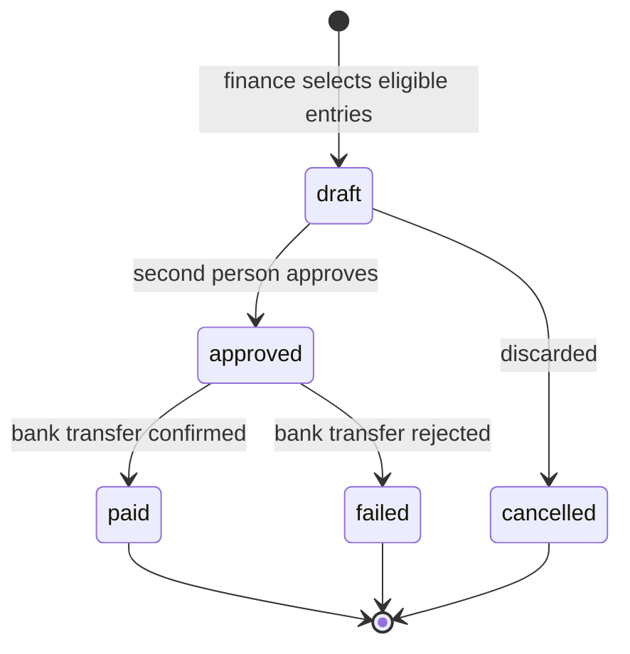

Ledger entry availability, which decides what a payout may include:

- An entry is **available** when `available_at ≤ now()` (§7.2 sets `available_at` per posting group).
- An entry is **unsettled** when no `payout_entries` row links it, and it is not itself a `payout` entry.
- An entry is **held** while its shop order has a return request in `requested`, `approved`, `in_transit` or `received`, or a refund in `requested`, `approved`, `processing`, `failed` or `needs_review`, or an open `order_issue` support case (`open`, `awaiting_customer` or `awaiting_shop`; for example a COD dispute, §8.9, or a reversal DripNepal did not start, §6.4), **and** that shop order's available, unsettled entries net > 0. When they net ≤ 0 (a COD delivery posting, where the vendor owes commission), they are not held: debts to the platform are never deferred (§7.2), and leaving them out would let a payout exceed the shop's available balance (01 AC-FR-LED-004-2).
- A payout may include exactly the shop's **available, unsettled, non-held** entries, positive and negative together (netting COD commission owed against gateway earnings). If their sum is ≤ 0, no payout is created. `approvePayout` checks the set again before any money moves (§7.6).

| From → To             | Initiator                                                                                                                                                                  | Preconditions                                                                                                                                                                                                                                                                                                           | Transaction boundary                                                                                                                                                                                                                                                                                                                      | Side effects                                                                                                                                                                                                                                                | Idempotency behaviour                                                                                                                               | Audit entry          | Recovery when part fails |
| --------------------- | -------------------------------------------------------------------------------------------------------------------------------------------------------------------------- | ----------------------------------------------------------------------------------------------------------------------------------------------------------------------------------------------------------------------------------------------------------------------------------------------------------------------- | ----------------------------------------------------------------------------------------------------------------------------------------------------------------------------------------------------------------------------------------------------------------------------------------------------------------------------------------- | ----------------------------------------------------------------------------------------------------------------------------------------------------------------------------------------------------------------------------------------------------------- | --------------------------------------------------------------------------------------------------------------------------------------------------- | -------------------- | ------------------------ |
| (new) → `draft`       | Finance officer with `platform.payouts.manage` (`createPayout`)                                                                                                            | Shop has an active, verified `shop_payout_accounts` row; eligible entries sum > 0                                                                                                                                                                                                                                       | Req-TX; the `shops` row `FOR UPDATE` first (§4.4 level 0), then the §7.6 query, which locks no `ledger_entries` rows                                                                                                                                                                                                                      | `payout_entries` rows (UNIQUE `ledger_entry_id` makes double inclusion impossible); `amount_minor = Σ` linked entries                                                                                                                                       | ⚷ replay; a concurrent draft for the same shop waits on the shop lock, then finds the open draft (`payouts_one_open_per_shop_key`) → 409 `CONFLICT` | `payout.create`      | Rollback-retry           |
| `draft` → `cancelled` | Finance officer with `platform.payouts.manage` (proposed `cancelPayout` with a `reason`, for [06](06-api-design.md) and [07](07-security-threat-model-and-permissions.md)) | none                                                                                                                                                                                                                                                                                                                    | Req-TX; the `shops` row `FOR UPDATE` first (§4.4 level 0), then the `payouts` row `FOR UPDATE` (409 `INVALID_STATE_TRANSITION` if not `draft`), then its `payout_entries` rows deleted while it is still `draft` ([04a §13.3](04a-data-dictionary-tables.md#133-payout_entries) `payout_entries_guard`), then the CAS `draft → cancelled` | `cancelled_at`; `payout_entries` rows deleted (draft only; they were never money) so entries are free again; the reason goes in the audit entry                                                                                                             | ⚷ replay                                                                                                                                            | `payout.cancel`      | Rollback-retry           |
| `draft` → `approved`  | Finance officer with `platform.payouts.approve` (`approvePayout`)                                                                                                          | `approved_by <> created_by` unless `single_operator_mode` [Assumption OD-14]; the advance-tax policy is not `undecided` (§7.9), otherwise 422 `VALIDATION_FAILED`; the §7.6 re-check passes (every linked entry is still returned by the query and the rows' sum is not below `amount_minor`), otherwise 409 `CONFLICT` | Req-TX; the `shops` row `FOR UPDATE` first (§4.4 level 0), then the `payouts` row `FOR UPDATE`, then the §7.6 re-check, then (policy `enabled` only) the §7.9 tax steps while the payout is still `draft`, then the CAS                                                                                                                   | When the §7.9 policy is `enabled`, first a `tax_withholding` entry linked to this payout and `amount_minor` reset to the new Σ of linked entries (§7.9); then the ledger `payout` entry `−amount_minor`, `available_at = now()`, `dedupe_key = payout:<id>` | ⚷ replay                                                                                                                                            | `payout.approve`     | Rollback-retry           |
| `approved` → `paid`   | Finance officer, `markPayoutPaid` with `bank_reference` after making the transfer outside the system                                                                       | none                                                                                                                                                                                                                                                                                                                    | Req-TX; the `shops` row `FOR UPDATE` first (§4.4 level 0), then the CAS on the `payouts` row                                                                                                                                                                                                                                              | `paid_at`; vendor email with statement link                                                                                                                                                                                                                 | ⚷ replay                                                                                                                                            | `payout.mark_paid`   | Rollback-retry           |
| `approved` → `failed` | Finance officer, `markPayoutFailed` with reason                                                                                                                            | none                                                                                                                                                                                                                                                                                                                    | Req-TX; the `shops` row `FOR UPDATE` first (§4.4 level 0), then the CAS on the `payouts` row                                                                                                                                                                                                                                              | Ledger `payout_reversal` `+amount_minor`, `reverses_entry_id` = the payout entry, `available_at = now()`; vendor asked to fix the payout account; the reversal entry is unsettled and flows into the next payout                                            | ⚷ replay                                                                                                                                            | `payout.mark_failed` | Rollback-retry           |

The `draft → cancelled` deletion of `payout_entries` rows is the only delete in the money tables, and it only touches rows that never moved money. Once a payout is `approved`, its links are permanent. A failed payout keeps its links, and the money is carried forward by the `payout_reversal` entry (§7.7). A transfer that the bank returns after the payout was recorded `paid` does not change the payout's status: `paid` is terminal, and §7.7 gives the adjustment that carries the money forward.

### 6.9 Inventory reservation

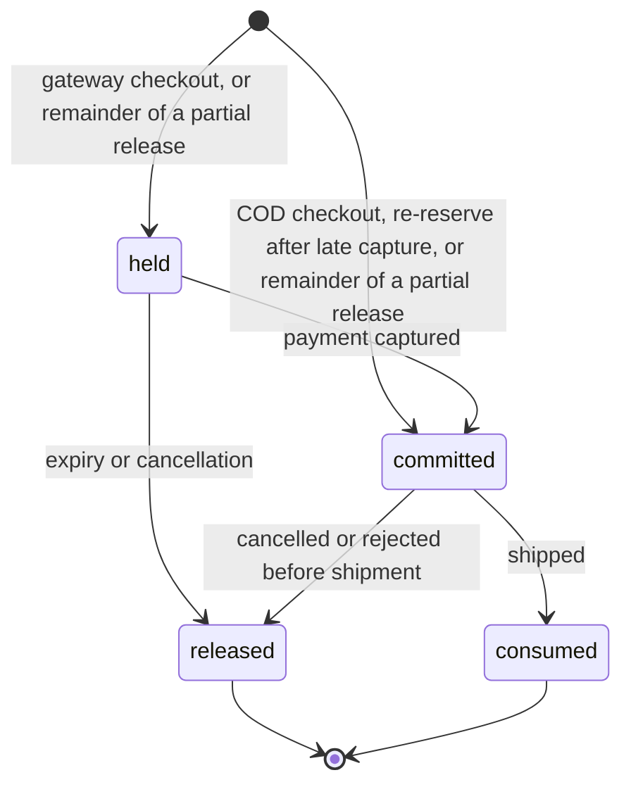

| From → To                                                                     | Initiator                                                                                                                                                                                                              | Preconditions                                                                                                                                                                                                                                                                                                                                                                                   | Transaction boundary                                                                                                          | Side effects                                                                                                                                                                                          | Idempotency behaviour                                                                                                                                                                                                                               | Audit entry                                                               | Recovery when part fails    |
| ----------------------------------------------------------------------------- | ---------------------------------------------------------------------------------------------------------------------------------------------------------------------------------------------------------------------- | ----------------------------------------------------------------------------------------------------------------------------------------------------------------------------------------------------------------------------------------------------------------------------------------------------------------------------------------------------------------------------------------------- | ----------------------------------------------------------------------------------------------------------------------------- | ----------------------------------------------------------------------------------------------------------------------------------------------------------------------------------------------------- | --------------------------------------------------------------------------------------------------------------------------------------------------------------------------------------------------------------------------------------------------- | ------------------------------------------------------------------------- | --------------------------- |
| (new) → `held` / `committed`                                                  | Checkout step 8–9; late-capture re-reserve                                                                                                                                                                             | Conditional update succeeded (§4.5)                                                                                                                                                                                                                                                                                                                                                             | Checkout Req-TX, or the capture TX of a late capture (Lookup + TX, or the Req-TX of a manual `needs_review` resolution; §8.4) | `reserve` movement                                                                                                                                                                                    | with checkout                                                                                                                                                                                                                                       | movement `reserve`                                                        | Rollback-retry              |
| (split) → `held` / `committed`                                                | Partial release of `r` of the `q` units a line's open reservation holds, only when `q − r > 0` (§5.5)                                                                                                                  | The old reservation → `released` in the same TX                                                                                                                                                                                                                                                                                                                                                 | TX of the causing transition                                                                                                  | Remainder row of `q − r` units with the old status (and the same `expires_at` when `held`); no `reserve` movement, because its units are already counted in `reserved`                                | with the causing transition                                                                                                                                                                                                                         | none (the old row's `release` movement of `r` records the split)          | with the causing transition |
| `held` → `committed`                                                          | Payment capture                                                                                                                                                                                                        | Payment → `captured` in the same TX; the shop order is not cancelled with `shop_frozen` in that TX (its holds are released instead, below)                                                                                                                                                                                                                                                      | Lookup + TX                                                                                                                   | `commit` movement; `expires_at` cleared                                                                                                                                                               | CAS `WHERE status = 'held'`; if 0 rows, late-capture path (§8.4)                                                                                                                                                                                    | movement `commit`                                                         | with capture                |
| `held` → `released`                                                           | Expiry job (§5.4 Cases A, B3, C), `startOrderPayment` once the holds are past `expires_at` (§4.8), customer cancel, a payment failure applied after the hold expired, or the capture TX for a frozen shop's shop order | Past `expires_at` with no attempt open or captured (a failed attempt before then keeps the hold for a retry, §4.8); customer cancel; Case C hold limit reached; or the payment is captured in the same TX while the shop is `frozen`, so its shop order → `cancelled` (`shop_frozen`, §6.1) and the release reason is `shop_frozen`. The expiry job re-checks the payment under the parent lock | Job-TX, Req-TX, a Lookup + TX (payment failure or capture), or the separate TX of `startOrderPayment` (§4.8)                  | `release` movement; projection `reserved − q`                                                                                                                                                         | A duplicate job or request finds no open reservation to release (§5.5 reads only `held`/`committed` rows under the parent lock) and does nothing. A zero-row reservation CAS after the projection update is a bug: throw and roll back the whole TX | movement `release`                                                        | Job retry                   |
| `committed` → `consumed`                                                      | Shipment → `shipped`                                                                                                                                                                                                   | ShopOrder `accepted`                                                                                                                                                                                                                                                                                                                                                                            | Req-TX of the shipment                                                                                                        | `ship` movement; `on_hand − q`, `reserved − q`                                                                                                                                                        | CAS; 0 rows is a bug (alert)                                                                                                                                                                                                                        | movement `ship`                                                           | Rollback-retry              |
| `committed` → `released`                                                      | Cancellation or rejection before shipment (whole or partial; rejecting only some of a line's units splits the row, §5.5)                                                                                               | Shipment not `shipped`                                                                                                                                                                                                                                                                                                                                                                          | TX of the causing transition                                                                                                  | `release` movement                                                                                                                                                                                    | A duplicate job or request finds no open reservation to release (§5.5 reads only `held`/`committed` rows under the parent lock) and does nothing. A zero-row reservation CAS after the projection update is a bug: throw and roll back the whole TX | movement `release`                                                        | with the causing transition |
| `held` / `committed` → `released`, or `committed` → `consumed` (drift repair) | Admin, reservation mode of the `correct` action (§5.10 step 3)                                                                                                                                                         | The reservation is listed by the §5.10 reservation query: its shop order is terminal, its shipment is past `packed`, or its quantity is above the item's kept quantity. Released while the shipment is absent, `pending` or `packed`; consumed once it is past `packed`. Only the excess is released for an over-quantity row in an open shop order (§5.5)                                      | One TX of the admin `correct` command, under the parent `orders` lock (§4.4)                                                  | `release` or `ship` movement with reason `drift_repair`; projection moves with it; no `correction` movement; status only, with no movement, when the stock effect is already journaled (§5.10 step 3) | A re-run finds the reservation no longer open (or no longer listed) and does nothing                                                                                                                                                                | `inventory.correct` (reservation, old and new status, incident reference) | Rollback-retry              |

### 6.10 Product and Shop lifecycles (summary)

These machines are owned by the catalog and shops modules ([04](04-domain-model-and-data-dictionary.md), [07](07-security-threat-model-and-permissions.md)). They matter here only for how they affect carts and open orders.

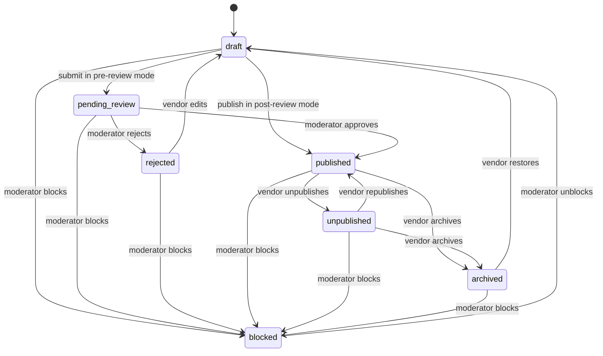

| Product state change                        | Carts                                    | Open shop orders                                                                                                                                                                                        |
| ------------------------------------------- | ---------------------------------------- | ------------------------------------------------------------------------------------------------------------------------------------------------------------------------------------------------------- |
| → `published`                               | Lines become purchasable again           | None                                                                                                                                                                                                    |
| → `unpublished`, `archived`                 | Lines unavailable; checkout step 4 fails | None; snapshots are kept and stock can still be restocked (§5.7); archiving also archives the product's active variants in the same transaction ([04a §7.6](04a-data-dictionary-tables.md#76-products)) |
| → `blocked`                                 | Lines unavailable; checkout step 4 fails | None automatically; a support case decides per shop order whether to cancel (OD-21)                                                                                                                     |
| `draft`, `pending_review`, `rejected` moves | Never in carts                           | None                                                                                                                                                                                                    |

Product transitions to `unpublished`, `archived` or `blocked` make cart lines unavailable at the next `getCart` and checkout step 4 rejects them. Open shop orders are unaffected and keep their snapshots. A product blocked for counterfeit or legal reasons (OD-21) leads to a support case in which an admin decides per shop order whether to cancel with `admin_cancelled`.

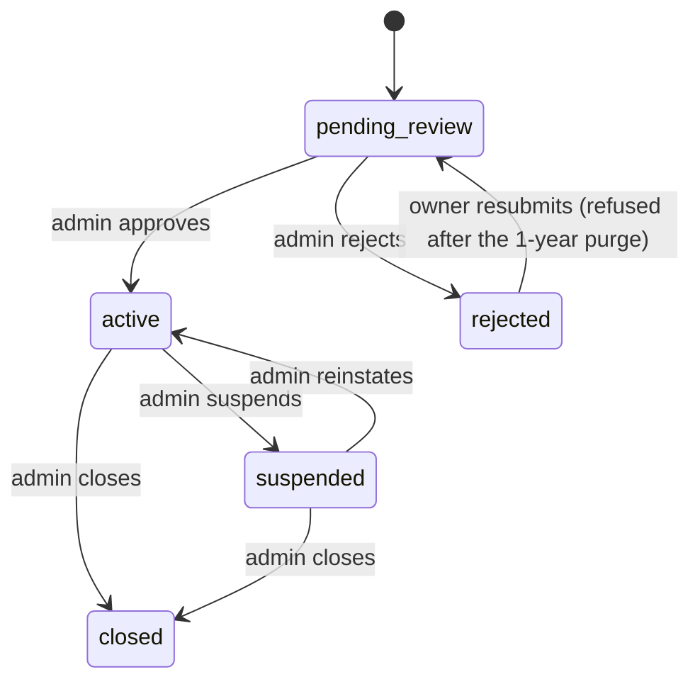

| Shop state change                         | Carts and storefront      | Open shop orders                                            | Ledger                                             |
| ----------------------------------------- | ------------------------- | ----------------------------------------------------------- | -------------------------------------------------- |
| `active → suspended` (`fulfill_existing`) | Hidden; lines unavailable | Continue normally (§8.10)                                   | Unchanged; payouts continue                        |
| `active → suspended` (`frozen`)           | Hidden; lines unavailable | Cancelled with `shop_frozen` unless already shipped (§8.10) | Unchanged; payout creation refused [Assumption]    |
| `suspended → active`                      | Visible again             | Cancelled shop orders are never revived                     | Unchanged                                          |
| `→ closed`                                | Hidden permanently        | Allowed only with none open [Assumption]                    | Zero balance or a recorded settlement [Assumption] |
| `pending_review`, `rejected` moves        | No products are visible   | None exist                                                  | None                                               |

Suspension hides the storefront and makes cart lines unavailable in both modes; its effect on open shop orders depends on `suspension_mode` and is described in §8.10. Closing a shop (admin only in R1, with `closeShop`, proposed; [04a §6.1](04a-data-dictionary-tables.md#61-shops)) should be allowed only when it has no non-terminal shop orders and a zero balance, or finance has recorded how the balance is settled [Assumption].

An application rejected more than a year ago has had its personal data purged (`shops.personal_data_redacted_at` set, [04 §19.3](04-domain-model-and-data-dictionary.md#193-retention-schedule), [04a §6.1](04a-data-dictionary-tables.md#61-shops)): `resubmitShopApplication` then answers 409 `INVALID_STATE_TRANSITION`, and the owner applies again with a new shop.

## 7. Vendor ledger and settlement

### 7.1 Principles

- **What it is.** `ledger_entries` is a per-shop sub-ledger of what DripNepal and each vendor owe each other (ADR-0009). It is not the platform's general ledger. Platform cash, gateway fees, bank balances and tax accounts live in the accountant's books (OD-11); the vendor ledger feeds them through exports ([11](11-deployment-and-operations.md)).
- **Sign.** `amount_minor` is signed. Positive means the platform owes the vendor; negative means the vendor owes the platform. A shop's balance is `SUM(amount_minor)` and **can be negative**. In R1 (COD only) vendors hold the cash, so balances are normally negative until the vendor remits commission [Confirmed Q3, Q4, Q5; canon §1].
- **Append-only.** No `UPDATE` or `DELETE` on `ledger_entries` (revoked privileges plus a trigger, T-LED-002). A mistake is corrected by a new entry: a reversal with `reverses_entry_id` or an `adjustment` with a reason (FR-LED-005).
- **Exactly once.** Every entry has a deterministic `dedupe_key` (UNIQUE). Posting functions insert with `ON CONFLICT (dedupe_key) DO NOTHING`, so a repeated event, job or request cannot post twice (T-LED-005, T-PAY-005).
- **Same TX as the business event.** Postings are made by the `ledger` module's actions inside the TX of the transition that causes them (delivery, collection, refund success, payout approval). They are never deferred to a job: a committed delivery without its posting would be a silent financial error.
- **Earned means delivered and paid.** Nothing is posted to a vendor before its shop order is delivered and its payment is collected (COD) or captured (gateway). Gateway capture, and refunds of units the vendor is never credited with (rejected, cancelled or returned-to-origin units, and any refund created before the delivery posting), are between the platform and the customer only and never touch the vendor ledger, even when such a refund succeeds after delivery (§7.4).
- **Where the money physically is.** COD (R1): the vendor or their courier holds the customer's cash, recorded as `cod_cash_held`. Gateway (R1.1): the money sits in DripNepal's merchant account at the PSP. Whether DripNepal may collect for vendors at all is [Open OD-02] / [Verify-external VX-01], and M8 is blocked until it is answered.

### 7.2 Entry types and posting rules

| `entry_type`          | Sign | Posted when                                                                                                            | Amount                                                                                                                                                                          | `dedupe_key`                                                                                                     | `available_at`   |
| --------------------- | ---- | ---------------------------------------------------------------------------------------------------------------------- | ------------------------------------------------------------------------------------------------------------------------------------------------------------------------------- | ---------------------------------------------------------------------------------------------------------------- | ---------------- |
| `sale`                | +    | Delivery posting                                                                                                       | Σ over items of the kept-units amount credited to the vendor: net of shop-funded discount, gross of platform-funded discount (§3.4). R1: `effective_items`                      | `delivery:<shop_order_id>:sale`                                                                                  | Group rule below |
| `shipping_income`     | +    | Delivery posting                                                                                                       | `effective_shipping` (the full fee; commission-free per OD-04)                                                                                                                  | `delivery:<shop_order_id>:shipping`                                                                              | Group rule       |
| `commission`          | −    | Delivery posting                                                                                                       | `effective_commission` (Σ per item `commission_minor − C(rejected + cancelled)`)                                                                                                | `delivery:<shop_order_id>:commission`                                                                            | Group rule       |
| `cod_cash_held`       | −    | Delivery posting, COD only                                                                                             | `payments.captured_minor` of the COD payment (cash the vendor holds)                                                                                                            | `delivery:<shop_order_id>:cod_cash`                                                                              | Group rule       |
| `refund`              | −    | Refund `succeeded`, only if `refunds.affects_vendor_ledger`, which the create TX fixed (§7.4)                          | Σ `refund_items.vendor_amount_minor` (the amount credited to the vendor for the refunded units, net or gross as for `sale`, stored at creation) plus the refunded shipping part | `refund:<refund_id>:refund`                                                                                      | now              |
| `commission_reversal` | +    | Same TX as `refund`                                                                                                    | Σ `refund_items.commission_reversal_minor` (per item `C(k + r) − C(k)` for the refunded units, stored at creation)                                                              | `refund:<refund_id>:commission_reversal`                                                                         | now              |
| `vendor_remittance`   | +    | Finance records a vendor payment (`recordVendorRemittance`)                                                            | Remitted amount                                                                                                                                                                 | `remittance:<vendor_remittance_id>`                                                                              | now              |
| `payout`              | −    | Payout `approved`                                                                                                      | `payouts.amount_minor`                                                                                                                                                          | `payout:<payout_id>`                                                                                             | now              |
| `payout_reversal`     | +    | Payout `failed`                                                                                                        | `payouts.amount_minor`, `reverses_entry_id` = the payout entry                                                                                                                  | `payout:<payout_id>:reversal`                                                                                    | now              |
| `tax_withholding`     | −    | Reserved until OD-27 (§7.9); when the policy is `enabled`, payout `approved`, linked to that payout                    | `roundHalfUp(base × 100 / 10000)`, base per OD-27 (§7.9)                                                                                                                        | `payout:<payout_id>:tax`                                                                                         | now              |
| `adjustment`          | ±    | Admin `createLedgerAdjustment` with reason; above Rs 10,000, when a second finance officer approves the request (§7.8) | As entered                                                                                                                                                                      | `adjustment:<idempotency key id>`, or `adjustment:<ledger_adjustment_request_id>` when posted at approval (§7.8) | now              |

**Group rule for `available_at`.** The delivery posting is one group of 3 or 4 entries. If the group's net is positive (the platform owes the vendor, typical for gateway orders), all its entries get `available_at = delivered_at + ledger_hold_days` (7, [Assumption OD-06]), which covers the return window. If the net is zero or negative (COD, where the vendor owes commission), all its entries are available immediately. Every other entry type is available immediately. The effect: **debts to the platform are never deferred; credits to the vendor wait out the return window.** This is conservative in the platform's favour and is tested by T-LED-003.

### 7.3 Delivery posting

`ledger.postDeliverySettlement(trx, shopOrderId)` is called from two places, and whichever runs second posts:

- the shipment `shipped → delivered` transition (§6.3), and
- the COD `awaiting_collection → collected` transition (§6.5) and its admin correction from `not_collected`.

It posts only when the shipment is `delivered` **and** the payment for the shop order is `collected` (COD) or `captured` (gateway). For gateway orders capture always precedes acceptance, so delivery is always the trigger. Every caller locks the parent `orders` row and then the `shop_orders` row `FOR UPDATE` (§4.4 levels 3 → 4) before the function reads the shipment and payment status. That shop order lock serialises the delivered path, the collected path and the admin correction, so exactly one of them sees both conditions true; the `dedupe_key` is only the backstop. The `shipped → delivered` caller holds no payment lock (§4.4 takes level 6 only when a COD payment or refund changes), so the function relies on the shop order lock alone. It takes no further locks, computes the effective amounts with the pricing function (§3.2) and inserts:

```sql
INSERT INTO ledger_entries
  (id, shop_id, entry_type, amount_minor, currency, shop_order_id, available_at, description, dedupe_key, created_at)
VALUES
  (:id1, :shop_id, 'sale',            :sale,          'NPR', :so, :avail, 'Items delivered',          'delivery:' || :so || ':sale',       now()),
  (:id2, :shop_id, 'shipping_income', :shipping,      'NPR', :so, :avail, 'Shipping fee',             'delivery:' || :so || ':shipping',   now()),
  (:id3, :shop_id, 'commission',      -:commission,   'NPR', :so, :avail, 'Platform commission',      'delivery:' || :so || ':commission', now()),
  (:id4, :shop_id, 'cod_cash_held',   -:cod_collected,'NPR', :so, :avail, 'Cash collected by vendor', 'delivery:' || :so || ':cod_cash',   now())  -- COD only
ON CONFLICT (dedupe_key) DO NOTHING;
```

`shop_id` is taken from the locked `shop_orders` row, never from the request. For COD, the function asserts `cod_collected = sale + shipping` for R1 (no discounts); a mismatch aborts the TX, because it means the COD amount and the effective totals disagree.

A COD payment recorded `collected` while the shipment is still `shipped` (§6.5) posts nothing until `delivered` is recorded, although the vendor already holds the cash and owes the commission. So the collection TX sends `orders.cod_outcome_reminder`, which asks the shop to record the delivery; support follows up after 3 days (§8.9), and §7.12 check 1 lists the shop order.

Comparison of the two payment methods for one shop order worth items `I`, shipping `S`, commission `K`:

|                                               | COD (R1)                                                                 | Gateway (R1.1)                                              |
| --------------------------------------------- | ------------------------------------------------------------------------ | ----------------------------------------------------------- |
| Who holds the customer's money after delivery | Vendor                                                                   | Platform (merchant account)                                 |
| Entries                                       | `sale +I`, `shipping_income +S`, `commission −K`, `cod_cash_held −(I+S)` | `sale +I`, `shipping_income +S`, `commission −K`            |
| Net                                           | `−K` (vendor owes commission)                                            | `I + S − K` (platform owes vendor)                          |
| Available                                     | immediately                                                              | `delivered_at + 7 days`                                     |
| Settled by                                    | `vendor_remittance` from the vendor                                      | `payout` to the vendor, netted with any COD commission owed |

### 7.4 Refund postings and commission reversal

Whether a refund touches the vendor ledger depends on what it pays for, and is fixed when the refund is created, never when it succeeds. The create TX sets `refunds.affects_vendor_ledger` (proposed for [04a §12.4](04a-data-dictionary-tables.md#124-refunds)) to true only when the `reason_code` is `return_accepted`, `goodwill` or `other` **and** the shop order's delivery posting already exists (`dedupe_key` `delivery:<so>:sale`). A refund that replaces a cancelled one (`replaces_refund_id`, §8.8) copies its `affects_vendor_ledger`, as it copies its `refund_items` and `due_at`. When the refund reaches `succeeded` (§6.7):

- **`affects_vendor_ledger` false** (`items_rejected`, `order_cancelled`, `undeliverable`, `late_capture`, `stock_unavailable_after_payment`, and a `goodwill` or `other` refund created before the delivery posting): no ledger entries, whenever the refund succeeds. The refund is platform ↔ customer only. The delivery posting already leaves rejected and cancelled units out (`effective_items` and `effective_commission`, §3.2), so an `items_rejected` refund that succeeds after the rest of the shop order was delivered (an eSewa refund confirmed by a later daily status check, or a Khalti refund retried after a failure) still posts nothing. A `late_capture` refund never posts, even when the shop order has a delivery posting from the attempt that paid it, because the vendor was never credited with the late-captured attempt's money (§6.4).
- **`affects_vendor_ledger` true** (return after delivery, goodwill refund after a complaint, refund after completion): post `refund` and `commission_reversal` in the refund-success TX, from the amounts stored at creation.

```text
per item, computed in the create TX and stored on refund_items:
  amount_minor              = A(k + r) − A(k)                 (customer basis)
  vendor_amount_minor       = A_vendor(k + r) − A_vendor(k)
  commission_reversal_minor = C(k + r) − C(k)

at success, only if affects_vendor_ledger:
  refund entry            = −( Σ_items vendor_amount_minor + shipping_part )
  commission_reversal     = +Σ_items commission_reversal_minor
```

`A_vendor` is the cumulative amount on the vendor's basis (gross for platform-funded discounts, net otherwise; in R1 `vendor_amount_minor = amount_minor`), `k` the units of the line consumed before this refund, fixed in the create TX (§3.2), and `r` the units refunded now. Nothing is recomputed at success, so the entries depend neither on when the refund succeeds nor on which of two refunds on one line succeeds first. `vendor_amount_minor` and `commission_reversal_minor` are proposed for [04a §12.5](04a-data-dictionary-tables.md#125-refund_items). `shipping_part` is the refund's shipping part (§6.7). Shipping refunded to the customer is charged back to the vendor in full because it was credited in full. Because the shipping parts of a shop order's refunds on the allocation that paid it never add up to more than `shipping_fee_minor` (§3.3), and `late_capture` refunds on another allocation never post, the vendor is never charged back more shipping than its `shipping_income`.

Who pays the customer for a COD refund: **the platform pays by `manual_transfer`, then recovers from the vendor through the ledger** [Assumption OD-07, OD-05]. Rationale: the E-Commerce Act makes the intermediary accept return, exchange or refund "notwithstanding any terms of the contract" (s14(f)) [Verify-external VX-02], and the 7-day refund deadline (§11) cannot depend on a vendor answering. The cost is credit risk: the vendor's balance becomes more negative. A vendor-paid alternative (the vendor refunds the customer directly) cannot be switched on yet: it would need `refunds.paid_by` and a per-shop setting ([04a](04a-data-dictionary-tables.md)), a rule on whether `commission_reversal` still posts, and §7.12 check 2 limited to platform-paid refunds [Open OD-07; owner decision, see Consistency note 20].

### 7.5 Vendor remittance (R1)

In R1 the only way a vendor's negative balance is settled is a payment from the vendor to DripNepal. Finance records it with `POST /api/v1/admin/vendor-remittances` [recordVendorRemittance] (⚷), which inserts a `vendor_remittances` row (`amount_minor`, `method`, `reference`, `received_at`, `recorded_by`) and a `vendor_remittance` entry `+amount_minor` in one TX, with audit `ledger.record_remittance`.

Rules:

- The remittance may not exceed the amount owed (`amount_minor ≤ −balance` at the time of recording). Otherwise 422 `VALIDATION_FAILED`. DripNepal must not hold vendor money as a balance, which could look like stored value (Unified Directive 2082 on e-money) [Verify-external VX-01].
- Frequency, method and consequences of not paying are business terms with vendors [Open OD-05, blocks launch]. Proposed default: the monthly statement of §7.12, issued after each Gregorian month closes, with payment due within 10 days of issue and a reminder at day 7 after issue, and a shop whose balance has been below `−Rs 5,000` for more than 30 days is reviewed for suspension with `fulfill_existing` [Assumption OD-05].
- From R1.1, a vendor with gateway orders usually never remits: the debt is netted in the next payout (§7.6).

### 7.6 Payouts and netting (R1.1)

The payout machine is in §6.8. The amount is computed from the eligible entries:

```sql
WITH open_issue AS (                             -- shop orders whose money is not final
  SELECT so.id FROM shop_orders so
   WHERE so.shop_id = :shop_id
     AND (EXISTS (SELECT 1 FROM return_requests rr
                   WHERE rr.shop_order_id = so.id
                     AND rr.status IN ('requested','approved','in_transit','received'))
       OR EXISTS (SELECT 1 FROM refunds rf
                   WHERE rf.shop_order_id = so.id
                     AND rf.status IN ('requested','approved','processing','failed','needs_review'))
       OR EXISTS (SELECT 1 FROM support_cases sc
                   WHERE sc.shop_order_id = so.id AND sc.category = 'order_issue'
                     AND sc.status IN ('open','awaiting_customer','awaiting_shop')))
),
candidate AS (                                   -- available, unsettled, not a payout entry
  SELECT e.id, e.amount_minor, e.shop_order_id
    FROM ledger_entries e
   WHERE e.shop_id = :shop_id
     AND e.entry_type <> 'payout'
     AND e.available_at <= now()
     AND NOT EXISTS (SELECT 1 FROM payout_entries pe
                      WHERE pe.ledger_entry_id = e.id
                        AND pe.payout_id IS DISTINCT FROM :payout_id)  -- NULL except in approvePayout
),
held AS (                                        -- open issue and a positive net: the money waits
  SELECT c.shop_order_id FROM candidate c
   WHERE c.shop_order_id IN (SELECT id FROM open_issue)
   GROUP BY c.shop_order_id
  HAVING SUM(c.amount_minor) > 0                 -- a net <= 0 is a debt and is never deferred
)
SELECT c.id, c.amount_minor
  FROM candidate c
 WHERE c.shop_order_id IS NULL
    OR c.shop_order_id NOT IN (SELECT shop_order_id FROM held)
 ORDER BY c.id;
```

The payout amount is the sum of these rows. Negative rows (COD commission owed, refunds, previous adjustments) are included, which is the netting: a vendor owed Rs 3,203.20 on gateway orders who owes Rs 344.80 COD commission receives Rs 2,858.40. If the sum is ≤ 0 the payout is not created and the balance stays owed. A shop order with an open return, refund or `order_issue` case is left out only while its candidate entries net positive; a net of zero or less stays in (§6.8), so a payout never exceeds `available_minor` (§7.10).

`createPayout` runs the query with `:payout_id` NULL after locking the shop row `FOR UPDATE` (§4.4 level 0), so two drafts for one shop run one after the other. The query itself locks no rows, because the app role cannot lock `ledger_entries` rows (§4.4 level 9). `payout_entries_ledger_entry_key` and `payouts_one_open_per_shop_key` ([04a §13.2](04a-data-dictionary-tables.md#132-payouts), [§13.3](04a-data-dictionary-tables.md#133-payout_entries)) remain the backstops against paying an entry twice.

`approvePayout` locks the shop row and then the payout row (§4.4 level 0, §6.8), then runs the query again with `:payout_id` = the draft's `id`, so the draft's own entries count as unsettled. It refuses with 409 `CONFLICT` and `errors[0].code` = `payout_stale` (proposed, for [06](06-api-design.md)) when a linked entry is no longer returned (its shop order became held after drafting) or when the rows' sum is below `amount_minor` (a debt was posted after drafting). Finance then cancels the draft (`cancelPayout`, §6.8) and creates a new one; until it is cancelled, `payouts_one_open_per_shop_key` blocks every other payout for the shop. Credits posted after drafting do not block approval; they wait for the next payout. While the advance-tax policy is `undecided`, approval is refused before any of this; when it is `enabled`, the tax steps of §7.9 run after the re-check and before the CAS.

### 7.7 Payout failure reversal

A bank transfer that bounces (wrong account, closed account) while the payout is still `approved` is recorded with `markPayoutFailed`, which is valid only from `approved` (§6.8). The TX posts `payout_reversal +X` with `reverses_entry_id` pointing at the `payout −X` entry. The failed payout keeps its `payout_entries` links (history), and the reversal entry itself is unsettled, so the next payout picks it up and pays the same money again once the vendor has fixed their account. Identity checked nightly (§7.12): for every payout in `approved`, `paid` or `failed`, `Σ linked entries = payouts.amount_minor = −(its payout entry)`.

**Returned after `paid`.** `paid` is terminal, so a transfer that the bank returns after finance recorded `markPayoutPaid` cannot use `markPayoutFailed`. Finance posts `createLedgerAdjustment` of `+amount_minor` with `reverses_entry_id` = the payout's `payout` entry and a reason naming the payout and the bank's return reference (§7.8; above Rs 10,000 it needs the second approval). The payout stays `paid` and keeps its links, so the identity above still holds. The adjustment is unsettled and flows into the next payout. As after `markPayoutFailed`, the vendor is asked to fix the payout account (`replacePayoutAccount`, then verification), and finance creates the next payout only once that is done, or the money bounces again.

### 7.8 Adjustments

`POST /api/v1/admin/ledger/adjustments` [createLedgerAdjustment] (⚷, `platform.ledger.adjust`) posts one `adjustment` entry, or, above Rs 10,000, creates an adjustment request that is posted only on a second approval (below). Inputs: `shop_id`, a signed, non-zero `amount_minor`, a mandatory `reason` (20–500 characters, INV-12) and optional `reverses_entry_id` and `shop_order_id`. Both optional references must belong to `shop_id`; the composite FKs of [04a §13.1](04a-data-dictionary-tables.md#131-ledger_entries) refuse any other. An adjustment about one shop order carries its `shop_order_id`, so the held filter of §7.6 and the statement grouping of §7.12 include it. There is no `available_at` input: every adjustment is available at once (§7.2), so a debt to the platform is never deferred (01 AC-FR-LED-002-2). Uses: a vendor recorded `delivered` by mistake and the money must be pulled back; a courier lost a parcel and the platform compensates the vendor; a goodwill credit; a payout transfer returned after `paid` (§7.7). Every posted adjustment writes `audit_logs` `ledger.adjust` with before/after balance.

**Second approval above Rs 10,000** [Assumption OD-14]. An adjustment with `|amount_minor|` up to `1000000` (Rs 10,000) is posted by the call itself. Above that, the call posts nothing: it inserts a request row and returns it, and the entry is posted only when a second finance officer approves, in the same maker-checker way as refunds (§6.7):

- The request lives in the proposed `ledger_adjustment_requests` table ([04a §13.5](04a-data-dictionary-tables.md#135-ledger_adjustment_requests-proposed)): the inputs above plus `currency`, `status` (`requested` → `approved` | `cancelled`), `created_by`, `approved_by`, `approved_at`, `is_single_operator_approval`, `ledger_entry_id`, `cancelled_at`, `cancel_reason`, `version` and the maker-checker CHECK of `refunds`. `ledger_entries` stays append-only and never holds a pending adjustment.
- Approval is the proposed `approveLedgerAdjustment` (⚷, `platform.ledger.adjust`, for [06](06-api-design.md) and [07](07-security-threat-model-and-permissions.md)). `approved_by <> created_by` unless `single_operator_mode` [Assumption OD-14]. One Req-TX locks the request row `FOR UPDATE` and checks `status = 'requested'`, posts the `adjustment` entry first (`dedupe_key = adjustment:<ledger_adjustment_request_id>`, `created_by` = the requester), then sets `status = 'approved'`, `approved_by`, `approved_at` and `ledger_entry_id` in one compare-and-set `UPDATE … WHERE status = 'requested'`, and writes `ledger.adjust`. The entry goes first because `ledger_adjustment_requests_approved_check` requires `ledger_entry_id` with `approved`.
- Either officer may cancel a `requested` request with a reason, stored in `cancel_reason` with `cancelled_at` (proposed `cancelLedgerAdjustment`, for [06](06-api-design.md) and [07](07-security-threat-model-and-permissions.md)); nothing is posted. Creating and cancelling a request are audited (`ledger.adjust_request`, `ledger.adjust_cancel`).

### 7.9 `tax_withholding` (reserved pending OD-27)

Income Tax Act 2058 s95A(6e), inserted by Finance Act 2080, requires a resident e-commerce operator to collect advance tax at 1% when paying persons connected to its platform for sales of goods or services; the amount is deemed collected even if not collected (s95A(8)); a return and deposit are due within 25 days after each month ends; operator and payee are jointly liable [Verify-external VX-05; source: https://ird.gov.np/content/13405/income-tax-act--2058--as-amended-by/, accessed 2026-09-25].

Design now, decision later [Open OD-27, blocks M8 payouts]:

- The entry type `tax_withholding` exists in the CHECK list from the baseline, so enabling it needs no migration.
- The policy is a code constant `LEDGER_TAX_WITHHOLDING_POLICY` in `app/modules/ledger/domain/policy.ts` with three values: `undecided` (the default), `not_applicable` and `enabled`. A single on/off flag could not tell "not decided yet" from "decided: not applicable".
- While the policy is `undecided`, `approvePayout` is refused with 422 `VALIDATION_FAILED` naming the pending advance-tax decision, and no `payout` entry is posted (01 AC-FR-LED-004-4, 02 AC-J15-16). The block sits on `approvePayout`, where money moves; drafts may still be created and reviewed, and payout screens say that approval waits for the advance-tax decision. Only `not_applicable` (payouts approved without a `tax_withholding` entry) or `enabled` allows approval.
- When `enabled`, the entry is posted and linked in the `approvePayout` TX, after the `payouts` row is locked `FOR UPDATE` and the §7.6 re-check has passed, and while the payout is still `draft`, because links can change only then ([04a §13.3](04a-data-dictionary-tables.md#133-payout_entries)): (1) insert `tax_withholding −T`, where `T = roundHalfUp(base × 100 / 10000)`, with `payout_id` = the payout and `dedupe_key = payout:<id>:tax`; (2) insert its `payout_entries` link; (3) set `payouts.amount_minor` to the new Σ of linked entries (the drafted amount − T), and if that is not > 0, roll back and answer 422 `VALIDATION_FAILED` naming the tax; (4) CAS `draft → approved`; (5) post `payout −amount_minor`. Because the tax entry is linked, it is settled by its own payout and the next payout does not deduct it again, and the identities of §7.7 and §7.12 hold unchanged. A draft may show the computed `T`, but the entry is posted and linked only at approval, because a draft can still be cancelled.
- Questions the accountant must answer: is the base gross sales, sales net of commission, or the payout amount; VAT-inclusive or exclusive; is COD in scope when the platform pays the vendor nothing (s95A(8) "deemed collected" suggests the liability may exist anyway); how are certificates issued to vendors; whether a failed payout (`markPayoutFailed`) or a transfer returned after `paid` (§7.7) also reverses the payout's linked `tax_withholding` entry. Today only `amount_minor` (the drafted amount − T) is carried forward, so the next payout may withhold tax on the same money again [Open OD-27]. Because every delivery posting keeps `sale`, `shipping_income` and `commission` separately, any of these bases can be computed retroactively for the months before the policy is `enabled`.

### 7.10 Balances, availability and payable amount

```sql
SELECT COALESCE(SUM(amount_minor), 0)                                      AS balance_minor,
       COALESCE(SUM(amount_minor) FILTER (WHERE available_at <= now()), 0) AS available_minor
  FROM ledger_entries
 WHERE shop_id = :shop_id;
```

- `balance_minor`: everything ever posted. Negative means the vendor owes the platform.
- `available_minor`: the part past its hold.
- `payable_minor`: the sum of the payout-eligible query in §7.6 (available, unsettled, not held; `:payout_id` NULL). This is what a payout created now would pay. It never exceeds `available_minor` (01 AC-FR-LED-004-2): the only available entries it leaves out are those of held shop orders, which net positive, and the links of an open draft, whose sum is positive too (`payouts_amount_check`); settled links and their `payout` entry cancel out.
- `pending_minor = balance_minor − available_minor`: credits still in the return-window hold.

`GET …/ledger/balance` [getShopBalance] returns the four figures as money objects ([06 §3.3](06-api-design.md#33-money-time-identifiers-enums)) named `balance`, `available`, `payable` and `pending` (names proposed for [06 §13.5](06-api-design.md#135-seller), which owns the response shape). No separate "owed" figure is needed: the finance page's "You owe" amount is `−balance` when `balance` is negative.

Identity checked nightly: `balance_minor` = Σ `amount_minor` of the non-payout entries that are not linked to a payout in `approved`, `paid` or `failed`. Every such payout's links cancel its `payout` entry, and a failed payout's `payout_reversal` is itself unlinked. Entries linked to a `draft` payout count on the right-hand side, because a draft's `payout` entry is posted only at approval (§6.8). So the identity does not use "unsettled", which for payout eligibility also excludes the links of a draft (§6.8, §7.6).

### 7.11 Worked example: a two-shop COD order with a partial rejection and a return

Order DN-7QX4M2P, COD, placed 2026-10-01 10:15 Asia/Kathmandu. Shop A charges 10% commission and Shop B 12%; both rates are illustrative only [Assumption OD-04]. Shipping: Shop A Rs 100 (Kathmandu valley zone), Shop B Rs 150.

**Placement (as placed, all amounts in paisa).**

| Line | Shop | Item    | `unit_price_minor` | Qty | `line_total_minor` | Rate (bp) | `commission_minor`               |
| ---- | ---- | ------- | ------------------ | --- | ------------------ | --------- | -------------------------------- |
| A1   | A    | T-shirt | 129900             | 2   | 259800             | 1000      | 25980                            |
| A2   | A    | Cap     | 85000              | 1   | 85000              | 1000      | 8500                             |
| B1   | B    | Jeans   | 249900             | 1   | 249900             | 1200      | 29988                            |
| B2   | B    | Hoodie  | 187550             | 2   | 375100             | 1200      | 45012                            |
| B3   | B    | Socks   | 33333              | 3   | 99999              | 1200      | 12000 (11999.88 rounded half-up) |

| Level                       | Items   | Shipping | Total       | Commission | NPR          |
| --------------------------- | ------- | -------- | ----------- | ---------- | ------------ |
| Shop order A (DN-7QX4M2P-1) | 344800  | 10000    | 354800      | 34480      | Rs 3,548     |
| Shop order B (DN-7QX4M2P-2) | 724999  | 15000    | 739999      | 87000      | Rs 7,399.99  |
| Order                       | 1069799 | 25000    | **1094799** | 121480     | Rs 10,947.99 |

Two COD payments are created: A `amount_minor = 354800`, B `amount_minor = 739999`. Five committed reservations hold 2 + 1 + 1 + 2 + 3 units.

**Event 1, 2026-10-01 14:00: Shop B rejects one pair of socks (out of stock) and accepts the rest.** B3 `rejected_quantity = 1`. Rejected amount `A(1) = roundHalfUp(99999 × 1 / 3) = 33333`; commission removed `C(1) = roundHalfUp(12000 × 1 / 3) = 4000`. Effective B: items 691666, shipping 15000, total **706666** (Rs 7,066.66), commission 83000. COD payment B `amount_minor 739999 → 706666` in the same TX. B3's reservation is split: 1 unit released (`release` movement), 2 units committed. B is now `accepted` and A still `awaiting_acceptance`, so the parent moves `placed → in_progress` at 14:00 (§3.8 rule 5). Shop A accepts at 15:30; the parent stays `in_progress`. Ledger: nothing.

**Event 2, 2026-10-03 16:20: Shop A delivered, cash Rs 3,548 collected.**

| Entry             | `amount_minor` | Running balance A |
| ----------------- | -------------- | ----------------- |
| `sale`            | +344800        | +344800           |
| `shipping_income` | +10000         | +354800           |
| `commission`      | −34480         | +320320           |
| `cod_cash_held`   | −354800        | **−34480**        |

Group net −34480 ≤ 0, so `available_at` = posting time. Shop A owes Rs 344.80.

**Event 3, 2026-10-04 12:05: Shop B delivered, cash Rs 7,066.66 collected.**

| Entry             | `amount_minor` | Running balance B |
| ----------------- | -------------- | ----------------- |
| `sale`            | +691666        | +691666           |
| `shipping_income` | +15000         | +706666           |
| `commission`      | −83000         | +623666           |
| `cod_cash_held`   | −706666        | **−83000**        |

**Event 4: return of one hoodie (B2) for `size_issue`.** Support opens the return on 2026-10-07 (within 7 days of delivery), approves it the same day (`refund_due_at` 2026-10-14), the customer hands it to Shop B's courier on 10-08, Shop B records receipt on 10-09, and support closes it the same day with `restock_quantity` 1 (`return_restock` +1). B2 `returned_quantity = 1`. Refund `A(1) = roundHalfUp(375100 × 1 / 2) = 187550` (Rs 1,875.50); shipping is not refunded for `size_issue` [Assumption OD-07]. Method `manual_transfer` (COD). The refund is created by support on 10-09, approved by a finance officer on 10-09, transferred to the customer's bank account on 10-10 and marked `succeeded` with the bank reference, 4 days before the deadline. Commission reversal `C(1) = roundHalfUp(45012 × 1 / 2) = 22506`. The refund (`reason_code` `return_accepted`) is created on 10-09 with `affects_vendor_ledger` true, because B's delivery posting exists since 10-04 (§7.4). With `k = 0` (no unit of B2 was rejected, cancelled or refunded before), its `refund_items` row stores `amount_minor` 187550, `vendor_amount_minor` 187550 and `commission_reversal_minor` 22506, and the success on 10-10 posts exactly these amounts (shipping part 0):

| Entry                 | `amount_minor` | Running balance B |
| --------------------- | -------------- | ----------------- |
| (brought forward)     |                | −83000            |
| `refund`              | −187550        | −270550           |
| `commission_reversal` | +22506         | **−248044**       |

Shop B owes Rs 2,480.44: commission on what it kept (83000 − 22506 = 60494) plus the 187550 the platform paid the customer on its behalf.

**Event 5, 2026-10-15: remittances.** Finance records Shop A's transfer of Rs 344.80 (`vendor_remittance +34480`) and Shop B's of Rs 2,480.44 (`vendor_remittance +248044`). Both balances are 0.

**Completion.** Shop order A completes at the first hourly `orders.auto_complete` run after 2026-10-10 16:20; B after 2026-10-11 12:05 (its return closed and its refund succeeded before then). Parent: `in_progress → completed`.

**Reconciliation.** Customer paid in cash 354800 + 706666 = 1061466 and received 187550 back, net 873916. Platform commission earned 34480 + 60494 = **94974** (Rs 949.74). Vendors kept 873916 − 94974 = 778942.

**Same order paid by gateway (R1.1).** Capture 1094799 on 10-01. The socks rejection creates an auto-approved system refund of 33333 (`gateway_api`), succeeded the same day, with **no ledger entries**: an `items_rejected` refund never touches the vendor ledger (`affects_vendor_ledger` false, §7.4), so it would post nothing even if it succeeded only after B's delivery on 10-04 (a Khalti refund retried after a failure, or, if the wallet is eSewa, a `gateway_manual` refund confirmed by a later daily status check). Delivery postings have no `cod_cash_held`: A nets +320320 (available 2026-10-10 16:20), B nets +623666 (available 2026-10-11 12:05). The hoodie refund of 187550 posts `refund −187550`, `commission_reversal +22506` (available immediately), so B's balance is 458622. A payout run on 2026-10-12 pays A Rs 3,203.20 and B Rs 4,586.22. This assumes the §7.9 advance-tax policy is decided as `not_applicable`; with `enabled`, each payout is reduced by its linked `tax_withholding` entry, and while the policy is `undecided`, `approvePayout` is refused. Platform position: 1094799 captured − 220883 refunded − 778942 paid out = **94974**, the same commission, before gateway fees, which the platform bears and which never enter the vendor ledger (§7.1) [Assumption]. If Shop A still owed 34480 from an earlier COD order, its payout would be 320320 − 34480 = 285840.

This example is the golden test T-LED-001: it runs the events through the real actions and asserts every entry, balance and date above.

### 7.12 Statements and integrity checks

Vendors with `shop.finance.view` see, at `/seller/{shopSlug}/finance`:

- the four balance figures (§7.10);
- the entry list (`listShopLedgerEntries`, cursor-paginated, newest first), each linked to its shop order, refund, remittance or payout;
- a monthly statement per Gregorian month in Asia/Kathmandu (Bikram Sambat months come with the R2 calendar work): opening balance (`Σ` entries with `created_at` before the period), entries grouped by shop order, totals per entry type, closing balance. It is printable and is the document finance sends with the remittance request (R1) or the payout (R1.1).

`ledger.integrity_check` runs daily at 03:00 Asia/Kathmandu and alerts on any violation:

1. Every shop order with shipment `delivered` and payment `collected`/`captured` has exactly one delivery group; no other shop order has one. Shop orders whose COD payment was recorded `collected` more than 3 days ago while the shipment is still not `delivered` are listed as well, because their commission is not posted (§7.3, §8.9).
2. Every `succeeded` refund with `affects_vendor_ledger` true has exactly one `refund` entry equal to −(Σ `refund_items.vendor_amount_minor` + its shipping part) and one `commission_reversal` entry equal to Σ `refund_items.commission_reversal_minor` (§7.4); every other refund has none; and no refund whose `reason_code` is not `return_accepted`, `goodwill` or `other` has the flag set.
3. For each payout in `approved`, `paid`, `failed`: `Σ payout_entries = amount_minor = −payout entry`; each `failed` payout has one `payout_reversal`; every `tax_withholding` entry is linked to the payout named by its `payout_id` (§7.9).
4. Per shop: `balance` = Σ non-payout entries not linked to a payout in `approved`, `paid` or `failed`; entries linked to a `draft` payout count (§7.10).
5. Per shop order: the cross-row sums of §3.2 hold.
6. Per refund, the shipping part (`amount_minor − Σ refund_items.amount_minor`) is at least 0. Per shop order and allocation, the shipping parts of its refunds not in `cancelled` add up to at most `shipping_fee_minor` (§3.3). The database cannot enforce either, because both span rows.
7. Per payment: Σ `payment_allocations.amount_minor` = `payments.amount_minor`, Σ `captured_minor` = `payments.captured_minor` and Σ `refunded_minor` = `payments.refunded_minor`. A COD payment has exactly one allocation, for its own `shop_order_id`. Per allocation, `refunded_minor` = Σ `amount_minor` of its `succeeded` refunds ([04a §12.2](04a-data-dictionary-tables.md#122-payment_allocations)).

## 8. Scenario playbook

Each scenario gives detection, handling, the customer-facing result, the data changes and the test that proves it. Test IDs other than the canonical fixed ones (T-INV-003, T-CHK-004, T-PAY-005, T-PAY-008, T-SEC-00x) are proposed here and registered in [10 Testing and quality gates](10-testing-and-quality-gates.md) (index in §10). Screen copy is indicative; [08](08-ui-ux-and-design-system.md) owns the final wording.

### 8.1 Two customers buy the last unit

- **Detection:** the conditional stock update (§4.5) returns zero rows for the later transaction after PostgreSQL re-evaluates its `WHERE` on the committed row.
- **Handling:** full rollback (no order, no key row); availability re-read after rollback; 409 `OUT_OF_STOCK` with per-line `available`. No retry loop and no SERIALIZABLE isolation. Timeline in §4.9.
- **Customer-facing result:** the first customer gets the confirmation. The second sees the line marked sold out ("Only 0 left") with the rest of the cart intact and can place it at once.
- **Data changes:** first customer: order, shop orders, items, committed reservation, `reserve` movement. Second: none.
- **Test:** T-INV-003 (20 concurrent buyers, `on_hand = 1`, 100 runs).

### 8.2 Price or stock changes after add-to-cart

- **Detection:** three layers. `getCart` compares each line's `unit_price_minor_at_add` with the variant's current `price_minor` and current availability, and returns per-line notices (FR-CART-002). `quoteCheckout` prices from current data. `placeOrder` step 6 compares the server total with `expected_grand_total_minor`; step 8 enforces stock.
- **Handling:** any price difference, up or down, fails the placement with 409 `PRICE_CHANGED` and the new quote in the problem body; the customer must confirm the new total. A price drop is not silently accepted because the customer must see and agree to the final price before the contract (E-Commerce Act s6 final price, Directive s8(3) no change after handover [Verify-external VX-02]). Stock below the cart quantity fails with 409 `OUT_OF_STOCK` and `available`; the cart offers "Change quantity to 1". A variant, product or shop that became unavailable fails step 4 with 409 `CART_CHANGED` and per-line reasons.
- **Customer-facing result:** the review screen re-renders with changed lines highlighted ("Price changed from Rs 1,299 to Rs 1,399") and one "Place order for Rs X" button with the new total. The idempotency key is regenerated because the body changes.
- **Data changes:** none until the customer confirms; cart lines keep `unit_price_minor_at_add` for the notice and are refreshed when the customer acknowledges.
- **Test:** T-CHK-002 (price up, price down, both return 409 with a new quote); T-CHK-003 (stale `cart_version`, unavailable shop); T-CART-002 (cart notices).

### 8.3 Repeated checkout submission

- **Detection:** same `Idempotency-Key` → key-row conflict (§4.6). New key, same cart → cart row lock plus `status = 'converted'` or a `cart_version` mismatch (step 3).
- **Handling:** a sequential duplicate replays the stored 201; a concurrent one waits on the unique index, then replays (or re-executes if the first rolled back); a second tab with a new key gets 409 `CART_CHANGED`; a wait beyond `lock_timeout` gets 409 `IDEMPOTENCY_IN_PROGRESS` with `Retry-After`. Disabling the button is cosmetic; correctness never depends on it.
- **Customer-facing result:** one confirmation page; the other tab shows "This order was already placed" with a link.
- **Data changes:** exactly one order and one key row.
- **Test:** T-CHK-004 (sequential and 10-way concurrent duplicates); T-CHK-005 (same key, different body → 422 `IDEMPOTENCY_KEY_REUSED`).

### 8.4 Payment success after reservation expiry (R1.1)

- **Detection:** capture is confirmed by lookup, but the capture TX's CAS `held → committed` affects fewer reservations than the order has, because Case C of the expiry job released them (§5.4). It can also appear when reconciliation or a lookup finds a success on an `expired`, `failed` or `cancelled` attempt (§6.4 late capture).
- **Handling:** the money is real, so the payment becomes `captured` (provider truth wins). If the late-captured attempt was superseded or its shop orders are terminal (a newer attempt of the order exists in any status, or the shop orders were cancelled), it is a superseded late capture: no re-reserve is attempted and neither the shop orders nor the newer attempt change; the attempt is marked `is_late_capture`, and each of its allocations is refunded in full (one `late_capture` refund per allocation, §6.4), routed to finance approval because the situation is anomalous. Nothing below applies to it, and no shop order is cancelled with `shop_frozen`. Otherwise (the attempt pays the order), in the same TX and before any shop order is processed, the TX locks every `inventory_items` row it will update, for all shop orders at once, in one statement: `SELECT variant_id FROM inventory_items WHERE variant_id = ANY(:variant_ids) ORDER BY variant_id FOR UPDATE`. PostgreSQL sorts the rows first and then locks them in that order [Verified-doc: https://www.postgresql.org/docs/18/sql-select.html, accessed 2026-09-27], so level 7 is taken in one ascending `variant_id` pass (§4.4). Taking the locks shop order by shop order would break that order: shop order 1 with variants 5 and 9 followed by shop order 2 with variant 3 locks 5, 9, 3, which can deadlock with a checkout of 3 and 9. Each shop order is then processed inside its own savepoint (Lucid `trx.transaction()` creates a nested transaction [Verified-doc: https://lucid.adonisjs.com/docs/transactions, accessed 2026-09-25]). Row locks taken before a savepoint survive `ROLLBACK TO SAVEPOINT` (PostgreSQL 9.3 and later, same SELECT page), so the conditional updates inside the savepoints take no new row locks. A shop order whose shop is `suspended` with `suspension_mode = 'frozen'` is not re-reserved: it moves `awaiting_payment → cancelled` (`shop_frozen`) with a system refund of its full allocation (§6.1). Steps 1–3 apply to the other shop orders:
  1. Re-reserve every line of the shop order with the conditional update (§4.5) in `variant_id` order, inserting new `committed` reservations and `reserve` movements with reason `late_capture`.
  2. All lines succeed → release the savepoint; shop order `awaiting_payment → awaiting_acceptance` with a new `acceptance_due_at`.
  3. The conditional update returns zero rows for a line (it throws `OutOfStockError`, §4.5) → roll back to the savepoint; shop order → `cancelled` (`stock_unavailable_after_payment`); a system refund for the full allocation is created and auto-approved. Only zero rows means the stock is gone, so only `OutOfStockError` is caught. Any SQL error inside a savepoint (`55P03` lock timeout, `57014` statement timeout, `40P01` deadlock or another) is rethrown and aborts the whole capture TX: nothing of the capture is kept, and the job's retry or the next `payments.verify` run or return applies it again (§9.4).
- **Customer-facing result:** either the normal "Order confirmed" email, or "We received your payment of Rs X after the stock hold ended. Shop B's items sold out in the meantime, so that part of the order is cancelled and Rs Y will be refunded to your Khalti wallet within 7 days." Shop orders that could be re-reserved continue normally. A superseded late capture only gets "We received a payment of Rs X from an earlier payment attempt for this order. It will be refunded to your Khalti wallet within 7 days."
- **Data changes:** payment `captured`; allocations captured; new reservations and movements; possibly shop orders cancelled and refunds created; for a superseded late capture, `is_late_capture = true` and one `late_capture` refund per allocation instead; `order_events` explaining the sequence; audit `payment.capture` (and `payment.capture_late`).
- **Test:** T-PAY-004 (stock still available → order proceeds; stock sold → partial cancellation and refund; expired payment of a cancelled order captured late → one refund per allocation; attempt 1 expired, attempt 2 captured, then attempt 1 found paid → attempt 1 recorded with `is_late_capture` and refunded per allocation, attempt 2 and the shop orders untouched; the same for a `cancelled` attempt; a two-shop late capture racing a checkout of the same variants in the opposite shop order, with no deadlock; a lock timeout inside a savepoint aborts the capture TX and cancels nothing).

### 8.5 Payment timeout with unknown provider outcome (R1.1)

- **Detection:** the return redirect never arrives (tab closed, network drop on mobile), or the lookup returns a non-final state: eSewa `PENDING` or `AMBIGUOUS` ("Payment is at hult state"), eSewa `{"code":0,"error_message":"Service is currently unavailable"}`, Khalti `Pending` ("Hold, do not provide service. And contact Khalti team.") or `Initiated`, or the lookup call itself times out [Verified-doc: https://developer.esewa.com.np/pages/Epay and https://docs.khalti.com/khalti-epayment/, accessed 2026-09-25].
- **Handling:**
  - The eSewa failure redirect is not a failure: eSewa sends both FAILURE and PENDING there. It triggers a lookup and never cancels anything on its own.
  - Unknown results keep the payment `pending`, the reservations `held` and the shop orders `awaiting_payment` (vendors do not see unpaid shop orders, so no service is provided, which is what Khalti's `Pending` instruction requires). `payments.verify` polls on the schedule in §9.4.
  - Khalti `Pending` moves the payment to `needs_review` at once and alerts finance, and polling continues on the §9.4 schedule (every 30 min until 48 h after redirect); a later `User canceled` resolves it to `failed` (§6.4). eSewa `PENDING`/`AMBIGUOUS` go to `needs_review` when the schedule is exhausted (24 h).
  - The stock hold is kept up to 24 hours after `expires_at` (Case C, §5.4); after that the stock is released and a later success follows §8.4.
  - Finance works the review queue (§9.5): contacts the provider with the `pidx`/`transaction_uuid`, resolves with evidence.
- **Customer-facing result:** the return page and the order page say "We're confirming your payment with Khalti. Please don't pay again; we'll email you as soon as it's confirmed." The "Pay again" button is hidden while an attempt is `pending` or `needs_review`, and `startOrderPayment` refuses a new attempt in that state (§4.8).
- **Data changes:** `provider_events` rows per lookup; `verification_attempts`, `next_verification_at`, `last_provider_status`; eventually `needs_review` and a resolution.
- **Test:** T-PAY-003 (each unknown status keeps state; Khalti `Pending` → `needs_review`, and a later `User canceled` → `failed`; schedule exhaustion → `needs_review`; failure redirect with lookup `PENDING` does not cancel; `needs_review` polling stops 48 h after redirect and a null `next_verification_at` is not re-sent by the sweeper).

### 8.6 Duplicate and out-of-order provider events (returns, webhooks, lookups)

- **Detection:** every inbound provider message is inserted into `provider_events` with UNIQUE `(provider, provider_event_key)` before any processing: Khalti return `return:<pidx>:<sha256 of query string>`, eSewa return `return:<transaction_uuid>:<sha256 of payload>`, eSewa Intent callback (if that flow is used) `callback:<correlation_id>:<status>`, lookups `lookup:<payment_id>:<attempt>`. A conflict means a duplicate.
- **Handling:**
  - Webhook (for a provider that notifies server-to-server, such as the eSewa Intent callback): one short TX inserts the `provider_events` row and sends `payments.process_provider_event`, then the endpoint answers 200. The job does the lookup and applies the outcome ([03 §9](03-system-architecture.md#9-asynchronous-work)).
  - Duplicate: the insert does nothing; the return handler renders the result page from the payment's current state; a duplicate webhook gets 200 and sends no job.
  - Out of order: no event's content is trusted for state. Each one causes a server-to-server lookup, and only forward transitions are applied by CAS (§9.2). A Khalti `status=User canceled` return that arrives after capture looks up `Completed` and is ignored. An eSewa failure redirect after capture is ignored. A late `COMPLETE` for an `expired`, `failed` or `cancelled` attempt follows the late-capture row of §6.4 and §8.4. A lookup after capture that shows a reversal or refund DripNepal did not start leaves the payment `captured` and follows §6.4 (reversal or refund that DripNepal did not start).
  - Forged returns: Khalti's return parameters are unsigned [Verified-doc: https://github.com/khalti/docs.khalti.com/blob/master/content/khalti-epayment.md, accessed 2026-09-25], and a forged `status=Completed&amount=…` changes nothing because only the lookup of the `pidx` stored on our payment counts. eSewa's payload signature is verified (HMAC-SHA256, constant-time compare) before the lookup; an invalid signature is stored with `signature_valid = false` and processed no further.
  - Concurrent duplicates: both may perform a lookup (harmless); both TXs CAS `pending → captured`; one wins, the other finds `captured` and stops. Ledger postings cannot duplicate because they happen at delivery with `dedupe_key`s.
- **Customer-facing result:** always the same result page for the same payment, however many times the customer reloads it.
- **Data changes:** one `provider_events` row per distinct event; one state change per payment.
- **Test:** T-PAY-005 (same event N times, sequentially and concurrently → one state change, one set of side effects); T-PAY-001 (forged Khalti return and tampered eSewa payload → no capture); T-PAY-002 (eSewa failure redirect with `COMPLETE` lookup captures).

### 8.7 Partial vendor rejection

- **Detection:** the vendor calls `rejectShopOrder` with a subset of items and quantities, while the shop order is `awaiting_acceptance`, or `accepted` with the shipment not yet `shipped`.
- **Handling:** one Req-TX: `rejected_quantity` updated per line; shop order → `accepted` (if it was awaiting acceptance); the rejected lines' reservations released, with a new reservation for the units still kept on a line and none for a line rejected in full (§5.5); COD `amount_minor` reduced by `A(k + r) − A(k)` summed over lines; for a gateway order, a system refund of the same amount is created and auto-approved; parent status recomputed. If the rejection covers every remaining unit, the shop order becomes `rejected` instead, shipping is dropped too, and a gateway order gets a system refund of `refundable(so)` (§3.6).
- **Customer-facing result:** email and order page: "Shop B couldn't supply 1 × Socks. The rest of your order is confirmed. Amount to pay on delivery for this parcel is now Rs 7,066.66" (COD), or "Rs 333.33 will be refunded to your Khalti wallet" (gateway).
- **Data changes:** as §7.11 event 1.
- **Test:** T-ORD-003 (amounts, COD amount, reservation split, refund created; a two-line shop order with one line rejected in full inserts no zero-quantity reservation and still ships the other line); T-ORD-004 (reject all → `rejected`, parent derivation; for a gateway order, a partial rejection followed by rejection of the remaining units, and separately by an admin cancel, while the first refund is still `processing`, each refunding exactly `refundable(so)`).

### 8.8 Refund failure and retry, including eSewa without a refund API

- **Detection:** the provider returns an error, the call times out, an operator reports a failed manual transfer, or `refunds.sla_monitor` finds a refund close to its deadline.
- **Handling by method:**
  - What a lookup proves: neither provider's lookup returns a refunded amount or a per-refund id. Khalti returns a `status` (`Completed`, `Partially refunded`, `Refunded`, …; the same page also spells it `Partially Refunded`) and a boolean `refunded` [Verified-doc: https://docs.khalti.com/khalti-epayment/, accessed 2026-09-27]; eSewa returns only `product_code`, `transaction_uuid`, `total_amount` (the original amount), `status` and `ref_id` [Verified-doc: https://developer.esewa.com.np/pages/Epay, accessed 2026-09-27]. One gateway payment pays every shop order of the order, so several refunds on one payment are normal, and after the first one the status stays partially refunded. A lookup is therefore **decisive** for a refund only in two cases: (a) no other `gateway_api` or `gateway_manual` refund of the payment is `succeeded`, `processing` or `needs_review`, and the status is `Partially refunded`/`PARTIAL_REFUND` with this refund below the payment's `captured_minor`, or `Refunded`/`FULL_REFUND` with this refund equal to it; (b) the payment's `succeeded` `gateway_api` and `gateway_manual` refunds plus this one equal `captured_minor`, and the status is `Refunded`/`FULL_REFUND`. A decisive lookup moves the refund to `succeeded`. Every other result is inconclusive, including Khalti `Completed` with `refunded: false`, and the `refunded` field is never used to judge a partial refund. A lookup alone never moves a refund to `failed`; finance does that from `needs_review` with per-refund evidence (the Khalti merchant portal or statement line, the eSewa portal reference or written confirmation, §9.5). Provider behaviour stays [Verify-external VX-06, VX-07].
  - `gateway_api` (Khalti): at most one `gateway_api` refund per payment is `processing` or `needs_review` at a time, so that a lookup can be decisive for it. The TX that moves a `gateway_api` refund to `processing` locks the payment row first (level 6, §4.4). If another `gateway_api` refund of the payment is `processing` or `needs_review`, `refunds.execute` leaves its refund unchanged and re-sends itself with a 15-min delay [Assumption], and `retryRefund` answers 409 `CONFLICT`; the waiting refund stays watched by `refunds.sla_monitor`. A partial unique index `refunds (payment_id) WHERE method = 'gateway_api' AND status IN ('processing', 'needs_review')`, proposed for [04a §12.4](04a-data-dictionary-tables.md#124-refunds), is the backstop, and its `23505` is handled the same way. `refunds.execute` commits `processing` first, sending `refunds.verify` in the same TX (§9.4), then calls the refund endpoint for the payment's `transaction_id` [Verified-doc: https://docs.khalti.com/api/refund/, accessed 2026-09-25]. The HTTP method, auth header and amount unit are not consistent in the docs [Verify-external VX-07] and must be pinned in the sandbox. The success response is the primary evidence → `succeeded`. A definitive error → `failed` with the provider message. After a timeout, a 5xx or a worker crash the refund stays `processing`, and `refunds.verify` looks up the payment: a decisive lookup → `succeeded`; 5 inconclusive lookups → `needs_review`. **A refund is never re-sent without a lookup first**, because Khalti documents no idempotency for refunds. Before `retryRefund`, a lookup can show that the refund did not happen only while the payment is still `Completed` and no other `gateway_api` or `gateway_manual` refund of it is `succeeded`, `processing` or `needs_review`; otherwise finance records the provider's per-refund evidence first.
  - `gateway_manual` (eSewa; a Khalti refund made outside the API, §6.4, follows the same steps with the Khalti lookup): eSewa documents no refund API; refunds appear only as `FULL_REFUND`/`PARTIAL_REFUND` statuses [Verified-doc: https://developer.esewa.com.np/pages/Epay, accessed 2026-09-25]. The operator refunds in the eSewa merchant portal or through eSewa support [Verify-external VX-06] and records eSewa's reference with `markRefundSucceeded`. For this method that call moves an `approved` refund to `processing` and stores `paid_reference`; it does not mark success. The TX that commits `processing` sends `refunds.verify`, which checks the eSewa status API daily. A decisive check (above) moves the refund `processing → succeeded`, which is when its ledger entries post if it has `affects_vendor_ledger` (§7.4). Refunds on one eSewa payment are not serialised, because each can wait days for its checks; two in flight at once are both inconclusive. If no check is decisive after 3 daily checks, the refund goes to `needs_review`, and finance resolves it with the merchant-statement line or eSewa's written confirmation (§9.5). Success is recorded only on provider evidence, because a refund marked `succeeded` cannot be reopened.
  - `manual_transfer` (COD, and the fallback for any gateway failure): the customer's bank or wallet details are collected in the support case and stored encrypted in `recipient_details_enc`; the operator transfers and calls `markRefundSucceeded` with `paid_reference`, which moves an `approved` refund through `processing` to `succeeded` in one TX (two CAS steps, audit `refund.start` and `refund.succeed`). The intended path for a bounced transfer, `failed` → corrected details → `retryRefund`, is not reachable yet: after `markRefundSucceeded` the refund is `succeeded`, which cannot be reopened, and no operation marks a `processing` refund `failed` [Open: owner decision, see Consistency note 20].
  - Retry limit: `retryRefund` is allowed while `attempts < 4`, that is the first execution and at most 3 retries [Assumption, 01 AC-FR-RET-003-4]; after that it answers 409 `INVALID_STATE_TRANSITION`, and the refund can only be cancelled and replaced by a `manual_transfer` refund, as below (§6.7).
  - Switching method: cancel the failed refund (frees the refundable amount) and create a new one with `manual_transfer` that names the cancelled refund in `replaces_refund_id` (proposed for [04a §12.4](04a-data-dictionary-tables.md#124-refunds): nullable, references a `cancelled` refund of the same shop order). `createRefund` then copies the replaced refund's `due_at`, `refund_items` (§3.2) and `affects_vendor_ledger` (§7.4), so a method switch never restarts the 7-day deadline or changes the amounts and the ledger effect: a Khalti refund created on day 0 that fails on day 5 and is replaced on day 6 is still due on day 7.
  - `refunds.sla_monitor` (hourly) alerts finance 2 days before the `due_at` (§6.7) of a refund in `requested`, `approved`, `processing`, `failed` or `needs_review` (the statuses of the 04a `refunds_queue_idx`; `succeeded` and `cancelled` refunds are out of scope), or when an approved return has no refund yet 2 days before its `refund_due_at`, and escalates to the platform admin at the deadline.
- **Customer-facing result:** "Your refund of Rs 1,875.50 has been initiated and will reach your eSewa wallet / bank account within 7 days." If a retry is needed the customer is not told about internal failures unless the deadline is at risk, in which case support contacts them.
- **Data changes:** refund status history; `attempts`, `verification_attempts` and `next_verification_at`; `provider_events` for each call and lookup; payment and allocation `refunded_minor` only on success; ledger entries only on success and only for a refund with `affects_vendor_ledger`, fixed at creation (§7.4).
- **Test:** T-PAY-008 (timeout after the provider processed it → `succeeded` after lookup, no double refund; a worker killed after the `processing` commit is resolved by the `refunds.verify` sent in that TX); T-RET-004 (retry reuses the same `provider_idempotency_key` and looks up first; only one `gateway_api` refund per payment is in flight; a fourth retry is refused with 409 `INVALID_STATE_TRANSITION`); T-RET-003 (eSewa manual flow and status confirmation; a second refund on the same payment that does not complete a full refund is not confirmed by the status and goes to `needs_review`); T-RET-005 (manual transfer); T-RET-002 (SLA alerts; a refund that replaces a cancelled one keeps its `due_at`; no alert for a `cancelled` refund); T-SEC-004 (over-refund rejected).

### 8.9 COD refusal and collection reconciliation

In R1 the vendor's courier collects cash, the vendor holds it, and the vendor owes DripNepal the commission [Confirmed Q3, Q4, Q5].

- **Refusal at the door.** Vendor records `delivery_failed` (`refused`), optionally `reattempt`, then `returning` and `returned_to_origin`. Result: shop order `cancelled` (`undeliverable`), COD `not_collected`, `rto_restock` for the units the vendor marks resaleable (damaged units are not restocked, §5.8), no ledger entries. The courier's return cost is between vendor and courier [Assumption OD-05]. Repeat-refuser rule, used only if [Open OD-18] adopts it: a refusal is a `shipment_events` row with `event = 'delivery_failed'` and `reason_code = 'refused'` on one of the customer's COD shipments. When the customer has `cod_max_refusals` (default 2) or more refusals in the last `cod_refusal_window_days` (default 90) days ([04a §15.1](04a-data-dictionary-tables.md#151-platform_settings)), step 7 of checkout refuses COD with 422 `COD_LIMIT_EXCEEDED` and the detail "Cash on delivery is not available for this account". The window is rolling, so COD comes back without anyone acting once the older refusals fall out of it. R1 has no admin override. If OD-18 wants one, it needs a proposed operation (for example `adminSetCustomerCodOverride`, for [06](06-api-design.md)) and a column to store it (for [04a](04a-data-dictionary-tables.md)). Test T-CHK-007.
- **Normal collection.** Delivered and `collected` → delivery posting; the vendor's balance goes negative by the commission; the monthly statement asks for remittance; finance records it (§7.5).
- **Collection not recorded.** Delivered but COD still `awaiting_collection`: a reminder to the shop 24 h after delivery (`orders.cod_outcome_reminder`), then the admin "COD outcome missing" queue after 3 days [Assumption] (01 AC-FR-PAY-001-3). Completion stays blocked. While the shop is active, the outcome stays with the vendor: an admin who confirms payment with the customer records it via the `not_collected → collected` correction path after the vendor has marked `not_collected`, or asks the vendor to record `collected`. For a shop `suspended` in `frozen` mode, whose vendor is read-only (§8.10), an admin records the outcome itself, `awaiting_collection → collected` or `→ not_collected`, through the proposed `adminRecordCodCollection` with a mandatory evidence reference (§6.5). An admin does not record the outcome for an active vendor that does not respond; suspending the shop in `frozen` mode (§8.10) moves the decision to the admin.
- **Collected but delivery not recorded.** COD `collected` while the shipment is still `shipped`: the vendor holds the cash, but no commission is posted and the shop order cannot complete until `delivered` is recorded (§7.3). The collection TX sends `orders.cod_outcome_reminder`, which reminds the shop after 24 h to record the delivery; after 3 days the shop order enters the admin "COD outcome missing" queue, and `ledger.integrity_check` lists it (§7.12 check 1). Support confirms the handover with the customer and asks the shop to record `delivered`; if the shop does not respond, it is suspended in `frozen` mode (§8.10), after which an admin records the event through the proposed `adminRecordFulfillmentEvent` (Consistency note 4). The `delivered` TX runs the delivery posting.
- **No outcome.** A shipment still `shipped` or `delivery_failed` with no shipment event for 10 days [Assumption] is listed for support follow-up, as 02 J-13 expects. The list is a query run when the admin queue is read, so no job runs. Support asks the shop to record the outcome; if the shop does not respond, it is suspended in `frozen` mode (§8.10), after which an admin records the event through the proposed `adminRecordFulfillmentEvent` (Consistency note 4).
- **Dispute: vendor says not collected, customer says they paid.** Recording `not_collected` on a `delivered` shipment opens a support case automatically (category `order_issue`, `due_at` 15 days). Support collects evidence from both (courier slip, customer receipt, call). The E-Commerce Act deems payment to the delivery service provider to be payment received by the business [Verify-external VX-02; https://giwmscdnone.gov.np/media/files/E-Commerce%20Act%2C%202081_yr7k9o5.pdf, accessed 2026-09-25], so a customer who paid the courier is discharged. Outcomes: (a) customer paid → admin correction `not_collected → collected` → delivery posting; the vendor pursues its courier off-platform; (b) customer did not pay → customer pays the vendor, or returns the goods through the return flow, or the vendor writes it off; no posting. After a return or a write-off, no transition yet ends the shop order: it stays `accepted`, because completion needs COD `collected`, and a return close has no collected amount to refund [Open: owner decision, see Consistency note 20]. This outcome is not a `refused` delivery event, so it does not count toward the repeat-refuser rule. Support notes it on the customer's cases, and repeated cases are evidence for OD-18.
- **Customer-facing result:** refusals: "Your parcel from Shop B was returned to the shop; nothing is owed." Disputes: a support case with visible replies and a decision within 15 days.
- **Data changes:** COD payment status; support case; ledger entries only when collection is established.
- **Test:** T-FUL-003 (refusal → RTO → restock of the resaleable units only, a damaged unit left out with its reason, `not_collected`, cancelled `undeliverable`, no ledger; `not_collected` while `delivery_failed` returns 409; a `not_collected` recorded at `returning` is left unchanged by the RTO); T-FUL-004 (delivered then collected, and collected then delivered, both post exactly once, also when the two requests run concurrently; after `collected`, `delivery_failed` returns 409 and changes nothing; a collection recorded while `shipped` posts nothing and sends `orders.cod_outcome_reminder`); T-PAY-009 (dispute correction posts once and audits the reason; an admin records the COD outcome of a frozen shop's delivered parcel, which posts once, and is refused for an active shop); T-CHK-007 (refusal-based COD block).

### 8.10 Shop suspension while orders remain open

- **Detection:** an admin with `platform.shops.suspend` calls `suspendShop` with `suspension_mode` and a reason (audit `shop.suspend`).
- **Handling (both modes, same TX):** shop status `suspended`; job `catalog.refresh_listing` for all its products (storefront hidden within seconds); job `orders.handle_shop_suspension`. Carts containing its items show them as unavailable, and checkout step 4 rejects them.
  - `fulfill_existing`: the vendor keeps `orders.view`, `orders.process`, `customer_contact.view`, `finance.view`, `products.view` (canon §7). Open shop orders continue normally, including the acceptance SLA. The job only notifies the vendor of their obligations.
  - `frozen`: the vendor is read-only. The job, in batches of 50, cancels every shop order of the shop in `awaiting_acceptance` or `accepted` with the shipment `pending`/`packed`, with reason `shop_frozen` (reservations released, COD cancelled, gateway system refunds of `refundable(so)` created, §3.6). Shop orders in `awaiting_payment` are left alone; if their payment is later captured, the capture TX cancels the frozen shop's shop orders with `shop_frozen` (§6.1 `awaiting_payment → cancelled`: holds released, no acceptance jobs) and refunds their allocation while the other shops' shop orders proceed. A checkout that read the shop as `active` before the suspension committed can commit after the job's last batch (§4.3 step 4 detail); the 15-minute acceptance sweeper cancels such shop orders with `shop_frozen` (§8.11). Parcels already `shipped`, `delivery_failed` or `returning` are tracked by support with the vendor offline, and their outcome is recorded by an admin: fulfillment events through the proposed `adminRecordFulfillmentEvent`, and the COD outcome (`awaiting_collection → collected` or `not_collected`) through the proposed `adminRecordCodCollection` (§6.5, §8.9; see Consistency notes). Payout creation is refused for a frozen shop until finance decides how its balance is settled [Assumption].
- **Customer-facing result:** "Shop X can no longer fulfil your order. That part has been cancelled; nothing is due on delivery / Rs Y will be refunded." Other shops' parts of the same order continue.
- **Data changes:** shop status and mode; shop orders cancelled with `shop_frozen`; refunds; `order_events`. Reinstatement never revives cancelled shop orders.
- **Test:** T-ORD-007 (both modes, including a pending gateway payment captured after freezing and a COD checkout that commits after the suspension job's last batch).

### 8.11 Vendor acceptance timeout

- **Detection:** `orders.acceptance_timeout` fires at `acceptance_due_at` (placement or capture + `vendor_acceptance_sla_hours`, default 48 [Assumption OD-19]); a 15-minute sweeper catches lost delayed jobs by selecting overdue `awaiting_acceptance` shop orders without locks and handing each to the action. The same sweeper also selects shop orders in `awaiting_acceptance`, or `accepted` with the shipment `pending`/`packed`, whose shop is `suspended` with `suspension_mode = 'frozen'`, and hands each to the `shop_frozen` cancellation (§6.1, §8.10). This catches a checkout that committed after `orders.handle_shop_suspension` finished, without assuming how long a checkout can take.
- **Handling:** the §6.1 timeout transition: CAS to `cancelled` (`acceptance_timeout`), reservations released, COD cancelled or gateway refund created, parent recomputed, shop timeout metric incremented. When the shop is frozen, the handler cancels with `shop_frozen` instead, and the cancellation does not count in the timeout metric. A reminder went out at `acceptance_due_at − least(24 h, vendor_acceptance_sla_hours / 2)` (§4.7). Three timeouts in 30 days put the shop on the admin review list [Assumption OD-19]. A last-second acceptance wins and the job's CAS then does nothing.
- **Customer-facing result:** "Shop B didn't confirm your order in time, so it has been cancelled. Nothing is due / your refund of Rs X is on its way", with links to similar items.
- **Data changes:** as any cancellation (§3.6).
- **Test:** T-ORD-005 (timeout, job re-run no-op, acceptance at the deadline, a frozen shop's order cancelled with `shop_frozen` and not counted in the metric).

### 8.12 Customer cancels while the vendor is accepting

- **Detection:** two requests for the same shop order at the same moment: `cancelMyShopOrder` (customer) and `acceptShopOrder` (vendor).
- **Handling:** both actions lock the parent `orders` row first (§4.4), so they serialise there. The second one re-reads the shop order after the first commits (READ COMMITTED: each statement sees data committed before it started), `assertTransition` rejects the move, and it returns 409 `INVALID_STATE_TRANSITION` with the current representation. The CAS `WHERE status = 'awaiting_acceptance'` is the second line of defence if a future code path forgets the parent lock.

| Time | T1 customer cancel                                                                                               | T2 vendor accept                                                                             | Shop order (committed) |
| ---- | ---------------------------------------------------------------------------------------------------------------- | -------------------------------------------------------------------------------------------- | ---------------------- |
| t0   | `BEGIN`; `SELECT … FROM orders WHERE id = :o FOR UPDATE` → locked                                                |                                                                                              | `awaiting_acceptance`  |
| t1   |                                                                                                                  | `BEGIN`; same `SELECT … FOR UPDATE` → waits                                                  | `awaiting_acceptance`  |
| t2   | CAS `awaiting_acceptance → cancelled` → 1 row; release reservations; COD `cancelled`; parent recompute; `COMMIT` | (waiting)                                                                                    | `cancelled`            |
| t3   | 200, "Order cancelled"                                                                                           | lock acquired; reads `cancelled`; `assertTransition(cancelled → accepted)` fails; `ROLLBACK` | `cancelled`            |
| t4   |                                                                                                                  | 409 `INVALID_STATE_TRANSITION`; vendor sees "The customer cancelled this order"              | `cancelled`            |

- **Customer-facing result:** if the customer wins, "Cancelled". If the vendor wins, the customer gets 409 and the page shows "Shop B has already confirmed your order. To cancel now, contact support", with a button that opens a support case.
- **Data changes:** exactly one of the two transitions.
- **Test:** T-ORD-002 (1,000 races: exactly one winner each time, no partial side effects).

### 8.13 Stock adjusted below reserved

- **Detection:** an adjustment or stocktake that would make `on_hand < reserved`; the conditional update (§5.9) returns zero rows and the re-read shows `below_reserved`.
- **Handling:** 409 `CONFLICT` with `errors[0].code = "below_reserved"` and the current `reserved`, split in two: `reserved_committed`, with links to the shop orders holding it (`awaiting_acceptance`, or `accepted` before shipment, so the vendor can act on them), and `reserved_held`, a count only, for units held for gateway payments still in progress (R1.1). Held units belong to `awaiting_payment` shop orders, which vendors do not see (§8.5) and cannot reject (§8.7), so their order numbers are not shown. No release time is shown either, because a hold can outlive its `expires_at` while the payment is resolved (§5.4 Cases B and C). Nothing changes. The vendor either rejects the committed units it cannot supply (§8.7), which releases their reservations, and then adjusts; or finds the stock; or waits until the held units are released or captured. The CHECK `reserved <= on_hand` backstops any path that forgets the guard.
- **Customer-facing result:** none, unless the vendor then rejects items (§8.7). The vendor sees "You can't set stock to 2: 3 units are reserved for open orders DN-…-2 and DN-…-1." When some units are held, the copy uses the split instead: "You can't set stock to 2: 3 units are reserved, 2 for open orders DN-…-2 and DN-…-1 and 1 for a payment in progress, which is released automatically if the payment does not complete."
- **Data changes:** none.
- **Test:** T-INV-002 (adjustment and stocktake below reserved; concurrent checkout plus stocktake keeps the invariant; held units of an unpaid gateway shop order are reported only in `reserved_held`, with no order number).

### 8.14 Email outage

- **Detection:** `notifications.send_email` failures; alert when more than 20% of sends fail in 15 minutes or the dead-letter queue grows [Assumption; alert routing in [11](11-deployment-and-operations.md)]. The provider is decided in OD-08.
- **Handling:** nothing in the order, payment or inventory flows waits for email: emails are jobs sent after the state change is committed (§4.7). pg-boss retries with exponential backoff and moves exhausted jobs to the dead-letter queue [Verified-doc: https://github.com/timgit/pg-boss/blob/master/docs/api/queues.md, accessed 2026-09-25]. After recovery, an operator redrives the dead-letter queue. `notifications.dispatch` inserts each `notification_deliveries` row once by `dedupe_key`, and `notifications.send_email` moves its row `queued → sent` by CAS, so a row already `sent` is skipped and redrives never double-send (a crash after the SMTP handoff and before the CAS can still send one duplicate, which is accepted for email). A transport error (connection refused, timeout, a temporary SMTP or provider error) never sets `failed`: the job records only `attempts` and `last_error`, the row stays `queued`, and so a redriven job's `queued → sent` CAS still matches, even after the last retry. `failed` is kept for permanent outcomes, such as a marketing email skipped for `no_consent` or an address the provider rejects as invalid, and a `failed` row is never sent by a redrive. Time-bound templates check state before sending: an acceptance reminder for a shop order that is no longer `awaiting_acceptance`, or older than its deadline, is dropped.
- **Customer-facing result:** the checkout completion page and `/account/orders` show the order regardless of email. Vendors see new orders on the dashboard (FR-NOT-003 polling). Emails arrive late rather than never.
- **Data changes:** `notification_deliveries` `status`, `attempts` and `last_error` only.
- **Test:** T-NOT-001 (SMTP stub failing, with the test queue's retry limit and delay set low so that the jobs really reach the dead-letter queue, then recovering and the queue redriven: orders unaffected, every `queued` row sent exactly once, no send for a `failed` row such as `no_consent`, stale reminders skipped).

### 8.15 Late delivery

- **Detection:** the late flag of §6.1. The shop order is `awaiting_acceptance` or `accepted`, the shipment is not `delivered`, and `now() ≥ entered_awaiting_acceptance_at + greatest(est_max_days_snapshot, 1) × 24 h` (a same-day promise counts as one 24-hour period). The flag is computed when the order page or the admin order view is read, so no job runs.
- **Handling:** the customer's "Get help: delivery is late" action calls `openSupportCase` with category `delivery` and the shop order linked (`due_at = created_at + 15 days`, §11). Support uses only existing transitions:
  - Shipment absent, `pending` or `packed`: at the customer's request, `adminCancelShopOrder` with `admin_cancelled` (§6.1). Reservations are released, COD is `cancelled`, and a gateway shop order gets a system refund of `refundable(so)` (§3.6).
  - Shipment `shipped`, `delivery_failed` or `returning`: a COD customer may refuse the parcel and pays nothing (§8.9). A gateway customer is refunded in full (`refundable(so)`, shipping included, §3.3) when the parcel reaches `returned_to_origin` (§6.3), or through a return after delivery (§6.6). A parcel the courier lost reaches neither state, and no transition yet ends its shop order; recording a false `returned_to_origin` would record a return that never happened and cancel the shop order as `undeliverable` (it restocks only units marked resaleable, §5.8) [Open: owner decision, see Consistency note 20].
  - The shop is asked to update the tracking (§6.3 tracking update) or to answer in the case.
- **Customer-facing result:** from the late moment, the shop order card shows "Get help: delivery is late". The case gets a written answer within 15 days, and any cancellation is confirmed by email with the amount owed or refunded.
- **Data changes:** a `support_cases` row; afterwards only the rows of the transition support chooses. The late flag itself writes nothing.
- **Test:** T-ORD-010 (proposed). It covers the flag's start point for COD (`placed_at`) and gateway (`captured_at`), the boundary at exactly `est_max_days_snapshot × 24 h`, a same-day promise (`est_max_days_snapshot = 0`) not late at entry and late at 24 h, no flag once delivered, and no flag for terminal shop orders.

## 9. Engineering rules for money and state

### 9.1 Never hold a database transaction open while calling a gateway

A gateway call can take seconds or hang. Inside a TX it would hold row locks on the order, payment and hot `inventory_items` rows, block other checkouts, and exhaust the small connection pool (web pool max 8, canon §6.1). It would also create a false sense of atomicity: rolling back the TX does not roll back the provider. The pattern for every provider interaction (initiate, lookup, refund):

```ts
// 1. short TX: record intent (payment 'initiated' or refund 'processing') and send the verify job, commit
await withTx(async (trx) => markRefundProcessing(trx, refundId))
// 2. no TX open: call the provider through the PaymentProvider port, with a timeout
const result = await provider.refund(
  { refundId, transactionId, amountMinor },
  { timeoutMs: 10_000 }
)
// 3. short TX: lock rows, CAS from the state recorded in step 1, apply the result
await withTx(async (trx) => applyRefundResult(trx, refundId, result))
```

Every provider call (initiate, lookup, refund) has a 10-second timeout [Assumption], the same value as [03 §11.4](03-system-architecture.md). A lookup or refund timeout is an unknown outcome, never a definitive failure, and is resolved by a later lookup (§8.5, §8.8). An initiate timeout leaves the attempt `initiated`, which is safe because the customer never received a payment URL (§4.8). The crash window between steps 1 and 3 is covered because step 1 sends the verify job in its own TX: `payments.verify` when the attempt is created (§4.7), and `refunds.verify` in the TX that commits `processing` (§6.7). Whether the worker dies before or after the provider call, that job finds the row still `pending`/`processing` and resolves it by lookup, and does nothing if the result was already applied. A verify job that is lost or dead-lettered is re-sent by `payments.reconcile_sweeper` or `refunds.reconcile_sweeper` (§9.4). Mechanism for enforcement: `withTx` sets an AsyncLocalStorage flag, and the `PaymentProvider` base adapter throws `ProviderCallInsideTransaction` when the flag is set, in every environment. Test T-PAY-006 calls each adapter method inside `withTx` and expects the error. The same rule applies to SMTP and object storage, which are only reached from jobs.

### 9.2 Compare-and-set status updates

Every status change is a CAS:

```sql
UPDATE shop_orders
   SET status = :to, cancel_reason = :reason, cancelled_at = now(), version = version + 1, updated_at = now()
 WHERE id = :id
   AND status = :from          -- the state the action validated with assertTransition
RETURNING id, version;
```

Zero rows means another actor changed the row between the read and the write, or (under the parent lock) that the read was stale. The action then re-reads the row and decides:

- current state equals the target and the caller is a job, provider event or replay → **no-op success** (idempotent);
- anything else → throw `InvalidStateTransition` → 409 `INVALID_STATE_TRANSITION` with the current representation.

A helper `casStatus(trx, table, id, from, to, patch)` in `app/modules/platform/` returns whether a row changed; [09](09-code-structure-and-engineering-standards.md) owns its exact signature. Combined with the parent row lock (§4.4) and the DB CHECK on status values, two concurrent transitions can never both succeed (T-ORD-002). Resources with `version` additionally use `If-Match` for vendor edits (canon §6.6), which is unrelated to status CAS.

### 9.3 Provider idempotency keys

| Operation             | Provider field                                                                                                                                                                                     | DripNepal value                                                                                                              | Why                                                                                                                                                    |
| --------------------- | -------------------------------------------------------------------------------------------------------------------------------------------------------------------------------------------------- | ---------------------------------------------------------------------------------------------------------------------------- | ------------------------------------------------------------------------------------------------------------------------------------------------------ |
| eSewa payment         | `transaction_uuid` (unique per request; alphanumerics and hyphens [Verified-doc: https://developer.esewa.com.np/pages/Epay, accessed 2026-09-25])                                                  | `payments.id`                                                                                                                | One key per attempt; retries are new attempts with new ids, so a duplicate `transaction_uuid` is never sent                                            |
| Khalti payment        | `purchase_order_id` ("unique identifier for the transaction generated by merchant"; duplicate handling undocumented [Verified-doc: https://docs.khalti.com/khalti-epayment/, accessed 2026-09-25]) | `payments.id`                                                                                                                | same; `pidx` is stored as `provider_payment_id` with a per-provider UNIQUE                                                                             |
| Khalti refund         | none documented                                                                                                                                                                                    | `refunds.provider_idempotency_key = refunds.id` (UNIQUE), sent in any free-text field the API offers [Verify-external VX-07] | Duplicate protection is our own: lookup before any retry (§8.8)                                                                                        |
| eSewa refund (manual) | none                                                                                                                                                                                               | `refunds.id` quoted in the portal or support request                                                                         | Lets the operator and finance match the refund in the portal and on the statement; the status check cannot, because it returns no per-refund id (§8.8) |

`payments.id` is a UUID (36 characters). A future connectIPS integration would need a compact attempt key, because its `TXNID` is limited to 20 characters [Verified-doc: https://doc.connectips.com/docs/connectIPS-Gateway/merchant-interface, accessed 2026-09-25]; that is an R2 concern (FR-PAY-005).

### 9.4 Reconciliation schedule

| Job                                    | Schedule (Asia/Kathmandu)                                                                                                                                                                                                                                                                                                                                                                                                                                                                                                                                                                                                                    | Scope                                                                                                                                                                                                                                                                                                                              | Action                                                                                                                                                                                                                                                                                                                                                                                                                                       |
| -------------------------------------- | -------------------------------------------------------------------------------------------------------------------------------------------------------------------------------------------------------------------------------------------------------------------------------------------------------------------------------------------------------------------------------------------------------------------------------------------------------------------------------------------------------------------------------------------------------------------------------------------------------------------------------------------- | ---------------------------------------------------------------------------------------------------------------------------------------------------------------------------------------------------------------------------------------------------------------------------------------------------------------------------------- | -------------------------------------------------------------------------------------------------------------------------------------------------------------------------------------------------------------------------------------------------------------------------------------------------------------------------------------------------------------------------------------------------------------------------------------------- |
| `payments.verify`                      | Per attempt: every 1 min for the first 30 min after redirect, every 5 min until 2 h, every 30 min until 24 h, then `needs_review` (canon §17.1 "every 1 min for the first 30 min, then back-off"). A payment in `needs_review` (Khalti `Pending` or an amount mismatch can put it there early) is still looked up every 30 min until 48 h after redirect [Assumption]; then `next_verification_at` is set to null, and only `payments.daily_reconciliation` and "Check with provider now" (§9.5) look it up                                                                                                                                  | One gateway payment                                                                                                                                                                                                                                                                                                                | Lookup and apply (§6.4)                                                                                                                                                                                                                                                                                                                                                                                                                      |
| `payments.reconcile_sweeper`           | Every 5 min                                                                                                                                                                                                                                                                                                                                                                                                                                                                                                                                                                                                                                  | Gateway payments in `initiated`, `pending` or `needs_review` whose `next_verification_at` is more than 5 min overdue (a lost or dead-lettered verify job); a null `next_verification_at` (no lookup scheduled, such as a `needs_review` payment past 48 h) never matches                                                           | Re-enqueue `payments.verify`                                                                                                                                                                                                                                                                                                                                                                                                                 |
| `payments.daily_reconciliation` (R1.1) | Daily 06:00                                                                                                                                                                                                                                                                                                                                                                                                                                                                                                                                                                                                                                  | All payments captured or refunded on the previous day; open `needs_review` items; every payment on the imported statement                                                                                                                                                                                                          | Lookup each; compare amounts with the provider's merchant statement, which finance downloads and imports [Assumption; provider export formats VX-06, VX-07]. An open payment whose amount differs goes to `needs_review` (§9.5); a success on an `expired`, `failed` or `cancelled` attempt is a late capture (§6.4); a reversal or refund on a `captured` payment that DripNepal did not start opens support cases and holds payouts (§6.4) |
| `inventory.expire_reservations`        | Every minute                                                                                                                                                                                                                                                                                                                                                                                                                                                                                                                                                                                                                                 | Held reservations past `expires_at`                                                                                                                                                                                                                                                                                                | §5.4                                                                                                                                                                                                                                                                                                                                                                                                                                         |
| `refunds.verify`                       | Per refund in `processing`, first sent in the TX that commits `processing` (§6.7): 1, 5, 15, 60 min, then hourly; 5 inconclusive lookups → `needs_review`; gateway_manual: daily for 3 days. Count and schedule live on the refund: `verification_attempts` (reset to 0 at every → `processing`) and `next_verification_at` ([04a §12.4](04a-data-dictionary-tables.md#124-refunds)). A refund in `needs_review` gets no further scheduled lookup: the move to `needs_review` sets `next_verification_at` to null, and only "Check with provider now" (§9.5) looks it up again, where a decisive lookup still moves it to `succeeded` (§6.7) | One refund                                                                                                                                                                                                                                                                                                                         | §8.8                                                                                                                                                                                                                                                                                                                                                                                                                                         |
| `refunds.reconcile_sweeper`            | Every 5 min                                                                                                                                                                                                                                                                                                                                                                                                                                                                                                                                                                                                                                  | `gateway_api` and `gateway_manual` refunds in `processing` whose `next_verification_at` is more than 5 min overdue (a lost or dead-lettered verify job); a null `next_verification_at` never matches, as for `payments.reconcile_sweeper` (index `refunds_verify_due_idx`, [04a §12.4](04a-data-dictionary-tables.md#124-refunds)) | Re-send `refunds.verify`; its `stately` queue refuses the send while the refund already has a queued lookup (§4.7), so a live chain is not doubled                                                                                                                                                                                                                                                                                           |
| `refunds.sla_monitor`                  | Hourly                                                                                                                                                                                                                                                                                                                                                                                                                                                                                                                                                                                                                                       | Refunds in `requested`, `approved`, `processing`, `failed` or `needs_review` (the 04a `refunds_queue_idx` statuses), by `refunds.due_at`, and approved returns without a refund (by `return_requests.refund_due_at`)                                                                                                               | Alert at the deadline − 2 days, escalate at the deadline                                                                                                                                                                                                                                                                                                                                                                                     |
| `orders.acceptance_timeout` sweeper    | Every 15 min                                                                                                                                                                                                                                                                                                                                                                                                                                                                                                                                                                                                                                 | `awaiting_acceptance` past due; open shop orders (`awaiting_acceptance`, or `accepted` with the shipment `pending`/`packed`) of `frozen` shops                                                                                                                                                                                     | §8.11                                                                                                                                                                                                                                                                                                                                                                                                                                        |
| `orders.auto_complete`                 | Hourly at :15                                                                                                                                                                                                                                                                                                                                                                                                                                                                                                                                                                                                                                | `accepted` shop orders meeting §6.1 conditions                                                                                                                                                                                                                                                                                     | Complete                                                                                                                                                                                                                                                                                                                                                                                                                                     |
| `orders.cod_outcome_reminder`          | 24 h after delivery, or 24 h after a COD collection recorded while the shipment is `shipped` (01 AC-FR-PAY-001-3)                                                                                                                                                                                                                                                                                                                                                                                                                                                                                                                            | COD still `awaiting_collection` after delivery, or COD `collected` with the shipment still not `delivered` (§8.9)                                                                                                                                                                                                                  | Remind shop to record the collection or the delivery; admin "COD outcome missing" queue after 3 days [Assumption]                                                                                                                                                                                                                                                                                                                            |
| `inventory.drift_check`                | Daily 02:30                                                                                                                                                                                                                                                                                                                                                                                                                                                                                                                                                                                                                                  | All variants and all open reservations                                                                                                                                                                                                                                                                                             | §5.10                                                                                                                                                                                                                                                                                                                                                                                                                                        |
| `ledger.integrity_check`               | Daily 03:00                                                                                                                                                                                                                                                                                                                                                                                                                                                                                                                                                                                                                                  | All shops                                                                                                                                                                                                                                                                                                                          | §7.12                                                                                                                                                                                                                                                                                                                                                                                                                                        |
| `platform.purge_idempotency_keys`      | Hourly at :05                                                                                                                                                                                                                                                                                                                                                                                                                                                                                                                                                                                                                                | Keys past `expires_at`                                                                                                                                                                                                                                                                                                             | Delete                                                                                                                                                                                                                                                                                                                                                                                                                                       |

Cron schedules use pg-boss's `tz` option [Verified-doc: https://github.com/timgit/pg-boss/blob/master/docs/api/scheduling.md, accessed 2026-09-25]. Retry limits, backoff and dead-letter queues per job are configured in [03](03-system-architecture.md).

### 9.5 Manual review queue (`needs_review`)

What enters: gateway payments (Khalti `Pending`, amount mismatch, unknown after 24 h) and refunds (unknown outcome, or no decisive eSewa status check after 3 daily checks, including a later refund on the same payment, §8.8; resolving one needs per-refund evidence such as a statement line or the provider portal record). What does not: operational reminders (COD outcome missing, drift), which have their own admin lists; late captures, whose `late_capture` refunds wait for finance approval in the refund queue; and reversals or refunds on a `captured` payment that DripNepal did not start, which are worked as support cases (§6.4), because a `captured` payment never enters `needs_review`.

- **Where:** `/admin/orders?payment_status=needs_review` and `/admin/refunds?status=needs_review`, both sorted by age, with a count badge on the admin overview.
- **What an item shows:** order and shop order numbers, amount, provider, provider references (`pidx`, `transaction_uuid`, `transaction_id`, `ref_id`), the full lookup history from `provider_events`, the customer's support cases, and the SLA clock.
- **Actions:** "Check with provider now" (enqueues an immediate lookup); "Resolve" with outcome and a mandatory evidence reference (provider ticket, statement line); add an internal note. Resolution to `captured` or `succeeded` requires a provider reference. Resolving is a finance action. It needs `platform.ledger.adjust` today, and `platform.payments.review` is proposed for [07](07-security-threat-model-and-permissions.md) (Consistency note 7), recorded in `audit_logs` (`payment.resolve_review`, `refund.resolve_review`).
- **Targets:** first look within 4 working hours, alert to finance on entry and to the platform admin after 24 h [Assumption; routing in [11](11-deployment-and-operations.md)].
- **Test:** T-ADM-010 (items appear, resolution requires evidence, audit written, state machine enforced).

### 9.6 Other rules that keep these lifecycles correct

- Money is `bigint` paisa end to end. Lucid 22.4.2's schema generator maps `bigint` to `bigint | number` [Verified-doc: @adonisjs/lucid 22.4.2 `build/src/orm/schema_generator/mappings.js:40` maps `bigint` to the internal type `BIGINT`, and `rules.js:21` gives that type `tsType: 'bigint | number'`; https://registry.npmjs.org/@adonisjs/lucid/-/lucid-22.4.2.tgz, and https://lucid.adonisjs.com/docs/schema-classes, accessed 2026-09-25], so every money column goes through one guarded parser that rejects non-integers and values beyond `Number.MAX_SAFE_INTEGER` (Rs 90 trillion, far above any order). eSewa's rupee-decimal fields are produced by one formatter from paisa (`129900 → "1299.00"`), never by division in floats.
- Customers and vendors never send prices, totals, commission rates, shop ids or target statuses. The server derives them from the cart and catalog, the URL's shop and the state machine; clients send only intents such as `outcome` or `event` (T-SEC-003, NFR-SEC-003). Where an operation takes an amount, the server checks it against the amount it computes or the limit it enforces: a vendor's COD collection must equal the amount due (§6.5); a staff refund must be at most the refundable amount (§6.7); a remittance must be at most the amount owed (§7.5, AC-J15-13); a ledger adjustment is signed and needs a second approval above Rs 10,000 (§7.8). Only staff operations name a `shop_id` in the body (`createLedgerAdjustment`, `recordVendorRemittance`, `createPayout`).
- Every due time is computed in UTC from `platform_settings` at the moment of the transition and stored, so a settings change never retroactively moves an existing deadline. The stored values are `acceptance_due_at`, reservation and payment `expires_at`, ledger `available_at`, `shipments.return_window_ends_at`, `return_requests.refund_due_at`, `refunds.due_at` and the commission snapshot. The return window end is `delivered_at + return_window_days`, stored in the `delivered` TX (§6.3, [04a §11.5](04a-data-dictionary-tables.md#115-shipments)); auto-complete (§6.1) and return creation (§6.6) read it, not the live setting.
- Each module writes only its own tables (§5 inventory, §7 ledger); cross-module work goes through exported actions within the caller's TX, following `checkout → orders → payments → ledger` (T-ARCH-001).
- Tenant scoping: every seller action resolves the shop from `{shopSlug}` and adds `shop_id = :resolved` to every query and CAS, so a vendor can never transition another shop's order (T-SEC-001).

## 10. Traceability and test index

The master matrix (FR → journey → entities → operationIds → permissions → tests → milestone) is in [12 Roadmap and backlog](12-roadmap-and-backlog.md). This document covers:

| Requirements             | Sections                                 | Tests                                                     |
| ------------------------ | ---------------------------------------- | --------------------------------------------------------- |
| FR-CHK-001…007           | 2, 3, 4, 8.1–8.3                         | T-CHK-001…011, T-INV-003, T-SEC-003, T-SEC-006, T-SEC-010 |
| FR-PAY-001…004           | 4.8, 6.4, 6.5, 8.4–8.6, 9.1–9.5          | T-PAY-001…010, T-ADM-010                                  |
| FR-INV-001…003, 005      | 5, 8.13                                  | T-INV-001…007, T-OPS-002                                  |
| FR-ORD-002…006           | 3.2, 3.8, 6.1, 6.2, 8.7, 8.10–8.12, 8.15 | T-ORD-001…010, T-ORD-102                                  |
| FR-FUL-001…003           | 6.3, 6.5, 8.9                            | T-FUL-001…005                                             |
| FR-RET-001, 003, 005…007 | 6.6, 6.7, 8.8, 11                        | T-RET-001…005, T-PAY-008, T-SEC-004                       |
| FR-LED-001…005           | 3.5, 6.8, 7                              | T-LED-001…007                                             |
| FR-NOT-002               | 4.7, 8.14                                | T-NOT-001                                                 |

Canonical test names used here: T-INV-003, T-CHK-004, T-PAY-005, T-PAY-008, T-SEC-001…004, T-SEC-010, T-ARCH-001, T-PERF-001. All other IDs are proposed for [10 Testing and quality gates](10-testing-and-quality-gates.md) to register or renumber; the behaviour each one checks is stated where it is cited:

- Checkout: T-CHK-001 quote equals placement pricing; 002 `PRICE_CHANGED`; 003 `CART_CHANGED`; 005 key reuse; 006 coverage; 007 COD limits and refusals; 008 rollback sends no job; 009 no deadlock with opposite-order carts, including different variants of the same two products; 010 single-shop equals multi-shop invariants; 011 R2 largest-remainder discount allocation (§3.4); T-CART-002 cart notices.
- Inventory: T-INV-001 CHECK backstop; 002 below reserved, with held units counted but not linked; 004 expiry job exactly once, including superseded attempts, captured orders with held stock and a Case C release racing a capture (§5.4); 005 drift detection and repair, including an orphan reservation, a count below reserved and a stale correction (§5.10); 006 append-only journal; 007 restock paths; T-OPS-002 drift drill.
- Orders and fulfillment: T-ORD-001 derivation table; 002 cancel/accept race; 003 item rejection, including a line rejected in full; 004 full rejection and the `refundable(so)` system refund; 005 timeout, including a frozen shop's order cancelled with `shop_frozen` and not counted in the timeout metric (§8.11); 006 auto-complete; 007 suspension, including a checkout committed after the suspension job and a capture that cancels a frozen shop's `awaiting_payment` shop order with `shop_frozen`; 008 cumulative allocation; 009 parent always derived; 010 late-delivery flag, including a same-day promise (§6.1, §8.15); 102 cross-row sums (§3.2); T-FUL-001 shipment table, including a shop order cancelled by `adminCancelShopOrder` after acceptance whose shipment no longer appears in the seller "ready to ship" list ([04a §11.5](04a-data-dictionary-tables.md#115-shipments)); 002 consume only committed; 003 refusal to RTO, restocking only the units marked resaleable (§5.8), with no vendor `not_collected` while `delivery_failed`; 004 delivered/collected in either order or concurrently, posting once, no failed delivery after `collected`, and the reminder for a collection recorded while `shipped`; 005 tracking update while `shipped` (§6.3).
- Payments and refunds: T-PAY-001 forged returns; 002 eSewa signature and failure redirect; 003 unknown outcomes, including `User canceled` on a `needs_review` payment and the end of `needs_review` polling at 48 h (§9.4); 004 late capture, including a superseded attempt found paid after a newer attempt was captured, no deadlock with a concurrent checkout, and a lock timeout that aborts instead of cancelling (§6.4, §8.4); 006 no provider call in a TX; 007 one key per attempt; 009 COD dispute, and the admin COD outcome for a frozen shop only; 010 status mapping by source state, including a reversal or refund on a `captured` payment that DripNepal did not start, and amount mismatch; T-RET-001 return table; 002 refund SLA, including a method switch that keeps the deadline; 003 eSewa manual refund, including a second refund on one payment that does not complete a full refund going to `needs_review`; 004 retry with lookup, one `gateway_api` refund in flight per payment, and a fourth retry refused; 005 manual transfer; T-ADM-010 review queue.
- Ledger and notifications: T-LED-001 golden example (§7.11), including the gateway variant passing §7.12 check 2, a variant in which the socks `items_rejected` refund succeeds only after B's delivery and still posts nothing (§7.4), and two refunds on one line posting the amounts stored at their creation whichever succeeds first; 002 append-only; 003 availability group rule; 004 payout failure carry-forward, and a transfer returned after `paid` carried forward by an adjustment (§7.7); 005 dedupe; 006 shop orders with an open issue excluded while their entries net positive, and a net-negative COD shop order with an open issue kept (not held), approval refused with `payout_stale` after a new hold, or after a debt that lowers the eligible sum below `amount_minor`, `createPayout` run as `dripnepal_app`, and a concurrent `createPayout` and `approvePayout` for one shop with no deadlock (§4.4, §6.8, §7.6); 007 tax withholding policy: `approvePayout` refused while `undecided`, and when `enabled` the `tax_withholding` entry linked to its own payout and not deducted again by the next one (§7.9); T-NOT-001 email outage, with jobs forced into the dead-letter queue and redriven.

## 11. Legal overlays

These obligations shape the lifecycles above. All are [Verify-external] until counsel confirms them (VX-02 E-Commerce Act, VX-04 Consumer Protection Act, VX-05 tax, VX-01 payments). The English texts are translations, and the Nepali text prevails. Sources accessed 2026-09-25.

| Obligation                                                                                                                                                                      | Source                                                                                                                                                                                                                                       | Design consequence in this document                                                                                                                                                                                                                                                                                                                              | Label                               |
| ------------------------------------------------------------------------------------------------------------------------------------------------------------------------------- | -------------------------------------------------------------------------------------------------------------------------------------------------------------------------------------------------------------------------------------------- | ---------------------------------------------------------------------------------------------------------------------------------------------------------------------------------------------------------------------------------------------------------------------------------------------------------------------------------------------------------------- | ----------------------------------- |
| No payment-related amount may be collected at or after handover beyond the price and transport cost fixed before the sale                                                       | E-Commerce Directive 2082 s8(3), https://giwmscdnone.gov.np/media/pdf_upload/ecommerce-directives_8errkt4.pdf                                                                                                                                | No COD fee at the door; shipping fixed per shop order at checkout (§3.3); the COD amount is computed by the system and can only go down (rejections), never be edited up by the vendor (§6.5)                                                                                                                                                                    | [Verify-external VX-02]             |
| Refund for non-conforming goods within 7 days                                                                                                                                   | Directive 2082 s9(3), same URL; E-Commerce Act 2081 s10                                                                                                                                                                                      | `return_requests.refund_due_at = approval + 7 days` for returns and `refunds.due_at = created_at + 7 days` for other refunds, kept by a refund that replaces a cancelled one (conservative clock starts [Assumption]; the Directive gives no start); `refunds.sla_monitor`; platform pays COD refunds so the deadline does not depend on the vendor (§7.4, §8.8) | [Verify-external VX-02]             |
| Goods not matching their description may be returned unused and undamaged; exchange on request, else refund of the amount paid including taxes                                  | E-Commerce Act 2081 s10, https://giwmscdnone.gov.np/media/files/E-Commerce%20Act%2C%202081_yr7k9o5.pdf                                                                                                                                       | Return reasons `not_as_described`, `damaged`, `wrong_item` refund shipping too (§3.3); prices are tax-inclusive so the refund of the line amount includes tax                                                                                                                                                                                                    | [Verify-external VX-02]             |
| 7-day return for dissatisfaction, without deduction or extra charge, against the bill; exclusions for used, altered, perishable or unsealed goods; 15 days for sealed goods     | Consumer Protection Act 2075 s14, https://faolex.fao.org/docs/pdf/NEP225788.pdf                                                                                                                                                              | `return_window_days = 7` from `delivered_at`; `changed_mind` and `size_issue` are accepted reasons; no restocking fee; shop order completion waits for the window (§6.1, §6.6). Whether CPA s14 applies to online sales via E-Commerce Act s31, and whether return shipping may be charged, is for counsel                                                       | [Verify-external VX-04]             |
| Complaints registered, decided and answered in writing within 15 days, with online redressal                                                                                    | E-Commerce Act 2081 s33                                                                                                                                                                                                                      | COD disputes, delivery failures and return rejections open or continue a `support_cases` row with `due_at = created_at + 15 days` (§8.9)                                                                                                                                                                                                                         | [Verify-external VX-02]             |
| Goods delivered within the period stated in the contract; the seller delivers on time (force majeure excepted) and accepts cancellation or return with refund for late delivery | E-Commerce Act 2081 s9(1), s16(d), s16(g), same URL as s10                                                                                                                                                                                   | The promise is kept as `est_max_days_snapshot`; the late flag and a support-mediated cancellation or refund (§6.1, §8.15); no statutory number of days was found, so the promise shown at checkout is the deadline                                                                                                                                               | [Verify-external VX-02]             |
| The intermediary accepts return, exchange or refund under the law regardless of contract terms                                                                                  | E-Commerce Act 2081 s14(f)                                                                                                                                                                                                                   | Refunds are decided by the platform and charged to the vendor's ledger, even when the vendor disagrees (§7.4)                                                                                                                                                                                                                                                    | [Verify-external VX-02]             |
| Payment to the delivery service provider is deemed payment received by the business; invoice and payment receipt given immediately                                              | E-Commerce Act 2081 s8(1), s8(3); Directive s9(2) requires an electronic invoice for cash payments                                                                                                                                           | COD collected by the courier counts as paid (§8.9 disputes); receipt email at collection; tax-invoice issuance is the vendor's or the platform's per [Open OD-26]                                                                                                                                                                                                | [Verify-external VX-02, VX-05]      |
| Only NRB-approved digital payment gateways                                                                                                                                      | Directive 2082 s9(1)                                                                                                                                                                                                                         | eSewa and Khalti are NRB-licensed PSPs (https://www.nrb.org.np/psd/licensed-list-of-payment-system-operator-pso-and-payment-service-provider-psp-9/); licence status rechecked before contracts                                                                                                                                                                  | [Verify-external VX-01]             |
| Whether DripNepal may collect customer payments for vendors and pay them out                                                                                                    | Payment and Settlement Act 2075 s5; NRB NPS reference document on third-party aggregators, https://www.nrb.org.np/contents/uploads/2025/10/National-Payment-Switch-NPS-and-the-National-Payment-Ecosystem-Master-Reference-Document-2025.pdf | Gateway checkout and payouts (M8) blocked on [Open OD-02]; no customer stored value (refunds go to the original method or a bank account, never "store credit"); vendor remittances capped at the amount owed (§7.5)                                                                                                                                             | [Verify-external VX-01]             |
| 1% advance tax when an e-commerce operator pays platform sellers                                                                                                                | Income Tax Act 2058 s95A(6e), https://ird.gov.np/content/13405/income-tax-act--2058--as-amended-by/                                                                                                                                          | `tax_withholding` reserved; no payout is approved while the policy is `undecided` (§7.9)                                                                                                                                                                                                                                                                         | [Verify-external VX-05; Open OD-27] |
| Transaction records kept at least 5 years (Directive s14); VAT records 6 years (VAT Rules r23(7))                                                                               | Directive 2082 s14                                                                                                                                                                                                                           | Orders, payments, refunds, ledger and movements are never deleted; retention ≥ 6 years ([04](04-domain-model-and-data-dictionary.md))                                                                                                                                                                                                                            | [Verify-external VX-08]             |

## Consistency notes for editor

Numbering is kept from the draft; resolved items say which document decided them.

1. **Refund method values (resolved by 04a and openapi.yaml).** 04a `refunds_method_check` and the `RefundMethod` enum in [openapi.yaml](openapi.yaml) use the canon §17.1 values `gateway_api`, `gateway_manual`, `manual_transfer`, as this document does.
2. **Gateway payment transitions beyond canon §9 (open for the consistency review of canon §9).** This document adds `initiated → cancelled|expired` (attempt never redirected), `needs_review → captured|failed|expired` (resolution; from `needs_review` a Khalti `User canceled` maps to `failed`) and `expired|failed|cancelled → captured` (late capture of an attempt that reached `pending`, found by reconciliation or a lookup: it pays the order, through §8.4, when it is the order's latest attempt and its shop orders are still `awaiting_payment`; otherwise it is marked with the proposed `payments.is_late_capture` and refunded per allocation, §6.4). The 04a status CHECK already allows every state, but [04a §12.1](04a-data-dictionary-tables.md#121-payments) needs the proposed `is_late_capture boolean NOT NULL DEFAULT false` and `AND NOT is_late_capture` in the `payments_one_live_gateway_attempt_key` predicate; [04](04-domain-model-and-data-dictionary.md) INV-16 and §16.3 need the same predicate.
3. **COD correction `not_collected → collected` (open for [06](06-api-design.md) and canon §6.5).** It is admin-only and audited as `payment.cod_correct` (§8.9). It needs an endpoint that canon §6.5 lacks, for example `POST /api/v1/admin/shop-orders/{shopOrderNumber}/cod-collection` [adminRecordCodCollection]. The same proposed operation also records the COD outcome for a shop suspended in `frozen` mode (`awaiting_collection → collected` or `not_collected`, §6.5, evidence reference mandatory, actor `platform_staff`), as 06 already describes it. 02 J-17 cites the proposal.
4. **Admin fulfillment events for frozen shops (open for [06](06-api-design.md) and canon §6.5).** 04a `shipment_events.actor_type` already allows `platform_staff`. The endpoint `POST /api/v1/admin/shop-orders/{shopOrderNumber}/fulfillment-events` [adminRecordFulfillmentEvent] (permission `platform.orders.intervene`) is still missing from canon §6.5. Until it exists, 02 J-17 recommends `fulfill_existing` while parcels are in transit.
5. **Shipment `cancelled` state (resolved: none).** 04a §11.5 keeps the seven states, and §6.3 now says a cancelled shop order's shipment keeps `pending` or `packed` and is shown as cancelled.
6. **`accepted → rejected` (decided here).** It is allowed while the shipment is `pending` or `packed` (§6.1). 01 AC-FR-ORD-003-1 and 02 J-12 rely on it. Canon §9 gives `rejected` no source state, so the consistency review should add `accepted → rejected` there.
7. **Permission for resolving payment and refund reviews (open for [07](07-security-threat-model-and-permissions.md) and canon §7).** §9.5 uses `platform.ledger.adjust`, as 02 J-06 does. `platform.payments.review` is proposed.
8. **Return request timestamps (resolved by 04a).** 04a §11.7 has `approved_at`, `refund_due_at`, `received_at` and `closed_at`.
9. **Error codes (open for [06](06-api-design.md)).** `IDEMPOTENCY_KEY_REQUIRED` uses 400 (canon says "428? use 400"). The checkout kill switch returns 503 `PROVIDER_UNAVAILABLE`, which 02 and 03 follow. A dedicated 503 `CHECKOUT_DISABLED` is only a proposal for 06, and canon §6.6 must list it if 06 adopts it. A lock timeout in checkout step 8 returns 409 `CONFLICT`.
10. **Assumptions to register (open for [00](00-context-assumptions-and-questions.md) and [risks-and-open-decisions.md](risks-and-open-decisions.md)).** 00 A-08 already covers the repeat-refuser rule, and A-09 covers the 90-minute hold cap and the 30-minute eSewa expiry. Still unregistered: the 24 h needs-review stock hold; the delivery reattempt limit of 3; the platform paying COD refunds and recovering from the vendor; the ledger availability group rule (debits immediate, credits after the hold); second approval for adjustments above Rs 10,000; the 10-second provider timeout; and the 48 h end of `needs_review` payment polling (§9.4).
11. **`payout_entries` deletion (resolved by 04a).** The 04a §13.3 trigger `payout_entries_guard` allows insert and delete only while the payout is `draft`.
12. **Job names (resolved by 03, 04a and 09; one queue open for [03](03-system-architecture.md)).** 03 §9 and this document share one queue catalogue with the underscore convention `<subject>.<snake_case_name>`, except `refunds.reconcile_sweeper` (§9.4), which 03 §9 must still add, and [04a](04a-data-dictionary-tables.md) and [09](09-code-structure-and-engineering-standards.md) use the same names: `identity.revoke_sessions`, `catalog.refresh_listing`, `catalog.rebuild_listings`, `cart.expire_abandoned`, `notifications.send_email` and `platform.purge_idempotency_keys`. Test numbering belongs to [10](10-testing-and-quality-gates.md); every ID not in canon §12 is listed as proposed in §10.
13. **Notification path (resolved, following 03 and 04a).** §4.3, §4.7 and §8.14 now send `notifications.dispatch` in the transaction. Dispatch creates `notification_deliveries` rows ([04a §14.3](04a-data-dictionary-tables.md#143-notification_deliveries)) and one `notifications.send_email` per row, as in [03 §9](03-system-architecture.md#9-asynchronous-work).
14. **Late-delivery start point (decided here).** The clock starts when the shop order entered `awaiting_acceptance`: `orders.placed_at` for COD, and `payments.captured_at` for gateway orders. The deadline is that time plus `greatest(est_max_days_snapshot, 1)` × 24 h; a same-day (0) promise counts as one 24-hour period. The case category is `delivery`, and the rule is a read-time flag, not a transition (§6.1, §8.15). 01 AC-FR-ORD-005-4 and 02 J-07 (step 5, AC-J07-07) can drop "[Assumption on the start point]" and cite 05 §6.1. The legal ground stays [Verify-external VX-02].
15. **Tracking correction (decided here).** `shipped → shipped` is an explicit tracking-update transition, audited as `shipment.update_tracking` (§6.3), and the 04a `shipment_events_status_check` accepts it. 02 J-12 and its note 10 can cite §6.3.
16. **Repeat-refuser COD rule (decided here as a rolling window).** It uses `cod_max_refusals` 2 and `cod_refusal_window_days` 90 (04a §15.1) and counts `refused` delivery events. It applies only if [Open OD-18] adopts it. There is no admin restore in R1. An override would need a new operation for [06](06-api-design.md) and a column in [04a](04a-data-dictionary-tables.md). This matches 02 J-13 and closes 02 note 7 on the 05 side.
17. **Manual refunds (decided here; open for [06](06-api-design.md) and canon §6.5).** `markRefundSucceeded` on an `approved` `manual_transfer` refund passes through `processing` to `succeeded` in one TX. On a `gateway_manual` (eSewa) refund it only records eSewa's reference and leaves the refund `processing`. `refunds.verify` marks it `succeeded` only when a status check is decisive for it (§8.8 "What a lookup proves"), or moves it to `needs_review` after 3 daily checks with none decisive (§6.7, §8.8); a later refund on the same payment that does not complete a full refund is never confirmed by the status alone and goes to `needs_review` for per-refund evidence. 02 J-14 already reads this way. [03 §7.4](03-system-architecture.md) line "`gateway_manual` refunds are started and confirmed by an operator" should say "confirmed by the status check". An explicit start operation, `startRefundTransfer` (name from 02), and `markReturnInTransit` are proposed for 06.
18. **Return window snapshot (resolved by 04a).** [04a §11.5](04a-data-dictionary-tables.md#115-shipments) has `shipments.return_window_ends_at`, set in the `delivered` TX (§6.3) and never changed afterwards, so a later change to `return_window_days` cannot move existing windows. Auto-complete (§6.1) and return creation (§6.6) read it, not the live setting (§9.6).
19. **Refund SLA monitor scope (changed here; followed by [03](03-system-architecture.md)).** `refunds.sla_monitor` now covers refunds in `requested`, `approved`, `processing`, `failed` or `needs_review` (the 04a `refunds_queue_idx` statuses, so a `cancelled` refund is never alerted), by `refunds.due_at`, plus approved returns without a refund, by `refund_due_at`. This follows 01 AC-FR-RET-007-2 ("an alert for each overdue refund") and the 04a `refunds_queue_idx`. The 03 §7.4 bullet and §9 row now state the same scope.
20. **Audit 1 (2026-09-27).** A deep audit raised 92 findings (A1-001 to A1-092): 90 confirmed, 2 refuted. The fixes are in this document, and a review of the fixes closed the gaps they left. The "[Open: owner decision, see Consistency note 20]" markers point to the decisions below.
    - **Fixed here, by theme.**
      - Refund amounts: shipping is refunded at most once per shop order and allocation (A1-004). System refunds use `refundable(so)` (A1-009). An RTO refund is a full refund (A1-010). `k` and the per-item amounts are fixed when the refund is created (A1-062), and so is the ledger effect, through `affects_vendor_ledger` (A1-058). Retries are capped at `attempts < 4` (A1-013).
      - Order model and fulfilment: a line can be rejected in full (A1-008). COD `collected` blocks failed delivery and RTO (A1-011), and `not_collected` is not allowed during `delivery_failed` (A1-048). The completion rule and the stored return window (A1-012, A1-042). Frozen shops are cancelled by the sweeper and at capture (A1-016, A1-039). RTO restocks per unit (A1-033). Same-day late flag (A1-084). Worked-example times (A1-072).
      - Checkout, locks and jobs: queue policies, with no shared `singletonKey` in business TXs (A1-017). Lock level 0 and key-share waits (A1-018). The `OUT_OF_STOCK` example in the [06 §5.1](06-api-design.md#51-shape) shape (A1-019). `Retry-After: 2` (A1-025). The step-9 write count (A1-026). The reminder time (A1-021). Khalti `purchase_order_name` (A1-022). Job and action names (A1-002, A1-030).
      - Payment attempts: "Pay again" keeps the order open until its holds expire (A1-023). An initiate call still in flight is handled (A1-020). Case A runs per order, and every release re-checks its condition (A1-029, A1-031). The expiry job has a time budget (A1-028). Outcomes depend on the source state, and provider-side reversals are handled (A1-043, A1-045). A superseded late capture gets `is_late_capture` (A1-044). `needs_review` polling ends at 48 h (A1-085).
      - Inventory: remainder reservations (A1-027). Release idempotency (A1-032). Adjustment 404 (A1-034). Drift check and repair (A1-035 to A1-038). Late-capture lock order and SQL errors (A1-075, A1-076). `below_reserved` separates held from committed units (A1-082).
      - Refund execution: `refunds.verify` is sent in the processing TX, and `refunds.reconcile_sweeper` re-sends lost jobs (A1-051). `markRefundSucceeded` works per method (A1-052). Only decisive lookups count, and one `gateway_api` refund per payment is in flight (A1-053). Switching the method keeps `due_at` (A1-078).
      - Ledger and payouts: a shop order is held only while its entries net positive (A1-055). `createPayout` locks the shop row (A1-056). Approval re-checks the draft, and `cancelPayout` is proposed (A1-057). COD collected while the parcel is still `shipped` (A1-060). Locks on the delivered path (A1-061). Adjustments: available at once, second approval above Rs 10,000, full inputs (A1-059, A1-066, A1-067). The OD-05 proposal (A1-064). A payout returned after `paid` (A1-065). The tax policy, and a tax entry linked to its payout (A1-068, A1-069). The balance figures and identity (A1-070, A1-071). The gateway-fee tag (A1-073).
      - Discounts, COD operations and text: the discount cap and tie key (A1-005, A1-006). OD-04 shipping commission (A1-007). `formatNPR` (A1-001). The §3.2 definitions and test (A1-003). The admin COD outcome for frozen shops (A1-080). The COD outcome queue opens after 3 days (A1-081). Email transport errors keep the row `queued` (A1-083). Stale references and citations (A1-074, A1-086 to A1-089): notes 1, 12 and 18 are resolved, and notes 2, 3, 14, 17 and 19 are updated.
      - Already right here, fix elsewhere: A1-014 (§6.1 now says one TX per order), A1-015, A1-047, A1-090, A1-091, A1-092.
      - Refuted, no change: A1-077 (by the [04 §16.3](04-domain-model-and-data-dictionary.md#163-constraint-sql) decision, the `needs_review` refusal is an action rule, and §4.8 now states it) and A1-079 (counting refusal events is the OD-18 design).
    - **Owner decisions still needed.**
      - (a) Hold cap (A1-024; §4.8, §5.3): is `placed_at + 90 min` a hard cap on how long stock may be held, so that late retries are refused? Or does it only limit when a new attempt may start, with holds following the provider session?
      - (b) Delivered COD parcel never paid (A1-040; §6.6, §8.9): does the shop order end `cancelled` with a new reason (a [04a](04a-data-dictionary-tables.md) CHECK change) or `completed` with no ledger posting? Is commission charged, and does the order count against the customer's COD limits?
      - (c) Parcel lost by the courier (A1-041; §8.15): should it get its own shipment state and cancel reason? Who pays the refund: the platform, the vendor through an adjustment, or case by case?
      - (d) Amount mismatch (A1-046; §6.4): when overpaid, is the payment captured and the excess refunded? When underpaid, is it failed and the received amount refunded? Either way the provider amount must be stored, and `resolvePaymentReview` needs `received_amount_minor`.
      - (e) Returns with no exit (A1-049; §6.6): how many days after approval does the customer have to hand the parcel over? May the customer withdraw an approved return? Is a return lost on the way back refunded in full, and at whose cost?
      - (f) Goodwill and non-whole-unit refunds (A1-050; §6.4, §6.7): who bears a goodwill refund, the vendor or the platform? Is commission reversed on it? How is an amount that is not whole units plus shipping recorded, including a partial reversal that DripNepal did not start?
      - (g) Bounced manual transfer (A1-054; §6.7, §8.8): is a refund marked `succeeded` only once the bank confirms the credit, or may a `succeeded` refund be reopened with reversing entries? Should a proposed `markRefundFailed` (`processing → failed`, manual methods only, reason required) be added?
      - (h) Vendor-paid COD refunds (A1-063, OD-07; §7.4): should this mode exist? If it does, it needs `refunds.paid_by`, a per-shop setting and a `commission_reversal` rule, and check 2 must be limited to platform-paid refunds.
      - (i) Tax on a failed or returned payout (A1-069, OD-27; §7.9): do `markPayoutFailed` and the returned-after-`paid` adjustment also reverse the linked `tax_withholding` entry?
    - **Cross-doc follow-ups, by target doc.**
      - [00](00-context-assumptions-and-questions.md): register the assumption that the platform bears gateway (MDR) fees and that they never enter the vendor ledger (A1-073; §7.1).
      - [01](01-product-requirements.md):
        - AC-FR-RET-003-1: a timeout keeps the refund `processing`, and `refunds.verify` moves it to `needs_review` after 5 inconclusive lookups (A1-013; §8.8).
        - AC-FR-ORD-004-2 and its note: the reminder goes at `acceptance_due_at − least(24 h, vendor_acceptance_sla_hours / 2)` (A1-021; §4.7).
        - AC-FR-ORD-005-4: a same-day (0) promise counts as one 24-hour period (A1-084; §6.1).
        - AC-FR-ORD-006-1 and AC-FR-RET-006-1: read the stored `shipments.return_window_ends_at` (A1-042).
        - AC-FR-FUL-002-3: `not_collected` may be recorded while `returning` or `returned_to_origin`, not while `delivery_failed` (A1-048; §6.5).
        - AC-FR-PAY-004-2: stock is re-reserved only when the latest attempt pays the order; a superseded attempt gets a `late_capture` refund per allocation (A1-047; §6.4, §8.4).
        - AC-FR-INV-003-2: `below_reserved` returns `reserved_committed` with order links, and `reserved_held` as a count only (A1-082; §8.13).
        - FR-INV-005: AC-1 adds the open-reservation check. AC-2 allows the reservation repair and a correction read under the row lock (A1-036, A1-038; §5.10).
        - The OD-05 proposal: payment within 10 days of the monthly statement, with a reminder at day 7 (A1-064; §7.5).
      - [02](02-user-journeys-and-acceptance-criteria.md):
        - J-06: in AC-J06-19 and the Recovery row, one `late_capture` refund per allocation waits for approval. Add an AC for a superseded or `cancelled` attempt found paid (A1-044).
        - J-11: split `below_reserved` into committed and held units (A1-082).
        - J-12: add an AC for rejecting every unit of one line while the others ship (A1-008); the reminder formula in step 10 and its note (A1-021).
        - J-13: an AC for the 409 on `delivery_failed` after COD `collected` (A1-011). AC-J13-06 restocks only resaleable units (A1-033). Step 5 and AC-J13-09 use the stored window (A1-042). The failure row and AC-J13-11: one reminder at 24 h, the admin queue after 3 days, and the 10-day list cited to §8.9 (A1-060, A1-081).
        - J-14: step 5 posts only if `affects_vendor_ledger`, never for `late_capture` (A1-058, A1-044). A lookup confirms a refund only when decisive and never fails one (A1-053). An AC for the retry cap (A1-013).
        - J-15: flow A step 5 uses the statement terms (A1-064). Step 1 and AC-J15-15 use `balance`, `available`, `payable` and `pending` (A1-070). In flow B, a shop order is held only while its entries net positive (A1-055), `createPayout` locks the shop row (A1-056), and approval re-checks the draft, with `payout_stale` and `cancelPayout` (A1-057). Add a transfer returned after `paid` (A1-065).
        - J-20: step 7 and AC-J20-08 refund shipping only if it was not yet refunded (A1-004). The preconditions use the stored window (A1-042).
      - [03](03-system-architecture.md):
        - §7.2: stock-release and late-capture rules per §4.8, §5.4, §6.4 and §8.4 (A1-023, A1-044).
        - §7.4: send `refunds.verify` at `approved → processing`. Drop the "lookup → failed" branch, read only the status, and confirm `gateway_manual` by a decisive check (A1-051, A1-053).
        - §8.2: split the cancellation row. A payment expiry is one TX for the payment and all its shop orders (A1-014).
        - TX table and the refund sequence: `orders.applyPaymentOutcome` locks all inventory rows in one `variant_id` pass before its savepoints (A1-075). Refunds post only if `affects_vendor_ledger` (A1-058).
        - §9 policies: in-TX sends use `standard` with no `singletonKey`, `payments.verify` and `refunds.verify` use `stately`, and every keyed queue gets a policy (A1-017).
        - §9 rows: `orders.acceptance_timeout` also covers frozen shops (A1-016). `orders.acceptance_reminder` uses the formula (A1-021). `inventory.drift_check` adds the orphan query (A1-036). `inventory.expire_reservations` budget, optional (A1-028). The `refunds.verify` trigger changes, and a new `refunds.reconcile_sweeper` row goes in the catalogue and the payments job list (A1-051). The `payments.reconcile_sweeper` scope (A1-085). Late capture in `payments.daily_reconciliation` (A1-043, A1-044). `orders.cod_outcome_reminder`: 24 h, then the admin queue after 3 days, also after a collection while `shipped` (A1-060, A1-081). The `refunds.sla_monitor` statuses (A1-078). `notifications.send_email` leaves the row `queued` on transport errors (A1-083).
        - §11.3: a reversal on a captured payment is handled per §6.4, not by `needs_review`. `User canceled` from `needs_review` maps to `failed`. Refund statuses confirm only when decisive (A1-043, A1-045, A1-053).
        - Note 6 (job names) is resolved (A1-089).
      - [04](04-domain-model-and-data-dictionary.md):
        - INV-03: a foreign or archived `address_id` answers 404, and T-ORD-103 must match (A1-015).
        - INV-12: the second approval uses `ledger_adjustment_requests` (A1-066).
        - INV-16, §16.3 and the live-attempt query: add `AND NOT is_late_capture`. The parent lock serialises retries, and the index is only a backstop. Drop the false late-capture reason (A1-044, A1-020).
        - INV-24: `createPayout` locks the shop row, and `approvePayout` re-runs the query (A1-056).
        - §16.4: consider invariants for the shipping cap (A1-004) and for open reservations (A1-036).
        - §18.2 rule 4 and §18.3.3: ties go to the lower `variant_id`, and D = min(coupon amount, W) (A1-005).
        - Query rows: `k` per §3.2, with the stored `refund_items` amounts (A1-062). The verify-sweeper predicate adds `needs_review` (A1-085).
      - [04a](04a-data-dictionary-tables.md):
        - §8.2: the remainder of a partial release is a third reservation creator (A1-027).
        - §10: T-ORD-102 names two different tests, the [04 §16.4](04-domain-model-and-data-dictionary.md#164-rules-that-cannot-be-constraints) cross-row sums and the CHECK test here. Renumber one (A1-003).
        - §11.6 (optional): `shipment_events.note` holds the reason for units not restocked at RTO (A1-033).
        - §12.1: the `is_late_capture` column and index predicate (A1-044). The index note says the parent lock serialises retries (A1-020). `payments_verify_due_idx` adds `needs_review` (A1-085).
        - §12.4: `affects_vendor_ledger` (A1-058). `replaces_refund_id`, which copies `due_at`, `refund_items` and `affects_vendor_ledger` (A1-078). A unique index allowing one `gateway_api` refund per payment in flight (A1-053). The `attempts` counting (A1-013). `shipping_minor`, optional (A1-004).
        - §12.5: `vendor_amount_minor` and `commission_reversal_minor`, and a corrected `k` index note (A1-062). The shipping cap is per shop order and allocation (A1-004).
        - §13: the proposed `ledger_adjustment_requests` table (A1-066).
        - §14.3: transport errors never set `failed`, and the purpose of `notification_deliveries_unsent_idx` changes (A1-083).
      - [06](06-api-design.md) and [openapi.yaml](openapi.yaml):
        - `startOrderPayment`: 409 `CONFLICT` with `Retry-After: 2` while an initiate is in flight; a 409 carrying `next_action` to resume; 409 `INVALID_STATE_TRANSITION` past `expires_at`, with the key not stored. The idempotency text cites the parent lock (A1-020, A1-023).
        - §12.2 return page: retry only while `awaiting_payment` (A1-023); late success per §6.4 (A1-044).
        - `recordFulfillmentEvent`: `allowed_events` when COD is `collected` (A1-011). RTO takes `items[]` with `restock_quantity`, plus a `note` (A1-033).
        - `adjustInventory` and `stocktakeInventory`: add `NOT_FOUND` (A1-034). Optionally add the `below_reserved` members (A1-082).
        - Refunds: `REFUND_EXCEEDS_REFUNDABLE` also covers shipping, and the openapi amount text says "shipping not yet refunded" (A1-004). `retryRefund` answers 409 at `attempts` ≥ 4 and while another `gateway_api` refund is in flight (A1-013, A1-053). `markRefundSucceeded` works per method (A1-052). `createRefund` accepts `replaces_refund_id` (A1-078). §14 posts only if `affects_vendor_ledger` (A1-058). `gateway_manual` also covers a Khalti refund made outside the API and a reversal DripNepal did not start (A1-045).
        - Ledger: the `getShopBalance` fields (A1-070). The `createLedgerAdjustment` body, a request above Rs 10,000, `approveLedgerAdjustment` and `cancelLedgerAdjustment` (A1-066, A1-067).
        - Payouts: `approvePayout` posts the payout entry and carries the OD-27 422 and the `payout_stale` 409. `markPayoutPaid` takes `bank_reference` and posts no entry. `createPayout` answers 409 when a payout is open. Add the proposed `cancelPayout` (A1-057, A1-068, A1-090).
      - [07](07-security-threat-model-and-permissions.md): add the proposed `cancelPayout` to `platform.payouts.manage` (A1-057). Add permissions and audit actions for `approveLedgerAdjustment` and `cancelLedgerAdjustment` (A1-066).
      - [08](08-ui-ux-and-design-system.md): hide the failed-delivery and RTO actions while COD is `collected` (A1-011). Handle the three `startOrderPayment` 409 responses (A1-020, A1-023). The RTO action asks for resaleable units and a damage note (A1-033). Payout approval waits for the tax decision (A1-068). §5.11 cites two reference files that are not in the repository; replace them with public sources (fix review).
      - [09](09-code-structure-and-engineering-standards.md): drop the `singletonKey` coalescing claim (A1-017). FK checks take `FOR KEY SHARE` (A1-018). Add `TxOptions.isolationLevel` (A1-035). The `inventory:correct` command gets a reservation mode and a stale-values guard (A1-036, A1-038).
      - [10](10-testing-and-quality-gates.md), when written: register the widened test scopes listed in §10 and settle T-ORD-102 (A1-003, A1-009, A1-016, A1-029, A1-036).
      - [11](11-deployment-and-operations.md):
        - §8.2: `refunds.reconcile_sweeper` re-sends `refunds.verify`, and `refunds.sla_monitor` only alerts (A1-051). §8.5: the queue policies match [03 §9](03-system-architecture.md#9-asynchronous-work), and the M0 spike confirms them (A1-017).
        - §8.6, the related metric and the `worker_down` row: define "stalled" per §5.4 Cases A to C (A1-091).
        - Alerts: add one for `provider_events.error = 'reversal_after_capture'`. In the late-capture runbook, the per-allocation refunds wait for approval (A1-045, A1-044).
        - §10.5 Stock drift: both queries, the reservation mode, a count below reserved fixed first, the new command inputs, and step 5, not step 3; update the §10.14 drill (A1-036 to A1-038).
        - §10.8: add a payout returned after `paid` (A1-065) and cite the §7.8 approval mechanism (A1-066). Drop `available_at` from note 69 (A1-059), and drop the body remark once 06 is fixed (A1-067).
        - COD runbook and admin queues: collected but not delivered after 3 days, and the 10-day no-outcome list (A1-060, A1-081).
      - [ADR-0007](adr/0007-money-integer-minor-units.md) decision 5: ties go to the lower `variant_id` (A1-005).
      - [ADR-0008](adr/0008-inventory-reservations-and-ledger.md): decision 4 names `lookupPayment` + `orders.applyPaymentOutcome` and the guarded per-order releases (A1-029, A1-030). Decision 6 adds the orphan check and the reservation repair (A1-036). "The expiry job stalls" uses the [11 §8.6](11-deployment-and-operations.md#86-watching-the-queues) definition (A1-091).
      - [ADR-0009](adr/0009-multi-shop-orders-and-vendor-ledger.md) §4: the vendor impact of a refund is fixed when the refund is created (A1-058).
      - [ADR-0012](adr/0012-payment-provider-isolation-verify-by-lookup.md) decision 8: late capture per §6.4 (A1-044).
      - [risks-and-open-decisions.md](risks-and-open-decisions.md): OD-05 and R-03 use the §7.5 monthly terms (A1-064). OD-06 cites §7.2 and describes the per-group net (A1-092). Optionally: OD-04 basis (b) needs a separate shipping-commission snapshot (A1-007), and OD-18 should say whether `cod_max_refusals` counts delivery attempts or parcels (A1-079). Consider registering decisions (a) to (i) above.
