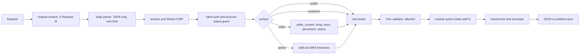
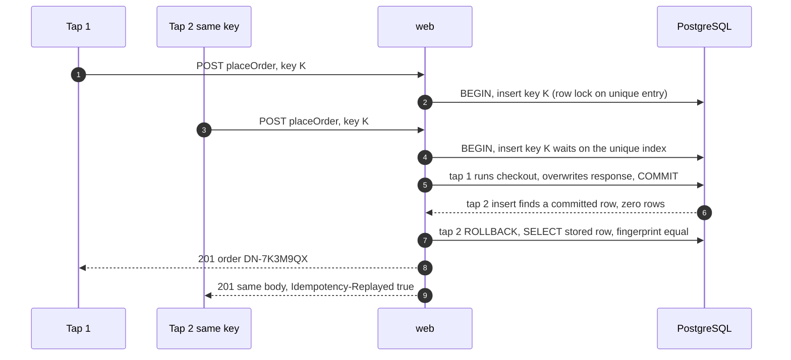
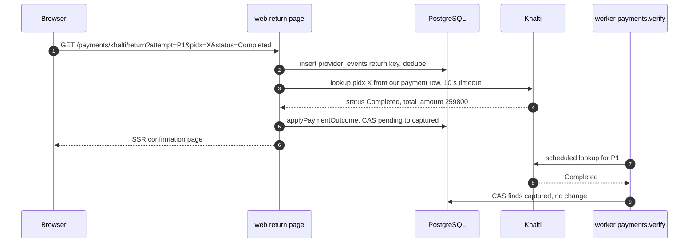

# DripNepal API Design

Status: Draft v1 (2026-09-26)

Reviewed: critic pass B1 (2026-09-26)

This document is the contract for every HTTP interface DripNepal exposes: the JSON API under `/api/v1`, how it relates to Inertia page routes, and the provider return and webhook routes. It owns the API conventions (casing, envelopes, errors, pagination, idempotency, concurrency, limits, versioning, request IDs) and the endpoint catalogue. The machine-readable contract is [openapi.yaml](openapi.yaml); where the two differ, this document states intent and `openapi.yaml` must be corrected in the same PR. `openapi.yaml` starts as a foundation [Confirmed, product owner 2026-09-26]: all shared components (security, problem responses and the full code enum, money, pagination meta, headers, state enums) plus the operations of the §14 worked examples, listed in its `x-foundation-scope`. Every other operation in §13 is listed in `x-pending-operations` and is added to `openapi.yaml` in the PR that implements it; T-API-001 fails for any `/api/v1` response whose operation is not yet specified.

It does not own: state machines, transition preconditions and job schedules ([05](05-order-payment-and-inventory-lifecycles.md)); table, column, constraint and settings names ([04a](04a-data-dictionary-tables.md)); permission slugs, role maps, threats and privacy rules ([07](07-security-threat-model-and-permissions.md)); UI behaviour ([08](08-ui-ux-and-design-system.md)); code layout ([09](09-code-structure-and-engineering-standards.md)); the test registry ([10](10-testing-and-quality-gates.md)); job operations ([11](11-deployment-and-operations.md)); milestones and traceability ([12](12-roadmap-and-backlog.md)).

---

## 1. Reading guide

### 1.1 Labels

- **[Confirmed]** product-owner answer; **[Verified-repo]** file:line in the repository or its installed `node_modules`; **[Verified-doc]** official documentation with URL, accessed 2026-09-25; **[Assumption]** reversible default; **[Open OD-xx]**; **[Verify-external VX-xx]**.
- **(proposed)** marks an operation, route, error code, permission, limiter or filter that a reviewed document introduced and the product owner has not approved yet. It is specified here so it can be built. Where it departs from another document, the text names the decision in the [risks register](risks-and-open-decisions.md#22-decision-table) (for example OD-47). Nothing marked this way is silently renamed or dropped.
- Test IDs are the ones registered in [10 §6](10-testing-and-quality-gates.md#6-test-id-registry), base IDs (10 §6.1) included, and are cited plainly. A test ID that 10 has not registered yet is marked (proposed).
- Symbols: ⚷ `Idempotency-Key` required; ⟳ `If-Match` required.

### 1.2 Versions the examples are checked against

`@adonisjs/core` 7.3.4, `@adonisjs/http-transformers` 2.3.1, `@adonisjs/bodyparser` 11.0.4, `@vinejs/vine` 4.4.0 (compiler 4.1.3), `@adonisjs/shield` 9.0.0, `@adonisjs/session` 8.1.0, `@adonisjs/auth` 10.1.0, `@adonisjs/inertia` 4.2.0, `@tuyau/core` 1.2.2 [Verified-repo, `package.json` and `node_modules/.pnpm`]. `@adonisjs/limiter` 3.0.1 is **not installed yet**; its API is taken from [research: adonis-stack](research/adonis-stack.md) (source <https://registry.npmjs.org/@adonisjs/limiter/-/limiter-3.0.1.tgz>, accessed 2026-09-25) and every limiter snippet is labelled pseudocode. Code blocks are "design sketch" (shapes verified, not compiled) or "pseudocode".

---

## 2. API surfaces and Inertia page routes

### 2.1 Reads are props, writes are JSON (ADR-0004)

[ADR-0004](adr/0004-inertia-reads-json-api-writes.md) fixes the split: page controllers load data through module queries and transformers and render Inertia props; every state change goes through `/api/v1` via the Tuyau client; after success the page calls `router.reload({ only: [...] })` ([03 §6.5](03-system-architecture.md#65-reads-through-inertia-props-writes-through-apiv1-adr-0004)). The rule for reads:

| Read                                                                                      | Delivered as                                                                | Why                                                                                                                                  |
| ----------------------------------------------------------------------------------------- | --------------------------------------------------------------------------- | ------------------------------------------------------------------------------------------------------------------------------------ |
| Initial data of any page (listing, PDP, account, seller and admin screens)                | Inertia props (SSR for storefront, CSR for dashboards, ADR-0003)            | One round trip on slow networks (NFR-NET-003); SEO data in server HTML                                                               |
| Listing filter, sort and page changes                                                     | Inertia partial reload (`only: ['products','facets']`), state in the URL    | AC-FR-SRCH-001-4                                                                                                                     |
| Seller new-order count (FR-NOT-003)                                                       | Inertia `usePoll` partial reload of one prop                                | No extra endpoint ([03 §6.3](03-system-architecture.md#63-dashboards-assessment-seller-and-admin))                                   |
| Location cascade (district after province), cart drawer, checkout quote, upload handshake | JSON `GET`/`POST` under `/api/v1`                                           | Interactive widgets inside a page that must not re-render the page                                                                   |
| Public catalog reads (`listProducts`, `getProduct`, `listCategories`, `getPublicShop`)    | JSON as well as props; the page controller and the endpoint share one query | Contract for the R3 app and a possible separate storefront ([03 §6.4](03-system-architecture.md#64-why-inertia-and-when-to-revisit)) |
| Seller and admin list endpoints (`listShopOrders`, `adminListOrders`, …)                  | JSON, and the same query feeds the page prop                                | Contract tests (T-API-001) and "load more" without a page visit                                                                      |

The same module query and transformer produce the page prop and the JSON body, so the two cannot drift; the JSON endpoint adds the envelope of §3.4.

### 2.2 Surfaces

| Surface               | Base path                                                                                    | Authentication                                                             | Extra gates                                                                                                                 | CSRF                       | Cache                            |
| --------------------- | -------------------------------------------------------------------------------------------- | -------------------------------------------------------------------------- | --------------------------------------------------------------------------------------------------------------------------- | -------------------------- | -------------------------------- |
| Public                | `/api/v1/catalog`, `/api/v1/shops`, `/api/v1/locations`, `/api/v1/seller-agreements/current` | None (a session, if present, is ignored for authorization)                 | Rate limit per IP (§9)                                                                                                      | GET only                   | `private, no-store` in R1 (§3.8) |
| Auth and self         | `/api/v1/auth`, `/api/v1/me`                                                                 | Session, except `signUp`, `logIn`, password reset and email confirmation   | Account-status middleware (§4.2)                                                                                            | Required on unsafe methods | `no-store`                       |
| Customer              | `/api/v1/me/*`, `/api/v1/cart`, `/api/v1/checkout`, `/api/v1/invitations`                    | Session; cart also works for guests (guest token cookie, AC-FR-CART-001-1) | `active` or `pending_verification`; `EMAIL_NOT_VERIFIED` for checkout, shop application and invitation acceptance (§4.2)    | Required                   | `no-store`                       |
| Seller                | `/api/v1/seller/shops/{shopSlug}`                                                            | Session                                                                    | Verified email (`EMAIL_NOT_VERIFIED`, §4.2), then `seller_context` resolution: membership → permission → shop status (§4.4) | Required                   | `no-store`                       |
| Admin                 | `/api/v1/admin`                                                                              | Session of a `platform_staff` user                                         | `mfa_verified_at` within 12 h (§4.3), `platform.*` permission                                                               | Required                   | `no-store`                       |
| Webhooks              | `/api/v1/webhooks/payments/{provider}`                                                       | None; provider scheme (§12)                                                | Signature if the provider signs, then lookup                                                                                | **Exempt by exact route**  | `no-store`                       |
| Provider return pages | `/payments/{provider}/return` (Inertia GET)                                                  | None required (customer may return on another device)                      | Lookup before rendering (§12.2)                                                                                             | GET                        | `no-store`                       |
| Health                | `/health/live`, `/health/ready`                                                              | None                                                                       | Not cached                                                                                                                  | GET                        | `no-store`                       |

CORS: same-origin only. Production `config/cors.ts` uses `origin: app.inDev ? true : []` with `credentials: true` [Verified-repo `config/cors.ts`], so production answers no cross-origin requests; development reflects any origin with credentials (RF-43). M0 restricts development to the Vite origin. Token authentication for non-browser clients is R3 ([ADR-0004](adr/0004-inertia-reads-json-api-writes.md) decision 5).

### 2.3 Page routes this document adds

[03 §6.1](03-system-architecture.md#61-surfaces-and-rendering-modes) lists the route prefixes of each surface, including navigation entries (`/men/t-shirts`), `/grievance` and `/payments/{provider}/return`; [08 §2](08-ui-ux-and-design-system.md#2-route-map-and-information-architecture) lists the pages. The pages below are needed by FR-ADM-009, FR-ADM-011, FR-RET-006 and J-19/J-20 and are proposed consistently with 03 §6.1 and [02 note 2](02-user-journeys-and-acceptance-criteria.md#8-consistency-notes-for-editor):

| Route                                                           | Surface, rendering | Reads (props)                                  | Writes (operations)                           | Status                |
| --------------------------------------------------------------- | ------------------ | ---------------------------------------------- | --------------------------------------------- | --------------------- |
| `/grievance`                                                    | Storefront, SSR    | `platform_legal_disclosures.grievance_officer` | none                                          | In 03 §6.1 (proposed) |
| `/legal`                                                        | Storefront, SSR    | `platform_legal_disclosures` (FR-ADM-011)      | none                                          | (proposed)            |
| `/men/{navSlug}`, `/women/{navSlug}` (fixed list, no catch-all) | Storefront, SSR    | listing props                                  | none                                          | In 03 §6.1 (proposed) |
| `/account/support`, `/account/support/{caseNumber}`             | Account, CSR       | my cases, thread                               | `openSupportCase`, `replyToMySupportCase`     | (proposed)            |
| `/seller/{shopSlug}/returns`                                    | Seller, CSR        | shop returns                                   | `recordReturnReceived`, `markReturnInTransit` | (proposed)            |
| `/seller/{shopSlug}/support-cases`                              | Seller, CSR        | shop cases (shop-visible messages only)        | `replyToShopSupportCase`                      | (proposed)            |
| `/admin/support-cases`, `/admin/support-cases/{caseNumber}`     | Admin, CSR         | case register by `due_at`                      | `updateSupportCase`, `addSupportCaseMessage`  | (proposed)            |
| `/admin/returns`                                                | Admin, CSR         | returns queue                                  | return operations, `createRefund`             | (proposed)            |
| `/admin/settings`                                               | Admin, CSR         | settings                                       | `updatePlatformSetting`                       | (proposed)            |

### 2.4 Request pipeline per surface



The webhook route skips the CSRF check (exact-route exemption, §12.4) and the account guard. Order matters: the rate limiter runs after authentication so authenticated limits key on the user ID, but login and signup limiters run before credential checks by design (§9).

---

## 3. Conventions

### 3.1 URLs and resource naming

- Plural, kebab-case collection nouns: `/me/support-cases`, `/fulfillment-events`. Path parameters are camelCase in docs and route definitions (`{shopOrderNumber}`), as in the §13 catalogue and `openapi.yaml`.
- Resources are addressed by their public identifier: orders by `number` (`DN-XXXXXXX`), shop orders by `DN-XXXXXXX-n`, returns `RT-XXXXXXX`, support cases `SC-XXXXXXX` ([04a §11.1, §11.7, §14.1](04a-data-dictionary-tables.md)), storefront products by `public_id`, seller and admin resources by UUID. Numbers and public IDs are matched case-insensitively; Crockford aliases (`o`→`0`, `i`/`l`→`1`) are normalised for `public_id` ([ADR-0017](adr/0017-product-urls-public-id.md)).
- State transitions that are not plain field edits are **action sub-resources** with `POST` (`/accept`, `/reject`, `/submit`, `/approve`, `/mark-succeeded`), each mapping to exactly one action and one row of a [05](05-order-payment-and-inventory-lifecycles.md) transition table. `PATCH` never changes a `status` column.
- Whole-set replacements use `PUT` (`replaceProductVariants`, `replaceProductMedia`, `replaceShopShipping`, `replacePayoutAccount`).
- `{shopSlug}` accepts a retired slug through `slug_redirects` without redirecting; API responses always carry the current slug ([ADR-0017](adr/0017-product-urls-public-id.md)). Pages answer 301.

### 3.2 JSON casing (OD-13)

`snake_case` for every JSON key in request bodies, response bodies, query parameters and problem extension members, and for Inertia props and `openapi.yaml` (OD-13, decided 2026-09-30). Transformers build every shape explicitly, so the casing is a transformer concern, not an automatic mapping. T-API-001 enforces it. RFC 9457 members (`type`, `title`, `status`, `detail`) keep their RFC names.

### 3.3 Money, time, identifiers, enums

| Kind                | Wire format                                                                                                                 | Rule                                                                                                                                                                                                                                                                                                                                                                                                                                                                                                                                                                                           |
| ------------------- | --------------------------------------------------------------------------------------------------------------------------- | ---------------------------------------------------------------------------------------------------------------------------------------------------------------------------------------------------------------------------------------------------------------------------------------------------------------------------------------------------------------------------------------------------------------------------------------------------------------------------------------------------------------------------------------------------------------------------------------------- |
| Money               | `{ "amount_minor": 129900, "currency": "NPR" }`                                                                             | Integer paisa ([ADR-0007](adr/0007-money-integer-minor-units.md), [04 §18](04-domain-model-and-data-dictionary.md#18-money-representation-rounding-and-allocation)). Never a float or a decimal string. Display formatting ("Rs 1,299.00" vs "Rs.") is a client concern and undecided under [Verify-external VX-12]; no data field is ever a formatted string. Human-readable problem `detail` text may quote an amount through the shared server formatter (same provisional "Rs" format as 04 §18.1); clients act on the machine member (for example `refundable_minor`), never on `detail`. |
| Money in requests   | a bare integer field ending in `_minor` (`delta` is a quantity, not money)                                                  | Only where the actor legitimately chooses an amount: `price_minor`, `compare_at_price_minor`, `expected_grand_total_minor`, refund `amount_minor`, remittance, adjustment, payout. Currency is implied NPR; a `currency` other than `NPR` is 422.                                                                                                                                                                                                                                                                                                                                              |
| Money bigger values | JSON number                                                                                                                 | Safe below `Number.MAX_SAFE_INTEGER` paisa; the server's guarded parser rejects anything else ([05 §9.6](05-order-payment-and-inventory-lifecycles.md#96-other-rules-that-keep-these-lifecycles-correct)).                                                                                                                                                                                                                                                                                                                                                                                     |
| Timestamps          | RFC 3339 UTC with `Z`, millisecond precision: `"2026-10-02T08:15:30.120Z"`                                                  | Clients display Asia/Kathmandu. Date-only filters (`from`, `to`) are `YYYY-MM-DD` interpreted in Asia/Kathmandu and converted to a UTC half-open range.                                                                                                                                                                                                                                                                                                                                                                                                                                        |
| IDs                 | UUID strings (v7 from `uuidv7()`, [04 §2.1](04-domain-model-and-data-dictionary.md#21-identifiers)); human numbers as above | `audit_logs.id` is internal and never exposed.                                                                                                                                                                                                                                                                                                                                                                                                                                                                                                                                                 |
| Enums               | lower `snake_case` strings exactly as the 04a CHECK lists                                                                   | Clients must tolerate unknown enum values in responses (additive change, §10).                                                                                                                                                                                                                                                                                                                                                                                                                                                                                                                 |
| Absent vs null      | Every documented field is always present; unknown values are `null`                                                         | Makes Tuyau and OpenAPI types exact. Omitted fields in `PATCH` bodies mean "unchanged"; `null` means "clear" where the column allows it.                                                                                                                                                                                                                                                                                                                                                                                                                                                       |
| Masked values       | Suffix-only strings: `"phone_masked": "******4321"`                                                                         | Masked and unmasked values use different keys (§3.6), so a client never mistakes one for the other.                                                                                                                                                                                                                                                                                                                                                                                                                                                                                            |

### 3.4 Envelopes and the existing `ApiSerializer`

Success bodies are `{ "data": … }` for one resource and `{ "data": [...], "meta": {...} }` for lists. `204 No Content` is used only for `DELETE` endpoints and `logOut`.

The repository already registers `ctx.serialize()` through `ApiSerializer` in `providers/api_provider.ts` [Verified-repo `providers/api_provider.ts:10-35`]. Two findings from the installed source decide how it is reused:

1. `BaseSerializer.serialize` of `@adonisjs/http-transformers` 2.3.1 wraps items and collections under `wrap` (`data`), but for a `Paginator` it always emits the key **`metadata`**, not `meta` [Verified-repo `node_modules/.pnpm/@adonisjs+http-transformers@2.3.1…/build/index.js:66-72`].
2. The current `definePaginationMetaData` throws unless it receives Lucid's paginator keys (`total`, `perPage`, `currentPage`, `lastPage`, `firstPageUrl`, …) [Verified-repo `providers/api_provider.ts:26-33`]. Those keys are camelCase, include URLs, and need an uncapped `count(*)`, which fits neither cursor lists nor the capped catalog count.

**Decision.** Keep `ApiSerializer` and change it in M1: `definePaginationMetaData` accepts exactly the two DripNepal meta shapes below (and throws on anything else, which keeps its guard role), and `ctx.serialize` renames the top-level `metadata` key to `meta` in one place. Controllers never call Lucid's `paginate()`; they call `XTransformer.paginate(rows, meta)` (signature `static paginate(data, metaData: Record<string, any>, ...rest)` [Verified-repo `…/build/src/base_transformer.d.ts:120-122`]). Trade-off: a five-line rename instead of adopting the library's `metadata` key; the benefit is that this document, Tuyau types and `openapi.yaml` all say `meta`. Verified by T-API-001 and T-API-008 on every list response.

```ts
// design sketch — providers/api_provider.ts after M1 (shapes checked against http-transformers 2.3.1)
type PageMeta = {
  page: number
  per_page: number
  total: number
  total_is_capped: boolean
  has_more: boolean
}
type CursorMeta = { limit: number; next_cursor: string | null }

class ApiSerializer extends BaseSerializer<{
  Wrap: 'data'
  PaginationMetaData: PageMeta | CursorMeta
}> {
  wrap: 'data' = 'data'
  definePaginationMetaData(meta: unknown): PageMeta | CursorMeta {
    if (isPageMeta(meta) || isCursorMeta(meta)) return meta
    throw new Error('Pagination meta must be PageMeta or CursorMeta') // never Lucid paginator meta
  }
}
// ctx.serialize(result) then maps { data, metadata } → { data, meta } for paginator results only
```

`meta` shapes: page lists `{ page, per_page, total, total_is_capped, has_more }` (§6.1); cursor lists `{ limit, next_cursor }` (§6.2). Mutation responses carry no `meta`; an idempotent replay is marked by a header, not by the body, so the replayed body stays byte-identical (§7.5).

### 3.5 Input: validators are allowlists

- Every endpoint has one Vine validator created with `vine.create(...)` (`vine.compile` is deprecated in 4.4.0 [Verified-doc, [research: adonis-stack](research/adonis-stack.md)]); controllers read only `await request.validateUsing(validator, { meta })`. `request.all()`, `request.body()` and spreading validated objects into `Model.create`/`merge` are banned; actions receive typed commands and assign columns one by one (RF-36). A lint rule enforces the ban ([09](09-code-structure-and-engineering-standards.md)).
- **Unknown fields are rejected, not stripped.** Vine 4.4.0 _strips_ properties not in the schema unless `allowUnknownProperties()` is used [Verified-repo `@vinejs/compiler` 4.1.3 `build/index.js:392-393`: unknown keys are only copied when `allowUnknownProperties` is set]. DripNepal adds a shared `rejectUnknownFields` step that compares the raw JSON keys (recursively, arrays included) with the schema's declared keys and answers 422 `VALIDATION_FAILED` with `errors[].code = "unknown_field"` for each extra key.
  - Why reject: stripping would silently accept `{ "shop_id": …, "price_minor": 1 }` on `placeOrder`, hiding both client bugs and mass-assignment probes; rejection makes T-SEC-003 assertable as "422 naming the field" and matches [05 §4.1](05-order-payment-and-inventory-lifecycles.md#41-inputs-preconditions-and-the-quote) ("Unknown fields are rejected").
  - Cost: a client built against a newer server cannot send a field the older server does not know. With one deployable and Inertia's asset-version reload (409 on stale assets) this only affects the R3 app, whose requests §10 keeps additive on the server side.
  - Verified by T-SEC-003 and T-API-002: every mutation rejects an extra top-level and an extra nested key.
- Server-owned fields are never in any validator: `shop_id`, `status`, `version`, totals, `commission_*`, `number`, `public_id`, `created_by`, `approved_by`. Authorization identifiers come from the path and the session only.
- Strings are trimmed; empty strings become `null` (`convertEmptyStringsToNull: true` [Verified-repo `config/bodyparser.ts`]); emails are lower-cased, and an email in the reserved `anonymized.invalid` domain is refused with 422 `VALIDATION_FAILED` on `email` (`signUp` and any future email-change operation), so no live account can hold an anonymisation placeholder ([04a §5.1](04a-data-dictionary-tables.md#51-users) `users_anonymized_check`); phones must match `^9[678]\d{8}$` and are stored E.164 ([04 §2.8](04-domain-model-and-data-dictionary.md#28-text-normalisation-and-lengths); [research: nepal-regulatory-locale](research/nepal-regulatory-locale.md)).
- Only `application/json` bodies are accepted on `/api/v1` unsafe methods. Other content types get 400 `MALFORMED_REQUEST` (proposed); until adopted, 422 `VALIDATION_FAILED` with `errors[0].code = "unsupported_media_type"`.

### 3.6 Output: transformers, never models

Every response body and every Inertia prop is produced by a transformer (`BaseTransformer.pick`/`omit`, variants via `useVariant`) from `@adonisjs/core/transformers` [Verified-doc, [research: adonis-stack](research/adonis-stack.md); http-transformers 2.3.1]. Returning a Lucid model, `model.serialize()` or `toJSON()` from a controller fails the architecture test T-ARCH-001 (rule added by [09](09-code-structure-and-engineering-standards.md)).

Transformer rules:

- One transformer per audience where visibility differs: `OrderCustomerTransformer`, `ShopOrderSellerTransformer`, `OrderAdminTransformer`. Seller variants never include customer email, account ID or other orders ([07 §5.2](07-security-threat-model-and-permissions.md#52-vendor-visibility-of-customer-contact-data) rule 3).
- Customer contact on seller views follows [07 §5.2](07-security-threat-model-and-permissions.md#52-vendor-visibility-of-customer-contact-data) rules 0–2 [Assumption; Open OD-17]: a shop order that never reached `awaiting_acceptance` is left out of every seller list and count, and `getShopOrder` answers 404 `NOT_FOUND` for it. The recipient name, phone and address are returned unmasked only on `getShopOrder`, with `shop.customer_contact.view`, while the shop order is `awaiting_acceptance` or `accepted`, while any return request on it is open, and for 30 days after it becomes terminal (`completed`, `cancelled` or `rejected`); otherwise, and on every `listShopOrders` row, `recipient` is `null` and `recipient_masked` holds the name initial, district and phone last four digits (07 §5.2 rule 2, as in 02 AC-J12-02). `viewer` staff always get the masked form.
- Encrypted columns (`*_enc`) are decrypted only in the transformers on the 07 allowlist; everything else exposes `*_last4` ([04 §2.9](04-domain-model-and-data-dictionary.md#29-sensitive-column-encryption-and-blind-indexes)).
- Versioned resources include `"version": 7` in the body and `ETag: W/"7"` in the header (§8).

### 3.7 Status codes on success

| Case                                                                                                    | Status                                                  |
| ------------------------------------------------------------------------------------------------------- | ------------------------------------------------------- |
| Read                                                                                                    | 200                                                     |
| Create (`createProduct`, `placeOrder`, `createRefund`…)                                                 | 201 with `Location` of the new resource                 |
| Transition or edit returning the resource                                                               | 200                                                     |
| Accepted for asynchronous work (`requestPasswordReset`, `resendEmailVerification`, `revokeAllSessions`) | 202 with a neutral body (no account enumeration, RF-38) |
| Delete, logout                                                                                          | 204                                                     |
| Idempotent replay                                                                                       | the stored status (201 stays 201)                       |

### 3.8 Caching headers

All `/api/v1` responses send `Cache-Control: private, no-store` in R1, including public catalog reads, because they pass through the session and Shield middleware and may set cookies ([03 §12.5](03-system-architecture.md#125-caching)). Edge caching of public reads is an evolution item with the preconditions listed there.

---

## 4. Authentication, CSRF and authorization

### 4.1 Session and CSRF

- Session guard `web`, database session store, cookie `dripnepal_session`, `HttpOnly; Secure; SameSite=Lax; Path=/` ([ADR-0005](adr/0005-session-auth-server-side-revocation.md); the repo still uses `adonis-session` at `config/session.ts:14` [Verified-repo], an M0 change).
- Shield CSRF protects `POST`, `PUT`, `PATCH`, `DELETE` [Verified-repo `config/shield.ts`, `methods`]. With `enableXsrfCookie: true` (already set) Shield sets a JavaScript-readable encrypted `XSRF-TOKEN` cookie and accepts the `x-xsrf-token` header [Verified-doc: shield 9.0.0 source, [research: adonis-stack](research/adonis-stack.md)]. Tuyau 1.2.2 copies the cookie into `X-XSRF-TOKEN` automatically, and Inertia's axios does the same [Verified-doc, [research: adonis-stack](research/adonis-stack.md); <https://inertiajs.com/docs/v2/security/csrf-protection>]. No client code handles tokens.
- A CSRF failure throws `E_BAD_CSRF_TOKEN` (403), whose default handler flashes and redirects. For `/api/*` the exception handler renders problem+json in one of two ways ([07 §3.3](07-security-threat-model-and-permissions.md#33-the-per-request-account-check-and-the-suspension-decision)):
  - 401 `UNAUTHENTICATED` when the session holds no `auth_web` and the matched route runs the `auth` middleware. This is the case of a session that expired or was destroyed by `identity.revoke_sessions`: Shield finds no CSRF secret, mints a new one and rejects the token made from the old one (§4.2 row 2).
  - Otherwise 403 `FORBIDDEN` with `detail` "Your session expired. Reload the page and try again." (07 TM-10): on routes a guest may call (`logIn`, `signUp`, password reset, the guest cart), and when a signed-in session fails the check.
  - Clients handle the 401 like any other (visit `/login`, §5.4). A 403 `FORBIDDEN` on the first unsafe call after a long idle means "reload once"; on a protected route an expired session gets the 401 instead.
- Exemption: only `POST /api/v1/webhooks/payments/{provider}`, through the function form of `exceptRoutes` matching the exact route pattern (`exceptRoutes?: string[] | ((ctx) => boolean)` [Verified-doc, [research: adonis-stack](research/adonis-stack.md), shield 9.0.0 `CsrfOptions`]). A prefix match is not allowed.
- `logOut` calls `auth.use('web').logout()`, `session.untag()`, `session.clear()` and `session.regenerate()` ([ADR-0005](adr/0005-session-auth-server-side-revocation.md) decision 5, [07 §3.11](07-security-threat-model-and-permissions.md#311-logout-and-inertia-history)), because the guard's logout only forgets `auth_web` and does not regenerate the session [Verified-doc, [research: adonis-stack](research/adonis-stack.md), auth 10.1.0], and `regenerate()` carries every remaining key, such as `mfa_verified_at`, to the new ID. The server clears and destroys the session; it does not clear browser history, because `inertia.clearHistory()` has no effect on the JSON `204` of `logOut`. The client's `logOut` success handler calls `router.clearHistory()`, and the next `/login` render clears history again (07 §3.11).

### 4.2 Account status, security stamp and suspension

The account-status middleware runs after silent auth on every request that has a session ([03 §7.7](03-system-architecture.md#77-suspension-taking-effect-on-an-existing-session-j-17-fr-iam-006-t-sec-010)). `@adonisjs/auth` re-queries the user on every authenticated request [Verified-doc, [research: adonis-stack](research/adonis-stack.md)], so status is always fresh. The exact API behaviour, as decided in [07 §3.3](07-security-threat-model-and-permissions.md#33-the-per-request-account-check-and-the-suspension-decision):

| #   | Situation on the request                                                                                                                                                          | Session exists? | API response                                                                                                                                  | Page response                   |
| --- | --------------------------------------------------------------------------------------------------------------------------------------------------------------------------------- | --------------- | --------------------------------------------------------------------------------------------------------------------------------------------- | ------------------------------- |
| 1   | User `suspended`, `deactivated` or `anonymized` (checked first, before the stamp)                                                                                                 | yes             | 403 `ACCOUNT_SUSPENDED`; the middleware logs out, untags, clears and regenerates the session                                                  | redirect `/login` with a notice |
| 2   | Same user, after `identity.revoke_sessions` destroyed the session                                                                                                                 | no (guest)      | Protected endpoint: 401 `UNAUTHENTICATED` for every method, an unsafe call's CSRF failure included (§4.1). Public endpoint: served as a guest | redirect `/login`               |
| 3   | User `active` or `pending_verification`, session stamp differs from `users.security_stamp` (password changed or "revoke all" elsewhere, role change)                              | yes             | 401 `UNAUTHENTICATED`; the middleware logs out, untags, clears and regenerates the session                                                    | redirect `/login`               |
| 4   | Suspended user tries `logIn` with the correct password                                                                                                                            | —               | 403 `ACCOUNT_SUSPENDED`, no session created (AC-FR-IAM-003-4); anonymized accounts get the generic credential failure                         | —                               |
| 5   | `pending_verification` user calls checkout, shop application, invitation acceptance or any seller route ([07 §4.4](07-security-threat-model-and-permissions.md#44-status-gating)) | yes             | 403 `EMAIL_NOT_VERIFIED`                                                                                                                      | page shows the verify prompt    |

Why row 1 wins over row 3 even though suspension also rotates the stamp: the status check runs first, so a suspended user who still has a session always learns why. Row 2 is unavoidable: after the session row is deleted the server cannot tell who the cookie belonged to.

The 07 §3.3 table also covers timeouts: a session past its idle or absolute limit gets 401 `UNAUTHENTICATED` (admin idle: 401 `MFA_REQUIRED`, §4.3); the limits are in [07 §3.4](07-security-threat-model-and-permissions.md#34-idle-and-absolute-timeouts-per-surface).

**Suspension response (decided in [07 §3.3](07-security-threat-model-and-permissions.md#33-the-per-request-account-check-and-the-suspension-decision)).** A suspended, deactivated or anonymized user gets 403 `ACCOUNT_SUSPENDED` while the session row exists (row 1) and 401 `UNAUTHENTICATED` once `identity.revoke_sessions` has destroyed it (row 2); a stamp-only mismatch is 401 (row 3); the answer is never 2xx. T-SEC-010 asserts both paths deterministically (worker stopped: 403; after running the job: 401). ADR-0005 already splits the stamp-only case into 401. 01 AC-FR-IAM-006-2 should read "is rejected with 403 `ACCOUNT_SUSPENDED` while the session exists, or 401 `UNAUTHENTICATED` once it has been revoked; never a 2xx", and 03 §7.7 should move the stamp-only case from 403 to 401 (07 Consistency notes 1).

### 4.3 Admin MFA gating

Every `/api/v1/admin/*` route requires: an authenticated `platform_staff` row with `revoked_at IS NULL`, TOTP enrolled, and session `mfa_verified_at` within 12 hours ([07 §4.2](07-security-threat-model-and-permissions.md#42-platform-roles-and-permissions), [07 §3.4](07-security-threat-model-and-permissions.md#34-idle-and-absolute-timeouts-per-surface); [ADR-0005](adr/0005-session-auth-server-side-revocation.md) decision 6). The MFA proof counts only when the `user_id` stored with it equals the signed-in user and it is not older than `authenticated_at` ([07 §3.2](07-security-threat-model-and-permissions.md#32-what-a-session-may-contain)), so one staff member's TOTP check never unlocks another account in the same browser. Failures, in the order they are checked ([07 §4.8](07-security-threat-model-and-permissions.md#48-how-policies-are-implemented)):

- Guest: 401 `UNAUTHENTICATED` from the `auth` middleware; a page redirects to `/login`.
- Signed in, but without an active `platform_staff` row, or with an account that is not `active` (a `pending_verification` user included): 404 `NOT_FOUND`, so the admin API does not advertise itself to customers.
- Staff session past the 7-day staff absolute limit (proposed, 07 §3.4): the session is destroyed, 401 `UNAUTHENTICATED`.
- Staff idle beyond 2 h, without TOTP enrolled, or with verification older than 12 h: 401 `MFA_REQUIRED` with extension `"mfa": "enrollment_required"` or `"verification_required"`; the client routes to `/mfa`.
- Staff lacking the operation's permission: 403 `FORBIDDEN`.
- **Step-up:** every operation the [07 §3.10](07-security-threat-model-and-permissions.md#310-step-up-for-money-staff-and-sensitive-settings) table marks Yes needs `mfa_verified_at` within 15 minutes (proposed; the value is an [Assumption]). Otherwise it answers 401 `MFA_REQUIRED` with `verification_required`; the client runs `verifyMfaChallenge` and retries with the same `Idempotency-Key`. It covers money approvals, transfers and their outcomes, manual ledger entries, payout-account verification and reveals, staff changes and sensitive settings; among them are `retryRefund`, `markPayoutFailed`, `resolvePaymentReview` and `resolveRefundReview` (both proposed), and `adminUpdateShop` when `commission_rate_bp` or `product_review_mode` changes, with a mandatory `reason` and an audit row that keeps the old and new values (a `slug`-only change needs no step-up). The 07 §3.10 table is the complete list.
- A self-approval under `single_operator_mode` (OD-14) of `approveRefund`, `approvePayout` or the proposed `approveLedgerAdjustment` ([05 §7.8](05-order-payment-and-inventory-lifecycles.md#78-adjustments)) requires a TOTP code in the request body (`totp_code`), even inside the 12 h window ([07 §4.7](07-security-threat-model-and-permissions.md#47-maker-checker-and-single-operator-mode)); a valid code also satisfies the step-up. A wrong code is 422 `VALIDATION_FAILED` on `totp_code` and counts toward the `mfa_user` and `mfa` limiters (§9.1). §7.2 and §7.3 say how the code behaves on an idempotent retry.

### 4.4 Seller authorization algorithm

Every route under `/api/v1/seller/shops/{shopSlug}` runs the `seller_context` middleware ([ADR-0006](adr/0006-authorization-platform-roles-shop-memberships.md) decision 3, [07 §4.8](07-security-threat-model-and-permissions.md#48-how-policies-are-implemented)):

1. **Resolve** `{shopSlug}` case-insensitively against `shops.slug`, then `slug_redirects`. No row: 404 `NOT_FOUND`.
2. **Actor:** owner if `shops.owner_user_id = auth.user.id`; else an `active` `shop_memberships` row for (`shop_id`, `user_id`); else 404 `NOT_FOUND` — identical body to step 1, so a slug cannot be probed (AC-FR-SHOP-006-3, T-SEC-001).
3. **Permission:** the route declares one access requirement (catalogue §13.5; the kinds are in 07 §4.8): a `shop.*` slug, which most routes declare; `shop.member` (the owner or any active member); `shop.owner` (the owner only); or `mediaByKind` (`createMediaUpload`, `completeMediaUpload`), where the middleware checks membership only and the action applies the requirement of the validated `kind`, or of the stored asset, and the status gate after validation. Missing: 403 `FORBIDDEN`. The member already knows the shop exists, so 403 leaks nothing.
4. **Status gate** (after permission, [07 §4.4](07-security-threat-model-and-permissions.md#44-status-gating)): keyed by operationId (`assertShopGate(shop, actor, operationId)`), not by the permission slug alone, so the exceptions the table below names by operation apply. Refused: 403 `SHOP_NOT_ACTIVE` with extension `"shop_status"` and `"suspension_mode"`.
5. **Scope:** set `ctx.shop`; every query and every compare-and-set includes `shop_id = ctx.shop.id`. A nested resource (`{productId}`, `{shopOrderNumber}`, `{variantId}`, `{membershipId}`, `{invitationId}`, `{returnNumber}`, `{caseNumber}`, `{mediaAssetId}`) not found **within** the shop is 404 `NOT_FOUND`, never 403 (T-SEC-001).
6. **Never trust client shop IDs:** `shop_id` is not in any seller validator, so sending it is 422 `unknown_field` (§3.5). Composite foreign keys make a cross-shop link impossible even if code forgot the scope ([04 §2.5](04-domain-model-and-data-dictionary.md#25-tenant-isolation-with-composite-foreign-keys)).

| Shop status                                       | Allowed                                                                                                                                                                                                                                                                                                                                        | Everything else                                                                                               |
| ------------------------------------------------- | ---------------------------------------------------------------------------------------------------------------------------------------------------------------------------------------------------------------------------------------------------------------------------------------------------------------------------------------------- | ------------------------------------------------------------------------------------------------------------- |
| `pending_review`, `rejected`                      | Owner only: `getSellerShop`, `updateShopProfile`, `createMediaUpload`/`completeMediaUpload` with `kind = kyc_document`; `getShopShipping` and `replaceShopShipping` (proposed, OD-47), because approval needs delivery coverage with rates                                                                                                     | `SHOP_NOT_ACTIVE`                                                                                             |
| `active`                                          | all                                                                                                                                                                                                                                                                                                                                            | —                                                                                                             |
| `suspended`, `suspension_mode = fulfill_existing` | `shop.products.view`, `shop.orders.view`, `shop.customer_contact.view`, `shop.orders.process` (existing orders), `shop.finance.view`; `getSellerShop` and `getShopShipping` (`shop.member`, proposed, OD-48); the owner's `listMembers`, `removeMember` and `revokeInvitation` (proposed, OD-48)                                               | `SHOP_NOT_ACTIVE`, including `inviteMember`, `changeMemberRole` and `getPayoutAccount`                        |
| `suspended`, `suspension_mode = frozen`           | `shop.products.view`, `shop.orders.view` and `shop.customer_contact.view` (reads), `shop.finance.view`; `getSellerShop` and `getShopShipping` (`shop.member`, proposed, OD-48); the owner's `listMembers`, `removeMember` and `revokeInvitation` (proposed, OD-48). Open orders are handled by admin (`adminRecordFulfillmentEvent`, proposed) | `SHOP_NOT_ACTIVE`, including `shop.orders.process`, `inviteMember`, `changeMemberRole` and `getPayoutAccount` |
| `closed`                                          | `shop.finance.view`                                                                                                                                                                                                                                                                                                                            | `SHOP_NOT_ACTIVE`                                                                                             |

The table follows [07 §4.4](07-security-threat-model-and-permissions.md#44-status-gating), which owns the gate. The suspended rows let a suspended shop cut off a staff member it suspects; `listMembers` is the only operation that returns the `membershipId` and `invitationId` the other two take, and suspension has already revoked every open invitation, so a suspended shop gains no staff. The owner's `acceptSellerAgreement` (proposed in [07 §4.5](07-security-threat-model-and-permissions.md#45-operation--permission-condensed)) is allowed in every status except `closed` (OD-48). `listMyShops` (`GET /api/v1/seller/shops`) runs outside `seller_context`, so no shop status gate applies to it.

### 4.5 Customer ownership

Customer resources are fetched with the owner in the query ([07 §4.6](07-security-threat-model-and-permissions.md#46-resource-ownership-rules-customers) owns the rules): `orders.customer_user_id = auth.user.id`, `user_addresses.user_id = auth.user.id AND archived_at IS NULL`, `support_cases.customer_user_id = auth.user.id`, and the active cart by user or guest token hash, with cart lines looked up only inside that cart. A miss is 404 `NOT_FOUND` (T-SEC-002 for orders; T-SEC-006 for addresses, including a foreign or archived `address_id` in `quoteCheckout` and `placeOrder`, support cases and cart lines; both in [07 §4.9](07-security-threat-model-and-permissions.md#49-how-authorization-is-tested)); there is no "load then check" code path.

---

## 5. Error contract

### 5.1 Shape

Every 4xx and 5xx under `/api/` is RFC 9457 `application/problem+json` with `Cache-Control: no-store` [Verified-doc <https://www.rfc-editor.org/rfc/rfc9457.html>, accessed 2026-09-25; [ADR-0018](adr/0018-error-contract-problem-details.md)]:

```json
{
  "type": "https://dripnepal.com/problems/out-of-stock",
  "title": "Out of stock",
  "status": 409,
  "detail": "1 item in your cart is no longer available in the quantity you chose.",
  "code": "OUT_OF_STOCK",
  "request_id": "01929a4e-7c1b-7d3e-9f10-5b2c8e4a1d20",
  "errors": [
    { "field": "lines.0", "code": "insufficient_stock", "message": "Only 1 left.", "available": 1 }
  ]
}
```

- `code` is the stable machine key; `type` is `https://dripnepal.com/problems/<kebab-code>` [Assumption: production domain]; `title` is fixed per code; `detail` is safe for end users and never built from an exception message; `request_id` equals the `X-Request-Id` header.
- `errors[]` items are `{ field, code, message }` plus optional code-specific members (`available`, `on_hand`, `reserved`). `field` is a dotted path (`variants.2.sku`, `lines.0`) or `null` for a non-field reason. ADR-0018 limits `errors[]` to `VALIDATION_FAILED`; this document also allows it on `INVALID_QUERY_PARAMETER`, `OUT_OF_STOCK`, `CART_CHANGED`, `DELIVERY_NOT_AVAILABLE` and `CONFLICT`, because 01 AC-FR-INV-003-1/2 and 05 §4.3 return per-line reasons there (Consistency note 4).
- Code-specific extension members (always `snake_case`): `current` (the current representation, for `VERSION_CONFLICT`), `quote` (for `PRICE_CHANGED`), `retry_after_seconds` (mirrors `Retry-After`), `shop_status`, `suspension_mode`, `mfa`, `refundable_minor`, `current_status` and `allowed_events` (for `INVALID_STATE_TRANSITION`: the resource's state now and the events or actions it still accepts, from the [05](05-order-payment-and-inventory-lifecycles.md) table). No other top-level members are sent; a new member is an additive change (§10).

### 5.2 Codes

This table is the list of problem codes, including the additions used by 01, 02 and 05; `openapi.yaml` carries the same enum, and T-API-011 checks the code registry against both. "Retry?" means "the same request may succeed later without change".

| Status | `code`                         | When                                                                                                                                                                                                                                                                                                                                                                                | Retry?                                   | Client action                                                             |
| ------ | ------------------------------ | ----------------------------------------------------------------------------------------------------------------------------------------------------------------------------------------------------------------------------------------------------------------------------------------------------------------------------------------------------------------------------------- | ---------------------------------------- | ------------------------------------------------------------------------- |
| 400    | `INVALID_QUERY_PARAMETER`      | Unknown, malformed or out-of-range query parameter or cursor                                                                                                                                                                                                                                                                                                                        | no                                       | Drop the parameter; pages canonical-redirect instead (AC-FR-SRCH-001-3)   |
| 400    | `IDEMPOTENCY_KEY_REQUIRED`     | ⚷ operation without a valid `Idempotency-Key` (**400**, not 428; Consistency note 1)                                                                                                                                                                                                                                                                                                | no                                       | Bug: generate a key per intent (§7.1)                                     |
| 400    | `MALFORMED_REQUEST` (proposed) | Unparseable JSON or non-JSON content type. Until adopted: 422 `VALIDATION_FAILED`                                                                                                                                                                                                                                                                                                   | no                                       | Bug report with `request_id`                                              |
| 401    | `UNAUTHENTICATED`              | No session, destroyed session, stamp mismatch, timeout (§4.2); a CSRF failure on a protected route without a signed-in session (§4.1)                                                                                                                                                                                                                                               | after login                              | Visit `/login` with a validated return URL (RF-37)                        |
| 401    | `MFA_REQUIRED`                 | Admin API without fresh MFA, or a step-up operation without MFA in the last 15 minutes (§4.3)                                                                                                                                                                                                                                                                                       | after MFA                                | Visit `/mfa`                                                              |
| 403    | `FORBIDDEN`                    | In-scope actor lacks the permission; a CSRF failure on a route a guest may call or with a signed-in session (§4.1)                                                                                                                                                                                                                                                                  | no                                       | Hide the action; on CSRF reload once                                      |
| 403    | `ACCOUNT_SUSPENDED`            | User `suspended`, `deactivated` or `anonymized` (§4.2 rows 1 and 4)                                                                                                                                                                                                                                                                                                                 | no                                       | Show the suspension notice and support contact                            |
| 403    | `SHOP_NOT_ACTIVE`              | Shop status gate (§4.4)                                                                                                                                                                                                                                                                                                                                                             | no                                       | Show shop status banner                                                   |
| 403    | `EMAIL_NOT_VERIFIED`           | Checkout, shop application, invitation acceptance or any seller route by a `pending_verification` user (§4.2 row 5)                                                                                                                                                                                                                                                                 | after verifying                          | Offer `resendEmailVerification`                                           |
| 404    | `NOT_FOUND`                    | Missing, **or in another shop's or customer's scope**, or unknown route                                                                                                                                                                                                                                                                                                             | no                                       | Show "not found"; never distinguish                                       |
| 409    | `CONFLICT`                     | Generic business conflict: stock adjustment below reserved, stocktake changed, a payment attempt still being prepared or processed (§7.8), checkout lock timeout                                                                                                                                                                                                                    | sometimes (`Retry-After` when transient) | Read `errors[].code`; reload the resource                                 |
| 409    | `IDEMPOTENCY_IN_PROGRESS`      | Same key still running past the 5 s lock wait (§7.4)                                                                                                                                                                                                                                                                                                                                | yes, `Retry-After: 2`                    | Retry with the **same** key                                               |
| 409    | `OUT_OF_STOCK`                 | Conditional stock update failed at `placeOrder` step 8                                                                                                                                                                                                                                                                                                                              | no                                       | Reload cart; `errors[]` lists available quantities                        |
| 409    | `PRICE_CHANGED`                | Server total differs from `expected_grand_total_minor`                                                                                                                                                                                                                                                                                                                              | no                                       | Show `quote`, ask to confirm, resend with the new total and a **new** key |
| 409    | `CART_CHANGED`                 | `cart_version` mismatch, no active cart, or unavailable lines                                                                                                                                                                                                                                                                                                                       | no                                       | Reload cart and quote                                                     |
| 409    | `INVALID_STATE_TRANSITION`     | The resource's current state does not allow the action ([05](05-order-payment-and-inventory-lifecycles.md) tables); also a 4th delivery reattempt (02 §8 item 14)                                                                                                                                                                                                                   | no                                       | Reload; show current state (`allowed_events` extension where useful)      |
| 412    | `VERSION_CONFLICT`             | `If-Match` does not match the current version                                                                                                                                                                                                                                                                                                                                       | no                                       | Show `current`, let the user reapply                                      |
| 413    | `PAYLOAD_TOO_LARGE`            | Body over the route limit (§9.2)                                                                                                                                                                                                                                                                                                                                                    | no                                       | Split or shrink                                                           |
| 422    | `VALIDATION_FAILED`            | Schema, rule or unknown-field failure; business validation such as a payout blocked by [Open OD-27] (AC-J15-16) or a remittance above the amount owed (AC-J15-13) (02 §8 item 14)                                                                                                                                                                                                   | no                                       | Map `errors[]` to fields                                                  |
| 422    | `IDEMPOTENCY_KEY_REUSED`       | Same key, different fingerprint                                                                                                                                                                                                                                                                                                                                                     | no                                       | Bug: new intent needs a new key                                           |
| 422    | `DELIVERY_NOT_AVAILABLE`       | Address district not covered by a shop in the cart                                                                                                                                                                                                                                                                                                                                  | no                                       | Change address or remove that shop's items                                |
| 422    | `COD_LIMIT_EXCEEDED`           | COD value or open-order limit ([Open OD-18])                                                                                                                                                                                                                                                                                                                                        | no                                       | Reduce the order or wait for open orders                                  |
| 422    | `REFUND_EXCEEDS_REFUNDABLE`    | Refund amount above refundable, or a shipping part that would take the shipping refunded on the shop order's allocation above `shipping_fee_minor` (T-SEC-004; [05 §3.3](05-order-payment-and-inventory-lifecycles.md#33-shipping-fee-per-shop-order), [§6.7](05-order-payment-and-inventory-lifecycles.md#67-refund))                                                              | no                                       | Show `refundable_minor`                                                   |
| 428    | `PRECONDITION_REQUIRED`        | ⟳ operation without `If-Match`                                                                                                                                                                                                                                                                                                                                                      | no                                       | Bug: send the ETag read with the resource                                 |
| 429    | `RATE_LIMITED`                 | Limiter exceeded (§9.1)                                                                                                                                                                                                                                                                                                                                                             | yes, `Retry-After`                       | Disable the action until `Retry-After`                                    |
| 500    | `INTERNAL`                     | Anything unmapped; constraint violation outside the allowlist                                                                                                                                                                                                                                                                                                                       | maybe                                    | Generic message with `request_id`                                         |
| 503    | `PROVIDER_UNAVAILABLE`         | Gateway breaker open or provider down; **kill switch** (`checkout_enabled = false`, 05 §4.1) on checkout, gateway payment starts and payouts (below)                                                                                                                                                                                                                                | yes, `Retry-After`                       | Show maintenance banner; offer COD when only the gateway is down          |
| 503    | `CHECKOUT_DISABLED` (proposed) | Would replace `PROVIDER_UNAVAILABLE` for the kill switch only, so clients can tell an incident stop from a provider outage                                                                                                                                                                                                                                                          | no                                       | Show `maintenance_banner`                                                 |
| 503    | `SERVICE_BUSY` (proposed)      | `listProducts` waited more than 1 s for a slot under the catalog-read cap, proposed together with the cap ([07 TM-24](07-security-threat-model-and-permissions.md#tm-24-resource-exhaustion-and-expensive-queries)); the listing and search pages that share its query render the error page instead (§5.4). `PROVIDER_UNAVAILABLE` would wrongly suggest a payment provider outage | yes, `Retry-After`                       | Show "busy, try again"; retry after `Retry-After`                         |

**Current kill-switch behaviour** (until the product owner adopts `CHECKOUT_DISABLED`): while `checkout_enabled` is false, `quoteCheckout`, `placeOrder`, `startOrderPayment` and the payout operations `approvePayout`, `markPayoutPaid` and `revealPayoutAccount` (proposed in [07 §5.5](07-security-threat-model-and-permissions.md#55-encryption), OD-49) return 503 `PROVIDER_UNAVAILABLE` with `detail` = the `maintenance_banner` text and no `Retry-After`. The payout operations follow AC-FR-ADM-010-2 [Assumption] and REG-15, which block payouts, not only their approval ([07 §6.3](07-security-threat-model-and-permissions.md#63-first-hour-checklist-sev-1) step 2, [§6.4](07-security-threat-model-and-permissions.md#64-the-kill-switch-and-directive-2082-s82)). `markPayoutFailed` and `cancelPayout` (proposed in [05 §6.8](05-order-payment-and-inventory-lifecycles.md#68-payout-and-settlement-r11)) stay available, so finance can end an open payout during an incident.

### 5.3 Domain errors to HTTP

Domain code throws `DomainError(code, { detail?, errors?, extensions? })`; the registry maps code → status and title ([ADR-0018](adr/0018-error-contract-problem-details.md) decision 4). The exception handler maps framework and database errors:

| Source                                                                                                                                                                                                                                                                                                                              | Problem                                                                                                                                                                                                                                                                                                                                                 |
| ----------------------------------------------------------------------------------------------------------------------------------------------------------------------------------------------------------------------------------------------------------------------------------------------------------------------------------- | ------------------------------------------------------------------------------------------------------------------------------------------------------------------------------------------------------------------------------------------------------------------------------------------------------------------------------------------------------- |
| Vine `E_VALIDATION_ERROR`; `rejectUnknownFields`                                                                                                                                                                                                                                                                                    | 422 `VALIDATION_FAILED`, `errors[]` with rule names as `code` (`required`, `regex`, `unknown_field`)                                                                                                                                                                                                                                                    |
| Auth guard `E_UNAUTHORIZED_ACCESS`                                                                                                                                                                                                                                                                                                  | 401 `UNAUTHENTICATED`                                                                                                                                                                                                                                                                                                                                   |
| Shield `E_BAD_CSRF_TOKEN`                                                                                                                                                                                                                                                                                                           | 401 `UNAUTHENTICATED` when the session holds no `auth_web` and the route runs the `auth` middleware; otherwise 403 `FORBIDDEN` (§4.1)                                                                                                                                                                                                                   |
| Route not found, method not allowed                                                                                                                                                                                                                                                                                                 | 404 `NOT_FOUND`                                                                                                                                                                                                                                                                                                                                         |
| Body parser size error                                                                                                                                                                                                                                                                                                              | 413 `PAYLOAD_TOO_LARGE`                                                                                                                                                                                                                                                                                                                                 |
| Body parser JSON syntax error                                                                                                                                                                                                                                                                                                       | 400 `MALFORMED_REQUEST` (proposed), else 422 `VALIDATION_FAILED`                                                                                                                                                                                                                                                                                        |
| `InvalidStateTransition` from `assertTransition`, or a CAS that changed zero rows because the status moved                                                                                                                                                                                                                          | 409 `INVALID_STATE_TRANSITION`                                                                                                                                                                                                                                                                                                                          |
| Version CAS zero rows on an `If-Match` request                                                                                                                                                                                                                                                                                      | 412 `VERSION_CONFLICT` with `current`                                                                                                                                                                                                                                                                                                                   |
| SQLSTATE 23505 on an allow-listed unique constraint (`shops_slug_key`, `product_variants_shop_sku_key`, `vendor_remittances_reference_key` → `reference`, …)                                                                                                                                                                        | 422 `VALIDATION_FAILED` on the mapped field                                                                                                                                                                                                                                                                                                             |
| SQLSTATE 23514 on an allow-listed CHECK (`platform_settings_value_check`, `refunds_amount_check`, `products_title_check`, `products_country_check`, `products_description_check`, `products_manufacturer_name_check`, `products_warranty_text_check`, `products_care_and_precautions_check`, `payments_refunded_le_captured_check`) | 422 `VALIDATION_FAILED` (settings, refund amount ≤ 0, a blank or over-long product disclosure, a title outside 3–120 characters or an inconsistent country of origin, on the matching field, [04a §7.6](04a-data-dictionary-tables.md#76-products)); 422 `REFUND_EXCEEDS_REFUNDABLE` for `payments_refunded_le_captured_check` (the T-SEC-004 backstop) |
| SQLSTATE 55P03 (lock timeout) in `placeOrder` key insert                                                                                                                                                                                                                                                                            | 409 `IDEMPOTENCY_IN_PROGRESS`, `Retry-After: 2`                                                                                                                                                                                                                                                                                                         |
| SQLSTATE 55P03 elsewhere                                                                                                                                                                                                                                                                                                            | 409 `CONFLICT`, `Retry-After: 2`                                                                                                                                                                                                                                                                                                                        |
| SQLSTATE 40P01 (deadlock) after the single retry in `withTx`                                                                                                                                                                                                                                                                        | 500 `INTERNAL` (a lock-order bug; alert)                                                                                                                                                                                                                                                                                                                |
| `ProviderUnavailableError`, breaker open                                                                                                                                                                                                                                                                                            | 503 `PROVIDER_UNAVAILABLE`, `Retry-After: 30`                                                                                                                                                                                                                                                                                                           |
| Storefront catalog read waits more than 1 s for a slot under the catalog-read cap ([07 TM-24](07-security-threat-model-and-permissions.md#tm-24-resource-exhaustion-and-expensive-queries), proposed)                                                                                                                               | 503 `SERVICE_BUSY` (proposed), `Retry-After`                                                                                                                                                                                                                                                                                                            |
| Anything else                                                                                                                                                                                                                                                                                                                       | 500 `INTERNAL`, generic `detail`; full error only in logs with the same `request_id` (RF-36)                                                                                                                                                                                                                                                            |

The constraint allowlist lives next to the code registry; a constraint not on it becomes `INTERNAL`, so a database message never reaches a client.

### 5.4 How Inertia pages consume errors

Pages call the API through a thin `apiCall()`/`useApiMutation` wrapper that catches `TuyauHTTPError`, parses the typed `Problem`, and applies the defaults of [ADR-0018](adr/0018-error-contract-problem-details.md) decision 6: `errors[]` → TanStack Form field messages (several per field allowed), `OUT_OF_STOCK`/`CART_CHANGED`/`PRICE_CHANGED` → partial reload of cart or quote props, `VERSION_CONFLICT` → reload offer, `UNAUTHENTICATED`/`MFA_REQUIRED` → visit, `RATE_LIMITED` → disable until `Retry-After`, unknown codes → fallback by status class with `request_id`. Tuyau 1.2.2 adds a `422 { errors: SimpleError[] }` variant to each route's error type and lets `validationErrorType` replace it [Verified-doc, [research: adonis-stack](research/adonis-stack.md)]; M0 checks that the `Problem` type fits there, otherwise the wrapper narrows it. Page visits (GET) never render problem+json: they render `errors/not_found` or `errors/server_error` with the request ID.

---

## 6. Pagination, filtering and sorting

### 6.1 Page numbers: public catalog only

`listProducts` and the storefront pages use `page` (1–100, default 1) and `per_page` (1–48, default 24) (AC-FR-SRCH-001-3). Ordering is always deterministic: the chosen sort key, then `product_id` as the tie-breaker (AC-FR-SRCH-001-2), served by `product_listings_category_idx`/`product_listings_shop_idx` ([04a §7.12](04a-data-dictionary-tables.md#712-product_listings-read-model)).

`meta = { page, per_page, total, total_is_capped, has_more }`. `total` is a capped count, `SELECT count(*) FROM (SELECT 1 … LIMIT 10001) t`, so a broad query never counts the whole table; above 10,000 it reports 10,000 with `total_is_capped: true` [Assumption]. `has_more` comes from fetching `per_page + 1` rows. OFFSET cost is bounded because `page × per_page ≤ 4,800`. A page beyond the last returns an empty `data` with 200, not 404.

### 6.2 Cursors: everything else

All other lists take `cursor` (opaque) and `limit` (1–100, default 25 [Assumption]); `meta = { limit, next_cursor }`, where `next_cursor` is `null` on the last page.

- **Encoding:** base64url (no padding) of compact JSON `{"v":1,"s":"<sort>","k":[<sort value>,"<id>"],"f":"<8 hex>"}`. `k` is the last row's sort value (timestamps as RFC 3339 strings) and ID; `f` is the first 8 hex digits of SHA-256 of the canonical filter set.
- **Query:** keyset seek with a row comparison matching the index order, for example `WHERE shop_id = :shop AND (created_at, id) < (:k0, :k1) ORDER BY created_at DESC, id DESC LIMIT :limit + 1`.
- **Validation:** a cursor that does not decode, has another `v` or `s`, or whose `f` does not match the request's filters is 400 `INVALID_QUERY_PARAMETER`. Cursors are not signed: forging one only moves the start position inside a query that is already scoped to the actor, so it cannot reveal other tenants' data. T-API-003 tampers with a cursor on a seller list and expects either 400 or rows of the same shop only.
- Ascending queues (moderation, refunds by `due_at`, cases by `due_at`, the seller new-orders tab by `acceptance_due_at`) use `>` instead of `<`.

### 6.3 Filter and sort allowlists

Every list has a closed parameter list; anything else is 400 `INVALID_QUERY_PARAMETER`. Multi-value filters repeat the parameter (`apparel_size=m&apparel_size=l`, at most 20 values). The index column names the pattern in [04 §17.2](04-domain-model-and-data-dictionary.md#172-pattern-catalogue).

| Operation                                                                                        | Filters                                                                                                                                                                                                                                                                                        | Sorts (default first)                                                                     | Tie-breaker, index                                                                                                                                                                                                                    |
| ------------------------------------------------------------------------------------------------ | ---------------------------------------------------------------------------------------------------------------------------------------------------------------------------------------------------------------------------------------------------------------------------------------------- | ----------------------------------------------------------------------------------------- | ------------------------------------------------------------------------------------------------------------------------------------------------------------------------------------------------------------------------------------- |
| `listProducts`                                                                                   | `category` (slug, subtree), `nav` (navigation entry), attribute filters named by the filterable attribute's code with value codes (`audience`, `apparel_size`, `shoe_size_eu`, `waist_size_in`, `color`), `brand`, `shop`, `price_min_minor`, `price_max_minor`, `in_stock`, `q` (2–100 chars) | `newest`, `price_asc`, `price_desc`, `relevance` (only with `q`, default then)            | `product_id`; `product_listings_*_idx`, GIN search                                                                                                                                                                                    |
| `listShopProducts`                                                                               | `status`, `q` (title or SKU prefix, at most 100 characters)                                                                                                                                                                                                                                    | `updated_desc`                                                                            | product `id`, descending (cursor `(updated_at, id) < (:k0, :k1)`); `products_seller_list_idx`                                                                                                                                         |
| `listInventory`                                                                                  | `status` (product), `low_stock` (R2), `q` (title or SKU prefix, at most 100 characters)                                                                                                                                                                                                        | `updated_desc`                                                                            | product `id`, descending; pages by product (the product's `(updated_at, id)`), each row carrying all of that product's active variants ([04a §8.1](04a-data-dictionary-tables.md#81-inventory_items)); via `products_seller_list_idx` |
| `listShopOrders`                                                                                 | `status` (`awaiting_payment` matches nothing: a seller never sees a shop order before `awaiting_acceptance`, [07 §5.2](07-security-threat-model-and-permissions.md#52-vendor-visibility-of-customer-contact-data) rule 0), `from`, `to`, `late` (bool)                                         | `created_desc`; `due_asc` only with `status=awaiting_acceptance`, where it is the default | `id` (`due_asc`: cursor key `[acceptance_due_at, id]`, ascending); `shop_orders_seller_list_idx` (partial; `due_asc` reads its `(shop_id, status)` prefix and sorts in memory)/`shop_orders_seller_all_idx`                           |
| `listShopReturns`                                                                                | `status`                                                                                                                                                                                                                                                                                       | `created_desc`                                                                            | `id`; `return_requests_seller_list_idx`                                                                                                                                                                                               |
| `listShopSupportCases`, `listMySupportCases`                                                     | `status`                                                                                                                                                                                                                                                                                       | `created_desc`                                                                            | `id`; `support_cases_shop_idx`/`support_cases_customer_idx`                                                                                                                                                                           |
| `listShopLedgerEntries`                                                                          | `entry_type`, `from`, `to`                                                                                                                                                                                                                                                                     | `created_desc`                                                                            | `id`; `ledger_entries_shop_statement_idx`                                                                                                                                                                                             |
| `listShopPayouts`, `listPayouts`                                                                 | `status` (admin also `shop`)                                                                                                                                                                                                                                                                   | `created_desc`                                                                            | `id`; `payouts_shop_idx`/`payouts_admin_status_idx`                                                                                                                                                                                   |
| `listMyOrders`                                                                                   | none                                                                                                                                                                                                                                                                                           | `placed_desc`                                                                             | `id`; `orders_customer_list_idx`                                                                                                                                                                                                      |
| `adminListOrders`                                                                                | `status`, `payment_status` (incl. `needs_review`), `shop`, `from`, `to`, `number` (exact)                                                                                                                                                                                                      | `placed_desc`                                                                             | `id`; `orders_admin_status_idx`/`orders_admin_recent_idx`                                                                                                                                                                             |
| `listModerationQueue`                                                                            | `shop`                                                                                                                                                                                                                                                                                         | `submitted_asc`                                                                           | `id`; `products_moderation_queue_idx`                                                                                                                                                                                                 |
| `listShopApplications`, `listShops`                                                              | `status`, `q` (name or slug prefix, at most 100 characters)                                                                                                                                                                                                                                    | `created_desc` (applications `created_asc`)                                               | `id`                                                                                                                                                                                                                                  |
| `listUsers`                                                                                      | `status`, `email` (exact, normalised), `phone_last4` with `phone` exact via blind index                                                                                                                                                                                                        | `created_desc`                                                                            | `id`; `users_email_key`, `users_phone_hash_idx`                                                                                                                                                                                       |
| `adminListLedgerEntries`                                                                         | `shop`, `entry_type`, `from`, `to`                                                                                                                                                                                                                                                             | `created_desc`                                                                            | `id`; `ledger_entries_recent_idx` without `shop`, `ledger_entries_shop_statement_idx` with it                                                                                                                                         |
| `listAuditLogs`                                                                                  | `subject_type`+`subject_id`, `actor`, `shop`, `action`, `from`, `to` (at most one of the first four)                                                                                                                                                                                           | `id_desc`                                                                                 | `id`; `audit_logs_*_idx`, `audit_logs_occurred_at_idx` for ranges                                                                                                                                                                     |
| `listSupportCases`                                                                               | `status`, `category`, `shop`, `overdue`                                                                                                                                                                                                                                                        | `due_asc`                                                                                 | `id`; `support_cases_open_due_idx`                                                                                                                                                                                                    |
| Refund queue: page prop of `/admin/refunds` only (the §13 catalogue has no refund list endpoint) | `status`                                                                                                                                                                                                                                                                                       | `due_asc`                                                                                 | `id`; `refunds_queue_idx`                                                                                                                                                                                                             |

Free-text `q` on seller and admin lists is a prefix match on indexed columns only, at most 100 characters [Assumption] (longer is 400 `INVALID_QUERY_PARAMETER`); there is no `ILIKE '%…%'` over personal data.

---

## 7. Idempotency

This section owns the platform idempotency contract that [ADR-0004](adr/0004-inertia-reads-json-api-writes.md) decision 4 and [05 §4.6](05-order-payment-and-inventory-lifecycles.md#46-idempotency-handling) refer to. The table is `idempotency_keys` ([04a §15.2](04a-data-dictionary-tables.md#152-idempotency_keys)).

### 7.1 The key

- Header `Idempotency-Key`, 16–64 characters of `[A-Za-z0-9_-]` (the `idempotency_keys_key_check` CHECK). Clients send a UUIDv4 from `crypto.randomUUID()` (36 characters).
- Missing or malformed on a ⚷ operation: 400 `IDEMPOTENCY_KEY_REQUIRED`, before any transaction. On an operation without ⚷ the header is ignored.
- **One key per user intent.** The client creates the key when the intent starts (the checkout review screen mounts, the "Accept order" dialog opens) and reuses it for every retry of that intent, including after a network timeout or a 5xx (AC-FR-CHK-003-4, NFR-NET-002). It creates a new key after a success, and whenever the body changes. Disabling the button is a courtesy, not the protection.

### 7.2 Scope and fingerprint

- **Scope:** UNIQUE (`actor_scope`, `operation`, `key`). `actor_scope` is the authenticated user's UUID (customers, shop members and staff alike), `provider:<name>` for provider-originated operations, or `system` for jobs. `operation` is the operationId. The same key string used by two users, or by one user on two operations, never collides.
- **Fingerprint:** `SHA-256(method + "\n" + route pattern + "\n" + canonical(path params) + "\n" + canonical(validated body) + "\n" + (If-Match or ""))`, stored as 32 bytes. The route pattern (`/api/v1/seller/shops/:shopSlug/orders/:shopOrderNumber/accept`) and the **resolved** path parameters (shop UUID, not the slug, so a slug rename does not change the fingerprint) are included, so a key replayed against another shop order is a different fingerprint.
- **Canonical JSON:** object keys sorted by UTF-16 code unit, no insignificant whitespace, strings escaped as `JSON.stringify` does, integers only (the API has no floating-point fields), arrays in given order, `null` kept. The **validated** body is hashed, after trimming and lower-casing rules, so `" cod "` and `"cod"` are one intent. This is the key-ordering part of JSON Canonicalization Scheme RFC 8785 without its number rules [Assumption; the API sends no non-integer numbers].
- **`totp_code` is not part of the fingerprint.** For `approveRefund`, `approvePayout` and the proposed `approveLedgerAdjustment` ([05 §7.8](05-order-payment-and-inventory-lifecycles.md#78-adjustments)), `totp_code` is removed from the validated body before hashing ([07 §3.10](07-security-threat-model-and-permissions.md#310-step-up-for-money-staff-and-sensitive-settings)). A TOTP code changes every 30 seconds, so an approver whose response was lost can retry with the same key and a fresh code and still get the stored response, not `IDEMPOTENCY_KEY_REUSED`.

### 7.3 Persistence and transaction placement

Every ⚷ action runs through one helper, `withIdempotency(ctx, operation, retention, fn)`, inside `withTx` ([03 §8.3](03-system-architecture.md#83-operations-that-must-not-hold-a-transaction)):

1. `SET LOCAL lock_timeout = '5s'`, then **the first statement** of the business transaction inserts the key row with a placeholder response (`response_status = 500`, `response_body = '{}'`), `ON CONFLICT (actor_scope, operation, key) DO NOTHING RETURNING id` (the SQL is in [05 §4.6](05-order-payment-and-inventory-lifecycles.md#46-idempotency-handling)).
2. Zero rows returned: roll back the empty transaction, read the committed row, compare fingerprints, and replay or refuse (§7.4).
3. One row: run the action. For an operation that accepts `totp_code` (§7.2), the code is checked here, after the key insert and inside the transaction: the `mfa_user` and `mfa` limiter checks (§9.1), then the `mfa_last_used_step` compare-and-set ([07 §3.10](07-security-threat-model-and-permissions.md#310-step-up-for-money-staff-and-sensitive-settings)). A wrong or replayed code rolls the transaction back, so the key stays free for a retry with a new code, and `penalize()` counts it outside the transaction. The 15-minute step-up check (§4.3) lets a request that carries `totp_code` through to the action instead of answering 401, and a replayed key (step 2) returns the stored response without checking the code. Just before `COMMIT`, overwrite `response_status`, `response_body`, `resource_type` and `resource_id` with the real transformed response.
4. `COMMIT` makes the key and the business rows visible together. A stored response therefore always describes rows that exist, and every created order has its key row.



`idempotency_keys.status` is always `completed` in R1, because the row only becomes visible when the operation commits; the column exists for a future operation that cannot run in one transaction ([04a §15.2](04a-data-dictionary-tables.md#152-idempotency_keys)).

### 7.4 Outcomes

| Situation                                                                                                         | Response                                                                                                                                                        | Stored?                                                  |
| ----------------------------------------------------------------------------------------------------------------- | --------------------------------------------------------------------------------------------------------------------------------------------------------------- | -------------------------------------------------------- |
| New key, success                                                                                                  | The real status and body                                                                                                                                        | yes                                                      |
| New key, business failure inside the transaction (`OUT_OF_STOCK`, `PRICE_CHANGED`, `INVALID_STATE_TRANSITION`, …) | The problem response                                                                                                                                            | **no**: rollback removes the key; a retry executes again |
| New key, failure before the transaction (validation, auth, rate limit)                                            | The problem response                                                                                                                                            | no                                                       |
| Same key, same fingerprint, first request committed                                                               | The stored status and body, plus header `Idempotency-Replayed: true`                                                                                            | —                                                        |
| Same key, different fingerprint                                                                                   | 422 `IDEMPOTENCY_KEY_REUSED`                                                                                                                                    | —                                                        |
| Same key while the first request is still running                                                                 | Waits on the unique index; when the first commits → replay; when it rolls back → executes as new                                                                | —                                                        |
| Same key, first request still running after `lock_timeout` (5 s)                                                  | 409 `IDEMPOTENCY_IN_PROGRESS`, `Retry-After: 2`                                                                                                                 | —                                                        |
| Same key after `expires_at` and the purge                                                                         | Executes as a new request. The domain's own guards (cart `converted` → 409 `CART_CHANGED`, status CAS → 409 `INVALID_STATE_TRANSITION`) stop a duplicate effect | yes (new row)                                            |
| Missing or malformed key                                                                                          | 400 `IDEMPOTENCY_KEY_REQUIRED`                                                                                                                                  | —                                                        |

Replays are checked against the key only, not against current authorization or a `totp_code` in the body (§7.3): the stored body was produced for this same actor, and it carries no data the actor could not see then. A suspended actor is stopped earlier by §4.2.

### 7.5 What is stored and replayed

`response_status` and the transformed `response_body` only. Never secrets, tokens, `Set-Cookie`, or a payment redirect (`next_action` for a gateway, [05 §4.6](05-order-payment-and-inventory-lifecycles.md#46-idempotency-handling)). On replay the server rebuilds `Location` from `resource_type` and `resource_id`, sets a fresh `X-Request-Id`, and adds `Idempotency-Replayed: true`. `ETag` is not replayed; clients re-read a resource before editing it. The body can be personal data (an order), which is why 04a classes the table Personal and keeps it for at most 72 hours.

### 7.6 Expiry and purge

`expires_at = created_at + 24 h`, or `+ 72 h` for `placeOrder` [Assumption A-32]; the table CHECK caps any key at 72 hours. `platform.purge_idempotency_keys` runs hourly at :05 and deletes expired rows in batches of 1,000 ([03 §9](03-system-architecture.md#9-asynchronous-work)); deleting a `placeOrder` key sets `orders.idempotency_key_id` to null through `ON DELETE SET NULL`. `orders_idempotency_key_key` (partial UNIQUE on `orders.idempotency_key_id`, [04a §11.1](04a-data-dictionary-tables.md#111-orders)) is the database backstop for "one order per key" (INV-22).

### 7.7 Operations that require a key (⚷)

Operations of §13.2–§13.7: `placeOrder`, `cancelMyShopOrder`, `startOrderPayment` (R1.1), `createProduct`, `adjustInventory`, `stocktakeInventory`, `acceptShopOrder`, `rejectShopOrder`, `recordFulfillmentEvent`, `recordCodCollection`, `recordReturnReceived`, `adminCancelShopOrder`, `createRefund`, `approveRefund`, `markRefundSucceeded`, `retryRefund`, `createLedgerAdjustment`, `recordVendorRemittance`, `createPayout`, `approvePayout`, `markPayoutPaid`, `markPayoutFailed`, `createReturnRequest`, `adminRecordReturnReceived`.

Proposed operations with ⚷ (§13.8): `adminRecordCodCollection`, `adminRecordFulfillmentEvent`, `startRefundTransfer`, `markReturnInTransit`, `adminMarkReturnInTransit`, `closeReturnRequest`, `cancelRefund`, `resolvePaymentReview`, `resolveRefundReview`, `approveLedgerAdjustment` and `cancelLedgerAdjustment` (proposed in [05 §7.8](05-order-payment-and-inventory-lifecycles.md#78-adjustments)), and `cancelPayout` (proposed in [05 §6.8](05-order-payment-and-inventory-lifecycles.md#68-payout-and-settlement-r11)). The tracking-correction variant of `recordFulfillmentEvent` inherits its ⚷.

Not ⚷, with the reason: cart operations (a duplicate `addCartItem` is visible, bounded to 10 units per line and revalidated at the review step; `updateCartItem` sets an absolute quantity); ⟳ edits (the version check already rejects a second apply); `approveReturnRequest` and `rejectReturnRequest` (a status CAS makes the second call 409, and they move no money or stock). NFR-NET-002 lists "orders, stock or money", which the ⚷ list covers.

### 7.8 Provider-side idempotency

Our keys protect our API; provider calls need their own ([05 §9.3](05-order-payment-and-inventory-lifecycles.md#93-provider-idempotency-keys)):

| Call                  | Provider field                              | DripNepal value                                                                                      | Protection                                                                                                                           |
| --------------------- | ------------------------------------------- | ---------------------------------------------------------------------------------------------------- | ------------------------------------------------------------------------------------------------------------------------------------ |
| Khalti initiate       | `purchase_order_id`                         | `payments.id` (one per attempt)                                                                      | Duplicate handling is undocumented [Verified-doc <https://docs.khalti.com/khalti-epayment/>]; a retry is a new attempt with a new ID |
| eSewa ePay form       | `transaction_uuid` (alphanumerics, hyphens) | `payments.id`                                                                                        | Must be unique per request [Verified-doc <https://developer.esewa.com.np/pages/Epay>]                                                |
| Khalti refund         | none documented                             | `refunds.provider_idempotency_key = refunds.id`, sent in any free-text field [Verify-external VX-07] | Never re-sent after a timeout without a lookup (T-PAY-008)                                                                           |
| eSewa refund (manual) | none                                        | `refunds.id` quoted in the portal request                                                            | Operator and status check match on it                                                                                                |

`startOrderPayment` is idempotent twice over ([05 §4.8](05-order-payment-and-inventory-lifecycles.md#48-gateway-initiation-after-commit-r11)): our key replays the same attempt, and the parent `orders` lock, taken again after any provider lookup, makes a parallel retry with a different key wait. When it gets the lock it acts on the order's latest attempt (05 §4.8 has every case); three cases answer 409 instead of a new attempt:

- An attempt still being initiated (`initiated` with no provider reference, in flight until `payments.created_at + 15 s`): 409 `CONFLICT` with `Retry-After: 2` and detail "Your payment is being prepared"; nothing changes.
- A `pending` or `needs_review` attempt that the lookup does not settle: 409 `CONFLICT` with detail "Your previous payment is still being processed". When Khalti still reports `Initiated` and the attempt's `expires_at` has not passed, the body also carries the attempt's stored redirect as `next_action`, so a customer who lost the payment page resumes the same attempt (02 AC-J06-08).
- The order's holds are already past `expires_at`: no attempt is created and the request transaction rolls back, so the key is not stored. A separate transaction cancels the shop orders with `payment_expired`, and the answer is 409 `INVALID_STATE_TRANSITION` with `current_status` `cancelled`; a retry with the same key gets the same 409.

The partial unique index "one live gateway attempt per order" is only a backstop: a 23505 on it means a code path skipped that lock, and it answers 500 `INTERNAL` with an alert ([§5.3](#53-domain-errors-to-http), [04 §16.5](04-domain-model-and-data-dictionary.md#165-when-a-backstop-fires)).

### 7.9 Sketch

```ts
// design sketch — Lucid 22.4.2 transaction client; withTx and DomainError are DripNepal helpers (09)
export async function withIdempotency<T>(
  trx: TransactionClientContract,
  scope: {
    actorScope: string
    operation: string
    key: string
    fingerprint: Buffer
    ttlHours: 24 | 72
  },
  run: () => Promise<{ status: number; body: T; resource?: { type: string; id: string } }>
) {
  const inserted = await trx.rawQuery(
    `INSERT INTO idempotency_keys (actor_scope, operation, key, fingerprint, status,
       response_status, response_body, created_at, expires_at)
     VALUES (?, ?, ?, ?, 'completed', 500, '{}'::jsonb, now(), now() + make_interval(hours => ?))
     ON CONFLICT (actor_scope, operation, key) DO NOTHING RETURNING id`,
    [scope.actorScope, scope.operation, scope.key, scope.fingerprint, scope.ttlHours] // id: column default uuidv7()
  )
  if (inserted.rows.length === 0) throw new ReplayRequested(scope) // caller rolls back, then reads and replays
  const result = await run()
  await trx.rawQuery(
    `UPDATE idempotency_keys SET response_status = ?, response_body = ?, resource_type = ?, resource_id = ?
     WHERE id = ?`,
    [
      result.status,
      JSON.stringify(result.body),
      result.resource?.type ?? null,
      result.resource?.id ?? null,
      inserted.rows[0].id,
    ]
  )
  return result
}
```

`rawQuery` with positional bindings and `rows` on the PostgreSQL result are Lucid/Knex behaviour to confirm in M0 (pseudocode for the result shape). `ReplayRequested` is a DripNepal error class ([09](09-code-structure-and-engineering-standards.md)); `id` comes from the column default `uuidv7()` ([04a §15.2](04a-data-dictionary-tables.md#152-idempotency_keys)).

---

## 8. Concurrent edits: ETag and If-Match

Resources with a `version` column ([04 §2.10](04-domain-model-and-data-dictionary.md#210-optimistic-concurrency)) return `ETag: W/"<version>"` and `"version"` in the body. Edits marked ⟳ require `If-Match`:

| Operation                        | Version checked                                                   | ETag source (read)                 |
| -------------------------------- | ----------------------------------------------------------------- | ---------------------------------- |
| `updateShopProfile` ⟳            | `shops.version`                                                   | `getSellerShop`                    |
| `replaceShopShipping` ⟳          | `shops.version` (04a §9.6)                                        | `getShopShipping`                  |
| `updateProduct` ⟳                | `products.version`                                                | `getShopProduct`                   |
| `replaceProductVariants` ⟳       | `products.version`; bumps it and each changed variant's `version` | `getShopProduct`                   |
| `replaceProductMedia` ⟳          | `products.version`                                                | `getShopProduct`                   |
| `adminUpdateShop` (⟳ proposed)   | `shops.version`                                                   | `listShops` item / admin shop page |
| `updateSupportCase` (⟳ proposed) | `support_cases.version`                                           | `adminGetSupportCase`              |

Rules:

- Missing `If-Match` on ⟳: 428 `PRECONDITION_REQUIRED`. `If-Match: *` or a list of several tags: 428 as well.
- Mismatch: 412 `VERSION_CONFLICT`, body includes `current` (the current representation through the same transformer) so the UI can show what changed (AC-FR-CAT-011-1). Nothing is written.
- Implementation: `UPDATE … SET …, version = version + 1 WHERE id = :id AND shop_id = :shop AND version = :expected`; zero rows → re-read → 404 if gone, else 412.
- The server compares the version number inside the tag and accepts `W/"7"` or `"7"`. RFC 9110 §13.1.1 requires strong comparison for `If-Match`, under which a weak tag never matches [Assumption: reading of <https://www.rfc-editor.org/rfc/rfc9110#section-13.1.1>, not covered by the [research notes](research/README.md)]. Weak tags were chosen ([ADR-0004](adr/0004-inertia-reads-json-api-writes.md)) because seller, admin and storefront transformers produce different bodies for one version; Consistency note 11 asks whether to switch to strong opaque tags such as `"p-7"`.
- State transitions (`accept`, `submit`, `approve`) do not take `If-Match`: they compare-and-set the status and answer 409 `INVALID_STATE_TRANSITION` ([05 §9.2](05-order-payment-and-inventory-lifecycles.md#92-compare-and-set-status-updates)). Stocktake uses `expected_on_hand` instead of a version (§14.3).

---

## 9. Rate limits and request size limits

### 9.1 Rate limits

`@adonisjs/limiter` 3.0.1 with `stores.database` on the `rate_limits` table ([04a §15.4](04a-data-dictionary-tables.md#154-rate_limits-limiter-store); OD-10 resolved). The identifying part of every key is a hex HMAC-SHA256 with a server secret, so the table holds no email, IP or user ID and keys never exceed 255 characters (T-SEC-101). Values are initial values [Assumption; tuned from metrics, owner of values: this document].

**Client network.** The `ip` in every key (`login:acct_ip`, `login:ip`, `mfa:user_ip`, `signup:ip`, `pwreset:ip`, `public:ip`, `payret:ip`, `webhook:ip`) is the normalised client network of [07 §3.6](07-security-threat-model-and-permissions.md#36-login-throttling-and-generic-errors), computed by one shared helper from `request.ip()` before hashing: an IPv4 address as is, an IPv4-mapped IPv6 address (`::ffff:a.b.c.d`) as that IPv4 address, and any other IPv6 address as its /64 prefix. One host with a routed /64 therefore shares one bucket instead of getting a fresh one per address; T-SEC-011 checks the grouping. Whether `logIn` also gets an account-keyed limiter is [Open OD-39].

| Limiter             | Applies to                                                                                                                                         | Key (identifying part HMAC-hashed)                            | Limit [Assumption]                                                     | Notes                                                                                                                                                                                                                                                                                                                                                                                                                                                                                                             |
| ------------------- | -------------------------------------------------------------------------------------------------------------------------------------------------- | ------------------------------------------------------------- | ---------------------------------------------------------------------- | ----------------------------------------------------------------------------------------------------------------------------------------------------------------------------------------------------------------------------------------------------------------------------------------------------------------------------------------------------------------------------------------------------------------------------------------------------------------------------------------------------------------- |
| `login_acct_ip`     | `logIn`; wrong passwords in `changePassword` also count (AC-FR-IAM-005-1)                                                                          | `login:acct_ip:<hmac(email \| ip)>`                           | 5 per minute                                                           | `penalize()` on failure only (AC-FR-IAM-003-3)                                                                                                                                                                                                                                                                                                                                                                                                                                                                    |
| `login_ip`          | `logIn`                                                                                                                                            | `login:ip:<hmac(ip)>`                                         | 20 per minute                                                          | Checked before credentials                                                                                                                                                                                                                                                                                                                                                                                                                                                                                        |
| `reauth`            | Password re-entry inside a session: `changePassword`, `replacePayoutAccount`, `requestAccountDeletion`, and a staff member's `startTotpEnrollment` | `reauth:user:<hmac(user)>` and `reauth:user_day:<hmac(user)>` | 5 wrong passwords per 15 minutes, and 10 per 24 h (proposed)           | Both keys checked **before** the password is hashed and both penalized (`penalize()`) by a wrong password; each wrong password writes `auth.reauth_failed` (proposed). Past 5 in 15 minutes: 429 without hashing and one email to the account holder. The 10th wrong password in 24 h also rotates `security_stamp` and sends `identity.revoke_sessions`, ending every session of the user ([07 §3.6](07-security-threat-model-and-permissions.md#36-login-throttling-and-generic-errors))                        |
| `mfa_user`          | `verifyMfaChallenge`, `confirmTotpEnrollment` and every `totp_code` body check                                                                     | `mfa:user:<hmac(user)>`                                       | 5 wrong codes per 5 minutes, then blocked 15 minutes (proposed, OD-50) | Per account, whatever the session or IP ([07 §3.9](07-security-threat-model-and-permissions.md#39-mfa-totp-for-platform-staff)); `penalize()` on a wrong code; while blocked, a correct code is refused too; `auth.mfa_locked` audit row (proposed) and an alert                                                                                                                                                                                                                                                  |
| `mfa`               | The same operations as `mfa_user`                                                                                                                  | `mfa:user_ip:<hmac(user \| ip)>`                              | 5 per minute (proposed)                                                | `penalize()` on a wrong code; the per-source second layer behind `mfa_user`                                                                                                                                                                                                                                                                                                                                                                                                                                       |
| `signup_ip`         | `signUp`                                                                                                                                           | `signup:ip:<hmac(ip)>`                                        | 5 per hour                                                             | Same neutral response for known emails (RF-38)                                                                                                                                                                                                                                                                                                                                                                                                                                                                    |
| `pwreset_email`     | `requestPasswordReset`                                                                                                                             | `pwreset:email:<hmac(email)>`                                 | 3 per hour                                                             | 202 either way                                                                                                                                                                                                                                                                                                                                                                                                                                                                                                    |
| `pwreset_ip`        | `requestPasswordReset`                                                                                                                             | `pwreset:ip:<hmac(ip)>`                                       | 10 per hour                                                            |                                                                                                                                                                                                                                                                                                                                                                                                                                                                                                                   |
| `verify_resend`     | `resendEmailVerification`                                                                                                                          | `verify:user:<hmac(user)>`                                    | 3 per hour                                                             |                                                                                                                                                                                                                                                                                                                                                                                                                                                                                                                   |
| `place_order`       | `placeOrder`                                                                                                                                       | `checkout:user:<hmac(user)>`                                  | 10 per minute                                                          | An idempotent replay still consumes a point                                                                                                                                                                                                                                                                                                                                                                                                                                                                       |
| `cart_add`          | `addCartItem`                                                                                                                                      | `cart:actor:<hmac(user or guest token)>`                      | 60 per minute                                                          | AC-FR-CART-001-4                                                                                                                                                                                                                                                                                                                                                                                                                                                                                                  |
| `media_upload`      | `createMediaUpload`                                                                                                                                | `media:shop:<hmac(shop)>`                                     | 120 per hour                                                           | Per shop, not per member                                                                                                                                                                                                                                                                                                                                                                                                                                                                                          |
| `api_user`          | every other authenticated `/api/v1` call                                                                                                           | `api:user:<hmac(user)>`                                       | 300 per minute                                                         | Admin calls use `api_staff` instead                                                                                                                                                                                                                                                                                                                                                                                                                                                                               |
| `api_staff`         | `/api/v1/admin/*`                                                                                                                                  | `admin:user:<hmac(user)>`                                     | 600 per minute                                                         |                                                                                                                                                                                                                                                                                                                                                                                                                                                                                                                   |
| `catalog_ip`        | public catalog, shops, locations                                                                                                                   | `public:ip:<hmac(ip)>`                                        | 120 per minute                                                         | Page visits of the storefront are not limited in R1; Cloudflare WAF is the outer layer [Verify-external VX-15]. Storefront listing and search reads (`listProducts` and the pages that share its query) are also cancelled after 2 s, and at most 4 of the web process's 8 connections run them at once; a read that waits more than 1 s for a slot gets 503 `SERVICE_BUSY` (both proposed, [07 TM-24](07-security-threat-model-and-permissions.md#tm-24-resource-exhaustion-and-expensive-queries)) [Assumption] |
| `payment_return`    | `/payments/{provider}/return` lookups                                                                                                              | `payret:payment:<hmac(payment)>`                              | 1 lookup per 10 s per payment (proposed)                               | Reloads re-render from the stored state instead of calling the provider                                                                                                                                                                                                                                                                                                                                                                                                                                           |
| `payment_return_ip` | `/payments/{provider}/return` page requests, the 5 s poll included                                                                                 | `payret:ip:<hmac(ip)>`                                        | 120 per minute (proposed)                                              | The `catalog_ip` value, which leaves room for the page's poll behind shared mobile IPs ([07 TM-17](07-security-threat-model-and-permissions.md#tm-17-payment-spoofing-through-provider-redirects-r11))                                                                                                                                                                                                                                                                                                            |
| `webhook_ip`        | `receivePaymentWebhook`                                                                                                                            | `webhook:ip:<hmac(ip)>`                                       | 600 per minute (proposed)                                              | Caps requests per IP; forged or unmatched messages are not stored ([07 TM-18](07-security-threat-model-and-permissions.md#tm-18-provider-event-replay-and-forged-callbacks-r11))                                                                                                                                                                                                                                                                                                                                  |

`hmac(a | b)` means hex HMAC-SHA256 over `a + '|' + b` (the 04a §15.4 key rule). Exceeding a limit: 429 `RATE_LIMITED` with `Retry-After` in seconds and `retry_after_seconds` in the body. No other rate-limit headers are promised in R1. `request.ip()` is correct only with `trustProxy` set to the reverse proxy and Cloudflare ranges ([03 §12.2](03-system-architecture.md#122-authentication-and-sessions-adr-0005)); T-SEC-101 also checks that a spoofed `X-Forwarded-For` from outside the trusted ranges is ignored.

```ts
// pseudocode — @adonisjs/limiter 3.0.1 is not installed yet; method names (consume, attempt, penalize) from research/adonis-stack.md
// clientNetwork (07 §3.6): IPv4 as is, ::ffff:a.b.c.d as a.b.c.d, any other IPv6 as its /64 prefix
const key = `login:acct_ip:${hmacHex(email + '|' + clientNetwork(request.ip()))}`
const limiter = limiterManager.use({ requests: 5, duration: '1 min' })
const [error, user] = await limiter.penalize(key, () => User.verifyCredentials(email, password))
if (error) throw new DomainError('RATE_LIMITED', { retryAfterSeconds: error.response.availableIn })
```

### 9.2 Request size and shape limits

| Limit                     | Value [Assumption]                                                                                                                    | Mechanism                                                                                                                                                                                                                  |
| ------------------------- | ------------------------------------------------------------------------------------------------------------------------------------- | -------------------------------------------------------------------------------------------------------------------------------------------------------------------------------------------------------------------------- |
| JSON body, default        | 256 KB                                                                                                                                | Global body parser `json.limit` set to `512kb` (today it is the package default `1mb` [Verified-repo bodyparser 11.0.4 `define_config`]), plus a route middleware that rejects `request.raw()` longer than 256 KB with 413 |
| JSON body, catalog writes | 512 KB for `createProduct`, `updateProduct`, `replaceProductVariants`                                                                 | Route middleware option                                                                                                                                                                                                    |
| Webhook body              | 64 KB (proposed)                                                                                                                      | Route middleware                                                                                                                                                                                                           |
| Multipart                 | **Disabled on every route in R1**                                                                                                     | `multipart.autoProcess: false` (today `true` with a 20 MB limit before authentication, RF-35 [Verified-repo `config/bodyparser.ts`]); a multipart or form body on `/api/v1` is 400 `MALFORMED_REQUEST` (proposed)          |
| Images                    | at most 10 MB and 40 megapixels                                                                                                       | Uploaded directly to storage with a presigned URL; size is declared in `createMediaUpload` and re-checked by `media.process_upload` ([ADR-0013](adr/0013-media-direct-upload-async-processing.md))                         |
| Arrays in bodies          | Cart 50 lines; variants 100 per product; media 12 per product; refund items 50                                                        | Validator `maxLength`; 422                                                                                                                                                                                                 |
| Query string              | 4 KB; at most 20 values per repeated parameter                                                                                        | Middleware; 400 `INVALID_QUERY_PARAMETER`                                                                                                                                                                                  |
| Strings                   | Per column CHECK lengths ([04 §2.8](04-domain-model-and-data-dictionary.md#28-text-normalisation-and-lengths)) mirrored in validators | 422, never a 500 from SQLSTATE 22001 (RF-22)                                                                                                                                                                               |

---

## 10. Versioning and compatibility

- The version is in the path: `/api/v1`. Provider return pages and webhooks are versioned with the API.
- **Additive (allowed within v1):** new endpoints, new optional request fields, new response fields, new enum values in responses, new error codes in the documented status classes, new optional query parameters. Clients must ignore unknown response fields and tolerate unknown enum values and codes (fall back by status class, §5.4).
- **Breaking (needs v2 once external clients exist):** removing or renaming a field or endpoint, changing a type or unit, making an optional request field required, changing a code's meaning, changing pagination style.
- **Until external clients exist (R1, R1.1)** the only client ships in the same deploy, so a breaking change inside v1 is allowed if the web client, `openapi.yaml` and the Inertia asset version change in the same PR (T-API-001 fails otherwise). This ends when the first external client (the R3 app or a partner) is registered.
- **After that:** a breaking change ships as `/api/v2` next to v1 for at least 6 months. Deprecated v1 operations send `Deprecation` and `Sunset` headers and a `Link` to the migration note [Assumption: header syntax per RFC 9745 and RFC 8594 to be confirmed when first used; not covered by the [research notes](research/README.md)]. Usage of deprecated operations is logged per client.
- The `operationId` of an operation never changes; Tuyau route names equal operationIds [Assumption; naming owned by 09] ([03 §6.5](03-system-architecture.md#65-reads-through-inertia-props-writes-through-apiv1-adr-0004)).

---

## 11. Correlation and request IDs

- The request-context middleware accepts an incoming `X-Request-Id` only if it matches `^[A-Za-z0-9-]{8,64}$`; otherwise it generates one (`generateRequestId: true` [Verified-repo `config/app.ts:20`]). The ID is echoed in the `X-Request-Id` response header of every response, including 304-free errors and replays.
- The same value is written to every log line, `problem.request_id`, `audit_logs.request_id`, `inventory_movements.request_id`, `orders.request_id`, `provider_events.request_id`, job payloads sent in the request's transaction, and outbound provider call logs ([03 §12.1](03-system-architecture.md#121-request-ids-and-logging)). Cloudflare's `CF-Ray` is logged alongside.
- A client-supplied ID is for correlation only: it is never trusted for security, deduplication or idempotency, and the character allowlist keeps it out of log-injection territory.
- Support quotes the ID from the error screen; the admin audit viewer can filter by it (`listAuditLogs?request_id=`, proposed filter).

---

## 12. Provider returns and webhooks (R1.1)

### 12.1 What the providers offer

eSewa ePay v2 and Khalti KPG-2 web checkout document **no server-to-server webhook**: eSewa notifies merchants by email/SMS and tells them to use the status-check API if no response arrives within five minutes [Verified-doc <https://developer.esewa.com.np/pages/Epay>]; Khalti confirms only through the `return_url` redirect plus the lookup API [Verified-doc <https://docs.khalti.com/khalti-epayment/>]. The confirmation path is therefore the return page plus a server-to-server lookup, backed by `payments.verify` (every minute for 30 minutes after redirect, every 5 minutes to 2 hours, every 30 minutes to 24 hours, then `needs_review`, [05 §9.4](05-order-payment-and-inventory-lifecycles.md#94-reconciliation-schedule)). The webhook route is reserved for a provider that does notify, such as the eSewa Intent callback, and is trusted only after a lookup ([ADR-0012](adr/0012-payment-provider-isolation-verify-by-lookup.md)). Every provider fact here stays [Verify-external VX-06, VX-07] until the M8 sandbox confirms it.

### 12.2 Return route contract: `GET /payments/{provider}/return`

An Inertia SSR page, not a JSON endpoint ([ADR-0004](adr/0004-inertia-reads-json-api-writes.md) exception). `{provider}` ∈ `khalti`, `esewa`; anything else is 404. It needs no session: the customer may come back on another device or after the session expired ([03 §12.3](03-system-architecture.md#123-csrf)). We set the return URLs at initiate time and add our own attempt ID, so an unsigned or parameter-less redirect still identifies which payment to look up; the attempt ID only selects **our** payment and is never evidence of payment.

| Step | Khalti KPG-2                                                                                                                                                                                                                                                                                                                                                                                                                                                                                                                                                                                                                                                                                                                                                                                                                           | eSewa ePay v2                                                                                                                                                                                                                                                                                                                                                                                                    |
| ---- | -------------------------------------------------------------------------------------------------------------------------------------------------------------------------------------------------------------------------------------------------------------------------------------------------------------------------------------------------------------------------------------------------------------------------------------------------------------------------------------------------------------------------------------------------------------------------------------------------------------------------------------------------------------------------------------------------------------------------------------------------------------------------------------------------------------------------------------- | ---------------------------------------------------------------------------------------------------------------------------------------------------------------------------------------------------------------------------------------------------------------------------------------------------------------------------------------------------------------------------------------------------------------- |
| 1    | `return_url` = `https://<host>/payments/khalti/return?attempt=<payments.id>`; Khalti appends `pidx`, `status`, `transaction_id`, `tidx`, `amount`, `mobile`, `purchase_order_id`, `purchase_order_name`, `total_amount`, **unsigned** [Verified-doc Khalti]                                                                                                                                                                                                                                                                                                                                                                                                                                                                                                                                                                            | `success_url` = `…/payments/esewa/return?attempt=<payments.id>&result=success`, `failure_url` = `…&result=failure`. Success carries a Base64 JSON payload (`transaction_code`, `status`, `total_amount`, `transaction_uuid`, `product_code`, `signed_field_names`, `signature`); the query parameter name is undocumented [Verify-external VX-06]. Failure carries no documented parameters [Verified-doc eSewa] |
| 2    | Load the payment by `attempt`; require `provider_payment_id = pidx` and `purchase_order_id = payments.id`; a mismatch is recorded and treated as "unknown"                                                                                                                                                                                                                                                                                                                                                                                                                                                                                                                                                                                                                                                                             | Decode the payload, recompute HMAC-SHA256 (Base64) over `signed_field_names` as `name=value` pairs joined by commas, compare in constant time [Verified-doc eSewa]; require `transaction_uuid = payments.id`                                                                                                                                                                                                     |
| 3    | Only when `attempt` resolves to a gateway payment of `khalti`: insert `provider_events` (`kind = 'return'`, key `return:<attempt key>:<provider status>` with the status mapped to Khalti's documented statuses and anything else to `unknown`, `signature_valid = null` because Khalti never signs a return, redacted payload, `raw_body_sha256` of the query string) `ON CONFLICT DO NOTHING`. An unmatched return is not stored: it leaves one `provider.message_rejected` log line (provider, kind, reason, SHA-256 of the body) and changes nothing                                                                                                                                                                                                                                                                               | Same rule, key and log line, with eSewa's documented statuses; `signature_valid` true or false, and a return whose signature is missing is stored with `signature_valid = false`, like an invalid one. An invalid or missing signature stops here: the page shows "We could not confirm this payment yet" and `payments.verify` continues                                                                        |
| 4    | Lookup `POST …/epayment/lookup/` with the **stored** `pidx`, 10 s timeout [Assumption, 05 §9.1], outside any transaction                                                                                                                                                                                                                                                                                                                                                                                                                                                                                                                                                                                                                                                                                                               | Status check `GET …/api/epay/transaction/status/` with **stored** `product_code`, `total_amount`, `transaction_uuid`, 10 s timeout                                                                                                                                                                                                                                                                               |
| 5    | Apply the mapped outcome with `orders.applyPaymentOutcome` (forward-only CAS, [05 §6.4](05-order-payment-and-inventory-lifecycles.md#64-payment-gateway-r11)): only `Completed` with the stored amount captures                                                                                                                                                                                                                                                                                                                                                                                                                                                                                                                                                                                                                        | `COMPLETE` with the stored amount captures; `PENDING`/`AMBIGUOUS` keep verifying; `NOT_FOUND` expires; `CANCELED` fails (05 §6.4)                                                                                                                                                                                                                                                                                |
| 6    | Render from the payment's **current** state: `captured` → confirmation; still pending or lookup timed out → "Confirming your payment" with a 5 s `usePoll` of `payment_status` for up to 2 minutes [Assumption] (NFR-NET-003); a `failed`, `cancelled` or `expired` attempt → "Nothing was charged", with a "Pay again" button (`startOrderPayment`) only while the order is still `awaiting_payment` with its holds before `expires_at`, because a failed attempt alone does not cancel the order ([05 §4.8](05-order-payment-and-inventory-lifecycles.md#48-gateway-initiation-after-commit-r11), [§6.4](05-order-payment-and-inventory-lifecycles.md#64-payment-gateway-r11)). Once the holds are past `expires_at`, the page shows the cancelled order (`payment_expired`), and a retry gets 409 `INVALID_STATE_TRANSITION` (§7.8) | same                                                                                                                                                                                                                                                                                                                                                                                                             |

Parameters in the redirect (`status`, `amount`, `total_amount`) are logged as evidence and **never** used for state (T-PAY-001). A reload of the page re-renders from stored state; a new lookup happens at most once per 10 s per payment, and page requests per IP are capped by `payment_return_ip` (§9.1). Unmatched returns create no rows, and random `status` values on one payment add at most one row per documented status plus `unknown` (T-SEC-021, [07 TM-17](07-security-threat-model-and-permissions.md#tm-17-payment-spoofing-through-provider-redirects-r11)). The page is `Cache-Control: no-store` and shows no personal data beyond the order number and amount.

The Khalti happy path of this table, with the verification job arriving second:



### 12.3 Deduplication, ordering and replay

- `provider_events` UNIQUE (`provider`, `provider_event_key`) with the 04a keys: `return:<attempt key>:<provider status>`, `lookup:<payment id>:<provider status>`; webhook: a signing provider's event id after its signature verifies (else `webhook:<sha256 of the verified body>`), an unsigned provider's `webhook:<payment id>:<provider status>` (proposed); return and unsigned-webhook statuses are mapped to the provider's documented statuses, anything else to `unknown` ([04a §12.3](04a-data-dictionary-tables.md#123-provider_events)). 05 §8.6 lists different key shapes; 04a owns the column and wins (Consistency note 8).
- **Duplicates** (reloads, double redirects, concurrent return and `payments.verify`): the insert does nothing; both paths may look up (harmless); both try the CAS `pending → captured`; one wins, the other finds `captured` and stops. One state change, one set of side effects (T-PAY-005).
- **Out of order:** a Khalti `User canceled` return after capture looks up `Completed` and changes nothing; an eSewa failure redirect after capture is ignored; a late success for an `expired`, `failed` or `cancelled` attempt follows the late-capture row of [05 §6.4](05-order-payment-and-inventory-lifecycles.md#64-payment-gateway-r11): the order's latest attempt, while its shop orders are still `awaiting_payment`, pays the order (through [05 §8.4](05-order-payment-and-inventory-lifecycles.md#84-payment-success-after-reservation-expiry-r11) if its holds were released); any other attempt is a superseded late capture and gets one `late_capture` refund per allocation.
- **Replay** of an old redirect or webhook body: deduplicated by key, and even a fresh key only triggers a lookup of our own stored reference, which cannot move money backwards.

### 12.4 Webhook contract (reserved): `POST /api/v1/webhooks/payments/{provider}`

1. CSRF-exempt by exact route (§4.1); no session; `webhook_ip` limiter; body ≤ 64 KB; JSON only.
2. Read the raw body (`request.raw()`, retained by body parser 11.0.4 through `updateRawBody` [Verified-repo `bodyparser_middleware-*.js:1127`]) and hash it into `raw_body_sha256`.
3. Verify the signature where the provider signs. The eSewa Intent callback is HMAC-SHA256 over `product_code,amount,reference_code,correlation_id,status` [Verified-doc <https://developer.esewa.com.np/pages/Intent>]. A missing or invalid signature is answered 401 `UNAUTHENTICATED` and not stored (only a `provider.message_rejected` log line, [07 TM-18](07-security-threat-model-and-permissions.md#tm-18-provider-event-replay-and-forged-callbacks-r11)). An unsigned provider's body is used only to find the payment, and its callback is stored only when its reference matches a gateway payment of that provider.
4. In one short transaction: insert `provider_events` (`kind = 'webhook'`, `processing_status = 'pending'`) `ON CONFLICT DO NOTHING`, and send `payments.process_provider_event` in the same transaction ([03 §9](03-system-architecture.md#9-asynchronous-work)). Duplicate: no job.
5. Answer `200 { "data": { "received": true } }` within about 2 s [Assumption]; no provider lookup inline. The job looks up and applies the outcome exactly like §12.2 steps 4–5.

### 12.5 Outbound webhooks

None in R1 or R1.1. Vendors learn about orders through email and the dashboard poll (FR-NOT-002/003). An outbound webhook would need its own ADR (signing, retries, secrets per shop).

---

## 13. Endpoint catalogue

### 13.1 Legend

- **Paths.** §13.2–§13.4 paths are relative to `/api/v1`. §13.5 seller paths are relative to `/api/v1/seller/shops/{shopSlug}` (shown as `…`). §13.6 admin paths are relative to `/api/v1/admin`. §13.7 and §13.8 show full paths, except the §13.8 seller rows, which use `…` as §13.5 does.
- **Actor/permission.** Seller slugs omit the `shop.` prefix (`orders.process` = `shop.orders.process`); admin slugs omit `platform.`. [07 §4.5](07-security-threat-model-and-permissions.md#45-operation--permission-condensed) owns the access requirement of each operation; the slugs and role maps are in 07 §4.2 and §4.3.
- **Scope.** `SC` = seller resolution steps 1–5 of §4.4, nested resources looked up inside the shop, 404 otherwise. `Own` = owner condition inside the query (§4.5). `Staff` = §4.3 gates.
- **Errors.** Only the operation-specific codes are listed. Every operation can also return its surface defaults: 401 `UNAUTHENTICATED` (and on admin routes 401 `MFA_REQUIRED`, §4.3), 403 `ACCOUNT_SUSPENDED`/`FORBIDDEN`/`SHOP_NOT_ACTIVE`/`EMAIL_NOT_VERIFIED` as applicable, 404 `NOT_FOUND`, 422 `VALIDATION_FAILED`, 429 `RATE_LIMITED`, 500 `INTERNAL`. In the rows, `MFA_REQUIRED` (step-up) names the operations that need step-up under the [07 §3.10](07-security-threat-model-and-permissions.md#310-step-up-for-money-staff-and-sensitive-settings) table, which is the complete list: they answer 401 `MFA_REQUIRED` with `verification_required` when the last MFA check is older than 15 minutes (§4.3).
- **Transaction & idempotency.** `Read` = no write transaction. `Tx` = one request transaction (05 lock order). `⚷24`/`⚷72` = idempotency key and its retention in hours. `⟳` = `If-Match`. `CAS` = status compare-and-set per the named 05 table.
- **Release.** Release ([01 §5.1](01-product-requirements.md#51-release-phases)) and milestone ([12](12-roadmap-and-backlog.md#3-releases-and-milestones-at-a-glance), which owns milestones).

### 13.2 Public

| Method | Path                           | operationId                 | Purpose                       | Actor/permission | Ownership & shop-scope checks                                              | Input (key fields)                        | Output                                                                                                                                                                                                                                                                                                                                                                                                                                                                                         | Important errors          | Side effects | Transaction & idempotency | Release |
| ------ | ------------------------------ | --------------------------- | ----------------------------- | ---------------- | -------------------------------------------------------------------------- | ----------------------------------------- | ---------------------------------------------------------------------------------------------------------------------------------------------------------------------------------------------------------------------------------------------------------------------------------------------------------------------------------------------------------------------------------------------------------------------------------------------------------------------------------------------- | ------------------------- | ------------ | ------------------------- | ------- |
| GET    | `/catalog/products`            | `listProducts`              | Storefront listing and search | Anyone           | Only `product_listings` rows (published product, active shop, ready image) | §6.3 filters, `sort`, `page`, `per_page`  | Page list of listing cards: `public_id`, `slug`, `title`, `shop`, `price_min`, `price_max`, `compare_at`, `in_stock`, `image`                                                                                                                                                                                                                                                                                                                                                                  | `INVALID_QUERY_PARAMETER` | none         | Read                      | R1·M4   |
| GET    | `/catalog/products/{publicId}` | `getProduct`                | Product detail                | Anyone           | Visible only if published and shop `active`, else 404                      | —                                         | Product with variants (`option_values`, `price`, `in_stock`), media, E-Commerce Act s6 disclosures (FR-CAT-012), shop summary, delivery estimate                                                                                                                                                                                                                                                                                                                                               | `NOT_FOUND`               | none         | Read                      | R1·M4   |
| GET    | `/catalog/categories`          | `listCategories`            | Category tree                 | Anyone           | Active categories                                                          | —                                         | Tree `{id, slug, name, children}`                                                                                                                                                                                                                                                                                                                                                                                                                                                              | —                         | none         | Read                      | R1·M3   |
| GET    | `/catalog/attributes`          | `listAttributes`            | Filterable attributes         | Anyone           | —                                                                          | `category` (effective set over ancestors) | Attributes with values and swatches                                                                                                                                                                                                                                                                                                                                                                                                                                                            | `INVALID_QUERY_PARAMETER` | none         | Read                      | R1·M3   |
| GET    | `/shops/{shopSlug}`            | `getPublicShop`             | Public shop profile           | Anyone           | Shop `active` only; follows `slug_redirects`                               | —                                         | Name, slug, logo, banner, description, return policy, public seller disclosures; never owner ID or personal contact (AC-FR-SHOP-003-3). When it leaves `x-pending-operations`, `openapi.yaml` specifies it as a closed schema (`additionalProperties: false`), so T-API-001 enforces this ([07 TM-29](07-security-threat-model-and-permissions.md#tm-29-catalog-and-contact-scraping), [TM-06](07-security-threat-model-and-permissions.md#tm-06-mass-assignment-and-excessive-data-exposure)) | `NOT_FOUND`               | none         | Read                      | R1·M4   |
| GET    | `/locations/provinces`         | `listProvinces`             | Address cascade               | Anyone           | —                                                                          | —                                         | `{code, name}` × 7                                                                                                                                                                                                                                                                                                                                                                                                                                                                             | —                         | none         | Read                      | R1·M1   |
| GET    | `/locations/districts`         | `listDistricts`             | Address cascade               | Anyone           | —                                                                          | `province` (required)                     | `{code, name}`                                                                                                                                                                                                                                                                                                                                                                                                                                                                                 | `INVALID_QUERY_PARAMETER` | none         | Read                      | R1·M1   |
| GET    | `/locations/local-levels`      | `listLocalLevels`           | Address cascade               | Anyone           | —                                                                          | `district` (required)                     | `{code, name, ward_count}`                                                                                                                                                                                                                                                                                                                                                                                                                                                                     | `INVALID_QUERY_PARAMETER` | none         | Read                      | R1·M1   |
| GET    | `/seller-agreements/current`   | `getCurrentSellerAgreement` | Agreement text to accept      | Anyone           | —                                                                          | —                                         | `version`, `effective_at`, `text_url`, `is_final` (false while OD-04/05/11 are open, risks §5 M2)                                                                                                                                                                                                                                                                                                                                                                                              | —                         | none         | Read                      | R1·M2   |

### 13.3 Auth and self

| Method | Path                               | operationId               | Purpose                | Actor/permission                                                                                                                 | Ownership & shop-scope checks | Input (key fields)                                                                                                                                                                                              | Output                                                                                                                                                                                                                                                                                                                                           | Important errors                                                                                                                                                                                                                                                                                                                                                                                                                        | Side effects                                                                                                                                                                                                                                                                                    | Transaction & idempotency | Release |
| ------ | ---------------------------------- | ------------------------- | ---------------------- | -------------------------------------------------------------------------------------------------------------------------------- | ----------------------------- | --------------------------------------------------------------------------------------------------------------------------------------------------------------------------------------------------------------- | ------------------------------------------------------------------------------------------------------------------------------------------------------------------------------------------------------------------------------------------------------------------------------------------------------------------------------------------------ | --------------------------------------------------------------------------------------------------------------------------------------------------------------------------------------------------------------------------------------------------------------------------------------------------------------------------------------------------------------------------------------------------------------------------------------- | ----------------------------------------------------------------------------------------------------------------------------------------------------------------------------------------------------------------------------------------------------------------------------------------------- | ------------------------- | ------- |
| POST   | `/auth/signup`                     | `signUp`                  | Create account         | Guest                                                                                                                            | —                             | `email`, `password`, `full_name`, `phone?`, `age_confirmed` (OD-24), `marketing_email_consent`, `marketing_sms_consent`                                                                                         | 202 neutral `{status: "verification_email_sent"}`, same for a known email (AC-FR-IAM-001-2); no session                                                                                                                                                                                                                                          | `RATE_LIMITED`, `VALIDATION_FAILED` (`email` in the reserved `anonymized.invalid` domain, §3.5)                                                                                                                                                                                                                                                                                                                                         | User `pending_verification`, token, email via `notifications.dispatch`                                                                                                                                                                                                                          | Tx                        | R1·M1   |
| POST   | `/auth/session`                    | `logIn`                   | Sign in                | Guest (runs behind the `guest` middleware, [07 §3.2](07-security-threat-model-and-permissions.md#32-what-a-session-may-contain)) | Status check before `login()` | `email`, `password`, `return_to?` (checked by the validation helper of [07 TM-14](07-security-threat-model-and-permissions.md#tm-14-unsafe-redirects-and-return-urls); a rejected value becomes `/`)            | 200 `{user, redirect_to}` (`redirect_to` = the validated `return_to`, default `/`); the action forgets `mfa_verified_at`, `seller_seen_at`, `admin_seen_at`, `authenticated_at` and `security_stamp` before `login()`, then stores the stamp and the login times; session regenerated and tagged (07 §3.2)                                       | `ACCOUNT_SUSPENDED`, `RATE_LIMITED`, same `UNAUTHENTICATED` for wrong password and unknown email; 409 `CONFLICT` with detail "You are already signed in" for a signed-in caller, who must log out first [Assumption]: the repo's `guest` middleware answers 302 to `/` [Verified-repo `app/middleware/guest_middleware.ts:16-26`], which suits pages but not `/api/v1`, so M1 changes it for API routes and the client reloads the page | `last_login_at`, audit `auth.login`                                                                                                                                                                                                                                                             | Tx                        | R1·M1   |
| DELETE | `/auth/session`                    | `logOut`                  | Sign out               | Session                                                                                                                          | —                             | —                                                                                                                                                                                                               | 204                                                                                                                                                                                                                                                                                                                                              | —                                                                                                                                                                                                                                                                                                                                                                                                                                       | Session untagged, cleared and regenerated (§4.1); the client clears history with `router.clearHistory()` ([07 §3.11](07-security-threat-model-and-permissions.md#311-logout-and-inertia-history))                                                                                               | Tx                        | R1·M1   |
| POST   | `/auth/mfa/challenge`              | `verifyMfaChallenge`      | Verify TOTP            | Staff session                                                                                                                    | —                             | `code`, `return_to?` (as `logIn`)                                                                                                                                                                               | 200 `{redirect_to}` (default `/`); `mfa_verified_at` set as `{ user_id, at }`, `admin_seen_at` put, session ID rotated and re-tagged (`rotateSessionId`, [07 §3.9](07-security-threat-model-and-permissions.md#39-mfa-totp-for-platform-staff))                                                                                                  | `VALIDATION_FAILED` (`code`), `RATE_LIMITED` (`mfa_user` and `mfa` limiters, §9.1: the account is blocked for 15 minutes after 5 wrong codes in 5 minutes, proposed, OD-50)                                                                                                                                                                                                                                                             | `mfa_last_used_step`, audit                                                                                                                                                                                                                                                                     | Tx                        | R1·M1   |
| POST   | `/auth/email-verification`         | `resendEmailVerification` | Resend link            | Session, `pending_verification`                                                                                                  | Own                           | —                                                                                                                                                                                                               | 202                                                                                                                                                                                                                                                                                                                                              | `RATE_LIMITED`                                                                                                                                                                                                                                                                                                                                                                                                                          | Earlier tokens invalidated; email                                                                                                                                                                                                                                                               | Tx                        | R1·M1   |
| POST   | `/auth/email-verification/confirm` | `confirmEmail`            | Consume link           | Anyone holding the token                                                                                                         | Token hash lookup             | `token`                                                                                                                                                                                                         | 200 `{status: "active"}`                                                                                                                                                                                                                                                                                                                         | `VALIDATION_FAILED` (`token` expired or used, no account data)                                                                                                                                                                                                                                                                                                                                                                          | `email_verified_at`, `status = active`                                                                                                                                                                                                                                                          | Tx                        | R1·M1   |
| POST   | `/auth/password-reset`             | `requestPasswordReset`    | Request reset          | Guest                                                                                                                            | —                             | `email`                                                                                                                                                                                                         | 202 neutral                                                                                                                                                                                                                                                                                                                                      | `RATE_LIMITED`                                                                                                                                                                                                                                                                                                                                                                                                                          | Token, email if the account exists                                                                                                                                                                                                                                                              | Tx                        | R1·M1   |
| POST   | `/auth/password-reset/confirm`     | `resetPassword`           | Set new password       | Token holder                                                                                                                     | Token hash lookup             | `token`, `password`                                                                                                                                                                                             | 200; not signed in (AC-FR-IAM-004-4)                                                                                                                                                                                                                                                                                                             | `VALIDATION_FAILED`                                                                                                                                                                                                                                                                                                                                                                                                                     | Stamp rotated, `identity.revoke_sessions`, email                                                                                                                                                                                                                                                | Tx                        | R1·M1   |
| GET    | `/me`                              | `getMe`                   | Current user           | Session                                                                                                                          | Self                          | —                                                                                                                                                                                                               | Profile, status, consents, `phone_last4`, staff role, owned and member shops                                                                                                                                                                                                                                                                     | —                                                                                                                                                                                                                                                                                                                                                                                                                                       | none                                                                                                                                                                                                                                                                                            | Read                      | R1·M1   |
| PATCH  | `/me`                              | `updateMe`                | Edit profile, consents | Session                                                                                                                          | Self                          | `full_name?`, `phone?`, `marketing_*_consent?`                                                                                                                                                                  | Profile                                                                                                                                                                                                                                                                                                                                          | —                                                                                                                                                                                                                                                                                                                                                                                                                                       | Audit for consent changes (AC-FR-IAM-013-4)                                                                                                                                                                                                                                                     | Tx                        | R1·M1   |
| POST   | `/me/password`                     | `changePassword`          | Change password        | Session                                                                                                                          | Self                          | `current_password`, `new_password`                                                                                                                                                                              | 200; this session keeps working: it receives the new stamp in the same request and is re-tagged, and `identity.revoke_sessions`, whose payload carries the user ID only, spares every session that holds the current stamp ([07 §3.3](07-security-threat-model-and-permissions.md#33-the-per-request-account-check-and-the-suspension-decision)) | `VALIDATION_FAILED` (`current_password`, counts toward `login_acct_ip` and `reauth`), `RATE_LIMITED` (`reauth` limiter, §9.1)                                                                                                                                                                                                                                                                                                           | Stamp rotated, other sessions revoked, email                                                                                                                                                                                                                                                    | Tx                        | R1·M1   |
| POST   | `/me/sessions/revoke-all`          | `revokeAllSessions`       | Sign out elsewhere     | Session                                                                                                                          | Self                          | —                                                                                                                                                                                                               | 202                                                                                                                                                                                                                                                                                                                                              | —                                                                                                                                                                                                                                                                                                                                                                                                                                       | Stamp rotated and put in this session, `identity.revoke_sessions` with the user ID only; the job spares sessions that hold the current stamp, so this one survives ([07 §3.3](07-security-threat-model-and-permissions.md#33-the-per-request-account-check-and-the-suspension-decision)); audit | Tx                        | R1·M1   |
| POST   | `/me/mfa/totp`                     | `startTotpEnrollment`     | Begin TOTP             | Session (staff in R1)                                                                                                            | Self                          | For a user with a `platform_staff` row: `token` (the live `mfa_enrollment` token issued to this account) and `password` ([07 §3.9](07-security-threat-model-and-permissions.md#39-mfa-totp-for-platform-staff)) | `otpauth_uri`, `secret` (shown once)                                                                                                                                                                                                                                                                                                             | `CONFLICT` (already enrolled), `VALIDATION_FAILED` (`token` not a live `mfa_enrollment` token of this account, wrong `password`), `RATE_LIMITED` (`reauth` limiter, §9.1)                                                                                                                                                                                                                                                               | Pending secret stored encrypted; may be repeated while the enrolment window is open, and each start replaces the pending secret; audit                                                                                                                                                          | Tx                        | R1·M1   |
| POST   | `/me/mfa/totp/confirm`             | `confirmTotpEnrollment`   | Confirm TOTP           | Session                                                                                                                          | Self                          | `code`; `token` for staff (as above)                                                                                                                                                                            | 200                                                                                                                                                                                                                                                                                                                                              | `VALIDATION_FAILED`, `RATE_LIMITED` (`mfa_user` and `mfa`, §9.1)                                                                                                                                                                                                                                                                                                                                                                        | Token consumed (bound to the signed-in user, 07 §3.8), `mfa_enabled_at`, email to the user, `staff_privilege_change` alert ([11 §9.7](11-deployment-and-operations.md#97-alert-rules)), audit                                                                                                   | Tx                        | R1·M1   |
| POST   | `/me/deletion-request`             | `requestAccountDeletion`  | Ask for deletion       | Session                                                                                                                          | Self                          | `password`, `reason?`                                                                                                                                                                                           | 202                                                                                                                                                                                                                                                                                                                                              | `VALIDATION_FAILED` (`password`), `RATE_LIMITED` (`reauth` limiter, §9.1), `CONFLICT` (the caller is the last `platform_admin` whose account is `active`, checked under the lock of `revokePlatformStaff`, [07 §3.12](07-security-threat-model-and-permissions.md#312-user-status-transitions))                                                                                                                                         | `status = deactivated`, sessions revoked, email, admin queue                                                                                                                                                                                                                                    | Tx                        | R1·M1   |

### 13.4 Customer

| Method | Path                                                            | operationId               | Purpose                   | Actor/permission                  | Ownership & shop-scope checks                                                                                                                                                                 | Input (key fields)                                                                                                                                                                                                                                  | Output                                                                                                                                                                                                                                          | Important errors                                                                                                                                                                                                                                                                                                                                                                                                                                                                                                                                                                                                                                              | Side effects                                                                                                                                                                             | Transaction & idempotency                                                                                                                     | Release |
| ------ | --------------------------------------------------------------- | ------------------------- | ------------------------- | --------------------------------- | --------------------------------------------------------------------------------------------------------------------------------------------------------------------------------------------- | --------------------------------------------------------------------------------------------------------------------------------------------------------------------------------------------------------------------------------------------------- | ----------------------------------------------------------------------------------------------------------------------------------------------------------------------------------------------------------------------------------------------- | ------------------------------------------------------------------------------------------------------------------------------------------------------------------------------------------------------------------------------------------------------------------------------------------------------------------------------------------------------------------------------------------------------------------------------------------------------------------------------------------------------------------------------------------------------------------------------------------------------------------------------------------------------------- | ---------------------------------------------------------------------------------------------------------------------------------------------------------------------------------------- | --------------------------------------------------------------------------------------------------------------------------------------------- | ------- |
| GET    | `/me/addresses`                                                 | `listAddresses`           | Address book              | Customer                          | Own, not archived                                                                                                                                                                             | —                                                                                                                                                                                                                                                   | Addresses, phone as `recipient_phone_last4`                                                                                                                                                                                                     | —                                                                                                                                                                                                                                                                                                                                                                                                                                                                                                                                                                                                                                                             | none                                                                                                                                                                                     | Read                                                                                                                                          | R1·M1   |
| POST   | `/me/addresses`                                                 | `createAddress`           | Add address               | Customer                          | Own                                                                                                                                                                                           | `label`, `recipient_name`, `recipient_phone`, `province_code`, `district_code`, `local_level_code`, `ward_no`, `area_tole`, `street_landmark`, `is_default`                                                                                         | 201 address                                                                                                                                                                                                                                     | `VALIDATION_FAILED` (hierarchy, ward range, 10-address cap)                                                                                                                                                                                                                                                                                                                                                                                                                                                                                                                                                                                                   | Encrypted fields; the user's first active address becomes the default                                                                                                                    | Tx, the user's row locked first ([04a §5.5](04a-data-dictionary-tables.md#55-user_addresses))                                                 | R1·M1   |
| PATCH  | `/me/addresses/{addressId}`                                     | `updateAddress`           | Edit address              | Customer                          | Own                                                                                                                                                                                           | as create, partial                                                                                                                                                                                                                                  | Address                                                                                                                                                                                                                                         | `VALIDATION_FAILED` (`is_default` = false on the current default; the default moves only when another address is made the default)                                                                                                                                                                                                                                                                                                                                                                                                                                                                                                                            | Past orders keep snapshots                                                                                                                                                               | Tx, the user's row locked first ([04a §5.5](04a-data-dictionary-tables.md#55-user_addresses))                                                 | R1·M1   |
| DELETE | `/me/addresses/{addressId}`                                     | `deleteAddress`           | Archive address           | Customer                          | Own                                                                                                                                                                                           | —                                                                                                                                                                                                                                                   | 204                                                                                                                                                                                                                                             | —                                                                                                                                                                                                                                                                                                                                                                                                                                                                                                                                                                                                                                                             | `archived_at`; archiving the default makes the most recently created remaining active address the default ([04a §5.5](04a-data-dictionary-tables.md#55-user_addresses), AC-FR-IAM-012-4) | Tx, the user's row locked first ([04a §5.5](04a-data-dictionary-tables.md#55-user_addresses))                                                 | R1·M1   |
| GET    | `/cart`                                                         | `getCart`                 | Cart with notices         | Customer or guest                 | Own cart or guest token hash                                                                                                                                                                  | —                                                                                                                                                                                                                                                   | Lines grouped by shop, `version`, revalidation notices (FR-CART-002)                                                                                                                                                                            | —                                                                                                                                                                                                                                                                                                                                                                                                                                                                                                                                                                                                                                                             | none                                                                                                                                                                                     | Read                                                                                                                                          | R1·M5   |
| POST   | `/cart/items`                                                   | `addCartItem`             | Add variant               | Customer or guest                 | Own cart                                                                                                                                                                                      | `variant_id`, `quantity` (1–10)                                                                                                                                                                                                                     | Cart; an add that would take an existing line above 10 units sets it to 10, and the cart's notices then carry a `quantity_capped` notice (proposed) for that line (AC-FR-CART-001-2, [04a §10.2](04a-data-dictionary-tables.md#102-cart_items)) | `VALIDATION_FAILED` (50 lines, `quantity` outside 1–10, variant unavailable), `RATE_LIMITED`                                                                                                                                                                                                                                                                                                                                                                                                                                                                                                                                                                  | Cart `version + 1`                                                                                                                                                                       | Tx                                                                                                                                            | R1·M5   |
| PATCH  | `/cart/items/{cartItemId}`                                      | `updateCartItem`          | Set quantity              | Customer or guest                 | Own cart; the line is looked up only inside the actor's active cart ([07 §4.6](07-security-threat-model-and-permissions.md#46-resource-ownership-rules-customers))                            | `quantity`                                                                                                                                                                                                                                          | Cart                                                                                                                                                                                                                                            | `VALIDATION_FAILED`, `NOT_FOUND` (a line not in the caller's active cart, T-SEC-006)                                                                                                                                                                                                                                                                                                                                                                                                                                                                                                                                                                          | `version + 1`                                                                                                                                                                            | Tx                                                                                                                                            | R1·M5   |
| DELETE | `/cart/items/{cartItemId}`                                      | `removeCartItem`          | Remove line               | Customer or guest                 | Own cart; line looked up as in `updateCartItem`                                                                                                                                               | —                                                                                                                                                                                                                                                   | Cart (200, the cart is the useful result)                                                                                                                                                                                                       | `NOT_FOUND` (a line not in the caller's active cart, T-SEC-006)                                                                                                                                                                                                                                                                                                                                                                                                                                                                                                                                                                                               | `version + 1`                                                                                                                                                                            | Tx                                                                                                                                            | R1·M5   |
| POST   | `/checkout/quote`                                               | `quoteCheckout`           | Price the cart            | Customer, verified                | Own cart and address                                                                                                                                                                          | `address_id`, `payment_method`                                                                                                                                                                                                                      | Per-shop lines, `shipping_fee`, shop totals, `grand_total`, `cart_version`, problems, available methods                                                                                                                                         | `DELIVERY_NOT_AVAILABLE`, `EMAIL_NOT_VERIFIED`, `NOT_FOUND` (foreign or archived `address_id`, [07 §4.6](07-security-threat-model-and-permissions.md#46-resource-ownership-rules-customers), T-SEC-006), 503 kill switch (§5.2)                                                                                                                                                                                                                                                                                                                                                                                                                               | none (no locks)                                                                                                                                                                          | Read                                                                                                                                          | R1·M5   |
| POST   | `/checkout/orders`                                              | `placeOrder`              | Place order               | Customer, verified, phone present | Own cart and address; body carries no prices or shop IDs                                                                                                                                      | `address_id`, `payment_method`, `expected_grand_total_minor`, `cart_version`, `customer_note?`                                                                                                                                                      | 201 order with shop orders; gateway: `payment_id`, `next_action`                                                                                                                                                                                | `CART_CHANGED`, `OUT_OF_STOCK`, `PRICE_CHANGED`, `DELIVERY_NOT_AVAILABLE`, `COD_LIMIT_EXCEEDED`, `IDEMPOTENCY_*`, `EMAIL_NOT_VERIFIED`, `NOT_FOUND` (foreign or archived `address_id`, [05 §4.1](05-order-payment-and-inventory-lifecycles.md#41-inputs-preconditions-and-the-quote), T-SEC-006), 503                                                                                                                                                                                                                                                                                                                                                         | [05 §4.3](05-order-payment-and-inventory-lifecycles.md#43-step-by-step) steps 2–10; jobs in TX                                                                                           | Tx ⚷72                                                                                                                                        | R1·M5   |
| GET    | `/me/orders`                                                    | `listMyOrders`            | Order history             | Customer                          | Own                                                                                                                                                                                           | `cursor`, `limit`                                                                                                                                                                                                                                   | Orders with shop-order statuses                                                                                                                                                                                                                 | `INVALID_QUERY_PARAMETER`                                                                                                                                                                                                                                                                                                                                                                                                                                                                                                                                                                                                                                     | none                                                                                                                                                                                     | Read                                                                                                                                          | R1·M6   |
| GET    | `/me/orders/{orderNumber}`                                      | `getMyOrder`              | Order detail and tracking | Customer                          | Own                                                                                                                                                                                           | —                                                                                                                                                                                                                                                   | §14.5                                                                                                                                                                                                                                           | `NOT_FOUND` (T-SEC-002)                                                                                                                                                                                                                                                                                                                                                                                                                                                                                                                                                                                                                                       | none                                                                                                                                                                                     | Read                                                                                                                                          | R1·M6   |
| POST   | `/me/orders/{orderNumber}/shop-orders/{shopOrderNumber}/cancel` | `cancelMyShopOrder`       | Cancel before acceptance  | Customer                          | Own; shop order belongs to the order                                                                                                                                                          | `reason` (`changed_mind`, `ordered_by_mistake`, `found_cheaper`, `delivery_too_slow`, `other`; AC-FR-ORD-002-2), stored in the `shop_order.cancelled` event data as `customer_reason` ([04a §11.4](04a-data-dictionary-tables.md#114-order_events)) | Order                                                                                                                                                                                                                                           | `INVALID_STATE_TRANSITION`                                                                                                                                                                                                                                                                                                                                                                                                                                                                                                                                                                                                                                    | 05 §6.1 cancel row: reservations released, COD cancelled, emails                                                                                                                         | Tx ⚷24 CAS                                                                                                                                    | R1·M6   |
| POST   | `/me/orders/{orderNumber}/payments`                             | `startOrderPayment`       | New gateway attempt       | Customer                          | Own; order `awaiting_payment`                                                                                                                                                                 | `payment_method`                                                                                                                                                                                                                                    | 201 attempt with `next_action` (Khalti `payment_url` or eSewa form fields)                                                                                                                                                                      | 409 `CONFLICT` with `Retry-After: 2` and detail "Your payment is being prepared" while the previous attempt's initiate is in flight; 409 `CONFLICT` for a `pending` or `needs_review` attempt the lookup does not settle, whose body carries the stored Khalti redirect as `next_action` when the attempt can be resumed (02 AC-J06-08); 409 `INVALID_STATE_TRANSITION` with `current_status` `cancelled` when the holds are past `expires_at` (the order is cancelled `payment_expired`; the key is not stored); 503 ([§7.8](#78-provider-side-idempotency), [05 §4.8](05-order-payment-and-inventory-lifecycles.md#48-gateway-initiation-after-commit-r11)) | New `payments` row, allocations, `payments.verify`; initiate after commit                                                                                                                | Tx ⚷24                                                                                                                                        | R1.1·M8 |
| POST   | `/me/shop-applications`                                         | `applyForShop`            | Apply to open a shop      | Customer, verified                | Owner = caller; `max_shops_per_owner`                                                                                                                                                         | Shop fields (AC-FR-SHOP-001-3, -013-2) including the pickup address and `shop_category_codes` (1–3 active codes, proposed), `accepted_agreement_version`                                                                                            | 201 shop `pending_review`                                                                                                                                                                                                                       | `CONFLICT` (shop limit), `VALIDATION_FAILED` (slug taken or reserved, agreement version not current or not final)                                                                                                                                                                                                                                                                                                                                                                                                                                                                                                                                             | `shops`, `shop_agreements`, audit, email                                                                                                                                                 | Tx                                                                                                                                            | R1·M2   |
| GET    | `/me/shop-applications`                                         | `listMyShopApplications`  | My applications           | Customer                          | Own                                                                                                                                                                                           | —                                                                                                                                                                                                                                                   | Shops with status and rejection reason                                                                                                                                                                                                          | —                                                                                                                                                                                                                                                                                                                                                                                                                                                                                                                                                                                                                                                             | none                                                                                                                                                                                     | Read                                                                                                                                          | R1·M2   |
| PATCH  | `/me/shop-applications/{shopId}`                                | `resubmitShopApplication` | Edit and resubmit         | Owner                             | Own; status `rejected` or `pending_review`; `max_shops_per_owner` when it moves `rejected → pending_review`                                                                                   | Application fields, including `pickup_address` and `shop_category_codes` (proposed)                                                                                                                                                                 | Shop                                                                                                                                                                                                                                            | `INVALID_STATE_TRANSITION` (also when the application's personal data was purged, `personal_data_redacted_at` set, [04a §6.1](04a-data-dictionary-tables.md#61-shops)), `CONFLICT` (shop limit, when it moves `rejected → pending_review`)                                                                                                                                                                                                                                                                                                                                                                                                                    | `rejected → pending_review`                                                                                                                                                              | Tx CAS after the owner's `users` row lock ([04 §3.1](04-domain-model-and-data-dictionary.md#31-one-user-can-own-several-shops-up-to-a-limit)) | R1·M2   |
| POST   | `/invitations/{token}/accept`                                   | `acceptShopInvitation`    | Join a shop               | Verified user whose email matches | Token hash; shop `active`; email matches the verified account; not owner; not already a member ([07 §4.6](07-security-threat-model-and-permissions.md#46-resource-ownership-rules-customers)) | —                                                                                                                                                                                                                                                   | Membership with shop slug                                                                                                                                                                                                                       | `NOT_FOUND` (unknown, expired, revoked or already-accepted token; shop not `active`), `FORBIDDEN` (email mismatch), `EMAIL_NOT_VERIFIED` (`pending_verification` user, §4.2 row 5), `CONFLICT` (already an active member of that shop; member limit) (07 Consistency note 14)                                                                                                                                                                                                                                                                                                                                                                                 | Membership, audit, email ([03 §7.6](03-system-architecture.md#76-staff-invitation-acceptance-j-09-fr-shop-005))                                                                          | Tx                                                                                                                                            | R1·M2   |
| POST   | `/me/support-cases`                                             | `openSupportCase`         | Complaint or help         | Customer                          | Order (if given) must be own                                                                                                                                                                  | `category`, `order_number?`, `shop_order_number?`, `message`                                                                                                                                                                                        | 201 case with `number`, `due_at` (15 days)                                                                                                                                                                                                      | `VALIDATION_FAILED`, `NOT_FOUND` (another customer's `order_number` or `shop_order_number`; no case created, [07 §4.6](07-security-threat-model-and-permissions.md#46-resource-ownership-rules-customers), T-SEC-006)                                                                                                                                                                                                                                                                                                                                                                                                                                         | Case, first message, emails (J-19)                                                                                                                                                       | Tx                                                                                                                                            | R1·M6   |
| GET    | `/me/support-cases`                                             | `listMySupportCases`      | My cases                  | Customer                          | Own                                                                                                                                                                                           | `status`, `cursor`                                                                                                                                                                                                                                  | Cases                                                                                                                                                                                                                                           | —                                                                                                                                                                                                                                                                                                                                                                                                                                                                                                                                                                                                                                                             | none                                                                                                                                                                                     | Read                                                                                                                                          | R1·M6   |
| GET    | `/me/support-cases/{caseNumber}`                                | `getMySupportCase`        | Case thread               | Customer                          | Own; messages with `visibility = customer`                                                                                                                                                    | —                                                                                                                                                                                                                                                   | Case and messages                                                                                                                                                                                                                               | `NOT_FOUND` (T-SEC-006)                                                                                                                                                                                                                                                                                                                                                                                                                                                                                                                                                                                                                                       | none                                                                                                                                                                                     | Read                                                                                                                                          | R1·M6   |
| POST   | `/me/support-cases/{caseNumber}/messages`                       | `replyToMySupportCase`    | Reply                     | Customer                          | Own; case not `closed`                                                                                                                                                                        | `message`                                                                                                                                                                                                                                           | 201 message                                                                                                                                                                                                                                     | `INVALID_STATE_TRANSITION`                                                                                                                                                                                                                                                                                                                                                                                                                                                                                                                                                                                                                                    | Status `awaiting_customer → open` where applicable, email                                                                                                                                | Tx                                                                                                                                            | R1·M6   |

Support cases (FR-ADM-009) and support-mediated returns up to receipt (FR-RET-006) are built in M6; `closeReturnRequest`, which restocks and creates the refund, and the settings operations follow in M7 ([12 §5.6](12-roadmap-and-backlog.md#56-m6-order-processing--fulfillment-r1), [§5.7](12-roadmap-and-backlog.md#57-m7-ledger-admin-ops--launch-readiness-r1-launch-gate)).

### 13.5 Seller

`listMyShops` is the one seller route outside `{shopSlug}`. "Any member" means owner or any active role. Status gates are §4.4.

| Method | Path                                            | operationId              | Purpose                  | Actor/permission                                                                                                                                                                                                                                                                                                                                                                          | Ownership & shop-scope checks                                                                                                                                                                                  | Input (key fields)                                                                                                                                                                                                                                                                                                                                                                                                                                                                                                                                                 | Output                                                                                                                                                                                                                                                                                                                         | Important errors                                                                                                                                                                                                                                                                                                                                                                                                                                                                                                                                                                                                                                | Side effects                                                                                                                                                                                                                                                   | Transaction & idempotency | Release                         |
| ------ | ----------------------------------------------- | ------------------------ | ------------------------ | ----------------------------------------------------------------------------------------------------------------------------------------------------------------------------------------------------------------------------------------------------------------------------------------------------------------------------------------------------------------------------------------- | -------------------------------------------------------------------------------------------------------------------------------------------------------------------------------------------------------------- | ------------------------------------------------------------------------------------------------------------------------------------------------------------------------------------------------------------------------------------------------------------------------------------------------------------------------------------------------------------------------------------------------------------------------------------------------------------------------------------------------------------------------------------------------------------------ | ------------------------------------------------------------------------------------------------------------------------------------------------------------------------------------------------------------------------------------------------------------------------------------------------------------------------------ | ----------------------------------------------------------------------------------------------------------------------------------------------------------------------------------------------------------------------------------------------------------------------------------------------------------------------------------------------------------------------------------------------------------------------------------------------------------------------------------------------------------------------------------------------------------------------------------------------------------------------------------------------- | -------------------------------------------------------------------------------------------------------------------------------------------------------------------------------------------------------------------------------------------------------------- | ------------------------- | ------------------------------- |
| GET    | `/api/v1/seller/shops`                          | `listMyShops`            | Shop switcher            | Session                                                                                                                                                                                                                                                                                                                                                                                   | Owned shops plus active memberships                                                                                                                                                                            | —                                                                                                                                                                                                                                                                                                                                                                                                                                                                                                                                                                  | `{slug, name, status, role}`                                                                                                                                                                                                                                                                                                   | —                                                                                                                                                                                                                                                                                                                                                                                                                                                                                                                                                                                                                                               | none                                                                                                                                                                                                                                                           | Read                      | R1·M2                           |
| GET    | `…`                                             | `getSellerShop`          | Shop settings            | Any member                                                                                                                                                                                                                                                                                                                                                                                | SC                                                                                                                                                                                                             | —                                                                                                                                                                                                                                                                                                                                                                                                                                                                                                                                                                  | Profile, status, `suspension_mode`, agreement status, `version`, ETag; the grievance contact name and phone for the owner only ([07 §5.5](07-security-threat-model-and-permissions.md#55-encryption), 01 AC-FR-SHOP-013-4)                                                                                                     | —                                                                                                                                                                                                                                                                                                                                                                                                                                                                                                                                                                                                                                               | none                                                                                                                                                                                                                                                           | Read                      | R1·M2                           |
| PATCH  | `…`                                             | `updateShopProfile`      | Edit profile             | `profile.manage` (owner only while `pending_review` or `rejected`, §4.4)                                                                                                                                                                                                                                                                                                                  | SC                                                                                                                                                                                                             | Description, logo/banner media IDs, contact, return policy, grievance contact (owner only, because only the owner may see it: 01 AC-FR-SHOP-013-4 [Assumption]); `pickup_address?`, `return_address?` (`null` archives the return address) and `shop_category_codes?` (1–3 active codes) (proposed; [04a §6.6](04a-data-dictionary-tables.md#66-shop_addresses), [§6.9](04a-data-dictionary-tables.md#69-shop_category_assignments))                                                                                                                               | Profile                                                                                                                                                                                                                                                                                                                        | `VERSION_CONFLICT`, `PRECONDITION_REQUIRED`, `FORBIDDEN` (grievance contact fields sent by a member who is not the owner)                                                                                                                                                                                                                                                                                                                                                                                                                                                                                                                       | Audit; listing refresh if name changes                                                                                                                                                                                                                         | Tx ⟳                      | R1·M2                           |
| GET    | `…/shipping`                                    | `getShopShipping`        | Coverage and rates       | Any member (`shop.member`); the owner only while the shop is `pending_review` or `rejected` (proposed, OD-47, §4.4)                                                                                                                                                                                                                                                                       | SC                                                                                                                                                                                                             | —                                                                                                                                                                                                                                                                                                                                                                                                                                                                                                                                                                  | Districts, zone rates, `est_min_days`, `est_max_days`, ETag of `shops.version`                                                                                                                                                                                                                                                 | —                                                                                                                                                                                                                                                                                                                                                                                                                                                                                                                                                                                                                                               | none                                                                                                                                                                                                                                                           | Read                      | R1·M2                           |
| PUT    | `…/shipping`                                    | `replaceShopShipping`    | Replace coverage         | `shipping.manage`; the owner only while the shop is `pending_review` or `rejected` (proposed, OD-47, §4.4)                                                                                                                                                                                                                                                                                | SC                                                                                                                                                                                                             | `coverage[]` district codes, `rates[]` per zone, estimates 0–30 days                                                                                                                                                                                                                                                                                                                                                                                                                                                                                               | Shipping                                                                                                                                                                                                                                                                                                                       | `VERSION_CONFLICT`, `PRECONDITION_REQUIRED`                                                                                                                                                                                                                                                                                                                                                                                                                                                                                                                                                                                                     | Delete and re-insert; open orders keep snapshots; audit                                                                                                                                                                                                        | Tx ⟳                      | R1·M2                           |
| GET    | `…/members`                                     | `listMembers`            | Staff and invitations    | `staff.manage` (confirmed in [07 §4.5](07-security-threat-model-and-permissions.md#45-operation--permission-condensed))                                                                                                                                                                                                                                                                   | SC                                                                                                                                                                                                             | —                                                                                                                                                                                                                                                                                                                                                                                                                                                                                                                                                                  | Members and pending invitations                                                                                                                                                                                                                                                                                                | —                                                                                                                                                                                                                                                                                                                                                                                                                                                                                                                                                                                                                                               | none                                                                                                                                                                                                                                                           | Read                      | R1·M2                           |
| POST   | `…/invitations`                                 | `inviteMember`           | Invite by email          | `staff.manage`                                                                                                                                                                                                                                                                                                                                                                            | SC; not the owner; limits 20/20                                                                                                                                                                                | `email`, `role`                                                                                                                                                                                                                                                                                                                                                                                                                                                                                                                                                    | 201 invitation (no token in body)                                                                                                                                                                                                                                                                                              | `CONFLICT` (limit, already a member)                                                                                                                                                                                                                                                                                                                                                                                                                                                                                                                                                                                                            | Hashed token, email job, audit                                                                                                                                                                                                                                 | Tx                        | R1·M2                           |
| DELETE | `…/invitations/{invitationId}`                  | `revokeInvitation`       | Revoke                   | `staff.manage`                                                                                                                                                                                                                                                                                                                                                                            | SC                                                                                                                                                                                                             | —                                                                                                                                                                                                                                                                                                                                                                                                                                                                                                                                                                  | 204                                                                                                                                                                                                                                                                                                                            | —                                                                                                                                                                                                                                                                                                                                                                                                                                                                                                                                                                                                                                               | `revoked_at`, audit                                                                                                                                                                                                                                            | Tx                        | R1·M2                           |
| PATCH  | `…/members/{membershipId}`                      | `changeMemberRole`       | Change role              | `staff.manage`                                                                                                                                                                                                                                                                                                                                                                            | SC                                                                                                                                                                                                             | `role`                                                                                                                                                                                                                                                                                                                                                                                                                                                                                                                                                             | Member                                                                                                                                                                                                                                                                                                                         | `VALIDATION_FAILED` (`owner` not allowed)                                                                                                                                                                                                                                                                                                                                                                                                                                                                                                                                                                                                       | Effective next request; audit                                                                                                                                                                                                                                  | Tx                        | R1·M2                           |
| DELETE | `…/members/{membershipId}`                      | `removeMember`           | Remove member            | `staff.manage`                                                                                                                                                                                                                                                                                                                                                                            | SC                                                                                                                                                                                                             | —                                                                                                                                                                                                                                                                                                                                                                                                                                                                                                                                                                  | 204                                                                                                                                                                                                                                                                                                                            | —                                                                                                                                                                                                                                                                                                                                                                                                                                                                                                                                                                                                                                               | `status = removed`; member gets 404 next request                                                                                                                                                                                                               | Tx                        | R1·M2                           |
| GET    | `…/payout-account`                              | `getPayoutAccount`       | Payout account           | `payout_account.manage` (owner)                                                                                                                                                                                                                                                                                                                                                           | SC                                                                                                                                                                                                             | —                                                                                                                                                                                                                                                                                                                                                                                                                                                                                                                                                                  | Method, bank or wallet name, `account_number_last4`, `verified_at`                                                                                                                                                                                                                                                             | —                                                                                                                                                                                                                                                                                                                                                                                                                                                                                                                                                                                                                                               | none                                                                                                                                                                                                                                                           | Read                      | R1·M2                           |
| PUT    | `…/payout-account`                              | `replacePayoutAccount`   | Replace account          | `payout_account.manage`                                                                                                                                                                                                                                                                                                                                                                   | SC                                                                                                                                                                                                             | `method`, `account_name`, `bank_name`, `account_number`, `password` (re-entry [Assumption])                                                                                                                                                                                                                                                                                                                                                                                                                                                                        | Masked account, unverified                                                                                                                                                                                                                                                                                                     | `VALIDATION_FAILED` (`password`), `RATE_LIMITED` (`reauth` limiter, §9.1)                                                                                                                                                                                                                                                                                                                                                                                                                                                                                                                                                                       | Old row `replaced_at`; emails owner and shop contact                                                                                                                                                                                                           | Tx                        | R1·M2                           |
| GET    | `…/products`                                    | `listShopProducts`       | Product list             | `products.view`                                                                                                                                                                                                                                                                                                                                                                           | SC                                                                                                                                                                                                             | §6.3                                                                                                                                                                                                                                                                                                                                                                                                                                                                                                                                                               | Products with status, variant count, `version`                                                                                                                                                                                                                                                                                 | `INVALID_QUERY_PARAMETER`                                                                                                                                                                                                                                                                                                                                                                                                                                                                                                                                                                                                                       | none                                                                                                                                                                                                                                                           | Read                      | R1·M3                           |
| POST   | `…/products`                                    | `createProduct`          | New draft                | `products.edit`                                                                                                                                                                                                                                                                                                                                                                           | SC; `category_id` must be an active leaf                                                                                                                                                                       | `title`, `description`, `category_id`, `brand_id?`, `attributes[]`, s6 fields (`manufacturer_name`, `is_imported`, `country_of_origin`, `warranty_text`, `care_and_precautions`)                                                                                                                                                                                                                                                                                                                                                                                   | 201 product `draft`, `version` 1, ETag                                                                                                                                                                                                                                                                                         | `VALIDATION_FAILED`                                                                                                                                                                                                                                                                                                                                                                                                                                                                                                                                                                                                                             | Product row, audit                                                                                                                                                                                                                                             | Tx ⚷24                    | R1·M3                           |
| GET    | `…/products/{productId}`                        | `getShopProduct`         | Editor data              | `products.view`                                                                                                                                                                                                                                                                                                                                                                           | SC                                                                                                                                                                                                             | —                                                                                                                                                                                                                                                                                                                                                                                                                                                                                                                                                                  | Product, axes, variants, media, moderation notes, ETag                                                                                                                                                                                                                                                                         | —                                                                                                                                                                                                                                                                                                                                                                                                                                                                                                                                                                                                                                               | none                                                                                                                                                                                                                                                           | Read                      | R1·M3                           |
| PATCH  | `…/products/{productId}`                        | `updateProduct`          | Edit fields              | `products.edit`                                                                                                                                                                                                                                                                                                                                                                           | SC; not `pending_review`, `archived`, `blocked`                                                                                                                                                                | Fields as create, partial                                                                                                                                                                                                                                                                                                                                                                                                                                                                                                                                          | Product                                                                                                                                                                                                                                                                                                                        | `INVALID_STATE_TRANSITION` (under review), `VERSION_CONFLICT`, `PRECONDITION_REQUIRED`                                                                                                                                                                                                                                                                                                                                                                                                                                                                                                                                                          | `version + 1`; listing refresh if published                                                                                                                                                                                                                    | Tx ⟳                      | R1·M3                           |
| PUT    | `…/products/{productId}/variants`               | `replaceProductVariants` | Set axes and variants    | `products.edit`                                                                                                                                                                                                                                                                                                                                                                           | SC                                                                                                                                                                                                             | `option_axes[]` (at most 2, AC-FR-CAT-004-1; the same axes in a new order reorder them in place, [04a §7.8](04a-data-dictionary-tables.md#78-product_option_axes)), `variants[]` (`id?`, `option_value_codes` (axis code → value code), `sku`, `price_minor`, `compare_at_price_minor?`, `weight_grams?`); an entry whose `id` names an archived variant of this product re-activates it                                                                                                                                                                           | Product with variants                                                                                                                                                                                                                                                                                                          | `VALIDATION_FAILED` (duplicate combination, SKU in use, compare-at ≤ price; no active variant, or `price_minor = 0` on an active variant, of a product in `pending_review`, `published` or `unpublished` (AC-FR-CAT-004-3); an archived variant re-activated whose SKU or combination is now taken by an active variant; `is_default` is server-derived: true only for the single option-less variant, [04a §7.9](04a-data-dictionary-tables.md#79-product_variants)), `CONFLICT` (axis set frozen: a variant has an inventory movement or an order line, [04a §7.8](04a-data-dictionary-tables.md#78-product_option_axes)), `VERSION_CONFLICT` | New variants get `inventory_items` at 0; removed ones archived or deleted if never stocked ([04a §7.9](04a-data-dictionary-tables.md#79-product_variants))                                                                                                     | Tx ⟳                      | R1·M3                           |
| POST   | `…/products/{productId}/submit`                 | `submitProductForReview` | Submit                   | `products.edit`                                                                                                                                                                                                                                                                                                                                                                           | SC; shop agreement current                                                                                                                                                                                     | —                                                                                                                                                                                                                                                                                                                                                                                                                                                                                                                                                                  | Product `pending_review` (pre) or `published` (post)                                                                                                                                                                                                                                                                           | `INVALID_STATE_TRANSITION`, `VALIDATION_FAILED` (missing disclosures, no ready image, no active variant)                                                                                                                                                                                                                                                                                                                                                                                                                                                                                                                                        | Moderation queue or listing refresh; audit                                                                                                                                                                                                                     | Tx CAS                    | R1·M3                           |
| POST   | `…/products/{productId}/publish`                | `publishProduct`         | Publish or republish     | `products.publish`                                                                                                                                                                                                                                                                                                                                                                        | SC                                                                                                                                                                                                             | —                                                                                                                                                                                                                                                                                                                                                                                                                                                                                                                                                                  | Product                                                                                                                                                                                                                                                                                                                        | `INVALID_STATE_TRANSITION`                                                                                                                                                                                                                                                                                                                                                                                                                                                                                                                                                                                                                      | Listing refresh                                                                                                                                                                                                                                                | Tx CAS                    | R1·M3                           |
| POST   | `…/products/{productId}/unpublish`              | `unpublishProduct`       | Hide                     | `products.publish`                                                                                                                                                                                                                                                                                                                                                                        | SC                                                                                                                                                                                                             | —                                                                                                                                                                                                                                                                                                                                                                                                                                                                                                                                                                  | Product                                                                                                                                                                                                                                                                                                                        | `INVALID_STATE_TRANSITION`                                                                                                                                                                                                                                                                                                                                                                                                                                                                                                                                                                                                                      | Listing row removed                                                                                                                                                                                                                                            | Tx CAS                    | R1·M3                           |
| POST   | `…/products/{productId}/archive`                | `archiveProduct`         | Archive                  | `products.edit`                                                                                                                                                                                                                                                                                                                                                                           | SC                                                                                                                                                                                                             | —                                                                                                                                                                                                                                                                                                                                                                                                                                                                                                                                                                  | Product                                                                                                                                                                                                                                                                                                                        | `INVALID_STATE_TRANSITION`                                                                                                                                                                                                                                                                                                                                                                                                                                                                                                                                                                                                                      | Listing removed; every active variant archived, which frees its SKU ([04a §7.6](04a-data-dictionary-tables.md#76-products))                                                                                                                                    | Tx CAS                    | R1·M3                           |
| POST   | `…/products/{productId}/restore`                | `restoreProduct`         | Back to draft            | `products.edit`                                                                                                                                                                                                                                                                                                                                                                           | SC                                                                                                                                                                                                             | —                                                                                                                                                                                                                                                                                                                                                                                                                                                                                                                                                                  | Product `draft`                                                                                                                                                                                                                                                                                                                | `INVALID_STATE_TRANSITION`                                                                                                                                                                                                                                                                                                                                                                                                                                                                                                                                                                                                                      | Variants stay archived; re-activate them through `replaceProductVariants` ([04a §7.9](04a-data-dictionary-tables.md#79-product_variants))                                                                                                                      | Tx CAS                    | R1·M3                           |
| POST   | `…/media/uploads`                               | `createMediaUpload`      | Presigned upload         | `mediaByKind`: `seller_context` checks membership only, and the action applies, after validation, the requirement of the validated `kind`: `products.edit` for `product_image`, `profile.manage` for logo/banner, owner for `kyc_document` (also while `pending_review`/`rejected`) ([07 §4.8](07-security-threat-model-and-permissions.md#48-how-policies-are-implemented), §4.4 step 3) | SC                                                                                                                                                                                                             | `kind`, `mime`, `bytes` (≤ 10 MB), `document_type?`                                                                                                                                                                                                                                                                                                                                                                                                                                                                                                                | 201 `media_asset_id`, `upload_url`, `headers`, `expires_at` (10 min, ADR-0013)                                                                                                                                                                                                                                                 | `VALIDATION_FAILED`, `RATE_LIMITED`                                                                                                                                                                                                                                                                                                                                                                                                                                                                                                                                                                                                             | `media_assets` `pending_upload`                                                                                                                                                                                                                                | Tx                        | R1·M2 (`product_image` from M3) |
| POST   | `…/media/{mediaAssetId}/complete`               | `completeMediaUpload`    | Upload finished          | `mediaByKind`, with the `kind` of the asset loaded inside the shop (07 §4.8)                                                                                                                                                                                                                                                                                                              | SC; asset `pending_upload`                                                                                                                                                                                     | —                                                                                                                                                                                                                                                                                                                                                                                                                                                                                                                                                                  | 202 asset `processing`                                                                                                                                                                                                                                                                                                         | `INVALID_STATE_TRANSITION`                                                                                                                                                                                                                                                                                                                                                                                                                                                                                                                                                                                                                      | `media.process_upload` job                                                                                                                                                                                                                                     | Tx CAS                    | R1·M2 (`product_image` from M3) |
| PUT    | `…/products/{productId}/media`                  | `replaceProductMedia`    | Order images             | `products.edit`                                                                                                                                                                                                                                                                                                                                                                           | SC; every asset `ready` and in this shop (composite FK)                                                                                                                                                        | `items[]` (`media_asset_id`, `position` 1–12, `alt_text` (at most 150 characters, or `null`), `color_value_id?`), ≤ 12 ([04a §7.14](04a-data-dictionary-tables.md#714-product_media))                                                                                                                                                                                                                                                                                                                                                                              | Product media                                                                                                                                                                                                                                                                                                                  | `NOT_FOUND` (an `items[].media_asset_id` that is not an asset of this shop, as [ADR-0013](adr/0013-media-direct-upload-async-processing.md) and T-SEC-001 case (c) expect), `VALIDATION_FAILED` (an asset of this shop that is not `ready`, positions, `alt_text`), `VERSION_CONFLICT`                                                                                                                                                                                                                                                                                                                                                          | Listing refresh                                                                                                                                                                                                                                                | Tx ⟳                      | R1·M3                           |
| GET    | `…/inventory`                                   | `listInventory`          | Stock list               | `products.view`                                                                                                                                                                                                                                                                                                                                                                           | SC                                                                                                                                                                                                             | §6.3                                                                                                                                                                                                                                                                                                                                                                                                                                                                                                                                                               | Per product, its active variants with `on_hand`, `reserved`, `available`, `version`                                                                                                                                                                                                                                            | —                                                                                                                                                                                                                                                                                                                                                                                                                                                                                                                                                                                                                                               | none                                                                                                                                                                                                                                                           | Read                      | R1·M3                           |
| POST   | `…/inventory/{variantId}/adjustments`           | `adjustInventory`        | Signed adjustment        | `inventory.adjust`                                                                                                                                                                                                                                                                                                                                                                        | SC                                                                                                                                                                                                             | `delta` ≠ 0, `reason_code` (05 §5.2 list), `note?`                                                                                                                                                                                                                                                                                                                                                                                                                                                                                                                 | 201 item and movement                                                                                                                                                                                                                                                                                                          | `CONFLICT` (`below_reserved`), `NOT_FOUND` (a variant that is missing or belongs to another shop, [05 §5.9](05-order-payment-and-inventory-lifecycles.md#59-adjustments-and-stocktake))                                                                                                                                                                                                                                                                                                                                                                                                                                                         | Movement, audit, listing refresh                                                                                                                                                                                                                               | Tx ⚷24                    | R1·M3                           |
| POST   | `…/inventory/{variantId}/stocktake`             | `stocktakeInventory`     | Counted stock            | `inventory.adjust`                                                                                                                                                                                                                                                                                                                                                                        | SC                                                                                                                                                                                                             | `counted_quantity`, `expected_on_hand`                                                                                                                                                                                                                                                                                                                                                                                                                                                                                                                             | 201 item and movement                                                                                                                                                                                                                                                                                                          | `CONFLICT` (`stock_changed`, `below_reserved`), `NOT_FOUND` (as `adjustInventory`)                                                                                                                                                                                                                                                                                                                                                                                                                                                                                                                                                              | Movement (delta may be 0), audit                                                                                                                                                                                                                               | Tx ⚷24                    | R1·M3                           |
| GET    | `…/orders`                                      | `listShopOrders`         | Order queue              | `orders.view`                                                                                                                                                                                                                                                                                                                                                                             | SC                                                                                                                                                                                                             | §6.3                                                                                                                                                                                                                                                                                                                                                                                                                                                                                                                                                               | Shop orders with `late` flag; each row carries `recipient_masked` only, never `recipient`, for every role; only shop orders that reached `awaiting_acceptance` ([07 §5.2](07-security-threat-model-and-permissions.md#52-vendor-visibility-of-customer-contact-data) rules 0–1, §3.6)                                          | —                                                                                                                                                                                                                                                                                                                                                                                                                                                                                                                                                                                                                                               | none                                                                                                                                                                                                                                                           | Read                      | R1·M6                           |
| GET    | `…/orders/{shopOrderNumber}`                    | `getShopOrder`           | Order detail             | `orders.view`                                                                                                                                                                                                                                                                                                                                                                             | SC; contact per `customer_contact.view` and OD-17 masking (§3.6)                                                                                                                                               | —                                                                                                                                                                                                                                                                                                                                                                                                                                                                                                                                                                  | Shop order, items, shipment, COD status, timeline; `recipient` unmasked only as §3.6 allows                                                                                                                                                                                                                                    | `NOT_FOUND` (also for a shop order with `acceptance_due_at` null, which the shop never sees, 07 §5.2 rule 0)                                                                                                                                                                                                                                                                                                                                                                                                                                                                                                                                    | none                                                                                                                                                                                                                                                           | Read                      | R1·M6                           |
| POST   | `…/orders/{shopOrderNumber}/accept`             | `acceptShopOrder`        | Accept                   | `orders.process`                                                                                                                                                                                                                                                                                                                                                                          | SC                                                                                                                                                                                                             | —                                                                                                                                                                                                                                                                                                                                                                                                                                                                                                                                                                  | Shop order `accepted`, shipment `pending`                                                                                                                                                                                                                                                                                      | `INVALID_STATE_TRANSITION`                                                                                                                                                                                                                                                                                                                                                                                                                                                                                                                                                                                                                      | Customer email; timeout job no-ops                                                                                                                                                                                                                             | Tx ⚷24 CAS                | R1·M6                           |
| POST   | `…/orders/{shopOrderNumber}/reject`             | `rejectShopOrder`        | Reject all or some items | `orders.process`                                                                                                                                                                                                                                                                                                                                                                          | SC; items belong to this shop order                                                                                                                                                                            | `scope` (`all`, `items`), `items[]` (`order_item_id`, `quantity`), `reason` (`out_of_stock`, `cannot_fulfil`, `pricing_error`, `other`), `note?`                                                                                                                                                                                                                                                                                                                                                                                                                   | Shop order                                                                                                                                                                                                                                                                                                                     | `INVALID_STATE_TRANSITION`, `VALIDATION_FAILED` (quantity)                                                                                                                                                                                                                                                                                                                                                                                                                                                                                                                                                                                      | Stock released; COD amount reduced or cancelled; system refund for gateway                                                                                                                                                                                     | Tx ⚷24 CAS                | R1·M6                           |
| POST   | `…/orders/{shopOrderNumber}/fulfillment-events` | `recordFulfillmentEvent` | Shipment event           | `orders.process`                                                                                                                                                                                                                                                                                                                                                                          | SC                                                                                                                                                                                                             | `event`, `courier_name`, `tracking_number?`, `tracking_url?` (https), `failure_reason`, `note?`; for `returned_to_origin`, `items[]` (`order_item_id`, `restock_quantity`) covering every line consumed at shipment, with 0 ≤ `restock_quantity` ≤ the units of that line consumed, and a `note` (at most 500 characters, stored in `shipment_events.note`) that is required when any unit is not restocked ([05 §5.8](05-order-payment-and-inventory-lifecycles.md#58-rto-restock), [§6.3](05-order-payment-and-inventory-lifecycles.md#63-shipment-fulfillment)) | Shipment and shop order                                                                                                                                                                                                                                                                                                        | `INVALID_STATE_TRANSITION` (incl. 4th reattempt; `delivery_failed`, `returning` or `returned_to_origin` while the COD payment is `collected`, 05 §6.3), `VALIDATION_FAILED` (for `returned_to_origin`: a line missing from `items[]`, a `restock_quantity` out of range, or no `note` when a unit is not restocked)                                                                                                                                                                                                                                                                                                                             | Per [05 §6.3](05-order-payment-and-inventory-lifecycles.md#63-shipment-fulfillment): consume stock, ledger posting on `delivered` if paid, RTO restock of the units marked resaleable ([05 §5.8](05-order-payment-and-inventory-lifecycles.md#58-rto-restock)) | Tx ⚷24 CAS                | R1·M6                           |
| POST   | `…/orders/{shopOrderNumber}/cod-collection`     | `recordCodCollection`    | COD outcome              | `orders.process`                                                                                                                                                                                                                                                                                                                                                                          | SC; COD shop order                                                                                                                                                                                             | `outcome` (`collected`, `not_collected`), `amount_minor` (must equal due), `note?`                                                                                                                                                                                                                                                                                                                                                                                                                                                                                 | Payment                                                                                                                                                                                                                                                                                                                        | `INVALID_STATE_TRANSITION`, `VALIDATION_FAILED` (amount)                                                                                                                                                                                                                                                                                                                                                                                                                                                                                                                                                                                        | Delivery ledger posting if delivered; support case on dispute                                                                                                                                                                                                  | Tx ⚷24 CAS                | R1·M6                           |
| GET    | `…/ledger/entries`                              | `listShopLedgerEntries`  | Statement                | `finance.view`                                                                                                                                                                                                                                                                                                                                                                            | SC                                                                                                                                                                                                             | §6.3                                                                                                                                                                                                                                                                                                                                                                                                                                                                                                                                                               | Entries with `amount` (signed money), `available_at`                                                                                                                                                                                                                                                                           | —                                                                                                                                                                                                                                                                                                                                                                                                                                                                                                                                                                                                                                               | none                                                                                                                                                                                                                                                           | Read                      | R1·M7                           |
| GET    | `…/ledger/balance`                              | `getShopBalance`         | Balance                  | `finance.view`                                                                                                                                                                                                                                                                                                                                                                            | SC                                                                                                                                                                                                             | —                                                                                                                                                                                                                                                                                                                                                                                                                                                                                                                                                                  | Money objects `balance`, `available`, `payable` and `pending` ([05 §7.10](05-order-payment-and-inventory-lifecycles.md#710-balances-availability-and-payable-amount)); no separate "owed" figure: "You owe" is `−balance` when `balance` is negative. `payable` is what a payout created now would pay (payouts start in R1.1) | —                                                                                                                                                                                                                                                                                                                                                                                                                                                                                                                                                                                                                                               | none                                                                                                                                                                                                                                                           | Read                      | R1·M7                           |
| GET    | `…/payouts`                                     | `listShopPayouts`        | Payout history           | `finance.view`                                                                                                                                                                                                                                                                                                                                                                            | SC                                                                                                                                                                                                             | `status`, `cursor`                                                                                                                                                                                                                                                                                                                                                                                                                                                                                                                                                 | Payouts                                                                                                                                                                                                                                                                                                                        | —                                                                                                                                                                                                                                                                                                                                                                                                                                                                                                                                                                                                                                               | none                                                                                                                                                                                                                                                           | Read                      | R1.1·M8                         |
| GET    | `…/returns`                                     | `listShopReturns`        | Returns of this shop     | `orders.view`                                                                                                                                                                                                                                                                                                                                                                             | SC                                                                                                                                                                                                             | §6.3                                                                                                                                                                                                                                                                                                                                                                                                                                                                                                                                                               | Returns with items                                                                                                                                                                                                                                                                                                             | —                                                                                                                                                                                                                                                                                                                                                                                                                                                                                                                                                                                                                                               | none                                                                                                                                                                                                                                                           | Read                      | R1·M6                           |
| POST   | `…/returns/{returnNumber}/receive`              | `recordReturnReceived`   | Parcel received          | `orders.process`                                                                                                                                                                                                                                                                                                                                                                          | SC                                                                                                                                                                                                             | `items[]` (`order_item_id`, `condition_note`)                                                                                                                                                                                                                                                                                                                                                                                                                                                                                                                      | Return `received`                                                                                                                                                                                                                                                                                                              | `INVALID_STATE_TRANSITION`                                                                                                                                                                                                                                                                                                                                                                                                                                                                                                                                                                                                                      | Implicit `in_transit` if still `approved` (05 §6.6); support notified                                                                                                                                                                                          | Tx ⚷24 CAS                | R1·M6                           |
| GET    | `…/support-cases`                               | `listShopSupportCases`   | Cases about this shop    | `orders.view`                                                                                                                                                                                                                                                                                                                                                                             | SC; `visibility` `shop` messages only; never links to a shop order with `acceptance_due_at` null ([07 §5.2](07-security-threat-model-and-permissions.md#52-vendor-visibility-of-customer-contact-data) rule 0) | `status`, `cursor`                                                                                                                                                                                                                                                                                                                                                                                                                                                                                                                                                 | Cases                                                                                                                                                                                                                                                                                                                          | —                                                                                                                                                                                                                                                                                                                                                                                                                                                                                                                                                                                                                                               | none                                                                                                                                                                                                                                                           | Read                      | R1·M6                           |
| POST   | `…/support-cases/{caseNumber}/messages`         | `replyToShopSupportCase` | Reply to platform        | `orders.process` (confirmed in 07 §4.5)                                                                                                                                                                                                                                                                                                                                                   | SC; case linked to this shop                                                                                                                                                                                   | `message`                                                                                                                                                                                                                                                                                                                                                                                                                                                                                                                                                          | 201 message (`visibility = shop`)                                                                                                                                                                                                                                                                                              | `INVALID_STATE_TRANSITION` (closed)                                                                                                                                                                                                                                                                                                                                                                                                                                                                                                                                                                                                             | Staff notified                                                                                                                                                                                                                                                 | Tx                        | R1·M6                           |

Proposed seller operations of this surface are in §13.8: `markReturnInTransit`, `acceptSellerAgreement` and the tracking-correction variant of `recordFulfillmentEvent`.

### 13.6 Admin

All rows need `Staff` gates (§4.3). Admin bodies may name a shop or user by ID because staff act across shops; the ID only selects the target and is validated to exist.

| Method           | Path                                      | operationId                 | Purpose                           | Actor/permission                                                                                                                                                                                                                               | Ownership & shop-scope checks                                                                                                                                                                                                                                                                                                                                                                                                                                                                                                     | Input (key fields)                                                                                                                                                                                                                                                                                                                                                                                                             | Output                                                                                                                                                                                                                                                                                                                                                                                                                                                                                         | Important errors                                                                                                                                                                                                                                                                                                                                                                                                                                                                                                                                                                                                                                                                                                                                  | Side effects                                                                                                                                                                                                | Transaction & idempotency                       | Release              |
| ---------------- | ----------------------------------------- | --------------------------- | --------------------------------- | ---------------------------------------------------------------------------------------------------------------------------------------------------------------------------------------------------------------------------------------------- | --------------------------------------------------------------------------------------------------------------------------------------------------------------------------------------------------------------------------------------------------------------------------------------------------------------------------------------------------------------------------------------------------------------------------------------------------------------------------------------------------------------------------------- | ------------------------------------------------------------------------------------------------------------------------------------------------------------------------------------------------------------------------------------------------------------------------------------------------------------------------------------------------------------------------------------------------------------------------------ | ---------------------------------------------------------------------------------------------------------------------------------------------------------------------------------------------------------------------------------------------------------------------------------------------------------------------------------------------------------------------------------------------------------------------------------------------------------------------------------------------- | ------------------------------------------------------------------------------------------------------------------------------------------------------------------------------------------------------------------------------------------------------------------------------------------------------------------------------------------------------------------------------------------------------------------------------------------------------------------------------------------------------------------------------------------------------------------------------------------------------------------------------------------------------------------------------------------------------------------------------------------------- | ----------------------------------------------------------------------------------------------------------------------------------------------------------------------------------------------------------- | ----------------------------------------------- | -------------------- |
| GET              | `/shop-applications`                      | `listShopApplications`      | Review queue                      | `shops.review`                                                                                                                                                                                                                                 | Staff                                                                                                                                                                                                                                                                                                                                                                                                                                                                                                                             | `status`, `cursor`                                                                                                                                                                                                                                                                                                                                                                                                             | Applications with KYC metadata only (`id`, `document_type`, `mime`, `bytes`; never a URL, documents open through `viewKycDocument`, §13.8); the grievance phone and the shop address fields decrypted for `shops.review` staff while the shop is `pending_review` or `rejected` ([07 §5.5](07-security-threat-model-and-permissions.md#55-encryption)); the repeat-seller matches: shops in any status sharing the owner or an identifier ([04a §6.1](04a-data-dictionary-tables.md#61-shops)) | —                                                                                                                                                                                                                                                                                                                                                                                                                                                                                                                                                                                                                                                                                                                                                 | none                                                                                                                                                                                                        | Read                                            | R1·M2                |
| POST             | `/shop-applications/{shopId}/approve`     | `approveShopApplication`    | Approve                           | `shops.review`                                                                                                                                                                                                                                 | Staff                                                                                                                                                                                                                                                                                                                                                                                                                                                                                                                             | `note?`, required when the repeat-seller match finds a shop (proposed; kept only in the `shop.approve` audit entry, never in the applicant-visible reason, [04a §6.1](04a-data-dictionary-tables.md#61-shops), [07 TM-31](07-security-threat-model-and-permissions.md#tm-31-fraudulent-vendor-onboarding-and-counterfeit-listings))                                                                                            | Shop `active`                                                                                                                                                                                                                                                                                                                                                                                                                                                                                  | `VALIDATION_FAILED` (agreement, KYC, pickup, coverage missing; `note` missing on a repeat-seller match), `INVALID_STATE_TRANSITION`                                                                                                                                                                                                                                                                                                                                                                                                                                                                                                                                                                                                               | Review decision, audit, email                                                                                                                                                                               | Tx CAS                                          | R1·M2                |
| POST             | `/shop-applications/{shopId}/reject`      | `rejectShopApplication`     | Reject                            | `shops.review`                                                                                                                                                                                                                                 | Staff                                                                                                                                                                                                                                                                                                                                                                                                                                                                                                                             | `reason` (20–2,000 chars)                                                                                                                                                                                                                                                                                                                                                                                                      | Shop `rejected`                                                                                                                                                                                                                                                                                                                                                                                                                                                                                | `INVALID_STATE_TRANSITION`                                                                                                                                                                                                                                                                                                                                                                                                                                                                                                                                                                                                                                                                                                                        | Decision, audit, email                                                                                                                                                                                      | Tx CAS                                          | R1·M2                |
| GET              | `/shops`                                  | `listShops`                 | Shop admin list                   | any `shops.*`                                                                                                                                                                                                                                  | Staff                                                                                                                                                                                                                                                                                                                                                                                                                                                                                                                             | §6.3                                                                                                                                                                                                                                                                                                                                                                                                                           | Shops                                                                                                                                                                                                                                                                                                                                                                                                                                                                                          | —                                                                                                                                                                                                                                                                                                                                                                                                                                                                                                                                                                                                                                                                                                                                                 | none                                                                                                                                                                                                        | Read                                            | R1·M2                |
| POST             | `/shops/{shopId}/suspend`                 | `suspendShop`               | Suspend                           | `shops.suspend`                                                                                                                                                                                                                                | Staff                                                                                                                                                                                                                                                                                                                                                                                                                                                                                                                             | `mode` (`fulfill_existing`, `frozen`), `reason` (20–2,000 chars)                                                                                                                                                                                                                                                                                                                                                               | Shop                                                                                                                                                                                                                                                                                                                                                                                                                                                                                           | `INVALID_STATE_TRANSITION`                                                                                                                                                                                                                                                                                                                                                                                                                                                                                                                                                                                                                                                                                                                        | `orders.handle_shop_suspension`, listings hidden, every open invitation revoked (audit `shop_invitation.revoke`, proposed; [04a §6.3](04a-data-dictionary-tables.md#63-shop_invitations)), audit            | Tx CAS, shop row locked first (05 §4.4 level 0) | R1·M2                |
| POST             | `/shops/{shopId}/reinstate`               | `reinstateShop`             | Reinstate                         | `shops.suspend`                                                                                                                                                                                                                                | Staff                                                                                                                                                                                                                                                                                                                                                                                                                                                                                                                             | `reason`                                                                                                                                                                                                                                                                                                                                                                                                                       | Shop `active`                                                                                                                                                                                                                                                                                                                                                                                                                                                                                  | `INVALID_STATE_TRANSITION`                                                                                                                                                                                                                                                                                                                                                                                                                                                                                                                                                                                                                                                                                                                        | Listings restored, audit                                                                                                                                                                                    | Tx CAS                                          | R1·M2                |
| PATCH            | `/shops/{shopId}`                         | `adminUpdateShop`           | Slug, commission, review mode     | `shops.update`                                                                                                                                                                                                                                 | Staff                                                                                                                                                                                                                                                                                                                                                                                                                                                                                                                             | `slug?`, `commission_rate_bp?`, `product_review_mode?`, `reason`                                                                                                                                                                                                                                                                                                                                                               | Shop                                                                                                                                                                                                                                                                                                                                                                                                                                                                                           | `VALIDATION_FAILED` (slug held by redirect), `VERSION_CONFLICT` (⟳ proposed), `MFA_REQUIRED` (step-up when `commission_rate_bp` or `product_review_mode` changes; a `slug`-only change is exempt, §4.3)                                                                                                                                                                                                                                                                                                                                                                                                                                                                                                                                           | `slug_redirects` row; new rate applies to future orders only; audit with the `reason` and the old and new values                                                                                            | Tx (⟳ proposed)                                 | R1·M2                |
| GET              | `/products/moderation-queue`              | `listModerationQueue`       | Moderation queue                  | `products.moderate`                                                                                                                                                                                                                            | Staff                                                                                                                                                                                                                                                                                                                                                                                                                                                                                                                             | §6.3                                                                                                                                                                                                                                                                                                                                                                                                                           | Products oldest first                                                                                                                                                                                                                                                                                                                                                                                                                                                                          | —                                                                                                                                                                                                                                                                                                                                                                                                                                                                                                                                                                                                                                                                                                                                                 | none                                                                                                                                                                                                        | Read                                            | R1·M3                |
| POST             | `/products/{productId}/approve`           | `approveProduct`            | Approve                           | `products.moderate`                                                                                                                                                                                                                            | Staff                                                                                                                                                                                                                                                                                                                                                                                                                                                                                                                             | —                                                                                                                                                                                                                                                                                                                                                                                                                              | Product `published`                                                                                                                                                                                                                                                                                                                                                                                                                                                                            | `INVALID_STATE_TRANSITION`                                                                                                                                                                                                                                                                                                                                                                                                                                                                                                                                                                                                                                                                                                                        | Decision, listing refresh                                                                                                                                                                                   | Tx CAS                                          | R1·M3                |
| POST             | `/products/{productId}/reject`            | `rejectProduct`             | Reject                            | `products.moderate`                                                                                                                                                                                                                            | Staff                                                                                                                                                                                                                                                                                                                                                                                                                                                                                                                             | `reason_code` (one of `counterfeit_suspected`, `misleading_claim`, `prohibited_item`, `missing_disclosure`, `poor_images`, `other`), `note` (10–2,000 chars) ([04a §7.11](04a-data-dictionary-tables.md#711-product_review_decisions), AC-FR-CAT-006-2)                                                                                                                                                                        | Product `rejected`                                                                                                                                                                                                                                                                                                                                                                                                                                                                             | `INVALID_STATE_TRANSITION`                                                                                                                                                                                                                                                                                                                                                                                                                                                                                                                                                                                                                                                                                                                        | Decision, email                                                                                                                                                                                             | Tx CAS                                          | R1·M3                |
| POST             | `/products/{productId}/block`             | `blockProduct`              | Block                             | `products.moderate`                                                                                                                                                                                                                            | Staff                                                                                                                                                                                                                                                                                                                                                                                                                                                                                                                             | `reason_code` (one of `counterfeit_suspected`, `misleading_claim`, `prohibited_item`, `missing_disclosure`, `poor_images`, `other`), `note` (10–2,000 chars) ([04a §7.11](04a-data-dictionary-tables.md#711-product_review_decisions), AC-FR-CAT-006-2)                                                                                                                                                                        | Product `blocked`                                                                                                                                                                                                                                                                                                                                                                                                                                                                              | —                                                                                                                                                                                                                                                                                                                                                                                                                                                                                                                                                                                                                                                                                                                                                 | Listing removed, audit                                                                                                                                                                                      | Tx CAS                                          | R1·M3                |
| GET              | `/users`                                  | `listUsers`                 | Find users                        | `users.view`                                                                                                                                                                                                                                   | Staff                                                                                                                                                                                                                                                                                                                                                                                                                                                                                                                             | §6.3                                                                                                                                                                                                                                                                                                                                                                                                                           | Users (phone last 4 only)                                                                                                                                                                                                                                                                                                                                                                                                                                                                      | —                                                                                                                                                                                                                                                                                                                                                                                                                                                                                                                                                                                                                                                                                                                                                 | none                                                                                                                                                                                                        | Read                                            | R1·M1                |
| GET              | `/users/{userId}`                         | `getUser`                   | User detail                       | `users.view`                                                                                                                                                                                                                                   | Staff                                                                                                                                                                                                                                                                                                                                                                                                                                                                                                                             | —                                                                                                                                                                                                                                                                                                                                                                                                                              | User, owned shops, open orders, deletion blockers                                                                                                                                                                                                                                                                                                                                                                                                                                              | —                                                                                                                                                                                                                                                                                                                                                                                                                                                                                                                                                                                                                                                                                                                                                 | none                                                                                                                                                                                                        | Read                                            | R1·M1                |
| POST             | `/users/{userId}/suspend`                 | `suspendUser`               | Suspend                           | `users.suspend`                                                                                                                                                                                                                                | Staff; not self                                                                                                                                                                                                                                                                                                                                                                                                                                                                                                                   | `reason` (≥ 10 chars)                                                                                                                                                                                                                                                                                                                                                                                                          | User `suspended`                                                                                                                                                                                                                                                                                                                                                                                                                                                                               | `INVALID_STATE_TRANSITION`, `CONFLICT` (the target holds an active `platform_staff` row: revoke staff access first, [07 §3.12](07-security-threat-model-and-permissions.md#312-user-status-transitions))                                                                                                                                                                                                                                                                                                                                                                                                                                                                                                                                          | Stamp rotated, `identity.revoke_sessions`, tokens consumed, audit (§4.2)                                                                                                                                    | Tx CAS                                          | R1·M1                |
| POST             | `/users/{userId}/reinstate`               | `reinstateUser`             | Reinstate                         | `users.suspend`                                                                                                                                                                                                                                | Staff; compare-and-set on the current status (`suspended`, or `deactivated` at the user's request before anonymisation)                                                                                                                                                                                                                                                                                                                                                                                                           | `reason`                                                                                                                                                                                                                                                                                                                                                                                                                       | User `active`, or `pending_verification` when `email_verified_at` is null ([07 §3.12](07-security-threat-model-and-permissions.md#312-user-status-transitions))                                                                                                                                                                                                                                                                                                                                | `INVALID_STATE_TRANSITION`, `CONFLICT` (the target holds an active `platform_staff` row: revoke staff access first)                                                                                                                                                                                                                                                                                                                                                                                                                                                                                                                                                                                                                               | Audit; from `deactivated` also clears `deletion_requested_at`                                                                                                                                               | Tx CAS                                          | R1·M1                |
| POST             | `/users/{userId}/anonymize`               | `anonymizeUser`             | Execute deletion                  | `users.anonymize`                                                                                                                                                                                                                              | Staff                                                                                                                                                                                                                                                                                                                                                                                                                                                                                                                             | `reason`                                                                                                                                                                                                                                                                                                                                                                                                                       | User `anonymized`                                                                                                                                                                                                                                                                                                                                                                                                                                                                              | `CONFLICT` (blockers, AC-FR-IAM-009-2)                                                                                                                                                                                                                                                                                                                                                                                                                                                                                                                                                                                                                                                                                                            | Personal fields cleared                                                                                                                                                                                     | Tx CAS                                          | R1·M7                |
| GET              | `/orders`                                 | `adminListOrders`           | Order search                      | `orders.view`                                                                                                                                                                                                                                  | Staff                                                                                                                                                                                                                                                                                                                                                                                                                                                                                                                             | §6.3                                                                                                                                                                                                                                                                                                                                                                                                                           | Orders                                                                                                                                                                                                                                                                                                                                                                                                                                                                                         | —                                                                                                                                                                                                                                                                                                                                                                                                                                                                                                                                                                                                                                                                                                                                                 | none                                                                                                                                                                                                        | Read                                            | R1·M7                |
| GET              | `/orders/{orderNumber}`                   | `adminGetOrder`             | Order detail                      | `orders.view`                                                                                                                                                                                                                                  | Staff                                                                                                                                                                                                                                                                                                                                                                                                                                                                                                                             | —                                                                                                                                                                                                                                                                                                                                                                                                                              | Order, shop orders, payments, refunds, `provider_events` history, notes                                                                                                                                                                                                                                                                                                                                                                                                                        | —                                                                                                                                                                                                                                                                                                                                                                                                                                                                                                                                                                                                                                                                                                                                                 | none                                                                                                                                                                                                        | Read                                            | R1·M7                |
| POST             | `/shop-orders/{shopOrderNumber}/cancel`   | `adminCancelShopOrder`      | Intervene                         | `orders.intervene`                                                                                                                                                                                                                             | Staff                                                                                                                                                                                                                                                                                                                                                                                                                                                                                                                             | `reason` (`admin_cancelled`, `shop_frozen`), `note`                                                                                                                                                                                                                                                                                                                                                                            | Shop order                                                                                                                                                                                                                                                                                                                                                                                                                                                                                     | `INVALID_STATE_TRANSITION` (shipped)                                                                                                                                                                                                                                                                                                                                                                                                                                                                                                                                                                                                                                                                                                              | As customer cancel; system refund if paid                                                                                                                                                                   | Tx ⚷24 CAS                                      | R1·M7                |
| POST             | `/orders/{orderNumber}/notes`             | `addOrderNote`              | Internal note                     | `orders.intervene`                                                                                                                                                                                                                             | Staff                                                                                                                                                                                                                                                                                                                                                                                                                                                                                                                             | `note`                                                                                                                                                                                                                                                                                                                                                                                                                         | 201 event (`visibility = internal`)                                                                                                                                                                                                                                                                                                                                                                                                                                                            | —                                                                                                                                                                                                                                                                                                                                                                                                                                                                                                                                                                                                                                                                                                                                                 | `order_events`                                                                                                                                                                                              | Tx                                              | R1·M7                |
| POST             | `/refunds`                                | `createRefund`              | Create refund                     | `refunds.create`                                                                                                                                                                                                                               | Staff                                                                                                                                                                                                                                                                                                                                                                                                                                                                                                                             | `shop_order_number`, `amount_minor`, `reason_code`, `items[]`, `method`, `recipient_details?` (manual; where they come from is [Open OD-38]), `return_number?`, `replaces_refund_id?` (proposed, 05 §8.8: a `cancelled` refund of the same shop order, whose `due_at`, `refund_items` and `affects_vendor_ledger` are copied)                                                                                                  | 201 refund `requested`, `due_at`, `affects_vendor_ledger` (proposed; fixed at creation, [05 §7.4](05-order-payment-and-inventory-lifecycles.md#74-refund-postings-and-commission-reversal))                                                                                                                                                                                                                                                                                                    | `REFUND_EXCEEDS_REFUNDABLE`, `INVALID_STATE_TRANSITION`                                                                                                                                                                                                                                                                                                                                                                                                                                                                                                                                                                                                                                                                                           | Audit                                                                                                                                                                                                       | Tx ⚷24                                          | R1·M7                |
| POST             | `/refunds/{refundId}/approve`             | `approveRefund`             | Approve                           | `refunds.approve`, ≠ creator unless `single_operator_mode` + `totp_code`                                                                                                                                                                       | Staff                                                                                                                                                                                                                                                                                                                                                                                                                                                                                                                             | `totp_code?`                                                                                                                                                                                                                                                                                                                                                                                                                   | Refund `approved`                                                                                                                                                                                                                                                                                                                                                                                                                                                                              | `FORBIDDEN` (same person), `INVALID_STATE_TRANSITION`, `MFA_REQUIRED` (step-up)                                                                                                                                                                                                                                                                                                                                                                                                                                                                                                                                                                                                                                                                   | `refunds.execute` for `gateway_api`                                                                                                                                                                         | Tx ⚷24 CAS                                      | R1·M7                |
| POST             | `/refunds/{refundId}/mark-succeeded`      | `markRefundSucceeded`       | Record manual refund              | `refunds.approve` (confirmed in 07 §4.5)                                                                                                                                                                                                       | Staff; refund `approved` or `processing`                                                                                                                                                                                                                                                                                                                                                                                                                                                                                          | `paid_reference`                                                                                                                                                                                                                                                                                                                                                                                                               | `manual_transfer`: `succeeded` (from `processing`, or from `approved` with both steps in one TX); `gateway_manual`: moves to, or stays in, `processing` with `paid_reference` stored, and a decisive `refunds.verify` check then confirms it ([05 §6.7](05-order-payment-and-inventory-lifecycles.md#67-refund))                                                                                                                                                                               | `INVALID_STATE_TRANSITION`, `MFA_REQUIRED` (step-up)                                                                                                                                                                                                                                                                                                                                                                                                                                                                                                                                                                                                                                                                                              | Postings on success                                                                                                                                                                                         | Tx ⚷24 CAS                                      | R1·M7                |
| POST             | `/refunds/{refundId}/retry`               | `retryRefund`               | Retry failed                      | `refunds.approve`                                                                                                                                                                                                                              | Staff; refund `failed`; for `gateway_api` the lookup must show the refund did not happen, which it can show only while the payment is still `Completed` and no other `gateway_api` or `gateway_manual` refund of it is `succeeded`, `processing` or `needs_review`; otherwise finance records the provider's per-refund evidence first ([05 §6.7](05-order-payment-and-inventory-lifecycles.md#67-refund), [§8.8](05-order-payment-and-inventory-lifecycles.md#88-refund-failure-and-retry-including-esewa-without-a-refund-api)) | —                                                                                                                                                                                                                                                                                                                                                                                                                              | Refund `processing`                                                                                                                                                                                                                                                                                                                                                                                                                                                                            | `INVALID_STATE_TRANSITION` (also when `attempts` ≥ 4, the first execution plus 3 retries: finance then uses `cancelRefund` and a new `manual_transfer` refund with `replaces_refund_id`), `CONFLICT` (the lookup shows the refund happened, or another `gateway_api` refund of the payment is `processing` or `needs_review`, 05 §8.8), `MFA_REQUIRED` (step-up)                                                                                                                                                                                                                                                                                                                                                                                  | Lookup first, then `refunds.execute`                                                                                                                                                                        | Lookup + Tx ⚷24                                 | R1.1·M8              |
| GET              | `/ledger/entries`                         | `adminListLedgerEntries`    | Ledger                            | `ledger.view`                                                                                                                                                                                                                                  | Staff                                                                                                                                                                                                                                                                                                                                                                                                                                                                                                                             | §6.3                                                                                                                                                                                                                                                                                                                                                                                                                           | Entries                                                                                                                                                                                                                                                                                                                                                                                                                                                                                        | —                                                                                                                                                                                                                                                                                                                                                                                                                                                                                                                                                                                                                                                                                                                                                 | none                                                                                                                                                                                                        | Read                                            | R1·M7                |
| POST             | `/ledger/adjustments`                     | `createLedgerAdjustment`    | Correction                        | `ledger.adjust`                                                                                                                                                                                                                                | Staff                                                                                                                                                                                                                                                                                                                                                                                                                                                                                                                             | `shop_id`, `amount_minor` (signed, non-zero), `reason` (20–500 characters), `reverses_entry_id?`, `shop_order_id?` (both must belong to `shop_id`, which the composite FKs enforce); no `available_at`: an adjustment is available at once ([05 §7.8](05-order-payment-and-inventory-lifecycles.md#78-adjustments))                                                                                                            | 201; the body's `kind` tells the two outcomes apart (proposed): `entry`, the posted `adjustment` entry, when \|`amount_minor`\| ≤ 1000000 (Rs 10,000); otherwise `request`, the `ledger_adjustment_requests` row in `requested`, which only `approveLedgerAdjustment` (§13.8) posts [Assumption OD-14]                                                                                                                                                                                         | `VALIDATION_FAILED` (`amount_minor` 0, `reason` length, a reference outside `shop_id`), `MFA_REQUIRED` (step-up)                                                                                                                                                                                                                                                                                                                                                                                                                                                                                                                                                                                                                                  | Audit `ledger.adjust` with the balance before and after, or `ledger.adjust_request` for a request ([04a §13.5](04a-data-dictionary-tables.md#135-ledger_adjustment_requests-proposed))                      | Tx ⚷24                                          | R1·M7                |
| POST             | `/vendor-remittances`                     | `recordVendorRemittance`    | Vendor paid commission            | `ledger.adjust` (02 J-15)                                                                                                                                                                                                                      | Staff                                                                                                                                                                                                                                                                                                                                                                                                                                                                                                                             | `shop_id`, `amount_minor`, `method`, `reference`, `received_at`, `note?` ([04a §13.4](04a-data-dictionary-tables.md#134-vendor_remittances))                                                                                                                                                                                                                                                                                   | 201 remittance                                                                                                                                                                                                                                                                                                                                                                                                                                                                                 | `VALIDATION_FAILED` (above amount owed, AC-J15-13), `MFA_REQUIRED` (step-up)                                                                                                                                                                                                                                                                                                                                                                                                                                                                                                                                                                                                                                                                      | Ledger entry                                                                                                                                                                                                | Tx ⚷24                                          | R1·M7                |
| GET              | `/payouts`                                | `listPayouts`               | Payouts                           | `payouts.manage`                                                                                                                                                                                                                               | Staff                                                                                                                                                                                                                                                                                                                                                                                                                                                                                                                             | §6.3                                                                                                                                                                                                                                                                                                                                                                                                                           | Payouts                                                                                                                                                                                                                                                                                                                                                                                                                                                                                        | —                                                                                                                                                                                                                                                                                                                                                                                                                                                                                                                                                                                                                                                                                                                                                 | none                                                                                                                                                                                                        | Read                                            | R1.1·M8              |
| POST             | `/payouts`                                | `createPayout`              | Draft payout                      | `payouts.manage`                                                                                                                                                                                                                               | Staff; the shop has an active, verified payout account ([04a §6.7](04a-data-dictionary-tables.md#67-shop_payout_accounts)); shop row locked first ([05 §7.6](05-order-payment-and-inventory-lifecycles.md#76-payouts-and-netting-r11))                                                                                                                                                                                                                                                                                            | `shop_id`                                                                                                                                                                                                                                                                                                                                                                                                                      | 201 draft with entries                                                                                                                                                                                                                                                                                                                                                                                                                                                                         | `VALIDATION_FAILED` (no active, verified payout account), `CONFLICT` (the shop already has an open payout, `payouts_one_open_per_shop_key`)                                                                                                                                                                                                                                                                                                                                                                                                                                                                                                                                                                                                       | Payout entries                                                                                                                                                                                              | Tx ⚷24                                          | R1.1·M8              |
| POST             | `/payouts/{payoutId}/approve`             | `approvePayout`             | Approve                           | `payouts.approve`, maker-checker: not the creator and not the verifier of the payout's account, unless `single_operator_mode` + `totp_code` ([07 §4.7](07-security-threat-model-and-permissions.md#47-maker-checker-and-single-operator-mode)) | Staff; shop row, then payout row locked; the eligible entries checked again ([05 §7.6](05-order-payment-and-inventory-lifecycles.md#76-payouts-and-netting-r11))                                                                                                                                                                                                                                                                                                                                                                  | `totp_code?`                                                                                                                                                                                                                                                                                                                                                                                                                   | Payout `approved`                                                                                                                                                                                                                                                                                                                                                                                                                                                                              | `FORBIDDEN` (same person as the creator, or the verifier of the payout's account), `INVALID_STATE_TRANSITION`, 409 `CONFLICT` with `errors[0].code` = `payout_stale` (proposed: a linked entry's shop order became held or a debt was posted after drafting, 05 §7.6, or the payout's account was replaced, [04a §6.7](04a-data-dictionary-tables.md#67-shop_payout_accounts); finance cancels the draft with `cancelPayout`), 422 `VALIDATION_FAILED` (naming the pending advance-tax decision while the [05 §7.9](05-order-payment-and-inventory-lifecycles.md#79-tax_withholding-reserved-pending-od-27) policy is `undecided`, [Open OD-27], AC-J15-16; or the amount after tax is not > 0), `MFA_REQUIRED` (step-up), 503 kill switch (§5.2) | Ledger `payout` entry −`amount_minor` ([05 §6.8](05-order-payment-and-inventory-lifecycles.md#68-payout-and-settlement-r11)); first a `tax_withholding` entry when the policy is `enabled` (05 §7.9); audit | Tx ⚷24 CAS                                      | R1.1·M8              |
| POST             | `/payouts/{payoutId}/mark-paid`           | `markPayoutPaid`            | Record transfer                   | `payouts.manage`                                                                                                                                                                                                                               | Staff                                                                                                                                                                                                                                                                                                                                                                                                                                                                                                                             | `bank_reference`                                                                                                                                                                                                                                                                                                                                                                                                               | Payout `paid`                                                                                                                                                                                                                                                                                                                                                                                                                                                                                  | `INVALID_STATE_TRANSITION`, `MFA_REQUIRED` (step-up), 503 kill switch (§5.2)                                                                                                                                                                                                                                                                                                                                                                                                                                                                                                                                                                                                                                                                      | `paid_at`, `bank_reference`, vendor email with statement link; no ledger entry (posted at approval, [05 §6.8](05-order-payment-and-inventory-lifecycles.md#68-payout-and-settlement-r11))                   | Tx ⚷24 CAS                                      | R1.1·M8              |
| POST             | `/payouts/{payoutId}/mark-failed`         | `markPayoutFailed`          | Record failure                    | `payouts.manage`                                                                                                                                                                                                                               | Staff; stays available while `checkout_enabled` is false (§5.2)                                                                                                                                                                                                                                                                                                                                                                                                                                                                   | `reason` (stored in `failure_reason`)                                                                                                                                                                                                                                                                                                                                                                                          | Payout `failed`                                                                                                                                                                                                                                                                                                                                                                                                                                                                                | `INVALID_STATE_TRANSITION`, `MFA_REQUIRED` (step-up)                                                                                                                                                                                                                                                                                                                                                                                                                                                                                                                                                                                                                                                                                              | `failure_reason`; `payout_reversal` entry ([05 §7.7](05-order-payment-and-inventory-lifecycles.md#77-payout-failure-reversal))                                                                              | Tx ⚷24 CAS                                      | R1.1·M8              |
| GET              | `/audit-logs`                             | `listAuditLogs`             | Audit viewer                      | `audit.view`                                                                                                                                                                                                                                   | Staff                                                                                                                                                                                                                                                                                                                                                                                                                                                                                                                             | §6.3                                                                                                                                                                                                                                                                                                                                                                                                                           | Redacted rows                                                                                                                                                                                                                                                                                                                                                                                                                                                                                  | `INVALID_QUERY_PARAMETER`                                                                                                                                                                                                                                                                                                                                                                                                                                                                                                                                                                                                                                                                                                                         | none                                                                                                                                                                                                        | Read                                            | R1·M7                |
| GET              | `/support-cases`                          | `listSupportCases`          | Case register                     | `support_cases.manage`                                                                                                                                                                                                                         | Staff                                                                                                                                                                                                                                                                                                                                                                                                                                                                                                                             | §6.3                                                                                                                                                                                                                                                                                                                                                                                                                           | Cases by `due_at`                                                                                                                                                                                                                                                                                                                                                                                                                                                                              | —                                                                                                                                                                                                                                                                                                                                                                                                                                                                                                                                                                                                                                                                                                                                                 | none                                                                                                                                                                                                        | Read                                            | R1·M6                |
| GET              | `/support-cases/{caseNumber}`             | `adminGetSupportCase`       | Case detail                       | `support_cases.manage`                                                                                                                                                                                                                         | Staff                                                                                                                                                                                                                                                                                                                                                                                                                                                                                                                             | —                                                                                                                                                                                                                                                                                                                                                                                                                              | Case, all messages, ETag                                                                                                                                                                                                                                                                                                                                                                                                                                                                       | —                                                                                                                                                                                                                                                                                                                                                                                                                                                                                                                                                                                                                                                                                                                                                 | none                                                                                                                                                                                                        | Read                                            | R1·M6                |
| PATCH            | `/support-cases/{caseNumber}`             | `updateSupportCase`         | Status, assignee, resolution      | `support_cases.manage`                                                                                                                                                                                                                         | Staff                                                                                                                                                                                                                                                                                                                                                                                                                                                                                                                             | `status?`, `assignee_user_id?`, `resolution_note?`                                                                                                                                                                                                                                                                                                                                                                             | Case                                                                                                                                                                                                                                                                                                                                                                                                                                                                                           | `INVALID_STATE_TRANSITION`, `VERSION_CONFLICT` (⟳ proposed)                                                                                                                                                                                                                                                                                                                                                                                                                                                                                                                                                                                                                                                                                       | Customer email on answer                                                                                                                                                                                    | Tx (⟳ proposed)                                 | R1·M6                |
| POST             | `/support-cases/{caseNumber}/messages`    | `addSupportCaseMessage`     | Message                           | `support_cases.manage`                                                                                                                                                                                                                         | Staff                                                                                                                                                                                                                                                                                                                                                                                                                                                                                                                             | `message`, `visibility` (`customer`, `shop`, `internal`)                                                                                                                                                                                                                                                                                                                                                                       | 201 message                                                                                                                                                                                                                                                                                                                                                                                                                                                                                    | —                                                                                                                                                                                                                                                                                                                                                                                                                                                                                                                                                                                                                                                                                                                                                 | Email to the audience                                                                                                                                                                                       | Tx                                              | R1·M6                |
| POST             | `/returns`                                | `createReturnRequest`       | Open return (FR-RET-006)          | `returns.manage`                                                                                                                                                                                                                               | Staff; `support_case_number` resolved with `customer_user_id` = the order's customer                                                                                                                                                                                                                                                                                                                                                                                                                                              | `shop_order_number`, `items[]`, `reason_code`, `customer_note?`, `support_case_number?`, `override_reason?`                                                                                                                                                                                                                                                                                                                    | 201 return `requested`                                                                                                                                                                                                                                                                                                                                                                                                                                                                         | `VALIDATION_FAILED` (window, quantity; `support_case_number` of another customer's case or of a case with no customer, answered before the `return_requests_case_fkey` backstop), `INVALID_STATE_TRANSITION`                                                                                                                                                                                                                                                                                                                                                                                                                                                                                                                                      | Blocks auto-complete; emails                                                                                                                                                                                | Tx ⚷24                                          | R1·M6                |
| POST             | `/returns/{returnNumber}/approve`         | `approveReturnRequest`      | Approve                           | `returns.manage`                                                                                                                                                                                                                               | Staff                                                                                                                                                                                                                                                                                                                                                                                                                                                                                                                             | `note?`                                                                                                                                                                                                                                                                                                                                                                                                                        | Return `approved`, `refund_due_at`                                                                                                                                                                                                                                                                                                                                                                                                                                                             | `INVALID_STATE_TRANSITION`                                                                                                                                                                                                                                                                                                                                                                                                                                                                                                                                                                                                                                                                                                                        | Emails                                                                                                                                                                                                      | Tx CAS                                          | R1·M6                |
| POST             | `/returns/{returnNumber}/reject`          | `rejectReturnRequest`       | Reject                            | `returns.manage`                                                                                                                                                                                                                               | Staff                                                                                                                                                                                                                                                                                                                                                                                                                                                                                                                             | `reason`                                                                                                                                                                                                                                                                                                                                                                                                                       | Return `rejected`                                                                                                                                                                                                                                                                                                                                                                                                                                                                              | `INVALID_STATE_TRANSITION`                                                                                                                                                                                                                                                                                                                                                                                                                                                                                                                                                                                                                                                                                                                        | Email with grievance route                                                                                                                                                                                  | Tx CAS                                          | R1·M6                |
| POST             | `/returns/{returnNumber}/receive`         | `adminRecordReturnReceived` | Receipt by support                | `returns.manage`                                                                                                                                                                                                                               | Staff                                                                                                                                                                                                                                                                                                                                                                                                                                                                                                                             | `items[]` condition notes                                                                                                                                                                                                                                                                                                                                                                                                      | Return `received`                                                                                                                                                                                                                                                                                                                                                                                                                                                                              | `INVALID_STATE_TRANSITION`                                                                                                                                                                                                                                                                                                                                                                                                                                                                                                                                                                                                                                                                                                                        | As seller receipt                                                                                                                                                                                           | Tx ⚷24 CAS                                      | R1·M6                |
| GET              | `/settings`                               | `listPlatformSettings`      | Settings                          | `settings.manage`                                                                                                                                                                                                                              | Staff                                                                                                                                                                                                                                                                                                                                                                                                                                                                                                                             | —                                                                                                                                                                                                                                                                                                                                                                                                                              | Every [04a §15.1](04a-data-dictionary-tables.md#151-platform_settings) key and value                                                                                                                                                                                                                                                                                                                                                                                                           | —                                                                                                                                                                                                                                                                                                                                                                                                                                                                                                                                                                                                                                                                                                                                                 | none                                                                                                                                                                                                        | Read                                            | R1·M7                |
| PUT              | `/settings/{key}`                         | `updatePlatformSetting`     | Change setting, incl. kill switch | `settings.manage`                                                                                                                                                                                                                              | Staff; key in the closed list                                                                                                                                                                                                                                                                                                                                                                                                                                                                                                     | `value`, `reason`, `totp_code` for `single_operator_mode` and for `checkout_enabled` → `true` [Assumption]; turning `checkout_enabled` off needs no `totp_code` and no step-up, so the kill switch is never slowed down ([07 §3.10](07-security-threat-model-and-permissions.md#310-step-up-for-money-staff-and-sensitive-settings), [§6.3](07-security-threat-model-and-permissions.md#63-first-hour-checklist-sev-1) step 2) | Setting                                                                                                                                                                                                                                                                                                                                                                                                                                                                                        | `VALIDATION_FAILED` (range; `ledger_hold_days ≥ return_window_days`, checked on a change of either key with both rows locked, [04a §15.1](04a-data-dictionary-tables.md#151-platform_settings)), `NOT_FOUND` (unknown key), `MFA_REQUIRED` (step-up for `single_operator_mode`, `default_commission_rate_bp`, `platform_legal_disclosures` and `checkout_enabled` → `true`)                                                                                                                                                                                                                                                                                                                                                                       | Audit with old and new values; takes effect within 60 s                                                                                                                                                     | Tx                                              | R1·M7                |
| GET              | `/staff`                                  | `listPlatformStaff`         | Staff                             | `staff.manage`                                                                                                                                                                                                                                 | Staff                                                                                                                                                                                                                                                                                                                                                                                                                                                                                                                             | —                                                                                                                                                                                                                                                                                                                                                                                                                              | Staff with roles, MFA state                                                                                                                                                                                                                                                                                                                                                                                                                                                                    | —                                                                                                                                                                                                                                                                                                                                                                                                                                                                                                                                                                                                                                                                                                                                                 | none                                                                                                                                                                                                        | Read                                            | R1·M1                |
| PUT              | `/staff/{userId}`                         | `setPlatformStaffRole`      | Grant or change role              | `staff.manage`                                                                                                                                                                                                                                 | Staff; not self                                                                                                                                                                                                                                                                                                                                                                                                                                                                                                                   | `role`                                                                                                                                                                                                                                                                                                                                                                                                                         | Staff row                                                                                                                                                                                                                                                                                                                                                                                                                                                                                      | `VALIDATION_FAILED`, `MFA_REQUIRED` (step-up)                                                                                                                                                                                                                                                                                                                                                                                                                                                                                                                                                                                                                                                                                                     | Target stamp rotated, audit                                                                                                                                                                                 | Tx                                              | R1·M1                |
| DELETE           | `/staff/{userId}`                         | `revokePlatformStaff`       | Revoke                            | `staff.manage`                                                                                                                                                                                                                                 | Staff; at least one `platform_admin` whose account is `active` remains, checked under a lock (07 §3.10)                                                                                                                                                                                                                                                                                                                                                                                                                           | —                                                                                                                                                                                                                                                                                                                                                                                                                              | 204                                                                                                                                                                                                                                                                                                                                                                                                                                                                                            | `CONFLICT` (last admin), `MFA_REQUIRED` (step-up)                                                                                                                                                                                                                                                                                                                                                                                                                                                                                                                                                                                                                                                                                                 | `revoked_at`, stamp rotated                                                                                                                                                                                 | Tx                                              | R1·M1                |
| GET, POST, PATCH | `/catalog/{categories,attributes,brands}` | `adminListCategories` …     | Reference data                    | `catalog.manage`                                                                                                                                                                                                                               | Staff                                                                                                                                                                                                                                                                                                                                                                                                                                                                                                                             | per resource                                                                                                                                                                                                                                                                                                                                                                                                                   | per resource                                                                                                                                                                                                                                                                                                                                                                                                                                                                                   | —                                                                                                                                                                                                                                                                                                                                                                                                                                                                                                                                                                                                                                                                                                                                                 | Listing rebuild                                                                                                                                                                                             | Tx                                              | R2 (R1 uses seeders) |

Proposed admin operations are in §13.8, among them `viewKycDocument`, `cancelPayout`, `approveLedgerAdjustment`, `cancelLedgerAdjustment` and the three staff reveals of [07 §5.5](07-security-threat-model-and-permissions.md#55-encryption) (OD-49).

### 13.7 Webhooks and provider returns

| Method | Path                                   | operationId             | Purpose                                        | Actor/permission                 | Ownership & shop-scope checks                      | Input (key fields)        | Output                 | Important errors                                                                       | Side effects                                             | Transaction & idempotency                 | Release                              |
| ------ | -------------------------------------- | ----------------------- | ---------------------------------------------- | -------------------------------- | -------------------------------------------------- | ------------------------- | ---------------------- | -------------------------------------------------------------------------------------- | -------------------------------------------------------- | ----------------------------------------- | ------------------------------------ |
| POST   | `/api/v1/webhooks/payments/{provider}` | `receivePaymentWebhook` | Reserved server-to-server notification (§12.4) | Provider; signature where signed | Payment found only by our stored reference         | Raw provider body         | 200 `{received: true}` | `UNAUTHENTICATED` (bad signature), `NOT_FOUND` (unknown provider), `PAYLOAD_TOO_LARGE` | `provider_events` row, `payments.process_provider_event` | Short Tx; dedupe by `provider_events_key` | R1.1·M8, only if a provider notifies |
| GET    | `/payments/{provider}/return`          | page route              | Customer lands after paying (§12.2)            | Anyone                           | Payment by `attempt` plus provider reference match | Provider query or payload | SSR page               | 404 page                                                                               | `provider_events`, lookup, `applyPaymentOutcome`         | Lookup, then short Tx                     | R1.1·M8                              |

### 13.8 Proposed operations

Each row is needed by a reviewed document; all are (proposed) and wait for the product owner's approval. `openapi.yaml` lists them in `x-pending-operations` until they are specified, then marks them `x-proposed`. Paths follow the conventions of §3.1. A row that departs from another document names the decision in the [risks register](risks-and-open-decisions.md#22-decision-table) (for example OD-49 for the staff reveals).

| Method | Path                                                                                           | operationId                                            | Purpose                                                                                                                                                          | Actor/permission                                                                                                                                                                     | Ownership & shop-scope checks                                                                                                                      | Input (key fields)                                                                                                                                                                                                                                                                                                                                                                                                                                         | Output                                                                                                                                                                               | Important errors                                                                                                                                                  | Side effects                                                                                                                                                                                                                                                                               | Transaction & idempotency                                                   | Release |
| ------ | ---------------------------------------------------------------------------------------------- | ------------------------------------------------------ | ---------------------------------------------------------------------------------------------------------------------------------------------------------------- | ------------------------------------------------------------------------------------------------------------------------------------------------------------------------------------ | -------------------------------------------------------------------------------------------------------------------------------------------------- | ---------------------------------------------------------------------------------------------------------------------------------------------------------------------------------------------------------------------------------------------------------------------------------------------------------------------------------------------------------------------------------------------------------------------------------------------------------- | ------------------------------------------------------------------------------------------------------------------------------------------------------------------------------------ | ----------------------------------------------------------------------------------------------------------------------------------------------------------------- | ------------------------------------------------------------------------------------------------------------------------------------------------------------------------------------------------------------------------------------------------------------------------------------------ | --------------------------------------------------------------------------- | ------- |
| POST   | `/api/v1/admin/shop-orders/{shopOrderNumber}/cod-collection`                                   | `adminRecordCodCollection`                             | COD outcome for frozen shops and the `not_collected → collected` correction (05 §6.5, note 3)                                                                    | `platform.orders.intervene`                                                                                                                                                          | Staff                                                                                                                                              | `outcome`, `amount_minor`, `evidence_reference`, `support_case_number?`                                                                                                                                                                                                                                                                                                                                                                                    | Payment                                                                                                                                                                              | `INVALID_STATE_TRANSITION`                                                                                                                                        | Ledger posting, audit `payment.cod_correct`                                                                                                                                                                                                                                                | Tx ⚷24 CAS                                                                  | R1·M7   |
| POST   | `/api/v1/admin/shop-orders/{shopOrderNumber}/fulfillment-events`                               | `adminRecordFulfillmentEvent`                          | Shipment events for frozen shops (05 note 4)                                                                                                                     | `platform.orders.intervene`                                                                                                                                                          | Staff                                                                                                                                              | as `recordFulfillmentEvent`, plus `reason`                                                                                                                                                                                                                                                                                                                                                                                                                 | Shipment                                                                                                                                                                             | `INVALID_STATE_TRANSITION`                                                                                                                                        | `shipment_events.actor_type = platform_staff`                                                                                                                                                                                                                                              | Tx ⚷24 CAS                                                                  | R1·M7   |
| POST   | `…/orders/{shopOrderNumber}/fulfillment-events` with `event = shipped` on a `shipped` shipment | `recordFulfillmentEvent` (tracking-correction variant) | Correct courier or tracking (05 §6.3)                                                                                                                            | `shop.orders.process`                                                                                                                                                                | SC                                                                                                                                                 | `courier_name`, `tracking_number`, `tracking_url`                                                                                                                                                                                                                                                                                                                                                                                                          | Shipment                                                                                                                                                                             | `INVALID_STATE_TRANSITION` after `delivered`                                                                                                                      | Tracking fields only, event row, email, audit `shipment.update_tracking`; identical values → 200 no-op                                                                                                                                                                                     | Tx ⚷24 CAS                                                                  | R1·M6   |
| POST   | `/api/v1/admin/refunds/{refundId}/start-transfer`                                              | `startRefundTransfer`                                  | `approved → processing` for `manual_transfer` and `gateway_manual` (05 §6.7, 02 J-14)                                                                            | `platform.refunds.approve` (confirmed in 07 §4.5)                                                                                                                                    | Staff                                                                                                                                              | `note?`                                                                                                                                                                                                                                                                                                                                                                                                                                                    | Refund `processing`                                                                                                                                                                  | `INVALID_STATE_TRANSITION`, `MFA_REQUIRED` (step-up)                                                                                                              | Audit; SLA clock continues                                                                                                                                                                                                                                                                 | Tx ⚷24 CAS                                                                  | R1·M7   |
| POST   | `/api/v1/admin/returns/{returnNumber}/in-transit`                                              | `adminMarkReturnInTransit`                             | `approved → in_transit` with courier details (05 §6.6)                                                                                                           | `platform.returns.manage`                                                                                                                                                            | Staff                                                                                                                                              | `courier_name?`, `tracking_number?`                                                                                                                                                                                                                                                                                                                                                                                                                        | Return                                                                                                                                                                               | `INVALID_STATE_TRANSITION`                                                                                                                                        | Timeline event                                                                                                                                                                                                                                                                             | Tx ⚷24 CAS                                                                  | R1·M6   |
| POST   | `…/returns/{returnNumber}/in-transit`                                                          | `markReturnInTransit`                                  | `approved → in_transit` with courier details (05 §6.6)                                                                                                           | `shop.orders.process`                                                                                                                                                                | SC; the return must belong to a shop order of this shop, else 404                                                                                  | `courier_name?`, `tracking_number?`                                                                                                                                                                                                                                                                                                                                                                                                                        | Return                                                                                                                                                                               | `INVALID_STATE_TRANSITION`                                                                                                                                        | Timeline event                                                                                                                                                                                                                                                                             | Tx ⚷24 CAS                                                                  | R1·M6   |
| POST   | `/api/v1/admin/returns/{returnNumber}/close`                                                   | `closeReturnRequest`                                   | Inspection accepted: `received → closed` (05 §6.6)                                                                                                               | `platform.returns.manage` (+ `platform.refunds.create` for the refund)                                                                                                               | Staff                                                                                                                                              | `items[]` (`order_item_id`, `restock_quantity` from 0 to the line's returned quantity), `refund` (`amount_minor`, `method`, `recipient_details?`, whose source is [Open OD-38]); `recipient_details` uses the `RefundRecipientDetails` schema of `createRefund`, is required when `method = manual_transfer` and is stored encrypted in `refunds.recipient_details_enc` ([04a §12.4](04a-data-dictionary-tables.md#124-refunds) `refunds_recipient_check`) | Return and refund                                                                                                                                                                    | `REFUND_EXCEEDS_REFUNDABLE`, `INVALID_STATE_TRANSITION`, `VALIDATION_FAILED` (`recipient_details` missing for `manual_transfer`, `restock_quantity` out of range) | `returned_quantity`; `return_items.restock_quantity`, and one `return_restock` movement of that quantity per line where it is above 0 (the other units are written off and the line's `condition_note` says why, 05 §5.7); refund `requested`                                              | Tx ⚷24 CAS                                                                  | R1·M7   |
| POST   | `/api/v1/admin/returns/{returnNumber}/reject-after-inspection`                                 | `rejectReturnAfterInspection`                          | `received → rejected_after_inspection`                                                                                                                           | `platform.returns.manage`                                                                                                                                                            | Staff                                                                                                                                              | `reason`                                                                                                                                                                                                                                                                                                                                                                                                                                                   | Return                                                                                                                                                                               | `INVALID_STATE_TRANSITION`                                                                                                                                        | Case note                                                                                                                                                                                                                                                                                  | Tx CAS                                                                      | R1·M6   |
| POST   | `/api/v1/admin/refunds/{refundId}/cancel`                                                      | `cancelRefund`                                         | `requested` or `failed` → `cancelled` (05 §6.7)                                                                                                                  | `platform.refunds.approve`                                                                                                                                                           | Staff                                                                                                                                              | `reason`                                                                                                                                                                                                                                                                                                                                                                                                                                                   | Refund                                                                                                                                                                               | `INVALID_STATE_TRANSITION`                                                                                                                                        | Refundable amount restored                                                                                                                                                                                                                                                                 | Tx ⚷24 CAS                                                                  | R1·M7   |
| POST   | `/api/v1/admin/payments/{paymentId}/resolve-review`                                            | `resolvePaymentReview`                                 | Resolve `needs_review` (05 §9.5)                                                                                                                                 | `platform.ledger.adjust` today; `platform.payments.review` (proposed, 07 §4.5)                                                                                                       | Staff                                                                                                                                              | `outcome` (`captured`, `failed`, `expired`), `evidence_reference`, `provider_reference` (required for `captured`)                                                                                                                                                                                                                                                                                                                                          | Payment                                                                                                                                                                              | `INVALID_STATE_TRANSITION`, `VALIDATION_FAILED`, `MFA_REQUIRED` (step-up)                                                                                         | As the matching 05 §6.4 transition; audit `payment.resolve_review`                                                                                                                                                                                                                         | Tx ⚷24 CAS                                                                  | R1.1·M8 |
| POST   | `/api/v1/admin/refunds/{refundId}/resolve-review`                                              | `resolveRefundReview`                                  | Resolve refund `needs_review`                                                                                                                                    | as above                                                                                                                                                                             | Staff                                                                                                                                              | `outcome` (`succeeded`, `failed`), `evidence_reference`                                                                                                                                                                                                                                                                                                                                                                                                    | Refund                                                                                                                                                                               | `INVALID_STATE_TRANSITION`, `MFA_REQUIRED` (step-up)                                                                                                              | Postings on `succeeded`; audit `refund.resolve_review`                                                                                                                                                                                                                                     | Tx ⚷24 CAS                                                                  | R1.1·M8 |
| POST   | `/api/v1/admin/payments/{paymentId}/recheck`                                                   | `recheckPayment`                                       | "Check with provider now" (05 §9.5)                                                                                                                              | as above                                                                                                                                                                             | Staff                                                                                                                                              | —                                                                                                                                                                                                                                                                                                                                                                                                                                                          | 202                                                                                                                                                                                  | `PROVIDER_UNAVAILABLE`                                                                                                                                            | Immediate `payments.verify` (`singletonKey`)                                                                                                                                                                                                                                               | none                                                                        | R1.1·M8 |
| POST   | `/api/v1/admin/shops/{shopId}/payout-account/verify`                                           | `verifyPayoutAccount`                                  | AC-FR-SHOP-010-3 verification                                                                                                                                    | `platform.payouts.approve` (confirmed in 07 §4.5); verifier ≠ submitter                                                                                                              | Staff                                                                                                                                              | `note?`                                                                                                                                                                                                                                                                                                                                                                                                                                                    | Masked account                                                                                                                                                                       | `FORBIDDEN` (same person), `MFA_REQUIRED` (step-up)                                                                                                               | `verified_at`, `verified_by`, audit; the verifier cannot later approve payouts to that account outside `single_operator_mode` ([07 §4.7](07-security-threat-model-and-permissions.md#47-maker-checker-and-single-operator-mode))                                                           | Tx                                                                          | R1·M2   |
| POST   | `/api/v1/admin/products/{productId}/unblock`                                                   | `unblockProduct`                                       | `blocked → draft`, so the product passes the shop's review mode again (product owner decision 2026-09-29; [04a §7.6](04a-data-dictionary-tables.md#76-products)) | `platform.products.moderate`                                                                                                                                                         | Staff                                                                                                                                              | `note` (stored in the `unblocked` `product_review_decisions` row and the audit entry)                                                                                                                                                                                                                                                                                                                                                                      | Product                                                                                                                                                                              | `INVALID_STATE_TRANSITION`                                                                                                                                        | Decision `unblocked`, audit                                                                                                                                                                                                                                                                | Tx CAS                                                                      | R1·M3   |
| POST   | `/api/v1/admin/shops/{shopId}/close`                                                           | `closeShop`                                            | `active` or `suspended` → `closed` (05 §6.10; admin-only in R1, owner closure FR-SHOP-008 is R2)                                                                 | `platform.shops.suspend`                                                                                                                                                             | Staff                                                                                                                                              | `reason`                                                                                                                                                                                                                                                                                                                                                                                                                                                   | Shop `closed`                                                                                                                                                                        | `INVALID_STATE_TRANSITION`, `CONFLICT` (non-terminal shop orders, open returns or refunds, or a non-zero balance without a recorded settlement)                   | `closed_at` set, `suspension_mode` cleared, every open invitation revoked (audit `shop_invitation.revoke`, proposed), listings removed, audit `shop.close` (proposed) ([04a §6.1](04a-data-dictionary-tables.md#61-shops))                                                                 | Tx CAS, shop row locked first                                               | R1·M2   |
| POST   | `…/agreement-acceptances`                                                                      | `acceptSellerAgreement`                                | The owner accepts the current seller agreement ([07 §4.5](07-security-threat-model-and-permissions.md#45-operation--permission-condensed))                       | `shop.owner`                                                                                                                                                                         | SC; the accepting user is checked against `shops.owner_user_id` inside the transaction; allowed in every shop status except `closed` (§4.4, OD-48) | `agreement_version`: the current version served by `getCurrentSellerAgreement`, with `is_final` true                                                                                                                                                                                                                                                                                                                                                       | Agreement status                                                                                                                                                                     | `VALIDATION_FAILED` (`agreement_version` not current or not final)                                                                                                | `shop_agreements` row inserted with `ON CONFLICT DO NOTHING` and `ip_hash` ([04a §6.4](04a-data-dictionary-tables.md#64-shop_agreements)); audit `shop.agreement_accept` (proposed)                                                                                                        | Tx                                                                          | R1·M2   |
| POST   | `/api/v1/admin/shop-applications/{shopId}/kyc-documents/{mediaAssetId}/view`                   | `viewKycDocument`                                      | Open one KYC document ([07 TM-16](07-security-threat-model-and-permissions.md#tm-16-unauthorised-access-to-private-media-kyc))                                   | `platform.shops.review`                                                                                                                                                              | Staff; 404 unless the asset has `kind = kyc_document` and belongs to that shop                                                                     | —                                                                                                                                                                                                                                                                                                                                                                                                                                                          | `{url, expires_at}`: a 5-minute presigned GET of that one document, whose response content type is the stored mime and whose disposition follows 07 TM-16; `Cache-Control: no-store` | `NOT_FOUND`                                                                                                                                                       | One `shop.kyc_view` audit row in the same transaction                                                                                                                                                                                                                                      | Tx                                                                          | R1·M2   |
| POST   | `/api/v1/admin/shops/{shopId}/payout-account/reveal`                                           | `revealPayoutAccountForVerification`                   | Full account number for verification (OD-49, [07 §5.5](07-security-threat-model-and-permissions.md#55-encryption))                                               | `platform.payouts.approve`; not the user who entered the account                                                                                                                     | Staff; the shop's active account while `verified_at` is null                                                                                       | —                                                                                                                                                                                                                                                                                                                                                                                                                                                          | The full account number of that account; `Cache-Control: no-store`                                                                                                                   | `FORBIDDEN` (the user who entered the account), `INVALID_STATE_TRANSITION` (account verified, replaced or retired), `MFA_REQUIRED` (step-up)                      | Audit `shop_payout_account.reveal` (proposed) in the same transaction, with the resource ID, never the value                                                                                                                                                                               | Tx; no `Idempotency-Key`, so the plaintext never reaches `idempotency_keys` | R1·M2   |
| POST   | `/api/v1/admin/refunds/{refundId}/recipient-reveal`                                            | `revealRefundRecipient`                                | Recipient details for a manual transfer (OD-49, 07 §5.5)                                                                                                         | `platform.refunds.approve`                                                                                                                                                           | Staff; a `manual_transfer` refund in `approved` or `processing`                                                                                    | —                                                                                                                                                                                                                                                                                                                                                                                                                                                          | The refund's recipient details; `Cache-Control: no-store`                                                                                                                            | `INVALID_STATE_TRANSITION`, `MFA_REQUIRED` (step-up)                                                                                                              | Audit `refund.recipient_reveal` in the same transaction                                                                                                                                                                                                                                    | Tx; no `Idempotency-Key` (as above)                                         | R1·M7   |
| POST   | `/api/v1/admin/ledger/adjustment-requests/{adjustmentRequestId}/approve`                       | `approveLedgerAdjustment`                              | Second approval of an adjustment above Rs 10,000 ([05 §7.8](05-order-payment-and-inventory-lifecycles.md#78-adjustments), [Assumption OD-14])                    | `platform.ledger.adjust`, ≠ requester unless `single_operator_mode` + `totp_code` ([07 §4.7](07-security-threat-model-and-permissions.md#47-maker-checker-and-single-operator-mode)) | Staff; request row locked, `status = requested`                                                                                                    | `totp_code?`                                                                                                                                                                                                                                                                                                                                                                                                                                               | The request `approved`, with its posted `adjustment` entry                                                                                                                           | `FORBIDDEN` (same person as the requester), `INVALID_STATE_TRANSITION`, `MFA_REQUIRED` (step-up)                                                                  | The `adjustment` entry posted first (`dedupe_key = adjustment:<id>`, `created_by` = the requester), then `approved_by`, `approved_at` and `ledger_entry_id` by compare-and-set; audit `ledger.adjust` ([04a §13.5](04a-data-dictionary-tables.md#135-ledger_adjustment_requests-proposed)) | Tx ⚷24 CAS                                                                  | R1·M7   |
| POST   | `/api/v1/admin/ledger/adjustment-requests/{adjustmentRequestId}/cancel`                        | `cancelLedgerAdjustment`                               | `requested → cancelled`; nothing is posted (05 §7.8)                                                                                                             | `platform.ledger.adjust` (the requester or another officer)                                                                                                                          | Staff                                                                                                                                              | `reason` (3–500 characters, stored in `cancel_reason`)                                                                                                                                                                                                                                                                                                                                                                                                     | The request `cancelled`                                                                                                                                                              | `INVALID_STATE_TRANSITION`                                                                                                                                        | `cancelled_at`, `cancel_reason`; audit `ledger.adjust_cancel`                                                                                                                                                                                                                              | Tx ⚷24 CAS                                                                  | R1·M7   |
| POST   | `/api/v1/admin/payouts/{payoutId}/cancel`                                                      | `cancelPayout`                                         | Discard a draft: `draft → cancelled` ([05 §6.8](05-order-payment-and-inventory-lifecycles.md#68-payout-and-settlement-r11))                                      | `platform.payouts.manage`                                                                                                                                                            | Staff; shop row, then payout row locked; stays available while `checkout_enabled` is false (§5.2)                                                  | `reason`                                                                                                                                                                                                                                                                                                                                                                                                                                                   | Payout `cancelled`                                                                                                                                                                   | `INVALID_STATE_TRANSITION` (not `draft`)                                                                                                                          | `cancelled_at`; the draft's `payout_entries` rows deleted, so its entries are free again; audit `payout.cancel` with the reason                                                                                                                                                            | Tx ⚷24 CAS `draft → cancelled`                                              | R1.1·M8 |
| POST   | `/api/v1/admin/payouts/{payoutId}/account-reveal`                                              | `revealPayoutAccount`                                  | Full account number for the transfer (OD-49, 07 §5.5)                                                                                                            | `platform.payouts.manage`                                                                                                                                                            | Staff; payout `approved`; the payout's own `payout_account_id` row, refused once it is replaced or retired                                         | —                                                                                                                                                                                                                                                                                                                                                                                                                                                          | The full account number of that row; `Cache-Control: no-store`                                                                                                                       | `INVALID_STATE_TRANSITION` (payout not `approved`, account replaced or retired), `MFA_REQUIRED` (step-up), 503 kill switch (§5.2)                                 | Audit `payout.account_reveal` in the same transaction                                                                                                                                                                                                                                      | Tx; no `Idempotency-Key` (as above)                                         | R1.1·M8 |

No COD-override operation is proposed: the repeat-refuser rule is a rolling window with no admin restore in R1, and it applies only if [Open OD-18] adopts it (05 note 16).

---

## 14. Worked examples

Common to every example: `Host: dripnepal.com` [Assumption], JSON bodies, and on unsafe methods `Cookie: dripnepal_session=…; XSRF-TOKEN=…` plus `X-XSRF-TOKEN: …` (Tuyau copies it). Responses to `/api/v1` carry `Cache-Control: private, no-store` and `X-Request-Id`; only the headers that matter are shown. Amounts are paisa: `129900` is Rs 1,299.00.

### 14.1 Public product listing (`listProducts`)

```http
GET /api/v1/catalog/products?category=t-shirts&audience=men&apparel_size=m&price_max_minor=200000&in_stock=true&sort=price_asc&page=2&per_page=24 HTTP/1.1
X-Request-Id: 7f3c2a9e-listing-0001

HTTP/1.1 200 OK
Content-Type: application/json
X-Request-Id: 7f3c2a9e-listing-0001

{
  "data": [
    {
      "public_id": "7K3M9QXA",
      "slug": "organic-cotton-crew-tee",
      "title": "Organic cotton crew tee",
      "shop": { "slug": "kathmandu-threads", "name": "Kathmandu Threads" },
      "brand": null,
      "price_min": { "amount_minor": 129900, "currency": "NPR" },
      "price_max": { "amount_minor": 139900, "currency": "NPR" },
      "compare_at": { "amount_minor": 159900, "currency": "NPR" },
      "in_stock": true,
      "image": { "alt": "Black crew tee, front", "srcset_keys": { "320": "p/7K3M9QXA/1-320.webp", "640": "p/7K3M9QXA/1-640.webp" } },
      "published_at": "2026-10-01T04:10:00.000Z"
    }
  ],
  "meta": { "page": 2, "per_page": 24, "total": 25, "total_is_capped": false, "has_more": false }
}
```

Ordering is `min_price_minor ASC, product_id ASC`, so page 2 never repeats a page-1 row. An unknown sort value fails before any query:

```http
GET /api/v1/catalog/products?sort=popular HTTP/1.1

HTTP/1.1 400 Bad Request
Content-Type: application/problem+json

{ "type": "https://dripnepal.com/problems/invalid-query-parameter", "title": "Invalid query parameter", "status": 400,
  "detail": "sort must be one of newest, price_asc, price_desc, relevance.", "code": "INVALID_QUERY_PARAMETER",
  "request_id": "01929a4e-9d02-7a41-8c33-0e5b6f7a8b90",
  "errors": [{ "field": "sort", "code": "enum", "message": "Unsupported sort." }] }
```

### 14.2 Vendor product creation (`createProduct`, then `replaceProductVariants`)

```http
POST /api/v1/seller/shops/kathmandu-threads/products HTTP/1.1
Content-Type: application/json
Idempotency-Key: 5b0e8c1f-3a44-4d7e-9a61-2c9d7f0e4b12
X-Request-Id: sellerweb-2026-10-02-0042

{ "title": "Organic cotton crew tee", "description": "180 gsm, pre-shrunk.", "category_id": "01928f00-1111-7000-8000-00000000a001",
  "brand_id": null, "attributes": [{ "attribute_code": "audience", "value_codes": ["men", "women"] }, { "attribute_code": "material", "value_codes": ["cotton"] }],
  "manufacturer_name": "Kathmandu Threads Pvt. Ltd.", "is_imported": false, "country_of_origin": null,
  "warranty_text": null, "care_and_precautions": "Wash cold, dry in shade." }

HTTP/1.1 201 Created
Location: /api/v1/seller/shops/kathmandu-threads/products/01929a50-2c3d-7e4f-8a90-1b2c3d4e5f60
ETag: W/"1"

{ "data": { "id": "01929a50-2c3d-7e4f-8a90-1b2c3d4e5f60", "public_id": "7K3M9QXA", "status": "draft", "version": 1,
  "title": "Organic cotton crew tee", "category": { "id": "01928f00-1111-7000-8000-00000000a001", "path": "/clothing/tops/t-shirts/" },
  "variants": [], "media": [], "missing_for_submit": ["variants", "media"] } }
```

Sending `"shop_id"` or `"status": "published"` in that body returns 422 `VALIDATION_FAILED` with `errors[].code = "unknown_field"` (§3.5, T-SEC-003). Variants are then set with the ETag just received:

```http
PUT /api/v1/seller/shops/kathmandu-threads/products/01929a50-2c3d-7e4f-8a90-1b2c3d4e5f60/variants HTTP/1.1
Content-Type: application/json
If-Match: W/"1"

{ "option_axes": ["apparel_size", "color"],
  "variants": [
    { "option_value_codes": { "apparel_size": "m", "color": "black" }, "sku": "KT-TEE-M-BLK", "price_minor": 129900, "compare_at_price_minor": 159900, "weight_grams": 220 },
    { "option_value_codes": { "apparel_size": "l", "color": "black" }, "sku": "KT-TEE-L-BLK", "price_minor": 139900, "compare_at_price_minor": null, "weight_grams": 240 } ] }

HTTP/1.1 200 OK
ETag: W/"2"

{ "data": { "id": "01929a50-2c3d-7e4f-8a90-1b2c3d4e5f60", "status": "draft", "version": 2,
  "variants": [
    { "id": "01929a51-0000-7000-8000-0000000000b1", "sku": "KT-TEE-M-BLK", "label": "Size: M / Color: Black", "price": { "amount_minor": 129900, "currency": "NPR" }, "is_default": false, "on_hand": 0 },
    { "id": "01929a51-0000-7000-8000-0000000000b2", "sku": "KT-TEE-L-BLK", "label": "Size: L / Color: Black", "price": { "amount_minor": 139900, "currency": "NPR" }, "is_default": false, "on_hand": 0 } ] } }
```

A second editor who still holds `W/"1"`:

```http
HTTP/1.1 412 Precondition Failed
Content-Type: application/problem+json

{ "type": "https://dripnepal.com/problems/version-conflict", "title": "Version conflict", "status": 412,
  "detail": "Someone else saved this product. Review their changes and apply yours again.", "code": "VERSION_CONFLICT",
  "request_id": "01929a52-7b1e-7c2d-9e3f-4a5b6c7d8e9f", "current": { "id": "01929a50-2c3d-7e4f-8a90-1b2c3d4e5f60", "version": 2, "variants": ["…as above…"] } }
```

Without `If-Match` the same request is 428 `PRECONDITION_REQUIRED`. A duplicate `SKU` is 422 on `variants.1.sku` (code `unique`), mapped from `product_variants_shop_sku_key` (§5.3).

### 14.3 Inventory adjustment and a stocktake conflict

```http
POST /api/v1/seller/shops/kathmandu-threads/inventory/01929a51-0000-7000-8000-0000000000b1/adjustments HTTP/1.1
Idempotency-Key: 9d1f6a2b-8c3e-4f50-a7b1-6e2d0c9f3a54

{ "delta": 20, "reason_code": "received_stock", "note": "Batch from Balaju workshop" }

HTTP/1.1 201 Created

{ "data": { "variant_id": "01929a51-0000-7000-8000-0000000000b1", "on_hand": 32, "reserved": 2, "available": 30, "version": 9,
  "movement": { "id": "01929a60-1f2e-7d3c-8b4a-5968778695a4", "kind": "adjustment", "on_hand_delta": 20, "reserved_delta": 0,
    "reason_code": "received_stock", "created_at": "2026-10-02T05:30:12.004Z" } } }
```

Resending the same key and body within 24 hours returns this 201 again with `Idempotency-Replayed: true`, and stock rises once (AC-FR-INV-001-4). A delta of `-31` would cut `on_hand` below `reserved` and returns 409 `CONFLICT` with `errors[0].code = "below_reserved"`.

The vendor counted 32 from a screen that showed `on_hand` 32, but a unit shipped while they counted:

```http
POST /api/v1/seller/shops/kathmandu-threads/inventory/01929a51-0000-7000-8000-0000000000b1/stocktake HTTP/1.1
Idempotency-Key: 2e7c4b90-1d3a-4f8e-b6c5-7a9d0e1f2b3c

{ "counted_quantity": 31, "expected_on_hand": 32 }

HTTP/1.1 409 Conflict
Content-Type: application/problem+json

{ "type": "https://dripnepal.com/problems/conflict", "title": "Conflict", "status": 409,
  "detail": "Stock changed while you were counting. Check the new number and confirm again.", "code": "CONFLICT",
  "request_id": "01929a61-3c4d-7e5f-9a0b-1c2d3e4f5a6b",
  "errors": [{ "field": "expected_on_hand", "code": "stock_changed", "message": "On hand is now 31.", "on_hand": 31, "reserved": 1 }] }
```

Nothing was written and no key was stored, so the vendor confirms with `expected_on_hand: 31` and a new key ([05 §5.9](05-order-payment-and-inventory-lifecycles.md#59-adjustments-and-stocktake)).

### 14.4 Checkout: `quoteCheckout`, then `placeOrder`

```http
POST /api/v1/checkout/quote HTTP/1.1

{ "address_id": "01929a70-aaaa-7bbb-8ccc-000000000001", "payment_method": "cod" }

HTTP/1.1 200 OK

{ "data": { "cart_version": 14, "payment_methods": [{ "method": "cod", "available": true }],
  "shops": [
    { "shop": { "slug": "kathmandu-threads", "name": "Kathmandu Threads" }, "lines": [{ "cart_item_id": "01929a71-0000-7000-8000-000000000011", "title": "Organic cotton crew tee", "variant_label": "Size: M / Color: Black", "quantity": 2, "unit_price": { "amount_minor": 129900, "currency": "NPR" }, "line_total": { "amount_minor": 259800, "currency": "NPR" } }],
      "items_subtotal": { "amount_minor": 259800, "currency": "NPR" }, "shipping_fee": { "amount_minor": 10000, "currency": "NPR" }, "total": { "amount_minor": 269800, "currency": "NPR" }, "delivery_estimate_days": { "min": 2, "max": 4 } },
    { "shop": { "slug": "pokhara-kicks", "name": "Pokhara Kicks" }, "lines": [{ "cart_item_id": "01929a71-0000-7000-8000-000000000012", "title": "Canvas sneaker", "variant_label": "Size: 42", "quantity": 1, "unit_price": { "amount_minor": 350000, "currency": "NPR" }, "line_total": { "amount_minor": 350000, "currency": "NPR" } }],
      "items_subtotal": { "amount_minor": 350000, "currency": "NPR" }, "shipping_fee": { "amount_minor": 15000, "currency": "NPR" }, "total": { "amount_minor": 365000, "currency": "NPR" }, "delivery_estimate_days": { "min": 3, "max": 6 } } ],
  "grand_total": { "amount_minor": 634800, "currency": "NPR" }, "problems": [] } }
```

```http
POST /api/v1/checkout/orders HTTP/1.1
Idempotency-Key: c0ffee00-4b1d-4e2a-9f3c-8d7e6f5a4b3c

{ "address_id": "01929a70-aaaa-7bbb-8ccc-000000000001", "payment_method": "cod", "expected_grand_total_minor": 634800, "cart_version": 14, "customer_note": null }

HTTP/1.1 201 Created
Location: /api/v1/me/orders/DN-7K3M9QX

{ "data": { "number": "DN-7K3M9QX", "status": "placed", "payment_method": "cod", "placed_at": "2026-10-02T06:00:01.250Z",
  "grand_total": { "amount_minor": 634800, "currency": "NPR" },
  "shop_orders": [
    { "number": "DN-7K3M9QX-1", "shop": { "slug": "kathmandu-threads", "name": "Kathmandu Threads" }, "status": "awaiting_acceptance", "total": { "amount_minor": 269800, "currency": "NPR" }, "cod_amount_due": { "amount_minor": 269800, "currency": "NPR" } },
    { "number": "DN-7K3M9QX-2", "shop": { "slug": "pokhara-kicks", "name": "Pokhara Kicks" }, "status": "awaiting_acceptance", "total": { "amount_minor": 365000, "currency": "NPR" }, "cod_amount_due": { "amount_minor": 365000, "currency": "NPR" } } ],
  "next_action": { "type": "show_confirmation", "url": "/checkout/complete/DN-7K3M9QX" } } }
```

The four failure variants:

```http
# A. The last sneaker sold between quote and submit (T-INV-003). Nothing stored; a retry re-executes.
HTTP/1.1 409 Conflict
Content-Type: application/problem+json

{ "type": "https://dripnepal.com/problems/out-of-stock", "title": "Out of stock", "status": 409, "code": "OUT_OF_STOCK",
  "detail": "1 item is no longer available in the quantity you chose.", "request_id": "01929a80-0001-7000-8000-000000000001",
  "errors": [{ "field": "lines.1", "code": "insufficient_stock", "message": "Canvas sneaker, Size: 42 is sold out.", "cart_item_id": "01929a71-0000-7000-8000-000000000012", "available": 0 }] }

# B. The vendor raised the tee to 139900 after the quote. The client shows the new quote and resends with a new key.
HTTP/1.1 409 Conflict
Content-Type: application/problem+json

{ "type": "https://dripnepal.com/problems/price-changed", "title": "Price changed", "status": 409, "code": "PRICE_CHANGED",
  "detail": "Prices changed since you reviewed your order. Please check the new total.", "request_id": "01929a80-0002-7000-8000-000000000002",
  "quote": { "cart_version": 14, "grand_total": { "amount_minor": 654800, "currency": "NPR" }, "shops": ["…same shape as quoteCheckout…"] } }

# C. Double tap: the same key and body, sent again after the first committed (or while it ran).
HTTP/1.1 201 Created
Location: /api/v1/me/orders/DN-7K3M9QX
Idempotency-Replayed: true

{ "data": { "number": "DN-7K3M9QX", "…": "byte-identical to the first 201 body" } }

# D. The same key with a different body (a changed customer_note).
HTTP/1.1 422 Unprocessable Content
Content-Type: application/problem+json

{ "type": "https://dripnepal.com/problems/idempotency-key-reused", "title": "Idempotency key reused", "status": 422,
  "code": "IDEMPOTENCY_KEY_REUSED", "detail": "This request key was already used for a different order request.",
  "request_id": "01929a80-0004-7000-8000-000000000004" }
```

With the kill switch on, both calls return 503 `PROVIDER_UNAVAILABLE` whose `detail` is the `maintenance_banner` text (§5.2). Without `Idempotency-Key`, `placeOrder` returns 400 `IDEMPOTENCY_KEY_REQUIRED` (AC-FR-CHK-003-1).

### 14.5 Customer order retrieval (`getMyOrder`)

```http
GET /api/v1/me/orders/DN-7K3M9QX HTTP/1.1

HTTP/1.1 200 OK

{ "data": {
  "number": "DN-7K3M9QX", "status": "in_progress", "placed_at": "2026-10-02T06:00:01.250Z", "payment_method": "cod",
  "shipping_address": { "recipient_name": "Sita Sharma", "recipient_phone_masked": "******4321", "province": "Bagmati", "district": "Lalitpur",
    "local_level": "Lalitpur Metropolitan City", "ward_no": 5, "area_tole": "Jhamsikhel", "street_landmark": "Near the stupa" },
  "grand_total": { "amount_minor": 634800, "currency": "NPR" },
  "shop_orders": [
    { "number": "DN-7K3M9QX-1", "shop": { "slug": "kathmandu-threads", "name": "Kathmandu Threads" }, "status": "accepted", "late": false,
      "items": [{ "title": "Organic cotton crew tee", "variant_label": "Size: M / Color: Black", "quantity": 2, "rejected_quantity": 0, "unit_price": { "amount_minor": 129900, "currency": "NPR" } }],
      "shipment": { "status": "shipped", "courier_name": "Nepal Can Move", "tracking_number": "NCM123456", "tracking_url": "https://example-courier.com.np/track/NCM123456", "shipped_at": "2026-10-03T09:12:00.000Z", "delivered_at": null },
      "payment": { "method": "cod", "status": "awaiting_collection", "amount_due": { "amount_minor": 269800, "currency": "NPR" } },
      "timeline": [{ "type": "shop_order.accepted", "at": "2026-10-02T10:00:00.000Z" }, { "type": "shipment.shipped", "at": "2026-10-03T09:12:00.000Z" }],
      "can_cancel": false },
    { "number": "DN-7K3M9QX-2", "shop": { "slug": "pokhara-kicks", "name": "Pokhara Kicks" }, "status": "awaiting_acceptance", "late": false,
      "items": [{ "title": "Canvas sneaker", "variant_label": "Size: 42", "quantity": 1, "rejected_quantity": 0, "unit_price": { "amount_minor": 350000, "currency": "NPR" } }],
      "shipment": null, "payment": { "method": "cod", "status": "awaiting_collection", "amount_due": { "amount_minor": 365000, "currency": "NPR" } },
      "timeline": [{ "type": "shop_order.placed", "at": "2026-10-02T06:00:01.250Z" }], "can_cancel": true } ] } }
```

The recipient phone is masked even for its owner because the order page never needs it in full, and the address snapshot is shown as it was at placement. The payload never contains `customer_user_id`, the vendor's commission, internal notes, `shop_id` or provider references. Another customer's number returns the same 404 body as a nonexistent one (T-SEC-002).

### 14.6 Vendor fulfilment (`recordFulfillmentEvent`)

```http
POST /api/v1/seller/shops/kathmandu-threads/orders/DN-7K3M9QX-1/fulfillment-events HTTP/1.1
Idempotency-Key: 4f1a2b3c-5d6e-4f70-8192-a3b4c5d6e7f8

{ "event": "shipped", "courier_name": "Nepal Can Move", "tracking_number": "NCM123456", "tracking_url": "https://example-courier.com.np/track/NCM123456" }

HTTP/1.1 200 OK

{ "data": { "shop_order": { "number": "DN-7K3M9QX-1", "status": "accepted", "version": 4 },
  "shipment": { "status": "shipped", "attempt_count": 1, "shipped_at": "2026-10-03T09:12:00.000Z" } } }
```

Two days later:

```http
POST /api/v1/seller/shops/kathmandu-threads/orders/DN-7K3M9QX-1/fulfillment-events HTTP/1.1
Idempotency-Key: 8a7b6c5d-4e3f-4a1b-9c8d-7e6f5a4b3c2d

{ "event": "delivered" }

HTTP/1.1 200 OK

{ "data": { "shop_order": { "number": "DN-7K3M9QX-1", "status": "accepted", "version": 5 },
  "shipment": { "status": "delivered", "delivered_at": "2026-10-05T11:40:00.000Z", "return_window_ends_at": "2026-10-12T11:40:00.000Z" },
  "next_steps": ["record_cod_collection"] } }
```

`return_window_ends_at` is the stored `shipments.return_window_ends_at` column, set in the `delivered` transaction as `delivered_at` + `return_window_days` and never changed afterwards ([04a §11.5](04a-data-dictionary-tables.md#115-shipments), [05 §9.6](05-order-payment-and-inventory-lifecycles.md#96-other-rules-that-keep-these-lifecycles-correct)), so a later settings change does not move it. The ledger delivery posting waits for `recordCodCollection` `collected` ([05 §7.3](05-order-payment-and-inventory-lifecycles.md#73-delivery-posting)). A later `reattempt` on a delivered shipment:

```http
HTTP/1.1 409 Conflict
Content-Type: application/problem+json

{ "type": "https://dripnepal.com/problems/invalid-state-transition", "title": "Invalid state transition", "status": 409,
  "code": "INVALID_STATE_TRANSITION", "detail": "This parcel is already delivered.", "request_id": "01929a90-0003-7000-8000-000000000003",
  "current_status": "delivered", "allowed_events": [] }
```

Suppose instead that the vendor had recorded the cash (`recordCodCollection` `collected`) while the shipment was still `shipped`, which [05 §6.5](05-order-payment-and-inventory-lifecycles.md#65-payment-cod) allows. Cash recorded at the door means the parcel was handed over, so the shipment can then only move to `delivered`. A `delivery_failed` event is refused and changes nothing (T-FUL-004):

```http
POST /api/v1/seller/shops/kathmandu-threads/orders/DN-7K3M9QX-1/fulfillment-events HTTP/1.1
Idempotency-Key: 3c2d1e0f-9a8b-4c7d-8e6f-5a4b3c2d1e0f

{ "event": "delivery_failed", "failure_reason": "customer_unreachable" }

HTTP/1.1 409 Conflict
Content-Type: application/problem+json

{ "type": "https://dripnepal.com/problems/invalid-state-transition", "title": "Invalid state transition", "status": 409,
  "code": "INVALID_STATE_TRANSITION", "detail": "Cash is recorded as collected for this parcel. Record it as delivered, or contact support if the collection was recorded by mistake.",
  "request_id": "01929a90-0004-7000-8000-000000000004", "current_status": "shipped", "allowed_events": ["delivered", "shipped"] }
```

Here `shipped` in `allowed_events` is the tracking correction below. `returning` and `returned_to_origin` are refused the same way while the COD payment is `collected` ([05 §6.3](05-order-payment-and-inventory-lifecycles.md#63-shipment-fulfillment)).

Sending `shipped` again while the shipment is `shipped`, with a new tracking number, is the tracking correction (§13.8): 200, only the tracking fields change.

### 14.7 Payment return processing (R1.1)

**Khalti.** The customer returns from Khalti:

```http
GET /payments/khalti/return?attempt=01929b00-0000-7000-8000-00000000c001&pidx=bZQLD9wRVWo4CdESSfuSsB&status=Completed&transaction_id=GFq9PFS7b2iYvL8Lir9oXe&tidx=GFq9PFS7b2iYvL8Lir9oXe&amount=634800&total_amount=634800&mobile=98XXXXX903&purchase_order_id=01929b00-0000-7000-8000-00000000c001&purchase_order_name=DN-8P2R4TW HTTP/1.1
```

1. The payment row `01929b00-…c001` has `provider_payment_id = bZQLD9wRVWo4CdESSfuSsB`: match.
2. `provider_events` insert: `(khalti, "return:01929b00-0000-7000-8000-00000000c001:Completed", kind return, signature_valid null)`; `mobile` stored as last four digits.
3. Server-to-server lookup (endpoint, `Authorization: Key` header and response fields [Verified-doc <https://docs.khalti.com/khalti-epayment/>, accessed 2026-09-25]; the 10 s timeout is DripNepal's [Assumption] from 05 §9.1 and 03 §11.4). The production host is shown; the sandbox is `https://dev.khalti.com/api/v2/epayment/lookup/`:

```http
POST https://khalti.com/api/v2/epayment/lookup/ HTTP/1.1
Authorization: Key <live_secret_key>
Content-Type: application/json

{ "pidx": "bZQLD9wRVWo4CdESSfuSsB" }

HTTP/1.1 200 OK

{ "pidx": "bZQLD9wRVWo4CdESSfuSsB", "total_amount": 634800, "status": "Completed", "transaction_id": "GFq9PFS7b2iYvL8Lir9oXe", "fee": 0, "refunded": false }
```

4. `Completed` and `634800 = amount_minor` → one transaction: payment `pending → captured`, reservations `held → committed`, shop orders `awaiting_payment → awaiting_acceptance`, jobs sent. The SSR page renders "Payment received". A forged `status=Completed` on an unpaid order changes nothing, because only this lookup counts.

**eSewa.** The success redirect carries a Base64 payload that decodes to:

```json
{
  "transaction_code": "000AWEO",
  "status": "COMPLETE",
  "total_amount": "6348.00",
  "transaction_uuid": "01929b00-0000-7000-8000-00000000c002",
  "product_code": "EPAYTEST",
  "signed_field_names": "transaction_code,status,total_amount,transaction_uuid,product_code,signed_field_names",
  "signature": "base64-hmac-sha256-value"
}
```

The server recomputes HMAC-SHA256 over `transaction_code=000AWEO,status=COMPLETE,total_amount=6348.00,transaction_uuid=…,product_code=EPAYTEST,signed_field_names=…` with the merchant secret, compares in constant time, and then calls the status API with **its own** stored values: `GET https://rc.esewa.com.np/api/epay/transaction/status/?product_code=EPAYTEST&total_amount=6348.00&transaction_uuid=01929b00-0000-7000-8000-00000000c002` (the UAT host, because `EPAYTEST` is the UAT product code; production uses `https://esewa.com.np/api/epay/transaction/status/` with the merchant's own product code) [Verified-doc <https://developer.esewa.com.np/pages/Epay>, accessed 2026-09-25]. The rupee string `"6348.00"` is produced by the one paisa formatter ([05 §9.6](05-order-payment-and-inventory-lifecycles.md#96-other-rules-that-keep-these-lifecycles-correct)). `{"status":"COMPLETE","total_amount":6348.0,"ref_id":"…"}` captures; `PENDING` or `AMBIGUOUS` renders "Confirming your payment" and leaves the rest to `payments.verify`. A return payload whose signature is missing or invalid, on an attempt that matches an eSewa gateway payment, is stored with `signature_valid = false` and processed no further (§12.2 step 3). A callback to the reserved webhook route (§12.4) is handled differently ([04a §12.3](04a-data-dictionary-tables.md#123-provider_events), [07 TM-18](07-security-threat-model-and-permissions.md#tm-18-provider-event-replay-and-forged-callbacks-r11)): from a provider that signs, a missing or invalid signature is answered 401 `UNAUTHENTICATED` and not stored (only a `provider.message_rejected` log line), and the provider's event id becomes the key only after the signature verifies; from an unsigned provider, the callback is stored only when its reference matches a gateway payment of that provider, keyed `webhook:<payment id>:<provider status>` (proposed), never by the body. The exact payload keys and the `total_amount` type in the status response are [Verify-external VX-06].

**Duplicate delivery.** The customer reloads the Khalti return URL twice and `payments.verify` runs at the same moment. The two reloads hit the `provider_events` unique key (no new row), find the payment `captured`, and render the same page without another provider call (§9.1 `payment_return` limiter); the job's lookup inserts `lookup:<payment id>:Completed` once and its CAS changes zero rows. Result: one capture, one set of emails, one acceptance-timeout job per shop order (T-PAY-005).

### 14.8 Refund: create, approve, timeout, review, reconciled (R1.1, Khalti `gateway_api`)

```http
POST /api/v1/admin/refunds HTTP/1.1
Idempotency-Key: 6c5b4a39-2817-4f06-9e5d-4c3b2a190807

{ "shop_order_number": "DN-8P2R4TW-1", "amount_minor": 139900, "reason_code": "return_accepted", "method": "gateway_api",
  "items": [{ "order_item_id": "01929b10-0000-7000-8000-0000000000d1", "quantity": 1, "amount_minor": 139900 }], "return_number": "RT-3H8K2MZ" }

HTTP/1.1 201 Created
Location: /api/v1/admin/refunds/01929b20-0000-7000-8000-0000000000e1

{ "data": { "id": "01929b20-0000-7000-8000-0000000000e1", "status": "requested", "amount": { "amount_minor": 139900, "currency": "NPR" },
  "method": "gateway_api", "due_at": "2026-10-16T08:00:00.000Z", "affects_vendor_ledger": true, "created_by": "01929000-0000-7000-8000-00000000f001", "version": 1 } }
```

`affects_vendor_ledger` (proposed) is fixed in this create transaction and never changes: it is true here because the reason is `return_accepted` and the shop order's delivery posting already exists ([05 §7.4](05-order-payment-and-inventory-lifecycles.md#74-refund-postings-and-commission-reversal), [04a §12.4](04a-data-dictionary-tables.md#124-refunds)). The same transaction stores the vendor and commission amounts on each `refund_items` row.

An amount above what is refundable fails before anything is written:

```http
HTTP/1.1 422 Unprocessable Content
Content-Type: application/problem+json

{ "type": "https://dripnepal.com/problems/refund-exceeds-refundable", "title": "Refund exceeds refundable amount", "status": 422,
  "code": "REFUND_EXCEEDS_REFUNDABLE", "detail": "At most Rs 1,399.00 can still be refunded for this shop order.",
  "request_id": "01929b20-0002-7000-8000-000000000002", "refundable_minor": 139900 }
```

A second finance officer approves (`POST /api/v1/admin/refunds/01929b20-…e1/approve`, new key, body `{}`) → 200 `approved` and `refunds.execute` is sent in the same transaction. If the creator tries to approve with `single_operator_mode = false`, the answer is 403 `FORBIDDEN` and the database CHECK is the backstop.

What the worker does next, visible through `adminGetOrder`:

| Time                   | Event                                                                                                                                                                               | Refund status  |
| ---------------------- | ----------------------------------------------------------------------------------------------------------------------------------------------------------------------------------- | -------------- |
| T+0                    | `refunds.execute` commits `approved → processing`, then calls Khalti refund; 10 s timeout fires                                                                                     | `processing`   |
| T+1 min                | `refunds.verify` lookup of the payment: `refunded: false`, status `Completed` (inconclusive)                                                                                        | `processing`   |
| T+5, 15, 60 min, T+2 h | four more inconclusive lookups                                                                                                                                                      | `processing`   |
| T+2 h                  | 5 inconclusive lookups → `needs_review`, finance alerted ([05 §8.8](05-order-payment-and-inventory-lifecycles.md#88-refund-failure-and-retry-including-esewa-without-a-refund-api)) | `needs_review` |
| T+3 h                  | Khalti merchant portal shows the refund; finance resolves with evidence                                                                                                             | `succeeded`    |

The resolution call is the proposed `resolveRefundReview` (§13.8):

```http
POST /api/v1/admin/refunds/01929b20-0000-7000-8000-0000000000e1/resolve-review HTTP/1.1
Idempotency-Key: 0a1b2c3d-4e5f-4a6b-8c7d-9e0f1a2b3c4d

{ "outcome": "succeeded", "evidence_reference": "Khalti portal refund ref RF-99812, screenshot in case SC-4M7N2QA" }

HTTP/1.1 200 OK

{ "data": { "id": "01929b20-0000-7000-8000-0000000000e1", "status": "succeeded", "succeeded_at": "2026-10-09T11:02:00.000Z", "version": 5 } }
```

The success transaction adds `refunded_minor` on the payment and allocation, posts `refund` and `commission_reversal` ledger entries only if the refund has `affects_vendor_ledger` (fixed at creation, [05 §7.4](05-order-payment-and-inventory-lifecycles.md#74-refund-postings-and-commission-reversal)), using the amounts stored on `refund_items`, and emails the customer. `retryRefund` is refused while the refund is `needs_review`, and after a timeout the refund call itself is never re-sent without a lookup, so the customer cannot be paid twice (T-PAY-008). On a `failed` refund, `retryRefund` also answers 409 `CONFLICT` while another `gateway_api` refund of the same payment is `processing` or `needs_review`, and 409 `INVALID_STATE_TRANSITION` once `attempts` reaches 4 (the first execution plus 3 retries). Finance then cancels the refund (`cancelRefund`, proposed) and creates a `manual_transfer` refund that names it in `replaces_refund_id` (proposed), which copies its `due_at`, `refund_items` and `affects_vendor_ledger` ([05 §8.8](05-order-payment-and-inventory-lifecycles.md#88-refund-failure-and-retry-including-esewa-without-a-refund-api)).

---

## 15. How this contract is verified

| Test                            | What it proves                                                                                                                                                                                                                                                                                                       |
| ------------------------------- | -------------------------------------------------------------------------------------------------------------------------------------------------------------------------------------------------------------------------------------------------------------------------------------------------------------------- |
| T-API-001                       | Every response of the functional suite validates against [openapi.yaml](openapi.yaml); every 4xx/5xx is problem+json                                                                                                                                                                                                 |
| T-API-002                       | Every mutation answers 422 `unknown_field` for an extra top-level and nested key; no validator contains a server-owned field                                                                                                                                                                                         |
| T-API-003                       | Tampered, foreign-filter and wrong-version cursors give 400 or rows of the caller's own scope only                                                                                                                                                                                                                   |
| T-API-004                       | Every ⟳ operation: 428 without `If-Match`, 412 with a stale tag and `current` in the body, `ETag` on the read                                                                                                                                                                                                        |
| T-API-005                       | `X-Request-Id` echo and body `request_id` equality; `Retry-After` on 429, 503 and `IDEMPOTENCY_IN_PROGRESS`                                                                                                                                                                                                          |
| T-API-006                       | Route rule of ADR-0004: no unsafe method outside `/api/v1`; CSRF exemption list equals exactly the webhook route                                                                                                                                                                                                     |
| T-API-007                       | Generic ⚷ suite over the §7.7 list: 400 without key, replay with `Idempotency-Replayed`, 422 on reuse, one effect under concurrency                                                                                                                                                                                  |
| T-API-008                       | List responses carry `meta` (never `metadata`) in one of the two §3.4 shapes                                                                                                                                                                                                                                         |
| T-API-009, T-API-010            | [openapi.yaml](openapi.yaml) passes the OpenAPI 3.1 lint; the `/api/v1` routes equal the spec paths plus `x-pending-operations` ([09 §4.5](09-code-structure-and-engineering-standards.md#45-ci-checks-that-keep-the-contracts-in-sync))                                                                             |
| T-API-011, T-API-012            | The problem-code registry equals the spec enum and the §5.2 table; `toProblem()` maps every error source to its exact body ([09 §4.5](09-code-structure-and-engineering-standards.md#45-ci-checks-that-keep-the-contracts-in-sync), [§5.4](09-code-structure-and-engineering-standards.md#54-the-exception-handler)) |
| T-SEC-001, T-SEC-002            | Cross-shop and cross-customer access returns 404 bodies identical to a missing ID                                                                                                                                                                                                                                    |
| T-SEC-003, T-SEC-004            | Mass assignment rejected; refund above refundable is 422 with the CHECK as backstop                                                                                                                                                                                                                                  |
| T-SEC-010                       | Suspended user: 403 `ACCOUNT_SUSPENDED` while the session exists, 401 `UNAUTHENTICATED` after revocation (§4.2 rows 1 and 2)                                                                                                                                                                                         |
| T-SEC-021                       | Provider messages (§12.2–§12.4): a signing provider's callback with a missing or bad signature gets 401 and is not stored; unmatched returns and callbacks create no rows                                                                                                                                            |
| T-CHK-004, T-CHK-005, T-INV-003 | Idempotent checkout, key reuse, last-unit race                                                                                                                                                                                                                                                                       |
| T-PAY-001, T-PAY-005, T-PAY-008 | Forged returns ignored; the same provider event delivered N times, also concurrently, gives one effect; refund timeout never pays twice                                                                                                                                                                              |
| T-FUL-004                       | COD delivered and collected in either order post once; after `collected`, a `delivery_failed` event is 409 and changes nothing (§14.6)                                                                                                                                                                               |
| T-SEC-101                       | Limiter keys stay 64-hex under a 254-character email and IPv6; spoofed forwarding headers ignored                                                                                                                                                                                                                    |

---

## Consistency notes for editor

**Decisions taken here where the earlier sources were ambiguous**

1. `IDEMPOTENCY_KEY_REQUIRED` is **400** (§5.2; the early "428? use 400" question is settled as 400), matching 02 AC-J05-04, 05 note 9 and ADR-0004; ADR-0018 decision 2 still quotes the "428?" wording and can drop it.
2. Checkout kill switch: current behaviour is 503 `PROVIDER_UNAVAILABLE` (05 §4.1, 03 §11.4, 02). `CHECKOUT_DISABLED` (503) is listed as (proposed) in §5.2. Applying the switch to `approvePayout` follows AC-FR-ADM-010-2, itself an [Assumption]. Done in the consistency review, 2026-09-30, for the other payout operations: `markPayoutPaid` and `revealPayoutAccount` (proposed, [07 §5.5](07-security-threat-model-and-permissions.md#55-encryption), OD-49) also return 503 `PROVIDER_UNAVAILABLE` while `checkout_enabled` is false, and `markPayoutFailed` and `cancelPayout` (proposed, [05 §6.8](05-order-payment-and-inventory-lifecycles.md#68-payout-and-settlement-r11)) stay available ([07 §6.3](07-security-threat-model-and-permissions.md#63-first-hour-checklist-sev-1) step 2, [§6.4](07-security-threat-model-and-permissions.md#64-the-kill-switch-and-directive-2082-s82)); §5.2 and the §13.6 and §13.8 rows say so. `CHECKOUT_DISABLED` stays proposed.
3. `MALFORMED_REQUEST` (400) is (proposed) in §5.2; until adopted, unparseable or non-JSON bodies map to 422 `VALIDATION_FAILED` as ADR-0018 says.
4. 02 §8 item 14 codes are confirmed: `VALIDATION_FAILED` for the OD-27 payout block and over-remittance, `INVALID_STATE_TRANSITION` for a 4th reattempt.
5. Envelope: §3.4 and `openapi.yaml` say `meta`; `@adonisjs/http-transformers` 2.3.1 hard-codes `metadata` for paginators [Verified-repo]. This document keeps `meta` and requires a small `ApiSerializer` change in M1 (§3.4). The current `definePaginationMetaData` (Lucid meta only) must be replaced.
6. Unknown request fields are **rejected** (422 `unknown_field`), not stripped (Vine's default). This matches 05 §4.1 and is allowed by T-SEC-003, a base ID in [10 §6.4](10-testing-and-quality-gates.md#64-security-and-identity-t-sec-t-iam) ("rejected or ignored"), but 01 AC-FR-IAM-001-4 says role and status fields in the signup body are "ignored" and AC-FR-CHK-002-3 says "ignored or rejected"; 01 should say "rejected with 422".

**Disagreements between reviewed documents (owner's value used)**

7. Suspension response (§4.2): 01 AC-FR-IAM-006-1/2 and the first wording of T-SEC-010 expect 403 `ACCOUNT_SUSPENDED`; 03 §7.7 and ADR-0005 destroy sessions asynchronously, after which the answer is 401 `UNAUTHENTICATED`. Stamp mismatch without suspension: ADR-0005 says 401, 03 §7.7 groups it under 403. This document follows ADR-0005 and asks 07 and 01 to adopt the §4.2 wording and a two-path T-SEC-010. Partly done in the consistency review, 2026-09-30: 07 §3.3 decides both paths and 10 §6.4 registers the two-path T-SEC-010, 403 while the session exists and 401 after revocation (note 25). Still open: 01 AC-FR-IAM-006-2 says 403 only, and 03 §7.7 still groups the stamp-only case under 403.
8. `provider_events` key shapes: 05 §8.6 (`return:<pidx>:<sha256 of query>`, `lookup:<payment_id>:<attempt>`) differs from 04a §12.3 (`return:<attempt key>:<provider status>`, `lookup:<payment id>:<provider status>`). 04a owns the column; §12.3 follows 04a, and 05 §8.6 should be aligned.
9. Tracking number: resolved. The product owner decided on 2026-09-29 that the tracking number and tracking URL are optional in R1 and the courier name stays free text (05 §6.3); 01 AC-FR-FUL-001-1 is aligned to that decision.
10. `errors[]` on non-validation problems (`INVALID_QUERY_PARAMETER`, `OUT_OF_STOCK`, `CART_CHANGED`, `DELIVERY_NOT_AVAILABLE`, `CONFLICT`) is used by 01 AC-FR-INV-003-1/2 and 05 §4.3/§5.9, while ADR-0018 decision 1 limits `errors[]` to `VALIDATION_FAILED`. ADR-0018 should widen the rule.
11. Weak `ETag` with `If-Match`: §8 and ADR-0004 use `W/"<version>"`, but RFC 9110 §13.1.1 requires strong comparison for `If-Match` [Assumption: my reading; not covered by the [research notes](research/README.md)]. The server compares the version number and accepts both forms; the tech lead should decide in ADR-0004 between keeping weak tags knowingly or moving to strong opaque tags (§8).
12. 03 §7.4 still says `gateway_manual` refunds are "confirmed by an operator"; §13.6 follows 05 note 17 (status check confirms).
13. Return window end: resolved. `shipments.return_window_ends_at` is a stored column in [04a §11.5](04a-data-dictionary-tables.md#115-shipments) (added in the A4.2b review), and §14.6 returns it as stored.

**Proposed additions used here (pending the product owner's approval)**

14. Operations (proposed; §13.8): from the reviews `adminRecordCodCollection`, `adminRecordFulfillmentEvent`, `startRefundTransfer`, `markReturnInTransit`, `adminMarkReturnInTransit` (the support route of the same transition, split off because a route declares one requirement, [07 §4.8](07-security-threat-model-and-permissions.md#48-how-policies-are-implemented)) and the `shipped → shipped` tracking-correction variant of `recordFulfillmentEvent`; found necessary while writing the catalogue, because a 05 transition or 01 AC has no operation: `closeReturnRequest` and `rejectReturnAfterInspection` (05 §6.6), `cancelRefund` (05 §6.7), `resolvePaymentReview`, `resolveRefundReview` and `recheckPayment` (05 §9.5), `verifyPayoutAccount` (AC-FR-SHOP-010-3), `unblockProduct` (`blocked → draft`, product owner decision 2026-09-29), `closeShop` (05 §6.10, admin-only closure in R1). No COD-override operation (OD-18, 05 note 16). Done in the consistency review, 2026-09-30, for this pass: §13.8 also lists `acceptSellerAgreement` ([07 §4.5](07-security-threat-model-and-permissions.md#45-operation--permission-condensed)), `viewKycDocument` ([07 TM-16](07-security-threat-model-and-permissions.md#tm-16-unauthorised-access-to-private-media-kyc)), `cancelPayout` ([05 §6.8](05-order-payment-and-inventory-lifecycles.md#68-payout-and-settlement-r11)), `approveLedgerAdjustment` and `cancelLedgerAdjustment` ([05 §7.8](05-order-payment-and-inventory-lifecycles.md#78-adjustments), [04a §13.5](04a-data-dictionary-tables.md#135-ledger_adjustment_requests-proposed)), and `revealPayoutAccount`, `revealPayoutAccountForVerification` and `revealRefundRecipient` ([07 §5.5](07-security-threat-model-and-permissions.md#55-encryption), OD-49). All of them stay proposed until the product owner approves them.
15. Page routes (proposed; §2.3): `/grievance` and navigation entries (already in 03 §6.1), `/legal`, `/account/support`, `/account/support/{caseNumber}`, `/seller/{shopSlug}/returns`, `/seller/{shopSlug}/support-cases`, `/admin/support-cases`, `/admin/support-cases/{caseNumber}`, `/admin/returns`, `/admin/settings`.
16. Permission `platform.payments.review` (proposed; [07 §4.2](07-security-threat-model-and-permissions.md#42-platform-roles-and-permissions) recommends it for `platform_admin` and `finance_officer`) for the review operations; `platform.ledger.adjust` is used until it is approved. Permission choices marked [Assumption; 07] in §13: `markRefundSucceeded` and `startRefundTransfer` → `platform.refunds.approve`; `replyToShopSupportCase` → `shop.orders.process`; `listMembers` → `shop.staff.manage`; `verifyPayoutAccount` → `platform.payouts.approve`; non-staff callers of `/api/v1/admin` get 404. Done in the consistency review, 2026-09-30: [07 §4.5](07-security-threat-model-and-permissions.md#45-operation--permission-condensed) confirms each of these permission choices, and §13 now cites 07 §4.5 for them. For non-staff callers, [07 §4.8](07-security-threat-model-and-permissions.md#48-how-policies-are-implemented) decides that guests get 401 `UNAUTHENTICATED` and a signed-in caller without an active `platform_staff` row, or with an account that is not `active`, gets 404 `NOT_FOUND`; §4.3 follows it. `platform.payments.review` stays proposed (07 §4.5).
17. ⟳ on `adminUpdateShop` and `updateSupportCase`; rate limiters `mfa`, `payment_return`, `webhook_ip`; a 64 KB webhook body limit; `listAuditLogs` filter `request_id`; `is_final` on `getCurrentSellerAgreement` (risks §5 M2 rule); `totp_code` on `updatePlatformSetting` for `single_operator_mode` and for `checkout_enabled` → `true`; turning checkout off needs neither `totp_code` nor step-up ([07 §3.10](07-security-threat-model-and-permissions.md#310-step-up-for-money-staff-and-sensitive-settings), [§6.3](07-security-threat-model-and-permissions.md#63-first-hour-checklist-sev-1) step 2, [07 note 8](07-security-threat-model-and-permissions.md#consistency-notes-for-editor)). The proposals added in the consistency review (the limiters `reauth`, `mfa_user` (OD-50) and `payment_return_ip`, the problem code `SERVICE_BUSY` and the 100-character `q` maximum) are listed in note 29.
18. Journey IDs J-19 and J-20 (01, 02) are cited although [00 §1.3](00-context-assumptions-and-questions.md#13-id-schemes) still lists journeys J-01 to J-18; 02 §1 adds J-19 and J-20, and 00 §1.3 should widen the range.
19. Test IDs T-API-002 to T-API-008 are proposed for [10](10-testing-and-quality-gates.md). Done in the consistency review, 2026-09-30: [10 §6.3](10-testing-and-quality-gates.md#63-api-contract-t-api) registers T-API-001 to T-API-012, and §1–§12 cite them plainly (§1.1).

**Repository changes this contract implies (M0–M1)**

20. `config/bodyparser.ts`: `multipart.autoProcess: false` (RF-35) and `json.limit: '512kb'`; `config/session.ts` cookie `dripnepal_session`; `config/cors.ts` development origin restricted; `config/shield.ts` `exceptRoutes` function for the webhook route; `providers/api_provider.ts` per §3.4. `@adonisjs/limiter` is not installed yet, so §9.1 code is pseudocode.
21. Money display ("Rs" vs "Rs.") is not an API concern: the API sends only `{amount_minor, currency}`, and VX-12 stays with 08.

**Added by critic pass B1**

22. Idempotency fingerprint (§7.2) adds the `If-Match` value to "method + route pattern + resolved path params + canonical JSON body", which is how the 04a §15.2 `fingerprint` column note defines it. No ⚷ operation takes `If-Match` today, so the two definitions give the same hash in R1; the term is kept so that a future ⚷ + ⟳ operation cannot replay a response produced against another version. 04a's column note should add it, or this document drops it.
23. Pagination `meta`: the early shapes were `{ next_cursor }` and `{ page, per_page, total? }`. §3.4 adds `limit` to cursor meta and `total_is_capped`, `has_more` to page meta; the 10,000 cap is an [Assumption]. These are additive. Done in the consistency review, 2026-09-30: §3.4 owns the shapes, `openapi.yaml` carries the same ones, and T-API-008 checks them; no document states the early shapes as current.
24. T-PAY-005: its first name, a base ID (10 §6), was "Same webhook delivered N times", but eSewa ePay and Khalti KPG-2 send no webhooks (§12.1). This document applies it to repeated returns, lookups and the reserved webhook (§12.3, §14.7), as 05 §8.6 and ADR-0012 do; [10](10-testing-and-quality-gates.md) should restate the registered name. Done in the consistency review, 2026-09-30: [10 §6.7](10-testing-and-quality-gates.md#67-payments-refunds-and-ledger-t-pay-t-ret-t-led) and 10 §4 restate T-PAY-005 as the same provider event (return, lookup result or callback) delivered N times, also concurrently, which is how §12.3 uses it (10 note 6).
25. T-SEC-010, a base ID (10 §6), was first worded "API 403 `ACCOUNT_SUSPENDED`". Under §4.2 that holds only while the session row exists; see note 7. Done in the consistency review, 2026-09-30: [07 §3.3](07-security-threat-model-and-permissions.md#33-the-per-request-account-check-and-the-suspension-decision) decides both paths and [10 §6.4](10-testing-and-quality-gates.md#64-security-and-identity-t-sec-t-iam) registers T-SEC-010 as "403 while the session exists, 401 after revocation"; §4.2 cites both. 01 AC-FR-IAM-006-2 still says 403 only (note 7).
26. Email path: resolved. Every document now uses the 03 §9 / 04a §14.3 path (`notifications.dispatch` creates delivery rows, then one `notifications.send_email` per row); 05 §4.3/§4.7 was aligned in the A4.1 review. The API contract does not depend on it.
27. CSRF failure as 403 `FORBIDDEN` (§4.1) is ADR-0018's [Assumption]; 07 must confirm it and the "reload once" client rule. Done in the consistency review, 2026-09-30: [07 §3.3](07-security-threat-model-and-permissions.md#33-the-per-request-account-check-and-the-suspension-decision) decides 401 `UNAUTHENTICATED` when the session holds no `auth_web` on a route that runs `auth`, and 403 `FORBIDDEN` with the "reload once" rule otherwise; §4.1, §5.2 and §5.3 follow it. ADR-0018 can drop its [Assumption].
28. Support-case, return and settings endpoints (FR-ADM-009, FR-RET-006, FR-ADM-010) are marked "R1" without a milestone because the milestone plan did not place them; [12](12-roadmap-and-backlog.md) must assign milestones (the settings endpoints are shown at M7, the "Ledger, admin ops & launch readiness" milestone of [12 §5.7](12-roadmap-and-backlog.md#57-m7-ledger-admin-ops--launch-readiness-r1-launch-gate), because `checkout_enabled` must exist before launch [Assumption]; [12 §5.9](12-roadmap-and-backlog.md#59-m9-returns-reviews-wishlist-coupons-sms-r2) places self-serve returns in M9 (R2), while the support-mediated returns of FR-RET-006 are R1). [12 note 3](12-roadmap-and-backlog.md#consistency-notes-for-editor) has since decided M6 for the support-case operations and for returns up to receipt, and M7 for `closeReturnRequest` and the settings operations. Done in the consistency review, 2026-09-30: §13 follows 12 notes 3 and 4. The support-case and return operations are R1·M6 in §13.4–§13.6 and §13.8, `closeReturnRequest` is R1·M7, the settings operations stay R1·M7, and `createMediaUpload` and `completeMediaUpload` are R1·M2 (`product_image` from M3). The §13.4 paragraph cites [12 §5.6](12-roadmap-and-backlog.md#56-m6-order-processing--fulfillment-r1) and [§5.7](12-roadmap-and-backlog.md#57-m7-ledger-admin-ops--launch-readiness-r1-launch-gate). The `x-release` values in `openapi.yaml` still have to follow.

**Added in the consistency review (2026-09-30)**

29. §1–§12 now follow the owners for the Audit 1 (05) and Audit 4 (07) follow-ups. That added proposals that note 17 does not list itself (it points here), pending the product owner's approval: the limiters `reauth` and `payment_return_ip` and the per-account `mfa_user` (OD-50) (§9.1, from 07 §3.6, §3.9 and TM-17); the problem code `SERVICE_BUSY` (503) for the catalog-read cap of [07 TM-24](07-security-threat-model-and-permissions.md#tm-24-resource-exhaustion-and-expensive-queries) (§5.2, §5.3), which `openapi.yaml`, the 09 code registry and 07 TM-24 should add; and a 100-character maximum for the seller and admin `q` parameters [Assumption] (§6.3). One gap stays open: no document says what a storefront read cancelled by the 2 s read limit of 07 TM-24 answers (today it would be 500 `INTERNAL`); 07 TM-24 and 03 §8.2 should decide, for example 503 `SERVICE_BUSY`.
30. §14 and §15 now follow the owners too. §14.6 shows the 409 `INVALID_STATE_TRANSITION` for `delivery_failed` after COD `collected`, with `allowed_events` `delivered` and the `shipped` tracking correction ([05 §6.3](05-order-payment-and-inventory-lifecycles.md#63-shipment-fulfillment), T-FUL-004); the `recordFulfillmentEvent` 409 examples in `openapi.yaml` should add it. §14.7 separates a stored eSewa return with `signature_valid = false` from a webhook callback, which is answered 401 and not stored when its signature is missing or invalid (04a §12.3, 07 TM-18). §14.8 posts refund ledger entries only for a refund with `affects_vendor_ledger`, fixed at creation (05 §7.4), and shows that flag in the admin refund representation (proposed, from the 04a §12.4 column); the §13.6 `createRefund` output and the `openapi.yaml` `Refund` schema, which is closed, should add it. §15 cites the test IDs that [10 §6](10-testing-and-quality-gates.md#6-test-id-registry) registers plainly, and adds T-API-009 to T-API-012, T-SEC-021 and T-FUL-004. §14.8 also gives the two other 409 answers of `retryRefund` (another `gateway_api` refund of the payment in flight; `attempts` at 4, then `cancelRefund` and a replacement `manual_transfer` refund), as the §13.6 row does (05 §8.8). Partly done in the consistency review, 2026-09-30: the §13.6 `createRefund` output now lists `affects_vendor_ledger` (proposed, [05 §7.4](05-order-payment-and-inventory-lifecycles.md#74-refund-postings-and-commission-reversal); note 31); the `openapi.yaml` `Refund` schema still has to add it.
31. §13 gained further proposals in the consistency review, pending the product owner's approval: the `kind` discriminator (`entry` or `request`) in the 201 of `createLedgerAdjustment`; the paths of `approveLedgerAdjustment` and `cancelLedgerAdjustment` (`/api/v1/admin/ledger/adjustment-requests/{adjustmentRequestId}/approve` and `/cancel`); the detail code `payout_stale` on the 409 of `approvePayout` ([05 §7.6](05-order-payment-and-inventory-lifecycles.md#76-payouts-and-netting-r11), [04a §6.7](04a-data-dictionary-tables.md#67-shop_payout_accounts)); 409 `CONFLICT` from `logIn` for a signed-in caller instead of the `guest` middleware's 302 [Assumption], which needs the M1 change of that middleware for API routes that [09 §3.4](09-code-structure-and-engineering-standards.md#34-middleware) does not list yet; the grievance contact fields of `updateShopProfile` as owner-only writes, 403 `FORBIDDEN` for other members [Assumption], which matches 01 AC-FR-SHOP-013-4 and which [07 §4.5](07-security-threat-model-and-permissions.md#45-operation--permission-condensed) should note; and `affects_vendor_ledger` in the 201 of `createRefund`, fixed at creation ([05 §7.4](05-order-payment-and-inventory-lifecycles.md#74-refund-postings-and-commission-reversal), from the [04a §12.4](04a-data-dictionary-tables.md#124-refunds) column), as §14.8 shows (note 30). §13.1's legend also says now that the §13.8 seller rows use the `…` prefix of §13.5; this clarifies the rows and changes no path.
32. Open: T-SEC-001 case (c) ([07 §4.9](07-security-threat-model-and-permissions.md#49-how-authorization-is-tested)) expects §13.5 to name the error for every body field that carries an ID of the shop. Only `replaceProductMedia` does so today (`items[].media_asset_id` of another shop → 404 `NOT_FOUND`, as ADR-0013 expects). `variants[].id` in `replaceProductVariants`, `items[].order_item_id` in `rejectShopOrder` and `recordReturnReceived`, and the logo and banner media IDs in `updateShopProfile` still need 404 `NOT_FOUND` or 422 `VALIDATION_FAILED` named in their rows.
33. Open: `rejectReturnAfterInspection` is placed at R1·M6 (§13.8) under the rule of [12 note 3](12-roadmap-and-backlog.md#consistency-notes-for-editor) (return operations in M6, `closeReturnRequest` in M7). It is the other outcome of the same inspection as `closeReturnRequest` (`received` → `rejected_after_inspection` or `closed`, [05 §6.6](05-order-payment-and-inventory-lifecycles.md#66-returnrequest-r1-support-created-r2-self-serve)), so 12 should confirm M6 or move it to M7.
34. Open: `createPayout` when the shop's eligible entries sum to ≤ 0. [05 §6.8](05-order-payment-and-inventory-lifecycles.md#68-payout-and-settlement-r11) and [§7.6](05-order-payment-and-inventory-lifecycles.md#76-payouts-and-netting-r11) say that no payout is created but name no error, and the §13.6 row lists none. 05 or this document should choose one, for example 422 `VALIDATION_FAILED`.
35. Open: [07 §4.5](07-security-threat-model-and-permissions.md#45-operation--permission-condensed) and [§5.5](07-security-threat-model-and-permissions.md#55-encryption) define a per-field reveal of a user's contact data (phone, address-book entries) for holders of both `platform.users.view` and `platform.support_cases.manage`, audited `user.contact_reveal` (proposed), and [07 note 24](07-security-threat-model-and-permissions.md#consistency-notes-for-editor) asks this document to name the operation (A4-094). §13.6 and §13.8 have no row for it yet. §13.8 should add a proposed operation, for example `POST /api/v1/admin/users/{userId}/contact-reveal`, with step-up (`MFA_REQUIRED`) only if [07 §3.10](07-security-threat-model-and-permissions.md#310-step-up-for-money-staff-and-sensitive-settings) adds it, and `openapi.yaml` should list it in `x-pending-operations`. Until then, 07 §4.5's "operation not yet named in 06" stays true.
