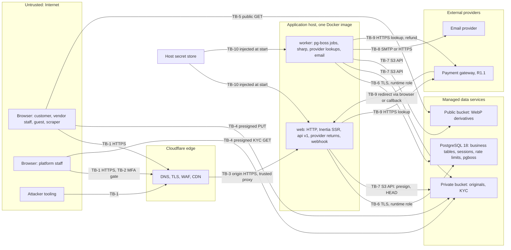
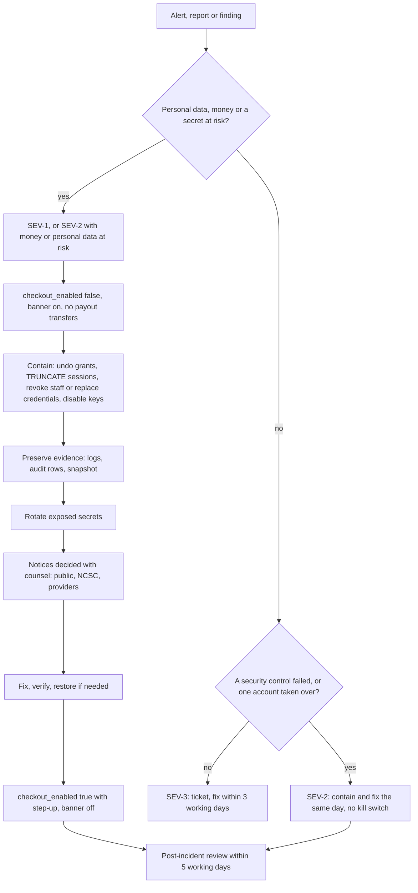

# DripNepal Security, Threat Model and Permissions

Status: Draft v1 (2026-09-26)

Reviewed: 2026-09-26 · audited 2026-09-28 (audit 4) · consistency review 2026-09-30 to 2026-10-04

This document is the security source of truth for DripNepal. It owns the threat register (`TM-xx`), the authentication and session rules, the permission slugs and role maps, the status gates, the privacy and encryption rules, the incident response procedure and the secure-development hooks. It references, and does not repeat, the rules that other documents own: the API contract and rate-limit values ([06](06-api-design.md)), table and constraint definitions ([04a](04a-data-dictionary-tables.md)), the retention schedule ([04 §19.3](04-domain-model-and-data-dictionary.md#193-retention-schedule)), state machines ([05](05-order-payment-and-inventory-lifecycles.md)), job names ([03 §9](03-system-architecture.md#9-asynchronous-work)), the test registry ([10](10-testing-and-quality-gates.md)), runbooks ([11](11-deployment-and-operations.md)) and milestones ([12](12-roadmap-and-backlog.md)).

**Nothing in this document claims legal compliance.** Legal and regulatory statements are design inputs from the [research notes](research/README.md). Each one carries a source and, where its reading is uncertain, a `VX` item for counsel (section 8).

Labels follow [00 §1.2](00-context-assumptions-and-questions.md#12-evidence-labels): [Confirmed], [Verified-repo], [Verified-doc], [Assumption], [Open] (OD-xx), [Verify-external] (VX-xx). Test IDs are those of the [10 §6](10-testing-and-quality-gates.md#6-test-id-registry) registry. The base IDs this document cites are T-SEC-001 to T-SEC-004, T-SEC-010, T-INV-003, T-PAY-005, T-PAY-008, T-CHK-004, T-ARCH-001, T-API-001, T-OPS-001 and T-PERF-001; they are base (10 §6) and carry no mark. Every other test ID is marked "(proposed)", with the document that first proposed it when that is not this one; 10 §6 registers all of them. Items that the reviewed documents added and the product owner has not yet approved are marked "(proposed)", with the OD that decides them where there is one.

---

## 1. Scope, assets and trust boundaries

### 1.1 Scope and method

**In scope.** Releases R0, R1 (COD only) and R1.1 (one wallet gateway, payouts), and the R2 features that change the threat picture (coupons, reviews, SMS OTP). The system is the single AdonisJS 7 codebase with two process types, `web` and `worker` ([03 §3](03-system-architecture.md#3-containers)), PostgreSQL 18 as the only stateful service, S3-compatible object storage, an email provider, and from R1.1 a payment gateway (eSewa or Khalti, [Open OD-03]).

**Out of scope.** Physical security of vendors' shops and couriers; the gateway's own systems; the security of customers' devices beyond what the browser enforces for us (cookies, CSP, history encryption).

**Method.** Each threat in section 2 names the asset, the trust boundary it crosses, a DripNepal-specific abuse scenario, preventive and detective controls, a test, and the residual risk. Likelihood and impact use High/Medium/Low with a stated reason; the risk register ([risks-and-open-decisions.md §4.2](risks-and-open-decisions.md#42-register)) keeps the numeric business-risk scores and links here for the technical detail.

**Team constraint** [Confirmed Q1]. One or two developers run everything. Every control here must be cheap to operate: enforced by code, a database constraint or CI, not by a person remembering. Where a control needs a person (maker-checker, incident response), section 4.7 and section 6.2 say what happens when there is only one.

**Public repository** [Confirmed Q7]. The source is public on GitHub. No control depends on hidden code or hidden route names; the Tuyau client registry already ships every route pattern to the browser [Verified-repo, audit A5-17]. Security rests on authorization checks, secrets kept out of the repository, and constraints.

### 1.2 Assets

Sensitivity classes are defined in [04 §19.1](04-domain-model-and-data-dictionary.md#191-handling-rules-per-sensitivity-class). The table lists what an attacker would want and where it lives. Asset IDs use the prefix `AS-` (`AS-01` … `AS-12`) so that they do not clash with the assumption IDs `A-xx` of [00 §1.3](00-context-assumptions-and-questions.md#13-id-schemes).

| ID    | Asset                                             | Class                         | Where it lives                                                                                                                | Why an attacker wants it                                                                              |
| ----- | ------------------------------------------------- | ----------------------------- | ----------------------------------------------------------------------------------------------------------------------------- | ----------------------------------------------------------------------------------------------------- |
| AS-01 | Customer identity and contact                     | Personal, Sensitive-personal  | `users` (`email`, `full_name`, `phone_enc`), `user_addresses` (`*_enc`), `orders.shipping_address` snapshot                   | Resale of phone lists, targeted COD fraud, harassment, rival vendors poaching customers               |
| AS-02 | Order and transaction history                     | Personal (Privacy Act s12(4)) | `orders`, `shop_orders`, `order_items`, `order_events`, `support_cases`                                                       | Protected "business or transaction" details; competitive intelligence for rival vendors               |
| AS-03 | Credentials and session material                  | Secret                        | `users.password_hash`, `user_tokens.token_hash`, `shop_invitations.token_hash`, `sessions` rows, `dripnepal_session` cookie   | Account takeover of customers, vendors and staff                                                      |
| AS-04 | Staff MFA secrets                                 | Secret                        | `users.mfa_totp_secret_enc`                                                                                                   | Bypass of the admin MFA gate                                                                          |
| AS-05 | Vendor KYC documents                              | Sensitive-personal            | Private bucket `originals/<shop_id>/<media_asset_id>` (`media_assets.kind = kyc_document`)                                    | Identity fraud with citizenship and PAN scans                                                         |
| AS-06 | Vendor payout accounts                            | Financial, Sensitive-personal | `shop_payout_accounts.account_number_enc`                                                                                     | Redirect a vendor's payout to the attacker's account                                                  |
| AS-07 | Money records                                     | Financial                     | `payments`, `refunds`, `ledger_entries`, `payouts`, `vendor_remittances`                                                      | Fake captures, double refunds, inflated balances, unauthorised payouts                                |
| AS-08 | Stock and price integrity                         | Internal / Public             | `inventory_items`, `product_variants.price_minor`, `product_listings`                                                         | Hoarding, overselling, price manipulation between quote and order                                     |
| AS-09 | Catalog and shop content                          | Public                        | `products`, `shops` text fields, media derivatives                                                                            | XSS delivery, counterfeit listings, defacement                                                        |
| AS-10 | Audit trail                                       | Personal, Internal            | `audit_logs` (append-only)                                                                                                    | Hiding a malicious staff action                                                                       |
| AS-11 | Platform secrets                                  | Secret                        | Host secret store: `APP_KEY`, `DATA_ENCRYPTION_KEYS`, `BLIND_INDEX_KEY`, database and storage credentials, gateway keys, SMTP | Forge sessions, decrypt every `*_enc` column, reach the database or bucket, initiate provider refunds |
| AS-12 | Service availability and the checkout kill switch | Internal                      | `platform_settings.checkout_enabled`, web and worker capacity, 22 database connections                                        | Deny sales; or re-enable checkout during an incident                                                  |

### 1.3 Trust boundaries



| Boundary | Between                            | What crosses it                                                            | What must hold                                                                                                                                                                                                                                                                                                                                                                                                                                                                                                                                                                                                                                                                                                                                                                         |
| -------- | ---------------------------------- | -------------------------------------------------------------------------- | -------------------------------------------------------------------------------------------------------------------------------------------------------------------------------------------------------------------------------------------------------------------------------------------------------------------------------------------------------------------------------------------------------------------------------------------------------------------------------------------------------------------------------------------------------------------------------------------------------------------------------------------------------------------------------------------------------------------------------------------------------------------------------------- |
| TB-1     | Internet and Cloudflare            | Every request, including forged ones                                       | TLS; nothing in a request is trusted: prices, totals, shop IDs, statuses, roles and provider parameters are recomputed or looked up server-side (NFR-SEC-003)                                                                                                                                                                                                                                                                                                                                                                                                                                                                                                                                                                                                                          |
| TB-2     | Customer surface and admin surface | Staff sessions                                                             | `platform_staff` row with `revoked_at IS NULL`, TOTP enrolled, `mfa_verified_at` within 12 h (section 4.2); signed-in callers without an active `platform_staff` row, or whose account is `pending_verification`, get 404; a `suspended`, `deactivated` or `anonymized` user gets the account-status answer first (section 3.3 rows 1–2); guests get 401, or a `/login` redirect on pages (section 4.5)                                                                                                                                                                                                                                                                                                                                                                                |
| TB-3     | Cloudflare and origin              | Proxied HTTP                                                               | `trustProxy` limited to the reverse proxy and Cloudflare's published ranges so `request.ip()` is the client address ([03 §12.2](03-system-architecture.md#122-authentication-and-sessions-adr-0005)); origin reachable only from the proxy                                                                                                                                                                                                                                                                                                                                                                                                                                                                                                                                             |
| TB-4     | Browser and private bucket         | Upload bytes; staff KYC downloads through a 5-minute presigned GET (TM-16) | Presigned PUT valid 10 minutes for one fixed key and the declared `Content-Type` (TM-16); the URL does not bind size and can be reused until it expires ([ADR-0013](adr/0013-media-direct-upload-async-processing.md)), so `completeMediaUpload` enforces ≤ 10 MB by `HEAD` and `media.process_upload` reads only the object that `HEAD` saw, capped at 10 MB, and moves the validated bytes to a key no presigned URL targets (TM-15); abandoned or oversized objects are deleted by the daily `media.cleanup_abandoned` once they are more than 24 h old ([ADR-0013](adr/0013-media-direct-upload-async-processing.md) step 6), except an object PUT to the upload key after the worker deleted it (TM-15 Residual); bytes are untrusted until `media.process_upload` validates them |
| TB-5     | Browser and public bucket          | Derived images                                                             | Only worker-written WebP derivatives are public; originals and KYC never are                                                                                                                                                                                                                                                                                                                                                                                                                                                                                                                                                                                                                                                                                                           |
| TB-6     | Processes and PostgreSQL           | SQL                                                                        | TLS; runtime role with DML only, no `UPDATE`/`DELETE` on append-only tables (section 4.10); bound parameters only                                                                                                                                                                                                                                                                                                                                                                                                                                                                                                                                                                                                                                                                      |
| TB-7     | Processes and buckets              | Presign signatures, `HEAD`, object reads and writes                        | One credential per process ([11 §3.6](11-deployment-and-operations.md#36-object-storage-access)): `web` holds token A, read and write on the private bucket only (presign PUT, 5-minute KYC GET, `HEAD`); `worker` holds token B, read and write on both buckets. A `web` compromise can read KYC originals, the residual 11 §3.6 accepts; the detective control is the `shop.kyc_view` alert (TM-16) [Assumption; 11 confirms per-bucket token scoping]                                                                                                                                                                                                                                                                                                                               |
| TB-8     | Worker and email provider          | Recipient address, rendered email with verification or reset links         | Provider is a registered processor (section 5.8); links carry single-use tokens whose hashes are the only stored form                                                                                                                                                                                                                                                                                                                                                                                                                                                                                                                                                                                                                                                                  |
| TB-9     | Application and gateway            | Initiate, lookup, refund; browser redirects; callbacks                     | Redirects and callbacks are hints only; state changes come from a server-to-server lookup ([ADR-0012](adr/0012-payment-provider-isolation-verify-by-lookup.md), TM-17)                                                                                                                                                                                                                                                                                                                                                                                                                                                                                                                                                                                                                 |
| TB-10    | Secret store and processes         | Keys and credentials                                                       | Never in the repository, the image, logs or job payloads (TM-25)                                                                                                                                                                                                                                                                                                                                                                                                                                                                                                                                                                                                                                                                                                                       |

### 1.4 Attacker profiles

| ID    | Profile                    | Goal on DripNepal                                                                                                       | Capability we assume                                                | Main threats                 |
| ----- | -------------------------- | ----------------------------------------------------------------------------------------------------------------------- | ------------------------------------------------------------------- | ---------------------------- |
| AP-01 | Fraudulent vendor          | Sell counterfeits, collect COD cash and not remit commission (OD-05), receive payouts for undelivered orders, forge KYC | A legitimate owner account and shop; knows the public source code   | TM-01, TM-28, TM-31          |
| AP-02 | Rival vendor               | Read another shop's orders, customers, prices or stock; sabotage its listings; post fake reviews (R2)                   | Owner or staff of their own shop; can guess slugs and order numbers | TM-01, TM-06, TM-21          |
| AP-03 | Fake-COD customer          | Tie up stock and courier fees with orders they never accept; abuse "changed mind" returns and refunds                   | Several email accounts, shared or borrowed phone numbers            | TM-22, TM-23, TM-19          |
| AP-04 | Credential stuffer         | Take over customer and vendor accounts using leaked passwords; enumerate registered emails                              | Botnet with rotating IPs, password lists                            | TM-08, TM-09                 |
| AP-05 | Malicious staff            | Approve own refund to a friend's account, read customer data for resale, change a payout account, erase audit traces    | Valid platform staff role with MFA                                  | TM-05, TM-19, TM-27          |
| AP-06 | Compromised admin          | Same as AP-05 but through a stolen session or phished TOTP; switch `single_operator_mode` on, create staff              | Stolen cookie or real-time phishing proxy                           | TM-05, TM-07                 |
| AP-07 | Scraper                    | Copy the catalog, prices, shop contact data; hammer search                                                              | Many IPs, headless browsers                                         | TM-24, TM-29                 |
| AP-08 | Opportunistic web attacker | Generic XSS, CSRF, SSRF, injection, dependency exploits, secrets in public repos                                        | Automated scanners, public exploits, reading the public repository  | TM-10 to TM-15, TM-25, TM-26 |

### 1.5 Design rules that every section relies on

1. **Deny by default, fail closed three times** (ADR-0006): middleware check, query scope and composite foreign key. The composite foreign key catches a missing query scope only when a write would store a cross-shop link; a missing scope on a read, on an `UPDATE`, `DELETE` or compare-and-set that selects another shop's row by ID, or on the parent load of an insert whose child copies `shop_id` from that parent (04 §2.5 rule 4), is caught only by tests (T-SEC-001, section 4.9).
2. **404 for other people's resources, never 403** ([06 §5.2](06-api-design.md#52-codes) `NOT_FOUND`), so IDs cannot be probed. 403 is used only when the caller already knows the resource exists (a member lacking a permission, a shop not active).
3. **Server-authoritative values** (NFR-SEC-003): validators are allowlists that reject unknown keys with 422 `unknown_field` ([06 §3.5](06-api-design.md#35-input-validators-are-allowlists)); transformers are allowlists ([06 §3.6](06-api-design.md#36-output-transformers-never-models)).
4. **Verify by lookup**: no provider redirect or callback changes state on its own ([ADR-0012](adr/0012-payment-provider-isolation-verify-by-lookup.md)).
5. **Secrets only in the host secret store**, application-level encryption for Sensitive-personal columns ([04 §2.9](04-domain-model-and-data-dictionary.md#29-sensitive-column-encryption-and-blind-indexes)).
6. **Every privileged state change is audited in the same transaction** ([04a §15.3](04a-data-dictionary-tables.md#153-audit_logs)).

---

## 2. Threat register

### 2.1 How to read an entry

- **Likelihood** (L) and **impact** (I) are High, Medium or Low for R1 volumes (under about 50 shops and 1–2k orders a month [Confirmed Q1]). The reason is stated in the entry.
- **Preventive** controls stop the abuse; **detective** controls tell us it happened. Each control names its mechanism and where it is specified.
- **Verification** names the test. Base IDs (10 §6) carry no mark; every other ID is marked "(proposed)" and is registered in [10 §6](10-testing-and-quality-gates.md#6-test-id-registry) as well.
- **Owner**: TL = tech lead (lead developer), PO = product owner, FO = finance officer role holder, Legal = counsel. With a one-person team, TL and FO may be the same person (section 6.2).
- **Milestone** is when the preventive control must exist ([12](12-roadmap-and-backlog.md) owns the plan).

### 2.2 Summary

| ID    | Threat                                                 | L   | I   | Milestone | Owner | Base test (10 §6)    |
| ----- | ------------------------------------------------------ | --- | --- | --------- | ----- | -------------------- |
| TM-01 | Cross-shop data access (BOLA) by a vendor              | H   | H   | M0 / M2   | TL    | T-SEC-001            |
| TM-02 | Customer reads or acts on another customer's resources | M   | H   | M1 / M5   | TL    | T-SEC-002            |
| TM-03 | Staff invitation abuse                                 | M   | M   | M2        | TL    | —                    |
| TM-04 | Shop role escalation and removed staff keeping access  | M   | H   | M2        | TL    | T-SEC-001            |
| TM-05 | Malicious or compromised platform staff                | L   | H   | M1 / M7   | PO    | T-SEC-004            |
| TM-06 | Mass assignment and excessive data exposure            | H   | M   | M0 / M1   | TL    | T-SEC-003, T-API-001 |
| TM-07 | Session theft and fixation                             | M   | H   | M0        | TL    | T-SEC-010            |
| TM-08 | Credential stuffing and MFA brute force                | H   | M   | M0 / M1   | TL    | —                    |
| TM-09 | Account recovery abuse and enumeration                 | M   | M   | M1        | TL    | —                    |
| TM-10 | Cross-site request forgery                             | M   | H   | M0        | TL    | —                    |
| TM-11 | Stored XSS through vendor or customer text             | M   | H   | M0 / M3   | TL    | —                    |
| TM-12 | SQL injection in search, sorting and raw queries       | L   | H   | M0 / M4   | TL    | —                    |
| TM-13 | Server-side request forgery                            | L   | H   | M3 / M6   | TL    | —                    |
| TM-14 | Unsafe redirects and return URLs                       | M   | M   | M1        | TL    | —                    |
| TM-15 | Unsafe uploads and image processing                    | M   | H   | M2 / M3   | TL    | —                    |
| TM-16 | Unauthorised access to private media (KYC)             | M   | H   | M2        | TL    | —                    |
| TM-17 | Payment spoofing through provider redirects (R1.1)     | H   | H   | M8        | TL    | T-PAY-005            |
| TM-18 | Provider event replay and forged callbacks (R1.1)      | M   | H   | M8        | TL    | T-PAY-005            |
| TM-19 | Refund abuse and double refunds                        | M   | H   | M7 / M8   | FO    | T-SEC-004, T-PAY-008 |
| TM-20 | Coupon abuse (R2)                                      | M   | M   | M9        | PO    | —                    |
| TM-21 | Review abuse and fake reviews (R2)                     | M   | M   | M9        | PO    | —                    |
| TM-22 | Checkout and inventory races; stock hoarding           | H   | M   | M5        | TL    | T-INV-003, T-CHK-004 |
| TM-23 | Fake and refused COD orders                            | H   | M   | M5 / M6   | PO    | —                    |
| TM-24 | Resource exhaustion and expensive queries              | M   | M   | M0 / M4   | TL    | T-PERF-001           |
| TM-25 | Secrets exposure                                       | M   | H   | M0        | TL    | —                    |
| TM-26 | Dependency and supply-chain compromise                 | M   | H   | M0        | TL    | —                    |
| TM-27 | Sensitive data in logs, analytics and errors           | H   | M   | M0        | TL    | —                    |
| TM-28 | Payout account takeover and payout fraud               | M   | H   | M2 / M8   | FO    | —                    |
| TM-29 | Catalog and contact scraping                           | H   | L   | M4        | TL    | T-API-001            |
| TM-30 | Database, backup or session-table exposure             | L   | H   | M0 / M7   | TL    | —                    |
| TM-31 | Fraudulent vendor onboarding and counterfeit listings  | H   | H   | M2 / M3   | PO    | —                    |

### 2.3 Threat entries

#### TM-01 Cross-shop data access (BOLA) by a vendor

| Field           | Detail                                                                                                                                                                                                                                                                                                                                                                                                                                                                                                                                                                                                                                                                                                                                                                                                                                                                                                                                                 |
| --------------- | ------------------------------------------------------------------------------------------------------------------------------------------------------------------------------------------------------------------------------------------------------------------------------------------------------------------------------------------------------------------------------------------------------------------------------------------------------------------------------------------------------------------------------------------------------------------------------------------------------------------------------------------------------------------------------------------------------------------------------------------------------------------------------------------------------------------------------------------------------------------------------------------------------------------------------------------------------ |
| Asset, boundary | AS-01, AS-02, AS-06, AS-07, AS-08 of another shop; TB-1 into the seller surface                                                                                                                                                                                                                                                                                                                                                                                                                                                                                                                                                                                                                                                                                                                                                                                                                                                                        |
| Abuse scenario  | A rival sneaker shop owner (AP-02) signed in to `/seller/kicks-ktm` changes the slug to `/seller/sole-nepal/orders` or replays `GET /api/v1/seller/shops/kicks-ktm/orders/DN-4821937-2` with another shop's order number to read that shop's customers' phone numbers. Today any signed-in user reaches any `/shop/:shopSlug/*` page because the group checks authentication only (RF-01 [Verified-repo `start/routes/shops.ts:14-28`, audit IAM-01]).                                                                                                                                                                                                                                                                                                                                                                                                                                                                                                 |
| L / I           | **H / H.** Slugs are public on storefront URLs, and order numbers, although random ([04 §2.1](04-domain-model-and-data-dictionary.md#21-identifiers)), appear on receipts, shipping labels and screenshots; the first seller data page added without a check leaks customer contacts (Privacy Act s26 exposure, R-24).                                                                                                                                                                                                                                                                                                                                                                                                                                                                                                                                                                                                                                 |
| Preventive      | `seller_context` middleware on every `/seller/{shopSlug}` page group and `/api/v1/seller/shops/{shopSlug}` route: resolve slug, owner or active membership else 404, permission, status gate, `ctx.shop` ([06 §4.4](06-api-design.md#44-seller-authorization-algorithm), section 4.8). Every query and compare-and-set includes `shop_id = ctx.shop.id`; nested IDs are looked up inside the shop. `shop_id` is in no validator (422 `unknown_field`). Composite `(parent_id, shop_id)` foreign keys make cross-shop links impossible ([04 §2.5](04-domain-model-and-data-dictionary.md#25-tenant-isolation-with-composite-foreign-keys)). M0 ships the guard on the existing group; M2 the full algorithm.                                                                                                                                                                                                                                            |
| Detective       | Access line with route pattern and `user_id` ([09 §7.4](09-code-structure-and-engineering-standards.md#74-request-id-propagation)); alert when one `user_id` receives more than 20 `NOT_FOUND` on seller routes in 5 minutes (`seller_route_probe`, threshold owned by [11 §9.7](11-deployment-and-operations.md#97-alert-rules)); audit rows carry `shop_id`.                                                                                                                                                                                                                                                                                                                                                                                                                                                                                                                                                                                         |
| Verification    | **T-SEC-001**, generated from the route list for the owner and each role of shop A on every `/api/v1/seller` route and every `/seller` page (section 4.9): (a) shop B's current or retired slug → 404, and a page never answers a retired slug with a 301 before the actor check (section 4.8); (b) shop A's own slug with shop B's path IDs, the attack above → 404; (c) shop A's own slug with shop B's IDs in body fields (`variants[].id`, `items[].order_item_id`, media asset IDs) → the error 06 names, never 2xx; (d) a removed member of shop A → 404 (TM-04). No row of shop B changes. T-SEC-005 (proposed): a route under `/api/v1/seller/shops/{shopSlug}` or `/seller/{shopSlug}` registered outside the `seller_context` group fails CI (route-table assertion); `listMyShops` (`session`) is the one seller route outside it (section 4.5). T-MED-101 (proposed, 04a) inserts cross-shop rows with the runtime role and expects 23503. |
| Residual        | Medium until T-SEC-001 (b) and (c) pass for every route, then Low. Composite FKs stop only a row that links two shops ([04 §2.5](04-domain-model-and-data-dictionary.md#25-tenant-isolation-with-composite-foreign-keys)). A read, an `UPDATE`, `DELETE` or compare-and-set that selects another shop's row by ID, and an insert under a parent loaded without the scope (the child copies `shop_id` from that parent, 04 §2.5 rule 4) are stopped only by `shop_id = ctx.shop.id` in the query ([09 §3.9](09-code-structure-and-engineering-standards.md#39-queries)) and caught only by T-SEC-001 (b) and (c).                                                                                                                                                                                                                                                                                                                                       |
| Owner           | TL                                                                                                                                                                                                                                                                                                                                                                                                                                                                                                                                                                                                                                                                                                                                                                                                                                                                                                                                                     |

#### TM-02 Customer reads or acts on another customer's resources

| Field           | Detail                                                                                                                                                                                                                                                                                                                                                                                                                                                                                                                                                                                          |
| --------------- | ----------------------------------------------------------------------------------------------------------------------------------------------------------------------------------------------------------------------------------------------------------------------------------------------------------------------------------------------------------------------------------------------------------------------------------------------------------------------------------------------------------------------------------------------------------------------------------------------- |
| Asset, boundary | AS-01, AS-02 of another customer; TB-1 into the account surface                                                                                                                                                                                                                                                                                                                                                                                                                                                                                                                                 |
| Abuse scenario  | A customer tries an order number seen on a shared receipt, a screenshot or a courier label (such as `DN-7K3M9QX`) in `getMyOrder`, `cancelMyShopOrder` or `openSupportCase` to read that customer's address or cancel their order; or passes another user's `address_id` to `placeOrder` so the order ships to a stranger's snapshot (the address IDOR of audit MISSED-schema-integrity).                                                                                                                                                                                                       |
| L / I           | **M / H.** Order numbers are random ([04 §2.1](04-domain-model-and-data-dictionary.md#21-identifiers)), so they cannot be guessed, but they are short and shared on receipts, labels and screenshots; the impact is a personal-data disclosure and a cancelled order.                                                                                                                                                                                                                                                                                                                           |
| Preventive      | The owner condition is part of the query, never a check after loading ([06 §4.5](06-api-design.md#45-customer-ownership)): `orders.customer_user_id`, `user_addresses.user_id` with `archived_at IS NULL`, `support_cases.customer_user_id`, cart by user or guest token hash and cart lines only inside that cart; page controllers apply the same conditions (section 4.6). Checkout copies the address into `orders.shipping_address`, so later edits never change an order ([04a §5.5](04a-data-dictionary-tables.md#55-user_addresses)).                                                   |
| Detective       | `customer_route_probe` ([11 §9.7](11-deployment-and-operations.md#97-alert-rules)): more than 20 `NOT_FOUND` on customer routes (`/api/v1/me/*`, `/api/v1/cart`, `/api/v1/checkout`, the `/account/*` pages and `/checkout/complete/{orderNumber}`) for one `user_id` in 5 minutes, Business hours class like `seller_route_probe` (TM-01).                                                                                                                                                                                                                                                     |
| Verification    | **T-SEC-002** (read and cancel another customer's order: 404), generated from the route list over JSON routes and the pages whose Inertia props carry the order (`/account/orders/{orderNumber}`, `/checkout/complete/{orderNumber}`), because a page controller is its own read path (section 4.6). T-SEC-006 (proposed): the same for addresses, including `address_id` in `quoteCheckout` and `placeOrder`, support cases and their messages, another customer's order in `openSupportCase`, and another user's or guest's cart line in `updateCartItem` and `removeCartItem` (section 4.9). |
| Residual        | Low.                                                                                                                                                                                                                                                                                                                                                                                                                                                                                                                                                                                            |
| Owner           | TL                                                                                                                                                                                                                                                                                                                                                                                                                                                                                                                                                                                              |

#### TM-03 Staff invitation abuse

| Field           | Detail                                                                                                                                                                                                                                                                                                                                                                                                                                                                                                                                                                                                                                                                                                                                                                                                                                                                                                                                                                                                                                                                                                                                                                                                                                                                                                                                                                                                                                                                                                                                                                                                                                                                                                                                     |
| --------------- | ------------------------------------------------------------------------------------------------------------------------------------------------------------------------------------------------------------------------------------------------------------------------------------------------------------------------------------------------------------------------------------------------------------------------------------------------------------------------------------------------------------------------------------------------------------------------------------------------------------------------------------------------------------------------------------------------------------------------------------------------------------------------------------------------------------------------------------------------------------------------------------------------------------------------------------------------------------------------------------------------------------------------------------------------------------------------------------------------------------------------------------------------------------------------------------------------------------------------------------------------------------------------------------------------------------------------------------------------------------------------------------------------------------------------------------------------------------------------------------------------------------------------------------------------------------------------------------------------------------------------------------------------------------------------------------------------------------------------------------------ |
| Asset, boundary | Shop membership (access to AS-01, AS-02 of that shop); TB-8 (email) and TB-1                                                                                                                                                                                                                                                                                                                                                                                                                                                                                                                                                                                                                                                                                                                                                                                                                                                                                                                                                                                                                                                                                                                                                                                                                                                                                                                                                                                                                                                                                                                                                                                                                                                               |
| Abuse scenario  | An owner invites `staff@example.com`; the link is forwarded, sits in a shared family inbox or leaks through a job-table backup, and someone else accepts it. Or an attacker brute-forces `/invitations/{token}`. Or a revoked or expired link is replayed.                                                                                                                                                                                                                                                                                                                                                                                                                                                                                                                                                                                                                                                                                                                                                                                                                                                                                                                                                                                                                                                                                                                                                                                                                                                                                                                                                                                                                                                                                 |
| L / I           | **M / M.** Forwarded links are common; impact is one role in one shop, visible to the owner.                                                                                                                                                                                                                                                                                                                                                                                                                                                                                                                                                                                                                                                                                                                                                                                                                                                                                                                                                                                                                                                                                                                                                                                                                                                                                                                                                                                                                                                                                                                                                                                                                                               |
| Preventive      | 32-byte random token, only its SHA-256 stored (`shop_invitations.token_hash`), 7-day expiry, single use by compare-and-set; unknown, expired and revoked tokens all return 404 ([04a §6.3](04a-data-dictionary-tables.md#63-shop_invitations)), and so does an already-accepted token (Consistency notes 14). **Acceptance requires a signed-in user with a verified email equal (case-insensitive) to `shop_invitations.email`** (AC-FR-SHOP-005-2), so a forwarded link is useless to anyone else; a mismatch is 403 `FORBIDDEN` naming the masked invited address (for example `s***@example.com`, 02 J-09). The invitation page shows only the shop, role and inviter, so this is the one place the address appears, and only to a signed-in, verified user who holds the link; it is accepted so a legitimate invitee with two accounts can tell which one to use. The raw token is never retrievable after the email is sent: "copy the link" is not offered, and a resend revokes the old invitation and issues a new token (section 3.8). The owner cannot be invited. **The shop must be `active`**: suspending or closing a shop revokes its open invitations in the same transaction, and `acceptShopInvitation` refuses a shop in any other status with 404 and no membership (section 4.4), so a suspended or closed shop gains no member who could read its customers' contacts. The raw token's journey to the email is fixed in section 3.8. Access logs record the route pattern, never the token path. A signed-out invitee is sent to sign in with the invitation as `return_to` (TM-14), never through an intended URL stored in the session, so the token never reaches `sessions.data` or its backups (section 3.2). |
| Detective       | `shop_membership.accept`, `shop_invitation.create` and `shop_invitation.revoke` (proposed) audit rows; the owner sees members and pending invitations; an acceptance email to the owner [Assumption].                                                                                                                                                                                                                                                                                                                                                                                                                                                                                                                                                                                                                                                                                                                                                                                                                                                                                                                                                                                                                                                                                                                                                                                                                                                                                                                                                                                                                                                                                                                                      |
| Verification    | T-SEC-007 (proposed): accept with a different verified email (403 `FORBIDDEN`, no membership), with an unverified account (403 `EMAIL_NOT_VERIFIED`), after revoke or expiry (404), after the shop was suspended or closed (404 `NOT_FOUND`, no membership, the invitation revoked), concurrently with `suspendShop` (either 404 or a membership that committed before the suspension, never one added to a shop already suspended), a second accept of the same token, sequential or concurrent (404 `NOT_FOUND`, exactly one membership), and an open invitation accepted by a user who already has an active membership in that shop, for example after changing their account email to the invited address (409 `CONFLICT` per 03 §7.6); a scan of `pgboss` job rows after sending finds no raw token, and neither does a scan of `sessions.data` after a signed-out invitee opens the link and signs in.                                                                                                                                                                                                                                                                                                                                                                                                                                                                                                                                                                                                                                                                                                                                                                                                                              |
| Residual        | Low: an attacker who controls the invitee's mailbox controls the invitee.                                                                                                                                                                                                                                                                                                                                                                                                                                                                                                                                                                                                                                                                                                                                                                                                                                                                                                                                                                                                                                                                                                                                                                                                                                                                                                                                                                                                                                                                                                                                                                                                                                                                  |
| Owner           | TL                                                                                                                                                                                                                                                                                                                                                                                                                                                                                                                                                                                                                                                                                                                                                                                                                                                                                                                                                                                                                                                                                                                                                                                                                                                                                                                                                                                                                                                                                                                                                                                                                                                                                                                                         |

#### TM-04 Shop role escalation and removed staff keeping access

| Field           | Detail                                                                                                                                                                                                                                                                                                                                                                                                                                                                                                                                                                                                                                              |
| --------------- | --------------------------------------------------------------------------------------------------------------------------------------------------------------------------------------------------------------------------------------------------------------------------------------------------------------------------------------------------------------------------------------------------------------------------------------------------------------------------------------------------------------------------------------------------------------------------------------------------------------------------------------------------- |
| Asset, boundary | AS-06 (payout account), shop control; TB-1 inside the seller surface                                                                                                                                                                                                                                                                                                                                                                                                                                                                                                                                                                                |
| Abuse scenario  | A `manager` at a Kathmandu boutique invites a friend as `manager`, promotes themself, or changes the payout account before quitting. A fired `order_fulfiller` keeps an open tab and exports customer phone numbers after removal. Historically the schema let an assignment point at another shop's role (audit MISSED-identity-authz).                                                                                                                                                                                                                                                                                                            |
| L / I           | **M / H.** Staff turnover in small shops is high; the payout account is the prize.                                                                                                                                                                                                                                                                                                                                                                                                                                                                                                                                                                  |
| Preventive      | Roles are code constants; `manager` lacks `shop.staff.manage` and `shop.payout_account.manage` (section 4.3), so only the owner invites, revokes invitations, changes roles, removes staff or touches the payout account (AC-FR-SHOP-005-1, AC-FR-SHOP-010-1). `shop_memberships_role_check` excludes `owner`, so no membership row ever holds `shop.staff.manage`. Membership and role are re-read on **every** seller request by `seller_context`, so removal or a role change applies on the next request without touching sessions (AC-FR-SHOP-005-3). Replacing the payout account requires password re-entry and resets verification (TM-28). |
| Detective       | Audit rows `shop_membership.role_change`, `shop_membership.remove`, `shop_payout_account.replace`; email to the owner on payout-account change (AC-FR-SHOP-010-4).                                                                                                                                                                                                                                                                                                                                                                                                                                                                                  |
| Verification    | T-SEC-001 (a removed member gets 404 on every seller route). Permission-matrix tests (section 4.9) assert `manager` cannot call `inviteMember`, `revokeInvitation`, `changeMemberRole`, `removeMember`, `getPayoutAccount`, `replacePayoutAccount` (403 `FORBIDDEN`). T-SHOP-103 (proposed, 04a) covers the owner rule.                                                                                                                                                                                                                                                                                                                             |
| Residual        | Low. A removed member's open page shows stale data until the next request.                                                                                                                                                                                                                                                                                                                                                                                                                                                                                                                                                                          |
| Owner           | TL                                                                                                                                                                                                                                                                                                                                                                                                                                                                                                                                                                                                                                                  |

#### TM-05 Malicious or compromised platform staff

| Field           | Detail                                                                                                                                                                                                                                                                                                                                                                                                                                                                                                                                                                                                                                                                                                                                                                                                                                                                                                                                                                                                                                                                                                                                                                                                                                                                                                                                                                                                                                                                                                                                                                                                                                                                                                                                                                                                                                                                                                                                                                                                                                                                                                                                                                                                                                                                                                                                                                                                                   |
| --------------- | ------------------------------------------------------------------------------------------------------------------------------------------------------------------------------------------------------------------------------------------------------------------------------------------------------------------------------------------------------------------------------------------------------------------------------------------------------------------------------------------------------------------------------------------------------------------------------------------------------------------------------------------------------------------------------------------------------------------------------------------------------------------------------------------------------------------------------------------------------------------------------------------------------------------------------------------------------------------------------------------------------------------------------------------------------------------------------------------------------------------------------------------------------------------------------------------------------------------------------------------------------------------------------------------------------------------------------------------------------------------------------------------------------------------------------------------------------------------------------------------------------------------------------------------------------------------------------------------------------------------------------------------------------------------------------------------------------------------------------------------------------------------------------------------------------------------------------------------------------------------------------------------------------------------------------------------------------------------------------------------------------------------------------------------------------------------------------------------------------------------------------------------------------------------------------------------------------------------------------------------------------------------------------------------------------------------------------------------------------------------------------------------------------------------------ |
| Asset, boundary | AS-01, AS-06, AS-07, AS-10, AS-12; TB-2                                                                                                                                                                                                                                                                                                                                                                                                                                                                                                                                                                                                                                                                                                                                                                                                                                                                                                                                                                                                                                                                                                                                                                                                                                                                                                                                                                                                                                                                                                                                                                                                                                                                                                                                                                                                                                                                                                                                                                                                                                                                                                                                                                                                                                                                                                                                                                                  |
| Abuse scenario  | A support agent (AP-05) creates a refund to a friend's wallet for an order that was delivered; a phished `finance_officer` (AP-06) approves a payout to an account they just "verified"; a compromised `platform_admin` turns `single_operator_mode` on, grants a new admin, re-enables checkout during an incident, or tries to delete audit rows. Unauthorised access by staff is itself an offence under ETA s45 and Privacy Act s29 [Verified-doc <https://tepc.gov.np/uploads/files/12the-electronic-transaction-act55.pdf>, <http://giwmscdnone.gov.np/media/app/public/275/posts/1721034328_44.pdf>, accessed 2026-09-25].                                                                                                                                                                                                                                                                                                                                                                                                                                                                                                                                                                                                                                                                                                                                                                                                                                                                                                                                                                                                                                                                                                                                                                                                                                                                                                                                                                                                                                                                                                                                                                                                                                                                                                                                                                                        |
| L / I           | **L / H.** Few staff at launch, but one person can move money and read every customer.                                                                                                                                                                                                                                                                                                                                                                                                                                                                                                                                                                                                                                                                                                                                                                                                                                                                                                                                                                                                                                                                                                                                                                                                                                                                                                                                                                                                                                                                                                                                                                                                                                                                                                                                                                                                                                                                                                                                                                                                                                                                                                                                                                                                                                                                                                                                   |
| Preventive      | Four least-privilege roles (section 4.2); TOTP mandatory with 12 h re-verification and a 15-minute step-up for money approvals, refund and payout executions and outcomes, review resolutions, manual ledger entries, payout-account verification, payout-account and refund-recipient reveals (proposed, OD-49, section 5.5), staff changes, commission and moderation-mode changes and sensitive settings (section 3.10); maker-checker CHECKs `refunds_maker_checker_check` and `payouts_maker_checker_check` (`approved_by <> created_by` unless `is_single_operator_approval`, section 4.7) and `refunds_approver_check` (every approved refund names its approver, except an auto-approved system refund, section 4.7) ([04a §12.4](04a-data-dictionary-tables.md#124-refunds), [04a §13.2](04a-data-dictionary-tables.md#132-payouts)); payout-account verifier ≠ submitter, never relaxed ([04a §6.7](04a-data-dictionary-tables.md#67-shop_payout_accounts)); payout approver ≠ the verifier of the payout's account (section 4.7); `platform_staff_self_grant_check`; at least one `platform_admin` whose account is `active` (T-IAM-110 proposed); `suspendUser` and `reinstateUser` refuse a user who holds an active `platform_staff` row, so staff access changes only through the stepped-up staff operations (section 3.12); append-only audit for `dripnepal_app` (`REVOKE UPDATE, DELETE, TRUNCATE` plus the `forbid_mutation()` trigger, [04 §2.12](04-domain-model-and-data-dictionary.md#212-append-only-tables)), so the web app, and any staff account acting through it, cannot delete audit rows; the trigger also stops the table owner `dripnepal_migrator`, except for the `DELETE`s of `node ace data:retention`, which pass through the trigger's retention exemption (proposed, OD-51, as [04 §2.12](04-domain-model-and-data-dictionary.md#212-append-only-tables) describes it; no `DISABLE TRIGGER`; needs the product owner's approval, section 4.10) and write an audit row describing the purge (04 §2.12, section 5.7); no impersonation feature (FR-ADM-008); refunds only to the original method or recorded recipient details, but for a manual transfer the refund's maker enters those details today and the approver does not see them before approving (section 5.5), so nothing checks the destination yet (TM-19) [Open OD-38; owner decision, see Consistency notes 24]. |
| Detective       | Every staff action audited with `actor_role` and `request_id`; `single_operator` flags reviewed weekly by the product owner (OD-14); reads of audit rows through the admin (`listAuditLogs` and its page) are themselves audited (section 5.7); `dripnepal_readonly` sessions, which can also read `audit_logs`, are recorded in the incident log (section 4.10); alert on `platform_staff` changes, `single_operator_mode` changes and any `checkout_enabled` change.                                                                                                                                                                                                                                                                                                                                                                                                                                                                                                                                                                                                                                                                                                                                                                                                                                                                                                                                                                                                                                                                                                                                                                                                                                                                                                                                                                                                                                                                                                                                                                                                                                                                                                                                                                                                                                                                                                                                                   |
| Verification    | **T-SEC-004** (refund above refundable: 422 and CHECK backstop). T-LED-101 (proposed, 04a): self-approval without the flag fails with 23514. T-ARCH-012 (proposed, 04): `UPDATE`/`DELETE` on audit rows fails for `dripnepal_app` by privilege and for `dripnepal_migrator` by trigger, except a `DELETE` while `dripnepal.retention_purge` is `on`; an `UPDATE` fails even with the setting on (section 4.10). T-SEC-008 (proposed): 401 `MFA_REQUIRED` for a step-up older than 15 minutes on every operation the section 3.10 table marks Yes and none on the rows marked No, and 403 `FORBIDDEN` for a self-approval while `single_operator_mode` is off, including an approval of the refund created by the approver's own `closeReturnRequest`; T-SEC-030 (proposed): the permission matrix for every admin operation. T-SEC-028 (proposed): the verifier of a payout's account cannot approve the payout.                                                                                                                                                                                                                                                                                                                                                                                                                                                                                                                                                                                                                                                                                                                                                                                                                                                                                                                                                                                                                                                                                                                                                                                                                                                                                                                                                                                                                                                                                                         |
| Residual        | Medium while one person holds every role: single-operator approvals rely on the weekly review and on bank-statement reconciliation (R-18). Anyone holding the migrator credential or the database provider's console access can delete audit rows; the controls are who holds that credential (rotation on staff departure, section 5.6) and the managed database's connection logs (TM-30).                                                                                                                                                                                                                                                                                                                                                                                                                                                                                                                                                                                                                                                                                                                                                                                                                                                                                                                                                                                                                                                                                                                                                                                                                                                                                                                                                                                                                                                                                                                                                                                                                                                                                                                                                                                                                                                                                                                                                                                                                             |
| Owner           | PO                                                                                                                                                                                                                                                                                                                                                                                                                                                                                                                                                                                                                                                                                                                                                                                                                                                                                                                                                                                                                                                                                                                                                                                                                                                                                                                                                                                                                                                                                                                                                                                                                                                                                                                                                                                                                                                                                                                                                                                                                                                                                                                                                                                                                                                                                                                                                                                                                       |

#### TM-06 Mass assignment and excessive data exposure

| Field           | Detail                                                                                                                                                                                                                                                                                                                                                                                                                                                                                                                                                                                                                                                                                                                                                        |
| --------------- | ------------------------------------------------------------------------------------------------------------------------------------------------------------------------------------------------------------------------------------------------------------------------------------------------------------------------------------------------------------------------------------------------------------------------------------------------------------------------------------------------------------------------------------------------------------------------------------------------------------------------------------------------------------------------------------------------------------------------------------------------------------- |
| Asset, boundary | AS-07, AS-08, account status and roles; AS-01 in responses; TB-1 both directions                                                                                                                                                                                                                                                                                                                                                                                                                                                                                                                                                                                                                                                                              |
| Abuse scenario  | Inbound: a customer adds `"unit_price_minor": 100` or `"shop_id"` to `placeOrder`, `"status": "active"` to `signUp`, or `"commission_rate_bp": 0` to `updateShopProfile`. Signup today spreads the validated payload into `User.create` (RF-36, audit IAM-24; safe only because Vine drops undeclared keys). Outbound: the current `ShopTransformer` exposes `ownerId` and the owner's personal email and phone (audit IAM-18); a reused transformer on the public shop page would publish them in SSR HTML to every crawler.                                                                                                                                                                                                                                 |
| L / I           | **H / M.** The pattern is already in the code; exposure through SSR props is indexed by search engines.                                                                                                                                                                                                                                                                                                                                                                                                                                                                                                                                                                                                                                                       |
| Preventive      | Validators are allowlists that reject unknown keys with 422 `unknown_field` ([06 §3.5](06-api-design.md#35-input-validators-are-allowlists)); controllers map fields explicitly; lint rule bans `Model.create({ ...payload })` and `merge(payload)` on models ([09](09-code-structure-and-engineering-standards.md)). Prices, totals, commission and shop are computed server-side in `placeOrder` ([05 §4](05-order-payment-and-inventory-lifecycles.md#4-checkout-the-placeorder-algorithm)). One transformer per audience ([06 §3.6](06-api-design.md#36-output-transformers-never-models)); returning a model from a controller fails T-ARCH-001. Shared Inertia props carry only the user summary and shop switcher list (RF-44).                        |
| Detective       | Contract tests validate every `/api/v1` JSON response against `openapi.yaml` (T-API-001), so an extra field in a JSON body fails CI. T-API-001 never sees Inertia page props, the channel of the scenario above, and some props have no JSON twin (the `/admin/refunds` queue, `/checkout/complete/{orderNumber}`). T-SEC-036 (proposed) covers them: it renders every Inertia page route with fixture data as each audience (SSR pages as HTML, the others as the Inertia page object requested with the `X-Inertia` header) and compares each prop's key set with the allowlist of the transformer the page declares for that prop and audience, failing on any extra key; the public shop and product pages carry no owner id, owner email or owner phone. |
| Verification    | **T-SEC-003** (client-supplied prices, totals, `shop_id` and commission are rejected). T-API-002 (proposed, 06): extra top-level and nested keys give 422 on every mutation. T-API-001 (JSON bodies). T-SEC-036 (proposed): page prop key sets per audience.                                                                                                                                                                                                                                                                                                                                                                                                                                                                                                  |
| Residual        | Low.                                                                                                                                                                                                                                                                                                                                                                                                                                                                                                                                                                                                                                                                                                                                                          |
| Owner           | TL                                                                                                                                                                                                                                                                                                                                                                                                                                                                                                                                                                                                                                                                                                                                                            |

#### TM-07 Session theft and fixation

| Field           | Detail                                                                                                                                                                                                                                                                                                                                                                                                                                                                                                                                                                                                                                                                                                                                                                                                                                                                                                                                                                                                                                                                                                                                                                                                                                                                                                                                                                                                                                                                                                                                                   |
| --------------- | -------------------------------------------------------------------------------------------------------------------------------------------------------------------------------------------------------------------------------------------------------------------------------------------------------------------------------------------------------------------------------------------------------------------------------------------------------------------------------------------------------------------------------------------------------------------------------------------------------------------------------------------------------------------------------------------------------------------------------------------------------------------------------------------------------------------------------------------------------------------------------------------------------------------------------------------------------------------------------------------------------------------------------------------------------------------------------------------------------------------------------------------------------------------------------------------------------------------------------------------------------------------------------------------------------------------------------------------------------------------------------------------------------------------------------------------------------------------------------------------------------------------------------------------------------- |
| Asset, boundary | AS-03; TB-1                                                                                                                                                                                                                                                                                                                                                                                                                                                                                                                                                                                                                                                                                                                                                                                                                                                                                                                                                                                                                                                                                                                                                                                                                                                                                                                                                                                                                                                                                                                                              |
| Abuse scenario  | A customer logs in at a cyber café and walks away; the next user presses Back and sees their order history, or copies the cookie. A vendor's cookie is stolen by malware. A staff member passes the TOTP check and logs out on a shared machine, and whoever next logs in there as another staff account inherits the fresh MFA state. With today's cookie store, a stolen cookie works until it expires and cannot be revoked (RF-04 [Verified-repo `.env.example:13`]).                                                                                                                                                                                                                                                                                                                                                                                                                                                                                                                                                                                                                                                                                                                                                                                                                                                                                                                                                                                                                                                                                |
| L / I           | **M / H.** Shared devices are common; a stolen staff session reaches every customer.                                                                                                                                                                                                                                                                                                                                                                                                                                                                                                                                                                                                                                                                                                                                                                                                                                                                                                                                                                                                                                                                                                                                                                                                                                                                                                                                                                                                                                                                     |
| Preventive      | Database session store with tagging, `HttpOnly; Secure; SameSite=Lax` cookie, ID regenerated at login (built into `SessionGuard.login` [Verified-doc, `@adonisjs/auth` 10.1.0 source, <https://registry.npmjs.org/@adonisjs/auth/-/auth-10.1.0.tgz>, accessed 2026-09-25]), after the MFA challenge, at a password change and when the user gains privilege in their own request, and re-tagged after each of these (after login directly, otherwise through `rotateSessionId`, section 3.1); a privilege change by another admin rotates the target's stamp; login that forgets earlier auth keys, and an MFA proof bound to the user ID; per-request `security_stamp` check; idle and absolute limits per surface; logout and forced logout that untag, clear and regenerate the session; Inertia history cleared by the client after `logOut` and on `/login`, `/mfa` and every guest page; `encryptHistory` on authenticated pages (section 3).                                                                                                                                                                                                                                                                                                                                                                                                                                                                                                                                                                                                      |
| Detective       | `auth.login` audit rows with `ip_hash`; "sign out of all other devices" in `/account/security`; email on password change.                                                                                                                                                                                                                                                                                                                                                                                                                                                                                                                                                                                                                                                                                                                                                                                                                                                                                                                                                                                                                                                                                                                                                                                                                                                                                                                                                                                                                                |
| Verification    | **T-SEC-010** (section 3.3). T-IAM-109 (proposed, 04a): "log out everywhere" removes every tagged row except the acting session's, including an MFA-verified staff session. T-SEC-009 (proposed): session ID differs before and after login, after MFA and after `changePassword`; cookie attributes; the old cookie is rejected after logout; staff A verifies MFA and logs out, staff B logs in with only a password in the same cookie jar, and `/api/v1/admin/*` returns 401 `MFA_REQUIRED`; a browser test presses Back after `logOut`, after a forced logout (section 3.3 rows 1 and 3) and after a revoked session (row 2) and sees no account data; with a clock mock, each limit of section 3.4 fires: 30 days after login any request is 401 `UNAUTHENTICATED`, and so is a session without `authenticated_at`; a seller session that only polls `newOrderCount` every 60 s is logged out on its next seller request after 12 h; a session without `seller_seen_at` is logged out on its first seller request more than 12 h after login, while a customer who is not a member of the shop gets 404 there and stays signed in; 2 h after the last admin request `/api/v1/admin/*` returns 401 `MFA_REQUIRED` and a TOTP challenge clears it; 7 days after login an admin request returns 401 `UNAUTHENTICATED` even right after a TOTP challenge; after `changePassword` and after `revokeAllSessions`, once `identity.revoke_sessions` has run, the acting session still gets 2xx and every other session of the user gets 401 (section 3.3). |
| Residual        | Medium: a live stolen cookie works until idle expiry, the absolute limit (section 3.4) or revocation. No device binding in R1.                                                                                                                                                                                                                                                                                                                                                                                                                                                                                                                                                                                                                                                                                                                                                                                                                                                                                                                                                                                                                                                                                                                                                                                                                                                                                                                                                                                                                           |
| Owner           | TL                                                                                                                                                                                                                                                                                                                                                                                                                                                                                                                                                                                                                                                                                                                                                                                                                                                                                                                                                                                                                                                                                                                                                                                                                                                                                                                                                                                                                                                                                                                                                       |

#### TM-08 Credential stuffing and MFA brute force

| Field           | Detail                                                                                                                                                                                                                                                                                                                                                                                                                                                                                                                                                                                                                                                                                                                                                                                                                                                                                                                                                                                                                                                                                                                                                                                                                                                                                                                                         |
| --------------- | ---------------------------------------------------------------------------------------------------------------------------------------------------------------------------------------------------------------------------------------------------------------------------------------------------------------------------------------------------------------------------------------------------------------------------------------------------------------------------------------------------------------------------------------------------------------------------------------------------------------------------------------------------------------------------------------------------------------------------------------------------------------------------------------------------------------------------------------------------------------------------------------------------------------------------------------------------------------------------------------------------------------------------------------------------------------------------------------------------------------------------------------------------------------------------------------------------------------------------------------------------------------------------------------------------------------------------------------------- |
| Asset, boundary | AS-03, then AS-06 and AS-09 through a vendor account; TB-1                                                                                                                                                                                                                                                                                                                                                                                                                                                                                                                                                                                                                                                                                                                                                                                                                                                                                                                                                                                                                                                                                                                                                                                                                                                                                     |
| Abuse scenario  | AP-04 replays leaked email and password pairs against `logIn` to take over vendor accounts and list counterfeits or change payout details. Login today has no rate limit and swallows non-credential errors (RF-12, audit IAM-05). One host with a routed IPv6 /64 can send every attempt from a new address, and a botnet rotates across networks. The scrypt cost makes each attempt CPU-expensive, so a flood also degrades the web process.                                                                                                                                                                                                                                                                                                                                                                                                                                                                                                                                                                                                                                                                                                                                                                                                                                                                                                |
| L / I           | **H / M.** Automated and cheap. A stuffed customer account exposes its order history and saved addresses. A stuffed vendor owner gets full shop control, including customer contacts of open and recent shop orders (section 5.2). The worst vendor outcome, payout redirection, is rated in TM-28 (M / H) and is bounded there by a finance officer who is not the submitter verifying the new payout account (what that officer checks is still open, TM-28) and by the email to the owner, not by owner-only rules or password re-entry, which a stuffer passes. Missing vendor MFA until R2 (R-30) raises the likelihood, not the impact.                                                                                                                                                                                                                                                                                                                                                                                                                                                                                                                                                                                                                                                                                                  |
| Preventive      | Limiter database store with `login_ip` checked **before** credential verification and `login_acct_ip` with `penalize()` on failure (values owned by [06 §9.1](06-api-design.md#91-rate-limits)); identical 401 `UNAUTHENTICATED` for unknown email and wrong password; `trustProxy` so limits key on the real client address, and the IP part of every limiter key is the client network (an IPv6 address counts as its /64, section 3.6), so one host cannot rotate into fresh buckets; Cloudflare WAF rules as an outer layer [Verify-external VX-15]; passwords 10–128 characters with paste allowed (section 3.7); TOTP for staff with a per-account lock on wrong codes that holds across sessions and IP addresses (`mfa_user`, proposed, OD-50: the per-account scope, which 01 AC-FR-IAM-007-4 now states, needs the product owner's approval; section 3.9 and Consistency notes 7), the per-source `mfa` limiter as a second layer, and replay refusal via `mfa_last_used_step`; TOTP enrolment that needs an emailed single-use token as well as the password (section 3.9); password re-entry inside a session (`changePassword`, `replacePayoutAccount`, `requestAccountDeletion`, a staff member's `startTotpEnrollment`) throttled per user by the `reauth` limiter (section 3.6), so a stolen session is not a password oracle. |
| Detective       | `auth.login_failed` audit rows with `ip_hash`; the `login_failure_spike` alert when failures exceed 100 in 5 minutes platform-wide or 10 for one account ([11 §9.7](11-deployment-and-operations.md#97-alert-rules)) [Assumption]; email to the user after 5 consecutive failures [Assumption]. When the alert fires on the platform-wide count, the operator turns on a Cloudflare managed-challenge or rate-limiting rule for `POST /api/v1/auth/session` [Verify-external VX-15; the response step after the 11 §9.7 table].                                                                                                                                                                                                                                                                                                                                                                                                                                                                                                                                                                                                                                                                                                                                                                                                                |
| Verification    | T-SEC-011 (proposed): the 6th failed attempt per account and IP in a minute and the 21st per IP return 429 with `Retry-After` (AC-FR-IAM-003-3); a flood from one IPv4 address or one IPv6 /64 never reaches the hasher after the limit: 21 attempts in a minute from 21 addresses in one /64 give 429 on the 21st, 6 failures for one email from 6 addresses in one /64 give 429, and `::ffff:a.b.c.d` shares the bucket of `a.b.c.d`; a login with an anonymized account's email returns the same 401 `UNAUTHENTICATED` as an unknown email and reports no error (section 3.6); the 6th wrong TOTP code in 5 minutes locks TOTP verification for the account (values and per-account scope from AC-FR-IAM-007-4; proposed, OD-50, section 3.9) even when the wrong codes are spread over 3 sessions and 3 IP addresses, and a correct code from any session is then refused with 429 until the block ends; the 6th wrong password in 15 minutes on `changePassword`, `replacePayoutAccount`, `requestAccountDeletion` or `startTotpEnrollment` returns 429 without hashing and emails the holder, and after the 10th in 24 h the session gets 401 `UNAUTHENTICATED` on its next request. T-SEC-101 (proposed, 04a): limiter keys stay ≤ 255 characters and contain no raw email or IP.                                                       |
| Residual        | Medium for vendors until optional owner MFA (FR-IAM-008, R2). Distributed stuffing that tries each account once from many networks stays under every per-network limit and still spends scrypt time; it relies on Cloudflare rules [Verify-external VX-15] and the `login_failure_spike` alert. A guessing run against one account from many networks is seen through the failure email and the per-account alert; no login limiter keys on the account alone today; whether `logIn` gets one, and whether it answers 429 or triggers a challenge (a hard per-account lock would let a rival vendor (AP-02) lock an owner out), is not decided [Open OD-39; owner decision, see Consistency notes 24]. The TOTP lock (`mfa_user`, section 3.9) and the `reauth` limiter (section 3.6) do key on the account, because only someone past the password or holding a live session can reach them.                                                                                                                                                                                                                                                                                                                                                                                                                                                  |
| Owner           | TL                                                                                                                                                                                                                                                                                                                                                                                                                                                                                                                                                                                                                                                                                                                                                                                                                                                                                                                                                                                                                                                                                                                                                                                                                                                                                                                                             |

#### TM-09 Account recovery abuse and enumeration

| Field           | Detail                                                                                                                                                                                                                                                                                                                                                                                                                                                                                                                                                                                                                                                                                                                                                                                                                                                                                                                                                                                                                                                                                                                                                                                                                                                                                                                                                                                                                                                                                                                                                                                                                                                                                                                                                                                                                                                                                                                                                                                                                                                                                                      |
| --------------- | ----------------------------------------------------------------------------------------------------------------------------------------------------------------------------------------------------------------------------------------------------------------------------------------------------------------------------------------------------------------------------------------------------------------------------------------------------------------------------------------------------------------------------------------------------------------------------------------------------------------------------------------------------------------------------------------------------------------------------------------------------------------------------------------------------------------------------------------------------------------------------------------------------------------------------------------------------------------------------------------------------------------------------------------------------------------------------------------------------------------------------------------------------------------------------------------------------------------------------------------------------------------------------------------------------------------------------------------------------------------------------------------------------------------------------------------------------------------------------------------------------------------------------------------------------------------------------------------------------------------------------------------------------------------------------------------------------------------------------------------------------------------------------------------------------------------------------------------------------------------------------------------------------------------------------------------------------------------------------------------------------------------------------------------------------------------------------------------------------------- |
| Asset, boundary | AS-03; TB-1 and TB-8                                                                                                                                                                                                                                                                                                                                                                                                                                                                                                                                                                                                                                                                                                                                                                                                                                                                                                                                                                                                                                                                                                                                                                                                                                                                                                                                                                                                                                                                                                                                                                                                                                                                                                                                                                                                                                                                                                                                                                                                                                                                                        |
| Abuse scenario  | AP-04 bulk-checks which emails are registered vendors through signup uniqueness errors or response timing (RF-38, audit IAM-27), then phishes them. Someone calls support pretending to be a vendor who "lost access" and asks for the email to be changed. A reset link sits in a mailbox for days, or two reset links are both valid.                                                                                                                                                                                                                                                                                                                                                                                                                                                                                                                                                                                                                                                                                                                                                                                                                                                                                                                                                                                                                                                                                                                                                                                                                                                                                                                                                                                                                                                                                                                                                                                                                                                                                                                                                                     |
| L / I           | **M / M.** Enumeration through signup and reset is cheap to script and feeds targeted phishing; a successful recovery abuse takes over one account at a time.                                                                                                                                                                                                                                                                                                                                                                                                                                                                                                                                                                                                                                                                                                                                                                                                                                                                                                                                                                                                                                                                                                                                                                                                                                                                                                                                                                                                                                                                                                                                                                                                                                                                                                                                                                                                                                                                                                                                               |
| Preventive      | `signUp` returns the same 202 for known and new emails (the existing holder receives a "someone tried to sign up" email) and costs the same on both branches: it hashes the submitted password before it looks up the email, so the known-email branch also spends one scrypt hash and discards the result, and each branch enqueues exactly one email job in one transaction; a `users_email_key` violation inside `signUp` (a concurrent signup) is caught and answered with the same 202, never mapped to 422 ([09 §5.4](09-code-structure-and-engineering-standards.md#54-the-exception-handler)). Neither branch signs anyone in: `signUp` puts no `auth_web` in the session (the `signUp` row of [06 §13.3](06-api-design.md#133-auth-and-self) answers 202 with no session), and `confirmEmail` does not sign in either, so the user signs in with `logIn` afterwards, normally after verifying ([02 J-04](02-user-journeys-and-acceptance-criteria.md#j-04-sign-up--verify) step 5). `requestPasswordReset` always returns 202 ([06 §13.3](06-api-design.md#133-auth-and-self)); hashed, single-use, short-lived tokens with at most one live token per purpose, each redeemed only by the operation of its own purpose (section 3.8); concurrent reset or resend requests for one account queue on the user-row lock ([04a §5.2](04a-data-dictionary-tables.md#52-user_tokens)), so both answer 202 and exactly one live token remains, and a hit on `user_tokens_live_key` means the lock was skipped (T-IAM-105, proposed, 04a); a reset rotates `security_stamp`, so every other session dies, and does not sign the user in (AC-FR-IAM-004-4). **Support never changes a login email or resets a password by phone**: the only recovery path is the email reset; staff have no "set password" or impersonation operation (FR-ADM-008). A vendor who lost the mailbox goes through a documented identity check against KYC by the product owner, recorded as an audit row [Assumption; procedure in [11 §14.6](11-deployment-and-operations.md#146-recovery-procedures-that-need-host-access)]. |
| Detective       | Rate-limit hits on `signup_ip`, `pwreset_email`, `pwreset_ip`; `auth.password_reset` audit rows.                                                                                                                                                                                                                                                                                                                                                                                                                                                                                                                                                                                                                                                                                                                                                                                                                                                                                                                                                                                                                                                                                                                                                                                                                                                                                                                                                                                                                                                                                                                                                                                                                                                                                                                                                                                                                                                                                                                                                                                                            |
| Verification    | T-SEC-012 (proposed): identical status, body and timing class for known and unknown emails on `signUp` and `requestPasswordReset`, and a hasher spy sees exactly one `hash.make` on each `signUp` branch; `Ram@x.com` then `ram@x.com` through `signUp` return the same 202 body, leave one `users` row and queue the "someone tried to sign up" email for the holder; two concurrent signups for one new email both get 202 and leave one row; a second reset token invalidates the first; a used or expired token fails; an email-verification token sent to `resetPassword` fails and still works for `confirmEmail`; a reset kills other sessions. T-IAM-105 (proposed, 04a): concurrent redemption of one token succeeds once, and two concurrent `requestPasswordReset` calls for one known email both return 202 and leave exactly one live token.                                                                                                                                                                                                                                                                                                                                                                                                                                                                                                                                                                                                                                                                                                                                                                                                                                                                                                                                                                                                                                                                                                                                                                                                                                                   |
| Residual        | Low. Both `signUp` branches spend one scrypt hash and enqueue one email job, and email is sent from a job, not in the request. What remains is the time of a few row inserts (the user and token on a new `signUp`, the token and email job on a known-email `requestPasswordReset`), small against network jitter and slow to sample under `signup_ip`, `pwreset_email` and `pwreset_ip` [Assumption; T-SEC-012 (proposed) checks the timing class].                                                                                                                                                                                                                                                                                                                                                                                                                                                                                                                                                                                                                                                                                                                                                                                                                                                                                                                                                                                                                                                                                                                                                                                                                                                                                                                                                                                                                                                                                                                                                                                                                                                       |
| Owner           | TL                                                                                                                                                                                                                                                                                                                                                                                                                                                                                                                                                                                                                                                                                                                                                                                                                                                                                                                                                                                                                                                                                                                                                                                                                                                                                                                                                                                                                                                                                                                                                                                                                                                                                                                                                                                                                                                                                                                                                                                                                                                                                                          |

#### TM-10 Cross-site request forgery

| Field           | Detail                                                                                                                                                                                                                                                                                                                                                                                                                                                                                                                                                                                                                                                                                                                                                                                                                                                                                                                                                                                                                                                 |
| --------------- | ------------------------------------------------------------------------------------------------------------------------------------------------------------------------------------------------------------------------------------------------------------------------------------------------------------------------------------------------------------------------------------------------------------------------------------------------------------------------------------------------------------------------------------------------------------------------------------------------------------------------------------------------------------------------------------------------------------------------------------------------------------------------------------------------------------------------------------------------------------------------------------------------------------------------------------------------------------------------------------------------------------------------------------------------------ |
| Asset, boundary | Any state change made with the session cookie; TB-1                                                                                                                                                                                                                                                                                                                                                                                                                                                                                                                                                                                                                                                                                                                                                                                                                                                                                                                                                                                                    |
| Abuse scenario  | A page on another site auto-submits a form to `POST /api/v1/seller/shops/kicks-ktm/orders/DN-7K3M9QX-1/reject` or `PUT /api/v1/admin/settings/checkout_enabled` while a vendor or admin is signed in.                                                                                                                                                                                                                                                                                                                                                                                                                                                                                                                                                                                                                                                                                                                                                                                                                                                  |
| L / I           | **M / H.** A lure page is cheap to host, but the victim must be signed in and open it; one forged request can reject a vendor's order or change a platform setting such as `checkout_enabled`.                                                                                                                                                                                                                                                                                                                                                                                                                                                                                                                                                                                                                                                                                                                                                                                                                                                         |
| Preventive      | Shield CSRF on `POST`, `PUT`, `PATCH`, `DELETE` with the encrypted `XSRF-TOKEN` cookie and `X-XSRF-TOKEN` header [Verified-repo `config/shield.ts`; Verified-doc `@adonisjs/shield` 9.0.0 source]; `SameSite=Lax` session cookie as a second layer; no unsafe method outside `/api/v1`, so every write passes the same Shield check ([ADR-0004](adr/0004-inertia-reads-json-api-writes.md) route rule); `allowMethodSpoofing` stays `false` [Verified-repo audit]; the **only** exemption is `POST /api/v1/webhooks/payments/{provider}`, matched by the function form of `exceptRoutes` on the exact route pattern ([06 §4.1](06-api-design.md#41-session-and-csrf)). Provider return pages are `GET` and change nothing without a lookup (TM-17). A CSRF failure on `/api/*` renders 403 `FORBIDDEN` with a "reload" detail — confirmed here as the rule ADR-0018 and 06 proposed — except that a session without `auth_web` on a route behind the `auth` middleware (a revoked or expired session) gets 401 `UNAUTHENTICATED` (section 3.3, row 2). |
| Detective       | Count of `E_BAD_CSRF_TOKEN` per route in logs.                                                                                                                                                                                                                                                                                                                                                                                                                                                                                                                                                                                                                                                                                                                                                                                                                                                                                                                                                                                                         |
| Verification    | T-API-006 (proposed, 06): the CSRF exemption list equals exactly the webhook route. T-SEC-013 (proposed): with a signed-in session, every unsafe `/api/v1` route without `X-XSRF-TOKEN` returns 403; a cross-site form post with the session cookie is rejected.                                                                                                                                                                                                                                                                                                                                                                                                                                                                                                                                                                                                                                                                                                                                                                                       |
| Residual        | Low.                                                                                                                                                                                                                                                                                                                                                                                                                                                                                                                                                                                                                                                                                                                                                                                                                                                                                                                                                                                                                                                   |
| Owner           | TL                                                                                                                                                                                                                                                                                                                                                                                                                                                                                                                                                                                                                                                                                                                                                                                                                                                                                                                                                                                                                                                     |

#### TM-11 Stored XSS through vendor or customer text

| Field           | Detail                                                                                                                                                                                                                                                                                                                                                                                                                                                                                                                                                                                                                                                                                                                                                                                                                                                                                                                                                                                                                                                                                                                                                                                                                                                                                                                                                                                                                                                                                                                                                                                                                                                                                                                                                                                                                                                                                                         |
| --------------- | -------------------------------------------------------------------------------------------------------------------------------------------------------------------------------------------------------------------------------------------------------------------------------------------------------------------------------------------------------------------------------------------------------------------------------------------------------------------------------------------------------------------------------------------------------------------------------------------------------------------------------------------------------------------------------------------------------------------------------------------------------------------------------------------------------------------------------------------------------------------------------------------------------------------------------------------------------------------------------------------------------------------------------------------------------------------------------------------------------------------------------------------------------------------------------------------------------------------------------------------------------------------------------------------------------------------------------------------------------------------------------------------------------------------------------------------------------------------------------------------------------------------------------------------------------------------------------------------------------------------------------------------------------------------------------------------------------------------------------------------------------------------------------------------------------------------------------------------------------------------------------------------------------------- |
| Asset, boundary | Every customer and staff session that views vendor or customer text (AS-03, AS-06), and every recipient of an HTML email that carries it; TB-1                                                                                                                                                                                                                                                                                                                                                                                                                                                                                                                                                                                                                                                                                                                                                                                                                                                                                                                                                                                                                                                                                                                                                                                                                                                                                                                                                                                                                                                                                                                                                                                                                                                                                                                                                                 |
| Abuse scenario  | A vendor puts `` in a product description, return policy or shop description; a customer puts a script in a support-case message that a support agent opens in `/admin/support-cases`. The script reads the JavaScript-readable `XSRF-TOKEN` cookie and, as the viewing admin, changes a payout account or re-enables checkout (audit IAM-28). A `javascript:` URL in `tracking_url` would do the same from the order page. The same text reaches customers and vendors in DripNepal-branded HTML emails, where injected markup could add a phishing link or form.                                                                                                                                                                                                                                                                                                                                                                                                                                                                                                                                                                                                                                                                                                                                                                                                                                                                                                                                                                                                                                                                                                                                                                                                                                                                                                                        |
| L / I           | **M / H.** Vendor-authored text reaches every visitor; an admin victim is catastrophic.                                                                                                                                                                                                                                                                                                                                                                                                                                                                                                                                                                                                                                                                                                                                                                                                                                                                                                                                                                                                                                                                                                                                                                                                                                                                                                                                                                                                                                                                                                                                                                                                                                                                                                                                                                                                                        |
| Preventive      | R1 stores all vendor and customer text as **plain text**; React escapes it on render; `dangerouslySetInnerHTML` is banned by lint outside one reviewed JSON-LD helper that serialises with escaped `<` ([09](09-code-structure-and-engineering-standards.md)); no rich text or Markdown in R1 (a later rich-text feature needs an allowlist sanitiser and a new entry here). URLs from users are validated `https://` only (`tracking_url` [04a §11.5](04a-data-dictionary-tables.md#115-shipments)); SVG uploads are rejected (A-31). CSP with nonces blocks inline script injection once enforced (section 7.3). The Inertia page object travels in a `data-page` attribute: on SSR pages React's `renderToString` escapes it; on client-rendered pages (the seller and admin dashboards, [03 §6.1](03-system-architecture.md#61-surfaces-and-rendering-modes)) the Edge `@inertia()` tag writes it and escapes it with `html-entities` `encode` [Verified-doc `@adonisjs/inertia` 4.2.0 source in the installed `node_modules`, `build/src/plugins/edge/plugin.js`]. The root layout uses `@inertia()` and never writes `data-page` itself [Verified-repo `resources/views/inertia_layout.edge`]. Admin screens render the same plain-text components. HTML email templates (Edge, under `resources/views/emails/`, [09](09-code-structure-and-engineering-standards.md)) output stored text only with `{{ }}`, which Edge escapes, while `{{{ }}}` outputs raw [Verified-doc `edge-parser` 9.1.1 source in the installed `node_modules`]; a CI grep fails on `{{{ }}}` in HTML email templates outside reviewed static layout partials. Links in emails are built from configuration plus IDs; the only stored URL they carry is `tracking_url` (`https://` only). Plain-text parts are rendered from the raw values in a text-only template or in TypeScript, because `text/plain` has no markup context. |
| Detective       | CSP violation reports (report-only from M0); moderation of new products in `pre` mode (OD-20).                                                                                                                                                                                                                                                                                                                                                                                                                                                                                                                                                                                                                                                                                                                                                                                                                                                                                                                                                                                                                                                                                                                                                                                                                                                                                                                                                                                                                                                                                                                                                                                                                                                                                                                                                                                                                 |
| Verification    | T-SEC-014 (proposed): a fixture set of XSS payloads saved through every text field (product, variant label, shop description and policies, support messages, order notes, courier name, customer `full_name` and address lines, return `customer_note`, moderation rejection reasons, fulfilment notes) renders inert in SSR HTML and in a browser test with CSP enforced, and every HTML email template rendered with the fixtures contains no fixture markup unescaped; `tracking_url` with `javascript:` or `http:` gives 422.                                                                                                                                                                                                                                                                                                                                                                                                                                                                                                                                                                                                                                                                                                                                                                                                                                                                                                                                                                                                                                                                                                                                                                                                                                                                                                                                                                              |
| Residual        | Low after CSP enforcement at M7; Medium between M0 and M7 (report-only).                                                                                                                                                                                                                                                                                                                                                                                                                                                                                                                                                                                                                                                                                                                                                                                                                                                                                                                                                                                                                                                                                                                                                                                                                                                                                                                                                                                                                                                                                                                                                                                                                                                                                                                                                                                                                                       |
| Owner           | TL                                                                                                                                                                                                                                                                                                                                                                                                                                                                                                                                                                                                                                                                                                                                                                                                                                                                                                                                                                                                                                                                                                                                                                                                                                                                                                                                                                                                                                                                                                                                                                                                                                                                                                                                                                                                                                                                                                             |

#### TM-12 SQL injection in search, sorting and raw queries

| Field           | Detail                                                                                                                                                                                                                                                                                                                                                                                                                                                                                                                                                                                                                                                                                                                                                               |
| --------------- | -------------------------------------------------------------------------------------------------------------------------------------------------------------------------------------------------------------------------------------------------------------------------------------------------------------------------------------------------------------------------------------------------------------------------------------------------------------------------------------------------------------------------------------------------------------------------------------------------------------------------------------------------------------------------------------------------------------------------------------------------------------------- |
| Asset, boundary | Whole database (AS-01 to AS-10); TB-6                                                                                                                                                                                                                                                                                                                                                                                                                                                                                                                                                                                                                                                                                                                                |
| Abuse scenario  | Keyword search builds `websearch_to_tsquery('simple', :q)` and a trigram fallback `title % :q` ([ADR-0014](adr/0014-postgres-search-and-listing-read-model.md)). A developer writes it with `db.rawQuery` and template-string interpolation, or passes `?sort=price_minor;DROP…` into `orderBy`, or interpolates a filter column name.                                                                                                                                                                                                                                                                                                                                                                                                                               |
| L / I           | **L / H.** Lucid binds values by default; the risk is the few raw fragments search needs.                                                                                                                                                                                                                                                                                                                                                                                                                                                                                                                                                                                                                                                                            |
| Preventive      | Values only through bindings (`rawQuery(sql, bindings)` or `whereRaw(sql, [value])`); sort and filter keys from per-endpoint allowlists mapped to fixed column expressions, unknown keys 400 `INVALID_QUERY_PARAMETER` ([06 §6.3](06-api-design.md#63-filter-and-sort-allowlists)); the `q` parameter length-capped and passed only as a binding; a lint rule ([09 §11.2](09-code-structure-and-engineering-standards.md#112-eslintconfigjs)) flags a template literal with `${}` expressions or a `+` concatenation passed as the SQL of any raw helper: `rawQuery`, `raw`, `knexRawQuery`, `whereRaw`, `orWhereRaw`, `andWhereRaw`, `havingRaw`, `orHavingRaw`, `andHavingRaw`, `orderByRaw`, `groupByRaw` and `joinRaw`; runtime role without DDL (section 4.10). |
| Detective       | SQLSTATE 42601 (syntax error) counted in logs is an injection signal; alert on any occurrence in production [Assumption].                                                                                                                                                                                                                                                                                                                                                                                                                                                                                                                                                                                                                                            |
| Verification    | T-SEC-015 (proposed): search, sort and filter parameters with quote, comment and `tsquery` operator payloads return results or 400, never 500, and never rows outside the listing read model.                                                                                                                                                                                                                                                                                                                                                                                                                                                                                                                                                                        |
| Residual        | Low.                                                                                                                                                                                                                                                                                                                                                                                                                                                                                                                                                                                                                                                                                                                                                                 |
| Owner           | TL                                                                                                                                                                                                                                                                                                                                                                                                                                                                                                                                                                                                                                                                                                                                                                   |

#### TM-13 Server-side request forgery

| Field           | Detail                                                                                                                                                                                                                                                                                                                                                                                                                                                                                                                                                                                                                                                                                                                                                                                                                                                                                                                                                                                                                                        |
| --------------- | --------------------------------------------------------------------------------------------------------------------------------------------------------------------------------------------------------------------------------------------------------------------------------------------------------------------------------------------------------------------------------------------------------------------------------------------------------------------------------------------------------------------------------------------------------------------------------------------------------------------------------------------------------------------------------------------------------------------------------------------------------------------------------------------------------------------------------------------------------------------------------------------------------------------------------------------------------------------------------------------------------------------------------------------- |
| Asset, boundary | Cloud metadata endpoints, the database and internal services reachable from the host; TB-3, TB-9                                                                                                                                                                                                                                                                                                                                                                                                                                                                                                                                                                                                                                                                                                                                                                                                                                                                                                                                              |
| Abuse scenario  | A vendor submits a tracking URL or an "import image from URL" link pointing at `http://169.254.169.254/` or `http://localhost:5432`, hoping the server fetches it for a preview or a thumbnail.                                                                                                                                                                                                                                                                                                                                                                                                                                                                                                                                                                                                                                                                                                                                                                                                                                               |
| L / I           | **L / H.** Only if a server-side fetch of a user URL is ever added.                                                                                                                                                                                                                                                                                                                                                                                                                                                                                                                                                                                                                                                                                                                                                                                                                                                                                                                                                                           |
| Preventive      | **Rule: the application never fetches a URL supplied by a user.** Tracking URLs are stored and shown as links, never fetched or unfurled. Image import from URL is **forbidden**: images arrive only by presigned upload (FR-MED-001). Outbound HTTP goes only to configured base URLs held in environment variables: the providers behind the ports of [03 §11](03-system-architecture.md#11-provider-isolation) (gateway, email, storage), and the uptime monitor that `platform.heartbeat` pings ([03 §9](03-system-architecture.md#9-asynchronous-work)) through an adapter in the `platform` module's `providers/` folder, and the telemetry endpoints set by configuration: the error tracker's ingest (`SENTRY_DSN`, [09 §5.6](09-code-structure-and-engineering-standards.md#56-reporting-to-the-error-tracker)) and, if enabled, the OTLP traces endpoint ([11 §9.1](11-deployment-and-operations.md#91-tools)), reached only through their SDKs. A feature that needs a user URL fetch requires a new ADR with an egress allowlist. |
| Detective       | Egress firewall logs on the host if the provider offers them [Assumption; 11].                                                                                                                                                                                                                                                                                                                                                                                                                                                                                                                                                                                                                                                                                                                                                                                                                                                                                                                                                                |
| Verification    | T-SEC-016 (proposed): outside `providers/` adapter folders, the dependency rule ([09 §2.4](09-code-structure-and-engineering-standards.md#24-enforcement-t-arch-001) rule 8) fails on an import of the Node core modules `http`, `https`, `http2`, `net`, `tls` or `dgram` (with or without the `node:` prefix) or of the packages `undici`, `axios`, `ky`, `got` or `node-fetch`, and lint ([09 §11.2](09-code-structure-and-engineering-standards.md#112-eslintconfigjs)) fails on `fetch`, `globalThis.fetch` or `WebSocket`, which are globals no import rule can see.                                                                                                                                                                                                                                                                                                                                                                                                                                                                    |
| Residual        | Low.                                                                                                                                                                                                                                                                                                                                                                                                                                                                                                                                                                                                                                                                                                                                                                                                                                                                                                                                                                                                                                          |
| Owner           | TL                                                                                                                                                                                                                                                                                                                                                                                                                                                                                                                                                                                                                                                                                                                                                                                                                                                                                                                                                                                                                                            |

#### TM-14 Unsafe redirects and return URLs

| Field           | Detail                                                                                                                                                                                                                                                                                                                                                                                                                                                                                                                                                                                                                                                                                                                                                                                                                                                                                                                                                                                                                                                                                                                                                                                                                                                                                                                                                                                                                                                                                                                                                                                                                                                                                                                                                                                                                                                                                                                                                                                                                                                                                                                                                                                                                                                                                                                                                                                                                       |
| --------------- | ---------------------------------------------------------------------------------------------------------------------------------------------------------------------------------------------------------------------------------------------------------------------------------------------------------------------------------------------------------------------------------------------------------------------------------------------------------------------------------------------------------------------------------------------------------------------------------------------------------------------------------------------------------------------------------------------------------------------------------------------------------------------------------------------------------------------------------------------------------------------------------------------------------------------------------------------------------------------------------------------------------------------------------------------------------------------------------------------------------------------------------------------------------------------------------------------------------------------------------------------------------------------------------------------------------------------------------------------------------------------------------------------------------------------------------------------------------------------------------------------------------------------------------------------------------------------------------------------------------------------------------------------------------------------------------------------------------------------------------------------------------------------------------------------------------------------------------------------------------------------------------------------------------------------------------------------------------------------------------------------------------------------------------------------------------------------------------------------------------------------------------------------------------------------------------------------------------------------------------------------------------------------------------------------------------------------------------------------------------------------------------------------------------------------------- |
| Asset, boundary | Customer trust and tokens in query strings (AS-03); TB-1, TB-9                                                                                                                                                                                                                                                                                                                                                                                                                                                                                                                                                                                                                                                                                                                                                                                                                                                                                                                                                                                                                                                                                                                                                                                                                                                                                                                                                                                                                                                                                                                                                                                                                                                                                                                                                                                                                                                                                                                                                                                                                                                                                                                                                                                                                                                                                                                                                               |
| Abuse scenario  | A phishing link `https://dripnepal.com/login?return_to=https://dripnepa1.com/login` sends users to a look-alike after sign-in; `?return_to=/%09/dripnepa1.com/login` passes a check that only looks at the leading characters, because the browser's URL parser drops the tab and reads `//dripnepa1.com`. Every redirect today forwards the incoming query string (`forwardQueryString: true` [Verified-repo `config/app.ts:45`], RF-37), so a reset token or gateway parameters would be copied into the next URL, logs and the `Referer` header.                                                                                                                                                                                                                                                                                                                                                                                                                                                                                                                                                                                                                                                                                                                                                                                                                                                                                                                                                                                                                                                                                                                                                                                                                                                                                                                                                                                                                                                                                                                                                                                                                                                                                                                                                                                                                                                                          |
| L / I           | **M / M.** Phishing links are cheap to send; the impact is one victim's credentials or one leaked reset or gateway token per click (a single-account takeover), not platform-wide.                                                                                                                                                                                                                                                                                                                                                                                                                                                                                                                                                                                                                                                                                                                                                                                                                                                                                                                                                                                                                                                                                                                                                                                                                                                                                                                                                                                                                                                                                                                                                                                                                                                                                                                                                                                                                                                                                                                                                                                                                                                                                                                                                                                                                                           |
| Preventive      | `forwardQueryString: false` globally (M1). The only return parameter is `return_to`, a query parameter on `/login`, `/signup` and `/mfa` set by the 401 and `MFA_REQUIRED` redirects ([09 §5.4](09-code-structure-and-engineering-standards.md#54-the-exception-handler)) and the sign-in gates of [02](02-user-journeys-and-acceptance-criteria.md). The page never navigates to it: `/signup` passes it on only as the `return_to` query of `/login`, and `/login` and `/mfa` send it as body field `return_to` to `logIn` and `verifyMfaChallenge` ([06 §13.3](06-api-design.md#133-auth-and-self)). The server validates it and returns the result as `redirect_to` (default `/`); the client navigates only to that server-returned value. One validation helper is used everywhere: the decoded value is rejected if it contains any character U+0000–U+001F or U+007F or a `\`, does not start with `/`, or starts with `//`, and otherwise must satisfy `new URL(value, APP_URL).origin === new URL(APP_URL).origin`; anything rejected becomes `/`. The helper returns the original validated string, never the parsed `pathname`, because dot segments normalise `/.//evil.com` to `//evil.com`. Because the navigation happens in the browser, the percent-encoding the server applies to `Location` headers does not help here. `session.setIntendedUrl`, `withIntendedUrl()` and `toIntended()` are not used: the intended URL would write a token-carrying path such as `/invitations/{token}` into `sessions.data` (section 3.2), and `setIntendedUrl` without a host argument accepts any absolute URL [Verified-doc `@adonisjs/session` 8.1.0 and `@adonisjs/http-server` 9.1.0 source in the installed `node_modules`]. The exception handler maps `E_UNAUTHORIZED_ACCESS` to `UNAUTHENTICATED` before `super.handle()` ([09 §5.4](09-code-structure-and-engineering-standards.md#54-the-exception-handler)), so the auth package's own renderer for that error, which calls `withIntendedUrl()` on page requests, never runs [Verified-doc `@adonisjs/auth` 10.1.0 source in the installed `node_modules`]. Gateway `success_url`, `failure_url` and `return_url` are built server-side from configuration, never from the request. Token pages (`/reset-password`, `/invitations/{token}`, `/verify-email`, and the page the MFA enrolment link opens, section 3.9) send `Referrer-Policy: no-referrer`. |
| Detective       | Log of rejected `return_to` values.                                                                                                                                                                                                                                                                                                                                                                                                                                                                                                                                                                                                                                                                                                                                                                                                                                                                                                                                                                                                                                                                                                                                                                                                                                                                                                                                                                                                                                                                                                                                                                                                                                                                                                                                                                                                                                                                                                                                                                                                                                                                                                                                                                                                                                                                                                                                                                                          |
| Verification    | T-SEC-017 (proposed): `logIn` and `verifyMfaChallenge` given a `return_to` that is absolute (`https://evil.com`, `https:evil.com`), protocol-relative (`//evil.com`), backslashed (`/\evil.com`, `/%5Cevil.com`), carries a tab or newline (`/%09/evil.com`, `/%0A/evil.com`, `/%0D%0A/evil.com`, both percent-encoded and decoded) or uses dot segments (`/.//evil.com`, `/..//evil.com`, `/%2e//evil.com`) return a `redirect_to` of `/` or a path that resolves to the application's own origin, and a browser test of `/login?return_to=/%09/evil.com` ends on the application's origin; token pages carry `no-referrer`; no redirect copies the incoming query string.                                                                                                                                                                                                                                                                                                                                                                                                                                                                                                                                                                                                                                                                                                                                                                                                                                                                                                                                                                                                                                                                                                                                                                                                                                                                                                                                                                                                                                                                                                                                                                                                                                                                                                                                                  |
| Residual        | Low.                                                                                                                                                                                                                                                                                                                                                                                                                                                                                                                                                                                                                                                                                                                                                                                                                                                                                                                                                                                                                                                                                                                                                                                                                                                                                                                                                                                                                                                                                                                                                                                                                                                                                                                                                                                                                                                                                                                                                                                                                                                                                                                                                                                                                                                                                                                                                                                                                         |
| Owner           | TL                                                                                                                                                                                                                                                                                                                                                                                                                                                                                                                                                                                                                                                                                                                                                                                                                                                                                                                                                                                                                                                                                                                                                                                                                                                                                                                                                                                                                                                                                                                                                                                                                                                                                                                                                                                                                                                                                                                                                                                                                                                                                                                                                                                                                                                                                                                                                                                                                           |

#### TM-15 Unsafe uploads and image processing

| Field           | Detail                                                                                                                                                                                                                                                                                                                                                                                                                                                                                                                                                                                                                                                                                                                                                                                                                                                                                                                                                                                                                                                                                                                                                                                                                                                                                                                                                                                                                                                                                                                                                                                                                                                                                                                                                                                                                                                                                                                                                                                                                                                                                                                                                                                                                                                                                                                                                                                                                                                                                                                                                                                                                                                                                                                                                                                                                                                                                                                                                                                                                                                                                                                                                                                                                                                                                                                                                                                                                                                                                                                                                                                                                        |
| --------------- | ----------------------------------------------------------------------------------------------------------------------------------------------------------------------------------------------------------------------------------------------------------------------------------------------------------------------------------------------------------------------------------------------------------------------------------------------------------------------------------------------------------------------------------------------------------------------------------------------------------------------------------------------------------------------------------------------------------------------------------------------------------------------------------------------------------------------------------------------------------------------------------------------------------------------------------------------------------------------------------------------------------------------------------------------------------------------------------------------------------------------------------------------------------------------------------------------------------------------------------------------------------------------------------------------------------------------------------------------------------------------------------------------------------------------------------------------------------------------------------------------------------------------------------------------------------------------------------------------------------------------------------------------------------------------------------------------------------------------------------------------------------------------------------------------------------------------------------------------------------------------------------------------------------------------------------------------------------------------------------------------------------------------------------------------------------------------------------------------------------------------------------------------------------------------------------------------------------------------------------------------------------------------------------------------------------------------------------------------------------------------------------------------------------------------------------------------------------------------------------------------------------------------------------------------------------------------------------------------------------------------------------------------------------------------------------------------------------------------------------------------------------------------------------------------------------------------------------------------------------------------------------------------------------------------------------------------------------------------------------------------------------------------------------------------------------------------------------------------------------------------------------------------------------------------------------------------------------------------------------------------------------------------------------------------------------------------------------------------------------------------------------------------------------------------------------------------------------------------------------------------------------------------------------------------------------------------------------------------------------------------------- |
| Asset, boundary | Worker availability, host integrity, customer privacy (AS-01), public bucket (AS-09); TB-4, TB-7                                                                                                                                                                                                                                                                                                                                                                                                                                                                                                                                                                                                                                                                                                                                                                                                                                                                                                                                                                                                                                                                                                                                                                                                                                                                                                                                                                                                                                                                                                                                                                                                                                                                                                                                                                                                                                                                                                                                                                                                                                                                                                                                                                                                                                                                                                                                                                                                                                                                                                                                                                                                                                                                                                                                                                                                                                                                                                                                                                                                                                                                                                                                                                                                                                                                                                                                                                                                                                                                                                                              |
| Abuse scenario  | A vendor uploads a 20,000 × 20,000 PNG that decompresses to gigabytes; a JPEG/HTML polyglot; a file labelled `image/jpeg` that is really SVG; a HEIC crafted for a libheif bug; a small valid file that passes `completeMediaUpload`, followed by a multi-gigabyte object PUT to the same still-valid presigned URL before the worker reads it (any shop owner can do this, including an applicant in `pending_review`, because KYC uploads are allowed then, and so are logo and banner uploads by the product owner's decision of 2026-10-01, section 4.4); or a phone photo whose EXIF GPS reveals the vendor's home. Today the vendor upload accepts any `image/*` as unbounded base64 (RF-18) and multipart is processed on every route before authentication with a 20 MB limit (RF-35).                                                                                                                                                                                                                                                                                                                                                                                                                                                                                                                                                                                                                                                                                                                                                                                                                                                                                                                                                                                                                                                                                                                                                                                                                                                                                                                                                                                                                                                                                                                                                                                                                                                                                                                                                                                                                                                                                                                                                                                                                                                                                                                                                                                                                                                                                                                                                                                                                                                                                                                                                                                                                                                                                                                                                                                                                                |
| L / I           | **M / H.** Image libraries have frequent high-severity advisories; a crashed worker stalls emails and reconciliation.                                                                                                                                                                                                                                                                                                                                                                                                                                                                                                                                                                                                                                                                                                                                                                                                                                                                                                                                                                                                                                                                                                                                                                                                                                                                                                                                                                                                                                                                                                                                                                                                                                                                                                                                                                                                                                                                                                                                                                                                                                                                                                                                                                                                                                                                                                                                                                                                                                                                                                                                                                                                                                                                                                                                                                                                                                                                                                                                                                                                                                                                                                                                                                                                                                                                                                                                                                                                                                                                                                         |
| Preventive      | Uploads bypass the app servers (presigned PUT, 10 minutes, one fixed key) and multipart is disabled everywhere ([06 §9.2](06-api-design.md#92-request-size-and-shape-limits)). **The checked object is the object read.** The presigned URL does not bind size, and R2 lets the same URL be reused until it expires [Verified-doc <https://developers.cloudflare.com/r2/api/s3/presigned-urls/>, accessed 2026-09-28]. `completeMediaUpload` checks presence and ≤ 10 MB by `HEAD` and stores the object's ETag and size in `media_assets.upload_etag` and `upload_bytes` ([04a §7.13](04a-data-dictionary-tables.md#713-media_assets)). `media.process_upload` GETs with `If-Match: <stored ETag>` (supported on R2 `GetObject` [Verified-doc <https://developers.cloudflare.com/r2/api/s3/api/>, accessed 2026-09-28]), refuses a response whose `Content-Length` exceeds 10 MB, and reads into memory through a stream that aborts at 10 MB + 1 byte; a failed precondition or an aborted read rejects the asset, and sharp never receives a stream. After validation the worker writes the exact bytes it validated to a final key that no presigned URL targets (for example `originals/<shop_id>/<id>/v1`; a server-side copy instead must be conditional on the stored ETag through `x-amz-copy-source-if-match`), records it in `media_assets.original_key` in the transaction that sets `ready`, and then deletes the upload key; every later read, including the KYC presigned GET, uses the final key, so a later PUT to the upload URL is never read. Signing `If-None-Match: *` into the PUT, so the key can be written only once, is an optional extra. **Parsing.** The worker checks the first bytes itself and accepts only JPEG (`FF D8 FF`), PNG (`89 50 4E 47 0D 0A 1A 0A`), WebP (`RIFF`, 4 size bytes, `WEBP`) and, for `kyc_document` only, PDF (`%PDF-`), and only when they match `media_assets.mime`; anything else is rejected without calling sharp. At worker start it calls `sharp.block({ operation: ['VipsForeignLoad'] })` and unblocks only the JPEG, PNG and WebP buffer loaders (exact class names confirmed in M2, with the upload pipeline), in addition to `VIPS_BLOCK_UNTRUSTED=1`, so the AVIF/HEIF, TIFF, GIF and SVG loaders in sharp's prebuilt binaries never parse an upload [Verified-doc <https://sharp.pixelplumbing.com/api-utility>, <https://sharp.pixelplumbing.com/install>, accessed 2026-09-28]. Only then does it call `sharp(buf, { limitInputPixels: 40_000_000, failOn: 'warning' }).metadata()`, reject dimensions above 40 MP and interlaced images above 12 MP [Assumption, ADR-0013], and decode with the same options (never `unlimited: true`). KYC PDFs never reach sharp (prebuilt sharp has no PDF loader): signature, size and `sha256` only; KYC images get the same checks as product images but no derivative. Derivative output is re-encoded WebP with all metadata dropped (sharp output carries no EXIF unless metadata is explicitly kept [Assumption; checked by T-MED-001 (proposed, 03)]), which removes GPS. **sharp ≥ 0.35.4** is required: GHSA-rgj7-g3m4-5g8c (libheif) affects < 0.35.4 and GHSA-f88m-g3jw-g9cj (libvips) affects < 0.35.0 [Verified-doc <https://github.com/lovell/sharp/security/advisories>, accessed 2026-09-25]. `VIPS_BLOCK_UNTRUSTED=1` is set in the worker container and one image job runs at a time [Verified-doc <https://www.libvips.org/API/8.17/developer-checklist.html>, <https://sharp.pixelplumbing.com/api-constructor>, accessed 2026-09-25]. Only derivatives are public; originals stay private. |
| Detective       | `media_assets.status = 'rejected'` counts per shop, including `If-Match` failures and reads aborted at 10 MB; worker memory alerts; dependency alerts for sharp and `@img/*` (section 7.1).                                                                                                                                                                                                                                                                                                                                                                                                                                                                                                                                                                                                                                                                                                                                                                                                                                                                                                                                                                                                                                                                                                                                                                                                                                                                                                                                                                                                                                                                                                                                                                                                                                                                                                                                                                                                                                                                                                                                                                                                                                                                                                                                                                                                                                                                                                                                                                                                                                                                                                                                                                                                                                                                                                                                                                                                                                                                                                                                                                                                                                                                                                                                                                                                                                                                                                                                                                                                                                   |
| Verification    | T-MED-001 (proposed, 03): oversized, wrong-type, decompression-bomb and EXIF-GPS fixtures. T-SEC-018 (proposed): an SVG or HTML file renamed `.jpg` is rejected by magic bytes; a JPEG/HTML polyglot yields only a re-encoded WebP derivative that contains none of the HTML bytes, and its original is never served publicly; a TIFF, AVIF or GIF labelled `image/jpeg` is rejected without sharp being called, and a KYC PDF reaches `ready` without sharp; an object overwritten after `completeMediaUpload` is `rejected`, and a 20 MB object PUT after `completeMediaUpload` is never decoded; a derivative of a GPS-tagged photo has no EXIF; CI fails if the lockfile resolves sharp below 0.35.4.                                                                                                                                                                                                                                                                                                                                                                                                                                                                                                                                                                                                                                                                                                                                                                                                                                                                                                                                                                                                                                                                                                                                                                                                                                                                                                                                                                                                                                                                                                                                                                                                                                                                                                                                                                                                                                                                                                                                                                                                                                                                                                                                                                                                                                                                                                                                                                                                                                                                                                                                                                                                                                                                                                                                                                                                                                                                                                                     |
| Residual        | Medium: a new libvips zero-day between advisories and our update. An object PUT to the upload key after `media.process_upload` deleted it, while the URL is still valid, is never read, but nothing deletes it either (a storage cost, not a parsing risk), because its asset is `ready` and `media.cleanup_abandoned` removes only `pending_upload` assets and rejected originals ([ADR-0013](adr/0013-media-direct-upload-async-processing.md) step 6); a cleanup of the upload key, or a bucket lifecycle rule on the upload prefix, is a follow-up for ADR-0013.                                                                                                                                                                                                                                                                                                                                                                                                                                                                                                                                                                                                                                                                                                                                                                                                                                                                                                                                                                                                                                                                                                                                                                                                                                                                                                                                                                                                                                                                                                                                                                                                                                                                                                                                                                                                                                                                                                                                                                                                                                                                                                                                                                                                                                                                                                                                                                                                                                                                                                                                                                                                                                                                                                                                                                                                                                                                                                                                                                                                                                                          |
| Owner           | TL                                                                                                                                                                                                                                                                                                                                                                                                                                                                                                                                                                                                                                                                                                                                                                                                                                                                                                                                                                                                                                                                                                                                                                                                                                                                                                                                                                                                                                                                                                                                                                                                                                                                                                                                                                                                                                                                                                                                                                                                                                                                                                                                                                                                                                                                                                                                                                                                                                                                                                                                                                                                                                                                                                                                                                                                                                                                                                                                                                                                                                                                                                                                                                                                                                                                                                                                                                                                                                                                                                                                                                                                                            |

#### TM-16 Unauthorised access to private media (KYC)

| Field           | Detail                                                                                                                                                                                                                                                                                                                                                                                                                                                                                                                                                                                                                                                                                                                                                                                                                                                                                                                                                                                                                                                                                                                                                                                                                                                                                                                                                                                                                                                                                                                                                                                                                                                                                                                                                                                                                                                                                                                                                                                                                                                                                                                                                                                                                              |
| --------------- | ----------------------------------------------------------------------------------------------------------------------------------------------------------------------------------------------------------------------------------------------------------------------------------------------------------------------------------------------------------------------------------------------------------------------------------------------------------------------------------------------------------------------------------------------------------------------------------------------------------------------------------------------------------------------------------------------------------------------------------------------------------------------------------------------------------------------------------------------------------------------------------------------------------------------------------------------------------------------------------------------------------------------------------------------------------------------------------------------------------------------------------------------------------------------------------------------------------------------------------------------------------------------------------------------------------------------------------------------------------------------------------------------------------------------------------------------------------------------------------------------------------------------------------------------------------------------------------------------------------------------------------------------------------------------------------------------------------------------------------------------------------------------------------------------------------------------------------------------------------------------------------------------------------------------------------------------------------------------------------------------------------------------------------------------------------------------------------------------------------------------------------------------------------------------------------------------------------------------------------- |
| Asset, boundary | AS-05; TB-4, TB-5, TB-7                                                                                                                                                                                                                                                                                                                                                                                                                                                                                                                                                                                                                                                                                                                                                                                                                                                                                                                                                                                                                                                                                                                                                                                                                                                                                                                                                                                                                                                                                                                                                                                                                                                                                                                                                                                                                                                                                                                                                                                                                                                                                                                                                                                                             |
| Abuse scenario  | A rival vendor guesses the object key of another shop's citizenship scan; a presigned GET link pasted into a support chat is reused days later; a bug writes a KYC file into the public bucket; a support agent or finance officer (roles without `platform.shops.review`) opens KYC files; the application list puts a signed URL for every document into its page props, so live bearer links nobody opened sit in Inertia page state and history, unaudited.                                                                                                                                                                                                                                                                                                                                                                                                                                                                                                                                                                                                                                                                                                                                                                                                                                                                                                                                                                                                                                                                                                                                                                                                                                                                                                                                                                                                                                                                                                                                                                                                                                                                                                                                                                     |
| L / I           | **M / H.** Identity documents enable fraud; Privacy Act s2(c) personal information.                                                                                                                                                                                                                                                                                                                                                                                                                                                                                                                                                                                                                                                                                                                                                                                                                                                                                                                                                                                                                                                                                                                                                                                                                                                                                                                                                                                                                                                                                                                                                                                                                                                                                                                                                                                                                                                                                                                                                                                                                                                                                                                                                 |
| Preventive      | KYC objects live only in the private bucket, never get derivatives, and no code path produces a public key for `kind = kyc_document` ([03 §3.5](03-system-architecture.md#35-object-storage-layout), [04a §7.13](04a-data-dictionary-tables.md#713-media_assets)); keys contain UUIDv7 IDs, not names; staff with `platform.shops.review` (every `platform_admin` and every `catalog_moderator`, because application review needs the documents) view them only through `viewKycDocument` (proposed; `POST /api/v1/admin/shop-applications/{shopId}/kyc-documents/{mediaAssetId}/view`, CSRF-protected like every session write), which answers 404 unless the asset has `kind = kyc_document` and belongs to that shop, writes one `shop.kyc_view` audit row in the same transaction and returns `{url, expires_at}` for a 5-minute presigned GET of that one document; `listShopApplications` responses and the `/admin/shop-applications` page props carry KYC metadata only (`id`, `document_type`, `mime`, `bytes`), never a URL, so loading or refreshing the list issues no link and writes no audit row; the owner may upload (`kind = kyc_document`) but the seller API never returns a download URL for KYC after submission; `Cache-Control: no-store`. The presigned PUT binds `Content-Type` to the declared allowlisted mime (`presignUpload` `contentType` and required headers, [03 §11.5](03-system-architecture.md#115-email-storage-and-sms-ports-design-sketches); R2 answers a different type with 403 `SignatureDoesNotMatch` [Verified-doc <https://developers.cloudflare.com/r2/api/s3/presigned-urls/>, accessed 2026-09-28]), and an object whose stored `Content-Type` differs from `media_assets.mime` at the `HEAD` or the worker's GET is rejected. The KYC presigned GET sets `response-content-type` to the stored mime and `response-content-disposition` to inline only for `image/jpeg`, `image/png`, `image/webp` and `application/pdf` (attachment otherwise); staff open it only by top-level navigation in a new tab, never in ``, `<iframe>` or `<object>` (section 7.3). Bucket-level public access is disabled on the private bucket [Assumption; 11 verifies the provider setting]. |
| Detective       | `shop.kyc_view` audit rows per staff member; alert on more than 20 views by one person in a day [Assumption].                                                                                                                                                                                                                                                                                                                                                                                                                                                                                                                                                                                                                                                                                                                                                                                                                                                                                                                                                                                                                                                                                                                                                                                                                                                                                                                                                                                                                                                                                                                                                                                                                                                                                                                                                                                                                                                                                                                                                                                                                                                                                                                       |
| Verification    | T-MED-103 (proposed, 04a): no public key for `kyc_document`; signed URLs expire; each issuance writes an audit row. T-SEC-019 (proposed): an unauthenticated GET on the private object URL is denied; `support_agent` and `finance_officer` get 403 `FORBIDDEN` on `viewKycDocument` and a non-staff user gets 404; `catalog_moderator` and `platform_admin` get a 5-minute link and exactly one `shop.kyc_view` audit row per call; an asset that is not a `kyc_document` of the shop in the path gets 404; `listShopApplications` and the `/admin/shop-applications` page props contain no URL and write no `shop.kyc_view` row; a PUT with a `Content-Type` other than the signed one fails, and a KYC presigned GET answers with the stored mime.                                                                                                                                                                                                                                                                                                                                                                                                                                                                                                                                                                                                                                                                                                                                                                                                                                                                                                                                                                                                                                                                                                                                                                                                                                                                                                                                                                                                                                                                               |
| Residual        | Low: a presigned URL is a bearer link for 5 minutes.                                                                                                                                                                                                                                                                                                                                                                                                                                                                                                                                                                                                                                                                                                                                                                                                                                                                                                                                                                                                                                                                                                                                                                                                                                                                                                                                                                                                                                                                                                                                                                                                                                                                                                                                                                                                                                                                                                                                                                                                                                                                                                                                                                                |
| Owner           | TL                                                                                                                                                                                                                                                                                                                                                                                                                                                                                                                                                                                                                                                                                                                                                                                                                                                                                                                                                                                                                                                                                                                                                                                                                                                                                                                                                                                                                                                                                                                                                                                                                                                                                                                                                                                                                                                                                                                                                                                                                                                                                                                                                                                                                                  |

#### TM-17 Payment spoofing through provider redirects (R1.1)

| Field           | Detail                                                                                                                                                                                                                                                                                                                                                                                                                                                                                                                                                                                                                                                                                                                                                                                                                                                                                                                                                                                                                                                                                                                                                                                                                                                                                                                                                                                                                                                                                                                                                                                                                                                                                                                                                                                                                                                                                                                  |
| --------------- | ----------------------------------------------------------------------------------------------------------------------------------------------------------------------------------------------------------------------------------------------------------------------------------------------------------------------------------------------------------------------------------------------------------------------------------------------------------------------------------------------------------------------------------------------------------------------------------------------------------------------------------------------------------------------------------------------------------------------------------------------------------------------------------------------------------------------------------------------------------------------------------------------------------------------------------------------------------------------------------------------------------------------------------------------------------------------------------------------------------------------------------------------------------------------------------------------------------------------------------------------------------------------------------------------------------------------------------------------------------------------------------------------------------------------------------------------------------------------------------------------------------------------------------------------------------------------------------------------------------------------------------------------------------------------------------------------------------------------------------------------------------------------------------------------------------------------------------------------------------------------------------------------------------------------- |
| Asset, boundary | AS-07, AS-08; TB-9 via the browser                                                                                                                                                                                                                                                                                                                                                                                                                                                                                                                                                                                                                                                                                                                                                                                                                                                                                                                                                                                                                                                                                                                                                                                                                                                                                                                                                                                                                                                                                                                                                                                                                                                                                                                                                                                                                                                                                      |
| Abuse scenario  | A customer abandons the Khalti page and opens `/payments/khalti/return?pidx=…&status=Completed&amount=250000` by hand. Khalti's return redirect carries **no signature**, and its docs say to use the lookup API for final validation [Verified-doc <https://docs.khalti.com/khalti-epayment/>, accessed 2026-09-25]. For eSewa ePay the redirect payload is signed with HMAC-SHA256 but is still only a browser hop [Verified-doc <https://developer.esewa.com.np/pages/Epay>, accessed 2026-09-25]. A tampered `amount` or a `pidx` from another customer's payment is the variant; a script that requests the return URL with random `attempt` or `status` values to fill `provider_events` is another.                                                                                                                                                                                                                                                                                                                                                                                                                                                                                                                                                                                                                                                                                                                                                                                                                                                                                                                                                                                                                                                                                                                                                                                                              |
| L / I           | **H / H.** Trivial to try; success means goods shipped unpaid.                                                                                                                                                                                                                                                                                                                                                                                                                                                                                                                                                                                                                                                                                                                                                                                                                                                                                                                                                                                                                                                                                                                                                                                                                                                                                                                                                                                                                                                                                                                                                                                                                                                                                                                                                                                                                                                          |
| Preventive      | Verify by lookup ([ADR-0012](adr/0012-payment-provider-isolation-verify-by-lookup.md), [06 §12.2](06-api-design.md#122-return-route-contract-get-paymentsproviderreturn)): the return handler resolves the payment only from our stored attempt reference, ignores `status` and `amount` in the URL, calls the provider lookup server-to-server, and captures only on a success status with the provider amount equal to ours, per [05 §6.4](05-order-payment-and-inventory-lifecycles.md#64-payment-gateway-r11): Khalti `Completed` with `total_amount` (paisa) equal to `amount_minor`; eSewa `COMPLETE` with `total_amount` equal to the rupee value we sent. Our side comes from `amount_minor` through the one paisa formatter ([05 §9.6](05-order-payment-and-inventory-lifecycles.md#96-other-rules-that-keep-these-lifecycles-correct)); the provider's value is converted to paisa by exact decimal parsing, never float arithmetic, and the type of eSewa's `total_amount` in the status response stays [Verify-external VX-06]. Any mismatch goes to `needs_review`. eSewa signatures are checked with a constant-time comparison and are still followed by the status check. Compare-and-set forward-only transitions; the `payment_return` limiter (proposed) stops lookup floods. Keys differ per environment. A return is stored in `provider_events` only when `attempt` resolves to a gateway payment of that provider, and the status part of its key is mapped to the provider's documented statuses (anything else becomes `unknown`), so one payment has a bounded number of return rows; an unmatched return is not stored and leaves only a `provider.message_rejected` log line (TM-18). A per-IP `payment_return_ip` limiter (proposed) caps return-page requests at 120 per minute [Assumption], the `catalog_ip` value, which leaves room for the page's 5 s poll behind shared mobile IPs. |
| Detective       | `payments.daily_reconciliation` against the merchant statement; `needs_review` queue ([05 §9.5](05-order-payment-and-inventory-lifecycles.md#95-manual-review-queue-needs_review)); alert on lookup/redirect mismatches; `provider.message_rejected` log lines for unmatched returns (TM-18).                                                                                                                                                                                                                                                                                                                                                                                                                                                                                                                                                                                                                                                                                                                                                                                                                                                                                                                                                                                                                                                                                                                                                                                                                                                                                                                                                                                                                                                                                                                                                                                                                           |
| Verification    | **T-PAY-005** (the same provider event, whether a return, a lookup result or a callback, delivered N times, also concurrently: one state change, one ledger posting). T-PAY-001 and T-PAY-002 (proposed in 05): forged or tampered return parameters never capture, including a `pidx` or `purchase_order_id` that does not match the stored attempt ([06 §12.2](06-api-design.md#122-return-route-contract-get-paymentsproviderreturn) step 2). T-PAY-010 (proposed in [03 §11.3](03-system-architecture.md#113-anti-corruption-mapping-of-provider-statuses)): an amount mismatch goes to `needs_review`. T-SEC-021 (proposed, TM-18): unmatched returns create no rows, and random `status` values on one payment add at most one row per documented status plus `unknown`.                                                                                                                                                                                                                                                                                                                                                                                                                                                                                                                                                                                                                                                                                                                                                                                                                                                                                                                                                                                                                                                                                                                                          |
| Residual        | Low; provider details are [Verify-external VX-06/VX-07] until sandbox tests in M8.                                                                                                                                                                                                                                                                                                                                                                                                                                                                                                                                                                                                                                                                                                                                                                                                                                                                                                                                                                                                                                                                                                                                                                                                                                                                                                                                                                                                                                                                                                                                                                                                                                                                                                                                                                                                                                      |
| Owner           | TL                                                                                                                                                                                                                                                                                                                                                                                                                                                                                                                                                                                                                                                                                                                                                                                                                                                                                                                                                                                                                                                                                                                                                                                                                                                                                                                                                                                                                                                                                                                                                                                                                                                                                                                                                                                                                                                                                                                      |

#### TM-18 Provider event replay and forged callbacks (R1.1)

| Field           | Detail                                                                                                                                                                                                                                                                                                                                                                                                                                                                                                                                                                                                                                                                                                                                                                                                                                                                                                                                                                                                                                                                                                                                                                                                                                                                                                                                                                                                                                                                                                                                                                                                                                                                                                                                                                                                                                                                                                                                                                                     |
| --------------- | ------------------------------------------------------------------------------------------------------------------------------------------------------------------------------------------------------------------------------------------------------------------------------------------------------------------------------------------------------------------------------------------------------------------------------------------------------------------------------------------------------------------------------------------------------------------------------------------------------------------------------------------------------------------------------------------------------------------------------------------------------------------------------------------------------------------------------------------------------------------------------------------------------------------------------------------------------------------------------------------------------------------------------------------------------------------------------------------------------------------------------------------------------------------------------------------------------------------------------------------------------------------------------------------------------------------------------------------------------------------------------------------------------------------------------------------------------------------------------------------------------------------------------------------------------------------------------------------------------------------------------------------------------------------------------------------------------------------------------------------------------------------------------------------------------------------------------------------------------------------------------------------------------------------------------------------------------------------------------------------ |
| Asset, boundary | AS-07; TB-9                                                                                                                                                                                                                                                                                                                                                                                                                                                                                                                                                                                                                                                                                                                                                                                                                                                                                                                                                                                                                                                                                                                                                                                                                                                                                                                                                                                                                                                                                                                                                                                                                                                                                                                                                                                                                                                                                                                                                                                |
| Abuse scenario  | An attacker replays a captured eSewa Intent callback (the only documented server-to-server callback [Verified-doc <https://developer.esewa.com.np/pages/Intent>]) for another order, or floods `POST /api/v1/webhooks/payments/esewa` to fill `provider_events`; a real callback arrives twice and out of order with a lookup.                                                                                                                                                                                                                                                                                                                                                                                                                                                                                                                                                                                                                                                                                                                                                                                                                                                                                                                                                                                                                                                                                                                                                                                                                                                                                                                                                                                                                                                                                                                                                                                                                                                             |
| L / I           | **M / H.** The webhook route is public and needs no session. A forged or replayed callback, if trusted, would capture an unpaid payment (as in TM-17), and a flood of stored forged messages would fill `provider_events` on the only database.                                                                                                                                                                                                                                                                                                                                                                                                                                                                                                                                                                                                                                                                                                                                                                                                                                                                                                                                                                                                                                                                                                                                                                                                                                                                                                                                                                                                                                                                                                                                                                                                                                                                                                                                            |
| Preventive      | Webhook body ≤ 64 KB (proposed) and `webhook_ip` limiter (proposed) ([06 §12.4](06-api-design.md#124-webhook-contract-reserved-post-apiv1webhookspaymentsprovider)); signature verified where the provider signs. Only a message that authenticates is stored: a signing provider's callback with a missing or invalid signature is answered 401 and not stored, and the provider's event id becomes the dedupe key only after the signature verifies; an unsigned provider's callback is stored only when its reference matches a gateway payment of that provider, keyed `webhook:<payment id>:<provider status>` with the status mapped to the provider's documented statuses (anything else becomes `unknown`; proposed in [04a §12.3](04a-data-dictionary-tables.md#123-provider_events)), so one payment has a bounded number of callback rows however the body varies. Anything else, like an unmatched return (TM-17), leaves only a `provider.message_rejected` log line (provider, kind, reason, SHA-256 of the body), so forged messages cannot fill the table; a forged message can take a genuine event's key only on a payment whose reference the sender knows, in practice their own, and that payment is still captured by the next lookup (`payments.reconcile_sweeper`). What is stored, once under unique `(provider, provider_event_key)` ([04a §12.3](04a-data-dictionary-tables.md#123-provider_events)), is the SHA-256 of the raw body and a redacted `payload` that keeps only the provider's documented fields, each capped in length [Assumption: 256 characters]; the raw body itself is not kept. A stored message from a provider that signs but without a signature (an eSewa return on a matched attempt) gets `signature_valid = false`; null is only for message types the provider never signs (the Khalti return). The state change comes only from a lookup in `payments.process_provider_event`, never from the body; forward-only compare-and-set. |
| Detective       | `provider.message_rejected` log lines and `signature_valid = false` rows are counted; `processing_status = 'failed'` alerts.                                                                                                                                                                                                                                                                                                                                                                                                                                                                                                                                                                                                                                                                                                                                                                                                                                                                                                                                                                                                                                                                                                                                                                                                                                                                                                                                                                                                                                                                                                                                                                                                                                                                                                                                                                                                                                                               |
| Verification    | **T-PAY-005**. T-SEC-021 (proposed): a signing provider's callback with a missing or bad signature gets 401, is not stored and changes nothing; 10,000 forged callbacks with a bad signature or an unmatched reference, or unmatched returns, create no `provider_events` rows; 1,000 returns for one payment with random `status` values, and 1,000 unsigned callbacks for one matched payment with varied bodies, each create at most one row per documented status plus `unknown`; a forged callback carrying a genuine event id does not stop the genuine one from being processed; an eSewa return with its signature removed is stored with `signature_valid = false`; the stored row holds the body's SHA-256 and the redacted documented fields, never the raw body; a return-page request past the `payment_return_ip` limit gets 429; a body over 64 KB gets 413.                                                                                                                                                                                                                                                                                                                                                                                                                                                                                                                                                                                                                                                                                                                                                                                                                                                                                                                                                                                                                                                                                                                |
| Residual        | Low.                                                                                                                                                                                                                                                                                                                                                                                                                                                                                                                                                                                                                                                                                                                                                                                                                                                                                                                                                                                                                                                                                                                                                                                                                                                                                                                                                                                                                                                                                                                                                                                                                                                                                                                                                                                                                                                                                                                                                                                       |
| Owner           | TL                                                                                                                                                                                                                                                                                                                                                                                                                                                                                                                                                                                                                                                                                                                                                                                                                                                                                                                                                                                                                                                                                                                                                                                                                                                                                                                                                                                                                                                                                                                                                                                                                                                                                                                                                                                                                                                                                                                                                                                         |

#### TM-19 Refund abuse and double refunds

| Field           | Detail                                                                                                                                                                                                                                                                                                                                                                                                                                                                                                                                                                                                                                                                                                                                                                                                                                                                                                                                                                                                                                                                                                                                                                                                                                                                                                                                                                                                                                                                                                                                                                                                                                                                                                                                                                                                                                                                                                                                                                                                                                                                                                                                                                                                                                                                                                                                                                                                                                                                                                                                                                                                                                                                                                                                                                                                                                                                                                                                                 |
| --------------- | ------------------------------------------------------------------------------------------------------------------------------------------------------------------------------------------------------------------------------------------------------------------------------------------------------------------------------------------------------------------------------------------------------------------------------------------------------------------------------------------------------------------------------------------------------------------------------------------------------------------------------------------------------------------------------------------------------------------------------------------------------------------------------------------------------------------------------------------------------------------------------------------------------------------------------------------------------------------------------------------------------------------------------------------------------------------------------------------------------------------------------------------------------------------------------------------------------------------------------------------------------------------------------------------------------------------------------------------------------------------------------------------------------------------------------------------------------------------------------------------------------------------------------------------------------------------------------------------------------------------------------------------------------------------------------------------------------------------------------------------------------------------------------------------------------------------------------------------------------------------------------------------------------------------------------------------------------------------------------------------------------------------------------------------------------------------------------------------------------------------------------------------------------------------------------------------------------------------------------------------------------------------------------------------------------------------------------------------------------------------------------------------------------------------------------------------------------------------------------------------------------------------------------------------------------------------------------------------------------------------------------------------------------------------------------------------------------------------------------------------------------------------------------------------------------------------------------------------------------------------------------------------------------------------------------------------------------ |
| Asset, boundary | AS-07; TB-2 (support social engineering), TB-9                                                                                                                                                                                                                                                                                                                                                                                                                                                                                                                                                                                                                                                                                                                                                                                                                                                                                                                                                                                                                                                                                                                                                                                                                                                                                                                                                                                                                                                                                                                                                                                                                                                                                                                                                                                                                                                                                                                                                                                                                                                                                                                                                                                                                                                                                                                                                                                                                                                                                                                                                                                                                                                                                                                                                                                                                                                                                                         |
| Abuse scenario  | A customer (AP-03) phones support claiming a COD parcel arrived damaged and asks for the refund to "my brother's eSewa"; asks twice through two cases; or a Khalti refund call times out after Khalti processed it and a retry refunds again. A support agent refunds the full order for a one-item complaint.                                                                                                                                                                                                                                                                                                                                                                                                                                                                                                                                                                                                                                                                                                                                                                                                                                                                                                                                                                                                                                                                                                                                                                                                                                                                                                                                                                                                                                                                                                                                                                                                                                                                                                                                                                                                                                                                                                                                                                                                                                                                                                                                                                                                                                                                                                                                                                                                                                                                                                                                                                                                                                         |
| L / I           | **M / H.** Refunds are manual in R1 (COD) and partially manual in R1.1 (eSewa has no refund API).                                                                                                                                                                                                                                                                                                                                                                                                                                                                                                                                                                                                                                                                                                                                                                                                                                                                                                                                                                                                                                                                                                                                                                                                                                                                                                                                                                                                                                                                                                                                                                                                                                                                                                                                                                                                                                                                                                                                                                                                                                                                                                                                                                                                                                                                                                                                                                                                                                                                                                                                                                                                                                                                                                                                                                                                                                                      |
| Preventive      | Refund amount checked against refundable per order item and backed by CHECKs (`refunded_minor <= captured_minor`), 422 `REFUND_EXCEEDS_REFUNDABLE`; `createRefund` (support) and `approveRefund` (finance) are separate permissions with maker-checker, also for a refund that replaces a cancelled one (`replaces_refund_id`, proposed in [05 §8.8](05-order-payment-and-inventory-lifecycles.md#88-refund-failure-and-retry-including-esewa-without-a-refund-api)) and a refund that records a provider-side reversal ([05 §6.4](05-order-payment-and-inventory-lifecycles.md#64-payment-gateway-r11)): a holder of `platform.refunds.create` (support agent or admin) creates it at finance's request and finance approves it, and in `single_operator_mode` the admin does both with the flagged self-approval (section 4.7); the refund a return close creates stores the closer as `created_by`, so the closer cannot approve it outside `single_operator_mode` (section 4.7); gateway refunds go only to the original payment: a `gateway_api` refund never sends a destination (the `PaymentProvider` refund port has no such field, [03 §11.2](03-system-architecture.md#112-paymentprovider-design-sketch)), so when the provider requires one, as Khalti requires `mobile` for a bank-funded payment [Verified-doc <https://docs.khalti.com/api/refund/>, accessed 2026-09-28], the rejection is a definitive error (`failed`) and the refund is cancelled and replaced by a `manual_transfer` refund under the rules below [Verify-external VX-07]; manual transfers pay only to the details stored in `recipient_details_enc`, which the staff maker enters in `createRefund` today ([06 §13.6](06-api-design.md#136-admin)), so nothing yet ties them to the customer, and how the customer supplies them and what the approver checks them against are not decided [Open OD-38; owner decision, see Consistency notes 24]; account numbers are never collected through support-case messages, which are plaintext, append-only and kept 7 years after the case is resolved ([04a §14.2](04a-data-dictionary-tables.md#142-support_case_messages)): staff never ask for or paste them there, and the customer and staff case composers warn when a message looks like an account number; a change of recipient after approval is refused [Assumption]; the refund is linked to `refund_items`; the provider call is never retried without a lookup, with `provider_idempotency_key = refund.id` ([05 §6.7](05-order-payment-and-inventory-lifecycles.md#67-refund), [05 §8.8](05-order-payment-and-inventory-lifecycles.md#88-refund-failure-and-retry-including-esewa-without-a-refund-api)); approving, executing and recording refunds (`approveRefund`, `startRefundTransfer`, `retryRefund`, `markRefundSucceeded`, `resolveRefundReview`) and `revealRefundRecipient` (proposed, OD-49) need the 15-minute step-up (section 3.10). |
| Detective       | `refunds.sla_monitor`; monthly bank-statement reconciliation against `paid_reference` (R-18); report of customers with more than 2 refunds in 90 days [Assumption].                                                                                                                                                                                                                                                                                                                                                                                                                                                                                                                                                                                                                                                                                                                                                                                                                                                                                                                                                                                                                                                                                                                                                                                                                                                                                                                                                                                                                                                                                                                                                                                                                                                                                                                                                                                                                                                                                                                                                                                                                                                                                                                                                                                                                                                                                                                                                                                                                                                                                                                                                                                                                                                                                                                                                                                    |
| Verification    | **T-SEC-004**, **T-PAY-008** (a timed-out refund the provider processed ends `succeeded` after lookup; no double refund). T-LED-101 (proposed): maker-checker CHECK. T-SEC-030 (proposed): `createRefund` by a `finance_officer` is 403, including a replacement refund. T-SEC-008 (proposed): the closer of a return approving its refund while `single_operator_mode` is off is 403 `FORBIDDEN`.                                                                                                                                                                                                                                                                                                                                                                                                                                                                                                                                                                                                                                                                                                                                                                                                                                                                                                                                                                                                                                                                                                                                                                                                                                                                                                                                                                                                                                                                                                                                                                                                                                                                                                                                                                                                                                                                                                                                                                                                                                                                                                                                                                                                                                                                                                                                                                                                                                                                                                                                                     |
| Residual        | Medium: social engineering of a single operator in `single_operator_mode`; a manual-transfer destination entered by the maker that no one checks before approval [Open OD-38; owner decision, see Consistency notes 24].                                                                                                                                                                                                                                                                                                                                                                                                                                                                                                                                                                                                                                                                                                                                                                                                                                                                                                                                                                                                                                                                                                                                                                                                                                                                                                                                                                                                                                                                                                                                                                                                                                                                                                                                                                                                                                                                                                                                                                                                                                                                                                                                                                                                                                                                                                                                                                                                                                                                                                                                                                                                                                                                                                                               |
| Owner           | FO                                                                                                                                                                                                                                                                                                                                                                                                                                                                                                                                                                                                                                                                                                                                                                                                                                                                                                                                                                                                                                                                                                                                                                                                                                                                                                                                                                                                                                                                                                                                                                                                                                                                                                                                                                                                                                                                                                                                                                                                                                                                                                                                                                                                                                                                                                                                                                                                                                                                                                                                                                                                                                                                                                                                                                                                                                                                                                                                                     |

#### TM-20 Coupon abuse (R2)

| Field           | Detail                                                                                                                                                                                                                                                                                                                                                                                                                                                                                                                                                                                                                                                     |
| --------------- | ---------------------------------------------------------------------------------------------------------------------------------------------------------------------------------------------------------------------------------------------------------------------------------------------------------------------------------------------------------------------------------------------------------------------------------------------------------------------------------------------------------------------------------------------------------------------------------------------------------------------------------------------------------- |
| Asset, boundary | AS-07 (platform-funded discounts); TB-1                                                                                                                                                                                                                                                                                                                                                                                                                                                                                                                                                                                                                    |
| Abuse scenario  | One person creates 30 accounts with Gmail dot-variants to redeem a "first order Rs 300 off" coupon 30 times; two tabs redeem a single-use code concurrently; a code leaks on a Facebook group.                                                                                                                                                                                                                                                                                                                                                                                                                                                             |
| L / I           | **M / M** once FR-PROMO-002 ships.                                                                                                                                                                                                                                                                                                                                                                                                                                                                                                                                                                                                                         |
| Preventive      | Designed in M9, not built in R1. Requirements fixed now: redemption counted in the `placeOrder` transaction with a conditional usage-counter update (the same pattern as T-INV-003). Not settled: whether every coupon is limited to one redemption per customer (a unique `(coupon_id, user_id)`) and whether an order cancelled before payment or acceptance gives its redemption back [Open OD-40; owner decision, see Consistency notes 24]; per-phone limits through `phone_hash` once phone OTP exists (FR-IAM-010); discount computed server-side and allocated per [05 §3.4](05-order-payment-and-inventory-lifecycles.md#34-discount-allocation). |
| Detective       | Redemptions per `phone_hash` and per `ip_hash`.                                                                                                                                                                                                                                                                                                                                                                                                                                                                                                                                                                                                            |
| Verification    | T-SEC-022 (proposed, M9): concurrent redemption of a single-use code succeeds once.                                                                                                                                                                                                                                                                                                                                                                                                                                                                                                                                                                        |
| Residual        | Medium until phone OTP.                                                                                                                                                                                                                                                                                                                                                                                                                                                                                                                                                                                                                                    |
| Owner           | PO                                                                                                                                                                                                                                                                                                                                                                                                                                                                                                                                                                                                                                                         |

#### TM-21 Review abuse and fake reviews (R2)

| Field           | Detail                                                                                                                                                                                                                                                                                                                                                                                                                                                                                                                                                                            |
| --------------- | --------------------------------------------------------------------------------------------------------------------------------------------------------------------------------------------------------------------------------------------------------------------------------------------------------------------------------------------------------------------------------------------------------------------------------------------------------------------------------------------------------------------------------------------------------------------------------- |
| Asset, boundary | AS-09, customer trust; TB-1                                                                                                                                                                                                                                                                                                                                                                                                                                                                                                                                                       |
| Abuse scenario  | A vendor places COD orders with friends' accounts, marks them delivered and posts five-star reviews; a rival posts one-star reviews. Posting reviews while impersonating a fictitious consumer is prohibited (E-Commerce Act s15(c), s16(f)) [Verified-doc <https://giwmscdnone.gov.np/media/files/E-Commerce%20Act%2C%202081_yr7k9o5.pdf>, accessed 2026-09-25; application to DripNepal VX-02].                                                                                                                                                                                 |
| L / I           | **M / M** once FR-REV-001 ships.                                                                                                                                                                                                                                                                                                                                                                                                                                                                                                                                                  |
| Preventive      | Verified-purchase only: one review per `order_item` whose shipment is `delivered` (the shop order is `accepted` with its shipment `delivered`, or `completed`) and not every delivered unit of which was returned (`returned_quantity` below `quantity - rejected_quantity - cancelled_quantity`), as [01 AC-FR-REV-001-1](01-product-requirements.md#fr-rev-001-verified-purchase-reviews-with-moderation) requires; the reviewer is the order's customer; shop members and the owner cannot review their own shop's products; moderation queue; reviews are plain text (TM-11). |
| Detective       | Reviews whose author's `users.phone_hash` equals the `users.phone_hash` of the shop's owner or an active member are flagged for moderation; review bursts per shop. The order snapshot holds the recipient phone and address only as ciphertext, so SQL cannot match them; recipient-phone matching needs a keyed `recipient_phone_hash` in the snapshot, computed at checkout with `BLIND_INDEX_KEY` (R2, proposed in [04a §11.1](04a-data-dictionary-tables.md#111-orders)).                                                                                                    |
| Verification    | T-SEC-023 (proposed, M9).                                                                                                                                                                                                                                                                                                                                                                                                                                                                                                                                                         |
| Residual        | Medium: collusive real orders cannot be distinguished cheaply.                                                                                                                                                                                                                                                                                                                                                                                                                                                                                                                    |
| Owner           | PO                                                                                                                                                                                                                                                                                                                                                                                                                                                                                                                                                                                |

#### TM-22 Checkout and inventory races; stock hoarding

| Field           | Detail                                                                                                                                                                                                                                                                                                                                                                                                                                                                                                                                                                                                                                                                                                                                                                                                                                                    |
| --------------- | --------------------------------------------------------------------------------------------------------------------------------------------------------------------------------------------------------------------------------------------------------------------------------------------------------------------------------------------------------------------------------------------------------------------------------------------------------------------------------------------------------------------------------------------------------------------------------------------------------------------------------------------------------------------------------------------------------------------------------------------------------------------------------------------------------------------------------------------------------- |
| Asset, boundary | AS-08, AS-07; TB-1, TB-6                                                                                                                                                                                                                                                                                                                                                                                                                                                                                                                                                                                                                                                                                                                                                                                                                                  |
| Abuse scenario  | A reseller fills carts with the last pairs of a limited sneaker drop from 20 accounts to block rivals; two customers submit the last unit at once; a double tap on a slow 3G connection submits `placeOrder` twice; a price change between quote and submit is ignored.                                                                                                                                                                                                                                                                                                                                                                                                                                                                                                                                                                                   |
| L / I           | **H / M.** Drops attract bots; oversell forces rejections and complaints.                                                                                                                                                                                                                                                                                                                                                                                                                                                                                                                                                                                                                                                                                                                                                                                 |
| Preventive      | **A cart is not a reservation**: adding to a cart holds nothing, so cart hoarding cannot block stock ([ADR-0008](adr/0008-inventory-reservations-and-ledger.md)). Reservations are created only inside `placeOrder` with the conditional update `on_hand - reserved >= :q` and CHECK `reserved <= on_hand` ([05 §4.5](05-order-payment-and-inventory-lifecycles.md#45-the-conditional-stock-update)); `Idempotency-Key` inserted first (400 `IDEMPOTENCY_KEY_REQUIRED` when missing); `cart_version` and `expected_grand_total_minor` checks (409 `CART_CHANGED`, `PRICE_CHANGED`); `cart_items.quantity` 1–10 and 50 lines; COD open-order limit (`cod_max_open_orders_per_customer`, OD-18); `place_order` and `cart_add` limiters ([06 §9.1](06-api-design.md#91-rate-limits)). Gateway `held` reservations expire at provider expiry plus 10 minutes. |
| Detective       | `inventory.drift_check`; admin report of orders by one customer with the same cart within 10 minutes (R-25).                                                                                                                                                                                                                                                                                                                                                                                                                                                                                                                                                                                                                                                                                                                                              |
| Verification    | **T-INV-003** (two concurrent checkouts for the last unit: exactly one succeeds), **T-CHK-004** (same key returns the same order; concurrent duplicates create one).                                                                                                                                                                                                                                                                                                                                                                                                                                                                                                                                                                                                                                                                                      |
| Residual        | Low for correctness; Medium for fairness in drops (bots with many verified accounts). From R1.1 one account is enough: gateway orders it never pays keep stock `held`, and no per-customer limit on `awaiting_payment` orders exists yet [Open OD-41; owner decision, see Consistency notes 24].                                                                                                                                                                                                                                                                                                                                                                                                                                                                                                                                                          |
| Owner           | TL                                                                                                                                                                                                                                                                                                                                                                                                                                                                                                                                                                                                                                                                                                                                                                                                                                                        |

#### TM-23 Fake and refused COD orders

| Field           | Detail                                                                                                                                                                                                                                                                                                                                                                                                                                                                                                                                                  |
| --------------- | ------------------------------------------------------------------------------------------------------------------------------------------------------------------------------------------------------------------------------------------------------------------------------------------------------------------------------------------------------------------------------------------------------------------------------------------------------------------------------------------------------------------------------------------------------- |
| Asset, boundary | Vendor stock and courier fees (AS-08), marketplace trust; TB-1                                                                                                                                                                                                                                                                                                                                                                                                                                                                                          |
| Abuse scenario  | A prankster or a rival (AP-03, AP-02) places COD orders to a real but uninvolved address, or refuses at the door every time; vendors pay courier fees both ways and cannot charge a refusal fee (Directive 2082 s8(3) [Verified-doc <https://giwmscdnone.gov.np/media/pdf_upload/ecommerce-directives_8errkt4.pdf>, accessed 2026-09-25]).                                                                                                                                                                                                              |
| L / I           | **H / M** (R-02).                                                                                                                                                                                                                                                                                                                                                                                                                                                                                                                                       |
| Preventive      | Checkout requires a verified email and a format-valid Nepal mobile [Confirmed Q6]; COD value and open-order limits (`cod_max_order_value_minor`, `cod_max_open_orders_per_customer`); the optional repeat-refuser rule (`cod_max_refusals` within `cod_refusal_window_days`, only if OD-18 adopts it, [05 §8.9](05-order-payment-and-inventory-lifecycles.md#89-cod-refusal-and-collection-reconciliation)); the vendor sees the recipient phone within the visibility window and can call before shipping (section 5.2); phone OTP in R2 (FR-IAM-010). |
| Detective       | `phone_hash` clusters across accounts (the reason unverified numbers may repeat, [04a §5.1](04a-data-dictionary-tables.md#51-users)); refusal rate per customer and per district; per-shop refusal and RTO share (R-02), because refusals are vendor-recorded and a false one is the TM-28 commission-evasion path that can also push an honest customer toward the `cod_max_refusals` block.                                                                                                                                                           |
| Verification    | T-CHK-007 (proposed, 05): refusal-based COD block when adopted; COD limit tests (`COD_LIMIT_EXCEEDED`).                                                                                                                                                                                                                                                                                                                                                                                                                                                 |
| Residual        | Medium until phone OTP.                                                                                                                                                                                                                                                                                                                                                                                                                                                                                                                                 |
| Owner           | PO                                                                                                                                                                                                                                                                                                                                                                                                                                                                                                                                                      |

#### TM-24 Resource exhaustion and expensive queries

| Field           | Detail                                                                                                                                                                                                                                                                                                                                                                                                                                                                                                                                                                                                                                                                                                                                                                                                                                                                                                                                                                                                                                                                                                                                                                                                                                                                                                                                                                                                                                                                                                                                                                                                                                                                                                                                                                                                                                                                                                                                                                                                                                                                                                                                                                                                                                                                                   |
| --------------- | ---------------------------------------------------------------------------------------------------------------------------------------------------------------------------------------------------------------------------------------------------------------------------------------------------------------------------------------------------------------------------------------------------------------------------------------------------------------------------------------------------------------------------------------------------------------------------------------------------------------------------------------------------------------------------------------------------------------------------------------------------------------------------------------------------------------------------------------------------------------------------------------------------------------------------------------------------------------------------------------------------------------------------------------------------------------------------------------------------------------------------------------------------------------------------------------------------------------------------------------------------------------------------------------------------------------------------------------------------------------------------------------------------------------------------------------------------------------------------------------------------------------------------------------------------------------------------------------------------------------------------------------------------------------------------------------------------------------------------------------------------------------------------------------------------------------------------------------------------------------------------------------------------------------------------------------------------------------------------------------------------------------------------------------------------------------------------------------------------------------------------------------------------------------------------------------------------------------------------------------------------------------------------------------- |
| Asset, boundary | AS-12 (22 database connections, one small VM); TB-1, TB-6                                                                                                                                                                                                                                                                                                                                                                                                                                                                                                                                                                                                                                                                                                                                                                                                                                                                                                                                                                                                                                                                                                                                                                                                                                                                                                                                                                                                                                                                                                                                                                                                                                                                                                                                                                                                                                                                                                                                                                                                                                                                                                                                                                                                                                |
| Abuse scenario  | A scraper requests `/c/clothing?page=100&per_page=48&sort=price_asc` for every filter combination; a search for `a` or `%` or a 5,000-character `q`; a cart with 50 lines of quantity 10 re-quoted in a loop; slow-loris uploads on the (removed) multipart path; login floods that burn scrypt CPU; a scraper or probe that sends no cookies, so every page view writes a new `sessions` row (section 3.1).                                                                                                                                                                                                                                                                                                                                                                                                                                                                                                                                                                                                                                                                                                                                                                                                                                                                                                                                                                                                                                                                                                                                                                                                                                                                                                                                                                                                                                                                                                                                                                                                                                                                                                                                                                                                                                                                             |
| L / I           | **M / M.** Scrapers and floods need no account; one small VM and 22 database connections mean a sustained flood slows or stops the site for everyone, but it exposes no data.                                                                                                                                                                                                                                                                                                                                                                                                                                                                                                                                                                                                                                                                                                                                                                                                                                                                                                                                                                                                                                                                                                                                                                                                                                                                                                                                                                                                                                                                                                                                                                                                                                                                                                                                                                                                                                                                                                                                                                                                                                                                                                            |
| Preventive      | Page ≤ 100 and `per_page` ≤ 48 on the public catalog, cursors elsewhere, capped counts ([06 §6](06-api-design.md#6-pagination-filtering-and-sorting)); query string ≤ 4 KB and 20 values per parameter; `q` of 2–100 characters, so search runs only from 2 characters, and no `ILIKE '%…%'` on personal data ([06 §6.3](06-api-design.md#63-filter-and-sort-allowlists)); `statement_timeout` and `lock_timeout` on every pool ([03 §3.4](03-system-architecture.md#34-postgresql-layout-and-connection-budget)); storefront listing and search reads (the `/c/{categorySlug}`, navigation-entry and `/search` page controllers and `listProducts`, which share one query) are cancelled after 2 s [Assumption] (`.timeout(2000, { cancel: true })` on the Lucid query, or `SET LOCAL statement_timeout = '2s'` in a read-only transaction), and at most 4 of the web process's 8 connections [Assumption] run them at once, so `placeOrder` always finds a connection (limit and cap proposed; [03 §8.2](03-system-architecture.md#82-operations-that-must-be-one-transaction) and [06 §9.1](06-api-design.md#91-rate-limits) carry them); a read that waits more than 1 s [Assumption] for a slot gets 503 `SERVICE_BUSY` (proposed, [06 §5.2](06-api-design.md#52-codes)) with `Retry-After`, and so does a read cancelled by the 2 s limit, which would otherwise end as 500 `INTERNAL` (proposed here; the listing and search pages render the error page, [06 §5.4](06-api-design.md#54-how-inertia-pages-consume-errors)); body limits and multipart off ([06 §9.2](06-api-design.md#92-request-size-and-shape-limits)); limiters per IP and user on the API (`catalog_ip` on public catalog reads), while storefront page visits have no app limiter in R1 ([06 §9.1](06-api-design.md#91-rate-limits)); Cloudflare WAF rules, including a per-IP rate rule on the listing and search paths (`/c/*`, `/search`, `/shops/*` and navigation entries) and one on page views without a session cookie (the "WAF and rate rules" row of [11 §3.2](11-deployment-and-operations.md#32-edge-cloudflare-configuration)) [Verify-external VX-15]; sessions without a signed-in user expire after 2 h, expired rows are purged hourly, and health checks create no session (section 3.1). |
| Detective       | The `latency_p95` and `db_connections_high` alerts ([11 §9.7](11-deployment-and-operations.md#97-alert-rules)); `RATE_LIMITED` counts; `catalog_read_cap` (more than 20 cap refusals in 5 minutes [Assumption]) on the "Catalog-read cap refusals" metric and `sessions_table_growth` on the "Sessions table" metric (section 3.1) ([11 §9.3](11-deployment-and-operations.md#93-metrics), §9.7); their response reads the Edge dashboard (11 §9.9) and tightens the Cloudflare rules.                                                                                                                                                                                                                                                                                                                                                                                                                                                                                                                                                                                                                                                                                                                                                                                                                                                                                                                                                                                                                                                                                                                                                                                                                                                                                                                                                                                                                                                                                                                                                                                                                                                                                                                                                                                                   |
| Verification    | T-PERF-001 (k6 checkout and listing load). T-SEC-024 (proposed): on a seeded 50,000-listing database the worst-case listing and search queries meet NFR-PERF-003 (p95 ≤ 300 ms) and none runs past the 2 s read limit; a read cancelled by that limit answers 503 `SERVICE_BUSY`, never 500; with the catalog-read cap filled by slow reads, `placeOrder` still succeeds. T-SEC-009 (proposed): `/health/ready` without a cookie writes no `sessions` row; after a guest page view the row's `expires_at` is 2 h ahead, after login 7 days; the purge job deletes expired rows only.                                                                                                                                                                                                                                                                                                                                                                                                                                                                                                                                                                                                                                                                                                                                                                                                                                                                                                                                                                                                                                                                                                                                                                                                                                                                                                                                                                                                                                                                                                                                                                                                                                                                                                     |
| Residual        | Medium: floods against storefront pages, from one IP or many, are bounded only by the 2 s read limit, the catalog-read cap and the Cloudflare rules [Verify-external VX-15], because page visits have no app limiter in R1 ([06 §9.1](06-api-design.md#91-rate-limits)); a full cap makes the storefront answer 503 while checkout keeps working.                                                                                                                                                                                                                                                                                                                                                                                                                                                                                                                                                                                                                                                                                                                                                                                                                                                                                                                                                                                                                                                                                                                                                                                                                                                                                                                                                                                                                                                                                                                                                                                                                                                                                                                                                                                                                                                                                                                                        |
| Owner           | TL                                                                                                                                                                                                                                                                                                                                                                                                                                                                                                                                                                                                                                                                                                                                                                                                                                                                                                                                                                                                                                                                                                                                                                                                                                                                                                                                                                                                                                                                                                                                                                                                                                                                                                                                                                                                                                                                                                                                                                                                                                                                                                                                                                                                                                                                                       |

#### TM-25 Secrets exposure

| Field           | Detail                                                                                                                                                                                                                                                                                                                                                                                                                                                                                                                                                                                                                                                                                                                                                                                                                                                                                                                                                                                                                                                                              |
| --------------- | ----------------------------------------------------------------------------------------------------------------------------------------------------------------------------------------------------------------------------------------------------------------------------------------------------------------------------------------------------------------------------------------------------------------------------------------------------------------------------------------------------------------------------------------------------------------------------------------------------------------------------------------------------------------------------------------------------------------------------------------------------------------------------------------------------------------------------------------------------------------------------------------------------------------------------------------------------------------------------------------------------------------------------------------------------------------------------------- |
| Asset, boundary | AS-11; TB-10 and the public repository                                                                                                                                                                                                                                                                                                                                                                                                                                                                                                                                                                                                                                                                                                                                                                                                                                                                                                                                                                                                                                              |
| Abuse scenario  | An operator creates `.env.production` with `APP_KEY` and gateway keys; `.gitignore` does not ignore it [Verified-repo `.gitignore`, audit A5-10] and it is pushed to the public repository. A leaked `APP_KEY` lets anyone forge signed and encrypted cookies, read encrypted ones, and decrypt the `token_enc` reset and invitation tokens in any copy of the job table (section 3.8). While the cookie session store is in use (today, RF-04, until M0), that means minting a session for any user, staff included. With the database store it signs any session ID read from a database or backup leak, so `APP_KEY` plus a read of `sessions` is account takeover (TM-30). A CSRF token for a victim's session also needs that session's `csrf-secret`, which Shield keeps in the session data [Verified-doc `@adonisjs/shield` 9.0.0 and `@adonisjs/session` 8.1.0 source in the installed `node_modules`]. The `SHADCNUIKIT_API_KEY` for kit downloads (R-15) is pasted into `components.json`. A Khalti live secret key (`Authorization: Key …`) ends up in an error report. |
| L / I           | **M / H.** Public repository plus a hurried 1–2 person team.                                                                                                                                                                                                                                                                                                                                                                                                                                                                                                                                                                                                                                                                                                                                                                                                                                                                                                                                                                                                                        |
| Preventive      | Secrets only in the host secret store, validated at boot by `start/env.ts` ([03 §12.6](03-system-architecture.md#126-configuration-and-secrets)); `.gitignore` covers `.env.*` except `.env.example` and `.env.test` (M0); secret scanning in CI and as a pre-commit hook (section 7.2); separate keys per environment; the encryption key set is separate from `APP_KEY` ([04 §2.9](04-domain-model-and-data-dictionary.md#29-sensitive-column-encryption-and-blind-indexes)); pino redaction of `authorization` and key fields; the rotation procedures in section 5.6.                                                                                                                                                                                                                                                                                                                                                                                                                                                                                                           |
| Detective       | Secret-scanner alerts; GitHub secret scanning on the public repository [Assumption: availability on the plan used]; unexpected provider API usage in provider dashboards.                                                                                                                                                                                                                                                                                                                                                                                                                                                                                                                                                                                                                                                                                                                                                                                                                                                                                                           |
| Verification    | T-SEC-025 (proposed): CI secret scan over the full history passes; the app refuses to boot in production with a missing or default `APP_KEY`, or with `NODE_ENV` other than `production`.                                                                                                                                                                                                                                                                                                                                                                                                                                                                                                                                                                                                                                                                                                                                                                                                                                                                                           |
| Residual        | Low after M0.                                                                                                                                                                                                                                                                                                                                                                                                                                                                                                                                                                                                                                                                                                                                                                                                                                                                                                                                                                                                                                                                       |
| Owner           | TL                                                                                                                                                                                                                                                                                                                                                                                                                                                                                                                                                                                                                                                                                                                                                                                                                                                                                                                                                                                                                                                                                  |

#### TM-26 Dependency and supply-chain compromise

| Field           | Detail                                                                                                                                                                                                                                                                                                                                                                                                                                                                                                                                                                                                                                                                                                                                                                                                                                           |
| --------------- | ------------------------------------------------------------------------------------------------------------------------------------------------------------------------------------------------------------------------------------------------------------------------------------------------------------------------------------------------------------------------------------------------------------------------------------------------------------------------------------------------------------------------------------------------------------------------------------------------------------------------------------------------------------------------------------------------------------------------------------------------------------------------------------------------------------------------------------------------ |
| Asset, boundary | Everything the web and worker processes can reach; build pipeline                                                                                                                                                                                                                                                                                                                                                                                                                                                                                                                                                                                                                                                                                                                                                                                |
| Abuse scenario  | The npm-withdrawn placeholder `D@1.0.0` is a production dependency today (RF-39 [Verified-repo `package.json:92`]); its name is held by npm and could in principle be re-published. `better-sqlite3` runs an install script (`prebuild-install \|\| node-gyp rebuild --release`, allowed today by `allowBuilds` in `pnpm-workspace.yaml` [Verified-repo `pnpm-workspace.yaml`]) that downloads a prebuilt native binary outside the lockfile's integrity check, or compiles one when no prebuild matches [Verified-doc `better-sqlite3` 12.11.1 `package.json` in the installed `node_modules`]. `components.json` still points at the `@commercn` registry [Verified-repo `components.json:25`], so `shadcn add` could pull code from a third-party host. A compromised transitive package runs an install script.                              |
| L / I           | **M / H.** Malicious npm releases and hijacked maintainer accounts recur across the ecosystem; a compromised package runs with the web and worker processes' full access to data and secrets.                                                                                                                                                                                                                                                                                                                                                                                                                                                                                                                                                                                                                                                    |
| Preventive      | Section 7.1: remove `D`, `better-sqlite3`, the sqlite connection and the `@commercn` registry in M0; `pnpm install --frozen-lockfile` in CI and the image build; `allowBuilds` in `pnpm-workspace.yaml` decides every dependency with a build script by exact package name (`sharp` allowed once it is added; `esbuild` and `@swc/core` denied unless M0 shows they need their scripts); lockfile diff reviewed in every PR; `pnpm audit --prod` gate on high severity; dependency update bot with grouped PRs; production image installs production dependencies only.                                                                                                                                                                                                                                                                          |
| Detective       | Advisory alerts; unexpected new packages in the lockfile diff.                                                                                                                                                                                                                                                                                                                                                                                                                                                                                                                                                                                                                                                                                                                                                                                   |
| Verification    | T-SEC-026 (proposed): CI fails on a high or critical advisory in production dependencies that is not in the expiring allowlist (section 7.1); on a lockfile change in a PR that changes neither `package.json` nor `pnpm-workspace.yaml` (where pnpm 11 keeps `overrides` and `allowBuilds`) and is not labelled `dependencies` (a label only maintainers can set; the update bot's PRs carry it); on any `tarball:` resolution in `pnpm-lock.yaml` outside `registry.npmjs.org`; and on any `components.json` registry other than `@shadcnuikit` at `https://shadcnuikit.com/r/{name}.json`, which is allowed only once VX-13 clears, and whose header, if any, uses `${SHADCNUIKIT_API_KEY}`, never a literal value ([ADR-0015](adr/0015-ui-foundation-shadcn-and-kit-policy.md)). The shadcn default registry is built in and needs no entry. |
| Residual        | Medium: a malicious release of a trusted package before it is flagged.                                                                                                                                                                                                                                                                                                                                                                                                                                                                                                                                                                                                                                                                                                                                                                           |
| Owner           | TL                                                                                                                                                                                                                                                                                                                                                                                                                                                                                                                                                                                                                                                                                                                                                                                                                                               |

#### TM-27 Sensitive data in logs, analytics and errors

| Field           | Detail                                                                                                                                                                                                                                                                                                                                                                                                                                                                                                                                                               |
| --------------- | -------------------------------------------------------------------------------------------------------------------------------------------------------------------------------------------------------------------------------------------------------------------------------------------------------------------------------------------------------------------------------------------------------------------------------------------------------------------------------------------------------------------------------------------------------------------- |
| Asset, boundary | AS-01, AS-03, AS-06; logs, the error tracker and analytics are third-party processors                                                                                                                                                                                                                                                                                                                                                                                                                                                                                |
| Abuse scenario  | `RootLayout` logs all page props, including emails and shop phones, to the browser console and SSR logs (RF-26); dev SQL logging prints bindings including password hashes; a production 5xx JSON echoes the raw pg error with constraint names and key values (RF-36, audit A5-16); an analytics script receives order URLs with customer names.                                                                                                                                                                                                                    |
| L / I           | **H / M.** Already present in the code.                                                                                                                                                                                                                                                                                                                                                                                                                                                                                                                              |
| Preventive      | M0 removes the props logging and SQL-bindings debug; pino `redact` paths: `password`, `current_password`, `new_password`, `token`, `token_enc`, `totp_code`, `secret`, `authorization`, `cookie`, `set-cookie`, `x-xsrf-token`, `account_number`, `phone`, `email`, `address`, `recipient`, `*.detail` of pg errors; access logs record the route pattern, not the raw URL; 5xx bodies are generic with `request_id` ([ADR-0018](adr/0018-error-contract-problem-details.md)); the error tracker gets scrubbed events (section 5.8); no third-party analytics in R1. |
| Detective       | A weekly grep of a log sample for `9[678]\d{8}` and `@` patterns [Assumption; every Monday, [11 §9.2](11-deployment-and-operations.md#92-logs)].                                                                                                                                                                                                                                                                                                                                                                                                                     |
| Verification    | Log-redaction unit test (NFR-SEC-010). T-SEC-027 (proposed): a request carrying every redacted field produces log lines without them; a forced unique violation returns a body without SQL or constraint names.                                                                                                                                                                                                                                                                                                                                                      |
| Residual        | Low: free text typed by users (notes, messages) may still contain phone numbers and is handled as Personal ([04 §19.1](04-domain-model-and-data-dictionary.md#191-handling-rules-per-sensitivity-class)), never logged.                                                                                                                                                                                                                                                                                                                                              |
| Owner           | TL                                                                                                                                                                                                                                                                                                                                                                                                                                                                                                                                                                   |

#### TM-28 Payout account takeover and payout fraud

| Field           | Detail                                                                                                                                                                                                                                                                                                                                                                                                                                                                                                                                                                                                                                                                                                                                                                                                                                                                                                                                                                                                                                                                                                                                                                                                                                                                                                                                                                                                                                                                                                                                                                                                                                                                                                                                                                                                                                                                                                                                                                                                                                                                                                                                                                                                                                                                                                                                                                                                                                                                                                                                                                                                                                                                                                                                                                                                                                                                                                                                          |
| --------------- | ----------------------------------------------------------------------------------------------------------------------------------------------------------------------------------------------------------------------------------------------------------------------------------------------------------------------------------------------------------------------------------------------------------------------------------------------------------------------------------------------------------------------------------------------------------------------------------------------------------------------------------------------------------------------------------------------------------------------------------------------------------------------------------------------------------------------------------------------------------------------------------------------------------------------------------------------------------------------------------------------------------------------------------------------------------------------------------------------------------------------------------------------------------------------------------------------------------------------------------------------------------------------------------------------------------------------------------------------------------------------------------------------------------------------------------------------------------------------------------------------------------------------------------------------------------------------------------------------------------------------------------------------------------------------------------------------------------------------------------------------------------------------------------------------------------------------------------------------------------------------------------------------------------------------------------------------------------------------------------------------------------------------------------------------------------------------------------------------------------------------------------------------------------------------------------------------------------------------------------------------------------------------------------------------------------------------------------------------------------------------------------------------------------------------------------------------------------------------------------------------------------------------------------------------------------------------------------------------------------------------------------------------------------------------------------------------------------------------------------------------------------------------------------------------------------------------------------------------------------------------------------------------------------------------------------------------- |
| Asset, boundary | AS-06, AS-07; TB-1, TB-2                                                                                                                                                                                                                                                                                                                                                                                                                                                                                                                                                                                                                                                                                                                                                                                                                                                                                                                                                                                                                                                                                                                                                                                                                                                                                                                                                                                                                                                                                                                                                                                                                                                                                                                                                                                                                                                                                                                                                                                                                                                                                                                                                                                                                                                                                                                                                                                                                                                                                                                                                                                                                                                                                                                                                                                                                                                                                                                        |
| Abuse scenario  | An attacker who stuffed a vendor's password replaces the payout account the day before a payout run (R-30). A fraudulent vendor (AP-01), from R1.1, alone or with colluding or stolen buyer or wallet accounts, records `shipped` with a made-up courier and then `delivered` on gateway-paid shop orders it never shipped, and collects their net `I + S − K` (items plus shipping minus commission) after `ledger_hold_days`; in R1 it records `refused` and RTO, or no outcome, for COD parcels the customer paid, keeping the cash and owing no commission, because that path posts no ledger entries ([05 §8.9](05-order-payment-and-inventory-lifecycles.md#89-cod-refusal-and-collection-reconciliation)), or fakes a COD delivery and has a colluding customer obtain a platform-paid COD refund [Assumption OD-07] ([05 §7.4](05-order-payment-and-inventory-lifecycles.md#74-refund-postings-and-commission-reversal)) before the shop disappears. A fake COD delivery alone gains nothing: its posting nets to `−K`, a debt to the platform ([05 §7.3](05-order-payment-and-inventory-lifecycles.md#73-delivery-posting)).                                                                                                                                                                                                                                                                                                                                                                                                                                                                                                                                                                                                                                                                                                                                                                                                                                                                                                                                                                                                                                                                                                                                                                                                                                                                                                                                                                                                                                                                                                                                                                                                                                                                                                                                                                                                           |
| L / I           | **M / H.** From R1.1 a redirected payout or a fake gateway delivery takes money the platform holds (a whole payout, or an order's net `I + S − K`); in R1 the loss is COD commission and platform-paid COD refunds on fake deliveries.                                                                                                                                                                                                                                                                                                                                                                                                                                                                                                                                                                                                                                                                                                                                                                                                                                                                                                                                                                                                                                                                                                                                                                                                                                                                                                                                                                                                                                                                                                                                                                                                                                                                                                                                                                                                                                                                                                                                                                                                                                                                                                                                                                                                                                                                                                                                                                                                                                                                                                                                                                                                                                                                                                          |
| Preventive      | Owner-only, password re-entry on `replacePayoutAccount`, throttled per user (section 3.6), which stops a stolen or unattended session but not a stuffed password (TM-08; vendors have no MFA until R2); a new account is unverified until a finance officer who is not the submitter verifies it, though what finance checks before verifying a replaced account, and how long after the owner email, is not yet defined [Open OD-42; owner decision, see Consistency notes 24]; payouts only to the shop's active, verified account: `createPayout` requires `replaced_at IS NULL AND retired_at IS NULL AND verified_at IS NOT NULL` (application check, [04a §6.7](04a-data-dictionary-tables.md#67-shop_payout_accounts); 422 `VALIDATION_FAILED`), while the composite FK `payouts_account_fkey` only keeps the account in the same shop; a payout drafted before a replacement does not go to the replaced account: `approvePayout` refuses with 409 `CONFLICT` and `errors[0].code` = `payout_stale` (proposed; [05 §7.6](05-order-payment-and-inventory-lifecycles.md#76-payouts-and-netting-r11) uses it for ledger changes) when the payout's `payout_account_id` row has `replaced_at` set, after which finance cancels the draft (`cancelPayout`, proposed in [05 §6.8](05-order-payment-and-inventory-lifecycles.md#68-payout-and-settlement-r11)) and drafts again once the new account is verified, and `replacePayoutAccount` locks the `shops` row first (level 0 of [05 §4.4](05-order-payment-and-inventory-lifecycles.md#44-global-lock-ordering), [04a §6.7](04a-data-dictionary-tables.md#67-shop_payout_accounts)) so it serialises with that check; for an approved payout, the payout instruction view (`revealPayoutAccount`, proposed, OD-49, section 5.5) reveals only the payout's own account and refuses once it is replaced (section 5.5), so finance records `markPayoutFailed` instead of transferring, while `markPayoutPaid` is never refused on this ground because it records a transfer already made; email to the owner and shop contact on replacement (AC-FR-SHOP-010-4); ledger availability after `ledger_hold_days` ≥ `return_window_days`, and the hold on a shop order's net-positive entries while it has an open `order_issue` case, so support files a "not received" complaint in that category ([05 §6.8](05-order-payment-and-inventory-lifecycles.md#68-payout-and-settlement-r11)); customer emails on `shipped` (with tracking), `delivered`, `delivery_failed` and `returning` ([05 §6.3](05-order-payment-and-inventory-lifecycles.md#63-shipment-fulfillment)), so a customer told of a delivery or refusal that did not happen can complain; payouts with maker-checker and step-up, and the approver is never the officer who verified the payout's account outside `single_operator_mode` (section 4.7), so the account change on the approval screen is seen by a second person. |
| Detective       | Payout-account changes listed on the payout approval screen; delivered-to-complaint ratio per shop; shipments with no outcome for 10 days, listed for support follow-up ([05 §8.9](05-order-payment-and-inventory-lifecycles.md#89-cod-refusal-and-collection-reconciliation)); the weekly support review of [11 §10.12](11-deployment-and-operations.md#1012-support-case-sla-at-risk) step 6, which reads per shop the COD collection and return rates (AC-FR-ADM-007-1), the `not_collected` and RTO counts (R-02), the "not received" complaints and the proposed report of `delivered` shipments without a `tracking_number`. Step 2 there files a "not received" complaint as `order_issue`, so the payout hold of [05 §6.8](05-order-payment-and-inventory-lifecycles.md#68-payout-and-settlement-r11) applies.                                                                                                                                                                                                                                                                                                                                                                                                                                                                                                                                                                                                                                                                                                                                                                                                                                                                                                                                                                                                                                                                                                                                                                                                                                                                                                                                                                                                                                                                                                                                                                                                                                                                                                                                                                                                                                                                                                                                                                                                                                                                                                                          |
| Verification    | T-SHOP-105 (proposed, 04a): verification rules. T-SEC-028 (proposed): `createPayout` for a shop without an active, verified account gives 422 `VALIDATION_FAILED`; `approvePayout` of a draft whose account was replaced after drafting gives 409 `CONFLICT` (`payout_stale`), and the payout instruction view (proposed) refuses to reveal a replaced account of an approved payout; replacing without the current password gives 422, and the 6th wrong password in 15 minutes gives 429 `RATE_LIMITED`; when one finance officer verifies a replaced account and another drafts the payout, the verifier's `approvePayout` gives 403 `FORBIDDEN`, and the other officer's approval of a draft the verifier created succeeds.                                                                                                                                                                                                                                                                                                                                                                                                                                                                                                                                                                                                                                                                                                                                                                                                                                                                                                                                                                                                                                                                                                                                                                                                                                                                                                                                                                                                                                                                                                                                                                                                                                                                                                                                                                                                                                                                                                                                                                                                                                                                                                                                                                                                                 |
| Residual        | Medium: colluding or stolen-wallet gateway orders marked `delivered` (vendors self-ship, so there is no proof of delivery); COD commission kept when the customer does not report a false refusal; platform-paid COD refunds on collusive fake deliveries become a vendor debt that may never be paid ([05 §7.4](05-order-payment-and-inventory-lifecycles.md#74-refund-postings-and-commission-reversal)).                                                                                                                                                                                                                                                                                                                                                                                                                                                                                                                                                                                                                                                                                                                                                                                                                                                                                                                                                                                                                                                                                                                                                                                                                                                                                                                                                                                                                                                                                                                                                                                                                                                                                                                                                                                                                                                                                                                                                                                                                                                                                                                                                                                                                                                                                                                                                                                                                                                                                                                                     |
| Owner           | FO                                                                                                                                                                                                                                                                                                                                                                                                                                                                                                                                                                                                                                                                                                                                                                                                                                                                                                                                                                                                                                                                                                                                                                                                                                                                                                                                                                                                                                                                                                                                                                                                                                                                                                                                                                                                                                                                                                                                                                                                                                                                                                                                                                                                                                                                                                                                                                                                                                                                                                                                                                                                                                                                                                                                                                                                                                                                                                                                              |

#### TM-29 Catalog and contact scraping

| Field           | Detail                                                                                                                                                                                                                                                                                                                                                                                                                                                                                                                                                                                              |
| --------------- | --------------------------------------------------------------------------------------------------------------------------------------------------------------------------------------------------------------------------------------------------------------------------------------------------------------------------------------------------------------------------------------------------------------------------------------------------------------------------------------------------------------------------------------------------------------------------------------------------- |
| Asset, boundary | Public catalog and shop pages; TB-1                                                                                                                                                                                                                                                                                                                                                                                                                                                                                                                                                                 |
| Abuse scenario  | A competitor copies every listing and price daily, or harvests shop contact phones for spam.                                                                                                                                                                                                                                                                                                                                                                                                                                                                                                        |
| L / I           | **H / L.** Public data by design.                                                                                                                                                                                                                                                                                                                                                                                                                                                                                                                                                                   |
| Preventive      | Public shop data is only the business contact the shop publishes (`contact_email`, `contact_phone_e164`); the grievance contact name and phone are visible only to the owner and to staff with `platform.shops.review` (AC-FR-SHOP-013-4, [04a §6.1](04a-data-dictionary-tables.md#61-shops)), the public grievance route is the platform's `/grievance` page (AC-FR-ADM-009-5), and whether seller grievance details must also be public is part of VX-02; the owner's personal contact is never exposed (RF-21, RF-36); `catalog_ip` limiter on the public API; no bulk export endpoints.         |
| Detective       | Cloudflare analytics (top IPs, ASNs and user agents), read weekly on the Edge dashboard of [11 §9.9](11-deployment-and-operations.md#99-dashboards) [Assumption: available on the plan, VX-15]; `ip_hash` request counts in the `http.request` access lines ([09 §7.4](09-code-structure-and-engineering-standards.md#74-request-id-propagation)), which carry no user agent.                                                                                                                                                                                                                       |
| Verification    | T-API-001 on `getPublicShop` once it is specified with a closed schema (it is still pending in `openapi.yaml`). T-SEC-036 (proposed; the page-prop key-set test of TM-06): the props of the public shop page `/shops/{shopSlug}` contain no `ownerId`, owner email or phone, grievance field or other contact the shop has not published; an API request to the public catalog (for example `listProducts`, or `getPublicShop` once specified) past the `catalog_ip` limit ([06 §9.1](06-api-design.md#91-rate-limits)) returns 429 `RATE_LIMITED`; the page route itself has no app limiter in R1. |
| Residual        | Accepted: scraping of public listings cannot be prevented.                                                                                                                                                                                                                                                                                                                                                                                                                                                                                                                                          |
| Owner           | TL                                                                                                                                                                                                                                                                                                                                                                                                                                                                                                                                                                                                  |

#### TM-30 Database, backup or session-table exposure

| Field           | Detail                                                                                                                                                                                                                                                                                                                                                                                                                                                                                                                                                                                                                                                                                                                                                                                                                                                                                                                                                                                                                                                                                                                                                                                                                              |
| --------------- | ----------------------------------------------------------------------------------------------------------------------------------------------------------------------------------------------------------------------------------------------------------------------------------------------------------------------------------------------------------------------------------------------------------------------------------------------------------------------------------------------------------------------------------------------------------------------------------------------------------------------------------------------------------------------------------------------------------------------------------------------------------------------------------------------------------------------------------------------------------------------------------------------------------------------------------------------------------------------------------------------------------------------------------------------------------------------------------------------------------------------------------------------------------------------------------------------------------------------------------- |
| Asset, boundary | Everything in PostgreSQL; TB-6                                                                                                                                                                                                                                                                                                                                                                                                                                                                                                                                                                                                                                                                                                                                                                                                                                                                                                                                                                                                                                                                                                                                                                                                      |
| Abuse scenario  | A `pg_dump` left on a laptop, a leaked backup, a developer restoring production into a shared staging database, or a `psql` session during an incident. `sessions.id` values become usable session cookies together with `APP_KEY` (the cookie value is signed with it), and `sessions.data`, which holds the per-session CSRF secret, is not encrypted by the store ([04a §5.3](04a-data-dictionary-tables.md#53-sessions-session-store-table)), so a dump plus `APP_KEY` is account takeover (hence `TRUNCATE sessions` and `APP_KEY` rotation in section 6.3).                                                                                                                                                                                                                                                                                                                                                                                                                                                                                                                                                                                                                                                                   |
| L / I           | **L / H.** Only the tech lead and the host can reach the database or its backups; one dump holds every customer's data, and live `sessions` rows become usable session cookies with `APP_KEY`.                                                                                                                                                                                                                                                                                                                                                                                                                                                                                                                                                                                                                                                                                                                                                                                                                                                                                                                                                                                                                                      |
| Preventive      | TLS to the database; application-level encryption of Sensitive-personal columns with keys outside the database (section 5.5); least-privilege database roles (section 4.10); backups encrypted by the provider and restorable only by the tech lead; never restored into a shared non-production environment ([04 §19.1](04-domain-model-and-data-dictionary.md#191-handling-rules-per-sensitivity-class)); session data holds no personal data beyond the user ID.                                                                                                                                                                                                                                                                                                                                                                                                                                                                                                                                                                                                                                                                                                                                                                 |
| Detective       | Managed-database connection logs and connection sources, read in the monthly review of [11 §14.5](11-deployment-and-operations.md#145-auditing-admin-and-operator-actions) [Assumption: the plan offers them].                                                                                                                                                                                                                                                                                                                                                                                                                                                                                                                                                                                                                                                                                                                                                                                                                                                                                                                                                                                                                      |
| Verification    | T-IAM-103 (proposed, 04): no plaintext phone in raw rows. T-SEC-029 (proposed): the runtime role cannot `TRUNCATE`, `ALTER` or read `pg_authid`; every restore goes into a new cluster ([11 §11.5](11-deployment-and-operations.md#115-restore-procedures)): for a drill, a drill cluster destroyed afterwards ([11 §2.6](11-deployment-and-operations.md#26-data-policy-per-environment)); in a real recovery, the cluster that replaces production; never staging or another shared non-production database; the restore script refuses a target whose host or database name is staging's, and the `psql-migrator --restored <env file>` helper of [11 §10.1](11-deployment-and-operations.md#101-conventions-shared-by-every-runbook) refuses a target whose host and port are those of `release.env`, so the `TRUNCATE sessions` of [11 §11.5](11-deployment-and-operations.md#115-restore-procedures) step A.6 never reaches production; and every restore, drill or real, runs `node ace data:replay-anonymizations` before use, that is, after `TRUNCATE sessions` and before `web` and `worker` start on the restored database ([04 §19.2](04-domain-model-and-data-dictionary.md#192-account-deletion-and-anonymisation)). |
| Residual        | Medium: a dump plus the leaked host secrets decrypts everything; response is section 6.3 (step 3 `TRUNCATE sessions`; step 4 evidence per section 6.5; step 5 rotation per section 5.6).                                                                                                                                                                                                                                                                                                                                                                                                                                                                                                                                                                                                                                                                                                                                                                                                                                                                                                                                                                                                                                            |
| Owner           | TL                                                                                                                                                                                                                                                                                                                                                                                                                                                                                                                                                                                                                                                                                                                                                                                                                                                                                                                                                                                                                                                                                                                                                                                                                                  |

#### TM-31 Fraudulent vendor onboarding and counterfeit listings

| Field           | Detail                                                                                                                                                                                                                                                                                                                                                                                                                                                                                                                                                                                                                                                                                                                                                                                                                                                                                                                                                                                                                                                                                                                                                      |
| --------------- | ----------------------------------------------------------------------------------------------------------------------------------------------------------------------------------------------------------------------------------------------------------------------------------------------------------------------------------------------------------------------------------------------------------------------------------------------------------------------------------------------------------------------------------------------------------------------------------------------------------------------------------------------------------------------------------------------------------------------------------------------------------------------------------------------------------------------------------------------------------------------------------------------------------------------------------------------------------------------------------------------------------------------------------------------------------------------------------------------------------------------------------------------------------- |
| Asset, boundary | Customer trust, legal exposure (R-04); TB-1, TB-2                                                                                                                                                                                                                                                                                                                                                                                                                                                                                                                                                                                                                                                                                                                                                                                                                                                                                                                                                                                                                                                                                                           |
| Abuse scenario  | A seller registers with a borrowed PAN certificate, lists "original" Nike sneakers at a third of the price, collects COD cash through their courier and disappears; or a banned seller opens a second shop from the same account (up to `max_shops_per_owner`), or signs up again with a new email and applies with the same PAN or registration number.                                                                                                                                                                                                                                                                                                                                                                                                                                                                                                                                                                                                                                                                                                                                                                                                    |
| L / I           | **H / H.** Counterfeit goods are the top-ranked risk (R-04, impact 4 of 5): ETA s43 intermediary protection may not cover a marketplace, the platform must handle complaints under E-Commerce Act s20, and brand-owner complaints and reputational damage follow; a seller who vanishes after collecting COD cash leaves customers without a refund.                                                                                                                                                                                                                                                                                                                                                                                                                                                                                                                                                                                                                                                                                                                                                                                                        |
| Preventive      | Shop application reviewed by staff with KYC documents (OD-16) before `active`; seller agreement accepted before listing (FR-SHOP-013); `pre` moderation for new shops (OD-20); restricted-brand policy (OD-21); when staff suspend a shop for fraud, they decide separately whether to suspend its owner (`suspendUser`, J-17), and a suspended user cannot apply; application review lists every shop in any status, including `rejected`, `suspended` and `closed`, that has the same owner or matches the application's `pan_vat_number`, `business_registration_number`, `contact_phone_e164` or `contact_email`, or the owner's `phone_hash` when present (it is optional and unverified in R1, so it is a weak signal); approving an application with a match requires a written `note` on `approveShopApplication` (proposed), kept in the `shop.approve` audit entry rather than the applicant-visible `shop_review_decisions.reason`; the approval and the rejection are ⟳ on `shops.version` (section 4.4), so an owner edit made after the reviewer loaded the application answers 412 `VERSION_CONFLICT` and is reviewed again; `blockProduct`. |
| Detective       | Complaints tagged `product_complaint` and `not_as_described` per shop; moderation rejection rates.                                                                                                                                                                                                                                                                                                                                                                                                                                                                                                                                                                                                                                                                                                                                                                                                                                                                                                                                                                                                                                                          |
| Verification    | T-SHOP-110 (proposed, 04a): approval checks, including the repeat-seller match (a `suspended` shop and another user's application sharing only `pan_vat_number` are listed together, and approving that application without a `note` gives 422 `VALIDATION_FAILED`; a decision sent with a stale `If-Match` after an owner edit gives 412 `VERSION_CONFLICT` with `current`). Status-gate tests (section 4.4).                                                                                                                                                                                                                                                                                                                                                                                                                                                                                                                                                                                                                                                                                                                                              |
| Residual        | Medium: document forgery is not detectable by the platform alone.                                                                                                                                                                                                                                                                                                                                                                                                                                                                                                                                                                                                                                                                                                                                                                                                                                                                                                                                                                                                                                                                                           |
| Owner           | PO                                                                                                                                                                                                                                                                                                                                                                                                                                                                                                                                                                                                                                                                                                                                                                                                                                                                                                                                                                                                                                                                                                                                                          |

---

## 3. Authentication and session design

The decision is [ADR-0005](adr/0005-session-auth-server-side-revocation.md); this section fixes the values and rules that ADR, [03 §12.2](03-system-architecture.md#122-authentication-and-sessions-adr-0005) and [04a §5](04a-data-dictionary-tables.md#5-identity-and-access-tables) delegate to this document.

### 3.1 Guard, store and cookie

| Item                | Rule                                                                                                                                                                                                                                                                                                                                                                                                                                                                                                                                                                                                                                                                                                                                                                                                                                                                                                                                                                                                                                                                                                                                                                                                                                                                                                                                                                       | Evidence and today's state                                                                                                                                                                                                                                                                                                                                                                                       |
| ------------------- | -------------------------------------------------------------------------------------------------------------------------------------------------------------------------------------------------------------------------------------------------------------------------------------------------------------------------------------------------------------------------------------------------------------------------------------------------------------------------------------------------------------------------------------------------------------------------------------------------------------------------------------------------------------------------------------------------------------------------------------------------------------------------------------------------------------------------------------------------------------------------------------------------------------------------------------------------------------------------------------------------------------------------------------------------------------------------------------------------------------------------------------------------------------------------------------------------------------------------------------------------------------------------------------------------------------------------------------------------------------------------- | ---------------------------------------------------------------------------------------------------------------------------------------------------------------------------------------------------------------------------------------------------------------------------------------------------------------------------------------------------------------------------------------------------------------- |
| Guard               | Session guard `web` with the Lucid user provider; no token guard in R1                                                                                                                                                                                                                                                                                                                                                                                                                                                                                                                                                                                                                                                                                                                                                                                                                                                                                                                                                                                                                                                                                                                                                                                                                                                                                                     | [Verified-repo `config/auth.ts`]                                                                                                                                                                                                                                                                                                                                                                                 |
| Store               | `stores.database()` on the `sessions` table (`make:session-table`), tagging by user ID. `SESSION_DRIVER` accepts only `database` in production (env schema enum); `memory` stays for tests                                                                                                                                                                                                                                                                                                                                                                                                                                                                                                                                                                                                                                                                                                                                                                                                                                                                                                                                                                                                                                                                                                                                                                                 | Today `cookie` [Verified-repo `.env.example:13`] (RF-04); tagging only on database, redis, memory [Verified-doc, [research: adonis-stack](research/adonis-stack.md)]                                                                                                                                                                                                                                             |
| Cookie              | Name `dripnepal_session`; `HttpOnly`; `Secure` in every environment served over HTTPS (production and staging); `SameSite=Lax`; `Path=/`; no `Domain` attribute (host-only); `clearWithBrowser: false`                                                                                                                                                                                                                                                                                                                                                                                                                                                                                                                                                                                                                                                                                                                                                                                                                                                                                                                                                                                                                                                                                                                                                                     | Today `adonis-session`, `secure: app.inProduction` [Verified-repo `config/session.ts:14`, `:46`] — M0 change                                                                                                                                                                                                                                                                                                     |
| Store `age`         | 7 days for a session with a signed-in user, the longest idle period any user may have; a session without one expires after 2 h (next row); shorter limits are enforced by middleware (section 3.4)                                                                                                                                                                                                                                                                                                                                                                                                                                                                                                                                                                                                                                                                                                                                                                                                                                                                                                                                                                                                                                                                                                                                                                         | Today `2h` [Verified-repo `config/session.ts:26`]                                                                                                                                                                                                                                                                                                                                                                |
| Anonymous sessions  | `session` and `shield` stay in the router stack for every route, because storefront pages need the signed-in state and a guest's first unsafe call needs the `XSRF-TOKEN` cookie. Shield puts a CSRF secret into every session that has none, so each request without a session cookie (crawler, scraper, uptime probe) writes a `sessions` row. Those rows are bounded: (1) `/health/live` and `/health/ready` are answered by server-stack middleware before the router, so they create no session; (2) the store is a thin wrapper over `stores.database()` whose `write` gives data without `auth_web` a 2 h expiry [Assumption; today's value] and a signed-in session the 7-day `age`, and whose `touch` does the same by whether the row is tagged (`user_id` set); (3) `identity.purge_sessions` ([03 §9](03-system-architecture.md#9-asynchronous-work)) deletes expired rows hourly in batches of 1,000, in addition to the package's garbage collection; (4) the `sessions_table_growth` alert of [11 §9.7](11-deployment-and-operations.md#97-alert-rules) fires on the `sessions` row count and table size (more than 100,000 rows or 200 MB for 30 minutes [Assumption]); (5) a Cloudflare rate rule limits page views without a session cookie per IP ([11 §3.2](11-deployment-and-operations.md#32-edge-cloudflare-configuration)) [Verify-external VX-15] | Inferred from package source, not yet run: the `@adonisjs/shield` 9.0.0 CSRF guard puts `csrf-secret` on every request that lacks one, and the `@adonisjs/session` 8.1.0 database store's `write()` and `touch()` use one `age` and collect garbage with 2% probability after a write. Today `session` and `shield` run for every route [Verified-repo `start/kernel.ts`]; M1 confirms with T-SEC-009 (proposed) |
| Session ID rotation | New ID at login (built into `login()`), after a successful MFA challenge, at `changePassword` (the session continues under a new ID, [02 J-18](02-user-journeys-and-acceptance-criteria.md#j-18-password-reset)), and when the acting user gains privilege in their own request (`applyForShop` makes them a shop owner, `acceptShopInvitation` a shop member). Code calls `rotateSessionId` (next row) for all but login. A privilege change made by someone else (staff role granted, changed or revoked by another admin) cannot re-key the target's session from the admin's request: it rotates the target's `security_stamp` (section 3.3), so the target's next request is rejected (row 3) and the new login issues a new ID                                                                                                                                                                                                                                                                                                                                                                                                                                                                                                                                                                                                                                       | [Verified-doc `@adonisjs/auth` 10.1.0 and `@adonisjs/session` 8.1.0 `.d.ts`]                                                                                                                                                                                                                                                                                                                                     |
| Tagging             | `session.tag(String(user.id))` **after** `login()` and after every other `session.regenerate()` of an authenticated session, because commit destroys the tagged row and writes the new ID with only `data` and `expires_at`, so `user_id` is lost. Every such regenerate other than login's goes through one helper, `rotateSessionId(ctx)`, which calls `session.regenerate()` and then `await session.tag(String(user.id))` (after `verifyMfaChallenge`, `applyForShop`, `acceptShopInvitation`, and `changePassword`, which keeps the session under a new ID per [02 J-18](02-user-journeys-and-acceptance-criteria.md#j-18-password-reset)). Only logout and forced logout (section 3.11) regenerate without re-tagging                                                                                                                                                                                                                                                                                                                                                                                                                                                                                                                                                                                                                                                | Inferred from package source (`@adonisjs/session` 8.1.0 database store `write()` and `tag()`), not yet run; M1 confirms with T-IAM-109 (proposed), including an MFA-verified staff session                                                                                                                                                                                                                       |

### 3.2 What a session may contain

The allowlist that [04a §5.3](04a-data-dictionary-tables.md#53-sessions-session-store-table) refers to. Anything else is a code-review defect.

| Key                                            | Written by                                                                                                  | Purpose                                                                      |
| ---------------------------------------------- | ----------------------------------------------------------------------------------------------------------- | ---------------------------------------------------------------------------- |
| `auth_web`                                     | `@adonisjs/auth`                                                                                            | Authenticated user ID                                                        |
| `security_stamp`                               | `logIn`; `changePassword` and `revokeAllSessions` for the acting session (section 3.3)                      | Copy of `users.security_stamp` (section 3.3)                                 |
| `authenticated_at`                             | `logIn`                                                                                                     | Absolute timeouts (section 3.4)                                              |
| `mfa_verified_at`                              | `verifyMfaChallenge`; a valid `totp_code` on an approval that accepts one (section 3.10)                    | 12 h admin window and 15-minute step-up; stored as `{ user_id, at }` (below) |
| `seller_seen_at`, `admin_seen_at`              | `logIn` (login time), then `seller_context` and `platform_staff`; `admin_seen_at` also `verifyMfaChallenge` | Idle timeouts for the seller and admin surfaces (section 3.4)                |
| CSRF secret, flash messages, validation errors | Shield, session, Inertia                                                                                    | Framework state                                                              |

Never in the session: cart contents (the cart is a table), personal data beyond the user ID, tokens, permission sets (re-read per request so role changes apply at once), and an intended URL: sign-in redirects carry the destination as the `return_to` query instead (TM-14), so a token in a path such as `/invitations/{token}` never reaches `sessions.data`, which the database store keeps unencrypted ([04a §5.3](04a-data-dictionary-tables.md#53-sessions-session-store-table)).

**Nothing from an earlier sign-in survives into the next one.** The guard's `login()` and `logout()` only put or forget `auth_web`, and `regenerate()` carries every other key to the new ID [Verified-doc `@adonisjs/auth` 10.1.0 and `@adonisjs/session` 8.1.0 source in the installed `node_modules`]. So:

- The `logIn` operation forgets `mfa_verified_at`, `seller_seen_at`, `admin_seen_at`, `authenticated_at` and `security_stamp`, calls `await auth.use('web').login(user)`, then puts `security_stamp`, and `authenticated_at`, `seller_seen_at` and `admin_seen_at` set to the login time, in the same request, before `session.tag()` (section 3.1). In code these steps are the `startSession(ctx, user, stamp)` controller helper, which the `logIn` controller calls right after the `identity` entry action has checked the credential, because a module action never takes `ctx` ([09 §3.4](09-code-structure-and-engineering-standards.md#34-middleware)). No `session_auth:login_succeeded` listener writes session keys: the guard emits that event without awaiting it, so a listener's `session.put` can run after the session is committed, fail unobserved, or not run at all under `emitter.fake()`. Listeners keep only side effects outside the session, such as `last_login_at`.
- `logIn` runs behind the `guest` middleware, so a signed-in session must log out before it signs in as another account.
- A session with `auth_web` but no `security_stamp` fails the stamp check (section 3.3, row 3); a missing `authenticated_at` never means "no absolute limit": it counts as expired (section 3.3, row 4), and section 3.4 says what a missing `seller_seen_at` or `admin_seen_at` means.
- `mfa_verified_at` holds `{ user_id, at }`. The `platform_staff` middleware and the step-up check (section 3.10) accept it only when `user_id` equals `auth.user.id` and `at` is not earlier than `authenticated_at`; "within 12 h" and "within 15 minutes" are measured from `at`. One staff member's TOTP check therefore never unlocks another account in the same browser.
- Logout and every forced logout clear the whole session before regenerating it (section 3.11).

### 3.3 The per-request account check and the suspension decision

The account-status middleware runs after `silent_auth` on every request that has a session ([03 §3.3](03-system-architecture.md#33-inside-the-web-process)). `@adonisjs/auth` 10.1.0 re-queries the user on every authenticated request but has no suspended-user check [Verified-doc, [research: adonis-stack](research/adonis-stack.md), auth 10.1.0 source], so the check is ours. Rows are evaluated in order.

| #   | Situation                                                                                                                   | API response                                                                                                                        | Page response                   | Session effect                                                                                     |
| --- | --------------------------------------------------------------------------------------------------------------------------- | ----------------------------------------------------------------------------------------------------------------------------------- | ------------------------------- | -------------------------------------------------------------------------------------------------- |
| 1   | Session exists; user `suspended`, `deactivated` or `anonymized`                                                             | 403 `ACCOUNT_SUSPENDED`                                                                                                             | Redirect `/login` with a notice | Logged out, untagged, cleared, regenerated                                                         |
| 2   | Session already destroyed by `identity.revoke_sessions` (or expired, or `TRUNCATE sessions`)                                | 401 `UNAUTHENTICATED` on protected routes, for every method (an unsafe call's CSRF failure included, below); guest on public routes | Redirect `/login`               | None (no session to act on)                                                                        |
| 3   | User `active` or `pending_verification`; session `security_stamp` differs from `users.security_stamp`                       | 401 `UNAUTHENTICATED`                                                                                                               | Redirect `/login`               | Logged out, untagged, cleared, regenerated                                                         |
| 4   | Session older than its absolute limit, or idle beyond the surface limit (section 3.4 names the middleware that checks each) | 401 `UNAUTHENTICATED` (admin idle: 401 `MFA_REQUIRED`)                                                                              | Redirect `/login` or `/mfa`     | Logged out, untagged, cleared, regenerated (admin idle: `mfa_verified_at` forgotten, session kept) |
| 5   | User `pending_verification` calls checkout, shop application, invitation acceptance or any seller route (section 4.4)       | 403 `EMAIL_NOT_VERIFIED`                                                                                                            | Verify prompt                   | Unchanged                                                                                          |

**Decision on the suspension response (T-SEC-010).** Suspension is enforced by two layers ([03 §7.7](03-system-architecture.md#77-suspension-taking-effect-on-an-existing-session-j-17-fr-iam-006-t-sec-010)): the stamp and status check (always on, the guarantee) and session destruction by a job (fast, may lag). Which response a client sees depends only on whether the job has run yet, so the contract is:

- While the session row exists, a suspended, deactivated or anonymized user gets **403 `ACCOUNT_SUSPENDED`** (row 1). The status check runs before the stamp check, so a suspended user who still has a session always learns why, even though suspension also rotates the stamp.
- Once the session is gone, the server cannot tell whose cookie it was: **401 `UNAUTHENTICATED`** (row 2). That holds for unsafe methods too. Shield runs before `initialize_auth`, `silent_auth` and this middleware [Verified-repo `start/kernel.ts`]; with the session row gone it finds no CSRF secret, mints a new one and rejects the `X-XSRF-TOKEN` made from the old secret with `E_BAD_CSRF_TOKEN` [Inferred from `@adonisjs/shield` 9.0.0 source in the installed `node_modules`, not yet run]. So the exception handler renders `E_BAD_CSRF_TOKEN` on `/api/*` as 401 `UNAUTHENTICATED` when the session holds no `auth_web` and the matched route requires a signed-in user (it runs the `auth` middleware). On routes a guest may call (`logIn`, `signUp`, password reset, the guest cart), and when a signed-in session fails the check, it stays 403 `FORBIDDEN` "Your session expired. Reload the page and try again." (TM-10). A customer whose session expired or was revoked therefore gets 401 at `placeOrder`, and the checkout draft is saved ([08 §7.1](08-ui-ux-and-design-system.md#71-forms)).
- A stamp mismatch alone (password changed or "log out everywhere" on another device, role change) is **401 `UNAUTHENTICATED`** (row 3), never 403, as [03 §7.7](03-system-architecture.md#77-suspension-taking-effect-on-an-existing-session-j-17-fr-iam-006-t-sec-010) now says.
- In every case the response is **never 2xx** and never serves account data.

**T-SEC-010 asserts both paths deterministically**: with the worker stopped, the suspended user's next API request returns 403 `ACCOUNT_SUSPENDED` and the next page request redirects to `/login`; after running `identity.revoke_sessions`, the same cookie gets 401 `UNAUTHENTICATED` on a protected `GET` and on a protected `POST` sent with the old `X-XSRF-TOKEN`, never 2xx; a stamp-only mismatch gets 401. [10 §4](10-testing-and-quality-gates.md#4-mandatory-test-sets) states the same expected result for this base ID, and [01 AC-FR-IAM-006-2](01-product-requirements.md#fr-iam-006-suspension-effective-on-the-next-request), [03 §7.7](03-system-architecture.md#77-suspension-taking-effect-on-an-existing-session-j-17-fr-iam-006-t-sec-010), [06 §4.2](06-api-design.md#42-account-status-security-stamp-and-suspension) and the Verification sections of [ADR-0005](adr/0005-session-auth-server-side-revocation.md) and [ADR-0018](adr/0018-error-contract-problem-details.md) follow this decision (Consistency notes 1).

**Stamp rotation events** (owned here: [ADR-0005](adr/0005-session-auth-server-side-revocation.md) decision 2 plus the deletion request of [04 §19.2](04-domain-model-and-data-dictionary.md#192-account-deletion-and-anonymisation)): password change or reset, suspension, "revoke all sessions", staff role grant, change or revocation, MFA reset, account deletion request, the 10th wrong password re-entry in 24 h (section 3.6). Where the acting user stays signed in (password change, "sign out of other devices"), the acting session receives the new stamp in the same request (AC-FR-IAM-005-2).

**Which sessions `identity.revoke_sessions` destroys.** Its payload carries the user ID only, never a session ID, which together with `APP_KEY` is a usable session cookie (TM-30; [ADR-0005](adr/0005-session-auth-server-side-revocation.md) decision 4, [04a §5.3](04a-data-dictionary-tables.md#53-sessions-session-store-table)), so the job cannot be told which session to spare. Instead it reads the user's current `security_stamp` when it runs and destroys each session returned by `SessionCollection.tagged(userId)` whose `data.security_stamp` differs from it (`tagged()` returns each row's `id` and decoded `data` [Verified-doc `@adonisjs/session` 8.1.0 database store source in the installed `node_modules`]). The acting session of a password change or "sign out of other devices" holds the new stamp once the request commits its session (after a password change it has also been re-tagged by `rotateSessionId`, section 3.1; `revokeAllSessions` keeps its ID and tag), so it survives, and so does any session signed in after the change. After a suspension, deletion request, reset or password re-entry lockout, no session holds the new stamp, so all are destroyed. One race remains: the session is committed at the end of the response, after the job can already run. Until then the acting row is exposed: after a password change `tag()` has inserted the new ID with empty `data`, and after `revokeAllSessions` the row still holds the old stamp, so a job that runs in that moment destroys it and the commit writes it back untagged [Inferred from the same source, not yet run]. `changePassword` and `revokeAllSessions` therefore send the job with pg-boss `startAfter` of 10 seconds [Assumption]; if the job still wins, the session survives untagged; because the store's `touch`, which runs on every request that leaves the session data unchanged, sets the expiry by the tag (section 3.1, Anonymous sessions), that session then idles out after 2 h instead of 7 days, and later `identity.revoke_sessions` runs do not find it, so the stamp check remains the guarantee.

Sketch of the middleware. The HTTP context, `auth`, `session` and `inertia` calls are verified against the installed `.d.ts` files; `DomainError`, `user.status` and `user.securityStamp` come from the baseline and are **pseudocode** until M1, as are `olderThan` and `ABSOLUTE_LIMIT` (30 days, section 3.4). This middleware checks only the 30-day absolute limit of row 4; the surface limits belong to the route-group middleware (section 3.4).

```ts
import type { HttpContext } from '@adonisjs/core/http'
import type { NextFn } from '@adonisjs/core/types/http'

export default class AccountStatusMiddleware {
  async handle(ctx: HttpContext, next: NextFn) {
    const user = ctx.auth.user // loaded by silent_auth, one users read per request
    if (!user) return next()

    const inactive = user.status !== 'active' && user.status !== 'pending_verification'
    const stampMismatch = ctx.session.get('security_stamp') !== user.securityStamp
    // pseudocode: a missing authenticated_at counts as expired (row 4)
    const expired = olderThan(ctx.session.get('authenticated_at'), ABSOLUTE_LIMIT)
    if (!inactive && !stampMismatch && !expired) return next()

    await ctx.auth.use('web').logout()
    await ctx.session.untag(String(user.id))
    ctx.session.clear() // drops mfa_verified_at, *_seen_at and the stamp (section 3.11)
    ctx.session.regenerate()
    // pseudocode: DomainError renders problem+json for /api, a redirect for pages (ADR-0018)
    throw inactive ? new DomainError('ACCOUNT_SUSPENDED') : new DomainError('UNAUTHENTICATED')
  }
}
```

### 3.4 Idle and absolute timeouts per surface

A user can be a customer, a vendor and staff in one session, so the seller and admin limits are applied per surface by the middleware of each route group, and the 30-day absolute limit by the account-status middleware on every request with a user (section 3.3, row 4) [Assumption A-23, values owned here]. The "Enforced by" column names the owner of each check.

| Surface                                                        | Idle limit                  | Absolute limit                                                            | On expiry                                                                                                                                             | Enforced by                                                                                |
| -------------------------------------------------------------- | --------------------------- | ------------------------------------------------------------------------- | ----------------------------------------------------------------------------------------------------------------------------------------------------- | ------------------------------------------------------------------------------------------ |
| Storefront and `/account` (customers)                          | 7 days (store `age`)        | 30 days from `authenticated_at`                                           | Log in again                                                                                                                                          | Idle: the store's `expires_at`. Absolute: account-status middleware (section 3.3)          |
| `/seller/{shopSlug}/*` and `/api/v1/seller/shops/{shopSlug}/*` | 12 h since `seller_seen_at` | 30 days (the customer value; [Assumption])                                | Session destroyed; log in again                                                                                                                       | Idle: `seller_context`. Absolute: account-status middleware                                |
| `/admin/*` and `/api/v1/admin/*`: idle                         | 2 h since `admin_seen_at`   | —                                                                         | 401 `MFA_REQUIRED` (`verification_required`) until a new TOTP challenge; `mfa_verified_at` is forgotten and the session stays                         | `platform_staff`                                                                           |
| `/admin/*` and `/api/v1/admin/*`: absolute                     | —                           | 7 days from `authenticated_at` for staff sessions (proposed [Assumption]) | Session destroyed (logged out, untagged, cleared, regenerated); 401 `UNAUTHENTICATED`, page redirect `/login`; sign in again with password, then TOTP | `platform_staff`, on admin routes only, because only they turn the cookie into staff power |
| Admin MFA window                                               | —                           | `mfa_verified_at` within 12 h                                             | 401 `MFA_REQUIRED`                                                                                                                                    | `platform_staff`                                                                           |
| Step-up for money and staff actions (section 3.10)             | —                           | `mfa_verified_at` within 15 minutes (proposed)                            | 401 `MFA_REQUIRED` (`verification_required`)                                                                                                          | Step-up check (section 3.10)                                                               |

**Timestamps.** `logIn` puts `authenticated_at`, `seller_seen_at` and `admin_seen_at`, all set to the login time (section 3.2). `verifyMfaChallenge` puts `mfa_verified_at` and `admin_seen_at`, so a TOTP challenge ends admin idle; it never resets `authenticated_at`, so the 7-day staff limit always ends in a password login. A missing value never means "no limit": a missing `authenticated_at` is row 4 of section 3.3 (expired); a missing `seller_seen_at` starts the seller idle clock at `authenticated_at`, so the first seller request of an owner or member more than 12 h after login destroys the session; a missing `admin_seen_at` is admin idle (401 `MFA_REQUIRED` until a TOTP challenge sets it).

**Compare, then refresh.** `seller_context` checks seller idle only after it has resolved the caller as the owner or an active member of the shop (anyone else gets the 404 of an unknown slug and keeps their session), and `platform_staff` checks its limits only after its 404 for a caller who is not active staff, in the order absolute limit, admin idle, MFA window (section 4.8). Both check before the permission check and before anything is returned, and refresh `seller_seen_at` or `admin_seen_at` only when the request passes. Only user-initiated requests refresh it: full or partial Inertia visits and unsafe API methods. A poll is checked but never refreshes: a request carrying `X-Poll: 1`, which the shared poll helper sets on every `usePoll` call, or an Inertia partial reload whose `X-Inertia-Partial-Data` names only declared poll props (today `newOrderCount`, FR-NOT-003). Otherwise the 60-second new-order poll of an open seller dashboard would keep `seller_seen_at` fresh, and the 12 h limit would never fire on an unattended screen (TM-07). `listMyShops` (`GET /api/v1/seller/shops`, outside `seller_context`, section 4.5) returns only the caller's own shop list and follows the customer limits.

Tradeoff: customers on shared family phones stay signed in up to 7 idle days, which is why account pages use history encryption and logout clears history (section 3.11); staff pay with more MFA prompts.

### 3.5 Remember-me

**Decision: off in R1** (ADR-0005). `useRememberMeTokens` stays `false` [Verified-repo `config/auth.ts:19`] and the ignored "Remember me" checkbox is removed from the login page (RF-04). The 7-day idle customer session already covers the convenience; remember-me tokens would add a second long-lived credential (default age 2 years in auth 10.1.0 [Verified-doc, [research: adonis-stack](research/adonis-stack.md)]) that password change and suspension must also revoke. Revisit trigger: M1 metrics show customers re-logging in more than weekly.

### 3.6 Login throttling and generic errors

- Limiters `login_ip` (checked before any credential work) and `login_acct_ip` (with `penalize()` on failure), values in [06 §9.1](06-api-design.md#91-rate-limits), keys HMAC-hashed ([04a §15.4](04a-data-dictionary-tables.md#154-rate_limits-limiter-store)). `@adonisjs/limiter` 3.0.1 is not installed yet; the code in 06 is pseudocode until M0 adds it.
- The IP part of every IP-keyed limiter key (`login_ip`, `login_acct_ip`, `mfa`, `signup_ip`, `pwreset_ip`, `catalog_ip`, `payment_return_ip`, `webhook_ip`) is the client network, computed by one shared helper before hashing: an IPv4 address as is, an IPv4-mapped IPv6 address (`::ffff:a.b.c.d`) as that IPv4 address, and any other IPv6 address as its /64 prefix. One host with a routed /64 therefore shares one bucket instead of getting a fresh one per address. Wherever the key formats in [06 §9.1](06-api-design.md#91-rate-limits) and the key rule in [04a §15.4](04a-data-dictionary-tables.md#154-rate_limits-limiter-store) say `ip`, they mean this value.
- Unknown email and wrong password return the same 401 `UNAUTHENTICATED` with the same `detail` (AC-FR-IAM-003-2). The unknown-email path must spend comparable hashing time: `verifyCredentials` already hashes the submitted password when no user is found [Verified-doc: `@adonisjs/auth` 10.1.0 `build/src/mixins/lucid.js` in the installed `node_modules`], so the action adds no dummy hash of its own.
- A suspended or deactivated user with the correct password gets 403 `ACCOUNT_SUSPENDED` without a session, per AC-FR-IAM-003-4. An anonymized user gets the generic failure: the `User` model overrides `findForAuth` to skip rows with `status = 'anonymized'` or a null `password_hash`, so such a login takes the unknown-user path, with its hash, and returns the same 401. Without the override, `verifyPassword` throws a `RuntimeException` on the null hash instead of `E_INVALID_CREDENTIALS` [Verified-doc: same source], and the rethrow rule below would turn it into a reported 500 that also shows the account existed.
- **Password re-entry inside a session** (`changePassword`, `replacePayoutAccount`, `requestAccountDeletion`, a staff member's `startTotpEnrollment` (section 3.9), and any later step-up by password) goes through a `reauth` limiter keyed on the user with two keys, `reauth:user:<hmac(user)>` (5 per 15 minutes) and `reauth:user_day:<hmac(user)>` (10 per 24 h), both checked **before** the password is hashed and both penalized (`penalize()`) by the same wrong password. Every wrong password writes an `auth.reauth_failed` audit row (proposed). After 5 wrong passwords in 15 minutes, further attempts return 429 `RATE_LIMITED` without hashing and the account holder gets one email; the 10th wrong password in 24 h, which uses up the second key, also rotates `security_stamp` and sends `identity.revoke_sessions` (trigger proposed here and listed in [03 §9](03-system-architecture.md#9-asynchronous-work)), which ends every session of the user, the possibly stolen one included (section 3.3) [Assumption; values proposed in the `reauth` row of [06 §9.1](06-api-design.md#91-rate-limits)]. Without it, a stolen session could test hundreds of passwords a minute under `api_user` alone, each costing a scrypt hash, and keep the learned password after the session is revoked. `changePassword` also keeps counting toward `login_acct_ip` (AC-FR-IAM-005-1).
- Non-credential errors are rethrown to the exception handler and reported, never swallowed (RF-12).
- Every attempt writes `auth.login` or `auth.login_failed` to `audit_logs` with `ip_hash` (kept 2 years [Assumption], [04a §15.3](04a-data-dictionary-tables.md#153-audit_logs)).

### 3.7 Password policy and storage

- Length 10–128 characters, no composition rules, paste and password managers allowed, the minimum applied at signup, reset and change but not at login [Assumption A-22]. Breached-password checking is R2. Today's validator caps passwords at 32 (RF-12 [Verified-repo `app/validators/shared.ts:7`]).
- Storage: scrypt from `config/hash.ts` with `cost` 16384, `blockSize` 8, `parallelization` 1, `maxMemory` 33554432 [Verified-repo `config/hash.ts`]. These parameters are kept for M1 and re-benchmarked on the production VM; the target is under about 250 ms per hash so the `login_ip` limiter, not the CPU, is the bottleneck [Assumption]. Parameter changes rehash on the next successful login.
- **Directive 2082 s8(1) says passwords must be stored "in encrypted form"** [Verified-doc <https://giwmscdnone.gov.np/media/pdf_upload/ecommerce-directives_8errkt4.pdf>, accessed 2026-09-25]. DripNepal keeps **one-way salted hashing** and does not store reversible passwords, because a password that can be decrypted can be leaked. Whether a one-way hash satisfies the wording is a question for counsel under [Verify-external VX-02] (01 REG-14); the design does not change with the answer, and a literal reading would be recorded in the risk register with this reasoning.

### 3.8 Email verification, reset and invitation tokens

| Token                              | Store                                                                                                          | Raw form                               | Expiry                        | Single use                                                                                                                                                                                                                                                                                                                                                                             | Invalidated by                                                                                                                               |
| ---------------------------------- | -------------------------------------------------------------------------------------------------------------- | -------------------------------------- | ----------------------------- | -------------------------------------------------------------------------------------------------------------------------------------------------------------------------------------------------------------------------------------------------------------------------------------------------------------------------------------------------------------------------------------- | -------------------------------------------------------------------------------------------------------------------------------------------- |
| Email verification                 | `user_tokens` (`purpose = email_verification`)                                                                 | 32 random bytes, base64url in the link | 24 h [Assumption; owned here] | One-statement `UPDATE user_tokens SET consumed_at = now() WHERE token_hash = :h AND purpose = :purpose AND consumed_at IS NULL AND expires_at > now() RETURNING user_id` ([04a §5.2](04a-data-dictionary-tables.md#52-user_tokens)), with `:purpose` fixed by the operation (`email_verification` in `confirmEmail`), so a token of another purpose matches no row and is not consumed | A newer token (at most one live per purpose), email change, suspension, anonymisation                                                        |
| Password reset                     | `user_tokens` (`purpose = password_reset`)                                                                     | Same                                   | 60 minutes (AC-FR-IAM-004-2)  | Same, with `:purpose` = `password_reset` in `resetPassword`                                                                                                                                                                                                                                                                                                                            | A newer token, password change, email change, suspension, anonymisation; a reset rotates `security_stamp` and does not log in                |
| MFA enrolment (staff, section 3.9) | `user_tokens` (`purpose = mfa_enrollment`, proposed, [04a §5.2](04a-data-dictionary-tables.md#52-user_tokens)) | Same                                   | 24 h [Assumption; owned here] | Same, with `:purpose` = `mfa_enrollment` and `AND user_id = :actor` (the signed-in user) in `confirmTotpEnrollment`, so another account's token matches no row and stays unconsumed; `startTotpEnrollment` only checks that the token is live and belongs to the signed-in user                                                                                                        | A newer token, password or email change, `revokePlatformStaff`, suspension, anonymisation                                                    |
| Staff invitation                   | `shop_invitations.token_hash`                                                                                  | Same                                   | 7 days                        | Compare-and-set on `accepted_at`; email must match the verified account                                                                                                                                                                                                                                                                                                                | Revocation, re-invite, or suspension or closure of the shop (section 4.4); removing the inviter's own access does not revoke it [Assumption] |

Only the SHA-256 of each token is stored; a plain hash is sufficient because the input has 256 bits of entropy ([04a §5.2](04a-data-dictionary-tables.md#52-user_tokens)).

**How the raw token reaches the email (confirms 03 §7.6 against 04a §15.5).** The raw token exists in three places only: the request that creates it, the job payload, and the email. After that it travels only in requests from the recipient's browser: the link, the redeeming call, and, for a signed-out invitee, `/login?return_to=/invitations/{token}` and the `return_to` field that `/login` sends to `logIn` (TM-14). Access logs record those requests by route pattern (rule 3), and the token is never written to `sessions.data`, because no code stores an intended URL in the session (section 3.2). The rules:

1. Job payloads normally carry identifiers only ([04a §15.5](04a-data-dictionary-tables.md#155-pg-boss-schema-pgboss)). The exception is the token-carrying email path: the payload carries the row ID and `token_enc`, the raw token encrypted with the application `encryption` service (AES-256-GCM driver [Verified-repo `config/encryption.ts`]) using `encrypt(token, { expiresIn, purpose })` with purpose `email_token:<kind>` and `expiresIn` equal to the token's own expiry [Verified-doc: `@boringnode/encryption` 1.0.0 `.d.ts` in the installed `node_modules`]. A copy of the job table in a backup is therefore useless without `APP_KEY`, and useless after expiry even with it.
2. The queues that can carry `token_enc` — `notifications.dispatch` (which receives token-bearing events such as `shop_invitation.created`, [03 §7.6](03-system-architecture.md#76-staff-invitation-acceptance-j-09-fr-shop-005)) and `notifications.send_email` in [03 §9](03-system-architecture.md#9-asynchronous-work) — delete completed jobs after one day (`deleteAfterSeconds: 86400`). Because pg-boss keeps jobs that are still queued for `retentionSeconds` (default 14 days [Verified-doc, [research: infra-ops](research/infra-ops.md), <https://github.com/timgit/pg-boss/blob/master/docs/api/jobs.md>, accessed 2026-09-25]), these queues and their `dlq.*` queues also set `retentionSeconds` to 7 days, the longest token lifetime; a dead-lettered token email is then gone, or at least undecryptable, by the time its token would have expired anyway. If 09 prefers, token emails may use their own queue with the same settings; the rule is on the payload, not the queue name.
3. `notification_deliveries` never stores the rendered body or link; logs redact `token` and `token_enc`; access logs record `/invitations/{token}` as the route pattern.
4. A yearly `APP_KEY` rotation keeps the old key in the list for 7 days (section 5.5), so in-flight token emails still decrypt. An exposure rotation drops the old key at once: `decrypt` then returns `null` instead of throwing [Verified-doc `@boringnode/encryption` 1.0.0 `.d.ts` in the installed `node_modules`], the token-email handler treats `null` as a permanent failure, and the user asks for a new link (the owner resends an invitation); the same rotation has already invalidated the token itself (section 5.5). That is acceptable for a rare event.
5. The raw token is never shown again after it is created: there is no "copy invitation link" on the staff page. If the email is lost, the owner resends, which revokes the open invitation and issues a new token in the same transaction (`shop_invitations_pending_key` allows one open invitation per address). This overrides the [Assumption] in 02 J-09 (external-provider failure row) that the owner can copy the link (Consistency notes 14).

Verification: T-SEC-007 (proposed) scans `pgboss` job rows after each token email and expects no raw token, and scans `sessions.data` after a signed-out `GET /invitations/{token}` and the sign-in that follows and finds none; T-SEC-012 (proposed) submits a token of one purpose to the other purpose's operation and expects a failure that leaves the token unconsumed; T-IAM-105 (proposed, 04a) covers concurrent redemption.

### 3.9 MFA (TOTP) for platform staff

- **Mandatory for every `platform_staff` row** in R1 (FR-IAM-007); optional for shop owners in R2 (FR-IAM-008).
- **Enrolment**: `startTotpEnrollment` creates a 160-bit secret [Assumption; RFC 4226 recommendation, not re-verified in the research], stores it in `mfa_totp_secret_enc`, and returns the `otpauth_uri` and secret once; `confirmTotpEnrollment` requires a valid code before `mfa_enabled_at` is set. A staff member without enrolment is sent to enrolment and cannot reach `/admin` (AC-FR-IAM-007-1). Enrolment proves the mailbox as well as the password; otherwise whoever holds a staff password could bind their own authenticator between a grant or reset and the real person's first enrolment. A staff grant (`setPlatformStaffRole`) to an account without `mfa_enabled_at`, `platform:create-admin` ([09 §9.1](09-code-structure-and-engineering-standards.md#91-node-ace-platformcreate-admin)) and every MFA reset open an **enrolment window**: a single-use `mfa_enrollment` token (section 3.8, 24 h) emailed through the section 3.8 token path. For a user with a `platform_staff` row, `startTotpEnrollment` requires that token, issued to the same account, and the current password, checked through the `reauth` limiter (section 3.6). It may be repeated while the window is open; each start replaces the pending secret and writes an audit row. `confirmTotpEnrollment` consumes the token, sets `mfa_enabled_at`, emails the user and raises the `staff_privilege_change` alert ([11 §9.7](11-deployment-and-operations.md#97-alert-rules)). The user cannot reopen an expired window; the reset is run again (Recovery codes, below). For the host-access reset of [11 §14.6](11-deployment-and-operations.md#146-recovery-procedures-that-need-host-access), the person enrols during the identity-verification call.
- **Codes**: RFC 6238, 6 digits, 30-second step, ±1 step tolerance; `mfa_last_used_step` refuses a replayed code (AC-FR-IAM-007-3). Inputs use `autocomplete="one-time-code"` and accept paste (WCAG 2.2 SC 3.3.8). The TOTP library is chosen in [09](09-code-structure-and-engineering-standards.md); no library API is assumed here.
- **Lockout**: wrong codes are counted per account, whatever the session or IP: limiter `mfa_user`, key `mfa:user:<hmac(user)>` (the proposed `mfa_user` row of [06 §9.1](06-api-design.md#91-rate-limits)), fed by `verifyMfaChallenge`, `confirmTotpEnrollment` and every `totp_code` body check (section 3.10). More than 5 wrong codes in 5 minutes blocks TOTP verification for that account for 15 minutes, in every session and from every IP: 429 `RATE_LIMITED` with `Retry-After`, an `auth.mfa_locked` audit row (proposed) and the `mfa_lockout` alert to the platform admin ([11 §9.7](11-deployment-and-operations.md#97-alert-rules)). Values and per-account scope are those of [01 AC-FR-IAM-007-4](01-product-requirements.md#fr-iam-007-totp-mfa-mandatory-for-platform-staff); counting per account, instead of per session as the AC first read, is proposed and needs the product owner's approval (OD-50, Consistency notes 7). A lock per session or per `user|ip` would not hold: someone with the password gets a new session from every successful login and a new bucket from every source address (AP-04). The per-source `mfa` limiter (`user|ip`, 06 §9.1) stays as a second layer. Only someone past the password, or holding a live session, can send a code, so a stranger cannot use the lock to keep staff out.
- **Re-verification**: `mfa_verified_at` within 12 h for any admin route, and within 15 minutes for step-up actions (section 3.10). A successful challenge writes `mfa_verified_at` as `{ user_id, at }` (section 3.2), puts `admin_seen_at` (section 3.4) and rotates the session ID through `rotateSessionId`, which re-tags it (section 3.1).
- **Recovery codes: not in R1.** In R1 a lost staff authenticator is reset only by the server-side procedure of [11 §14.6](11-deployment-and-operations.md#146-recovery-procedures-that-need-host-access), run with host access (`platform:create-admin --recover`, [09 §9.1](09-code-structure-and-engineering-standards.md#91-node-ace-platformcreate-admin)), for any staff member and with any number of admins (AC-FR-IAM-007-5; cross-doc check decision 2026-10-01); the reset rotates the stamp and opens an enrolment window. 06 defines no reset operation; an in-app reset by another `platform_admin` can come in a later release. Recovery codes would add a new secret class and a table that 04a does not have; they are reconsidered when owner MFA arrives in R2 (Consistency notes 9).

### 3.10 Step-up for money, staff and sensitive settings

"Step-up" means `mfa_verified_at` within the last 15 minutes; otherwise the API answers 401 `MFA_REQUIRED` with `verification_required`, the client runs `verifyMfaChallenge` and retries with the same `Idempotency-Key`. It needs no new request field. Where 06 already defines a `totp_code` body field (self-approval under `single_operator_mode`; `updatePlatformSetting` for `single_operator_mode` and for `checkout_enabled` → `true`, [06 §13.6](06-api-design.md#136-admin)), a valid code in the body is checked through the `mfa_user` and `mfa` limiters (section 3.9) and the replay guard and also satisfies the step-up. [Proposed; the 15-minute value is an Assumption]

**Which operations.** A staff write needs step-up when it approves, executes or records the outcome of a refund or payout, resolves a payment or refund review, posts a manual ledger entry, verifies a payout account, reveals a full payout account number or refund recipient details (section 5.5), changes who holds platform access, or changes a commission rate, a shop's moderation mode or one of the settings named below. The table is the complete list for R1; a new operation that meets the rule is added to it. `recheckPayment` needs none, under `platform.ledger.adjust` today or `platform.payments.review` later: it only asks the provider, and the system applies the provider's answer.

**`totp_code` and idempotent retries.** For the operations that require an `Idempotency-Key` ([06 §7.7](06-api-design.md#77-operations-that-require-a-key-)) and accept `totp_code` (`approveRefund`, `approvePayout`, and `approveLedgerAdjustment` once adopted), `totp_code` is left out of the idempotency fingerprint ([06 §7.2](06-api-design.md#72-scope-and-fingerprint)), and the 15-minute check (not the 12 h check) lets a request that carries `totp_code` through to the action instead of answering 401. Inside `withIdempotency` ([06 §7.3](06-api-design.md#73-persistence-and-transaction-placement)), a replayed key returns the stored response without checking the code, so an approver whose response was lost retries with the same key and body and gets the original result, not a replay refusal or `IDEMPOTENCY_KEY_REUSED`. Only a new key (the insert returned a row) verifies the code: the `mfa_user` and `mfa` limiter checks (section 3.9), then the `mfa_last_used_step` compare-and-set in the same transaction. A wrong or replayed code rolls the transaction back, so the key stays free for a retry with a new code, and `penalize()` counts it outside the transaction. A valid code also refreshes `mfa_verified_at` (section 3.2) but does not rotate the session ID: the session already passed the 12 h check, and a lost response would also lose the new cookie.

| Action                                                                                                                                                             | Step-up | Extra rule                                                                                                                                                                                                                                                                                                                                                               |
| ------------------------------------------------------------------------------------------------------------------------------------------------------------------ | ------- | ------------------------------------------------------------------------------------------------------------------------------------------------------------------------------------------------------------------------------------------------------------------------------------------------------------------------------------------------------------------------ |
| `approveRefund`, `approvePayout`                                                                                                                                   | Yes     | Maker-checker; `approvePayout` also refuses the verifier of the payout's account (section 4.7); a self-approval in `single_operator_mode` also needs `totp_code` in the body ([06 §4.3](06-api-design.md#43-admin-mfa-gating))                                                                                                                                           |
| `markRefundSucceeded`, `startRefundTransfer` (proposed), `markPayoutPaid`                                                                                          | Yes     | They start or record a transfer made outside the system                                                                                                                                                                                                                                                                                                                  |
| `revealPayoutAccount`, `revealPayoutAccountForVerification`, `revealRefundRecipient` (all proposed, OD-49)                                                         | Yes     | They return a full account number or refund recipient details, each call audited (section 5.5)                                                                                                                                                                                                                                                                           |
| `retryRefund`                                                                                                                                                      | Yes     | Executes an approved refund again after the provider lookup                                                                                                                                                                                                                                                                                                              |
| `markPayoutFailed`                                                                                                                                                 | Yes     | Its `payout_reversal` entry is paid again by the next payout, so a false failure after a real transfer pays twice ([05 §7.7](05-order-payment-and-inventory-lifecycles.md#77-payout-failure-reversal))                                                                                                                                                                   |
| `resolvePaymentReview`, `resolveRefundReview` (both proposed)                                                                                                      | Yes     | Mandatory `evidence_reference`; `captured` releases the shop orders and `succeeded` posts the refund entries ([05 §9.5](05-order-payment-and-inventory-lifecycles.md#95-manual-review-queue-needs_review))                                                                                                                                                               |
| `createLedgerAdjustment`, `recordVendorRemittance`, `approveLedgerAdjustment` (proposed in [05 §7.8](05-order-payment-and-inventory-lifecycles.md#78-adjustments)) | Yes     | Mandatory `reason` on `createLedgerAdjustment`, kept on the request that `approveLedgerAdjustment` posts; `recordVendorRemittance` records `method` and `reference` ([05 §7.5](05-order-payment-and-inventory-lifecycles.md#75-vendor-remittance-r1)); `approveLedgerAdjustment` posts a request above Rs 10,000 and is maker-checker like `approveRefund` (section 4.7) |
| `verifyPayoutAccount` (proposed)                                                                                                                                   | Yes     | Verifier ≠ submitter, never relaxed; the verifier does not approve payouts to that account outside `single_operator_mode` (section 4.7)                                                                                                                                                                                                                                  |
| `setPlatformStaffRole`, `revokePlatformStaff`                                                                                                                      | Yes     | Not self; at least one `platform_admin` whose account is `active` remains, checked under a lock on the active admin rows ([04a §5.4](04a-data-dictionary-tables.md#54-platform_staff))                                                                                                                                                                                   |
| `updatePlatformSetting` for `single_operator_mode`, `default_commission_rate_bp`, `platform_legal_disclosures`, and for `checkout_enabled` → `true`                | Yes     | Turning checkout **off** needs no step-up and no `totp_code`, so an incident is never slowed down ([06 §13.6](06-api-design.md#136-admin) agrees)                                                                                                                                                                                                                        |
| `adminUpdateShop` when `commission_rate_bp` or `product_review_mode` changes                                                                                       | Yes     | Mandatory `reason`; the audit row keeps the old and new values; a change of `slug` alone needs no step-up                                                                                                                                                                                                                                                                |
| `anonymizeUser`, `suspendUser`, `reinstateUser`                                                                                                                    | No      | 12 h window; reason mandatory; each refuses a user who holds an active `platform_staff` row (section 3.12)                                                                                                                                                                                                                                                               |
| `replacePayoutAccount` (shop owner; no MFA in R1)                                                                                                                  | —       | Current password re-entered (AC-FR-SHOP-010-1), throttled by the `reauth` limiter (section 3.6)                                                                                                                                                                                                                                                                          |

### 3.11 Logout and Inertia history

- `logOut` calls `auth.use('web').logout()`, `session.untag(String(user.id))`, `session.clear()` and `session.regenerate()`, because the guard's `logout()` only forgets `auth_web` and does not regenerate the session [Verified-doc, [research: adonis-stack](research/adonis-stack.md), auth 10.1.0], and `regenerate()` carries every remaining key, including `mfa_verified_at` and the `*_seen_at` keys, to the new ID [Verified-doc `@adonisjs/session` 8.1.0 source in the installed `node_modules`]. Every forced logout (section 3.3 rows 1, 3 and 4 other than admin idle, which includes the seller idle expiry and the absolute limits of section 3.4) runs the same steps. The old cookie is rejected afterwards (AC-FR-IAM-003-6). Clearing also drops Shield's CSRF secret; the `/login` visit that follows mints a new one, so the client sends no mutation before that visit.
- **History is cleared by the client.** `inertia.clearHistory()` only sets a flag that reaches the browser inside a page object rendered in the same request [Verified-doc `@adonisjs/inertia` 4.2.0 source in the installed `node_modules`], and `logOut` is the JSON `DELETE /api/v1/auth/session` that returns 204 ([06 §13.3](06-api-design.md#133-auth-and-self), [ADR-0004](adr/0004-inertia-reads-json-api-writes.md)), so calling it there has no effect. The client's `logOut` success handler calls `router.clearHistory()` [Verified-repo: installed `@inertiajs/core` 2.3.27 types], removes the `sessionStorage` drafts of [08 §7.1](08-ui-ux-and-design-system.md#71-forms), then visits `/login`. As a backstop for logouts the client does not start (section 3.3 rows 1 to 4, including a session already destroyed by `identity.revoke_sessions` or by "log out everywhere" on another device, where no session is left to carry a flash), the `/login` and `/mfa` pages and every page rendered for a request without an authenticated user render with `inertia.clearHistory()`. That is harmless for guests, whose storefront history is not encrypted.
- `encryptHistory: true` for every authenticated surface (`/account`, `/seller`, `/admin`, `/checkout`), set per request with `inertia.encryptHistory()` in the surface middleware or globally in `config/inertia.ts` [Verified-doc `@adonisjs/inertia` 4.2.0 `.d.ts`: `encryptHistory(encrypt?)`, `clearHistory()`]. History encryption uses `window.crypto.subtle` [Verified-doc <https://inertiajs.com/docs/v2/security/history-encryption.md>, accessed 2026-09-25], which needs a secure context: HTTPS, or a loopback origin such as `http://localhost` or `http://127.0.0.1` [Verified-doc <https://developer.mozilla.org/en-US/docs/Web/Security/Secure_Contexts>, accessed 2026-09-28]. Local development and CI browser tests on `localhost` therefore need no TLS; any non-loopback origin (staging, or a phone reaching a dev machine by its LAN address) must be HTTPS.
- Pages with personal data send `Cache-Control: private, no-store` ([03 §12.5](03-system-architecture.md#125-caching)).

### 3.12 User status transitions

`users.status` values are fixed by `users_status_check`. Who may make each transition (delegated here by [04a §5.1](04a-data-dictionary-tables.md#51-users)):

| From → to                                                                              | Who                                                                                                                                                  | Operation                | Side effects                                                                                  |
| -------------------------------------------------------------------------------------- | ---------------------------------------------------------------------------------------------------------------------------------------------------- | ------------------------ | --------------------------------------------------------------------------------------------- |
| `pending_verification` → `active`                                                      | The user, holding the token                                                                                                                          | `confirmEmail`           | Token consumed                                                                                |
| `active` or `pending_verification` → `suspended`                                       | Staff with `platform.users.suspend`, not self; 409 `CONFLICT` when the target holds an active `platform_staff` row                                   | `suspendUser`            | Stamp rotated, `identity.revoke_sessions`, tokens consumed, audit with reason ≥ 10 characters |
| `suspended` → `active`, or → `pending_verification` when `email_verified_at` is null   | Staff with `platform.users.suspend`; 409 `CONFLICT` when the target holds an active `platform_staff` row                                             | `reinstateUser`          | Compare-and-set on `suspended`; audit                                                         |
| `active` or `pending_verification` → `deactivated`                                     | The user; 409 `CONFLICT` when they are the last `platform_admin` whose account is `active`                                                           | `requestAccountDeletion` | Stamp rotated, sessions revoked                                                               |
| `deactivated` → `active`, or → `pending_verification` when `email_verified_at` is null | Staff with `platform.users.suspend`, at the user's request before anonymisation; 409 `CONFLICT` when the target holds an active `platform_staff` row | `reinstateUser`          | Compare-and-set on `deactivated`; `deletion_requested_at` cleared; audit                      |
| `deactivated` → `anonymized`                                                           | Staff with `platform.users.anonymize`                                                                                                                | `anonymizeUser`          | [04 §19.2](04-domain-model-and-data-dictionary.md#192-account-deletion-and-anonymisation)     |

**Staff targets.** Suspending a user who holds an active `platform_staff` row would remove their platform access as fully as `revokePlatformStaff`, and reinstating one would restore it like a grant, both without step-up or the last-admin check. So staff access is removed only by `revokePlatformStaff` and given only by `setPlatformStaffRole`, both with step-up, the locked last-admin check and the TM-05 alert (section 3.10); once the row is revoked, `suspendUser` and `reinstateUser` apply as for any user. `anonymizeUser` is already refused while the row is active ([04 §19.2](04-domain-model-and-data-dictionary.md#192-account-deletion-and-anonymisation)). A deletion request by the last `platform_admin` whose account is `active` is refused under the same lock as `revokePlatformStaff`, because a deactivated admin cannot sign in. "At least one admin remains" counts only `platform_admin` rows with `revoked_at` null whose user is `active`.

**Reinstatement target.** `users_active_verified_check` ([04a §5.1](04a-data-dictionary-tables.md#51-users)) forbids `active` without `email_verified_at`, so `reinstateUser` sets `active` when the email is verified and `pending_verification` otherwise; setting `email_verified_at` to make the update pass would skip verification. A user reinstated to `pending_verification` verifies as a new user does, asking for a new link with `resendEmailVerification` when the old one was consumed by the suspension or has expired.

**Deletion request from a suspended user.** No transition leads from `suspended` to `deactivated`, so a suspended account stays suspended until the suspension is resolved; whether staff may deactivate it, and later anonymise it, on the user's verified written request is not decided [Open OD-43; owner decision, see Consistency notes 24].

---

## 4. Authorization model and permission matrix

### 4.1 Principles

The model is [ADR-0006](adr/0006-authorization-platform-roles-shop-memberships.md): two independent axes, both as TypeScript constant maps.

1. **Platform axis**: a `platform_staff` row gives one fixed role with `platform.*` permissions, only on `/admin` and `/api/v1/admin`, only with a fresh MFA session.
2. **Shop axis**: `shops.owner_user_id` (the owner, not a membership row) or an `active` `shop_memberships` row gives one fixed role with `shop.*` permissions **in that one shop**.
3. **A global vendor role never grants access to every shop.** There is no "vendor", "seller" or `shop-owner` role on the user (the current seeded global `shop-owner` role is removed, RF-20). Being an owner or member of shop A gives nothing in shop B; the shop is resolved from the URL on every request and the actor's relationship to that shop is checked each time.
4. Platform staff get **no** implicit shop permissions: an admin acting on a shop's order uses the admin operations (`adminCancelShopOrder`, `adminRecordFulfillmentEvent` (proposed)), which are audited as platform actions. There is no impersonation (FR-ADM-008). Whether platform staff may also own or work in a shop, and which platform actions on their own shop are then refused or flagged, is not decided [Open OD-44].
5. Permissions are checked before the status gate; both are checked before any query that returns data. For `mediaByKind` routes the kind's requirement and gate are checked in the action after validation, or after loading the asset inside the shop scope, and still before anything is returned or written (section 4.8).
6. The permission slugs are those of sections 4.2 and 4.3 ([ADR-0006](adr/0006-authorization-platform-roles-shop-memberships.md)). This document owns them and their role maps; changing a map needs a code change, a test update and an entry in the ADR log.

### 4.2 Platform roles and permissions

✓ = granted. All platform permissions also require an active `platform_staff` row, TOTP enrolled and `mfa_verified_at` within 12 h.

| Permission                            | `platform_admin` | `support_agent` | `catalog_moderator` | `finance_officer` |
| ------------------------------------- | ---------------- | --------------- | ------------------- | ----------------- |
| `platform.shops.review`               | ✓                |                 | ✓                   |                   |
| `platform.shops.suspend`              | ✓                |                 |                     |                   |
| `platform.shops.update`               | ✓                |                 |                     |                   |
| `platform.products.moderate`          | ✓                |                 | ✓                   |                   |
| `platform.catalog.manage` (R2 UI)     | ✓                |                 | ✓                   |                   |
| `platform.users.view`                 | ✓                | ✓               | ✓                   |                   |
| `platform.users.suspend`              | ✓                |                 |                     |                   |
| `platform.users.anonymize`            | ✓                |                 |                     |                   |
| `platform.orders.view`                | ✓                | ✓               |                     | ✓                 |
| `platform.orders.intervene`           | ✓                | ✓               |                     |                   |
| `platform.refunds.create`             | ✓                | ✓               |                     |                   |
| `platform.refunds.approve`            | ✓                |                 |                     | ✓                 |
| `platform.ledger.view`                | ✓                |                 |                     | ✓                 |
| `platform.ledger.adjust`              | ✓                |                 |                     | ✓                 |
| `platform.payments.review` (proposed) | ✓                |                 |                     | ✓                 |
| `platform.payouts.manage`             | ✓                |                 |                     | ✓                 |
| `platform.payouts.approve`            | ✓                |                 |                     | ✓                 |
| `platform.audit.view`                 | ✓                |                 |                     |                   |
| `platform.staff.manage`               | ✓                |                 |                     |                   |
| `platform.settings.manage`            | ✓                |                 |                     |                   |
| `platform.support_cases.manage`       | ✓                | ✓               |                     |                   |
| `platform.returns.manage`             | ✓                | ✓               |                     |                   |

**`platform.payments.review` (proposed).** Resolving `needs_review` payments and refunds, and forcing a provider re-check, are finance actions that need evidence, not ledger adjustments ([05 §9.5](05-order-payment-and-inventory-lifecycles.md#95-manual-review-queue-needs_review)). This document recommends adding the slug to the section 4.2 map with the grants above; adopting it revisits [ADR-0006](adr/0006-authorization-platform-roles-shop-memberships.md). **Until the product owner approves it, the code uses `platform.ledger.adjust`**, which has the same grants, so switching later changes no one's access.

Separation of duties the table produces: support creates refunds but cannot approve them; support also runs the whole return lifecycle itself (create, approve, receive, close), so returns have no maker-checker, and the money control on a return is finance's approval of the refund its close creates, whose maker is the closer (section 4.7); finance approves refunds but cannot create them, so a refund that replaces a cancelled one or records a provider-side reversal is created by support or the admin at finance's request (TM-19); only the admin role manages staff, settings, audit viewing and shop suspension. Every `catalog_moderator` can open every shop's KYC documents through `viewKycDocument` (section 4.5), because application review needs them; the control on that access is the `shop.kyc_view` audit row written per view and its alert (TM-16), not the role map. In a one-person team everyone is `platform_admin`, which is why section 4.7 exists.

### 4.3 Shop roles and permissions

| Permission                   | Owner | `manager` | `catalog_editor` | `order_fulfiller` | `viewer`           |
| ---------------------------- | ----- | --------- | ---------------- | ----------------- | ------------------ |
| `shop.profile.manage`        | ✓     | ✓         |                  |                   |                    |
| `shop.shipping.manage`       | ✓     | ✓         |                  |                   |                    |
| `shop.staff.manage`          | ✓     |           |                  |                   |                    |
| `shop.payout_account.manage` | ✓     |           |                  |                   |                    |
| `shop.products.view`         | ✓     | ✓         | ✓                | ✓                 | ✓                  |
| `shop.products.edit`         | ✓     | ✓         | ✓                |                   |                    |
| `shop.products.publish`      | ✓     | ✓         | ✓                |                   |                    |
| `shop.inventory.adjust`      | ✓     | ✓         | ✓                |                   |                    |
| `shop.orders.view`           | ✓     | ✓         |                  | ✓                 | ✓                  |
| `shop.orders.process`        | ✓     | ✓         |                  | ✓                 |                    |
| `shop.customer_contact.view` | ✓     | ✓         |                  | ✓                 | (masked form only) |
| `shop.finance.view`          | ✓     | ✓         |                  |                   |                    |

Owner-only actions that are not slugs: the `kyc_document` kind of `createMediaUpload` and `completeMediaUpload` (declared `mediaByKind`; that kind needs `shop.owner`, section 4.8), also while the shop is `pending_review` or `rejected`; accepting a new seller-agreement version (`acceptSellerAgreement`, proposed, which declares `shop.owner`, section 4.5). Editing the application is `resubmitShopApplication`, a customer route under the ownership rule of section 4.6. While the shop is `pending_review` or `rejected`, the status gate lets only the owner use `getSellerShop` and `updateShopProfile`, the `shop_logo` and `shop_banner` uploads (product owner decision 2026-10-01), and `getShopShipping` and `replaceShopShipping` (OD-47, decided 2026-10-01; section 4.4). The grievance contact fields of `updateShopProfile` are owner-only writes (section 4.5).

### 4.4 Status gating

Applied after the permission check. A refusal is 403 `SHOP_NOT_ACTIVE` with `shop_status` and `suspension_mode` extensions ([06 §4.4](06-api-design.md#44-seller-authorization-algorithm)), or 403 `ACCOUNT_SUSPENDED` / `EMAIL_NOT_VERIFIED` for the user axis.

**User status × surface**

| `users.status`                           | Storefront, cart                                        | `/account` self-service | Checkout, shop application, invitation acceptance | Seller surface           | Admin surface |
| ---------------------------------------- | ------------------------------------------------------- | ----------------------- | ------------------------------------------------- | ------------------------ | ------------- |
| `pending_verification`                   | ✓                                                       | ✓                       | 403 `EMAIL_NOT_VERIFIED`                          | 403 `EMAIL_NOT_VERIFIED` | 404           |
| `active`                                 | ✓                                                       | ✓                       | ✓                                                 | Per shop gate            | Staff + MFA   |
| `suspended`, `deactivated`, `anonymized` | Section 3.3 rows 1–2 (403 `ACCOUNT_SUSPENDED` or guest) | ✗                       | ✗                                                 | ✗                        | ✗             |

**Shop status × permission groups** (✓ allowed, ✗ `SHOP_NOT_ACTIVE`)

| Shop status (`suspension_mode`)  | profile, shipping                                                                                                                                                                                                                                         | staff                                                                                                     | payout account | products view | products edit, publish; inventory | orders view; customer contact | orders process                                            | finance view |
| -------------------------------- | --------------------------------------------------------------------------------------------------------------------------------------------------------------------------------------------------------------------------------------------------------- | --------------------------------------------------------------------------------------------------------- | -------------- | ------------- | --------------------------------- | ----------------------------- | --------------------------------------------------------- | ------------ |
| `pending_review`, `rejected`     | Owner only: `getSellerShop`, `updateShopProfile`, `createMediaUpload` and `completeMediaUpload` with `kind` `shop_logo` or `shop_banner` (product owner decision 2026-10-01), `getShopShipping`, `replaceShopShipping` (OD-47, decided 2026-10-01); below | ✗                                                                                                         | ✗              | ✗             | ✗                                 | ✗                             | ✗                                                         | ✗            |
| `active`                         | ✓                                                                                                                                                                                                                                                         | ✓                                                                                                         | ✓              | ✓             | ✓                                 | ✓                             | ✓                                                         | ✓            |
| `suspended` (`fulfill_existing`) | ✗ (`getSellerShop`, `getShopShipping` ✓, below)                                                                                                                                                                                                           | Owner: `listMembers`, `removeMember`, `revokeInvitation` (proposed); `inviteMember`, `changeMemberRole` ✗ | ✗              | ✓             | ✗                                 | ✓                             | ✓ (existing orders)                                       | ✓            |
| `suspended` (`frozen`)           | ✗ (`getSellerShop`, `getShopShipping` ✓, below)                                                                                                                                                                                                           | Owner: `listMembers`, `removeMember`, `revokeInvitation` (proposed); `inviteMember`, `changeMemberRole` ✗ | ✗              | ✓             | ✗                                 | ✓ (read)                      | ✗ (admin handles, `adminRecordFulfillmentEvent` proposed) | ✓            |
| `closed`                         | ✗                                                                                                                                                                                                                                                         | ✗                                                                                                         | ✗              | ✗             | ✗                                 | ✗                             | ✗                                                         | ✓            |

The storefront hides every product of a shop that is not `active` (`product_listings` rows are removed by `catalog.refresh_listing`). The owner's `listMembers`, `removeMember` and `revokeInvitation` in a suspended shop (proposed, OD-48; the suspended rows of [06 §4.4](06-api-design.md#44-seller-authorization-algorithm) list them) exist because a suspended shop must still be able to cut off a staff member it suspects, and `listMembers` is the only operation that returns the `membershipId` and `invitationId` the other two take; `inviteMember` and `changeMemberRole` stay refused, so a suspended shop gains no staff. `revokeInvitation` is harmless there and normally finds nothing: suspension has already revoked every open invitation (below). Shipping is open to the owner of a `pending_review` or `rejected` shop (decided by the product owner on 2026-10-01, OD-47 option (a)), because approval requires delivery coverage with rates (AC-FR-SHOP-002-2, AC-FR-SHOP-004-3), `applyForShop` carries none, and `replaceShopShipping` is the only way to set them; only the owner exists at that stage, and the rows affect nothing until the shop is `active`. The same owner may also upload the logo and banner (`createMediaUpload` and `completeMediaUpload` with `kind` `shop_logo` or `shop_banner`, under `shop.profile.manage`; product owner decision 2026-10-01), because `updateShopProfile`, which that owner may already call, takes the logo and banner media IDs and an upload is the only way to obtain them; TM-15 covers the upload risk. Because the owner can change this data while staff review it, `approveShopApplication` and `rejectShopApplication` are ⟳ on `shops.version` ([06 §8](06-api-design.md#8-concurrent-edits-etag-and-if-match)): the decision sends the version the reviewer loaded, and if the owner has changed the profile, shipping, logo or banner since, it answers 412 `VERSION_CONFLICT` with `current` and the reviewer reviews again, so no edit is approved unseen (TM-31; product owner and tech lead decision 2026-10-04). The seller agreement status adds one more gate from 04a: `submitProductForReview` and `publishProduct` require a current accepted agreement (INV-18). The owner accepts a new version with `acceptSellerAgreement` (proposed, section 4.5), which the gate allows in every shop status except `closed`, so a shop can accept before approval, while suspended, and after a new version has blocked its publications (AC-FR-SHOP-013-3).

**Routes outside the permission groups** (proposed; it widens the suspended-shop allowlist and needs the product owner's approval, OD-48; [06 §4.4](06-api-design.md#44-seller-authorization-algorithm) carries it). Routes that declare `shop.member` (`getSellerShop`, `getShopShipping` and the `/seller/{shopSlug}` overview page) are allowed in `active` and in both suspension modes, owner-only in `pending_review` and `rejected` (first row of the table), and refused in `closed`, where only the finance view stays open. Of the `shop.owner` actions, the `kyc_document` uploads are allowed in `active`, `pending_review` and `rejected` only, and `acceptSellerAgreement` in every status except `closed` (above). A page route is gated as the operation that serves its main data, or as its write when every read is public (section 4.5, Page routes); the overview is gated as a `shop.member` route.

**Invitation acceptance.** `acceptShopInvitation` is not a seller route, so `seller_context` never gates it; the action applies the shop gate itself. After locking the shop row and then the invitation row ([04a §6.3](04a-data-dictionary-tables.md#63-shop_invitations); shop first, level 0 of [05 §4.4](05-order-payment-and-inventory-lifecycles.md#44-global-lock-ordering)), it requires `shops.status = 'active'` and otherwise answers 404 `NOT_FOUND`, as for a revoked invitation, and creates no membership; 403 `SHOP_NOT_ACTIVE` would tell someone who is not yet a member the `shop_status` and `suspension_mode` that the storefront's 404 hides (AC-FR-SHOP-007-2). `suspendShop` and `closeShop` (proposed) set `revoked_at` on every open invitation of the shop in the same transaction (audit `shop_invitation.revoke`, proposed). An accept that waits on the shop row a suspension or closure holds therefore fails its status check once that commits, and one that locks the shop row first only adds a member just before the suspension, whom the owner can remove. No invitation exists before approval, because the staff column is ✗ for `pending_review` and `rejected`.

### 4.5 Operation → permission (condensed)

The full catalogue with scopes and errors is [06 §13](06-api-design.md#13-endpoint-catalogue). These tables group every seller and admin operationId by the access requirement its route declares; each route declares exactly one requirement, which is a permission slug or one of the named rules of section 4.8 (`session`, `shop.member`, `shop.owner`, `staff`, `anyOf`, `allOf`, `mediaByKind`). Decisions marked "confirmed here" settle choices 06 left as [Assumption; 07]. Operations marked "(proposed)" are listed in [06 §13.8](06-api-design.md#138-proposed-operations).

| Requirement                  | Seller operationIds (`/api/v1/seller/shops/{shopSlug}`)                                                                                                                                                                                                                                                                                                                                                                                                                                                                                                                                                                                               |
| ---------------------------- | ----------------------------------------------------------------------------------------------------------------------------------------------------------------------------------------------------------------------------------------------------------------------------------------------------------------------------------------------------------------------------------------------------------------------------------------------------------------------------------------------------------------------------------------------------------------------------------------------------------------------------------------------------- |
| `session`                    | `listMyShops` (`GET /api/v1/seller/shops`: own shops only, outside `{shopSlug}`, so no `seller_context`)                                                                                                                                                                                                                                                                                                                                                                                                                                                                                                                                              |
| `shop.member`                | `getSellerShop`, `getShopShipping` (owner or any active member)                                                                                                                                                                                                                                                                                                                                                                                                                                                                                                                                                                                       |
| `mediaByKind` (section 4.8)  | `createMediaUpload` (`kind` from the validated body) and `completeMediaUpload` (`kind` of the asset loaded inside the shop); each kind needs the requirement of the row that names it: `shop_logo` and `shop_banner` under `shop.profile.manage`, `product_image` under `shop.products.edit`, `kyc_document` under `shop.owner`                                                                                                                                                                                                                                                                                                                       |
| `shop.profile.manage`        | `updateShopProfile`, whose grievance contact fields are owner-only writes: a member who is not the owner gets 403 `FORBIDDEN` for them [Assumption] ([06 §13.5](06-api-design.md#135-seller), matching 01 AC-FR-SHOP-013-4); `createMediaUpload` and `completeMediaUpload` for `shop_logo`, `shop_banner`, also by the owner while the shop is `pending_review` or `rejected` (section 4.4)                                                                                                                                                                                                                                                           |
| `shop.shipping.manage`       | `replaceShopShipping`                                                                                                                                                                                                                                                                                                                                                                                                                                                                                                                                                                                                                                 |
| `shop.staff.manage`          | `listMembers` (confirmed here: member emails are personal data, so only the owner lists them), `inviteMember`, `revokeInvitation`, `changeMemberRole`, `removeMember`                                                                                                                                                                                                                                                                                                                                                                                                                                                                                 |
| `shop.payout_account.manage` | `getPayoutAccount`, `replacePayoutAccount` (password re-entry)                                                                                                                                                                                                                                                                                                                                                                                                                                                                                                                                                                                        |
| `shop.products.view`         | `listShopProducts`, `getShopProduct`, `listInventory`                                                                                                                                                                                                                                                                                                                                                                                                                                                                                                                                                                                                 |
| `shop.products.edit`         | `createProduct`, `updateProduct`, `replaceProductVariants`, `submitProductForReview`, `archiveProduct`, `restoreProduct`, `replaceProductMedia`; `createMediaUpload`, `completeMediaUpload` for `product_image`                                                                                                                                                                                                                                                                                                                                                                                                                                       |
| `shop.products.publish`      | `publishProduct`, `unpublishProduct`                                                                                                                                                                                                                                                                                                                                                                                                                                                                                                                                                                                                                  |
| `shop.inventory.adjust`      | `adjustInventory`, `stocktakeInventory`                                                                                                                                                                                                                                                                                                                                                                                                                                                                                                                                                                                                               |
| `shop.orders.view`           | `listShopOrders`, `getShopOrder`, `listShopReturns`, `listShopSupportCases`                                                                                                                                                                                                                                                                                                                                                                                                                                                                                                                                                                           |
| `shop.orders.process`        | `acceptShopOrder`, `rejectShopOrder`, `recordFulfillmentEvent` (including the `shipped` → `shipped` tracking correction of [05 §6.3](05-order-payment-and-inventory-lifecycles.md#63-shipment-fulfillment), proposed), `recordCodCollection`, `recordReturnReceived`, `replyToShopSupportCase` (confirmed here), `markReturnInTransit` (proposed; the admin route is `adminMarkReturnInTransit`)                                                                                                                                                                                                                                                      |
| `shop.customer_contact.view` | Field-level: unmasked `recipient` in `getShopOrder` only; `listShopOrders` rows carry `recipient_masked` only, for every role (section 5.2)                                                                                                                                                                                                                                                                                                                                                                                                                                                                                                           |
| `shop.finance.view`          | `listShopLedgerEntries`, `getShopBalance`, `listShopPayouts`                                                                                                                                                                                                                                                                                                                                                                                                                                                                                                                                                                                          |
| `shop.owner`                 | `createMediaUpload` and `completeMediaUpload` for `kyc_document` (owner only, no slug), also while the shop is `pending_review` or `rejected` (section 4.4); `acceptSellerAgreement` (proposed; `POST …/agreement-acceptances` with `agreement_version`, which must equal the current version served by `getCurrentSellerAgreement` with `is_final` true, else 422 `VALIDATION_FAILED`; inserts `shop_agreements` with `ON CONFLICT DO NOTHING`, the accepting user checked against `shops.owner_user_id` inside the transaction, and `ip_hash`; audit `shop.agreement_accept`, proposed), allowed in every shop status except `closed` (section 4.4) |

| Requirement                                                          | Admin operationIds (`/api/v1/admin`)                                                                                                                                                                                                                                                                                                                                                                                                                                                                                                                             |
| -------------------------------------------------------------------- | ---------------------------------------------------------------------------------------------------------------------------------------------------------------------------------------------------------------------------------------------------------------------------------------------------------------------------------------------------------------------------------------------------------------------------------------------------------------------------------------------------------------------------------------------------------------- |
| `platform.shops.review`                                              | `listShopApplications` (KYC document metadata only, never a URL; the grievance phone and shop addresses decrypted for review, section 5.5), `approveShopApplication`, `rejectShopApplication`, `viewKycDocument` (proposed; issues the per-view KYC presigned GET, TM-16)                                                                                                                                                                                                                                                                                        |
| `anyOf` of `platform.shops.*`                                        | `listShops` (any of `platform.shops.review`, `platform.shops.suspend`, `platform.shops.update`)                                                                                                                                                                                                                                                                                                                                                                                                                                                                  |
| `platform.shops.suspend`                                             | `suspendShop`, `reinstateShop`, `closeShop` (proposed; [04a §6.1](04a-data-dictionary-tables.md#61-shops))                                                                                                                                                                                                                                                                                                                                                                                                                                                       |
| `platform.shops.update`                                              | `adminUpdateShop`                                                                                                                                                                                                                                                                                                                                                                                                                                                                                                                                                |
| `platform.products.moderate`                                         | `listModerationQueue`, `approveProduct`, `rejectProduct`, `blockProduct`, `unblockProduct` (proposed)                                                                                                                                                                                                                                                                                                                                                                                                                                                            |
| `platform.catalog.manage`                                            | `adminListCategories` and the other catalog reference operations (R2 UI)                                                                                                                                                                                                                                                                                                                                                                                                                                                                                         |
| `platform.users.view`                                                | `listUsers`, `getUser`                                                                                                                                                                                                                                                                                                                                                                                                                                                                                                                                           |
| `platform.users.suspend`                                             | `suspendUser` (not self), `reinstateUser`; both refuse a user who holds an active `platform_staff` row (section 3.12)                                                                                                                                                                                                                                                                                                                                                                                                                                            |
| `platform.users.anonymize`                                           | `anonymizeUser`                                                                                                                                                                                                                                                                                                                                                                                                                                                                                                                                                  |
| `platform.orders.view`                                               | `adminListOrders`, `adminGetOrder`                                                                                                                                                                                                                                                                                                                                                                                                                                                                                                                               |
| `platform.orders.intervene`                                          | `adminCancelShopOrder`, `addOrderNote`, `adminRecordCodCollection` and `adminRecordFulfillmentEvent` (both proposed)                                                                                                                                                                                                                                                                                                                                                                                                                                             |
| `platform.refunds.create`                                            | `createRefund`                                                                                                                                                                                                                                                                                                                                                                                                                                                                                                                                                   |
| `platform.refunds.approve`                                           | `approveRefund` (maker-checker), `retryRefund`, `markRefundSucceeded` (confirmed here), `startRefundTransfer` and `cancelRefund` (both proposed; permission confirmed here), `revealRefundRecipient` (proposed; section 5.5)                                                                                                                                                                                                                                                                                                                                     |
| `platform.ledger.view`                                               | `adminListLedgerEntries`                                                                                                                                                                                                                                                                                                                                                                                                                                                                                                                                         |
| `platform.ledger.adjust`                                             | `createLedgerAdjustment`, `recordVendorRemittance`, `approveLedgerAdjustment` and `cancelLedgerAdjustment` (both proposed in [05 §7.8](05-order-payment-and-inventory-lifecycles.md#78-adjustments); approver ≠ requester outside `single_operator_mode`, section 4.7; audit `ledger.adjust_request` for a request above Rs 10,000 and `ledger.adjust_cancel`, both proposed, [04a §13.5](04a-data-dictionary-tables.md#135-ledger_adjustment_requests-proposed)); **today also** `resolvePaymentReview`, `resolveRefundReview`, `recheckPayment` (all proposed) |
| `platform.payments.review` (proposed)                                | `resolvePaymentReview`, `resolveRefundReview`, `recheckPayment` once the slug is approved                                                                                                                                                                                                                                                                                                                                                                                                                                                                        |
| `platform.payouts.manage`                                            | `listPayouts`, `createPayout`, `markPayoutPaid`, `markPayoutFailed`, `cancelPayout` (proposed; [05 §6.8](05-order-payment-and-inventory-lifecycles.md#68-payout-and-settlement-r11)), `revealPayoutAccount` (proposed; section 5.5)                                                                                                                                                                                                                                                                                                                              |
| `platform.payouts.approve`                                           | `approvePayout` (maker-checker; the approver is also not the verifier of the payout's account, section 4.7), `verifyPayoutAccount` (proposed; permission confirmed here, verifier ≠ submitter), `revealPayoutAccountForVerification` (proposed; section 5.5); finance calls both from the `/admin/payouts` page (Page routes, below)                                                                                                                                                                                                                             |
| `platform.audit.view`                                                | `listAuditLogs`                                                                                                                                                                                                                                                                                                                                                                                                                                                                                                                                                  |
| `platform.staff.manage`                                              | `listPlatformStaff`, `setPlatformStaffRole` (not self), `revokePlatformStaff`; for both, at least one `platform_admin` whose account is `active` remains (a role change away from `platform_admin` counts), checked under a lock on the active admin rows ([04a §5.4](04a-data-dictionary-tables.md#54-platform_staff)), else 409 `CONFLICT` (section 3.10)                                                                                                                                                                                                      |
| `platform.settings.manage`                                           | `listPlatformSettings`, `updatePlatformSetting` (including `checkout_enabled`)                                                                                                                                                                                                                                                                                                                                                                                                                                                                                   |
| `platform.support_cases.manage`                                      | `listSupportCases`, `adminGetSupportCase`, `updateSupportCase`, `addSupportCaseMessage`                                                                                                                                                                                                                                                                                                                                                                                                                                                                          |
| `platform.returns.manage`                                            | `createReturnRequest`, `approveReturnRequest`, `rejectReturnRequest`, `adminRecordReturnReceived`; `adminMarkReturnInTransit` and `rejectReturnAfterInspection` (both proposed)                                                                                                                                                                                                                                                                                                                                                                                  |
| `allOf` of `platform.returns.manage` and `platform.refunds.create`   | `closeReturnRequest` (proposed), because the close creates the return's refund, with the closer as its `created_by` (section 4.7)                                                                                                                                                                                                                                                                                                                                                                                                                                |
| `allOf` of `platform.users.view` and `platform.support_cases.manage` | `revealUserContact` (proposed; `POST /api/v1/admin/users/{userId}/contact-reveal`), the user-contact reveal of section 5.5; audit `user.contact_reveal`, proposed                                                                                                                                                                                                                                                                                                                                                                                                |

Signed-in callers without an active `platform_staff` row, or whose account is `pending_verification`, get **404 `NOT_FOUND`** on every `/api/v1/admin` route and `/admin` page (confirmed here), so the admin surface does not advertise itself to them; a `suspended`, `deactivated` or `anonymized` user is stopped earlier by the account-status check (section 3.3 row 1: 403 `ACCOUNT_SUSPENDED`, or 401 once the session is gone); guests get 401 `UNAUTHENTICATED`, or a `/login` redirect on pages, as on every protected route (section 4.8); staff lacking the permission get 403 `FORBIDDEN`.

**Page routes.** Seller and admin pages ([08 §2.5](08-ui-ux-and-design-system.md#25-seller-dashboard-sellershopslug), [08 §2.6](08-ui-ux-and-design-system.md#26-admin-admin)) get their data as Inertia props, not through the operations above ([06 §2.1](06-api-design.md#21-reads-are-props-writes-are-json-adr-0004)). Each page route therefore declares one requirement like an API route (section 4.8), and **each prop is loaded only when the actor meets the requirement of the operation whose query feeds it and the shop passes that operation's status gate (section 4.4)**; a prop the actor may not see is left out of the page (field-level masking stays as in section 5.2). A page declares the requirement of the operation that serves its main data, or of its write when every read is public (`/seller/{shopSlug}/products/new` declares `shop.products.edit`). The pages that combine requirements, or read data that no operationId serves:

| Page                                                       | Page requirement                                                    | Props with their own requirement                                                                                                                                                                                                                                                                                                                                                                                                                                                                                                                                                                                         |
| ---------------------------------------------------------- | ------------------------------------------------------------------- | ------------------------------------------------------------------------------------------------------------------------------------------------------------------------------------------------------------------------------------------------------------------------------------------------------------------------------------------------------------------------------------------------------------------------------------------------------------------------------------------------------------------------------------------------------------------------------------------------------------------------ |
| `/seller/{shopSlug}` (overview; every role's landing page) | `shop.member`                                                       | Balance (`getShopBalance`): `shop.finance.view`. Order counts, acceptance deadlines and the `newOrderCount` poll (`listShopOrders`): `shop.orders.view`                                                                                                                                                                                                                                                                                                                                                                                                                                                                  |
| `/seller/{shopSlug}/finance`                               | `shop.finance.view`                                                 | Payout account (`getPayoutAccount`): `shop.payout_account.manage`                                                                                                                                                                                                                                                                                                                                                                                                                                                                                                                                                        |
| `/admin` (overview, AC-FR-ADM-001-1, FR-ADM-007)           | `staff`                                                             | Each count needs the permission of the queue it links to: shop applications `platform.shops.review`; moderation queue `platform.products.moderate`; shop orders past the acceptance SLA, GMV and order numbers `platform.orders.view`; refunds due, the `/admin/refunds` requirement; support cases due `platform.support_cases.manage`; `needs_review` payments (R1.1) `platform.ledger.adjust` until `platform.payments.review` (proposed) is approved; shops with a negative balance `platform.ledger.view`; dead-letter jobs and stock drift alerts, which have no admin list, `platform.settings.manage` (proposed) |
| `/admin/refunds`                                           | `anyOf` of `platform.refunds.create` and `platform.refunds.approve` | None: the refund queue is a page prop with no list operation, so the page requirement is its permission. Recipient details are never a prop; they come only through the audited `revealRefundRecipient` (proposed, section 5.5)                                                                                                                                                                                                                                                                                                                                                                                          |
| `/admin/payouts`                                           | `anyOf` of `platform.payouts.manage` and `platform.payouts.approve` | Payouts (`listPayouts`, R1.1): `platform.payouts.manage`. Unverified payout accounts (shops whose active `shop_payout_accounts` row has `verified_at` null; a page prop with no list operation, from M2): `platform.payouts.approve`, the requirement of `verifyPayoutAccount` and `revealPayoutAccountForVerification`, which finance calls from this page. Finance holds no `platform.shops.*` slug (section 4.2), so verification is not on `/admin/shops` (cross-doc check decision 2026-10-01). A full account number is never a prop (section 5.5)                                                                 |
| `/admin/ledger`                                            | `platform.ledger.view`                                              | Open adjustment requests (`ledger_adjustment_requests` rows with `status = requested`, [04a §13.5](04a-data-dictionary-tables.md#135-ledger_adjustment_requests-proposed); a page prop with no list operation, R1 · M7): `platform.ledger.adjust`, the requirement of `approveLedgerAdjustment` and `cancelLedgerAdjustment` (both proposed), which finance calls from this page                                                                                                                                                                                                                                         |
| `/admin/returns`                                           | `platform.returns.manage`                                           | None: the returns queue is a page prop with no list operation, so the page requirement is its permission                                                                                                                                                                                                                                                                                                                                                                                                                                                                                                                 |

### 4.6 Resource ownership rules (customers)

Each rule is part of the query in the JSON action and equally in the page controller that loads the same data as Inertia props ([06 §2.1](06-api-design.md#21-reads-are-props-writes-are-json-adr-0004)), such as `/account/orders/{orderNumber}`, `/account/support/{caseNumber}` and `/checkout/complete/{orderNumber}`; a page miss renders the 404 page with no data in its props.

| Resource                   | Rule inside the query                                                                                                                                                                                                                                              | Miss      |
| -------------------------- | ------------------------------------------------------------------------------------------------------------------------------------------------------------------------------------------------------------------------------------------------------------------ | --------- |
| Orders and shop orders     | `orders.customer_user_id = :user`; a shop order must belong to the order in the path; an `order_number` or `shop_order_number` sent to `openSupportCase` is loaded the same way                                                                                    | 404       |
| Addresses                  | `user_addresses.user_id = :user AND archived_at IS NULL`; `quoteCheckout` and `placeOrder` load `address_id` the same way, so a foreign or archived address is 404 ([05 §4.1](05-order-payment-and-inventory-lifecycles.md#41-inputs-preconditions-and-the-quote)) | 404       |
| Carts                      | Active cart by `user_id`, or by `guest_token_hash` = SHA-256 of the guest cookie token                                                                                                                                                                             | New cart  |
| Cart lines                 | `cart_items.id = :cartItemId AND cart_items.cart_id = :cartId` in `updateCartItem` and `removeCartItem`, where `:cartId` is the actor's active cart found as in the row above, never a cart ID from the client                                                     | 404       |
| Support cases and messages | `support_cases.customer_user_id = :user`; only messages with `visibility = 'customer'`                                                                                                                                                                             | 404       |
| Shop applications          | `shops.owner_user_id = :user`                                                                                                                                                                                                                                      | 404       |
| Invitations                | Token hash (miss: 404), shop `active` (else 404, section 4.4) and email match against the verified account (mismatch: 403 `FORBIDDEN`)                                                                                                                             | 404 / 403 |
| Shop-side view of a case   | Case linked to the resolved shop; only `visibility = 'shop'` messages                                                                                                                                                                                              | 404       |

### 4.7 Maker-checker and single-operator mode

- **Database rule** ([04a §12.4](04a-data-dictionary-tables.md#124-refunds), [04a §13.2](04a-data-dictionary-tables.md#132-payouts)): `payouts_maker_checker_check CHECK (approved_by IS NULL OR approved_by <> created_by OR is_single_operator_approval)` and `refunds_maker_checker_check CHECK (approved_by IS NULL OR created_by IS NULL OR approved_by <> created_by OR is_single_operator_approval)`. The extra `created_by IS NULL` on refunds admits system-created refunds (`created_by` is null for rejection, cancellation, RTO, failed re-reserve and late-capture refunds, [04a §12.4](04a-data-dictionary-tables.md#124-refunds)), which have no human maker to separate from. Every other refund has a human maker: `createRefund` (including a `replaces_refund_id` replacement) and `closeReturnRequest`, whose close creates the return's refund, store the acting staff user as `created_by`, so the person who closes a return cannot approve its refund outside `single_operator_mode`. The proposed `ledger_adjustment_requests` table, which holds a ledger adjustment above Rs 10,000 until a second approval ([05 §7.8](05-order-payment-and-inventory-lifecycles.md#78-adjustments)), carries the same maker-checker rule as `refunds`. `refunds_approver_check CHECK (status IN ('requested', 'cancelled') OR approved_by IS NOT NULL OR (created_by IS NULL AND reason_code IN ('order_cancelled', 'items_rejected', 'undeliverable', 'stock_unavailable_after_payment')))` makes every approved refund name its approver, except a system refund of a cancellation, rejection, RTO or failed re-reserve; a system `late_capture` refund and every refund a person creates wait for a named finance approver ([04a §12.4](04a-data-dictionary-tables.md#124-refunds)). Like the maker-checker CHECKs, it stays off the [06 §5.3](06-api-design.md#53-domain-errors-to-http) allowlist: a violation means code skipped the approval step and is answered 500 `INTERNAL`.
- **`single_operator_mode`** (`platform_settings`, default `false` [Assumption A-20; Open OD-14]). While `false`, `approveRefund`, `approvePayout` and the proposed `approveLedgerAdjustment` compare the actor with the row's `created_by` (and, for a payout, with its account's verifier, below) inside the transaction after locking the row and before the `UPDATE`, and refuse a self-approval with 403 `FORBIDDEN` ([06 §13.6](06-api-design.md#136-admin)). While `true`, the approver may equal the creator only by sending `totp_code` in the approval body, checked before `is_single_operator_approval` is set; the row gets `is_single_operator_approval = true` and the audit row the `single_operator` flag. The CHECKs (23514) are backstops only: they stay off the [06 §5.3](06-api-design.md#53-domain-errors-to-http) allowlist, so a hit is 500 `INTERNAL` and an alert, as [04 §16.5](04-domain-model-and-data-dictionary.md#165-when-a-backstop-fires) treats every guard a code path skipped.
- **Payout approver ≠ account verifier**: `approvePayout` also refuses with 403 `FORBIDDEN` when the approver is the `verified_by` of the payout's `payout_account_id` row in `shop_payout_accounts`, read after the `shops` and `payouts` rows are locked ([05 §4.4](05-order-payment-and-inventory-lifecycles.md#44-global-lock-ordering) level 0), because `verified_by <> created_by` separates the verifier only from the shop owner who entered the account. In `single_operator_mode` the verifier may approve only as a flagged self-approval with `totp_code`. With two finance people, the one who verified the account drafts its payouts (`createPayout`) and the other approves them; a draft created by the other person cannot be approved outside the mode, so it is cancelled (`cancelPayout`, proposed in [05 §6.8](05-order-payment-and-inventory-lifecycles.md#68-payout-and-settlement-r11)) and drafted again by the verifier.
- **Never relaxed**: payout-account verification (`verified_by <> created_by`), staff self-grant, self-suspension.
- **Operating rule** (OD-14 recommendation): switch the mode on only while exactly one person holds `platform.refunds.approve` or `platform.payouts.approve`; the product owner reviews every flagged approval weekly; switch it off the day a second finance-capable person exists. Turning it on is a step-up setting change (section 3.10) and alerts.
- **Not yet covered**: `recordVendorRemittance` posts its `vendor_remittance` entry on one finance officer's word ([05 §7.5](05-order-payment-and-inventory-lifecycles.md#75-vendor-remittance-r1)), and `createLedgerAdjustment` needs a second approval only above Rs 10,000 ([05 §7.8](05-order-payment-and-inventory-lifecycles.md#78-adjustments)). Both can cancel what a shop owes and, from R1.1, raise its next payout; whether they need a second approver or a bank reconciliation before they count is not decided [Open OD-46; owner decision, see Consistency notes 24].

### 4.8 How policies are implemented

- **Middleware order**: request context runs first in the server stack ([09 §3.4](09-code-structure-and-engineering-standards.md#34-middleware)), before the body parser, session and Shield, so their errors (413, CSRF 403) and unrouted 404s already carry a request ID checked against the [06 §11](06-api-design.md#11-correlation-and-request-ids) allowlist instead of an unchecked client `X-Request-Id`. After `silent_auth`: account status (section 3.3, including the 30-day absolute limit) → per group: `auth`, `verified_email`, `seller_context` (with seller idle) or `platform_staff` (with the 7-day staff limit, admin idle and MFA freshness; section 3.4), `throttle` ([03 §3.3](03-system-architecture.md#33-inside-the-web-process)). `verified_email` is on the routes of section 3.3 row 5 (checkout, shop application, invitation acceptance and the seller group), never on the admin group: there `platform_staff` runs directly after `auth` and, before any limit or MFA check (section 3.4), answers 404 `NOT_FOUND` unless `users.status = 'active'` and an active `platform_staff` row exists, so a `pending_verification` user gets 404 as in the section 4.4 table. Guests get 401 `UNAUTHENTICATED`, or a `/login` redirect on pages, from `auth` like every protected route. The seller middleware is named **`seller_context`** everywhere (the audit's `shopContext` recommendation is the same idea).
- **Route metadata**: each seller and admin route, API and page alike, declares exactly one access requirement next to the route definition (the argument of `seller_context` or `platform_staff`, or `session` for `listMyShops`, which runs outside both), so the tables of section 4.5 can be generated from the router and diffed in CI. A requirement is one of:
  - a permission slug, which most routes declare;
  - `session`: signed in, no shop (`listMyShops`, which is outside `{shopSlug}` and `seller_context`);
  - `shop.member`: the owner or any active member of the resolved shop;
  - `shop.owner`: the owner only, no slug (section 4.3);
  - `staff`: any active `platform_staff` row that passes the checks of section 3.4 (the admin overview page);
  - `anyOf([...])` or `allOf([...])` over slugs: `anyOf` for `listShops` and the `/admin/refunds` and `/admin/payouts` pages; `allOf` for `closeReturnRequest` and for `revealUserContact` (proposed; the user-contact reveal of section 5.5), which needs both `platform.users.view` and `platform.support_cases.manage`;
  - `mediaByKind` (`createMediaUpload`, `completeMediaUpload`): `seller_context` runs before the validator, so `kind` is not known yet and the middleware checks membership only. The action reads `kind` from the validated body (create) or from the `media_assets` row loaded inside the shop (complete), then applies that kind's requirement from section 4.5 and the status gate for the operation with that kind. A `catalog_editor` therefore gets 403 for `shop_logo` or `kyc_document`, and the owner's `kyc_document`, `shop_logo` and `shop_banner` uploads pass while the shop is `pending_review` or `rejected` (section 4.4).
- **Status gate by operation**: `assertShopGate(shop, actor, operationId)` looks up the permission group of the operation's requirement in section 4.4 (for a `shop.member` or `shop.owner` requirement, the rule section 4.4 gives those routes) and applies the exceptions that section names by operation: the owner's `listMembers`, `removeMember` and `revokeInvitation`, but not `inviteMember` or `changeMemberRole`, while suspended (proposed, OD-48); the owner's `getSellerShop`, `updateShopProfile`, `getShopShipping` and `replaceShopShipping` (these two by OD-47, decided 2026-10-01) and the `kyc_document`, `shop_logo` and `shop_banner` uploads while `pending_review` or `rejected`; the owner's `acceptSellerAgreement` in every status except `closed`. [06 §4.4](06-api-design.md#44-seller-authorization-algorithm) repeats these exceptions. A page route, which has no operationId, is gated as the operation that serves its main data (section 4.4). A slug alone cannot express these exceptions. `acceptShopInvitation`, outside `seller_context`, checks the shop status in its own transaction (section 4.4).
- **Policies**: `@adonisjs/bouncer` 4.0.1 supports policies with extra arguments and `AuthorizationResponse.deny(message, statusCode)` [Verified-doc <https://registry.npmjs.org/@adonisjs/bouncer/-/bouncer-4.0.1.tgz>, accessed 2026-09-25], but it is **not installed** [Verified-repo: absent from `node_modules/@adonisjs` and `package.json`]. M0 either adds it or uses plain policy functions (ADR-0006 decision 5); either way a policy takes `(actor, shop, resource)`, never queries without the shop scope, and resource-level checks beyond the slug (for example "the member's own draft") live there.
- **Permission maps** are two `as const` objects with a `can(roleOrOwner, slug)` helper, and `meets(actor, requirement)` evaluates a route requirement with it; there is no database permission table (the current `permissions` tables are dropped by the baseline, RF-20).

Pseudocode (not verified against installed packages; names are proposals for 09):

```ts
// pseudocode — seller_context middleware
// One query: current or retired slug AND (owner OR active member), as in 09 §12.4
const shop = await shops.resolveSellerContext(params.shopSlug, user.id)
if (!shop) throw notFound() // unknown slug and "not a member" get the same body
assertSellerNotIdle(session) // section 3.4: 12 h since seller_seen_at, else forced logout
// Redirect only after the actor check, so a non-member never learns where a retired slug points
if (shop.viaRedirect && route.isPage) return redirect301(route.urlWithSlug(shop.slug)) // API: no redirect
if (route.requirement !== 'mediaByKind') {
  if (!meets(shop.actor, route.requirement)) throw forbidden()
  assertShopGate(shop, shop.actor, route.operationId) // SHOP_NOT_ACTIVE
} // mediaByKind: the action checks the kind's requirement and the gate after validation
ctx.shop = { id: shop.id, actor: shop.actor }
// section 3.4: only user-initiated requests refresh; platform_staff uses the same predicate for admin_seen_at
if (!isPoll(request) && (isInertiaVisit(request) || isUnsafeMethod(request))) {
  session.put('seller_seen_at', now)
}
```

### 4.9 How authorization is tested

| Test                                     | What it generates or checks                                                                                                                                                                                                                                                                                                                                                                                                                                                                                                                                                                                                                                                                                                                                                                                                                                                                                                                                                                                                                                                                                                                                                                                                                                                                                                                                                                                                                                                                                                                |
| ---------------------------------------- | ------------------------------------------------------------------------------------------------------------------------------------------------------------------------------------------------------------------------------------------------------------------------------------------------------------------------------------------------------------------------------------------------------------------------------------------------------------------------------------------------------------------------------------------------------------------------------------------------------------------------------------------------------------------------------------------------------------------------------------------------------------------------------------------------------------------------------------------------------------------------------------------------------------------------------------------------------------------------------------------------------------------------------------------------------------------------------------------------------------------------------------------------------------------------------------------------------------------------------------------------------------------------------------------------------------------------------------------------------------------------------------------------------------------------------------------------------------------------------------------------------------------------------------------ |
| **T-SEC-001**                            | From the route list, for the owner and each role of shop A on every `/api/v1/seller` route and every `/seller` page: (a) shop B's slug or a retired slug of shop B → 404 with a body identical to an unknown slug (a page never answers 301 to B's current slug); (b) shop A's own slug with shop B's path IDs (`{productId}`, `{shopOrderNumber}`, `{variantId}`, `{membershipId}`, `{invitationId}`, `{returnNumber}`, `{caseNumber}`, `{mediaAssetId}`) → 404 `NOT_FOUND`, identical to a missing ID; (c) shop A's own slug with shop B's IDs in every body field that carries one (`variants[].id` in `replaceProductVariants`, `items[].order_item_id` in `rejectShopOrder`, `recordReturnReceived` and the `returned_to_origin` event of `recordFulfillmentEvent`, `items[].media_asset_id` in `replaceProductMedia`, the logo and banner media IDs in `updateShopProfile`) → 404 `NOT_FOUND`, as [06 §13.5](06-api-design.md#135-seller) names for each field, never 2xx; (d) a removed member of shop A → 404 (TM-04). In every case the response and page props carry no data of shop B, and a row snapshot of shop B before and after shows no change. Only (b) and (c) reach the handler's query scope; (a) and (d) stop in `seller_context`                                                                                                                                                                                                                                                                                    |
| **T-SEC-002**                            | Another customer's order: read and cancel → 404. From the route list, every customer route that takes an order or shop order number, JSON and page alike (`getMyOrder`, `cancelMyShopOrder`, R1.1 `startOrderPayment`, `/account/orders/{orderNumber}`, `/checkout/complete/{orderNumber}`), is called with another customer's order number, and with the caller's own order number and another order's shop order number → 404 with a body identical to a missing number (a page renders the 404 page), no data of that order in the body or the page props, nothing written; `listMyOrders` and `/account/orders` never include it                                                                                                                                                                                                                                                                                                                                                                                                                                                                                                                                                                                                                                                                                                                                                                                                                                                                                                       |
| T-SEC-006 (proposed): customer ownership | Generated the same way for the other rows of section 4.6, each with another customer's ID → 404 with a body identical to a missing ID, nothing written: addresses (`updateAddress`, `deleteAddress`; `address_id` in `quoteCheckout` and `placeOrder`, also the caller's own archived address); support cases and messages (`getMySupportCase`, `replyToMySupportCase`, `/account/support/{caseNumber}`), and another customer's `order_number` or `shop_order_number` in `openSupportCase` (no case created); cart lines (`updateCartItem`, `removeCartItem` with a line of another user's cart and of another guest's cart, as a user and as a guest), where neither cart's `version` changes                                                                                                                                                                                                                                                                                                                                                                                                                                                                                                                                                                                                                                                                                                                                                                                                                                            |
| T-SEC-030 (proposed): permission matrix  | For every seller and admin route, API and page, × every role (5 shop roles, 4 platform roles, non-staff): expected status from the route's declared requirement and the maps in sections 4.2 and 4.3; each `mediaByKind` route once per `kind` (`catalog_editor` → `createMediaUpload` with `kind` `shop_logo` or `kyc_document` is 403); on each page of the section 4.5 page table, every separately gated prop is present only for the roles that meet its requirement (the seller overview carries no balance for `catalog_editor` or `viewer`); fails when a route declares no requirement or one outside the kinds of section 4.8                                                                                                                                                                                                                                                                                                                                                                                                                                                                                                                                                                                                                                                                                                                                                                                                                                                                                                    |
| T-SEC-031 (proposed): status gates       | Table-driven unit test of the gate function for every shop status and suspension mode × operationId (each `mediaByKind` kind separately, each page route as the operation that serves it), plus one API test per row of section 4.4, including the owner's `kyc_document`, `shop_logo` and `shop_banner` `createMediaUpload`, `replaceShopShipping` and `acceptSellerAgreement` while `pending_review` (allowed), `acceptSellerAgreement` and `getSellerShop` while `closed` (403 `SHOP_NOT_ACTIVE`), `getSellerShop` in both suspension modes (allowed), and in both suspension modes the owner's `listMembers` and `removeMember` (allowed) against `inviteMember` and `changeMemberRole` (403 `SHOP_NOT_ACTIVE`); `revokeInvitation` in a suspended shop is covered by the unit test only, because suspension leaves no open invitation to revoke; the owner's `/seller/{shopSlug}/finance` page of a suspended or closed shop carries no payout-account prop                                                                                                                                                                                                                                                                                                                                                                                                                                                                                                                                                                           |
| T-SEC-032 (proposed): map drift          | The code maps equal the tables in sections 4.2 and 4.3 (a snapshot reviewed with this document)                                                                                                                                                                                                                                                                                                                                                                                                                                                                                                                                                                                                                                                                                                                                                                                                                                                                                                                                                                                                                                                                                                                                                                                                                                                                                                                                                                                                                                            |
| T-SEC-008 (proposed): admin gates        | A guest 401 `UNAUTHENTICATED` (a page redirects to `/login`); a `pending_verification` user 404, also when holding a `platform_staff` row; an active non-staff user 404, never 401 `MFA_REQUIRED`, also more than 2 h after login; stale MFA 401 `MFA_REQUIRED`; step-up older than 15 minutes 401 on every operation the section 3.10 table marks Yes, including `retryRefund`, `markPayoutFailed`, both review resolutions and `adminUpdateShop` changing `commission_rate_bp` or `product_review_mode` (a `slug`-only change passes), and no 401 for the rows marked No, for `checkout_enabled` → `false` or for `recheckPayment`; self-approval without the single-operator path fails; a self-approval whose response was lost, retried with the same key and body, gets the stored response; `suspendUser` and `reinstateUser` on a user with an active `platform_staff` row get 409; with two admins A and B, concurrent `requestAccountDeletion` by both, or A's `revokePlatformStaff` of B concurrent with A's own `requestAccountDeletion`, leaves one `active` admin; after a grant to an account without `mfa_enabled_at`, `startTotpEnrollment` is refused without a live `mfa_enrollment` token, with a token of another purpose, with another account's live `mfa_enrollment` token (which stays unconsumed), or with a wrong password (which counts toward `reauth`), and `confirmTotpEnrollment` consumes the token and raises `staff_privilege_change`, after which a start with the same token is refused (section 3.9) |

### 4.10 Database roles and grants

[03 §3.4](03-system-architecture.md#34-postgresql-layout-and-connection-budget) delegates the grants here. Role names are [Assumption]; the managed provider must allow creating roles (confirmed in 11).

| Role                 | Used by                                                                                                                                                                                                                         | Rights                                                                                                                                                                                                                                                                                                                                                                                                                                                                                                                                                                                                                                                                                                                                                                                                                                                                                                                                                                                                                                                                                                                                                                                                           |
| -------------------- | ------------------------------------------------------------------------------------------------------------------------------------------------------------------------------------------------------------------------------- | ---------------------------------------------------------------------------------------------------------------------------------------------------------------------------------------------------------------------------------------------------------------------------------------------------------------------------------------------------------------------------------------------------------------------------------------------------------------------------------------------------------------------------------------------------------------------------------------------------------------------------------------------------------------------------------------------------------------------------------------------------------------------------------------------------------------------------------------------------------------------------------------------------------------------------------------------------------------------------------------------------------------------------------------------------------------------------------------------------------------------------------------------------------------------------------------------------------------- |
| `dripnepal_migrator` | Release step, retention command, nightly `pg_dump`, and the incident and restore `TRUNCATE sessions` through `psql-migrator` (section 6.3; [11 §10.1](11-deployment-and-operations.md#101-conventions-shared-by-every-runbook)) | Owns schemas `public` and `pgboss`; DDL; owns the application database (created `OWNER dripnepal_migrator`), so it holds `CREATE` on it, which the `CREATE EXTENSION` of baseline file 1 ([04 §20.2.2](04-domain-model-and-data-dictionary.md#2022-baseline-files-and-their-order)) and pg-boss's `CREATE SCHEMA pgboss` require ([Verified-doc <https://www.postgresql.org/docs/18/sql-createextension.html>]); on PostgreSQL 15 and later `public` is owned by `pg_database_owner`, so the database owner owns `public`; runs migrations, the pg-boss schema install or upgrade ([11 §6.1](11-deployment-and-operations.md#61-where-and-how-migrations-run)) and `node ace data:retention` (the only path that deletes or redacts rows of the statutory Record tables of [04 §19.3](04-domain-model-and-data-dictionary.md#193-retention-schedule), through the retention exemption of the append-only trigger below, [04 §2.12](04-domain-model-and-data-dictionary.md#212-append-only-tables); the short-lived `shop_invitations` and `notification_deliveries` purges run in `platform.retention_purge` under `dripnepal_app`, [11 §8.7](11-deployment-and-operations.md#87-platformretention_purge-scope)) |
| `dripnepal_app`      | `web` and `worker` pools                                                                                                                                                                                                        | `SELECT, INSERT, UPDATE, DELETE` on `public` tables except: no `UPDATE`/`DELETE` on the nine append-only tables; no `UPDATE` on `payout_entries` (links are only inserted or deleted while the payout is a draft, [04a §13.3](04a-data-dictionary-tables.md#133-payout_entries)); `USAGE` on schema `pgboss` and `SELECT, INSERT, UPDATE, DELETE` on its tables (below); no `TRUNCATE`, no DDL, no `CREATE`, not a member of the migrator role                                                                                                                                                                                                                                                                                                                                                                                                                                                                                                                                                                                                                                                                                                                                                                   |
| `dripnepal_readonly` | Incident investigation with `psql` (proposed)                                                                                                                                                                                   | `SELECT` on `public` tables except `sessions`, `user_tokens`, `rate_limits`, `idempotency_keys` and `users`; on `users`, column-level `SELECT` on every column except the plaintext Secret columns `password_hash` and `security_stamp` (the Secret `mfa_totp_secret_enc` is ciphertext, like every `*_enc` column; [04a §5.1](04a-data-dictionary-tables.md#51-users)); member of `pg_read_all_stats`, so `pg_stat_activity` shows the state, transaction start and query of every session [Assumption: the managed admin user can grant it; confirmed on the drill cluster]; not a member of `pg_signal_backend`; ciphertext columns stay ciphertext without the application keys                                                                                                                                                                                                                                                                                                                                                                                                                                                                                                                              |

- **Schema `public` and new tables.** `USAGE` on `public` comes from `PUBLIC` by default; PostgreSQL 15 and later withhold only `CREATE` there [Verified-doc <https://www.postgresql.org/docs/18/ddl-schemas.html>, accessed 2026-09-28]; the `baseline_grants` migration ([04 §20.2.2](04-domain-model-and-data-dictionary.md#2022-baseline-files-and-their-order)) grants it to `dripnepal_app` and `dripnepal_readonly` explicitly as well. Each later table gets its grants in its `grant_*` file ([09 §8.3](09-code-structure-and-engineering-standards.md#83-one-concern-per-migration)), not through default privileges. `baseline_grants` issues the `REVOKE`s above (append-only tables, `payout_entries`) after its blanket `GRANT`, so the grant cannot undo them. A column-level `REVOKE` does not subtract from a table-level grant, so `dripnepal_readonly` never gets table-level `SELECT` on `users`: a migration that adds a `users` column grants it that column unless the column is a plaintext Secret, and a `SELECT *` on `users` fails for the role, so extracts name their columns.
- **Schema `pgboss`.** pg-boss creates this schema and its tables itself, as the migrator in the release step, so no `grant_*` file covers them, `PUBLIC` has no `USAGE` on it, and the nightly dump excludes it ([11 §11.2](11-deployment-and-operations.md#112-nightly-logical-dump)). The worker's pg-boss instance and the `web` send-only one run as `dripnepal_app` and start with pg-boss's migration disabled, so neither installs or upgrades the schema (tech lead decision, 2026-10-01; [11 §6.1](11-deployment-and-operations.md#61-where-and-how-migrations-run)). After every pg-boss schema install or upgrade, including the reinstall after a restore from the dump ([11 §11.5](11-deployment-and-operations.md#115-restore-procedures) path B step 6), the release step runs as the migrator, idempotently, `GRANT USAGE ON SCHEMA pgboss TO dripnepal_app` and `GRANT SELECT, INSERT, UPDATE, DELETE ON ALL TABLES IN SCHEMA pgboss TO dripnepal_app`. `ALTER DEFAULT PRIVILEGES FOR ROLE dripnepal_migrator IN SCHEMA pgboss` may be set as well but is not relied on, because the dump that excludes the schema does not carry it. The worker's pg-boss use needs no DDL: no queue sets `partition: true` and `persistQueueStats` stays off (its default), because creating a partitioned queue runs `CREATE TABLE` and `ATTACH PARTITION`, and recorded queue stats create a table partition each day [Verified-doc pg-boss 12.35.0 `dist/plans.js` and `dist/boss.js`, <https://registry.npmjs.org/pg-boss/-/pg-boss-12.35.0.tgz>, accessed 2026-09-28].
- **Retention exemption (proposed, as [04 §2.12](04-domain-model-and-data-dictionary.md#212-append-only-tables) and the 04 §19.3 audit rows describe it; needs the product owner's approval, see OD-51 and Consistency notes 21).** `node ace data:retention` never runs `ALTER TABLE … DISABLE TRIGGER`, which takes a `SHARE ROW EXCLUSIVE` lock [Verified-doc <https://www.postgresql.org/docs/18/sql-altertable.html>, accessed 2026-09-28] and so blocks every insert into that table, for example `audit_logs` or `ledger_entries`, until the purge transaction ends; business writes waiting past the 5 s request `lock_timeout` ([03 §8.2](03-system-architecture.md#82-operations-that-must-be-one-transaction)) would fail. Instead `forbid_mutation()` lets a row `DELETE` through, and on `support_case_messages` an `UPDATE` that changes only `body` (the complaint redaction of [04 §19.3](04-domain-model-and-data-dictionary.md#193-retention-schedule)), only when `current_user = 'dripnepal_migrator'` and `current_setting('dripnepal.retention_purge', true) = 'on'`, which the command sets with `SET LOCAL` in each short batch transaction. Every other `UPDATE` and every `TRUNCATE` stay forbidden for every role, and `dripnepal_app` is still refused by its missing `UPDATE` and `DELETE` privileges when it sets the value.
- **Operator sessions.** Every `dripnepal_readonly` session is recorded in the incident log ([11 §14.5](11-deployment-and-operations.md#145-auditing-admin-and-operator-actions)). The audit of audit access (section 5.7) covers `listAuditLogs` and the audit-log page, not these reads; the role keeps `SELECT` on `audit_logs` because evidence preservation exports those rows (section 6.5). Ending another role's session, such as one `idle in transaction` for more than 5 minutes ([11 §6.3](11-deployment-and-operations.md#63-lock-timeouts-in-practice) step 5), is done as the provider's admin user [Assumption: the managed admin user may signal other roles' backends; confirmed on the drill cluster], never as `dripnepal_readonly`. Without `pg_read_all_stats`, rows about other roles' sessions in `pg_stat_activity` have most columns null [Verified-doc <https://www.postgresql.org/docs/18/monitoring-stats.html>, accessed 2026-09-28], so if the provider will not grant it, 11's `pg_stat_activity` queries run as the admin user.

Verified by T-ARCH-012 (proposed, 04: append-only tables reject `UPDATE`/`DELETE` for `dripnepal_app` by privilege and for `dripnepal_migrator` by trigger, except a `DELETE`, or the `support_case_messages.body` redaction, while `dripnepal.retention_purge` is `on`; any other `UPDATE` fails even with the setting on) and T-SEC-029 (proposed): `dripnepal_app` has no `UPDATE` on `payout_entries` and cannot `DELETE` from an append-only table or update `support_case_messages.body` even with `dripnepal.retention_purge` set to `on`; `SELECT password_hash FROM users` as `dripnepal_readonly` fails with SQLSTATE 42501; `dripnepal_readonly` sees the `state` and `query` of a `dripnepal_app` session; after a fresh release-step install and after a restore drill, the worker role can send, fetch and complete a job.

---

## 5. Privacy and data protection

The Privacy Act 2075 requires consent for collecting personal data and limits its use to the stated purpose (s12(2)–(3)); disclosure without consent is barred except narrow cases (s26(1)), and breaches of s26(1) are offences (s29) [Verified-doc <http://giwmscdnone.gov.np/media/app/public/275/posts/1721034328_44.pdf>, accessed 2026-09-25; obligations for DripNepal Verify-external VX-03]. The rules below are design choices that follow from that reading; they do not claim compliance.

### 5.1 Data inventory and minimisation per module

| Module                | Personal data held                                                                                                     | Purpose                                             | Minimisation decision                                                                                                                                                                                                                                                                                                                                                                                                   |
| --------------------- | ---------------------------------------------------------------------------------------------------------------------- | --------------------------------------------------- | ----------------------------------------------------------------------------------------------------------------------------------------------------------------------------------------------------------------------------------------------------------------------------------------------------------------------------------------------------------------------------------------------------------------------- |
| identity              | Email, full name, phone (encrypted), addresses (encrypted), consent timestamps, 18+ confirmation, login times          | Account, delivery, contact about orders             | No date of birth (only `age_confirmed_at`, OD-24); no username or avatar (dropped by the baseline); no social login in R1                                                                                                                                                                                                                                                                                               |
| shops                 | Owner link, business registration, PAN/VAT, grievance contact phone (encrypted), payout account (encrypted), KYC files | Legal seller identity (E-Commerce Act s16), payouts | Shop contact details are business contacts, separate from the owner's personal contact (RF-21); KYC list limited to OD-16's minimum                                                                                                                                                                                                                                                                                     |
| orders                | Address snapshot, email snapshot, customer note                                                                        | Delivery evidence, dispute handling                 | Snapshot kept for the retention period, then personal members redacted ([04 §19.2](04-domain-model-and-data-dictionary.md#192-account-deletion-and-anonymisation))                                                                                                                                                                                                                                                      |
| payments              | Provider references, `provider_events` payload (redacted), refund recipient details (encrypted)                        | Reconciliation, refunds                             | Card or wallet credentials never reach DripNepal; payload redaction removes mobile numbers the provider echoes                                                                                                                                                                                                                                                                                                          |
| platform              | Support-case messages, audit rows, idempotency responses                                                               | Complaints (15-day SLA), accountability             | Audit `changes` never hold a personal value: a Personal, Sensitive-personal or Secret column, and any name, email address, phone number or postal address, is recorded by name only, and people by id ([04a §15.3](04a-data-dictionary-tables.md#153-audit_logs)); `ip_hash` instead of IPs; bank or wallet account numbers are never asked for or pasted in case messages, which are plaintext and append-only (TM-19) |
| notifications         | Recipient user, `to_address_hash`                                                                                      | Delivery log                                        | No rendered bodies stored; 12 months                                                                                                                                                                                                                                                                                                                                                                                    |
| media                 | Product photos (possibly faces), KYC scans                                                                             | Listings, seller verification                       | EXIF stripped from derivatives; KYC private                                                                                                                                                                                                                                                                                                                                                                             |
| rate limits, sessions | HMAC-pseudonymised keys; user ID in sessions                                                                           | Abuse control, login                                | No raw email or IP in `rate_limits`; no personal data in session `data`                                                                                                                                                                                                                                                                                                                                                 |

### 5.2 Vendor visibility of customer contact data

[01 FR-ORD-008](01-product-requirements.md#fr-ord-008-vendor-view-of-customer-contact-on-shop-orders) (added 2026-10-01, product owner decision) states this rule as a requirement without changing it (Consistency notes 3). This document owns the rule [Assumption A-18; Open OD-17; Verify-external VX-03]. OD-17 must be decided before M6 code starts, because `getShopOrder` masking is built then ([risks-and-open-decisions.md §5](risks-and-open-decisions.md#5-decisions-that-block-implementation-by-milestone)):

0. A shop sees a shop order at all only once it has reached `awaiting_acceptance`, which sets `acceptance_due_at` (at COD placement or at gateway capture), so every seller query filters on `acceptance_due_at IS NOT NULL`. An `awaiting_payment` shop order (R1.1), and one cancelled from `awaiting_payment` (`payment_expired`, `customer_cancelled`, `stock_unavailable_after_payment` on a late capture, or `shop_frozen` at capture), is left out of `listShopOrders` (a `status` filter of `awaiting_payment` matches nothing), out of every seller count (the overview counts and the `newOrderCount` poll) and out of every seller link to it, such as from `listShopSupportCases`, and `getShopOrder` answers 404 `NOT_FOUND` for it. The customer never bought from that shop, so the shop gets none of the order's data, as [05 §8.5](05-order-payment-and-inventory-lifecycles.md#85-payment-timeout-with-unknown-provider-outcome-r11) assumes ("vendors do not see unpaid shop orders").
1. A vendor sees a customer's **recipient name, recipient phone and delivery address** only on **its own shop orders**, only through `getShopOrder` (the order detail), and only with `shop.customer_contact.view`. `listShopOrders` rows, and the order-list page props fed by the same query (section 4.5), carry only `recipient_masked` (rule 2), never `recipient`, for every role, so the list cannot hand out contact in bulk; packing and shipping use the detail page (02 J-12).
2. On `getShopOrder`, the unmasked form is returned while the shop order is `awaiting_acceptance` or `accepted`, while any return request on it is open, and for **30 days after the shop order becomes terminal** (`completed`, `cancelled` or `rejected`); a shop order that never left `awaiting_payment` is not shown at all (rule 0). After that, and always for `viewer`, the API returns `recipient: null` and `recipient_masked` (name initial, district and phone last four digits, as in 02 AC-J12-02 and [06 §3.6](06-api-design.md#36-output-transformers-never-models)).
3. A vendor **never** sees the customer's email, account ID, other orders, other shops' parts of the same order, or the customer's address book. There is no customer export in R1.
4. The masked form is computed in the transformer from the time rule; the ciphertext stays in the snapshot for the retention period, because delivery evidence is needed for disputes.
5. Support staff relay messages between customer and vendor through the case (`visibility = 'shop'`), so vendors do not need the customer's email.

01 FR-ORD-008, 06 §3.6, 02 AC-J12-02 and [ADR-0006](adr/0006-authorization-platform-roles-shop-memberships.md) decision 7 cite this rule (Consistency notes 3).

Verification: T-SEC-033 (proposed) — contact visible on `getShopOrder` within the window for `order_fulfiller`, masked for `viewer`, masked 30 days and 1 minute after completion, never includes `customer_email` or `customer_user_id`; no `listShopOrders` row contains `recipient` for any role; a gateway shop order in `awaiting_payment`, and one cancelled `payment_expired`, is missing from `listShopOrders` and the seller counts, and `getShopOrder` answers 404 `NOT_FOUND` for it.

### 5.3 Consent and purpose

- **Privacy notice consent** at signup and at shop application: the accepted notice version and timestamp are recorded (REG-23). The notice covers what is collected, why, how it is processed and protected (Privacy Act s23(4) points).
- **Purpose limitation**: order data is used for fulfilment, support, fraud control and legal records only; it is not used for marketing or shared with third parties without separate consent.
- **Marketing consent**: email and SMS advertising only with consent (Advertisement (Regulation) Act 2076 s10(1) [Verified-doc <https://lawcommission.gov.np/content/13398/ad--regulation--act-act--2076/>, accessed 2026-09-25; obligations Verify-external VX-03]). Separate unticked boxes per channel store `marketing_email_consent_at` and `marketing_sms_consent_at`; consent is checked at send time; withdrawal is one click and takes effect immediately (FR-IAM-013, REG-26). R1 sends only transactional email.
- **Minors**: 18+ self-confirmation at signup; no guardian flow (Privacy Act s33; Open OD-24).
- **Cookies and browser storage**: only strictly necessary cookies in R1 (`dripnepal_session`, `XSRF-TOKEN`, the guest cart token) and the theme preference cookie `dn_theme`, which is not `HttpOnly` and carries no authority ([08 §1.2](08-ui-ux-and-design-system.md#12-theme-policy-light-by-default-dark-supported), [09 §13.10](09-code-structure-and-engineering-standards.md#1310-named-helpers-and-conventions)). The browser's `sessionStorage` holds two kinds of entry. Form drafts of checkout, product edit and support case (key `dn.draft.<form>.<user id>`, proposed) never hold passwords, TOTP codes, payout account numbers or KYC files, and the `logOut` handler clears them ([08 §7.1](08-ui-ux-and-design-system.md#71-forms)). The checkout intent `dn.checkout.intent.<user id>` holds the `Idempotency-Key`, the address ID, the payment method, the expected total, the cart version and the customer note; it is cleared on success, on a business failure, on logout and after 72 hours ([08 §11.4](08-ui-ux-and-design-system.md#114-checkout-recovery-without-duplicate-orders)). No cookie-banner mandate was found in Nepal [Verified-doc (secondary), DLA Piper <https://www.dlapiperdataprotection.com/?t=electronic-marketing&c=NP>, accessed 2026-09-25]; any non-essential analytics or tracking cookie would need prior consent under Privacy Act s12 (section 5.8).

### 5.4 Retention, deletion and anonymisation

The schedule and the anonymisation procedure are owned by [04 §19.2](04-domain-model-and-data-dictionary.md#192-account-deletion-and-anonymisation) and [04 §19.3](04-domain-model-and-data-dictionary.md#193-retention-schedule). Security-relevant points:

- **Order, payment, refund, ledger and complaint records, and the audit rows for financial and order actions, are kept at least 6 years**: VAT Rules r23(7) require 6 years, Directive 2082 s14 at least 5 years, Income Tax Act s81(2) 5 years after the income year [Verified-doc sources in 04 §19.3; which period binds DripNepal and from when is Verify-external VX-08]. 04 implements this as **7 years after the record closes**, an approximation that always covers "6 years after the end of the Nepali fiscal year" without a Bikram Sambat calendar. 01 REG-18 states "6 years" as the minimum; the two agree on the minimum (Consistency notes 6). Authentication audit rows (`auth.*`, the bulk of `audit_logs`) are kept 2 years ([04 §19.3](04-domain-model-and-data-dictionary.md#193-retention-schedule); section 3.6). The other audit rows named in this document (`shop.kyc_view`, the section 5.5 reveal actions and `user.contact_reveal`, `audit_log.view`, `user.disclosure`, staff and setting changes) fit neither class and are kept 7 years like financial actions [Assumption; OD-53] (proposed; the 04 §19.3 row "Audit log, access and administration actions" and the [04a §15.3](04a-data-dictionary-tables.md#153-audit_logs) Lifecycle; Consistency notes 22), so the retention command has a rule for them.
- Ephemeral secrets are purged at expiry: sessions by store garbage collection and the hourly `identity.purge_sessions` job (section 3.1), `user_tokens` 7 days after expiry, idempotency keys after 24 h (72 h for checkout), token-carrying jobs after 1 day once completed and after at most 7 days while queued or dead-lettered (section 3.8 rule 2).
- Anonymisation removes personal fields but keeps records; backups age out after 7 days (provider PITR) and 35 days (the nightly dumps, [11 §11.1](11-deployment-and-operations.md#111-layers)), and every restore replays anonymisations ([04 §19.2](04-domain-model-and-data-dictionary.md#192-account-deletion-and-anonymisation)).
- Department inspection records are kept **outside the application** in a restricted company document folder owned by the product owner (01 REG-18): `Records/Inspections/`, whose access rule [11 §10.1](11-deployment-and-operations.md#101-conventions-shared-by-every-runbook) sets; disclosure records (section 5.7) go to `Records/Disclosures/` under the same rule. The application adds no table for them.

### 5.5 Encryption

**In transit.** HTTPS everywhere at the edge with HSTS (section 7.3); Cloudflare to origin over HTTPS; TLS required on every PostgreSQL connection (`ssl` in the Lucid and pg-boss connection config, RF-31); HTTPS to storage, email and gateway APIs. The National Cyber Security Policy 2080 commits the government to encryption in data exchange between systems (policy 11.18) [Verified-doc <https://ncsc.gov.np/content/10691/10691-national-cyber-security-policy/>, accessed 2026-09-25; a policy, not binding law].

**At rest, provider level.** Managed PostgreSQL disks and backups and object storage are encrypted by the provider [Assumption; 11 records the provider statement]. This protects only against stolen disks.

**At rest, application level** (the decision is [04 §2.9](04-domain-model-and-data-dictionary.md#29-sensitive-column-encryption-and-blind-indexes); this section owns key custody and rotation). Columns ending `_enc` hold AES-256-GCM ciphertext in the format `v1.<key_id>.<iv>.<ciphertext>.<tag>` with additional authenticated data `<table>.<column>`; every `*_enc` column has a format CHECK so plaintext cannot be stored by mistake (INV-25, for example `users_phone_enc_check`, [04a §5.1](04a-data-dictionary-tables.md#51-users)). Equality lookups use HMAC-SHA256 blind indexes (`phone_hash`); lists show `*_last4`. Directive 2082 s8(1) asks for phone numbers, addresses and other authentication details to be stored encrypted [Verified-doc <https://giwmscdnone.gov.np/media/pdf_upload/ecommerce-directives_8errkt4.pdf>, accessed 2026-09-25; how strictly it applies to delivery addresses is Verify-external VX-03]; NFR-SEC-008 is the requirement.

**Key hierarchy**

| Key                                                                                                                                                                                               | Protects                                                                                                                                                                                                                                                                                                              | Where it lives                                                                                                 | Rotation                                                                                                                                                                                                                                                                                                                                                                                                                                                                                                                                                                                                                                                                                                                                                                                                                                                                                                                                    |
| ------------------------------------------------------------------------------------------------------------------------------------------------------------------------------------------------- | --------------------------------------------------------------------------------------------------------------------------------------------------------------------------------------------------------------------------------------------------------------------------------------------------------------------- | -------------------------------------------------------------------------------------------------------------- | ------------------------------------------------------------------------------------------------------------------------------------------------------------------------------------------------------------------------------------------------------------------------------------------------------------------------------------------------------------------------------------------------------------------------------------------------------------------------------------------------------------------------------------------------------------------------------------------------------------------------------------------------------------------------------------------------------------------------------------------------------------------------------------------------------------------------------------------------------------------------------------------------------------------------------------------- |
| `DATA_ENCRYPTION_KEYS` (ring of key ID → 32-byte key; environment format in [09 §6.1](09-code-structure-and-engineering-standards.md#61-variable-catalogue)) with `DATA_ENCRYPTION_ACTIVE_KEY_ID` | Every `*_enc` column                                                                                                                                                                                                                                                                                                  | Host secret store; offline copy in the password manager with the product owner as break-glass custodian (R-07) | Yearly, or after suspected exposure, which includes the departure of anyone who could read the key ring (section 5.6): add a new key ID, make it active (new writes), run `node ace data:reencrypt` (batched, idempotent, resumable), verify no row uses the old ID, then remove it from the hosts; it stays in the vault for 35 more days, because the dumps of that period still hold ciphertext under it ([11 §14.4](11-deployment-and-operations.md#144-secret-rotation-calendar)). Losing a key loses the data, so the offline copy is mandatory                                                                                                                                                                                                                                                                                                                                                                                       |
| `BLIND_INDEX_KEY`                                                                                                                                                                                 | `phone_hash` and future blind indexes                                                                                                                                                                                                                                                                                 | Host secret store; offline copy                                                                                | Only after exposure, including the departure of anyone who could read it (section 5.6): recompute every blind index from decrypted values in the same re-encryption run. Separate from the encryption keys because Nepali mobile numbers are brute-forceable with the key                                                                                                                                                                                                                                                                                                                                                                                                                                                                                                                                                                                                                                                                   |
| `APP_KEY`                                                                                                                                                                                         | Cookie signing and encryption, `XSRF-TOKEN`, `token_enc` in job payloads                                                                                                                                                                                                                                              | Host secret store                                                                                              | Yearly: the repo's `encryption` config takes a key list whose first entry encrypts and all entries decrypt [Verified-repo `config/encryption.ts`], so prepend the new key, keep the old one for 7 days (longest session), then remove it; in-flight token emails still decrypt. After exposure, including a holder's departure (section 5.6): the list holds only the new key, because every listed key still verifies and decrypts [Verified-doc `@boringnode/encryption` 1.0.0 in the installed `node_modules`], so a leaked key kept for 7 days would keep forged cookies and encrypted values valid. The same change runs `TRUNCATE sessions` and sets `consumed_at` on every live `user_tokens` row and `revoked_at` on every open `shop_invitations` row, because a token decrypted from a copy of the job table keeps a valid hash after the key changes; users ask for new links and owners resend invitations (section 3.8 rule 4) |
| `HMAC_KEY_LIMITER`, `HMAC_KEY_AUDIT_IP` ([09 §6.1](09-code-structure-and-engineering-standards.md#61-variable-catalogue))                                                                         | `rate_limits` keys; `audit_logs.ip_hash` and `shop_agreements.ip_hash` ([04a §6.4](04a-data-dictionary-tables.md#64-shop_agreements)); `audit_logs.subject_id` of authentication events without a matching account (HMAC of `'email:'` + normalised email, [04a §15.3](04a-data-dictionary-tables.md#153-audit_logs)) | Host secret store                                                                                              | Rotating the limiter key only resets counters; the audit IP key rotates yearly and old hashes in both tables stop correlating, and old email hashes stop matching, which is acceptable                                                                                                                                                                                                                                                                                                                                                                                                                                                                                                                                                                                                                                                                                                                                                      |
| `HMAC_KEY_NOTIFY_ADDRESS` ([09 §6.1](09-code-structure-and-engineering-standards.md#61-variable-catalogue))                                                                                       | `notification_deliveries.to_address_hash` ([04a §14.3](04a-data-dictionary-tables.md#143-notification_deliveries))                                                                                                                                                                                                    | Host secret store                                                                                              | Only after exposure: older rows then stop matching "sent to this address", which is acceptable for a 12-month delivery log. A key of its own, because reusing `BLIND_INDEX_KEY` would give that key a second purpose and the yearly `HMAC_KEY_AUDIT_IP` rotation would break the lookup for older rows                                                                                                                                                                                                                                                                                                                                                                                                                                                                                                                                                                                                                                      |
| `HMAC_KEY_TELEMETRY` ([09 §6.1](09-code-structure-and-engineering-standards.md#61-variable-catalogue))                                                                                            | The hashed user reference in error-tracker events (NFR-OBS-002, [09 §5.6](09-code-structure-and-engineering-standards.md#56-reporting-to-the-error-tracker))                                                                                                                                                          | Host secret store                                                                                              | Only after exposure: events hashed with the old key stop correlating with newer ones, which is acceptable                                                                                                                                                                                                                                                                                                                                                                                                                                                                                                                                                                                                                                                                                                                                                                                                                                   |

**Decryption allowlist.** Only these code paths may call the field decrypter; T-ARCH-001 fails if any other module imports it (T-SEC-034, proposed).

| Code path                                                                                                                                                | Decrypts                                                                                                                                                                                                         | Who sees the plaintext                                                                                                                                                                                                                                                                                                                                                                                                                                                                                                                       |
| -------------------------------------------------------------------------------------------------------------------------------------------------------- | ---------------------------------------------------------------------------------------------------------------------------------------------------------------------------------------------------------------- | -------------------------------------------------------------------------------------------------------------------------------------------------------------------------------------------------------------------------------------------------------------------------------------------------------------------------------------------------------------------------------------------------------------------------------------------------------------------------------------------------------------------------------------------- |
| Customer order and address transformers                                                                                                                  | Own address book, own order snapshot                                                                                                                                                                             | The customer                                                                                                                                                                                                                                                                                                                                                                                                                                                                                                                                 |
| `ShopOrderSellerTransformer`                                                                                                                             | Recipient fields of the shop's own shop order, on the detail (`getShopOrder`) only, never on `listShopOrders` rows                                                                                               | Members with `shop.customer_contact.view`, within the section 5.2 window                                                                                                                                                                                                                                                                                                                                                                                                                                                                     |
| `OrderAdminTransformer`                                                                                                                                  | Shipping snapshot recipient of that order                                                                                                                                                                        | Staff with `platform.orders.view` (admin, support, finance) on the order page, unmasked and not audited, unlike the user page below [Open OD-37; owner decision, see Consistency notes 24]                                                                                                                                                                                                                                                                                                                                                   |
| `UserAdminTransformer` (reveal action only)                                                                                                              | User phone, address-book entries                                                                                                                                                                                 | Masked for everyone with `platform.users.view` (AC-FR-ADM-002-1); a per-field "reveal" is allowed only to holders of both `platform.users.view` and `platform.support_cases.manage` (`platform_admin`, `support_agent`), through `revealUserContact` (proposed, section 4.5 and [06 §13.8](06-api-design.md#138-proposed-operations), note 16; no step-up, as section 3.10 lists none; no `Idempotency-Key`, `Cache-Control: no-store`), and is audited `user.contact_reveal` (proposed). `catalog_moderator` never unmasks                  |
| Payout instruction view (`revealPayoutAccount`, proposed)                                                                                                | `account_number_enc` of the payout's own `payout_account_id` row, never the shop's current account                                                                                                               | Staff with `platform.payouts.manage`, while the payout is `approved` and `checkout_enabled` is true (section 6.4), before the transfer that `markPayoutPaid` then records, audited `payout.account_reveal`; refused once that row has `replaced_at` or `retired_at` set (`retired_at` is set only by the retention command on the never-replaced account of a closed shop, [04a §6.7](04a-data-dictionary-tables.md#67-shop_payout_accounts)), so finance records `markPayoutFailed` and pays the new account through a later payout (TM-28) |
| Payout-account verification view (`revealPayoutAccountForVerification`, proposed)                                                                        | `account_number_enc` of the shop's active account while `verified_at` is null                                                                                                                                    | Staff with `platform.payouts.approve` other than the user who entered it (as `verifyPayoutAccount`), audited `shop_payout_account.reveal` (proposed); what the verifier compares it with is not yet defined (TM-28)                                                                                                                                                                                                                                                                                                                          |
| Refund transfer view (`revealRefundRecipient`, proposed)                                                                                                 | `recipient_details_enc` of that refund                                                                                                                                                                           | Staff with `platform.refunds.approve`, while the `manual_transfer` refund is `approved` or `processing`, audited `refund.recipient_reveal`                                                                                                                                                                                                                                                                                                                                                                                                   |
| Checkout snapshot writer                                                                                                                                 | Address book row → order snapshot (re-encrypted)                                                                                                                                                                 | No one (server only)                                                                                                                                                                                                                                                                                                                                                                                                                                                                                                                         |
| TOTP verifier                                                                                                                                            | `mfa_totp_secret_enc`                                                                                                                                                                                            | No one (server only)                                                                                                                                                                                                                                                                                                                                                                                                                                                                                                                         |
| Shop profile transformer (members)                                                                                                                       | `grievance_contact_phone_enc` for the owner only; shop address fields                                                                                                                                            | The owner for the grievance phone, which, like the grievance name, is left out for every other member (AC-FR-SHOP-013-4); shop members for the addresses; whether the shop's grievance contact is shown publicly is part of VX-02                                                                                                                                                                                                                                                                                                            |
| Shop application review transformer (`listShopApplications` and the `/admin/shop-applications` page props)                                               | `grievance_contact_phone_enc`; `contact_phone_enc`, `area_tole_enc` and `street_landmark_enc` of the shop's `shop_addresses` rows                                                                                | Staff with `platform.shops.review` (`platform_admin`, `catalog_moderator`), for shops in `pending_review` or `rejected`, who check the s16 fields and the pickup address before approval (AC-FR-SHOP-013-4, AC-FR-SHOP-002-2)                                                                                                                                                                                                                                                                                                                |
| Notification renderer (worker)                                                                                                                           | The shop's return address (the `shop_addresses` row with `purpose` `return`, else the default pickup address) for the return instructions sent by `approveReturnRequest` (AC-FR-RET-006-2)                       | The email's recipients only; decrypted at render time, never in the job payload, and the rendered body is never stored (section 3.8 rule 3)                                                                                                                                                                                                                                                                                                                                                                                                  |
| Key rotation command (`node ace data:reencrypt`, `commands/data_reencrypt.ts`, [09 §1.2](09-code-structure-and-engineering-standards.md#12-target-tree)) | Every `*_enc` value written under an old key ID, including the `*_enc` members of `orders.shipping_address` ([04 §2.9](04-domain-model-and-data-dictionary.md#29-sensitive-column-encryption-and-blind-indexes)) | No one (server only): each value is re-encrypted under the active key ID; when `BLIND_INDEX_KEY` is replaced, the same run recomputes the blind indexes (key hierarchy above)                                                                                                                                                                                                                                                                                                                                                                |

**Staff reveals (proposed, OD-49; [06 §13.8](06-api-design.md#138-proposed-operations)).** Full payout account numbers and refund recipient details are never part of a list or detail response or an Inertia prop; staff read them only through one reveal operation per purpose, a CSRF-protected `POST` like `viewKycDocument` (TM-16). The reveals need the product owner's approval (OD-49), because finance cannot make a manual transfer or verify an account from the last 4 digits. 01 AC-FR-SHOP-010-2 and AC-FR-RET-001-3, 02 AC-J14-10 and [04a §6.7](04a-data-dictionary-tables.md#67-shop_payout_accounts) and [§12.4](04a-data-dictionary-tables.md#124-refunds) already say that the full value comes only from these reveals [Open OD-49], and the `openapi.yaml` schema `RefundRecipientDetails` carries the same rule [Open OD-49]. The reveals:

- `revealPayoutAccount`: `POST /api/v1/admin/payouts/{payoutId}/account-reveal`, `platform.payouts.manage`, only while the payout is `approved`, because finance makes the transfer from it before recording `markPayoutPaid`, and only while `checkout_enabled` is true: with the kill switch off it answers 503 `PROVIDER_UNAVAILABLE`, like `approvePayout` and `markPayoutPaid`, because the switch blocks payouts (section 6.4).
- `revealPayoutAccountForVerification`: `POST /api/v1/admin/shops/{shopId}/payout-account/reveal`, `platform.payouts.approve`, only for the shop's active account while `verified_at` is null; 403 `FORBIDDEN` for the user who entered the account, as `verifyPayoutAccount` answers.
- `revealRefundRecipient`: `POST /api/v1/admin/refunds/{refundId}/recipient-reveal`, `platform.refunds.approve`, only for a `manual_transfer` refund in `approved` or `processing`. Where the recipient details come from, and whether a non-maker approver may reveal them while the refund is still `requested`, is not decided [Open OD-38].

Each needs step-up (section 3.10), answers 409 `INVALID_STATE_TRANSITION` outside its state (including a replaced or retired account), writes its audit row in the same transaction, with the resource ID and never the value (section 5.7), and sends `Cache-Control: no-store`. None takes an `Idempotency-Key`, so the plaintext never reaches `idempotency_keys`, and the `account_number` and `recipient` log redaction paths (TM-27) keep it out of logs. Verification: T-SEC-034 (proposed) also checks the table by role: a `catalog_moderator` gets the grievance phone and pickup address of a `pending_review` shop from `listShopApplications`, and a `manager` gets no grievance field from `getSellerShop`; each reveal answers 403 `FORBIDDEN` to a platform role without its permission, 401 `MFA_REQUIRED` with a step-up older than 15 minutes and 409 `INVALID_STATE_TRANSITION` outside its state (a `draft` or `paid` payout, a replaced account, a verified account, a `succeeded` refund), plus 503 `PROVIDER_UNAVAILABLE` from `revealPayoutAccount` while `checkout_enabled` is false, and 403 `FORBIDDEN` from `revealPayoutAccountForVerification` to the user who entered the account, even with `platform.payouts.approve` and a fresh step-up, and otherwise writes exactly one audit row per call; no list or detail response and no page prop contains a full account number or recipient details.

### 5.6 Secret management and rotation

Secrets are injected from the host secret store at container start and validated by `start/env.ts`; none is in the image, the repository, CI logs or job payloads ([03 §12.6](03-system-architecture.md#126-configuration-and-secrets)). Each environment has its own values.

A **staff departure** in the table below is the departure of anyone who could read the secret, from the production vault, a host env file, a developer machine or a provider portal, and it is handled as an exposure: the row's exposure procedure applies.

| Secret                                                                                                                                                                                                                                                                                                                                                                                                                           | Holder                                                                                                                                                        | Rotate when                                                                                      | How (runbook in [11](11-deployment-and-operations.md))                                                                                                                                                                                                                 |
| -------------------------------------------------------------------------------------------------------------------------------------------------------------------------------------------------------------------------------------------------------------------------------------------------------------------------------------------------------------------------------------------------------------------------------- | ------------------------------------------------------------------------------------------------------------------------------------------------------------- | ------------------------------------------------------------------------------------------------ | ---------------------------------------------------------------------------------------------------------------------------------------------------------------------------------------------------------------------------------------------------------------------- |
| `APP_KEY`                                                                                                                                                                                                                                                                                                                                                                                                                        | web, worker                                                                                                                                                   | Exposure, staff departure, yearly                                                                | Section 5.5: yearly, the key list keeps the old key for 7 days and sessions survive; after exposure or a departure, the old key is dropped at once, with `TRUNCATE sessions` and the invalidation of live `user_tokens` and open `shop_invitations` in the same change |
| Data keys, blind-index key, HMAC keys                                                                                                                                                                                                                                                                                                                                                                                            | web, worker                                                                                                                                                   | Exposure, staff departure, yearly (data keys, `HMAC_KEY_AUDIT_IP`)                               | Section 5.5; the data and blind-index keys through the re-encryption run                                                                                                                                                                                               |
| Database passwords (`dripnepal_app`, `dripnepal_migrator`, `dripnepal_readonly`)                                                                                                                                                                                                                                                                                                                                                 | web, worker (app); release step, nightly backup (`backup.env`), retention command and `psql-migrator` (migrator); operators through the SSH tunnel (readonly) | Exposure, staff departure, yearly                                                                | Create the new password, update every env file that holds it, including `backup.env`, redeploy, revoke the old one; the managed provider's user management is used                                                                                                     |
| Object storage keys (R2 tokens A and B, [11 §3.6](11-deployment-and-operations.md#36-object-storage-access))                                                                                                                                                                                                                                                                                                                     | web (presign), worker                                                                                                                                         | Exposure, staff departure, yearly                                                                | Issue new keys with the same per-process scopes (web: private bucket only; worker: both buckets; TB-7), redeploy, delete the old ones                                                                                                                                  |
| Backup and media-copy credentials: R2 token C (`backup.env`); R2 token D, the Spaces key and the rclone `crypt` passwords (`media-copy.env`); the read-only backup-bucket token kept only in the vault for restores ([11 §11.2](11-deployment-and-operations.md#112-nightly-logical-dump), [§11.4](11-deployment-and-operations.md#114-object-storage-backups), [§11.5](11-deployment-and-operations.md#115-restore-procedures)) | The nightly backup job (token C); the media-copy run (token D, Spaces key, `crypt` passwords); a restore (the read-only token)                                | Exposure, staff departure, yearly; the `crypt` passwords only on exposure, including a departure | Issue new credentials with the same scope, update the env file, delete the old ones; new `crypt` passwords mean re-copying the encrypted prefix ([11 §14.4](11-deployment-and-operations.md#144-secret-rotation-calendar))                                             |
| Backup `age` key pair: public key `AGE_RECIPIENT` in `backup.env`; private key only in the password manager and the product owner's break-glass copy                                                                                                                                                                                                                                                                             | The nightly backup job (public key); a restore (private key)                                                                                                  | Exposure, or the departure of anyone who held the private key                                    | New key pair, new `AGE_RECIPIENT` in `backup.env`; the old private key stays in the vault for 35 days, until the last dump encrypted to it expires ([11 §14.4](11-deployment-and-operations.md#144-secret-rotation-calendar))                                          |
| SMTP or email API key                                                                                                                                                                                                                                                                                                                                                                                                            | worker                                                                                                                                                        | Exposure, staff departure, yearly                                                                | Provider dashboard; SPF, DKIM and DMARC unchanged                                                                                                                                                                                                                      |
| Gateway secret keys (R1.1)                                                                                                                                                                                                                                                                                                                                                                                                       | web, worker                                                                                                                                                   | Exposure; staff with portal access leaves                                                        | Provider merchant portal; sandbox and live keys never share an environment                                                                                                                                                                                             |
| `SHADCNUIKIT_API_KEY`                                                                                                                                                                                                                                                                                                                                                                                                            | Developer machine only                                                                                                                                        | Exposure, departure of the developer who holds it                                                | Never in CI or the repository (R-15); only needed if free-kit items are pulled after VX-13                                                                                                                                                                             |
| Heartbeat and error-tracker DSNs                                                                                                                                                                                                                                                                                                                                                                                                 | web, worker                                                                                                                                                   | Exposure, staff departure                                                                        | Low sensitivity but kept out of the repository                                                                                                                                                                                                                         |

Staff departure checklist: revoke `platform_staff`, rotate the stamp, remove provider dashboard access, and treat every secret the person could read (production vault, host env file, developer machine or provider portal) as exposed: rotate it by its row's exposure procedure, including `DATA_ENCRYPTION_KEYS` and `BLIND_INDEX_KEY` through the section 5.5 re-encryption run and `APP_KEY` without the 7-day overlap.

### 5.7 Audit log access

- `listAuditLogs` needs `platform.audit.view`, granted only to `platform_admin`.
- **Audit of audit access**: every read of audit rows by staff, through `listAuditLogs` or the `/admin/audit-logs` page props that the same query feeds ([06 §2.1](06-api-design.md#21-reads-are-props-writes-are-json-adr-0004); section 4.5, Page routes), including each filter change or partial reload, writes an `audit_log.view` row with the filters used (actor, subject, action, date range, `request_id`) and no returned values; the write sits in the shared query service, not in a controller [proposed].
- The API returns `changes` as stored, which never contains a personal value, password or token ([04a §15.3](04a-data-dictionary-tables.md#153-audit_logs)).
- The runtime role `dripnepal_app` cannot update or delete audit rows, and the `forbid_mutation()` trigger also stops the table owner; only the retention command, which runs as `dripnepal_migrator` and deletes through the trigger's retention exemption (proposed, as 04 §2.12 describes it; needs the product owner's approval, section 4.10), deletes rows past their period, and it writes an audit row saying what it removed. Anyone holding the migrator credential could do the same outside that command (TM-05 Residual).
- Law-enforcement requests are answered only when in writing, and each disclosure is recorded as an audit row (`user.disclosure`) with the request reference (REG-24). No API operation writes that row, because disclosures are rare: it is written by `node ace audit:record-disclosure --actor <staff user id> --subject <type>:<id> --reference <request reference> --authority <body> --categories <list>` (proposed; [09 §9.6](09-code-structure-and-engineering-standards.md#96-disclosure-record-node-ace-auditrecord-disclosure-proposed) describes it; tested by T-SEC-039, proposed), run on the production host in a one-off `web` container, one run per subject, with `--actor` the `platform_admin` who approved the disclosure, normally the product owner (runbook in [11 §10.1](11-deployment-and-operations.md#101-conventions-shared-by-every-runbook)); the command checks that `--actor` is an active `platform_admin` and writes one `audit_logs` row: `action = 'user.disclosure'`, `actor_type = 'platform_staff'`, the given subject, `reason` = the request reference, `changes` = the authority and the data categories, and no personal values. The written request and a copy of what was handed over go to the `Records/Disclosures/` folder of section 5.4.

### 5.8 Analytics and third-party processors

- **No third-party analytics, advertising pixels or session replay in R1.** Product metrics come from the database and redacted logs ([01 §10.1](01-product-requirements.md#101-measurement-principles)). A future analytics tool must be cookie-less and receive no personal data, or run only after opt-in consent; either choice needs an update to this section.
- **Processor register** (REG-24): hosting provider, managed database, object storage, CDN (Cloudflare), email provider (OD-08), error tracker, log tool, uptime, heartbeat and status-page tool, traces tool if enabled (the tools of [11 §9.1](11-deployment-and-operations.md#91-tools)), the company document folder provider (incident logs, audit-row exports, inspection and disclosure records; sections 5.4, 5.7 and 6.5), payment gateway (R1.1), SMS provider (R2). The alert chat is not a processor, because alert messages carry no email address, phone number, name, address or raw user ID ([11 §9.8](11-deployment-and-operations.md#98-who-gets-paged-and-how)) [Assumption until the message templates are checked]. Backup storage is not a separate processor: each backup sits at the provider that does not hold the primary ([11 §11.1](11-deployment-and-operations.md#111-layers)), so the hosting provider's entry also records the encrypted media copy, KYC files included, and the object-storage entry the encrypted database dumps. For each: data received, purpose, location, and the date its terms were reviewed. Hosting location is subject to the DCCS Directive question (REG-32, VX-09).
- **Error tracker scrubbing**: events carry `request_id`, route pattern and error class; request bodies, cookies, headers other than an allowlist, and user emails are not sent [Assumption; configuration in 11].

---

## 6. Incident response

Runbook steps, contacts and templates live in [11](11-deployment-and-operations.md); this section fixes the policy they implement.

### 6.1 Severity levels

| Level | Definition                                                                                                                              | Examples                                                                                                       | Response                                                   |
| ----- | --------------------------------------------------------------------------------------------------------------------------------------- | -------------------------------------------------------------------------------------------------------------- | ---------------------------------------------------------- |
| SEV-1 | Confirmed or likely unauthorised access to personal or financial data, a leaked production secret, or money moved without authorisation | Database dump found online; `APP_KEY` pushed to GitHub; payout to an unknown account; admin account taken over | Kill switch now; all hands; first-hour checklist           |
| SEV-2 | A security control failed but no data is known to have left, or a single account was taken over                                         | Cross-shop read found in testing on production; one vendor account takeover; CSP enforcement broke checkout    | Same day; kill switch if money or personal data is at risk |
| SEV-3 | A weakness or suspicious pattern                                                                                                        | High-severity dependency advisory; login-failure spike; repeated forged payment returns                        | Within 3 working days                                      |

### 6.2 Roles for a one- or two-person team

- **Incident lead**: the tech lead. Owns containment, evidence and technical recovery. With two developers, the second is the scribe and the second pair of eyes on every destructive command.
- **Decision owner**: the product owner. Decides on the public notice, re-opening checkout and contacting authorities, with counsel.
- **Counsel**: consulted before any statement to regulators or the public (section 8).
- If only one person is reachable, that person acts as incident lead and records every step in the incident log; the product owner reviews within 24 hours. The product owner holds the break-glass copy of the secrets (R-07).

### 6.3 First-hour checklist (SEV-1)

1. Open an incident log (time-stamped, in the company document folder, not in the application).
2. **Stop transactions**: set `checkout_enabled = false` through `updatePlatformSetting` (no step-up needed to turn it off). The maintenance banner shows automatically; new `quoteCheckout`, `placeOrder` and `startOrderPayment` calls return **503 `PROVIDER_UNAVAILABLE`** (a dedicated `CHECKOUT_DISABLED` code is proposed in [06 §5.2](06-api-design.md#52-codes)), and `approvePayout` is refused too [Assumption in 06 per AC-FR-ADM-010-2], as are `markPayoutPaid` and `revealPayoutAccount` (proposed, section 5.5), because AC-FR-ADM-010-2 and REG-15 block payouts, not only their approval. The change takes effect within 60 seconds (settings cache). Refusing `markPayoutPaid` only stops the record; the money moves in a bank or wallet transfer made outside the system ([05 §6.8](05-order-payment-and-inventory-lifecycles.md#68-payout-and-settlement-r11)). So the incident lead also tells finance to make no transfer for any payout and reviews every open payout: an `approved` one that was not transferred and looks wrong is ended with `markPayoutFailed`, a `draft` one with `cancelPayout` (proposed there), and both operations stay available while the switch is off. A transfer made before the halt is recorded with `markPayoutPaid` after reopening and noted in the incident log.
3. **Contain access**: for a suspected session or database leak, `TRUNCATE sessions` as the migrator role — a forced global logout of every user ([04a §5.3](04a-data-dictionary-tables.md#53-sessions-session-store-table)); revoke the affected staff member (`revokePlatformStaff`, which must come before suspending a staff member, section 3.12) or suspend the affected user; disable compromised provider keys in the provider portal. A taken-over staff account needs more, because its grants and setting changes survive a logout, and whoever holds its password and authenticator signs straight back in:
   - **Undo its changes**, before or together with `TRUNCATE sessions`: list the active `platform_staff` rows and the account's `audit_logs` rows (`actor_user_id`) since the suspected compromise, undo every staff change it made (a grant with `revokePlatformStaff` or `setPlatformStaffRole` back to the old role, a revocation with a new grant), and set `single_operator_mode` and any other setting it changed back with `updatePlatformSetting`.
   - **Revoke the account**: another `platform_admin`, normally the product owner ([11 §14.1](11-deployment-and-operations.md#141-who-has-production-access)), runs `revokePlatformStaff` on it. For the last `platform_admin` whose account is `active`, both `revokePlatformStaff` and `suspendUser` are refused (sections 3.10 and 3.12), so the row stays and the next step contains it.
   - **Replace its credentials**: the holder sets a new password through `requestPasswordReset` and `resetPassword` (the reset rotates `security_stamp`, section 3.8), after securing the mailbox if it may be compromised too, and the authenticator is reset with `platform:create-admin --recover` and enrolled again under [11 §14.6](11-deployment-and-operations.md#146-recovery-procedures-that-need-host-access), with the identity confirmed by the product owner. A revoked role is granted again only after both.
   - **Reverse its money and verification actions**, found in the same audit rows: finance makes no transfer for a refund or payout it approved until another officer has checked it; an `approved` payout it approved that was not transferred is ended with `markPayoutFailed`, so its entries are paid only through a new approval; a wrong `createLedgerAdjustment` entry, or one it posted by approving a request (`approveLedgerAdjustment`, proposed), is reversed by an opposite adjustment ([05 §7.8](05-order-payment-and-inventory-lifecycles.md#78-adjustments)), and so is a `recordVendorRemittance` it recorded that no bank credit matches; a ledger-adjustment request it created that is still `requested` is cancelled with `cancelLedgerAdjustment` (proposed); every `markPayoutPaid` and `markRefundSucceeded` it recorded is checked against the bank or wallet statement; and a payout account it verified (`verifyPayoutAccount`) is checked again by another finance officer before any payout to it is approved, because no operation clears `verified_at`.
4. **Preserve evidence** before cleaning up, and before rotating a key the evidence needs to be read (section 6.5).
5. **Rotate** every secret that may be exposed (section 5.6), starting with the one that grants the widest access. An exposed `APP_KEY` is replaced with no overlap, and the same change runs `TRUNCATE sessions` and invalidates every live `user_tokens` row and open `shop_invitations` row (section 5.5).
6. Decide with the product owner whether notices are needed (section 6.6) and start the clock.



### 6.4 The kill switch and Directive 2082 s8(2)

Directive 2082 s8(2) says that after unauthorised access, a leak of user information or a platform fault, the business must stop transactions immediately, resume only after recovery, and inform the public [Verified-doc <https://giwmscdnone.gov.np/media/pdf_upload/ecommerce-directives_8errkt4.pdf>, accessed 2026-09-25; whether a partial halt is acceptable is Verify-external VX-02]. The design response (FR-ADM-010, REG-15):

- `checkout_enabled` in `platform_settings` ([04a §15.1](04a-data-dictionary-tables.md#151-platform_settings)), edited only with `platform.settings.manage`, audited with old and new value, alerting on every change.
- Off: storefront browsing stays up; checkout, gateway payment starts and payouts stop: `approvePayout`, `markPayoutPaid` and `revealPayoutAccount` (proposed, section 5.5) answer 503 `PROVIDER_UNAVAILABLE` ([06 §5.2](06-api-design.md#52-codes)), and finance makes no payout transfer (section 6.3 step 2), while `markPayoutFailed` and `cancelPayout` (proposed) stay available; order processing by vendors continues so paid orders can still be delivered [Assumption; counsel may require a wider halt]. Whether refunds (`approveRefund`, `startRefundTransfer`, gateway refund sends) stop too is a counsel question under VX-02; the incident lead records the choice in the incident log.
- On again: only after recovery is verified, with step-up (section 3.10), and after the public notice decision.
- Until the R1 launch gate passes, production runs with `checkout_enabled = false` ([risks-and-open-decisions.md §5](risks-and-open-decisions.md#5-decisions-that-block-implementation-by-milestone)).

### 6.5 Evidence preservation

- Export application and access logs for the incident window before the log provider's retention deletes them (retention differs widely between candidate providers, from 3 to 30 days on free plans [Verified-doc, [research: infra-ops](research/infra-ops.md), accessed 2026-09-25]; 11 fixes the provider and the export step).
- Query and export the relevant `audit_logs` rows (they are append-only, so they are evidence as they stand).
- Take a managed-database snapshot or a `pg_dump` into a separate encrypted location before destructive fixes; the snapshot is restricted to the incident lead.
- Record provider-side evidence (gateway transaction lists, storage access logs if available).
- Do not rotate keys before copying the evidence that needs them to be read, but do not delay containment for evidence.

### 6.6 Notification

| Who                            | When and basis                                                                                                                                                                                                                                                                                                                                                                                                                                 | Status of the duty                                     |
| ------------------------------ | ---------------------------------------------------------------------------------------------------------------------------------------------------------------------------------------------------------------------------------------------------------------------------------------------------------------------------------------------------------------------------------------------------------------------------------------------- | ------------------------------------------------------ |
| The public                     | After a breach, inform the public (Directive 2082 s8(2)); notice template in 11                                                                                                                                                                                                                                                                                                                                                                | [Verified-doc]; scope and timing Verify-external VX-02 |
| National Cyber Security Center | DCCS Directive cl. 8(3): on unauthorised access, inform the hosting provider and notify NCSC in writing if a forensic investigation is needed [Verified-doc <https://giwmscdnone.gov.np/media/pdf_upload/data%20center%20translation_bhnhhri.pdf>, accessed 2026-09-25]. The National Cyber Security Policy 2080 (11.33) says cyber attacks and user-data loss are to be reported to a national centre [Verified-doc, policy, not binding law] | Applicability to DripNepal Verify-external VX-09       |
| Hosting and other providers    | DCCS cl. 8(3); provider terms                                                                                                                                                                                                                                                                                                                                                                                                                  | Verify-external VX-09                                  |
| Affected users                 | No duty found in the Privacy Act, which has no breach-notification clause [Verified-doc (secondary), [research: nepal-regulatory-locale](research/nepal-regulatory-locale.md)]; DripNepal still emails affected users when their data or money is involved, as a product decision                                                                                                                                                              | [Assumption]                                           |
| Payment gateway (R1.1)         | Merchant terms                                                                                                                                                                                                                                                                                                                                                                                                                                 | Verify-external VX-06/VX-07                            |
| Police                         | For unauthorised access (ETA s45), or for computer fraud under the ETA offence section counsel confirms, on counsel's advice                                                                                                                                                                                                                                                                                                                   | Counsel decides                                        |

### 6.7 Post-incident review

Within 5 working days: timeline, root cause, what detected it and how late, which control failed, new test IDs that would have caught it, and changes to this document. A SEV-1 or SEV-2 always adds a regression test. The review is blameless and stored with the incident log.

---

## 7. Secure development lifecycle hooks

CI itself is owned by [10](10-testing-and-quality-gates.md); there is no CI today (RF-09 [Verified-repo: no `.github` directory]). These are the security gates it must include.

### 7.1 Dependency policy

- Remove in M0: `D` (npm-withdrawn placeholder, RF-39 [Verified-repo `package.json:92`]), `better-sqlite3` and the sqlite connection, and the `@commercn` registry in `components.json` [Verified-repo `components.json:25`].
- Installs use `pnpm install --frozen-lockfile`; the production image installs production dependencies only.
- Build scripts: `allowBuilds` in `pnpm-workspace.yaml` (pnpm 11; it replaced `onlyBuiltDependencies`, and a build that is not listed fails the install under the default `strictDepBuilds` [Verified-repo `package.json` `packageManager` `pnpm@11.9.0`, `pnpm-workspace.yaml`; Verified-doc pnpm 11.9.0 bundle `dist/pnpm.mjs`, installed through Corepack]) decides every dependency that has a build script, by exact package name (no wildcards): `sharp: true` once sharp is added; `esbuild: false` and `'@swc/core': false`, because their platform binaries come from optional dependencies (M0 confirms that `node ace serve`, the Vite build and tests still work; otherwise the entry becomes `true` with a PR justification); `better-sqlite3` is removed with the package. Any new entry needs the justification of the next bullet.
- Every PR shows the lockfile diff; a new direct dependency needs a one-line justification in the PR (maintainer, weekly downloads, licence, install scripts).
- `pnpm audit --prod` fails CI on high or critical advisories; an advisory without a fix is documented with an expiry date in an allowlist file.
- A dependency-update bot opens grouped weekly PRs labelled `dependencies` (T-SEC-026, proposed, accepts lockfile-only changes only in such PRs); security updates for sharp, libvips-related packages, `@adonisjs/*` and `pg-boss` are applied within 7 days [Assumption].
- Pinned minimums: sharp ≥ 0.35.4 (TM-15). `@adonisjs/redis` must stay on ^10 if Redis is ever added, because 11.0.0 breaks the session and limiter peer ranges [Verified-doc, [research: adonis-stack](research/adonis-stack.md)].

### 7.2 Secret scanning

A secret scanner (for example gitleaks [Assumption; tool chosen in 10]) runs as a pre-commit hook and in CI over the full history; GitHub's own secret scanning is enabled on the public repository where the plan offers it. `.gitignore` covers `.env.*` except `.env.example` and `.env.test`, `*.tsbuildinfo`, `storage/` and `coverage/` (audit A5-10). A finding is a SEV-1 if the secret is live.

### 7.3 CSP and security headers

**CSP rollout**: report-only from M0, enforced from M7 (RF-34, NFR-SEC-007). Shield 9.0.0 generates a per-request nonce exposed as `cspNonce` and resolves the `@nonce` keyword; it sends only the directives configured [Verified-doc `@adonisjs/shield` 9.0.0 source]. `@adonisjs/vite` 5.1.1 does not add nonces automatically: the layout passes `{ nonce: cspNonce }` to `@vite` and `@viteReactRefresh`, and `@viteHmrUrl`/`@viteDevUrl` must not be used because 5.1.1 does not register them [Verified-doc, [research: adonis-stack](research/adonis-stack.md)]. Starting policy (production):

| Directive         | Value                                                                                                                                                                                                                                                                                                                                                                                                                                                                                                                                                                                                                                                                                                                                                                                                                                                                                                                                                      |
| ----------------- | ---------------------------------------------------------------------------------------------------------------------------------------------------------------------------------------------------------------------------------------------------------------------------------------------------------------------------------------------------------------------------------------------------------------------------------------------------------------------------------------------------------------------------------------------------------------------------------------------------------------------------------------------------------------------------------------------------------------------------------------------------------------------------------------------------------------------------------------------------------------------------------------------------------------------------------------------------------- |
| `default-src`     | `'self'`                                                                                                                                                                                                                                                                                                                                                                                                                                                                                                                                                                                                                                                                                                                                                                                                                                                                                                                                                   |
| `script-src`      | `'self' @nonce` (sent as `'self' 'nonce-<value>'`); the inline theme script for the `system` choice carries the nonce ([08 §1.2](08-ui-ux-and-design-system.md#12-theme-policy-light-by-default-dark-supported))                                                                                                                                                                                                                                                                                                                                                                                                                                                                                                                                                                                                                                                                                                                                           |
| `style-src`       | `'self' @nonce` (in development the layout also renders `<meta property="csp-nonce" nonce="{{ cspNonce }}">`, which the Vite client reads to nonce the `<style>` tags it injects [Verified-repo `vite` 7.3.6 `dist/client/client.mjs`]; `'unsafe-inline'` is not added, because browsers ignore it in a source list that has a nonce)                                                                                                                                                                                                                                                                                                                                                                                                                                                                                                                                                                                                                      |
| `style-src-attr`  | `'unsafe-inline'`, for inline style attributes only: Inertia SSR is on [Verified-repo `config/inertia.ts` `ssr.enabled: true`], React SSR writes `style` props (for example in `Progress` and the product-card colour swatches) as `style="…"` attributes, and no nonce can allow an attribute; hydration is not expected to re-apply a style the browser dropped [Assumption; checked by T-SEC-035 (proposed) at M7]. `<style>` elements still need the nonce under `style-src`. Configured as `styleSrcAttr` in `config/shield.ts`, which Shield 9.0.0 sends as `style-src-attr` [Verified-repo `@adonisjs/shield` 9.0.0 `dashify`]. This answers [08](08-ui-ux-and-design-system.md) Consistency note 7 and replaces the [08 §5.7](08-ui-ux-and-design-system.md#57-motion) assumption that inline `style` attributes are blocked (proposed; needs the product owner's approval, see OD-52 and Consistency notes 23); 08's rule to prefer classes stays |
| `img-src`         | `'self' https://media.<domain> data: blob:`; `blob:` for the `ImageUploader` previews of selected files, whose object URLs are revoked after use ([08 §4.3](08-ui-ux-and-design-system.md#43-dripnepal-owned-composed-components))                                                                                                                                                                                                                                                                                                                                                                                                                                                                                                                                                                                                                                                                                                                         |
| `font-src`        | `'self'`                                                                                                                                                                                                                                                                                                                                                                                                                                                                                                                                                                                                                                                                                                                                                                                                                                                                                                                                                   |
| `connect-src`     | `'self'`, the exact origin of presigned upload URLs (below), and the error tracker's browser ingest origin once `@sentry/react` is enabled ([09 §5.6](09-code-structure-and-engineering-standards.md#56-reporting-to-the-error-tracker))                                                                                                                                                                                                                                                                                                                                                                                                                                                                                                                                                                                                                                                                                                                   |
| `form-action`     | `'self'` plus the chosen gateway's form endpoint in R1.1 (eSewa ePay posts a form)                                                                                                                                                                                                                                                                                                                                                                                                                                                                                                                                                                                                                                                                                                                                                                                                                                                                         |
| `frame-ancestors` | `'none'`                                                                                                                                                                                                                                                                                                                                                                                                                                                                                                                                                                                                                                                                                                                                                                                                                                                                                                                                                   |
| `base-uri`        | `'self'`                                                                                                                                                                                                                                                                                                                                                                                                                                                                                                                                                                                                                                                                                                                                                                                                                                                                                                                                                   |
| `object-src`      | `'none'`                                                                                                                                                                                                                                                                                                                                                                                                                                                                                                                                                                                                                                                                                                                                                                                                                                                                                                                                                   |
| `report-uri`      | Sentry's CSP security-report endpoint of the environment's project, from M0, plus `report-to` with a `Reporting-Endpoints` header ([11 §9.6](11-deployment-and-operations.md#96-error-tracker-configuration))                                                                                                                                                                                                                                                                                                                                                                                                                                                                                                                                                                                                                                                                                                                                              |

**The nonce keyword is unquoted in config.** `config/shield.ts` (CSP disabled today) must write `scriptSrc: ["'self'", '@nonce']` and `styleSrc: ["'self'", '@nonce']`: `'self'` keeps its quotes, but Shield 9.0.0 replaces only an array element equal to `@nonce` with `'nonce-<value>'`, so a quoted `'@nonce'` would be sent literally and block every nonced script and style once enforced [Verified-repo `@adonisjs/shield` 9.0.0 keyword resolver].

**Upload origin.** Uploads are browser PUTs to the private bucket (TB-4). R2 presigned URLs work only on the S3 API host `https://<ACCOUNT_ID>.r2.cloudflarestorage.com`, never on a custom domain [Verified-doc <https://developers.cloudflare.com/r2/api/s3/presigned-urls/>, accessed 2026-09-28]. The storage adapter sets `forcePathStyle: true` so that the presigned origin equals the `S3_ENDPOINT` origin, which `connect-src` lists per environment ([11 §3.6](11-deployment-and-operations.md#36-object-storage-access); the MinIO origin in development); with virtual-hosted style the bucket host `https://<bucket>.<ACCOUNT_ID>.r2.cloudflarestorage.com` would be listed instead. KYC presigned GETs open only by top-level navigation (TM-16), so no storage origin is added to `img-src`, `frame-src` or `object-src`.

The `report-uri` directive is sent from M0, so report-only mode actually reports. Violation reports go to Sentry's security-report endpoint (`https://o<org id>.ingest.sentry.io/api/<project id>/security/?sentry_key=<key>`), which also supports `report-to` [Verified-doc <https://docs.sentry.io/platforms/javascript/security-policy-reporting/>, accessed 2026-09-30]; [11 §9.6](11-deployment-and-operations.md#96-error-tracker-configuration) sets it per project, so DripNepal adds no report route and no CSRF exemption. Reports are reviewed weekly until enforcement.

**Other headers**: HSTS (today 180 days [Verified-repo `config/shield.ts`]; raise to one year after launch [Assumption]); `X-Frame-Options: DENY` and `X-Content-Type-Options: nosniff` (already on); `Referrer-Policy: strict-origin-when-cross-origin`, and `no-referrer` on token pages (TM-14); `Permissions-Policy` disabling camera, microphone and geolocation; `Cache-Control: private, no-store` on authenticated responses. Verified by T-SEC-035 (proposed): header snapshot per surface; the CSP header carries a `report-uri` and a `'nonce-` source equal to the nonce on the rendered `<script>` tags; one presigned upload succeeds in a browser, its `ImageUploader` `blob:` preview renders, and a server-rendered page with an inline-styled component (for example `Progress`) shows its styles applied, under the enforced policy.

### 7.4 Code rules enforced by lint or architecture tests

Owned by [09](09-code-structure-and-engineering-standards.md) and checked by [10](10-testing-and-quality-gates.md): no `Model.create({ ...payload })` or `merge(payload)`; no template literals with expressions or `+` concatenation as the SQL of any raw helper (TM-12); no `dangerouslySetInnerHTML` outside the reviewed JSON-LD helper, and no `{{{ }}}` in HTML email templates outside reviewed static layout partials (TM-11); no server-side HTTP client outside provider adapters, whether a package, a Node core `http`, `https`, `http2`, `net`, `tls` or `dgram` module, or the global `fetch` or `WebSocket` (TM-13); no field decryption outside the section 5.5 allowlist; no controller returns a model; every seller and admin route, API and page, declares exactly one access requirement of section 4.8; dev seeders refuse to run when `NODE_ENV=production`, and the production bootstrap is `node ace platform:create-admin` with MFA enrolment at first login (RF-05, FR-ADM-005).

### 7.5 Pre-release security checklist

Before each milestone exit and before the R1 launch gate, the tech lead ticks and links evidence:

1. T-SEC-001, T-SEC-002, T-SEC-003, T-SEC-004, T-SEC-006 (proposed), T-SEC-010, T-INV-003, T-CHK-004 green (the adversarial tests of gate G1 in [01 §5.3](01-product-requirements.md#53-r1-launch-gates)), plus T-PAY-005 and T-PAY-008 from M8.
2. Permission and status-gate matrix tests green; no seller or admin route, API or page, lacks an access requirement of section 4.8 (T-SEC-030, proposed).
3. `pnpm audit --prod` clean or allowlisted with expiry; sharp ≥ 0.35.4.
4. Secret scan clean; production env validated; `APP_KEY` and data keys differ per environment; offline key copy confirmed.
5. CSP report-only reviewed (M0–M6) or enforced with no unexpected violations (M7 onward); headers snapshot matches.
6. Log sample free of phone numbers, emails and tokens; 5xx bodies generic.
7. Backups restorable (T-OPS-001) and restore replays anonymisations.
8. `checkout_enabled` switch tested end to end in staging; incident contacts and templates current.
9. Demo seeder and debug routes absent in production (RF-05, RF-40).
10. Open ODs and VXs that gate the milestone per [risks-and-open-decisions.md §5](risks-and-open-decisions.md#5-decisions-that-block-implementation-by-milestone) are decided.

---

## 8. Legal and regulatory research items

This table lists what the design assumes and what counsel must confirm. **It is not a statement of compliance.** Sources are from the [research notes](research/README.md), accessed 2026-09-25; the Nepali text prevails over translations (R-23).

| Instrument and clause                                    | What it appears to require                                                                                                                                                                                 | Design response here                                                                                                                                                       | Status                                                              | Owner     |
| -------------------------------------------------------- | ---------------------------------------------------------------------------------------------------------------------------------------------------------------------------------------------------------- | -------------------------------------------------------------------------------------------------------------------------------------------------------------------------- | ------------------------------------------------------------------- | --------- |
| E-Commerce Directive 2082 s8(1)                          | Passwords, phone numbers, addresses, DOB and other authentication details stored in encrypted form                                                                                                         | App-level AES-256-GCM (section 5.5); passwords hashed, not encrypted (section 3.7)                                                                                         | Verify-external VX-02 (password wording), VX-03 (addresses); REG-14 | Legal, TL |
| E-Commerce Directive 2082 s8(2)                          | After a breach, stop transactions, resume after recovery, inform the public                                                                                                                                | Kill switch and incident policy (section 6)                                                                                                                                | Verify-external VX-02 (partial halt?); REG-15                       | Legal, PO |
| E-Commerce Directive 2082 s14                            | Keep transaction, invoice and complaint records at least 5 years                                                                                                                                           | 7-year design period ([04 §19.3](04-domain-model-and-data-dictionary.md#193-retention-schedule))                                                                           | Verify-external VX-08; REG-18                                       | Legal     |
| E-Commerce Directive 2082 s4(3)                          | Listing application includes privacy and return policies and a system test report if a GoN cyber standard exists                                                                                           | Privacy notice (section 5.3); security test evidence from section 7.5                                                                                                      | Verify-external VX-02                                               | PO, Legal |
| E-Commerce Act 2081 s12                                  | Personal information kept confidential; users can deactivate their identity                                                                                                                                | Section 5.2 visibility rule; deletion flow ([04 §19.2](04-domain-model-and-data-dictionary.md#192-account-deletion-and-anonymisation))                                     | Verify-external VX-02, VX-03; REG-13                                | Legal     |
| E-Commerce Act 2081 s15(c), s16(f)                       | No fake reviews                                                                                                                                                                                            | Verified-purchase reviews (TM-21)                                                                                                                                          | Verify-external VX-02                                               | PO        |
| Privacy Act 2075 s12, s23, s26, s29, s33                 | Consent, purpose limitation, disclosure limits, offences, guardian consent for minors                                                                                                                      | Section 5.3; section 5.2; section 5.7 (written legal demands)                                                                                                              | Verify-external VX-03; OD-24; REG-23, REG-24, REG-25                | Legal     |
| Advertisement (Regulation) Act 2076 s9, s10(1)           | No marketing email or SMS without consent; advertiser identified                                                                                                                                           | Per-channel opt-in (section 5.3)                                                                                                                                           | Verify-external VX-03 (widened to this Act in the register); REG-26 | Legal, PO |
| Electronic Transactions Act 2063 s45, s48                | Unauthorised access to computer materials (s45) and divulging confidential records obtained under the Act (s48) are offences (s48 penalty differs between the old translation and the current Nepali text) | Least privilege, audit (TM-05)                                                                                                                                             | Verify-external (counsel reads the Nepali text; R-23)               | Legal     |
| Electronic Transactions Act 2063 s47                     | Publishing illegal material in electronic form (prohibited, immoral or hate-spreading content) is an offence                                                                                               | Moderation and takedown of listings (`rejectProduct`, `blockProduct`; a block within 24 hours of a credible notice, AC-FR-CAT-006-4; TM-31) and, in R2, of reviews (TM-21) | Verify-external (counsel reads the Nepali text; R-23)               | Legal, PO |
| DCCS Directive 2081 cl. 8(1)–(3)                         | Use DoIT-listed providers; notify NCSC in writing if forensics are needed                                                                                                                                  | Portable hosting (REG-32); notification row in section 6.6                                                                                                                 | Verify-external VX-09                                               | Legal, TL |
| National Cyber Security Policy 2080, 11.18, 11.31, 11.33 | Encryption in data exchange; periodic audits; incident reporting (policy commitments)                                                                                                                      | TLS everywhere; annual security review budget [Assumption]                                                                                                                 | Policy; watch for implementing rules                                | TL        |
| Payment and Settlement Act 2075 s5; Directive s9(1)      | Only NRB-approved gateways; licensing for collecting on behalf of vendors                                                                                                                                  | Verify-by-lookup design; no platform collection before OD-02                                                                                                               | Verify-external VX-01; OD-02; REG-17, REG-27                        | Legal     |
| Draft IT and Cyber Security Bill (not enacted)           | Possible 30-day destruction after purpose fulfilled                                                                                                                                                        | Retention driven by configuration so a change is cheap                                                                                                                     | Watch only                                                          | Legal     |

---

## 9. Test IDs used in this document

Base (10 §6), unmarked in this document: **T-SEC-001, T-SEC-002, T-SEC-003, T-SEC-004, T-SEC-010, T-INV-003, T-PAY-005, T-PAY-008, T-CHK-004**, plus T-ARCH-001, T-API-001, T-PERF-001 and T-OPS-001 ([10 §6.1](10-testing-and-quality-gates.md#61-naming-and-numbering-rules)).

Proposed here and registered in [10 §6](10-testing-and-quality-gates.md#6-test-id-registry), each marked "(proposed)" where it appears: T-SEC-005 (seller routes with `{shopSlug}` inside `seller_context`), T-SEC-006 (customer ownership beyond orders: addresses and the checkout `address_id`, support cases and the order numbers sent to `openSupportCase`, cart lines of users and guests), T-SEC-007 (invitation acceptance, including for a suspended or closed shop, and token scans of job payloads and sessions), T-SEC-008 (admin gates for guests, unverified users and non-staff, TOTP enrolment and step-up, self-approval refused with 403), T-SEC-009 (session hygiene, timeouts, anonymous session rows and history), T-SEC-011 (login, MFA and password re-entry throttling, generic login failure), T-SEC-012 (enumeration, reset tokens and token purpose), T-SEC-013 (CSRF coverage), T-SEC-014 (XSS fixtures), T-SEC-015 (injection in search and sort), T-SEC-016 (no server HTTP client outside adapters), T-SEC-017 (redirect validation), T-SEC-018 (upload polyglots, loader allowlist, overwrite after completion, EXIF, sharp version), T-SEC-019 (private media access), T-SEC-021 (callback signature and size, forged and unmatched provider messages not stored, rows per matched payment bounded, `payment_return_ip` limit), T-SEC-022 (coupon race, M9), T-SEC-023 (review rules, M9), T-SEC-024 (worst-case query time, catalog read limit and cap, and 503 `SERVICE_BUSY` (proposed) for a read the limit cancels), T-SEC-025 (secret scan and boot checks), T-SEC-026 (dependency gates, lockfile changes outside `dependencies` PRs, lockfile tarball hosts and `components.json` registries), T-SEC-027 (log and error redaction), T-SEC-028 (payout account rules, including verifier ≠ payout approver and a replacement after drafting), T-SEC-029 (database role grants, including `pgboss` after an install or a restore, `payout_entries`, the plaintext Secret `users` columns and session visibility; restore targets and anonymisation replay), T-SEC-030 (permission matrix, including page routes and separately gated props), T-SEC-031 (status gates), T-SEC-032 (permission-map drift), T-SEC-033 (vendor contact visibility, on the order detail only, and unpaid gateway shop orders hidden from the shop), T-SEC-034 (decryption allowlist by role, including the owner-only grievance phone, the shop application review and the staff reveals of section 5.5), T-SEC-035 (security headers, CSP nonce and reporting, upload, `blob:` previews and inline style attributes under the enforced CSP), T-SEC-036 (page prop key sets per audience, public shop props and `catalog_ip` limit).

Proposed elsewhere, registered in 10 §6 and cited here: T-SEC-101, T-IAM-105, T-IAM-109, T-IAM-110, T-MED-101, T-MED-103, T-SHOP-103, T-SHOP-105, T-SHOP-110, T-LED-101 (04a); T-IAM-103, T-ARCH-012 (04); T-MED-001, T-PAY-010 (03); T-API-002, T-API-006 (06); T-CHK-007, T-PAY-001, T-PAY-002 (05); T-SEC-039 (10).

---

## Consistency notes for editor

**Disagreements with other documents**

1. **Suspension response and T-SEC-010.** Decided in section 3.3: 403 `ACCOUNT_SUSPENDED` while the session exists, 401 `UNAUTHENTICATED` after `identity.revoke_sessions`, 401 for a stamp-only mismatch, never 2xx; T-SEC-010 asserts both paths with the worker stopped and after running the job. Changes needed: 01 AC-FR-IAM-006-2 (then "returns 403 `ACCOUNT_SUSPENDED`" only) and AC-FR-IAM-006-1 (then implied that sessions are deleted synchronously); 03 §7.7, whose guard note grouped "stamp differs" under 403; the first wording of T-SEC-010, a base ID (10 §6). 06 §4.2 already matches. Done in the consistency review, 2026-09-30: 01 AC-FR-IAM-006-2 and 02 AC-J00-03 give both paths, and AC-FR-IAM-006-1 no longer implies a synchronous deletion; 03 §7.7 answers a stamp-only mismatch with 401 and destroys only sessions with an old stamp; [10 §6.4](10-testing-and-quality-gates.md#64-security-and-identity-t-sec-t-iam) registers T-SEC-010 as "403 while the session exists, 401 after revocation", and 10 §4 restates it. Section 3.3 says so. The T-SEC-010 lines in the Verification sections of [ADR-0005](adr/0005-session-auth-server-side-revocation.md) and [ADR-0018](adr/0018-error-contract-problem-details.md) expected 403 only. Done in the consistency review, 2026-09-30: both give the two paths (403 `ACCOUNT_SUSPENDED` while the session exists, 401 `UNAUTHENTICATED` after revocation, 401 for a stamp-only mismatch) and cite section 3.3, which now names them.
2. **Permission for payment and refund reviews.** `platform.payments.review` (proposed, section 4.2) is recommended with grants `platform_admin` and `finance_officer`; until approved, code uses `platform.ledger.adjust` (05 §9.5, 02 J-06, 06 §13.8). If the product owner approves it, section 4.2 and section 4.5 drop "(proposed)"; [ADR-0006](adr/0006-authorization-platform-roles-shop-memberships.md) decision 1, 05 note 7, 02 note 12 and 06 note 16 already name the slug as proposed.
3. **Vendor visibility of customer contact has no FR.** 01 had no requirement for the masking rule; it existed only through `shop.customer_contact.view`, A-18 and OD-17. Section 5.2 defines it; 01 should add an FR (for example under FR-ORD or FR-SHOP) citing section 5.2. Wording difference: ADR-0006 decision 7 said "30 days after delivery or cancellation"; 00 A-18 and OD-17 option (b) say "30 days after the shop order is terminal". This document follows A-18/OD-17 and adds "while a return request is open"; 06 §3.6 and 02 AC-J12-02 now cite section 5.2, and ADR-0006 should too. Masked form: 06 §3.6 showed the name initial, **city** and phone last four; 02 AC-J12-02 shows the address **only to district level**. Section 5.2 follows 02 (district), because the snapshot's district is coarser than a city in a small municipality; 06 §3.6 and `openapi.yaml` should say district. Done in the consistency review, 2026-09-30: 06 §3.6 and the `openapi.yaml` note on `listShopOrders` rows give the name initial, district and phone last four digits; [01 FR-ORD-008](01-product-requirements.md#fr-ord-008-vendor-view-of-customer-contact-on-shop-orders) (added 2026-10-01, product owner decision) states the section 5.2 rule without changing it, and section 5.2 cites it; [ADR-0006](adr/0006-authorization-platform-roles-shop-memberships.md) decision 7 cites section 5.2 with its window (open shop order, open return request, 30 days after the terminal state), so section 5.2 no longer records a wording difference.
4. **Status gate addition (now OD-48 in the register).** The first suspended-shop allowlist allowed only the order, contact, finance and product-view permissions. Section 4.4 adds `listMembers`, `removeMember` and `revokeInvitation` for the owner in both suspension modes (proposed, OD-48), so a suspended shop can cut off a staff member. `revokeInvitation` is harmless there and normally finds nothing, because suspension has already revoked every open invitation (A4-092). Section 4.4 (Routes outside the permission groups, proposed) widens this further: the `shop.member` routes (`getSellerShop`, `getShopShipping` and the `/seller/{shopSlug}` overview page) are allowed in both suspension modes, owner-only while the shop is `pending_review` or `rejected`, and refused in `closed`; of the `shop.owner` actions, the `kyc_document` uploads are allowed in `active`, `pending_review` and `rejected` only, and `acceptSellerAgreement` in every status except `closed`. This needs the product owner's approval; then [06 §4.4](06-api-design.md#44-seller-authorization-algorithm) should add the rule, and 08 §2.5 should land a `closed` shop on its finance page, because its overview answers 403 `SHOP_NOT_ACTIVE`. Done in the consistency review, 2026-09-30: the suspended rows of 06 §4.4 list the owner's staff exception and the `shop.member` routes (proposed, OD-48), and [08 §2.5](08-ui-ux-and-design-system.md#25-seller-dashboard-sellershopslug) lands a `closed` shop on `/finance` (08 note 53). Only the product owner's approval (OD-48) remains.
5. **Invitation and email tokens in job payloads.** 03 §7.6 and §9 ("encrypted tokens") and 04a §15.5 (no tokens except token-carrying queues, completed jobs deleted after 1 day) are compatible; section 3.8 confirms both and adds: `token_enc` via the `encryption` service with a purpose and an expiry equal to the token's; both `notifications.dispatch` and `notifications.send_email` and their `dlq.*` queues use `deleteAfterSeconds: 86400`. 03 §9 rows for those two queues should state this, or 09 moves token emails to a dedicated queue with the same settings. Resolved with note 17: the 03 §9 queue defaults now give every token-carrying queue and its `dlq.*` queue these settings.
6. **Retention figure.** 04 §19.3 and 04a use 7 years after closing; 01 REG-18 says "6 years" as the default (05 §5.11 rule 5 now cites the 04 §19.3 schedule); VX-08 cites VAT Rules r23(7) (6 years). All agree on the minimum; section 5.4 cites 04 as owner and explains the 7-year approximation.
7. **MFA lockout scope and values (now OD-50 in the register).** 01 AC-FR-IAM-007-4 locked MFA "for that session" for 15 minutes after more than 5 failures in 5 minutes. 06 §9.1 had only the per-source `mfa` limiter (`user|ip`, 5 per minute, proposed). Section 3.9 keeps 01's values but counts per account, with limiter `mfa_user` and key `mfa:user:<hmac(user)>` (proposed), because a lock per session or per source does not hold against someone who has the password (AP-04); `mfa` stays as a per-source second layer. The per-account scope departs from 01 and needs the product owner's approval; once approved, 01 AC-FR-IAM-007-4 should read "for that account". 06 §9.1 should add the `mfa_user` row: more than 5 wrong codes in 5 minutes gives a 15-minute block, fed by `verifyMfaChallenge`, `confirmTotpEnrollment` and every `totp_code` check, answered with 429 `RATE_LIMITED`. 11 §9.7 should add the lockout alert. Done in the consistency review, 2026-09-30: 06 §9.1 has the `mfa_user` row (proposed), 01 AC-FR-IAM-007-4 reads "for that account" [Open OD-50], and 11 §9.7 has the `mfa_lockout` alert; section 3.9 cites them. Only the product owner's approval (OD-50) remains.
8. **Step-up window.** Section 3.10 adds a 15-minute MFA freshness requirement (proposed [Assumption]) for every operation the section 3.10 table marks Yes: money approvals (`approveRefund`, `approvePayout`, proposed `approveLedgerAdjustment`), refund and payout executions and outcomes (`startRefundTransfer`, `retryRefund`, `markRefundSucceeded`, `markPayoutPaid`, `markPayoutFailed`), review resolutions (`resolvePaymentReview`, `resolveRefundReview`), manual ledger entries (`createLedgerAdjustment`, `recordVendorRemittance`), `verifyPayoutAccount`, the staff reveals of section 5.5, staff changes, `adminUpdateShop` changing `commission_rate_bp` or `product_review_mode`, and the listed settings. It is answered with 401 `MFA_REQUIRED` (`verification_required`) and no new body field. 06 §4.3, §13.6 and §13.8 and `openapi.yaml` should list this error on those operations; the section 3.10 table is authoritative. On the difference between 06 §4.3 and §13.6, this document follows §13.6: `totp_code` is required only for a self-approval under `single_operator_mode`. A valid `totp_code` also satisfies the step-up. 06 §13.6 (`updatePlatformSetting` row) and note 17 required `totp_code` for `checkout_enabled` in both directions [Assumption]; this document requires nothing extra for `checkout_enabled` → `false` (section 3.10, section 6.3 step 2) so the kill switch is never delayed, and 06 should limit `totp_code` to `checkout_enabled` → `true` and `single_operator_mode`. Done in the consistency review, 2026-09-30: 06 §4.3 states the step-up rule, every Yes row of 06 §13 lists `MFA_REQUIRED`, and the `openapi.yaml` description states the step-up 401; the 06 §13.6 `updatePlatformSetting` row asks `totp_code` only for `single_operator_mode` and `checkout_enabled` → `true`, with no step-up to turn checkout off, and section 3.10 says 06 agrees.
9. **MFA recovery codes.** Recovery codes were considered; section 3.9 decides **no recovery codes in R1** (reset through the host-access procedure of 11 §14.6, AC-FR-IAM-007-5), because 04a has no storage for them. If the product owner wants them, 04a needs a table or column for hashed codes. Done in the consistency review, 2026-09-30: section 3.9 makes the 11 §14.6 procedure the only R1 reset, for any number of admins (cross-doc check decision 2026-10-01); an in-app reset can come later.
10. **Session contents and staff absolute limit.** Section 3.2 adds `seller_seen_at` and `admin_seen_at` to the 04a §5.3 list of allowed session keys; section 3.4 proposes a 30-day absolute limit for the seller surface (the customer value) and a 7-day absolute limit for staff sessions and "admin idle → 401 `MFA_REQUIRED`" (A-23 names only the idle values). 00 A-23 and 04a §5.3 should adopt or reject. Partly done in the consistency review, 2026-09-30: 04a §5.3 lists `seller_seen_at` and `admin_seen_at`, and 00 A-23 states the 7-day staff absolute limit as proposed, not yet adopted, separate from admin idle. The adoption stays open.
11. **Search input limits.** Resolved for the storefront: 06 §6.3 and `openapi.yaml` bound the `listProducts` `q` to 2–100 characters, and TM-24 cites 06. The seller and admin prefix-search `q` parameters (`listShopProducts`, `listInventory`, `listShopApplications`, `listShops`) still have no maximum beyond the 4 KB query-string cap; 06 §6.3 should add one (for example 100 characters). Done in the consistency review, 2026-09-30: 06 §6.3 caps every seller and admin `q` at 100 characters [Assumption], and a longer one is 400 `INVALID_QUERY_PARAMETER`.
12. **Encryption key for token payloads.** 04 §2.9 says data keys are never `APP_KEY`; job-payload tokens deliberately use the `APP_KEY`-based `encryption` service (transient, expiring values), as 03 §7.6 says. Not a conflict, but 09 should keep the two helpers distinct.
13. **NFR-SEC-008 label.** 01 NFR-SEC-008 cites only VX-03 for Directive s8(1); 01 REG-14 cites VX-02 and VX-03. This document cites VX-02 for the password wording and VX-03 for addresses. Done in the consistency review, 2026-09-30: 01 NFR-SEC-008 cites VX-02 and VX-03.
14. **Invitation acceptance errors and link recovery.** 02 J-09 (permission row) answers an email mismatch with 403 `FORBIDDEN` naming the masked invited address, and its concurrency row says a second accept by the same user returns the existing membership; 03 §7.6 says an existing active membership returns 409 `CONFLICT`; 06 §13.4 lists only `NOT_FOUND` and `CONFLICT` (member limit). This document decides: mismatch 403 `FORBIDDEN` (02); unknown, expired, revoked or already-used tokens 404, so a second accept of the same token, sequential or concurrent, is 404 `NOT_FOUND` with exactly one membership, because the accept checks `accepted_at IS NULL` before any membership check (04 INV-27; 04a §6.3 lists only the first three and should add already-used); 409 `CONFLICT` only when an open invitation is accepted by a user who already has an active membership in that shop, for example after changing their account email to the invited address (03). 06 §13.4 should add `FORBIDDEN` (email mismatch) and `CONFLICT` (already a member), 02 J-09 should replace "returns the existing membership" with 404, and 08 should describe the 409 as "already a member of this shop", not a repeat acceptance. 02 J-09's external-provider row lets the owner "copy the link from the staff page" [Assumption]; that needs the raw token after creation, which the hash-only design forbids, so section 3.8 rule 5 replaces it with a resend that issues a new token. Done in the consistency review, 2026-09-30: the 06 §13.4 `acceptShopInvitation` row answers `NOT_FOUND` for an already-accepted token, `FORBIDDEN` for the email mismatch and `CONFLICT` for an existing member; 04a §6.3 returns 404 for already-accepted tokens; 02 J-09 answers a second accept with 404 and offers "Resend" instead of the link; 08 note 13 describes the 409 as "already a member of this shop".
15. **Maker-checker CHECK form.** [ADR-0006](adr/0006-authorization-platform-roles-shop-memberships.md) decision 6 states `approved_by <> created_by OR is_single_operator_approval`. 04a has two forms: `payouts_maker_checker_check` (`approved_by IS NULL OR approved_by <> created_by OR is_single_operator_approval`) and `refunds_maker_checker_check`, which adds `created_by IS NULL` for system-created refunds. Section 4.7 quotes both; ADR-0006 decision 6 should mention the system-refund case. System refunds are only rejection, cancellation, RTO, failed re-reserve and late-capture refunds; a return close stores the closer as `created_by` (section 4.7, A4-100). Section 4.7 keeps these CHECKs, and the one the proposed `ledger_adjustment_requests` table carries, off the [06 §5.3](06-api-design.md#53-domain-errors-to-http) allowlist on purpose: the action refuses a self-approval with 403 `FORBIDDEN` before its `UPDATE`, so a CHECK violation means code skipped that guard and is answered 500 `INTERNAL` with an alert (04 §16.5; A4-101). Done in the consistency review, 2026-09-30: ADR-0006 decision 6 now says that `refunds_maker_checker_check` also accepts `created_by IS NULL` for the system-created refunds (rejection, cancellation, RTO, failed re-reserve, late capture) and that a return close stores the closer as `created_by`, citing section 4.7 and [04a §12.4](04a-data-dictionary-tables.md#124-refunds).
16. **Admin unmasking of user contact data.** 01 AC-FR-ADM-002-1 masks phone and address on the admin user page and delegates "which roles may unmask" to this document. Section 5.5 (decryption allowlist) decides: a per-field reveal for holders of `platform.users.view` and `platform.support_cases.manage` (`platform_admin`, `support_agent`), audited `user.contact_reveal` (proposed). No new permission slug is needed. Done in the consistency review, 2026-09-30: the cross-doc check (2026-10-01) names the operation `revealUserContact` (proposed): `POST /api/v1/admin/users/{userId}/contact-reveal`, `allOf` of `platform.users.view` and `platform.support_cases.manage`, audit `user.contact_reveal`, no `Idempotency-Key`, `Cache-Control: no-store`. Sections 4.5, 4.8 and 5.5 and [08 §2.6](08-ui-ux-and-design-system.md#26-admin-admin) and §3.1 name it. [06 §13.8](06-api-design.md#138-proposed-operations) has its row, with no step-up because section 3.10 lists none (06 note 35), and the `openapi.yaml` `x-pending-operations` list has it (its note 41). [01 AC-FR-ADM-002-1](01-product-requirements.md#fr-adm-002-user-suspension-admin-side) names it as the audited reveal, so 01 follows.
17. **Token-carrying queue retention (resolved in audit 2).** Section 3.8 rule 2 sets `deleteAfterSeconds: 86400` and `retentionSeconds` to 7 days on `notifications.dispatch`, `notifications.send_email` and their `dlq.*` queues, because pg-boss otherwise keeps a queued or dead-lettered job 14 days; 03 §9 (queue defaults), 04 §19.3 (Jobs row) and 04a §15.5 now state the same.
18. **Staff reveals of payout accounts and refund recipients (proposed; needs the product owner's approval; now OD-49 in the register).** 01 AC-FR-SHOP-010-1 and AC-FR-SHOP-010-2 (only the owner views the payout account, and every response shows the last 4 digits), 02 AC-J14-10 and the `openapi.yaml` schema `RefundRecipientDetails` ("never returned in full") allowed no full-value response to staff. Section 5.5 proposes `revealPayoutAccount`, `revealPayoutAccountForVerification` and `revealRefundRecipient` (step-up, audited, `Cache-Control: no-store`, never in a list, detail or prop), because finance cannot make a manual transfer or verify an account from the last 4 digits. This departed from those places, which should read: "shop members and every list or detail response show the last 4 digits only; the full value is returned only by the audited staff reveals of 07 §5.5", and [06 §13.6](06-api-design.md#136-admin) and `openapi.yaml` needed the three operations (A4-007). Done in the consistency review, 2026-09-30: 01 AC-FR-SHOP-010-2 and AC-FR-RET-001-3, 02 AC-J14-10 and 04a §6.7 and §12.4 use that wording, [06 §13.8](06-api-design.md#138-proposed-operations) has the three reveal rows, and `RefundRecipientDetails` in `openapi.yaml` points to the proposed reveal. Section 5.5 says only the product owner's approval (OD-49) remains. Done in the consistency review, 2026-09-30: `RefundRecipientDetails` no longer says "never returned in full"; it says that no list or detail response and no Inertia prop carries the details, and that the full value comes only from the audited `revealRefundRecipient` (proposed; step-up, `Cache-Control: no-store`) [Open OD-49] (`openapi.yaml` notes 25 and 39), and section 5.5 cites it that way.
19. **Kill switch and payouts.** Sections 6.3 step 2 and 6.4 answer `approvePayout`, `markPayoutPaid` and the proposed `revealPayoutAccount` with 503 `PROVIDER_UNAVAILABLE` while `checkout_enabled` is false, keep `markPayoutFailed` and the proposed `cancelPayout` available, and have the incident lead tell finance to make no payout transfer, because 01 AC-FR-ADM-010-2 and REG-15 block payouts, not only their approval (A4-010). This 503 covered more operations than the "Current kill-switch behaviour" paragraph of [06 §5.2](06-api-design.md#52-codes) listed (`quoteCheckout`, `placeOrder`, `startOrderPayment` and `approvePayout`). 06 §5.2 and the §13.6 payout rows, and 11 §10.9 step 2, should say the same. Whether refunds also stop stays a counsel question under VX-02 (section 6.4). Done in the consistency review, 2026-09-30: 06 §5.2 and the 06 §13.6 payout rows (503 on `approvePayout` and `markPayoutPaid`, `markPayoutFailed` available), 11 §10.9 step 2, and 01 AC-FR-ADM-010-2 and REG-15 name the same operations and the instruction to make no payout transfer.
20. **Shipping setup before approval (decided by the product owner on 2026-10-01, OD-47 option (a)).** The `pending_review`/`rejected` row of [06 §4.4](06-api-design.md#44-seller-authorization-algorithm) let the owner only view and edit the application (`getSellerShop`, `updateShopProfile` and the `kyc_document` uploads). But approval requires delivery coverage with rates (01 AC-FR-SHOP-002-2, AC-FR-SHOP-004-3), `applyForShop` carries none, and `replaceShopShipping` is the only way to set them, so no shop could be approved. Section 4.4 therefore also opens `getShopShipping` and `replaceShopShipping` to that owner; the rows affect nothing until the shop is `active` (A4-091). This departed from 06 §4.4. If approved, 06 §4.4 and §13.5, 02 J-08 (shipping before review instead of step 10) and 08 (the shipping page and the application checklist) should follow. Done in the consistency review (product owner decisions of 2026-10-01): the product owner approved it (OD-47, option (a)), and section 4.4 gives it as decided. A second decision lets the same owner upload the shop logo and banner before approval (`createMediaUpload` and `completeMediaUpload` with `kind` `shop_logo` or `shop_banner`, under `shop.profile.manage`), because `updateShopProfile` takes their media IDs and an upload is the only way to obtain them; sections 4.3, 4.4, 4.5 and 4.8 and T-SEC-031 say so. 08 §2.5 and §3.1 follow both (08 notes 53 and 54), and 02 J-08 step 7 follows the shipping decision. Done in the consistency review, 2026-09-30: the `pending_review`/`rejected` row of [06 §4.4](06-api-design.md#44-seller-authorization-algorithm) and the 06 §13.5 `getShopShipping` and `replaceShopShipping` rows give the shipping as decided (OD-47, decided 2026-10-01), and 06 §4.4 lists the logo and banner uploads, so section 4.8 no longer states a gap; 02 J-08 step 7 lets the owner upload the logo and banner before review, step 10 lists them only if still missing, and its Permission row includes them; the OD-47 row of the [risks register](risks-and-open-decisions.md#22-decision-table) is Decided 2026-10-01 with a §2.3 entry.
21. **Retention purge of append-only tables (proposed; needs the product owner's approval; now OD-51 in the register).** Section 4.10 replaces disabling the `forbid_mutation()` trigger in the retention command with a retention exemption, because `DISABLE TRIGGER` takes a `SHARE ROW EXCLUSIVE` lock that blocks every insert into the table, for example `audit_logs` or `ledger_entries`, until the purge ends. The trigger instead lets through a `DELETE`, and on `support_case_messages` an `UPDATE` that changes only `body` (the complaint redaction that 04 §19.3 and 04a §14.1 require), only for `dripnepal_migrator` with `SET LOCAL dripnepal.retention_purge = 'on'` in each short batch. Every other `UPDATE` and every `TRUNCATE` stay forbidden, and `dripnepal_app` stays refused by its missing privileges (A4-108). [04 §2.12](04-domain-model-and-data-dictionary.md#212-append-only-tables), the 04 §19.3 audit rows and 04a §11, §14.1, §14.2 and §15.3 now describe the exemption as proposed, and T-ARCH-012 (proposed) asserts that any other `UPDATE` fails with the setting on and that `dripnepal_app` can neither delete nor redact with it. What remains is the product owner's approval. If the product owner prefers deleting old message rows to redacting them, 04 §19.3 changes instead.
22. **Retention of the other audit rows (proposed [Assumption]; needs the product owner's approval; now OD-53 in the register).** The other audit rows named in this document (`shop.kyc_view`, `payout.account_reveal`, `shop_payout_account.reveal`, `refund.recipient_reveal`, `user.contact_reveal`, `audit_log.view`, `user.disclosure`, and staff and setting changes) are neither financial and order actions (7 years) nor `auth.*` rows (2 years). Section 5.4 keeps them 7 years like financial actions, so the retention command has a rule for them. [04 §19.3](04-domain-model-and-data-dictionary.md#193-retention-schedule) now carries this as the row "Audit log, access and administration actions" (proposed), and the 04a §15.3 Lifecycle states it; what remains is the product owner's approval.
23. **Inline style attributes under the CSP (proposed; needs the product owner's approval; now OD-52 in the register).** [08](08-ui-ux-and-design-system.md) Consistency note 7 asks whether `style-src-attr` needs an exception, and [08 §5.7](08-ui-ux-and-design-system.md#57-motion) assumes the production CSP blocks inline `style` attributes in SSR HTML. Section 7.3 answers it: Inertia SSR is on, React writes `style` props as attributes, and no nonce can allow an attribute, so the policy adds `style-src-attr 'unsafe-inline'` for attributes only, while `<style>` elements, such as the one sonner injects at runtime, still need the nonce. T-SEC-035 checks an inline-styled component under the enforced policy, and 08's rule to prefer classes stays. If approved, 08 §5.7 and its note 7 should cite section 7.3, and §5.7 should write the keyword as the unquoted `@nonce` (section 7.3). Partly done in the consistency review, 2026-09-30: 08 §5.7 and its note 7 cite section 7.3 and work under either OD-52 outcome. Done in the consistency review, 2026-09-30: 08 §5.7 and note 7 now write the keyword unquoted.

**Decisions confirmed here that 06 left as [Assumption; 07]**: signed-in callers of `/api/v1/admin` routes and `/admin` pages who have no active `platform_staff` row, or whose account is `pending_verification`, get 404 (a `suspended`, `deactivated` or `anonymized` user gets the section 3.3 answer first, and guests get 401, or a `/login` redirect on pages; section 4.5); a CSRF failure on `/api/*` is 403 `FORBIDDEN`, or 401 `UNAUTHENTICATED` when a session without `auth_web` calls a route behind the `auth` middleware (section 3.3, row 2); `listMembers` needs `shop.staff.manage`; `replyToShopSupportCase` needs `shop.orders.process`; `markRefundSucceeded` and `startRefundTransfer` need `platform.refunds.approve`; `verifyPayoutAccount` needs `platform.payouts.approve` with verifier ≠ submitter. 06 now follows each of these: §4.1 and §4.3 for the answers, and §13, which cites section 4.5, for the permissions (06 notes 16 and 27).

**Proposed additions used in this document** (each marked "(proposed)" where it appears, pending the product owner's approval): operations `adminRecordCodCollection`, `adminRecordFulfillmentEvent`, `startRefundTransfer`, `markReturnInTransit`, `adminMarkReturnInTransit`, `closeReturnRequest`, `rejectReturnAfterInspection`, `cancelRefund`, `resolvePaymentReview`, `resolveRefundReview`, `recheckPayment`, `verifyPayoutAccount`, `unblockProduct`, `viewKycDocument`, `revealPayoutAccount`, `revealPayoutAccountForVerification`, `revealRefundRecipient`, `acceptSellerAgreement`, all rows of [06 §13.8](06-api-design.md#138-proposed-operations); permission `platform.payments.review` (section 4.2, note 2); error code `CHECKOUT_DISABLED` ([06 §5.2](06-api-design.md#52-codes); the current kill-switch response stays 503 `PROVIDER_UNAVAILABLE`); limiters `mfa`, `payment_return`, `payment_return_ip` and `webhook_ip` ([06 §9.1](06-api-design.md#91-rate-limits)) and the 64 KB webhook body limit (06 §9.2). The `shipped` → `shipped` tracking correction is now decided in [05 §6.3](05-order-payment-and-inventory-lifecycles.md#63-shipment-fulfillment) (05 note 15). New in this document, each marked "(proposed)" where it appears:

- Routes and operations: the requirements of `cancelPayout`, `approveLedgerAdjustment` and `cancelLedgerAdjustment` (operations proposed in 05 §6.8 and §7.8, now rows of 06 §13.8; section 4.5); `revealUserContact`, the user-contact reveal of section 5.5 (named in the cross-doc check, 2026-10-01; now a row of 06 §13.8); the status gate of the `shop.member` and `shop.owner` routes (note 4, OD-48; the pending owner's shipping of note 20 was decided on 2026-10-01); a required `note` on `approveShopApplication` when the repeat-seller check matches (TM-31; the 06 §13.6 row has it); `payout_stale` (409 `CONFLICT`) on `approvePayout` for a replaced payout account, and the `shops` row lock in `replacePayoutAccount` (05 §4.4 and §6.8, the 06 §13.5 `replacePayoutAccount` row and the 06 §13.6 `approvePayout` row now carry them). The `POST /csp-reports` fallback route is dropped: section 7.3 sends CSP reports to Sentry's security-report endpoint (11 §9.6), so no fallback exists.
- Audit: actions `audit_log.view`, `auth.mfa_locked`, `auth.reauth_failed`, `payout.account_reveal`, `refund.recipient_reveal`, `shop.agreement_accept`, `shop_invitation.revoke`, `shop_payout_account.reveal`, `user.contact_reveal` and `user.disclosure`, and the ace command `audit:record-disclosure` that writes the last one (11 §10.1 has its runbook; 09 §9.6 describes the command, proposed). No audit-action registry exists yet; the other action names used here, `auth.login`, `auth.password_reset`, `shop_invitation.create`, `shop_membership.accept`, `shop_membership.role_change`, `shop_membership.remove` and `shop_payout_account.replace`, are also proposals, while `auth.login_failed` comes from 04a §15.3, `shop.kyc_view` from 04 §19.1, `shop.approve` from 02 AC-J08-07, `shop.close` (written by `closeShop`, section 4.5) from 04a §6.5, and `ledger.adjust_request` and `ledger.adjust_cancel` from 05 §7.8 and 04a §13.5 (also cited in section 4.5); 09 should keep one list. The audit rows that are neither financial nor `auth.*` are kept 7 years (note 22).
- Limits, tokens and jobs: limiters `mfa_user` (key `mfa:user:<hmac(user)>`) and `reauth` (keys `reauth:user` and `reauth:user_day`) (now in 06 §9.1); the `user_tokens` purpose `mfa_enrollment` (now in 04a §5.2); job `identity.purge_sessions` (accepted by the product owner on 2026-09-30 and now in 03 §9), and the `reauth` day-key lockout as a sender of `identity.revoke_sessions` (now in 03 §9); the unsigned-callback key `webhook:<payment id>:<provider status>` (now in 04a §12.3); the 2 s storefront read limit and the cap of 4 web connections for those reads (now in 03 §8.2), and 503 `SERVICE_BUSY` for a storefront read cancelled by that limit, as for a read that waits more than 1 s for a slot (TM-24; 06 §5.2, §5.3 and §9.1 give both causes).
- Data and keys: the `forbid_mutation()` retention exemption and its setting `dripnepal.retention_purge` (now in 04 §2.12; note 21); database role names `dripnepal_migrator`, `dripnepal_app` and `dripnepal_readonly` (04, 09 and 11 use them); the HMAC key name `HMAC_KEY_NOTIFY_ADDRESS` (adopted in 09 §6.1 as a secret, base64 of 32 bytes); `recipient_phone_hash` in the order address snapshot (R2, now in 04a §11.1).
- Operations and product rules: alert rules `customer_route_probe` and `mfa_lockout` (now in 11 §9.7); Cloudflare rate rules on the listing and search paths and on page views without a session cookie (now in 11 §3.2, VX-15); the per-shop report of delivered shipments without a `tracking_number` (now in 11 §10.12 step 6); `platform.settings.manage` as the gate of the dead-letter and stock-drift counts on the admin overview (section 4.5); the review exclusion of lines whose delivered units were all returned (adopted in 01 AC-FR-REV-001-1); `style-src-attr 'unsafe-inline'` (note 23).

**Test IDs.** The header states the convention: the base IDs (10 §6) are unmarked, and every other ID is marked "(proposed)". T-SEC-005 to T-SEC-009, T-SEC-011 to T-SEC-019 and T-SEC-021 to T-SEC-036 are proposed here (T-SEC-020 was dropped in favour of the payment tests of [05](05-order-payment-and-inventory-lifecycles.md)) and avoid T-SEC-101 (04a). [10](10-testing-and-quality-gates.md) must register or renumber them. Done in the consistency review, 2026-09-30: [10 §6.4](10-testing-and-quality-gates.md#64-security-and-identity-t-sec-t-iam) registers T-SEC-005 to T-SEC-036 under these numbers, with T-SEC-020 retired, so nothing is renumbered.

**Unverified or external.** `@adonisjs/bouncer` 4.0.1 and `@adonisjs/limiter` 3.0.1 are not installed, so policy and limiter code here is pseudocode; the tag-after-login order is read from source, not run (M1). Provider behaviour (Khalti unsigned return, eSewa signature and callback) stays Verify-external VX-06/VX-07 until M8 sandbox tests. Provider at-rest encryption, bucket public-access settings, database role creation and error-tracker scrubbing are confirmed in [11](11-deployment-and-operations.md). The scrypt parameters are kept pending the M1 benchmark.

24. **Audit 4 (2026-09-28).** A deep audit of this document raised 119 findings (A4-001 to A4-119): 117 confirmed, 2 refuted. The fixes are in this document. A review of the fixes, split into runs A, B, C1, C2a, C2b and C2c, closed the gaps they left, and the finalize step added notes 18 to 23 and this note. The "[Open OD-xx; owner decision, see Consistency notes 24]" markers point to the decisions below. The register tracks the decisions as OD-37 to OD-46 and the departures as OD-47 to OD-53 ([risks §2.2](risks-and-open-decisions.md#22-decision-table)).
    - **Fixed here, by theme.**
      - Threat register: every rating has its section 2.1 reason, and TM-31 is H / H (A4-016, A4-018, A4-030). References, (R1.1) tags and detective sources (A4-017), and the sources cited for TB-2, the stamp rotation events and the reset token (A4-014). Order numbers are random but shared (A4-019). Probe alerts count per `user_id`, with the proposed `customer_route_probe` (A4-020).
      - Customer and cross-shop access: T-SEC-001 cases (a) to (d), including shop A's slug with shop B's path or body IDs (A4-104). Another shop's retired slug is 404, never 301 (A4-103). T-SEC-002 covers the order pages, T-SEC-006 the rest (A4-021, A4-105). Cart-line ownership (A4-099). Unmasked contact only on `getShopOrder` (A4-113). Unpaid gateway shop orders are hidden from the shop (A4-114).
      - Invitations and shop staff: acceptance only while the shop is `active`, and suspension or closure revokes open invitations (A4-022). The masked address in the 403 (A4-023). A second accept is 404 (A4-024). Only the owner manages staff (A4-025). No invitation token in `sessions.data` (A4-067).
      - Sessions and logout: anonymous rows expire after 2 h and are purged hourly (A4-062). `rotateSessionId` re-tags after every regenerate (A4-063). Login and logout clear earlier keys, and `mfa_verified_at` holds `{ user_id, at }` (A4-064). `logIn` writes the keys, not a listener (A4-065). Polls do not refresh idle clocks (A4-066). 401 after expiry on protected routes, for every method (A4-068). Section 3.3 rows 3 and 5 (A4-069). Each limit has an enforcing middleware and a rule for missing timestamps (A4-070, A4-071). `identity.revoke_sessions` spares sessions that hold the current stamp (A4-072). The client clears history (A4-073). Loopback origins are secure contexts (A4-082).
      - Login, enumeration and MFA: IP keys use the client network, an IPv6 address as its /64 (A4-029). `signUp` hashes on both branches and never answers 422 for a known email (A4-031, A4-032). An anonymized account gets the generic 401 (A4-074). A token is redeemed only by its own purpose (A4-075). TOTP enrolment needs a single-use `mfa_enrollment` token (A4-076). The per-account `mfa_user` lock (A4-077, note 7). The `reauth` limiter on password re-entry (A4-081).
      - Step-up and staff accounts: the complete step-up list (A4-078, note 8). `totp_code` stays out of the idempotency fingerprint (A4-079). A staff target changes only through the staff operations, otherwise 409 (A4-080). Reinstatement goes to `pending_verification` when the email was never verified (A4-083).
      - Web attack surface: data-page escaping by rendering mode (A4-033). HTML emails (A4-034). The raw-SQL lint list (A4-035). Outbound HTTP only through adapters (A4-036). One `return_to` flow and its validation (A4-037, A4-038). CSP `connect-src`, reporting and the unquoted `@nonce` (A4-012, A4-117). Page props checked by T-SEC-036 (A4-028).
      - Media and KYC: TB-4 and TB-7 (A4-013). The object checked is the object read, then moved to a final key (A4-015). Magic bytes before sharp, and the loader allowlist (A4-039). Polyglot expectations and KYC content types (A4-040). KYC is viewed only through `viewKycDocument` (A4-041, A4-087).
      - Payments: forged or unmatched messages are not stored, rows per payment are bounded, and `payment_return_ip` is added (A4-042). eSewa amounts are in rupees (A4-043). The 05 payment tests replace T-SEC-020 (A4-044). Only the body hash and a redacted payload are stored (A4-045).
      - Refunds, payouts and seller fraud: replacement and reversal refunds are maker-checked (A4-046). A Khalti refund that needs `mobile` becomes a manual transfer (A4-047). Account numbers never go through support messages; the intake stays open under A4-026 (A4-112). The real COD fraud paths (A4-057). Account checks at `createPayout` and `approvePayout`, with `payout_stale` (A4-058). The payout approver is not the account verifier (A4-098). A return close has a human maker (A4-100). Self-approval gets 403, and the CHECKs are backstops (A4-101, note 15). Repeat-seller matching (A4-061). Review eligibility follows 01 (A4-049).
      - Authorization model: support runs returns without maker-checker, and finance approves the refund (A4-088). `acceptSellerAgreement` (A4-089). The admin 404 rule (A4-090). Shipping for a pending owner (A4-091, note 20). A usable suspended-shop staff exception (A4-092, note 4). One access requirement per API or page route, and gated props (A4-094, A4-095). `adminMarkReturnInTransit` (A4-096). Request context runs first (A4-102).
      - Database roles: `pgboss` schema grants and the re-grant after an install or restore (A4-106). The migrator is the only path that deletes statutory Record rows (A4-107). The retention exemption (A4-108, note 21). No `UPDATE` on `payout_entries` (A4-109). The readonly role gets no plaintext Secret column and can read `pg_stat_activity` (A4-110, A4-111). What the migrator can do to audit rows (A4-027). Restore targets and the anonymisation replay (A4-060).
      - Privacy, keys and incidents: the retention bullets (A4-002). A departure counts as exposure (A4-003). `APP_KEY` after exposure (A4-004). Decryption for shop review and return emails (A4-005). The staff reveals (A4-007, note 18). The grievance phone is owner-only (A4-059). `HMAC_KEY_NOTIFY_ADDRESS` (A4-115). `audit:record-disclosure` (A4-116). The processor register (A4-008). What a leaked `APP_KEY` or `sessions.id` allows (A4-052). ETA sections (A4-118). The triage flowchart (A4-009). The kill switch stops payouts (A4-010, note 19). Containment of a taken-over staff account (A4-011).
      - Supply chain and availability: the better-sqlite3 install script (A4-053). `allowBuilds` by exact name (A4-054). T-SEC-026 gates (A4-055). The storefront read limit and connection cap (A4-051). Note 11 is resolved for the storefront (A4-119).
      - Marked open only: A4-006, A4-026, A4-048, A4-050, A4-056 and A4-097 carry markers. A4-084, A4-085 and A4-086 needed none, because the text states nothing false in the meantime. The consistency review still added pointers: [Open OD-43; owner decision, see Consistency notes 24] in section 3.12 (A4-084), [Open OD-44] in section 4.1 (A4-085), and [Open OD-38] on `revealRefundRecipient` in section 5.5. This document says nothing about reports and exports, so OD-45 (A4-086) has no marker here; 01 FR-ADM-007 and AC-FR-ADM-009-1 do not cite it yet.
      - Refuted, no change: A4-001 (the vendor contact window is the open OD-17 design, and 04 keeps the address snapshot as delivery evidence) and A4-093 (04 §17 labels the publish query INV-18, and section 4.4 lists status gates, not every publish precondition).
      - Review run A (TM entries): 23 issues. TM-18 keys an unsigned callback by payment and status (A4-042). The TM-30 restore targets match 11 §11.5 (A4-060). TM-05 and TM-19 say nothing checks a manual-transfer destination before approval (A4-026, A4-007). TM-08 marks the account-keyed limiter open (A4-029). The KYC GET is in the diagram (A4-013). TM-28 rating and password caveat (A4-056, A4-057).
      - Review run B (sections 3 and 4): 23 issues. The `mfa_enrollment` token is bound to the signed-in user (A4-076). `changePassword` rotates the session ID (A4-063). The `revokeAllSessions` race (A4-072). Two `reauth` keys (A4-081). Ledger-adjustment approval in sections 3.10, 4.5 and 4.7 (A4-078). Seller idle is checked after the membership check (A4-070). The shipping departure (A4-091) and the `shop.member` route gate are marked. The readonly role gets ciphertext columns only (A4-110).
      - Review run C1 (sections 5 to 9): 13 issues. The staff reveals say they depart from 01, 04a and 02 (A4-007). CSP `style-src-attr` and the development nonce through the `csp-nonce` meta. Section 6.3 preserves evidence before rotating keys. Takeover reversal covers remittances and recorded outcomes (A4-011). Rule 0 adds `stock_unavailable_after_payment` (A4-114). Unmarked test IDs are marked proposed.
      - Review run C2a (sessions and identity): 9 issues. Note 7 records the per-account MFA lock as a departure (A4-077). Note 8 lists every step-up operation (A4-078). An untagged race survivor idles out after 2 h (A4-072). The `reauth` lockout sends `identity.revoke_sessions` (A4-081). `HMAC_KEY_AUDIT_IP` also keys `shop_agreements.ip_hash` (A4-115).
      - Review run C2b (authorization and money): 8 issues. The admin 404 rule in the decisions line (A4-090). The section 7.5 checklist asks for an access requirement, and T-SEC-005 is scoped to `{shopSlug}` routes (A4-094). The ledger row's `reason` (A4-078). Takeover reversal covers ledger adjustments (A4-011). The reveal row adds the kill-switch condition (A4-010).
      - Review run C2c (data, governance, departures): 13 issues. The retention exemption also allows the `support_case_messages.body` redaction (A4-108). `audit_log.view` covers the audit-log page. TM-05 no longer claims readonly reads are audited. The migrator credential users match, `backup.env` included. Backups age out after 7 and 35 days, and the other audit rows are kept 7 years [Assumption]. A restore replays anonymisations before `web` and `worker` start (A4-060). Every departure is marked proposed.
      - Finalize: notes 18 to 23 and this note; notes 4 and 15 extended; the proposed-additions list completed; the Open markers and departure pointers numbered; the TM-05 source keeps only its public URLs. Already done before this step: the Test IDs range (T-SEC-036 is the highest, T-SEC-020 is unused), notes 7 and 8, TM-18's public source, TM-26's escaped pipes and the A4-072 revocation rule. The grievance-phone row now matches 01 AC-FR-SHOP-013-4, so it needs no note.
    - **Owner decisions still needed.**
      - (a) Admin order view (A4-006; section 5.5 `OrderAdminTransformer`; now OD-37 in the register): should support and finance see the recipient's phone and address unmasked on every admin order page, or only through an audited reveal like the user page?
      - (b) Refund recipient details (A4-026; TM-05, TM-19, section 5.5; now OD-38 in the register): must `manual_transfer` details come only from the signed-in customer through a new authenticated step that `createRefund` references, or may support keep entering them, for example from a phone call, with a documented out-of-band confirmation and a higher accepted residual risk? Either way, may a non-maker approver reveal them while the refund is still `requested`?
      - (c) Login limiter (A4-029; TM-08; now OD-39 in the register): should `logIn` get an account-keyed limiter (for example about 20 failures per hour on the normalised email, unknown emails included), and would it answer 429 or trigger a challenge? Should concurrent password checks be capped per web process? Should the Cloudflare WAF clause move from VX-15 to its own verification item?
      - (d) Coupons (A4-048; TM-20, R2; now OD-40 in the register): is every platform coupon limited to one redemption per customer, and is a redemption given back when the order is cancelled before payment or acceptance, or its payment expires?
      - (e) Stock hoarding (A4-050; TM-22, R1.1; now OD-41 in the register): how many unpaid gateway orders may one customer hold at once, with which error (422 `VALIDATION_FAILED` or a new code), and do gateway orders also get per-variant or per-order caps like COD?
      - (f) Replaced payout account (A4-056; TM-28; now OD-42 in the register): which checks does finance make before verifying it (a name match against proof of the account, a payout-proof `kyc_document` upload while the shop is `active`, a call to contact details from before the change, never the editable shop contact), and how long after the owner email (for example 72 hours)?
      - (g) Deletion while suspended (A4-084; section 3.12; now OD-43 in the register): may staff move a suspended account to `deactivated`, and later anonymise it, on the user's verified written request, or does it stay suspended until the suspension is resolved?
      - (h) Staff who own or work in a shop (A4-085; sections 4.1, 4.5; now OD-44 in the register): is it allowed, and if so which platform actions on their own shop or its orders are refused with 403 or flagged (application review, KYC view, moderation, shop updates and suspension, adjustments, remittances, payouts, account verification, refunds, returns)? Is there a `single_operator_mode` exception with a fresh `totp_code` and a flagged audit row? Should every ledger adjustment below Rs 10,000 go into the OD-14 weekly review (this part is in OD-46)?
      - (i) Reports and exports (A4-086; 01 FR-ADM-007, AC-FR-ADM-009-1; now OD-45 in the register): which operations and permissions serve the R1 reports, the CSV export and staff-opened support cases (proposal: `adminCreateSupportCase`, `getAdminReport` and `exportRecords` with a permission per dataset, step-up and an `export.create` audit row)? May `finance_officer` export support cases, and through which permission? Are contact fields masked in exports? Is the export in the app or the 11 §10 monthly procedure?
      - (j) Remittances and small adjustments (A4-097; section 4.7; now OD-46 in the register): should `recordVendorRemittance`, and ledger adjustments below Rs 10,000 summed per shop and per actor, need a second approver or a bank reconciliation by someone else before they count toward a payout, and above what amount?
    - **Departures that need the product owner's approval.** Shipping for the owner of a pending or rejected shop (A4-091; section 4.4, note 20; now OD-47) was approved by the product owner on 2026-10-01 (option (a)), together with that owner's logo and banner uploads before approval (note 20). These still wait: the status gate of the `shop.member` and `shop.owner` routes, which widens the suspended-shop allowlist (section 4.4, note 4; now OD-48). The staff reveals of payout accounts and refund recipients (A4-007; section 5.5, note 18; now OD-49). The per-account `mfa_user` lock instead of 01 AC-FR-IAM-007-4 "for that session" (A4-077; section 3.9, note 7; now OD-50). The retention exemption, including the `support_case_messages.body` redaction, instead of `DISABLE TRIGGER` in 04 §2.12 (A4-108; section 4.10, note 21; now OD-51). `style-src-attr 'unsafe-inline'` instead of the 08 §5.7 assumption (section 7.3, note 23; now OD-52). The 7-year period for the other audit rows [Assumption] (section 5.4, note 22; now OD-53).
    - **Cross-doc follow-ups, by target doc.**
      - [00](00-context-assumptions-and-questions.md): RF-39 names an allowed install script that downloads a prebuilt binary outside the lockfile check (A4-053). Item 7: the client clears history after `logOut`, with `inertia.clearHistory()` on `/login`, `/mfa` and guest pages (A4-073). A-23: if the staff absolute limit is adopted, 7 days from `authenticated_at` and a full logout, separate from admin idle (A4-071, note 10). Done in the consistency review, 2026-09-30: RF-39 names that script (TM-26), with `pnpm-workspace.yaml:3` as evidence; §4.5 item 7 puts `router.clearHistory()` in the `logOut` success handler, with `inertia.clearHistory()` on `/login`, `/mfa` and guest pages; A-23 states the staff absolute limit, still proposed.
      - [01](01-product-requirements.md) (done in the consistency review, 2026-09-30: every 01 follow-up below is applied; AC-FR-IAM-007-4 and AC-FR-SHOP-010-2 wait for OD-50 and OD-49, and 01 note 19 adds T-SEC-006 to gate G1):
        - NFR-SEC-004: a new session ID at login, after the MFA challenge and on privilege gained in the user's own request; staff changes rotate the stamp (A4-063).
        - AC-FR-IAM-006-4: reinstatement goes to `active`, or `pending_verification` if the email was never verified (A4-083). AC-FR-IAM-007-4: "for that account", once approved (A4-077).
        - AC-FR-SHOP-010-1/-2: the staff reveals, if approved (A4-007). AC-FR-ADM-010-2 and REG-15: name the blocked payout operations and the no-transfer instruction (A4-010). AC-FR-SHOP-013-3: `acceptSellerAgreement` (A4-089).
        - AC-FR-REV-001-1: adopt or reject the exclusion of fully returned lines (A4-049). G1: should T-SEC-006 join the release gate (A4-105)?
      - [02](02-user-journeys-and-acceptance-criteria.md): AC-J00-02 cites the TM-14 `return_to` rule (A4-037). J-08: shipping before review (A4-091); the review screen shows repeat-seller matches, and approving one needs a note (A4-061). J-09: a second accept of the same link is 404 (A4-024). J-14: step 1 intake open under A4-026 and no account numbers in messages (A4-112); support creates the replacement refund and finance approves (A4-046); AC-J14-10 if the reveals are approved (A4-007). J-15: the approver is neither the creator nor the account verifier (A4-098). J-17: the reinstatement target (A4-083). J-19: a foreign order is 404 only, and the Links cite T-SEC-006 (A4-105). Done in the consistency review, 2026-09-30: every 02 follow-up above is applied, AC-J14-10 with the OD-49 wording and the J-14 intake under OD-38. TM-09 now states that `signUp` creates no session and that the user signs in with `logIn` afterwards, as the 06 §13.3 `signUp` row (202, no session) does, so 02 note 9 can be closed.
      - [03](03-system-architecture.md) (done in the consistency review, 2026-09-30: every 03 follow-up below is applied, with the locations noted on the §6 bullet):
        - §3.3: request context first (A4-102); each middleware's limits (A4-070). §3.4 and §8.2: the storefront read limit and connection cap (A4-051). §13: limiter IPs normalised (A4-029). Health routes answered before the router (A4-062).
        - §6: `logIn` behind `guest` (A4-064); the `viewKycDocument` route (A4-041); polls send `X-Poll: 1` (A4-066). 03 §6 lists only page route prefixes, so the first two landed elsewhere: `logIn` (`POST /api/v1/auth/session`) runs behind `guest` in [03 §12.2](03-system-architecture.md#122-authentication-and-sessions-adr-0005), and the `viewKycDocument` route, the only issuer of KYC links, is in [03 §7.5](03-system-architecture.md#75-media-upload-pipeline-j-10-fr-med-001-adr-0013) and the private-bucket row of [03 §3.5](03-system-architecture.md#35-object-storage-layout); the polls are in 03 §6.3.
        - §7.5 and §11.5: the stored ETag and size, an If-Match read capped at 10 MB, the final key, magic bytes before sharp, the loader allowlist, the KYC branch, the polyglot wording and the storage port options (A4-015, A4-039, A4-040).
        - §7.6: owner-only inviter, `return_to` instead of the intended URL, an `active` shop, 404 for a used token (A4-025, A4-037, A4-067, A4-022, A4-024).
        - §7.7, §12.2 and the Shared devices row: `session.clear()` before regenerate, client-side history clearing, secure contexts (A4-064, A4-073, A4-082).
        - §9: `identity.purge_sessions` (A4-062; done on 2026-09-30); `identity.revoke_sessions` destroys only sessions with an old stamp, uses `startAfter` 10 s for `changePassword` and `revokeAllSessions`, and gains `resetPassword`, `requestAccountDeletion` and the `reauth` lockout as senders (A4-072, A4-081); `media.cleanup_abandoned` misses an object PUT after processing (A4-013); the heartbeat call as an adapter (A4-036). §11.2: the refund port sends no destination (A4-047).
      - [04](04-domain-model-and-data-dictionary.md): §2.12 and the §19.3 `audit_logs` row: the retention exemption and the T-ARCH-012 cases (A4-108, note 21). §19.3: a row for the other audit actions (note 22). §19.2 step 1: 409 for the last active admin (A4-080). §11.2: the seller order queries add `acceptance_due_at IS NOT NULL` (A4-114). §20.2.2 file 14: the `payout_entries` REVOKE after the blanket GRANT, USAGE on `public`, column-level readonly `SELECT` on `users` (A4-109, A4-110).
      - [04a](04a-data-dictionary-tables.md):
        - §5.1: every stamp rotation event of section 3.3 (A4-014); T-IAM-104 expects the same 202 for a known email (A4-032). §5.2: redemption matches `purpose` (A4-075); the `mfa_enrollment` purpose, bound to the signed-in user (A4-076).
        - §5.3: re-tag after every regenerate, and T-IAM-109 spares the acting session (A4-063, A4-072); the 2 h anonymous expiry and hourly purge (A4-062); `seller_seen_at`, `admin_seen_at` and the enforcing middleware (A4-070); no intended URL (A4-067); `id` works only with `APP_KEY` (A4-052); `mfa_verified_at` holds `{ user_id, at }` (A4-064). §5.4: the last-admin guard counts active users, and T-IAM-110 adds concurrency (A4-080).
        - §6.3: the owner or a suspension revokes, a used token is 404, and the lifecycle label (A4-025, A4-022, A4-024, A4-107). §6.4: `acceptSellerAgreement` writes `shop_agreements` (A4-089). §6.7 and §12.4: checks at `createPayout` and `approvePayout`, the reveals if approved, optional notes on the verifier and on `refunds.created_by` (A4-058, A4-007, A4-098, A4-100).
        - §7.13: ETag, HEAD size and final key (A4-015). §11.1: `recipient_phone_hash` in R2 (A4-049); the seller list indexes (A4-114). §12.3: event keys, payload, `signature_valid`, no rows for unmatched messages (A4-042, A4-045). The proposed `ledger_adjustment_requests` carries the maker-checker CHECK (A4-078).
        - §14.1–§14.3: the retention exemption (A4-108); `HMAC_KEY_NOTIFY_ADDRESS`, and `to_address_hash` NOT NULL against anonymisation (A4-115); the `notification_deliveries` label (A4-107). §15.3: `auth.reauth_failed`, `auth.mfa_locked` and the other audit rows' retention (A4-081, note 22). §15.4: normalised IPs (A4-029). §15.5: USAGE on `pgboss` and the re-grant (A4-106). T-SHOP-105, T-SHOP-110 and the support-case Access paragraph (A4-058, A4-061, A4-105).
      - [05](05-order-payment-and-inventory-lifecycles.md): §4.1 cites T-SEC-006 (A4-105). §4.4 level 0: `replacePayoutAccount` locks the shop row (A4-058). §6.4 and §9.6: exact decimal parsing of eSewa amounts and the T-PAY cases (A4-043, A4-044). §6.6: both return-in-transit operations (A4-096). §6.7 and §8.8: support creates replacement and reversal refunds (A4-046), Khalti `mobile` leads to a manual transfer (A4-047), the recipient intake is open (A4-112), and a return close stores the closer (A4-100). §6.8 and §7.6: `payout_stale` and the verifier rule (A4-058, A4-098). §7.5 and §7.8 after decision (j) (A4-097). §8.10: revoke open invitations (A4-022). Optional: a "not received" page linked from the delivery emails (A4-057). Done in the consistency review, 2026-09-30 (05 note 22): §4.1, §4.4, §6.4, §9.6, §6.6, §6.7, §8.8, §6.8, §7.6 and §8.10 as listed. Still open: §7.5 and §7.8 wait for decision (j), now OD-46 (05 note 21). The optional A4-057 page is not in R1 (product owner decision, 2026-10-01; 05 note 23 and [risks §2.3](risks-and-open-decisions.md#23-decision-log)).
      - [06](06-api-design.md):
        - §4.1–§4.3: the `logOut` steps without `clearHistory()` (A4-064, A4-073); the CSRF 401 branch (A4-068); rows 3 and 5 (A4-069); the admin 404 rule (A4-090); 401 `MFA_REQUIRED` on every Yes row of section 3.10 (A4-078, note 8).
        - §4.4: one access requirement per route and a gate by operationId (A4-094); `{invitationId}` in step 5 (A4-104); the explicit suspended set (A4-092); the pending-owner shipping and `shop.member` rows (A4-091, notes 4 and 20). §4.5 cites T-SEC-006 (A4-105).
        - §5.2 and §13.6: the payout kill switch (A4-010, note 19); an error code for the catalog-cap 503 (A4-051). §6.3: a maximum `q` for seller and admin searches (A4-119); `status=awaiting_payment` matches nothing (A4-114).
        - §7.2–§7.7: `totp_code` out of the fingerprint (A4-079); `approveLedgerAdjustment` and `cancelLedgerAdjustment` (A4-078). §9.1: normalised IPs (A4-029), `mfa_user` (A4-077), the two `reauth` keys and 429 on its four operations (A4-081), `payment_return_ip` (A4-042), the catalog cap (A4-051). §12.2–§12.4: storage of returns and callbacks (A4-042, A4-045).
        - §13.3: `return_to` and `redirect_to` (A4-037); `logIn` for a signed-in caller (A4-064); the revocation mechanism (A4-072); `startTotpEnrollment` takes the token and password (A4-076); 409 on `requestAccountDeletion` (A4-080). §13.4: `acceptShopInvitation` errors and the `active` check (A4-024, A4-022, A4-069); `NOT_FOUND` on `quoteCheckout`, `openSupportCase` and cart lines (A4-105).
        - §13.5: `acceptSellerAgreement` (A4-089); `mediaByKind` (A4-094); one status for a foreign media asset, agreed with ADR-0013 (A4-104); owner-only grievance fields or a wider 01 rule (A4-059); list rows masked, and 404 for unpaid shop orders (A4-113, A4-114).
        - §13.6 and §13.8: `viewKycDocument` (A4-041); the three reveals (A4-007); a name for the user-contact reveal (A4-094); `cancelPayout` (A4-058); `approvePayout` 403 for the verifier and 409 `payout_stale` (A4-098, A4-058); 409 on suspend and reinstate, and the reinstate target (A4-080, A4-083); split `adminMarkReturnInTransit` (A4-096); decrypted review fields and the repeat-seller note (A4-005, A4-061); `suspendShop` revokes invitations (A4-022); `audit_log.view` on the page props (section 5.7); `createRefund` after decision (b) (A4-026).
        - Partly done in the consistency review, 2026-09-30: 06 notes 29 and 31 record that §1–§13 follow this list, including 401 `MFA_REQUIRED` on every Yes row, the payout kill switch, the `q` maximum, `mfa_user` and `reauth`, the `acceptShopInvitation` errors and the reveal rows. Also done in the consistency review, 2026-09-30: the 06 §13.5 `recordFulfillmentEvent` row names 404 `NOT_FOUND` for a `returned_to_origin` `items[].order_item_id` that is not a line of this shop order, the last body field of T-SEC-001 case (c) (06 note 32), and the 06 §4.4 rows give the decided OD-47 and the logo and banner uploads (note 20). Still open: `createRefund` after decision (b), OD-38. The user-contact reveal is named `revealUserContact` (proposed, note 16), and 06 §13.8 has its row (06 note 35).
      - [`openapi.yaml`](openapi.yaml): mirror 06: a closed `getPublicShop` schema (A4-017), unique return-in-transit IDs (A4-096), no `recipient` in `listShopOrders` items (A4-113), `q` maximums (A4-119), `return_to` (A4-037), the proposed operations and 401 `MFA_REQUIRED` (A4-041, A4-007, A4-058, A4-078), and `RefundRecipientDetails` if approved (A4-007). Partly done in the consistency review, 2026-09-30: the description states the step-up 401 `MFA_REQUIRED`, `x-pending-operations` lists the proposed operations of 06 §13.8 (`resolveRefundReview` is already specified, under `x-foundation-scope`), and `RefundRecipientDetails` points to the proposed reveal. Still open: the PR that specifies each pending operation takes the rest from its 06 row (`openapi.yaml` comments 37 and 38).
      - [08](08-ui-ux-and-design-system.md): §2.5: overview props by permission, a closed shop lands on finance (A4-095, A4-092), the orders list always masked (A4-113), shipping for a pending owner (A4-091), polls send `X-Poll` (A4-066). §2.6: KYC through `viewKycDocument` and repeat-seller matches (A4-041, A4-061), the refunds, returns and audit-log pages (A4-095, A4-096), the named reveals (A4-007). §3.1 cites TM-14 (A4-037). §4.3: `blob:` previews (A4-012). §5.7 and note 7 cite section 7.3 (note 23). §7.1: `router.clearHistory()` in the `logOut` handler (A4-073). Composers warn on account numbers (A4-112). Note 13: the 409 means "already a member" (A4-024). Note 44 is resolved by T-SEC-026 (A4-055). Done in the consistency review, 2026-09-30: §2.5, §2.6 and §3.1 apply the 08 follow-ups above, §3.1 cites TM-14, `ImageUploader` previews use `blob:` URLs (08 note 56), §5.7 and note 7 cite section 7.3, §7.1 puts `router.clearHistory()` in the `logOut` handler, the support-case composer warns on account numbers, and notes 13 and 44 are closed. 08 §5.7 and note 7 now write `@nonce` unquoted (note 23).
      - [09](09-code-structure-and-engineering-standards.md):
        - §2.4 and §11.2: no core HTTP modules, `got`, `node-fetch`, global `fetch` or `WebSocket` outside adapters; the raw-SQL selector; the decryption allowlist paths (A4-036, A4-035, A4-005).
        - §3.3 and §3.4: access requirements (A4-094); middleware duties, idle checks after membership, the refresh predicate (A4-070, A4-066); `platform_staff` answers 404 first, and `verified_email` is on the seller group (A4-090).
        - Auth module: `rotateSessionId` and `logIn` writing the keys (A4-063, A4-064, A4-065); the session store wrapper, the health middleware and the untagged race survivor (A4-062, A4-072); the CSRF 401 branch, also in ADR-0018 if it lists the mapping (A4-068). §5.4: `return_to` checked on the server (A4-037).
        - §5.6, §6.1 and §6.2: `connect-src` and `forcePathStyle` (A4-012); `HMAC_KEY_NOTIFY_ADDRESS`, and `HMAC_KEY_AUDIT_IP` also keys `shop_agreements.ip_hash` (A4-115); `APP_KEY_PREVIOUS` only in a yearly rotation, and a `null` decrypt is a permanent failure (A4-004).
        - §8.3: `users` column grants for readonly (A4-110). §9.1: `platform:create-admin` emails an `mfa_enrollment` token (A4-076); `audit:record-disclosure` (A4-116). §10: `allowBuilds`, the lockfile rule, the better-sqlite3 wording, the registry rule, notes 44 and 54 (A4-053, A4-054, A4-055). §12: T-SEC-005 scope (A4-094), T-SEC-001 cases (b) and (c) (A4-104), the email-template rules (A4-034).
        - Done in the consistency review, 2026-09-30: 09 note 73 records that §1–§13 follow this list, and [09 §9.6](09-code-structure-and-engineering-standards.md#96-disclosure-record-node-ace-auditrecord-disclosure-proposed) describes `audit:record-disclosure` (proposed; A4-116). In particular, 09 §3.4 and §12.3 put `verified_email` on the seller group and never on the admin group, and `platform_staff` answers 404 unless `users.status = 'active'` and an active `platform_staff` row exists, before any limit or MFA check, as section 4.8 says (A4-090); the 09 [Assumption] that kept `verified_email` off the seller group is gone. 09 §6.1 defines `HMAC_KEY_NOTIFY_ADDRESS` (A4-115).
      - [10](10-testing-and-quality-gates.md): register or renumber T-SEC-005 to T-SEC-036 with the scopes of section 9, in particular T-SEC-001 (a) to (d), T-SEC-002 page routes and T-SEC-006 (A4-021, A4-104, A4-105), T-SEC-009 clock cases (A4-070), T-SEC-019 (A4-087), T-SEC-024 (A4-051), T-SEC-030 and T-SEC-036 page props (A4-028, A4-095, A4-017), and the review's T-SEC-034 and T-SEC-035 cases. Done in the consistency review, 2026-09-30: [10 §6.4](10-testing-and-quality-gates.md#64-security-and-identity-t-sec-t-iam) registers T-SEC-005 to T-SEC-036 under these numbers (T-SEC-020 retired), T-SEC-001 as a base ID with cases (a) to (d), T-SEC-002 with page routes and T-SEC-006 with the INV-03 address case; each row points to the section of this document that holds its cases.
      - [11](11-deployment-and-operations.md):
        - §2.6 rule 2 and §10.14: a restore goes into a new cluster, never staging; §11.5 paths A and B: `TRUNCATE sessions` and the anonymisation replay before `web` and `worker` start (A4-060). §5.4, §6.1 and §11.5: the `pgboss` re-grant (A4-106). §3.5, §6.3 and §14.5: `pg_read_all_stats`, ending sessions as the provider admin, and column-level `users` for readonly (A4-111, A4-110).
        - §3.6: the `S3_ENDPOINT` origin in the CSP and Sentry's CSP endpoint (A4-012); the upload key left after processing (A4-013).
        - §9.7: `seller_route_probe` per user and `customer_route_probe` with `/checkout/complete` (A4-020, A4-021); the MFA lockout alert, and enrolment in `staff_privilege_change` (A4-077, A4-076); a `login_failure_spike` step (A4-029); `provider_event_anomaly` on rejected messages (A4-042); session table size and catalog-cap 503s (A4-062, A4-051); connection logs and Cloudflare analytics (A4-017). Cloudflare rate rules for listing and search paths and cookie-less page views (A4-051, A4-062). §9.1 and §9.8: personal data in alert messages, and the backup entries of the register (A4-008).
        - §10: the `audit:record-disclosure` runbook and records folder (A4-116); §10.9 step 2 payouts (A4-010), step 3 staff takeover (A4-011), step 5 `APP_KEY` with no overlap (A4-004); "not received" complaints as `order_issue` and the report of deliveries without tracking (A4-057). §14.4 and the environment list: departure as exposure, `HMAC_KEY_NOTIFY_ADDRESS` and `HMAC_KEY_TELEMETRY` (A4-003, A4-115). §14.6: a reset emails an `mfa_enrollment` token (A4-076).
        - Partly done in the consistency review, 2026-09-30: §9.7 has `customer_route_probe`, `mfa_lockout`, the TOTP enrolment in `staff_privilege_change` and the other alert changes (11 note 103); §9.8 keeps personal data out of alert messages (11 note 104); §3.2 has the Cloudflare rate rules; §3.6 the `S3_ENDPOINT` origin and §9.6 Sentry's CSP endpoint; §10 the `audit:record-disclosure` runbook and records folder; §10.9 steps 2 and 3 the payout halt and the takeover reversal; §10.12 step 6 the report of deliveries without tracking. The other 11 items are not yet checked against 11.
      - ADRs: [ADR-0003](adr/0003-inertia-ssr-storefront-csr-dashboards.md) decision 6: client-side history clearing and secure contexts (A4-073, A4-082). [ADR-0005](adr/0005-session-auth-server-side-revocation.md) decisions 3 to 5: `pending_verification` is also refused on invitation acceptance and seller routes (A4-069); the revocation job spares the current stamp, with `startAfter` and the new senders (A4-072, A4-081); re-tag through `rotateSessionId`, and logout clears the session (A4-063, A4-064). [ADR-0006](adr/0006-authorization-platform-roles-shop-memberships.md) decision 3: the actor check comes before the page-only 301 (A4-103). [ADR-0013](adr/0013-media-direct-upload-async-processing.md) steps 2 to 6 and Verification: ETag, If-Match, final key, magic bytes first, the polyglot wording, upload-key cleanup and the status for a foreign `mediaAssetId` (A4-015, A4-039, A4-040, A4-013, A4-104). Done in the consistency review, 2026-09-30: ADR-0003 decision 6 (A4-073, A4-082); ADR-0005 decisions 3 to 5 (A4-063, A4-064, A4-069, A4-072, A4-081), whose Verification section, like that of ADR-0018, also gives the two-path T-SEC-010 (note 1); ADR-0006 decision 3 (A4-103); ADR-0013 steps 2 to 6 and Verification (A4-015, A4-039, A4-040, A4-013, A4-104).
      - [risks-and-open-decisions.md](risks-and-open-decisions.md): register decisions (a) to (j) as OD items, for example (j) under OD-14 or OD-05 (A4-097). Consider a WAF-specific VX item instead of VX-15 (A4-029). Done on 2026-09-30: decisions (a) to (j) are OD-37 to OD-46, the departures are OD-47 to OD-53, and the WAF item is a question within OD-39.
25. **Cross-doc check (2026-10-01).** Applied here, following the owners and the decisions of the cross-doc check: the assets of section 1.2 and the TM "Asset, boundary" rows use the prefix `AS-` (`AS-01` … `AS-12`), so they no longer clash with the assumption IDs `A-xx`; [00 §1.3](00-context-assumptions-and-questions.md#13-id-schemes) should register the scheme. Section 4.5 names `revealUserContact` (proposed; note 16), puts the last-admin lock and its 409 on `setPlatformStaffRole` as well as `revokePlatformStaff`, and adds the `/admin/payouts` page, where finance verifies payout accounts under `platform.payouts.approve` instead of on `/admin/shops`. Section 3.9 makes the host-access procedure of [11 §14.6](11-deployment-and-operations.md#146-recovery-procedures-that-need-host-access) the only R1 reset of a lost staff authenticator (note 9). TM-15 confirms the sharp loader class names in M2, when the upload pipeline ships. Section 9 lists T-SEC-039 (proposed). Follow-up of the check (consistency review, 2026-09-30): section 3.9 names the command (`platform:create-admin --recover`) and says the reset covers any staff member, with any number of admins, as [11 §14.6](11-deployment-and-operations.md#146-recovery-procedures-that-need-host-access) and [09 §9.1](09-code-structure-and-engineering-standards.md#91-node-ace-platformcreate-admin) do. [01 AC-FR-IAM-007-5](01-product-requirements.md#fr-iam-007-totp-mfa-mandatory-for-platform-staff) must say the same; before the check it named a reset by another `platform_admin`, with the server-side procedure only in single-operator mode. Done in the consistency review, 2026-09-30: [00 §1.3](00-context-assumptions-and-questions.md#13-id-schemes) registers `AS-01` … `AS-12` with section 1.2 as owner, and 01 AC-FR-IAM-007-5 makes the host-access procedure of 11 §14.6 the only R1 reset, for any staff member and with any number of admins, as section 3.9 does.
26. **Final review of the consistency review (2026-09-30, with the decisions of 2026-10-04).** Applied here: section 4.4 says that `approveShopApplication` and `rejectShopApplication` are ⟳ on `shops.version`, so an owner edit to the profile, shipping, logo or banner made after the reviewer loaded the application answers 412 `VERSION_CONFLICT` and is reviewed again (product owner and tech lead decision 2026-10-04); [06 §8](06-api-design.md#8-concurrent-edits-etag-and-if-match) and the 06 §13.6 rows own the operations, and [04a §6.1](04a-data-dictionary-tables.md#61-shops) takes the compared version from `If-Match`; TM-31 adds the check to its Preventive row and the 412 case of `T-SHOP-110` ([10 §6.5](10-testing-and-quality-gates.md#65-shops-catalog-and-media-t-shop-t-cat-t-med)) to its Verification row. The section 4.5 Page routes table adds `/admin/ledger` (`platform.ledger.view`, with the open adjustment requests under `platform.ledger.adjust`), where finance calls `approveLedgerAdjustment` and `cancelLedgerAdjustment` (proposed), as [08 §2.6](08-ui-ux-and-design-system.md#26-admin-admin) shows. The proposed-additions list names the 06 §13.5 `replacePayoutAccount` row and the 06 §13.6 `approvePayout` row for the shop-row lock and `payout_stale`. Already here, nothing to change: the enrolment window of a staff grant (section 3.9) and the alert on `platform_staff` changes (TM-05).
