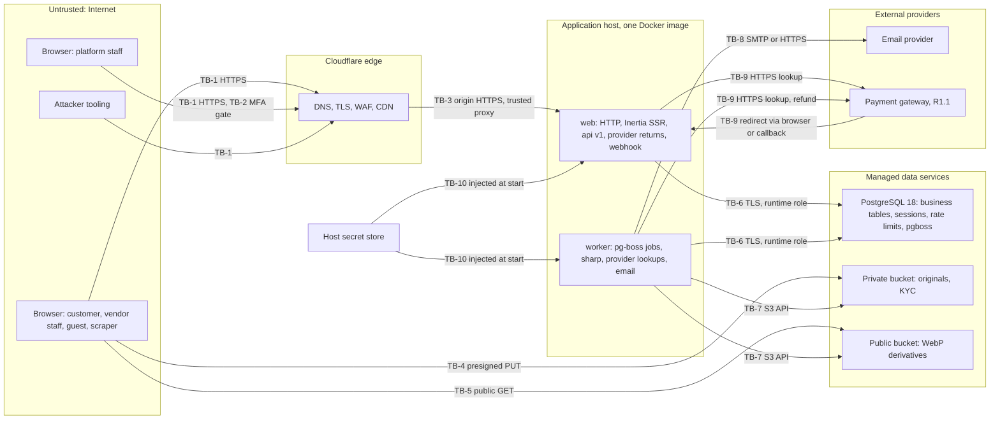
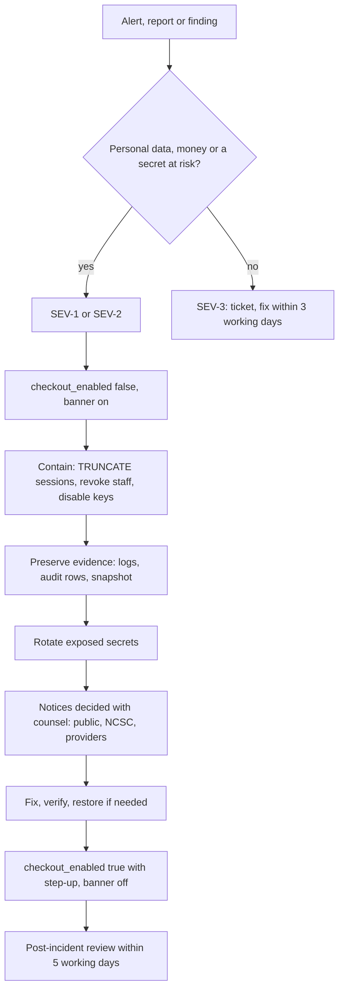

# DripNepal Security, Threat Model and Permissions

Status: Draft v1 (2026-09-26)

Reviewed: critic pass B3 (2026-09-26)

This document is the security source of truth for DripNepal (canon §11). It owns the threat register (`TM-xx`), the authentication and session rules, the permission slugs and role maps, the status gates, the privacy and encryption rules, the incident response procedure and the secure-development hooks. It references, and does not repeat, the rules that other documents own: the API contract and rate-limit values ([06](06-api-design.md)), table and constraint definitions ([04a](04a-data-dictionary-tables.md)), the retention schedule ([04 §19.3](04-domain-model-and-data-dictionary.md#193-retention-schedule)), state machines ([05](05-order-payment-and-inventory-lifecycles.md)), job names ([03 §9](03-system-architecture.md#9-asynchronous-work)), the test registry ([10](10-testing-and-quality-gates.md)), runbooks ([11](11-deployment-and-operations.md)) and milestones ([12](12-roadmap-and-backlog.md)).

**Nothing in this document claims legal compliance.** Legal and regulatory statements are design inputs from the research digests. Each one carries a source and, where its reading is uncertain, a `VX` item for counsel (section 8).

Labels follow [00 §1.2](00-context-assumptions-and-questions.md#12-evidence-labels): [Confirmed], [Verified-repo], [Verified-doc], [Assumption], [Open] (OD-xx), [Verify-external] (VX-xx). Test IDs from canon §12 (T-SEC-001, T-SEC-002, T-SEC-003, T-SEC-004, T-SEC-010, T-INV-003, T-PAY-005, T-PAY-008, T-CHK-004) are the fixed base. Every other test ID here is marked "(proposed)" until [10](10-testing-and-quality-gates.md) registers it. Items that the reviewed documents added and the product owner has not yet approved are marked "(proposed; not yet in canon §x)".

---

## 1. Scope, assets and trust boundaries

### 1.1 Scope and method

**In scope.** Releases R0, R1 (COD only) and R1.1 (one wallet gateway, payouts), and the R2 features that change the threat picture (coupons, reviews, SMS OTP). The system is the single AdonisJS 7 codebase with two process types, `web` and `worker` ([03 §3](03-system-architecture.md#3-containers)), PostgreSQL 18 as the only stateful service, S3-compatible object storage, an email provider, and from R1.1 a payment gateway (eSewa or Khalti, [Open OD-03]).

**Out of scope.** Physical security of vendors' shops and couriers; the gateway's own systems; the security of customers' devices beyond what the browser enforces for us (cookies, CSP, history encryption).

**Method.** Each threat in section 2 names the asset, the trust boundary it crosses, a DripNepal-specific abuse scenario, preventive and detective controls, a test, and the residual risk. Likelihood and impact use High/Medium/Low with a stated reason; the risk register ([risks-and-open-decisions.md §4.2](risks-and-open-decisions.md#42-register)) keeps the numeric business-risk scores and links here for the technical detail.

**Team constraint** [Confirmed Q1]. One or two developers run everything. Every control here must be cheap to operate: enforced by code, a database constraint or CI, not by a person remembering. Where a control needs a person (maker-checker, incident response), section 4.7 and section 6.2 say what happens when there is only one.

**Public repository** [Confirmed Q7]. The source is public on GitHub. No control depends on hidden code or hidden route names; the Tuyau client registry already ships every route pattern to the browser [Verified-repo, audit A5-17]. Security rests on authorization checks, secrets kept out of the repository, and constraints.

### 1.2 Assets

Sensitivity classes are defined in [04 §19.1](04-domain-model-and-data-dictionary.md#191-handling-rules-per-sensitivity-class). The table lists what an attacker would want and where it lives.

| ID   | Asset                                             | Class                         | Where it lives                                                                                                                | Why an attacker wants it                                                                              |
| ---- | ------------------------------------------------- | ----------------------------- | ----------------------------------------------------------------------------------------------------------------------------- | ----------------------------------------------------------------------------------------------------- |
| A-01 | Customer identity and contact                     | Personal, Sensitive-personal  | `users` (`email`, `full_name`, `phone_enc`), `user_addresses` (`*_enc`), `orders.shipping_address` snapshot                   | Resale of phone lists, targeted COD fraud, harassment, rival vendors poaching customers               |
| A-02 | Order and transaction history                     | Personal (Privacy Act s12(4)) | `orders`, `shop_orders`, `order_items`, `order_events`, `support_cases`                                                       | Protected "business or transaction" details; competitive intelligence for rival vendors               |
| A-03 | Credentials and session material                  | Secret                        | `users.password_hash`, `user_tokens.token_hash`, `shop_invitations.token_hash`, `sessions` rows, `dripnepal_session` cookie   | Account takeover of customers, vendors and staff                                                      |
| A-04 | Staff MFA secrets                                 | Secret                        | `users.mfa_totp_secret_enc`                                                                                                   | Bypass of the admin MFA gate                                                                          |
| A-05 | Vendor KYC documents                              | Sensitive-personal            | Private bucket `originals/<shop_id>/<media_asset_id>` (`media_assets.kind = kyc_document`)                                    | Identity fraud with citizenship and PAN scans                                                         |
| A-06 | Vendor payout accounts                            | Financial, Sensitive-personal | `shop_payout_accounts.account_number_enc`                                                                                     | Redirect a vendor's payout to the attacker's account                                                  |
| A-07 | Money records                                     | Financial                     | `payments`, `refunds`, `ledger_entries`, `payouts`, `vendor_remittances`                                                      | Fake captures, double refunds, inflated balances, unauthorised payouts                                |
| A-08 | Stock and price integrity                         | Internal / Public             | `inventory_items`, `product_variants.price_minor`, `product_listings`                                                         | Hoarding, overselling, price manipulation between quote and order                                     |
| A-09 | Catalog and shop content                          | Public                        | `products`, `shops` text fields, media derivatives                                                                            | XSS delivery, counterfeit listings, defacement                                                        |
| A-10 | Audit trail                                       | Personal, Internal            | `audit_logs` (append-only)                                                                                                    | Hiding a malicious staff action                                                                       |
| A-11 | Platform secrets                                  | Secret                        | Host secret store: `APP_KEY`, `DATA_ENCRYPTION_KEYS`, `BLIND_INDEX_KEY`, database and storage credentials, gateway keys, SMTP | Forge sessions, decrypt every `*_enc` column, reach the database or bucket, initiate provider refunds |
| A-12 | Service availability and the checkout kill switch | Internal                      | `platform_settings.checkout_enabled`, web and worker capacity, 22 database connections                                        | Deny sales; or re-enable checkout during an incident                                                  |

### 1.3 Trust boundaries



| Boundary | Between                            | What crosses it                                                    | What must hold                                                                                                                                                                                                                             |
| -------- | ---------------------------------- | ------------------------------------------------------------------ | ------------------------------------------------------------------------------------------------------------------------------------------------------------------------------------------------------------------------------------------ |
| TB-1     | Internet and Cloudflare            | Every request, including forged ones                               | TLS; nothing in a request is trusted: prices, totals, shop IDs, statuses, roles and provider parameters are recomputed or looked up server-side (NFR-SEC-003)                                                                              |
| TB-2     | Customer surface and admin surface | Staff sessions                                                     | `platform_staff` row with `revoked_at IS NULL`, TOTP enrolled, `mfa_verified_at` within 12 h; non-staff get 404 (section 4.2)                                                                                                              |
| TB-3     | Cloudflare and origin              | Proxied HTTP                                                       | `trustProxy` limited to the reverse proxy and Cloudflare's published ranges so `request.ip()` is the client address ([03 §12.2](03-system-architecture.md#122-authentication-and-sessions-adr-0005)); origin reachable only from the proxy |
| TB-4     | Browser and private bucket         | Upload bytes                                                       | Presigned PUT valid 10 minutes, fixed key and declared size; bytes are untrusted until `media.process_upload` validates them ([ADR-0013](adr/0013-media-direct-upload-async-processing.md))                                                |
| TB-5     | Browser and public bucket          | Derived images                                                     | Only worker-written WebP derivatives are public; originals and KYC never are                                                                                                                                                               |
| TB-6     | Processes and PostgreSQL           | SQL                                                                | TLS; runtime role with DML only, no `UPDATE`/`DELETE` on append-only tables (section 4.10); bound parameters only                                                                                                                          |
| TB-7     | Worker and buckets                 | Object reads and writes                                            | Separate credentials scoped to the environment's two buckets [Assumption; 11 confirms provider support]                                                                                                                                    |
| TB-8     | Worker and email provider          | Recipient address, rendered email with verification or reset links | Provider is a registered processor (section 5.8); links carry single-use tokens whose hashes are the only stored form                                                                                                                      |
| TB-9     | Application and gateway            | Initiate, lookup, refund; browser redirects; callbacks             | Redirects and callbacks are hints only; state changes come from a server-to-server lookup ([ADR-0012](adr/0012-payment-provider-isolation-verify-by-lookup.md), TM-17)                                                                     |
| TB-10    | Secret store and processes         | Keys and credentials                                               | Never in the repository, the image, logs or job payloads (TM-25)                                                                                                                                                                           |

### 1.4 Attacker profiles

| ID    | Profile                    | Goal on DripNepal                                                                                                       | Capability we assume                                                | Main threats                 |
| ----- | -------------------------- | ----------------------------------------------------------------------------------------------------------------------- | ------------------------------------------------------------------- | ---------------------------- |
| AP-01 | Fraudulent vendor          | Sell counterfeits, collect COD cash and not remit commission (OD-05), receive payouts for undelivered orders, forge KYC | A legitimate owner account and shop; knows the public source code   | TM-01, TM-28, TM-31          |
| AP-02 | Rival vendor               | Read another shop's orders, customers, prices or stock; sabotage its listings; post fake reviews (R2)                   | Owner or staff of their own shop; can guess slugs and order numbers | TM-01, TM-06, TM-21          |
| AP-03 | Fake-COD customer          | Tie up stock and courier fees with orders they never accept; abuse "changed mind" returns and refunds                   | Several email accounts, shared or borrowed phone numbers            | TM-22, TM-23, TM-19          |
| AP-04 | Credential stuffer         | Take over customer and vendor accounts using leaked passwords; enumerate registered emails                              | Botnet with rotating IPs, password lists                            | TM-08, TM-09                 |
| AP-05 | Malicious staff            | Approve own refund to a friend's account, read customer data for resale, change a payout account, erase audit traces    | Valid platform staff role with MFA                                  | TM-05, TM-19, TM-27          |
| AP-06 | Compromised admin          | Same as AP-05 but through a stolen session or phished TOTP; switch `single_operator_mode` on, create staff              | Stolen cookie or real-time phishing proxy                           | TM-05, TM-07                 |
| AP-07 | Scraper                    | Copy the catalog, prices, shop contact data; hammer search                                                              | Many IPs, headless browsers                                         | TM-24, TM-29                 |
| AP-08 | Opportunistic web attacker | Generic XSS, CSRF, SSRF, injection, dependency exploits, secrets in public repos                                        | Automated scanners, public exploits, reading the public repository  | TM-10 to TM-15, TM-25, TM-26 |

### 1.5 Design rules that every section relies on

1. **Deny by default, fail closed three times** (ADR-0006): middleware check, query scope and composite foreign key. A missing check in one layer is caught by the next.
2. **404 for other people's resources, never 403** (canon §6.6), so IDs cannot be probed. 403 is used only when the caller already knows the resource exists (a member lacking a permission, a shop not active).
3. **Server-authoritative values** (NFR-SEC-003): validators are allowlists that reject unknown keys with 422 `unknown_field` ([06 §3.5](06-api-design.md#35-input-validators-are-allowlists)); transformers are allowlists ([06 §3.6](06-api-design.md#36-output-transformers-never-models)).
4. **Verify by lookup**: no provider redirect or callback changes state on its own ([ADR-0012](adr/0012-payment-provider-isolation-verify-by-lookup.md)).
5. **Secrets only in the host secret store**, application-level encryption for Sensitive-personal columns ([04 §2.9](04-domain-model-and-data-dictionary.md#29-sensitive-column-encryption-and-blind-indexes)).
6. **Every privileged state change is audited in the same transaction** ([04a §15.3](04a-data-dictionary-tables.md#153-audit_logs)).

---

## 2. Threat register

### 2.1 How to read an entry

- **Likelihood** (L) and **impact** (I) are High, Medium or Low for R1 volumes (under about 50 shops and 1–2k orders a month [Confirmed Q1]). The reason is stated in the entry.
- **Preventive** controls stop the abuse; **detective** controls tell us it happened. Each control names its mechanism and where it is specified.
- **Verification** names the test. Canon §12 IDs are fixed; other IDs are "(proposed)" for [10](10-testing-and-quality-gates.md).
- **Owner**: TL = tech lead (lead developer), PO = product owner, FO = finance officer role holder, Legal = counsel. With a one-person team, TL and FO may be the same person (section 6.2).
- **Milestone** is when the preventive control must exist ([12](12-roadmap-and-backlog.md) owns the plan).

### 2.2 Summary

| ID    | Threat                                                 | L   | I   | Milestone | Owner | Canon test           |
| ----- | ------------------------------------------------------ | --- | --- | --------- | ----- | -------------------- |
| TM-01 | Cross-shop data access (BOLA) by a vendor              | H   | H   | M0 / M2   | TL    | T-SEC-001            |
| TM-02 | Customer reads or acts on another customer's resources | M   | H   | M1 / M5   | TL    | T-SEC-002            |
| TM-03 | Staff invitation abuse                                 | M   | M   | M2        | TL    | —                    |
| TM-04 | Shop role escalation and removed staff keeping access  | M   | H   | M2        | TL    | T-SEC-001            |
| TM-05 | Malicious or compromised platform staff                | L   | H   | M1 / M7   | PO    | T-SEC-004            |
| TM-06 | Mass assignment and excessive data exposure            | H   | M   | M0 / M1   | TL    | T-SEC-003            |
| TM-07 | Session theft and fixation                             | M   | H   | M0        | TL    | T-SEC-010            |
| TM-08 | Credential stuffing and MFA brute force                | H   | M   | M0 / M1   | TL    | —                    |
| TM-09 | Account recovery abuse and enumeration                 | M   | M   | M1        | TL    | —                    |
| TM-10 | Cross-site request forgery                             | M   | H   | M0        | TL    | —                    |
| TM-11 | Stored XSS through vendor or customer text             | M   | H   | M0 / M3   | TL    | —                    |
| TM-12 | SQL injection in search, sorting and raw queries       | L   | H   | M0 / M4   | TL    | —                    |
| TM-13 | Server-side request forgery                            | L   | H   | M3 / M6   | TL    | —                    |
| TM-14 | Unsafe redirects and return URLs                       | M   | M   | M1        | TL    | —                    |
| TM-15 | Unsafe uploads and image processing                    | M   | H   | M3        | TL    | —                    |
| TM-16 | Unauthorised access to private media (KYC)             | M   | H   | M2        | TL    | —                    |
| TM-17 | Payment spoofing through provider redirects (R1.1)     | H   | H   | M8        | TL    | T-PAY-005            |
| TM-18 | Provider event replay and forged callbacks (R1.1)      | M   | H   | M8        | TL    | T-PAY-005            |
| TM-19 | Refund abuse and double refunds                        | M   | H   | M7 / M8   | FO    | T-SEC-004, T-PAY-008 |
| TM-20 | Coupon abuse (R2)                                      | M   | M   | M9        | PO    | —                    |
| TM-21 | Review abuse and fake reviews (R2)                     | M   | M   | M9        | PO    | —                    |
| TM-22 | Checkout and inventory races; stock hoarding           | H   | M   | M5        | TL    | T-INV-003, T-CHK-004 |
| TM-23 | Fake and refused COD orders                            | H   | M   | M5 / M6   | PO    | —                    |
| TM-24 | Resource exhaustion and expensive queries              | M   | M   | M0 / M4   | TL    | —                    |
| TM-25 | Secrets exposure                                       | M   | H   | M0        | TL    | —                    |
| TM-26 | Dependency and supply-chain compromise                 | M   | H   | M0        | TL    | —                    |
| TM-27 | Sensitive data in logs, analytics and errors           | H   | M   | M0        | TL    | —                    |
| TM-28 | Payout account takeover and payout fraud               | M   | H   | M2 / M8   | FO    | —                    |
| TM-29 | Catalog and contact scraping                           | H   | L   | M4        | TL    | —                    |
| TM-30 | Database, backup or session-table exposure             | L   | H   | M0 / M7   | TL    | —                    |
| TM-31 | Fraudulent vendor onboarding and counterfeit listings  | H   | H   | M2 / M3   | PO    | —                    |

### 2.3 Threat entries

#### TM-01 Cross-shop data access (BOLA) by a vendor

| Field           | Detail                                                                                                                                                                                                                                                                                                                                                                                                                                                                                                                                                                                                                                                                                                      |
| --------------- | ----------------------------------------------------------------------------------------------------------------------------------------------------------------------------------------------------------------------------------------------------------------------------------------------------------------------------------------------------------------------------------------------------------------------------------------------------------------------------------------------------------------------------------------------------------------------------------------------------------------------------------------------------------------------------------------------------------- |
| Asset, boundary | A-01, A-02, A-06, A-07, A-08 of another shop; TB-1 into the seller surface                                                                                                                                                                                                                                                                                                                                                                                                                                                                                                                                                                                                                                  |
| Abuse scenario  | A rival sneaker shop owner (AP-02) signed in to `/seller/kicks-ktm` changes the slug to `/seller/sole-nepal/orders` or replays `GET /api/v1/seller/shops/kicks-ktm/orders/DN-4821937-2` with another shop's order number to read that shop's customers' phone numbers. Today any signed-in user reaches any `/shop/:shopSlug/*` page because the group checks authentication only (RF-01 [Verified-repo `start/routes/shops.ts:14-28`, audit IAM-01]).                                                                                                                                                                                                                                                      |
| L / I           | **H / H.** Slugs are public on storefront URLs, and order numbers, although random ([04 §2.1](04-domain-model-and-data-dictionary.md#21-identifiers)), appear on receipts, shipping labels and screenshots; the first seller data page added without a check leaks customer contacts (Privacy Act s26 exposure, R-24).                                                                                                                                                                                                                                                                                                                                                                                      |
| Preventive      | `seller_context` middleware on every `/seller/{shopSlug}` page group and `/api/v1/seller/shops/{shopSlug}` route: resolve slug, owner or active membership else 404, permission, status gate, `ctx.shop` ([06 §4.4](06-api-design.md#44-seller-authorization-algorithm), section 4.8). Every query and compare-and-set includes `shop_id = ctx.shop.id`; nested IDs are looked up inside the shop. `shop_id` is in no validator (422 `unknown_field`). Composite `(parent_id, shop_id)` foreign keys make cross-shop links impossible ([04 §2.5](04-domain-model-and-data-dictionary.md#25-tenant-isolation-with-composite-foreign-keys)). M0 ships the guard on the existing group; M2 the full algorithm. |
| Detective       | Access line with route pattern and `user_id` ([09 §7.4](09-code-structure-and-engineering-standards.md#74-request-id-propagation)); alert when one `user_id` receives more than 20 `NOT_FOUND` on seller routes in 5 minutes (`seller_route_probe`, threshold owned by [11 §9.7](11-deployment-and-operations.md#97-alert-rules)); audit rows carry `shop_id`.                                                                                                                                                                                                                                                                                                                                              |
| Verification    | **T-SEC-001**, generated from the route list: every `/api/v1/seller` route and every `/seller` page is called with shop B's slug and B's nested IDs by an owner and each role of shop A, expecting 404 and no side effect. T-SEC-005 (proposed): a route registered outside the `seller_context` group fails CI (route-table assertion). T-MED-101 (proposed, 04a) inserts cross-shop rows with the runtime role and expects 23503.                                                                                                                                                                                                                                                                         |
| Residual        | Low. A handler that queries without the shop scope is still caught by the composite FK on writes; reads without the scope are the remaining gap, covered only by T-SEC-001 coverage.                                                                                                                                                                                                                                                                                                                                                                                                                                                                                                                        |
| Owner           | TL                                                                                                                                                                                                                                                                                                                                                                                                                                                                                                                                                                                                                                                                                                          |

#### TM-02 Customer reads or acts on another customer's resources

| Field           | Detail                                                                                                                                                                                                                                                                                                                                                                                                                                         |
| --------------- | ---------------------------------------------------------------------------------------------------------------------------------------------------------------------------------------------------------------------------------------------------------------------------------------------------------------------------------------------------------------------------------------------------------------------------------------------- |
| Asset, boundary | A-01, A-02 of another customer; TB-1 into the account surface                                                                                                                                                                                                                                                                                                                                                                                  |
| Abuse scenario  | A customer tries an order number seen on a shared receipt, a screenshot or a courier label (such as `DN-7K3M9QX`) in `getMyOrder`, `cancelMyShopOrder` or `openSupportCase` to read that customer's address or cancel their order; or passes another user's `address_id` to `placeOrder` so the order ships to a stranger's snapshot (the address IDOR of audit MISSED-schema-integrity).                                                      |
| L / I           | **M / H.** Order numbers are random ([04 §2.1](04-domain-model-and-data-dictionary.md#21-identifiers)), so they cannot be guessed, but they are short and shared on receipts, labels and screenshots; the impact is a personal-data disclosure and a cancelled order.                                                                                                                                                                          |
| Preventive      | The owner condition is part of the query, never a check after loading ([06 §4.5](06-api-design.md#45-customer-ownership)): `orders.customer_user_id`, `user_addresses.user_id` with `archived_at IS NULL`, `support_cases.customer_user_id`, cart by user or guest token hash. Checkout copies the address into `orders.shipping_address`, so later edits never change an order ([04a §5.5](04a-data-dictionary-tables.md#55-user_addresses)). |
| Detective       | `customer_route_probe` (proposed; not yet in [11 §9.7](11-deployment-and-operations.md#97-alert-rules)): more than 20 `NOT_FOUND` on customer routes (`/api/v1/me/*`, `/api/v1/cart`, `/api/v1/checkout` and the `/account/*` pages) for one `user_id` in 5 minutes, Business hours class like `seller_route_probe` (TM-01).                                                                                                                   |
| Verification    | **T-SEC-002** (read and cancel another customer's order: 404). T-SEC-006 (proposed): the same for addresses, support cases, support-case messages, carts and `placeOrder` with a foreign `address_id`.                                                                                                                                                                                                                                         |
| Residual        | Low.                                                                                                                                                                                                                                                                                                                                                                                                                                           |
| Owner           | TL                                                                                                                                                                                                                                                                                                                                                                                                                                             |

#### TM-03 Staff invitation abuse

| Field           | Detail                                                                                                                                                                                                                                                                                                                                                                                                                                                                                                                                                                                                                                                                                                                                                                                                                                                                                                                           |
| --------------- | -------------------------------------------------------------------------------------------------------------------------------------------------------------------------------------------------------------------------------------------------------------------------------------------------------------------------------------------------------------------------------------------------------------------------------------------------------------------------------------------------------------------------------------------------------------------------------------------------------------------------------------------------------------------------------------------------------------------------------------------------------------------------------------------------------------------------------------------------------------------------------------------------------------------------------- |
| Asset, boundary | Shop membership (access to A-01, A-02 of that shop); TB-8 (email) and TB-1                                                                                                                                                                                                                                                                                                                                                                                                                                                                                                                                                                                                                                                                                                                                                                                                                                                       |
| Abuse scenario  | An owner invites `staff@example.com`; the link is forwarded, sits in a shared family inbox or leaks through a job-table backup, and someone else accepts it. Or an attacker brute-forces `/invitations/{token}`. Or a revoked or expired link is replayed.                                                                                                                                                                                                                                                                                                                                                                                                                                                                                                                                                                                                                                                                       |
| L / I           | **M / M.** Forwarded links are common; impact is one role in one shop, visible to the owner.                                                                                                                                                                                                                                                                                                                                                                                                                                                                                                                                                                                                                                                                                                                                                                                                                                     |
| Preventive      | 32-byte random token, only its SHA-256 stored (`shop_invitations.token_hash`), 7-day expiry, single use by compare-and-set; unknown, expired and revoked tokens all return 404 ([04a §6.3](04a-data-dictionary-tables.md#63-shop_invitations)). **Acceptance requires a signed-in user with a verified email equal (case-insensitive) to `shop_invitations.email`** (AC-FR-SHOP-005-2), so a forwarded link is useless to anyone else; a mismatch is 403 `FORBIDDEN` naming only the masked invited address (02 J-09), which tells the holder nothing the invitation page did not already show. The raw token is never retrievable after the email is sent: "copy the link" is not offered, and a resend revokes the old invitation and issues a new token (section 3.8). The owner cannot be invited. The raw token's journey to the email is fixed in section 3.8. Access logs record the route pattern, never the token path. |
| Detective       | `shop_membership.accept` and `shop_invitation.create` audit rows; the owner sees members and pending invitations; an acceptance email to the owner [Assumption].                                                                                                                                                                                                                                                                                                                                                                                                                                                                                                                                                                                                                                                                                                                                                                 |
| Verification    | T-SEC-007 (proposed): accept with a different verified email (403 `FORBIDDEN`, no membership), with an unverified account (403 `EMAIL_NOT_VERIFIED`), after revoke or expiry (404), twice by the invitee (409 `CONFLICT` per 03 §7.6, exactly one membership); a scan of `pgboss` job rows after sending finds no raw token.                                                                                                                                                                                                                                                                                                                                                                                                                                                                                                                                                                                                     |
| Residual        | Low: an attacker who controls the invitee's mailbox controls the invitee.                                                                                                                                                                                                                                                                                                                                                                                                                                                                                                                                                                                                                                                                                                                                                                                                                                                        |
| Owner           | TL                                                                                                                                                                                                                                                                                                                                                                                                                                                                                                                                                                                                                                                                                                                                                                                                                                                                                                                               |

#### TM-04 Shop role escalation and removed staff keeping access

| Field           | Detail                                                                                                                                                                                                                                                                                                                                                                                                                                                                                                                                                                    |
| --------------- | ------------------------------------------------------------------------------------------------------------------------------------------------------------------------------------------------------------------------------------------------------------------------------------------------------------------------------------------------------------------------------------------------------------------------------------------------------------------------------------------------------------------------------------------------------------------------- |
| Asset, boundary | A-06 (payout account), shop control; TB-1 inside the seller surface                                                                                                                                                                                                                                                                                                                                                                                                                                                                                                       |
| Abuse scenario  | A `manager` at a Kathmandu boutique invites a friend as `manager`, promotes themself, or changes the payout account before quitting. A fired `order_fulfiller` keeps an open tab and exports customer phone numbers after removal. Historically the schema let an assignment point at another shop's role (audit MISSED-identity-authz).                                                                                                                                                                                                                                  |
| L / I           | **M / H.** Staff turnover in small shops is high; the payout account is the prize.                                                                                                                                                                                                                                                                                                                                                                                                                                                                                        |
| Preventive      | Roles are code constants; `manager` lacks `shop.staff.manage` and `shop.payout_account.manage` (section 4.3), so only the owner invites, changes roles, removes staff or touches the payout account (AC-FR-SHOP-005-1, AC-FR-SHOP-010-1). `shop_memberships_role_check` excludes `owner`. Membership and role are re-read on **every** seller request by `seller_context`, so removal or a role change applies on the next request without touching sessions (AC-FR-SHOP-005-3). Replacing the payout account requires password re-entry and resets verification (TM-28). |
| Detective       | Audit rows `shop_membership.role_change`, `shop_membership.remove`, `shop_payout_account.replace`; email to the owner on payout-account change (AC-FR-SHOP-010-4).                                                                                                                                                                                                                                                                                                                                                                                                        |
| Verification    | T-SEC-001 (a removed member gets 404 on every seller route). Permission-matrix tests (section 4.9) assert `manager` cannot call `inviteMember`, `changeMemberRole`, `removeMember`, `getPayoutAccount`, `replacePayoutAccount` (403 `FORBIDDEN`). T-SHOP-103 (proposed, 04a) covers the owner rule.                                                                                                                                                                                                                                                                       |
| Residual        | Low. A removed member's open page shows stale data until the next request.                                                                                                                                                                                                                                                                                                                                                                                                                                                                                                |
| Owner           | TL                                                                                                                                                                                                                                                                                                                                                                                                                                                                                                                                                                        |

#### TM-05 Malicious or compromised platform staff

| Field           | Detail                                                                                                                                                                                                                                                                                                                                                                                                                                                                                                                                                                                                                                                                                                                                                                                                                                                                                                                                                            |
| --------------- | ----------------------------------------------------------------------------------------------------------------------------------------------------------------------------------------------------------------------------------------------------------------------------------------------------------------------------------------------------------------------------------------------------------------------------------------------------------------------------------------------------------------------------------------------------------------------------------------------------------------------------------------------------------------------------------------------------------------------------------------------------------------------------------------------------------------------------------------------------------------------------------------------------------------------------------------------------------------- |
| Asset, boundary | A-01, A-06, A-07, A-10, A-12; TB-2                                                                                                                                                                                                                                                                                                                                                                                                                                                                                                                                                                                                                                                                                                                                                                                                                                                                                                                                |
| Abuse scenario  | A support agent (AP-05) creates a refund to a friend's wallet for an order that was delivered; a phished `finance_officer` (AP-06) approves a payout to an account they just "verified"; a compromised `platform_admin` turns `single_operator_mode` on, grants a new admin, re-enables checkout during an incident, or tries to delete audit rows. Unauthorised access by staff is itself an offence under ETA s45 and Privacy Act s29 [Verified-doc, research digest `nepal_regulatory_locale`; <https://tepc.gov.np/uploads/files/12the-electronic-transaction-act55.pdf>, <http://giwmscdnone.gov.np/media/app/public/275/posts/1721034328_44.pdf>, accessed 2026-09-25].                                                                                                                                                                                                                                                                                     |
| L / I           | **L / H.** Few staff at launch, but one person can move money and read every customer.                                                                                                                                                                                                                                                                                                                                                                                                                                                                                                                                                                                                                                                                                                                                                                                                                                                                            |
| Preventive      | Four least-privilege roles (section 4.2); TOTP mandatory with 12 h re-verification and a 15-minute step-up for money approvals and staff or sensitive-setting changes (section 3.10); maker-checker CHECKs `refunds_maker_checker_check` and `payouts_maker_checker_check` (`approved_by <> created_by` unless `is_single_operator_approval`, section 4.7) ([04a §12.4](04a-data-dictionary-tables.md#124-refunds), [04a §13.2](04a-data-dictionary-tables.md#132-payouts)); payout-account verifier ≠ submitter, never relaxed ([04a §6.7](04a-data-dictionary-tables.md#67-shop_payout_accounts)); `platform_staff_self_grant_check`; at least one active admin (T-IAM-110 proposed); append-only audit enforced by `REVOKE UPDATE, DELETE` and a trigger for every role ([04 §2.12](04-domain-model-and-data-dictionary.md#212-append-only-tables)); no impersonation feature (FR-ADM-008); refunds only to the original method or recorded recipient details. |
| Detective       | Every staff action audited with `actor_role` and `request_id`; `single_operator` flags reviewed weekly by the product owner (OD-14); audit-log reads are themselves audited (section 5.7); alert on `platform_staff` changes, `single_operator_mode` changes and any `checkout_enabled` change.                                                                                                                                                                                                                                                                                                                                                                                                                                                                                                                                                                                                                                                                   |
| Verification    | **T-SEC-004** (refund above refundable: 422 and CHECK backstop). T-LED-101 (proposed, 04a): self-approval without the flag fails with 23514. T-ARCH-012 (proposed, 04): `UPDATE`/`DELETE` on audit rows fails for both roles. T-SEC-008 (proposed): step-up freshness and the permission matrix for every admin operation.                                                                                                                                                                                                                                                                                                                                                                                                                                                                                                                                                                                                                                        |
| Residual        | Medium while one person holds every role: single-operator approvals rely on the weekly review and on bank-statement reconciliation (R-18).                                                                                                                                                                                                                                                                                                                                                                                                                                                                                                                                                                                                                                                                                                                                                                                                                        |
| Owner           | PO                                                                                                                                                                                                                                                                                                                                                                                                                                                                                                                                                                                                                                                                                                                                                                                                                                                                                                                                                                |

#### TM-06 Mass assignment and excessive data exposure

| Field           | Detail                                                                                                                                                                                                                                                                                                                                                                                                                                                                                                                                                                                                                                                                                                                                 |
| --------------- | -------------------------------------------------------------------------------------------------------------------------------------------------------------------------------------------------------------------------------------------------------------------------------------------------------------------------------------------------------------------------------------------------------------------------------------------------------------------------------------------------------------------------------------------------------------------------------------------------------------------------------------------------------------------------------------------------------------------------------------- |
| Asset, boundary | A-07, A-08, account status and roles; A-01 in responses; TB-1 both directions                                                                                                                                                                                                                                                                                                                                                                                                                                                                                                                                                                                                                                                          |
| Abuse scenario  | Inbound: a customer adds `"unit_price_minor": 100` or `"shop_id"` to `placeOrder`, `"status": "active"` to `signUp`, or `"commission_rate_bp": 0` to `updateShopProfile`. Signup today spreads the validated payload into `User.create` (RF-36, audit IAM-24; safe only because Vine drops undeclared keys). Outbound: the current `ShopTransformer` exposes `ownerId` and the owner's personal email and phone (audit IAM-18); a reused transformer on the public shop page would publish them in SSR HTML to every crawler.                                                                                                                                                                                                          |
| L / I           | **H / M.** The pattern is already in the code; exposure through SSR props is indexed by search engines.                                                                                                                                                                                                                                                                                                                                                                                                                                                                                                                                                                                                                                |
| Preventive      | Validators are allowlists that reject unknown keys with 422 `unknown_field` ([06 §3.5](06-api-design.md#35-input-validators-are-allowlists)); controllers map fields explicitly; lint rule bans `Model.create({ ...payload })` and `merge(payload)` on models ([09](09-code-structure-and-engineering-standards.md)). Prices, totals, commission and shop are computed server-side in `placeOrder` ([05 §4](05-order-payment-and-inventory-lifecycles.md#4-checkout-the-placeorder-algorithm)). One transformer per audience ([06 §3.6](06-api-design.md#36-output-transformers-never-models)); returning a model from a controller fails T-ARCH-001. Shared Inertia props carry only the user summary and shop switcher list (RF-44). |
| Detective       | Contract tests validate every response against `openapi.yaml` (T-API-001), so an extra field fails CI.                                                                                                                                                                                                                                                                                                                                                                                                                                                                                                                                                                                                                                 |
| Verification    | **T-SEC-003** (client-supplied prices, totals, `shop_id` and commission are rejected). T-API-002 (proposed, 06): extra top-level and nested keys give 422 on every mutation. T-API-001.                                                                                                                                                                                                                                                                                                                                                                                                                                                                                                                                                |
| Residual        | Low.                                                                                                                                                                                                                                                                                                                                                                                                                                                                                                                                                                                                                                                                                                                                   |
| Owner           | TL                                                                                                                                                                                                                                                                                                                                                                                                                                                                                                                                                                                                                                                                                                                                     |

#### TM-07 Session theft and fixation

| Field           | Detail                                                                                                                                                                                                                                                                                                                                                                                                                                                                                                                                                                                                                                                                                                                                                                                                                                                  |
| --------------- | ------------------------------------------------------------------------------------------------------------------------------------------------------------------------------------------------------------------------------------------------------------------------------------------------------------------------------------------------------------------------------------------------------------------------------------------------------------------------------------------------------------------------------------------------------------------------------------------------------------------------------------------------------------------------------------------------------------------------------------------------------------------------------------------------------------------------------------------------------- |
| Asset, boundary | A-03; TB-1                                                                                                                                                                                                                                                                                                                                                                                                                                                                                                                                                                                                                                                                                                                                                                                                                                              |
| Abuse scenario  | A customer logs in at a cyber café and walks away; the next user presses Back and sees their order history, or copies the cookie. A vendor's cookie is stolen by malware. A staff member passes the TOTP check and logs out on a shared machine, and whoever next logs in there as another staff account inherits the fresh MFA state. With today's cookie store, a stolen cookie works until it expires and cannot be revoked (RF-04 [Verified-repo `.env.example:13`]).                                                                                                                                                                                                                                                                                                                                                                               |
| L / I           | **M / H.** Shared devices are common; a stolen staff session reaches every customer.                                                                                                                                                                                                                                                                                                                                                                                                                                                                                                                                                                                                                                                                                                                                                                    |
| Preventive      | Database session store with tagging, `HttpOnly; Secure; SameSite=Lax` cookie, ID regenerated at login (built into `SessionGuard.login` [Verified-doc, `@adonisjs/auth` 10.1.0 source, <https://registry.npmjs.org/@adonisjs/auth/-/auth-10.1.0.tgz>, accessed 2026-09-25]), after the MFA challenge and when the user gains privilege in their own request, and re-tagged after every regenerate; a privilege change by another admin rotates the target's stamp; login that forgets earlier auth keys, and an MFA proof bound to the user ID; per-request `security_stamp` check; idle and absolute limits per surface; logout and forced logout that untag, clear and regenerate the session; Inertia history cleared by the client after `logOut` and on `/login`, `/mfa` and every guest page; `encryptHistory` on authenticated pages (section 3). |
| Detective       | `auth.login` audit rows with `ip_hash`; "sign out of all other devices" in `/account/security`; email on password change.                                                                                                                                                                                                                                                                                                                                                                                                                                                                                                                                                                                                                                                                                                                               |
| Verification    | **T-SEC-010** (section 3.3). T-IAM-109 (proposed, 04a): "log out everywhere" removes every tagged row, including an MFA-verified staff session. T-SEC-009 (proposed): session ID differs before and after login and after MFA; cookie attributes; the old cookie is rejected after logout; staff A verifies MFA and logs out, staff B logs in with only a password in the same cookie jar, and `/api/v1/admin/*` returns 401 `MFA_REQUIRED`; a browser test presses Back after `logOut`, after a forced logout (section 3.3 rows 1 and 3) and after a revoked session (row 2) and sees no account data.                                                                                                                                                                                                                                                 |
| Residual        | Medium: a live stolen cookie works until idle expiry or revocation. No device binding in R1.                                                                                                                                                                                                                                                                                                                                                                                                                                                                                                                                                                                                                                                                                                                                                            |
| Owner           | TL                                                                                                                                                                                                                                                                                                                                                                                                                                                                                                                                                                                                                                                                                                                                                                                                                                                      |

#### TM-08 Credential stuffing and MFA brute force

| Field           | Detail                                                                                                                                                                                                                                                                                                                                                                                                                                                                                                                                    |
| --------------- | ----------------------------------------------------------------------------------------------------------------------------------------------------------------------------------------------------------------------------------------------------------------------------------------------------------------------------------------------------------------------------------------------------------------------------------------------------------------------------------------------------------------------------------------- |
| Asset, boundary | A-03, then A-06 and A-09 through a vendor account; TB-1                                                                                                                                                                                                                                                                                                                                                                                                                                                                                   |
| Abuse scenario  | AP-04 replays leaked email and password pairs against `logIn` to take over vendor accounts and list counterfeits or change payout details. Login today has no rate limit and swallows non-credential errors (RF-12, audit IAM-05). The scrypt cost makes each attempt CPU-expensive, so a flood also degrades the web process.                                                                                                                                                                                                            |
| L / I           | **H / M.** Automated and cheap; impact per account is bounded by the owner-only payout rules and the missing vendor MFA until R2 (R-30).                                                                                                                                                                                                                                                                                                                                                                                                  |
| Preventive      | Limiter database store with `login_ip` checked **before** credential verification and `login_acct_ip` with `penalize()` on failure (values owned by [06 §9.1](06-api-design.md#91-rate-limits)); identical 401 `UNAUTHENTICATED` for unknown email and wrong password; `trustProxy` so limits key on the real client IP; Cloudflare WAF rules as an outer layer [Verify-external VX-15]; passwords 10–128 characters with paste allowed (section 3.7); TOTP for staff with the `mfa` limiter and replay refusal via `mfa_last_used_step`. |
| Detective       | `auth.login_failed` audit rows with `ip_hash`; alert when failures exceed 100 in 5 minutes platform-wide or 10 for one account [Assumption; 11 tunes]; email to the user after 5 consecutive failures [Assumption].                                                                                                                                                                                                                                                                                                                       |
| Verification    | T-SEC-011 (proposed): the 6th failed attempt per account and IP in a minute and the 21st per IP return 429 with `Retry-After` (AC-FR-IAM-003-3); a flood from one IP never reaches the hasher after the limit; the 6th wrong TOTP code in 5 minutes locks MFA (AC-FR-IAM-007-4). T-SEC-101 (proposed, 04a): limiter keys stay ≤ 255 characters and contain no raw email or IP.                                                                                                                                                            |
| Residual        | Medium for vendors until optional owner MFA (FR-IAM-008, R2).                                                                                                                                                                                                                                                                                                                                                                                                                                                                             |
| Owner           | TL                                                                                                                                                                                                                                                                                                                                                                                                                                                                                                                                        |

#### TM-09 Account recovery abuse and enumeration

| Field           | Detail                                                                                                                                                                                                                                                                                                                                                                                                                                                                                                                                                                                                                                                                                                                                                                                          |
| --------------- | ----------------------------------------------------------------------------------------------------------------------------------------------------------------------------------------------------------------------------------------------------------------------------------------------------------------------------------------------------------------------------------------------------------------------------------------------------------------------------------------------------------------------------------------------------------------------------------------------------------------------------------------------------------------------------------------------------------------------------------------------------------------------------------------------- |
| Asset, boundary | A-03; TB-1 and TB-8                                                                                                                                                                                                                                                                                                                                                                                                                                                                                                                                                                                                                                                                                                                                                                             |
| Abuse scenario  | AP-04 bulk-checks which emails are registered vendors through signup uniqueness errors (RF-38, audit IAM-27), then phishes them. Someone calls support pretending to be a vendor who "lost access" and asks for the email to be changed. A reset link sits in a mailbox for days, or two reset links are both valid.                                                                                                                                                                                                                                                                                                                                                                                                                                                                            |
| L / I           | **M / M.** Enumeration through signup and reset is cheap to script and feeds targeted phishing; a successful recovery abuse takes over one account at a time.                                                                                                                                                                                                                                                                                                                                                                                                                                                                                                                                                                                                                                   |
| Preventive      | `signUp` returns the same 202 for known and new emails (the existing holder receives a "someone tried to sign up" email) and `requestPasswordReset` always returns 202 ([06 §13.3](06-api-design.md#133-auth-and-self)); hashed, single-use, short-lived tokens with at most one live token per purpose (section 3.8); a reset rotates `security_stamp`, so every other session dies, and does not sign the user in (AC-FR-IAM-004-4). **Support never changes a login email or resets a password by phone**: the only recovery path is the email reset; staff have no "set password" or impersonation operation (FR-ADM-008). A vendor who lost the mailbox goes through a documented identity check against KYC by the product owner, recorded as an audit row [Assumption; procedure in 11]. |
| Detective       | Rate-limit hits on `signup_ip`, `pwreset_email`, `pwreset_ip`; `auth.password_reset` audit rows.                                                                                                                                                                                                                                                                                                                                                                                                                                                                                                                                                                                                                                                                                                |
| Verification    | T-SEC-012 (proposed): identical status, body and timing class for known and unknown emails on `signUp` and `requestPasswordReset`; a second reset token invalidates the first; a used or expired token fails; a reset kills other sessions. T-IAM-105 (proposed, 04a): concurrent redemption of one token succeeds once.                                                                                                                                                                                                                                                                                                                                                                                                                                                                        |
| Residual        | Low. Timing differences in email sending are masked because email is sent from a job, not in the request.                                                                                                                                                                                                                                                                                                                                                                                                                                                                                                                                                                                                                                                                                       |
| Owner           | TL                                                                                                                                                                                                                                                                                                                                                                                                                                                                                                                                                                                                                                                                                                                                                                                              |

#### TM-10 Cross-site request forgery

| Field           | Detail                                                                                                                                                                                                                                                                                                                                                                                                                                                                                                                                                                                                                                                                                                                                                                                                                                                                               |
| --------------- | ------------------------------------------------------------------------------------------------------------------------------------------------------------------------------------------------------------------------------------------------------------------------------------------------------------------------------------------------------------------------------------------------------------------------------------------------------------------------------------------------------------------------------------------------------------------------------------------------------------------------------------------------------------------------------------------------------------------------------------------------------------------------------------------------------------------------------------------------------------------------------------ |
| Asset, boundary | Any state change made with the session cookie; TB-1                                                                                                                                                                                                                                                                                                                                                                                                                                                                                                                                                                                                                                                                                                                                                                                                                                  |
| Abuse scenario  | A page on another site auto-submits a form to `POST /api/v1/seller/shops/kicks-ktm/orders/DN-7K3M9QX-1/reject` or `PUT /api/v1/admin/settings/checkout_enabled` while a vendor or admin is signed in.                                                                                                                                                                                                                                                                                                                                                                                                                                                                                                                                                                                                                                                                                |
| L / I           | **M / H.** A lure page is cheap to host, but the victim must be signed in and open it; one forged request can reject a vendor's order or change a platform setting such as `checkout_enabled`.                                                                                                                                                                                                                                                                                                                                                                                                                                                                                                                                                                                                                                                                                       |
| Preventive      | Shield CSRF on `POST`, `PUT`, `PATCH`, `DELETE` with the encrypted `XSRF-TOKEN` cookie and `X-XSRF-TOKEN` header [Verified-repo `config/shield.ts`; Verified-doc `@adonisjs/shield` 9.0.0 source]; `SameSite=Lax` session cookie as a second layer; no unsafe method outside `/api/v1`, so every write passes the same Shield check ([ADR-0004](adr/0004-inertia-reads-json-api-writes.md) route rule); `allowMethodSpoofing` stays `false` [Verified-repo audit]; the **only** exemption is `POST /api/v1/webhooks/payments/{provider}`, matched by the function form of `exceptRoutes` on the exact route pattern ([06 §4.1](06-api-design.md#41-session-and-csrf)). Provider return pages are `GET` and change nothing without a lookup (TM-17). A CSRF failure on `/api/*` renders 403 `FORBIDDEN` with a "reload" detail — confirmed here as the rule ADR-0018 and 06 proposed. |
| Detective       | Count of `E_BAD_CSRF_TOKEN` per route in logs.                                                                                                                                                                                                                                                                                                                                                                                                                                                                                                                                                                                                                                                                                                                                                                                                                                       |
| Verification    | T-API-006 (proposed, 06): the CSRF exemption list equals exactly the webhook route. T-SEC-013 (proposed): every unsafe `/api/v1` route without `X-XSRF-TOKEN` returns 403; a cross-site form post with the session cookie is rejected.                                                                                                                                                                                                                                                                                                                                                                                                                                                                                                                                                                                                                                               |
| Residual        | Low.                                                                                                                                                                                                                                                                                                                                                                                                                                                                                                                                                                                                                                                                                                                                                                                                                                                                                 |
| Owner           | TL                                                                                                                                                                                                                                                                                                                                                                                                                                                                                                                                                                                                                                                                                                                                                                                                                                                                                   |

#### TM-11 Stored XSS through vendor or customer text

| Field           | Detail                                                                                                                                                                                                                                                                                                                                                                                                                                                                                                                                                                                                                                                                                                                                                                                                          |
| --------------- | --------------------------------------------------------------------------------------------------------------------------------------------------------------------------------------------------------------------------------------------------------------------------------------------------------------------------------------------------------------------------------------------------------------------------------------------------------------------------------------------------------------------------------------------------------------------------------------------------------------------------------------------------------------------------------------------------------------------------------------------------------------------------------------------------------------- |
| Asset, boundary | Every customer and staff session that views vendor or customer text (A-03, A-06); TB-1                                                                                                                                                                                                                                                                                                                                                                                                                                                                                                                                                                                                                                                                                                                          |
| Abuse scenario  | A vendor puts `` in a product description, return policy or shop description; a customer puts a script in a support-case message that a support agent opens in `/admin/support-cases`. The script reads the JavaScript-readable `XSRF-TOKEN` cookie and, as the viewing admin, changes a payout account or re-enables checkout (audit IAM-28). A `javascript:` URL in `tracking_url` would do the same from the order page.                                                                                                                                                                                                                                                                                                                                                                |
| L / I           | **M / H.** Vendor-authored text reaches every visitor; an admin victim is catastrophic.                                                                                                                                                                                                                                                                                                                                                                                                                                                                                                                                                                                                                                                                                                                         |
| Preventive      | R1 stores all vendor and customer text as **plain text**; React escapes it on render; `dangerouslySetInnerHTML` is banned by lint outside one reviewed JSON-LD helper that serialises with escaped `<` ([09](09-code-structure-and-engineering-standards.md)); no rich text or Markdown in R1 (a later rich-text feature needs an allowlist sanitiser and a new entry here). URLs from users are validated `https://` only (`tracking_url` [04a §11.5](04a-data-dictionary-tables.md#115-shipments)); SVG uploads are rejected (A-31). CSP with nonces blocks inline script injection once enforced (section 7.3). Inertia 4.2.0 renders the page object as a `data-page` attribute, which React escapes [Verified-doc digest, `@adonisjs/inertia` 4.2.0]. Admin screens render the same plain-text components. |
| Detective       | CSP violation reports (report-only from M0); moderation of new products in `pre` mode (OD-20).                                                                                                                                                                                                                                                                                                                                                                                                                                                                                                                                                                                                                                                                                                                  |
| Verification    | T-SEC-014 (proposed): a fixture set of XSS payloads saved through every text field (product, variant label, shop description and policies, support messages, order notes, courier name) renders inert in SSR HTML and in a browser test with CSP enforced; `tracking_url` with `javascript:` or `http:` gives 422.                                                                                                                                                                                                                                                                                                                                                                                                                                                                                              |
| Residual        | Low after CSP enforcement at M7; Medium between M0 and M7 (report-only).                                                                                                                                                                                                                                                                                                                                                                                                                                                                                                                                                                                                                                                                                                                                        |
| Owner           | TL                                                                                                                                                                                                                                                                                                                                                                                                                                                                                                                                                                                                                                                                                                                                                                                                              |

#### TM-12 SQL injection in search, sorting and raw queries

| Field           | Detail                                                                                                                                                                                                                                                                                                                                                                                                                                                                                                                                         |
| --------------- | ---------------------------------------------------------------------------------------------------------------------------------------------------------------------------------------------------------------------------------------------------------------------------------------------------------------------------------------------------------------------------------------------------------------------------------------------------------------------------------------------------------------------------------------------- |
| Asset, boundary | Whole database (A-01 to A-10); TB-6                                                                                                                                                                                                                                                                                                                                                                                                                                                                                                            |
| Abuse scenario  | Keyword search builds `websearch_to_tsquery('simple', :q)` and a trigram fallback `title % :q` ([ADR-0014](adr/0014-postgres-search-and-listing-read-model.md)). A developer writes it with `db.rawQuery` and template-string interpolation, or passes `?sort=price_minor;DROP…` into `orderBy`, or interpolates a filter column name.                                                                                                                                                                                                         |
| L / I           | **L / H.** Lucid binds values by default; the risk is the few raw fragments search needs.                                                                                                                                                                                                                                                                                                                                                                                                                                                      |
| Preventive      | Values only through bindings (`rawQuery(sql, bindings)` or `whereRaw(sql, [value])`); sort and filter keys from per-endpoint allowlists mapped to fixed column expressions, unknown keys 400 `INVALID_QUERY_PARAMETER` ([06 §6.3](06-api-design.md#63-filter-and-sort-allowlists)); the `q` parameter length-capped and passed only as a binding; lint rule flags template literals inside `rawQuery`, `whereRaw`, `orderByRaw` and `joinRaw` ([09](09-code-structure-and-engineering-standards.md)); runtime role without DDL (section 4.10). |
| Detective       | SQLSTATE 42601 (syntax error) counted in logs is an injection signal; alert on any occurrence in production [Assumption].                                                                                                                                                                                                                                                                                                                                                                                                                      |
| Verification    | T-SEC-015 (proposed): search, sort and filter parameters with quote, comment and `tsquery` operator payloads return results or 400, never 500, and never rows outside the listing read model.                                                                                                                                                                                                                                                                                                                                                  |
| Residual        | Low.                                                                                                                                                                                                                                                                                                                                                                                                                                                                                                                                           |
| Owner           | TL                                                                                                                                                                                                                                                                                                                                                                                                                                                                                                                                             |

#### TM-13 Server-side request forgery

| Field           | Detail                                                                                                                                                                                                                                                                                                                                                                                                                                                                                                                                                              |
| --------------- | ------------------------------------------------------------------------------------------------------------------------------------------------------------------------------------------------------------------------------------------------------------------------------------------------------------------------------------------------------------------------------------------------------------------------------------------------------------------------------------------------------------------------------------------------------------------- |
| Asset, boundary | Cloud metadata endpoints, the database and internal services reachable from the host; TB-3, TB-9                                                                                                                                                                                                                                                                                                                                                                                                                                                                    |
| Abuse scenario  | A vendor submits a tracking URL or an "import image from URL" link pointing at `http://169.254.169.254/` or `http://localhost:5432`, hoping the server fetches it for a preview or a thumbnail.                                                                                                                                                                                                                                                                                                                                                                     |
| L / I           | **L / H.** Only if a server-side fetch of a user URL is ever added.                                                                                                                                                                                                                                                                                                                                                                                                                                                                                                 |
| Preventive      | **Rule: the application never fetches a URL supplied by a user.** Tracking URLs are stored and shown as links, never fetched or unfurled. Image import from URL is **forbidden**: images arrive only by presigned upload (FR-MED-001). Outbound HTTP goes only to configured provider base URLs held in environment variables (gateway, email, storage) through the ports of [03 §11](03-system-architecture.md#11-provider-isolation), which reject absolute URLs from callers. A feature that needs a user URL fetch requires a new ADR with an egress allowlist. |
| Detective       | Egress firewall logs on the host if the provider offers them [Assumption; 11].                                                                                                                                                                                                                                                                                                                                                                                                                                                                                      |
| Verification    | T-SEC-016 (proposed): an architecture test fails if any module other than the provider adapters imports an HTTP client (`fetch`, `undici`, `axios` on the server).                                                                                                                                                                                                                                                                                                                                                                                                  |
| Residual        | Low.                                                                                                                                                                                                                                                                                                                                                                                                                                                                                                                                                                |
| Owner           | TL                                                                                                                                                                                                                                                                                                                                                                                                                                                                                                                                                                  |

#### TM-14 Unsafe redirects and return URLs

| Field           | Detail                                                                                                                                                                                                                                                                                                                                                                                                                                                                                                                                                                                                                   |
| --------------- | ------------------------------------------------------------------------------------------------------------------------------------------------------------------------------------------------------------------------------------------------------------------------------------------------------------------------------------------------------------------------------------------------------------------------------------------------------------------------------------------------------------------------------------------------------------------------------------------------------------------------ |
| Asset, boundary | Customer trust and tokens in query strings (A-03); TB-1, TB-9                                                                                                                                                                                                                                                                                                                                                                                                                                                                                                                                                            |
| Abuse scenario  | A phishing link `https://dripnepal.com/login?next=https://dripnepa1.com/login` sends users to a look-alike after sign-in. Every redirect today forwards the incoming query string (`forwardQueryString: true` [Verified-repo `config/app.ts:45`], RF-37), so a reset token or gateway parameters would be copied into the next URL, logs and the `Referer` header.                                                                                                                                                                                                                                                       |
| L / I           | **M / M.** Phishing links are cheap to send; the impact is one victim's credentials or one leaked reset or gateway token per click (a single-account takeover), not platform-wide.                                                                                                                                                                                                                                                                                                                                                                                                                                       |
| Preventive      | `forwardQueryString: false` globally (M1). The intended URL is stored in the session with `session.setIntendedUrl` and followed with `toIntended('/')` [Verified-doc, `@adonisjs/session` 8.1.0 release notes, <https://github.com/adonisjs/session/releases>]; any `redirect_to` value is accepted only if it is a relative path starting with a single `/` and not `//` or `/\`. Gateway `success_url`, `failure_url` and `return_url` are built server-side from configuration, never from the request. Token pages (`/reset-password`, `/invitations/{token}`, `/verify-email`) send `Referrer-Policy: no-referrer`. |
| Detective       | Log of rejected `redirect_to` values.                                                                                                                                                                                                                                                                                                                                                                                                                                                                                                                                                                                    |
| Verification    | T-SEC-017 (proposed): absolute, protocol-relative, backslash and encoded variants of `redirect_to` all resolve to `/`; token pages carry `no-referrer`; no redirect copies the incoming query string.                                                                                                                                                                                                                                                                                                                                                                                                                    |
| Residual        | Low.                                                                                                                                                                                                                                                                                                                                                                                                                                                                                                                                                                                                                     |
| Owner           | TL                                                                                                                                                                                                                                                                                                                                                                                                                                                                                                                                                                                                                       |

#### TM-15 Unsafe uploads and image processing

| Field           | Detail                                                                                                                                                                                                                                                                                                                                                                                                                                                                                                                                                                                                                                                                                                                                                                                                                                                                                                                                                                                                                                                                                                                                                                                                                     |
| --------------- | -------------------------------------------------------------------------------------------------------------------------------------------------------------------------------------------------------------------------------------------------------------------------------------------------------------------------------------------------------------------------------------------------------------------------------------------------------------------------------------------------------------------------------------------------------------------------------------------------------------------------------------------------------------------------------------------------------------------------------------------------------------------------------------------------------------------------------------------------------------------------------------------------------------------------------------------------------------------------------------------------------------------------------------------------------------------------------------------------------------------------------------------------------------------------------------------------------------------------- |
| Asset, boundary | Worker availability, host integrity, customer privacy (A-01), public bucket (A-09); TB-4, TB-7                                                                                                                                                                                                                                                                                                                                                                                                                                                                                                                                                                                                                                                                                                                                                                                                                                                                                                                                                                                                                                                                                                                             |
| Abuse scenario  | A vendor uploads a 20,000 × 20,000 PNG that decompresses to gigabytes; a JPEG/HTML polyglot; a file labelled `image/jpeg` that is really SVG; a HEIC crafted for a libheif bug; or a phone photo whose EXIF GPS reveals the vendor's home. Today the vendor upload accepts any `image/*` as unbounded base64 (RF-18) and multipart is processed on every route before authentication with a 20 MB limit (RF-35).                                                                                                                                                                                                                                                                                                                                                                                                                                                                                                                                                                                                                                                                                                                                                                                                           |
| L / I           | **M / H.** Image libraries have frequent high-severity advisories; a crashed worker stalls emails and reconciliation.                                                                                                                                                                                                                                                                                                                                                                                                                                                                                                                                                                                                                                                                                                                                                                                                                                                                                                                                                                                                                                                                                                      |
| Preventive      | Uploads bypass the app servers (presigned PUT, 10 minutes, declared size ≤ 10 MB) and multipart is disabled everywhere ([06 §9.2](06-api-design.md#92-request-size-and-shape-limits)). The worker reads the header first (`sharp().metadata()`), checks magic bytes against JPEG, PNG and WebP only (PDF only for KYC), rejects dimensions above 40 MP and interlaced images above 12 MP [Assumption, ADR-0013], then decodes with `limitInputPixels` set to 40,000,000 and `failOn: 'warning'` (never `unlimited: true`); output is re-encoded WebP with all metadata dropped (sharp output carries no EXIF unless metadata is explicitly kept [Assumption; checked by T-MED-001]), which removes GPS. **sharp ≥ 0.35.4** is required: GHSA-rgj7-g3m4-5g8c (libheif) affects < 0.35.4 and GHSA-f88m-g3jw-g9cj (libvips) affects < 0.35.0 [Verified-doc <https://github.com/lovell/sharp/security/advisories>, accessed 2026-09-25]. `VIPS_BLOCK_UNTRUSTED=1` in the worker container and one image job at a time [Verified-doc <https://www.libvips.org/API/8.17/developer-checklist.html>, <https://sharp.pixelplumbing.com/api-constructor>, accessed 2026-09-25]. Only derivatives are public; originals stay private. |
| Detective       | `media_assets.status = 'rejected'` counts per shop; worker memory alerts; dependency alerts for sharp and `@img/*` (section 7.1).                                                                                                                                                                                                                                                                                                                                                                                                                                                                                                                                                                                                                                                                                                                                                                                                                                                                                                                                                                                                                                                                                          |
| Verification    | T-MED-001 (proposed, 03): oversized, wrong-type, decompression-bomb and EXIF-GPS fixtures. T-SEC-018 (proposed): a JPEG/HTML polyglot and an SVG renamed `.jpg` are rejected; a derivative of a GPS-tagged photo has no EXIF; CI fails if the lockfile resolves sharp below 0.35.4.                                                                                                                                                                                                                                                                                                                                                                                                                                                                                                                                                                                                                                                                                                                                                                                                                                                                                                                                        |
| Residual        | Medium: a new libvips zero-day between advisories and our update.                                                                                                                                                                                                                                                                                                                                                                                                                                                                                                                                                                                                                                                                                                                                                                                                                                                                                                                                                                                                                                                                                                                                                          |
| Owner           | TL                                                                                                                                                                                                                                                                                                                                                                                                                                                                                                                                                                                                                                                                                                                                                                                                                                                                                                                                                                                                                                                                                                                                                                                                                         |

#### TM-16 Unauthorised access to private media (KYC)

| Field           | Detail                                                                                                                                                                                                                                                                                                                                                                                                                                                                                                                                                                                                                                                                                              |
| --------------- | --------------------------------------------------------------------------------------------------------------------------------------------------------------------------------------------------------------------------------------------------------------------------------------------------------------------------------------------------------------------------------------------------------------------------------------------------------------------------------------------------------------------------------------------------------------------------------------------------------------------------------------------------------------------------------------------------- |
| Asset, boundary | A-05; TB-4, TB-5, TB-7                                                                                                                                                                                                                                                                                                                                                                                                                                                                                                                                                                                                                                                                              |
| Abuse scenario  | A rival vendor guesses the object key of another shop's citizenship scan; a presigned GET link pasted into a support chat is reused days later; a bug writes a KYC file into the public bucket; a catalog moderator without `platform.shops.review` opens KYC files.                                                                                                                                                                                                                                                                                                                                                                                                                                |
| L / I           | **M / H.** Identity documents enable fraud; Privacy Act s2(c) personal information.                                                                                                                                                                                                                                                                                                                                                                                                                                                                                                                                                                                                                 |
| Preventive      | KYC objects live only in the private bucket, never get derivatives, and no code path produces a public key for `kind = kyc_document` ([03 §3.5](03-system-architecture.md#35-object-storage-layout), [04a §7.13](04a-data-dictionary-tables.md#713-media_assets)); keys contain UUIDv7 IDs, not names; staff with `platform.shops.review` view them through a 5-minute presigned GET issued per view and audited as `shop.kyc_view`; the owner may upload (`kind = kyc_document`) but the seller API never returns a download URL for KYC after submission; `Cache-Control: no-store`. Bucket-level public access is disabled on the private bucket [Assumption; 11 verifies the provider setting]. |
| Detective       | `shop.kyc_view` audit rows per staff member; alert on more than 20 views by one person in a day [Assumption].                                                                                                                                                                                                                                                                                                                                                                                                                                                                                                                                                                                       |
| Verification    | T-MED-103 (proposed, 04a): no public key for `kyc_document`; signed URLs expire; each issuance writes an audit row. T-SEC-019 (proposed): an unauthenticated GET on the private object URL is denied; `catalog_moderator` without `platform.shops.review` gets 403.                                                                                                                                                                                                                                                                                                                                                                                                                                 |
| Residual        | Low: a presigned URL is a bearer link for 5 minutes.                                                                                                                                                                                                                                                                                                                                                                                                                                                                                                                                                                                                                                                |
| Owner           | TL                                                                                                                                                                                                                                                                                                                                                                                                                                                                                                                                                                                                                                                                                                  |

#### TM-17 Payment spoofing through provider redirects (R1.1)

| Field           | Detail                                                                                                                                                                                                                                                                                                                                                                                                                                                                                                                                                                                                                                                                                                                  |
| --------------- | ----------------------------------------------------------------------------------------------------------------------------------------------------------------------------------------------------------------------------------------------------------------------------------------------------------------------------------------------------------------------------------------------------------------------------------------------------------------------------------------------------------------------------------------------------------------------------------------------------------------------------------------------------------------------------------------------------------------------- |
| Asset, boundary | A-07, A-08; TB-9 via the browser                                                                                                                                                                                                                                                                                                                                                                                                                                                                                                                                                                                                                                                                                        |
| Abuse scenario  | A customer abandons the Khalti page and opens `/payments/khalti/return?pidx=…&status=Completed&amount=250000` by hand. Khalti's return redirect carries **no signature**, and its docs say to use the lookup API for final validation [Verified-doc <https://docs.khalti.com/khalti-epayment/>, accessed 2026-09-25]. For eSewa ePay the redirect payload is signed with HMAC-SHA256 but is still only a browser hop [Verified-doc <https://developer.esewa.com.np/pages/Epay>, accessed 2026-09-25]. A tampered `amount` or a `pidx` from another customer's payment is the variant.                                                                                                                                   |
| L / I           | **H / H.** Trivial to try; success means goods shipped unpaid.                                                                                                                                                                                                                                                                                                                                                                                                                                                                                                                                                                                                                                                          |
| Preventive      | Verify by lookup ([ADR-0012](adr/0012-payment-provider-isolation-verify-by-lookup.md), [06 §12.2](06-api-design.md#122-return-route-contract-get-paymentsproviderreturn)): the return handler resolves the payment only from our stored attempt reference, ignores `status` and `amount` in the URL, calls the provider lookup server-to-server, and captures only on a success status (Khalti: only `Completed`) with `total_amount` equal to the stored amount in paisa; eSewa signatures are checked with a constant-time comparison and are still followed by the status check. Compare-and-set forward-only transitions; the `payment_return` limiter (proposed) stops lookup floods. Keys differ per environment. |
| Detective       | `payments.daily_reconciliation` against the merchant statement; `needs_review` queue ([05 §9.5](05-order-payment-and-inventory-lifecycles.md#95-manual-review-queue-needs_review)); alert on lookup/redirect mismatches.                                                                                                                                                                                                                                                                                                                                                                                                                                                                                                |
| Verification    | **T-PAY-005** (the same event delivered N times, concurrently: one state change, one ledger posting). T-SEC-020 (proposed): forged return parameters (status, amount, another customer's `pidx`) never capture; an amount mismatch goes to `needs_review`.                                                                                                                                                                                                                                                                                                                                                                                                                                                              |
| Residual        | Low; provider details are [Verify-external VX-06/VX-07] until sandbox tests in M8.                                                                                                                                                                                                                                                                                                                                                                                                                                                                                                                                                                                                                                      |
| Owner           | TL                                                                                                                                                                                                                                                                                                                                                                                                                                                                                                                                                                                                                                                                                                                      |

#### TM-18 Provider event replay and forged callbacks (R1.1)

| Field           | Detail                                                                                                                                                                                                                                                                                                                                                                                                                                                                                                                               |
| --------------- | ------------------------------------------------------------------------------------------------------------------------------------------------------------------------------------------------------------------------------------------------------------------------------------------------------------------------------------------------------------------------------------------------------------------------------------------------------------------------------------------------------------------------------------ |
| Asset, boundary | A-07; TB-9                                                                                                                                                                                                                                                                                                                                                                                                                                                                                                                           |
| Abuse scenario  | An attacker replays a captured eSewa Intent callback (the only documented server-to-server callback [Verified-doc research digest `nepal_payments`]) for another order, or floods `POST /api/v1/webhooks/payments/esewa` to fill `provider_events`; a real callback arrives twice and out of order with a lookup.                                                                                                                                                                                                                    |
| L / I           | **M / H.** The webhook route is public and needs no session. A forged or replayed callback, if trusted, would capture an unpaid payment (as in TM-17), and a flood fills `provider_events` on the only database.                                                                                                                                                                                                                                                                                                                     |
| Preventive      | Webhook body ≤ 64 KB (proposed) and `webhook_ip` limiter (proposed) ([06 §12.4](06-api-design.md#124-webhook-contract-reserved-post-apiv1webhookspaymentsprovider)); raw body stored once under unique `(provider, provider_event_key)` ([04a §12.3](04a-data-dictionary-tables.md#123-provider_events)); signature verified where the provider signs; the state change comes only from a lookup in `payments.process_provider_event`, never from the body; forward-only compare-and-set; `provider_events.payload` stored redacted. |
| Detective       | `signature_valid = false` counts; `processing_status = 'failed'` alerts.                                                                                                                                                                                                                                                                                                                                                                                                                                                             |
| Verification    | **T-PAY-005**. T-SEC-021 (proposed): an unsigned or badly signed callback is stored with `signature_valid = false` and changes nothing; a body over 64 KB gets 413.                                                                                                                                                                                                                                                                                                                                                                  |
| Residual        | Low.                                                                                                                                                                                                                                                                                                                                                                                                                                                                                                                                 |
| Owner           | TL                                                                                                                                                                                                                                                                                                                                                                                                                                                                                                                                   |

#### TM-19 Refund abuse and double refunds

| Field           | Detail                                                                                                                                                                                                                                                                                                                                                                                                                                                                                                                                                                                                                                                                                                                                                                                                                                                                                                      |
| --------------- | ----------------------------------------------------------------------------------------------------------------------------------------------------------------------------------------------------------------------------------------------------------------------------------------------------------------------------------------------------------------------------------------------------------------------------------------------------------------------------------------------------------------------------------------------------------------------------------------------------------------------------------------------------------------------------------------------------------------------------------------------------------------------------------------------------------------------------------------------------------------------------------------------------------- |
| Asset, boundary | A-07; TB-2 (support social engineering), TB-9                                                                                                                                                                                                                                                                                                                                                                                                                                                                                                                                                                                                                                                                                                                                                                                                                                                               |
| Abuse scenario  | A customer (AP-03) phones support claiming a COD parcel arrived damaged and asks for the refund to "my brother's eSewa"; asks twice through two cases; or a Khalti refund call times out after Khalti processed it and a retry refunds again. A support agent refunds the full order for a one-item complaint.                                                                                                                                                                                                                                                                                                                                                                                                                                                                                                                                                                                              |
| L / I           | **M / H.** Refunds are manual in R1 (COD) and partially manual in R1.1 (eSewa has no refund API).                                                                                                                                                                                                                                                                                                                                                                                                                                                                                                                                                                                                                                                                                                                                                                                                           |
| Preventive      | Refund amount checked against refundable per order item and backed by CHECKs (`refunded_minor <= captured_minor`), 422 `REFUND_EXCEEDS_REFUNDABLE`; `createRefund` (support) and `approveRefund` (finance) are separate permissions with maker-checker; gateway refunds go only to the original payment; manual transfers use `recipient_details_enc` captured from the customer through the case record, not typed from a phone call, and a change of recipient after approval is refused [Assumption]; the refund is linked to `refund_items`; the provider call is never retried without a lookup, with `provider_idempotency_key = refund.id` ([05 §6.7](05-order-payment-and-inventory-lifecycles.md#67-refund), [05 §8.8](05-order-payment-and-inventory-lifecycles.md#88-refund-failure-and-retry-including-esewa-without-a-refund-api)); money approvals need the 15-minute step-up (section 3.10). |
| Detective       | `refunds.sla_monitor`; monthly bank-statement reconciliation against `paid_reference` (R-18); report of customers with more than 2 refunds in 90 days [Assumption].                                                                                                                                                                                                                                                                                                                                                                                                                                                                                                                                                                                                                                                                                                                                         |
| Verification    | **T-SEC-004**, **T-PAY-008** (a timed-out refund the provider processed ends `succeeded` after lookup; no double refund). T-LED-101 (proposed): maker-checker CHECK.                                                                                                                                                                                                                                                                                                                                                                                                                                                                                                                                                                                                                                                                                                                                        |
| Residual        | Medium: social engineering of a single operator in `single_operator_mode`.                                                                                                                                                                                                                                                                                                                                                                                                                                                                                                                                                                                                                                                                                                                                                                                                                                  |
| Owner           | FO                                                                                                                                                                                                                                                                                                                                                                                                                                                                                                                                                                                                                                                                                                                                                                                                                                                                                                          |

#### TM-20 Coupon abuse (R2)

| Field           | Detail                                                                                                                                                                                                                                                                                                                                                                                                                             |
| --------------- | ---------------------------------------------------------------------------------------------------------------------------------------------------------------------------------------------------------------------------------------------------------------------------------------------------------------------------------------------------------------------------------------------------------------------------------- |
| Asset, boundary | A-07 (platform-funded discounts); TB-1                                                                                                                                                                                                                                                                                                                                                                                             |
| Abuse scenario  | One person creates 30 accounts with Gmail dot-variants to redeem a "first order Rs 300 off" coupon 30 times; two tabs redeem a single-use code concurrently; a code leaks on a Facebook group.                                                                                                                                                                                                                                     |
| L / I           | **M / M** once FR-PROMO-002 ships.                                                                                                                                                                                                                                                                                                                                                                                                 |
| Preventive      | Designed in M9, not built in R1. Requirements fixed now: redemption counted in the `placeOrder` transaction with a unique `(coupon_id, user_id)` and a conditional usage-counter update (the same pattern as T-INV-003); per-phone limits through `phone_hash` once phone OTP exists (FR-IAM-010); discount computed server-side and allocated per [05 §3.4](05-order-payment-and-inventory-lifecycles.md#34-discount-allocation). |
| Detective       | Redemptions per `phone_hash` and per `ip_hash`.                                                                                                                                                                                                                                                                                                                                                                                    |
| Verification    | T-SEC-022 (proposed, M9): concurrent redemption of a single-use code succeeds once.                                                                                                                                                                                                                                                                                                                                                |
| Residual        | Medium until phone OTP.                                                                                                                                                                                                                                                                                                                                                                                                            |
| Owner           | PO                                                                                                                                                                                                                                                                                                                                                                                                                                 |

#### TM-21 Review abuse and fake reviews (R2)

| Field           | Detail                                                                                                                                                                                                                                                                                                                                                                                            |
| --------------- | ------------------------------------------------------------------------------------------------------------------------------------------------------------------------------------------------------------------------------------------------------------------------------------------------------------------------------------------------------------------------------------------------- |
| Asset, boundary | A-09, customer trust; TB-1                                                                                                                                                                                                                                                                                                                                                                        |
| Abuse scenario  | A vendor places COD orders with friends' accounts, marks them delivered and posts five-star reviews; a rival posts one-star reviews. Posting reviews while impersonating a fictitious consumer is prohibited (E-Commerce Act s15(c), s16(f)) [Verified-doc <https://giwmscdnone.gov.np/media/files/E-Commerce%20Act%2C%202081_yr7k9o5.pdf>, accessed 2026-09-25; application to DripNepal VX-02]. |
| L / I           | **M / M** once FR-REV-001 ships.                                                                                                                                                                                                                                                                                                                                                                  |
| Preventive      | Verified-purchase only: one review per `order_item` whose shop order is `completed`; the reviewer is the order's customer; shop members and the owner cannot review their own shop's products; moderation queue; reviews are plain text (TM-11).                                                                                                                                                  |
| Detective       | Reviews whose order's `phone_hash` or delivery address matches a shop member's; review bursts per shop.                                                                                                                                                                                                                                                                                           |
| Verification    | T-SEC-023 (proposed, M9).                                                                                                                                                                                                                                                                                                                                                                         |
| Residual        | Medium: collusive real orders cannot be distinguished cheaply.                                                                                                                                                                                                                                                                                                                                    |
| Owner           | PO                                                                                                                                                                                                                                                                                                                                                                                                |

#### TM-22 Checkout and inventory races; stock hoarding

| Field           | Detail                                                                                                                                                                                                                                                                                                                                                                                                                                                                                                                                                                                                                                                                                                                                                                                                                                                    |
| --------------- | --------------------------------------------------------------------------------------------------------------------------------------------------------------------------------------------------------------------------------------------------------------------------------------------------------------------------------------------------------------------------------------------------------------------------------------------------------------------------------------------------------------------------------------------------------------------------------------------------------------------------------------------------------------------------------------------------------------------------------------------------------------------------------------------------------------------------------------------------------- |
| Asset, boundary | A-08, A-07; TB-1, TB-6                                                                                                                                                                                                                                                                                                                                                                                                                                                                                                                                                                                                                                                                                                                                                                                                                                    |
| Abuse scenario  | A reseller fills carts with the last pairs of a limited sneaker drop from 20 accounts to block rivals; two customers submit the last unit at once; a double tap on a slow 3G connection submits `placeOrder` twice; a price change between quote and submit is ignored.                                                                                                                                                                                                                                                                                                                                                                                                                                                                                                                                                                                   |
| L / I           | **H / M.** Drops attract bots; oversell forces rejections and complaints.                                                                                                                                                                                                                                                                                                                                                                                                                                                                                                                                                                                                                                                                                                                                                                                 |
| Preventive      | **A cart is not a reservation**: adding to a cart holds nothing, so cart hoarding cannot block stock ([ADR-0008](adr/0008-inventory-reservations-and-ledger.md)). Reservations are created only inside `placeOrder` with the conditional update `on_hand - reserved >= :q` and CHECK `reserved <= on_hand` ([05 §4.5](05-order-payment-and-inventory-lifecycles.md#45-the-conditional-stock-update)); `Idempotency-Key` inserted first (400 `IDEMPOTENCY_KEY_REQUIRED` when missing); `cart_version` and `expected_grand_total_minor` checks (409 `CART_CHANGED`, `PRICE_CHANGED`); `cart_items.quantity` 1–10 and 50 lines; COD open-order limit (`cod_max_open_orders_per_customer`, OD-18); `place_order` and `cart_add` limiters ([06 §9.1](06-api-design.md#91-rate-limits)). Gateway `held` reservations expire at provider expiry plus 10 minutes. |
| Detective       | `inventory.drift_check`; admin report of orders by one customer with the same cart within 10 minutes (R-25).                                                                                                                                                                                                                                                                                                                                                                                                                                                                                                                                                                                                                                                                                                                                              |
| Verification    | **T-INV-003** (two concurrent checkouts for the last unit: exactly one succeeds), **T-CHK-004** (same key returns the same order; concurrent duplicates create one).                                                                                                                                                                                                                                                                                                                                                                                                                                                                                                                                                                                                                                                                                      |
| Residual        | Low for correctness; Medium for fairness in drops (bots with many verified accounts).                                                                                                                                                                                                                                                                                                                                                                                                                                                                                                                                                                                                                                                                                                                                                                     |
| Owner           | TL                                                                                                                                                                                                                                                                                                                                                                                                                                                                                                                                                                                                                                                                                                                                                                                                                                                        |

#### TM-23 Fake and refused COD orders

| Field           | Detail                                                                                                                                                                                                                                                                                                                                                                                                                                                                                                                                                  |
| --------------- | ------------------------------------------------------------------------------------------------------------------------------------------------------------------------------------------------------------------------------------------------------------------------------------------------------------------------------------------------------------------------------------------------------------------------------------------------------------------------------------------------------------------------------------------------------- |
| Asset, boundary | Vendor stock and courier fees (A-08), marketplace trust; TB-1                                                                                                                                                                                                                                                                                                                                                                                                                                                                                           |
| Abuse scenario  | A prankster or a rival (AP-03, AP-02) places COD orders to a real but uninvolved address, or refuses at the door every time; vendors pay courier fees both ways and cannot charge a refusal fee (Directive 2082 s8(3) [Verified-doc <https://giwmscdnone.gov.np/media/pdf_upload/ecommerce-directives_8errkt4.pdf>, accessed 2026-09-25]).                                                                                                                                                                                                              |
| L / I           | **H / M** (R-02).                                                                                                                                                                                                                                                                                                                                                                                                                                                                                                                                       |
| Preventive      | Checkout requires a verified email and a format-valid Nepal mobile [Confirmed Q6]; COD value and open-order limits (`cod_max_order_value_minor`, `cod_max_open_orders_per_customer`); the optional repeat-refuser rule (`cod_max_refusals` within `cod_refusal_window_days`, only if OD-18 adopts it, [05 §8.9](05-order-payment-and-inventory-lifecycles.md#89-cod-refusal-and-collection-reconciliation)); the vendor sees the recipient phone within the visibility window and can call before shipping (section 5.2); phone OTP in R2 (FR-IAM-010). |
| Detective       | `phone_hash` clusters across accounts (the reason unverified numbers may repeat, [04a §5.1](04a-data-dictionary-tables.md#51-users)); refusal rate per customer and per district.                                                                                                                                                                                                                                                                                                                                                                       |
| Verification    | T-CHK-007 (proposed, 05): refusal-based COD block when adopted; COD limit tests (`COD_LIMIT_EXCEEDED`).                                                                                                                                                                                                                                                                                                                                                                                                                                                 |
| Residual        | Medium until phone OTP.                                                                                                                                                                                                                                                                                                                                                                                                                                                                                                                                 |
| Owner           | PO                                                                                                                                                                                                                                                                                                                                                                                                                                                                                                                                                      |

#### TM-24 Resource exhaustion and expensive queries

| Field           | Detail                                                                                                                                                                                                                                                                                                                                                                                                                                                                                                                                                                                                                                                                                                             |
| --------------- | ------------------------------------------------------------------------------------------------------------------------------------------------------------------------------------------------------------------------------------------------------------------------------------------------------------------------------------------------------------------------------------------------------------------------------------------------------------------------------------------------------------------------------------------------------------------------------------------------------------------------------------------------------------------------------------------------------------------ |
| Asset, boundary | A-12 (22 database connections, one small VM); TB-1, TB-6                                                                                                                                                                                                                                                                                                                                                                                                                                                                                                                                                                                                                                                           |
| Abuse scenario  | A scraper requests `/c/clothing?page=100&per_page=48&sort=price_asc` for every filter combination; a search for `a` or `%` or a 5,000-character `q`; a cart with 50 lines of quantity 10 re-quoted in a loop; slow-loris uploads on the (removed) multipart path; login floods that burn scrypt CPU.                                                                                                                                                                                                                                                                                                                                                                                                               |
| L / I           | **M / M.** Scrapers and floods need no account; one small VM and 22 database connections mean a sustained flood slows or stops the site for everyone, but it exposes no data.                                                                                                                                                                                                                                                                                                                                                                                                                                                                                                                                      |
| Preventive      | Page ≤ 100 and `per_page` ≤ 48 on the public catalog, cursors elsewhere, capped counts ([06 §6](06-api-design.md#6-pagination-filtering-and-sorting)); query string ≤ 4 KB and 20 values per parameter; `q` length cap [Assumption: 100 characters] and a minimum of 2 characters before search runs; no `ILIKE '%…%'` on personal data ([06 §6.3](06-api-design.md#63-filter-and-sort-allowlists)); `statement_timeout` and `lock_timeout` on every pool ([03 §3.4](03-system-architecture.md#34-postgresql-layout-and-connection-budget)); body limits and multipart off ([06 §9.2](06-api-design.md#92-request-size-and-shape-limits)); limiters per IP and user; Cloudflare WAF rules [Verify-external VX-15]. |
| Detective       | p95 latency and connection-pool saturation alerts ([11](11-deployment-and-operations.md)); `RATE_LIMITED` counts.                                                                                                                                                                                                                                                                                                                                                                                                                                                                                                                                                                                                  |
| Verification    | T-PERF-001 (k6 checkout and listing load). T-SEC-024 (proposed): the worst-case listing and search queries finish under `statement_timeout` on a seeded 50,000-listing database.                                                                                                                                                                                                                                                                                                                                                                                                                                                                                                                                   |
| Residual        | Medium: a distributed flood against storefront pages, which are not rate limited in R1.                                                                                                                                                                                                                                                                                                                                                                                                                                                                                                                                                                                                                            |
| Owner           | TL                                                                                                                                                                                                                                                                                                                                                                                                                                                                                                                                                                                                                                                                                                                 |

#### TM-25 Secrets exposure

| Field           | Detail                                                                                                                                                                                                                                                                                                                                                                                                                                                                                                                                                                    |
| --------------- | ------------------------------------------------------------------------------------------------------------------------------------------------------------------------------------------------------------------------------------------------------------------------------------------------------------------------------------------------------------------------------------------------------------------------------------------------------------------------------------------------------------------------------------------------------------------------- |
| Asset, boundary | A-11; TB-10 and the public repository                                                                                                                                                                                                                                                                                                                                                                                                                                                                                                                                     |
| Abuse scenario  | An operator creates `.env.production` with `APP_KEY` and gateway keys; `.gitignore` does not ignore it [Verified-repo `.gitignore`, audit A5-10] and it is pushed to the public repository. A leaked `APP_KEY` lets anyone forge encrypted cookies and CSRF tokens. The `SHADCNUIKIT_API_KEY` for kit downloads (R-15) is pasted into `components.json`. A Khalti live secret key (`Authorization: Key …`) ends up in an error report.                                                                                                                                    |
| L / I           | **M / H.** Public repository plus a hurried 1–2 person team.                                                                                                                                                                                                                                                                                                                                                                                                                                                                                                              |
| Preventive      | Secrets only in the host secret store, validated at boot by `start/env.ts` ([03 §12.6](03-system-architecture.md#126-configuration-and-secrets)); `.gitignore` covers `.env.*` except `.env.example` and `.env.test` (M0); secret scanning in CI and as a pre-commit hook (section 7.2); separate keys per environment; the encryption key set is separate from `APP_KEY` ([04 §2.9](04-domain-model-and-data-dictionary.md#29-sensitive-column-encryption-and-blind-indexes)); pino redaction of `authorization` and key fields; the rotation procedures in section 5.6. |
| Detective       | Secret-scanner alerts; GitHub secret scanning on the public repository [Assumption: availability on the plan used]; unexpected provider API usage in provider dashboards.                                                                                                                                                                                                                                                                                                                                                                                                 |
| Verification    | T-SEC-025 (proposed): CI secret scan over the full history passes; the app refuses to boot in production with a missing or default `APP_KEY`, or with `NODE_ENV` other than `production`.                                                                                                                                                                                                                                                                                                                                                                                 |
| Residual        | Low after M0.                                                                                                                                                                                                                                                                                                                                                                                                                                                                                                                                                             |
| Owner           | TL                                                                                                                                                                                                                                                                                                                                                                                                                                                                                                                                                                        |

#### TM-26 Dependency and supply-chain compromise

| Field           | Detail                                                                                                                                                                                                                                                                                                                                                                                                                                                            |
| --------------- | ----------------------------------------------------------------------------------------------------------------------------------------------------------------------------------------------------------------------------------------------------------------------------------------------------------------------------------------------------------------------------------------------------------------------------------------------------------------- |
| Asset, boundary | Everything the web and worker processes can reach; build pipeline                                                                                                                                                                                                                                                                                                                                                                                                 |
| Abuse scenario  | The npm-withdrawn placeholder `D@1.0.0` is a production dependency today (RF-39 [Verified-repo `package.json:92`]); its name is held by npm and could in principle be re-published. `better-sqlite3` compiles a native addon on every install. `components.json` still points at the `@commercn` registry [Verified-repo `components.json:25`], so `shadcn add` could pull code from a third-party host. A compromised transitive package runs an install script. |
| L / I           | **M / H.** Malicious npm releases and hijacked maintainer accounts recur across the ecosystem; a compromised package runs with the web and worker processes' full access to data and secrets.                                                                                                                                                                                                                                                                     |
| Preventive      | Section 7.1: remove `D`, `better-sqlite3`, the sqlite connection and the `@commercn` registry in M0; `pnpm install --frozen-lockfile` in CI and the image build; build scripts allowed only for an explicit list (sharp, `@img/*`); lockfile diff reviewed in every PR; `pnpm audit --prod` gate on high severity; dependency update bot with grouped PRs; production image installs production dependencies only.                                                |
| Detective       | Advisory alerts; unexpected new packages in the lockfile diff.                                                                                                                                                                                                                                                                                                                                                                                                    |
| Verification    | T-SEC-026 (proposed): CI fails on a high or critical advisory in production dependencies, on a lockfile change without a `package.json` change, and on any registry other than `registry.npmjs.org` in the lockfile or `components.json`.                                                                                                                                                                                                                         |
| Residual        | Medium: a malicious release of a trusted package before it is flagged.                                                                                                                                                                                                                                                                                                                                                                                            |
| Owner           | TL                                                                                                                                                                                                                                                                                                                                                                                                                                                                |

#### TM-27 Sensitive data in logs, analytics and errors

| Field           | Detail                                                                                                                                                                                                                                                                                                                                                                                                                                                                                                                                                                           |
| --------------- | -------------------------------------------------------------------------------------------------------------------------------------------------------------------------------------------------------------------------------------------------------------------------------------------------------------------------------------------------------------------------------------------------------------------------------------------------------------------------------------------------------------------------------------------------------------------------------- |
| Asset, boundary | A-01, A-03, A-06; logs, the error tracker and analytics are third-party processors                                                                                                                                                                                                                                                                                                                                                                                                                                                                                               |
| Abuse scenario  | `RootLayout` logs all page props, including emails and shop phones, to the browser console and SSR logs (RF-26); dev SQL logging prints bindings including password hashes; a production 5xx JSON echoes the raw pg error with constraint names and key values (RF-36, audit A5-16); an analytics script receives order URLs with customer names.                                                                                                                                                                                                                                |
| L / I           | **H / M.** Already present in the code.                                                                                                                                                                                                                                                                                                                                                                                                                                                                                                                                          |
| Preventive      | M0 removes the props logging and SQL-bindings debug; pino `redact` paths: `password`, `current_password`, `new_password`, `token`, `token_enc`, `totp_code`, `secret`, `authorization`, `cookie`, `set-cookie`, `x-xsrf-token`, `account_number`, `phone`, `email`, `address`, `recipient`, `*.detail` of pg errors (canon §11); access logs record the route pattern, not the raw URL; 5xx bodies are generic with `request_id` ([ADR-0018](adr/0018-error-contract-problem-details.md)); the error tracker gets scrubbed events (section 5.8); no third-party analytics in R1. |
| Detective       | A weekly grep of a log sample for `9[678]\d{8}` and `@` patterns [Assumption; 11].                                                                                                                                                                                                                                                                                                                                                                                                                                                                                               |
| Verification    | Log-redaction unit test (NFR-SEC-010). T-SEC-027 (proposed): a request carrying every redacted field produces log lines without them; a forced unique violation returns a body without SQL or constraint names.                                                                                                                                                                                                                                                                                                                                                                  |
| Residual        | Low: free text typed by users (notes, messages) may still contain phone numbers and is handled as Personal ([04 §19.1](04-domain-model-and-data-dictionary.md#191-handling-rules-per-sensitivity-class)), never logged.                                                                                                                                                                                                                                                                                                                                                          |
| Owner           | TL                                                                                                                                                                                                                                                                                                                                                                                                                                                                                                                                                                               |

#### TM-28 Payout account takeover and payout fraud

| Field           | Detail                                                                                                                                                                                                                                                                                                                                                                                                                    |
| --------------- | ------------------------------------------------------------------------------------------------------------------------------------------------------------------------------------------------------------------------------------------------------------------------------------------------------------------------------------------------------------------------------------------------------------------------- |
| Asset, boundary | A-06, A-07; TB-1, TB-2                                                                                                                                                                                                                                                                                                                                                                                                    |
| Abuse scenario  | An attacker who stuffed a vendor's password replaces the payout account the day before a payout run (R-30); a fraudulent vendor (AP-01) marks COD orders `delivered` and `collected` without shipping to inflate a later payable balance.                                                                                                                                                                                 |
| L / I           | **M / H** from R1.1.                                                                                                                                                                                                                                                                                                                                                                                                      |
| Preventive      | Owner-only, password re-entry on `replacePayoutAccount`; a new account is unverified until a finance officer who is not the submitter verifies it; payouts only to the active verified account (composite FK `payouts_account_fkey`); email to the owner and shop contact on replacement (AC-FR-SHOP-010-4); ledger availability after `ledger_hold_days` ≥ `return_window_days`; payouts with maker-checker and step-up. |
| Detective       | Payout-account changes listed on the payout approval screen; complaints about undelivered orders per shop; delivered-to-complaint ratio per shop.                                                                                                                                                                                                                                                                         |
| Verification    | T-SHOP-105 (proposed, 04a): verification rules. T-SEC-028 (proposed): a payout to a replaced or unverified account is refused; replacing without the current password gives 422.                                                                                                                                                                                                                                          |
| Residual        | Medium: collusive fake deliveries in COD, where the platform does not see the cash.                                                                                                                                                                                                                                                                                                                                       |
| Owner           | FO                                                                                                                                                                                                                                                                                                                                                                                                                        |

#### TM-29 Catalog and contact scraping

| Field           | Detail                                                                                                                                                                                                                                                                                                                                                                                                |
| --------------- | ----------------------------------------------------------------------------------------------------------------------------------------------------------------------------------------------------------------------------------------------------------------------------------------------------------------------------------------------------------------------------------------------------- |
| Asset, boundary | Public catalog and shop pages; TB-1                                                                                                                                                                                                                                                                                                                                                                   |
| Abuse scenario  | A competitor copies every listing and price daily, or harvests shop contact phones for spam.                                                                                                                                                                                                                                                                                                          |
| L / I           | **H / L.** Public data by design.                                                                                                                                                                                                                                                                                                                                                                     |
| Preventive      | Public shop data is only what the shop publishes as business contact (`contact_email`, `contact_phone_e164`, grievance contact required by law); the owner's personal contact is never exposed (RF-21, RF-36); `catalog_ip` limiter on the public API; no bulk export endpoints.                                                                                                                      |
| Detective       | Cloudflare analytics (top IPs, ASNs and user agents) [Assumption; not yet in 11] and `ip_hash` request counts in the `http.request` access lines ([09 §7.4](09-code-structure-and-engineering-standards.md#74-request-id-propagation)), which carry no user agent.                                                                                                                                    |
| Verification    | T-API-001 on `getPublicShop` once it is specified with a closed schema (it is still pending in `openapi.yaml`). T-SEC-036 (proposed): the props of the public shop page `/shops/{shopSlug}` contain no `ownerId`, owner email or phone, or other contact the shop has not published; the request past the `catalog_ip` limit ([06 §9.1](06-api-design.md#91-rate-limits)) returns 429 `RATE_LIMITED`. |
| Residual        | Accepted: scraping of public listings cannot be prevented.                                                                                                                                                                                                                                                                                                                                            |
| Owner           | TL                                                                                                                                                                                                                                                                                                                                                                                                    |

#### TM-30 Database, backup or session-table exposure

| Field           | Detail                                                                                                                                                                                                                                                                                                                                                                                                                                                              |
| --------------- | ------------------------------------------------------------------------------------------------------------------------------------------------------------------------------------------------------------------------------------------------------------------------------------------------------------------------------------------------------------------------------------------------------------------------------------------------------------------- |
| Asset, boundary | Everything in PostgreSQL; TB-6                                                                                                                                                                                                                                                                                                                                                                                                                                      |
| Abuse scenario  | A `pg_dump` left on a laptop, a leaked backup, a developer restoring production into a shared staging database, or a `psql` session during an incident. `sessions.id` values are bearer credentials and `sessions.data` is not encrypted by the store ([04a §5.3](04a-data-dictionary-tables.md#53-sessions-session-store-table)).                                                                                                                                  |
| L / I           | **L / H.** Only the tech lead and the host can reach the database or its backups; one dump holds every customer's data, and live `sessions` rows are bearer credentials.                                                                                                                                                                                                                                                                                            |
| Preventive      | TLS to the database; application-level encryption of Sensitive-personal columns with keys outside the database (section 5.5); least-privilege database roles (section 4.10); backups encrypted by the provider and restorable only by the tech lead; never restored into a shared non-production environment ([04 §19.1](04-domain-model-and-data-dictionary.md#191-handling-rules-per-sensitivity-class)); session data holds no personal data beyond the user ID. |
| Detective       | Managed-database connection logs and connection sources [Assumption; not yet confirmed in 11].                                                                                                                                                                                                                                                                                                                                                                      |
| Verification    | T-IAM-103 (proposed, 04): no plaintext phone in raw rows. T-SEC-029 (proposed): the runtime role cannot `TRUNCATE`, `ALTER` or read `pg_authid`; restoring into staging requires the anonymisation replay script.                                                                                                                                                                                                                                                   |
| Residual        | Medium: a dump plus the leaked host secrets decrypts everything; response is section 6.3 (step 3 `TRUNCATE sessions`; step 4 rotation per section 5.6), preserving evidence per section 6.5.                                                                                                                                                                                                                                                                        |
| Owner           | TL                                                                                                                                                                                                                                                                                                                                                                                                                                                                  |

#### TM-31 Fraudulent vendor onboarding and counterfeit listings

| Field           | Detail                                                                                                                                                                                                                                                                                                                                                                  |
| --------------- | ----------------------------------------------------------------------------------------------------------------------------------------------------------------------------------------------------------------------------------------------------------------------------------------------------------------------------------------------------------------------- |
| Asset, boundary | Customer trust, legal exposure (R-04); TB-1, TB-2                                                                                                                                                                                                                                                                                                                       |
| Abuse scenario  | A seller registers with a borrowed PAN certificate, lists "original" Nike sneakers at a third of the price, collects COD cash through their courier and disappears; or a banned seller opens a second shop from the same account (up to `max_shops_per_owner`).                                                                                                         |
| L / I           | **H / H.** Counterfeit goods are the top-ranked risk (R-04, impact 4 of 5): ETA s43 intermediary protection may not cover a marketplace, the platform must handle complaints under E-Commerce Act s20, and brand-owner complaints and reputational damage follow; a seller who vanishes after collecting COD cash leaves customers without a refund.                    |
| Preventive      | Shop application reviewed by staff with KYC documents (OD-16) before `active`; seller agreement accepted before listing (FR-SHOP-013); `pre` moderation for new shops (OD-20); restricted-brand policy (OD-21); a suspended user cannot own a newly applied shop, and application review shows other shops of the same owner and matching `phone_hash`; `blockProduct`. |
| Detective       | Complaints tagged `product_complaint` and `not_as_described` per shop; moderation rejection rates.                                                                                                                                                                                                                                                                      |
| Verification    | T-SHOP-110 (proposed, 04a): approval checks. Status-gate tests (section 4.4).                                                                                                                                                                                                                                                                                           |
| Residual        | Medium: document forgery is not detectable by the platform alone.                                                                                                                                                                                                                                                                                                       |
| Owner           | PO                                                                                                                                                                                                                                                                                                                                                                      |

---

## 3. Authentication and session design

The decision is [ADR-0005](adr/0005-session-auth-server-side-revocation.md); this section fixes the values and rules that ADR, [03 §12.2](03-system-architecture.md#122-authentication-and-sessions-adr-0005) and [04a §5](04a-data-dictionary-tables.md#5-identity-and-access-tables) delegate to this document.

### 3.1 Guard, store and cookie

| Item                | Rule                                                                                                                                                                                                                                                                                                                                                                                                                                                                                                                                                                                                                                                                                                                        | Evidence and today's state                                                                                                                                                                 |
| ------------------- | --------------------------------------------------------------------------------------------------------------------------------------------------------------------------------------------------------------------------------------------------------------------------------------------------------------------------------------------------------------------------------------------------------------------------------------------------------------------------------------------------------------------------------------------------------------------------------------------------------------------------------------------------------------------------------------------------------------------------- | ------------------------------------------------------------------------------------------------------------------------------------------------------------------------------------------ |
| Guard               | Session guard `web` with the Lucid user provider; no token guard in R1                                                                                                                                                                                                                                                                                                                                                                                                                                                                                                                                                                                                                                                      | [Verified-repo `config/auth.ts`]                                                                                                                                                           |
| Store               | `stores.database()` on the `sessions` table (`make:session-table`), tagging by user ID. `SESSION_DRIVER` accepts only `database` in production (env schema enum); `memory` stays for tests                                                                                                                                                                                                                                                                                                                                                                                                                                                                                                                                  | Today `cookie` [Verified-repo `.env.example:13`] (RF-04); tagging only on database, redis, memory [Verified-doc digest]                                                                    |
| Cookie              | Name `dripnepal_session`; `HttpOnly`; `Secure` in every environment served over HTTPS (production and staging); `SameSite=Lax`; `Path=/`; no `Domain` attribute (host-only); `clearWithBrowser: false`                                                                                                                                                                                                                                                                                                                                                                                                                                                                                                                      | Today `adonis-session`, `secure: app.inProduction` [Verified-repo `config/session.ts:14`, `:46`] — M0 change                                                                               |
| Store `age`         | 7 days, the longest idle period any user may have; shorter limits are enforced by middleware (section 3.4)                                                                                                                                                                                                                                                                                                                                                                                                                                                                                                                                                                                                                  | Today `2h` [Verified-repo `config/session.ts:26`]                                                                                                                                          |
| Session ID rotation | New ID at login (built into `login()`), after a successful MFA challenge, and when the acting user gains privilege in their own request (`applyForShop` makes them a shop owner, `acceptShopInvitation` a shop member). Code calls `rotateSessionId` (next row) for all but login. A privilege change made by someone else (staff role granted, changed or revoked by another admin) cannot re-key the target's session from the admin's request: it rotates the target's `security_stamp` (section 3.3), so the target's next request is rejected (row 3) and the new login issues a new ID                                                                                                                                | [Verified-doc `@adonisjs/auth` 10.1.0 and `@adonisjs/session` 8.1.0 `.d.ts`]                                                                                                               |
| Tagging             | `session.tag(String(user.id))` **after** `login()` and after every other `session.regenerate()` of an authenticated session, because commit destroys the tagged row and writes the new ID with only `data` and `expires_at`, so `user_id` is lost. Every such regenerate other than login's goes through one helper, `rotateSessionId(ctx)`, which calls `session.regenerate()` and then `await session.tag(String(user.id))` (after `verifyMfaChallenge`, `applyForShop`, `acceptShopInvitation`, and `changePassword`, which keeps the session under a new ID per [02 J-18](02-user-journeys-and-acceptance-criteria.md#j-18-password-reset)). Only logout and forced logout (section 3.11) regenerate without re-tagging | Inferred from package source (`@adonisjs/session` 8.1.0 database store `write()` and `tag()`), not yet run; M1 confirms with T-IAM-109 (proposed), including an MFA-verified staff session |

### 3.2 What a session may contain

The allowlist that [04a §5.3](04a-data-dictionary-tables.md#53-sessions-session-store-table) refers to. Anything else is a code-review defect.

| Key                                                          | Written by               | Purpose                                                                      |
| ------------------------------------------------------------ | ------------------------ | ---------------------------------------------------------------------------- |
| `auth_web`                                                   | `@adonisjs/auth`         | Authenticated user ID                                                        |
| `security_stamp`                                             | `logIn` action           | Copy of `users.security_stamp` (section 3.3)                                 |
| `authenticated_at`                                           | `logIn` action           | Absolute timeout                                                             |
| `mfa_verified_at`                                            | `verifyMfaChallenge`     | 12 h admin window and 15-minute step-up; stored as `{ user_id, at }` (below) |
| `seller_seen_at`, `admin_seen_at`                            | Surface middleware       | Idle timeouts for the seller and admin surfaces                              |
| CSRF secret, flash messages, validation errors, intended URL | Shield, session, Inertia | Framework state                                                              |

Never in the session: cart contents (the cart is a table), personal data beyond the user ID, tokens, permission sets (re-read per request so role changes apply at once).

**Nothing from an earlier sign-in survives into the next one.** The guard's `login()` and `logout()` only put or forget `auth_web`, and `regenerate()` carries every other key to the new ID [Verified-doc `@adonisjs/auth` 10.1.0 and `@adonisjs/session` 8.1.0 source in the installed `node_modules`]. So:

- The `logIn` action forgets `mfa_verified_at`, `seller_seen_at`, `admin_seen_at`, `authenticated_at` and `security_stamp`, calls `await auth.use('web').login(user)`, then puts `security_stamp` and `authenticated_at` in the same request, before `session.tag()` (section 3.1). No `session_auth:login_succeeded` listener writes session keys: the guard emits that event without awaiting it, so a listener's `session.put` can run after the session is committed, fail unobserved, or not run at all under `emitter.fake()`. Listeners keep only side effects outside the session, such as `last_login_at`.
- `logIn` runs behind the `guest` middleware, so a signed-in session must log out before it signs in as another account.
- A session with `auth_web` but no `security_stamp` fails the stamp check (section 3.3, row 3); a missing `authenticated_at` never means "no absolute limit".
- `mfa_verified_at` holds `{ user_id, at }`. The `platform_staff` middleware and the step-up check (section 3.10) accept it only when `user_id` equals `auth.user.id` and `at` is not earlier than `authenticated_at`; "within 12 h" and "within 15 minutes" are measured from `at`. One staff member's TOTP check therefore never unlocks another account in the same browser.
- Logout and every forced logout clear the whole session before regenerating it (section 3.11).

### 3.3 The per-request account check and the suspension decision

The account-status middleware runs after `silent_auth` on every request that has a session ([03 §3.3](03-system-architecture.md#33-inside-the-web-process)). `@adonisjs/auth` 10.1.0 re-queries the user on every authenticated request but has no suspended-user check [Verified-doc digest, auth 10.1.0 source], so the check is ours. Rows are evaluated in order.

| #   | Situation                                                                                    | API response                                                      | Page response                   | Session effect                             |
| --- | -------------------------------------------------------------------------------------------- | ----------------------------------------------------------------- | ------------------------------- | ------------------------------------------ |
| 1   | Session exists; user `suspended`, `deactivated` or `anonymized`                              | 403 `ACCOUNT_SUSPENDED`                                           | Redirect `/login` with a notice | Logged out, untagged, cleared, regenerated |
| 2   | Session already destroyed by `identity.revoke_sessions` (or expired, or `TRUNCATE sessions`) | 401 `UNAUTHENTICATED` on protected routes; guest on public routes | Redirect `/login`               | None (no session to act on)                |
| 3   | User `active`; session `security_stamp` differs from `users.security_stamp`                  | 401 `UNAUTHENTICATED`                                             | Redirect `/login`               | Logged out, untagged, cleared, regenerated |
| 4   | Session older than its absolute limit, or idle beyond the surface limit (section 3.4)        | 401 `UNAUTHENTICATED` (admin idle: 401 `MFA_REQUIRED`)            | Redirect `/login` or `/mfa`     | Logged out (admin idle: MFA cleared)       |
| 5   | User `pending_verification` calls checkout or shop application                               | 403 `EMAIL_NOT_VERIFIED`                                          | Verify prompt                   | Unchanged                                  |

**Decision on the suspension response (resolves the conflict between 01 AC-FR-IAM-006-2, canon §12 T-SEC-010, 03 §7.7 and ADR-0005).** Suspension is enforced by two layers ([03 §7.7](03-system-architecture.md#77-suspension-taking-effect-on-an-existing-session-j-17-fr-iam-006-t-sec-010)): the stamp and status check (always on, the guarantee) and session destruction by a job (fast, may lag). Which response a client sees depends only on whether the job has run yet, so the contract is:

- While the session row exists, a suspended, deactivated or anonymized user gets **403 `ACCOUNT_SUSPENDED`** (row 1). The status check runs before the stamp check, so a suspended user who still has a session always learns why, even though suspension also rotates the stamp.
- Once the session is gone, the server cannot tell whose cookie it was: **401 `UNAUTHENTICATED`** (row 2).
- A stamp mismatch alone (password changed or "log out everywhere" on another device, role change) is **401 `UNAUTHENTICATED`** (row 3), never 403; 03 §7.7's grouping of "stamp differs" under 403 is superseded.
- In every case the response is **never 2xx** and never serves account data.

**T-SEC-010 asserts both paths deterministically**: with the worker stopped, the suspended user's next API request returns 403 `ACCOUNT_SUSPENDED` and the next page request redirects to `/login`; after running `identity.revoke_sessions`, the same cookie gets 401 `UNAUTHENTICATED`; a stamp-only mismatch gets 401. Changes this needs elsewhere (Consistency notes 1): 01 AC-FR-IAM-006-2 should read "is rejected with 403 `ACCOUNT_SUSPENDED` while the session exists, or 401 `UNAUTHENTICATED` once it has been revoked; never a 2xx"; 03 §7.7 should split the stamp-only case into 401; canon §12's T-SEC-010 text should add the 401 path. [06 §4.2](06-api-design.md#42-account-status-security-stamp-and-suspension) and ADR-0005 already match.

**Stamp rotation events** ([04a §5.1](04a-data-dictionary-tables.md#51-users)): password change or reset, suspension, "revoke all sessions", staff role grant, change or revocation, MFA reset, account deletion request. Where the acting user stays signed in (password change, "sign out of other devices"), the acting session receives the new stamp in the same request (AC-FR-IAM-005-2).

Sketch of the middleware. The HTTP context, `auth`, `session` and `inertia` calls are verified against the installed `.d.ts` files; `DomainError`, `user.status` and `user.securityStamp` come from the baseline and are **pseudocode** until M1.

```ts
import type { HttpContext } from '@adonisjs/core/http'
import type { NextFn } from '@adonisjs/core/types/http'

export default class AccountStatusMiddleware {
  async handle(ctx: HttpContext, next: NextFn) {
    const user = ctx.auth.user // loaded by silent_auth, one users read per request
    if (!user) return next()

    const inactive = user.status !== 'active' && user.status !== 'pending_verification'
    const stampMismatch = ctx.session.get('security_stamp') !== user.securityStamp
    if (!inactive && !stampMismatch) return next()

    await ctx.auth.use('web').logout()
    await ctx.session.untag(String(user.id))
    ctx.session.clear() // drops mfa_verified_at, *_seen_at and the stamp (section 3.11)
    ctx.session.regenerate()
    // pseudocode: DomainError renders problem+json for /api, a redirect for pages (ADR-0018)
    throw inactive ? new DomainError('ACCOUNT_SUSPENDED') : new DomainError('UNAUTHENTICATED')
  }
}
```

### 3.4 Idle and absolute timeouts per surface

A user can be a customer, a vendor and staff in one session, so limits are applied per surface by the middleware of each route group [Assumption A-23, values owned here].

| Surface                                            | Idle limit                  | Absolute limit                                    | On expiry                                                               |
| -------------------------------------------------- | --------------------------- | ------------------------------------------------- | ----------------------------------------------------------------------- |
| Storefront and `/account` (customers)              | 7 days (store `age`)        | 30 days from `authenticated_at`                   | Log in again                                                            |
| `/seller/*` and `/api/v1/seller/*`                 | 12 h since `seller_seen_at` | 30 days (the customer value; [Assumption])        | Session destroyed; log in again                                         |
| `/admin/*` and `/api/v1/admin/*`                   | 2 h since `admin_seen_at`   | 7 days for staff sessions (proposed [Assumption]) | 401 `MFA_REQUIRED` (`verification_required`) until a new TOTP challenge |
| Admin MFA window                                   | —                           | `mfa_verified_at` within 12 h                     | 401 `MFA_REQUIRED`                                                      |
| Step-up for money and staff actions (section 3.10) | —                           | `mfa_verified_at` within 15 minutes (proposed)    | 401 `MFA_REQUIRED` (`verification_required`)                            |

Tradeoff: customers on shared family phones stay signed in up to 7 idle days, which is why account pages use history encryption and logout clears history (section 3.11); staff pay with more MFA prompts.

### 3.5 Remember-me

**Decision: off in R1** (ADR-0005). `useRememberMeTokens` stays `false` [Verified-repo `config/auth.ts:19`] and the ignored "Remember me" checkbox is removed from the login page (RF-04). The 7-day idle customer session already covers the convenience; remember-me tokens would add a second long-lived credential (default age 2 years in auth 10.1.0 [Verified-doc digest]) that password change and suspension must also revoke. Revisit trigger: M1 metrics show customers re-logging in more than weekly.

### 3.6 Login throttling and generic errors

- Limiters `login_ip` (checked before any credential work) and `login_acct_ip` (with `penalize()` on failure), values in [06 §9.1](06-api-design.md#91-rate-limits), keys HMAC-hashed ([04a §15.4](04a-data-dictionary-tables.md#154-rate_limits-limiter-store)). `@adonisjs/limiter` 3.0.1 is not installed yet; the code in 06 is pseudocode until M0 adds it.
- Unknown email and wrong password return the same 401 `UNAUTHENTICATED` with the same `detail` (AC-FR-IAM-003-2). The unknown-email path must spend comparable hashing time; whether `verifyCredentials` already does a dummy hash for unknown users is checked in M1 [Assumption], otherwise the action hashes a fixed dummy value.
- A suspended, deactivated or anonymized user with the correct password gets 403 `ACCOUNT_SUSPENDED` without a session (anonymized: the generic failure), per AC-FR-IAM-003-4.
- Non-credential errors are rethrown to the exception handler and reported, never swallowed (RF-12).
- Every attempt writes `auth.login` or `auth.login_failed` to `audit_logs` with `ip_hash` (kept 2 years [Assumption], [04a §15.3](04a-data-dictionary-tables.md#153-audit_logs)).

### 3.7 Password policy and storage

- Length 10–128 characters, no composition rules, paste and password managers allowed, the minimum applied at signup, reset and change but not at login [Assumption A-22]. Breached-password checking is R2. Today's validator caps passwords at 32 (RF-12 [Verified-repo `app/validators/shared.ts:7`]).
- Storage: scrypt from `config/hash.ts` with `cost` 16384, `blockSize` 8, `parallelization` 1, `maxMemory` 33554432 [Verified-repo `config/hash.ts`]. These parameters are kept for M1 and re-benchmarked on the production VM; the target is under about 250 ms per hash so the `login_ip` limiter, not the CPU, is the bottleneck [Assumption]. Parameter changes rehash on the next successful login.
- **Directive 2082 s8(1) says passwords must be stored "in encrypted form"** [Verified-doc <https://giwmscdnone.gov.np/media/pdf_upload/ecommerce-directives_8errkt4.pdf>, accessed 2026-09-25]. DripNepal keeps **one-way salted hashing** and does not store reversible passwords, because a password that can be decrypted can be leaked. Whether a one-way hash satisfies the wording is a question for counsel under [Verify-external VX-02] (01 REG-14); the design does not change with the answer, and a literal reading would be recorded in the risk register with this reasoning.

### 3.8 Email verification, reset and invitation tokens

| Token              | Store                                          | Raw form                               | Expiry                        | Single use                                                                                                                                               | Invalidated by                                                                                   |
| ------------------ | ---------------------------------------------- | -------------------------------------- | ----------------------------- | -------------------------------------------------------------------------------------------------------------------------------------------------------- | ------------------------------------------------------------------------------------------------ |
| Email verification | `user_tokens` (`purpose = email_verification`) | 32 random bytes, base64url in the link | 24 h [Assumption; owned here] | One-statement `UPDATE … WHERE token_hash = :h AND consumed_at IS NULL AND expires_at > now()` ([04a §5.2](04a-data-dictionary-tables.md#52-user_tokens)) | A newer token (at most one live per purpose), email change, suspension, anonymisation            |
| Password reset     | `user_tokens` (`purpose = password_reset`)     | Same                                   | 60 minutes (AC-FR-IAM-004-2)  | Same                                                                                                                                                     | A newer token, password change, suspension; a reset rotates `security_stamp` and does not log in |
| Staff invitation   | `shop_invitations.token_hash`                  | Same                                   | 7 days                        | Compare-and-set on `accepted_at`; email must match the verified account                                                                                  | Revocation or re-invite; removing the inviter's own access does not revoke it [Assumption]       |

Only the SHA-256 of each token is stored; a plain hash is sufficient because the input has 256 bits of entropy ([04a §5.2](04a-data-dictionary-tables.md#52-user_tokens)).

**How the raw token reaches the email (confirms 03 §7.6 against 04a §15.5).** The raw token exists in three places only: the request that creates it, the job payload, and the email. The rules:

1. Job payloads normally carry identifiers only ([04a §15.5](04a-data-dictionary-tables.md#155-pg-boss-schema-pgboss)). The exception is the token-carrying email path: the payload carries the row ID and `token_enc`, the raw token encrypted with the application `encryption` service (AES-256-GCM driver [Verified-repo `config/encryption.ts`]) using `encrypt(token, { expiresIn, purpose })` with purpose `email_token:<kind>` and `expiresIn` equal to the token's own expiry [Verified-doc: `@boringnode/encryption` 1.0.0 `.d.ts` in the installed `node_modules`]. A copy of the job table in a backup is therefore useless without `APP_KEY`, and useless after expiry even with it.
2. The queues that can carry `token_enc` — `notifications.dispatch` (which receives token-bearing events such as `shop_invitation.created`, [03 §7.6](03-system-architecture.md#76-staff-invitation-acceptance-j-09-fr-shop-005)) and `notifications.send_email` in [03 §9](03-system-architecture.md#9-asynchronous-work) — delete completed jobs after one day (`deleteAfterSeconds: 86400`). Because pg-boss keeps jobs that are still queued for `retentionSeconds` (default 14 days [Verified-doc research digest `infra_ops`, <https://github.com/timgit/pg-boss/blob/master/docs/api/jobs.md>, accessed 2026-09-25]), these queues and their `dlq.*` queues also set `retentionSeconds` to 7 days, the longest token lifetime; a dead-lettered token email is then gone, or at least undecryptable, by the time its token would have expired anyway. If 09 prefers, token emails may use their own queue with the same settings; the rule is on the payload, not the queue name.
3. `notification_deliveries` never stores the rendered body or link; logs redact `token` and `token_enc`; access logs record `/invitations/{token}` as the route pattern.
4. Rotating `APP_KEY` (section 5.6) makes in-flight token emails fail to decrypt; the job fails permanently and the user asks for a new link. That is acceptable for a rare event.
5. The raw token is never shown again after it is created: there is no "copy invitation link" on the staff page. If the email is lost, the owner resends, which revokes the open invitation and issues a new token in the same transaction (`shop_invitations_pending_key` allows one open invitation per address). This overrides the [Assumption] in 02 J-09 (external-provider failure row) that the owner can copy the link (Consistency notes 14).

Verification: T-SEC-007 (proposed) scans `pgboss` job rows after each token email and expects no raw token; T-IAM-105 (proposed, 04a) covers concurrent redemption.

### 3.9 MFA (TOTP) for platform staff

- **Mandatory for every `platform_staff` row** in R1 (FR-IAM-007); optional for shop owners in R2 (FR-IAM-008).
- **Enrolment**: `startTotpEnrollment` creates a 160-bit secret [Assumption; RFC 4226 recommendation, not re-verified in the research], stores it in `mfa_totp_secret_enc`, and returns the `otpauth_uri` and secret once; `confirmTotpEnrollment` requires a valid code before `mfa_enabled_at` is set. A staff member without enrolment is sent to enrolment and cannot reach `/admin` (AC-FR-IAM-007-1).
- **Codes**: RFC 6238, 6 digits, 30-second step, ±1 step tolerance; `mfa_last_used_step` refuses a replayed code (AC-FR-IAM-007-3). Inputs use `autocomplete="one-time-code"` and accept paste (WCAG 2.2 SC 3.3.8). The TOTP library is chosen in [09](09-code-structure-and-engineering-standards.md); no library API is assumed here.
- **Lockout**: more than 5 failed codes in 5 minutes locks MFA for that session for 15 minutes and alerts the platform admin (AC-FR-IAM-007-4); the `mfa` limiter (proposed in 06) implements the count.
- **Re-verification**: `mfa_verified_at` within 12 h for any admin route, and within 15 minutes for step-up actions (section 3.10). A successful challenge writes `mfa_verified_at` as `{ user_id, at }` (section 3.2) and rotates the session ID through `rotateSessionId`, which re-tags it (section 3.1).
- **Recovery codes: not in R1.** With at most a handful of staff, a lost authenticator is reset by another `platform_admin` (audited, rotates the stamp) or, in single-operator mode, by the server-side procedure in [11](11-deployment-and-operations.md) run with host access (AC-FR-IAM-007-5). Recovery codes would add a new secret class and a table that 04a does not have; they are reconsidered when owner MFA arrives in R2 (Consistency notes 9).

### 3.10 Step-up for money, staff and sensitive settings

"Step-up" means `mfa_verified_at` within the last 15 minutes; otherwise the API answers 401 `MFA_REQUIRED` with `verification_required`, the client runs `verifyMfaChallenge` and retries with the same `Idempotency-Key`. It needs no new request field. Where 06 already defines a `totp_code` body field (self-approval under `single_operator_mode`; `updatePlatformSetting` for `checkout_enabled` and `single_operator_mode`, [06 §13.6](06-api-design.md#136-admin)), a valid code in the body is checked through the `mfa` limiter and replay guard and also satisfies the step-up. [Proposed; the 15-minute value is an Assumption]

| Action                                                                                                                                              | Step-up | Extra rule                                                                                                                                                                |
| --------------------------------------------------------------------------------------------------------------------------------------------------- | ------- | ------------------------------------------------------------------------------------------------------------------------------------------------------------------------- |
| `approveRefund`, `approvePayout`                                                                                                                    | Yes     | Maker-checker; a self-approval in `single_operator_mode` also needs `totp_code` in the body ([06 §4.3](06-api-design.md#43-admin-mfa-gating))                             |
| `markRefundSucceeded`, `startRefundTransfer` (proposed), `markPayoutPaid`                                                                           | Yes     | They reveal or act on account details                                                                                                                                     |
| `createLedgerAdjustment`, `recordVendorRemittance`                                                                                                  | Yes     | Mandatory `reason`                                                                                                                                                        |
| `verifyPayoutAccount` (proposed)                                                                                                                    | Yes     | Verifier ≠ submitter, never relaxed                                                                                                                                       |
| `setPlatformStaffRole`, `revokePlatformStaff`                                                                                                       | Yes     | Not self; at least one admin remains                                                                                                                                      |
| `updatePlatformSetting` for `single_operator_mode`, `default_commission_rate_bp`, `platform_legal_disclosures`, and for `checkout_enabled` → `true` | Yes     | Turning checkout **off** needs no step-up and no `totp_code`, so an incident is never slowed down (06 §13.6 asks for `totp_code` in both directions; Consistency notes 8) |
| `anonymizeUser`, `suspendUser`                                                                                                                      | No      | 12 h window; reason mandatory                                                                                                                                             |
| `replacePayoutAccount` (shop owner; no MFA in R1)                                                                                                   | —       | Current password re-entered (AC-FR-SHOP-010-1)                                                                                                                            |

### 3.11 Logout and Inertia history

- `logOut` calls `auth.use('web').logout()`, `session.untag(String(user.id))`, `session.clear()` and `session.regenerate()`, because the guard's `logout()` only forgets `auth_web` and does not regenerate the session [Verified-doc digest, auth 10.1.0], and `regenerate()` carries every remaining key, including `mfa_verified_at` and the `*_seen_at` keys, to the new ID [Verified-doc `@adonisjs/session` 8.1.0 source in the installed `node_modules`]. Every forced logout (section 3.3 rows 1, 3 and 4, and the seller idle expiry of section 3.4) runs the same steps. The old cookie is rejected afterwards (AC-FR-IAM-003-6). Clearing also drops Shield's CSRF secret; the `/login` visit that follows mints a new one, so the client sends no mutation before that visit.
- **History is cleared by the client.** `inertia.clearHistory()` only sets a flag that reaches the browser inside a page object rendered in the same request [Verified-doc `@adonisjs/inertia` 4.2.0 source in the installed `node_modules`], and `logOut` is the JSON `DELETE /api/v1/auth/session` that returns 204 ([06 §13.3](06-api-design.md#133-auth-and-self), [ADR-0004](adr/0004-inertia-reads-json-api-writes.md)), so calling it there has no effect. The client's `logOut` success handler calls `router.clearHistory()` [Verified-repo: installed `@inertiajs/core` 2.3.27 types], removes the `sessionStorage` drafts of [08 §7.1](08-ui-ux-and-design-system.md#71-forms), then visits `/login`. As a backstop for logouts the client does not start (section 3.3 rows 1 to 4, including a session already destroyed by `identity.revoke_sessions` or by "log out everywhere" on another device, where no session is left to carry a flash), the `/login` and `/mfa` pages and every page rendered for a request without an authenticated user render with `inertia.clearHistory()`. That is harmless for guests, whose storefront history is not encrypted.
- `encryptHistory: true` for every authenticated surface (`/account`, `/seller`, `/admin`, `/checkout`), set per request with `inertia.encryptHistory()` in the surface middleware or globally in `config/inertia.ts` [Verified-doc `@adonisjs/inertia` 4.2.0 `.d.ts`: `encryptHistory(encrypt?)`, `clearHistory()`]. History encryption uses `window.crypto.subtle` [Verified-doc <https://inertiajs.com/docs/v2/security/history-encryption.md>, accessed 2026-09-25], which needs a secure context: HTTPS, or a loopback origin such as `http://localhost` or `http://127.0.0.1` [Verified-doc <https://developer.mozilla.org/en-US/docs/Web/Security/Secure_Contexts>, accessed 2026-09-28]. Local development and CI browser tests on `localhost` therefore need no TLS; any non-loopback origin (staging, or a phone reaching a dev machine by its LAN address) must be HTTPS.
- Pages with personal data send `Cache-Control: private, no-store` ([03 §12.5](03-system-architecture.md#125-caching)).

### 3.12 User status transitions

`users.status` values are fixed by `users_status_check`. Who may make each transition (delegated here by [04a §5.1](04a-data-dictionary-tables.md#51-users)):

| From → to                                          | Who                                                                             | Operation                | Side effects                                                                                  |
| -------------------------------------------------- | ------------------------------------------------------------------------------- | ------------------------ | --------------------------------------------------------------------------------------------- |
| `pending_verification` → `active`                  | The user, holding the token                                                     | `confirmEmail`           | Token consumed                                                                                |
| `active` or `pending_verification` → `suspended`   | Staff with `platform.users.suspend`, not self                                   | `suspendUser`            | Stamp rotated, `identity.revoke_sessions`, tokens consumed, audit with reason ≥ 10 characters |
| `suspended` → `active`                             | Staff with `platform.users.suspend`                                             | `reinstateUser`          | Audit                                                                                         |
| `active` or `pending_verification` → `deactivated` | The user                                                                        | `requestAccountDeletion` | Stamp rotated, sessions revoked                                                               |
| `deactivated` → `active`                           | Staff with `platform.users.suspend`, at the user's request before anonymisation | `reinstateUser`          | Audit                                                                                         |
| `deactivated` → `anonymized`                       | Staff with `platform.users.anonymize`                                           | `anonymizeUser`          | [04 §19.2](04-domain-model-and-data-dictionary.md#192-account-deletion-and-anonymisation)     |

---

## 4. Authorization model and permission matrix

### 4.1 Principles

The model is [ADR-0006](adr/0006-authorization-platform-roles-shop-memberships.md): two independent axes, both as TypeScript constant maps.

1. **Platform axis**: a `platform_staff` row gives one fixed role with `platform.*` permissions, only on `/admin` and `/api/v1/admin`, only with a fresh MFA session.
2. **Shop axis**: `shops.owner_user_id` (the owner, not a membership row) or an `active` `shop_memberships` row gives one fixed role with `shop.*` permissions **in that one shop**.
3. **A global vendor role never grants access to every shop.** There is no "vendor", "seller" or `shop-owner` role on the user (the current seeded global `shop-owner` role is removed, RF-20). Being an owner or member of shop A gives nothing in shop B; the shop is resolved from the URL on every request and the actor's relationship to that shop is checked each time.
4. Platform staff get **no** implicit shop permissions: an admin acting on a shop's order uses the admin operations (`adminCancelShopOrder`, `adminRecordFulfillmentEvent` (proposed)), which are audited as platform actions. There is no impersonation (FR-ADM-008).
5. Permissions are checked before the status gate; both are checked before any query that returns data.
6. The canonical slugs are canon §7. This document owns their role maps; changing a map needs a code change, a test update and an entry in the ADR log.

### 4.2 Platform roles and permissions

✓ = granted. All platform permissions also require an active `platform_staff` row, TOTP enrolled and `mfa_verified_at` within 12 h.

| Permission                                                 | `platform_admin` | `support_agent` | `catalog_moderator` | `finance_officer` |
| ---------------------------------------------------------- | ---------------- | --------------- | ------------------- | ----------------- |
| `platform.shops.review`                                    | ✓                |                 | ✓                   |                   |
| `platform.shops.suspend`                                   | ✓                |                 |                     |                   |
| `platform.shops.update`                                    | ✓                |                 |                     |                   |
| `platform.products.moderate`                               | ✓                |                 | ✓                   |                   |
| `platform.catalog.manage` (R2 UI)                          | ✓                |                 | ✓                   |                   |
| `platform.users.view`                                      | ✓                | ✓               | ✓                   |                   |
| `platform.users.suspend`                                   | ✓                |                 |                     |                   |
| `platform.users.anonymize`                                 | ✓                |                 |                     |                   |
| `platform.orders.view`                                     | ✓                | ✓               |                     | ✓                 |
| `platform.orders.intervene`                                | ✓                | ✓               |                     |                   |
| `platform.refunds.create`                                  | ✓                | ✓               |                     |                   |
| `platform.refunds.approve`                                 | ✓                |                 |                     | ✓                 |
| `platform.ledger.view`                                     | ✓                |                 |                     | ✓                 |
| `platform.ledger.adjust`                                   | ✓                |                 |                     | ✓                 |
| `platform.payments.review` (proposed; not yet in canon §7) | ✓                |                 |                     | ✓                 |
| `platform.payouts.manage`                                  | ✓                |                 |                     | ✓                 |
| `platform.payouts.approve`                                 | ✓                |                 |                     | ✓                 |
| `platform.audit.view`                                      | ✓                |                 |                     |                   |
| `platform.staff.manage`                                    | ✓                |                 |                     |                   |
| `platform.settings.manage`                                 | ✓                |                 |                     |                   |
| `platform.support_cases.manage`                            | ✓                | ✓               |                     |                   |
| `platform.returns.manage`                                  | ✓                | ✓               |                     |                   |

**`platform.payments.review` (proposed).** Resolving `needs_review` payments and refunds, and forcing a provider re-check, are finance actions that need evidence, not ledger adjustments ([05 §9.5](05-order-payment-and-inventory-lifecycles.md#95-manual-review-queue-needs_review)). This document recommends adding the slug to canon §7 with the grants above. **Until the product owner approves it, the code uses `platform.ledger.adjust`**, which has the same grants, so switching later changes no one's access.

Separation of duties the table produces: support creates refunds and returns but cannot approve them; finance approves but cannot create refunds; only the admin role manages staff, settings, audit viewing and shop suspension. In a one-person team everyone is `platform_admin`, which is why section 4.7 exists.

### 4.3 Shop roles and permissions

| Permission                   | Owner | `manager` | `catalog_editor` | `order_fulfiller` | `viewer`           |
| ---------------------------- | ----- | --------- | ---------------- | ----------------- | ------------------ |
| `shop.profile.manage`        | ✓     | ✓         |                  |                   |                    |
| `shop.shipping.manage`       | ✓     | ✓         |                  |                   |                    |
| `shop.staff.manage`          | ✓     |           |                  |                   |                    |
| `shop.payout_account.manage` | ✓     |           |                  |                   |                    |
| `shop.products.view`         | ✓     | ✓         | ✓                | ✓                 | ✓                  |
| `shop.products.edit`         | ✓     | ✓         | ✓                |                   |                    |
| `shop.products.publish`      | ✓     | ✓         | ✓                |                   |                    |
| `shop.inventory.adjust`      | ✓     | ✓         | ✓                |                   |                    |
| `shop.orders.view`           | ✓     | ✓         |                  | ✓                 | ✓                  |
| `shop.orders.process`        | ✓     | ✓         |                  | ✓                 |                    |
| `shop.customer_contact.view` | ✓     | ✓         |                  | ✓                 | (masked form only) |
| `shop.finance.view`          | ✓     | ✓         |                  |                   |                    |

Owner-only actions that are not slugs: uploading `kyc_document` media and editing the application while the shop is `pending_review` or `rejected`; accepting a new seller-agreement version.

### 4.4 Status gating

Applied after the permission check. A refusal is 403 `SHOP_NOT_ACTIVE` with `shop_status` and `suspension_mode` extensions ([06 §4.4](06-api-design.md#44-seller-authorization-algorithm)), or 403 `ACCOUNT_SUSPENDED` / `EMAIL_NOT_VERIFIED` for the user axis.

**User status × surface**

| `users.status`                           | Storefront, cart                                        | `/account` self-service | Checkout, shop application, invitation acceptance | Seller surface           | Admin surface |
| ---------------------------------------- | ------------------------------------------------------- | ----------------------- | ------------------------------------------------- | ------------------------ | ------------- |
| `pending_verification`                   | ✓                                                       | ✓                       | 403 `EMAIL_NOT_VERIFIED`                          | 403 `EMAIL_NOT_VERIFIED` | 404           |
| `active`                                 | ✓                                                       | ✓                       | ✓                                                 | Per shop gate            | Staff + MFA   |
| `suspended`, `deactivated`, `anonymized` | Section 3.3 rows 1–2 (403 `ACCOUNT_SUSPENDED` or guest) | ✗                       | ✗                                                 | ✗                        | ✗             |

**Shop status × permission groups** (✓ allowed, ✗ `SHOP_NOT_ACTIVE`)

| Shop status (`suspension_mode`)  | profile, shipping   | staff                                               | payout account | products view | products edit, publish; inventory | orders view; customer contact | orders process                                            | finance view |
| -------------------------------- | ------------------- | --------------------------------------------------- | -------------- | ------------- | --------------------------------- | ----------------------------- | --------------------------------------------------------- | ------------ |
| `pending_review`, `rejected`     | Owner: profile only | ✗                                                   | ✗              | ✗             | ✗                                 | ✗                             | ✗                                                         | ✗            |
| `active`                         | ✓                   | ✓                                                   | ✓              | ✓             | ✓                                 | ✓                             | ✓                                                         | ✓            |
| `suspended` (`fulfill_existing`) | ✗                   | Remove member and revoke invitation only (proposed) | ✗              | ✓             | ✗                                 | ✓                             | ✓ (existing orders)                                       | ✓            |
| `suspended` (`frozen`)           | ✗                   | Remove member and revoke invitation only (proposed) | ✗              | ✓             | ✗                                 | ✓ (read)                      | ✗ (admin handles, `adminRecordFulfillmentEvent` proposed) | ✓            |
| `closed`                         | ✗                   | ✗                                                   | ✗              | ✗             | ✗                                 | ✗                             | ✗                                                         | ✓            |

The storefront hides every product of a shop that is not `active` (`product_listings` rows are removed by `catalog.refresh_listing`). "Remove member and revoke invitation only" is an addition to canon §7: a suspended shop must still be able to cut off a staff member it suspects (Consistency notes 4). The seller agreement status adds one more gate from 04a: `submitProductForReview` and `publishProduct` require a current accepted agreement (INV-18).

### 4.5 Operation → permission (condensed)

The full catalogue with scopes and errors is [06 §13](06-api-design.md#13-endpoint-catalogue). This table groups every seller and admin operationId by the permission it declares; each route declares exactly one. Decisions marked "confirmed here" settle choices 06 left as [Assumption; 07].

| Permission                   | Seller operationIds (`/api/v1/seller/shops/{shopSlug}`)                                                                                                                                                                                                                                                                   |
| ---------------------------- | ------------------------------------------------------------------------------------------------------------------------------------------------------------------------------------------------------------------------------------------------------------------------------------------------------------------------- |
| Session only, own shops      | `listMyShops`                                                                                                                                                                                                                                                                                                             |
| Any owner or active member   | `getSellerShop`, `getShopShipping`                                                                                                                                                                                                                                                                                        |
| `shop.profile.manage`        | `updateShopProfile`; `createMediaUpload` and `completeMediaUpload` for `shop_logo`, `shop_banner`                                                                                                                                                                                                                         |
| `shop.shipping.manage`       | `replaceShopShipping`                                                                                                                                                                                                                                                                                                     |
| `shop.staff.manage`          | `listMembers` (confirmed here: member emails are personal data, so only the owner lists them), `inviteMember`, `revokeInvitation`, `changeMemberRole`, `removeMember`                                                                                                                                                     |
| `shop.payout_account.manage` | `getPayoutAccount`, `replacePayoutAccount` (password re-entry)                                                                                                                                                                                                                                                            |
| `shop.products.view`         | `listShopProducts`, `getShopProduct`, `listInventory`                                                                                                                                                                                                                                                                     |
| `shop.products.edit`         | `createProduct`, `updateProduct`, `replaceProductVariants`, `submitProductForReview`, `archiveProduct`, `restoreProduct`, `replaceProductMedia`; `createMediaUpload`, `completeMediaUpload` for `product_image`                                                                                                           |
| `shop.products.publish`      | `publishProduct`, `unpublishProduct`                                                                                                                                                                                                                                                                                      |
| `shop.inventory.adjust`      | `adjustInventory`, `stocktakeInventory`                                                                                                                                                                                                                                                                                   |
| `shop.orders.view`           | `listShopOrders`, `getShopOrder`, `listShopReturns`, `listShopSupportCases`                                                                                                                                                                                                                                               |
| `shop.orders.process`        | `acceptShopOrder`, `rejectShopOrder`, `recordFulfillmentEvent` (including the `shipped` → `shipped` tracking correction, proposed; not yet in canon §9), `recordCodCollection`, `recordReturnReceived`, `replyToShopSupportCase` (confirmed here), `markReturnInTransit` seller variant (proposed; not yet in canon §6.5) |
| `shop.customer_contact.view` | Field-level: unmasked `recipient` in `getShopOrder` and `listShopOrders` (section 5.2)                                                                                                                                                                                                                                    |
| `shop.finance.view`          | `listShopLedgerEntries`, `getShopBalance`, `listShopPayouts`                                                                                                                                                                                                                                                              |
| Owner only (no slug)         | `createMediaUpload` and `completeMediaUpload` for `kyc_document`                                                                                                                                                                                                                                                          |

| Permission                            | Admin operationIds (`/api/v1/admin`)                                                                                                                                                                                                                                           |
| ------------------------------------- | ------------------------------------------------------------------------------------------------------------------------------------------------------------------------------------------------------------------------------------------------------------------------------ |
| `platform.shops.review`               | `listShopApplications`, `approveShopApplication`, `rejectShopApplication`; KYC presigned view                                                                                                                                                                                  |
| Any `platform.shops.*`                | `listShops`                                                                                                                                                                                                                                                                    |
| `platform.shops.suspend`              | `suspendShop`, `reinstateShop`                                                                                                                                                                                                                                                 |
| `platform.shops.update`               | `adminUpdateShop`                                                                                                                                                                                                                                                              |
| `platform.products.moderate`          | `listModerationQueue`, `approveProduct`, `rejectProduct`, `blockProduct`, `unblockProduct` (proposed; not yet in canon §6.5)                                                                                                                                                   |
| `platform.catalog.manage`             | `adminListCategories` and the other catalog reference operations (R2 UI)                                                                                                                                                                                                       |
| `platform.users.view`                 | `listUsers`, `getUser`                                                                                                                                                                                                                                                         |
| `platform.users.suspend`              | `suspendUser` (not self), `reinstateUser`                                                                                                                                                                                                                                      |
| `platform.users.anonymize`            | `anonymizeUser`                                                                                                                                                                                                                                                                |
| `platform.orders.view`                | `adminListOrders`, `adminGetOrder`                                                                                                                                                                                                                                             |
| `platform.orders.intervene`           | `adminCancelShopOrder`, `addOrderNote`, `adminRecordCodCollection` and `adminRecordFulfillmentEvent` (both proposed; not yet in canon §6.5)                                                                                                                                    |
| `platform.refunds.create`             | `createRefund`                                                                                                                                                                                                                                                                 |
| `platform.refunds.approve`            | `approveRefund` (maker-checker), `retryRefund`, `markRefundSucceeded` (confirmed here), `startRefundTransfer` and `cancelRefund` (both proposed; not yet in canon §6.5; permission confirmed here)                                                                             |
| `platform.ledger.view`                | `adminListLedgerEntries`                                                                                                                                                                                                                                                       |
| `platform.ledger.adjust`              | `createLedgerAdjustment`, `recordVendorRemittance`; **today also** `resolvePaymentReview`, `resolveRefundReview`, `recheckPayment` (all proposed; not yet in canon §6.5)                                                                                                       |
| `platform.payments.review` (proposed) | `resolvePaymentReview`, `resolveRefundReview`, `recheckPayment` once the slug is approved                                                                                                                                                                                      |
| `platform.payouts.manage`             | `listPayouts`, `createPayout`, `markPayoutPaid`, `markPayoutFailed`                                                                                                                                                                                                            |
| `platform.payouts.approve`            | `approvePayout` (maker-checker), `verifyPayoutAccount` (proposed; not yet in canon §6.5; permission confirmed here, verifier ≠ submitter)                                                                                                                                      |
| `platform.audit.view`                 | `listAuditLogs`                                                                                                                                                                                                                                                                |
| `platform.staff.manage`               | `listPlatformStaff`, `setPlatformStaffRole` (not self), `revokePlatformStaff` (not the last admin)                                                                                                                                                                             |
| `platform.settings.manage`            | `listPlatformSettings`, `updatePlatformSetting` (including `checkout_enabled`)                                                                                                                                                                                                 |
| `platform.support_cases.manage`       | `listSupportCases`, `adminGetSupportCase`, `updateSupportCase`, `addSupportCaseMessage`                                                                                                                                                                                        |
| `platform.returns.manage`             | `createReturnRequest`, `approveReturnRequest`, `rejectReturnRequest`, `adminRecordReturnReceived`, `markReturnInTransit`, `closeReturnRequest` (also `platform.refunds.create` for its refund), `rejectReturnAfterInspection` (the last three proposed; not yet in canon §6.5) |

Callers without an active `platform_staff` row get **404 `NOT_FOUND`** on every `/api/v1/admin` route and `/admin` page (confirmed here), so the admin surface does not advertise itself; staff lacking the permission get 403 `FORBIDDEN`.

### 4.6 Resource ownership rules (customers)

| Resource                   | Rule inside the query                                                                             | Miss      |
| -------------------------- | ------------------------------------------------------------------------------------------------- | --------- |
| Orders and shop orders     | `orders.customer_user_id = :user`; a shop order must belong to the order in the path              | 404       |
| Addresses                  | `user_addresses.user_id = :user AND archived_at IS NULL`; checkout loads the address the same way | 404 / 422 |
| Carts                      | Active cart by `user_id`, or by `guest_token_hash` = SHA-256 of the guest cookie token            | New cart  |
| Support cases and messages | `support_cases.customer_user_id = :user`; only messages with `visibility = 'customer'`            | 404       |
| Shop applications          | `shops.owner_user_id = :user`                                                                     | 404       |
| Invitations                | Token hash (miss: 404) plus email match against the verified account (mismatch: 403 `FORBIDDEN`)  | 404 / 403 |
| Shop-side view of a case   | Case linked to the resolved shop; only `visibility = 'shop'` messages                             | 404       |

### 4.7 Maker-checker and single-operator mode

- **Database rule** ([04a §12.4](04a-data-dictionary-tables.md#124-refunds), [04a §13.2](04a-data-dictionary-tables.md#132-payouts)): `payouts_maker_checker_check CHECK (approved_by IS NULL OR approved_by <> created_by OR is_single_operator_approval)` and `refunds_maker_checker_check CHECK (approved_by IS NULL OR created_by IS NULL OR approved_by <> created_by OR is_single_operator_approval)`. The extra `created_by IS NULL` on refunds admits system-created refunds (`created_by` is null for rejection, cancellation and late-capture refunds, [04a §12.4](04a-data-dictionary-tables.md#124-refunds)), which have no human maker to separate from.
- **`single_operator_mode`** (`platform_settings`, default `false` [Assumption A-20; Open OD-14]). While `false`, a self-approval fails the CHECK (23514, mapped to 403 `FORBIDDEN`). While `true`, the approver may equal the creator only by sending `totp_code` in the approval body; the row gets `is_single_operator_approval = true` and the audit row the `single_operator` flag.
- **Never relaxed**: payout-account verification (`verified_by <> created_by`), staff self-grant, self-suspension.
- **Operating rule** (OD-14 recommendation): switch the mode on only while exactly one person holds `platform.refunds.approve` or `platform.payouts.approve`; the product owner reviews every flagged approval weekly; switch it off the day a second finance-capable person exists. Turning it on is a step-up setting change (section 3.10) and alerts.

### 4.8 How policies are implemented

- **Middleware order** after `silent_auth`: request context → account status (section 3.3) → per group: `auth`, `verified_email`, `seller_context` or `platform_staff` (with MFA freshness and admin idle), `throttle` ([03 §3.3](03-system-architecture.md#33-inside-the-web-process)). The seller middleware is named **`seller_context`** everywhere (the audit's `shopContext` recommendation is the same idea).
- **Route metadata**: each seller and admin route declares its one permission slug next to the route definition, so the permission table can be generated from the router and diffed in CI.
- **Policies**: `@adonisjs/bouncer` 4.0.1 supports policies with extra arguments and `AuthorizationResponse.deny(message, statusCode)` [Verified-doc <https://registry.npmjs.org/@adonisjs/bouncer/-/bouncer-4.0.1.tgz>, accessed 2026-09-25], but it is **not installed** [Verified-repo: absent from `node_modules/@adonisjs` and `package.json`]. M0 either adds it or uses plain policy functions (ADR-0006 decision 5); either way a policy takes `(actor, shop, resource)`, never queries without the shop scope, and resource-level checks beyond the slug (for example "the member's own draft") live there.
- **Permission maps** are two `as const` objects with a `can(roleOrOwner, slug)` helper; there is no database permission table (the current `permissions` tables are dropped by the baseline, RF-20).

Pseudocode (not verified against installed packages; names are proposals for 09):

```ts
// pseudocode — seller_context middleware
const shop = await shopQueries.findBySlugOrRedirect(params.shopSlug) // 404 when missing
const actor =
  shop.ownerUserId === user.id ? 'owner' : await memberships.activeRole(shop.id, user.id)
if (!actor) throw notFound() // same body as a missing shop
if (!can(actor, route.permission)) throw forbidden()
assertShopGate(shop.status, shop.suspensionMode, route.permission) // SHOP_NOT_ACTIVE
ctx.shop = { id: shop.id, actor }
```

### 4.9 How authorization is tested

| Test                                    | What it generates or checks                                                                                                                                                                 |
| --------------------------------------- | ------------------------------------------------------------------------------------------------------------------------------------------------------------------------------------------- |
| **T-SEC-001**                           | From the route list: every seller route called by each role of shop A with shop B's slug and nested IDs → 404, no writes                                                                    |
| **T-SEC-002**                           | Every `/api/v1/me/*` resource with another customer's IDs → 404                                                                                                                             |
| T-SEC-030 (proposed): permission matrix | For every seller and admin route × every role (5 shop roles, 4 platform roles, non-staff): expected status from the maps in sections 4.2 and 4.3; fails when a route declares no permission |
| T-SEC-031 (proposed): status gates      | Table-driven unit test of the gate function for every shop status and suspension mode × permission group, plus one API test per row of section 4.4                                          |
| T-SEC-032 (proposed): map drift         | The code maps equal the tables in sections 4.2 and 4.3 (a snapshot reviewed with this document)                                                                                             |
| T-SEC-008 (proposed): admin gates       | Non-staff 404; stale MFA 401 `MFA_REQUIRED`; step-up older than 15 minutes 401; self-approval without the single-operator path fails                                                        |

### 4.10 Database roles and grants

[03 §3.4](03-system-architecture.md#34-postgresql-layout-and-connection-budget) delegates the grants here. Role names are [Assumption]; the managed provider must allow creating roles (confirmed in 11).

| Role                 | Used by                                       | Rights                                                                                                                                                                                                                                                      |
| -------------------- | --------------------------------------------- | ----------------------------------------------------------------------------------------------------------------------------------------------------------------------------------------------------------------------------------------------------------- |
| `dripnepal_migrator` | Release step, retention command, `pg_dump`    | Owns schemas `public` and `pgboss`; DDL; runs migrations and `node ace data:retention` (the only path that deletes Record rows, with the append-only trigger disabled inside it, [04 §2.12](04-domain-model-and-data-dictionary.md#212-append-only-tables)) |
| `dripnepal_app`      | `web` and `worker` pools                      | `SELECT, INSERT, UPDATE, DELETE` on `public` tables except: no `UPDATE`/`DELETE` on the nine append-only tables; DML on `pgboss.*`; no `TRUNCATE`, no DDL, no `CREATE`, not a member of the migrator role                                                   |
| `dripnepal_readonly` | Incident investigation with `psql` (proposed) | `SELECT` on `public` except `sessions`, `user_tokens`, `rate_limits` and `idempotency_keys`; ciphertext columns stay ciphertext without the application keys                                                                                                |

Verified by T-ARCH-012 (proposed, 04: append-only tables reject `UPDATE`/`DELETE` for both application roles) and T-SEC-029 (proposed).

---

## 5. Privacy and data protection

The Privacy Act 2075 requires consent for collecting personal data and limits its use to the stated purpose (s12(2)–(3)); disclosure without consent is barred except narrow cases (s26(1)), and breaches of s26(1) are offences (s29) [Verified-doc <http://giwmscdnone.gov.np/media/app/public/275/posts/1721034328_44.pdf>, accessed 2026-09-25; obligations for DripNepal Verify-external VX-03]. The rules below are design choices that follow from that reading; they do not claim compliance.

### 5.1 Data inventory and minimisation per module

| Module                | Personal data held                                                                                                     | Purpose                                             | Minimisation decision                                                                                                                                              |
| --------------------- | ---------------------------------------------------------------------------------------------------------------------- | --------------------------------------------------- | ------------------------------------------------------------------------------------------------------------------------------------------------------------------ |
| identity              | Email, full name, phone (encrypted), addresses (encrypted), consent timestamps, 18+ confirmation, login times          | Account, delivery, contact about orders             | No date of birth (only `age_confirmed_at`, OD-24); no username or avatar (dropped by the baseline); no social login in R1                                          |
| shops                 | Owner link, business registration, PAN/VAT, grievance contact phone (encrypted), payout account (encrypted), KYC files | Legal seller identity (E-Commerce Act s16), payouts | Shop contact details are business contacts, separate from the owner's personal contact (RF-21); KYC list limited to OD-16's minimum                                |
| orders                | Address snapshot, email snapshot, customer note                                                                        | Delivery evidence, dispute handling                 | Snapshot kept for the retention period, then personal members redacted ([04 §19.2](04-domain-model-and-data-dictionary.md#192-account-deletion-and-anonymisation)) |
| payments              | Provider references, `provider_events` payload (redacted), refund recipient details (encrypted)                        | Reconciliation, refunds                             | Card or wallet credentials never reach DripNepal; payload redaction removes mobile numbers the provider echoes                                                     |
| platform              | Support-case messages, audit rows, idempotency responses                                                               | Complaints (15-day SLA), accountability             | Audit `changes` never hold plaintext of `*_enc`, passwords, tokens or full phone numbers; `ip_hash` instead of IPs                                                 |
| notifications         | Recipient user, `to_address_hash`                                                                                      | Delivery log                                        | No rendered bodies stored; 12 months                                                                                                                               |
| media                 | Product photos (possibly faces), KYC scans                                                                             | Listings, seller verification                       | EXIF stripped from derivatives; KYC private                                                                                                                        |
| rate limits, sessions | HMAC-pseudonymised keys; user ID in sessions                                                                           | Abuse control, login                                | No raw email or IP in `rate_limits`; no personal data in session `data`                                                                                            |

### 5.2 Vendor visibility of customer contact data

No FR in 01 states this rule; it is implied only by the `shop.customer_contact.view` slug, A-18 and OD-17 (Consistency notes 3 asks 01 to add one). The rule, owned here [Assumption A-18; Open OD-17; Verify-external VX-03]. OD-17 must be decided before M6 code starts, because `getShopOrder` masking is built then ([risks-and-open-decisions.md §5](risks-and-open-decisions.md#5-decisions-that-block-implementation-by-milestone)):

1. A vendor sees a customer's **recipient name, recipient phone and delivery address** only on **its own shop orders**, only through `getShopOrder` and `listShopOrders`, and only with `shop.customer_contact.view`.
2. The unmasked form is returned while the shop order is non-terminal, while any return request on it is open, and for **30 days after the shop order becomes terminal** (`completed`, `cancelled` or `rejected`). After that, and always for `viewer`, the API returns `recipient: null` and `recipient_masked` (name initial, district and phone last four digits, as in 02 AC-J12-02; 06 §3.6 says city, Consistency notes 3) ([06 §3.6](06-api-design.md#36-output-transformers-never-models)).
3. A vendor **never** sees the customer's email, account ID, other orders, other shops' parts of the same order, or the customer's address book. There is no customer export in R1.
4. The masked form is computed in the transformer from the time rule; the ciphertext stays in the snapshot for the retention period, because delivery evidence is needed for disputes.
5. Support staff relay messages between customer and vendor through the case (`visibility = 'shop'`), so vendors do not need the customer's email.

06 phrases the window as "30 days after delivery or cancellation"; because a delivered shop order stays non-terminal until the return window ends, this document's rule (30 days after the terminal state) is the stricter-to-implement and longer-lasting reading, and 06 §3.6 should cite it (Consistency notes 3).

Verification: T-SEC-033 (proposed) — contact visible within the window for `order_fulfiller`, masked for `viewer`, masked 30 days and 1 minute after completion, never includes `customer_email` or `customer_user_id`.

### 5.3 Consent and purpose

- **Privacy notice consent** at signup and at shop application: the accepted notice version and timestamp are recorded (REG-23). The notice covers what is collected, why, how it is processed and protected (Privacy Act s23(4) points).
- **Purpose limitation**: order data is used for fulfilment, support, fraud control and legal records only; it is not used for marketing or shared with third parties without separate consent.
- **Marketing consent**: email and SMS advertising only with consent (Advertisement (Regulation) Act 2076 s10(1) [Verified-doc <https://lawcommission.gov.np/content/13398/ad--regulation--act-act--2076/>, accessed 2026-09-25; obligations Verify-external VX-03]). Separate unticked boxes per channel store `marketing_email_consent_at` and `marketing_sms_consent_at`; consent is checked at send time; withdrawal is one click and takes effect immediately (FR-IAM-013, REG-26). R1 sends only transactional email.
- **Minors**: 18+ self-confirmation at signup; no guardian flow (Privacy Act s33; Open OD-24).
- **Cookies**: only strictly necessary cookies in R1 (`dripnepal_session`, `XSRF-TOKEN`, the guest cart token, theme preference in `localStorage`). No cookie-banner mandate was found in Nepal [Verified-doc (secondary), DLA Piper <https://www.dlapiperdataprotection.com/?t=electronic-marketing&c=NP>, accessed 2026-09-25]; any non-essential analytics or tracking cookie would need prior consent under Privacy Act s12 (section 5.8).

### 5.4 Retention, deletion and anonymisation

The schedule and the anonymisation procedure are owned by [04 §19.2](04-domain-model-and-data-dictionary.md#192-account-deletion-and-anonymisation) and [04 §19.3](04-domain-model-and-data-dictionary.md#193-retention-schedule). Security-relevant points:

- **Order, payment, refund, ledger, complaint and audit records are kept at least 6 years**: VAT Rules r23(7) require 6 years, Directive 2082 s14 at least 5 years, Income Tax Act s81(2) 5 years after the income year [Verified-doc sources in 04 §19.3; which period binds DripNepal and from when is Verify-external VX-08]. 04 implements this as **7 years after the record closes**, an approximation that always covers "6 years after the end of the Nepali fiscal year" without a Bikram Sambat calendar. 01 REG-18 states "6 years" as the minimum; the two agree on the minimum (Consistency notes 6).
- Ephemeral secrets are purged at expiry: sessions by store garbage collection, `user_tokens` 7 days after expiry, idempotency keys after 24 h (72 h for checkout), token-carrying jobs after 1 day.
- Anonymisation removes personal fields but keeps records; backups age out in 7 days of PITR plus independent copies, and a restore replays anonymisations ([04 §19.2](04-domain-model-and-data-dictionary.md#192-account-deletion-and-anonymisation)).
- Department inspection records are kept **outside the application** in a restricted company document folder owned by the product owner (01 REG-18); [11](11-deployment-and-operations.md) names the location and access rule. The application adds no table for them.

### 5.5 Encryption

**In transit.** HTTPS everywhere at the edge with HSTS (section 7.3); Cloudflare to origin over HTTPS; TLS required on every PostgreSQL connection (`ssl` in the Lucid and pg-boss connection config, RF-31); HTTPS to storage, email and gateway APIs. The National Cyber Security Policy 2080 commits the government to encryption in data exchange between systems (policy 11.18) [Verified-doc <https://ncsc.gov.np/content/10691/10691-national-cyber-security-policy/>, accessed 2026-09-25; a policy, not binding law].

**At rest, provider level.** Managed PostgreSQL disks and backups and object storage are encrypted by the provider [Assumption; 11 records the provider statement]. This protects only against stolen disks.

**At rest, application level** (the decision is [04 §2.9](04-domain-model-and-data-dictionary.md#29-sensitive-column-encryption-and-blind-indexes); this section owns key custody and rotation). Columns ending `_enc` hold AES-256-GCM ciphertext in the format `v1.<key_id>.<iv>.<ciphertext>.<tag>` with additional authenticated data `<table>.<column>`; every `*_enc` column has a format CHECK so plaintext cannot be stored by mistake (INV-25, for example `users_phone_enc_check`, [04a §5.1](04a-data-dictionary-tables.md#51-users)). Equality lookups use HMAC-SHA256 blind indexes (`phone_hash`); lists show `*_last4`. Directive 2082 s8(1) asks for phone numbers, addresses and other authentication details to be stored encrypted [Verified-doc <https://giwmscdnone.gov.np/media/pdf_upload/ecommerce-directives_8errkt4.pdf>, accessed 2026-09-25; how strictly it applies to delivery addresses is Verify-external VX-03]; NFR-SEC-008 is the requirement.

**Key hierarchy**

| Key                                                                                       | Protects                                                                 | Where it lives                                                                                                 | Rotation                                                                                                                                                                                                                                                                                                |
| ----------------------------------------------------------------------------------------- | ------------------------------------------------------------------------ | -------------------------------------------------------------------------------------------------------------- | ------------------------------------------------------------------------------------------------------------------------------------------------------------------------------------------------------------------------------------------------------------------------------------------------------- |
| `DATA_ENCRYPTION_KEYS` (map of key ID → 32-byte key) with `DATA_ENCRYPTION_ACTIVE_KEY_ID` | Every `*_enc` column                                                     | Host secret store; offline copy in the password manager with the product owner as break-glass custodian (R-07) | Yearly or after suspected exposure: add a new key ID, make it active (new writes), run `node ace data:reencrypt` (batched, idempotent, resumable), verify no row uses the old ID, then remove it. Losing a key loses the data, so the offline copy is mandatory                                         |
| `BLIND_INDEX_KEY`                                                                         | `phone_hash` and future blind indexes                                    | Host secret store; offline copy                                                                                | Only after exposure: recompute every blind index from decrypted values in the same re-encryption run. Separate from the encryption keys because Nepali mobile numbers are brute-forceable with the key                                                                                                  |
| `APP_KEY`                                                                                 | Cookie signing and encryption, `XSRF-TOKEN`, `token_enc` in job payloads | Host secret store                                                                                              | After exposure or yearly: the repo's `encryption` config takes a key list whose first entry encrypts and all entries decrypt [Verified-repo `config/encryption.ts`], so prepend the new key, keep the old one for 7 days (longest session), then remove it. Rotation invalidates in-flight token emails |
| `HMAC_KEY_LIMITER`, `HMAC_KEY_AUDIT_IP` (names proposed for 09)                           | `rate_limits` keys, `audit_logs.ip_hash`                                 | Host secret store                                                                                              | Rotating the limiter key only resets counters; the audit IP key rotates yearly and old hashes stop correlating, which is acceptable                                                                                                                                                                     |

**Decryption allowlist.** Only these code paths may call the field decrypter; T-ARCH-001 fails if any other module imports it (T-SEC-034, proposed).

| Code path                                   | Decrypts                                           | Who sees the plaintext                                                                                                                                                                                                                                                                                     |
| ------------------------------------------- | -------------------------------------------------- | ---------------------------------------------------------------------------------------------------------------------------------------------------------------------------------------------------------------------------------------------------------------------------------------------------------- |
| Customer order and address transformers     | Own address book, own order snapshot               | The customer                                                                                                                                                                                                                                                                                               |
| `ShopOrderSellerTransformer`                | Recipient fields of the shop's own shop order      | Members with `shop.customer_contact.view`, within the section 5.2 window                                                                                                                                                                                                                                   |
| `OrderAdminTransformer`                     | Shipping snapshot recipient of that order          | Staff with `platform.orders.view` (admin, support, finance) on the order page                                                                                                                                                                                                                              |
| `UserAdminTransformer` (reveal action only) | User phone, address-book entries                   | Masked for everyone with `platform.users.view` (AC-FR-ADM-002-1); a per-field "reveal" is allowed only to holders of both `platform.users.view` and `platform.support_cases.manage` (`platform_admin`, `support_agent`) and is audited `user.contact_reveal` (proposed). `catalog_moderator` never unmasks |
| Payout instruction view                     | `account_number_enc`                               | Staff with `platform.payouts.manage`, at `markPayoutPaid` time, audited `payout.account_reveal`                                                                                                                                                                                                            |
| Refund transfer view                        | `recipient_details_enc`                            | Staff with `platform.refunds.approve`, audited `refund.recipient_reveal`                                                                                                                                                                                                                                   |
| Checkout snapshot writer                    | Address book row → order snapshot (re-encrypted)   | No one (server only)                                                                                                                                                                                                                                                                                       |
| TOTP verifier                               | `mfa_totp_secret_enc`                              | No one (server only)                                                                                                                                                                                                                                                                                       |
| Shop profile transformer (members)          | `grievance_contact_phone_enc`, shop address fields | Shop members; whether the shop's grievance contact is shown publicly is part of VX-02                                                                                                                                                                                                                      |

### 5.6 Secret management and rotation

Secrets are injected from the host secret store at container start and validated by `start/env.ts`; none is in the image, the repository, CI logs or job payloads ([03 §12.6](03-system-architecture.md#126-configuration-and-secrets)). Each environment has its own values.

| Secret                                         | Holder                    | Rotate when                               | How (runbook in [11](11-deployment-and-operations.md))                                                                  |
| ---------------------------------------------- | ------------------------- | ----------------------------------------- | ----------------------------------------------------------------------------------------------------------------------- |
| `APP_KEY`                                      | web, worker               | Exposure, staff departure, yearly         | Key list as in section 5.5; all sessions survive for 7 days on the old key, or `TRUNCATE sessions` for immediate effect |
| Data keys, blind-index key                     | web, worker               | Exposure, yearly (data keys)              | Section 5.5                                                                                                             |
| Database passwords (`dripnepal_app`, migrator) | web, worker; release step | Exposure, staff departure, yearly         | Create the new password, redeploy, revoke the old one; the managed provider's user management is used                   |
| Object storage keys                            | web (presign), worker     | Exposure, yearly                          | Issue new keys scoped to the two buckets, redeploy, delete the old ones                                                 |
| SMTP or email API key                          | worker                    | Exposure, yearly                          | Provider dashboard; SPF, DKIM and DMARC unchanged                                                                       |
| Gateway secret keys (R1.1)                     | web, worker               | Exposure; staff with portal access leaves | Provider merchant portal; sandbox and live keys never share an environment                                              |
| `SHADCNUIKIT_API_KEY`                          | Developer machine only    | Exposure                                  | Never in CI or the repository (R-15); only needed if free-kit items are pulled after VX-13                              |
| Heartbeat and error-tracker DSNs               | web, worker               | Exposure                                  | Low sensitivity but kept out of the repository                                                                          |

Staff departure checklist: revoke `platform_staff`, rotate the stamp, rotate every secret the person could read, remove provider dashboard access.

### 5.7 Audit log access

- `listAuditLogs` needs `platform.audit.view`, granted only to `platform_admin`.
- **Audit of audit access**: every `listAuditLogs` call writes an `audit_log.view` row with the filters used (actor, subject, action, date range, `request_id`) and no returned values [proposed].
- The API returns `changes` as stored, which never contains plaintext of encrypted columns, passwords, tokens or full phone numbers ([04a §15.3](04a-data-dictionary-tables.md#153-audit_logs)).
- No role can update or delete audit rows; only the retention command deletes rows past their period, and it writes an audit row saying what it removed.
- Law-enforcement requests are answered only when in writing, and each disclosure is recorded as an audit row (`user.disclosure`) with the request reference (REG-24).

### 5.8 Analytics and third-party processors

- **No third-party analytics, advertising pixels or session replay in R1.** Product metrics come from the database and redacted logs ([01 §10.1](01-product-requirements.md#101-measurement-principles)). A future analytics tool must be cookie-less and receive no personal data, or run only after opt-in consent; either choice needs an update to this section.
- **Processor register** (REG-24): hosting provider, managed database, object storage, CDN (Cloudflare), email provider (OD-08), error tracker ([11](11-deployment-and-operations.md)), payment gateway (R1.1), SMS provider (R2). For each: data received, purpose, location, and the date its terms were reviewed. Hosting location is subject to the DCCS Directive question (REG-32, VX-09).
- **Error tracker scrubbing**: events carry `request_id`, route pattern and error class; request bodies, cookies, headers other than an allowlist, and user emails are not sent [Assumption; configuration in 11].

---

## 6. Incident response

Runbook steps, contacts and templates live in [11](11-deployment-and-operations.md); this section fixes the policy they implement.

### 6.1 Severity levels

| Level | Definition                                                                                                                              | Examples                                                                                                       | Response                                                   |
| ----- | --------------------------------------------------------------------------------------------------------------------------------------- | -------------------------------------------------------------------------------------------------------------- | ---------------------------------------------------------- |
| SEV-1 | Confirmed or likely unauthorised access to personal or financial data, a leaked production secret, or money moved without authorisation | Database dump found online; `APP_KEY` pushed to GitHub; payout to an unknown account; admin account taken over | Kill switch now; all hands; first-hour checklist           |
| SEV-2 | A security control failed but no data is known to have left, or a single account was taken over                                         | Cross-shop read found in testing on production; one vendor account takeover; CSP enforcement broke checkout    | Same day; kill switch if money or personal data is at risk |
| SEV-3 | A weakness or suspicious pattern                                                                                                        | High-severity dependency advisory; login-failure spike; repeated forged payment returns                        | Within 3 working days                                      |

### 6.2 Roles for a one- or two-person team

- **Incident lead**: the tech lead. Owns containment, evidence and technical recovery. With two developers, the second is the scribe and the second pair of eyes on every destructive command.
- **Decision owner**: the product owner. Decides on the public notice, re-opening checkout and contacting authorities, with counsel.
- **Counsel**: consulted before any statement to regulators or the public (section 8).
- If only one person is reachable, that person acts as incident lead and records every step in the incident log; the product owner reviews within 24 hours. The product owner holds the break-glass copy of the secrets (R-07).

### 6.3 First-hour checklist (SEV-1)

1. Open an incident log (time-stamped, in the company document folder, not in the application).
2. **Stop transactions**: set `checkout_enabled = false` through `updatePlatformSetting` (no step-up needed to turn it off). The maintenance banner shows automatically; new `placeOrder` and `startOrderPayment` calls return **503 `PROVIDER_UNAVAILABLE`** (a dedicated `CHECKOUT_DISABLED` code is proposed; not yet in canon §6.6), and `approvePayout` is refused too [Assumption in 06 per AC-FR-ADM-010-2]. The change takes effect within 60 seconds (settings cache).
3. **Contain access**: for a suspected session or database leak, `TRUNCATE sessions` as the migrator role — a forced global logout of every user ([04a §5.3](04a-data-dictionary-tables.md#53-sessions-session-store-table)); revoke the affected staff member (`revokePlatformStaff`) or suspend the affected user; disable compromised provider keys in the provider portal.
4. **Rotate** every secret that may be exposed (section 5.6), starting with the one that grants the widest access.
5. **Preserve evidence** before cleaning up (section 6.5).
6. Decide with the product owner whether notices are needed (section 6.6) and start the clock.



### 6.4 The kill switch and Directive 2082 s8(2)

Directive 2082 s8(2) says that after unauthorised access, a leak of user information or a platform fault, the business must stop transactions immediately, resume only after recovery, and inform the public [Verified-doc <https://giwmscdnone.gov.np/media/pdf_upload/ecommerce-directives_8errkt4.pdf>, accessed 2026-09-25; whether a partial halt is acceptable is Verify-external VX-02]. The design response (FR-ADM-010, REG-15):

- `checkout_enabled` in `platform_settings` ([04a §15.1](04a-data-dictionary-tables.md#151-platform_settings)), edited only with `platform.settings.manage`, audited with old and new value, alerting on every change.
- Off: storefront browsing stays up; checkout, gateway payment starts and payout approval stop; order processing by vendors continues so paid orders can still be delivered [Assumption; counsel may require a wider halt].
- On again: only after recovery is verified, with step-up (section 3.10), and after the public notice decision.
- Until the R1 launch gate passes, production runs with `checkout_enabled = false` ([risks-and-open-decisions.md §5](risks-and-open-decisions.md#5-decisions-that-block-implementation-by-milestone)).

### 6.5 Evidence preservation

- Export application and access logs for the incident window before the log provider's retention deletes them (retention differs widely between candidate providers, from 3 to 30 days on free plans [Verified-doc research digest `infra_ops`, accessed 2026-09-25]; 11 fixes the provider and the export step).
- Query and export the relevant `audit_logs` rows (they are append-only, so they are evidence as they stand).
- Take a managed-database snapshot or a `pg_dump` into a separate encrypted location before destructive fixes; the snapshot is restricted to the incident lead.
- Record provider-side evidence (gateway transaction lists, storage access logs if available).
- Do not rotate keys before copying the evidence that needs them to be read, but do not delay containment for evidence.

### 6.6 Notification

| Who                            | When and basis                                                                                                                                                                                                                                                                                                                                                                                                                                 | Status of the duty                                     |
| ------------------------------ | ---------------------------------------------------------------------------------------------------------------------------------------------------------------------------------------------------------------------------------------------------------------------------------------------------------------------------------------------------------------------------------------------------------------------------------------------- | ------------------------------------------------------ |
| The public                     | After a breach, inform the public (Directive 2082 s8(2)); notice template in 11                                                                                                                                                                                                                                                                                                                                                                | [Verified-doc]; scope and timing Verify-external VX-02 |
| National Cyber Security Center | DCCS Directive cl. 8(3): on unauthorised access, inform the hosting provider and notify NCSC in writing if a forensic investigation is needed [Verified-doc <https://giwmscdnone.gov.np/media/pdf_upload/data%20center%20translation_bhnhhri.pdf>, accessed 2026-09-25]. The National Cyber Security Policy 2080 (11.33) says cyber attacks and user-data loss are to be reported to a national centre [Verified-doc, policy, not binding law] | Applicability to DripNepal Verify-external VX-09       |
| Hosting and other providers    | DCCS cl. 8(3); provider terms                                                                                                                                                                                                                                                                                                                                                                                                                  | Verify-external VX-09                                  |
| Affected users                 | No duty found in the Privacy Act, which has no breach-notification clause [Verified-doc (secondary), research digest `nepal_regulatory_locale`]; DripNepal still emails affected users when their data or money is involved, as a product decision                                                                                                                                                                                             | [Assumption]                                           |
| Payment gateway (R1.1)         | Merchant terms                                                                                                                                                                                                                                                                                                                                                                                                                                 | Verify-external VX-06/VX-07                            |
| Police                         | For fraud or unauthorised access (ETA s45) on counsel's advice                                                                                                                                                                                                                                                                                                                                                                                 | Counsel decides                                        |

### 6.7 Post-incident review

Within 5 working days: timeline, root cause, what detected it and how late, which control failed, new test IDs that would have caught it, and changes to this document. A SEV-1 or SEV-2 always adds a regression test. The review is blameless and stored with the incident log.

---

## 7. Secure development lifecycle hooks

CI itself is owned by [10](10-testing-and-quality-gates.md); there is no CI today (RF-09 [Verified-repo: no `.github` directory]). These are the security gates it must include.

### 7.1 Dependency policy

- Remove in M0: `D` (npm-withdrawn placeholder, RF-39 [Verified-repo `package.json:92`]), `better-sqlite3` and the sqlite connection, and the `@commercn` registry in `components.json` [Verified-repo `components.json:25`].
- Installs use `pnpm install --frozen-lockfile`; install scripts run only for an allowlist (sharp and `@img/*`); the production image installs production dependencies only.
- Every PR shows the lockfile diff; a new direct dependency needs a one-line justification in the PR (maintainer, weekly downloads, licence, install scripts).
- `pnpm audit --prod` fails CI on high or critical advisories; an advisory without a fix is documented with an expiry date in an allowlist file.
- A dependency-update bot opens grouped weekly PRs; security updates for sharp, libvips-related packages, `@adonisjs/*` and `pg-boss` are applied within 7 days [Assumption].
- Pinned minimums: sharp ≥ 0.35.4 (TM-15). `@adonisjs/redis` must stay on ^10 if Redis is ever added, because 11.0.0 breaks the session and limiter peer ranges [Verified-doc digest].

### 7.2 Secret scanning

A secret scanner (for example gitleaks [Assumption; tool chosen in 10]) runs as a pre-commit hook and in CI over the full history; GitHub's own secret scanning is enabled on the public repository where the plan offers it. `.gitignore` covers `.env.*` except `.env.example` and `.env.test`, `*.tsbuildinfo`, `storage/` and `coverage/` (audit A5-10). A finding is a SEV-1 if the secret is live.

### 7.3 CSP and security headers

**CSP rollout**: report-only from M0, enforced from M7 (RF-34, NFR-SEC-007). Shield 9.0.0 generates a per-request nonce exposed as `cspNonce` and resolves the `@nonce` keyword; it sends only the directives configured [Verified-doc `@adonisjs/shield` 9.0.0 source]. `@adonisjs/vite` 5.1.1 does not add nonces automatically: the layout passes `{ nonce: cspNonce }` to `@vite` and `@viteReactRefresh`, and `@viteHmrUrl`/`@viteDevUrl` must not be used because 5.1.1 does not register them [Verified-doc digest]. Starting policy (production):

| Directive         | Value                                                                                            |
| ----------------- | ------------------------------------------------------------------------------------------------ |
| `default-src`     | `'self'`                                                                                         |
| `script-src`      | `'self' '@nonce'`                                                                                |
| `style-src`       | `'self' '@nonce'` (development adds `'unsafe-inline'` because Vite cannot nonce injected styles) |
| `img-src`         | `'self' https://media.<domain> data:`                                                            |
| `font-src`        | `'self'`                                                                                         |
| `connect-src`     | `'self'`                                                                                         |
| `form-action`     | `'self'` plus the chosen gateway's form endpoint in R1.1 (eSewa ePay posts a form)               |
| `frame-ancestors` | `'none'`                                                                                         |
| `base-uri`        | `'self'`                                                                                         |
| `object-src`      | `'none'`                                                                                         |

Violation reports go to the error tracker's CSP endpoint if the vendor chosen in 11 offers one [Assumption; 11 confirms when it picks the tracker]; otherwise a `POST /csp-reports` route (proposed; not yet in canon §6.4) would need a second CSRF exemption and an update to T-API-006. Reports are reviewed weekly until enforcement.

**Other headers**: HSTS (today 180 days [Verified-repo `config/shield.ts`]; raise to one year after launch [Assumption]); `X-Frame-Options: DENY` and `X-Content-Type-Options: nosniff` (already on); `Referrer-Policy: strict-origin-when-cross-origin`, and `no-referrer` on token pages (TM-14); `Permissions-Policy` disabling camera, microphone and geolocation; `Cache-Control: private, no-store` on authenticated responses. Verified by T-SEC-035 (proposed): header snapshot per surface.

### 7.4 Code rules enforced by lint or architecture tests

Owned by [09](09-code-structure-and-engineering-standards.md) and checked by [10](10-testing-and-quality-gates.md): no `Model.create({ ...payload })` or `merge(payload)`; no template literals in raw SQL helpers; no `dangerouslySetInnerHTML` outside the reviewed JSON-LD helper; no server-side HTTP client outside provider adapters; no field decryption outside the section 5.5 allowlist; no controller returns a model; every seller and admin route declares a permission; dev seeders refuse to run when `NODE_ENV=production`, and the production bootstrap is `node ace platform:create-admin` with MFA enrolment at first login (RF-05, FR-ADM-005).

### 7.5 Pre-release security checklist

Before each milestone exit and before the R1 launch gate, the tech lead ticks and links evidence:

1. T-SEC-001, T-SEC-002, T-SEC-003, T-SEC-004, T-SEC-010, T-INV-003, T-CHK-004 green (plus T-PAY-005 and T-PAY-008 from M8).
2. Permission and status-gate matrix tests green; route table has no route without a permission.
3. `pnpm audit --prod` clean or allowlisted with expiry; sharp ≥ 0.35.4.
4. Secret scan clean; production env validated; `APP_KEY` and data keys differ per environment; offline key copy confirmed.
5. CSP report-only reviewed (M0–M6) or enforced with no unexpected violations (M7 onward); headers snapshot matches.
6. Log sample free of phone numbers, emails and tokens; 5xx bodies generic.
7. Backups restorable (T-OPS-001) and restore replays anonymisations.
8. `checkout_enabled` switch tested end to end in staging; incident contacts and templates current.
9. Demo seeder and debug routes absent in production (RF-05, RF-40).
10. Open ODs and VXs that gate the milestone per [risks-and-open-decisions.md §5](risks-and-open-decisions.md#5-decisions-that-block-implementation-by-milestone) are decided.

---

## 8. Legal and regulatory research items

This table lists what the design assumes and what counsel must confirm. **It is not a statement of compliance.** Sources are from the research digests, accessed 2026-09-25; the Nepali text prevails over translations (R-23).

| Instrument and clause                                    | What it appears to require                                                                                                                            | Design response here                                                                                                                   | Status                                                              | Owner     |
| -------------------------------------------------------- | ----------------------------------------------------------------------------------------------------------------------------------------------------- | -------------------------------------------------------------------------------------------------------------------------------------- | ------------------------------------------------------------------- | --------- |
| E-Commerce Directive 2082 s8(1)                          | Passwords, phone numbers, addresses, DOB and other authentication details stored in encrypted form                                                    | App-level AES-256-GCM (section 5.5); passwords hashed, not encrypted (section 3.7)                                                     | Verify-external VX-02 (password wording), VX-03 (addresses); REG-14 | Legal, TL |
| E-Commerce Directive 2082 s8(2)                          | After a breach, stop transactions, resume after recovery, inform the public                                                                           | Kill switch and incident policy (section 6)                                                                                            | Verify-external VX-02 (partial halt?); REG-15                       | Legal, PO |
| E-Commerce Directive 2082 s14                            | Keep transaction, invoice and complaint records at least 5 years                                                                                      | 7-year design period ([04 §19.3](04-domain-model-and-data-dictionary.md#193-retention-schedule))                                       | Verify-external VX-08; REG-18                                       | Legal     |
| E-Commerce Directive 2082 s4(3)                          | Listing application includes privacy and return policies and a system test report if a GoN cyber standard exists                                      | Privacy notice (section 5.3); security test evidence from section 7.5                                                                  | Verify-external VX-02                                               | PO, Legal |
| E-Commerce Act 2081 s12                                  | Personal information kept confidential; users can deactivate their identity                                                                           | Section 5.2 visibility rule; deletion flow ([04 §19.2](04-domain-model-and-data-dictionary.md#192-account-deletion-and-anonymisation)) | Verify-external VX-02, VX-03; REG-13                                | Legal     |
| E-Commerce Act 2081 s15(c), s16(f)                       | No fake reviews                                                                                                                                       | Verified-purchase reviews (TM-21)                                                                                                      | Verify-external VX-02                                               | PO        |
| Privacy Act 2075 s12, s23, s26, s29, s33                 | Consent, purpose limitation, disclosure limits, offences, guardian consent for minors                                                                 | Section 5.3; section 5.2; section 5.7 (written legal demands)                                                                          | Verify-external VX-03; OD-24; REG-23, REG-24, REG-25                | Legal     |
| Advertisement (Regulation) Act 2076 s9, s10(1)           | No marketing email or SMS without consent; advertiser identified                                                                                      | Per-channel opt-in (section 5.3)                                                                                                       | Verify-external VX-03 (widened to this Act in the register); REG-26 | Legal, PO |
| Electronic Transactions Act 2063 s45, s47, s48           | Unauthorised access and disclosure of confidential records are offences (s48 penalty differs between the old translation and the current Nepali text) | Least privilege, audit (TM-05)                                                                                                         | Verify-external (counsel reads the Nepali text; R-23)               | Legal     |
| DCCS Directive 2081 cl. 8(1)–(3)                         | Use DoIT-listed providers; notify NCSC in writing if forensics are needed                                                                             | Portable hosting (REG-32); notification row in section 6.6                                                                             | Verify-external VX-09                                               | Legal, TL |
| National Cyber Security Policy 2080, 11.18, 11.31, 11.33 | Encryption in data exchange; periodic audits; incident reporting (policy commitments)                                                                 | TLS everywhere; annual security review budget [Assumption]                                                                             | Policy; watch for implementing rules                                | TL        |
| Payment and Settlement Act 2075 s5; Directive s9(1)      | Only NRB-approved gateways; licensing for collecting on behalf of vendors                                                                             | Verify-by-lookup design; no platform collection before OD-02                                                                           | Verify-external VX-01; OD-02; REG-17, REG-27                        | Legal     |
| Draft IT and Cyber Security Bill (not enacted)           | Possible 30-day destruction after purpose fulfilled                                                                                                   | Retention driven by configuration so a change is cheap                                                                                 | Watch only                                                          | Legal     |

---

## 9. Test IDs used in this document

Canon §12 IDs (fixed): **T-SEC-001, T-SEC-002, T-SEC-003, T-SEC-004, T-SEC-010, T-INV-003, T-PAY-005, T-PAY-008, T-CHK-004**, plus T-ARCH-001, T-API-001, T-PERF-001 and T-OPS-001 (also named in canon §12).

Proposed here for [10](10-testing-and-quality-gates.md): T-SEC-005 (seller routes inside `seller_context`), T-SEC-006 (customer ownership beyond orders), T-SEC-007 (invitation acceptance and job-payload token scan), T-SEC-008 (admin gates and step-up), T-SEC-009 (session hygiene and history), T-SEC-011 (login and MFA throttling), T-SEC-012 (enumeration and reset tokens), T-SEC-013 (CSRF coverage), T-SEC-014 (XSS fixtures), T-SEC-015 (injection in search and sort), T-SEC-016 (no server HTTP client outside adapters), T-SEC-017 (redirect validation), T-SEC-018 (upload polyglots, EXIF, sharp version), T-SEC-019 (private media access), T-SEC-020 (forged payment returns), T-SEC-021 (callback signature and size), T-SEC-022 (coupon race, M9), T-SEC-023 (review rules, M9), T-SEC-024 (worst-case query time), T-SEC-025 (secret scan and boot checks), T-SEC-026 (dependency gates), T-SEC-027 (log and error redaction), T-SEC-028 (payout account rules), T-SEC-029 (database role grants), T-SEC-030 (permission matrix), T-SEC-031 (status gates), T-SEC-032 (permission-map drift), T-SEC-033 (vendor contact visibility), T-SEC-034 (decryption allowlist), T-SEC-035 (security headers), T-SEC-036 (public shop props and `catalog_ip` limit).

Proposed elsewhere and cited here: T-SEC-101, T-IAM-103, T-IAM-105, T-IAM-109, T-IAM-110, T-MED-101, T-MED-103, T-SHOP-103, T-SHOP-105, T-SHOP-110, T-LED-101 (04a); T-ARCH-012 (04); T-MED-001 (03); T-API-002, T-API-006 (06); T-CHK-007 (05).

---

## Consistency notes for editor

**Disagreements with canon or other documents**

1. **Suspension response and T-SEC-010.** Decided in section 3.3: 403 `ACCOUNT_SUSPENDED` while the session exists, 401 `UNAUTHENTICATED` after `identity.revoke_sessions`, 401 for a stamp-only mismatch, never 2xx; T-SEC-010 asserts both paths with the worker stopped and after running the job. Changes needed: 01 AC-FR-IAM-006-2 (currently "returns 403 `ACCOUNT_SUSPENDED`" only) and AC-FR-IAM-006-1 (implies sessions are deleted synchronously); 03 §7.7, whose guard note groups "stamp differs" under 403; canon §12 T-SEC-010 text. 06 §4.2 and ADR-0005 already match.
2. **Permission for payment and refund reviews.** `platform.payments.review` (proposed; not yet in canon §7) is recommended with grants `platform_admin` and `finance_officer`; until approved, code uses `platform.ledger.adjust` (05 §9.5, 02 J-06, 06 §13.8). Canon §7 needs the slug if the product owner approves.
3. **Vendor visibility of customer contact has no FR.** 01 has no requirement for the masking rule; it exists only through `shop.customer_contact.view`, A-18 and OD-17. Section 5.2 defines it; 01 should add an FR (for example under FR-ORD or FR-SHOP) citing section 5.2. Wording difference: canon §7, 06 §3.6, ADR-0006 decision 7 and 02 AC-J12-02 say "30 days after delivery or cancellation"; 00 A-18 and OD-17 option (b) say "30 days after the shop order is terminal". This document follows A-18/OD-17 and adds "while a return request is open"; 06 §3.6 and ADR-0006 should cite section 5.2. Masked form: 06 §3.6 shows the name initial, **city** and phone last four; 02 AC-J12-02 shows the address **only to district level**. Section 5.2 follows 02 (district), because the snapshot's district is coarser than a city in a small municipality; 06 §3.6 and `openapi.yaml` should say district.
4. **Status gate addition.** Canon §7 allows only order, contact, finance and product-view permissions for suspended shops. Section 4.4 adds `removeMember` and `revokeInvitation` for the owner in both suspension modes (proposed; not yet in canon §7), so a suspended shop can cut off a staff member.
5. **Invitation and email tokens in job payloads.** 03 §7.6 and §9 ("encrypted tokens") and 04a §15.5 (no tokens except token-carrying queues, completed jobs deleted after 1 day) are compatible; section 3.8 confirms both and adds: `token_enc` via the `encryption` service with a purpose and an expiry equal to the token's; both `notifications.dispatch` and `notifications.send_email` and their `dlq.*` queues use `deleteAfterSeconds: 86400`. 03 §9 rows for those two queues should state this, or 09 moves token emails to a dedicated queue with the same settings.
6. **Retention figure.** 04 §19.3 and 04a use 7 years after closing; 01 REG-18 says "6 years" as the default and 05 §5.11 rule 5 "at least 6 years"; VX-08 cites VAT Rules r23(7) (6 years). All agree on the minimum; section 5.4 cites 04 as owner and explains the 7-year approximation.
7. **MFA lockout values.** 01 AC-FR-IAM-007-4 says more than 5 failures in 5 minutes locks MFA for 15 minutes; the `mfa` limiter in 06 §9.1 (proposed) is "5 per minute". This document follows 01; 06 should change the limiter to 5 per 5 minutes with a 15-minute block.
8. **Step-up window.** Section 3.10 adds a 15-minute MFA freshness requirement (proposed [Assumption]) for money approvals, payout-account verification, staff changes and sensitive settings, answered with 401 `MFA_REQUIRED` (`verification_required`) and no new body field. 06 §4.3 and §13.6 and `openapi.yaml` should list this error on those operations. On the 06 §4.3 vs §13.6 difference noted by the B2 critic, this document follows §13.6: `totp_code` is required only for a self-approval under `single_operator_mode`. A valid `totp_code` also satisfies the step-up. 06 §13.6 (`updatePlatformSetting` row) and note 17 require `totp_code` for `checkout_enabled` in both directions [Assumption]; this document requires nothing extra for `checkout_enabled` → `false` (section 3.10, section 6.3 step 2) so the kill switch is never delayed, and 06 should limit `totp_code` to `checkout_enabled` → `true` and `single_operator_mode`.
9. **MFA recovery codes.** The brief for this document asked for recovery codes; section 3.9 decides **no recovery codes in R1** (admin-assisted reset per AC-FR-IAM-007-5 and the 11 procedure), because 04a has no storage for them. If the product owner wants them, 04a needs a table or column for hashed codes.
10. **Session contents and staff absolute limit.** Section 3.2 adds `seller_seen_at` and `admin_seen_at` to the 04a §5.3 list of allowed session keys; section 3.4 proposes a 30-day absolute limit for the seller surface (the customer value) and a 7-day absolute limit for staff sessions and "admin idle → 401 `MFA_REQUIRED`" (A-23 names only the idle values). 00 A-23 and 04a §5.3 should adopt or reject.
11. **Search input limits.** TM-24 proposes `q` at 2–100 characters [Assumption]; 06 §6.3 has no explicit bound.
12. **Encryption key for token payloads.** 04 §2.9 says data keys are never `APP_KEY`; job-payload tokens deliberately use the `APP_KEY`-based `encryption` service (transient, expiring values), as 03 §7.6 says. Not a conflict, but 09 should keep the two helpers distinct.
13. **NFR-SEC-008 label.** 01 NFR-SEC-008 cites only VX-03 for Directive s8(1); canon §17.3 and REG-14 also cite VX-02. This document cites VX-02 for the password wording and VX-03 for addresses.
14. **Invitation acceptance errors and link recovery.** 02 J-09 (permission row) answers an email mismatch with 403 `FORBIDDEN` naming the masked invited address, and its concurrency row says a second accept by the same user returns the existing membership; 03 §7.6 says an existing active membership returns 409 `CONFLICT`; 06 §13.4 lists only `NOT_FOUND` and `CONFLICT` (member limit). This document decides: mismatch 403 `FORBIDDEN` (02), repeat accept 409 `CONFLICT` with exactly one membership (03), unknown, expired, revoked or already-used tokens 404 (04a §6.3); 06 §13.4 should add `FORBIDDEN` (email mismatch) and `CONFLICT` (already a member), and 02 J-09 should drop "returns the existing membership". 02 J-09's external-provider row lets the owner "copy the link from the staff page" [Assumption]; that needs the raw token after creation, which the hash-only design forbids, so section 3.8 rule 5 replaces it with a resend that issues a new token.
15. **Maker-checker CHECK form.** Canon §7 states `approved_by <> created_by` with the single-operator exception. 04a has two forms: `payouts_maker_checker_check` (`approved_by IS NULL OR approved_by <> created_by OR is_single_operator_approval`) and `refunds_maker_checker_check`, which adds `created_by IS NULL` for system-created refunds. Section 4.7 quotes both; canon §7 should mention the system-refund case.
16. **Admin unmasking of user contact data.** 01 AC-FR-ADM-002-1 masks phone and address on the admin user page and delegates "which roles may unmask" to this document. Section 5.5 (decryption allowlist) decides: a per-field reveal for holders of `platform.users.view` and `platform.support_cases.manage` (`platform_admin`, `support_agent`), audited `user.contact_reveal` (proposed). No new permission slug is needed.
17. **Token-carrying queue retention.** 03 §9 (queue defaults) and 04a §15.5 set only the one-day deletion of completed jobs. Section 3.8 rule 2 also sets `retentionSeconds` to 7 days on those queues and their `dlq.*` queues, because pg-boss otherwise keeps a queued or dead-lettered job 14 days. 03 §9 should add it to the `notifications.dispatch` and `notifications.send_email` rows.

**Decisions confirmed here that 06 left as [Assumption; 07]**: non-staff callers of `/api/v1/admin` get 404; a CSRF failure on `/api/*` is 403 `FORBIDDEN`; `listMembers` needs `shop.staff.manage`; `replyToShopSupportCase` needs `shop.orders.process`; `markRefundSucceeded` and `startRefundTransfer` need `platform.refunds.approve`; `verifyPayoutAccount` needs `platform.payouts.approve` with verifier ≠ submitter.

**Proposed canon additions used in this document** (each marked "(proposed; not yet in canon §x)" where it appears): operations `adminRecordCodCollection`, `adminRecordFulfillmentEvent`, `startRefundTransfer`, `markReturnInTransit`, `closeReturnRequest`, `rejectReturnAfterInspection`, `cancelRefund`, `resolvePaymentReview`, `resolveRefundReview`, `recheckPayment`, `verifyPayoutAccount`, `unblockProduct` (canon §6.5); the `shipped` → `shipped` tracking correction (canon §9); permission `platform.payments.review` (canon §7); error code `CHECKOUT_DISABLED` (canon §6.6; the current kill-switch response stays 503 `PROVIDER_UNAVAILABLE`); limiters `mfa`, `payment_return`, `webhook_ip` and the 64 KB webhook body limit (canon §6.6); and new in this document: the `POST /csp-reports` fallback route (canon §6.4, only if the error tracker has no CSP endpoint), audit actions `audit_log.view`, `payout.account_reveal`, `refund.recipient_reveal`, `user.contact_reveal` and `user.disclosure` (no audit-action registry exists yet; the other action names used here, `auth.login`, `auth.password_reset`, `shop_invitation.create`, `shop_membership.accept`, `shop_membership.role_change`, `shop_membership.remove` and `shop_payout_account.replace`, are also proposals, while `auth.login_failed` comes from 04a §15.3 and `shop.kyc_view` from 04 §19.1; 09 should keep one list), database role names `dripnepal_migrator`, `dripnepal_app` and `dripnepal_readonly`, and HMAC key variable names (for 09 and 11).

**Test IDs.** Only canon §12 IDs are unmarked. T-SEC-005 to T-SEC-009 and T-SEC-011 to T-SEC-036 are proposed here and avoid T-SEC-101 (04a). [10](10-testing-and-quality-gates.md) must register or renumber them.

**Unverified or external.** `@adonisjs/bouncer` 4.0.1 and `@adonisjs/limiter` 3.0.1 are not installed, so policy and limiter code here is pseudocode; the tag-after-login order is read from source, not run (M1). Provider behaviour (Khalti unsigned return, eSewa signature and callback) stays Verify-external VX-06/VX-07 until M8 sandbox tests. Provider at-rest encryption, bucket public-access settings, database role creation and error-tracker scrubbing are confirmed in [11](11-deployment-and-operations.md). The scrypt parameters are kept pending the M1 benchmark.
