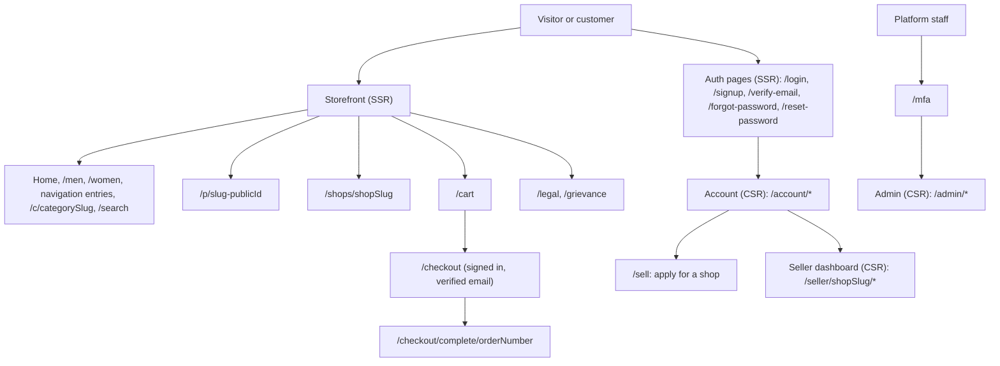

# UI/UX and Design System

Status: Draft v1 (2026-09-26)

Reviewed: critic pass B4 part 1 (2026-09-26)

This document defines how DripNepal looks and behaves on its three surfaces: the public storefront, the seller dashboard and the platform admin. It turns the product requirements ([01](01-product-requirements.md)), the journeys ([02](02-user-journeys-and-acceptance-criteria.md)), the frontend architecture ([03 §6](03-system-architecture.md#6-frontend-architecture)) and the API contract ([06](06-api-design.md)) into pages, components, tokens and layout rules that a team of one or two developers can build and review. It owns the decisions registered against it in [risks-and-open-decisions.md](risks-and-open-decisions.md): VX-12 (NPR display), the UI side of OD-22 and VX-13 (Shadcn UI Kit use), and the accessibility target. The component-copying policy itself is [ADR-0015](adr/0015-ui-foundation-shadcn-and-kit-policy.md).

## Reading guide

| §   | Title                                                | Status in this draft                                                       |
| --- | ---------------------------------------------------- | -------------------------------------------------------------------------- |
| 1   | Design direction                                     | Written                                                                    |
| 2   | Route map and information architecture               | Written                                                                    |
| 3   | Screen inventory by release                          | Written                                                                    |
| 4   | Component inventory                                  | Written                                                                    |
| 5   | Design tokens                                        | Written                                                                    |
| 6   | Responsive and layout rules                          | Written                                                                    |
| 7   | Interaction patterns                                 | Planned (forms, tables, dialogs, toasts, status badges)                    |
| 8   | States                                               | Planned (loading, empty, error, offline, permission-denied)                |
| 9   | Keyboard, focus and WCAG 2.2 AA acceptance checklist | Planned                                                                    |
| 10  | Mobile and slow-network behaviour                    | Planned (JS budget, prefetch, images, fonts)                               |
| 11  | Behaviour specifications                             | Planned (filters, variants, cart changes, checkout recovery, localization) |
| 12  | Maintaining copied shadcn and kit components         | Planned                                                                    |
| 13  | Current-UI remediation list                          | Planned (RF frontend findings to fixes and milestones)                     |

**Labels.** [Confirmed] product-owner answer (canon §1). [Verified-repo] read in the repository at the current branch head. [Verified-doc] read in a primary source or a reviewed DripNepal document. [Assumption] a working value that can change. [Open] waits for an OD-xx decision. [Verify-external] waits for a VX-xx check. External facts cite the research digests and were accessed 2026-09-25 unless stated otherwise.

**Owners of neighbouring rules.** Endpoints, error codes and headers: [06](06-api-design.md) and [openapi.yaml](openapi.yaml). Permissions, 404-versus-403 policy and privacy masking: [07](07-security-threat-model-and-permissions.md). Code layout and lint rules: [09](09-code-structure-and-engineering-standards.md). Test IDs: [10](10-testing-and-quality-gates.md). State names: [05](05-order-payment-and-inventory-lifecycles.md). This document references those rules instead of restating them.

## 1. Design direction

### 1.1 Storefront identity

DripNepal sells three kinds of fashion from many small Nepali shops: streetwear, sneakers and traditional wear. The storefront is **editorial and photo-first**: the product photograph carries the page, and the interface stays quiet around it.

| Principle                         | What it means on screen                                                                                                                                                                                                                                         | Why                                                                                            |
| --------------------------------- | --------------------------------------------------------------------------------------------------------------------------------------------------------------------------------------------------------------------------------------------------------------- | ---------------------------------------------------------------------------------------------- |
| Photo first                       | Product cards are 4:5 portrait images with title, shop name and price below, not on top of the photo. Product detail opens with the gallery. No gradients, glows or text over product photos.                                                                   | Buyers judge colour and fabric from the photo; overlays hide it                                |
| Editorial, not busy               | One serif heading voice (Lora) for page and section titles, a sans body (Noto Sans). Generous white space on listing pages; one accent colour (crimson) used for actions and the brand mark only.                                                               | Three very different styles (sneakers, kurta, hoodie) must look coherent next to each other    |
| Shop visible, marketplace trusted | Every card and product page names the selling shop and links to `/shops/{shopSlug}`. Delivery estimate, return window and COD availability appear before "Add to cart".                                                                                         | A multi-vendor cart splits into shop orders (FR-CHK-004); buyers must know who ships what      |
| Honest commerce                   | No fake countdowns, no invented "only 2 left" counts, no pre-ticked marketing consent. Stock messages come from server data (§4.3 `StockBadge`); listing order has no paid placement (AC-FR-SRCH-001-5).                                                        | FR-IAM-013 consent rule; AC-FR-SRCH-001-5; consumer-protection questions stay with VX-02/VX-04 |
| Fast on a slow phone              | Every decorative effect must justify its bytes against the 250 KB gzip route budget (NFR-PERF-002). The current landing effects (`CursorGlow`, `BackgroundEffects`, `ScrollProgress` under `inertia/pages/landing/components/`) are not used on the storefront. | Most buyers are on mid-range Android phones over mobile data (01 P4, [Assumption])             |

Traditional-wear and sneaker photos are shot on very different backgrounds. Product images therefore always sit on one neutral media surface (`--surface-media`, §5.2) in both themes, so a white studio shot does not glare out of a dark page and a dark street shot does not disappear into it.

### 1.2 Theme policy: light by default, dark supported

**Decision.** The storefront and both dashboards default to the **light** theme. A dark theme is supported and chosen explicitly by the user.

**Why light.** Product photos are colour-critical and most are shot on light backgrounds; a light page shows them as the seller intended. The current code does the opposite: `root_layout.tsx:31` wraps every page in `<ThemeProvider defaultTheme="dark">`, and `theme_provider.tsx` reads `localStorage` and adds the `dark` class inside `useEffect` [Verified-repo]. Because the class is applied only after JavaScript runs, every full page load renders light first and then flips to dark (RF-08, audit A3-09). On a slow phone this flash lasts as long as the JavaScript download. The other half of RF-08 (SSR enabled on the server but not built by Vite, and `createRoot` instead of hydration) is fixed in M0 per [03 §6.1](03-system-architecture.md#61-surfaces-and-rendering-modes); the theme fix below assumes that server HTML is actually rendered and hydrated.

**Mechanism (replaces the `localStorage` theme).**

1. The theme choice (`light`, `dark` or `system`) is stored in a cookie instead of `localStorage`, so the server knows it before rendering. The cookie name and parsing belong to [09](09-code-structure-and-engineering-standards.md) [Assumption].
2. The Edge root template `resources/views/inertia_layout.edge` writes `class="light"` or `class="dark"` and `lang="en"` on `<html>` from that cookie. Today `<html>` has neither [Verified-repo] (RF-25 for `lang`).
3. Only for `system` does the server not know the answer. A three-line inline script in `<head>` reads `matchMedia('(prefers-color-scheme: dark)')` and sets the class before first paint. It carries the per-request CSP nonce (`cspNonce`, [07 §7.3](07-security-threat-model-and-permissions.md#73-csp-and-security-headers)), because `script-src` allows only `'self'` and the nonce. A first-time visitor has no cookie and gets `light`, so the script never runs for them.
4. `ThemeProvider` keeps its React API (`theme`, `setTheme`) but reads its initial value from a page prop and writes the cookie, so the server and client agree and hydration does not mismatch.
5. `sonner`'s `<Toaster>` receives the same theme through its `theme` prop (`'light' | 'dark' | 'system'`, [Verified-repo] `node_modules/sonner/dist/index.d.ts`, sonner 2.0.7).

**Tradeoff.** A cookie is sent with every request (a few bytes) and one tiny inline script is needed for `system`. The cookie holds no personal data and must be readable by client code (so not `HttpOnly`), because `ThemeProvider` writes it [Assumption; 09 sets its attributes]. Rendering the class from a cookie is safe only because anonymous HTML is not edge-cached in R1 ([03 §12.5](03-system-architecture.md#125-caching)); if edge caching of HTML is adopted later, the class must move entirely to the inline script or the cache must vary on the cookie. [07 §5.3](07-security-threat-model-and-permissions.md#53-consent-and-purpose) still lists the theme preference as `localStorage` (Consistency notes item 15). **Verified by:** a browser test that loads a storefront page with JavaScript disabled for each cookie value and checks the `<html>` class (T-UI area, proposed in [10](10-testing-and-quality-gates.md)), and the SSR/hydration check T-ARCH-002 (proposed in [03 §6.1](03-system-architecture.md#61-surfaces-and-rendering-modes)).

### 1.3 The crimson primary and its contrast

`inertia/css/app.css` already defines the brand colour: `--primary: oklch(0.514 0.222 16.935)` in light mode and `oklch(0.455 0.188 13.697)` in dark mode, with `--primary-foreground: oklch(0.969 0.015 12.422)` [Verified-repo]. The contrast ratios below were computed on 2026-09-26 by converting each OKLCH value to sRGB (Björn Ottosson's OKLab matrices) and applying the WCAG 2.x relative-luminance formula. Values are rounded to two decimals; the computation script is not part of the repository, and a token contrast unit test is proposed in §5.10.

| Pair (token on token)                            | sRGB                   | Ratio  | Requirement (WCAG 2.2)           | Result                                                 |
| ------------------------------------------------ | ---------------------- | ------ | -------------------------------- | ------------------------------------------------------ |
| light `--primary` on white `--background`        | `#c70036` on `#ffffff` | 6.06:1 | 4.5:1 text (SC 1.4.3)            | Pass: crimson may be used for text and links           |
| light `--primary-foreground` on `--primary`      | `#fff1f2` on `#c70036` | 5.51:1 | 4.5:1 text                       | Pass: button labels                                    |
| light `--primary` on `--muted`                   | `#c70036` on `#f4f4f5` | 5.50:1 | 4.5:1 text                       | Pass                                                   |
| light `--muted-foreground` on white              | `#71717b` on `#ffffff` | 4.83:1 | 4.5:1 text                       | Pass                                                   |
| light `--muted-foreground` on `--muted`          | `#71717b` on `#f4f4f5` | 4.39:1 | 4.5:1 text                       | **Fail**: secondary text on grey panels                |
| light `--ring` on white                          | `#9f9fa9` on `#ffffff` | 2.63:1 | 3:1 non-text (SC 1.4.11)         | **Fail**, and worse at the `/50` opacity used in `ui/` |
| light `--input` (= `--border`) on white          | `#e4e4e7` on `#ffffff` | 1.27:1 | 3:1 for an input's only boundary | **Fail** for text inputs                               |
| light `--destructive` on white                   | `#e7000b` on `#ffffff` | 4.76:1 | 4.5:1 text                       | Pass                                                   |
| dark `--primary` on dark `--background`          | `#a50036` on `#09090b` | 2.51:1 | 4.5:1 text, 3:1 non-text         | **Fail**: crimson text or icons in dark mode           |
| dark `--primary-foreground` on dark `--primary`  | `#fff1f2` on `#a50036` | 7.20:1 | 4.5:1 text                       | Pass: filled buttons are fine                          |
| dark `--muted-foreground` on dark `--background` | `#9f9fa9` on `#09090b` | 7.56:1 | 4.5:1 text                       | Pass                                                   |

**Consequences** (token changes in §5.2): crimson is safe as the light-mode action and link colour; dark mode needs a separate, lighter crimson for text, links and focus rings; `--muted-foreground` darkens slightly; `--ring` and `--input` get values that reach 3:1. The filled primary button keeps the existing crimson in both themes.

### 1.4 Seller and admin direction: dense, efficient, keyboard-first

The dashboards are tools used many times a day by a few people. They follow the `radix-nova` style as installed, whose visual style is described by shadcn as "reduced padding and margins for compact layouts" [Verified-doc <https://ui.shadcn.com/docs/changelog/2025-12-shadcn-create>].

| Rule                                     | Mechanism                                                                                                                                                                                                                                                                                       |
| ---------------------------------------- | ----------------------------------------------------------------------------------------------------------------------------------------------------------------------------------------------------------------------------------------------------------------------------------------------- |
| Dense by default                         | Tables with 40 px rows on desktop, filters in one bar above the table, detail views with the action panel on the right (desktop) or at the bottom (phone).                                                                                                                                      |
| Keyboard-first                           | Every action is reachable with Tab and Enter; row actions sit in a menu button, never behind hover; the list's search input is the first focusable element after the page heading. A `Ctrl/⌘ K` command menu (existing `ui/command.tsx`) jumps between pages [Assumption: R1 Should, not Must]. |
| Phone-capable for the vendor's core loop | Accepting, rejecting, marking shipped and recording COD collection work at 360 px width, because many vendors run their shop from a phone [Assumption, 01 §3.1]. Heavy editing (variants, media ordering) is desktop-first but must still work at 360 px.                                       |
| One colour for danger                    | `--destructive` only for irreversible actions (reject, block, suspend, anonymize); state colours come from `StatusBadge` (§4.3), not ad-hoc classes.                                                                                                                                            |
| No decoration                            | No hero images, charts only where FR-ADM-007 asks for numbers; R1 uses stat tiles plus tables and no chart library [Assumption, keeps dashboard JS under the 500 KB gzip budget of NFR-PERF-002].                                                                                               |

## 2. Route map and information architecture

### 2.1 Surfaces at a glance

Routes come from canon §6.4, the additions in [03 §6.1](03-system-architecture.md#61-surfaces-and-rendering-modes) (marked † there) and the page routes proposed in [06 §2.3](06-api-design.md#23-page-routes-this-document-adds). Rendering mode follows [ADR-0003](adr/0003-inertia-ssr-storefront-csr-dashboards.md): SSR with hydration for storefront, auth and payment-return pages; client-side rendering for account, seller and admin pages. Page component names use a surface prefix (`storefront/`, `auth/`, `payments/`, `account/`, `seller/`, `admin/`) because the `ssr.pages` filter sketched in 03 §6.1 selects SSR pages by that prefix.



Every page link in the header, footer and dashboard navigation is generated from named routes through the typed client ([09](09-code-structure-and-engineering-standards.md)); hard-coded paths such as the current slug-less `/shop/*` sidebar links are what broke navigation in RF-01.

### 2.2 Storefront and public pages

"Reads" are the operations whose query also feeds the page's Inertia props ([06 §2.1](06-api-design.md#21-reads-are-props-writes-are-json-adr-0004)); "Writes" are the `/api/v1` operations the page calls. ⚷ marks operations that require an `Idempotency-Key`, ⟳ those that require `If-Match` (canon §6.5).

| Route                                                                                      | Page component                 | Reads                                                                           | Writes                                                                        | Release · milestone | Route status                                                |
| ------------------------------------------------------------------------------------------ | ------------------------------ | ------------------------------------------------------------------------------- | ----------------------------------------------------------------------------- | ------------------- | ----------------------------------------------------------- |
| `/`                                                                                        | `storefront/home`              | `listProducts` (curated query), `listCategories`                                | none                                                                          | R1 · M4             | Canon §6.4                                                  |
| `/men`, `/women`                                                                           | `storefront/listing`           | `listProducts`, `listCategories`, `listAttributes`                              | none                                                                          | R1 · M4             | Canon §6.4                                                  |
| `/men/{navSlug}`, `/women/{navSlug}` (fixed list in `navigation.ts`, e.g. `/men/t-shirts`) | `storefront/listing`           | as above, filter preset from the navigation entry                               | none                                                                          | R1 · M4             | 03 §6.1 † (proposed; not yet in canon §6.4)                 |
| `/c/{categorySlug}`                                                                        | `storefront/listing`           | as above                                                                        | none                                                                          | R1 · M4             | Canon §6.4                                                  |
| `/search?q=`                                                                               | `storefront/listing`           | `listProducts` with `q`                                                         | none                                                                          | R1 · M4             | Canon §6.4                                                  |
| `/p/{productSlug}-{publicId}`                                                              | `storefront/product`           | `getProduct`                                                                    | `addCartItem`                                                                 | R1 · M4 (cart M5)   | Canon §6.4 (01, 04 and ADR-0017 write `{slug}`; same route) |
| `/shops/{shopSlug}`                                                                        | `storefront/shop`              | `getPublicShop`, `listProducts` (shop filter)                                   | none                                                                          | R1 · M4             | Canon §6.4                                                  |
| `/cart`                                                                                    | `storefront/cart`              | `getCart`                                                                       | `updateCartItem`, `removeCartItem`                                            | R1 · M5             | Canon §6.4                                                  |
| `/checkout`                                                                                | `storefront/checkout`          | `getCart`, `listAddresses`, `listProvinces`, `listDistricts`, `listLocalLevels` | `createAddress`, `quoteCheckout`, `placeOrder` ⚷; R1.1: `startOrderPayment` ⚷ | R1 · M5             | Canon §6.4                                                  |
| `/checkout/complete/{orderNumber}`                                                         | `storefront/checkout_complete` | `getMyOrder`                                                                    | none                                                                          | R1 · M5             | Canon §6.4                                                  |
| `/legal`                                                                                   | `storefront/legal`             | `platform_legal_disclosures` setting (FR-ADM-011)                               | none                                                                          | R1 · M7             | 06 §2.3 (proposed; not yet in canon §6.4)                   |
| `/legal/{documentSlug}` for terms, privacy and the return and refund policy                | `storefront/legal_document`    | static policy content [Assumption: versioned files in the repo, owner OD-07]    | none                                                                          | R1 · M7             | (proposed here; not yet in canon §6.4)                      |
| `/grievance`                                                                               | `storefront/grievance`         | `platform_legal_disclosures.grievance_officer`                                  | signed-in users link to `/account/support` (`openSupportCase`)                | R1 · M7             | 03 §6.1 † (proposed; not yet in canon §6.4)                 |
| `/payments/{provider}/return`                                                              | `payments/return`              | server-side status lookup, then order summary                                   | none (polls with `router.reload`)                                             | R1.1 · M8           | 03 §6.1 and 06 §12.2 (proposed; not yet in canon §6.4)      |

Unknown paths return the 404 page; there is no catch-all route (AC-FR-SRCH-007-1, RF-02). `/design-system` becomes development-only (RF-40).

### 2.3 Auth pages

| Route              | Page component         | Writes                                                                                 | Notes                                                                                                                                                                                                                                            |
| ------------------ | ---------------------- | -------------------------------------------------------------------------------------- | ------------------------------------------------------------------------------------------------------------------------------------------------------------------------------------------------------------------------------------------------ |
| `/login`           | `auth/login`           | `logIn`                                                                                | Accepts `?return_to=` only as a same-origin relative path (AC-J00-02). Email only, so the label says "Email", not "Email or Phone" (RF-12).                                                                                                      |
| `/signup`          | `auth/signup`          | `signUp`                                                                               | Same response for new and existing emails (AC-FR-IAM-001-2).                                                                                                                                                                                     |
| `/verify-email`    | `auth/verify_email`    | `confirmEmail`, `resendEmailVerification`                                              | Linked from checkout and `/sell` when the API answers `EMAIL_NOT_VERIFIED`.                                                                                                                                                                      |
| `/forgot-password` | `auth/forgot_password` | `requestPasswordReset`                                                                 | Same confirmation for every email.                                                                                                                                                                                                               |
| `/reset-password`  | `auth/reset_password`  | `resetPassword`                                                                        | Token from the email link; `Referrer-Policy: no-referrer` ([07 §7.3](07-security-threat-model-and-permissions.md#73-csp-and-security-headers)).                                                                                                  |
| `/mfa`             | `auth/mfa`             | `verifyMfaChallenge`; first-time staff: `startTotpEnrollment`, `confirmTotpEnrollment` | A staff member without enrolment is sent to enrolment before `/admin` ([07 §3.9](07-security-threat-model-and-permissions.md#39-mfa-totp-for-platform-staff)). One code field with `autocomplete="one-time-code"` that accepts paste (SC 3.3.8). |

All M1 (R1). Rendering is SSR with hydration [Assumption in 03 §6.1].

### 2.4 Account pages (customer)

| Route                                               | Page component                            | Reads                                    | Writes                                                                                                                     | Release · milestone    | Route status                              |
| --------------------------------------------------- | ----------------------------------------- | ---------------------------------------- | -------------------------------------------------------------------------------------------------------------------------- | ---------------------- | ----------------------------------------- |
| `/account`                                          | `account/overview`                        | `getMe`                                  | `updateMe` (name, phone, marketing consent FR-IAM-013)                                                                     | R1 · M1                | Canon §6.4                                |
| `/account/orders`                                   | `account/orders`                          | `listMyOrders`                           | none                                                                                                                       | R1 · M6                | Canon §6.4                                |
| `/account/orders/{orderNumber}`                     | `account/order`                           | `getMyOrder`                             | `cancelMyShopOrder` ⚷; `openSupportCase` (from a shop order); R1.1: `startOrderPayment` ⚷ (retry)                          | R1 · M6                | Canon §6.4                                |
| `/account/addresses`                                | `account/addresses`                       | `listAddresses`, `listProvinces`         | `createAddress`, `updateAddress`, `deleteAddress`; `listDistricts`, `listLocalLevels` as JSON cascades                     | R1 · M1                | Canon §6.4                                |
| `/account/security`                                 | `account/security`                        | `getMe`                                  | `changePassword`, `revokeAllSessions`, `requestAccountDeletion`; R2 owners: `startTotpEnrollment`, `confirmTotpEnrollment` | R1 · M1                | Canon §6.4                                |
| `/account/shops`                                    | `account/shops`                           | `listMyShopApplications`, `listMyShops`  | `resubmitShopApplication`                                                                                                  | R1 · M2                | Canon §6.4                                |
| `/account/support`, `/account/support/{caseNumber}` | `account/support`, `account/support_case` | `listMySupportCases`, `getMySupportCase` | `openSupportCase`, `replyToMySupportCase`                                                                                  | R1 (milestone from 12) | 06 §2.3 (proposed; not yet in canon §6.4) |
| `/sell`                                             | `account/sell`                            | `getCurrentSellerAgreement`              | `applyForShop`; after the shop exists, `createMediaUpload` and `completeMediaUpload` with `kind=kyc_document`              | R1 · M2                | Canon §6.4                                |
| `/invitations/{token}`                              | `account/invitation`                      | invitation summary (props)               | `acceptShopInvitation`                                                                                                     | R1 · M2                | Canon §6.4                                |

Customer returns in R1 are support-mediated (FR-RET-006): the customer sees return and refund progress on the order page, not on a separate route. Self-serve return screens are R2 (§3.3).

### 2.5 Seller dashboard (`/seller/{shopSlug}/…`)

The prefix is canon's choice, recommended in OD-12 but still [Open OD-12]; the repository uses `/shop/:shopSlug` today (`start/routes/shops.ts:27` [Verified-repo per 03 §6.1]). Every page resolves `{shopSlug}` on the server and checks membership, permission and shop status before loading data ([06 §4.4](06-api-design.md#44-seller-authorization-algorithm), [07 §4.4](07-security-threat-model-and-permissions.md#44-status-gating)).

| Route (after `/seller/{shopSlug}`) | Page component         | Reads                                                                                                         | Writes                                                                                                                                                                             | Release · milestone                       | Route status                              |
| ---------------------------------- | ---------------------- | ------------------------------------------------------------------------------------------------------------- | ---------------------------------------------------------------------------------------------------------------------------------------------------------------------------------- | ----------------------------------------- | ----------------------------------------- |
| (root): overview                   | `seller/overview`      | `getSellerShop`, `getShopBalance`, order counts from `listShopOrders`; `usePoll` new-order count (FR-NOT-003) | none                                                                                                                                                                               | R1 · M2 (counts M6)                       | Canon §6.4                                |
| `/products`                        | `seller/products`      | `listShopProducts`                                                                                            | `publishProduct`, `unpublishProduct`, `archiveProduct`, `restoreProduct` (row actions)                                                                                             | R1 · M3                                   | Canon §6.4                                |
| `/products/new`                    | `seller/product_new`   | `listCategories`, `listAttributes`                                                                            | `createProduct` ⚷                                                                                                                                                                  | R1 · M3                                   | Canon §6.4                                |
| `/products/{productId}`            | `seller/product_edit`  | `getShopProduct`                                                                                              | `updateProduct` ⟳, `replaceProductVariants` ⟳, `createMediaUpload`, `completeMediaUpload`, `replaceProductMedia` ⟳, `submitProductForReview`, `publishProduct`                     | R1 · M3                                   | Canon §6.4                                |
| `/inventory`                       | `seller/inventory`     | `listInventory`                                                                                               | `adjustInventory` ⚷, `stocktakeInventory` ⚷                                                                                                                                        | R1 · M3                                   | Canon §6.4                                |
| `/orders`                          | `seller/orders`        | `listShopOrders`                                                                                              | `acceptShopOrder` ⚷ (row shortcut)                                                                                                                                                 | R1 · M6                                   | Canon §6.4                                |
| `/orders/{shopOrderNumber}`        | `seller/order`         | `getShopOrder`                                                                                                | `acceptShopOrder` ⚷, `rejectShopOrder` ⚷, `recordFulfillmentEvent` ⚷ (including the shipped → shipped tracking correction, proposed; not yet in canon §9), `recordCodCollection` ⚷ | R1 · M6                                   | Canon §6.4                                |
| `/shipping`                        | `seller/shipping`      | `getShopShipping`                                                                                             | `replaceShopShipping` ⟳                                                                                                                                                            | R1 · M2                                   | Canon §6.4                                |
| `/staff`                           | `seller/staff`         | `listMembers`                                                                                                 | `inviteMember`, `revokeInvitation`, `changeMemberRole`, `removeMember`                                                                                                             | R1 · M2                                   | Canon §6.4                                |
| `/finance`                         | `seller/finance`       | `getShopBalance`, `listShopLedgerEntries`, `listShopPayouts`, `getPayoutAccount` (owner)                      | `replacePayoutAccount` (owner)                                                                                                                                                     | R1 · M7 (payout account M2, payouts R1.1) | Canon §6.4                                |
| `/settings`                        | `seller/settings`      | `getSellerShop`                                                                                               | `updateShopProfile` ⟳, `createMediaUpload` and `completeMediaUpload` for logo and banner (FR-MED-003)                                                                              | R1 · M2                                   | Canon §6.4                                |
| `/returns`                         | `seller/returns`       | `listShopReturns`                                                                                             | `recordReturnReceived` ⚷, `markReturnInTransit` (proposed; not yet in canon §6.5)                                                                                                  | R1 (milestone from 12)                    | 06 §2.3 (proposed; not yet in canon §6.4) |
| `/support-cases`                   | `seller/support_cases` | `listShopSupportCases`                                                                                        | `replyToShopSupportCase`                                                                                                                                                           | R1 (milestone from 12)                    | 06 §2.3 (proposed; not yet in canon §6.4) |

The shop switcher in the dashboard header lists owned and member shops from the `seller_shops` shared prop (FR-SHOP-006, [03 §6.3](03-system-architecture.md#63-dashboards-assessment-seller-and-admin)); switching changes the `{shopSlug}` segment and keeps the sub-page when the member has the permission for it, else lands on the overview.

### 2.6 Admin (`/admin/…`)

Every admin page needs a platform staff session with a fresh MFA verification; other users get 404 ([06 §2.2](06-api-design.md#22-surfaces), [07 §4.4](07-security-threat-model-and-permissions.md#44-status-gating)).

| Route (after `/admin`)                          | Page component                              | Reads                                                                                                                                                         | Writes                                                                                                                                                                                                                                         | Release · milestone       | Route status                              |
| ----------------------------------------------- | ------------------------------------------- | ------------------------------------------------------------------------------------------------------------------------------------------------------------- | ---------------------------------------------------------------------------------------------------------------------------------------------------------------------------------------------------------------------------------------------- | ------------------------- | ----------------------------------------- |
| (root): overview                                | `admin/overview`                            | queue counts from `listShopApplications`, `listModerationQueue`, `listSupportCases`, `adminListOrders` (FR-ADM-001); basic GMV and order numbers (FR-ADM-007) | none                                                                                                                                                                                                                                           | R1 · M7                   | Canon §6.4                                |
| `/shop-applications`                            | `admin/shop_applications`                   | `listShopApplications`                                                                                                                                        | `approveShopApplication`, `rejectShopApplication`                                                                                                                                                                                              | R1 · M2                   | Canon §6.4                                |
| `/shops`                                        | `admin/shops`                               | `listShops`                                                                                                                                                   | `suspendShop`, `reinstateShop`, `adminUpdateShop`, `verifyPayoutAccount` (proposed; not yet in canon §6.5)                                                                                                                                     | R1 · M2                   | Canon §6.4                                |
| `/products/moderation`                          | `admin/moderation`                          | `listModerationQueue`                                                                                                                                         | `approveProduct`, `rejectProduct`, `blockProduct`, `unblockProduct` (proposed; not yet in canon §6.5)                                                                                                                                          | R1 · M3                   | Canon §6.4                                |
| `/orders`                                       | `admin/orders`                              | `adminListOrders`                                                                                                                                             | none                                                                                                                                                                                                                                           | R1 · M7                   | Canon §6.4                                |
| `/orders/{orderNumber}`                         | `admin/order`                               | `adminGetOrder`                                                                                                                                               | `adminCancelShopOrder` ⚷, `addOrderNote`, `createReturnRequest` ⚷, `createRefund` ⚷, `adminRecordFulfillmentEvent` and `adminRecordCodCollection` (proposed; not yet in canon §6.5); R1.1: `resolvePaymentReview`, `recheckPayment` (proposed) | R1 · M7                   | (proposed here; not yet in canon §6.4)    |
| `/users`                                        | `admin/users`                               | `listUsers`                                                                                                                                                   | none                                                                                                                                                                                                                                           | R1 · M7                   | Canon §6.4                                |
| `/users/{userId}`                               | `admin/user`                                | `getUser`                                                                                                                                                     | `suspendUser`, `reinstateUser`, `anonymizeUser`                                                                                                                                                                                                | R1 · M7                   | (proposed here; not yet in canon §6.4)    |
| `/refunds`                                      | `admin/refunds`                             | refund queue (page props; canon §6.5 has no refund list operation)                                                                                            | `approveRefund` ⚷, `markRefundSucceeded` ⚷, `retryRefund` ⚷, `startRefundTransfer` and `cancelRefund` (proposed); R1.1: `resolveRefundReview` (proposed)                                                                                       | R1 · M7                   | Canon §6.4                                |
| `/ledger`                                       | `admin/ledger`                              | `adminListLedgerEntries`                                                                                                                                      | `createLedgerAdjustment` ⚷, `recordVendorRemittance` ⚷                                                                                                                                                                                         | R1 · M7                   | Canon §6.4                                |
| `/payouts`                                      | `admin/payouts`                             | `listPayouts`                                                                                                                                                 | `createPayout` ⚷, `approvePayout` ⚷, `markPayoutPaid` ⚷, `markPayoutFailed` ⚷                                                                                                                                                                  | R1.1 · M8                 | Canon §6.4                                |
| `/audit-logs`                                   | `admin/audit_logs`                          | `listAuditLogs`                                                                                                                                               | none                                                                                                                                                                                                                                           | R1 · M7                   | Canon §6.4                                |
| `/staff`                                        | `admin/staff`                               | `listPlatformStaff`                                                                                                                                           | `setPlatformStaffRole`, `revokePlatformStaff`                                                                                                                                                                                                  | R1 · M1                   | Canon §6.4                                |
| `/catalog`                                      | `admin/catalog`                             | `adminListCategories` and the attribute and brand lists                                                                                                       | create and update operations (R2)                                                                                                                                                                                                              | R2 · M9 (R1 uses seeders) | Canon §6.4                                |
| `/support-cases`, `/support-cases/{caseNumber}` | `admin/support_cases`, `admin/support_case` | `listSupportCases`, `adminGetSupportCase`                                                                                                                     | `updateSupportCase`, `addSupportCaseMessage`                                                                                                                                                                                                   | R1 (milestone from 12)    | 06 §2.3 (proposed; not yet in canon §6.4) |
| `/returns`                                      | `admin/returns`                             | returns queue (props)                                                                                                                                         | `createReturnRequest` ⚷, `approveReturnRequest`, `rejectReturnRequest`, `adminRecordReturnReceived` ⚷, `markReturnInTransit`, `closeReturnRequest`, `rejectReturnAfterInspection` (last three proposed), `createRefund` ⚷                      | R1 (milestone from 12)    | 06 §2.3 (proposed; not yet in canon §6.4) |
| `/settings`                                     | `admin/settings`                            | `listPlatformSettings`                                                                                                                                        | `updatePlatformSetting` (including `checkout_enabled`, `maintenance_banner` and `platform_legal_disclosures`)                                                                                                                                  | R1 · M7                   | 06 §2.3 (proposed; not yet in canon §6.4) |

The admin order and user detail routes are proposed here because `adminGetOrder` and `getUser` are single-resource reads that support staff need to link from cases, notes and audit entries; a sheet on the list page would have no shareable URL.

### 2.7 Global navigation and help placement

- **Storefront header** (every page, in this order): brand mark → primary navigation (Men, Women, categories from `navigation.ts`) → search → account → cart with item count. The cart entry is visible at every width, including below 640 px; today the cart and profile buttons are `hidden sm:block` (`inertia/components/navbar/index.tsx:126` and `:144` [Verified-repo]), so phones have no cart entry (RF-28, AC-J00-06).
- **Storefront footer** (every page, same order): help and support (`/account/support`, or `/grievance` for guests), return and refund policy, legal disclosures (`/legal`, AC-FR-ADM-011-1), grievance officer (`/grievance`), terms and privacy. Help is always in the same relative position in the header menu and footer, and on the checkout steps, to meet WCAG 2.2 SC 3.2.6 Consistent Help [Verified-doc <https://www.w3.org/TR/WCAG22/>].
- **Kill-switch banner** (FR-ADM-010): when `checkout_enabled = false`, every storefront page shows the `maintenance_banner` setting text (≤ 280 characters, [04a §15.1](04a-data-dictionary-tables.md#151-platform_settings)) directly below the header within 60 seconds of the change (AC-FR-ADM-010-1, AC-J00-11), and the checkout page shows it instead of the place-order action (AC-FR-CHK-001-4). If the setting is empty, a fixed default message from the message catalog is shown [Assumption]. Component: `SiteBanner`, §4.3.
- **Seller dashboard**: sidebar with Overview, Orders, Products, Inventory, Returns, Support cases, Finance, Shipping, Staff, Settings, filtered by the member's permissions ([07 §4.3](07-security-threat-model-and-permissions.md#43-shop-roles-and-permissions)); shop switcher and account menu in the header; a "Help" link in the same header position on every dashboard page.
- **Admin**: sidebar grouped as Queues (overview, shop applications, moderation, support cases, returns, refunds), Records (orders, users, shops, ledger, payouts, audit logs) and Platform (staff, settings, catalog). Links the staff member's role cannot use are hidden; the server still enforces every permission (UI hides, server decides; §11 when written).

## 3. Screen inventory by release

Each row gives the screen's purpose, its primary actions, the data it shows and the states it must design for beyond the generic loading, empty and error states of §8. Release and milestone follow canon §3–§4 and [01](01-product-requirements.md); "milestone from 12" marks pages whose milestone is not in canon §4 and is assigned by [12](12-roadmap-and-backlog.md). State names in the "Key states" column are the [05](05-order-payment-and-inventory-lifecycles.md) values; their human labels are defined with the status-badge pattern in §7.

### 3.1 R1 MVP (M1–M7)

**Storefront and checkout (J-01 to J-05)**

| Screen                                                                       | Purpose                                                           | Primary actions                                                                                  | Data shown                                                                                                                                                                             | Key states                                                                                                                                                                                                                                                   | Trace                                     |
| ---------------------------------------------------------------------------- | ----------------------------------------------------------------- | ------------------------------------------------------------------------------------------------ | -------------------------------------------------------------------------------------------------------------------------------------------------------------------------------------- | ------------------------------------------------------------------------------------------------------------------------------------------------------------------------------------------------------------------------------------------------------------ | ----------------------------------------- |
| Home `/`                                                                     | Entry and discovery for streetwear, sneakers and traditional wear | Go to a navigation entry, category, shop or product; search                                      | Curated product rows, category tiles, featured shops; only published products of active shops                                                                                          | Few products at launch (under 50 shops, [Confirmed] Q1): rows collapse instead of showing gaps; kill-switch banner                                                                                                                                           | J-01, FR-SRCH-001, FR-SRCH-007            |
| Listing `/men`, `/women`, navigation entries, `/c/{categorySlug}`, `/search` | Browse with filters, sort and page state in the URL               | Filter (category subtree, audience, size, colour, price, brand, shop, in stock), sort, next page | Product cards: image, title, shop, price, compare-at price, stock badge; total count (capped)                                                                                          | No results with active filters (offer "clear filters"); invalid parameter dropped by canonical redirect (AC-FR-SRCH-001-3); search with `q` outside the proposed 2–100 characters ([07](07-security-threat-model-and-permissions.md) TM-24, [Assumption])    | J-01, FR-SRCH-001/002/007                 |
| Product `/p/{productSlug}-{publicId}`                                        | Decide and add the right variant                                  | Choose each option axis, choose quantity, add to cart, open the shop                             | Gallery, title, shop, price of the chosen variant, compare-at price, delivery estimate, return window, COD availability, FR-CAT-012 disclosures (brand, material, origin and the rest) | Sold-out option (shown, not selectable, not colour-only, AC-FR-SRCH-004-2); whole product sold out; incomplete selection (add disabled, AC-FR-SRCH-004-3); old slug → 301                                                                                    | J-02, FR-SRCH-004, FR-CAT-012, FR-MED-002 |
| Shop `/shops/{shopSlug}`                                                     | See one shop's range and policies                                 | Filter and sort within the shop, open products                                                   | Logo, banner, description, policies, delivery coverage, product grid                                                                                                                   | Shop not active → 404 page (products hidden, [07 §4.4](07-security-threat-model-and-permissions.md#44-status-gating)); renamed slug → 301                                                                                                                    | J-01, FR-SRCH-003                         |
| Cart `/cart` and cart drawer                                                 | Review items grouped by shop before checkout                      | Change quantity (1 to min(10, available)), remove, go to checkout                                | Lines grouped by shop (`CartShopGroup`), per-shop subtotal and shipping estimate, cart total (savings shown, never subtracted twice, AC-FR-CART-003-2)                                 | Revalidation notices: price changed, variant unavailable, quantity reduced (FR-CART-002); guest cart; empty cart                                                                                                                                             | J-03, FR-CART-001/002/003                 |
| Checkout `/checkout` (steps: address → delivery and payment → review)        | Place one order that splits into shop orders                      | Choose or add an address, see per-shop shipping, choose COD, review, place order                 | Address book, location cascade, quote per shop (items, shipping, COD amount due per parcel), totals                                                                                    | `EMAIL_NOT_VERIFIED` (link to `/verify-email`), address not covered (`DELIVERY_NOT_AVAILABLE`), `PRICE_CHANGED`, `OUT_OF_STOCK`, `CART_CHANGED`, `COD_LIMIT_EXCEEDED`, checkout disabled (503 `PROVIDER_UNAVAILABLE`), timeout → "checking your order" (§11) | J-05, FR-CHK-001 to 005, 007              |
| Order placed `/checkout/complete/{orderNumber}`                              | Confirm what happens next                                         | Go to order, continue shopping                                                                   | Order number, one block per shop order with expected acceptance and delivery, COD amount per parcel                                                                                    | Reloaded after placement (same order, idempotent); another user's order number → 404                                                                                                                                                                         | J-05, FR-CHK-004                          |
| Legal `/legal`, policy pages, `/grievance`                                   | Required disclosures and complaint route                          | Contact the grievance officer, open a support case                                               | Values from `platform_legal_disclosures`; grievance officer details                                                                                                                    | Missing setting value shows "not yet published", never a blank field [Assumption]                                                                                                                                                                            | J-19, FR-ADM-009, FR-ADM-011              |

**Auth and account (J-04, J-07, J-17, J-18, J-19)**

| Screen                                  | Purpose                                        | Primary actions                                                                        | Data shown                                                                                                                                                                                      | Key states                                                                                                                                                                                                                                                                            | Trace                          |
| --------------------------------------- | ---------------------------------------------- | -------------------------------------------------------------------------------------- | ----------------------------------------------------------------------------------------------------------------------------------------------------------------------------------------------- | ------------------------------------------------------------------------------------------------------------------------------------------------------------------------------------------------------------------------------------------------------------------------------------- | ------------------------------ |
| Sign up, log in                         | Create an account, sign in                     | Submit; show password; go to reset                                                     | Form fields with `autocomplete` tokens; unticked marketing consent and age confirmation                                                                                                         | `RATE_LIMITED` with wait time (AC-J00-04); suspended account message; paste and password managers allowed (SC 3.3.8)                                                                                                                                                                  | J-04, FR-IAM-001/003/013       |
| Verify email, forgot and reset password | Recover access and verify email                | Resend, submit new password                                                            | Generic confirmations that reveal nothing about the account                                                                                                                                     | Expired or used token; resend cooldown                                                                                                                                                                                                                                                | J-04, J-18, FR-IAM-002/004     |
| MFA `/mfa`                              | Staff second factor and first enrolment        | Enter code; scan QR or copy secret once                                                | QR code, secret (enrolment only)                                                                                                                                                                | Lockout after more than 5 failures in 5 minutes for 15 minutes (AC-FR-IAM-007-4)                                                                                                                                                                                                      | J-16, FR-IAM-007               |
| Account overview, security              | Profile, consent, password, sessions, deletion | Save profile, change password, sign out everywhere, request deletion                   | Name, email, phone (masked), consent status                                                                                                                                                     | Deletion request pending; step-up not needed for customers                                                                                                                                                                                                                            | J-17, J-18, FR-IAM-005/009/013 |
| Addresses                               | Maintain the address book                      | Add, edit, set default, archive                                                        | Province, district, local level, ward, area or tole, landmark; phone last four digits in lists                                                                                                  | Limit of 10 active addresses [Assumption, AC-FR-IAM-012-4]; archived address kept on past orders                                                                                                                                                                                      | J-05, FR-IAM-012               |
| My orders, order detail                 | Track and act on each shop order               | Cancel a shop order before acceptance, open a support case, (R1.1) retry payment       | Per shop order: status, items, shipment timeline, tracking link, COD amount, return and refund progress                                                                                         | `awaiting_acceptance` (cancel allowed), `accepted`, `rejected` (whole or item-level), `cancelled`, `completed`; shipment `delivery_failed`, `returning`, `returned_to_origin`; late-delivery flag (not a state, [05 §6.1](05-order-payment-and-inventory-lifecycles.md#61-shoporder)) | J-07, FR-ORD-001/002           |
| Support cases (proposed route)          | Raise and follow a complaint or question       | Open a case (category, order link), reply                                              | Case number, status, due date, messages visible to the customer                                                                                                                                 | Case overdue against its 15-day due date is visible to staff, not shown as a warning to the customer [Assumption]                                                                                                                                                                     | J-19, J-20, FR-ADM-009         |
| Sell `/sell`, my shops                  | Apply for a shop and follow the application    | Fill shop details, accept the seller agreement version, upload KYC documents, resubmit | Shop name (2–60), slug (3–40, `[a-z0-9-]`, live preview of `/shops/{slug}`, reserved words refused), contact, pickup address, business type, registration and PAN/VAT fields (AC-FR-SHOP-001-3) | `EMAIL_NOT_VERIFIED`; slug taken or reserved (inline error); `pending_review`, `rejected` with reason (resubmit), `active` (link to dashboard)                                                                                                                                        | J-08, FR-SHOP-001/013/014      |
| Invitation `/invitations/{token}`       | Join a shop as staff                           | Accept                                                                                 | Shop name, offered role                                                                                                                                                                         | Email mismatch 403 `FORBIDDEN`, already a member 409 `CONFLICT`, expired or revoked token ([07](07-security-threat-model-and-permissions.md) decision on J-09)                                                                                                                        | J-09, FR-SHOP-005              |

**Seller dashboard (J-08 to J-13, J-15)**

| Screen                                   | Purpose                                                | Primary actions                                                                                                                                                                                                              | Data shown                                                                                                                                                                                                     | Key states                                                                                                                                                                                                                                                                                                                | Trace                                                  |
| ---------------------------------------- | ------------------------------------------------------ | ---------------------------------------------------------------------------------------------------------------------------------------------------------------------------------------------------------------------------- | -------------------------------------------------------------------------------------------------------------------------------------------------------------------------------------------------------------- | ------------------------------------------------------------------------------------------------------------------------------------------------------------------------------------------------------------------------------------------------------------------------------------------------------------------------- | ------------------------------------------------------ |
| Overview                                 | Know what needs doing today                            | Go to orders awaiting acceptance, low-stock items, open cases                                                                                                                                                                | Counts by shop-order status, acceptance deadlines, balance (can be negative: vendor owes commission, [Confirmed] canon §1)                                                                                     | Shop `pending_review` or `rejected` (profile only), `suspended` with mode `fulfill_existing` or `frozen`, `closed`; agreement not accepted blocks publishing (INV-18)                                                                                                                                                     | J-08, J-12, FR-NOT-003                                 |
| Orders list, order detail                | Process each shop order within the 48 h acceptance SLA | Accept, reject whole or items (reason `cannot_fulfil` and others from 05), mark packed, mark shipped with courier and tracking, mark delivered or failed, reattempt, return to origin, record COD collected or not collected | Items, recipient (masked outside the contact window, [07 §5.2](07-security-threat-model-and-permissions.md#52-vendor-visibility-of-customer-contact-data)), acceptance due time, shipment timeline, COD amount | ShopOrder `awaiting_acceptance`, `accepted`, `rejected`, `cancelled`, `completed`; Shipment `pending`, `packed`, `shipped`, `delivered`, `delivery_failed`, `returning`, `returned_to_origin`; COD `awaiting_collection`, `collected`, `not_collected`, `cancelled`; `INVALID_STATE_TRANSITION` after a concurrent change | J-12, J-13, FR-ORD-003, FR-FUL-001/002/003, FR-PAY-001 |
| Products list, new, edit                 | Create, complete and publish listings                  | Save draft, edit variants and option axes, upload and order images with alt text, submit for review or publish, unpublish, archive, restore                                                                                  | Title (3–120, AC-FR-CAT-003-1), description, leaf category, brand, disclosures, variants with SKU, price, compare-at price, media with processing status, `missing_for_submit` list                            | Product `draft`, `pending_review`, `published`, `rejected` (with reason), `unpublished`, `archived`, `blocked`; `VERSION_CONFLICT` 412 on a stale edit (FR-CAT-011); media `rejected` with reason                                                                                                                         | J-10, FR-CAT-003 to 007, 011, 012, FR-MED-001/002      |
| Inventory                                | Keep stock right                                       | Adjust with a reason, stocktake with an expected value                                                                                                                                                                       | Per variant: on hand, reserved, available                                                                                                                                                                      | Stocktake conflict (expected value changed meanwhile); adjustment below reserved refused                                                                                                                                                                                                                                  | J-11, FR-INV-001/003                                   |
| Shipping, settings, staff                | Configure the shop                                     | Edit coverage and zone rates, edit profile, logo and banner, invite, change role, remove, revoke                                                                                                                             | Zones and rates, delivery estimate days (0–30), members and invitations with roles                                                                                                                             | Member limit reached (`CONFLICT`); owner row cannot be removed; suspended shop may still remove members and revoke invitations (proposed in 07 §4.4)                                                                                                                                                                      | J-08, J-09, FR-SHOP-003/004/005                        |
| Finance                                  | See what the shop owes or is owed                      | Filter ledger entries, (owner) add or replace the payout account                                                                                                                                                             | Balance, ledger entries with type and reference, remittances; payout account masked to the last 4 digits and its verification status                                                                           | Negative balance (commission owed) shown as an amount owed, not in red only; payout account unverified                                                                                                                                                                                                                    | J-15, FR-LED-003, FR-SHOP-010                          |
| Returns, support cases (proposed routes) | Handle support-mediated returns and case replies       | Mark return in transit (proposed), record return received, reply to a case                                                                                                                                                   | Return items, reason, return status; case thread visible to the shop                                                                                                                                           | Return `requested`, `approved`, `in_transit`, `received`, `closed`, `rejected`, `rejected_after_inspection`                                                                                                                                                                                                               | J-19, J-20, FR-RET-006                                 |

**Admin (J-14, J-16, J-17, J-19, J-20)**

| Screen                                       | Purpose                                   | Primary actions                                                                                                                      | Data shown                                                                                                                                     | Key states                                                                                                                                                                          | Trace                              |
| -------------------------------------------- | ----------------------------------------- | ------------------------------------------------------------------------------------------------------------------------------------ | ---------------------------------------------------------------------------------------------------------------------------------------------- | ----------------------------------------------------------------------------------------------------------------------------------------------------------------------------------- | ---------------------------------- |
| Overview                                     | See every queue at once                   | Open a queue                                                                                                                         | Counts that match their list pages exactly (AC-FR-ADM-001-2); basic GMV and order numbers                                                      | Overdue support cases and refunds highlighted by due date                                                                                                                           | J-16, FR-ADM-001/007               |
| Shop applications, shops                     | Approve shops and manage their status     | Approve, reject with reason, suspend with a mode, reinstate, change slug or commission, verify payout account (proposed)             | Application fields, KYC documents through short-lived signed links, agreement version accepted                                                 | Verifier must differ from the submitter for payout accounts (`FORBIDDEN`); slug change creates a redirect (FR-SHOP-012)                                                             | J-08, J-16, FR-SHOP-002/007/012    |
| Moderation                                   | Review products in `pre` review mode      | Approve, reject with reason, block, unblock (proposed)                                                                               | Product preview as the customer will see it, disclosures, images                                                                               | Product changed since it entered the queue (`INVALID_STATE_TRANSITION`)                                                                                                             | J-16, FR-CAT-006                   |
| Orders, order detail (proposed route)        | Support and intervene                     | Cancel a shop order, add a note, create a return or refund, record fulfilment or COD for frozen shops (proposed)                     | Parent order, shop orders, payments, shipments, events, notes, related cases                                                                   | Frozen shop; COD `not_collected → collected` correction (proposed operation)                                                                                                        | J-14, J-19, FR-ORD-005, FR-RET-005 |
| Refunds                                      | Move refunds to `succeeded` within 7 days | Approve (approver ≠ creator unless single-operator mode, OD-14), start transfer (proposed), mark succeeded, retry, cancel (proposed) | Amount, method (`gateway_api`, `gateway_manual`, `manual_transfer`), due date, recipient details revealed on demand (audited)                  | `requested`, `approved`, `processing`, `succeeded`, `failed`, `cancelled`, `needs_review` (R1.1)                                                                                    | J-14, J-20, FR-RET-001/007         |
| Returns, support cases (proposed routes)     | Run the grievance register and returns    | Assign, change status, reply (customer or shop visibility), approve or reject a return, receive, close or reject after inspection    | Case register ordered by `due_at`, message thread with visibility, return items                                                                | Case past its 15-day due date; return with no refund past `refund_due_at`                                                                                                           | J-19, J-20, FR-ADM-009, FR-RET-006 |
| Ledger                                       | Record remittances and adjustments        | Record vendor remittance, create an adjustment with a reason                                                                         | Entries by shop, balances                                                                                                                      | Adjustment above the second-approval threshold [Assumption in 05]                                                                                                                   | J-15, FR-LED-004/005               |
| Users, user detail (proposed route)          | Handle account problems                   | Suspend, reinstate, anonymize                                                                                                        | Account status, masked contact, reveal on demand (audited, [07 §5](07-security-threat-model-and-permissions.md#5-privacy-and-data-protection)) | `pending_verification`, `active`, `suspended`, `deactivated`, `anonymized`                                                                                                          | J-17, FR-ADM-002, FR-IAM-006/009   |
| Staff, audit logs, settings (proposed route) | Govern the platform                       | Grant or revoke staff roles, search audit entries, change settings, switch checkout off or on                                        | Staff and roles, audit rows with before and after, settings with current values                                                                | Step-up MFA within 15 minutes for sensitive settings and staff changes ([07 §3.10](07-security-threat-model-and-permissions.md#310-step-up-for-money-staff-and-sensitive-settings)) | J-16, FR-ADM-003/004/010/011       |

### 3.2 R1.1 (M8): first wallet gateway

| Screen                                       | Purpose                                              | Primary actions                                                                         | Data shown                                                                                      | Key states                                                                                                                                                                | Trace                    |
| -------------------------------------------- | ---------------------------------------------------- | --------------------------------------------------------------------------------------- | ----------------------------------------------------------------------------------------------- | ------------------------------------------------------------------------------------------------------------------------------------------------------------------------- | ------------------------ |
| Checkout payment choice                      | Choose COD or the wallet chosen under OD-03          | Choose method, place order, continue to the provider                                    | Methods offered for this order, amount to pay online (the parent order total), COD still listed | Provider unavailable (503 `PROVIDER_UNAVAILABLE`, COD still offered); ShopOrder `awaiting_payment`                                                                        | J-06, FR-CHK-006         |
| Payment return `/payments/{provider}/return` | Show the verified result, never the redirect's claim | Continue to order, retry payment                                                        | Order number, amount, verified payment status, next step                                        | Payment `initiated`, `pending`, `captured`, `failed`, `expired`, `cancelled`, `needs_review`; page polls until terminal (NFR-NET-003); customer returns on another device | J-06, FR-PAY-002/003/004 |
| Order detail: retry payment                  | Pay again after a failed or expired attempt          | `startOrderPayment` ⚷                                                                   | Previous attempt and its status, amount due                                                     | Refused while an attempt is pending or `needs_review` ([05 §8.5](05-order-payment-and-inventory-lifecycles.md#85-payment-timeout-with-unknown-provider-outcome-r11))      | J-06                     |
| Admin payment review (on admin order detail) | Resolve `needs_review` payments and refunds          | Recheck with provider, resolve as captured, failed or expired (all proposed operations) | Attempts, provider references, provider events and lookups, related refunds                     | Evidence reference required; permission `platform.payments.review` (proposed; not yet in canon §7), today `platform.ledger.adjust`                                        | J-06, J-14               |
| Admin payouts, seller payouts list           | Pay vendors from settled entries                     | Create, approve (second person), mark paid, mark failed                                 | Payable balance per shop, entries included, payout account (masked), creator and approver       | Payout `draft`, `approved`, `paid`, `failed`, `cancelled`; kill switch blocks approval (AC-FR-ADM-010-2)                                                                  | J-15, FR-LED-004         |

### 3.3 R2 (M9): growth

| Screen or change                                                | Purpose                                                  | Notes for design now                                                                                                     | Trace                                          |
| --------------------------------------------------------------- | -------------------------------------------------------- | ------------------------------------------------------------------------------------------------------------------------ | ---------------------------------------------- |
| Self-serve return request (account order detail)                | Customer starts a return without a support case          | Reuses the return states and `OrderTimeline`; R1 already shows return progress on the same page                          | J-20, FR-RET-002                               |
| Reviews on the product page, review moderation                  | Verified-purchase reviews                                | Below-the-fold, deferred prop; star ratings need a text equivalent (the current `★` text is not one, RF-28)              | J-02, FR-REV-001                               |
| Wishlist                                                        | Save products                                            | Heart button with an accessible name and pressed state; must not be hover-only (RF-28)                                   | J-01, J-02, FR-WISH-001                        |
| Platform coupons at checkout                                    | Apply a code                                             | Labelled input, errors in text; the current `coupon_section.tsx` has no label (audit A3-13)                              | J-05, FR-PROMO-002                             |
| Phone OTP, SMS preferences                                      | Verify phone, choose SMS                                 | One OTP field with `autocomplete="one-time-code"` and paste (SC 3.3.8)                                                   | FR-IAM-010, FR-NOT-004/005                     |
| Nepali UI                                                       | Full UI in Nepali with `lang="ne"`                       | Message catalogs from M0 (NFR-I18N-001); heading font fallback (§5.3); Bikram Sambat dates need a library (canon §17.8)  | NFR-I18N, A-10                                 |
| Facet counts, autocomplete, collections                         | Better discovery                                         | Facet options show counts and disable zero-match options (AC-FR-SRCH-008-1); autocomplete as a combobox                  | FR-SRCH-006/008, FR-CAT-009                    |
| Owner MFA, admin reference-data UI, disputes, partial shipments | Account security, catalog admin, disputes, split parcels | `/admin/catalog` becomes editable; partial shipments change `ShipmentTracker` from one to several parcels per shop order | FR-IAM-008, FR-ADM-006, FR-RET-004, FR-FUL-005 |

### 3.4 Existing repository screens and what happens to them

Canon §2 lists pages that exist today. Several are prototypes, not working features ([00 §4.6](00-context-assumptions-and-questions.md#46-consolidated-repository-findings-rf-01--rf-47)); they are reference material for the screens above, not screens to keep.

| Existing code (all [Verified-repo])                                                  | Today                                                                                                         | Fate                                                                                                                   |
| ------------------------------------------------------------------------------------ | ------------------------------------------------------------------------------------------------------------- | ---------------------------------------------------------------------------------------------------------------------- |
| `inertia/pages/commerce/**` (men, women, categories, product detail, cart, checkout) | Client mocks; filters not in the URL; add-to-cart does nothing (RF-27); `/cart` and `/checkout` crash (RF-10) | Rebuilt as `storefront/*` pages on real props in M4–M5; existing components are the starting point for §4.3 components |
| `inertia/pages/customers/home/**`                                                    | Home with about 5 MB of images (RF-30)                                                                        | Rebuilt as `storefront/home` with derived images in M4                                                                 |
| `inertia/pages/auth/login.tsx`, `signup.tsx`                                         | Labels not tied to inputs; "Email or Phone" label on an email field (RF-12, RF-28)                            | Fixed in M1                                                                                                            |
| `inertia/pages/shops/register/**`                                                    | Broken at HEAD, guest-only, drops server errors (RF-03, RF-21)                                                | Replaced by `/sell` for signed-in users in M2                                                                          |
| `inertia/pages/shops/dashboard/**` and `shop-management/**` (about 50 files)         | Unrouted prototypes; dashboard page renders `<h1>hello</h1>` (RF-47)                                          | Reference prototypes for `seller/*` pages; not routed as they are                                                      |
| `inertia/pages/landing/**` (17 files)                                                | Unrouted marketing page with heavy effects (RF-47)                                                            | Not used; removed or kept outside the build (§13, planned)                                                             |
| `inertia/pages/design_system/**`                                                     | Routed publicly (RF-40)                                                                                       | Development-only route; becomes the living token and component preview for §5                                          |

## 4. Component inventory

Components come from three sources, in this order of preference: shadcn/ui primitives copied into the repo (§4.1), free Shadcn UI Kit items once VX-13 is answered (§4.2), and DripNepal-owned composed components (§4.3). Folder rules, the upgrade chore and the review checklist are §12 (planned); the licence policy is [ADR-0015](adr/0015-ui-foundation-shadcn-and-kit-policy.md). No component, from any source, is assumed to be accessible or secure until it passes the review in §12 and the checks in §9.

### 4.1 shadcn/ui primitives (`radix-nova`)

`components.json` sets `"style": "radix-nova"`, `"rsc": false`, `"baseColor": "zinc"`, `"iconLibrary": "lucide"`, aliases under `~/components`, and still lists the `@commercn` registry that ADR-0015 removes in M0 [Verified-repo]. `radix-nova` is a valid schema value: the Radix primitive library with the Nova visual style [Verified-doc <https://ui.shadcn.com/schema.json>]. The repo's `button.tsx` matches the official `radix-nova/button` registry item, with sizes `default` h-8 (32 px), `xs` h-6 (24 px), `sm` h-7 (28 px), `lg` h-9 (36 px), `icon` 32 px, `icon-xs` 24 px, `icon-sm` 28 px and `icon-lg` 36 px [Verified-doc <https://ui.shadcn.com/r/styles/radix-nova/button.json>; Verified-repo].

**Already in `inertia/components/ui/`** (34 files, [Verified-repo] on 2026-09-26):

| Group                      | Files                                                                                                                                       | Notes                                                                                                                                                                                                                                            |
| -------------------------- | ------------------------------------------------------------------------------------------------------------------------------------------- | ------------------------------------------------------------------------------------------------------------------------------------------------------------------------------------------------------------------------------------------------ |
| Actions and inputs         | `button`, `input`, `input-group`, `textarea`, `checkbox`, `switch`, `select`, `slider`, `toggle`, `toggle-group`, `label`, `field`          | `field` is the form-field pattern (label, description, error); FieldLabel is not yet wired to input ids on the auth pages (audit A3-13). A `slider` alone never sets a value: price filters also take number inputs (AC-FR-SRCH-001-6, SC 2.5.7) |
| Overlays                   | `dialog`, `sheet`, `popover`, `tooltip`, `dropdown-menu`, `command`                                                                         | `sheet` serves the mobile filter drawer and dashboard mobile navigation; `command` serves comboboxes (local levels) and the dashboard command menu                                                                                               |
| Display                    | `card`, `badge`, `avatar`, `separator`, `accordion`, `tabs`, `carousel`, `alert`, `empty`, `skeleton`, `spinner`, `progress`, `scroll_area` | `scroll_area` uses a snake_case file name, unlike the upstream `scroll-area`; `carousel` needs keyboard and pause review before use in the gallery                                                                                               |
| Local helpers (not shadcn) | `drip_circle_icon`, `show`, `typography`                                                                                                    | Project code living in `ui/`; they move to a project folder so `ui/` holds only upstream copies (§12)                                                                                                                                            |

`sonner` is installed (2.0.7) and used directly: `root_layout.tsx` and `customers_layout.tsx` both render `<Toaster position="top-center" richColors />`, and seller prototypes call `toast()` [Verified-repo]. There is no `ui/sonner` wrapper yet.

**To add** (each previewed with `pnpm dlx shadcn add <name> --dry-run` against `radix-nova`, then reviewed as in §12; that every name below exists as a `radix-nova` item is [Assumption] until the dry run shows it):

| Component          | Needed for                                                                                                                                                                          | Milestone |
| ------------------ | ----------------------------------------------------------------------------------------------------------------------------------------------------------------------------------- | --------- |
| `sonner` (wrapper) | One themed `Toaster` (§1.2) in one layout instead of two (audit A3-11); imports `sonner/dist/styles.css` for the CSP (§5.7); toasts announced through its live region (§7, planned) | M0        |
| `alert-dialog`     | `ConfirmDialog` for destructive and irreversible actions                                                                                                                            | M1        |
| `radio-group`      | Checkout delivery and payment method, reject reason, suspension mode                                                                                                                | M1        |
| `table`            | `DataTable` markup; also required by the kit's free Table 1 (§4.2)                                                                                                                  | M2        |
| `sidebar`          | Seller and admin navigation                                                                                                                                                         | M2        |
| `breadcrumb`       | Dashboard detail pages and storefront category paths (replaces `categories/components/breadcrumb.tsx`)                                                                              | M2        |
| `pagination`       | Storefront page-number pagination only; every other list uses cursors ([06 §6](06-api-design.md#6-pagination-filtering-and-sorting))                                                | M4        |

`@tanstack/react-table` is not installed (`node_modules/@tanstack` holds only `react-form`, `react-devtools` and `react-form-devtools` [Verified-repo]); `DataTable` adds it in M2. Charts, rich-text editors and drag-and-drop libraries are not added in R1 (§1.4, SC 2.5.7).

### 4.2 Shadcn UI Kit: free items only, pending VX-13 licence clarification

The product owner decided to use shadcn/ui core plus only the free components of Shadcn UI Kit, with premium blocks as visual reference only, because the repository is public with an MIT LICENSE [Confirmed] (canon §1 Q7). The kit is a separate commercial product by Bundui, not affiliated with shadcn/ui [Verified-doc <https://shadcnuikit.com/llms.txt>]. Its pricing FAQ bars premium components in projects whose source code is public [Verified-doc <https://shadcnuikit.com/pricing>]. Free items are described only as free to copy and use in personal and commercial projects, with no open-source licence and no LICENSE file in the free repository [Verified-doc <https://shadcnuikit.com/components>, <https://github.com/bundui/shadcn-admin-dashboard-free>]. Therefore **every item in this table is pending VX-13 licence clarification**: nothing from `@shadcnuikit` is committed until Bundui answers in writing ([ADR-0015](adr/0015-ui-foundation-shadcn-and-kit-policy.md) decision 4; [Verify-external VX-13]).

The free Dashboard UI blocks are exactly four [Verified-doc <https://shadcnuikit.com/blocks/dashboard-ui/tables>, accessed 2026-09-25]:

| Free kit item      | Registry item (as observed)                                                                                                                                                                  | DripNepal use once cleared                                                     | Registry quirks to handle                                                                                                                                         |
| ------------------ | -------------------------------------------------------------------------------------------------------------------------------------------------------------------------------------------- | ------------------------------------------------------------------------------ | ----------------------------------------------------------------------------------------------------------------------------------------------------------------- |
| Sign In Form 1     | `signin-form1`                                                                                                                                                                               | Layout reference for `/login` and `/signup` only; the repo's `auth_card` stays | Imports `next/link` (swap for the Inertia `Link`); Signin Forms advertise integrated Zod validation (rewire to TanStack Form, no second form stack)               |
| Stat Card 1        | The Stat Cards page's install command points to `stat-card1`, but `/r/stat-card1.json` serves the Examples "Sales Overview" card; `registry.json` defines `stat-card1` to `stat-card4` twice | KPI tiles on the seller and admin overviews                                    | Confirm with `--dry-run` which file arrives before relying on it                                                                                                  |
| Table 1            | `table`                                                                                                                                                                                      | Visual base for `DataTable`                                                    | Creates repo-root `components/table.tsx` that imports `~/components/ui/table`, which must be added first; the name collides with the primitive, so rename on move |
| Modal Dialog 16    | name to confirm with `--dry-run`                                                                                                                                                             | Visual reference for form dialogs (invite member, reject with reason)          | Modal Dialogs ship validation built on Formisch and Valibot [Verified-doc <https://shadcnuikit.com/changelog>]; keep the markup, rewire to TanStack Form          |
| Component variants | 527 of 532 variants are free [Verified-doc <https://shadcnuikit.com/components>]                                                                                                             | Only where a variant beats the shadcn core component for a listed screen       | 22 of 556 public items import `next/image` or `next/link`; `autocomplete3` and `autocomplete4` import `@base-ui/react` directly                                   |

**Quirks that apply to every kit item** [Verified-doc, gt/shadcnuikit.md, accessed 2026-09-25]: items declare no `dependencies` or `registryDependencies`, so missing primitives and npm packages are added by hand; each file targets repo-root `components/<name>.tsx`, and the `-p` path option did not redirect it in a dry run, so the file is moved into `inertia/components/kit/` with a provenance header (source URL, date, licence reference) as ADR-0015 requires; imports are rewritten to `~/components/ui/*` correctly; `"use client"` survives and is harmless under Vite. The shadcn directory lists `@shadcnuikit` as "degraded" for installability. Three Pro-labelled blocks (`promo-section`, `store-navigation`, `sidebar-layout`) download without authentication; downloadable does not mean licensed, and they are not used.

**Premium blocks** (all 59 ecommerce blocks, Dashboard Shell, Charts, Form Layouts and the rest) and the kit's admin templates, which are Next.js App Router apps, are **visual reference only while the repository is public** ([Open OD-22]; register recommendation: stay public and use free items only). Nobody copies, downloads or pastes their code. No vendor-facing page builder is built from kit blocks, because the kit's licence bars builder tools [Verified-doc <https://shadcnuikit.com/pricing>].

### 4.3 DripNepal-owned composed components

These are the storefront and dashboard building blocks. They live in domain folders under `inertia/components/` (ADR-0015 decision 3; exact folders in [09](09-code-structure-and-engineering-standards.md) and §12), are composed from §4.1 primitives, take server data as props, and format money and dates only through the shared formatters (§5.11 and §11). The "Starting point" column names existing repo files to adapt [Verified-repo]; none of them is correct as it stands.

| Component                              | Purpose and where used                                                                                  | Built from                                       | Starting point                                                             | Rules that make it correct                                                                                                                                                                                                                                                                                                                                                                             | Milestone |
| -------------------------------------- | ------------------------------------------------------------------------------------------------------- | ------------------------------------------------ | -------------------------------------------------------------------------- | ------------------------------------------------------------------------------------------------------------------------------------------------------------------------------------------------------------------------------------------------------------------------------------------------------------------------------------------------------------------------------------------------------ | --------- |
| `ProductCard`                          | Listing, home, shop page, related products                                                              | `card`, `badge`, image, `PriceTag`, `StockBadge` | `commerce/product_card.tsx`, `commerce/drip_product_card.tsx`              | The whole card is one link to the product; secondary buttons (R2 wishlist) sit outside that link, never nested inside it. Nothing appears only on hover: the current `opacity-0 md:group-hover:opacity-100` controls are removed (audit A3-13)                                                                                                                                                         | M4        |
| `ProductGallery`                       | Product page images                                                                                     | `carousel` or a thumbnail strip, image           | `product_detail/components/product_gallery.tsx`                            | Thumbnails are buttons with alt-text names; arrow keys move between images; zoom is not required; swipe is optional, never the only way (SC 2.5.7). Images use the derivative widths 320, 640, 1024 and 1600 px ([Assumption] AC-FR-MED-001-2)                                                                                                                                                         | M4        |
| `VariantPicker`                        | Choose option axes (size, colour, shoe size) on the product page and in quick add                       | `toggle-group` or `radio-group`                  | `product_detail/components/variant_selector.tsx`                           | One radio group per axis; sold-out values stay visible, are not selectable and say "sold out" in text, not by colour or strike-through alone (AC-FR-SRCH-004-2); colour swatches carry the colour name; roving focus (§9, planned)                                                                                                                                                                     | M4        |
| `PriceTag`                             | Price everywhere a product or line appears                                                              | text                                             | ad-hoc `'Rs. ' + value.toLocaleString('ne-NP')` in about 20 places (RF-25) | Takes `amount_minor` and `currency`; formats with `formatNPR` only (§5.11); compare-at price shown struck through and announced as "was …"; tabular numerals in tables                                                                                                                                                                                                                                 | M4        |
| `StockBadge`                           | In stock, low stock (R2), sold out                                                                      | `badge`                                          | none                                                                       | Text label always; derived from server availability, never from a client counter                                                                                                                                                                                                                                                                                                                       | M4        |
| `CartShopGroup`                        | One shop's lines, subtotal and shipping estimate in the cart and checkout review                        | `card`, `separator`, quantity stepper            | `commerce/cart/cart_store_group.tsx`, `quantity_selector.tsx`              | Quantity buttons at least 36 px on phones with accessible names that include the product ("Decrease quantity of Black Hoodie, M"); quantity and totals changes announced politely (§7, planned); the current `icon-xs` (24 px) buttons with 2 px gaps are replaced                                                                                                                                     | M5        |
| `CheckoutStepper` and `CheckoutReview` | Steps address → delivery and payment → review; review step lists every shop order with edit links       | `radio-group`, `card`, `button`                  | `commerce/checkout/checkout_stepper.tsx`, `review_step.tsx`                | Step change moves focus to the step heading (today it only scrolls); the review step lets every field be edited before "Place order" (SC 3.3.4); "Place order" is at least 44 px high                                                                                                                                                                                                                  | M5        |
| `AddressForm`                          | Account addresses and checkout                                                                          | `field`, `select`, `command` (combobox), `input` | `commerce/checkout/address_form.tsx`, mock district list                   | Province → District → Local level → Ward → area or tole → street or landmark, from `listProvinces`, `listDistricts`, `listLocalLevels`; all 77 districts and 753 local levels come from reference data (RF-29 had 75 districts); ward is a number from 1 to the local level's `ward_count` (up to 33, AC-FR-IAM-012-2); no free-text district or local level; saved addresses offered first (SC 3.3.7) | M1        |
| `NepalPhoneInput`                      | Recipient phone, account phone, shop contact phone                                                      | `input-group`                                    | phone rule in `address_form.tsx:52` that rejects valid numbers             | Accepts `98XXXXXXXX`, `+977` or `977` prefixes and spaces; validates mobiles with `^9[678]\d{8}$` (canon §17.8); stores E.164; `type="tel"`, `autocomplete="tel-national"`; shop contact variant also accepts 8-digit landlines (AC-FR-SHOP-001-3)                                                                                                                                                     | M1        |
| `OrderTimeline`                        | Customer order detail and admin order detail                                                            | list, `StatusBadge`                              | none                                                                       | Ordered events from `order_events` visible to the viewer; times in Asia/Kathmandu; the late-delivery flag appears as a note, not a state                                                                                                                                                                                                                                                               | M6        |
| `ShipmentTracker`                      | One shipment's progress and tracking link                                                               | `StatusBadge`, link                              | none                                                                       | Seven shipment states, no `cancelled` state ([05 §6.3](05-order-payment-and-inventory-lifecycles.md#63-shipment-fulfillment)); courier tracking URL opens in the same tab with the courier's name as link text                                                                                                                                                                                         | M6        |
| `DataTable`                            | Every seller and admin list                                                                             | `table`, `@tanstack/react-table`, `FilterBar`    | none (kit Table 1 once cleared)                                            | Server-side cursor pagination, sort and filter with state in the URL (§7, planned); column headers are buttons with `aria-sort`; row actions in a menu button; on phones, rows render as cards with the same fields                                                                                                                                                                                    | M2        |
| `FilterBar`                            | Listing filters (storefront) and table filters (dashboards)                                             | `sheet` (mobile), `checkbox`, `input`, `slider`  | `categories/components/filter_sidebar.tsx`, `applied_filters.tsx`          | Applied filters listed as removable chips with names; price range by number inputs as well as slider (AC-FR-SRCH-001-6)                                                                                                                                                                                                                                                                                | M4        |
| `StatusBadge`                          | Every lifecycle state shown in the UI                                                                   | `badge`                                          | none                                                                       | Keys are the exact [05](05-order-payment-and-inventory-lifecycles.md) state names; each key maps to a human label and a semantic tone (§5.2); an unknown key renders its raw name and fails a unit test. Mapping table in §7 (planned)                                                                                                                                                                 | M2        |
| `ConfirmDialog`                        | Destructive or irreversible actions                                                                     | `alert-dialog`                                   | `shop-management/_components/danger-zone.tsx` (prototype)                  | States the consequence in the body; irreversible admin actions (anonymize, block, suspend `frozen`) require typing the target identifier (§7, planned)                                                                                                                                                                                                                                                 | M1        |
| `EmptyState`                           | Lists and pages with no data                                                                            | `empty`                                          | `commerce/cart/empty_cart.tsx`, `categories/components/empty_state.tsx`    | Says why it is empty and offers the next action                                                                                                                                                                                                                                                                                                                                                        | M1        |
| `PermissionDenied`                     | 403 inside the user's own shop or account (missing permission, `SHOP_NOT_ACTIVE`, `EMAIL_NOT_VERIFIED`) | `alert`, link                                    | none                                                                       | Never used for another tenant's resource, which is a plain 404 ([07 §4.1](07-security-threat-model-and-permissions.md#41-principles), AC-J00-08); policy in §8 (planned)                                                                                                                                                                                                                               | M2        |
| `OfflineBanner`                        | Network lost or request timed out                                                                       | `alert`                                          | none                                                                       | Polite announcement; retry action; form input kept (NFR-NET-003); behaviour in §8 and §10 (planned)                                                                                                                                                                                                                                                                                                    | M5        |
| `SiteBanner` (added here)              | Kill-switch and maintenance message on every storefront page (FR-ADM-010)                               | `alert`                                          | none                                                                       | Server-rendered from the setting so it appears without JavaScript; below the header, not fixed over content (SC 2.4.11)                                                                                                                                                                                                                                                                                | M7        |
| `ShopSwitcher` (added here)            | Switch between owned and member shops                                                                   | `dropdown-menu` or `command`                     | none                                                                       | Lists shops from the `seller_shops` prop only; the current shop is marked with text, not colour only                                                                                                                                                                                                                                                                                                   | M2        |
| `MoneyInput`                           | Prices, compare-at prices, shipping rates, refund and adjustment amounts                                | `input-group`                                    | none                                                                       | Shows rupees with an "Rs" prefix, accepts at most 2 decimals, converts to integer paisa with the shared `parseRupeesToMinor` rule (grouping commas stripped, `^\d{1,9}(\.\d{1,2})?$`, integer and fraction joined as strings, never `parseFloat`; [04 §18.1](04-domain-model-and-data-dictionary.md#181-representation), [ADR-0007](adr/0007-money-integer-minor-units.md)); `inputmode="decimal"`     | M3        |
| `ImageUploader`                        | Product media, shop logo and banner, KYC documents                                                      | `button`, `progress`, list                       | shop registration logo input (logo discarded today, RF-03)                 | Requests `createMediaUpload` just before each upload and sends the file straight to storage, never through the web server ([ADR-0013](adr/0013-media-direct-upload-async-processing.md)); shows per-file progress and processing status; reorder by "move up" and "move down" buttons, not drag only (SC 2.5.7); alt text required per image (FR-MED-002)                                              | M3        |

Because `ImageUploader` asks for the presigned URL only when the upload starts, it works with either validity window in the docs: 10 minutes in [03 §3.5](03-system-architecture.md#35-object-storage-layout) and ADR-0013, 15 minutes in AC-FR-MED-001-1 (Consistency notes item 5). If an upload fails with an expired URL, it requests a new one once, then shows a retry action.

## 5. Design tokens

### 5.1 How tokens are organised

Tokens live in one file, `inertia/css/app.css`, in three layers that already exist in the repo [Verified-repo]:

1. **Values**: OKLCH colours and sizes on `:root, .light` and on `.dark`.
2. **Semantic names**: CSS custom properties such as `--primary` and `--muted-foreground`. Components use only these.
3. **Tailwind utilities**: the `@theme inline` block maps each semantic name to a Tailwind theme variable (`--color-primary: var(--primary)`), which generates `bg-primary`, `text-primary` and so on. `@theme inline` and OKLCH are the shadcn conventions for Tailwind v4 [Verified-doc <https://ui.shadcn.com/docs/tailwind-v4>]; the repo runs Tailwind 4.3.1 [Verified-repo `node_modules/tailwindcss/package.json`].

Dark mode is the `.dark` class through `@custom-variant dark (&:is(.dark *))` [Verified-repo], set on `<html>` by the server as described in §1.2. **Rule:** outside `inertia/components/ui/`, components use semantic utilities only (`bg-background`, `text-muted-foreground`, `bg-success-subtle`), never raw palette classes (`bg-black`, `text-green-600`). The audit counted 403 raw palette classes in 45 files, including a navbar fixed to `bg-black` in both themes (audit A3-19); they are replaced as each screen is rebuilt, and a lint rule in [09](09-code-structure-and-engineering-standards.md) stops new ones.

### 5.2 Colour tokens and semantic roles

Existing tokens keep their names. Values change only where §1.3 found a contrast failure. Ratios are computed as in §1.3.

| Token                                     | Role                                                                                               | Light value                                                                                                        | Dark value                                                                                                           | Change                                                                                                                                                                                                                                      |
| ----------------------------------------- | -------------------------------------------------------------------------------------------------- | ------------------------------------------------------------------------------------------------------------------ | -------------------------------------------------------------------------------------------------------------------- | ------------------------------------------------------------------------------------------------------------------------------------------------------------------------------------------------------------------------------------------- |
| `--background`, `--foreground`            | Page and body text                                                                                 | `oklch(1 0 0)`, `oklch(0.141 0.005 285.823)`                                                                       | `oklch(0.141 0.005 285.823)`, `oklch(0.985 0 0)`                                                                     | None (19.89:1 and 19.05:1)                                                                                                                                                                                                                  |
| `--card`, `--popover` (+ `-foreground`)   | Raised surfaces                                                                                    | as background                                                                                                      | `oklch(0.21 0.006 285.885)`                                                                                          | None                                                                                                                                                                                                                                        |
| `--primary`, `--primary-foreground`       | Filled primary actions, brand mark                                                                 | `oklch(0.514 0.222 16.935)` on-colour `oklch(0.969 0.015 12.422)`                                                  | `oklch(0.455 0.188 13.697)`, same on-colour                                                                          | None: 5.51:1 and 7.20:1 for button labels                                                                                                                                                                                                   |
| `--link` (new)                            | Crimson text, links and icons on page surfaces                                                     | same as `--primary` (6.06:1)                                                                                       | `oklch(0.645 0.246 16.439)` (5.30:1 on background, 4.72:1 on card)                                                   | New: dark `--primary` is only 2.51:1 as text. The dark value already exists as `--sidebar-primary`                                                                                                                                          |
| `--secondary`, `--accent`, `--muted`      | Quiet fills, hover rows, panels                                                                    | `oklch(0.967 0.001 286.375)`                                                                                       | `oklch(0.274 0.006 286.033)`                                                                                         | None                                                                                                                                                                                                                                        |
| `--muted-foreground`                      | Secondary text                                                                                     | `oklch(0.52 0.016 285.938)` (5.02:1 on muted, 5.53:1 on white)                                                     | `oklch(0.705 0.015 286.067)` (5.66:1 on muted)                                                                       | Light darkened from `oklch(0.552 …)`, which gave 4.39:1 on `--muted`                                                                                                                                                                        |
| `--border`                                | Decorative dividers and card edges                                                                 | `oklch(0.92 0.004 286.32)`                                                                                         | `oklch(1 0 0 / 10%)`                                                                                                 | None: decorative only, never the only boundary of a control                                                                                                                                                                                 |
| `--input`                                 | Boundary of text inputs, selects, checkboxes                                                       | `oklch(0.6 0.015 286)` (3.96:1 on white, 3.60:1 on muted)                                                          | `oklch(0.52 0.006 286)` (3.61:1 on background, 3.21:1 on card)                                                       | Was equal to `--border` (1.27:1); SC 1.4.11 needs 3:1 for a control's identifying boundary                                                                                                                                                  |
| `--ring`                                  | Focus indicator                                                                                    | same as `--primary` (6.06:1)                                                                                       | same as dark `--link` (5.30:1)                                                                                       | Was grey `oklch(0.705 …)` (2.63:1), and the base layer applies it at 50 % opacity                                                                                                                                                           |
| `--destructive`                           | Irreversible actions, error text                                                                   | `oklch(0.577 0.245 27.325)` (4.76:1)                                                                               | `oklch(0.704 0.191 22.216)` (6.88:1)                                                                                 | None                                                                                                                                                                                                                                        |
| `--success`, `--warning`, `--info` (new)  | Tones for `StatusBadge`, alerts and toasts; icon and text colour on page surfaces                  | `oklch(0.527 0.154 150.069)` (4.94:1), `oklch(0.555 0.163 48.998)` (5.05:1), `oklch(0.546 0.245 262.881)` (5.26:1) | `oklch(0.765 0.177 163.223)` (10.29:1), `oklch(0.828 0.189 84.429)` (11.58:1), `oklch(0.707 0.165 254.624)` (7.54:1) | New (audit A3-19 asked for success and warning)                                                                                                                                                                                             |
| `--success-foreground` and siblings (new) | Text on a solid tone fill                                                                          | `oklch(1 0 0)` (4.94 to 5.26:1)                                                                                    | `oklch(0.141 0.005 285.823)` (7.54 to 11.58:1)                                                                       | New                                                                                                                                                                                                                                         |
| `--success-subtle` and siblings (new)     | Badge and alert backgrounds; text on them is `--foreground`, the tone shows in the icon and border | `oklch(0.982 0.018 155.826)`, `oklch(0.987 0.022 95.277)`, `oklch(0.97 0.014 254.604)`                             | `oklch(0.424 0.082 163)`, `oklch(0.454 0.082 78.3)`, `oklch(0.391 0.079 256)`                                        | New; `--foreground` on the dark tints is 7.08 to 9.18:1. Tone icons and borders on their own tint reach 4.72:1 or more (light) and 3.63:1 or more (dark), enough for SC 1.4.11 but not for text, so tone-coloured text never sits on a tint |
| `--surface-media` (new)                   | Background behind product photos                                                                   | `oklch(0.967 0.001 286.375)`                                                                                       | `oklch(0.92 0.004 286.32)` [Assumption: revisit after a visual review with real photos]                              | New (§1.1)                                                                                                                                                                                                                                  |
| `--chart-1` … `--chart-5`, `--sidebar-*`  | Charts (unused in R1), sidebar                                                                     | existing                                                                                                           | existing                                                                                                             | None; `sidebar` components read these                                                                                                                                                                                                       |

State tones are never the only signal: every badge, alert and stock message carries text, and error fields also carry an icon and a message (SC 1.4.1).

### 5.3 Typography

| Font               | Package (installed, [Verified-repo])    | Scripts                                                                                                                                                                                                                                                                                           | Role                                                                                                               |
| ------------------ | --------------------------------------- | ------------------------------------------------------------------------------------------------------------------------------------------------------------------------------------------------------------------------------------------------------------------------------------------------- | ------------------------------------------------------------------------------------------------------------------ |
| Noto Sans Variable | `@fontsource-variable/noto-sans` 5.2.10 | Latin and Devanagari; the Devanagari file (about 99 KB woff2) downloads only when Devanagari characters appear, through `unicode-range`, and includes a `NEP` `locl` feature for Nepali letterforms [Verified-doc <https://cdn.jsdelivr.net/npm/@fontsource-variable/noto-sans@5.2.10/index.css>] | Body, UI, prices, all dashboard text                                                                               |
| Lora Variable      | `@fontsource-variable/lora`             | No Devanagari subset [Verified-doc <https://api.fontsource.org/v1/fonts/lora>]                                                                                                                                                                                                                    | Storefront headings (`font-heading`, already used by `card`, `sheet`, `empty` and checkout headings)               |
| Geist Variable     | `@fontsource-variable/geist`            | No Devanagari                                                                                                                                                                                                                                                                                     | **Drop.** Imported in `app.css` line 4 but referenced by no token or class (grep, 2026-09-26) (audit A3-19, RF-30) |

**Heading fallback for Nepali.** A Devanagari title set in `font-heading` today falls back to whatever serif the device has. The stack becomes `--font-heading: 'Lora Variable', 'Noto Sans Variable', serif`: Latin glyphs stay Lora, and Devanagari glyphs fall through to Noto Sans, whose Devanagari face is already declared and carries Nepali `locl` forms. This costs no extra download in R1, where product titles may contain Nepali (NFR-I18N-004). For the R2 Nepali UI, headings under `:lang(ne)` switch to `font-sans` entirely, so a Nepali heading does not mix a serif Latin word with sans Devanagari [Assumption: a serif Devanagari family can be evaluated in R2; of the fonts checked, only Noto Sans and Noto Sans Devanagari carry the `NEP` `locl` feature]. The `lang` attribute must be correct (`<html lang="en">`, and `lang="ne"` on Nepali passages) for `locl` to apply; browser rendering of `locl` was not tested (gt/ui_frontend.md "could not verify").

**Loading.** Fontsource declares `font-display: swap` [Verified-repo `node_modules/@fontsource-variable/noto-sans/index.css`]. `app.css` imports `tw-animate-css` and `shadcn/tailwind.css` twice (lines 2–3 and 5–6) [Verified-repo]; the duplicates are removed with Geist in M0 (RF-30). Subsetting and preloading are §10 (planned).

**Type scale** (Tailwind 4.3.1 default sizes, [Verified-repo] `node_modules/tailwindcss/theme.css`; roles are DripNepal's):

| Role                          | Utility                                                     | Size               | Font            | Use                                                                                                               |
| ----------------------------- | ----------------------------------------------------------- | ------------------ | --------------- | ----------------------------------------------------------------------------------------------------------------- |
| Display                       | `text-4xl` (`md:text-4xl`, `text-3xl` below `md`)           | 2.25rem / 1.875rem | heading         | Home hero and campaign titles only                                                                                |
| Page title (`h1`)             | `text-2xl` (`md:text-3xl`)                                  | 1.5rem / 1.875rem  | heading         | One per page                                                                                                      |
| Section title (`h2`)          | `text-xl`                                                   | 1.25rem            | heading         | Storefront sections; dashboards use `text-lg` in `font-sans`                                                      |
| Subsection (`h3`), card title | `text-base` semibold                                        | 1rem               | sans or heading | Product card title uses sans 500                                                                                  |
| Body                          | `text-base`                                                 | 1rem               | sans            | Storefront text and every form input on phones (at least 16 px [Assumption: avoids mobile browser zoom on focus]) |
| Dense body                    | `text-sm`                                                   | 0.875rem           | sans            | Dashboard tables and forms on desktop                                                                             |
| Caption, meta                 | `text-xs`                                                   | 0.75rem            | sans            | Timestamps, helper text; never for prices or errors                                                               |
| Price                         | `text-base` or `text-lg` semibold, `tabular-nums` in tables | 1rem / 1.125rem    | sans            | `PriceTag`                                                                                                        |

Paragraphs that may contain Devanagari use `leading-relaxed` so conjuncts and vowel signs are not clipped [Assumption; checked with the Devanagari fixture of NFR-I18N-004]. Text never sits in fixed-height boxes, because the NFR-I18N-001 pseudo-locale adds 30 % length.

### 5.4 Spacing

Tailwind's base unit is `--spacing: 0.25rem` (4 px) [Verified-repo theme.css]. Screens use the steps 1, 2, 3, 4, 6, 8, 12 and 16 (4 to 64 px). Page gutters are 16 px below `md`, 24 px at `md` and 32 px from `lg`; storefront sections are separated by 48 px (`py-12`) on phones and 64 px (`py-16`) on desktop; dashboard cards use 16 px padding and 16 px gaps. Arbitrary values (`p-[13px]`) are not used outside `ui/`.

### 5.5 Radii

The repo derives every radius from `--radius: 0.625rem` (10 px): `--radius-sm` 6 px, `--radius-md` 8 px, `--radius-lg` 10 px, `--radius-xl` 14 px, up to `--radius-4xl` 26 px [Verified-repo `app.css`]. Usage: buttons and inputs keep the upstream `rounded-lg`; cards and dialogs `rounded-xl`; product images `rounded-md` (editorial, nearly square corners); badges and chips `rounded-full`. Changing `--radius` changes everything at once, so it is a brand decision, not a per-component tweak.

### 5.6 Elevation

| Level | Utility                    | Use                                                      |
| ----- | -------------------------- | -------------------------------------------------------- |
| 0     | none, `border`             | Page sections, cards on the storefront, table containers |
| 1     | `shadow-xs` or `shadow-sm` | Sticky header after scroll, sticky mobile action bars    |
| 2     | `shadow-md`                | Popovers, dropdown menus, comboboxes, toasts             |
| 3     | `shadow-lg`                | Dialogs and sheets (with the overlay)                    |

All four shadows are Tailwind defaults [Verified-repo theme.css]. Shadows are nearly invisible on the dark background, so in dark mode elevation comes from surface lightness (`--card` over `--background`) plus `--border`, and shadows are kept only for overlays.

### 5.7 Motion

- **Durations and easing.** Tailwind's default transition is 150 ms with `--ease-out` for entering and `--ease-in` for leaving [Verified-repo theme.css]. Sheets and dialogs may use up to 200 ms [Assumption]; nothing that blocks input animates longer than 300 ms.
- **Reduced motion.** The app root wraps pages in framer-motion's `<MotionConfig reducedMotion="user">`; the installed framer-motion 12.42.0 types `reducedMotion` as `"always" | "never" | "user"` [Verified-repo `framer-motion/dist/index.d.ts`]. Today only `auth_card.tsx` honours reduced motion (audit A3-13). CSS animations use Tailwind's `motion-safe:` variant; whether the `data-open:` animations from `shadcn/tailwind.css` stop under `prefers-reduced-motion` is checked in M0, and a global reduced-motion rule is added if they do not [Assumption].
- **Not allowed on the storefront:** autoplaying carousels, parallax, cursor effects, scroll-jacking, and entrance animations on product grids (they delay the Largest Contentful Paint element, NFR-PERF-001).
- **Server-rendered styles.** Production CSP allows `style-src 'self' '@nonce'` ([07 §7.3](07-security-threat-model-and-permissions.md#73-csp-and-security-headers)), which is expected to block inline `style="…"` attributes in SSR HTML [Assumption; confirmed by the report-only CSP from M0]. Layout therefore uses classes (for example `aspect-[4/5]`), not inline styles, and motion components must not render meaningful inline styles on the server (Consistency notes item 7). The same directive affects `sonner`: version 2.0.7 inserts its stylesheet at runtime with `document.createElement('style')` and no nonce [Verified-repo `node_modules/sonner/dist/index.mjs`], which an enforced `style-src 'self' '@nonce'` blocks. The M0 `sonner` wrapper (§4.1) therefore also imports the package's exported `sonner/dist/styles.css` into the Vite CSS bundle, so toasts stay styled when the injection is refused [Assumption: the file matches the injected CSS; the report-only CSP from M0 shows the refused injection].

**Verified by:** a browser test with emulated `prefers-reduced-motion: reduce` that asserts no transform animation runs on the product page and checkout (T-UI area, proposed in [10](10-testing-and-quality-gates.md)).

### 5.8 Breakpoints

Tailwind 4.3.1 defaults, unchanged [Verified-repo theme.css]: `sm` 40rem (640 px), `md` 48rem (768 px), `lg` 64rem (1024 px), `xl` 80rem (1280 px), `2xl` 96rem (1536 px). Styles are written mobile-first. The design and test widths are 360 px (baseline phone, AC-J00-06), 320 px (reflow check, SC 1.4.10), 768 px (tablet), 1280 px (desktop). The storefront content column is capped at `max-w-7xl` (80rem).

### 5.9 Layering (z-index)

The `ui/` primitives use `z-50` for overlays and the codebase also uses `z-10` and `z-40` [Verified-repo grep, 2026-09-26]. The scale is fixed so sticky bars never cover dialogs:

| Layer                        | Value          | Examples                                                                                                   |
| ---------------------------- | -------------- | ---------------------------------------------------------------------------------------------------------- |
| Content                      | `auto`         | Page content                                                                                               |
| Raised in flow               | `z-10`         | Sticky table header, image badges                                                                          |
| Sticky bars                  | `z-30`         | Mobile add-to-cart bar, mobile checkout total bar, sticky save bar in dashboards                           |
| Site header and `SiteBanner` | `z-40`         | Storefront header, dashboard header                                                                        |
| Overlays                     | `z-50`         | Dialog, sheet, popover, dropdown menu, tooltip (upstream values, unchanged)                                |
| Toasts                       | above overlays | `sonner` manages its own stacking [Assumption: verify that toasts stay visible above an open dialog in M0] |

### 5.10 Contrast requirements and how they are verified

| Content                                                                                                  | Minimum                                         | Source                               |
| -------------------------------------------------------------------------------------------------------- | ----------------------------------------------- | ------------------------------------ |
| Body text, labels, prices, error messages                                                                | 4.5:1                                           | SC 1.4.3                             |
| Text at least 24 px, or 18.66 px bold                                                                    | 3:1                                             | SC 1.4.3                             |
| Input boundaries, focus indicators, icons that carry meaning, selected-state marks in the variant picker | 3:1 against adjacent colours                    | SC 1.4.11                            |
| Disabled controls                                                                                        | no minimum, but "sold out" is also said in text | SC 1.4.3 exception; AC-FR-SRCH-004-2 |

WCAG 2.2 is the W3C Recommendation of 12 December 2024 [Verified-doc <https://www.w3.org/TR/WCAG22/>]. **Verified by:** (1) a unit test that parses the token values in `app.css` and asserts every pair in §1.3 and §5.2 against these minimums in both themes (T-UI area, proposed in [10](10-testing-and-quality-gates.md)); (2) axe checks on core pages in light and dark themes (T-A11Y-001); (3) the manual focus-visibility pass of §9 (planned), because automated tools do not measure focus-indicator contrast reliably [Assumption].

### 5.11 Money and numeral display (VX-12)

This document owns the display decision (risks-and-open-decisions.md VX-12, with [ADR-0007](adr/0007-money-integer-minor-units.md)).

**Recommendation: "Rs" with no period, English UI digits with lakh grouping, for example "Rs 12,34,567.50" and "Rs 7,250".** Reasons: it is exactly what `Intl.NumberFormat('en-IN', { style: 'currency', currency: 'NPR', currencyDisplay: 'narrowSymbol' })` produced on Node 24 with ICU 78.3 [Verified-doc, gt/ui_frontend.md, local run]; it is what 00 A-11, 02 AC-J00-05, 03 §6.2, 04 §18.1, ADR-0007, canon §17.8 and the register's M4 safe default already use; and only canon §6.6 says "Rs." with a period. The IRD invoice formats use "रु." in Nepali [Verified-doc, gt/nepal_regulatory_locale.md], which is a Nepali-UI and invoice question for R2, not this one. The final wording stays **[Verify-external VX-12]** until the product owner confirms it as a brand choice.

**Mechanism, so the choice can change in one place:**

1. One shared formatter module (`formatNPR`, location per [09](09-code-structure-and-engineering-standards.md)) is used by SSR and client code alike; ad-hoc `toLocaleString` calls are removed (today about 20 call sites use `'Rs. ' + value.toLocaleString('ne-NP')`, which prints Devanagari digits after a Latin prefix, and others call `toLocaleString()` with no locale, RF-25).
2. The prefix is one constant (`NPR_DISPLAY_PREFIX = 'Rs'`) joined to the number with a no-break space (U+00A0, the same character ICU puts after "Rs" in the `narrowSymbol` output [Verified-doc: local run, Node 24.21.0, ICU 78.3, 2026-09-26]), so "Rs" never wraps away from the amount. The whole rupees (`(minor - minor % 100) / 100`) are grouped with `Intl.NumberFormat('en-IN')`, and the paisa are appended as a two-digit string, both by integer arithmetic as in [04 §18.1](04-domain-model-and-data-dictionary.md#181-representation). Composing the prefix ourselves, instead of taking ICU's currency symbol, keeps the output identical across Node and browsers whose CLDR data may differ (Firefox and Safari output was not verified, gt/ui_frontend.md) [Assumption: design choice].
3. Paisa are shown only when non-zero (00 A-11): "Rs 7,250" and "Rs 7,250.50".
4. Negative amounts (vendor balance owed) print the minus before the prefix, as `Intl` does ("-Rs 1,000"; the local run above gave "-Rs 1,000.00"), and are always accompanied by a text label such as "You owe", never colour alone.
5. `en-NP` is never used: it is not a CLDR locale and falls back to Western grouping; `ne-NP` gives Devanagari digits and is reserved for the R2 Nepali UI, where the digit choice (`ne-NP-u-nu-latn` or Devanagari) is a separate R2 decision [Verified-doc, gt/ui_frontend.md].

**Verified by:** formatter unit tests for 0, 50 paisa, Rs 7,250, Rs 12,34,567.50 and a negative value, plus an SSR-versus-client snapshot test with identical output (NFR-I18N-002). Localization behaviour beyond money (dates, plurals, catalogs) is §11 (planned).

### 5.12 Mapping to Tailwind v4 `@theme`

The change to `inertia/css/app.css` in M0 (M4 at the latest) is additive, apart from the value fixes in §5.2. Sketch (CSS, no package API involved):

```css
@import 'tailwindcss';
@import 'tw-animate-css'; /* once */
@import 'shadcn/tailwind.css'; /* once */
@import '@fontsource-variable/noto-sans';
@import '@fontsource-variable/lora';
/* Geist removed */

@custom-variant dark (&:is(.dark *));

@theme inline {
  --font-heading: 'Lora Variable', 'Noto Sans Variable', serif;
  --font-sans: 'Noto Sans Variable', sans-serif;
  /* existing --color-* mappings unchanged, plus: */
  --color-link: var(--link);
  --color-success: var(--success);
  --color-success-foreground: var(--success-foreground);
  --color-success-subtle: var(--success-subtle);
  --color-warning: var(--warning);
  --color-warning-foreground: var(--warning-foreground);
  --color-warning-subtle: var(--warning-subtle);
  --color-info: var(--info);
  --color-info-foreground: var(--info-foreground);
  --color-info-subtle: var(--info-subtle);
  --color-surface-media: var(--surface-media);
}

:root,
.light {
  --muted-foreground: oklch(0.52 0.016 285.938);
  --input: oklch(0.6 0.015 286);
  --ring: oklch(0.514 0.222 16.935);
  --link: oklch(0.514 0.222 16.935);
  --success: oklch(0.527 0.154 150.069);
  --success-foreground: oklch(1 0 0);
  --success-subtle: oklch(0.982 0.018 155.826);
  /* warning, info and --surface-media as in section 5.2 */
}

.dark {
  --input: oklch(0.52 0.006 286);
  --ring: oklch(0.645 0.246 16.439);
  --link: oklch(0.645 0.246 16.439);
  --success: oklch(0.765 0.177 163.223);
  --success-foreground: oklch(0.141 0.005 285.823);
  --success-subtle: oklch(0.424 0.082 163);
  /* warning, info and --surface-media as in section 5.2 */
}
```

The base layer's `outline-ring/50` stays for upstream `ui/` components, which draw their own focus state (`focus-visible:border-ring` at full strength plus a 3 px `ring-ring/50` halo, [Verified-repo] `button.tsx`); with `--ring` now crimson, the full-strength border reaches 6.06:1 in light mode. Composed components (§4.3) use a 2 px `outline` in `--ring` with a 2 px offset. The living preview at `/design-system` (development only) renders every token in both themes for visual review.

## 6. Responsive and layout rules

### 6.1 General rules

1. **Mobile-first.** Base styles target a 360 px phone; `md:` and `lg:` add columns. At 360 px every primary action of every journey is reachable without horizontal scrolling (AC-J00-06); at 320 px content reflows without two-dimensional scrolling (SC 1.4.10), except data tables, which may scroll horizontally inside a labelled region.
2. **One column of truth.** The same fields and actions exist at every width; small screens reorder or collapse them (sheet, accordion, card rows) but never drop an action.
3. **No hover-only controls.** Anything revealed on hover is also visible on touch and appears on `:focus-within` (RF-28).
4. **Sticky elements reserve space.** Every sticky header or bottom bar sets matching `scroll-padding-top` or `scroll-padding-bottom` on the scrolling element, so a focused field is never hidden behind it (SC 2.4.11 Focus Not Obscured, technique C43 [Verified-doc <https://www.w3.org/WAI/WCAG22/Understanding/focus-not-obscured-minimum.html>]; NFR-A11Y-002). Heights come from two CSS variables, `--header-h` and `--bottom-bar-h`, set by the layout.
5. **Safe areas.** Bottom bars add `env(safe-area-inset-bottom)` padding; this needs `viewport-fit=cover` in the viewport meta tag, which `inertia_layout.edge` does not have today (it has `width=device-width, initial-scale=1` [Verified-repo]) [Assumption: added with the first sticky bottom bar in M4].
6. **Media keeps its box.** Every image has a fixed aspect-ratio class (`aspect-[4/5]` for product cards, `aspect-square` for thumbnails) and explicit `width` and `height`, so layout does not shift while images load (CLS ≤ 0.1, NFR-PERF-001). Image strategy is §10 (planned).

### 6.2 Storefront layouts

| Screen                  | Below `md` (phone)                                                                                                                                                                                                                                                                                                                                                                                           | `md` to `lg`                            | `lg` and up                                                              |
| ----------------------- | ------------------------------------------------------------------------------------------------------------------------------------------------------------------------------------------------------------------------------------------------------------------------------------------------------------------------------------------------------------------------------------------------------------ | --------------------------------------- | ------------------------------------------------------------------------ |
| Header                  | Brand, search icon (opens a full-width search field), account icon, **cart icon with count**, menu button that opens a `sheet` with navigation and help. All icons are 44 px targets.                                                                                                                                                                                                                        | Search field inline                     | Full navigation inline; header becomes sticky after scrolling past it    |
| Listing                 | 2-column product grid; "Filters" and "Sort" buttons in a bar under the title open a `sheet` (filters) and a menu (sort); applied filters as chips below                                                                                                                                                                                                                                                      | 3 columns                               | Filter sidebar on the left (`FilterBar`), 4 columns                      |
| Product                 | Gallery first (full width), then title, shop, price, `VariantPicker`, quantity, delivery and return summary, "Add to cart", disclosures in an accordion. **A sticky bottom add-to-cart bar** (price and "Add to cart", or "Choose a size" when the selection is incomplete) appears once the main button scrolls out of view, and hides again when it is visible, so there are never two visible add buttons | Gallery and info side by side from `md` | Gallery left (sticky within its column), info right; no bottom bar       |
| Cart                    | One `CartShopGroup` per shop, stacked; **sticky bottom bar with the cart total and "Checkout"** (44 px button)                                                                                                                                                                                                                                                                                               | Same                                    | Summary card on the right, sticky within its column; no bottom bar       |
| Checkout                | One step at a time with the step heading focused on change (§9, planned); order summary collapsed in an accordion at the top; sticky bottom bar with the total and the step's primary action ("Continue", then "Place order")                                                                                                                                                                                | Same                                    | Steps left, summary right; primary action inside the step, no bottom bar |
| Account and legal pages | Single column; account navigation as a select-style menu at the top                                                                                                                                                                                                                                                                                                                                          | Same                                    | Account navigation as a left list                                        |

**Cart entry on phones (RF-28).** The cart icon and its count are in the header at every width, and after an item is added the count updates and is announced politely (§7, planned). Today the cart and profile items are `hidden sm:block` and the mobile menu has no cart link (audit A3-17); both are fixed in M4 with the header rebuild, and the cart drawer (`cart_drawer.tsx`) opens from the same icon.

### 6.3 Seller and admin layouts

| Width        | Navigation                                                                      | Lists                                                                                                                                         | Detail pages                                                                                                                      |
| ------------ | ------------------------------------------------------------------------------- | --------------------------------------------------------------------------------------------------------------------------------------------- | --------------------------------------------------------------------------------------------------------------------------------- |
| Below `md`   | Header with shop switcher and a menu button that opens the sidebar in a `sheet` | `DataTable` renders each row as a card (key fields, status badge, primary action); filters in a `sheet`; "Load more" for the next cursor page | Single column; the action panel (accept, reject, mark shipped) is a sticky bottom bar with at most two buttons plus a "More" menu |
| `md` to `lg` | Collapsible sidebar (icons with visible labels on expand)                       | Table with priority columns; lower-priority columns hidden behind a column menu                                                               | Two columns where space allows                                                                                                    |
| `lg` and up  | Fixed sidebar                                                                   | Full table with sticky header; horizontal scroll only inside the table region, which has a label and is keyboard-focusable                    | Main content left, action and status panel right (sticky)                                                                         |

Dashboard pages mark their scrolling main pane with Inertia's `scroll-region` attribute so Back restores its scroll position [Verified-doc <https://inertiajs.com/docs/v2/advanced/scroll-management>]. Sticky save bars (the prototype `sticky-save-bar.tsx` pattern) follow rule 4 of §6.1.

### 6.4 Target sizes

WCAG 2.2 SC 2.5.8 (Level AA) requires pointer targets of at least 24 × 24 CSS px, or enough spacing that a 24 px circle around each small target does not overlap another target; 44 × 44 px is the AAA criterion 2.5.5 [Verified-doc <https://www.w3.org/WAI/WCAG22/Understanding/target-size-minimum.html>]. DripNepal meets the AA minimum everywhere and uses 44 px for primary touch actions ([ADR-0015](adr/0015-ui-foundation-shadcn-and-kit-policy.md) decision 8).

| Context                                                                                      | Minimum target                                             | How with `radix-nova` sizes                                                                                                                                                                                                       |
| -------------------------------------------------------------------------------------------- | ---------------------------------------------------------- | --------------------------------------------------------------------------------------------------------------------------------------------------------------------------------------------------------------------------------- |
| Storefront primary actions: add to cart, checkout, continue, place order, bottom-bar buttons | **44 px high**, full width on phones                       | `h-11` on `Button` (a local size variant `touch` added in the composed component, not an edit to `ui/button.tsx`)                                                                                                                 |
| Storefront icon buttons: cart, account, menu, search, gallery arrows, quantity steppers      | 44 × 44 px hit area on phones; 36 px minimum visible size  | `icon-lg` (36 px) plus padding or a pseudo-element to extend the hit area to 44 px [Assumption: technique chosen in M4]                                                                                                           |
| Storefront inline links in text                                                              | Exempt (SC 2.5.8 inline exception)                         | Normal text links                                                                                                                                                                                                                 |
| Variant options, filter checkboxes, chips                                                    | 44 px high on phones, 32 px on desktop                     | Option buttons at `h-11` below `md`; checkbox rows are full-width labels                                                                                                                                                          |
| Dashboard buttons and row actions                                                            | 32 px (desktop), 44 px for the bottom action bar on phones | `default` (32 px) and `icon` (32 px); `sm` (28 px) only in dense toolbars with at least 4 px gaps                                                                                                                                 |
| Anywhere                                                                                     | **Never below 24 px**                                      | `xs` and `icon-xs` (24 px) are not used on the storefront; in dashboards only with 24 px spacing. The current cart `quantity_selector.tsx` (`icon-xs`, 2 px gaps) and navbar `icon-sm` (28 px) buttons are replaced (audit A3-13) |

**Verified by:** T-A11Y-001 (axe includes a target-size rule for WCAG 2.2 [Assumption: rule availability confirmed when 10 picks the axe version]); a browser test at 360 × 640 px that measures the bounding boxes of the primary actions on product, cart and checkout and fails under 44 px (T-UI area, proposed in [10](10-testing-and-quality-gates.md)); the manual pass of §9 (planned).

### 6.5 Input modes on phones

Phone fields use `type="tel"` and `inputmode="tel"`; ward, quantity and stocktake fields `inputmode="numeric"`; money fields `inputmode="decimal"`; email fields `type="email"`. Every personal-data field has its `autocomplete` token (`name`, `email`, `tel-national`, `address-line1` for area or tole, `address-line2` for street or landmark; SC 1.3.5, NFR-A11Y-003). Province, district and local-level pickers come from reference data and do not rely on browser autofill.

## Consistency notes for editor

1. **NPR prefix (VX-12, owned here).** §5.11 recommends "Rs" with no period ("Rs 12,34,567.50"), as used by 00 A-11, 02 AC-J00-05, 03 §6, 04 §18.1, ADR-0007, canon §17.8 and the register's M4 safe default. Canon §6.6 says "Rs." and should change if the product owner confirms. Still [Verify-external VX-12]. §5.11 also composes the prefix as a constant instead of taking ICU's `narrowSymbol` output; the visible string is the same.
2. **Proposed routes used here (not yet in canon §6.4):** from 03 §6.1 †, the navigation entries (`/men/{navSlug}`, `/women/{navSlug}`), `/grievance` and `/payments/{provider}/return`; from 06 §2.3, `/legal`, `/account/support`, `/account/support/{caseNumber}`, `/seller/{shopSlug}/returns`, `/seller/{shopSlug}/support-cases`, `/admin/support-cases`, `/admin/support-cases/{caseNumber}`, `/admin/returns`, `/admin/settings`. **New in this document:** `/legal/{documentSlug}` (terms, privacy, return and refund policy), `/admin/orders/{orderNumber}` and `/admin/users/{userId}`. All wait for the product owner.
3. **Proposed operations, permission and transition used here (not yet in canon):** `adminRecordCodCollection`, `adminRecordFulfillmentEvent`, `startRefundTransfer`, `markReturnInTransit`, `closeReturnRequest`, `rejectReturnAfterInspection`, `cancelRefund`, `resolvePaymentReview`, `resolveRefundReview`, `recheckPayment`, `verifyPayoutAccount`, `unblockProduct` (canon §6.5); the shipped → shipped tracking correction (canon §9); `platform.payments.review` (canon §7). The kill switch is shown as 503 `PROVIDER_UNAVAILABLE`; `CHECKOUT_DISABLED` is not used in UI copy until adopted.
4. **Seller prefix.** Routes use canon's `/seller/{shopSlug}`; OD-12 is still Open in the register (recommendation (a)); the repo uses `/shop/:shopSlug`.
5. **Presigned upload validity.** 01 AC-FR-MED-001-1 says 15 minutes [Assumption]; 03 §3.5 and ADR-0013 say 10 minutes. 03 is the owner of the storage layout; `ImageUploader` (§4.3) works with either because it requests the URL just before uploading. 01 should change to 10 minutes.
6. **Derivative widths.** This document follows 01 AC-FR-MED-001-2 (320, 640, 1024 and 1600 px [Assumption]), not the 320/640/960/1440 in the task brief for this document; ADR-0013 also defers to 01.
7. **Inline styles under CSP.** 07 §7.3 allows `style-src 'self' '@nonce'` in production. §5.7 assumes this blocks inline `style` attributes in SSR HTML, which affects framer-motion components that render initial styles on the server and any dynamic colour placeholders. 07, 09 and 10 should confirm with the M0 report-only CSP and decide whether `style-src-attr` needs an exception. `sonner` 2.0.7 also injects an un-nonced `<style>` element at runtime [Verified-repo]; §5.7 imports its stylesheet through the bundle instead, and 07 §7.3 should expect the resulting report-only violation or decide on a hash.
8. **Theme cookie and inline script.** §1.2 adds a theme cookie and a nonce-carrying inline script (only for the `system` choice). 07 §3.2 (session contents) is unaffected, but 07 §7.3 should list the inline theme script as an expected nonce user, and 09 names the cookie.
9. **Token changes.** §5.2 changes the light values of `--muted-foreground`, `--input` and `--ring`, the dark values of `--input` and `--ring`, and adds `--link`, `--success`, `--warning`, `--info` (with `-foreground` and `-subtle`) and `--surface-media`. The contrast ratios are computed by this document's author (method in §1.3), not taken from a research digest; the proposed token unit test re-checks them.
10. **Test IDs.** Only canon §12 IDs are cited as numbered tests (T-A11Y-001, T-PERF-001) plus T-ARCH-002, which is proposed in 03. New checks in this document (theme without JavaScript, reduced motion, token contrast, target-size measurement) are described as "T-UI area, proposed" for 10 to register and number.
11. **Proposed components beyond the spec list:** `SiteBanner` (FR-ADM-010 banner) and `ShopSwitcher` (FR-SHOP-006).
12. **Dashboard JS budget.** §1.4 relies on 01 NFR-PERF-002's 500 KB gzip dashboard budget, which 01 marks [Assumption]; the storefront 250 KB budget is detailed in §10 (planned).
13. **Invitation errors (07 vs 02).** §3.1 follows 07's decision on J-09 (email mismatch 403 `FORBIDDEN`, repeat acceptance 409 `CONFLICT`); 02 J-09 still describes returning the existing membership on a repeat accept.
14. **Product URL placeholder.** Canon §6.4 and 03 §6.1 write `/p/{productSlug}-{publicId}`; 01 AC-FR-SRCH-004-1, 04 §3.13 and ADR-0017 write `/p/{slug}-{publicId}`. It is the same route; §2.2 uses canon's name.
15. **Theme storage (07 §5.3).** 07 §5.3 lists the theme preference as stored in `localStorage` among the strictly necessary client-side items. §1.2 moves it to a non-`HttpOnly` preference cookie so the server can render the class (RF-08). 07 §5.3 should list the theme cookie; 09 names it.
16. **Kill-switch banner source.** §2.7 uses the `maintenance_banner` setting of 04a §15.1 and the 60-second propagation of 01 AC-FR-ADM-010-1 and 02 AC-J00-11. The default message for an empty `maintenance_banner` is an [Assumption] made here; 01 FR-ADM-010 does not define it.
