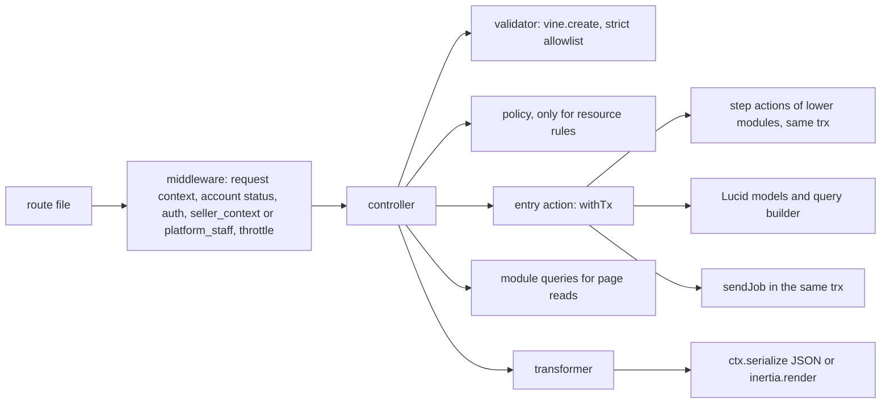
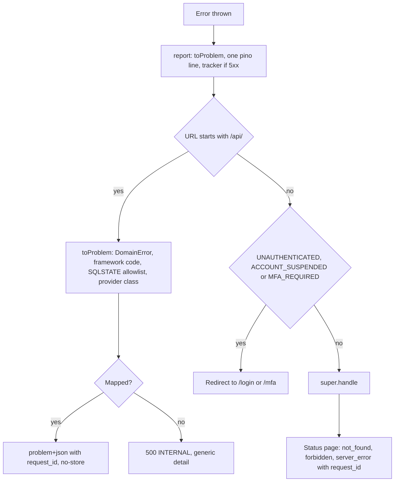

# Code Structure and Engineering Standards

Status: Draft v1 (2026-09-26)

Reviewed: critic pass B5 part 1 (2026-09-26)

Reviewed: critic pass B5 part 2 (2026-09-26)

This document is the standard the DripNepal codebase must meet: where code lives, which module may depend on which, what each layer of a request may and may not do, and (in later sections) how errors, configuration, logging, migrations, dependencies, reviews and the frontend are handled. It describes the **target state**. Files in the repository today are evidence of what exists and are cited as [Verified-repo]; a file is kept only where it already meets the standard, and each "Current code → target" table says whether it is kept, fixed, rewritten or deleted (product owner, 2026-09-26: "rewrite is fine where needed").

**What this document does not own.** Module map, dependency diagram and job catalogue: [03](03-system-architecture.md#4-modules-and-dependency-rules). Tables, columns, constraints and settings: [04](04-domain-model-and-data-dictionary.md) and [04a](04a-data-dictionary-tables.md). State machines, lock order and transaction rules for money and stock: [05](05-order-payment-and-inventory-lifecycles.md). Endpoints, status codes, error codes and idempotency: [06](06-api-design.md) and [openapi.yaml](openapi.yaml). Permissions, threats and privacy: [07](07-security-threat-model-and-permissions.md). UI behaviour: [08](08-ui-ux-and-design-system.md). Test ID registry and CI gates: [10](10-testing-and-quality-gates.md). Runbooks and job operations: [11](11-deployment-and-operations.md). Milestones: [12](12-roadmap-and-backlog.md).

**Labels.** [Confirmed] product owner answer; [Verified-repo] read in this repository, including installed `node_modules`; [Verified-doc] read in a primary source or a reviewed DripNepal document; [Assumption] a working value to confirm; [Open] OD-xx; [Verify-external] VX-xx. Code marked "design sketch" uses only APIs verified for the installed versions and shows intent; code marked "pseudocode" uses something not verified (usually a package that is not installed yet).

## Reading guide

| §   | Title                                                     | Status in this draft                       |
| --- | --------------------------------------------------------- | ------------------------------------------ |
| 1   | Repository structure                                      | Written                                    |
| 2   | Module ownership and dependency rules                     | Written                                    |
| 3   | Layer responsibilities                                    | Written                                    |
| 4   | API serialization and shared contracts                    | Written                                    |
| 5   | Error handling                                            | Written                                    |
| 6   | Configuration validation and secrets                      | Written                                    |
| 7   | Structured logging and request IDs                        | Written                                    |
| 8   | Migrations and seeders                                    | Planned                                    |
| 9   | Safe production initialization                            | Planned                                    |
| 10  | Dependency policy                                         | Planned                                    |
| 11  | Lint, format, typecheck and review                        | Planned                                    |
| 12  | Vertical slice: vendor product creation (`createProduct`) | Planned                                    |
| 13  | Frontend code standards                                   | Planned                                    |
| —   | Consistency notes for editor                              | Written (for §1–§7; later parts add to it) |

A developer adding a feature reads §1.3 (names), §2.2 (what the module may import) and §3.2 (what each layer does). A reviewer uses §3.13 as the list of things to reject.

---

## 1. Repository structure

### 1.1 Principles

1. **Adonis-conventional directories stay** ([ADR-0002](adr/0002-modular-monolith-adonisjs.md) decision 4, canon §6.3). `app/controllers`, `app/models`, `app/validators`, `app/policies`, `app/transformers`, `app/middleware`, `app/exceptions`, `commands`, `config`, `database`, `providers`, `start` and `resources` keep their framework meaning, because generators and the assembler index them: the controllers index `#generated/controllers` is built from `app/controllers/**` and transformers are indexed by `indexEntities` (`adonisrc.ts` hooks [Verified-repo]).
2. **Business code lives in modules**: `app/modules/<module>/` for the fifteen modules of canon §6.2 and [03 §4.4](03-system-architecture.md#44-module-responsibilities). Everything a module decides (use cases, reads other modules may call, pure rules, events, job handlers, provider adapters) is inside its folder.
3. **Adonis folders are organised by module or surface underneath**: `app/validators/<module>/`, `app/policies/<module>/`, `app/transformers/<module>/`, `app/controllers/<surface>/<module>/`. A reader can find everything about inventory by searching for `inventory/`.
4. **Generated files are never edited by hand** and are either committed with a freshness check or ignored (§1.4).
5. **One naming style**: `snake_case` file names on the server and in `inertia/`, except upstream shadcn copies in `inertia/components/ui/`, which keep their registry names so `shadcn add --diff` compares like with like ([08 §12.1](08-ui-ux-and-design-system.md#121-ownership-and-folders)).

### 1.2 Target tree

```text
drip-nepal/
├── adonisrc.ts                      # providers, preloads (+ start/database_types.ts), test suites (+ concurrency)
├── ace.js · bin/{server,console,test}.ts
├── app/
│   ├── controllers/
│   │   ├── storefront/<module>/*_controller.ts     # SSR page reads, GET only
│   │   ├── auth/identity/*_controller.ts           # login, signup, reset, MFA pages, GET only
│   │   ├── payments/payments/return_controller.ts  # GET /payments/{provider}/return (ADR-0012)
│   │   ├── account/<module>/*_controller.ts        # customer pages, GET only
│   │   ├── seller/<module>/*_controller.ts         # /seller/{shopSlug}/… pages, GET only
│   │   ├── admin/<module>/*_controller.ts          # /admin/… pages, GET only
│   │   └── api/v1/{auth,public,customer,seller,admin,webhooks}/<module>/*_controller.ts
│   ├── exceptions/{handler.ts, domain_error.ts, constraint_map.ts}   # §5
│   ├── middleware/*_middleware.ts                   # §3.4
│   ├── models/<table_singular>.ts                   # extends generated schema class, relations only
│   ├── modules/
│   │   ├── platform/
│   │   │   ├── tx.ts            # withTx, jobTx, insideTransaction (§3.8)
│   │   │   ├── cas.ts           # casStatus (§3.8)
│   │   │   ├── money.ts         # Minor, toMinor, sumMinor (04 §18.4)
│   │   │   ├── idempotency.ts   # idempotencyScope, withIdempotency, ReplayRequested (06 §7.9)
│   │   │   ├── jobs.ts          # JobPayloads, sendJob, pg-boss instance (§2.3)
│   │   │   ├── ports/           # EmailSender, ObjectStorage, SmsSender, CallContext, PortAdapter guard
│   │   │   ├── providers/       # mail, drive and SMS adapters behind the ports
│   │   │   ├── crypto/{field_encrypter.ts, field_decrypter.ts, blind_index.ts}
│   │   │   ├── actions/ · queries.ts · domain/ · events.ts · jobs/
│   │   ├── payments/providers/{khalti.ts, esewa.ts, fake.ts}   # PaymentProvider adapters (ADR-0012)
│   │   └── <module>/
│   │       ├── actions/<operation>.ts   # one use case or transaction step per file
│   │       ├── queries.ts               # reads other modules and pages may call
│   │       ├── domain/*.ts              # pure rules: *_machine.ts, vocabularies, errors, policy constants
│   │       ├── events.ts                # event names and job payload types
│   │       ├── jobs/<queue_leaf>.ts     # handlers hosted by this module (03 §9 Owner column)
│   │       └── internal/                # optional private helpers
│   ├── policies/<module>/*_policy.ts
│   ├── transformers/<module>/*_transformer.ts
│   └── validators/<module>/<operation>.ts · validators/support/strict.ts
├── architecture/{model-ownership.json, model_rules.cjs}   # table → module map and rule generator for T-ARCH-001
├── commands/{platform_create_admin.ts, jobs_work.ts, jobs_redrive.ts, data_reencrypt.ts}
├── config/*.ts                              # + limiter, drive, mail, jobs when those packages land
├── database/
│   ├── migrations/                          # the 14-file baseline of 04 §20.2.2, then forward-only
│   ├── seeders/reference/{index_seeder.ts, *_seeder.ts, data/*.csv}   # safe in production
│   ├── seeders/dev/*_seeder.ts              # refuse to run in production (§8)
│   ├── factories/*_factory.ts
│   ├── schema.ts                            # generated by schema:generate, committed
│   ├── schema_rules.ts                      # loaded through schemaGeneration.rulesPaths
│   └── migrations.lock                      # checksums, from the first production deploy (ADR-0011)
├── docs/                                    # this documentation set, adr/, openapi.yaml
├── inertia/
│   ├── app.tsx · ssr.tsx · client.ts · tsconfig.json
│   ├── pages/{storefront,auth,payments,account,seller,admin,errors,dev}/…   # page entry files only
│   ├── layouts/{storefront,auth,account,seller,admin}_layout.tsx
│   ├── components/ui/                       # upstream shadcn copies (registry file names)
│   ├── components/kit/                      # cleared kit items; empty until VX-13
│   ├── components/{common,forms,auth,catalog,search,cart,checkout,orders,account,seller,admin}/
│   ├── hooks/ · lib/ · css/ · assets/
├── providers/{api_provider.ts, ports_provider.ts, jobs_provider.ts}   # Adonis service providers
├── resources/
│   ├── views/{inertia_layout.edge, emails/}
│   ├── lang/en/*.json                       # message catalogs (R2 adds lang/ne)
│   └── legal/seller-agreement/<version>.md  # 04a §6
├── shared/{constants/, format/}             # isomorphic code used by server and inertia
├── start/{env.ts, kernel.ts, routes.ts, validator.ts, database_types.ts, limiter.ts, jobs.ts}
├── start/routes/{storefront,auth,account,seller,admin,health,dev,webhooks}.ts
├── start/routes/api_v1/{auth,public,customer,seller,admin}.ts
├── tests/{bootstrap.ts, unit/, functional/, browser/, concurrency/, load/}
├── .adonisjs/                               # generated by assembler hooks, committed (§1.4)
├── .github/{workflows/ci.yml, pull_request_template.md}
├── .dependency-cruiser.cjs · eslint.config.js · .husky/ · docker-compose.yml · Dockerfile
└── package.json · pnpm-lock.yaml · pnpm-workspace.yaml · tsconfig.json · tsconfig.inertia.json
```

Notes on the tree:

- **Surfaces for controllers** follow canon §6.3 (`storefront`, `account`, `seller`, `admin`, `api/v1/{public,customer,seller,admin,webhooks}`) plus three additions that mirror existing surfaces: `auth` pages ([03 §6.1](03-system-architecture.md#61-surfaces-and-rendering-modes)), the `payments` return page, and `api/v1/auth` for the "Auth and self" API surface of [06 §2.2](06-api-design.md#22-surfaces).
- **Page folders** match the `ssr.pages` filter in [03 §6.1](03-system-architecture.md#61-surfaces-and-rendering-modes), which renders server-side exactly the pages whose names start with `storefront/`, `auth/` or `payments/`. `errors/` pages exist today (`inertia/pages/errors/*.tsx` [Verified-repo]) and stay; `dev/` holds the development-only component gallery that replaces `/design-system` (RF-40).
- **Only page entry files go in `inertia/pages/`.** The `indexPages` hook registers every `.tsx` and `.ts` file under `inertia/pages` as a page: today `.adonisjs/server/pages.d.ts` lists `commerce/categories/components/applied_filters` (a `.tsx` component) and `commerce/categories/mock` (from `mock.ts`) as Inertia pages [Verified-repo], and the eager SSR glob in `inertia/ssr.tsx` bundles them. Page-private components go to `inertia/components/<domain>/`.
- **Domain component folders** (the names [08 §12.1](08-ui-ux-and-design-system.md#121-ownership-and-folders) leaves to this document), with the [08 §4.3](08-ui-ux-and-design-system.md#43-dripnepal-owned-composed-components) components each one holds: `catalog` (`ProductCard`, `ProductGallery`, `VariantPicker`, `PriceTag`, `StockBadge`), `cart` (`CartShopGroup`), `checkout` (`CheckoutStepper`, `CheckoutReview`), `forms` (`AddressForm`, `NepalPhoneInput`, `MoneyInput`, `ImageUploader`), `orders` (`OrderTimeline`, `ShipmentTracker`), `seller` (`ShopSwitcher`), `common` (`DataTable`, `FilterBar`, `StatusBadge`, `ConfirmDialog`, `EmptyState`, `PermissionDenied`, `OfflineBanner`, `SiteBanner`). `auth`, `search`, `account` and `admin` hold surface-specific pieces. A component used by two surfaces moves to `common`; file names are `snake_case` (`product_card.tsx`).
- **`providers/`** at the root is the Adonis service-provider folder. Adapters to external services are called "providers" only inside a module (`app/modules/payments/providers/`, as canon §6.3 names them), and are bound to their ports by `providers/ports_provider.ts`.
- **`shared/`** is imported by both sides (`#shared/*` on the server, `@shared/*` in `inertia/tsconfig.json` [Verified-repo]). It may import nothing from `app/` or `inertia/`. The money formatter used by SSR, the client and email templates lives in `shared/format/money.ts` (answers [08 §5.11](08-ui-ux-and-design-system.md#5-design-tokens)'s "location per 09"; behaviour in §13).
- **`tests/concurrency`** is a new Japa suite (real PostgreSQL, pool larger than 1) for T-INV-003, T-CHK-004 and the lock-order tests of [05 §4.4](05-order-payment-and-inventory-lifecycles.md#44-global-lock-ordering); **`tests/load`** holds k6 scripts for T-PERF-001 and is not a Japa suite. Test layout and gates are owned by [10](10-testing-and-quality-gates.md).
- **Process commands.** The `web` process runs `node bin/server.js` (the existing `start` script [Verified-repo `package.json`]); the `worker` process runs `node ace jobs:work`; this fixes the name that [03 §3.2](03-system-architecture.md#32-container-responsibilities) leaves to this document. Redrive is `node ace jobs:redrive` ([03 §10.5](03-system-architecture.md#105-dead-letters-and-redrive)).

### 1.3 Naming conventions

| Thing                          | Convention                                                                                                                                                       | Example                                                               |
| ------------------------------ | ---------------------------------------------------------------------------------------------------------------------------------------------------------------- | --------------------------------------------------------------------- |
| Operation                      | The canon §6.5 `operationId` is the name everywhere: API route name, action file, action class, validator, test titles                                           | `adjustInventory`                                                     |
| Entry action (use case)        | `app/modules/<m>/actions/<operation_in_snake_case>.ts`, default export class in PascalCase                                                                       | `actions/adjust_inventory.ts` → `AdjustInventory`                     |
| Step action (in a transaction) | Same folder, exported function whose first parameter is `trx`                                                                                                    | `actions/reserve_for_order.ts` → `reserveForOrder(trx, cmd)`          |
| API route name                 | Exactly the `operationId`; API groups never call `.as()`, because a group name is prepended to its routes' names                                                 | `.as('adjustInventory')`                                              |
| Page route name                | `<surface>.<area>.<action>`                                                                                                                                      | `seller.orders.show`                                                  |
| Inertia page name              | Path under `inertia/pages` without extension                                                                                                                     | `seller/orders/show`                                                  |
| Controller                     | `<resource_plural>_controller.ts`, class `<Resource>Controller`; methods `index`, `show`, `store`, `update`, `destroy`, or the operation verb for non-CRUD steps | `shop_orders_controller.ts` → `ShopOrdersController.accept`           |
| Validator                      | `app/validators/<module>/<operation>.ts`, named export `<operation>Validator`                                                                                    | `adjustInventoryValidator`                                            |
| Transformer                    | `<Entity><Audience>Transformer`, one per audience whose visible fields differ ([06 §3.6](06-api-design.md#36-output-transformers-never-models))                  | `ShopOrderSellerTransformer`                                          |
| Policy                         | `app/policies/<module>/<entity>_policy.ts`, class `<Entity>Policy`                                                                                               | `ProductPolicy`                                                       |
| Domain event                   | `<entity>.<past_tense>` ([03 §4.4](03-system-architecture.md#44-module-responsibilities))                                                                        | `shop_order.accepted`                                                 |
| Queue                          | `<subject>.<snake_case_name>` from [03 §9](03-system-architecture.md#9-asynchronous-work); dead-letter queue `dlq.<queue>`                                       | `orders.acceptance_timeout`, `dlq.orders.acceptance_timeout`          |
| Job handler file               | `jobs/<leaf>.ts` in the Owner module; `jobs/<subject>_<leaf>.ts` when the queue's subject is another module                                                      | `orders/jobs/acceptance_timeout.ts`, `orders/jobs/payments_verify.ts` |
| State machine                  | `app/modules/<m>/domain/<entity>_machine.ts` ([05 §6.0](05-order-payment-and-inventory-lifecycles.md#60-conventions-used-in-every-table))                        | `orders/domain/shop_order_machine.ts`                                 |
| Middleware                     | File `<name>_middleware.ts`; kernel key in camelCase                                                                                                             | `seller_context_middleware.ts` ↔ `middleware.sellerContext(…)`        |
| Ace command                    | `<namespace>:<verb>`; file `<namespace>_<verb>.ts`                                                                                                               | `platform:create-admin`, `jobs:work`                                  |
| Import aliases                 | `package.json` `imports`; add `#modules/*` → `./app/modules/*.js`                                                                                                | `import { withTx } from '#modules/platform/tx'`                       |
| Database objects               | Owned by [04 §2.14](04-domain-model-and-data-dictionary.md#214-naming)                                                                                           | `inventory_movements_deltas_check`                                    |

Job payload keys are `snake_case` like the stored JSON of the API (OD-13 default), and every payload carries `request_id` and `causation_id` ([03 §10.8](03-system-architecture.md#108-observability-of-jobs)).

### 1.4 Generated artefacts

| Artefact                                                                                      | Produced by                                                                                                                                                                                                                         | Committed      | Rule and check                                                                                                                                                                                                                                                                                                                                                                                              |
| --------------------------------------------------------------------------------------------- | ----------------------------------------------------------------------------------------------------------------------------------------------------------------------------------------------------------------------------------- | -------------- | ----------------------------------------------------------------------------------------------------------------------------------------------------------------------------------------------------------------------------------------------------------------------------------------------------------------------------------------------------------------------------------------------------------- |
| `.adonisjs/server/{controllers.ts, routes.d.ts, pages.d.ts, events.ts, listeners.ts}`         | Assembler `init` hooks in `adonisrc.ts` (`indexEntities`, `indexPages`), which run for the dev server, the test runner and the bundler [Verified-repo `@adonisjs/assembler` 8.4.0 `build/src/types/hooks.d.ts:49`]                  | Yes (as today) | Never edited by hand. Committed because `start/routes.ts` imports `#generated/controllers` and `pnpm typecheck` on a fresh clone or in the pre-push hook must work without first starting the dev server. T-ARCH-016 (proposed): CI runs `node ace test` (which runs the hooks) and then `git diff --exit-code .adonisjs`.                                                                                  |
| `.adonisjs/client/{data.d.ts, manifest.d.ts}`                                                 | `indexEntities` with `transformers.withSharedProps` [Verified-repo `adonisrc.ts`]                                                                                                                                                   | Yes            | Same check. `Data.*` types are the page-prop contract (§4); they are never duplicated as hand-written DTOs.                                                                                                                                                                                                                                                                                                 |
| `.adonisjs/client/registry/*`                                                                 | `@tuyau/core` 1.2.2 `generateRegistry()` [Verified-repo `adonisrc.ts`]                                                                                                                                                              | Yes            | Same check. It embeds every named route pattern in the client bundle (A5-17); the target passes `routes.except`, which matches **route names** (strings, regular expressions or a predicate) [Verified-repo `@tuyau/core` 1.2.2 `build/backend/generate_registry.d.ts:204`], to leave out `receivePaymentWebhook` and the routes named `health.*` and `dev.*`. Authorization never relies on route secrecy. |
| `database/schema.ts`                                                                          | `node ace schema:generate`, run by `migration:run`/`rollback` except in production [Verified-doc `build/commands/migration/run.js`, <https://registry.npmjs.org/@adonisjs/lucid/-/lucid-22.4.2.tgz>, accessed 2026-09-25; 04 §2.15] | Yes            | Never edited by hand; production does not regenerate it, so the committed file must match the migrations. T-ARCH-010 (proposed in 04): `migration:fresh` then `git diff --exit-code database/schema.ts`, and no `any` in the file.                                                                                                                                                                          |
| `database/migrations.lock`                                                                    | CI script, from the first production deploy                                                                                                                                                                                         | Yes            | Fails CI if an applied migration changes ([04 §20.2.4](04-domain-model-and-data-dictionary.md#2024-after-the-first-production-deploy-forward-only-expand-and-contract), RF-41). Detail in §8.                                                                                                                                                                                                               |
| `build/`, `public/assets/`, `tmp/*`                                                           | `node ace build`, Vite, runtime                                                                                                                                                                                                     | No             | Already ignored [Verified-repo `.gitignore`].                                                                                                                                                                                                                                                                                                                                                               |
| `*.tsbuildinfo`, `coverage/`, `screenshots/*`, `.env.*` except `.env.example` and `.env.test` | tsc, test runs, operators                                                                                                                                                                                                           | No             | Added to `.gitignore`; `tsconfig.inertia.tsbuildinfo` is removed from the index (RF-33, A5-10).                                                                                                                                                                                                                                                                                                             |
| `docs/openapi.yaml`                                                                           | Hand-maintained; Tuyau 1.2.2 has no OpenAPI generator [Verified-doc package exports, <https://registry.npmjs.org/@tuyau/core/-/core-1.2.2.tgz>, accessed 2026-09-25]                                                                | Yes            | Kept in step by contract tests (T-API-001); §4.                                                                                                                                                                                                                                                                                                                                                             |

Trade-off of committing `.adonisjs/`: generated diffs appear in most PRs (A5-21). They are accepted because the alternative (ignore and regenerate) makes a fresh checkout fail typecheck, and the freshness check turns a stale file into a CI failure instead of a silent drift. A PR that changes routes, pages or transformers commits the regenerated files in the same PR.

### 1.5 Current code → target (structure)

| Area / file(s)                                                          | Today [Verified-repo]                                                                                                                                                                     | Decision                                                                                                                                                                                                                                                                                                                                                                                                                                           | Reason                     | Milestone                        |
| ----------------------------------------------------------------------- | ----------------------------------------------------------------------------------------------------------------------------------------------------------------------------------------- | -------------------------------------------------------------------------------------------------------------------------------------------------------------------------------------------------------------------------------------------------------------------------------------------------------------------------------------------------------------------------------------------------------------------------------------------------- | -------------------------- | -------------------------------- |
| `app/modules/`                                                          | Does not exist                                                                                                                                                                            | **Create**: `platform` and `audit` first, then each module in the milestone that needs it                                                                                                                                                                                                                                                                                                                                                          | ADR-0002                   | M0, then M1–M8                   |
| `app/controllers/*` (5 files)                                           | Flat `new_account_controller.ts`, `session_controller.ts`; `shops/auth`, `shops/dashboard`; transactions and `User.create({ ...payload })` inline                                         | **Rewrite** into `<surface>/<module>/`, logic moved to actions                                                                                                                                                                                                                                                                                                                                                                                     | RF-03, RF-36, RF-12        | M0 hotfix, M1 (auth), M2 (shops) |
| `app/models/*` (20 files)                                               | Models of the exploratory schema; `User` has an `initials` display getter, a pivot to `user_roles` and upward relations to `Shop`, `Cart`, `Order`                                        | **Rewrite** after the baseline: extend generated schema classes, relations only and only downward (§2.4 rule 5)                                                                                                                                                                                                                                                                                                                                    | RF-20, RF-06               | M0 baseline                      |
| `app/constants/**`                                                      | Status and permission constants, imported by migrations and seeders                                                                                                                       | **Delete**: vocabularies move to `app/modules/<m>/domain/`, permission maps to code in `shops` and `identity` (07 §4)                                                                                                                                                                                                                                                                                                                              | RF-23, RF-41, RF-20        | M0                               |
| `app/utils/random.ts`                                                   | Used only by factories and the demo seeder                                                                                                                                                | **Delete**; factories and dev seeders use their own helpers under `database/`                                                                                                                                                                                                                                                                                                                                                                      | RF-05                      | M0                               |
| `app/validators/auth/*`, `app/validators/shared.ts`                     | `vine.create` already used (meets the standard); password max 32, phone rule rejects valid numbers, `unique` exposes enumeration                                                          | **Rewrite** as `app/validators/identity/*` and `shops/*`                                                                                                                                                                                                                                                                                                                                                                                           | RF-12, RF-22, RF-29, RF-38 | M1, M2                           |
| `app/transformers/{user,shop}_transformer.ts`                           | `BaseTransformer` + `pick()` (meets the standard); `ShopTransformer` exposes `ownerId`, email and phone                                                                                   | **Keep the pattern, rewrite the files** per module and audience                                                                                                                                                                                                                                                                                                                                                                                    | RF-36                      | M1, M2                           |
| `app/middleware/*`                                                      | `auth`, `guest`, `silent_auth`, `container_bindings`, `inertia`                                                                                                                           | **Keep** the framework ones; **fix** `inertia_middleware.ts` shared props; **add** the §3.4 middleware                                                                                                                                                                                                                                                                                                                                             | RF-01, RF-04, RF-44        | M0, M2                           |
| `app/exceptions/handler.ts`                                             | Default handler, status pages in production only                                                                                                                                          | **Rewrite** (§5)                                                                                                                                                                                                                                                                                                                                                                                                                                   | RF-36                      | M0                               |
| `providers/api_provider.ts`                                             | `ApiSerializer` registers `ctx.serialize`; accepts only Lucid paginator meta                                                                                                              | **Keep, fix** the meta shapes and the `meta` key ([06 §3.4](06-api-design.md#34-envelopes-and-the-existing-apiserializer))                                                                                                                                                                                                                                                                                                                         | Canon §6.6                 | M1                               |
| `start/routes.ts`, `start/routes/shops.ts`                              | Storefront under `guest()`, two-segment catch-all, debug routes, `/shop/:shopSlug` with authentication only                                                                               | **Rewrite** into the per-surface files of §1.2                                                                                                                                                                                                                                                                                                                                                                                                     | RF-01, RF-02, RF-40        | M0                               |
| `start/kernel.ts`                                                       | Server and router middleware stack as in [03 §3.3](03-system-architecture.md#33-inside-the-web-process)                                                                                   | **Keep**, extend with the §3.4 order                                                                                                                                                                                                                                                                                                                                                                                                               | —                          | M0                               |
| `database/migrations/*` (26 files)                                      | 25 tables plus pgcrypto, edited in place, import `#constants`                                                                                                                             | **Delete** and replace with the 14-file baseline ([ADR-0011](adr/0011-schema-rebaseline-before-production.md), [Open OD-01])                                                                                                                                                                                                                                                                                                                       | RF-41, RF-06, RF-13        | M0                               |
| `database/seeders/*`, `database/factories/*`                            | Demo vendor with a known password, no environment guard; factories draw stale statuses                                                                                                    | **Rewrite** into `reference/` and `dev/` per [04 §20.3](04-domain-model-and-data-dictionary.md#203-seeders-factories-and-schema-generation)                                                                                                                                                                                                                                                                                                        | RF-05, A5-14               | M0                               |
| `database/schema.ts`, `database/schema_rules.ts`                        | Generated file committed (meets the standard); rules file empty and not wired                                                                                                             | **Keep** `schema.ts`; **fix** config to load the rules                                                                                                                                                                                                                                                                                                                                                                                             | 04 §20.3                   | M0                               |
| `inertia/pages/**`                                                      | `commerce/`, `customers/`, `shops/`, `landing/`, `design_system/`; components and mocks inside page folders                                                                               | **Rewrite** into surface folders; move non-page files out; `landing/**` deleted ([08 §13](08-ui-ux-and-design-system.md#13-current-ui-remediation-list))                                                                                                                                                                                                                                                                                           | RF-47, RF-40               | M0 (routing), M4/M5 (pages)      |
| `inertia/components/**`                                                 | `ui/` (34 files, including local helpers), `auth`, `commerce`, `navbar`, `footer`, `form_builder`, `search`, `providers`                                                                  | **Keep** `ui/` with the 08 §12.1 clean-up; **regroup** the rest into the domain folders of §1.2                                                                                                                                                                                                                                                                                                                                                    | ADR-0015                   | M0 (ui), M4/M5 (domain)          |
| `inertia/lib/mock-data`, `**/mock.ts`, `components/search/mock_data.ts` | Client mocks                                                                                                                                                                              | **Delete** as each page gets its server contract                                                                                                                                                                                                                                                                                                                                                                                                   | RF-27                      | M4, M5                           |
| `inertia/app.tsx`, `inertia/ssr.tsx`                                    | `createRoot`, devtools in production, SSR glob of every page                                                                                                                              | **Rewrite** (§13, [03 §6.1](03-system-architecture.md#61-surfaces-and-rendering-modes))                                                                                                                                                                                                                                                                                                                                                            | RF-08, RF-30               | M0 (after the OD-25 spike)       |
| `shared/constants/*`                                                    | `provinces_with_districts.ts` (client-side location list, incomplete per RF-29) and `shop_categories.ts` (13 shop categories, imported by the seeder and two seller pages)                | **Delete** `provinces_with_districts.ts`: locations come from the `logistics` tables (committed CSV, [04 §20.3](04-domain-model-and-data-dictionary.md#203-seeders-factories-and-schema-generation)) through props or `/api/v1/locations`. **Keep** `shop_categories.ts` only as the input of `reference/shop_categories_seeder.ts` (04 §20.3); pages read the `shop_categories` table through props instead of importing it. Add `shared/format/` | RF-29, RF-23               | M1, M2; M4 (`format/`)           |
| `.adonisjs/**`                                                          | Committed (meets the standard)                                                                                                                                                            | **Keep**, add T-ARCH-016 (proposed)                                                                                                                                                                                                                                                                                                                                                                                                                | A5-21                      | M0                               |
| `tsconfig.inertia.tsbuildinfo`                                          | Committed build artefact                                                                                                                                                                  | **Delete** from the index and ignore                                                                                                                                                                                                                                                                                                                                                                                                               | RF-33                      | M0                               |
| `.agents/**`, `skills-lock.json`                                        | About 150 third-party AI-skill files, including Python scripts                                                                                                                            | **Remove** `.agents/` from the tracked tree (keep locally, ignored); whether `skills-lock.json` alone can restore them is an M0 check                                                                                                                                                                                                                                                                                                              | RF-42                      | M0                               |
| `package.json` `imports`                                                | 21 aliases; no `#modules/*`; `#mails`, `#services`, `#listeners`, `#events` and `#abilities` point at folders that do not exist, and `#utils`, `#constants` at folders this table deletes | **Fix**: add `#modules/*`; remove those seven aliases                                                                                                                                                                                                                                                                                                                                                                                              | —                          | M0                               |
| `tests/`, `commands/`, `.github/`                                       | Only `tests/bootstrap.ts`; no commands; no CI                                                                                                                                             | **Create**                                                                                                                                                                                                                                                                                                                                                                                                                                         | RF-09, RF-05               | M0                               |

Dependency removals (`D`, `better-sqlite3`, the `@commercn` registry) are in §10; frontend file-level remediation is [08 §13](08-ui-ux-and-design-system.md#13-current-ui-remediation-list).

---

## 2. Module ownership and dependency rules

### 2.1 What a module is

A module is a folder under `app/modules/` that owns a set of tables (canon §6.2, [03 §4.4](03-system-architecture.md#44-module-responsibilities)). Only its code writes those tables. Its folder has a public surface and private parts:

| Path                           | Visibility                                                                                                 | Contents and rules                                                                                                                                                                                                                                                    |
| ------------------------------ | ---------------------------------------------------------------------------------------------------------- | --------------------------------------------------------------------------------------------------------------------------------------------------------------------------------------------------------------------------------------------------------------------- |
| `actions/*.ts`                 | Public                                                                                                     | Entry actions (use cases called by controllers, commands and job handlers) and step actions (called by a higher module inside that module's transaction). The only way to write the module's tables.                                                                  |
| `queries.ts`                   | Public                                                                                                     | Read functions. Each accepts an optional `{ client }` so a caller can read inside its transaction ([03 §4.2](03-system-architecture.md#42-how-modules-talk-to-each-other)). A module whose pure functions others need re-exports them here (`pricing` does, 03 §4.4). |
| `events.ts`                    | Public (types only)                                                                                        | Event names and the job payload types this module sends or consumes (§2.3).                                                                                                                                                                                           |
| `domain/*.ts`                  | Private to modules; readable by `app/validators`, `app/transformers`, `app/policies`, `database/factories` | Pure code: state machines, vocabularies (`as const` arrays that the CHECK lists mirror, T-ARCH-011 proposed in 04), domain errors, policy constants. No I/O, no Lucid import.                                                                                         |
| `jobs/*.ts`                    | Private                                                                                                    | Handlers for queues this module hosts. Registered by `start/jobs.ts`; never imported by another module.                                                                                                                                                               |
| `providers/*.ts`, `ports/*.ts` | Private (`ports/` public in `platform`)                                                                    | Adapters to external services. Provider SDKs are imported only here (ADR-0016 verification).                                                                                                                                                                          |
| `internal/*.ts`                | Private                                                                                                    | Helpers shared by the module's own files.                                                                                                                                                                                                                             |

`platform` is the one module whose root files (`tx.ts`, `cas.ts`, `money.ts`, `idempotency.ts`, `jobs.ts`, `ports/`) are public infrastructure for every module. Its `crypto/field_decrypter.ts` is the exception: only the code paths in the [07 §5.5](07-security-threat-model-and-permissions.md#55-encryption) allowlist may import it (T-SEC-034, proposed in 07).

Lucid models live in `app/models/` (Adonis convention), but each model **belongs** to the module that owns its table; `architecture/model-ownership.json` records the mapping from [04](04-domain-model-and-data-dictionary.md) and is checked in review when a table is added.

### 2.2 Allowed dependencies

The dependency diagram and its reasoning are owned by [03 §4.1](03-system-architecture.md#41-dependency-diagram); this table is its code-level form. "Public surface" means `actions/`, `queries.ts`, `events.ts` and, for `platform`, the public root files. A module may use its dependencies' dependencies (transitive), never anything to its right in the canonical chain.

| Module          | May import the public surface of             | Must never import                                         |
| --------------- | -------------------------------------------- | --------------------------------------------------------- |
| `platform`      | nothing                                      | every other module                                        |
| `audit`         | `platform`                                   | everything above                                          |
| `logistics`     | `platform`, `audit`                          | everything above                                          |
| `identity`      | `platform`, `audit`, `logistics`             | `shops` and above                                         |
| `shops`         | `identity` and below                         | `media` and above                                         |
| `media`         | `shops` and below                            | `catalog` and above                                       |
| `catalog`       | `media` and below                            | `inventory` and above                                     |
| `inventory`     | `catalog` and below                          | `pricing` and above                                       |
| `pricing`       | `inventory` and below                        | `cart` and above                                          |
| `cart`          | `pricing` and below                          | `checkout`, `orders`, `payments`, `ledger`                |
| `checkout`      | `cart`, `orders` and everything they may use | `notifications`                                           |
| `orders`        | `pricing` and below, `payments`, `ledger`    | `cart`, `checkout`, `notifications`                       |
| `payments`      | `pricing` and below, `ledger`                | `orders`, `cart`, `checkout`, `notifications`             |
| `ledger`        | `pricing` and below                          | `payments`, `orders`, `cart`, `checkout`, `notifications` |
| `notifications` | `queries.ts` of any module, `platform`       | any module's `actions/`; nothing imports it               |

Controllers, commands and `start/jobs.ts` sit outside the chain: a controller may call the public surface of any module (controller composition, [03 §4.2](03-system-architecture.md#42-how-modules-talk-to-each-other)), but it opens no transaction.

### 2.3 How modules cooperate

1. **Downward call inside the caller's transaction.** The higher module's entry action opens the transaction and passes `trx` to step actions of lower modules; the callee never commits. Example: `orders.recordCodCollection` calls `payments` and `ledger` step actions with its `trx`.
2. **Orchestration instead of upward calls.** When one transaction must change a lower and a higher module together, the higher module orchestrates. Gateway capture is `orders.applyPaymentOutcome(trx, …)`, which calls `payments.applyProviderResult(trx, …)` and `inventory.commitHeld(trx, …)` in one transaction; there is no upward payments → orders event ([05 §6.4](05-order-payment-and-inventory-lifecycles.md#64-payment-gateway-r11), ADR-0002 decision 3).
3. **Hosting rule for job handlers (adopted from [03 §9](03-system-architecture.md#9-asynchronous-work)).** A queue name names the subject; the handler lives in the module whose imports stay downward. `payments.verify`, `payments.daily_reconciliation`, `payments.process_provider_event`, `inventory.expire_reservations` and `refunds.sla_monitor` are therefore hosted in `orders` (`app/modules/orders/jobs/payments_verify.ts` and so on), because each ends in an `orders` transaction or reads `orders` tables. Renaming the queues after their host was rejected: the names are shared with 05 and 03, and the subject prefix is what an operator searches for in a dead-letter alert.
4. **Events after commit** are pg-boss jobs sent in the same transaction ([ADR-0010](adr/0010-postgres-jobs-pg-boss-transactional-send.md), [03 §10.1](03-system-architecture.md#101-transactional-send-the-job-table-is-the-outbox)). A module sends to another module's queue **by name**, without importing it. Payload types stay type-safe through declaration merging, so `platform` never imports a higher module:

```ts
// app/modules/platform/jobs.ts — design sketch. The pg-boss adapter call is pseudocode
// until the M0 spike (T-ARCH-004, proposed in 03) confirms the import path and options.
import type { TransactionClientContract } from '@adonisjs/lucid/types/database'

export interface JobPayloads {} // augmented by each module's events.ts
export type QueueName = keyof JobPayloads & string
type Envelope = { request_id: string | null; causation_id: string | null }

export async function sendJob<Q extends QueueName>(
  trx: TransactionClientContract,
  queue: Q,
  data: JobPayloads[Q] & Envelope,
  opts: { singletonKey?: string; startAfter?: Date } = {}
) {
  // pseudocode: boss.send(queue, data, { ...opts, db: fromKnex(trx.knexClient) })
  // trx.knexClient is Lucid 22.4.2's Knex transaction [Verified-repo database.d.ts:220]
}
```

```ts
// app/modules/orders/events.ts — design sketch (TypeScript module augmentation; checked by pnpm typecheck in M0)
declare module '#modules/platform/jobs' {
  interface JobPayloads {
    'orders.acceptance_timeout': { shop_order_id: string }
    'payments.verify': { payment_id: string }
  }
}
export {}
```

5. **Dead-letter naming.** Every queue in 03 §9 gets `dlq.<queue>`, except `platform.heartbeat` (03 marks it "no dead-letter queue"). The retry counts and backoff values stay [Assumption] in 03 §9; this document only fixes the names. `platform.retention_purge` is adopted as the queue name for the purges of [04 §19.3](04-domain-model-and-data-dictionary.md#193-retention-schedule), including cart deletion and the `notification_deliveries` purge that 03 §9 does not yet list (Consistency note 4).
6. **Composite sweepers: the one exception to module hosting.** 03 §9 gives `platform.retention_purge` the Owner `platform`, but the rows it deletes belong to `identity` (`user_tokens`, `user_addresses`), `shops` (`shop_invitations`, `shop_addresses`), `cart` (`carts`) and `notifications` (`notification_deliveries`). `platform` imports nothing, so a handler in `app/modules/platform/jobs/` would break §2.2 and the owner-writes check of §2.4. The handler is therefore registered in `start/jobs.ts`, which sits outside the chain like a controller, and calls each owning module's `actions/purge_expired.ts` entry action in turn, each in its own short `jobTx` with a batch limit. The queue name, schedule and dead-letter queue are unchanged; only the file that hosts the handler differs from 03's Owner column (Consistency note 14). No other queue in 03 §9 needs this exception.
7. **Notifications only consume.** `notifications.dispatch` reads other modules' `queries.ts` to render a template and writes `notification_deliveries`; `notifications.send_email` sends one row ([03 §9](03-system-architecture.md#9-asynchronous-work)). No module imports `notifications`.

### 2.4 Enforcement (T-ARCH-001)

T-ARCH-001 (canon §12) is one CI job that runs dependency-cruiser over `app/`, `start/` and `database/`, plus two small checks that an import graph cannot express. dependency-cruiser was chosen over the ESLint `no-restricted-imports` fallback that canon allows, because one config can express "same module" and "rank below" rules with capture groups instead of one override block per module; [03 §4.3](03-system-architecture.md#43-enforcement-t-arch-001) records the same choice as [Assumption] pending M0. dependency-cruiser is not installed yet, so option names are checked against the version added in M0.

```js
// .dependency-cruiser.cjs — design sketch (dependency-cruiser is not installed; option names checked in M0)
const ORDER = [
  'platform',
  'audit',
  'logistics',
  'identity',
  'shops',
  'media',
  'catalog',
  'inventory',
  'pricing',
  'cart',
  'checkout',
]
const EXTRA = {
  orders: ['payments', 'ledger'],
  payments: ['ledger'],
  checkout: ['orders', 'payments', 'ledger'],
}
const RIGHT = ['orders', 'payments', 'ledger'] // may use everything up to pricing (03 §4.1)
const PRIVATE = '(domain|jobs|providers|internal)' // field_decrypter has its own allowlist rule

function allowedFor(m) {
  if (m === 'notifications') return ORDER.concat(RIGHT) // queries.ts only, rule 4 below
  const rank = RIGHT.includes(m) ? ORDER.indexOf('pricing') : ORDER.indexOf(m) - 1
  return ORDER.slice(0, rank + 1).concat(EXTRA[m] ?? [])
}

const modules = ORDER.concat(RIGHT, ['notifications'])
module.exports = {
  forbidden: [
    // 1. no cycles anywhere in app/
    { name: 'no-cycles', severity: 'error', from: { path: '^app/' }, to: { circular: true } },
    // 2. another module's private folders are off limits
    {
      name: 'public-surface-only',
      severity: 'error',
      from: { path: '^app/modules/([^/]+)/' },
      to: { path: `^app/modules/([^/]+)/${PRIVATE}`, pathNot: '^app/modules/$1/' },
    },
    // 3. rank rule: no upward imports, generated per module
    ...modules.map((m) => ({
      name: `rank-${m}`,
      severity: 'error',
      from: { path: `^app/modules/${m}/` },
      to: {
        path: '^app/modules/([^/]+)/',
        pathNot: `^app/modules/(${[m, ...allowedFor(m)].join('|')})/`,
      },
    })),
    // 4. notifications may read queries.ts only; nobody imports notifications
    {
      name: 'notifications-read-only',
      severity: 'error',
      from: { path: '^app/modules/notifications/' },
      to: { path: '^app/modules/(?!notifications/|platform/)[^/]+/(actions|events)' },
    },
    {
      name: 'nobody-imports-notifications',
      severity: 'error',
      from: { path: '^app/', pathNot: '^app/modules/notifications/' },
      to: { path: '^app/modules/notifications/' },
    },
    // 5. a module (and its models) import only models of tables it or a lower module owns
    ...require('./architecture/model_rules.cjs')(
      require('./architecture/model-ownership.json'),
      allowedFor
    ),
    // 6. controllers: models as types only, and no db service (they open no transaction)
    {
      name: 'controllers-no-model-values',
      severity: 'error',
      from: { path: '^app/controllers/' },
      to: { path: '^app/models/', dependencyTypesNot: ['type-only'] },
    },
    {
      name: 'controllers-no-db',
      severity: 'error',
      from: { path: '^app/controllers/' },
      to: { path: '@adonisjs/lucid/(build/)?services/db' },
    },
    // 7. migrations import nothing from the application (RF-41, 04 §20.2.2)
    {
      name: 'migrations-self-contained',
      severity: 'error',
      from: { path: '^database/migrations/' },
      to: { path: '^(app|shared|start)/' },
    },
    // 8. provider SDKs and outbound HTTP only inside adapters (ADR-0016, 07 §7.4)
    {
      name: 'sdk-in-adapters-only',
      severity: 'error',
      from: { path: '^app/', pathNot: '^app/modules/[^/]+/providers/' },
      to: { path: 'node_modules/(@aws-sdk|nodemailer|ky|undici|axios)/' },
    },
  ],
}
```

The field-decrypter allowlist (07 §5.5) is one more generated rule: importing `app/modules/platform/crypto/field_decrypter.ts` is forbidden from every path except the code paths 07 lists (the customer, seller, admin and shop-profile transformers, the payout instruction and refund transfer views, the checkout snapshot writer and the TOTP verifier) and `commands/data_reencrypt.ts`, which must decrypt every `*_enc` value to rotate keys (07 §5.5 rotation row; the allowlist table does not list it yet, Consistency note 15). Outbound HTTP through the global `fetch` cannot be seen by an import rule, so lint bans `fetch(` in `app/` outside `providers/` folders (§11).

Checks that are part of T-ARCH-001 but are not import rules:

| Check                             | Mechanism                                                                                                                                                                                                                                                                                                                                                                   | Source                                                                                     |
| --------------------------------- | --------------------------------------------------------------------------------------------------------------------------------------------------------------------------------------------------------------------------------------------------------------------------------------------------------------------------------------------------------------------------- | ------------------------------------------------------------------------------------------ |
| No Lucid model reaches a response | In the `test` environment `ctx.serialize` and the Inertia render path walk the output and throw if any value is an instance of `BaseModel`; the functional suite exercises every route, so a controller that returns a model fails. Lint also bans `.serialize()` and `.toJSON()` calls in `app/controllers/**` (§11). [Assumption: the Inertia hook point is chosen in M0] | [06 §3.6](06-api-design.md#36-output-transformers-never-models)                            |
| Writes only by the owning module  | Rule 5 above stops imports of foreign models; a raw-SQL scan in the same job fails on `INSERT`, `UPDATE` or `DELETE` against a table owned by another module, reading the owner map                                                                                                                                                                                         | [05 §5.11](05-order-payment-and-inventory-lifecycles.md#511-rules-for-inventory_movements) |

Trade-off: the rank rules need a generator and an ownership map that must change when a table is added; a wrong map entry is caught in review against 04. There is no database-level enforcement between modules (one runtime role), which 03 §4.3 accepts at this size. Related checks owned elsewhere: route rule check (only `/api/v1/` registers unsafe methods, ADR-0004), permission declared on every seller and admin route (T-SEC-030, proposed in 07).

### 2.5 Current code → target (module boundaries)

| Area / file(s)                                     | Today [Verified-repo]                                                                                  | Decision                                                                                                      | Reason   | Milestone   |
| -------------------------------------------------- | ------------------------------------------------------------------------------------------------------ | ------------------------------------------------------------------------------------------------------------- | -------- | ----------- |
| Module boundaries                                  | None: controllers write any model; models relate in both directions (`User` → `Shop`, `Cart`, `Order`) | **Rewrite**: modules, public surfaces, rank rule; upward relations removed, replaced by higher-module queries | ADR-0002 | M0 baseline |
| Import checks                                      | ESLint `configApp(...react)` only; no import rules                                                     | **Add** `.dependency-cruiser.cjs` and T-ARCH-001 to CI                                                        | RF-09    | M0          |
| `app/constants/permissions/product_permissions.ts` | Permissions as seeded rows                                                                             | **Delete**; maps in code (07 §4)                                                                              | RF-20    | M0          |

---

## 3. Layer responsibilities

### 3.1 The request path



Reads for pages go route → middleware → controller → module query → transformer → `inertia.render`. Writes go route → middleware → controller → validator → (policy) → entry action → transformer → `ctx.serialize`. Job handlers enter at the action layer with the same rules.

### 3.2 Layer contract

| Layer        | Lives in                              | Does                                                                                                    | Must not                                                                                          | Enforced by                                                                                                                      |
| ------------ | ------------------------------------- | ------------------------------------------------------------------------------------------------------- | ------------------------------------------------------------------------------------------------- | -------------------------------------------------------------------------------------------------------------------------------- |
| Route        | `start/routes/**`                     | Pattern, name, controller method, group middleware, the permission slug                                 | Inline handlers (except `dev` routes), unsafe methods outside `api_v1/` and `webhooks.ts`         | Route rule check (ADR-0004), T-SEC-030 (proposed)                                                                                |
| Middleware   | `app/middleware/`                     | Request context, account status, authentication, shop and staff resolution, MFA freshness, rate limits  | Business rules, writes other than session and limiter state                                       | T-SEC-001, T-SEC-010, T-SEC-005 and T-SEC-008 (proposed in 07)                                                                   |
| Controller   | `app/controllers/<surface>/<module>/` | Validate, authorize a resource, call one entry action (or the queries a page needs), transform, respond | Open transactions, import `db`, write models, branch on business state, call two actions          | T-ARCH-001 rule 6, review                                                                                                        |
| Validator    | `app/validators/<module>/`            | Allowlisted input shape, normalisation, format rules that mirror CHECKs                                 | Server-owned fields, authorization, database writes                                               | T-SEC-003, T-API-002 (proposed in 06)                                                                                            |
| Policy       | `app/policies/<module>/`              | Resource-level rules beyond the route permission                                                        | Queries without the shop scope                                                                    | T-SEC-001, T-SEC-031 (proposed in 07)                                                                                            |
| Entry action | `app/modules/<m>/actions/`            | One use case: transaction, locks, state checks, writes, audit, jobs                                     | HTTP objects (`ctx`, `request`), provider calls inside the transaction, returning serialized data | T-ARCH-003, T-PAY-006 (proposed in 03/05)                                                                                        |
| Step action  | `app/modules/<m>/actions/`            | One step inside a caller's transaction                                                                  | Opening or committing a transaction, calling ports                                                | `withTx` nesting guard and `PortAdapter` guard (§3.8)                                                                            |
| Query        | `app/modules/<m>/queries.ts`          | Reads, scoped by owner or shop in the query itself                                                      | Writes; "load then check" ownership                                                               | T-SEC-001, T-SEC-002                                                                                                             |
| Model        | `app/models/`                         | Columns (from `database/schema.ts`), relations, framework mixins                                        | Business methods, hooks with business effects, display getters                                    | Review; T-ARCH-001 rule 5                                                                                                        |
| Transformer  | `app/transformers/<module>/`          | Allowlisted output per audience, allowlisted decryption                                                 | Queries, lazy loading, returning models                                                           | T-ARCH-001 (response check), T-SEC-034 (proposed in 07)                                                                          |
| Response     | `ctx.serialize` or `inertia.render`   | Envelope, status, headers                                                                               | Raw models, `response.json(model)`                                                                | T-API-001                                                                                                                        |
| Job handler  | `app/modules/<m>/jobs/`               | Parse payload, call an entry action or run `jobTx`, classify errors                                     | Assume it runs once                                                                               | Handler tests with duplicate delivery ([03 §10.3](03-system-architecture.md#103-at-least-once-delivery-and-idempotent-handlers)) |

### 3.3 Routes

- **Files.** One file per surface under `start/routes/`, imported by `start/routes.ts`. The JSON API is split by surface under `start/routes/api_v1/`, and unsafe methods are registered only there and in `start/routes/webhooks.ts` ([ADR-0004](adr/0004-inertia-reads-json-api-writes.md) decision 6 names a single `api_v1.ts`; the folder keeps the same rule with smaller files). `start/routes/dev.ts` is imported only when `app.inDev` (RF-40).
- **Names.** API routes are named by `operationId`, so the Tuyau route name, the OpenAPI operation and the test title are one string (answers [06 §10](06-api-design.md#10-versioning-and-compatibility) and [03 §6.5](03-system-architecture.md#65-reads-through-inertia-props-writes-through-apiv1-adr-0004)). Because a group's `.as()` prepends to its routes' names (`Route.as(name, prepend?)` [Verified-repo `@adonisjs/http-server` 9.1.0 `build/src/router/route.d.ts:142`]), API groups never call `.as()`.
- **Permissions on the route.** Seller and admin routes pass their one permission slug as the argument of the named middleware. Named middleware arguments are typed from the middleware's `handle(ctx, next, options)` [Verified-repo `http-server` 9.1.0 `build/src/types/middleware.d.ts:20`] and stored on the route as `{ name, args }` [Verified-repo `build/src/types/route.d.ts:49-52`], so T-SEC-030 (proposed in 07) can list every route with its slug from `router.toJSON()` and fail when one is missing.

```ts
// start/routes/api_v1/seller.ts — design sketch. router, group, prefix, use, as and named-middleware
// arguments are verified for @adonisjs/core 7.3.4 (http-server 9.1.0); the generated controller key
// shape is checked in M0; the 06 §9.1 limiter is added to the group when @adonisjs/limiter is installed.
import router from '@adonisjs/core/services/router'
import { middleware } from '#start/kernel'
import { controllers } from '#generated/controllers'

router
  .group(() => {
    router
      .post('/inventory/:variantId/adjustments', [
        controllers.api.v1.seller.inventory.InventoryItems,
        'adjust',
      ])
      .as('adjustInventory')
      .use(middleware.sellerContext({ permission: 'shop.inventory.adjust' }))

    router
      .post('/orders/:shopOrderNumber/accept', [
        controllers.api.v1.seller.orders.ShopOrders,
        'accept',
      ])
      .as('acceptShopOrder')
      .use(middleware.sellerContext({ permission: 'shop.orders.process' }))
  })
  .prefix('/api/v1/seller/shops/:shopSlug')
  .use(middleware.auth())
```

### 3.4 Middleware

Order after the existing router stack (`bodyparser`, `session`, `shield`, `initialize_auth`, `silent_auth` [Verified-repo `start/kernel.ts`]) is fixed by [03 §3.3](03-system-architecture.md#33-inside-the-web-process) and [07 §4.8](07-security-threat-model-and-permissions.md#48-how-policies-are-implemented):

| #   | Middleware (doc name) | File                                                 | Kernel                                | Sets on `ctx`                                                         | Behaviour owned by                                                                                                  |
| --- | --------------------- | ---------------------------------------------------- | ------------------------------------- | --------------------------------------------------------------------- | ------------------------------------------------------------------------------------------------------------------- |
| 1   | request context       | `request_context_middleware.ts`                      | server stack (first; §7.4)            | request ID on `ctx.logger` and the response                           | §7, [03 §12.1](03-system-architecture.md#121-request-ids-and-logging)                                               |
| 2   | account status        | `account_status_middleware.ts`                       | router stack                          | nothing; rejects suspended users and stale stamps                     | [07 §3.3](07-security-threat-model-and-permissions.md#33-the-per-request-account-check-and-the-suspension-decision) |
| 3   | `auth`, `guest`       | existing files                                       | named `auth`, `guest`                 | `ctx.auth.user`                                                       | `guest` is used only on login, signup and reset pages (RF-02)                                                       |
| 4   | `verified_email`      | `verified_email_middleware.ts`                       | named `verifiedEmail`                 | —                                                                     | 06 §2.2 (`EMAIL_NOT_VERIFIED`)                                                                                      |
| 5   | `seller_context`      | `seller_context_middleware.ts`                       | named `sellerContext({ permission })` | `ctx.shop = { id, slug, status, suspensionMode, actor, permissions }` | [06 §4.4](06-api-design.md#44-seller-authorization-algorithm), 07 §4.8 (sketch there)                               |
| 5   | `platform_staff`      | `platform_staff_middleware.ts`                       | named `platformStaff({ permission })` | `ctx.staff = { userId, role, permissions, mfaVerifiedAt }`            | 06 §4.3, 07 §3.9–§3.10 (404 for non-staff, 401 `MFA_REQUIRED` when stale)                                           |
| 6   | `throttle`            | limiter throttles in `start/limiter.ts` (pseudocode) | named per limiter                     | —                                                                     | [06 §9.1](06-api-design.md#91-rate-limits)                                                                          |

The name is **`seller_context`** everywhere, as in 03 §3.3 and 07 §4.8; the audit's `shopContext` is the same idea and is not used as a name. `ctx.shop` and `ctx.staff` are declared by module augmentation of `HttpContext`, the same way `providers/api_provider.ts` adds `serialize` [Verified-repo]. Middleware reads through module queries (`shops.resolveSellerContext`, `identity.getAccountStatus`); it never writes business tables.

### 3.5 Controllers

A controller method does five things in this order and nothing else: validate, authorize the resource (only if a policy applies), call **one** entry action (a page controller instead calls the module queries its props need, including deferred ones), transform, respond. The action receives a typed command and an `ActionContext` (`actorUserId`, `shopId` when seller-scoped, `requestId`, idempotency scope), never `ctx`.

```ts
// app/controllers/api/v1/seller/inventory/inventory_items_controller.ts — design sketch.
// inject, validateUsing, request.id, response.status and the transformer API are verified
// for the installed versions; AdjustInventory, the transformer and idempotencyScope are this
// document's names (pseudocode until written).
import { inject } from '@adonisjs/core'
import type { HttpContext } from '@adonisjs/core/http'
import AdjustInventory from '#modules/inventory/actions/adjust_inventory'
import { idempotencyScope } from '#modules/platform/idempotency'
import { adjustInventoryValidator } from '#validators/inventory/adjust_inventory'
import InventoryItemSellerTransformer from '#transformers/inventory/inventory_item_seller_transformer'

export default class InventoryItemsController {
  @inject()
  async adjust(ctx: HttpContext, action: AdjustInventory) {
    const input = await ctx.request.validateUsing(adjustInventoryValidator)
    const result = await action.execute(
      {
        variantId: ctx.params.variantId,
        delta: input.delta,
        reasonCode: input.reason_code,
        note: input.note ?? null,
      },
      {
        actorUserId: ctx.auth.user!.id,
        shopId: ctx.shop.id, // set by seller_context, never from the body
        requestId: ctx.request.id() ?? null,
        idempotency: idempotencyScope(ctx.request, 'adjustInventory'), // 400 IDEMPOTENCY_KEY_REQUIRED if absent
      }
    )
    ctx.response.status(201)
    // call as ctx.serialize(...): the api_provider function reads `this` (providers/api_provider.ts)
    return ctx.serialize(InventoryItemSellerTransformer.transform(result))
  }
}
```

Controllers call `ctx.request.validateUsing(…)` (or `request.validateUsing(…)`) directly, never through a wrapper: the Tuyau registry learns each route's body type by statically scanning controller methods for `request.validateUsing(validatorReference)`, `$CTX.request.validateUsing(…)` and a few equivalent forms [Verified-repo `@adonisjs/assembler` 8.4.0 `build/src/code_scanners/routes_scanner/validator_extractor.d.ts`]. A wrapper would silently drop the typed body from the client.

Page controllers are the same shape with a query instead of an action: `return inertia.render('seller/orders/show', { shopOrder: ShopOrderSellerTransformer.transform(row) })`. Heavy panels use `inertia.defer`/`inertia.optional` ([03 §6.3](03-system-architecture.md#63-dashboards-assessment-seller-and-admin)).

### 3.6 Validators

- Created with `vine.create(…)`; `vine.compile` is deprecated in `@vinejs/vine` 4.4.0 [Verified-doc `build/src/vine/main.d.ts`, <https://registry.npmjs.org/@vinejs/vine/-/vine-4.4.0.tgz>, accessed 2026-09-25]. Validators needing request data use `vine.withMetaData<M>().create(…)` and `request.validateUsing(v, { meta })`.
- **Allowlist, strictly.** Vine strips unknown keys by default; [06 §3.5](06-api-design.md#35-input-validators-are-allowlists) rejects them with 422 `unknown_field`. Because controllers must keep calling `request.validateUsing` (§3.5), the rejection is built into the schema: `app/validators/support/strict.ts` exports `strict(properties)`, which returns `vine.object(properties).allowUnknownProperties()` [Verified-repo `@vinejs/vine` 4.4.0 `build/src/schema/object/main.d.ts:167`] plus a custom rule that reports every key not in `properties`, recursively for nested objects and array items. `allowUnknownProperties<Value>()` widens the output type to `Output & { [K: string]: Value }` [Verified-repo same file, line 167], so declared keys keep their types; `strict()` narrows the result back to the declared properties so controllers never see the index signature. The custom rule attaches with `.use()`, which `VineObject` inherits from `BaseType` [Verified-repo `build/src/schema/base/main.d.ts:174`]. `strict()` stays pseudocode until its unit test (T-API-002, proposed in 06) runs in M0.
- **Never in a validator:** `shop_id`, `status`, `version`, totals, `commission_*`, `number`, `public_id`, `created_by`, `approved_by` (06 §3.5). The shop comes from `ctx.shop`, the actor from the session.
- Vocabularies come from the module's `domain/` (`VENDOR_ADJUSTMENT_REASONS` in `app/modules/inventory/domain/movement_reasons.ts`; 04a §8.3 names the file and `inventory_movements_reason_code_check` its values ([04a §8.3](04a-data-dictionary-tables.md#83-inventory_movements)), this document names the constant), so the validator, the CHECK and the labels cannot drift (T-ARCH-011, proposed in 04).

```ts
// app/validators/inventory/adjust_inventory.ts — design sketch; strict() is pseudocode (above)
import vine from '@vinejs/vine'
import { strict } from '#validators/support/strict'
import { VENDOR_ADJUSTMENT_REASONS } from '#modules/inventory/domain/movement_reasons'

export const adjustInventoryValidator = vine.create(
  strict({
    delta: vine.number().withoutDecimals(), // non-zero: custom rule (pseudocode) + inventory_movements_deltas_check
    reason_code: vine.enum(VENDOR_ADJUSTMENT_REASONS),
    note: vine.string().trim().maxLength(500).optional(), // inventory_movements_note_check: at most 500
  })
)
```

### 3.7 Policies

Most authorization is not a policy. Route permission and the shop status gate are applied by `seller_context`/`platform_staff`; tenancy is the `shop_id` or `customer_user_id` predicate inside every query, so a foreign ID is simply "not found" (T-SEC-001, T-SEC-002). A policy exists only for a rule about a specific resource that neither covers, for example a rule that depends on who created a draft ([07 §4.8](07-security-threat-model-and-permissions.md#48-how-policies-are-implemented)).

The standard is `@adonisjs/bouncer` 4.0.1: policies with extra arguments and `AuthorizationResponse.deny(message, 404)` so a denied resource looks missing [Verified-doc `build/src/response.d.ts`, <https://registry.npmjs.org/@adonisjs/bouncer/-/bouncer-4.0.1.tgz>, accessed 2026-09-25]. It is **not installed** [Verified-repo `node_modules/@adonisjs`], so it is added in M0 and the code below is pseudocode. If M0 finds a blocker, the fallback allowed by [ADR-0006](adr/0006-authorization-platform-roles-shop-memberships.md) decision 5 is plain functions with the same signature; either way a policy takes `(user, shop, resource)` and never queries without the shop scope.

```ts
// app/policies/catalog/product_policy.ts — pseudocode (@adonisjs/bouncer 4.0.1 not installed).
// The rule itself is an illustration of the shape only; resource rules are decided in 07.
export default class ProductPolicy extends BasePolicy {
  editDraft(user: User, shop: SellerShop, product: Product) {
    if (product.shopId !== shop.id) return AuthorizationResponse.deny('Not found', 404)
    return shop.actor !== 'catalog_editor' || product.createdBy === user.id
  }
}
// controller: await bouncer.with(ProductPolicy).authorize('editDraft', shop, product)
```

### 3.8 Actions, transactions and the helpers `platform` owns

**Entry actions** are plain classes with one public method, `execute(command, context)`, resolved from the container so ports can be injected with `@inject()` (`inject` is exported by `@adonisjs/core` 7.3.4 [Verified-repo `build/index.d.ts:7`]). They open exactly one transaction through `withTx`; for ⚷ operations the first step inside it is `withIdempotency(trx, scope, run)` ([06 §7.9](06-api-design.md#79-sketch)), whose `ReplayRequested` rolls the transaction back before the stored response is replayed. They take locks in the global order of [05 §4.4](05-order-payment-and-inventory-lifecycles.md#44-global-lock-ordering), check transitions with `assertTransition` from `domain/*_machine.ts`, write rows, record audit and send jobs, then return plain data or models for the controller's transformer. When an external call is needed they follow "record intent → commit → call → record outcome" ([03 §8.3](03-system-architecture.md#83-operations-that-must-not-hold-a-transaction)).

**Step actions** are exported functions whose first parameter is `trx`. They run inside someone else's transaction, so they can never call a port and need no injection; that is why they are functions and entry actions are classes.

```ts
// app/modules/platform/tx.ts — design sketch. db.transaction(callback), rawQuery with bindings and
// TransactionClientContract are verified for @adonisjs/lucid 22.4.2; AsyncLocalStorage is node:async_hooks.
import { AsyncLocalStorage } from 'node:async_hooks'
import db from '@adonisjs/lucid/services/db'
import type { TransactionClientContract } from '@adonisjs/lucid/types/database'
import { NestedTransaction } from './domain/errors.js'

const scope = new AsyncLocalStorage<{ inTx: true }>()
export const insideTransaction = () => scope.getStore()?.inTx === true

type TxOptions = { lockTimeoutMs?: number; statementTimeoutMs?: number }

export async function withTx<T>(
  fn: (trx: TransactionClientContract) => Promise<T>,
  { lockTimeoutMs = 5_000, statementTimeoutMs = 10_000 }: TxOptions = {} // 03 §8.2 request values
): Promise<T> {
  if (insideTransaction()) throw new NestedTransaction() // pass trx to a step action instead
  const run = () =>
    db.transaction(async (trx) => {
      // set_config(..., true) is SET LOCAL with bindings, so no SQL is built from strings (07 §7.4)
      await trx.rawQuery('select set_config(?, ?, true), set_config(?, ?, true)', [
        'lock_timeout',
        `${lockTimeoutMs}ms`,
        'statement_timeout',
        `${statementTimeoutMs}ms`,
      ])
      return scope.run({ inTx: true }, () => fn(trx))
    })
  try {
    return await run()
  } catch (error) {
    if ((error as { code?: string }).code !== '40P01') throw error // deadlock_detected
    // one retry with jitter, logged as an error (03 §8.2); safe because the idempotency row rolled back
    await new Promise((r) => setTimeout(r, 50 + Math.random() * 150))
    return run()
  }
}

export const jobTx = <T>(fn: (trx: TransactionClientContract) => Promise<T>) =>
  withTx(fn, { lockTimeoutMs: 10_000, statementTimeoutMs: 30_000 }) // 03 §8.2 worker values
```

- **`ProviderCallInsideTransaction`.** Every adapter behind a port extends `PortAdapter` (`app/modules/platform/ports/port_adapter.ts`), whose `guard(operation)` throws `ProviderCallInsideTransaction` when `insideTransaction()` is true, **in every environment** ([05 §9.1](05-order-payment-and-inventory-lifecycles.md#91-never-hold-a-database-transaction-open-while-calling-a-gateway), [03 §8.3](03-system-architecture.md#83-operations-that-must-not-hold-a-transaction)). Throwing in production turns a lock-holding bug into a visible 500 instead of a slow outage. Verified by T-PAY-006 (proposed in 05) and T-ARCH-003 (proposed in 03).
- **Only `tx.ts` calls `db.transaction(`.** Lint (`no-restricted-syntax`, §11) forbids it elsewhere; savepoints for the late-capture re-reserve ([03 §8.2](03-system-architecture.md#82-operations-that-must-be-one-transaction)) use `trx.transaction()` inside the orchestrating action, which Lucid documents as a nested transaction (savepoint) [Verified-doc <https://lucid.adonisjs.com/docs/transactions>, accessed 2026-09-25].
- **`casStatus`** (signature owned here, requested by [05 §9.2](05-order-payment-and-inventory-lifecycles.md#92-compare-and-set-status-updates)):

```ts
// app/modules/platform/cas.ts — design sketch; the update/returning result shape is confirmed in M0
export async function casStatus<T extends StatusTable>(
  trx: TransactionClientContract,
  table: T,
  key: CasKey<T>, // { id } or, for shop-scoped tables, { id, shopId } — required by the type
  from: StatusOf<T> | readonly StatusOf<T>[],
  to: StatusOf<T>,
  patch: StatusPatch<T> = {} // may not contain status, id, shop_id or version
): Promise<boolean>
// UPDATE <table> SET status = :to, <patch>, updated_at = now()[, version = version + 1]
//  WHERE id = :id [AND shop_id = :shopId] AND status = ANY(:from) RETURNING id
```

It returns `true` when one row changed. On `false` the caller re-reads and decides between an idempotent no-op and `InvalidStateTransition` (05 §9.2). `StatusTable`, `StatusOf<T>` and the versioned-table set are generated from the `domain/*_machine.ts` vocabularies, so a typo in a status is a type error. `shopId` is part of the key because every seller write must carry the shop predicate ([06 §4.4](06-api-design.md#44-seller-authorization-algorithm) step 5).

- **Money helpers.** `app/modules/platform/money.ts` holds `Minor`, `toMinor(value: unknown)` and `sumMinor(query, column)`, which always selects `COALESCE(SUM(column), 0)::bigint` so the int8 parser of `start/database_types.ts` returns a guarded number ([04 §18.4](04-domain-model-and-data-dictionary.md#184-lucid-and-node-postgres-bigint-handling); T-ARCH-013, proposed in 04). They are in `platform`, not `pricing`, because `catalog` and `inventory` rank below `pricing` and handle prices too; the rounding and allocation functions (`mulDivHalfUp`, `allocate`) stay in `app/modules/pricing/domain/money.ts` as [ADR-0007](adr/0007-money-integer-minor-units.md) decides, and that file re-exports `Minor`. ADR-0007's proposed lint ban on `parseFloat` and `toFixed` in money code is adopted in §11, next to the money-column lint T-ARCH-014 (proposed in 04).

### 3.9 Queries

Queries are named functions in `queries.ts`, for example `listInventory(shopId, opts)`. Every query that returns tenant data takes the tenant key as a required parameter and puts it in the `WHERE` clause; there is no "load by ID, then compare owner" path ([06 §4.5](06-api-design.md#45-customer-ownership)). A query accepts `{ client?: QueryClientContract }` and passes it to Lucid (`Model.query({ client })` [Verified-doc `build/src/types/model.d.ts`, <https://registry.npmjs.org/@adonisjs/lucid/-/lucid-22.4.2.tgz>, accessed 2026-09-25]). The same query feeds the page prop and the JSON endpoint ([06 §2.1](06-api-design.md#21-reads-are-props-writes-are-json-adr-0004)), so the two cannot drift.

### 3.10 Models

- A model extends its generated schema class and adds relations: `export default class Product extends ProductSchema` (the `make:model` stub in Lucid 22.4.2 does exactly this [Verified-doc `build/stubs/make/model/main.stub`, <https://registry.npmjs.org/@adonisjs/lucid/-/lucid-22.4.2.tgz>, accessed 2026-09-25]; [04 §2.15](04-domain-model-and-data-dictionary.md#215-lucid-mapping-rules)). `User` also composes the `withAuthFinder` mixin, as today [Verified-repo `app/models/user.ts`].
- **No business logic in models**: no methods that change state, no lifecycle hooks with business effects, no display getters (today's `User.initials` moves to a transformer). Framework behaviour (password hashing by the auth mixin) is allowed.
- **Relations point downward only**, matching §2.2: `Shop` may relate to `User`; `User` does not relate to `Shop`, `Cart` or `Order`.
- Composite-key tables are written only with the query builder inside the owning action ([04 §2.15](04-domain-model-and-data-dictionary.md#215-lucid-mapping-rules)).
- Mass assignment is banned: no `Model.create({ ...payload })` or `merge(payload)`; actions assign columns one by one ([07 §7.4](07-security-threat-model-and-permissions.md#74-code-rules-enforced-by-lint-or-architecture-tests), RF-36).

### 3.11 Transformers

Every response body and every Inertia prop is a transformer output: `BaseTransformer` (imported from `@adonisjs/core/transformers`, as `app/transformers/user_transformer.ts` does [Verified-repo]) with `toObject()` returning `this.pick(this.resource, [...])`, static `transform()` and `paginate()` [Verified-doc `@adonisjs/http-transformers` 2.3.1 `build/src/base_transformer.d.ts`, <https://registry.npmjs.org/@adonisjs/http-transformers/-/http-transformers-2.3.1.tgz>, accessed 2026-09-25]; the pattern is already used in `app/transformers/user_transformer.ts` [Verified-repo]. One transformer per audience where visible fields differ. Transformers do not query (relations are preloaded by the query and read with `whenLoaded`); only the transformers on the 07 §5.5 allowlist call the field decrypter. Money leaves as `{ amount_minor, currency }` ([06 §3.3](06-api-design.md#33-money-time-identifiers-enums)).

### 3.12 Responses

JSON responses go through `ctx.serialize(...)`, registered by `providers/api_provider.ts`, which wraps in `data` and, after the M1 fix, renames the paginator's `metadata` to `meta` ([06 §3.4](06-api-design.md#34-envelopes-and-the-existing-apiserializer)). Status codes and headers (`201`, `Location`, `ETag`) follow [06 §3.7](06-api-design.md#37-status-codes-on-success) and [06 §8](06-api-design.md#8-concurrent-edits-etag-and-if-match). Pages use `inertia.render(page, props)`. Errors are thrown, never built in controllers; the exception handler renders them (§5).

### 3.13 What we do not build

| Rejected pattern                                                                       | Why                                                                                                                                    | Instead                                                                                         |
| -------------------------------------------------------------------------------------- | -------------------------------------------------------------------------------------------------------------------------------------- | ----------------------------------------------------------------------------------------------- |
| Repository classes wrapping Lucid (`ProductRepository.findById`)                       | A second API over Lucid that hides `forUpdate`, `{ client: trx }` and query scopes, which are exactly what correctness depends on here | Lucid in actions; reads in `queries.ts`                                                         |
| Generic base classes (`BaseService<T>`, `BaseCrudController`, `BaseAction` with hooks) | Hidden control flow; one change touches every use case; hard to read for a 1–2 person team                                             | Small explicit classes and functions; shared helpers in `platform`                              |
| Abstractions that rename ORM methods (`save` → `persist`, `query` → `find`)            | Framework docs and digests stop applying; reviewers must learn a private dialect                                                       | Lucid's own names                                                                               |
| Service locator or global singletons for ports                                         | Tests cannot swap adapters without code branches                                                                                       | Container bindings in `providers/ports_provider.ts`, `@inject()`                                |
| Hand-written DTO types for props and responses                                         | They drift from transformers                                                                                                           | Generated `Data.*` and Tuyau types (§4)                                                         |
| Adonis emitter events for business side effects                                        | In-process and lost on crash; not in the transaction                                                                                   | `sendJob` in the transaction ([ADR-0010](adr/0010-postgres-jobs-pg-boss-transactional-send.md)) |
| `trx.after('commit', …)` for emails or jobs                                            | A crash after commit loses the side effect ([03 §10.1](03-system-architecture.md#101-transactional-send-the-job-table-is-the-outbox))  | `sendJob` in the transaction                                                                    |

### 3.14 Current code → target (layers)

| Area / file(s)                                | Today [Verified-repo]                                                    | Decision                                                                                                                              | Reason       | Milestone     |
| --------------------------------------------- | ------------------------------------------------------------------------ | ------------------------------------------------------------------------------------------------------------------------------------- | ------------ | ------------- |
| `new_account_controller.ts` `store`           | `User.create({ ...payload })`, then `login`                              | **Rewrite**: `signUp` entry action in `identity`; `202` with no session per 06                                                        | RF-36, RF-38 | M1            |
| `shops/auth/shop_registrations_controller.ts` | `db.transaction` in the controller creating a new user, shop and address | **Rewrite**: `applyForShop` in `shops` for the signed-in user                                                                         | RF-03, RF-21 | M0 hotfix, M2 |
| `inertia_middleware.ts` `share`               | Queries owned shops on every render through `auth.user.related('shops')` | **Fix**: small `seller_shops` prop from `shops.listMyShops`, authenticated users only                                                 | RF-44        | M2            |
| Validation → 500s                             | DB unique and length rules not mirrored in validators                    | **Fix** with strict validators and `app/exceptions/constraint_map.ts` ([04 §2.14](04-domain-model-and-data-dictionary.md#214-naming)) | RF-22        | M1, M2        |
| Policies, `seller_context`, `platform_staff`  | None; `/shop/:shopSlug/*` checks authentication only                     | **Create**                                                                                                                            | RF-01        | M0 guard, M2  |

---

## 4. API serialization and shared contracts

Four artefacts describe what crosses the HTTP boundary. Each has one owner and one CI check, so a change to one either updates the others in the same PR or fails the build.

| Artefact                                                    | What it types                                                               | Source of truth for                                      | Generated or hand-written                                                                                                         | Check that keeps it honest                                           |
| ----------------------------------------------------------- | --------------------------------------------------------------------------- | -------------------------------------------------------- | --------------------------------------------------------------------------------------------------------------------------------- | -------------------------------------------------------------------- |
| Transformers (`app/transformers/<module>/*_transformer.ts`) | Every response body and every Inertia prop                                  | Field allowlist and JSON shape                           | Hand-written; `Data.*` prop types generated from them by `indexEntities` into `.adonisjs/client/data.d.ts` [Verified-repo]        | Typecheck (server and `inertia/`), T-API-001, T-ARCH-001             |
| Tuyau registry (`.adonisjs/client/registry/`)               | Route names, params, request bodies (from Vine validators), response bodies | The typed client used by pages for every `/api/v1` write | Generated by `generateRegistry()` in `adonisrc.ts` hooks [Verified-repo `adonisrc.ts`]                                            | Typecheck of `inertia/`                                              |
| `docs/openapi.yaml`                                         | The language-neutral `/api/v1` contract                                     | Operations, schemas, `ProblemCode` enum                  | Hand-maintained; no maintained generator targets AdonisJS 7 [Verified-doc gt/adonis_stack.md, `@tuyau/openapi` 1.0.2 predates v7] | Lint, route parity, T-API-001, problem-code registry test (all §4.5) |
| Problem-code registry (`app/exceptions/problem_codes.ts`)   | `code` → status and title                                                   | The code list the server can emit (§5.2)                 | Hand-written                                                                                                                      | Problem-code registry test (§4.5)                                    |

The rules for what a response contains (envelopes, casing, money, masking) are owned by [06 §3](06-api-design.md#3-conventions); this section fixes how the code produces them.

### 4.1 Transformer rules

1. **Controllers never return models.** Every body and every prop goes through a transformer extending `BaseTransformer` from `@adonisjs/core/transformers` [Verified-repo `@adonisjs/http-transformers` 2.3.1 `build/src/base_transformer.d.ts`]. Returning a Lucid model, calling `model.serialize()`, `toJSON()` or `$attributes` in `app/controllers/**` fails T-ARCH-001 (the rule is added to the §2 dependency configuration: controllers may import `#transformers/*`, and `no-restricted-syntax` bans those member calls outside `app/transformers/**`).
2. **The JSON shape is written out, key by key.** The installed `pick()` returns the model's own property names, which are camelCase (`fullName`, `ownerId` in today's transformers [Verified-repo `app/transformers/user_transformer.ts`, `shop_transformer.ts`]), while [06 §3.2](06-api-design.md#32-json-casing-od-13) requires `snake_case` [Assumption; Open OD-13]. So `toObject()` returns an object literal with `snake_case` keys. `pick()` and `omit()` are allowed only for nested plain objects that are already in wire shape. Trade-off: more lines per transformer; in return, a renamed column cannot leak or silently rename a JSON field, and if OD-13 picks camelCase the change is confined to `toObject()` bodies. Verified by T-API-001 (every documented field present, no extra field, because the schemas set `additionalProperties: false`). This rule refines the `this.pick(...)` shape shown in [§3.11](#311-transformers): `BaseTransformer` stays, the key list is written out.
3. **One transformer per audience** where visibility differs, named `<Resource><Audience>Transformer` in a file `<resource>_<audience>_transformer.ts`: `ProductSellerTransformer`, `ProductPublicTransformer`, `ShopOrderSellerTransformer`, `OrderAdminTransformer` ([06 §3.6](06-api-design.md#36-output-transformers-never-models)). Variants (`useVariant`) are used only for size differences of the same audience (a list row versus the detail view), never to hide fields from a less-privileged audience, because a forgotten `useVariant` call would then leak.
4. **Money, time and identifiers use shared helpers** in `app/transformers/shared/wire.ts`: `moneyJson(minor: number)` returns `{ amount_minor, currency: 'NPR' }` and throws unless `Number.isSafeInteger(minor)` (the values come through the guarded int8 parser and `sumMinor` of [04 §18.4](04-domain-model-and-data-dictionary.md#184-lucid-and-node-postgres-bigint-handling)); `isoUtc(dt)` returns RFC 3339 UTC with milliseconds or `null`. No transformer formats a money display string (06 §3.3).
5. **Transformers do no I/O.** Relations must be preloaded by the query; `whenLoaded()` is used for optional relations. A transformer that needs data it was not given receives it as a constructor argument (`transform(data, ...rest)` accepts extra arguments [Verified-repo `base_transformer.d.ts`]), for example the viewer's permission set for customer-contact masking. Trade-off: queries must know what the transformer needs; the benefit is that serialising 48 listing cards can never trigger 48 queries.
6. **Decryption** of `*_enc` columns happens only in the transformers on the [07 §5.5](07-security-threat-model-and-permissions.md#55-encryption) allowlist; the §2 dependency rule makes any other import of the field decrypter fail T-ARCH-001 (T-SEC-034, proposed in 07).
7. **Versioned resources** include `version` in the body; the controller sets `ETag: W/"<version>"` from the same value ([06 §8](06-api-design.md#8-concurrent-edits-etag-and-if-match)).

```ts
// app/transformers/catalog/product_seller_transformer.ts
// design sketch: BaseTransformer, this.resource and static transform() are verified in
// @adonisjs/http-transformers 2.3.1; column names follow 04a §7.6; the Product model is the §1 target
import type Product from '#models/product'
import { BaseTransformer } from '@adonisjs/core/transformers'
import { isoUtc, moneyJson } from '#transformers/shared/wire'

export default class ProductSellerTransformer extends BaseTransformer<Product> {
  toObject() {
    const p = this.resource
    return {
      id: p.id,
      public_id: p.publicId,
      title: p.title,
      status: p.status,
      version: p.version,
      price: p.priceMinor === null ? null : moneyJson(p.priceMinor),
      created_at: isoUtc(p.createdAt),
      updated_at: isoUtc(p.updatedAt),
    }
  }
}
```

The field list above is illustrative; the authoritative `createProduct` response fields are in [06 §14.2](06-api-design.md#142-vendor-product-creation-createproduct-then-replaceproductvariants) and `openapi.yaml`, and the §12 slice shows the full transformer.

### 4.2 Serializer, envelopes and Inertia props

- **API responses** go through `ctx.serialize()` registered by `providers/api_provider.ts` [Verified-repo `providers/api_provider.ts:10-35`]. The file is **kept** and fixed in M1 as decided in [06 §3.4](06-api-design.md#34-envelopes-and-the-existing-apiserializer): `definePaginationMetaData` accepts only `PageMeta` or `CursorMeta`, and the paginator key `metadata` that `BaseSerializer` always emits [Verified-repo, 06 §3.4 item 1] is renamed to `meta` in that one place. T-API-008 (proposed in 06) guards it.
- **Controllers set the status through the typed response helpers** so the Tuyau registry records it: `return ctx.response.created(await ctx.serialize(item))` for 201 and `ctx.response.ok(...)` for 200. `@tuyau/core` 1.2.2 augments `HttpResponse` so `created<T>(body)` is typed `{ __response: T; __status: 201 }` for inference only [Verified-repo `@tuyau/core/build/backend/generate_registry.d.ts`]; `ctx.serialize` returns a promise [Verified-repo `@adonisjs/http-transformers` 2.3.1 `build/src/base_serializer.d.ts:93-125`] and must be called on `ctx`, because the function registered by `providers/api_provider.ts` reads `this` ([§3.5](#35-controllers)). `ctx.response.status(201)` followed by a plain return, as in the §3.5 sketch, sends the same bytes but leaves the registry to infer 200, so the typed helpers are the standard. `Location` and `ETag` are set with `ctx.response.header()` before the return.
- **Inertia props** are transformer items or collections: `inertia.render('seller/products/show', { product: ProductSellerTransformer.transform(product) })`. The installed adapter serialises props through its own `InertiaSerializer` (a `BaseSerializer` with no wrap) [Verified-repo `@adonisjs/inertia` 4.2.0 `build/inertia_manager-BGHA4cDP.js:29`], so the same transformer serves the page and the API. Page lists pass `{ items: XTransformer.transform(rows), meta: pageMeta }` explicitly and **never** `XTransformer.paginate(...)`, because the paginator would put `metadata` into the props while the API says `meta`. Trade-off: two lines per list page; the benefit is one meta shape across props and API.
- **Shared props** (`user`, `seller_shops`, flash, and `request_id`, proposed here so any page can show the reference of 08 §8.3) come from `InertiaMiddleware.share()` and are typed through `Data.SharedProps` [Verified-repo `.adonisjs/client/data.d.ts`]. They stay small (no lists beyond the shop switcher) because they are sent on every visit (RF-44).

### 4.3 Tuyau registry and route naming

- **API route names equal `operationId`s.** Every `/api/v1` route is declared with `.as('<operationId>')`, for example `.as('createProduct')`. This settles the assumption left to this document by [03 §6.5](03-system-architecture.md#65-reads-through-inertia-props-writes-through-apiv1-adr-0004) and [06 §10](06-api-design.md#10-versioning-and-compatibility): one name links the route, the Tuyau call (`tuyau.request('createProduct', …)`), the OpenAPI operation and the test title. Today's names such as `shops.register.shop_registrations.store` and `new_account.store` [Verified-repo `.adonisjs/client/registry/index.ts`] disappear as those routes move to `/api/v1` (§1 table). Page routes keep dotted names chosen in §3; they are used by `<Link route="…">` from `@adonisjs/inertia/react` [Verified-doc gt/adonis_stack.md].
- **`generateRegistry` options** (`adonisrc.ts` hooks): keep `generateRegistry()` with the `routes.except` list of [§1.4](#14-generated-artefacts), and set `validationErrorType` to the `Problem` type. The option replaces the type of the 422 error variant that Tuyau auto-adds to every route with a validator (default `{ errors: SimpleError[] }`) [Verified-repo `@tuyau/core` 1.2.2 `generate_registry.d.ts:185-212`]; other error statuses stay untyped (`{ response: any }`), which is why the `apiCall()` wrapper parses every error body as a `Problem` anyway. The option takes a TypeScript type string inserted into the generated file; whether an import expression such as `import('#shared/api/problem').Problem` resolves there is the M0 check named in [06 §5.4](06-api-design.md#54-how-inertia-pages-consume-errors). Fallback if it does not: `validationErrorType: false`, and the `apiCall()` wrapper narrows `TuyauHTTPError.response` (typed `any` [Verified-repo `@tuyau/core` `index-BPATPJFD.d.ts:395-406`]) with a runtime guard.
- **Shared wire types** that both sides import live in `shared/api/` (the `#shared/*` import alias already exists [Verified-repo `package.json` `imports`]): `problem.ts` (the `Problem` and `ProblemErrorItem` types and the `ProblemCode` union re-exported from the server registry as a type-only import), `money.ts` (`MoneyJson`). They contain types and constants only, never server code, so the Vite bundle stays clean.
- **Generated folders.** `.adonisjs/client` and `.adonisjs/server` are produced by the assembler hooks on `node ace serve`, `build` and `test`, and are committed ([§1.4](#14-generated-artefacts)). CI runs the hooks, fails on `git diff --exit-code .adonisjs` (T-ARCH-016, proposed in §1.4) and then runs `pnpm typecheck`, so a stale registry fails CI, not production.

### 4.4 How `openapi.yaml` is maintained

`docs/openapi.yaml` is the foundation contract with the per-PR rule [Confirmed, product owner 2026-09-26; `openapi.yaml` `info.description`]: an operation moves from `x-pending-operations` into `paths` in the PR that implements it. The developer workflow for one endpoint:

1. Add the operation to `openapi.yaml` first (request schema, 2xx schema, the problem codes it can return), removing its ID from `x-pending-operations`.
2. Write the Vine validator and transformer to match; the validator's allowlist equals the request schema, and the transformer's keys equal the response schema's `required` list.
3. Declare the route with `.as('<operationId>')`.
4. Write the functional tests; T-API-001 validates every response they receive.
5. If the operation adds a problem code, add it to `app/exceptions/problem_codes.ts`, the `ProblemCode` enum and the [06 §5.2](06-api-design.md#52-codes) table in the same PR (ADR-0018 decision 2).

### 4.5 CI checks that keep the contracts in sync

| Check                 | Mechanism                                                                                                                                                                                                                                                                                  | Fails when                                                                                                                           | Test ID                                               |
| --------------------- | ------------------------------------------------------------------------------------------------------------------------------------------------------------------------------------------------------------------------------------------------------------------------------------------ | ------------------------------------------------------------------------------------------------------------------------------------ | ----------------------------------------------------- |
| Spec lint             | An OpenAPI 3.1 linter over `docs/openapi.yaml` (Redocly CLI was used in the B2 review [Assumption: tool choice confirmed in 10])                                                                                                                                                           | Invalid schema, broken `$ref`, duplicate `operationId`                                                                               | part of T-API-001 (proposed split in 10)              |
| Route parity          | `scripts/check_api_contract.ts` reads `node ace list:routes --json` (the flag exists [Verified-repo `@adonisjs/core` 7.3.4 `build/commands/list/routes.d.ts`]) and the parsed spec; compares method + pattern + route name for every `/api/v1` route with `paths` ∪ `x-pending-operations` | A route without an operation, an operation without a route, a route name that is not its `operationId`, a pending ID that has a path | proposed check (ID assigned by 10)                    |
| Response validation   | A Japa functional-suite hook validates every `/api/v1` response (status, headers `Content-Type`, body) against the operation's schema; the validator library is chosen in 10 [Assumption]                                                                                                  | Any undocumented field, missing field, wrong type, non-problem error body                                                            | T-API-001                                             |
| Problem-code registry | Unit test asserts that the keys of `PROBLEM_CODES` equal the `ProblemCode` enum of the spec, that statuses and titles equal a snapshot reviewed with the 06 §5.2 table, and greps `app/**` for `new DomainError('<code>'` of codes marked `proposed`                                       | Code in one place only; a proposed code thrown before adoption                                                                       | code registry test (proposed in ADR-0018; ID from 10) |
| Pagination meta       | Functional assertion on every list endpoint                                                                                                                                                                                                                                                | `metadata` key present or meta not one of the two shapes                                                                             | T-API-008 (proposed in 06)                            |
| Unknown fields        | Generic suite over every mutation                                                                                                                                                                                                                                                          | An extra top-level or nested key is accepted                                                                                         | T-API-002 (proposed in 06), T-SEC-003                 |
| Typed client          | `pnpm typecheck` (server and `inertia/` projects) after the assembler hooks ran                                                                                                                                                                                                            | A transformer or validator change breaks a page's call or prop use                                                                   | typecheck gate (10)                                   |

Trade-off: the parity script and response hook are about 150 lines the team owns, instead of a generator; the benefit is a spec that states intent (06) rather than mirroring whatever the code happens to return. If spec drift causes more than 3 T-API-001 failures in one milestone, [ADR-0004](adr/0004-inertia-reads-json-api-writes.md) says to evaluate `@foadonis/openapi`.

### 4.6 Current code → target (serialization and contracts)

| Area / file(s)                         | Today [Verified-repo]                                                                                                        | Decision                                                                  | Reason (RF)                                                                    | Milestone       |
| -------------------------------------- | ---------------------------------------------------------------------------------------------------------------------------- | ------------------------------------------------------------------------- | ------------------------------------------------------------------------------ | --------------- |
| `providers/api_provider.ts`            | Registers `ctx.serialize()` with `wrap = 'data'`; `definePaginationMetaData` accepts only Lucid paginator keys (lines 10-35) | **Keep, fix**: PageMeta/CursorMeta, `meta`                                | Meets the envelope rule once the meta fix lands (06 §3.4)                      | M1              |
| `app/transformers/shop_transformer.ts` | `pick` of `ownerId`, `email`, `phone`, camelCase keys (lines 6-19)                                                           | **Rewrite** per audience under `shops/`                                   | Exposes owner identity and personal contact (RF-36)                            | M0 (remove), M2 |
| `app/transformers/user_transformer.ts` | `pick` of `id`, `fullName`, `email`, `createdAt`, `updatedAt`, `initials`                                                    | **Rewrite** as `identity/user_self_transformer.ts` with `snake_case` keys | Casing rule (OD-13); the shared prop must not carry more than the header needs | M1              |
| `adonisrc.ts` hooks                    | `indexEntities({ transformers: { enabled: true, withSharedProps: true } })`, `indexPages`, `generateRegistry()`              | **Keep**; add `validationErrorType`                                       | Hooks already produce `Data.*` and the registry                                | M0              |
| Route names                            | Controller-derived names such as `new_account.store`, `session.store`                                                        | **Rewrite**: API names = `operationId`                                    | One name across route, client, spec and tests                                  | M1 onward       |
| `docs/openapi.yaml`                    | Foundation contract with `x-foundation-scope` and `x-pending-operations`                                                     | **Keep**                                                                  | Already the per-PR model                                                       | —               |
| Contract CI                            | None (no CI, RF-09)                                                                                                          | **New**: §4.5 checks                                                      | RF-09                                                                          | M0              |

---

## 5. Error handling

The error contract (problem+json shape, the code list, which failure maps to which code) is decided in [ADR-0018](adr/0018-error-contract-problem-details.md) and specified in [06 §5](06-api-design.md#5-error-contract). This section fixes the classes, files and handler logic that implement it, so that **one** translation point exists and a raw message can never reach a client (RF-36).

### 5.1 Error taxonomy

| Class (file)                                                                                                      | Thrown by                                                                                                                                                                                                                                                    | Carries                                                                                  | Rendered as                                                                                                                  | Reported                                                           |
| ----------------------------------------------------------------------------------------------------------------- | ------------------------------------------------------------------------------------------------------------------------------------------------------------------------------------------------------------------------------------------------------------ | ---------------------------------------------------------------------------------------- | ---------------------------------------------------------------------------------------------------------------------------- | ------------------------------------------------------------------ |
| `DomainError` (`app/exceptions/domain_error.ts`)                                                                  | Actions, policies, middleware (`seller_context`, the account check of [07 §3.3](07-security-threat-model-and-permissions.md#33-the-per-request-account-check-and-the-suspension-decision))                                                                   | A `ProblemCode`, optional `detail`, `errors[]`, extension members, `retry_after_seconds` | Its registry status and title                                                                                                | Log at `info` (4xx) only                                           |
| `InvalidStateTransition extends DomainError` (same file)                                                          | `assertTransition()` in `app/modules/<module>/domain/*_machine.ts`, or `casStatus` when zero rows changed ([05 §9.1](05-order-payment-and-inventory-lifecycles.md#91-never-hold-a-database-transaction-open-while-calling-a-gateway) and the CAS rule of 05) | `current_status`, `allowed_events`                                                       | 409 `INVALID_STATE_TRANSITION`                                                                                               | `info`                                                             |
| `VersionConflict extends DomainError`                                                                             | Version CAS with zero rows on an `If-Match` request                                                                                                                                                                                                          | `current` (the resource through the read transformer)                                    | 412 `VERSION_CONFLICT`                                                                                                       | `info`                                                             |
| `ProviderUnavailableError`, `ProviderTimeoutError`, `ProviderRejectedError` (`app/exceptions/provider_errors.ts`) | Port adapters ([03 §11.2](03-system-architecture.md#112-paymentprovider-design-sketch))                                                                                                                                                                      | Provider name, operation, no provider payload                                            | Unavailable and timeout: 503 `PROVIDER_UNAVAILABLE`, `Retry-After: 30`; rejected must be caught by the action, otherwise 500 | `warn` (unavailable, timeout); `error` if a rejected error escapes |
| `ProviderCallInsideTransaction` (`app/exceptions/programming_errors.ts`)                                          | Every port adapter when the `withTx` async-context mark is set ([03 §8.3](03-system-architecture.md#83-operations-that-must-not-hold-a-transaction)); throws in **every** environment                                                                        | Adapter and method name                                                                  | 500 `INTERNAL`                                                                                                               | `error` + error tracker                                            |
| `InvariantViolation` (same file)                                                                                  | Code paths that "cannot happen" (an allocation that does not sum, an unknown enum from the database)                                                                                                                                                         | A developer message (never sent)                                                         | 500 `INTERNAL`                                                                                                               | `error` + error tracker                                            |
| `RangeError` from `parseInt8`                                                                                     | The guarded int8 parser of [04 §18.4](04-domain-model-and-data-dictionary.md#184-lucid-and-node-postgres-bigint-handling)                                                                                                                                    | —                                                                                        | 500 `INTERNAL`                                                                                                               | `error` + error tracker                                            |
| Framework and database errors (Vine, auth, Shield, body parser, router, `pg` `DatabaseError`)                     | Libraries                                                                                                                                                                                                                                                    | Library fields                                                                           | Per the [06 §5.3](06-api-design.md#53-domain-errors-to-http) table, detected as in §5.4                                      | 4xx `info`; unmapped `error`                                       |

Rules:

- Actions throw `DomainError` with a registry code; they never build HTTP responses, never catch errors to return `{ message }`, and never put an exception's `message` into `detail`. Today's `SessionController.store` catches everything and returns only for one error class, so other failures produce an empty response (RF-12) [Verified-repo `app/controllers/session_controller.ts:14-24`]; that pattern is **deleted**: controllers have no `try`/`catch` except around a provider call whose outcome they record.
- `detail` is written for the end user in plain English, may quote the shop or product name the caller already sees, and never repeats submitted personal data (ADR-0018 decision 5).
- Money in `detail` goes through the shared server formatter only ([06 §3.3](06-api-design.md#33-money-time-identifiers-enums)); clients act on machine members.
- A job handler throws the same classes; the job runner (§3) classifies them as retryable (`ProviderUnavailableError`, `ProviderTimeoutError`, SQLSTATE `40P01` and `55P03`) or permanent (everything else), following the error classes of [03 §10.4](03-system-architecture.md#104-retries-backoff-and-error-classes).

### 5.2 The code registry

```ts
// app/exceptions/problem_codes.ts — design sketch (plain TypeScript, no framework API)
export const PROBLEM_CODES = {
  VALIDATION_FAILED: { status: 422, title: 'Validation failed' },
  NOT_FOUND: { status: 404, title: 'Not found' },
  INVALID_STATE_TRANSITION: {
    status: 409,
    title: 'Action not allowed in the current state',
  },
  IDEMPOTENCY_KEY_REQUIRED: { status: 400, title: 'Idempotency key required' },
  PROVIDER_UNAVAILABLE: {
    status: 503,
    title: 'Service temporarily unavailable',
  },
  INTERNAL: { status: 500, title: 'Something went wrong' },
  // … every other code of 06 §5.2 …
  MALFORMED_REQUEST: {
    status: 400,
    title: 'Malformed request',
    proposed: true,
  },
  CHECKOUT_DISABLED: {
    status: 503,
    title: 'Checkout is paused',
    proposed: true,
  },
} as const satisfies Record<string, { status: number; title: string; proposed?: true }>

export type ProblemCode = keyof typeof PROBLEM_CODES
export const problemType = (code: ProblemCode) =>
  `https://dripnepal.com/problems/${code.toLowerCase().replaceAll('_', '-')}` // domain [Assumption], ADR-0018
```

- The list is exactly the [06 §5.2](06-api-design.md#52-codes) table. `IDEMPOTENCY_KEY_REQUIRED` is **400** (canon §6.6 "428? use 400", resolved in 06).
- `MALFORMED_REQUEST` and `CHECKOUT_DISABLED` are present with `proposed: true` (proposed; not yet in canon §6.6) so the registry matches the `ProblemCode` enum of `openapi.yaml`, which already lists both as proposed. Until the product owner adopts them, code must not throw them: the kill switch throws `new DomainError('PROVIDER_UNAVAILABLE', { detail: maintenanceBanner })` with no `Retry-After`, and a non-JSON content type maps to 422 `VALIDATION_FAILED` with `errors[0].code = 'unsupported_media_type'` (06 §3.5), an unparseable JSON body to the same code and status with `errors[0].code = 'malformed_json'` (item code proposed here; 06 §5.3 names no item code). The registry test (§4.5) enforces this.
- Titles are fixed English strings in R1; the R2 Nepali UI translates by `code` on the client (ADR-0018 decision 6), so titles never need i18n on the server.

### 5.3 `DomainError`

```ts
// app/exceptions/domain_error.ts
// design sketch: Exception (message, { code, status, cause }) verified in @poppinss/exception 1.2.3,
// re-exported by @adonisjs/core/exceptions in core 7.3.4
import { Exception } from '@adonisjs/core/exceptions'
import { PROBLEM_CODES, type ProblemCode } from '#exceptions/problem_codes'

export type ProblemErrorItem = {
  field: string | null
  code: string
  message: string
} & Record<string, string | number | null>

type DomainErrorOptions = {
  detail?: string
  errors?: ProblemErrorItem[]
  extensions?: Record<string, unknown> // snake_case members listed in 06 §5.1 only
  retryAfterSeconds?: number
  cause?: unknown
}

export class DomainError extends Exception {
  readonly problemCode: ProblemCode
  constructor(
    code: ProblemCode,
    readonly options: DomainErrorOptions = {}
  ) {
    // the message is the fixed title: safe even if some path logs or renders error.message
    super(PROBLEM_CODES[code].title, {
      code,
      status: PROBLEM_CODES[code].status,
      cause: options.cause,
    })
    this.problemCode = code
  }
}

export class InvalidStateTransition extends DomainError {
  constructor(currentStatus: string, allowedEvents: string[]) {
    super('INVALID_STATE_TRANSITION', {
      extensions: {
        current_status: currentStatus,
        allowed_events: allowedEvents,
      },
    })
  }
}
```

`DomainError` deliberately has **no** `handle()` method. The installed handler calls `error.handle()` before anything else when an error defines one [Verified-repo `@adonisjs/http-server` 9.1.0 `build/index.js:328`], which would bypass the single translation point.

### 5.4 The exception handler

`app/exceptions/handler.ts` is **rewritten** in M0. Its `handle()` checks whether the request is an API request **before** calling `super.handle()`, for two reasons found in the installed source: `super.handle()` hands self-handling exceptions (for example Shield's `E_BAD_CSRF_TOKEN`, which flashes and redirects back [Verified-doc gt/adonis_stack.md]) to their own `handle()` first, and the default JSON renderer sends `error.message` (ADR-0018 alternatives).

Detection mechanism per source (the resulting code and status are the [06 §5.3](06-api-design.md#53-domain-errors-to-http) table; not repeated here):

| Source                       | Detected by                                                                                                                                                             | Notes                                                                                                                                                                                                                                                                                                                                                                                                                                             |
| ---------------------------- | ----------------------------------------------------------------------------------------------------------------------------------------------------------------------- | ------------------------------------------------------------------------------------------------------------------------------------------------------------------------------------------------------------------------------------------------------------------------------------------------------------------------------------------------------------------------------------------------------------------------------------------------- |
| `DomainError` and subclasses | `instanceof DomainError`                                                                                                                                                | Status and title from the registry; `options` fill `detail`, `errors`, extensions                                                                                                                                                                                                                                                                                                                                                                 |
| Vine validation              | `error.code === 'E_VALIDATION_ERROR'`, `error.messages` as `SimpleError[]` (`field`, `message`, `rule`) [Verified-repo `@vinejs/vine` 4.4.0 `build/src/types.d.ts:601`] | `rule` becomes `errors[].code`; `unknown_field` items come from the `rejectUnknownFields` step (06 §3.5)                                                                                                                                                                                                                                                                                                                                          |
| Auth guard                   | `error.code === 'E_UNAUTHORIZED_ACCESS'`                                                                                                                                |                                                                                                                                                                                                                                                                                                                                                                                                                                                   |
| Shield CSRF                  | `error.code === 'E_BAD_CSRF_TOKEN'`                                                                                                                                     | 403 `FORBIDDEN` [Assumption in ADR-0018; 07 confirms]                                                                                                                                                                                                                                                                                                                                                                                             |
| Router                       | `error.code === 'E_ROUTE_NOT_FOUND'` [Verified-repo `@adonisjs/http-server` 9.1.0 errors export]                                                                        |                                                                                                                                                                                                                                                                                                                                                                                                                                                   |
| Body parser                  | `error.status === 413`; JSON syntax error by its error code, confirmed in M0 against `@adonisjs/bodyparser` 11.0.4 [Assumption]                                         |                                                                                                                                                                                                                                                                                                                                                                                                                                                   |
| Limiter                      | The limiter's throttle exception (`@adonisjs/limiter` 3.0.1 is not installed; pseudocode)                                                                               | Sets `Retry-After` and `retry_after_seconds`                                                                                                                                                                                                                                                                                                                                                                                                      |
| PostgreSQL                   | `error.code` is a SQLSTATE and `error.constraint` names the constraint (`pg` `DatabaseError` fields [Verified-repo `pg-protocol` `dist/messages.d.ts:34-53`])           | `23505`/`23514` only through the constraint allowlist `app/exceptions/constraint_map.ts`; `55P03` and `40P01` as in 06 §5.3; `22001` (value too long) carries no constraint name, so it maps to 422 `VALIDATION_FAILED` with one `field: null` item and a `warn` log naming the column, because it means a validator no longer mirrors a length rule (ADR-0018 decision 4, 06 §9.2 "never a 500 from SQLSTATE 22001"); everything else `INTERNAL` |
| Provider errors              | `instanceof ProviderUnavailableError` / `ProviderTimeoutError`                                                                                                          | 503 with `Retry-After: 30`                                                                                                                                                                                                                                                                                                                                                                                                                        |
| Anything else                | Fallthrough                                                                                                                                                             | 500 `INTERNAL`, generic `detail` "Something went wrong. Quote the request ID to support."                                                                                                                                                                                                                                                                                                                                                         |

The constraint allowlist maps a constraint name from [04a](04a-data-dictionary-tables.md) to a field and item code, for example `shops_slug_key` → field `slug`, item code `unique`; `product_variants_shop_sku_key` → field `sku` (the row index is not in the PostgreSQL error, so actions pre-check duplicates inside one request), item code `unique`, `payments_refunded_le_captured_check` → 422 `REFUND_EXCEEDS_REFUNDABLE`. `users_email_key` is **not** on it: `signUp` catches that violation itself and answers the neutral 202, so the handler can never become an account-existence oracle (RF-38).

```ts
// app/exceptions/handler.ts
// design sketch: ExceptionHandler members (handle, report, statusPages, renderStatusPages, debug)
// verified in @adonisjs/http-server 9.1.0 build/src/exception_handler.d.ts; response.header/status/send,
// response.redirect().withQs().toPath(), session.flash() and ctx.logger.log(level, obj, msg) verified;
// toProblem() and reportToTracker() are this document's plain TypeScript (unit-tested)
import app from '@adonisjs/core/services/app'
import { type HttpContext, ExceptionHandler } from '@adonisjs/core/http'
import type { StatusPageRange, StatusPageRenderer } from '@adonisjs/core/types/http'
import { toProblem } from '#exceptions/to_problem'
import { reportToTracker } from '#exceptions/tracker'

const isApiRequest = (ctx: HttpContext) => ctx.request.url().startsWith('/api/')
const CLIENT_BUG_CODES = new Set([
  'IDEMPOTENCY_KEY_REQUIRED',
  'IDEMPOTENCY_KEY_REUSED',
  'PRECONDITION_REQUIRED',
])

export default class HttpExceptionHandler extends ExceptionHandler {
  protected debug = app.inDev // Youch pages only on a developer machine, never in test or staging
  protected renderStatusPages = !app.inDev

  protected statusPages: Record<StatusPageRange, StatusPageRenderer> = {
    '403': (_, { inertia }) => inertia.render('errors/forbidden', {}), // PermissionDenied (08 §8.5)
    '404': (_, { inertia }) => inertia.render('errors/not_found', {}),
    '500..599': (_, { inertia, request }) =>
      inertia.render('errors/server_error', {
        request_id: request.id() ?? null,
      }),
  }

  async handle(error: unknown, ctx: HttpContext) {
    const problem = toProblem(error, ctx.request.id() ?? 'unavailable')
    if (isApiRequest(ctx)) {
      if (problem.retry_after_seconds !== undefined) {
        ctx.response.header('Retry-After', String(problem.retry_after_seconds))
      }
      return ctx.response
        .status(problem.status)
        .header('Content-Type', 'application/problem+json; charset=utf-8')
        .header('Cache-Control', 'no-store')
        .send(problem)
    }
    // Pages: the account-status middleware (07 §3.3) throws these on GET visits too
    if (problem.code === 'UNAUTHENTICATED') {
      return ctx.response.redirect().withQs({ return_to: ctx.request.url() }).toPath('/login')
    }
    if (problem.code === 'ACCOUNT_SUSPENDED') {
      ctx.session.flash('notice', 'account_suspended') // AC-J00-03: notice shown on /login
      return ctx.response.redirect().toPath('/login')
    }
    if (problem.code === 'MFA_REQUIRED') {
      return ctx.response.redirect().withQs({ return_to: ctx.request.url() }).toPath('/mfa')
    }
    return super.handle(error, ctx) // status pages, Inertia protocol, framework self-handling
  }

  // Replaces the base report(), which logs 4xx at `warn`, skips 400/401/422 and adds an
  // `x-request-id` key [Verified-repo http-server 9.1.0 build/index.js:83-138, 301-315]
  async report(error: unknown, ctx: HttpContext) {
    const problem = toProblem(error, ctx.request.id() ?? 'unavailable')
    const level =
      problem.status >= 500 ? 'error' : CLIENT_BUG_CODES.has(problem.code) ? 'warn' : 'info'
    ctx.logger.log(
      level,
      {
        problem_code: problem.code,
        status: problem.status,
        ...(level === 'error' ? { err: error } : {}),
      },
      'http.error'
    )
    if (problem.status >= 500) await reportToTracker(error, ctx) // §5.6
  }
}
```

- The server calls `report()` and then `handle()` for every error thrown by middleware or a route [Verified-repo `@adonisjs/http-server` 9.1.0 `define_config-Cuq6_o-f.js:5221-5224`], so `toProblem()` runs twice on a failure path. It is a pure function over the error; the duplicate work is accepted for a simpler handler.
- `toProblem()` decides the status from the source table above, never from `error.status`: the base `toHttpError()` sets `status = 500` on any error that has none [Verified-repo same package, `build/index.js:112-117`], which would log an allow-listed unique violation (a 422) as a 5xx.
- `Content-Type` survives `send()` because the body writer sets it with `safeHeader` only when none is set [Verified-repo `@adonisjs/http-server` 9.1.0 `define_config-Cuq6_o-f.js:3907`].
- `toProblem()` never reads `error.message` except from a `DomainError` (whose message is the title). A unit test feeds it one instance of every source above and asserts the exact body.
- `debug` becomes `app.inDev` instead of `!app.inProduction` (today [Verified-repo `app/exceptions/handler.ts`]) so the test suite exercises the production rendering path; `renderStatusPages` follows. Trade-off: developers see the generic page when running tests, which is the point of the RF-36 test.
- Log levels follow ADR-0018 decision 5 (4xx `info`, 5xx `error`), with `warn` for the client-bug codes of [08 §8.3](08-ui-ux-and-design-system.md#83-errors), so a broken client shows up in log queries before users report it.

**Pages (Inertia).** Page routes only render GETs (writes go through `/api/v1`, ADR-0004). `DomainError('NOT_FOUND')` has status 404 and renders `errors/not_found`, identical for a missing and a foreign resource ([08 §8.5](08-ui-ux-and-design-system.md#85-permission-denied-404-versus-403)). `FORBIDDEN` renders `errors/forbidden`, a page added in M1 (08 §8.3) that shows `PermissionDenied` inside the seller or admin layout chosen from the URL. `UNAUTHENTICATED`, `ACCOUNT_SUSPENDED` and `MFA_REQUIRED` become redirects, not pages, as 08 §8.3 and AC-J00-02/AC-J00-03 require; `return_to` is validated by the login page (RF-37). Inertia's 409 asset-version response is protocol, not an error. Client-side handling of problem+json (the `apiCall()` wrapper and `useApiMutation`) is §13 and [08 §8.3](08-ui-ux-and-design-system.md#83-errors).



### 5.5 Never leak raw messages (RF-36)

The mechanism is structural, not a configuration flag: the API path never calls the default renderer, `toProblem()` builds `detail` only from registry titles or `DomainError` options, and unmapped database errors become `INTERNAL`. Verified by the RF-36 test proposed in ADR-0018 (with `NODE_ENV=production`, a forced unique violation outside the allowlist returns 500 `INTERNAL` with no SQL, constraint name or stack, and the log line carries the full error with the same `request_id`) and by T-SEC-027 (proposed in 07). The page path is covered by `renderStatusPages`: `errors/server_error` receives only `request_id`.

### 5.6 Reporting to the error tracker

- **What is sent.** 5xx responses, programming errors (`ProviderCallInsideTransaction`, `InvariantViolation`, `RangeError` from the int8 parser), job failures that reach the dead-letter queue `dlq.<queue>`, and the client-bug codes `IDEMPOTENCY_KEY_REQUIRED`, `IDEMPOTENCY_KEY_REUSED`, `PRECONDITION_REQUIRED` reported by the browser wrapper (08 §8.3). 4xx outcomes are logged, not tracked. The pino line comes from the `report()` override of §5.4 (the base `ignoreStatuses` and `shouldReport` are no longer used); the tracker filter is in `reportToTracker`. Worker failures reach the tracker from the job runner (§3) when a job is dead-lettered, and uncaught exceptions in either process through the SDK's default handlers, which covers NFR-OBS-002 "from `web` and `worker`".
- **Tags.** `request_id`, route pattern (`ctx.route?.pattern` [Verified-repo `RouteJSON` has `pattern` and `name`]), route name (`operationId`), `APP_RELEASE`, `APP_ENV`, and a user reference `HMAC-SHA256(HMAC_KEY_TELEMETRY, user_id)` because NFR-OBS-002 requires hashed user identifiers.
- **Scrubbing in code** (`beforeSend`, pseudocode): drop request bodies, cookies, query strings and all headers except `user-agent` and `x-request-id`; drop `event.user` fields other than the hashed ID; apply the §7.2 key list to `extra` and breadcrumbs. Project-level scrubbing settings, retention and region are configured in [11](11-deployment-and-operations.md) ([07 §5.8](07-security-threat-model-and-permissions.md#58-analytics-and-third-party-processors)).
- **Tool and wiring.** Sentry is the provisional tool: the Developer plan allows 5k errors per month as published on 2026-09-25 [Verified-doc <https://sentry.io/pricing/>, accessed 2026-09-25], `@sentry/node` 11.0.0 supports Node 24 and must be initialised from an instrument file loaded with `node --import` [Verified-doc <https://docs.sentry.io/platforms/javascript/guides/node/>, accessed 2026-09-25], and no AdonisJS guide exists, so DripNepal writes its own small wiring instead of adopting a community wrapper [Verified-doc gt/infra_ops.md]: `bin/instrument.ts` (pseudocode) calls `Sentry.init` with `SENTRY_DSN`, `APP_RELEASE`, `APP_ENV` and the `beforeSend` below, and is loaded with `node --import` before `bin/server.js` and before `ace jobs:work`; `app/exceptions/tracker.ts` holds `reportToTracker`. The file names are additions to the §1.2 tree. If `@adonisjs/otel` is adopted, Sentry runs in its custom OpenTelemetry setup mode so spans are not duplicated [Verified-doc <https://docs.sentry.io/platforms/javascript/guides/node/opentelemetry/custom-setup/>, accessed 2026-09-25]. Tool choice and alert routing belong to 11. With `SENTRY_DSN` unset (development, test) `reportToTracker` is a no-op.
- **Browser errors.** `@sentry/react` 11.0.0 (peer React 17–19 [Verified-doc gt/infra_ops.md]) reports uncaught render errors from an error boundary and the client-bug codes; it never receives props. Adding it requires the CSP `connect-src` entry owned by [07](07-security-threat-model-and-permissions.md).

Verification: a unit test of `reportToTracker` with a fake transport asserts that a 422 sends nothing, a 500 sends one event with the tags above, and the event contains no body, cookie or email (proposed check, ID from 10).

### 5.7 Current code → target (errors)

| Area / file(s)                                                                                                                                          | Today [Verified-repo]                                                                                                                         | Decision                                                                 | Reason (RF)                                       | Milestone              |
| ------------------------------------------------------------------------------------------------------------------------------------------------------- | --------------------------------------------------------------------------------------------------------------------------------------------- | ------------------------------------------------------------------------ | ------------------------------------------------- | ---------------------- |
| `app/exceptions/handler.ts`                                                                                                                             | Default `handle`/`report`; status pages for 404 and 5xx only in production; `debug = !app.inProduction`; JSON errors use the default renderer | **Rewrite** (§5.4)                                                       | Raw 5xx messages in JSON (RF-36); no problem+json | M0                     |
| `app/exceptions/domain_error.ts`, `problem_codes.ts`, `to_problem.ts`, `constraint_map.ts`, `provider_errors.ts`, `programming_errors.ts`, `tracker.ts` | Absent                                                                                                                                        | **New**                                                                  | ADR-0018                                          | M0                     |
| `inertia/pages/errors/not_found.tsx`, `server_error.tsx`                                                                                                | Exist; rendered by `statusPages`                                                                                                              | **Keep, fix**: `server_error` shows `request_id`; add `errors/forbidden` | AC-J00-01 reference on error screens              | M0 / M1                |
| `app/controllers/session_controller.ts:14-24`                                                                                                           | `try`/`catch` returns a page only for invalid credentials, swallows the rest                                                                  | **Delete** (login moves to `/api/v1/auth/session`)                       | Blank responses (RF-12)                           | M1                     |
| Error tracker                                                                                                                                           | None                                                                                                                                          | **New**: `bin/instrument.ts` + `reportToTracker`                         | NFR-OBS-002                                       | M0 (hook), M7 (alerts) |

---

## 6. Configuration validation and secrets

Three kinds of configuration exist, and each has one home ([03 §12.6](03-system-architecture.md#126-configuration-and-secrets)):

| Kind                                                          | Home                                                                                            | Changed by                            | Takes effect    |
| ------------------------------------------------------------- | ----------------------------------------------------------------------------------------------- | ------------------------------------- | --------------- |
| Infrastructure settings and secrets                           | Environment variables validated by `start/env.ts`                                               | Deploy (host secret store)            | Process restart |
| Business settings (`checkout_enabled`, SLAs, windows, limits) | `platform_settings` rows, keys and defaults owned by [04a §15.1](04a-data-dictionary-tables.md) | Admin through `updatePlatformSetting` | Next request    |
| Fixed rules (state machines, value lists, limits in code)     | TypeScript constants in the owning module's `domain/`                                           | Pull request                          | Deploy          |

A value moves between kinds only by an ADR or a 04a change; in particular nothing in `platform_settings` is read from the environment, and no secret is ever a platform setting.

### 6.1 Variable catalogue

"Prod" means `APP_ENV=production`; staging runs the same image with `NODE_ENV=production` and `APP_ENV=staging` ([03 §5.2](03-system-architecture.md#52-environments)). Names not already in the repository or in 03/07 are proposed here. Secret variables are declared with `Env.schema.secret`, so `env.get()` returns a `Secret` whose `toJSON()` and `toString()` print a redacted keyword and whose value needs `.release()` [Verified-repo `@poppinss/utils` 7.0.1 `build/src/secret.d.ts`], which keeps an accidental `logger.info({ config })` harmless.

| Variable                                                                                                    | Validation                                                                                                                                                                   | Dev (`.env.example`)                         | Test (`.env.test`)              | Staging / prod                                                                                                                                                                                | Secret | Origin                                                                   |
| ----------------------------------------------------------------------------------------------------------- | ---------------------------------------------------------------------------------------------------------------------------------------------------------------------------- | -------------------------------------------- | ------------------------------- | --------------------------------------------------------------------------------------------------------------------------------------------------------------------------------------------- | ------ | ------------------------------------------------------------------------ |
| `NODE_ENV`                                                                                                  | enum `development`, `test`, `production`                                                                                                                                     | `development`                                | `test`                          | `production`                                                                                                                                                                                  | no     | repo                                                                     |
| `APP_ENV`                                                                                                   | enum `development`, `test`, `staging`, `production`; must agree with `NODE_ENV` (§6.2)                                                                                       | `development`                                | `test`                          | `staging` / `production`                                                                                                                                                                      | no     | proposed                                                                 |
| `TZ`                                                                                                        | enum `UTC` only                                                                                                                                                              | `UTC`                                        | `UTC`                           | `UTC`                                                                                                                                                                                         | no     | repo (`.env.example`), added to schema                                   |
| `HOST`, `PORT`                                                                                              | host; number                                                                                                                                                                 | `localhost`, `3333`                          | same                            | host values                                                                                                                                                                                   | no     | repo                                                                     |
| `LOG_LEVEL`                                                                                                 | enum `trace` … `fatal`, `silent`; staging and prod refuse `trace` and `debug`                                                                                                | `info`                                       | `silent` or `warn`              | `info`                                                                                                                                                                                        | no     | repo (was free string)                                                   |
| `APP_NAME`                                                                                                  | string, `^[a-z0-9-]{3,32}$`                                                                                                                                                  | `dripnepal`                                  | `dripnepal-test`                | `dripnepal`                                                                                                                                                                                   | no     | read today by `config/logger.ts:21` but missing from the schema (RF-33)  |
| `APP_KEY`, `APP_KEY_PREVIOUS`                                                                               | secret, at least 32 characters; previous optional, used for rotation (07 §5.5)                                                                                               | generated by `node ace generate:key`         | fixed test value                | host secret store                                                                                                                                                                             | yes    | repo; `APP_KEY_PREVIOUS` proposed                                        |
| `APP_URL`                                                                                                   | URL; `https://` in staging and prod                                                                                                                                          | `http://localhost:3333`                      | same                            | public origin                                                                                                                                                                                 | no     | repo                                                                     |
| `APP_RELEASE`                                                                                               | optional string (commit SHA); required in staging and prod                                                                                                                   | unset                                        | unset                           | set by the image build                                                                                                                                                                        | no     | proposed (release tag, NFR-OBS-002)                                      |
| `SESSION_DRIVER`                                                                                            | enum `database`, `memory` (the `cookie` value is removed, RF-04); staging and prod require `database`                                                                        | `database`                                   | `memory`                        | `database`                                                                                                                                                                                    | no     | repo, narrowed                                                           |
| `DB_HOST`, `DB_PORT`, `DB_USER`, `DB_DATABASE`                                                              | host; number; string; string, must end in `_test` under `NODE_ENV=test` (RF-32)                                                                                              | docker-compose values                        | `dripnepal_test`                | runtime role `dripnepal_app`; the release step injects the migrator role's values into the same names ([07 §4.10](07-security-threat-model-and-permissions.md#410-database-roles-and-grants)) | no     | repo                                                                     |
| `DB_PASSWORD`                                                                                               | secret                                                                                                                                                                       | docker-compose value                         | same                            | host secret store                                                                                                                                                                             | yes    | repo (now secret)                                                        |
| `DB_SSL`, `DB_SSL_CA`                                                                                       | boolean; optional PEM string; prod requires `DB_SSL=true` (07 §5.5)                                                                                                          | `false`                                      | `false`                         | `true` + provider CA [Assumption; 11 confirms the CA]                                                                                                                                         | no     | proposed (RF-31)                                                         |
| `DB_POOL_MAX`                                                                                               | number 1–20                                                                                                                                                                  | `8`                                          | `4`                             | web 8, worker 4 ([03 §3.4](03-system-architecture.md#34-postgresql-layout-and-connection-budget))                                                                                             | no     | proposed                                                                 |
| `DB_DEBUG`                                                                                                  | optional boolean, default `false`; refused as `true` in staging and prod                                                                                                     | `false`                                      | `false`                         | `false`                                                                                                                                                                                       | no     | proposed (RF-26)                                                         |
| `S3_ENDPOINT`, `S3_REGION`, `S3_ACCESS_KEY_ID`, `S3_BUCKET_PRIVATE`, `S3_BUCKET_PUBLIC`, `MEDIA_PUBLIC_URL` | URL; string (`auto` for R2 [Verified-doc gt/adonis_stack.md, Drive R2 example]); string; bucket names per [03 §3.5](03-system-architecture.md#35-object-storage-layout); URL | MinIO container values [Assumption, 03 §3.5] | MinIO service                   | R2 values                                                                                                                                                                                     | no     | proposed                                                                 |
| `S3_SECRET_ACCESS_KEY`                                                                                      | secret                                                                                                                                                                       | MinIO value                                  | MinIO value                     | host secret store                                                                                                                                                                             | yes    | proposed                                                                 |
| `SMTP_HOST`, `SMTP_PORT`, `SMTP_USERNAME`, `MAIL_FROM_ADDRESS`, `MAIL_FROM_NAME`                            | host; number; optional string; email; string                                                                                                                                 | Mailpit from `docker-compose.yml`            | JSON/fake transport, SMTP unset | provider values ([Open OD-08])                                                                                                                                                                | no     | proposed                                                                 |
| `SMTP_PASSWORD`                                                                                             | secret, optional outside staging and prod                                                                                                                                    | unset                                        | unset                           | host secret store                                                                                                                                                                             | yes    | proposed; replaced by a provider API key if OD-08 picks an API transport |
| `PAYMENT_PROVIDER`                                                                                          | enum `fake`, `none`, `khalti`, `esewa`; staging and prod refuse `fake`                                                                                                       | `fake`                                       | `fake`                          | `none` in R1 (COD only), the chosen gateway in R1.1 ([Open OD-03])                                                                                                                            | no     | 03 §11.6; value `none` proposed                                          |
| `KHALTI_BASE_URL`, `KHALTI_SECRET_KEY`                                                                      | URL; secret; required when `PAYMENT_PROVIDER=khalti`                                                                                                                         | unset                                        | unset                           | sandbox in staging, live in prod                                                                                                                                                              | key    | proposed                                                                 |
| `ESEWA_FORM_URL`, `ESEWA_STATUS_URL`, `ESEWA_PRODUCT_CODE`, `ESEWA_SECRET_KEY`                              | URL; URL; string; secret; required when `PAYMENT_PROVIDER=esewa`                                                                                                             | unset                                        | unset                           | sandbox in staging, live in prod                                                                                                                                                              | key    | proposed                                                                 |
| `ALLOW_LIVE_PAYMENT_HOSTS`                                                                                  | optional boolean; the explicit override of [03 §11.6](03-system-architecture.md#116-sandbox-and-production-configuration) for non-production                                 | unset                                        | unset                           | unset                                                                                                                                                                                         | no     | proposed                                                                 |
| `DATA_ENCRYPTION_KEYS`, `DATA_ENCRYPTION_ACTIVE_KEY_ID`                                                     | secret key ring `<id>:<base64 of 32 bytes>[,…]`; active ID must be in the ring                                                                                               | a development ring (not a real key)          | fixed test ring                 | host secret store + offline copy ([07 §5.5](07-security-threat-model-and-permissions.md#55-encryption))                                                                                       | yes    | 07 §5.5 (ring format proposed here)                                      |
| `BLIND_INDEX_KEY`, `HMAC_KEY_LIMITER`, `HMAC_KEY_AUDIT_IP`                                                  | secret, base64 of 32 bytes; in staging and prod all distinct from each other and from `APP_KEY`                                                                              | development values                           | fixed test values               | host secret store                                                                                                                                                                             | yes    | 07 §5.5 (names proposed there, adopted here)                             |
| `HMAC_KEY_TELEMETRY`                                                                                        | secret, base64 of 32 bytes; required when `SENTRY_DSN` is set                                                                                                                | unset                                        | unset                           | host secret store                                                                                                                                                                             | yes    | proposed (hashed user reference, §5.6)                                   |
| `SENTRY_DSN`                                                                                                | optional URL; required in prod                                                                                                                                               | unset                                        | unset                           | error-tracker project DSN ([11](11-deployment-and-operations.md))                                                                                                                             | low    | proposed                                                                 |

Deliberately **not** in the schema: `SHADCNUIKIT_API_KEY` lives on a developer machine only and never in CI, the image or `.env.example` (R-15, [07 §5.6](07-security-threat-model-and-permissions.md#56-secret-management-and-rotation)); `OTEL_EXPORTER_OTLP_ENDPOINT` and `OTEL_EXPORTER_OTLP_HEADERS` are read by `@adonisjs/otel` itself if it is adopted [Verified-doc gt/infra_ops.md], and are added to the schema in the same PR; worker concurrency, heartbeat URL and trusted-proxy ranges are introduced with their owning work in [11](11-deployment-and-operations.md) and follow the same rules.

### 6.2 `start/env.ts`: schema plus a cross-field policy

The schema validates each variable on its own; a second step validates combinations. Both run when `start/env.ts` is first imported, which happens before any provider boots, for `node bin/server.js`, the worker, `node ace …` and the test runner alike.

```ts
// start/env.ts
// design sketch: Env.create, Env.schema.{string,number,boolean,enum,secret} with .optional()
// and .optionalWhen(fn), custom (key, value) => T validators, and errors.E_INVALID_ENV_VARIABLES
// (with a writable `help`) are verified in @adonisjs/env 7.0.0 and @poppinss/validator-lite 2.1.2
import { Env, errors } from '@adonisjs/core/env'
import { Secret } from '@adonisjs/core/helpers'

const key32 = (key: string, value?: string) => {
  if (!value || Buffer.from(value, 'base64').length !== 32) {
    throw new Error(`${key} must be base64 of exactly 32 bytes`)
  }
  return new Secret(value)
}

const keyRing = (key: string, value?: string) => {
  const ring = new Map<string, string>()
  for (const entry of (value ?? '').split(',').filter(Boolean)) {
    const [id, material] = entry.split(':')
    key32(`${key}[${id}]`, material)
    ring.set(id, material)
  }
  if (ring.size === 0) throw new Error(`${key} must contain at least one <id>:<base64> entry`)
  return new Secret(ring)
}

const provider = () => process.env.PAYMENT_PROVIDER // .env files are already in process.env when validators run

const env = await Env.create(new URL('../', import.meta.url), {
  NODE_ENV: Env.schema.enum(['development', 'production', 'test'] as const),
  APP_ENV: Env.schema.enum(['development', 'test', 'staging', 'production'] as const),
  TZ: Env.schema.enum(['UTC'] as const),
  HOST: Env.schema.string({ format: 'host' }),
  PORT: Env.schema.number(),
  LOG_LEVEL: Env.schema.enum([
    'trace',
    'debug',
    'info',
    'warn',
    'error',
    'fatal',
    'silent',
  ] as const),
  APP_NAME: Env.schema.string(),
  APP_KEY: Env.schema.secret(),
  APP_KEY_PREVIOUS: Env.schema.secret.optional(),
  APP_URL: Env.schema.string({ format: 'url', tld: false }),
  APP_RELEASE: Env.schema.string.optional(),
  SESSION_DRIVER: Env.schema.enum(['database', 'memory'] as const),
  DB_HOST: Env.schema.string({ format: 'host' }),
  DB_PORT: Env.schema.number(),
  DB_USER: Env.schema.string(),
  DB_PASSWORD: Env.schema.secret(),
  DB_DATABASE: Env.schema.string(),
  DB_SSL: Env.schema.boolean(),
  DB_SSL_CA: Env.schema.string.optional(),
  DB_POOL_MAX: Env.schema.number(),
  DB_DEBUG: Env.schema.boolean.optional(),
  // … S3_*, SMTP_*, MAIL_FROM_*, SENTRY_DSN as in §6.1 …
  PAYMENT_PROVIDER: Env.schema.enum(['fake', 'none', 'khalti', 'esewa'] as const),
  KHALTI_BASE_URL: Env.schema.string.optionalWhen(() => provider() !== 'khalti', { format: 'url' }),
  KHALTI_SECRET_KEY: Env.schema.secret.optionalWhen(() => provider() !== 'khalti'),
  ESEWA_PRODUCT_CODE: Env.schema.string.optionalWhen(() => provider() !== 'esewa'),
  ESEWA_SECRET_KEY: Env.schema.secret.optionalWhen(() => provider() !== 'esewa'),
  DATA_ENCRYPTION_KEYS: keyRing,
  DATA_ENCRYPTION_ACTIVE_KEY_ID: Env.schema.string(),
  BLIND_INDEX_KEY: key32,
  HMAC_KEY_LIMITER: key32,
  HMAC_KEY_AUDIT_IP: key32,
})

// Cross-field policy: every violation is collected, then boot stops with one readable list.
const violations: string[] = []
const appEnv = env.get('APP_ENV')
const deployed = appEnv === 'staging' || appEnv === 'production'
if ((env.get('NODE_ENV') === 'production') !== deployed) {
  violations.push('NODE_ENV=production exactly when APP_ENV is staging or production')
}
if (deployed && env.get('SESSION_DRIVER') !== 'database')
  violations.push('SESSION_DRIVER must be database')
if (deployed && ['trace', 'debug'].includes(env.get('LOG_LEVEL')))
  violations.push('LOG_LEVEL too verbose')
if (deployed && env.get('DB_DEBUG')) violations.push('DB_DEBUG must be off')
if (appEnv === 'production' && !env.get('DB_SSL')) violations.push('DB_SSL must be true')
if (env.get('NODE_ENV') === 'test' && !env.get('DB_DATABASE').endsWith('_test')) {
  violations.push('DB_DATABASE must end in _test when NODE_ENV=test (RF-32)')
}
if (!env.get('DATA_ENCRYPTION_KEYS').release().has(env.get('DATA_ENCRYPTION_ACTIVE_KEY_ID'))) {
  violations.push('DATA_ENCRYPTION_ACTIVE_KEY_ID is not in DATA_ENCRYPTION_KEYS')
}
// … staging/prod: https APP_URL, APP_RELEASE and (prod) SENTRY_DSN present, PAYMENT_PROVIDER not fake,
// distinct keys, payment host rules of 03 §11.6 (below) …
if (violations.length > 0) {
  const error = new errors.E_INVALID_ENV_VARIABLES()
  error.help = violations.map((v) => `- ${v}`).join('\n')
  throw error
}

export default env
```

Payment host rules (03 §11.6), implemented in the same policy block: in production, refuse `dev.khalti.com`, the `rc-epay`/`rc` eSewa hosts, the eSewa UAT product code `EPAYTEST` and the UAT secret published on eSewa's test-credentials page (compared by SHA-256, so the literal is not repeated in code) [Verified-doc <https://developer.esewa.com.np/pages/Test-credentials>, accessed 2026-09-25]; outside production, refuse the live hosts unless `ALLOW_LIVE_PAYMENT_HOSTS=true`.

Why this shape: the installed validator runs every schema function, collects all messages and throws one `E_INVALID_ENV_VARIABLES` whose `help` lists them [Verified-repo `@adonisjs/env` 7.0.0 `build/index.js:122-146`], so an operator sees every missing variable in one failed start, not one per attempt. The cross-field block reuses that error class for the same reason. Trade-off: a slightly longer `start/env.ts`; in return, a misconfigured deploy fails in the release step's first `node ace` command instead of at the first checkout.

### 6.3 Where configuration is read

- **Only `config/*.ts` and `start/*.ts` call `env.get()`.** Application code imports typed config (`config/payments.ts`, `config/storage.ts`, `config/mail.ts`, `config/crypto.ts`) or receives values through the container. `no-restricted-imports` bans `#start/env` in `app/**` and `inertia/**`, and `process.env` is banned everywhere except `start/env.ts` and `bin/*` (`no-restricted-properties`). Trade-off: one more file per concern; benefit: a variable's consumers are greppable, and tests override config, not the environment.
- **Nothing from the environment reaches the browser** except values deliberately placed in a shared prop by a transformer (for example the public media origin). Vite `import.meta.env` is limited to build-time flags; secrets never use a `VITE_` prefix.
- **Database connection** (`config/database.ts`): `ssl` is `false` or `{ rejectUnauthorized: true, ca }` (Lucid's pg connection type accepts `boolean | ConnectionOptions` [Verified-repo `@adonisjs/lucid` 22.4.2 `build/src/types/database.d.ts:390`]); `pool.max` from `DB_POOL_MAX`; `debug` from `DB_DEBUG` (§7.6). Timeouts have two layers. Inside transactions, `withTx` and `jobTx` set `lock_timeout` and `statement_timeout` per transaction (5 s/10 s for requests, 10 s/30 s for jobs; [§3.8](#38-actions-transactions-and-the-helpers-platform-owns), [03 §8](03-system-architecture.md#8-transactions)). Outside transactions, the web process's connection sets the same request values as connection parameters (`statement_timeout: 10_000`, `lock_timeout: 5_000`, accepted by `pg` 8.22.0 [Verified-repo `pg/lib/connection-parameters.js:121-122`]), which is what [03 §3.4](03-system-architecture.md#34-postgresql-layout-and-connection-budget) "every pool sets" means for a page read. They are applied only when `app.getEnvironment() === 'web'` [Verified-repo `@adonisjs/application` `AppEnvironments`], so `node ace migration:run` and the worker (both `console`) are not cut off at 10 s; migrations set their own `lock_timeout` ([04 §20](04-domain-model-and-data-dictionary.md#20-migration-from-the-current-schema)).
- **Encryption config** (`config/encryption.ts`) keeps the `aes256gcm` driver and builds `keys: [APP_KEY, APP_KEY_PREVIOUS?]`: the first key encrypts and all keys decrypt, which is the rotation procedure of 07 §5.5 [Verified-repo `config/encryption.ts`, 07 §5.5]. The field-encryption key ring is separate and read only by the field encrypter in `app/modules/platform/crypto/` (the §2 allowlist).

### 6.4 Environment files policy

| File                   | Committed | Contents                                                                                                                           | Loaded when                                                                                                                                                              |
| ---------------------- | --------- | ---------------------------------------------------------------------------------------------------------------------------------- | ------------------------------------------------------------------------------------------------------------------------------------------------------------------------ |
| `.env.example`         | yes       | Every schema key with a working **development** value or an empty value; no real secret; comments name the owning section          | Never read by the app (`Env.create` does not load it [Verified-repo `@adonisjs/env` 7.0.0 loader, `loadExampleFile` defaults to false]); copied to `.env` by a developer |
| `.env.test`            | yes       | Non-secret test overrides: `NODE_ENV=test`, `APP_ENV=test`, `SESSION_DRIVER=memory`, `DB_DATABASE=dripnepal_test`, test key values | `NODE_ENV=test` (`.env.<NODE_ENV>` is loaded [Verified-repo loader])                                                                                                     |
| `.env`                 | **no**    | A developer's local values                                                                                                         | Development                                                                                                                                                              |
| any other `.env*`      | **no**    | —                                                                                                                                  | `.gitignore` becomes `.env*` with `!.env.example` and `!.env.test`; today `.env.production` would not be ignored (TM-25, RF-33)                                          |
| Staging and production | —         | No file in the image. Values are injected by the host secret store as process environment                                          | Real environment variables win over files [Verified-repo `@adonisjs/env` 7.0.0 `EnvProcessor`: a value already in `process.env` is kept]                                 |

Load order matters for tests. With `NODE_ENV=test` the loader reads `.env.test.local`, `.env.test` and then `.env`, skipping `.env.local`, and the first file to define a key wins, while a real environment variable beats every file [Verified-repo `@adonisjs/env` 7.0.0 `build/loader-KsjAiZ3e.js:28-72`, `build/index.js:150-160`]. A developer's `.env` therefore still fills any key `.env.test` leaves out, so `.env.test` sets every key whose test value must differ (`APP_ENV`, `DB_DATABASE`, `SESSION_DRIVER` and the test key values), and the `_test` suffix rule of §6.2 catches the one mistake that would hit the development database.

Production values, the secret store and rotation runbooks are documented in [11](11-deployment-and-operations.md), never in `.env.example`. A CI step compares the keys of `.env.example` with the schema keys and fails on a difference (proposed check, ID from 10); the secret scanner of [07 §7.2](07-security-threat-model-and-permissions.md) covers the committed files (T-SEC-025, proposed in 07).

### 6.5 Fail-fast on boot

Beyond variable validation, these checks stop a bad build or configuration before it accepts traffic or jobs:

1. **Boot refusal:** environment policy violations (§6.2) throw from `start/env.ts`, so the web process, the worker and every `node ace` command in the release step exit non-zero.
2. **Boot refusal (staging and prod):** the configured SSR bundle is missing ([03 §3.3](03-system-architecture.md#33-inside-the-web-process), RF-08); the web process checks for the file at boot rather than failing on the first page load.
3. **Readiness failure:** the int8 parser preload (`start/database_types.ts`, [04 §18.4](04-domain-model-and-data-dictionary.md#184-lucid-and-node-postgres-bigint-handling)) is not registered. `GET /health/ready` adds one custom check next to Lucid's `DbCheck` (03 §12.8) that runs `SELECT 9007199254740991::int8` and fails unless it reads back a `number`, so the proxy never routes traffic to that instance.
4. **CI failure, not a boot check:** the committed `database/schema.ts` differs from the migrations (T-ARCH-010, proposed in 04), because `schema:generate` does not run in production [Verified-doc gt/adonis_stack.md].

Verified by T-SEC-025 (proposed in 07: production refuses a missing or default `APP_KEY` and a `NODE_ENV` other than `production`) and a table-driven unit test of the policy block that starts with a valid set and breaks one rule per case (proposed check, ID from 10).

### 6.6 Current code → target (configuration)

| Area / file(s)           | Today [Verified-repo]                                                                                                                               | Decision                                                | Reason (RF)               | Milestone |
| ------------------------ | --------------------------------------------------------------------------------------------------------------------------------------------------- | ------------------------------------------------------- | ------------------------- | --------- |
| `start/env.ts`           | 12 keys; no `APP_NAME` though `config/logger.ts` reads it; `SESSION_DRIVER` allows `cookie`; `DB_PASSWORD` is a plain string; no cross-field checks | **Rewrite** (§6.2)                                      | RF-33, RF-04, RF-31       | M0        |
| `.env.example`           | `TZ`, `PORT`, `HOST`, `NODE_ENV`, `LOG_LEVEL`, `APP_KEY`, `APP_URL`, `SESSION_DRIVER=cookie`; no `DB_*`                                             | **Rewrite**: every schema key, development values       | RF-33 (fresh clone fails) | M0        |
| `.env.test`              | Only `SESSION_DRIVER=memory`; tests hit the development database                                                                                    | **Fix**: separate test database and keys                | RF-32                     | M0        |
| `.gitignore` (env block) | Ignores `.env`, `.env.local`, `.env.production.local`, `.env.development.local`                                                                     | **Fix**: `.env*` except `.env.example`, `.env.test`     | RF-33, TM-25              | M0        |
| `config/database.ts`     | No `ssl` or pool; `debug: app.inDev`; `prettyPrintDebugQueries: true`; unused sqlite connection                                                     | **Rewrite** (§6.3, §7.6); sqlite removal is §10 (RF-39) | RF-26, RF-31, RF-39       | M0        |
| `config/encryption.ts`   | `aes256gcm` with `keys: [APP_KEY]`                                                                                                                  | **Keep, fix**: add `APP_KEY_PREVIOUS` for rotation      | 07 §5.5                   | M0        |

---

## 7. Structured logging

Logs are pino JSON lines on stdout, one event per line, shipped and retained as [11](11-deployment-and-operations.md) decides. Every line carries `request_id` (NFR-OBS-001), and redaction is a backstop behind the rule that code logs identifiers, not data.

### 7.1 Logger configuration

```ts
// config/logger.ts
// design sketch: defineConfig, targets(), targets.file() and syncDestination verified in
// @adonisjs/logger 7.1.1; `redact` and `base` come from pino 10.3.1 LoggerOptions
// (LoggerConfig = Omit<LoggerOptions, 'browser' | 'timestamp'> & { destination?, … })
import env from '#start/env'
import app from '@adonisjs/core/services/app'
import { defineConfig, syncDestination, targets } from '@adonisjs/core/logger'
import { REDACT_PATHS } from '#config/log_redaction'

const loggerConfig = defineConfig({
  default: 'app',
  loggers: {
    app: {
      enabled: true,
      name: env.get('APP_NAME'),
      level: env.get('LOG_LEVEL'),
      redact: { paths: REDACT_PATHS, censor: '[redacted]' },
      base: {
        pid: process.pid,
        process: app.getEnvironment(), // 'web' for the server, 'console' for jobs:work and ace
        release: env.get('APP_RELEASE') ?? null,
      },
      // development only: a synchronous pino-pretty stream; when `destination` is set the
      // adapter ignores `transport` [Verified-repo @adonisjs/logger 7.1.1 build/logger-DFa9WtFu.js:9-11]
      destination: app.inDev ? await syncDestination() : undefined,
      transport: {
        targets: targets()
          .push(targets.file({ destination: 1 }))
          .toArray(),
      },
    },
  },
})
export default loggerConfig
```

- `pino-pretty` (a devDependency) is loaded only in development through `syncDestination()`; test, staging and production write raw JSON lines to stdout (file descriptor 1) for the log shipper.
- `base` replaces pino's default `pid`/`hostname` bindings: every line carries `process` and `release` (`APP_RELEASE`), so one query separates the web process from the worker and one deploy from the next; the job runner adds `queue` (§7.4). The host name comes from the shipper's metadata, not from the line.
- Redaction is configured once, at initialisation, from a constant list; pino requires paths not to come from user input [Verified-repo `pino` 10.3.1 `docs/redaction.md`, "Safety"].

### 7.2 Redaction paths

Pino redaction is path-based and case-sensitive, with `*` as a one-level wildcard [Verified-repo `pino` 10.3.1 `docs/redaction.md`]. It cannot find a key at an arbitrary depth, so the list covers the shapes the code actually logs (top level and one level down), and the conventions in §7.3 keep logged objects shallow. The list implements [07 TM-27](07-security-threat-model-and-permissions.md#tm-27-sensitive-data-in-logs-analytics-and-errors) and canon §11, plus the additions marked.

| Group                 | Paths (`config/log_redaction.ts`)                                                                                                                                                                                                                                                                                     | Why                                                                                                           |
| --------------------- | --------------------------------------------------------------------------------------------------------------------------------------------------------------------------------------------------------------------------------------------------------------------------------------------------------------------- | ------------------------------------------------------------------------------------------------------------- |
| Credentials           | `password`, `*.password`, `current_password`, `*.current_password`, `new_password`, `*.new_password`, `totp_code`, `*.totp_code`, `secret`, `*.secret`                                                                                                                                                                | 07 TM-27, canon §11                                                                                           |
| Tokens                | `token`, `*.token`, `token_enc`, `*.token_enc`, `idempotency_key` (added: a replayable key for 24–72 h)                                                                                                                                                                                                               | 07 TM-27; 06 §7                                                                                               |
| HTTP headers          | `headers.authorization`, `headers.cookie`, `headers["set-cookie"]`, `headers["x-xsrf-token"]`, `headers["x-csrf-token"]`, `headers["idempotency-key"]` (added), the same six under `req.` and `res.`, and the bare keys `authorization`, `*.authorization`, `cookie`, `*.cookie` that 07 TM-27 lists without a prefix | 07 TM-27; outbound adapters log `headers`, and Khalti's `Authorization: Key …` must never appear              |
| Personal contact      | `email`, `*.email`, `phone`, `*.phone`, `address`, `*.address`, `recipient`, `*.recipient`, `recipient_phone`, `*.recipient_phone`                                                                                                                                                                                    | 07 TM-27; canon §11 lists `email (hash)`: no email or its hash is logged, the `user_id` suffices              |
| Money-routing secrets | `account_number`, `*.account_number`, `recipient_details`, `*.recipient_details` (added), `*_enc` values are never logged by rule (§7.3)                                                                                                                                                                              | 07 TM-27, 07 §5.5                                                                                             |
| Database errors       | `err.detail`, `error.detail`                                                                                                                                                                                                                                                                                          | PostgreSQL puts key values in `detail` ("Key (email)=(…) already exists"); 07 TM-27's `*.detail` of pg errors |

Trade-off: wildcard paths cost more than exact paths; pino's documentation reports about 2 % overhead for exact paths and a "non-trivial cost" (50 % in one benchmark) for wildcards [Verified-repo `pino` 10.3.1 `docs/redaction.md`, "Overhead"]. With at most one wildcard level and short lines this is accepted at launch volumes; the load test (T-PERF-001) runs with the production logger configuration so the cost is measured, not assumed.

Verified by the log-redaction unit test of NFR-SEC-010 and T-SEC-027 (proposed in 07): a logger writing to an in-memory stream receives an object with every path above filled in, and the output contains none of the values; a forced unique violation logs `err.detail` as `[redacted]`.

### 7.3 What to log and what never to log

- **Event lines** use a stable dotted `msg` (`order.placed`, `payment.lookup`, `job.failed`), `snake_case` fields, and identifiers only: `user_id`, `shop_id`, `order_id`, `shop_order_number`, `payment_id`, `job_id`, `queue`. Durations are `duration_ms`. Money is logged as `amount_minor` integers only where an operator needs it.
- **Never logged**, whatever the level: request or response bodies, Inertia props or page objects, Lucid model instances (`logger.info(product)`), job payloads (`data`), provider request or response bodies (the durable copy lives in `provider_events`, [04a §12.3](04a-data-dictionary-tables.md)), any `*_enc` column, decrypted values, free text typed by users (notes, messages: Personal per [04 §19.1](04-domain-model-and-data-dictionary.md#191-handling-rules-per-sensitivity-class)), environment or config objects.
- **Levels:** `error` needs a human (5xx, programming errors, dead-lettered jobs); `warn` is degraded but handled (provider retry, lock timeout, 4xx that suggests a client bug); `info` is the access line and business events; `debug` and `trace` are for development only (§6.2 refuses them in staging and prod).
- **Validation failures** are logged as the list of failing field names and rule names, never the submitted values (Vine's `SimpleError` can carry `meta`; the handler drops it).

### 7.4 Request ID propagation

The ID format and its uses are owned by [06 §11](06-api-design.md#11-correlation-and-request-ids); this is the mechanism.

1. **Sanitize first.** The installed `request.id()` returns the incoming `x-request-id` header **unchecked** and only generates one when the header is absent, and `ctx.logger` is created as `logger.child({ request_id: request.id() })` before any middleware runs [Verified-repo `@adonisjs/http-server` 9.1.0 `define_config-Cuq6_o-f.js:1680-1687, 5428-5429`]. So `app/middleware/request_context_middleware.ts` (the §3.4 row 1 middleware) is registered as the **first server** middleware, not in the router stack, because router middleware never runs for a URL without a route and that 404 would echo an unchecked ID: if the header fails `^[A-Za-z0-9-]{8,64}$`, it replaces the header with a fresh UUID and rebuilds `ctx.logger` from the root logger. The response echo reads the same request header [Verified-repo `setRequestId`, same file line 4183], so the echoed value, the log bindings and `problem.request_id` agree. Verified by T-API-005 (proposed in 06: echo and body `request_id` equality), extended with an invalid incoming ID.
2. **Container.** The existing `ContainerBindingsMiddleware` binds `Logger` to `ctx.logger` [Verified-repo `app/middleware/container_bindings_middleware.ts`]; it is **kept** and runs after step 1, so any service resolved from the container logs with the request's ID.
3. **Actions and modules** receive the request ID in the context they already get for audit rows (§3) and log through the injected logger; nothing reads a global.
4. **`useAsyncLocalStorage` stays `false`** [Verified-repo `config/app.ts`]. Explicit passing works the same in the worker, where no `HttpContext` exists, and keeps actions testable without a fake request. The one `AsyncLocalStorage` in the codebase remains the `withTx` transaction mark ([03 §8.3](03-system-architecture.md#83-operations-that-must-not-hold-a-transaction)). Trade-off: a parameter on every action signature; revisit only if a library needs `HttpContext.get()`.
5. **Jobs.** Every payload carries `request_id` and `causation_id` ([03 §10.8](03-system-architecture.md#108-observability-of-jobs)); scheduled jobs get a fresh UUID. The job runner wraps each attempt in `logger.child({ request_id, causation_id, queue, job_id, attempt })` and writes one `job.attempt` line with `outcome` and `duration_ms`. Queue names are the underscore names of [03 §9](03-system-architecture.md#9-asynchronous-work) (`orders.acceptance_timeout`, `notifications.dispatch`, `notifications.send_email`, `platform.retention_purge`, `platform.purge_idempotency_keys`); dead-letter queues are `dlq.<queue>`; `payments.*` and `inventory.expire_reservations` handlers live in the `orders` module (03 §9 hosting rule), which does not change their log fields.
6. **Outbound calls.** Port adapters take `CallContext.requestId` ([03 §11.2](03-system-architecture.md#112-paymentprovider-design-sketch)) and log one `provider.call` line: provider, operation, HTTP status, normalized outcome, `duration_ms`; never headers or bodies.

```ts
// app/middleware/request_context_middleware.ts
// design sketch: ctx.request.header(), ctx.request.request (IncomingMessage), ctx.logger (a public
// Logger property) and logger.child() verified in @adonisjs/http-server 9.1.0 and @adonisjs/logger 7.1.1
import { randomUUID } from 'node:crypto'
import logger from '@adonisjs/core/services/logger'
import type { HttpContext } from '@adonisjs/core/http'
import type { NextFn } from '@adonisjs/core/types/http'

const ALLOWED = /^[A-Za-z0-9-]{8,64}$/

export default class RequestContextMiddleware {
  handle(ctx: HttpContext, next: NextFn) {
    const incoming = ctx.request.header('x-request-id')
    if (!incoming || !ALLOWED.test(incoming)) {
      const id = randomUUID()
      ctx.request.request.headers['x-request-id'] = id
      ctx.logger = logger.child({ request_id: id })
    }
    return next()
  }
}
```

**Access line.** `app/middleware/access_log_middleware.ts`, the second server middleware, writes one `http.request` line per request at `info` with `method`, `route` (the pattern from `ctx.route?.pattern`, never the raw URL, so tokens in paths such as `/invitations/{token}` stay out of logs [03 §12.1](03-system-architecture.md#121-request-ids-and-logging)), `route_name` (the `operationId` for API routes), `status`, `duration_ms`, `user_id` when authenticated, `ip_hash` (`HMAC_KEY_AUDIT_IP`, the same hash as `audit_logs.ip_hash`) and `cf_ray`. It reads `ctx.response.getStatus()` after `await next()`, which is final even when a route throws: the server's middleware runner attaches the error responder at every level, so the exception handler has already written the error response when `next()` resolves [Verified-repo `@poppinss/middleware` 3.2.7 `build/index.js:29-33`, `@adonisjs/http-server` 9.1.0 `define_config-Cuq6_o-f.js:5278-5282`]. For a URL without a route, `route` is `null`.

### 7.5 No `console.*` (RF-26)

- `inertia/layouts/root_layout.tsx:28` logs every page prop, including emails and phones, with `console.info({ pageProps: rest })` [Verified-repo]; the line is **deleted** in M0.
- ESLint `no-console: 'error'` applies to `app/**`, `start/**`, `config/**`, `providers/**`, `commands/**` and `inertia/**`. Ace commands print through the command's own logger, and server code through the injected pino logger. The browser has no logging of data at all; debugging uses React devtools in development only (RF-30 keeps them out of the production bundle).
- SSR rendering errors are reported through the server logger with the request ID, never by printing the page object.

Verified by the lint gate (ESLint in CI and pre-commit, §11) and a test that renders one page per surface in SSR and asserts that nothing was written to `console` (proposed check, ID from 10).

### 7.6 SQL debug off by default

- `config/database.ts` sets `debug: env.get('DB_DEBUG', false)` and `prettyPrintDebugQueries: false`, replacing `debug: app.inDev` and `prettyPrintDebugQueries: true` [Verified-repo `config/database.ts:10,60`] (RF-26: development SQL logs printed bindings, including password hashes).
- When a developer turns `DB_DEBUG` on, a listener on Lucid's `db:query` event logs `sql`, `duration` and `inTransaction` and **drops `bindings`** (the event carries them [Verified-repo `@adonisjs/lucid` 22.4.2 `build/src/types/database.d.ts:636-645`]). §6.2 refuses `DB_DEBUG=true` in staging and prod.
- Slow-query visibility in production comes from PostgreSQL's own statistics and the traces of `@adonisjs/otel` if adopted ([11](11-deployment-and-operations.md)), never from binding-level logs.

### 7.7 Current code → target (logging)

| Area / file(s)                                                             | Today [Verified-repo]                                                                    | Decision                                                                           | Reason (RF)                   | Milestone |
| -------------------------------------------------------------------------- | ---------------------------------------------------------------------------------------- | ---------------------------------------------------------------------------------- | ----------------------------- | --------- |
| `config/logger.ts`                                                         | Name from undeclared `APP_NAME`, level from `LOG_LEVEL`, stdout file target, no `redact` | **Fix**: redaction, pretty only in dev, base bindings                              | RF-26, RF-33                  | M0        |
| `config/log_redaction.ts`                                                  | Absent                                                                                   | **New** (§7.2)                                                                     | NFR-SEC-010, TM-27            | M0        |
| `config/app.ts`                                                            | `generateRequestId: true`, `useAsyncLocalStorage: false`                                 | **Keep** (both meet the standard)                                                  | §7.4                          | —         |
| `app/middleware/request_context_middleware.ts`, `access_log_middleware.ts` | Absent; incoming `X-Request-Id` trusted as is                                            | **New**                                                                            | 06 §11 allowlist              | M0        |
| `app/middleware/container_bindings_middleware.ts`                          | Binds `HttpContext` and `Logger` (`ctx.logger`)                                          | **Keep**                                                                           | Already the propagation point | —         |
| `inertia/layouts/root_layout.tsx:28`                                       | `console.info({ pageProps: rest })`                                                      | **Delete** the line                                                                | RF-26                         | M0        |
| `start/kernel.ts` (server stack)                                           | `container_bindings`, `static`, `cors`, `vite`, `inertia` middleware                     | **Fix**: prepend `request_context`, then `access_log`, before `container_bindings` | 06 §11, NFR-OBS-001           | M0        |
| `eslint.config.js`                                                         | `configApp(...react)` with no `no-console` rule                                          | **Fix**: add `no-console` and the §6.3 import bans                                 | RF-26                         | M0        |
| `config/database.ts` (debug)                                               | `debug: app.inDev`, `prettyPrintDebugQueries: true`                                      | **Fix** (§7.6)                                                                     | RF-26                         | M0        |

## Consistency notes for editor

1. **Route file names (ADR-0004 decision 6, canon §6.3).** ADR-0004 and canon §6.3 (`start/routes/{storefront,account,seller,admin,api_v1,webhooks,health}.ts`) name a single `start/routes/api_v1.ts`, and canon has no `auth.ts` or `dev.ts`; §3.3 splits it into `start/routes/api_v1/{auth,public,customer,seller,admin}.ts`. The rule (unsafe methods only under `/api/v1/` and `webhooks.ts`) is unchanged; ADR-0004 can say "`start/routes/api_v1/`".
2. **Controller surfaces beyond canon §6.3.** §1.2 adds `auth`, `payments` and `api/v1/auth` to canon's surface list, mirroring 03 §6.1 and 06 §2.2. Page folders add `payments/`, `errors/` and `dev/` to canon's `{storefront,account,seller,admin,auth}`.
3. **Middleware name.** The spec for this document says `shopContext`; 03 §3.3, 06 §4.4 and 07 §4.8 say `seller_context`. This document uses `seller_context` (file `seller_context_middleware.ts`, kernel key `sellerContext`).
4. **`platform.retention_purge` scope.** 03 §9 lists expired `user_tokens`, archived addresses and old invitations; 04 §19.3 and 04a also assign it cart deletion and the 12-month `notification_deliveries` purge. §2.3 adopts the queue name with the 04 scope (answers 03 note 11 and 04 note 9); 03 §9's row should be widened.
5. **`casStatus` signature.** 05 §9.2 writes `casStatus(trx, table, id, from, to, patch)`. §3.8 replaces `id` with a key object that carries `shopId` for shop-scoped tables, so the shop predicate of 06 §4.4 step 5 cannot be forgotten, and allows several `from` states. 05 can cite §3.8.
6. **`sumMinor` query.** 04 §18.4 writes `SUM(amount_minor)::bigint`; 05 §7.10 writes `COALESCE(SUM(amount_minor), 0)` without the cast. §3.8 uses `COALESCE(SUM(column), 0)::bigint`, which satisfies both; 05 §7.10 should adopt it (existing 04 note).
7. **Where `Minor` lives.** ADR-0007 decision 2 puts `Minor` in `app/modules/pricing/domain/money.ts`. Because `catalog` and `inventory` rank below `pricing` (03 §4.1) and handle prices, §3.8 defines `Minor`, `toMinor` and `sumMinor` in `app/modules/platform/money.ts` and lets the pricing file re-export `Minor`. ADR-0007 can say "re-exports".
8. **Unknown-field rejection.** 06 §3.5 describes a shared `rejectUnknownFields` step, and says controllers read only `request.validateUsing`. §3.6 implements the step inside each schema (`strict()`), because the Tuyau registry infers body types only from literal `request.validateUsing(...)` calls in controllers (assembler 8.4.0 validator extractor).
9. **`.adonisjs/` committed.** A5-21 asked for a deliberate decision; §1.4 keeps it committed with T-ARCH-016 (proposed) as the freshness check.
10. **Proposed test ID used here:** T-ARCH-016 (generated-artefact freshness), for [10](10-testing-and-quality-gates.md) to register; no other document uses the number. Cited proposals from other documents: T-ARCH-003, T-ARCH-004 (03), T-ARCH-010, T-ARCH-011, T-ARCH-013, T-ARCH-014 (04), T-PAY-006 (05), T-API-002 (06), T-SEC-005, T-SEC-008, T-SEC-030, T-SEC-031, T-SEC-034 (07).
11. **Proposed items from other documents:** none of the pending canon additions (proposed operations, `CHECKOUT_DISABLED`, `MALFORMED_REQUEST`, `platform.payments.review`, `/grievance`, navigation-entry routes) is used in §1–§3, and none is introduced. The `/payments/{provider}/return` page is canon (§6.5, not in the §6.4 page list); the `api/v1/auth` controller folder mirrors 06 §2.2's "Auth and self" surface (note 2). The `receivePaymentWebhook` route name used in §1.4 is canon §6.5.
12. **Items handed to later parts of this document** (from 08 and 07): theme cookie name and parsing (§6 or §13); the resolved shop-permission page prop name, the checkout intent storage key, the notices file, the catalog loader, the shared URL builder and the frontend lint rules (§13 and §11); the lint rules listed in 07 §7.4 (§11); `ReplayRequested` and the `DomainError` hierarchy (§5); `HMAC_KEY_LIMITER` and `HMAC_KEY_AUDIT_IP` names (§6); `platform:create-admin` (§9).
13. **Job payload casing.** 03 §10.3's handler sketch uses `shopOrderId` inside a payload that also has `request_id`. §1.3 fixes payload keys as `snake_case`.
14. **`platform.retention_purge` host.** 03 §9 lists the Owner as `platform`, but the purge deletes rows owned by `identity`, `shops`, `cart` and `notifications`, which `platform` may not import (03 §4.1). §2.3 item 6 hosts the handler in `start/jobs.ts` and calls one `purge_expired` entry action per owning module; 03 §9's Owner cell for this queue should read "composite (`start/jobs.ts`), see 09 §2.3".
15. **Field-decrypter allowlist.** 07 §5.5's allowlist table does not list the `data:reencrypt` command, although its key-rotation row requires it to decrypt every `*_enc` value. §2.4 adds `commands/data_reencrypt.ts` to the generated T-SEC-034 rule; 07 §5.5 should add the row.
16. **03 §4.3 cruiser sketch.** 03 §4.3 still shows an earlier sketch (`no-cycles` with `from: {}`, `pricing` repeated in the `orders` extras, no notifications, migration or SDK rules). §2.4 is the owner of the config; 03 §4.3 can link to it instead of repeating it.

**From part 2 (§4–§7):**

17. **Tuyau route names = `operationId`s** (§4.3). This settles the assumption that [03 §6.5](03-system-architecture.md#65-reads-through-inertia-props-writes-through-apiv1-adr-0004) and [06 §10](06-api-design.md#10-versioning-and-compatibility) left to 09. Page-route names are left to §3. The editor should check that §3 and the §12 vertical slice use `.as('createProduct')`.
18. **`errors[]` scope.** ADR-0018 decision 1 allows `errors[]` only on `VALIDATION_FAILED`. 06 §5.1 and `openapi.yaml` (`ProblemErrorItem`) also allow it on `INVALID_QUERY_PARAMETER`, `OUT_OF_STOCK`, `CART_CHANGED`, `DELIVERY_NOT_AVAILABLE` and `CONFLICT`. 09 follows 06, which owns the API conventions. The difference is confirmed in the current files.
19. **SQLSTATE `22001`.** ADR-0018 decision 4 maps `22001` (value too long) on allow-listed constraints to field errors, but the [06 §5.3](06-api-design.md#53-domain-errors-to-http) table has no `22001` row. A `22001` error carries no constraint name, so "on allow-listed constraints" cannot be implemented literally. §5.4 maps every `22001` to 422 `VALIDATION_FAILED` with a `field: null` item and logs it at `warn` as validator drift, which also meets 06 §9.2 ("never a 500 from SQLSTATE 22001"). 06 §5.3 should add the row.
20. **`IDEMPOTENCY_KEY_REQUIRED` = 400.** Canon §6.6 still says "428? use 400", and ADR-0018 decision 2 quotes that text. 09 uses 400, as 06, `openapi.yaml` and ADR-0004 do.
21. **Proposed codes in the registry.** `CHECKOUT_DISABLED` and `MALFORMED_REQUEST` (proposed; not yet in canon §6.6) are in `PROBLEM_CODES` with `proposed: true`, so the registry matches the `ProblemCode` enum in `openapi.yaml`. A test forbids throwing them until they are adopted. The kill switch stays 503 `PROVIDER_UNAVAILABLE`.
22. **Money type in port signatures.** The `PaymentProvider` sketch in [03 §11.2](03-system-architecture.md#112-paymentprovider-design-sketch) types `amountMinor` and `refundedMinor` as `bigint`. [04 §18.4](04-domain-model-and-data-dictionary.md#184-lucid-and-node-postgres-bigint-handling) (the owner) rejects `BigInt` in favour of a guarded `number`. 09's `moneyJson()` and the job and log conventions follow 04. 03 §11.2 should change to `number`. The difference is confirmed in the current files.
23. **Request IDs are not validated by the framework.** 06 §11 and 03 §12.1 cite `generateRequestId: true` as the existing mechanism, but the installed `request.id()` trusts any incoming header, and `ctx.logger` is bound before middleware runs [Verified-repo]. §7.4 implements the "request-context middleware" that 06 §11 and 03 §12.1 describe as `request_context_middleware.ts`, registered as the first **server** middleware. §3.4 row 1 lists it in the router stack; it must be the server stack, because router middleware does not run for unmatched URLs (§3.4 should be corrected when splicing).
24. **New environment variable names (proposed here).** The new names are `APP_ENV`, `APP_RELEASE`, `APP_KEY_PREVIOUS`, `DB_SSL`, `DB_SSL_CA`, `DB_POOL_MAX`, `DB_DEBUG`, `S3_*`, `MEDIA_PUBLIC_URL`, `SMTP_*`, `MAIL_FROM_*`, `KHALTI_*`, `ESEWA_*`, `ALLOW_LIVE_PAYMENT_HOSTS`, `HMAC_KEY_TELEMETRY` and `SENTRY_DSN`. The key-ring format of `DATA_ENCRYPTION_KEYS` is also proposed here. `APP_ENV` is needed because staging runs `NODE_ENV=production` (03 §5.2), while 03 §11.6 has to tell staging's sandbox hosts apart from production. 11 must document the production values. §6.1 adopts the names 07 §5.5 proposed (`DATA_ENCRYPTION_KEYS`, `DATA_ENCRYPTION_ACTIVE_KEY_ID`, `BLIND_INDEX_KEY`, `HMAC_KEY_LIMITER`, `HMAC_KEY_AUDIT_IP`).
25. **`PAYMENT_PROVIDER=none`.** [03 §11.6](03-system-architecture.md#116-sandbox-and-production-configuration) lists only `fake` and the gateway names, and gives production "same provider, live". R1 launches with COD only, so §6.1 adds `none` for R1 production. This value is proposed.
26. **`SESSION_DRIVER` loses `cookie`.** [Verified-repo] `.env.example` sets `cookie` and `start/env.ts` allows it. The target enum is `database`/`memory`, and staging and production require `database`. This follows ADR-0005 and RF-04.
27. **Redaction list.** Canon §11 lists `email (hash)`. 09 logs neither the email nor its hash, because `user_id` is enough for correlation. 07 TM-27's list is fully covered. §7.2 adds `idempotency_key`, the `idempotency-key` header, `recipient_details` and the `req.`/`res.` header variants (proposed additions). Pino redaction cannot match keys at any depth, so 07's "`*.detail` of pg errors" is implemented as `err.detail`/`error.detail`, and the rule is that logged objects stay shallow.
28. **Error-tracker scrubbing.** [07 §5.8](07-security-threat-model-and-permissions.md#58-analytics-and-third-party-processors) says "configuration in 11". §5.6 puts the code-side scrubbing (`beforeSend`) in 09. Project-level settings stay in 11. The hashed user reference uses the new `HMAC_KEY_TELEMETRY`. NFR-OBS-002 requires hashed identifiers, and reusing `HMAC_KEY_AUDIT_IP` would mix purposes.
29. **Test IDs.** Only canon §12 IDs are cited without a mark: T-API-001, T-ARCH-001, T-SEC-003, T-PERF-001. The following are cited from their proposing documents and stay proposed: T-API-002, T-API-005 and T-API-008 (06); T-ARCH-016 (§1.4 of this document); T-SEC-025, T-SEC-027 and T-SEC-034 (07); T-ARCH-010 (04); the code-registry and RF-36 tests (ADR-0018). These new checks are named without IDs and are left for 10 to number: route parity, the `.env.example` ↔ schema key diff, the environment-policy table test, the `reportToTracker` filter test, and the SSR no-console test.
30. **Committed generated folders and worker command.** §1.4 keeps `.adonisjs/` committed with T-ARCH-016 (proposed in §1.4), and §1.2 fixes the worker command as `node ace jobs:work`; §4.3 and §5.6 follow both.
31. **Inertia list props.** Pages pass `{ items, meta }` explicitly instead of `Transformer.paginate()`. The installed serializer always emits `metadata` for paginators, including in Inertia props. 06 §3.4 covers only API responses.
32. **Review items outside this part.** The `seller_context` middleware name (03 §3.3) is used in §5.1. The capture orchestration (`orders.applyPaymentOutcome` → `payments.applyProviderResult` + `inventory.commitHeld`), `sumMinor` placement, migrations and the vertical slice are §3, §8 and §12 topics, and this part does not restate them. 08 asks 09 to name the theme cookie, the permission-list page prop, the intent storage key and the catalog loader. Those belong to §13 and are not addressed here.
33. **§3 overlaps to reconcile when splicing.** (a) §3.11 shows `toObject()` returning `this.pick(this.resource, [...])`, and §1.5 says the `pick()` pattern "meets the standard"; §4.1 rule 2 requires explicit `snake_case` keys because `pick()` returns camelCase model properties (OD-13). §3.11 should point to §4.1. (b) The §3.5 controller sketch uses `ctx.response.status(201)` and a plain return; §4.2 uses `ctx.response.created(...)` so the Tuyau registry records 201. (c) §3.4 row 1 put the request-context middleware in the router stack; §7.4 requires the server stack (fixed in §3.4 when the parts were merged) (note 23).
34. **Files missing from the §1.2 tree.** This part adds `app/exceptions/{problem_codes.ts, to_problem.ts, provider_errors.ts, programming_errors.ts, tracker.ts}`, `app/middleware/{request_context_middleware.ts, access_log_middleware.ts}`, `config/log_redaction.ts`, `shared/api/{problem.ts, money.ts}`, `app/transformers/shared/wire.ts` and `bin/instrument.ts`. The §1.2 tree lists only `handler.ts`, `domain_error.ts` and `constraint_map.ts` under `app/exceptions/` and only `shared/{constants/, format/}`.
35. **Handler log levels and page redirects.** The installed base `report()` logs 4xx at `warn` and skips 400, 401 and 422 [Verified-repo]; ADR-0018 decision 5 asks for 4xx `info` and 5xx `error`. §5.4 overrides `report()` to follow the ADR, with `warn` for the client-bug codes. §5.4 also turns `UNAUTHENTICATED`, `ACCOUNT_SUSPENDED` and `MFA_REQUIRED` on page requests into redirects: 07 §3.3's account-status middleware throws them on page visits, and 08 §8.3 and AC-J00-02/03 expect redirects.
36. **Pool-level timeouts.** 03 §3.4 says every pool sets `statement_timeout` and `lock_timeout`; 03 §8 and §3.8 set them per transaction. §6.3 does both, and applies the connection-level values only in the `web` environment so migrations and the worker are not cut off at 10 s.
37. **Gateway disable flag.** 03 §12.6 names "the gateway disable flag" as an environment variable. §6.1 has no separate flag: `PAYMENT_PROVIDER=none` (proposed, note 25) disables the gateway with a restart, and `checkout_enabled` in `platform_settings` is the runtime kill switch. 03 §12.6 can cite `PAYMENT_PROVIDER`.
38. **Other proposals introduced in this part.** The `request_id` shared prop (§4.2), the `malformed_json` item code for unparseable JSON until `MALFORMED_REQUEST` is adopted (§5.2; 06 §5.3 names no item code), the `notice` flash key for the suspension redirect (§5.4), and the log `msg` names `http.request`, `http.error`, `job.attempt` and `provider.call` (§7).
