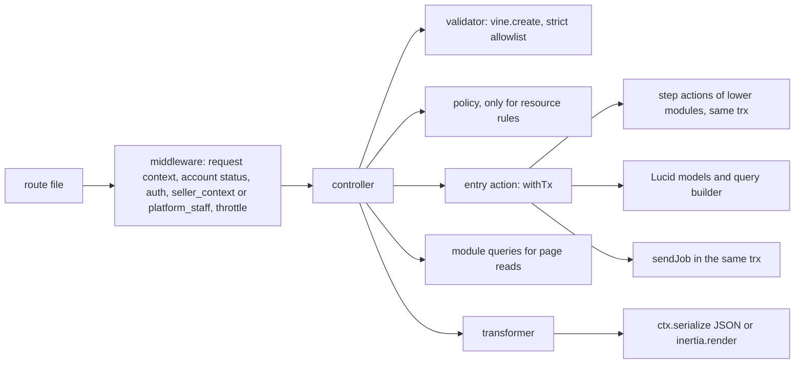
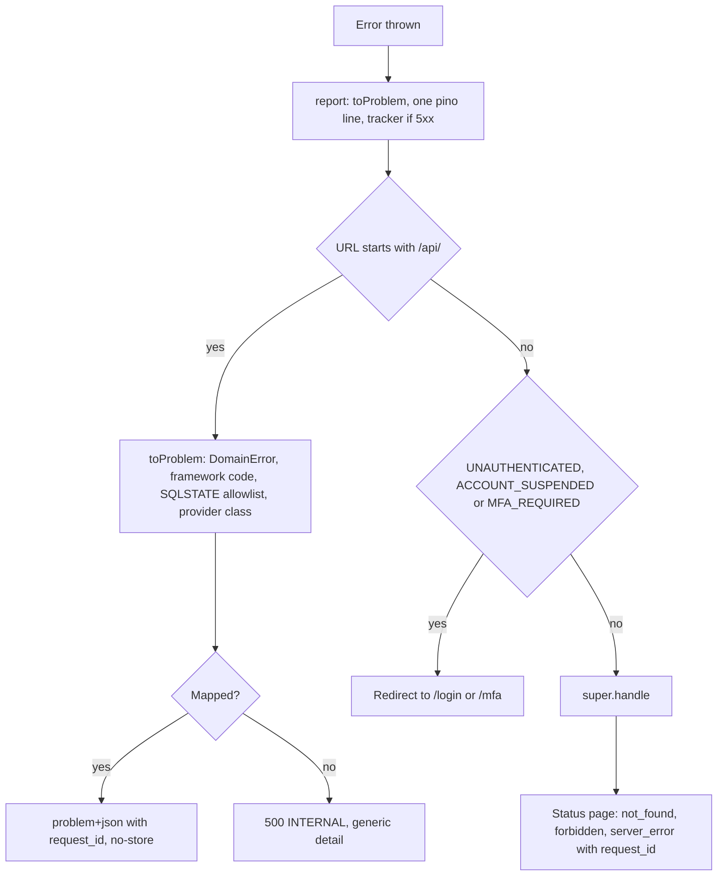
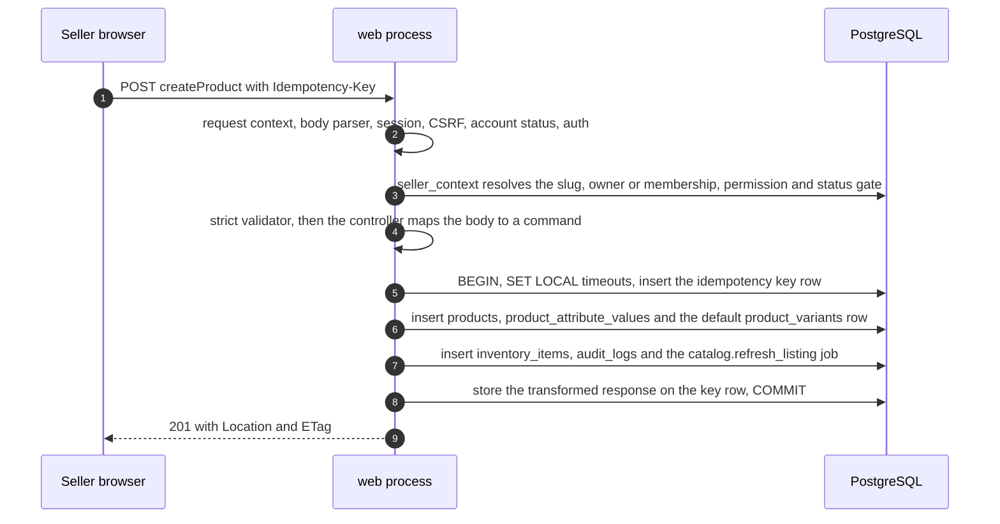

# Code Structure and Engineering Standards

Status: Draft v1 (2026-09-26)

Reviewed: critic pass B5 part 1 (2026-09-26)

Reviewed: critic pass B5 part 2 (2026-09-26)

Reviewed: critic pass B5 part 3 (2026-09-26)

Reviewed: critic pass B5 part 4 (2026-09-26)

This document is the standard the DripNepal codebase must meet: where code lives, which module may depend on which, what each layer of a request may and may not do, and (in later sections) how errors, configuration, logging, migrations, dependencies, reviews and the frontend are handled. It describes the **target state**. Files in the repository today are evidence of what exists and are cited as [Verified-repo]; a file is kept only where it already meets the standard, and each "Current code → target" table says whether it is kept, fixed, rewritten or deleted (product owner, 2026-09-26: "rewrite is fine where needed").

**What this document does not own.** Module map, dependency diagram and job catalogue: [03](03-system-architecture.md#4-modules-and-dependency-rules). Tables, columns, constraints and settings: [04](04-domain-model-and-data-dictionary.md) and [04a](04a-data-dictionary-tables.md). State machines, lock order and transaction rules for money and stock: [05](05-order-payment-and-inventory-lifecycles.md). Endpoints, status codes, error codes and idempotency: [06](06-api-design.md) and [openapi.yaml](openapi.yaml). Permissions, threats and privacy: [07](07-security-threat-model-and-permissions.md). UI behaviour: [08](08-ui-ux-and-design-system.md). Test ID registry and CI gates: [10](10-testing-and-quality-gates.md). Runbooks and job operations: [11](11-deployment-and-operations.md). Milestones: [12](12-roadmap-and-backlog.md).

**Labels.** [Confirmed] product owner answer; [Verified-repo] read in this repository, including installed `node_modules`; [Verified-doc] read in a primary source or a reviewed DripNepal document; [Assumption] a working value to confirm; [Open] OD-xx; [Verify-external] VX-xx. Code marked "design sketch" uses only APIs verified for the installed versions and shows intent; code marked "pseudocode" uses something not verified (usually a package that is not installed yet).

## Reading guide

| §   | Title                                                     | Status in this draft |
| --- | --------------------------------------------------------- | -------------------- |
| 1   | Repository structure                                      | Written              |
| 2   | Module ownership and dependency rules                     | Written              |
| 3   | Layer responsibilities                                    | Written              |
| 4   | API serialization and shared contracts                    | Written              |
| 5   | Error handling                                            | Written              |
| 6   | Configuration validation and secrets                      | Written              |
| 7   | Structured logging and request IDs                        | Written              |
| 8   | Migrations and seeders                                    | Written              |
| 9   | Safe production initialization                            | Written              |
| 10  | Dependency policy                                         | Written              |
| 11  | Lint, format, typecheck and review                        | Written              |
| 12  | Vertical slice: vendor product creation (`createProduct`) | Written              |
| 13  | Frontend code standards                                   | Written              |
| —   | Consistency notes for editor                              | Written (for §1–§13) |

A developer adding a feature reads §1.3 (names), §2.2 (what the module may import) and §3.2 (what each layer does). A reviewer uses §3.13 as the list of things to reject.

---

## 1. Repository structure

### 1.1 Principles

1. **Adonis-conventional directories stay** ([ADR-0002](adr/0002-modular-monolith-adonisjs.md) decision 4, canon §6.3). `app/controllers`, `app/models`, `app/validators`, `app/policies`, `app/transformers`, `app/middleware`, `app/exceptions`, `commands`, `config`, `database`, `providers`, `start` and `resources` keep their framework meaning, because generators and the assembler index them: the controllers index `#generated/controllers` is built from `app/controllers/**` and transformers are indexed by `indexEntities` (`adonisrc.ts` hooks [Verified-repo]).
2. **Business code lives in modules**: `app/modules/<module>/` for the fifteen modules of canon §6.2 and [03 §4.4](03-system-architecture.md#44-module-responsibilities). Everything a module decides (use cases, reads other modules may call, pure rules, events, job handlers, provider adapters) is inside its folder.
3. **Adonis folders are organised by module or surface underneath**: `app/validators/<module>/`, `app/policies/<module>/`, `app/transformers/<module>/`, `app/controllers/<surface>/<module>/`. A reader can find everything about inventory by searching for `inventory/`.
4. **Generated files are never edited by hand** and are either committed with a freshness check or ignored (§1.4).
5. **One naming style**: `snake_case` file names on the server and in `inertia/`, except upstream shadcn copies in `inertia/components/ui/`, which keep their registry names so `shadcn add --diff` compares like with like ([08 §12.1](08-ui-ux-and-design-system.md#121-ownership-and-folders)).

### 1.2 Target tree

```text
drip-nepal/
├── adonisrc.ts                      # providers, preloads (+ start/database_types.ts), test suites (+ concurrency)
├── ace.js · bin/{server,console,test}.ts
├── app/
│   ├── controllers/
│   │   ├── storefront/<module>/*_controller.ts     # SSR page reads, GET only
│   │   ├── auth/identity/*_controller.ts           # login, signup, reset, MFA pages, GET only
│   │   ├── payments/payments/return_controller.ts  # GET /payments/{provider}/return (ADR-0012)
│   │   ├── account/<module>/*_controller.ts        # customer pages, GET only
│   │   ├── seller/<module>/*_controller.ts         # /seller/{shopSlug}/… pages, GET only
│   │   ├── admin/<module>/*_controller.ts          # /admin/… pages, GET only
│   │   └── api/v1/{auth,public,customer,seller,admin,webhooks}/<module>/*_controller.ts
│   ├── exceptions/{handler.ts, domain_error.ts, constraint_map.ts}   # §5
│   ├── middleware/*_middleware.ts                   # §3.4
│   ├── models/<table_singular>.ts                   # extends generated schema class, relations only
│   ├── modules/
│   │   ├── platform/
│   │   │   ├── tx.ts            # withTx, jobTx, insideTransaction (§3.8)
│   │   │   ├── cas.ts           # casStatus (§3.8)
│   │   │   ├── money.ts         # Minor, toMinor, sumMinor (04 §18.4)
│   │   │   ├── idempotency.ts   # idempotencyScope, withIdempotency, ReplayRequested (06 §7.9)
│   │   │   ├── jobs.ts          # JobPayloads, sendJob, pg-boss instance (§2.3)
│   │   │   ├── ports/           # EmailSender, ObjectStorage, SmsSender, CallContext, PortAdapter guard
│   │   │   ├── providers/       # mail, drive and SMS adapters behind the ports
│   │   │   ├── crypto/{field_encrypter.ts, field_decrypter.ts, blind_index.ts}
│   │   │   ├── actions/ · queries.ts · domain/ · events.ts · jobs/
│   │   ├── payments/providers/{khalti.ts, esewa.ts, fake.ts}   # PaymentProvider adapters (ADR-0012)
│   │   └── <module>/
│   │       ├── actions/<operation>.ts   # one use case or transaction step per file
│   │       ├── queries.ts               # reads other modules and pages may call
│   │       ├── domain/*.ts              # pure rules: *_machine.ts, vocabularies, errors, policy constants
│   │       ├── events.ts                # event names and job payload types
│   │       ├── jobs/<queue_leaf>.ts     # handlers hosted by this module (03 §9 Owner column)
│   │       └── internal/                # optional private helpers
│   ├── policies/<module>/*_policy.ts
│   ├── transformers/<module>/*_transformer.ts
│   └── validators/<module>/<operation>.ts · validators/support/strict.ts
├── architecture/{model-ownership.json, model_rules.cjs}   # table → module map and rule generator for T-ARCH-001
├── commands/{platform_create_admin.ts, jobs_work.ts, jobs_redrive.ts, data_reencrypt.ts}
├── config/*.ts                              # + limiter, drive, mail, jobs when those packages land
├── database/
│   ├── migrations/                          # the 14-file baseline of 04 §20.2.2, then forward-only
│   ├── seeders/reference/{index_seeder.ts, *_seeder.ts, data/*.csv}   # safe in production
│   ├── seeders/dev/*_seeder.ts              # refuse to run in production (§8)
│   ├── factories/*_factory.ts
│   ├── schema.ts                            # generated by schema:generate, committed
│   ├── schema_rules.ts                      # loaded through schemaGeneration.rulesPaths
│   └── migrations.lock                      # checksums, from the first production deploy (ADR-0011)
├── docs/                                    # this documentation set, adr/, openapi.yaml
├── inertia/
│   ├── app.tsx · ssr.tsx · client.ts · tsconfig.json
│   ├── pages/{storefront,auth,payments,account,seller,admin,errors,dev}/…   # page entry files only
│   ├── layouts/{storefront,auth,account,seller,admin}_layout.tsx
│   ├── components/ui/                       # upstream shadcn copies (registry file names)
│   ├── components/kit/                      # cleared kit items; empty until VX-13
│   ├── components/{common,forms,auth,catalog,search,cart,checkout,orders,account,seller,admin}/
│   ├── hooks/ · lib/ · css/ · assets/
├── providers/{api_provider.ts, ports_provider.ts, jobs_provider.ts}   # Adonis service providers
├── resources/
│   ├── views/{inertia_layout.edge, emails/}
│   ├── lang/en/*.json                       # message catalogs (R2 adds lang/ne)
│   └── legal/seller-agreement/<version>.md  # 04a §6
├── shared/{constants/, format/}             # isomorphic code used by server and inertia
├── start/{env.ts, kernel.ts, routes.ts, validator.ts, database_types.ts, limiter.ts, jobs.ts}
├── start/routes/{storefront,auth,account,seller,admin,health,dev,webhooks}.ts
├── start/routes/api_v1/{auth,public,customer,seller,admin}.ts
├── tests/{bootstrap.ts, unit/, functional/, browser/, concurrency/, load/}
├── .adonisjs/                               # generated by assembler hooks, committed (§1.4)
├── .github/{workflows/ci.yml, pull_request_template.md}
├── .dependency-cruiser.cjs · eslint.config.js · .husky/ · docker-compose.yml · Dockerfile
└── package.json · pnpm-lock.yaml · pnpm-workspace.yaml · tsconfig.json · tsconfig.inertia.json
```

Notes on the tree:

- **Surfaces for controllers** follow canon §6.3 (`storefront`, `account`, `seller`, `admin`, `api/v1/{public,customer,seller,admin,webhooks}`) plus three additions that mirror existing surfaces: `auth` pages ([03 §6.1](03-system-architecture.md#61-surfaces-and-rendering-modes)), the `payments` return page, and `api/v1/auth` for the "Auth and self" API surface of [06 §2.2](06-api-design.md#22-surfaces).
- **Page folders** match the `ssr.pages` filter in [03 §6.1](03-system-architecture.md#61-surfaces-and-rendering-modes), which renders server-side exactly the pages whose names start with `storefront/`, `auth/` or `payments/`. `errors/` pages exist today (`inertia/pages/errors/*.tsx` [Verified-repo]) and stay; `dev/` holds the development-only component gallery that replaces `/design-system` (RF-40).
- **Only page entry files go in `inertia/pages/`.** The `indexPages` hook registers every `.tsx` and `.ts` file under `inertia/pages` as a page: today `.adonisjs/server/pages.d.ts` lists `commerce/categories/components/applied_filters` (a `.tsx` component) and `commerce/categories/mock` (from `mock.ts`) as Inertia pages [Verified-repo], and the eager SSR glob in `inertia/ssr.tsx` bundles them. Page-private components go to `inertia/components/<domain>/`.
- **Domain component folders** (the names [08 §12.1](08-ui-ux-and-design-system.md#121-ownership-and-folders) leaves to this document), with the [08 §4.3](08-ui-ux-and-design-system.md#43-dripnepal-owned-composed-components) components each one holds: `catalog` (`ProductCard`, `ProductGallery`, `VariantPicker`, `PriceTag`, `StockBadge`), `cart` (`CartShopGroup`), `checkout` (`CheckoutStepper`, `CheckoutReview`), `forms` (`AddressForm`, `NepalPhoneInput`, `MoneyInput`, `ImageUploader`), `orders` (`OrderTimeline`, `ShipmentTracker`), `seller` (`ShopSwitcher`), `common` (`DataTable`, `FilterBar`, `StatusBadge`, `ConfirmDialog`, `EmptyState`, `PermissionDenied`, `OfflineBanner`, `SiteBanner`). `auth`, `search`, `account` and `admin` hold surface-specific pieces. A component used by two surfaces moves to `common`; file names are `snake_case` (`product_card.tsx`).
- **`providers/`** at the root is the Adonis service-provider folder. Adapters to external services are called "providers" only inside a module (`app/modules/payments/providers/`, as canon §6.3 names them), and are bound to their ports by `providers/ports_provider.ts`.
- **`shared/`** is imported by both sides (`#shared/*` on the server, `@shared/*` in `inertia/tsconfig.json` [Verified-repo]). It may import nothing from `app/` or `inertia/`. The money formatter used by SSR, the client and email templates lives in `shared/format/money.ts` (answers [08 §5.11](08-ui-ux-and-design-system.md#5-design-tokens)'s "location per 09"; behaviour in §13).
- **`tests/concurrency`** is a new Japa suite (real PostgreSQL, pool larger than 1) for T-INV-003, T-CHK-004 and the lock-order tests of [05 §4.4](05-order-payment-and-inventory-lifecycles.md#44-global-lock-ordering); **`tests/load`** holds k6 scripts for T-PERF-001 and is not a Japa suite. Test layout and gates are owned by [10](10-testing-and-quality-gates.md).
- **Process commands.** The `web` process runs `node bin/server.js` (the existing `start` script [Verified-repo `package.json`]); the `worker` process runs `node ace jobs:work`; this fixes the name that [03 §3.2](03-system-architecture.md#32-container-responsibilities) leaves to this document. Redrive is `node ace jobs:redrive` ([03 §10.5](03-system-architecture.md#105-dead-letters-and-redrive)).

### 1.3 Naming conventions

| Thing                          | Convention                                                                                                                                                       | Example                                                               |
| ------------------------------ | ---------------------------------------------------------------------------------------------------------------------------------------------------------------- | --------------------------------------------------------------------- |
| Operation                      | The canon §6.5 `operationId` is the name everywhere: API route name, action file, action class, validator, test titles                                           | `adjustInventory`                                                     |
| Entry action (use case)        | `app/modules/<m>/actions/<operation_in_snake_case>.ts`, default export class in PascalCase                                                                       | `actions/adjust_inventory.ts` → `AdjustInventory`                     |
| Step action (in a transaction) | Same folder, exported function whose first parameter is `trx`                                                                                                    | `actions/reserve_for_order.ts` → `reserveForOrder(trx, cmd)`          |
| API route name                 | Exactly the `operationId`; API groups never call `.as()`, because a group name is prepended to its routes' names                                                 | `.as('adjustInventory')`                                              |
| Page route name                | `<surface>.<area>.<action>`                                                                                                                                      | `seller.orders.show`                                                  |
| Inertia page name              | Path under `inertia/pages` without extension                                                                                                                     | `seller/orders/show`                                                  |
| Controller                     | `<resource_plural>_controller.ts`, class `<Resource>Controller`; methods `index`, `show`, `store`, `update`, `destroy`, or the operation verb for non-CRUD steps | `shop_orders_controller.ts` → `ShopOrdersController.accept`           |
| Validator                      | `app/validators/<module>/<operation>.ts`, named export `<operation>Validator`                                                                                    | `adjustInventoryValidator`                                            |
| Transformer                    | `<Entity><Audience>Transformer`, one per audience whose visible fields differ ([06 §3.6](06-api-design.md#36-output-transformers-never-models))                  | `ShopOrderSellerTransformer`                                          |
| Policy                         | `app/policies/<module>/<entity>_policy.ts`, class `<Entity>Policy`                                                                                               | `ProductPolicy`                                                       |
| Domain event                   | `<entity>.<past_tense>` ([03 §4.4](03-system-architecture.md#44-module-responsibilities))                                                                        | `shop_order.accepted`                                                 |
| Queue                          | `<subject>.<snake_case_name>` from [03 §9](03-system-architecture.md#9-asynchronous-work); dead-letter queue `dlq.<queue>`                                       | `orders.acceptance_timeout`, `dlq.orders.acceptance_timeout`          |
| Job handler file               | `jobs/<leaf>.ts` in the Owner module; `jobs/<subject>_<leaf>.ts` when the queue's subject is another module                                                      | `orders/jobs/acceptance_timeout.ts`, `orders/jobs/payments_verify.ts` |
| State machine                  | `app/modules/<m>/domain/<entity>_machine.ts` ([05 §6.0](05-order-payment-and-inventory-lifecycles.md#60-conventions-used-in-every-table))                        | `orders/domain/shop_order_machine.ts`                                 |
| Middleware                     | File `<name>_middleware.ts`; kernel key in camelCase                                                                                                             | `seller_context_middleware.ts` ↔ `middleware.sellerContext(…)`        |
| Ace command                    | `<namespace>:<verb>`; file `<namespace>_<verb>.ts`                                                                                                               | `platform:create-admin`, `jobs:work`                                  |
| Import aliases                 | `package.json` `imports`; add `#modules/*` → `./app/modules/*.js`                                                                                                | `import { withTx } from '#modules/platform/tx'`                       |
| Database objects               | Owned by [04 §2.14](04-domain-model-and-data-dictionary.md#214-naming)                                                                                           | `inventory_movements_deltas_check`                                    |

Job payload keys are `snake_case` like the stored JSON of the API (OD-13 default), and every payload carries `request_id` and `causation_id` ([03 §10.8](03-system-architecture.md#108-observability-of-jobs)).

### 1.4 Generated artefacts

| Artefact                                                                                      | Produced by                                                                                                                                                                                                                         | Committed      | Rule and check                                                                                                                                                                                                                                                                                                                                                                                              |
| --------------------------------------------------------------------------------------------- | ----------------------------------------------------------------------------------------------------------------------------------------------------------------------------------------------------------------------------------- | -------------- | ----------------------------------------------------------------------------------------------------------------------------------------------------------------------------------------------------------------------------------------------------------------------------------------------------------------------------------------------------------------------------------------------------------- |
| `.adonisjs/server/{controllers.ts, routes.d.ts, pages.d.ts, events.ts, listeners.ts}`         | Assembler `init` hooks in `adonisrc.ts` (`indexEntities`, `indexPages`), which run for the dev server, the test runner and the bundler [Verified-repo `@adonisjs/assembler` 8.4.0 `build/src/types/hooks.d.ts:49`]                  | Yes (as today) | Never edited by hand. Committed because `start/routes.ts` imports `#generated/controllers` and `pnpm typecheck` on a fresh clone or in the pre-push hook must work without first starting the dev server. T-ARCH-016 (proposed): CI runs `node ace test` (which runs the hooks) and then `git diff --exit-code .adonisjs`.                                                                                  |
| `.adonisjs/client/{data.d.ts, manifest.d.ts}`                                                 | `indexEntities` with `transformers.withSharedProps` [Verified-repo `adonisrc.ts`]                                                                                                                                                   | Yes            | Same check. `Data.*` types are the page-prop contract (§4); they are never duplicated as hand-written DTOs.                                                                                                                                                                                                                                                                                                 |
| `.adonisjs/client/registry/*`                                                                 | `@tuyau/core` 1.2.2 `generateRegistry()` [Verified-repo `adonisrc.ts`]                                                                                                                                                              | Yes            | Same check. It embeds every named route pattern in the client bundle (A5-17); the target passes `routes.except`, which matches **route names** (strings, regular expressions or a predicate) [Verified-repo `@tuyau/core` 1.2.2 `build/backend/generate_registry.d.ts:204`], to leave out `receivePaymentWebhook` and the routes named `health.*` and `dev.*`. Authorization never relies on route secrecy. |
| `database/schema.ts`                                                                          | `node ace schema:generate`, run by `migration:run`/`rollback` except in production [Verified-doc `build/commands/migration/run.js`, <https://registry.npmjs.org/@adonisjs/lucid/-/lucid-22.4.2.tgz>, accessed 2026-09-25; 04 §2.15] | Yes            | Never edited by hand; production does not regenerate it, so the committed file must match the migrations. T-ARCH-010 (proposed in 04): `migration:fresh` then `git diff --exit-code database/schema.ts`, and no `any` in the file.                                                                                                                                                                          |
| `database/migrations.lock`                                                                    | CI script, from the first production deploy                                                                                                                                                                                         | Yes            | Fails CI if an applied migration changes ([04 §20.2.4](04-domain-model-and-data-dictionary.md#2024-after-the-first-production-deploy-forward-only-expand-and-contract), RF-41). Detail in §8.                                                                                                                                                                                                               |
| `build/`, `public/assets/`, `tmp/*`                                                           | `node ace build`, Vite, runtime                                                                                                                                                                                                     | No             | Already ignored [Verified-repo `.gitignore`].                                                                                                                                                                                                                                                                                                                                                               |
| `*.tsbuildinfo`, `coverage/`, `screenshots/*`, `.env.*` except `.env.example` and `.env.test` | tsc, test runs, operators                                                                                                                                                                                                           | No             | Added to `.gitignore`; `tsconfig.inertia.tsbuildinfo` is removed from the index (RF-33, A5-10).                                                                                                                                                                                                                                                                                                             |
| `docs/openapi.yaml`                                                                           | Hand-maintained; Tuyau 1.2.2 has no OpenAPI generator [Verified-doc package exports, <https://registry.npmjs.org/@tuyau/core/-/core-1.2.2.tgz>, accessed 2026-09-25]                                                                | Yes            | Kept in step by contract tests (T-API-001); §4.                                                                                                                                                                                                                                                                                                                                                             |

Trade-off of committing `.adonisjs/`: generated diffs appear in most PRs (A5-21). They are accepted because the alternative (ignore and regenerate) makes a fresh checkout fail typecheck, and the freshness check turns a stale file into a CI failure instead of a silent drift. A PR that changes routes, pages or transformers commits the regenerated files in the same PR.

### 1.5 Current code → target (structure)

| Area / file(s)                                                          | Today [Verified-repo]                                                                                                                                                                     | Decision                                                                                                                                                                                                                                                                                                                                                                                                                                           | Reason                     | Milestone                        |
| ----------------------------------------------------------------------- | ----------------------------------------------------------------------------------------------------------------------------------------------------------------------------------------- | -------------------------------------------------------------------------------------------------------------------------------------------------------------------------------------------------------------------------------------------------------------------------------------------------------------------------------------------------------------------------------------------------------------------------------------------------- | -------------------------- | -------------------------------- |
| `app/modules/`                                                          | Does not exist                                                                                                                                                                            | **Create**: `platform` and `audit` first, then each module in the milestone that needs it                                                                                                                                                                                                                                                                                                                                                          | ADR-0002                   | M0, then M1–M8                   |
| `app/controllers/*` (5 files)                                           | Flat `new_account_controller.ts`, `session_controller.ts`; `shops/auth`, `shops/dashboard`; transactions and `User.create({ ...payload })` inline                                         | **Rewrite** into `<surface>/<module>/`, logic moved to actions                                                                                                                                                                                                                                                                                                                                                                                     | RF-03, RF-36, RF-12        | M0 hotfix, M1 (auth), M2 (shops) |
| `app/models/*` (20 files)                                               | Models of the exploratory schema; `User` has an `initials` display getter, a pivot to `user_roles` and upward relations to `Shop`, `Cart`, `Order`                                        | **Rewrite** after the baseline: extend generated schema classes, relations only and only downward (§2.4 rule 5)                                                                                                                                                                                                                                                                                                                                    | RF-20, RF-06               | M0 baseline                      |
| `app/constants/**`                                                      | Status and permission constants, imported by migrations and seeders                                                                                                                       | **Delete**: vocabularies move to `app/modules/<m>/domain/`, permission maps to code in `shops` and `identity` (07 §4)                                                                                                                                                                                                                                                                                                                              | RF-23, RF-41, RF-20        | M0                               |
| `app/utils/random.ts`                                                   | Used only by factories and the demo seeder                                                                                                                                                | **Delete**; factories and dev seeders use their own helpers under `database/`                                                                                                                                                                                                                                                                                                                                                                      | RF-05                      | M0                               |
| `app/validators/auth/*`, `app/validators/shared.ts`                     | `vine.create` already used (meets the standard); password max 32, phone rule rejects valid numbers, `unique` exposes enumeration                                                          | **Rewrite** as `app/validators/identity/*` and `shops/*`                                                                                                                                                                                                                                                                                                                                                                                           | RF-12, RF-22, RF-29, RF-38 | M1, M2                           |
| `app/transformers/{user,shop}_transformer.ts`                           | `BaseTransformer` + `pick()` (meets the standard); `ShopTransformer` exposes `ownerId`, email and phone                                                                                   | **Keep the pattern, rewrite the files** per module and audience                                                                                                                                                                                                                                                                                                                                                                                    | RF-36                      | M1, M2                           |
| `app/middleware/*`                                                      | `auth`, `guest`, `silent_auth`, `container_bindings`, `inertia`                                                                                                                           | **Keep** the framework ones; **fix** `inertia_middleware.ts` shared props; **add** the §3.4 middleware                                                                                                                                                                                                                                                                                                                                             | RF-01, RF-04, RF-44        | M0, M2                           |
| `app/exceptions/handler.ts`                                             | Default handler, status pages in production only                                                                                                                                          | **Rewrite** (§5)                                                                                                                                                                                                                                                                                                                                                                                                                                   | RF-36                      | M0                               |
| `providers/api_provider.ts`                                             | `ApiSerializer` registers `ctx.serialize`; accepts only Lucid paginator meta                                                                                                              | **Keep, fix** the meta shapes and the `meta` key ([06 §3.4](06-api-design.md#34-envelopes-and-the-existing-apiserializer))                                                                                                                                                                                                                                                                                                                         | Canon §6.6                 | M1                               |
| `start/routes.ts`, `start/routes/shops.ts`                              | Storefront under `guest()`, two-segment catch-all, debug routes, `/shop/:shopSlug` with authentication only                                                                               | **Rewrite** into the per-surface files of §1.2                                                                                                                                                                                                                                                                                                                                                                                                     | RF-01, RF-02, RF-40        | M0                               |
| `start/kernel.ts`                                                       | Server and router middleware stack as in [03 §3.3](03-system-architecture.md#33-inside-the-web-process)                                                                                   | **Keep**, extend with the §3.4 order                                                                                                                                                                                                                                                                                                                                                                                                               | —                          | M0                               |
| `database/migrations/*` (26 files)                                      | 25 tables plus pgcrypto, edited in place, import `#constants`                                                                                                                             | **Delete** and replace with the 14-file baseline ([ADR-0011](adr/0011-schema-rebaseline-before-production.md), [Open OD-01])                                                                                                                                                                                                                                                                                                                       | RF-41, RF-06, RF-13        | M0                               |
| `database/seeders/*`, `database/factories/*`                            | Demo vendor with a known password, no environment guard; factories draw stale statuses                                                                                                    | **Rewrite** into `reference/` and `dev/` per [04 §20.3](04-domain-model-and-data-dictionary.md#203-seeders-factories-and-schema-generation)                                                                                                                                                                                                                                                                                                        | RF-05, A5-14               | M0                               |
| `database/schema.ts`, `database/schema_rules.ts`                        | Generated file committed (meets the standard); rules file empty and not wired                                                                                                             | **Keep** `schema.ts`; **fix** config to load the rules                                                                                                                                                                                                                                                                                                                                                                                             | 04 §20.3                   | M0                               |
| `inertia/pages/**`                                                      | `commerce/`, `customers/`, `shops/`, `landing/`, `design_system/`; components and mocks inside page folders                                                                               | **Rewrite** into surface folders; move non-page files out; `landing/**` deleted ([08 §13](08-ui-ux-and-design-system.md#13-current-ui-remediation-list))                                                                                                                                                                                                                                                                                           | RF-47, RF-40               | M0 (routing), M4/M5 (pages)      |
| `inertia/components/**`                                                 | `ui/` (34 files, including local helpers), `auth`, `commerce`, `navbar`, `footer`, `form_builder`, `search`, `providers`                                                                  | **Keep** `ui/` with the 08 §12.1 clean-up; **regroup** the rest into the domain folders of §1.2                                                                                                                                                                                                                                                                                                                                                    | ADR-0015                   | M0 (ui), M4/M5 (domain)          |
| `inertia/lib/mock-data`, `**/mock.ts`, `components/search/mock_data.ts` | Client mocks                                                                                                                                                                              | **Delete** as each page gets its server contract                                                                                                                                                                                                                                                                                                                                                                                                   | RF-27                      | M4, M5                           |
| `inertia/app.tsx`, `inertia/ssr.tsx`                                    | `createRoot`, devtools in production, SSR glob of every page                                                                                                                              | **Rewrite** (§13, [03 §6.1](03-system-architecture.md#61-surfaces-and-rendering-modes))                                                                                                                                                                                                                                                                                                                                                            | RF-08, RF-30               | M0 (after the OD-25 spike)       |
| `shared/constants/*`                                                    | `provinces_with_districts.ts` (client-side location list, incomplete per RF-29) and `shop_categories.ts` (13 shop categories, imported by the seeder and two seller pages)                | **Delete** `provinces_with_districts.ts`: locations come from the `logistics` tables (committed CSV, [04 §20.3](04-domain-model-and-data-dictionary.md#203-seeders-factories-and-schema-generation)) through props or `/api/v1/locations`. **Keep** `shop_categories.ts` only as the input of `reference/shop_categories_seeder.ts` (04 §20.3); pages read the `shop_categories` table through props instead of importing it. Add `shared/format/` | RF-29, RF-23               | M1, M2; M4 (`format/`)           |
| `.adonisjs/**`                                                          | Committed (meets the standard)                                                                                                                                                            | **Keep**, add T-ARCH-016 (proposed)                                                                                                                                                                                                                                                                                                                                                                                                                | A5-21                      | M0                               |
| `tsconfig.inertia.tsbuildinfo`                                          | Committed build artefact                                                                                                                                                                  | **Delete** from the index and ignore                                                                                                                                                                                                                                                                                                                                                                                                               | RF-33                      | M0                               |
| `.agents/**`, `skills-lock.json`                                        | About 150 third-party AI-skill files, including Python scripts                                                                                                                            | **Remove** `.agents/` from the tracked tree (keep locally, ignored); whether `skills-lock.json` alone can restore them is an M0 check                                                                                                                                                                                                                                                                                                              | RF-42                      | M0                               |
| `package.json` `imports`                                                | 21 aliases; no `#modules/*`; `#mails`, `#services`, `#listeners`, `#events` and `#abilities` point at folders that do not exist, and `#utils`, `#constants` at folders this table deletes | **Fix**: add `#modules/*`; remove those seven aliases                                                                                                                                                                                                                                                                                                                                                                                              | —                          | M0                               |
| `tests/`, `commands/`, `.github/`                                       | Only `tests/bootstrap.ts`; no commands; no CI                                                                                                                                             | **Create**                                                                                                                                                                                                                                                                                                                                                                                                                                         | RF-09, RF-05               | M0                               |

Dependency removals (`D`, `better-sqlite3`, the `@commercn` registry) are in §10; frontend file-level remediation is [08 §13](08-ui-ux-and-design-system.md#13-current-ui-remediation-list).

---

## 2. Module ownership and dependency rules

### 2.1 What a module is

A module is a folder under `app/modules/` that owns a set of tables (canon §6.2, [03 §4.4](03-system-architecture.md#44-module-responsibilities)). Only its code writes those tables. Its folder has a public surface and private parts:

| Path                           | Visibility                                                                                                 | Contents and rules                                                                                                                                                                                                                                                    |
| ------------------------------ | ---------------------------------------------------------------------------------------------------------- | --------------------------------------------------------------------------------------------------------------------------------------------------------------------------------------------------------------------------------------------------------------------- |
| `actions/*.ts`                 | Public                                                                                                     | Entry actions (use cases called by controllers, commands and job handlers) and step actions (called by a higher module inside that module's transaction). The only way to write the module's tables.                                                                  |
| `queries.ts`                   | Public                                                                                                     | Read functions. Each accepts an optional `{ client }` so a caller can read inside its transaction ([03 §4.2](03-system-architecture.md#42-how-modules-talk-to-each-other)). A module whose pure functions others need re-exports them here (`pricing` does, 03 §4.4). |
| `events.ts`                    | Public (types only)                                                                                        | Event names and the job payload types this module sends or consumes (§2.3).                                                                                                                                                                                           |
| `domain/*.ts`                  | Private to modules; readable by `app/validators`, `app/transformers`, `app/policies`, `database/factories` | Pure code: state machines, vocabularies (`as const` arrays that the CHECK lists mirror, T-ARCH-011 proposed in 04), domain errors, policy constants. No I/O, no Lucid import.                                                                                         |
| `jobs/*.ts`                    | Private                                                                                                    | Handlers for queues this module hosts. Registered by `start/jobs.ts`; never imported by another module.                                                                                                                                                               |
| `providers/*.ts`, `ports/*.ts` | Private (`ports/` public in `platform`)                                                                    | Adapters to external services. Provider SDKs are imported only here (ADR-0016 verification).                                                                                                                                                                          |
| `internal/*.ts`                | Private                                                                                                    | Helpers shared by the module's own files.                                                                                                                                                                                                                             |

`platform` is the one module whose root files (`tx.ts`, `cas.ts`, `money.ts`, `idempotency.ts`, `jobs.ts`, `ports/`) are public infrastructure for every module. Its `crypto/field_decrypter.ts` is the exception: only the code paths in the [07 §5.5](07-security-threat-model-and-permissions.md#55-encryption) allowlist may import it (T-SEC-034, proposed in 07).

Lucid models live in `app/models/` (Adonis convention), but each model **belongs** to the module that owns its table; `architecture/model-ownership.json` records the mapping from [04](04-domain-model-and-data-dictionary.md) and is checked in review when a table is added.

### 2.2 Allowed dependencies

The dependency diagram and its reasoning are owned by [03 §4.1](03-system-architecture.md#41-dependency-diagram); this table is its code-level form. "Public surface" means `actions/`, `queries.ts`, `events.ts` and, for `platform`, the public root files. A module may use its dependencies' dependencies (transitive), never anything to its right in the canonical chain.

| Module          | May import the public surface of             | Must never import                                         |
| --------------- | -------------------------------------------- | --------------------------------------------------------- |
| `platform`      | nothing                                      | every other module                                        |
| `audit`         | `platform`                                   | everything above                                          |
| `logistics`     | `platform`, `audit`                          | everything above                                          |
| `identity`      | `platform`, `audit`, `logistics`             | `shops` and above                                         |
| `shops`         | `identity` and below                         | `media` and above                                         |
| `media`         | `shops` and below                            | `catalog` and above                                       |
| `catalog`       | `media` and below                            | `inventory` and above                                     |
| `inventory`     | `catalog` and below                          | `pricing` and above                                       |
| `pricing`       | `inventory` and below                        | `cart` and above                                          |
| `cart`          | `pricing` and below                          | `checkout`, `orders`, `payments`, `ledger`                |
| `checkout`      | `cart`, `orders` and everything they may use | `notifications`                                           |
| `orders`        | `pricing` and below, `payments`, `ledger`    | `cart`, `checkout`, `notifications`                       |
| `payments`      | `pricing` and below, `ledger`                | `orders`, `cart`, `checkout`, `notifications`             |
| `ledger`        | `pricing` and below                          | `payments`, `orders`, `cart`, `checkout`, `notifications` |
| `notifications` | `queries.ts` of any module, `platform`       | any module's `actions/`; nothing imports it               |

Controllers, commands and `start/jobs.ts` sit outside the chain: a controller may call the public surface of any module (controller composition, [03 §4.2](03-system-architecture.md#42-how-modules-talk-to-each-other)), but it opens no transaction.

### 2.3 How modules cooperate

1. **Downward call inside the caller's transaction.** The higher module's entry action opens the transaction and passes `trx` to step actions of lower modules; the callee never commits. Example: `orders.recordCodCollection` calls `payments` and `ledger` step actions with its `trx`.
2. **Orchestration instead of upward calls.** When one transaction must change a lower and a higher module together, the higher module orchestrates. Gateway capture is `orders.applyPaymentOutcome(trx, …)`, which calls `payments.applyProviderResult(trx, …)` and `inventory.commitHeld(trx, …)` in one transaction; there is no upward payments → orders event ([05 §6.4](05-order-payment-and-inventory-lifecycles.md#64-payment-gateway-r11), ADR-0002 decision 3).
3. **Hosting rule for job handlers (adopted from [03 §9](03-system-architecture.md#9-asynchronous-work)).** A queue name names the subject; the handler lives in the module whose imports stay downward. `payments.verify`, `payments.daily_reconciliation`, `payments.process_provider_event`, `inventory.expire_reservations` and `refunds.sla_monitor` are therefore hosted in `orders` (`app/modules/orders/jobs/payments_verify.ts` and so on), because each ends in an `orders` transaction or reads `orders` tables. Renaming the queues after their host was rejected: the names are shared with 05 and 03, and the subject prefix is what an operator searches for in a dead-letter alert.
4. **Events after commit** are pg-boss jobs sent in the same transaction ([ADR-0010](adr/0010-postgres-jobs-pg-boss-transactional-send.md), [03 §10.1](03-system-architecture.md#101-transactional-send-the-job-table-is-the-outbox)). A module sends to another module's queue **by name**, without importing it. Payload types stay type-safe through declaration merging, so `platform` never imports a higher module:

```ts
// app/modules/platform/jobs.ts — design sketch. The pg-boss adapter call is pseudocode
// until the M0 spike (T-ARCH-004, proposed in 03) confirms the import path and options.
import type { TransactionClientContract } from '@adonisjs/lucid/types/database'

export interface JobPayloads {} // augmented by each module's events.ts
export type QueueName = keyof JobPayloads & string
type Envelope = { request_id: string | null; causation_id: string | null }

export async function sendJob<Q extends QueueName>(
  trx: TransactionClientContract,
  queue: Q,
  data: JobPayloads[Q] & Envelope,
  opts: { singletonKey?: string; startAfter?: Date } = {}
) {
  // pseudocode: boss.send(queue, data, { ...opts, db: fromKnex(trx.knexClient) })
  // trx.knexClient is Lucid 22.4.2's Knex transaction [Verified-repo database.d.ts:220]
}
```

```ts
// app/modules/orders/events.ts — design sketch (TypeScript module augmentation; checked by pnpm typecheck in M0)
declare module '#modules/platform/jobs' {
  interface JobPayloads {
    'orders.acceptance_timeout': { shop_order_id: string }
    'payments.verify': { payment_id: string }
  }
}
export {}
```

5. **Dead-letter naming.** Every queue in 03 §9 gets `dlq.<queue>`, except `platform.heartbeat` (03 marks it "no dead-letter queue"). The retry counts and backoff values stay [Assumption] in 03 §9; this document only fixes the names. `platform.retention_purge` is adopted as the queue name for the purges of [04 §19.3](04-domain-model-and-data-dictionary.md#193-retention-schedule), including cart deletion, the `notification_deliveries` purge and the 1-year purge of never-approved shop applications, which 03 §9 now lists (Consistency note 4).
6. **Composite sweepers: the one exception to module hosting.** 03 §9 gives `platform.retention_purge` the Owner `platform`, but the rows it deletes belong to `identity` (`user_tokens`, `user_addresses`), `shops` (`shop_invitations`, `shop_addresses`, and the configuration rows and `shops` redaction of never-approved applications), `media` (the KYC `media_assets` of those applications), `cart` (`carts`) and `notifications` (`notification_deliveries`). `platform` imports nothing, so a handler in `app/modules/platform/jobs/` would break §2.2 and the owner-writes check of §2.4. The handler is therefore registered in `start/jobs.ts`, which sits outside the chain like a controller, and calls each owning module's `actions/purge_expired.ts` entry action in turn, each in its own short `jobTx` with a batch limit. The queue name, schedule and dead-letter queue are unchanged; only the file that hosts the handler differs from 03's Owner column (Consistency note 14). No other queue in 03 §9 needs this exception.
7. **Notifications only consume.** `notifications.dispatch` reads other modules' `queries.ts` to render a template and writes `notification_deliveries`; `notifications.send_email` sends one row ([03 §9](03-system-architecture.md#9-asynchronous-work)). No module imports `notifications`.

### 2.4 Enforcement (T-ARCH-001)

T-ARCH-001 (canon §12) is one CI job that runs dependency-cruiser over `app/`, `start/` and `database/`, plus two small checks that an import graph cannot express. dependency-cruiser was chosen over the ESLint `no-restricted-imports` fallback that canon allows, because one config can express "same module" and "rank below" rules with capture groups instead of one override block per module; [03 §4.3](03-system-architecture.md#43-enforcement-t-arch-001) records the same choice as [Assumption] pending M0. dependency-cruiser is not installed yet, so option names are checked against the version added in M0.

```js
// .dependency-cruiser.cjs — design sketch (dependency-cruiser is not installed; option names checked in M0)
const ORDER = [
  'platform',
  'audit',
  'logistics',
  'identity',
  'shops',
  'media',
  'catalog',
  'inventory',
  'pricing',
  'cart',
  'checkout',
]
const EXTRA = {
  orders: ['payments', 'ledger'],
  payments: ['ledger'],
  checkout: ['orders', 'payments', 'ledger'],
}
const RIGHT = ['orders', 'payments', 'ledger'] // may use everything up to pricing (03 §4.1)
const PRIVATE = '(domain|jobs|providers|internal)' // field_decrypter has its own allowlist rule

function allowedFor(m) {
  if (m === 'notifications') return ORDER.concat(RIGHT) // queries.ts only, rule 4 below
  const rank = RIGHT.includes(m) ? ORDER.indexOf('pricing') : ORDER.indexOf(m) - 1
  return ORDER.slice(0, rank + 1).concat(EXTRA[m] ?? [])
}

const modules = ORDER.concat(RIGHT, ['notifications'])
module.exports = {
  forbidden: [
    // 1. no cycles anywhere in app/
    { name: 'no-cycles', severity: 'error', from: { path: '^app/' }, to: { circular: true } },
    // 2. another module's private folders are off limits
    {
      name: 'public-surface-only',
      severity: 'error',
      from: { path: '^app/modules/([^/]+)/' },
      to: { path: `^app/modules/([^/]+)/${PRIVATE}`, pathNot: '^app/modules/$1/' },
    },
    // 3. rank rule: no upward imports, generated per module
    ...modules.map((m) => ({
      name: `rank-${m}`,
      severity: 'error',
      from: { path: `^app/modules/${m}/` },
      to: {
        path: '^app/modules/([^/]+)/',
        pathNot: `^app/modules/(${[m, ...allowedFor(m)].join('|')})/`,
      },
    })),
    // 4. notifications may read queries.ts only; nobody imports notifications
    {
      name: 'notifications-read-only',
      severity: 'error',
      from: { path: '^app/modules/notifications/' },
      to: { path: '^app/modules/(?!notifications/|platform/)[^/]+/(actions|events)' },
    },
    {
      name: 'nobody-imports-notifications',
      severity: 'error',
      from: { path: '^app/', pathNot: '^app/modules/notifications/' },
      to: { path: '^app/modules/notifications/' },
    },
    // 5. a module (and its models) import only models of tables it or a lower module owns
    ...require('./architecture/model_rules.cjs')(
      require('./architecture/model-ownership.json'),
      allowedFor
    ),
    // 6. controllers: models as types only, and no db service (they open no transaction)
    {
      name: 'controllers-no-model-values',
      severity: 'error',
      from: { path: '^app/controllers/' },
      to: { path: '^app/models/', dependencyTypesNot: ['type-only'] },
    },
    {
      name: 'controllers-no-db',
      severity: 'error',
      from: { path: '^app/controllers/' },
      to: { path: '@adonisjs/lucid/(build/)?services/db' },
    },
    // 7. migrations import nothing from the application (RF-41, 04 §20.2.2)
    {
      name: 'migrations-self-contained',
      severity: 'error',
      from: { path: '^database/migrations/' },
      to: { path: '^(app|shared|start)/' },
    },
    // 8. provider SDKs and outbound HTTP only inside adapters (ADR-0016, 07 §7.4)
    {
      name: 'sdk-in-adapters-only',
      severity: 'error',
      from: { path: '^app/', pathNot: '^app/modules/[^/]+/providers/' },
      to: { path: 'node_modules/(@aws-sdk|nodemailer|ky|undici|axios)/' },
    },
  ],
}
```

The field-decrypter allowlist (07 §5.5) is one more generated rule: importing `app/modules/platform/crypto/field_decrypter.ts` is forbidden from every path except the code paths 07 lists (the customer, seller, admin and shop-profile transformers, the payout instruction and refund transfer views, the checkout snapshot writer and the TOTP verifier) and `commands/data_reencrypt.ts`, which must decrypt every `*_enc` value to rotate keys (07 §5.5 rotation row; the allowlist table does not list it yet, Consistency note 15). Outbound HTTP through the global `fetch` cannot be seen by an import rule, so lint bans `fetch(` in `app/` outside `providers/` folders (§11).

Checks that are part of T-ARCH-001 but are not import rules:

| Check                             | Mechanism                                                                                                                                                                                                                                                                                                                                                                   | Source                                                                                     |
| --------------------------------- | --------------------------------------------------------------------------------------------------------------------------------------------------------------------------------------------------------------------------------------------------------------------------------------------------------------------------------------------------------------------------- | ------------------------------------------------------------------------------------------ |
| No Lucid model reaches a response | In the `test` environment `ctx.serialize` and the Inertia render path walk the output and throw if any value is an instance of `BaseModel`; the functional suite exercises every route, so a controller that returns a model fails. Lint also bans `.serialize()` and `.toJSON()` calls in `app/controllers/**` (§11). [Assumption: the Inertia hook point is chosen in M0] | [06 §3.6](06-api-design.md#36-output-transformers-never-models)                            |
| Writes only by the owning module  | Rule 5 above stops imports of foreign models; a raw-SQL scan in the same job fails on `INSERT`, `UPDATE` or `DELETE` against a table owned by another module, reading the owner map                                                                                                                                                                                         | [05 §5.11](05-order-payment-and-inventory-lifecycles.md#511-rules-for-inventory_movements) |

Trade-off: the rank rules need a generator and an ownership map that must change when a table is added; a wrong map entry is caught in review against 04. There is no database-level enforcement between modules (one runtime role), which 03 §4.3 accepts at this size. Related checks owned elsewhere: route rule check (only `/api/v1/` registers unsafe methods, ADR-0004), permission declared on every seller and admin route (T-SEC-030, proposed in 07).

### 2.5 Current code → target (module boundaries)

| Area / file(s)                                     | Today [Verified-repo]                                                                                  | Decision                                                                                                      | Reason   | Milestone   |
| -------------------------------------------------- | ------------------------------------------------------------------------------------------------------ | ------------------------------------------------------------------------------------------------------------- | -------- | ----------- |
| Module boundaries                                  | None: controllers write any model; models relate in both directions (`User` → `Shop`, `Cart`, `Order`) | **Rewrite**: modules, public surfaces, rank rule; upward relations removed, replaced by higher-module queries | ADR-0002 | M0 baseline |
| Import checks                                      | ESLint `configApp(...react)` only; no import rules                                                     | **Add** `.dependency-cruiser.cjs` and T-ARCH-001 to CI                                                        | RF-09    | M0          |
| `app/constants/permissions/product_permissions.ts` | Permissions as seeded rows                                                                             | **Delete**; maps in code (07 §4)                                                                              | RF-20    | M0          |

---

## 3. Layer responsibilities

### 3.1 The request path



Reads for pages go route → middleware → controller → module query → transformer → `inertia.render`. Writes go route → middleware → controller → validator → (policy) → entry action → transformer → `ctx.serialize`. Job handlers enter at the action layer with the same rules.

### 3.2 Layer contract

| Layer        | Lives in                              | Does                                                                                                    | Must not                                                                                          | Enforced by                                                                                                                      |
| ------------ | ------------------------------------- | ------------------------------------------------------------------------------------------------------- | ------------------------------------------------------------------------------------------------- | -------------------------------------------------------------------------------------------------------------------------------- |
| Route        | `start/routes/**`                     | Pattern, name, controller method, group middleware, the permission slug                                 | Inline handlers (except `dev` routes), unsafe methods outside `api_v1/` and `webhooks.ts`         | Route rule check (ADR-0004), T-SEC-030 (proposed)                                                                                |
| Middleware   | `app/middleware/`                     | Request context, account status, authentication, shop and staff resolution, MFA freshness, rate limits  | Business rules, writes other than session and limiter state                                       | T-SEC-001, T-SEC-010, T-SEC-005 and T-SEC-008 (proposed in 07)                                                                   |
| Controller   | `app/controllers/<surface>/<module>/` | Validate, authorize a resource, call one entry action (or the queries a page needs), transform, respond | Open transactions, import `db`, write models, branch on business state, call two actions          | T-ARCH-001 rule 6, review                                                                                                        |
| Validator    | `app/validators/<module>/`            | Allowlisted input shape, normalisation, format rules that mirror CHECKs                                 | Server-owned fields, authorization, database writes                                               | T-SEC-003, T-API-002 (proposed in 06)                                                                                            |
| Policy       | `app/policies/<module>/`              | Resource-level rules beyond the route permission                                                        | Queries without the shop scope                                                                    | T-SEC-001, T-SEC-031 (proposed in 07)                                                                                            |
| Entry action | `app/modules/<m>/actions/`            | One use case: transaction, locks, state checks, writes, audit, jobs                                     | HTTP objects (`ctx`, `request`), provider calls inside the transaction, returning serialized data | T-ARCH-003, T-PAY-006 (proposed in 03/05)                                                                                        |
| Step action  | `app/modules/<m>/actions/`            | One step inside a caller's transaction                                                                  | Opening or committing a transaction, calling ports                                                | `withTx` nesting guard and `PortAdapter` guard (§3.8)                                                                            |
| Query        | `app/modules/<m>/queries.ts`          | Reads, scoped by owner or shop in the query itself                                                      | Writes; "load then check" ownership                                                               | T-SEC-001, T-SEC-002                                                                                                             |
| Model        | `app/models/`                         | Columns (from `database/schema.ts`), relations, framework mixins                                        | Business methods, hooks with business effects, display getters                                    | Review; T-ARCH-001 rule 5                                                                                                        |
| Transformer  | `app/transformers/<module>/`          | Allowlisted output per audience, allowlisted decryption                                                 | Queries, lazy loading, returning models                                                           | T-ARCH-001 (response check), T-SEC-034 (proposed in 07)                                                                          |
| Response     | `ctx.serialize` or `inertia.render`   | Envelope, status, headers                                                                               | Raw models, `response.json(model)`                                                                | T-API-001                                                                                                                        |
| Job handler  | `app/modules/<m>/jobs/`               | Parse payload, call an entry action or run `jobTx`, classify errors                                     | Assume it runs once                                                                               | Handler tests with duplicate delivery ([03 §10.3](03-system-architecture.md#103-at-least-once-delivery-and-idempotent-handlers)) |

### 3.3 Routes

- **Files.** One file per surface under `start/routes/`, imported by `start/routes.ts`. The JSON API is split by surface under `start/routes/api_v1/`, and unsafe methods are registered only there and in `start/routes/webhooks.ts` ([ADR-0004](adr/0004-inertia-reads-json-api-writes.md) decision 6 names a single `api_v1.ts`; the folder keeps the same rule with smaller files). `start/routes/dev.ts` is imported only when `app.inDev` (RF-40).
- **Names.** API routes are named by `operationId`, so the Tuyau route name, the OpenAPI operation and the test title are one string (answers [06 §10](06-api-design.md#10-versioning-and-compatibility) and [03 §6.5](03-system-architecture.md#65-reads-through-inertia-props-writes-through-apiv1-adr-0004)). Because a group's `.as()` prepends to its routes' names (`Route.as(name, prepend?)` [Verified-repo `@adonisjs/http-server` 9.1.0 `build/src/router/route.d.ts:142`]), API groups never call `.as()`.
- **Permissions on the route.** Seller and admin routes pass their one permission slug as the argument of the named middleware. Named middleware arguments are typed from the middleware's `handle(ctx, next, options)` [Verified-repo `http-server` 9.1.0 `build/src/types/middleware.d.ts:20`] and stored on the route as `{ name, args }` [Verified-repo `build/src/types/route.d.ts:49-52`], so T-SEC-030 (proposed in 07) can list every route with its slug from `router.toJSON()` and fail when one is missing.

```ts
// start/routes/api_v1/seller.ts — design sketch. router, group, prefix, use, as and named-middleware
// arguments are verified for @adonisjs/core 7.3.4 (http-server 9.1.0); the generated controller key
// shape is checked in M0; the 06 §9.1 limiter is added to the group when @adonisjs/limiter is installed.
import router from '@adonisjs/core/services/router'
import { middleware } from '#start/kernel'
import { controllers } from '#generated/controllers'

router
  .group(() => {
    router
      .post('/inventory/:variantId/adjustments', [
        controllers.api.v1.seller.inventory.InventoryItems,
        'adjust',
      ])
      .as('adjustInventory')
      .use(middleware.sellerContext({ permission: 'shop.inventory.adjust' }))

    router
      .post('/orders/:shopOrderNumber/accept', [
        controllers.api.v1.seller.orders.ShopOrders,
        'accept',
      ])
      .as('acceptShopOrder')
      .use(middleware.sellerContext({ permission: 'shop.orders.process' }))
  })
  .prefix('/api/v1/seller/shops/:shopSlug')
  .use(middleware.auth())
```

### 3.4 Middleware

Order after the existing router stack (`bodyparser`, `session`, `shield`, `initialize_auth`, `silent_auth` [Verified-repo `start/kernel.ts`]) is fixed by [03 §3.3](03-system-architecture.md#33-inside-the-web-process) and [07 §4.8](07-security-threat-model-and-permissions.md#48-how-policies-are-implemented):

| #   | Middleware (doc name) | File                                                 | Kernel                                | Sets on `ctx`                                                         | Behaviour owned by                                                                                                  |
| --- | --------------------- | ---------------------------------------------------- | ------------------------------------- | --------------------------------------------------------------------- | ------------------------------------------------------------------------------------------------------------------- |
| 1   | request context       | `request_context_middleware.ts`                      | server stack (first; §7.4)            | request ID on `ctx.logger` and the response                           | §7, [03 §12.1](03-system-architecture.md#121-request-ids-and-logging)                                               |
| 2   | account status        | `account_status_middleware.ts`                       | router stack                          | nothing; rejects suspended users and stale stamps                     | [07 §3.3](07-security-threat-model-and-permissions.md#33-the-per-request-account-check-and-the-suspension-decision) |
| 3   | `auth`, `guest`       | existing files                                       | named `auth`, `guest`                 | `ctx.auth.user`                                                       | `guest` is used only on login, signup and reset pages (RF-02)                                                       |
| 4   | `verified_email`      | `verified_email_middleware.ts`                       | named `verifiedEmail`                 | —                                                                     | 06 §2.2 (`EMAIL_NOT_VERIFIED`)                                                                                      |
| 5   | `seller_context`      | `seller_context_middleware.ts`                       | named `sellerContext({ permission })` | `ctx.shop = { id, slug, status, suspensionMode, actor, permissions }` | [06 §4.4](06-api-design.md#44-seller-authorization-algorithm), 07 §4.8 (sketch there)                               |
| 5   | `platform_staff`      | `platform_staff_middleware.ts`                       | named `platformStaff({ permission })` | `ctx.staff = { userId, role, permissions, mfaVerifiedAt }`            | 06 §4.3, 07 §3.9–§3.10 (404 for non-staff, 401 `MFA_REQUIRED` when stale)                                           |
| 6   | `throttle`            | limiter throttles in `start/limiter.ts` (pseudocode) | named per limiter                     | —                                                                     | [06 §9.1](06-api-design.md#91-rate-limits)                                                                          |

The name is **`seller_context`** everywhere, as in 03 §3.3 and 07 §4.8; the audit's `shopContext` is the same idea and is not used as a name. `ctx.shop` and `ctx.staff` are declared by module augmentation of `HttpContext`, the same way `providers/api_provider.ts` adds `serialize` [Verified-repo]. Middleware reads through module queries (`shops.resolveSellerContext`, `identity.getAccountStatus`); it never writes business tables.

### 3.5 Controllers

A controller method does five things in this order and nothing else: validate, authorize the resource (only if a policy applies), call **one** entry action (a page controller instead calls the module queries its props need, including deferred ones), transform, respond. The action receives a typed command and an `ActionContext` (`actorUserId`, `shopId` when seller-scoped, `requestId`, idempotency scope), never `ctx`.

```ts
// app/controllers/api/v1/seller/inventory/inventory_items_controller.ts — design sketch.
// inject, validateUsing, request.id, response.status and the transformer API are verified
// for the installed versions; AdjustInventory, the transformer and idempotencyScope are this
// document's names (pseudocode until written).
import { inject } from '@adonisjs/core'
import type { HttpContext } from '@adonisjs/core/http'
import AdjustInventory from '#modules/inventory/actions/adjust_inventory'
import { idempotencyScope } from '#modules/platform/idempotency'
import { adjustInventoryValidator } from '#validators/inventory/adjust_inventory'
import InventoryItemSellerTransformer from '#transformers/inventory/inventory_item_seller_transformer'

export default class InventoryItemsController {
  @inject()
  async adjust(ctx: HttpContext, action: AdjustInventory) {
    const input = await ctx.request.validateUsing(adjustInventoryValidator)
    const result = await action.execute(
      {
        variantId: ctx.params.variantId,
        delta: input.delta,
        reasonCode: input.reason_code,
        note: input.note ?? null,
      },
      {
        actorUserId: ctx.auth.user!.id,
        shopId: ctx.shop.id, // set by seller_context, never from the body
        requestId: ctx.request.id() ?? null,
        idempotency: idempotencyScope(ctx.request, 'adjustInventory'), // 400 IDEMPOTENCY_KEY_REQUIRED if absent
      }
    )
    ctx.response.status(201)
    // call as ctx.serialize(...): the api_provider function reads `this` (providers/api_provider.ts)
    return ctx.serialize(InventoryItemSellerTransformer.transform(result))
  }
}
```

Controllers call `ctx.request.validateUsing(…)` (or `request.validateUsing(…)`) directly, never through a wrapper: the Tuyau registry learns each route's body type by statically scanning controller methods for `request.validateUsing(validatorReference)`, `$CTX.request.validateUsing(…)` and a few equivalent forms [Verified-repo `@adonisjs/assembler` 8.4.0 `build/src/code_scanners/routes_scanner/validator_extractor.d.ts`]. A wrapper would silently drop the typed body from the client.

Page controllers are the same shape with a query instead of an action: `return inertia.render('seller/orders/show', { shopOrder: ShopOrderSellerTransformer.transform(row) })`. Heavy panels use `inertia.defer`/`inertia.optional` ([03 §6.3](03-system-architecture.md#63-dashboards-assessment-seller-and-admin)).

### 3.6 Validators

- Created with `vine.create(…)`; `vine.compile` is deprecated in `@vinejs/vine` 4.4.0 [Verified-doc `build/src/vine/main.d.ts`, <https://registry.npmjs.org/@vinejs/vine/-/vine-4.4.0.tgz>, accessed 2026-09-25]. Validators needing request data use `vine.withMetaData<M>().create(…)` and `request.validateUsing(v, { meta })`.
- **Allowlist, strictly.** Vine strips unknown keys by default; [06 §3.5](06-api-design.md#35-input-validators-are-allowlists) rejects them with 422 `unknown_field`. Because controllers must keep calling `request.validateUsing` (§3.5), the rejection is built into the schema: `app/validators/support/strict.ts` exports `strict(properties)`, which returns `vine.object(properties).allowUnknownProperties()` [Verified-repo `@vinejs/vine` 4.4.0 `build/src/schema/object/main.d.ts:167`] plus a custom rule that reports every key not in `properties`, recursively for nested objects and array items. `allowUnknownProperties<Value>()` widens the output type to `Output & { [K: string]: Value }` [Verified-repo same file, line 167], so declared keys keep their types; `strict()` narrows the result back to the declared properties so controllers never see the index signature. The custom rule attaches with `.use()`, which `VineObject` inherits from `BaseType` [Verified-repo `build/src/schema/base/main.d.ts:174`]. `strict()` stays pseudocode until its unit test (T-API-002, proposed in 06) runs in M0.
- **Never in a validator:** `shop_id`, `status`, `version`, totals, `commission_*`, `number`, `public_id`, `created_by`, `approved_by` (06 §3.5). The shop comes from `ctx.shop`, the actor from the session.
- **Account emails use one shared email rule** under `app/validators/support/`: it trims and lower-cases the address and refuses the reserved `anonymized.invalid` domain with 422 `VALIDATION_FAILED` on `email` ([06 §3.5](06-api-design.md#35-input-validators-are-allowlists)). `signUp`, the `platform:create-admin` command (§9.1) and any future email-change operation use it, so no live account can hold an anonymisation placeholder ([04a §5.1](04a-data-dictionary-tables.md#51-users) `users_anonymized_check`).
- Vocabularies come from the module's `domain/` (`VENDOR_ADJUSTMENT_REASONS` in `app/modules/inventory/domain/movement_reasons.ts`; 04a §8.3 names the file and `inventory_movements_reason_code_check` its values ([04a §8.3](04a-data-dictionary-tables.md#83-inventory_movements)), this document names the constant), so the validator, the CHECK and the labels cannot drift (T-ARCH-011, proposed in 04).

```ts
// app/validators/inventory/adjust_inventory.ts — design sketch; strict() is pseudocode (above)
import vine from '@vinejs/vine'
import { strict } from '#validators/support/strict'
import { VENDOR_ADJUSTMENT_REASONS } from '#modules/inventory/domain/movement_reasons'

export const adjustInventoryValidator = vine.create(
  strict({
    delta: vine.number().withoutDecimals(), // non-zero: custom rule (pseudocode) + inventory_movements_deltas_check
    reason_code: vine.enum(VENDOR_ADJUSTMENT_REASONS),
    note: vine.string().trim().maxLength(500).optional(), // inventory_movements_note_check: at most 500
  })
)
```

### 3.7 Policies

Most authorization is not a policy. Route permission and the shop status gate are applied by `seller_context`/`platform_staff`; tenancy is the `shop_id` or `customer_user_id` predicate inside every query, so a foreign ID is simply "not found" (T-SEC-001, T-SEC-002). A policy exists only for a rule about a specific resource that neither covers, for example a rule that depends on who created a draft ([07 §4.8](07-security-threat-model-and-permissions.md#48-how-policies-are-implemented)).

The standard is `@adonisjs/bouncer` 4.0.1: policies with extra arguments and `AuthorizationResponse.deny(message, 404)` so a denied resource looks missing [Verified-doc `build/src/response.d.ts`, <https://registry.npmjs.org/@adonisjs/bouncer/-/bouncer-4.0.1.tgz>, accessed 2026-09-25]. It is **not installed** [Verified-repo `node_modules/@adonisjs`], so it is added in M0 and the code below is pseudocode. If M0 finds a blocker, the fallback allowed by [ADR-0006](adr/0006-authorization-platform-roles-shop-memberships.md) decision 5 is plain functions with the same signature; either way a policy takes `(user, shop, resource)` and never queries without the shop scope.

```ts
// app/policies/catalog/product_policy.ts — pseudocode (@adonisjs/bouncer 4.0.1 not installed).
// The rule itself is an illustration of the shape only; resource rules are decided in 07.
export default class ProductPolicy extends BasePolicy {
  editDraft(user: User, shop: SellerShop, product: Product) {
    if (product.shopId !== shop.id) return AuthorizationResponse.deny('Not found', 404)
    return shop.actor !== 'catalog_editor' || product.createdBy === user.id
  }
}
// controller: await bouncer.with(ProductPolicy).authorize('editDraft', shop, product)
```

### 3.8 Actions, transactions and the helpers `platform` owns

**Entry actions** are plain classes with one public method, `execute(command, context)`, resolved from the container so ports can be injected with `@inject()` (`inject` is exported by `@adonisjs/core` 7.3.4 [Verified-repo `build/index.d.ts:7`]). They open exactly one transaction through `withTx`; for ⚷ operations the first step inside it is `withIdempotency(trx, scope, run)` ([06 §7.9](06-api-design.md#79-sketch)), whose `ReplayRequested` rolls the transaction back before the stored response is replayed. They take locks in the global order of [05 §4.4](05-order-payment-and-inventory-lifecycles.md#44-global-lock-ordering), check transitions with `assertTransition` from `domain/*_machine.ts`, write rows, record audit and send jobs, then return plain data or models for the controller's transformer. When an external call is needed they follow "record intent → commit → call → record outcome" ([03 §8.3](03-system-architecture.md#83-operations-that-must-not-hold-a-transaction)).

**Step actions** are exported functions whose first parameter is `trx`. They run inside someone else's transaction, so they can never call a port and need no injection; that is why they are functions and entry actions are classes.

```ts
// app/modules/platform/tx.ts — design sketch. db.transaction(callback), rawQuery with bindings and
// TransactionClientContract are verified for @adonisjs/lucid 22.4.2; AsyncLocalStorage is node:async_hooks.
import { AsyncLocalStorage } from 'node:async_hooks'
import db from '@adonisjs/lucid/services/db'
import type { TransactionClientContract } from '@adonisjs/lucid/types/database'
import { NestedTransaction } from './domain/errors.js'

const scope = new AsyncLocalStorage<{ inTx: true }>()
export const insideTransaction = () => scope.getStore()?.inTx === true

type TxOptions = { lockTimeoutMs?: number; statementTimeoutMs?: number }

export async function withTx<T>(
  fn: (trx: TransactionClientContract) => Promise<T>,
  { lockTimeoutMs = 5_000, statementTimeoutMs = 10_000 }: TxOptions = {} // 03 §8.2 request values
): Promise<T> {
  if (insideTransaction()) throw new NestedTransaction() // pass trx to a step action instead
  const run = () =>
    db.transaction(async (trx) => {
      // set_config(..., true) is SET LOCAL with bindings, so no SQL is built from strings (07 §7.4)
      await trx.rawQuery('select set_config(?, ?, true), set_config(?, ?, true)', [
        'lock_timeout',
        `${lockTimeoutMs}ms`,
        'statement_timeout',
        `${statementTimeoutMs}ms`,
      ])
      return scope.run({ inTx: true }, () => fn(trx))
    })
  try {
    return await run()
  } catch (error) {
    if ((error as { code?: string }).code !== '40P01') throw error // deadlock_detected
    // one retry with jitter, logged as an error (03 §8.2); safe because the idempotency row rolled back
    await new Promise((r) => setTimeout(r, 50 + Math.random() * 150))
    return run()
  }
}

export const jobTx = <T>(fn: (trx: TransactionClientContract) => Promise<T>) =>
  withTx(fn, { lockTimeoutMs: 10_000, statementTimeoutMs: 30_000 }) // 03 §8.2 worker values
```

- **`ProviderCallInsideTransaction`.** Every adapter behind a port extends `PortAdapter` (`app/modules/platform/ports/port_adapter.ts`), whose `guard(operation)` throws `ProviderCallInsideTransaction` when `insideTransaction()` is true, **in every environment** ([05 §9.1](05-order-payment-and-inventory-lifecycles.md#91-never-hold-a-database-transaction-open-while-calling-a-gateway), [03 §8.3](03-system-architecture.md#83-operations-that-must-not-hold-a-transaction)). Throwing in production turns a lock-holding bug into a visible 500 instead of a slow outage. Verified by T-PAY-006 (proposed in 05) and T-ARCH-003 (proposed in 03).
- **Only `tx.ts` calls `db.transaction(`.** Lint (`no-restricted-syntax`, §11) forbids it elsewhere; savepoints for the late-capture re-reserve ([03 §8.2](03-system-architecture.md#82-operations-that-must-be-one-transaction)) use `trx.transaction()` inside the orchestrating action, which Lucid documents as a nested transaction (savepoint) [Verified-doc <https://lucid.adonisjs.com/docs/transactions>, accessed 2026-09-25].
- **`casStatus`** (signature owned here, requested by [05 §9.2](05-order-payment-and-inventory-lifecycles.md#92-compare-and-set-status-updates)):

```ts
// app/modules/platform/cas.ts — design sketch; the update/returning result shape is confirmed in M0
export async function casStatus<T extends StatusTable>(
  trx: TransactionClientContract,
  table: T,
  key: CasKey<T>, // { id } or, for shop-scoped tables, { id, shopId } — required by the type
  from: StatusOf<T> | readonly StatusOf<T>[],
  to: StatusOf<T>,
  patch: StatusPatch<T> = {} // may not contain status, id, shop_id or version
): Promise<boolean>
// UPDATE <table> SET status = :to, <patch>, updated_at = now()[, version = version + 1]
//  WHERE id = :id [AND shop_id = :shopId] AND status = ANY(:from) RETURNING id
```

It returns `true` when one row changed. On `false` the caller re-reads and decides between an idempotent no-op and `InvalidStateTransition` (05 §9.2). `StatusTable`, `StatusOf<T>` and the versioned-table set are generated from the `domain/*_machine.ts` vocabularies, so a typo in a status is a type error. `shopId` is part of the key because every seller write must carry the shop predicate ([06 §4.4](06-api-design.md#44-seller-authorization-algorithm) step 5).

- **Money helpers.** `app/modules/platform/money.ts` holds `Minor`, `toMinor(value: unknown)` and `sumMinor(query, column)`, which always selects `COALESCE(SUM(column), 0)::bigint` so the int8 parser of `start/database_types.ts` returns a guarded number ([04 §18.4](04-domain-model-and-data-dictionary.md#184-lucid-and-node-postgres-bigint-handling); T-ARCH-013, proposed in 04). They are in `platform`, not `pricing`, because `catalog` and `inventory` rank below `pricing` and handle prices too; the rounding and allocation functions (`mulDivHalfUp`, `allocate`) stay in `app/modules/pricing/domain/money.ts` as [ADR-0007](adr/0007-money-integer-minor-units.md) decides, and that file re-exports `Minor`. ADR-0007's proposed lint ban on `parseFloat` and `toFixed` in money code is adopted in §11, next to the money-column lint T-ARCH-014 (proposed in 04).

### 3.9 Queries

Queries are named functions in `queries.ts`, for example `listInventory(shopId, opts)`. Every query that returns tenant data takes the tenant key as a required parameter and puts it in the `WHERE` clause; there is no "load by ID, then compare owner" path ([06 §4.5](06-api-design.md#45-customer-ownership)). A query accepts `{ client?: QueryClientContract }` and passes it to Lucid (`Model.query({ client })` [Verified-doc `build/src/types/model.d.ts`, <https://registry.npmjs.org/@adonisjs/lucid/-/lucid-22.4.2.tgz>, accessed 2026-09-25]). The same query feeds the page prop and the JSON endpoint ([06 §2.1](06-api-design.md#21-reads-are-props-writes-are-json-adr-0004)), so the two cannot drift.

### 3.10 Models

- A model extends its generated schema class and adds relations: `export default class Product extends ProductSchema` (the `make:model` stub in Lucid 22.4.2 does exactly this [Verified-doc `build/stubs/make/model/main.stub`, <https://registry.npmjs.org/@adonisjs/lucid/-/lucid-22.4.2.tgz>, accessed 2026-09-25]; [04 §2.15](04-domain-model-and-data-dictionary.md#215-lucid-mapping-rules)). `User` also composes the `withAuthFinder` mixin, as today [Verified-repo `app/models/user.ts`].
- **No business logic in models**: no methods that change state, no lifecycle hooks with business effects, no display getters (today's `User.initials` moves to a transformer). Framework behaviour (password hashing by the auth mixin) is allowed.
- **Relations point downward only**, matching §2.2: `Shop` may relate to `User`; `User` does not relate to `Shop`, `Cart` or `Order`.
- Composite-key tables are written only with the query builder inside the owning action ([04 §2.15](04-domain-model-and-data-dictionary.md#215-lucid-mapping-rules)).
- Mass assignment is banned: no `Model.create({ ...payload })` or `merge(payload)`; actions assign columns one by one ([07 §7.4](07-security-threat-model-and-permissions.md#74-code-rules-enforced-by-lint-or-architecture-tests), RF-36).

### 3.11 Transformers

Every response body and every Inertia prop is a transformer output: `BaseTransformer` (imported from `@adonisjs/core/transformers`, as `app/transformers/user_transformer.ts` does [Verified-repo]) with `toObject()` returning `this.pick(this.resource, [...])`, static `transform()` and `paginate()` [Verified-doc `@adonisjs/http-transformers` 2.3.1 `build/src/base_transformer.d.ts`, <https://registry.npmjs.org/@adonisjs/http-transformers/-/http-transformers-2.3.1.tgz>, accessed 2026-09-25]; the pattern is already used in `app/transformers/user_transformer.ts` [Verified-repo]. One transformer per audience where visible fields differ. Transformers do not query (relations are preloaded by the query and read with `whenLoaded`); only the transformers on the 07 §5.5 allowlist call the field decrypter. Money leaves as `{ amount_minor, currency }` ([06 §3.3](06-api-design.md#33-money-time-identifiers-enums)).

### 3.12 Responses

JSON responses go through `ctx.serialize(...)`, registered by `providers/api_provider.ts`, which wraps in `data` and, after the M1 fix, renames the paginator's `metadata` to `meta` ([06 §3.4](06-api-design.md#34-envelopes-and-the-existing-apiserializer)). Status codes and headers (`201`, `Location`, `ETag`) follow [06 §3.7](06-api-design.md#37-status-codes-on-success) and [06 §8](06-api-design.md#8-concurrent-edits-etag-and-if-match). Pages use `inertia.render(page, props)`. Errors are thrown, never built in controllers; the exception handler renders them (§5).

### 3.13 What we do not build

| Rejected pattern                                                                       | Why                                                                                                                                    | Instead                                                                                         |
| -------------------------------------------------------------------------------------- | -------------------------------------------------------------------------------------------------------------------------------------- | ----------------------------------------------------------------------------------------------- |
| Repository classes wrapping Lucid (`ProductRepository.findById`)                       | A second API over Lucid that hides `forUpdate`, `{ client: trx }` and query scopes, which are exactly what correctness depends on here | Lucid in actions; reads in `queries.ts`                                                         |
| Generic base classes (`BaseService<T>`, `BaseCrudController`, `BaseAction` with hooks) | Hidden control flow; one change touches every use case; hard to read for a 1–2 person team                                             | Small explicit classes and functions; shared helpers in `platform`                              |
| Abstractions that rename ORM methods (`save` → `persist`, `query` → `find`)            | Framework docs and digests stop applying; reviewers must learn a private dialect                                                       | Lucid's own names                                                                               |
| Service locator or global singletons for ports                                         | Tests cannot swap adapters without code branches                                                                                       | Container bindings in `providers/ports_provider.ts`, `@inject()`                                |
| Hand-written DTO types for props and responses                                         | They drift from transformers                                                                                                           | Generated `Data.*` and Tuyau types (§4)                                                         |
| Adonis emitter events for business side effects                                        | In-process and lost on crash; not in the transaction                                                                                   | `sendJob` in the transaction ([ADR-0010](adr/0010-postgres-jobs-pg-boss-transactional-send.md)) |
| `trx.after('commit', …)` for emails or jobs                                            | A crash after commit loses the side effect ([03 §10.1](03-system-architecture.md#101-transactional-send-the-job-table-is-the-outbox))  | `sendJob` in the transaction                                                                    |

### 3.14 Current code → target (layers)

| Area / file(s)                                | Today [Verified-repo]                                                    | Decision                                                                                                                              | Reason       | Milestone     |
| --------------------------------------------- | ------------------------------------------------------------------------ | ------------------------------------------------------------------------------------------------------------------------------------- | ------------ | ------------- |
| `new_account_controller.ts` `store`           | `User.create({ ...payload })`, then `login`                              | **Rewrite**: `signUp` entry action in `identity`; `202` with no session per 06                                                        | RF-36, RF-38 | M1            |
| `shops/auth/shop_registrations_controller.ts` | `db.transaction` in the controller creating a new user, shop and address | **Rewrite**: `applyForShop` in `shops` for the signed-in user                                                                         | RF-03, RF-21 | M0 hotfix, M2 |
| `inertia_middleware.ts` `share`               | Queries owned shops on every render through `auth.user.related('shops')` | **Fix**: small `seller_shops` prop from `shops.listMyShops`, authenticated users only                                                 | RF-44        | M2            |
| Validation → 500s                             | DB unique and length rules not mirrored in validators                    | **Fix** with strict validators and `app/exceptions/constraint_map.ts` ([04 §2.14](04-domain-model-and-data-dictionary.md#214-naming)) | RF-22        | M1, M2        |
| Policies, `seller_context`, `platform_staff`  | None; `/shop/:shopSlug/*` checks authentication only                     | **Create**                                                                                                                            | RF-01        | M0 guard, M2  |

---

## 4. API serialization and shared contracts

Four artefacts describe what crosses the HTTP boundary. Each has one owner and one CI check, so a change to one either updates the others in the same PR or fails the build.

| Artefact                                                    | What it types                                                               | Source of truth for                                      | Generated or hand-written                                                                                                         | Check that keeps it honest                                           |
| ----------------------------------------------------------- | --------------------------------------------------------------------------- | -------------------------------------------------------- | --------------------------------------------------------------------------------------------------------------------------------- | -------------------------------------------------------------------- |
| Transformers (`app/transformers/<module>/*_transformer.ts`) | Every response body and every Inertia prop                                  | Field allowlist and JSON shape                           | Hand-written; `Data.*` prop types generated from them by `indexEntities` into `.adonisjs/client/data.d.ts` [Verified-repo]        | Typecheck (server and `inertia/`), T-API-001, T-ARCH-001             |
| Tuyau registry (`.adonisjs/client/registry/`)               | Route names, params, request bodies (from Vine validators), response bodies | The typed client used by pages for every `/api/v1` write | Generated by `generateRegistry()` in `adonisrc.ts` hooks [Verified-repo `adonisrc.ts`]                                            | Typecheck of `inertia/`                                              |
| `docs/openapi.yaml`                                         | The language-neutral `/api/v1` contract                                     | Operations, schemas, `ProblemCode` enum                  | Hand-maintained; no maintained generator targets AdonisJS 7 [Verified-doc gt/adonis_stack.md, `@tuyau/openapi` 1.0.2 predates v7] | Lint, route parity, T-API-001, problem-code registry test (all §4.5) |
| Problem-code registry (`app/exceptions/problem_codes.ts`)   | `code` → status and title                                                   | The code list the server can emit (§5.2)                 | Hand-written                                                                                                                      | Problem-code registry test (§4.5)                                    |

The rules for what a response contains (envelopes, casing, money, masking) are owned by [06 §3](06-api-design.md#3-conventions); this section fixes how the code produces them.

### 4.1 Transformer rules

1. **Controllers never return models.** Every body and every prop goes through a transformer extending `BaseTransformer` from `@adonisjs/core/transformers` [Verified-repo `@adonisjs/http-transformers` 2.3.1 `build/src/base_transformer.d.ts`]. Returning a Lucid model, calling `model.serialize()`, `toJSON()` or `$attributes` in `app/controllers/**` fails T-ARCH-001 (the rule is added to the §2 dependency configuration: controllers may import `#transformers/*`, and `no-restricted-syntax` bans those member calls outside `app/transformers/**`).
2. **The JSON shape is written out, key by key.** The installed `pick()` returns the model's own property names, which are camelCase (`fullName`, `ownerId` in today's transformers [Verified-repo `app/transformers/user_transformer.ts`, `shop_transformer.ts`]), while [06 §3.2](06-api-design.md#32-json-casing-od-13) requires `snake_case` [Assumption; Open OD-13]. So `toObject()` returns an object literal with `snake_case` keys. `pick()` and `omit()` are allowed only for nested plain objects that are already in wire shape. Trade-off: more lines per transformer; in return, a renamed column cannot leak or silently rename a JSON field, and if OD-13 picks camelCase the change is confined to `toObject()` bodies. Verified by T-API-001 (every documented field present, no extra field, because the schemas set `additionalProperties: false`). This rule refines the `this.pick(...)` shape shown in [§3.11](#311-transformers): `BaseTransformer` stays, the key list is written out.
3. **One transformer per audience** where visibility differs, named `<Resource><Audience>Transformer` in a file `<resource>_<audience>_transformer.ts`: `ProductSellerTransformer`, `ProductPublicTransformer`, `ShopOrderSellerTransformer`, `OrderAdminTransformer` ([06 §3.6](06-api-design.md#36-output-transformers-never-models)). Variants (`useVariant`) are used only for size differences of the same audience (a list row versus the detail view), never to hide fields from a less-privileged audience, because a forgotten `useVariant` call would then leak.
4. **Money, time and identifiers use shared helpers** in `app/transformers/shared/wire.ts`: `moneyJson(minor: number)` returns `{ amount_minor, currency: 'NPR' }` and throws unless `Number.isSafeInteger(minor)` (the values come through the guarded int8 parser and `sumMinor` of [04 §18.4](04-domain-model-and-data-dictionary.md#184-lucid-and-node-postgres-bigint-handling)); `isoUtc(dt)` returns RFC 3339 UTC with milliseconds or `null`. No transformer formats a money display string (06 §3.3).
5. **Transformers do no I/O.** Relations must be preloaded by the query; `whenLoaded()` is used for optional relations. A transformer that needs data it was not given receives it as a constructor argument (`transform(data, ...rest)` accepts extra arguments [Verified-repo `base_transformer.d.ts`]), for example the viewer's permission set for customer-contact masking. Trade-off: queries must know what the transformer needs; the benefit is that serialising 48 listing cards can never trigger 48 queries.
6. **Decryption** of `*_enc` columns happens only in the transformers on the [07 §5.5](07-security-threat-model-and-permissions.md#55-encryption) allowlist; the §2 dependency rule makes any other import of the field decrypter fail T-ARCH-001 (T-SEC-034, proposed in 07).
7. **Versioned resources** include `version` in the body; the controller sets `ETag: W/"<version>"` from the same value ([06 §8](06-api-design.md#8-concurrent-edits-etag-and-if-match)).

```ts
// app/transformers/catalog/product_seller_transformer.ts
// design sketch: BaseTransformer, this.resource and static transform() are verified in
// @adonisjs/http-transformers 2.3.1; column names follow 04a §7.6; the Product model is the §1 target
import type Product from '#models/product'
import { BaseTransformer } from '@adonisjs/core/transformers'
import { isoUtc, moneyJson } from '#transformers/shared/wire'

export default class ProductSellerTransformer extends BaseTransformer<Product> {
  toObject() {
    const p = this.resource
    return {
      id: p.id,
      public_id: p.publicId,
      title: p.title,
      status: p.status,
      version: p.version,
      price: p.priceMinor === null ? null : moneyJson(p.priceMinor),
      created_at: isoUtc(p.createdAt),
      updated_at: isoUtc(p.updatedAt),
    }
  }
}
```

The field list above is illustrative; the authoritative `createProduct` response fields are in [06 §14.2](06-api-design.md#142-vendor-product-creation-createproduct-then-replaceproductvariants) and `openapi.yaml`, and the §12 slice shows the full transformer.

### 4.2 Serializer, envelopes and Inertia props

- **API responses** go through `ctx.serialize()` registered by `providers/api_provider.ts` [Verified-repo `providers/api_provider.ts:10-35`]. The file is **kept** and fixed in M1 as decided in [06 §3.4](06-api-design.md#34-envelopes-and-the-existing-apiserializer): `definePaginationMetaData` accepts only `PageMeta` or `CursorMeta`, and the paginator key `metadata` that `BaseSerializer` always emits [Verified-repo, 06 §3.4 item 1] is renamed to `meta` in that one place. T-API-008 (proposed in 06) guards it.
- **Controllers set the status through the typed response helpers** so the Tuyau registry records it: `return ctx.response.created(await ctx.serialize(item))` for 201 and `ctx.response.ok(...)` for 200. `@tuyau/core` 1.2.2 augments `HttpResponse` so `created<T>(body)` is typed `{ __response: T; __status: 201 }` for inference only [Verified-repo `@tuyau/core/build/backend/generate_registry.d.ts`]; `ctx.serialize` returns a promise [Verified-repo `@adonisjs/http-transformers` 2.3.1 `build/src/base_serializer.d.ts:93-125`] and must be called on `ctx`, because the function registered by `providers/api_provider.ts` reads `this` ([§3.5](#35-controllers)). `ctx.response.status(201)` followed by a plain return, as in the §3.5 sketch, sends the same bytes but leaves the registry to infer 200, so the typed helpers are the standard. `Location` and `ETag` are set with `ctx.response.header()` before the return.
- **Inertia props** are transformer items or collections: `inertia.render('seller/products/show', { product: ProductSellerTransformer.transform(product) })`. The installed adapter serialises props through its own `InertiaSerializer` (a `BaseSerializer` with no wrap) [Verified-repo `@adonisjs/inertia` 4.2.0 `build/inertia_manager-BGHA4cDP.js:29`], so the same transformer serves the page and the API. Page lists pass `{ items: XTransformer.transform(rows), meta: pageMeta }` explicitly and **never** `XTransformer.paginate(...)`, because the paginator would put `metadata` into the props while the API says `meta`. Trade-off: two lines per list page; the benefit is one meta shape across props and API.
- **Shared props** (`user`, `seller_shops`, flash, and `request_id`, proposed here so any page can show the reference of 08 §8.3) come from `InertiaMiddleware.share()` and are typed through `Data.SharedProps` [Verified-repo `.adonisjs/client/data.d.ts`]. They stay small (no lists beyond the shop switcher) because they are sent on every visit (RF-44).

### 4.3 Tuyau registry and route naming

- **API route names equal `operationId`s.** Every `/api/v1` route is declared with `.as('<operationId>')`, for example `.as('createProduct')`. This settles the assumption left to this document by [03 §6.5](03-system-architecture.md#65-reads-through-inertia-props-writes-through-apiv1-adr-0004) and [06 §10](06-api-design.md#10-versioning-and-compatibility): one name links the route, the Tuyau call (`tuyau.request('createProduct', …)`), the OpenAPI operation and the test title. Today's names such as `shops.register.shop_registrations.store` and `new_account.store` [Verified-repo `.adonisjs/client/registry/index.ts`] disappear as those routes move to `/api/v1` (§1 table). Page routes keep dotted names chosen in §3; they are used by `<Link route="…">` from `@adonisjs/inertia/react` [Verified-doc gt/adonis_stack.md].
- **`generateRegistry` options** (`adonisrc.ts` hooks): keep `generateRegistry()` with the `routes.except` list of [§1.4](#14-generated-artefacts), and set `validationErrorType` to the `Problem` type. The option replaces the type of the 422 error variant that Tuyau auto-adds to every route with a validator (default `{ errors: SimpleError[] }`) [Verified-repo `@tuyau/core` 1.2.2 `generate_registry.d.ts:185-212`]; other error statuses stay untyped (`{ response: any }`), which is why the `apiCall()` wrapper parses every error body as a `Problem` anyway. The option takes a TypeScript type string inserted into the generated file; whether an import expression such as `import('#shared/api/problem').Problem` resolves there is the M0 check named in [06 §5.4](06-api-design.md#54-how-inertia-pages-consume-errors). Fallback if it does not: `validationErrorType: false`, and the `apiCall()` wrapper narrows `TuyauHTTPError.response` (typed `any` [Verified-repo `@tuyau/core` `index-BPATPJFD.d.ts:395-406`]) with a runtime guard.
- **Shared wire types** that both sides import live in `shared/api/` (the `#shared/*` import alias already exists [Verified-repo `package.json` `imports`]): `problem.ts` (the `Problem` and `ProblemErrorItem` types and the `ProblemCode` union re-exported from the server registry as a type-only import), `money.ts` (`MoneyJson`). They contain types and constants only, never server code, so the Vite bundle stays clean.
- **Generated folders.** `.adonisjs/client` and `.adonisjs/server` are produced by the assembler hooks on `node ace serve`, `build` and `test`, and are committed ([§1.4](#14-generated-artefacts)). CI runs the hooks, fails on `git diff --exit-code .adonisjs` (T-ARCH-016, proposed in §1.4) and then runs `pnpm typecheck`, so a stale registry fails CI, not production.

### 4.4 How `openapi.yaml` is maintained

`docs/openapi.yaml` is the foundation contract with the per-PR rule [Confirmed, product owner 2026-09-26; `openapi.yaml` `info.description`]: an operation moves from `x-pending-operations` into `paths` in the PR that implements it. The developer workflow for one endpoint:

1. Add the operation to `openapi.yaml` first (request schema, 2xx schema, the problem codes it can return), removing its ID from `x-pending-operations`.
2. Write the Vine validator and transformer to match; the validator's allowlist equals the request schema, and the transformer's keys equal the response schema's `required` list.
3. Declare the route with `.as('<operationId>')`.
4. Write the functional tests; T-API-001 validates every response they receive.
5. If the operation adds a problem code, add it to `app/exceptions/problem_codes.ts`, the `ProblemCode` enum and the [06 §5.2](06-api-design.md#52-codes) table in the same PR (ADR-0018 decision 2).

### 4.5 CI checks that keep the contracts in sync

| Check                 | Mechanism                                                                                                                                                                                                                                                                                  | Fails when                                                                                                                           | Test ID                                               |
| --------------------- | ------------------------------------------------------------------------------------------------------------------------------------------------------------------------------------------------------------------------------------------------------------------------------------------ | ------------------------------------------------------------------------------------------------------------------------------------ | ----------------------------------------------------- |
| Spec lint             | An OpenAPI 3.1 linter over `docs/openapi.yaml` (Redocly CLI was used in the B2 review [Assumption: tool choice confirmed in 10])                                                                                                                                                           | Invalid schema, broken `$ref`, duplicate `operationId`                                                                               | part of T-API-001 (proposed split in 10)              |
| Route parity          | `scripts/check_api_contract.ts` reads `node ace list:routes --json` (the flag exists [Verified-repo `@adonisjs/core` 7.3.4 `build/commands/list/routes.d.ts`]) and the parsed spec; compares method + pattern + route name for every `/api/v1` route with `paths` ∪ `x-pending-operations` | A route without an operation, an operation without a route, a route name that is not its `operationId`, a pending ID that has a path | proposed check (ID assigned by 10)                    |
| Response validation   | A Japa functional-suite hook validates every `/api/v1` response (status, headers `Content-Type`, body) against the operation's schema; the validator library is chosen in 10 [Assumption]                                                                                                  | Any undocumented field, missing field, wrong type, non-problem error body                                                            | T-API-001                                             |
| Problem-code registry | Unit test asserts that the keys of `PROBLEM_CODES` equal the `ProblemCode` enum of the spec, that statuses and titles equal a snapshot reviewed with the 06 §5.2 table, and greps `app/**` for `new DomainError('<code>'` of codes marked `proposed`                                       | Code in one place only; a proposed code thrown before adoption                                                                       | code registry test (proposed in ADR-0018; ID from 10) |
| Pagination meta       | Functional assertion on every list endpoint                                                                                                                                                                                                                                                | `metadata` key present or meta not one of the two shapes                                                                             | T-API-008 (proposed in 06)                            |
| Unknown fields        | Generic suite over every mutation                                                                                                                                                                                                                                                          | An extra top-level or nested key is accepted                                                                                         | T-API-002 (proposed in 06), T-SEC-003                 |
| Typed client          | `pnpm typecheck` (server and `inertia/` projects) after the assembler hooks ran                                                                                                                                                                                                            | A transformer or validator change breaks a page's call or prop use                                                                   | typecheck gate (10)                                   |

Trade-off: the parity script and response hook are about 150 lines the team owns, instead of a generator; the benefit is a spec that states intent (06) rather than mirroring whatever the code happens to return. If spec drift causes more than 3 T-API-001 failures in one milestone, [ADR-0004](adr/0004-inertia-reads-json-api-writes.md) says to evaluate `@foadonis/openapi`.

### 4.6 Current code → target (serialization and contracts)

| Area / file(s)                         | Today [Verified-repo]                                                                                                        | Decision                                                                  | Reason (RF)                                                                    | Milestone       |
| -------------------------------------- | ---------------------------------------------------------------------------------------------------------------------------- | ------------------------------------------------------------------------- | ------------------------------------------------------------------------------ | --------------- |
| `providers/api_provider.ts`            | Registers `ctx.serialize()` with `wrap = 'data'`; `definePaginationMetaData` accepts only Lucid paginator keys (lines 10-35) | **Keep, fix**: PageMeta/CursorMeta, `meta`                                | Meets the envelope rule once the meta fix lands (06 §3.4)                      | M1              |
| `app/transformers/shop_transformer.ts` | `pick` of `ownerId`, `email`, `phone`, camelCase keys (lines 6-19)                                                           | **Rewrite** per audience under `shops/`                                   | Exposes owner identity and personal contact (RF-36)                            | M0 (remove), M2 |
| `app/transformers/user_transformer.ts` | `pick` of `id`, `fullName`, `email`, `createdAt`, `updatedAt`, `initials`                                                    | **Rewrite** as `identity/user_self_transformer.ts` with `snake_case` keys | Casing rule (OD-13); the shared prop must not carry more than the header needs | M1              |
| `adonisrc.ts` hooks                    | `indexEntities({ transformers: { enabled: true, withSharedProps: true } })`, `indexPages`, `generateRegistry()`              | **Keep**; add `validationErrorType`                                       | Hooks already produce `Data.*` and the registry                                | M0              |
| Route names                            | Controller-derived names such as `new_account.store`, `session.store`                                                        | **Rewrite**: API names = `operationId`                                    | One name across route, client, spec and tests                                  | M1 onward       |
| `docs/openapi.yaml`                    | Foundation contract with `x-foundation-scope` and `x-pending-operations`                                                     | **Keep**                                                                  | Already the per-PR model                                                       | —               |
| Contract CI                            | None (no CI, RF-09)                                                                                                          | **New**: §4.5 checks                                                      | RF-09                                                                          | M0              |

---

## 5. Error handling

The error contract (problem+json shape, the code list, which failure maps to which code) is decided in [ADR-0018](adr/0018-error-contract-problem-details.md) and specified in [06 §5](06-api-design.md#5-error-contract). This section fixes the classes, files and handler logic that implement it, so that **one** translation point exists and a raw message can never reach a client (RF-36).

### 5.1 Error taxonomy

| Class (file)                                                                                                      | Thrown by                                                                                                                                                                                                                                                    | Carries                                                                                  | Rendered as                                                                                                                  | Reported                                                           |
| ----------------------------------------------------------------------------------------------------------------- | ------------------------------------------------------------------------------------------------------------------------------------------------------------------------------------------------------------------------------------------------------------ | ---------------------------------------------------------------------------------------- | ---------------------------------------------------------------------------------------------------------------------------- | ------------------------------------------------------------------ |
| `DomainError` (`app/exceptions/domain_error.ts`)                                                                  | Actions, policies, middleware (`seller_context`, the account check of [07 §3.3](07-security-threat-model-and-permissions.md#33-the-per-request-account-check-and-the-suspension-decision))                                                                   | A `ProblemCode`, optional `detail`, `errors[]`, extension members, `retry_after_seconds` | Its registry status and title                                                                                                | Log at `info` (4xx) only                                           |
| `InvalidStateTransition extends DomainError` (same file)                                                          | `assertTransition()` in `app/modules/<module>/domain/*_machine.ts`, or `casStatus` when zero rows changed ([05 §9.1](05-order-payment-and-inventory-lifecycles.md#91-never-hold-a-database-transaction-open-while-calling-a-gateway) and the CAS rule of 05) | `current_status`, `allowed_events`                                                       | 409 `INVALID_STATE_TRANSITION`                                                                                               | `info`                                                             |
| `VersionConflict extends DomainError`                                                                             | Version CAS with zero rows on an `If-Match` request                                                                                                                                                                                                          | `current` (the resource through the read transformer)                                    | 412 `VERSION_CONFLICT`                                                                                                       | `info`                                                             |
| `ProviderUnavailableError`, `ProviderTimeoutError`, `ProviderRejectedError` (`app/exceptions/provider_errors.ts`) | Port adapters ([03 §11.2](03-system-architecture.md#112-paymentprovider-design-sketch))                                                                                                                                                                      | Provider name, operation, no provider payload                                            | Unavailable and timeout: 503 `PROVIDER_UNAVAILABLE`, `Retry-After: 30`; rejected must be caught by the action, otherwise 500 | `warn` (unavailable, timeout); `error` if a rejected error escapes |
| `ProviderCallInsideTransaction` (`app/exceptions/programming_errors.ts`)                                          | Every port adapter when the `withTx` async-context mark is set ([03 §8.3](03-system-architecture.md#83-operations-that-must-not-hold-a-transaction)); throws in **every** environment                                                                        | Adapter and method name                                                                  | 500 `INTERNAL`                                                                                                               | `error` + error tracker                                            |
| `InvariantViolation` (same file)                                                                                  | Code paths that "cannot happen" (an allocation that does not sum, an unknown enum from the database)                                                                                                                                                         | A developer message (never sent)                                                         | 500 `INTERNAL`                                                                                                               | `error` + error tracker                                            |
| `RangeError` from `parseInt8`                                                                                     | The guarded int8 parser of [04 §18.4](04-domain-model-and-data-dictionary.md#184-lucid-and-node-postgres-bigint-handling)                                                                                                                                    | —                                                                                        | 500 `INTERNAL`                                                                                                               | `error` + error tracker                                            |
| Framework and database errors (Vine, auth, Shield, body parser, router, `pg` `DatabaseError`)                     | Libraries                                                                                                                                                                                                                                                    | Library fields                                                                           | Per the [06 §5.3](06-api-design.md#53-domain-errors-to-http) table, detected as in §5.4                                      | 4xx `info`; unmapped `error`                                       |

Rules:

- Actions throw `DomainError` with a registry code; they never build HTTP responses, never catch errors to return `{ message }`, and never put an exception's `message` into `detail`. Today's `SessionController.store` catches everything and returns only for one error class, so other failures produce an empty response (RF-12) [Verified-repo `app/controllers/session_controller.ts:14-24`]; that pattern is **deleted**: controllers have no `try`/`catch` except around a provider call whose outcome they record.
- `detail` is written for the end user in plain English, may quote the shop or product name the caller already sees, and never repeats submitted personal data (ADR-0018 decision 5).
- Money in `detail` goes through the shared server formatter only ([06 §3.3](06-api-design.md#33-money-time-identifiers-enums)); clients act on machine members.
- A job handler throws the same classes; the job runner (§3) classifies them as retryable (`ProviderUnavailableError`, `ProviderTimeoutError`, SQLSTATE `40P01` and `55P03`) or permanent (everything else), following the error classes of [03 §10.4](03-system-architecture.md#104-retries-backoff-and-error-classes).

### 5.2 The code registry

```ts
// app/exceptions/problem_codes.ts — design sketch (plain TypeScript, no framework API)
export const PROBLEM_CODES = {
  VALIDATION_FAILED: { status: 422, title: 'Validation failed' },
  NOT_FOUND: { status: 404, title: 'Not found' },
  INVALID_STATE_TRANSITION: {
    status: 409,
    title: 'Action not allowed in the current state',
  },
  IDEMPOTENCY_KEY_REQUIRED: { status: 400, title: 'Idempotency key required' },
  PROVIDER_UNAVAILABLE: {
    status: 503,
    title: 'Service temporarily unavailable',
  },
  INTERNAL: { status: 500, title: 'Something went wrong' },
  // … every other code of 06 §5.2 …
  MALFORMED_REQUEST: {
    status: 400,
    title: 'Malformed request',
    proposed: true,
  },
  CHECKOUT_DISABLED: {
    status: 503,
    title: 'Checkout is paused',
    proposed: true,
  },
} as const satisfies Record<string, { status: number; title: string; proposed?: true }>

export type ProblemCode = keyof typeof PROBLEM_CODES
export const problemType = (code: ProblemCode) =>
  `https://dripnepal.com/problems/${code.toLowerCase().replaceAll('_', '-')}` // domain [Assumption], ADR-0018
```

- The list is exactly the [06 §5.2](06-api-design.md#52-codes) table. `IDEMPOTENCY_KEY_REQUIRED` is **400** (canon §6.6 "428? use 400", resolved in 06).
- `MALFORMED_REQUEST` and `CHECKOUT_DISABLED` are present with `proposed: true` (proposed; not yet in canon §6.6) so the registry matches the `ProblemCode` enum of `openapi.yaml`, which already lists both as proposed. Until the product owner adopts them, code must not throw them: the kill switch throws `new DomainError('PROVIDER_UNAVAILABLE', { detail: maintenanceBanner })` with no `Retry-After`, and a non-JSON content type maps to 422 `VALIDATION_FAILED` with `errors[0].code = 'unsupported_media_type'` (06 §3.5), an unparseable JSON body to the same code and status with `errors[0].code = 'malformed_json'` (item code proposed here; 06 §5.3 names no item code). The registry test (§4.5) enforces this.
- Titles are fixed English strings in R1; the R2 Nepali UI translates by `code` on the client (ADR-0018 decision 6), so titles never need i18n on the server.

### 5.3 `DomainError`

```ts
// app/exceptions/domain_error.ts
// design sketch: Exception (message, { code, status, cause }) verified in @poppinss/exception 1.2.3,
// re-exported by @adonisjs/core/exceptions in core 7.3.4
import { Exception } from '@adonisjs/core/exceptions'
import { PROBLEM_CODES, type ProblemCode } from '#exceptions/problem_codes'

export type ProblemErrorItem = {
  field: string | null
  code: string
  message: string
} & Record<string, string | number | null>

type DomainErrorOptions = {
  detail?: string
  errors?: ProblemErrorItem[]
  extensions?: Record<string, unknown> // snake_case members listed in 06 §5.1 only
  retryAfterSeconds?: number
  cause?: unknown
}

export class DomainError extends Exception {
  readonly problemCode: ProblemCode
  constructor(
    code: ProblemCode,
    readonly options: DomainErrorOptions = {}
  ) {
    // the message is the fixed title: safe even if some path logs or renders error.message
    super(PROBLEM_CODES[code].title, {
      code,
      status: PROBLEM_CODES[code].status,
      cause: options.cause,
    })
    this.problemCode = code
  }
}

export class InvalidStateTransition extends DomainError {
  constructor(currentStatus: string, allowedEvents: string[]) {
    super('INVALID_STATE_TRANSITION', {
      extensions: {
        current_status: currentStatus,
        allowed_events: allowedEvents,
      },
    })
  }
}
```

`DomainError` deliberately has **no** `handle()` method. The installed handler calls `error.handle()` before anything else when an error defines one [Verified-repo `@adonisjs/http-server` 9.1.0 `build/index.js:328`], which would bypass the single translation point.

### 5.4 The exception handler

`app/exceptions/handler.ts` is **rewritten** in M0. Its `handle()` checks whether the request is an API request **before** calling `super.handle()`, for two reasons found in the installed source: `super.handle()` hands self-handling exceptions (for example Shield's `E_BAD_CSRF_TOKEN`, which flashes and redirects back [Verified-doc gt/adonis_stack.md]) to their own `handle()` first, and the default JSON renderer sends `error.message` (ADR-0018 alternatives).

Detection mechanism per source (the resulting code and status are the [06 §5.3](06-api-design.md#53-domain-errors-to-http) table; not repeated here):

| Source                       | Detected by                                                                                                                                                             | Notes                                                                                                                                                                                                                                                                                                                                                                                                                                             |
| ---------------------------- | ----------------------------------------------------------------------------------------------------------------------------------------------------------------------- | ------------------------------------------------------------------------------------------------------------------------------------------------------------------------------------------------------------------------------------------------------------------------------------------------------------------------------------------------------------------------------------------------------------------------------------------------- |
| `DomainError` and subclasses | `instanceof DomainError`                                                                                                                                                | Status and title from the registry; `options` fill `detail`, `errors`, extensions                                                                                                                                                                                                                                                                                                                                                                 |
| Vine validation              | `error.code === 'E_VALIDATION_ERROR'`, `error.messages` as `SimpleError[]` (`field`, `message`, `rule`) [Verified-repo `@vinejs/vine` 4.4.0 `build/src/types.d.ts:601`] | `rule` becomes `errors[].code`; `unknown_field` items come from the `rejectUnknownFields` step (06 §3.5)                                                                                                                                                                                                                                                                                                                                          |
| Auth guard                   | `error.code === 'E_UNAUTHORIZED_ACCESS'`                                                                                                                                |                                                                                                                                                                                                                                                                                                                                                                                                                                                   |
| Shield CSRF                  | `error.code === 'E_BAD_CSRF_TOKEN'`                                                                                                                                     | 403 `FORBIDDEN` [Assumption in ADR-0018; 07 confirms]                                                                                                                                                                                                                                                                                                                                                                                             |
| Router                       | `error.code === 'E_ROUTE_NOT_FOUND'` [Verified-repo `@adonisjs/http-server` 9.1.0 errors export]                                                                        |                                                                                                                                                                                                                                                                                                                                                                                                                                                   |
| Body parser                  | `error.status === 413`; JSON syntax error by its error code, confirmed in M0 against `@adonisjs/bodyparser` 11.0.4 [Assumption]                                         |                                                                                                                                                                                                                                                                                                                                                                                                                                                   |
| Limiter                      | The limiter's throttle exception (`@adonisjs/limiter` 3.0.1 is not installed; pseudocode)                                                                               | Sets `Retry-After` and `retry_after_seconds`                                                                                                                                                                                                                                                                                                                                                                                                      |
| PostgreSQL                   | `error.code` is a SQLSTATE and `error.constraint` names the constraint (`pg` `DatabaseError` fields [Verified-repo `pg-protocol` `dist/messages.d.ts:34-53`])           | `23505`/`23514` only through the constraint allowlist `app/exceptions/constraint_map.ts`; `55P03` and `40P01` as in 06 §5.3; `22001` (value too long) carries no constraint name, so it maps to 422 `VALIDATION_FAILED` with one `field: null` item and a `warn` log naming the column, because it means a validator no longer mirrors a length rule (ADR-0018 decision 4, 06 §9.2 "never a 500 from SQLSTATE 22001"); everything else `INTERNAL` |
| Provider errors              | `instanceof ProviderUnavailableError` / `ProviderTimeoutError`                                                                                                          | 503 with `Retry-After: 30`                                                                                                                                                                                                                                                                                                                                                                                                                        |
| Anything else                | Fallthrough                                                                                                                                                             | 500 `INTERNAL`, generic `detail` "Something went wrong. Quote the request ID to support."                                                                                                                                                                                                                                                                                                                                                         |

The constraint allowlist maps a constraint name from [04a](04a-data-dictionary-tables.md) to a field and item code, for example `shops_slug_key` → field `slug`, item code `unique`; `product_variants_shop_sku_key` → field `sku` (the row index is not in the PostgreSQL error, so actions pre-check duplicates inside one request), item code `unique`; `vendor_remittances_reference_key` → field `reference`, item code `unique`; `payments_refunded_le_captured_check` → 422 `REFUND_EXCEEDS_REFUNDABLE`. `users_email_key` is **not** on it: `signUp` catches that violation itself and answers the neutral 202, so the handler can never become an account-existence oracle (RF-38).

```ts
// app/exceptions/handler.ts
// design sketch: ExceptionHandler members (handle, report, statusPages, renderStatusPages, debug)
// verified in @adonisjs/http-server 9.1.0 build/src/exception_handler.d.ts; response.header/status/send,
// response.redirect().withQs().toPath(), session.flash() and ctx.logger.log(level, obj, msg) verified;
// toProblem() and reportToTracker() are this document's plain TypeScript (unit-tested)
import app from '@adonisjs/core/services/app'
import { type HttpContext, ExceptionHandler } from '@adonisjs/core/http'
import type { StatusPageRange, StatusPageRenderer } from '@adonisjs/core/types/http'
import { toProblem } from '#exceptions/to_problem'
import { reportToTracker } from '#exceptions/tracker'

const isApiRequest = (ctx: HttpContext) => ctx.request.url().startsWith('/api/')
const CLIENT_BUG_CODES = new Set([
  'IDEMPOTENCY_KEY_REQUIRED',
  'IDEMPOTENCY_KEY_REUSED',
  'PRECONDITION_REQUIRED',
])

export default class HttpExceptionHandler extends ExceptionHandler {
  protected debug = app.inDev // Youch pages only on a developer machine, never in test or staging
  protected renderStatusPages = !app.inDev

  protected statusPages: Record<StatusPageRange, StatusPageRenderer> = {
    '403': (_, { inertia }) => inertia.render('errors/forbidden', {}), // PermissionDenied (08 §8.5)
    '404': (_, { inertia }) => inertia.render('errors/not_found', {}),
    '500..599': (_, { inertia, request }) =>
      inertia.render('errors/server_error', {
        request_id: request.id() ?? null,
      }),
  }

  async handle(error: unknown, ctx: HttpContext) {
    const problem = toProblem(error, ctx.request.id() ?? 'unavailable')
    if (isApiRequest(ctx)) {
      if (problem.retry_after_seconds !== undefined) {
        ctx.response.header('Retry-After', String(problem.retry_after_seconds))
      }
      return ctx.response
        .status(problem.status)
        .header('Content-Type', 'application/problem+json; charset=utf-8')
        .header('Cache-Control', 'no-store')
        .send(problem)
    }
    // Pages: the account-status middleware (07 §3.3) throws these on GET visits too
    if (problem.code === 'UNAUTHENTICATED') {
      return ctx.response.redirect().withQs({ return_to: ctx.request.url() }).toPath('/login')
    }
    if (problem.code === 'ACCOUNT_SUSPENDED') {
      ctx.session.flash('notice', 'account_suspended') // AC-J00-03: notice shown on /login
      return ctx.response.redirect().toPath('/login')
    }
    if (problem.code === 'MFA_REQUIRED') {
      return ctx.response.redirect().withQs({ return_to: ctx.request.url() }).toPath('/mfa')
    }
    return super.handle(error, ctx) // status pages, Inertia protocol, framework self-handling
  }

  // Replaces the base report(), which logs 4xx at `warn`, skips 400/401/422 and adds an
  // `x-request-id` key [Verified-repo http-server 9.1.0 build/index.js:83-138, 301-315]
  async report(error: unknown, ctx: HttpContext) {
    const problem = toProblem(error, ctx.request.id() ?? 'unavailable')
    const level =
      problem.status >= 500 ? 'error' : CLIENT_BUG_CODES.has(problem.code) ? 'warn' : 'info'
    ctx.logger.log(
      level,
      {
        problem_code: problem.code,
        status: problem.status,
        ...(level === 'error' ? { err: error } : {}),
      },
      'http.error'
    )
    if (problem.status >= 500) await reportToTracker(error, ctx) // §5.6
  }
}
```

- The server calls `report()` and then `handle()` for every error thrown by middleware or a route [Verified-repo `@adonisjs/http-server` 9.1.0 `define_config-Cuq6_o-f.js:5221-5224`], so `toProblem()` runs twice on a failure path. It is a pure function over the error; the duplicate work is accepted for a simpler handler.
- `toProblem()` decides the status from the source table above, never from `error.status`: the base `toHttpError()` sets `status = 500` on any error that has none [Verified-repo same package, `build/index.js:112-117`], which would log an allow-listed unique violation (a 422) as a 5xx.
- `Content-Type` survives `send()` because the body writer sets it with `safeHeader` only when none is set [Verified-repo `@adonisjs/http-server` 9.1.0 `define_config-Cuq6_o-f.js:3907`].
- `toProblem()` never reads `error.message` except from a `DomainError` (whose message is the title). A unit test feeds it one instance of every source above and asserts the exact body.
- `debug` becomes `app.inDev` instead of `!app.inProduction` (today [Verified-repo `app/exceptions/handler.ts`]) so the test suite exercises the production rendering path; `renderStatusPages` follows. Trade-off: developers see the generic page when running tests, which is the point of the RF-36 test.
- Log levels follow ADR-0018 decision 5 (4xx `info`, 5xx `error`), with `warn` for the client-bug codes of [08 §8.3](08-ui-ux-and-design-system.md#83-errors), so a broken client shows up in log queries before users report it.

**Pages (Inertia).** Page routes only render GETs (writes go through `/api/v1`, ADR-0004). `DomainError('NOT_FOUND')` has status 404 and renders `errors/not_found`, identical for a missing and a foreign resource ([08 §8.5](08-ui-ux-and-design-system.md#85-permission-denied-404-versus-403)). `FORBIDDEN` renders `errors/forbidden`, a page added in M1 (08 §8.3) that shows `PermissionDenied` inside the seller or admin layout chosen from the URL. `UNAUTHENTICATED`, `ACCOUNT_SUSPENDED` and `MFA_REQUIRED` become redirects, not pages, as 08 §8.3 and AC-J00-02/AC-J00-03 require; `return_to` is validated by the login page (RF-37). Inertia's 409 asset-version response is protocol, not an error. Client-side handling of problem+json (the `apiCall()` wrapper and `useApiMutation`) is §13 and [08 §8.3](08-ui-ux-and-design-system.md#83-errors).



### 5.5 Never leak raw messages (RF-36)

The mechanism is structural, not a configuration flag: the API path never calls the default renderer, `toProblem()` builds `detail` only from registry titles or `DomainError` options, and unmapped database errors become `INTERNAL`. Verified by the RF-36 test proposed in ADR-0018 (with `NODE_ENV=production`, a forced unique violation outside the allowlist returns 500 `INTERNAL` with no SQL, constraint name or stack, and the log line carries the full error with the same `request_id`) and by T-SEC-027 (proposed in 07). The page path is covered by `renderStatusPages`: `errors/server_error` receives only `request_id`.

### 5.6 Reporting to the error tracker

- **What is sent.** 5xx responses, programming errors (`ProviderCallInsideTransaction`, `InvariantViolation`, `RangeError` from the int8 parser), job failures that reach the dead-letter queue `dlq.<queue>`, and the client-bug codes `IDEMPOTENCY_KEY_REQUIRED`, `IDEMPOTENCY_KEY_REUSED`, `PRECONDITION_REQUIRED` reported by the browser wrapper (08 §8.3). 4xx outcomes are logged, not tracked. The pino line comes from the `report()` override of §5.4 (the base `ignoreStatuses` and `shouldReport` are no longer used); the tracker filter is in `reportToTracker`. Worker failures reach the tracker from the job runner (§3) when a job is dead-lettered, and uncaught exceptions in either process through the SDK's default handlers, which covers NFR-OBS-002 "from `web` and `worker`".
- **Tags.** `request_id`, route pattern (`ctx.route?.pattern` [Verified-repo `RouteJSON` has `pattern` and `name`]), route name (`operationId`), `APP_RELEASE`, `APP_ENV`, and a user reference `HMAC-SHA256(HMAC_KEY_TELEMETRY, user_id)` because NFR-OBS-002 requires hashed user identifiers.
- **Scrubbing in code** (`beforeSend`, pseudocode): drop request bodies, cookies, query strings and all headers except `user-agent` and `x-request-id`; drop `event.user` fields other than the hashed ID; apply the §7.2 key list to `extra` and breadcrumbs. Project-level scrubbing settings, retention and region are configured in [11](11-deployment-and-operations.md) ([07 §5.8](07-security-threat-model-and-permissions.md#58-analytics-and-third-party-processors)).
- **Tool and wiring.** Sentry is the provisional tool: the Developer plan allows 5k errors per month as published on 2026-09-25 [Verified-doc <https://sentry.io/pricing/>, accessed 2026-09-25], `@sentry/node` 11.0.0 supports Node 24 and must be initialised from an instrument file loaded with `node --import` [Verified-doc <https://docs.sentry.io/platforms/javascript/guides/node/>, accessed 2026-09-25], and no AdonisJS guide exists, so DripNepal writes its own small wiring instead of adopting a community wrapper [Verified-doc gt/infra_ops.md]: `bin/instrument.ts` (pseudocode) calls `Sentry.init` with `SENTRY_DSN`, `APP_RELEASE`, `APP_ENV` and the `beforeSend` below, and is loaded with `node --import` before `bin/server.js` and before `ace jobs:work`; `app/exceptions/tracker.ts` holds `reportToTracker`. The file names are additions to the §1.2 tree. If `@adonisjs/otel` is adopted, Sentry runs in its custom OpenTelemetry setup mode so spans are not duplicated [Verified-doc <https://docs.sentry.io/platforms/javascript/guides/node/opentelemetry/custom-setup/>, accessed 2026-09-25]. Tool choice and alert routing belong to 11. With `SENTRY_DSN` unset (development, test) `reportToTracker` is a no-op.
- **Browser errors.** `@sentry/react` 11.0.0 (peer React 17–19 [Verified-doc gt/infra_ops.md]) reports uncaught render errors from an error boundary and the client-bug codes; it never receives props. Adding it requires the CSP `connect-src` entry owned by [07](07-security-threat-model-and-permissions.md).

Verification: a unit test of `reportToTracker` with a fake transport asserts that a 422 sends nothing, a 500 sends one event with the tags above, and the event contains no body, cookie or email (proposed check, ID from 10).

### 5.7 Current code → target (errors)

| Area / file(s)                                                                                                                                          | Today [Verified-repo]                                                                                                                         | Decision                                                                 | Reason (RF)                                       | Milestone              |
| ------------------------------------------------------------------------------------------------------------------------------------------------------- | --------------------------------------------------------------------------------------------------------------------------------------------- | ------------------------------------------------------------------------ | ------------------------------------------------- | ---------------------- |
| `app/exceptions/handler.ts`                                                                                                                             | Default `handle`/`report`; status pages for 404 and 5xx only in production; `debug = !app.inProduction`; JSON errors use the default renderer | **Rewrite** (§5.4)                                                       | Raw 5xx messages in JSON (RF-36); no problem+json | M0                     |
| `app/exceptions/domain_error.ts`, `problem_codes.ts`, `to_problem.ts`, `constraint_map.ts`, `provider_errors.ts`, `programming_errors.ts`, `tracker.ts` | Absent                                                                                                                                        | **New**                                                                  | ADR-0018                                          | M0                     |
| `inertia/pages/errors/not_found.tsx`, `server_error.tsx`                                                                                                | Exist; rendered by `statusPages`                                                                                                              | **Keep, fix**: `server_error` shows `request_id`; add `errors/forbidden` | AC-J00-01 reference on error screens              | M0 / M1                |
| `app/controllers/session_controller.ts:14-24`                                                                                                           | `try`/`catch` returns a page only for invalid credentials, swallows the rest                                                                  | **Delete** (login moves to `/api/v1/auth/session`)                       | Blank responses (RF-12)                           | M1                     |
| Error tracker                                                                                                                                           | None                                                                                                                                          | **New**: `bin/instrument.ts` + `reportToTracker`                         | NFR-OBS-002                                       | M0 (hook), M7 (alerts) |

---

## 6. Configuration validation and secrets

Three kinds of configuration exist, and each has one home ([03 §12.6](03-system-architecture.md#126-configuration-and-secrets)):

| Kind                                                          | Home                                                                                            | Changed by                            | Takes effect    |
| ------------------------------------------------------------- | ----------------------------------------------------------------------------------------------- | ------------------------------------- | --------------- |
| Infrastructure settings and secrets                           | Environment variables validated by `start/env.ts`                                               | Deploy (host secret store)            | Process restart |
| Business settings (`checkout_enabled`, SLAs, windows, limits) | `platform_settings` rows, keys and defaults owned by [04a §15.1](04a-data-dictionary-tables.md) | Admin through `updatePlatformSetting` | Next request    |
| Fixed rules (state machines, value lists, limits in code)     | TypeScript constants in the owning module's `domain/`                                           | Pull request                          | Deploy          |

A value moves between kinds only by an ADR or a 04a change; in particular nothing in `platform_settings` is read from the environment, and no secret is ever a platform setting.

### 6.1 Variable catalogue

"Prod" means `APP_ENV=production`; staging runs the same image with `NODE_ENV=production` and `APP_ENV=staging` ([03 §5.2](03-system-architecture.md#52-environments)). Names not already in the repository or in 03/07 are proposed here. Secret variables are declared with `Env.schema.secret`, so `env.get()` returns a `Secret` whose `toJSON()` and `toString()` print a redacted keyword and whose value needs `.release()` [Verified-repo `@poppinss/utils` 7.0.1 `build/src/secret.d.ts`], which keeps an accidental `logger.info({ config })` harmless.

| Variable                                                                                                    | Validation                                                                                                                                                                   | Dev (`.env.example`)                         | Test (`.env.test`)              | Staging / prod                                                                                                                                                                                | Secret | Origin                                                                   |
| ----------------------------------------------------------------------------------------------------------- | ---------------------------------------------------------------------------------------------------------------------------------------------------------------------------- | -------------------------------------------- | ------------------------------- | --------------------------------------------------------------------------------------------------------------------------------------------------------------------------------------------- | ------ | ------------------------------------------------------------------------ |
| `NODE_ENV`                                                                                                  | enum `development`, `test`, `production`                                                                                                                                     | `development`                                | `test`                          | `production`                                                                                                                                                                                  | no     | repo                                                                     |
| `APP_ENV`                                                                                                   | enum `development`, `test`, `staging`, `production`; must agree with `NODE_ENV` (§6.2)                                                                                       | `development`                                | `test`                          | `staging` / `production`                                                                                                                                                                      | no     | proposed                                                                 |
| `TZ`                                                                                                        | enum `UTC` only                                                                                                                                                              | `UTC`                                        | `UTC`                           | `UTC`                                                                                                                                                                                         | no     | repo (`.env.example`), added to schema                                   |
| `HOST`, `PORT`                                                                                              | host; number                                                                                                                                                                 | `localhost`, `3333`                          | same                            | host values                                                                                                                                                                                   | no     | repo                                                                     |
| `LOG_LEVEL`                                                                                                 | enum `trace` … `fatal`, `silent`; staging and prod refuse `trace` and `debug`                                                                                                | `info`                                       | `silent` or `warn`              | `info`                                                                                                                                                                                        | no     | repo (was free string)                                                   |
| `APP_NAME`                                                                                                  | string, `^[a-z0-9-]{3,32}$`                                                                                                                                                  | `dripnepal`                                  | `dripnepal-test`                | `dripnepal`                                                                                                                                                                                   | no     | read today by `config/logger.ts:21` but missing from the schema (RF-33)  |
| `APP_KEY`, `APP_KEY_PREVIOUS`                                                                               | secret, at least 32 characters; previous optional, used for rotation (07 §5.5)                                                                                               | generated by `node ace generate:key`         | fixed test value                | host secret store                                                                                                                                                                             | yes    | repo; `APP_KEY_PREVIOUS` proposed                                        |
| `APP_URL`                                                                                                   | URL; `https://` in staging and prod                                                                                                                                          | `http://localhost:3333`                      | same                            | public origin                                                                                                                                                                                 | no     | repo                                                                     |
| `APP_RELEASE`                                                                                               | optional string (commit SHA); required in staging and prod                                                                                                                   | unset                                        | unset                           | set by the image build                                                                                                                                                                        | no     | proposed (release tag, NFR-OBS-002)                                      |
| `SESSION_DRIVER`                                                                                            | enum `database`, `memory` (the `cookie` value is removed, RF-04); staging and prod require `database`                                                                        | `database`                                   | `memory`                        | `database`                                                                                                                                                                                    | no     | repo, narrowed                                                           |
| `DB_HOST`, `DB_PORT`, `DB_USER`, `DB_DATABASE`                                                              | host; number; string; string, must end in `_test` under `NODE_ENV=test` (RF-32)                                                                                              | docker-compose values                        | `dripnepal_test`                | runtime role `dripnepal_app`; the release step injects the migrator role's values into the same names ([07 §4.10](07-security-threat-model-and-permissions.md#410-database-roles-and-grants)) | no     | repo                                                                     |
| `DB_PASSWORD`                                                                                               | secret                                                                                                                                                                       | docker-compose value                         | same                            | host secret store                                                                                                                                                                             | yes    | repo (now secret)                                                        |
| `DB_SSL`, `DB_SSL_CA`                                                                                       | boolean; optional PEM string; prod requires `DB_SSL=true` (07 §5.5)                                                                                                          | `false`                                      | `false`                         | `true` + provider CA [Assumption; 11 confirms the CA]                                                                                                                                         | no     | proposed (RF-31)                                                         |
| `DB_POOL_MAX`                                                                                               | number 1–20                                                                                                                                                                  | `8`                                          | `4`                             | web 8, worker 4 ([03 §3.4](03-system-architecture.md#34-postgresql-layout-and-connection-budget))                                                                                             | no     | proposed                                                                 |
| `DB_DEBUG`                                                                                                  | optional boolean, default `false`; refused as `true` in staging and prod                                                                                                     | `false`                                      | `false`                         | `false`                                                                                                                                                                                       | no     | proposed (RF-26)                                                         |
| `S3_ENDPOINT`, `S3_REGION`, `S3_ACCESS_KEY_ID`, `S3_BUCKET_PRIVATE`, `S3_BUCKET_PUBLIC`, `MEDIA_PUBLIC_URL` | URL; string (`auto` for R2 [Verified-doc gt/adonis_stack.md, Drive R2 example]); string; bucket names per [03 §3.5](03-system-architecture.md#35-object-storage-layout); URL | MinIO container values [Assumption, 03 §3.5] | MinIO service                   | R2 values                                                                                                                                                                                     | no     | proposed                                                                 |
| `S3_SECRET_ACCESS_KEY`                                                                                      | secret                                                                                                                                                                       | MinIO value                                  | MinIO value                     | host secret store                                                                                                                                                                             | yes    | proposed                                                                 |
| `SMTP_HOST`, `SMTP_PORT`, `SMTP_USERNAME`, `MAIL_FROM_ADDRESS`, `MAIL_FROM_NAME`                            | host; number; optional string; email; string                                                                                                                                 | Mailpit from `docker-compose.yml`            | JSON/fake transport, SMTP unset | provider values ([Open OD-08])                                                                                                                                                                | no     | proposed                                                                 |
| `SMTP_PASSWORD`                                                                                             | secret, optional outside staging and prod                                                                                                                                    | unset                                        | unset                           | host secret store                                                                                                                                                                             | yes    | proposed; replaced by a provider API key if OD-08 picks an API transport |
| `PAYMENT_PROVIDER`                                                                                          | enum `fake`, `none`, `khalti`, `esewa`; staging and prod refuse `fake`                                                                                                       | `fake`                                       | `fake`                          | `none` in R1 (COD only), the chosen gateway in R1.1 ([Open OD-03])                                                                                                                            | no     | 03 §11.6; value `none` proposed                                          |
| `KHALTI_BASE_URL`, `KHALTI_SECRET_KEY`                                                                      | URL; secret; required when `PAYMENT_PROVIDER=khalti`                                                                                                                         | unset                                        | unset                           | sandbox in staging, live in prod                                                                                                                                                              | key    | proposed                                                                 |
| `ESEWA_FORM_URL`, `ESEWA_STATUS_URL`, `ESEWA_PRODUCT_CODE`, `ESEWA_SECRET_KEY`                              | URL; URL; string; secret; required when `PAYMENT_PROVIDER=esewa`                                                                                                             | unset                                        | unset                           | sandbox in staging, live in prod                                                                                                                                                              | key    | proposed                                                                 |
| `ALLOW_LIVE_PAYMENT_HOSTS`                                                                                  | optional boolean; the explicit override of [03 §11.6](03-system-architecture.md#116-sandbox-and-production-configuration) for non-production                                 | unset                                        | unset                           | unset                                                                                                                                                                                         | no     | proposed                                                                 |
| `DATA_ENCRYPTION_KEYS`, `DATA_ENCRYPTION_ACTIVE_KEY_ID`                                                     | secret key ring `<id>:<base64 of 32 bytes>[,…]`; active ID must be in the ring                                                                                               | a development ring (not a real key)          | fixed test ring                 | host secret store + offline copy ([07 §5.5](07-security-threat-model-and-permissions.md#55-encryption))                                                                                       | yes    | 07 §5.5 (ring format proposed here)                                      |
| `BLIND_INDEX_KEY`, `HMAC_KEY_LIMITER`, `HMAC_KEY_AUDIT_IP`                                                  | secret, base64 of 32 bytes; in staging and prod all distinct from each other and from `APP_KEY`                                                                              | development values                           | fixed test values               | host secret store                                                                                                                                                                             | yes    | 07 §5.5 (names proposed there, adopted here)                             |
| `HMAC_KEY_TELEMETRY`                                                                                        | secret, base64 of 32 bytes; required when `SENTRY_DSN` is set                                                                                                                | unset                                        | unset                           | host secret store                                                                                                                                                                             | yes    | proposed (hashed user reference, §5.6)                                   |
| `SENTRY_DSN`                                                                                                | optional URL; required in prod                                                                                                                                               | unset                                        | unset                           | error-tracker project DSN ([11](11-deployment-and-operations.md))                                                                                                                             | low    | proposed                                                                 |

Deliberately **not** in the schema: `SHADCNUIKIT_API_KEY` lives on a developer machine only and never in CI, the image or `.env.example` (R-15, [07 §5.6](07-security-threat-model-and-permissions.md#56-secret-management-and-rotation)); `OTEL_EXPORTER_OTLP_ENDPOINT` and `OTEL_EXPORTER_OTLP_HEADERS` are read by `@adonisjs/otel` itself if it is adopted [Verified-doc gt/infra_ops.md], and are added to the schema in the same PR; worker concurrency, heartbeat URL and trusted-proxy ranges are introduced with their owning work in [11](11-deployment-and-operations.md) and follow the same rules.

### 6.2 `start/env.ts`: schema plus a cross-field policy

The schema validates each variable on its own; a second step validates combinations. Both run when `start/env.ts` is first imported, which happens before any provider boots, for `node bin/server.js`, the worker, `node ace …` and the test runner alike.

```ts
// start/env.ts
// design sketch: Env.create, Env.schema.{string,number,boolean,enum,secret} with .optional()
// and .optionalWhen(fn), custom (key, value) => T validators, and errors.E_INVALID_ENV_VARIABLES
// (with a writable `help`) are verified in @adonisjs/env 7.0.0 and @poppinss/validator-lite 2.1.2
import { Env, errors } from '@adonisjs/core/env'
import { Secret } from '@adonisjs/core/helpers'

const key32 = (key: string, value?: string) => {
  if (!value || Buffer.from(value, 'base64').length !== 32) {
    throw new Error(`${key} must be base64 of exactly 32 bytes`)
  }
  return new Secret(value)
}

const keyRing = (key: string, value?: string) => {
  const ring = new Map<string, string>()
  for (const entry of (value ?? '').split(',').filter(Boolean)) {
    const [id, material] = entry.split(':')
    key32(`${key}[${id}]`, material)
    ring.set(id, material)
  }
  if (ring.size === 0) throw new Error(`${key} must contain at least one <id>:<base64> entry`)
  return new Secret(ring)
}

const provider = () => process.env.PAYMENT_PROVIDER // .env files are already in process.env when validators run

const env = await Env.create(new URL('../', import.meta.url), {
  NODE_ENV: Env.schema.enum(['development', 'production', 'test'] as const),
  APP_ENV: Env.schema.enum(['development', 'test', 'staging', 'production'] as const),
  TZ: Env.schema.enum(['UTC'] as const),
  HOST: Env.schema.string({ format: 'host' }),
  PORT: Env.schema.number(),
  LOG_LEVEL: Env.schema.enum([
    'trace',
    'debug',
    'info',
    'warn',
    'error',
    'fatal',
    'silent',
  ] as const),
  APP_NAME: Env.schema.string(),
  APP_KEY: Env.schema.secret(),
  APP_KEY_PREVIOUS: Env.schema.secret.optional(),
  APP_URL: Env.schema.string({ format: 'url', tld: false }),
  APP_RELEASE: Env.schema.string.optional(),
  SESSION_DRIVER: Env.schema.enum(['database', 'memory'] as const),
  DB_HOST: Env.schema.string({ format: 'host' }),
  DB_PORT: Env.schema.number(),
  DB_USER: Env.schema.string(),
  DB_PASSWORD: Env.schema.secret(),
  DB_DATABASE: Env.schema.string(),
  DB_SSL: Env.schema.boolean(),
  DB_SSL_CA: Env.schema.string.optional(),
  DB_POOL_MAX: Env.schema.number(),
  DB_DEBUG: Env.schema.boolean.optional(),
  // … S3_*, SMTP_*, MAIL_FROM_*, SENTRY_DSN as in §6.1 …
  PAYMENT_PROVIDER: Env.schema.enum(['fake', 'none', 'khalti', 'esewa'] as const),
  KHALTI_BASE_URL: Env.schema.string.optionalWhen(() => provider() !== 'khalti', { format: 'url' }),
  KHALTI_SECRET_KEY: Env.schema.secret.optionalWhen(() => provider() !== 'khalti'),
  ESEWA_PRODUCT_CODE: Env.schema.string.optionalWhen(() => provider() !== 'esewa'),
  ESEWA_SECRET_KEY: Env.schema.secret.optionalWhen(() => provider() !== 'esewa'),
  DATA_ENCRYPTION_KEYS: keyRing,
  DATA_ENCRYPTION_ACTIVE_KEY_ID: Env.schema.string(),
  BLIND_INDEX_KEY: key32,
  HMAC_KEY_LIMITER: key32,
  HMAC_KEY_AUDIT_IP: key32,
})

// Cross-field policy: every violation is collected, then boot stops with one readable list.
const violations: string[] = []
const appEnv = env.get('APP_ENV')
const deployed = appEnv === 'staging' || appEnv === 'production'
if ((env.get('NODE_ENV') === 'production') !== deployed) {
  violations.push('NODE_ENV=production exactly when APP_ENV is staging or production')
}
if (deployed && env.get('SESSION_DRIVER') !== 'database')
  violations.push('SESSION_DRIVER must be database')
if (deployed && ['trace', 'debug'].includes(env.get('LOG_LEVEL')))
  violations.push('LOG_LEVEL too verbose')
if (deployed && env.get('DB_DEBUG')) violations.push('DB_DEBUG must be off')
if (appEnv === 'production' && !env.get('DB_SSL')) violations.push('DB_SSL must be true')
if (env.get('NODE_ENV') === 'test' && !env.get('DB_DATABASE').endsWith('_test')) {
  violations.push('DB_DATABASE must end in _test when NODE_ENV=test (RF-32)')
}
if (!env.get('DATA_ENCRYPTION_KEYS').release().has(env.get('DATA_ENCRYPTION_ACTIVE_KEY_ID'))) {
  violations.push('DATA_ENCRYPTION_ACTIVE_KEY_ID is not in DATA_ENCRYPTION_KEYS')
}
// … staging/prod: https APP_URL, APP_RELEASE and (prod) SENTRY_DSN present, PAYMENT_PROVIDER not fake,
// distinct keys, payment host rules of 03 §11.6 (below) …
if (violations.length > 0) {
  const error = new errors.E_INVALID_ENV_VARIABLES()
  error.help = violations.map((v) => `- ${v}`).join('\n')
  throw error
}

export default env
```

Payment host rules (03 §11.6), implemented in the same policy block: in production, refuse `dev.khalti.com`, the `rc-epay`/`rc` eSewa hosts, the eSewa UAT product code `EPAYTEST` and the UAT secret published on eSewa's test-credentials page (compared by SHA-256, so the literal is not repeated in code) [Verified-doc <https://developer.esewa.com.np/pages/Test-credentials>, accessed 2026-09-25]; outside production, refuse the live hosts unless `ALLOW_LIVE_PAYMENT_HOSTS=true`.

Why this shape: the installed validator runs every schema function, collects all messages and throws one `E_INVALID_ENV_VARIABLES` whose `help` lists them [Verified-repo `@adonisjs/env` 7.0.0 `build/index.js:122-146`], so an operator sees every missing variable in one failed start, not one per attempt. The cross-field block reuses that error class for the same reason. Trade-off: a slightly longer `start/env.ts`; in return, a misconfigured deploy fails in the release step's first `node ace` command instead of at the first checkout.

### 6.3 Where configuration is read

- **Only `config/*.ts` and `start/*.ts` call `env.get()`.** Application code imports typed config (`config/payments.ts`, `config/storage.ts`, `config/mail.ts`, `config/crypto.ts`) or receives values through the container. `no-restricted-imports` bans `#start/env` in `app/**` and `inertia/**`, and `process.env` is banned everywhere except `start/env.ts` and `bin/*` (`no-restricted-properties`). Trade-off: one more file per concern; benefit: a variable's consumers are greppable, and tests override config, not the environment.
- **Nothing from the environment reaches the browser** except values deliberately placed in a shared prop by a transformer (for example the public media origin). Vite `import.meta.env` is limited to build-time flags; secrets never use a `VITE_` prefix.
- **Database connection** (`config/database.ts`): `ssl` is `false` or `{ rejectUnauthorized: true, ca }` (Lucid's pg connection type accepts `boolean | ConnectionOptions` [Verified-repo `@adonisjs/lucid` 22.4.2 `build/src/types/database.d.ts:390`]); `pool.max` from `DB_POOL_MAX`; `debug` from `DB_DEBUG` (§7.6). Timeouts have two layers. Inside transactions, `withTx` and `jobTx` set `lock_timeout` and `statement_timeout` per transaction (5 s/10 s for requests, 10 s/30 s for jobs; [§3.8](#38-actions-transactions-and-the-helpers-platform-owns), [03 §8](03-system-architecture.md#8-transactions)). Outside transactions, the web process's connection sets the same request values as connection parameters (`statement_timeout: 10_000`, `lock_timeout: 5_000`, accepted by `pg` 8.22.0 [Verified-repo `pg/lib/connection-parameters.js:121-122`]), which is what [03 §3.4](03-system-architecture.md#34-postgresql-layout-and-connection-budget) "every pool sets" means for a page read. They are applied only when `app.getEnvironment() === 'web'` [Verified-repo `@adonisjs/application` `AppEnvironments`], so `node ace migration:run` and the worker (both `console`) are not cut off at 10 s; migrations set their own `lock_timeout` ([04 §20](04-domain-model-and-data-dictionary.md#20-migration-from-the-current-schema)).
- **Encryption config** (`config/encryption.ts`) keeps the `aes256gcm` driver and builds `keys: [APP_KEY, APP_KEY_PREVIOUS?]`: the first key encrypts and all keys decrypt, which is the rotation procedure of 07 §5.5 [Verified-repo `config/encryption.ts`, 07 §5.5]. The field-encryption key ring is separate and read only by the field encrypter in `app/modules/platform/crypto/` (the §2 allowlist).

### 6.4 Environment files policy

| File                   | Committed | Contents                                                                                                                           | Loaded when                                                                                                                                                              |
| ---------------------- | --------- | ---------------------------------------------------------------------------------------------------------------------------------- | ------------------------------------------------------------------------------------------------------------------------------------------------------------------------ |
| `.env.example`         | yes       | Every schema key with a working **development** value or an empty value; no real secret; comments name the owning section          | Never read by the app (`Env.create` does not load it [Verified-repo `@adonisjs/env` 7.0.0 loader, `loadExampleFile` defaults to false]); copied to `.env` by a developer |
| `.env.test`            | yes       | Non-secret test overrides: `NODE_ENV=test`, `APP_ENV=test`, `SESSION_DRIVER=memory`, `DB_DATABASE=dripnepal_test`, test key values | `NODE_ENV=test` (`.env.<NODE_ENV>` is loaded [Verified-repo loader])                                                                                                     |
| `.env`                 | **no**    | A developer's local values                                                                                                         | Development                                                                                                                                                              |
| any other `.env*`      | **no**    | —                                                                                                                                  | `.gitignore` becomes `.env*` with `!.env.example` and `!.env.test`; today `.env.production` would not be ignored (TM-25, RF-33)                                          |
| Staging and production | —         | No file in the image. Values are injected by the host secret store as process environment                                          | Real environment variables win over files [Verified-repo `@adonisjs/env` 7.0.0 `EnvProcessor`: a value already in `process.env` is kept]                                 |

Load order matters for tests. With `NODE_ENV=test` the loader reads `.env.test.local`, `.env.test` and then `.env`, skipping `.env.local`, and the first file to define a key wins, while a real environment variable beats every file [Verified-repo `@adonisjs/env` 7.0.0 `build/loader-KsjAiZ3e.js:28-72`, `build/index.js:150-160`]. A developer's `.env` therefore still fills any key `.env.test` leaves out, so `.env.test` sets every key whose test value must differ (`APP_ENV`, `DB_DATABASE`, `SESSION_DRIVER` and the test key values), and the `_test` suffix rule of §6.2 catches the one mistake that would hit the development database.

Production values, the secret store and rotation runbooks are documented in [11](11-deployment-and-operations.md), never in `.env.example`. A CI step compares the keys of `.env.example` with the schema keys and fails on a difference (proposed check, ID from 10); the secret scanner of [07 §7.2](07-security-threat-model-and-permissions.md) covers the committed files (T-SEC-025, proposed in 07).

### 6.5 Fail-fast on boot

Beyond variable validation, these checks stop a bad build or configuration before it accepts traffic or jobs:

1. **Boot refusal:** environment policy violations (§6.2) throw from `start/env.ts`, so the web process, the worker and every `node ace` command in the release step exit non-zero.
2. **Boot refusal (staging and prod):** the configured SSR bundle is missing ([03 §3.3](03-system-architecture.md#33-inside-the-web-process), RF-08); the web process checks for the file at boot rather than failing on the first page load.
3. **Readiness failure:** the int8 parser preload (`start/database_types.ts`, [04 §18.4](04-domain-model-and-data-dictionary.md#184-lucid-and-node-postgres-bigint-handling)) is not registered. `GET /health/ready` adds one custom check next to Lucid's `DbCheck` (03 §12.8) that runs `SELECT 9007199254740991::int8` and fails unless it reads back a `number`, so the proxy never routes traffic to that instance.
4. **CI failure, not a boot check:** the committed `database/schema.ts` differs from the migrations (T-ARCH-010, proposed in 04), because `schema:generate` does not run in production [Verified-doc gt/adonis_stack.md].

Verified by T-SEC-025 (proposed in 07: production refuses a missing or default `APP_KEY` and a `NODE_ENV` other than `production`) and a table-driven unit test of the policy block that starts with a valid set and breaks one rule per case (proposed check, ID from 10).

### 6.6 Current code → target (configuration)

| Area / file(s)           | Today [Verified-repo]                                                                                                                               | Decision                                                | Reason (RF)               | Milestone |
| ------------------------ | --------------------------------------------------------------------------------------------------------------------------------------------------- | ------------------------------------------------------- | ------------------------- | --------- |
| `start/env.ts`           | 12 keys; no `APP_NAME` though `config/logger.ts` reads it; `SESSION_DRIVER` allows `cookie`; `DB_PASSWORD` is a plain string; no cross-field checks | **Rewrite** (§6.2)                                      | RF-33, RF-04, RF-31       | M0        |
| `.env.example`           | `TZ`, `PORT`, `HOST`, `NODE_ENV`, `LOG_LEVEL`, `APP_KEY`, `APP_URL`, `SESSION_DRIVER=cookie`; no `DB_*`                                             | **Rewrite**: every schema key, development values       | RF-33 (fresh clone fails) | M0        |
| `.env.test`              | Only `SESSION_DRIVER=memory`; tests hit the development database                                                                                    | **Fix**: separate test database and keys                | RF-32                     | M0        |
| `.gitignore` (env block) | Ignores `.env`, `.env.local`, `.env.production.local`, `.env.development.local`                                                                     | **Fix**: `.env*` except `.env.example`, `.env.test`     | RF-33, TM-25              | M0        |
| `config/database.ts`     | No `ssl` or pool; `debug: app.inDev`; `prettyPrintDebugQueries: true`; unused sqlite connection                                                     | **Rewrite** (§6.3, §7.6); sqlite removal is §10 (RF-39) | RF-26, RF-31, RF-39       | M0        |
| `config/encryption.ts`   | `aes256gcm` with `keys: [APP_KEY]`                                                                                                                  | **Keep, fix**: add `APP_KEY_PREVIOUS` for rotation      | 07 §5.5                   | M0        |

---

## 7. Structured logging

Logs are pino JSON lines on stdout, one event per line, shipped and retained as [11](11-deployment-and-operations.md) decides. Every line carries `request_id` (NFR-OBS-001), and redaction is a backstop behind the rule that code logs identifiers, not data.

### 7.1 Logger configuration

```ts
// config/logger.ts
// design sketch: defineConfig, targets(), targets.file() and syncDestination verified in
// @adonisjs/logger 7.1.1; `redact` and `base` come from pino 10.3.1 LoggerOptions
// (LoggerConfig = Omit<LoggerOptions, 'browser' | 'timestamp'> & { destination?, … })
import env from '#start/env'
import app from '@adonisjs/core/services/app'
import { defineConfig, syncDestination, targets } from '@adonisjs/core/logger'
import { REDACT_PATHS } from '#config/log_redaction'

const loggerConfig = defineConfig({
  default: 'app',
  loggers: {
    app: {
      enabled: true,
      name: env.get('APP_NAME'),
      level: env.get('LOG_LEVEL'),
      redact: { paths: REDACT_PATHS, censor: '[redacted]' },
      base: {
        pid: process.pid,
        process: app.getEnvironment(), // 'web' for the server, 'console' for jobs:work and ace
        release: env.get('APP_RELEASE') ?? null,
      },
      // development only: a synchronous pino-pretty stream; when `destination` is set the
      // adapter ignores `transport` [Verified-repo @adonisjs/logger 7.1.1 build/logger-DFa9WtFu.js:9-11]
      destination: app.inDev ? await syncDestination() : undefined,
      transport: {
        targets: targets()
          .push(targets.file({ destination: 1 }))
          .toArray(),
      },
    },
  },
})
export default loggerConfig
```

- `pino-pretty` (a devDependency) is loaded only in development through `syncDestination()`; test, staging and production write raw JSON lines to stdout (file descriptor 1) for the log shipper.
- `base` replaces pino's default `pid`/`hostname` bindings: every line carries `process` and `release` (`APP_RELEASE`), so one query separates the web process from the worker and one deploy from the next; the job runner adds `queue` (§7.4). The host name comes from the shipper's metadata, not from the line.
- Redaction is configured once, at initialisation, from a constant list; pino requires paths not to come from user input [Verified-repo `pino` 10.3.1 `docs/redaction.md`, "Safety"].

### 7.2 Redaction paths

Pino redaction is path-based and case-sensitive, with `*` as a one-level wildcard [Verified-repo `pino` 10.3.1 `docs/redaction.md`]. It cannot find a key at an arbitrary depth, so the list covers the shapes the code actually logs (top level and one level down), and the conventions in §7.3 keep logged objects shallow. The list implements [07 TM-27](07-security-threat-model-and-permissions.md#tm-27-sensitive-data-in-logs-analytics-and-errors) and canon §11, plus the additions marked.

| Group                 | Paths (`config/log_redaction.ts`)                                                                                                                                                                                                                                                                                     | Why                                                                                                           |
| --------------------- | --------------------------------------------------------------------------------------------------------------------------------------------------------------------------------------------------------------------------------------------------------------------------------------------------------------------- | ------------------------------------------------------------------------------------------------------------- |
| Credentials           | `password`, `*.password`, `current_password`, `*.current_password`, `new_password`, `*.new_password`, `totp_code`, `*.totp_code`, `secret`, `*.secret`                                                                                                                                                                | 07 TM-27, canon §11                                                                                           |
| Tokens                | `token`, `*.token`, `token_enc`, `*.token_enc`, `idempotency_key` (added: a replayable key for 24–72 h)                                                                                                                                                                                                               | 07 TM-27; 06 §7                                                                                               |
| HTTP headers          | `headers.authorization`, `headers.cookie`, `headers["set-cookie"]`, `headers["x-xsrf-token"]`, `headers["x-csrf-token"]`, `headers["idempotency-key"]` (added), the same six under `req.` and `res.`, and the bare keys `authorization`, `*.authorization`, `cookie`, `*.cookie` that 07 TM-27 lists without a prefix | 07 TM-27; outbound adapters log `headers`, and Khalti's `Authorization: Key …` must never appear              |
| Personal contact      | `email`, `*.email`, `phone`, `*.phone`, `address`, `*.address`, `recipient`, `*.recipient`, `recipient_phone`, `*.recipient_phone`                                                                                                                                                                                    | 07 TM-27; canon §11 lists `email (hash)`: no email or its hash is logged, the `user_id` suffices              |
| Money-routing secrets | `account_number`, `*.account_number`, `recipient_details`, `*.recipient_details` (added), `*_enc` values are never logged by rule (§7.3)                                                                                                                                                                              | 07 TM-27, 07 §5.5                                                                                             |
| Database errors       | `err.detail`, `error.detail`                                                                                                                                                                                                                                                                                          | PostgreSQL puts key values in `detail` ("Key (email)=(…) already exists"); 07 TM-27's `*.detail` of pg errors |

Trade-off: wildcard paths cost more than exact paths; pino's documentation reports about 2 % overhead for exact paths and a "non-trivial cost" (50 % in one benchmark) for wildcards [Verified-repo `pino` 10.3.1 `docs/redaction.md`, "Overhead"]. With at most one wildcard level and short lines this is accepted at launch volumes; the load test (T-PERF-001) runs with the production logger configuration so the cost is measured, not assumed.

Verified by the log-redaction unit test of NFR-SEC-010 and T-SEC-027 (proposed in 07): a logger writing to an in-memory stream receives an object with every path above filled in, and the output contains none of the values; a forced unique violation logs `err.detail` as `[redacted]`.

### 7.3 What to log and what never to log

- **Event lines** use a stable dotted `msg` (`order.placed`, `payment.lookup`, `job.failed`), `snake_case` fields, and identifiers only: `user_id`, `shop_id`, `order_id`, `shop_order_number`, `payment_id`, `job_id`, `queue`. Durations are `duration_ms`. Money is logged as `amount_minor` integers only where an operator needs it.
- **Never logged**, whatever the level: request or response bodies, Inertia props or page objects, Lucid model instances (`logger.info(product)`), job payloads (`data`), provider request or response bodies (the durable copy lives in `provider_events`, [04a §12.3](04a-data-dictionary-tables.md)), any `*_enc` column, decrypted values, free text typed by users (notes, messages: Personal per [04 §19.1](04-domain-model-and-data-dictionary.md#191-handling-rules-per-sensitivity-class)), environment or config objects.
- **Levels:** `error` needs a human (5xx, programming errors, dead-lettered jobs); `warn` is degraded but handled (provider retry, lock timeout, 4xx that suggests a client bug); `info` is the access line and business events; `debug` and `trace` are for development only (§6.2 refuses them in staging and prod).
- **Validation failures** are logged as the list of failing field names and rule names, never the submitted values (Vine's `SimpleError` can carry `meta`; the handler drops it).

### 7.4 Request ID propagation

The ID format and its uses are owned by [06 §11](06-api-design.md#11-correlation-and-request-ids); this is the mechanism.

1. **Sanitize first.** The installed `request.id()` returns the incoming `x-request-id` header **unchecked** and only generates one when the header is absent, and `ctx.logger` is created as `logger.child({ request_id: request.id() })` before any middleware runs [Verified-repo `@adonisjs/http-server` 9.1.0 `define_config-Cuq6_o-f.js:1680-1687, 5428-5429`]. So `app/middleware/request_context_middleware.ts` (the §3.4 row 1 middleware) is registered as the **first server** middleware, not in the router stack, because router middleware never runs for a URL without a route and that 404 would echo an unchecked ID: if the header fails `^[A-Za-z0-9-]{8,64}$`, it replaces the header with a fresh UUID and rebuilds `ctx.logger` from the root logger. The response echo reads the same request header [Verified-repo `setRequestId`, same file line 4183], so the echoed value, the log bindings and `problem.request_id` agree. Verified by T-API-005 (proposed in 06: echo and body `request_id` equality), extended with an invalid incoming ID.
2. **Container.** The existing `ContainerBindingsMiddleware` binds `Logger` to `ctx.logger` [Verified-repo `app/middleware/container_bindings_middleware.ts`]; it is **kept** and runs after step 1, so any service resolved from the container logs with the request's ID.
3. **Actions and modules** receive the request ID in the context they already get for audit rows (§3) and log through the injected logger; nothing reads a global.
4. **`useAsyncLocalStorage` stays `false`** [Verified-repo `config/app.ts`]. Explicit passing works the same in the worker, where no `HttpContext` exists, and keeps actions testable without a fake request. The one `AsyncLocalStorage` in the codebase remains the `withTx` transaction mark ([03 §8.3](03-system-architecture.md#83-operations-that-must-not-hold-a-transaction)). Trade-off: a parameter on every action signature; revisit only if a library needs `HttpContext.get()`.
5. **Jobs.** Every payload carries `request_id` and `causation_id` ([03 §10.8](03-system-architecture.md#108-observability-of-jobs)); scheduled jobs get a fresh UUID. The job runner wraps each attempt in `logger.child({ request_id, causation_id, queue, job_id, attempt })` and writes one `job.attempt` line with `outcome` and `duration_ms`. Queue names are the underscore names of [03 §9](03-system-architecture.md#9-asynchronous-work) (`orders.acceptance_timeout`, `notifications.dispatch`, `notifications.send_email`, `platform.retention_purge`, `platform.purge_idempotency_keys`); dead-letter queues are `dlq.<queue>`; `payments.*` and `inventory.expire_reservations` handlers live in the `orders` module (03 §9 hosting rule), which does not change their log fields.
6. **Outbound calls.** Port adapters take `CallContext.requestId` ([03 §11.2](03-system-architecture.md#112-paymentprovider-design-sketch)) and log one `provider.call` line: provider, operation, HTTP status, normalized outcome, `duration_ms`; never headers or bodies.

```ts
// app/middleware/request_context_middleware.ts
// design sketch: ctx.request.header(), ctx.request.request (IncomingMessage), ctx.logger (a public
// Logger property) and logger.child() verified in @adonisjs/http-server 9.1.0 and @adonisjs/logger 7.1.1
import { randomUUID } from 'node:crypto'
import logger from '@adonisjs/core/services/logger'
import type { HttpContext } from '@adonisjs/core/http'
import type { NextFn } from '@adonisjs/core/types/http'

const ALLOWED = /^[A-Za-z0-9-]{8,64}$/

export default class RequestContextMiddleware {
  handle(ctx: HttpContext, next: NextFn) {
    const incoming = ctx.request.header('x-request-id')
    if (!incoming || !ALLOWED.test(incoming)) {
      const id = randomUUID()
      ctx.request.request.headers['x-request-id'] = id
      ctx.logger = logger.child({ request_id: id })
    }
    return next()
  }
}
```

**Access line.** `app/middleware/access_log_middleware.ts`, the second server middleware, writes one `http.request` line per request at `info` with `method`, `route` (the pattern from `ctx.route?.pattern`, never the raw URL, so tokens in paths such as `/invitations/{token}` stay out of logs [03 §12.1](03-system-architecture.md#121-request-ids-and-logging)), `route_name` (the `operationId` for API routes), `status`, `duration_ms`, `user_id` when authenticated, `ip_hash` (`HMAC_KEY_AUDIT_IP`, the same hash as `audit_logs.ip_hash`) and `cf_ray`. It reads `ctx.response.getStatus()` after `await next()`, which is final even when a route throws: the server's middleware runner attaches the error responder at every level, so the exception handler has already written the error response when `next()` resolves [Verified-repo `@poppinss/middleware` 3.2.7 `build/index.js:29-33`, `@adonisjs/http-server` 9.1.0 `define_config-Cuq6_o-f.js:5278-5282`]. For a URL without a route, `route` is `null`.

### 7.5 No `console.*` (RF-26)

- `inertia/layouts/root_layout.tsx:28` logs every page prop, including emails and phones, with `console.info({ pageProps: rest })` [Verified-repo]; the line is **deleted** in M0.
- ESLint `no-console: 'error'` applies to `app/**`, `start/**`, `config/**`, `providers/**`, `commands/**` and `inertia/**`. Ace commands print through the command's own logger, and server code through the injected pino logger. The browser has no logging of data at all; debugging uses React devtools in development only (RF-30 keeps them out of the production bundle).
- SSR rendering errors are reported through the server logger with the request ID, never by printing the page object.

Verified by the lint gate (ESLint in CI and pre-commit, §11) and a test that renders one page per surface in SSR and asserts that nothing was written to `console` (proposed check, ID from 10).

### 7.6 SQL debug off by default

- `config/database.ts` sets `debug: env.get('DB_DEBUG', false)` and `prettyPrintDebugQueries: false`, replacing `debug: app.inDev` and `prettyPrintDebugQueries: true` [Verified-repo `config/database.ts:10,60`] (RF-26: development SQL logs printed bindings, including password hashes).
- When a developer turns `DB_DEBUG` on, a listener on Lucid's `db:query` event logs `sql`, `duration` and `inTransaction` and **drops `bindings`** (the event carries them [Verified-repo `@adonisjs/lucid` 22.4.2 `build/src/types/database.d.ts:636-645`]). §6.2 refuses `DB_DEBUG=true` in staging and prod.
- Slow-query visibility in production comes from PostgreSQL's own statistics and the traces of `@adonisjs/otel` if adopted ([11](11-deployment-and-operations.md)), never from binding-level logs.

### 7.7 Current code → target (logging)

| Area / file(s)                                                             | Today [Verified-repo]                                                                    | Decision                                                                           | Reason (RF)                   | Milestone |
| -------------------------------------------------------------------------- | ---------------------------------------------------------------------------------------- | ---------------------------------------------------------------------------------- | ----------------------------- | --------- |
| `config/logger.ts`                                                         | Name from undeclared `APP_NAME`, level from `LOG_LEVEL`, stdout file target, no `redact` | **Fix**: redaction, pretty only in dev, base bindings                              | RF-26, RF-33                  | M0        |
| `config/log_redaction.ts`                                                  | Absent                                                                                   | **New** (§7.2)                                                                     | NFR-SEC-010, TM-27            | M0        |
| `config/app.ts`                                                            | `generateRequestId: true`, `useAsyncLocalStorage: false`                                 | **Keep** (both meet the standard)                                                  | §7.4                          | —         |
| `app/middleware/request_context_middleware.ts`, `access_log_middleware.ts` | Absent; incoming `X-Request-Id` trusted as is                                            | **New**                                                                            | 06 §11 allowlist              | M0        |
| `app/middleware/container_bindings_middleware.ts`                          | Binds `HttpContext` and `Logger` (`ctx.logger`)                                          | **Keep**                                                                           | Already the propagation point | —         |
| `inertia/layouts/root_layout.tsx:28`                                       | `console.info({ pageProps: rest })`                                                      | **Delete** the line                                                                | RF-26                         | M0        |
| `start/kernel.ts` (server stack)                                           | `container_bindings`, `static`, `cors`, `vite`, `inertia` middleware                     | **Fix**: prepend `request_context`, then `access_log`, before `container_bindings` | 06 §11, NFR-OBS-001           | M0        |
| `eslint.config.js`                                                         | `configApp(...react)` with no `no-console` rule                                          | **Fix**: add `no-console` and the §6.3 import bans                                 | RF-26                         | M0        |
| `config/database.ts` (debug)                                               | `debug: app.inDev`, `prettyPrintDebugQueries: true`                                      | **Fix** (§7.6)                                                                     | RF-26                         | M0        |

---

## 8. Migrations and seeders

The schema itself is owned by [04](04-domain-model-and-data-dictionary.md) and [04a](04a-data-dictionary-tables.md), and the re-baseline decision is owned by [ADR-0011](adr/0011-schema-rebaseline-before-production.md). This section sets the code standard for migration files, CI immutability, zero-downtime changes and seeders. It does not repeat the baseline file order ([04 §20.2.2](04-domain-model-and-data-dictionary.md#2022-baseline-files-and-their-order)) or the expand/contract SQL ([04 §20.2.4](04-domain-model-and-data-dictionary.md#2024-after-the-first-production-deploy-forward-only-expand-and-contract)).

**Facts about the installed Lucid 22.4.2 that the rules below rely on** [Verified-repo `node_modules/@adonisjs/lucid`]:

- Each migration file runs in its own transaction unless the class sets `static disableTransactions = true` (`build/src/migration/runner.js:117-128`, `:177`). The runner holds a PostgreSQL advisory lock while it runs (`runner.js:226`), so two release steps cannot migrate at the same time.
- `migration:run` asks for confirmation in production unless `--force` is passed (`build/commands/migration/run.js:85`). It regenerates `database/schema.ts` except in production or with `--no-schema-generate` (`run.js:67`). `--dry-run` prints the SQL without running it.
- `make:migration <name>` always writes `<Date.now()>_<create|alter>_<table>_table.ts` (`build/commands/make_migration.js:85-89`).
- The connection config accepts `migrations.disableRollbacksInProduction` and `migrations.naturalSort`, plus `seeders.paths` and `seeders.naturalSort` (`build/src/types/database.d.ts:261-274`).
- `db:seed` loads every script file under each seeder path **recursively** and sorts it by path (`build/src/seeders/source.js`; `@poppinss/utils` 7.0.1 `fsReadAll` uses `readdir(…, { recursive: true })`). A seeder runs only when its `static environment` includes the current `NODE_ENV` (`build/src/seeders/runner.js:57`). `db:seed` has no production confirmation.

### 8.1 The M0 re-baseline (ADR-0011, OD-01)

[ADR-0011](adr/0011-schema-rebaseline-before-production.md) is **Proposed** and waits for **OD-01**: the product owner must confirm in writing that no hosted database holds real data [Open OD-01]. The [risks §5](risks-and-open-decisions.md#5-decisions-that-block-implementation-by-milestone) matrix makes OD-01 a gate for merging the M0 baseline. What this document adds to ADR-0011 and 04 §20.2:

1. **One PR, 14 files, in the order of [04 §20.2.2](04-domain-model-and-data-dictionary.md#2022-baseline-files-and-their-order).** Each file is created with `node ace make:migration`, so the timestamp comes from the clock and not from a person (RF-41). The generated suffix is then renamed to the 04 name, for example `…_create_baseline_identities_table.ts` becomes `1790000000003_baseline_identity.ts`. The prefix is never edited. Files are generated one after another so the timestamps follow the table order.
2. **The same PR** deletes the 26 old files, adds the `schemaGeneration` block (§8.7), regenerates `database/schema.ts`, rewrites the models against it, and adds the reference seeders (§8.8). A baseline that compiles against the old models cannot be reviewed on its own.
3. **Review evidence:** the `node ace migration:run --dry-run` output on an empty database (the full DDL, read against 04a) and green T-ARCH-010, T-ARCH-011, T-ARCH-012 and T-ARCH-015 (proposed in 04/04a). Two reviewers, or a product-owner walkthrough with one developer (ADR-0011).
4. **Until the first production deploy** the baseline may still be re-squashed (ADR-0011); from then on it is frozen like every other file (§8.4).

### 8.2 File naming and the file template

| Rule      | Standard                                                                                                                                                                                                                                                                                                                                                                                                                                                                                                                                           | Check                                                                                                                                                |
| --------- | -------------------------------------------------------------------------------------------------------------------------------------------------------------------------------------------------------------------------------------------------------------------------------------------------------------------------------------------------------------------------------------------------------------------------------------------------------------------------------------------------------------------------------------------------- | ---------------------------------------------------------------------------------------------------------------------------------------------------- |
| File name | `<13-digit generated timestamp>_<verb>_<subject>.ts`, `snake_case`. Verbs: `baseline`, `create`, `add`, `alter`, `drop`, `validate`, `index`, `grant`                                                                                                                                                                                                                                                                                                                                                                                              | Regex `^\d{13}_(baseline\|create\|add\|alter\|drop\|validate\|index\|grant)_[a-z0-9_]+\.ts$` in the lock script (§8.4)                               |
| Timestamp | Produced by `make:migration`, never typed. After the first deploy a new file's timestamp must be later than the newest locked file, so that a rebased branch cannot insert a migration "in the past"                                                                                                                                                                                                                                                                                                                                               | Lock script                                                                                                                                          |
| Imports   | `@adonisjs/lucid/schema` only. Never `#constants`, `#models`, `#modules`, `app/`, `shared/` or `start/` (ADR-0011 decision 3)                                                                                                                                                                                                                                                                                                                                                                                                                      | dependency-cruiser rule 7 `migrations-self-contained` (§2.4)                                                                                         |
| Timeouts  | The first statement is `SET LOCAL lock_timeout = '5s'` (transactional files). A `CREATE INDEX CONCURRENTLY` file, the only kind with `disableTransactions`, sets no `lock_timeout`: its first statement is `DROP INDEX CONCURRENTLY IF EXISTS <name>` (§8.3), because the build holds only a `SHARE UPDATE EXCLUSIVE` lock and a timeout would cancel its waits for older transactions and leave an `INVALID` index ([04 §20.2.4](04-domain-model-and-data-dictionary.md#2024-after-the-first-production-deploy-forward-only-expand-and-contract)) | Lock script checks the first statement: `SET LOCAL lock_timeout = '5s'`, or `DROP INDEX CONCURRENTLY IF EXISTS` in a file with `disableTransactions` |
| `down()`  | Written for development and CI rollback tests. `migrations.disableRollbacksInProduction: true` in `config/database.ts`, so production never runs it (ADR-0011 decision 5)                                                                                                                                                                                                                                                                                                                                                                          | Config review                                                                                                                                        |

```ts
// database/migrations/1790000123456_add_products_scheduled_status.ts — design sketch.
// BaseSchema, this.schema.raw() and static disableTransactions are verified in
// @adonisjs/lucid 22.4.2 build/src/schema/main.d.ts. The status value is illustrative only.
import { BaseSchema } from '@adonisjs/lucid/schema'

export default class extends BaseSchema {
  async up() {
    // each file runs in its own transaction, so SET LOCAL ends with it
    this.schema.raw(String.raw`SET LOCAL lock_timeout = '5s'`)
    this.schema.raw(String.raw`
      ALTER TABLE products ADD CONSTRAINT products_status_check_v2
        CHECK (status IN ('draft','pending_review','published','unpublished',
                          'rejected','archived','blocked','scheduled'))
        NOT VALID
    `)
    // DROP and RENAME follow in this file; VALIDATE runs alone in a separate, later migration
    // file (04 §20.2.4), because a NOT VALID constraint and its VALIDATE are never in the same file
  }

  async down() {
    this.schema.raw(
      String.raw`ALTER TABLE products DROP CONSTRAINT IF EXISTS products_status_check_v2`
    )
  }
}
```

Value lists are written as literals. The same PR changes the TypeScript array in `app/modules/catalog/domain/product_status.ts`, and T-ARCH-011 (proposed in 04) fails if the two differ.

### 8.3 One concern per migration

- **One file changes one table for one reason.** The baseline is the only exception: one file per module group (04 §20.2.2).
- **`CREATE INDEX CONCURRENTLY` goes in its own file** with `static disableTransactions = true` and exactly two statements, each in its own `this.schema.raw()` call: `DROP INDEX CONCURRENTLY IF EXISTS <name>`, then `CREATE INDEX CONCURRENTLY <name> …`; no `lock_timeout`; never `CREATE INDEX CONCURRENTLY IF NOT EXISTS`, which keeps an `INVALID` index. The statement cannot run inside a transaction ([04 §20.2.4](04-domain-model-and-data-dictionary.md#2024-after-the-first-production-deploy-forward-only-expand-and-contract)), and one string with both statements would run as one implicit transaction and fail. If the build fails it leaves an `INVALID` index behind; the leading `DROP INDEX CONCURRENTLY IF EXISTS <name>` makes re-running the file safe.
- **No data backfill inside a migration.** A migration may run one bounded `UPDATE` on a small configuration table (under 1,000 rows, for example `platform_settings`). A backfill of a Record or Entity table runs as a batched, idempotent maintenance job (pg-boss queue owned by the table's module, [03 §9](03-system-architecture.md#9-asynchronous-work); 11 runs it). Long `UPDATE`s inside the release step hold locks while the old code is still serving traffic.
- **No application behaviour in migrations.** Seeding reference rows is the job of seeders (§8.8). Migrations create structure, constraints, triggers and grants.
- **Grants and runtime roles** go in `grant_*` files guarded like baseline file 14, one guard per role: `DO $$ BEGIN IF EXISTS (SELECT 1 FROM pg_roles WHERE rolname = 'dripnepal_app') THEN … END IF; IF EXISTS (SELECT 1 FROM pg_roles WHERE rolname = 'dripnepal_readonly') THEN … END IF; END $$`. A database without one of the roles, such as a developer database, still migrates ([04 §20.2.2](04-domain-model-and-data-dictionary.md#2022-baseline-files-and-their-order), [07 §4.10](07-security-threat-model-and-permissions.md#410-database-roles-and-grants)).

### 8.4 Applied migrations are never edited (RF-41)

Today migrations have been edited in place after they were applied (commit `9144745` changed `payments.paid_at` inside the create migration), and they import `#constants` ([ADR-0011](adr/0011-schema-rebaseline-before-production.md) context; RF-41). From the first production deploy the rule is mechanical.

**`database/migrations.lock`** (committed; format proposed here) has one line per migration file, in timestamp order: `<sha256 of the file bytes>  <file name>`. The file is created by the release that first deploys production. From then on the lock script fails when a locked file is edited, renamed or deleted (the fix is a new migration), when a new file is older than the newest locked one (regenerate it after rebasing), when a file and its lock line do not match up, or when a name or first statement breaks §8.2 (the first-statement check is left out of the sketch).

```js
// scripts/check_migrations_lock.mjs — design sketch using only Node 24 built-ins
// (node:crypto createHash, node:fs readFileSync/readdirSync). Proposed; wired into CI by 10.
import { createHash } from 'node:crypto'
import { existsSync, readFileSync, readdirSync } from 'node:fs'

const dir = 'database/migrations'
const LOCK = 'database/migrations.lock'
const NAME = /^\d{13}_(baseline|create|add|alter|drop|validate|index|grant)_[a-z0-9_]+\.ts$/
const files = readdirSync(dir)
  .filter((f) => f.endsWith('.ts'))
  .sort()
// Before the first production deploy there is no lock file: only the name rules apply.
const lockExists = existsSync(LOCK)
const locked = lockExists
  ? readFileSync(LOCK, 'utf8')
      .trim()
      .split('\n')
      .map((line) => line.split(/\s+/))
  : []
const errors = []

for (const [hash, name] of locked) {
  if (!files.includes(name)) errors.push(`${name}: locked migration deleted or renamed`)
  else if (
    createHash('sha256')
      .update(readFileSync(`${dir}/${name}`))
      .digest('hex') !== hash
  )
    errors.push(`${name}: applied migration changed; write a new migration instead`)
}
const newest = locked.at(-1)?.[1] ?? ''
for (const name of files.filter((f) => !locked.some(([, n]) => n === f))) {
  if (!NAME.test(name)) errors.push(`${name}: file name does not follow 09 §8.2`)
  if (name < newest) errors.push(`${name}: older than ${newest}; regenerate after rebasing`)
  if (lockExists) errors.push(`${name}: add its line to ${LOCK}`) // the --write mode appends it
}
if (errors.length) {
  process.stderr.write(errors.join('\n') + '\n')
  process.exit(1)
}
```

A `--write` mode (left out of the sketch) appends lines for new files. Until the lock file exists (M0 to the first production deploy), the script checks only file names, so the baseline can still be re-squashed (§8.1 item 4). Trade-off: a whitespace-only edit of an applied file also fails, which is intended. Verified by a script test with an edited fixture (proposed; ID from [10](10-testing-and-quality-gates.md)); this is ADR-0011's "migration immutability check".

### 8.5 Zero-downtime changes: expand and contract

The release step runs `node ace migration:run --force` **before** the new code starts ([03 §5.4](03-system-architecture.md#54-release-sequence); procedure in [11](11-deployment-and-operations.md)). For a short time the old code runs against the new schema. Every migration must therefore keep the **previous release** working. A change that the previous release cannot tolerate is split across releases:

| Change                             | Release N (expand)                                                                                                                                                                 | Release N+1 (contract)                                                                                                                                                                                               |
| ---------------------------------- | ---------------------------------------------------------------------------------------------------------------------------------------------------------------------------------- | -------------------------------------------------------------------------------------------------------------------------------------------------------------------------------------------------------------------- |
| Add a column                       | Add it nullable or with a constant default. Code writes it                                                                                                                         | Backfill by job; then `CHECK (col IS NOT NULL) NOT VALID`, `VALIDATE`, `SET NOT NULL` ([04 §20.2.4](04-domain-model-and-data-dictionary.md#2024-after-the-first-production-deploy-forward-only-expand-and-contract)) |
| Rename a column                    | Add the new column; code writes both and reads the new one, falling back to the old one; backfill by job                                                                           | Code stops touching the old column; drop it in N+2 at the earliest                                                                                                                                                   |
| Drop a column                      | Code stops reading and writing it, and the model no longer declares it (regenerated `schema.ts`)                                                                                   | `ALTER TABLE … DROP COLUMN`                                                                                                                                                                                          |
| Add a value to a CHECK list        | New constraint `NOT VALID` and the swap in one file, then `VALIDATE` alone in a separate, later file (04 §20.2.4). The TypeScript array gains the value, but no code writes it yet | Code starts writing the value                                                                                                                                                                                        |
| Remove a value from a CHECK list   | Code stops writing it; rows migrated by job                                                                                                                                        | Replace the CHECK                                                                                                                                                                                                    |
| Add a foreign key or CHECK         | `ADD CONSTRAINT … NOT VALID` (new rows checked, no table scan)                                                                                                                     | `VALIDATE CONSTRAINT` (scans without blocking writes)                                                                                                                                                                |
| Add an index                       | `CREATE INDEX CONCURRENTLY` in its own file (§8.3)                                                                                                                                 | —                                                                                                                                                                                                                    |
| Change a column type               | Treated as add, backfill and drop. An in-place `ALTER TYPE` that rewrites the table is not allowed on a table with more than 10,000 rows [Assumption]                              | —                                                                                                                                                                                                                    |
| Change a trigger or guard function | `CREATE OR REPLACE FUNCTION` that accepts both the old and the new column set                                                                                                      | Tighten the function                                                                                                                                                                                                 |

A PR that contains a contract step names the expand PR it completes and the release in which that PR shipped. The PR template asks for this (§11.5).

### 8.6 Raw SQL for what the Knex builder cannot say

Migrations write DDL as SQL through `this.schema.raw(…)` ([04 §20.2.2](04-domain-model-and-data-dictionary.md#2022-baseline-files-and-their-order)). SQL is required for named CHECKs (`users_status_check`; the name is the key of `app/exceptions/constraint_map.ts`, §5), partial unique indexes (`user_tokens_live_key … WHERE consumed_at IS NULL`), composite tenant foreign keys (`product_variants_product_fkey`, [04 §2.5](04-domain-model-and-data-dictionary.md#25-tenant-isolation-with-composite-foreign-keys)), the guard and append-only triggers (`order_items_guard … EXECUTE FUNCTION allow_only_columns(…)`, `forbid_mutation()` on the nine tables of [04 §2.12](04-domain-model-and-data-dictionary.md#212-append-only-tables); SQL in [04 §16.3](04-domain-model-and-data-dictionary.md#163-constraint-sql)), storage parameters (`inventory_items … WITH (fillfactor = 80)`), BRIN indexes and guarded grants. The Knex builder can express none of these with an exact name. Rules:

1. **Copy, do not retype.** SQL comes from 04a; a difference is fixed in 04a first ([04 §20.2.1](04-domain-model-and-data-dictionary.md#2021-preconditions) item 2). Copy it into ``this.schema.raw(String.raw`…`)`` and write each literal `?` as `\?` (including `\?&`, and `[\?]` for a literal question mark in a regex), because Knex rewrites every unescaped `?` to `$n` even inside string literals, and a plain JavaScript literal drops the backslash of `\.`, `\+` and `\|` ([04 §20.2.2](04-domain-model-and-data-dictionary.md#2022-baseline-files-and-their-order)). The SQL in 04 and 04a stays plain; the escaping happens only in the migration file.
2. **Every constraint and index carries its [04 §2.14](04-domain-model-and-data-dictionary.md#214-naming) name.** A generated name is unknown to the constraint map and to T-ARCH-011.
3. **Literals only.** No `${…}` in `this.schema.raw` (the migration form of 07 §7.4's raw-SQL rule; lint in §11.2). Use the `String.raw` tagged template with no `${…}`, for single-line and multi-line SQL alike.
4. **After the baseline, functions change by `CREATE OR REPLACE` in a new file** (§8.4).
5. **Triggers are tested by behaviour:** T-ARCH-012, T-ORD-101 and T-ARCH-015 (proposed in 04/04a).

### 8.7 `schema:generate` and `schema_rules` wiring

The configuration block and the rule contents are owned by [04 §20.3](04-domain-model-and-data-dictionary.md#203-seeders-factories-and-schema-generation) and [04 §18.4](04-domain-model-and-data-dictionary.md#184-lucid-and-node-postgres-bigint-handling). The code standard is:

- `config/database.ts` sets `schemaGeneration: { enabled: true, outputPath: 'database/schema.ts', rulesPaths: ['#database/schema_rules'], excludeTables: ['sessions', 'rate_limits'] }` on the `pg` connection. All four keys are accepted by the installed connection type (`build/src/types/database.d.ts:285` [Verified-repo]). The rules entry uses the `#database/*` import alias of `package.json`, because the application importer resolves only `./` and `../` paths and hands anything else to `import()` ([04 §20.3](04-domain-model-and-data-dictionary.md#203-seeders-factories-and-schema-generation)); a bare `database/schema_rules.ts` would not load. Today there is no block, so `database/schema_rules.ts` (an empty object) has no effect [Verified-repo `config/database.ts`].
- Development `migration:run`/`rollback` regenerate the file; `--no-schema-generate` is never used on a PR branch, and a migration PR commits the regenerated `database/schema.ts` with the model changes. The file is never hand-edited: type fixes go into `database/schema_rules.ts`, then `node ace schema:generate`.
- Production never regenerates the file (`app.inProduction`, §1.4). CI proves the committed file is current: T-ARCH-010 (proposed in 04) runs `migration:fresh` on `postgres:18.4` and then `git diff --exit-code database/schema.ts`, and fails on any `any` in the file.
- Models extend the generated classes (§3.10), so a dropped column is a compile error in every model and query that uses it. This is why the contract step of §8.5 can rely on `pnpm typecheck`.

### 8.8 Seeders: reference data versus development data

Today one folder mixes reference data with an active demo vendor `demo@dripnepal.com` / `dripnepal`, no seeder declares `static environment`, and the documented `node ace db:seed` would create that login in production (RF-05, A5-01 [Verified-repo `database/seeders/shop_seeder.ts:14-26`]).

**Layout and discovery.** Because `db:seed` scans recursively and sorts by path, the default seeder path would run `dev/…` before `reference/…`. It would also load any helper file in those folders as a seeder. The target configuration is therefore:

```ts
// config/database.ts (pg connection) — design sketch; option names verified in
// @adonisjs/lucid 22.4.2 build/src/types/database.d.ts:261-274
migrations: { naturalSort: true, paths: ['database/migrations'], disableRollbacksInProduction: true },
seeders: { paths: ['./database/seeders/reference', './database/seeders/dev'], naturalSort: true },
```

- `reference/NN_<subject>_seeder.ts`, numbered in dependency order: `01_locations`, `02_delivery_zones`, `03_shop_categories`, `04_categories`, `05_attributes`, `06_category_attributes`, `07_brands`, `08_platform_settings`; CSV data in `reference/data/` is not a script file and is skipped. Paths run in the listed order and each folder is sorted [Verified-repo `build/src/seeders/source.js`], so plain `db:seed` runs reference data first, then `dev/NN_<subject>_seeder.ts` (`01_demo_marketplace`, …).
- Helpers (CSV reader, `DevSeeder`) live in `database/support/`, outside both paths. The numbered files replace the single `reference/index_seeder.ts` of 04 §20.3 and the §1.2 tree; order and content are unchanged (Consistency note 40).

**Reference seeders** are safe in every environment, including production:

- **Idempotent upserts** keyed by `code`, `slug` or `key`, through `this.client.rawQuery(sql, bindings)`; a second run changes nothing (AC-FR-CAT-001-1). They **never delete** (a retired category becomes `is_active = false`, 04 §20.3), **never overwrite operator values** (`ON CONFLICT (key) DO NOTHING` for settings) and **create no users** (AC-FR-ADM-005-2).
- The release step runs them after migrations with the migrator role. Plain `node ace db:seed` would be safe there (development seeders are ignored or refused), but 11 passes the reference files with `--files`, so a broken development seeder never even loads in production.

```ts
// database/seeders/reference/08_platform_settings_seeder.ts — design sketch.
// BaseSeeder and this.client are verified in @adonisjs/lucid 22.4.2 build/src/seeders/base_seeder.d.ts;
// rawQuery(sql, bindings) is verified on QueryClientContract. Defaults are those of 04a §15.1.
import { BaseSeeder } from '@adonisjs/lucid/seeders'

const DEFAULTS: Record<string, unknown> = {
  checkout_enabled: true,
  maintenance_banner: '',
  default_commission_rate_bp: 1000,
  cod_max_order_value_minor: 2000000,
  // … every key of 04a §15.1; a unit test compares this list with the CHECK in pg_constraint
}

export default class extends BaseSeeder {
  async run() {
    for (const [key, value] of Object.entries(DEFAULTS)) {
      await this.client.rawQuery(
        'INSERT INTO platform_settings (key, value) VALUES (?, ?::jsonb) ON CONFLICT (key) DO NOTHING',
        [key, JSON.stringify(value)]
      )
    }
  }
}
```

**Development seeders** have three independent guards (RF-05, ADR-0011 decision 4, AC-FR-ADM-005-2):

1. `static environment = ['development', 'test']`: Lucid marks the seeder `ignored` under `NODE_ENV=production` [Verified-repo `runner.js:57`].
2. A check in the base class that fails when `app.inProduction` is true or `APP_ENV` is `staging` or `production` (§6.1). This guard exits non-zero instead of skipping silently.
3. A check of the database actually connected, independent of environment variables: `current_database()` must end in `_dev` or `_test`. The test database already must end in `_test` (§6.1, RF-32); the local database becomes `dripnepal_dev` (`docker-compose.yml` today creates `dripnepal` [Verified-repo]); staging and production names never carry either suffix [proposed here; 11 names the databases].

```ts
// database/support/dev_seeder.ts — design sketch. BaseSeeder, static environment, this.client,
// app.inProduction (@adonisjs/application 9.0.1) and rawQuery are verified; env is start/env.ts (§6.2).
import { BaseSeeder } from '@adonisjs/lucid/seeders'
import app from '@adonisjs/core/services/app'
import env from '#start/env'

export class RefusedInThisEnvironment extends Error {}

export abstract class DevSeeder extends BaseSeeder {
  static environment = ['development', 'test'] // guard 1, inherited by every subclass

  /** Subclasses implement seed(); run() is final by convention and checked by a test. */
  protected abstract seed(): Promise<void>

  async run() {
    const appEnv = env.get('APP_ENV')
    if (app.inProduction || appEnv === 'staging' || appEnv === 'production') {
      throw new RefusedInThisEnvironment(`dev seeders refuse APP_ENV=${appEnv}`) // guard 2
    }
    const result = await this.client.rawQuery('SELECT current_database() AS name')
    const name: string = result.rows[0].name
    if (!/_(dev|test)$/.test(name)) {
      throw new RefusedInThisEnvironment(`dev seeders refuse database ${name}`) // guard 3
    }
    await this.seed()
  }
}
```

A thrown error marks the seeder `failed`, and `db:seed` then exits non-zero (`build/commands/db_seed.js:119-121` [Verified-repo]). The shape of `rawQuery`'s result (`rows`) is the node-postgres result and is confirmed in M0.

What development seeders may create:

- Shops, products and orders **through the real actions** (04 §20.3), so every invariant holds. Actions that send jobs need the `pgboss` schema, created when pg-boss starts ([ADR-0010](adr/0010-postgres-jobs-pg-boss-transactional-send.md)); the M0 spike confirms this works from a console process.
- Users under `dev.dripnepal.invalid`: RFC 2606 reserves `.invalid` for names "that are sure to be invalid" [Verified-doc <https://www.rfc-editor.org/rfc/rfc2606>, accessed 2026-09-27], so no seeded address reaches a real inbox.
- **One random password per run** (`node:crypto` `randomBytes`), written to the git-ignored `tmp/dev_credentials.json` with mode `0600` [Verified-repo `.gitignore` has `tmp/*`], never printed (§7.5). No platform admin: developers use `platform:create-admin` like every other environment (§9.1).

**Factories** follow [04 §20.3](04-domain-model-and-data-dictionary.md#203-seeders-factories-and-schema-generation). The code standard:

- Vocabularies come from the owning module's `domain/` array (`faker.helpers.arrayElement(PRODUCT_STATUSES)`), so a factory can only produce values the CHECK accepts. Behaviour-changing randomness is opt-in through named states (`UserFactory.apply('suspended')`), using the verified `state()`/`apply()` APIs (`build/src/types/factory.d.ts:139,252` [Verified-repo]).
- The default state is the happy path: `active` users with `email_verified_at` (`users_active_verified_check`), Nepali E.164 phones encrypted with the test key ring; aggregates whole (product + default variant + `inventory_items`). Composite-key rows come from the owning step action ([04 §2.15](04-domain-model-and-data-dictionary.md#215-lucid-mapping-rules)).
- Only `tests/**` and `database/seeders/dev/**` import factories (dependency-cruiser rule, M0).

**Verification** (proposed; IDs from [10](10-testing-and-quality-gates.md)): `db:seed` twice gives identical row counts; a development seeder under `APP_ENV=production`, or against a database whose name lacks `_dev`/`_test`, exits non-zero (ADR-0011's "seeder guard test"); every class in `database/seeders/dev/` extends `DevSeeder` and does not override `run()`.

### 8.9 Current code → target (migrations and seeders)

| Area / file(s)                          | Today [Verified-repo]                                                                                                            | Decision                                                                                                                                                                                                      | Reason       | Milestone   |
| --------------------------------------- | -------------------------------------------------------------------------------------------------------------------------------- | ------------------------------------------------------------------------------------------------------------------------------------------------------------------------------------------------------------- | ------------ | ----------- |
| `database/migrations/*` (26 files)      | Knex builder, `varchar(255)` defaults, cascades, edited in place, import `#constants`, one hand-picked timestamp `1780080000000` | **Delete**; 14-file raw-SQL baseline (§8.1)                                                                                                                                                                   | RF-41, RF-06 | M0 (OD-01)  |
| `config/database.ts` migrations/seeders | No `migrations`, `seeders` or `schemaGeneration` options                                                                         | **Fix**: §8.7 and §8.8 blocks, `disableRollbacksInProduction: true`                                                                                                                                           | RF-41, RF-05 | M0          |
| `database/migrations.lock`              | Does not exist                                                                                                                   | **Create** at the first production deploy; script from M0                                                                                                                                                     | RF-41        | M0 / M7     |
| `database/seeders/*.ts` (6 files)       | Reference and demo data mixed; demo vendor with a known password; no `static environment`                                        | **Rewrite** into `reference/NN_*` and `dev/NN_*`; `global_role`, `permission` and `customer` seeders deleted ([04 §20.3](04-domain-model-and-data-dictionary.md#203-seeders-factories-and-schema-generation)) | RF-05, RF-20 | M0          |
| `database/factories/*.ts` (3 files)     | Random null passwords, soft deletes and stale statuses; `'dripnepal'` password; international phone format                       | **Rewrite** per §8.8                                                                                                                                                                                          | A5-14, RF-23 | M0 baseline |
| `app/utils/random.ts`                   | Coin flips for factories                                                                                                         | **Delete** (§1.5)                                                                                                                                                                                             | A5-14        | M0          |
| `docker-compose.yml` database name      | `POSTGRES_DB: dripnepal`                                                                                                         | **Fix**: `dripnepal_dev` (guard 3 of §8.8); test database `dripnepal_test`                                                                                                                                    | RF-05, RF-32 | M0          |

---

## 9. Safe production initialization

A production database starts with reference data and **no users** (AC-FR-ADM-005-2). The first person with platform rights is created by one audited command. No credential that appears in the repository, a seeder, an image or shell history is valid in production (RF-05, [FR-ADM-005](01-product-requirements.md#fr-adm-005-safe-production-bootstrap), [07 §7.4](07-security-threat-model-and-permissions.md#74-code-rules-enforced-by-lint-or-architecture-tests)).

### 9.1 `node ace platform:create-admin`

| Aspect                   | Standard                                                                                                                                                                                                                                                                                                                                                                                                                                                                                                                 |
| ------------------------ | ------------------------------------------------------------------------------------------------------------------------------------------------------------------------------------------------------------------------------------------------------------------------------------------------------------------------------------------------------------------------------------------------------------------------------------------------------------------------------------------------------------------------ |
| File, class              | `commands/platform_create_admin.ts`, `commandName = 'platform:create-admin'` (§1.3), `options = { startApp: true }` [Verified-repo `@adonisjs/core` 7.3.4 `build/types/ace.d.ts:3`]                                                                                                                                                                                                                                                                                                                                      |
| Inputs                   | `--email <email>` (required unless `--interactive`) and `--full-name <name>`. **No password flag exists**, so no password can reach shell history or the process list (AC-FR-ADM-005-1)                                                                                                                                                                                                                                                                                                                                  |
| Default mode: invitation | User created `pending_verification` with the hash of 32 random bytes nobody sees ([04a §5.1](04a-data-dictionary-tables.md) `users_identity_required_check`), plus a `password_reset` token ([04a §5.2](04a-data-dictionary-tables.md)) e-mailed through the normal notification path. Redeeming it proves the inbox and verifies the account ([02 J-18](02-user-journeys-and-acceptance-criteria.md) step 3 [Assumption there])                                                                                         |
| `--interactive` mode     | For a host without mail yet: `this.prompt.ask` for e-mail and name, `this.prompt.secure` (masked input) for the password [Verified-repo `@poppinss/prompts` 3.1.6 `build/src/base.d.ts:21,29`], signup rules (10–128 characters). The account is `active` with `email_verified_at` set; the audit row records the mode                                                                                                                                                                                                   |
| Grant                    | Inserts `platform_staff (user_id, role = 'platform_admin', granted_by = NULL)`; `granted_by` is null only for this command ([04a §5.4](04a-data-dictionary-tables.md))                                                                                                                                                                                                                                                                                                                                                   |
| MFA                      | Not enrolled by the command: with `users.mfa_enabled_at` null, the staff middleware forces enrolment at first login and blocks `/admin` until `confirmTotpEnrollment` (FR-IAM-007, [07 §3.9](07-security-threat-model-and-permissions.md#39-mfa-totp-for-platform-staff))                                                                                                                                                                                                                                                |
| Bootstrap only           | Exit 1 when an active `platform_admin` exists; later staff come from `setPlatformStaffRole` with step-up ([07 §3.10](07-security-threat-model-and-permissions.md#310-step-up-for-money-staff-and-sensitive-settings)). The exception is `--recover`, the lost-admin procedure owned by 11 (AC-FR-IAM-007-5), audited with a `reason`                                                                                                                                                                                     |
| Existing user            | If the e-mail belongs to an existing account, the command grants the role to that account only after `this.prompt.confirm`. It never changes that account's password                                                                                                                                                                                                                                                                                                                                                     |
| Concurrency              | One `withTx`. It first takes a transaction-scoped advisory lock, `SELECT pg_advisory_xact_lock(hashtext('platform:create-admin'))`, and then locks the active admin rows `FOR UPDATE` as `setPlatformStaffRole` does ([04a §5.4](04a-data-dictionary-tables.md)). Then it checks, inserts and audits. The row lock alone is not enough: on an empty database there is no admin row to lock, so two concurrent runs could each insert an admin. The advisory lock serialises them. Verified by the concurrency test below |
| Audit                    | `audit_logs` row: `actor_type = 'system'`, `action = 'platform_staff.bootstrap'` (action name proposed; it matches `audit_logs_action_check`), `subject_type = 'user'`, `subject_id` = the new admin's `users.id` (the column is `NOT NULL`), `changes` with the role and the mode, never the e-mail or a token ([04a §15.3](04a-data-dictionary-tables.md#153-audit_logs))                                                                                                                                              |
| Output                   | Only "admin invitation sent to r•••@example.com; expires in 60 minutes" (the masked address, printed with `this.logger`). A reset token is never printed                                                                                                                                                                                                                                                                                                                                                                 |
| Environments             | Works in every environment, development included; staging needs an admin too                                                                                                                                                                                                                                                                                                                                                                                                                                             |

```ts
// commands/platform_create_admin.ts — design sketch. BaseCommand, flags, CommandOptions,
// this.prompt.ask/secure/confirm, this.logger, this.exitCode and this.app.container.make are
// verified for @adonisjs/core 7.3.4 / @adonisjs/ace 14.1.0. BootstrapPlatformAdmin is the identity
// entry action (proposed, not an HTTP operation); its internals are pseudocode until M1.
import { BaseCommand, flags } from '@adonisjs/core/ace'
import type { CommandOptions } from '@adonisjs/core/types/ace'
import BootstrapPlatformAdmin, {
  AdminAlreadyExists,
} from '#modules/identity/actions/bootstrap_platform_admin'

export default class PlatformCreateAdmin extends BaseCommand {
  static commandName = 'platform:create-admin'
  static description =
    'Create the first platform admin (invitation e-mail; TOTP enrolment at first login)'
  static options: CommandOptions = { startApp: true }

  @flags.string({ description: 'E-mail of the first admin' })
  declare email?: string

  @flags.string({ description: 'Full name', flagName: 'full-name' })
  declare fullName?: string

  @flags.boolean({ description: 'Ask for a password instead of sending an invitation' })
  declare interactive?: boolean

  async run() {
    const email = this.email ?? (this.interactive ? await this.prompt.ask('E-mail') : undefined)
    if (!email) {
      this.logger.error('--email is required (or use --interactive)')
      this.exitCode = 1
      return
    }
    const fullName = this.fullName ?? (await this.prompt.ask('Full name'))
    const password = this.interactive
      ? await this.prompt.secure('Password (10-128 characters)')
      : null

    const action = await this.app.container.make(BootstrapPlatformAdmin)
    try {
      const result = await action.execute({ email, fullName, password })
      this.logger.success(
        password === null
          ? `admin invitation sent to ${result.maskedEmail}; expires in 60 minutes`
          : `platform_admin created for ${result.maskedEmail}; TOTP enrolment at first login`
      )
    } catch (error) {
      if (error instanceof AdminAlreadyExists) {
        this.logger.error('An active platform_admin exists; grant roles in /admin instead')
        this.exitCode = 1
        return
      }
      throw error
    }
  }
}
```

`flagName` exists in `@adonisjs/ace` 14.1.0 flag types (`build/src/types.d.ts:138` [Verified-repo]). The existing-account confirmation and `--recover` are left out. The command only parses input and calls the identity **entry action**, so lock, audit and token issue live in one place and share step actions with `setPlatformStaffRole`.

**Verification** (proposed; IDs from [10](10-testing-and-quality-gates.md), T-OPS area per FR-ADM-005):

- On an empty database the command creates exactly one `platform_staff` row with `granted_by IS NULL`, one `user_tokens` row of purpose `password_reset`, one audit row, and no printed token.
- A second run exits 1 and changes nothing.
- Two runs started at the same moment on an empty database, with different e-mails, leave exactly one active `platform_admin`: one run commits and the other exits 1 (advisory lock).
- The new admin is sent to enrolment and cannot use any `/admin` page or `/api/v1/admin` route until TOTP is confirmed ([07 §3.9](07-security-threat-model-and-permissions.md#39-mfa-totp-for-platform-staff)).
- `ps` and shell history cannot contain a password: the command has no password flag, which a test reading the command's flag definitions asserts.

### 9.2 No default credentials anywhere

| Where a credential could hide    | Rule                                                                                                   | Check                                                                                                    |
| -------------------------------- | ------------------------------------------------------------------------------------------------------ | -------------------------------------------------------------------------------------------------------- |
| Seeders                          | Reference seeders create no users; development seeders are refused outside development and test (§8.8) | Seeder guard tests (§8.8)                                                                                |
| Factories                        | No literal password; passwords are random per run                                                      | Lint: `no-restricted-syntax` on a `password:` property with a string literal under `database/**` (§11.2) |
| `.env.example`, docs, README     | No usable secrets; `APP_KEY` empty; development keys marked "development only" (§6.4)                  | Secret scanner (07 §7.2) and the `.env.example` schema diff (§6)                                         |
| `docker-compose.yml`             | Development-only passwords, services bound to `127.0.0.1` (audit A5-19)                                | Review; compose is never used in staging or production ([11](11-deployment-and-operations.md))           |
| Images                           | Built with no `.env*` file; secrets come only from the host secret store                               | Image build check (11)                                                                                   |
| Known seed e-mails in production | No user whose e-mail ends in `.invalid` or is `demo@dripnepal.com`                                     | Release check query run by the release step (A5-01 recommendation)                                       |

### 9.3 Bootstrap checklist (first deploy of an environment)

Owner: the tech lead; commands and evidence in [11](11-deployment-and-operations.md). Each step depends on the one before.

1. Environment validated at boot (§6.5): `APP_ENV=production`, `DB_SSL=true`, keys distinct.
2. Database roles exist and the runtime role has no DDL rights ([07 §4.10](07-security-threat-model-and-permissions.md#410-database-roles-and-grants)); baseline file 14 then applies the grants.
3. `node ace migration:run --force` with the migrator credentials, then `node ace migration:status` shows nothing pending.
4. `node ace db:seed --files database/seeders/reference/01_locations_seeder.ts …` (all eight reference files), then a row-count check: 7 provinces, 77 districts, 753 local levels (VX-10), 14 `platform_settings` keys.
5. The release checks of §9.2 return no rows.
6. `web` and `worker` start; `/health/ready` is green.
7. `node ace platform:create-admin --email <operator>` is run over an SSH session to the host (11). The invitation must be used within 60 minutes, the `password_reset` expiry of [04a §5.2](04a-data-dictionary-tables.md) [Assumption there].
8. The admin enrols TOTP, fills `platform_legal_disclosures` and checks that every string in it is non-empty (`branches` and `special_licences` may be empty lists, [04a §15.1](04a-data-dictionary-tables.md#151-platform_settings)), and reviews `checkout_enabled`, `single_operator_mode` and the placeholders in 04a §15.1 that [Open OD-04] and [Open OD-18] still own.

### 9.4 Current code → target (initialization)

| Area / file(s)                    | Today [Verified-repo]                                                                       | Decision                                                                    | Reason       | Milestone                             |
| --------------------------------- | ------------------------------------------------------------------------------------------- | --------------------------------------------------------------------------- | ------------ | ------------------------------------- |
| `commands/`                       | Does not exist                                                                              | **Create** `platform_create_admin.ts` (§9.1)                                | RF-05        | M0 (command), M1 (MFA enrolment path) |
| `database/seeders/shop_seeder.ts` | `demo@dripnepal.com` / `dripnepal`, active shop, runs in production                         | **Delete**; `dev/01_demo_marketplace_seeder.ts` under `DevSeeder`           | RF-05, A5-01 | M0                                    |
| `README.md` setup                 | Calls `node ace db:seed` "optional, but recommended" with no environment note (audit A5-01) | **Fix**: development setup runs `db:seed`; production procedure lives in 11 | RF-42, RF-05 | M0                                    |
| Release checks                    | None                                                                                        | **Create** the §9.2 queries in the release step                             | RF-05        | M0 (script), M7 (production use)      |

---

## 10. Dependency policy

The security gates are owned by [07 §7.1](07-security-threat-model-and-permissions.md#71-dependency-policy) and threat TM-26. This section is the engineering procedure that meets them.

### 10.1 Adding a dependency

A PR that adds a direct dependency answers five questions in its description, which the PR template asks for (§11.5):

| Question        | Acceptable answer                                                                                                                                                                                                                                                                                                         |
| --------------- | ------------------------------------------------------------------------------------------------------------------------------------------------------------------------------------------------------------------------------------------------------------------------------------------------------------------------- |
| Need            | What it replaces, and why 30 lines of our own code or an installed package would not do                                                                                                                                                                                                                                   |
| Licence         | MIT, ISC, BSD-2/3, Apache-2.0 or another permissive licence. Anything else, or no licence at all, needs the product owner's approval, because the repository is public ([ADR-0015](adr/0015-ui-foundation-shadcn-and-kit-policy.md), OD-23). A CI licence report fails on non-permissive licences (ADR-0015 verification) |
| Maintenance     | Last release, open security advisories, number of maintainers. A single-maintainer package on a critical path (pg-boss, [ADR-0010](adr/0010-postgres-jobs-pg-boss-transactional-send.md)) records its exit plan in the ADR                                                                                                |
| Size and reach  | For `inertia/**` imports: the bundle-size delta from the CI bundle report ([08](08-ui-ux-and-design-system.md)). For the server: native code, and whether it runs install scripts                                                                                                                                         |
| Install scripts | Whether it needs a build script. If so, it is added to `allowBuilds` in `pnpm-workspace.yaml` in the same PR, with the reason in a comment                                                                                                                                                                                |

Rules that need no discussion:

- Server packages that talk to external services are imported only by adapters (§2.4 rule 8).
- One library per job: no second form library, date library, HTTP client, validation library or icon set.
- The frontend has no npm `cn` and nothing under `next/*` ([08 §12](08-ui-ux-and-design-system.md#12-maintaining-copied-shadcn-and-kit-components)).
- Packages with a pre-1.0 version (`0.x`) are pinned to their minor (`~0.y.z`, which for `0.x` equals `^0.y.z`), because their minor releases may break (for example `@adonisjs/queue` 0.6.2 is documented as experimental [Verified-doc gt/adonis_stack.md, <https://registry.npmjs.org/@adonisjs/queue>, accessed 2026-09-25]).
- Removing an unused dependency needs no justification and is always welcome.

### 10.2 Lockfile, version ranges and install behaviour

- **`pnpm-lock.yaml` is committed**; CI, the image and developers install with `pnpm install --frozen-lockfile` (07 §7.1). The lockfile diff is reviewed; a lockfile-only change is allowed only in the weekly update PR. T-SEC-026 (proposed in 07) fails on a lockfile change without a `package.json` change, so it needs an exemption for the weekly update branch (Consistency note 54).
- **Majors are pinned** by caret ranges (`^10.1.0` allows 10.x only), and minor updates arrive through the lockfile. Exceptions: `0.x` packages are pinned to their minor (§10.1). `typescript` keeps `~` (today `~6.0.3` [Verified-repo]), because its minors change type checking. `@adonisjs/redis` stays `^10` if Redis is ever added, because 11.0.0 is outside the peer ranges of session, limiter, lock, cache and queue [Verified-doc gt/adonis_stack.md, <https://github.com/adonisjs/redis/releases>, accessed 2026-09-25].
- **pnpm is pinned** by `"packageManager": "pnpm@11.9.0"` [Verified-repo]; CI enables Corepack.
- **Release-age gate.** pnpm 11.9.0 has a default `minimum-release-age` of 1,440 minutes, so versions younger than one day are not resolved [Verified-repo: pnpm 11.9.0 bundle `dist/pnpm.mjs:146356`, installed through Corepack]. The gate stays at the default; `minimumReleaseAgeExclude` entries (today `framer-motion@12.41.0`, `motion-dom@12.41.0` [Verified-repo `pnpm-workspace.yaml`]) are allowed only for a security fix and removed in the next weekly update.
- **Build scripts** run only for packages listed in `allowBuilds` [Verified-repo `pnpm-workspace.yaml`; pnpm 11.9.0 reports packages missing from the list]. Target list: `esbuild` and `@swc/core` (development tooling, already present), and `sharp` when it is added in M3. `better-sqlite3` is removed (§10.4). 07 §7.1 names only sharp and `@img/*`; see Consistency note 44.
- **Production install** in the runtime image uses `pnpm install --prod --frozen-lockfile --ignore-scripts`. This skips the `prepare` (husky) and `preinstall` (`npx only-allow pnpm`) lifecycle scripts that would fail or reach the network there (audit A5-07; RF-31). The image owner is [11](11-deployment-and-operations.md). Whether sharp's prebuilt `@img/sharp-*` binaries load without their install script is checked by the image smoke test [Assumption; infra digest: prebuilt binaries cover linux glibc and musl, <https://sharp.pixelplumbing.com/install>, accessed 2026-09-25].

### 10.3 Update cadence and advisories

| Cadence                      | What happens                                                                                                                                                                                                                                                                                                                                                                                                                                                                        |
| ---------------------------- | ----------------------------------------------------------------------------------------------------------------------------------------------------------------------------------------------------------------------------------------------------------------------------------------------------------------------------------------------------------------------------------------------------------------------------------------------------------------------------------- |
| Every PR                     | CI runs `pnpm audit --prod --audit-level high`: production dependencies only, and fails on high or critical advisories. Both flags exist in pnpm 11.9.0 [Verified-repo `dist/pnpm.mjs:234292,234301`]. `--ignore-registry-errors` is **not** used on `main`, so a registry outage is visible rather than silently green                                                                                                                                                             |
| Weekly (Monday)              | One grouped update PR: patch and minor updates of all dependencies, with `@adonisjs/*`, `@inertiajs/*`, `@tuyau/*`, `@vinejs/*` and `@japa/*` in one group because they release together. A bot opens it (Renovate or Dependabot [Assumption: whichever supports pnpm 11 lockfiles is chosen in M0; the other is not added]); without a bot, the tech lead runs `pnpm outdated` and `pnpm update` by hand. The PR must pass the full CI, including the build and the SSR smoke test |
| Within 7 days of an advisory | Security updates for sharp and libvips-related packages, `@adonisjs/*`, `pg`, `pg-boss` and anything in the auth or session path ([07 §7.1](07-security-threat-model-and-permissions.md#71-dependency-policy), 7-day window [Assumption there])                                                                                                                                                                                                                                     |
| Majors                       | Never in the weekly PR. Each major is its own PR with a changelog summary, and framework majors get an ADR note when they change an API this documentation uses (Inertia, §10.5)                                                                                                                                                                                                                                                                                                    |

**Advisory exceptions.** pnpm 11.9.0 reads `auditConfig.ignoreGhsas` from `pnpm-workspace.yaml` and drops those advisories from the report [Verified-repo `dist/pnpm.mjs:234462`]. It has no expiry field. Each ignored GHSA therefore also gets a line in `security/audit-exceptions.md` (path proposed) with the reason, who accepted it and an expiry date. A CI step fails when an ID is in one file and not the other, or when the date has passed. This is the "allowlist with expiry" of 07 §7.1.

### 10.4 Removals decided for M0 (RF-39)

| Item                                                    | Evidence [Verified-repo]                                                                                                                                                                           | Action                                                                                                                                              |
| ------------------------------------------------------- | -------------------------------------------------------------------------------------------------------------------------------------------------------------------------------------------------- | --------------------------------------------------------------------------------------------------------------------------------------------------- |
| `D` `^1.0.0`                                            | Runtime dependency in `package.json`; the lockfile marks `D@1.0.0` deprecated as an npm name-holder; nothing imports it (A5-06, A3-18)                                                             | `pnpm remove D`                                                                                                                                     |
| `better-sqlite3` `^12.10.0` and the `sqlite` connection | Used only by the never-selected `sqlite` block in `config/database.ts`; compiles a native addon on every install; `allowBuilds` lists it                                                           | `pnpm remove better-sqlite3`; delete the connection block and the `allowBuilds` entry; tests use PostgreSQL (`DB_DATABASE` ending in `_test`, §6.1) |
| `@commercn` registry                                    | `components.json` `registries` points at `https://commercn.com/r/{name}.json`                                                                                                                      | Delete the `registries` entry (ADR-0015). T-SEC-026 (proposed) fails on any registry host other than the npm registry and the shadcn default        |
| TanStack devtools in production                         | `@tanstack/react-devtools` and `@tanstack/react-form-devtools` are initialised in the client bundle (RF-30)                                                                                        | Keep as devDependencies, import only behind `import.meta.env.DEV` (§13)                                                                             |
| `zod` `^4.4.3`                                          | Second validation library next to VineJS; the only importers are three files of the shop-registration and shop-management prototypes under `inertia/pages/shops/` [Verified-repo grep, 2026-09-27] | Replaced by the TanStack Form validators of §13 and removed in M4 when the forms are rewritten                                                      |

### 10.5 The Inertia v5 upgrade (OD-25)

**Facts.** Installed: `@adonisjs/inertia` 4.2.0, `@inertiajs/react` 2.3.27 and `@adonisjs/vite` 5.1.1. Adapter 5.0.1 (21 Aug 2026) needs `@inertiajs/react` ^3.4.0 and `@adonisjs/vite` ^6, and removes the `@adonisjs/inertia/vite` plugin that `vite.config.ts` uses today [Verified-doc gt/adonis_stack.md, <https://github.com/adonisjs/inertia/releases>, accessed 2026-09-25]. docs.adonisjs.com already documents the 5.x APIs. Status: **[Open OD-25]**; the register recommends a 2–3 day spike at the start of M0, before the SSR fix (RF-08), with R-22 as the risk.

**Procedure.**

1. **Spike branch** `harublank00/drip-NN-inertia-v5-spike` (§11.6). All three packages move together in one PR. Nothing else changes in it.
2. **Pass criteria** from OD-25: the SSR bundle builds and hydrates (the RF-08 smoke test), the Tuyau client works, every existing page renders, and CI is green. In addition this document checks the CSP effect: adapter 5 renders the page object in a `<script type="application/json">` instead of a `data-page` attribute [Verified-doc gt/adonis_stack.md], and 07 §7.3's nonce policy must still pass.
3. **Pass:** merge, record the answer in the register (OD-25 → Resolved) and in [ADR-0004](adr/0004-inertia-reads-json-api-writes.md)'s version note, and re-check every code sample in 08 and 09 marked with a 4.2.0 API (`useRouter` with `visit()` only, no `once()`). Those samples are listed by searching for "4.2.0".
4. **Fail:** close the branch, pin `@adonisjs/inertia` `~4.2.0`, `@inertiajs/react` `~2.3.27` and `@adonisjs/vite` `~5.1.1`, and add an update-bot rule that blocks their majors. Record the reason and the revisit trigger of R-22: a security fix only in 5.x, or a needed 5.x API.
5. Until OD-25 is resolved, every example in this document targets 4.2.0 and says so.

### 10.6 sharp ≥ 0.35.4

sharp is added in M3 with the media pipeline ([ADR-0013](adr/0013-media-direct-upload-async-processing.md)); it is not installed today [Verified-repo: no `sharp@` entry in `pnpm-lock.yaml`]. The first version allowed is **0.35.4**. GHSA-rgj7-g3m4-5g8c (high, libheif) affects sharp < 0.35.4, and GHSA-f88m-g3jw-g9cj (high, libvips) affects < 0.35.0 [Verified-doc <https://github.com/lovell/sharp/security/advisories>, accessed 2026-09-25]. The range is `^0.35.4`, which for a `0.x` version allows only 0.35 patches, so 0.36 arrives as a deliberate PR (§10.1). The runtime settings (`limitInputPixels`, `failOn: 'warning'`, `VIPS_BLOCK_UNTRUSTED`, concurrency 1 in the worker) belong to ADR-0013 and [11](11-deployment-and-operations.md). Verified by the 07 §7.5 checklist item 3 and T-SEC-026 (proposed).

### 10.7 Current code → target (dependencies)

| Area / file(s)                                            | Today [Verified-repo]                                                                                                                                                | Decision                                                                                     | Reason          | Milestone |
| --------------------------------------------------------- | -------------------------------------------------------------------------------------------------------------------------------------------------------------------- | -------------------------------------------------------------------------------------------- | --------------- | --------- |
| `package.json` `dependencies`                             | `D`, `better-sqlite3`, `zod`; the `0.x` packages (`class-variance-authority`, `reflect-metadata`, both TanStack devtools) already use `^0.y.z`, which pins the minor | **Fix**: remove `D`, `better-sqlite3` (M0), `zod` (M4)                                       | RF-39           | M0, M4    |
| `package.json` `scripts.preinstall`, `prepare`            | `npx only-allow pnpm`; `husky`                                                                                                                                       | **Keep** for developers; production installs use `--ignore-scripts` (§10.2)                  | RF-31, A5-07    | M0        |
| `pnpm-workspace.yaml`                                     | `allowBuilds` includes `better-sqlite3`; release-age excludes for `framer-motion`                                                                                    | **Fix**: remove `better-sqlite3`; drop the excludes once the versions are older than one day | RF-39           | M0        |
| `components.json`                                         | `registries.@commercn`                                                                                                                                               | **Fix**: delete the entry                                                                    | RF-39, ADR-0015 | M0        |
| Update process                                            | None; no bot, no audit, no CI                                                                                                                                        | **Create**: weekly grouped PR, `pnpm audit` gate, exceptions file                            | RF-09, TM-26    | M0        |
| `@adonisjs/inertia`, `@inertiajs/react`, `@adonisjs/vite` | 4.2.0 / 2.3.27 / 5.1.1                                                                                                                                               | **Decide** by the OD-25 spike (§10.5)                                                        | OD-25, R-22     | M0        |

---

## 11. Lint, format, typecheck and review

CI and its gates are owned by [10](10-testing-and-quality-gates.md); this section defines tool configuration, hooks, the PR checklist and git conventions.

**State today** [Verified-repo; run read-only on 2026-09-27 against the code of `main` at `0282605`]:

- `eslint .` reports **56 errors**: 50 `@unicorn/filename-case` (shadcn files such as `inertia/components/ui/dropdown-menu.tsx` and the `inertia/pages/shops/**` and `landing/**` prototypes), 2 `eqeqeq`, and single hits of `react/jsx-key`, `react-hooks/purity`, `@typescript-eslint/consistent-type-imports` and `@adonisjs/prefer-adonisjs-inertia-link` (re-counted by the part 3 critic on 2026-09-27 with `eslint . -f json`).
- `tsc --noEmit` reports 1 error, the stale route name of A5-02. `tsc --noEmit --project inertia/tsconfig.json` reports 38 errors.
- `.husky/pre-commit` runs `lint-staged`, which only runs Prettier. `.husky/pre-push` runs `pnpm lint`, which fails, so either nobody pushes through the hook or it is bypassed. Typecheck is not run anywhere (A5-02, IAM-29), and there is no CI (RF-09).

### 11.1 Tools and versions

Installed [Verified-repo `node_modules`]: ESLint 10.5.0 on `@adonisjs/eslint-config` 3.1.0, Prettier 3.8.4 with `@adonisjs/prettier-config` 1.5.0, TypeScript 6.0.3, husky 9.1.7, lint-staged 17.0.8; dependency-cruiser arrives in M0 (§2.4). Scripts: `pnpm lint` (`eslint . --max-warnings 0`), `pnpm format:check` (`prettier --check .`, new), `pnpm typecheck` (exists, both projects), `pnpm lint:arch` (new, T-ARCH-001).

`@adonisjs/eslint-config` 3.1.0 already brings `typescript-eslint`, `eslint-plugin-unicorn` (including `@unicorn/filename-case` set to `snakeCase`), `@stylistic`, Prettier as an ESLint rule, and the Adonis rules `prefer-lazy-controller-import` and, for `inertia/**`, `no-backend-import-in-frontend`, `prefer-adonisjs-inertia-link` and `prefer-adonisjs-inertia-form` [Verified-repo `node_modules/@adonisjs/eslint-config/index.js`]. DripNepal adds project rules on top of it and does not fork the preset.

### 11.2 `eslint.config.js`

Every rule below is either handed to this section by an earlier one or required by 07 §7.4, [08 §12](08-ui-ux-and-design-system.md#12-maintaining-copied-shadcn-and-kit-components) or [ADR-0007](adr/0007-money-integer-minor-units.md). The core ESLint rules used (`no-restricted-imports`, `no-restricted-syntax`, `no-restricted-properties`, `no-console`) and the `react/*` rules exist in the installed versions [Verified-repo: `eslint-plugin-react` 7.37.5 ships `jsx-no-literals` and `no-danger`]. `eslint-plugin-jsx-a11y` is **not installed** and is a proposal (last block).

```js
// eslint.config.js — design sketch. configApp and react are verified exports of
// @adonisjs/eslint-config 3.1.0; the jsx-a11y block is pseudocode until the plugin is added.
import { configApp } from '@adonisjs/eslint-config'
import { react } from '@adonisjs/eslint-config/react'

const MONEY_CODE = ['app/modules/**', 'shared/format/**', 'inertia/**']

export default configApp(
  ...react,
  { ignores: ['.agents/**', 'docs/**', 'tmp/**'] },

  // --- server layers (§2.4, §3, §6.3, 07 §7.4) ---------------------------------------------
  {
    files: ['app/**/*.ts'],
    rules: {
      'no-restricted-imports': [
        'error',
        {
          patterns: [
            { group: ['#start/env'], message: 'Read typed config, not env (09 §6.3)' },
            {
              group: ['#database/factories/*'],
              message: 'Factories are for tests and dev seeders (09 §8.8)',
            },
          ],
        },
      ],
      'no-restricted-syntax': [
        'error',
        {
          selector: 'CallExpression[callee.property.name=/^(create|merge|fill)$/] > SpreadElement',
          message: 'No mass assignment: assign columns one by one (07 §7.4, RF-36)',
        },
        {
          selector:
            'CallExpression[callee.property.name=/^(create|merge|fill)$/] > Identifier[name=/^(payload|data|body|input)$/]',
          message: 'No mass assignment from a validated payload (07 §7.4)',
        },
        {
          selector:
            'CallExpression[callee.property.name=/^(rawQuery|raw|whereRaw|joinRaw)$/] > TemplateLiteral[expressions.length>0]',
          message: 'Use bindings, never ${} in SQL (07 §7.4)',
        },
        {
          selector: "CallExpression[callee.object.name='db'][callee.property.name='transaction']",
          message: 'Open transactions only through withTx/jobTx (09 §3.8)',
        },
        {
          selector: "CallExpression[callee.name='fetch']",
          message: 'Outbound HTTP only inside providers/ adapters (09 §2.4 rule 8)',
        },
      ],
      'no-restricted-properties': [
        'error',
        {
          object: 'process',
          property: 'env',
          message: 'Only start/env.ts and bin/* read process.env (09 §6.3)',
        },
      ],
      'no-console': 'error',
    },
  },
  // tx.ts (the one db.transaction caller) and providers/ (allowed to fetch) get the list minus that entry
  {
    files: ['app/controllers/**/*.ts'],
    rules: {
      'no-restricted-syntax': [
        'error',
        {
          selector: 'CallExpression[callee.property.name=/^(serialize|toJSON)$/]',
          message: 'Controllers return transformer output, never models (09 §2.4, 06 §3.6)',
        },
      ],
    },
  },

  // --- money (ADR-0007, 08 §12.3) -----------------------------------------------------------
  {
    files: MONEY_CODE,
    ignores: ['shared/format/money.ts'],
    rules: {
      'no-restricted-globals': [
        'error',
        { name: 'parseFloat', message: 'Money is integer paisa (ADR-0007)' },
      ],
      'no-restricted-properties': [
        'error',
        { object: 'Number', property: 'parseFloat', message: 'Money is integer paisa (ADR-0007)' },
        {
          property: 'toFixed',
          message: 'Format money only with formatNPR (shared/format/money.ts)',
        },
        { property: 'toLocaleString', message: 'Use formatNPR / formatDateTime (08 §11)' },
      ],
    },
  },

  // --- database/ (§8) -----------------------------------------------------------------------
  {
    files: ['database/**/*.ts'],
    rules: {
      'no-restricted-syntax': [
        'error',
        {
          selector: 'Property[key.name=/^password/] > Literal[value=/./]',
          message: 'No literal passwords in seeders or factories (09 §9.2)',
        },
        {
          selector:
            "CallExpression[callee.property.name='raw'] > TemplateLiteral[expressions.length>0]",
          message: 'Migrations contain literals only (09 §8.6)',
        },
        {
          // String.raw`…` is the allowed form; ${} inside it is still refused
          selector:
            "CallExpression[callee.property.name='raw'] > TaggedTemplateExpression > TemplateLiteral[expressions.length>0]",
          message: 'Migrations contain literals only (09 §8.6)',
        },
        {
          selector:
            "CallExpression[callee.object.property.name='schema'][callee.property.name='raw'] > :matches(TemplateLiteral, Literal)",
          message: 'Pass migration SQL as String.raw`…` and escape each ? as \\? (09 §8.6)',
        },
      ],
      'no-console': 'error',
    },
  },

  // --- frontend (08 §12, §13 of this document) ----------------------------------------------
  {
    files: ['inertia/**/*.{ts,tsx}'],
    rules: {
      'no-console': 'error',
      'react/no-danger': 'error', // the reviewed JSON-LD helper disables it inline with a reason (07 §7.4)
      'react/jsx-no-literals': [
        'warn',
        { noStrings: true, ignoreProps: true, allowedStrings: ['·', '/', '×'] },
      ],
      'no-restricted-imports': [
        'error',
        {
          paths: [{ name: 'cn', message: 'Import cn from ~/lib/utils (ADR-0015, 08 §12)' }],
          patterns: [
            { group: ['next/*'], message: 'Not a Next.js app (ADR-0015)' },
            { group: ['@base-ui/react', '@base-ui/react/*'], message: 'Radix only (08 §4.2)' },
            {
              group: ['zod', 'react-hook-form', 'formik'],
              message: 'One form stack: TanStack Form (09 §13)',
            },
          ],
        },
      ],
    },
  },
  {
    files: ['inertia/components/ui/**'],
    rules: {
      '@unicorn/filename-case': 'off', // upstream registry names, 09 §1.1 principle 5
      'react/jsx-no-literals': 'off',
      'no-restricted-imports': [
        'error',
        {
          patterns: [
            {
              group: ['~/components/*', '!~/components/ui/*'],
              message: 'ui/ imports only ui/ and ~/lib/utils (08 §12.1)',
            },
          ],
        },
      ],
    },
  },
  {
    files: ['inertia/components/kit/**'],
    rules: {
      'no-restricted-imports': [
        'error',
        {
          patterns: [
            {
              group: ['~/components/*', '!~/components/ui/*'],
              message: 'kit/ imports only ui/ and ~/lib/utils (08 §12.1)',
            },
          ],
        },
      ],
    },
  }

  // --- accessibility (proposal; pseudocode until eslint-plugin-jsx-a11y is added in M0) -------
  // { files: ['inertia/**/*.tsx'], ...jsxA11y.flatConfigs.recommended }
)
```

Notes on the sketch:

- ESLint flat config applies **the last matching block** for a rule name in a file, so a later block with the same rule replaces an earlier list instead of adding to it. The M0 implementation therefore builds each `no-restricted-syntax`, `no-restricted-imports` and `no-restricted-properties` list from shared arrays per path (controllers get the `app/**` list **plus** the serialize ban; `app/modules/**` gets the `process.env` ban **plus** the money bans). The sketch shows the entries, not the final merge. The AST selectors are checked with a fixture file per rule in M0; a selector that matches nothing is a silent hole.
- **Raw text** (`react/jsx-no-literals`, 08 §11.8, NFR-I18N-001) is `warn` in M0, when every existing page would fail it; with `--max-warnings 0` it therefore applies to new files through lint-staged at once, and it becomes `error` per surface as [08 §13](08-ui-ux-and-design-system.md#13-current-ui-remediation-list) moves the surface to catalogs.
- **Accessibility lint** is a proposal: add `eslint-plugin-jsx-a11y` (MIT, widely used [Assumption; licence and flat-config support confirmed when added]) with its recommended set for `inertia/**/*.tsx`. It catches static problems such as a missing `alt` or a click handler without a key handler. It does not replace axe (T-A11Y-001), which checks the rendered DOM. Trade-off: some false positives with Radix components that manage roles themselves, handled by inline disables with a reason.
- **Rules that lint cannot express** stay in the architecture job (§2.4): the field-decrypter allowlist, "no controller returns a model" at run time, and "every seller and admin route declares a permission" (T-SEC-030, proposed in 07).
- **Inline disables** must name the rule and give a reason: `// eslint-disable-next-line react/no-danger -- JSON-LD from jsonLd(), 07 §7.4`. `eslint-comments`-style enforcement is not added; review checks it.
- **Clearing today's 56 errors** is part of the M0 lint PR. The shadcn files are exempted by the `ui/**` block, and `scroll_area.tsx` is renamed to its registry name `scroll-area.tsx` (08 §12.1). The prototype pages are deleted or moved by 08 §13, not fixed.

### 11.3 Prettier and typecheck

- **Prettier** keeps the Adonis preset. `proseWrap` is preserved, so Markdown lines are not re-wrapped. `.prettierignore` adds `docs/openapi.yaml` only if the contract linter and Prettier disagree [Assumption, checked when 10 adds the linter], plus `pnpm-lock.yaml` and `database/schema.ts` (generated). CI runs `pnpm format:check`. Formatting is never discussed in review.
- **Typecheck** is `tsc --noEmit` for the server project and `tsc --noEmit --project inertia/tsconfig.json` for the client [Verified-repo `package.json`]. Both run in pre-push and CI. The client project includes `.adonisjs/client/**` and `.adonisjs/server/**`, so a stale generated file breaks typecheck. That is why `.adonisjs/` is committed and checked for freshness (§1.4, T-ARCH-016 proposed).
- **Strictness.** `@adonisjs/tsconfig` 2.x turns on the strict checks one by one (`strictNullChecks`, `noImplicitAny`, `strictFunctionTypes`, `strictPropertyInitialization`, …) but does not set `strict` itself [Verified-repo `node_modules/@adonisjs/tsconfig/tsconfig.base.json`]. DripNepal adds `"strict": true` to both projects, which also enables `useUnknownInCatchVariables`, and never relaxes a flag. `// @ts-expect-error` is allowed with a reason; `// @ts-ignore` and `as any` are banned by `@typescript-eslint/ban-ts-comment` and `@typescript-eslint/no-explicit-any` (added to the `app/**` and `inertia/**` blocks).

### 11.4 Git hooks (husky 9)

Hooks give fast feedback on the developer's machine. They are not a control: `git commit --no-verify` and `HUSKY=0` skip them [Verified-repo `node_modules/husky/husky`: exits 0 when `HUSKY=0`]. CI ([10](10-testing-and-quality-gates.md)) runs the same commands and more, and branch protection requires CI.

```sh
# .husky/pre-commit — staged files only; target under 10 s [Assumption]
pnpm exec lint-staged
pnpm exec gitleaks protect --staged --redact   # pseudocode: scanner and flags chosen per 07 §7.2 [Assumption: gitleaks]
```

`package.json` excerpt:

```json
"lint-staged": {
  "*.{ts,tsx,js,mjs,cjs}": ["eslint --max-warnings 0 --fix", "prettier --write"],
  "*.{json,md,yml,yaml,css}": ["prettier --write"],
  "database/migrations/*.ts": ["node scripts/check_migrations_lock.mjs"]
}
```

```sh
# .husky/pre-push — target under 90 s on a laptop [Assumption]
pnpm typecheck
node ace test unit
```

- Unit tests only on pre-push: they need no database. Functional, concurrency and browser suites run in CI.
- `pnpm lint` moves from pre-push to CI, where it runs on the whole tree. Pre-commit lints the staged files, so the whole-tree run in pre-push was redundant; it also fails today.
- If `gitleaks` is not installed, the hook prints how to install it and fails. The whole team is one or two people, so a required local tool is acceptable.

### 11.5 Pull request template and review checklist

`.github/pull_request_template.md` (created in M0):

```md
**What and why**

<!-- One paragraph. Link the FR / J / OD / RF IDs and the milestone. -->

**Evidence**

- [ ] Tests added or changed (IDs: …); CI green
- [ ] Screenshots or a short video for UI changes (mobile width first)

**Checklist (tick or write "n/a")**

**Security and privacy**

- [ ] Every new seller/admin route declares a permission; cross-shop and cross-customer access returns 404 (T-SEC-001, T-SEC-002)
- [ ] Inputs validated with an allowlist schema; no mass assignment; client prices, totals, shop_id and commission ignored (T-SEC-003)
- [ ] No personal data, tokens or secrets in logs, props, error bodies or job payloads (09 §7.2)

**Migrations**

- [ ] One concern per file; applied migrations untouched; lock updated (09 §8.4)
- [ ] Safe while the previous release runs (expand/contract, 09 §8.5); contract step links its expand PR
- [ ] database/schema.ts regenerated, not edited; constraint names as in 04a

**Money and stock**

- [ ] Integer paisa only; sums through sumMinor; no parseFloat/toFixed (ADR-0007)
- [ ] Stock and state changes use casStatus / row locks in the 05 lock order, inside one withTx

**Idempotency and jobs**

- [ ] Operations on the ⚷ list of 06 §7.7 require Idempotency-Key and replay correctly; a new operation that moves orders, stock or money is added to that list
- [ ] Jobs are idempotent, sent in the same transaction, payload keys snake_case with request_id
- [ ] No provider call inside a transaction

**Accessibility and UI**

- [ ] Keyboard path, visible focus, labels, 24 px targets; axe clean on touched pages (T-A11Y-001)
- [ ] Strings from catalogs; money via formatNPR; works without JavaScript where 08 requires it

**Dependencies and docs**

- [ ] New dependency justified (need, licence, maintenance, size, install scripts – 09 §10.1)
- [ ] Docs updated where behaviour changed (FR/AC, 06 endpoint table, openapi.yaml)
- [ ] Does this change a decision listed in docs/adr? If yes, link the new or superseding ADR.
- [ ] New or changed queries in queries.ts include EXPLAIN (ANALYZE, BUFFERS) on seeded data (04 §17)
```

The ADR line is the checkbox [ADR-0001](adr/0001-record-architecture-decisions.md) proposes, and the `EXPLAIN` line is the rule of [04 §17](04-domain-model-and-data-dictionary.md#17-query-patterns-and-index-summary). The **reviewer** additionally rejects anything listed in §3.13 ("What we do not build"). The reviewer also rejects a PR that relies on a TypeScript type to protect a money, stock, tenancy or history invariant ([04 §16.1](04-domain-model-and-data-dictionary.md#161-enforcement-layers-and-why-typescript-types-are-not-one)). For copied UI code, the checklist of [08 §12.3](08-ui-ux-and-design-system.md#123-review-checklist-for-copied-code) applies as well.

**Who reviews.** With two developers, every PR to `main` needs the other developer's approval. With one developer, the author does a self-review on the PR diff the next working day [Assumption]. Changes to money, stock, auth, migrations or the dependency set also get a product-owner walkthrough before merge, as ADR-0011 allows for the baseline.

### 11.6 Branches, commits and merges

**Observed in the history** [Verified-repo `git log main`, `git branch -a`, 2026-09-27]:

- Branches are named after the issue: `harublank00/drip-13-rename-route-from-vendordashboard-to-shopdashboard`, `harublank00/docs-planning-batch-a`.
- PRs are squash-merged, and the squash subject carries the PR number: `chore: change url from /vendors/dashboard to /shops/:shopSlug/dashboard (#18)`, `feat: create shop dashboard layout (#16)`. Some squash subjects kept the branch title instead of a type: `Harublank00/drip 11 create a shop dashboard page (#14)`.
- Some commits landed on `main` without a PR (`63667a3 regen pages.d.ts`, `a686979 feat: format and lint`).

**Standard:**

| Item           | Rule                                                                                                                                                                                                                         |
| -------------- | ---------------------------------------------------------------------------------------------------------------------------------------------------------------------------------------------------------------------------- |
| Branch name    | `harublank00/drip-<issue number>-<short-kebab-summary>` (the issue tracker's generated name); docs-only work `harublank00/docs-<topic>`. One branch per issue                                                                |
| `main`         | Protected: no direct pushes, CI required, one approval (or the one-developer rule of §11.5), linear history. Generated-file updates also go through PRs                                                                      |
| Merge          | Squash merge only. The squash subject is edited to the commit format below and keeps GitHub's ` (#NN)` suffix                                                                                                                |
| Commit subject | Conventional Commits: `<type>(<scope>): <imperative summary>`, at most 72 characters. Types: `feat`, `fix`, `chore`, `docs`, `refactor`, `test`, `build`, `ci`, `perf`. Scope = module or surface (`orders`, `seller`, `db`) |
| Body           | Why, the IDs it implements (`FR-…`, `RF-…`, `OD-…`), and `BREAKING:` for an API or schema change that needs a contract step                                                                                                  |
| Migration PRs  | Contain only migration, `database/schema.ts`, model and lock changes plus the code that needs them; no unrelated refactors                                                                                                   |
| Commit linting | Not enforced by a hook. With one or two developers and squash merges, only the edited squash subject reaches `main`, and the reviewer checks it                                                                              |

### 11.7 Current code → target (lint, format, typecheck, review)

| Area / file(s)                     | Today [Verified-repo]                                         | Decision                                                                               | Reason              | Milestone |
| ---------------------------------- | ------------------------------------------------------------- | -------------------------------------------------------------------------------------- | ------------------- | --------- |
| `eslint.config.js`                 | `configApp(...react)` only; 56 errors on `eslint .`           | **Rewrite** per §11.2; clear the errors (rename, delete prototypes, fix 6 code errors) | RF-26, RF-36, A5-04 | M0        |
| `package.json` scripts             | `lint`, `format`, `typecheck`; no `format:check`, `lint:arch` | **Fix**: add `format:check`, `lint:arch`; `lint` with `--max-warnings 0`               | RF-09               | M0        |
| `.husky/pre-commit`, `lint-staged` | Prettier only                                                 | **Fix**: ESLint on staged files, secret scan, migration lock check                     | A5-02, 07 §7.2      | M0        |
| `.husky/pre-push`                  | `pnpm lint` (fails today)                                     | **Rewrite**: `pnpm typecheck` + `node ace test unit`                                   | A5-02, IAM-29       | M0        |
| Typecheck                          | Not run anywhere; 1 server and 38 client errors               | **Fix** the errors; run in pre-push and CI                                             | A5-02               | M0        |
| `.github/pull_request_template.md` | Does not exist                                                | **Create** (§11.5)                                                                     | RF-09               | M0        |
| Branch protection on `main`        | Direct commits in history                                     | **Configure** (§11.6)                                                                  | A5-04               | M0        |
| `.prettierignore`                  | `.adonisjs`, `node_modules`, `build`                          | **Fix**: add `database/schema.ts`, `pnpm-lock.yaml`                                    | —                   | M0        |

---

## 12. Vertical slice: vendor product creation (`createProduct`)

This section follows one operation through every layer, so that a new endpoint can be built by copying its shape. The operation is `createProduct` (canon §6.5, R1·M3, ⚷ with 24-hour key retention). Its contract is [06 §13.5](06-api-design.md#135-seller), [06 §14.2](06-api-design.md#142-vendor-product-creation-createproduct-then-replaceproductvariants) and `openapi.yaml` (`CreateProductRequest`, `SellerProductResponse`). The tables are [04a §7.6](04a-data-dictionary-tables.md#76-products), [§7.7](04a-data-dictionary-tables.md#77-product_attribute_values), [§7.9](04a-data-dictionary-tables.md#79-product_variants), [§8.1](04a-data-dictionary-tables.md#81-inventory_items) and [§15.3](04a-data-dictionary-tables.md#153-audit_logs).

Labels on code follow the rule of this document. A **design sketch** uses only APIs verified for the installed versions, and each block cites what it relies on. **Pseudocode** marks code that depends on a package that is not installed (`pg-boss`, `@japa/api-client`, `@adonisjs/limiter`) or on a runtime shape confirmed only in M0.

### 12.1 The path of one request



| #   | Layer        | File                                                                                                           | Label                                                   |
| --- | ------------ | -------------------------------------------------------------------------------------------------------------- | ------------------------------------------------------- |
| 1   | Route        | `start/routes/api_v1/seller.ts`                                                                                | design sketch (§12.3)                                   |
| 2   | Middleware   | `app/middleware/seller_context_middleware.ts`, `app/modules/shops/queries.ts` (`resolveSellerContext`)         | design sketch; query result shape checked in M0 (§12.4) |
| 3   | Validator    | `app/validators/catalog/create_product.ts`                                                                     | design sketch; `strict()` pseudocode (§12.5)            |
| 4   | Policy       | none for this operation                                                                                        | §12.6                                                   |
| 5   | Controller   | `app/controllers/api/v1/seller/catalog/products_controller.ts`, `app/controllers/support/idempotency_scope.ts` | design sketch (§12.7)                                   |
| 6   | Idempotency  | `app/modules/platform/idempotency.ts` (`idempotentTx`, `withIdempotency`)                                      | design sketch; `rawQuery` result shape pseudocode       |
| 7   | Entry action | `app/modules/inventory/actions/create_product.ts`                                                              | design sketch; `sendJob` pseudocode (§12.8)             |
| 8   | Step actions | `app/modules/catalog/actions/insert_product_draft.ts`, `app/modules/inventory/actions/open_inventory_items.ts` | design sketch (§12.8)                                   |
| 9   | Transformer  | `app/transformers/catalog/product_seller_transformer.ts`, `app/modules/catalog/domain/submit_readiness.ts`     | design sketch (§12.9)                                   |
| 10  | Tests        | `tests/functional/catalog/create_product.spec.ts`                                                              | pseudocode until `@japa/api-client` is added (§12.10)   |

### 12.2 Decisions this slice makes

1. **A default variant and its stock row are created with the product.** [04 §3.4](04-domain-model-and-data-dictionary.md#34-every-product-has-at-least-one-variant-an-option-less-product-has-one-default-variant) decides that every product has at least one variant and that `createProduct` inserts the product and its default variant in one transaction. [04a §8.1](04a-data-dictionary-tables.md#81-inventory_items) and [05 §5.1](05-order-payment-and-inventory-lifecycles.md#51-model-and-invariants) require the `inventory_items` row in the transaction that creates the variant. The default variant has `is_default = true`, `option_signature = ''` (`product_variants_default_signature_check`), `price_minor = 0` (allowed on drafts by `product_variants_price_check`; submit requires a positive price) and the SKU `DN-<public_id>` [Assumption]. That SKU is unique per shop because `public_id` is globally unique, and it matches `product_variants_sku_check`. The vendor replaces it through `replaceProductVariants`. The response therefore lists one variant, while the 06 §14.2 example and `openapi.yaml` show `variants: []` (Consistency note 56).
2. **The entry action is hosted in `inventory`.** The transaction writes `catalog` tables and an `inventory` table, and `catalog` may not import `inventory` ([§2.2](#22-allowed-dependencies), canon chain). §2.3 item 2 says the higher module orchestrates, and §2.3 item 3 already hosts job handlers "in the module whose imports stay downward". The same rule applies to operations. `app/modules/inventory/actions/create_product.ts` calls the `catalog` step `insertProductDraft` and its own step `openInventoryItems`. The operation name, the route, the controller folder (`seller/catalog/`) and the validator folder keep the subject module. `replaceProductVariants` follows the same rule, because it also inserts and deletes `inventory_items` rows. 03 §4.4 lists both operations under `catalog` (Consistency note 57).
3. **Every write to a product row sends `catalog.refresh_listing`, drafts included.** 06 §13.5 lists only "Product row, audit" as side effects. The job is cheap: the queue coalesces by `singletonKey` product ID, and the handler recomputes the listing row from source tables, finds a draft and writes nothing ([04a §7.12](04a-data-dictionary-tables.md#712-product_listings-read-model)). In return, no action has to decide whether a given change is visible to the storefront, and T-CAT-108 (proposed in 04a) holds by construction. The cost is one no-op job per draft creation.
4. **No policy.** Permission (`shop.products.edit`), tenancy and the shop status gate are all decided by `seller_context` before the controller runs, and there is no existing resource whose attributes could change the answer. [§3.7](#37-policies) allows a policy only for a rule about a specific resource. §12.6 shows where one would go.
5. **Mass assignment is rejected, not ignored.** Canon T-SEC-003 accepts either. [06 §3.5](06-api-design.md#35-input-validators-are-allowlists) chose 422 `VALIDATION_FAILED` with one `unknown_field` item per extra key, and the test in §12.10 asserts that.
6. **`missing_for_submit` is computed by the same pure function that `submitProductForReview` uses** (`app/modules/catalog/domain/submit_readiness.ts`). It therefore lists `null` disclosures as well. The 06 §14.2 example sends `warranty_text: null` but returns only `["variants", "media"]` (Consistency note 58).

### 12.3 Route

```ts
// start/routes/api_v1/seller.ts — design sketch. router.group/prefix/use, route.as and named
// middleware arguments are verified for @adonisjs/core 7.3.4 (§3.3). The throttle (06 §9.1,
// limiter `api_user`) and the 512 KB catalog body limit (06 §9.2) are pseudocode until
// @adonisjs/limiter is installed and the body-limit middleware exists.
import router from '@adonisjs/core/services/router'
import { middleware } from '#start/kernel'
import { controllers } from '#generated/controllers'

router
  .group(() => {
    router
      .post('/products', [controllers.api.v1.seller.catalog.Products, 'store'])
      .as('createProduct') // route name = operationId (§4.3)
      .use(middleware.sellerContext({ permission: 'shop.products.edit' }))
    // pseudocode: .use(middleware.throttle('api_user')) and .use(middleware.bodyLimit({ kb: 512 }))
  })
  .prefix('/api/v1/seller/shops/:shopSlug') // /seller prefix of pages is still OD-12
  .use(middleware.auth())
```

Group middleware is placed before the route's own middleware, so `auth` has set `ctx.auth.user` when `seller_context` runs (the M0 route test asserts the order from `router.toJSON()`; T-SEC-005, proposed in 07, fails CI for any `/api/v1/seller` route registered without `seller_context`). The server stack (request context, §7.4) and the router stack (`bodyparser`, `session`, `shield`, `initialize_auth`, `silent_auth`, account status, §3.4) run before both. `verified_email` is not on the seller group: an owner passed it when applying for the shop (FR-IAM-002), and a member accepted an invitation sent to the same address [Assumption; 07 §4.8 lists it in the group order without saying which groups use it].

### 12.4 `seller_context` middleware

The algorithm is [06 §4.4](06-api-design.md#44-seller-authorization-algorithm), and the pseudocode shape is in [07 §4.8](07-security-threat-model-and-permissions.md#48-how-policies-are-implemented). The target code:

```ts
// app/middleware/seller_context_middleware.ts — design sketch. HttpContext module augmentation
// (as providers/api_provider.ts does), NextFn, ctx.params and ctx.auth.getUserOrFail() are verified
// for core 7.3.4 and auth 10.1.0. can(), permissionsOf() and assertShopGate() are pure functions in
// app/modules/shops/domain/ (07 §4.3 and §4.4 tables, T-SEC-031 and T-SEC-032 proposed in 07).
import type { HttpContext } from '@adonisjs/core/http'
import type { NextFn } from '@adonisjs/core/types/http'
import { DomainError } from '#exceptions/domain_error'
import { resolveSellerContext, type SellerContext } from '#modules/shops/queries'
import { can, permissionsOf, type ShopPermission } from '#modules/shops/domain/permissions'
import { assertShopGate } from '#modules/shops/domain/status_gate'

declare module '@adonisjs/core/http' {
  interface HttpContext {
    shop: SellerContext // set only on routes that declare sellerContext (T-SEC-030, proposed in 07)
  }
}

export default class SellerContextMiddleware {
  async handle(ctx: HttpContext, next: NextFn, options: { permission: ShopPermission }) {
    const user = ctx.auth.getUserOrFail()
    const found = await resolveSellerContext(ctx.params.shopSlug, user.id)
    // Unknown slug and "not a member" are the same 404 body (06 §4.4 step 2, T-SEC-001)
    if (!found) throw new DomainError('NOT_FOUND')
    if (!can(found.actor, options.permission)) throw new DomainError('FORBIDDEN')
    assertShopGate(found.status, found.suspensionMode, options.permission) // 403 SHOP_NOT_ACTIVE
    ctx.shop = { ...found, permissions: permissionsOf(found.actor) }
    return next()
  }
}
```

```ts
// app/modules/shops/queries.ts (excerpt) — design sketch: db.rawQuery(sql, bindings) is verified
// for Lucid 22.4.2; the `rows` result shape is pseudocode until the M0 check named in 06 §7.9.
import db from '@adonisjs/lucid/services/db'

export type SellerContext = {
  id: string
  slug: string
  name: string
  status: string
  suspensionMode: string | null
  actor: 'owner' | 'manager' | 'catalog_editor' | 'order_fulfiller' | 'viewer'
  viaRedirect: boolean
  permissions: readonly string[]
}

// One round trip on shops_slug_key, slug_redirects_pkey and shop_memberships_shop_user_key
export async function resolveSellerContext(slug: string, userId: string) {
  const result = await db.rawQuery(
    `SELECT s.id, s.slug, s.name, s.status, s.suspension_mode,
            CASE WHEN s.owner_user_id = :user THEN 'owner' ELSE m.role END AS actor,
            (s.slug <> :slug) AS via_redirect
       FROM shops s
       LEFT JOIN shop_memberships m
              ON m.shop_id = s.id AND m.user_id = :user AND m.status = 'active'
      WHERE s.id = COALESCE(
              (SELECT id FROM shops WHERE slug = :slug),
              (SELECT entity_id FROM slug_redirects WHERE entity_type = 'shop' AND old_slug = :slug))
        AND (s.owner_user_id = :user OR m.id IS NOT NULL)`,
    { slug, user: userId }
  )
  const row = result.rows[0]
  if (!row) return null
  return {
    id: row.id,
    slug: row.slug,
    name: row.name,
    status: row.status,
    suspensionMode: row.suspension_mode,
    actor: row.actor,
    viaRedirect: row.via_redirect,
  }
}
```

- `shops.slug` and `slug_redirects.old_slug` are `citext`, so `slug = :slug` is case-insensitive ([04a §6.10](04a-data-dictionary-tables.md#610-slug_redirects)), and `via_redirect` is true only for a retired slug, not for a case variant.
- An old slug is resolved to its shop. Page routes answer 301 to the current slug ([03 §6.1](03-system-architecture.md#61-surfaces-and-rendering-modes)). API routes continue with the resolved shop, which keeps the idempotency fingerprint stable, because the fingerprint contains the shop UUID and not the slug ([06 §7.2](06-api-design.md#72-scope-and-fingerprint)).
- The middleware reads through the `shops` public query and writes nothing, as §3.4 requires. Named bindings (`:slug`) are Knex raw syntax; that `rawQuery` passes them through unchanged is an [Assumption] checked by the M0 test that runs this query against the baseline schema (fallback: positional `?` bindings).

### 12.5 Validator

```ts
// app/validators/catalog/create_product.ts — design sketch. vine.create, string()/uuid()/regex()/
// trim()/minLength()/maxLength(), parse(), nullable(), optional(), boolean({ strict }), array()
// with minLength/maxLength/distinct are verified in @vinejs/vine 4.4.0. strict() is pseudocode
// until its M0 test (T-API-002, proposed in 06; §3.6).
import vine from '@vinejs/vine'
import { strict } from '#validators/support/strict'
import { PRODUCT_LIMITS } from '#shared/constants/limits'

// Free text is stored in NFC (04 §2.8); parse() runs before the other rules
const nfc = (value: unknown) => (typeof value === 'string' ? value.normalize('NFC') : value)
// A disclosure is null or not blank after trim, within its 04a §7.6 maximum
const disclosure = (max: number) =>
  vine.string().parse(nfc).trim().minLength(1).maxLength(max).nullable()

export const createProductValidator = vine.create(
  strict({
    title: vine
      .string()
      .parse(nfc)
      .trim()
      .minLength(PRODUCT_LIMITS.title.min) // products_title_check: 3–120
      .maxLength(PRODUCT_LIMITS.title.max),
    description: vine
      .string()
      .parse(nfc)
      .trim()
      .minLength(1) // products_description_check: not blank after trim
      .maxLength(PRODUCT_LIMITS.description.max) // and at most 5,000
      .nullable(),
    category_id: vine.string().uuid(),
    brand_id: vine.string().uuid().nullable().optional(), // the only optional key (06 §13.5)
    attributes: vine
      .array(
        strict({
          attribute_code: vine.string().regex(/^[a-z][a-z0-9_]{1,39}$/), // attributes_code_check
          value_codes: vine
            .array(vine.string().regex(/^[a-z0-9][a-z0-9_-]{0,39}$/))
            .minLength(1)
            .maxLength(20)
            .distinct(),
        })
      )
      .distinct('attribute_code'),
    manufacturer_name: disclosure(PRODUCT_LIMITS.manufacturer_name.max), // at most 200
    is_imported: vine.boolean({ strict: true }),
    country_of_origin: vine
      .string()
      .regex(/^[A-Z]{2}$/)
      .nullable(), // products_country_check (format)
    warranty_text: disclosure(PRODUCT_LIMITS.warranty_text.max), // at most 1,000
    care_and_precautions: disclosure(PRODUCT_LIMITS.care_and_precautions.max), // at most 2,000
  })
)
```

- The key list equals `CreateProductRequest` in `openapi.yaml`. `shop_id`, `status`, `version`, `public_id` and `created_by` are absent, so `strict()` reports each of them as `unknown_field` (T-SEC-003).
- `PRODUCT_LIMITS` lives in `shared/constants/limits.ts`, which the TanStack form of §13.5 imports too ([08 §11.6](08-ui-ux-and-design-system.md#116-server-authoritative-permissions-and-validation) "one shared constants module"). It holds the limits of the `products` text CHECKs ([04a §7.6](04a-data-dictionary-tables.md#76-products)): `title` 3–120 characters, and at most 5,000 for `description`, 200 for `manufacturer_name`, 1,000 for `warranty_text` and 2,000 for `care_and_precautions`.
- Rules that need other rows stay in the action: active leaf category (T-CAT-101, proposed in 04a), selectable brand, the attribute rules of 04 §3.7, and the cross-field origin rule of `products_country_check`. The action reports them as 422 items on the same field paths, so the client handles one error shape. `app/exceptions/constraint_map.ts` also maps `products_title_check` → `title`, `products_country_check` → `country_of_origin` and the four text CHECKs `products_description_check`, `products_manufacturer_name_check`, `products_warranty_text_check` and `products_care_and_precautions_check` → their columns as the backstop (§5.4, [04a §7.6](04a-data-dictionary-tables.md#76-products)).
- Length units differ at one edge. Vine's string `minLength`/`maxLength` compare `value.length`, which counts UTF-16 code units [Verified-repo `@vinejs/vine` 4.4.0 `build/index.js:3656-3672`], while `products_title_check` counts code points with `char_length`. Devanagari and Latin text are one unit per code point, so the two agree for real titles. A title made of characters outside the Basic Multilingual Plane (emoji) can pass Vine's minimum and still fail the CHECK; the constraint map above turns that into 422 on `title`, never a 500. The form counts code points (§13.5), so it matches the database, not Vine.

### 12.6 Policy: none for `createProduct`

The order in a controller is validate → authorize the resource → act (§3.5). For `createProduct` the second step is empty, for the reasons in §12.2 item 4. The first policy in this area appears with `updateProduct` and `getShopProduct`: `ProductPolicy.editDraft(user, shop, product)` in `app/policies/catalog/product_policy.ts` ([§3.7](#37-policies), pseudocode until `@adonisjs/bouncer` 4.0.1 is added in M0). There the product is loaded with `shop_id = ctx.shop.id` in the query, so a foreign ID is already a 404 before the policy runs, and the policy only decides rules about the loaded row. A reviewer rejects a policy that re-checks the route permission, because two places would then have to change together when 07 §4.3 changes.

### 12.7 Controller and the idempotency scope

```ts
// app/controllers/api/v1/seller/catalog/products_controller.ts — design sketch. inject,
// request.validateUsing, response.header, response.created (typed by @tuyau/core 1.2.2),
// ctx.serialize (providers/api_provider.ts) and Transformer.transform are verified (§3.5, §4.2).
import { inject } from '@adonisjs/core'
import type { HttpContext } from '@adonisjs/core/http'
import CreateProduct from '#modules/inventory/actions/create_product'
import { actionContext } from '#controllers/support/action_context'
import { idempotencyScope } from '#controllers/support/idempotency_scope'
import { createProductValidator } from '#validators/catalog/create_product'
import ProductSellerTransformer from '#transformers/catalog/product_seller_transformer'

export default class ProductsController {
  @inject()
  async store(ctx: HttpContext, action: CreateProduct) {
    const input = await ctx.request.validateUsing(createProductValidator)
    const result = await action.execute(
      {
        // explicit mapping: the command can only contain what is written here (RF-36)
        title: input.title,
        description: input.description,
        categoryId: input.category_id,
        brandId: input.brand_id ?? null,
        attributes: input.attributes.map((a) => ({
          code: a.attribute_code,
          valueCodes: a.value_codes,
        })),
        manufacturerName: input.manufacturer_name,
        isImported: input.is_imported,
        countryOfOrigin: input.country_of_origin,
        warrantyText: input.warranty_text,
        careAndPrecautions: input.care_and_precautions,
      },
      {
        ...actionContext(ctx), // actor user, shop id and role from ctx.shop, request_id, ip hash
        idempotency: idempotencyScope(ctx, 'createProduct', {
          body: input,
          params: { shop_id: ctx.shop.id }, // resolved UUID, not the slug (06 §7.2)
          ttlHours: 24,
        }),
      },
      // presenter: runs inside the transaction so the stored response equals the sent one (06 §7.3)
      async (created) => ({
        status: 201,
        body: await ctx.serialize(ProductSellerTransformer.transform(created)),
        resource: { type: 'product', id: created.product.id },
        etag: `W/"${created.product.version}"`,
      })
    )
    ctx.response.header(
      'Location',
      `/api/v1/seller/shops/${ctx.shop.slug}/products/${result.resource.id}`
    )
    if (result.replayed) ctx.response.header('Idempotency-Replayed', 'true')
    else ctx.response.header('ETag', result.etag) // ETag is not replayed (06 §7.5)
    return ctx.response.created(result.body)
  }
}
```

- **One action, one presenter.** The presenter is the controller's transformer call, passed in so the idempotency row can store the transformed response before `COMMIT`, as 06 §7.3 step 3 requires. It is pure: transformers do no I/O (§4.1 rule 5), and `ctx.serialize` only walks the transformer output. The action never sees `ctx`.
- **`Location`** is rebuilt from `resource` on a replay too, as 06 §7.5 requires. It names the `getShopProduct` URL.
- **`actionContext(ctx)`** (`app/controllers/support/action_context.ts`) is the one place that turns HTTP state into the `ActionContext` of §3.5: `actorUserId`, `shopId`, `actor`, `requestId` and `ipHash` (the keyed HMAC of `request.ip()` with `HMAC_KEY_AUDIT_IP`, §6.1).

```ts
// app/controllers/support/idempotency_scope.ts — design sketch. request.header(), request.method(),
// ctx.route.pattern (RouteJSON) and node:crypto createHash are verified (http-server 9.1.0, Node 24).
// canonicalJson() is the key-sorting serializer of 06 §7.2 (unit-tested, plain TypeScript).
import { createHash } from 'node:crypto'
import type { HttpContext } from '@adonisjs/core/http'
import { DomainError } from '#exceptions/domain_error'
import { canonicalJson, type IdempotencyScope } from '#modules/platform/idempotency'

const KEY = /^[A-Za-z0-9_-]{16,64}$/ // idempotency_keys_key_check

export function idempotencyScope(
  ctx: HttpContext,
  operation: string,
  input: { body: unknown; params: Record<string, string>; ttlHours: 24 | 72 }
): IdempotencyScope {
  const key = ctx.request.header('idempotency-key')
  if (!key || !KEY.test(key)) throw new DomainError('IDEMPOTENCY_KEY_REQUIRED') // 400, before any transaction
  const fingerprint = createHash('sha256')
    .update(
      [
        ctx.request.method(),
        ctx.route!.pattern,
        canonicalJson(input.params),
        canonicalJson(input.body), // the validated body (06 §7.2)
        ctx.request.header('if-match') ?? '',
      ].join('\n')
    )
    .digest()
  return {
    actorScope: ctx.auth.getUserOrFail().id,
    operation,
    key,
    fingerprint,
    ttlHours: input.ttlHours,
  }
}
```

The scope builder reads HTTP state, so it lives with the controllers, not in `platform` as §1.2 and §3.5 placed `idempotencyScope`: a module file may not take `ctx` (§3.2, entry-action row). `platform/idempotency.ts` keeps the types, `canonicalJson`, `withIdempotency` and `idempotentTx`:

```ts
// app/modules/platform/idempotency.ts (excerpt) — design sketch. withTx is §3.8, withIdempotency is
// the 06 §7.9 sketch; db.from().where().first() is verified for Lucid 22.4.2. ReplayRequested is a
// plain class; 55P03 is lock_not_available.
import db from '@adonisjs/lucid/services/db'
import type { TransactionClientContract } from '@adonisjs/lucid/types/database'
import { DomainError } from '#exceptions/domain_error'
import { withTx } from './tx.js'

export type Presented<B> = {
  status: number
  body: B
  resource: { type: string; id: string }
  etag: string
}
export type IdempotentResult<B> =
  | (Presented<B> & { replayed: false })
  | (Omit<Presented<B>, 'etag'> & { replayed: true })

export async function idempotentTx<B>(
  scope: IdempotencyScope,
  run: (trx: TransactionClientContract) => Promise<Presented<B>>
): Promise<IdempotentResult<B>> {
  try {
    const presented = await withTx((trx) => withIdempotency(trx, scope, () => run(trx)))
    return { ...presented, replayed: false }
  } catch (error) {
    if (!(error instanceof ReplayRequested)) throw error
    // The transaction has rolled back; read the committed row outside it
    const row = await db
      .from('idempotency_keys')
      .where({ actor_scope: scope.actorScope, operation: scope.operation, key: scope.key })
      .first()
    // Purged between the conflict and this read (hourly purge): let the client retry as new
    if (!row) throw new DomainError('IDEMPOTENCY_IN_PROGRESS', { retryAfterSeconds: 2 })
    if (!Buffer.from(row.fingerprint).equals(scope.fingerprint)) {
      throw new DomainError('IDEMPOTENCY_KEY_REUSED') // 422, same key with another body (06 §7.4)
    }
    return {
      replayed: true,
      status: row.response_status,
      body: row.response_body as B, // produced by the same presenter for the same actor
      resource: { type: row.resource_type, id: row.resource_id },
    }
  }
}
```

Two additions to the 06 §7.9 sketch of `withIdempotency`: the key `INSERT` is wrapped so that SQLSTATE `55P03` from that statement (the first request still holds the key past `lock_timeout`) becomes 409 `IDEMPOTENCY_IN_PROGRESS` with `retry_after_seconds: 2`, and `ReplayRequested` is exported from this file. A `55P03` anywhere else keeps the 06 §5.3 mapping.

### 12.8 Entry action and step actions

```ts
// app/modules/inventory/actions/create_product.ts — design sketch; hosting rule in §12.2 item 2.
// sendJob is pseudocode until the pg-boss spike (T-ARCH-004, proposed in 03) passes.
import { idempotentTx, type IdempotencyScope, type Presented } from '#modules/platform/idempotency'
import { sendJob } from '#modules/platform/jobs'
import { recordAudit } from '#modules/audit/actions/record_audit'
import {
  insertProductDraft,
  type ProductDraftCommand,
} from '#modules/catalog/actions/insert_product_draft'
import type { ProductEditorData } from '#modules/catalog/queries'
import { openInventoryItems } from './open_inventory_items.js'
import type { SellerActionContext } from '#modules/platform/action_context'

export default class CreateProduct {
  execute<B>(
    cmd: ProductDraftCommand,
    context: SellerActionContext & { idempotency: IdempotencyScope },
    present: (created: ProductEditorData) => Promise<Presented<B>>
  ) {
    return idempotentTx(context.idempotency, async (trx) => {
      const draft = await insertProductDraft(trx, cmd, {
        shopId: context.shopId,
        actorUserId: context.actorUserId,
      })
      await openInventoryItems(trx, context.shopId, [draft.defaultVariant.id])
      await recordAudit(trx, {
        actorType: 'shop_member',
        actorUserId: context.actorUserId,
        actorRole: `shop:${context.shopId}:${context.actor}`, // 04a §15.3 format
        action: 'product.create',
        subjectType: 'product',
        subjectId: draft.product.id,
        shopId: context.shopId,
        requestId: context.requestId,
        ipHash: context.ipHash,
        changes: {
          after: { status: 'draft', title: draft.product.title, category_id: draft.category.id },
        },
      })
      // pseudocode: boss.send(..., { db: fromKnex(trx.knexClient) }) inside sendJob (§2.3)
      await sendJob(
        trx,
        'catalog.refresh_listing',
        { product_id: draft.product.id, request_id: context.requestId, causation_id: null },
        { singletonKey: draft.product.id }
      )
      return present({
        product: draft.product,
        category: draft.category,
        variants: [{ variant: draft.defaultVariant, label: 'Default', onHand: 0 }],
        readyMediaCount: 0,
        media: [],
      })
    })
  }
}
```

The action has no constructor dependencies, because it calls no port; the controller's `@inject()` still resolves it from the container, so a later port (for example a moderation notifier) is added without touching the controller. The lock order of [05 §4.4](05-order-payment-and-inventory-lifecycles.md#44-global-lock-ordering) is not involved: the transaction only inserts new rows and locks nothing that exists.

```ts
// app/modules/catalog/actions/insert_product_draft.ts — design sketch. new Model(), useTransaction(),
// save() (which reads back the database-generated id through RETURNING, Lucid 22.4.2
// build/src/orm/base_model/index.js:1796), trx.transaction() (savepoint) and trx.table().multiInsert()
// are verified. activeLeafCategory, assertSelectableBrand, resolveAttributeValues and
// assertOriginConsistent are catalog code that throws DomainError('VALIDATION_FAILED', { errors }).
import type { TransactionClientContract } from '@adonisjs/lucid/types/database'
import Product from '#models/product'
import ProductVariant from '#models/product_variant'
import { newPublicId, productSlug } from '../domain/identifiers.js'
import { isUniqueViolation } from '#modules/platform/db_errors'
import { activeLeafCategory, assertSelectableBrand, resolveAttributeValues } from '../queries.js'
import { assertOriginConsistent } from '../domain/disclosures.js'

export type ProductDraftCommand = {
  title: string
  description: string | null
  categoryId: string
  brandId: string | null
  attributes: { code: string; valueCodes: string[] }[]
  manufacturerName: string | null
  isImported: boolean
  countryOfOrigin: string | null
  warrantyText: string | null
  careAndPrecautions: string | null
}

export async function insertProductDraft(
  trx: TransactionClientContract,
  cmd: ProductDraftCommand,
  owner: { shopId: string; actorUserId: string }
) {
  const category = await activeLeafCategory(cmd.categoryId, { client: trx }) // 422 on category_id
  if (cmd.brandId) await assertSelectableBrand(cmd.brandId, { client: trx }) // brands.status = 'active'
  assertOriginConsistent(cmd) // mirrors products_country_check, 422 on country_of_origin
  const values = await resolveAttributeValues(category, cmd.attributes, { client: trx }) // 04 §3.7 rules

  // public_id is random (04 §2.1): a collision is retried inside a savepoint, so the outer transaction survives
  const product = await withFreshPublicId(trx, (publicId, sp) => {
    const p = new Product()
    p.shopId = owner.shopId // from seller_context, never from the body (T-SEC-003)
    p.publicId = publicId // 8 Crockford base32 characters, products_public_id_check
    p.slug = productSlug(cmd.title) // slugify, or 'product' (04a §7.6)
    p.title = cmd.title
    p.description = cmd.description
    p.categoryId = category.id
    p.brandId = cmd.brandId
    p.manufacturerName = cmd.manufacturerName
    p.isImported = cmd.isImported
    p.countryOfOrigin = cmd.countryOfOrigin
    p.warrantyText = cmd.warrantyText
    p.careAndPrecautions = cmd.careAndPrecautions
    p.status = 'draft' // set explicitly: save() reads back only the primary key
    p.version = 1
    p.createdBy = owner.actorUserId
    p.useTransaction(sp)
    return p.save()
  })

  // product_attribute_values has a composite key: query builder, not a model (04 §2.15)
  if (values.length > 0) {
    await trx.table('product_attribute_values').multiInsert(
      values.map((v) => ({
        product_id: product.id,
        shop_id: owner.shopId, // product_attribute_values_product_fkey (product_id, shop_id)
        attribute_id: v.attributeId,
        attribute_value_id: v.id, // product_attribute_values_value_fkey (value, attribute)
      }))
    )
  }

  const variant = new ProductVariant()
  variant.shopId = owner.shopId // product_variants_product_fkey (product_id, shop_id)
  variant.productId = product.id
  variant.sku = `DN-${product.publicId}` // product_variants_sku_check [Assumption: default SKU form]
  variant.priceMinor = 0 // product_variants_price_check allows 0 on a draft
  variant.currency = 'NPR'
  variant.isDefault = true
  variant.optionSignature = '' // product_variants_default_signature_check
  variant.status = 'active'
  variant.version = 1
  variant.useTransaction(trx)
  await variant.save()

  return { product, category, defaultVariant: variant }
}

async function withFreshPublicId<T>(
  trx: TransactionClientContract,
  insert: (publicId: string, sp: TransactionClientContract) => Promise<T>
): Promise<T> {
  for (let attempt = 1; ; attempt++) {
    try {
      return await trx.transaction((sp) => insert(newPublicId(), sp))
    } catch (error) {
      if (attempt >= 3 || !isUniqueViolation(error, 'products_public_id_key')) throw error
    }
  }
}
```

```ts
// app/modules/inventory/actions/open_inventory_items.ts — design sketch (insert query builder verified)
import type { TransactionClientContract } from '@adonisjs/lucid/types/database'

export async function openInventoryItems(
  trx: TransactionClientContract,
  shopId: string,
  variantIds: string[]
) {
  if (variantIds.length === 0) return
  // on_hand, reserved and version take their defaults (0, 0, 1). No movement row: initial stock is a
  // received_stock adjustment later (04a §8.1, 05 §5.1). inventory_items_variant_fkey (variant_id, shop_id)
  // rejects a shop that does not own the variant.
  await trx
    .table('inventory_items')
    .multiInsert(variantIds.map((variantId) => ({ variant_id: variantId, shop_id: shopId })))
}
```

`replaceProductVariants` reuses `openInventoryItems` for new variants and gets a sibling step for the never-stocked deletes of 04a §7.9, so every write to `inventory_items` stays in `inventory` (T-ARCH-001 owner-writes check, §2.4).

### 12.9 Transformer

```ts
// app/transformers/catalog/product_seller_transformer.ts — design sketch. BaseTransformer,
// this.resource and static transform() are verified in @adonisjs/http-transformers 2.3.1.
// Keys equal SellerProduct and SellerVariant in openapi.yaml (additionalProperties: false).
import { BaseTransformer } from '@adonisjs/core/transformers'
import type { ProductEditorData } from '#modules/catalog/queries'
import { missingForSubmit } from '#modules/catalog/domain/submit_readiness'
import { moneyJson } from '#transformers/shared/wire'

export default class ProductSellerTransformer extends BaseTransformer<ProductEditorData> {
  toObject() {
    const { product: p, category, variants, media, readyMediaCount } = this.resource
    return {
      id: p.id,
      public_id: p.publicId,
      status: p.status,
      version: p.version,
      title: p.title,
      category: { id: category.id, path: category.path },
      variants: variants.map(({ variant: v, label, onHand }) => ({
        id: v.id,
        sku: v.sku,
        label,
        price: moneyJson(v.priceMinor),
        is_default: v.isDefault,
        on_hand: onHand,
      })),
      media: media.map((m) => ({
        media_asset_id: m.mediaAssetId,
        position: m.position,
        alt_text: m.altText,
        color_value_id: m.colorValueId,
      })),
      missing_for_submit: missingForSubmit(
        p,
        variants.map((x) => x.variant),
        readyMediaCount
      ),
    }
  }
}
```

- `ProductEditorData` is exported by `app/modules/catalog/queries.ts`, the public surface both the entry action and the transformer may import. `getShopProduct` builds the same shape in its controller from `catalog` queries plus `inventory.availabilityFor` (controller composition, §2.2), so the editor page, the API read and the create response share one transformer.
- `on_hand` is shop-confidential and appears only in this seller transformer ([04a §8.1](04a-data-dictionary-tables.md#81-inventory_items) sensitivity).
- `missingForSubmit(product, variants, readyMediaCount)` in `app/modules/catalog/domain/submit_readiness.ts` is pure and is also the first check of `submitProductForReview` (AC-FR-CAT-005-2). It returns, in this order: `variants` (no active variant, or an active variant with `price_minor = 0`), `media` (no `ready` image), then each `null` disclosure by column name (`description`, `manufacturer_name`, `warranty_text`, `care_and_precautions`, and `country_of_origin` when `is_imported`). One function means the editor badge and the submit refusal cannot disagree; the unit test runs the `products_disclosures_check` cases. The shop-level conditions of the publication gate in 04a §7.6 (an active shop with an accepted agreement, shipping configured) are not product fields; the shop status gate of `seller_context` and `submitProductForReview` itself check them after `missingForSubmit` (preconditions in [06 §13.5](06-api-design.md#135-seller)), so they never appear in `missing_for_submit`.

### 12.10 Tests

The functional suite runs the real HTTP stack against PostgreSQL (`tests/functional/`, [10](10-testing-and-quality-gates.md) owns the layout and gates). Each test runs inside a global transaction that is rolled back afterwards; the `withTx` transactions of the action become savepoints of it, which is enough for sequential replay. Concurrent duplicates need real commits and belong to `tests/concurrency/`.

```ts
// tests/functional/catalog/create_product.spec.ts — pseudocode until @japa/api-client and the auth,
// session and shield api-client plugins are added in M0 (client.post().json().header().loginAs()
// .withCsrfToken(), response.assertStatus/assertHeader/body). test.group, group.each.setup,
// testUtils.db().wrapInGlobalTransaction() and db.from() are verified in the installed packages.
import { test } from '@japa/runner'
import db from '@adonisjs/lucid/services/db'
import testUtils from '@adonisjs/core/services/test_utils'
import { activeShopWithOwner, catalogFixtures, queuedJobs } from '#tests/support/fixtures'

const url = (slug: string) => `/api/v1/seller/shops/${slug}/products`
const key = () => crypto.randomUUID()

test.group('createProduct', (group) => {
  group.each.setup(() => testUtils.db().wrapInGlobalTransaction())

  test('creates a draft with default variant, stock row, audit row and listing job', async ({
    client,
    assert,
  }) => {
    const { shop, owner } = await activeShopWithOwner()
    const body = catalogFixtures.teeBody() // the 06 §14.2 request body
    const res = await client
      .post(url(shop.slug))
      .json(body)
      .header('Idempotency-Key', key())
      .loginAs(owner)
      .withCsrfToken()

    res.assertStatus(201)
    res.assertHeader('etag', 'W/"1"')
    const data = res.body().data
    res.assertHeader('location', `${url(shop.slug)}/${data.id}`)
    assert.include(data, { status: 'draft', version: 1, title: body.title })
    assert.deepEqual(data.missing_for_submit, ['variants', 'media', 'warranty_text'])

    const variant = await db.from('product_variants').where('product_id', data.id).firstOrFail()
    assert.include(variant, {
      shop_id: shop.id,
      is_default: true,
      option_signature: '',
      price_minor: 0,
    })
    assert.include(await db.from('inventory_items').where('variant_id', variant.id).firstOrFail(), {
      shop_id: shop.id,
      on_hand: 0,
      reserved: 0,
    })
    assert.lengthOf(
      await db.from('audit_logs').where({ action: 'product.create', subject_id: data.id }),
      1
    )
    // pseudocode: the pgboss.job query is fixed by the M0 spike (T-ARCH-004, proposed in 03)
    assert.equal(await queuedJobs('catalog.refresh_listing', { product_id: data.id }), 1)
  })

  test('422 VALIDATION_FAILED names each invalid field and writes nothing', async ({
    client,
    assert,
  }) => {
    const { shop, owner } = await activeShopWithOwner()
    const body = { ...catalogFixtures.teeBody(), title: 'ab', category_id: 'not-a-uuid' }
    const res = await client
      .post(url(shop.slug))
      .json(body)
      .header('Idempotency-Key', key())
      .loginAs(owner)
      .withCsrfToken()

    res.assertStatus(422)
    res.assertHeader('content-type', 'application/problem+json; charset=utf-8')
    assert.equal(res.body().code, 'VALIDATION_FAILED')
    assert.includeDeepMembers(
      res
        .body()
        .errors.map((e: { field: string; code: string }) => ({ field: e.field, code: e.code })),
      [
        { field: 'title', code: 'minLength' },
        { field: 'category_id', code: 'uuid' },
      ]
    )
    assert.lengthOf(await db.from('products').where('shop_id', shop.id), 0)
    assert.lengthOf(await db.from('idempotency_keys').where('operation', 'createProduct'), 0)
  })

  test('T-SEC-001: another shop answers 404, identical to an unknown slug', async ({
    client,
    assert,
  }) => {
    const { owner } = await activeShopWithOwner()
    const { shop: other } = await activeShopWithOwner()
    const send = (slug: string) =>
      client
        .post(url(slug))
        .json(catalogFixtures.teeBody())
        .header('Idempotency-Key', key())
        .loginAs(owner)
        .withCsrfToken()

    const foreign = await send(other.slug)
    const missing = await send('no-such-shop')
    foreign.assertStatus(404)
    missing.assertStatus(404)
    const strip = ({ request_id: _ignored, ...rest }: Record<string, unknown>) => rest
    assert.deepEqual(strip(foreign.body()), strip(missing.body())) // no existence oracle
    assert.lengthOf(await db.from('products').where('shop_id', other.id), 0)
  })

  test('T-SEC-003: server-owned fields are rejected as unknown_field', async ({
    client,
    assert,
  }) => {
    const { shop, owner } = await activeShopWithOwner()
    const { shop: other } = await activeShopWithOwner()
    const body = {
      ...catalogFixtures.teeBody(),
      shop_id: other.id,
      status: 'published',
      version: 9,
      public_id: 'AAAAAAAA',
      created_by: owner.id,
    }
    const res = await client
      .post(url(shop.slug))
      .json(body)
      .header('Idempotency-Key', key())
      .loginAs(owner)
      .withCsrfToken()

    res.assertStatus(422)
    const unknown = res.body().errors.filter((e: { code: string }) => e.code === 'unknown_field')
    assert.sameMembers(
      unknown.map((e: { field: string }) => e.field),
      ['shop_id', 'status', 'version', 'public_id', 'created_by']
    )
    assert.lengthOf(await db.from('products'), 0)
  })

  test('idempotent replay: same key returns the stored 201 once; key reuse and a missing key fail', async ({
    client,
    assert,
  }) => {
    const { shop, owner } = await activeShopWithOwner()
    const body = catalogFixtures.teeBody()
    const k = key()
    const send = (b: object, headers: Record<string, string>) =>
      client.post(url(shop.slug)).json(b).headers(headers).loginAs(owner).withCsrfToken()

    const first = await send(body, { 'Idempotency-Key': k })
    const second = await send(body, { 'Idempotency-Key': k })
    first.assertStatus(201)
    second.assertStatus(201)
    second.assertHeader('idempotency-replayed', 'true')
    assert.deepEqual(second.body(), first.body())
    assert.lengthOf(await db.from('products').where('shop_id', shop.id), 1)
    assert.lengthOf(await db.from('audit_logs').where('action', 'product.create'), 1)

    const reused = await send({ ...body, title: 'Another title' }, { 'Idempotency-Key': k })
    reused.assertStatus(422)
    assert.equal(reused.body().code, 'IDEMPOTENCY_KEY_REUSED')

    const noKey = await send(body, {})
    noKey.assertStatus(400)
    assert.equal(noKey.body().code, 'IDEMPOTENCY_KEY_REQUIRED')
    assert.lengthOf(await db.from('products').where('shop_id', shop.id), 1)
  })
})
```

Coverage that this file does not repeat, because a generated suite owns it: every role × permission (T-SEC-030, proposed in 07), every shop status × permission group (T-SEC-031, proposed in 07), and the response schema check that runs on every response above (T-API-001). Two more checks are listed for [10](10-testing-and-quality-gates.md) to number: a concurrency test in which two parallel requests with one key create one product (the `createProduct` analogue of T-CHK-004), and a rollback test in which a forced failure after the product insert leaves no product, no key row and no queued job (it also proves the transactional send once the pg-boss spike passes).

### 12.11 Current code → target (catalog slice)

| Area / file(s)                          | Today [Verified-repo]                                                                                                                              | Decision                                                                                                               | Reason       | Milestone    |
| --------------------------------------- | -------------------------------------------------------------------------------------------------------------------------------------------------- | ---------------------------------------------------------------------------------------------------------------------- | ------------ | ------------ |
| Product write path                      | None: no product route, controller, validator or action exists; the only product route renders a mock page (`start/routes.ts:44-47`)               | **Create** the files of §12.1                                                                                          | RF-27        | M3           |
| `app/models/product.ts`                 | `extends ProductSchema` (meets the standard); relations `shop`, `category`, `variants`, `media` and an upward `orderItems` relation to `OrderItem` | **Fix** after the baseline: drop `orderItems` (catalog may not reach `orders`, §3.10); regenerate the schema class     | RF-17, RF-20 | M0           |
| `app/models/product_variant.ts`         | Model over a table with an unconstrained `quantity` column and a global SKU                                                                        | **Rewrite** on the baseline `product_variants`; stock moves to `inventory_items`                                       | RF-14        | M0           |
| `database/factories/product_factory.ts` | Sets `name`, `brand`, `isFeatured` and draws `status` from the shop status list (`ShopStatusValues`) via `#utils/random`                           | **Rewrite**: 04a columns, product statuses from `catalog/domain`, default variant and `inventory_items` row (04 §20.3) | RF-23, A5-14 | M0           |
| `app/middleware/*`                      | No shop context; `/shop/:shopSlug/*` checks authentication only                                                                                    | **Create** `seller_context_middleware.ts` (§12.4)                                                                      | RF-01        | M0 guard, M2 |

---

## 13. Frontend code standards

[08](08-ui-ux-and-design-system.md) owns what the user sees and how the UI behaves; this section fixes how the `inertia/` code is written so that behaviour holds. The versions are those installed: React 19.2, `@inertiajs/react` 2.3.27, `@adonisjs/inertia` 4.2.0, `@tuyau/core` 1.2.2 and `@tanstack/react-form` 1.33.0 [Verified-repo `package.json`, `node_modules`]. If the OD-25 spike moves the app to adapter 5 and Inertia 3 ([§10.5](#105-the-inertia-v5-upgrade-od-25)), the event and helper names cited below are re-checked in the same PR.

### 13.1 Folder and file rules

| Folder                                  | Holds                                                                                           | May import                                                             | Must not                                                               |
| --------------------------------------- | ----------------------------------------------------------------------------------------------- | ---------------------------------------------------------------------- | ---------------------------------------------------------------------- |
| `inertia/pages/<surface>/`              | Page entry files only, one default-exported component per file (§1.2 note on `indexPages`)      | layouts, components, `lib`, `hooks`, `@generated/*` types, `@shared/*` | Import another page; contain helpers, mocks or sub-components          |
| `inertia/layouts/`                      | One layout per surface (`storefront`, `auth`, `account`, `seller`, `admin`) and `layout_for.ts` | components, `lib`, `hooks`                                             | Fetch data; read storage during render                                 |
| `inertia/components/{ui,kit,<domain>}/` | §1.2 and [08 §12.1](08-ui-ux-and-design-system.md#121-ownership-and-folders)                    | per the §11.2 import-direction rules                                   | Call the API directly; `ui/` and `kit/` never import domain components |
| `inertia/lib/`                          | Framework-free client helpers (§13.10 lists each file)                                          | `~/client`, `@shared/*`, browser APIs inside functions                 | Touch browser globals at module scope (§13.8)                          |
| `inertia/hooks/`                        | React hooks (`use_api_mutation.ts`, `use_intent_key.ts`)                                        | `lib`, React                                                           | Hold server state that belongs in props                                |
| `inertia/dev/`                          | DEV-only modules such as `devtools.tsx` ([08 §10.1](08-ui-ux-and-design-system.md#101-budgets)) | anything                                                               | Be imported except through `import.meta.env.DEV` dynamic imports       |
| `shared/{format,constants,api}/`        | Isomorphic code used by server, SSR and client (§1.2)                                           | nothing from `app/` or `inertia/`                                      | Use Node-only or browser-only APIs                                     |

The client never imports server code: only `import type` from `@generated/*` (the `.adonisjs/client` files) and value imports from `@shared/*` are allowed across the boundary, which keeps the Vite bundle free of server modules.

### 13.2 Page anatomy

```tsx
// inertia/pages/seller/products/new.tsx — design sketch. Head from @inertiajs/react 2.3.27 and the
// generated Data namespace are verified; InertiaProps is inertia/types.ts [Verified-repo]. The props
// type is what the server's inertia.render('seller/products/new', …) is checked against, because
// .adonisjs/server/pages.d.ts extracts each page component's props [Verified-repo].
import { Head } from '@inertiajs/react'
import type { Data } from '@generated/data'
import type { InertiaProps } from '~/types'
import { t } from '~/lib/i18n'
import ProductDraftForm from '~/components/seller/product_draft_form'

type Props = InertiaProps<{
  categories: Data.CategoryOption[]
  attributes: Data.AttributeOption[]
}>

export default function ProductNew({ categories, attributes, current_shop }: Props) {
  return (
    <>
      <Head title={t('seller.products.new.title')} />
      <ProductDraftForm
        shopSlug={current_shop!.slug}
        categories={categories}
        attributes={attributes}
      />
    </>
  )
}
```

- **Props are typed from `Data.*`**, the types generated from the transformers (§4). A hand-written prop interface is rejected in review, because it drifts from the transformer.
- **The layout is chosen by page name**, not imported by the page: `layoutFor(name)` in `inertia/layouts/layout_for.ts` returns the surface layout for the `storefront/`, `auth/`, `payments/`, `account/`, `seller/`, `admin/` and `errors/` prefixes, and `resolvePageComponent(path, pages, layout)` assigns it [Verified-repo `@adonisjs/inertia` 4.2.0 `build/src/client/helpers.d.ts`]. This keeps the layout mounted across visits within a surface.
- **A page renders; a component does the work.** Forms, tables and panels live in `components/<domain>/`, so the page file stays a list of sections that a reviewer can compare with the 08 screen inventory.

### 13.3 Reads: Inertia props only

1. **Page data arrives as props** from the page controller's module queries (§3.5). A page never loads its own data with `fetch`, `useEffect` or a Tuyau GET. The exceptions are named: the seller new-order indicator polls with `usePoll` and a partial reload (FR-NOT-003), and R2 autocomplete calls its endpoint.
2. **Prop names are `snake_case`** (transformer output, OD-13). A list is `{ items, meta }` (§4.2). The storefront listing prop is `listing` (`{ items, meta, facets }`), which the partial reloads of [08 §11.1](08-ui-ux-and-design-system.md#111-search-and-filter-url-state-and-back-navigation) request with `only: ['listing']`. Dashboard tables pass one prop per table, named after the resource (`shop_orders`, `products`), each `{ items, meta }`; 08 §7.2's sketch calls the array `rows` (Consistency note 64).
3. **After a write, reload props instead of patching local state:** `router.reload({ only: ['product'] })` or a visit to the resource page (`router.reload` and `router.visit` exist in `@inertiajs/core` 2.3.27 [Verified-repo `types/router.d.ts`]). The server stays the source of truth for status, totals and stock.
4. **Heavy panels are deferred** on the server (`inertia.defer`, §3.5) and wrapped in `<Deferred data="…" fallback={…}>` on the client [Verified-doc <https://inertiajs.com/docs/v2/data-props/deferred-props.md>, accessed 2026-09-25, via gt/adonis_stack.md]. SEO-critical data is never deferred ([03 §6.2](03-system-architecture.md#62-storefront-assessment)).

### 13.4 Writes: the typed Tuyau client through `apiCall`

Every `/api/v1` write goes through the Tuyau client and one wrapper, so errors have one path ([06 §5.4](06-api-design.md#54-how-inertia-pages-consume-errors), ADR-0004). Inertia's `useForm`, `<Form>` and `router.post/put/patch/delete` are not used for writes ([08 §7.1](08-ui-ux-and-design-system.md#71-forms)).

```ts
// inertia/lib/api.ts — design sketch. TuyauHTTPError and TuyauNetworkError are exported by
// @tuyau/core/client 1.2.2; TuyauHTTPError.response is typed any [Verified-repo
// index-BPATPJFD.d.ts:395-406]. isProblem() and Problem come from shared/api/problem.ts (§4.3).
import { TuyauHTTPError } from '@tuyau/core/client'
import { isProblem, type Problem } from '@shared/api/problem'

export type ApiOutcome<T> =
  | { ok: true; data: T }
  | { ok: false; problem: Problem }
  | { ok: false; offline: true }

const MAX_IN_PROGRESS_RETRIES = 3 // 08 §8.3 [Assumption]
const wait = (seconds: number) => new Promise((r) => setTimeout(r, seconds * 1000))

export async function apiCall<T>(send: () => Promise<T>): Promise<ApiOutcome<T>> {
  for (let attempt = 0; ; attempt++) {
    try {
      return { ok: true, data: await send() }
    } catch (error) {
      if (!(error instanceof TuyauHTTPError)) return { ok: false, offline: true } // network or timeout
      const problem: Problem = isProblem(error.response)
        ? error.response
        : {
            type: 'about:blank',
            title: 'Error',
            status: error.status ?? 500,
            code: 'INTERNAL',
            request_id: 'unavailable',
          }
      // The same send() reuses the same Idempotency-Key, so a retry replays instead of repeating (06 §7.4)
      if (problem.code === 'IDEMPOTENCY_IN_PROGRESS' && attempt < MAX_IN_PROGRESS_RETRIES) {
        await wait(problem.retry_after_seconds ?? 2)
        continue
      }
      return { ok: false, problem }
    }
  }
}
```

```ts
// Call site: client.request(name, args) with params, body and ky options (headers, timeout) is
// verified for @tuyau/core 1.2.2 (RequestArgs = route args & ky Options).
import { client } from '~/client'

const outcome = await apiCall(() =>
  client.request('createProduct', {
    params: { shopSlug },
    body,
    headers: { 'Idempotency-Key': key }, // from useIntentKey, reused on every retry of this intent
    timeout: 30_000, // write timeout of 08 §8.4 [Assumption]
  })
)
```

- **Import the typed `client` from `~/client`, not `useTuyau()`.** `useTuyau()` is typed `Tuyau<any, any>` [Verified-repo `@adonisjs/inertia` 4.2.0 `build/src/client/react/context.d.ts`], so a call through it loses the route, body and response types. `TuyauProvider` stays in `app.tsx` for the typed `<Link route>` and `<Form>` components. `inertia/client.ts` (`createTuyau({ baseUrl: '/', registry })`) already meets the standard and is kept.
- **`useApiMutation()`** (`inertia/hooks/use_api_mutation.ts`) returns `{ run(send), pending }`: `run` wraps `apiCall` with a pending flag and one request in flight, and applies the page-level codes of [08 §8.3](08-ui-ux-and-design-system.md#83-errors): `UNAUTHENTICATED` saves the form draft and visits `/login?return_to=…`, `MFA_REQUIRED` visits `/mfa`, `RATE_LIMITED` disables the action until `Retry-After`. Form-level codes are returned to the caller.
- **One key per intent.** `useIntentKey<Body>()` (`inertia/hooks/use_intent_key.ts`) returns `{ for(body), reset() }`: `for` returns a UUID from `crypto.randomUUID()` that stays the same while the canonical body is unchanged and is replaced when the body changes, and `reset()` is called after a success ([06 §7.1](06-api-design.md#71-the-key)). `for` runs in the submit handler, never during render (§13.8). Checkout uses the persistent intent of §13.10 instead.
- **Offline.** A `{ offline: true }` outcome shows `OfflineBanner` and keeps the form ([08 §8.4](08-ui-ux-and-design-system.md#84-offline-and-slow-network)). Whether ky's timeout error reaches `apiCall` as `TuyauNetworkError` or as another class is an M0 check; the wrapper treats every non-HTTP error as offline either way.

### 13.5 Forms with TanStack Form

TanStack Form is the only form library (§11.2 bans `zod`, `react-hook-form` and `formik` in `inertia/**`). A form component owns its field state; the server owns validity.

```tsx
// inertia/components/seller/product_draft_form.tsx (excerpt) — design sketch. useForm({ defaultValues,
// onSubmit }), form.Field with validators.onBlur, field.state.value/meta.errors, field.handleChange,
// field.handleBlur, form.handleSubmit and form.Subscribe are verified in @tanstack/react-form 1.33.0;
// Route.Body<'createProduct'> is the @tuyau/core/types helper over the generated registry.
import { useState } from 'react'
import { useForm } from '@tanstack/react-form'
import { router } from '@inertiajs/react'
import type { Route } from '@tuyau/core/types'
import type { Data } from '@generated/data'
import { client } from '~/client'
import { PRODUCT_LIMITS } from '@shared/constants/limits'
import { applyServerErrors } from '~/lib/forms'
import { useApiMutation } from '~/hooks/use_api_mutation'
import { useIntentKey } from '~/hooks/use_intent_key'
import { TextField } from '~/components/forms/text_field'
import { t } from '~/lib/i18n'
// ErrorSummary and SubmitButton come from ~/components/forms (imports omitted)

type Body = Route.Body<'createProduct'>

// Every key of the request body, typed by the route: a new validator key breaks this at compile time
const EMPTY_DRAFT: Body = {
  title: '',
  description: null,
  category_id: '',
  brand_id: null,
  attributes: [],
  manufacturer_name: null,
  is_imported: false,
  country_of_origin: null,
  warranty_text: null,
  care_and_precautions: null,
}
// Server errors on these fields go under the field; anything else goes to the summary
const KNOWN_FIELDS = new Set(Object.keys(EMPTY_DRAFT))

export default function ProductDraftForm({
  shopSlug,
  categories,
  attributes,
}: {
  shopSlug: string
  categories: Data.CategoryOption[] // for the category field (omitted below)
  attributes: Data.AttributeOption[] // for the attribute fields (omitted below)
}) {
  const mutation = useApiMutation()
  const intentKey = useIntentKey<Body>()
  const [summary, setSummary] = useState<string[]>([])
  const form = useForm({
    defaultValues: EMPTY_DRAFT,
    onSubmit: async ({ value, formApi }) => {
      const key = intentKey.for(value)
      const outcome = await mutation.run(() =>
        client.request('createProduct', {
          params: { shopSlug },
          body: value,
          headers: { 'Idempotency-Key': key },
        })
      )
      if (outcome.ok) {
        intentKey.reset() // a new intent after a success (06 §7.1)
        // canon §6.4 editor page; the /seller prefix is still OD-12
        return router.visit(`/seller/${shopSlug}/products/${outcome.data.data.id}`)
      }
      if ('problem' in outcome)
        setSummary(applyServerErrors(formApi, outcome.problem, KNOWN_FIELDS))
    },
  })

  return (
    <form
      onSubmit={(e) => {
        e.preventDefault()
        void form.handleSubmit()
      }}
    >
      <ErrorSummary messages={summary} />
      <form.Field
        name="title"
        validators={{
          onBlur: ({ value }) =>
            [...value.trim()].length < PRODUCT_LIMITS.title.min
              ? t('validation.title_too_short')
              : undefined,
        }}
      >
        {(field) => (
          <TextField
            label={t('seller.products.fields.title')}
            value={field.state.value}
            errors={field.state.meta.errors}
            onChange={(v) => field.handleChange(v)}
            onBlur={field.handleBlur}
          />
        )}
      </form.Field>
      {/* … other fields … */}
      <form.Subscribe selector={(s) => s.isSubmitting}>
        {(submitting) => <SubmitButton pending={submitting} label={t('seller.products.create')} />}
      </form.Subscribe>
    </form>
  )
}
```

Rules, each with the check that enforces it:

| Rule                                                                                                                                                                                                                                  | Check                                                                                   |
| ------------------------------------------------------------------------------------------------------------------------------------------------------------------------------------------------------------------------------------- | --------------------------------------------------------------------------------------- |
| Form values are typed as the route's request body (`Route.Body<'<operationId>'>`), so a validator change breaks the form at compile time                                                                                              | `pnpm typecheck` (§11.3)                                                                |
| Client rules only mirror server limits from `shared/constants/limits.ts`; a client rule never blocks a submit the server would accept ([08 §11.6](08-ui-ux-and-design-system.md#116-server-authoritative-permissions-and-validation)) | Review; limits imported by both the Vine validator (§12.5) and the form                 |
| Validate on blur and submit, never while the user types the first time (08 §7.1)                                                                                                                                                      | Component test (T-UI area, proposed in 08)                                              |
| Server errors go into `errorMap.onServer` through `applyServerErrors` (the 08 §7.1 sketch), which lives in `inertia/lib/forms.ts` with `toFormPath` and `messageFor`                                                                  | Component test that submits a 422 with a nested path and a `field: null` item (08 §7.1) |
| Fields are built from `components/forms/*` wrappers over the `field` primitive, so every input has a label, an `id` and `aria-describedby` for its errors                                                                             | `eslint-plugin-jsx-a11y` (§13.9, proposal) and axe (T-A11Y-001)                         |
| Counters count code points (`[...value].length`), matching `char_length` in the CHECKs ([08 §11.8](08-ui-ux-and-design-system.md#118-localization-ready-text-and-formatting))                                                         | Formatter and counter unit tests with the Devanagari fixture (NFR-I18N-004)             |
| Draft preservation before a 401 redirect uses `inertia/lib/form_drafts.ts` with keys `dn.draft.<form>.<user id>` (proposed) and an explicit per-form list of excluded fields (passwords, TOTP codes, payout numbers)                  | Unit test of the exclusion list                                                         |

### 13.6 Money and date formatting

One module formats money for SSR, the client and e-mail templates ([08 §5.11](08-ui-ux-and-design-system.md#511-money-and-numeral-display-vx-12)); the lint rules of §11.2 ban `toFixed`, `parseFloat` and `toLocaleString` elsewhere.

```ts
// shared/format/money.ts — design sketch. Intl.NumberFormat('en-IN') output was run locally on
// Node 24.21.0 / ICU 78.3 (2026-09-27): 725000 → "Rs 7,250", 123456750 → "Rs 12,34,567.50",
// 50 → "Rs 0.50", -100000 → "-Rs 1,000". Browser output is checked by the SSR-versus-client
// snapshot test (NFR-I18N-002).
export const NPR_DISPLAY_PREFIX = 'Rs' // [Verify-external VX-12]
const NBSP = '\u00A0' // no-break space, so "Rs" never wraps away from the amount (08 §5.11)
const grouping = new Intl.NumberFormat('en-IN', { maximumFractionDigits: 0 })

export function formatNPR(minor: number): string {
  if (!Number.isSafeInteger(minor)) throw new RangeError('formatNPR expects integer paisa')
  const abs = Math.abs(minor)
  const paisa = abs % 100
  const rupees = (abs - paisa) / 100 // integer arithmetic only (04 §18.1)
  const cents = paisa === 0 ? '' : `.${String(paisa).padStart(2, '0')}` // paisa only when non-zero (A-11)
  const text = `${NPR_DISPLAY_PREFIX}${NBSP}${grouping.format(rupees)}${cents}`
  return minor < 0 ? `-${text}` : text
}
```

- Components receive `MoneyJson` (`{ amount_minor, currency }`) and call `formatNPR(price.amount_minor)`. They never add, subtract or multiply money; totals, discounts and savings come from the server (RF-16). A display-only percentage for a compare-at price is `discountPercent(priceMinor, compareAtMinor)` in the same file, computed with integer arithmetic and rounded half up.
- `shared/format/date.ts` exports `formatDateTime(iso)`, which always passes `timeZone: 'Asia/Kathmandu'` to `Intl.DateTimeFormat('en-IN', …)`, so SSR on a UTC server and the browser print the same string ([08 §11.8](08-ui-ux-and-design-system.md#118-localization-ready-text-and-formatting)); the exact pattern is fixed by a snapshot test.
- **Verified by** the formatter unit tests listed in 08 §5.11 and the SSR-versus-client snapshot (NFR-I18N-002); 10 numbers them.

### 13.7 No client-side authority

The rules are [08 §11.6](08-ui-ux-and-design-system.md#116-server-authoritative-permissions-and-validation) and [07 §1.5](07-security-threat-model-and-permissions.md#15-design-rules-that-every-section-relies-on); the code consequences:

1. **Request bodies carry IDs, quantities and user text only.** No price, total, `shop_id`, status or commission is ever sent, and the typed body (`Route.Body<…>`) has no such keys, because the validators do not declare them. T-SEC-003 calls the API without the UI.
2. **The UI hides; the server decides.** Seller pages read the shared prop `current_shop` (named here; 08 §8.5 asked for it): `{ slug, name, status, suspension_mode, role, permissions }`, where `permissions` is the resolved list for the current actor from the [07 §4.3](07-security-threat-model-and-permissions.md#43-shop-roles-and-permissions) maps. `InertiaMiddleware.share()` builds it from `ctx.shop` through a `SellerContextTransformer`, and it is `null` outside seller routes. The adapter evaluates `share()` when the page renders, after the route middleware [Verified-repo `@adonisjs/inertia` 4.2.0 `build/src/inertia_middleware.js:24`, `build/inertia_manager-BGHA4cDP.js:254`], so `seller_context` has already set `ctx.shop`. `can(permission)` in `inertia/lib/permissions.ts` reads only this prop.
3. **No authority is cached.** Roles, statuses and permissions are never written to `localStorage` or `sessionStorage`; the next visit brings a fresh prop, and a 403 renders `PermissionDenied` ([08 §8.5](08-ui-ux-and-design-system.md#85-permission-denied-404-versus-403)).
4. **State transitions offered by the UI are a convenience.** Buttons follow the current status from props; a 409 `INVALID_STATE_TRANSITION` shows the new state and reloads the prop (§13.3 rule 3).

### 13.8 SSR safety rules

Storefront, auth and payment-return pages render on the server and hydrate ([03 §6.1](03-system-architecture.md#61-surfaces-and-rendering-modes)). The rules below keep server HTML and the first client render identical.

| #   | Rule                                                                                                                                                                                                               | Why                                                                                                                                                                                      | Enforced by                                                                                                                                                                               |
| --- | ------------------------------------------------------------------------------------------------------------------------------------------------------------------------------------------------------------------ | ---------------------------------------------------------------------------------------------------------------------------------------------------------------------------------------- | ----------------------------------------------------------------------------------------------------------------------------------------------------------------------------------------- |
| 1   | No `window`, `document`, `navigator`, `matchMedia`, `localStorage` or `sessionStorage` at module scope or during render. Use them in `useEffect`, event handlers, or `useSyncExternalStore` with a server snapshot | The SSR bundle runs in Node, where they do not exist; a module-scope access crashes every SSR page                                                                                       | SSR smoke test that renders every SSR page in Node (T-ARCH-002, proposed in 03); `no-restricted-globals` for the two storage objects outside `inertia/lib/storage.ts` (addition to §11.2) |
| 2   | Render output may not depend on the environment: no `Date.now()`, `Math.random()`, `crypto.randomUUID()`, `typeof window` checks or locale-default formatting in render; IDs come from `useId()`                   | A different first render is a hydration mismatch; today's `ThemeProvider` reads `localStorage` in its initial state [Verified-repo `inertia/components/providers/theme_provider.tsx:31`] | T-ARCH-002 fails on a React hydration warning; formatters take explicit locale and time zone (§13.6)                                                                                      |
| 3   | `app.tsx` hydrates when the server sent markup and renders otherwise (sketch below)                                                                                                                                | `createRoot` discards SSR markup (RF-08)                                                                                                                                                 | T-ARCH-002 on one SSR and one CSR page                                                                                                                                                    |
| 4   | `ssr.tsx` eagerly bundles only the SSR surfaces, matching the `ssr.pages` filter of 03 §6.1                                                                                                                        | Today's eager glob bundles every page, dashboards included, into the SSR build                                                                                                           | Build-output check (bundle report, 08 §10.1)                                                                                                                                              |
| 5   | DEV-only code loads through `import.meta.env.DEV ? lazy(() => import('./dev/devtools')) : null`                                                                                                                    | Vite replaces `import.meta.env.DEV` with `false` in production builds, so the import is never emitted (RF-30)                                                                            | CI string check for `TanStackDevtools` in the production output (08 §10.1)                                                                                                                |
| 6   | The theme class comes from the `dn_theme` cookie on the server (§13.10), not from `localStorage` in an effect                                                                                                      | Removes the light-to-dark flash (RF-08, [08 §1.2](08-ui-ux-and-design-system.md#12-theme-policy-light-by-default-dark-supported))                                                        | Browser test with JavaScript disabled per cookie value (T-UI area, proposed in 08)                                                                                                        |
| 7   | No `console.*` in `inertia/**` (§7.5), and no props written anywhere                                                                                                                                               | Props contain personal data and SSR logs are retained (RF-26)                                                                                                                            | `no-console` (§11.2)                                                                                                                                                                      |

```tsx
// inertia/app.tsx — design sketch. createInertiaApp setup({ el, App, props }), resolvePageComponent
// (path, pages, layout), TuyauProvider, the progress option includeCSS (@inertiajs/core 2.3.27
// types/types.d.ts:343) and react-dom/client hydrateRoot/createRoot are the installed APIs; the hasChildNodes switch is 03 §6.1's [Assumption], checked by T-ARCH-002 (proposed in 03).
import './css/app.css'
import { StrictMode, Suspense, lazy } from 'react'
import { createRoot, hydrateRoot } from 'react-dom/client'
import { createInertiaApp } from '@inertiajs/react'
import { TuyauProvider } from '@adonisjs/inertia/react'
import { resolvePageComponent } from '@adonisjs/inertia/helpers'
import { client } from '~/client'
import { layoutFor } from '~/layouts/layout_for'

const Devtools = import.meta.env.DEV ? lazy(() => import('./dev/devtools')) : null

createInertiaApp({
  title: (title) => (title ? `${title} - DripNepal` : 'DripNepal'),
  // includeCSS: false, because the injected <style> has no CSP nonce; the bar's CSS is in app.css (08 §8.1)
  progress: { includeCSS: false },
  resolve: (name) =>
    resolvePageComponent(
      `./pages/${name}.tsx`,
      import.meta.glob('./pages/**/*.tsx'),
      layoutFor(name)
    ),
  setup({ el, App, props }) {
    const tree = (
      <StrictMode>
        <TuyauProvider client={client}>
          <App {...props} />
          {Devtools && (
            <Suspense fallback={null}>
              <Devtools />
            </Suspense>
          )}
        </TuyauProvider>
      </StrictMode>
    )
    if (el.hasChildNodes()) hydrateRoot(el, tree)
    else createRoot(el).render(tree)
  },
})
```

`inertia/ssr.tsx` keeps its shape but passes `import.meta.glob(['./pages/storefront/**/*.tsx', './pages/auth/**/*.tsx', './pages/payments/**/*.tsx'], { eager: true })` and the same `layoutFor`. The DEV devtools render inside a `Suspense` with a `null` fallback, so the first client render of an SSR page still matches the server markup.

### 13.9 Accessibility lint (proposal)

`eslint-plugin-jsx-a11y` is not installed, so this is a proposal for the M0 lint PR, sketched as the last block of [§11.2](#112-eslintconfigjs):

- **Scope.** The recommended flat config (`jsxA11y.flatConfigs.recommended` [Assumption: export name and licence confirmed when the package is added, §10.1]) for `inertia/**/*.tsx`, except `inertia/components/ui/**`, whose upstream Radix wrappers manage roles themselves and are covered by axe instead.
- **Custom components.** The plugin's component-mapping setting maps `Button` → `button`, `Input` → `input`, `Link` → `a` and the `components/forms/*` wrappers to their elements, so the label and `alt` rules apply to DripNepal components, not only to raw HTML [Assumption: setting name confirmed when added].
- **Rules raised to `error`**: `alt-text`, `anchor-is-valid`, `label-has-associated-control`, `no-autofocus` (autofocus breaks the focus rules of [08 §9.1](08-ui-ux-and-design-system.md#91-focus-management)) and `click-events-have-key-events`.
- **What it does not replace.** Static lint catches missing `alt`, unlabeled controls and mouse-only handlers. It cannot see contrast, focus order or live-region behaviour, which axe (T-A11Y-001) and the manual checks of [08 §9.4](08-ui-ux-and-design-system.md#94-how-it-is-verified) cover.
- **Trade-off.** Some false positives on composed Radix triggers; each is an inline disable with the rule name and a reason (§11.2). Verified by a fixture file per raised rule, like the other selectors of §11.2.

Three non-accessibility frontend rules are added to the same block by this section: `no-restricted-imports` of `useForm` and `Form` from `@inertiajs/react` (§13.4), of `useTuyau` from `@adonisjs/inertia/react` (untyped, §13.4), and `no-restricted-globals` for `localStorage` and `sessionStorage` outside `inertia/lib/storage.ts` (§13.8 rule 1).

### 13.10 Named helpers and conventions

These names close the items that [08](08-ui-ux-and-design-system.md) handed to this document.

| Item (asked by)                     | Decision                                                                                                                                                                                                                                                                                                                                                                                                                | File                                                                                                                         |
| ----------------------------------- | ----------------------------------------------------------------------------------------------------------------------------------------------------------------------------------------------------------------------------------------------------------------------------------------------------------------------------------------------------------------------------------------------------------------------- | ---------------------------------------------------------------------------------------------------------------------------- |
| Theme cookie (08 §1.2)              | `dn_theme`, values `light`, `dark`, `system`; `Path=/`, `SameSite=Lax`, `Max-Age=31536000`, `Secure` on HTTPS; not `HttpOnly` (client writes it); plain, not signed, because it carries no authority. The server reads it with `request.plainCookie('dn_theme', { encoded: false })` [Verified-repo http-server 9.1.0 `request.d.ts:660`], falls back to `light` for any other value, and shares it as the `theme` prop | `app/middleware/inertia_middleware.ts`, `inertia/lib/theme.ts`                                                               |
| Theme class in the root view        | `resources/views/inertia_layout.edge` writes `lang="en"` and `class="dark"` when `page.props.theme` is `dark` (the adapter passes `page` to the root view [Verified-repo `@adonisjs/inertia` 4.2.0 `inertia_manager` lines 290-304]); for `system` a nonce-carrying inline script (`cspNonce`, 07 §7.3) sets the class from `matchMedia`                                                                                | `resources/views/inertia_layout.edge`                                                                                        |
| Resolved shop permissions (08 §8.5) | Shared prop `current_shop.permissions` (§13.7)                                                                                                                                                                                                                                                                                                                                                                          | `app/middleware/inertia_middleware.ts`, `app/transformers/shops/seller_context_transformer.ts`, `inertia/lib/permissions.ts` |
| Checkout intent (08 §11.4)          | Storage key `dn.checkout.intent.<user id>` confirmed; `Intent`, `intentFor`, `markSent`, `read`, `write` and `sameBody` (canonical-JSON equality); `PlaceOrderBody = Route.Body<'placeOrder'>`; `read` and `write` swallow storage errors through `inertia/lib/storage.ts`                                                                                                                                              | `inertia/lib/checkout_intent.ts`                                                                                             |
| Notices file (08 §12.4)             | `THIRD_PARTY_NOTICES.md` at the repository root confirmed, with the `// dripnepal-change:` marker and `kit/<item>.tsx` naming of 08 §12                                                                                                                                                                                                                                                                                 | repository root                                                                                                              |
| Catalog loader (08 §11.8)           | Static JSON imports per surface (`common.json` and `errors.json` in every bundle, plus the surface file chosen by `layoutFor`), compiled with `intl-messageformat` and cached per message; `t(key, values)`; a missing key renders the key and is reported in DEV only. Pseudocode until `intl-messageformat` (through `@adonisjs/i18n`) is added in M0                                                                 | `inertia/lib/i18n.ts`, `resources/lang/en/*.json`                                                                            |
| URL builder (08 §11.1, §7.2)        | `queryUrl(path, params)` builds sorted, repeated-key query strings with `URLSearchParams`; `listingUrl` and `applyFilters` (the 08 §11.1 sketch) and the dashboard `tableUrl` wrap it, and visits pass empty `data`                                                                                                                                                                                                     | `inertia/lib/query_url.ts`                                                                                                   |
| Problem handling (08 §7.1, §8.3)    | `Problem`, `ProblemErrorItem`, `isProblem` in `shared/api/problem.ts` (§4.3); `apiCall` (§13.4); `applyServerErrors`, `toFormPath`, `messageFor` in `inertia/lib/forms.ts`                                                                                                                                                                                                                                              | `shared/api/problem.ts`, `inertia/lib/api.ts`, `inertia/lib/forms.ts`                                                        |
| Live announcements (08 §7.4)        | `announce(message, politeness)` and the two regions mounted by each layout                                                                                                                                                                                                                                                                                                                                              | `inertia/lib/announce.ts`                                                                                                    |
| Shared limits (08 §11.6)            | `PRODUCT_LIMITS`, `SHOP_SLUG`, `CART_LINE_MAX_QUANTITY` and the other mirrored limits, imported by validators and forms                                                                                                                                                                                                                                                                                                 | `shared/constants/limits.ts`                                                                                                 |
| Formatters (08 §5.11, §11.8)        | `formatNPR`, `NPR_DISPLAY_PREFIX`, `discountPercent`; `formatDateTime`                                                                                                                                                                                                                                                                                                                                                  | `shared/format/money.ts`, `shared/format/date.ts`                                                                            |

### 13.11 Current code → target (frontend)

| Area / file(s)                                                    | Today [Verified-repo]                                                                                                   | Decision                                                                                                                       | Reason              | Milestone                  |
| ----------------------------------------------------------------- | ----------------------------------------------------------------------------------------------------------------------- | ------------------------------------------------------------------------------------------------------------------------------ | ------------------- | -------------------------- |
| `inertia/app.tsx`                                                 | `createRoot`; devtools imported statically behind `<Show when={isDevMode && isBrowser}>`; `RootLayout` wraps every page | **Rewrite** as §13.8 (hydrate switch, DEV dynamic import, `layoutFor`, progress bar without injected CSS)                      | RF-08, RF-30        | M0 (after the OD-25 spike) |
| `inertia/ssr.tsx`                                                 | Eager glob of every page, `RootLayout` for all                                                                          | **Fix**: SSR-surface glob and `layoutFor`                                                                                      | RF-08               | M0                         |
| `inertia/client.ts`, `inertia/types.ts`                           | `createTuyau({ baseUrl: '/', registry })`; `InertiaProps<T>` over `Data.SharedProps` (both meet the standard)           | **Keep**                                                                                                                       | —                   | —                          |
| `inertia/layouts/root_layout.tsx`                                 | `console.info({ pageProps: rest })` (line 28); `ThemeProvider defaultTheme="dark"`                                      | **Fix** in M0: remove the log; **rewrite** into the surface layouts with the cookie theme                                      | RF-26, RF-08        | M0, M4                     |
| `inertia/components/providers/theme_provider.tsx`                 | `localStorage` key `drip-ui-theme` read in initial state and applied in `useEffect`                                     | **Rewrite**: initial value from the `theme` prop, writes `dn_theme`                                                            | RF-08               | M0                         |
| `inertia/hooks/use_cart.tsx`                                      | Client-side cart reducer with prices and a shipping threshold from `lib/mock-data`                                      | **Delete**; the cart comes from `getCart` props and cart writes go through `apiCall`                                           | RF-10, RF-16, RF-27 | M4                         |
| `inertia/lib/utils.ts`                                            | `cn` (meets the standard); `isBrowser`; `getDiscountPercentage`/`getDiscountedPrice` with float arithmetic on prices    | **Keep** `cn`; **delete** the price helpers (replaced by `discountPercent` and server totals); `isBrowser` only inside effects | RF-16, RF-25        | M4                         |
| `toLocaleString` call sites                                       | 31 lines under `inertia/` (grep, 2026-09-27)                                                                            | **Rewrite** to `formatNPR` and `formatDateTime`                                                                                | RF-25               | M4                         |
| `inertia/pages/shops/register/index.tsx` and the `zod` prototypes | Posts to a stale route name; `zod` schemas                                                                              | **Rewrite** as TanStack forms calling `applyForShop` through `apiCall`                                                         | RF-03               | M2                         |
| `inertia/lib/mock-data/**`, page-local `mock.ts`                  | Mock catalog, cart and checkout data                                                                                    | **Delete** as each page gets its props (08 §13)                                                                                | RF-27               | M4, M5                     |

---

## Consistency notes for editor

1. **Route file names (ADR-0004 decision 6, canon §6.3).** ADR-0004 and canon §6.3 (`start/routes/{storefront,account,seller,admin,api_v1,webhooks,health}.ts`) name a single `start/routes/api_v1.ts`, and canon has no `auth.ts` or `dev.ts`; §3.3 splits it into `start/routes/api_v1/{auth,public,customer,seller,admin}.ts`. The rule (unsafe methods only under `/api/v1/` and `webhooks.ts`) is unchanged; ADR-0004 can say "`start/routes/api_v1/`".
2. **Controller surfaces beyond canon §6.3.** §1.2 adds `auth`, `payments` and `api/v1/auth` to canon's surface list, mirroring 03 §6.1 and 06 §2.2. Page folders add `payments/`, `errors/` and `dev/` to canon's `{storefront,account,seller,admin,auth}`.
3. **Middleware name.** The spec for this document says `shopContext`; 03 §3.3, 06 §4.4 and 07 §4.8 say `seller_context`. This document uses `seller_context` (file `seller_context_middleware.ts`, kernel key `sellerContext`).
4. **`platform.retention_purge` scope.** 03 §9 now lists the 04 §19.3 and 04a scope: expired `user_tokens`, archived addresses and old invitations, cart deletion, the 12-month `notification_deliveries` purge and the 1-year purge of never-approved shop applications. §2.3 adopts the queue name with that scope (answers 03 note 11 and 04 note 9).
5. **`casStatus` signature.** 05 §9.2 writes `casStatus(trx, table, id, from, to, patch)`. §3.8 replaces `id` with a key object that carries `shopId` for shop-scoped tables, so the shop predicate of 06 §4.4 step 5 cannot be forgotten, and allows several `from` states. 05 can cite §3.8.
6. **`sumMinor` query.** 04 §18.4 writes `SUM(amount_minor)::bigint`; 05 §7.10 writes `COALESCE(SUM(amount_minor), 0)` without the cast. §3.8 uses `COALESCE(SUM(column), 0)::bigint`, which satisfies both; 05 §7.10 should adopt it (existing 04 note).
7. **Where `Minor` lives.** ADR-0007 decision 2 puts `Minor` in `app/modules/pricing/domain/money.ts`. Because `catalog` and `inventory` rank below `pricing` (03 §4.1) and handle prices, §3.8 defines `Minor`, `toMinor` and `sumMinor` in `app/modules/platform/money.ts` and lets the pricing file re-export `Minor`. ADR-0007 can say "re-exports".
8. **Unknown-field rejection.** 06 §3.5 describes a shared `rejectUnknownFields` step, and says controllers read only `request.validateUsing`. §3.6 implements the step inside each schema (`strict()`), because the Tuyau registry infers body types only from literal `request.validateUsing(...)` calls in controllers (assembler 8.4.0 validator extractor).
9. **`.adonisjs/` committed.** A5-21 asked for a deliberate decision; §1.4 keeps it committed with T-ARCH-016 (proposed) as the freshness check.
10. **Proposed test ID used here:** T-ARCH-016 (generated-artefact freshness), for [10](10-testing-and-quality-gates.md) to register; no other document uses the number. Cited proposals from other documents: T-ARCH-003, T-ARCH-004 (03), T-ARCH-010, T-ARCH-011, T-ARCH-013, T-ARCH-014 (04), T-PAY-006 (05), T-API-002 (06), T-SEC-005, T-SEC-008, T-SEC-030, T-SEC-031, T-SEC-034 (07).
11. **Proposed items from other documents:** none of the pending canon additions (proposed operations, `CHECKOUT_DISABLED`, `MALFORMED_REQUEST`, `platform.payments.review`, `/grievance`, navigation-entry routes) is used in §1–§3, and none is introduced. The `/payments/{provider}/return` page is canon (§6.5, not in the §6.4 page list); the `api/v1/auth` controller folder mirrors 06 §2.2's "Auth and self" surface (note 2). The `receivePaymentWebhook` route name used in §1.4 is canon §6.5.
12. **Items handed to later parts of this document** (from 08 and 07): theme cookie name and parsing (§6 or §13); the resolved shop-permission page prop name, the checkout intent storage key, the notices file, the catalog loader, the shared URL builder and the frontend lint rules (§13 and §11); the lint rules listed in 07 §7.4 (§11); `ReplayRequested` and the `DomainError` hierarchy (§5); `HMAC_KEY_LIMITER` and `HMAC_KEY_AUDIT_IP` names (§6); `platform:create-admin` (§9).
13. **Job payload casing.** 03 §10.3's handler sketch uses `shopOrderId` inside a payload that also has `request_id`. §1.3 fixes payload keys as `snake_case`.
14. **`platform.retention_purge` host.** 03 §9 lists the Owner as `platform`, but the purge deletes rows owned by `identity`, `shops`, `media`, `cart` and `notifications`, which `platform` may not import (03 §4.1). §2.3 item 6 hosts the handler in `start/jobs.ts` and calls one `purge_expired` entry action per owning module; 03 §9's Owner cell for this queue should read "composite (`start/jobs.ts`), see 09 §2.3".
15. **Field-decrypter allowlist.** 07 §5.5's allowlist table does not list the `data:reencrypt` command, although its key-rotation row requires it to decrypt every `*_enc` value. §2.4 adds `commands/data_reencrypt.ts` to the generated T-SEC-034 rule; 07 §5.5 should add the row.
16. **03 §4.3 cruiser sketch.** 03 §4.3 still shows an earlier sketch (`no-cycles` with `from: {}`, `pricing` repeated in the `orders` extras, no notifications, migration or SDK rules). §2.4 is the owner of the config; 03 §4.3 can link to it instead of repeating it.

**From part 2 (§4–§7):**

17. **Tuyau route names = `operationId`s** (§4.3). This settles the assumption that [03 §6.5](03-system-architecture.md#65-reads-through-inertia-props-writes-through-apiv1-adr-0004) and [06 §10](06-api-design.md#10-versioning-and-compatibility) left to 09. Page-route names are left to §3. The editor should check that §3 and the §12 vertical slice use `.as('createProduct')`.
18. **`errors[]` scope.** ADR-0018 decision 1 allows `errors[]` only on `VALIDATION_FAILED`. 06 §5.1 and `openapi.yaml` (`ProblemErrorItem`) also allow it on `INVALID_QUERY_PARAMETER`, `OUT_OF_STOCK`, `CART_CHANGED`, `DELIVERY_NOT_AVAILABLE` and `CONFLICT`. 09 follows 06, which owns the API conventions. The difference is confirmed in the current files.
19. **SQLSTATE `22001`.** ADR-0018 decision 4 maps `22001` (value too long) on allow-listed constraints to field errors, but the [06 §5.3](06-api-design.md#53-domain-errors-to-http) table has no `22001` row. A `22001` error carries no constraint name, so "on allow-listed constraints" cannot be implemented literally. §5.4 maps every `22001` to 422 `VALIDATION_FAILED` with a `field: null` item and logs it at `warn` as validator drift, which also meets 06 §9.2 ("never a 500 from SQLSTATE 22001"). 06 §5.3 should add the row.
20. **`IDEMPOTENCY_KEY_REQUIRED` = 400.** Canon §6.6 still says "428? use 400", and ADR-0018 decision 2 quotes that text. 09 uses 400, as 06, `openapi.yaml` and ADR-0004 do.
21. **Proposed codes in the registry.** `CHECKOUT_DISABLED` and `MALFORMED_REQUEST` (proposed; not yet in canon §6.6) are in `PROBLEM_CODES` with `proposed: true`, so the registry matches the `ProblemCode` enum in `openapi.yaml`. A test forbids throwing them until they are adopted. The kill switch stays 503 `PROVIDER_UNAVAILABLE`.
22. **Money type in port signatures.** The `PaymentProvider` sketch in [03 §11.2](03-system-architecture.md#112-paymentprovider-design-sketch) types `amountMinor` and `refundedMinor` as `bigint`. [04 §18.4](04-domain-model-and-data-dictionary.md#184-lucid-and-node-postgres-bigint-handling) (the owner) rejects `BigInt` in favour of a guarded `number`. 09's `moneyJson()` and the job and log conventions follow 04. 03 §11.2 should change to `number`. The difference is confirmed in the current files.
23. **Request IDs are not validated by the framework.** 06 §11 and 03 §12.1 cite `generateRequestId: true` as the existing mechanism, but the installed `request.id()` trusts any incoming header, and `ctx.logger` is bound before middleware runs [Verified-repo]. §7.4 implements the "request-context middleware" that 06 §11 and 03 §12.1 describe as `request_context_middleware.ts`, registered as the first **server** middleware. §3.4 row 1 lists it in the router stack; it must be the server stack, because router middleware does not run for unmatched URLs (§3.4 should be corrected when splicing).
24. **New environment variable names (proposed here).** The new names are `APP_ENV`, `APP_RELEASE`, `APP_KEY_PREVIOUS`, `DB_SSL`, `DB_SSL_CA`, `DB_POOL_MAX`, `DB_DEBUG`, `S3_*`, `MEDIA_PUBLIC_URL`, `SMTP_*`, `MAIL_FROM_*`, `KHALTI_*`, `ESEWA_*`, `ALLOW_LIVE_PAYMENT_HOSTS`, `HMAC_KEY_TELEMETRY` and `SENTRY_DSN`. The key-ring format of `DATA_ENCRYPTION_KEYS` is also proposed here. `APP_ENV` is needed because staging runs `NODE_ENV=production` (03 §5.2), while 03 §11.6 has to tell staging's sandbox hosts apart from production. 11 must document the production values. §6.1 adopts the names 07 §5.5 proposed (`DATA_ENCRYPTION_KEYS`, `DATA_ENCRYPTION_ACTIVE_KEY_ID`, `BLIND_INDEX_KEY`, `HMAC_KEY_LIMITER`, `HMAC_KEY_AUDIT_IP`).
25. **`PAYMENT_PROVIDER=none`.** [03 §11.6](03-system-architecture.md#116-sandbox-and-production-configuration) lists only `fake` and the gateway names, and gives production "same provider, live". R1 launches with COD only, so §6.1 adds `none` for R1 production. This value is proposed.
26. **`SESSION_DRIVER` loses `cookie`.** [Verified-repo] `.env.example` sets `cookie` and `start/env.ts` allows it. The target enum is `database`/`memory`, and staging and production require `database`. This follows ADR-0005 and RF-04.
27. **Redaction list.** Canon §11 lists `email (hash)`. 09 logs neither the email nor its hash, because `user_id` is enough for correlation. 07 TM-27's list is fully covered. §7.2 adds `idempotency_key`, the `idempotency-key` header, `recipient_details` and the `req.`/`res.` header variants (proposed additions). Pino redaction cannot match keys at any depth, so 07's "`*.detail` of pg errors" is implemented as `err.detail`/`error.detail`, and the rule is that logged objects stay shallow.
28. **Error-tracker scrubbing.** [07 §5.8](07-security-threat-model-and-permissions.md#58-analytics-and-third-party-processors) says "configuration in 11". §5.6 puts the code-side scrubbing (`beforeSend`) in 09. Project-level settings stay in 11. The hashed user reference uses the new `HMAC_KEY_TELEMETRY`. NFR-OBS-002 requires hashed identifiers, and reusing `HMAC_KEY_AUDIT_IP` would mix purposes.
29. **Test IDs.** Only canon §12 IDs are cited without a mark: T-API-001, T-ARCH-001, T-SEC-003, T-PERF-001. The following are cited from their proposing documents and stay proposed: T-API-002, T-API-005 and T-API-008 (06); T-ARCH-016 (§1.4 of this document); T-SEC-025, T-SEC-027 and T-SEC-034 (07); T-ARCH-010 (04); the code-registry and RF-36 tests (ADR-0018). These new checks are named without IDs and are left for 10 to number: route parity, the `.env.example` ↔ schema key diff, the environment-policy table test, the `reportToTracker` filter test, and the SSR no-console test.
30. **Committed generated folders and worker command.** §1.4 keeps `.adonisjs/` committed with T-ARCH-016 (proposed in §1.4), and §1.2 fixes the worker command as `node ace jobs:work`; §4.3 and §5.6 follow both.
31. **Inertia list props.** Pages pass `{ items, meta }` explicitly instead of `Transformer.paginate()`. The installed serializer always emits `metadata` for paginators, including in Inertia props. 06 §3.4 covers only API responses.
32. **Review items outside this part.** The `seller_context` middleware name (03 §3.3) is used in §5.1. The capture orchestration (`orders.applyPaymentOutcome` → `payments.applyProviderResult` + `inventory.commitHeld`), `sumMinor` placement, migrations and the vertical slice are §3, §8 and §12 topics, and this part does not restate them. 08 asks 09 to name the theme cookie, the permission-list page prop, the intent storage key and the catalog loader. Those belong to §13 and are not addressed here.
33. **§3 overlaps to reconcile when splicing.** (a) §3.11 shows `toObject()` returning `this.pick(this.resource, [...])`, and §1.5 says the `pick()` pattern "meets the standard"; §4.1 rule 2 requires explicit `snake_case` keys because `pick()` returns camelCase model properties (OD-13). §3.11 should point to §4.1. (b) The §3.5 controller sketch uses `ctx.response.status(201)` and a plain return; §4.2 uses `ctx.response.created(...)` so the Tuyau registry records 201. (c) §3.4 row 1 put the request-context middleware in the router stack; §7.4 requires the server stack (fixed in §3.4 when the parts were merged) (note 23).
34. **Files missing from the §1.2 tree.** This part adds `app/exceptions/{problem_codes.ts, to_problem.ts, provider_errors.ts, programming_errors.ts, tracker.ts}`, `app/middleware/{request_context_middleware.ts, access_log_middleware.ts}`, `config/log_redaction.ts`, `shared/api/{problem.ts, money.ts}`, `app/transformers/shared/wire.ts` and `bin/instrument.ts`. The §1.2 tree lists only `handler.ts`, `domain_error.ts` and `constraint_map.ts` under `app/exceptions/` and only `shared/{constants/, format/}`.
35. **Handler log levels and page redirects.** The installed base `report()` logs 4xx at `warn` and skips 400, 401 and 422 [Verified-repo]; ADR-0018 decision 5 asks for 4xx `info` and 5xx `error`. §5.4 overrides `report()` to follow the ADR, with `warn` for the client-bug codes. §5.4 also turns `UNAUTHENTICATED`, `ACCOUNT_SUSPENDED` and `MFA_REQUIRED` on page requests into redirects: 07 §3.3's account-status middleware throws them on page visits, and 08 §8.3 and AC-J00-02/03 expect redirects.
36. **Pool-level timeouts.** 03 §3.4 says every pool sets `statement_timeout` and `lock_timeout`; 03 §8 and §3.8 set them per transaction. §6.3 does both, and applies the connection-level values only in the `web` environment so migrations and the worker are not cut off at 10 s.
37. **Gateway disable flag.** 03 §12.6 names "the gateway disable flag" as an environment variable. §6.1 has no separate flag: `PAYMENT_PROVIDER=none` (proposed, note 25) disables the gateway with a restart, and `checkout_enabled` in `platform_settings` is the runtime kill switch. 03 §12.6 can cite `PAYMENT_PROVIDER`.
38. **Other proposals introduced in this part.** The `request_id` shared prop (§4.2), the `malformed_json` item code for unparseable JSON until `MALFORMED_REQUEST` is adopted (§5.2; 06 §5.3 names no item code), the `notice` flash key for the suspension redirect (§5.4), and the log `msg` names `http.request`, `http.error`, `job.attempt` and `provider.call` (§7).

**From part 3 (§8–§11):**

39. **Migration file names and `lock_timeout`.** [04 §20.2.2](04-domain-model-and-data-dictionary.md#2022-baseline-files-and-their-order) says the baseline files are "generated with `node ace make:migration`" and names them by suffix (`baseline_identity`). The installed generator always writes `<timestamp>_<create|alter>_<table>_table.ts` [Verified-repo Lucid 22.4.2 `build/commands/make_migration.js:85-89`]. §8.1/§8.2 keep the generated timestamp and rename the suffix. 04 §20.2.4 and ADR-0011 decision 5 write `SET lock_timeout = '5s'`. §8.2 uses `SET LOCAL` in transactional files, because Lucid runs each file in its own transaction [Verified-repo `runner.js:117-128`] and a plain `SET` would outlive it on the pooled connection. A file with `disableTransactions`, which is only a `CREATE INDEX CONCURRENTLY` file, sets no `lock_timeout` (§8.2, 04 §20.2.4).
40. **Seeder layout.** 04 §20.3 and the §1.2 tree have one `database/seeders/reference/index_seeder.ts`. `db:seed` loads every script file under the seeder path recursively and sorts by path [Verified-repo], so `dev/` would run before `reference/`, and helpers would be loaded as seeders. §8.8 uses `seeders.paths: [reference, dev]`, numbered files (`01_locations` … `08_platform_settings`) and a new `database/support/` folder. The §1.2 tree should read `seeders/reference/NN_*_seeder.ts` and add `database/support/`. Order and content are 04's.
41. **Development-seeder guards.** 04 §20.3 says the `app.inProduction` check stops a misconfigured `NODE_ENV`. But `app.inProduction` is derived from `NODE_ENV`, so it adds nothing there. §8.8 adds an `APP_ENV` check and a database-name check (`current_database()` must end in `_dev` or `_test`, proposed). This needs `docker-compose.yml` to create `dripnepal_dev` (today `dripnepal`), and [11](11-deployment-and-operations.md) must name the staging and production databases without those suffixes. 04 §20.3 also says the random development password is "printed to the console". §8.8 writes it to the git-ignored `tmp/dev_credentials.json` instead, because of `no-console` (§7.5). There is no seeded development admin; developers use `platform:create-admin`.
42. **`platform:create-admin` design.** The two modes are canon §11 ("prompts password interactively or sends invitation"): invitation, which is the default and matches 04a §5.1's "hash of a random secret, then a password-reset token", and `--interactive` (masked prompt). Proposed here: the `--interactive` flag name and the e-mail prompt in that mode (canon shows `--email` always), the transaction-scoped advisory lock that serialises concurrent bootstrap runs on an empty database (added by the part 3 critic), and a bootstrap-only refusal, `--recover` for AC-FR-IAM-007-5 (procedure owned by 11), the identity entry action `BootstrapPlatformAdmin` (a CLI action, not an `operationId`) and the audit action `platform_staff.bootstrap`. The interactive mode creates an `active`, e-mail-verified account without an e-mail round trip. The product owner should confirm that this is acceptable for the operator's own bootstrap. The invitation mode relies on 02 J-18's [Assumption] that redeeming a reset link verifies a `pending_verification` account.
43. **New files not in the §1.2 tree:** `scripts/check_migrations_lock.mjs`, `database/support/{dev_seeder.ts, csv.ts}` and `security/audit-exceptions.md` (paths proposed). The `migrations.lock` line format (`<sha256>  <file>`) is also proposed. §1.4's "Detail in §8" now resolves to §8.4.
44. **Build-script allowlist.** [07 §7.1](07-security-threat-model-and-permissions.md#71-dependency-policy) and TM-26 allow install scripts "only for sharp and `@img/*`". The repository also allows `esbuild` and `@swc/core` [Verified-repo `pnpm-workspace.yaml`], which the development toolchain needs. §10.2 keeps them for development installs and uses `--ignore-scripts` for the production install. 07 §7.1 should say "production image: none; development: the `allowBuilds` list". Whether sharp's prebuilt binaries work without its install script is an [Assumption] for the image smoke test (11).
45. **pnpm 11 facts used** [Verified-repo pnpm 11.9.0 bundle installed through Corepack]: the default `minimum-release-age` is 1,440 minutes; `pnpm audit` has `--prod` and `--audit-level`; `auditConfig.ignoreGhsas` filters the report but has no expiry. 07 §7.1's "allowlist file with an expiry date" is therefore two files kept in step by a CI check (§10.3).
46. **Dependency decisions introduced here:** remove `zod` in M4 (its only importers are prototype pages under `inertia/pages/shops/` [Verified-repo]); keep the TanStack devtools as devDependencies behind `import.meta.env.DEV` (RF-30, detail in §13); pin `0.x` packages to their minor; add a weekly grouped update PR with the bot choice left as an [Assumption] for M0. 07 §7.1's seven-day security window is cited as 07's [Assumption].
47. **OD-25 handling.** §10.5 follows the register's recommendation (spike first in M0) and adds a CSP check to the pass criteria: adapter 5 moves the page object into a `<script type="application/json">` [Verified-doc gt/adonis_stack.md]. OD-25 stays [Open].
48. **Lint rules owned here (§11.2)** cover the items handed over in notes 12 and 32 and in 07 §7.4: mass assignment, `${}` in raw SQL, `db.transaction` outside `tx.ts`, `fetch` outside adapters, `.serialize()`/`.toJSON()` in controllers, `#start/env` and `process.env`, `no-console`, `parseFloat`/`toFixed`/`toLocaleString` in money code (ADR-0007, 08 §12.3), `react/no-danger`, raw text (`react/jsx-no-literals`, `warn` until each surface moves to catalogs), the npm `cn`, `next/*`, `@base-ui/react` and second-form-library bans, and the `ui/` and `kit/` import direction (08 §12.1). The `ui/` folder is exempt from `@unicorn/filename-case`, which confirms 08's proposal to rename `scroll_area.tsx` to `scroll-area.tsx`. `eslint-plugin-jsx-a11y` is a proposal, because it is not installed. The theme cookie, permission-list prop, intent storage key, notices file, catalog loader and URL builder are still §13 items.
49. **Hooks.** Today pre-push runs `pnpm lint`, which fails with 56 errors [Verified-repo, run 2026-09-27]. §11.4 moves whole-tree lint to CI, lints staged files in pre-commit, and runs `pnpm typecheck` plus `node ace test unit` on pre-push, as the spec for this document requires. The secret-scan hook command is pseudocode until 07 §7.2's tool is chosen.
50. **Test IDs in part 3.** Canon §12 IDs cited without a mark: T-ARCH-001, T-SEC-001, T-SEC-002, T-SEC-003, T-A11Y-001. The following are cited from their proposing documents: T-ARCH-010, T-ARCH-011, T-ARCH-012 and T-ORD-101 (04); T-ARCH-015 (04a); T-SEC-026 and T-SEC-030 (07); T-ARCH-016 (§1.4). New checks are named without IDs for 10 to number: the migrations-lock script test, the seeder idempotency and guard tests, the `DevSeeder` subclass test, the `platform:create-admin` tests, the audit-exceptions consistency check and the per-rule lint selector fixtures.
51. **Proposed canon additions used in part 3:** none. The operations cited (`setPlatformStaffRole`, `confirmTotpEnrollment`, `requestPasswordReset`, `updatePlatformSetting`) are in canon §6.5. `/admin` gating follows 07.
52. **Release sequence.** [03 §5.4](03-system-architecture.md#54-release-sequence) runs migrations and then restarts the processes, but does not mention reference seeding or the §9.2 release checks. 11 should add "reference seeders with `--files`, then release checks" between migration and restart. ADR-0011's "`down` is never run in production" is implemented by `migrations.disableRollbacksInProduction: true` [Verified-repo option].
53. **Review items for this part.** The 14-file baseline order of 04 §20.2.2 is adopted unchanged (§8.1), with `allow_only_columns()` guards written as SQL (§8.6) and `schemaGeneration.rulesPaths` wiring (§8.7). `withTx` is used by the bootstrap command (§9.1). Job-name, `seller_context`, capture-orchestration and vertical-slice items do not arise in §8–§11; the slice is §12.
54. **T-SEC-026 and the weekly update PR.** [07 TM-26](07-security-threat-model-and-permissions.md#71-dependency-policy) defines T-SEC-026 (proposed) to fail "on a lockfile change without a `package.json` change". §10.3's weekly PR delivers patch and minor updates mostly through the lockfile, so it would fail that rule. §10.2 allows lockfile-only changes only on the weekly update branch. 07 and 10 should add that exemption; 10 picks the mechanism (branch name or label). 07's T-SEC-026 also allows only `registry.npmjs.org` in `components.json`, while §10.4 also allows "the shadcn default". The two agree in effect, because the default registry is not written in `components.json`.
55. **Part 3 critic fixes (2026-09-27).** The lint count in §11 now names the `@adonisjs/prefer-adonisjs-inertia-link` hit (56 = 50 + 2 + 4 single hits). The lock script in §8.4 no longer fails before the lock file exists. §9.1 adds the advisory lock and `subject_id` to the bootstrap audit row. The PR template's idempotency item follows the ⚷ list of [06 §7.7](06-api-design.md#77-operations-that-require-a-key-) instead of "every unsafe endpoint". The §10.7 row now lists the `0.x` packages.

**From part 4 (§12–§13):**

56. **`createProduct` creates the default variant.** [04 §3.4](04-domain-model-and-data-dictionary.md#34-every-product-has-at-least-one-variant-an-option-less-product-has-one-default-variant) (decision and enforcement) and [04a §7.6](04a-data-dictionary-tables.md#76-products) say the product is created with its default variant, and 04a §8.1 and 05 §5.1 require its `inventory_items` row in the same transaction. [06 §14.2](06-api-design.md#142-vendor-product-creation-createproduct-then-replaceproductvariants) and the `openapi.yaml` example return `variants: []` (`openapi.yaml` note 15 records the same difference). §12 follows 04, the owner of the domain rule, so the 201 body lists one variant (`is_default: true`, price 0, `on_hand` 0), which the `SellerProduct` schema already allows. 06 §14.2 and the `openapi.yaml` example should show that variant. The default SKU `DN-<public_id>` and the label `Default` are [Assumption] conventions proposed here; 04a §7.9 does not name them.
57. **Hosting of `createProduct` and `replaceProductVariants`.** Both write `catalog` tables and `inventory_items`, and `catalog` may not import `inventory` (canon chain, 03 §4.1). §12.2 hosts both entry actions in `app/modules/inventory/actions/`, applying the hosting rule of §2.3 item 3 to operations, with `catalog` step actions. [03 §4.4](03-system-architecture.md#44-module-responsibilities) lists both under `catalog`; its cell can read "hosted in `inventory` (see 09 §12.2)". The alternative is to rank `inventory` below `catalog` in 03 §4.1, which would also let `catalog.refresh_listing` read availability through `inventory` queries. That changes canon's chain, so it is left to the editor and the product owner.
58. **`missing_for_submit` in 06 §14.2.** The example request sends `warranty_text: null`, but the response lists only `["variants", "media"]`. `products_disclosures_check` requires `warranty_text` at submit, and §12.9 computes the list with the same function as `submitProductForReview`, so the example should read `["variants", "media", "warranty_text"]`.
59. **Listing refresh on draft creation (proposed).** [06 §13.5](06-api-design.md#135-seller) lists "Product row, audit" as `createProduct` side effects, and [03 §9](03-system-architecture.md#9-asynchronous-work) triggers `catalog.refresh_listing` on `product.*` events without a `product.created`. §12.2 item 3 sends the job on every product write, drafts included. 06 §13.5 and 03 §9 can add it, or the editor can drop it; the handler writes nothing for a draft either way.
60. **`idempotencyScope` location and new files.** §1.2 and the §3.5 sketch place `idempotencyScope` in `app/modules/platform/idempotency.ts`, and §3.5 calls it as `idempotencyScope(ctx.request, …)`. It reads HTTP state, which a module may not take (§3.2), so §12.7 moves it to `app/controllers/support/idempotency_scope.ts` with the signature `(ctx, operation, { body, params, ttlHours })`. `platform/idempotency.ts` keeps `canonicalJson`, `withIdempotency`, `idempotentTx` and `ReplayRequested`. Files that are not in the §1.2 tree: `app/controllers/support/{action_context.ts, idempotency_scope.ts}`, `app/modules/platform/{action_context.ts, db_errors.ts}`, `app/modules/catalog/domain/{identifiers.ts, disclosures.ts, submit_readiness.ts}`, `app/modules/shops/domain/{permissions.ts, status_gate.ts}`, `app/transformers/shops/seller_context_transformer.ts`, `tests/support/fixtures.ts`, `shared/constants/limits.ts`, `shared/format/{money.ts, date.ts}`, `inertia/layouts/layout_for.ts`, `inertia/dev/devtools.tsx`, `inertia/hooks/{use_api_mutation.ts, use_intent_key.ts}`, and `inertia/lib/{api, forms, form_drafts, i18n, query_url, checkout_intent, theme, permissions, storage, announce}.ts`.
61. **Idempotency helper details.** 06 §7.3 writes the helper as `withIdempotency(ctx, operation, retention, fn)`, while the 06 §7.9 sketch uses `(trx, scope, run)`. 09 follows §7.9 and adds `idempotentTx(scope, run)`, which reads and compares the stored row after the rollback. Three behaviours are made explicit here: a `55P03` on the key `INSERT` becomes 409 `IDEMPOTENCY_IN_PROGRESS`; a key row purged between the conflict and the read also becomes `IDEMPOTENCY_IN_PROGRESS`, so the client's retry runs as new; and the stored body is produced inside the transaction by a presenter that the controller passes to the action (06 §7.3 step 3). 06 §7.3 can cite §12.7. The replay test in §12.10 relies on the global test transaction turning `withTx` into a savepoint.
62. **Validation item codes.** §12.10 asserts `errors[].code` values `minLength` and `uuid`, which are the Vine rule names that §5.4 copies into `errors[].code`. [06 §5.1](06-api-design.md#51-shape) gives `snake_case` examples (`unknown_field`, `insufficient_stock`) but does not say whether Vine rule names are passed through or mapped. 06 should state which one; if they are mapped to `snake_case`, the §5.4 handler adds the map and the test changes. Passing through is not uniformly camelCase either: the installed Vine reports string rules as `minLength` and `uuid`, but the array length rules as `array.minLength` and `array.maxLength` (and `distinct` without a prefix) [Verified-repo `@vinejs/vine` 4.4.0 `build/index.js:2646-2670, 2724-2728, 3656-3672, 3875-3878`], so a `value_codes` length error would carry a dotted code.
63. **Seller routes and old slugs.** [06 §4.4](06-api-design.md#44-seller-authorization-algorithm) step 1 resolves `{shopSlug}` "against `shops.slug`, then `slug_redirects`" without saying what an API request with an old slug gets. §12.4 continues with the resolved shop on `/api/v1` (page routes answer 301), which keeps the fingerprint of 06 §7.2 stable. §12.3 leaves `verified_email` off the seller group [Assumption]; 07 §4.8 lists the middleware in the group order without naming the groups that use it.
64. **Table prop names.** [08 §7.2](08-ui-ux-and-design-system.md#72-tables-and-lists) calls a table's array `rows` and leaves the name to 09. §13.3 uses one prop per table named after the resource, each `{ items, meta }`, which matches §4.2. 08's sketch can rename `rows` to `items`.
65. **Names settled for 08 (proposed where new).** Theme cookie `dn_theme` with its attributes and the `theme` shared prop (08 §1.2, note 8); shared prop `current_shop` with `permissions` (08 §8.5, note 17; 03 §6 defines only `seller_shops`, so the prop is proposed); intent key `dn.checkout.intent.<user id>` (confirmed from 08 §11.4); `THIRD_PARTY_NOTICES.md`, the `// dripnepal-change:` marker and `kit/<item>.tsx` naming (confirmed from 08 §12); the catalog loader in `inertia/lib/i18n.ts`; the URL builder `inertia/lib/query_url.ts`; form drafts under `dn.draft.<form>.<user id>` (proposed). [07 §5.3](07-security-threat-model-and-permissions.md#53-consent-and-purpose) still lists the theme preference as `localStorage` and should list the `dn_theme` cookie, and [07 §7.3](07-security-threat-model-and-permissions.md#73-csp-and-security-headers) should list the `system` theme script as a nonce user (08 notes 7, 8 and 15). The CSP `style-src` questions of 08 note 7 stay with 07 and 10; §13 adds no inline styles.
66. **Lint rules added by §13.** `no-restricted-imports` of `useForm` and `Form` from `@inertiajs/react` and of `useTuyau` from `@adonisjs/inertia/react`, and `no-restricted-globals` for `localStorage` and `sessionStorage` outside `inertia/lib/storage.ts`. The §11.2 sketch does not show them; the M0 lint PR adds them to the frontend block. The `eslint-plugin-jsx-a11y` rules raised to `error` and the component-mapping setting (§13.9) remain a proposal until the package is installed.
67. **Test IDs in part 4.** Canon §12 IDs cited without a mark: T-SEC-001, T-SEC-003, T-API-001, T-A11Y-001, T-ARCH-001 and T-CHK-004 (named only as the model for a `createProduct` concurrency test). Cited from their proposing documents: T-API-002 (06); T-SEC-005, T-SEC-030, T-SEC-031 and T-SEC-032 (07); T-ARCH-002 and T-ARCH-004 (03); T-CAT-101 and T-CAT-108 (04a). New checks named without IDs, for 10 to number: the `createProduct` concurrent-duplicate test, the rollback test (no product, key row or job after a forced failure), the `resolveSellerContext` query test, the route middleware-order test, the `missingForSubmit` unit test, the hydration-warning check inside T-ARCH-002, and the jsx-a11y rule fixtures.
68. **Proposed canon additions used in part 4:** none. `CHECKOUT_DISABLED`, `MALFORMED_REQUEST`, the proposed operations, `platform.payments.review` and the proposed routes do not appear in §12–§13. The `/seller/{shopSlug}/…` page prefix is still [Open OD-12]; the API prefix `/api/v1/seller/shops/{shopSlug}` is canon §6.5.
69. **Review items for this part.** The slice uses the 04a column and constraint names as written (`products_public_id_key`, `products_title_check`, `products_country_check`, `products_disclosures_check`, `product_variants_default_signature_check`, `product_variants_price_check`, `product_variants_sku_check`, `product_attribute_values_product_fkey`, `inventory_items_variant_fkey`, `idempotency_keys_key_check`); the queue name `catalog.refresh_listing` with `singletonKey` from 03 §9; `withTx` with its 5 s/10 s timeouts (§3.8) under `idempotentTx`; `moneyJson` and `formatNPR` for money; and the middleware name `seller_context`. The pg-boss/Lucid transaction handoff stays pseudocode pending T-ARCH-004. Migrations, the capture orchestration and `sumMinor` do not arise in §12–§13.
70. **Open for 03 (not resolved here).** `catalog.refresh_listing` recomputes `in_stock` from `inventory_items` (04a §7.12), but `catalog` may not import `inventory` queries (§2.2). The handler either reads `inventory_items` in its own SQL, a cross-module read that §2.4's owner-writes check does not forbid but that no rule in 03 or §2 explicitly allows, or it moves to `inventory` under the hosting rule. Note 57's re-rank would also remove the question.
71. **Part 4 critic fixes (2026-09-27).** §13.2 names the page `seller/products/new` (file `inertia/pages/seller/products/new.tsx`), following the page-name rule of §1.3 (`seller/orders/show`), instead of `seller/product_new`. §13.2 and §13.5 now agree on the form's props (`shopSlug`, `categories`, `attributes`); the form builds its typed empty body and derives its known-field list from it. The `formatNPR` sketch writes the no-break space as the escape `'\u00A0'` instead of an invisible literal (outputs re-run on Node 24.21.0 / ICU 78.3). The `app.tsx` sketch keeps a `title` callback and sets `progress: { includeCSS: false }`, as [08 §8.1](08-ui-ux-and-design-system.md#81-loading) requires for the CSP. §12.3 cites T-SEC-005 (proposed in 07) for the route check; §12.5 records that Vine counts UTF-16 code units while `products_title_check` counts code points, with the constraint map as the backstop; §12.9 says that shop-level publication conditions are outside `missing_for_submit`. Note 62 now records the verified Vine rule names.
