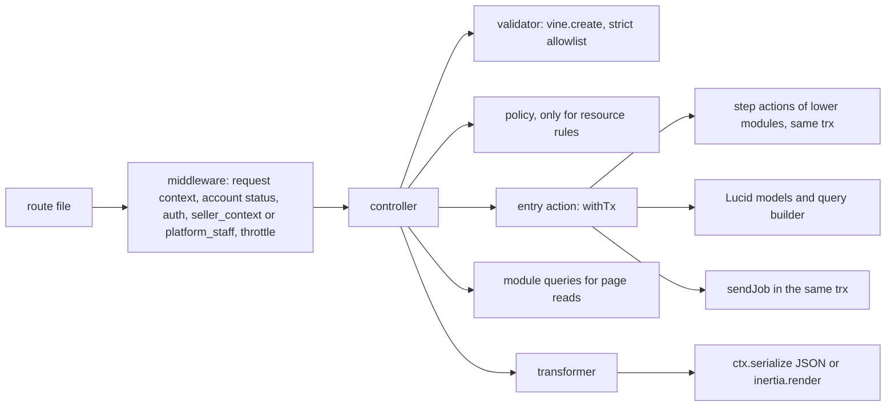

# Code Structure and Engineering Standards

Status: Draft v1 (2026-09-26)

Reviewed: critic pass B5 part 1 (2026-09-26)

This document is the standard the DripNepal codebase must meet: where code lives, which module may depend on which, what each layer of a request may and may not do, and (in later sections) how errors, configuration, logging, migrations, dependencies, reviews and the frontend are handled. It describes the **target state**. Files in the repository today are evidence of what exists and are cited as [Verified-repo]; a file is kept only where it already meets the standard, and each "Current code → target" table says whether it is kept, fixed, rewritten or deleted (product owner, 2026-09-26: "rewrite is fine where needed").

**What this document does not own.** Module map, dependency diagram and job catalogue: [03](03-system-architecture.md#4-modules-and-dependency-rules). Tables, columns, constraints and settings: [04](04-domain-model-and-data-dictionary.md) and [04a](04a-data-dictionary-tables.md). State machines, lock order and transaction rules for money and stock: [05](05-order-payment-and-inventory-lifecycles.md). Endpoints, status codes, error codes and idempotency: [06](06-api-design.md) and [openapi.yaml](openapi.yaml). Permissions, threats and privacy: [07](07-security-threat-model-and-permissions.md). UI behaviour: [08](08-ui-ux-and-design-system.md). Test ID registry and CI gates: [10](10-testing-and-quality-gates.md). Runbooks and job operations: [11](11-deployment-and-operations.md). Milestones: [12](12-roadmap-and-backlog.md).

**Labels.** [Confirmed] product owner answer; [Verified-repo] read in this repository, including installed `node_modules`; [Verified-doc] read in a primary source or a reviewed DripNepal document; [Assumption] a working value to confirm; [Open] OD-xx; [Verify-external] VX-xx. Code marked "design sketch" uses only APIs verified for the installed versions and shows intent; code marked "pseudocode" uses something not verified (usually a package that is not installed yet).

## Reading guide

| §   | Title                                                     | Status in this draft                       |
| --- | --------------------------------------------------------- | ------------------------------------------ |
| 1   | Repository structure                                      | Written                                    |
| 2   | Module ownership and dependency rules                     | Written                                    |
| 3   | Layer responsibilities                                    | Written                                    |
| 4   | API serialization and shared contracts                    | Planned                                    |
| 5   | Error handling                                            | Planned                                    |
| 6   | Configuration validation and secrets                      | Planned                                    |
| 7   | Structured logging and request IDs                        | Planned                                    |
| 8   | Migrations and seeders                                    | Planned                                    |
| 9   | Safe production initialization                            | Planned                                    |
| 10  | Dependency policy                                         | Planned                                    |
| 11  | Lint, format, typecheck and review                        | Planned                                    |
| 12  | Vertical slice: vendor product creation (`createProduct`) | Planned                                    |
| 13  | Frontend code standards                                   | Planned                                    |
| —   | Consistency notes for editor                              | Written (for §1–§3; later parts add to it) |

A developer adding a feature reads §1.3 (names), §2.2 (what the module may import) and §3.2 (what each layer does). A reviewer uses §3.13 as the list of things to reject.

---

## 1. Repository structure

### 1.1 Principles

1. **Adonis-conventional directories stay** ([ADR-0002](adr/0002-modular-monolith-adonisjs.md) decision 4, canon §6.3). `app/controllers`, `app/models`, `app/validators`, `app/policies`, `app/transformers`, `app/middleware`, `app/exceptions`, `commands`, `config`, `database`, `providers`, `start` and `resources` keep their framework meaning, because generators and the assembler index them: the controllers index `#generated/controllers` is built from `app/controllers/**` and transformers are indexed by `indexEntities` (`adonisrc.ts` hooks [Verified-repo]).
2. **Business code lives in modules**: `app/modules/<module>/` for the fifteen modules of canon §6.2 and [03 §4.4](03-system-architecture.md#44-module-responsibilities). Everything a module decides (use cases, reads other modules may call, pure rules, events, job handlers, provider adapters) is inside its folder.
3. **Adonis folders are organised by module or surface underneath**: `app/validators/<module>/`, `app/policies/<module>/`, `app/transformers/<module>/`, `app/controllers/<surface>/<module>/`. A reader can find everything about inventory by searching for `inventory/`.
4. **Generated files are never edited by hand** and are either committed with a freshness check or ignored (§1.4).
5. **One naming style**: `snake_case` file names on the server and in `inertia/`, except upstream shadcn copies in `inertia/components/ui/`, which keep their registry names so `shadcn add --diff` compares like with like ([08 §12.1](08-ui-ux-and-design-system.md#121-ownership-and-folders)).

### 1.2 Target tree

```text
drip-nepal/
├── adonisrc.ts                      # providers, preloads (+ start/database_types.ts), test suites (+ concurrency)
├── ace.js · bin/{server,console,test}.ts
├── app/
│   ├── controllers/
│   │   ├── storefront/<module>/*_controller.ts     # SSR page reads, GET only
│   │   ├── auth/identity/*_controller.ts           # login, signup, reset, MFA pages, GET only
│   │   ├── payments/payments/return_controller.ts  # GET /payments/{provider}/return (ADR-0012)
│   │   ├── account/<module>/*_controller.ts        # customer pages, GET only
│   │   ├── seller/<module>/*_controller.ts         # /seller/{shopSlug}/… pages, GET only
│   │   ├── admin/<module>/*_controller.ts          # /admin/… pages, GET only
│   │   └── api/v1/{auth,public,customer,seller,admin,webhooks}/<module>/*_controller.ts
│   ├── exceptions/{handler.ts, domain_error.ts, constraint_map.ts}   # §5
│   ├── middleware/*_middleware.ts                   # §3.4
│   ├── models/<table_singular>.ts                   # extends generated schema class, relations only
│   ├── modules/
│   │   ├── platform/
│   │   │   ├── tx.ts            # withTx, jobTx, insideTransaction (§3.8)
│   │   │   ├── cas.ts           # casStatus (§3.8)
│   │   │   ├── money.ts         # Minor, toMinor, sumMinor (04 §18.4)
│   │   │   ├── idempotency.ts   # idempotencyScope, withIdempotency, ReplayRequested (06 §7.9)
│   │   │   ├── jobs.ts          # JobPayloads, sendJob, pg-boss instance (§2.3)
│   │   │   ├── ports/           # EmailSender, ObjectStorage, SmsSender, CallContext, PortAdapter guard
│   │   │   ├── providers/       # mail, drive and SMS adapters behind the ports
│   │   │   ├── crypto/{field_encrypter.ts, field_decrypter.ts, blind_index.ts}
│   │   │   ├── actions/ · queries.ts · domain/ · events.ts · jobs/
│   │   ├── payments/providers/{khalti.ts, esewa.ts, fake.ts}   # PaymentProvider adapters (ADR-0012)
│   │   └── <module>/
│   │       ├── actions/<operation>.ts   # one use case or transaction step per file
│   │       ├── queries.ts               # reads other modules and pages may call
│   │       ├── domain/*.ts              # pure rules: *_machine.ts, vocabularies, errors, policy constants
│   │       ├── events.ts                # event names and job payload types
│   │       ├── jobs/<queue_leaf>.ts     # handlers hosted by this module (03 §9 Owner column)
│   │       └── internal/                # optional private helpers
│   ├── policies/<module>/*_policy.ts
│   ├── transformers/<module>/*_transformer.ts
│   └── validators/<module>/<operation>.ts · validators/support/strict.ts
├── architecture/{model-ownership.json, model_rules.cjs}   # table → module map and rule generator for T-ARCH-001
├── commands/{platform_create_admin.ts, jobs_work.ts, jobs_redrive.ts, data_reencrypt.ts}
├── config/*.ts                              # + limiter, drive, mail, jobs when those packages land
├── database/
│   ├── migrations/                          # the 14-file baseline of 04 §20.2.2, then forward-only
│   ├── seeders/reference/{index_seeder.ts, *_seeder.ts, data/*.csv}   # safe in production
│   ├── seeders/dev/*_seeder.ts              # refuse to run in production (§8)
│   ├── factories/*_factory.ts
│   ├── schema.ts                            # generated by schema:generate, committed
│   ├── schema_rules.ts                      # loaded through schemaGeneration.rulesPaths
│   └── migrations.lock                      # checksums, from the first production deploy (ADR-0011)
├── docs/                                    # this documentation set, adr/, openapi.yaml
├── inertia/
│   ├── app.tsx · ssr.tsx · client.ts · tsconfig.json
│   ├── pages/{storefront,auth,payments,account,seller,admin,errors,dev}/…   # page entry files only
│   ├── layouts/{storefront,auth,account,seller,admin}_layout.tsx
│   ├── components/ui/                       # upstream shadcn copies (registry file names)
│   ├── components/kit/                      # cleared kit items; empty until VX-13
│   ├── components/{common,forms,auth,catalog,search,cart,checkout,orders,account,seller,admin}/
│   ├── hooks/ · lib/ · css/ · assets/
├── providers/{api_provider.ts, ports_provider.ts, jobs_provider.ts}   # Adonis service providers
├── resources/
│   ├── views/{inertia_layout.edge, emails/}
│   ├── lang/en/*.json                       # message catalogs (R2 adds lang/ne)
│   └── legal/seller-agreement/<version>.md  # 04a §6
├── shared/{constants/, format/}             # isomorphic code used by server and inertia
├── start/{env.ts, kernel.ts, routes.ts, validator.ts, database_types.ts, limiter.ts, jobs.ts}
├── start/routes/{storefront,auth,account,seller,admin,health,dev,webhooks}.ts
├── start/routes/api_v1/{auth,public,customer,seller,admin}.ts
├── tests/{bootstrap.ts, unit/, functional/, browser/, concurrency/, load/}
├── .adonisjs/                               # generated by assembler hooks, committed (§1.4)
├── .github/{workflows/ci.yml, pull_request_template.md}
├── .dependency-cruiser.cjs · eslint.config.js · .husky/ · docker-compose.yml · Dockerfile
└── package.json · pnpm-lock.yaml · pnpm-workspace.yaml · tsconfig.json · tsconfig.inertia.json
```

Notes on the tree:

- **Surfaces for controllers** follow canon §6.3 (`storefront`, `account`, `seller`, `admin`, `api/v1/{public,customer,seller,admin,webhooks}`) plus three additions that mirror existing surfaces: `auth` pages ([03 §6.1](03-system-architecture.md#61-surfaces-and-rendering-modes)), the `payments` return page, and `api/v1/auth` for the "Auth and self" API surface of [06 §2.2](06-api-design.md#22-surfaces).
- **Page folders** match the `ssr.pages` filter in [03 §6.1](03-system-architecture.md#61-surfaces-and-rendering-modes), which renders server-side exactly the pages whose names start with `storefront/`, `auth/` or `payments/`. `errors/` pages exist today (`inertia/pages/errors/*.tsx` [Verified-repo]) and stay; `dev/` holds the development-only component gallery that replaces `/design-system` (RF-40).
- **Only page entry files go in `inertia/pages/`.** The `indexPages` hook registers every `.tsx` and `.ts` file under `inertia/pages` as a page: today `.adonisjs/server/pages.d.ts` lists `commerce/categories/components/applied_filters` (a `.tsx` component) and `commerce/categories/mock` (from `mock.ts`) as Inertia pages [Verified-repo], and the eager SSR glob in `inertia/ssr.tsx` bundles them. Page-private components go to `inertia/components/<domain>/`.
- **Domain component folders** (the names [08 §12.1](08-ui-ux-and-design-system.md#121-ownership-and-folders) leaves to this document), with the [08 §4.3](08-ui-ux-and-design-system.md#43-dripnepal-owned-composed-components) components each one holds: `catalog` (`ProductCard`, `ProductGallery`, `VariantPicker`, `PriceTag`, `StockBadge`), `cart` (`CartShopGroup`), `checkout` (`CheckoutStepper`, `CheckoutReview`), `forms` (`AddressForm`, `NepalPhoneInput`, `MoneyInput`, `ImageUploader`), `orders` (`OrderTimeline`, `ShipmentTracker`), `seller` (`ShopSwitcher`), `common` (`DataTable`, `FilterBar`, `StatusBadge`, `ConfirmDialog`, `EmptyState`, `PermissionDenied`, `OfflineBanner`, `SiteBanner`). `auth`, `search`, `account` and `admin` hold surface-specific pieces. A component used by two surfaces moves to `common`; file names are `snake_case` (`product_card.tsx`).
- **`providers/`** at the root is the Adonis service-provider folder. Adapters to external services are called "providers" only inside a module (`app/modules/payments/providers/`, as canon §6.3 names them), and are bound to their ports by `providers/ports_provider.ts`.
- **`shared/`** is imported by both sides (`#shared/*` on the server, `@shared/*` in `inertia/tsconfig.json` [Verified-repo]). It may import nothing from `app/` or `inertia/`. The money formatter used by SSR, the client and email templates lives in `shared/format/money.ts` (answers [08 §5.11](08-ui-ux-and-design-system.md#5-design-tokens)'s "location per 09"; behaviour in §13).
- **`tests/concurrency`** is a new Japa suite (real PostgreSQL, pool larger than 1) for T-INV-003, T-CHK-004 and the lock-order tests of [05 §4.4](05-order-payment-and-inventory-lifecycles.md#44-global-lock-ordering); **`tests/load`** holds k6 scripts for T-PERF-001 and is not a Japa suite. Test layout and gates are owned by [10](10-testing-and-quality-gates.md).
- **Process commands.** The `web` process runs `node bin/server.js` (the existing `start` script [Verified-repo `package.json`]); the `worker` process runs `node ace jobs:work`; this fixes the name that [03 §3.2](03-system-architecture.md#32-container-responsibilities) leaves to this document. Redrive is `node ace jobs:redrive` ([03 §10.5](03-system-architecture.md#105-dead-letters-and-redrive)).

### 1.3 Naming conventions

| Thing                          | Convention                                                                                                                                                       | Example                                                               |
| ------------------------------ | ---------------------------------------------------------------------------------------------------------------------------------------------------------------- | --------------------------------------------------------------------- |
| Operation                      | The canon §6.5 `operationId` is the name everywhere: API route name, action file, action class, validator, test titles                                           | `adjustInventory`                                                     |
| Entry action (use case)        | `app/modules/<m>/actions/<operation_in_snake_case>.ts`, default export class in PascalCase                                                                       | `actions/adjust_inventory.ts` → `AdjustInventory`                     |
| Step action (in a transaction) | Same folder, exported function whose first parameter is `trx`                                                                                                    | `actions/reserve_for_order.ts` → `reserveForOrder(trx, cmd)`          |
| API route name                 | Exactly the `operationId`; API groups never call `.as()`, because a group name is prepended to its routes' names                                                 | `.as('adjustInventory')`                                              |
| Page route name                | `<surface>.<area>.<action>`                                                                                                                                      | `seller.orders.show`                                                  |
| Inertia page name              | Path under `inertia/pages` without extension                                                                                                                     | `seller/orders/show`                                                  |
| Controller                     | `<resource_plural>_controller.ts`, class `<Resource>Controller`; methods `index`, `show`, `store`, `update`, `destroy`, or the operation verb for non-CRUD steps | `shop_orders_controller.ts` → `ShopOrdersController.accept`           |
| Validator                      | `app/validators/<module>/<operation>.ts`, named export `<operation>Validator`                                                                                    | `adjustInventoryValidator`                                            |
| Transformer                    | `<Entity><Audience>Transformer`, one per audience whose visible fields differ ([06 §3.6](06-api-design.md#36-output-transformers-never-models))                  | `ShopOrderSellerTransformer`                                          |
| Policy                         | `app/policies/<module>/<entity>_policy.ts`, class `<Entity>Policy`                                                                                               | `ProductPolicy`                                                       |
| Domain event                   | `<entity>.<past_tense>` ([03 §4.4](03-system-architecture.md#44-module-responsibilities))                                                                        | `shop_order.accepted`                                                 |
| Queue                          | `<subject>.<snake_case_name>` from [03 §9](03-system-architecture.md#9-asynchronous-work); dead-letter queue `dlq.<queue>`                                       | `orders.acceptance_timeout`, `dlq.orders.acceptance_timeout`          |
| Job handler file               | `jobs/<leaf>.ts` in the Owner module; `jobs/<subject>_<leaf>.ts` when the queue's subject is another module                                                      | `orders/jobs/acceptance_timeout.ts`, `orders/jobs/payments_verify.ts` |
| State machine                  | `app/modules/<m>/domain/<entity>_machine.ts` ([05 §6.0](05-order-payment-and-inventory-lifecycles.md#60-conventions-used-in-every-table))                        | `orders/domain/shop_order_machine.ts`                                 |
| Middleware                     | File `<name>_middleware.ts`; kernel key in camelCase                                                                                                             | `seller_context_middleware.ts` ↔ `middleware.sellerContext(…)`        |
| Ace command                    | `<namespace>:<verb>`; file `<namespace>_<verb>.ts`                                                                                                               | `platform:create-admin`, `jobs:work`                                  |
| Import aliases                 | `package.json` `imports`; add `#modules/*` → `./app/modules/*.js`                                                                                                | `import { withTx } from '#modules/platform/tx'`                       |
| Database objects               | Owned by [04 §2.14](04-domain-model-and-data-dictionary.md#214-naming)                                                                                           | `inventory_movements_deltas_check`                                    |

Job payload keys are `snake_case` like the stored JSON of the API (OD-13 default), and every payload carries `request_id` and `causation_id` ([03 §10.8](03-system-architecture.md#108-observability-of-jobs)).

### 1.4 Generated artefacts

| Artefact                                                                                      | Produced by                                                                                                                                                                                                                         | Committed      | Rule and check                                                                                                                                                                                                                                                                                                                                                                                              |
| --------------------------------------------------------------------------------------------- | ----------------------------------------------------------------------------------------------------------------------------------------------------------------------------------------------------------------------------------- | -------------- | ----------------------------------------------------------------------------------------------------------------------------------------------------------------------------------------------------------------------------------------------------------------------------------------------------------------------------------------------------------------------------------------------------------- |
| `.adonisjs/server/{controllers.ts, routes.d.ts, pages.d.ts, events.ts, listeners.ts}`         | Assembler `init` hooks in `adonisrc.ts` (`indexEntities`, `indexPages`), which run for the dev server, the test runner and the bundler [Verified-repo `@adonisjs/assembler` 8.4.0 `build/src/types/hooks.d.ts:49`]                  | Yes (as today) | Never edited by hand. Committed because `start/routes.ts` imports `#generated/controllers` and `pnpm typecheck` on a fresh clone or in the pre-push hook must work without first starting the dev server. T-ARCH-016 (proposed): CI runs `node ace test` (which runs the hooks) and then `git diff --exit-code .adonisjs`.                                                                                  |
| `.adonisjs/client/{data.d.ts, manifest.d.ts}`                                                 | `indexEntities` with `transformers.withSharedProps` [Verified-repo `adonisrc.ts`]                                                                                                                                                   | Yes            | Same check. `Data.*` types are the page-prop contract (§4); they are never duplicated as hand-written DTOs.                                                                                                                                                                                                                                                                                                 |
| `.adonisjs/client/registry/*`                                                                 | `@tuyau/core` 1.2.2 `generateRegistry()` [Verified-repo `adonisrc.ts`]                                                                                                                                                              | Yes            | Same check. It embeds every named route pattern in the client bundle (A5-17); the target passes `routes.except`, which matches **route names** (strings, regular expressions or a predicate) [Verified-repo `@tuyau/core` 1.2.2 `build/backend/generate_registry.d.ts:204`], to leave out `receivePaymentWebhook` and the routes named `health.*` and `dev.*`. Authorization never relies on route secrecy. |
| `database/schema.ts`                                                                          | `node ace schema:generate`, run by `migration:run`/`rollback` except in production [Verified-doc `build/commands/migration/run.js`, <https://registry.npmjs.org/@adonisjs/lucid/-/lucid-22.4.2.tgz>, accessed 2026-09-25; 04 §2.15] | Yes            | Never edited by hand; production does not regenerate it, so the committed file must match the migrations. T-ARCH-010 (proposed in 04): `migration:fresh` then `git diff --exit-code database/schema.ts`, and no `any` in the file.                                                                                                                                                                          |
| `database/migrations.lock`                                                                    | CI script, from the first production deploy                                                                                                                                                                                         | Yes            | Fails CI if an applied migration changes ([04 §20.2.4](04-domain-model-and-data-dictionary.md#2024-after-the-first-production-deploy-forward-only-expand-and-contract), RF-41). Detail in §8.                                                                                                                                                                                                               |
| `build/`, `public/assets/`, `tmp/*`                                                           | `node ace build`, Vite, runtime                                                                                                                                                                                                     | No             | Already ignored [Verified-repo `.gitignore`].                                                                                                                                                                                                                                                                                                                                                               |
| `*.tsbuildinfo`, `coverage/`, `screenshots/*`, `.env.*` except `.env.example` and `.env.test` | tsc, test runs, operators                                                                                                                                                                                                           | No             | Added to `.gitignore`; `tsconfig.inertia.tsbuildinfo` is removed from the index (RF-33, A5-10).                                                                                                                                                                                                                                                                                                             |
| `docs/openapi.yaml`                                                                           | Hand-maintained; Tuyau 1.2.2 has no OpenAPI generator [Verified-doc package exports, <https://registry.npmjs.org/@tuyau/core/-/core-1.2.2.tgz>, accessed 2026-09-25]                                                                | Yes            | Kept in step by contract tests (T-API-001); §4.                                                                                                                                                                                                                                                                                                                                                             |

Trade-off of committing `.adonisjs/`: generated diffs appear in most PRs (A5-21). They are accepted because the alternative (ignore and regenerate) makes a fresh checkout fail typecheck, and the freshness check turns a stale file into a CI failure instead of a silent drift. A PR that changes routes, pages or transformers commits the regenerated files in the same PR.

### 1.5 Current code → target (structure)

| Area / file(s)                                                          | Today [Verified-repo]                                                                                                                                                                     | Decision                                                                                                                                                                                                                                                                                                                                                                                                                                           | Reason                     | Milestone                        |
| ----------------------------------------------------------------------- | ----------------------------------------------------------------------------------------------------------------------------------------------------------------------------------------- | -------------------------------------------------------------------------------------------------------------------------------------------------------------------------------------------------------------------------------------------------------------------------------------------------------------------------------------------------------------------------------------------------------------------------------------------------- | -------------------------- | -------------------------------- |
| `app/modules/`                                                          | Does not exist                                                                                                                                                                            | **Create**: `platform` and `audit` first, then each module in the milestone that needs it                                                                                                                                                                                                                                                                                                                                                          | ADR-0002                   | M0, then M1–M8                   |
| `app/controllers/*` (5 files)                                           | Flat `new_account_controller.ts`, `session_controller.ts`; `shops/auth`, `shops/dashboard`; transactions and `User.create({ ...payload })` inline                                         | **Rewrite** into `<surface>/<module>/`, logic moved to actions                                                                                                                                                                                                                                                                                                                                                                                     | RF-03, RF-36, RF-12        | M0 hotfix, M1 (auth), M2 (shops) |
| `app/models/*` (20 files)                                               | Models of the exploratory schema; `User` has an `initials` display getter, a pivot to `user_roles` and upward relations to `Shop`, `Cart`, `Order`                                        | **Rewrite** after the baseline: extend generated schema classes, relations only and only downward (§2.4 rule 5)                                                                                                                                                                                                                                                                                                                                    | RF-20, RF-06               | M0 baseline                      |
| `app/constants/**`                                                      | Status and permission constants, imported by migrations and seeders                                                                                                                       | **Delete**: vocabularies move to `app/modules/<m>/domain/`, permission maps to code in `shops` and `identity` (07 §4)                                                                                                                                                                                                                                                                                                                              | RF-23, RF-41, RF-20        | M0                               |
| `app/utils/random.ts`                                                   | Used only by factories and the demo seeder                                                                                                                                                | **Delete**; factories and dev seeders use their own helpers under `database/`                                                                                                                                                                                                                                                                                                                                                                      | RF-05                      | M0                               |
| `app/validators/auth/*`, `app/validators/shared.ts`                     | `vine.create` already used (meets the standard); password max 32, phone rule rejects valid numbers, `unique` exposes enumeration                                                          | **Rewrite** as `app/validators/identity/*` and `shops/*`                                                                                                                                                                                                                                                                                                                                                                                           | RF-12, RF-22, RF-29, RF-38 | M1, M2                           |
| `app/transformers/{user,shop}_transformer.ts`                           | `BaseTransformer` + `pick()` (meets the standard); `ShopTransformer` exposes `ownerId`, email and phone                                                                                   | **Keep the pattern, rewrite the files** per module and audience                                                                                                                                                                                                                                                                                                                                                                                    | RF-36                      | M1, M2                           |
| `app/middleware/*`                                                      | `auth`, `guest`, `silent_auth`, `container_bindings`, `inertia`                                                                                                                           | **Keep** the framework ones; **fix** `inertia_middleware.ts` shared props; **add** the §3.4 middleware                                                                                                                                                                                                                                                                                                                                             | RF-01, RF-04, RF-44        | M0, M2                           |
| `app/exceptions/handler.ts`                                             | Default handler, status pages in production only                                                                                                                                          | **Rewrite** (§5)                                                                                                                                                                                                                                                                                                                                                                                                                                   | RF-36                      | M0                               |
| `providers/api_provider.ts`                                             | `ApiSerializer` registers `ctx.serialize`; accepts only Lucid paginator meta                                                                                                              | **Keep, fix** the meta shapes and the `meta` key ([06 §3.4](06-api-design.md#34-envelopes-and-the-existing-apiserializer))                                                                                                                                                                                                                                                                                                                         | Canon §6.6                 | M1                               |
| `start/routes.ts`, `start/routes/shops.ts`                              | Storefront under `guest()`, two-segment catch-all, debug routes, `/shop/:shopSlug` with authentication only                                                                               | **Rewrite** into the per-surface files of §1.2                                                                                                                                                                                                                                                                                                                                                                                                     | RF-01, RF-02, RF-40        | M0                               |
| `start/kernel.ts`                                                       | Server and router middleware stack as in [03 §3.3](03-system-architecture.md#33-inside-the-web-process)                                                                                   | **Keep**, extend with the §3.4 order                                                                                                                                                                                                                                                                                                                                                                                                               | —                          | M0                               |
| `database/migrations/*` (26 files)                                      | 25 tables plus pgcrypto, edited in place, import `#constants`                                                                                                                             | **Delete** and replace with the 14-file baseline ([ADR-0011](adr/0011-schema-rebaseline-before-production.md), [Open OD-01])                                                                                                                                                                                                                                                                                                                       | RF-41, RF-06, RF-13        | M0                               |
| `database/seeders/*`, `database/factories/*`                            | Demo vendor with a known password, no environment guard; factories draw stale statuses                                                                                                    | **Rewrite** into `reference/` and `dev/` per [04 §20.3](04-domain-model-and-data-dictionary.md#203-seeders-factories-and-schema-generation)                                                                                                                                                                                                                                                                                                        | RF-05, A5-14               | M0                               |
| `database/schema.ts`, `database/schema_rules.ts`                        | Generated file committed (meets the standard); rules file empty and not wired                                                                                                             | **Keep** `schema.ts`; **fix** config to load the rules                                                                                                                                                                                                                                                                                                                                                                                             | 04 §20.3                   | M0                               |
| `inertia/pages/**`                                                      | `commerce/`, `customers/`, `shops/`, `landing/`, `design_system/`; components and mocks inside page folders                                                                               | **Rewrite** into surface folders; move non-page files out; `landing/**` deleted ([08 §13](08-ui-ux-and-design-system.md#13-current-ui-remediation-list))                                                                                                                                                                                                                                                                                           | RF-47, RF-40               | M0 (routing), M4/M5 (pages)      |
| `inertia/components/**`                                                 | `ui/` (34 files, including local helpers), `auth`, `commerce`, `navbar`, `footer`, `form_builder`, `search`, `providers`                                                                  | **Keep** `ui/` with the 08 §12.1 clean-up; **regroup** the rest into the domain folders of §1.2                                                                                                                                                                                                                                                                                                                                                    | ADR-0015                   | M0 (ui), M4/M5 (domain)          |
| `inertia/lib/mock-data`, `**/mock.ts`, `components/search/mock_data.ts` | Client mocks                                                                                                                                                                              | **Delete** as each page gets its server contract                                                                                                                                                                                                                                                                                                                                                                                                   | RF-27                      | M4, M5                           |
| `inertia/app.tsx`, `inertia/ssr.tsx`                                    | `createRoot`, devtools in production, SSR glob of every page                                                                                                                              | **Rewrite** (§13, [03 §6.1](03-system-architecture.md#61-surfaces-and-rendering-modes))                                                                                                                                                                                                                                                                                                                                                            | RF-08, RF-30               | M0 (after the OD-25 spike)       |
| `shared/constants/*`                                                    | `provinces_with_districts.ts` (client-side location list, incomplete per RF-29) and `shop_categories.ts` (13 shop categories, imported by the seeder and two seller pages)                | **Delete** `provinces_with_districts.ts`: locations come from the `logistics` tables (committed CSV, [04 §20.3](04-domain-model-and-data-dictionary.md#203-seeders-factories-and-schema-generation)) through props or `/api/v1/locations`. **Keep** `shop_categories.ts` only as the input of `reference/shop_categories_seeder.ts` (04 §20.3); pages read the `shop_categories` table through props instead of importing it. Add `shared/format/` | RF-29, RF-23               | M1, M2; M4 (`format/`)           |
| `.adonisjs/**`                                                          | Committed (meets the standard)                                                                                                                                                            | **Keep**, add T-ARCH-016 (proposed)                                                                                                                                                                                                                                                                                                                                                                                                                | A5-21                      | M0                               |
| `tsconfig.inertia.tsbuildinfo`                                          | Committed build artefact                                                                                                                                                                  | **Delete** from the index and ignore                                                                                                                                                                                                                                                                                                                                                                                                               | RF-33                      | M0                               |
| `.agents/**`, `skills-lock.json`                                        | About 150 third-party AI-skill files, including Python scripts                                                                                                                            | **Remove** `.agents/` from the tracked tree (keep locally, ignored); whether `skills-lock.json` alone can restore them is an M0 check                                                                                                                                                                                                                                                                                                              | RF-42                      | M0                               |
| `package.json` `imports`                                                | 21 aliases; no `#modules/*`; `#mails`, `#services`, `#listeners`, `#events` and `#abilities` point at folders that do not exist, and `#utils`, `#constants` at folders this table deletes | **Fix**: add `#modules/*`; remove those seven aliases                                                                                                                                                                                                                                                                                                                                                                                              | —                          | M0                               |
| `tests/`, `commands/`, `.github/`                                       | Only `tests/bootstrap.ts`; no commands; no CI                                                                                                                                             | **Create**                                                                                                                                                                                                                                                                                                                                                                                                                                         | RF-09, RF-05               | M0                               |

Dependency removals (`D`, `better-sqlite3`, the `@commercn` registry) are in §10; frontend file-level remediation is [08 §13](08-ui-ux-and-design-system.md#13-current-ui-remediation-list).

---

## 2. Module ownership and dependency rules

### 2.1 What a module is

A module is a folder under `app/modules/` that owns a set of tables (canon §6.2, [03 §4.4](03-system-architecture.md#44-module-responsibilities)). Only its code writes those tables. Its folder has a public surface and private parts:

| Path                           | Visibility                                                                                                 | Contents and rules                                                                                                                                                                                                                                                    |
| ------------------------------ | ---------------------------------------------------------------------------------------------------------- | --------------------------------------------------------------------------------------------------------------------------------------------------------------------------------------------------------------------------------------------------------------------- |
| `actions/*.ts`                 | Public                                                                                                     | Entry actions (use cases called by controllers, commands and job handlers) and step actions (called by a higher module inside that module's transaction). The only way to write the module's tables.                                                                  |
| `queries.ts`                   | Public                                                                                                     | Read functions. Each accepts an optional `{ client }` so a caller can read inside its transaction ([03 §4.2](03-system-architecture.md#42-how-modules-talk-to-each-other)). A module whose pure functions others need re-exports them here (`pricing` does, 03 §4.4). |
| `events.ts`                    | Public (types only)                                                                                        | Event names and the job payload types this module sends or consumes (§2.3).                                                                                                                                                                                           |
| `domain/*.ts`                  | Private to modules; readable by `app/validators`, `app/transformers`, `app/policies`, `database/factories` | Pure code: state machines, vocabularies (`as const` arrays that the CHECK lists mirror, T-ARCH-011 proposed in 04), domain errors, policy constants. No I/O, no Lucid import.                                                                                         |
| `jobs/*.ts`                    | Private                                                                                                    | Handlers for queues this module hosts. Registered by `start/jobs.ts`; never imported by another module.                                                                                                                                                               |
| `providers/*.ts`, `ports/*.ts` | Private (`ports/` public in `platform`)                                                                    | Adapters to external services. Provider SDKs are imported only here (ADR-0016 verification).                                                                                                                                                                          |
| `internal/*.ts`                | Private                                                                                                    | Helpers shared by the module's own files.                                                                                                                                                                                                                             |

`platform` is the one module whose root files (`tx.ts`, `cas.ts`, `money.ts`, `idempotency.ts`, `jobs.ts`, `ports/`) are public infrastructure for every module. Its `crypto/field_decrypter.ts` is the exception: only the code paths in the [07 §5.5](07-security-threat-model-and-permissions.md#55-encryption) allowlist may import it (T-SEC-034, proposed in 07).

Lucid models live in `app/models/` (Adonis convention), but each model **belongs** to the module that owns its table; `architecture/model-ownership.json` records the mapping from [04](04-domain-model-and-data-dictionary.md) and is checked in review when a table is added.

### 2.2 Allowed dependencies

The dependency diagram and its reasoning are owned by [03 §4.1](03-system-architecture.md#41-dependency-diagram); this table is its code-level form. "Public surface" means `actions/`, `queries.ts`, `events.ts` and, for `platform`, the public root files. A module may use its dependencies' dependencies (transitive), never anything to its right in the canonical chain.

| Module          | May import the public surface of             | Must never import                                         |
| --------------- | -------------------------------------------- | --------------------------------------------------------- |
| `platform`      | nothing                                      | every other module                                        |
| `audit`         | `platform`                                   | everything above                                          |
| `logistics`     | `platform`, `audit`                          | everything above                                          |
| `identity`      | `platform`, `audit`, `logistics`             | `shops` and above                                         |
| `shops`         | `identity` and below                         | `media` and above                                         |
| `media`         | `shops` and below                            | `catalog` and above                                       |
| `catalog`       | `media` and below                            | `inventory` and above                                     |
| `inventory`     | `catalog` and below                          | `pricing` and above                                       |
| `pricing`       | `inventory` and below                        | `cart` and above                                          |
| `cart`          | `pricing` and below                          | `checkout`, `orders`, `payments`, `ledger`                |
| `checkout`      | `cart`, `orders` and everything they may use | `notifications`                                           |
| `orders`        | `pricing` and below, `payments`, `ledger`    | `cart`, `checkout`, `notifications`                       |
| `payments`      | `pricing` and below, `ledger`                | `orders`, `cart`, `checkout`, `notifications`             |
| `ledger`        | `pricing` and below                          | `payments`, `orders`, `cart`, `checkout`, `notifications` |
| `notifications` | `queries.ts` of any module, `platform`       | any module's `actions/`; nothing imports it               |

Controllers, commands and `start/jobs.ts` sit outside the chain: a controller may call the public surface of any module (controller composition, [03 §4.2](03-system-architecture.md#42-how-modules-talk-to-each-other)), but it opens no transaction.

### 2.3 How modules cooperate

1. **Downward call inside the caller's transaction.** The higher module's entry action opens the transaction and passes `trx` to step actions of lower modules; the callee never commits. Example: `orders.recordCodCollection` calls `payments` and `ledger` step actions with its `trx`.
2. **Orchestration instead of upward calls.** When one transaction must change a lower and a higher module together, the higher module orchestrates. Gateway capture is `orders.applyPaymentOutcome(trx, …)`, which calls `payments.applyProviderResult(trx, …)` and `inventory.commitHeld(trx, …)` in one transaction; there is no upward payments → orders event ([05 §6.4](05-order-payment-and-inventory-lifecycles.md#64-payment-gateway-r11), ADR-0002 decision 3).
3. **Hosting rule for job handlers (adopted from [03 §9](03-system-architecture.md#9-asynchronous-work)).** A queue name names the subject; the handler lives in the module whose imports stay downward. `payments.verify`, `payments.daily_reconciliation`, `payments.process_provider_event`, `inventory.expire_reservations` and `refunds.sla_monitor` are therefore hosted in `orders` (`app/modules/orders/jobs/payments_verify.ts` and so on), because each ends in an `orders` transaction or reads `orders` tables. Renaming the queues after their host was rejected: the names are shared with 05 and 03, and the subject prefix is what an operator searches for in a dead-letter alert.
4. **Events after commit** are pg-boss jobs sent in the same transaction ([ADR-0010](adr/0010-postgres-jobs-pg-boss-transactional-send.md), [03 §10.1](03-system-architecture.md#101-transactional-send-the-job-table-is-the-outbox)). A module sends to another module's queue **by name**, without importing it. Payload types stay type-safe through declaration merging, so `platform` never imports a higher module:

```ts
// app/modules/platform/jobs.ts — design sketch. The pg-boss adapter call is pseudocode
// until the M0 spike (T-ARCH-004, proposed in 03) confirms the import path and options.
import type { TransactionClientContract } from '@adonisjs/lucid/types/database'

export interface JobPayloads {} // augmented by each module's events.ts
export type QueueName = keyof JobPayloads & string
type Envelope = { request_id: string | null; causation_id: string | null }

export async function sendJob<Q extends QueueName>(
  trx: TransactionClientContract,
  queue: Q,
  data: JobPayloads[Q] & Envelope,
  opts: { singletonKey?: string; startAfter?: Date } = {}
) {
  // pseudocode: boss.send(queue, data, { ...opts, db: fromKnex(trx.knexClient) })
  // trx.knexClient is Lucid 22.4.2's Knex transaction [Verified-repo database.d.ts:220]
}
```

```ts
// app/modules/orders/events.ts — design sketch (TypeScript module augmentation; checked by pnpm typecheck in M0)
declare module '#modules/platform/jobs' {
  interface JobPayloads {
    'orders.acceptance_timeout': { shop_order_id: string }
    'payments.verify': { payment_id: string }
  }
}
export {}
```

5. **Dead-letter naming.** Every queue in 03 §9 gets `dlq.<queue>`, except `platform.heartbeat` (03 marks it "no dead-letter queue"). The retry counts and backoff values stay [Assumption] in 03 §9; this document only fixes the names. `platform.retention_purge` is adopted as the queue name for the purges of [04 §19.3](04-domain-model-and-data-dictionary.md#193-retention-schedule), including cart deletion and the `notification_deliveries` purge that 03 §9 does not yet list (Consistency note 4).
6. **Composite sweepers: the one exception to module hosting.** 03 §9 gives `platform.retention_purge` the Owner `platform`, but the rows it deletes belong to `identity` (`user_tokens`, `user_addresses`), `shops` (`shop_invitations`, `shop_addresses`), `cart` (`carts`) and `notifications` (`notification_deliveries`). `platform` imports nothing, so a handler in `app/modules/platform/jobs/` would break §2.2 and the owner-writes check of §2.4. The handler is therefore registered in `start/jobs.ts`, which sits outside the chain like a controller, and calls each owning module's `actions/purge_expired.ts` entry action in turn, each in its own short `jobTx` with a batch limit. The queue name, schedule and dead-letter queue are unchanged; only the file that hosts the handler differs from 03's Owner column (Consistency note 14). No other queue in 03 §9 needs this exception.
7. **Notifications only consume.** `notifications.dispatch` reads other modules' `queries.ts` to render a template and writes `notification_deliveries`; `notifications.send_email` sends one row ([03 §9](03-system-architecture.md#9-asynchronous-work)). No module imports `notifications`.

### 2.4 Enforcement (T-ARCH-001)

T-ARCH-001 (canon §12) is one CI job that runs dependency-cruiser over `app/`, `start/` and `database/`, plus two small checks that an import graph cannot express. dependency-cruiser was chosen over the ESLint `no-restricted-imports` fallback that canon allows, because one config can express "same module" and "rank below" rules with capture groups instead of one override block per module; [03 §4.3](03-system-architecture.md#43-enforcement-t-arch-001) records the same choice as [Assumption] pending M0. dependency-cruiser is not installed yet, so option names are checked against the version added in M0.

```js
// .dependency-cruiser.cjs — design sketch (dependency-cruiser is not installed; option names checked in M0)
const ORDER = [
  'platform',
  'audit',
  'logistics',
  'identity',
  'shops',
  'media',
  'catalog',
  'inventory',
  'pricing',
  'cart',
  'checkout',
]
const EXTRA = {
  orders: ['payments', 'ledger'],
  payments: ['ledger'],
  checkout: ['orders', 'payments', 'ledger'],
}
const RIGHT = ['orders', 'payments', 'ledger'] // may use everything up to pricing (03 §4.1)
const PRIVATE = '(domain|jobs|providers|internal)' // field_decrypter has its own allowlist rule

function allowedFor(m) {
  if (m === 'notifications') return ORDER.concat(RIGHT) // queries.ts only, rule 4 below
  const rank = RIGHT.includes(m) ? ORDER.indexOf('pricing') : ORDER.indexOf(m) - 1
  return ORDER.slice(0, rank + 1).concat(EXTRA[m] ?? [])
}

const modules = ORDER.concat(RIGHT, ['notifications'])
module.exports = {
  forbidden: [
    // 1. no cycles anywhere in app/
    { name: 'no-cycles', severity: 'error', from: { path: '^app/' }, to: { circular: true } },
    // 2. another module's private folders are off limits
    {
      name: 'public-surface-only',
      severity: 'error',
      from: { path: '^app/modules/([^/]+)/' },
      to: { path: `^app/modules/([^/]+)/${PRIVATE}`, pathNot: '^app/modules/$1/' },
    },
    // 3. rank rule: no upward imports, generated per module
    ...modules.map((m) => ({
      name: `rank-${m}`,
      severity: 'error',
      from: { path: `^app/modules/${m}/` },
      to: {
        path: '^app/modules/([^/]+)/',
        pathNot: `^app/modules/(${[m, ...allowedFor(m)].join('|')})/`,
      },
    })),
    // 4. notifications may read queries.ts only; nobody imports notifications
    {
      name: 'notifications-read-only',
      severity: 'error',
      from: { path: '^app/modules/notifications/' },
      to: { path: '^app/modules/(?!notifications/|platform/)[^/]+/(actions|events)' },
    },
    {
      name: 'nobody-imports-notifications',
      severity: 'error',
      from: { path: '^app/', pathNot: '^app/modules/notifications/' },
      to: { path: '^app/modules/notifications/' },
    },
    // 5. a module (and its models) import only models of tables it or a lower module owns
    ...require('./architecture/model_rules.cjs')(
      require('./architecture/model-ownership.json'),
      allowedFor
    ),
    // 6. controllers: models as types only, and no db service (they open no transaction)
    {
      name: 'controllers-no-model-values',
      severity: 'error',
      from: { path: '^app/controllers/' },
      to: { path: '^app/models/', dependencyTypesNot: ['type-only'] },
    },
    {
      name: 'controllers-no-db',
      severity: 'error',
      from: { path: '^app/controllers/' },
      to: { path: '@adonisjs/lucid/(build/)?services/db' },
    },
    // 7. migrations import nothing from the application (RF-41, 04 §20.2.2)
    {
      name: 'migrations-self-contained',
      severity: 'error',
      from: { path: '^database/migrations/' },
      to: { path: '^(app|shared|start)/' },
    },
    // 8. provider SDKs and outbound HTTP only inside adapters (ADR-0016, 07 §7.4)
    {
      name: 'sdk-in-adapters-only',
      severity: 'error',
      from: { path: '^app/', pathNot: '^app/modules/[^/]+/providers/' },
      to: { path: 'node_modules/(@aws-sdk|nodemailer|ky|undici|axios)/' },
    },
  ],
}
```

The field-decrypter allowlist (07 §5.5) is one more generated rule: importing `app/modules/platform/crypto/field_decrypter.ts` is forbidden from every path except the code paths 07 lists (the customer, seller, admin and shop-profile transformers, the payout instruction and refund transfer views, the checkout snapshot writer and the TOTP verifier) and `commands/data_reencrypt.ts`, which must decrypt every `*_enc` value to rotate keys (07 §5.5 rotation row; the allowlist table does not list it yet, Consistency note 15). Outbound HTTP through the global `fetch` cannot be seen by an import rule, so lint bans `fetch(` in `app/` outside `providers/` folders (§11).

Checks that are part of T-ARCH-001 but are not import rules:

| Check                             | Mechanism                                                                                                                                                                                                                                                                                                                                                                   | Source                                                                                     |
| --------------------------------- | --------------------------------------------------------------------------------------------------------------------------------------------------------------------------------------------------------------------------------------------------------------------------------------------------------------------------------------------------------------------------- | ------------------------------------------------------------------------------------------ |
| No Lucid model reaches a response | In the `test` environment `ctx.serialize` and the Inertia render path walk the output and throw if any value is an instance of `BaseModel`; the functional suite exercises every route, so a controller that returns a model fails. Lint also bans `.serialize()` and `.toJSON()` calls in `app/controllers/**` (§11). [Assumption: the Inertia hook point is chosen in M0] | [06 §3.6](06-api-design.md#36-output-transformers-never-models)                            |
| Writes only by the owning module  | Rule 5 above stops imports of foreign models; a raw-SQL scan in the same job fails on `INSERT`, `UPDATE` or `DELETE` against a table owned by another module, reading the owner map                                                                                                                                                                                         | [05 §5.11](05-order-payment-and-inventory-lifecycles.md#511-rules-for-inventory_movements) |

Trade-off: the rank rules need a generator and an ownership map that must change when a table is added; a wrong map entry is caught in review against 04. There is no database-level enforcement between modules (one runtime role), which 03 §4.3 accepts at this size. Related checks owned elsewhere: route rule check (only `/api/v1/` registers unsafe methods, ADR-0004), permission declared on every seller and admin route (T-SEC-030, proposed in 07).

### 2.5 Current code → target (module boundaries)

| Area / file(s)                                     | Today [Verified-repo]                                                                                  | Decision                                                                                                      | Reason   | Milestone   |
| -------------------------------------------------- | ------------------------------------------------------------------------------------------------------ | ------------------------------------------------------------------------------------------------------------- | -------- | ----------- |
| Module boundaries                                  | None: controllers write any model; models relate in both directions (`User` → `Shop`, `Cart`, `Order`) | **Rewrite**: modules, public surfaces, rank rule; upward relations removed, replaced by higher-module queries | ADR-0002 | M0 baseline |
| Import checks                                      | ESLint `configApp(...react)` only; no import rules                                                     | **Add** `.dependency-cruiser.cjs` and T-ARCH-001 to CI                                                        | RF-09    | M0          |
| `app/constants/permissions/product_permissions.ts` | Permissions as seeded rows                                                                             | **Delete**; maps in code (07 §4)                                                                              | RF-20    | M0          |

---

## 3. Layer responsibilities

### 3.1 The request path



Reads for pages go route → middleware → controller → module query → transformer → `inertia.render`. Writes go route → middleware → controller → validator → (policy) → entry action → transformer → `ctx.serialize`. Job handlers enter at the action layer with the same rules.

### 3.2 Layer contract

| Layer        | Lives in                              | Does                                                                                                    | Must not                                                                                          | Enforced by                                                                                                                      |
| ------------ | ------------------------------------- | ------------------------------------------------------------------------------------------------------- | ------------------------------------------------------------------------------------------------- | -------------------------------------------------------------------------------------------------------------------------------- |
| Route        | `start/routes/**`                     | Pattern, name, controller method, group middleware, the permission slug                                 | Inline handlers (except `dev` routes), unsafe methods outside `api_v1/` and `webhooks.ts`         | Route rule check (ADR-0004), T-SEC-030 (proposed)                                                                                |
| Middleware   | `app/middleware/`                     | Request context, account status, authentication, shop and staff resolution, MFA freshness, rate limits  | Business rules, writes other than session and limiter state                                       | T-SEC-001, T-SEC-010, T-SEC-005 and T-SEC-008 (proposed in 07)                                                                   |
| Controller   | `app/controllers/<surface>/<module>/` | Validate, authorize a resource, call one entry action (or the queries a page needs), transform, respond | Open transactions, import `db`, write models, branch on business state, call two actions          | T-ARCH-001 rule 6, review                                                                                                        |
| Validator    | `app/validators/<module>/`            | Allowlisted input shape, normalisation, format rules that mirror CHECKs                                 | Server-owned fields, authorization, database writes                                               | T-SEC-003, T-API-002 (proposed in 06)                                                                                            |
| Policy       | `app/policies/<module>/`              | Resource-level rules beyond the route permission                                                        | Queries without the shop scope                                                                    | T-SEC-001, T-SEC-031 (proposed in 07)                                                                                            |
| Entry action | `app/modules/<m>/actions/`            | One use case: transaction, locks, state checks, writes, audit, jobs                                     | HTTP objects (`ctx`, `request`), provider calls inside the transaction, returning serialized data | T-ARCH-003, T-PAY-006 (proposed in 03/05)                                                                                        |
| Step action  | `app/modules/<m>/actions/`            | One step inside a caller's transaction                                                                  | Opening or committing a transaction, calling ports                                                | `withTx` nesting guard and `PortAdapter` guard (§3.8)                                                                            |
| Query        | `app/modules/<m>/queries.ts`          | Reads, scoped by owner or shop in the query itself                                                      | Writes; "load then check" ownership                                                               | T-SEC-001, T-SEC-002                                                                                                             |
| Model        | `app/models/`                         | Columns (from `database/schema.ts`), relations, framework mixins                                        | Business methods, hooks with business effects, display getters                                    | Review; T-ARCH-001 rule 5                                                                                                        |
| Transformer  | `app/transformers/<module>/`          | Allowlisted output per audience, allowlisted decryption                                                 | Queries, lazy loading, returning models                                                           | T-ARCH-001 (response check), T-SEC-034 (proposed in 07)                                                                          |
| Response     | `ctx.serialize` or `inertia.render`   | Envelope, status, headers                                                                               | Raw models, `response.json(model)`                                                                | T-API-001                                                                                                                        |
| Job handler  | `app/modules/<m>/jobs/`               | Parse payload, call an entry action or run `jobTx`, classify errors                                     | Assume it runs once                                                                               | Handler tests with duplicate delivery ([03 §10.3](03-system-architecture.md#103-at-least-once-delivery-and-idempotent-handlers)) |

### 3.3 Routes

- **Files.** One file per surface under `start/routes/`, imported by `start/routes.ts`. The JSON API is split by surface under `start/routes/api_v1/`, and unsafe methods are registered only there and in `start/routes/webhooks.ts` ([ADR-0004](adr/0004-inertia-reads-json-api-writes.md) decision 6 names a single `api_v1.ts`; the folder keeps the same rule with smaller files). `start/routes/dev.ts` is imported only when `app.inDev` (RF-40).
- **Names.** API routes are named by `operationId`, so the Tuyau route name, the OpenAPI operation and the test title are one string (answers [06 §10](06-api-design.md#10-versioning-and-compatibility) and [03 §6.5](03-system-architecture.md#65-reads-through-inertia-props-writes-through-apiv1-adr-0004)). Because a group's `.as()` prepends to its routes' names (`Route.as(name, prepend?)` [Verified-repo `@adonisjs/http-server` 9.1.0 `build/src/router/route.d.ts:142`]), API groups never call `.as()`.
- **Permissions on the route.** Seller and admin routes pass their one permission slug as the argument of the named middleware. Named middleware arguments are typed from the middleware's `handle(ctx, next, options)` [Verified-repo `http-server` 9.1.0 `build/src/types/middleware.d.ts:20`] and stored on the route as `{ name, args }` [Verified-repo `build/src/types/route.d.ts:49-52`], so T-SEC-030 (proposed in 07) can list every route with its slug from `router.toJSON()` and fail when one is missing.

```ts
// start/routes/api_v1/seller.ts — design sketch. router, group, prefix, use, as and named-middleware
// arguments are verified for @adonisjs/core 7.3.4 (http-server 9.1.0); the generated controller key
// shape is checked in M0; the 06 §9.1 limiter is added to the group when @adonisjs/limiter is installed.
import router from '@adonisjs/core/services/router'
import { middleware } from '#start/kernel'
import { controllers } from '#generated/controllers'

router
  .group(() => {
    router
      .post('/inventory/:variantId/adjustments', [
        controllers.api.v1.seller.inventory.InventoryItems,
        'adjust',
      ])
      .as('adjustInventory')
      .use(middleware.sellerContext({ permission: 'shop.inventory.adjust' }))

    router
      .post('/orders/:shopOrderNumber/accept', [
        controllers.api.v1.seller.orders.ShopOrders,
        'accept',
      ])
      .as('acceptShopOrder')
      .use(middleware.sellerContext({ permission: 'shop.orders.process' }))
  })
  .prefix('/api/v1/seller/shops/:shopSlug')
  .use(middleware.auth())
```

### 3.4 Middleware

Order after the existing router stack (`bodyparser`, `session`, `shield`, `initialize_auth`, `silent_auth` [Verified-repo `start/kernel.ts`]) is fixed by [03 §3.3](03-system-architecture.md#33-inside-the-web-process) and [07 §4.8](07-security-threat-model-and-permissions.md#48-how-policies-are-implemented):

| #   | Middleware (doc name) | File                                                 | Kernel                                | Sets on `ctx`                                                         | Behaviour owned by                                                                                                  |
| --- | --------------------- | ---------------------------------------------------- | ------------------------------------- | --------------------------------------------------------------------- | ------------------------------------------------------------------------------------------------------------------- |
| 1   | request context       | `request_context_middleware.ts`                      | router stack                          | request ID on `ctx.logger` and the response                           | §7, [03 §12.1](03-system-architecture.md#121-request-ids-and-logging)                                               |
| 2   | account status        | `account_status_middleware.ts`                       | router stack                          | nothing; rejects suspended users and stale stamps                     | [07 §3.3](07-security-threat-model-and-permissions.md#33-the-per-request-account-check-and-the-suspension-decision) |
| 3   | `auth`, `guest`       | existing files                                       | named `auth`, `guest`                 | `ctx.auth.user`                                                       | `guest` is used only on login, signup and reset pages (RF-02)                                                       |
| 4   | `verified_email`      | `verified_email_middleware.ts`                       | named `verifiedEmail`                 | —                                                                     | 06 §2.2 (`EMAIL_NOT_VERIFIED`)                                                                                      |
| 5   | `seller_context`      | `seller_context_middleware.ts`                       | named `sellerContext({ permission })` | `ctx.shop = { id, slug, status, suspensionMode, actor, permissions }` | [06 §4.4](06-api-design.md#44-seller-authorization-algorithm), 07 §4.8 (sketch there)                               |
| 5   | `platform_staff`      | `platform_staff_middleware.ts`                       | named `platformStaff({ permission })` | `ctx.staff = { userId, role, permissions, mfaVerifiedAt }`            | 06 §4.3, 07 §3.9–§3.10 (404 for non-staff, 401 `MFA_REQUIRED` when stale)                                           |
| 6   | `throttle`            | limiter throttles in `start/limiter.ts` (pseudocode) | named per limiter                     | —                                                                     | [06 §9.1](06-api-design.md#91-rate-limits)                                                                          |

The name is **`seller_context`** everywhere, as in 03 §3.3 and 07 §4.8; the audit's `shopContext` is the same idea and is not used as a name. `ctx.shop` and `ctx.staff` are declared by module augmentation of `HttpContext`, the same way `providers/api_provider.ts` adds `serialize` [Verified-repo]. Middleware reads through module queries (`shops.resolveSellerContext`, `identity.getAccountStatus`); it never writes business tables.

### 3.5 Controllers

A controller method does five things in this order and nothing else: validate, authorize the resource (only if a policy applies), call **one** entry action (a page controller instead calls the module queries its props need, including deferred ones), transform, respond. The action receives a typed command and an `ActionContext` (`actorUserId`, `shopId` when seller-scoped, `requestId`, idempotency scope), never `ctx`.

```ts
// app/controllers/api/v1/seller/inventory/inventory_items_controller.ts — design sketch.
// inject, validateUsing, request.id, response.status and the transformer API are verified
// for the installed versions; AdjustInventory, the transformer and idempotencyScope are this
// document's names (pseudocode until written).
import { inject } from '@adonisjs/core'
import type { HttpContext } from '@adonisjs/core/http'
import AdjustInventory from '#modules/inventory/actions/adjust_inventory'
import { idempotencyScope } from '#modules/platform/idempotency'
import { adjustInventoryValidator } from '#validators/inventory/adjust_inventory'
import InventoryItemSellerTransformer from '#transformers/inventory/inventory_item_seller_transformer'

export default class InventoryItemsController {
  @inject()
  async adjust(ctx: HttpContext, action: AdjustInventory) {
    const input = await ctx.request.validateUsing(adjustInventoryValidator)
    const result = await action.execute(
      {
        variantId: ctx.params.variantId,
        delta: input.delta,
        reasonCode: input.reason_code,
        note: input.note ?? null,
      },
      {
        actorUserId: ctx.auth.user!.id,
        shopId: ctx.shop.id, // set by seller_context, never from the body
        requestId: ctx.request.id() ?? null,
        idempotency: idempotencyScope(ctx.request, 'adjustInventory'), // 400 IDEMPOTENCY_KEY_REQUIRED if absent
      }
    )
    ctx.response.status(201)
    // call as ctx.serialize(...): the api_provider function reads `this` (providers/api_provider.ts)
    return ctx.serialize(InventoryItemSellerTransformer.transform(result))
  }
}
```

Controllers call `ctx.request.validateUsing(…)` (or `request.validateUsing(…)`) directly, never through a wrapper: the Tuyau registry learns each route's body type by statically scanning controller methods for `request.validateUsing(validatorReference)`, `$CTX.request.validateUsing(…)` and a few equivalent forms [Verified-repo `@adonisjs/assembler` 8.4.0 `build/src/code_scanners/routes_scanner/validator_extractor.d.ts`]. A wrapper would silently drop the typed body from the client.

Page controllers are the same shape with a query instead of an action: `return inertia.render('seller/orders/show', { shopOrder: ShopOrderSellerTransformer.transform(row) })`. Heavy panels use `inertia.defer`/`inertia.optional` ([03 §6.3](03-system-architecture.md#63-dashboards-assessment-seller-and-admin)).

### 3.6 Validators

- Created with `vine.create(…)`; `vine.compile` is deprecated in `@vinejs/vine` 4.4.0 [Verified-doc `build/src/vine/main.d.ts`, <https://registry.npmjs.org/@vinejs/vine/-/vine-4.4.0.tgz>, accessed 2026-09-25]. Validators needing request data use `vine.withMetaData<M>().create(…)` and `request.validateUsing(v, { meta })`.
- **Allowlist, strictly.** Vine strips unknown keys by default; [06 §3.5](06-api-design.md#35-input-validators-are-allowlists) rejects them with 422 `unknown_field`. Because controllers must keep calling `request.validateUsing` (§3.5), the rejection is built into the schema: `app/validators/support/strict.ts` exports `strict(properties)`, which returns `vine.object(properties).allowUnknownProperties()` [Verified-repo `@vinejs/vine` 4.4.0 `build/src/schema/object/main.d.ts:167`] plus a custom rule that reports every key not in `properties`, recursively for nested objects and array items. `allowUnknownProperties<Value>()` widens the output type to `Output & { [K: string]: Value }` [Verified-repo same file, line 167], so declared keys keep their types; `strict()` narrows the result back to the declared properties so controllers never see the index signature. The custom rule attaches with `.use()`, which `VineObject` inherits from `BaseType` [Verified-repo `build/src/schema/base/main.d.ts:174`]. `strict()` stays pseudocode until its unit test (T-API-002, proposed in 06) runs in M0.
- **Never in a validator:** `shop_id`, `status`, `version`, totals, `commission_*`, `number`, `public_id`, `created_by`, `approved_by` (06 §3.5). The shop comes from `ctx.shop`, the actor from the session.
- Vocabularies come from the module's `domain/` (`VENDOR_ADJUSTMENT_REASONS` in `app/modules/inventory/domain/movement_reasons.ts`; 04a §8.3 names the file and `inventory_movements_reason_code_check` its values ([04a §8.3](04a-data-dictionary-tables.md#83-inventory_movements)), this document names the constant), so the validator, the CHECK and the labels cannot drift (T-ARCH-011, proposed in 04).

```ts
// app/validators/inventory/adjust_inventory.ts — design sketch; strict() is pseudocode (above)
import vine from '@vinejs/vine'
import { strict } from '#validators/support/strict'
import { VENDOR_ADJUSTMENT_REASONS } from '#modules/inventory/domain/movement_reasons'

export const adjustInventoryValidator = vine.create(
  strict({
    delta: vine.number().withoutDecimals(), // non-zero: custom rule (pseudocode) + inventory_movements_deltas_check
    reason_code: vine.enum(VENDOR_ADJUSTMENT_REASONS),
    note: vine.string().trim().maxLength(500).optional(), // inventory_movements_note_check: at most 500
  })
)
```

### 3.7 Policies

Most authorization is not a policy. Route permission and the shop status gate are applied by `seller_context`/`platform_staff`; tenancy is the `shop_id` or `customer_user_id` predicate inside every query, so a foreign ID is simply "not found" (T-SEC-001, T-SEC-002). A policy exists only for a rule about a specific resource that neither covers, for example a rule that depends on who created a draft ([07 §4.8](07-security-threat-model-and-permissions.md#48-how-policies-are-implemented)).

The standard is `@adonisjs/bouncer` 4.0.1: policies with extra arguments and `AuthorizationResponse.deny(message, 404)` so a denied resource looks missing [Verified-doc `build/src/response.d.ts`, <https://registry.npmjs.org/@adonisjs/bouncer/-/bouncer-4.0.1.tgz>, accessed 2026-09-25]. It is **not installed** [Verified-repo `node_modules/@adonisjs`], so it is added in M0 and the code below is pseudocode. If M0 finds a blocker, the fallback allowed by [ADR-0006](adr/0006-authorization-platform-roles-shop-memberships.md) decision 5 is plain functions with the same signature; either way a policy takes `(user, shop, resource)` and never queries without the shop scope.

```ts
// app/policies/catalog/product_policy.ts — pseudocode (@adonisjs/bouncer 4.0.1 not installed).
// The rule itself is an illustration of the shape only; resource rules are decided in 07.
export default class ProductPolicy extends BasePolicy {
  editDraft(user: User, shop: SellerShop, product: Product) {
    if (product.shopId !== shop.id) return AuthorizationResponse.deny('Not found', 404)
    return shop.actor !== 'catalog_editor' || product.createdBy === user.id
  }
}
// controller: await bouncer.with(ProductPolicy).authorize('editDraft', shop, product)
```

### 3.8 Actions, transactions and the helpers `platform` owns

**Entry actions** are plain classes with one public method, `execute(command, context)`, resolved from the container so ports can be injected with `@inject()` (`inject` is exported by `@adonisjs/core` 7.3.4 [Verified-repo `build/index.d.ts:7`]). They open exactly one transaction through `withTx`; for ⚷ operations the first step inside it is `withIdempotency(trx, scope, run)` ([06 §7.9](06-api-design.md#79-sketch)), whose `ReplayRequested` rolls the transaction back before the stored response is replayed. They take locks in the global order of [05 §4.4](05-order-payment-and-inventory-lifecycles.md#44-global-lock-ordering), check transitions with `assertTransition` from `domain/*_machine.ts`, write rows, record audit and send jobs, then return plain data or models for the controller's transformer. When an external call is needed they follow "record intent → commit → call → record outcome" ([03 §8.3](03-system-architecture.md#83-operations-that-must-not-hold-a-transaction)).

**Step actions** are exported functions whose first parameter is `trx`. They run inside someone else's transaction, so they can never call a port and need no injection; that is why they are functions and entry actions are classes.

```ts
// app/modules/platform/tx.ts — design sketch. db.transaction(callback), rawQuery with bindings and
// TransactionClientContract are verified for @adonisjs/lucid 22.4.2; AsyncLocalStorage is node:async_hooks.
import { AsyncLocalStorage } from 'node:async_hooks'
import db from '@adonisjs/lucid/services/db'
import type { TransactionClientContract } from '@adonisjs/lucid/types/database'
import { NestedTransaction } from './domain/errors.js'

const scope = new AsyncLocalStorage<{ inTx: true }>()
export const insideTransaction = () => scope.getStore()?.inTx === true

type TxOptions = { lockTimeoutMs?: number; statementTimeoutMs?: number }

export async function withTx<T>(
  fn: (trx: TransactionClientContract) => Promise<T>,
  { lockTimeoutMs = 5_000, statementTimeoutMs = 10_000 }: TxOptions = {} // 03 §8.2 request values
): Promise<T> {
  if (insideTransaction()) throw new NestedTransaction() // pass trx to a step action instead
  const run = () =>
    db.transaction(async (trx) => {
      // set_config(..., true) is SET LOCAL with bindings, so no SQL is built from strings (07 §7.4)
      await trx.rawQuery('select set_config(?, ?, true), set_config(?, ?, true)', [
        'lock_timeout',
        `${lockTimeoutMs}ms`,
        'statement_timeout',
        `${statementTimeoutMs}ms`,
      ])
      return scope.run({ inTx: true }, () => fn(trx))
    })
  try {
    return await run()
  } catch (error) {
    if ((error as { code?: string }).code !== '40P01') throw error // deadlock_detected
    // one retry with jitter, logged as an error (03 §8.2); safe because the idempotency row rolled back
    await new Promise((r) => setTimeout(r, 50 + Math.random() * 150))
    return run()
  }
}

export const jobTx = <T>(fn: (trx: TransactionClientContract) => Promise<T>) =>
  withTx(fn, { lockTimeoutMs: 10_000, statementTimeoutMs: 30_000 }) // 03 §8.2 worker values
```

- **`ProviderCallInsideTransaction`.** Every adapter behind a port extends `PortAdapter` (`app/modules/platform/ports/port_adapter.ts`), whose `guard(operation)` throws `ProviderCallInsideTransaction` when `insideTransaction()` is true, **in every environment** ([05 §9.1](05-order-payment-and-inventory-lifecycles.md#91-never-hold-a-database-transaction-open-while-calling-a-gateway), [03 §8.3](03-system-architecture.md#83-operations-that-must-not-hold-a-transaction)). Throwing in production turns a lock-holding bug into a visible 500 instead of a slow outage. Verified by T-PAY-006 (proposed in 05) and T-ARCH-003 (proposed in 03).
- **Only `tx.ts` calls `db.transaction(`.** Lint (`no-restricted-syntax`, §11) forbids it elsewhere; savepoints for the late-capture re-reserve ([03 §8.2](03-system-architecture.md#82-operations-that-must-be-one-transaction)) use `trx.transaction()` inside the orchestrating action, which Lucid documents as a nested transaction (savepoint) [Verified-doc <https://lucid.adonisjs.com/docs/transactions>, accessed 2026-09-25].
- **`casStatus`** (signature owned here, requested by [05 §9.2](05-order-payment-and-inventory-lifecycles.md#92-compare-and-set-status-updates)):

```ts
// app/modules/platform/cas.ts — design sketch; the update/returning result shape is confirmed in M0
export async function casStatus<T extends StatusTable>(
  trx: TransactionClientContract,
  table: T,
  key: CasKey<T>, // { id } or, for shop-scoped tables, { id, shopId } — required by the type
  from: StatusOf<T> | readonly StatusOf<T>[],
  to: StatusOf<T>,
  patch: StatusPatch<T> = {} // may not contain status, id, shop_id or version
): Promise<boolean>
// UPDATE <table> SET status = :to, <patch>, updated_at = now()[, version = version + 1]
//  WHERE id = :id [AND shop_id = :shopId] AND status = ANY(:from) RETURNING id
```

It returns `true` when one row changed. On `false` the caller re-reads and decides between an idempotent no-op and `InvalidStateTransition` (05 §9.2). `StatusTable`, `StatusOf<T>` and the versioned-table set are generated from the `domain/*_machine.ts` vocabularies, so a typo in a status is a type error. `shopId` is part of the key because every seller write must carry the shop predicate ([06 §4.4](06-api-design.md#44-seller-authorization-algorithm) step 5).

- **Money helpers.** `app/modules/platform/money.ts` holds `Minor`, `toMinor(value: unknown)` and `sumMinor(query, column)`, which always selects `COALESCE(SUM(column), 0)::bigint` so the int8 parser of `start/database_types.ts` returns a guarded number ([04 §18.4](04-domain-model-and-data-dictionary.md#184-lucid-and-node-postgres-bigint-handling); T-ARCH-013, proposed in 04). They are in `platform`, not `pricing`, because `catalog` and `inventory` rank below `pricing` and handle prices too; the rounding and allocation functions (`mulDivHalfUp`, `allocate`) stay in `app/modules/pricing/domain/money.ts` as [ADR-0007](adr/0007-money-integer-minor-units.md) decides, and that file re-exports `Minor`. ADR-0007's proposed lint ban on `parseFloat` and `toFixed` in money code is adopted in §11, next to the money-column lint T-ARCH-014 (proposed in 04).

### 3.9 Queries

Queries are named functions in `queries.ts`, for example `listInventory(shopId, opts)`. Every query that returns tenant data takes the tenant key as a required parameter and puts it in the `WHERE` clause; there is no "load by ID, then compare owner" path ([06 §4.5](06-api-design.md#45-customer-ownership)). A query accepts `{ client?: QueryClientContract }` and passes it to Lucid (`Model.query({ client })` [Verified-doc `build/src/types/model.d.ts`, <https://registry.npmjs.org/@adonisjs/lucid/-/lucid-22.4.2.tgz>, accessed 2026-09-25]). The same query feeds the page prop and the JSON endpoint ([06 §2.1](06-api-design.md#21-reads-are-props-writes-are-json-adr-0004)), so the two cannot drift.

### 3.10 Models

- A model extends its generated schema class and adds relations: `export default class Product extends ProductSchema` (the `make:model` stub in Lucid 22.4.2 does exactly this [Verified-doc `build/stubs/make/model/main.stub`, <https://registry.npmjs.org/@adonisjs/lucid/-/lucid-22.4.2.tgz>, accessed 2026-09-25]; [04 §2.15](04-domain-model-and-data-dictionary.md#215-lucid-mapping-rules)). `User` also composes the `withAuthFinder` mixin, as today [Verified-repo `app/models/user.ts`].
- **No business logic in models**: no methods that change state, no lifecycle hooks with business effects, no display getters (today's `User.initials` moves to a transformer). Framework behaviour (password hashing by the auth mixin) is allowed.
- **Relations point downward only**, matching §2.2: `Shop` may relate to `User`; `User` does not relate to `Shop`, `Cart` or `Order`.
- Composite-key tables are written only with the query builder inside the owning action ([04 §2.15](04-domain-model-and-data-dictionary.md#215-lucid-mapping-rules)).
- Mass assignment is banned: no `Model.create({ ...payload })` or `merge(payload)`; actions assign columns one by one ([07 §7.4](07-security-threat-model-and-permissions.md#74-code-rules-enforced-by-lint-or-architecture-tests), RF-36).

### 3.11 Transformers

Every response body and every Inertia prop is a transformer output: `BaseTransformer` (imported from `@adonisjs/core/transformers`, as `app/transformers/user_transformer.ts` does [Verified-repo]) with `toObject()` returning `this.pick(this.resource, [...])`, static `transform()` and `paginate()` [Verified-doc `@adonisjs/http-transformers` 2.3.1 `build/src/base_transformer.d.ts`, <https://registry.npmjs.org/@adonisjs/http-transformers/-/http-transformers-2.3.1.tgz>, accessed 2026-09-25]; the pattern is already used in `app/transformers/user_transformer.ts` [Verified-repo]. One transformer per audience where visible fields differ. Transformers do not query (relations are preloaded by the query and read with `whenLoaded`); only the transformers on the 07 §5.5 allowlist call the field decrypter. Money leaves as `{ amount_minor, currency }` ([06 §3.3](06-api-design.md#33-money-time-identifiers-enums)).

### 3.12 Responses

JSON responses go through `ctx.serialize(...)`, registered by `providers/api_provider.ts`, which wraps in `data` and, after the M1 fix, renames the paginator's `metadata` to `meta` ([06 §3.4](06-api-design.md#34-envelopes-and-the-existing-apiserializer)). Status codes and headers (`201`, `Location`, `ETag`) follow [06 §3.7](06-api-design.md#37-status-codes-on-success) and [06 §8](06-api-design.md#8-concurrent-edits-etag-and-if-match). Pages use `inertia.render(page, props)`. Errors are thrown, never built in controllers; the exception handler renders them (§5).

### 3.13 What we do not build

| Rejected pattern                                                                       | Why                                                                                                                                    | Instead                                                                                         |
| -------------------------------------------------------------------------------------- | -------------------------------------------------------------------------------------------------------------------------------------- | ----------------------------------------------------------------------------------------------- |
| Repository classes wrapping Lucid (`ProductRepository.findById`)                       | A second API over Lucid that hides `forUpdate`, `{ client: trx }` and query scopes, which are exactly what correctness depends on here | Lucid in actions; reads in `queries.ts`                                                         |
| Generic base classes (`BaseService<T>`, `BaseCrudController`, `BaseAction` with hooks) | Hidden control flow; one change touches every use case; hard to read for a 1–2 person team                                             | Small explicit classes and functions; shared helpers in `platform`                              |
| Abstractions that rename ORM methods (`save` → `persist`, `query` → `find`)            | Framework docs and digests stop applying; reviewers must learn a private dialect                                                       | Lucid's own names                                                                               |
| Service locator or global singletons for ports                                         | Tests cannot swap adapters without code branches                                                                                       | Container bindings in `providers/ports_provider.ts`, `@inject()`                                |
| Hand-written DTO types for props and responses                                         | They drift from transformers                                                                                                           | Generated `Data.*` and Tuyau types (§4)                                                         |
| Adonis emitter events for business side effects                                        | In-process and lost on crash; not in the transaction                                                                                   | `sendJob` in the transaction ([ADR-0010](adr/0010-postgres-jobs-pg-boss-transactional-send.md)) |
| `trx.after('commit', …)` for emails or jobs                                            | A crash after commit loses the side effect ([03 §10.1](03-system-architecture.md#101-transactional-send-the-job-table-is-the-outbox))  | `sendJob` in the transaction                                                                    |

### 3.14 Current code → target (layers)

| Area / file(s)                                | Today [Verified-repo]                                                    | Decision                                                                                                                              | Reason       | Milestone     |
| --------------------------------------------- | ------------------------------------------------------------------------ | ------------------------------------------------------------------------------------------------------------------------------------- | ------------ | ------------- |
| `new_account_controller.ts` `store`           | `User.create({ ...payload })`, then `login`                              | **Rewrite**: `signUp` entry action in `identity`; `202` with no session per 06                                                        | RF-36, RF-38 | M1            |
| `shops/auth/shop_registrations_controller.ts` | `db.transaction` in the controller creating a new user, shop and address | **Rewrite**: `applyForShop` in `shops` for the signed-in user                                                                         | RF-03, RF-21 | M0 hotfix, M2 |
| `inertia_middleware.ts` `share`               | Queries owned shops on every render through `auth.user.related('shops')` | **Fix**: small `seller_shops` prop from `shops.listMyShops`, authenticated users only                                                 | RF-44        | M2            |
| Validation → 500s                             | DB unique and length rules not mirrored in validators                    | **Fix** with strict validators and `app/exceptions/constraint_map.ts` ([04 §2.14](04-domain-model-and-data-dictionary.md#214-naming)) | RF-22        | M1, M2        |
| Policies, `seller_context`, `platform_staff`  | None; `/shop/:shopSlug/*` checks authentication only                     | **Create**                                                                                                                            | RF-01        | M0 guard, M2  |

---

## Consistency notes for editor

1. **Route file names (ADR-0004 decision 6, canon §6.3).** ADR-0004 and canon §6.3 (`start/routes/{storefront,account,seller,admin,api_v1,webhooks,health}.ts`) name a single `start/routes/api_v1.ts`, and canon has no `auth.ts` or `dev.ts`; §3.3 splits it into `start/routes/api_v1/{auth,public,customer,seller,admin}.ts`. The rule (unsafe methods only under `/api/v1/` and `webhooks.ts`) is unchanged; ADR-0004 can say "`start/routes/api_v1/`".
2. **Controller surfaces beyond canon §6.3.** §1.2 adds `auth`, `payments` and `api/v1/auth` to canon's surface list, mirroring 03 §6.1 and 06 §2.2. Page folders add `payments/`, `errors/` and `dev/` to canon's `{storefront,account,seller,admin,auth}`.
3. **Middleware name.** The spec for this document says `shopContext`; 03 §3.3, 06 §4.4 and 07 §4.8 say `seller_context`. This document uses `seller_context` (file `seller_context_middleware.ts`, kernel key `sellerContext`).
4. **`platform.retention_purge` scope.** 03 §9 lists expired `user_tokens`, archived addresses and old invitations; 04 §19.3 and 04a also assign it cart deletion and the 12-month `notification_deliveries` purge. §2.3 adopts the queue name with the 04 scope (answers 03 note 11 and 04 note 9); 03 §9's row should be widened.
5. **`casStatus` signature.** 05 §9.2 writes `casStatus(trx, table, id, from, to, patch)`. §3.8 replaces `id` with a key object that carries `shopId` for shop-scoped tables, so the shop predicate of 06 §4.4 step 5 cannot be forgotten, and allows several `from` states. 05 can cite §3.8.
6. **`sumMinor` query.** 04 §18.4 writes `SUM(amount_minor)::bigint`; 05 §7.10 writes `COALESCE(SUM(amount_minor), 0)` without the cast. §3.8 uses `COALESCE(SUM(column), 0)::bigint`, which satisfies both; 05 §7.10 should adopt it (existing 04 note).
7. **Where `Minor` lives.** ADR-0007 decision 2 puts `Minor` in `app/modules/pricing/domain/money.ts`. Because `catalog` and `inventory` rank below `pricing` (03 §4.1) and handle prices, §3.8 defines `Minor`, `toMinor` and `sumMinor` in `app/modules/platform/money.ts` and lets the pricing file re-export `Minor`. ADR-0007 can say "re-exports".
8. **Unknown-field rejection.** 06 §3.5 describes a shared `rejectUnknownFields` step, and says controllers read only `request.validateUsing`. §3.6 implements the step inside each schema (`strict()`), because the Tuyau registry infers body types only from literal `request.validateUsing(...)` calls in controllers (assembler 8.4.0 validator extractor).
9. **`.adonisjs/` committed.** A5-21 asked for a deliberate decision; §1.4 keeps it committed with T-ARCH-016 (proposed) as the freshness check.
10. **Proposed test ID used here:** T-ARCH-016 (generated-artefact freshness), for [10](10-testing-and-quality-gates.md) to register; no other document uses the number. Cited proposals from other documents: T-ARCH-003, T-ARCH-004 (03), T-ARCH-010, T-ARCH-011, T-ARCH-013, T-ARCH-014 (04), T-PAY-006 (05), T-API-002 (06), T-SEC-005, T-SEC-008, T-SEC-030, T-SEC-031, T-SEC-034 (07).
11. **Proposed items from other documents:** none of the pending canon additions (proposed operations, `CHECKOUT_DISABLED`, `MALFORMED_REQUEST`, `platform.payments.review`, `/grievance`, navigation-entry routes) is used in §1–§3, and none is introduced. The `/payments/{provider}/return` page is canon (§6.5, not in the §6.4 page list); the `api/v1/auth` controller folder mirrors 06 §2.2's "Auth and self" surface (note 2). The `receivePaymentWebhook` route name used in §1.4 is canon §6.5.
12. **Items handed to later parts of this document** (from 08 and 07): theme cookie name and parsing (§6 or §13); the resolved shop-permission page prop name, the checkout intent storage key, the notices file, the catalog loader, the shared URL builder and the frontend lint rules (§13 and §11); the lint rules listed in 07 §7.4 (§11); `ReplayRequested` and the `DomainError` hierarchy (§5); `HMAC_KEY_LIMITER` and `HMAC_KEY_AUDIT_IP` names (§6); `platform:create-admin` (§9).
13. **Job payload casing.** 03 §10.3's handler sketch uses `shopOrderId` inside a payload that also has `request_id`. §1.3 fixes payload keys as `snake_case`.
14. **`platform.retention_purge` host.** 03 §9 lists the Owner as `platform`, but the purge deletes rows owned by `identity`, `shops`, `cart` and `notifications`, which `platform` may not import (03 §4.1). §2.3 item 6 hosts the handler in `start/jobs.ts` and calls one `purge_expired` entry action per owning module; 03 §9's Owner cell for this queue should read "composite (`start/jobs.ts`), see 09 §2.3".
15. **Field-decrypter allowlist.** 07 §5.5's allowlist table does not list the `data:reencrypt` command, although its key-rotation row requires it to decrypt every `*_enc` value. §2.4 adds `commands/data_reencrypt.ts` to the generated T-SEC-034 rule; 07 §5.5 should add the row.
16. **03 §4.3 cruiser sketch.** 03 §4.3 still shows an earlier sketch (`no-cycles` with `from: {}`, `pricing` repeated in the `orders` extras, no notifications, migration or SDK rules). §2.4 is the owner of the config; 03 §4.3 can link to it instead of repeating it.
