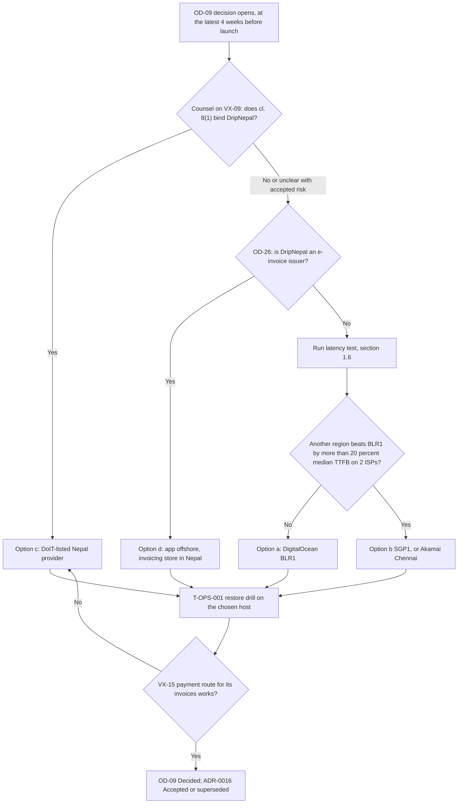
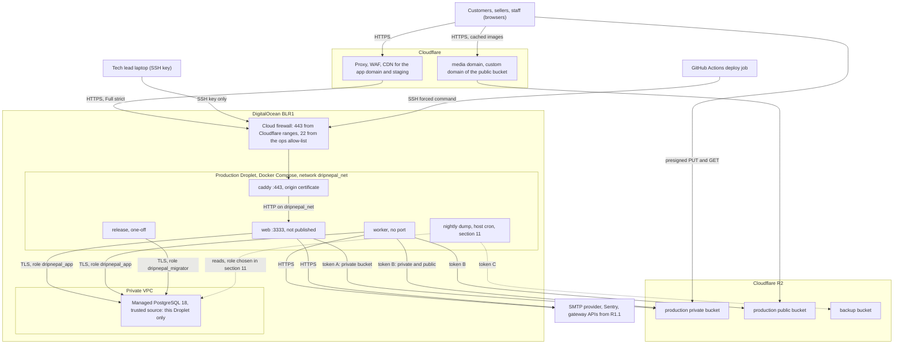
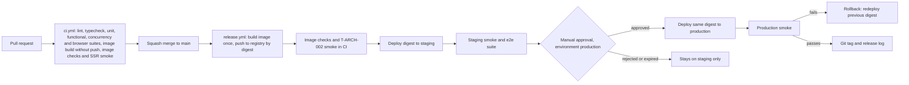
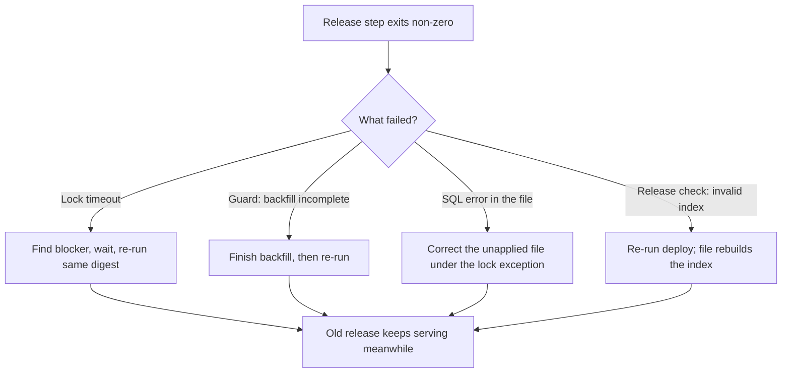
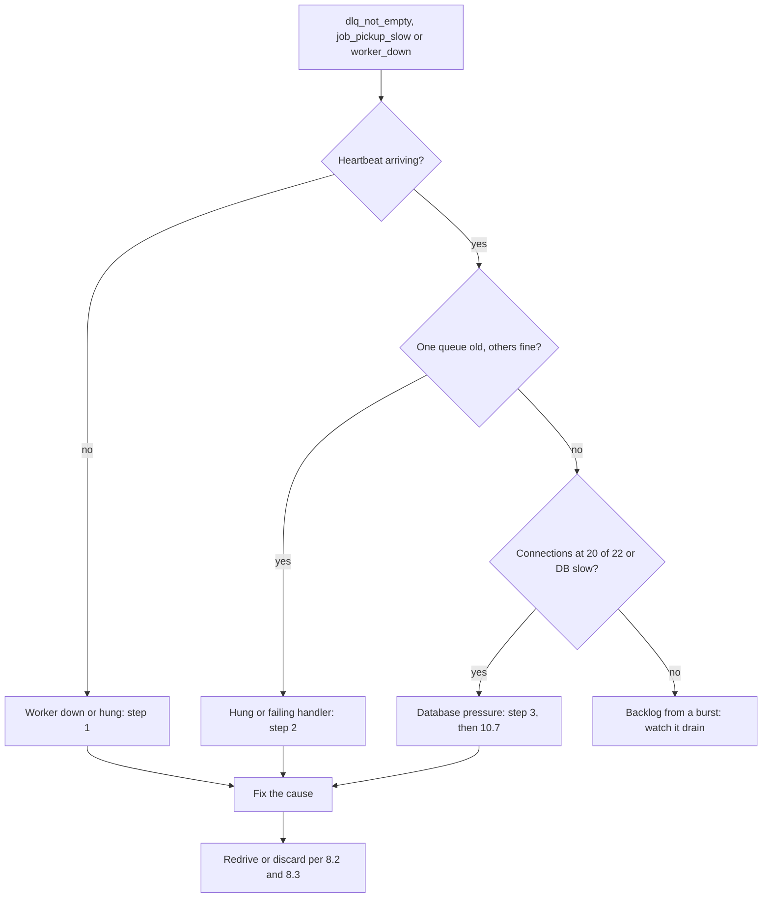
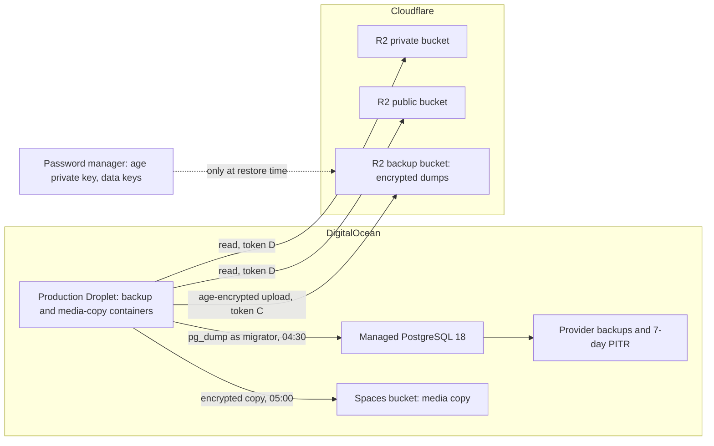

# Deployment and Operations

Status: Draft v1 (2026-09-26)

Reviewed: 2026-09-26 and 2026-09-27 · consistency review 2026-09-30 to 2026-10-04

This document says how DripNepal is hosted, deployed, watched, backed up and recovered by a team of one or two developers [Confirmed, Q1]. It owns the operational procedures that other documents hand over to "11": the environment set, the hosting recommendation behind [ADR-0016](adr/0016-hosting-single-region-portable.md), the release and migration procedure, job operations, monitoring and alerts, runbooks, backups, targets, capacity and operational access. It does not restate rules owned elsewhere. Topology and the connection budget come from [03 §5](03-system-architecture.md#5-deployment) and [03 §3.4](03-system-architecture.md#34-postgresql-layout-and-connection-budget), secrets policy from [07 §5.6](07-security-threat-model-and-permissions.md#56-secret-management-and-rotation), environment variables from [09 §6.1](09-code-structure-and-engineering-standards.md#61-variable-catalogue), and test IDs from [10](10-testing-and-quality-gates.md).

Labels follow [00 §1.2](00-context-assumptions-and-questions.md#12-evidence-labels). Prices are "as published on 2026-09-25" in [research: infra-ops](research/infra-ops.md) (accessed 2026-09-25). They are inputs to [Open OD-09] and [Verify-external VX-15], not quotes, and no figure here goes beyond arithmetic on those published prices.

## Reading guide

| §   | Title                                                     | State                   |
| --- | --------------------------------------------------------- | ----------------------- |
| 1   | Recommended cost-conscious deployment                     | Written (this part)     |
| 2   | Environments and data policy                              | Written (this part)     |
| 3   | Topology and networking                                   | Written (part 2)        |
| 4   | Docker images and local setup                             | Written (part 2)        |
| 5   | CI/CD and release promotion                               | Written (part 2)        |
| 6   | Safe schema migrations                                    | Written (part 3)        |
| 7   | Health checks, graceful shutdown and zero-downtime deploy | Written (part 3)        |
| 8   | Jobs and queue operations                                 | Written (part 3)        |
| 9   | Observability and alerting                                | Written (part 3)        |
| 10  | Runbooks                                                  | Written (part 4)        |
| 11  | Backup policy and verified restore                        | Written (part 5)        |
| 12  | Availability, recovery and performance targets            | Written (part 5)        |
| 13  | Capacity assumptions and cost drivers                     | Written (part 5)        |
| 14  | Operational access and security operations                | Written (part 5)        |
| —   | Consistency notes for editor                              | Written (covers §1–§14) |

A reader choosing a host reads §1. A developer setting up a machine, CI or staging reads §2, then §4 and §5. Whoever is on call reads §9 and §10.

---

## 1. Recommended cost-conscious deployment

### 1.1 Status: what is decided and what is not

[ADR-0016](adr/0016-hosting-single-region-portable.md) is **Proposed**. It is blocked on two items:

- [Verify-external VX-09]: does DCCS Directive 2081 cl. 8(1) ("any client shall only obtain" data-centre and cloud services from providers listed by the Department of Information Technology) bind a private company? "Client" is not defined. Law-firm summaries find no explicit offshore-storage ban (<https://www.pradhanlaw.com/publications/data-center-and-cloud-service-operation-and-management-directive-2081-2025-ad>, accessed 2026-09-25). DLA Piper reports that NRB-licensed payment institutions must host with DoIT-listed entities (<https://www.dlapiperdataprotection.com/?t=transfer&c=NP>, accessed 2026-09-25). DripNepal is not such an institution, but its gateways are.
- [Open OD-09]: the production provider and region. Its latest responsible moment is 4 weeks before launch, and it blocks the M7 exit (the R1 launch gate) in [risks-and-open-decisions.md §5](risks-and-open-decisions.md#5-decisions-that-block-implementation-by-milestone). The other hosting-related items on that gate are VX-09, VX-15 (including the FX route, R-32) and OD-26.

Three things are decided now and do not wait for OD-09:

1. Development and staging run on the provisional choice below.
2. The portability requirement (NFR-DATA-005, [03 §5.3](03-system-architecture.md#53-portability-requirement-nfr-data-005-vx-09)) is binding: one OCI image configured only by environment variables, vanilla PostgreSQL 18 with core extensions (`citext`, `pg_trgm`, `pgcrypto`), objects only through `@adonisjs/drive`'s S3 service, DNS at Cloudflare, and no provider-only runtime services in the request path.
3. No document claims legal compliance for any hosting option. REG-32 in [01](01-product-requirements.md) stays open until counsel answers VX-09.

A separate data-residency rule applies only if OD-26 makes DripNepal an e-invoice issuer: the Electronic Invoice Procedure 2082 s7 requires invoicing servers in Nepal with a Nepal-registered cloud provider (<https://ird.gov.np/category/electronic-invoice/>, accessed 2026-09-25). R1 keeps invoice tables out of the schema (A-16, OD-26), so this does not affect the R1 host unless OD-26 changes.

### 1.2 The recommended stack

This is OD-09 option (a). Every component can be replaced by configuration and a data move (§1.9).

| Component            | Recommended choice                                                                                                                                                                                                                      | Role                                                                                                                                                         | Published price (2026-09-25)                                                                                                                                                                                                                   | Data it receives (input for the 07 processor register)                                                                                 |
| -------------------- | --------------------------------------------------------------------------------------------------------------------------------------------------------------------------------------------------------------------------------------- | ------------------------------------------------------------------------------------------------------------------------------------------------------------ | ---------------------------------------------------------------------------------------------------------------------------------------------------------------------------------------------------------------------------------------------- | -------------------------------------------------------------------------------------------------------------------------------------- |
| Compute              | One DigitalOcean BLR1 (Bangalore) Basic Droplet, 4 GB / 2 vCPU, running Docker Compose: Caddy reverse proxy, `web`, `worker`, and a one-off `release` container for migrations                                                          | Runs the single image in two process types ([03 §3](03-system-architecture.md#3-containers)). Holds no state: it can be rebuilt from §4 and §5               | $24/mo, 4,000 GiB transfer included (<https://www.digitalocean.com/pricing/droplets>)                                                                                                                                                          | Everything in transit; at rest only container logs and the env file with secrets (§2.1)                                                |
| Database             | DigitalOcean Managed PostgreSQL 18, 1 GiB / 1 vCPU single node, same region, private VPC, TLS required                                                                                                                                  | The only stateful service. Daily backups kept 7 days, 7-day point-in-time recovery; a restore creates a new cluster                                          | $15.15/mo on the pricing page, "begin at $15.00" in the docs; storage $0.215/GiB/mo in 10 GiB steps (<https://www.digitalocean.com/pricing/managed-databases>; <https://docs.digitalocean.com/products/databases/postgresql/details/pricing/>) | All business data, all personal classes of [04 §19.1](04-domain-model-and-data-dictionary.md#191-handling-rules-per-sensitivity-class) |
| Edge                 | Cloudflare: DNS, proxy, CDN and WAF for the app domain and `media.<domain>`; Full (strict) TLS to the origin with a Cloudflare origin certificate on Caddy [Assumption; §3 owns the configuration]                                      | TLS termination near users, caching of public media, filtering. Cloudflare lists a Kathmandu data centre (<https://www.cloudflare.com/network/>)             | Plan not priced in the research [Verify-external VX-15]; the Free plan is the starting assumption [Assumption]                                                                                                                                 | Every request, including cookies and form bodies (TLS is terminated at Cloudflare)                                                     |
| Objects              | Cloudflare R2 with the `apac` location hint: `dripnepal-<env>-private` (originals, KYC) and `dripnepal-<env>-public` (derived WebP, served through `media.<domain>`), per [03 §3.5](03-system-architecture.md#35-object-storage-layout) | Uploads go direct to R2 by presigned URL; the worker derives public images                                                                                   | $0.015/GB-month, Class A $4.50/million, Class B $0.36/million, egress free; free tier 10 GB-month, 1M Class A, 10M Class B (<https://developers.cloudflare.com/r2/pricing/>)                                                                   | Product images, KYC documents (Sensitive-personal)                                                                                     |
| Backup storage       | A separate R2 bucket for encrypted nightly `pg_dump` files, with its own access key; retention and encryption owned by §11                                                                                                              | Survives loss of the DigitalOcean account or cluster (managed backups are destroyed with the cluster)                                                        | Same R2 prices                                                                                                                                                                                                                                 | Encrypted full database dumps                                                                                                          |
| Email                | A transactional provider with a first-party `@adonisjs/mail` 10.4.0 transport (ses, smtp, brevo, resend, mailgun, sparkpost, cloudflare, postmark) [Open OD-08]                                                                         | Verification, reset, invitation and order emails                                                                                                             | Not priced in the research; chosen on inbox placement first (OD-08, VX-14)                                                                                                                                                                     | Recipient addresses, names, order numbers                                                                                              |
| Error tracking       | Sentry, Developer plan while one person handles errors                                                                                                                                                                                  | Exceptions from `web`, `worker` and the browser, scrubbed per [07 §5.8](07-security-threat-model-and-permissions.md#58-analytics-and-third-party-processors) | Developer: $0, one user, 5k errors, 30-day lookback; Team from $26/mo billed annually (<https://sentry.io/pricing/>)                                                                                                                           | Stack traces, route patterns, `request_id`; no bodies or emails (07 §5.8)                                                              |
| Logs, uptime, traces | Chosen in §9 among free tiers                                                                                                                                                                                                           | —                                                                                                                                                            | §9                                                                                                                                                                                                                                             | Redacted pino JSON                                                                                                                     |

Facts the recommendation rests on [Verified-doc, accessed 2026-09-25]: BLR1 offers Droplets, Managed PostgreSQL and Spaces (<https://docs.digitalocean.com/platform/regional-availability/>); DigitalOcean Standard Edition supports PostgreSQL 14 to 18, matching the repository's `postgres:18.4` (<https://docs.digitalocean.com/products/databases/postgresql/details/limits/>); the 1 GiB plan allows 22 backend connections (same page); R2's `r2.dev` URLs are rate-limited and for development only, so production media always uses the custom domain (<https://developers.cloudflare.com/r2/buckets/public-buckets/>); R2 location hints are "best effort and not a guarantee" (<https://developers.cloudflare.com/r2/reference/data-location/>), so no residency claim is made from `apac`.

**Connection budget.** The 22 connections are split as in [03 §3.4](03-system-architecture.md#34-postgresql-layout-and-connection-budget): web Lucid 8, worker Lucid 4, worker pg-boss 4, migrations and admin 2, web send-only pg-boss 1, headroom 3. This document adopts that split unchanged. Operational consequences: `pg-boss` connects directly, never through a PgBouncer transaction-mode pool (DigitalOcean recommends session mode or direct connections for LISTEN/NOTIFY and advisory locks, <https://docs.digitalocean.com/products/databases/postgresql/how-to/manage-connection-pools/>); `pg_dump` also connects directly, and it uses one of the two admin connections, so the nightly dump and an incident `psql` session must not run together with a release (§5, §11). A second `web` container during a deploy (§7) needs 8 more connections than the headroom of 3 provides; §7 therefore has to either lower `DB_POOL_MAX` for the overlap or accept a restart blip. That tradeoff is decided in §7, not here.

**Facts to confirm when the accounts are opened** (not in the [research notes](research/README.md), so each is [Assumption] until recorded in the OD-09 decision log): that the managed database and R2 encrypt data at rest (07 §5.5 expects the provider statement here); that bucket-level public access is off on every `-private` bucket and `r2.dev` access is off on production buckets (07 TM-16 Preventive and ADR-0016 Verification hand this check to 11); that DigitalOcean Managed PostgreSQL lets the admin user create the three roles of [07 §4.10](07-security-threat-model-and-permissions.md#410-database-roles-and-grants) and grant them as specified, including `pg_read_all_stats` to `dripnepal_readonly`, and whether it may end other roles' sessions (§3.5); whether the managed database offers connection logs that show connection sources (07 TM-30 detective control, §14.5); how much storage the $15.15 plan includes; whether BLR1 compute prices equal SGP1's ([research: infra-ops](research/infra-ops.md) could not confirm it); which Cloudflare plan provides the WAF rules §3 relies on; which CA certificate the managed database presents, since production sets `DB_SSL_CA` to it (09 §6.1); and where Sentry and the email provider store data (07 §5.8, REG-24). The check is done on the drill cluster that T-OPS-001 creates anyway (§2.5), so it costs no extra cluster.

### 1.3 Why this shape, and what it costs in risk

The choice is driven by three facts: one or two developers run everything, users are in Nepal on slow mobile networks, and orders and ledger rows must be recoverable.

| Decision                                    | Mechanism                                                                                           | What we give up                                                                                                             | How it is verified                                                                                                              |
| ------------------------------------------- | --------------------------------------------------------------------------------------------------- | --------------------------------------------------------------------------------------------------------------------------- | ------------------------------------------------------------------------------------------------------------------------------- |
| Managed PostgreSQL instead of self-hosting  | Provider runs patching, daily backups and 7-day PITR                                                | Single node, no automatic failover; 7-day window only; backups die with the cluster, hence the independent dump (§11, R-29) | T-OPS-001 restore drill, with measured RTO and RPO                                                                              |
| One Droplet with Docker Compose, not a PaaS | Same OCI image everywhere; the Droplet has a static IPv4 for any provider allow-list (VX-14)        | The team patches the OS and Docker; the Droplet is a single point of failure; deploys restart containers (§7)               | From-scratch rebuild from the documented steps (§1.9); uptime check (§9)                                                        |
| Cloudflare in front of everything           | DNS, CDN and WAF at the edge; the origin firewall admits only Cloudflare's published IP ranges (§3) | Cloudflare sees decrypted traffic (a processor, REG-24); whether Nepali ISPs reach the Kathmandu PoP is unmeasured          | Latency test (§1.6) records the `cf-ray` colo; the edge check "direct request to the origin fails" (`T-OPS-007`, from ADR-0016) |
| R2 for objects                              | Egress is free, which removes the dominant variable cost of an image-heavy catalogue                | A second provider account and bill; the `apac` hint is not residency                                                        | Media smoke test in staging; monthly cost review (§13)                                                                          |
| BLR1 as the provisional region              | Geographically close; all needed products in one region                                             | "Close" is geographic only: no latency from Nepali ISPs has been measured (VX-15)                                           | §1.6 before OD-09 closes                                                                                                        |

### 1.4 Monthly cost of the recommended stack

Arithmetic on the published prices only. Staging is included because it runs from the first deploy pipeline (§2.4).

| Line                                       | Monthly (USD, as published 2026-09-25)   | Note                                                                                                                                                                                         |
| ------------------------------------------ | ---------------------------------------- | -------------------------------------------------------------------------------------------------------------------------------------------------------------------------------------------- |
| Production Droplet 4 GB / 2 vCPU           | 24.00                                    | Size is [Assumption] until SSR memory is measured (§13)                                                                                                                                      |
| Managed PostgreSQL 1 GiB                   | 15.15                                    | Or 15.00 per the docs page; extra storage $0.215/GiB in 10 GiB steps if the plan's included storage is exceeded                                                                              |
| Staging Droplet 2 GB / 1 vCPU              | 12.00                                    | PostgreSQL runs in a container on it (§2.4)                                                                                                                                                  |
| R2 (app buckets and backup bucket)         | 0.00 within the free tier                | Beyond it, (GB-month − 10) × $0.015. Example: 60 GB stored costs (60 − 10) × 0.015 = $0.75. Image volume is estimated in §13                                                                 |
| Cloudflare                                 | not priced                               | Free plan assumed [Verify-external VX-15]                                                                                                                                                    |
| Sentry                                     | 0.00 (Developer) or 26.00 (Team)         | Team is needed once two people must see errors (the Developer plan has one user)                                                                                                             |
| Email provider                             | not priced                               | [Open OD-08]                                                                                                                                                                                 |
| **Subtotal of priced lines**               | **51.15** (Developer) / **77.15** (Team) | 24.00 + 15.15 + 12.00 = 51.15; plus 26.00 = 77.15                                                                                                                                            |
| With 13% reverse-charge VAT, if it applies | 57.80 / 87.18                            | 51.15 × 1.13 and 77.15 × 1.13. Rate per VAT Act s7(1) as recorded under VX-05; VAT Act s8(2) reverse charge on services from abroad; how it is assessed and filed is [Verify-external VX-05] |

Not included: the Cloudflare plan, the email provider, log and uptime tools (§9), bandwidth beyond the Droplet's included 4,000 GiB ($0.01/GiB overage, <https://docs.digitalocean.com/platform/billing/bandwidth/>) and the domain. The monthly review compares actual invoices with this table (§13).

### 1.5 Alternatives, with published prices, and when each becomes worthwhile

All prices are as published on 2026-09-25 in [research: infra-ops](research/infra-ops.md); the source URL is given per row. "App + DB" is the arithmetic for a production web process, a worker and the smallest managed PostgreSQL, without staging, so rows can be compared with the recommended $24.00 + $15.15 = $39.15. Fly.io per-second prices are multiplied by 2,592,000 seconds (30 days); AWS hourly prices by 730 hours [Assumption on the month length].

| Option                                | Key facts (sources)                                                                                                                                                                                                                                                                                                                                                                                                                                                                                                                                                                                                                                                                                                                                                                                                                       | App + DB arithmetic                                                                                                                        | Main drawback for DripNepal                                                                                                     | Becomes worthwhile when                                                                                                                                                         |
| ------------------------------------- | ----------------------------------------------------------------------------------------------------------------------------------------------------------------------------------------------------------------------------------------------------------------------------------------------------------------------------------------------------------------------------------------------------------------------------------------------------------------------------------------------------------------------------------------------------------------------------------------------------------------------------------------------------------------------------------------------------------------------------------------------------------------------------------------------------------------------------------------- | ------------------------------------------------------------------------------------------------------------------------------------------ | ------------------------------------------------------------------------------------------------------------------------------- | ------------------------------------------------------------------------------------------------------------------------------------------------------------------------------- |
| DigitalOcean SGP1 (OD-09 option b)    | Same products as BLR1 (<https://docs.digitalocean.com/platform/regional-availability/>); bandwidth prices do not vary by region (<https://docs.digitalocean.com/platform/billing/bandwidth/>); compute price parity not confirmed                                                                                                                                                                                                                                                                                                                                                                                                                                                                                                                                                                                                         | $39.15 if compute prices equal BLR1's                                                                                                      | None beyond BLR1's                                                                                                              | The §1.6 latency test favours Singapore. The move is a restore and a DNS change                                                                                                 |
| Akamai (Linode) Chennai `in-maa`      | Only India region with compute, managed databases and object storage together (<https://api.linode.com/v4/regions>); Linode 4 GB $24/mo (<https://www.akamai.com/cloud/pricing/asia-pacific>); managed DB Nanode 1 GB $16 (1 node) or $37 (3 nodes, automatic failover) (<https://api.linode.com/v4/databases/types>); PostgreSQL 18 listed (<https://api.linode.com/v4/databases/engines>); backups kept 14 days (<https://techdocs.akamai.com/cloud-computing/docs/managed-databases>)                                                                                                                                                                                                                                                                                                                                                  | 24 + 16 = $40.00; with a 3-node database 24 + 37 = $61.00                                                                                  | PITR granularity within a day is not documented                                                                                 | Runner-up. Chosen if the latency test favours Chennai, if the RTO needs automatic failover (the cheapest HA database found), or if 14-day backups are wanted                    |
| Render Singapore                      | No India region (<https://render.com/docs/regions>); compute 0.5c-512mb $7, 1c-2g $25; Postgres 0.5c-1g $19; PITR 3 days on Hobby, 7 days on Pro; Pro workspace $25/mo; bandwidth beyond 5–25 GB at $0.15/GB (<https://render.com/pricing>; <https://render.com/docs/postgresql-backups>)                                                                                                                                                                                                                                                                                                                                                                                                                                                                                                                                                 | Web 1c-2g 25 + worker 7 + DB 19 = $51.00 on Hobby (3-day PITR); + 25 Pro = $76.00 for 7-day PITR                                           | Higher cost; a 512 MB worker may not fit image processing; no static egress IP without an add-on (Render dedicated IPs $100/mo) | The team decides it cannot patch a VM at all, and no gateway or SMS provider needs an IP allow-list (VX-14)                                                                     |
| Railway Singapore                     | Region `asia-southeast1-eqsg3a` (<https://docs.railway.com/reference/deployment-regions>); Pro $20/mo including $20 usage; RAM $10/GB/mo, CPU $20/vCPU/mo, egress $0.05/GB (<https://docs.railway.com/reference/pricing/plans>); Postgres templates are "unmanaged", no documented PITR (<https://docs.railway.com/databases/postgresql>)                                                                                                                                                                                                                                                                                                                                                                                                                                                                                                 | Usage-based: a service using 2 GB and 1 vCPU all month is 20 + 20 = $40 of usage, billed $40 because the $20 Pro fee covers the first $20  | No managed PITR for order and payment data                                                                                      | Not for production data. Possibly for short-lived preview environments, if they are ever wanted                                                                                 |
| Fly.io Singapore `sin` / Mumbai `bom` | Region markup `sin` 2×, `bom` 3×; shared-cpu-1x 1 GB $0.00000228/s (<https://docs.fly.io/about/pricing/>); Managed Postgres in `sin` but not in `bom`, Basic $38/mo (<https://docs.fly.io/reference/regions/>; <https://docs.fly.io/mpg/>); `fly mpg create` supports PostgreSQL 16 and 17 only (<https://docs.fly.io/flyctl/cmd/fly_mpg_create.md>); egress $0.04/GB APAC, $0.12/GB India                                                                                                                                                                                                                                                                                                                                                                                                                                                | One 1 GB machine: 0.00000228 × 2,592,000 × 2 = $11.82 (`sin`), × 3 = $17.73 (`bom`). Web + worker in `sin` + Basic DB: 23.64 + 38 = $61.64 | No PostgreSQL 18; a Mumbai app would query a Singapore database                                                                 | Only if the stack moved to PostgreSQL 17 everywhere, which nothing currently justifies                                                                                          |
| AWS Mumbai (Lightsail or RDS)         | `ap-south-1` needs no opt-in (<https://docs.aws.amazon.com/global-infrastructure/latest/regions/aws-regions.html>); Lightsail databases document PostgreSQL 12–16 only (<https://docs.aws.amazon.com/lightsail/latest/userguide/amazon-lightsail-choosing-a-database.html>); RDS supports 18.x (<https://docs.aws.amazon.com/AmazonRDS/latest/PostgreSQLReleaseNotes/postgresql-versions.html>); RDS db.t4g.micro $0.021/hr Single-AZ, $0.042/hr Multi-AZ, gp3 $0.131/GB-month; backup retention up to 35 days (<https://docs.aws.amazon.com/AmazonRDS/latest/UserGuide/USER_WorkingWithAutomatedBackups.BackupRetention.html>); Lightsail databases 1 GB $15 standard or $30 high availability, and Mumbai Lightsail bundles include half the usual transfer allowance, overage $0.1093/GB (<https://aws.amazon.com/lightsail/pricing/>) | RDS micro Single-AZ 0.021 × 730 = $15.33, Multi-AZ $30.66, plus 20 GB gp3 = $2.62; compute host not priced in the research                 | IAM and VPC set-up work; egress about 10× DigitalOcean's overage rate                                                           | PITR longer than 7 days becomes a requirement (RDS allows up to 35 days), or AWS credits make it cheaper                                                                        |
| Hetzner Singapore                     | Cloud only in `sin`; no Object Storage there (<https://docs.hetzner.com/cloud/general/locations/>); no managed PostgreSQL (<https://www.hetzner.com/cloud/>); CPX22 €26.49 ($30.99) from 15 June 2026 (<https://docs.hetzner.com/general/infrastructure-and-availability/price-adjustment/>); CPX22 includes 1 TB traffic in Singapore, overage price not readable (<https://www.hetzner.com/cloud/regular-performance/>)                                                                                                                                                                                                                                                                                                                                                                                                                 | $30.99 compute only; the database is self-run                                                                                              | The team would own PostgreSQL HA, patching, PITR (pgBackRest) and restore drills                                                | Only if a developer with PostgreSQL operations experience joins and dedicated CPU is needed; not at R1 scale                                                                    |
| DoIT-listed Nepal provider (OD-09 c)  | Not researched: no provider, price, managed-PostgreSQL offer or billing currency is known [Verify-external VX-15]. The list is kept by DoIT under DCCS Directive 2081 cl. 3(1) (<https://doit.gov.np/content/12100/data-center-and-cloud-service--operation-and/>)                                                                                                                                                                                                                                                                                                                                                                                                                                                                                                                                                                        | Unknown                                                                                                                                    | Unknown PostgreSQL 18 availability and operations tooling                                                                       | Counsel reads cl. 8(1) as binding (VX-09), a gateway requires DoIT-listed hosting at onboarding, or OD-26 puts invoice data in Nepal (option d splits only the invoicing store) |

If the target host has no managed PostgreSQL 18 with PITR, the fallback is PostgreSQL 18 in a container with pgBackRest, which supports PostgreSQL 18 since v2.55.0 and has an encrypted S3 repository (<https://pgbackrest.org/release.html>). That is a large operations load for this team (R-08), which is why the table ranks managed options first.

### 1.6 Measure latency from Nepal before choosing (OD-09)

No published latency measurements from Nepali ISPs exist for any candidate region ([research: infra-ops](research/infra-ops.md), "Could not verify"). "Close to Nepal" is geography until this test runs. The test is owned by the tech lead and finishes before OD-09's latest responsible moment (4 weeks before launch).

1. **Targets.** Create short-lived test VMs in DigitalOcean BLR1 and SGP1 and Akamai Chennai (`in-maa`). Each serves one static 20 KB page and one page rendered by the real image (SSR home page against a small seeded database), both over HTTPS through a Cloudflare-proxied test hostname and also directly to the VM IP. Destroy the VMs afterwards; the cost is a few days of the published hourly rates.
2. **Vantage points.** At least four access networks: Nepal Telecom (NTC) mobile, Ncell mobile, WorldLink fibre and Vianet fibre; Subisu if available. Use a phone hotspot for the mobile networks. Record ISP, city and time for each run.
3. **Samples.** 20 requests per target and path, three times a day (morning, evening peak, night), on three days. Command sketch (standard `curl` write-out variables):

   ```sh
   # latency probe sketch: one line per request, CSV
   for i in $(seq 1 20); do
     curl -s -o /dev/null -D /tmp/h.txt \
       -w "%{time_connect},%{time_appconnect},%{time_starttransfer},%{time_total}\n" \
       "https://$TARGET/$PATH_UNDER_TEST"
     grep -i '^cf-ray' /tmp/h.txt   # colo suffix, e.g. -KTM or -BOM [Assumption on the suffix format]
   done >> "results-$ISP-$TARGET.csv"
   ```

4. **What is recorded.** Median and p90 of TCP connect, TLS handshake, time to first byte and total, per ISP and target; the Cloudflare colo seen in `cf-ray` (this answers whether traffic reaches the Kathmandu PoP, which is also unverified).
5. **Decision rule** (from ADR-0016, [Assumption]): keep BLR1 unless another region has a median TTFB more than 20% lower from at least two ISPs. Ties go to the option with the simpler operations (fewer accounts).
6. **Where the result goes.** A dated entry in the OD-09 row of the decision log ([risks-and-open-decisions.md §2.3](risks-and-open-decisions.md#23-decision-log)), with the CSV files kept in the company document store (§10.1), not the repository (they contain home IP addresses).

### 1.7 Decision path to the production host



"Unclear with accepted risk" means the product owner accepts counsel's residual risk in writing; this document does not make that call. Whatever the path, the restore drill on the chosen host runs before the launch gate, because every candidate restores into a new instance and the runbook must be proven there (§11).

### 1.8 Paying for it from Nepal (R-32, VX-15)

Every provisional provider (DigitalOcean, Cloudflare, Sentry and the likely email providers) bills in USD or EUR by card. Whether DripNepal can pay these invoices from Nepal within NRB foreign-exchange rules and dollar-card limits is unconfirmed, and no NRB source has been researched ([Verify-external VX-15], card and FX sub-question; risk R-32). An unpaid invoice can suspend production, so this is an availability risk, not only an accounting one.

- **Before the first paid plan** (the staging Droplet, §2.4), the product owner confirms the payment route and its annual limit with the company's bank and records it under VX-15. Until then, development uses only local and CI environments and free tiers.
- **Budget check.** The route's limit must cover at least 12 × the monthly total of §1.4 including reverse-charge VAT, plus the annual Sentry Team charge if chosen (it is billed annually).
- **Billing contacts.** Every provider account sends billing and card-decline emails to two people. The monthly review (§13) checks each provider's billing status.
- **Fallback.** Portability (§1.9) keeps OD-09 option (c) open; whether a DoIT-listed Nepal provider bills in NPR is [Assumption] until checked (R-32).
- **Reverse-charge VAT** on these services is budgeted per VX-05; the accountant confirms assessment and filing.

### 1.9 Portability check (adopts the 03 §5.3 assumption)

[03 §5.3](03-system-architecture.md#53-portability-requirement-nfr-data-005-vx-09) proposed a staging rebuild on a second provider before the R1 gate and left it to this document. It is **adopted**, with one addition from NFR-DATA-005:

| Check                       | When                                                                      | Procedure                                                                                                                                                                                                                                                                                                                       | Pass criterion                                                                                                                                       |
| --------------------------- | ------------------------------------------------------------------------- | ------------------------------------------------------------------------------------------------------------------------------------------------------------------------------------------------------------------------------------------------------------------------------------------------------------------------------- | ---------------------------------------------------------------------------------------------------------------------------------------------------- |
| Second-provider rebuild     | Once before the R1 launch gate (M7 exit); again after any change of OD-09 | On Akamai Chennai (the runner-up) or the Nepal candidate: create a VM and a managed PostgreSQL 18 (or a container), follow only §3–§5 of this document to deploy the current production image, restore the latest nightly dump from the backup bucket (§11), point a throwaway hostname at it, run the staging smoke suite (§5) | Smoke suite green; elapsed time recorded as a relocation RTO; every undocumented step found is added to this document. Destroy everything afterwards |
| From-scratch staging deploy | Quarterly (NFR-DATA-005)                                                  | Destroy and recreate the staging Droplet from the documented steps only                                                                                                                                                                                                                                                         | Staging back in service within one working day [Assumption]                                                                                          |
| Static portability rules    | Every pull request                                                        | CI on `postgres:18.4` and MinIO; migration lint rejects extensions outside the allow-list (`T-ARCH-034`); `T-ARCH-001` forbids provider SDKs outside adapters (ADR-0016 Verification)                                                                                                                                           | CI green                                                                                                                                             |

The first two checks are `T-OPS-004` (second-provider rebuild) and `T-OPS-005` (from-scratch staging deploy) in the [10 §6.8](10-testing-and-quality-gates.md#68-notifications-administration-and-operations-t-not-t-adm-t-ops) registry.

---

## 2. Environments and data policy

### 2.1 Overview

Four long-lived environments plus one short-lived kind. The same image built once per commit runs in CI tests, staging and production (§5); only environment variables differ ([09 §6.1](09-code-structure-and-engineering-standards.md#61-variable-catalogue)). This table extends [03 §5.2](03-system-architecture.md#52-environments), which it does not contradict.

| Environment         | Purpose                                                                                 | Where                                                                         | Process start                                                         | Database                                                                  | Objects                                                       | Email                                    | Payments                                               | Secrets live in                                                                                            |
| ------------------- | --------------------------------------------------------------------------------------- | ----------------------------------------------------------------------------- | --------------------------------------------------------------------- | ------------------------------------------------------------------------- | ------------------------------------------------------------- | ---------------------------------------- | ------------------------------------------------------ | ---------------------------------------------------------------------------------------------------------- |
| Development         | Writing code                                                                            | Developer laptop; services in `docker-compose.yml`                            | `node ace serve --hmr` and `node ace jobs:work` (09 §1.3) on the host | `postgres:18.4` container, databases `dripnepal_dev` and `dripnepal_test` | MinIO container [Assumption, 03 §3.5]                         | Mailpit container                        | `PAYMENT_PROVIDER=fake`                                | Git-ignored `.env` ([09 §6.4](09-code-structure-and-engineering-standards.md#64-environment-files-policy)) |
| CI                  | Tests, lint, build, image push                                                          | GitHub Actions runners                                                        | Test runner; the built image for smoke tests                          | `postgres:18.4` service container, `dripnepal_test`                       | MinIO service container                                       | JSON/fake transport                      | `fake` plus recorded provider fixtures                 | GitHub Actions secrets, only for registry push and the staging deploy (§5); tests need none                |
| Staging             | Prod-like rehearsal: deploy, migrations, e2e, sandbox payments                          | DigitalOcean BLR1 Droplet 2 GB / 1 vCPU, `staging.<domain>` behind Cloudflare | Same Compose layout as production                                     | PostgreSQL 18.4 container on the Droplet, database `dripnepal_staging`    | `dripnepal-staging-private`, `dripnepal-staging-public`       | Capture inbox or provider sandbox (§2.4) | `none` (R1) or the chosen gateway's **sandbox** (R1.1) | Root-owned env file on the Droplet, mode 0600 [Assumption; §14 owns access]                                |
| Production          | Real customers                                                                          | §1.2                                                                          | Compose: Caddy, `web`, `worker`, one-off `release`                    | Managed PostgreSQL 18, database `dripnepal_production`                    | `dripnepal-production-private`, `dripnepal-production-public` | Production provider (OD-08)              | `none` in R1 (COD only); live keys from R1.1           | Root-owned env file on the Droplet, mode 0600, written from the password manager [Assumption; §14]         |
| Drill (short-lived) | Restore drills (T-OPS-001), second-provider rebuild (§1.9), provider fact checks (§1.2) | A new managed cluster created by the restore, plus a throwaway VM if needed   | Production image                                                      | Restored copy of production                                               | None, or read-only use of production media URLs               | Disabled (no mail transport configured)  | `none`                                                 | Created for the drill, destroyed with it                                                                   |

Database names never end in `_dev` or `_test` outside development and CI. The development seeders refuse to run unless `current_database()` ends in one of those suffixes ([09 §8.8](09-code-structure-and-engineering-standards.md#88-seeders-reference-data-versus-development-data) and 09 note 41), so these names are what keeps the demo marketplace seed out of staging and production (RF-05). The container for development therefore creates `dripnepal_dev` and `dripnepal_test` instead of today's `dripnepal` (fix list in §4, RF-43).

### 2.2 Development

`docker-compose.yml` provides the services; the app runs on the host for fast reload. Target service set (the RF-43 fixes and exact file are in §4):

| Service    | Image (pinned in §4)      | Status                                                | Why                                                                                                                                                                                                                                                                                               |
| ---------- | ------------------------- | ----------------------------------------------------- | ------------------------------------------------------------------------------------------------------------------------------------------------------------------------------------------------------------------------------------------------------------------------------------------------- |
| `postgres` | `postgres:18.4`           | Required                                              | Same major and minor as CI; creates `dripnepal_dev` and `dripnepal_test` (RF-32); bound to `127.0.0.1` only (RF-43)                                                                                                                                                                               |
| `mailpit`  | `axllent/mailpit`, pinned | Required                                              | SMTP sink on 1025, UI on 8025; every email the app sends in development lands here                                                                                                                                                                                                                |
| `minio`    | MinIO, pinned             | Required from M2 (media)                              | Exercises presigned PUT and GET against an S3 API locally [Assumption, 03 §3.5; M0 decides]. The media pipeline ships in M2 for KYC documents, logos and banners ([12 §5.2](12-roadmap-and-backlog.md#52-m2-shop-onboarding--membership-r1)). Behaviour that differs from R2 is tested in staging |
| `redis`    | `redis:8.6`               | **Optional**, Compose profile `redis`, off by default | Nothing in R1 uses Redis: sessions and the limiter use the database store, jobs use pg-boss ([03 §3](03-system-architecture.md#3-containers), ADR-0010). Kept only for experiments; see the upgrade trigger in [03 §13](03-system-architecture.md#13-evolution-path-without-a-rewrite)            |

Rules for development:

- Only synthetic data: reference seeders plus the development seeders (`dev/01_demo_marketplace`, …). The development admin is created with `node ace platform:create-admin`; there is no seeded admin (09 note 41).
- The worker runs locally when a developer works on jobs, emails or media; otherwise jobs queue up harmlessly in `pgboss`.
- `PAYMENT_PROVIDER=fake`. Real sandbox keys are not needed on a laptop; sandbox work happens in staging.
- A developer never connects to the staging or production database from a laptop. Operational access goes through §3 (SSH tunnel) and §14.

### 2.3 CI

GitHub Actions runs the checks and builds the image once (§5 owns the pipeline; [10](10-testing-and-quality-gates.md) owns the checks). For this section only the data rules matter:

- Service containers `postgres:18.4` and MinIO; database `dripnepal_test`; `NODE_ENV=test`, `APP_ENV=test`; test key values from `.env.test`.
- No real provider is ever called. Provider behaviour is covered by the fake adapter and recorded fixtures (03 §5.2).
- Tests hold no secrets. The only CI secrets are the registry push credential and the staging deploy key, both limited to the `main`-branch deploy job (§5, §14). Pull requests from forks get neither.
- Test data is created by factories per test and discarded; nothing from staging or production is ever used as a fixture.

### 2.4 Staging

Staging answers one question: "will this image, with these migrations, work in production?" It is smaller than production and differs in known ways, listed so nobody trusts it for what it cannot show.

| Aspect                     | Staging                                                                                                                                                                                                                                                                                                                                                        | Production                         | Consequence                                                                                                                                                                                                                                                                             |
| -------------------------- | -------------------------------------------------------------------------------------------------------------------------------------------------------------------------------------------------------------------------------------------------------------------------------------------------------------------------------------------------------------- | ---------------------------------- | --------------------------------------------------------------------------------------------------------------------------------------------------------------------------------------------------------------------------------------------------------------------------------------- |
| Image, Compose file, proxy | Same                                                                                                                                                                                                                                                                                                                                                           | Same                               | Deploy steps are rehearsed exactly                                                                                                                                                                                                                                                      |
| Host size                  | 2 GB / 1 vCPU                                                                                                                                                                                                                                                                                                                                                  | 4 GB / 2 vCPU                      | No load testing on staging; T-PERF-001 runs against a temporary production-sized environment or production before launch (§12, §13)                                                                                                                                                     |
| Database                   | PostgreSQL 18.4 container, no TLS inside the Docker network                                                                                                                                                                                                                                                                                                    | Managed, TLS with the provider CA  | The `DB_SSL=true` path, role grants and the 22-connection limit are first exercised in the drill environment (§2.1). Mitigation: staging sets `max_connections` so that 22 connections are available to the app roles [Assumption; value fixed in §4], so pool exhaustion shows up here |
| Backups                    | None beyond a nightly dump kept 7 days on the Droplet [Assumption]                                                                                                                                                                                                                                                                                             | Managed backups + independent dump | Staging data is disposable                                                                                                                                                                                                                                                              |
| Access                     | Not public: Caddy basic authentication on every path except `/health/*` and, from R1.1, a gateway's server-to-server callback path if it has one ([03 §11](03-system-architecture.md#11-provider-isolation)); gateway return URLs are browser navigations that carry the tester's cached credentials. Plus `X-Robots-Tag: noindex` [Assumption; §3 configures] | Public                             | The e2e suite passes the basic-auth credentials; search engines never index staging                                                                                                                                                                                                     |
| Email                      | A capture inbox or the provider's sandbox mode; never delivered to real third-party addresses [Assumption; depends on OD-08]                                                                                                                                                                                                                                   | Real delivery                      | Test accounts use addresses on a domain the team controls                                                                                                                                                                                                                               |
| Payments                   | `none` in R1; the gateway **sandbox** host and keys from R1.1 (Khalti `https://dev.khalti.com/api/v2/`, eSewa `rc-epay.esewa.com.np` per [03 §11.6](03-system-architecture.md#116-sandbox-and-production-configuration))                                                                                                                                       | Live keys from R1.1                | Boot validation refuses live hosts outside production unless `ALLOW_LIVE_PAYMENT_HOSTS` is set (03 §11.6); staging never sets it                                                                                                                                                        |
| Kill switch                | `checkout_enabled` toggled freely for tests                                                                                                                                                                                                                                                                                                                    | Off until the launch gate passes   | The switch is tested end to end in staging before launch (07 §7.5, item 8)                                                                                                                                                                                                              |

**When staging exists.** Staging is created when the deploy pipeline is built and the VX-15 payment route works (§1.8), and it must exist before the first milestone whose exit depends on e2e tests against a deployed image. [12 §5.5](12-roadmap-and-backlog.md#55-m5-cart--cod-checkout-r1), which owns milestones, places it: staging exists before M5 (cart and COD checkout) exits.

**Staging data.** Staging contains no production data (§2.6). Its content comes from the reference seeders run by the release step, `platform:create-admin`, and records created through the product's own flows by the e2e setup and by manual QA (test shops, products, orders). Development seeders cannot run there, by design (§2.1). A reset drops and recreates `dripnepal_staging`, runs migrations and reference seeders, and re-runs the e2e setup; it is done whenever the data gets confusing and at least before each launch-gate rehearsal.

### 2.5 Production

- Created once, from the steps in §3–§5, by the tech lead; the first-deploy bootstrap checklist is [09 §9.3](09-code-structure-and-engineering-standards.md#93-bootstrap-checklist-first-deploy-of-an-environment), and the first platform admin comes from `node ace platform:create-admin` (no default credentials, 09 §9.2).
- Receives only images that passed staging (§5). No one deploys from a laptop.
- `APP_ENV=production`, `NODE_ENV=production`, `SESSION_DRIVER=database`, `DB_SSL=true` with `DB_SSL_CA` set to the provider's CA certificate (confirmed on the drill cluster, §1.2), `DB_POOL_MAX` 8 for `web` and 4 for `worker` (03 §3.4), `LOG_LEVEL=info`, `PAYMENT_PROVIDER=none` for R1 (09 §6.1, value `none` proposed there), `SENTRY_DSN` required. The full production value list is completed in §4 and §5.
- `checkout_enabled` stays `false` until the R1 launch gate passes (risks §5, M7 row). Its default in [04a §15.1](04a-data-dictionary-tables.md) is `true`, so the first-deploy bootstrap (09 §9.3 step 8) sets it to `false` through `updatePlatformSetting` before the production hostname is published in DNS; the check "`checkout_enabled` is `false`" is part of the first-deploy smoke test (§5). Turning it back on at the gate needs MFA step-up ([07 §3.10](07-security-threat-model-and-permissions.md#310-step-up-for-money-staff-and-sensitive-settings)); turning it off needs none.
- Holds every record for its retention period: order, payment, ledger and complaint records are kept 7 years after the closing event in the live database, an approximation of the 6 years of VAT Rules r23(7) chosen because computing "6 years after the fiscal year" needs a Bikram Sambat calendar ([04 §19.3](04-domain-model-and-data-dictionary.md#193-retention-schedule); [Verify-external VX-08]). Backups are for recovery, not retention: they keep days, not years (§11).

### 2.6 Data policy per environment

| Data                                                          | Development                    | CI                  | Staging                                    | Production                 | Drill                                                                                  |
| ------------------------------------------------------------- | ------------------------------ | ------------------- | ------------------------------------------ | -------------------------- | -------------------------------------------------------------------------------------- |
| Reference data (locations, categories, settings defaults)     | Seeded                         | Seeded per test run | Seeded by the release step                 | Seeded by the release step | Restored                                                                               |
| Synthetic users, shops, orders                                | Development seeders, factories | Factories           | Created through the product's flows        | Never                      | Never                                                                                  |
| Production personal data (any class of 04 §19.1 above Public) | **Never**                      | **Never**           | **Never**                                  | Yes                        | Yes, restored copy; access limited to the tech lead; destroyed at the end of the drill |
| Production KYC files and originals                            | Never                          | Never               | Never                                      | Yes                        | Not copied; the drill checks object listing only                                       |
| Real payment credentials                                      | Never                          | Never               | Sandbox only                               | Live (R1.1)                | None                                                                                   |
| Real customer email addresses                                 | Never                          | Never               | Never; team-controlled test addresses only | Yes                        | Mail disabled                                                                          |

Rules behind the table:

1. **No production copy leaves production except as the encrypted backup** ([04 §19.1](04-domain-model-and-data-dictionary.md#191-handling-rules-per-sensitivity-class); 07 TM-30). There is no "anonymised production copy for staging" in R1: anonymising the encrypted columns, blind indexes and free text reliably is harder than generating synthetic data, and a mistake leaks personal data into a less protected environment.
2. **Restores go into the drill environment**, never into staging. The drill cluster is created by the restore itself (a DigitalOcean restore always creates a new cluster, <https://docs.digitalocean.com/products/databases/postgresql/how-to/restore-from-backups/>), reached only through the tech lead's SSH tunnel, and destroyed when the drill ends. The restore script refuses a target whose host or database name is staging's ([07 TM-30](07-security-threat-model-and-permissions.md#tm-30-database-backup-or-session-table-exposure), `T-SEC-029`). The drill record (§11) states when it was destroyed.
3. **Reproducing a production bug** uses the IDs and request ID from logs and the error tracker, then recreates the shape of the data synthetically in development. Staff read production records only through the admin UI or, during an incident, the `dripnepal_readonly` role (07 §4.10) over the tunnel.
4. **Exports** leave production only as the monthly accountant export named in 04 §19.1 (procedure in §10) and law-enforcement disclosures recorded per 07 §5.7 (procedure in §10.1).
5. **Logs and error events** from every environment are redacted at source (09 §7.2); non-production environments use separate projects or datasets in the log and error tools, so a staging test can never be confused with a production incident (§9).

### 2.7 Time conventions and Kathmandu business hours (A-29)

- Servers and containers run in UTC (`TZ=UTC`, 09 §6.1); cron schedules and user-facing times use Asia/Kathmandu, UTC+05:45 with no daylight saving ([03 §9](03-system-architecture.md#9-asynchronous-work)). Every schedule in this document is written in Asia/Kathmandu time.
- **Kathmandu business hours**, which A-29 uses without defining, are fixed here as **Sunday to Friday, 10:00–17:00 Asia/Kathmandu, excluding public holidays on a list the product owner publishes each year** [Assumption; the product owner confirms]. The Sunday-to-Friday week is an assumption about local working practice, not a sourced fact.
- Uses: the support hours shown to customers (A-29, FR-ADM-009), the window in which non-urgent alerts are handled (§9, §14), and planned maintenance, which is scheduled outside these hours and outside the evening peak found by the latency test (§1.6). The 15-day support SLA itself runs in calendar days ([01 §1.3](01-product-requirements.md#13-requirement-conventions)); business hours do not change it.
- Outside business hours nobody is on call (A-30); §9 decides which alerts page out of hours anyway.

---

## 3. Topology and networking

This section fixes the network choices that [03 §5.1](03-system-architecture.md#51-topology-adr-0016-provisional) and [ADR-0016](adr/0016-hosting-single-region-portable.md) Decision 2 left to this document: the reverse proxy, the origin firewall, the trusted-proxy setting (RF-31), database reachability and object-storage credentials. Everything here is provisional in the same way as §1 (OD-09, VX-09); a move to another provider keeps the shape and changes only provider names.

### 3.1 Topology

The diagram adds ports, trust decisions and credentials to the 03 §5.1 diagram. Staging has the same shape on its own Droplet, with a PostgreSQL container instead of the managed cluster (§2.4), and is left out for readability.



Reading the diagram: only Caddy publishes a port on the Droplet. `web` listens on `0.0.0.0:3333` inside the Compose network (`HOST=0.0.0.0`, because `HOST=localhost` would bind to loopback inside the container, audit A5-07), and nothing else can reach it. Browsers talk to R2 directly only through presigned URLs ([03 §3.5](03-system-architecture.md#35-object-storage-layout)); the app never proxies uploads.

### 3.2 Edge: Cloudflare configuration

Cloudflare plan features are [Verify-external VX-15]; the Free plan is the starting assumption (§1.2). Each row says what breaks if the setting is wrong.

| Setting               | Value                                                                                                                                                                                                                                                                                                                                                                                                                                                                                                                                                                                                                                                                                                                                                                            | Why, and what goes wrong otherwise                                                                                                                                                                                                                                                       |
| --------------------- | -------------------------------------------------------------------------------------------------------------------------------------------------------------------------------------------------------------------------------------------------------------------------------------------------------------------------------------------------------------------------------------------------------------------------------------------------------------------------------------------------------------------------------------------------------------------------------------------------------------------------------------------------------------------------------------------------------------------------------------------------------------------------------- | ---------------------------------------------------------------------------------------------------------------------------------------------------------------------------------------------------------------------------------------------------------------------------------------- |
| DNS                   | `<domain>` and `staging.<domain>` proxied (orange cloud) to the Droplet IPs; `media.<domain>` as the R2 custom domain of the public bucket; no record exposes the origin IP unproxied                                                                                                                                                                                                                                                                                                                                                                                                                                                                                                                                                                                            | An unproxied record reveals the origin; the firewall (§3.3) still blocks it, but it invites direct probing                                                                                                                                                                               |
| SSL/TLS mode          | Full (strict), with a Cloudflare origin certificate installed in Caddy [Assumption, ADR-0016 Decision 2]                                                                                                                                                                                                                                                                                                                                                                                                                                                                                                                                                                                                                                                                         | "Flexible" would send plaintext from Cloudflare to the origin; "Full" without strict accepts any certificate                                                                                                                                                                             |
| HTTP to HTTPS         | "Always Use HTTPS" at the edge; Caddy additionally answers only on 443                                                                                                                                                                                                                                                                                                                                                                                                                                                                                                                                                                                                                                                                                                           | Port 80 is closed at the firewall, so a plain-HTTP origin request cannot happen                                                                                                                                                                                                          |
| HSTS                  | Sent by the app only (Shield, today `maxAge: '180 days'` [Verified-repo `config/shield.ts:71-80`]), not also configured at Cloudflare. `includeSubDomains: true` from the first production deploy; `preload` stays off                                                                                                                                                                                                                                                                                                                                                                                                                                                                                                                                                           | One source of truth for the header. `includeSubDomains` is safe because every subdomain (`staging`, `media`) is HTTPS-only. Raising `maxAge` to one year after launch and any preload decision follow [07 §7.3](07-security-threat-model-and-permissions.md#73-csp-and-security-headers) |
| Minimum TLS version   | TLS 1.2 [Assumption]                                                                                                                                                                                                                                                                                                                                                                                                                                                                                                                                                                                                                                                                                                                                                             | Old Android devices common in Nepal may lack TLS 1.3; 1.2 is the floor that keeps them working                                                                                                                                                                                           |
| Cache rules           | Cache only `/assets/*` (hashed Vite files) and `media.<domain>`; explicit bypass for everything else on the app domain, including `/health/*` and every HTML and `/api/v1` response ([03 §12.5](03-system-architecture.md#125-caching))                                                                                                                                                                                                                                                                                                                                                                                                                                                                                                                                          | A cached HTML page could hand one visitor's cookies or Inertia props to another (03 §12.5). The explicit bypass guards against a later "cache everything" rule                                                                                                                           |
| WAF and rate rules    | Managed rules on; rate rules for `/login`, `/signup`, `/api/v1/auth/*` as an outer layer to the app limiter ([03 §12.4](03-system-architecture.md#124-rate-limiting)); a rate rule per IP on the listing and search paths (`/c/*`, `/search`, `/shops/*` and the navigation entries), which have no app limiter in R1 ([07 TM-24](07-security-threat-model-and-permissions.md#tm-24-resource-exhaustion-and-expensive-queries)); a rate rule per IP on page views without a session cookie ([07 §3.1](07-security-threat-model-and-permissions.md#31-guard-store-and-cookie)); a managed-challenge or rate-limiting rule on `POST /api/v1/auth/session`, turned on during a platform-wide `login_failure_spike` (§9.7); which rules the plan includes is [Verify-external VX-15] | The app limiter is the control; the edge rule only absorbs floods before they cost database upserts. The listing rule keeps scrapers from filling the catalog-read cap (07 TM-24), and the cookie-less rule bounds the `sessions` rows that requests without a cookie create (07 §3.1)   |
| Staging               | Caddy basic authentication on every path except `/health/live` and, from R1.1, the gateway's server-to-server callback path; `X-Robots-Tag: noindex` on every response (§2.4)                                                                                                                                                                                                                                                                                                                                                                                                                                                                                                                                                                                                    | Staging holds only synthetic data (§2.6), but it must not be indexed or used by the public                                                                                                                                                                                               |
| Origin authentication | Authenticated Origin Pulls (Cloudflare presents a client certificate that Caddy verifies) if the plan provides it [Verify-external VX-15]; until then, see the residual risk in §3.3                                                                                                                                                                                                                                                                                                                                                                                                                                                                                                                                                                                             | The IP allow-list admits traffic from any Cloudflare customer's zone, not only DripNepal's                                                                                                                                                                                               |

### 3.3 Origin firewall and host

The firewall is DigitalOcean's cloud firewall attached to the Droplet [Assumption; product not covered by the [research notes](research/README.md), confirmed on the drill account, §1.2], not `ufw` on the host. Reason: ports published by Docker are inserted into the host's `iptables` ahead of `ufw` rules [Assumption; widely reported Docker behaviour, to be checked in the from-scratch rebuild, §1.9], so a host firewall can silently fail to protect a published port. A firewall outside the VM does not have that problem.

| Direction | Port and protocol       | Source or destination                                                                                                                                                                               | Purpose                                                                |
| --------- | ----------------------- | --------------------------------------------------------------------------------------------------------------------------------------------------------------------------------------------------- | ---------------------------------------------------------------------- |
| Inbound   | TCP 443                 | Cloudflare's published IPv4 and IPv6 ranges only (list published by Cloudflare at <https://www.cloudflare.com/ips/> [Assumption: URL not in the research notes; read when the firewall is created]) | All web traffic                                                        |
| Inbound   | TCP 22                  | The ops allow-list: the tech lead's (and second developer's) current public IPs; GitHub Actions deploys use the same port (§5.4)                                                                    | Administration and deploys. Keys only, no passwords, no root login     |
| Inbound   | everything else         | denied                                                                                                                                                                                              | Port 80, 3333, 5432 and Docker's API are never reachable               |
| Outbound  | TCP 443                 | any                                                                                                                                                                                                 | R2, Sentry, image registry, OS updates, email API, gateway APIs (R1.1) |
| Outbound  | TCP 587 or 465          | the email provider's SMTP host, if OD-08 picks SMTP                                                                                                                                                 | Email                                                                  |
| Outbound  | UDP/TCP 53, UDP 123     | any                                                                                                                                                                                                 | DNS and NTP                                                            |
| Outbound  | managed PostgreSQL port | the VPC only                                                                                                                                                                                        | Database                                                               |

Two limits of this design:

- **GitHub Actions has no fixed egress IP** on hosted runners [Assumption], so the deploy job cannot be allow-listed by address. Options, in order of preference: (a) the deploy job opens port 22 for its own runner IP through the provider API, deploys, then removes the rule; (b) port 22 open to all with key-only auth and a forced command (§5.4); (c) a pull-based deploy where the Droplet polls for new releases. This document chooses **(a)** and records (b) as the fallback if the API token needed for (a) is judged riskier than an open key-only port. The provider API token for (a) is scoped to firewall changes if the provider allows scoping [Assumption; checked when the account is opened].
- **The Cloudflare IP allow-list authenticates Cloudflare, not DripNepal's zone.** Anyone can create a Cloudflare zone pointing at the Droplet's IP. Caddy answers only the configured hostnames and presents an origin certificate that only Cloudflare trusts, which blocks casual use; Authenticated Origin Pulls (§3.2) closes the gap if the plan has it. Residual risk until then: the origin can be reached through another zone with DripNepal's `Host` header, bypassing DripNepal's WAF rules but not the app's own limiter, authentication and authorization.

Host rules (the from-scratch rebuild in §1.9 follows them): Ubuntu LTS image [Assumption]; unattended security upgrades on; one non-root `ops` user per person with an SSH key, in the `docker` group; `PermitRootLogin no` and `PasswordAuthentication no`; the Docker daemon listens only on its Unix socket; the env files of §4.6 are root-owned, mode `0600`. Membership of the `docker` group is equivalent to root, which is why only the one or two people with production access have accounts (§14, written in a later part).

### 3.4 Trusted proxy configuration (RF-31)

Requests pass through two proxies before `web`: Cloudflare, then Caddy. `request.ip()` must return the browser's address, because the login limiter, `audit_logs.ip_hash` and abuse rules key on it ([03 §12.2](03-system-architecture.md#122-authentication-and-sessions-adr-0005), [07 TB-3](07-security-threat-model-and-permissions.md#13-trust-boundaries)). Today `config/app.ts` sets no `trustProxy`, so the default trusts only loopback and every request would appear to come from Caddy's container address (RF-31, audit A5-12).

What the installed code does [Verified-repo `@adonisjs/http-server` 9.1.0 `build/define_config-Cuq6_o-f.js:5559-5568`, `build/src/define_config.d.ts`; `proxy-addr` 2.0.7 `index.js:84-120`]:

- `trustProxy` accepts a boolean, a string, or a function `(address: string, distance: number) => boolean`. A string is passed to `proxyaddr.compile()` as a **single** entry: a comma-separated list is not split, so `'10.0.0.0/8, 173.245.48.0/20'` does not work. Several ranges need the function form, which `proxyaddr.compile([...])` returns.
- `proxy-addr` walks the address chain from the socket address leftwards through `X-Forwarded-For` and returns the first address that is not trusted. Entries a client forges at the left end of the header are never reached, because the real client address that Cloudflare appends sits to their right.
- The same setting decides whether `X-Forwarded-Proto` and `X-Forwarded-Host` are honoured (`request.protocol()`, `request.secure()`, `request.host()`): they are read only when the socket address is trusted [Verified-repo same file, lines 1985 and 2020]. With the loopback default, the app behind Caddy would see `http` and Caddy's upstream host, which would break any absolute URL built from the request. Absolute URLs in emails and canonical links should therefore come from `APP_URL` (the public origin in [09 §6.1](09-code-structure-and-engineering-standards.md#61-variable-catalogue)) [Assumption; 09 owns the rule], with the forwarded headers as a second line.

Decision:

1. Caddy and the app share a Compose network with a fixed subnet, `172.30.0.0/24` (§4.5). The trusted set is that subnet plus Cloudflare's published ranges.
2. The ranges come from a new variable `TRUSTED_PROXY_CIDRS` (proposed; comma-separated CIDRs, required in staging and production, validated as CIDRs by `start/env.ts`; 09 §6.1 left "trusted-proxy ranges" to this document). Updating the list is a config change and a restart, not a code change.
3. `proxy-addr` becomes a direct dependency at the version `@adonisjs/http-server` already resolves (2.0.7), so the app compiles exactly what the framework evaluates.

```ts
// config/app.ts — design sketch; trustProxy function form verified against http-server 9.1.0 types,
// proxy-addr 2.0.7 compile() verified from source; the default-import and @types/proxy-addr are [Assumption]
import proxyAddr from 'proxy-addr'

const trusted = env
  .get('TRUSTED_PROXY_CIDRS', '')
  .split(',')
  .map((cidr) => cidr.trim())
  .filter(Boolean)

export const http = defineConfig({
  // development and test: no proxy, keep the loopback default
  trustProxy: trusted.length > 0 ? proxyAddr.compile(['loopback', ...trusted]) : 'loopback',
  // ...existing options
})
```

Caddy must pass the incoming `X-Forwarded-For` through and append Cloudflare's address. Caddy's handling of forwarded headers is not covered by the [research notes](research/README.md), so the Caddyfile in §4.5 is [Assumption] and the behaviour is proven by the test below, not by reading Caddy documentation.

Verification (`T-OPS-006`): from a laptop, request `https://staging.<domain>/health/live` with a forged header `X-Forwarded-For: 203.0.113.9`; the access log line (09 §7) must show the laptop's public address, not `203.0.113.9`, not a Cloudflare address and not `172.30.0.x`. The same check runs once in production after the first deploy.

### 3.5 Database access

| Rule                          | Mechanism                                                                                                                                                                                                                                                                                                                                                                                                                                                                                                                                                                                                                                                                                                                                                                                                                                                                                                                                                             | Verified by                                                                                                                                                                                                                                                                                                                           |
| ----------------------------- | --------------------------------------------------------------------------------------------------------------------------------------------------------------------------------------------------------------------------------------------------------------------------------------------------------------------------------------------------------------------------------------------------------------------------------------------------------------------------------------------------------------------------------------------------------------------------------------------------------------------------------------------------------------------------------------------------------------------------------------------------------------------------------------------------------------------------------------------------------------------------------------------------------------------------------------------------------------------- | ------------------------------------------------------------------------------------------------------------------------------------------------------------------------------------------------------------------------------------------------------------------------------------------------------------------------------------- |
| Private network only          | The app connects to the cluster's private (VPC) hostname. The cluster's trusted sources list contains only the production Droplet [Assumption on the feature name; confirmed on the drill cluster, §1.2]. The staging Droplet is **not** a trusted source                                                                                                                                                                                                                                                                                                                                                                                                                                                                                                                                                                                                                                                                                                             | From the staging Droplet, `psql` to the production host times out (`T-OPS-009`)                                                                                                                                                                                                                                                       |
| TLS with certificate checking | `DB_SSL=true` and `DB_SSL_CA` set to the provider's CA certificate, so `config/database.ts` uses `ssl: { rejectUnauthorized: true, ca }` ([09 §6.3](09-code-structure-and-engineering-standards.md#63-where-configuration-is-read)). The pg-boss connection uses the same TLS options ([07 §5.5](07-security-threat-model-and-permissions.md#55-encryption))                                                                                                                                                                                                                                                                                                                                                                                                                                                                                                                                                                                                          | Boot refuses production without `DB_SSL=true` (09 §6.2); a drill-cluster connection with a wrong CA fails (confirms the check is real)                                                                                                                                                                                                |
| Least-privilege roles         | `web` and `worker` use `dripnepal_app`; only the `release` container gets `dripnepal_migrator` credentials; incident reads use `dripnepal_readonly` ([07 §4.10](07-security-threat-model-and-permissions.md#410-database-roles-and-grants)). The provider's admin user is used once, to create these roles and the application database `OWNER dripnepal_migrator` (as in §11.5 path B), or, if the provider pre-creates the database, to run `GRANT CREATE ON DATABASE <db> TO dripnepal_migrator` and `ALTER SCHEMA public OWNER TO dripnepal_migrator` [Assumption: confirmed on the drill cluster]. After that it is used only for what the migrator cannot do: granting `pg_read_all_stats` to `dripnepal_readonly` ([07 §4.10](07-security-threat-model-and-permissions.md#410-database-roles-and-grants)), changing role passwords and ending another role's session (§6.3 step 5, §10.7), because `dripnepal_readonly` is not a member of `pg_signal_backend` | T-ARCH-012 and T-SEC-029 (proposed in 04 and 07); the drill confirms that the admin user can create and grant the roles, grant `pg_read_all_stats` to `dripnepal_readonly` (the §6.3 and §10.4 `pg_stat_activity` queries need it; if the provider refuses, those queries run as the admin user) and end other roles' sessions (§1.2) |
| No public admin access        | No database console or admin tool is exposed on the internet; the provider's web console is used only for cluster settings, behind 2FA (§14)                                                                                                                                                                                                                                                                                                                                                                                                                                                                                                                                                                                                                                                                                                                                                                                                                          | Firewall review in the monthly check (§13)                                                                                                                                                                                                                                                                                            |
| Operator access by SSH tunnel | The production Droplet is the bastion. `ssh -N -L 127.0.0.1:15432:<db-private-host>:<db-port> ops@<droplet>` then `psql "host=127.0.0.1 port=15432 user=dripnepal_readonly dbname=dripnepal_production sslmode=verify-full sslrootcert=<ca file>"`. With a tunnel, `verify-full` needs the certificate to name the private host; if it does not, use `sslmode=verify-ca` [Assumption; checked on the drill cluster]                                                                                                                                                                                                                                                                                                                                                                                                                                                                                                                                                   | One incident `psql` session uses one of the two admin connections of the budget (§1.2), so the deploy script refuses to run while a `dripnepal_readonly` or `pg_dump` session is open (§5.4)                                                                                                                                          |
| Staging database              | PostgreSQL container on the staging Droplet, on the Compose network only, no published port; the same three roles exist so grants are rehearsed                                                                                                                                                                                                                                                                                                                                                                                                                                                                                                                                                                                                                                                                                                                                                                                                                       | `ss -ltn` on the staging host shows no 5432 listener on a public interface                                                                                                                                                                                                                                                            |

A laptop never holds production credentials for `dripnepal_app` or `dripnepal_migrator` (§2.2). The `dripnepal_readonly` password lives in the password manager and is used only through the tunnel.

### 3.6 Object storage access

Bucket settings (R2 features are [Assumption] where the [research notes](research/README.md) do not cover them; each is checked when the bucket is created and again in the monthly review):

| Bucket                         | Public access                                                                                                                                                                                                                                  | CORS                                                                                                         | Other settings                                                |
| ------------------------------ | ---------------------------------------------------------------------------------------------------------------------------------------------------------------------------------------------------------------------------------------------- | ------------------------------------------------------------------------------------------------------------ | ------------------------------------------------------------- |
| `dripnepal-<env>-private`      | Off; no custom domain; `r2.dev` off (07 TM-16 asks this document to verify it)                                                                                                                                                                 | Allow origin `APP_URL`, methods `PUT` and `GET`, header `Content-Type`; needed for presigned browser uploads | Location hint `apac` (best effort, §1.2)                      |
| `dripnepal-<env>-public`       | Only through the custom domain `media.<domain>`; `r2.dev` off in staging and production (`r2.dev` is rate-limited and for development only [Verified-doc <https://developers.cloudflare.com/r2/buckets/public-buckets/>, accessed 2026-09-25]) | None (images are loaded by ``, which needs no CORS)                                                     | Objects are content-addressed and never overwritten (03 §3.5) |
| `dripnepal-production-backups` | Off                                                                                                                                                                                                                                            | None                                                                                                         | Retention, encryption and versioning owned by §11             |

Credentials are one API token per process and purpose, each scoped to named buckets (R2 per-bucket token scoping [Assumption; confirmed when tokens are created]). The variable names stay `S3_ACCESS_KEY_ID` and `S3_SECRET_ACCESS_KEY` ([09 §6.1](09-code-structure-and-engineering-standards.md#61-variable-catalogue)); each container gets its own values from its own env file (§4.6).

| Token                  | Held by                         | Scope                                                        | Why this scope                                                                                                                                                         |
| ---------------------- | ------------------------------- | ------------------------------------------------------------ | ---------------------------------------------------------------------------------------------------------------------------------------------------------------------- |
| A, `<env>-web`         | `web`                           | Read and write on `-private` only                            | Presigning uploads and 5-minute KYC views needs a signer allowed to do the operation; `web` never writes derived images                                                |
| B, `<env>-worker`      | `worker`                        | Read and write on `-private` and `-public`                   | Reads originals, writes derived WebP, deletes abandoned uploads (`media.cleanup_abandoned`)                                                                            |
| C, `production-backup` | The backup job only (§11)       | Read and write on the backup bucket only                     | A leaked app token cannot delete backups, and a leaked backup token cannot read media                                                                                  |
| D (proposed)           | The media-copy run only (§11.4) | Read only on the production `-private` and `-public` buckets | A leaked token D reads media but cannot change it. It lives in `media-copy.env`, so `backup.env` holds no media credential and the reason given for token C stays true |
| none                   | CI, `release`, staging hosts    | —                                                            | CI uses MinIO; the release step needs no objects; staging tokens are separate and scoped to staging buckets                                                            |

**CSP origin.** Presigned upload URLs have the `S3_ENDPOINT` origin, because the storage adapter sets `forcePathStyle: true`, and [07 §7.3](07-security-threat-model-and-permissions.md#73-csp-and-security-headers) lists that origin in `connect-src` per environment: the R2 account endpoint `https://<ACCOUNT_ID>.r2.cloudflarestorage.com` in staging and production, the MinIO origin in development ([09 §6.1](09-code-structure-and-engineering-standards.md#61-variable-catalogue)). Pointing `S3_ENDPOINT` elsewhere, for example at Spaces after losing the Cloudflare account (§11.4), is therefore also a CSP change.

If `web` is compromised, the attacker can read KYC originals with token A. That is the accepted residual risk of presigning from `web`; the alternative (a separate signing service) is out of proportion for R1. The detective control is the `shop.kyc_view` audit rows and alert in [07 TM-16](07-security-threat-model-and-permissions.md#tm-16-unauthorised-access-to-private-media-kyc).

### 3.7 Outbound dependencies and the static IP

The Droplet's static public IPv4 is the source address of every outbound call, which matters if a gateway or SMS provider requires IP allow-listing ([Verify-external VX-14]; ADR-0016 Risks). Rebuilding the Droplet from scratch (§1.9) changes that IP unless a reserved IP is attached [Assumption; DigitalOcean feature not in the research notes]. If VX-14 finds any allow-listing requirement, a reserved IP is attached before the first gateway onboarding (M8) and the rebuild procedure moves it.

### 3.8 How the network design is verified

Each check names its ID in the [10 §6](10-testing-and-quality-gates.md#6-test-id-registry) registry. They run once when production is created, after every change to the firewall or Cloudflare, and in the monthly review (§13).

| Check                                       | Command sketch                                                                                              | Pass                                                                                                                               |
| ------------------------------------------- | ----------------------------------------------------------------------------------------------------------- | ---------------------------------------------------------------------------------------------------------------------------------- |
| Origin not directly reachable (`T-OPS-007`) | `curl -m 10 -k https://<droplet-ip>/health/live` from a network outside the ops allow-list                  | Connection times out (ADR-0016 edge check)                                                                                         |
| Port scan (`T-OPS-007`)                     | `nmap -Pn -p 1-65535 <droplet-ip>` from outside the allow-list                                              | No open port                                                                                                                       |
| HTTPS only and HSTS                         | `curl -sI http://<domain>/` and `curl -sI https://<domain>/`                                                | Redirect to HTTPS; `Strict-Transport-Security` present with `includeSubDomains` (T-SEC-035, proposed in 07, snapshots the headers) |
| Client IP (`T-OPS-006`)                     | Forged `X-Forwarded-For` test of §3.4                                                                       | Logged IP is the real client's                                                                                                     |
| Private bucket closed                       | Unauthenticated `curl` of a known private object key via the account endpoint and via `r2.dev`              | Denied (T-SEC-019, proposed in 07)                                                                                                 |
| Public bucket only via domain (`T-OPS-008`) | Request a derived image via `r2.dev`                                                                        | Not served                                                                                                                         |
| Database not public (`T-OPS-009`)           | `psql` to the cluster's public hostname from a laptop, and to the private hostname from the staging Droplet | Both refused or time out                                                                                                           |
| Health endpoints not cached (`T-OPS-020`)   | Two requests to `/health/live`; inspect `cf-cache-status`                                                   | Never `HIT`                                                                                                                        |

---

## 4. Docker images and local setup

### 4.1 One image, three commands

One OCI image is built per commit ([03 §3](03-system-architecture.md#3-containers)) and runs everywhere outside development. Only the command and the environment differ.

| Process   | Command                                                                                                                | Environment specifics                                                                                                                                                                                                                                                   |
| --------- | ---------------------------------------------------------------------------------------------------------------------- | ----------------------------------------------------------------------------------------------------------------------------------------------------------------------------------------------------------------------------------------------------------------------- |
| `web`     | `node --import ./bin/instrument.js bin/server.js`                                                                      | `DB_POOL_MAX=8`, token A, listens on 3333                                                                                                                                                                                                                               |
| `worker`  | `node --import ./bin/instrument.js ace jobs:work` (name fixed in [09](09-code-structure-and-engineering-standards.md)) | `DB_POOL_MAX=4` plus the pg-boss pool of 4 (03 §3.4), token B, `VIPS_BLOCK_UNTRUSTED=1` (read by libvips itself, not by `start/env.ts`; [research: infra-ops](research/infra-ops.md), <https://www.libvips.org/API/8.17/developer-checklist.html>, accessed 2026-09-25) |
| `release` | `node ace migration:run --force`, then the reference seeders and release checks (§5.4)                                 | `dripnepal_migrator` credentials, `DB_POOL_MAX=2`; exits when done                                                                                                                                                                                                      |

`--import ./bin/instrument.js` loads the error-tracker wiring before the application, as [09 §5.6](09-code-structure-and-engineering-standards.md#56-reporting-to-the-error-tracker) requires (`bin/instrument.ts` is pseudocode there and compiles to `bin/instrument.js` in `build/`). The `release` commands leave it out: a failed release step is seen in the deploy job's output, not in the error tracker.

`migration:run` does not run `schema:generate` in production, because Lucid 22.4.2 skips it when `app.inProduction` is true [Verified-doc, [research: adonis-stack](research/adonis-stack.md), Lucid `build/commands/migration/run.js`]; the committed `database/schema.ts` is checked in CI instead (T-ARCH-010, proposed in 04).

### 4.2 Dockerfile

Design sketch for M0. Facts it relies on are marked; the file is proven by the CI image build and the T-ARCH-002 smoke test (§5.2), not by this document.

```dockerfile
# syntax=docker/dockerfile:1
# Dockerfile — design sketch (M0). Pin the base image by digest when the file is created.
ARG NODE_IMAGE=node:24-slim

FROM ${NODE_IMAGE} AS base
ENV PNPM_HOME=/pnpm PATH=/pnpm:$PATH TZ=UTC
# pnpm 11.9.0 comes from "packageManager" through Corepack [Assumption: Corepack ships with the Node 24 image;
# fallback: npm install -g pnpm@11.9.0]
RUN corepack enable
WORKDIR /src

FROM base AS build
# husky's prepare script would fail without .git (audit A5-07); HUSKY=0 makes it exit 0 [Verified-repo husky 9]
ENV HUSKY=0
COPY package.json pnpm-lock.yaml pnpm-workspace.yaml ./
RUN pnpm install --frozen-lockfile
COPY . .
# node ace build compiles TypeScript, runs the Vite build hook (client and, when enabled, SSR)
# and copies package.json, pnpm-lock.yaml and metaFiles into build/ [Verified-repo assembler 8.4.0, @adonisjs/vite 5.1.1]
RUN node ace build
# RF-08 guard: fail the image build if the SSR bundle is missing
RUN test -f build/ssr/ssr.js
# the build copies neither pnpm-workspace.yaml nor the lockfile settings it holds [Verified-repo assembler 8.4.0]
RUN cp pnpm-workspace.yaml build/

FROM base AS runtime
ENV NODE_ENV=production HOST=0.0.0.0 PORT=3333
ARG APP_RELEASE
ENV APP_RELEASE=${APP_RELEASE}
WORKDIR /app
COPY --from=build --chown=node:node /src/build ./
# production dependencies only; --ignore-scripts skips "prepare" (husky) and "preinstall" (npx only-allow)
# ([09 §10.2]); sharp's prebuilt @img binaries must load without their install script: checked by the smoke test
RUN pnpm install --prod --frozen-lockfile --ignore-scripts && pnpm store prune
USER node
EXPOSE 3333
CMD ["node", "--import", "./bin/instrument.js", "bin/server.js"]
```

Decisions in the file and their tradeoffs:

| Choice                                                                    | Why                                                                                                                                                                                                                                                                                        | Cost or risk                                                                                                                                               |
| ------------------------------------------------------------------------- | ------------------------------------------------------------------------------------------------------------------------------------------------------------------------------------------------------------------------------------------------------------------------------------------ | ---------------------------------------------------------------------------------------------------------------------------------------------------------- |
| `node:24-slim` (Debian, glibc), pinned by digest                          | Node 24 is the repo's engine (`package.json` `engines`) [Verified-repo]; sharp's prebuilt binaries cover glibc and musl [Verified-doc, [research: infra-ops](research/infra-ops.md), <https://sharp.pixelplumbing.com/install>, accessed 2026-09-25]; glibc avoids musl-specific surprises | A Debian base is larger than Alpine. Digest pinning means base-image security updates arrive only when the weekly dependency PR bumps the digest (07 §7.1) |
| Multi-stage, runtime has no dev dependencies, no source, no `.git`        | Smaller image and attack surface; `vite`, TypeScript and test tools never reach production                                                                                                                                                                                                 | Two installs per build (about a minute of CI time [Assumption])                                                                                            |
| `USER node` (non-root, the user the official image provides [Assumption]) | A process escape does not start as root inside the container                                                                                                                                                                                                                               | Files written at runtime must go to paths `node` owns; the app writes nothing to disk in R1 (media go to R2)                                               |
| No secrets, no `.env*` in the image                                       | Secrets come only from the host (09 §9.2 "Images" row, [03 §12.6](03-system-architecture.md#126-configuration-and-secrets))                                                                                                                                                                | Checked by the image content check below                                                                                                                   |
| `APP_RELEASE` baked in as the commit SHA                                  | Every log line and Sentry event names the release (09 §6.1, NFR-OBS-002)                                                                                                                                                                                                                   | None; the image is already per commit                                                                                                                      |
| No `HEALTHCHECK` in the Dockerfile                                        | `web` and `worker` need different checks, so Compose defines them per service (§4.5)                                                                                                                                                                                                       | The image alone does not report health outside Compose                                                                                                     |

`.dockerignore` excludes `.git`, `node_modules`, `build`, `tmp`, `coverage`, `.env*`, `docs`, `screenshots`, `.agents` and `*.tsbuildinfo`. The `.env*` line is what keeps a developer's `.env` out of the build context.

Image checks run in CI on every image, pull requests included (`T-OPS-010`, [10 §5.1](10-testing-and-quality-gates.md#51-every-pull-request-ciyml)): the container runs as a non-root user (`docker run --rm <image> id -u` is not `0`); no file matching `.env*` exists under `/app`; `build/ssr/ssr.js` exists; the image boots against the CI database and serves `/` with server-rendered markup (T-ARCH-002, proposed in 03).

### 4.3 Development Compose: RF-43 fix list

`docker-compose.yml` is for development only. Staging and production use `deploy/compose.yml` (§4.5), which is why 09 §9.2 says the development file is never used outside development. Current file [Verified-repo `docker-compose.yml`] against the target:

| Item              | Today                                                                   | Target                                                                                              | Finding       |
| ----------------- | ----------------------------------------------------------------------- | --------------------------------------------------------------------------------------------------- | ------------- |
| Postgres password | `POSTGRES_PASSWORD: secret` in the file                                 | `${DB_PASSWORD:?set DB_PASSWORD in .env}` read from the developer's `.env`; still development-only  | RF-43 (A5-19) |
| Port bindings     | `'5432:5432'`, `'6379:6379'` on all interfaces                          | `'127.0.0.1:5432:5432'`, `'127.0.0.1:1025:1025'`, `'127.0.0.1:8025:8025'`, MinIO on `127.0.0.1` too | RF-43 (A5-19) |
| Mailpit image     | `axllent/mailpit:latest`                                                | A pinned version tag chosen in M0, updated by the dependency bot                                    | RF-43 (A5-19) |
| Databases         | One database `dripnepal`                                                | An init script under `docker/postgres/init/` creates `dripnepal_dev` and `dripnepal_test` (§2.1)    | RF-32, RF-43  |
| Healthchecks      | None                                                                    | `pg_isready -U dripnepal` for Postgres; `depends_on: condition: service_healthy` where needed       | RF-43 (A5-19) |
| Redis             | Always started, no auth, all interfaces                                 | Compose profile `redis`, off by default; nothing in R1 uses it (§2.2)                               | RF-43, 03 §3  |
| Object storage    | None                                                                    | MinIO, pinned, profile default from M2 (§2.2)                                                       | 03 §3.5       |
| Dev CORS          | `config/cors.ts:21` reflects any origin with credentials in development | Explicit allowlist of `APP_URL` in every environment; code change in M0 (RF-43 includes A5-20)      | RF-43 (A5-20) |

Target file (sketch; image versions other than `postgres:18.4` and `redis:8.6` are chosen and pinned in M0):

```yaml
# docker-compose.yml — development only (design sketch)
services:
  postgres:
    image: docker.io/postgres:18.4
    restart: unless-stopped
    environment:
      POSTGRES_USER: dripnepal
      POSTGRES_PASSWORD: ${DB_PASSWORD:?set DB_PASSWORD in .env}
      POSTGRES_DB: dripnepal_dev
    ports: ['127.0.0.1:5432:5432']
    volumes:
      - postgres_data:/var/lib/postgresql
      - ./docker/postgres/init:/docker-entrypoint-initdb.d:ro # creates dripnepal_test
    healthcheck:
      test: ['CMD-SHELL', 'pg_isready -U dripnepal -d dripnepal_dev']
      interval: 5s
      retries: 10

  mailpit:
    image: docker.io/axllent/mailpit:<pinned-version>
    ports: ['127.0.0.1:1025:1025', '127.0.0.1:8025:8025']

  minio:
    image: <pinned minio image>
    command: server /data --console-address ':9001'
    ports: ['127.0.0.1:9000:9000', '127.0.0.1:9001:9001']
    volumes: [minio_data:/data]

  redis:
    image: docker.io/redis:8.6
    profiles: [redis]
    ports: ['127.0.0.1:6379:6379']

volumes:
  postgres_data:
  minio_data:
```

The init script runs only when the volume is empty [Assumption; standard behaviour of the official `postgres` image's `/docker-entrypoint-initdb.d`], so an existing developer volume must be recreated once (`docker compose down -v`), which deletes local data. The M0 PR says so in its description.

### 4.4 Local setup in five commands

The README carries these steps ([09 §9.4](09-code-structure-and-engineering-standards.md#94-current-code--target-initialization) moves the production procedure out of it):

```sh
cp .env.example .env            # then set DB_PASSWORD and run: node ace generate:key
docker compose up -d            # postgres, mailpit, minio
pnpm install --frozen-lockfile
node ace migration:run && node ace <pg-boss schema step> && node ace db:seed   # reference + dev seeders; dev ones refused outside *_dev/_test (09 §8.8)
node ace serve --hmr            # and, when working on jobs: node ace jobs:work
```

The pg-boss schema step runs after the migrations and before the seeders, because every pg-boss instance starts with its migration disabled (tech lead decision 2026-10-01; §6.1, [09 §2.3](09-code-structure-and-engineering-standards.md#23-how-modules-cooperate)). The dev seeders create shops, products and orders through the real actions, which send jobs, and `web` and `jobs:work` also need the `pgboss` schema. The step's name is fixed by the M0 spike T-ARCH-004 (proposed in 03); until then it is written `<pg-boss schema step>`, as in §5.4.

### 4.5 Staging and production Compose

One file, `deploy/compose.yml`, is committed to the repository and copied to `/opt/dripnepal/` on each host by the deploy step. Staging adds `deploy/compose.staging.yml` (the PostgreSQL container and basic authentication). Sketch:

```yaml
# deploy/compose.yml — design sketch; values in <> are per host
name: dripnepal
x-app: &app
  image: ${IMAGE_REF:?} # ghcr.io/<owner>/dripnepal@sha256:<digest>, written by the deploy step
  init: true # PID 1 forwards SIGTERM and reaps zombies
  restart: unless-stopped
  security_opt: ['no-new-privileges:true']
  cap_drop: [ALL]
  networks: [dripnepal_net]
  logging:
    driver: json-file
    options: { max-size: '10m', max-file: '5' } # a full disk must not stop the database clients

services:
  caddy:
    image: <pinned caddy image>
    restart: unless-stopped
    ports: ['443:443']
    volumes:
      - ./Caddyfile:/etc/caddy/Caddyfile:ro
      - /etc/dripnepal/tls:/etc/caddy/tls:ro # Cloudflare origin certificate and key
    networks: [dripnepal_net]
    depends_on:
      web: { condition: service_healthy }

  web:
    <<: *app
    command: ['node', '--import', './bin/instrument.js', 'bin/server.js']
    env_file: [/etc/dripnepal/web.env]
    healthcheck:
      test:
        [
          'CMD',
          'node',
          '-e',
          "fetch('http://127.0.0.1:3333/health/ready').then(r=>process.exit(r.ok?0:1),()=>process.exit(1))",
        ]
      interval: 10s
      timeout: 5s
      retries: 3
      start_period: 30s

  worker:
    <<: *app
    command: ['node', '--import', './bin/instrument.js', 'ace', 'jobs:work']
    env_file: [/etc/dripnepal/worker.env]

  release:
    <<: *app
    profiles: [release] # never started by "up"; only by "compose run"
    restart: 'no'
    command: ['node', 'ace', 'migration:run', '--force']
    env_file: [/etc/dripnepal/release.env]

networks:
  dripnepal_net:
    ipam:
      config: [{ subnet: 172.30.0.0/24 }] # the trusted proxy subnet of section 3.4
```

```text
# deploy/Caddyfile — [Assumption]: Caddy directives are not covered by the research notes;
# `caddy validate` runs in CI and the section 3.4 client-IP test proves the forwarding behaviour
{
  servers {
    trusted_proxies static <Cloudflare ranges, same list as TRUSTED_PROXY_CIDRS>
  }
}
<domain> {
  tls /etc/caddy/tls/origin.pem /etc/caddy/tls/origin-key.pem
  @readyz path /health/ready
  respond @readyz 404
  reverse_proxy web:3333
}
```

Notes on the file:

- **Readiness is internal.** Caddy answers `/health/ready` with 404 from outside, so the database state is not public; Compose and the deploy step use it on the private network. The external uptime check uses `/health/live` (§9). The checks themselves are defined in §7.
- **Connection budget.** `web` 8 and `worker` 4 + 4 are the 03 §3.4 values; the web send-only pg-boss instance takes 1 from the headroom; `release` sets `DB_POOL_MAX=2`, the "migrations and admin" line. Adding services here without revisiting 03 §3.4 is not allowed.
- **Stop timeouts** (`stop_grace_period`) and how `web` is replaced during a deploy are §7's decisions; Compose defaults are not relied on.
- **Staging** adds a `postgres` service (`postgres:18.4`, no `ports`, volume on the Droplet) started with `-c max_connections=25`, which leaves 22 connections for non-superuser roles under the default `superuser_reserved_connections` of 3 [Assumption on the PostgreSQL 18 default; confirmed with `SHOW` on first start], matching the managed plan's 22 so pool exhaustion shows up in staging (§2.4). It also adds basic authentication and `X-Robots-Tag` in its Caddyfile.
- **Hardening not adopted yet**: `read_only: true` root filesystems and memory limits. Both need measured behaviour (SSR memory, temporary files) and are revisited with the capacity figures in §13 [Assumption].

### 4.6 Host layout

| Path                                                              | Owner and mode | Contents                                                                                                                                         |
| ----------------------------------------------------------------- | -------------- | ------------------------------------------------------------------------------------------------------------------------------------------------ |
| `/opt/dripnepal/compose.yml`, `Caddyfile`                         | root, 0644     | Copied from `deploy/` in the repository at the deployed commit                                                                                   |
| `/opt/dripnepal/.env`                                             | root, 0600     | Only `IMAGE_REF` and `PREVIOUS_IMAGE_REF` (Compose interpolation), written by the deploy step                                                    |
| `/opt/dripnepal/releases.log`                                     | root, 0644     | One line per deploy: UTC time, environment, commit SHA, image digest, actor, result                                                              |
| `/etc/dripnepal/web.env`, `worker.env`, `release.env`             | root, 0600     | Per-process variables and secrets (§5.7); written from the password manager, never from CI                                                       |
| `/etc/dripnepal/tls/`                                             | root, 0600     | Cloudflare origin certificate and key                                                                                                            |
| `/etc/dripnepal/backup.env`, `media-copy.env` (proposed)          | root, 0600     | Host-script secrets of the nightly dump (§11.2) and the media copy (§11.4), including tokens C and D; not part of the 09 §6.2 application schema |
| `/etc/dripnepal/db-ca.pem` (proposed)                             | root, 0644     | The provider's CA certificate, the `DB_SSL_CA` value as a file for the `psql-migrator` helper (§10.1)                                            |
| `/etc/dripnepal/restore.env` (proposed)                           | root, 0600     | The restored cluster's connection for `psql-migrator --restored`; exists only during §11.5 step A.6                                              |
| `/opt/dripnepal/bin/deploy`, `backup`, `psql-migrator` (proposed) | root, 0755     | Host scripts: the deploy step (§5.4), the nightly dump (§11.2) and the SQL helper (§10.1)                                                        |

The env files are the "host secret store" of [03 §12.6](03-system-architecture.md#126-configuration-and-secrets) and [07 §5.6](07-security-threat-model-and-permissions.md#56-secret-management-and-rotation) for this topology. They are plain files readable by root: that is the tradeoff of a single VM without a secrets service. The mitigations are the small number of people with root (§14), provider disk encryption at rest [Assumption; confirmed with the other provider facts of §1.2], and rotation per 07 §5.6.

---

## 5. CI/CD and release promotion

[10](10-testing-and-quality-gates.md) owns which checks run and their IDs; this section owns the pipeline shape, the promotion rules, configuration per environment and rollback. There is no CI today (RF-09 [Verified-repo: no `.github` directory]); the pipeline is built in M0 up to the image push, and the deploy jobs are added when staging exists (§2.4).

### 5.1 Pipeline



### 5.2 Workflows

| Workflow                | Trigger                                                                                                        | Jobs                                                                                                                                                                                                                                                                                                                                                                                                                                                                                        | Secrets it can use                                                                                       |
| ----------------------- | -------------------------------------------------------------------------------------------------------------- | ------------------------------------------------------------------------------------------------------------------------------------------------------------------------------------------------------------------------------------------------------------------------------------------------------------------------------------------------------------------------------------------------------------------------------------------------------------------------------------------- | -------------------------------------------------------------------------------------------------------- |
| `ci.yml`                | Every pull request and every push to `main`                                                                    | Install (`pnpm install --frozen-lockfile`), lint, typecheck, unit, functional, concurrency and browser suites against `postgres:18.4` and MinIO service containers (§2.3), `pnpm audit --prod` and secret scan (07 §7.1–§7.2), `caddy validate`, and a Docker build of the image without pushing, with the image checks (`T-OPS-010`) and the SSR smoke (`T-ARCH-002`) run on it; [10 §5.1](10-testing-and-quality-gates.md#51-every-pull-request-ciyml) decides which checks run and block | None. Pull requests from forks get no secrets [Assumption: GitHub's default for fork pull requests]      |
| `release.yml`           | `ci.yml` succeeded on `main` (`workflow_run`), or `workflow_dispatch` with an existing digest (rollback, §5.8) | `build` (skipped when a digest is given) → `deploy-staging` → `verify-staging` → `deploy-production` (environment `production`, manual approval) → `verify-production`                                                                                                                                                                                                                                                                                                                      | `GITHUB_TOKEN` with `packages: write` for the push; the staging and production deploy credentials (§5.7) |
| Scheduled (from §8/§11) | Cron                                                                                                           | Not part of release promotion; listed where the jobs are defined                                                                                                                                                                                                                                                                                                                                                                                                                            | —                                                                                                        |

Rules for the workflows:

- **Build once.** The `build` job is the only place an image is built for deployment. Staging and production deploy the same `sha256` digest; nothing is rebuilt for production. A rebuild could pick up a different base image or dependency, so "tested in staging" would no longer be true.
- **One deploy at a time per environment**: `concurrency: deploy-<env>` with `cancel-in-progress: false`, so a second merge queues behind the first instead of interrupting a migration.
- **Actions pinned by commit SHA**, updated by the dependency bot. Tradeoff: more update PRs, in exchange for a tag change upstream never running unreviewed code with deploy credentials.
- **Registry**: GitHub Container Registry, public package `ghcr.io/<owner>/dripnepal` [Assumption: no charge for public packages; confirm under VX-15]. The repository is public (Q7) and the image holds no secrets (§4.2), so hosts pull without a credential. A private package would need a read-only pull token per host.
- **Pushing** uses the workflow's short-lived `GITHUB_TOKEN`, so no long-lived registry credential exists. This refines §2.3, which counted a stored registry push credential.

### 5.3 Versioning

| Identifier             | Form                                                                                                                              | Used for                                                                                                                                                                                             |
| ---------------------- | --------------------------------------------------------------------------------------------------------------------------------- | ---------------------------------------------------------------------------------------------------------------------------------------------------------------------------------------------------- |
| Image digest           | `sha256:…`                                                                                                                        | What is deployed. `IMAGE_REF` always names a digest, never a mutable tag                                                                                                                             |
| Image tag              | `sha-<40-char commit SHA>`                                                                                                        | Humans and the registry UI; immutable by convention (never re-pushed)                                                                                                                                |
| `APP_RELEASE`          | The commit SHA, baked into the image (§4.2)                                                                                       | Log lines, Sentry releases, `releases.log`                                                                                                                                                           |
| Production release tag | Git tag `release-YYYY.MM.DD-N` on the deployed commit, created by `verify-production`; the date is the Asia/Kathmandu date (§2.7) | The change log a non-developer reads; `N` counts deploys that day. No semantic versioning: there is no external package, and the public API is versioned by path (`/api/v1`, [06](06-api-design.md)) |

### 5.4 The deploy step on a host

The deploy job opens port 22 for its runner (§3.3), connects with a per-environment deploy key, and runs one fixed command. In `~/.ssh/authorized_keys` of a dedicated `deploy` user, the key is restricted with a forced command (`command="/opt/dripnepal/bin/deploy",no-port-forwarding,no-pty`), so a leaked deploy key can only deploy an image digest, not open a shell. The command reads the digest from the SSH session's original command and refuses anything that is not a `sha256` digest of the `ghcr.io/<owner>/dripnepal` repository.

```sh
#!/bin/sh
# /opt/dripnepal/bin/deploy — design sketch (pseudocode for helper names)
set -eu
DIGEST=$(validate_digest "${SSH_ORIGINAL_COMMAND:-${1:-}}")  # forced command, or argument for break-glass; sha256:<64 hex> only
exec 9>/run/dripnepal-deploy.lock; flock -n 9 || fail "another deploy or dump is running"
refuse_if_admin_sessions_open                            # §1.2: pg_dump or dripnepal_readonly psql uses the admin budget
cd /opt/dripnepal
record_previous_image                                    # PREVIOUS_IMAGE_REF=<current IMAGE_REF> in .env
set_image "ghcr.io/<owner>/dripnepal@$DIGEST"            # IMAGE_REF=... in .env
docker compose pull web worker release
docker compose run --rm release                          # node ace migration:run --force (migrator role)
docker compose run --rm release node ace <pg-boss schema step>   # install or upgrade pgboss, then its idempotent grants (§6.1)
docker compose run --rm release node ace db:seed --files <reference seeders>   # idempotent reference data (09 §9.3)
docker compose run --rm release node ace <release checks>                      # 09 §9.2 queries; any row fails the deploy
docker compose up -d worker                              # worker first (03 §5.4)
docker compose up -d web                                 # replacement strategy and grace period: section 7
wait_healthy web 120 || { rollback_images; fail "web not ready"; }
append_release_log "$DIGEST" ok
```

The order is the one fixed in [03 §5.4](03-system-architecture.md#54-release-sequence): migrations first, while the old code still runs, which is safe only because migrations are expand/contract (§6.2); then the worker; then `web`. `rollback_images` restores the previous image references; it never reverses a migration (§5.8).

The nightly `pg_dump` (§11) takes the same `flock`, so a dump and a release never run together and never compete for the two admin connections of the budget (§1.2). A deploy that finds the lock held fails fast rather than waiting; the pipeline is rerun after the dump finishes.

### 5.5 What staging must prove before promotion

`verify-staging` runs against `https://staging.<domain>` with the basic-authentication credentials. Together these checks are `T-OPS-011` ([10 §5.2](10-testing-and-quality-gates.md#52-release-gates)): the release step runs `T-OPS-013` and `T-OPS-014`, the SSR smoke is `T-ARCH-002` and the e2e suite is `T-UI-030`.

| Check                            | Content                                                                                                                                                                                 | Fails the promotion when                                                      |
| -------------------------------- | --------------------------------------------------------------------------------------------------------------------------------------------------------------------------------------- | ----------------------------------------------------------------------------- |
| Release step                     | Migrations, reference seed and release checks exited 0 (§5.4)                                                                                                                           | Any non-zero exit                                                             |
| Health                           | `/health/live` 200 through Cloudflare; `/health/ready` healthy on the host                                                                                                              | Either fails for 2 minutes                                                    |
| Version                          | The `APP_RELEASE` reported by the app (a response header or the readiness payload, chosen in §7) equals the commit SHA                                                                  | Mismatch, meaning the old container is still serving                          |
| SSR smoke                        | `/`, one category page and one product page return 200 with server-rendered markup and no `X-Inertia` header (same assertion as T-ARCH-002, proposed in 03)                             | Any failure                                                                   |
| Media                            | A presigned upload of a test image to the staging private bucket, then its derived image served from the staging media domain                                                           | Upload or derivative fails (worker, tokens or CORS broken)                    |
| Email                            | A signup sends a verification email to the capture inbox (§2.4)                                                                                                                         | No email within 2 minutes                                                     |
| e2e suite                        | The browser journeys that [10](10-testing-and-quality-gates.md) marks as release-blocking (`T-UI-030`: at least sign-up, browse, cart, COD checkout, vendor accept and ship)            | Any failure; flaky tests are fixed or quarantined by 10, not retried silently |
| Kill switch (before launch only) | `checkout_enabled` toggled off and on; checkout returns 503 `PROVIDER_UNAVAILABLE` while off (`CHECKOUT_DISABLED` is proposed in [06 §5.2](06-api-design.md#52-codes)) (07 §7.5 item 8) | Wrong status or code                                                          |

Staging cannot prove performance (§2.4) or lock behaviour on large tables; the migration review checklist (§6) and T-PERF-001 (§12) cover those.

### 5.6 Production promotion

- **Approval.** `deploy-production` uses the GitHub environment `production` with a required reviewer [Assumption: environment protection rules are available for this public repository on the current GitHub plan; if not, `deploy-production` becomes a separate `workflow_dispatch` that only the tech lead can run]. With one developer, the approver is the same person who merged; the approval is still a deliberate second step taken after reading the staging results. With two developers, the other person approves when available, following the one-developer rule of [09 §11.5](09-code-structure-and-engineering-standards.md#115-pull-request-template-and-review-checklist) otherwise.
- **Approval expiry.** An approval not given within 24 hours [Assumption] lets the run expire. Production always receives the newest digest that passed staging, never an older one out of order.
- **When.** Routine deploys happen Sunday to Thursday, 10:00–15:00 Asia/Kathmandu, inside the business hours of §2.7, so someone is awake to watch errors for two hours afterwards. No routine deploy on Friday or before a public holiday. Planned maintenance with expected downtime is different and happens outside business hours (§2.7). These windows are [Assumption] and change after launch data shows the traffic peak.
- **`verify-production`** repeats the health, version and SSR checks against `https://<domain>` (no test orders, no uploads in production) and, on the first deploy only, asserts that `checkout_enabled` is `false` (§2.5). A failure triggers the rollback in §5.8 automatically for health and version, and pages the tech lead for the rest.
- **After a deploy**, the approver watches the error tracker and alerts (§9) for two hours; a new error class in that window is presumed caused by the release.

### 5.7 Configuration per environment

Where each kind of configuration lives:

| Kind                                    | Development          | CI                                                                                                                                   | Staging and production                                                                           | Changed by                                                      |
| --------------------------------------- | -------------------- | ------------------------------------------------------------------------------------------------------------------------------------ | ------------------------------------------------------------------------------------------------ | --------------------------------------------------------------- |
| Application variables and secrets       | `.env` (git-ignored) | `.env.test` plus workflow `env:`                                                                                                     | `/etc/dripnepal/*.env` on the host (§4.6)                                                        | The tech lead over SSH, then a restart (`docker compose up -d`) |
| Image reference                         | —                    | —                                                                                                                                    | `/opt/dripnepal/.env` (`IMAGE_REF`)                                                              | The deploy step only                                            |
| Deploy credentials                      | —                    | GitHub environment secrets `staging` and `production`: one SSH private key each, plus the firewall-scoped provider API token of §3.3 | —                                                                                                | The tech lead; rotated per 07 §5.6                              |
| Business settings (`platform_settings`) | Seeded defaults      | Seeded defaults                                                                                                                      | Admin UI through `updatePlatformSetting`, audited ([04a §15.1](04a-data-dictionary-tables.md))   | Platform admin                                                  |
| Edge, firewall, DNS                     | —                    | —                                                                                                                                    | Provider consoles, behind 2FA (§14); changes recorded in the release log with a `config:` prefix | The tech lead                                                   |

Production values, completing the list promised in §2.5. Names and validation are owned by [09 §6.1](09-code-structure-and-engineering-standards.md#61-variable-catalogue); this table gives the values and which env file carries each.

| Variable                                                                                                                                       | `web.env`                                                                               | `worker.env`       | `release.env`                | Note                                                                                                                                     |
| ---------------------------------------------------------------------------------------------------------------------------------------------- | --------------------------------------------------------------------------------------- | ------------------ | ---------------------------- | ---------------------------------------------------------------------------------------------------------------------------------------- |
| `NODE_ENV`, `APP_ENV`, `TZ`                                                                                                                    | `production`, `production`, `UTC`                                                       | same               | same                         | Staging: `APP_ENV=staging`                                                                                                               |
| `HOST`, `PORT`                                                                                                                                 | `0.0.0.0`, `3333`                                                                       | same (unused)      | same (unused)                | Also set in the image (§4.2)                                                                                                             |
| `APP_NAME`, `LOG_LEVEL`                                                                                                                        | `dripnepal`, `info`                                                                     | same               | same                         |                                                                                                                                          |
| `APP_URL`                                                                                                                                      | `https://<domain>`                                                                      | same (email links) | same                         | Staging: `https://staging.<domain>`                                                                                                      |
| `APP_KEY`, `APP_KEY_PREVIOUS`                                                                                                                  | secret                                                                                  | same value         | same value                   | `APP_KEY_PREVIOUS` only during a rotation (07 §5.5)                                                                                      |
| `SESSION_DRIVER`                                                                                                                               | `database`                                                                              | `database`         | `database`                   |                                                                                                                                          |
| `DB_HOST`, `DB_PORT`                                                                                                                           | the cluster's private host and port                                                     | same               | same                         | Staging: `postgres`, `5432`                                                                                                              |
| `DB_USER`, `DB_PASSWORD`                                                                                                                       | `dripnepal_app`, secret                                                                 | same               | `dripnepal_migrator`, secret | 07 §4.10                                                                                                                                 |
| `DB_DATABASE`                                                                                                                                  | `dripnepal_production`                                                                  | same               | same                         | Staging: `dripnepal_staging` (§2.1)                                                                                                      |
| `DB_SSL`, `DB_SSL_CA`                                                                                                                          | `true`, the provider's CA certificate (PEM)                                             | same               | same                         | CA confirmed on the drill cluster (§1.2). Staging: `false` inside the Docker network                                                     |
| `DB_POOL_MAX`, `DB_DEBUG`                                                                                                                      | `8`, `false`                                                                            | `4`, `false`       | `2`, `false`                 | 03 §3.4                                                                                                                                  |
| `TRUSTED_PROXY_CIDRS` (proposed)                                                                                                               | `172.30.0.0/24` plus Cloudflare's ranges                                                | unset              | unset                        | §3.4                                                                                                                                     |
| `S3_ENDPOINT`, `S3_REGION`                                                                                                                     | the R2 account endpoint, `auto`                                                         | same               | unset                        | The `S3_ENDPOINT` origin is also the CSP `connect-src` entry for uploads (§3.6, 07 §7.3); development uses the MinIO origin              |
| `S3_ACCESS_KEY_ID`, `S3_SECRET_ACCESS_KEY`                                                                                                     | token A                                                                                 | token B            | unset                        | §3.6                                                                                                                                     |
| `S3_BUCKET_PRIVATE`, `S3_BUCKET_PUBLIC`, `MEDIA_PUBLIC_URL`                                                                                    | `dripnepal-production-private`, `dripnepal-production-public`, `https://media.<domain>` | same               | unset                        |                                                                                                                                          |
| `SMTP_*`, `MAIL_FROM_*`                                                                                                                        | unset (`web` sends no mail directly)                                                    | provider values    | unset                        | [Open OD-08]; `web` enqueues `notifications.*` jobs (03 §9)                                                                              |
| `PAYMENT_PROVIDER`                                                                                                                             | `none` (R1)                                                                             | `none` (R1)        | `none`                       | Value `none` proposed in 09 §6.1; the gateway name and its keys from R1.1 ([Open OD-03])                                                 |
| `DATA_ENCRYPTION_KEYS`, `DATA_ENCRYPTION_ACTIVE_KEY_ID`, `BLIND_INDEX_KEY`, `HMAC_KEY_LIMITER`, `HMAC_KEY_AUDIT_IP`, `HMAC_KEY_NOTIFY_ADDRESS` | secret                                                                                  | same               | same                         | 07 §5.5; offline copy per 07. Required by the 09 §6.2 schema, so every `node ace` command in the release step fails to boot without them |
| `SENTRY_DSN`, `HMAC_KEY_TELEMETRY`                                                                                                             | the production project DSN, secret                                                      | same               | same                         | Project and scrubbing settings in §9                                                                                                     |
| `VIPS_BLOCK_UNTRUSTED`                                                                                                                         | unset                                                                                   | `1`                | unset                        | §4.1                                                                                                                                     |

`APP_RELEASE` is not in any env file: the image carries it (§4.2), and 09 §6.2 requires it in staging and production. `KHALTI_*` or `ESEWA_*` join `web.env` and `worker.env` in R1.1 when `PAYMENT_PROVIDER` names that gateway. The `release` container boots the same `start/env.ts` as `web` and `worker`, so `release.env` must satisfy the whole schema: every variable the schema requires unconditionally is present there even if the release step never uses it (the key ring and HMAC keys above). The "unset" cells for `SMTP_*` and the S3 variables hold only if the M0 schema makes them optional; if it does not, `release.env` gets the worker's values and this table is updated. `DB_MIGRATOR_USER` and `DB_MIGRATOR_PASSWORD` are test-only and refused in staging and production ([09 §6.1](09-code-structure-and-engineering-standards.md#61-variable-catalogue)): `release.env` carries the migrator credentials in the `DB_USER` and `DB_PASSWORD` names.

### 5.8 Rollback

Rollback means running the previous image again; it never means reversing a migration.

1. **Automatic, during a deploy**: if `web` does not become ready within 120 s, the deploy step restores `PREVIOUS_IMAGE_REF` for `web` and `worker` and exits non-zero (§5.4).
2. **Manual, after a deploy**: run `release.yml` with `workflow_dispatch`, input `digest` = the previous production digest from `releases.log` or the GitHub deployments list. It skips `build` and the staging jobs, still requires the production approval, and runs the same deploy step. Target: back on the previous image within 15 minutes of the decision [Assumption; measured in the first rollback rehearsal before launch].
3. **Break-glass**, when GitHub is unavailable: the tech lead runs `sudo /opt/dripnepal/bin/deploy sha256:<previous digest>` over SSH (the forced command applies only to the `deploy` user; the script takes the digest from its first argument when `SSH_ORIGINAL_COMMAND` is unset, §5.4). The run is recorded in `releases.log` like any other, with the operator as actor.

Why the previous image is safe: the expand/contract rules of §6 guarantee that release N−1 works against release N's schema. The rule has one consequence for promotion: a **contract** migration (dropping or renaming what old code uses) ships only in a release whose predecessor already stopped using that column, so rolling back one release is always safe and rolling back two may not be. A release whose only fix is "roll back" is followed by a forward fix through the normal pipeline; a failed migration is also forward-fixed, per §6.

Rollback is rehearsed on staging once before the R1 launch gate and after any change to the deploy step (`T-OPS-012`): deploy N, deploy N−1 by digest, and confirm the version check and the SSR smoke pass.

### 5.9 First deploy of an environment

The first deploy follows [09 §9.3](09-code-structure-and-engineering-standards.md#93-bootstrap-checklist-first-deploy-of-an-environment) step by step, using this section's mechanics: provision the host and firewall (§3.3); write the env files (§4.6, §5.7); create the database roles with the provider's admin user (§3.5); run the normal deploy step with the first digest (which runs migrations, reference seeders and release checks); run `docker compose run --rm -e DB_POOL_MAX=1 web node ace platform:create-admin --email <operator>` over SSH (the runtime role, not the migrator; pool 1 so the one-off container stays inside the "migrations and admin" line of 03 §3.4; the invitation email is sent by the running worker through the normal notification path, [09 §9.1](09-code-structure-and-engineering-standards.md#91-node-ace-platformcreate-admin)); set `checkout_enabled` to `false` before the production hostname is published in DNS (§2.5); run the §3.8 network checks; then publish DNS. Evidence (command output, timestamps) goes into the release log and the launch checklist (M7).

---

## 6. Safe schema migrations

Ownership is split three ways, and this section repeats neither of the other two: [04 §20.2.4](04-domain-model-and-data-dictionary.md#2024-after-the-first-production-deploy-forward-only-expand-and-contract) owns the expand/contract SQL patterns, [09 §8](09-code-structure-and-engineering-standards.md#8-migrations-and-seeders) owns the file standard (naming, the `SET LOCAL lock_timeout = '5s'` first statement, one concern per file, `CREATE INDEX CONCURRENTLY` files, the `database/migrations.lock` immutability check), and [ADR-0011](adr/0011-schema-rebaseline-before-production.md) owns the one-time re-baseline (OD-01, decided 2026-09-30). This section owns how migrations run during a release, what the operator does when one fails, how backfills run, and the review checklist.

### 6.1 Where and how migrations run

- **Only in the `release` container** of §5.4, as `dripnepal_migrator` ([07 §4.10](07-security-threat-model-and-permissions.md#410-database-roles-and-grants)), after the image is pulled and **before** the worker and `web` are replaced ([03 §5.4](03-system-architecture.md#54-release-sequence)). Never from a laptop, and never at `web` boot: a web process that migrated on start would race the worker and would need DDL rights that `dripnepal_app` does not have.
- **Command:** `node ace migration:run --force`. In the installed Lucid 22.4.2 [Verified-repo `node_modules/@adonisjs/lucid`]: production asks for interactive confirmation unless `--force` is passed (`build/commands/migration/run.js`, `runAsSubCommand`), which a non-interactive release container cannot give; each file runs in its own transaction unless it sets `static disableTransactions = true` (09 §8); and the runner takes `pg_try_advisory_lock(1)` before it starts (`build/src/dialects/pg.js:218-221`), which **fails at once** with `E_UNABLE_ACQUIRE_LOCK` instead of waiting (`build/src/migration/runner.js`, `acquireLock`). The lock is session-level, so a crashed release step releases it when its connection closes. The deploy `flock` and the GitHub `concurrency` group (§5.2, §5.4) already serialise releases; the advisory lock is the database-side backstop. `--disable-locks` is never used.
- **`schema:generate` never runs outside development and CI.** `generateSchemaClasses()` returns early when `app.inProduction` is true (`run.js:67`) [Verified-repo], and staging also runs with `NODE_ENV=production` (§5.7), so neither environment rewrites `database/schema.ts`. CI proves the committed file matches the migrations (T-ARCH-010, proposed in 04; 09 §8.7).
- **No `migration:rollback` in production.** `migrations.disableRollbacksInProduction: true` (09 §8.2) makes the runner refuse it (`runner.js:508`) [Verified-repo]. Rollback is by image, §5.8 and §6.5.
- **The `pgboss` schema** (tech lead decision, 2026-10-01). 07 §4.10 makes `dripnepal_migrator` the owner of `pgboss` and gives `dripnepal_app` DML only, but pg-boss creates and upgrades its own schema when it starts ([04a §15.5](04a-data-dictionary-tables.md#155-pg-boss-schema-pgboss)). The worker, running as `dripnepal_app`, therefore cannot do it. The release step runs the pg-boss schema install or upgrade as the migrator, and every pg-boss instance, all of which run as `dripnepal_app` (the worker's and the `web` send-only one of [03 §3.4](03-system-architecture.md#34-postgresql-layout-and-connection-budget)), starts with its own migration step disabled [pseudocode: the pg-boss 12 option and call are confirmed by the M0 spike T-ARCH-004, proposed in 03]. After every install or upgrade, including the reinstall after a restore from the dump (§11.5 path B), the same step runs, as the migrator and idempotently, `GRANT USAGE ON SCHEMA pgboss TO dripnepal_app` and `GRANT SELECT, INSERT, UPDATE, DELETE ON ALL TABLES IN SCHEMA pgboss TO dripnepal_app` ([07 §4.10](07-security-threat-model-and-permissions.md#410-database-roles-and-grants)): no `grant_*` file covers the tables pg-boss creates, and default privileges are not relied on because the dump that excludes the schema does not carry them. Consequence: a pg-boss version bump is a release with a schema step and is reviewed like a migration (§6.6 item 13).
- **After the run**, the release checks of [09 §9.2](09-code-structure-and-engineering-standards.md#92-no-default-credentials-anywhere) run (§5.4), plus two more, `T-OPS-013` and `T-OPS-014` in [10 §6.8](10-testing-and-quality-gates.md#68-notifications-administration-and-operations-t-not-t-adm-t-ops): `node ace migration:status` reports no pending file, and no index is left invalid by a failed concurrent build:

```sql
-- release check: any row fails the deploy
SELECT indexrelid::regclass AS invalid_index
  FROM pg_index
 WHERE NOT indisvalid;
```

### 6.2 Expand and contract across releases

The change patterns are in 09 §8.5. Operationally, a schema change that the previous release cannot tolerate takes at least two production deploys:

1. **Release N (expand)** ships the additive migration and code that works with both shapes. It must pass staging and run in production.
2. **Backfill** (§6.4), if the change needs one, runs after release N is live and is checked complete.
3. **Release N+1 (contract)** ships only when release N is the production image and the backfill check returns nothing. From then on the rollback target is N, which already tolerates the contracted schema, so the rule "rolling back one release is always safe" of §5.8 holds.

A contract migration that depends on a backfill starts with a guard, so it cannot run early even if someone merges it too soon:

```sql
-- pattern for the first statements of a contract migration; <table> and <column> are placeholders
SET LOCAL lock_timeout = '5s';
DO $$
BEGIN
  IF EXISTS (SELECT 1 FROM <table> WHERE <column> IS NULL LIMIT 1) THEN
    RAISE EXCEPTION 'backfill of <table>.<column> is not complete';
  END IF;
END $$;
```

The exception rolls the file back, the release step exits non-zero, and nothing else in the deploy happens (§6.5).

### 6.3 Lock timeouts in practice

Every migration file's first statement sets `lock_timeout` to 5 s, except a `CREATE INDEX CONCURRENTLY` file, which sets none (§6.4; 09 §8.2). The reason is operational: a statement that needs a strong lock (for example `ALTER TABLE … ADD CONSTRAINT`) waits in the lock queue, and every later query on that table queues **behind** it, so a migration stuck behind one long transaction can stall checkout for as long as it waits [Assumption: PostgreSQL lock-queue behaviour, not covered by the [research notes](research/README.md); the drill-environment timing of §6.6 item 12 shows it]. Five seconds bounds that stall.

When a file hits the timeout (SQLSTATE `55P03`), its transaction rolls back, `migration:run` exits non-zero, `set -e` stops the deploy script before the worker and `web` are touched (§5.4), and the old release keeps serving on the partly expanded schema, which it tolerates by construction. The operator then:

1. Reads the deploy log for the file and table.
2. Looks for the blocker over the SSH tunnel with the `dripnepal_readonly` role (§3.5), which sees other roles' sessions through its `pg_read_all_stats` membership; if the provider does not allow that grant, the query runs as the provider's admin user ([07 §4.10](07-security-threat-model-and-permissions.md#410-database-roles-and-grants)):

   ```sql
   SELECT pid, usename, state, now() - xact_start AS xact_age, left(query, 80) AS query
     FROM pg_stat_activity
    WHERE datname = current_database() AND xact_start IS NOT NULL
    ORDER BY xact_start;
   ```

3. Waits out a legitimate long transaction (a report query, an operator's `psql`), then re-runs the same digest with `release.yml` `workflow_dispatch` (§5.8 item 2). Files that already succeeded are skipped, so a re-run is safe.
4. After two failed attempts, schedules the release in the maintenance window (§2.7) or splits the migration. The timeout is raised only for a single file through a reviewed PR, never on the command line.
5. Never terminates `dripnepal_app` connections to push a migration through. The only sessions an operator may end are their own and ones that have been `idle in transaction` for more than 5 minutes [Assumption], and each one is recorded in the release log. Ending another role's session (`pg_terminate_backend`) is done as the provider's admin user, as in §10.7, because `dripnepal_readonly` is not a member of `pg_signal_backend` (07 §4.10).

The `release` environment sets no connection-level `statement_timeout` (09 note 36), so the checklist (§6.6) is what keeps long statements out of the release step. The deploy job itself stops after 15 minutes [Assumption], which bounds a runaway statement.

### 6.4 Indexes, validation and backfills on live tables

- **Concurrent index builds** go in their own non-transactional file (09 §8.3). A concurrent build waits for older transactions on the table to finish [Assumption: PostgreSQL behaviour], so the blocker query of §6.3 also explains a slow build. The file sets no `lock_timeout`, because the build holds only a `SHARE UPDATE EXCLUSIVE` lock, which blocks no reads or writes, and a timeout would cancel those waits and leave an `INVALID` index ([04 §20.2.4](04-domain-model-and-data-dictionary.md#2024-after-the-first-production-deploy-forward-only-expand-and-contract)). A failed build leaves an `INVALID` index, which the release check of §6.1 catches; the file drops the index with `IF EXISTS` first, so re-running the deploy is enough.
- **Constraints** are added `NOT VALID` and validated in a later file (04 §20.2.4). Validation scans the table without blocking writes (09 §8.5), so it can run in a routine deploy at launch scale.
- **Size rule.** At launch scale (§13), every table is small and these statements take seconds. A migration whose statements are expected to take longer than 5 minutes on production row counts (the tech lead supplies the counts from `pg_class.reltuples`) runs as a planned maintenance release in the §2.7 window, announced to sellers the day before [Assumption].
- **Backfills are jobs, not migrations** (09 §8.3). The mechanics:
  - A queue `<module>.backfill_<subject>` (proposed naming pattern; each queue is added to [03 §9](03-system-architecture.md#9-asynchronous-work) when created) in the module that owns the table.
  - Each run updates one batch of at most 1,000 rows selected by the predicate that defines "not yet done" (`WHERE <column> IS NULL … LIMIT 1000 FOR UPDATE SKIP LOCKED`), commits, logs one `backfill.progress` line with the rows left, and sends the next run with a 1-second `startAfter`. A second chain (the start command run twice) would do no harm, because batches claim rows with `SKIP LOCKED` and done rows drop out of the predicate, but it would double the load, so the start command refuses to run while the queue has a queued or active job (pseudocode: the pg-boss 12 call is confirmed in the M0 spike T-ARCH-004, proposed in 03). A `singletonKey` is not relied on, because whether pg-boss 12 accepts a send with the same key while the sending job is still active is not verified [Assumption]. Re-running is harmless because done rows no longer match the predicate.
  - It is started after release N is live by a one-line ace command added in the same PR (named per the 09 `<namespace>:<verb>` rule) and run over SSH in a one-off container with `DB_POOL_MAX=1`, which counts against the "migrations and admin" line of the connection budget (§1.2).
  - It runs in business hours and is watched on the service dashboard (§9.9). If read p95 rises above the NFR-PERF-003 target, the operator raises the pause between batches.
  - It is complete when the predicate returns no rows; that is also what the contract guard of §6.2 checks.
  - **Append-only tables cannot be backfilled.** `dripnepal_app` has no `UPDATE` on the nine tables of [04 §2.12](04-domain-model-and-data-dictionary.md#212-append-only-tables). A new column on one of them stays nullable for older rows, or is populated only by new writes. Needing a backfill there is a design error to raise in review.

### 6.5 Forward fix, not rollback

A migration is never reversed in production. What to do instead:

| Situation                                                               | Effect                                                                                                                  | Action                                                                                                                                                                                                                                                                |
| ----------------------------------------------------------------------- | ----------------------------------------------------------------------------------------------------------------------- | --------------------------------------------------------------------------------------------------------------------------------------------------------------------------------------------------------------------------------------------------------------------- |
| A file fails (lock timeout, guard, error)                               | That file's transaction rolled back; earlier files of the same release are applied (all expand); old code still serving | §6.3 procedure, then re-run the digest. If the file itself is wrong, a new file cannot fix it: the runner applies pending files in order, so the broken file would fail first on every deploy. Correct the never-applied file in place under the lock exception below |
| A non-transactional file fails                                          | Possibly an `INVALID` index                                                                                             | Re-run the deploy; the file drops and rebuilds the index                                                                                                                                                                                                              |
| The migration applied, but a constraint or trigger rejects valid writes | Errors on some actions; the error tracker shows constraint violations mapped to 409 or 422 (09 §5.4)                    | Hotfix PR with a new migration that relaxes the rule, through the normal pipeline (§5). If checkout is affected, turn `checkout_enabled` off meanwhile (503 `PROVIDER_UNAVAILABLE`; `CHECKOUT_DISABLED` is proposed in 06 §5.2)                                       |
| New code is wrong, schema fine                                          | Errors after the deploy                                                                                                 | Roll back the image (§5.8); the expand-only schema keeps working with N−1                                                                                                                                                                                             |
| A migration or backfill corrupted data                                  | Wrong values in rows                                                                                                    | Stop the writer (kill switch or stop the worker), then repair with a forward migration or job built from the rows' history; point-in-time recovery into a new cluster to read the old values is the last resort, never an in-place restore over production (§11)      |



**Lock exception for a file that never reached production.** [09 §8.4](09-code-structure-and-engineering-standards.md#84-applied-migrations-are-never-edited-rf-41) forbids editing a locked file, because an applied migration must match what ran. A file that failed in production was never applied there (its transaction rolled back), yet it stays pending and blocks every later deploy. The rule for that one case: the PR edits the file and regenerates its lock line, carries production `node ace migration:status` output showing the file as pending, and needs the tech lead's review. If staging already applied the old version, staging is reset (§2.4, "Staging data") or reconciled by a follow-up file in the same PR. The 09 §8.4 lock script needs an override for this (proposed; Consistency notes). A non-transactional file (`disableTransactions`) that fails part-way may have applied some statements, so it must be written to be re-runnable (`IF NOT EXISTS`, `IF EXISTS`) and is corrected the same way. A `CREATE INDEX CONCURRENTLY` file is re-runnable through its leading `DROP INDEX CONCURRENTLY IF EXISTS`, never through `CREATE INDEX CONCURRENTLY IF NOT EXISTS`, which would keep an INVALID index ([04 §20.2.4](04-domain-model-and-data-dictionary.md#2024-after-the-first-production-deploy-forward-only-expand-and-contract)).

### 6.6 Migration review checklist

The PR template ([09 §11.5](09-code-structure-and-engineering-standards.md#115-pull-request-template-and-review-checklist)) links this list. Items 3 and 11 are also checked mechanically (the lock script of 09 §8.4 and T-ARCH-010, proposed in 04); the rest need a human.

1. The PR says **expand** or **contract**; a contract names the expand PR and the release it shipped in (09 §8.5).
2. The previous release still works against the new schema: the reviewer finds every query that touches the changed table in the previous release's code.
3. The first statement sets `lock_timeout`; a `CREATE INDEX CONCURRENTLY` file, the only non-transactional kind, sets none and starts with `DROP INDEX CONCURRENTLY IF EXISTS` (09 §8.2).
4. Names and SQL come from 04a, which is updated first (09 §8.6).
5. For each statement: the lock it takes and its expected duration at production row counts (§6.4). No table rewrite on a table above 10,000 rows (09 §8.5).
6. Indexes: `CONCURRENTLY`, one per file, `DROP INDEX CONCURRENTLY IF EXISTS` first, never `CREATE INDEX CONCURRENTLY IF NOT EXISTS`.
7. New foreign keys and checks: `NOT VALID`, then `VALIDATE` in a later file.
8. No data change beyond one bounded `UPDATE` of a configuration table; anything larger is a backfill job (§6.4).
9. Append-only tables: additive nullable columns only (§6.4).
10. New tables: grants in a `grant_*` file (09 §8.3), a sensitivity class and retention row in 04 §19, and the role tests T-ARCH-012 and T-SEC-029 (proposed in 04 and 07) still pass.
11. `database/schema.ts` regenerated and committed; `down()` written for development and CI.
12. Evidence: `node ace migration:run --dry-run` output in the PR, and the staging deploy of §5.5 passed. A migration that touches a table with more than 100,000 production rows [Assumption] is also timed on a restored copy in the drill environment (§2.1) before promotion, because staging has too little data to show lock or duration problems.
13. A `pg-boss` version bump is flagged as a schema change, and the release step's idempotent `pgboss` grants run after it (§6.1).

---

## 7. Health checks, graceful shutdown and zero-downtime deploys

### 7.1 Endpoints

| Endpoint        | Checks                                                                                                                                                                                               | Answers                                                                         | Used by                                                                                                    | Reachable from outside                       |
| --------------- | ---------------------------------------------------------------------------------------------------------------------------------------------------------------------------------------------------- | ------------------------------------------------------------------------------- | ---------------------------------------------------------------------------------------------------------- | -------------------------------------------- |
| `/health/live`  | Nothing beyond "the process serves HTTP"                                                                                                                                                             | 200 `{"status":"ok","release":"<APP_RELEASE>"}`                                 | External uptime monitor (§9), the version check of §5.5 and §5.6                                           | Yes, through Cloudflare, never cached (§3.2) |
| `/health/ready` | Lucid `DbCheck` on the default connection; the int8 parser check of [09 §6.5](09-code-structure-and-engineering-standards.md#65-fail-fast-on-boot) item 3; "not shutting down" (`app.isTerminating`) | 200 `{"status":"ok"}` or 503 `{"status":"error"}`; details only in the log line | Compose `healthcheck` (§4.5), the deploy step's `wait_healthy`, Caddy when two `web` containers run (§7.4) | No: Caddy answers 404 from outside (§4.5)    |

This settles the choice §5.5 left open: the running release is read from the `/health/live` body. Publishing the commit SHA costs nothing, because the repository is public (Q7).

Three decisions, with their reasons:

- **The external check uses `/health/live` plus one listing page**, not `/health/ready`. The listing page (`/men`) exercises the database, the read model and SSR through Cloudflare, which is more than `/health/ready` proves, and readiness details stay private. [01 NFR-AVAIL-001 and SM-16](01-product-requirements.md#83-availability-and-recovery-nfr-avail) measure availability with these two checks.
- **`DbConnectionCountCheck` is not used in readiness.** Lucid 22.4.2's check counts all rows of `pg_stat_activity` and by default warns above 10 and fails above 15 connections [Verified-repo `build/src/database/checks/db_connection_count_check.js`]. With the 22-connection budget, 15 is normal load, so the check would take a healthy instance out of service. Connection use is a metric with its own alert instead (§9.7).
- **Readiness is not cached.** Compose probes every 10 s and one `SELECT 1 + 1` [Verified-repo `db_check.js`] costs almost nothing, so `cacheFor` is not used. A cached "ok" would hide a lost database connection for the whole cache period.

Design sketch (APIs verified in the installed packages: `HealthChecks.register()` and `run()`, `BaseCheck` and `Result` from `@adonisjs/core/health` [Verified-repo `@adonisjs/health` 3.1.0, re-exported by `@adonisjs/core` 7.3.4]; `DbCheck` from `@adonisjs/lucid/database` [Verified-repo Lucid 22.4.2 `build/src/database/main.d.ts:14`]; `app.isTerminating` [Verified-repo `@adonisjs/application` 9.0.1 `src/application.d.ts:94`]; `response.serviceUnavailable()` [Verified-repo `@adonisjs/http-server` 9.1.0 `response.d.ts:829`]):

```ts
// start/health.ts — design sketch
import app from '@adonisjs/core/services/app'
import db from '@adonisjs/lucid/services/db'
import { DbCheck } from '@adonisjs/lucid/database'
import { BaseCheck, HealthChecks, Result } from '@adonisjs/core/health'

class Int8ParserCheck extends BaseCheck {
  name = 'int8 parser'
  async run() {
    const { rows } = await db.rawQuery('SELECT 9007199254740991::int8 AS v')
    return typeof rows[0].v === 'number'
      ? Result.ok('int8 parsed as number')
      : Result.failed('int8 parser not registered')
  }
}

export const readiness = new HealthChecks().register([
  new DbCheck(db.connection()),
  new Int8ParserCheck(),
])

export async function isReady() {
  if (app.isTerminating) return false
  const report = await readiness.run()
  return report.isHealthy
}
```

No route or controller serves these endpoints. The server-stack `health_middleware.ts` of [09 §3.4](09-code-structure-and-engineering-standards.md#34-middleware) (row 1b) answers both before the router runs: for `/health/ready` it calls `isReady()`, logs the full report at `warn` when it fails, and answers `response.ok({ status: 'ok' })` or `response.serviceUnavailable({ status: 'error' })`. A route would run the router stack (`session`, `shield`) and write a session row for every probe ([07 §3.1](07-security-threat-model-and-permissions.md#31-guard-store-and-cookie)); the middleware never does (T-SEC-009).

### 7.2 Worker liveness

The worker has no HTTP port ([03 §12.8](03-system-architecture.md#128-errors-health-and-telemetry)). Three signals cover it:

1. **Crash:** Compose `restart: unless-stopped` (§4.5) restarts a worker that exits.
2. **Hung scheduler or dead worker:** the `platform.heartbeat` cron (every 5 min, 03 §9) makes an HTTP request to a heartbeat URL of the uptime tool (§9.1). The monitor expects a ping every 5 minutes with a 5-minute grace, so a stop is noticed within about 10 minutes. Because the ping travels cron → pg-boss → handler, it proves the whole scheduling path, not only that the process exists. The URL is a secret (anyone holding it could fake liveness), so it lives in `worker.env` as `HEARTBEAT_URL` (proposed; not in the [09 §6.1](09-code-structure-and-engineering-standards.md#61-variable-catalogue) catalogue).
3. **A stuck queue in a live worker:** the oldest-due-job age per queue (§8.6) catches a handler that hangs while the heartbeat queue keeps working.

No Compose `healthcheck` is defined for the worker: a check that only proves the process answers would add nothing to signal 1, and one that queried pg-boss would need its own database connection outside the budget.

### 7.3 SIGTERM handling

Both processes already turn SIGTERM into an orderly shutdown: `bin/server.ts` and `bin/console.ts` call `app.listen('SIGTERM', () => app.terminate())` [Verified-repo]. `app.terminate()` runs the `terminating` hooks in reverse order of registration and then shuts the providers down, which closes the Lucid pools [Verified-repo `@adonisjs/application` 9.0.1, `terminate()`]. `init: true` in Compose (§4.5) makes the container's PID 1 forward the signal to Node.

**`web`** (`stop_grace_period: 30s`):

1. SIGTERM → `app.terminate()`.
2. The HTTP server's own `terminating` hook calls Node's `server.close()` [Verified-repo `@adonisjs/core` 7.3.4 `build/main-BZSwUaVy.js`, `#monitorAppAndServer` and `#close`]: no new connections are accepted and the hook resolves when the in-flight requests have finished. Idle keep-alive connections from Caddy are closed by Node 24's `server.close()` [Assumption: Node behaviour since v19, not covered by the research notes; checked by `T-OPS-015` below].
3. A `terminating` hook registered in a preload (pseudocode for the pg-boss call) stops the send-only pg-boss instance of 03 §3.4 and flushes the page-view counters of §9.4. Preloads register before the HTTP server starts, and `terminate()` runs hooks with `runReverse` [Verified-repo `@adonisjs/application` 9.0.1], so this hook runs after step 2 has drained the last requests and the final flush includes them.
4. Providers shut down; Lucid closes its pool; the process exits 0.
5. A request still running after 30 s is cut off when Docker sends SIGKILL. Nothing on the request path should take that long: `placeOrder` targets 800 ms p95 (NFR-PERF-004), provider calls time out after 10 s (03 §11.4), and database statements are cut at the `web` `statement_timeout` (09 §6.3). A request cut off mid-transaction rolls back; a client retrying `placeOrder` with the same `Idempotency-Key` gets the stored result or a clean retry (06, ADR-0004).

**`worker`** (`stop_grace_period: 60s`, as [03 §10.7](03-system-architecture.md#107-graceful-shutdown) requires):

1. SIGTERM → `app.terminate()`; the `jobs:work` command is a long-running (`staysAlive`) command, so the ace kernel does not exit on its own [Verified-repo `@adonisjs/core` 7.3.4 ace kernel sets `process.exitCode` in a `terminating` hook for `staysAlive` commands].
2. A `terminating` hook registered by `jobs:work` stops pg-boss gracefully with a 30-second wait: no new fetches, active handlers finish (pseudocode; the exact `stop()` options of pg-boss 12 are confirmed in M0, as 03 §10.7 says).
3. Providers shut down and the Lucid pool closes.
4. A handler still running at 60 s is killed; its transaction rolls back, and the job runs again after its `expireInSeconds` (120 s by default, 03 §9). That is safe because handlers are idempotent ([03 §10.3](03-system-architecture.md#103-at-least-once-delivery-and-idempotent-handlers)).

Verification ([10 §6.8](10-testing-and-quality-gates.md#68-notifications-administration-and-operations-t-not-t-adm-t-ops)): `T-OPS-002`, the graceful worker test of 03 §10.7, and `T-OPS-015`, a `web` test that sends SIGTERM during a slow request and asserts that the request completes with 200 and that a new connection is refused.

### 7.4 Deploying `web` on one VM: what "zero downtime" costs

`docker compose up -d web` with a new image stops the old container (it drains, as in §7.3) and then starts the new one, which is not ready until it has booted and loaded the SSR bundle. There is a gap. Three ways to handle it:

| Option                                                                                                                          | Gap seen by users                                                                                                                                                           | Connection budget (03 §3.4)                                                | Cost and complexity                                                                                                                                                        |
| ------------------------------------------------------------------------------------------------------------------------------- | --------------------------------------------------------------------------------------------------------------------------------------------------------------------------- | -------------------------------------------------------------------------- | -------------------------------------------------------------------------------------------------------------------------------------------------------------------------- |
| **A. Stop, start, and let Caddy hold requests** (chosen for R1)                                                                 | Requests that arrive during the gap wait in Caddy and are sent to the new container when it answers; they fail with 502 only if the gap is longer than the hold time (20 s) | Unchanged: one `web` pool of 8                                             | Two lines in the Caddyfile. Honest limit: every deploy adds a few seconds of latency to the requests in flight at that moment, and a boot slower than 20 s produces errors |
| B. Two permanent `web` containers (`web_a`, `web_b`), `DB_POOL_MAX=4` each, replaced one at a time behind Caddy's health checks | None if the health checks work                                                                                                                                              | Fits: 4 + 4 Lucid, 1 + 1 send-only pg-boss, headroom drops from 3 to 2     | Double SSR memory; a deploy script that replaces and waits twice; each container has half the pool, so a burst queues sooner. Also protects against one process crashing   |
| C. Blue/green: start a second `web` with pool 8 next to the first                                                               | None                                                                                                                                                                        | **Does not fit**: 8 more connections than the headroom of 3 (§1.2, note 6) | Rejected while the 1 GiB plan is in use                                                                                                                                    |

**Decision for R1: option A.** Its gap is measured before launch rather than assumed away: during the staging rollback rehearsal (§5.8), a loop requests `/men` every 250 ms while `web` is replaced, and records the longest wait and every non-2xx (`T-OPS-016`). A routine deploy happens in business hours at low traffic (§5.6), and NFR-AVAIL-001's 99.5% budget includes maintenance, so seconds per deploy are affordable. Option A adds to the §4.5 Caddyfile [Assumption: Caddy directive names, not covered by the [research notes](research/README.md); `caddy validate` in CI and the measurement above prove them]:

```text
reverse_proxy web:3333 {
  lb_try_duration 20s   # hold and retry while the upstream refuses connections
  lb_try_interval 250ms
}
```

Caddy retries only requests it could not hand to an upstream [Assumption, same source], so a `POST` is never sent twice; a request that reached the old container was already drained by §7.3.

**Move to option B** when any of these is measured: the deploy gap exceeds 10 s or produces any 5xx in two consecutive measurements; the 03 §13 "second web container" trigger fires; or a `web` crash causes an outage. Moving means a revised 03 §3.4 budget (web 4 + 4), a new `deploy/compose.yml`, and Caddy active health checks on `/health/ready`. The switch from `web` 8 to `web_a`/`web_b` 4 + 4 is itself a configuration change tested on staging first.

**The worker and migrations.** Replacing the worker leaves jobs queued for a few seconds; schedules missed during the gap catch up on their next run ([03 §10.6](03-system-architecture.md#106-scheduling)). Migrations run while the old `web` serves (§6.1); that is safe only because of §6.2.

---

## 8. Jobs and queue operations

[03 §9](03-system-architecture.md#9-asynchronous-work) is the catalogue: 31 queues with underscore names, their owner module, trigger, idempotency rule, retry count and release. [03 §10](03-system-architecture.md#10-reliable-job-delivery) defines delivery, retries, dead letters and shutdown; [05 §9.4](05-order-payment-and-inventory-lifecycles.md#94-reconciliation-schedule) owns the schedules of the order, payment, refund, inventory and ledger jobs. This section adds what an operator needs: the schedule list as cron expressions, how to treat each queue's dead letters, the retention purge scope, and how queues are watched. It changes no retry value.

### 8.1 Retries and dead letters: the operating rules

- Every queue except `platform.heartbeat` has a dead-letter queue `dlq.<queue>` (03 §9; 09 §2.3 item 5). Dead-letter queues have **no workers**; they are parking lots (03 §10.5).
- A dead-lettered job is kept only as long as pg-boss keeps an unprocessed job: 14 days by default (`retentionSeconds`) [Verified-doc, [research: infra-ops](research/infra-ops.md), <https://github.com/timgit/pg-boss/blob/master/docs/api/jobs.md>, accessed 2026-09-25], and 7 days on `notifications.dispatch`, `notifications.send_email` and their dead-letter queues, which may carry an encrypted token ([07 §3.8](07-security-threat-model-and-permissions.md#38-email-verification-reset-and-invitation-tokens)). **The redrive window is therefore 7 or 14 days.** After that the payload is gone, and recovery means recomputing from the database (every handler reads current rows; payloads carry IDs only, [04a §15.5](04a-data-dictionary-tables.md#155-pg-boss-schema-pgboss)).
- The `dlq_not_empty` alert (§9.7) fires on the first dead letter, so a dead letter is looked at on the next business day at the latest, well inside the window.
- A job that dead-letters is also sent to the error tracker with its queue, job ID, attempt count and error class, but never its payload (09 §5.6, §7.3).

### 8.2 Dead-letter handling per queue

Queues are grouped by what a redrive may do. The retry counts behind each row stay in 03 §9.

| Group                                                      | Queues                                                                                                                                                                                                                                                                                                                                                                                                                                                                                         | Rule                                                                                                                                                                                                                                                                                                                                                                                                                                                                                                                                                                                                                                                                                                                                                                                                                                                                                                                                                                                                                                                                                                                                                                                                                                                                                                                                                                                                                                                                                                                                                                                                                                                                                                                                                                                                                                                                                                                                                                                                                                                                                                                                                                                                                                                                                                                                                        |
| ---------------------------------------------------------- | ---------------------------------------------------------------------------------------------------------------------------------------------------------------------------------------------------------------------------------------------------------------------------------------------------------------------------------------------------------------------------------------------------------------------------------------------------------------------------------------------- | ----------------------------------------------------------------------------------------------------------------------------------------------------------------------------------------------------------------------------------------------------------------------------------------------------------------------------------------------------------------------------------------------------------------------------------------------------------------------------------------------------------------------------------------------------------------------------------------------------------------------------------------------------------------------------------------------------------------------------------------------------------------------------------------------------------------------------------------------------------------------------------------------------------------------------------------------------------------------------------------------------------------------------------------------------------------------------------------------------------------------------------------------------------------------------------------------------------------------------------------------------------------------------------------------------------------------------------------------------------------------------------------------------------------------------------------------------------------------------------------------------------------------------------------------------------------------------------------------------------------------------------------------------------------------------------------------------------------------------------------------------------------------------------------------------------------------------------------------------------------------------------------------------------------------------------------------------------------------------------------------------------------------------------------------------------------------------------------------------------------------------------------------------------------------------------------------------------------------------------------------------------------------------------------------------------------------------------------------------------- |
| Redrive after the fix                                      | `catalog.refresh_listing`, `notifications.dispatch`, `notifications.send_email`, `media.process_upload`, `identity.revoke_sessions`, `orders.handle_shop_suspension`, `orders.acceptance_timeout`, `orders.acceptance_reminder`, `orders.cod_outcome_reminder`, `payments.process_provider_event`                                                                                                                                                                                              | Handlers use compare-and-set, unique dedupe keys or recompute, so a redrive does the remaining work once (03 §10.3). For reminders and timeouts the handler re-reads the status first, so a redrive after the state moved on does nothing. A token email older than its token's expiry is not redriven: the user asks for a new link                                                                                                                                                                                                                                                                                                                                                                                                                                                                                                                                                                                                                                                                                                                                                                                                                                                                                                                                                                                                                                                                                                                                                                                                                                                                                                                                                                                                                                                                                                                                                                                                                                                                                                                                                                                                                                                                                                                                                                                                                        |
| Redrive only while `approved`; otherwise resolve by lookup | `refunds.execute`                                                                                                                                                                                                                                                                                                                                                                                                                                                                              | The provider call is never retried by a job and never re-sent without a lookup (03 §9). A dead letter here means the job failed before or around the call. Once the job has committed `processing`, the `refunds.verify` job sent in that same transaction resolves the refund: to `succeeded` on a decisive lookup, or to `needs_review` after 5 inconclusive lookups ([05 §6.7](05-order-payment-and-inventory-lifecycles.md#67-refund), §8.8); `refunds.reconcile_sweeper` re-sends a lost `refunds.verify`. Finance resolves a `needs_review` refund in the refund review queue with evidence (§10.3; `resolveRefundReview` is proposed in [06 §13.8](06-api-design.md#138-proposed-operations)) under `platform.ledger.adjust` (`platform.payments.review` is proposed in [07 §4.2](07-security-threat-model-and-permissions.md#42-platform-roles-and-permissions)). A job that dead-lettered before that commit made no provider call and left the refund `approved`: after the fix, redrive it only while the refund is still `approved` ([05 §6.7](05-order-payment-and-inventory-lifecycles.md#67-refund), [§8.8](05-order-payment-and-inventory-lifecycles.md#88-refund-failure-and-retry-including-esewa-without-a-refund-api)). The handler calls the provider only after its own compare-and-set `approved → processing` commits, so a redriven job whose refund has moved on does nothing. Until the redrive, `refunds.sla_monitor` keeps the refund on finance's alerts (05 §9.4). A dead letter whose refund has left `approved` is discarded; a `processing` or `needs_review` refund is resolved by the lookup path above. That includes a job sent by `retryRefund`: its request transaction already moved the refund `failed` → `processing` and sent `refunds.verify`, and the job carries the attempt number, calls the provider only for that attempt and runs once, with no job-level retry (cross-document check decision, 2026-10-01; [05 §8.8](05-order-payment-and-inventory-lifecycles.md#88-refund-failure-and-retry-including-esewa-without-a-refund-api), 03 §9), so its dead letter is discarded and never redriven, because the call may already have reached the provider. Both kinds of job land in `dlq.refunds.execute`, so this queue is never redriven by batch: `jobs:redrive` handles it job by job (§8.3 step 4) |
| Do not redrive; the sweeper re-sends                       | `payments.verify`, `refunds.verify`                                                                                                                                                                                                                                                                                                                                                                                                                                                            | Each run schedules the next as a new job; a dead letter means job-level errors. `payments.reconcile_sweeper` re-sends any payment whose `next_verification_at` is overdue (05 §9.4). `refunds.reconcile_sweeper` re-sends any refund whose `next_verification_at` is overdue (05 §9.4). Discard these dead letters after the cause is fixed                                                                                                                                                                                                                                                                                                                                                                                                                                                                                                                                                                                                                                                                                                                                                                                                                                                                                                                                                                                                                                                                                                                                                                                                                                                                                                                                                                                                                                                                                                                                                                                                                                                                                                                                                                                                                                                                                                                                                                                                                 |
| Discard; the next scheduled run does the work              | `inventory.expire_reservations`, `payments.reconcile_sweeper`, `refunds.reconcile_sweeper`, `payments.daily_reconciliation`, `orders.auto_complete`, `refunds.sla_monitor`, `platform.support_case_sla`, `ledger.availability_digest`, `ledger.integrity_check`, `inventory.drift_check`, `catalog.rebuild_listings`, `catalog.generate_sitemap`, `media.cleanup_abandoned`, `platform.purge_idempotency_keys`, `platform.retention_purge`, `identity.purge_sessions`, `cart.expire_abandoned` | Sweepers select by timestamps and catch up (03 §10.6). A daily check that failed (`inventory.drift_check`, `ledger.integrity_check`, `payments.daily_reconciliation`) is re-run once by hand after the fix rather than waiting a day                                                                                                                                                                                                                                                                                                                                                                                                                                                                                                                                                                                                                                                                                                                                                                                                                                                                                                                                                                                                                                                                                                                                                                                                                                                                                                                                                                                                                                                                                                                                                                                                                                                                                                                                                                                                                                                                                                                                                                                                                                                                                                                        |
| No dead-letter queue                                       | `platform.heartbeat`                                                                                                                                                                                                                                                                                                                                                                                                                                                                           | A failed ping is logged at `warn`; the missing heartbeat alert is the signal                                                                                                                                                                                                                                                                                                                                                                                                                                                                                                                                                                                                                                                                                                                                                                                                                                                                                                                                                                                                                                                                                                                                                                                                                                                                                                                                                                                                                                                                                                                                                                                                                                                                                                                                                                                                                                                                                                                                                                                                                                                                                                                                                                                                                                                                                |

That covers all 31 queues of 03 §9.

### 8.3 Redrive procedure

The command is `node ace jobs:redrive` ([09 §1.2](09-code-structure-and-engineering-standards.md#12-target-tree) lists `commands/jobs_redrive.ts`); it wraps pg-boss `previewRedrive` and `redrive` (03 §10.5). The flags below are the 03 §10.5 example and stay [Assumption] until 09 writes the command.

1. **Read before acting.** In the error tracker, open the dead-letter events for the queue; group them by error class. In the log tool, read the `job.attempt` lines of one failed job ID (09 §7.4). Decide which group of §8.2 the queue is in.
2. **Fix the cause first**: a code fix through the normal pipeline (§5), a provider back up, a configuration value. Redriving into the same bug only burns retries.
3. **Preview** in a one-off container that stays inside the "migrations and admin" line of the budget (§1.2):

   ```sh
   docker compose run --rm -e DB_POOL_MAX=1 worker \
     node ace jobs:redrive dlq.notifications.send_email --dry-run
   ```

   The preview shows the count and the oldest and newest job times.

4. **Redrive in batches** of at most 500 with `--limit 500` [Assumption], and watch the queue's due count and the error tracker between batches. The exception is `dlq.refunds.execute`, which is never redriven by batch: `jobs:redrive` handles that queue job by job. It redrives a job only when the job carries no `attempts` value (sent by `approveRefund` or by a system approval, [05 §6.7](05-order-payment-and-inventory-lifecycles.md#67-refund)) and its refund is still `approved`, and it discards every job that carries `attempts` (sent by `retryRefund`, §8.2). A redriven retry job whose refund is still `processing` with the same `attempts` would call the provider again, and Khalti documents no refund idempotency ([05 §9.3](05-order-payment-and-inventory-lifecycles.md#93-provider-idempotency-keys)). [09](09-code-structure-and-engineering-standards.md) names this mode when it specifies the command; until then the rule stands and the flags stay [Assumption].
5. **Discard** instead of redriving where §8.2 says so, with the same command's discard mode (to be named by 09) and a note in the release log explaining why.
6. **Record** in the release log (`config:` prefix, §5.7): queue, count redriven or discarded, cause, and the fix's commit.

The one-off container also runs a pg-boss instance, which needs its own pool of 1 [pseudocode until M0]. With `DB_POOL_MAX=1` for Lucid, that is 2 connections, the whole admin line, so a redrive and a deploy or dump never overlap: the redrive takes the same `flock` as §5.4 (proposed).

### 8.4 Schedules

All crons are registered at worker start with `tz: 'Asia/Kathmandu'` (03 §9, §10.6). Minute fields not fixed by 03 or 05 are proposed here to spread load, and are marked.

| Queue                                     | Cron (Asia/Kathmandu) | From                                   | Release |
| ----------------------------------------- | --------------------- | -------------------------------------- | ------- |
| `inventory.expire_reservations`           | `* * * * *`           | 05 §5.4, §9.4                          | R1.1    |
| `platform.heartbeat`                      | `*/5 * * * *`         | 03 §9                                  | R1      |
| `payments.reconcile_sweeper`              | `*/5 * * * *`         | 05 §9.4                                | R1.1    |
| `refunds.reconcile_sweeper`               | `*/5 * * * *`         | 05 §9.4                                | R1.1    |
| `platform.ops_metrics` (proposed, §8.6)   | `*/5 * * * *`         | this document                          | R1      |
| `orders.acceptance_timeout` (sweeper run) | `*/15 * * * *`        | 05 §8.11, §9.4                         | R1      |
| `platform.purge_idempotency_keys`         | `5 * * * *`           | 05 §9.4                                | R1      |
| `orders.auto_complete`                    | `15 * * * *`          | 05 §9.4                                | R1      |
| `platform.support_case_sla`               | `25 * * * *`          | 03 §9                                  | R1      |
| `refunds.sla_monitor`                     | `35 * * * *`          | 05 §9.4 (hourly; minute proposed here) | R1      |
| `identity.purge_sessions`                 | `45 * * * *`          | 03 §9 (hourly; minute proposed here)   | R1      |
| `platform.retention_purge`                | `30 1 * * *`          | 03 §9                                  | R1      |
| `cart.expire_abandoned`                   | `0 2 * * *`           | 03 §9                                  | R1      |
| `inventory.drift_check`                   | `30 2 * * *`          | 05 §5.10                               | R1      |
| `media.cleanup_abandoned`                 | `45 2 * * *`          | 03 §9                                  | R1      |
| `ledger.integrity_check`                  | `0 3 * * *`           | 05 §7.12                               | R1      |
| `catalog.rebuild_listings`                | `30 3 * * *`          | 03 §9                                  | R1      |
| `catalog.generate_sitemap`                | `0 4 * * *`           | 03 §9                                  | R1      |
| `ledger.availability_digest`              | `0 6 * * *`           | 03 §9                                  | R1      |
| `payments.daily_reconciliation`           | `0 6 * * *`           | 05 §9.4                                | R1.1    |

The other queues are event-driven or delayed sends. Two operating notes:

- **Night cluster.** The daily jobs run from 01:30 to 04:00, when traffic is lowest [Assumption until §1.6 data shows the traffic curve]. The nightly `pg_dump` (§11) is scheduled outside this window so it does not read tables while they are being purged or rebuilt.
- **Missed runs.** A cron missed while the worker was down is not replayed; the next run catches up because every sweeper selects by timestamps (03 §10.6). A deploy therefore never needs to avoid a cron minute.

### 8.5 Overlap and singleton rules

A schedule sends at most one job a minute [Verified-doc, [research: infra-ops](research/infra-ops.md), pg-boss scheduling], but the documented scheduler does not wait for the previous run to finish, so a slow run can overlap the next one [Assumption]. pg-boss documents the queue policies standard, short, singleton, stately, exclusive and `key_strict_fifo` [Verified-doc, [research: infra-ops](research/infra-ops.md), <https://github.com/timgit/pg-boss/blob/master/docs/api/queues.md>, accessed 2026-09-25]. The policies used are those of [03 §9](03-system-architecture.md#9-asynchronous-work) and [05 §4.7](05-order-payment-and-inventory-lifecycles.md#47-what-runs-after-commit) [Assumption]; the M0 pg-boss spike (`T-ARCH-004`) confirms them and records the result. The behaviour that follows:

| Behaviour                                                               | Queues                                                                                                                                                                                                                                            | Why                                                                                                                                                                                                                                                                                                                    |
| ----------------------------------------------------------------------- | ------------------------------------------------------------------------------------------------------------------------------------------------------------------------------------------------------------------------------------------------- | ---------------------------------------------------------------------------------------------------------------------------------------------------------------------------------------------------------------------------------------------------------------------------------------------------------------------- |
| Overlapping runs tolerated                                              | Every cron in §8.4 (`standard`, except the two keyed by date in the next row)                                                                                                                                                                     | pg-boss sends at most one job a minute per schedule, and a run of `inventory.expire_reservations` stops after 50 s (05 §5.4), so copies cannot pile up. The row claims inside the handlers (`FOR UPDATE SKIP LOCKED`, compare-and-set) keep two overlapping runs correct                                               |
| At most one job per key in each state (`stately` queue, `singletonKey`) | `payments.verify` (payment ID), `refunds.verify` (refund ID), `payments.daily_reconciliation` and `ledger.availability_digest` (date), `orders.cod_outcome_reminder` (shop order ID); backfills are guarded by their start command instead (§6.4) | Set by 03 §9: a running lookup can send its own successor, and a sweeper re-send is refused while a lookup is already queued, so a second chain never starts. `exclusive` is never used, because it would refuse a running job's successor                                                                             |
| Worker concurrency 1 for `media.process_upload`                         | `media.process_upload`                                                                                                                                                                                                                            | Image decoding is the worker's largest memory user; sharp itself runs one thread on glibc Linux [Verified-doc, [research: infra-ops](research/infra-ops.md), <https://sharp.pixelplumbing.com/api-utility>, accessed 2026-09-25]                                                                                       |
| Default concurrency, `standard` policy, no key                          | Everything else, including `orders.acceptance_timeout` and `catalog.refresh_listing`                                                                                                                                                              | The worker's Lucid pool of 4 bounds parallel handlers anyway (03 §3.4). Their sends inside business transactions carry no `singletonKey`, because a keyed send on a shared row would add a lock to those transactions (03 §9; 05 §4.4, §4.7); each handler's compare-and-set or recompute is the idempotency guarantee |

### 8.6 Watching the queues

The proposed cron `platform.ops_metrics` (every 5 min; name proposed for 03 §9, owner `platform`) reads the pg-boss job table and the business tables of §9.3, writes one `ops.metrics` log line, and raises the queue and business alerts of §9.7. It keeps each alert's last state in memory and reports only changes (ok → firing, firing → resolved), so a firing alert produces one event, not one every 5 minutes; a worker restart can repeat one event, which is acceptable. It is read-only apart from the log line and uses the worker's pool.

Queue figures per queue (sketch; the `pgboss.job` column and state names are those of the pg-boss documentation and are confirmed against the installed pg-boss 12 schema in M0, so this is pseudocode):

```sql
SELECT name AS queue,
       count(*) FILTER (WHERE state IN ('created', 'retry') AND start_after <= now())             AS due,
       max(now() - start_after) FILTER (WHERE state IN ('created', 'retry') AND start_after <= now()) AS oldest_due_age,
       count(*) FILTER (WHERE state = 'active')                                                   AS active,
       count(*) FILTER (WHERE state = 'failed' AND completed_on > now() - interval '1 hour')      AS failed_last_hour
  FROM pgboss.job
 GROUP BY name;
```

- **Depth** is `due`; **age** is `oldest_due_age`, the time the oldest job has waited since it became runnable. Age is the better signal: a deep queue that drains fast is fine; one old job means a stuck worker or handler.
- **Dead-letter size** is `due` for names starting with `dlq.`.
- **Pickup latency** (NFR-PERF-005, p95 ≤ 5 s) is measured per attempt: the job runner adds `pickup_ms` (start time minus `start_after`) to its `job.attempt` line (proposed addition to [09 §7.4](09-code-structure-and-engineering-standards.md#74-request-id-propagation)), and the log tool computes the p95.
- **Stalled reservations** (R1.1). A `held` reservation past `expires_at` is not stalled by itself: the expiry job keeps holds while a lookup is unknown (Case B, up to 24 h) and another 24 h while the payment is in `needs_review` (Case C) ([05 §5.4](05-order-payment-and-inventory-lifecycles.md#54-expiration-job)). A `held` reservation more than 5 minutes past `expires_at` is **stalled** when any of these holds: its order has no live attempt, that is no payment in `initiated`, `pending`, `needs_review` or `captured` other than one with `is_late_capture` (Case A); its live attempt is `initiated` or `pending` with `next_verification_at` null or more than 5 minutes overdue (the Case B claim condition); or its payment is `needs_review` and the hold is past `expires_at` + 24 h + 5 minutes (Case C). A stalled reservation means `inventory.expire_reservations` is not running or not keeping up, so stock is locked away from buyers.

### 8.7 `platform.retention_purge` scope

03 §9 describes this job with the scope that [04 §19.3](04-domain-model-and-data-dictionary.md#193-retention-schedule) and 04a require. This document adopts that scope, as 09 §2.3 item 6 does, with the job hosted in `start/jobs.ts` calling one `purge_expired` action per owning module. Batches of 1,000 rows (the batch size 03 §9 gives `platform.purge_idempotency_keys`), each its own transaction, until nothing is left or 5 minutes have passed [Assumption; 04 §19.3 sets no batch values]:

| Module        | Rows deleted                                                                                                                                                                                                                                                                                                                          | Rule (04 §19.3, 04a)                                            |
| ------------- | ------------------------------------------------------------------------------------------------------------------------------------------------------------------------------------------------------------------------------------------------------------------------------------------------------------------------------------- | --------------------------------------------------------------- |
| identity      | `user_tokens`                                                                                                                                                                                                                                                                                                                         | 7 days after `expires_at`                                       |
| identity      | archived `user_addresses`                                                                                                                                                                                                                                                                                                             | 30 days after `archived_at`                                     |
| shops         | archived `shop_addresses`                                                                                                                                                                                                                                                                                                             | 30 days after `archived_at`                                     |
| shops         | `shop_invitations`                                                                                                                                                                                                                                                                                                                    | 1 year after acceptance, revocation or expiry                   |
| cart          | `carts` in `converted`, `merged` or `abandoned`, with their `cart_items`                                                                                                                                                                                                                                                              | 30 days after leaving `active`                                  |
| notifications | `notification_deliveries`                                                                                                                                                                                                                                                                                                             | 12 months after `created_at`                                    |
| shops         | never-approved applications (`status = rejected`, `personal_data_redacted_at IS NULL`): `shop_addresses`, `shop_category_assignments`, `shop_delivery_coverage`, `shop_shipping_rates` deleted, `shops` row redacted, one transaction per application under its `shops` row lock ([04a §6.1](04a-data-dictionary-tables.md#61-shops)) | 1 year after the last `rejected` row in `shop_review_decisions` |
| media         | KYC objects of those applications (`kind = kyc_document`): objects deleted, `status = deleted`                                                                                                                                                                                                                                        | Same clock                                                      |

This purge of never-approved applications must be live before the first rejection is a year old (04 §19.3). `T-ADM-011` tests the other rows of the table (tokens, archived addresses, invitations, inactive carts and notification deliveries are deleted only after their period), and `T-SHOP-004` the never-approved applications, including a racing resubmission ([10 §6](10-testing-and-quality-gates.md#6-test-id-registry)).

Not in this job: `idempotency_keys` (`platform.purge_idempotency_keys`), expired `sessions` (the store's garbage collection and the hourly `identity.purge_sessions` job, 03 §9, 04 §19.3, 04a §5.3, 07 §3.1), `rate_limits` (the limiter store's own expiry), abandoned uploads (`media.cleanup_abandoned`), guest and idle carts becoming `abandoned` (`cart.expire_abandoned`), and every Record-class table, which only the future `node ace data:retention` command may touch (04 §19.3). Each run logs the count deleted per table; a run that deletes nothing for 30 days while rows should qualify is a bug worth a look in the monthly review (§13).

---

## 9. Observability and alerting

The code side is owned by [09 §5.6](09-code-structure-and-engineering-standards.md#56-reporting-to-the-error-tracker) (what reaches the error tracker, tags, `beforeSend` scrubbing) and [09 §7](09-code-structure-and-engineering-standards.md#7-structured-logging) (pino JSON, redaction, request IDs, the `http.request` and `job.attempt` lines). This section picks the tools, fixes retention, defines the metrics, the alert rules and who receives them, and the dashboards. The alert list implements NFR-OBS-003 and the detective controls that 07 hands to this document.

### 9.1 Tools

All figures as published on 2026-09-25 [Verified-doc, [research: infra-ops](research/infra-ops.md), accessed 2026-09-25]. Each tool is also a processor in the 07 §5.8 register (the alert chat is not, §9.8); where each stores data is [Assumption] until recorded when the account is opened (note 10).

| Need                                   | Provisional tool                                                               | Published free-tier limits                                                                              | Why this one                                                                                                                  | Tradeoff, and when to pay                                                                                                                                                                                                                          |
| -------------------------------------- | ------------------------------------------------------------------------------ | ------------------------------------------------------------------------------------------------------- | ----------------------------------------------------------------------------------------------------------------------------- | -------------------------------------------------------------------------------------------------------------------------------------------------------------------------------------------------------------------------------------------------- |
| Error tracking                         | Sentry, Developer plan (<https://sentry.io/pricing/>)                          | One user, 5k errors, 5M spans, 50 replays, 1 cron monitor, 1 uptime monitor, 5 GB logs, 30-day lookback | Already the 09 §5.6 wiring; `@sentry/node` 11.0.0 supports Node 24                                                            | **One user**: a second developer cannot log in. Team is $26/mo billed annually; buy it when a second developer joins or when the 5k quota is hit two months running                                                                                |
| Logs                                   | Axiom, Personal plan (<https://axiom.co/pricing>)                              | 500 GB/mo data loading compute, 30-day retention, 25 GB storage                                         | The only free option researched with 30-day retention, which is the 04 §19.3 log retention and covers 07 §6.5 evidence export | Whether a "Personal" plan may be used by a company is not researched [Assumption; check the terms when opening the account]. Fallback: Axiom Cloud ($25/mo plus usage) or Grafana Cloud Free with 14-day retention (see note in Consistency notes) |
| Uptime checks, heartbeats, status page | Better Stack, free tier (<https://betterstack.com/pricing>)                    | 10 monitors and heartbeats, 1 status page, Slack and e-mail alerts                                      | External to the host; covers the site checks, the worker heartbeat and the backup heartbeat (§11) in one place                | Its 3-day log retention is too short, so it is not used for logs. The check interval on the free tier is [Assumption]; NFR-AVAIL-001 wants 1 minute                                                                                                |
| Traces (optional)                      | Grafana Cloud Free (<https://grafana.com/pricing/>) via `@adonisjs/otel` 1.2.3 | 10k active metric series, 50 GB logs, traces and profiles per month, 14-day retention, 3 users          | OTLP from `@adonisjs/otel`, vendor-neutral                                                                                    | Not enabled at launch (§9.5)                                                                                                                                                                                                                       |
| Host and database metrics              | The hosting provider's built-in monitoring                                     | [Assumption; confirmed with the other provider facts of §1.2]                                           | CPU, memory, disk and database storage without another agent                                                                  | Provider-specific; replaced on a provider move (§1.9)                                                                                                                                                                                              |

Three free accounts instead of one paid suite: each covers a gap the others leave (Sentry's 30-day errors, Axiom's 30-day logs, Better Stack's external checks). The cost is three more consoles to protect with 2FA (§14) and three processors in the register. The paid alternative is Sentry Team plus Axiom Cloud, about $51/mo at the published entry prices before usage.

Staging uses separate projects and datasets in every tool (§2.6 rule 5). Its events count against the same Sentry organisation quota [Assumption on quota scope]. Staging keeps every event, because NFR-OBS-002 is checked by a deliberate staging error after each deploy; it has little traffic, and if it ever uses more than 20% of the monthly quota it moves to a separate free organisation [Assumption].

### 9.2 Logs

- **Path.** Processes write pino JSON to stdout (09 §7.1) → Docker's `json-file` driver keeps 5 × 10 MB per container on the host (§4.5), a local buffer of hours to days → a log-shipping container reads those files read-only and sends them to the log tool. The shipper (for example Vector or Grafana Alloy) is not covered by the [research notes](research/README.md); it is chosen and pinned when staging is built [Assumption]. It mounts `/var/lib/docker/containers` read-only and never the Docker socket, which would give it root on the host. Tradeoff against a pino transport inside the app: one more container, but a log-tool outage or slow network never blocks a request.
- **Datasets:** `dripnepal-production` and `dripnepal-staging`; the host adds `service` (`web`, `worker`, `caddy`, `release`) and `release` comes from the line itself (09 §7.1).
- **Rejected provider messages** (R1.1): the payments module writes one `provider.message_rejected` line for each provider message it answers but does not store, for example an unmatched return or a callback whose signature fails ([07 TM-18](07-security-threat-model-and-permissions.md#tm-18-provider-event-replay-and-forged-callbacks-r11)). The line carries `provider`, `kind`, `reason` and the SHA-256 of the body, never the payload, so forged messages cannot fill `provider_events` and the log still shows them; `provider_event_anomaly` counts these lines (§9.7). The line name and fields are proposed for the 09 §7.4 log lines.
- **Retention: 30 days** in the log tool (the figure 04 §19.3 left to this document). The Docker buffer on the host is overwritten by rotation.
- **Volume** (arithmetic on assumptions, not a measurement): one `http.request` line of about 400 bytes per request. At an average of 1 request per second that is about 35 MB a day, about 1 GB a month; at the NFR-PERF-003 peak of 20 requests per second sustained all day, it would be about 21 GB a month, close to the 25 GB storage limit. The monthly review (§13) compares actual ingest with the limit.
- **Incident export** ([07 §6.5](07-security-threat-model-and-permissions.md#65-evidence-preservation)): the incident lead runs the tool's query for the incident window and saves the result as a file in the restricted incident folder (§10), before the 30 days run out. The export format is [Assumption] until the account exists.
- **Redaction check** (07 TM-27 detective control): every Monday the tech lead runs a saved query over the previous week for the patterns `9[678]\d{8}` (Nepali mobile numbers) and `@` inside values, and records the result. A hit is a SEV-3 ([07 §6.1](07-security-threat-model-and-permissions.md#61-severity-levels)) and a redaction fix in 09 §7.2. It also runs a saved SQL query, as `dripnepal_readonly`, over the previous week's `shipment_events.note`, the free-text members of `order_events.data`, `ledger_entries.description`, `ledger_adjustment_requests.reason` and `cancel_reason` (proposed), `vendor_remittances.note`, `inventory_movements.note`, `shop_review_decisions.reason`, `product_review_decisions.note`, `products.rejection_reason`, `payouts.failure_reason` and `support_cases.resolution_summary` for the same patterns: these notes are kept for the record's life and must never contain contact data ([04 §19.1](04-domain-model-and-data-dictionary.md#191-handling-rules-per-sensitivity-class)).
- **Who reads them:** the developers. Logs hold identifiers and hashed IPs, not personal values, but they are still Internal data (04 §19.1).

### 9.3 Metrics

R1 runs no metrics server. HTTP metrics come from the access lines in the log tool; queue and business metrics come from `platform.ops_metrics` (§8.6); host metrics come from the provider. Tradeoff: no high-resolution time series, and log queries cost more than a Prometheus lookup, but there is nothing extra to run or secure. The trigger for a real metrics backend (Grafana Cloud Free, 10k series) is a question the logs cannot answer fast enough during an incident.

**HTTP (RED)**, from `http.request` lines grouped by `route_name` (09 §7.4), per 5 minutes: request **rate**; **errors**, the share of `status >= 500` (4xx is shown separately and never alerts on its own); **duration**, p50, p95 and p99 of `duration_ms`. Route groups: storefront pages, checkout (`quoteCheckout`, `placeOrder`), seller, admin, `/api/v1`, health.

**Business and operational metrics:**

| Metric                                 | Definition                                                                                                                                                                                                                                                                                                                                                                                                                                                                                                                                        | Source                                                                                | Cadence                 | Target or trigger                                                                                                             |
| -------------------------------------- | ------------------------------------------------------------------------------------------------------------------------------------------------------------------------------------------------------------------------------------------------------------------------------------------------------------------------------------------------------------------------------------------------------------------------------------------------------------------------------------------------------------------------------------------------- | ------------------------------------------------------------------------------------- | ----------------------- | ----------------------------------------------------------------------------------------------------------------------------- |
| Orders placed                          | Parent orders by `placed_at`, per hour and per day                                                                                                                                                                                                                                                                                                                                                                                                                                                                                                | `ops_metrics` count                                                                   | 5 min                   | A zero hour in the day while checkout is on is worth a look                                                                   |
| COD refusal rate                       | SM-07 definition ([01 §10](01-product-requirements.md#10-success-metrics))                                                                                                                                                                                                                                                                                                                                                                                                                                                                        | Admin report query (FR-ADM-007)                                                       | Weekly; daily gauge     | ≤ 10% (SM-07)                                                                                                                 |
| Reservation expiries (R1.1)            | Held reservations released by `inventory.expire_reservations`, per hour; plus stalled ones as §8.6 defines them (05 §5.4)                                                                                                                                                                                                                                                                                                                                                                                                                         | A `released` count on the job's `job.attempt` line (proposed field, like `pickup_ms`) | Hourly                  | Stalled > 0 alerts                                                                                                            |
| Listing freshness                      | p95 of `pickup_ms` + `duration_ms` on `catalog.refresh_listing` attempts, the time from a change's commit to its refreshed listing row, because the job is sent in that transaction with no delay and carries no `singletonKey` (05 §4.7)                                                                                                                                                                                                                                                                                                         | `job.attempt` lines                                                                   | 5 min                   | ≤ 60 s p95 (NFR-PERF-005)                                                                                                     |
| Dead-letter size                       | Due jobs in `dlq.*` per queue                                                                                                                                                                                                                                                                                                                                                                                                                                                                                                                     | `ops_metrics`                                                                         | 5 min                   | > 0 alerts (NFR-OBS-003)                                                                                                      |
| Queue age and pickup latency           | §8.6                                                                                                                                                                                                                                                                                                                                                                                                                                                                                                                                              | `ops_metrics`, `job.attempt`                                                          | 5 min                   | Pickup p95 ≤ 5 s (NFR-PERF-005)                                                                                               |
| Stock drift                            | Rows returned by `inventory.drift_check` (05 §5.10)                                                                                                                                                                                                                                                                                                                                                                                                                                                                                               | The job                                                                               | Daily 02:30             | Any row alerts                                                                                                                |
| Refunds pending more than 5 days       | Refunds not `succeeded` or `cancelled` whose `created_at` is more than 5 days ago; `failed` counts as pending because `retryRefund` can still pay it ([05 §8.8](05-order-payment-and-inventory-lifecycles.md#88-refund-failure-and-retry-including-esewa-without-a-refund-api))                                                                                                                                                                                                                                                                   | `ops_metrics` count; alerts from `refunds.sla_monitor`                                | 5 min                   | Any is shown; alerts follow `refunds.sla_monitor` (due − 2 days)                                                              |
| Payments and refunds in `needs_review` | Count and oldest age (05 §9.5)                                                                                                                                                                                                                                                                                                                                                                                                                                                                                                                    | `ops_metrics`                                                                         | 5 min                   | Finance on entry; platform admin after 24 h                                                                                   |
| COD outcomes to chase                  | Shop orders in the admin "COD outcome missing" queue: delivered with COD still `awaiting_collection`, or COD `collected` while the shipment is still `shipped`, after 3 days; and the support follow-up list of shipments `shipped` or `delivery_failed` with no shipment event for 10 days ([05 §8.9](05-order-payment-and-inventory-lifecycles.md#89-cod-refusal-and-collection-reconciliation))                                                                                                                                                | Admin queue queries, run when the queue is read (no job)                              | Daily in business hours | Support works both lists daily (§10.12); a collection without delivery also shows in `ledger.integrity_check` check 1 (§10.8) |
| Support cases near the 15-day SLA      | Open cases (`open`, `awaiting_customer`, `awaiting_shop`) with `due_at` within 3 days                                                                                                                                                                                                                                                                                                                                                                                                                                                             | `ops_metrics`; alerts from `platform.support_case_sla`                                | 5 min                   | Warn at `due_at` − 3 days, breach at `due_at` (03 §9)                                                                         |
| Email hand-off                         | SM-20: share of `notification_deliveries` sent within 2 min; failures per hour                                                                                                                                                                                                                                                                                                                                                                                                                                                                    | `ops_metrics`                                                                         | 5 min                   | ≥ 95% within 2 min; failures > 5% per hour alert                                                                              |
| Database connections                   | `count(*)` of `pg_stat_activity` rows with `datname = current_database()` and `backend_type = 'client backend'`, so PostgreSQL's own background processes are not counted                                                                                                                                                                                                                                                                                                                                                                         | `ops_metrics`                                                                         | 5 min                   | ≥ 20 of 22 for 10 min alerts                                                                                                  |
| Sessions table                         | Estimated `sessions` rows (`pg_class.reltuples`) and `pg_total_relation_size('sessions')`                                                                                                                                                                                                                                                                                                                                                                                                                                                         | `ops_metrics`                                                                         | 5 min                   | Alert per `sessions_table_growth` (§9.7; [07 §3.1](07-security-threat-model-and-permissions.md#31-guard-store-and-cookie))    |
| Catalog-read cap refusals              | 503 `SERVICE_BUSY` responses on the storefront listing and search pages and on `listProducts`. The catalog-read cap gives them for two causes, both proposed in [07 TM-24](07-security-threat-model-and-permissions.md#tm-24-resource-exhaustion-and-expensive-queries): no slot frees within 1 s, or the read is cancelled by the 2 s statement limit (`SERVICE_BUSY` is proposed in [06 §5.2](06-api-design.md#52-codes)). Both are counted; `duration_ms` tells them apart, about 1 s for a refused slot and at least 2 s for a cancelled read | `http.request` lines in the log tool                                                  | 5 min                   | Alert per `catalog_read_cap` (§9.7)                                                                                           |
| Page views (SM-03, SM-05)              | §9.4                                                                                                                                                                                                                                                                                                                                                                                                                                                                                                                                              | `web` counters                                                                        | Daily totals            | Weekly review                                                                                                                 |

### 9.4 Where SM-03 and SM-05 page-view totals live

[01 §10.1](01-product-requirements.md#101-measurement-principles) keeps only daily totals of product-page and checkout-review views, with no per-person data, and describes the in-memory counting below. **Decision: a daily aggregate table in PostgreSQL, not the log tool.** Reasons: log lines are deleted after 30 days, while the launch review compares 12 weekly values (01 §10, "Launch period"); the admin and shop dashboards that show these metrics (FR-ADM-001, FR-ADM-007) read PostgreSQL, not a third-party API; and a query from the app to the log tool would add a credential and a runtime dependency on a free-tier service.

- **Table** `page_view_daily_totals` (proposed), defined in [04a §15.6](04a-data-dictionary-tables.md#156-page_view_daily_totals-proposed): `day` (date in Asia/Kathmandu), `page_kind` (`product` or `checkout_review`), `shop_id` and `category_id` (both nullable; both null means the platform total), and `views` (bigint); unique on (`day`, `page_kind`, `shop_id`, `category_id`) with `NULLS NOT DISTINCT`. Internal class, no personal data, kept for the life of the platform.
- **Filling it**: instead of parsing logs, `web` counts successful (200) SSR and Inertia responses of the product and checkout-review pages in memory, skipping Inertia partial reloads (requests with the `x-inertia-partial-data` header [Verified-repo `@adonisjs/inertia` 4.2.0], for example a variant change) and user agents on a bot list [Assumption], and adds the counts every 60 seconds with one `INSERT … ON CONFLICT … DO UPDATE SET views = page_view_daily_totals.views + EXCLUDED.views` (the existing value must be qualified with the table name, 04a §15.6). The flush also runs in the `terminating` hook (§7.3). Up to 60 seconds of counts are lost if the process crashes, which does not move a daily ratio.
- **Milestone and tests**: live before the launch, in M7 ([12 §5.7](12-roadmap-and-backlog.md#57-m7-ledger-admin-ops--launch-readiness-r1-launch-gate)), so SM-03 and SM-05 have totals from the first day. `T-ADM-012` tests the counters and the flush, and `T-ADM-104` the table's rules ([10 §6](10-testing-and-quality-gates.md#6-test-id-registry)).

### 9.5 Traces (optional)

`@adonisjs/otel` 1.2.3 traces incoming and outgoing HTTP and Lucid queries, injects `trace_id` and `span_id` into pino lines, exports OTLP set by `OTEL_EXPORTER_OTLP_ENDPOINT` and `OTEL_EXPORTER_OTLP_HEADERS`, supports `samplingRatio`, and is disabled when `NODE_ENV` is `test` [Verified-doc, [research: infra-ops](research/infra-ops.md), <https://docs.adonisjs.com/guides/digging-deeper/opentelemetry>, accessed 2026-09-25].

- **Not enabled at launch.** The access lines and the error tracker answer the launch questions; tracing adds an SDK pinned to the `@opentelemetry/sdk-node` 0.213 line and memory in both processes.
- **Enabled when** a p95 latency alert cannot be explained from access lines and slow-query logs within one working day, or before the load test T-PERF-001 if the team wants per-query timing.
- **How:** Grafana Cloud Free as the OTLP target; `samplingRatio` 0.1 in production [Assumption; keeps within 50 GB/month]; the OTel provider starts first and Sentry runs in its custom OpenTelemetry mode, as Sentry documents for an existing setup (`enableOpenTelemetrySetup: false`, OTel initialised before `Sentry.init()`) [Verified-doc, [research: infra-ops](research/infra-ops.md), <https://docs.sentry.io/platforms/javascript/guides/node/opentelemetry/custom-setup/>, accessed 2026-09-25]. The two OTLP variables stay outside the 09 §6.2 schema, as 09 §6.1 decided.

### 9.6 Error tracker configuration

Project-level settings that 09 §5.6 and [07 §5.8](07-security-threat-model-and-permissions.md#58-analytics-and-third-party-processors) leave here. Setting names are Sentry's as far as known and are [Assumption] until the organisation is created; the check at the end proves the behaviour.

| Setting                  | Value                                                                                                                                                                                                                                                                                                                                                                                                                                                                                                                                                                                                                                                                                     |
| ------------------------ | ----------------------------------------------------------------------------------------------------------------------------------------------------------------------------------------------------------------------------------------------------------------------------------------------------------------------------------------------------------------------------------------------------------------------------------------------------------------------------------------------------------------------------------------------------------------------------------------------------------------------------------------------------------------------------------------- |
| Projects                 | `dripnepal-production` and `dripnepal-staging`, one DSN each; browser and server events share the project and are told apart by the platform tag                                                                                                                                                                                                                                                                                                                                                                                                                                                                                                                                          |
| Data region              | Chosen when the organisation is created (US or EU), recorded in the 07 §5.8 processor register; it cannot be changed later [Assumption]                                                                                                                                                                                                                                                                                                                                                                                                                                                                                                                                                   |
| Server-side scrubbing    | Default scrubbers on; IP address storage off; additional sensitive field names = the 09 §7.2 redaction keys. This is a second layer behind `beforeSend`                                                                                                                                                                                                                                                                                                                                                                                                                                                                                                                                   |
| Retention                | 30-day lookback on the Developer plan (published); nothing is exported from the tracker                                                                                                                                                                                                                                                                                                                                                                                                                                                                                                                                                                                                   |
| Releases                 | `APP_RELEASE` (the commit SHA), so "new issue after a deploy" works (§5.6)                                                                                                                                                                                                                                                                                                                                                                                                                                                                                                                                                                                                                |
| Quota                    | 5k errors a month is about 166 a day. Spike protection on [Assumption]. One bug in a loop can use the month's quota, which is why every page-class alert also has a source outside Sentry (uptime checks, `ops_metrics`)                                                                                                                                                                                                                                                                                                                                                                                                                                                                  |
| CSP reports              | Sent to Sentry's security-report endpoint of the production or staging project, `https://o<org id>.ingest.sentry.io/api/<project id>/security/?sentry_key=<public key>`, as `report-uri`, plus `report-to` with a `Reporting-Endpoints` header, which Sentry documents for forward compatibility [Verified-doc <https://docs.sentry.io/platforms/javascript/security-policy-reporting/>, accessed 2026-09-30]; the exact URL is copied from the project settings. DripNepal builds no report route of its own ([07 §7.3](07-security-threat-model-and-permissions.md#73-csp-and-security-headers)). Reports count against the error quota [Assumption], so report-only mode is kept short |
| Cron and uptime monitors | Not used: the plan has one of each; Better Stack covers these                                                                                                                                                                                                                                                                                                                                                                                                                                                                                                                                                                                                                             |

Check (`T-OPS-017`), after each change to the settings: send a staging event containing a test email address, a fake phone number and a cookie in `extra`; the stored event must show none of them.

### 9.7 Alert rules

Classes: **Page** reaches both developers' phones at any hour; **Business hours** goes to the alerts channel and is handled in the §2.7 hours; **Business** alerts go by email to finance or the platform admin through the app's own notification path. Out of hours, only the page class interrupts anyone, and only for site down, checkout errors or suspected breach (A-30, NFR-OBS-003). Response to a page out of hours is best effort, because nobody is on call (§2.7, §14). Thresholds are [Assumption] unless a requirement gives them, and are reviewed after 4 weeks of production data.

| Alert                     | Condition                                                                                                                                                                                                                                                      | Source                                                                                | Class                                                                    | Basis                                                                                            |
| ------------------------- | -------------------------------------------------------------------------------------------------------------------------------------------------------------------------------------------------------------------------------------------------------------- | ------------------------------------------------------------------------------------- | ------------------------------------------------------------------------ | ------------------------------------------------------------------------------------------------ |
| `site_down`               | `/health/live` or `/men` fails 2 consecutive checks                                                                                                                                                                                                            | Better Stack                                                                          | Page                                                                     | NFR-AVAIL-001, A-30                                                                              |
| `checkout_errors`         | 3 or more 5xx on `placeOrder` in 10 min; or, in R1, any 503 `PROVIDER_UNAVAILABLE` from checkout while `checkout_enabled` is `true`                                                                                                                            | Sentry (tag `route_name`); log tool                                                   | Page                                                                     | A-30                                                                                             |
| `checkout_switch_changed` | Any change of `checkout_enabled`                                                                                                                                                                                                                               | Audit event from `updatePlatformSetting`, reported by the app                         | Page (the person who made an expected change acknowledges it)            | [07 §6.4](07-security-threat-model-and-permissions.md#64-the-kill-switch-and-directive-2082-s82) |
| `staff_privilege_change`  | `platform_staff` change (role granted or revoked), staff MFA reset, TOTP enrolment (`confirmTotpEnrollment`, [07 §3.9](07-security-threat-model-and-permissions.md#39-mfa-totp-for-platform-staff)), `single_operator_mode` change, or payout account verified | Audit events, reported by the app (proposed)                                          | Page outside business hours (suspected breach); business hours otherwise | A-30; 07 TM-05 detective control; 07 §6.1 SEV-1 examples                                         |
| `worker_down`             | Heartbeat missing for 10 min; or (R1.1) any stalled reservation as §8.6 defines it                                                                                                                                                                             | Better Stack heartbeat; `ops_metrics`                                                 | Business hours in R1; Page from R1.1 (proposed)                          | 03 §9, §10.6                                                                                     |
| `http_5xx_rate`           | 5xx above 1% of requests for 5 min, with at least 20 requests                                                                                                                                                                                                  | Log tool monitor [Assumption: available on the plan]; else Sentry count ≥ 10 in 5 min | Business hours                                                           | NFR-OBS-003                                                                                      |
| `latency_p95`             | Read routes p95 > 300 ms, or `placeOrder` p95 > 800 ms, for 15 min                                                                                                                                                                                             | Log tool                                                                              | Business hours                                                           | NFR-PERF-003, NFR-PERF-004                                                                       |
| `dlq_not_empty`           | Any `dlq.*` due count > 0                                                                                                                                                                                                                                      | `ops_metrics`                                                                         | Business hours                                                           | NFR-OBS-003, §8.1                                                                                |
| `job_pickup_slow`         | Pickup p95 > 5 s over 15 min, or any queue's oldest due job older than 2 min                                                                                                                                                                                   | Log tool; `ops_metrics`                                                               | Business hours                                                           | NFR-PERF-005, NFR-OBS-003                                                                        |
| `email_failures`          | More than 5% of email attempts failed in 1 hour, with at least 20 attempts                                                                                                                                                                                     | `ops_metrics`                                                                         | Business hours                                                           | NFR-OBS-003                                                                                      |
| `stock_drift`             | Any drift row                                                                                                                                                                                                                                                  | `inventory.drift_check`: error-tracker event plus email to the platform admin         | Business hours                                                           | 05 §5.10, FR-INV-005                                                                             |
| `ledger_integrity`        | Any violated ledger identity                                                                                                                                                                                                                                   | `ledger.integrity_check`                                                              | Business hours; SEV-2 if money moved without authorisation (07 §6.1)     | 05 §7.12                                                                                         |
| `payments_needs_review`   | A payment or refund enters `needs_review`; still open after 24 h                                                                                                                                                                                               | App notification                                                                      | Business: finance on entry, platform admin after 24 h                    | 05 §9.5 (R1.1)                                                                                   |
| `refund_sla`              | `refunds.due_at` or `return_requests.refund_due_at` − 2 days; the deadline itself                                                                                                                                                                              | `refunds.sla_monitor`                                                                 | Business: finance, then platform admin                                   | FR-RET-007, 03 §9                                                                                |
| `support_case_sla`        | `due_at` − 3 days; breach at `due_at`                                                                                                                                                                                                                          | `platform.support_case_sla`                                                           | Business: support, then platform admin                                   | FR-ADM-009, 03 §9                                                                                |
| `acceptance_timeouts`     | Daily count of shop orders cancelled with `acceptance_timeout`                                                                                                                                                                                                 | `ops_metrics` daily digest                                                            | Business: platform admin                                                 | NFR-OBS-003, SM-08                                                                               |
| `db_connections_high`     | 20 or more of 22 connections for 10 min                                                                                                                                                                                                                        | `ops_metrics`                                                                         | Business hours                                                           | 03 §3.4; 07 capacity detective                                                                   |
| `host_resources`          | Droplet disk > 80% or memory > 90% for 10 min; database CPU > 80% for 15 min or storage > 80%                                                                                                                                                                  | Provider monitoring [Assumption]                                                      | Business hours                                                           | §13                                                                                              |
| `backup_missing`          | Nightly dump heartbeat not received by 07:00                                                                                                                                                                                                                   | Better Stack heartbeat (§11)                                                          | Business hours                                                           | NFR-DATA-004                                                                                     |
| `login_failure_spike`     | More than 100 failed logins in 5 min platform-wide, or more than 10 for one account                                                                                                                                                                            | `ops_metrics` over `auth.login_failed` audit rows                                     | Business hours (SEV-3, 07 §6.1)                                          | 07 TM-08 detective control                                                                       |
| `seller_route_probe`      | More than 20 `NOT_FOUND` on seller routes for one `user_id` in 5 min                                                                                                                                                                                           | Log tool                                                                              | Business hours                                                           | 07 TM-01 detective control                                                                       |
| `customer_route_probe`    | More than 20 `NOT_FOUND` on customer routes (`/api/v1/me/*`, `/api/v1/cart`, `/api/v1/checkout`, the `/account/*` pages and `/checkout/complete/{orderNumber}`) for one `user_id` in 5 min                                                                     | Log tool                                                                              | Business hours                                                           | 07 TM-02 detective control                                                                       |
| `kyc_view_spike`          | More than 20 `shop.kyc_view` audit rows by one staff member in a day                                                                                                                                                                                           | `ops_metrics` over `audit_logs`                                                       | Business hours                                                           | 07 TM-16 detective control                                                                       |
| `sql_syntax_error`        | Any SQLSTATE `42601` in production                                                                                                                                                                                                                             | Error tracker (error class tag); log tool                                             | Business hours (SEV-3 until triaged)                                     | 07 TM-12 detective control                                                                       |
| `provider_event_anomaly`  | (R1.1) Any `provider_events` row with `signature_valid = false` or `processing_status = 'failed'`; or more than 10 `provider.message_rejected` log lines (§9.2) in 15 min [Assumption]                                                                         | `ops_metrics`; log tool                                                               | Business hours                                                           | 07 TM-17 and TM-18 detective controls                                                            |
| `reversal_after_capture`  | (R1.1) A `provider_events` row with `error = 'reversal_after_capture'`: a reversal or refund on a `captured` payment that DripNepal did not start                                                                                                              | `ops_metrics`                                                                         | Business: finance by email; also the alerts channel for the developers   | [05 §6.4](05-order-payment-and-inventory-lifecycles.md#64-payment-gateway-r11)                   |
| `mfa_lockout`             | Any `auth.mfa_locked` audit row (proposed in 07 §3.9): more than 5 wrong TOTP codes in 5 min for one staff account (the per-account lock, proposed, OD-50)                                                                                                     | Audit event, reported by the app                                                      | Business: the platform admin by email; also the alerts channel           | 07 §3.9, AC-FR-IAM-007-4                                                                         |
| `sessions_table_growth`   | More than 100,000 `sessions` rows, or the table with its indexes above 200 MB, for 30 min [Assumption]                                                                                                                                                         | `ops_metrics`                                                                         | Business hours                                                           | 07 §3.1, TM-24 detective control                                                                 |
| `catalog_read_cap`        | More than 20 catalog-read cap refusals (§9.3: refused slots and cancelled reads together) in 5 min [Assumption]                                                                                                                                                | Log tool                                                                              | Business hours                                                           | 07 TM-24 detective control                                                                       |

**`login_failure_spike` response** (07 TM-08): on the platform-wide count, the operator turns on a Cloudflare managed-challenge or rate-limiting rule for `POST /api/v1/auth/session` [Verify-external VX-15], records it in the release log with the `config:` prefix (§5.7), and removes it once failures are back to normal. The per-account count needs no edge rule: the app's login limiter already blocks that account's source ([03 §12.4](03-system-architecture.md#124-rate-limiting)). `sessions_table_growth` and `catalog_read_cap` point at scraping or a flood: read the Edge dashboard (§9.9) for the top IPs, ASNs and user agents and tighten the §3.2 rate rules. When most `catalog_read_cap` refusals are cancelled reads, suspect a slow query or database pressure first (§10.4 step 3).

The `checkout_errors` rule counts 503 `PROVIDER_UNAVAILABLE` only when it cannot be the kill switch (`checkout_enabled` true) and cannot be a gateway outage (R1 is COD only); from R1.1, gateway unavailability is a separate business-hours condition, because COD keeps working (NFR-AVAIL-003). App-raised alerts (`checkout_switch_changed`, `staff_privilege_change`, the `ops_metrics` alerts) go through one helper in the platform module (proposed for 09) that writes an `ops.alert` log line and sends an error-tracker event tagged with the alert name and class; the tracker's alert rules route by that tag. Business alerts to finance and admins use `notifications.dispatch`, so they depend on the email provider; the `email_failures` alert does not, because it goes through the tracker.

### 9.8 Who gets paged, and how

- **Recipients.** Page and business-hours alerts: the tech lead, and the second developer when there is one. Business alerts: the finance officer and the platform admin roles by email (05 §9.5). The product owner gets a daily digest (the business dashboard link plus the `acceptance_timeouts` and `payments_needs_review` counts) [Assumption].
- **Channel.** A Slack workspace (free plan [Assumption; Slack's plans are not in the research notes]) with `#alerts-page` and `#alerts`, fed by Better Stack (Slack and e-mail are on its free tier, as published) and by Sentry's alert rules [Assumption: Sentry's Slack integration on the Developer plan]. Each person's phone allows notifications from `#alerts-page` through do-not-disturb and focus modes; `#alerts` stays silent at night. If a free-tier channel cannot reach a phone at night, the fallback is e-mail to an alerts address with a phone rule that lets that sender through [Assumption; tested in the alert drill below].
- **What an alert message carries.** The alert name and class, counts, route patterns and a link to the tracker issue or the log-tool query; never an email address, phone number, name, address or raw user ID. The operator reads the IDs in the tracker or the log tool. So the alert chat and the fallback alerts address receive no personal data, and the alert chat is not a processor in the [07 §5.8](07-security-threat-model-and-permissions.md#58-analytics-and-third-party-processors) register [Assumption until the Sentry, Better Stack and log-tool message templates are checked when each integration is set up].
- **Acknowledgement.** Whoever acts on a page writes one line in `#alerts-page` ("taking it"), so two people do not run the same runbook. §14 owns on-call expectations; §10 holds the runbooks each alert links to.
- **Noise budget.** More than 2 out-of-hours pages in a week that needed no action is itself a finding for the weekly review: the rule is tuned or reclassified, never ignored.

### 9.9 Dashboards

| Dashboard | Tool                                                                                     | Panels                                                                                                                                                                       | Who looks                                                                                                                                                                              |
| --------- | ---------------------------------------------------------------------------------------- | ---------------------------------------------------------------------------------------------------------------------------------------------------------------------------- | -------------------------------------------------------------------------------------------------------------------------------------------------------------------------------------- |
| Service   | Log tool                                                                                 | RED per route group; 5xx list by route; p95 by route; 4xx rate; requests by Cloudflare colo (from the logged `cf_ray`); deploy markers from `release`                        | Developers after each deploy (§5.6) and on alerts                                                                                                                                      |
| Jobs      | Log tool (`ops.metrics` lines)                                                           | Due count and oldest age per queue; pickup p95; failures per queue; dead-letter size; last run time of each cron; heartbeat                                                  | Developers daily in business hours                                                                                                                                                     |
| Business  | Log tool (`ops.metrics` lines); admin overview (FR-ADM-001) for the authoritative counts | Orders per hour; COD refusal gauge; `needs_review` count and age; refunds pending > 5 days; support cases near SLA; COD outcomes to chase (§9.3); drift rows; email hand-off | Product owner (daily digest), finance, admin                                                                                                                                           |
| Status    | Better Stack status page                                                                 | Storefront, checkout, media; incident notes                                                                                                                                  | Public. It is also one channel for the Directive 2082 s8(2) public notice (template in §10) [Assumption; counsel decides the channel, 07 §6.6]                                         |
| Edge      | Cloudflare analytics [Assumption: available on the plan, VX-15]                          | Top IPs, ASNs and user agents; WAF and rate-rule events per path; cache status                                                                                               | Developers weekly, and on `catalog_read_cap` or `sessions_table_growth` ([07 TM-29](07-security-threat-model-and-permissions.md#tm-29-catalog-and-contact-scraping) detective control) |

### 9.10 How the alerting is verified

Before the R1 launch gate, and after any change to a rule or channel, an alert drill on staging (`T-OPS-018`) makes each rule fire once and records when it reached which phone: stop `web` (`site_down`); force a 5xx on `placeOrder` with a fault flag (`checkout_errors`); toggle `checkout_enabled` (`checkout_switch_changed`); stop the worker (`worker_down`); make `notifications.send_email` fail against a closed SMTP port until a job dead-letters (`dlq_not_empty`, `email_failures`); inject drift as T-INV-005 (proposed in 05) does (`stock_drift`). NFR-OBS-003 names this as "each alert fires in staging", so every other rule of §9.7 is also fired once by its cheapest trigger (a crafted audit row, a forced SQL syntax error in a staging-only fault route, a staging threshold lowered for the drill); R1.1 rules are drilled before the R1.1 gate. The staging tools use their own projects and channels (§9.1), so the drill never pages for production and a production alert is never mistaken for a drill.

---

## 10. Runbooks

A runbook is what the person holding the phone does when an alert of §9.7 fires or a report arrives. Each one names its trigger, the first safe action, the steps, how recovery is proven, and what is written down afterwards. Policy stays with its owner: incident severity, roles, notification duties and evidence rules are [07 §6](07-security-threat-model-and-permissions.md#6-incident-response); state machines, reconciliation and correction rules are [05](05-order-payment-and-inventory-lifecycles.md); this section turns them into commands for a team of one or two.

Commands are written for the production host layout of §4.6 (`/opt/dripnepal`, env files in `/etc/dripnepal`). Shell and SQL blocks are design sketches: table and column names come from [04a](04a-data-dictionary-tables.md); `node ace` commands that do not exist yet are marked proposed and are named by [09](09-code-structure-and-engineering-standards.md) when written.

### 10.1 Conventions shared by every runbook

**Runbook index.** Alert names are those of §9.7.

| Runbook                                            | Triggered by                                                                                                                                 | Out of hours?                                          |
| -------------------------------------------------- | -------------------------------------------------------------------------------------------------------------------------------------------- | ------------------------------------------------------ |
| 10.2 Payment gateway outage (R1.1)                 | Gateway unavailability condition of §9.7 (no alert name yet; `gateway_unavailable` proposed), provider notice, customer report               | No: COD keeps checkout working (NFR-AVAIL-003)         |
| 10.3 Payments and refunds in review                | `payments_needs_review`, `refund_sla`, `reversal_after_capture`                                                                              | No                                                     |
| 10.4 Stuck jobs and dead-letter growth             | `dlq_not_empty`, `job_pickup_slow`, `worker_down`, `db_connections_high`                                                                     | Only `worker_down` from R1.1 (§9.7)                    |
| 10.5 Stock drift                                   | `stock_drift`                                                                                                                                | No                                                     |
| 10.6 Failed deployment                             | Deploy job red, `verify-production` failure, `http_5xx_rate` or a new error class within 2 h of a deploy                                     | Only if it becomes `site_down` or `checkout_errors`    |
| 10.7 Lost database access                          | `site_down` with `/health/ready` failing, connection errors in the tracker, `host_resources`                                                 | Yes (`site_down`)                                      |
| 10.8 Financial reconciliation errors               | `ledger_integrity`, a vendor disputes a statement, the monthly export does not balance                                                       | No, unless 07 §6.1 SEV-2 (money moved without consent) |
| 10.9 Data breach or suspected compromise           | `checkout_switch_changed`, `staff_privilege_change`, `mfa_lockout`, `kyc_view_spike`, `sql_syntax_error`, `provider_event_anomaly`, a report | Yes                                                    |
| 10.10 Email provider outage                        | `email_failures`, `dlq_not_empty` on `notifications.*`                                                                                       | No                                                     |
| 10.11 Storage or CDN outage                        | `site_down`, `dlq_not_empty` on `media.process_upload`, `backup_missing`                                                                     | Yes when the site is down                              |
| 10.12 Support-case SLA at risk                     | `support_case_sla`                                                                                                                           | No                                                     |
| 10.13 Account recovery (staff MFA, vendor mailbox) | A staff member or vendor asks for help                                                                                                       | No                                                     |

**Acknowledge first.** Whoever acts writes "taking it" in `#alerts-page` or `#alerts` (§9.8), then opens an incident log for anything that is not resolved within 30 minutes or that touches money, personal data or secrets.

**Incident log and records folders.** The application never holds incident or inspection records ([07 §6.3](07-security-threat-model-and-permissions.md#63-first-hour-checklist-sev-1) step 1, [01 REG-18](01-product-requirements.md#reg-18-keep-transaction-invoice-and-complaint-records-for-at-least-5-years)). They live in the company document store chosen by the product owner [Assumption: the tool is not chosen; it must support 2FA, per-folder sharing and version history]:

| Folder                                          | Contents                                                                                                                                                                            | Access                                                                                                                                                     | Kept                                                                                                                         |
| ----------------------------------------------- | ----------------------------------------------------------------------------------------------------------------------------------------------------------------------------------- | ---------------------------------------------------------------------------------------------------------------------------------------------------------- | ---------------------------------------------------------------------------------------------------------------------------- |
| `Records/Inspections/<YYYY-MM-DD>-<authority>/` | The inspection or supervision order, documents handed over, findings, and a list of every report or database extract given under REG-19 with who produced it and when (REG-18)      | Owner: product owner. Write: tech lead (extracts). Read: counsel on request. No vendor, support agent or contractor access                                 | At least 5 years from the inspection date (REG-18) [Assumption on the exact period, VX-08]                                   |
| `Records/Disclosures/<YYYY-MM-DD>-<authority>/` | The written law-enforcement request, a copy of what was handed over, the query text of each extract and the `audit:record-disclosure` output (07 §5.7, REG-24)                      | As `Records/Inspections/`: owner the product owner, write the tech lead (extracts), read counsel on request; no vendor, support agent or contractor access | At least 5 years from the disclosure [Assumption, as for inspections]                                                        |
| `Records/Incidents/<INC-YYYYMMDD-n>/`           | Time-stamped incident log, evidence exports (§10.9), decisions, notices sent, post-incident review ([07 §6.7](07-security-threat-model-and-permissions.md#67-post-incident-review)) | Incident lead and product owner; counsel on request. Exports holding personal data are encrypted archives whose passphrase is in the password manager      | Log and review: 5 years [Assumption]. Personal-data exports: deleted when the review closes unless counsel asks to keep them |
| `Records/Runbook-drills/`                       | Evidence of each rehearsal (§10.14) and of T-OPS-001 restore drills (§11)                                                                                                           | Developers and product owner                                                                                                                               | 2 years [Assumption]                                                                                                         |

Folder membership is reviewed with the other access lists (§14). A database extract handed to an inspector is produced with `dripnepal_readonly` through the tunnel of §3.5, and its query text is stored next to the file so it can be reproduced.

**Law-enforcement disclosures** ([07 §5.7](07-security-threat-model-and-permissions.md#57-audit-log-access), REG-24). Only a written request is answered.

1. The product owner decides with counsel what is handed over and files the request in a new `Records/Disclosures/` folder.
2. The tech lead produces each extract as for an inspection (above).
3. On the production host, the tech lead records the disclosure, one run per data subject: `docker compose run --rm -e DB_POOL_MAX=1 web node ace audit:record-disclosure --actor <user ID of the platform_admin who approved the disclosure, normally the product owner> --subject <type>:<id> --reference <request reference> --authority <body> --categories <list>` (proposed in 07 §5.7), one admin activity at a time (rule 3 below). The command refuses an `--actor` that is not an active `platform_admin` and writes one `user.disclosure` audit row with no personal values ([09 §9.6](09-code-structure-and-engineering-standards.md#96-disclosure-record-node-ace-auditrecord-disclosure-proposed); tested by T-SEC-039, proposed in [10 §6.4](10-testing-and-quality-gates.md#64-security-and-identity-t-sec-t-iam)).
4. The command output goes into the folder with the request, the copies and the query texts.

**Running SQL in production.** Three rules, all from §1.2, §3.5 and [07 §4.10](07-security-threat-model-and-permissions.md#410-database-roles-and-grants):

1. **Reading** uses `dripnepal_readonly` through the SSH tunnel of §3.5. It cannot see `sessions`, `user_tokens`, `rate_limits` or `idempotency_keys`, reads `users` only by named columns without `password_hash` and `security_stamp` (so `SELECT *` on `users` fails), and encrypted columns stay ciphertext (07 §4.10).
2. **Writing by hand** is limited to the statements this section names: `TRUNCATE sessions`, the token invalidation that goes with an exposed `APP_KEY` and the break-glass kill switch with its audit row (§10.9), and the credential and session statements of §10.7 and §6.3 step 5, which run as the provider's admin user. The migrator statements run as `dripnepal_migrator` on the host, never from a laptop (§3.5), through one helper that holds the deploy lock so it cannot overlap a release or the nightly dump:

   ```sh
   #!/bin/bash
   # /opt/dripnepal/bin/psql-migrator [--restored <env file>] — design sketch (pseudocode for load_env, to_libpq_env, fail; proposed helper)
   set -eu
   exec 9>/run/dripnepal-deploy.lock; flock -n 9 || fail "a deploy or dump is running"
   load_env /etc/dripnepal/release.env            # DB_HOST, DB_PORT, DB_USER=dripnepal_migrator, DB_PASSWORD, DB_DATABASE, DB_SSL_CA
   CA=/etc/dripnepal/db-ca.pem                    # production's CA as a file (§4.6)
   if [ "${1:-}" = "--restored" ]; then           # a restored or drill cluster (§11.5 A.4, A.6), never production
     PRODUCTION="$DB_HOST:$DB_PORT"
     load_env "$2"                                # the restored cluster's DB_HOST, DB_PORT and migrator login; DB_SSL_CA if its CA differs (A.5)
     [ "$DB_HOST:$DB_PORT" != "$PRODUCTION" ] || fail "target is the production cluster"
     CA=$(mktemp); trap 'rm -f "$CA"' EXIT
     printf '%s\n' "$DB_SSL_CA" > "$CA"           # the restored file's CA, else production's
   fi
   # to_libpq_env prints PGHOST, PGPORT, PGUSER, PGPASSWORD, PGDATABASE and PGSSLMODE=verify-full
   docker run --rm -it --network host \
     --env-file <(to_libpq_env) \
     -v "$CA":/ca.pem:ro -e PGSSLROOTCERT=/ca.pem \
     postgres:18.4 psql -v ON_ERROR_STOP=1
   ```

   Without an option the helper connects to the database that `release.env` names, which is production. `--restored <env file>` points it at a restored or drill cluster instead (§11.5 A.6) and refuses a target whose host and port are those of `release.env`. Both files name a cluster by its private hostname (§3.5), so the comparison is like for like. With `--restored`, the helper checks the server certificate against the `DB_SSL_CA` of the given file when that file sets one, because a restored cluster may come with its own CA (§11.5 A.5), and against production's CA otherwise; a wrong CA only makes the connection fail [Assumption until the first drill].

   Every other data change goes through an application action (an admin operation or a `node ace` command), because only actions write `audit_logs`, movements and ledger entries together.

3. **Budget.** One interactive session uses one of the two "migrations and admin" connections of [03 §3.4](03-system-architecture.md#34-postgresql-layout-and-connection-budget). A one-off `node ace` container runs with `-e DB_POOL_MAX=1`, as §5.9 and §8.3 do; if it also starts pg-boss it holds both admin connections (§8.3). So **one admin activity at a time**: close any `psql` session before a one-off command runs, and one-off commands take the deploy `flock` as `jobs:redrive` does (§8.3, proposed). Close sessions when done: the deploy step refuses to run while one is open (§5.4). All `docker compose` commands in this section run from `/opt/dripnepal` on the host.

### 10.2 Payment gateway outage (R1.1)

R1 is COD only (`PAYMENT_PROVIDER=none`, §5.7), so this runbook starts with R1.1. Goal: keep COD checkout open, stop sending customers to a gateway that cannot answer, and make sure no payment that did succeed is lost.

**What already happens without anyone acting** ([03 §11.4](03-system-architecture.md#114-timeouts-and-simple-circuit-breaking)): after 5 consecutive timeouts, connection errors or 5xx within 60 s, the per-process breaker opens for 30 s; `quoteCheckout` marks the gateway method unavailable, and `placeOrder` or `startOrderPayment` with that method answer 503 `PROVIDER_UNAVAILABLE` before creating anything; verification jobs reschedule without consuming retries. COD stays available. A blip of a few minutes needs no action.

Steps when the outage lasts longer than 15 minutes [Assumption], or the provider asks merchants to stop:

1. **Confirm it is the provider.** Check the provider's merchant portal or support channel, and the `provider_events` rows of the last hour: many `lookup` rows with timeouts or eSewa's `{"code":0,"error_message":"Service is currently unavailable"}` point at the provider ([05 §8.5](05-order-payment-and-inventory-lifecycles.md#85-payment-timeout-with-unknown-provider-outcome-r11)). If only DripNepal's calls fail, suspect the host (DNS, outbound firewall §3.3, an IP allow-list at the provider, VX-14) and follow §10.7's network checks instead.
2. **Disable the gateway method on `web` only.** Set `PAYMENT_PROVIDER=none` in `/etc/dripnepal/web.env` and run `docker compose up -d web` (the §7.4 deploy gap applies). Leave `worker.env` unchanged: the worker keeps its gateway adapter so `payments.verify` and `payments.reconcile_sweeper` go on looking up pending payments and succeed as soon as the provider answers. Why not rely on the breaker alone: it re-probes every 30 s, so a flapping provider still sends some customers into failed redirects. Why not `checkout_enabled`: that stops COD too, which NFR-AVAIL-003 forbids for a gateway outage. The flag is an environment variable, so turning it off and on costs a restart each time ([09 §6.1](09-code-structure-and-engineering-standards.md#61-variable-catalogue), note 37 there). Record the change in the release log with the `config:` prefix (§5.7).
3. **Tell people.** A status-page note (§9.9): "Khalti payments are paused; cash on delivery works." The `maintenance_banner` setting belongs to the kill switch (shown automatically while checkout is disabled, [04a §15.1](04a-data-dictionary-tables.md#151-platform_settings)), so it is not used for a gateway outage; the quote already shows the method as unavailable.
4. **Watch the pending pile** (read-only, tunnel):

   ```sql
   SELECT status, count(*), min(created_at) AS oldest, max(next_verification_at) AS latest_next_check
     FROM payments
    WHERE method <> 'cod' AND status IN ('initiated', 'pending', 'needs_review')
    GROUP BY status;
   ```

   Nothing is cancelled by hand. Unknown outcomes stay `pending` and go to `needs_review` 24 h after the redirect (Khalti `Pending` at once). Stock stays `held`; for a payment in `needs_review` it is released 24 h after `expires_at`, while its shop orders stay `awaiting_payment` ([05 §5.4](05-order-payment-and-inventory-lifecycles.md#54-expiration-job) Case C, §8.5, §9.4).

**After recovery:**

1. Put the gateway back: `PAYMENT_PROVIDER=<gateway>` in `web.env`, `docker compose up -d web`, release-log entry, status-page note closed.
2. Let `payments.reconcile_sweeper` (every 5 min) re-send overdue verifications. After 15 minutes, the query above should show `pending` falling and no payment whose `next_verification_at` is more than 5 minutes overdue.
3. Work the `needs_review` items created during the outage with §10.3.
4. Late captures: a payment that the provider confirms after its stock hold ended follows [05 §8.4](05-order-payment-and-inventory-lifecycles.md#84-payment-success-after-reservation-expiry-r11) automatically (re-reserve or cancel and refund). Check the day's `payment.capture_late` audit rows, and that each resulting refund is moving (§10.3). A superseded late capture (a newer attempt of the order exists, or its shop orders are terminal) changes no order: the attempt is marked `is_late_capture` and each of its allocations gets one `late_capture` refund, which always waits for a finance officer's approval ([05 §6.7](05-order-payment-and-inventory-lifecycles.md#67-refund)). Finance approves them in the refund queue.
5. Run `payments.daily_reconciliation` once by hand for the outage days instead of waiting for 06:00 (§8.2 allows a manual re-run), and compare with the provider's merchant statement ([05 §9.4](05-order-payment-and-inventory-lifecycles.md#94-reconciliation-schedule)).

The return route: while `web` runs with `none`, a customer coming back from the provider cannot be looked up by `web`. The return page must then show the "Confirming your payment" state that [06 §12.2](06-api-design.md#122-return-route-contract-get-paymentsproviderreturn) step 6 already defines for a timed-out lookup, and leave the lookup to the worker instead of failing (requirement for 09; Consistency notes). `T-OPS-022` tests it with the other NFR-AVAIL-003 gateway fault injection (COD checkout still works), as part of the M8 gate ([10 §5.2](10-testing-and-quality-gates.md#52-release-gates)).

### 10.3 Payments and refunds in `needs_review`

Owner: finance; the platform admin is escalated after 24 h (`payments_needs_review`, [05 §9.5](05-order-payment-and-inventory-lifecycles.md#95-manual-review-queue-needs_review)). Queues: `/admin/orders?payment_status=needs_review` and `/admin/refunds?status=needs_review`, oldest first. Target: first look within 4 working hours [Assumption, 05 §9.5].

1. Open the item; read the lookup history (`provider_events`) and the customer's support cases.
2. **Check with the provider now** (`recheckPayment`, proposed in [06 §13.8](06-api-design.md#138-proposed-operations)). A definite answer resolves the item through the normal transition; stop here.
3. Still unknown: contact the provider with the references shown (`pidx`, `transaction_uuid`, `transaction_id`, `ref_id`) and log the ticket number.
4. **Resolve** with the outcome and a mandatory evidence reference (provider ticket or statement line) through `resolvePaymentReview` or `resolveRefundReview` (both proposed in 06 §13.8). A resolution to `captured` or `succeeded` requires a provider reference. Permission: `platform.ledger.adjust` today; `platform.payments.review` is proposed with the same grants ([07 §4.2](07-security-threat-model-and-permissions.md#42-platform-roles-and-permissions)).
5. **Refunds never re-sent blind.** A refund whose call may have reached the provider is looked up first; `retryRefund` is refused while the refund is `needs_review` and never re-sends without a lookup (T-PAY-008). A dead letter in `dlq.refunds.execute` is redriven only while its refund is still `approved`, because then no provider call was made (§8.2); otherwise the refund is resolved here.
6. Check the refund deadline: `refunds.due_at` and `return_requests.refund_due_at` drive `refund_sla` (due − 2 days, then the deadline). If a deadline will be missed because the provider is slow, the support agent tells the customer in writing on their case before the deadline passes.

Done when the item has left `needs_review`, its audit row (`payment.resolve_review` or `refund.resolve_review`) exists, and the admin overview badge count has dropped.

**A reversal DripNepal did not start** (`reversal_after_capture`, R1.1) is not a review item ([05 §6.4](05-order-payment-and-inventory-lifecycles.md#64-payment-gateway-r11), §9.5). The payment stays `captured`, and a support case with category `order_issue` is opened for each shop order it paid, which holds that shop order from payout. At finance's request, support or the admin (the holders of `platform.refunds.create`) records a refund of the reversed amount on each affected allocation with method `gateway_manual`, reason `other` and the provider evidence as its reference, and finance approves it; finance cannot create refunds ([07 §4.2](07-security-threat-model-and-permissions.md#42-platform-roles-and-permissions), [TM-19](07-security-threat-model-and-permissions.md#tm-19-refund-abuse-and-double-refunds)). When the platform bears the loss, finance records a ledger adjustment (§10.8) instead. The cases are then closed. A reversed amount that is not whole units plus shipping cannot be recorded as a refund yet [Open OD-33].

### 10.4 Stuck jobs and dead-letter growth



1. **Worker down or hung** (`worker_down`: no heartbeat for 10 minutes, §7.2). On the host: `docker compose ps worker` and `docker compose logs --since 30m worker`. Exited: read the last error, then `docker compose up -d worker`. Running but silent: `docker compose restart worker` (graceful stop with a 60 s grace, §7.3); jobs cut off mid-handler rerun after `expireInSeconds` and are idempotent ([03 §10.3](03-system-architecture.md#103-at-least-once-delivery-and-idempotent-handlers)), except the `refunds.execute` job sent by `retryRefund`, which runs once and is resolved by `refunds.verify` (§8.2). Out of memory (exit code 137, or `host_resources`): lower `media.process_upload` pressure first (it already runs with concurrency 1, §8.5) and check §13 sizing. From R1.1, a stopped worker also stops `inventory.expire_reservations`, so held stock stays locked; that is why `worker_down` pages from R1.1.
2. **One queue stuck or failing.** Run the §8.6 queue query. `active` jobs older than their `expireInSeconds` mean a handler that hangs, most often on a provider call or a lock. Find the lock holder (read-only):

   ```sql
   SELECT pid, usename, state, wait_event_type, now() - xact_start AS tx_age, left(query, 120) AS query
     FROM pg_stat_activity
    WHERE datname = current_database() AND backend_type = 'client backend'
    ORDER BY xact_start NULLS LAST;
   ```

   A long open transaction from `dripnepal_app` points at a code bug (provider calls inside transactions are already refused by `ProviderCallInsideTransaction`, [09 §3.8](09-code-structure-and-engineering-standards.md#38-actions-transactions-and-the-helpers-platform-owns)); fix it through the pipeline. Failing jobs: group the dead-letter events by error class in the tracker (§8.3 step 1).

3. **Database pressure.** `db_connections_high` or slow queries slow every queue at once. Close any forgotten admin sessions, then treat as §10.7.
4. **Redrive or discard** exactly as §8.2 and §8.3 say: preview, batches of at most 500, `dlq.refunds.execute` never by batch but job by job (a job with no `attempts` value only while its refund is still `approved`; every job that carries `attempts`, sent by `retryRefund`, discarded), and discard the sweeper-covered queues after the fix. Remember the window: 7 days on the token-carrying notification queues, 14 days elsewhere (§8.1).
5. **Proof of recovery:** `dlq.*` due count back to 0, oldest due job under 2 minutes on every queue, heartbeat green, and the `job_pickup_slow` alert resolved.

A daily check that failed (`inventory.drift_check`, `ledger.integrity_check`, `payments.daily_reconciliation`) is re-run once by hand after the fix, as §8.2 requires, so a whole day is not left unchecked.

### 10.5 Stock drift

Trigger: `stock_drift`, raised by `inventory.drift_check` at 02:30 Asia/Kathmandu with the rows of the two [05 §5.10](05-order-payment-and-inventory-lifecycles.md#510-drift-detection-and-repair) queries, the sums query and the reservation query. Every row is a bug: the job never repairs anything itself. Only a `platform_admin` may approve the correction (05 §5.10); `platform.catalog.manage` is not enough.

1. **Record** the rows of both queries in an incident log: from the sums query, shop, variant, `on_hand` against `journal_on_hand`, `reserved` against `journal_reserved` and `reservations_open`; from the reservation query, each listed reservation with its status, quantity, shop order status, shipment status and kept quantity.
2. **Decide whether to freeze.** No per-SKU freeze exists in the schema or the API. What matters is the direction of the error:
   - The projection shows **more** sellable stock than is true (`on_hand − reserved` too high): customers could buy units that do not exist. Freeze by blocking the product with `blockProduct` (`platform.products.moderate`, `reason_code` `other`, `note` "stock correction, INC-…"), which removes the listing at once. Tradeoff: it hides every variant of that product, not only the drifted one, and unblocking returns it to `draft` (`unblockProduct`, proposed in [06 §13.8](06-api-design.md#138-proposed-operations); [04a §7.6](04a-data-dictionary-tables.md#76-products)), so the vendor must submit or publish it again under the shop's review mode (a `pre`-mode shop's product waits for moderator approval). Tell the vendor on a support case.
   - The projection shows **less** stock than is true: the only harm is lost sales. No freeze; correct within the business day.
3. **Recompute from the journal and the reservations** (read-only, tunnel), and inspect the rows the reservation query returned for the variant:

   ```sql
   -- movements for one variant, oldest first
   SELECT created_at, kind, reason_code, on_hand_delta, reserved_delta,
          reference_type, reference_id, request_id, actor_user_id
     FROM inventory_movements
    WHERE variant_id = :variant_id
    ORDER BY created_at, id;

   -- reservations that should make up "reserved"
   SELECT id, status, quantity, order_item_id, expires_at
     FROM inventory_reservations
    WHERE variant_id = :variant_id AND status IN ('held', 'committed');
   ```

   Reservations are the truth for `reserved`, except those the reservation query lists, which step 5 closes first: check each one's order item state. For `on_hand`, the journal plus a physical count by the vendor is the truth; ask the vendor for a count on the support case, and for the `on_hand` value their screen showed when they counted.

4. **Find the cause before touching data** (05 §5.10 step 2). A projection change with no movement usually means a write path outside the `inventory` module; the `request_id` values around the gap lead to the access and `job.attempt` lines (§9.2). Open the code fix first; T-ARCH-001 is the guard that should have caught it.
5. **Correct through one action**: `node ace inventory:correct` (proposed; [09 §9.5](09-code-structure-and-engineering-standards.md#95-stock-drift-repair-node-ace-inventorycorrect-proposed)) runs 05 §5.10 steps 3 and 5, in this order:
   1. **Close the listed reservations** (reservation mode, 05 §5.10 step 3): one run with `--reservation <id>` for each reservation the reservation query listed. Under the parent `orders` lock, the command releases it while its units are still on the shelf (shipment absent, `pending` or `packed`) or consumes it as a shipment would once they left, with reason `drift_repair`; if the stock effect is already journaled, it only corrects the status. Each run writes an `inventory.correct` audit row.
   2. **If the counted `on_hand` is below the true `reserved`, remove the excess promises first** (05 §5.10 step 4): the vendor rejects the units it cannot supply (`rejectShopOrder`), or support cancels shop orders whose shipment is absent, `pending` or `packed` (`adminCancelShopOrder`). The command refuses a count below the open reservations.
   3. **Correct the projection** (projection mode, 05 §5.10 step 5): a dry run prints the `inventory_items` row with its `version`, the open reservations and the deltas; the real run passes that `--version` and, when `on_hand` is wrong, the vendor's count as `--on-hand` with `--expected-on-hand` (the value the vendor's screen showed at count time). In one transaction the command locks the row `FOR UPDATE` and stops with a stale-values error if the version changed or `on_hand` no longer equals the expected value (stock moved: dry-run again, and count again if `on_hand` moved). Otherwise it reads `reserved` as the sum of the open reservations and the two journal sums under the lock, sets `on_hand` to the count (or keeps it) and `reserved` to that sum, writes the `inventory.correct` audit row with the before and after values and the incident reference, and then one `correction` movement with reason `drift_repair` that references that audit row (`reference_type = 'audit_log'`, [04a §8.3](04a-data-dictionary-tables.md#83-inventory_movements)) and whose deltas make the journal sums equal the corrected projection. There is no `--reserved` flag: a value worked out before the transaction is never written.

   ```sh
   # reservation mode: once per reservation the reservation query listed
   docker compose run --rm -e DB_POOL_MAX=1 worker node ace inventory:correct \
     --variant <variant_id> --reservation <reservation_id> \
     --incident INC-20261012-1 --approved-by <platform_admin email> --dry-run

   # projection mode: the dry run prints the row, its version and the deltas
   docker compose run --rm -e DB_POOL_MAX=1 worker node ace inventory:correct \
     --variant <variant_id> --incident INC-20261012-1 --approved-by <platform_admin email> --dry-run
   docker compose run --rm -e DB_POOL_MAX=1 worker node ace inventory:correct \
     --variant <variant_id> --version <version from the dry run> \
     --on-hand <counted> --expected-on-hand <value on the vendor's screen at count time> \
     --incident INC-20261012-1 --approved-by <platform_admin email>
   ```

   Each dry run prints what the run would write; a second person (or, alone, the product owner by message) checks it against step 3 before the command runs without `--dry-run`. The command uses the runtime role: it needs `UPDATE` on `inventory_items` and `inventory_reservations` and `INSERT` on the two append-only tables `inventory_movements` and `audit_logs`, which that role has ([07 §4.10](07-security-threat-model-and-permissions.md#410-database-roles-and-grants)); no append-only row is edited or deleted.

6. **Prove it:** re-run both 05 §5.10 queries for the variant; both must return no rows. Unblock the product if it was blocked (it returns to `draft`), and tell the vendor to submit or publish it again.

Rehearsed with T-INV-005 (proposed in 05: inject drift, alert, correct in both modes, clean re-run) and the operations drill `T-OPS-003` before launch (§10.14).

### 10.6 Failed deployment

The mechanics are §5.8 (rollback) and §6.5 (forward fix); this is the decision sequence.

1. **Where did it fail?**

   | Symptom                                                                                    | Meaning                                                      | Action                                                                                                                                                              |
   | ------------------------------------------------------------------------------------------ | ------------------------------------------------------------ | ------------------------------------------------------------------------------------------------------------------------------------------------------------------- |
   | Release step exited non-zero (migration, reference seed, release check)                    | New code never started; old `web` and `worker` still serve   | Nothing to roll back. Read the release container output in the deploy log and follow the §6.5 flowchart; re-run the same digest after the fix                       |
   | `web` not ready within 120 s                                                               | The deploy step already restored `PREVIOUS_IMAGE_REF` (§5.4) | Confirm `/health/live` reports the previous `APP_RELEASE`; read the new container's logs (`docker compose logs web` from the failed attempt, in the log tool)       |
   | Healthy, but errors after the deploy (`http_5xx_rate`, new error class, `checkout_errors`) | New code is wrong                                            | Roll back the image now, investigate later: `release.yml` with `workflow_dispatch` and the previous digest from `releases.log` (§5.8 step 2), or break-glass step 3 |
   | Errors are constraint violations from a new rule                                           | Migration applied, rule too strict                           | Rolling back the image does not help. Hotfix migration relaxing the rule (§6.5 row 3); if checkout is affected, turn `checkout_enabled` off meanwhile               |
   | Data written wrongly by the new release or a backfill                                      | Corruption                                                   | Stop the writer (kill switch, or `docker compose stop worker` for a backfill), then §6.5 last row; never an in-place restore                                        |

2. **Checkout off only if needed.** Turning `checkout_enabled` off is right when orders are being created wrongly or fail for most customers. It answers 503 `PROVIDER_UNAVAILABLE` (`CHECKOUT_DISABLED` is proposed in 06 §5.2), pages both developers through `checkout_switch_changed`, and turning it back on needs step-up ([07 §6.4](07-security-threat-model-and-permissions.md#64-the-kill-switch-and-directive-2082-s82)).
3. **Proof of recovery:** the version check and SSR smoke of §5.5 pass against production, the error rate is back to its pre-deploy level for 30 minutes, and `releases.log` shows the rollback line.
4. **Afterwards:** a forward fix through the normal pipeline; the release that was rolled back is never re-promoted as is. If the cause was a migration that failed in production, the lock exception of §6.5 applies.

### 10.7 Lost database access

The database is the only stateful service (§1.2). Work out which of four cases applies, cheapest first.

| Case                                  | Signs                                                                                         | Action                                                                                                                                                                                                                                                                                                                                                                                                                                                          |
| ------------------------------------- | --------------------------------------------------------------------------------------------- | --------------------------------------------------------------------------------------------------------------------------------------------------------------------------------------------------------------------------------------------------------------------------------------------------------------------------------------------------------------------------------------------------------------------------------------------------------------- |
| A. Credentials rejected               | `password authentication failed` in logs; the cluster is up in the provider console           | Rotation below                                                                                                                                                                                                                                                                                                                                                                                                                                                  |
| B. Network refused or timing out      | Connection timeouts from `web` and `worker`; the console shows the cluster healthy            | Check the cluster's trusted sources still name the production Droplet (a rebuilt Droplet is a new resource and must be re-added, §1.9, §3.5 [Assumption on the feature, confirmed on the drill cluster]); check the Droplet's VPC attachment and outbound rules (§3.3). Fix, then `docker compose restart worker web` so pools reconnect                                                                                                                        |
| C. Cluster unhealthy or unreachable   | Provider console shows the cluster down or degraded; provider status page reports an incident | The recommended plan is a single node with no standby (§1.2; standby nodes are not available on some 1 vCPU plans [Verified-doc, [research: infra-ops](research/infra-ops.md), <https://docs.digitalocean.com/products/databases/postgresql/details/limits/>, accessed 2026-09-25]). Wait for the provider up to 1 hour [Assumption]; after that, restore (below). Status page note in the meantime; the site shows errors, not stale data                      |
| D. Provider account lost or suspended | Cannot log in to the console; billing suspension; cluster deleted                             | Managed backups are destroyed with the cluster [Verified-doc, [research: infra-ops](research/infra-ops.md), <https://docs.digitalocean.com/products/databases/postgresql/how-to/restore-from-backups/>, accessed 2026-09-25]. Restore the nightly encrypted `pg_dump` from the separate R2 bucket onto a new cluster, on the same provider under a new account or on the §1.5 alternative (§1.9 portability, §11). The RPO for this case is the last dump (§12) |

**Credential rotation (case A, and after any suspected leak of a database password).** [07 §5.6](07-security-threat-model-and-permissions.md#56-secret-management-and-rotation) owns when; this is how:

1. Generate a new password in the password manager.
2. As the provider's admin user (console or `psql` through the tunnel; one of the uses §3.5 names), `ALTER ROLE dripnepal_app PASSWORD '<new>';` (or `dripnepal_migrator`, or `dripnepal_readonly`). PostgreSQL checks passwords only when a connection opens, so pools already connected keep working until they reconnect [Assumption; standard PostgreSQL behaviour, confirmed on the drill cluster].
3. Update `DB_PASSWORD` in the env files that use the role (`web.env` and `worker.env` for `dripnepal_app`; `release.env` for the migrator; §5.7).
4. `docker compose up -d worker web` (worker first, §5.4 order). Readiness must be green within 2 minutes.
5. If the rotation follows a leak, also end existing connections of the old credential: `SELECT pg_terminate_backend(pid) FROM pg_stat_activity WHERE usename = 'dripnepal_app' AND backend_start < '<time of step 2>';` as the admin user [Assumption: the managed admin user may signal other roles' backends; confirmed on the drill cluster]. The pools reconnect with the new password.
6. Release-log entry `config: rotated <role> password`; update the break-glass copy (R-07).

The provider's own admin user password is rotated in the console; it is not used by any container.

**Restore (cases C and D).** A restore always creates a new cluster (§1.2). Outline; the full procedure, checks and RTO measurement are §11 and T-OPS-001:

1. Turn `checkout_enabled` off if the application can still reach any database; otherwise the site is already down.
2. Case C: restore to a new cluster from the managed backup or a point in time before the failure (within the 7-day window). Case D: create a cluster, create the three roles (§3.5), restore the latest dump.
3. Point the app at it: new `DB_HOST`, `DB_PORT`, `DB_SSL_CA` if the CA differs, new passwords, in all three env files; add the Droplet to the new cluster's trusted sources.
4. Case D only: run the release part of the deploy step (§5.4), because the dump holds no `pgboss` schema; it installs the schema with its grants (§6.1, §11.5 step B.6). Then `docker compose run --rm release node ace migration:status` must show nothing pending. Before `worker` and `web` start, run `TRUNCATE sessions` and replay the anonymisations that happened after the backup with `node ace data:replay-anonymizations` ([04 §19.2](04-domain-model-and-data-dictionary.md#192-account-deletion-and-anonymisation); [07 §7.5](07-security-threat-model-and-permissions.md#75-pre-release-security-checklist) item 7; [07 TM-30](07-security-threat-model-and-permissions.md#tm-30-database-backup-or-session-table-exposure)), as §11.5 steps A.6 and A.7 describe; then start `worker`, then `web`.
5. Before reopening checkout: run the release checks, `inventory.drift_check` and `ledger.integrity_check` by hand. Case D loses up to a day of orders: the product owner decides the customer notice with the §10.9 template adapted.

### 10.8 Financial reconciliation errors

Three sources must agree: the vendor ledger (`ledger_entries`), the payments (`payments`, `refunds`, and in R1.1 the provider statement), and the vendor remittances (`vendor_remittances`). The ledger is append-only (a trigger and revoked privileges, [05 §7.1](05-order-payment-and-inventory-lifecycles.md#71-principles)), so **every correction is a new entry**: a reversal with `reverses_entry_id`, or an `adjustment` with a reason. No `UPDATE` or `DELETE` is ever run, not even as the migrator: the trigger stops it anyway.

1. **Identify which identity failed.** `ledger.integrity_check` (03:00) names the failing check of [05 §7.12](05-order-payment-and-inventory-lifecycles.md#712-statements-and-integrity-checks) and the shop orders, refunds or payouts involved. For a vendor dispute or a monthly export that does not balance, run the cross-checks below (read-only, tunnel; sketches against 04a columns):

   ```sql
   -- COD cash: every collected COD payment has a matching cod_cash_held entry
   SELECT p.shop_order_id, p.captured_minor, le.amount_minor AS ledger_amount
     FROM payments p
     LEFT JOIN ledger_entries le ON le.dedupe_key = 'delivery:' || p.shop_order_id || ':cod_cash'
    WHERE p.method = 'cod' AND p.status = 'collected'
      AND (le.id IS NULL OR le.amount_minor <> -p.captured_minor);

   -- Remittances: every vendor_remittances row has exactly its ledger entry
   SELECT vr.id, vr.shop_id, vr.amount_minor, le.amount_minor AS ledger_amount
     FROM vendor_remittances vr
     LEFT JOIN ledger_entries le ON le.dedupe_key = 'remittance:' || vr.id
    WHERE le.id IS NULL OR le.amount_minor <> vr.amount_minor;
   ```

   The first query also returns a shop order whose shipment is not yet `delivered`, because the delivery posting waits for both events ([05 §7.3](05-order-payment-and-inventory-lifecycles.md#73-delivery-posting)); check the shipment before calling it an error. A collection recorded more than 3 days ago on a shipment still not `delivered` is also listed by `ledger.integrity_check` check 1 and sits in the admin "COD outcome missing" queue ([05 §7.12](05-order-payment-and-inventory-lifecycles.md#712-statements-and-integrity-checks), [§8.9](05-order-payment-and-inventory-lifecycles.md#89-cod-refusal-and-collection-reconciliation)): support confirms the handover with the customer and asks the shop to record `delivered`; if the shop does not respond, it is suspended in `frozen` mode (05 §8.10) and an admin records the event through the proposed `adminRecordFulfillmentEvent` ([06 §13.8](06-api-design.md#138-proposed-operations)), whose `delivered` transaction runs the delivery posting. In R1.1, `payments.daily_reconciliation` compares captured and refunded amounts with the provider's merchant statement and puts mismatches in the review queue (§10.3).

2. **Classify and correct.**

   | Finding                                                                      | Correction                                                                                                                                                                                                                                                                                                                                                                                                                                                                                                                           |
   | ---------------------------------------------------------------------------- | ------------------------------------------------------------------------------------------------------------------------------------------------------------------------------------------------------------------------------------------------------------------------------------------------------------------------------------------------------------------------------------------------------------------------------------------------------------------------------------------------------------------------------------ |
   | A posting is missing (delivered and collected, no delivery group)            | A code bug in a transition. Fix it, then post the missing group with the posting function run as a one-off backfill job (§6.4 pattern). Its deterministic `dedupe_key` makes a second run a no-op, so the backfill cannot double-post                                                                                                                                                                                                                                                                                                |
   | An entry has the wrong amount or the wrong shop                              | `createLedgerAdjustment` with `reverses_entry_id` = the wrong entry and the opposite amount, then a second adjustment with the right amount and shop, both with a reason of at least 20 characters naming the incident (AC-FR-LED-005-1). `reverses_entry_id` is an input of `createLedgerAdjustment` ([05 §7.8](05-order-payment-and-inventory-lifecycles.md#78-adjustments), [06 §13.6](06-api-design.md#136-admin))                                                                                                               |
   | A remittance was recorded twice or with the wrong amount                     | The `vendor_remittances` row stays as history; reverse its ledger entry with an adjustment (`reverses_entry_id` = the `vendor_remittance` entry) and record the right amount with `recordVendorRemittance` if money was received                                                                                                                                                                                                                                                                                                     |
   | A vendor was marked `delivered` by mistake and the money must be pulled back | Adjustment per [05 §7.8](05-order-payment-and-inventory-lifecycles.md#78-adjustments)                                                                                                                                                                                                                                                                                                                                                                                                                                                |
   | A payout transfer returned by the bank after `paid` (R1.1)                   | `createLedgerAdjustment` of `+amount_minor` with `reverses_entry_id` = the payout's `payout` entry and a reason naming the payout and the bank's return reference ([05 §7.7](05-order-payment-and-inventory-lifecycles.md#77-payout-failure-reversal); above Rs 10,000 it needs the second approval of step 3). The payout stays `paid`, and the unsettled adjustment flows into the next payout. The vendor fixes and re-verifies the payout account (`replacePayoutAccount`, then verification) before finance creates that payout |
   | Payment and provider disagree (R1.1)                                         | Not a ledger fix: §10.3. The ledger follows the payment and refund state once it is resolved                                                                                                                                                                                                                                                                                                                                                                                                                                         |
   | Money moved without authorisation (payout to an unknown account)             | SEV-1 or SEV-2 ([07 §6.1](07-security-threat-model-and-permissions.md#61-severity-levels)): §10.9 first; the ledger correction comes after containment                                                                                                                                                                                                                                                                                                                                                                               |

3. **Maker-checker.** An adjustment above Rs 10,000 is not posted by `createLedgerAdjustment`: the call creates a `ledger_adjustment_requests` row ([04a §13.5](04a-data-dictionary-tables.md#135-ledger_adjustment_requests-proposed)), and the entry is posted only when a second finance officer approves it with `approveLedgerAdjustment`, or is never posted if either officer cancels it with `cancelLedgerAdjustment` (both proposed in [06 §13.8](06-api-design.md#138-proposed-operations); [05 §7.8](05-order-payment-and-inventory-lifecycles.md#78-adjustments), [Assumption OD-14]). With `single_operator_mode` on, the approver may be the creator only with a fresh `totp_code` ([06 §4.3](06-api-design.md#43-admin-mfa-gating)). Below that amount the rule is procedural: the person who found the error prepares the correction and a second person (the product owner when there is only one finance officer) reads the evidence before it is posted [Assumption]. Every posted adjustment writes `ledger.adjust` with the before and after balance; a request writes `ledger.adjust_request`.
4. **Proof:** re-run `ledger.integrity_check` by hand; the shop's statement for the month shows the reversal and the corrected entry with their reasons; the vendor receives the corrected statement on a support case.
5. **Before each monthly accountant export** (04 §19.1), the finance officer runs the two cross-checks above and confirms the last `ledger.integrity_check` was clean. The export is not sent while either shows a row.

### 10.9 Data breach or suspected compromise

Policy, roles and severity are [07 §6](07-security-threat-model-and-permissions.md#6-incident-response); its first-hour checklist is the order of work, with evidence preserved before secrets are rotated, as [07 §6.3](07-security-threat-model-and-permissions.md#63-first-hour-checklist-sev-1) (evidence in step 4, rotation in step 5) and 07 §6.5 ("before cleaning up") require. This adds the commands.

1. **Open the incident log** in `Records/Incidents/` (§10.1). Note the time of every step.
2. **Stop transactions** (Directive 2082 s8(2) requires stopping transactions immediately after unauthorised access or a leak of user information [Verified-doc <https://giwmscdnone.gov.np/media/pdf_upload/ecommerce-directives_8errkt4.pdf>, accessed 2026-09-25]; whether a partial halt is enough is [Verify-external VX-02]):
   - Normal path: `/admin/settings` (proposed in [06 §2.3](06-api-design.md#23-page-routes-this-document-adds)) → `checkout_enabled` = `false` through `updatePlatformSetting`, with a `maintenance_banner` text. No step-up is needed to turn it off. Effective within 60 seconds (settings cache). `quoteCheckout`, `placeOrder`, `startOrderPayment`, `approvePayout`, `markPayoutPaid` and `revealPayoutAccount` (proposed) answer 503 `PROVIDER_UNAVAILABLE` (`CHECKOUT_DISABLED` is proposed in [06 §5.2](06-api-design.md#52-codes)); `markPayoutFailed` and `cancelPayout` (proposed) stay available (07 §6.3 step 2).
   - Payouts (R1.1): refusing `markPayoutPaid` only stops the record, because the money moves by a bank or wallet transfer made outside the system. The incident lead tells finance to make no payout transfer and reviews every open payout: an `approved` payout that was not transferred and looks wrong gets `markPayoutFailed`, a `draft` one `cancelPayout` (proposed). A transfer made before the halt is recorded with `markPayoutPaid` after reopening and noted in the incident log.
   - Refunds: whether refunds stop too is a counsel question under VX-02 ([07 §6.4](07-security-threat-model-and-permissions.md#64-the-kill-switch-and-directive-2082-s82)); the incident lead records the decision in the incident log.
   - Break-glass, when no admin can sign in: with `psql-migrator` (§10.1):

     ```sql
     BEGIN;
     UPDATE platform_settings SET value = 'false'::jsonb, updated_at = now() WHERE key = 'checkout_enabled';
     INSERT INTO audit_logs (actor_type, action, subject_type, subject_id, changes, reason)
     VALUES ('system', 'platform_setting.update', 'platform_setting', 'checkout_enabled',
             '{"before": true, "after": false}'::jsonb, 'break-glass kill switch, INC-<id>, by <operator>');
     COMMIT;
     ```

     This bypasses `updatePlatformSetting`, so the audit row above is written by hand (`audit_logs` accepts `INSERT`; column list from [04a §15.3](04a-data-dictionary-tables.md#153-audit_logs), sketch) and no `checkout_switch_changed` alert fires: the operator posts the change in `#alerts-page` instead. The incident log is the primary record.

   - Do this **before** step 3: `TRUNCATE sessions` also signs the admins out.

3. **Contain access** (07 §6.3 step 3):
   - Suspected session or database leak: forced global logout, as the migrator: `TRUNCATE sessions;` ([04a §5.3](04a-data-dictionary-tables.md#53-sessions-session-store-table)). Every user, staff included, must sign in again; staff pass MFA again.
   - A taken-over staff account (07 §6.3 step 3): its grants and setting changes survive a logout, and whoever holds its password and authenticator signs straight back in, so:
     - **Undo its changes**, before or together with `TRUNCATE sessions`: list the active `platform_staff` rows and the account's `audit_logs` rows (by `actor_user_id`, since the suspected compromise; read-only, tunnel), undo every staff change it made (`revokePlatformStaff` for a grant, or `setPlatformStaffRole` back to the old role; a new grant for a revocation), and set `single_operator_mode` and any other setting it changed back with `updatePlatformSetting`.
     - **Revoke it**: another `platform_admin`, normally the product owner (§14.1), runs `revokePlatformStaff` on it. For the last active `platform_admin`, `revokePlatformStaff` and `suspendUser` are both refused, so the row stays and the next step contains it.
     - **Replace its credentials**: the holder resets the password (`requestPasswordReset`, then `resetPassword`, which rotates `security_stamp`), after securing the mailbox if it may be compromised too, and the authenticator is reset with `platform:create-admin --recover` (§14.6), with the identity confirmed by the product owner. A revoked role is granted again only after both.
     - **Reverse its money and verification actions**, found in the same audit rows: finance makes no transfer for a refund or payout it approved until another officer has checked it; an `approved` payout it approved that was not transferred gets `markPayoutFailed`; a wrong adjustment it posted or approved (`approveLedgerAdjustment`, proposed) is reversed by an opposite adjustment (§10.8), and so is a `recordVendorRemittance` it recorded that no bank credit matches; an adjustment request it created that is still `requested` is cancelled (`cancelLedgerAdjustment`, proposed); every `markPayoutPaid` and `markRefundSucceeded` it recorded is checked against the bank or wallet statement; and a payout account it verified is checked again by another finance officer before any payout to it is approved.
   - A user: suspend.
   - Compromised provider keys: disable them in the provider portal (gateway, email, R2 tokens A, B or C of §3.6, error-tracker DSN).
   - Host compromise suspected: do not destroy the Droplet (it is evidence); detach it from the firewall's public rules, take a provider snapshot [Assumption: Droplet snapshots, not in the [research notes](research/README.md)], and build a clean host from §4 and §5 with new secrets.
4. **Preserve evidence** before cleaning up ([07 §6.5](07-security-threat-model-and-permissions.md#65-evidence-preservation)):
   - Logs: run the log tool query for the incident window and save the export in the incident folder (§9.2; the tool keeps 30 days).
   - Audit rows (read-only, tunnel): `\copy (SELECT * FROM audit_logs WHERE occurred_at BETWEEN '<from>' AND '<to>' ORDER BY id) TO 'audit-INC.csv' CSV HEADER` (literal timestamps; do not rely on `psql` variables inside `\copy`), stored as an encrypted archive.
   - Database state: a point-in-time restore into a new cluster fixed at the detection time, or a manual run of the §11 dump job to the backup bucket; restricted to the incident lead.
   - Provider-side: gateway transaction lists, R2 and Cloudflare logs where the plan offers them [Assumption].
   - Do not delay containment for evidence, and do not rotate a key before copying evidence that needs it to be read.
5. **Rotate secrets**, widest access first, per [07 §5.6](07-security-threat-model-and-permissions.md#56-secret-management-and-rotation). Each rotation is a release-log line.
   - Database passwords (§10.7).
   - `APP_KEY`, with no old key left in the list, because every listed key still verifies and decrypts ([07 §5.5](07-security-threat-model-and-permissions.md#55-encryption)). Write the new key into the three env files, then run in one transaction with `psql-migrator` (§10.1):

     ```sql
     BEGIN;
     TRUNCATE sessions;
     UPDATE user_tokens SET consumed_at = now() WHERE consumed_at IS NULL;
     UPDATE shop_invitations SET revoked_at = now() WHERE accepted_at IS NULL AND revoked_at IS NULL;
     COMMIT;
     ```

     Then `docker compose up -d worker web`. A token decrypted from a copy of the job table keeps a valid hash after the key changes, so users ask for new links and owners resend invitations (07 §3.8 rule 4, §6.3 step 5; column names from [04a §5.2](04a-data-dictionary-tables.md#52-user_tokens) and [§6.3](04a-data-dictionary-tables.md#63-shop_invitations)). The 7-day overlap of §14.4 applies only to the yearly rotation.

   - Data and blind-index keys (07 §5.5, `node ace data:reencrypt`).
   - R2 tokens, SMTP key, gateway keys, deploy keys and the provider API token (§5.7), and every console password with its 2FA (§14).

6. **Notify, decided with counsel** ([07 §6.6](07-security-threat-model-and-permissions.md#66-notification)): the public (Directive 2082 s8(2), scope and timing [Verify-external VX-02]); the hosting provider and, if a forensic investigation is needed, the National Cyber Security Center in writing (DCCS Directive cl. 8(3), applicability [Verify-external VX-09]); affected users by email as a product decision; gateway and police on counsel's advice. The product owner decides; nothing is published before counsel has read it.
7. **Recover and reopen**: fix the cause, verify it (the regression test 07 §6.7 requires), then `checkout_enabled` = `true` with step-up, only after the public-notice decision (07 §6.4).
8. **Post-incident review** within 5 working days, stored in the incident folder.

**Public notice template** (draft for counsel; published on the status page (§9.9), as the `maintenance_banner` in short form, and by email where 07 §6.6 decides) [Assumption: channels chosen by counsel]:

> **Notice about a security incident on DripNepal** (date, time NPT)
> On <date> we found <what happened, in one sentence>. As required, we stopped new orders and payments on DripNepal at <time> while we investigate and recover. Browsing remains available.
> What may be affected: <data categories, or "we have found no evidence that … was accessed">. What is not affected: <for example, card or wallet credentials, which DripNepal never receives>.
> What we have done: <containment steps in plain words: signed everyone out, changed keys, …>. What you should do: <for example, sign in again and change your password if you reuse it elsewhere>.
> We will resume orders only after recovery is complete and will update this notice by <time>. Contact: <grievance officer name, email, phone> (see `/grievance`).

The short banner version must fit the 280-character limit of `maintenance_banner` (04a §15.1): "We have paused orders while we investigate a security incident. Browsing is available. Details: <status page URL>."

### 10.10 Email provider outage

Nothing in ordering, payment or inventory waits for email ([05 §8.14](05-order-payment-and-inventory-lifecycles.md#814-email-outage)); the risk is late verification, reset and invitation emails, and late business alerts to finance and admins, which travel by email too (§9.7).

1. **Confirm** on the provider's status page and in the tracker (SMTP or API errors on `notifications.send_email`). If only DripNepal fails: an expired API key or a sending suspension (bounce or complaint rates) is checked in the provider dashboard.
2. **Let retries work.** `notifications.send_email` retries 8 times with backoff from 60 s up to 1 hour ([03 §9](03-system-architecture.md#9-asynchronous-work)); assuming the delay doubles each attempt (60 s, 2, 4, 8, 16, 32 min, then 1 h twice), a job dead-letters after roughly 3 hours of continuous failure [Assumption: arithmetic, confirmed in the §9.10 alert drill]. Do not redrive while the provider is still down.
3. **Replace the lost alert path.** While email is down, the tech lead checks the `payments_needs_review`, `refund_sla` and `support_case_sla` counts on the admin overview twice a day and tells finance and support directly.
4. **Switch provider only for a long outage** (more than 24 hours [Assumption]) or a suspended account: 09 §6.1 configures the SMTP transport, so a switch to a second provider's SMTP relay is new `SMTP_*`/`MAIL_FROM_*` values in `worker.env` and `docker compose up -d worker` [Assumption: the OD-08 providers offer SMTP relay]. `@adonisjs/mail` 10.4.0 also has first-party API transports (§1.2), but moving to one is a code and env-schema change through the pipeline, not a runbook step. It only works if the second provider's domain verification (SPF, DKIM) was prepared in advance [Assumption; OD-08 chooses the providers].
5. **After recovery**: redrive `dlq.notifications.send_email` and `dlq.notifications.dispatch` per §8.3 within the 7-day window (§8.1). A row already `sent` is skipped by compare-and-set, and stale reminders are dropped by the handler (05 §8.14). Token emails older than their token expiry are discarded; users ask for a new link.
6. **Proof:** the `email_failures` alert resolved, `dlq.notifications.*` at 0, and a test signup on production receives its email (the capture-inbox check of §5.5 is staging-only).

### 10.11 Storage or CDN outage

**R2 outage.** Uploads fail (the browser `PUT` to the presigned URL errors), `media.process_upload` fails and dead-letters after 3 attempts, product images on `media.<domain>` fail to load, KYC views fail, and the nightly dump cannot be written (`backup_missing`).

1. Confirm on Cloudflare's status page. There is no second object store to fail over to in R1; `r2.dev` is never used as a fallback (rate-limited and for development only, §3.6).
2. Tell vendors on the status page that uploads are paused. Checkout keeps working: nothing in `placeOrder` reads R2.
3. After recovery: redrive `dlq.media.process_upload` (§8.2 allows it); vendors retry uploads whose browser `PUT` failed; run the dump job by hand if the night's run was missed (§11).

**Cloudflare edge outage.** DNS, TLS and proxying all run through Cloudflare, so the site is down (`site_down` pages). The origin cannot be exposed directly as a stopgap: its firewall admits only Cloudflare's ranges (§3.3), its certificate is a Cloudflare origin certificate that browsers do not trust [Assumption, §1.2], and DNS itself is at Cloudflare. **Decision: accept the outage and communicate**, using the Better Stack status page, which is outside Cloudflare (§9.1). Tradeoff: no independent path for the length of a Cloudflare incident, in exchange for a single, simple edge. Revisit if Cloudflare outages use more than half of the monthly availability budget (§12) in any quarter.

**Partial edge problem.** A WAF rule or cache rule that blocks or breaks one path (for example checkout `POST`s challenged): read Cloudflare's security events for the path, add a narrow skip rule or roll back the rule change, and record it in the release log with the `config:` prefix. Never switch the whole zone to "development mode" or turn the WAF off.

### 10.12 Support-case SLA at risk

E-Commerce Act s33 requires complaints to be decided within 15 days and answered in writing (FR-ADM-009, [Verify-external VX-02]); `due_at` is fixed at creation as creation time plus 15 calendar days (AC-FR-ADM-009-2), so the clock keeps running while a case waits for the customer or the shop. `platform.support_case_sla` warns at `due_at` − 3 days and alerts at breach.

1. **Daily in business hours** (§2.7), the support agent opens `/admin/support-cases` (proposed in [06 §2.3](06-api-design.md#23-page-routes-this-document-adds)) sorted by due date and works every case due within 3 days first. The same visit works the two COD lists of §9.3: the admin "COD outcome missing" queue and the shipments with no outcome for 10 days ([05 §8.9](05-order-payment-and-inventory-lifecycles.md#89-cod-refusal-and-collection-reconciliation)). Support asks the shop to record the outcome; a shop that does not respond is suspended in `frozen` mode (05 §8.10), and an admin then records it through the proposed `adminRecordFulfillmentEvent` or `adminRecordCodCollection`.
2. **Filing:** a customer's "not received" complaint is filed with category `order_issue`, because an open `order_issue` case holds that shop order from payout ([05 §6.8](05-order-payment-and-inventory-lifecycles.md#68-payout-and-settlement-r11), [07 TM-28](07-security-threat-model-and-permissions.md#tm-28-payout-account-takeover-and-payout-fraud)).
3. **Per at-risk case:** `awaiting_shop` → message the shop on the case and phone the shop contact; `awaiting_customer` → one reminder, and if no answer by `due_at` − 1 day, decide on the information available; the answer needs a written `resolution_summary`.
4. **Cannot be resolved in time:** before `due_at`, resolve with a `resolution_summary` that states the reasons and names the escalation route (DoCSCP) (AC-FR-ADM-009-3). A case is never left open past its due date by default.
5. **Escalation:** more than 5 cases due within 3 days at once [Assumption], or any breach, goes to the product owner the same day, who takes cases or pauses non-urgent work.
6. **Weekly review:** count of warnings and breaches; a breach is recorded with its cause (shop unresponsive, support capacity, email outage delaying messages). The same review reads, per shop, the COD collection and return rates (AC-FR-ADM-007-1), the `not_collected` and RTO counts (R-02), the "not received" complaints and the proposed report of `delivered` shipments without a `tracking_number` (07 TM-28): together they show a shop that marks parcels delivered without shipping them.

### 10.13 Account recovery: staff MFA reset and vendor lost mailbox

Both procedures need host access and are kept in one place: [§14.6](#146-recovery-procedures-that-need-host-access). A staff member who lost their authenticator is reset with `platform:create-admin --recover` (09 §9.1, proposed), which e-mails an `mfa_enrollment` token; the person enrols during the identity-verification call with that token and their password ([07 §3.9](07-security-threat-model-and-permissions.md#39-mfa-totp-for-platform-staff)); a vendor who lost their login mailbox goes through the KYC identity check and the proposed `identity:change-login-email` command. Support never changes a login email or resets a password by phone ([07 TM-09](07-security-threat-model-and-permissions.md#tm-09-account-recovery-abuse-and-enumeration)).

### 10.14 How the runbooks are kept true

- **Drill before the R1 launch gate** (`T-OPS-003`, the operations drill of 05 §5.10): on staging, run §10.4 (stop the worker, force a dead letter, redrive), §10.5 (T-INV-005 drift injection and correction, in both modes of `inventory:correct`), §10.6 (the rollback rehearsal of §5.8), §10.9 steps 2–3 (kill switch in both paths, `TRUNCATE sessions`), and §10.10 (closed SMTP port, then redrive). §10.2 is drilled against the sandbox before the R1.1 gate. Evidence goes to `Records/Runbook-drills/`.
- **Quarterly, the other person runs it** ([R-07](risks-and-open-decisions.md#42-register) mitigation): once a quarter the developer or product owner who did not write a runbook executes the deploy (§5), a rollback (§5.8) and the T-OPS-001 restore into a new drill cluster (§2.6 rule 2, §11.6), never staging, from this section alone, and fixes every step they could not follow.
- **After every real incident** the runbook used is corrected in the same week as the post-incident review.
- **Twice a year** [Assumption] the runbooks are read against the current alert list (§9.7) and env tables (§5.7); a runbook that names a command or setting that no longer exists is fixed then.

## 11. Backup policy and verified restore

Backups here serve **recovery**, not retention. The live database keeps order, payment, ledger and complaint records for 7 years after the closing event, an approximation of the 6 years in VAT Rules r23(7) ([04 §19.3](04-domain-model-and-data-dictionary.md#193-retention-schedule); [Verify-external VX-08]). Backups keep days (§2.5). If OD-26 ever makes DripNepal an e-invoice issuer, the Electronic Invoice Procedure's per-fiscal-year database and log backups (s8(च), [research: nepal-regulatory-locale](research/nepal-regulatory-locale.md), accessed 2026-09-25) add a separate requirement that this section does not cover.

### 11.1 Layers

| Asset                                                                | Primary copy                                   | Copy 1                                                                                                                                                                                                                                                                                      | Copy 2 (survives loss of the primary provider account)                                                                  | Kept                                                     | Protects against                                                                                                                    |
| -------------------------------------------------------------------- | ---------------------------------------------- | ------------------------------------------------------------------------------------------------------------------------------------------------------------------------------------------------------------------------------------------------------------------------------------------- | ----------------------------------------------------------------------------------------------------------------------- | -------------------------------------------------------- | ----------------------------------------------------------------------------------------------------------------------------------- |
| PostgreSQL (`dripnepal_production`)                                  | DigitalOcean Managed PostgreSQL 18             | Provider backups: daily, kept 7 days, with 7-day point-in-time recovery; a restore always creates a new cluster; destroying the cluster destroys its backups [Verified-doc <https://docs.digitalocean.com/products/databases/postgresql/how-to/restore-from-backups/>, accessed 2026-09-25] | Nightly encrypted `pg_dump` in the R2 bucket `dripnepal-production-backups` (§11.2)                                     | 7 days (provider); 35 days (dump)                        | Bad migration or data corruption (PITR); cluster loss; DigitalOcean account loss or lock-out (dump)                                 |
| Private bucket `dripnepal-production-private` (originals, KYC files) | Cloudflare R2                                  | None inside R2 unless §11.4's feature check finds versioning                                                                                                                                                                                                                                | Nightly client-side-encrypted copy in a DigitalOcean Spaces bucket (§11.4)                                              | Live copy plus 35 days of deleted or overwritten objects | Accidental deletion; Cloudflare account loss                                                                                        |
| Public bucket `dripnepal-production-public` (derived WebP)           | Cloudflare R2                                  | Can be derived again from the originals                                                                                                                                                                                                                                                     | Nightly plain copy in the same Spaces bucket (§11.4)                                                                    | As above                                                 | Faster media recovery than re-deriving every image                                                                                  |
| Secrets and keys                                                     | Host env files (§4.6)                          | Password manager vault                                                                                                                                                                                                                                                                      | Break-glass copy held by the product owner (R-07; [07 §5.5](07-security-threat-model-and-permissions.md#55-encryption)) | Until rotated, then as §14.4 says                        | Loss of the host. Without the data keys a restored database cannot decrypt any `*_enc` column, so every restore depends on this row |
| Code, image, configuration                                           | GitHub repository; GHCR image by digest (§5.3) | `deploy/` files in the repository                                                                                                                                                                                                                                                           | Developer clones                                                                                                        | Git history; images per registry policy [Assumption]     | Host loss; the Droplet holds no state (§1.2)                                                                                        |

The design puts each backup at the provider that does **not** hold the primary. The database lives at DigitalOcean and its dump at Cloudflare. Media lives at Cloudflare and its copy at DigitalOcean. Losing either account leaves the other half recoverable. The cost is two providers holding a copy of personal data, and both are already processors in the [07 §5.8](07-security-threat-model-and-permissions.md#58-analytics-and-third-party-processors) register, whose hosting-provider entry records the encrypted media copy, KYC files included, and whose object-storage entry records the encrypted database dumps. Two things are **not** backed up: logs (30 days in the log tool, §9.2) and the `pgboss` job tables (§11.2).



### 11.2 Nightly logical dump

| Aspect             | Decision                                                                                                                                                                                                                                                                                                                                                                                                                                                                                                                                                                                                                                                                                                                              |
| ------------------ | ------------------------------------------------------------------------------------------------------------------------------------------------------------------------------------------------------------------------------------------------------------------------------------------------------------------------------------------------------------------------------------------------------------------------------------------------------------------------------------------------------------------------------------------------------------------------------------------------------------------------------------------------------------------------------------------------------------------------------------- |
| When               | 04:30 Asia/Kathmandu, which is host cron `45 22 * * *` because the host runs in UTC (§2.7). This is after the 01:30–04:00 job window (§8.4) and before `ledger.availability_digest` and `payments.daily_reconciliation` at 06:00                                                                                                                                                                                                                                                                                                                                                                                                                                                                                                      |
| Serialisation      | The script takes the deploy lock `/run/dripnepal-deploy.lock` (§5.4) and waits for it for up to 60 minutes. A release, a redrive (§8.3) and a dump therefore never share the two "migrations and admin" connections of the budget (§13.3). If the lock is not free after 60 minutes, the script exits without pinging the heartbeat, so `backup_missing` fires (§9.7)                                                                                                                                                                                                                                                                                                                                                                 |
| Role               | `dripnepal_migrator`, as [07 §4.10](07-security-threat-model-and-permissions.md#410-database-roles-and-grants) assigns. This settles the role that the §3.1 diagram left open. `dripnepal_readonly` cannot read `sessions`, `user_tokens`, `rate_limits` or `idempotency_keys`, so a dump under that role would fail. The credential lives in `/etc/dripnepal/backup.env` (root, 0600), separate from `release.env`                                                                                                                                                                                                                                                                                                                   |
| What is dumped     | The whole database in custom format (`pg_dump --format=custom`), which `pg_restore` can restore in parallel. Excluded: the `pgboss` schema (`--exclude-schema=pgboss`), so encrypted invitation and reset tokens in job payloads are never kept longer than their 7-day retention (07 §3.8; §8.1 of this document). Also excluded is the **data** of `sessions` and `rate_limits` (`--exclude-table-data`), because session IDs are bearer credentials (07 TM-30) and a restore should log everyone out anyway. pg-boss recreates its schema through the release step (§6.1), and every sweeper catches up from timestamps (03 §10.6). Delayed jobs that were pending at dump time are lost; their sweepers cover them (§11.5 step 8) |
| Alongside the dump | A manifest of exact row counts for tables that only ever grow at this stage (`orders`, `shop_orders`, `order_items`, `payments`, `refunds`, `ledger_entries`, `inventory_movements`, `audit_logs`), taken just before the dump starts. Also the list of anonymised user IDs (IDs only, [04 §19.2](04-domain-model-and-data-dictionary.md#192-account-deletion-and-anonymisation)) and a SHA-256 of each file                                                                                                                                                                                                                                                                                                                          |
| Encryption         | Client-side, with `age` to a public-key recipient [Assumption: tool not covered by the [research notes](research/README.md); chosen because the host needs only the public key]. The private key is kept only in the password manager and in the product owner's break-glass copy. A compromised host can therefore write new backups but cannot read old ones. The tradeoff is that losing the private key makes every dump useless; the monthly drill (§11.6) proves the key is still available                                                                                                                                                                                                                                     |
| Upload             | To `dripnepal-production-backups/db/<UTC timestamp>/` with token C (§3.6), which is scoped to that bucket                                                                                                                                                                                                                                                                                                                                                                                                                                                                                                                                                                                                                             |
| Retention          | 35 days, through an R2 lifecycle rule on the `db/` prefix. If R2 offers a bucket-level retention lock, 35 days of undeletable objects is also set. Neither feature is in the research notes, so both are checked when the bucket is created (§11.4). Without a lock, a compromised host can delete old dumps with token C even though it cannot decrypt them; the monthly count of dump folders (§11.6) is then the only detective control                                                                                                                                                                                                                                                                                            |
| Success signal     | The last step pings the Better Stack heartbeat `BACKUP_HEARTBEAT_URL` (proposed; in `backup.env`). `backup_missing` alerts if no ping arrives by 07:00 (§9.7)                                                                                                                                                                                                                                                                                                                                                                                                                                                                                                                                                                         |
| Tooling            | A small backup image built by the release pipeline from `postgres:18.4`, so `pg_dump` is the same major version as the server, with `age` and `rclone` added and pinned [Assumption: package availability checked when the image is first built]. It runs on the Droplet with `docker run --rm` and reaches the database over the VPC like `web`                                                                                                                                                                                                                                                                                                                                                                                      |

Script sketch (pseudocode for the helper names; the `pg_dump`, `pg_restore` and `psql` options are standard PostgreSQL client options that the first staging run confirms, and the `age` and `rclone` flags are [Assumption] until then):

```sh
#!/bin/sh
# /opt/dripnepal/bin/backup — design sketch; host cron "45 22 * * *" (UTC) = 04:30 Asia/Kathmandu
set -eu
exec 9>/run/dripnepal-deploy.lock
flock -w 3600 9 || fail "deploy lock held for 60 min; no heartbeat, backup_missing will fire"
trap 'rm -rf /var/tmp/dripnepal-backup/*' EXIT   # no plaintext dump is left on the host, even on failure
STAMP=$(date -u +%Y%m%dT%H%M%SZ)
docker run --rm --env-file /etc/dripnepal/backup.env -v /var/tmp/dripnepal-backup:/work \
  <backup image digest> /backup/run "$STAMP"
```

```sh
# /backup/run inside the backup image — design sketch
# libpq variables PGHOST, PGPORT, PGUSER, PGPASSWORD, PGDATABASE, PGSSLMODE=verify-full, PGSSLROOTCERT come from backup.env
psql -At -f /backup/manifest.sql > /work/manifest.tsv          # exact counts of the growing tables
pg_dump --format=custom --exclude-schema=pgboss \
  --exclude-table-data=public.sessions --exclude-table-data=public.rate_limits \
  --file=/work/db.dump
psql -At -c "SELECT id FROM users WHERE status = 'anonymized' ORDER BY id" > /work/anonymized_ids.txt
sha256sum /work/db.dump /work/manifest.tsv /work/anonymized_ids.txt > /work/SHA256SUMS
for f in db.dump manifest.tsv anonymized_ids.txt SHA256SUMS; do
  age -r "$AGE_RECIPIENT" -o "/work/$f.age" "/work/$f"          # [Assumption] age CLI
  rclone copyto "/work/$f.age" "r2backup:dripnepal-production-backups/db/$1/$f.age"   # [Assumption] rclone remote
done
curl -fsS -m 10 "$BACKUP_HEARTBEAT_URL"
```

The plaintext dump exists briefly in `/var/tmp/dripnepal-backup` on the Droplet, root-owned. It never exists in a place a production secret does not already reach. Streaming `pg_dump | age | rclone rcat` would avoid the temporary file, but then the checksum could not be computed on the dump before encryption; the file is kept at launch size and the choice is revisited if the dump grows past the §13.5 trigger.

**Size and duration**, arithmetic on assumptions: §13.3 estimates about 1 GB of table data in year one, and a compressed custom-format dump is a fraction of that [Assumption; measured on the first run]. The first staging and production runs record the duration and size in `releases.log`. A dump that takes longer than 30 minutes is a §13.5 growth trigger.

### 11.3 Provider-side protection

- **Managed backups need no set-up** on DigitalOcean: they are automatic, and the 7-day window cannot be extended there. Longer managed retention exists only elsewhere (RDS up to 35 days, Akamai 14 days; §1.5).
- **Deletion protection**: turn on the provider's database deletion protection if it exists [Assumption: not covered by the [research notes](research/README.md); checked with the other provider facts of §1.2]. Destroying the cluster would take its backups with it, and R-29 names deletion protection as a mitigation.
- **Point-in-time granularity** of DigitalOcean PITR is not documented in the research notes. Lightsail documents 5-minute increments, but that is a different product. So the RPO of 15 minutes in §12 is [Assumption] until the quarterly drill measures it (§11.6).

### 11.4 Object storage backups

**What the research does not settle.** R2 object versioning, bucket replication, lifecycle rules and retention locks are **not** covered by the [research notes](research/README.md). When the buckets are created, the tech lead records under VX-15 (Consistency notes, note 10) which of them R2 offers. Even if R2 has versioning, that protects only against deletion inside the Cloudflare account, not against losing the account. The cross-provider copy below is therefore the baseline either way.

| Aspect      | Decision                                                                                                                                                                                                                                                                                                                                                                                                                                                                                               |
| ----------- | ------------------------------------------------------------------------------------------------------------------------------------------------------------------------------------------------------------------------------------------------------------------------------------------------------------------------------------------------------------------------------------------------------------------------------------------------------------------------------------------------------ |
| Target      | One private DigitalOcean Spaces bucket in BLR1, `dripnepal-production-media-copy`. It costs $5/month including 250 GiB of storage and 1 TiB of outbound transfer, with overage at $0.02/GiB stored [Verified-doc <https://www.digitalocean.com/pricing/spaces-object-storage>, as published and accessed 2026-09-25]                                                                                                                                                                                   |
| Schedule    | 05:00 Asia/Kathmandu (`15 23 * * *` UTC), after the dump. It does not take the deploy lock, because it opens no database connection                                                                                                                                                                                                                                                                                                                                                                    |
| Method      | `rclone sync` from each R2 bucket into its own prefix, with deleted or overwritten objects moved to a dated `deleted/<date>/` prefix. A Spaces lifecycle rule removes those after 35 days [Assumption: rclone `--backup-dir` and Spaces lifecycle rules are not in the research notes]. Originals and derived keys are write-once (03 §3.5), so a night's sync mostly adds new objects                                                                                                                 |
| Encryption  | The private-bucket prefix goes through an rclone `crypt` remote, so KYC documents are encrypted before they leave the host [Assumption: rclone feature]. Its passwords are kept in the password manager. The public-bucket prefix is copied as-is, because it is public data                                                                                                                                                                                                                           |
| Credentials | Token D: R2 **read-only** on the two production app buckets. One Spaces key limited to the copy bucket [Assumption: Spaces per-bucket keys]. Both are in a separate env file, `/etc/dripnepal/media-copy.env` (proposed; root, 0600), used only by the media-copy run, so `backup.env` never holds a media credential and §3.6's "a leaked backup token cannot read media" stays true. A leaked token D reads media but cannot change it. A leaked Spaces key can delete the copy but not the original |
| Signal      | A second heartbeat, `MEDIA_COPY_HEARTBEAT_URL` (proposed). `backup_missing` covers both heartbeats                                                                                                                                                                                                                                                                                                                                                                                                     |
| Retention   | The copy mirrors the live buckets. Objects that 04 §19.3 deletes (abandoned uploads, rejected originals, KYC of applications that were never approved, after 1 year) leave the copy 35 days later. This keeps the copy inside the retention schedule instead of holding deleted KYC indefinitely                                                                                                                                                                                                       |

**Restoring media.** After an accidental deletion, copy the objects back from the Spaces prefix, or from `deleted/<date>/`, with `rclone copy`. After losing the Cloudflare account, either create new R2 buckets and copy everything back, or point `S3_ENDPOINT` and the bucket variables at Spaces and serve `media.<domain>` from it. Drive speaks the S3 API ([03 §3.5](03-system-architecture.md#35-object-storage-layout)), so the second option is a configuration change. At the §13.1 upper estimate of about 115 GB, the copy-back stays within Spaces' included 1 TiB of transfer.

### 11.5 Restore procedures

Restores always go into a **new** cluster (a DigitalOcean restore creates one anyway). There is never an in-place restore over production (§6.5). Every restore is done by the tech lead from the password-manager credentials, and the restore script refuses a target whose host or database name is staging's ([07 TM-30](07-security-threat-model-and-permissions.md#tm-30-database-backup-or-session-table-exposure), `T-SEC-029`). It is recorded in the incident log, or in the drill record for drills, with the timestamps of §11.7.

**A. Point-in-time restore** (bad migration, corrupted rows, accidental deletion within 7 days):

1. Decide the target time T, normally the minute before the harmful change (from `releases.log`, the audit rows or the error tracker).
2. Turn `checkout_enabled` off if writes after T will be discarded (503 `PROVIDER_UNAVAILABLE`; `CHECKOUT_DISABLED` is proposed in 06 §5.2).
3. In the provider console, restore to T into a new cluster in the same region. Set its trusted sources to the production Droplet only (§3.5). Record whether the database roles and their passwords came across [Assumption until the first drill].
4. **Preferred: repair, do not switch.** First run steps 6 and 7 against the restored cluster (step 6 with the helper's `--restored` option, the step 7 replay in a one-off container whose `DB_HOST` and `DB_PORT` name it), because every restore runs them before use ([07 TM-30](07-security-threat-model-and-permissions.md#tm-30-database-backup-or-session-table-exposure)). Then read the old values from the restored cluster over the SSH tunnel (§3.5) and fix production with a forward migration or a job (§6.5). Writes after T survive this way.
5. **Only if production is unusable: switch.** Stop `worker`, then `web`. Change `DB_HOST`, `DB_PORT` and, if it changed, `DB_SSL_CA` in the three env files. Run the release part of the deploy step with the current digest: migrations (none pending), the pg-boss schema step with its grants, reference seeders and release checks (§5.4). Start `worker` and `web` only after steps 6 and 7 (07 TM-30, `T-SEC-029`). Every write after T is lost; step 9 deals with it.
6. `TRUNCATE sessions` on the restored cluster as the migrator, through the `psql-migrator` helper of §10.1 (proposed). The restored sessions predate T, and a forced global logout is cheap ([04a §5.3](04a-data-dictionary-tables.md#53-sessions-session-store-table)). Which database the helper reaches depends on the path:
   - **Switch, or path B with rebuilt env files:** step 5 (or B.6) has already pointed `release.env` at the restored database, so the helper runs without an option.
   - **Repair or drill on the production host:** the env files still name production, and a plain run would log out every production user. Write the restored cluster's private `DB_HOST`, `DB_PORT` and migrator login, and its `DB_SSL_CA` if its CA differs from production's, into `/etc/dripnepal/restore.env` (proposed; root, 0600) and run `psql-migrator --restored /etc/dripnepal/restore.env`. The helper refuses a target whose host and port are those of `release.env`, as the restore script refuses a staging target (07 TM-30, `T-SEC-029`). Delete `restore.env` as soon as this step is done, because it holds a migrator login.
7. Run `node ace data:replay-anonymizations` (04 §19.2) with the newest anonymised-ID list from the backup bucket and any `user.anonymize` log lines written after that list. In a switch, start `worker`, then `web`, only now.
8. Run the integrity checks by hand: the `ledger.integrity_check` and `inventory.drift_check` queries ([05 §7.12](05-order-payment-and-inventory-lifecycles.md#712-statements-and-integrity-checks), [05 §5.10](05-order-payment-and-inventory-lifecycles.md#510-drift-detection-and-repair)). Also check that the sweepers `orders.acceptance_timeout` and, from R1.1, `payments.reconcile_sweeper` ran at least once after start (the jobs dashboard, §9.9).
9. **Lost window** (switch only): list orders and payments that the error tracker, `http.request` lines and provider records (R1.1) show after T. Reconcile them with vendors and customers through §10's financial-reconciliation runbook. Decide the customer notice with the product owner.
10. Turn checkout back on with step-up. Keep the old cluster for 7 days, then destroy it and record the destruction.

**B. Restore from the nightly dump** (the cluster and its backups are gone, the DigitalOcean account is lost, or the restore goes to a second provider as in §1.9):

1. Create a PostgreSQL 18 instance on the target (managed, or a container for a drill). Create the three roles of 07 §4.10 with **new** passwords, and an empty `dripnepal_production` owned by `dripnepal_migrator`.
2. On a drill VM or the new host, never a laptop (07 TM-30), fetch the newest `db/<timestamp>/` folder. Use a **read-only** R2 token for the backup bucket that exists only in the password manager, never token C.
3. Decrypt with the `age` private key and check `SHA256SUMS`.
4. `pg_restore --no-owner --exit-on-error --jobs=2 --dbname=<new database>` as `dripnepal_migrator`. `--no-owner` makes the migrator the owner, as 07 §4.10 requires. The grants on `public` to `dripnepal_app` and `dripnepal_readonly` come back with the dump because the roles already exist. The `pgboss` schema is not in the dump (§11.2), so its grants come back only with step 6.
5. Compare the manifest: for each listed table, the restored count must be at least the manifest count. These tables only grow at this stage, and the manifest was taken just before the dump started.
6. Run the release part of the deploy step with the current image against the new database, with the env files rebuilt from the password manager (§5.9 mechanics). The release step installs the `pgboss` schema and runs its idempotent grants to `dripnepal_app` (§6.1, [07 §4.10](07-security-threat-model-and-permissions.md#410-database-roles-and-grants)). `worker` and `web` start only after steps A.6 and A.7; the worker then re-registers the crons (§8.4).
7. Steps A.6 to A.10 as above. The lost window is everything after the dump started, up to 24 hours plus the dump duration.

The **anonymised-ID replay** is not optional in either path. Without it a restore can bring back personal data that the platform already deleted (04 §19.2). `data:replay-anonymizations` is named in 04 but not yet in the [09 §1.2](09-code-structure-and-engineering-standards.md#12-target-tree) target tree (Consistency notes).

### 11.6 Restore drills (T-OPS-001)

T-OPS-001 runs at two depths. The monthly depth meets this document's specification and proves that the dumps can be restored. The quarterly depth meets the cadence of [01 NFR-AVAIL-002](01-product-requirements.md#83-availability-and-recovery-nfr-avail), [ADR-0016](adr/0016-hosting-single-region-portable.md) and R-29 and proves the whole recovery. Both run before the R1 launch gate.

| Depth                             | When                                                                                                                                                                                                                                                                                      | What                                                                                                                                                                                                                                                                                                                                                                                                                                                                                                     | Environment and cost                                                                                                                                                                                                                                                              |
| --------------------------------- | ----------------------------------------------------------------------------------------------------------------------------------------------------------------------------------------------------------------------------------------------------------------------------------------- | -------------------------------------------------------------------------------------------------------------------------------------------------------------------------------------------------------------------------------------------------------------------------------------------------------------------------------------------------------------------------------------------------------------------------------------------------------------------------------------------------------- | --------------------------------------------------------------------------------------------------------------------------------------------------------------------------------------------------------------------------------------------------------------------------------- |
| Monthly: dump restore             | First business week of every month (§2.7); from launch, alternate months are run by the second developer, when there is one, because R-07 asks for each runbook to be run by its non-author. This widens §2.6's "tech lead only" drill access to the second developer (Consistency notes) | Procedure B steps 2–5 into a `postgres:18.4` container. SQL checks only: `pg_restore` exits 0; the manifest comparison passes; no invalid index (§6.1 query); the newest `orders.placed_at` is within 24 h of the dump time; the number of `db/<timestamp>/` folders is between 30 and 36; a spot check that one derived image in the Spaces copy matches its R2 original in size, and that the encrypted private prefix lists with decrypted names. No KYC file content is downloaded, as §2.6 requires | Drill VM (§2.1), destroyed the same day. About $0.10 per drill, assuming a $24 Droplet billed pro rata for 3 hours [Assumption on hourly billing]. No application keys are needed, because no `*_enc` column is decrypted                                                         |
| Quarterly: full recovery          | January, April, July and October (the July run is the day after the yearly rotation of §14.4, which proves the rotated keys)                                                                                                                                                              | Procedure A steps 3, 6, 7 and 8 into a drill cluster restored to "now minus 10 minutes", then the production image on a drill VM with `PAYMENT_PROVIDER=none` (value proposed in 09 §6.1) and **no mail transport and no worker**, so nothing reaches a customer. Smoke: `/health/ready`, the SSR smoke of §5.5, an admin login by the tech lead that shows a decrypted order address. Measure RPO and RTO (§11.7)                                                                                       | Drill cluster plus drill VM, destroyed the same day. The cluster at $0.02254/hour × 4 h = $0.09 [Verified-doc price <https://www.digitalocean.com/pricing/managed-databases>, accessed 2026-09-25; hourly billing of a short-lived cluster is [Assumption]], plus the VM as above |
| Before launch and on OD-09 change | Once before the R1 gate, then after any provider change                                                                                                                                                                                                                                   | Both depths, plus the second-provider rebuild of §1.9 (procedure B on another provider)                                                                                                                                                                                                                                                                                                                                                                                                                  | As above. The provider fact checks of §1.2 are done on the same drill cluster                                                                                                                                                                                                     |

**Drill checklist**, recorded as `T-OPS-001-<date>.md` in `Records/Runbook-drills/` of the company document store (§10.1; not the repository, because it names hosts and times):

1. Who ran it, which depth, which backup (timestamp or PITR target).
2. The timestamps t0 to t4 of §11.7, and the derived RPO and RTO.
3. The result of each check, with the failing output pasted if any failed.
4. Every step that was missing or wrong in §11.5, fixed in this document in the same week.
5. When the drill environment was destroyed, as §2.6 rule 2 requires.

A failed drill is a SEV-3 ([07 §6.1](07-security-threat-model-and-permissions.md#61-severity-levels)), fixed within 3 working days and then re-run. Two failed monthly drills in a row block the next production deploy that is not a fix.

### 11.7 How RPO and RTO are measured in a drill

| Mark | Moment                                                                                      |
| ---- | ------------------------------------------------------------------------------------------- |
| t0   | Decision to restore (in a drill, the start of the drill)                                    |
| t1   | Restore requested in the console (A) or the dump download started (B)                       |
| t2   | Database accepts connections                                                                |
| t3   | Checks passed (A.8, or B.5 and the monthly SQL checks)                                      |
| t4   | The application serves the smoke pages from the restored data (quarterly and real restores) |

- **RTO** = t4 − t0 (quarterly), or t3 − t0 for the database part alone (monthly).
- **RPO for PITR** = requested target time − the newest committed timestamp in the restored cluster. The newest committed timestamp is the latest of `max(created_on)` in `pgboss.job` and `max(occurred_at)` in `audit_logs`. `platform.heartbeat` and `platform.ops_metrics` (proposed, §8.6) create jobs every 5 minutes, so the measurement resolves to about 5 minutes, enough to check a 15-minute target [the column name is from the pg-boss documentation, confirmed in M0 like §8.6].
- **RPO for the dump** = restore time − dump start time. `pg_dump` reads one consistent snapshot as of its start [Assumption: standard PostgreSQL behaviour, not in the research notes].

The results are appended to a running table in the drill folder and reported in the monthly review (§13.6). They are the evidence that A-25's RPO and RTO hold, or do not.

## 12. Availability, recovery and performance targets

Every target below is **[Assumption]**. They are A-25 working values, adopted by 01 as NFR-AVAIL and NFR-PERF, and reviewed at the M7 readiness review. This section adds how each one is measured in operation and where the number is reported. It sets no new values.

### 12.1 Recovery targets per failure

| Failure                                                   | Recovery path                                                                                           | RPO target                                                                                                                                | RTO target                                                | Proven by                                                        |
| --------------------------------------------------------- | ------------------------------------------------------------------------------------------------------- | ----------------------------------------------------------------------------------------------------------------------------------------- | --------------------------------------------------------- | ---------------------------------------------------------------- |
| `web` or `worker` crash                                   | Compose restart (§7.2)                                                                                  | 0 (nothing is stored in the process)                                                                                                      | Minutes                                                   | Alert drill (§9.10)                                              |
| Droplet lost or unusable                                  | New Droplet from §3–§5, env files from the password manager, same database                              | 0                                                                                                                                         | ≤ 2 h [Assumption]                                        | Quarterly from-scratch staging deploy (§1.9)                     |
| Bad migration, corrupted rows, accidental deletion        | PITR into a new cluster, repair or switch (§11.5 A)                                                     | **≤ 15 min** (NFR-AVAIL-002), unverified until measured (§11.3)                                                                           | **≤ 4 h** (NFR-AVAIL-002)                                 | Quarterly T-OPS-001 (§11.6)                                      |
| Cluster destroyed, or DigitalOcean account lost or locked | Dump restore (§11.5 B) at the same or another provider                                                  | **≤ 24 h**, while every nightly dump succeeds; one missed dump that is re-run the same day keeps it; two missed nights make it about 48 h | **≤ 4 h**, if the second-provider rebuild of §1.9 met it  | Monthly T-OPS-001 (database part); §1.9 rebuild (relocation RTO) |
| Cloudflare account lost (DNS, CDN, R2)                    | DNS at the registrar (§14.3), media from the Spaces copy (§11.4), origin without the CDN until replaced | 24 h for media                                                                                                                            | **No target** [Assumption: best effort, one business day] | Not drilled. The media copy is spot-checked monthly              |
| Data keys lost                                            | Break-glass copy (§11.1, R-07)                                                                          | Total loss of every `*_enc` value if all copies are gone                                                                                  | —                                                         | Quarterly drill decrypts an address with the vault's keys        |

The Cloudflare row is the honest gap. DNS, edge TLS and media all sit in one account, so losing it takes longer than 4 hours to recover. Keeping the domain at a separate registrar (§14.3) makes the recovery possible at all. A target is set only if the product owner decides the risk needs one, which would mean a second DNS provider and a second CDN.

### 12.2 Availability: 99.5% per calendar month

- **Budget.** A 30-day month has 43,200 minutes. 0.5% of that is 216 minutes, about 3 h 36 min. A 31-day month allows 223.2 minutes. Maintenance counts against the budget (NFR-AVAIL-001).
- **Measurement.** Better Stack runs the `site_down` monitors (§9.7) on `/health/live` and `/men`, the two checks of [01 NFR-AVAIL-001 and SM-16](01-product-requirements.md#83-availability-and-recovery-nfr-avail); `/health/ready` stays internal (§7.1). A minute counts as down when either check fails. The target check interval is 1 minute; whether the free tier allows it is [Assumption] (§9.1). If it allows only a longer interval, availability is measured at that interval and the report says so.
- **Report.** The monthly uptime percentage (SM-16) goes into the monthly review (§13.6) with every incident's minutes. A deploy's gap (§7.4) shows up as seconds.
- **Spending rule** [Assumption]: when more than half of the month's budget is spent before the 15th, routine deploys stop for the rest of the month (fixes still ship), and the review asks which failure used it.

### 12.3 Performance targets

| Target (owner: [01 §8.2](01-product-requirements.md#82-performance-nfr-perf))                        | Before launch                                                                                                                                                                                                                                  | In operation                                                                                                                                                                                                                                                                                                                                                                                                                                       |
| ---------------------------------------------------------------------------------------------------- | ---------------------------------------------------------------------------------------------------------------------------------------------------------------------------------------------------------------------------------------------- | -------------------------------------------------------------------------------------------------------------------------------------------------------------------------------------------------------------------------------------------------------------------------------------------------------------------------------------------------------------------------------------------------------------------------------------------------- |
| NFR-PERF-001: LCP p75 ≤ 2.5 s, INP p75 ≤ 200 ms, CLS ≤ 0.1 under throttling                          | Lighthouse CI on each PR, report only (`T-PERF-003`, [10](10-testing-and-quality-gates.md))                                                                                                                                                    | 01 asks for a weekly figure after launch (NFR-PERF-001) and leaves real-user collection undefined, while [07 §5.8](07-security-threat-model-and-permissions.md#58-analytics-and-third-party-processors) forbids third-party analytics (Consistency notes). Until 08 and 10 define a first-party mechanism, the weekly figure is a throttled Lighthouse run against production plus the TTFB of the §1.6 probe, repeated from one Nepali connection |
| NFR-PERF-002: ≤ 250 KB gzip JS per storefront route                                                  | CI bundle check (10)                                                                                                                                                                                                                           | Same check; production serves only CI-built images (§5.2)                                                                                                                                                                                                                                                                                                                                                                                          |
| NFR-PERF-003: read p95 ≤ 300 ms at 20 req/s                                                          | T-PERF-001 (k6) in a temporary production-sized environment: a 4 GB Droplet and a 1 GiB managed cluster with synthetic data only (§2.6), destroyed afterwards. About (24 + 15.15) / 30 = $1.31 per day, assuming pro-rata billing [Assumption] | `latency_p95` alert (§9.7); SM-15 weekly from `http.request` lines                                                                                                                                                                                                                                                                                                                                                                                 |
| NFR-PERF-004: `placeOrder` p95 ≤ 800 ms, bursts of 10/min, zero oversells                            | T-PERF-001, T-INV-003                                                                                                                                                                                                                          | `latency_p95` and `checkout_errors` alerts; oversell shows as `stock_drift` (§9.7)                                                                                                                                                                                                                                                                                                                                                                 |
| NFR-PERF-005: pickup p95 ≤ 5 s; 95% of emails handed over within 2 min; listing staleness p95 ≤ 60 s | T-PERF-001 also watches the queues                                                                                                                                                                                                             | `job_pickup_slow`, `email_failures` and the listing-freshness metric (§9.3)                                                                                                                                                                                                                                                                                                                                                                        |

T-PERF-001 never runs against production after launch. The temporary environment has the production shape, so its connection budget (§13.3) is also tested: a pool-exhaustion error during the test fails it.

---

## 13. Capacity assumptions and cost drivers

### 13.1 Launch load

| Quantity               | Launch figure                                                                                            | Design and load-test figure (10×)                                            | Source                                                                                            |
| ---------------------- | -------------------------------------------------------------------------------------------------------- | ---------------------------------------------------------------------------- | ------------------------------------------------------------------------------------------------- |
| Shops                  | ≤ 50                                                                                                     | —                                                                            | A-02 [Confirmed Q1 for the order of magnitude]                                                    |
| Orders                 | ≤ 2,000 per month                                                                                        | 20,000 per month; 100 in the peak hour; bursts of 10 `placeOrder` per minute | A-02                                                                                              |
| Storefront traffic     | —                                                                                                        | About 20 requests/s                                                          | A-02, NFR-PERF-003                                                                                |
| Catalogue              | ≤ 5,000 published products, ≤ 30,000 variants                                                            | Search engine trigger at 50,000 products                                     | A-03 (the specification for this document said 10,000 variants; A-03 wins, see Consistency notes) |
| Images                 | ≤ 50,000 originals                                                                                       | —                                                                            | [Assumption] from this document's specification, not registered in 00                             |
| Average original size  | 2 MB (upload limit 10 MB, A-31)                                                                          | —                                                                            | [Assumption]                                                                                      |
| Derived WebP per image | About 0.3 MB for the four widths together ([ADR-0013](adr/0013-media-direct-upload-async-processing.md)) | —                                                                            | [Assumption]                                                                                      |

Storage from these figures: 50,000 × 2 MB = 100 GB of originals and 50,000 × 0.3 MB = 15 GB of derived images. At 35 dumps of about 0.1 GB each [Assumption], the backups add 3.5 GB. That is 118.5 GB in R2 at the upper image figure. The launch catalogue will be a fraction of this.

### 13.2 Droplet sizing: 4 GB / 2 vCPU

The memory split below is [Assumption] until M0 measures SSR memory and M3 measures image processing. It decides whether 4 GB is enough, and whether the `mem_limit` hardening of §4.5 can be switched on.

| Consumer                                                                      | Budget |
| ----------------------------------------------------------------------------- | ------ |
| OS, Docker, log shipper                                                       | 0.6 GB |
| Caddy                                                                         | 0.1 GB |
| `web` (Node 24, React SSR, Lucid pool 8)                                      | 1.0 GB |
| `worker` (Lucid 4 + pg-boss 4; `media.process_upload` at concurrency 1)       | 1.0 GB |
| One-off container (`release`, redrive, backup; serialised by the deploy lock) | 0.5 GB |
| Headroom                                                                      | 0.8 GB |

The worker line is driven by image decoding. One 40 MP upload (the A-31 limit) decoded to RGBA is 40,000,000 × 4 bytes = 160 MB per buffer before any resize copies. That is why §8.5 keeps image jobs at concurrency 1. CPU: 2 vCPU are shared by SSR and image processing. An upload burst during peak traffic shows as higher `web` p95, which the §13.5 CPU trigger watches. Disk: 80 GB [Verified-doc Droplet pricing] holds two image versions, Docker logs capped at 5 × 10 MB per container (§4.5) and the temporary dump file.

### 13.3 Database sizing and connection budget

**Size**, arithmetic on assumptions: about 25 KB per order across all the tables and indexes one order touches (order, shop orders, items, events, shipments, payments, ledger, movements, audit) [Assumption]. 24,000 orders a year × 25 KB = 600 MB a year at launch load. The catalogue, listings and reference data add about 100 MB [Assumption]. Year one is therefore about 1 GB, and a year at the 10× design load about 6 GB. How much storage the 1 GiB plan includes is unconfirmed (§1.2). Extra storage is $0.215/GiB-month in 10 GiB steps, so one step costs 10 × 0.215 = $2.15 a month [Verified-doc price <https://www.digitalocean.com/pricing/managed-databases>, accessed 2026-09-25].

**Connections.** The 22-connection limit of the 1 GiB plan [Verified-doc <https://docs.digitalocean.com/products/databases/postgresql/details/limits/>, accessed 2026-09-25] is split as in [03 §3.4](03-system-architecture.md#34-postgresql-layout-and-connection-budget), unchanged. This table only adds who uses each line in operation:

| Line                    | Max | Used by, in operation                                                                                                                                                                                                                                    |
| ----------------------- | --- | -------------------------------------------------------------------------------------------------------------------------------------------------------------------------------------------------------------------------------------------------------- |
| `web` Lucid             | 8   | Requests                                                                                                                                                                                                                                                 |
| `worker` Lucid          | 4   | Job handlers                                                                                                                                                                                                                                             |
| `worker` pg-boss        | 4   | Fetch, complete, schedule, maintain                                                                                                                                                                                                                      |
| Migrations and admin    | 2   | One at a time, serialised by the deploy lock: the `release` container (pool 2), **or** `pg_dump` plus the sequential `psql` calls of the backup (1), **or** a redrive (Lucid 1 + pg-boss 1, §8.3), **or** an incident `psql` as `dripnepal_readonly` (1) |
| `web` send-only pg-boss | 1   | Sends outside a transaction                                                                                                                                                                                                                              |
| Headroom                | 3   | Monitoring; `platform:create-admin` and other one-off `web` commands with `DB_POOL_MAX=1` (§5.9)                                                                                                                                                         |

The `db_connections_high` alert (≥ 20 of 22 for 10 minutes, §9.7) warns before exhaustion. §7.4 explains why a second `web` container of pool 8 cannot fit.

### 13.4 Monthly cost estimate

Prices as published on 2026-09-25 ([research: infra-ops](research/infra-ops.md), accessed 2026-09-25; URLs in §1.2, §9.1 and §11.4). No figure goes beyond arithmetic on them. This table supersedes the §1.4 subtotal because it adds the media copy of §11.4 (Consistency notes).

| Line                                           | At launch (USD/month)            | At the §13.1 upper image figure | Arithmetic and notes                                                                                                                         |
| ---------------------------------------------- | -------------------------------- | ------------------------------- | -------------------------------------------------------------------------------------------------------------------------------------------- |
| Production Droplet 4 GB / 2 vCPU               | 24.00                            | 24.00                           | Size [Assumption] until measured (§13.2)                                                                                                     |
| Managed PostgreSQL 1 GiB                       | 15.15                            | 15.15                           | Or 15.00 per the docs page (§1.2); extra storage in 10 GiB steps of $2.15                                                                    |
| Staging Droplet 2 GB / 1 vCPU                  | 12.00                            | 12.00                           | §2.4                                                                                                                                         |
| DigitalOcean Spaces (media copy)               | 5.00                             | 5.00                            | 250 GiB included; the upper figure of about 115 GB fits                                                                                      |
| R2 (app buckets and dumps)                     | 0.00                             | 1.63                            | Free tier 10 GB-month; (118.5 − 10) × 0.015 = 1.6275. Operations stay inside the free 1M Class A / 10M Class B at these volumes [Assumption] |
| Restore drills                                 | < 1.00                           | < 1.00                          | §11.6: about $0.10 a month plus about $0.25 a quarter [Assumption on pro-rata billing]                                                       |
| Sentry                                         | 0.00 (Developer) or 26.00 (Team) | same                            | Team once a second person needs access (§9.1)                                                                                                |
| Logs, uptime (Axiom, Better Stack)             | 0.00                             | 0.00                            | Free tiers (§9.1)                                                                                                                            |
| Cloudflare plan, email provider, domain        | not priced                       | not priced                      | [Verify-external VX-15]; [Open OD-08]                                                                                                        |
| **Subtotal of priced lines** (drills excluded) | **56.15** / **82.15**            | **57.78** / **83.78**           | 24 + 15.15 + 12 + 5 = 56.15; + 26 = 82.15; + 1.63 gives 57.78 and 83.78                                                                      |
| With 13% reverse-charge VAT, if it applies     | 63.45 / 92.83                    | 65.29 / 94.67                   | × 1.13, rounded; VAT Act s8(2) reverse charge as budgeted in §1.4, [Verify-external VX-05]                                                   |

For the VX-15 payment-route limit (§1.8): 12 × 65.29 = $783.48 a year, or 12 × 94.67 = $1,136.04 with Sentry Team, before the unpriced lines.

**Cost drivers**, in the order they will grow: the database plan (connections or CPU, §13.5); image storage beyond the R2 free tier ($0.015 per GB-month, so each extra 100 GB costs $1.50); a second Sentry seat; log volume past Axiom's 25 GB storage (§9.2). Bandwidth is not a driver while media is served from R2 (free egress) and the Droplet stays inside its included 4,000 GiB.

### 13.5 Growth triggers

Thresholds are [Assumption] unless a source is given. Each trigger has an owner check in the monthly review.

| Signal                       | Threshold                                                                                           | Action                                                                                                                                                                              |
| ---------------------------- | --------------------------------------------------------------------------------------------------- | ----------------------------------------------------------------------------------------------------------------------------------------------------------------------------------- |
| Orders or shops              | A week above 50% of the 10× target, > 5,000 orders/month or > 150 shops (A-02)                      | Re-run T-PERF-001 at the new 10×; revisit this section                                                                                                                              |
| Database connections or CPU  | `db_connections_high` fires twice in a month, or database CPU above 60% at peak for a week (03 §13) | Next plan: 2 GiB / 1 vCPU at $30.45/month as published (§1.2). Its connection limit is not in the research notes [Assumption]. Revise the 03 §3.4 budget before raising any pool    |
| Need for automatic failover  | An outage caused by a single-node database, or a product-owner decision                             | DigitalOcean HA clusters "begin at $30.00" for a 2 GiB primary, per the docs page; Akamai's 3-node cluster is $37 (§1.5). Either changes the §12.1 RTO row                          |
| `web` CPU or storefront TTFB | CPU above 70% at peak, or TTFB p75 from Nepal above 800 ms (03 §13)                                 | Option B of §7.4 (two `web` containers, pool 4 + 4), then a second Droplet. Droplet sizes above 4 GB are not in the research notes                                                  |
| Droplet memory or disk       | `host_resources` alert (§9.7)                                                                       | Measure per container; set `mem_limit` values; resize                                                                                                                               |
| Search                       | > 50,000 products or search p95 > 300 ms (A-03, ADR-0014)                                           | ADR-0014's search-engine path                                                                                                                                                       |
| R2 storage                   | More than 100 GB stored, the §13.1 figure for originals (R-20)                                      | Review originals kept for deleted products; check derivative sizes                                                                                                                  |
| Dump                         | Duration above 30 min or compressed size above 5 GB                                                 | Directory format with parallel jobs, which needs more admin connections, so revise 03 §3.4 first; or a WAL-based tool if the host changes to self-run PostgreSQL (pgBackRest, §1.5) |
| Error quota                  | Sentry's 5k errors hit two months running (§9.1)                                                    | Team plan                                                                                                                                                                           |
| Log volume                   | Ingest above 20 GB a month, 80% of Axiom's 25 GB storage (§9.2)                                     | Sample `http.request` lines for health checks and static assets, or move to Axiom Cloud                                                                                             |
| Uptime monitors              | More than 10 monitors and heartbeats needed (§9.1)                                                  | Paid tier or consolidation                                                                                                                                                          |

### 13.6 Monthly operations review

Earlier sections hand several checks to "the monthly review". This is that review. It is held in the first business week of each month (§2.7) by the tech lead, with the product owner for the cost and billing items. About an hour; the result is one dated note in the company document folder.

1. **Money:** actual invoices against §13.4. Every provider's billing status and card validity (R-32, §1.8).
2. **Availability:** the SM-16 uptime report, minutes lost per incident, and the error budget of §12.2.
3. **Backups:** the monthly T-OPS-001 result, the RPO and RTO table, and the number of dumps in `db/` (30 to 36).
4. **Capacity:** each §13.5 signal against its threshold, plus database storage.
5. **Network and storage settings:** the §3.8 checks, the firewall rules (§3.5), private-bucket public access and `r2.dev` off (§3.6).
6. **Jobs:** `platform.retention_purge` deleted counts per table (§8.7); dead letters older than 7 days (§8.1).
7. **Logs:** ingest against the Axiom limits (§9.2), and the Monday redaction-check results (§9.2).
8. **Access:** the §14.5 items that are due that month.
9. **Findings** go into the backlog ([12](12-roadmap-and-backlog.md)) with an owner.

---

## 14. Operational access and security operations

[07](07-security-threat-model-and-permissions.md) owns the policy: application roles and permissions (07 §4), secret custody and when to rotate (07 §5.6), audit-log access (07 §5.7) and incident roles (07 §6.2). This section says who holds which operational access, how it is protected, the rotation calendar, how operator actions are audited, two recovery procedures that need host access, and what "on call" means for one or two people.

### 14.1 Who has production access

| Person or role                                      | Infrastructure access                                                                                                                                       | Application access                                                                                                                                        |
| --------------------------------------------------- | ----------------------------------------------------------------------------------------------------------------------------------------------------------- | --------------------------------------------------------------------------------------------------------------------------------------------------------- |
| Tech lead                                           | Everything in §14.2: SSH to both hosts, every console, the production vault                                                                                 | A personal `platform_staff` account (07 §4.2) with mandatory TOTP                                                                                         |
| Second developer (when there is one)                | The same as the tech lead, from the day they need to deploy or restore alone (R-07); until then, staging only                                               | As assigned by the platform admin                                                                                                                         |
| Product owner                                       | No routine access. Holds the break-glass vault copy and the owner logins of the registrar, DigitalOcean and Cloudflare, sealed in the vault (R-07, 07 §6.2) | Platform admin, so they can turn `checkout_enabled` off without a developer (turning it off needs neither step-up nor `totp_code`, 07 §3.10 and 06 §13.6) |
| Finance officer, support agent, catalogue moderator | None                                                                                                                                                        | Their 07 §4.2 role only                                                                                                                                   |
| CI (`release.yml`)                                  | The deploy key's forced command (§5.4) and the firewall-scoped API token (§3.3), in the protected GitHub environments                                       | None                                                                                                                                                      |

Nobody holds shared logins. Every console account is personal, so provider audit logs name a person.

### 14.2 Access matrix

| System                                                                                                             | Tech lead          | Second developer                  | Product owner                   | Protection                                                                                                                                                                                                                                              |
| ------------------------------------------------------------------------------------------------------------------ | ------------------ | --------------------------------- | ------------------------------- | ------------------------------------------------------------------------------------------------------------------------------------------------------------------------------------------------------------------------------------------------------- |
| Domain registrar (not Cloudflare, §14.3)                                                                           | Admin              | —                                 | Owner (break-glass)             | 2FA; registrar transfer lock on [Assumption: registrar feature]                                                                                                                                                                                         |
| DigitalOcean (Droplets, database, Spaces, firewall)                                                                | Owner              | Member                            | Break-glass owner login         | 2FA; team roles as the provider offers them [Assumption]                                                                                                                                                                                                |
| Cloudflare (DNS, WAF, R2)                                                                                          | Admin              | Admin                             | Break-glass login               | 2FA; API tokens scoped per bucket and per purpose (§3.6)                                                                                                                                                                                                |
| GitHub organisation (repository, Actions, GHCR, environments)                                                      | Owner              | Maintainer; `production` approver | Owner (break-glass)             | 2FA required for the organisation [Assumption: setting available on the plan]                                                                                                                                                                           |
| Production and staging hosts                                                                                       | `ops` user via SSH | `ops` user via SSH                | —                               | Keys only (§14.3); membership of `docker` is root-equivalent (§3.3)                                                                                                                                                                                     |
| Password manager, production vault                                                                                 | Full               | Full                              | Full (break-glass custodian)    | 2FA; the only place where the `age` private key, the key ring and the console recovery codes live                                                                                                                                                       |
| Sentry, Axiom, Better Stack, Slack                                                                                 | Admin              | Member (Sentry needs Team, §9.1)  | Better Stack status page editor | 2FA                                                                                                                                                                                                                                                     |
| Email provider (OD-08)                                                                                             | Admin              | Member                            | Billing                         | 2FA; the sending-domain DNS lives at Cloudflare                                                                                                                                                                                                         |
| Gateway merchant portals (R1.1)                                                                                    | —                  | —                                 | Admin                           | 2FA if offered; finance officer as a named user; keys rotated when anyone with portal access leaves (07 §5.6)                                                                                                                                           |
| Company document folder (incident logs, drill records, monthly reviews, inspection and disclosure records per §10) | Full               | Full                              | Full                            | 2FA; per-folder access as §10.1 sets it: `Records/Inspections/` and `Records/Disclosures/` owned by the product owner, `Records/Incidents/` for the incident lead and the product owner, `Records/Runbook-drills/` for developers and the product owner |

### 14.3 Keys, logins and 2FA

- **SSH.** One Ed25519 key per person and device, protected by a passphrase, never copied between machines [Assumption: key type chosen here]. Public keys go into that person's `ops` user; there is no shared `ops` key. Agent forwarding is off. The deploy keys are separate, one per environment, and restricted by the forced command of §5.4. The ops allow-list of §3.3 holds each person's current public IP. When a home or mobile IP changes, the person adds the new address in the provider console, removes the old one, and records a `config:` line in `releases.log`.
- **Host privilege.** `sudo` asks for the user's password [Assumption], and host authentication and `sudo` events go to the log tool (§14.5).
- **2FA on every console** in §14.2, with an authenticator app or a hardware key. SMS is not used where the provider offers anything else, because SIM swap is a known risk for phone-number-based factors [Assumption; not researched]. Recovery codes go into the production vault on the day 2FA is enabled.
- **Domain at a separate registrar.** The domain is not registered with the DNS provider. If the Cloudflare account were lost, the registrar still controls the name servers, which is what makes the §12.1 Cloudflare row recoverable at all.
- **Billing contacts.** Two people get billing and card-decline emails for every provider (§1.8).

### 14.4 Secret rotation calendar

07 §5.6 says **when** each secret must rotate (exposure, staff departure, yearly). This calendar puts the yearly rotations into one planned maintenance window in **July** [Assumption; chosen to sit next to the Shrawan fiscal-year start that R-26 already uses as a review point], outside business hours (§2.7). The next quarterly drill (§11.6) then proves the rotated keys.

| Secret                                                                                         | Routine rotation                                                                 | Constraint                                                                                                                                                                                                                                                                                                                                                                        |
| ---------------------------------------------------------------------------------------------- | -------------------------------------------------------------------------------- | --------------------------------------------------------------------------------------------------------------------------------------------------------------------------------------------------------------------------------------------------------------------------------------------------------------------------------------------------------------------------------- |
| `APP_KEY`                                                                                      | July; at once on exposure, including a holder's departure                        | Yearly: key list, the old key is kept 7 days, as 07 §5.5 describes. After exposure or a departure: no old key stays in the list, and the same change runs `TRUNCATE sessions`, sets `consumed_at` on live `user_tokens` and `revoked_at` on open `shop_invitations` (§10.9 step 5; 07 §5.5, §6.3 step 5). Dumps exclude sessions and `pgboss`, so no dump needs the old `APP_KEY` |
| `DATA_ENCRYPTION_KEYS` (new active key ID)                                                     | July                                                                             | After `node ace data:reencrypt` finishes, the retired key ID stays in the vault (not on hosts) for **35 more days**, because the dumps of the previous 35 days still hold ciphertext under it (§11.2). Only then is it deleted, as 07 §5.5 says                                                                                                                                   |
| `BLIND_INDEX_KEY`, `HMAC_KEY_LIMITER`                                                          | On exposure, including the departure of anyone who could read it (07 §5.5, §5.6) | `BLIND_INDEX_KEY` through the re-encryption run (`node ace data:reencrypt`), which recomputes every blind index; a new limiter key only resets the counters                                                                                                                                                                                                                       |
| `HMAC_KEY_AUDIT_IP`                                                                            | July                                                                             | Old hashes stop correlating (07 §5.5)                                                                                                                                                                                                                                                                                                                                             |
| `HMAC_KEY_NOTIFY_ADDRESS`, `HMAC_KEY_TELEMETRY`                                                | Only on exposure, including a holder's departure (07 §5.5, §5.6)                 | Older `notification_deliveries.to_address_hash` values and error-tracker user references stop matching newer ones, which 07 §5.5 accepts                                                                                                                                                                                                                                          |
| Database passwords (`dripnepal_app`, `dripnepal_migrator`, `dripnepal_readonly`)               | July                                                                             | New password, update env files, redeploy, revoke the old one (07 §5.6). The migrator password also goes into `backup.env`                                                                                                                                                                                                                                                         |
| R2 tokens A, B, C, D; Spaces key; rclone `crypt` passwords                                     | July (tokens and key); `crypt` passwords only on exposure                        | Token C lives in `backup.env`; token D, the Spaces key and the `crypt` passwords in `media-copy.env`. Changing the `crypt` passwords means re-copying the encrypted prefix, so it happens only after exposure                                                                                                                                                                     |
| Backup `age` key pair                                                                          | Only on exposure, or when someone who held the private key leaves                | The new public key (`AGE_RECIPIENT`) goes into `backup.env` and `media-copy.env` is unaffected. The old private key stays in the vault for 35 days, until the last dump encrypted to it expires                                                                                                                                                                                   |
| Email provider key, SSH user keys, deploy keys, firewall API token, heartbeat URLs, Sentry DSN | July (keys and token); URLs and DSN only on exposure                             | Deploy keys are replaced in the GitHub environments and in `authorized_keys` in the same change                                                                                                                                                                                                                                                                                   |
| Gateway keys (R1.1)                                                                            | On exposure or portal-user departure                                             | 07 §5.6                                                                                                                                                                                                                                                                                                                                                                           |
| `SHADCNUIKIT_API_KEY`                                                                          | Only on exposure (07 §5.6)                                                       | Developer machine only; never on a host, in CI or in the vault's production entries                                                                                                                                                                                                                                                                                               |

Each rotation is one `config:` line in `releases.log` (secret name, never its value). The vault keeps the previous value until its constraint above allows deletion. A departure triggers 07 §5.6's staff-departure checklist the same day, plus removal of that person's SSH keys, console accounts and IPs on the allow-list.

### 14.5 Auditing admin and operator actions

| What                                                                          | Where it is recorded                                                                                                                                                                                                                                                                                                                                                                    | Who reviews, when                                                                                                                                                                                                                                       |
| ----------------------------------------------------------------------------- | --------------------------------------------------------------------------------------------------------------------------------------------------------------------------------------------------------------------------------------------------------------------------------------------------------------------------------------------------------------------------------------- | ------------------------------------------------------------------------------------------------------------------------------------------------------------------------------------------------------------------------------------------------------- |
| Application admin actions: staff, settings, money, KYC views, audit-log reads | `audit_logs` (NFR-OBS-004; 07 §5.7)                                                                                                                                                                                                                                                                                                                                                     | Real time through `staff_privilege_change`, `checkout_switch_changed` and `kyc_view_spike` (§9.7); weekly by the product owner through `listAuditLogs`, whose reads are themselves audited (`audit_log.view`, proposed in 07)                           |
| Deploys, rollbacks, redrives, discards, rotations, firewall and DNS changes   | `/opt/dripnepal/releases.log` (§4.6) with `config:` lines; GitHub deployment history                                                                                                                                                                                                                                                                                                    | The monthly review (§13.6) compares the log with the GitHub history; a production change without a line is a finding                                                                                                                                    |
| SSH logins and `sudo`                                                         | Host authentication log, shipped by the §9.2 shipper as `service=host` [Assumption: the shipper reads the host log as well as container logs]                                                                                                                                                                                                                                           | A login with an unknown key is handled as SEV-1 until shown otherwise, because the host holds every production secret (07 §6.1 "leaked production secret"); a known key from an unexpected address is a SEV-2 investigation. Reviewed monthly otherwise |
| Operator database sessions                                                    | Incident log entry for every `psql` session (role, purpose, start and end); `dripnepal_readonly` only, except the migrator statements that §10.1 names (`TRUNCATE sessions`, 07 §6.3; the token invalidation after an exposed `APP_KEY`; the break-glass kill switch) and the provider admin user's statements of §10.7 and §6.3 step 5 (role passwords, ending another role's session) | The product owner reviews the incident log within 24 hours when one person acted alone (07 §6.2), otherwise in the monthly review                                                                                                                       |
| Console actions (DigitalOcean, Cloudflare, GitHub)                            | Each provider's own audit log, where the plan has one [Assumption]                                                                                                                                                                                                                                                                                                                      | Quarterly access review                                                                                                                                                                                                                                 |
| Database connections from outside the app                                     | The managed database's connection logs with connection sources, where the plan offers them [Assumption; checked with the provider facts of §1.2], next to the trusted-sources list (§3.5)                                                                                                                                                                                               | Monthly review (§13.6); a connection from a source other than the production Droplet is handled like an SSH login with an unknown key (07 TM-30 detective control)                                                                                      |

**Quarterly access review**, together with the quarterly drill: list every account in §14.2 and every active `platform_staff` row; remove anything unused for 90 days; confirm 2FA on each; compare each host's `authorized_keys` with the people entitled to it; confirm the ops allow-list; record the result in the monthly note.

### 14.6 Recovery procedures that need host access

Runbook [§10.13](#1013-account-recovery-staff-mfa-reset-and-vendor-lost-mailbox) points here; this is the only copy of both procedures. It follows the command that [09 §9.1](09-code-structure-and-engineering-standards.md#91-node-ace-platformcreate-admin) already names.

**Lost staff authenticator.** In R1 the procedure below is the only way to reset a lost authenticator, for any staff member and with any number of admins; an in-app reset by another `platform_admin` can come later (cross-document check decision, 2026-10-01; [07 §3.9](07-security-threat-model-and-permissions.md#39-mfa-totp-for-platform-staff), AC-FR-IAM-007-5). 09 §9.1 leaves its `--recover` mode to this document:

1. The product owner confirms the person's identity by a video call or in person before anything runs, and the call is recorded in the incident log. The person running the command is the tech lead, or the second developer if the tech lead is the one locked out; nobody resets their own authenticator without that confirmation.
2. Over SSH: `docker compose run --rm -e DB_POOL_MAX=1 web node ace platform:create-admin --recover --email <staff email> --reason "<text>"`. `--email` is the command's existing flag, `--recover` is named by 09 §9.1 (proposed there), and `--reason` is proposed here for the "audited with a `reason`" of 09 §9.1. The command clears `mfa_totp_secret_enc`, `mfa_enabled_at` and `mfa_last_used_step` and rotates `security_stamp`, in one transaction. It writes an audit row (action name proposed: `platform_staff.mfa_reset`), which raises `staff_privilege_change` (§9.7). Like every run of the command, it also issues a single-use `mfa_enrollment` token (24 h) and e-mails it through the token-email path (09 §9.1, 07 §3.8), so the worker and the mail provider must be running.
3. The person enrols during the identity-verification call of step 1, which stays open: they sign in, `startTotpEnrollment` takes the e-mailed token and their current password, and `confirmTotpEnrollment` consumes the token and raises `staff_privilege_change` ([07 §3.9](07-security-threat-model-and-permissions.md#39-mfa-totp-for-platform-staff)). An expired window cannot be reopened by the person; the command runs again. The person who ran the command records a `config:` line and the new enrolment in the incident log.

**Vendor who lost their mailbox.** Support never changes a login email or resets a password by phone ([07 TM-09](07-security-threat-model-and-permissions.md#tm-09-account-recovery-abuse-and-enumeration)). 06 has no operation that changes a login email in R1. The procedure:

1. The vendor first tries to recover the mailbox with their email provider. That keeps the account's history intact.
2. If that fails, the product owner checks identity against the shop's KYC documents on a video call. The result is recorded in the support case and in the incident log.
3. With written approval from the product owner, the tech lead runs a one-off command that sets the new address as unverified, rotates `security_stamp`, invalidates open tokens, emails a verification link to the new address and a notice to the old one, and writes an audit row. The command, `identity:change-login-email` (proposed; not yet in 09), is built only when the first such request arrives. Until then the vendor waits, and the support-case SLA clock (15 days, FR-ADM-009) is the deadline for building it.

### 14.7 On call for a team of one or two

There is no 24/7 on-call (A-30). What is expected [Assumption; the product owner confirms with A-29 and A-30]:

| Alert class (§9.7)          | Expected response                                                                                                                                                                                                                                                                                                                                                                  |
| --------------------------- | ---------------------------------------------------------------------------------------------------------------------------------------------------------------------------------------------------------------------------------------------------------------------------------------------------------------------------------------------------------------------------------- |
| Page                        | Acknowledged in `#alerts-page` within 30 minutes between 07:00 and 22:00 Kathmandu time; best effort at night. If a suspected breach cannot be acknowledged within 60 minutes, the product owner turns `checkout_enabled` off (§14.1) and keeps trying the developers. For that, the product owner is also a member of `#alerts-page` [Assumption; §9.8 lists only the developers] |
| Business hours              | Triaged the same business day if raised before 15:00, otherwise the next business day (§2.7)                                                                                                                                                                                                                                                                                       |
| Business (finance, support) | Inside the refund and support SLAs that the alerts track (§9.7)                                                                                                                                                                                                                                                                                                                    |

- **Rota.** With two developers, one person is primary each week and the handover is on Sunday morning, when the business week starts. The secondary is not expected to respond unless the primary has not acknowledged a page within 30 minutes. With one developer, that person is always primary, and the product owner is the fallback for the kill switch.
- **Absences.** A developer who will be unreachable for more than one day says so in `#alerts`. If nobody with host access is reachable, no deploys happen and the product owner holds the kill switch. The monthly T-OPS-001 is moved, not skipped.
- **Festival peaks.** Dashain and Tihar bring the campaign peaks that A-02's 10× target plans for. During the dates the product owner declares, routine deploys stop (fixes only), and each day has one named reachable developer.
- **Load on people.** The §9.8 noise budget (at most 2 out-of-hours pages a week that needed no action) protects the only people who can respond. A breach of it is a finding for the weekly review (§9.8), and the rule is tuned or reclassified.
- **Joining.** Before a new developer takes a primary week, they run one monthly drill, one rollback rehearsal (§5.8) and one redrive preview (§8.3) with the tech lead watching (R-07: every runbook executed once by its non-author before launch).

## Consistency notes for editor

Notes 1–13 cover §1–§2; notes 14–31 cover §3–§5; notes 32–55 cover §6–§9 (53–55 from the critic pass); notes 56–71 cover §10 (part 4); notes 72–100 cover §11–§14 (part 5); notes 101–107 were added in the consistency review.

1. **Portability check adopted.** The [Assumption] in [03 §5.3](03-system-architecture.md#53-portability-requirement-nfr-data-005-vx-09) (staging rebuild on a second provider before the R1 gate) is adopted in §1.9 and combined with NFR-DATA-005's quarterly from-scratch staging deploy. 03 §5.3 can drop "[Assumption]" and link §1.9.
2. **Restore-drill cadence.** ADR-0016 Verification, NFR-AVAIL-002 and R-29 say T-OPS-001 runs before launch and **quarterly**; the specification for this document (item 11) says **monthly**. §11 (a later part) must pick one and the others must follow; §1–§2 only reference T-OPS-001 without a cadence.
3. **T-OPS-002 collision.** 03 §10.7 and ADR-0010 use T-OPS-002 (proposed) for graceful worker shutdown; 05 §5.10 and its test list use T-OPS-002 for the stock-drift drill. 10 must renumber one. This document assigns no new T-OPS numbers and leaves the §1.9 checks to 10. Done in the consistency review, 2026-09-30: [10 §6.8](10-testing-and-quality-gates.md#68-notifications-administration-and-operations-t-not-t-adm-t-ops) keeps `T-OPS-002` for the graceful worker shutdown and numbers the stock-drift drill `T-OPS-003` (10 note 1); §1.9 cites `T-OPS-004` and `T-OPS-005`, §7.3 cites `T-OPS-002` and `T-OPS-015`, and §10.14 cites `T-OPS-003`.
4. **Restores into staging.** 04 §19.1 and 07 TM-30 (Preventive) say backups are never restored into a shared non-production environment; 07 TM-30 Verification says "restoring into staging requires the anonymisation replay script", which implies it may happen. §2.6 follows 04 (owner of handling rules): no production data in staging at all, restores only into a short-lived drill environment. 07 TM-30's Verification line should be reworded. Done in the consistency review, 2026-09-30: 07 TM-30 Verification (`T-SEC-029`) now says every restore goes into a new cluster, never staging, and that the restore script refuses a staging target; §2.6 rule 2, §10.14 and §11.5 say the same.
5. **Database names.** 09 note 41 asks 11 to name staging and production databases without the `_dev`/`_test` suffixes: §2.1 fixes `dripnepal_dev`, `dripnepal_test`, `dripnepal_staging`, `dripnepal_production` (proposed). `docker-compose.yml` today creates `dripnepal` [Verified-repo]; the change is in §4's RF-43 fix list.
6. **Connection budget.** §1.2 adopts 03 §3.4 (send-only pg-boss pool 1, headroom 3). §1.2 also records that a second web container (8 connections) does not fit in the headroom of 3; §7 must decide the deploy approach with that in mind, and 03 §3.4's note "a second web container during a rolling restart" in the headroom row is not achievable at pool max 8.
7. **Kathmandu business hours (A-29)** defined in §2.7 as Sunday–Friday 10:00–17:00 [Assumption]. 00 A-29 can link §2.7; the product owner must confirm the days and the holiday list.
8. **Staging start milestone.** Done in the consistency review, 2026-09-30: [12 §5.5](12-roadmap-and-backlog.md#55-m5-cart--cod-checkout-r1), which owns milestones, places staging before the M5 exit (12 note 7), and §2.4 cites it. 12 also moves the media pipeline, and so MinIO, to M2 (12 note 4); §2.2 and §4.3 follow. R-32 says to stay on free tiers during development; the staging Droplet ($12/mo) is the first paid item, so §1.8 ties it to the VX-15 FX answer.
9. **Staging host.** openapi.yaml's server variable default `staging.dripnepal.com` is kept as `staging.<domain>`; the production domain is still a placeholder (06, openapi.yaml).
10. **Provider facts without a VX.** Provider at-rest encryption, database role creation on the managed plan, included storage, Cloudflare plan features and processor data locations (07 §5.5, §4.10, §5.8 hand these to 11) are not covered by any VX question. §1.2 lists them as [Assumption] checked on the drill cluster. The register could widen VX-15 to "hosting prices, limits, capabilities, latency and billing" rather than add a new ID.
11. **Retention approximation.** §2.5 cites 04 §19.3's 7 years (approximating the 6 years of VAT Rules r23(7), VX-08). 01 REG-18 (6-year default) still differs in wording; 04 is the owner. Done in the consistency review, 2026-09-30, for 05: §5.11 rule 5 now cites the 7-years-after-closing schedule of 04 §19.3 instead of "at least 6 years". Done in the consistency review, 2026-09-30, for 01: REG-18 no longer gives a "6-year default"; it keeps records at least 6 years and cites the [04 §19.3](04-domain-model-and-data-dictionary.md#193-retention-schedule) schedule (7 years after the closing event, A-37).
12. **Items handed to later parts, not addressed in §1–§2:** `platform.retention_purge` scope (resolved: 03 §9 now lists the 04 §19.3 scope, §8.7 and note 41); SM-03/SM-05 daily page-view store (§9); the REG-18 inspection-records folder and access rule, `TRUNCATE sessions` as forced global logout (04a §5.3), the stock-drift runbook around `inventory.drift_check` at 02:30 (05 §5.10) and the `needs_review` payments queue under `platform.ledger.adjust` (§10); the kill switch in runbooks stays 503 `PROVIDER_UNAVAILABLE` (`CHECKOUT_DISABLED` is proposed in 06 §5.2). Also deferred from 07 and 09: error-tracker project scrubbing, its CSP endpoint and data region, and log retention and export (§9); the MFA reset and vendor mailbox-loss procedures (§10, §14); the full production environment-variable values (§4, §5).
13. **`checkout_enabled` default.** [04a §15.1](04a-data-dictionary-tables.md) defaults `checkout_enabled` to `true`, while risks §5 (M7 row) requires the switch to stay off in production until the launch gate passes. §2.5 closes the gap operationally (bootstrap sets `false`, first-deploy smoke test checks it). The editor may prefer changing the 04a default to `false` or having 09 §9.3 step 8 say "set" instead of "review"; either removes the dependency on a manual step.
14. **`trustProxy` mechanism.** [03 §12.2](03-system-architecture.md#122-authentication-and-sessions-adr-0005) and 07 TB-3 say `trustProxy` is "set to the reverse proxy and Cloudflare's published ranges". The installed `@adonisjs/http-server` 9.1.0 passes a string to `proxy-addr` as one entry, so a comma-separated list of ranges does not work [Verified-repo]. §3.4 uses the function form built with `proxyAddr.compile([...])`, adds `proxy-addr` 2.0.7 as a direct dependency and introduces `TRUSTED_PROXY_CIDRS` (proposed). [09 §6.1](09-code-structure-and-engineering-standards.md#61-variable-catalogue) should add the variable to its catalogue (it deferred "trusted-proxy ranges" to 11), and 09 §10 should list `proxy-addr` as an accepted direct dependency.
15. **Cloudflare allow-list is not zone authentication.** 03 §5.1, 07 TB-3 and ADR-0016 Decision 2 present "443 only from Cloudflare's ranges" as the origin control. §3.3 records that any Cloudflare customer's zone can reach the origin through those ranges, and proposes Authenticated Origin Pulls, subject to the plan ([Verify-external VX-15]). 07 TB-3 should carry the residual risk.
16. **Readiness endpoint exposure.** 03 §12.8 and ADR-0016 say `/health/*` is never cached. §4.5 also blocks `/health/ready` at Caddy from outside, so the external uptime check uses `/health/live`. §7 (a later part) defines both checks and must keep this split.
17. **CI secrets.** §2.3 says the only CI secrets are "the registry push credential and the staging deploy key". §5.2 and §5.7 replace the stored push credential with the workflow's `GITHUB_TOKEN` and add the production deploy key and a firewall-scoped provider API token in the protected `production` and `staging` environments. §2.3 should be reworded when this document is finalised; the rule that pull requests from forks get no secrets is unchanged.
18. **"Compose is never used in staging or production."** [09 §9.2](09-code-structure-and-engineering-standards.md#92-no-default-credentials-anywhere) says this about `docker-compose.yml`. It is true of that development file only; staging and production run Docker Compose with `deploy/compose.yml` (§4.5), as ADR-0016 and 03 §5.1 require. 09 §9.2 could say "the development compose file".
19. **Release order and release contents.** §5.4 follows 03 §5.4 (migrations, then worker, then web) and adds the reference seeders and the 09 §9.2 release checks to every deploy, not only the first (09 §9.3 lists them as bootstrap steps). Reference seeders must therefore stay idempotent, which 09 §8.8 already requires.
20. **Deploy windows versus maintenance windows.** §2.7 puts planned maintenance outside business hours; §5.6 puts routine deploys inside business hours (Sunday–Thursday, 10:00–15:00) so someone can watch them. Both are [Assumption] for the product owner to confirm with A-29.
21. **Staging `max_connections`.** §2.4 left the value to §4; §4.5 sets 25, leaving 22 non-superuser connections, on the [Assumption] that PostgreSQL 18's default `superuser_reserved_connections` is 3 (checked with `SHOW` on first start).
22. **RF-43 includes the development CORS fix.** 00 RF-43 includes A5-20 (development CORS reflects any origin). No other document assigns the `config/cors.ts` change; §4.3 puts it in the M0 fix list.
23. **Proposed checks without IDs** (for [10](10-testing-and-quality-gates.md) to number, T-OPS area unless 10 decides otherwise): the forged `X-Forwarded-For` client-IP test (§3.4); the eight network checks of §3.8, which include ADR-0016's two edge checks; the image content checks (non-root, no `.env*`, SSR bundle present, §4.2), which answer 09 §9.2's "Image build check (11)"; the staging promotion checks (§5.5); the rollback rehearsal (§5.8). Numbered IDs cited here are base IDs (10 §6: T-OPS-001, T-PERF-001) or already proposed elsewhere (T-ARCH-002, T-ARCH-010, T-ARCH-012, T-SEC-019, T-SEC-029, T-SEC-035). Done in the consistency review, 2026-09-30: 10 numbered them (10 note 12): `T-OPS-006` (§3.4); `T-OPS-007` to `T-OPS-009` and `T-OPS-020`, with `T-SEC-019` and `T-SEC-035`, for the §3.8 checks; `T-OPS-010` (§4.2); `T-OPS-011` (§5.5); `T-OPS-012` (§5.8). Each section cites them.
24. **Items 07 handed to 11, status after §3–§5.** Private-bucket public access and `r2.dev` off: procedure and check defined (§3.6, §3.8), result recorded when buckets are created. Role creation on the managed plan and the database CA (`DB_SSL_CA`): check defined on the drill cluster (§3.5, §5.7). Provider at-rest encryption, error-tracker scrubbing and CSP endpoint, log retention, the inspection-records folder (01 REG-18), and the MFA reset and vendor mailbox-loss procedures are still open for §9, §10 and §14.
25. **Kill switch in the staging checks.** §5.5 asserts 503 `PROVIDER_UNAVAILABLE`; `CHECKOUT_DISABLED` is proposed in 06 §5.2. If the product owner adopts it, the check changes with 06 and openapi.yaml.
26. **Provider and tool facts outside the research notes**, used as [Assumption] in §3–§5: DigitalOcean cloud firewall, trusted sources, reserved IPs; R2 per-bucket tokens and bucket CORS; Cloudflare origin certificates, Authenticated Origin Pulls and the published IP list URL; Caddy directives; GitHub environment protection on this plan, GHCR pricing for public packages, fork-secret behaviour and runner egress IPs; Corepack in the Node 24 image; Docker's interaction with `ufw`. Each is checked when the account or file is created. Note 10 suggests widening VX-15 to cover such provider facts.
27. **Still open from note 12**, not affected by §3–§5: `platform.retention_purge` scope (§8), the SM-03/SM-05 daily page-view store (§9), and the runbook items (§10).
28. **Process commands and the error-tracker preload.** [09 §1.2](09-code-structure-and-engineering-standards.md#12-target-tree) fixes the `web` command as `node bin/server.js` and the worker as `node ace jobs:work`, while [09 §5.6](09-code-structure-and-engineering-standards.md#56-reporting-to-the-error-tracker) requires `bin/instrument.ts` to be loaded with `node --import` before both. §4.1, §4.2 and §4.5 use `node --import ./bin/instrument.js bin/server.js` and `node --import ./bin/instrument.js ace jobs:work`; 09 §1.2 should say the same. The `release` container runs without the preload.
29. **`release.env` carries the key ring.** The 09 §6.2 schema declares `DATA_ENCRYPTION_KEYS`, `DATA_ENCRYPTION_ACTIVE_KEY_ID`, `BLIND_INDEX_KEY`, `HMAC_KEY_LIMITER` and `HMAC_KEY_AUDIT_IP` as required, so every `node ace` command in the release step needs them even though migrations do not read them (§5.7). Keeping them out of the release container would need a schema that makes them optional for a release mode; 09 owns that choice. Until then the key material is present in three env files on the host, not two.
30. **Staging basic-authentication exceptions.** §2.4 (part 1) exempts `/health/*`; §3.2 exempts only `/health/live`, and §4.5 answers `/health/ready` with 404 from outside anyway. The effect is the same; §2.4 should say `/health/live` when the document is finalised.
31. **One-off admin commands and the connection budget.** §5.9 runs `platform:create-admin` in a one-off `web` container with `DB_POOL_MAX=1`, so it counts against the "migrations and admin sessions" line of [03 §3.4](03-system-architecture.md#34-postgresql-layout-and-connection-budget), like an incident `psql` session. 09 §9.3 step 7 only says "over an SSH session to the host"; the pool override is an addition here.

32. **`pgboss` schema upgrades need the migrator.** [07 §4.10](07-security-threat-model-and-permissions.md#410-database-roles-and-grants) makes `dripnepal_migrator` the owner of `pgboss` and gives `dripnepal_app` DML only, while 04a §15.5 and ADR-0010 say pg-boss creates and migrates its schema itself at start. §6.1 moves that step into the release container and starts the worker with pg-boss migration disabled (pseudocode until the M0 spike T-ARCH-004). ADR-0010, 03 §10 and 09 §2.3 should record it. Decided 2026-10-01 (tech lead): `dripnepal_migrator` owns the `pgboss` schema, pg-boss's own schema migration runs in the release container as the migrator, the worker starts with pg-boss migration disabled, and `dripnepal_app` has DML only (§6.1, 07 §4.10). §6.1 applies the same start to the `web` send-only instance, which also runs as `dripnepal_app`. The note stays open until ADR-0010, 03 §10 and 09 §2.3 record the decision. Done in the consistency review, 2026-09-30: ADR-0010 decision 1 and ADR-0011 decision 2 carry the dated tech lead note of 2026-10-01 (migrator owner, the schema step in the release container, both `dripnepal_app` instances started with migration disabled, the re-grant after every install or upgrade); [04a §15.5](04a-data-dictionary-tables.md#155-pg-boss-schema-pgboss), [07 §4.10](07-security-threat-model-and-permissions.md#410-database-roles-and-grants), 03 §3.4 and §10.1 item 5, and 09 §2.3 record it too. The first sentence above is now history; §6.1's "pg-boss creates and upgrades its own schema when it starts" stays correct, because 04a §15.5 says that is pg-boss's default.
33. **Two release checks added** to the [09 §9.2](09-code-structure-and-engineering-standards.md#92-no-default-credentials-anywhere) list run by §5.4: `node ace migration:status` shows nothing pending, and `pg_index` has no invalid index (§6.1). Proposed; IDs from 10.
34. **Backfill queues.** 09 §8.3 says backfills run as jobs "owned by the table's module; 11 runs it". §6.4 proposes the naming pattern `<module>.backfill_<subject>`, a self-chaining batch job whose start command refuses to run while the queue is busy (a `singletonKey` is not relied on, because its behaviour while the sender is active is unverified), and a guard at the start of the contract migration. Each backfill queue joins the 03 §9 catalogue when it is created.
35. **External availability check.** [01 NFR-AVAIL-001 and SM-16](01-product-requirements.md#83-availability-and-recovery-nfr-avail) measure availability with an external check of `/health/ready` and one listing page. §4.5 makes `/health/ready` answer 404 from outside, and §7.1 uses `/health/live` plus `/men` (the listing page exercises the database and SSR). 01 should say `/health/live`; the measured availability is unchanged. This extends note 16. Done in the consistency review, 2026-09-30: 01 NFR-AVAIL-001 and SM-16 now measure `/health/live` and one listing page, and NFR-AVAIL-001 links §7.1, so §7.1 and §12.2 no longer note a difference.
36. **Version check resolved.** §5.5 left the version source to §7: `/health/live` returns `{"status":"ok","release":"<APP_RELEASE>"}` (§7.1).
37. **`DbConnectionCountCheck` excluded from readiness.** Its installed defaults (warn above 10, fail above 15 connections) are below normal load on the 22-connection budget [Verified-repo Lucid 22.4.2]. Connection use is the `db_connections_high` alert instead (§9.7). 03 §12.8 names only `DbCheck`, so no document conflicts.
38. **Deploy gap and the 03 §3.4 headroom.** §7.4 chooses a stop-and-start `web` replacement with Caddy holding requests for up to 20 s (option A) and adds `lb_try_duration` and `lb_try_interval` to the §4.5 Caddyfile sketch, and §7.3 sets `stop_grace_period` (30 s `web`, 60 s `worker`), which the §4.5 Compose sketch does not yet show; both sketches should be updated when this document is finalised. It confirms note 6: the 03 §3.4 headroom row ("a second web container during a rolling restart") is not achievable at pool 8 and should read "monitoring and one-off admin commands". Moving to two permanent `web` containers (option B) requires revising 03 §3.4 to `web` 4 + 4.
39. **Heartbeat target and `HEARTBEAT_URL`.** 03 §9 left the heartbeat target to 11: it is the Better Stack free tier (§9.1), because Sentry's Developer plan has only one cron monitor. The URL is a secret and needs a variable, `HEARTBEAT_URL` (proposed), which [09 §6.1](09-code-structure-and-engineering-standards.md#61-variable-catalogue) should add to `worker.env`'s schema; the §5.7 production table gains the row.
40. **New queue `platform.ops_metrics` (proposed).** §8.6 adds a 30th queue, cron every 5 min, owner `platform`, for queue depth and age, dead-letter size, business gauges and state-change alerts. It also proposes `pickup_ms` and, for `inventory.expire_reservations`, `released` fields on the `job.attempt` line ([09 §7.4](09-code-structure-and-engineering-standards.md#74-request-id-propagation)) and one alert helper in the platform module that logs `ops.alert` and sends a tagged error-tracker event (§9.7). 03 §9 and 09 would add them.
41. **`platform.retention_purge` scope.** §8.7 adopts the 04 §19.3 and 04a scope, as 09 §2.3 item 6 does, and 03 §9 now lists it too: expired `user_tokens`, archived addresses and old invitations, `converted`, `merged` and `abandoned` carts 30 days after leaving `active`, `notification_deliveries` after 12 months, and the 1-year purge of never-approved shop applications with their KYC objects. Expired `sessions` are not in this job: 04 §19.3 and 04a §5.3 give them to the store's garbage collection and the hourly `identity.purge_sessions` job (07 §3.1), which the product owner accepted on 2026-09-30 and 03 §9 now lists.
42. **Token queue retention.** §8.1 adopts [07 §3.8](07-security-threat-model-and-permissions.md#38-email-verification-reset-and-invitation-tokens): `retentionSeconds` of 7 days on `notifications.dispatch`, `notifications.send_email` and their dead-letter queues. 03 §9 (queue defaults) and 04a §15.5 now state the same 7-day `retentionSeconds`. The consequence for operators, a 7-day redrive window on those queues, is stated in §8.1.
43. **Schedule minutes proposed here.** 05 §9.4 says `refunds.sla_monitor` runs hourly without a minute; §8.4 uses `35 * * * *`. `platform.ops_metrics` uses `*/5 * * * *`. All other cron values are copied from 03 §9 and 05.
44. **SM-03/SM-05 store decided.** §9.4 chooses a daily aggregate table, `page_view_daily_totals` (proposed for 04/04a; answers 01 consistency note 8 and the open item in note 12), filled by in-memory counters in `web` flushed every 60 s. This changes the mechanism in [01 §10](01-product-requirements.md#10-success-metrics) ("a daily job counts … in the redacted request logs") while keeping its rule that only daily totals are stored. 01 should describe the counters, or the product owner may prefer the log-based count, which would need an API credential for the log tool and history beyond its 30 days. Done in the consistency review, 2026-09-30: 01 §10.1 describes the in-memory counters in `web` and the proposed table, [04a §15.6](04a-data-dictionary-tables.md#156-page_view_daily_totals-proposed) defines `page_view_daily_totals`, and 12 §5.7 puts both in M7. §9.4 links 04a §15.6, uses the qualified `SET views = page_view_daily_totals.views + EXCLUDED.views` of 04a, cites `T-ADM-012` and `T-ADM-104`, and no longer says that it changes the 01 mechanism.
45. **Log retention and tool.** 04 §19.3 left the log retention to 11 as "30 days [Assumption]". §9.2 keeps 30 days with Axiom's Personal plan, the only free option researched with 30-day retention. Whether a company may use a "Personal" plan is not researched; if not, the fallback is Axiom Cloud ($25/mo plus usage) or Grafana Cloud Free, whose 14-day retention would change the 04 §19.3 row and shorten the 07 §6.5 export window. This answers the 07 §6.5 "provider and export step" item except the export file format, which is checked when the account exists.
46. **Error-tracker items from 07 and 09.** §9.6 fixes the project split, server-side scrubbing, IP storage off, releases and quota handling. Data region, the setting names and the CSP report endpoint are [Assumption] until the organisation exists. If Sentry's CSP endpoint is confirmed, the 07 §7.3 fallback `POST /csp-reports` (proposed in 07 §7.3, not in 06) is not built. Sentry's Developer plan allows one user, so a second developer means the Team plan (§13 costs it). Done in the consistency review, 2026-09-30: Sentry documents a security-report endpoint for CSP reports and `report-to` support [Verified-doc <https://docs.sentry.io/platforms/javascript/security-policy-reporting/>, accessed 2026-09-30]; §9.6 uses it, so the `POST /csp-reports` fallback is not built and 07 §7.3 can drop its "if the vendor chosen in 11 offers one" assumption. Data region and setting names stay [Assumption]. 07 §7.3 now sends reports to Sentry's security-report endpoint and adds no report route, and §9.6 says the same.
47. **Out-of-hours paging scope.** A-30 and NFR-OBS-003 allow out-of-hours pages only for site down, checkout errors and suspected breach. §9.7 classifies `checkout_switch_changed` and `staff_privilege_change` (outside business hours) as suspected breach, and, from R1.1, `worker_down` and stalled reservations as checkout errors, because held stock then stays locked. The product owner confirms these readings with A-29 and A-30.
48. **Thresholds from 07 adopted.** The 07 detective thresholds (more than 20 `NOT_FOUND` on seller routes per session in 5 min; more than 100 failed logins in 5 min or 10 per account) are used unchanged, as business-hours alerts, because 07 §6.1 classes a login-failure spike as SEV-3. The weekly log grep for phone and email patterns (07 TM-27) is scheduled for Mondays (§9.2). The seller-route rule counts per `user_id`, not per session as 07 TM-01 says, because the 09 §7.4 access line carries no session ID; 07 TM-01 could say "per user". Done in the consistency review, 2026-09-30: 07 TM-01 now counts per `user_id`, so the §9.7 row no longer notes a difference; 07 TM-02's `customer_route_probe` is added to §9.7 with the same threshold.
49. **Routing handed over by 05.** 05 §5.10 (drift: error-tracker event plus email to the platform admin) and 05 §9.5 (`needs_review`: finance on entry, platform admin after 24 h) are adopted as `stock_drift` and `payments_needs_review`. The review actions use `platform.ledger.adjust`; `platform.payments.review` and `resolveRefundReview` are proposed (07 §4.2 and 06 §13.8).
50. **Kill switch in the alert rules.** `checkout_errors` treats a 503 `PROVIDER_UNAVAILABLE` from checkout as an error only while `checkout_enabled` is `true` in R1. The kill-switch response stays 503 `PROVIDER_UNAVAILABLE` (`CHECKOUT_DISABLED` is proposed in 06 §5.2). If the product owner adopts the new code, the rule gets simpler.
51. **Proposed checks without IDs (§6–§9)** for [10](10-testing-and-quality-gates.md) to number (T-OPS area unless 10 decides otherwise): the two release checks of note 33; the `web` SIGTERM test and the graceful worker test (the latter is T-OPS-002 in 03 §10.7, which collides with 05, note 3); the deploy-gap measurement (§7.4); the error-tracker scrubbing check (§9.6); the alert drill (§9.10). Numbered IDs cited are base IDs (10 §6: T-OPS-001, T-PERF-001) or already proposed elsewhere (T-ARCH-004, T-ARCH-010, T-ARCH-012, T-SEC-029, T-INV-005). Done in the consistency review, 2026-09-30: 10 numbered them (10 notes 1 and 12): `T-OPS-013` and `T-OPS-014` (§6.1), `T-OPS-015` and `T-OPS-002` (§7.3), `T-OPS-016` (§7.4), `T-OPS-017` (§9.6) and `T-OPS-018` (§9.10). Each section cites them, and the T-OPS-002 collision is resolved.
52. **Status of the items in notes 12 and 27.** Now addressed: `platform.retention_purge` scope (§8.7, note 41), the SM-03/SM-05 store (§9.4, note 44), error-tracker scrubbing and log retention and export (§9.2, §9.6). Still open for later parts: the runbooks (REG-18 inspection-records folder, `TRUNCATE sessions`, stock drift, `needs_review`, breach notice template) in §10; backups, the restore-drill cadence (note 2) and the dump schedule, which must avoid the 01:30–04:00 job window (§8.4), in §11; provider at-rest encryption, the MFA reset and the vendor mailbox-loss procedures in §10 and §14.
53. **Other 07 detective alerts added in the critic pass.** §9.7 now also carries 07 TM-05 (`platform_staff` and `single_operator_mode` changes, folded into `staff_privilege_change`, which pages only outside business hours), TM-12 (`sql_syntax_error`, any SQLSTATE `42601`), TM-16 (`kyc_view_spike`, more than 20 KYC views per staff member per day) and TM-18 (`provider_event_anomaly`, R1.1). Thresholds are the 07 [Assumption] values. TM-15 worker memory is covered by `host_resources`.
54. **Lock exception for a migration that failed in production.** [09 §8.4](09-code-structure-and-engineering-standards.md#84-applied-migrations-are-never-edited-rf-41) says a locked file is never edited and "the fix is a new migration". That cannot work for a file that failed in production: it stays pending and runs, and fails, before any newer file. §6.5 allows editing that one never-applied file, with production `migration:status` evidence and the tech lead's review. The 09 §8.4 lock script needs a matching override (proposed). 09 owns the script.
55. **Metric definitions tightened.** "Refunds pending" counts `failed` refunds as pending, because 05 lets `retryRefund` move `failed` back to `processing`. The connection metric counts only client backends. A listing-freshness metric covers the NFR-PERF-005 read-model target (60 s p95), which §9.3 did not list before.
56. **Gateway disable mechanism.** 03 §11.4 and §12.6 describe "an environment flag" that disables the gateway method; 09 §6.1 (its note 37) has no separate flag and uses `PAYMENT_PROVIDER=none`. §10.2 uses `PAYMENT_PROVIDER=none` in `web.env` only, keeping the gateway in `worker.env` so verification continues. This requires the return route (`/payments/{provider}/return`, [06 §12.2](06-api-design.md#122-return-route-contract-get-paymentsproviderreturn)) to render "confirming your payment" and leave the lookup to the worker when `web` has no gateway adapter; 09 and 03 §11 should state that behaviour, and 09's boot validation must allow different `PAYMENT_PROVIDER` values in `web` and `worker`.
57. **Gateway-unavailable alert name.** §9.7 describes, from R1.1, "gateway unavailability" as a separate business-hours condition without a name. §10.1 proposes `gateway_unavailable`; §9.7 should add the row with its condition (breaker open for more than 15 minutes [Assumption]).
58. **No inventory correction operation or freeze.** 05 §5.10 step 3 calls for "one admin `correction` action per variant", but neither 06 nor 09 defines it. §10.5 proposes `node ace inventory:correct` (with `--dry-run` and an approver) for 09. No per-SKU freeze exists in 04a or 06; §10.5 uses `blockProduct` when the error could oversell and records the tradeoff. If a finer freeze is wanted, 04a would need a column and 05 a rule. Done in the consistency review, 2026-09-30: in part: 09 §9.5 names and defines `node ace inventory:correct` with its reservation and projection modes, and §10.5 now follows 05 §5.10 steps 3 to 6 with it (no `--reserved` flag; `--version`, `--on-hand` and `--expected-on-hand`; the audit row written before the `correction` movement that references it). The per-SKU freeze remark stands.
59. **Account recovery commands (resolved when splicing).** B6C had proposed `node ace platform:reset-mfa` and `identity:change-email`; the editor kept B6D's single copy in §14.6, which uses `platform:create-admin --recover` (already named by 09 §9.1) and `identity:change-login-email` (proposed). §10.13 now points to §14.6. Still open: 06 §13.6/§13.8 list no admin operation for the "another `platform_admin` resets it" path of 07 §3.9 and AC-FR-IAM-007-5; 06 should add one (proposed; not yet in 06) or 07 should name the command as the only path. Done in the consistency review, 2026-09-30: decided 2026-10-01 in the cross-document check: in R1 the §14.6 procedure is the only reset path, for any number of admins, and an in-app reset can come later; §14.6 and 09 §9.1 say so, [07 §3.9](07-security-threat-model-and-permissions.md#39-mfa-totp-for-platform-staff) says the same, and the decision also changes 01 AC-FR-IAM-007-5.
60. **Proposed helper `psql-migrator` and the CA file.** §10.1 adds `/opt/dripnepal/bin/psql-migrator`, which takes the deploy lock, and a CA file `/etc/dripnepal/db-ca.pem` next to `DB_SSL_CA` (PEM in an env value is awkward for libpq). §4.6's host layout table should list both. Done in the consistency review, 2026-09-30: the helper gains a `--restored <env file>` option for §11.5 A.6 (note 106), `/etc/dripnepal/restore.env` (proposed) exists only for that step, and §4.6 lists the helper with the other host scripts, the CA file and `restore.env`.
61. **Break-glass kill switch.** The SQL fallback in §10.9 bypasses `updatePlatformSetting`, so the runbook writes the `platform_setting.update` audit row by hand in the same transaction (actor `system`, reason naming the operator and incident) and the operator posts in `#alerts-page`, because no `checkout_switch_changed` alert fires. Acceptable only when no admin can sign in; 07 §6.3 names only the admin path and may want to mention the fallback.
62. **Maker-checker below Rs 10,000.** 05 §7.8 requires a second approval only above Rs 10,000 [Assumption OD-14], and 06 lists no approval operation for adjustments (06's `createLedgerAdjustment` row says "second approval above Rs 10,000 per 05 §7.8 [Assumption]" without an operation). §10.8 adds a procedural second reading below the threshold. 06 must define how the second approval is recorded (an approval operation, or a pending adjustment state) before M7. Done in the consistency review, 2026-09-30: 05 §7.8 now defines the request and approval: an adjustment above Rs 10,000 becomes a `ledger_adjustment_requests` row (proposed, 04a §13.5), posted by `approveLedgerAdjustment` or dropped by `cancelLedgerAdjustment` (both proposed in 06 §13.8). §10.8 step 3 cites them; the procedural second reading below the threshold stays [Assumption].
63. **Remittance correction.** 05 §7.5 has no operation to reverse a remittance; §10.8 uses `createLedgerAdjustment` with `reverses_entry_id` on the `vendor_remittance` entry and keeps the `vendor_remittances` row. 05 could state this explicitly.
64. **Test ID collision T-OPS-002.** 05 §5.10 and §10 use T-OPS-002 for the operations drill; 03 §10.7 uses it for the graceful worker test (already noted in the main Consistency notes). §10.14 refers to the drill without renumbering; 10 assigns the IDs. Runbook drills in §10.14 are proposed checks (T-OPS area). Done in the consistency review, 2026-09-30: 10 numbers the drill `T-OPS-003` (10 note 1), and §10.14 cites it.
65. **Proposed items used:** `recheckPayment`, `resolvePaymentReview`, `resolveRefundReview` and `unblockProduct` (proposed in 06 §13.8); `platform.payments.review` (proposed in 07 §4.2); the page routes `/admin/settings` and `/admin/support-cases` (proposed in 06 §2.3); `CHECKOUT_DISABLED` (proposed in 06 §5.2). `/payments/{provider}/return` is specified in 06 §12.2. The kill switch stays 503 `PROVIDER_UNAVAILABLE` throughout.
66. **REG-18 folder defined.** 01 REG-18 asked 11 to name the inspection-records folder and access rule; §10.1 does so. The document store itself is not chosen [Assumption]; the product owner records the choice. Kept periods other than REG-18's 5 years are [Assumption].
67. **Email-outage alert threshold.** 05 §8.14 suggests alerting "when more than 20% of sends fail in 15 minutes"; §9.7 `email_failures` uses more than 5% in 1 hour with at least 20 attempts. §10.10 follows §9.7 (11 owns alert routing, as 05 §8.14 says); 05 §8.14 could point to §9.7.
68. **Order of rotation and evidence.** 07 §6.3's numbered list rotates secrets (step 4) before preserving evidence (step 5); its own flowchart and 07 §6.5 ("before cleaning up") preserve evidence first. §10.9 follows the flowchart; 07 §6.3's list could be reordered. Done in the consistency review, 2026-09-30: 07 §6.3 now preserves evidence (step 4) before rotating secrets (step 5), and §10.9 no longer notes a difference.
69. **`createLedgerAdjustment` inputs.** 05 §7.8 (owner of ledger rules) gives optional `reverses_entry_id` and `shop_order_id`, and no `available_at` input, because every adjustment is available at once (01 AC-FR-LED-002-2); 06's catalogue row listed only `shop_id`, `amount_minor`, `reason` and `reference?`. §10.8 relies on `reverses_entry_id`, so 06 (and `openapi.yaml`) should add it. Done in the consistency review, 2026-09-30: 06 §13.6 `createLedgerAdjustment` now lists `reverses_entry_id?` and `shop_order_id?` and drops `reference?`, and §10.8 no longer says that 06 lacks the input.
70. **Provider admin user.** §3.5 says the provider's admin user "is used once, to create these roles". §10.7 also uses it to rotate role passwords (`ALTER ROLE`) and to end old connections, which the migrator cannot do without `CREATEROLE`. §3.5 should list these uses; whether the managed admin user may terminate other roles' backends is confirmed on the drill cluster [Assumption]. Done in the consistency review, 2026-09-30: §3.5 lists the admin user's later uses (granting `pg_read_all_stats`, role passwords, ending another role's session), and §6.3 step 5 and §14.5 follow 07 §4.10.
71. **Runbook drill cadence.** risks-and-open-decisions.md R-07 asks for a quarterly drill in which the person who did not write a runbook executes it (deploy, T-OPS-001 restore). §10.14 adopts it, alongside the twice-yearly read-through [Assumption]. The restore steps themselves belong to §11.
72. **Restore-drill cadence (closes note 2).** §11.6 runs T-OPS-001 at two depths. The monthly dump restore meets this document's specification. The quarterly full recovery (PITR into a new cluster, the application, measured RPO and RTO) keeps the "quarterly" of 01 NFR-AVAIL-002, ADR-0016 Verification and R-29, which own that value. Those three can add "plus a monthly dump-restore check (11 §11.6)". [10](10-testing-and-quality-gates.md) registers T-OPS-001 with both depths, or splits the monthly depth into a new ID. Done in the consistency review, 2026-09-30: 10 registers `T-OPS-001` at both depths without splitting it (10 note 15), and ADR-0016 Verification adds "plus a monthly dump-restore check (11 §11.6)". 01 NFR-AVAIL-002 and R-29 could still add it.
73. **Dump role and scope.** The §3.1 diagram left the dump role to §11. §11.2 uses `dripnepal_migrator`, as 07 §4.10 already lists "`pg_dump`" for it; `dripnepal_readonly` cannot read four of the tables. The dump excludes the `pgboss` schema, so encrypted tokens in job payloads do not outlive the 7-day retention of 07 §3.8. It also excludes the data of `sessions` and `rate_limits`. As a consequence, delayed jobs pending at dump time are lost on a dump restore, and the sweepers re-derive them. 03 §10 and ADR-0010 could note this.
74. **Backup tooling outside the research notes** ([Assumption]): `age` for public-key encryption, `rclone` (including `crypt` and `--backup-dir`) for uploads and the media copy, the libpq environment variables, and R2 lifecycle rules, retention locks, versioning and replication, and Spaces lifecycle rules and per-bucket keys. §11.2 also adds a second small image, the backup image built from `postgres:18.4`. The image checks proposed in note 23 should cover it, and 09 §10 should list its packages. Note 10's suggestion to widen VX-15 to provider capabilities would cover the R2 and Spaces feature questions.
75. **New cost line and cost table.** §11.4 adds a DigitalOcean Spaces bucket ($5/month as published) for the cross-provider media copy. §13.4 therefore supersedes the §1.4 subtotal: 56.15 / 82.15 instead of 51.15 / 77.15 before VAT, or 57.78 / 83.78 at the upper image figure. §1.4 should gain the Spaces line or point to §13.4.
76. **New secrets and env files.** `backup.env` (proposed) holds the migrator credential, token C, `AGE_RECIPIENT` and `BACKUP_HEARTBEAT_URL`. `media-copy.env` (proposed) holds token D (new: R2 read-only on the production app buckets), a Spaces key, the `crypt` passwords and `MEDIA_COPY_HEARTBEAT_URL`. All names are proposed. The split keeps §3.6's rationale for token C ("a leaked backup token cannot read media") true; §3.6's token table should add token D, and §4.6's host layout both files. It also needs a read-only backup-bucket token that exists only in the vault, for restores. These are host-script variables, not part of the 09 §6.2 application schema. The [07 §5.6](07-security-threat-model-and-permissions.md#56-secret-management-and-rotation) table should add the `age` key pair, tokens C and D, the Spaces key and the `crypt` passwords. The 07 §5.8 processor register should record that DigitalOcean also holds an encrypted copy of KYC files. Done in the consistency review, 2026-09-30: 07 §5.8 now records the encrypted media copy, KYC files included, under the hosting provider and the dumps under object storage (§11.1), and the 07 §5.6 table now lists the `age` key pair, tokens C and D, the Spaces key, the `crypt` passwords and the read-only restore token, so the 07 part is done. The §3.6 token table now has token D, and the §4.6 host layout has `backup.env` and `media-copy.env`.
77. **Retired data keys must outlive the dumps.** 07 §5.5 removes an old data key from the hosts once no row uses it. Dumps up to 35 days old still hold ciphertext under the old key ID, so §14.4 keeps retired keys in the vault for 35 more days. 07 §5.5 now says so.
78. **Anonymisation replay.** §11.2 and §11.5 adopt 04 §19.2: the anonymised-ID list travels with every dump, and every restore runs `node ace data:replay-anonymizations`. The command is not yet in the [09 §1.2](09-code-structure-and-engineering-standards.md#12-target-tree) target tree. The list is IDs only but is encrypted with the dump anyway.
79. **Catalogue and image figures.** The specification for this part gave "catalogue ≤ 10k variants"; 00 A-03 gives ≤ 5,000 products and ≤ 30,000 variants. §13.1 follows A-03, the owner. "Images ≤ 50k", the 2 MB average original and the 0.3 MB derivative set are [Assumption] values that 00 does not register; 00 §6 could add them next to A-03.
80. **Account-loss RPO and the Cloudflare gap.** The "≤ 24 h" RPO for account loss holds only while nightly dumps succeed (§12.1). Losing the Cloudflare account (DNS, CDN, R2) has no RTO target and is not drilled. §14.3 adds a new recommendation, a domain registrar separate from the DNS provider, without which that scenario cannot be recovered at all. The product owner decides whether a target is needed.
81. **PITR RPO is unverified.** NFR-AVAIL-002's 15-minute RPO assumes a PITR granularity that the research does not document for DigitalOcean (§11.3). The quarterly drill measures it (§11.7). If it measures above 15 minutes, 01 must relax the target or OD-09 must weigh providers with documented granularity.
82. **Availability check endpoint.** §12.2 measures availability on `/health/live` and `/men`, following §7.1 and notes 16 and 35. 01 NFR-AVAIL-001 and SM-16 still say `/health/ready`. Done in the consistency review, 2026-09-30: 01 NFR-AVAIL-001 and SM-16 now say `/health/live` and one listing page (note 35).
83. **Real-user performance data.** 01 NFR-PERF-001 asks for weekly real-user p75 after launch, and 08 §10.1 repeats it. No document defines how the data is collected, while 07 §5.8 forbids third-party analytics. §12.3 uses a weekly throttled Lighthouse run plus the §1.6 probe until 08 and 10 define a first-party mechanism. Done in the consistency review, 2026-09-30, for 01: NFR-PERF-001 and the P4 row now ask for a weekly figure after launch, say that real-user collection is not yet defined, and cite §12.3 for the interim figure. Done for 08: §10.1 asks for a weekly figure after launch. Still open: 08 and 10 have not defined a first-party mechanism.
84. **`platform:create-admin --recover` behaviour.** §14.6 defines the MFA reset that 09 §9.1 left to 11. It clears the three MFA columns and rotates the stamp in one transaction. `--email` is the command's existing flag; `--recover` is proposed in 09 §9.1; the `--reason` flag and the audit action `platform_staff.mfa_reset` are proposed here for 09 to confirm, and the action must match `audit_logs_action_check`. Because 06 has no admin operation for 07 §3.9's two-admin reset path, this command is the only reset path in R1 until 06 adds one (proposed; not yet in 06). Done in the consistency review, 2026-09-30: the cross-document check decided on 2026-10-01 that it is the only R1 path for any number of admins (note 59). Consistency review, 2026-09-30: like every run (09 §9.1), `--recover` e-mails a single-use `mfa_enrollment` token, and the person enrols during the identity-verification call with that token and their password (07 §3.9); §14.6 step 3 and §10.13 say so.
85. **Vendor mailbox loss.** 07 TM-09 hands this procedure to 11 and forbids email changes by phone. R1 has no operation that changes a login email. §14.6 proposes a one-off ace command `identity:change-login-email` (proposed; not yet in 09), built only when first needed and run only after the product owner's KYC identity check. The product owner may prefer adding an audited admin operation to 06 instead, which 06 would then list.
86. **Rotation calendar.** §14.4 schedules 07 §5.6's yearly rotations in one July maintenance window [Assumption]. It adds SSH keys, deploy keys, the firewall API token, the backup tokens and the `age` key, which 07 §5.6 does not list.
87. **Host log shipping.** §14.5 needs SSH and `sudo` events in the log tool. The §9.2 shipper is described as reading container logs only, so it must also read the host authentication log. §9.2 should say so when the document is finalised.
88. **Product owner as platform admin.** §14.1 gives the product owner a platform-admin account so the kill switch can be turned off without a developer (A-30 out-of-hours scope; 07 §6.2 already makes the product owner the decision owner). This needs the product owner to enrol TOTP. With two admins, a lost authenticator follows the two-admin path of 07 §3.9. 07 §4.2 should confirm that a non-developer may hold the role. Partly done in the consistency review, 2026-09-30: in R1 a lost authenticator is reset only by the §14.6 procedure, also with two admins (cross-document check decision, 2026-10-01; note 59), so the two-admin path does not apply yet. The 07 §4.2 point stays open.
89. **Monthly review defined.** §13.6 is the "monthly review" that §1.4, §1.8, §3.5, §3.6, §3.8, §8.7 and §9.2 refer to. The quarterly access review (§14.5) is new.
90. **Connection budget unchanged.** §13.3 keeps the 03 §3.4 split (send-only pg-boss pool 1, headroom 3). It records that the backup (1 connection), a redrive (2) and a `release` run (2) share the "migrations and admin" line one at a time through the deploy lock. The next plan's connection limit is not in the research notes.
91. **On-call response times** (§14.7: 30-minute page acknowledgement between 07:00 and 22:00, weekly Sunday handover, festival deploy freeze) and the error-budget spending rule (§12.2) are [Assumption] values for the product owner to confirm with A-29 and A-30.
92. **Proposed checks without IDs** for 10 to number (T-OPS area): the monthly depth of T-OPS-001 if 10 splits it, the media-copy spot check, the quarterly access review, and the rotation proof in the July drill. Numbered IDs cited here are base IDs (10 §6: T-OPS-001, T-PERF-001, T-INV-003) or come from earlier notes. Done in the consistency review, 2026-09-30: 10 does not split `T-OPS-001`; the media-copy spot check and the rotation proof are steps of its two depths, and the quarterly access review is a procedure, not a test (10 note 15).
93. **Kill switch in these sections** stays 503 `PROVIDER_UNAVAILABLE`. `CHECKOUT_DISABLED` is proposed in 06 §5.2.
94. **Duplicate account-recovery procedures resolved.** B6C and B6D, written in parallel, both drafted the MFA reset and vendor mailbox-loss procedures. The editor kept §14.6 as the only copy (it uses 09 §9.1's `--recover`) and reduced §10.13 to a pointer.
95. **Drill access versus §2.6.** §2.6's table limits restored production data in the drill environment to the tech lead. §11.6 lets the second developer run alternate monthly drills (R-07 non-author rule). §2.6 should read "the tech lead or the second developer (§14.1)".
96. **`backup_missing` covers two heartbeats.** The §9.7 row names only the nightly dump heartbeat. §11.4 adds `MEDIA_COPY_HEARTBEAT_URL`; the row should say "dump or media-copy heartbeat not received by 07:00", and the §9.1 monitor count gains one heartbeat.
97. **Product owner on the page channel.** §14.7 asks the product owner to turn the kill switch off when a suspected breach is not acknowledged within 60 minutes, so the product owner must see pages. §9.8 lists only the developers as page recipients; it should add the product owner as a member of `#alerts-page` [Assumption].
98. **Page acknowledgement target versus "best effort".** §9.7 says out-of-hours response to a page is best effort. §14.7 sets a 30-minute acknowledgement between 07:00 and 22:00, which reaches outside the §2.7 business hours. Both are [Assumption]; the product owner confirms one wording with A-30 (note 20).
99. **Drill records folder.** §11.6 now files drill records in `Records/Runbook-drills/` as §10.1 defines it (developers and the product owner), instead of a separate restricted folder. §14.2 points to the §10.1 access rules.
100. **Kill switch step-up.** §14.1 relies on 07 §3.10 (turning checkout off needs no step-up and no `totp_code`); 06 §13.6 still asks for `totp_code` in both directions (07 note 8). Until 06 follows 07, the product owner needs the authenticator at hand to use the kill switch. Done in the consistency review, 2026-09-30: 06 §13.6 now asks `totp_code` only for `single_operator_mode` and for `checkout_enabled` → `true`, and turning checkout off needs neither `totp_code` nor step-up (07 note 8 is done); the §14.1 row says so.
101. **Refund left `approved` by a dead-lettered `refunds.execute` (added in the consistency review, 2026-09-30).** A `refunds.execute` job that exhausts its job-level retries before it commits `processing` has made no provider call, so no `refunds.verify` exists and the `gateway_api` refund stays `approved`. §8.2 forbids redriving `dlq.refunds.execute`, and 05 §6.7 names no other re-send; only `refunds.sla_monitor` keeps the refund visible. [05](05-order-payment-and-inventory-lifecycles.md) should decide: allow a redrive while the refund is still `approved` (the handler's compare-and-set on `approved` makes it a no-op otherwise), or give finance an action; §8.2 then follows. Done in the consistency review, 2026-09-30: 05 §6.7 and §8.8 decided that the job may be redriven while its refund is still `approved`, because the handler calls the provider only after its own compare-and-set `approved → processing` commits. §8.2, §10.3 item 5 and §10.4 step 4 now say "redrive only while the refund is still `approved`".
102. **Gateway fault-injection checks without an ID (added in the consistency review, 2026-09-30).** §10.2's check that the return page shows "Confirming your payment" while `web` runs with `PAYMENT_PROVIDER=none`, and the other NFR-AVAIL-003 fault-injection checks, have no ID in [10 §6](10-testing-and-quality-gates.md#6-test-id-registry). 10 should number them (T-OPS or T-PAY area) before the R1.1 gate. Done in the consistency review, 2026-09-30: 10 registers them as `T-OPS-022` (COD still works; "Confirming your payment" with `PAYMENT_PROVIDER=none` on `web`), part of the M8 gate (10 §5.2), and §10.2 cites it.
103. **New alert rules and log line (added in the consistency review, 2026-09-30).** §9.7 adds `customer_route_probe` (07 TM-02), `mfa_lockout` (07 §3.9, AC-FR-IAM-007-4), `reversal_after_capture` (05 §6.4), `sessions_table_growth` (07 §3.1, TM-24) and `catalog_read_cap` (07 TM-24), counts `provider.message_rejected` lines in `provider_event_anomaly` (07 TM-18), and adds TOTP enrolment to `staff_privilege_change`. The new thresholds are [Assumption]. §9.2 defines the `provider.message_rejected` line, which 09 §7.4 should list; §9.9 adds the Cloudflare analytics dashboard (07 TM-29) and §14.5 the database connection logs (07 TM-30), so 07 can drop "not yet in 11" on TM-02, TM-29 and TM-30. `T-OPS-018` drills the new rules. Done in the consistency review, 2026-09-30: in part: 10 widens `T-OPS-018` to every §9.7 rule, and 07 no longer says "not yet in 11". 09 §7.4 item 7 now lists the `provider.message_rejected` line, so the note is done.
104. **Alert messages carry no personal data (added in the consistency review, 2026-09-30).** §9.8 decides that alert messages carry no email, phone, name, address or raw user ID, so the alert chat is not a processor in the 07 §5.8 register, which lists it only if messages carry personal data. The message templates of Sentry, Better Stack and the log tool are checked when each integration is set up [Assumption].
105. **Queue policies and the M0 spike (added in the consistency review, 2026-09-30).** §8.5 now follows the 03 §9 queue policies (five `stately` queues; every other queue `standard` with no `singletonKey`) and says that the M0 pg-boss spike `T-ARCH-004` confirms and records them. 03 §10.1's spike list and 12 M0 exit item 7 name only the transactional send; 12 (and 10's `T-ARCH-004` row) could add the queue-policy check. Done in the consistency review, 2026-09-30: in part: 12 §4.1 E1 and §4.3 exit item 7 now include the `T-ARCH-004` check of the 03 §9 queue policies and cite §8.5, and 10's `T-ARCH-004` row covers them. 03 §10.1 now adds the queue policies as spike item 6, so the note is done.
106. **`TRUNCATE sessions` on the repair path (added in the consistency review, 2026-09-30).** §11.5 A.6 ran `TRUNCATE sessions` through `psql-migrator`, which reads `release.env`. On the repair path and in a drill run from the production host, that file still names production, so a literal run would have logged out every production user. A.6 now names the target per path, and the helper's `--restored <env file>` option (§10.1) refuses a target whose host and port are those of `release.env`, as the restore script refuses a staging target. A.4 now runs both A.6 and A.7 against the restored cluster, as 07 TM-30 requires. [07 TM-30](07-security-threat-model-and-permissions.md#tm-30-database-backup-or-session-table-exposure) Verification and 10's `T-SEC-029` row could add this refusal to the restore-target checks (proposed); until then no registered test covers it. Done in the consistency review, 2026-09-30: 07 TM-30 and the 10 §6.4 T-SEC-029 row (widened) cover the refusal.
107. **Cross-document check, 2026-10-01.** Applied here: §8.2 says that a dead-lettered `refunds.execute` job sent by `retryRefund` is discarded, never redriven, because `retryRefund` keeps its request transaction (`failed` → `processing`, `attempts + 1`, `refunds.verify` sent) and the job carries the attempt number and runs once, with no job-level retry (decided in the check; 03 §9, 05 §6.7 and §8.8); §10.1 step 3 cites T-SEC-039 (proposed) for `audit:record-disclosure`, and the `psql-migrator --restored` sketch checks the server certificate against the restored file's `DB_SSL_CA` when the restored cluster has its own CA (A.5), with step A.6 saying so; §10.2 step 4 separates the two timers of 05 (`needs_review` 24 h after the redirect; Case C releases the stock of a `needs_review` payment 24 h after `expires_at`); §10.3 has support or the admin create a reversal refund at finance's request and finance approve it, because finance has no `platform.refunds.create` (07 §4.2, TM-19); §14.6 makes its procedure the only R1 reset of a lost staff authenticator (notes 59, 84 and 88); notes 11, 32 and 106 are updated. Changes needed elsewhere: [12](12-roadmap-and-backlog.md) schedules neither `platform.purge_idempotency_keys` (§8.7) nor `platform.heartbeat` (§9) in a milestone. Done in the consistency review, 2026-09-30: [12 §5.3](12-roadmap-and-backlog.md#53-m3-catalog-authoring--media-r1) starts `platform.purge_idempotency_keys` in M3 with `createProduct`, the first ⚷ operation, and [12 §5.7](12-roadmap-and-backlog.md#57-m7-ledger-admin-ops--launch-readiness-r1-launch-gate) schedules `platform.heartbeat` in the M7 operations work (its §7 row and note 16 (d)).
108. **Final review (consistency review, 2026-09-30).** Applied here: §8.3 step 4 and §10.4 step 4 never redrive `dlq.refunds.execute` by batch. `jobs:redrive` handles that queue job by job: it redrives a job only when the job carries no `attempts` value (sent by `approveRefund` or by a system approval) and its refund is still `approved`, and discards every job that carries `attempts` (sent by `retryRefund`). The §8.2 row says why: both kinds of job land in the same dead-letter queue. §10.4 step 1 names that job as the one that does not rerun after `expireInSeconds`. §4.4 runs the pg-boss schema step between `migration:run` and `db:seed`, because pg-boss starts with its migration disabled and the dev seeders send jobs (tech lead decision 2026-10-01); 04 §20.2.3 step 6 follows. Note 83 is done for 08.
