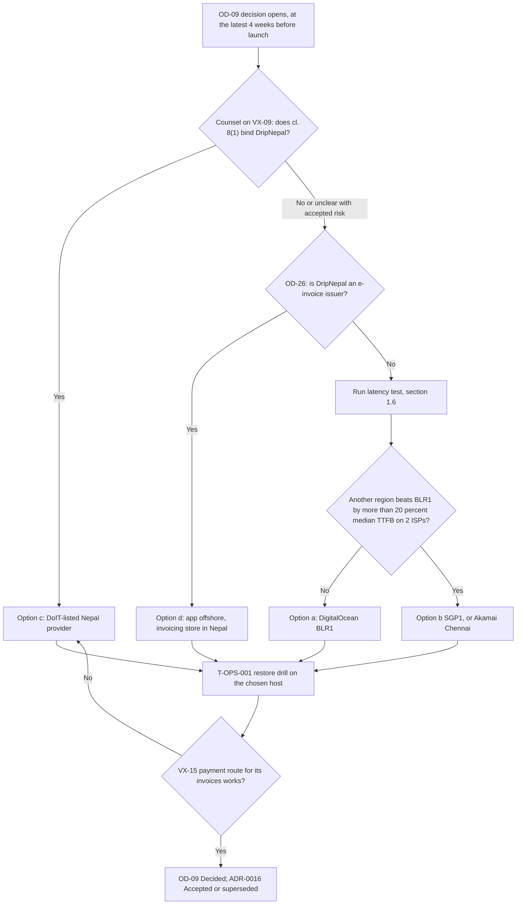
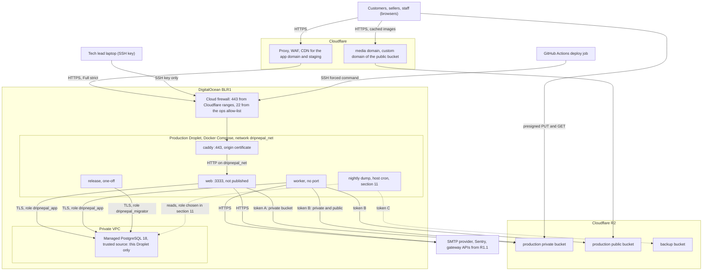
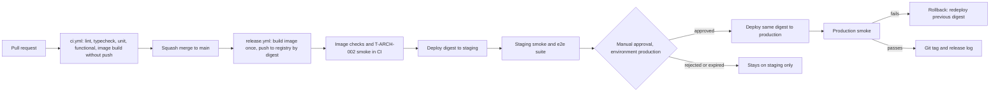

# Deployment and Operations

Status: Draft v1 (2026-09-26)

Reviewed: critic pass B6 part 1 (2026-09-26)

Reviewed: critic pass B6 part 2 (2026-09-26)

This document says how DripNepal is hosted, deployed, watched, backed up and recovered by a team of one or two developers [Confirmed, Q1]. It owns the operational procedures that other documents hand over to "11": the environment set, the hosting recommendation behind [ADR-0016](adr/0016-hosting-single-region-portable.md), the release and migration procedure, job operations, monitoring and alerts, runbooks, backups, targets, capacity and operational access. It does not restate rules owned elsewhere. Topology and the connection budget come from [03 §5](03-system-architecture.md#5-deployment) and [03 §3.4](03-system-architecture.md#34-postgresql-layout-and-connection-budget), secrets policy from [07 §5.6](07-security-threat-model-and-permissions.md#56-secret-management-and-rotation), environment variables from [09 §6.1](09-code-structure-and-engineering-standards.md#61-variable-catalogue), and test IDs from [10](10-testing-and-quality-gates.md).

Labels follow [00 §1.2](00-context-assumptions-and-questions.md#12-evidence-labels). Prices are "as published on 2026-09-25" in the research digest `infra_ops` (accessed 2026-09-25). They are inputs to [Open OD-09] and [Verify-external VX-15], not quotes, and no figure here goes beyond arithmetic on those published prices.

## Reading guide

| §   | Title                                                     | State                         |
| --- | --------------------------------------------------------- | ----------------------------- |
| 1   | Recommended cost-conscious deployment                     | Written (this part)           |
| 2   | Environments and data policy                              | Written (this part)           |
| 3   | Topology and networking                                   | Written (part 2)              |
| 4   | Docker images and local setup                             | Written (part 2)              |
| 5   | CI/CD and release promotion                               | Written (part 2)              |
| 6   | Safe schema migrations                                    | Planned                       |
| 7   | Health checks, graceful shutdown and zero-downtime deploy | Planned                       |
| 8   | Jobs and queue operations                                 | Planned                       |
| 9   | Observability and alerting                                | Planned                       |
| 10  | Runbooks                                                  | Planned                       |
| 11  | Backup policy and verified restore                        | Planned                       |
| 12  | Availability, recovery and performance targets            | Planned                       |
| 13  | Capacity assumptions and cost drivers                     | Planned                       |
| 14  | Operational access and security operations                | Planned                       |
| —   | Consistency notes for editor                              | Written (covers §1–§5 so far) |

A reader choosing a host reads §1. A developer setting up a machine, CI or staging reads §2, then §4 and §5. Whoever is on call reads §9 and §10.

---

## 1. Recommended cost-conscious deployment

### 1.1 Status: what is decided and what is not

[ADR-0016](adr/0016-hosting-single-region-portable.md) is **Proposed**. It is blocked on two items:

- [Verify-external VX-09]: does DCCS Directive 2081 cl. 8(1) ("any client shall only obtain" data-centre and cloud services from providers listed by the Department of Information Technology) bind a private company? "Client" is not defined. Law-firm summaries find no explicit offshore-storage ban (<https://www.pradhanlaw.com/publications/data-center-and-cloud-service-operation-and-management-directive-2081-2025-ad>, accessed 2026-09-25). DLA Piper reports that NRB-licensed payment institutions must host with DoIT-listed entities (<https://www.dlapiperdataprotection.com/?t=transfer&c=NP>, accessed 2026-09-25). DripNepal is not such an institution, but its gateways are.
- [Open OD-09]: the production provider and region. Its latest responsible moment is 4 weeks before launch, and it blocks the M7 exit (the R1 launch gate) in [risks-and-open-decisions.md §5](risks-and-open-decisions.md#5-decisions-that-block-implementation-by-milestone). The other hosting-related items on that gate are VX-09, VX-15 (including the FX route, R-32) and OD-26.

Three things are decided now and do not wait for OD-09:

1. Development and staging run on the provisional choice below.
2. The portability requirement (NFR-DATA-005, [03 §5.3](03-system-architecture.md#53-portability-requirement-nfr-data-005-vx-09)) is binding: one OCI image configured only by environment variables, vanilla PostgreSQL 18 with core extensions (`citext`, `pg_trgm`, `pgcrypto`), objects only through `@adonisjs/drive`'s S3 service, DNS at Cloudflare, and no provider-only runtime services in the request path.
3. No document claims legal compliance for any hosting option. REG-32 in [01](01-product-requirements.md) stays open until counsel answers VX-09.

A separate data-residency rule applies only if OD-26 makes DripNepal an e-invoice issuer: the Electronic Invoice Procedure 2082 s7 requires invoicing servers in Nepal with a Nepal-registered cloud provider (<https://ird.gov.np/category/electronic-invoice/>, accessed 2026-09-25). R1 keeps invoice tables out of the schema (A-16, OD-26), so this does not affect the R1 host unless OD-26 changes.

### 1.2 The recommended stack

This is OD-09 option (a). Every component can be replaced by configuration and a data move (§1.9).

| Component            | Recommended choice                                                                                                                                                                                                                      | Role                                                                                                                                                         | Published price (2026-09-25)                                                                                                                                                                                                                   | Data it receives (input for the 07 processor register)                                                                                 |
| -------------------- | --------------------------------------------------------------------------------------------------------------------------------------------------------------------------------------------------------------------------------------- | ------------------------------------------------------------------------------------------------------------------------------------------------------------ | ---------------------------------------------------------------------------------------------------------------------------------------------------------------------------------------------------------------------------------------------- | -------------------------------------------------------------------------------------------------------------------------------------- |
| Compute              | One DigitalOcean BLR1 (Bangalore) Basic Droplet, 4 GB / 2 vCPU, running Docker Compose: Caddy reverse proxy, `web`, `worker`, and a one-off `release` container for migrations                                                          | Runs the single image in two process types (canon §6.1). Holds no state: it can be rebuilt from §4 and §5                                                    | $24/mo, 4,000 GiB transfer included (<https://www.digitalocean.com/pricing/droplets>)                                                                                                                                                          | Everything in transit; at rest only container logs and the env file with secrets (§2.1)                                                |
| Database             | DigitalOcean Managed PostgreSQL 18, 1 GiB / 1 vCPU single node, same region, private VPC, TLS required                                                                                                                                  | The only stateful service. Daily backups kept 7 days, 7-day point-in-time recovery; a restore creates a new cluster                                          | $15.15/mo on the pricing page, "begin at $15.00" in the docs; storage $0.215/GiB/mo in 10 GiB steps (<https://www.digitalocean.com/pricing/managed-databases>; <https://docs.digitalocean.com/products/databases/postgresql/details/pricing/>) | All business data, all personal classes of [04 §19.1](04-domain-model-and-data-dictionary.md#191-handling-rules-per-sensitivity-class) |
| Edge                 | Cloudflare: DNS, proxy, CDN and WAF for the app domain and `media.<domain>`; Full (strict) TLS to the origin with a Cloudflare origin certificate on Caddy [Assumption; §3 owns the configuration]                                      | TLS termination near users, caching of public media, filtering. Cloudflare lists a Kathmandu data centre (<https://www.cloudflare.com/network/>)             | Plan not priced in the research [Verify-external VX-15]; the Free plan is the starting assumption [Assumption]                                                                                                                                 | Every request, including cookies and form bodies (TLS is terminated at Cloudflare)                                                     |
| Objects              | Cloudflare R2 with the `apac` location hint: `dripnepal-<env>-private` (originals, KYC) and `dripnepal-<env>-public` (derived WebP, served through `media.<domain>`), per [03 §3.5](03-system-architecture.md#35-object-storage-layout) | Uploads go direct to R2 by presigned URL; the worker derives public images                                                                                   | $0.015/GB-month, Class A $4.50/million, Class B $0.36/million, egress free; free tier 10 GB-month, 1M Class A, 10M Class B (<https://developers.cloudflare.com/r2/pricing/>)                                                                   | Product images, KYC documents (Sensitive-personal)                                                                                     |
| Backup storage       | A separate R2 bucket for encrypted nightly `pg_dump` files, with its own access key; retention and encryption owned by §11                                                                                                              | Survives loss of the DigitalOcean account or cluster (managed backups are destroyed with the cluster)                                                        | Same R2 prices                                                                                                                                                                                                                                 | Encrypted full database dumps                                                                                                          |
| Email                | A transactional provider with a first-party `@adonisjs/mail` 10.4.0 transport (ses, smtp, brevo, resend, mailgun, sparkpost, cloudflare, postmark) [Open OD-08]                                                                         | Verification, reset, invitation and order emails                                                                                                             | Not priced in the research; chosen on inbox placement first (OD-08, VX-14)                                                                                                                                                                     | Recipient addresses, names, order numbers                                                                                              |
| Error tracking       | Sentry, Developer plan while one person handles errors                                                                                                                                                                                  | Exceptions from `web`, `worker` and the browser, scrubbed per [07 §5.8](07-security-threat-model-and-permissions.md#58-analytics-and-third-party-processors) | Developer: $0, one user, 5k errors, 30-day lookback; Team from $26/mo billed annually (<https://sentry.io/pricing/>)                                                                                                                           | Stack traces, route patterns, `request_id`; no bodies or emails (07 §5.8)                                                              |
| Logs, uptime, traces | Chosen in §9 among free tiers                                                                                                                                                                                                           | —                                                                                                                                                            | §9                                                                                                                                                                                                                                             | Redacted pino JSON                                                                                                                     |

Facts the recommendation rests on [Verified-doc, accessed 2026-09-25]: BLR1 offers Droplets, Managed PostgreSQL and Spaces (<https://docs.digitalocean.com/platform/regional-availability/>); DigitalOcean Standard Edition supports PostgreSQL 14 to 18, matching the repository's `postgres:18.4` (<https://docs.digitalocean.com/products/databases/postgresql/details/limits/>); the 1 GiB plan allows 22 backend connections (same page); R2's `r2.dev` URLs are rate-limited and for development only, so production media always uses the custom domain (<https://developers.cloudflare.com/r2/buckets/public-buckets/>); R2 location hints are "best effort and not a guarantee" (<https://developers.cloudflare.com/r2/reference/data-location/>), so no residency claim is made from `apac`.

**Connection budget.** The 22 connections are split as in [03 §3.4](03-system-architecture.md#34-postgresql-layout-and-connection-budget): web Lucid 8, worker Lucid 4, worker pg-boss 4, migrations and admin 2, web send-only pg-boss 1, headroom 3. This document adopts that split unchanged. Operational consequences: `pg-boss` connects directly, never through a PgBouncer transaction-mode pool (DigitalOcean recommends session mode or direct connections for LISTEN/NOTIFY and advisory locks, <https://docs.digitalocean.com/products/databases/postgresql/how-to/manage-connection-pools/>); `pg_dump` also connects directly, and it uses one of the two admin connections, so the nightly dump and an incident `psql` session must not run together with a release (§5, §11). A second `web` container during a deploy (§7) needs 8 more connections than the headroom of 3 provides; §7 therefore has to either lower `DB_POOL_MAX` for the overlap or accept a restart blip. That tradeoff is decided in §7, not here.

**Facts to confirm when the accounts are opened** (not in the research digests, so each is [Assumption] until recorded in the OD-09 decision log): that the managed database and R2 encrypt data at rest (07 §5.5 expects the provider statement here); that bucket-level public access is off on every `-private` bucket and `r2.dev` access is off on production buckets (07 TM-16 Preventive and ADR-0016 Verification hand this check to 11); that DigitalOcean Managed PostgreSQL lets the admin user create the three roles of [07 §4.10](07-security-threat-model-and-permissions.md#410-database-roles-and-grants) and grant them as specified; how much storage the $15.15 plan includes; whether BLR1 compute prices equal SGP1's (the digest could not confirm it); which Cloudflare plan provides the WAF rules §3 relies on; which CA certificate the managed database presents, since production sets `DB_SSL_CA` to it (09 §6.1); and where Sentry and the email provider store data (07 §5.8, REG-24). The check is done on the drill cluster that T-OPS-001 creates anyway (§2.5), so it costs no extra cluster.

### 1.3 Why this shape, and what it costs in risk

The choice is driven by three facts: one or two developers run everything, users are in Nepal on slow mobile networks, and orders and ledger rows must be recoverable.

| Decision                                    | Mechanism                                                                                           | What we give up                                                                                                             | How it is verified                                                                                                                    |
| ------------------------------------------- | --------------------------------------------------------------------------------------------------- | --------------------------------------------------------------------------------------------------------------------------- | ------------------------------------------------------------------------------------------------------------------------------------- |
| Managed PostgreSQL instead of self-hosting  | Provider runs patching, daily backups and 7-day PITR                                                | Single node, no automatic failover; 7-day window only; backups die with the cluster, hence the independent dump (§11, R-29) | T-OPS-001 restore drill, with measured RTO and RPO                                                                                    |
| One Droplet with Docker Compose, not a PaaS | Same OCI image everywhere; the Droplet has a static IPv4 for any provider allow-list (VX-14)        | The team patches the OS and Docker; the Droplet is a single point of failure; deploys restart containers (§7)               | From-scratch rebuild from the documented steps (§1.9); uptime check (§9)                                                              |
| Cloudflare in front of everything           | DNS, CDN and WAF at the edge; the origin firewall admits only Cloudflare's published IP ranges (§3) | Cloudflare sees decrypted traffic (a processor, REG-24); whether Nepali ISPs reach the Kathmandu PoP is unmeasured          | Latency test (§1.6) records the `cf-ray` colo; the edge check "direct request to the origin fails" (T-OPS area, proposed in ADR-0016) |
| R2 for objects                              | Egress is free, which removes the dominant variable cost of an image-heavy catalogue                | A second provider account and bill; the `apac` hint is not residency                                                        | Media smoke test in staging; monthly cost review (§13)                                                                                |
| BLR1 as the provisional region              | Geographically close; all needed products in one region                                             | "Close" is geographic only: no latency from Nepali ISPs has been measured (VX-15)                                           | §1.6 before OD-09 closes                                                                                                              |

### 1.4 Monthly cost of the recommended stack

Arithmetic on the published prices only. Staging is included because it runs from the first deploy pipeline (§2.4).

| Line                                       | Monthly (USD, as published 2026-09-25)   | Note                                                                                                                                                                                         |
| ------------------------------------------ | ---------------------------------------- | -------------------------------------------------------------------------------------------------------------------------------------------------------------------------------------------- |
| Production Droplet 4 GB / 2 vCPU           | 24.00                                    | Size is [Assumption] until SSR memory is measured (§13)                                                                                                                                      |
| Managed PostgreSQL 1 GiB                   | 15.15                                    | Or 15.00 per the docs page; extra storage $0.215/GiB in 10 GiB steps if the plan's included storage is exceeded                                                                              |
| Staging Droplet 2 GB / 1 vCPU              | 12.00                                    | PostgreSQL runs in a container on it (§2.4)                                                                                                                                                  |
| R2 (app buckets and backup bucket)         | 0.00 within the free tier                | Beyond it, (GB-month − 10) × $0.015. Example: 60 GB stored costs (60 − 10) × 0.015 = $0.75. Image volume is estimated in §13                                                                 |
| Cloudflare                                 | not priced                               | Free plan assumed [Verify-external VX-15]                                                                                                                                                    |
| Sentry                                     | 0.00 (Developer) or 26.00 (Team)         | Team is needed once two people must see errors (the Developer plan has one user)                                                                                                             |
| Email provider                             | not priced                               | [Open OD-08]                                                                                                                                                                                 |
| **Subtotal of priced lines**               | **51.15** (Developer) / **77.15** (Team) | 24.00 + 15.15 + 12.00 = 51.15; plus 26.00 = 77.15                                                                                                                                            |
| With 13% reverse-charge VAT, if it applies | 57.80 / 87.18                            | 51.15 × 1.13 and 77.15 × 1.13. Rate per VAT Act s7(1) as recorded under VX-05; VAT Act s8(2) reverse charge on services from abroad; how it is assessed and filed is [Verify-external VX-05] |

Not included: the Cloudflare plan, the email provider, log and uptime tools (§9), bandwidth beyond the Droplet's included 4,000 GiB ($0.01/GiB overage, <https://docs.digitalocean.com/platform/billing/bandwidth/>) and the domain. The monthly review compares actual invoices with this table (§13).

### 1.5 Alternatives, with published prices, and when each becomes worthwhile

All prices are as published on 2026-09-25 in the `infra_ops` digest; the source URL is given per row. "App + DB" is the arithmetic for a production web process, a worker and the smallest managed PostgreSQL, without staging, so rows can be compared with the recommended $24.00 + $15.15 = $39.15. Fly.io per-second prices are multiplied by 2,592,000 seconds (30 days); AWS hourly prices by 730 hours [Assumption on the month length].

| Option                                | Key facts (sources)                                                                                                                                                                                                                                                                                                                                                                                                                                                                                                                                                                                                                                                                                                                                                                                                                       | App + DB arithmetic                                                                                                                        | Main drawback for DripNepal                                                                                                     | Becomes worthwhile when                                                                                                                                                         |
| ------------------------------------- | ----------------------------------------------------------------------------------------------------------------------------------------------------------------------------------------------------------------------------------------------------------------------------------------------------------------------------------------------------------------------------------------------------------------------------------------------------------------------------------------------------------------------------------------------------------------------------------------------------------------------------------------------------------------------------------------------------------------------------------------------------------------------------------------------------------------------------------------- | ------------------------------------------------------------------------------------------------------------------------------------------ | ------------------------------------------------------------------------------------------------------------------------------- | ------------------------------------------------------------------------------------------------------------------------------------------------------------------------------- |
| DigitalOcean SGP1 (OD-09 option b)    | Same products as BLR1 (<https://docs.digitalocean.com/platform/regional-availability/>); bandwidth prices do not vary by region (<https://docs.digitalocean.com/platform/billing/bandwidth/>); compute price parity not confirmed                                                                                                                                                                                                                                                                                                                                                                                                                                                                                                                                                                                                         | $39.15 if compute prices equal BLR1's                                                                                                      | None beyond BLR1's                                                                                                              | The §1.6 latency test favours Singapore. The move is a restore and a DNS change                                                                                                 |
| Akamai (Linode) Chennai `in-maa`      | Only India region with compute, managed databases and object storage together (<https://api.linode.com/v4/regions>); Linode 4 GB $24/mo (<https://www.akamai.com/cloud/pricing/asia-pacific>); managed DB Nanode 1 GB $16 (1 node) or $37 (3 nodes, automatic failover) (<https://api.linode.com/v4/databases/types>); PostgreSQL 18 listed (<https://api.linode.com/v4/databases/engines>); backups kept 14 days (<https://techdocs.akamai.com/cloud-computing/docs/managed-databases>)                                                                                                                                                                                                                                                                                                                                                  | 24 + 16 = $40.00; with a 3-node database 24 + 37 = $61.00                                                                                  | PITR granularity within a day is not documented                                                                                 | Runner-up. Chosen if the latency test favours Chennai, if the RTO needs automatic failover (the cheapest HA database found), or if 14-day backups are wanted                    |
| Render Singapore                      | No India region (<https://render.com/docs/regions>); compute 0.5c-512mb $7, 1c-2g $25; Postgres 0.5c-1g $19; PITR 3 days on Hobby, 7 days on Pro; Pro workspace $25/mo; bandwidth beyond 5–25 GB at $0.15/GB (<https://render.com/pricing>; <https://render.com/docs/postgresql-backups>)                                                                                                                                                                                                                                                                                                                                                                                                                                                                                                                                                 | Web 1c-2g 25 + worker 7 + DB 19 = $51.00 on Hobby (3-day PITR); + 25 Pro = $76.00 for 7-day PITR                                           | Higher cost; a 512 MB worker may not fit image processing; no static egress IP without an add-on (Render dedicated IPs $100/mo) | The team decides it cannot patch a VM at all, and no gateway or SMS provider needs an IP allow-list (VX-14)                                                                     |
| Railway Singapore                     | Region `asia-southeast1-eqsg3a` (<https://docs.railway.com/reference/deployment-regions>); Pro $20/mo including $20 usage; RAM $10/GB/mo, CPU $20/vCPU/mo, egress $0.05/GB (<https://docs.railway.com/reference/pricing/plans>); Postgres templates are "unmanaged", no documented PITR (<https://docs.railway.com/databases/postgresql>)                                                                                                                                                                                                                                                                                                                                                                                                                                                                                                 | Usage-based: a service using 2 GB and 1 vCPU all month is 20 + 20 = $40 of usage, billed $40 because the $20 Pro fee covers the first $20  | No managed PITR for order and payment data                                                                                      | Not for production data. Possibly for short-lived preview environments, if they are ever wanted                                                                                 |
| Fly.io Singapore `sin` / Mumbai `bom` | Region markup `sin` 2×, `bom` 3×; shared-cpu-1x 1 GB $0.00000228/s (<https://docs.fly.io/about/pricing/>); Managed Postgres in `sin` but not in `bom`, Basic $38/mo (<https://docs.fly.io/reference/regions/>; <https://docs.fly.io/mpg/>); `fly mpg create` supports PostgreSQL 16 and 17 only (<https://docs.fly.io/flyctl/cmd/fly_mpg_create.md>); egress $0.04/GB APAC, $0.12/GB India                                                                                                                                                                                                                                                                                                                                                                                                                                                | One 1 GB machine: 0.00000228 × 2,592,000 × 2 = $11.82 (`sin`), × 3 = $17.73 (`bom`). Web + worker in `sin` + Basic DB: 23.64 + 38 = $61.64 | No PostgreSQL 18; a Mumbai app would query a Singapore database                                                                 | Only if the stack moved to PostgreSQL 17 everywhere, which nothing currently justifies                                                                                          |
| AWS Mumbai (Lightsail or RDS)         | `ap-south-1` needs no opt-in (<https://docs.aws.amazon.com/global-infrastructure/latest/regions/aws-regions.html>); Lightsail databases document PostgreSQL 12–16 only (<https://docs.aws.amazon.com/lightsail/latest/userguide/amazon-lightsail-choosing-a-database.html>); RDS supports 18.x (<https://docs.aws.amazon.com/AmazonRDS/latest/PostgreSQLReleaseNotes/postgresql-versions.html>); RDS db.t4g.micro $0.021/hr Single-AZ, $0.042/hr Multi-AZ, gp3 $0.131/GB-month; backup retention up to 35 days (<https://docs.aws.amazon.com/AmazonRDS/latest/UserGuide/USER_WorkingWithAutomatedBackups.BackupRetention.html>); Lightsail databases 1 GB $15 standard or $30 high availability, and Mumbai Lightsail bundles include half the usual transfer allowance, overage $0.1093/GB (<https://aws.amazon.com/lightsail/pricing/>) | RDS micro Single-AZ 0.021 × 730 = $15.33, Multi-AZ $30.66, plus 20 GB gp3 = $2.62; compute host not priced in the research                 | IAM and VPC set-up work; egress about 10× DigitalOcean's overage rate                                                           | PITR longer than 7 days becomes a requirement (RDS allows up to 35 days), or AWS credits make it cheaper                                                                        |
| Hetzner Singapore                     | Cloud only in `sin`; no Object Storage there (<https://docs.hetzner.com/cloud/general/locations/>); no managed PostgreSQL (<https://www.hetzner.com/cloud/>); CPX22 €26.49 ($30.99) from 15 June 2026 (<https://docs.hetzner.com/general/infrastructure-and-availability/price-adjustment/>); CPX22 includes 1 TB traffic in Singapore, overage price not readable (<https://www.hetzner.com/cloud/regular-performance/>)                                                                                                                                                                                                                                                                                                                                                                                                                 | $30.99 compute only; the database is self-run                                                                                              | The team would own PostgreSQL HA, patching, PITR (pgBackRest) and restore drills                                                | Only if a developer with PostgreSQL operations experience joins and dedicated CPU is needed; not at R1 scale                                                                    |
| DoIT-listed Nepal provider (OD-09 c)  | Not researched: no provider, price, managed-PostgreSQL offer or billing currency is known [Verify-external VX-15]. The list is kept by DoIT under DCCS Directive 2081 cl. 3(1) (<https://doit.gov.np/content/12100/data-center-and-cloud-service--operation-and/>)                                                                                                                                                                                                                                                                                                                                                                                                                                                                                                                                                                        | Unknown                                                                                                                                    | Unknown PostgreSQL 18 availability and operations tooling                                                                       | Counsel reads cl. 8(1) as binding (VX-09), a gateway requires DoIT-listed hosting at onboarding, or OD-26 puts invoice data in Nepal (option d splits only the invoicing store) |

If the target host has no managed PostgreSQL 18 with PITR, the fallback is PostgreSQL 18 in a container with pgBackRest, which supports PostgreSQL 18 since v2.55.0 and has an encrypted S3 repository (<https://pgbackrest.org/release.html>). That is a large operations load for this team (R-08), which is why the table ranks managed options first.

### 1.6 Measure latency from Nepal before choosing (OD-09)

No published latency measurements from Nepali ISPs exist for any candidate region (`infra_ops`, "Could not verify"). "Close to Nepal" is geography until this test runs. The test is owned by the tech lead and finishes before OD-09's latest responsible moment (4 weeks before launch).

1. **Targets.** Create short-lived test VMs in DigitalOcean BLR1 and SGP1 and Akamai Chennai (`in-maa`). Each serves one static 20 KB page and one page rendered by the real image (SSR home page against a small seeded database), both over HTTPS through a Cloudflare-proxied test hostname and also directly to the VM IP. Destroy the VMs afterwards; the cost is a few days of the published hourly rates.
2. **Vantage points.** At least four access networks: Nepal Telecom (NTC) mobile, Ncell mobile, WorldLink fibre and Vianet fibre; Subisu if available. Use a phone hotspot for the mobile networks. Record ISP, city and time for each run.
3. **Samples.** 20 requests per target and path, three times a day (morning, evening peak, night), on three days. Command sketch (standard `curl` write-out variables):

   ```sh
   # latency probe sketch: one line per request, CSV
   for i in $(seq 1 20); do
     curl -s -o /dev/null -D /tmp/h.txt \
       -w "%{time_connect},%{time_appconnect},%{time_starttransfer},%{time_total}\n" \
       "https://$TARGET/$PATH_UNDER_TEST"
     grep -i '^cf-ray' /tmp/h.txt   # colo suffix, e.g. -KTM or -BOM [Assumption on the suffix format]
   done >> "results-$ISP-$TARGET.csv"
   ```

4. **What is recorded.** Median and p90 of TCP connect, TLS handshake, time to first byte and total, per ISP and target; the Cloudflare colo seen in `cf-ray` (this answers whether traffic reaches the Kathmandu PoP, which is also unverified).
5. **Decision rule** (from ADR-0016, [Assumption]): keep BLR1 unless another region has a median TTFB more than 20% lower from at least two ISPs. Ties go to the option with the simpler operations (fewer accounts).
6. **Where the result goes.** A dated entry in the OD-09 row of the decision log ([risks-and-open-decisions.md §2.3](risks-and-open-decisions.md#23-decision-log)), with the CSV files attached to the planning folder, not the repository (they contain home IP addresses).

### 1.7 Decision path to the production host



"Unclear with accepted risk" means the product owner accepts counsel's residual risk in writing; this document does not make that call. Whatever the path, the restore drill on the chosen host runs before the launch gate, because every candidate restores into a new instance and the runbook must be proven there (§11).

### 1.8 Paying for it from Nepal (R-32, VX-15)

Every provisional provider (DigitalOcean, Cloudflare, Sentry and the likely email providers) bills in USD or EUR by card. Whether DripNepal can pay these invoices from Nepal within NRB foreign-exchange rules and dollar-card limits is unconfirmed, and no NRB source has been researched ([Verify-external VX-15], card and FX sub-question; risk R-32). An unpaid invoice can suspend production, so this is an availability risk, not only an accounting one.

- **Before the first paid plan** (the staging Droplet, §2.4), the product owner confirms the payment route and its annual limit with the company's bank and records it under VX-15. Until then, development uses only local and CI environments and free tiers.
- **Budget check.** The route's limit must cover at least 12 × the monthly total of §1.4 including reverse-charge VAT, plus the annual Sentry Team charge if chosen (it is billed annually).
- **Billing contacts.** Every provider account sends billing and card-decline emails to two people. The monthly review (§13) checks each provider's billing status.
- **Fallback.** Portability (§1.9) keeps OD-09 option (c) open; whether a DoIT-listed Nepal provider bills in NPR is [Assumption] until checked (R-32).
- **Reverse-charge VAT** on these services is budgeted per VX-05; the accountant confirms assessment and filing.

### 1.9 Portability check (adopts the 03 §5.3 assumption)

[03 §5.3](03-system-architecture.md#53-portability-requirement-nfr-data-005-vx-09) proposed a staging rebuild on a second provider before the R1 gate and left it to this document. It is **adopted**, with one addition from NFR-DATA-005:

| Check                       | When                                                                      | Procedure                                                                                                                                                                                                                                                                                                                       | Pass criterion                                                                                                                                       |
| --------------------------- | ------------------------------------------------------------------------- | ------------------------------------------------------------------------------------------------------------------------------------------------------------------------------------------------------------------------------------------------------------------------------------------------------------------------------- | ---------------------------------------------------------------------------------------------------------------------------------------------------- |
| Second-provider rebuild     | Once before the R1 launch gate (M7 exit); again after any change of OD-09 | On Akamai Chennai (the runner-up) or the Nepal candidate: create a VM and a managed PostgreSQL 18 (or a container), follow only §3–§5 of this document to deploy the current production image, restore the latest nightly dump from the backup bucket (§11), point a throwaway hostname at it, run the staging smoke suite (§5) | Smoke suite green; elapsed time recorded as a relocation RTO; every undocumented step found is added to this document. Destroy everything afterwards |
| From-scratch staging deploy | Quarterly (NFR-DATA-005)                                                  | Destroy and recreate the staging Droplet from the documented steps only                                                                                                                                                                                                                                                         | Staging back in service within one working day [Assumption]                                                                                          |
| Static portability rules    | Every pull request                                                        | CI on `postgres:18.4` and MinIO; migration lint rejects extensions outside the allow-list; T-ARCH-001 forbids provider SDKs outside adapters (ADR-0016 Verification)                                                                                                                                                            | CI green                                                                                                                                             |

The test IDs for the first two checks are in the T-OPS area and are assigned by [10](10-testing-and-quality-gates.md) (proposed here; T-OPS-002 is already used by other documents, see Consistency notes).

---

## 2. Environments and data policy

### 2.1 Overview

Four long-lived environments plus one short-lived kind. The same image built once per commit runs in CI tests, staging and production (§5); only environment variables differ ([09 §6.1](09-code-structure-and-engineering-standards.md#61-variable-catalogue)). This table extends [03 §5.2](03-system-architecture.md#52-environments), which it does not contradict.

| Environment         | Purpose                                                                                 | Where                                                                         | Process start                                                         | Database                                                                  | Objects                                                       | Email                                    | Payments                                               | Secrets live in                                                                                            |
| ------------------- | --------------------------------------------------------------------------------------- | ----------------------------------------------------------------------------- | --------------------------------------------------------------------- | ------------------------------------------------------------------------- | ------------------------------------------------------------- | ---------------------------------------- | ------------------------------------------------------ | ---------------------------------------------------------------------------------------------------------- |
| Development         | Writing code                                                                            | Developer laptop; services in `docker-compose.yml`                            | `node ace serve --hmr` and `node ace jobs:work` (09 §1.3) on the host | `postgres:18.4` container, databases `dripnepal_dev` and `dripnepal_test` | MinIO container [Assumption, 03 §3.5]                         | Mailpit container                        | `PAYMENT_PROVIDER=fake`                                | Git-ignored `.env` ([09 §6.4](09-code-structure-and-engineering-standards.md#64-environment-files-policy)) |
| CI                  | Tests, lint, build, image push                                                          | GitHub Actions runners                                                        | Test runner; the built image for smoke tests                          | `postgres:18.4` service container, `dripnepal_test`                       | MinIO service container                                       | JSON/fake transport                      | `fake` plus recorded provider fixtures                 | GitHub Actions secrets, only for registry push and the staging deploy (§5); tests need none                |
| Staging             | Prod-like rehearsal: deploy, migrations, e2e, sandbox payments                          | DigitalOcean BLR1 Droplet 2 GB / 1 vCPU, `staging.<domain>` behind Cloudflare | Same Compose layout as production                                     | PostgreSQL 18.4 container on the Droplet, database `dripnepal_staging`    | `dripnepal-staging-private`, `dripnepal-staging-public`       | Capture inbox or provider sandbox (§2.4) | `none` (R1) or the chosen gateway's **sandbox** (R1.1) | Root-owned env file on the Droplet, mode 0600 [Assumption; §14 owns access]                                |
| Production          | Real customers                                                                          | §1.2                                                                          | Compose: Caddy, `web`, `worker`, one-off `release`                    | Managed PostgreSQL 18, database `dripnepal_production`                    | `dripnepal-production-private`, `dripnepal-production-public` | Production provider (OD-08)              | `none` in R1 (COD only); live keys from R1.1           | Root-owned env file on the Droplet, mode 0600, written from the password manager [Assumption; §14]         |
| Drill (short-lived) | Restore drills (T-OPS-001), second-provider rebuild (§1.9), provider fact checks (§1.2) | A new managed cluster created by the restore, plus a throwaway VM if needed   | Production image                                                      | Restored copy of production                                               | None, or read-only use of production media URLs               | Disabled (no mail transport configured)  | `none`                                                 | Created for the drill, destroyed with it                                                                   |

Database names never end in `_dev` or `_test` outside development and CI. The development seeders refuse to run unless `current_database()` ends in one of those suffixes ([09 §8.8](09-code-structure-and-engineering-standards.md#88-seeders-reference-data-versus-development-data) and 09 note 41), so these names are what keeps the demo marketplace seed out of staging and production (RF-05). The container for development therefore creates `dripnepal_dev` and `dripnepal_test` instead of today's `dripnepal` (fix list in §4, RF-43).

### 2.2 Development

`docker-compose.yml` provides the services; the app runs on the host for fast reload. Target service set (the RF-43 fixes and exact file are in §4):

| Service    | Image (pinned in §4)      | Status                                                | Why                                                                                                                                                                                                                                               |
| ---------- | ------------------------- | ----------------------------------------------------- | ------------------------------------------------------------------------------------------------------------------------------------------------------------------------------------------------------------------------------------------------- |
| `postgres` | `postgres:18.4`           | Required                                              | Same major and minor as CI; creates `dripnepal_dev` and `dripnepal_test` (RF-32); bound to `127.0.0.1` only (RF-43)                                                                                                                               |
| `mailpit`  | `axllent/mailpit`, pinned | Required                                              | SMTP sink on 1025, UI on 8025; every email the app sends in development lands here                                                                                                                                                                |
| `minio`    | MinIO, pinned             | Required from M3 (media)                              | Exercises presigned PUT and GET against an S3 API locally [Assumption, 03 §3.5; M0 decides]. Behaviour that differs from R2 is tested in staging                                                                                                  |
| `redis`    | `redis:8.6`               | **Optional**, Compose profile `redis`, off by default | Nothing in R1 uses Redis: sessions and the limiter use the database store, jobs use pg-boss (canon §6.1, ADR-0010). Kept only for experiments; see the upgrade trigger in [03 §13](03-system-architecture.md#13-evolution-path-without-a-rewrite) |

Rules for development:

- Only synthetic data: reference seeders plus the development seeders (`dev/01_demo_marketplace`, …). The development admin is created with `node ace platform:create-admin`; there is no seeded admin (09 note 41).
- The worker runs locally when a developer works on jobs, emails or media; otherwise jobs queue up harmlessly in `pgboss`.
- `PAYMENT_PROVIDER=fake`. Real sandbox keys are not needed on a laptop; sandbox work happens in staging.
- A developer never connects to the staging or production database from a laptop. Operational access goes through §3 (SSH tunnel) and §14.

### 2.3 CI

GitHub Actions runs the checks and builds the image once (§5 owns the pipeline; [10](10-testing-and-quality-gates.md) owns the checks). For this section only the data rules matter:

- Service containers `postgres:18.4` and MinIO; database `dripnepal_test`; `NODE_ENV=test`, `APP_ENV=test`; test key values from `.env.test`.
- No real provider is ever called. Provider behaviour is covered by the fake adapter and recorded fixtures (03 §5.2).
- Tests hold no secrets. The only CI secrets are the registry push credential and the staging deploy key, both limited to the `main`-branch deploy job (§5, §14). Pull requests from forks get neither.
- Test data is created by factories per test and discarded; nothing from staging or production is ever used as a fixture.

### 2.4 Staging

Staging answers one question: "will this image, with these migrations, work in production?" It is smaller than production and differs in known ways, listed so nobody trusts it for what it cannot show.

| Aspect                     | Staging                                                                                                                                                                                                                                                                                                                                                        | Production                         | Consequence                                                                                                                                                                                                                                                                             |
| -------------------------- | -------------------------------------------------------------------------------------------------------------------------------------------------------------------------------------------------------------------------------------------------------------------------------------------------------------------------------------------------------------- | ---------------------------------- | --------------------------------------------------------------------------------------------------------------------------------------------------------------------------------------------------------------------------------------------------------------------------------------- |
| Image, Compose file, proxy | Same                                                                                                                                                                                                                                                                                                                                                           | Same                               | Deploy steps are rehearsed exactly                                                                                                                                                                                                                                                      |
| Host size                  | 2 GB / 1 vCPU                                                                                                                                                                                                                                                                                                                                                  | 4 GB / 2 vCPU                      | No load testing on staging; T-PERF-001 runs against a temporary production-sized environment or production before launch (§12, §13)                                                                                                                                                     |
| Database                   | PostgreSQL 18.4 container, no TLS inside the Docker network                                                                                                                                                                                                                                                                                                    | Managed, TLS with the provider CA  | The `DB_SSL=true` path, role grants and the 22-connection limit are first exercised in the drill environment (§2.1). Mitigation: staging sets `max_connections` so that 22 connections are available to the app roles [Assumption; value fixed in §4], so pool exhaustion shows up here |
| Backups                    | None beyond a nightly dump kept 7 days on the Droplet [Assumption]                                                                                                                                                                                                                                                                                             | Managed backups + independent dump | Staging data is disposable                                                                                                                                                                                                                                                              |
| Access                     | Not public: Caddy basic authentication on every path except `/health/*` and, from R1.1, a gateway's server-to-server callback path if it has one ([03 §11](03-system-architecture.md#11-provider-isolation)); gateway return URLs are browser navigations that carry the tester's cached credentials. Plus `X-Robots-Tag: noindex` [Assumption; §3 configures] | Public                             | The e2e suite passes the basic-auth credentials; search engines never index staging                                                                                                                                                                                                     |
| Email                      | A capture inbox or the provider's sandbox mode; never delivered to real third-party addresses [Assumption; depends on OD-08]                                                                                                                                                                                                                                   | Real delivery                      | Test accounts use addresses on a domain the team controls                                                                                                                                                                                                                               |
| Payments                   | `none` in R1; the gateway **sandbox** host and keys from R1.1 (Khalti `https://dev.khalti.com/api/v2/`, eSewa `rc-epay.esewa.com.np` per [03 §11.6](03-system-architecture.md#116-sandbox-and-production-configuration))                                                                                                                                       | Live keys from R1.1                | Boot validation refuses live hosts outside production unless `ALLOW_LIVE_PAYMENT_HOSTS` is set (03 §11.6); staging never sets it                                                                                                                                                        |
| Kill switch                | `checkout_enabled` toggled freely for tests                                                                                                                                                                                                                                                                                                                    | Off until the launch gate passes   | The switch is tested end to end in staging before launch (07 §7.5, item 8)                                                                                                                                                                                                              |

**When staging exists.** Staging is created when the deploy pipeline is built and the VX-15 payment route works (§1.8), and it must exist before the first milestone whose exit depends on e2e tests against a deployed image. This document proposes M5 (cart and COD checkout) as the latest point [Assumption; milestones are owned by [12](12-roadmap-and-backlog.md)].

**Staging data.** Staging contains no production data (§2.6). Its content comes from the reference seeders run by the release step, `platform:create-admin`, and records created through the product's own flows by the e2e setup and by manual QA (test shops, products, orders). Development seeders cannot run there, by design (§2.1). A reset drops and recreates `dripnepal_staging`, runs migrations and reference seeders, and re-runs the e2e setup; it is done whenever the data gets confusing and at least before each launch-gate rehearsal.

### 2.5 Production

- Created once, from the steps in §3–§5, by the tech lead; the first-deploy bootstrap checklist is [09 §9.3](09-code-structure-and-engineering-standards.md#93-bootstrap-checklist-first-deploy-of-an-environment), and the first platform admin comes from `node ace platform:create-admin` (no default credentials, 09 §9.2).
- Receives only images that passed staging (§5). No one deploys from a laptop.
- `APP_ENV=production`, `NODE_ENV=production`, `SESSION_DRIVER=database`, `DB_SSL=true` with `DB_SSL_CA` set to the provider's CA certificate (confirmed on the drill cluster, §1.2), `DB_POOL_MAX` 8 for `web` and 4 for `worker` (03 §3.4), `LOG_LEVEL=info`, `PAYMENT_PROVIDER=none` for R1 (09 §6.1, value `none` proposed there), `SENTRY_DSN` required. The full production value list is completed in §4 and §5.
- `checkout_enabled` stays `false` until the R1 launch gate passes (risks §5, M7 row). Its default in [04a §15.1](04a-data-dictionary-tables.md) is `true`, so the first-deploy bootstrap (09 §9.3 step 8) sets it to `false` through `updatePlatformSetting` before the production hostname is published in DNS; the check "`checkout_enabled` is `false`" is part of the first-deploy smoke test (§5). Turning it back on at the gate needs MFA step-up ([07 §3.10](07-security-threat-model-and-permissions.md#310-step-up-for-money-staff-and-sensitive-settings)); turning it off needs none.
- Holds every record for its retention period: order, payment, ledger and complaint records are kept 7 years after the closing event in the live database, an approximation of the 6 years of VAT Rules r23(7) chosen because computing "6 years after the fiscal year" needs a Bikram Sambat calendar ([04 §19.3](04-domain-model-and-data-dictionary.md#193-retention-schedule); [Verify-external VX-08]). Backups are for recovery, not retention: they keep days, not years (§11).

### 2.6 Data policy per environment

| Data                                                          | Development                    | CI                  | Staging                                    | Production                 | Drill                                                                                  |
| ------------------------------------------------------------- | ------------------------------ | ------------------- | ------------------------------------------ | -------------------------- | -------------------------------------------------------------------------------------- |
| Reference data (locations, categories, settings defaults)     | Seeded                         | Seeded per test run | Seeded by the release step                 | Seeded by the release step | Restored                                                                               |
| Synthetic users, shops, orders                                | Development seeders, factories | Factories           | Created through the product's flows        | Never                      | Never                                                                                  |
| Production personal data (any class of 04 §19.1 above Public) | **Never**                      | **Never**           | **Never**                                  | Yes                        | Yes, restored copy; access limited to the tech lead; destroyed at the end of the drill |
| Production KYC files and originals                            | Never                          | Never               | Never                                      | Yes                        | Not copied; the drill checks object listing only                                       |
| Real payment credentials                                      | Never                          | Never               | Sandbox only                               | Live (R1.1)                | None                                                                                   |
| Real customer email addresses                                 | Never                          | Never               | Never; team-controlled test addresses only | Yes                        | Mail disabled                                                                          |

Rules behind the table:

1. **No production copy leaves production except as the encrypted backup** ([04 §19.1](04-domain-model-and-data-dictionary.md#191-handling-rules-per-sensitivity-class); 07 TM-30). There is no "anonymised production copy for staging" in R1: anonymising the encrypted columns, blind indexes and free text reliably is harder than generating synthetic data, and a mistake leaks personal data into a less protected environment.
2. **Restores go into the drill environment**, never into staging. The drill cluster is created by the restore itself (a DigitalOcean restore always creates a new cluster, <https://docs.digitalocean.com/products/databases/postgresql/how-to/restore-from-backups/>), reached only through the tech lead's SSH tunnel, and destroyed when the drill ends. The drill record (§11) states when it was destroyed.
3. **Reproducing a production bug** uses the IDs and request ID from logs and the error tracker, then recreates the shape of the data synthetically in development. Staff read production records only through the admin UI or, during an incident, the `dripnepal_readonly` role (07 §4.10) over the tunnel.
4. **Exports** leave production only as the monthly accountant export named in 04 §19.1 (procedure in §10) and law-enforcement disclosures recorded per 07 §5.7.
5. **Logs and error events** from every environment are redacted at source (09 §7.2); non-production environments use separate projects or datasets in the log and error tools, so a staging test can never be confused with a production incident (§9).

### 2.7 Time conventions and Kathmandu business hours (A-29)

- Servers and containers run in UTC (`TZ=UTC`, 09 §6.1); cron schedules and user-facing times use Asia/Kathmandu, UTC+05:45 with no daylight saving (canon §17.8). Every schedule in this document is written in Asia/Kathmandu time.
- **Kathmandu business hours**, which A-29 uses without defining, are fixed here as **Sunday to Friday, 10:00–17:00 Asia/Kathmandu, excluding public holidays on a list the product owner publishes each year** [Assumption; the product owner confirms]. The Sunday-to-Friday week is an assumption about local working practice, not a sourced fact.
- Uses: the support hours shown to customers (A-29, FR-ADM-009), the window in which non-urgent alerts are handled (§9, §14), and planned maintenance, which is scheduled outside these hours and outside the evening peak found by the latency test (§1.6). The 15-day support SLA itself runs in calendar days ([01 §1.3](01-product-requirements.md#13-requirement-conventions)); business hours do not change it.
- Outside business hours nobody is on call (A-30); §9 decides which alerts page out of hours anyway.

---

## 3. Topology and networking

This section fixes the network choices that [03 §5.1](03-system-architecture.md#51-topology-adr-0016-provisional) and [ADR-0016](adr/0016-hosting-single-region-portable.md) Decision 2 left to this document: the reverse proxy, the origin firewall, the trusted-proxy setting (RF-31), database reachability and object-storage credentials. Everything here is provisional in the same way as §1 (OD-09, VX-09); a move to another provider keeps the shape and changes only provider names.

### 3.1 Topology

The diagram adds ports, trust decisions and credentials to the 03 §5.1 diagram. Staging has the same shape on its own Droplet, with a PostgreSQL container instead of the managed cluster (§2.4), and is left out for readability.



Reading the diagram: only Caddy publishes a port on the Droplet. `web` listens on `0.0.0.0:3333` inside the Compose network (`HOST=0.0.0.0`, because `HOST=localhost` would bind to loopback inside the container, audit A5-07), and nothing else can reach it. Browsers talk to R2 directly only through presigned URLs ([03 §3.5](03-system-architecture.md#35-object-storage-layout)); the app never proxies uploads.

### 3.2 Edge: Cloudflare configuration

Cloudflare plan features are [Verify-external VX-15]; the Free plan is the starting assumption (§1.2). Each row says what breaks if the setting is wrong.

| Setting               | Value                                                                                                                                                                                                                                   | Why, and what goes wrong otherwise                                                                                                                                                                                                                                                       |
| --------------------- | --------------------------------------------------------------------------------------------------------------------------------------------------------------------------------------------------------------------------------------- | ---------------------------------------------------------------------------------------------------------------------------------------------------------------------------------------------------------------------------------------------------------------------------------------- |
| DNS                   | `<domain>` and `staging.<domain>` proxied (orange cloud) to the Droplet IPs; `media.<domain>` as the R2 custom domain of the public bucket; no record exposes the origin IP unproxied                                                   | An unproxied record reveals the origin; the firewall (§3.3) still blocks it, but it invites direct probing                                                                                                                                                                               |
| SSL/TLS mode          | Full (strict), with a Cloudflare origin certificate installed in Caddy [Assumption, ADR-0016 Decision 2]                                                                                                                                | "Flexible" would send plaintext from Cloudflare to the origin; "Full" without strict accepts any certificate                                                                                                                                                                             |
| HTTP to HTTPS         | "Always Use HTTPS" at the edge; Caddy additionally answers only on 443                                                                                                                                                                  | Port 80 is closed at the firewall, so a plain-HTTP origin request cannot happen                                                                                                                                                                                                          |
| HSTS                  | Sent by the app only (Shield, today `maxAge: '180 days'` [Verified-repo `config/shield.ts:71-80`]), not also configured at Cloudflare. `includeSubDomains: true` from the first production deploy; `preload` stays off                  | One source of truth for the header. `includeSubDomains` is safe because every subdomain (`staging`, `media`) is HTTPS-only. Raising `maxAge` to one year after launch and any preload decision follow [07 §7.3](07-security-threat-model-and-permissions.md#73-csp-and-security-headers) |
| Minimum TLS version   | TLS 1.2 [Assumption]                                                                                                                                                                                                                    | Old Android devices common in Nepal may lack TLS 1.3; 1.2 is the floor that keeps them working                                                                                                                                                                                           |
| Cache rules           | Cache only `/assets/*` (hashed Vite files) and `media.<domain>`; explicit bypass for everything else on the app domain, including `/health/*` and every HTML and `/api/v1` response ([03 §12.5](03-system-architecture.md#125-caching)) | A cached HTML page could hand one visitor's cookies or Inertia props to another (03 §12.5). The explicit bypass guards against a later "cache everything" rule                                                                                                                           |
| WAF and rate rules    | Managed rules on; rate rules for `/login`, `/signup`, `/api/v1/auth/*` as an outer layer to the app limiter ([03 §12.4](03-system-architecture.md#124-rate-limiting)); which rules the plan includes is [Verify-external VX-15]         | The app limiter is the control; the edge rule only absorbs floods before they cost database upserts                                                                                                                                                                                      |
| Staging               | Caddy basic authentication on every path except `/health/live` and, from R1.1, the gateway's server-to-server callback path; `X-Robots-Tag: noindex` on every response (§2.4)                                                           | Staging holds only synthetic data (§2.6), but it must not be indexed or used by the public                                                                                                                                                                                               |
| Origin authentication | Authenticated Origin Pulls (Cloudflare presents a client certificate that Caddy verifies) if the plan provides it [Verify-external VX-15]; until then, see the residual risk in §3.3                                                    | The IP allow-list admits traffic from any Cloudflare customer's zone, not only DripNepal's                                                                                                                                                                                               |

### 3.3 Origin firewall and host

The firewall is DigitalOcean's cloud firewall attached to the Droplet [Assumption; product not covered by the research digests, confirmed on the drill account, §1.2], not `ufw` on the host. Reason: ports published by Docker are inserted into the host's `iptables` ahead of `ufw` rules [Assumption; widely reported Docker behaviour, to be checked in the from-scratch rebuild, §1.9], so a host firewall can silently fail to protect a published port. A firewall outside the VM does not have that problem.

| Direction | Port and protocol       | Source or destination                                                                                                                                                                                 | Purpose                                                                |
| --------- | ----------------------- | ----------------------------------------------------------------------------------------------------------------------------------------------------------------------------------------------------- | ---------------------------------------------------------------------- |
| Inbound   | TCP 443                 | Cloudflare's published IPv4 and IPv6 ranges only (list published by Cloudflare at <https://www.cloudflare.com/ips/> [Assumption: URL not in the research digests; read when the firewall is created]) | All web traffic                                                        |
| Inbound   | TCP 22                  | The ops allow-list: the tech lead's (and second developer's) current public IPs; GitHub Actions deploys use the same port (§5.4)                                                                      | Administration and deploys. Keys only, no passwords, no root login     |
| Inbound   | everything else         | denied                                                                                                                                                                                                | Port 80, 3333, 5432 and Docker's API are never reachable               |
| Outbound  | TCP 443                 | any                                                                                                                                                                                                   | R2, Sentry, image registry, OS updates, email API, gateway APIs (R1.1) |
| Outbound  | TCP 587 or 465          | the email provider's SMTP host, if OD-08 picks SMTP                                                                                                                                                   | Email                                                                  |
| Outbound  | UDP/TCP 53, UDP 123     | any                                                                                                                                                                                                   | DNS and NTP                                                            |
| Outbound  | managed PostgreSQL port | the VPC only                                                                                                                                                                                          | Database                                                               |

Two limits of this design:

- **GitHub Actions has no fixed egress IP** on hosted runners [Assumption], so the deploy job cannot be allow-listed by address. Options, in order of preference: (a) the deploy job opens port 22 for its own runner IP through the provider API, deploys, then removes the rule; (b) port 22 open to all with key-only auth and a forced command (§5.4); (c) a pull-based deploy where the Droplet polls for new releases. This document chooses **(a)** and records (b) as the fallback if the API token needed for (a) is judged riskier than an open key-only port. The provider API token for (a) is scoped to firewall changes if the provider allows scoping [Assumption; checked when the account is opened].
- **The Cloudflare IP allow-list authenticates Cloudflare, not DripNepal's zone.** Anyone can create a Cloudflare zone pointing at the Droplet's IP. Caddy answers only the configured hostnames and presents an origin certificate that only Cloudflare trusts, which blocks casual use; Authenticated Origin Pulls (§3.2) closes the gap if the plan has it. Residual risk until then: the origin can be reached through another zone with DripNepal's `Host` header, bypassing DripNepal's WAF rules but not the app's own limiter, authentication and authorization.

Host rules (the from-scratch rebuild in §1.9 follows them): Ubuntu LTS image [Assumption]; unattended security upgrades on; one non-root `ops` user per person with an SSH key, in the `docker` group; `PermitRootLogin no` and `PasswordAuthentication no`; the Docker daemon listens only on its Unix socket; the env files of §4.6 are root-owned, mode `0600`. Membership of the `docker` group is equivalent to root, which is why only the one or two people with production access have accounts (§14, written in a later part).

### 3.4 Trusted proxy configuration (RF-31)

Requests pass through two proxies before `web`: Cloudflare, then Caddy. `request.ip()` must return the browser's address, because the login limiter, `audit_logs.ip_hash` and abuse rules key on it ([03 §12.2](03-system-architecture.md#122-authentication-and-sessions-adr-0005), [07 TB-3](07-security-threat-model-and-permissions.md#13-trust-boundaries)). Today `config/app.ts` sets no `trustProxy`, so the default trusts only loopback and every request would appear to come from Caddy's container address (RF-31, audit A5-12).

What the installed code does [Verified-repo `@adonisjs/http-server` 9.1.0 `build/define_config-Cuq6_o-f.js:5559-5568`, `build/src/define_config.d.ts`; `proxy-addr` 2.0.7 `index.js:84-120`]:

- `trustProxy` accepts a boolean, a string, or a function `(address: string, distance: number) => boolean`. A string is passed to `proxyaddr.compile()` as a **single** entry: a comma-separated list is not split, so `'10.0.0.0/8, 173.245.48.0/20'` does not work. Several ranges need the function form, which `proxyaddr.compile([...])` returns.
- `proxy-addr` walks the address chain from the socket address leftwards through `X-Forwarded-For` and returns the first address that is not trusted. Entries a client forges at the left end of the header are never reached, because the real client address that Cloudflare appends sits to their right.
- The same setting decides whether `X-Forwarded-Proto` and `X-Forwarded-Host` are honoured (`request.protocol()`, `request.secure()`, `request.host()`): they are read only when the socket address is trusted [Verified-repo same file, lines 1985 and 2020]. With the loopback default, the app behind Caddy would see `http` and Caddy's upstream host, which would break any absolute URL built from the request. Absolute URLs in emails and canonical links should therefore come from `APP_URL` (the public origin in [09 §6.1](09-code-structure-and-engineering-standards.md#61-variable-catalogue)) [Assumption; 09 owns the rule], with the forwarded headers as a second line.

Decision:

1. Caddy and the app share a Compose network with a fixed subnet, `172.30.0.0/24` (§4.5). The trusted set is that subnet plus Cloudflare's published ranges.
2. The ranges come from a new variable `TRUSTED_PROXY_CIDRS` (proposed; comma-separated CIDRs, required in staging and production, validated as CIDRs by `start/env.ts`; 09 §6.1 left "trusted-proxy ranges" to this document). Updating the list is a config change and a restart, not a code change.
3. `proxy-addr` becomes a direct dependency at the version `@adonisjs/http-server` already resolves (2.0.7), so the app compiles exactly what the framework evaluates.

```ts
// config/app.ts — design sketch; trustProxy function form verified against http-server 9.1.0 types,
// proxy-addr 2.0.7 compile() verified from source; the default-import and @types/proxy-addr are [Assumption]
import proxyAddr from 'proxy-addr'

const trusted = env
  .get('TRUSTED_PROXY_CIDRS', '')
  .split(',')
  .map((cidr) => cidr.trim())
  .filter(Boolean)

export const http = defineConfig({
  // development and test: no proxy, keep the loopback default
  trustProxy: trusted.length > 0 ? proxyAddr.compile(['loopback', ...trusted]) : 'loopback',
  // ...existing options
})
```

Caddy must pass the incoming `X-Forwarded-For` through and append Cloudflare's address. Caddy's handling of forwarded headers is not covered by the research digests, so the Caddyfile in §4.5 is [Assumption] and the behaviour is proven by the test below, not by reading Caddy documentation.

Verification (proposed; T-OPS area, ID from 10): from a laptop, request `https://staging.<domain>/health/live` with a forged header `X-Forwarded-For: 203.0.113.9`; the access log line (09 §7) must show the laptop's public address, not `203.0.113.9`, not a Cloudflare address and not `172.30.0.x`. The same check runs once in production after the first deploy.

### 3.5 Database access

| Rule                          | Mechanism                                                                                                                                                                                                                                                                                                                                                                                                           | Verified by                                                                                                                                                                                  |
| ----------------------------- | ------------------------------------------------------------------------------------------------------------------------------------------------------------------------------------------------------------------------------------------------------------------------------------------------------------------------------------------------------------------------------------------------------------------- | -------------------------------------------------------------------------------------------------------------------------------------------------------------------------------------------- |
| Private network only          | The app connects to the cluster's private (VPC) hostname. The cluster's trusted sources list contains only the production Droplet [Assumption on the feature name; confirmed on the drill cluster, §1.2]. The staging Droplet is **not** a trusted source                                                                                                                                                           | From the staging Droplet, `psql` to the production host times out (proposed check, T-OPS area)                                                                                               |
| TLS with certificate checking | `DB_SSL=true` and `DB_SSL_CA` set to the provider's CA certificate, so `config/database.ts` uses `ssl: { rejectUnauthorized: true, ca }` ([09 §6.3](09-code-structure-and-engineering-standards.md#63-where-configuration-is-read)). The pg-boss connection uses the same TLS options ([07 §5.5](07-security-threat-model-and-permissions.md#55-encryption))                                                        | Boot refuses production without `DB_SSL=true` (09 §6.2); a drill-cluster connection with a wrong CA fails (confirms the check is real)                                                       |
| Least-privilege roles         | `web` and `worker` use `dripnepal_app`; only the `release` container gets `dripnepal_migrator` credentials; incident reads use `dripnepal_readonly` ([07 §4.10](07-security-threat-model-and-permissions.md#410-database-roles-and-grants)). The provider's admin user is used once, to create these roles                                                                                                          | T-ARCH-012 and T-SEC-029 (proposed in 04 and 07); the drill confirms the managed plan lets the admin user create and grant roles (§1.2)                                                      |
| No public admin access        | No database console or admin tool is exposed on the internet; the provider's web console is used only for cluster settings, behind 2FA (§14)                                                                                                                                                                                                                                                                        | Firewall review in the monthly check (§13)                                                                                                                                                   |
| Operator access by SSH tunnel | The production Droplet is the bastion. `ssh -N -L 127.0.0.1:15432:<db-private-host>:<db-port> ops@<droplet>` then `psql "host=127.0.0.1 port=15432 user=dripnepal_readonly dbname=dripnepal_production sslmode=verify-full sslrootcert=<ca file>"`. With a tunnel, `verify-full` needs the certificate to name the private host; if it does not, use `sslmode=verify-ca` [Assumption; checked on the drill cluster] | One incident `psql` session uses one of the two admin connections of the budget (§1.2), so the deploy script refuses to run while a `dripnepal_readonly` or `pg_dump` session is open (§5.4) |
| Staging database              | PostgreSQL container on the staging Droplet, on the Compose network only, no published port; the same three roles exist so grants are rehearsed                                                                                                                                                                                                                                                                     | `ss -ltn` on the staging host shows no 5432 listener on a public interface                                                                                                                   |

A laptop never holds production credentials for `dripnepal_app` or `dripnepal_migrator` (§2.2). The `dripnepal_readonly` password lives in the password manager and is used only through the tunnel.

### 3.6 Object storage access

Bucket settings (R2 features are [Assumption] where the research digests do not cover them; each is checked when the bucket is created and again in the monthly review):

| Bucket                         | Public access                                                                                                                                                                                                                                  | CORS                                                                                                         | Other settings                                                |
| ------------------------------ | ---------------------------------------------------------------------------------------------------------------------------------------------------------------------------------------------------------------------------------------------- | ------------------------------------------------------------------------------------------------------------ | ------------------------------------------------------------- |
| `dripnepal-<env>-private`      | Off; no custom domain; `r2.dev` off (07 TM-16 asks this document to verify it)                                                                                                                                                                 | Allow origin `APP_URL`, methods `PUT` and `GET`, header `Content-Type`; needed for presigned browser uploads | Location hint `apac` (best effort, §1.2)                      |
| `dripnepal-<env>-public`       | Only through the custom domain `media.<domain>`; `r2.dev` off in staging and production (`r2.dev` is rate-limited and for development only [Verified-doc <https://developers.cloudflare.com/r2/buckets/public-buckets/>, accessed 2026-09-25]) | None (images are loaded by ``, which needs no CORS)                                                     | Objects are content-addressed and never overwritten (03 §3.5) |
| `dripnepal-production-backups` | Off                                                                                                                                                                                                                                            | None                                                                                                         | Retention, encryption and versioning owned by §11             |

Credentials are one API token per process and purpose, each scoped to named buckets (R2 per-bucket token scoping [Assumption; confirmed when tokens are created]). The variable names stay `S3_ACCESS_KEY_ID` and `S3_SECRET_ACCESS_KEY` ([09 §6.1](09-code-structure-and-engineering-standards.md#61-variable-catalogue)); each container gets its own values from its own env file (§4.6).

| Token                  | Held by                      | Scope                                      | Why this scope                                                                                                          |
| ---------------------- | ---------------------------- | ------------------------------------------ | ----------------------------------------------------------------------------------------------------------------------- |
| A, `<env>-web`         | `web`                        | Read and write on `-private` only          | Presigning uploads and 5-minute KYC views needs a signer allowed to do the operation; `web` never writes derived images |
| B, `<env>-worker`      | `worker`                     | Read and write on `-private` and `-public` | Reads originals, writes derived WebP, deletes abandoned uploads (`media.cleanup_abandoned`)                             |
| C, `production-backup` | The backup job only (§11)    | Read and write on the backup bucket only   | A leaked app token cannot delete backups, and a leaked backup token cannot read media                                   |
| none                   | CI, `release`, staging hosts | —                                          | CI uses MinIO; the release step needs no objects; staging tokens are separate and scoped to staging buckets             |

If `web` is compromised, the attacker can read KYC originals with token A. That is the accepted residual risk of presigning from `web`; the alternative (a separate signing service) is out of proportion for R1. The detective control is the `shop.kyc_view` audit rows and alert in [07 TM-16](07-security-threat-model-and-permissions.md#tm-16-unauthorised-access-to-private-media-kyc).

### 3.7 Outbound dependencies and the static IP

The Droplet's static public IPv4 is the source address of every outbound call, which matters if a gateway or SMS provider requires IP allow-listing ([Verify-external VX-14]; ADR-0016 Risks). Rebuilding the Droplet from scratch (§1.9) changes that IP unless a reserved IP is attached [Assumption; DigitalOcean feature not in the research digests]. If VX-14 finds any allow-listing requirement, a reserved IP is attached before the first gateway onboarding (M8) and the rebuild procedure moves it.

### 3.8 How the network design is verified

All checks below are proposed for the T-OPS area and get their IDs from [10](10-testing-and-quality-gates.md). They run once when production is created, after every change to the firewall or Cloudflare, and in the monthly review (§13).

| Check                         | Command sketch                                                                                              | Pass                                                                                                                               |
| ----------------------------- | ----------------------------------------------------------------------------------------------------------- | ---------------------------------------------------------------------------------------------------------------------------------- |
| Origin not directly reachable | `curl -m 10 -k https://<droplet-ip>/health/live` from a network outside the ops allow-list                  | Connection times out (ADR-0016 edge check)                                                                                         |
| Port scan                     | `nmap -Pn -p 1-65535 <droplet-ip>` from outside the allow-list                                              | No open port                                                                                                                       |
| HTTPS only and HSTS           | `curl -sI http://<domain>/` and `curl -sI https://<domain>/`                                                | Redirect to HTTPS; `Strict-Transport-Security` present with `includeSubDomains` (T-SEC-035, proposed in 07, snapshots the headers) |
| Client IP                     | Forged `X-Forwarded-For` test of §3.4                                                                       | Logged IP is the real client's                                                                                                     |
| Private bucket closed         | Unauthenticated `curl` of a known private object key via the account endpoint and via `r2.dev`              | Denied (T-SEC-019, proposed in 07)                                                                                                 |
| Public bucket only via domain | Request a derived image via `r2.dev`                                                                        | Not served                                                                                                                         |
| Database not public           | `psql` to the cluster's public hostname from a laptop, and to the private hostname from the staging Droplet | Both refused or time out                                                                                                           |
| Health endpoints not cached   | Two requests to `/health/live`; inspect `cf-cache-status`                                                   | Never `HIT`                                                                                                                        |

---

## 4. Docker images and local setup

### 4.1 One image, three commands

One OCI image is built per commit (canon §6.1) and runs everywhere outside development. Only the command and the environment differ.

| Process   | Command                                                                                                                | Environment specifics                                                                                                                                                                                                                                  |
| --------- | ---------------------------------------------------------------------------------------------------------------------- | ------------------------------------------------------------------------------------------------------------------------------------------------------------------------------------------------------------------------------------------------------ |
| `web`     | `node --import ./bin/instrument.js bin/server.js`                                                                      | `DB_POOL_MAX=8`, token A, listens on 3333                                                                                                                                                                                                              |
| `worker`  | `node --import ./bin/instrument.js ace jobs:work` (name fixed in [09](09-code-structure-and-engineering-standards.md)) | `DB_POOL_MAX=4` plus the pg-boss pool of 4 (03 §3.4), token B, `VIPS_BLOCK_UNTRUSTED=1` (read by libvips itself, not by `start/env.ts`; research digest `infra_ops`, <https://www.libvips.org/API/8.17/developer-checklist.html>, accessed 2026-09-25) |
| `release` | `node ace migration:run --force`, then the reference seeders and release checks (§5.4)                                 | `dripnepal_migrator` credentials, `DB_POOL_MAX=2`; exits when done                                                                                                                                                                                     |

`--import ./bin/instrument.js` loads the error-tracker wiring before the application, as [09 §5.6](09-code-structure-and-engineering-standards.md#56-reporting-to-the-error-tracker) requires (`bin/instrument.ts` is pseudocode there and compiles to `bin/instrument.js` in `build/`). The `release` commands leave it out: a failed release step is seen in the deploy job's output, not in the error tracker.

`migration:run` does not run `schema:generate` in production, because Lucid 22.4.2 skips it when `app.inProduction` is true [Verified-doc `gt/adonis_stack.md`, Lucid `build/commands/migration/run.js`]; the committed `database/schema.ts` is checked in CI instead (T-ARCH-010, proposed in 04).

### 4.2 Dockerfile

Design sketch for M0. Facts it relies on are marked; the file is proven by the CI image build and the T-ARCH-002 smoke test (§5.2), not by this document.

```dockerfile
# syntax=docker/dockerfile:1
# Dockerfile — design sketch (M0). Pin the base image by digest when the file is created.
ARG NODE_IMAGE=node:24-slim

FROM ${NODE_IMAGE} AS base
ENV PNPM_HOME=/pnpm PATH=/pnpm:$PATH TZ=UTC
# pnpm 11.9.0 comes from "packageManager" through Corepack [Assumption: Corepack ships with the Node 24 image;
# fallback: npm install -g pnpm@11.9.0]
RUN corepack enable
WORKDIR /src

FROM base AS build
# husky's prepare script would fail without .git (audit A5-07); HUSKY=0 makes it exit 0 [Verified-repo husky 9]
ENV HUSKY=0
COPY package.json pnpm-lock.yaml pnpm-workspace.yaml ./
RUN pnpm install --frozen-lockfile
COPY . .
# node ace build compiles TypeScript, runs the Vite build hook (client and, when enabled, SSR)
# and copies package.json, pnpm-lock.yaml and metaFiles into build/ [Verified-repo assembler 8.4.0, @adonisjs/vite 5.1.1]
RUN node ace build
# RF-08 guard: fail the image build if the SSR bundle is missing
RUN test -f build/ssr/ssr.js
# the build copies neither pnpm-workspace.yaml nor the lockfile settings it holds [Verified-repo assembler 8.4.0]
RUN cp pnpm-workspace.yaml build/

FROM base AS runtime
ENV NODE_ENV=production HOST=0.0.0.0 PORT=3333
ARG APP_RELEASE
ENV APP_RELEASE=${APP_RELEASE}
WORKDIR /app
COPY --from=build --chown=node:node /src/build ./
# production dependencies only; --ignore-scripts skips "prepare" (husky) and "preinstall" (npx only-allow)
# ([09 §10.2]); sharp's prebuilt @img binaries must load without their install script: checked by the smoke test
RUN pnpm install --prod --frozen-lockfile --ignore-scripts && pnpm store prune
USER node
EXPOSE 3333
CMD ["node", "--import", "./bin/instrument.js", "bin/server.js"]
```

Decisions in the file and their tradeoffs:

| Choice                                                                    | Why                                                                                                                                                                                                                                                      | Cost or risk                                                                                                                                               |
| ------------------------------------------------------------------------- | -------------------------------------------------------------------------------------------------------------------------------------------------------------------------------------------------------------------------------------------------------- | ---------------------------------------------------------------------------------------------------------------------------------------------------------- |
| `node:24-slim` (Debian, glibc), pinned by digest                          | Node 24 is the repo's engine (`package.json` `engines`) [Verified-repo]; sharp's prebuilt binaries cover glibc and musl [Verified-doc `infra_ops`, <https://sharp.pixelplumbing.com/install>, accessed 2026-09-25]; glibc avoids musl-specific surprises | A Debian base is larger than Alpine. Digest pinning means base-image security updates arrive only when the weekly dependency PR bumps the digest (07 §7.1) |
| Multi-stage, runtime has no dev dependencies, no source, no `.git`        | Smaller image and attack surface; `vite`, TypeScript and test tools never reach production                                                                                                                                                               | Two installs per build (about a minute of CI time [Assumption])                                                                                            |
| `USER node` (non-root, the user the official image provides [Assumption]) | A process escape does not start as root inside the container                                                                                                                                                                                             | Files written at runtime must go to paths `node` owns; the app writes nothing to disk in R1 (media go to R2)                                               |
| No secrets, no `.env*` in the image                                       | Secrets come only from the host (09 §9.2 "Images" row, [03 §12.6](03-system-architecture.md#126-configuration-and-secrets))                                                                                                                              | Checked by the image content check below                                                                                                                   |
| `APP_RELEASE` baked in as the commit SHA                                  | Every log line and Sentry event names the release (09 §6.1, NFR-OBS-002)                                                                                                                                                                                 | None; the image is already per commit                                                                                                                      |
| No `HEALTHCHECK` in the Dockerfile                                        | `web` and `worker` need different checks, so Compose defines them per service (§4.5)                                                                                                                                                                     | The image alone does not report health outside Compose                                                                                                     |

`.dockerignore` excludes `.git`, `node_modules`, `build`, `tmp`, `coverage`, `.env*`, `docs`, `screenshots`, `.agents` and `*.tsbuildinfo`. The `.env*` line is what keeps a developer's `.env` out of the build context.

Image checks run in CI on every image (proposed; T-OPS area, ID from 10): the container runs as a non-root user (`docker run --rm <image> id -u` is not `0`); no file matching `.env*` exists under `/app`; `build/ssr/ssr.js` exists; the image boots against the CI database and serves `/` with server-rendered markup (T-ARCH-002, proposed in 03).

### 4.3 Development Compose: RF-43 fix list

`docker-compose.yml` is for development only. Staging and production use `deploy/compose.yml` (§4.5), which is why 09 §9.2 says the development file is never used outside development. Current file [Verified-repo `docker-compose.yml`] against the target:

| Item              | Today                                                                   | Target                                                                                              | Finding           |
| ----------------- | ----------------------------------------------------------------------- | --------------------------------------------------------------------------------------------------- | ----------------- |
| Postgres password | `POSTGRES_PASSWORD: secret` in the file                                 | `${DB_PASSWORD:?set DB_PASSWORD in .env}` read from the developer's `.env`; still development-only  | RF-43 (A5-19)     |
| Port bindings     | `'5432:5432'`, `'6379:6379'` on all interfaces                          | `'127.0.0.1:5432:5432'`, `'127.0.0.1:1025:1025'`, `'127.0.0.1:8025:8025'`, MinIO on `127.0.0.1` too | RF-43 (A5-19)     |
| Mailpit image     | `axllent/mailpit:latest`                                                | A pinned version tag chosen in M0, updated by the dependency bot                                    | RF-43 (A5-19)     |
| Databases         | One database `dripnepal`                                                | An init script under `docker/postgres/init/` creates `dripnepal_dev` and `dripnepal_test` (§2.1)    | RF-32, RF-43      |
| Healthchecks      | None                                                                    | `pg_isready -U dripnepal` for Postgres; `depends_on: condition: service_healthy` where needed       | RF-43 (A5-19)     |
| Redis             | Always started, no auth, all interfaces                                 | Compose profile `redis`, off by default; nothing in R1 uses it (§2.2)                               | RF-43, canon §6.1 |
| Object storage    | None                                                                    | MinIO, pinned, profile default from M3 (§2.2)                                                       | 03 §3.5           |
| Dev CORS          | `config/cors.ts:21` reflects any origin with credentials in development | Explicit allowlist of `APP_URL` in every environment; code change in M0 (RF-43 includes A5-20)      | RF-43 (A5-20)     |

Target file (sketch; image versions other than `postgres:18.4` and `redis:8.6` are chosen and pinned in M0):

```yaml
# docker-compose.yml — development only (design sketch)
services:
  postgres:
    image: docker.io/postgres:18.4
    restart: unless-stopped
    environment:
      POSTGRES_USER: dripnepal
      POSTGRES_PASSWORD: ${DB_PASSWORD:?set DB_PASSWORD in .env}
      POSTGRES_DB: dripnepal_dev
    ports: ['127.0.0.1:5432:5432']
    volumes:
      - postgres_data:/var/lib/postgresql
      - ./docker/postgres/init:/docker-entrypoint-initdb.d:ro # creates dripnepal_test
    healthcheck:
      test: ['CMD-SHELL', 'pg_isready -U dripnepal -d dripnepal_dev']
      interval: 5s
      retries: 10

  mailpit:
    image: docker.io/axllent/mailpit:<pinned-version>
    ports: ['127.0.0.1:1025:1025', '127.0.0.1:8025:8025']

  minio:
    image: <pinned minio image>
    command: server /data --console-address ':9001'
    ports: ['127.0.0.1:9000:9000', '127.0.0.1:9001:9001']
    volumes: [minio_data:/data]

  redis:
    image: docker.io/redis:8.6
    profiles: [redis]
    ports: ['127.0.0.1:6379:6379']

volumes:
  postgres_data:
  minio_data:
```

The init script runs only when the volume is empty [Assumption; standard behaviour of the official `postgres` image's `/docker-entrypoint-initdb.d`], so an existing developer volume must be recreated once (`docker compose down -v`), which deletes local data. The M0 PR says so in its description.

### 4.4 Local setup in five commands

The README carries these steps ([09 §9.4](09-code-structure-and-engineering-standards.md#94-current-code--target-initialization) moves the production procedure out of it):

```sh
cp .env.example .env            # then set DB_PASSWORD and run: node ace generate:key
docker compose up -d            # postgres, mailpit, minio
pnpm install --frozen-lockfile
node ace migration:run && node ace db:seed   # reference + dev seeders; refused outside *_dev/_test (09 §8.8)
node ace serve --hmr            # and, when working on jobs: node ace jobs:work
```

### 4.5 Staging and production Compose

One file, `deploy/compose.yml`, is committed to the repository and copied to `/opt/dripnepal/` on each host by the deploy step. Staging adds `deploy/compose.staging.yml` (the PostgreSQL container and basic authentication). Sketch:

```yaml
# deploy/compose.yml — design sketch; values in <> are per host
name: dripnepal
x-app: &app
  image: ${IMAGE_REF:?} # ghcr.io/<owner>/dripnepal@sha256:<digest>, written by the deploy step
  init: true # PID 1 forwards SIGTERM and reaps zombies
  restart: unless-stopped
  security_opt: ['no-new-privileges:true']
  cap_drop: [ALL]
  networks: [dripnepal_net]
  logging:
    driver: json-file
    options: { max-size: '10m', max-file: '5' } # a full disk must not stop the database clients

services:
  caddy:
    image: <pinned caddy image>
    restart: unless-stopped
    ports: ['443:443']
    volumes:
      - ./Caddyfile:/etc/caddy/Caddyfile:ro
      - /etc/dripnepal/tls:/etc/caddy/tls:ro # Cloudflare origin certificate and key
    networks: [dripnepal_net]
    depends_on:
      web: { condition: service_healthy }

  web:
    <<: *app
    command: ['node', '--import', './bin/instrument.js', 'bin/server.js']
    env_file: [/etc/dripnepal/web.env]
    healthcheck:
      test:
        [
          'CMD',
          'node',
          '-e',
          "fetch('http://127.0.0.1:3333/health/ready').then(r=>process.exit(r.ok?0:1),()=>process.exit(1))",
        ]
      interval: 10s
      timeout: 5s
      retries: 3
      start_period: 30s

  worker:
    <<: *app
    command: ['node', '--import', './bin/instrument.js', 'ace', 'jobs:work']
    env_file: [/etc/dripnepal/worker.env]

  release:
    <<: *app
    profiles: [release] # never started by "up"; only by "compose run"
    restart: 'no'
    command: ['node', 'ace', 'migration:run', '--force']
    env_file: [/etc/dripnepal/release.env]

networks:
  dripnepal_net:
    ipam:
      config: [{ subnet: 172.30.0.0/24 }] # the trusted proxy subnet of section 3.4
```

```text
# deploy/Caddyfile — [Assumption]: Caddy directives are not covered by the research digests;
# `caddy validate` runs in CI and the section 3.4 client-IP test proves the forwarding behaviour
{
  servers {
    trusted_proxies static <Cloudflare ranges, same list as TRUSTED_PROXY_CIDRS>
  }
}
<domain> {
  tls /etc/caddy/tls/origin.pem /etc/caddy/tls/origin-key.pem
  @readyz path /health/ready
  respond @readyz 404
  reverse_proxy web:3333
}
```

Notes on the file:

- **Readiness is internal.** Caddy answers `/health/ready` with 404 from outside, so the database state is not public; Compose and the deploy step use it on the private network. The external uptime check uses `/health/live` (§9). The checks themselves are defined in §7.
- **Connection budget.** `web` 8 and `worker` 4 + 4 are the 03 §3.4 values; the web send-only pg-boss instance takes 1 from the headroom; `release` sets `DB_POOL_MAX=2`, the "migrations and admin" line. Adding services here without revisiting 03 §3.4 is not allowed.
- **Stop timeouts** (`stop_grace_period`) and how `web` is replaced during a deploy are §7's decisions; Compose defaults are not relied on.
- **Staging** adds a `postgres` service (`postgres:18.4`, no `ports`, volume on the Droplet) started with `-c max_connections=25`, which leaves 22 connections for non-superuser roles under the default `superuser_reserved_connections` of 3 [Assumption on the PostgreSQL 18 default; confirmed with `SHOW` on first start], matching the managed plan's 22 so pool exhaustion shows up in staging (§2.4). It also adds basic authentication and `X-Robots-Tag` in its Caddyfile.
- **Hardening not adopted yet**: `read_only: true` root filesystems and memory limits. Both need measured behaviour (SSR memory, temporary files) and are revisited with the capacity figures in §13 [Assumption].

### 4.6 Host layout

| Path                                                  | Owner and mode | Contents                                                                                      |
| ----------------------------------------------------- | -------------- | --------------------------------------------------------------------------------------------- |
| `/opt/dripnepal/compose.yml`, `Caddyfile`             | root, 0644     | Copied from `deploy/` in the repository at the deployed commit                                |
| `/opt/dripnepal/.env`                                 | root, 0600     | Only `IMAGE_REF` and `PREVIOUS_IMAGE_REF` (Compose interpolation), written by the deploy step |
| `/opt/dripnepal/releases.log`                         | root, 0644     | One line per deploy: UTC time, environment, commit SHA, image digest, actor, result           |
| `/etc/dripnepal/web.env`, `worker.env`, `release.env` | root, 0600     | Per-process variables and secrets (§5.7); written from the password manager, never from CI    |
| `/etc/dripnepal/tls/`                                 | root, 0600     | Cloudflare origin certificate and key                                                         |

The env files are the "host secret store" of [03 §12.6](03-system-architecture.md#126-configuration-and-secrets) and [07 §5.6](07-security-threat-model-and-permissions.md#56-secret-management-and-rotation) for this topology. They are plain files readable by root: that is the tradeoff of a single VM without a secrets service. The mitigations are the small number of people with root (§14), provider disk encryption at rest [Assumption; confirmed with the other provider facts of §1.2], and rotation per 07 §5.6.

---

## 5. CI/CD and release promotion

[10](10-testing-and-quality-gates.md) owns which checks run and their IDs; this section owns the pipeline shape, the promotion rules, configuration per environment and rollback. There is no CI today (RF-09 [Verified-repo: no `.github` directory]); the pipeline is built in M0 up to the image push, and the deploy jobs are added when staging exists (§2.4).

### 5.1 Pipeline



### 5.2 Workflows

| Workflow                | Trigger                                                                                                        | Jobs                                                                                                                                                                                                                                                                       | Secrets it can use                                                                                       |
| ----------------------- | -------------------------------------------------------------------------------------------------------------- | -------------------------------------------------------------------------------------------------------------------------------------------------------------------------------------------------------------------------------------------------------------------------- | -------------------------------------------------------------------------------------------------------- |
| `ci.yml`                | Every pull request and every push to `main`                                                                    | Install (`pnpm install --frozen-lockfile`), lint, typecheck, unit and functional suites against `postgres:18.4` and MinIO service containers (§2.3), `pnpm audit --prod` and secret scan (07 §7.1–§7.2), `caddy validate`, and a Docker build of the image without pushing | None. Pull requests from forks get no secrets [Assumption: GitHub's default for fork pull requests]      |
| `release.yml`           | `ci.yml` succeeded on `main` (`workflow_run`), or `workflow_dispatch` with an existing digest (rollback, §5.8) | `build` (skipped when a digest is given) → `deploy-staging` → `verify-staging` → `deploy-production` (environment `production`, manual approval) → `verify-production`                                                                                                     | `GITHUB_TOKEN` with `packages: write` for the push; the staging and production deploy credentials (§5.7) |
| Scheduled (from §8/§11) | Cron                                                                                                           | Not part of release promotion; listed where the jobs are defined                                                                                                                                                                                                           | —                                                                                                        |

Rules for the workflows:

- **Build once.** The `build` job is the only place an image is built for deployment. Staging and production deploy the same `sha256` digest; nothing is rebuilt for production. A rebuild could pick up a different base image or dependency, so "tested in staging" would no longer be true.
- **One deploy at a time per environment**: `concurrency: deploy-<env>` with `cancel-in-progress: false`, so a second merge queues behind the first instead of interrupting a migration.
- **Actions pinned by commit SHA**, updated by the dependency bot. Tradeoff: more update PRs, in exchange for a tag change upstream never running unreviewed code with deploy credentials.
- **Registry**: GitHub Container Registry, public package `ghcr.io/<owner>/dripnepal` [Assumption: no charge for public packages; confirm under VX-15]. The repository is public (Q7) and the image holds no secrets (§4.2), so hosts pull without a credential. A private package would need a read-only pull token per host.
- **Pushing** uses the workflow's short-lived `GITHUB_TOKEN`, so no long-lived registry credential exists. This refines §2.3, which counted a stored registry push credential.

### 5.3 Versioning

| Identifier             | Form                                                                                                                              | Used for                                                                                                                                                                                             |
| ---------------------- | --------------------------------------------------------------------------------------------------------------------------------- | ---------------------------------------------------------------------------------------------------------------------------------------------------------------------------------------------------- |
| Image digest           | `sha256:…`                                                                                                                        | What is deployed. `IMAGE_REF` always names a digest, never a mutable tag                                                                                                                             |
| Image tag              | `sha-<40-char commit SHA>`                                                                                                        | Humans and the registry UI; immutable by convention (never re-pushed)                                                                                                                                |
| `APP_RELEASE`          | The commit SHA, baked into the image (§4.2)                                                                                       | Log lines, Sentry releases, `releases.log`                                                                                                                                                           |
| Production release tag | Git tag `release-YYYY.MM.DD-N` on the deployed commit, created by `verify-production`; the date is the Asia/Kathmandu date (§2.7) | The change log a non-developer reads; `N` counts deploys that day. No semantic versioning: there is no external package, and the public API is versioned by path (`/api/v1`, [06](06-api-design.md)) |

### 5.4 The deploy step on a host

The deploy job opens port 22 for its runner (§3.3), connects with a per-environment deploy key, and runs one fixed command. In `~/.ssh/authorized_keys` of a dedicated `deploy` user, the key is restricted with a forced command (`command="/opt/dripnepal/bin/deploy",no-port-forwarding,no-pty`), so a leaked deploy key can only deploy an image digest, not open a shell. The command reads the digest from the SSH session's original command and refuses anything that is not a `sha256` digest of the `ghcr.io/<owner>/dripnepal` repository.

```sh
#!/bin/sh
# /opt/dripnepal/bin/deploy — design sketch (pseudocode for helper names)
set -eu
DIGEST=$(validate_digest "${SSH_ORIGINAL_COMMAND:-${1:-}}")  # forced command, or argument for break-glass; sha256:<64 hex> only
exec 9>/run/dripnepal-deploy.lock; flock -n 9 || fail "another deploy or dump is running"
refuse_if_admin_sessions_open                            # §1.2: pg_dump or dripnepal_readonly psql uses the admin budget
cd /opt/dripnepal
record_previous_image                                    # PREVIOUS_IMAGE_REF=<current IMAGE_REF> in .env
set_image "ghcr.io/<owner>/dripnepal@$DIGEST"            # IMAGE_REF=... in .env
docker compose pull web worker release
docker compose run --rm release                          # node ace migration:run --force (migrator role)
docker compose run --rm release node ace db:seed --files <reference seeders>   # idempotent reference data (09 §9.3)
docker compose run --rm release node ace <release checks>                      # 09 §9.2 queries; any row fails the deploy
docker compose up -d worker                              # worker first (03 §5.4)
docker compose up -d web                                 # replacement strategy and grace period: section 7
wait_healthy web 120 || { rollback_images; fail "web not ready"; }
append_release_log "$DIGEST" ok
```

The order is the one fixed in [03 §5.4](03-system-architecture.md#54-release-sequence): migrations first, while the old code still runs, which is safe only because migrations are expand/contract (§6, written in a later part); then the worker; then `web`. `rollback_images` restores the previous image references; it never reverses a migration (§5.8).

The nightly `pg_dump` (§11) takes the same `flock`, so a dump and a release never run together and never compete for the two admin connections of the budget (§1.2). A deploy that finds the lock held fails fast rather than waiting; the pipeline is rerun after the dump finishes.

### 5.5 What staging must prove before promotion

`verify-staging` runs against `https://staging.<domain>` with the basic-authentication credentials. Every check is proposed for the T-OPS area or owned by [10](10-testing-and-quality-gates.md); none of the numbered IDs below is new.

| Check                            | Content                                                                                                                                                                | Fails the promotion when                                                      |
| -------------------------------- | ---------------------------------------------------------------------------------------------------------------------------------------------------------------------- | ----------------------------------------------------------------------------- |
| Release step                     | Migrations, reference seed and release checks exited 0 (§5.4)                                                                                                          | Any non-zero exit                                                             |
| Health                           | `/health/live` 200 through Cloudflare; `/health/ready` healthy on the host                                                                                             | Either fails for 2 minutes                                                    |
| Version                          | The `APP_RELEASE` reported by the app (a response header or the readiness payload, chosen in §7) equals the commit SHA                                                 | Mismatch, meaning the old container is still serving                          |
| SSR smoke                        | `/`, one category page and one product page return 200 with server-rendered markup and no `X-Inertia` header (same assertion as T-ARCH-002, proposed in 03)            | Any failure                                                                   |
| Media                            | A presigned upload of a test image to the staging private bucket, then its derived image served from the staging media domain                                          | Upload or derivative fails (worker, tokens or CORS broken)                    |
| Email                            | A signup sends a verification email to the capture inbox (§2.4)                                                                                                        | No email within 2 minutes                                                     |
| e2e suite                        | The browser journeys that [10](10-testing-and-quality-gates.md) marks as release-blocking (at least sign-up, browse, cart, COD checkout, vendor accept and ship)       | Any failure; flaky tests are fixed or quarantined by 10, not retried silently |
| Kill switch (before launch only) | `checkout_enabled` toggled off and on; checkout returns 503 `PROVIDER_UNAVAILABLE` while off (`CHECKOUT_DISABLED` is proposed; not yet in canon §6.6) (07 §7.5 item 8) | Wrong status or code                                                          |

Staging cannot prove performance (§2.4) or lock behaviour on large tables; the migration review checklist (§6) and T-PERF-001 (§12) cover those.

### 5.6 Production promotion

- **Approval.** `deploy-production` uses the GitHub environment `production` with a required reviewer [Assumption: environment protection rules are available for this public repository on the current GitHub plan; if not, `deploy-production` becomes a separate `workflow_dispatch` that only the tech lead can run]. With one developer, the approver is the same person who merged; the approval is still a deliberate second step taken after reading the staging results. With two developers, the other person approves when available, following the one-developer rule of [09 §11.5](09-code-structure-and-engineering-standards.md#115-pull-request-template-and-review-checklist) otherwise.
- **Approval expiry.** An approval not given within 24 hours [Assumption] lets the run expire. Production always receives the newest digest that passed staging, never an older one out of order.
- **When.** Routine deploys happen Sunday to Thursday, 10:00–15:00 Asia/Kathmandu, inside the business hours of §2.7, so someone is awake to watch errors for two hours afterwards. No routine deploy on Friday or before a public holiday. Planned maintenance with expected downtime is different and happens outside business hours (§2.7). These windows are [Assumption] and change after launch data shows the traffic peak.
- **`verify-production`** repeats the health, version and SSR checks against `https://<domain>` (no test orders, no uploads in production) and, on the first deploy only, asserts that `checkout_enabled` is `false` (§2.5). A failure triggers the rollback in §5.8 automatically for health and version, and pages the tech lead for the rest.
- **After a deploy**, the approver watches the error tracker and alerts (§9) for two hours; a new error class in that window is presumed caused by the release.

### 5.7 Configuration per environment

Where each kind of configuration lives:

| Kind                                    | Development          | CI                                                                                                                                   | Staging and production                                                                           | Changed by                                                      |
| --------------------------------------- | -------------------- | ------------------------------------------------------------------------------------------------------------------------------------ | ------------------------------------------------------------------------------------------------ | --------------------------------------------------------------- |
| Application variables and secrets       | `.env` (git-ignored) | `.env.test` plus workflow `env:`                                                                                                     | `/etc/dripnepal/*.env` on the host (§4.6)                                                        | The tech lead over SSH, then a restart (`docker compose up -d`) |
| Image reference                         | —                    | —                                                                                                                                    | `/opt/dripnepal/.env` (`IMAGE_REF`)                                                              | The deploy step only                                            |
| Deploy credentials                      | —                    | GitHub environment secrets `staging` and `production`: one SSH private key each, plus the firewall-scoped provider API token of §3.3 | —                                                                                                | The tech lead; rotated per 07 §5.6                              |
| Business settings (`platform_settings`) | Seeded defaults      | Seeded defaults                                                                                                                      | Admin UI through `updatePlatformSetting`, audited ([04a §15.1](04a-data-dictionary-tables.md))   | Platform admin                                                  |
| Edge, firewall, DNS                     | —                    | —                                                                                                                                    | Provider consoles, behind 2FA (§14); changes recorded in the release log with a `config:` prefix | The tech lead                                                   |

Production values, completing the list promised in §2.5. Names and validation are owned by [09 §6.1](09-code-structure-and-engineering-standards.md#61-variable-catalogue); this table gives the values and which env file carries each.

| Variable                                                                                                            | `web.env`                                                                               | `worker.env`       | `release.env`                | Note                                                                                                                                     |
| ------------------------------------------------------------------------------------------------------------------- | --------------------------------------------------------------------------------------- | ------------------ | ---------------------------- | ---------------------------------------------------------------------------------------------------------------------------------------- |
| `NODE_ENV`, `APP_ENV`, `TZ`                                                                                         | `production`, `production`, `UTC`                                                       | same               | same                         | Staging: `APP_ENV=staging`                                                                                                               |
| `HOST`, `PORT`                                                                                                      | `0.0.0.0`, `3333`                                                                       | same (unused)      | same (unused)                | Also set in the image (§4.2)                                                                                                             |
| `APP_NAME`, `LOG_LEVEL`                                                                                             | `dripnepal`, `info`                                                                     | same               | same                         |                                                                                                                                          |
| `APP_URL`                                                                                                           | `https://<domain>`                                                                      | same (email links) | same                         | Staging: `https://staging.<domain>`                                                                                                      |
| `APP_KEY`, `APP_KEY_PREVIOUS`                                                                                       | secret                                                                                  | same value         | same value                   | `APP_KEY_PREVIOUS` only during a rotation (07 §5.5)                                                                                      |
| `SESSION_DRIVER`                                                                                                    | `database`                                                                              | `database`         | `database`                   |                                                                                                                                          |
| `DB_HOST`, `DB_PORT`                                                                                                | the cluster's private host and port                                                     | same               | same                         | Staging: `postgres`, `5432`                                                                                                              |
| `DB_USER`, `DB_PASSWORD`                                                                                            | `dripnepal_app`, secret                                                                 | same               | `dripnepal_migrator`, secret | 07 §4.10                                                                                                                                 |
| `DB_DATABASE`                                                                                                       | `dripnepal_production`                                                                  | same               | same                         | Staging: `dripnepal_staging` (§2.1)                                                                                                      |
| `DB_SSL`, `DB_SSL_CA`                                                                                               | `true`, the provider's CA certificate (PEM)                                             | same               | same                         | CA confirmed on the drill cluster (§1.2). Staging: `false` inside the Docker network                                                     |
| `DB_POOL_MAX`, `DB_DEBUG`                                                                                           | `8`, `false`                                                                            | `4`, `false`       | `2`, `false`                 | 03 §3.4                                                                                                                                  |
| `TRUSTED_PROXY_CIDRS` (proposed)                                                                                    | `172.30.0.0/24` plus Cloudflare's ranges                                                | unset              | unset                        | §3.4                                                                                                                                     |
| `S3_ENDPOINT`, `S3_REGION`                                                                                          | the R2 account endpoint, `auto`                                                         | same               | unset                        |                                                                                                                                          |
| `S3_ACCESS_KEY_ID`, `S3_SECRET_ACCESS_KEY`                                                                          | token A                                                                                 | token B            | unset                        | §3.6                                                                                                                                     |
| `S3_BUCKET_PRIVATE`, `S3_BUCKET_PUBLIC`, `MEDIA_PUBLIC_URL`                                                         | `dripnepal-production-private`, `dripnepal-production-public`, `https://media.<domain>` | same               | unset                        |                                                                                                                                          |
| `SMTP_*`, `MAIL_FROM_*`                                                                                             | unset (`web` sends no mail directly)                                                    | provider values    | unset                        | [Open OD-08]; `web` enqueues `notifications.*` jobs (03 §9)                                                                              |
| `PAYMENT_PROVIDER`                                                                                                  | `none` (R1)                                                                             | `none` (R1)        | `none`                       | Value `none` proposed in 09 §6.1; the gateway name and its keys from R1.1 ([Open OD-03])                                                 |
| `DATA_ENCRYPTION_KEYS`, `DATA_ENCRYPTION_ACTIVE_KEY_ID`, `BLIND_INDEX_KEY`, `HMAC_KEY_LIMITER`, `HMAC_KEY_AUDIT_IP` | secret                                                                                  | same               | same                         | 07 §5.5; offline copy per 07. Required by the 09 §6.2 schema, so every `node ace` command in the release step fails to boot without them |
| `SENTRY_DSN`, `HMAC_KEY_TELEMETRY`                                                                                  | the production project DSN, secret                                                      | same               | same                         | Project and scrubbing settings in §9                                                                                                     |
| `VIPS_BLOCK_UNTRUSTED`                                                                                              | unset                                                                                   | `1`                | unset                        | §4.1                                                                                                                                     |

`APP_RELEASE` is not in any env file: the image carries it (§4.2), and 09 §6.2 requires it in staging and production. `KHALTI_*` or `ESEWA_*` join `web.env` and `worker.env` in R1.1 when `PAYMENT_PROVIDER` names that gateway. The `release` container boots the same `start/env.ts` as `web` and `worker`, so `release.env` must satisfy the whole schema: every variable the schema requires unconditionally is present there even if the release step never uses it (the key ring and HMAC keys above). The "unset" cells for `SMTP_*` and the S3 variables hold only if the M0 schema makes them optional; if it does not, `release.env` gets the worker's values and this table is updated.

### 5.8 Rollback

Rollback means running the previous image again; it never means reversing a migration.

1. **Automatic, during a deploy**: if `web` does not become ready within 120 s, the deploy step restores `PREVIOUS_IMAGE_REF` for `web` and `worker` and exits non-zero (§5.4).
2. **Manual, after a deploy**: run `release.yml` with `workflow_dispatch`, input `digest` = the previous production digest from `releases.log` or the GitHub deployments list. It skips `build` and the staging jobs, still requires the production approval, and runs the same deploy step. Target: back on the previous image within 15 minutes of the decision [Assumption; measured in the first rollback rehearsal before launch].
3. **Break-glass**, when GitHub is unavailable: the tech lead runs `sudo /opt/dripnepal/bin/deploy sha256:<previous digest>` over SSH (the forced command applies only to the `deploy` user; the script takes the digest from its first argument when `SSH_ORIGINAL_COMMAND` is unset, §5.4). The run is recorded in `releases.log` like any other, with the operator as actor.

Why the previous image is safe: the expand/contract rules of §6 guarantee that release N−1 works against release N's schema. The rule has one consequence for promotion: a **contract** migration (dropping or renaming what old code uses) ships only in a release whose predecessor already stopped using that column, so rolling back one release is always safe and rolling back two may not be. A release whose only fix is "roll back" is followed by a forward fix through the normal pipeline; a failed migration is also forward-fixed, per §6.

Rollback is rehearsed on staging once before the R1 launch gate and after any change to the deploy step (proposed; T-OPS area, ID from 10): deploy N, deploy N−1 by digest, and confirm the version check and the SSR smoke pass.

### 5.9 First deploy of an environment

The first deploy follows [09 §9.3](09-code-structure-and-engineering-standards.md#93-bootstrap-checklist-first-deploy-of-an-environment) step by step, using this section's mechanics: provision the host and firewall (§3.3); write the env files (§4.6, §5.7); create the database roles with the provider's admin user (§3.5); run the normal deploy step with the first digest (which runs migrations, reference seeders and release checks); run `docker compose run --rm -e DB_POOL_MAX=1 web node ace platform:create-admin --email <operator>` over SSH (the runtime role, not the migrator; pool 1 so the one-off container stays inside the "migrations and admin" line of 03 §3.4; the invitation email is sent by the running worker through the normal notification path, [09 §9.1](09-code-structure-and-engineering-standards.md#91-node-ace-platformcreate-admin)); set `checkout_enabled` to `false` before the production hostname is published in DNS (§2.5); run the §3.8 network checks; then publish DNS. Evidence (command output, timestamps) goes into the release log and the launch checklist (M7).

---

## Consistency notes for editor

Notes 1–13 cover §1–§2; notes 14–31 cover §3–§5. Later parts append their own.

1. **Portability check adopted.** The [Assumption] in [03 §5.3](03-system-architecture.md#53-portability-requirement-nfr-data-005-vx-09) (staging rebuild on a second provider before the R1 gate) is adopted in §1.9 and combined with NFR-DATA-005's quarterly from-scratch staging deploy. 03 §5.3 can drop "[Assumption]" and link §1.9.
2. **Restore-drill cadence.** ADR-0016 Verification, NFR-AVAIL-002 and R-29 say T-OPS-001 runs before launch and **quarterly**; the specification for this document (item 11, canon-derived brief) says **monthly**. §11 (a later part) must pick one and the others must follow; §1–§2 only reference T-OPS-001 without a cadence.
3. **T-OPS-002 collision.** 03 §10.7 and ADR-0010 use T-OPS-002 (proposed) for graceful worker shutdown; 05 §5.10 and its test list use T-OPS-002 for the stock-drift drill. 10 must renumber one. This document assigns no new T-OPS numbers and leaves the §1.9 checks to 10.
4. **Restores into staging.** 04 §19.1 and 07 TM-30 (Preventive) say backups are never restored into a shared non-production environment; 07 TM-30 Verification says "restoring into staging requires the anonymisation replay script", which implies it may happen. §2.6 follows 04 (owner of handling rules): no production data in staging at all, restores only into a short-lived drill environment. 07 TM-30's Verification line should be reworded.
5. **Database names.** 09 note 41 asks 11 to name staging and production databases without the `_dev`/`_test` suffixes: §2.1 fixes `dripnepal_dev`, `dripnepal_test`, `dripnepal_staging`, `dripnepal_production` (proposed). `docker-compose.yml` today creates `dripnepal` [Verified-repo]; the change is in §4's RF-43 fix list.
6. **Connection budget.** §1.2 adopts 03 §3.4 (send-only pg-boss pool 1, headroom 3); canon §6.1 still says headroom 4 with no send-only pool. The register already follows 03. §1.2 also records that a second web container (8 connections) does not fit in the headroom of 3; §7 must decide the deploy approach with that in mind, and 03 §3.4's note "a second web container during a rolling restart" in the headroom row is not achievable at pool max 8.
7. **Kathmandu business hours (A-29)** defined in §2.7 as Sunday–Friday 10:00–17:00 [Assumption]. 00 A-29 can link §2.7; the product owner must confirm the days and the holiday list.
8. **Staging start milestone.** §2.4 proposes that staging exist before the M5 exit at the latest. Canon §4 and 12 do not place staging; 12 owns milestones and should confirm or move it. R-32 says to stay on free tiers during development; the staging Droplet ($12/mo) is the first paid item, so §1.8 ties it to the VX-15 FX answer.
9. **Staging host.** openapi.yaml's server variable default `staging.dripnepal.com` is kept as `staging.<domain>`; the production domain is still a placeholder (06, openapi.yaml).
10. **Provider facts without a VX.** Provider at-rest encryption, database role creation on the managed plan, included storage, Cloudflare plan features and processor data locations (07 §5.5, §4.10, §5.8 hand these to 11) are not covered by any VX question. §1.2 lists them as [Assumption] checked on the drill cluster. The register could widen VX-15 to "hosting prices, limits, capabilities, latency and billing" rather than add a new ID.
11. **Retention approximation.** §2.5 cites 04 §19.3's 7 years (approximating the 6 years of VAT Rules r23(7), VX-08). 05 §5.11 rule 5 ("at least 6 years") and 01 REG-18 (6-year default) still differ in wording; 04 is the owner.
12. **Items handed to later parts, not addressed in §1–§2:** `platform.retention_purge` scope (03 §9 narrower than 04 §19.3/04a: carts 30 days after leaving active and 12-month `notification_deliveries` must be covered, §8); SM-03/SM-05 daily page-view store (§9); the REG-18 inspection-records folder and access rule, `TRUNCATE sessions` as forced global logout (04a §5.3), the stock-drift runbook around `inventory.drift_check` at 02:30 (05 §5.10) and the `needs_review` payments queue under `platform.ledger.adjust` (§10); the kill switch in runbooks stays 503 `PROVIDER_UNAVAILABLE` (`CHECKOUT_DISABLED` is proposed; not yet in canon §6.6). Also deferred from 07 and 09: error-tracker project scrubbing, its CSP endpoint and data region, and log retention and export (§9); the MFA reset and vendor mailbox-loss procedures (§10, §14); the full production environment-variable values (§4, §5).
13. **`checkout_enabled` default.** [04a §15.1](04a-data-dictionary-tables.md) defaults `checkout_enabled` to `true`, while risks §5 (M7 row) requires the switch to stay off in production until the launch gate passes. §2.5 closes the gap operationally (bootstrap sets `false`, first-deploy smoke test checks it). The editor may prefer changing the 04a default to `false` or having 09 §9.3 step 8 say "set" instead of "review"; either removes the dependency on a manual step.
14. **`trustProxy` mechanism.** [03 §12.2](03-system-architecture.md#122-authentication-and-sessions-adr-0005) and 07 TB-3 say `trustProxy` is "set to the reverse proxy and Cloudflare's published ranges". The installed `@adonisjs/http-server` 9.1.0 passes a string to `proxy-addr` as one entry, so a comma-separated list of ranges does not work [Verified-repo]. §3.4 uses the function form built with `proxyAddr.compile([...])`, adds `proxy-addr` 2.0.7 as a direct dependency and introduces `TRUSTED_PROXY_CIDRS` (proposed). [09 §6.1](09-code-structure-and-engineering-standards.md#61-variable-catalogue) should add the variable to its catalogue (it deferred "trusted-proxy ranges" to 11), and 09 §10 should list `proxy-addr` as an accepted direct dependency.
15. **Cloudflare allow-list is not zone authentication.** 03 §5.1, 07 TB-3 and ADR-0016 Decision 2 present "443 only from Cloudflare's ranges" as the origin control. §3.3 records that any Cloudflare customer's zone can reach the origin through those ranges, and proposes Authenticated Origin Pulls, subject to the plan ([Verify-external VX-15]). 07 TB-3 should carry the residual risk.
16. **Readiness endpoint exposure.** 03 §12.8 and ADR-0016 say `/health/*` is never cached. §4.5 also blocks `/health/ready` at Caddy from outside, so the external uptime check uses `/health/live`. §7 (a later part) defines both checks and must keep this split.
17. **CI secrets.** §2.3 says the only CI secrets are "the registry push credential and the staging deploy key". §5.2 and §5.7 replace the stored push credential with the workflow's `GITHUB_TOKEN` and add the production deploy key and a firewall-scoped provider API token in the protected `production` and `staging` environments. §2.3 should be reworded when this document is finalised; the rule that pull requests from forks get no secrets is unchanged.
18. **"Compose is never used in staging or production."** [09 §9.2](09-code-structure-and-engineering-standards.md#92-no-default-credentials-anywhere) says this about `docker-compose.yml`. It is true of that development file only; staging and production run Docker Compose with `deploy/compose.yml` (§4.5), as ADR-0016 and canon require. 09 §9.2 could say "the development compose file".
19. **Release order and release contents.** §5.4 follows 03 §5.4 (migrations, then worker, then web) and adds the reference seeders and the 09 §9.2 release checks to every deploy, not only the first (09 §9.3 lists them as bootstrap steps). Reference seeders must therefore stay idempotent, which 09 §8.8 already requires.
20. **Deploy windows versus maintenance windows.** §2.7 puts planned maintenance outside business hours; §5.6 puts routine deploys inside business hours (Sunday–Thursday, 10:00–15:00) so someone can watch them. Both are [Assumption] for the product owner to confirm with A-29.
21. **Staging `max_connections`.** §2.4 left the value to §4; §4.5 sets 25, leaving 22 non-superuser connections, on the [Assumption] that PostgreSQL 18's default `superuser_reserved_connections` is 3 (checked with `SHOW` on first start).
22. **RF-43 includes the development CORS fix.** Canon §16 and 00 RF-43 include A5-20 (development CORS reflects any origin). No other document assigns the `config/cors.ts` change; §4.3 puts it in the M0 fix list.
23. **Proposed checks without IDs** (for [10](10-testing-and-quality-gates.md) to number, T-OPS area unless 10 decides otherwise): the forged `X-Forwarded-For` client-IP test (§3.4); the eight network checks of §3.8, which include ADR-0016's two edge checks; the image content checks (non-root, no `.env*`, SSR bundle present, §4.2), which answer 09 §9.2's "Image build check (11)"; the staging promotion checks (§5.5); the rollback rehearsal (§5.8). Numbered IDs cited here are canon (T-OPS-001, T-PERF-001) or already proposed elsewhere (T-ARCH-002, T-ARCH-010, T-ARCH-012, T-SEC-019, T-SEC-029, T-SEC-035).
24. **Items 07 handed to 11, status after §3–§5.** Private-bucket public access and `r2.dev` off: procedure and check defined (§3.6, §3.8), result recorded when buckets are created. Role creation on the managed plan and the database CA (`DB_SSL_CA`): check defined on the drill cluster (§3.5, §5.7). Provider at-rest encryption, error-tracker scrubbing and CSP endpoint, log retention, the inspection-records folder (01 REG-18), and the MFA reset and vendor mailbox-loss procedures are still open for §9, §10 and §14.
25. **Kill switch in the staging checks.** §5.5 asserts 503 `PROVIDER_UNAVAILABLE`; `CHECKOUT_DISABLED` is proposed; not yet in canon §6.6. If canon adopts it, the check changes with 06 and openapi.yaml.
26. **Provider and tool facts outside the research digests**, used as [Assumption] in §3–§5: DigitalOcean cloud firewall, trusted sources, reserved IPs; R2 per-bucket tokens and bucket CORS; Cloudflare origin certificates, Authenticated Origin Pulls and the published IP list URL; Caddy directives; GitHub environment protection on this plan, GHCR pricing for public packages, fork-secret behaviour and runner egress IPs; Corepack in the Node 24 image; Docker's interaction with `ufw`. Each is checked when the account or file is created. Note 10 suggests widening VX-15 to cover such provider facts.
27. **Still open from note 12**, not affected by §3–§5: `platform.retention_purge` scope (§8), the SM-03/SM-05 daily page-view store (§9), and the runbook items (§10).
28. **Process commands and the error-tracker preload.** [09 §1.2](09-code-structure-and-engineering-standards.md#12-target-tree) fixes the `web` command as `node bin/server.js` and the worker as `node ace jobs:work`, while [09 §5.6](09-code-structure-and-engineering-standards.md#56-reporting-to-the-error-tracker) requires `bin/instrument.ts` to be loaded with `node --import` before both. §4.1, §4.2 and §4.5 use `node --import ./bin/instrument.js bin/server.js` and `node --import ./bin/instrument.js ace jobs:work`; 09 §1.2 should say the same. The `release` container runs without the preload.
29. **`release.env` carries the key ring.** The 09 §6.2 schema declares `DATA_ENCRYPTION_KEYS`, `DATA_ENCRYPTION_ACTIVE_KEY_ID`, `BLIND_INDEX_KEY`, `HMAC_KEY_LIMITER` and `HMAC_KEY_AUDIT_IP` as required, so every `node ace` command in the release step needs them even though migrations do not read them (§5.7). Keeping them out of the release container would need a schema that makes them optional for a release mode; 09 owns that choice. Until then the key material is present in three env files on the host, not two.
30. **Staging basic-authentication exceptions.** §2.4 (part 1) exempts `/health/*`; §3.2 exempts only `/health/live`, and §4.5 answers `/health/ready` with 404 from outside anyway. The effect is the same; §2.4 should say `/health/live` when the document is finalised.
31. **One-off admin commands and the connection budget.** §5.9 runs `platform:create-admin` in a one-off `web` container with `DB_POOL_MAX=1`, so it counts against the "migrations and admin sessions" line of [03 §3.4](03-system-architecture.md#34-postgresql-layout-and-connection-budget), like an incident `psql` session. 09 §9.3 step 7 only says "over an SSH session to the host"; the pool override is an addition here.
