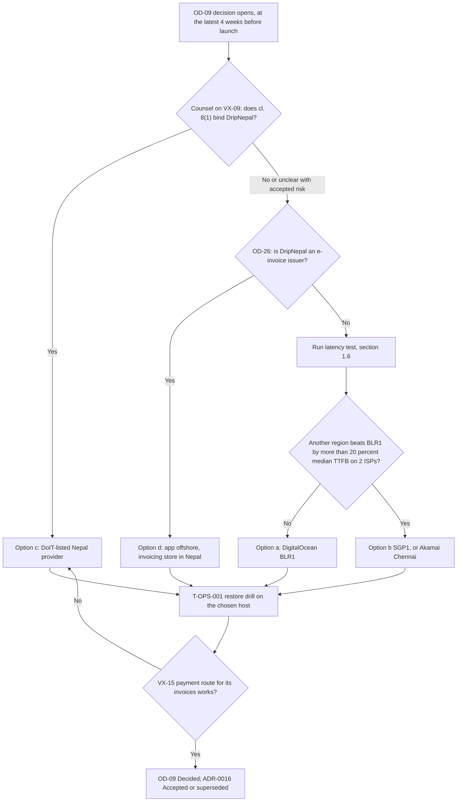

# Deployment and Operations

Status: Draft v1 (2026-09-26)

Reviewed: critic pass B6 part 1 (2026-09-26)

This document says how DripNepal is hosted, deployed, watched, backed up and recovered by a team of one or two developers [Confirmed, Q1]. It owns the operational procedures that other documents hand over to "11": the environment set, the hosting recommendation behind [ADR-0016](adr/0016-hosting-single-region-portable.md), the release and migration procedure, job operations, monitoring and alerts, runbooks, backups, targets, capacity and operational access. It does not restate rules owned elsewhere. Topology and the connection budget come from [03 §5](03-system-architecture.md#5-deployment) and [03 §3.4](03-system-architecture.md#34-postgresql-layout-and-connection-budget), secrets policy from [07 §5.6](07-security-threat-model-and-permissions.md#56-secret-management-and-rotation), environment variables from [09 §6.1](09-code-structure-and-engineering-standards.md#61-variable-catalogue), and test IDs from [10](10-testing-and-quality-gates.md).

Labels follow [00 §1.2](00-context-assumptions-and-questions.md#12-evidence-labels). Prices are "as published on 2026-09-25" in the research digest `infra_ops` (accessed 2026-09-25). They are inputs to [Open OD-09] and [Verify-external VX-15], not quotes, and no figure here goes beyond arithmetic on those published prices.

## Reading guide

| §   | Title                                                     | State                         |
| --- | --------------------------------------------------------- | ----------------------------- |
| 1   | Recommended cost-conscious deployment                     | Written (this part)           |
| 2   | Environments and data policy                              | Written (this part)           |
| 3   | Topology and networking                                   | Planned                       |
| 4   | Docker images and local setup                             | Planned                       |
| 5   | CI/CD and release promotion                               | Planned                       |
| 6   | Safe schema migrations                                    | Planned                       |
| 7   | Health checks, graceful shutdown and zero-downtime deploy | Planned                       |
| 8   | Jobs and queue operations                                 | Planned                       |
| 9   | Observability and alerting                                | Planned                       |
| 10  | Runbooks                                                  | Planned                       |
| 11  | Backup policy and verified restore                        | Planned                       |
| 12  | Availability, recovery and performance targets            | Planned                       |
| 13  | Capacity assumptions and cost drivers                     | Planned                       |
| 14  | Operational access and security operations                | Planned                       |
| —   | Consistency notes for editor                              | Written (covers §1–§2 so far) |

A reader choosing a host reads §1. A developer setting up a machine, CI or staging reads §2, then §4 and §5. Whoever is on call reads §9 and §10.

---

## 1. Recommended cost-conscious deployment

### 1.1 Status: what is decided and what is not

[ADR-0016](adr/0016-hosting-single-region-portable.md) is **Proposed**. It is blocked on two items:

- [Verify-external VX-09]: does DCCS Directive 2081 cl. 8(1) ("any client shall only obtain" data-centre and cloud services from providers listed by the Department of Information Technology) bind a private company? "Client" is not defined. Law-firm summaries find no explicit offshore-storage ban (<https://www.pradhanlaw.com/publications/data-center-and-cloud-service-operation-and-management-directive-2081-2025-ad>, accessed 2026-09-25). DLA Piper reports that NRB-licensed payment institutions must host with DoIT-listed entities (<https://www.dlapiperdataprotection.com/?t=transfer&c=NP>, accessed 2026-09-25). DripNepal is not such an institution, but its gateways are.
- [Open OD-09]: the production provider and region. Its latest responsible moment is 4 weeks before launch, and it blocks the M7 exit (the R1 launch gate) in [risks-and-open-decisions.md §5](risks-and-open-decisions.md#5-decisions-that-block-implementation-by-milestone). The other hosting-related items on that gate are VX-09, VX-15 (including the FX route, R-32) and OD-26.

Three things are decided now and do not wait for OD-09:

1. Development and staging run on the provisional choice below.
2. The portability requirement (NFR-DATA-005, [03 §5.3](03-system-architecture.md#53-portability-requirement-nfr-data-005-vx-09)) is binding: one OCI image configured only by environment variables, vanilla PostgreSQL 18 with core extensions (`citext`, `pg_trgm`, `pgcrypto`), objects only through `@adonisjs/drive`'s S3 service, DNS at Cloudflare, and no provider-only runtime services in the request path.
3. No document claims legal compliance for any hosting option. REG-32 in [01](01-product-requirements.md) stays open until counsel answers VX-09.

A separate data-residency rule applies only if OD-26 makes DripNepal an e-invoice issuer: the Electronic Invoice Procedure 2082 s7 requires invoicing servers in Nepal with a Nepal-registered cloud provider (<https://ird.gov.np/category/electronic-invoice/>, accessed 2026-09-25). R1 keeps invoice tables out of the schema (A-16, OD-26), so this does not affect the R1 host unless OD-26 changes.

### 1.2 The recommended stack

This is OD-09 option (a). Every component can be replaced by configuration and a data move (§1.9).

| Component            | Recommended choice                                                                                                                                                                                                                      | Role                                                                                                                                                         | Published price (2026-09-25)                                                                                                                                                                                                                   | Data it receives (input for the 07 processor register)                                                                                 |
| -------------------- | --------------------------------------------------------------------------------------------------------------------------------------------------------------------------------------------------------------------------------------- | ------------------------------------------------------------------------------------------------------------------------------------------------------------ | ---------------------------------------------------------------------------------------------------------------------------------------------------------------------------------------------------------------------------------------------- | -------------------------------------------------------------------------------------------------------------------------------------- |
| Compute              | One DigitalOcean BLR1 (Bangalore) Basic Droplet, 4 GB / 2 vCPU, running Docker Compose: Caddy reverse proxy, `web`, `worker`, and a one-off `release` container for migrations                                                          | Runs the single image in two process types (canon §6.1). Holds no state: it can be rebuilt from §4 and §5                                                    | $24/mo, 4,000 GiB transfer included (<https://www.digitalocean.com/pricing/droplets>)                                                                                                                                                          | Everything in transit; at rest only container logs and the env file with secrets (§2.1)                                                |
| Database             | DigitalOcean Managed PostgreSQL 18, 1 GiB / 1 vCPU single node, same region, private VPC, TLS required                                                                                                                                  | The only stateful service. Daily backups kept 7 days, 7-day point-in-time recovery; a restore creates a new cluster                                          | $15.15/mo on the pricing page, "begin at $15.00" in the docs; storage $0.215/GiB/mo in 10 GiB steps (<https://www.digitalocean.com/pricing/managed-databases>; <https://docs.digitalocean.com/products/databases/postgresql/details/pricing/>) | All business data, all personal classes of [04 §19.1](04-domain-model-and-data-dictionary.md#191-handling-rules-per-sensitivity-class) |
| Edge                 | Cloudflare: DNS, proxy, CDN and WAF for the app domain and `media.<domain>`; Full (strict) TLS to the origin with a Cloudflare origin certificate on Caddy [Assumption; §3 owns the configuration]                                      | TLS termination near users, caching of public media, filtering. Cloudflare lists a Kathmandu data centre (<https://www.cloudflare.com/network/>)             | Plan not priced in the research [Verify-external VX-15]; the Free plan is the starting assumption [Assumption]                                                                                                                                 | Every request, including cookies and form bodies (TLS is terminated at Cloudflare)                                                     |
| Objects              | Cloudflare R2 with the `apac` location hint: `dripnepal-<env>-private` (originals, KYC) and `dripnepal-<env>-public` (derived WebP, served through `media.<domain>`), per [03 §3.5](03-system-architecture.md#35-object-storage-layout) | Uploads go direct to R2 by presigned URL; the worker derives public images                                                                                   | $0.015/GB-month, Class A $4.50/million, Class B $0.36/million, egress free; free tier 10 GB-month, 1M Class A, 10M Class B (<https://developers.cloudflare.com/r2/pricing/>)                                                                   | Product images, KYC documents (Sensitive-personal)                                                                                     |
| Backup storage       | A separate R2 bucket for encrypted nightly `pg_dump` files, with its own access key; retention and encryption owned by §11                                                                                                              | Survives loss of the DigitalOcean account or cluster (managed backups are destroyed with the cluster)                                                        | Same R2 prices                                                                                                                                                                                                                                 | Encrypted full database dumps                                                                                                          |
| Email                | A transactional provider with a first-party `@adonisjs/mail` 10.4.0 transport (ses, smtp, brevo, resend, mailgun, sparkpost, cloudflare, postmark) [Open OD-08]                                                                         | Verification, reset, invitation and order emails                                                                                                             | Not priced in the research; chosen on inbox placement first (OD-08, VX-14)                                                                                                                                                                     | Recipient addresses, names, order numbers                                                                                              |
| Error tracking       | Sentry, Developer plan while one person handles errors                                                                                                                                                                                  | Exceptions from `web`, `worker` and the browser, scrubbed per [07 §5.8](07-security-threat-model-and-permissions.md#58-analytics-and-third-party-processors) | Developer: $0, one user, 5k errors, 30-day lookback; Team from $26/mo billed annually (<https://sentry.io/pricing/>)                                                                                                                           | Stack traces, route patterns, `request_id`; no bodies or emails (07 §5.8)                                                              |
| Logs, uptime, traces | Chosen in §9 among free tiers                                                                                                                                                                                                           | —                                                                                                                                                            | §9                                                                                                                                                                                                                                             | Redacted pino JSON                                                                                                                     |

Facts the recommendation rests on [Verified-doc, accessed 2026-09-25]: BLR1 offers Droplets, Managed PostgreSQL and Spaces (<https://docs.digitalocean.com/platform/regional-availability/>); DigitalOcean Standard Edition supports PostgreSQL 14 to 18, matching the repository's `postgres:18.4` (<https://docs.digitalocean.com/products/databases/postgresql/details/limits/>); the 1 GiB plan allows 22 backend connections (same page); R2's `r2.dev` URLs are rate-limited and for development only, so production media always uses the custom domain (<https://developers.cloudflare.com/r2/buckets/public-buckets/>); R2 location hints are "best effort and not a guarantee" (<https://developers.cloudflare.com/r2/reference/data-location/>), so no residency claim is made from `apac`.

**Connection budget.** The 22 connections are split as in [03 §3.4](03-system-architecture.md#34-postgresql-layout-and-connection-budget): web Lucid 8, worker Lucid 4, worker pg-boss 4, migrations and admin 2, web send-only pg-boss 1, headroom 3. This document adopts that split unchanged. Operational consequences: `pg-boss` connects directly, never through a PgBouncer transaction-mode pool (DigitalOcean recommends session mode or direct connections for LISTEN/NOTIFY and advisory locks, <https://docs.digitalocean.com/products/databases/postgresql/how-to/manage-connection-pools/>); `pg_dump` also connects directly, and it uses one of the two admin connections, so the nightly dump and an incident `psql` session must not run together with a release (§5, §11). A second `web` container during a deploy (§7) needs 8 more connections than the headroom of 3 provides; §7 therefore has to either lower `DB_POOL_MAX` for the overlap or accept a restart blip. That tradeoff is decided in §7, not here.

**Facts to confirm when the accounts are opened** (not in the research digests, so each is [Assumption] until recorded in the OD-09 decision log): that the managed database and R2 encrypt data at rest (07 §5.5 expects the provider statement here); that bucket-level public access is off on every `-private` bucket and `r2.dev` access is off on production buckets (07 TM-16 Preventive and ADR-0016 Verification hand this check to 11); that DigitalOcean Managed PostgreSQL lets the admin user create the three roles of [07 §4.10](07-security-threat-model-and-permissions.md#410-database-roles-and-grants) and grant them as specified; how much storage the $15.15 plan includes; whether BLR1 compute prices equal SGP1's (the digest could not confirm it); which Cloudflare plan provides the WAF rules §3 relies on; which CA certificate the managed database presents, since production sets `DB_SSL_CA` to it (09 §6.1); and where Sentry and the email provider store data (07 §5.8, REG-24). The check is done on the drill cluster that T-OPS-001 creates anyway (§2.5), so it costs no extra cluster.

### 1.3 Why this shape, and what it costs in risk

The choice is driven by three facts: one or two developers run everything, users are in Nepal on slow mobile networks, and orders and ledger rows must be recoverable.

| Decision                                    | Mechanism                                                                                           | What we give up                                                                                                             | How it is verified                                                                                                                    |
| ------------------------------------------- | --------------------------------------------------------------------------------------------------- | --------------------------------------------------------------------------------------------------------------------------- | ------------------------------------------------------------------------------------------------------------------------------------- |
| Managed PostgreSQL instead of self-hosting  | Provider runs patching, daily backups and 7-day PITR                                                | Single node, no automatic failover; 7-day window only; backups die with the cluster, hence the independent dump (§11, R-29) | T-OPS-001 restore drill, with measured RTO and RPO                                                                                    |
| One Droplet with Docker Compose, not a PaaS | Same OCI image everywhere; the Droplet has a static IPv4 for any provider allow-list (VX-14)        | The team patches the OS and Docker; the Droplet is a single point of failure; deploys restart containers (§7)               | From-scratch rebuild from the documented steps (§1.9); uptime check (§9)                                                              |
| Cloudflare in front of everything           | DNS, CDN and WAF at the edge; the origin firewall admits only Cloudflare's published IP ranges (§3) | Cloudflare sees decrypted traffic (a processor, REG-24); whether Nepali ISPs reach the Kathmandu PoP is unmeasured          | Latency test (§1.6) records the `cf-ray` colo; the edge check "direct request to the origin fails" (T-OPS area, proposed in ADR-0016) |
| R2 for objects                              | Egress is free, which removes the dominant variable cost of an image-heavy catalogue                | A second provider account and bill; the `apac` hint is not residency                                                        | Media smoke test in staging; monthly cost review (§13)                                                                                |
| BLR1 as the provisional region              | Geographically close; all needed products in one region                                             | "Close" is geographic only: no latency from Nepali ISPs has been measured (VX-15)                                           | §1.6 before OD-09 closes                                                                                                              |

### 1.4 Monthly cost of the recommended stack

Arithmetic on the published prices only. Staging is included because it runs from the first deploy pipeline (§2.4).

| Line                                       | Monthly (USD, as published 2026-09-25)   | Note                                                                                                                                                                                         |
| ------------------------------------------ | ---------------------------------------- | -------------------------------------------------------------------------------------------------------------------------------------------------------------------------------------------- |
| Production Droplet 4 GB / 2 vCPU           | 24.00                                    | Size is [Assumption] until SSR memory is measured (§13)                                                                                                                                      |
| Managed PostgreSQL 1 GiB                   | 15.15                                    | Or 15.00 per the docs page; extra storage $0.215/GiB in 10 GiB steps if the plan's included storage is exceeded                                                                              |
| Staging Droplet 2 GB / 1 vCPU              | 12.00                                    | PostgreSQL runs in a container on it (§2.4)                                                                                                                                                  |
| R2 (app buckets and backup bucket)         | 0.00 within the free tier                | Beyond it, (GB-month − 10) × $0.015. Example: 60 GB stored costs (60 − 10) × 0.015 = $0.75. Image volume is estimated in §13                                                                 |
| Cloudflare                                 | not priced                               | Free plan assumed [Verify-external VX-15]                                                                                                                                                    |
| Sentry                                     | 0.00 (Developer) or 26.00 (Team)         | Team is needed once two people must see errors (the Developer plan has one user)                                                                                                             |
| Email provider                             | not priced                               | [Open OD-08]                                                                                                                                                                                 |
| **Subtotal of priced lines**               | **51.15** (Developer) / **77.15** (Team) | 24.00 + 15.15 + 12.00 = 51.15; plus 26.00 = 77.15                                                                                                                                            |
| With 13% reverse-charge VAT, if it applies | 57.80 / 87.18                            | 51.15 × 1.13 and 77.15 × 1.13. Rate per VAT Act s7(1) as recorded under VX-05; VAT Act s8(2) reverse charge on services from abroad; how it is assessed and filed is [Verify-external VX-05] |

Not included: the Cloudflare plan, the email provider, log and uptime tools (§9), bandwidth beyond the Droplet's included 4,000 GiB ($0.01/GiB overage, <https://docs.digitalocean.com/platform/billing/bandwidth/>) and the domain. The monthly review compares actual invoices with this table (§13).

### 1.5 Alternatives, with published prices, and when each becomes worthwhile

All prices are as published on 2026-09-25 in the `infra_ops` digest; the source URL is given per row. "App + DB" is the arithmetic for a production web process, a worker and the smallest managed PostgreSQL, without staging, so rows can be compared with the recommended $24.00 + $15.15 = $39.15. Fly.io per-second prices are multiplied by 2,592,000 seconds (30 days); AWS hourly prices by 730 hours [Assumption on the month length].

| Option                                | Key facts (sources)                                                                                                                                                                                                                                                                                                                                                                                                                                                                                                                                                                                                                                                                                                                                                                                                                       | App + DB arithmetic                                                                                                                        | Main drawback for DripNepal                                                                                                     | Becomes worthwhile when                                                                                                                                                         |
| ------------------------------------- | ----------------------------------------------------------------------------------------------------------------------------------------------------------------------------------------------------------------------------------------------------------------------------------------------------------------------------------------------------------------------------------------------------------------------------------------------------------------------------------------------------------------------------------------------------------------------------------------------------------------------------------------------------------------------------------------------------------------------------------------------------------------------------------------------------------------------------------------- | ------------------------------------------------------------------------------------------------------------------------------------------ | ------------------------------------------------------------------------------------------------------------------------------- | ------------------------------------------------------------------------------------------------------------------------------------------------------------------------------- |
| DigitalOcean SGP1 (OD-09 option b)    | Same products as BLR1 (<https://docs.digitalocean.com/platform/regional-availability/>); bandwidth prices do not vary by region (<https://docs.digitalocean.com/platform/billing/bandwidth/>); compute price parity not confirmed                                                                                                                                                                                                                                                                                                                                                                                                                                                                                                                                                                                                         | $39.15 if compute prices equal BLR1's                                                                                                      | None beyond BLR1's                                                                                                              | The §1.6 latency test favours Singapore. The move is a restore and a DNS change                                                                                                 |
| Akamai (Linode) Chennai `in-maa`      | Only India region with compute, managed databases and object storage together (<https://api.linode.com/v4/regions>); Linode 4 GB $24/mo (<https://www.akamai.com/cloud/pricing/asia-pacific>); managed DB Nanode 1 GB $16 (1 node) or $37 (3 nodes, automatic failover) (<https://api.linode.com/v4/databases/types>); PostgreSQL 18 listed (<https://api.linode.com/v4/databases/engines>); backups kept 14 days (<https://techdocs.akamai.com/cloud-computing/docs/managed-databases>)                                                                                                                                                                                                                                                                                                                                                  | 24 + 16 = $40.00; with a 3-node database 24 + 37 = $61.00                                                                                  | PITR granularity within a day is not documented                                                                                 | Runner-up. Chosen if the latency test favours Chennai, if the RTO needs automatic failover (the cheapest HA database found), or if 14-day backups are wanted                    |
| Render Singapore                      | No India region (<https://render.com/docs/regions>); compute 0.5c-512mb $7, 1c-2g $25; Postgres 0.5c-1g $19; PITR 3 days on Hobby, 7 days on Pro; Pro workspace $25/mo; bandwidth beyond 5–25 GB at $0.15/GB (<https://render.com/pricing>; <https://render.com/docs/postgresql-backups>)                                                                                                                                                                                                                                                                                                                                                                                                                                                                                                                                                 | Web 1c-2g 25 + worker 7 + DB 19 = $51.00 on Hobby (3-day PITR); + 25 Pro = $76.00 for 7-day PITR                                           | Higher cost; a 512 MB worker may not fit image processing; no static egress IP without an add-on (Render dedicated IPs $100/mo) | The team decides it cannot patch a VM at all, and no gateway or SMS provider needs an IP allow-list (VX-14)                                                                     |
| Railway Singapore                     | Region `asia-southeast1-eqsg3a` (<https://docs.railway.com/reference/deployment-regions>); Pro $20/mo including $20 usage; RAM $10/GB/mo, CPU $20/vCPU/mo, egress $0.05/GB (<https://docs.railway.com/reference/pricing/plans>); Postgres templates are "unmanaged", no documented PITR (<https://docs.railway.com/databases/postgresql>)                                                                                                                                                                                                                                                                                                                                                                                                                                                                                                 | Usage-based: a service using 2 GB and 1 vCPU all month is 20 + 20 = $40 of usage, billed $40 because the $20 Pro fee covers the first $20  | No managed PITR for order and payment data                                                                                      | Not for production data. Possibly for short-lived preview environments, if they are ever wanted                                                                                 |
| Fly.io Singapore `sin` / Mumbai `bom` | Region markup `sin` 2×, `bom` 3×; shared-cpu-1x 1 GB $0.00000228/s (<https://docs.fly.io/about/pricing/>); Managed Postgres in `sin` but not in `bom`, Basic $38/mo (<https://docs.fly.io/reference/regions/>; <https://docs.fly.io/mpg/>); `fly mpg create` supports PostgreSQL 16 and 17 only (<https://docs.fly.io/flyctl/cmd/fly_mpg_create.md>); egress $0.04/GB APAC, $0.12/GB India                                                                                                                                                                                                                                                                                                                                                                                                                                                | One 1 GB machine: 0.00000228 × 2,592,000 × 2 = $11.82 (`sin`), × 3 = $17.73 (`bom`). Web + worker in `sin` + Basic DB: 23.64 + 38 = $61.64 | No PostgreSQL 18; a Mumbai app would query a Singapore database                                                                 | Only if the stack moved to PostgreSQL 17 everywhere, which nothing currently justifies                                                                                          |
| AWS Mumbai (Lightsail or RDS)         | `ap-south-1` needs no opt-in (<https://docs.aws.amazon.com/global-infrastructure/latest/regions/aws-regions.html>); Lightsail databases document PostgreSQL 12–16 only (<https://docs.aws.amazon.com/lightsail/latest/userguide/amazon-lightsail-choosing-a-database.html>); RDS supports 18.x (<https://docs.aws.amazon.com/AmazonRDS/latest/PostgreSQLReleaseNotes/postgresql-versions.html>); RDS db.t4g.micro $0.021/hr Single-AZ, $0.042/hr Multi-AZ, gp3 $0.131/GB-month; backup retention up to 35 days (<https://docs.aws.amazon.com/AmazonRDS/latest/UserGuide/USER_WorkingWithAutomatedBackups.BackupRetention.html>); Lightsail databases 1 GB $15 standard or $30 high availability, and Mumbai Lightsail bundles include half the usual transfer allowance, overage $0.1093/GB (<https://aws.amazon.com/lightsail/pricing/>) | RDS micro Single-AZ 0.021 × 730 = $15.33, Multi-AZ $30.66, plus 20 GB gp3 = $2.62; compute host not priced in the research                 | IAM and VPC set-up work; egress about 10× DigitalOcean's overage rate                                                           | PITR longer than 7 days becomes a requirement (RDS allows up to 35 days), or AWS credits make it cheaper                                                                        |
| Hetzner Singapore                     | Cloud only in `sin`; no Object Storage there (<https://docs.hetzner.com/cloud/general/locations/>); no managed PostgreSQL (<https://www.hetzner.com/cloud/>); CPX22 €26.49 ($30.99) from 15 June 2026 (<https://docs.hetzner.com/general/infrastructure-and-availability/price-adjustment/>); CPX22 includes 1 TB traffic in Singapore, overage price not readable (<https://www.hetzner.com/cloud/regular-performance/>)                                                                                                                                                                                                                                                                                                                                                                                                                 | $30.99 compute only; the database is self-run                                                                                              | The team would own PostgreSQL HA, patching, PITR (pgBackRest) and restore drills                                                | Only if a developer with PostgreSQL operations experience joins and dedicated CPU is needed; not at R1 scale                                                                    |
| DoIT-listed Nepal provider (OD-09 c)  | Not researched: no provider, price, managed-PostgreSQL offer or billing currency is known [Verify-external VX-15]. The list is kept by DoIT under DCCS Directive 2081 cl. 3(1) (<https://doit.gov.np/content/12100/data-center-and-cloud-service--operation-and/>)                                                                                                                                                                                                                                                                                                                                                                                                                                                                                                                                                                        | Unknown                                                                                                                                    | Unknown PostgreSQL 18 availability and operations tooling                                                                       | Counsel reads cl. 8(1) as binding (VX-09), a gateway requires DoIT-listed hosting at onboarding, or OD-26 puts invoice data in Nepal (option d splits only the invoicing store) |

If the target host has no managed PostgreSQL 18 with PITR, the fallback is PostgreSQL 18 in a container with pgBackRest, which supports PostgreSQL 18 since v2.55.0 and has an encrypted S3 repository (<https://pgbackrest.org/release.html>). That is a large operations load for this team (R-08), which is why the table ranks managed options first.

### 1.6 Measure latency from Nepal before choosing (OD-09)

No published latency measurements from Nepali ISPs exist for any candidate region (`infra_ops`, "Could not verify"). "Close to Nepal" is geography until this test runs. The test is owned by the tech lead and finishes before OD-09's latest responsible moment (4 weeks before launch).

1. **Targets.** Create short-lived test VMs in DigitalOcean BLR1 and SGP1 and Akamai Chennai (`in-maa`). Each serves one static 20 KB page and one page rendered by the real image (SSR home page against a small seeded database), both over HTTPS through a Cloudflare-proxied test hostname and also directly to the VM IP. Destroy the VMs afterwards; the cost is a few days of the published hourly rates.
2. **Vantage points.** At least four access networks: Nepal Telecom (NTC) mobile, Ncell mobile, WorldLink fibre and Vianet fibre; Subisu if available. Use a phone hotspot for the mobile networks. Record ISP, city and time for each run.
3. **Samples.** 20 requests per target and path, three times a day (morning, evening peak, night), on three days. Command sketch (standard `curl` write-out variables):

   ```sh
   # latency probe sketch: one line per request, CSV
   for i in $(seq 1 20); do
     curl -s -o /dev/null -D /tmp/h.txt \
       -w "%{time_connect},%{time_appconnect},%{time_starttransfer},%{time_total}\n" \
       "https://$TARGET/$PATH_UNDER_TEST"
     grep -i '^cf-ray' /tmp/h.txt   # colo suffix, e.g. -KTM or -BOM [Assumption on the suffix format]
   done >> "results-$ISP-$TARGET.csv"
   ```

4. **What is recorded.** Median and p90 of TCP connect, TLS handshake, time to first byte and total, per ISP and target; the Cloudflare colo seen in `cf-ray` (this answers whether traffic reaches the Kathmandu PoP, which is also unverified).
5. **Decision rule** (from ADR-0016, [Assumption]): keep BLR1 unless another region has a median TTFB more than 20% lower from at least two ISPs. Ties go to the option with the simpler operations (fewer accounts).
6. **Where the result goes.** A dated entry in the OD-09 row of the decision log ([risks-and-open-decisions.md §2.3](risks-and-open-decisions.md#23-decision-log)), with the CSV files attached to the planning folder, not the repository (they contain home IP addresses).

### 1.7 Decision path to the production host



"Unclear with accepted risk" means the product owner accepts counsel's residual risk in writing; this document does not make that call. Whatever the path, the restore drill on the chosen host runs before the launch gate, because every candidate restores into a new instance and the runbook must be proven there (§11).

### 1.8 Paying for it from Nepal (R-32, VX-15)

Every provisional provider (DigitalOcean, Cloudflare, Sentry and the likely email providers) bills in USD or EUR by card. Whether DripNepal can pay these invoices from Nepal within NRB foreign-exchange rules and dollar-card limits is unconfirmed, and no NRB source has been researched ([Verify-external VX-15], card and FX sub-question; risk R-32). An unpaid invoice can suspend production, so this is an availability risk, not only an accounting one.

- **Before the first paid plan** (the staging Droplet, §2.4), the product owner confirms the payment route and its annual limit with the company's bank and records it under VX-15. Until then, development uses only local and CI environments and free tiers.
- **Budget check.** The route's limit must cover at least 12 × the monthly total of §1.4 including reverse-charge VAT, plus the annual Sentry Team charge if chosen (it is billed annually).
- **Billing contacts.** Every provider account sends billing and card-decline emails to two people. The monthly review (§13) checks each provider's billing status.
- **Fallback.** Portability (§1.9) keeps OD-09 option (c) open; whether a DoIT-listed Nepal provider bills in NPR is [Assumption] until checked (R-32).
- **Reverse-charge VAT** on these services is budgeted per VX-05; the accountant confirms assessment and filing.

### 1.9 Portability check (adopts the 03 §5.3 assumption)

[03 §5.3](03-system-architecture.md#53-portability-requirement-nfr-data-005-vx-09) proposed a staging rebuild on a second provider before the R1 gate and left it to this document. It is **adopted**, with one addition from NFR-DATA-005:

| Check                       | When                                                                      | Procedure                                                                                                                                                                                                                                                                                                                       | Pass criterion                                                                                                                                       |
| --------------------------- | ------------------------------------------------------------------------- | ------------------------------------------------------------------------------------------------------------------------------------------------------------------------------------------------------------------------------------------------------------------------------------------------------------------------------- | ---------------------------------------------------------------------------------------------------------------------------------------------------- |
| Second-provider rebuild     | Once before the R1 launch gate (M7 exit); again after any change of OD-09 | On Akamai Chennai (the runner-up) or the Nepal candidate: create a VM and a managed PostgreSQL 18 (or a container), follow only §3–§5 of this document to deploy the current production image, restore the latest nightly dump from the backup bucket (§11), point a throwaway hostname at it, run the staging smoke suite (§5) | Smoke suite green; elapsed time recorded as a relocation RTO; every undocumented step found is added to this document. Destroy everything afterwards |
| From-scratch staging deploy | Quarterly (NFR-DATA-005)                                                  | Destroy and recreate the staging Droplet from the documented steps only                                                                                                                                                                                                                                                         | Staging back in service within one working day [Assumption]                                                                                          |
| Static portability rules    | Every pull request                                                        | CI on `postgres:18.4` and MinIO; migration lint rejects extensions outside the allow-list; T-ARCH-001 forbids provider SDKs outside adapters (ADR-0016 Verification)                                                                                                                                                            | CI green                                                                                                                                             |

The test IDs for the first two checks are in the T-OPS area and are assigned by [10](10-testing-and-quality-gates.md) (proposed here; T-OPS-002 is already used by other documents, see Consistency notes).

---

## 2. Environments and data policy

### 2.1 Overview

Four long-lived environments plus one short-lived kind. The same image built once per commit runs in CI tests, staging and production (§5); only environment variables differ ([09 §6.1](09-code-structure-and-engineering-standards.md#61-variable-catalogue)). This table extends [03 §5.2](03-system-architecture.md#52-environments), which it does not contradict.

| Environment         | Purpose                                                                                 | Where                                                                         | Process start                                                         | Database                                                                  | Objects                                                       | Email                                    | Payments                                               | Secrets live in                                                                                            |
| ------------------- | --------------------------------------------------------------------------------------- | ----------------------------------------------------------------------------- | --------------------------------------------------------------------- | ------------------------------------------------------------------------- | ------------------------------------------------------------- | ---------------------------------------- | ------------------------------------------------------ | ---------------------------------------------------------------------------------------------------------- |
| Development         | Writing code                                                                            | Developer laptop; services in `docker-compose.yml`                            | `node ace serve --hmr` and `node ace jobs:work` (09 §1.3) on the host | `postgres:18.4` container, databases `dripnepal_dev` and `dripnepal_test` | MinIO container [Assumption, 03 §3.5]                         | Mailpit container                        | `PAYMENT_PROVIDER=fake`                                | Git-ignored `.env` ([09 §6.4](09-code-structure-and-engineering-standards.md#64-environment-files-policy)) |
| CI                  | Tests, lint, build, image push                                                          | GitHub Actions runners                                                        | Test runner; the built image for smoke tests                          | `postgres:18.4` service container, `dripnepal_test`                       | MinIO service container                                       | JSON/fake transport                      | `fake` plus recorded provider fixtures                 | GitHub Actions secrets, only for registry push and the staging deploy (§5); tests need none                |
| Staging             | Prod-like rehearsal: deploy, migrations, e2e, sandbox payments                          | DigitalOcean BLR1 Droplet 2 GB / 1 vCPU, `staging.<domain>` behind Cloudflare | Same Compose layout as production                                     | PostgreSQL 18.4 container on the Droplet, database `dripnepal_staging`    | `dripnepal-staging-private`, `dripnepal-staging-public`       | Capture inbox or provider sandbox (§2.4) | `none` (R1) or the chosen gateway's **sandbox** (R1.1) | Root-owned env file on the Droplet, mode 0600 [Assumption; §14 owns access]                                |
| Production          | Real customers                                                                          | §1.2                                                                          | Compose: Caddy, `web`, `worker`, one-off `release`                    | Managed PostgreSQL 18, database `dripnepal_production`                    | `dripnepal-production-private`, `dripnepal-production-public` | Production provider (OD-08)              | `none` in R1 (COD only); live keys from R1.1           | Root-owned env file on the Droplet, mode 0600, written from the password manager [Assumption; §14]         |
| Drill (short-lived) | Restore drills (T-OPS-001), second-provider rebuild (§1.9), provider fact checks (§1.2) | A new managed cluster created by the restore, plus a throwaway VM if needed   | Production image                                                      | Restored copy of production                                               | None, or read-only use of production media URLs               | Disabled (no mail transport configured)  | `none`                                                 | Created for the drill, destroyed with it                                                                   |

Database names never end in `_dev` or `_test` outside development and CI. The development seeders refuse to run unless `current_database()` ends in one of those suffixes ([09 §8.8](09-code-structure-and-engineering-standards.md#88-seeders-reference-data-versus-development-data) and 09 note 41), so these names are what keeps the demo marketplace seed out of staging and production (RF-05). The container for development therefore creates `dripnepal_dev` and `dripnepal_test` instead of today's `dripnepal` (fix list in §4, RF-43).

### 2.2 Development

`docker-compose.yml` provides the services; the app runs on the host for fast reload. Target service set (the RF-43 fixes and exact file are in §4):

| Service    | Image (pinned in §4)      | Status                                                | Why                                                                                                                                                                                                                                               |
| ---------- | ------------------------- | ----------------------------------------------------- | ------------------------------------------------------------------------------------------------------------------------------------------------------------------------------------------------------------------------------------------------- |
| `postgres` | `postgres:18.4`           | Required                                              | Same major and minor as CI; creates `dripnepal_dev` and `dripnepal_test` (RF-32); bound to `127.0.0.1` only (RF-43)                                                                                                                               |
| `mailpit`  | `axllent/mailpit`, pinned | Required                                              | SMTP sink on 1025, UI on 8025; every email the app sends in development lands here                                                                                                                                                                |
| `minio`    | MinIO, pinned             | Required from M3 (media)                              | Exercises presigned PUT and GET against an S3 API locally [Assumption, 03 §3.5; M0 decides]. Behaviour that differs from R2 is tested in staging                                                                                                  |
| `redis`    | `redis:8.6`               | **Optional**, Compose profile `redis`, off by default | Nothing in R1 uses Redis: sessions and the limiter use the database store, jobs use pg-boss (canon §6.1, ADR-0010). Kept only for experiments; see the upgrade trigger in [03 §13](03-system-architecture.md#13-evolution-path-without-a-rewrite) |

Rules for development:

- Only synthetic data: reference seeders plus the development seeders (`dev/01_demo_marketplace`, …). The development admin is created with `node ace platform:create-admin`; there is no seeded admin (09 note 41).
- The worker runs locally when a developer works on jobs, emails or media; otherwise jobs queue up harmlessly in `pgboss`.
- `PAYMENT_PROVIDER=fake`. Real sandbox keys are not needed on a laptop; sandbox work happens in staging.
- A developer never connects to the staging or production database from a laptop. Operational access goes through §3 (SSH tunnel) and §14.

### 2.3 CI

GitHub Actions runs the checks and builds the image once (§5 owns the pipeline; [10](10-testing-and-quality-gates.md) owns the checks). For this section only the data rules matter:

- Service containers `postgres:18.4` and MinIO; database `dripnepal_test`; `NODE_ENV=test`, `APP_ENV=test`; test key values from `.env.test`.
- No real provider is ever called. Provider behaviour is covered by the fake adapter and recorded fixtures (03 §5.2).
- Tests hold no secrets. The only CI secrets are the registry push credential and the staging deploy key, both limited to the `main`-branch deploy job (§5, §14). Pull requests from forks get neither.
- Test data is created by factories per test and discarded; nothing from staging or production is ever used as a fixture.

### 2.4 Staging

Staging answers one question: "will this image, with these migrations, work in production?" It is smaller than production and differs in known ways, listed so nobody trusts it for what it cannot show.

| Aspect                     | Staging                                                                                                                                                                                                                                                                                                                                                        | Production                         | Consequence                                                                                                                                                                                                                                                                             |
| -------------------------- | -------------------------------------------------------------------------------------------------------------------------------------------------------------------------------------------------------------------------------------------------------------------------------------------------------------------------------------------------------------- | ---------------------------------- | --------------------------------------------------------------------------------------------------------------------------------------------------------------------------------------------------------------------------------------------------------------------------------------- |
| Image, Compose file, proxy | Same                                                                                                                                                                                                                                                                                                                                                           | Same                               | Deploy steps are rehearsed exactly                                                                                                                                                                                                                                                      |
| Host size                  | 2 GB / 1 vCPU                                                                                                                                                                                                                                                                                                                                                  | 4 GB / 2 vCPU                      | No load testing on staging; T-PERF-001 runs against a temporary production-sized environment or production before launch (§12, §13)                                                                                                                                                     |
| Database                   | PostgreSQL 18.4 container, no TLS inside the Docker network                                                                                                                                                                                                                                                                                                    | Managed, TLS with the provider CA  | The `DB_SSL=true` path, role grants and the 22-connection limit are first exercised in the drill environment (§2.1). Mitigation: staging sets `max_connections` so that 22 connections are available to the app roles [Assumption; value fixed in §4], so pool exhaustion shows up here |
| Backups                    | None beyond a nightly dump kept 7 days on the Droplet [Assumption]                                                                                                                                                                                                                                                                                             | Managed backups + independent dump | Staging data is disposable                                                                                                                                                                                                                                                              |
| Access                     | Not public: Caddy basic authentication on every path except `/health/*` and, from R1.1, a gateway's server-to-server callback path if it has one ([03 §11](03-system-architecture.md#11-provider-isolation)); gateway return URLs are browser navigations that carry the tester's cached credentials. Plus `X-Robots-Tag: noindex` [Assumption; §3 configures] | Public                             | The e2e suite passes the basic-auth credentials; search engines never index staging                                                                                                                                                                                                     |
| Email                      | A capture inbox or the provider's sandbox mode; never delivered to real third-party addresses [Assumption; depends on OD-08]                                                                                                                                                                                                                                   | Real delivery                      | Test accounts use addresses on a domain the team controls                                                                                                                                                                                                                               |
| Payments                   | `none` in R1; the gateway **sandbox** host and keys from R1.1 (Khalti `https://dev.khalti.com/api/v2/`, eSewa `rc-epay.esewa.com.np` per [03 §11.6](03-system-architecture.md#116-sandbox-and-production-configuration))                                                                                                                                       | Live keys from R1.1                | Boot validation refuses live hosts outside production unless `ALLOW_LIVE_PAYMENT_HOSTS` is set (03 §11.6); staging never sets it                                                                                                                                                        |
| Kill switch                | `checkout_enabled` toggled freely for tests                                                                                                                                                                                                                                                                                                                    | Off until the launch gate passes   | The switch is tested end to end in staging before launch (07 §7.5, item 8)                                                                                                                                                                                                              |

**When staging exists.** Staging is created when the deploy pipeline is built and the VX-15 payment route works (§1.8), and it must exist before the first milestone whose exit depends on e2e tests against a deployed image. This document proposes M5 (cart and COD checkout) as the latest point [Assumption; milestones are owned by [12](12-roadmap-and-backlog.md)].

**Staging data.** Staging contains no production data (§2.6). Its content comes from the reference seeders run by the release step, `platform:create-admin`, and records created through the product's own flows by the e2e setup and by manual QA (test shops, products, orders). Development seeders cannot run there, by design (§2.1). A reset drops and recreates `dripnepal_staging`, runs migrations and reference seeders, and re-runs the e2e setup; it is done whenever the data gets confusing and at least before each launch-gate rehearsal.

### 2.5 Production

- Created once, from the steps in §3–§5, by the tech lead; the first-deploy bootstrap checklist is [09 §9.3](09-code-structure-and-engineering-standards.md#93-bootstrap-checklist-first-deploy-of-an-environment), and the first platform admin comes from `node ace platform:create-admin` (no default credentials, 09 §9.2).
- Receives only images that passed staging (§5). No one deploys from a laptop.
- `APP_ENV=production`, `NODE_ENV=production`, `SESSION_DRIVER=database`, `DB_SSL=true` with `DB_SSL_CA` set to the provider's CA certificate (confirmed on the drill cluster, §1.2), `DB_POOL_MAX` 8 for `web` and 4 for `worker` (03 §3.4), `LOG_LEVEL=info`, `PAYMENT_PROVIDER=none` for R1 (09 §6.1, value `none` proposed there), `SENTRY_DSN` required. The full production value list is completed in §4 and §5.
- `checkout_enabled` stays `false` until the R1 launch gate passes (risks §5, M7 row). Its default in [04a §15.1](04a-data-dictionary-tables.md) is `true`, so the first-deploy bootstrap (09 §9.3 step 8) sets it to `false` through `updatePlatformSetting` before the production hostname is published in DNS; the check "`checkout_enabled` is `false`" is part of the first-deploy smoke test (§5). Turning it back on at the gate needs MFA step-up ([07 §3.10](07-security-threat-model-and-permissions.md#310-step-up-for-money-staff-and-sensitive-settings)); turning it off needs none.
- Holds every record for its retention period: order, payment, ledger and complaint records are kept 7 years after the closing event in the live database, an approximation of the 6 years of VAT Rules r23(7) chosen because computing "6 years after the fiscal year" needs a Bikram Sambat calendar ([04 §19.3](04-domain-model-and-data-dictionary.md#193-retention-schedule); [Verify-external VX-08]). Backups are for recovery, not retention: they keep days, not years (§11).

### 2.6 Data policy per environment

| Data                                                          | Development                    | CI                  | Staging                                    | Production                 | Drill                                                                                  |
| ------------------------------------------------------------- | ------------------------------ | ------------------- | ------------------------------------------ | -------------------------- | -------------------------------------------------------------------------------------- |
| Reference data (locations, categories, settings defaults)     | Seeded                         | Seeded per test run | Seeded by the release step                 | Seeded by the release step | Restored                                                                               |
| Synthetic users, shops, orders                                | Development seeders, factories | Factories           | Created through the product's flows        | Never                      | Never                                                                                  |
| Production personal data (any class of 04 §19.1 above Public) | **Never**                      | **Never**           | **Never**                                  | Yes                        | Yes, restored copy; access limited to the tech lead; destroyed at the end of the drill |
| Production KYC files and originals                            | Never                          | Never               | Never                                      | Yes                        | Not copied; the drill checks object listing only                                       |
| Real payment credentials                                      | Never                          | Never               | Sandbox only                               | Live (R1.1)                | None                                                                                   |
| Real customer email addresses                                 | Never                          | Never               | Never; team-controlled test addresses only | Yes                        | Mail disabled                                                                          |

Rules behind the table:

1. **No production copy leaves production except as the encrypted backup** ([04 §19.1](04-domain-model-and-data-dictionary.md#191-handling-rules-per-sensitivity-class); 07 TM-30). There is no "anonymised production copy for staging" in R1: anonymising the encrypted columns, blind indexes and free text reliably is harder than generating synthetic data, and a mistake leaks personal data into a less protected environment.
2. **Restores go into the drill environment**, never into staging. The drill cluster is created by the restore itself (a DigitalOcean restore always creates a new cluster, <https://docs.digitalocean.com/products/databases/postgresql/how-to/restore-from-backups/>), reached only through the tech lead's SSH tunnel, and destroyed when the drill ends. The drill record (§11) states when it was destroyed.
3. **Reproducing a production bug** uses the IDs and request ID from logs and the error tracker, then recreates the shape of the data synthetically in development. Staff read production records only through the admin UI or, during an incident, the `dripnepal_readonly` role (07 §4.10) over the tunnel.
4. **Exports** leave production only as the monthly accountant export named in 04 §19.1 (procedure in §10) and law-enforcement disclosures recorded per 07 §5.7.
5. **Logs and error events** from every environment are redacted at source (09 §7.2); non-production environments use separate projects or datasets in the log and error tools, so a staging test can never be confused with a production incident (§9).

### 2.7 Time conventions and Kathmandu business hours (A-29)

- Servers and containers run in UTC (`TZ=UTC`, 09 §6.1); cron schedules and user-facing times use Asia/Kathmandu, UTC+05:45 with no daylight saving (canon §17.8). Every schedule in this document is written in Asia/Kathmandu time.
- **Kathmandu business hours**, which A-29 uses without defining, are fixed here as **Sunday to Friday, 10:00–17:00 Asia/Kathmandu, excluding public holidays on a list the product owner publishes each year** [Assumption; the product owner confirms]. The Sunday-to-Friday week is an assumption about local working practice, not a sourced fact.
- Uses: the support hours shown to customers (A-29, FR-ADM-009), the window in which non-urgent alerts are handled (§9, §14), and planned maintenance, which is scheduled outside these hours and outside the evening peak found by the latency test (§1.6). The 15-day support SLA itself runs in calendar days ([01 §1.3](01-product-requirements.md#13-requirement-conventions)); business hours do not change it.
- Outside business hours nobody is on call (A-30); §9 decides which alerts page out of hours anyway.

---

## Consistency notes for editor

Notes 1–13 cover §1–§2. Later parts append their own.

1. **Portability check adopted.** The [Assumption] in [03 §5.3](03-system-architecture.md#53-portability-requirement-nfr-data-005-vx-09) (staging rebuild on a second provider before the R1 gate) is adopted in §1.9 and combined with NFR-DATA-005's quarterly from-scratch staging deploy. 03 §5.3 can drop "[Assumption]" and link §1.9.
2. **Restore-drill cadence.** ADR-0016 Verification, NFR-AVAIL-002 and R-29 say T-OPS-001 runs before launch and **quarterly**; the specification for this document (item 11, canon-derived brief) says **monthly**. §11 (a later part) must pick one and the others must follow; §1–§2 only reference T-OPS-001 without a cadence.
3. **T-OPS-002 collision.** 03 §10.7 and ADR-0010 use T-OPS-002 (proposed) for graceful worker shutdown; 05 §5.10 and its test list use T-OPS-002 for the stock-drift drill. 10 must renumber one. This document assigns no new T-OPS numbers and leaves the §1.9 checks to 10.
4. **Restores into staging.** 04 §19.1 and 07 TM-30 (Preventive) say backups are never restored into a shared non-production environment; 07 TM-30 Verification says "restoring into staging requires the anonymisation replay script", which implies it may happen. §2.6 follows 04 (owner of handling rules): no production data in staging at all, restores only into a short-lived drill environment. 07 TM-30's Verification line should be reworded.
5. **Database names.** 09 note 41 asks 11 to name staging and production databases without the `_dev`/`_test` suffixes: §2.1 fixes `dripnepal_dev`, `dripnepal_test`, `dripnepal_staging`, `dripnepal_production` (proposed). `docker-compose.yml` today creates `dripnepal` [Verified-repo]; the change is in §4's RF-43 fix list.
6. **Connection budget.** §1.2 adopts 03 §3.4 (send-only pg-boss pool 1, headroom 3); canon §6.1 still says headroom 4 with no send-only pool. The register already follows 03. §1.2 also records that a second web container (8 connections) does not fit in the headroom of 3; §7 must decide the deploy approach with that in mind, and 03 §3.4's note "a second web container during a rolling restart" in the headroom row is not achievable at pool max 8.
7. **Kathmandu business hours (A-29)** defined in §2.7 as Sunday–Friday 10:00–17:00 [Assumption]. 00 A-29 can link §2.7; the product owner must confirm the days and the holiday list.
8. **Staging start milestone.** §2.4 proposes that staging exist before the M5 exit at the latest. Canon §4 and 12 do not place staging; 12 owns milestones and should confirm or move it. R-32 says to stay on free tiers during development; the staging Droplet ($12/mo) is the first paid item, so §1.8 ties it to the VX-15 FX answer.
9. **Staging host.** openapi.yaml's server variable default `staging.dripnepal.com` is kept as `staging.<domain>`; the production domain is still a placeholder (06, openapi.yaml).
10. **Provider facts without a VX.** Provider at-rest encryption, database role creation on the managed plan, included storage, Cloudflare plan features and processor data locations (07 §5.5, §4.10, §5.8 hand these to 11) are not covered by any VX question. §1.2 lists them as [Assumption] checked on the drill cluster. The register could widen VX-15 to "hosting prices, limits, capabilities, latency and billing" rather than add a new ID.
11. **Retention approximation.** §2.5 cites 04 §19.3's 7 years (approximating the 6 years of VAT Rules r23(7), VX-08). 05 §5.11 rule 5 ("at least 6 years") and 01 REG-18 (6-year default) still differ in wording; 04 is the owner.
12. **Items handed to later parts, not addressed in §1–§2:** `platform.retention_purge` scope (03 §9 narrower than 04 §19.3/04a: carts 30 days after leaving active and 12-month `notification_deliveries` must be covered, §8); SM-03/SM-05 daily page-view store (§9); the REG-18 inspection-records folder and access rule, `TRUNCATE sessions` as forced global logout (04a §5.3), the stock-drift runbook around `inventory.drift_check` at 02:30 (05 §5.10) and the `needs_review` payments queue under `platform.ledger.adjust` (§10); the kill switch in runbooks stays 503 `PROVIDER_UNAVAILABLE` (`CHECKOUT_DISABLED` is proposed; not yet in canon §6.6). Also deferred from 07 and 09: error-tracker project scrubbing, its CSP endpoint and data region, and log retention and export (§9); the MFA reset and vendor mailbox-loss procedures (§10, §14); the full production environment-variable values (§4, §5).
13. **`checkout_enabled` default.** [04a §15.1](04a-data-dictionary-tables.md) defaults `checkout_enabled` to `true`, while risks §5 (M7 row) requires the switch to stay off in production until the launch gate passes. §2.5 closes the gap operationally (bootstrap sets `false`, first-deploy smoke test checks it). The editor may prefer changing the 04a default to `false` or having 09 §9.3 step 8 say "set" instead of "review"; either removes the dependency on a manual step.
