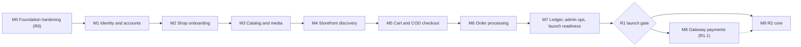

# Roadmap and Backlog

Status: Draft v1 (lite, 2026-09-30)

Reviewed: 2026-09-30 · consistency review 2026-09-30 to 2026-10-04

This document turns the reviewed documentation set into a delivery plan for a team of one or two developers [Confirmed Q1]. It defines the milestones M0 to M9 (ID, name, release, goal, scope, order and exit criteria), the order in which they depend on each other, the R2 and R3 backlog, and where the items other documents handed to planning land. It does not restate rules: every scope line points to the section that specifies the behaviour, and every exit criterion names test IDs from the [10 §6](10-testing-and-quality-gates.md#6-test-id-registry) registry. Capacity is unknown, so there are no calendar dates; effort is given in relative sizes.

Related documents: [00 Context](00-context-assumptions-and-questions.md) · [01 Requirements](01-product-requirements.md) · [02 Journeys](02-user-journeys-and-acceptance-criteria.md) · [03 Architecture](03-system-architecture.md) · [04 Domain model](04-domain-model-and-data-dictionary.md) · [04a Tables](04a-data-dictionary-tables.md) · [05 Lifecycles](05-order-payment-and-inventory-lifecycles.md) · [06 API](06-api-design.md) · [07 Security](07-security-threat-model-and-permissions.md) · [08 UI](08-ui-ux-and-design-system.md) · [09 Code standards](09-code-structure-and-engineering-standards.md) · [10 Testing](10-testing-and-quality-gates.md) · [11 Operations](11-deployment-and-operations.md) · [Risks and open decisions](risks-and-open-decisions.md) · [ADRs](adr/README.md)

Labels follow [00 §1.2](00-context-assumptions-and-questions.md#12-evidence-labels).

## 1. Scope and how to read this document

This lite version is enough to start M0 and to cut each milestone into tickets; [§8](#8-expanding-this-document) lists what the full version adds.

- **12 owns** the milestone definitions, the dependency order, the R2 and R3 backlog, the scheduling of work that other documents hand over, and the requirement-to-test traceability (FR and AC to test IDs, with the REG IDs of [01 §9](01-product-requirements.md#9-regulatory-and-compliance-requirements)); the traceability matrix is built in the full version ([§8](#8-expanding-this-document)). Other documents cite milestones by ID; this document defines them. Release scope belongs to [01 §5](01-product-requirements.md#5-release-phases-mvp-scope-and-non-goals), and the decision gates to [risks §5](risks-and-open-decisions.md#5-decisions-that-block-implementation-by-milestone), which this document follows.
- **Milestone names** are the ones the documents already use ([00 §7.3](00-context-assumptions-and-questions.md#73-what-blocks-which-milestone)). Where two documents disagreed about which milestone owns something, this document decides and records the decision in the Consistency notes.
- **Reading order for a developer:** §3 for the whole plan, §4 for M0 (the next piece of work), the milestone's subsection in §5 when it starts.

## 2. Planning principles

### 2.1 Dependency-ordered vertical slices

After M0, every milestone delivers whole journeys: the API operations, pages, jobs and tests for a set of FRs, on a schema the M0 baseline already created. The order follows the data: accounts, then shops, products, storefront, cart, orders, money and the gateway. Nothing is built as a layer for later use. With two developers, the next milestone's page work may overlap the current milestone's backend once the operations are fixed in [openapi.yaml](openapi.yaml) [Assumption].

### 2.2 Effort sizes

All sizes are estimates in ideal developer-weeks (focused work by one developer, before meetings and support) [Assumption: estimate; recalibrated after M0, §8].

| Size | Ideal developer-weeks | Typical content                                                    |
| ---- | --------------------- | ------------------------------------------------------------------ |
| S    | under 1               | One operation or job with its tests                                |
| M    | 1 to 3                | One journey on existing foundations                                |
| L    | 3 to 6                | Several journeys, new pages and jobs                               |
| XL   | 6 to 12               | A milestone with a new subsystem, or foundations used by all later |

### 2.3 Definition of ready

- **Milestone.** The previous milestone has exited, or the tech lead accepts named leftovers in writing. Every "blocks code" decision of [risks §5](risks-and-open-decisions.md#5-decisions-that-block-implementation-by-milestone) for it is Decided, or its safe default is recorded as accepted.
- **Ticket.** It cites the document section it implements (operation, table, job, page or check), the AC IDs it satisfies and the test IDs that prove it. An unknown carries an OD or VX pointer instead of a placeholder.

### 2.4 Definition of done

- **Ticket.** Merged through the required checks of [10 §5.1](10-testing-and-quality-gates.md#51-every-pull-request-ciyml); the named tests exist, pass and carry their AC IDs in the title ([10 §6.1](10-testing-and-quality-gates.md#61-naming-and-numbering-rules)); the pull request template is complete ([09 §11.5](09-code-structure-and-engineering-standards.md#115-pull-request-template-and-review-checklist)); a behaviour that differs from a document changes that document in the same pull request ([00 §1.5](00-context-assumptions-and-questions.md#15-how-a-decision-changes)).
- **Milestone exit review.** Held by the product owner and tech lead and recorded in the milestone's epic:
  1. Every exit criterion in this document is green on `main`.
  2. Every "blocks exit" item of risks §5 is resolved.
  3. ADR statuses match the OD and VX register ([ADR-0001](adr/0001-record-architecture-decisions.md)).
  4. The journeys the milestone completes pass the [02 §7](02-user-journeys-and-acceptance-criteria.md#7-journey-completion-checklist) checklist.
  5. Every leftover is moved to a named milestone or to §6 with an owner.

### 2.5 How decisions gate a milestone

Risks §5 is authoritative. "Blocks code" means decided before the milestone's first feature pull request merges ("M*n* start"); "blocks exit" means decided before its exit review ("M*n* exit"). These two events are the anchors for every latest responsible moment in [risks §1.6](risks-and-open-decisions.md#16-latest-responsible-moment-and-safe-defaults). At the weekly review ([risks §1.4](risks-and-open-decisions.md#14-review-cadence)) the tech lead names the next anchor and the decisions due before it.

### 2.6 From milestone to tickets

One epic per scope group (the E rows of §4 and the scope bullets of §5), keyed `M<n>-E<k>`. Tasks inside an epic are one operation, job, page, migration or CI check each; each task links its section and test IDs. A needed test without an ID is registered in [10 §6](10-testing-and-quality-gates.md#6-test-id-registry) in the same pull request. Business tasks (answers from counsel, the accountant or a provider) get their own tickets owned by the product owner.

### 2.7 Scope control

R1 scope is [01 §5.2](01-product-requirements.md#52-r1-mvp-scope). Adding anything to a milestone names what moves out (R-12). Findings from the monthly operations review ([11 §13.6](11-deployment-and-operations.md#136-monthly-operations-review)) enter §6 with an owner. When an FR, test or milestone assignment moves, this document changes with it ([risks §1.5](risks-and-open-decisions.md#15-recording-a-decision)).

## 3. Releases and milestones at a glance

| ID  | Name                                     | Release   | Goal                                                                                                   | Depends on       | Blocking decisions (risks §5)                                                                                                                                                                 | Effort (estimate) |
| --- | ---------------------------------------- | --------- | ------------------------------------------------------------------------------------------------------ | ---------------- | --------------------------------------------------------------------------------------------------------------------------------------------------------------------------------------------- | ----------------- |
| M0  | Foundation hardening                     | R0        | Every high RF closed or guarded; CI gate; schema re-baseline; safe bootstrap                           | —                | None open: OD-01, OD-12, OD-13, OD-23 and OD-25 were decided on 2026-09-30 (the OD-25 spike runs first)                                                                                       | XL                |
| M1  | Identity & accounts                      | R1        | Sign-up, verification, login, recovery, addresses; staff TOTP; user suspension                         | M0               | Code: OD-24, OD-50. Exit: OD-08, OD-39, VX-14, VX-10, VX-03                                                                                                                                   | L                 |
| M2  | Shop onboarding & membership             | R1        | Existing users apply, admins review, approved shops set up profile, delivery, staff and payout account | M1               | Code: OD-16, OD-48, OD-49 (OD-47 decided 2026-10-01); OD-22 if kit blocks are wanted. Exit: OD-04 rate, OD-05, OD-11, VX-02, VX-10, VX-13 before any kit file                                 | L                 |
| M3  | Catalog authoring & media                | R1        | Products with variants, images, disclosures and stock; moderation                                      | M2               | Code: OD-15, OD-20, OD-21. Exit: VX-02                                                                                                                                                        | XL                |
| M4  | Storefront discovery                     | R1        | Server-rendered listings, search, product and shop pages within budgets                                | M3               | Code: VX-12; OD-22 if kit blocks are wanted. Exit: VX-13 if any kit file is used                                                                                                              | L                 |
| M5  | Cart & COD checkout                      | R1        | Server cart and one idempotent multi-shop COD order without oversell                                   | M4               | Code: OD-04 basis. Exit: OD-18, VX-15 FX route (before the staging server)                                                                                                                    | L                 |
| M6  | Order processing & fulfillment           | R1        | Accept, ship, deliver, collect, return to origin; tracking; support cases and returns                  | M5               | Code: OD-17, OD-19, OD-45. Exit: OD-06, OD-07, OD-26, OD-29, OD-30, OD-32, VX-03, VX-04                                                                                                       | XL                |
| M7  | Ledger, admin ops & launch readiness     | R1 (gate) | Ledger, remittances, refunds, admin operations, proven operations; the R1 launch gate passes           | M6               | Code: OD-05, OD-14, OD-33 to OD-35, OD-37, OD-38, OD-45, OD-46, OD-49. Exit: OD-09, OD-11, OD-26, OD-27 (COD), OD-43, OD-44, OD-52, OD-07 published, VX-02, VX-04, VX-05, VX-08, VX-09, VX-15 | XL                |
| M8  | Gateway payments                         | R1.1      | One wallet gateway, gateway refunds, reconciliation, vendor payouts                                    | M7               | Code: OD-02, OD-03, VX-01, VX-06 or VX-07, OD-28, OD-31, OD-33, OD-41, OD-42, OD-49. Exit: OD-27, OD-36, VX-05, OD-06 hold revision, OD-14 revisited, OD-30, OD-46                            | L                 |
| M9  | Returns, reviews, wishlist, coupons, SMS | R2        | Self-serve returns, reviews, wishlist, platform coupons, SMS and phone OTP                             | M7 (M8 normally) | Code: OD-40, OD-51, OD-53, OD-54. Exit: VX-14 (SMS), VX-11 re-check; R-23 if the Nepali UI joins                                                                                              | XL                |

R1 (M0 to M7) is roughly 40 to 70 ideal developer-weeks [Assumption: estimate]. The R1 launch is the M7 exit; `checkout_enabled` stays off in production until then ([11 §2.5](11-deployment-and-operations.md#25-production)).

M9 normally follows M8 ([01 §5.1](01-product-requirements.md#51-release-phases)), but nothing in it needs the gateway: if OD-02 or OD-03 hold M8 back, M9 may start after the launch (the dotted edge).

## 4. M0 Foundation hardening (R0), ready to start

**Goal.** Make the repository safe to build on: close or guard every high finding, put a blocking CI gate and a real test database in place, replace the 26 exploratory migrations with the reviewed baseline, and remove the unsafe defaults, before the first feature pull request. The application code has not changed since the audited commit `0282605`: there is no `.github` directory, there are 26 migration files, and `package.json` still lists `D` and `better-sqlite3` [Verified-repo]. Evidence for each finding is in [00 §4.6](00-context-assumptions-and-questions.md#46-consolidated-repository-findings-rf-01--rf-47) and [research: repository-audit](research/repository-audit.md).

### 4.1 Epics and order

| Epic                                   | Scope                                                                                                                                                                                                                                                                                                                                                                                                                                                                                                                                                                                                                                 | Specified in                                                                                                                                                                                                                                                                                                                                                                                                                                                                                                                                                                                                                         | Tests                                                                                                                                                                                                        | Order                 |
| -------------------------------------- | ------------------------------------------------------------------------------------------------------------------------------------------------------------------------------------------------------------------------------------------------------------------------------------------------------------------------------------------------------------------------------------------------------------------------------------------------------------------------------------------------------------------------------------------------------------------------------------------------------------------------------------- | ------------------------------------------------------------------------------------------------------------------------------------------------------------------------------------------------------------------------------------------------------------------------------------------------------------------------------------------------------------------------------------------------------------------------------------------------------------------------------------------------------------------------------------------------------------------------------------------------------------------------------------ | ------------------------------------------------------------------------------------------------------------------------------------------------------------------------------------------------------------ | --------------------- |
| E1 Decisions and spikes                | OD-25 Inertia upgrade spike, 2–3 days and time-boxed (OD-01, OD-12, OD-13 and OD-25 were decided on 2026-09-30); `T-ARCH-004` pg-boss transactional send, including the `pgboss` schema install under the migrator role and the queue policies of 03 §9 (keyed `stately` sends, a running job's successor accepted, a sweeper re-send refused while one is queued, `standard` queues with no `singletonKey`); `SELECT uuidv7()` on `postgres:18.4` and the managed cluster; the other M0 checks 09 lists (Bouncer or plain policies, Tuyau `validationErrorType`, `rawQuery` result shape, the no-model-in-response hook, update bot) | [risks §5](risks-and-open-decisions.md#5-decisions-that-block-implementation-by-milestone), [09 §10.5](09-code-structure-and-engineering-standards.md#105-the-inertia-v5-upgrade-od-25), [03 §10.1](03-system-architecture.md#101-transactional-send-the-job-table-is-the-outbox), [03 §9](03-system-architecture.md#9-asynchronous-work), [11 §8.5](11-deployment-and-operations.md#85-overlap-and-singleton-rules), [ADR-0010](adr/0010-postgres-jobs-pg-boss-transactional-send.md), [04 §2.1](04-domain-model-and-data-dictionary.md#21-identifiers), [11 §6.1](11-deployment-and-operations.md#61-where-and-how-migrations-run) | `T-ARCH-004`                                                                                                                                                                                                 | First days            |
| E2 CI and quality gates                | `ci.yml` with the stages of 10 §5.1 and the subset of 10 §5.4 required on `main`; branch protection; PR template; ESLint rewrite clearing today's lint and typecheck errors; hooks; `release.yml` up to the image push                                                                                                                                                                                                                                                                                                                                                                                                                | [10 §5](10-testing-and-quality-gates.md#5-ci-quality-gates), [11 §5.2](11-deployment-and-operations.md#52-workflows), [09 §11](09-code-structure-and-engineering-standards.md#11-lint-format-typecheck-and-review), [09 §4.5](09-code-structure-and-engineering-standards.md#45-ci-checks-that-keep-the-contracts-in-sync)                                                                                                                                                                                                                                                                                                           | `T-ARCH-001` (with `T-SEC-016`, its outbound-HTTP rule), `T-ARCH-016`, `T-ARCH-021`, `T-ARCH-029`, `T-ARCH-030`, `T-ARCH-033`, `T-UI-029`, `T-SEC-025`, `T-SEC-026`, `T-SEC-038`, `T-API-009` to `T-API-011` | Week 1 onward         |
| E3 Test harness and test database      | `dripnepal_test` with the boot guard (first), two roles, runner setup, `@japa/api-client`, Ajv, Playwright; factories rewritten; concurrency suite and its self-test; browser smoke                                                                                                                                                                                                                                                                                                                                                                                                                                                   | [10 §3](10-testing-and-quality-gates.md#3-test-layers-and-tooling), [09 §8.8](09-code-structure-and-engineering-standards.md#88-seeders-reference-data-versus-development-data)                                                                                                                                                                                                                                                                                                                                                                                                                                                      | `T-ARCH-031`, `T-ARCH-032`                                                                                                                                                                                   | Week 1 onward         |
| E4 Schema re-baseline                  | Tag `pre-baseline`; delete the 26 files; 14 baseline files in the foreign-key-safe order of 04 §20.2.2 (extensions, logistics reference, identity, platform, shops, media, catalog, cart, orders, inventory, payments, ledger, support and notifications, grants); `app/modules/` with `platform` and `audit` first ([09 §1.5](09-code-structure-and-engineering-standards.md#15-current-code--target-structure)); `schemaGeneration`; reference seeders; models and constants rewritten; int8 parser and `sumMinor`; migration-lock script; extension allow-list                                                                     | [04 §20.2](04-domain-model-and-data-dictionary.md#202-re-baseline-procedure-adr-0011-od-01), [ADR-0011](adr/0011-schema-rebaseline-before-production.md), [09 §8](09-code-structure-and-engineering-standards.md#8-migrations-and-seeders), [ADR-0007](adr/0007-money-integer-minor-units.md)                                                                                                                                                                                                                                                                                                                                        | `T-ARCH-010` to `T-ARCH-015`, `T-ARCH-017`, `T-ARCH-022`, `T-ARCH-034`                                                                                                                                       | After E1              |
| E5 Error contract and request IDs      | Exception handler rewrite, code registry, `toProblem()`, error pages showing `request_id`; `request_context` and `access_log` middleware; error-tracker hook                                                                                                                                                                                                                                                                                                                                                                                                                                                                          | [ADR-0018](adr/0018-error-contract-problem-details.md), [06 §5](06-api-design.md#5-error-contract), [06 §11](06-api-design.md#11-correlation-and-request-ids), [09 §5](09-code-structure-and-engineering-standards.md#5-error-handling), [09 §7.4](09-code-structure-and-engineering-standards.md#74-request-id-propagation)                                                                                                                                                                                                                                                                                                         | `T-API-001`, `T-API-005`, `T-API-012`, `T-SEC-027`, `T-ARCH-026`                                                                                                                                             | Week 1 onward         |
| E6 Configuration and logging           | Env schema and cross-field policy, `.env.example`, `.gitignore`, key ring; pino redaction; no `console`; SQL debug off; database TLS and pool; `trustProxy`; health endpoints; Dockerfile                                                                                                                                                                                                                                                                                                                                                                                                                                             | [09 §6](09-code-structure-and-engineering-standards.md#6-configuration-validation-and-secrets), [09 §7](09-code-structure-and-engineering-standards.md#7-structured-logging), [11 §3.4](11-deployment-and-operations.md#34-trusted-proxy-configuration-rf-31), [11 §4.2](11-deployment-and-operations.md#42-dockerfile), [11 §7.1](11-deployment-and-operations.md#71-endpoints)                                                                                                                                                                                                                                                     | `T-ARCH-023`, `T-ARCH-024`, `T-ARCH-025`, `T-OPS-010`                                                                                                                                                        | Week 1 onward         |
| E7 Sessions, rate limits and audit log | Database session store and `dripnepal_session` cookie; the per-request account check (status and `security_stamp`); remember-me removed; limiter database store (OD-10 Resolved); login limiters; multipart parsing off and the JSON body limit; `audit_logs` writer                                                                                                                                                                                                                                                                                                                                                                  | [ADR-0005](adr/0005-session-auth-server-side-revocation.md), [07 §3.1](07-security-threat-model-and-permissions.md#31-guard-store-and-cookie), [07 §3.3](07-security-threat-model-and-permissions.md#33-the-per-request-account-check-and-the-suspension-decision), [07 §3.6](07-security-threat-model-and-permissions.md#36-login-throttling-and-generic-errors), [06 §9](06-api-design.md#9-rate-limits-and-request-size-limits), [04a §15.3](04a-data-dictionary-tables.md#153-audit_logs)                                                                                                                                        | `T-SEC-010` (stamp case), `T-SEC-011`, `T-SEC-101`, `T-SEC-102`, `T-MED-002`                                                                                                                                 | After E4              |
| E8 Safe bootstrap                      | `reference/` and `dev/` seeders with their guards; demo seeder deleted; `node ace platform:create-admin` (FR-ADM-005); release-check queries script; README development setup                                                                                                                                                                                                                                                                                                                                                                                                                                                         | [09 §8.8](09-code-structure-and-engineering-standards.md#88-seeders-reference-data-versus-development-data), [09 §9](09-code-structure-and-engineering-standards.md#9-safe-production-initialization)                                                                                                                                                                                                                                                                                                                                                                                                                                | `T-ARCH-018` to `T-ARCH-020`, `T-OPS-019`                                                                                                                                                                    | After E4              |
| E9 Routes and the membership guard     | The `/shop/:shopSlug` routes move to `/seller/{shopSlug}` (OD-12, decided 2026-09-30), behind `seller_context` (owner or active member, else 404); storefront outside `guest()`; catch-all removed; development-only routes; the registration and cart hotfixes; development Compose and CORS fixes                                                                                                                                                                                                                                                                                                                                   | [ADR-0017](adr/0017-product-urls-public-id.md), [09 §12.4](09-code-structure-and-engineering-standards.md#124-seller_context-middleware), [08 §13](08-ui-ux-and-design-system.md#13-current-ui-remediation-list), [11 §4.3](11-deployment-and-operations.md#43-development-compose-rf-43-fix-list)                                                                                                                                                                                                                                                                                                                                   | `T-SEC-005`, `T-SEC-037`, `T-SHOP-001`, `T-UI-025`, `T-UI-026`                                                                                                                                               | After E7              |
| E10 SSR and frontend foundation        | OD-25 outcome applied; SSR flags, `hydrateRoot`, SSR-only page glob, theme from a cookie; `<html lang="en">` and the `resources/lang/en` skeleton; devtools development-only; `ui/` clean-up; licence tracking file; progress-bar and `sonner` styles for CSP; the reduced-motion and toast-stacking checks of 08 §5.7 and §5.9; SSR memory measured ([11 §13.2](11-deployment-and-operations.md#132-droplet-sizing-4-gb--2-vcpu))                                                                                                                                                                                                    | [ADR-0003](adr/0003-inertia-ssr-storefront-csr-dashboards.md), [09 §13.8](09-code-structure-and-engineering-standards.md#138-ssr-safety-rules), [08 §1.2](08-ui-ux-and-design-system.md#12-theme-policy-light-by-default-dark-supported), [08 §11.8](08-ui-ux-and-design-system.md#118-localization-ready-text-and-formatting), [08 §12](08-ui-ux-and-design-system.md#12-maintaining-copied-shadcn-and-kit-components)                                                                                                                                                                                                              | `T-ARCH-002`, `T-UI-001`, `T-UI-012`, `T-UI-013`, `T-UI-024`                                                                                                                                                 | After the OD-25 spike |
| E11 CSP and headers                    | CSP in report-only mode with nonces and a `report-uri`; `encryptHistory` on authenticated surfaces                                                                                                                                                                                                                                                                                                                                                                                                                                                                                                                                    | [07 §7.3](07-security-threat-model-and-permissions.md#73-csp-and-security-headers), [07 §3.11](07-security-threat-model-and-permissions.md#311-logout-and-inertia-history)                                                                                                                                                                                                                                                                                                                                                                                                                                                           | `T-SEC-035` (report-only part)                                                                                                                                                                               | After E10             |
| E12 Removals and repository hygiene    | Remove `D`, `better-sqlite3`, the sqlite connection and the `@commercn` registry; untrack `.agents/` and `tsconfig.inertia.tsbuildinfo`; drop dead import aliases; set `"license"` in `package.json` to `"MIT"` to match `LICENSE`, keeping `"private": true` (OD-23, decided 2026-09-30)                                                                                                                                                                                                                                                                                                                                             | [09 §10.4](09-code-structure-and-engineering-standards.md#104-removals-decided-for-m0-rf-39), [09 §1.5](09-code-structure-and-engineering-standards.md#15-current-code--target-structure), [ADR-0015](adr/0015-ui-foundation-shadcn-and-kit-policy.md), [07 §7.1](07-security-threat-model-and-permissions.md#71-dependency-policy)                                                                                                                                                                                                                                                                                                  | `T-SEC-026`, `T-ARCH-027`, `T-ARCH-028`                                                                                                                                                                      | Week 1                |

Order in practice: E1 and E12 first; E3 starts with the test-database guard, because a test run today would reach the developer's database; E2, E5 and E6 in parallel; E4 as soon as the E1 spikes are done; then E7 and E8 on the baseline tables; E9, which moves the seller routes to `/seller/{shopSlug}` (OD-12); E10 once the OD-25 spike ends; E11 last. The baseline is the largest single item ([ADR-0011](adr/0011-schema-rebaseline-before-production.md) expects several days of writing and review).

### 4.2 Repository findings fixed in M0

Every RF whose fix column in [00 §4.6](00-context-assumptions-and-questions.md#46-consolidated-repository-findings-rf-01--rf-47) includes M0, with the part M0 does.

| RF    | M0 work                                                                                       | Where                                                                                                  | Epic |
| ----- | --------------------------------------------------------------------------------------------- | ------------------------------------------------------------------------------------------------------ | ---- |
| RF-01 | Membership guard on every seller route; permissions and status gates in M2                    | 09 §12.4                                                                                               | E9   |
| RF-02 | Storefront outside `guest()`; unknown paths render 404                                        | [08 §13](08-ui-ux-and-design-system.md#13-current-ui-remediation-list)                                 | E9   |
| RF-03 | Hotfix so registration stops answering 500; replaced by `/sell` in M2                         | [09 §3.14](09-code-structure-and-engineering-standards.md#314-current-code--target-layers)             | E9   |
| RF-04 | Database sessions, stamp check, remember-me removed                                           | [ADR-0005](adr/0005-session-auth-server-side-revocation.md)                                            | E7   |
| RF-05 | Demo seeder deleted; development-seeder guard; `platform:create-admin`                        | [09 §9.1](09-code-structure-and-engineering-standards.md#91-node-ace-platformcreate-admin)             | E8   |
| RF-06 | Baseline: no cascade into orders or payments; address snapshot                                | [04 §20.1](04-domain-model-and-data-dictionary.md#201-mapping-from-current-tables-to-the-baseline)     | E4   |
| RF-07 | Baseline: `orders`, `shop_orders`, `order_items`; checkout in M5                              | 04 §20.1                                                                                               | E4   |
| RF-08 | SSR build fixed, `hydrateRoot`, theme class from the server                                   | [ADR-0003](adr/0003-inertia-ssr-storefront-csr-dashboards.md)                                          | E10  |
| RF-09 | `ci.yml`, branch protection, typecheck in hooks and CI                                        | [10 §5.4](10-testing-and-quality-gates.md#54-the-smallest-gate-before-the-first-feature-code-m0)       | E2   |
| RF-10 | One storefront layout provides the cart; server cart in M5                                    | 08 §13                                                                                                 | E9   |
| RF-11 | Baseline: recipient phone no longer unique                                                    | 04 §20.1                                                                                               | E4   |
| RF-12 | Login limiters; non-credential errors rethrown; the rest in M1                                | 07 §3.6                                                                                                | E7   |
| RF-13 | Baseline: composite tenant foreign keys                                                       | 04 §20.1                                                                                               | E4   |
| RF-14 | Baseline: `inventory_items`, SKU per shop, unique combinations; screens in M3                 | 04 §20.1                                                                                               | E4   |
| RF-15 | Baseline: idempotency and refund tables; used in M5 and M8                                    | 04 §20.1                                                                                               | E4   |
| RF-16 | Baseline: `bigint` paisa; server pricing in M5                                                | ADR-0007                                                                                               | E4   |
| RF-17 | Baseline: product names per shop, `draft` default, foreign keys; screens in M3                | 04 §20.1                                                                                               | E4   |
| RF-20 | Baseline: `platform_staff`, `shop_memberships`, roles in code; completed in M2                | [ADR-0006](adr/0006-authorization-platform-roles-shop-memberships.md)                                  | E4   |
| RF-23 | Baseline: status vocabularies with CHECKs                                                     | 04 §20.1                                                                                               | E4   |
| RF-24 | Baseline: soft-delete rules enforced                                                          | 04 §20.1                                                                                               | E4   |
| RF-25 | `<html lang="en">` and the catalog skeleton; formatters in M4                                 | 08 §13                                                                                                 | E10  |
| RF-26 | Page-prop logging and SQL-binding debug removed; `no-console`                                 | [09 §7.5](09-code-structure-and-engineering-standards.md#75-no-console-rf-26)                          | E6   |
| RF-30 | Devtools development-only; duplicate CSS imports and Geist removed; images in M4              | [08 §10.5](08-ui-ux-and-design-system.md#105-fonts)                                                    | E10  |
| RF-31 | `trustProxy`, database TLS and pool, health endpoints, Dockerfile; monitoring in M7           | 11 §3.4, §7.1                                                                                          | E6   |
| RF-32 | `dripnepal_test` with the boot guard                                                          | [10 §3.2](10-testing-and-quality-gates.md#32-the-test-database)                                        | E3   |
| RF-33 | Env schema complete, `.env.example`, env files ignored, build artefact untracked              | 09 §6                                                                                                  | E6   |
| RF-34 | CSP report-only and history encryption; CSP enforced in M7                                    | 07 §7.3                                                                                                | E11  |
| RF-35 | Multipart parsing off on every route                                                          | [ADR-0013](adr/0013-media-direct-upload-async-processing.md)                                           | E7   |
| RF-36 | Handler never sends raw messages; owner fields out of the shop transformer; signup M1         | [09 §5.5](09-code-structure-and-engineering-standards.md#55-never-leak-raw-messages-rf-36)             | E5   |
| RF-39 | `D`, `better-sqlite3`, sqlite connection and `@commercn` removed                              | 09 §10.4                                                                                               | E12  |
| RF-40 | Debug, mock and design-system routes development-only                                         | 08 §13                                                                                                 | E9   |
| RF-41 | Baseline: generated timestamps, no constant imports; lock script                              | [09 §8.4](09-code-structure-and-engineering-standards.md#84-applied-migrations-are-never-edited-rf-41) | E4   |
| RF-42 | README matches the code; `package.json` says MIT like `LICENSE` (OD-23); `.agents/` untracked | [09 §9.4](09-code-structure-and-engineering-standards.md#94-current-code--target-initialization)       | E12  |
| RF-43 | Compose hardened and pinned; development CORS allowlist                                       | 11 §4.3                                                                                                | E9   |
| RF-45 | Baseline: indexes that match the query patterns                                               | 04 §20.1                                                                                               | E4   |
| RF-47 | Frontend CI checks only; dead UI removed in M4 (Consistency note 1)                           | 08 §13                                                                                                 | E2   |

### 4.3 Exit criteria

1. `main` is protected and `ci.yml` blocks on the [10 §5.4](10-testing-and-quality-gates.md#54-the-smallest-gate-before-the-first-feature-code-m0) gate: `T-ARCH-021`, `T-UI-029`, `T-ARCH-001`, `T-ARCH-016`, `T-ARCH-023`, `T-ARCH-029`, `T-ARCH-030`, `T-ARCH-033`, `T-SEC-025`, `T-SEC-026`, `T-SEC-038`, `T-API-009`, `T-API-010`, `T-API-011`, `T-SEC-014` (the email-template grep part, 09 §11.2; the rest of `T-SEC-014` is in the M3 exit) (kit and licence checks `T-ARCH-027`, `T-ARCH-028`, `T-UI-024` once their files exist).
2. The baseline is merged after the review ADR-0011 requires, with `T-ARCH-010`, `T-ARCH-011`, `T-ARCH-012`, `T-ARCH-013`, `T-ARCH-014`, `T-ARCH-015`, `T-ARCH-022`, `T-ARCH-031` and `T-ARCH-034` green and the `T-ARCH-017` script running in file-name mode ([09 §8.4](09-code-structure-and-engineering-standards.md#84-applied-migrations-are-never-edited-rf-41)). Tests run on `dripnepal_test` with the two roles of [10 §3.2](10-testing-and-quality-gates.md#32-the-test-database); the boot guard and the other environment rules pass `T-ARCH-024`.
3. The functional suite runs with the `T-API-001` hook and passes `T-API-005`, `T-API-012`, `T-SEC-027`, `T-ARCH-026`, `T-SEC-010` (stamp-mismatch case), `T-SEC-011`, `T-SEC-101`, `T-SEC-102`, `T-MED-002`, `T-SEC-005`, `T-SEC-037`, `T-SHOP-001`, `T-UI-025` and `T-UI-026`; the report-only CSP header with nonces and `report-uri` passes the report-only part of `T-SEC-035`.
4. The concurrency suite runs with `T-ARCH-032`.
5. Every pull request builds the image and passes `T-ARCH-002`, `T-OPS-010`, `T-ARCH-025`, `T-UI-001`, `T-UI-012` (first bundle size recorded) and `T-UI-013`, plus the browser smoke home → product → cart → checkout.
6. Seeders and bootstrap pass `T-ARCH-018`, `T-ARCH-019`, `T-ARCH-020` and `T-OPS-019`.
7. The `T-ARCH-004` result is recorded in [ADR-0010](adr/0010-postgres-jobs-pg-boss-transactional-send.md) (confirmed, or the `outbox_events` fallback adopted), together with the check that the `pgboss` schema step, run by the release step as the migrator, serves pg-boss instances started with migration disabled ([11 §6.1](11-deployment-and-operations.md#61-where-and-how-migrations-run)), the check of the 03 §9 queue policies that [11 §8.5](11-deployment-and-operations.md#85-overlap-and-singleton-rules) assumes (keyed `stately` sends, a running job's successor accepted, a sweeper re-send refused while one is queued, `standard` queues with no `singletonKey`), and the `uuidv7()` result in 04 §2.1.
8. The 11 high findings are closed or guarded, and every row of §4.2 is done.
9. OD-01, OD-12, OD-13, OD-23 and OD-25 were decided on 2026-09-30; the OD-25 spike outcome is recorded in the register and in an ADR ([risks §1.5](risks-and-open-decisions.md#15-recording-a-decision) step 2); ADR-0011 is Accepted and every ADR status matches the register.
10. A fresh clone completes the local setup of [11 §4.4](11-deployment-and-operations.md#44-local-setup-in-five-commands) and runs the suites green.
11. `T-ARCH-030` runs on every pull request and blocks from M0, in the Repository stage of [10 §5.1](10-testing-and-quality-gates.md#51-every-pull-request-ciyml) (10 §5.4 item 6). It only warns if the consistency review's final cross-document check still finds a local reference in `docs/` when M0 builds `ci.yml`, and only until that reference is gone.

### 4.4 Dependencies, blocking decisions, business track and effort

- **Depends on:** nothing; M0 is the first milestone and starts now.
- **Blocks code:** nothing open. OD-01 (re-baseline), OD-12 (`/seller/{shopSlug}`), OD-13 (snake_case) and OD-25 (upgrade spike in the first days, before RF-08) were decided on 2026-09-30. **Blocks exit:** nothing open; OD-23 (keep MIT) was decided the same day. OD-10 is Resolved. If the OD-25 spike fails, M0 stays on `@adonisjs/inertia` 4.2.0 ([risks §5](risks-and-open-decisions.md#5-decisions-that-block-implementation-by-milestone)).
- **Business track (product owner):** book the counsel and accountant engagements that must happen before M2 ([risks §3.2](risks-and-open-decisions.md#32-question-packs-by-verifier)); start the VX-15 card and FX question with the bank, needed before the staging server in M5 ([11 §1.8](11-deployment-and-operations.md#18-paying-for-it-from-nepal-r-32-vx-15)); ask the VX-13 question only if kit blocks are wanted (OD-22).
- **Effort:** XL [Assumption: estimate 8 to 12 ideal developer-weeks]; E4 alone is L.

## 5. Milestones M1 to M9

Each subsection gives the goal, the scope with its FR IDs and pointers, what is out of scope, the dependencies, the decisions from risks §5, the exit criteria with test IDs, and the effort.

### 5.1 M1 Identity & accounts (R1)

**Goal.** Customers sign up, verify their email, log in and out, recover their account and keep a Nepal address book; platform staff sign in with mandatory TOTP; a suspension takes effect on the next request.

**Scope.**

- Accounts: FR-IAM-001 to FR-IAM-005, FR-IAM-013, and the deletion request of FR-IAM-009 (J-04, J-18; operations in [06 §13.3](06-api-design.md#133-auth-and-self)). Account emails FR-NOT-001 through the email port and the `notifications.*` and `identity.revoke_sessions` jobs ([03 §9](03-system-architecture.md#9-asynchronous-work)).
- Addresses: FR-IAM-012 on the location seeds of [04 §21](04-domain-model-and-data-dictionary.md#21-reference-data-proposals) (VX-10), with `AddressForm` and `NepalPhoneInput` ([08 §4.3](08-ui-ux-and-design-system.md#43-dripnepal-owned-composed-components)) and phone encryption with a blind index ([04 §2.9](04-domain-model-and-data-dictionary.md#29-sensitive-column-encryption-and-blind-indexes)).
- Staff and suspension: FR-IAM-006, FR-IAM-007, FR-ADM-002, FR-ADM-004 (J-17 user part); the MFA enrolment path of `platform:create-admin`; the admin user pages of [08 §2.6](08-ui-ux-and-design-system.md#26-admin-admin) (anonymisation follows in M7), with the staff contact reveal `revealUserContact` (proposed; [06 §13.8](06-api-design.md#138-proposed-operations), [07 §5.5](07-security-threat-model-and-permissions.md#55-encryption)).
- Legal pages: the terms of use and privacy notice pages (`/legal/{documentSlug}`, [08 §2.2](08-ui-ux-and-design-system.md#22-storefront-and-public-pages)) ship with draft versions, so the sign-up page links them and records the versions shown (AC-FR-IAM-001-6); their final texts follow in M7 (gate G4; cross-document check decision, 2026-10-01).
- RF halves: RF-12 (auth audit rows, 128-character passwords, label), RF-22 (email normalisation), RF-28 (auth-page labels, [08 §3.4](08-ui-ux-and-design-system.md#34-existing-repository-screens-and-what-happens-to-them)), RF-29 (77 districts, phone rule), RF-36 (no spread-payload sign-up), RF-37 (`forwardQueryString: false`, `return_to`), RF-38.
- Contract: `ApiSerializer` emits `meta` ([06 §3.4](06-api-design.md#34-envelopes-and-the-existing-apiserializer)); API route names equal `operationId`; the 403 page ([08 §8.3](08-ui-ux-and-design-system.md#83-errors)).
- Checks left to M1: session tag after `login()` and the unknown-email dummy hash ([07 §3.1](07-security-threat-model-and-permissions.md#31-guard-store-and-cookie)); scrypt re-benchmark ([ADR-0005](adr/0005-session-auth-server-side-revocation.md)).

**Out of scope.** Phone OTP and owner MFA (R2), social login (R3), executing an anonymisation (`anonymizeUser`, M7).

**Depends on.** M0. **Decisions.** Code: OD-24, OD-50 (MFA lock scope). Exit: OD-08 with VX-14 (test mail reaches Gmail and a Nepali ISP mailbox, gate G9), VX-10, VX-03, OD-39 (login limiter). Safe defaults: Mailpit, an unticked 18+ confirmation, the per-account `mfa_user` lock of 07 §3.9, the existing login limiters.

**Exit criteria.** `T-SEC-003` (sign-up fields), `T-SEC-006` (addresses), `T-SEC-008` (staff TOTP and admin gates), `T-SEC-009`, `T-SEC-010` (full), `T-SEC-011`, `T-SEC-012`, `T-SEC-013`, `T-SEC-017`, `T-SEC-034`, `T-SEC-036`, `T-IAM-103`, `T-IAM-104`, `T-IAM-105`, `T-IAM-107` to `T-IAM-110`, `T-IAM-112`, `T-API-002`, `T-API-006`, `T-API-008`, `T-ARCH-003`, `T-NOT-001`, `T-NOT-101`, `T-UI-005`, `T-UI-022`; J-04 passes 02 §7 except AC-J04-07, which needs `applyForShop` (M2) and `placeOrder` (M5) and passes at M5; J-18 passes 02 §7, and the J-17 user part passes it except the grievance contact of steps 2 and 4 (FR-ADM-011, M7), `adminCancelShopOrder` (M7) and the open-order listing (M5) of step 3, and the shop-owner case of AC-J17-10 (shops M2, orders M5), which pass at M6 or, for the M7 steps, at M7 (§5.6, §5.7).

**Effort.** L.

### 5.2 M2 Shop onboarding & membership (R1)

**Goal.** A verified user applies to open a shop (several per owner), an admin approves or rejects it, and the approved shop sets up its profile, delivery zones and rates, staff and payout account. No product can be listed yet.

**Scope.**

- Application and review: FR-SHOP-001, FR-SHOP-002, FR-SHOP-013, FR-SHOP-014 (J-08, J-16 shop part); the seller agreement stays a draft v0 until OD-04, OD-05 and OD-11 are Decided; the shop-application queue of FR-ADM-001. Before approval, the owner of a `pending_review` or `rejected` shop sets up delivery coverage and rates with `getShopShipping` and `replaceShopShipping` (OD-47, decided 2026-10-01) and uploads the logo and banner (`createMediaUpload` and `completeMediaUpload` with the `shop_logo` and `shop_banner` kinds; product owner decision 2026-10-01), as [07 §4.4](07-security-threat-model-and-permissions.md#44-status-gating) allows. The owner accepts a new seller agreement version with `acceptSellerAgreement` (proposed; [06 §13.8](06-api-design.md#138-proposed-operations)) from a banner on the seller overview ([08 §2.5](08-ui-ux-and-design-system.md#25-seller-dashboard-sellershopslug)).
- Shop settings: FR-SHOP-003, FR-SHOP-004 (coverage and zone rates), FR-SHOP-010 (capture and `verifyPayoutAccount`), FR-MED-003 (logo and banner). Finance verifies payout accounts on `/admin/payouts`, its own page, which opens here with `revealPayoutAccountForVerification` (proposed, OD-49) and `verifyPayoutAccount` under `platform.payouts.approve` ([07 §4.5](07-security-threat-model-and-permissions.md#45-operation--permission-condensed); cross-document check decision, 2026-10-01); payouts themselves stay in M8.
- Membership: FR-SHOP-005, FR-SHOP-006 (J-09); `seller_context` gains permissions and status gates ([07 §4.3](07-security-threat-model-and-permissions.md#43-shop-roles-and-permissions), [07 §4.4](07-security-threat-model-and-permissions.md#44-status-gating)); the `seller_shops` prop.
- Admin: FR-SHOP-007 (J-17 shop part), FR-SHOP-012, admin `closeShop` ([06 §13.8](06-api-design.md#138-proposed-operations); owner closure is R2).
- Media: the FR-MED-001 direct-upload pipeline ([ADR-0013](adr/0013-media-direct-upload-async-processing.md), [03 §7.5](03-system-architecture.md#75-media-upload-pipeline-j-10-fr-med-001-adr-0013)) is built here for KYC documents (FR-SHOP-014), logos and banners: `createMediaUpload`, `completeMediaUpload`, `media.process_upload` with `sharp` ≥ 0.35.4 ([09 §10.6](09-code-structure-and-engineering-standards.md#106-sharp--0354)), `media.cleanup_abandoned`, the private bucket and audited signed views; MinIO in development (Consistency note 4).
- UI: `DataTable`, `sidebar`, `ShopSwitcher` ([08 §4](08-ui-ux-and-design-system.md#4-component-inventory)). RF halves: RF-01, RF-03, RF-20, RF-21, RF-22 (slugs), RF-29 (shop form), RF-44.

**Out of scope.** Products (M3), payouts (M8), owner closure and ownership transfer (R2).

**Depends on.** M1. **Decisions.** Code: OD-16; OD-48 (suspended-shop routes) and OD-49 (the verification reveal); OD-22 only if kit dashboard blocks are wanted. OD-47 (shipping before approval) was decided on 2026-10-01, option (a), and no longer blocks. Exit: OD-04 rate, OD-05 and OD-11 (all in the agreement text), VX-02, VX-10 (coverage), VX-13 before any kit file is committed. No vendor accepts an agreement before OD-04, OD-05 and OD-11 are Decided. Safe default for OD-48 and OD-49: 07 §4.4 and §5.5 as proposed. Business track: the first counsel and accountant engagements ([risks §3.2](risks-and-open-decisions.md#32-question-packs-by-verifier)); at least 10 target shops interviewed during onboarding to test problem P1 ([01 §2.2](01-product-requirements.md#22-the-problem-we-are-solving)).

**Exit criteria.** `T-SEC-001`, `T-SEC-005`, `T-SEC-007`, `T-SEC-019`, `T-SEC-030`, `T-SEC-031`, `T-SEC-032`, `T-SHOP-001`, `T-SHOP-101` to `T-SHOP-110`, `T-MED-102`, `T-MED-103`, `T-MED-003`, `T-MED-001` and `T-SEC-018` for the upload kinds M2 uses, `T-UI-006`, `T-UI-007`, `T-UI-018`, `T-SHOP-005` (verification-reveal case), `T-API-003` (the first cursor lists, [06 §6.2](06-api-design.md#62-cursors-everything-else)); J-08 passes 02 §7 except AC-J08-06, which needs `createProduct` (M3) and the public shop page `getPublicShop` (M4) and passes at M4; J-09 passes it except AC-J09-04, which needs `acceptShopOrder` (M6) and passes at M6; the J-17 shop part passes for a shop without open orders (its listing and order ACs pass at M6, §5.6).

**Effort.** L.

### 5.3 M3 Catalog authoring & media (R1)

**Goal.** Shop staff create products with 0 to 2 variant axes, images, legal disclosures and stock; moderators approve, reject or block them; a published product gets a listing row.

**Scope.**

- Reference data: FR-CAT-001 and FR-CAT-002 seeded ([04 §21](04-domain-model-and-data-dictionary.md#21-reference-data-proposals), OD-15); FR-CAT-008 brands (OD-21, brands `pending` until approved).
- Authoring: FR-CAT-003, FR-CAT-004, FR-CAT-007, FR-CAT-011, FR-CAT-012 and the compare-at validation of FR-PROMO-001 (J-10); the vertical slice of [09 §12](09-code-structure-and-engineering-standards.md#12-vertical-slice-vendor-product-creation-createproduct) is the template.
- Moderation: FR-CAT-005, FR-CAT-006, `unblockProduct`; the review mode of OD-20; the moderation queue of FR-ADM-001 (J-16 product part).
- Media: FR-MED-001 extended from M2 to product images with their derivative widths, and FR-MED-002 (`replaceProductMedia`: order, alt text, colour); image-processing memory measured ([11 §13.2](11-deployment-and-operations.md#132-droplet-sizing-4-gb--2-vcpu)).
- Inventory: FR-INV-001, FR-INV-003, FR-INV-005 (J-11) with `inventory.drift_check` ([05 §5.10](05-order-payment-and-inventory-lifecycles.md#510-drift-detection-and-repair)).
- Listing read model: `product_listings`, `catalog.refresh_listing`, `catalog.rebuild_listings` ([ADR-0014](adr/0014-postgres-search-and-listing-read-model.md)). RF halves: RF-14, RF-17, RF-18.
- Idempotency keys: `createProduct` is the first ⚷ operation, so the hourly `platform.purge_idempotency_keys` job ([03 §9](03-system-architecture.md#9-asynchronous-work), [06 §7.6](06-api-design.md#76-expiry-and-purge)) starts here.

**Out of scope.** Storefront pages (M4), reference-data admin UI (R2), bulk CSV and video (R3).

**Depends on.** M2. **Decisions.** Code: OD-15, OD-20, OD-21. Exit: VX-02 (the s6 listing fields, REG-06). Safe defaults: `pre` moderation for every shop.

**Exit criteria.** `T-CAT-001`, `T-CAT-002`, `T-CAT-007`, `T-CAT-101` to `T-CAT-106`, `T-CAT-108`, `T-CAT-109`, `T-MED-001` (product images), `T-MED-101`, `T-SEC-014`, `T-SEC-018`, `T-INV-001`, `T-INV-002`, `T-INV-005`, `T-INV-006`, `T-INV-101`, `T-API-004`, `T-API-007`; J-10 passes 02 §7 except the PDP check of AC-J10-03 and AC-J10-09, J-11 except AC-J11-04, and J-16 except the listing check of AC-J16-01 and AC-J16-03: the PDP and listing checks need the storefront reads `getProduct` and `listProducts` (R1·M4 in [06 §13.2](06-api-design.md#132-public)) and pass at M4 (until then the listing checks may be made on the `product_listings` row), and AC-J11-04 and AC-J16-03 need carts and `placeOrder` (M5) and pass at M5.

**Effort.** XL.

### 5.4 M4 Storefront discovery (R1)

**Goal.** Guests and customers browse category and navigation listings, filter, sort and search, open a product page with variant availability and visit shop pages, server-rendered and within the phone budgets.

**Scope.**

- FR-SRCH-001, FR-SRCH-002, FR-SRCH-003, FR-SRCH-004, FR-SRCH-005, FR-SRCH-007; display of the FR-CAT-012 disclosures and FR-PROMO-001 compare-at prices (J-01, J-02); pages of [08 §2.2](08-ui-ux-and-design-system.md#22-storefront-and-public-pages); URL state and variant rules ([08 §11.1](08-ui-ux-and-design-system.md#111-search-and-filter-url-state-and-back-navigation), [08 §11.2](08-ui-ux-and-design-system.md#112-product-variant-selection-and-unavailable-combinations)); `catalog.generate_sitemap`.
- Formatting: `formatNPR` and `formatDateTime` replace every ad-hoc call (RF-25; the "Rs" recommendation of [08 §5.11](08-ui-ux-and-design-system.md#511-money-and-numeral-display-vx-12)); the `lang="ne"` rule for vendor text; font fallback tuning; Devanagari search samples ([ADR-0014](adr/0014-postgres-search-and-listing-read-model.md)).
- Performance and accessibility: responsive images from the M3 derivatives and a light home page (RF-30), the budgets of [08 §10.1](08-ui-ux-and-design-system.md#101-budgets), axe in CI, query-plan checks; storefront fixes of RF-28.
- Clean-up: mocks deleted as pages get props (RF-27), `landing/**` and dead UI removed (RF-47), `zod` removed; shadcn CLI updated at M4 start ([00 §9.8](00-context-assumptions-and-questions.md#98-version-sensitive-decisions)).

**Out of scope.** Cart (M5), autocomplete and facet counts (R2), a search engine (R3).

**Depends on.** M3. **Decisions.** Code: VX-12 (formatter); OD-22 only if kit blocks are wanted. Exit: VX-13 if any kit file is used.

**Exit criteria.** `T-CAT-003` to `T-CAT-006`, `T-CAT-107`, `T-SEC-015`, `T-SEC-024`, `T-PERF-002`, `T-A11Y-001`, `T-UI-002`, `T-UI-003`, `T-UI-004`, `T-UI-010`, `T-UI-011`, `T-UI-014`, `T-UI-015`, `T-UI-020`, `T-UI-021`, `T-UI-023`, `T-UI-027`, `T-UI-028`, `T-UI-031`, `T-UI-032`; `T-UI-012` within budget; `T-PERF-003` reported; J-01 passes 02 §7 except AC-J01-08, which needs the launch catalogue and passes at M7 (its test is the `T-PERF-003` Lighthouse run, report only); J-02 passes it except step 6 and AC-J02-05, which need `addCartItem` (M5) and pass at M5; AC-J08-06 (§5.2), the PDP check of AC-J10-03, AC-J10-09 and the listing check of AC-J16-01 (§5.3) pass here.

**Effort.** L.

### 5.5 M5 Cart & COD checkout (R1)

**Goal.** A verified customer builds one server cart across shops, gets a quote and places one idempotent cash-on-delivery order split per shop, with no oversell and no duplicate order on a flaky network.

**Scope.**

- Cart: FR-CART-001, FR-CART-002, FR-CART-003 (J-03); guest merge at login; `cart.expire_abandoned`. RF-10, RF-19, RF-27 (cart), RF-28 (cart entry on phones).
- Checkout: FR-CHK-001, FR-CHK-002, FR-CHK-003, FR-CHK-004, FR-CHK-005, FR-CHK-007 (J-05); the `placeOrder` algorithm and lock order of [05 §4](05-order-payment-and-inventory-lifecycles.md#4-checkout-the-placeorder-algorithm); idempotency of [06 §7](06-api-design.md#7-idempotency); COD reservations committed at placement (FR-INV-002); the `checkout_enabled` check. The order-complete page reads `getMyOrder`, and the checkout recovery check of [08 §11.4](08-ui-ux-and-design-system.md#114-checkout-recovery-without-duplicate-orders) calls `listMyOrders`, so both reads ship here ([06 §13.4](06-api-design.md#134-customer)).
- Money: the commission snapshot of FR-LED-001 (OD-04 basis); server totals only (RF-07, RF-15, RF-16, RF-46). Order-placed email (FR-NOT-002).
- UI: `CartShopGroup`, `CheckoutStepper`, `OfflineBanner` and checkout recovery ([08 §11.3](08-ui-ux-and-design-system.md#113-cart-stock-and-price-changes), [08 §11.4](08-ui-ux-and-design-system.md#114-checkout-recovery-without-duplicate-orders)).
- Staging and its deploy jobs ([11 §2.4](11-deployment-and-operations.md#24-staging)); staging exists before M5 exits (Consistency note 7).

**Out of scope.** Gateway payment (M8), coupons (R2).

**Depends on.** M4 (and M1 addresses, M2 rates). **Decisions.** Code: OD-04 basis. Exit: OD-18 (limits are settings; the `T-CHK-007` refusal rule depends on it); VX-15 FX route, confirmed before the staging server is bought ([risks §5](risks-and-open-decisions.md#5-decisions-that-block-implementation-by-milestone), [11 §1.8](11-deployment-and-operations.md#18-paying-for-it-from-nepal-r-32-vx-15)). Safe default: items-only basis.

**Exit criteria.** `T-INV-003`, `T-INV-102`, `T-CART-002`, `T-CART-101`, `T-CART-102`, `T-CHK-001` to `T-CHK-010`, `T-SEC-002` (order-detail case), `T-SEC-003`, `T-SEC-006`, `T-API-007`, `T-ORD-008`, `T-ORD-101`, `T-ORD-102`, `T-ORD-104`, `T-ORD-106`, `T-ORD-107`, `T-ORD-108`, `T-UI-009`, `T-UI-016`, `T-UI-017`; the staging release step passes `T-OPS-013` and `T-OPS-014`, and staging passes `T-OPS-006` (RF-31); J-03 passes 02 §7, and J-05 passes it except AC-J05-13, whose load test `T-PERF-001` runs at M7 (G2, [10 §5.2](10-testing-and-quality-gates.md#52-release-gates)); the ACs deferred to M5 pass too: AC-J04-07 (§5.1), AC-J11-04 and AC-J16-03 (§5.3), and J-02 step 6 with AC-J02-05 (§5.4).

**Effort.** L. Business track: the VX-15 payment route is confirmed before the staging server is bought.

### 5.6 M6 Order processing & fulfillment (R1)

**Goal.** Vendors accept or reject orders, ship with tracking, and record delivery and the COD outcome; customers track and cancel; complaints and support-mediated returns have a register with deadlines.

**Scope.**

- Vendor: FR-ORD-003, FR-ORD-004 (J-12), FR-FUL-001, FR-FUL-002, FR-FUL-003, FR-PAY-001 (J-13 outcomes), FR-NOT-003; jobs `orders.acceptance_timeout`, `orders.acceptance_reminder`, `orders.cod_outcome_reminder`; customer-contact masking (FR-ORD-008, [07 §5.2](07-security-threat-model-and-permissions.md#52-vendor-visibility-of-customer-contact-data), OD-17).
- Customer: FR-ORD-001, FR-ORD-002, FR-ORD-006 (J-07) with `orders.auto_complete`; order emails FR-NOT-002.
- Shop suspension with open orders (J-17): `orders.handle_shop_suspension` ([05 §8.10](05-order-payment-and-inventory-lifecycles.md#810-shop-suspension-while-orders-remain-open)).
- Support cases: FR-ADM-009 with the 15-day clock (`platform.support_case_sla`) and its customer, seller and admin pages (J-19 up to the decision; admin cancellation and order notes of FR-ORD-005 and FR-RET-005, and the `/grievance` entry point, follow in M7; Consistency note 3).
- Support-mediated returns from request to receipt: FR-RET-006 (J-20 first half); `approveReturnRequest` sets the REG-09 refund due date. The rejection after inspection (`rejectReturnAfterInspection`, proposed in [06 §13.8](06-api-design.md#138-proposed-operations); `received` → `rejected_after_inspection` in [05 §6.6](05-order-payment-and-inventory-lifecycles.md#66-returnrequest-r1-support-created-r2-self-serve)) is built here too, because it changes no stock or money (02 AC-J20-09). The inspection close, which restocks and creates the refund (`closeReturnRequest`), follows in M7 (Consistency note 3).
- FR-ORD-007 only if OD-26 makes DripNepal the issuer of receipts or invoices (§7).

**Out of scope.** Ledger postings and refunds (M7), self-serve returns and partial shipments (R2), courier APIs (R3).

**Depends on.** M5. **Decisions.** Code: OD-17, OD-19, OD-45 (staff-opened support cases). Exit: OD-06 values, OD-07, OD-26 (receipt or invoice at `delivered` and `collected`), OD-29 (unpaid COD parcels), OD-30 (lost parcels: state and reason) and OD-32 (returns with no exit), VX-03, VX-04. Safe defaults: 30-day masking, 48 h acceptance SLA, 7-day windows, order receipt only; no staff-opened cases until OD-45; unpaid, lost or never-returned parcels stay open for support (05 §6.6, §8.9, §8.15).

**Exit criteria.** `T-ORD-001`, `T-ORD-002`, `T-ORD-003` (COD cases; the gateway refund in M8), `T-ORD-004` (COD full rejection; the gateway cases in M8), `T-ORD-005` to `T-ORD-007`, `T-ORD-009`, `T-ORD-010`, `T-FUL-001` (without the admin-cancel case, M7), `T-FUL-002`, `T-FUL-003`, `T-FUL-004` (state rules; posting once in M7), `T-FUL-005`, `T-FUL-101`, `T-INV-007` (RTO; the return path in M7), `T-SEC-002`, `T-SEC-033`, `T-PAY-102`, `T-RET-001` (without `received → closed`, M7), `T-RET-101`, `T-ADM-103`, `T-ORD-105`, `T-SEC-006` (support cases), `T-UI-008`, `T-UI-019`; J-12 and AC-J09-04 (§5.2) pass 02 §7; J-07 and J-19 pass it except their M7 steps (admin intervention, `/grievance`), and J-07 also except AC-J07-09 (R1.1, M8); J-13 and J-20 pass it except their M7 steps (the J-13 ledger postings and the admin COD correction; the J-20 `closeReturnRequest`, restock and refund) and the R1.1 clause of AC-J13-08 (M8); and J-17 passes it except its M7 steps (`adminCancelShopOrder`, `adminRecordFulfillmentEvent` and `adminRecordCodCollection` for a frozen shop's shipped parcels, and the grievance contact of FR-ADM-011) and AC-J17-08 (R1.1, M8).

**Effort.** XL.

### 5.7 M7 Ledger, admin ops & launch readiness (R1 launch gate)

**Goal.** Money owed between vendors and DripNepal is posted and reconciled, staff can run the marketplace, operations are proven, and every R1 launch gate of [01 §5.3](01-product-requirements.md#53-r1-launch-gates) passes.

**Scope.**

- Ledger: FR-LED-001 (golden example), FR-LED-002 (postings wired into the M6 transitions), FR-LED-003, FR-LED-004 (remittance recording), FR-LED-005 (J-13 ledger, J-15); `ledger.integrity_check`, `ledger.availability_digest` ([05 §7](05-order-payment-and-inventory-lifecycles.md#7-vendor-ledger-and-settlement)).
- Refunds: FR-RET-001, FR-RET-007 with maker-checker (OD-14) and `refunds.sla_monitor`, which watches the REG-09 due dates set at return approval in M6 (J-14 manual); `closeReturnRequest` with restock and refund (J-20 second half).
- Admin: FR-ORD-005, FR-RET-005, FR-ADM-001 overview, FR-ADM-003, FR-ADM-007, FR-ADM-008, FR-ADM-010 (settings, kill switch, banner), FR-ADM-011 with the `/legal` disclosures and `/grievance` pages, and the final texts of the terms and privacy pages that M1 shipped as drafts; `anonymizeUser` (FR-IAM-009).
- Retention: `platform.retention_purge` with the Ephemeral purges and the never-approved application purge with its KYC files ([11 §8.7](11-deployment-and-operations.md#87-platformretention_purge-scope)); the hourly `identity.purge_sessions` job ([03 §9](03-system-architecture.md#9-asynchronous-work)); the weekly saved query over permanent notes ([11 §9.2](11-deployment-and-operations.md#92-logs)).
- Operations: production first deploy with `checkout_enabled` off ([09 §9.3](09-code-structure-and-engineering-standards.md#93-bootstrap-checklist-first-deploy-of-an-environment)); `database/migrations.lock` created at that deploy; backups and restore drills ([11 §11](11-deployment-and-operations.md#11-backup-policy-and-verified-restore)); alerts and dashboards ([11 §9](11-deployment-and-operations.md#9-observability-and-alerting)), with the `platform.heartbeat` cron and its uptime-monitor ping ([03 §9](03-system-architecture.md#9-asynchronous-work), [11 §7.2](11-deployment-and-operations.md#72-worker-liveness)); runbooks ([11 §10](11-deployment-and-operations.md#10-runbooks)); CSP enforced (RF-34); RF-31 completed; second-provider rebuild ([11 §1.9](11-deployment-and-operations.md#19-portability-check-adopts-the-03-53-assumption)); load test.
- Business track: gates G3 to G10; provider onboarding paperwork starts (R-31); hosting prices re-read ([ADR-0016](adr/0016-hosting-single-region-portable.md)).
- Ledger adjustments above Rs 10,000: the request and its second approval of [05 §7.8](05-order-payment-and-inventory-lifecycles.md#78-adjustments), stored in `ledger_adjustment_requests` ([04a §13.5](04a-data-dictionary-tables.md#135-ledger_adjustment_requests-proposed)) and handled by `approveLedgerAdjustment` and `cancelLedgerAdjustment` ([06 §13.8](06-api-design.md#138-proposed-operations)), all proposed; `T-LED-103` checks that an approved request posts exactly one entry. This answers the question of [11 Consistency note 62](11-deployment-and-operations.md#consistency-notes-for-editor).
- Metrics: the `web` page-view counters and their 60-second flush into `page_view_daily_totals` (proposed; [04a §15.6](04a-data-dictionary-tables.md#156-page_view_daily_totals-proposed), [11 §9.4](11-deployment-and-operations.md#94-where-sm-03-and-sm-05-page-view-totals-live)), live before the launch so that SM-03 and SM-05 have daily totals from the first day, for the week-8 review of [01 §10.1](01-product-requirements.md#101-measurement-principles). The table is created in baseline file 13 ([04 §20.2.2](04-domain-model-and-data-dictionary.md#2022-baseline-files-and-their-order)) if it is adopted before M0 ends, otherwise by a new migration in M7.
- Disclosure record: `node ace audit:record-disclosure` (proposed; [09 §9.6](09-code-structure-and-engineering-standards.md#96-disclosure-record-node-ace-auditrecord-disclosure-proposed), [07 §5.7](07-security-threat-model-and-permissions.md#57-audit-log-access)) writes one `user.disclosure` audit row for each data subject of a law-enforcement disclosure (REG-24), run by the runbook of [11 §10.1](11-deployment-and-operations.md#101-conventions-shared-by-every-runbook); it is in place before the launch, and `T-SEC-039` tests it.

**Out of scope.** Gateway payments and payouts (M8).

**Depends on.** M6. **Decisions.** Code: OD-05, OD-14; OD-33, OD-34, OD-35 (with OD-07) and OD-38 (refunds); OD-37 (admin order view); OD-45 (reports and export); OD-46 (remittances and small adjustments); OD-49 (`revealRefundRecipient`, with OD-38). Exit: OD-09, OD-11, OD-26, OD-27 (COD question), OD-43, OD-44, OD-52 (before the CSP is enforced), published policies (OD-07), VX-02 (DoCSCP listing number), VX-04, VX-05, VX-08, VX-09, VX-15. No safe default: launch waits.

**Exit criteria.** `T-LED-001`, `T-LED-002`, `T-LED-003`, `T-LED-005`, `T-LED-101`, `T-LED-103`, `T-LED-104`, `T-SEC-004`, `T-RET-002`, `T-RET-005`, `T-INV-007` (return path), the M7 cases of M6 tests (§5.6: the admin-cancel case of `T-FUL-001`, the posting-once case of `T-FUL-004` and `received → closed` in `T-RET-001`), `T-PAY-009`, `T-ADM-102`, `T-IAM-106`, `T-IAM-111`, `T-SHOP-002`, `T-SHOP-003`, `T-SHOP-004`, `T-SEC-029`, `T-SEC-039`, `T-ADM-011`, `T-ADM-012`, `T-ADM-104`, `T-OPS-021`, `T-UI-033`, `T-OPS-002`, `T-OPS-015`, `T-OPS-006` once in production, the first `T-OPS-005` staging rebuild; the launch rows of [10 §5.2](10-testing-and-quality-gates.md#52-release-gates): G1 (`T-SEC-001` to `T-SEC-004`, `T-SEC-006`, `T-SEC-010`, `T-INV-003`, `T-CHK-004`, as [01 §5.3](01-product-requirements.md#53-r1-launch-gates) lists them), G2 (`T-PERF-001`, `T-A11Y-001`, `T-OPS-001`), operations readiness (`T-OPS-003`, `T-OPS-004`, `T-OPS-007` to `T-OPS-009`, `T-OPS-012`, `T-OPS-016`, `T-OPS-017`, `T-OPS-018`, `T-OPS-020`, `T-SEC-019`, `T-SEC-035` with CSP enforced) and promotion (`T-OPS-011`, `T-OPS-013`, `T-OPS-014`, `T-UI-030`); G3 to G10 signed off; J-19, J-20, AC-J01-08 (§5.4) and AC-J05-13 (§5.5) pass 02 §7; J-07 passes it except AC-J07-09 (R1.1), and J-13 except the R1.1 clause of AC-J13-08; J-17 passes it except AC-J17-08 (R1.1), and J-14 and J-15 pass it except their R1.1 criteria (gateway refunds and payouts, M8).

**Effort.** XL.

### 5.8 M8 Gateway payments (R1.1)

**Goal.** Customers can pay with one wallet gateway, refunds go back through it, and vendors are paid by approved manual transfer.

**Scope.**

- Payment: FR-CHK-006, FR-PAY-002, FR-PAY-003, FR-PAY-004 (J-06): the `PaymentProvider` adapter for the OD-03 gateway with verify-by-lookup ([ADR-0012](adr/0012-payment-provider-isolation-verify-by-lookup.md), [03 §11](03-system-architecture.md#11-provider-isolation)), the return route ([06 §12.2](06-api-design.md#122-return-route-contract-get-paymentsproviderreturn)), held reservations with `inventory.expire_reservations`, and the `payments.*` jobs.
- Refunds: FR-RET-003 (J-14 gateway) with the `refunds.*` jobs; the `needs_review` queue ([05 §9.5](05-order-payment-and-inventory-lifecycles.md#95-manual-review-queue-needs_review)) and its operations; runbooks [11 §10.2](11-deployment-and-operations.md#102-payment-gateway-outage-r11) and [11 §10.3](11-deployment-and-operations.md#103-payments-and-refunds-in-needs_review).
- Payouts: the payout part of FR-LED-004 (J-15), `tax_withholding` per OD-27 ([05 §7.9](05-order-payment-and-inventory-lifecycles.md#79-tax_withholding-reserved-pending-od-27)), the hold revision of OD-06.
- Acceptance: provider contracts re-read at M8 start ([00 §9.8](00-context-assumptions-and-questions.md#98-version-sensitive-decisions)); provider UAT in the sandbox (VX-06 or VX-07) and the REG-17 licence check.

**Out of scope.** More gateways (R2), automated payouts (R3).

**Depends on.** M7 (R1 live). **Decisions.** Code: OD-02, OD-03, VX-01, and VX-06 or VX-07; OD-28 (hold cap), OD-31 (amount mismatch), OD-33 (provider-side partial reversals), OD-41 (unpaid orders per customer), OD-42 (replaced payout accounts), OD-49 (`revealPayoutAccount`). Exit: OD-27 (payout computation) with VX-05, and OD-36 with it; OD-06 hold revision, OD-14 revisited if staff grew; OD-30 (who pays for a lost gateway parcel); OD-46 (before remittances and small adjustments count toward a payout). Safe default: stay COD-only and move M8 out.

**Exit criteria.** The M8 row of [10 §5.2](10-testing-and-quality-gates.md#52-release-gates) (every T-PAY and T-RET test green, and the gateway fault injection): `T-PAY-001` to `T-PAY-008`, `T-PAY-010`, `T-PAY-101`, `T-RET-003`, `T-RET-004`, `T-RET-102`, `T-OPS-022`; also `T-SEC-021`, `T-SEC-028`, `T-ADM-010`, `T-LED-004`, `T-LED-006`, `T-LED-007`, `T-LED-102`, `T-INV-004`, `T-SHOP-005` (payout-reveal case), the gateway cases of `T-ORD-003` (the refund) and of `T-ORD-004` (the system refund; rejecting the rest, or an admin cancel, while the first refund is `processing`), split off in §5.6; provider UAT signed off; J-06, J-14, J-15, AC-J07-09, AC-J17-08 and the R1.1 clause of AC-J13-08 pass 02 §7.

**Effort.** L, plus the provider onboarding lead time (R-31).

### 5.9 M9 Returns, reviews, wishlist, coupons, SMS (R2)

**Goal.** The first growth release, planned in detail at R1 plus three months ([01 §5.1](01-product-requirements.md#51-release-phases)).

**Scope (committed core).** FR-RET-002 (self-serve returns), FR-REV-001 (reviews, REG-12), FR-WISH-001, FR-PROMO-002 (platform coupons, designed now in [07 TM-20](07-security-threat-model-and-permissions.md#tm-20-coupon-abuse-r2)), FR-NOT-004 (SMS) and FR-IAM-010 (phone OTP); `node ace data:retention` with its `auth.*` rule ([04 §19.3](04-domain-model-and-data-dictionary.md#193-retention-schedule)), which must ship before the second anniversary of launch. R2 planning pulls further R2 epics from §6 into M9 or schedules them after it.

**Out of scope.** Everything in §6 not pulled in.

**Depends on.** M7; normally M8. **Decisions.** Code: OD-40 and OD-54 (coupons); OD-51 and OD-53 (`node ace data:retention` rules). Exit: VX-14 (SMS part) and VX-11 re-check before OTP; the SMS provider [Open: owner decision, registered at M9 planning]; Nepali legal texts reviewed by counsel (R-23) if the Nepali UI joins M9. Safe defaults: coupon code waits for OD-40 and OD-54; `data:retention` follows the proposed OD-51 and OD-53.

**Exit criteria.** `T-SEC-022`, `T-SEC-023`, `T-CHK-011`; the other M9 tests are numbered in 10 §6 when written (Consistency note 11).

**Effort.** XL.

## 6. Backlog for R2 and R3

R2 epics not in the M9 core; R2 planning places each one.

| Epic                                    | FR IDs                   | Prerequisites                                                                                   |
| --------------------------------------- | ------------------------ | ----------------------------------------------------------------------------------------------- |
| Nepali UI                               | — (01 §5.4; A-10)        | Catalogs since M0; a Bikram Sambat date library; counsel review of texts (R-23)                 |
| Owner and staff MFA                     | FR-IAM-008               | TOTP (M1)                                                                                       |
| Owner closes a shop; ownership transfer | FR-SHOP-008, FR-SHOP-009 | Admin `closeShop` (M2) with the preconditions of A2-101, decided 2026-09-30                     |
| Curated collections                     | FR-CAT-009               | [04a §7.15](04a-data-dictionary-tables.md#715-collections-and-collection_products-r2) completed |
| Autocomplete and facet counts           | FR-SRCH-006, FR-SRCH-008 | Listing read model (M3, M4)                                                                     |
| Partial shipments                       | FR-FUL-005               | Shipments (M6)                                                                                  |
| Receipts and invoices                   | FR-ORD-007               | OD-26; moves to M6 if DripNepal issues them (§7)                                                |
| Disputes workflow                       | FR-RET-004               | Support cases (M6)                                                                              |
| Category commission rates               | FR-LED-006               | Ledger (M7)                                                                                     |
| Reference-data admin UI                 | FR-ADM-006               | Reference seeders (M3)                                                                          |
| Low-stock indicator                     | FR-INV-004               | Inventory (M3)                                                                                  |
| Notification preferences                | FR-NOT-005               | SMS (M9)                                                                                        |
| Additional gateways                     | FR-PAY-005               | The provider port (M8)                                                                          |

R3 epics start when the triggers of [01 §5.4](01-product-requirements.md#54-explicit-non-goals) fire.

| Epic                                   | FR IDs       | Prerequisites or trigger                                                                                      |
| -------------------------------------- | ------------ | ------------------------------------------------------------------------------------------------------------- |
| Custom shop roles                      | FR-SHOP-011  | Three or more shops need a role the fixed set cannot express                                                  |
| Bulk CSV import and export             | FR-CAT-010   | Catalog (M3)                                                                                                  |
| Shop coupons                           | FR-PROMO-003 | Platform coupons (M9)                                                                                         |
| Courier API integrations               | FR-FUL-004   | Two couriers with documented APIs and over 30% of shops on one                                                |
| Automated payouts                      | FR-LED-007   | Over 150 active shops, or payout work over 4 hours a week; VX-01                                              |
| Multi-location inventory               | FR-INV-006   | Inventory (M3)                                                                                                |
| Social login                           | FR-IAM-011   | Identity (M1)                                                                                                 |
| Video and social embeds                | FR-MED-004   | Media pipeline (M3)                                                                                           |
| Dedicated search engine                | —            | Search p95 over 300 ms or over 200k listings ([ADR-0014](adr/0014-postgres-search-and-listing-read-model.md)) |
| Mobile app API tokens                  | —            | [ADR-0004](adr/0004-inertia-reads-json-api-writes.md) decision 5                                              |
| `node ace data:retention` 7-year rules | —            | Must ship before the first 7-year clock ends in 2033 (04 §19.3)                                               |

## 7. Items scheduled from the audits and other documents

| Item                                                                                               | Asked in                                                                         | Lands in                                                                                                                                                                                                                |
| -------------------------------------------------------------------------------------------------- | -------------------------------------------------------------------------------- | ----------------------------------------------------------------------------------------------------------------------------------------------------------------------------------------------------------------------- |
| Never-approved application purge with its KYC files, live before the first rejection is a year old | 04 §19.3; 04 "Deep audit 2" (A2-070, FU-100); 11 §8.7; 10 §7                     | M7, so it runs from the launch; `T-SHOP-003`, `T-SHOP-004`                                                                                                                                                              |
| `node ace data:retention` with its `auth.*` rule, before the second anniversary of launch          | Same                                                                             | M9 (R2)                                                                                                                                                                                                                 |
| `node ace data:retention` 7-year rules, before 2033                                                | Same                                                                             | R3 backlog (§6)                                                                                                                                                                                                         |
| Weekly saved query over permanent free-text notes                                                  | 11 §9.2; FU-100                                                                  | M7 operations work                                                                                                                                                                                                      |
| Requirement-to-test traceability (FR and AC to test IDs)                                           | 10 §1, §7, §8                                                                    | Owned here (§1); built in the full version of this document (§8), not in the lite version                                                                                                                               |
| Master matrix FR → journey → tables → operations → permissions → tests → milestone                 | 00 §1.4, §1.5; 02 §1, §2; 05 §10                                                 | §8                                                                                                                                                                                                                      |
| REG to FR to milestone map                                                                         | 01 §9.1 and its note 7                                                           | §8: a REG column in the traceability matrix and the REG and SM map (note 14); the milestone column of 01 §9.8 is confirmed (note 5)                                                                                     |
| Milestone IDs, names, releases and schedule                                                        | 00 §1.3, §2.4, §7.3; 01 §5.1; 05 and 06 headers; 06 §13.1; 07 §2.1; risks header | §3                                                                                                                                                                                                                      |
| RF fix milestones                                                                                  | 00 §4.6                                                                          | §4.2 and §5, with the RF-28 and RF-47 splits (notes 1, 2)                                                                                                                                                               |
| Blocking gates follow the register (OD-04 basis M5, rate M2; OD-27 COD question at launch)         | 00 note 6; risks notes 1 and 8                                                   | §3 and each milestone                                                                                                                                                                                                   |
| FR-ORD-007 if OD-26 makes DripNepal the issuer                                                     | 01 AC-FR-ORD-007-2 and note 1; risks OD-26                                       | M6 in that case (OD-26 already blocks the M6 exit); otherwise the R2 backlog                                                                                                                                            |
| J-19 and J-20 milestones                                                                           | 02 §2 and note 1                                                                 | J-19 M6 (cases) and M7 (intervention, `/grievance`); J-20 M6 (to receipt, and rejection after inspection) and M7 (close, restock, refund) (note 3)                                                                      |
| Support-case, return and settings operations and pages                                             | 06 §13.4 and note 28; 08 §3                                                      | Support cases and returns M6, including `rejectReturnAfterInspection`; `closeReturnRequest`, refunds, settings, `/legal` (disclosures and final texts), `/grievance` M7 (note 3); terms and privacy drafts M1 (note 16) |
| Milestone of `rejectReturnAfterInspection`                                                         | 06 §13.8 and note 33                                                             | M6, beside the other return operations (§5.6, note 3)                                                                                                                                                                   |
| Queue policies confirmed by the pg-boss spike                                                      | 11 §8.5 and note 105; 03 §9                                                      | M0 E1 (§4.1), recorded with the `T-ARCH-004` result (§4.3 item 7)                                                                                                                                                       |
| SM-03 and SM-05 page-view totals: `page_view_daily_totals` and the `web` counter flush             | 11 §9.4; 04a §15.6; 01 §10.1                                                     | M7, live before the launch (§5.7)                                                                                                                                                                                       |
| `node ace audit:record-disclosure`, the record of each law-enforcement disclosure (REG-24)         | 09 §9.6 and note 74 (b); 07 §5.7; 11 §10.1                                       | M7, before the launch (§5.7); `T-SEC-039`                                                                                                                                                                               |
| Terms of use and privacy pages linked and versioned at sign-up                                     | 01 AC-FR-IAM-001-6; 08 §2.2 and note 59                                          | M1 with draft versions; final texts M7, gate G4 (§5.1, §5.7, note 16)                                                                                                                                                   |
| `acceptSellerAgreement` and payout-account verification on `/admin/payouts`                        | 06 §13.8; 07 §4.5; 08 §2.5, §2.6 and note 59                                     | M2 (§5.2, note 16)                                                                                                                                                                                                      |
| `getMyOrder` and `listMyOrders` for the order-complete page and the checkout recovery check        | 06 §13.4 and note 37; 08 §11.4 and note 59                                       | M5 (§5.5, note 16)                                                                                                                                                                                                      |
| Jobs `platform.purge_idempotency_keys` and `platform.heartbeat`                                    | 03 §9 and note 17; 11 §7.2, §8.7 and note 107                                    | Purge M3, with `createProduct`, the first ⚷ operation; heartbeat M7 operations work (§5.3, §5.7, note 16)                                                                                                               |
| Staging start                                                                                      | 11 §2.4 and note 8                                                               | Exists before M5 exits (note 7)                                                                                                                                                                                         |
| Monthly operations review findings                                                                 | 11 §13.6                                                                         | §6 with an owner (§2.7)                                                                                                                                                                                                 |
| ADR statuses compared with the register at each milestone exit                                     | ADR-0001                                                                         | §2.4 item 3                                                                                                                                                                                                             |
| Latest responsible moments stated against milestone events; weekly review                          | risks §1.4, §1.6                                                                 | §2.5 (no calendar dates)                                                                                                                                                                                                |
| Traceability updated when scope moves; exit criteria against scope creep (R-12)                    | risks §1.5; R-12                                                                 | §2.4, §2.7                                                                                                                                                                                                              |
| Pointers that name 12 as owner only                                                                | 01, 03, 04, 06, 07, 09 and 10 headers; 04 §1.1; ADR-0001 and ADR-0011 "Related"  | Nothing to schedule                                                                                                                                                                                                     |

## 8. Expanding this document

The full version adds, in this order:

- **Traceability matrix**: FR → J → tables → `operationId` → permission → test IDs → milestone, generated where possible from `x-release` in [openapi.yaml](openapi.yaml), [07 §4.5](07-security-threat-model-and-permissions.md#45-operation--permission-condensed) and [10 §6](10-testing-and-quality-gates.md#6-test-id-registry), with a column per AC and a REG column naming the REG IDs whose statements in [01 §9](01-product-requirements.md#9-regulatory-and-compliance-requirements) list the FR.
- **REG and SM map**: each REG ID to its implementing FRs and NFRs (from its 01 §9 statement) and milestone, checked against the "needed by" column of [01 §9.8](01-product-requirements.md#98-sign-off-summary), and each success metric to the milestone that makes it measurable.
- **AC coverage per milestone**: which acceptance criteria are automated and at which layer, from the test titles (`T-ARCH-033` index).
- **Refined estimates**: sizes recalibrated from M0 actuals, then per-epic estimates and a capacity-based forecast once team capacity is known.
- **Ticket export**: the epic and task list of each milestone as a CSV for the issue tracker.
- **R2 milestone plan**: the split of §6 after R2 planning; R3 trigger monitoring.
- **Risk burn-down**: the top risks of [risks §4.1](risks-and-open-decisions.md#41-top-risks-score--15) mapped to the milestone exits that retire them.

## Consistency notes for editor

1. **RF-47 milestone.** [00 §4.6](00-context-assumptions-and-questions.md#46-consolidated-repository-findings-rf-01--rf-47) gives M4 for the whole finding; [08 §13](08-ui-ux-and-design-system.md#13-current-ui-remediation-list) runs the frontend CI checks from M0 and removes dead UI in M4. Decided: the 08 split. Follow-up for 00 §4.6: RF-47 fix column "M0 (CI) / M4". Done in the consistency review, 2026-09-30: 00 §4.6 gives RF-47 "M0 (CI) / M4".
2. **RF-28 milestone.** 00 §4.6 says M4 / M5; 08 §3.4 fixes the auth-page labels in M1. Decided: M1 (auth pages), M4 (storefront), M5 (cart on phones). Follow-up for 00 §4.6. Done in the consistency review, 2026-09-30: 00 §4.6 gives RF-28 "M1 / M4 / M5".
3. **Support cases, returns, settings.** 02 placed J-19 in M7 and J-20 in M6/M7 as assumptions; 06 marked the support-case and return operations "R1" without a milestone. Decided: FR-ADM-009 in M6, because J-07 opens a case from the order page and J-20 starts from a `return_request` case; J-19 therefore spans M6 (the case flow) and M7 (admin intervention and notes of FR-ORD-005 and FR-RET-005, which 06 already places at R1·M7, and the `/grievance` entry point), and J-07 completes with it at M7; FR-RET-006 in M6 up to receipt, and `closeReturnRequest` (restock and refund) in M7; settings operations (already R1·M7 in 06), `/legal` and `/grievance` in M7. Follow-ups: 02 §2 journey index and the J-19 release row ("M6, M7"); 06 §13.4 to §13.6 and §13.8 release cells R1·M6 for the support-case and return operations, R1·M7 for `closeReturnRequest`, with the matching `x-release` in openapi.yaml; 08 §2.4 to §2.6 rows marked "milestone from 12"; 06 note 28 can close. Done in the consistency review, 2026-09-30: the 02 §2 journey index shows J-07, J-19 and J-20 at "M6, M7", which matches §5.6 (J-07 and J-19 pass 02 §7 at M6 except their M7 steps); 06 §13.4 to §13.6 and §13.8 follow this note, and 06 note 28 is closed (openapi.yaml does not yet describe these operations, so each takes its `x-release` from its 06 §13 row when it is written); the 08 §2.4 to §2.6 rows carry these milestones. Decided in the same review: `rejectReturnAfterInspection` (05 §6.6, `received` → `rejected_after_inspection`) stays in M6, where 06 §13.8 already places it. It is the other outcome of the inspection that `closeReturnRequest` closes in M7, but it changes no stock or money (02 AC-J20-09) and needs nothing from the ledger, so the M6/M7 line stays where restock and refunds start. `T-RET-001` (the return state table, an M6 exit test) covers the transition. Follow-up: 06 note 33 can close.
4. **Media upload start.** 06 §13.5 marks `createMediaUpload` and `completeMediaUpload` R1·M3, but FR-SHOP-014 (J-08, M2) and the 08 `/sell` and `/seller/{shopSlug}/settings` pages (M2) need them. Decided: the FR-MED-001 pipeline, including `media.process_upload`, `media.cleanup_abandoned` and `sharp`, ships in M2 for `kyc_document`, logo and banner (AC-FR-MED-003-1 puts logos and banners on that pipeline, and `T-MED-001` for KYC files needs the image checks); M3 extends it to product images and adds FR-MED-002. Follow-ups: 06 §13.5 and openapi.yaml `x-release` to R1·M2; [09 §10.6](09-code-structure-and-engineering-standards.md#106-sharp--0354) and the §10.2 `allowBuilds` list: `sharp` added in M2; [11 §2.2](11-deployment-and-operations.md#22-development) and §4.3 MinIO "required from M2"; 07 §2.2 TM-15 milestone "M2 / M3", since its upload controls apply to KYC files first. Done in the consistency review, 2026-09-30: 06 §13.5 gives both operations R1·M2 (`product_image` from M3), and openapi.yaml lists them among the operations it does not yet describe, so their `x-release` follows when they are written; 09 §10.2 and §10.6 add `sharp` in M2; 11 §2.2 and §4.3 require MinIO from M2; 07 TM-15 says "M2 / M3".
5. **01 §9.8 milestones confirmed.** "M6 (refund due dates)" holds: `approveReturnRequest` sets `refund_due_at` in M6 (02 J-20 step 4), and M7 adds the refunds and `refunds.sla_monitor`. M0 (audit log), M1 (field encryption), M7 (retention, runbook, restore drill) and M8 (REG-17 check) also hold. No change.
6. **M9 scope.** 01 §5.1, 08 §3.3, 04a §7.15 and risks §5 map all of R2 to M9. Decided: M9 is the R2 milestone with the committed core of §5.9; the other R2 epics wait in §6 and R2 planning pulls them into M9 or later R2 milestones. Nothing in those documents is wrong; 01 §5.1 may say "M9 and later". Done in the consistency review, 2026-09-30: 01 §5.1 says "M9 and later" for R2.
7. **Staging.** Confirms [11 §2.4](11-deployment-and-operations.md#24-staging): staging exists before M5 exits; 11 note 8 can close. Follow-up for [risks §3.2](risks-and-open-decisions.md#32-question-packs-by-verifier): the bank question "before the first paid plan, at the latest M7" becomes "before the staging server (M5 at the latest)", as 11 §1.8 already says. Done in the consistency review, 2026-09-30: 11 note 8 is closed, and the register's own pass of this review asks the risks §3.2 bank question before the staging server (M5 at the latest).
8. **00 §7.3 rows.** The M6 row omits VX-03 and VX-04, the M7 row VX-04, the M8 row "with VX-05" and "OD-14 revisited if staff grew", and the M9 row the R-23 counsel review, all of which risks §5 lists. This document follows risks §5. Follow-up for 00 §7.3. Done in the consistency review, 2026-09-30: 00 §7.3 lists VX-03 and VX-04 at M6, VX-04 at M7, "with VX-05" and "OD-14 revisited if staff grew" at M8, and R-23 at M9.
9. **Gates from the register.** §3 uses risks §5 throughout (OD-04 basis at M5 start and rate at M2 exit; OD-05 and OD-11 at M2 exit and launch; OD-06 at M6 exit and M8; OD-22 at M2 and M4; OD-26 at M6 exit and launch; OD-27 COD question at launch). 00 note 6 and risks notes 1 and 8 can close for 12. Done in the consistency review, 2026-09-30: 00 note 6 is closed, and the register's own pass of this review closes risks notes 1 and 8 for 12.
10. **Test placement decisions.** `T-SHOP-002` lands in M7, not with `closeShop` in M2, because it needs return and refund records; its preconditions were decided on 2026-09-30 (A2-101). `T-INV-004` lands in M8, because the expiry job serves gateway holds and COD reservations are committed at placement (A-09). `T-SEC-016` runs as a rule of `T-ARCH-001` from M0; `T-OPS-006` runs on staging (M5) and once in production (M7); the first quarterly `T-OPS-005` rebuild is part of launch readiness; `T-INV-007` is split by path (M6 RTO, M7 return); a vendor rejection releases reservations and restocks nothing, which `T-ORD-003` checks in M6 (note 16).
11. **For 10: checks without an ID.** (a) `placeOrder` refused and the banner shown while `checkout_enabled` is off (FR-ADM-010, gate G10); (b) the Ephemeral rows of `platform.retention_purge` (tokens, carts, archived addresses, invitations, notifications), since `T-SHOP-004` covers applications only; (c) the M0 `uuidv7()` check (04 §2.1), or fold it into the `T-ARCH-004` spike record; (d) the legal disclosures page showing every `platform_legal_disclosures` field (FR-ADM-011, gate G3); (e) `node ace data:retention` when it is built (M9); (f) the M9 features, at M9 planning; (g) the `web` page-view counters and their flush into `page_view_daily_totals` (11 §9.4, 04a §15.6; M7, §5.7), added in the consistency review, 2026-09-30. Done in the consistency review, 2026-09-30: [10 §6](10-testing-and-quality-gates.md#6-test-id-registry) numbers them: (a) `T-OPS-021`; (b) `T-ADM-011`; (c) recorded with the `T-ARCH-004` spike; (d) `T-UI-033`; (g) `T-ADM-012` for the counters and `T-ADM-104` for the table. (e) and (f) get numbers when they are built (M9). The NFR-AVAIL-003 gateway fault injection is `T-OPS-022`, in the M8 gate of 10 §5.2. The §5.7 M7 exit lists `T-OPS-021`, `T-UI-033`, `T-ADM-011`, `T-ADM-012` and `T-ADM-104`, and the §5.8 M8 exit lists `T-OPS-022`.
12. **ADR-0001.** Its "milestone exit checklist in 12" is §2.4 item 3; the proposed item can close.
13. **Open questions.** (a) Closed: the product owner decided A2-101, the `closeShop` preconditions, on 2026-09-30; (b) approval of `revealPayoutAccount` (`T-SHOP-005` joins M2 if approved), now OD-49 in the register; settled for `T-SHOP-005` by the cross-document check (decision of 2026-10-01): it covers both payout-account reveals, in the M2 exit (verification reveal) and the M8 exit (payout reveal), while OD-49 stays Proposed; (c) closed: the product owner accepted `identity.purge_sessions` on 2026-09-30, and it joins the M7 retention jobs (§5.7); (d) the SMS-provider decision gets its OD number at M9 planning; (e) the size ranges of §2.2 are recalibrated after M0.
14. **Consistency review, 2026-09-30.** This document already had no references to local files or to sources outside the repository, and it labels no base test IDs, so nothing needed relabelling. Changes in this pass: (a) **REG IDs in the traceability (01 note 7).** Decided: yes. The full version's traceability matrix gets a REG column, and the REG and SM map lists each REG ID with the FRs and NFRs its 01 §9 statement names and the milestone, checked against 01 §9.8 (§1, §7, §8). The map itself is still a full-version item. (b) **OD-47 decided** by the product owner on 2026-10-01, option (a), together with logo and banner uploads before approval: the §3 M2 row and §5.2 no longer list OD-47 as blocking, and §5.2 schedules both in M2 under 07 §4.4. Follow-up: the 00 §7.3 M2 row still lists OD-47 under "blocks code"; the risks §5 M2 row and its safe default follow in the register's own pass of this review. Done in the consistency review, 2026-09-30: the 00 §7.3 M2 row no longer lists OD-47 under "blocks code" and records that OD-47 (shipping before approval) was decided on 2026-10-01, the 00 §7.2 OD-47 row is marked Decided 2026-10-01 (a), and the risks §5 M2 row lists OD-47 as decided; its safe default no longer names it. (c) **Page-view totals.** The proposed `page_view_daily_totals` and the `web` counter flush of 11 §9.4 are scheduled in M7, live before the launch (§5.7), so SM-03 and SM-05 have daily totals for the week-8 review; their check had no ID yet (note 11 (g)). Later in the same review, 10 §6 numbered it: `T-ADM-012` (counters) and `T-ADM-104` (table), both in the M7 exit. (d) **pg-boss queue policies.** The M0 spike `T-ARCH-004` also checks the 03 §9 queue policies that 11 §8.5 assumes (§4.1 E1, §4.3 item 7; 11 note 105). (e) **G1** adds `T-SEC-006` in §5.7, as 01 §5.3 does (01 note 19 (a)). (f) **`T-ARCH-030`.** §4.3 item 11 follows 10 §5.1: it blocks once this review has removed the local references. Changed later in the same review, as 10 §5.1 and §5.4 item 6 now say: `T-ARCH-030` blocks from M0 in the Repository stage, and §4.3 item 1 lists it; it only warns if the review's final cross-document check still finds a local reference when M0 builds `ci.yml`. (g) **Ownership.** §1 states that 12 owns the requirement-to-test traceability (10 §1, §8); the A2-070 backlog items were already in §6 and §7. (h) **Ledger adjustments.** §5.7 names the request and approval of 05 §7.8 with the proposed operations of 06 §13.8, which answers the open question of 11 note 62. (i) The `closeShop` link in §5.2 now points at 06 §13.8.
15. **Leftover follow-ups (consistency review, 2026-09-30, with the decisions of 2026-10-01).** (a) **`T-ARCH-030`.** §4.3 item 1 lists it and item 11 follows 10 §5.1 and §5.4 item 6: it blocks from M0 (note 14 (f)). (b) **Note 11** is done; the §5.7 and §5.8 exit lists carry the numbers of 10 §6, and note 14 (c) is updated. (c) **Disclosure record.** `node ace audit:record-disclosure` (proposed; [09 §9.6](09-code-structure-and-engineering-standards.md#96-disclosure-record-node-ace-auditrecord-disclosure-proposed)) is scheduled in M7, before the launch, because REG-24 is signed off for the launch ([01 §9.8](01-product-requirements.md#98-sign-off-summary)) and the [11 §10.1](11-deployment-and-operations.md#101-conventions-shared-by-every-runbook) runbook runs it; `T-SEC-039` is its test (§5.7, §7). (d) **FR-ORD-008**, added to 01 by the product owner on 2026-10-01, states the 07 §5.2 masking rule; §5.6 lists it beside the masking it already schedules in M6, and `T-SEC-033` proves it. The 01 §9 statements of REG-13 and REG-24 name it, so the full version's REG and SM map (§8) lists it under both. (e) **pg-boss schema step.** §4.3 item 7 records the `T-ARCH-004` check that the `pgboss` schema step, run as the migrator, serves pg-boss instances started with migration disabled (03 §10.1 item 5, 11 §6.1; tech lead decision, 2026-10-01), which §4.1 E1 already schedules. (f) Note 14 (b) is done: 00 §7.2, 00 §7.3 and risks §5 record OD-47 as decided.
16. **Cross-document check, 2026-10-01.** Applied here, following the owners and the decisions of the check. (a) **OD-49 gates.** §3 and §5.7 add OD-49 (`revealRefundRecipient`, with OD-38) to the M7 code blockers and §3 and §5.8 OD-49 (`revealPayoutAccount`) to M8, as [risks §5](risks-and-open-decisions.md#5-decisions-that-block-implementation-by-milestone) now does; §5.2 keeps OD-49 for the verification reveal. (b) **`T-SHOP-005`** covers both reveals (decision of 2026-10-01): §5.2 lists its verification-reveal case and §5.8 its payout-reveal case (note 13 (b)). (c) **Test placement.** §4.3 item 1 adds the email-template grep part of `T-SEC-014`, which [10 §5.1](10-testing-and-quality-gates.md#51-every-pull-request-ciyml) runs in the Repository stage from M0; the rest of `T-SEC-014` stays in the M3 exit. `T-API-003` moves from the M4 exit, whose storefront uses page numbers ([06 §6.1](06-api-design.md#61-page-numbers-public-catalog-only)), to the M2 exit, because the first cursor lists ship in M1 and M2. `T-INV-007` is RTO in M6 and the return path in M7; a vendor rejection is not a restock path ([05 §5.2](05-order-payment-and-inventory-lifecycles.md#52-movement-kinds)). (d) **Scope.** §5.1 ships the terms of use and privacy pages with draft versions, because sign-up links them and records their versions (AC-FR-IAM-001-6; decision of 2026-10-01), and §5.7 keeps their final texts, the `/legal` disclosures and `/grievance` at M7; §5.1 also places the admin user pages and `revealUserContact` (proposed) with the M1 suspension work, as 08 §2.6 does. §5.2 lists `acceptSellerAgreement` (proposed; 06 §13.8, R1·M2) and the `/admin/payouts` page, where finance verifies payout accounts from M2 (decision of 2026-10-01; 07 §4.5); payouts stay in M8. §5.3 starts `platform.purge_idempotency_keys` with `createProduct`, the first ⚷ operation, and §5.7 adds `platform.heartbeat` to the operations work, so both jobs now have a milestone (03 note 17, 11 note 107 asked for it). §5.5 lists `getMyOrder` (06 §13.4 already gives R1·M5) and `listMyOrders` for the order-complete page and the checkout recovery check of 08 §11.4 (08 note 59), and its exit adds the order-detail case of `T-SEC-002`. (e) **Checked, no change needed.** §5.6 already says that staff open no cases until OD-45 (01 AC-FR-ADM-009-1) and lists FR-ORD-008; nothing here schedules an auto-close job for resolved support cases, which staff close by hand in R1 (decision of 2026-10-01). Checked in the same check: [06 §13.4](06-api-design.md#134-customer) gives `listMyOrders` R1·M5 and `openapi.yaml` lists it as pending for R1·M5; 06 §13.8 and the `openapi.yaml` pending list carry `revealUserContact` (proposed, R1·M1). Follow-ups: [03](03-system-architecture.md) note 17 and [11](11-deployment-and-operations.md) note 107 can record that 12 schedules both jobs.
17. **Leftovers of the cross-document check (consistency review, 2026-09-30).** The exit criteria of §5.1 to §5.8 now use the "pass it except" form of §5.6 for the ACs that need a later milestone's operations, as 02 note 18 asked: AC-J04-07 passes at M5 (§5.1); AC-J08-06 at M4, because besides `createProduct` (M3) it needs the public shop page `getPublicShop` (R1·M4 in [06 §13.2](06-api-design.md#132-public)), and AC-J09-04 at M6 (§5.2); AC-J11-04 and AC-J16-03 at M5 (§5.3); J-02 step 6 and AC-J02-05 at M5, and AC-J01-08, which needs the launch catalogue, at M7 (§5.4); the §5.5 exit lists the ACs deferred to M5, and the §5.6 exit adds AC-J09-04. J-17 follows its milestones in [02 §2](02-user-journeys-and-acceptance-criteria.md#2-journey-index): the user part at M1 except its M7 steps and the order and shop-owner cases (M6), the shop part for a shop without open orders at M2, the whole journey at M6 except its M7 steps (`adminCancelShopOrder`, `adminRecordFulfillmentEvent` and `adminRecordCodCollection` for a frozen shop's shipped parcels, the grievance contact of FR-ADM-011) and AC-J17-08, at M7 except AC-J17-08, and AC-J17-08 at M8 (R1.1). J-14 and J-15 pass at M7 except their R1.1 criteria and in full at M8. The §5.6 scope names J-17 beside `orders.handle_shop_suspension`. AC-J01-08 is measured by `T-PERF-003` (Lighthouse, report only), as [01 §8.2](01-product-requirements.md#82-performance-nfr-perf) NFR-PERF-001 and [10 §6](10-testing-and-quality-gates.md#6-test-id-registry) say, not by the load test `T-PERF-001`; 02 AC-J01-08 now cites it (02 note 20). In the final review of the consistency review, AC-J05-13 moved the same way: its load test `T-PERF-001` runs at M7 in G2, so J-05 passes at M5 except AC-J05-13, and the §5.7 exit adds it (note 18).
18. **Final review of the consistency review (2026-09-30, with the decisions of 2026-10-04).** Applied here, following the owners. (a) **Exit criteria checked against the operations' milestones.** §5.1: the J-17 user part passes at M1 except the grievance contact of steps 2 and 4 (FR-ADM-011, M7), `adminCancelShopOrder` (R1·M7 in [06 §13.6](06-api-design.md#136-admin)) and the open-order listing of step 3, and the shop-owner case of AC-J17-10, which need shops (M2) and orders (M5). §5.3: the PDP check of AC-J10-03, AC-J10-09 and the listing check of AC-J16-01 need `getProduct` and `listProducts` (R1·M4 in [06 §13.2](06-api-design.md#132-public)) and pass at M4, as AC-J08-06 does; until then the listing checks may be made on the `product_listings` row. §5.5: AC-J05-13 passes at M7 (note 17). §5.6: J-13 and J-20 get the "pass it except" form for their M7 steps; J-07 also excepts AC-J07-09, a gateway (R1.1) criterion whose lookup needs the M8 adapter, and J-13 the R1.1 clause of AC-J13-08 ("other methods remain available"); both stay excepted at M7 and pass at M8 (§5.7, §5.8). J-17's M7 steps include `adminRecordFulfillmentEvent` and `adminRecordCodCollection` (proposed, R1·M7 in [06 §13.8](06-api-design.md#138-proposed-operations)) for a frozen shop's shipped parcels, as [02](02-user-journeys-and-acceptance-criteria.md) J-17 step 3 says. (b) **Tests split by case**, as `T-INV-007` already was: `T-ORD-003` (COD cases in M6, the gateway refund in M8), `T-ORD-004` (the COD full rejection in M6; the system refund and the two follow-ups of [05 §8.7](05-order-payment-and-inventory-lifecycles.md#87-partial-vendor-rejection), rejecting the rest or an admin cancel while the first refund is `processing`, in M8, because 05 §8.7 runs both on a gateway order), `T-FUL-001` (the admin-cancel case of FU-086 in M7), `T-FUL-004` (the 409 state rules in M6, the posting-once case in M7, because postings are FR-LED-002) and `T-RET-001` (`received → closed` in M7, with `closeReturnRequest`). The [10 §6](10-testing-and-quality-gates.md#6-test-id-registry) Notes column records each split. (c) **Shop-application decisions** (decision of 2026-10-04): `approveShopApplication` and `rejectShopApplication` become ⟳ on `shops.version` ([06 §8](06-api-design.md#8-concurrent-edits-etag-and-if-match)); the M2 exit already lists `T-SHOP-110`, which now covers the 412, so §5.2 needs no change. (d) **Local setup.** §4.3 item 10 depends on the [11 §4.4](11-deployment-and-operations.md#44-local-setup-in-five-commands) setup running the pg-boss schema step between the migrations and the seeders, because every pg-boss instance starts with its migration disabled (tech lead decision, 2026-10-01); 11 owns the commands, and the item needs no change here.
