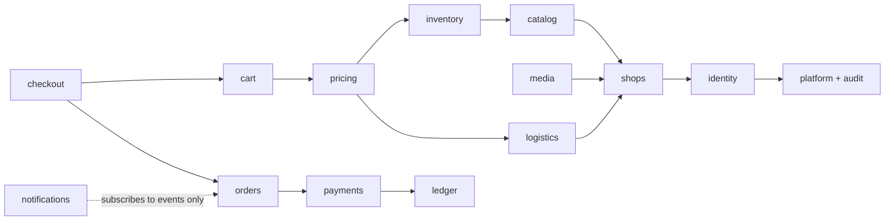

# ADR-0002: Modular monolith on AdonisJS 7 + Lucid + PostgreSQL

Status: Draft v1 (2026-09-25)

## Status

| Field           | Value                                                                           |
| --------------- | ------------------------------------------------------------------------------- |
| Decision status | **Accepted**                                                                    |
| Date            | 2026-09-25                                                                      |
| Deciders        | Product owner, lead developer                                                   |
| Supersedes      | —                                                                               |
| Superseded by   | —                                                                               |
| Blocking items  | none. The job-backend detail is in ADR-0010 and hosting in ADR-0016 (Proposed). |

## Context

**Team and scale.** 1–2 developers, a small budget, fewer than about 50 shops and about 1–2k orders per month at launch [Confirmed, Q1]. At 2k orders a month, a 10× peak is still well under one order per second.

**Existing stack** [Verified-repo, `pnpm-lock.yaml`]: @adonisjs/core 7.3.4, @adonisjs/lucid 22.4.2, @adonisjs/auth 10.1.0, @adonisjs/session 8.1.0, @adonisjs/shield 9.0.0, @adonisjs/inertia 4.2.0, React 19.2.7, Vite 7, TypeScript 6.0.3, Node 24. docker-compose runs Postgres 18.4, Redis 8.6 and Mailpit. There are no tests and no CI (RF-09).

**The domain is transactional across areas.** A single `placeOrder` call must, atomically: lock the cart; reserve stock; insert `orders`, `shop_orders` and `order_items` with snapshots; create payment records; write the idempotency key, order events and audit rows; and enqueue follow-up jobs ([state machines and checkout](../05-order-payment-and-inventory-lifecycles.md)). Lucid 22.4.2 managed transactions (`db.transaction(cb)`) commit on resolve and roll back on throw. It also provides `forUpdate()`, `skipLocked()` and `trx.after('commit')` [Verified-doc, Lucid 22.4.2 source and https://lucid.adonisjs.com/docs/transactions, accessed 2026-09-25]. Splitting this across services would turn one database transaction into a distributed saga that two people would have to operate.

**The current code has no boundaries, and it shows.**

- The client is the source of truth for price, stock, shop and order number (RF-16, audit A3-03).
- The RBAC relations point at tables that do not exist (RF-20).
- Order items can reference another shop's product because there are no composite tenant keys (RF-13).
- Nothing states which part of the code may change stock, so the invariant "only one module writes stock" (ADR-0008) cannot be enforced today.

**Framework conventions.** Adonis generators and the `indexEntities` assembler hook index `app/controllers/**` and transformers. A layout that fights them loses generated types such as `Data.*` and the Tuyau route registry [Verified-doc, @adonisjs/core 7.3.4 `index_entities.d.ts`].

**Database connections are scarce.** DigitalOcean Managed PostgreSQL's 1 GiB plan allows 22 backend connections [Verified-doc, https://docs.digitalocean.com/products/databases/postgresql/details/limits/, accessed 2026-09-25]. Every extra process or service spends from that budget.

## Decision

Keep AdonisJS 7 + Lucid + PostgreSQL 18, and structure the application as a **modular monolith**.

1. **One codebase, one Docker image, two process types.** `web` serves HTTP and renders Inertia SSR in-process. `worker` runs the pg-boss consumers and scheduler (ADR-0010). They use the same image with a different command. PostgreSQL is the only required stateful service. Redis stays optional in docker-compose.
2. **Fifteen modules, each a folder that owns its tables:** `identity`, `shops`, `catalog`, `media`, `inventory`, `pricing`, `logistics`, `cart`, `checkout`, `orders`, `payments`, `ledger`, `notifications`, `audit`, `platform`. The table-to-module map is owned by [docs/03](../03-system-architecture.md) and [docs/04](../04-domain-model-and-data-dictionary.md). Examples: `inventory` is the only writer of `inventory_*`; `ledger` is the only writer of `ledger_entries`; `checkout` owns no tables and orchestrates the others.
3. **Dependency rule.**
   - A module reads another module's data only through that module's exported `app/modules/<m>/queries.ts`.
   - It writes only by calling the owning module's `app/modules/<m>/actions/*`.
   - Side effects after commit, such as emails, listing refresh and payment reconciliation, go through domain events that become transactional jobs (ADR-0010).
   - Dependencies point one way, with no cycles (diagram below).
4. **Adonis-conventional directories stay.** `app/controllers/<surface>/<module>/`, `app/models` (one Lucid model per table, relations only, no business logic), `app/validators/<module>`, `app/policies/<module>` and `app/transformers/<module>`. Business code lives in `app/modules/<module>/{actions,queries.ts,domain,events.ts,jobs}`. The generated `database/schema.ts` is never hand-edited. The full layout is in [docs/09](../09-code-structure-and-engineering-standards.md).
5. **Controllers are thin.** Each one validates (Vine), authorizes (policy, ADR-0006), calls exactly one module action or query, and transforms the result.

Arrows point from a module to the module it depends on. `checkout` fans out to `orders`, `orders` to `payments`, and `payments` to `ledger`, matching the canonical order platform/audit ← identity ← shops ← catalog/media ← inventory ← pricing ← cart ← checkout → orders → payments → ledger. `logistics` (reference locations, shop shipping rates) sits beside `catalog`: it depends on `shops`, and `pricing` reads it to compute shipping fees.

## Alternatives considered

| Alternative                                                          | Why rejected                                                                                                                                                                                                                                                        |
| -------------------------------------------------------------------- | ------------------------------------------------------------------------------------------------------------------------------------------------------------------------------------------------------------------------------------------------------------------- |
| Microservices (catalog, orders, payments as separate deployables)    | `placeOrder` would need a saga across services. It would add network hops on every checkout, multiply deployments and monitoring for 1–2 people, and spend the 22-connection budget on several pools. Nothing at about 2k orders a month needs independent scaling. |
| Unstructured monolith (status quo: controllers call models directly) | There would be no place to enforce "only `inventory` writes stock" or "prices come from `pricing`". RF-16 and RF-13 are the result of exactly this.                                                                                                                 |
| Rewrite in another framework (NestJS, Laravel, a Next.js full stack) | Throws away the existing Adonis 7 code and first-party packages the plan relies on: session auth, Vine, Shield, limiter 3.0.1, Drive 4.0.0, mail 10.4.0, i18n 3.0.1. A rewrite costs weeks the M0–M1 budget does not have.                                          |
| pnpm workspace package per module                                    | Real compile-time boundaries, but build, test and tooling overhead for 15 packages. Folder boundaries checked by a CI rule (T-ARCH-001) catch most violations at a fraction of the cost.                                                                            |
| MySQL or MongoDB                                                     | The design relies on PostgreSQL features: CHECK constraints, partial unique indexes, row-lock re-evaluation under READ COMMITTED (ADR-0008), `pg_trgm` and full-text search (ADR-0014), pg-boss (ADR-0010) and `uuidv7()` (ADR-0017).                               |

## Consequences

**Positive**

- Checkout, cancellation and refund invariants hold inside a single PostgreSQL transaction with CHECK-constraint backstops.
- One image and one deploy pipeline. Local development is `docker compose up` (Postgres and Mailpit) plus `node ace serve`.
- Module boundaries make ownership reviewable. A PR that touches `ledger` tables outside `app/modules/ledger` fails T-ARCH-001.

**Negative**

- Scaling is vertical first. A CPU-heavy SSR spike and a heavy admin report share the same `web` processes until more instances are added behind the load balancer.
- A bad deploy takes down storefront, seller and admin together. The single image means any change rebuilds everything.
- The Adonis 7 ecosystem has no maintained OpenAPI generator [Verified-doc, `adonis_stack` research on @tuyau/core 1.2.2 exports]. `docs/openapi.yaml` is hand-maintained and enforced by T-API-001 (ADR-0004).

**Risks**

- _Boundary erosion_ ("just import the model this once"). Mitigation: T-ARCH-001 runs on every PR, and module-private files are not exported from `queries.ts`.
- _Adapter version drift._ @adonisjs/inertia 4.2.0 targets Inertia v2 while the current Adonis docs target v5/Inertia v3 (OD-25). Examples copied from current docs may not compile. See ADR-0003.

## When to revisit

Extract a module into a separate service only when one of these holds and scaling `web` or `worker` horizontally has not fixed it:

- One module's load needs a different scaling profile. Example: SSR CPU keeps `web` above 70 % CPU at peak while API p95 is within its 300 ms target, and a second web instance does not help.
- Search needs an engine PostgreSQL cannot replace (the ADR-0014 thresholds).
- The team grows past about 6 developers and module ownership conflicts slow delivery.
- A regulatory outcome requires isolating payment or personal data on separate infrastructure (VX-01, VX-09).
- Volume passes about 50k orders per month (25× the launch estimate), or the database connection budget can no longer be met by pool tuning.

## Verification

- **T-ARCH-001** (module dependency rules), run in CI with dependency-cruiser or ESLint `no-restricted-imports`. It fails when:
  - a module imports another module's `actions/` internals other than the exported action entry points;
  - a module imports a model it does not own for writing;
  - there is a dependency cycle.
- **Code review checklist** in [docs/09](../09-code-structure-and-engineering-standards.md): a controller calls one action or query, and models contain no business logic.
- **Transaction tests**: T-CHK-004 and T-INV-003 exercise the single-transaction checkout this decision relies on.

## Related

- [Architecture: containers, modules, jobs](../03-system-architecture.md)
- [Code structure and standards](../09-code-structure-and-engineering-standards.md)
- [Domain model and data dictionary](../04-domain-model-and-data-dictionary.md)
- ADR-0003 (Inertia surfaces), ADR-0004 (API contract), ADR-0010 (jobs), ADR-0016 (hosting)
