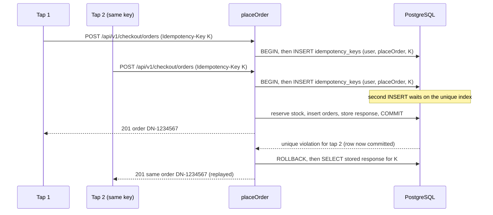

# ADR-0004: Page reads via Inertia props; mutations via versioned JSON API `/api/v1`

Status: Draft v1 (2026-09-25)

## Status

| Field | Value |
|---|---|
| Decision status | **Accepted** |
| Date | 2026-09-25 |
| Deciders | Lead developer |
| Supersedes | — |
| Superseded by | — |
| Related open items | OD-13 (JSON casing: snake_case [Assumption] vs camelCase; decide before M1, does not change this ADR), OD-25 (Inertia v3 `useHttp`) |

## Context

- **Mutations today are Inertia form posts, and they have no contract.**
  - Signup spreads the request payload into the model (RF-36, audit IAM-24).
  - The client sends prices, shop IDs and order numbers (RF-16, audit A3-03).
  - Orders have no idempotency key, so a double tap on "Place order" over a slow connection creates two COD orders and reserves stock twice (RF-15, audit A1-07: the only unique business column is `order_number`, `1780074257570_create_orders_table.ts:16`) [Verified-repo].
- **Inertia's validation pattern is lossy for rich errors.** With a session present, @adonisjs/session 8.1.0 flashes validation errors and redirects back. @adonisjs/inertia 4.2.0 keeps only the first message per field [Verified-doc, adapter 4.2.0 `inertia_middleware.js`, accessed 2026-09-25]. A redirect cannot carry `OUT_OF_STOCK` line details, `PRICE_CHANGED` with a new quote, an `ETag`, or a replayed idempotent response.
- **Tooling.**
  - @tuyau/core 1.2.2 generates a typed client from Vine validators and controller return types, and automatically sends the `XSRF-TOKEN` cookie as `X-XSRF-TOKEN` [Verified-doc, @tuyau/core 1.2.2 `build/client/index.js`, accessed 2026-09-25].
  - There is no maintained OpenAPI generator for Adonis v7. `@tuyau/openapi` 1.0.2 predates v7 [Verified-doc, https://registry.npmjs.org/@tuyau/openapi, accessed 2026-09-25].
  - Transformers (`BaseTransformer.pick/omit`) give allowlisted serialization, and `indexEntities` generates `Data.*` prop types.
- **Future clients.** A mobile app (R3), payment-provider callbacks (R1.1), and possibly partners need one documented, language-neutral mutation contract.

## Decision

1. **Reads go through Inertia props.** Each page controller loads data with module queries (ADR-0002), serializes it through a transformer and renders the page. Pages do not fetch their initial data from `/api/v1`, which would add a round trip on slow networks. Filters, sorting and pagination are Inertia GET visits with `only`/`preserveState`, so the state lives in the URL.
2. **Every state change goes through `/api/v1`.** All non-GET operations are JSON endpoints under `/api/v1`. The canonical catalogue, with operationIds, is owned by [docs/06](../06-api-design.md) and [openapi.yaml](../openapi.yaml). This includes login and logout (`POST`/`DELETE /api/v1/auth/session`). Pages call these endpoints through the Tuyau client and on success refresh the affected props with `router.reload({ only: [...] })` or navigate with `router.visit(...)`. Errors come back as problem+json (ADR-0018) and are rendered by field.
   - *Exception:* `GET /payments/{provider}/return` is an Inertia page route that runs server-side payment verification before rendering the result (ADR-0012).
   - *Exception:* inbound webhooks are `POST /api/v1/webhooks/payments/{provider}`, exempt from CSRF and verified by the provider's scheme.
3. **Contract rules.** Full text in [docs/06](../06-api-design.md); summary here:
   - Version in the path: `/api/v1`. Additive changes are allowed. Breaking changes need `/api/v2`, with a 6-month overlap once external clients exist and `Deprecation`/`Sunset` headers.
   - Money is `{ "amount_minor": <int>, "currency": "NPR" }` (ADR-0007). Timestamps are RFC 3339 UTC. Field casing is snake_case [Assumption; OD-13].
   - `Idempotency-Key` is required on every operation marked ⚷ in the catalogue (placeOrder, order cancel/accept/reject, fulfillment events, inventory adjustments, refunds, payouts…).
   - `If-Match` is required on PATCH/PUT of versioned resources. `ETag: W/"<version>"` is returned. A mismatch gives 412 `VERSION_CONFLICT`; a missing header gives 428 `PRECONDITION_REQUIRED`.
   - Server-computed fields (prices, totals, commission, `shop_id`, order numbers) are never read from request bodies (T-SEC-003).
4. **Idempotency mechanism.**
   - Rows live in `idempotency_keys`, UNIQUE (`actor_scope`, `operation`, `key`). `actor_scope` is the user ID, `provider:<name>` for webhooks, or `system` for jobs.
   - The fingerprint is SHA-256 over method, route pattern, resolved path params and canonical JSON body.
   - The key row is inserted as the **first statement inside the business transaction**, so a concurrent duplicate blocks on the unique index until the first request finishes:
     - if the first commits, the duplicate replays the stored response;
     - if the first rolls back (for example `OUT_OF_STOCK`), nothing was stored and the retry runs again.
   - A reused key with a different fingerprint gives 422 `IDEMPOTENCY_KEY_REUSED`.
   - Retention is 24 h (72 h for checkout), after which a job purges the rows. Keys are client-generated UUIDv4, 16–64 chars `[A-Za-z0-9_-]`.
5. **Authentication for the API** is the same session cookie and CSRF header as the pages (ADR-0005). Token authentication for non-browser clients is deferred to R3.
6. **Route files.** Unsafe HTTP methods are registered only in `start/routes/api_v1.ts` and `start/routes/webhooks.ts`. Page route files register only GET routes.

## Alternatives considered

| Alternative | Why rejected |
|---|---|
| Inertia form posts for all mutations (redirect-back) | No natural place for `Idempotency-Key`, `If-Match`/`ETag` or structured conflict payloads. Errors are flattened to one message per field. Unusable by the R3 mobile app or providers, and hard to contract-test. |
| JSON API for reads as well (SPA style) | An extra request after every navigation on slow networks, and it breaks SSR (ADR-0003). |
| GraphQL | Needs a schema, per-field authorization and persisted queries, all for 1–2 developers. HTTP caching and problem+json error semantics become harder. |
| RPC over Tuyau types only, with no OpenAPI | Tuyau types are TypeScript-only. Providers, mobile clients and contract tests need a language-neutral spec. |
| Unversioned API | The first breaking change after the mobile app ships (R3) would break installed clients with no overlap period. |

## Consequences

**Positive**
- One mutation contract, validated on every response by T-API-001. The same endpoints serve the R3 mobile app.
- Double submits on slow networks are harmless (T-CHK-004), and concurrent edits on the seller dashboard are detected (412) instead of silently overwritten.
- Mass assignment is structurally prevented, because request validators never contain server-owned fields (T-SEC-003).

**Negative**
- Each screen that mutates data has a page route and API routes. After a mutation, one extra partial reload fetches fresh props.
- `docs/openapi.yaml` is hand-maintained. A route change without a spec change fails CI rather than being generated automatically.
- Client code handles problem+json explicitly instead of relying on Inertia's built-in error bag.

**Risks**
- *A developer adds an Inertia POST route "just this once".* Mitigation: the route-file rule in Decision item 6, checked in CI.
- *Spec drift.* Mitigation: T-API-001 validates real responses from functional tests against the spec, so a missing or wrong schema fails the build.

## When to revisit

- OD-25 upgrades to Inertia v3. `useHttp` and optimistic updates may simplify the client calls; the API contract stays.
- External partners (couriers in R3, marketing tools) need OAuth or API keys. Add a token guard in a new ADR.
- Hand-maintained spec drift causes more than 3 T-API-001 failures in one milestone. Evaluate a generator such as `@foadonis/openapi` (peers `@adonisjs/core ^6.2 || ^7`) [Verified-doc, https://registry.npmjs.org/@foadonis/openapi, accessed 2026-09-25].

## Verification

- **T-API-001**: every response in the functional suite validates against `docs/openapi.yaml`.
- **T-CHK-004**: a repeated `placeOrder` with the same key returns the same order, and concurrent duplicates create exactly one order.
- **T-SEC-003**: client-supplied price, total, `shop_id` and commission fields are ignored or rejected.
- **Route rule check** (CI script in [docs/10](../10-testing-and-quality-gates.md)): lists all routes with `node ace list:routes --json` and fails if a POST/PUT/PATCH/DELETE route is not under `/api/v1/`.
- **T-ARCH-001**: controllers call module actions only.

## Related

- [API conventions and endpoint catalogue](../06-api-design.md) · [OpenAPI](../openapi.yaml)
- [State machines and checkout](../05-order-payment-and-inventory-lifecycles.md)
- ADR-0003 (Inertia surfaces), ADR-0005 (session auth + CSRF), ADR-0007 (money JSON), ADR-0018 (error contract)
