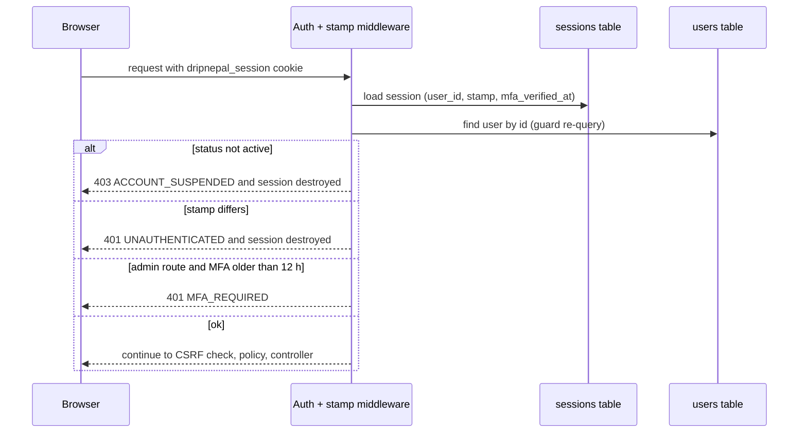

# ADR-0005: Session-cookie authentication with server-side revocation

Status: Draft v1 (2026-09-25)

## Status

| Field              | Value                                                                                                                                                                       |
| ------------------ | --------------------------------------------------------------------------------------------------------------------------------------------------------------------------- |
| Decision status    | **Accepted**                                                                                                                                                                |
| Date               | 2026-09-25                                                                                                                                                                  |
| Deciders           | Lead developer, product owner                                                                                                                                               |
| Supersedes         | —                                                                                                                                                                           |
| Superseded by      | —                                                                                                                                                                           |
| Related open items | Session lifetimes and password policy are [Assumption] (owner: lead developer; revisit after M1 metrics). VX-03 (interpretation of Directive 2082 s8(1) encryption duties). |

## Context

**Repository state** [Verified-repo]:

- `.env.example:13` sets `SESSION_DRIVER=cookie`. With the cookie store the server keeps no session record, so "log out all devices", killing sessions on password change and admin force-logout are all impossible (RF-04, audit IAM-04/A5-11).
- `app/controllers/session_controller.ts:15-16` calls `verifyCredentials` then `login` without checking `users.status` or `deleted_at`. Suspended or soft-deleted users can log in, and existing sessions keep working.
- The "remember me" checkbox is ignored.
- Login has no rate limit, swallows non-credential errors (lines 18-23) and caps passwords at 32 characters (`app/validators/shared.ts:7`) (RF-12).

**Framework behaviour** [Verified-doc, npm tarballs of the exact locked versions, accessed 2026-09-25; `adonis_stack` research]:

- @adonisjs/auth 10.1.0 `SessionGuard.login()` stores the user ID and calls `session.regenerate()`, which gives session-fixation protection. `logout()` does not regenerate or clear the session.
- `authenticate()` re-queries the user by ID on every request. There is no built-in rejection of suspended users.
- @adonisjs/session 8.1.0 supports `stores.database()` (migration via `make:session-table`) and session tagging: `session.tag(userId)` plus `SessionCollection.tagged(userId)` / `destroy(id)`. The cookie store does not support tagging.
- Reading the source (not runtime-tested) suggests the tag must be applied **after** `login()` regenerates the ID.
- @adonisjs/shield 9.0.0 accepts `X-XSRF-TOKEN`, and the Tuyau client sends it automatically.
- @adonisjs/limiter 3.0.1 offers a database store with `penalize()` (OD-10 resolved: database store).

**Requirements.**

- Suspension takes effect on the next request (FR-IAM-006, test T-SEC-010).
- Change password plus revoke all sessions (FR-IAM-005).
- Mandatory TOTP MFA for platform staff (FR-IAM-007).
- E-Commerce Directive 2082 s8(1) requires passwords and other authentication data to be stored "in encrypted form". For passwords we read this as a one-way hash [Verify-external VX-03].

**Environment.** Customers often share phones, which is why history is cleared on logout (ADR-0003). WCAG 2.2 SC 3.3.8 forbids blocking paste in login and OTP fields [Verified-doc, https://www.w3.org/TR/WCAG22/, accessed 2026-09-25].

## Decision

1. **Guard and store.**
   - @adonisjs/auth session guard `web`.
   - @adonisjs/session **database store** (sessions table via `make:session-table`).
   - Cookie `dripnepal_session`: `HttpOnly; Secure; SameSite=Lax; Path=/`.
   - No Redis in R1 (ADR-0002).
2. **Per-user `security_stamp`** (uuid column on `users`).
   - Copied into the session at login.
   - A global middleware, placed after authentication, compares it on every authenticated request.
   - Rotated on password change, password reset, suspension, "revoke all sessions", platform-staff role grant or revoke, and MFA reset.
   - On mismatch, the session is destroyed and the request gets 401 `UNAUTHENTICATED` (API) or a redirect to `/login` (pages).
   - Because the guard already loads the user row on each request, this costs no extra query.
3. **Status gate in the same middleware.** Users whose `status` is `suspended`, `deactivated` or `anonymized` get 403 `ACCOUNT_SUSPENDED` (API) or a redirect with a notice (pages). Login applies the same check before `login()`. `pending_verification` users may use account pages and the cart but not checkout or shop application (`EMAIL_NOT_VERIFIED`).
4. **Session tagging.** `session.tag(String(user.id))` runs after `login()`. `revokeAllSessions` and admin suspension destroy every tagged session. The stamp remains the correctness mechanism if tagging ever misses a session.
5. **Session hygiene.**
   - The session ID is regenerated on login, after the MFA challenge and on privilege change.
   - Logout calls `auth.logout()`, `session.untag()`, `session.regenerate()`, clears cart/flash keys and calls `inertia.clearHistory()`.
   - Expired rows are purged by a daily job (ADR-0010).
6. **Lifetimes** [Assumption]:

   | Role                    | Idle timeout | Absolute timeout                                                                                  |
   | ----------------------- | ------------ | ------------------------------------------------------------------------------------------------- |
   | Customers               | 7 days       | 30 days                                                                                           |
   | Seller owners and staff | 12 h         | —                                                                                                 |
   | Platform staff          | 2 h          | `mfa_verified_at` must be within 12 h for `/admin` and `/api/v1/admin` (`MFA_REQUIRED` otherwise) |

   Remember-me tokens are off in R1, and the checkbox is removed.

7. **MFA.** TOTP is mandatory for platform staff in R1. The secret is stored application-encrypted (`mfa_totp_secret_enc`). OTP inputs use `autocomplete="one-time-code"` and accept pasted codes. Optional MFA for shop owners and staff is R2 (FR-IAM-008).
8. **Passwords.** Hashed with scrypt (existing `config/hash.ts`, cost 16384; parameters to be re-checked in M1). Length 10–128 characters [Assumption; NIST guidance to verify]. Breached-password checks come in R2. Login rethrows every non-credential error so the exception handler reports it (ADR-0018).
9. **Throttling** (limiter database store, initial values [Assumption]): login 5/min per account+IP and 20/min per IP, with `penalize()` on failure; password-reset request 3/h per email and 10/h per IP; signup 5/h per IP. Full table in [docs/06](../06-api-design.md).

## Alternatives considered

| Alternative                                       | Why rejected                                                                                                                                                                                                                              |
| ------------------------------------------------- | ----------------------------------------------------------------------------------------------------------------------------------------------------------------------------------------------------------------------------------------- |
| Keep the cookie session store                     | No server-side revocation (RF-04), no tagging, 4 KB limit with silent truncation [Verified-doc, https://docs.adonisjs.com/guides/basics/session, accessed 2026-09-25].                                                                    |
| Redis session store                               | Adds a stateful service with persistence settings to operate. Managed Valkey starts at $15.00/month as published on 2026-09-25 (https://docs.digitalocean.com/products/databases/valkey/details/pricing/). PostgreSQL handles R1 volumes. |
| Stateless JWT in the browser                      | Revocation still needs a server-side denylist. Storing the token in JS-readable storage exposes it to XSS. Inertia already relies on cookie sessions.                                                                                     |
| Opaque access-token guard for the web app         | Built for non-browser clients and still needs CSRF-equivalent care in browsers. Reserved for the R3 mobile app.                                                                                                                           |
| Hosted identity provider (Auth0, Clerk, Keycloak) | Recurring cost, another data processor subject to VX-09, and awkward Nepal-specific flows (phone format, R2 SMS OTP).                                                                                                                     |
| Session tagging only, without `security_stamp`    | Correctness would depend on tag-after-regenerate ordering, which has not been runtime-tested. The stamp check is one column comparison on a row the guard already loads.                                                                  |

## Consequences

**Positive**

- Suspension, password change and "log out everywhere" take effect on the next request (T-SEC-010).
- Session fixation is handled by the framework. CSRF works unchanged for Inertia visits and Tuyau calls.
- No new infrastructure.

**Negative**

- Every authenticated request reads and writes a session row and reads the user row. This counts against the web pool (8 connections, ADR-0016).
- A sessions-table purge job is required, and the table grows with anonymous carts if guests get sessions. Guest carts use their own token (docs/04), not session data.

**Risks**

- _A route group misses the stamp middleware._ Mitigation: register it as router middleware on every authenticated group, and test it per surface.
- _Staff lockout if the TOTP device is lost._ Mitigation: an admin MFA-reset procedure in the runbook ([docs/11](../11-deployment-and-operations.md)), which rotates the stamp and is audit-logged.

## When to revisit

- The sessions table exceeds about 1 million live rows, or session read p95 exceeds 10 ms. Consider the Redis store (pin @adonisjs/redis ^10; version 11 breaks peer ranges).
- The R3 mobile app needs token auth. Add a new ADR for an access-token guard.
- R2 phone OTP (FR-IAM-010) or passkeys become viable for Nepali Android users. Revisit MFA factors for owners.
- M1 metrics show customers re-logging in more often than weekly. Revisit the lifetime assumptions.

## Verification

- **T-SEC-010**: a suspended user's existing session is rejected on the next request (403 `ACCOUNT_SUSPENDED` for the API, redirect for pages).
- **T-IAM suite** ([docs/10](../10-testing-and-quality-gates.md)):
  - the session ID differs before and after login (fixation);
  - a password change invalidates other sessions (stamp);
  - `revokeAllSessions` destroys tagged sessions;
  - login is throttled after 5 failures per minute (429 `RATE_LIMITED` with `Retry-After`);
  - an admin route without fresh MFA returns 401 `MFA_REQUIRED`;
  - cookie flags `HttpOnly`, `Secure` and `SameSite=Lax` are asserted on the login response.
- **CSRF test**: an unsafe `/api/v1` request without `X-XSRF-TOKEN` returns 403. The webhook route is the only exemption (ADR-0012).

## Related

- [Security, privacy and threat model](../07-security-threat-model-and-permissions.md)
- [API conventions (rate limits, problem codes)](../06-api-design.md)
- ADR-0003 (history encryption), ADR-0006 (authorization), ADR-0018 (error contract)
