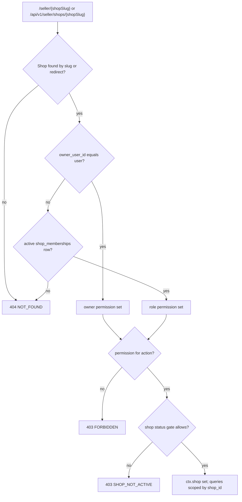

# ADR-0006: Authorization: platform roles + per-shop memberships with fixed roles in code

Status: Draft v1 (2026-09-25)

Reviewed: 2026-09-25 · consistency review 2026-09-30 to 2026-10-01

## Status

| Field              | Value                                                                                                                                                                                               |
| ------------------ | --------------------------------------------------------------------------------------------------------------------------------------------------------------------------------------------------- |
| Decision status    | **Accepted**                                                                                                                                                                                        |
| Date               | 2026-09-25                                                                                                                                                                                          |
| Deciders           | Lead developer, product owner                                                                                                                                                                       |
| Supersedes         | —                                                                                                                                                                                                   |
| Superseded by      | —                                                                                                                                                                                                   |
| Related open items | OD-12 (seller prefix `/seller/{shopSlug}`, decided 2026-09-30), OD-14 (maker-checker vs single-operator mode), OD-17 (vendor access to customer contact). They set details, not the two-axis model. |

Edited 2026-09-30 (consistency review): decisions 3, 6 and 7 follow [07 §4.8](../07-security-threat-model-and-permissions.md#48-how-policies-are-implemented), [§4.7](../07-security-threat-model-and-permissions.md#47-maker-checker-and-single-operator-mode) and [§5.2](../07-security-threat-model-and-permissions.md#52-vendor-visibility-of-customer-contact-data) (the 301 for a retired slug comes after the actor check, system refunds in the maker-checker CHECK, the contact window); the decision is unchanged.

## Context

**Repository findings** [Verified-repo] ([00 §4.6](../00-context-assumptions-and-questions.md#46-consolidated-repository-findings-rf-01--rf-47)):

- `start/routes/shops.ts:14-28` protects `/shop/:shopSlug/*` with `middleware.auth()` only, and the dashboard controller never reads `shopSlug`. Any signed-in customer reaches any shop's dashboard (RF-01): harmless while pages are placeholders, a leak as soon as orders or payout details appear.
- RBAC is miswired (RF-20): the `User.roles` pivot names a table the migration does not create; a global `shop-owner` role exists; shop roles share the global `permissions` table with no scope column, so a shop role could be granted a platform permission; staff assignments have no primary key.
- There are no composite tenant foreign keys (RF-13). `ShopTransformer` exposes the owner's ID, email and phone (RF-36).

**Product scope.** One user may own several shops and be staff in others (FR-SHOP-001, FR-SHOP-005). Custom shop roles are R3 (FR-SHOP-011). Launch is under about 50 shops [Confirmed, Q1]. Platform staff need separated duties and mandatory MFA (FR-IAM-007). Admin impersonation is a non-goal.

**Framework.** @adonisjs/bouncer 4.0.1 policies accept extra arguments after the action name, and `AuthorizationResponse.deny(message, statusCode)` can answer 404 [Verified-doc, https://registry.npmjs.org/@adonisjs/bouncer/-/bouncer-4.0.1.tgz `build/src/response.d.ts`, accessed 2026-09-25].

## Decision

**No global "vendor" or "shop-owner" role.** Authorization has two independent axes; both permission maps are TypeScript constants. The slugs and role maps are owned by [07 §4.2](../07-security-threat-model-and-permissions.md#42-platform-roles-and-permissions) and [§4.3](../07-security-threat-model-and-permissions.md#43-shop-roles-and-permissions); the tables by [04a §5.4 and §6](../04a-data-dictionary-tables.md#54-platform_staff).

1. **Platform staff.** `platform_staff(user_id PK, role, granted_by, granted_at, revoked_at, revoked_by)`; roles `platform_admin`, `support_agent`, `catalog_moderator`, `finance_officer`; permissions are `platform.*` slugs (for example `platform.shops.review`, `platform.refunds.approve`, `platform.ledger.adjust`, `platform.payouts.approve`). Resolving `needs_review` payments and refunds uses `platform.ledger.adjust` today; a dedicated `platform.payments.review` is proposed in [07 §4.2](../07-security-threat-model-and-permissions.md#42-platform-roles-and-permissions) ([05 §9.5](../05-order-payment-and-inventory-lifecycles.md#95-manual-review-queue-needs_review)). Staff need TOTP enrolled and a session MFA verification within 12 h (ADR-0005).
2. **Shop access.**
   - **Owner**: `shops.owner_user_id` (NOT NULL, RESTRICT) is the single source of ownership and the legal and payout party; the owner is not a membership row.
   - **Staff**: `shop_memberships(id, shop_id, user_id, role, status, …)`, UNIQUE (`shop_id`, `user_id`), `CHECK (role <> 'owner')`; roles `manager`, `catalog_editor`, `order_fulfiller`, `viewer`; status `active` or `removed`. Invitations in `shop_invitations` (hashed token, 7-day expiry).
   - Permissions are `shop.*` slugs (`shop.products.edit`, `shop.orders.process`, `shop.customer_contact.view`, `shop.payout_account.manage`, …). Owner has all; manager has all except `shop.staff.manage` and `shop.payout_account.manage`.
3. **Resolution.** The `seller_context` middleware ([03 §3.3](../03-system-architecture.md#33-inside-the-web-process)) runs on every `/seller/{shopSlug}` page group and `/api/v1/seller/shops/{shopSlug}` route: resolve the slug, current or retired (through `slug_redirects`), to the shop without a redirect; actor = owner if `owner_user_id = user.id`, else an `active` membership, else **404 `NOT_FOUND`**; only then does a page route reached by a retired slug answer 301 to the current slug, so a non-member never learns where a retired slug points ([07 §4.8](../07-security-threat-model-and-permissions.md#48-how-policies-are-implemented)); check the action's permission (**403 `FORBIDDEN`** for a member who lacks it); apply the shop status gate (**403 `SHOP_NOT_ACTIVE`**; per status and `suspension_mode` in [07 §4.4](../07-security-threat-model-and-permissions.md#44-status-gating)); set `ctx.shop`. Every downstream query includes `shop_id = ctx.shop.id`; a `shop_id` in a body or query string is rejected by the validators.
4. **Customer resources.** Ownership is in the query itself (`orders.customer_user_id = auth.user.id`); a miss is 404, never 403, so order numbers cannot be probed.
5. **Policies** live in `app/policies/<module>/*_policy.ts` (Bouncer 4.0.1, or plain functions if Bouncer is not adopted in M0), take `(actor, shop, resource)` and never query without the shop scope.
6. **Database backstops** (ADR-0011 baseline): shop-scoped children carry `shop_id` and composite FKs `(parent_id, shop_id) → parent(id, shop_id)` ([04 §2.5](../04-domain-model-and-data-dictionary.md#25-tenant-isolation-with-composite-foreign-keys)); refunds and payouts carry a maker-checker CHECK (`approved_by <> created_by OR is_single_operator_approval`), where a single-operator approval requires TOTP re-entry and is flagged in audit [Assumption; OD-14]. `refunds_maker_checker_check` also admits `created_by IS NULL`: a system-created refund (rejection, cancellation, RTO, failed re-reserve, late capture) has no human maker; a return close stores the closer as `created_by` ([07 §4.7](../07-security-threat-model-and-permissions.md#47-maker-checker-and-single-operator-mode), [04a §12.4](../04a-data-dictionary-tables.md#124-refunds)).
7. **Vendor data minimisation.** With `shop.customer_contact.view`, vendors see recipient name, phone and address of their own shop orders while the shop order is open, while a return request on it is open, and for 30 days after it becomes terminal, then masked ([07 §5.2](../07-security-threat-model-and-permissions.md#52-vendor-visibility-of-customer-contact-data); [Assumption A-18; OD-17]); never the customer's email or account ID; no customer export in R1.

## Alternatives considered

| Alternative                                           | Why rejected                                                                                                                                                               |
| ----------------------------------------------------- | -------------------------------------------------------------------------------------------------------------------------------------------------------------------------- |
| Generic DB-driven RBAC with per-shop custom roles now | The currently miswired design (RF-20): escalation risk through a shared permission table, management UI, grant migrations, hard to test exhaustively. Custom roles are R3. |
| Global vendor role plus ad-hoc `shop_id` checks       | RF-01 is the failure mode: one forgotten check exposes another vendor's orders and payouts.                                                                                |
| PostgreSQL row-level security                         | Per-request `SET` on pooled connections in every transaction; worker jobs legitimately cross shops; harder to debug. Kept as a defense-in-depth option.                    |
| Policy engine (OPA, Cedar, Casbin)                    | Another language and runtime for about 30 permissions.                                                                                                                     |
| Owner as a membership row with role `owner`           | Two sources of ownership, "last owner removed" edge cases, payout-party ambiguity.                                                                                         |

## Consequences

**Positive**

- Two small constant maps that tests can check exhaustively, role × action.
- Cross-tenant access fails closed three times: middleware, query scope, composite FK.
- 404 for other tenants' resources reveals nothing about what exists.

**Negative**

- Changing a role's permissions needs a deploy; shops cannot define roles until R3.
- Audit must record both axes consistently (`actor_role` such as `platform:finance_officer` or `shop:<shop_id>:manager`).

**Risks**

- _A seller endpoint registered outside the `seller_context` group._ Mitigation: T-SEC-001 is generated from the route list, so every `/api/v1/seller` route is exercised with another shop's credentials.
- _Status-gate gaps_ (a suspended shop still publishing). Mitigation: a table-driven gate function with unit tests per status × permission.

  Edited 2026-10-01 (cross-doc check): the gate is keyed by operation, not by permission, because a permission alone cannot express the exceptions of [07 §4.8](../07-security-threat-model-and-permissions.md#48-how-policies-are-implemented); its tests cover every shop status and suspension mode × `operationId` (T-SEC-031, proposed). The rest of the risk is unchanged.

## When to revisit

- More than 3 shops a month ask for custom roles, or any shop has more than 10 staff: plan FR-SHOP-011 in a superseding ADR.
- An incident shows a query ran without the shop scope: add RLS on the most sensitive tables (`ledger_entries`, `shop_payout_accounts`, `order_items`).
- More than 500 shops, or regional operators who need scoped platform roles.
- OD-14 or OD-17 is decided differently from the assumptions above, or 07 adopts `platform.payments.review`.

## Verification

- **T-SEC-001**: Vendor A cannot read or modify Vendor B's products, orders, inventory, members or ledger; every seller endpoint returns 404.
- **T-SEC-002**: a customer cannot read or cancel another customer's order (404).
- **T-SEC-003**: `shop_id`, price and commission fields in bodies are rejected with 422 `VALIDATION_FAILED` (`unknown_field`).
- **T-SEC-010**: suspended users are rejected (403 `ACCOUNT_SUSPENDED` while the session exists, 401 `UNAUTHENTICATED` after revocation, [07 §3.3](../07-security-threat-model-and-permissions.md#33-the-per-request-account-check-and-the-suspension-decision)); shop status gates are covered per status and suspension mode by T-SEC-031 (proposed).
- **Permission-map unit tests** (T-SEC-032, proposed; [10 §6.4](../10-testing-and-quality-gates.md#64-security-and-identity-t-sec-t-iam)): each role × action matches [07 §4.2](../07-security-threat-model-and-permissions.md#42-platform-roles-and-permissions) and [§4.3](../07-security-threat-model-and-permissions.md#43-shop-roles-and-permissions).
- **Constraint tests**: a `product_variants` row pointing at another shop's product fails the composite FK (T-CAT-109, proposed); T-LED-101 (proposed) approves one's own refund without the single-operator flag and expects 23514.

## Related

- [07 Security and permissions](../07-security-threat-model-and-permissions.md) · [04 §2.5 tenant FKs](../04-domain-model-and-data-dictionary.md#25-tenant-isolation-with-composite-foreign-keys) · [04a §6 Shops and memberships](../04a-data-dictionary-tables.md#6-shops-and-memberships)
- [01 personas and permissions](../01-product-requirements.md#3-personas-and-jobs-to-be-done) · [06 API catalogue](../06-api-design.md)
- [ADR-0005](0005-session-auth-server-side-revocation.md), [ADR-0011](0011-schema-rebaseline-before-production.md), [ADR-0017](0017-product-urls-public-id.md), [ADR-0018](0018-error-contract-problem-details.md)
