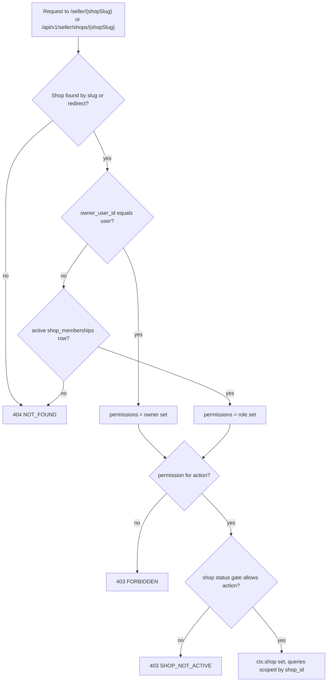

# ADR-0006: Authorization: platform roles + per-shop memberships with fixed roles in code

Status: Draft v1 (2026-09-25)

## Status

| Field | Value |
|---|---|
| Decision status | **Accepted** |
| Date | 2026-09-25 |
| Deciders | Lead developer, product owner |
| Supersedes | — |
| Superseded by | — |
| Related open items | OD-12 (seller URL prefix `/seller/{shopSlug}`), OD-14 (maker-checker vs single-operator mode), OD-17 (vendor access to customer contact after delivery) |

## Context

**Repository findings** [Verified-repo]:
- `start/routes/shops.ts:14-28` protects `/shop/:shopSlug/*` with `middleware.auth()` only. The dashboard controller never reads `shopSlug`. Any logged-in customer can open any shop's dashboard, including shops that do not exist or are suspended (RF-01, audit IAM-01). This is broken object-level authorization: harmless while the pages are placeholders, and a data leak as soon as orders, customer addresses or payout details are added.
- The RBAC schema is miswired (RF-20):
  - the `User.roles` pivot is named `user_roles`, but the migration creates `global_user_roles`;
  - a global `shop-owner` role exists;
  - shop roles share the global `permissions` table with no scope column, so a future role picker could grant `vendors.approve` to a shop role (audit F24);
  - staff assignments have no primary key and no lifecycle.
- There are no composite tenant foreign keys, so a row can reference another shop's records (RF-13, audit A1-02).
- The `ShopTransformer` exposes `ownerId` and the owner's personal email and phone (RF-36). Shared props list only owned shops, not staff shops (RF-44).

**Product scope.**
- One user may own several shops and be staff in others (FR-SHOP-001, FR-SHOP-005).
- Custom shop roles are R3 (FR-SHOP-011). At launch there are fewer than about 50 shops [Confirmed, Q1].
- Platform staff need separated duties for moderation, support and finance, with mandatory MFA (FR-IAM-007, FR-ADM-004).
- Admin impersonation is a non-goal (FR-ADM-008).

**Framework.** @adonisjs/bouncer 4.0.1 policies accept extra arguments after the action name, and `AuthorizationResponse.deny(message, statusCode)` can answer 404 [Verified-doc, @adonisjs/bouncer 4.0.1 `response.d.ts`, https://registry.npmjs.org/@adonisjs/bouncer/-/bouncer-4.0.1.tgz, accessed 2026-09-25].

## Decision

**No global "vendor" or "shop-owner" role.** Authorization has two independent axes, and both permission maps are TypeScript constants in code.

1. **Platform staff.** Table `platform_staff(user_id PK, role, granted_by, granted_at, revoked_at)`.
   - Roles: `platform_admin`, `support_agent`, `catalog_moderator`, `finance_officer`.
   - Permissions are canonical `platform.*` slugs, e.g. `platform.shops.review`, `platform.refunds.approve`, `platform.payouts.approve`, `platform.audit.view`. The full role → permission map is owned by [docs/07](../07-security-threat-model-and-permissions.md).
   - Staff need TOTP enrolled and a session MFA verification within 12 h (ADR-0005).
2. **Shop access.**
   - **Owner**: `shops.owner_user_id` (NOT NULL, RESTRICT) is the single source of ownership. The owner is the legal and payout party, and is *not* a membership row.
   - **Staff**: `shop_memberships(shop_id, user_id, role, status)`, UNIQUE (`shop_id`, `user_id`), `CHECK (role <> 'owner')`. Roles are `manager`, `catalog_editor`, `order_fulfiller`, `viewer`; status is `active` or `removed`.
   - Invitations live in `shop_invitations` (hashed token, 7-day expiry).
   - Permissions are canonical `shop.*` slugs (`shop.products.edit`, `shop.orders.process`, `shop.payout_account.manage`, …). Owner has all of them. Manager has all except `shop.staff.manage` and `shop.payout_account.manage`.
3. **Resolution algorithm.** A single `shopContext` middleware on every `/seller/{shopSlug}` page group and every `/api/v1/seller/shops/{shopSlug}` route runs the steps in the flowchart below.
   - It resolves the slug, following `slug_redirects` with a 301 for pages.
   - It determines the actor: owner if `owner_user_id = user.id`; else an `active` membership; else **404 `NOT_FOUND`**.
   - It loads the permission set and checks the action's permission. A member of this shop who lacks the permission gets **403 `FORBIDDEN`**.
   - It applies the status gate, from [docs/07](../07-security-threat-model-and-permissions.md):
     - `pending_review`/`rejected`: the owner may view and edit the application only;
     - `suspended` + `fulfill_existing`: orders only;
     - `suspended` + `frozen`: read-only;
     - `closed`: finance view only.
   - It sets `ctx.shop`. Every downstream query includes `shop_id = ctx.shop.id`. A `shop_id` in a body or query string is rejected by the validators.
4. **Customer resources.** Ownership is part of the query itself (`orders.customer_user_id = auth.user.id`). A miss returns 404, never 403, so other customers' order numbers cannot be probed.
5. **Policies** live in `app/policies/<module>/*_policy.ts` (Bouncer 4.0.1, or plain functions if Bouncer is not adopted in M0). They take `(actor, shop, resource)` and never query without the shop scope.
6. **Database backstops** (ADR-0011 baseline, [docs/04](../04-domain-model-and-data-dictionary.md)):
   - shop-scoped children carry `shop_id` and composite FKs `(parent_id, shop_id) → parent(id, shop_id)`, so a cross-shop reference cannot be inserted even when the application has a bug;
   - refunds and payouts carry `CHECK (approved_by <> created_by)`, except in `platform_settings.single_operator_mode`, where approval requires re-entering the TOTP code and is flagged in the audit log [Assumption; OD-14].
7. **Data minimisation for vendors.** Vendors see recipient name, phone and delivery address for their own shop orders only. This lasts while the shop order is open and for 30 days after delivery or cancellation, after which it is masked [Assumption; OD-17]. Vendors never see the customer's email or account ID, and there is no customer export in R1.

## Alternatives considered

| Alternative | Why rejected |
|---|---|
| Keep the generic RBAC tables (roles and permissions in the DB, per-shop custom roles now) | This is the design that is currently miswired (RF-20, F24). It carries a privilege-escalation risk through the shared permission table and needs management UI and migration of grants. It is also harder to test exhaustively. Custom roles are deferred to R3 (FR-SHOP-011) with a shop-scoped permission table. |
| Global vendor role plus ad-hoc `shop_id` checks in controllers | RF-01 shows the failure mode: one forgotten check exposes another vendor's orders and payout data. |
| PostgreSQL row-level security | Needs a per-request `SET` on pooled connections inside every transaction. Worker jobs legitimately cross shops. Debugging is harder for a small team. It stays a defense-in-depth option (see When to revisit). |
| Policy engine (OPA, Cedar, Casbin) | Another language and runtime to learn for about 20 permissions. |
| Owner as a membership row with role `owner` | Two sources of ownership, "last owner removed" edge cases, and payout-party ambiguity. `shops.owner_user_id` is the legal anchor. |

## Consequences

**Positive**
- The whole permission model fits in two small constant maps that tests can check exhaustively: every role against every action.
- Cross-tenant access fails closed in three places: middleware, query scope and composite FK.
- A 404 for other tenants' resources reveals nothing about which shops, products or orders exist.

**Negative**
- Changing what a role can do needs a deploy. Shops cannot define their own roles until R3.
- Two authorization paths (platform and shop) must be kept consistent in audit logging (`actor_role` = `platform:finance_officer` or `shop:<shop_id>:manager`).

**Risks**
- *A new seller endpoint is registered outside the `shopContext` group.* Mitigation: T-SEC-001 is generated from the route list, so every route under `/api/v1/seller` is exercised automatically with another shop's credentials.
- *Status-gate gaps* (for example a suspended shop still publishing). Mitigation: the gate is a table-driven function with unit tests per status × permission.

## When to revisit

- More than 3 shops a month ask for custom roles, or any shop has more than 10 staff. Plan FR-SHOP-011 (R3) in a superseding ADR.
- An incident shows a query ran without the shop scope. Add PostgreSQL RLS on the most sensitive tables (`ledger_entries`, `shop_payout_accounts`, `order_items`) as defense in depth.
- More than 500 shops, or regional operators who need scoped platform roles.
- OD-14 or OD-17 is decided differently from the assumptions above.

## Verification

- **T-SEC-001**: Vendor A cannot read or modify Vendor B's products, orders, inventory, members or ledger. Every seller endpoint returns 404.
- **T-SEC-002**: a customer cannot read or cancel another customer's order (404).
- **T-SEC-003**: `shop_id`, price and commission fields in request bodies are ignored or rejected.
- **T-SEC-010**: suspended users are rejected; the shop-status gate is covered by T-SHOP tests per status and suspension mode.
- **Permission-map unit tests** (T-IAM/T-SHOP suites in [docs/10](../10-testing-and-quality-gates.md)): each role × action matches the tables in docs/07.
- **Constraint tests**: inserting an `order_items` row whose `shop_order_id` belongs to another shop fails on the composite FK. Approving one's own refund fails the CHECK when single-operator mode is off.

## Related

- [Security, privacy and threat model (permission tables, status gating)](../07-security-threat-model-and-permissions.md)
- [Domain model (tenant FKs)](../04-domain-model-and-data-dictionary.md)
- [API catalogue (seller and admin endpoints)](../06-api-design.md)
- ADR-0005 (authentication), ADR-0011 (schema baseline), ADR-0018 (404 vs 403 codes)
