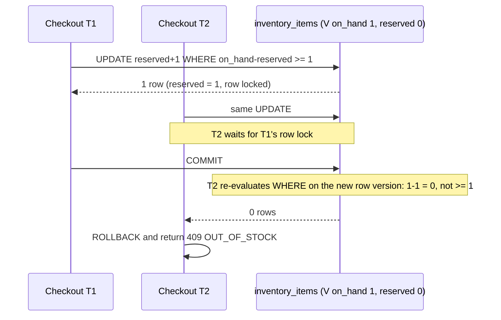

# ADR-0008: Inventory: conditional-update reservations + append-only movement ledger

Status: Draft v1 (2026-09-25)

## Status

| Field              | Value                                                                                                                                       |
| ------------------ | ------------------------------------------------------------------------------------------------------------------------------------------- |
| Decision status    | **Accepted**                                                                                                                                |
| Date               | 2026-09-25                                                                                                                                  |
| Deciders           | Lead developer                                                                                                                              |
| Supersedes         | —                                                                                                                                           |
| Superseded by      | —                                                                                                                                           |
| Related open items | `reservation_ttl_minutes` default 30 and the provider-expiry buffer are [Assumption] (canon §17.1); multi-location stock is R3 (FR-INV-006) |

## Context

**Repository findings** [Verified-repo, RF-14, audit F11]:

- Stock is one integer: `product_variants.quantity`, `integer notNullable()` with no CHECK and no default (`1780072881100_create_product_variants_table.ts:19`).
- SKU is globally unique (`:13`), so Shop B cannot reuse a SKU Shop A already has, and the unique violation leaks that fact.
- Nothing prevents two variants with the same option combination.
- There are no reservations and no movement history.

**Business facts.**

- COD orders sit for days between placement, vendor acceptance and delivery (Q4, Q5 [Confirmed]).
- In R1.1, gateway payments stay pending until the provider session expires. eSewa ePay's window is about 5 minutes [Verified-doc, https://developer.esewa.com.np/pages/Epay, accessed 2026-09-25]. Khalti's link expiry comes back as `expires_at` in the initiate response, and its docs contradict themselves on 30 versus 60 minutes [Verified-doc, https://github.com/khalti/docs.khalti.com/blob/master/content/khalti-epayment.md, accessed 2026-09-25].
- Stock must be held during these windows without being counted as shipped.
- Vendors dispute stock counts, and support needs to explain every change, which is why FR-INV-001 requires adjustments with a reason and FR-INV-005 requires a drift-detection job.

**PostgreSQL concurrency semantics.** Under READ COMMITTED, when an UPDATE finds a row already updated by a concurrent transaction, "the would-be updater will wait for the first updating transaction to commit or roll back". Then "the search condition of the command (the WHERE clause) is re-evaluated to see if the updated version of the row still matches" [Verified-doc, https://www.postgresql.org/docs/18/transaction-iso.html, accessed 2026-09-25]. A single conditional UPDATE is therefore an atomic check-and-reserve with no explicit `SELECT … FOR UPDATE`.

**Framework.** Lucid 22.4.2 exposes `forUpdate()`, `skipLocked()` and raw queries inside managed transactions [Verified-doc, `adonis_stack` research].

## Decision

1. **Tables** (owned by the `inventory` module, the only writer of stock, enforced by T-ARCH-001). Full columns in [docs/04](../04-domain-model-and-data-dictionary.md).
   - `inventory_items(variant_id PK, shop_id, on_hand, reserved, version)`: the current-state projection, with `CHECK (on_hand >= 0)`, `CHECK (reserved >= 0)` and `CHECK (reserved <= on_hand)`, and a composite FK to `product_variants(id, shop_id)`.
   - `inventory_reservations(id, shop_id, variant_id, order_id, order_item_id, quantity > 0, status, expires_at)` with status `held | committed | released | consumed`.
   - `inventory_movements`: **append-only**. `kind` is one of `adjustment | stocktake | reserve | release | commit | ship | return_restock | rto_restock | correction`. Columns include `on_hand_delta`, `reserved_delta`, `reason_code`, `actor_user_id`, `reference_type/id` and `request_id`. `REVOKE UPDATE, DELETE` plus a trigger that raises on UPDATE/DELETE.
2. **Reserve inside `placeOrder`** (step 8 of the canonical algorithm in [docs/05](../05-order-payment-and-inventory-lifecycles.md)). Lines are processed in ascending `variant_id` order, a consistent lock order that prevents deadlocks between multi-line carts:

   ```sql
   UPDATE inventory_items
      SET reserved = reserved + :qty, version = version + 1, updated_at = now()
    WHERE variant_id = :variant_id AND on_hand - reserved >= :qty
   RETURNING on_hand, reserved;
   ```

   - Zero rows: the transaction rolls back. The API returns 409 `OUT_OF_STOCK`, with per-line available quantities re-read _after_ the rollback.
   - Otherwise a reservation row and a `reserve` movement are inserted in the same transaction.

3. **Reservation lifecycle.**
   - **COD**: the reservation is `committed` at placement, with no expiry.
   - **Gateway (R1.1)**: the reservation is `held`, with `expires_at` = provider session expiry (from the initiate response where available) + 10 minutes, falling back to `platform_settings.reservation_ttl_minutes` (30).
   - `held → committed` on verified capture; `held → released` on expiry or cancellation.
   - `committed → consumed` on the `shipped` fulfillment event, which does `on_hand -= q, reserved -= q`.
   - `committed → released` on cancellation or vendor rejection before shipment (`reserved -= q`).
   - Return-to-origin or accepted returns restock only when the vendor or support records receipt (`rto_restock` / `return_restock`, `on_hand += q`).
4. **Expiry never trusts the clock alone.** The expiry job (ADR-0010) runs every minute. For a held reservation whose payment is still `pending`, it first asks the payment module to verify with the provider (ADR-0012). A capture that arrives after release goes through the late-capture path in docs/05 (re-reserve if stock allows, otherwise a refund with reason `stock_unavailable_after_payment`).
5. **Vendor stock changes.**
   - `adjustInventory` (a delta with a reason code) and `stocktake` (counted value plus `expected_on_hand`; a mismatch returns 409 `CONFLICT` so a stale screen cannot overwrite a concurrent sale). Both require `Idempotency-Key`.
   - A reduction that would make `on_hand < reserved` fails the CHECK, and the UI explains how many units open orders are holding.
6. **Projection invariant.** For every variant, `on_hand = Σ on_hand_delta` and `reserved = Σ reserved_delta` over its movements. A nightly drift job compares them and alerts on any difference (FR-INV-005).



## Alternatives considered

| Alternative                                                   | Why rejected                                                                                                                                                                                  |
| ------------------------------------------------------------- | --------------------------------------------------------------------------------------------------------------------------------------------------------------------------------------------- |
| Decrement `on_hand` at order time, with no reservations       | Cancellations, rejections, RTO and payment expiry all have to "give back" stock with no record of what is outstanding. Vendors cannot tell sellable stock from units promised to open orders. |
| `SELECT … FOR UPDATE`, check in application code, then UPDATE | Correct, but two round trips per line with the lock held longer. The conditional UPDATE does the same in one statement, and the error detail is re-read after rollback.                       |
| SERIALIZABLE isolation with retry                             | The whole checkout transaction retries on any conflict, including unrelated reads, which causes retry storms on popular items. It is harder to reason about for a small team.                 |
| Redis atomic counters                                         | A second source of truth that can disagree with PostgreSQL after a crash. Redis is not in the R1 stack (ADR-0002).                                                                            |
| Event-sourced stock only (movements, no projection)           | Every availability read and listing refresh would need a `SUM()`. The projection plus ledger gives fast reads and a full audit trail.                                                         |
| PostgreSQL advisory locks per variant                         | Extra locking discipline that does not work with transaction-mode pools and adds nothing over row locks.                                                                                      |

## Consequences

**Positive**

- Overselling cannot happen even with buggy application code: the conditional UPDATE and `CHECK (reserved <= on_hand)` both enforce it.
- Every stock change has an actor, a reason and a request ID, so vendor disputes can be answered from data.
- Vendors see on-hand, reserved and available per variant.

**Negative**

- A very hot variant (a single flash-sale item) serializes checkouts on its row lock, so those checkouts queue for milliseconds each.
- Three tables and a lifecycle instead of one integer. RTO restock depends on the vendor recording receipt.

**Risks**

- _A code path updates `inventory_items` without inserting a movement._ Mitigation: only `inventory` actions write these tables (T-ARCH-001), and the drift job detects any mismatch within 24 h.
- _Expired reservations are never released because the job stalls._ Mitigation: an alert when any `held` reservation is more than 10 minutes past `expires_at` ([docs/11](../11-deployment-and-operations.md)).

## When to revisit

- Multi-location inventory (R3, FR-INV-006). The projection becomes keyed by (variant, location) in a superseding ADR.
- T-PERF-001 at 10× launch load shows `placeOrder` p95 above 800 ms caused by lock waits on hot variants. Consider a queue for flash-sale SKUs or per-variant reservation batching.
- The drift job reports any non-zero difference. Treat it as an incident and review this design.

## Verification

- **T-INV-003**: two concurrent checkouts for the last unit. Exactly one succeeds, and `reserved` never exceeds `on_hand`.
- **T-INV suite** ([docs/10](../10-testing-and-quality-gates.md)):
  - held → committed on capture and held → released on expiry;
  - committed → consumed on `shipped`;
  - RTO restock movement;
  - an adjustment below reserved is rejected;
  - a stocktake with a stale `expected_on_hand` returns 409.
- **Append-only test**: `UPDATE inventory_movements …` and `DELETE` raise an error.
- **Drift job test**: a seeded mismatch triggers an alert.
- **T-PERF-001**: k6 checkout scenario with contention on a small set of variants.

## Related

- [State machines and checkout algorithm](../05-order-payment-and-inventory-lifecycles.md)
- [Domain model (inventory tables)](../04-domain-model-and-data-dictionary.md)
- ADR-0009 (orders), ADR-0010 (expiry and drift jobs), ADR-0012 (payment verification before release)
