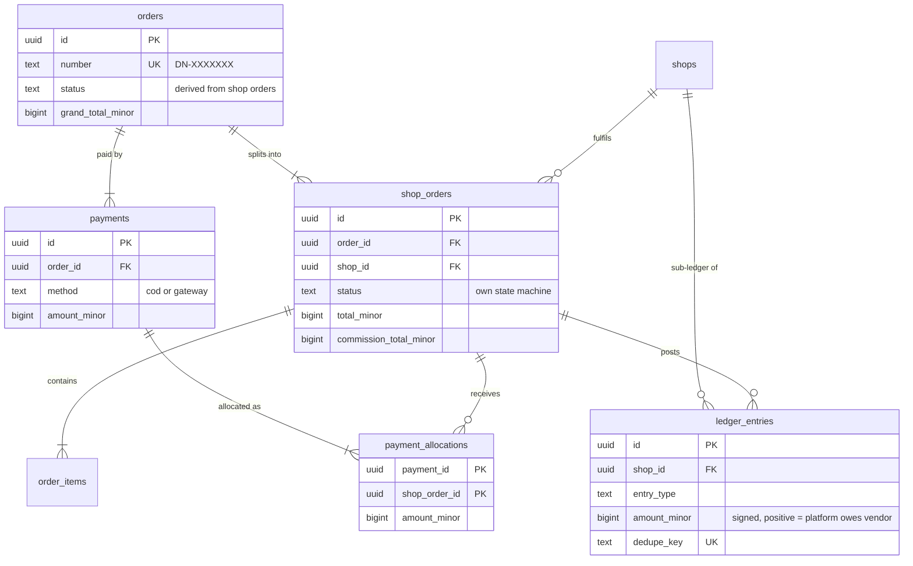

# ADR-0009: Multi-shop checkout: parent order + shop orders; vendor ledger with signed balances

Status: Draft v1 (2026-09-25)

## Status

| Field | Value |
|---|---|
| Decision status | **Accepted** for the order hierarchy and the vendor ledger (R1). **Proposed** for platform-as-payee gateway collection and payouts (R1.1), pending VX-01 / OD-02. |
| Date | 2026-09-25 |
| Deciders | Product owner, lead developer (accountant and legal counsel for the R1.1 part) |
| Supersedes | — |
| Superseded by | — |
| Related open items | OD-02, OD-04 (commission rate and basis), OD-05 (COD commission remittance terms), OD-06 (hold days), OD-11 / OD-27 (tax on commission and payouts), VX-01, VX-08 |

## Context

**Confirmed product decisions:**
- Q2: a multi-shop cart pays with ONE payment, split into per-shop suborders.
- Q3: DripNepal is the payee for gateway payments and pays vendors out, subject to legal and NRB confirmation (VX-01).
- Q4: COD at launch (R1); one wallet gateway in R1.1.
- Q5: vendors ship with their own couriers.

**Consequence for R1** (canon §1). With COD and vendor-arranged couriers, the vendor or its courier physically collects the cash. The platform holds no customer funds, and the *vendor owes the platform its commission*. The ledger must therefore allow negative vendor balances and net them against gateway receipts later. The commission remittance process is a business agreement still to be made (OD-05).

**Repository finding** [Verified-repo, RF-07, audit A1-01]: one `orders` row covers several shops with a single `status`, `payment_status` and `shipping_total` (`1780074257570_create_orders_table.ts:18-34`). Shop A shipping marks the whole order shipped. Shop B's cancellation, per-shop shipping fees, commissions and payouts cannot be represented.

**Law and providers** [Verified-doc, `nepal_payments` research, accessed 2026-09-25]:
- E-Commerce Act 2081 s8(1): payment made to a delivery service provider "shall be deemed as payment received by the business entity" (https://giwmscdnone.gov.np/media/files/E-Commerce%20Act,%202081_yr7k9o5.pdf). This supports COD, but which entity is deemed paid (platform or vendor) is a legal question [Verify-external VX-02].
- s14: the intermediary accepts return, exchange or refund "notwithstanding any terms of the contract", so the platform carries refund liability.
- Neither eSewa nor Khalti documents split payments, sub-merchants or marketplace settlement (https://developer.esewa.com.np/, https://docs.khalti.com/).
- NRB describes third-party payment aggregators as not yet provided for (NRB NPS reference document, Oct 2025). Platform-collects-then-pays-out is therefore unconfirmed [Verify-external VX-01].
- Income Tax Act s95A(6e) describes 1 % advance tax collected by a resident e-commerce operator when paying platform sellers [Verify-external VX-05; OD-27].
- Retention of transaction records: at least 5–6 years (VAT Rules r23(7), Directive 2082 s14) [Verify-external VX-08].

## Decision

1. **Order hierarchy** (tables in [docs/04](../04-domain-model-and-data-dictionary.md), state machines in [docs/05](../05-order-payment-and-inventory-lifecycles.md)):
   - `orders`: one per `placeOrder`, number `DN-XXXXXXX`. Its status (`awaiting_payment | placed | in_progress | completed | cancelled`) is derived and recomputed in the same transaction as any shop-order change.
   - `shop_orders`: one per shop in the cart, number `DN-XXXXXXX-1`. Each has its own status machine, shipping fee, totals, `commission_total_minor` and `acceptance_due_at`, and is accepted, rejected, shipped and cancelled independently.
   - `order_items`: snapshots of title, variant label, SKU, image, unit price and commission rate/amount, with a composite FK `(shop_order_id, shop_id)`.
   - Nothing cascades into orders, items, payments or the ledger (RESTRICT, ADR-0011).
2. **Payments.**
   - **COD (R1)**: one `payments` row per shop order (`method = cod`, `awaiting_collection → collected | not_collected`), because each vendor collects separately. Each COD payment has one `payment_allocations` row for its shop order, so allocation queries work the same for every method [Assumption; docs/04 owns the column list].
   - **Gateway (R1.1, Proposed)**: one payment for the grand total, with `payment_allocations` per shop order (sum = amount; partial captures and refunds allocated by largest remainder, ADR-0007).
3. **Vendor ledger.** `ledger_entries` per shop, append-only, with signed `amount_minor` where **positive means the platform owes the vendor**.
   - Entry types: `sale`, `shipping_income`, `commission`, `commission_reversal`, `cod_cash_held`, `refund`, `vendor_remittance`, `payout`, `payout_reversal`, `tax_withholding` (reserved; OD-27), `adjustment`.
   - `dedupe_key` is UNIQUE, so a replayed event cannot post twice. `available_at = delivered_at + ledger_hold_days` (default 7) [Assumption; OD-06].
   - Balance = `SUM(amount_minor)` per shop; available balance counts entries with `available_at <= now()`. **The balance may be negative.**
   - Corrections are always new entries (`adjustment`, or reversal entries with `reverses_entry_id`), never UPDATEs.
4. **Posting rules** (the authoritative table is in docs/05):
   - At COD delivery with cash collected: `sale` +items, `shipping_income` +shipping, `commission` −commission, `cod_cash_held` −cash collected.
   - At gateway capture plus delivery: the same entries without `cod_cash_held`.
   - Refund: `refund` −the vendor's share, plus `commission_reversal` +proportional commission.
   - COD commission paid by the vendor: `vendor_remittance` +amount, recorded by finance (`recordVendorRemittance`).
   - Payout (R1.1): `payout` −amount. A failed payout is reversed with `payout_reversal` +amount, and a new payout is created.
5. **Commission** is snapshotted per order item at placement. It is computed on the item line total only [Assumption; OD-04 decides whether shipping is included], so later rate changes never alter past orders.

**Worked example (COD, 10 % commission [Assumption OD-04]).** Order DN-1000001 contains Shop A: item Rs 2,000 + shipping Rs 100, and Shop B: item Rs 1,500 + shipping Rs 150. Grand total 375,000 paisa, collected as two COD payments of 210,000 and 165,000.

| Shop A event | Entry | amount_minor | Running balance |
|---|---|---|---|
| Delivered, cash collected | sale | +200,000 | +200,000 |
| | shipping_income | +10,000 | +210,000 |
| | commission | −20,000 | +190,000 |
| | cod_cash_held | −210,000 | **−20,000** (A owes Rs 200) |
| R1.1 gateway order delivered (item Rs 3,000 + shipping Rs 100) | sale / shipping_income / commission | +300,000 / +10,000 / −30,000 | **+260,000** |
| Payout after `available_at` (netted) | payout | −260,000 | 0 |

## Alternatives considered

| Alternative | Why rejected |
|---|---|
| One order row with `shop_id` and status per item (status quo) | One status cannot describe independent fulfilments. There is no place for per-shop shipping, acceptance or commission (RF-07). |
| Separate checkout and payment per shop | Contradicts Q2 (one payment), and means several gateway redirects on a slow mobile connection. |
| Per-vendor merchant accounts with gateway-side split | No provider documents split or sub-merchant settlement. Every vendor would need PSP KYC. Kept as the **fallback** if VX-01 rules out platform collection: only the payment side changes; orders and the ledger stay. |
| Mutable `balance` column on `shops` | No audit trail, lost updates under concurrency, and statements cannot be explained or re-derived. Fails retention needs (VX-08). |
| Full double-entry general ledger now (gateway clearing, commission revenue, vendor payables) | More than R1 needs. The vendor sub-ledger answers "what does each shop owe or earn". Reconciling platform-side accounts, such as Khalti netting refunds against future collections [Verified-doc, https://khalti.com/info/terms/merchant/, accessed 2026-09-25], is an R1.1 revisit trigger. |
| Forbid negative balances (prepaid commission deposits) | Does not match COD reality. Vendors would need to pre-fund before selling, which hurts onboarding of small shops. |

## Consequences

**Positive**
- Shops fulfil, cancel and reject independently. The parent status is always consistent because it is recomputed in the same transaction.
- Every rupee on a vendor statement traces to an entry with a `dedupe_key`, so replays are harmless (T-PAY-005).
- The same ledger covers R1 COD (vendor owes) and R1.1 gateway (platform owes), with netting and no schema change.

**Negative**
- R1 commission collection is a manual process. Vendors remit, and finance records it, so credit risk exists until OD-05 defines terms, for example suspending new listings when the balance is below a threshold [Assumption].
- Parent-status derivation and allocation logic add code that must be tested exhaustively.

**Risks**
- *VX-01 outcome.* If platform collection is not permitted, the R1.1 payment flow is redesigned (per-vendor merchant accounts or merchant-of-record resale) in a superseding ADR. The order and ledger parts remain.
- *Tax treatment of commission and payouts* (OD-11, OD-27). Mitigation: the reserved `tax_withholding` entry type means no schema change is needed.

## When to revisit

- VX-01 or OD-02 answered. Move the R1.1 part to Accepted, or supersede it.
- Total negative balances across shops exceed an OD-05-defined limit for 2 consecutive months, or there are more than 50 active vendors. Automate commission collection and enforcement.
- Finance needs statutory books from the system. Add platform-side double-entry accounts.
- R2 partial shipments (FR-FUL-005). Revisit one shipment per shop order.

## Verification

- **T-PAY-005**: the same webhook delivered N times, including concurrently, produces one state change and one ledger posting.
- **T-SEC-004**: a refund above the refundable amount returns 422, with the DB CHECK as backstop.
- **T-LED suite** ([docs/10](../10-testing-and-quality-gates.md)):
  - the worked example above reproduces exactly;
  - reposting with the same `dedupe_key` is rejected;
  - `ledger_entries` UPDATE/DELETE raise an error;
  - payout netting against a negative balance.
- **T-ORD / T-CHK suites**: parent status derivation for every combination of shop-order states; `SUM(shop_orders.total_minor) = orders.grand_total_minor`; COD per-shop payments created at placement.

## Related

- [State machines, checkout, ledger postings](../05-order-payment-and-inventory-lifecycles.md)
- [Domain model (orders, payments, ledger)](../04-domain-model-and-data-dictionary.md)
- [Risks and open decisions (OD-02, OD-04, OD-05, OD-06, VX-01)](../risks-and-open-decisions.md)
- ADR-0007 (money and allocation), ADR-0008 (inventory), ADR-0012 (payment providers)
