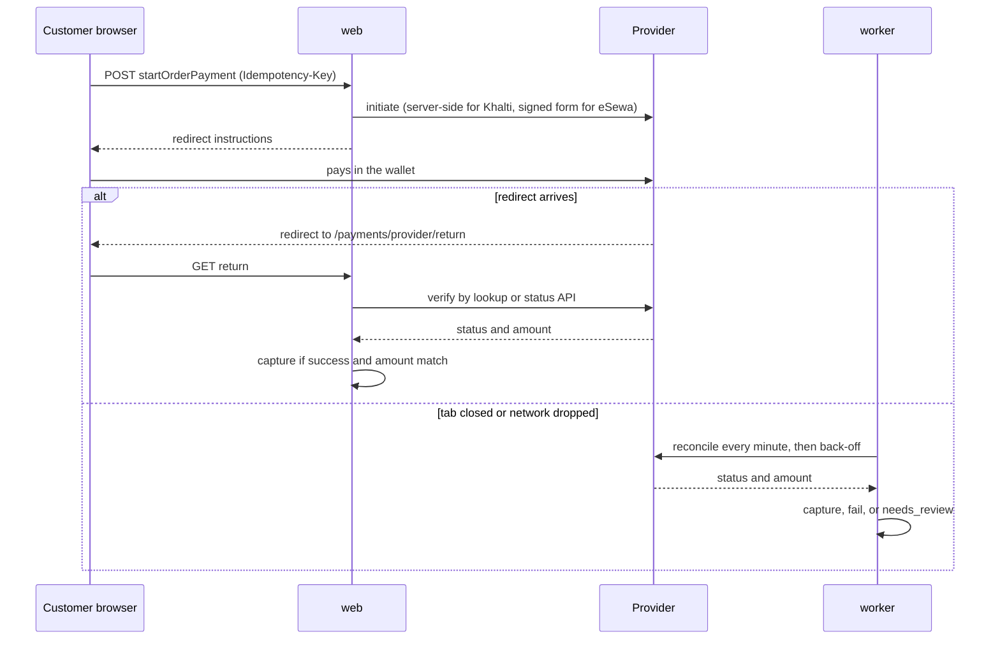

# ADR-0012: Payment provider isolation via an adapter interface; never trust redirects

Status: Draft v1 (2026-09-25)

## Status

| Field              | Value                                                                                                                                                                       |
| ------------------ | --------------------------------------------------------------------------------------------------------------------------------------------------------------------------- |
| Decision status    | **Accepted.** The port and the verify-by-lookup rule hold whichever gateway is chosen. Provider-specific adapter details are confirmed during M8 onboarding (VX-06, VX-07). |
| Date               | 2026-09-25                                                                                                                                                                  |
| Deciders           | Lead developer, product owner                                                                                                                                               |
| Supersedes         | —                                                                                                                                                                           |
| Superseded by      | —                                                                                                                                                                           |
| Related open items | OD-03 (eSewa or Khalti first), OD-02 / VX-01 (legality of platform collection), VX-06 (eSewa capabilities), VX-07 (Khalti capabilities)                                     |

## Context

Gateway payments arrive in R1.1 (M8), after a COD-only launch [Confirmed, Q4]. The first gateway is eSewa or Khalti (OD-03). Customers pay over mobile networks where a browser tab may close, the redirect back may never load, or the user may tap "back". The current `payments` table has a free-text provider and status, no event log, no refunds table, and CASCADE from orders (RF-15, audit F17) [Verified-repo].

**What the providers document** [Verified-doc, `nepal_payments` research, accessed 2026-09-25]:

| Capability               | eSewa ePay v2 (https://developer.esewa.com.np/pages/Epay)                                                      | Khalti KPG-2 (https://docs.khalti.com/khalti-epayment/)                                                                            |
| ------------------------ | -------------------------------------------------------------------------------------------------------------- | ---------------------------------------------------------------------------------------------------------------------------------- |
| Start                    | Browser form POST with HMAC-SHA256 signature over `total_amount,transaction_uuid,product_code`                 | Server-side `POST …/epayment/initiate/` returns `pidx`, `payment_url`, `expires_at`                                                |
| Return                   | Signed Base64 payload to `success_url`. `failure_url` is used for FAILURE **and PENDING**                      | GET to `return_url` with **unsigned** query params; docs say to "use the lookup API for the final validation"                      |
| Server-to-server webhook | **None documented** (merchant notified by email/SMS; use the status API if no response within 5 minutes)       | **None documented**                                                                                                                |
| Status source of truth   | Status-check API: `COMPLETE`, `PENDING`, `FULL_REFUND`, `PARTIAL_REFUND`, `AMBIGUOUS`, `NOT_FOUND`, `CANCELED` | Lookup API: only `Completed` is success; also `Pending`, `Initiated`, `Refunded`, `Expired`, `User canceled`, `Partially refunded` |
| Refund API               | **None documented** (refunds appear only as statuses)                                                          | Documented (`…/merchant-transaction/{transaction_id}/refund/`). Method, auth and amount unit are ambiguous in the docs (VX-07)     |
| Limits and quirks        | Payment window about 5 minutes; unique `transaction_uuid` per request                                          | Amount > Rs 10; NPR 200/txn cap until merchant KYC; link expiry docs contradict themselves (30 vs 60 min)                          |

connectIPS and Fonepay document neither a public webhook nor a refund API. eSewa's separate _Intent_ API does POST a signed server callback, but only development URLs are published (https://developer.esewa.com.np/pages/Intent). No provider documents split or marketplace settlement (VX-01).

## Decision

1. **`PaymentProvider` port** in `app/modules/payments/providers/port.ts`:
   - `initiate(attempt) → { redirect: { kind: 'form', action, fields } | { kind: 'url', url }, providerReference, expiresAt }`
   - `verify(attempt) → { status: captured | pending | failed | expired | cancelled | refunded | partially_refunded | unknown, amountMinor, providerPaymentId, raw }`
   - `parseReturn(request) → { attemptKey, signatureValid? }` and optionally `parseWebhook(request)`
   - `refund(refund) → { status, providerRefundId } | 'unsupported'`
   - `capabilities: { refundApi, serverWebhook, minAmountMinor, perTxnCapMinor? }`

   Adapters live in `app/modules/payments/providers/<provider>.ts`. Only the OD-03 winner is built in M8. A `fake` adapter backs all tests. Credentials and hosts come from per-environment env vars. UAT keys (eSewa's is public) are rejected at boot when `NODE_ENV=production`.

2. **One provider transaction per attempt.** Each retry creates a new `payments` row (`attempt_no`) and a new provider reference (eSewa `transaction_uuid`, Khalti `purchase_order_id`), unique per `(provider, provider_reference)`. The exact amount strings sent are stored for signature and status comparison (ADR-0007). A partial unique index allows at most one live gateway attempt per order.
3. **Never trust redirects.**
   - `GET /payments/{provider}/return` records a `provider_events` row (`kind = return`), checks the signature where one exists, and uses the payload **only to locate the attempt**. It then calls `verify()` server-to-server.
   - A state change requires a verified success status **and** `amountMinor` equal to the stored amount.
   - Khalti's unsigned `status=Completed` query parameter is ignored.
4. **Webhook endpoint for providers that have one.** `POST /api/v1/webhooks/payments/{provider}` (CSRF-exempt by exact route, no session):
   - inserts `provider_events` with UNIQUE (`provider`, `provider_event_key`) and returns 200 once the insert is durable;
   - enqueues `payments.verify`, which applies the same verify-by-lookup rule. A signed callback is a hint, not proof.
5. **Reconciliation is required, not optional.** `payments.reconcile` (ADR-0010) runs every minute and verifies each non-terminal gateway payment whose `next_verification_at` is due:
   - every minute for the first 30 minutes after initiation, then exponential back-off;
   - after the provider expiry plus a grace period and the maximum attempts, `pending → needs_review` with an ops alert.
   - `PENDING`/`AMBIGUOUS`/`Pending` are **never** auto-failed, and their stock is never released without a lookup (ADR-0008).
6. **Status mapping** (adapter-internal):
   - eSewa: `COMPLETE` → captured; `PENDING`/`AMBIGUOUS` → pending; `NOT_FOUND`/`CANCELED` → failed; `FULL_REFUND`/`PARTIAL_REFUND` → refunded / partially_refunded; the error `{"code":0,…}` is retryable.
   - Khalti: `Completed` → captured; `Pending`/`Initiated` → pending; `Expired` → expired; `User canceled` → cancelled; `Refunded`/`Partially refunded` → refunded / partially_refunded.
7. **Late capture.** A capture verified after local expiry or cancellation re-reserves stock if available. Otherwise the shop order is cancelled with `stock_unavailable_after_payment` and a refund is created automatically (docs/05).
8. **Refund methods** (canon §17 values):
   - `gateway_api`: Khalti refund API. Unknown outcomes (timeouts) go to `needs_review` and are resolved by lookup, never blindly retried (T-PAY-008).
   - `gateway_manual`: eSewa. The operator refunds through the merchant portal or eSewa support, records the provider reference, and reconciliation confirms `FULL_REFUND`/`PARTIAL_REFUND`.
   - `manual_transfer`: COD, bank or wallet transfers with `paid_reference`.
9. **Outbound calls** always happen **outside** database transactions, with a 10 s timeout, `request_id` in the metadata, and provider idempotency derived from `payments.id`. Results are stored in a short follow-up transaction.

## Alternatives considered

| Alternative                                    | Why rejected                                                                                                                       |
| ---------------------------------------------- | ---------------------------------------------------------------------------------------------------------------------------------- |
| Trust eSewa's signed success redirect          | PENDING goes to `failure_url`, a closed tab loses the redirect, and a replayed old payload proves nothing about the current state. |
| Wait for provider webhooks                     | Neither ePay nor KPG-2 documents one.                                                                                              |
| Third-party SDKs (e.g. nepal-payment-go)       | Unofficial, not TypeScript, and they encode undocumented assumptions (such as eSewa's `data` parameter name).                      |
| Provider calls directly in controllers         | Blocks the second gateway (FR-PAY-005, R2) and makes tests hit sandboxes. The port allows a fake adapter.                          |
| Client-side confirmation via a JS SDK callback | The client can forge it. The server must confirm.                                                                                  |

## Consequences

**Positive**

- Orders are confirmed correctly even when the redirect never arrives, which on mobile networks is the common case, not an edge case.
- The same rule applies to every provider, including future connectIPS or Fonepay adapters.
- Refund handling matches what each provider can actually do.

**Negative**

- Polling load on provider APIs, whose rate limits are unknown (VX-06, VX-07).
- `needs_review` payments and eSewa manual refunds create ops work. Runbooks are in [docs/11](../11-deployment-and-operations.md).

**Risks**

- _Unconfirmed provider details:_ the eSewa production status host, the eSewa return parameter name, and Khalti's refund method/auth/unit. Mitigation: a UAT sign-off checklist in M8 before go-live.
- _Legal:_ platform collection may need NRB clearance (VX-01). The port also supports per-shop credentials if the fallback model is chosen (ADR-0009).

## When to revisit

- A provider publishes signed server-to-server notifications for ePay or KPG-2. Wire the webhook, reduce polling frequency, and keep verify-by-lookup.
- A second gateway (R2, FR-PAY-005) or connectIPS for high-value carts (wallet balances are capped at NPR 50,000 [Verified-doc, NRB Unified Directive on Payment Systems 2082, https://www.nrb.org.np/psd/%e0%a4%a8%e0%a5%87%e0%a4%aa%e0%a4%be%e0%a4%b2-%e0%a4%b0%e0%a4%be%e0%a4%b7%e0%a5%8d%e0%a4%9f%e0%a5%8d%e0%a4%b0-%e0%a4%ac%e0%a5%88%e0%a4%82%e0%a4%95%e0%a4%ac%e0%a4%be%e0%a4%9f-%e0%a4%ad%e0%a5%81-3/, accessed 2026-09-25]).
- More than 2 % of gateway payments reach `needs_review` in a month.
- VX-01 requires per-vendor merchant accounts.

## Verification

- **T-PAY-005**: the same webhook or return delivered N times, including concurrently, gives one capture and one ledger posting.
- **T-PAY-008**: a refund request times out after the provider processed it. It ends `succeeded` after lookup, with no double refund.
- **T-PAY suite** ([docs/10](../10-testing-and-quality-gates.md)):
  - a forged Khalti return (`status=Completed` in the URL, lookup says `Pending`) does not capture;
  - an amount mismatch does not capture;
  - a `PENDING` redirect to `failure_url` does not release stock;
  - late capture triggers re-reserve or refund;
  - reconciliation back-off schedule;
  - UAT keys are rejected at boot in production.
- **Contract tests** against recorded sandbox responses for the chosen provider.
- **CSRF scope test**: only `/api/v1/webhooks/payments/*` is exempt.

## Related

- [State machines (Payment, Refund) and checkout](../05-order-payment-and-inventory-lifecycles.md)
- [API catalogue (startOrderPayment, receivePaymentWebhook, refunds)](../06-api-design.md)
- [Threat model (forged returns, replay)](../07-security-threat-model-and-permissions.md)
- ADR-0009 (allocations, ledger), ADR-0010 (reconciliation jobs), ADR-0008 (reservation expiry)
