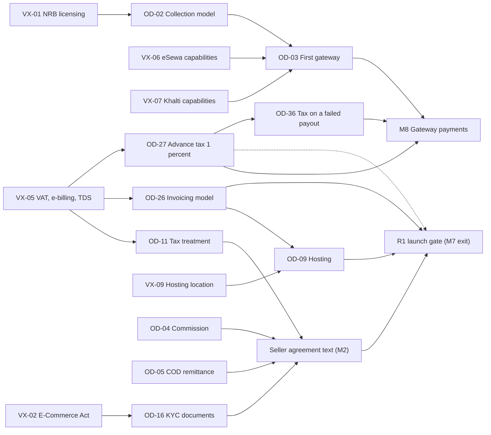

# DripNepal: Risks and Open Decisions

Status: Draft v1 (2026-09-25)

Reviewed: critic pass A4.4 (2026-09-26)

This document is the single source of truth for three registers:

- **Open decisions (OD-01 … OD-54).** Questions a named owner must answer before a milestone can start or finish.
- **External verifications (VX-01 … VX-15).** Legal, tax, provider and pricing facts that an authoritative party must confirm before the design relies on them.
- **Risks (R-01 … R-32).** Things that could go wrong for DripNepal specifically, with scores, mitigations, owners and early warnings.

Other documents cite these IDs and do not restate the content. When a decision is made, the ruling moves into the owning document (and an ADR where it is structural). This register keeps the date, the decision text and the links. Evidence labels ([Confirmed], [Verified-repo], [Verified-doc], [Assumption], [Open], [Verify-external]) are defined in [00 §1.2](00-context-assumptions-and-questions.md#12-evidence-labels). Assumptions A-xx live in [00](00-context-assumptions-and-questions.md), not here.

External facts below come from the [research notes](research/README.md) compiled on 2026-09-25. Each one carries its source URL, and every URL was accessed on 2026-09-25. Nothing in this register claims that DripNepal is compliant with any law; legal readings are [Verify-external] until the named verifier confirms them in writing. English texts of Nepali laws are translations and **the Nepali text prevails** (see R-23).

**Related documents**

| Doc                                                   | Owns                                                                                                           | Why this register links to it                             |
| ----------------------------------------------------- | -------------------------------------------------------------------------------------------------------------- | --------------------------------------------------------- |
| [00](00-context-assumptions-and-questions.md)         | Context, repository findings (RF-xx), assumptions (A-xx)                                                       | Assumptions that ODs will replace                         |
| [01](01-product-requirements.md)                      | FR/NFR, scope, metrics                                                                                         | Requirements an OD or risk affects                        |
| [02](02-user-journeys-and-acceptance-criteria.md)     | Journeys J-xx, acceptance criteria                                                                             | Journeys that change when an OD is decided                |
| [03](03-system-architecture.md)                       | Modules, processes, jobs                                                                                       | Job, queue and hosting risks                              |
| [04](04-domain-model-and-data-dictionary.md)          | Tables, invariants, data classification, retention                                                             | Schema consequences of ODs                                |
| [05](05-order-payment-and-inventory-lifecycles.md)    | State machines, checkout, ledger postings                                                                      | Payment, refund and ledger decisions                      |
| [06](06-api-design.md) / [openapi.yaml](openapi.yaml) | API conventions, endpoint catalogue                                                                            | OD-13 casing, error codes                                 |
| [07](07-security-threat-model-and-permissions.md)     | Threats, permissions, privacy                                                                                  | Breach, tenancy and privacy risks                         |
| [08](08-ui-ux-and-design-system.md)                   | UI/UX, design system                                                                                           | OD-22, VX-12, VX-13, accessibility                        |
| [09](09-code-structure-and-engineering-standards.md)  | Code structure, standards                                                                                      | OD-25 upgrade, dependency rules                           |
| [10](10-testing-and-quality-gates.md)                 | Test IDs, CI gates                                                                                             | Detective controls referenced by risks                    |
| [11](11-deployment-and-operations.md)                 | Deployment, runbooks                                                                                           | Hosting, backup, incident response                        |
| [12](12-roadmap-and-backlog.md)                       | Milestones M0–M9, backlog, traceability                                                                        | Milestone dates that set each "latest responsible moment" |
| [adr/](adr/README.md)                                 | [ADR-0001](adr/0001-record-architecture-decisions.md) … [ADR-0018](adr/0018-error-contract-problem-details.md) | Where structural decisions are recorded                   |

---

## 1. How to use this register

### 1.1 What belongs here and what does not

An item belongs here if it is still undecided, still unverified, or still a live risk. A settled rule belongs in the owning document. For example, once OD-06 is decided, the numbers go into `platform_settings` defaults in [04](04-domain-model-and-data-dictionary.md) and the completion rule in [05](05-order-payment-and-inventory-lifecycles.md). The OD row here changes to Decided and records the date, the ruling and the links.

Writers of other documents must not invent new OD, VX or R numbers. They add a request under "Consistency notes for editor" in their own document, and the tech lead assigns the next free number here during the weekly review.

### 1.2 Owners

DripNepal has 1–2 developers and a small budget [Confirmed] (Q1), so "owner" means a role, and one person may hold several roles.

| Role                    | Who, in practice                                               | Decides or verifies                                                                                                                                                 |
| ----------------------- | -------------------------------------------------------------- | ------------------------------------------------------------------------------------------------------------------------------------------------------------------- |
| **Product owner**       | The business owner of DripNepal, who also owns the repository  | Business policy ODs (commission, COD, returns, SLAs, moderation, brand policy, repo visibility). Approves every recommendation before it becomes Decided.           |
| **Tech lead**           | The lead developer                                             | Technical ODs (OD-08, OD-09, OD-12, OD-13, OD-25). Runs the weekly review and maintains this file.                                                                  |
| **Legal counsel**       | An external Nepali lawyer engaged per question pack (§3.2)     | VX-01 … VX-04, VX-08, VX-09 and the legal side of OD-02, OD-07, OD-16, OD-17, OD-21, OD-24, OD-26, OD-35. Must check the Nepali original of every clause relied on. |
| **Accountant**          | An external chartered accountant or tax adviser                | VX-05, and OD-11, OD-26, OD-27, OD-36. Signs off statement and payout formats.                                                                                      |
| **Provider onboarding** | Whoever holds merchant relationships (the product owner in R1) | Written confirmations from eSewa, Khalti, the email provider and hosting vendors (VX-06, VX-07, VX-14, VX-15).                                                      |

### 1.3 Status values

| Register | Status       | Meaning                                                                                                                                                 |
| -------- | ------------ | ------------------------------------------------------------------------------------------------------------------------------------------------------- |
| OD       | **Open**     | No recommendation yet, or the recommendation depends on an unresolved VX.                                                                               |
| OD       | **Proposed** | A recommendation is written below. The owning docs already use the recommended default, labelled [Assumption] or [Open]. The owner has not approved it. |
| OD       | **Decided**  | The owner approved a ruling. The date, ruling and ADR link are recorded in §2.3. The owning documents may still need updating.                          |
| OD       | **Resolved** | Decided, and every referencing document and any code have been updated. No [Open] label for this OD remains in the docs set.                            |
| VX       | **Open**     | No primary source yet, or the primary sources are silent or contradict each other on the point that matters.                                            |
| VX       | **Proposed** | Primary evidence has been gathered (listed in §3.1). The named verifier has not confirmed it in writing.                                                |
| VX       | **Resolved** | The verifier confirmed it in writing. The date and the reference to the written opinion or provider email are recorded.                                 |
| Risk     | **Open**     | Live risk. Mitigations are planned or in place.                                                                                                         |
| Risk     | **Resolved** | The cause is gone (for example, VX-01 answered favourably), or the owner formally accepted the residual risk.                                           |

### 1.4 Review cadence

- **Weekly during R0 and R1** (M0–M7): 30 minutes, product owner and tech lead. Fixed agenda:
  1. New evidence on any VX, and replies from counsel, the accountant or providers.
  2. Every OD whose latest responsible moment falls within the next two weeks, per the milestone plan in [12](12-roadmap-and-backlog.md). Decide it, or record the fallback in the table.
  3. Every risk scoring 12 or more, plus any risk whose trigger fired this week.
  4. Commit the changes to this file in the same session.
- **Fortnightly during R1.1** (M8), **monthly from R2**.
- **Event-driven reviews**, held within 3 working days of the event:
  - a new Finance Act (effective from Shrawan 1, the start of Nepal's fiscal year; see VX-05);
  - an NRB circular on payment aggregation;
  - a DoCSCP or IRD notice;
  - a change to eSewa or Khalti documentation;
  - a security incident;
  - a milestone slipping by more than two weeks.

Legal counsel and the accountant are not asked to attend. They receive a question pack (§3.2) and answer in writing, which keeps a small budget to one or two paid engagements before launch.

### 1.5 Recording a decision

When an OD becomes Decided:

1. Change the status in §2.2. Add an entry to §2.3 with the date (AD, Asia/Kathmandu), the ruling in one or two sentences, who decided, and links.
2. If the ruling is structural or expensive to reverse, write or supersede an ADR in [adr/](adr/README.md) and link it. Examples: collection model, hosting, invoicing, UI kit tier, framework upgrade. Settings values (COD limits, SLA hours) need no ADR; the §2.3 entry is enough.
3. Update the owning documents named in the [00 §1.4 ownership map](00-context-assumptions-and-questions.md#14-document-ownership-map), following [00 §1.5](00-context-assumptions-and-questions.md#15-how-a-decision-changes). Remove the `[Open] OD-xx` labels. Update traceability in [12](12-roadmap-and-backlog.md) if scope moved.
4. Commit with a message such as `docs: decide OD-18 COD limits`. The OD becomes Resolved when step 3 is complete.

The decision log entry has this format:

```text
OD-xx — Decided 2026-MM-DD by <role>
Ruling: <one or two sentences>
Evidence: <VX-xx resolved / opinion reference / data used>
ADR: <ADR-00NN link or "none (setting value)">
Docs updated: <list>  |  Status: Decided → Resolved on <date>
```

### 1.6 Latest responsible moment and safe defaults

The **latest responsible moment (LRM)** is the last point at which the decision can be made without rework or a slipped release. Milestone dates live in [12](12-roadmap-and-backlog.md), so LRMs here are stated relative to milestone events, for example "before the first M5 placeOrder PR merges".

Many ODs set **values stored in `platform_settings`** (COD limits, SLA hours, hold days). Code for these is not blocked: developers build against the default in [04a §15.1](04a-data-dictionary-tables.md#151-platform_settings) and the value changes later without a deploy. For those ODs the LRM is the launch gate, not the milestone start. Section 5 separates decisions that block **code** from decisions that block **launch**.

### 1.7 Risk scoring

Score = likelihood (L) × impact (I), each rated 1–5 on these DripNepal-specific scales:

| Rating | Likelihood (within the next 12 months) | Impact                                                                                                                    |
| ------ | -------------------------------------- | ------------------------------------------------------------------------------------------------------------------------- |
| 1      | Very unlikely                          | Cosmetic. No customer or vendor notices.                                                                                  |
| 2      | Unlikely                               | Rework under 1 week, or a minor cost (under about Rs 10,000 a month) [Assumption].                                        |
| 3      | Possible                               | A feature or milestone slips 1–4 weeks, or limited customer harm that is refundable and fixed within days.                |
| 4      | Likely                                 | Launch or R1.1 blocked, money lost or mis-posted, a regulator fine is possible, or an outage over 4 h (the proposed RTO). |
| 5      | Almost certain                         | Enforced shutdown, criminal exposure for staff, customer money held unlawfully, or a mass personal-data breach.           |

Bands: **15–25 High** (reviewed weekly until below 15), **8–14 Medium**, **1–7 Low**.

---

## 2. Open decisions (OD-01 … OD-27)

### 2.1 How the decisions depend on each other

Most ODs are independent settings. A few legal and tax decisions chain together and gate R1 launch or M8. The diagram shows only those chains. Solid arrows mean "must be answered first". The dotted arrow is the COD part of OD-27 (see §5).



Of the ODs registered from the deep audits (OD-28 … OD-54), a few depend on another decision. OD-36 needs OD-27's answer first (in the diagram). OD-35 is decided together with OD-07 and OD-05, because it is another way of paying COD refunds, and OD-46 together with OD-05 and OD-14. OD-32 takes the payer of a return lost on the way back from OD-30. The reveal part of OD-38 applies only if OD-49 approves the staff reveals. The others can be decided on their own.

### 2.2 Decision table

"Blocks" gives the milestone whose start or exit cannot pass without the decision. Where one decision gates several milestones, each is listed with the part of the decision it needs. §5 lists the same gates by milestone, and [12 §2.5](12-roadmap-and-backlog.md#25-how-decisions-gate-a-milestone) follows §5.

OD-28 to OD-54 register the owner decisions that the three deep audits left open: Audit 1 of 05 (A1-xxx, [05 Consistency note 20](05-order-payment-and-inventory-lifecycles.md#consistency-notes-for-editor)), Audit 4 of 07 (A4-xxx, [07 Consistency notes 4, 7, 18, 20–24](07-security-threat-model-and-permissions.md#consistency-notes-for-editor)) and Audit 2 of 04 and 04a (A2-xxx, IN-xx, the [Deep audit 2 note of 04](04-domain-model-and-data-dictionary.md#deep-audit-2-2026-09-30)). Each row names its audit IDs, and the audit notes keep the detail. A row that asks to approve a departure the docs already use is Proposed, with the recommendation to approve. "Tech-lead lean" marks a first view on an Open row; it is not yet a recommendation the docs use.

| ID    | Question                                                                                                                                                                                                                                                                                                                                             | Options                                                                                                                                                                                                                                                                                                                                                                                                                                                                                                                                  | Recommendation and reasoning                                                                                                                                                                                                                                                                                                                                                                                                                                                                                                                                                                                                                                                                                                                                                                                                                                                                                                                                                                                                                                                                          | Owner                                         | Blocks                                                                                                                        | Latest responsible moment                                                                                                                                       | Status       |
| ----- | ---------------------------------------------------------------------------------------------------------------------------------------------------------------------------------------------------------------------------------------------------------------------------------------------------------------------------------------------------- | ---------------------------------------------------------------------------------------------------------------------------------------------------------------------------------------------------------------------------------------------------------------------------------------------------------------------------------------------------------------------------------------------------------------------------------------------------------------------------------------------------------------------------------------- | ----------------------------------------------------------------------------------------------------------------------------------------------------------------------------------------------------------------------------------------------------------------------------------------------------------------------------------------------------------------------------------------------------------------------------------------------------------------------------------------------------------------------------------------------------------------------------------------------------------------------------------------------------------------------------------------------------------------------------------------------------------------------------------------------------------------------------------------------------------------------------------------------------------------------------------------------------------------------------------------------------------------------------------------------------------------------------------------------------- | --------------------------------------------- | ----------------------------------------------------------------------------------------------------------------------------- | --------------------------------------------------------------------------------------------------------------------------------------------------------------- | ------------ |
| OD-01 | Is it true that no production database with real users, shops or orders exists, so the 26 exploratory migration files (25 tables plus pgcrypto) can be replaced?                                                                                                                                                                                     | (a) Re-baseline: one reviewed baseline migration ([ADR-0011](adr/0011-schema-rebaseline-before-production.md)). (b) Incremental ALTER migrations on top of the 26 files.                                                                                                                                                                                                                                                                                                                                                                 | **Decided 2026-09-30: (a)** (§2.3). RF-06, RF-11, RF-13, RF-16, RF-17, RF-20, RF-23, RF-24 and RF-41 touch nearly every table: cascades into orders, decimal money, global uniques, missing tenant FKs. As ALTERs they would cost more than a clean baseline and keep broken history. The product owner confirmed on 2026-09-30 that no hosted instance holds real users, shops or orders. Only test data may be discarded: a hosted instance that holds only test data is exported with a one-off script and not migrated. If one is found to hold real orders (kept 7 years, [04 §19.3](04-domain-model-and-data-dictionary.md#193-retention-schedule)), or real accounts and shops the product owner decides to keep, the re-baseline stops and ADR-0011 is superseded by an incremental plan for the affected tables ([ADR-0011](adr/0011-schema-rebaseline-before-production.md#when-to-revisit), When to revisit). [ADR-0011](adr/0011-schema-rebaseline-before-production.md) uses the file order of [04 §20.2.2](04-domain-model-and-data-dictionary.md#2022-baseline-files-and-their-order). | Product owner                                 | M0                                                                                                                            | Before the M0 baseline migration PR merges                                                                                                                      | **Decided**  |
| OD-02 | Under which legal model may DripNepal accept gateway payments for vendors' goods and later pay vendors? Which entity holds the merchant account?                                                                                                                                                                                                     | (a) Platform collects into its own merchant account and pays vendors off-gateway (Q3 as stated). (b) Merchant of record: DripNepal buys and resells, so list-based duties (E-Commerce Act s15) and VAT on the full sale apply. (c) One PSP merchant account per vendor, with one payment per shop order; this breaks one-payment checkout (Q2). (d) Stay COD-only until counsel clears (a).                                                                                                                                              | R1 is COD-only, so DripNepal holds no customer funds and R1 does not need this decision [Confirmed] (Q3, Q4). For R1.1, get a written opinion before M8. NRB describes third-party aggregators as not yet provided for (VX-01), so (a) carries the most regulatory uncertainty. Keep the ledger ([ADR-0009](adr/0009-multi-shop-orders-and-vendor-ledger.md)) and `payment_allocations` able to support (c). **Fallback:** if undecided at M8 start, defer M8 and continue COD. Never add store credit or wallet balances (e-money, VX-01).                                                                                                                                                                                                                                                                                                                                                                                                                                                                                                                                                           | Product owner + legal counsel                 | M8                                                                                                                            | Before applying for a gateway merchant account (KYC lead time, R-31); at the latest, M8 start                                                                   | Open         |
| OD-03 | Which gateway comes first, eSewa or Khalti?                                                                                                                                                                                                                                                                                                          | (a) Khalti KPG-2. (b) eSewa ePay v2. (c) eSewa Intent (mobile deeplink; only development URLs published).                                                                                                                                                                                                                                                                                                                                                                                                                                | **(a) Khalti**, unless customer-reach data favours eSewa ([research: nepal-payments](research/nepal-payments.md)). Khalti documents a server-side initiate that returns `pidx` and `expires_at`, a lookup API and a refund API. eSewa ePay has no refund API and a 5-minute payment window (VX-06). Neither provider documents a webhook for these flows, so the reconciliation job is required either way. Khalti constraints: amount must exceed Rs 10, and payments above NPR 200 fail until merchant KYC is complete (VX-07). Ask launch vendors which wallet their customers use.                                                                                                                                                                                                                                                                                                                                                                                                                                                                                                                | Product owner (tech lead advises)             | M8                                                                                                                            | Once OD-02 is settled; before starting merchant KYC                                                                                                             | Proposed     |
| OD-04 | What is the default commission rate, and is it charged on items only or on items plus shipping?                                                                                                                                                                                                                                                      | Basis (a) `line_total_minor` (items net of shop-funded discount), or (b) items + `shipping_fee_minor`. (b) is not a larger line `commission_base`: it needs a separate shop-order-level shipping commission snapshot (a new column and CHECK in 04a) with its own posting and reversal rules ([05 §3.5](05-order-payment-and-inventory-lifecycles.md#35-commission-allocation-per-item)). Rate: platform default `default_commission_rate_bp` with per-shop override `shops.commission_rate_bp`. Category rates come in R2 (FR-LED-006). | **Basis (a).** Shipping passes to the vendor, who pays its own courier (Q5), so commission on shipping would charge a margin on a cost the platform does not bear. The rate is a business number and a setting; docs use an illustrative 10% labelled OD-04, and the basis default is A-04. VAT on commission depends on OD-11.                                                                                                                                                                                                                                                                                                                                                                                                                                                                                                                                                                                                                                                                                                                                                                       | Product owner                                 | M2 exit (rate, in the seller-agreement text); M5 code (basis: `placeOrder` step 9 writes the commission snapshot).            | Basis: before the first M5 placeOrder PR. Rate: before the seller agreement text is final (M2 exit).                                                            | Open         |
| OD-05 | How and when do vendors pay commission on COD orders, given that they hold the cash?                                                                                                                                                                                                                                                                 | (a) Periodic statement plus bank or wallet transfer by a due date, recorded with `recordVendorRemittance`. (b) Prepaid vendor deposit drawn down by commission. (c) Weekly settlement. (d) Netting against gateway receipts (R1.1+ only).                                                                                                                                                                                                                                                                                                | **(a)** with the monthly statement of [05 §7.12](05-order-payment-and-inventory-lifecycles.md#712-statements-and-integrity-checks) (FR-LED-003), built from `ledger_entries`, payment due within 10 days of issue and a reminder at day 7 [Assumption: terms, [05 §7.5](05-order-payment-and-inventory-lifecycles.md#75-vendor-remittance-r1)]. A shop whose balance stays below −Rs 5,000 for more than 30 days is reviewed for suspension with `suspension_mode = fulfill_existing`. Add (d) once R1.1 payouts exist. Put the terms in the versioned seller agreement (`shop_agreements.agreement_version`). Avoid (b) until counsel confirms that a vendor deposit is not a regulated stored value.                                                                                                                                                                                                                                                                                                                                                                                                | Product owner (accountant on invoice and TDS) | M2 exit (agreement text); M7 code (remittance flow) and R1 launch.                                                            | Before the first launch vendor accepts the seller agreement                                                                                                     | Open         |
| OD-06 | What are the ledger hold (`ledger_hold_days`, default 7) and the return window (`return_window_days`, default 7)?                                                                                                                                                                                                                                    | Return window 7 days (CPA s14 dissatisfaction return). Optionally 15 days for sealed goods (CPA s14(5)); this needs a second settings key (for example `sealed_return_window_days`) and a product-level sealed flag in [04a §15.1](04a-data-dictionary-tables.md#151-platform_settings), plus a matching precondition in 05 §6.6. Hold = return window, or return window + return transit.                                                                                                                                               | **Keep 7/7 for R1.** Under COD the vendor already holds the cash; the hold only sets when an entry counts as available. **Before M8 payouts**, raise the hold to at least return window + 7 days, so that a late-arriving return can be netted before money leaves. Counsel must confirm whether CPA s14 applies to online sales through E-Commerce Act s31 and whether the 15-day sealed-goods window binds DripNepal (VX-04). [Assumption, [05 §7.2](05-order-payment-and-inventory-lifecycles.md#72-entry-types-and-posting-rules)] Ledger availability group rule: each delivery posting is one group, decided by its net. A group that nets positive (the platform owes the vendor), its commission debit included, waits `ledger_hold_days`; a group that nets zero or negative is available at once, as is every other entry.                                                                                                                                                                                                                                                                  | Product owner + legal counsel                 | M6 exit (values: shop orders complete after the window); M8 exit (hold revision before the first payout).                     | Values before R1 launch; hold revision before the first M8 payout                                                                                               | Proposed     |
| OD-07 | Returns and refunds: who pays return shipping, which categories are excluded (innerwear, swimwear), and how are COD customers refunded?                                                                                                                                                                                                              | (a) Vendor pays for non-conforming goods; customer pays for change of mind. (b) Platform subsidises returns. (c) Free returns for all.                                                                                                                                                                                                                                                                                                                                                                                                   | **(a) for non-conforming goods** (`not_as_described`, `damaged`, `wrong_item`): full refund including tax (E-Commerce Act s10). **Change of mind** within the window: refund without deduction from the price (CPA s14(2)). Counsel decides whether the customer may bear return transport (VX-04); Directive s8(3) bars charges after handover beyond the pre-agreed price and transport. Hygiene items are returnable only with the seal unbroken (CPA s14(4)–(5)). COD refunds go by `manual_transfer` to a bank or wallet account the customer names, never store credit. [Assumption, 05 §7.4] The platform pays the COD refund within the 7-day deadline and recovers it from the vendor through the ledger, so the OD-05 terms must cover that recovery (R-03). The DoCSCP listing application needs a published return policy (Directive s4(3)).                                                                                                                                                                                                                                              | Product owner + legal counsel                 | M6, M7 (FR-RET-006 support-mediated returns)                                                                                  | Before the M6 return flow and before the listing application                                                                                                    | Open         |
| OD-08 | Which transactional email provider?                                                                                                                                                                                                                                                                                                                  | Any transport shipped with @adonisjs/mail 10.4.0: ses, smtp, brevo, resend, mailgun, sparkpost, cloudflare, postmark [Verified-doc] (https://registry.npmjs.org/@adonisjs/mail).                                                                                                                                                                                                                                                                                                                                                         | Shortlist two providers that have a first-party transport and support DKIM, SPF and DMARC. Run a one-day seeded-inbox test to Gmail, Outlook and at least two Nepali ISP mailboxes, measuring inbox placement and delay (VX-14). Choose on placement first, then on price as published. R1 sends transactional mail only; marketing needs recorded consent (Advertisement (Regulation) Act 2076 s10(1), [Verify-external VX-03]). Code is not blocked, because development uses Mailpit.                                                                                                                                                                                                                                                                                                                                                                                                                                                                                                                                                                                                              | Tech lead                                     | M1 exit (FR-IAM-002: a verified email gates checkout)                                                                         | About 2 weeks before M1 exit, for DNS setup and domain warm-up [Assumption]                                                                                     | Open         |
| OD-09 | Which production hosting provider and region?                                                                                                                                                                                                                                                                                                        | (a) DigitalOcean BLR1 + DO Managed PostgreSQL 18 + Cloudflare + R2 ([ADR-0016](adr/0016-hosting-single-region-portable.md), provisional). (b) The same in SGP1. (c) A DoIT-listed Nepal provider. (d) Split: app offshore, invoice data in Nepal (only if OD-26 makes DripNepal an e-invoice issuer).                                                                                                                                                                                                                                    | Develop and stage on (a), and keep everything portable: Docker image, vanilla PostgreSQL, S3 API, no provider-only services. Decide production after the VX-09 opinion and a latency test from Nepali ISPs to BLR1 and SGP1; no published measurements exist (VX-15). If counsel reads DCCS Directive cl. 8(1) as binding private clients, move to (c) and rehearse the move with the restore drill T-OPS-001.                                                                                                                                                                                                                                                                                                                                                                                                                                                                                                                                                                                                                                                                                        | Tech lead + legal counsel                     | M7 launch readiness (not development)                                                                                         | 4 weeks before launch, to leave time for the restore drill, DNS and monitoring on the chosen host                                                               | Proposed     |
| OD-10 | Rate-limiter store: database or Redis?                                                                                                                                                                                                                                                                                                               | (a) @adonisjs/limiter `stores.database`. (b) Redis.                                                                                                                                                                                                                                                                                                                                                                                                                                                                                      | **Resolved 2026-09-25: (a).** @adonisjs/limiter 3.0.1 ships `stores.database` [Verified-doc], so R1 needs no Redis ([03 §12.4](03-system-architecture.md#124-rate-limiting); [ADR-0010](adr/0010-postgres-jobs-pg-boss-transactional-send.md) context).                                                                                                                                                                                                                                                                                                                                                                                                                                                                                                                                                                                                                                                                                                                                                                                                                                               | Tech lead                                     | M0                                                                                                                            | Passed                                                                                                                                                          | **Resolved** |
| OD-11 | Tax treatment: are prices VAT-inclusive, who invoices the customer, how is commission taxed, and does TDS apply to commission?                                                                                                                                                                                                                       | (a) Vendors invoice customers; DripNepal invoices vendors for commission and computes no VAT on sales. (b) DripNepal invoices customers as merchant of record.                                                                                                                                                                                                                                                                                                                                                                           | **(a)** [Assumption pending OD-26] (00 A-16). Prices are tax-inclusive final prices (E-Commerce Act s6(b); CPA s6(2)(j)). `order_items.tax_minor` and `tax_rate_bp` stay nullable. PAN-only vendors must not show VAT (VAT Act s15). Questions for the accountant: DripNepal's own VAT registration (Rs 30 lakh threshold for services, VAT Rules r6); TDS by vendors on commission (s88: 15%, or 1.5% for VAT-registered service providers); whether apparel qualifies for the 10% VAT refund on e-payments (VAT Act s25(1kha)).                                                                                                                                                                                                                                                                                                                                                                                                                                                                                                                                                                     | Accountant                                    | M2 exit (who invoices, in the seller-agreement text); R1 launch (M7 exit).                                                    | Before the seller agreement text is final                                                                                                                       | Open         |
| OD-12 | Seller dashboard prefix: `/seller/{shopSlug}` or the current `/shop/:shopSlug` [Verified-repo] (start/routes/shops.ts:27)?                                                                                                                                                                                                                           | (a) `/seller/{shopSlug}/…`. (b) Keep `/shop/:shopSlug/…`. (c) `/shops/:shopSlug/dashboard` (the title of commit 0282605).                                                                                                                                                                                                                                                                                                                                                                                                                | **Decided 2026-09-30: (a)** (§2.3); the current `/shop/:shopSlug` routes move in M0. The public storefront is `/shops/{shopSlug}`. A private namespace one letter away invites middleware-group mistakes of the RF-01 kind (authentication checked, membership not). This reverses a recent commit, but no users exist to break.                                                                                                                                                                                                                                                                                                                                                                                                                                                                                                                                                                                                                                                                                                                                                                      | Tech lead (product owner informed)            | M0 (RF-01 guard)                                                                                                              | Before the M0 membership-guard PR                                                                                                                               | **Decided**  |
| OD-13 | JSON field casing: snake_case or camelCase?                                                                                                                                                                                                                                                                                                          | (a) snake_case in JSON bodies, Inertia props and OpenAPI. (b) camelCase, with transformers mapping from DB names.                                                                                                                                                                                                                                                                                                                                                                                                                        | **Decided 2026-09-30: (a)** (§2.3). It matches column names, and transformers already build every shape explicitly, so no automatic mapping can go wrong. docs/openapi.yaml is hand-written (Adonis 7 has no OpenAPI generator), so one convention halves review effort. T-API-001 enforces it.                                                                                                                                                                                                                                                                                                                                                                                                                                                                                                                                                                                                                                                                                                                                                                                                       | Tech lead                                     | M0                                                                                                                            | Before the first `/api/v1` endpoint or transformer merges                                                                                                       | **Decided**  |
| OD-14 | Must a second person approve refunds and payouts (maker-checker), or can one operator approve their own?                                                                                                                                                                                                                                             | (a) Strict: DB CHECK `approved_by <> created_by`. (b) `platform_settings.single_operator_mode = true`: the same person approves after re-entering TOTP, and the approval is flagged in audit.                                                                                                                                                                                                                                                                                                                                            | **(b)**, but only while exactly one person holds `platform.refunds.approve` or `platform.payouts.approve`. The product owner reviews flagged approvals weekly. Switch to (a) the day a second finance-capable staff member exists. With one operator, (a) would block every refund and break the 7-day refund rule (Directive s9(3)). The shipped default stays `single_operator_mode = false` (A-20, [04a §15.1](04a-data-dictionary-tables.md#151-platform_settings)); the recommendation is to switch it on in production only under the condition above. [Assumption, 05 §7.8] Ledger adjustments above Rs 10,000 need a second finance officer's approval in the same way; this decision covers them too.                                                                                                                                                                                                                                                                                                                                                                                        | Product owner                                 | M7 code (approval rule); revisited at M8 exit if staff grew                                                                   | Before the first production refund or remittance                                                                                                                | Proposed     |
| OD-15 | Which audience values, size systems and colours?                                                                                                                                                                                                                                                                                                     | Audience {men, women, kids} or {men, women, boys, girls, unisex}. One size attribute per system. Length of the colour list.                                                                                                                                                                                                                                                                                                                                                                                                              | Audience **men, women, kids**, multi-valued; show "Unisex" when both men and women are set. `apparel_size` XS…3XL plus Free Size, `shoe_size_eu` 35–47, `waist_size_in` 26–40; `kids_age` in R2. Platform-controlled colours with `swatch_hex`; `color_family` in R2. Check against launch vendors' current catalogues before seeding.                                                                                                                                                                                                                                                                                                                                                                                                                                                                                                                                                                                                                                                                                                                                                                | Product owner (merchandising)                 | M3 code (reference seeders, which M4 navigation reads)                                                                        | Before the M3 reference seeders are written                                                                                                                     | Proposed     |
| OD-16 | Which KYC documents must a vendor provide, and may unregistered individuals sell?                                                                                                                                                                                                                                                                    | (a) Registration certificate + PAN/VAT certificate + authorised person's ID + proof of payout account. (b) (a) plus a tax clearance certificate. (c) A lighter set for `business_type = individual`.                                                                                                                                                                                                                                                                                                                                     | **(a) as the minimum.** E-Commerce Act s16(b) requires evidence of business registration, full name and address, a grievance mechanism, return and refund details, and PAN/VAT details. That suggests an unregistered individual cannot sell; counsel to confirm (VX-02). Documents are stored as `media_assets.kind = kyc_document` in the private bucket. They are personal information (Privacy Act s2(c)) with restricted access ([07](07-security-threat-model-and-permissions.md)). For an application that is never approved, the files, addresses, configuration, grievance contact and an individual's business identifiers are purged 1 year after the last rejection, and its agreements and review decisions are kept [Assumption] (00 A-33, [04 §19.3](04-domain-model-and-data-dictionary.md#193-retention-schedule)).                                                                                                                                                                                                                                                                  | Legal counsel (product owner approves)        | M2                                                                                                                            | Before the M2 shop application form is frozen                                                                                                                   | Open         |
| OD-17 | How long may vendors see a customer's name, phone and address after delivery or cancellation?                                                                                                                                                                                                                                                        | (a) Only while the shop order is non-terminal. (b) Non-terminal plus 30 days, then masked (the default of 00 A-18 and [07 §5.2](07-security-threat-model-and-permissions.md#52-vendor-visibility-of-customer-contact-data)). (c) Indefinitely.                                                                                                                                                                                                                                                                                           | **(b)** [Assumption]. Thirty days covers the 7-day return window and RTO handling. Vendors never see the customer's email, account ID or other orders, and R1 has no export. E-Commerce Act s12 allows buyer, business and delivery provider to exchange transaction information; Privacy Act s12(3) limits use to the purpose of collection (VX-03).                                                                                                                                                                                                                                                                                                                                                                                                                                                                                                                                                                                                                                                                                                                                                 | Legal counsel (privacy)                       | M6                                                                                                                            | Before masking in `getShopOrder` is built                                                                                                                       | Proposed     |
| OD-18 | What are the COD risk limits: `cod_max_order_value_minor`, `cod_max_open_orders_per_customer` (default 3), and is the repeat-refuser rule adopted?                                                                                                                                                                                                   | A value cap; 1–5 open orders; optionally a stricter cap on first orders. Repeat-refuser rule: adopt or not.                                                                                                                                                                                                                                                                                                                                                                                                                              | **Keep 3 open orders.** Set the value cap from launch vendors' typical and maximum basket values: no verified market data exists, and the COD-share figures found in blogs were unsourced. Review monthly against refusal data (R-02). The seeded cap is Rs 20,000 (A-08), below the Rs 25,000 cash-transaction limit (VX-05). **Adopt the repeat-refuser rule** as a rolling window: COD is refused after `cod_max_refusals` 2 `refused` delivery events within `cod_refusal_window_days` 90 ([05 §8.9](05-order-payment-and-inventory-lifecycles.md#89-cod-refusal-and-collection-reconciliation), [04a §15.1](04a-data-dictionary-tables.md#151-platform_settings)). No admin override or restore in R1; one would need a new operation in [06](06-api-design.md) and a column in 04a. These are settings, so code is not blocked.                                                                                                                                                                                                                                                                 | Product owner                                 | M5 exit                                                                                                                       | Before checkout is enabled in production                                                                                                                        | Open         |
| OD-19 | Vendor acceptance SLA (`vendor_acceptance_sla_hours`, default 48)?                                                                                                                                                                                                                                                                                   | 24, 48 or 72 hours; calendar hours or business hours.                                                                                                                                                                                                                                                                                                                                                                                                                                                                                    | **48 calendar hours** in Asia/Kathmandu, with a reminder email at 24 h. On expiry the shop order is auto-cancelled with reason `acceptance_timeout`. Calendar hours keep the job simple. Revisit if Saturday closures (Nepal's weekly holiday [Assumption]) cause timeouts.                                                                                                                                                                                                                                                                                                                                                                                                                                                                                                                                                                                                                                                                                                                                                                                                                           | Product owner                                 | M6                                                                                                                            | Before the acceptance-timeout job is enabled                                                                                                                    | Proposed     |
| OD-20 | Must new shops' products be approved before they go live (pre-moderation)?                                                                                                                                                                                                                                                                           | (a) `product_review_mode = pre` for every shop. (b) `pre` for new shops, `post` after a track record. (c) `post` for every shop.                                                                                                                                                                                                                                                                                                                                                                                                         | **(b).** The default is `pre`. An admin switches a shop to `post` (`adminUpdateShop`) after 20 approved products with no rejection in the last 30 days [Assumption: thresholds]. Any counterfeit complaint sends the shop back to `pre`. Pre-moderation is the main counterfeit control (R-04).                                                                                                                                                                                                                                                                                                                                                                                                                                                                                                                                                                                                                                                                                                                                                                                                       | Product owner                                 | M3                                                                                                                            | Before the M3 moderation queue is built                                                                                                                         | Proposed     |
| OD-21 | Brand authenticity policy (counterfeit sneakers, watches, bags)?                                                                                                                                                                                                                                                                                     | (a) Allow any brand. (b) A restricted-brand list that needs authorisation evidence. (c) Ban third-party branded goods.                                                                                                                                                                                                                                                                                                                                                                                                                   | **(b).** New brands have `status = pending` until approved. Restricted brands (global sportswear, luxury watches and bags) need an invoice from an authorised distributor or a letter from the brand, stored as a private document. Moderation guidelines block "replica", "first copy" and "inspired by" wording. A complaint leads to `blockProduct` within 24 h [Assumption]. CPA s16(2) treats selling fake goods as an unfair trade practice (CPA s40: up to Rs 6 lakh and/or 5 years for the most serious clauses); counsel must confirm the platform's exposure (VX-04).                                                                                                                                                                                                                                                                                                                                                                                                                                                                                                                       | Product owner + legal counsel                 | M3                                                                                                                            | Before brand reference data is seeded                                                                                                                           | Open         |
| OD-22 | Repository visibility and Shadcn UI Kit tier?                                                                                                                                                                                                                                                                                                        | (a) Stay public; use free kit items only, after VX-13. (b) Go private and buy Pro ($79, 1 user) or Team ($199, 10 users), one-time sale prices as published on 2026-09-25 (https://shadcnuikit.com/pricing).                                                                                                                                                                                                                                                                                                                             | **(a) for R1**, unless the product owner wants a private repo for other reasons. All 59 ecommerce blocks are Pro, the admin templates are Next.js apps that must be ported, and DripNepal already has its own commerce components, so premium code saves little. If (b), buy Team, since Pro covers one user. Premium code is never committed while the repo is public (pricing FAQ).                                                                                                                                                                                                                                                                                                                                                                                                                                                                                                                                                                                                                                                                                                                 | Product owner                                 | Seller dashboard UI (M2), if kit dashboard blocks are wanted; storefront UI (M4).                                             | Before M2 dashboard UI work starts                                                                                                                              | Open         |
| OD-23 | `LICENSE` says MIT but `package.json` says `"license": "UNLICENSED"` and `"private": true` [Verified-repo] (package.json:4,6; LICENSE:1). Which is right?                                                                                                                                                                                            | (a) Keep MIT: open source, anyone may fork, premium kit impossible. (b) Proprietary, source visible in a public repo. (c) Proprietary, private repo.                                                                                                                                                                                                                                                                                                                                                                                     | **Decided 2026-09-30: (a) Keep MIT** (§2.3). The repository stays public and open source, consistent with OD-22 (a) (free kit items only). M0 changes `package.json` `"license"` to `"MIT"` so that it agrees with `LICENSE`; `"private": true` stays, because it only stops accidental npm publishing.                                                                                                                                                                                                                                                                                                                                                                                                                                                                                                                                                                                                                                                                                                                                                                                               | Product owner                                 | M0 (RF-42)                                                                                                                    | Before the M0 README and licence fix                                                                                                                            | **Decided**  |
| OD-24 | Minimum customer age?                                                                                                                                                                                                                                                                                                                                | (a) 18+ only, with an unticked "I am 18 or older" confirmation at signup (`users.age_confirmed_at`). (b) Under-18 accounts with guardian consent (Privacy Act s33).                                                                                                                                                                                                                                                                                                                                                                      | **(a).** R1 relies on self-declaration and sends no marketing to anyone who has not confirmed. (b) would need a consent flow and evidence rules designed by counsel. Whether minors can form contracts is part of VX-03.                                                                                                                                                                                                                                                                                                                                                                                                                                                                                                                                                                                                                                                                                                                                                                                                                                                                              | Legal counsel                                 | M1                                                                                                                            | Before the signup form (FR-IAM-001) is frozen                                                                                                                   | Proposed     |
| OD-25 | Upgrade to @adonisjs/inertia 5 + @inertiajs/react 3 + @adonisjs/vite 6 during M0?                                                                                                                                                                                                                                                                    | (a) Upgrade in M0. (b) Stay on 4.2.0 and Inertia 2 until after R1. Facts: 4.2.0 needs @inertiajs/react ^2.3.8 and @adonisjs/vite ^5.1.0. 5.0.1 (21 Aug 2026) needs @inertiajs/react ^3.4.0 and @adonisjs/vite ^6 and removes the `@adonisjs/inertia/vite` plugin. docs.adonisjs.com shows v5 APIs [Verified-doc] (https://github.com/adonisjs/inertia/releases).                                                                                                                                                                         | **Decided 2026-09-30: (a)** (§2.3), as a 2–3 day time-boxed spike at the start of M0, before the SSR fix (RF-08), because the SSR build configuration changes with the removed Vite plugin. Pass criteria: the SSR bundle builds and hydrates, the Tuyau client works, existing pages render, CI is green. If the spike fails, fall back to (b), pin versions, and keep every doc example on 4.2.0. The outcome is recorded in an ADR when the spike ends (§1.5 step 2).                                                                                                                                                                                                                                                                                                                                                                                                                                                                                                                                                                                                                              | Tech lead                                     | M0; every UI code example in [08](08-ui-ux-and-design-system.md) and [09](09-code-structure-and-engineering-standards.md)     | Before the RF-08 SSR fix starts                                                                                                                                 | **Decided**  |
| OD-26 | Who issues tax invoices and receipts for each sale, and must DripNepal operate IRD e-invoicing?                                                                                                                                                                                                                                                      | (a) Vendors invoice from their own billing; DripNepal issues a non-tax order receipt. (b) DripNepal integrates an IRD-listed e-billing provider. (c) DripNepal builds IRD-listed billing software. (d) The IRD-provided billing system (the Finance Act 2083 booklet says IRD may provide one).                                                                                                                                                                                                                                          | **The accountant and counsel decide.** Engineering position: (c) is out of reach for 1–2 developers. It needs IRD listing, a security test report, a server located in Nepal and a tripartite agreement (Electronic Invoice Procedure 2082 s7). Keep invoice tables out of the R1 schema except the order receipt and snapshots, behind an `InvoiceIssuer` adapter boundary so that (b) or (d) can be added. The key question: does Directive 2082 s9(2) (e-invoice mandatory for cash payments) mean COD sales need e-invoices, and issued by whom? Current scope: 01 FR-ORD-007 (customer invoice) stays R2, and R1 sends a receipt email at COD `collected` (05 §6.5); vendors issue tax bills (A-16). If this OD picks (b) or (c), FR-ORD-007 and REG-07 move into R1 and 12 must move their milestone.                                                                                                                                                                                                                                                                                           | Accountant + legal counsel                    | M6 exit (receipt or invoice at `delivered` and `collected`); R1 launch (M7 exit)                                              | Before the M6 `delivered` and COD `collected` events are wired, since that is where a receipt or invoice would be issued; at the latest the M7 launch checklist | Open         |
| OD-27 | The 1% advance tax an e-commerce operator must collect when paying platform sellers (Income Tax Act s95A(6e)): on what base, when, and does it apply to COD?                                                                                                                                                                                         | Base: gross sale or net of commission; VAT-inclusive or exclusive. Scope: COD sales (where no payout happens) or gateway payouts only.                                                                                                                                                                                                                                                                                                                                                                                                   | **The accountant decides.** Engineering has reserved `ledger_entries.entry_type = tax_withholding`; payouts compute it once confirmed, and statements show it. The tax is deemed collected even when it was not (s95A(8)). Operator and payee are jointly liable (s95A(11)), and returns and deposits are due within 25 days after month end (s95A(9)–(10)). So the COD question must be answered **before R1 launch**, not only before M8.                                                                                                                                                                                                                                                                                                                                                                                                                                                                                                                                                                                                                                                           | Accountant                                    | M8 exit (payout computation); R1 launch gate (COD question)                                                                   | COD question: before R1 launch. Payout computation: before the first M8 payout.                                                                                 | Open         |
| OD-28 | Is `orders.placed_at + 90 min` a hard cap on how long a gateway order may hold stock across payment retries (A1-024; 05 §4.8, §5.3)?                                                                                                                                                                                                                 | (a) Hard cap: after it the order expires, a late retry is refused and the customer checks out again. (b) A cap only on starting a new attempt; the holds then follow the provider session (`expires_at + 10 min`).                                                                                                                                                                                                                                                                                                                       | **(a)**, which 05 §4.8 and §5.3 already use [Assumption]. It bounds how long one unpaid order keeps stock from other buyers (see OD-41). Under (b), a retry started just before the limit holds stock for one more provider session.                                                                                                                                                                                                                                                                                                                                                                                                                                                                                                                                                                                                                                                                                                                                                                                                                                                                  | Product owner (tech lead advises)             | M8 code (held reservations, `startOrderPayment` retries)                                                                      | Before the M8 payment-retry path is built                                                                                                                       | Proposed     |
| OD-29 | How does a shop order end when a delivered COD parcel was never paid, and the goods come back or the vendor writes them off (A1-040; 05 §6.6, §8.9)?                                                                                                                                                                                                 | (a) `cancelled` with a new cancel reason (a CHECK change in 04a) and no delivery posting. (b) `completed` with no ledger posting. Either way: is commission charged, and does the order count against the customer's COD limits (OD-18)?                                                                                                                                                                                                                                                                                                 | No recommendation yet. Today no transition ends such a shop order: it stays `accepted`, because completion needs COD `collected` and a return close has no collected amount to refund (05 §8.9, outcome (b)). Tech-lead lean: (a) with no commission, since no money reached the vendor; counting it against the COD limits is part of the OD-18 review.                                                                                                                                                                                                                                                                                                                                                                                                                                                                                                                                                                                                                                                                                                                                              | Product owner                                 | M6 exit (COD outcomes, J-13)                                                                                                  | Before M6 exit                                                                                                                                                  | Open         |
| OD-30 | How is a parcel the courier lost recorded, and who pays a gateway customer's refund for it (A1-041; 05 §8.15)?                                                                                                                                                                                                                                       | State: a new shipment state and cancel reason (for example `lost`, `lost_in_transit`), or none. Refund payer (R1.1): (a) the platform, (b) the vendor through a ledger adjustment, (c) case by case.                                                                                                                                                                                                                                                                                                                                     | No recommendation yet. Today no transition ends the shop order, and recording a false `returned_to_origin` would record a return that never happened (05 §8.15), so the state and reason matter in R1 even though a COD customer has paid nothing. Tech-lead lean for the payer: (b), since the vendor picks and pays its own courier (Q5).                                                                                                                                                                                                                                                                                                                                                                                                                                                                                                                                                                                                                                                                                                                                                           | Product owner                                 | M6 exit (state and reason); M8 exit (refund payer)                                                                            | State: before M6 exit. Payer: before the first M8 gateway order ships                                                                                           | Open         |
| OD-31 | How is a `needs_review` payment settled when the amount the provider received differs from the order total (A1-046; 05 §6.4)?                                                                                                                                                                                                                        | (a) Overpaid: capture and refund the excess; underpaid: fail and refund what was received. (b) Fail and refund in both cases. Either way the provider amount is stored and `resolvePaymentReview` takes `received_amount_minor`.                                                                                                                                                                                                                                                                                                         | No recommendation yet; 05 §6.4 leaves the mismatch undecided. Tech-lead lean: (a), which honours the order whenever enough was paid; both options need the stored provider amount.                                                                                                                                                                                                                                                                                                                                                                                                                                                                                                                                                                                                                                                                                                                                                                                                                                                                                                                    | Product owner (tech lead advises)             | M8 code (`needs_review` queue, `resolvePaymentReview`)                                                                        | Before the M8 `needs_review` queue is built                                                                                                                     | Open         |
| OD-32 | How does an approved return end when the customer never hands the parcel over, wants to withdraw, or the courier loses it on the way back (A1-049; 05 §6.6)?                                                                                                                                                                                         | (a) A hand-over deadline after approval, in days. (b) The customer may withdraw an approved return. (c) A return lost on the way back is refunded in full, at the platform's or the vendor's cost. The answers combine.                                                                                                                                                                                                                                                                                                                  | No recommendation yet. Today such a return stays `approved` or `in_transit`: its shop order cannot complete, its ledger entries stay held while they net positive, and `refunds.sla_monitor` keeps escalating it (05 §6.6). Tech-lead lean: a deadline and withdrawal, both closing the return with no refund, and a full refund for a lost return, with the payer chosen as in OD-30.                                                                                                                                                                                                                                                                                                                                                                                                                                                                                                                                                                                                                                                                                                                | Product owner                                 | M6 exit (returns up to receipt)                                                                                               | Before M6 exit                                                                                                                                                  | Open         |
| OD-33 | Who bears a goodwill refund, is commission reversed on it, and how is a refund that is not whole units plus shipping recorded, including a partial reversal DripNepal did not start (A1-050; 05 §6.4, §6.7)?                                                                                                                                         | Bearer: (a) the vendor, through the ledger; (b) the platform, with no vendor posting. Commission: reversed or kept. Recording: a free-amount refund with its own posting formula in 05 §7.4.                                                                                                                                                                                                                                                                                                                                             | No recommendation yet. Today such a refund cannot be recorded: a refund is whole units plus shipping, and 05 §7.4 has no posting formula for anything else (05 §6.7). Tech-lead lean: (b) for goodwill in R1, which needs no vendor posting; a provider-side partial reversal still needs a free-amount record before M8.                                                                                                                                                                                                                                                                                                                                                                                                                                                                                                                                                                                                                                                                                                                                                                             | Product owner (accountant on commission)      | M7 code (refunds and postings); M8 code (provider-side partial reversals)                                                     | Before the M7 refund code                                                                                                                                       | Open         |
| OD-34 | How is a manual transfer that bounces after the refund was recorded handled (A1-054; 05 §6.7, §8.8)?                                                                                                                                                                                                                                                 | (a) Mark a refund `succeeded` only once the bank confirms the credit. (b) Allow reopening a `succeeded` refund with reversing entries. Also: add the proposed `markRefundFailed` (`processing → failed`, manual methods only, reason required)?                                                                                                                                                                                                                                                                                          | No recommendation yet. Today the intended path, `failed` → corrected details → `retryRefund`, is unreachable: `markRefundSucceeded` ends at `succeeded`, which cannot be reopened, and no operation marks a `processing` refund `failed` (05 §8.8). Tech-lead lean: (a) with `markRefundFailed`, which keeps `succeeded` final; refunds then stay `processing` until the bank confirms.                                                                                                                                                                                                                                                                                                                                                                                                                                                                                                                                                                                                                                                                                                               | Product owner (tech lead advises)             | M7 code (manual refunds)                                                                                                      | Before the M7 manual-refund operations are built                                                                                                                | Open         |
| OD-35 | Should vendors be able to pay COD refunds directly (a vendor-paid mode), instead of the platform paying and recovering from the vendor through the ledger (A1-063; 05 §7.4)?                                                                                                                                                                         | (a) No: the platform always pays COD refunds by `manual_transfer` and recovers them through the ledger. (b) Yes, per shop; it needs `refunds.paid_by`, a per-shop setting, a `commission_reversal` rule, and 05 §7.12 check 2 limited to platform-paid refunds.                                                                                                                                                                                                                                                                          | **(a) for R1**, the default 05 §7.4 already uses [Assumption, OD-07, OD-05]: the intermediary must refund "notwithstanding any terms of the contract" (E-Commerce Act s14(f), [Verify-external VX-02]), and the 7-day deadline cannot depend on a vendor answering. The cost is credit risk on negative balances (R-03). Decide with OD-07 and OD-05.                                                                                                                                                                                                                                                                                                                                                                                                                                                                                                                                                                                                                                                                                                                                                 | Product owner + legal counsel (with OD-07)    | M7 code (COD refunds and their postings)                                                                                      | With OD-07; before the M7 refund code                                                                                                                           | Proposed     |
| OD-36 | When a payout fails (`markPayoutFailed`) or its transfer is returned after `paid`, is its linked `tax_withholding` entry reversed too (A1-069; 05 §7.7, §7.9)?                                                                                                                                                                                       | (a) Yes: reverse it with the payout, so the next payout withholds once on the full amount. (b) No: then the carried-forward amount must be kept out of the next payout's tax base, or the same money is taxed twice (05 §7.9).                                                                                                                                                                                                                                                                                                           | **The accountant decides, after OD-27.** Engineering lean: (a), because the tax belongs to a payment that did not happen and the next payout's base stays simple. Whether tax already deposited can be reclaimed is part of the accountant's answer (s95A(9)–(10)).                                                                                                                                                                                                                                                                                                                                                                                                                                                                                                                                                                                                                                                                                                                                                                                                                                   | Accountant                                    | M8 exit (payout computation, with OD-27)                                                                                      | With OD-27; before the first M8 payout                                                                                                                          | Open         |
| OD-37 | Should support and finance see an order recipient's phone and address unmasked on every admin order page, or only through an audited reveal like the admin user page (A4-006; 07 §5.5 `OrderAdminTransformer`)?                                                                                                                                      | (a) Unmasked and not audited on the order page, as 07 §5.5 describes today. (b) Masked, with an audited reveal like the user page (01 AC-FR-ADM-002-1).                                                                                                                                                                                                                                                                                                                                                                                  | No recommendation yet. (a) is faster for support calls about deliveries; (b) matches the user page and records who read contact data. Tech-lead lean: (b), if one extra step on delivery calls is acceptable.                                                                                                                                                                                                                                                                                                                                                                                                                                                                                                                                                                                                                                                                                                                                                                                                                                                                                         | Product owner                                 | M7 code (`adminGetOrder`, FR-ORD-005)                                                                                         | Before the M7 admin order pages are built                                                                                                                       | Open         |
| OD-38 | Where do `manual_transfer` refund recipient details come from, and may a non-maker approver reveal them while the refund is still `requested` (A4-026; 07 TM-05, TM-19, §5.5)?                                                                                                                                                                       | (a) Only from the signed-in customer, through a new authenticated step that `createRefund` references. (b) Support may keep entering them, for example from a phone call, with a documented out-of-band confirmation and a higher accepted residual risk.                                                                                                                                                                                                                                                                                | No recommendation yet. Today the staff maker enters them in `createRefund` and nothing ties them to the customer before approval (TM-19 Residual); account numbers never go through support messages (A4-112). Tech-lead lean: (a), since every buyer has an account with a verified email (FR-IAM-002). The reveal question applies only if OD-49 approves the reveals.                                                                                                                                                                                                                                                                                                                                                                                                                                                                                                                                                                                                                                                                                                                              | Product owner (tech lead advises)             | M7 code (`createRefund` for `manual_transfer`, J-14)                                                                          | Before the M7 refund operations are built                                                                                                                       | Open         |
| OD-39 | Should `logIn` get an account-keyed limiter, and should concurrent password checks be capped per web process (A4-029; 07 TM-08)?                                                                                                                                                                                                                     | (a) An account-keyed limiter (for example about 20 failures per hour on the normalised email, unknown emails included) that answers 429. (b) The same limiter triggering a challenge instead. (c) No account-keyed limiter. Also: a per-process cap on password checks, and whether the Cloudflare WAF clause leaves VX-15 for its own VX.                                                                                                                                                                                               | No recommendation yet. A hard per-account lock would let a rival vendor (AP-02) lock an owner out, while stuffing that tries each account once from many networks stays under every per-network limit today (TM-08 Residual). Tech-lead lean: (a) with a high threshold, the per-process cap, and a separate WAF item.                                                                                                                                                                                                                                                                                                                                                                                                                                                                                                                                                                                                                                                                                                                                                                                | Product owner (tech lead advises)             | M1 exit (login limiters)                                                                                                      | Before M1 exit                                                                                                                                                  | Open         |
| OD-40 | Is every platform coupon limited to one redemption per customer, and is a redemption given back when the order is cancelled before payment or acceptance, or its payment expires (A4-048; 07 TM-20)?                                                                                                                                                 | (a) One per customer (unique `(coupon_id, user_id)`), given back on those cancellations and expiries. (b) One per customer, never given back. (c) A per-coupon setting.                                                                                                                                                                                                                                                                                                                                                                  | Coupons are R2; decide at M9 planning. TM-20 already fixes the counting rule (redemption counted in the `placeOrder` transaction). Tech-lead lean: (a), so that a customer whose payment expired can try again.                                                                                                                                                                                                                                                                                                                                                                                                                                                                                                                                                                                                                                                                                                                                                                                                                                                                                       | Product owner                                 | M9 code (FR-PROMO-002)                                                                                                        | Before the M9 coupon design is frozen                                                                                                                           | Open         |
| OD-41 | How many unpaid `awaiting_payment` gateway orders may one customer hold at once, with which error, and do gateway orders also get per-variant or per-order caps like COD (A4-050; 07 TM-22)?                                                                                                                                                         | (a) A limit in `platform_settings`, answered with 422 `VALIDATION_FAILED`. (b) The same limit with a new error code. Separately: per-variant or per-order caps for gateway orders, or none.                                                                                                                                                                                                                                                                                                                                              | No recommendation yet. From R1.1 one account can keep stock `held` with gateway orders it never pays, and no per-customer limit exists (TM-22 Residual); OD-28 limits how long each order holds. Tech-lead lean: (a) with a small default, since a 422 needs no new code in 06 and openapi.yaml.                                                                                                                                                                                                                                                                                                                                                                                                                                                                                                                                                                                                                                                                                                                                                                                                      | Product owner                                 | M8 code (`placeOrder` for gateway payments)                                                                                   | Before the M8 gateway checkout is built                                                                                                                         | Open         |
| OD-42 | What does finance check before verifying a replaced payout account, and how long after the owner email must it wait (A4-056; 07 TM-28)?                                                                                                                                                                                                              | Checks, in any combination: a name match against proof of the account; a payout-proof `kyc_document` uploaded while the shop is `active`; a call to contact details from before the change, never the editable shop contact. Wait: (a) none, (b) a fixed period, for example 72 hours.                                                                                                                                                                                                                                                   | No recommendation yet. Payouts already go only to a verified, current account, and the verifier is never the submitter (TM-28); the missing part is the evidence standard. Tech-lead lean: all three checks and (b), since R1 has no payouts and the wait delays only the first payout after a change.                                                                                                                                                                                                                                                                                                                                                                                                                                                                                                                                                                                                                                                                                                                                                                                                | Product owner (finance officer role)          | M8 code (before the first payout to a replaced account)                                                                       | Before the first M8 payout                                                                                                                                      | Open         |
| OD-43 | May staff move a suspended account to `deactivated`, and later anonymise it, on the user's verified written request (A4-084; 07 §3.12)?                                                                                                                                                                                                              | (a) Yes, through a new staff transition `suspended → deactivated`. (b) No: the account stays suspended until the suspension is resolved.                                                                                                                                                                                                                                                                                                                                                                                                 | No recommendation yet. 07 §3.12 has no such transition, so (b) applies today, and nothing in the docs is wrong meanwhile (07 note 24). Tech-lead lean: (a), unless the suspension belongs to an open fraud or legal case.                                                                                                                                                                                                                                                                                                                                                                                                                                                                                                                                                                                                                                                                                                                                                                                                                                                                             | Product owner                                 | M7 exit (`anonymizeUser`, FR-IAM-009)                                                                                         | Before R1 launch                                                                                                                                                | Open         |
| OD-44 | May platform staff own or work in a shop, and if so, which platform actions on their own shop or its orders are refused with 403 or flagged (A4-085; 07 §4.1, §4.5)?                                                                                                                                                                                 | (a) Not allowed. (b) Allowed, but actions on their own shop (application review, KYC view, moderation, shop updates and suspension, adjustments, remittances, payouts, account verification, refunds, returns) answer 403. (c) Allowed, with those actions flagged in audit. (b) or (c) may add a `single_operator_mode` exception with a fresh `totp_code` and a flagged audit row.                                                                                                                                                     | No recommendation yet; nothing in the docs is wrong meanwhile (07 note 24). Tech-lead lean: (b) with the `single_operator_mode` exception, matching OD-14. The sub-question on small ledger adjustments is part of OD-46.                                                                                                                                                                                                                                                                                                                                                                                                                                                                                                                                                                                                                                                                                                                                                                                                                                                                             | Product owner                                 | M7 exit (R1 launch); deciding before M2 avoids retrofitting the review and moderation actions                                 | Before a staff member joins a shop in production; at the latest R1 launch                                                                                       | Open         |
| OD-45 | Which operations and permissions serve the R1 reports, the CSV export and staff-opened support cases (A4-086; 01 FR-ADM-007, AC-FR-ADM-009-1)?                                                                                                                                                                                                       | (a) In the app: `adminCreateSupportCase`, `getAdminReport` and `exportRecords`, with a permission per dataset, step-up and an `export.create` audit row (the 07 note 24 proposal). (b) Reports in the app; exports through the 11 §10 monthly procedure. Also: may `finance_officer` export support cases, through which permission, and are contact fields masked in exports?                                                                                                                                                           | No recommendation yet; 06 names none of these operations. Tech-lead lean: (a), with contact fields masked in exports, because an audited in-app export is easier to control than a procedure outside the app.                                                                                                                                                                                                                                                                                                                                                                                                                                                                                                                                                                                                                                                                                                                                                                                                                                                                                         | Product owner (tech lead advises)             | M6 code (staff-opened support cases); M7 code (reports and export)                                                            | Before the M6 support-case operations are built                                                                                                                 | Open         |
| OD-46 | Should `recordVendorRemittance`, and ledger adjustments below Rs 10,000 summed per shop and per actor, need a second approver or a bank reconciliation by someone else before they count toward a payout, and above what amount (A4-097; 07 §4.7)?                                                                                                   | (a) A second approver above a summed threshold. (b) A bank reconciliation by someone other than the recorder before the entries count toward a payout. (c) No extra check; every adjustment below Rs 10,000 goes into the OD-14 weekly review (A4-085).                                                                                                                                                                                                                                                                                  | No recommendation yet. Both can cancel what a shop owes and, from R1.1, raise its next payout on one finance officer's word (07 §4.7). Tech-lead lean: (c) in R1, while nothing is paid out, and (a) or (b) before the first M8 payout; decide with OD-05 and OD-14.                                                                                                                                                                                                                                                                                                                                                                                                                                                                                                                                                                                                                                                                                                                                                                                                                                  | Product owner (accountant advises)            | M7 code (remittance flow, with OD-05); M8 exit (before these entries count toward a payout)                                   | R1 part: with OD-05. Payout part: before the first M8 payout                                                                                                    | Open         |
| OD-47 | Approve the departure from 06 §4.4 that lets the owner of a `pending_review` or `rejected` shop use `getShopShipping` and `replaceShopShipping` (A4-091; 07 §4.4, note 20)?                                                                                                                                                                          | (a) Approve: shipping is set up before review. (b) Reject: then `applyForShop` must carry coverage and rates, or approval must stop requiring them (01 AC-FR-SHOP-002-2, AC-FR-SHOP-004-3).                                                                                                                                                                                                                                                                                                                                              | **Decided 2026-10-01: (a)** (§2.3). Approval requires delivery coverage with rates, `applyForShop` carries none and `replaceShopShipping` is the only way to set them, so without this no shop could be approved; the rows take effect only once the shop is `active`. 07 §4.4, 08 §2.5 and §3.1 and 02 J-08 step 7 follow; 06 §4.4 and §13.5 still mark the rows proposed (07 note 20). The same day the product owner also let that owner upload the shop logo and banner before approval (§2.3).                                                                                                                                                                                                                                                                                                                                                                                                                                                                                                                                                                                                   | Product owner                                 | M2 code (application and shipping setup)                                                                                      | Before the M2 shop application flow is built                                                                                                                    | **Decided**  |
| OD-48 | Approve the departure in 07 §4.4 that widens the suspended-shop allowlist: the owner's staff exception and the status gate of the `shop.member` and `shop.owner` routes (A4-092; 07 note 4)?                                                                                                                                                         | (a) Approve 07 §4.4 as written. (b) Keep suspended shops to the order, contact, finance and product-view permissions only.                                                                                                                                                                                                                                                                                                                                                                                                               | **(a), approve.** Owner-only `listMembers`, `removeMember` and `revokeInvitation` in both suspension modes let a suspended shop cut off a staff member. The route gate lets members read the shop and its shipping while it is suspended, keeps pending and rejected shops owner-only and refuses `closed` shops. If approved, 06 §4.4 adds the rule and 08 §2.5 lands a `closed` shop on its finance page (07 note 4).                                                                                                                                                                                                                                                                                                                                                                                                                                                                                                                                                                                                                                                                               | Product owner                                 | M2 code (status gates in `seller_context`)                                                                                    | Before the M2 status gates are built                                                                                                                            | Proposed     |
| OD-49 | Approve the audited staff reveals of payout accounts and refund recipients (`revealPayoutAccount`, `revealPayoutAccountForVerification`, `revealRefundRecipient`; 07 §5.5), which 01 AC-FR-SHOP-010-2 and AC-FR-RET-001-3, 02 AC-J14-10, 04a §6.7 and §12.4 and 06 §13.6 and §13.8 already carry, labelled [Open] OD-49 (A4-007; 07 note 18; IN-61)? | (a) Approve: members and every list or detail response show the last 4 digits only; the full value comes only from the audited reveals (step-up, `Cache-Control: no-store`). (b) Reject: no response to staff ever carries the full value; 01 (its note 19 (c)), 02, 04a, 06 and 07 §5.5 revert to that rule, and the three reveals leave 06 §13.8.                                                                                                                                                                                      | **(a), approve.** Finance cannot verify an account or make a manual transfer from the last 4 digits. The docs already carry the wording of 07 note 18, so approval only removes the [Open] OD-49 labels and lists 01 under "Docs updated" (01 note 19 (c)); the openapi.yaml `RefundRecipientDetails` description then drops "never returned in full" (its note 25), and `T-SHOP-005` joins M2.                                                                                                                                                                                                                                                                                                                                                                                                                                                                                                                                                                                                                                                                                                       | Product owner                                 | M2 code (`revealPayoutAccountForVerification` with `verifyPayoutAccount`); the other reveals in M7 (refunds) and M8 (payouts) | Before `verifyPayoutAccount` is built in M2                                                                                                                     | Proposed     |
| OD-50 | Approve the per-account MFA lock (`mfa_user`, 07 §3.9) instead of the lock "for that session" that 01 AC-FR-IAM-007-4 first stated (A4-077; 07 note 7)?                                                                                                                                                                                              | (a) Approve: more than 5 wrong codes in 5 minutes block the account for 15 minutes, with the per-source `mfa` limiter as a second layer. (b) Keep the per-session lock: 01 AC-FR-IAM-007-4 (01 note 19 (c)), 06 §9.1 and 07 §3.9 revert, and the 11 §9.7 `mfa_lockout` condition becomes per session.                                                                                                                                                                                                                                    | **(a), approve.** A lock per session or per source does not hold against someone who already has the password (AP-04). 01 AC-FR-IAM-007-4 ("for that account"), the 06 §9.1 `mfa_user` row and the 11 §9.7 `mfa_lockout` alert (any `auth.mfa_locked` audit row; platform admin by email and the alerts channel) already use it, labelled OD-50 (07 note 7). Approval only removes those labels and lists 01 under "Docs updated" (01 note 19 (c)).                                                                                                                                                                                                                                                                                                                                                                                                                                                                                                                                                                                                                                                   | Product owner                                 | M1 code (staff TOTP, FR-IAM-007)                                                                                              | Before the M1 MFA challenge is built                                                                                                                            | Proposed     |
| OD-51 | Approve the `forbid_mutation()` retention exemption, including the `support_case_messages.body` redaction, instead of disabling the trigger during purges (A4-108; 07 §4.10, note 21; 04 §2.12)?                                                                                                                                                     | (a) Approve: only `dripnepal_migrator`, only with `SET LOCAL dripnepal.retention_purge = 'on'` in short batches, only `DELETE` and the body-only `UPDATE`. (b) `DISABLE TRIGGER` during the purge. (c) As (a), but old message rows are deleted instead of redacted (04 §19.3 changes).                                                                                                                                                                                                                                                  | **(a), approve.** `DISABLE TRIGGER` takes a `SHARE ROW EXCLUSIVE` lock that blocks every insert into the table, for example `audit_logs` or `ledger_entries`, until the purge ends. Every other `UPDATE` and every `TRUNCATE` stay forbidden, and `dripnepal_app` stays refused (`T-ARCH-012`). The M0 baseline already creates the trigger with the exemption (04 §2.12).                                                                                                                                                                                                                                                                                                                                                                                                                                                                                                                                                                                                                                                                                                                            | Product owner                                 | M9 code (the first `node ace data:retention` rules)                                                                           | Before the first `data:retention` rule is built (M9); rejecting it later needs one migration that replaces `forbid_mutation()`                                  | Proposed     |
| OD-52 | Approve `style-src-attr 'unsafe-inline'` in the CSP (07 §7.3) instead of the 08 §5.7 assumption that inline `style` attributes are blocked (07 note 23)?                                                                                                                                                                                             | (a) Approve, for attributes only; `<style>` elements, such as the one sonner injects, still need the nonce. (b) Reject: SSR pages carry no inline `style` attributes, so components use classes only.                                                                                                                                                                                                                                                                                                                                    | **(a), approve.** Inertia SSR is on, React writes `style` props as attributes, and no nonce can allow an attribute. `T-SEC-035` checks an inline-styled component under the enforced policy, and 08's rule to prefer classes stays. If approved, 08 §5.7 and its note 7 cite 07 §7.3.                                                                                                                                                                                                                                                                                                                                                                                                                                                                                                                                                                                                                                                                                                                                                                                                                 | Product owner (tech lead advises)             | M7 exit (CSP enforced, RF-34)                                                                                                 | Before the CSP is enforced in M7                                                                                                                                | Proposed     |
| OD-53 | Approve keeping the other audit rows (reveals, `shop.kyc_view`, `audit_log.view`, `user.disclosure`, staff and setting changes) for 7 years (07 §5.4, note 22; 04 §19.3)?                                                                                                                                                                            | (a) 7 years, like financial and order actions. (b) 2 years, like `auth.*` rows. (c) Another period.                                                                                                                                                                                                                                                                                                                                                                                                                                      | **(a), approve** [Assumption]. These rows are neither financial and order actions (7 years) nor `auth.*` rows (2 years), so the retention command needs a rule for them, and 07 §5.4 takes the longer period. 04 §19.3 carries the row "Audit log, access and administration actions" (proposed).                                                                                                                                                                                                                                                                                                                                                                                                                                                                                                                                                                                                                                                                                                                                                                                                     | Product owner                                 | M9 code (`node ace data:retention` rules)                                                                                     | Before the M9 `data:retention` command is built                                                                                                                 | Proposed     |
| OD-54 | May a platform coupon bring a shop order, or the whole order, to Rs 0 (A2-113; 04 Deep audit 2 note)?                                                                                                                                                                                                                                                | (a) Yes, with a rule for settling and posting an order that has no payment row. (b) No: the coupon is capped so that each shop order keeps at least 1 paisa.                                                                                                                                                                                                                                                                                                                                                                             | Stays Open until coupons are built (R2); decide at M9 planning. Tech-lead lean: (b), since (a) needs a settlement and posting path without a payment row; a gateway order's total must also stay above the provider minimum (Khalti requires more than Rs 10, 05 §4.3 step 7).                                                                                                                                                                                                                                                                                                                                                                                                                                                                                                                                                                                                                                                                                                                                                                                                                        | Product owner (accountant on posting)         | M9 code (FR-PROMO-002)                                                                                                        | Before the M9 coupon design is frozen                                                                                                                           | Open         |

### 2.3 Decision log

Newest first. The entry format is in §1.5.

```text
OD-47 — Decided 2026-10-01 by product owner
Ruling: (a) Approve: the owner of a pending_review or rejected shop uses getShopShipping and replaceShopShipping
        before review, because approval requires delivery coverage with rates and replaceShopShipping is the only
        way to set them. The rows take effect only once the shop is active.
        Related ruling of the same day (not an OD): that owner may also upload the shop logo and banner before
        approval (createMediaUpload and completeMediaUpload with kind shop_logo or shop_banner, under
        shop.profile.manage), because updateShopProfile takes their media IDs and an upload is the only way to
        obtain them.
Evidence: 01 AC-FR-SHOP-002-2 and AC-FR-SHOP-004-3 (approval needs coverage with rates); applyForShop carries
          none (A4-091; 07 note 20).
ADR: none (a status-gate rule, owned by 07 §4.4).
Docs updated: 07 §4.4 and note 20, 08 §2.5 and §3.1 (08 notes 53 and 54), 02 J-08 step 7, 12 §3 and §5.2,
              this register (2026-10-01). Still to align: 06 §4.4 and §13.5 (drop "proposed"; 06 §4.4 adds the
              logo and banner uploads), 02 J-08 (logo and banner before review), 00 §7.2 and §7.3  |  Status:
              Decided; Resolved when those documents follow and the M2 status gates are built
```

```text
OD-01 — Decided 2026-09-30 by product owner (accepting the tech-lead recommendation)
Ruling: (a) Re-baseline. No hosted instance holds real users, shops or orders, so the 26 exploratory migration
        files are replaced by one reviewed baseline migration.
Evidence: the product owner's confirmation of 2026-09-30, recorded here, that no hosted instance holds real users,
          shops or orders (replaces Assumption A-01).
ADR: ADR-0011 (adr/0011-schema-rebaseline-before-production.md)
Docs updated: 00, 01, 03, 04, 05, 09, 11, 12, ADR-0011, adr/README (2026-09-30)  |  Status: Decided; Resolved when
              the M0 baseline migration has replaced the 26 files (§1.3: docs and code)
```

```text
OD-12 — Decided 2026-09-30 by product owner (accepting the tech-lead recommendation)
Ruling: (a) The seller dashboard prefix is /seller/{shopSlug}/…; the current /shop/:shopSlug routes move in M0.
Evidence: RF-01 (membership not checked) and a private namespace one letter away from the public /shops/{shopSlug};
          no users exist whose links would break.
ADR: none of its own (route naming); ADR-0017 decision 7 describes the /seller namespace.
Docs updated: 00, 01, 03, 08, 09, 12, ADR-0006, ADR-0017, adr/README (2026-09-30)  |  Status: Decided; Resolved
              when the M0 routes have moved to /seller/{shopSlug}
```

```text
OD-13 — Decided 2026-09-30 by product owner (accepting the tech-lead recommendation)
Ruling: (a) snake_case in JSON bodies, Inertia props and openapi.yaml, enforced by T-API-001.
Evidence: keys match column names; transformers build every shape explicitly; openapi.yaml is hand-written.
ADR: none (an API convention, owned by 06 §3.2).
Docs updated: 00, 06, 09, 12, openapi.yaml, ADR-0004, ADR-0017, ADR-0018 (2026-09-30)  |  Status: Decided;
              Resolved when today's camelCase transformers are rewritten with snake_case keys (09 §4.6)
```

```text
OD-23 — Decided 2026-09-30 by product owner
Ruling: (a) Keep MIT: the repository stays public and open source, consistent with OD-22 (a) (free kit items
        only). M0 changes package.json "license" to "MIT" so that it agrees with LICENSE; "private": true stays,
        because it only stops accidental npm publishing.
Evidence: LICENSE:1 says MIT and package.json:6 says UNLICENSED [Verified-repo]; the repository is public (Q7).
ADR: none (licence metadata).
Docs updated: 00, 01, 08, 09, 12, ADR-0015 (2026-09-30); openapi.yaml info.license changed from
              "Proprietary (internal draft)" to MIT (consistency review, 2026-09-30)  |  Status: Decided;
              Resolved when M0 has changed package.json
```

```text
OD-25 — Decided 2026-09-30 by product owner (accepting the tech-lead recommendation)
Ruling: (a) Upgrade to @adonisjs/inertia 5 + @inertiajs/react 3 + @adonisjs/vite 6 as a 2–3 day time-boxed spike
        at the start of M0, before the SSR fix (RF-08), with the pass criteria of the §2.2 row. If the spike
        fails, fall back to (b): pin versions and keep doc examples on 4.2.0.
Evidence: the @adonisjs/inertia 5.0.1 peer ranges and the removed Vite plugin [Verified-doc,
          https://github.com/adonisjs/inertia/releases]; the spike outcome is added here when it ends.
ADR: written when the M0 spike ends, recording its outcome (a framework upgrade, §1.5 step 2).
Docs updated: 00, 01, 03, 08, 09, 12, ADR-0003, ADR-0004 (2026-09-30; ADR-0002 and ADR-0015 checked, still
              accurate)  |  Status: Decided; Resolved when the spike has ended, its ADR is written and the docs
              follow its outcome (09 §10.5)
```

```text
OD-10 — Decided 2026-09-25 by tech lead
Ruling: Rate limiting uses @adonisjs/limiter 3.0.1 with stores.database; Redis is not required in R1.
Evidence: limiter 3.0.1 source exposes stores.database({ connectionName?, tableName, ... }) [Verified-doc,
          https://registry.npmjs.org/@adonisjs/limiter]. Limiter tables count toward the 22-connection budget of
          the smallest DO Managed PostgreSQL plan (see R-13).
ADR: none of its own (reversible tech choice); consistent with ADR-0010 "no Redis requirement".
Docs updated: 03 (process/containers), 07 (rate limits), 11 (no Redis in production)  |  Status: Resolved 2026-09-25
```

OD-01, OD-12, OD-13, OD-23 and OD-25 were Decided on 2026-09-30, and the documents named in their entries were updated the same day. OD-47 was Decided on 2026-10-01; its entry names the documents that still have to follow. Each stays Decided until the work named in its "Resolved when" clause is done, because Resolved (§1.3) also needs the code updated. No other OD is Decided yet. Rows marked Proposed are already used as defaults across the docs set, so approving one only means changing its status and adding its log entry.

---

## 3. External verification register (VX-01 … VX-15)

### 3.1 Register

Evidence is quoted from the [research notes](research/README.md). Every URL was accessed on 2026-09-25. **Contradictions** found in the sources are marked as such; each must be settled by the verifier, not by picking the more convenient source.

| ID    | Fact to verify                                                                                                                                                                                                                                                                                                                                                                                                                     | Current evidence (sources accessed 2026-09-25)                                                                                                                                                                                                                                                                                                                                                                                                                                                                                                                                                                                                                                                                                                                                                                                                                                                                                                                                                                                                                                                                                                                                                                                                                                                    | Why it matters (design impact)                                                                                                                                                                                                                                                                                                                                                                                                                                                                                                                                                                                                                                                                                                                                                                                                                                                                                                                                                                                         | Verifier                                                                                                   | Blocks                                                                                              | Status                                                                                     |
| ----- | ---------------------------------------------------------------------------------------------------------------------------------------------------------------------------------------------------------------------------------------------------------------------------------------------------------------------------------------------------------------------------------------------------------------------------------- | ------------------------------------------------------------------------------------------------------------------------------------------------------------------------------------------------------------------------------------------------------------------------------------------------------------------------------------------------------------------------------------------------------------------------------------------------------------------------------------------------------------------------------------------------------------------------------------------------------------------------------------------------------------------------------------------------------------------------------------------------------------------------------------------------------------------------------------------------------------------------------------------------------------------------------------------------------------------------------------------------------------------------------------------------------------------------------------------------------------------------------------------------------------------------------------------------------------------------------------------------------------------------------------------------- | ---------------------------------------------------------------------------------------------------------------------------------------------------------------------------------------------------------------------------------------------------------------------------------------------------------------------------------------------------------------------------------------------------------------------------------------------------------------------------------------------------------------------------------------------------------------------------------------------------------------------------------------------------------------------------------------------------------------------------------------------------------------------------------------------------------------------------------------------------------------------------------------------------------------------------------------------------------------------------------------------------------------------- | ---------------------------------------------------------------------------------------------------------- | --------------------------------------------------------------------------------------------------- | ------------------------------------------------------------------------------------------ |
| VX-01 | Is it NRB-licensed activity for a marketplace to collect customer payments for third-party vendors into its own merchant account and pay them later? Is a delayed vendor settlement or any held balance e-money?                                                                                                                                                                                                                   | Payment and Settlement Act 2075 s5: no PSO or PSP activity without an NRB licence. This is quoted in NRB's NPS Master Reference Document (Oct 2025, https://www.nrb.org.np/contents/uploads/2025/10/National-Payment-Switch-NPS-and-the-National-Payment-Ecosystem-Master-Reference-Document-2025.pdf). The same document says third-party aggregators "aggregate all of their clients' transactions into a single merchant account" and that NRB "may make" provisions for them, so they are not yet provided for. The NRB Oversight Report 2024/25 flags a "PSP … offering e-commerce platform services through its wallet" (https://www.nrb.org.np/contents/uploads/2026/08/Payment-Oversight-Report-2024-25-1.pdf). Under the Unified Directive on Payment Systems 2082, e-money is issued only against a settlement account. eSewa and Khalti are licensed PSPs (NRB list as of 2083/03/32, https://www.nrb.org.np/psd/licensed-list-of-payment-system-operator-pso-and-payment-service-provider-psp-9/). Neither documents a split-payment or sub-merchant feature. **Gap:** no official English text of PSA s5 (the NRB PDF is a scan).                                                                                                                                                    | Decides OD-02 and whether R1.1 ships as planned. Rules out store credit and wallet balances. Shapes payout design ([ADR-0009](adr/0009-multi-shop-orders-and-vendor-ledger.md), [ADR-0012](adr/0012-payment-provider-isolation-verify-by-lookup.md)).                                                                                                                                                                                                                                                                                                                                                                                                                                                                                                                                                                                                                                                                                                                                                                  | Legal counsel                                                                                              | M8                                                                                                  | Open                                                                                       |
| VX-02 | Which E-Commerce Act 2081 and Directive 2082 obligations bind DripNepal as an intermediary? Sub-questions: does a one-way salted password hash (scrypt, 01 REG-14) meet the Directive s8(1) "encrypted form" wording? When does the 7-day refund deadline of Directive s9(3) start?                                                                                                                                                | Act in force from the 31st day after assent on 16 Mar 2025 (English translation, https://giwmscdnone.gov.np/media/files/E-Commerce%20Act%2C%202081_yr7k9o5.pdf). The Act covers: s4(2) disclosures incl. listing number, updated within 48 h; s5 DoCSCP listing; s6 per-listing disclosures; s14 intermediary duties (seller agreement before listing, seller neutrality, returns regardless of contract); s16 seller documents; s33 complaint decided within 15 days; s22 fines Rs 20,000–1,00,000 and s23 fines Rs 50,000–5,00,000 or 6 months–3 years. Directive 2082 (https://giwmscdnone.gov.np/media/pdf_upload/ecommerce-directives_8errkt4.pdf) covers: s4(3) listing attachments (privacy and return policies, domain proof, e-invoice permission, test report); s8(1)–(3); s9(1)–(3); s14 records for ≥ 5 years. Enforcement is active (DoCSCP Notice 06/083-84, https://doc.gov.np/content/470/urgent-notice-regarding-mandatory-listing-e-commerce-2083-05-01/). **Open points:** must each vendor list separately; labelling of sponsored listings (s14(d)); s8(1) says passwords are stored "encrypted", while the research fact-check recommends a one-way hash; s9(3) gives no start point for the 7-day refund (the design uses approval + 7 days, 05 §11).                      | FR-SHOP-013/014, FR-CAT-012, FR-ADM-009/010/011. Drives `support_cases.due_at`, `refunds.due_at`, the `checkout_enabled` kill switch, `shop_agreements`, password storage, and the launch checklist (R-27). Closes 01 REG-01 to REG-19.                                                                                                                                                                                                                                                                                                                                                                                                                                                                                                                                                                                                                                                                                                                                                                                | Legal counsel                                                                                              | M2 (agreement, KYC), M3 (listing fields), R1 launch (listing number)                                | Proposed                                                                                   |
| VX-03 | What do the Privacy Act 2075 and the Advertisement (Regulation) Act 2076 require for consent, purpose, disclosure to vendors, minors and retention, and for marketing email or SMS (consent, advertiser identification)? Do push, Viber or WhatsApp messages count as email or SMS advertising? Widened in A4.4 instead of adding a new VX, so that citations of VX-03 in 01 REG-26, FR-IAM-013 and 04a §5.1 and §14.3 stay valid. | Privacy Act 2075 (English, http://giwmscdnone.gov.np/media/app/public/275/posts/1721034328_44.pdf): s12 consent and purpose limitation; s23(1) broad wording, unclear for private companies; s26 disclosure only with consent; s33 guardian consent under 18; s29 up to 3 years and/or Rs 30,000. No retention, transfer or breach-notice clause, per secondary sources (DLA Piper, updated 20 Mar 2026, https://www.dlapiperdataprotection.com/?t=law&c=NP). **Gap:** full text of Privacy Regulation 2077 not found. Directive 2082 s8(1) requires phones, addresses and DOB to be stored encrypted. Advertisement (Regulation) Act 2076 (Nepali consolidated text, https://lawcommission.gov.np/content/13398/ad--regulation--act-act--2076/): s10(1) no advertising email or SMS without the recipient's consent, s10(2) exempts government notices; s9(1) ads state the advertiser's name and address, s9(2) any required warning; s25(3) fine up to Rs 1 lakh for breaching ss7–12; the text includes the Some Nepal Laws Amendment Act 2082. **Gap:** no English translation checked; channels other than email and SMS are not addressed.                                                                                                                                                 | `phone_enc` and the address `*_enc` columns with a blind index; consent timestamps (FR-IAM-013, `users.marketing_email_consent_at`); unsubscribe and sender identity in marketing mail; OD-17, OD-24; the 1-year purge of never-approved shop applications (00 A-33); the privacy policy needed for listing. Closes 01 REG-13, REG-14 and REG-23 to REG-26.                                                                                                                                                                                                                                                                                                                                                                                                                                                                                                                                                                                                                                                            | Legal counsel                                                                                              | M1 (signup consent, encryption), M6 (vendor visibility)                                             | Proposed                                                                                   |
| VX-04 | How do Consumer Protection Act 2075 return and price rules apply to online fashion sales?                                                                                                                                                                                                                                                                                                                                          | CPA 2075 (FAOLEX mirror https://faolex.fao.org/docs/pdf/NEP225788.pdf; official https://lawcommission.gov.np/content/12167/12167-the-consumer-protection-act-2/): s14 7-day dissatisfaction return with no deduction (s14(2)); sealed goods 15 days (s14(5)); exclusions for used, altered or opened goods (s14(4)); s6(2)(j) MRP including taxes; s16(2) fake goods and misleading prices are unfair trade; s40 penalties. E-Commerce Act s31 applies consumer law "mutatis mutandis", and s10 covers non-conforming goods. **Gap:** how the two Acts interact.                                                                                                                                                                                                                                                                                                                                                                                                                                                                                                                                                                                                                                                                                                                                  | OD-06, OD-07, OD-21. FR-PROMO-001: compare-at prices must be genuine reference prices. Return reason codes. Closes 01 REG-20 to REG-22.                                                                                                                                                                                                                                                                                                                                                                                                                                                                                                                                                                                                                                                                                                                                                                                                                                                                                | Legal counsel                                                                                              | M6, M7                                                                                              | Open                                                                                       |
| VX-05 | VAT rate and registration, invoices, e-billing thresholds, TDS and advance tax. Sub-question: how is reverse-charge VAT (VAT Act s8(2)) assessed and filed on USD or EUR invoices for hosting, email and SaaS bought from abroad (see VX-15, R-32)?                                                                                                                                                                                | VAT 13%, with multiple rates up to 13% allowed by Finance Act 2083 (IRD booklet https://ird.gov.np/content/13632/economic-act--2083---information-booklet-on/). Registration thresholds Rs 50 lakh for goods, Rs 30 lakh for services or mixed (VAT Rules r6(1); VAT Act s11, https://ird.gov.np/content/13407/value-added-tax-act--2052--as-amended/). Unregistered sellers may not show tax (s15). Tax fraction 13/113 (r18(7); the official text prints "×" where "+" is meant). **Contradiction:** mandatory e-invoicing starts above Rs 20 crore turnover (IRD notice, 4 Baishakh 2083, https://ird.gov.np/content/13488/cbms-notice-01-04/), but a Rs 10 crore threshold is reported for the FY 2083/84 budget (secondary, https://english.clickmandu.com/2026/05/9187/). Treat Rs 20 crore as operative until IRD issues a notice. Electronic Invoice Procedure 2082 s6–s7: append-only records, server in Nepal (https://ird.gov.np/category/electronic-invoice/). Income Tax Act (https://ird.gov.np/content/13405/income-tax-act--2058--as-amended-by/): s95A(6e) 1% advance tax; s88 TDS 15% or 1.5%; s89 1.5% on contracts over Rs 50,000. VAT s8(2) reverse charge on foreign services; s25(1kha) 10% VAT refund on e-payments. Cash transaction limit Rs 25,000 (Finance Act 2083). | OD-11, OD-26, OD-27; `tax_withholding` entries; payouts by bank only; reverse-charge VAT in the infrastructure budget (VX-15, R-32). Closes 01 REG-28 to REG-31.                                                                                                                                                                                                                                                                                                                                                                                                                                                                                                                                                                                                                                                                                                                                                                                                                                                       | Accountant                                                                                                 | R1 launch (M7 exit), M8 exit (payout withholding)                                                   | Open                                                                                       |
| VX-06 | eSewa capabilities: verification, webhooks, refunds, expiry, credentials.                                                                                                                                                                                                                                                                                                                                                          | Sources: https://developer.esewa.com.np/pages/Epay, …/pages/Intent, …/pages/Test-credentials. ePay v2 is a browser form POST with an HMAC-SHA256 signature over `total_amount,transaction_uuid,product_code` and a signed Base64 redirect; **gap:** the query parameter name is not documented. The status API returns `COMPLETE`, `PENDING`, `FULL_REFUND`, `PARTIAL_REFUND`, `AMBIGUOUS`, `NOT_FOUND` or `CANCELED`, or the error "Service is currently unavailable". No webhook, no refund API. The payment fails if not paid within 5 minutes of login. The Intent flow has a signed server callback, but only development URLs are published. **Contradictions:** the test password is `Nepal@123` on the Epay page but `Test@123` on the Test Credentials page; the production status host is `esewa.com.np` in the docs but `epay.esewa.com.np` in a third-party plugin. Live credentials are issued only after successful test transactions. Merchant documents: https://blog.esewa.com.np/documents-required-esewa-merchant-api-integration                                                                                                                                                                                                                                              | The reconciliation job is mandatory. Refunds use `gateway_manual`. Reservation TTL. Test credentials go in a runbook, never hard-coded. The checkout UI warns about the 5-minute window.                                                                                                                                                                                                                                                                                                                                                                                                                                                                                                                                                                                                                                                                                                                                                                                                                               | Tech lead, via provider onboarding (UAT)                                                                   | M8, if OD-03 picks eSewa                                                                            | Proposed                                                                                   |
| VX-07 | Khalti capabilities: initiate, lookup, refunds, expiry, limits.                                                                                                                                                                                                                                                                                                                                                                    | Sources: https://docs.khalti.com/khalti-epayment/, https://github.com/khalti/docs.khalti.com/blob/master/content/khalti-epayment.md, https://docs.khalti.com/api/refund/, https://docs.khalti.com/getting-started/, https://khalti.com/info/terms/merchant/. A server-side initiate returns `pidx`, `payment_url`, `expires_at` and `expires_in`. The `return_url` redirect is unsigned. For the lookup API, "only Completed" counts as success; Pending means hold. No webhook. The amount must exceed Rs 10. Payments above NPR 200 fail until merchant KYC is complete. Refunds are netted against future collections. **Contradictions:** link expiry is "60 minutes in production (default)", but the sample shows `expires_in` 1800 (30 min), so use `expires_at` from each response. The refund page gives no HTTP method or auth header, and its example "50.00" conflicts with "paisa". **Gap:** handling of a duplicate `purchase_order_id` is undocumented.                                                                                                                                                                                                                                                                                                                            | Reservation TTL = `expires_at` + 10 min. Refund adapter (`gateway_api`). Merchant-balance reconciliation. KYC on the launch checklist (R-31).                                                                                                                                                                                                                                                                                                                                                                                                                                                                                                                                                                                                                                                                                                                                                                                                                                                                          | Tech lead, via provider onboarding (sandbox)                                                               | M8, if OD-03 picks Khalti                                                                           | Proposed                                                                                   |
| VX-08 | How long must order, financial and complaint records be retained?                                                                                                                                                                                                                                                                                                                                                                  | VAT Rules r23(7): 6 years. Income Tax Act s81(2): 5 years after the income year. Directive 2082 s14: at least 5 years. Electronic Invoice Procedure: backups per fiscal year. The Privacy Act is silent (secondary sources). A draft IT Bill's 30-day destruction rule is not enacted (https://www.dlapiperdataprotection.com/?t=collection-and-processing&c=NP).                                                                                                                                                                                                                                                                                                                                                                                                                                                                                                                                                                                                                                                                                                                                                                                                                                                                                                                                 | Design approximation: [04 §19.3](04-domain-model-and-data-dictionary.md#193-retention-schedule) keeps records **7 years** after the closing event, because "6 years after the end of the fiscal year" needs a Bikram Sambat calendar that Node 24 lacks, and 7 years is always at least as long (cost: up to one extra year of storage). 05 §5.11 rule 5 still says "at least 6 years". `audit_logs` and financial tables follow that schedule, and the audit rows of access and administration actions are kept 7 years like financial actions (proposed; 00 A-34); the retention command purges append-only tables through the proposed `forbid_mutation()` retention exemption, which needs the product owner's approval (00 A-35, [07 §4.10](07-security-threat-model-and-permissions.md#410-database-roles-and-grants)); no hard deletes before the retention period ends; anonymisation of non-transactional PII (FR-IAM-009); archives beyond DigitalOcean's 7-day backups (R-29). Closes 01 REG-18 and REG-31. | Legal counsel + accountant                                                                                 | M7                                                                                                  | Proposed                                                                                   |
| VX-09 | May DripNepal host outside Nepal?                                                                                                                                                                                                                                                                                                                                                                                                  | DCCS Directive 2081 (translation https://giwmscdnone.gov.np/media/pdf_upload/data%20center%20translation_bhnhhri.pdf): cl. 3(1) providers must be DoIT-listed; cl. 8(1) "any client shall only obtain" services from listed providers, and **"client" is undefined**; cl. 8(3) notify NCSC. Law firms find no explicit offshore ban but say clients must use DoIT-enrolled providers (https://www.pradhanlaw.com/publications/data-center-and-cloud-service-operation-and-management-directive-2081-2025-ad; https://www.dlapiperdataprotection.com/?t=transfer&c=NP). The Electronic Invoice Procedure 2082 s7 requires invoice servers to be in Nepal.                                                                                                                                                                                                                                                                                                                                                                                                                                                                                                                                                                                                                                          | [ADR-0016](adr/0016-hosting-single-region-portable.md), OD-09, OD-26; the portability requirement (R-08). Closes 01 REG-32.                                                                                                                                                                                                                                                                                                                                                                                                                                                                                                                                                                                                                                                                                                                                                                                                                                                                                            | Legal counsel                                                                                              | R1 launch (M7)                                                                                      | Open                                                                                       |
| VX-10 | Which location dataset is authoritative for provinces, districts, local levels and wards?                                                                                                                                                                                                                                                                                                                                          | MoFAGA lists 7 provinces and 77 districts (https://mofaga.gov.np/local-contact/dcc-prov-1). The Nepal Post federal code list (https://giwmscdnone.gov.np/media/pdf_upload/Postal%20Code_wteggid.pdf) gives 753 local levels (6 metropolitan, 11 sub-metropolitan, 276 municipalities, 460 rural municipalities) and 6,743 wards, with up to 33 wards per local level (Pokhara). Nawalparasi and Rukum are split across provinces. Some codes are special counters, not wards.                                                                                                                                                                                                                                                                                                                                                                                                                                                                                                                                                                                                                                                                                                                                                                                                                     | `logistics` seeders; ward validation against `local_levels.ward_count` (RF-29); delivery coverage.                                                                                                                                                                                                                                                                                                                                                                                                                                                                                                                                                                                                                                                                                                                                                                                                                                                                                                                     | Tech lead: import, then cross-check MoFAGA against Nepal Post names and counts                             | M1 exit (addresses), M2 exit (coverage)                                                             | Proposed                                                                                   |
| VX-11 | Mobile and landline numbering.                                                                                                                                                                                                                                                                                                                                                                                                     | NTA National Numbering Allocation Plan (https://www.nta.gov.np/uploads/contents/National%20Numbering%20Allocation%20Plan.pdf): mobile numbers are 10 digits, system code 96/97/98 + operator digit + 7 digits; landlines are 8 digits; 90 is IoT. Secondary sources conflict on whether the Smart and UTL ranges are active; the article claiming they are is out of date.                                                                                                                                                                                                                                                                                                                                                                                                                                                                                                                                                                                                                                                                                                                                                                                                                                                                                                                        | Validation `^9[678]\d{8}$`, E.164 storage, landlines accepted for shop contacts, no operator allow-list.                                                                                                                                                                                                                                                                                                                                                                                                                                                                                                                                                                                                                                                                                                                                                                                                                                                                                                               | Tech lead                                                                                                  | M1 (resolved); M9 re-check before OTP                                                               | Resolved 2026-09-25 for R1 pattern validation (primary source). Reopen before R2 OTP (M9). |
| VX-12 | How should NPR amounts be displayed?                                                                                                                                                                                                                                                                                                                                                                                               | ISO 4217: NPR, 524, 2 minor units (https://www.six-group.com/dam/download/financial-information/data-center/iso-currrency/lists/list-one.xml). Node 24 / ICU 78.3, run locally (https://nodejs.org/api/intl.html): `en-IN` narrowSymbol gives "Rs 12,34,567.50"; `en-NP` uses Western grouping; `ne-NP` uses Devanagari digits. IRD invoice formats use "रु.". **Two positions, undecided:** "Rs 12,34,567.50" (Intl `narrowSymbol`, no period), used by 00 A-11, 02 AC-J00-05, 03 §6, 04 §18.1, [ADR-0007](adr/0007-money-integer-minor-units.md) and recommended by [08 §5.11](08-ui-ux-and-design-system.md#511-money-and-numeral-display-vx-12); "Rs." with a period, which the regulatory research suggests for English text and invoices ([research: nepal-regulatory-locale](research/nepal-regulatory-locale.md)). The decision belongs to [08](08-ui-ux-and-design-system.md) (with [ADR-0007](adr/0007-money-integer-minor-units.md)); the prefix is one constant in the shared formatter either way.                                                                                                                                                                                                                                                                                   | One shared formatter for SSR and client (no hydration mismatch); fixes RF-25.                                                                                                                                                                                                                                                                                                                                                                                                                                                                                                                                                                                                                                                                                                                                                                                                                                                                                                                                          | Product owner (display preference) + tech lead                                                             | M4                                                                                                  | Proposed                                                                                   |
| VX-13 | May free Shadcn UI Kit items be committed to a public MIT repository?                                                                                                                                                                                                                                                                                                                                                              | Sources: https://shadcnuikit.com/pricing, https://shadcnuikit.com/components, https://github.com/bundui/shadcn-admin-dashboard-free. The pricing FAQ bars premium code in public source. `/license` returns 404, and the terms page grants no licence. Free items are "free to copy and use in personal and commercial projects" but carry no OSS licence, and the free repo has no LICENSE file. The registry serves three Pro-labelled blocks without authentication (`promo-section`, `store-navigation`, `sidebar-layout`); being downloadable does not make them licensed.                                                                                                                                                                                                                                                                                                                                                                                                                                                                                                                                                                                                                                                                                                                   | Whether `inertia/components/kit/` may exist while the repo is public ([ADR-0015](adr/0015-ui-foundation-shadcn-and-kit-policy.md), OD-22).                                                                                                                                                                                                                                                                                                                                                                                                                                                                                                                                                                                                                                                                                                                                                                                                                                                                             | Product owner: written email to contact@shadcnuikit.com, reply stored with the ADR                         | First commit of any kit file (M2 or M4)                                                             | Open                                                                                       |
| VX-14 | Email and SMS deliverability in Nepal.                                                                                                                                                                                                                                                                                                                                                                                             | Email transports: see OD-08. Sparrow SMS (https://docs.sparrowsms.com/sms/outgoing_sendsms/) assigns the sender identity, and its error 1001 "Invalid IP Address" implies IP allow-listing. Aakash SMS: https://aakashsms.com/documentation/. **Gap:** no published inbox-placement or SMS delivery data for Nepal; NTA bulk-SMS rules (sender ID, sending hours, DND) not researched.                                                                                                                                                                                                                                                                                                                                                                                                                                                                                                                                                                                                                                                                                                                                                                                                                                                                                                            | Email verification gates checkout (FR-IAM-002). R2 OTP and SMS (FR-IAM-010, FR-NOT-004). A static egress IP affects hosting (OD-09).                                                                                                                                                                                                                                                                                                                                                                                                                                                                                                                                                                                                                                                                                                                                                                                                                                                                                   | Tech lead (seeded test); provider onboarding for SMS                                                       | M1 exit (email); M9 (SMS)                                                                           | Open                                                                                       |
| VX-15 | Hosting prices, limits, latency and billing feasibility. Sub-question (card and FX): can DripNepal pay USD or EUR invoices for hosting, email and SaaS from Nepal within NRB foreign-exchange rules and card limits, and by what route?                                                                                                                                                                                            | As published on 2026-09-25: DigitalOcean Droplets $12/mo (2 GB) and $24/mo (4 GB) (https://www.digitalocean.com/pricing/droplets). **Contradiction:** DO Managed PostgreSQL 1 GiB is $15.15/mo on the pricing page (https://www.digitalocean.com/pricing/managed-databases) but "begins at $15.00" in the docs (https://docs.digitalocean.com/products/databases/postgresql/details/pricing/). That plan allows 22 connections, with daily backups and PITR both limited to 7 days (https://docs.digitalocean.com/products/databases/postgresql/details/limits/). R2: $0.015/GB-month, free egress, `r2.dev` rate-limited (https://developers.cloudflare.com/r2/pricing/). Cloudflare lists a Kathmandu data centre (https://www.cloudflare.com/network/), **but** whether Nepali ISPs are routed to it is unverified. Latency from Nepali ISPs to BLR1 or SGP1 is unmeasured. All providers bill in USD or EUR by card; paying from Nepal under NRB foreign-exchange limits and dollar-card caps is unconfirmed ([research: infra-ops](research/infra-ops.md), 2026-09-25). **Gap:** no NRB source on the applicable limit was researched.                                                                                                                                                       | [ADR-0016](adr/0016-hosting-single-region-portable.md) budget; connection budget ([03 §3.4](03-system-architecture.md#34-postgresql-layout-and-connection-budget): web 8, worker 4, pg-boss 4, admin 2, send-only pg-boss 1, headroom 3); backup design (R-29); VX-05 reverse charge adds VAT to USD bills; FX route (R-32).                                                                                                                                                                                                                                                                                                                                                                                                                                                                                                                                                                                                                                                                                           | Tech lead (benchmarks, prices in the control panel) + product owner (card and FX, with the company's bank) | M7 launch readiness; the FX route before the first paid plan, the staging server (M5 at the latest) | Proposed for prices and limits; Open for latency and the FX route                          |

### 3.2 Question packs by verifier

Paid advice is the scarcest resource, so questions are batched into one pack per verifier. Each pack asks for a written answer per item that cites the section of the **Nepali** original.

- **Legal counsel (one engagement before M2, one follow-up before launch):**
  - VX-01, VX-02, VX-03, VX-04, VX-09, and the legal part of VX-08.
  - Legal parts of OD-02, OD-07 (with OD-35, vendor-paid COD refunds), OD-16, OD-17, OD-21, OD-24 and OD-26.
  - Advertisement (Regulation) Act 2076 under VX-03: consent wording and records for marketing email and SMS, advertiser identification (s9), and whether push, Viber or WhatsApp messages count.
  - Under VX-02: does a one-way salted hash (scrypt) meet Directive 2082 s8(1) "encrypted form" for passwords (01 REG-14)? When does the s9(3) 7-day refund deadline start? Under VX-04: does the CPA s14(5) 15-day sealed-goods window apply (OD-06)?
  - Plus: does Directive 2082 s8(2) allow a halt limited to the affected function (R-10)? Does ETA s43 intermediary protection reach a marketplace (R-04)? Must each vendor list on the DoCSCP portal (VX-02)?
- **Accountant (one engagement before M2, statement sign-off before launch):**
  - VX-05 (including reverse-charge VAT on foreign-currency invoices, R-32) and the tax part of VX-08, including whether the 7-year approximation is acceptable.
  - OD-04 (VAT on commission), OD-05 (commission invoice and TDS), OD-11, OD-26, OD-27 and OD-36 (tax on a failed or returned payout).
  - Sign-off of the vendor statement format produced from `ledger_entries`.
- **Provider onboarding (start at M7, see R-31):**
  - VX-06 and VX-07 confirmations in writing: production hosts, the redirect parameter name, session expiry, refund method, auth and amount unit, handling of duplicate merchant IDs, whether server-to-server notification is available on request, and whether the merchant agreement allows selling third-party vendors' goods.
  - For VX-14: SMS sender-ID and IP allow-list rules.
- **Product owner with the company's bank (before the staging server, M5 at the latest):**
  - VX-15 card and FX part: the route and limits for paying USD or EUR invoices from Nepal (R-32). The staging server is the first paid plan ([11 §1.8](11-deployment-and-operations.md#18-paying-for-it-from-nepal-r-32-vx-15)).
- **Tech lead (in-house):**
  - VX-10 import and cross-check.
  - VX-11 re-check before M9.
  - VX-12 formatter, with the product owner.
  - VX-14 seeded-inbox test.
  - VX-15 latency benchmark from at least three Nepali ISPs (for example via friends' home connections or RIPE Atlas probes) and control-panel prices.

---

## 4. Risk register

### 4.1 Top risks (score ≥ 15)

| Rank | ID   | Risk                                         | Score | Next action                                                 |
| ---- | ---- | -------------------------------------------- | ----- | ----------------------------------------------------------- |
| 1    | R-04 | Counterfeit goods                            | 16    | Decide OD-20 and OD-21 before M3                            |
| 1    | R-07 | Small-team bus factor                        | 16    | Every runbook executed once by its non-author before launch |
| 1    | R-12 | Scope creep vs 1–2 developers                | 16    | Hold the R1 list; each addition names what moves out        |
| 4    | R-01 | Platform-collects model needs an NRB licence | 15    | Legal pack before any merchant application (VX-01)          |
| 4    | R-24 | Cross-tenant data exposure                   | 15    | RF-01 guard in M0; T-SEC-001 on every seller endpoint       |

### 4.2 Register

L = likelihood, I = impact, S = score (§1.7). Every risk's status is Open as of 2026-09-26 (R-32 added in critic pass A4.4). The owner reports at the weekly review when a trigger fires.

| ID   | Risk (cause → consequence)                                                                                                                                                                                                                                                                                                                                                                         | L   | I   | S   | Preventive mitigations                                                                                                                                                                                                                                                                                                                                                                                                                                                                                                                       | Detective controls; trigger or early warning                                                                                                                                                                                                                 | Owner                                               | Links                                                                                                                                                                                              |
| ---- | -------------------------------------------------------------------------------------------------------------------------------------------------------------------------------------------------------------------------------------------------------------------------------------------------------------------------------------------------------------------------------------------------- | --- | --- | --- | -------------------------------------------------------------------------------------------------------------------------------------------------------------------------------------------------------------------------------------------------------------------------------------------------------------------------------------------------------------------------------------------------------------------------------------------------------------------------------------------------------------------------------------------- | ------------------------------------------------------------------------------------------------------------------------------------------------------------------------------------------------------------------------------------------------------------ | --------------------------------------------------- | -------------------------------------------------------------------------------------------------------------------------------------------------------------------------------------------------- |
| R-01 | **Legality of the platform-collects model.** Counsel or NRB treats collecting gateway payments for vendors into DripNepal's merchant account as unlicensed PSP or aggregator activity (PSA 2075 s5) → R1.1 blocked, or enforcement.                                                                                                                                                                | 3   | 5   | 15  | R1 is COD-only with no platform custody [Confirmed]. OD-02 opinion before any merchant application. Ledger and `payment_allocations` also fit per-vendor merchant accounts. No store credit or wallet balances. Refunds go to the original method or a bank account.                                                                                                                                                                                                                                                                         | Monthly check of NRB circulars for aggregator (TPA) rules. Review merchant agreements at onboarding. **Trigger:** a negative or ambiguous opinion, or a PSP refusing marketplace use.                                                                        | Product owner                                       | VX-01, OD-02, [ADR-0009](adr/0009-multi-shop-orders-and-vendor-ledger.md), [ADR-0012](adr/0012-payment-provider-isolation-verify-by-lookup.md), [05](05-order-payment-and-inventory-lifecycles.md) |
| R-02 | **Fake or refused COD orders.** Customers refuse at the door or give fake addresses → vendors pay courier fees both ways, stock is tied up, vendors leave. Directive s8(3) bars charging fees at the door.                                                                                                                                                                                         | 4   | 3   | 12  | Verified email and a valid Nepal mobile before checkout (Q6). COD limits (OD-18). Confirmation email. Customer can cancel before acceptance (FR-ORD-002). Vendor sees the phone number and can call. At most 3 delivery attempts per shipment [Assumption, 05 §6.3]. Repeat-refuser rule if OD-18 adopts it. Phone OTP in R2 (FR-IAM-010).                                                                                                                                                                                                   | `not_collected` and RTO counts per customer and per shop (FR-ADM-007). Suspend repeat refusers (FR-IAM-006). **Trigger:** weekly RTO share above 10% of COD shipments [Assumption].                                                                          | Product owner                                       | OD-18, J-13, [05](05-order-payment-and-inventory-lifecycles.md)                                                                                                                                    |
| R-03 | **Vendors do not remit COD commission.** Vendors hold the cash, and the platform pays COD refunds first and recovers them from the vendor [Assumption, 05 §7.4] → negative balances grow, and there is nothing to net against until R1.1.                                                                                                                                                          | 3   | 4   | 12  | Terms in the versioned seller agreement (OD-05). Monthly statements (FR-LED-003, [05 §7.12](05-order-payment-and-inventory-lifecycles.md#712-statements-and-integrity-checks)), payment due 10 days after issue (05 §7.5). Remittances recorded with `recordVendorRemittance`. A `fulfill_existing` suspension review when the balance stays below −Rs 5,000 for more than 30 days. Netting against gateway receipts from R1.1.                                                                                                              | Aged negative-balance report, reviewed weekly. **Trigger:** any shop more than 14 days past its due date, that is 24 days after the statement [Assumption].                                                                                                  | Product owner (finance officer role)                | OD-05, J-15, [ADR-0009](adr/0009-multi-shop-orders-and-vendor-ledger.md)                                                                                                                           |
| R-04 | **Counterfeit goods.** Fake branded sneakers, watches or bags are listed → CPA s16(2) unfair trade (s40: up to Rs 6 lakh and/or 5 years for the most serious clauses), brand-owner complaints, reputational damage. ETA s43 intermediary protection may not cover a marketplace, and E-Commerce Act s20 requires the platform to handle complaints.                                                | 4   | 4   | 16  | Restricted-brand policy (OD-21). Pre-moderation for new shops (OD-20). KYC (OD-16). Authenticity warranty in the seller agreement. Moderation guidelines block "replica" and "first copy" wording.                                                                                                                                                                                                                                                                                                                                           | `product_complaint` support cases. Takedown timestamps in `audit_logs` (`product.block`). **Trigger:** a brand-owner notice, or 2 or more complaints about one shop within 30 days.                                                                          | Product owner + catalog moderator                   | OD-20, OD-21, VX-04, J-16                                                                                                                                                                          |
| R-05 | **Unreliable vendor fulfilment.** Vendors accept late, ship late or send wrong items → customers blame DripNepal. Late delivery obliges a refund (E-Commerce Act s16(d), s16(g)) that the platform must honour (s14(f)).                                                                                                                                                                           | 4   | 3   | 12  | Acceptance SLA with auto-cancel (OD-19, FR-ORD-004). Delivery estimate per zone shown before purchase (FR-CAT-012). Shop review before activation. Suspension modes (FR-SHOP-007).                                                                                                                                                                                                                                                                                                                                                           | Per-shop acceptance timeouts, accepted-to-shipped hours, `delivery_failed` rate, complaints per 100 orders. **Trigger:** 2 or more timeouts for one shop within 7 days.                                                                                      | Product owner (support lead)                        | OD-19, J-12, [05](05-order-payment-and-inventory-lifecycles.md)                                                                                                                                    |
| R-06 | **pg-boss has a single maintainer.** The README says it "is maintained by one person" (https://github.com/timgit/pg-boss). PostgreSQL 18 support is evidenced only by its test harness. Abandonment or a breaking bug would stall emails, reconciliation and timeouts.                                                                                                                             | 2   | 3   | 6   | [ADR-0010](adr/0010-postgres-jobs-pg-boss-transactional-send.md): pg-boss sits behind a small internal job interface (send in transaction, work, schedule). Version pinned. Idempotent handlers. Documented fallback from the M0 spike: own `outbox_events` table + relay, or @adonisjs/queue once it reaches 1.0.                                                                                                                                                                                                                           | Quarterly check of releases and open critical issues. Alerts on dead-letter depth and oldest job age. **Trigger:** 12 months without a release while data-loss bugs are open, or a Node or PostgreSQL upgrade breaks it.                                     | Tech lead                                           | [ADR-0010](adr/0010-postgres-jobs-pg-boss-transactional-send.md), [03](03-system-architecture.md)                                                                                                  |
| R-07 | **Small-team bus factor.** With 1–2 developers [Confirmed], only one person may be able to deploy, restore, rotate secrets or reconcile payouts → illness or departure stops launch or operations.                                                                                                                                                                                                 | 4   | 4   | 16  | This docs set, ADRs and runbooks ([11](11-deployment-and-operations.md)). One-command deploys through CI. Secrets in the host secret store plus a password manager, with the product owner as break-glass custodian. Infrastructure described in the repo.                                                                                                                                                                                                                                                                                   | A quarterly drill in which the person who did not write a runbook executes it (deploy, T-OPS-001 restore). **Trigger:** a step only one person can do; the key person unavailable for more than 5 working days.                                              | Product owner                                       | [11](11-deployment-and-operations.md), [09](09-code-structure-and-engineering-standards.md)                                                                                                        |
| R-08 | **Hosting location rule.** Counsel reads DCCS Directive cl. 8(1) as binding private clients, or OD-26 puts invoice data in Nepal → forced migration near or after launch.                                                                                                                                                                                                                          | 3   | 4   | 12  | Portability: Docker, vanilla PostgreSQL 18, S3 API, Cloudflare in front, no provider-only features. OD-09 decided 4 weeks before launch, after VX-09.                                                                                                                                                                                                                                                                                                                                                                                        | Watch the DoIT list and notices. Run the T-OPS-001 restore once on a second provider. **Trigger:** counsel's opinion or a regulator notice.                                                                                                                  | Tech lead + product owner                           | VX-09, OD-09, [ADR-0016](adr/0016-hosting-single-region-portable.md)                                                                                                                               |
| R-09 | **E-invoicing obligations.** Directive s9(2) may require e-invoices for COD cash sales. The Electronic Invoice Procedure 2082 needs listed software and a server in Nepal, and e-invoice issuers who breach it face Rs 1–5 lakh penalties (Finance Act 2083 booklet). The mandatory threshold is falling (VX-05).                                                                                  | 3   | 4   | 12  | Decide OD-26 before launch. `InvoiceIssuer` adapter boundary. DripNepal generates no document titled "tax invoice" in R1. Vendor PAN and VAT details captured (FR-SHOP-013).                                                                                                                                                                                                                                                                                                                                                                 | Watch IRD notices (event-driven review). Monthly GMV against the threshold. **Trigger:** the accountant requires platform invoicing, or turnover comes within 25% of the threshold.                                                                          | Accountant                                          | OD-26, VX-05, VX-09                                                                                                                                                                                |
| R-10 | **Data breach and the s8(2) halt.** Customer phones, addresses or vendor KYC scans leak → Directive s8(2) requires stopping transactions until recovery and informing the public; Privacy Act s29 criminal exposure; notice to NCSC if forensics are needed (DCCS cl. 8(3)).                                                                                                                       | 2   | 5   | 10  | App-level encryption (`*_enc`). Private KYC bucket with signed URLs. Log redaction (RF-26). Staff TOTP. Least-privilege permissions. CSP. `checkout_enabled` kill switch (FR-ADM-010). Incident runbook with a public notice template. Whether a partial halt is acceptable is asked in the legal pack.                                                                                                                                                                                                                                      | Error monitoring. Audit review of staff access to KYC files. Alert on abnormal read volume. T-SEC-001 and T-SEC-010. The `checkout_enabled` kill-switch check has no ID in [10 §6](10-testing-and-quality-gates.md#6-test-id-registry) yet (12 note 11 (a)). | Tech lead (incident); product owner (public notice) | [07](07-security-threat-model-and-permissions.md), [11](11-deployment-and-operations.md)                                                                                                           |
| R-11 | **Gateway downtime, no webhooks.** eSewa's status API can return "Service is currently unavailable", and neither ePay nor KPG-2 has a webhook. Customers close tabs on slow networks → orders paid but unconfirmed, or stock held for abandoned payments.                                                                                                                                          | 4   | 3   | 12  | Return handler plus server-to-server lookup. Reconciliation every minute for 30 min, then back-off ([05 §9.4](05-order-payment-and-inventory-lifecycles.md#94-reconciliation-schedule)). TTL = provider expiry + 10 min. Provider calls time out after 10 s [Assumption, 05 §9.1, 03 §11.4]. Stock for a `needs_review` payment is held at most 24 h after `expires_at`, then released [Assumption, 05 §5.4]. `needs_review` state. COD stays available. `PROVIDER_UNAVAILABLE` error.                                                       | Alert when a payment is `pending` for more than 30 min or enters `needs_review`. Provider error-rate panel. T-PAY-005, T-PAY-008.                                                                                                                            | Tech lead                                           | VX-06, VX-07, OD-28, OD-31, [ADR-0012](adr/0012-payment-provider-isolation-verify-by-lookup.md)                                                                                                    |
| R-12 | **Scope creep vs 1–2 developers.** R2 items (reviews, coupons, OTP, self-serve returns, Nepali UI) or courier APIs get pulled into R1 → launch slips.                                                                                                                                                                                                                                              | 4   | 4   | 16  | Release lists fixed in [01 §5.1](01-product-requirements.md#51-release-phases). Every addition names what moves out. Milestone exit criteria ([12](12-roadmap-and-backlog.md)). Reuse shadcn primitives instead of bespoke design.                                                                                                                                                                                                                                                                                                           | Weekly comparison of planned and done work. **Trigger:** a milestone slips by more than 2 weeks, or unplanned work exceeds 20% of a milestone [Assumption].                                                                                                  | Product owner                                       | [01](01-product-requirements.md), [12](12-roadmap-and-backlog.md)                                                                                                                                  |
| R-13 | **SEO and performance on slow networks.** SSR is not built for production (RF-08), the client is heavy (RF-30), images are unoptimised, and it is unverified whether Nepali users are served from Cloudflare's Kathmandu PoP. The 22-connection database plan fails if pools are mis-sized.                                                                                                        | 3   | 3   | 9   | SSR for the storefront only ([ADR-0003](adr/0003-inertia-ssr-storefront-csr-dashboards.md)). Targets: JS ≤ 250 KB gzip per route and LCP p75 ≤ 2.5 s [Assumption, NFR-PERF]. WebP derivatives via CDN ([ADR-0013](adr/0013-media-direct-upload-async-processing.md)). Pools sized per [03 §3.4](03-system-architecture.md#34-postgresql-layout-and-connection-budget): web 8, worker 4, pg-boss 4, admin 2, send-only pg-boss 1.                                                                                                             | T-PERF-001; bundle-size check in CI; real-user LCP sampling; alert at 80% of DB connections. **Trigger:** p75 LCP above 2.5 s for a week.                                                                                                                    | Tech lead                                           | [08](08-ui-ux-and-design-system.md), [10](10-testing-and-quality-gates.md), VX-15                                                                                                                  |
| R-14 | **Accessibility debt.** The RF-28 defects exist, and custom swatches, steppers, galleries and kit blocks have no conformance statement → costly retrofits. Nepali legal accessibility duties were not researched and are not claimed.                                                                                                                                                              | 4   | 2   | 8   | WCAG 2.2 AA as the design target (https://www.w3.org/TR/WCAG22/): 2.5.8 target size 24×24 CSS px, 2.4.11 focus not obscured, 3.3.8 accessible authentication, 3.3.4 checkout review step. Radix primitives. `<html lang>`.                                                                                                                                                                                                                                                                                                                   | T-A11Y-001 (axe) in CI; a manual keyboard pass per milestone. **Trigger:** any serious or critical axe violation on a core page.                                                                                                                             | Tech lead                                           | [08](08-ui-ux-and-design-system.md), [10](10-testing-and-quality-gates.md)                                                                                                                         |
| R-15 | **UI kit licence.** Premium code, or free code without a clear licence, is committed to the public MIT repo → breach of vendor terms or licensing uncertainty.                                                                                                                                                                                                                                     | 2   | 3   | 6   | Free items only, after VX-13. `SHADCNUIKIT_API_KEY` never committed. A provenance note on each file in `inertia/components/kit/`. No kit-based page builder for vendors, since the licence bars builder tools.                                                                                                                                                                                                                                                                                                                               | PR checklist item. CI grep for kit provenance outside the kit folder. **Trigger:** a negative reply from the vendor, or OD-22 moving to private + paid.                                                                                                      | Product owner                                       | OD-22, OD-23, VX-13, [ADR-0015](adr/0015-ui-foundation-shadcn-and-kit-policy.md)                                                                                                                   |
| R-16 | **Migration re-baseline mistakes.** The squashed baseline drops a CHECK, keeps a cascade or diverges from [04](04-domain-model-and-data-dictionary.md), or unnoticed real data is lost (OD-01). After the first deploy, fixes need expand/contract migrations.                                                                                                                                     | 3   | 4   | 12  | The product owner's confirmation for OD-01 (2026-09-30). Line-by-line review against the invariants in docs/04 (RESTRICT FKs, composite tenant FKs, CHECKs). `database/schema.ts` regenerated, never hand-edited.                                                                                                                                                                                                                                                                                                                            | CI migrates from empty and seeds. Schema tests assert CHECKs and FKs. T-SEC-001 exercises the tenant FKs. **Trigger:** a database with real sign-ups is found.                                                                                               | Tech lead                                           | OD-01, [ADR-0011](adr/0011-schema-rebaseline-before-production.md), [04](04-domain-model-and-data-dictionary.md)                                                                                   |
| R-17 | **Stock drift.** Vendors also sell in their physical shops and forget to adjust stock, or code writes stock outside the inventory module → oversell, rejections (`stock_unavailable_after_payment`), angry customers.                                                                                                                                                                              | 4   | 3   | 12  | Only the inventory module writes stock ([ADR-0008](adr/0008-inventory-reservations-and-ledger.md), T-ARCH-001). Conditional reservation update (T-INV-003). CHECK `reserved <= on_hand`. Stocktake (FR-INV-003). Item-level rejection.                                                                                                                                                                                                                                                                                                       | Drift-detection job (FR-INV-005). Stock-reason rejection rate per shop. **Trigger:** any non-zero drift, or more than 3% of a shop's items rejected for stock in a week [Assumption].                                                                        | Tech lead (job); product owner (vendor coaching)    | [ADR-0008](adr/0008-inventory-reservations-and-ledger.md), J-11                                                                                                                                    |
| R-18 | **Manual payout and refund errors.** COD refunds (R1) and payouts (R1.1) are manual transfers → mistyped accounts, double payments, wrong amounts.                                                                                                                                                                                                                                                 | 3   | 4   | 12  | Amounts come from ledger and refund records, never retyped. Payout account `verified_at` plus last-4 display. Maker-checker (OD-14). Unique `payout_entries.ledger_entry_id`. Refund CHECKs (T-SEC-004).                                                                                                                                                                                                                                                                                                                                     | Monthly bank-statement reconciliation against `paid_reference`. Failed payouts reversed with `payout_reversal`. **Trigger:** any unmatched bank line.                                                                                                        | Finance officer role                                | OD-14, OD-34, OD-38, OD-42, J-14, J-15                                                                                                                                                             |
| R-19 | **Statutory deadlines missed.** Complaints must be decided and answered within 15 days (E-Commerce Act s33; unresolved ones can go to DoCSCP, Directive s12). Refunds for non-conforming goods are due within 7 days (Directive s9(3)). A tiny team and slow vendors let cases age.                                                                                                                | 3   | 4   | 12  | `support_cases.due_at` = creation + 15 calendar days (Asia/Kathmandu). Queue sorted by due date. `awaiting_shop` status with a vendor deadline. Refund recipient details captured at approval. Single-operator mode (OD-14) so approval never waits.                                                                                                                                                                                                                                                                                         | Daily alert for cases due within 3 days and refunds 5 days after approval (FR-RET-007). **Trigger:** any overdue case or refund.                                                                                                                             | Product owner (support lead)                        | FR-ADM-009, FR-RET-007, [11](11-deployment-and-operations.md)                                                                                                                                      |
| R-20 | **Image storage and transformation costs.** Large uploads grow storage. On-the-fly transform quotas (Cloudflare Images free plan: 5,000 unique transformations a month, after which new ones fail with error 9422, https://developers.cloudflare.com/images/pricing/) could break images.                                                                                                          | 2   | 2   | 4   | The worker creates a fixed set of WebP derivatives ([ADR-0013](adr/0013-media-direct-upload-async-processing.md)) instead of on-demand transforms. Limits of 10 MB and 40 MP. R2 at $0.015/GB-month with free egress, as published on 2026-09-25. Originals of rejected or deleted uploads purged.                                                                                                                                                                                                                                           | Monthly bucket size and cost report. **Trigger:** 80% of the budget line.                                                                                                                                                                                    | Tech lead                                           | [ADR-0013](adr/0013-media-direct-upload-async-processing.md), VX-15                                                                                                                                |
| R-21 | **Email deliverability in Nepal.** Verification and order emails go to spam or arrive late → customers cannot verify, so cannot check out (FR-IAM-002).                                                                                                                                                                                                                                            | 3   | 4   | 12  | Seeded-inbox test (OD-08). SPF, DKIM and DMARC on a dedicated sending subdomain. Plain transactional templates. Resend limit 3/h. The seller new-order indicator uses polling (FR-NOT-003), so vendors do not depend on email.                                                                                                                                                                                                                                                                                                               | `notification_deliveries` failure rate; signup-to-verified funnel. **Trigger:** under 70% of new sign-ups verify within 1 h [Assumption].                                                                                                                    | Tech lead                                           | OD-08, VX-14, J-04                                                                                                                                                                                 |
| R-22 | **Inertia major upgrade.** Staying on @adonisjs/inertia 4.2.0 while the docs and ecosystem move to 5.x → examples do not compile, and a later upgrade touches every page. Upgrading may break SSR or Tuyau.                                                                                                                                                                                        | 3   | 3   | 9   | Time-boxed M0 spike (OD-25). Versions pinned. Docs state the target version.                                                                                                                                                                                                                                                                                                                                                                                                                                                                 | CI build plus SSR smoke test. **Trigger:** a security fix released only in 5.x, or a needed API (e.g. `useHttp`) that exists only in 5.x.                                                                                                                    | Tech lead                                           | OD-25, [09](09-code-structure-and-engineering-standards.md)                                                                                                                                        |
| R-23 | **Unverified legal translations.** Research used English translations, and the Nepali text prevails. Example: the ETA s48 penalty is Rs 10,000 in the old TEPC translation but up to Rs 1 lakh in the current Nepali text → the wrong obligations get designed.                                                                                                                                    | 3   | 4   | 12  | Counsel checks each relied-on clause against the Nepali original (§3.2). Docs cite clause numbers labelled [Verify-external]. Counsel drafts the customer-facing legal pages.                                                                                                                                                                                                                                                                                                                                                                | Event-driven review on amendments (the ETA was amended in 2072, 2074 and 2082). Annual legal review.                                                                                                                                                         | Legal counsel                                       | VX-02 … VX-05, VX-08, VX-09                                                                                                                                                                        |
| R-24 | **Cross-tenant data exposure (BOLA).** The dashboard checks authentication only (RF-01) and no tenant FKs exist (RF-13) → Vendor A reads Vendor B's orders or customer contacts (Privacy Act s26 exposure).                                                                                                                                                                                        | 3   | 5   | 15  | Resolution algorithm on every seller request; `shop_id` in every query; composite FKs; 404 rather than 403; allow-listed transformers.                                                                                                                                                                                                                                                                                                                                                                                                       | T-SEC-001, T-SEC-002 and T-SEC-003 in CI for every seller and customer endpoint. Audit logs. Alert on bursts of 404s from one session.                                                                                                                       | Tech lead                                           | [ADR-0006](adr/0006-authorization-platform-roles-shop-memberships.md), [07](07-security-threat-model-and-permissions.md)                                                                           |
| R-25 | **Duplicate orders or oversell under retries.** Double taps or retries on slow networks (RF-15), or two customers racing for the last unit.                                                                                                                                                                                                                                                        | 3   | 3   | 9   | `Idempotency-Key` on `placeOrder`, with the key row inserted first. Conditional reservation update. Checkout review step.                                                                                                                                                                                                                                                                                                                                                                                                                    | T-CHK-004, T-INV-003. Admin report of orders with the same customer and cart within 10 min. **Trigger:** any production duplicate.                                                                                                                           | Tech lead                                           | [ADR-0004](adr/0004-inertia-reads-json-api-writes.md), [ADR-0008](adr/0008-inventory-reservations-and-ledger.md)                                                                                   |
| R-26 | **Tax withholding or VAT misapplied.** The 1% advance tax is deemed collected even when it was not (ITA s95A(8)), with joint liability (s95A(11)). s88 TDS on commission. Reverse-charge VAT on foreign SaaS (VAT Act s8(2)) → back tax and penalties.                                                                                                                                             | 3   | 4   | 12  | OD-11 and OD-27 decided before launch. `tax_withholding` entry type reserved. Statement format signed off by the accountant.                                                                                                                                                                                                                                                                                                                                                                                                                 | Monthly accountant review of the ledger export. Review each Shrawan (new Finance Act). **Trigger:** the accountant flags a gap, or rates change.                                                                                                             | Accountant                                          | OD-11, OD-27, VX-05                                                                                                                                                                                |
| R-27 | **DoCSCP listing or disclosures missing at launch.** Enforcement is active. Fines are Rs 20,000–1,00,000 (s22), and an unlisted platform can be ordered to list within 7 days and then cancelled (Directive s5). Listing needs privacy and return policies and domain proof (Directive s4(3)).                                                                                                     | 3   | 4   | 12  | A launch-checklist item. FR-ADM-011 disclosures page, editable with audit to meet the 48-h update rule. Policies drafted early (OD-07).                                                                                                                                                                                                                                                                                                                                                                                                      | Pre-launch compliance review with counsel. **Trigger:** a launch date set without a listing number.                                                                                                                                                          | Product owner + legal counsel                       | VX-02, FR-ADM-011                                                                                                                                                                                  |
| R-28 | **Unverified listing and invoice data shown to customers.** Vendors enter wrong s6 disclosures (producer, origin, material, delivery estimate) → the platform breaches s14(a) accuracy duties and faces fines under s22.                                                                                                                                                                           | 3   | 3   | 9   | Required fields enforced (FR-CAT-012). Moderation checklist includes disclosure plausibility. The seller agreement makes vendors warrant accuracy.                                                                                                                                                                                                                                                                                                                                                                                           | Complaints tagged `not_as_described`. Moderation rejection reasons trended per shop. **Trigger:** a shop with more than 5% of orders returned as not as described.                                                                                           | Catalog moderator                                   | FR-CAT-012, VX-02, OD-20                                                                                                                                                                           |
| R-29 | **Backup or restore failure.** DO Managed PostgreSQL keeps backups and PITR for 7 days, a restore creates a new cluster, and destroying a cluster destroys its backups (https://docs.digitalocean.com/products/databases/postgresql/how-to/restore-from-backups/) → orders and ledger history that must be kept 6 years (7 in the design, VX-08) could be lost.                                    | 2   | 5   | 10  | Independent, encrypted daily `pg_dump` to storage under another account or provider. Deletion protection. RPO ≤ 15 min and RTO ≤ 4 h [Assumption].                                                                                                                                                                                                                                                                                                                                                                                           | T-OPS-001 before launch and quarterly. Backup heartbeat alert. **Trigger:** a missed heartbeat, or a drill that exceeds the RTO.                                                                                                                             | Tech lead                                           | [11](11-deployment-and-operations.md), VX-08, VX-15                                                                                                                                                |
| R-30 | **Staff or vendor account takeover.** Credential stuffing or phishing → payout account changed, catalogue defaced, customer data read. Vendor MFA arrives only in R2 (FR-IAM-008).                                                                                                                                                                                                                 | 3   | 4   | 12  | Staff TOTP with 12-h re-verification. Login limits of 5/min per account+IP. `security_stamp` revocation. Payout account changes are owner-only, reset `verified_at` and email the owner.                                                                                                                                                                                                                                                                                                                                                     | Failed-login alerts. Payout-account changes reviewed before each payout. T-SEC-010. **Trigger:** a payout account changed within 7 days before a payout.                                                                                                     | Tech lead                                           | OD-39, OD-42, OD-50, [ADR-0005](adr/0005-session-auth-server-side-revocation.md), [07](07-security-threat-model-and-permissions.md)                                                                |
| R-31 | **Provider onboarding lead time.** eSewa issues live credentials only after test transactions and needs company documents. Khalti caps payments at NPR 200 until KYC → R1.1 slips if paperwork starts at M8.                                                                                                                                                                                       | 4   | 3   | 12  | Company documents (registration, PAN/VAT, tax clearance) gathered during R1. Sandbox accounts opened at M7. OD-02 and OD-03 settled first.                                                                                                                                                                                                                                                                                                                                                                                                   | Onboarding checklist tracked in the weekly review. **Trigger:** M8 starts with no KYC in progress.                                                                                                                                                           | Product owner                                       | OD-02, OD-03, VX-06, VX-07                                                                                                                                                                         |
| R-32 | **Paying foreign-currency infrastructure invoices.** Every provisional provider (DigitalOcean, Cloudflare R2, email, error tracking) bills in USD or EUR by card. NRB foreign-exchange rules or card limits may stop DripNepal paying from Nepal, and reverse-charge VAT (VAT Act s8(2)) adds 13% → the staging server (M5) or M7 launch readiness blocked, or an unpaid bill suspends production. | 3   | 4   | 12  | Confirm the payment route and limits with the company's bank before the first paid plan, the staging server (M5 at the latest; VX-15 card and FX part, [11 §1.8](11-deployment-and-operations.md#18-paying-for-it-from-nepal-r-32-vx-15)). Budget reverse-charge VAT (VX-05). Stay on free tiers during development. Keep portability ([ADR-0016](adr/0016-hosting-single-region-portable.md)) so that OD-09 option (c), a DoIT-listed Nepal provider, stays a fallback; whether such a provider bills in NPR is [Assumption] until checked. | Billing and card-decline emails go to two people. Monthly check of each provider's billing status. **Trigger:** a declined card, a provider suspension warning, or the bank refusing the route.                                                              | Product owner (accountant on VAT)                   | VX-15, VX-05, OD-09, [ADR-0016](adr/0016-hosting-single-region-portable.md), [01 §11.1](01-product-requirements.md#111-external-dependencies)                                                      |

---

## 5. Decisions that block implementation, by milestone

This matrix answers "what must be decided before we can start or finish this milestone?". **Blocks code** means developers would build the wrong thing without the decision. **Blocks exit** means code can proceed on the safe default of the last column, but the milestone (or launch) cannot close. An OD or VX not listed for a milestone does not block it.

| Milestone                                    | Blocks code (decide before start)                                                                                                                                                                                                 | Blocks exit (decide or resolve before the milestone closes)                                                                                                                                                                                                     | Safe default while open                                                                                                                                                        |
| -------------------------------------------- | --------------------------------------------------------------------------------------------------------------------------------------------------------------------------------------------------------------------------------- | --------------------------------------------------------------------------------------------------------------------------------------------------------------------------------------------------------------------------------------------------------------- | ------------------------------------------------------------------------------------------------------------------------------------------------------------------------------ |
| **M0** Foundation hardening (R0)             | None open. Decided 2026-09-30: OD-01 (baseline), OD-25 (spike in the first days, before RF-08), OD-12 (before the RF-01 guard), OD-13 (before the first endpoint)                                                                 | None open. OD-23 Decided 2026-09-30 (M0 sets `package.json` `"license"` to `"MIT"`). OD-10 Resolved.                                                                                                                                                            | Not needed: the rulings are `/seller/{shopSlug}`, snake_case and MIT; if the OD-25 spike fails, its fallback applies (stay on Inertia 4.2.0, versions pinned)                  |
| **M1** Identity and accounts                 | OD-24 (signup form); OD-50 (MFA lock scope)                                                                                                                                                                                       | OD-08 and VX-14 (email) · VX-10 (address seeds) · VX-03 (consent and encryption wording) · OD-39 (login limiter) · VX-11 Resolved                                                                                                                               | Mailpit in development; unticked 18+ confirmation; the per-account `mfa_user` lock of 07 §3.9; the existing login limiters                                                     |
| **M2** Shop onboarding                       | OD-16 (application form and KYC upload); OD-22 only if kit dashboard blocks are wanted; OD-48 (suspended-shop routes), OD-49 (staff reveals; `T-SHOP-005` if approved). Decided 2026-10-01: OD-47 (shipping before approval)      | OD-04 rate, OD-05, OD-11 "who invoices": all three go into the seller-agreement text, beside the gateway-fee rule of 00 A-36 · VX-02 · VX-10 (delivery coverage) · VX-13 before any kit file is committed                                                       | Agreement v0 marked draft; **no vendor accepts an agreement until OD-04, OD-05 and OD-11 are Decided**; 07 §4.4 and §5.5 as proposed (OD-48, OD-49)                            |
| **M3** Catalog and media                     | OD-15 (seeders), OD-20 (moderation mode), OD-21 (brand statuses and guidelines)                                                                                                                                                   | VX-02: the s6 listing fields confirmed                                                                                                                                                                                                                          | `pre` moderation for every shop; brands `pending` until approved                                                                                                               |
| **M4** Storefront discovery                  | OD-22 if storefront kit blocks are wanted; VX-12 (formatter)                                                                                                                                                                      | VX-13 if any kit file is used                                                                                                                                                                                                                                   | shadcn core plus DripNepal-owned components only; formatter uses `en-IN` grouping with the "Rs" prefix of A-11 as one constant until 08 decides (VX-12)                        |
| **M5** Cart and COD checkout                 | OD-04 **basis** (commission snapshot at `placeOrder`)                                                                                                                                                                             | OD-18 (COD limit values) · VX-15 FX route (before the staging server, the first paid plan, [11 §1.8](11-deployment-and-operations.md#18-paying-for-it-from-nepal-r-32-vx-15))                                                                                   | Items-only basis; limits read from `platform_settings`; local, CI and free tiers only until the FX route is confirmed                                                          |
| **M6** Order processing                      | OD-17 (masking in `getShopOrder`), OD-19 (timeout job), OD-45 (staff-opened support cases)                                                                                                                                        | OD-07 (return policy), OD-06 values, OD-26 (receipt or invoice at `delivered` and `collected`) · OD-29, OD-30 (state and reason) and OD-32 (orders and returns with no exit) · VX-03 (vendor visibility, with OD-17) · VX-04 (return rules)                     | 30-day masking, 48 h SLA, 7/7 days, order receipt only; no staff-opened cases until OD-45; unpaid, lost or never-returned parcels stay open for support (05 §6.6, §8.9, §8.15) |
| **M7** Ledger, admin ops, **R1 launch gate** | OD-14 (approval rule), OD-05 (remittance flow); OD-33, OD-34, OD-35 (with OD-07) and OD-38 (refunds); OD-37 (admin order view); OD-45 (reports and export); OD-46 (remittances and small adjustments)                             | OD-09 · OD-11 · OD-26 · OD-27 (COD question) · OD-43 · OD-44 · OD-52 (before the CSP is enforced) · VX-02 (listing number obtained) · VX-04 · VX-05 · VX-08 · VX-09 · VX-15 (prices, limits and latency; the FX route by M5, R-32) · policies published (OD-07) | **None: launch waits.** The `checkout_enabled` kill switch stays off in production until the gate passes.                                                                      |
| **M8** Gateway payments (R1.1)               | OD-02, OD-03, VX-01, and VX-06 or VX-07 (whichever gateway OD-03 picks); OD-28 (hold cap), OD-31 (amount mismatch), OD-33 (provider-side partial reversals), OD-41 (unpaid orders per customer), OD-42 (replaced payout accounts) | OD-27 (payout computation) with VX-05, and OD-36 with it; OD-06 hold revision; OD-14 revisited if staff grew; OD-30 (who pays for a lost gateway parcel); OD-46 (before remittances and small adjustments count toward a payout)                                | Stay COD-only; M8 moves out                                                                                                                                                    |
| **M9** R2 features                           | OD-40 and OD-54 (coupons); OD-51 and OD-53 (`node ace data:retention` rules)                                                                                                                                                      | VX-14 (SMS part) and VX-11 re-check before OTP. Nepali UI legal texts reviewed by counsel (R-23).                                                                                                                                                               | Coupon code waits for OD-40 and OD-54; `data:retention` follows the proposed OD-51 and OD-53. An SMS-provider OD is opened at M9 planning, when the options can be evaluated   |

This matrix is authoritative for decision gates. [12 §3](12-roadmap-and-backlog.md#3-releases-and-milestones-at-a-glance) and each milestone of 12, [00 §7.3](00-context-assumptions-and-questions.md#73-what-blocks-which-milestone) and [01 §11.1](01-product-requirements.md#111-external-dependencies) follow it. Several ODs gate more than one milestone, for the reasons given in their §2.2 rows: OD-04 (rate at M2 exit, basis at M5 start), OD-05 (M2 exit for the seller-agreement text, M7 code for the remittance flow, and launch), OD-11 (M2 exit for the seller-agreement text, and launch), OD-06 (values at M6 exit, hold revision at M8 exit), OD-22 (M2 if kit dashboard blocks are wanted, M4 if storefront kit blocks are), OD-26 (M6 exit and launch) and OD-27 (its COD question at the R1 launch gate, the payout computation at M8 exit); see Consistency notes 1 and 8.

**Reading the matrix for the next four weeks.** The four M0 code blockers (OD-01, OD-12, OD-13 and OD-25) and the M0 exit item OD-23 were decided on 2026-09-30 (§2.3), so no open decision blocks M0; the OD-25 spike still runs in the first days, and its outcome is recorded when it ends. M1 needs OD-24 and OD-50 before its code starts. The first engagements with counsel and the accountant (§3.2) must be booked during M0–M1: their answers feed the M2 seller agreement, which is the first point where legal and tax questions block real vendors.

---

## Consistency notes for editor

1. **OD-04 timing.** The commission snapshot is written at `placeOrder` step 9 ([05 §4.3](05-order-payment-and-inventory-lifecycles.md#43-step-by-step)), which is M5, and the rate goes into the seller agreement. This register therefore requires the **basis** before the first M5 `placeOrder` PR and the **rate** before the seller agreement is final (M2 exit). Done in the consistency review, 2026-09-30: [12 §3](12-roadmap-and-backlog.md#3-releases-and-milestones-at-a-glance) and each milestone follow §5 (12 note 9); 05 owns no milestones, so it needs no change.
2. **OD-27 scope.** [05 §7.9](05-order-payment-and-inventory-lifecycles.md#79-tax_withholding-reserved-pending-od-27) and 01 mark OD-27 as blocking M8 payouts. Income Tax Act s95A(8) deems the 1% collected even when it was not, with joint liability (s95A(11)). COD sales in R1 have no payout, so whether the tax applies to them must be answered before R1 launch. §5 lists this as an R1 launch-gate item. Done in the consistency review, 2026-09-30: 00 §7.2 and 12 §3 (M7 exit, "OD-27 (COD)") follow.
3. **Refund method vocabulary.** This document uses the three values of `refunds_method_check` ([04a §12.4](04a-data-dictionary-tables.md#124-refunds)): `gateway_api`, `gateway_manual` and `manual_transfer`. Done in the consistency review, 2026-09-30: 04a, 05 §6.7 and the openapi.yaml `RefundMethod` enum use the same three values.
4. **"Rs" or "Rs." prefix (open, owner 08).** "Rs 12,34,567.50" without a period: 00 A-11, 02 AC-J00-05, 03 §6, 04 §18.1, [ADR-0007](adr/0007-money-integer-minor-units.md) and the [08 §5.11](08-ui-ux-and-design-system.md#511-money-and-numeral-display-vx-12) recommendation. "Rs." with a period: suggested by the regulatory research for English text and invoices ([research: nepal-regulatory-locale](research/nepal-regulatory-locale.md)). This register's M4 safe default follows A-11 ("Rs"). [08](08-ui-ux-and-design-system.md) decides under VX-12, and the other docs change to match. Updated in the consistency review, 2026-09-30: no planning document uses "Rs." for the UI (08 notes 1 and 48); the prefix stays [Verify-external VX-12].
5. **OD-06 default.** The default `ledger_hold_days = 7` ([04a §15.1](04a-data-dictionary-tables.md#151-platform_settings)) equals the return window. This register recommends raising the hold to at least the return window + 7 days before M8 payouts. Doc 04 may want a note next to the default. If OD-06 adopts the CPA s14(5) 15-day sealed-goods window, 04a §15.1 needs a second key and a product flag, and 05 §6.6 a precondition.
6. **OD-16 vs `shops.business_type`.** [04a §6.1](04a-data-dictionary-tables.md#61-shops) allows `business_type` `individual` or `registered_business` (`shops_business_type_check`). E-Commerce Act s16(b) asks sellers for evidence of business registration, which may rule out unregistered individuals. The `individual` value should stay, labelled [Open] OD-16, until counsel answers.
7. **Current route prefix.** The repository's dashboard prefix is `/shop/:shopSlug` (start/routes/shops.ts:27), although the title of commit 0282605 says `/shops/:shopSlug/dashboard`. 00 and this document describe the current state as `/shop/:shopSlug`, which matches the code. Done in the consistency review, 2026-09-30: OD-12 (Decided 2026-09-30) moves these routes to `/seller/{shopSlug}` in M0, so nothing is left to align.
8. **Milestone gates set by this register (register is authoritative; target [12](12-roadmap-and-backlog.md)).** OD-04: M2 exit (rate) and M5 code (basis). OD-05 and OD-11: M2 exit (seller-agreement text) besides launch. OD-06: M6 exit (values) and M8 exit (hold revision). OD-22: M2 (only if kit dashboard blocks are wanted) and M4. OD-26: M6 exit and launch. OD-27: the R1 launch gate for the COD question besides M8. 00 §7.3 and 01 §11.1 follow §5. Done in the consistency review, 2026-09-30: 12 §3 and each milestone follow §5 (12 note 9), and 00 note 6 is closed (00 §7.3 now also lists VX-03 and VX-04 at M6, VX-04 at M7, "with VX-05" and "OD-14 revisited if staff grew" at M8, R-23 at M9 and VX-10 at M2).
9. **VX-03 widened to the Advertisement (Regulation) Act 2076 (resolved here).** 01 REG-26 and FR-IAM-013 and 04a §5.1 and §14.3 cite VX-03 for marketing consent, so VX-03 was widened instead of adding a new VX. 00 §9.5 and 04a `users.marketing_email_consent_at` labelled the Act [Verified-doc] with no VX. Updated in the consistency review, 2026-09-30: 04a now adds "obligations [Verify-external VX-03]"; the 00 §9.5 source row may still add VX-03 (optional).
10. **Foreign-currency invoices (resolved here).** VX-15 now asks the card and FX question explicitly, VX-05 asks about reverse-charge VAT, and R-32 is the risk row. Updated in the consistency review, 2026-09-30: the bank question is due before the staging server (M5 at the latest), as [11 §1.8](11-deployment-and-operations.md#18-paying-for-it-from-nepal-r-32-vx-15) and 12 note 7 say; §3.2, VX-15, R-32 and the §5 M5 exit follow, and the §5 M7 exit keeps VX-15 for prices, limits and latency. 00 §7.3 still lists the FX route only at M7, and 12 gives it as M5 business-track work (12 §5.5).
11. **Assumptions from 05 not yet in 00's A-register (target [00 §6](00-context-assumptions-and-questions.md#6-proposed-defaults-and-assumptions-register)).** Recorded here as [Assumption] against the rows they affect: the 24 h needs-review stock hold (R-11); the delivery reattempt limit of 3 (R-02); the platform paying COD refunds and recovering them from the vendor (OD-07, R-03); the ledger availability group rule, decided per delivery-posting group by its net (OD-06); second approval for ledger adjustments above Rs 10,000 (OD-14); the 10 s provider timeout (R-11). None is a separate decision, so no new OD was opened; 00 §6 should add A-xx entries for them. Updated in the consistency review, 2026-09-30: 00 now registers A-36 (the platform bears gateway (MDR) fees from R1.1, and they never enter the vendor ledger, 05 §7.1); the seller-agreement text states it at the M2 exit beside OD-04 and OD-05 (§5), and no OD was opened. The six assumptions above are still not in 00 §6 (00 note 9).
12. **Retention years.** 04 §19.3 and 04a use "7 years after closing" as an approximation of VAT Rules r23(7) (6 years after the fiscal year), explained in VX-08. 05 §5.11 rule 5 still says "at least 6 years" and should cite the 04 §19.3 schedule. Checked in the consistency review, 2026-09-30: still open, because 05 §5.11 is unchanged.
13. **Connection budget.** [03 §3.4](03-system-architecture.md#34-postgresql-layout-and-connection-budget) adds a send-only pg-boss pool of 1 and leaves headroom 3. VX-15 and R-13 follow 03. Done in the consistency review, 2026-09-30: 11 uses the same split, and no repo document gives another headroom.
14. **OD-14 default versus recommendation.** 00 A-20 and 04a §15.1 ship `single_operator_mode = false`; the recommendation (b) is to switch it on only while one finance-capable person exists. Both are consistent: the default is the safe setting, and switching it on is an operational step recorded in §2.3 when OD-14 is Decided.
15. **Migration count.** OD-01 now says 26 files (25 tables plus pgcrypto), as 00 A-01, 04 §20.2.3 and [ADR-0011](adr/0011-schema-rebaseline-before-production.md) do. Done in the consistency review, 2026-09-30: the ADR-0011 row of [adr/README](adr/README.md) gives no count, and no repo document still gives 25 files.
16. **REG IDs.** VX-02 to VX-05, VX-08 and VX-09 now name the 01 REG IDs they close (01 consistency note 7).
17. **[ADR-0016](adr/0016-hosting-single-region-portable.md) blockers.** R-08 and R-09 tie hosting to OD-26 (invoice servers in Nepal). [ADR-0016](adr/0016-hosting-single-region-portable.md)'s Status table names only VX-09 and OD-09; its owner may add OD-26.
18. **ODs from the deep audits (2026-09-30).** OD-28 to OD-54 register the owner decisions that Audit 1 (05 note 20), Audit 4 (07 notes 4, 7, 18 and 20–24) and Audit 2 (04 "Deep audit 2") left open; each row keeps the audit IDs. Merged: 07 note 18, Audit 2's IN-61 and the `revealPayoutAccount` approval that 12 note 13 (b) waits for are one decision, OD-49; A4-085's question on small ledger adjustments is part of OD-46. Not registered: Audit 2's optional hardening (A2-060, A2-045, IN-01), which stays in 04's note as an engineering choice, and the SMS provider, which gets its OD at M9 planning. Follow-ups, done on 2026-09-30: 05 note 20, 07 notes 4, 7, 18, 20–24, 04's "Deep audit 2" note and their markers cite these OD numbers; 12 lists them in its milestone decision lines, including M9; 00 §7.2 and §7.3 list them. The heading of §2 still says OD-27 and is renamed in a later pass, because renaming it changes its anchor. Checked in the consistency review, 2026-09-30: no document links the §2 anchor, but this review renames no heading, so the rename to "(OD-01 … OD-54)" waits for the cross-document check.
19. **Consistency review (2026-09-30, with the product owner decisions of 2026-10-01).**
    - **Applied here.** Every reference to a source outside the repository now points to the owning repo section or to the [research notes](research/README.md) (§1.3, §1.6, §2.2 intro, OD-03, OD-04, OD-05, OD-06, OD-10, OD-11, OD-12, OD-17, OD-22, OD-27, VX-12, VX-15, R-11, R-12, §5 and notes 1 to 15). OD-04 option (b) needs its own shipping-commission snapshot (A1-007). OD-05 and R-03 use the monthly terms of 05 §7.5; the R-03 trigger of 14 days past due fits the 10-day terms (A1-064). OD-06 cites 05 §7.2 and describes the per-group net (A1-092). OD-47 is Decided 2026-10-01, option (a), with the logo and banner uploads of the same day (§2.2, §2.3, §5 M2). The OD-49 and OD-50 rows record that 01, 02, 04a, 06 and 11 already carry option (a). The OD-23 entry lists openapi.yaml. The bank question is due before the staging server (§3.2, VX-15, R-32, and the §5 M5 and M7 rows). R-11 links OD-28 and OD-31, R-18 links OD-34, OD-38 and OD-42, and R-30 links OD-39, OD-42 and OD-50, which fit takeover better than OD-34 and OD-38. R-10 says that the kill-switch check has no test ID yet.
    - **Checked.** This document labels no test ID as a base ID, so the base (10 §6) relabel changes nothing here. Every test ID it cites is in the [10 §6](10-testing-and-quality-gates.md#6-test-id-registry) registry, and none is affected by the 10 §6 renumbering.
    - **For other documents.** [06](06-api-design.md) §4.4 and §13.5: OD-47 is decided, so drop "proposed" from the shipping rows, and add the logo and banner uploads to the `pending_review`/`rejected` row of §4.4. [02](02-user-journeys-and-acceptance-criteria.md) J-08: the logo and banner may be uploaded before review (step 10 and the Permission row). [00](00-context-assumptions-and-questions.md) §7.2 and §7.3: OD-47 is decided and leaves the M2 code blockers, and the §7.3 M5 row adds the VX-15 FX route as §5 does. [12](12-roadmap-and-backlog.md) §3 and §5.2 already follow OD-47; its §3 M5 row and §5.5 Decisions may add the VX-15 FX route as an M5 exit item. [07](07-security-threat-model-and-permissions.md) note 20 and [08](08-ui-ux-and-design-system.md) notes 53 and 54: this register now records OD-47 as Decided. [10](10-testing-and-quality-gates.md) §6: an ID for the `checkout_enabled` kill-switch check (12 note 11 (a)); T-ARCH-030 moves from warning to blocking once every document is relabelled.
